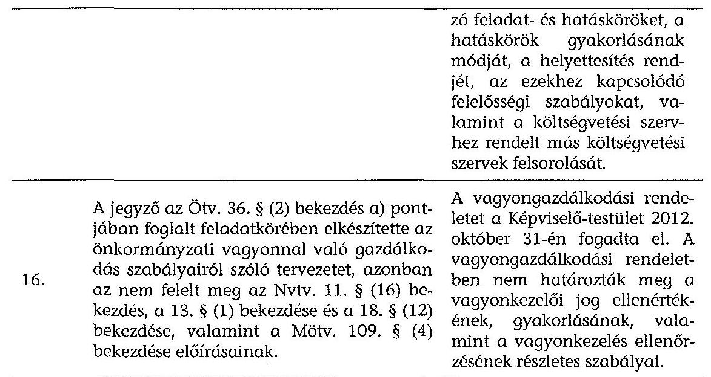
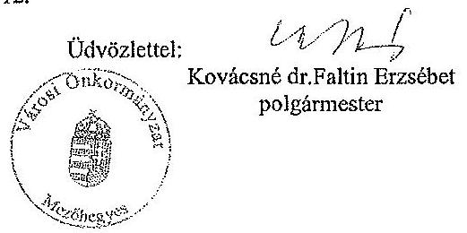
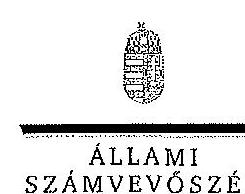
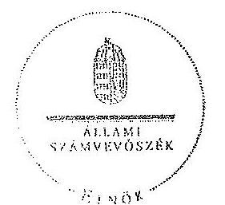

# ÁLLAMI   SZÁMVEVŐSZÉK 

## JELENTÉS

az önkormányzatok belső kontrollrendszere kialakításának, egyes kontrolltevékenységek és a belső ellenőrzés
működésének - 2013. évben induló - ellenőrzéséről Mezőhegyes

---

# Állami Számvevőszék 

Iktatószám: V-0179-049/2014.
Témaszám: 1190
Vizsgálat-azonosító szám: V064923

## Az ellenőrzést felügyelte:

## dr. Benedek Mária

felügyeleti vezető
Az ellenőrzést vezette és az ellenőrzés végrehajtásáért felelős:
dr. Veress Tiborné
ellenőrzésvezető
A számvevőszéki jelentés összeállításában közreműködtek:
Halkóné Dr. Berkó Katalin
számvevő
Pető Krisztina
Számvevő tanácsos
Az ellenőrzést végezték:
dr. Zsolnay András
Halkóné Dr. Berkó Katalin
számvevő

---

# TARTALOMJEGYZÉK 

BEVEZETÉS ..... 5
I. ÖSSZEGZŐ MEGÁLLAPÍTÁSOK, KÖVETKEZTETÉSEK, JAVASLATOK ..... 9
II. RÉSZLETES MEGÁLLAPÍTÁSOK ..... 16

1. Az önkormányzat belső kontrollrendszerének kialakítása ..... 16
1.1. A kontrollkörnyezet ..... 16
1.2. A kockázatkezelési rendszer ..... 17
1.3. A kontrolltevékenységek ..... 17
1.4. Az információs és kommunikációs rendszer ..... 19
1.5. A monitoring rendszer ..... 19
2. A pénzügyi folyamatokban kulcsszerepet betöltő teljesítésigazolás és érvényesítés belső kontrollok működése ..... 20
3. A belső ellenőrzés működése ..... 21

## MELLÉKLETEK

1. számú Az észrevételt tartalmazó polgármesteri levél
2. számú Az észrevételre vonatkozó elnöki válaszlevél

## FÜGGELÉKEK

1. számú Értelmező szótár
2. számú Az értékelés módja és szempontjai

---

.

---

# RÖVIDÍTÉSEK JEGYZÉKE 

## Törvények

Áht.
ÁSZ tv.
Kttv.
Mötv.
Nvtv.
Ötv.

## Rendeletek

Áhsz.

Ávr.

Bkr.
vagyongazdálkodási rendelet

## Szórövidítések

2013. évi ellenőrzési terv
adatvédelmi és adatbiztonsági szabályzat
aljegyző
ÁSZ
belső ellenőrzési kézikönyv
éves ellenőrzési jelentés

FEUVE
gazdálkodási szabályzat
2011. évi CXCV. törvény az államháztartásról (hatályos 2012. január 1-jétől)
2011. évi LXVI. törvény az Állami Számvevőszékről (hatályos 2011. július 1-jétől)
2011. évi CXCIX. törvény a közszolgálati tisztviselők ről (hatályos 2012. március 1-jétől)
2011. évi CLXXXIX. törvény Magyarország helyi önkormányzatairól (hatályos 2012. január 1-jétől)
2011. évi CXCVI. törvény a nemzeti vagyonról (hatályos 2011. december 31-étől.)
1990. évi LXV. törvény a helyi önkormányzatokról
249/2000. (XII. 24.) Korm. rendelet az államháztartás szervezetei beszámolási és könyvvezetési kötelezettségének sajátosságairól
368/2011. (XII. 31.) Korm. rendelet az államháztartásról szóló törvény végrehajtásáról (hatályos 2012. január 1-jétől)
370/2011. (XII. 31.) Korm. rendelet a költségvetési szervek belső kontrollrendszeréről és belső ellenőrzéséről (hatályos 2012. január 1-jétől)
Mezőhegyes Város Önkormányzata Képviselőtestületének 16/2012. (X. 31.) számú rendelete az önkormányzat vagyonáról és a vagyongazdálkodás szabályairól (hatályos 2012. december 1-jétől)

Mezőhegyes Város Önkormányzat 2013. évi ellenőrzési terve (426/2012. (X. 30.) Kt. határozat)
Mezőhegyes Város Önkormányzata Polgármesteri Hivatala Közszolgálati adatvédelmi szabályzata (hatályos 2011. február 1-jétől)

Mezőhegyes Városi Önkormányzat aljegyzője
Állami Számvevőszék
Dél-Békési Többcélú Kistérségi Társulásba tartozó Önkormányzatok Belső ellenőrzési Kézikönyve (hatályos 2012. február 1-jétől)

Mezőhegyes Város Önkormányzata 2012. évi éves belső ellenőrzési tevékenységéről az éves belső ellenőrzési jelentés (0056/2012)
Mezőhegyes Város Önkormányzat Polgármesteri Hivatala Folyamatba épített, előzetes és utólagos vezetői ellenőrzés Szabályzata (hatályos 2010. július 1-jétől)
Mezőhegyes Város Polgármesteri Hivatala Szervezeti és Működési Szabályzata 10. függeléke (hatályos 2011. jú-

---

|  | nius 1-jétől) |
| :--: | :--: |
| hivatali SZMSZ | Mezőhegyes Város Önkormányzat Polgármesteri Hivatala   Szervezeti és Működési Szabályzata (hatályos 2009.   szeptember 1-jétől) |
| INTOSAI | International Organization of Supreme Audit Institutions   (Legfőbb Ellenőrző Intézmények Nemzetközi Szervezete) |
| iratkezelési szabályzat | Mezőhegyes Város Önkormányzat Polgármesteri Hivatala   Iratkezelési Szabályzata (hatályos 2012. január 1-jétől) |
| ISSAI | International Standards of Supreme Audit Institutions   (Legfőbb Ellenőrző Intézmények Nemzetközi Standardjai) |
| jegyző | Mezőhegyes Városi Önkormányzat jegyzője |
| Képviselő-testület   kockázatkezelési sza-   bályzat | Mezőhegyes Városi Önkormányzat Képviselő-testülete |
| Kormányhivatal | FEUVE X. fejezet |
| NGM | Békés Megyei Kormányhivatal |
| Önkormányzat   polgármester | Nemzetgazdasági Minisztérium   Mezőhegyes Városi Önkormányzat |
| Polgármesteri Hivatal | Mezőhegyes Városi Önkormányzat polgármestere   Mezőhegyes Városi Önkormányzat Polgármesteri Hivatala |
| stratégiai ellenőrzési   terv | Stratégiai Terv a Dél-Békési Többcélú Kistérségi Társulás   belső ellenőrzésére vonatkozóan 2012-2015. évekre (hatá-   lyos 2012. október 12-től) |
| Társulás | Dél-Békési Többcélú Kistérségi Társulás (hatályos 2011.   június 30-tól) |

---

# JELENTÉS 

## az önkormányzatok belső kontrollrendszere kialakításának, egyes kontrolltevékenységek és a belső ellenőrzés működésének - 2013. évben induló - ellenőrzéséről Mezőhegyes

## BEVEZETÉS

Mezőhegyes város állandó lakosainak száma 2012. január 1-jén 5713 fő volt. Az Önkormányzat nyolctagú Képviselő-testületének munkáját három állandó bizottság segítette. Az Önkormányzat az önállóan működő és gazdálkodó Polgármesteri Hivatalon kívül három önállóan működő és gazdálkodó intézményt működtetett, többségi tulajdoni hányaddal gazdasági társasággal nem rendelkezett. A polgármester a 2010. évi önkormányzati választások óta tölti be tisztségét. A jegyző 2006. október 1-jétől látja el a jegyzői feladatokat. A Polgármesteri Hivatal szervezeti egységekre nem tagolódott, elkülönített gazdasági szervezettel nem rendelkezett. A foglalkoztatott köztisztviselők száma 2012. január 1-jén 29 fő volt. A Polgármesteri Hivatalnál 2013. január 1-jétől szervezeti változás, átalakítás nem volt. Az Önkormányzat a 2012. évi költségvetési beszámolója szerint 1264045 ezer Ft költségvetési bevételt ért el, valamint 1331540 ezer Ft költségvetési kiadást teljesített. A 2012. december 31-i könyvviteli mérleg szerint 2852805 ezer Ft értékű eszközvagyonnal rendelkezett, a rövid lejáratú kötelezettségállománya 163263 ezer Ft, a hosszú lejáratú kötelezettsége 31164 ezer Ft volt.

A demokratikus társadalmakban alapvető igény, hogy a közpénzeket, a közvagyont használók tevékenységükről elszámoljanak, ahhoz egyértelmű és érvényesíthető felelősségi szabályok társuljanak. Ennek a jogos igénynek az érvényesítéséhez meg kell teremteni azokat a folyamatokat, rendszereket, amelyek nélkülözhetetlenek az elszámoltatáshoz. Az elszámoltatás eredményes működtetéséhez szükség van a megfelelő információs, kontroll, értékelési és beszámolási rendszerek kialakítására.

Magyarországon az uniós csatlakozási tárgyalások idejére nyúlnak vissza a belső kontrollrendszer szabályozásának gyökerei. Az uniós elvárásoknak megfelelő új terminológia szerinti államháztartási belső pénzügyi ellenőrzési (ÁBPE) rendszer területén a jogharmonizáció 2003-ban teljes körűen megvalósult, míg az önkormányzati alrendszerre vonatkozó, az Ötv.-ben megjelenített speciális szabályozás 2005-ben lépett hatályba. Az államháztartási belső kontrollrendszer koncepciója 2009-ben továbbfejlődött. A változások irányát mutatja, hogy a költségvetési szervek belső kontrollrendszere már magában foglalja a korszerű, felelős szervezetirányítás elemeit (kontrollkörnyezet, kockázatkezelés, kontrolltevékenység, információ és kommunikáció, monitoring) is. E kontrollrendszer szabályozása háromszintű, a törvényi előírásokat az Áht. és a Mötv., a rendeleti szintű szabályozást az Ávr. és a Bkr. tartalmazza, amelyeket útmutatói szinten az NGM által kiadott standardok és kézikönyvek támogatnak.

A belső kontrollrendszer azt a célt szolgálja, hogy a költségvetési szervek működésük és gazdálkodásuk során a tevékenységeket szabályszerűen, gazdaságosan, hatékonyan és eredményesen hajtsák végre, teljesítsék elszámolási kötelezettségeiket és megvédjék az erőforrásokat a veszteségektől, a károktól és a nem rendeltetésszerű használattól. A belső kontrollrendszer magában foglalja mindazon szabályokat, eljárásokat, gyakorlati módszereket és szervezeti struktúrákat, kockázatkezelési technikákat, kontrolltevékenységeket, amelyek segítséget nyújtanak a szervezetnek céljai eléréséhez.

Az ÁSZ a 2011-2015. évekre szóló stratégiájában hangsúlyos szerepet szánt annak, hogy szilárd szakmai alapon álló, értékteremtő ellenőrzéseivel előmozdítsa a közpénzügyek átláthatóságát, rendezettségét. A számvevőszéki ellenőrzés nemzetközi alapelvei is rögzítik, hogy a megfelelő belső kontrollrendszer minimálisra csökkenti a hibák és szabálytalanságok kockázatát.

Az ellenőrzés célja annak megállapítása volt, hogy a belső kontrollrendszer elemeinek kialakítása, a pénzügyi folyamatokban kulcsszerepet betöltő teljesítésigazolás és érvényesítés és a belső ellenőrzés szabályos működése biztosította-e az Önkormányzatnál a közpénzfelhasználás szabályosságát, hozzájárult-e az értéket teremtő rend követelményének érvényesüléséhez.

Ennek keretében értékeltük, hogy:

- a jogszabályi előírásoknak megfelelően alakították-e ki a belső kontrollrendszer elemeit;
- a gazdálkodás folyamatában kulcsszerepet betöltő teljesítésigazolás és érvényesítés kontrolltevékenységeit megfelelően működtették-e;
- biztosították-e a belső ellenőrzés szabályos működését;
- amennyiben az ÁSZ tett javaslatot a 2008-2011. évek közötti ellenőrzése kapcsán az Önkormányzatnak, intézkedtek-e azok végrehajtására.

Az ellenőrzés várható hasznosulását négy szinten tervezzük. A törvényalkotás számára összegzett tapasztalatok állnak rendelkezésre a belső kontrollrendszer önkormányzati területen való kialakításáról, működéséről és hatásairól, a belső ellenőrzés működéséről. Ennek alapján következtetést lehet levonni arról, hogy a belső kontrollrendszer kialakítására és működtetésére vonatkozó jelenlegi, differenciálás nélküli jogszabályi előírások reális követelményeket támasztanak-e az eltérő adottságú települési önkormányzatok esetében, illetve indokolt-e esetleges jogszabályi módosítás kezdeményezése. Az ellenőrzés az ellenőrzött számára visszajelzést ad a belső kontrollrendszer kialakításában és működésében fellépő hiányosságokról, javaslataival hozzájárul azok kiküszöböléséhez, amely csökkentheti a későbbi ellenőrzések gyakoriságát. Az ellenőrzés megállapításait és javaslatait más szervezetek is hasznosíthatják a

---

rendezett gazdálkodási keretek kialakításához. A társadalom számára jelzi, hogy közpénz nem maradhat ellenőrizetlenül, az ÁSZ értékteremtő rend kialakításához és megőrzéséhez hozzájáruló tevékenysége pozitív hatással lesz a szervezetről kialakított összkép formálásában. A szervezeten belül lehetőség nyílik arra, hogy a megállapítások szintetizálásával az ÁSZ a hozzáadott értéket teremtő elemző tevékenységét és tanácsadó szerepét is erősítse.

Az önkormányzatok belső kontrollrendszere kialakításának, egyes kontrolltevékenységek és a belső ellenőrzés működésének ellenőrzéséről szóló jelentés I. fejezetének összegző része az ellenőrzés céljára ad rövid, szintetizáló összefoglalót, és tartalmazza a következtetéseket a II. fejezet részletes megállapításain alapulóan. A jelentés intézkedést igénylő megállapításait és javaslatait az ellenőrzés során feltárt, a jelentés II. fejezetében rögzített részletes megállapítások alapozzák meg. A helyszíni ellenőrzés lezárásáig a helyi szabályozás változásait nyomon követtük.

Az ellenőrzés típusa: szabályszerűségi ellenőrzés.
Az ellenőrzött időszak: a belső kontrollrendszer kialakításának megfelelősége esetében a 2012. évre, a pénzügyi folyamatokban kulcsszerepet betöltő teljesítésigazolás és érvényesítés belső kontrollok működésének megfelelőségét és a belső ellenőrzés szabályszerű működését a 2012. január 1. és december 31-e közötti időszak eseményeit figyelembe véve értékeltük, míg az ÁSZ javaslatainak utóellenőrzése a 2008-2011. években végzett ellenőrzések nyilvánosságra hozott jelentéseiben tett javaslatok áttekintésére terjedt ki.

# Az ellenőrzött szervezet: az Önkormányzat. 

Az ellenőrzés jogszabályi alapját az ÁSZ tv. 1. § (3) bekezdése, az 5. § (2) és (6) bekezdései, valamint az Áht. 61. § (2) bekezdésének előírásai képezik.

Az ellenőrzés szakmai módszertana az ÁSZ hivatalos honlapján (www.asz.hu) közzétett szakmai szabályokon alapult, amely az INTOSAI által kiadott ISSAI figyelembevételével készült.

Az ellenőrzés lefolytatásához az Önkormányzat a kimutatások és a tanúsítvány elektronikus kitöltésével, valamint az ÁSZ által kért dokumentumok elektronikus megküldésével szolgáltatott adatokat. Az így rendelkezésre bocsátott adatok, információk kontrollja és a munkalapok kitöltése a helyszíni ellenőrzés keretében történt. A jelentésben használt fogalmak magyarázatát az 1. számú függelék, az ellenőrzés egyes területeinek értékelésénél alkalmazott egységes minősítési szempontokat a 2. számú függelék tartalmazza.

A belső kontrollrendszer kialakításának ellenőrzése során értékeltük a kontrollkörnyezet, a kockázatkezelési rendszer, a kontrolltevékenységek, az információs és kommunikációs rendszer, valamint a monitoring rendszer szabályozottságának megfelelőségét. A pénzügyi folyamatokban kulcsszerepet betöltő teljesítésigazolás és érvényesítés kontrollok működése megfelelőségének minősítéséhez az állományba nem tartozók megbízási díjai, a külső szolgáltatók által végzett karbantartási, kisjavítási munkák, az egyéb üzemeltetési és fenntartási szolgáltatások, a rendszeres szociális segélyek, valamint az államháztartáson

---

kívülre teljesített működési és felhalmozási célú pénzeszközátadások közül kockázatelemzéssel választottuk ki az ellenőrzött kiadási jogcímeket. Az egyszerű véletlen mintavétellel kiválasztott tételek ellenőrzését többlépcsős megfelelőségi tesztek útján addig végeztük, amíg elegendő és megfelelő bizonyítékot szereztünk a vizsgált folyamatok kulcskontrolljai működésének megfelelő vagy nem megfelelő voltáról. Értékeltük az Önkormányzatnál a belső ellenőrzés működésének szabályosságát. Utóellenőrzésre nem került sor, mivel az ÁSZ az Önkormányzatnál a 2008-2011. évek között ellenőrzést nem végzett.

Az Ász tv. 29. § (1) bekezdése szerint a jelentéstervezetet megküldtük a polgármester részére, aki az ÁSZ tv. 29. § (2) bekezdésében foglalt észrevételezési jogával élt,
 a jelentéstervezetre észrevételt tett. Az ÁSZ tv. 29. § (3) bekezdésében előírtaknak megfelelően a figyelembe nem vett észrevételeket és annak indokairól szóló tájékoztatást a jelentés tartalmazza (2. számú melléklet).

---

# I. ÖSSZEGZŐ MEGÁLLAPÍTÁSOK, KÖVETKEZTETÉSEK, JAVASLATOK 

A belső kontrollrendszeren belül 2012-ben a kontrollkörnyezet, a kockázatkezelési rendszer, a kontrolltevékenységek, az információs és kommunikációs rendszer, valamint a monitoring rendszer kialakítását külön-külön és együttesen is értékeltük. A belső kontrollrendszer kialakítása az összesített értékelés alapján nem felelt meg a jogszabályi előírásoknak.

A belső kontrollrendszer egyes területei kialakításának minősítése a következő:

| Kontrollterület | Minősítés |
| :-- | :--: |
| Kontrollkörnyezet | nem   megfelelő |
| Kockázatkezelési rendszer | részben   megfelelő |
| Kontrolltevékenységek | részben   megfelelő |
| Információs és kommunikációs rendszer | megfelelő |
| Monitoring rendszer | nem   megfelelő |

Megfelelőnek értékeltük az információs és kommunikációs rendszer kialakítását, mivel a jogszabályi előírásokban foglaltakat figyelembe véve a kisebb hiányosságok ellenére is hozzájárult az információs rendszerek keretében a beszámolási rendszerek megbízható működéséhez.

Részben megfelelőnek értékeltük a kockázatkezelési rendszer és a kontrolltevékenységek kialakítását, mivel az ellenőrzésünk által megállapított szabályozásbeli hiányosságok nem veszélyeztették a Polgármesteri Hivatal, ezáltal az Önkormányzat céljainak elérését.

Nem megfelelőnek értékeltük a kontrollkörnyezet és a monitoring rendszer kialakítását, mivel az ellenőrzésünk során megállapított szabályozásbeli hiányosságok magukban hordozzák a szabálytalan működés és gazdálkodás, valamint a korrupció kockázatát.

A belső kontrollrendszer nem megfelelő kialakítása kockázatot jelent az Önkormányzat feladatainak szabályszerű, gazdaságos, hatékony és eredményes végrehajtása során.

Az állományba nem tartozók megbízási díjaival, valamint a külső szolgáltatók által végzett karbantartási, kisjavítási munkákkal kapcsolatos kifizetések során a pénzügyi folyamatokban kulcsszerepet betöltő teljesítésigazolás és érvényesítés belső kontrollok működése gyenge volt. Gyengének értékeltük a

---

két kulcskontroll együttes működését, mert azok nem biztosították az ellenőrzésünk által feltárt hiányosságok bekövetkezésének megelőzését.

A számvevőszéki ellenőrzés az ellenőrzött kifizetésekkel összefüggésben a rendelkezésre bocsátott dokumentumok alapján kár bekövetkeztére utaló adatot, tényt nem állapított meg, azonban a gazdálkodásban kulcsszerepet betöltő kontrollok gyenge működése miatt fennáll a hibák bekövetkezésének lehetősége. A nem megfelelően szabályozott és működtetett belső kontrollok korrupciós kockázatot hordoznak.

Az Önkormányzat a belső ellenőrzési feladatokat - képviselő-testületi döntés alapján - a Társulás útján látta el. A belső ellenőrzés működése a jogszabályi előírásoknak megfelelt, azonban nem volt pozitív visszahatással a kontrollrendszer elemeire. Nem tárta fel a számvevőszéki ellenőrzés során a kontrollkörnyezet és a monitoring rendszer kialakításánál, valamint a pénzügyi folyamatokban kulcsszerepet betöltő teljesítésigazolás és érvényesítés belső kontrollok működésénél megállapított hiányosságokat.

Az ÁSZ tv. 33. § (1) bekezdésében foglaltak értelmében az ellenőrzött szervezet vezetője köteles a jelentésben foglalt megállapításokhoz kapcsolódó intézkedési tervet összeállítani, és azt a jelentés kézhezvételétől számított 30 napon belül az ÁSZ részére megküldeni. Amennyiben az intézkedési tervet határidőre nem küldi meg a szervezet, vagy az ÁSZ tv. 33. § (2) bekezdésében foglalt póthatáridő elteltével megküldött intézkedési terv továbbra sem elfogadható, az ÁSZ elnöke a hivatkozott törvény 33. § (3) bekezdés a)-b) pontjaiban foglaltakat érvényesítheti.

Az ellenőrzés intézkedést igénylő megállapításai és javaslatai:

# a polgármesternek 

1. Az Önkormányzat nevében történt kötelezettségvállalást a kifizetéseket megelőzően - az Áht. 37. § (1) bekezdésének és az Ávr. 55. § (1) bekezdésének előírása ellenére nem ellenjegyezték.

Javaslat
Intézkedjen arról, hogy az Önkormányzat nevében történt kötelezettségvállalásra az Áht. 37. § (1) bekezdésében és az Ávr. 55. § (1) bekezdésében foglaltaknak megfelelően - az Ávr. 53. §-ában meghatározott kivételeket figyelembe véve - kizárólag a pénzügyi ellenjegyzés után, a pénzügyi teljesítés esedékességét megelőzően, írásban kerüljön sor.
2. A számvevőszéki ellenőrzés megállapításai alapján az Önkormányzatnál a belső kontrollrendszer kialakítása összefoglalóan értékelve nem felelt meg a jogszabályi előírásoknak, a kulcskontrollok működése gyenge volt, a belső ellenőrzés működése ugyan megfelelt a jogszabályi előírásoknak, azonban nem tárta fel, ezáltal nem is javíttatta ki a hiányosságokat. A megállapított szabályozásbeli és működésbeli hiányosságok magukban hordozzák a szabálytalan működés kockázatát.

---

Javaslat:
A Mötv. 115. § (1) bekezdésében foglaltak alapján kísérje figyelemmel az Önkormányzat gazdálkodásának szabályszerűségét. A Mötv. 67. § f) pontja alapján gondoskodjon a belső kontrollrendszer működésére vonatkozó jogszabályi rendelkezések be nem tartása, valamint a teljesítésigazolás, illetve az érvényesítés kontrollokkal összefüggésben feltárt hiányosságok, szabálytalanságok tekintetében az esetleges munkajogi felelősséggel kapcsolatos körülmények kivizsgálásáról, majd a vizsgálat eredményének függvényében tegye meg a szükséges intézkedéseket.

# a Jegyzõnek 

1. a kontrollkörnyezettel kapcsolatban:

A hivatali SZMSZ-ben az Ávr. 13. § (1) bekezdés c) pontja alapján az ellátandó alaptevékenységek, rendszeresen ellátott vállalkozási tevékenységek szakfeladatrend szerinti szakfeladat száma és megnevezése nem felelt meg az 56/2011. (XII. 31.) NGM rendeletben foglaltaknak, valamint az alaptevékenységet szabályozó jogszabályi hivatkozások nem feleltek meg a hatályos jogszabályoknak. A hivatali SZMSZ nem tartalmazta az Ávr. 13. § (1) bekezdés e), f), g) és i) pontjaiban foglalt előírások ellenére a költségvetési szerv szervezeti ábráját, azon ügyköröket, amelyek során a szervezeti egységek vezetői a költségvetési szerv képviselőjeként járhatnak el, a szervezeti és működési szabályzatban nevesített valamennyi munkakörhöz tartozó feladat- és hatásköröket, a hatáskörök gyakorlásának módját, a helyettesítés rendjét, az ezekhez kapcsolódó felelősségi szabályokat, valamint a költségvetési szervhez rendelt más költségvetési szervek felsorolását.

A jegyző az Ötv. 36. § (2) bekezdés a) pontjában foglalt feladatkörében elkészítette az önkormányzati vagyonnal való gazdálkodás szabályairól szóló tervezetet, azonban az nem felelt meg az Nvtv. 11. § (16) bekezdése, a 13. § (1) bekezdése és a 18. § (12) bekezdése, valamint a Mötv. 109. § (4) bekezdése előírásainak.

Javaslat:
a) Készítse el a hivatali SZMSZ módosítását annak érdekében, hogy az tartalmazza az Ávr. 13. § (1) bekezdésében előírt valamennyi tartalmi elemet, és kezdeményezze az Áht. 9. § (1) bekezdés a) pontjában foglaltakra tekintettel a Képviselőtestület elé terjesztését.
b) Készítse elő a Mötv. 81. § (3) bekezdés c) pontjában foglalt feladatkörében a vagyongazdálkodási rendelet módosításának tervezetét, és kezdeményezze a Képviselő-testület elé terjesztését annak érdekében, hogy az megfeleljen az Nvtv. 11. § (16) bekezdése, 13. § (1) bekezdése, 18. § (12) bekezdése előírásainak és a Mötv. 109. § (4) bekezdésében foglaltaknak.
2. a kockázatkezelési rendszerrel kapcsolatban:

A jegyző a Bkr. 7. § (2) bekezdésében foglaltak ellenére nem mérte fel és nem állapította meg a Polgármesteri Hivatal tevékenységében, gazdálkodásában rejlő kockázatokat, továbbá nem határozta meg az egyes kockázatokkal kapcsolatban szükséges intézkedéseket.

Javaslat:
Mérje fel és állapítsa meg a Bkr. 7. § (2) bekezdésében foglaltak alapján a Polgármesteri Hivatal tevékenységében, gazdálkodásában rejlő kockázatokat, határozza meg az egyes kockázatokkal kapcsolatban szükséges intézkedéseket.
3. a kontrolltevékenységekkel kapcsolatban:

A jegyző az Ávr. 13. § (2) bekezdés a) pontjában foglaltak ellenére nem rendezte belső szabályzatban a pénzügyi ellenjegyzés módjával kapcsolatos belső előírásokat és feltételeket.

A jegyző - az Ávr. 53. § (2) bekezdésében foglaltak ellenére - nem határozta meg az előzetes írásbeli kötelezettségvállalást nem igénylő kifizetések rendjét, annak ellenére, hogy a belső szabályozásban lehetővé tette az 50 ezer Ft-ot el nem érő kifizetések előzetes írásbeli kötelezettségvállalás nélküli teljesítését.

Az Ávr. 13. § (2) bekezdés a) pontjában előírtak alapján készített belső szabályzatban az utalvány kötelező tartalmi elemére vonatkozó előírás nem volt összhangban az Ávr. 59. § (3) bekezdés c), e) és f) pontokban foglalt előírásokkal, mert a szabályzatban kötelező tartalmi elemként nem írták elő a kedvezményezett címét, a megterhelendő és jóváírandó fizetési számla megnevezését, valamint a kötelezettségvállalás nyilvántartási számát.

A jegyző - a Bkr. 8. § (4) bekezdés b) pontjában foglaltak ellenére - a belső szabályzatokban nem határozta meg a dokumentumokhoz és információkhoz való hozzáférés tekintetében a felelősségi köröket.

A jegyző pénzügyi ellenjegyzési feladat ellátására az Ávr. 55. § (3) bekezdésében előírt iskolai végzettséggel, illetve szakképesítéssel nem rendelkező személyt jelölt ki.

A jegyző - a Kttv. 74. § (1) bekezdésében foglaltak ellenére - jogviszony megszűnése esetére nem szabályozta a munkavállaló folyamatban lévő feladatai átadásának rendjét.

Javaslat:
a) Rendezze belső szabályzatban az Ávr. 13. § (2) bekezdés a) pontjában foglaltak alapján a pénzügyi ellenjegyzés gyakorlásának eljárási és dokumentációs részletszabályaival kapcsolatos belső előírásokat és feltételeket.
b) Rögzítse belső szabályzatban az Ávr. 53. § (2) bekezdése alapján az előzetes írásbeli kötelezettségvállalást nem igénylő kifizetések rendjét.
c) Gondoskodjon arról, hogy az Ávr. 13. § (2) bekezdés a) pontjában foglaltak alapján készített belső szabályzatban az utalvány kötelező tartalmi elemeire vonatkozó előírás legyen összhangban az Ávr. 59. § (3) bekezdésében foglaltakkal.

---

d) Szabályozza a Bkr. 8. § (4) bekezdés b) pontja alapján a dokumentumokhoz és információkhoz való hozzáférés esetében a felelősségi köröket.
e) Gondoskodjon arról, hogy pénzügyi ellenjegyzést az Ávr. 55. § (3) bekezdésében előírt iskolai végzettséggel, illetve szakképesítéssel rendelkező személy végezzen.
f) Szabályozza a Kttv. 74. § (1) bekezdésében foglaltak alapján a jogviszony megszűnése esetére a munkavállaló folyamatban lévő feladatai átadásának rendjét.
4. a monitoring rendszerrel kapcsolatban:

A jegyző - a Bkr. 3. § e) pontjában és 10. §-ában foglaltak ellenére - nem alakított ki a Polgármesteri Hivatal tevékenységének, a célok megvalósításának nyomon követését biztosító rendszert.

Javaslat:
Alakítsa ki és működtesse a Bkr. 3. § e) pontjában és 10. §-ában előírtak alapján a Polgármesteri Hivatal tevékenységének, a célok megvalósításának nyomon követését biztosító rendszert.
5. a pénzügyi folyamatokban kulcsszerepet betöltő kontrollokkal kapcsolatban:

A teljesítésigazolást - az Ávr. 57. § (1) bekezdésében foglaltak ellenére - ellenőrizhető okmányok hiányában végezték, így a kiadások jogosságának, összegszerűségének és az ellenszolgáltatás teljesítésének igazolása nem szabályszerűen történt.

Az érvényesítés az Ávr. 58. § (3) bekezdésében előírtak ellenére nem volt szabályszerű, mivel az Ávr. 60. § (3) bekezdése szerint vezetett nyilvántartás (aláírásminta) alapján nem volt megállapítható, hogy a keltezéssel ellátott aláírás az érvényesítésre kijelölt személytől származott. Az érvényesítő - az Ávr. 58. § (2) bekezdésében rögzítettek ellenére - az utalványozónak nem jelezte, hogy a megelőző ügymenetben a teljesítésigazolás nem szabályszerűen történt, továbbá hogy a Polgármesteri Hivatal nevében történt kötelezettségvállalásokra - az Áht. 37. § (1) bekezdése és az Ávr. 55. § (1) bekezdése ellenére - pénzügyi ellenjegyzés nélkül került sor, valamint hogy a bizonylatokon nem tüntették fel - az Ávr. 59. (3) bekezdés f) pontjában és (4) bekezdésében előírtak ellenére - a kötelezettségvállalás nyilvántartási számát, mivel az Ávr. 56. § (1) bekezdés előírása ellenére a kötelezettségvállalást követően nem gondoskodtak annak egyedileg azonosítható módon történő nyilvántartásba vételéről.

Javaslat:
Intézkedjen - a teljesítésigazolás és az érvényesítés vonatkozásában feltárt hiányosságok megszüntetése, illetve az operatív gazdálkodás során a működésbeli hibák megelőzése, feltárása és kijavítása érdekében - arról, hogy
a) az Ávr. 57. § (1) és (3) bekezdésében előírtaknak megfelelően, ellenőrizhető okmányok alapján ellenőrizzék és igazolják a kiadások teljesítésének jogosságát, összegszerűségét, az ellenszolgáltatást is magában foglaló kötelezettségvállalás esetén annak teljesítését;

---

b) kötelezettségvállalásra az Áht. 37. § (1)
 és az Ávr. 55. § (1) bekezdésében foglaltaknak megfelelően - az Ávr. 53. §-ában meghatározott kivételeket figyelembe véve - kizárólag a pénzügyi ellenjegyzés után, a pénzügyi teljesítés esedékességét megelőzően, írásban kerüljön sor;
c) az érvényesítő a kifizetéseket megelőzően az Ávr. 58. § (1) bekezdésében előírt teljesítésigazolás alapján ellenőrizze - az Ávr. 57. § (3) bekezdése szerinti esetben annak hiányában is - az összegszerűségnek, a fedezet meglétének és a megelőző ügymenetben az Áht., az Áhsz., az Ávr. előírásai és a belső szabályzatokban foglaltaknak a betartását;
d) az érvényesítő az Ávr. 58. § (2) bekezdésében foglaltak alapján jelezze az utalványozónak, ha az Áht., az Áhsz., az Ávr., vagy a belső szabályzatokban foglalt előírások megsértését tapasztalja;
e) a kötelezettségvállalások nyilvántartását az Ávr. 56. § (1) bekezdésében foglalt előírásnak megfelelően vezessék, és az utalványon az Ávr. 59. § (3) bekezdésében foglalt kötelező tartalmi elemeket tüntessék fel;
f) az érvényesítőnek az utalványrendeleten szereplő, az Ávr. 58. § (3) bekezdésében előírt aláírása egyezzen meg az Ávr. 60. § (3) bekezdésében foglaltak szerinti aláírás-mintával.
6. a belső ellenőrzés működésével kapcsolatban:

Az Önkormányzat a belső ellenőrök tekintetében nem rendelkezett a Bkr. 24. § (2) és (5) bekezdésében előírt szakképzettséget és szakmai gyakorlatot igazoló dokumentummal.

Az éves ellenőrzési terv a Bkr. 31. § (4) bekezdés a) pontjában foglaltak ellenére nem tartalmazta az ellenőrzési tervet megalapozó elemzések és a kockázatelemzés eredményének összefoglaló bemutatását.

A Bkr. 31. § (2) bekezdésében foglaltak ellenére az éves ellenőrzési tervet kockázatelemzés nem alapozta meg.

A Bkr. 22. § (2) bekezdés b) és e) pontjában valamint az 50. §-ában foglalt előírásokat figyelmen kívül hagyva, a belső ellenőrzési vezető az elvégzett belső ellenőrzésekről nyilvántartást nem vezetett. Továbbá a Bkr. 21. § (2) bekezdés d) pontjában és a 47. § (1) bekezdésben foglaltak ellenére az ellenőrzési jelentésekben szereplő megállapítások, javaslatok, valamint az intézkedési tervek nyilvántartásáról és azok nyomon követéséről nem gondoskodott.

Az éves ellenőrzési jelentés a Bkr. 48. § b) pontjában foglaltak ellenére nem tartalmazta a belső kontrollrendszer szabályszerűségének, gazdaságosságának, hatékonyságának és eredményességének növelése, javítása érdekében tett fontosabb javaslatokat, valamint a belső kontrollrendszer öt elemének értékelését.

---

Javaslat:
a) Intézkedjen, hogy a belső ellenőri feladatok ellátását a Bkr. 24. § (2) és (5) bekezdésében előírt képesítéssel és szakmai gyakorlattal rendelkező személyek végezzék.
b) Intézkedjen, hogy az éves ellenőrzési tervek tartalmazzák a Bkr. 31. § (4) bekezdésében előírt tartalmi elemeket.
c) Gondoskodjon arról, hogy az éves ellenőrzési terv a Bkr. 22. § (1) bekezdés b) pontja, a 29. § (1) és a 31. § (2) bekezdése alapján kockázatelemzésen alapuljon.
d) Kezdeményezze, hogy a belső ellenőrzési vezető a Bkr. 22. § (2) bekezdése b) és e) pontjában valamint az 50. §-ában foglaltak alapján az elvégzett ellenőrzésekről nyilvántartást vezessen.
e) Kezdeményezze, hogy a belső ellenőrzési vezető a Bkr. 21. § (2) bekezdés d) pontjában és a 47. § (1) bekezdésében foglaltaknak megfelelően vezessen nyilvántartást a belső ellenőrzési jelentésekben tett megállapításokról, javaslatokról, a vonatkozó intézkedési tervekről, és kövesse nyomon azok végrehajtását.
f) Intézkedjen, hogy az éves ellenőrzési jelentés a Bkr. 48. § b) pontjában foglalt előírásnak megfelelően tartalmazza a belső kontrollrendszer szabályszerűségének, gazdaságosságának, hatékonyságának és eredményességének növelése, javítása érdekében tett fontosabb javaslatokat, valamint a belső kontrollrendszer öt elemének értékelését.

---

# II. RÉSZLETES MEGÁLLAPÍTÁSOK 

## 1. AZ ÖNKORMÁNYZAT BELSŐ KONTROLLRENDSZERÉNEK KIALAKÍTÁSA

A belső kontrollrendszeren belül 2012-ben a kontrollkörnyezet, a kockázatkezelési rendszer, a kontrolltevékenységek, az információs és kommunikációs rendszer, valamint a monitoring rendszer kialakítását külön-külön és együttesen is értékeltük. A belső kontrollrendszer kialakítása az összesített értékelés alapján nem felelt meg a jogszabályi előírásoknak.

### 1.1. A kontrollkörnyezet

A kontrollkörnyezet kialakítása - a 2. számú függelékben részletezett kritériumrendszer alapján végzett értékelés szerint - a jogszabályi előírásoknak nem felelt meg, mert:

| Sorszám ${ }^{1}$ | Megállapítás | Megjegyzés |
| :--: | :--: | :--: |
| 5. | Az ellenőrzött időszakban - 2009. október 1-jétől - hatályos hivatali SZMSZ nem felelt meg az Ávr. 13. § (1) bekezdés előírásainak. | A hivatali SZMSZ-ben az Ávr. 13. § (1) bekezdés c) pontja alapján az ellátandó alaptevékenységek, rendszeresen ellátott vállalkozási tevékenységek szakfeladatrend szerinti szakfeladat száma és megnevezése nem felelt meg az 56/2011. (XII. 31.) NGM rendeletben foglaltaknak, valamint az alaptevékenységet szabályozó jogszabályi hivatkozások nem feleltek meg a hatályos jogszabályi előírásoknak. Nem tartalmazta az Ávr. 13. § (1) bekezdés e), f), g) és i) pontok előírásai ellenére a költségvetési szerv szervezeti ábráját, azon ügyköröket, amelyek során a szervezeti egységek vezetői a költségvetési szerv képviselőjeként járhatnak el, a szervezeti és működési szabályzatban nevesített valamennyi munkakörhöz tarto- |

[^0]
[^0]:    ${ }^{1}$ A megállapítás számozása az Önkormányzat által az adatszolgáltatás során kitöltött kimutatások kérdéseinek sorszámával azonos.

---

# 1.2. A kockázatkezelési rendszer 

A kockázatkezelési rendszer kialakítása - a 2. számú függelékben részletezett kritériumrendszer alapján végzett értékelés szerint - a jogszabályi előírásoknak részben felelt meg.

A kockázatkezelési rendszer működtetése érdekében a jegyző elkészítette a kockázatkezelési szabályzatot. Meghatározták a kockázatkezelés során előírt intézkedések teljesítése nyomon követésének módját. A vagyonnyilatkozat-tételre kötelezettek körét meghatározták, a kötelezettek a nyilatkozattételi kötelezettségüket teljesítették.

A kockázatkezelési rendszer kialakítása az alábbi kisebb hiányosságok miatt részben felelt meg a jogszabályi előírásoknak, mert:

| Sorszám | Megállapítás |
| :--: | :--: |
| 4., 5., 8. | A jegyző a Bkr. 7. § (2) bekezdésében foglaltak ellenére nem mérte fel és nem állapította meg a Polgármesteri Hivatal tevékenységében, gazdálkodásában rejlő kockázatokat, továbbá nem határozta meg az egyes kockázatokkal kapcsolatban szükséges intézkedéseket. |

### 1.3. A kontrolltevékenységek

A kontrolltevékenységek kialakítása - a 2. számú függelékben részletezett kritériumrendszer alapján végzett értékelés szerint - a jogszabályi előírásoknak részben felelt meg.

A FEUVE-ben a kontrolltevékenység részeként előírták a költségvetés tervezése, a beszerzések lebonyolítása, a vagyonhasznosítási tevékenység és a támogatások elszámolása vonatkozásában a vezetői ellenőrzést. A jegyző szabályozta a kiadások teljesítésigazolásának módját, meghatározta az érvényesítés rendjét. A kötelezettségvállaló kijelölte a teljesítésigazolásra jogosultakat. A jegyző a jogszabályi előírásoknak megfelelően gondoskodott az iratkezelési szoftver által

---

kezelt adatok biztonságáról, kialakította az üzembiztonsági, adatvédelmi szabályok érvényre juttatásához szükséges eljárási szabályokat. Az iratkezelési rendszer kialakítása során a jogszabályi előírásoknak megfelelően szabályozta az üzemeltetés és az adatbiztonság védelmének feladatait és meghatározta a hatásköröket. Az informatikai rendszer kialakítása során biztosította a jogszabályban foglaltaknak megfelelően az adatbiztonság érvényesülését.

Belső szabályzatban meghatározták a beszámolók elkészítésének feladatait, a felelősségi köröket, valamint a munkaköri leírásokban a gazdasági feladatot ellátó vezetők és alkalmazottak helyettesítésének rendjét. A költségvetési beszámoló elkészítésével megbízott személy rendelkezett a jogszabályban előírt szakképesítéssel és engedéllyel. A polgármester tájékoztatta a Képviselőtestületet az Önkormányzat gazdálkodásának első félévi, valamint a háromnegyed éves helyzetéről. A jegyző pénzügyi ellenjegyzési, érvényesítési feladatokra a Polgármesteri Hivatal állományában dolgozó köztisztviselőket jelölt ki. Az érvényesítési feladatok ellátására kijelölt személyek rendelkeztek a jogszabályban előírt szakképzettséggel.

A kontrolltevékenységek kialakítása az alábbi kisebb hiányosságok miatt részben felelt meg a jogszabályi előírásoknak, mert:

| Sorszám | Megállapítás | Megjegyzés |
| :--: | :--: | :--: |
| 6. | A jegyző az Ávr. 13. § (2) bekezdés a) pontjában foglaltak ellenére nem rendezte belső szabályzatban a pénzügyi ellenjegyzés módjával kapcsolatos belső előírásokat, feltételeket. | A gazdálkodási szabályzat a pénzügyi ellenjegyző feladatát tartalmazta, azonban annak eljárásrendjét, dokumentációs követelményeit nem határozta meg. |
| 8. | A jegyző - az Ávr. 53. § (2) bekezdésében foglaltak ellenére - nem határozta meg az előzetes írásbeli kötelezettségvállalást nem igénylő kifizetések rendjét, annak ellenére, hogy a belső szabályozásban lehetővé tette az 50 ezer Ft-ot el nem érő kifizetések előzetes írásbeli kötelezettségvállalás nélküli teljesítését. |  |
| 12. | A jegyző az Ávr. 13. § (2) bekezdés a) pontjának előírása alapján belső szabályzatban meghatározta az utalvány kötelező tartalmi elemeit, amely azonban nem volt összhangban az Ávr. 59. § (3) bekezdés c), e) és f) pontokban foglaltakkal, mert abban nem írták elő, hogy az utalványnak tartalmaznia kell a kedvezményezett címét, a megterhelendő és jóváírandó fizetési számla megnevezését, valamint a kötelezettségvállalás nyilvántartási számát. |  |
| 17. | A jegyző - a Bkr. 8. § (4) bekezdés b) pontjában foglaltak ellenére - a belső szabályza- | A nyilvántartás nem a felelősségi köröket hatá- |

---

|  | tokban nem határozta meg a dokumentumokhoz és információkhoz való hozzáférés tekintetében a felelősségi köröket. | rozta meg, hanem a hozzáférési jogosultságokat. |
| :--: | :--: | :--: |
| 28. | A jegyző a pénzügyi ellenjegyzési feladat ellátására az Ávr. 55. § (3) bekezdésében előírt iskolai végzettséggel, illetve szakképesítéssel nem rendelkező személyt jelölt ki. | A pénzügyi ellenjegyzési feladatok elvégzésére a jegyző 2012. március 1-jétől kijelölte - a pénzügyi csoportvezető mellett - az aljegyzőt, aki nem rendelkezett a feladat ellátásához szükséges végzettséggel, szakképesítéssel. |
| 32. | A jegyző - a Kttv. 74. § (1) bekezdésében foglaltak ellenére - jogviszony megszűnése esetére nem szabályozta a munkavállaló folyamatban lévő feladatai átadásának rendjét. |  |

# 1.4. Az információs és kommunikációs rendszer 

Az információs és kommunikációs rendszer kialakítása - a 2. számú függelékben részletezett kritériumrendszer alapján végzett értékelés szerint megfelelt a jogszabályi előírásoknak.

A jegyző meghatározta a szervezeten belüli információátadás módját, kialakította az Önkormányzattal kapcsolatos információk külső feleknek történő átadásának rendjét, illetve szabályozta a szervezeten kívülről érkező információk kezelésének rendjét. A Polgármesteri Hivatal rendelkezett adatvédelmi és adatbiztonsági szabályzattal. Szabályozták a kötelezően közzéteendő közérdekű adatok nyilvánosságra hozatalának, valamint a közérdekű adatok megismerésére irányuló igények teljesítésének rendjét. A közzétételi kötelezettségének az Önkormányzat eleget tett. Megfelelő tartalommal elkészítették az iratkezelési szabályzatot. A Polgármesteri Hivatalban szabályozott volt az ügyintézés folyamata és a határidők rögzítése.

### 1.5. A monitoring rendszer

A monitoring rendszer kialakítása - a 2. számú függelékben részletezett kritériumrendszer alapján végzett értékelés szerint - nem felelt meg a jogszabályi előírásoknak, mert:

| Sorszám | Megállapítás |
| :--: | :--: |
| 1. | A jegyző - a Bkr. 3. § e) pontjában és 10. §-ában foglaltak ellenére - nem alakított ki a Polgármesteri Hivatal tevékenységének, a célok megvalósításának nyomon követését biztosító rendszert. |

A helyi önkormányzatok törvényességi felügyeletét ellátó Kormányhivatal a 2012. évben nem élt törvényességi felhívással vagy más törvényességi felügyeleti eszközzel a Képviselő-testület által alkotott rendeletekre, határozatokra vonatkozóan.

---

# 2. A PÉNZÜGYI FOLYAMATOKBAN KULCSSZEREPET BETÖLTŐ TELJESÍTÉSIGAZOLÁS ÉS ÉRVÉNYESÍTÉS BELSŐ KONTROLLOK MŰKÖDÉSE 

A 2012. évben az állományba nem tartozók megbízási díjaival, valamint a külső szolgáltatók által végzett karbantartással, kisjavítással kapcsolatos kifizetések során - összefoglalóan értékelve - a pénzügyi folyamatokban kulcsszerepet betöltő teljesítésigazolás
 és érvényesítés belső kontrollok működésének megfelelősége gyenge volt, mert:

| Kulcskontroll | Megállapítás |
| :--: | :--: |
| Teljesítésigazolás | A teljesítésigazolást - az Ávr. 57. § (1) bekezdésében foglaltak ellenére - ellenőrizhető okmányok hiányában végezték, így a kiadások jogosságának, összegszerűségének és az ellenszolgáltatás teljesítésének igazolása nem szabályszerűen történt. |
| Érvényesítés | Az érvényesítés az Ávr. 58. § (3) bekezdésében előírtak ellenére nem volt szabályszerű, mivel az Ávr. 60. § (3) bekezdése szerint vezetett nyilvántartás (aláírásminta) alapján nem volt megállapítható, hogy a keltezéssel ellátott aláírás az érvényesítésre kijelölt személytől származott. Az érvényesítő - az Ávr. 58. § (2) bekezdésében rögzítettek ellenére - az utalványozónak nem jelezte, hogy a megelőző ügymenetben a teljesítésigazolás nem szabályszerűen történt, továbbá hogy az Önkormányzat és a Polgármesteri Hivatal kiadási előirányzatai terhére történt kötelezettségvállalásokra - az Áht. 37. § (1) bekezdése és az Ávr. 55. § (1) bekezdése ellenére pénzügyi ellenjegyzés nélkül került sor, valamint hogy a bizonylatokon nem tüntették fel - az Ávr. 59. (3) bekezdés f) pontjában és (4) bekezdésében előírtak ellenére - a kötelezettségvállalás nyilvántartási számát, mivel az Ávr. 56. § (1) bekezdés előírása ellenére a kötelezettségvállalást követően nem gondoskodtak annak egyedileg azonosítható módon történő nyilvántartásba vételéről. |

A 2012. évben az állományba nem tartozók megbízási díjaival kapcsolatos - az Önkormányzatra vonatkozó - kifizetések során a teljesítésigazolás és az érvényesítés kulcskontrollok működésének megfelelősége gyenge volt, mert:

- a kiadás teljesítését megelőzően az Ávr. 57. § (1) bekezdésének előírása ellenére a hétvégi asszisztensi ügyeleti feladat ellátására kötött megbízási szerződésekből eredő kifizetéseknél több esetben is szabálytalanul történt a kifizetés összegszerűségének és a megbízási szerződésben foglalt ellenszolgáltatás teljesítésének ellenőrzése, mivel a megbízási szerződésben előírt - hétvégi orvosi ügyeletről készült és a háziorvos által igazolt - nyilvántartás nem állt a teljesítésigazoló rendelkezésére;
- az érvényesítés az Ávr. 58. § (3) bekezdésében előírtak ellenére nem volt szabályszerű, mivel az Ávr. 60. § (3) bekezdése szerint vezetett nyilvántartás (aláírásminta) alapján nem volt megállapítható, hogy a keltezéssel ellátott aláírás az érvényesítésre kijelölt személytől származott;

---

- az érvényesítő az Ávr. 58. § (1) bekezdésében foglalt ellenőrzési feladatát a megbízási díjak (a hétvégi asszisztensi ügyeleti feladat ellátás, ügygondnoki díj, helyi újság szerkesztése) kifizetésekor nem látta el, mert a fedezet meglétét a kötelezettségvállalás nyilvántartásából nem tudta ellenőrizni, mivel annak vezetése nem egyedileg azonosítható módon történt;
- az érvényesítő az Ávr. 58. § (2) bekezdésében rögzített kötelezettsége ellenére az utalványozónak nem jelezte, hogy a megelőző ügymenetben az utalványrendeleten a kötelezettségvállalás nyilvántartási számát nem tüntették fel, mivel nem az Ávr. 56. § (1) bekezdésben foglalt tartalommal vezették a kötelezettségvállalások nyilvántartását. Továbbá nem jelezte, hogy nem tartották be az Áht. 37. § (1) és az Ávr. 55. § (1) bekezdéseiben foglaltakat, mivel a megbízási szerződés megkötésekor - az összes ellenőrzött megbízási szerződés esetében - a kötelezettségvállalásra pénzügyi ellenjegyzés nélkül került sor.

A 2012. évben a külső szolgáltatók által végzett karbantartási, kisjavítási munkákkal kapcsolatos - a Polgármesteri Hivatalra és az Önkormányzatra vonatkozó - kifizetések során a teljesítésigazolás és az érvényesítés kulcskontrollok működésének megfelelősége gyenge volt, mert:

- a teljesítésigazolást végző személy a gépkocsi mosásra, javításra, a tetőtéri ablak utólagos hőszigetelésére, valamint a csiszológép javításra vonatkozó kifizetéseknél a kifizetést megelőzően a teljesítésigazolást - az Ávr. 53. § (2) bekezdésében előírt, az előzetes írásbeli kötelezettségvállalást nem igénylő kifizetésekre vonatkozó szabályozás hiányában - az Ávr. 57. § (1) bekezdésében foglaltak ellenére ellenőrizhető okmányok hiányában végezte;
- az érvényesítés az Ávr. 58. § (3) bekezdésében előírtak ellenére nem volt szabályszerű, mivel az Ávr. 60. § (3) bekezdése szerint vezetett nyilvántartás (aláírásminta) alapján nem volt megállapítható, hogy a keltezéssel ellátott aláírás az érvényesítésre kijelölt személytől származott;
- az érvényesítésre kijelölt személy az Ávr. 58. § (2) bekezdésében foglaltak ellenére az érvényesítés során nem jelezte az utalványozónak, hogy a megelőző ügymenetben a teljesítésigazolás nem szabályszerűen történt, továbbá hogy az Áht. 37. § (1) és az Ávr. 55. § (1) bekezdésében foglaltak ellenére előzetes írásbeli kötelezettségvállalásra nem került sor, valamint hogy az Ávr. 56. § (1) bekezdés előírása ellenére a kötelezettségvállalást követően vezetett nyilvántartás nem felelt meg az előírt tartalmi követelményeknek.

A számvevőszéki ellenőrzés az ellenőrzött kifizetésekkel összefüggésben a rendelkezésre bocsátott dokumentumok alapján kár bekövetkeztére utaló adatot, tényt nem állapított meg, azonban a gazdálkodásban kulcsszerepet betöltő kontrollok gyenge működése miatt fennáll a hibák bekövetkezésének kockázata. A nem megfelelően működtetett belső kontrollok korrupciós kockázatot hordoznak.

# 3. A BELSŐ ELLENŐRZÉS MŰKÖDÉSE 

Az Önkormányzat a belső ellenőrzési feladatokat - Képviselő-testületi döntés alapján - a Társulás útján látta el.

---

A belső ellenőrzés működése - a 2. számú függelékben részletezett kritériumrendszer alapján végzett értékelés szerint - az Önkormányzatnál összességében megfelelt a jogszabályi előírásoknak.

A belső ellenőrzés ellátásának módja megfelelt a Képviselő-testület döntésének, az Önkormányzat rendelkezett a jogszabályi előírásoknak megfelelő belső ellenőrzési kézikönyvvel. Elkészítették a stratégiai ellenőrzési tervet és az éves ellenőrzési tervet. A belső ellenőrzés az éves ellenőrzési tervben foglalt ellenőrzéseket végrehajtotta, elkészítette az ellenőrzési programokat és az ellenőrzési jelentéseket. A belső ellenőrzési vezető elkészítette az éves ellenőrzési jelentést és azt megküldte a jegyzőnek.

Az Önkormányzatnál a belső ellenőrzés működése az alábbi kisebb hiányosságok mellett megfelelt a jogszabályi előírásoknak:

| Sorszám | Megállapítás | Megjegyzés |
| :--: | :--: | :--: |
| $\begin{gathered} 5 / a . \ 6 . \end{gathered}$ | Az Önkormányzat a belső ellenőrök tekintetében nem rendelkezett a Bkr. 24. § (2) és (5) bekezdésében előírt szakképzettséget és szakmai gyakorlatot igazoló dokumentumokkal. | A belső ellenőrzési vezető és a belső ellenőrök az ellenőrzött időszakban érvényes képesítési dokumentumot nem mutattak be. |
| $8 / a$. | Az éves ellenőrzési terv a Bkr. 31. § (4) bekezdés a) pontjában foglaltak ellenére nem tartalmazta az ellenőrzési tervet megalapozó elemzések és a kockázatelemzés eredményének összefoglaló bemutatását. |  |
| 11. | A Bkr. 31. § (2) bekezdésében foglaltak ellenére az éves ellenőrzési tervet kockázatelemzés nem alapozta meg. |  |
| $25-26$. | A Bkr. 22. § (2) bekezdés b) és e) pontjában, valamint az 50. §-ban foglalt előírásokat figyelmen kívül hagyva, a belső ellenőrzési vezető az elvégzett belső ellenőrzésekről nyilvántartást nem vezetett. Továbbá a Bkr. 21. § (2) bekezdés d) pontjában és a 47. § (1) bekezdésben foglaltak ellenére az ellenőrzési jelentésekben szereplő megállapítások, javaslatok, valamint az intézkedési tervek nyilvántartásáról és azok nyomon követéséről nem gondoskodott. | A nyilvántartást a Polgármesteri Hivatal munkatársai vezették, nem pedig a belső ellenőrzési vezető. |

---

Az éves ellenőrzési jelentés a Bkr. 48. § b) pontban foglaltak ellenére nem tartalmazta a belső kontrollrendszer szabályszerűségének, gazdaságosságának, hatékonyságának és eredményességének növelése, javítása érdekében tett fontosabb javaslatokat, valamint a belső kontrollrendszer öt elemének értékelését.

Az Önkormányzat az ÁSZ-tól a 2011., 2012. és 2013. években integritás kérdőív kitöltésére kapott felkérést, amelynek csak 2013-ban tett eleget. A 2013. évi ellenőrzési terv megalapozását szolgáló kockázatelemzés elmaradása arra utal, hogy az Önkormányzatnak az integritási szemlélet érvényesítésében még fejlődnie kell.

Budapest, 2014. OA. hónap AS. nap

Melléklet: 2 db
Függelék: 2 db

Domokos László
elnök 4

---

# **Title: The Impact of Climate Change on Global Ecosystems**

## **Introduction**

Climate change is one of the most pressing environmental issues of our time. It affects ecosystems worldwide, leading to significant changes in biodiversity, habitat loss, and species extinction. This report explores the impacts of climate change on global ecosystems, focusing on key areas such as **forests**, **oceans**, and **polar regions**.

## **1. Forest Ecosystems**

Forests play a crucial role in carbon sequestration and maintaining biodiversity. However, rising temperatures and changing precipitation patterns are altering forest ecosystems. Key impacts include:

- **Increased frequency of wildfires**: Rising temperatures and drought conditions have led to more frequent and severe wildfires, destroying vast areas of forests.
- **Changes in species distribution**: Shifts in temperature and precipitation patterns are altering species distribution, leading to species extinction.
- **Insect outbreaks**: Warmer temperatures have increased the survival rates of pests like bark beetles, which are causing widespread wildfires.

## **2. Ocean Ecosystems**

Oceans absorb a significant portion of the excess heat and carbon dioxide (CO₂) produced by human activities. The consequences include:

- **Increased frequency of wildfires**: Rising sea levels and drought conditions have led to more frequent and severe wildfires, threatening species like polar bears and seals.
- **Changes in ocean currents**: Altered ocean currents are causing widespread sea-level rise, threatening species like polar bears and seals.
- **Changes in ocean currents**: Shifts in ocean currents are altering ocean currents, threatening species like polar bears and seals.

## **3. Polar Ecosystems**

Polar regions are particularly vulnerable to climate change due to their sensitivity to temperature changes. Key impacts include:

- **Melting of sea ice**: The Arctic is warming at twice the rate of the global average, leading to sea ice loss.
- **Glacial retreat**: Melting glaciers and their presence in the Arctic are rising, threatening sea ice, which are causing sea-level rise.
- **Permafrost thawing**: Thawing permafrost releases stored carbon and methane, further accelerating global warming.

## **4. Polar Ecosystems**

Polar regions are particularly vulnerable to climate change due to their sensitivity to temperature changes. Key impacts include:

- **Melting of sea ice**: Melting glaciers and their presence in the Arctic are rising, threatening sea ice loss.
- **Glacial retreat**: Melting glaciers and their presence in the Arctic are rising, threatening sea ice, which are causing sea-level rise.
- **Changes in ocean currents**: Altered ocean currents are causing widespread sea-level rise, threatening species like polar bears and seals.

## **5. Polar Ecosystems**

Polar regions are particularly vulnerable to climate change due to their sensitivity to temperature changes. Key impacts include:

- **Melting of sea ice**: Melting glaciers and their presence in the Arctic are rising, threatening sea ice loss.
- **Glacial retreat**: Melting glaciers and their presence in the Arctic are rising, threatening sea ice loss.
- **Changes in ocean currents**: Altered ocean currents are causing widespread sea-level rise, threatening species like polar bears and seals.

## **Conclusion**

Climate change poses a significant threat to global ecosystems, with far-reaching consequences for biodiversity and human societies. By reducing greenhouse gas emissions, reducing greenhouse gas emissions, and reducing greenhouse gas emissions, we can protect our planet for future generations.

---

**References**

1. IPCC (Intergovernmental Panel on Climate Change). (2021). *Climate Change 2021: The Physical Science

 Basis*.
2. WWF (World Wildlife Fund). (2020). *Living Planet Report 2020*.
3. NASA Global Climate Change. (2022). *Vital Signs of the Planet*.

---

# 1. SZÁMÚ MELLÉKLET A V-0179-049/2014. SZÁMÚ JELENTÉSHEZ 

## 2014.01.03

$9: 50$

Mezőhegyes Város Önkormányzata
Mezőhegyes, Kozma Ferenc utca 22. 5820
Tárgy.: ÁSZ ellenőrzés jelentéstervezettel kapcsolatos észrevételek.
Ikt.sz.: 7- 522/2013.
Hiv.sz.: V-0179-046/2013.
Ü.i.:Garamvölgyi Lászlóné pénzügyi vezető

## Állami Számvevőszék dr. Veress Tiborné ellenőrzésvezető

## Budapest

Apáczai Csere János u. 10.
1052

## Tisztelt dr. Veress Tiborné!

Hivatkozva a fenti számon megküldött ellenőrzési jelentéstervezetre a törvényes határidőn belül az alábbi észrevétellel élünk:

1. Jelentéstervezet 18. oldal 8. pont alatti megállapítás

A gazdálkodási szabályzat VI. fejezetének 1. pontja rendelkezik azokról a kötelezettségekről, melyeknek teljesítéséhez írásbeli kötelezettségvállalásra nincs szükség, nem érik el eseményenként az ötvenezer forintot, pénzügyi szolgáltatások igénybevételéhez kapcsolódnak, egyéb fizetési kötelezettségnek minősülnek.
Ezen esetekben az írásbeli kötelezettségvállalást a szóbeli kötelezettségvállalásról kitöltött formanyomtatvány helyettesíti, mely tartalmazza a kötelezettségvállalás tárgyát, összegét, keltezést, a nyilvántartásba vétel számát és az aláírásokat. További részletszabályokról nem rendelkeztünk, hiszen az összes kisösszegű gazdasági eseményre ezt a megengedő szabályt alkalmaztuk. (1.200,- Ft összegű gépjárműmosási díj.)
2. Jelentéstervezet 18. oldal 12. pont alatti megállapítás

A gazdálkodási szabályzat VI. fejezetének 4. pontja az utalvány tartalmi elemeit, a kedvezményezett megnevezését, a kedvezményezett bankszámla számát, a terhelendő számla számát, a keltezést valamint az utalványozó és ellenjegyző aláírását.
A banki tételek kontírozó lapja a rövidített utalvány alatti részen előnyomott formában tartalmazza a feltüntetendő kötelezettségvállalás nyilvántartási számának helyét. Az egyéb okmányok esetében bélyegző használatára kerül sor, mely tartalmazza a kötelezettségvállalás nyilvántartásba vétele tényét és annak számát.
3. Jelentéstervezet 20. oldal teljesítésigazolás megállapításai

A hétvégi ügyeleti tevékenység asszisztensi feladataiból származó ügyeleti díjak számfejtése alapjául a megkötött megbízási szerződések és az orvosi ügyeletről havi gyakorisággal kiállított összesítő szolgált. Az összesítőn az ügyeletes orvos aláírásával igazolta az asszisztencia munkavégzését. Az orvosi ügyeletről havi rendszerességgel

---

összesítő kerül kiállítására, mely a teljesítést igazolja. A vizsgált esetben is az összesítő rendelkezésre állt, sajnos az egyik ügyeleti orvos aláírása azonban hiányzott.
A teljesítést igazoló személy a gépjárműmosásra, javításra vonatkozó kifizetéseknél a készpénzes számla kifizetését megelőzően a számlán tünteti fel a teljesítésre vonatkozó igazolást dátummal és aláírásával. A gépjárműmosási tevékenységet végző egyéni vállalkozó az esetenként 1.200,- Ft - 1.500,- Ft közötti mosási díjról készpénzfizetési számlát állít ki, más ezt részletező dokumentum adására nem kötelezhető.
4. Jelentéstervezet 20. oldal érvényesítés megállapításai

Az ellenőrzött megbízási szerződések (ügyelet asszisztencia, újságszerkesztés) 2009. január 1-jével, illetve 2010. január 1-jével kerültek megkötésre az akkor érvényes előírásoknak megfelelően a kötelezettségvállaló és az ellenjegyző aláírásával ellátva.
5. Jelentéstervezet 22. oldal belső ellenőrzés működése 5/a. és 6. pont alatti megállapításhoz

A belső ellenőrzési vezető Királyné Demcsák Ágnes KL-20/1985-86. számú közgazdász oklevele, a 5460 sorszám alatt kiadott könyvvizsgálói igazolványa bemutatásra került.

Kérem indokaink szíves mérlegelését és elfogadását.
Mezőhegyes, 2013. december 12.

---

ELNÖK

Ikt. szám: V-0179-048/2014.

Kovácsné dr. Faltin Erzsébet asszony
polgármester
Mezőhegyes Városi Önkormányzat

Mezőhegyes

Tisztelt Polgármester Asszony!

Köszönettel megkaptam a 2013. december 21. napján az Állami Számvevőszékhez érkezett, a Mezőhegyes Városi Önkormányzat belső kontrollrendszere kialakításának, egyes kontrolltevékenységek és a belső ellenőrzés működésének - 2013. évben induló - ellenőrzéséről készült jelentéstervezetben foglalt megállapításokra tett észrevételeit.

Tájékoztatom Polgármester asszonyt, hogy a jelentésben - az Állami Számvevőszékről szóló 2011. évi LXVI. törvény 29. § (3) bekezdése alapján - az el nem fogadott észrevételeket szerepeltetjük az elutasítás indokának feltüntetésével együtt. A részben elfogadott észrevételei alapján a jelentéstervezetet módosítjuk.

Az Állami Számvevőszék észrevételekre vonatkozó álláspontjáról a felügyeleti vezető által készített részletes tájékoztatást csatoltan megküldöm.

Budapest, 2014. 07. 0.

Tisztelettel:

Domokos László $\cdot$

Melléklet: Tájékoztatás a részben elfogadott és az el nem fogadott észrevételekről és azok indokairól

---

# Tájékoztatás 

a részben elfogadott és az el nem fogadott észrevételekről és azok indokairól

| 1. | Észrevétel: | „Jelentéstervezet 18. oldal 8. pont alatti megállapítás   A gazdálkodási szabályzat VI. fejezetének 1. pontja rendelkezik azokról a kötelezettségekről, melyeknek teljesítéséhez írásbeli kötelezettségvállalásra nincs szükség, nem érik el eseményenként az ötvenezer forintot, pénzügyi szolgáltatások igénybevételéhez kapcsolódnak, egyéb fizetési kötelezettségnek minősülnek.   Ezen esetekben az írásbeli kötelezettségvállalást a szóbeli kötelezettségvállalásról kitöltött formanyomtatvány helyettesíti, mely tartalmazza a kötelezettségvállalás tárgyát, összegét, keltezést, a nyilvántartásba vétel számát és az aláírásokat. További részletszabályokról nem rendelkeztünk, hiszen az összes kisösszegű eseményre ezt a megengedő szabályt alkalmaztuk. (1200,- Ft összegű gépjárműmosási díj.)" |
| :--: | :--: | :--: |
|  | Válasz: | Az Állami Számvevőszék az észrevételt nem fogadja el. |
|  | Indoklás: | Az észrevétel nem megalapozott. A polgármesteri észrevételben hivatkozott gazdálkodási szabályzat (a hivatali SZMSZ 10. számú függeléke) VI. fejezete 1. pontja az előzetes írásbeli kötelezettségvállalást nem igénylő kifizetések Ávr. 53. § (2) bekezdésében előírt rendjét nem tartalmazta. Egyéb, az ellenőrzés rendelkezésére bocsátott (teljességi nyilatkozattal is megerősített) belső szabályzatban sem rendelkeztek az írásbeli kötelezettségvállalást nem igénylő kifizetések rendjéről. A fentiek figyelembevételével az Állami Számvevőszék fenntartja az e pontban foglalt észrevételhez kapcsolódóan a jelentéstervezetben tett megállapítását. |
| 2. | Észrevétel: | „Jelentéstervezet 18. oldal 12. pont alatti megállapítás   A gazdálkodási szabályzat VI. fejezetének 4. pontja tartalmazza az utalvány tartalmi elemeit, a kedvezményezett bankszámla számát, a terhelendő számla számát, a keltezést, valamint az utalványozó és ellenjegyző aláírását.   A banki tételek kontírozó lapja a rövidített utalvány alatti részen előnyomott formában tartalmazza a feltüntetendő kötelezettségvállalás nyilvántartási számának helyét. Az egyéb okmányok esetében bélyegző használ- |

---

|  |  | tára került sor, mely tartalmazza a kötelezettségvállalás nyilvántartásba vétele tényét és annak számát." |
| :--: | :--: | :--: |
|  | Válasz: | Az Állami Számvevőszék az észrevételt részben elfogadja. |
|  | Indokolás: | Az észrevétel részben megalapozott. Az Ávr. 59. § (3) bekezdése taxatíve felsorolja azokat a tartalmi elemeket, amelyeket az utalványnak tartalmaznia kell. A szabályzat nem volt összhangban a jogszabályban előírtakkal, mert ugyan tartalmazta a kedvezményezett megnevezését, a kedvezményezett bankszámla számát, a terhelendő számla számát, azonban a felsorolásban nem szerepeltették a kedvezményezett címe, a megterhelendő és jóváirandó fizetési számla megnevezése és a kötelezettségvállalás nyilvántartási száma feltüntetésének kötelezettségét. A fentiek figyelembevételével az Állami Számvevőszék a jelentéstervezetben a kontrolltevékenységek kialakítása keretében tett megállapítását és az intézkedést igénylő megállapítását módosítja. |
| 3. | Észrevétel: | „Jelentéstervezet 20. oldal teljesítésigazolás megállapításai   A hétvégi ügyeleti tevékenység asszisztensi feladataiból származó ügyeleti díjak számfejtése alapjául a megkötött megbízási szerződések és az orvosi ügyeletről havi gyakorisággal kiállított összesítő szolgált. Az összesítőn az ügyeletes orvos aláírásával igazolta az asszisztencia munkavégzését. Az orvosi ügyeletről havi rendszerességgel összesítő kerül kiállítására, mely a teljesítést igazolja. A vizsgált esetben is az összesítő rendelkezésre állt, sajnos az egyik ügyeleti orvos aláírása hiányzott.   A teljesítésigazolást végző személy a gépjárműmosásra, javításra vonatkozó kifizetéseknél a készpénzes számla kifizetését megelőzően a számlán tünteti fel a teljesítésre vonatkozó igazolást dátummal és aláírásával. A gépjárműmosási tevékenységet végző egyéni vállalkozó az esetenként 1200,-Ft-1500,-Ft közötti mosási díjról készpénzfizetési számlát állít ki, más ezt részletező dokumentum átadására nem kötelezhető." |
|  | Válasz: | Az Állami Számvevőszék az észrevételt nem fogadja el. |
|  | Indokolás: | Az észrevétel nem megalapozott. Az észrevétel is tényként tartalmazza, hogy hiányzott a munka elvégzését igazoló orvos aláírása a jelentéstervezet megállapításában szereplő tétel esetében, ezért az erre vonatkozó megállapítást az Állami Számvevőszék fenntartja. Az e pontban tett észrevétel második része - amely a jelentéstervezet 21. oldalán a gépjárműmosási díjjal összefüggő megállapításra vonatkozik - sem megalapozott. |

---

|  |  | A jelentéstervezetben szereplő megállapítás nem a teljesítésigazolás tényét vitatja, hanem azt, hogy nem határozták meg belső szabályzatban az előzetes írásbeli kötelezettségvállalást nem igénylő kifizetések rendjét, amelynek kötelezettségét az Ávr. 53. § (2) bekezdése írja elő. A fentiek és az 1. számú észrevétel el nem fogadásának indoka figyelembevételével az Állami Számvevőszék fenntartja az ezen észrevételhez kapcsolódóan a jelentéstervezetben tett megállapítását. |
| :--: | :--: | :--: |
| 4. | Észrevétel: | ,,Jelentéstervezet 20. oldal érvényesítés megállapításai Az ellenőrzött megbízási szerződések (ügyelet asszisztencia, újságszerkesztés) 2009. január 1-jével, illetve 2010. január 1-jével kerültek megkötésre az akkor érvényes előírásoknak megfelelően a kötelezettségvállaló és az ellenjegyző aláírásával ellátva." |
|  | Válasz: | Az Állami Számvevőszék az észrevételt nem fogadja el. |
|  | Indokolás: | Az észrevétel nem megalapozott. A megbízási szerződések megkötésének időpontjában hatályos, az államháztartás működési rendjéről szóló 217/1998. (XII. 31.) Korm. rendelet 134. §-a (jelenleg az Ávr. 54-55. §-a, mint pénzügyi ellenjegyzés) részletesen meghatározta a kötelezettségvállalás ellenjegyzésének szabályait. Kötelezettségvállalás a gazdasági vezető vagy az általa írásban kijelölt személy ellenjegyzése után, és csak írásban történhet. Az ellenjegyzésre jogosultnak az ellenjegyzést megelőzően meg kell győződnie arról, hogy a jóváhagyott költségvetés fel nem használt, illetve le nem kötött, a kötelezettségvállalás tárgyával összefüggő kiadási előirányzat rendelkezésre áll-e, illetve a befolyt vagy várhatóan befolyó bevétel biztosítja-e a fedezetet, előirányzat-felhasználási terv szerint a kifizetés időpontjában a fedezet rendelkezésre áll-e, és a kötelezettségvállalás nem sérti-e a gazdálkodásra vonatkozó szabályokat. Az észrevételben hivatkozott megállapítás arra vonatkozott, hogy az ÁSZ által ellenőrzött megbízási szerződések nem tartalmazták a fent leírt ellenjegyzési feladatok elvégzését igazoló aláírást és dátumot. Annak igazolására, hogy az ellenjegyzési feladatokat elvégezték, az ellenőrzés számára nem állt rendelkezésre dokumentum, azt az észrevétel megtételekor sem dokumentálták. A fentiek figyelembevételével az Állami Számvevőszék fenntartja az e pontban foglalt észrevételhez kapcsolódóan a jelentéstervezetben tett megállapítását. |

---

|  | Észrevétel: | „Jelentéstervezet 22. oldal belső ellenőrzés működése 5/a. és 6. pont alatti megállapításhoz   A belső ellenőrzési vezető Királyné Demcsák Ágnes KL-20/1985-86. számú közgazdász oklevele, az 5460 sorszám alatt kiadott könyvvizsgálói igazolványa bemutatásra került." |
| :--: | :--: | :--: |
|  | Válasz: | Az Állami Számvevőszék az észrevételt részben elfogadja. |
| 5. | Indokolás: | Az észrevétel részben megalapozott. Az Állami Számvevőszék által kért dokumentumok között a belső ellenőrzési tevékenység ellátásához a Bkr. 24. § (2) bekezdés a)-b) pontjaiban előírt képzettséget igazoló dokumentumokat az Önkormányzat az ellenőrzés részére nem mutatta be, amely tényt a 2013. augusztus 30-án kelt jegyzőkönyvben is rögzítették. A hiányzó dokumentumok felsorolását konkrétan is tartalmazó jegyzőkönyvet a polgármester, az aljegyző és a pénzügyi csoportvezető aláírásával is megerősítette. Ugyanakkor az ÁSZ megállapította, hogy a belső ellenőrzési vezető képesítési dokumentumaként csatolt, a belső ellenőrzési feladat végzésére jogosító engedélye alkalmas volt annak megállapítására, hogy a belső ellenőrzési vezető rendelkezett a belső ellenőrzési feladat ellátásához előírt végzettséggel. A fentiek figyelembevételével az Állami Számvevőszék az erre vonatkozó megállapítását és

 intézkedést igénylő megállapítását módosítja. |

Budapest, 2014. 04. hó 05. nap

---

# **Title: The Impact of Climate Change on Global Ecosystems**

## **Introduction**

Climate change is one of the most pressing environmental issues of our time. It affects ecosystems worldwide, leading to significant changes in biodiversity, habitat loss, and species extinction. This report explores the impacts of climate change on global ecosystems, focusing on key areas such as **forests**, **oceans**, and **polar regions**.

## **1. Forest Ecosystems**

Forests play a crucial role in carbon sequestration and maintaining biodiversity. However, rising temperatures and changing precipitation patterns are altering forest ecosystems. Key impacts include:

- **Increased frequency of wildfires**: Rising temperatures and drought conditions have led to more frequent and severe wildfires, destroying vast areas of forests.
- **Changes in species distribution**: Shifts in temperature and precipitation patterns are altering species distribution, leading to species extinction.
- **Insect outbreaks**: Warmer temperatures have increased the survival rates of pests like bark beetles, which are more likely to cause pest outbreaks.

## **2. Ocean Ecosystems**

Oceans absorb a significant portion of the excess heat and carbon dioxide (CO₂) produced by human activities. The consequences include:

- **Increased ocean acidification**: Rising CO₂ levels are causing ocean acidification, threatening marine life.
- **Changes in ocean currents**: Altered ocean currents are causing sea levels to rise, threatening coastal communities and ecosystems.
- **Coral bleaching**: Warmer ocean temperatures are causing coral bleaching, leading to coral reef degradation.

## **3. Ocean Ecosystems**

Oceans absorb a significant portion of the excess heat and carbon dioxide (CO₂) produced by human activities. The consequences include:

- **Increased ocean acidification**: Rising CO₂ levels are causing ocean acidification, threatening marine life.
- **Changes in ocean currents**: Altered ocean currents are causing sea levels to rise, threatening coastal communities and ecosystems.
- **Coral bleaching**: Warmer ocean temperatures are causing coral bleaching, leading to coral reef degradation.

## **4. Ocean Ecosystems**

Oceans absorb a significant portion of the excess heat and carbon dioxide (CO₂) produced by human activities. The consequences include:

- **Increased ocean acidification**: Rising CO₂ levels are causing ocean acidification, threatening marine life.
- **Changes in ocean currents**: Altered ocean currents are causing sea levels to rise, threatening coastal communities and ecosystems.
- **Coral bleaching**: Warmer ocean temperatures are causing coral bleaching, leading to coral reef degradation.

## **5. Polar Ecosystems**

Polar regions are particularly vulnerable to climate change due to their sensitivity to temperature changes. Key impacts include:

- **Melting of sea ice**: The Arctic is warming at twice the rate of the global average, leading to sea ice loss.
- **Glacial retreat**: Melting glaciers and ice sheets are raising sea levels, threatening coastal communities and ecosystems.
- **Changes in ocean currents**: Altered ocean currents are causing sea levels to rise, threatening coastal communities and ecosystems.

## **Conclusion**

Climate change poses a significant threat to global ecosystems, with far-reaching consequences for biodiversity and human societies. By understanding the impacts of climate change on global ecosystems, we can develop strategies to reduce and mitigate the impacts of climate change.

---

**References**

1. IPCC (Intergovernmental Panel on Climate Change). (2021). *Climate Change 2021: The Physical Science Basis*.
2. WWF (World Wildlife Fund). (2020). *Living Planet Report 2020*.
3. NASA Global Climate Change. (2022). *Vital Signs: Global Temperature*.

---

# ÉRTELMEZŐ SZÓTÁR 

belső ellenőrzés
belső kontrollrendszer
belső kontrollrendszer területei
egyszerű véletlen mintavétel
integritás
kockázat
kockázatkezelési rendszer

Független, tárgyilagos bizonyosságot adó és tanácsadó tevékenység, amelynek célja, hogy az ellenőrzött szervezet működését fejlessze és eredményességét növelje, az ellenőrzött szervezet céljai elérése érdekében rendszerszemléletű megközelítéssel és módszeresen értékeli, illetve fejleszti az ellenőrzött szervezet irányítási és belső kontrollrendszerének hatékonyságát. (Forrás: Bkr. 2. § b) pontja)
A belső kontrollrendszer a kockázatok kezelése és tárgyilagos bizonyosság megszerzése érdekében kialakított folyamatrendszer, amely azt a célt szolgálja, hogy a működés és gazdálkodás során a tevékenységeket szabályszerűen, gazdaságosan, hatékonyan, eredményesen hajtsák végre, az elszámolási kötelezettségeket teljesítsék, megvédjék az erőforrásokat a veszteségektől, károktól és nem rendeltetésszerű használattól. (Forrás: Áht. 69. § (1) bekezdése)
A kontrollkörnyezet, a kockázatkezelési rendszer, a kontrolltevékenységek, az információs és kommunikációs rendszer, valamint a nyomon követési (monitoring) rendszer. (Forrás: Bkr. 3. §-a)

Az alapsokaságból egyszerű véletlen kiválasztással képzett részsokaság. (Forrás: Az ÁSZ ellenőrzési mintavételezés támogatásához készült segédletének 4.1.1. pontja)
Az integritás elvek, értékek, cselekvések, módszerek, intézkedések konzisztenciáját jelenti: olyan magatartásmódot, amely meghatározott értékeknek felel meg. Az integritás a közszféra esetében a társadalom által elvárt nyilvánossági, átláthatósági, illetve jogi/etikai normáknak történő megfelelést jelenti.
(Forrás: a http://integritas.asz.hu honlapon közzétett „A 2012. évi integritás felmérés eredményeinek összefoglalója" című dokumentum 3. oldal 1. bekezdése)
A kockázat annak a valószínűségét jelenti, hogy egy vagy több esemény vagy intézkedés nem kívánt módon befolyásolja a rendszer működését, céljainak megvalósulását. (Forrás: Javaslatok a korrupciós kockázatok kezelésére - Kockázatkezelési és ellenőrzési módszertan 35. oldal, ÁSZ)
Olyan irányítási eszközök és módszerek összessége, melynek elemei a szervezeti célok elérését veszélyeztető tényezők (kockázatok) azonosítása, elemzése, csoportosítása, nyomon követése, valamint szükség esetén a kockázati kitettség mérséklése. (Forrás: Bkr. 2. § m) pontja)

---

kontrollkörnyezet
kontrolltevékenységek
kommunikáció
korrupció
kulcskontrollok
lényegesség
megfelelőségi teszt

A kontrollkörnyezet alakítja ki a szervezet belső kontrollrendszerhez való viszonyát, hozzáállását, befolyásolja az alkalmazottak belső kontrollal kapcsolatos tudatosságát, magatartását. Elemei a személyes és szakmai elkötelezettség és a vezetés, valamint az alkalmazottak által vallott erkölcsi értékek; a szakmai hozzáértés iránti elkötelezettség; a felső vezetés hozzáállása - a vezetés filozófiája és tevékenységének stílusa; a szervezeti struktúra; a humánerőforrás-politika és gazdálkodási gyakorlat.
A kontrolltevékenységek azok a politikák és eljárások, amelyeket a kockázatok megoldására hoznak létre a szervezet céljainak teljesítése érdekében.
Az a tevékenység, melynek során információ továbbítása valósul meg. A kommunikációs folyamat résztvevői között tájékoztatás történik, mely során tényeket, ezek magyarázatát közlik. „A szervezetben eredményes kommunikációnak kell áramlania lefelé, horizontálisan és felfelé, a szervezet egészében és annak valamennyi elemében."
Azok a cselekmények, amelyek során a köz érdekében való eljárással megbízott és döntéshozatali felelősséggel felruházott személy a köz érdeke helyett önös vagy részérdekeket követve, mástól jogtalan vagy etikátlan előnyt elfogadva és őt jogtalan vagy etikátlan előnyhöz juttatva jár el, illetve amikor valaki a köz érdekében való eljárással megbízott és döntéshozatali felelősséggel felruházott személynek jogtalan vagy etikátlan előnyt nyújtva vagy felajánlva jogtalan vagy etikátlan előnyt kér. (Forrás: A Kormány korrupció megelőzési programja 2012-2014.)
Az azonosított kockázatok mérséklése érdekében kialakított kontrollok közül azok, amelyek elégtelen működése esetén a szervezetet jelentős veszteség érheti, vagy a működésükben bekövetkező hiba/hiányosság más kontrollok eredményességét csökkenti. Ezek ellenőrzése, értékelése elegendő bizonyítékot szolgáltat adott területen a kontrollrendszer értékeléséhez. Az önkormányzatok kontrollrendszere kialakításának ellenőrzése során a pénzügyi folyamatokban kulcsszerepet betöltő belső kontrollok a teljesítésigazolás és az érvényesítés. -
Egy információ akkor lényeges, ha hiánya vagy téves állítása befolyásolhatja ezen információkat felhasználók döntéseit, véleményét. Az ellenőrzés során a lényegesség három szempontból értelmezhető: érték, jelleg és összefüggés szerint.
Az ellenőrzés során alkalmazott módszer - szekvenciális (megállásos) megfelelőségi teszt - lényege, hogy a kiválasztott minta ellenőrzését csak addig végezzük, amíg elegendő és megfelelő bizonyítékot nem szerzünk az ellenőrzött kulcskontroll (teljesítésigazolás, érvényesítés) működésének megfelelő vagy nem megfelelő voltáról.

---

monitoring (nyomon követési rendszer)
utóellenőrzés

A monitoring a különböző szintű szervezeti célok megvalósításának folyamatát kíséri figyelemmel, melynek során a releváns eseményekről és tevékenységekről (együtt: folyamatokról) rendszeres jelleggel, strukturált, döntéstámogató információkhoz jutnak a szervezet vezetői.
Az intézkedések nyomon követése érdekében elrendelt ellenőrzés, amelynek célja, hogy a belső ellenőrzés bizonyosságot szerezzen az elfogadott intézkedések végrehajtásáról vagy arról a tényről, hogy ha az ellenőrzött szerv, illetve az ellenőrzött szervezeti egység vezetője nem, vagy nem az elfogadott intézkedésnek megfelelően hajtja végre az intézkedéseket, továbbá meggyőződni arról, hogy a végrehajtott intézkedésekkel a megállapított kockázat ténylegesen megszűnt, vagy a kockázati tűréshatár alá csökkent. (Forrás: Bkr. 2. § s) pontja)

---

.

---

# Az értékelés módja és szempontjai 

## A belső kontrollrendszer kialakítása megfelelőségének értékelése az öt területre vonatkoztatva

Megfelelő a belső kontrollrendszer kialakítása, amennyiben az öt területen (kontrollkörnyezet, kockázatkezelési rendszer, kontrolltevékenységek, információs és kommunikációs rendszer, monitoring rendszer kialakítása) összesen elért és elérhető pontok százalékban kifejezett hányadosa eléri a 81%-ot, és egyik terület sem kapott nem megfelelő értékelést.

Részben megfelelő a kontrollrendszer kialakítása, ha az önkormányzat teljesíti a meghatározott valamennyi főbb kritériumot (amelyeket - 10 kritérium - a program 5. számú melléklete tartalmazza), és az öt munkalapon összesen elért és elérhető pontok százalékban kifejezett hányadosa a 61%-ot meghaladja, és legfeljebb egy terület értékelése nem megfelelő volt.

Nem megfelelő a belső kontrollrendszer kialakítása, amennyiben az önkormányzat nem teljesíti a meghatározott bármelyik főbb kritériumot, vagy az öt munkalapon összesen elért és elérhető pontok százalékban kifejezett hányadosa 0-60% közötti, vagy egynél több terület értékelése nem megfelelő volt.

A megfelelőség minősítése a következők szerint történik:
A minősítés - részben automatizált - a belső kontrollrendszer kialakítására vonatkozó kérdéseket tartalmazó munkalapokon, az elérhető és az elért pontszámok alapján az alábbi képlettel, számítógépes program segítségével történt, melynek összefüggése:

$$
\frac{\text { Elért pont }}{\text { Elérhető pont }} \quad \times 100=\ldots \ldots . . \%
$$

A belső kontrollrendszer egyes területei kialakítása megfelelőségénél alkalmazandó minősítés:

- nem megfelelő
0-60%-ig
- részben megfelelő
61-80%-ig
- megfelelő
81% fölött.

---

# Az ellenőrzött önkormányzat belső kontrollrendszere kialakítása megfelelőségének főbb kritériumai 

| Sorszám | Kérdés: | Szempont: |
| :--: | :--: | :--: |
|  | A kontrollkörnyezet kialakítása (2. számú munkalap, kimutatás) |  |
| 1. | A polgármesteri hivatal¹ rendelkezik-e alapító okirattal? | A polgármesteri hivatal alapító okirata az Áht. 8. § (4) bekezdésében előírtaknak megfelelően elkészült, tartalmazza az Ávr. 5. § (1) bekezdésében előírtakat, kiemelten a c) pont szerinti alaptevékenységeit. |
| 2. | A polgármesteri hivatal rendelkezik-e szervezeti és működési szabályzattal? | A polgármesteri hivatal rendelkezik az Áht. 10. § (5) bekezdésben előírt - 2010. január 1-jét követően jóváhagyott vagy módosított - SZMSZ-szel. A költségvetési szerv feladatai ellátásának részletes belső rendjét és módját - törvényben vagy kormányrendeletben meghatározott módon és tartalommal - szervezeti és működési szabályzata állapítja meg. |
| 3. | Meghatározták-e a vagyongazdálkodás szabályait önkormányzati rendeletben? | Az önkormányzat a vagyongazdálkodás szabályait önkormányzati rendeletben meghatározta, és az összhangban van az Mótv. 109. § (4) bekezdése, a Nemzeti vagyonról szóló 2011. évi CXCVI. tv. 18. § (1) bekezdése tartalmával, és a 18. § (12) bekezdésében meghatározottak szerint az 5. § (5)-(7) bekezdéselben foglaltaknak megfelelően 2012. október 31-ig azt módosították. |

 |
| 4. | A polgármesteri hiva-   tal rendelkezik-e számviteli politikával? | A polgármesteri hivatal rendelkezik az Áhsz. 8. § (3) bekezdésben előírt - 2010. január 1-jét követően hatályba helyezett vagy aktualizált - számviteli politikával. A jogszabályhely rögzíti, hogy a Számv. tv. és az e rendeletben foglaltak szerint az államháztartás szervezetének szakmai feladatai és sajátosságai figyelembevételével ki kell alakítania és írásban szabályoznia számviteli politikáját. |
| 5. | A polgármesteri hiva-   tal rendelkezik-e pénz-   kezelési szabályzattal? | A polgármesteri hivatal rendelkezik az Áhsz. 8. § (4) bekezdés d) pontjában előírt - 2010. január 1-jét követően hatályba helyezett vagy aktualizált - pénzkezelési szabályzattal. A jogszabályhely előírja, hogy a számviteli politika keretében el kell készíteni a pénzkezelési szabályzatot. |
| 6. | A polgármesteri hiva-   tal rendelkezik-e leltá-   rozási és leltárkészítési   szabályzattal? | A polgármesteri hivatal rendelkezik az Áhsz. 8. § (4) bekezdés a) pontjában előírt - 2008. január 1-jét követően hatályba helyezett vagy aktualizált - eszközök és források leltározási és leltárkészítési szabályzatával. |

[^0]
[^0]:    ${ }^{1}$ Polgármesteri hivatal alatt a polgármesteri hivatalt, a főpolgármesteri hivatalt, a megyei önkormányzati hivatalt és a körjegyzőséget is érteni kell.

---

| Sorszám | Kérdés: | Szempont: |
| :--: | :--: | :--: |
| 7. | A polgármesteri hivatal gazdasági szervezetének van-e ügyrendje? | A polgármesteri hivatal rendelkezik a gazdasági szervezet ügyrendjével vagy az azzal egyenértékű szabályozással (Ávr. 9. § (5) bekezdés), vagy az Ávr. 13. § (5) bekezdésében foglaltakat az SZMSZ-ben vagy más belső szabályzatban szabályozta (Áht. 10. § (5) bekezdés), és a szabályozást 2010. január 1-jét követően felülvizsgálták, aktualizálták. Elfogadható az is, ha a gazdasági feladatokat a polgármesteri hivatalon belül több szervezeti egység látja el, és azoknak önálló ügyrendjük van, illetve ha a polgármesteri hivatal nem tagolódik szervezeti egységekre, és ezért önálló gazdasági szervezettel nem rendelkezik, azonban az SZMSZ-ben vagy más belső szabályozásban rögzítik az ügyrend kötelező elemeit. |
| 8. | A polgármesteri hivatal rendelkezik-e ellenőrzési nyomvonallal? | Az ellenőrzési nyomvonal, folyamatleírás a polgármesteri hivatal tevékenységeire vonatkozóan elkészült, és azt 2010. január 1-jét követően felülvizsgálták, aktualizálták. A szabályzat minta megtalálható a Pénzügyminisztérium Belső kontroll kézikönyv, 2010. 18. és a 19. számú mellékletében. A Bkr. 6. § (3) bekezdésében előírtak szerint a költségvetési szerv vezetője köteles elkészíteni és rendszeresen aktualizálni a költségvetési szerv ellenőrzési nyomvonalát, amely a költségvetési szerv működési folyamatainak szöveges vagy táblázatba foglalt vagy folyamatábrákkal szemléltetett leírása, amely tartalmazza különösen a felelősségi és információs szinteket és kapcsolatokat, irányítási és ellenőrzési folyamatokat, lehetővé téve azok nyomon követését és utólagos ellenőrzését. |
|  | Az információ és kommunikáció szabályozása és kialakítása (5. számú munkalap, kimutatás) |  |
| 9. | Az önkormányzat eleget tett-e az elektronikus közzétételi kötelezettségeinek? | Az Önkormányzat az Info tv. 33. § (1) és (3) bekezdésében foglaltaknak megfelelően, saját vagy közösen működtetett honlapon elektronikus formában bárki számára hozzáférhetően közzétette az Info tv. 1. számú mellékletében felsoroltak közül legalább az éves költségvetését, a költségvetési beszámolóját, a Képviselő-testület rendeleteit. |
| 10. | A polgármesteri hivatal rendelkezik-e iratkezelési szabályzattal? | A polgármesteri hivatal rendelkezik az Ltv. 10. § (1) bek. c) pontjában előírt iratkezelési szabályzattal. |

# A két kulcskontroll minősítése 

A kulcskontrollok - teljesítésigazolás, érvényesítés - működésének értékelése megfelelőségi tesztek segítségével történt. A kontrollok működésének megfelelőségére vonatkozó következtetést az értékelő táblázatban elért súlyozott pontszám, továbbá az eredendő kockázat minősítésétől függően két vagy három kiadási jogcím alapján fogalmaztuk meg. Az értékeléshez alkalmazandó arányszámok kialakítását számítógépes program segítségével központilag az ellenőrzésben közreműködő informatikai támogató végezte az önkormányzatok által elektronikus úton megadott adatokból.

A minősítés automatizált, a megfelelőségi tesztek kitöltésével számítógépes program segítségével történik, melynek összefüggése:

---

| Elérhető pontszám: | Elért súlyozott pontszám értékelése: |
| :--: | :--: |
| $0-70$ | „gyenge" |
| $71-90$ | „jó" |
| $91-100$ | „kiváló" |

„kiváló" a kontrollok működése, ha megfelel a szabályozásoknak és a legmagasabb szintű elvárásoknak a működésbeli hibák megelőzése, feltárása és kijavítása tekintetében; amennyiben a kontrollok működésének megfelelőségét a helyszíni ellenőrzési munkalap értékelése alapján kiválónak minősítettük, azonban esetleges kisebb - az egységesen meghatározott követelményrendszerben foglalt 10%-ot el nem érő mértékű - hiányosságokat tártunk fel, az összességében kiváló minősítést alátámasztó pozitív megállapításon túl ezeket a hiányosságokat a jelentésben ismertetjük a javaslataink megalapozása érdekében;
„jó" a kontrollok működésének megfelelősége, ha azok a megállapított kisebb (tolerálható mértékű) hiányosságok mellett kielégítik az elvárásokat a működésbeli hibák megelőzése, feltárása, és kijavítása tekintetében, a megállapított hiányosságok nem veszélyeztették a hibák megelőzését, feltárását és kijavítását, továbbá ismertetjük azokat a területeket is, ahol az előírt ellenőrzési, egyeztetési feladatokat nem végezték el;
„gyenge" a kontrollok működése, ha a kontrollok működésében túl sok hiányosság fordul elő ahhoz, hogy megbízhatónak lehessen azokat minősíteni. Ismertetjük a jelentésben azokat a területeket, ahol az előírt ellenőrzési, egyeztetési feladatokat nem végezték el, amely hiányosságok a belső kontrollok megfelelőségének „gyenge" minősítését okozták.

# A belső ellenőrzés szabályszerű működésének értékelése 

A belső ellenőrzés működését a 2012. évben történt ellenőrzés tervezési és végrehajtási tevékenységének tapasztalatai alapján értékeljük a munkalapok (kimutatások) kérdéseire adott válaszok alapján, melynek megállapítása az elérhető és az elért pontokból az alábbi képlettel, számítógépes program segítségével történt:

$$
\frac{\text { Elért pont }}{\text { Elérhető pont }} \times 100=\ldots \ldots . \%
$$

A belső ellenőrzés működésének megfelelőségénél alkalmazandó minősítés:

- nem felelt meg
0-60%-ig;
- megfelel
61-80%-ig;
- jól megfelel
81% fölött.

