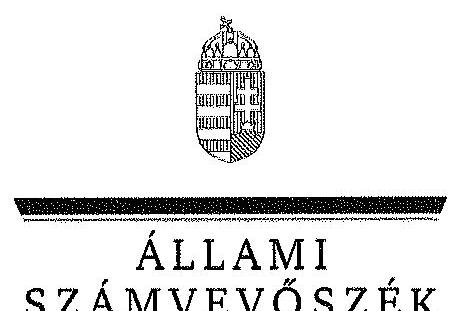
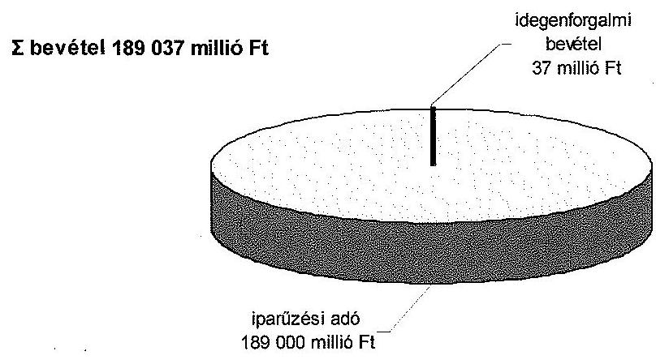
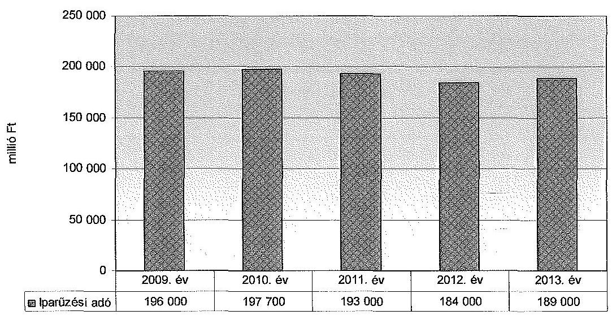
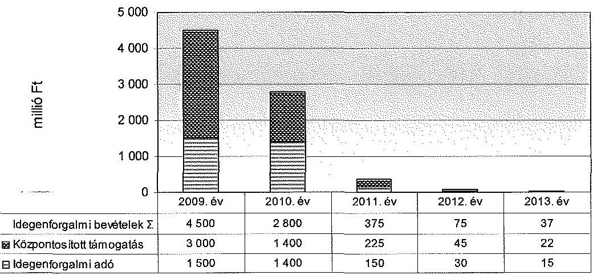
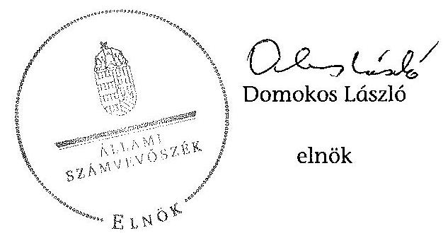

ÁLLAMI
SZÁMVEVŐSZÉK

# JELENTÉS 

a fővárosi forrásmegosztás felülvizsgálata - A fővárosi önkormányzatot és a kerületi önkormányzatokat osztottan megillető bevételek 2013. évi megosztásáról szóló önkormányzati rendelet felülvizsgálatáról

---

# Állami Számvevőszék 

Iktatószám: V-0362-067/2014.
Témaszám: 1396
Vizsgálat-azonosító szám: V0665

## Az ellenőrzést felügyelte:

Dr. Benedek Mária
felügyeleti vezető
Az ellenőrzést vezette és az ellenőrzés végrehajtásáért felelős:
Lajterné Hudák Magdolna
ellenőrzésvezető

## A jelentést készítette:

Lajterné Hudák Magdolna
ellenőrzésvezető

## A jelentés összeállításában közreműködtek:

Dr. Podonyi László Preller Zsuzsanna számvevő főtanácsos számvevő tanácsos

Az ellenőrzési folyamatban részt vettek:

| Bajnai Zsuzsanna | Dr. Podonyi László | Köllődné Gátai Mária |
| :-- | :-- | :-- |
| számvevő | számvevő főtanácsos | számvevő |
| Mészáros Ildikó Éva | Preller Zsuzsanna |  |
| számvevő | számvevő tanácsos |  |

Jelentéseink az Országgyűlés számítógépes hálózatán és az Interneten a www.asz.hu címen is olvashatóak.

---

# A témához kapcsolódó eddig készített számvevőséki jelentések: 

## címe

sorszáma
A Fővárosi Önkormányzatot és a kerületi önkormányzatokat osztottan megillető bevételek 2012. évi megosztásáról szóló önkormányzati rendelet felülvizsgálatáról
Jelentés a fővárosi önkormányzatot és a kerületi önkormányzatokat osztottan megillető bevételek 2011. évi megosztásáról szóló önkormányzati rendelet felülvizsgálatáról
Jelentés a fővárosi önkormányzatot és a kerületi önkormányzatokat osztottan megillető bevételek 2010. évi megosztásáról szóló önkormányzati rendelet felülvizsgálatáról
Jelentés a fővárosi önkormányzatot és a kerületi önkormányzatokat osztottan megillető bevételek 2009. évi megosztásáról szóló önkormányzati rendelet felülvizsgálatáról
Jelentés a fővárosi önkormányzatot és a kerületi önkormányzatokat osztottan megillető bevételek 2008. évi megosztásáról szóló önkormányzati rendelet felülvizsgálatáról
Jelentés a fővárosi önkormányzatot és a kerületi önkormányzatokat osztottan megillető bevételek 2007. évi megosztásáról szóló önkormányzati rendelet felülvizsgálatáról

---

# **Title: The Impact of Climate Change on Global Ecosystems**

## **Introduction**

Climate change is one of the most pressing environmental issues of our time. It affects ecosystems worldwide, leading to significant changes in biodiversity, habitat loss, and species extinction. This report explores the impacts of climate change on global ecosystems, focusing on key areas such as **forests**, **oceans**, and **polar regions**.

## **1. Forest Ecosystems**

Forests play a crucial role in carbon sequestration and maintaining biodiversity. However, rising temperatures and changing precipitation patterns are altering forest ecosystems. Key impacts include:

- **Increased frequency of wildfires**: Rising temperatures and drought conditions have led to more frequent and severe wildfires, destroying vast areas of forests.
- **Changes in species distribution**: Shifts in temperature and precipitation patterns are altering forest ecosystems, disrupting ecosystem balance.
- **Insect outbreaks**: Warmer temperatures have increased the survival rates of pests like bark beetles, which are causing widespread wildfires.

## **2. Ocean Ecosystems**

Oceans absorb a significant portion of the excess heat and carbon dioxide (CO₂) produced by human activities. The consequences include:

- **Increased frequency of wildfires**: Rising sea levels and drought conditions have led to more frequent and severe wildfires, disrupting ecosystem balance.
- **Changes in ocean currents**: Altered ocean currents are altering ocean currents, disrupting ecosystem balance, and species extinction.
- **Changes in ocean currents**: Altered ocean currents are altering ocean currents, disrupting ecosystem balance, and species extinction.

## **3. Ocean Ecosystems**

Oceans absorb a significant portion of the excess heat and carbon dioxide (CO₂) produced by human activities. The consequences include:

- **Increased frequency of wildfires**: Rising sea levels and drought conditions have led to more frequent and severe wildfires, disrupting ecosystem balance.
- **Changes in ocean currents**: Altered ocean currents are altering ocean currents, disrupting ecosystem balance, and species extinction.

## **4. Ocean Ecosystems**

Oceans absorb a significant portion of the excess heat and carbon dioxide (CO₂) produced by human activities. The consequences include:

- **Increased frequency of wildfires**: Rising sea levels and drought conditions have led to more frequent wildfires, disrupting ecosystem balance.
- **Changes in ocean currents**: Altered ocean currents are altering ocean currents, disrupting ecosystem balance, and species extinction.

## **5. Polar Ecosystems**

Polar regions are particularly vulnerable to climate change due to their sensitivity to temperature changes. Key impacts include:

- **Melting of sea ice**: The Arctic is warming at twice the rate of the global average, leading to sea ice loss.
- **Glacial retreat**: Melting glaciers and their presence in the Arctic are rising, impacting ocean currents, impacting species extinction.
- **Glacial retreat**: Melting glaciers and their presence in the Arctic are altering ocean currents, disrupting ecosystem balance, and species extinction.

## **Conclusion**

Climate change poses a significant threat to global ecosystems, with far-reaching consequences for biodiversity and human societies. By reducing the number of wildfires and preserving the natural environment, we can protect the planet for future generations.

## **References**

1. IPCC (Intergovernmental Panel on Climate Change). *Climate Change 2021: The Physical Science Basis*.
2. WWF (World Wildlife Fund). *Living Planet Report 2020*.
3. NASA Global Climate Change. *Vital Signs of the Planet*.

---

# TARTALOMJEGYZÉK 

BEVEZETÉS ..... 7
I. ÖSSZEGZŐ MEGÁLLAPÍTÁSOK, KÖVETKEZTETÉSEK, JAVASLATOK ..... 10
II. RÉSZLETES MEGÁLLAPÍTÁSOK ..... 14

1. A 2013. évi forrásmegosztás rendeletalkotási eljárásának szabályszerűsége, a folyamatba épített, előzetes, utólagos és vezetői ellenőrzés megvalósulása ..... 14
1.1. A forrásmegosztási törvény módosításával összhangban a forrásmegosztási rendelet elkészítésével kapcsolatos szabályzatok, munkaköri leírások aktualizálása, a szabályozások betartása ..... 14
1.2. A forrásmegosztási számítások és a rendelettervezet elkészítése során a folyamatba épített, előzetes, utólagos és vezetői ellenőrzés megvalósulása ..... 15
1.3. A forrásmegosztási törvényben előírt véleményeztetési kötelezettség és a rendeletalkotási határidők betartása ..... 15
1.4. A 2013. évi forrásmegosztási rendelet végrehajtási szabályainak összhangja a forrásmegosztási törvény előírásaival ..... 16
2. A felosztandó bevételek megalapozottságának ellenőrzése ..... 18
2.1. A forrásmegosztási számításoknál figyelembe vett iparűzési adóbevételek tervezésének megalapozottsága ..... 18
2.2. A forrásmegosztási számításoknál figyelembe vett idegenforgalmi adóbevételek és kapcsolódó állami támogatás tervezésének megalapozottsága ..... 19
3. A 2013. évi forrásmegosztási számítások törvényi előírásoknak való megfelelősége ..... 21
3.1. A Fővárosi Önkormányzatot és a kerületi önkormányzatokat együttesen megillető bevételek megállapításának a forrásmegosztási törvény előírásainak való megfelelősége ..... 21
3.2. A kerületi önkormányzatokat egyenként megillető részesedési összegek megállapításának forrásmegosztási törvény előírásainak való megfelelősége ..... 22
4. Az Állami Számvevőszék 2012. évi ellenőrzése során megfogalmazott javaslatok végrehajtására tett intézkedések megfelelősége ..... 23

---

# MELLÉKLETEK 

1. számú A forrásmegosztásba bevont bevételek bemutatása a 2013. évi forrásmegosztási rendelet és az ÁSZ megállapításai alapján
2. számú A kerületi önkormányzatokat megillető részesedési arányok a 2013. évi forrásmegosztási rendelet és a forrásmegosztási törvény alapján
3. számú A kerületi önkormányzatokat megillető iparűzési adó összege a 2013. évi forrásmegosztási rendelet és az ÁSZ megállapítása alapján
4. számú A kerületi önkormányzatokat megillető idegenforgalmi bevételek összege a 2013. évi forrásmegosztási rendelet és az ÁSZ megállapításai alapján

---

# RÖVIDÍTÉSEK JEGYZÉKE 

## Jogszabályok

Áht.
ÁSZ tv.
forrásmegosztási törvény

Helyi adó tv.
Ötv.
Mötv.
2013. évi költségvetési törvény
Ávr.
2013. évi forrásmegosztási rendelet
idegenforgalmi adó rendelet
iparűzési adó rendelet

## Szórövidítések

Adó Főosztály
Adó Főosztály Belső
Működési Szabályzata
Adó Főosztály ellenőrzési nyomvonala
ÁSZ
idegenforgalmi bevételek
főjegyző
főpolgármester
2011. évi CXCV. törvény az államháztartásról (hatályos 2011. december 31-étől)
2011. évi LXVI. törvény az Állami Számvevőszékről (hatályos 2011. július 1-jétől)
2006. évi CXXXIII. törvény a fővárosi önkormányzat és a kerületi önkormányzatok közötti forrásmegosztásról (a 2013. január 1-jétől hatályos szövege)
1990. évi C. törvény a helyi adókról (2013. január 1-jétől hatályos szövege)
1990. évi LXV. törvény a helyi önkormányzatokról (2013. január 1-jétől hatályon kívül helyezve)
2011. évi CLXXXIX. törvény Magyarország helyi önkormányzatairól (hatályos 2012. január 1-jétől)
2012. évi CCIV. törvény Magyarország 2013. évi központi költségvetéséről (hatályos 2013. január 1-jétől)
368/2011. (XII. 31.) Korm. rendelet az államháztartásról szóló törvény végrehajtásáról (hatályos 2012. január 1-jétől)
1/2013. (I. 30.) Főv. Kgy. rendelet a Fővárosi Önkormányzatot és a kerületi önkormányzatokat osztottan megillető bevételek 2013. évi megosztásáról (hatályos 2013. január 1-jétől)
8/2012. (II. 10.) Főv. Kgy. rendelet a Fővárosi Önkormányzatot és a kerületi önkormányzatokat osztottan megillető bevételek 2012. évi megosztásáról (hatályos 2012. január 1-jétől)
31/1994. (VI. 10.) Főv. Kgy. rendelet az idegenforgalmi adóról (a 2012. október 1-je - 2013. szeptember 30-a között hatályos állapot)
87/2012. (XI. 30.) Főv. Kgy. rendelete az iparűzési adóról (hatályos 2013. január 1-jétől)

Budapest Főváros Önkormányzata Főpolgármesteri Hivatalának Adó Főosztálya
Budapest Főváros Önkormányzata Főpolgármesteri Hivatal Adó Főosztályának 2011. május 19-étől hatályos, többször módosított belső működési szabályzata
Budapest Főváros Önkormányzata Főpolgármesteri Hivatal Adó Főosztályának ellenőrzési nyomvonala
Állami Számvevőszék
az idegenforgalmi adó és a kapcsolódó állami támogatás
Budapest Főváros Önkormányzatának Főjegyzője
Budapest Főváros Önkormányzatának Főpolgármestere

---

| Főpolgármesteri Hivatal | Budapest Főváros Önkormányzata Főpolgármesteri Hivatal |
| :--: | :--: |
| Fővárosi Közgyűlés | Budapest Főváros Önkormányzatának Közgyűlése |
| Fővárosi Önkormányzat | Budapest Főváros Önkormányzata |
| Intézkedési Terv | A főpolgármester és a főjegyző 2013. február 7-én kiadott 70/ 27-5/2013 iktatószámú Intézkedési Terve „A Fővárosi Önkormányzatot és a kerületi önkormányzatokat osztottan megillető bevételek 2012. évi megosztásáról szóló önkormányzati rendelet felülvizsgálatáról" |
| kerületi önkormányzatok | Budapest Főváros I-XXIII. kerületeinek önkormányzatai |
| KEK KH | Közigazgatási és Elektronikus Közszolgáltatások Központi Hivatala |
| Költségvetési Osztály | Budapest Főváros Önkormányzata Főpolgármesteri Hivatal Pénzügyi Főosztályának Költségvetési Osztálya |
| Költségvetési Osztály ellenőrzési nyomvonala | Budapest Főváros Főpolgármesteri Hivatal Pénzügyi Főosztály Költségvetési Osztályának 2011. szeptember 29-étől hatályos, többször módosított ellenőrzési nyomvonala |
| MÁK | Magyar Államkincstár |
| NGM | Nemzetgazdasági Minisztérium |
| Pénzügyi Főosztály | Budapest Főváros Önkormányzata Főpolgármesteri Hivatalának Pénzügyi Főosztálya |
| Pénzügyi Főosztály Belső Működési Szabályzata | Budapest Főváros Önkormányzata Főpolgármesteri Hivatal Pénzügyi Főosztályának belső működési szabályzata (hatályos 2012. szeptember 10-étől) |
| Pénzügyi Osztály | Budapest Főváros Önkormányzata Főpolgármesteri Hivatal Pénzügyi Főosztályának Pénzügyi és Számviteli Osztálya |
| Pénzügyi Osztály ellenőrzési nyomvonala | Budapest Főváros Önkormányzata Főpolgármesteri Hivatal Pénzügyi Főosztályának Pénzügyi és Számviteli Osztályának 2012. december 10-étől hatályos többször módosított ellenőrzési nyomvonala |
| Pénzforgalmi Osztály | Budapest Főváros Önkormányzata Főpolgármesteri Hivatal Adó Főosztályának Pénzforgalmi és Folyószámla-felülvizsgálati Osztálya |
| $\mathrm{SzMSz}_{1}$ | A főpolgármester és a főjegyző többször módosított 505/2011. számú együttes utasítása a Főpolgármesteri Hivatal Szervezeti és Működési Szabályzatáról, Ügyrendjéről (hatályos 2013. június 20-áig) |
| $\mathrm{SzMSz}_{2}$ | A főpolgármester és a főjegyző 58/2013. számú együttes utasítása a Főpolgármesteri Hivatal Szervezeti és Működési Szabályzatáról, Ügyrendjéről (hatályos 2013. június 21-étől) |

---

# ÉRTELMEZŐ SZÓTÁR 

idegenforgalmi adó
idegenforgalmi adóhoz kapcsolódó állami támogatás
iparűzési adó
tárgyév
részesedés
részesedési arányok

A kommunális jellegű adók közül a kerület döntése alapján átengedett helyi idegenforgalmi adóból beszedett bevétel. A helyi idegenforgalmi adót a kerületi önkormányzat helyett a fővárosi önkormányzat rendeletével akkor jogosult bevezetni, ha ahhoz minden adóév tekintetében az érintett kerület önkormányzatának képviselőtestülete előzetes beleegyezését adja. (A Helyi adó tv. III. fejezet Kommunális jellegű adók pontja, valamint az 1. § (2) és (3) bekezdései alapján meghatározott fogalom).

Az üdülőhelyi feladatok támogatása központosított előirányzat a települési önkormányzatot az idegenforgalmi célú kiadásaihoz illeti meg. Mértéke az üdülővendégek tartózkodási ideje alapján beszedett idegenforgalmi adó minden forintjához 1,5 forint. Késedelmi pótlék, bírság alapján nem igényelhető a hozzájárulás. (A 2013. évi költségvetési törvény 3. számú melléklet 15. pontja alapján
 meghatározott fogalom)
A Helyi adó tv. felhatalmazása alapján a Fővárosi Közgyűlés rendeletével kivetett helyi adónem. A Fővárosi Önkormányzat illetékességi területén vállalkozói tevékenységet (iparűzési tevékenységet) állandó vagy ideiglenes jelleggel végző vállalkozó helyi iparűzési adót köteles fizetni. (A Helyi adó tv. 1. § (2) bekezdése, valamint a 35. § (1) és (2) bekezdései alapján meghatározott fogalom.)
Azon gazdasági év, amelyhez tartozó megosztandó bevételeknek a Fővárosi Önkormányzat és a kerületi önkormányzatok közötti megosztását a forrásmegosztás határozza meg. (A forrásmegosztási törvény 1. §-a alapján meghatározott fogalom.)
A forrásmegosztásba bevont bevételekből a Fővárosi Önkormányzatot és a kerületi önkormányzatokat együttesen megillető részesedés arányszáma. A Fővárosi Önkormányzatot és a kerületi önkormányzatokat a forrásmegosztási törvény 2. § alapján osztottan megillető bevételekből - a 3. § szerint - a Fővárosi Önkormányzatot 51%, a kerületi önkormányzatokat együttesen 49% részesedés illeti meg. (A forrásmegosztási törvény 2-3. §-ai alapján meghatározott fogalom)
A kerületi önkormányzatokat megillető összes forrás egyes kerületek közötti megosztásának aránya, amelyet a forrásmegosztási törvény 1. számú melléklete tartalmaz. (A forrásmegosztási törvény 4. § (1) bekezdése alapján meghatározott fogalom.)

---

.

---

# JELENTÉS 

## a fővárosi forrásmegosztás felülvizsgálata a fővárosi önkormányzatot és a kerületi önkormányzatokat osztottan megillető bevételek 2013. évi megosztásáról szóló önkormányzati rendelet felülvizsgálatáról

## BEVEZETÉS

Az önkormányzati rendszer új finanszírozási struktúrája kialakításához kapcsolódóan 2013. január 1-jén léptek hatályba a Mötv. egyes, az önkormányzatok feladat- és hatásköreire és a gazdálkodásukra vonatkozó különös rendelkezéseket tartalmazó szabályai. A Mötv. - korábban az Ötv.-ben rögzített szabályokkal ellentétben - a forrásmegosztásra vonatkozóan rendelkezéseket már nem tartalmazott.

A 2013. évtől megváltozott új önkormányzati finanszírozási rendszerre tekintettel az Országgyűlés módosította ${ }^{1}$ a forrásmegosztási törvényt. Az önkormányzatok új finanszírozási rendszerének bevezetésével 2013. január 1-jétől megszűntek a jövedelemkülönbséggel korrigált helyben maradó személyi jövedelemadó, valamint a települési önkormányzatok üzemeltetési, igazgatási, sport- és kulturális feladataihoz kapcsolódó normatív hozzájárulás önkormányzati bevételi jogcímek, így ezek a forrásmegosztásból is kikerültek. A Fővárosi Önkormányzat és a kerületi önkormányzatok közötti részesedések számításánál állandó arányszámok (51% és 49%) kerültek rögzítésre. A Fővárosi Önkormányzat az őt megillető 51%-ból 4 százalékpontnak megfelelő összeget a helyi közösségi közlekedési feladat ellátására köteles a tárgyévben fordítani. A kerületek közötti részesedési arányokat a forrásmegosztási törvény melléklete tartalmazza. A forrásmegosztásba bevont bevételek körének módosításával, a számításoknál alkalmazandó konkrét arányszámok rögzítésével megszűnt a korábbi bonyolult számítási módszer, az addigi több hónapot igénybevevő előkészítő és egyeztető munka lényegesen egyszerűbb lett, a számítások átláthatóbbakká váltak.

A 2013. évi forrásmegosztási rendelet a Fővárosi Önkormányzat és a kerületi önkormányzatok között 189000 millió Ft iparűzési adó, továbbá 15 millió Ft idegenforgalmi adó és a kapcsolódó 22,5 millió Ft állami támogatás felosztásáról rendelkezett, amelyből a kerületek között mindösszesen 92628,4 millió Ft került elosztásra.

A forrásmegosztási törvény 6. § (1) bekezdése szerint a Fővárosi Önkormányzat tárgyévre vonatkozó forrásmegosztási rendeletét az ÁSZ felülvizsgálja. A forrásmegosztási törvény 6. § (2) bekezdése alapján, ha az ÁSZ felülvizsgálata megállapítja, hogy a forrásmegosztás során a Fővárosi Önkormányzat vagy valamely kerületi önkormányzat jogosulatlanul forráshoz jutott, vagy az őt jogszerűen megillető forrásnál alacsonyabb összegben részesült, ennek mértékével a forrásmegosztási törvény alapján meghatározott, a felülvizsgálat lezárását követő évi forrásmegosztást a fővárosi önkormányzat rendeletében módosítja.

Az ellenőrzés célja annak értékelése volt, hogy:

- a Fővárosi Önkormányzat a 2013. évi forrásmegosztási rendeletét a forrásmegosztási törvény előírásainak megfelelően alkotta-e meg;
- szabályozott volt-e a forrásmegosztási rendelet elkészítésének módja, működtették-e a folyamatba épített előzetes, utólagos és vezetői ellenőrzés rendszerét a 2013. évi forrásmegosztási rendelet megalkotásának folyamatában;
- a forrásmegosztás bevételi tervszámai megalapozottak voltak-e, a forrásmegosztási számításokat a törvényi előírásoknak megfelelően végezték-e el, az esetleges számítási hibák miatt szükséges-e korrekció a 2014. évi forrásmegosztásnál;
- hasznosultak-e az ÁSZ „a Fővárosi Önkormányzatot és a kerületi önkormányzatokat osztottan megillető bevételek 2012. évi megosztásáról szóló önkormányzati rendelet felülvizsgálatáról" szóló jelentésében tett javaslatai.

Az ellenőrzés várható hasznosulását négy szinten tervezzük. A törvényalkotás számára tapasztalatok állnak rendelkezésre a forrásmegosztás szabályozásáról, a forrásmegosztási rendelet szabályszerűségéről, következtetés vonható le arra, hogy indokolt-e jogszabályi módosítás kezdeményezése. Az ellenőrzés az ellenőrzött számára visszajelzést ad a forrásmegosztás végrehajtásának szabályosságáról, javaslataival hozzájárul az esetleges hiányosságok kiküszöböléséhez. A társadalom számára jelzi, hogy közpénz felhasználása e vonatkozásban sem maradhat ellenőrizetlenül, az ÁSZ értékteremtő rend kialakításához és megőrzéséhez hozzájáruló tevékenysége pozitív hatással lesz a szervezetről kialakított összkép formálásában. Az ÁSZ szervezetén belül lehetőség nyílik arra, hogy az intézmény erősítse hozzáadott értéket teremtő elemző tevékenységét és tanácsadó szerepét.

Az ellenőrzés típusa: szabályszerűségi ellenőrzés.
A szabályszerűségi ellenőrzés előírásait az ÁSZ „Ellenőrzési elvek, standardok" módszertani dokumentum I. fejezet 3.1. és az „Útmutató a standardok alkalmazásához" módszertani dokumentum I. fejezet 1. pontjai, valamint az ISSAI 4000 és 4100 standardok (megfelelőségi ellenőrzés) tartalmazták.

---

Az ellenőrzött időszak: 2012. október 1-jétől 2013. szeptember 30-áig terjedő időszak (a forrásmegosztási rendelet előkészítésével és elfogadásával érintett időszak) volt.

Az ellenőrzött szervezet: Budapest Főváros Önkormányzata.
A 2013. évi forrásmegosztási rendeletre vonatkozó ellenőrzésünk során a Főpolgármesteri Hivatalnál áttekintettük a forrásmegosztási törvényben foglalt előírások megvalósítását.

Az ellenőrzés során értékeltük a folyamatba épített, az előzetes, utólagos és vezetői ellenőrzés működését a 2013. évi forrásmegosztási rendelet előkészítésének és elfogadásának időszakában. Utóellenőrzés keretében ellenőriztük az előző évi forrásmegosztás ellenőrzéséről szóló jelentésben tett javaslataink hasznosulását.

Az ellenőrzés jogszabályi alapját Magyarország Alaptörvénye 43. cikk (1) bekezdése, a forrásmegosztási törvény 6. § (1) bekezdése és az ÁSZ tv. 3. § (1) bekezdése képezte.

Az ÁSZ tv. 29. § (1) bekezdése szerint a jelentéstervezetet megküldtük a főpolgármester részére, aki az ÁSZ tv. 29. § (2) bekezdésében foglalt észrevételezési jogával nem élt, a jelentéstervezetre észrevételt nem tett.

---

# I. ÖSSZEGZŐ MEGÁLLAPÍTÁSOK, KÖVETKEZTETÉSEK, JAVASLATOK 

A Fővárosi Önkormányzat a 2013. évi forrásmegosztási rendeletét a forrásmegosztási törvény előírásainak megfelelően alkotta meg, a törvényben előírt eljárási szabályokat, a véleményeztetési és rendeletalkotási határidőket betartotta.

A 2013. évi forrásmegosztási rendelet végrehajtási szabályai közül a tervezett idegenforgalmi adóhoz kapcsolódó állami támogatás kiutalásának szabályozása nem volt összhangban a forrásmegosztási törvény, a 2013. évi költségvetési törvény és az Ávr. előírásaival. A 2013. évi forrásmegosztási rendelet a 2013. évi költségvetési törvényben meghatározott 2011. évi idegenforgalmi adóbevételekhez kapcsolódó állami támogatás helyett a 2013. évre tervezett idegenforgalmi adó összegét tartalmazta. Továbbá 15 napos kiutalási határidőt írt elő a forrásmegosztási törvényben, valamint a nettó finanszírozásra vonatkozóan előírt utalási határidők helyett. A 2013. évben a forrásmegosztási törvényben meghatározott kiutalási határidőt betartották.

A 2013. évi forrásmegosztási rendelet végrehajtási szabályai közül az rendelkezés, mely szerint az idegenforgalmi adót az év közben bevezető kerületek miatt a felosztási arányokat újra kell számítani nem volt összhangban a forrásmegosztási törvényben és a Helyi adó tv.-ben foglaltakkal. A kerületi önkormányzatoknak az adóév tekintetében kellett előzetes beleegyezését adnia az idegenforgalmi adó Fővárosi Önkormányzat általi bevezetéséhez, ezért az a kerületi önkormányzat, amely az adó Fővárosi Önkormányzat általi bevezetésébe beleegyezett, az adót az adóévben jogszerűen nem működtethette. A 2013. év során a kifogásolt végrehajtási szabály alkalmazására nem került sor.

A 2013. évi forrásmegosztási rendelet elkészítésének folyamata szabályozott volt, a folyamatba épített előzetes, utólagos és vezetői ellenőrzés rendszerét a forrásmegosztási rendelet megalkotásának folyamatában működtették.

A 2013. évi forrásmegosztási rendelet előkészítésével kapcsolatos feladatokat az SZMSZ$_{1,2}$-ben, a Pénzügyi Főosztály és az Adó Főosztály Belső Működési Szabályzataiban, ellenőrzési nyomvonalaiban, valamint a munkaköri leírásokban rögzítették. A forrásmegosztási törvény 2013. január 1-jétől hatályos módosításai a Pénzügyi Főosztály feladatkörét érintették, azonban a szabályzatokat a forrásmegosztási törvényben foglalt előírásokkal csak a 2013. évi forrásmegosztási rendelet megalkotását követően hangolták össze. A munkafolyamatba épített, előzetes, utólagos és a vezetői ellenőrzés a 2013. évi forrásmegosztási rendelettervezet előkészítésének, illetve végrehajtásának folyamatában dokumentáltan megvalósult.

A Fővárosi Önkormányzatot és a kerületi önkormányzatokat osztottan megillető bevételek körét a forrásmegosztási törvény 2013. január 1-jével hatályba lépő rendelkezései szűkítették. Ettől az évtől kezdődően a Fővárosi Önkormányzat és a kerületi önkormányzatok között az iparűzési adó, az idegenforgalmi adó és

---

a kapcsolódó állami támogatás került megosztásra. A 2013. évben a forrásmegosztásba bevont bevételek körét és összegét az 1. ábra mutatja be.

1. számú ábra

A forrásmegosztásba bevont bevételek a 2013. évben

Forrás: ÁSZ
A forrásmegosztási számításoknál figyelembe vett iparűzési adóbevételek tervezése megalapozott volt, azt számításokkal, elemzésekkel, az adóbevételek időarányos teljesülésének adataival támasztották alá. A tervezésnél figyelembe vették a Helyi adó tv. 2013. január 1-jétől hatályos módosításának hatásait is.

A 2013. évi forrásmegosztási rendeletben szereplő idegenforgalmi adóbevételi tervszám az ellenőrzés ideje alatt bemutatott zárási összesítők és az analitikus kimutatásokból készített adatkigyűjtések alapján megalapozott volt, azonban az Áht.-ban foglaltak ellenére a tervezés közgazdasági alátámasztására részletes számításokat, elemzéseket nem készítettek. Az idegenforgalmi adóhoz kapcsolódó állami támogatás tervezése megalapozott volt, az megegyezett az idegenforgalmi adó beszedését a Fővárosi Önkormányzat számára átengedő kerületi önkormányzatokra tervezett idegenforgalmi adó összegének 1,5-szeresével.

A 2013. évi forrásmegosztási számításokat a forrásmegosztási törvény előírásainak megfelelően végezték el. A Fővárosi Önkormányzatot és a kerületi önkormányzatokat osztottan megillető bevételek részesedési arányait a forrásmegosztási törvényben foglalt 51%-os és 49%-os arányban, a kerületeket egyenként megillető iparűzési adórészt a forrásmegosztási törvényben előírt részesedési arányoknak megfelelően osztották fel. Az ÁSZ ellenőrzés a 2013. évi forrásmegosztási rendelet felülvizsgálata során a Fővárosi Önkormányzatot és a kerületi önkormányzatokat együttesen megillető részesedésekben, valamint az iparűzési adóbevétel kerületek közötti megosztásában eltérést nem állapított meg.

---

A 2013. évi forrásmegosztási rendeletben a tervezett idegenforgalmi adóbevételt és a kapcsolódó állami támogatást helyesen, az idegenforgalmi adó beszedéséről a Fővárosi Önkormányzat javára előzetesen lemondó kilenc kerületi önkormányzat között osztották meg. Az ÁSZ ellenőrzés az idegenforgalmi bevételek kerületi önkormányzatok közötti megosztása során minimális, kerekítésből adódó ±2 ezer Ft összegű eltérést állapított meg. A kerekítésből adódó eltérés nem jelentette a forrásmegosztási törvényben foglalt jogosulatlan forráshoz jutást, vagy a jogszerűen megillető forrásnál alacsonyabb összegben való részesülést, ezért a 2014. évi forrásmegosztási rendeletben korrekció érvényesítése nem indokolt.

Az ÁSZ a 2013. évi forrásmegosztási rendelet felülvizsgálata során ellenőrizte a 2012. évi forrásmegosztási rendelethez tett javaslatok hasznosulását. Ennek keretében megállapította, hogy a főpolgármesternek tett javaslat hasznosult, mivel a 2013. évi forrásmegosztási rendeletbe korrekcióként beépítésre került a 2012. évi forrásmegosztási rendelet felülvizsgálata során megállapított eltérések összege. A főjegyzőnek címzett javaslat az ÁSZ által elfogadott Intézkedési Tervben foglalt határidőn túl hasznosult mind a 2013. évi forrásmegosztási rendelet előkészítésében résztvevő közszolgálati tisztviselők munkaköri leírásainak a Pénzügyi Főosztály ellenőrzési nyomvonalával való összhangja, mind a kijelölt vezetők ellenőrzési feladatainak számonkérése
 vonatkozásában.

Az ÁSZ tv. 33. § (1) bekezdésében foglaltak értelmében az ellenőrzött szervezet vezetője köteles a jelentésben foglalt megállapításokhoz kapcsolódó intézkedési tervet összeállítani, és azt a jelentés kézhezvételétől számított 30 napon belül az ÁSZ részére megküldeni. Amennyiben az intézkedési tervet határidőre nem küldi meg a szervezet, vagy az ÁSZ tv. 33. § (2) bekezdésében foglalt póthatáridő elteltével megküldött intézkedési terv továbbra sem elfogadható, az ÁSZ elnöke a hivatkozott törvény 33. § (3) bekezdés a)-b) pontjaiban foglaltakat érvényesítheti.

Az ellenőrzés intézkedést igénylő megállapításai és javaslatai:

# a főjegyzőnek 

1. A 2013. évi forrásmegosztási rendelet 4. § (4) bekezdés c) pontjában foglalt, az idegenforgalmi adó 2013. évre vonatkozó tervezett összegére és a kerületek részére történő utalás időpontjára vonatkozó végrehajtási szabály nem volt összhangban a 2013. évi költségvetési törvény 3. számú melléklet 15. pontjában, a forrásmegosztási törvény 5. § (3) bekezdésében és az Ávr. 6. számú mellékletében foglalt, a nettó finanszírozásra vonatkozó előírásokkal.

A forrásmegosztási rendelet 4. § (4) bekezdés d) pontjában foglalt szabályozás mely szerint, ha a forrásmegosztásnál figyelembe vett kerületi önkormányzatokon felül más kerületi önkormányzatok is bevezetik 2013-ban az idegenforgalmi adót, akkor a felosztási arányokat újra kell számolni - nem voltak összhangban a forrásmegosztási törvény 2. § b) pontjában, a Helyi adó tv. 1. § (3) bekezdésében és a 7. § d) pontjában foglaltakkal, mert a kerületi önkormányzatoknak az adóév tekintetében kell előzetes beleegyezését adnia az idegenforgalmi adó Fővárosi Önkormányzat általi bevezetéséhez, továbbá az a kerületi önkormányzat, amely az adó Fővárosi Ön-

---

kormányzat általi bevezetésébe beleegyezett, az adót az adóévben nem működtethette.

Javaslat:
a) Biztosítsa a 2014. évi forrásmegosztási rendelettervezet előkészítése során, hogy a forrásmegosztási rendelettervezetnek az idegenforgalmi adó tervezett összegére és a kerületek részére történő utalás időpontjára vonatkozó végrehajtási rendelkezései összhangban legyenek a Magyarország 2014. évi költségvetéséről szóló törvénynek az üdülőhelyi feladatokra, az Ávr.-nek az állami támogatások nettó finanszírozására, valamint a forrásmegosztási törvénynek az 5. § (3) bekezdésében az utalásra vonatkozó előírásaival.
b) Intézkedjen a 2014. évi forrásmegosztási rendelettervezet előkészítése során arról, hogy a forrásmegosztási rendelettervezet idegenforgalmi adó bevezetésével és felosztási arányaival összefüggő végrehajtási rendelkezései összhangban legyenek a forrásmegosztási törvény 2. § b) pontjában, a Helyi adó törvény 1. § (3) bekezdésében és a 7. §. d) pontjában foglalt előírásokkal.
2. A forrásmegosztási rendeletben szereplő idegenforgalmi adóbevételi tervszám az ellenőrzés ideje alatt bemutatott zárási összesítők és az analitikus kimutatásokból készített adatkigyűjtések alapján megalapozott volt, azonban az Áht. 12. § (1) bekezdésében foglaltak ellenére a tervezés közgazdasági alátámasztására részletes számításokat, elemzéseket nem készítettek.

Javaslat:
Az Áht. 12. § (1) bekezdésében foglaltakat figyelembe véve az idegenforgalmi adó tervezése során gondoskodjon arról, hogy a tervezett bevételek közgazdaságilag megalapozottan, részletes számításokkal és elemzésekkel alátámasztottan kerüljenek a 2014. évi forrásmegosztási rendeletbe beépítésre.

---

# II. RÉSZLETES MEGÁLLAPÍTÁSOK 

## 1. A 2013. ÉVI FORRÁSMEGOSZTÁS RENDELETALKOTÁSI ELJÁRÁSÁNAK SZABÁLYSZERŰSÉGE, A FOLYAMATBA ÉPÍTETT, ELŐZETES, UTÓLAGOS ÉS VEZETŐI ELLENŐRZÉS MEGVALÓSULÁSA

### 1.1. A forrásmegosztási törvény módosításával összhangban a forrásmegosztási rendelet elkészítésével kapcsolatos szabályzatok, munkaköri leírások aktualizálása, a szabályozások betartása

A 2013. évi forrásmegosztási rendelettervezet elkészítésével kapcsolatos feladatokat a Főpolgármesteri Hivatal SZMSZ$_{1,2}$-ben, a Pénzügyi Főosztály és az Adó Főosztály Belső Működési Szabályzatában, ellenőrzési nyomvonalaiban, valamint a munkaköri leírásokban rögzítették. A forrásmegosztási törvény 2013. január 1-jétől hatályos módosításai a Pénzügyi Főosztály feladatkörét érintették, azonban a szabályzatokat a forrásmegosztási törvényben foglalt előírásokkal csak a 2013. évi forrásmegosztási rendelet megalkotását követően hangolták össze.

A 2013. évi forrásmegosztási rendelettervezet elkészítésével kapcsolatos feladatokat az SzMSz$_1$ 45. § (1) bekezdés 14. pontja alapján a Pénzügyi Főosztály látta el. Az ellenőrzött időszakban 2013. június 21-ével az SzMSz$_2$ lépett hatályba, melynek 52. § (1) bekezdés 13. pontja szabályozta a Pénzügyi Főosztály forrásmegosztási rendelet előkészítésével kapcsolatos feladatait.

A Pénzügyi Főosztály Belső Működési Szabályzata szerint a Költségvetési Osztály feladata volt a forrásmegosztási javaslat és a rendelettervezet elkészítése, a Pénzügyi Osztály feladata volt a forrásmegosztási rendelettervezethez szükséges adatok szolgáltatása, valamint részanyagok készítése. Az Adó Főosztály Belső Működési Szabályzata az adóbevételek tervezéséhez adatszolgáltatási, elemzési és javaslatkészítési feladatokat határozott meg.

A Pénzügyi Főosztályon belül a Költségvetési Osztály és a Pénzügyi Osztály, az Adó Főosztályon belül a Pénzforgalmi Osztály ellenőrzési nyomvonala tartalmazta a forrásmegosztási rendelettervezet elkészítésének feladatait, azok felelőseit, a vonatkozó jogszabályokat és belső szabályzatokat, a feladatellátás során keletkező dokumentumokat, az ellenőrzési pontokat, az ellenőrzést, valamint az elvégzett feladat jóváhagyását végző személy megnevezését.

A Pénzügyi Főosztályon belül a forrásmegosztási törvény változásai a Költségvetési Osztály feladatkörét érintették, a szabályzatok aktualizálási feladatait a 2013. évi forrásmegosztási rendelet elfogadását követően végezték el.

A Pénzügyi Főosztály Belső Működési Szabályzatának módosítását 2013 augusztusában elkészítették, a hatályba léptetés a helyszíni ellenőrzés idején volt folyamatban. A Költségvetési Osztály ellenőrzési nyomvonalának módosítására 2013. május 20-án került sor.

---

A Pénzügyi Főosztály és az Adó Főosztály közszolgálati tisztviselőinek munkaköri leírásai$^2$ a főosztályok belső működési szabályzataival összhangban tartalmazták a forrásmegosztással kapcsolatos feladatokat.

# 1.2. A forrásmegosztási számítások és a rendelettervezet elkészítése során a folyamatba építetett, előzetes, utólagos és vezetői ellenőrzés megvalósulása 

A forrásmegosztási törvény változását követően az adatgyűjtési, egyeztetési szabályok egyszerűsödtek, a forrásmegosztási rendelettervezet elkészítését 2013 januárjában a törvényi változáshoz igazították.

A Főpolgármesteri Hivatal a 2013. évi forrásmegosztási rendelettervezet elkészítését a 2012. január 1-jén hatályos forrásmegosztási törvény alapján kezdte meg a KEK KH-tól az állandó népesség, a MÁK-tól a beszámoló adatok bekérésével és ezek kerületi önkormányzatokkal történő egyeztetésével. Az adatgyűjtési és eljárási szabályok egyszerűsödése miatt a 2013. évi rendelettervezet készítésénél már nem volt szükség a bekért adatokra.

A munkafolyamatba épített, előzetes, utólagos és a vezetői ellenőrzés a 2013. évi forrásmegosztási rendelettervezet elkészítésének, illetve végrehajtásának folyamatában dokumentáltan megvalósult.

A Költségvetési Osztály költségvetési ügyintézői és csoportvezetője a háttérszámítási táblázatokon, a 2012. évi ÁSZ vizsgálat során megállapított eltérés kerületi önkormányzatokra lebontott megosztását tartalmazó táblázaton, a rendelettervezeten, a testületi előterjesztés tervezetén, a belső egyeztetést kérő dokumentumon, a rendelet megjelentetését kérő dokumentumon dátumozottan, aláírásukkal igazolták az ellenőrzési feladatok ellátását.

Az Adó Főosztály 2013. évi adóbevétel tervezési dokumentumain az osztályvezető aláírásával igazolta az ellenőrzési feladatának ellátását. A Pénzügyi Főosztályvezető és a Költségvetési Osztályvezető 2013. május 15-én vezetői utóellenőrzést végzett, melynek megtörténtét ellenőrző listán aláírásukkal igazolták.

### 1.3. A forrásmegosztási törvényben előírt véleményeztetési kötelezettség és a rendeletalkotási határidők betartása

A Fővárosi Önkormányzat a 2013. évi forrásmegosztási rendelettervezet elkészítése során betartotta a forrásmegosztási törvény 5. § (1) bekezdésében foglalt véleményeztetési és rendeletalkotási határidőt. A Főpolgármesteri Hivatal a törvényben rögzített január 10-ei határidőig a 2013. évi forrásmegosztási rendelettervezetet megküldte a kerületi önkormányzatok részére 15 napos véleményezési határidővel. Az előírt határidőig

[^0]
[^0]: $^2$ A Pénzügyi Főosztály főosztályvezetője, 2 fő osztályvezetője, 1 fő csoportvezetője és 4 fő költségvetési ügyintézője, valamint az Adó Főosztály főosztályvezetője, 1 fő osztályvezetője, 1 fő csoportvezetője és 1 fő pénzforgalmi ügyintézője munkaköri leírásaiban szerepeltek a forrásmegosztással kapcsolatos feladatok.

---

a kerületi önkormányzatok - öt$^3$ kerületi önkormányzat kivételével - megküldték egyetértő, elfogadó, támogató véleményüket. A forrásmegosztási rendelet 2013. január 31-én hatályba lépett.

Összességében a Fővárosi Önkormányzat a 2013. évi forrásmegosztási rendeletét a forrásmegosztási törvény előírásainak megfelelően alkotta meg, a törvényben előírt szabályokat, a véleményeztetési és rendeletalkotási határidőket betartotta.

# 1.4. A 2013. évi forrásmegosztási rendelet végrehajtási szabályainak összhangja a forrásmegosztási törvény előírásaival 

A 2013. évi forrásmegosztási rendelet 4. § (4) bekezdés c) pontjában foglalt, az idegenforgalmi adó 2013. évre vonatkozó tervezett összegére és a kerületek részére történő utalás időpontjára vonatkozó végrehajtási szabály nem volt összhangban a 2013. évi költségvetési törvény 3. számú melléklet 15. pontjában, a forrásmegosztási törvény 5. § (3) bekezdésében és az Ávr. 6. számú mellékletében foglalt, a nettó finanszírozásra vonatkozó előírásokkal.

A 2013. évi forrásmegosztási rendelet 4. § (4) bekezdés c) pontja kimondta, hogy „a 15 millió Ft-on felül befolyó idegenforgalmi adóhoz kapcsolódó - utólagosan igényelhető - állami támogatásból a kerületi önkormányzatokat megillető összegeket a Fővárosi Önkormányzat költségvetési elszámolási számlájára érkezést követő 15 napon belül kell a kerületi önkormányzatok költségvetési elszámolási számláira átutalnia."

A 2013. évi költségvetési törvény 3. számú melléklete a helyi önkormányzatok által felhasználható központosított előirányzatok között, a 15. pontban rögzítette az üdülőhelyi feladatok támogatása folyósításának szabályait. Eszerint „...A támogatás a helyi önkormányzatok nettó finanszírozása keretében havi ütemekben, az üdülővendégek tartózkodási ideje alapján beszedett idegenforgalmi adó 2011. évi tény adatai alapján kerül folyósításra."

Az Ávr. 6. számú melléklete szabályozta nettó módon finanszírozott hozzájárulások, támogatások ütemezését, mely szerint a MÁK a nettó módon finanszírozott hozzájárulásokat, támogatásokat havonta meghatározott napokon (általában a hónap utolsó munkanapján) utalja az önkormányzatok részére.

A 2013. évben e ponthoz kapcsolódó igénylés és utalás nem történt. A 2013. évi forrásmegosztási rendelet 4. § (4) bekezdés c) pontja a 2013. évi támogatás utólagos elszámolás lehetőségéhez kapcsolódhatott volna, azonban a 2013. évi költségvetési törvény módosítása során a 3. számú melléklet 15. pontjából az utólagos elszámolásra vonatkozó szövegrészt 2013. április 4-i hatállyal törölték.

A Főpolgármesteri Hivatal 2013. évi forrásmegosztási rendelet végrehajtási szabályaihoz adott indokolása szerint a 4. § (4) bekezdés c) pontban foglalt rendelkezést az alapozta meg, hogy a 2013. évi költségvetési törvény 2. számú

[^0]
[^0]: $^3$ a IV., IX., XV., XVIII., XIX. kerületi önkormányzatok

---

melléklete I. rész 1. c) pontjában$^4$ „maga a költségvetési törvény ismerte el a főváros szabályozását", a támogatási összeg beérkezésétől számított 15 napos kiutalási határidőt „a beérkezés dátumának bizonytalansága" miatt határozták meg, annak érdekében, hogy a kifizetés szabályozását a támogatás beérkezéséhez igazítsák.

Az indokolással szemben a 2013. évi költségvetési törvény 2. számú melléklet I. rész 1. c) pontja az önkormányzatok általános működése támogatásának számítására vonatkozott, amelynek megállapításánál figyelembe kellett venni az önkormányzatok elvárt iparűzési adóbevételét is. A kerületi önkormányzatok esetében az elvárt iparűzési adóbevételt a jogalkotó a 2012. évi forrásmegosztási rendeletben foglalt iparűzési adóbevételi tervszám alapulvételével határozta meg. Ezért a hivatkozott rendelkezésnek nincs összefüggése az idegenforgalmi adóhoz kapcsolódó állami támogatás folyósítási rendjére vonatkozó szabályokkal.

A 2013. évi forrásmegosztási rendelet 4. § (4) bekezdés d) pontjában foglalt szabályozás - mely szerint, ha a forrásmegosztásnál figyelembe vett kerületi önkormányzatokon felül más kerületi önkormányzatok is bevezetik 2013-ban az idegenforgalmi adót, akkor a felosztási arányokat újra kell számolni - nem voltak összhangban a forrásmegosztási törvény 2. § b) pontjában, a Helyi adó tv. 1. § (3) bekezdésében és a 7. § d) pontjában foglaltakkal.

A 2013. évi forrásmegosztási rendelet 4. § (4) bekezdés d) pontja rögzítette, hogy „amennyiben e rendelet 2. mellékletében
 figyelembe vett kerületi önkormányzatokon felül más kerületi önkormányzatok is bevezetik 2013-ban az idegenforgalmi adót, akkor a 2. mellékletben meghatározott felosztási arányokat újra kell számolni úgy, hogy az adót bevezető kerületek részesedése a Fővárosi Önkormányzat által beszedett idegenforgalmi adóból 0% legyen."

A Helyi adó tv. 1. § (3) bekezdése értelmében „A kerületi önkormányzat által a (2) bekezdés szerint bevezethető adót a kerületi önkormányzat helyett a fővárosi önkormányzat akkor jogosult rendeletével bevezetni, ha ahhoz minden adóév tekintetében az érintett kerületi önkormányzat képviselő-testülete előzetes beleegyezését adja."

A Helyi adó tv. 7.§ d) pontja alapján „Az önkormányzat adómegállapítási jogát korlátozza az, hogy ... ha az adót az 1. § (3) bekezdése alapján a fővárosi önkormányzat vezeti be, akkor az a kerületi önkormányzat, amely az adó fővárosi önkormányzat általi bevezetésébe beleegyezett, az adót az adóévben nem működtetheti ..."

A Főpolgármesteri Hivatal a 2013. évi forrásmegosztási rendelet végrehajtási szabályaihoz adott indokolása szerint a rendelet szabályozása a biztonságos forrásmegosztás elvén alapult, azzal a céllal, hogy az idegenforgalmi adót év közben önállóan bevezető kerületek ne jussanak olyan bevételhez, ami nem illeti meg őket. A Helyi adó tv. 7. § d) pontja korlátozta a kerületi önkormányzatok adó-megállapítási jogát, viszont a Fővárosi Önkormányzatnak nincs ráhatása a kerületi önkormányzatok rendeletalkotására, ezért indokoltnak és jogszerűnek tartotta a szabályozást.

[^0]
[^0]:    ${ }^{4}$ Az önkormányzatok általános működési támogatásának megállapításánál alkalmazott beszámítási kötelezettség szabályait tartalmazza.

---

A kerületi önkormányzatoknak tehát az adóév tekintetében kell előzetes beleegyezését adnia az idegenforgalmi adó Fővárosi Önkormányzat általi bevezetéséhez, továbbá az a kerületi önkormányzat, amely az adó Fővárosi önkormányzat általi bevezetésébe beleegyezett, az adót az adóévben nem működtethette, így a forrásmegosztási rendeletben szereplő szabály nem is volt alkalmazható. (A 2013. év során a kerületi önkormányzatok év közben saját rendelettel nem vezettek be idegenforgalmi adót.)

# 2. A felosztandó bevételek megalapozottságának ellenőrzése 

### 2.1. A forrásmegosztási számításoknál figyelembe vett iparűzési adóbevételek tervezésének megalapozottsága

Az iparűzési adóbevétel a forrásmegosztási rendszer 1992. évi bevezetésétől kezdődően a forrásmegosztás részét képezte ${ }^{5}$. A Fővárosi Önkormányzat és a kerületi önkormányzatok között megosztásra kerülő iparűzési adóbevételek tervezett összege az elmúlt öt évben változó tendenciát mutatott. Az iparűzési adóbevételi tervszámok alakulását a 2009-2013. években a 2. számú ábra szemlélteti.
2. számú ábra

Az iparűzési adóbevételi tervszámok alakulása a 2009-2013. években

Forrás: ÁSZ
A 2013. évi forrásmegosztási rendelet 189000000 ezer Ft iparűzési adóbevételt vett számításba.

[^0]
[^0]:    ${ }^{5}$ 1994. december 10-éig a fővárosi és a kerületi önkormányzatokról szóló 1991. évi XXIV. törvény 17. § (3) bekezdése, 1994. december 11-étől az Ötv. 64. § (4) bekezdése tartalmazta a forrásmegosztásba bevont bevételek körét.

---

A 2013. évi forrásmegosztási számításoknál figyelembe vett iparűzési adóbevétel tervezése megalapozott volt, azt számításokkal, elemzésekkel, az adóbevételek időarányos teljesülésének adataival támasztották alá.

Az Adó Főosztály a helyi iparűzési adó 2013. évi tervszámainak kialakítását a 2013. évi költségvetési koncepció előkészítésekor kezdte meg. A 2013. évi bevételek tervezéséhez négy alkalommal készített javaslatot a Pénzügyi Főosztály részére. Az egymást követő javaslatokban az iparűzési adó várható bevételi tervét a szabályozók változásának és az előző évi adatok alakulásának megfelelően módosították. A tervezéskor figyelembe vették a külső gazdasági hatásokat, a GDP alakulását, az iparűzési adó sajátos fizetési rendjét, a jogszabályváltozások hatását, az adóhátralékok és túlfizetések alakulását, valamint a 2011. évi adóbevételek és a 2012. év I-III. negyedévben teljesített és egész évre prognosztizált bevételek összegét.

A Fővárosi Önkormányzat 2013. évi költségvetési rendeletében szereplő iparűzési adóbevételi tervszámhoz - amely megegyezett a 2013. évi forrásmegosztási rendeletben szereplő tervszámmal - részletes kimutatást és indokolást készítettek. A tervezés során kiemelt jelentőségű körülmény volt, hogy a Helyi adó tv. 2013. január 1-jétől hatályos módosítása értelmében - meghatározott adózói kör tekintetében - jelentősen megváltozott az iparűzési adóalap számítási módja, mely kihatással volt a bevételek tervezésére.

A 2012. évben iparűzési adó címen 181590000 ezer Ft bevétel folyt be. Az iparűzési adóalap számításának 2013. évi változása szerint az adóalap csökkentő tételek közül az eladott áruk beszerzési értéke és a közvetített szolgáltatások együttes értékének csökkentő tételként történő levonása feltételekhez kötött korlátozás alá esett. Az ehhez kapcsolódó számításokat a 2011. évi adóbevallások adatai alapján készítették el, melynek eredményeként a 2012. évben befolyt idegenforgalmi adóbevételekhez képest 7000000 ezer Ft többletbevétellel számoltak. A jogszabályváltozáshoz kapcsolódóan számítási módszertant dolgozott ki az Adó Főosztály az adó növekményének megállapítására. Modellezték az adónövekményt az új levonási szabályok szerint számított adatok korábbi bevallásokba való behelyettesítésével.

# 2.2. A forrásmegosztási számításoknál figyelembe vett idegenforgalmi adóbevételek és kapcsolódó állami támogatás tervezésének megalapozottsága 

A 2013. évi forrásmegosztásba bevont idegenforgalmi adó és a kapcsolódó állami támogatás az elmúlt öt évben folyamatosan csökkent, amely a 2010. évben az állami támogatás mértékének csökkenésére, a 2011. évtől pedig arra volt visszavezethető, hogy az idegenforgalmi adót a kerületi önkormányzatok önállóan is kivethették. Így a 2011. évtől a forrásmegosztásba csak azon kerületi önkormányzatok területéről beszedett idegenforgalmi adó került beszámításra, amely kerületek az adó kivetésének jogát a Fővárosi Önkormányzat részére átengedték. A 2013. adóévre vonatkozóan kilenc kerületi önkormányzat ${ }^{6}$ adta előzetes beleegyezését az idegenforgalmi adó Fővárosi Önkormányzat általi bevezetéséhez.

[^0]
[^0]:    ${ }^{6}$ A XV., XVI., XVII., XVIII., XIX., XX., XXI., XXII. XXIII. kerületi önkormányzatok.

---

Míg a 2009-2010. években a főváros mind a 23 kerületében az idegenforgalmi adót a Fővárosi Önkormányzat vetette ki és szedte be, addig a 2011. évben mindössze 11 kerület, a 2012. és a 2013. évben már csak 9 kerület területéről beszedett idegenforgalmi adó képezte részét a forrásmegosztásnak.

Az idegenforgalmi adó és a kapcsolódó állami támogatás 2009-2013. évi forrásmegosztási rendeletekben szereplő adatait a 3. számú ábra mutatja be.
3. számú ábra

Az idegenforgalmi bevételi tervszámok alakulása és összetétele a 2009-2013. években

Forrás: ÁSZ
A 2013. évi forrásmegosztási rendelet 15000 ezer Ft idegenforgalmi adóbevételi és 22500 ezer Ft kapcsolódó állami támogatás előirányzatot tartalmazott.

A 2013. évi forrásmegosztási rendeletben szereplő idegenforgalmi adóbevételi tervszám az ellenőrzés ideje alatt bemutatott zárási összesítők és az analitikus kimutatásokból készített adatkigyűjtések alapján megalapozott volt, azonban az Áht. 12. § (1) bekezdésében ${ }^{7}$ foglaltak ellenére a tervezés közgazdasági alátámasztására részletes számításokat, elemzéseket nem készítettek.

A Fővárosi Önkormányzat 2012. évi idegenforgalmi adóra vonatkozó zárási összesítője II. rész 22. idegenforgalmi adó (tartózkodás után) sora 22361 ezer Ft értéket mutatott. A Főpolgármesteri Hivatal tájékoztatása szerint a 2012. évi idegenforgalmi adó bevételből levonták a 2012 év január havi 7072 ezer Ft bevételt, mert a befizetések a szállásadók által 2011. december hónapban beszedett idegenforgalmi adót is tartalmazták. Továbbá figyelembe vették, hogy 2012. január 1-jével a Budapest Főváros XI. kerület - Újbuda Önkormányzata és a Budapest Főváros XIV. kerület - Zugló Önkormányzata saját hatáskörben vezette be az idegenforgalmi adót.

[^0]
[^0]:    ${ }^{7}$ Az Áht. 12. § (1) bekezdése előírja, hogy „a tervezés célja annak biztosítása, hogy a tervezett bevételek közgazdaságilag megalapozottan...kerüljenek jóváhagyásra."

---

A Fővárosi Önkormányzat 2012. évi idegenforgalmi adóra vonatkozó zárási összesítőjének I. része záró tételként 44892 ezer Ft hátralékot és 20366 ezer Ft túlfizetést mutatott. A Fővárosi Önkormányzat indoklása szerint a 2012. évi idegenforgalmi adó zárási összesítőjének hátraléki adataiból mintegy 30000 ezer Ft hátralék 2012. december 31 -én felszámolás alatt álló vagy megszűnt vállalkozások tartozásából tevődött össze, melynek rendezése nem volt valószínűsíthető. A fennmaradó hátralék kis összegű tételekből állt, ezért a bevétel tervezésénél nem vették számításba. Az esetleges túlfizetés rendezésére a hátralékból befolyó összeget vették figyelembe. A pénzforgalmi adatok szerint 2013. november 29 -éig az idegenforgalmi adó beszedési számlát 6702 ezer Ft túlfizetés átvezetés, illetve visszafizetés terhelte.

Az idegenforgalmi adóhoz kapcsolódó állami támogatás előirányzatának tervezése megalapozott volt, az megegyezett az idegenforgalmi adó beszedését a Fővárosi Önkormányzat számára átengedő kerületi önkormányzatokra tervezett idegenforgalmi adó összegének 1,5-szeresével.

# 3. A 2013. évi forrásmegosztási számítások törvényi előírásoknak való megfelelősége 

A Fővárosi Önkormányzatot és a kerületi önkormányzatokat osztottan megillető bevételek körét a forrásmegosztási törvény 2013. január 1-jével hatályba lépő rendelkezései szűkítették. Ettől az évtől kezdődően a forrásmegosztási törvény 2. § a) és b) pontjai értelmében az iparűzési adó, az idegenforgalmi adó és a kapcsolódó állami támogatás került megosztásra a Fővárosi Önkormányzat és a kerületi önkormányzatok között.

A 2013. évi forrásmegosztási rendelet szerint a megosztásba vont bevételek összege 189037500 ezer Ft volt, amelyből a Fővárosi Önkormányzatot 96409100 ezer Ft, a kerületi önkormányzatokat 92628400 ezer Ft illette meg.

### 3.1. A Fővárosi Önkormányzatot és a kerületi önkormányzatokat együttesen megillető bevételek megállapításának a forrásmegosztási törvény előírásainak való megfelelősége

A Fővárosi Önkormányzatot és a kerületi önkormányzatokat osztottan megillető bevételek részesedési arányait a 2013. évi forrásmegosztási rendelet 1. §-a a forrásmegosztási törvény 3. §-ában foglaltakkal összhangban szabályozta, mely szerint a Fővárosi Önkormányzatot 51%, a kerületi önkormányzatokat együttesen 49% részesedés illette meg. A 2013. évi forrásmegosztási számításokat a forrásmegosztási törvény előírásainak megfelelően végezték el.

A 2013. évi forrásmegosztási rendelet 2. § (2), (3) bekezdései és a (4) bekezdés a) pontja rögzítette a megosztandó bevételek tervszámai alapján a Fővárosi Önkormányzatot és a kerületi önkormányzatokat együttesen megillető, az arányszámok szerint megosztott tervezett bevételek összegeit. A rendeletben szereplő megosztott bevételi összegeket a 2013. évi forrásmegosztási rendelet előterjesztésének mellékletét képező háttérszámítás alapozta meg, amely jogcímek szerint részletezve, áttekinthetően tartalmazta a forrásmegosztáshoz kapcsolódó bevételek összegeit és arányszámait.

---

A Fővárosi Önkormányzatot és a kerületi önkormányzatokat együttesen megillető bevételek tervezett főösszegeinek részesedési arányszámok alapján történő megosztása a forrásmegosztási törvény előírásainak megfelelő volt, az ÁSZ felülvizsgálat eltérést nem állapított meg. A forrásmegosztásba bevont bevételek bemutatását a 2013. évi forrásmegosztási rendelet és az ÁSZ megállapításai alapján az 1. számú melléklet tartalmazza.

# 3.2. A kerületi önkormányzatokat egyenként megillető részesedési összegek megállapításának forrásmegosztási törvény előírásainak való megfelelősége 

A 2013. évi forrásmegosztási rendelet 2. és 3. §-ai a forrásmegosztási törvénynek megfelelően szabályozták a helyi iparűzési adó, az idegenforgalmi adó, valamint az idegenforgalmi adóhoz kapcsolódó állami támogatás megosztását a Fővárosi Önkormányzat és a kerületi önkormányzatok között. A kerületi önkormányzatokat megillető részesedési arányok a 2013. évi forrásmegosztási rendelet és a forrásmegosztási törvény alapján történő bemutatását a 2. számú melléklet tartalmazza.

A Fővárosi Önkormányzat által kivetett helyi iparűzési adóból a kerületeket egyenként megillető részesedési összegeket a forrásmegosztási törvény 1. számú mellékletében foglalt arányszámok alkalmazásával szabályszerűen határozták meg.

A megosztandó tervezett iparűzési adó összege a 2013. évi forrásmegosztási rendelet 2. § (4) bekezdése és az ezt megalapozó háttérszámítások szerint 189000000 ezer Ft volt, melyből a Fővárosi Önkormányzat 96390000 ezer Ft
 összegben, a kerületek együttesen 92 610 000 ezer Ft összegben részesültek.

A kerületek részére megállapított részesedések együttes összege megegyezett a kerületeket megillető - a 2013. évi forrásmegosztási rendelet és a forrásmegosztási törvény előírásai szerint megállapított - 49%-os részesedés összegével. Az ÁSZ ellenőrzés a 2013. évi forrásmegosztási rendelet felülvizsgálata során az iparűzési adóbevétel kerületek közötti megosztásában eltérést nem állapított meg. A kerületi önkormányzatokat megillető iparűzési adó összegeit a 2013. évi forrásmegosztási rendelet és az ÁSZ megállapítása alapján a 3. számú melléklet mutatja be.

A 2013. évi forrásmegosztási rendeletben a tervezett idegenforgalmi adóbevétel és a kapcsolódó állami támogatás kerületi önkormányzatokat együttesen megillető részét az idegenforgalmi adó kivetéséről a Fővárosi Önkormányzat javára előzetesen lemondott kilenc kerületi önkormányzat között osztották meg.

A 2013. évi forrásmegosztási rendelet 2. § (2) és (3) bekezdése szerint a tervezett 15 000 ezer Ft összegű idegenforgalmi adóból 7650 ezer Ft a Fővárosi Önkormányzatot, 7350 ezer Ft a kerületi önkormányzatokat, az idegenforgalmi adó minden forintjához kapcsolódó 1,5 Ft mértékű, összesen 22 500 ezer Ft összegű állami támogatásból 11 475 ezer Ft a Fővárosi Önkormányzatot, 11 025 ezer Ft a kerületi önkormányzatokat illette meg.

---

Az idegenforgalmi adó kivetését a Fővárosi Önkormányzatnak átengedő kilenc kerületi önkormányzat közötti forrásmegosztás arányszámait a forrásmegosztási törvény 1. számú mellékletében ezen kerületek sorában szereplő mértékek arányában határozták meg oly módon, hogy a kilenc kerület összesített arányszámait tekintették 100%-nak, és ehhez viszonyítva állapították meg a kerületeket megillető részesedések új arányszámait. A 2013. évi forrásmegosztási rendelet szabályozása és számítási módszere az idegenforgalmi adó és a kapcsolódó állami támogatás megállapítása tekintetében megfelelt a forrásmegosztási törvény 4. § (2) bekezdésében foglaltaknak, azzal összhangban volt.

A forrásmegosztási törvény 2013. január 1-jén hatályba lépett módosítása a forrásmegosztási számításokat jelentősen leegyszerűsítette, amellyel a forrásmegosztás átláthatóbbá vált. A felülvizsgálat során az ÁSZ által megállapított ±2 ezer Ft összegű eltérés kerekítésből adódott, ami a megosztás arányszámait és a kerületi önkormányzatokat együttesen megillető részesedés összegét nem érintette. A kerületi önkormányzatokat megillető idegenforgalmi bevételek összegeit a 2013. évi forrásmegosztási rendelet és az ÁSZ megállapításai alapján a 4. számú melléklet tartalmazza.

A ±2 ezer Ft-os kerekítésből adódó eltérés miatt a forrásmegosztási törvény 6. § (2) bekezdésében foglalt jogosulatlan forráshoz jutás, vagy a jogszerűen megillető forrásnál alacsonyabb összegben való részesedés megállapítására nem került sor, ezért a 2014. évi forrásmegosztási rendeletben korrekció érvényesítése nem indokolt.

# 4. Az Állami Számvevőszék 2012. ÉVI ELLENŐRZÉSE SORÁN MEGFOGALMAZOTT JAVASLATOK VÉGREHAJTÁSÁRA TETT INTÉZKEDÉSEK MEGFELELŐSÉGE 

Az ÁSZ a 2012. évi forrásmegosztási rendelet felülvizsgálata keretében a főpolgármesternek és a főjegyzőnek egy-egy javaslatot tett.

A 2013. évi forrásmegosztási rendelet felülvizsgálatához kapcsolódóan az ÁSZ ellenőrizte a 2012. évi jelentésében tett javaslatainak hasznosulását. Ennek során megállapította, hogy a főpolgármesternek tett javaslat hasznosult, mivel a 2013. évi forrásmegosztási rendeletbe korrekcióként beépítették a kilenc kerületi önkormányzat javára összesen 26 718 ezer Ft, valamint tizenegy kerületi önkormányzat terhére összesen 26 714 ezer Ft-os összegben megállapított eltérést.

A főjegyzőnek címzett javaslat az Intézkedési Tervben foglalt határidőn túl hasznosult, mind a forrásmegosztási rendelet előkészítésében résztvevő közszolgálati tisztviselők munkaköri leírásainak a Pénzügyi Főosztály ellenőrzési nyomvonalával való összhangja, mind a kijelölt vezetők ellenőrzési feladatainak számonkérése vonatkozásában.

A főpolgármester és a főjegyző által jóváhagyott Intézkedési Terv négy pontban rögzítette az elvégzendő feladatokat, részhatáridőket és felelősöket. A Pénzügyi Főosztály vezetője az Intézkedési Tervnek megfelelően felülvizsgálta és főjegyzői jóváhagyásra benyújtotta a Pénzügyi Főosztály ellenőrzési nyomvonalát. A jóváhagyott ellenőrzési nyomvonal alapján a forrásmegosztási rendelet előkészíté-

---

ben résztvevő közszolgálati tisztviselők munkaköri leírásait módosította, azokban az ellenőrzési kötelezettséget megjelenítette az Intézkedési Tervben szereplő 2013. május 6-a helyett május 17-én. Az Intézkedési Terv utóellenőrzést írt elő a 2013. évi forrásmegosztási rendeletet megalapozó háttérszámítások helyességének megállapítására, valamint a vezetői ellenőrzések elvégzésére. Az utóellenőrzést a Pénzügyi Főosztályon dokumentáltan végrehajtották, megtörténtéről jelentést készítettek a főjegyző részére.

Budapest, 2014. 01. hó 09. nap

Melléklet:  4 db

---

A forrásmegosztásba bevont bevételek bemutatása a 2013. évi forrásmegosztási rendelet és az ÁSZ megállapításai alapján adatok ezer Ft-ban

|  Sorszám | Jogcím | Forrásmegosztási rendelet szerint |  |  | ÁSZ megállapítása szerint |  |  | Eltérés |  |   |
| --- | --- | --- | --- | --- | --- | --- | --- | --- | --- | --- |
|   |  | Főváros | Kerületek | Összesen $(4+5)$ | Főváros | Kerületek | Összesen $(7+8)$ | Főváros
$(7-4)$ | Kerületek
$(8-5)$ | Összesen
$(10+11)$  |
|  1. | 2. | 4. | 5. | 6. | 7. | 8. | 9. | 10. | 11. | 12.  |
|  1. | Részesedés (\%) | $51 \%$ | $49 \%$ | $100 \%$ | $51 \%$ | $49 \%$ | $100 \%$ | $0 \%$ | $0 \%$ | $0 \%$  |
|  2. | Iparűzési adó | 96 390 000 | 92 610 000 | 189 000 000 | 96 390 000 | 92 610 000 | 189 000 000 | 0 | 0 | 0  |
|  3. | Megosztandó források (2)
(a forrásmegosztási törvény 4. § (1) bekezdése szerint) | 96 390 000 | 92 610 000 | 189 000 000 | 96 390 000 | 92 610 000 | 189 000 000 | 0 | 0 | 0  |
|  4. | A kerületek döntése alapján átengedett idegenforgalmi adó utáni üdülőhelyi feladatokhoz kapcsolódó központosított támogatás | 11 475 | 11 025 | 22 500 | 11 475 | 11 025 | 22 500 | 0 | 0 | 0  |
|  5. | A kerületek döntése alapján átengedett idegenforgalmi adó | 7650 | 7350 | 15 000 | 7650 | 7350 | 15 000 | 0 | 0 | 0  |
|  6. | Megosztandó források ( $4+5$ )
(a forrásmegosztási törvény 4. § (2) bekezdése szerint) | 19 125 | 18 375 | 37 500 | 19 125 | 18 375 | 37 500 | 0 | 0 | 0  |
|  7. | Összes megosztandó forrás (3+6): | 96 409 125 | 92 628 375 | 189 037 500 | 96 409 125 | 92 628 375 | 189 037 500 | 0 | 0 | 0  |

---

A kerületi önkormányzatokat megillető részesedési arányok a 2013. évi forrásmegosztási rendelet és a forrásmegosztási törvény alapján

|  1. | 2. | 3. | 4. | 5.  |
| --- | --- | --- | --- | --- |
|  Sorszám | Kerületi önkormányzat megnevezése | a forrásmegosztási törvény szerint (\%) | a 2013. évi forrásmegosztási rendelet szerint (\%) | eltérés (százalékpont) (3-4)  |
|  1. | I. kerületi önkormányzat | 1,54229750 | 1,54229750 | 0,00000000  |
|  2. | II. kerületi önkormányzat | 5,07622909 | 5,07622909 | 0,00000000  |
|  3. | III. kerületi önkormányzat | 7,22624018 | 7,22624018 | 0,00000000  |
|  4. | IV. kerületi önkormányzat | 6,11004338 | 6,11004338 | 0,00000000  |
|  5. | V. kerületi önkormányzat | 1,40816157 | 1,40816157 | 0,00000000  |
|  6. | VI. kerületi önkormányzat | 2,51692804 | 2,51692804 | 0,00000000  |
|  7. | VII. kerületi önkormányzat | 3,31902329 | 3,31902329 | 0,00000000  |
|  8. | VIII. kerületi önkormányzat | 3,80946081 | 3,80946081 | 0,00000000  |
|  9. | IX. kerületi önkormányzat | 3,61965731 | 3,61965731 | 0,00000000  |
|  10. | X. kerületi önkormányzat | 4,71307384 | 4,71307384 | 0,00000000  |
|  11. | XI. kerületi önkormányzat | 7,28511820 | 7,28511820 | 0,00000000  |
|  12. | XII. kerületi önkormányzat | 2,98544811 | 2,98544811 | 0,00000000  |
|  13. | XIII. kerületi önkormányzat | 6,06949128 | 6,06949128 | 0,00000000  |
|  14. | XIV. kerületi önkormányzat | 7,04585324 | 7,04585324 | 0,00000000  |
|  15. | XV. kerületi önkormányzat | 5,12986946 | 5,12986946 | 0,00000000  |
|  16. | XVI. kerületi önkormányzat | 4,16786632 | 4,16786632 | 0,00000000  |
|  17. | XVII. kerületi önkormányzat | 4,73956940 | 4,73956940 | 0,00000000  |
|  18. | XVIII. kerületi önkormányzat | 6,59426818 | 6,59426818 | 0,00000000  |
|  19. | XIX. kerületi önkormányzat | 3,47808963 | 3,47808963 | 0,00000000  |
|  20. | XX. kerületi önkormányzat | 3,58665199 | 3,58665199 | 0,00000000  |
|  21. | XXI. kerületi önkormányzat | 4,88600440 | 4,88600440 | 0,00000000  |
|  22. | XXII. kerületi önkormányzat | 3,27164242 | 3,27164242 | 0,00000000  |
|  23. | XXIII. kerületi önkormányzat | 1,41901236 | 1,41901236 | 0,00000000  |
|  24. | Kerületi önkormányzatok összesen | 100,00000000 | 100,00000000 | 0,00000000  |

---

A kerületi önkormányzatokat megillető iparűzési adó összege a 2013. évi forrásmegosztási rendelet és az ÁSZ megállapítása alapján

|  ÁSZ által megállapított a kerületi kerületi önkormányzatok között felosztandó iparűzési adó (ezer Ft) |  |  | 92 610 000 |  |   |
| --- | --- | --- | --- | --- | --- |
|   |  |  |  |  | adatok ezer Ft-ban  |
|  1. | 2. | 3. | 4. | 5. | 6  |
|  Sorszám | Kerületi önkormányzat megnevezése | Részesedési arány a forrásmegosztási törvény szerint (\%) | ÁSZ által megállapított összege | A 2013. évi forrásmegosztási rendelet szerinti | Eltérés (eFt) (4-5)  |
|  1. | I. kerületi önkormányzat | 1,54229750 | 1 428 322 | 1 428 322 | 0  |
|  2. | II. kerületi önkormányzat | 5,07622909 | 4 701 096 | 4 701 096 | 0  |
|  3. | III. kerületi önkormányzat | 7,22624018 | 6 692 221 | 6 692 221 | 0  |
|  4. | IV. kerületi önkormányzat | 6,11004338 | 5 658 511 | 5 658 511 | 0  |
|  5. | V. kerületi önkormányzat | 1,40816157 | 1 304 098 | 1 304 098 | 0  |
|  6. | VI. kerületi önkormányzat | 2,51692804 | 2 330 927 | 2 330 927 | 0  |
|  7. | VII. kerületi önkormányzat | 3,31902329 | 3 073 747 | 3 073 747 | 0  |
|  8. | VIII. kerületi önkormányzat | 3,80946081 | 3 527 942 | 3 527 942 | 0  |
|  9. | IX. kerületi önkormányzat | 3,61965731 | 3 352 165 | 3 352 165 | 0  |
|  10. | X. kerületi önkormányzat | 4,71307384 | 4 364 778 | 4 364 778 | 0  |

  |
|  11. | XI. kerületi önkormányzat | 7,28511820 | 6746748 | 6746748 | 0  |
|  12. | XII. kerületi önkormányzat | 2,98544811 | 2764823 | 2764823 | 0  |
|  13. | XIII. kerületi önkormányzat | 6,06949128 | 5620956 | 5620956 | 0  |
|  14. | XIV. kerületi önkormányzat | 7,04585324 | 6525165 | 6525165 | 0  |
|  15. | XV. kerületi önkormányzat | 5,12986946 | 4750772 | 4750772 | 0  |
|  16. | XVI. kerületi önkormányzat | 4,16786632 | 3859861 | 3859861 | 0  |
|  17. | XVII. kerületi önkormányzat | 4,73956940 | 4389315 | 4389315 | 0  |
|  18. | XVIII. kerületi önkormányzat | 6,59426818 | 6106952 | 6106952 | 0  |
|  19. | XIX. kerületi önkormányzat | 3,47808963 | 3221059 | 3221059 | 0  |
|  20. | XX. kerületi önkormányzat | 3,58665199 | 3321598 | 3321598 | 0  |
|  21. | XXI. kerületi önkormányzat | 4,88600440 | 4524929 | 4524929 | 0  |
|  22. | XXII. kerületi önkormányzat | 3,27164242 | 3029868 | 3029868 | 0  |
|  23. | XXIII. kerületi önkormányzat | 1,41901236 | 1314147 | 1314147 | 0  |
|  24. | Kerületi önkormányzatok összesen | 100,00000000 | 92610000 | 92610000 | 0  |

---

A kerületi önkormányzatokat megillető idegenforgalmi bevételek összege a 2013. évi forrásmegosztási rendelet és az ÁSZ megállapításai alapján

|  ÁSZ által megállapított a kerületi önkormányzatok között felosztandó idegenforgalmi bevételek (ezer Ft): |  |  |  |  |  |   |
| --- | --- | --- | --- | --- | --- | --- |
|   |  |  |  |  |  | adatok ezer Ft-ban  |
|  1. | 2. | 3. | 4. | 5. | 6. | 7.  |
|  Sorszám | Kerületi önkormányzat megnevezése | Részesedési arány a forrásmegosztási törvény szerint (%) | Idegenforgalmi adó beszedését a Fővárosi Önkormányzatnak átengedő kerületek forrásmegosztási törvény szerinti részesedési aránya (%) | Idegenforgalmi adó beszedését a Fővárosi Önkormányzatnak átengedő kerületek részesedési arányának átszámítása 100\%-ra (%) | Kerületi idegenforgalmi bevételi részesedések |   |
|   |  |  |  |  | ÁSZ által megállapított összege | a 2013. évi forrásmegosztási rendelet szerinti összege  |
|  1. | I. kerületi önkormányzat | 1,54229750 |  |  |  |   |
|  2. | II. kerületi önkormányzat | 5,07622909 |  |  |  |   |
|  3. | III. kerületi önkormányzat | 7,22624018 |  |  |  |   |
|  4. | IV. kerületi önkormányzat | 6,11004338 |  |  |  |   |
|  5. | V. kerületi önkormányzat | 1,40816157 |  |  |  |   |
|  6. | VI. kerületi önkormányzat | 2,51692804 |  |  |  |   |
|  7. | VII. kerületi önkormányzat | 3,31902329 |  |  |  |   |
|  8. | VIII. kerületi önkormányzat | 3,80946081 |  |  |  |   |
|  9. | IX. kerületi önkormányzat | 3,61965731 |  |  |  |   |
|  10. | X. kerületi önkormányzat | 4,71307384 |  |  |  |   |
|  11. | XI. kerületi önkormányzat | 7,28511820 |  |  |  |   |
|  12. | XII. kerületi önkormányzat | 2,98544811 |  |  |  |   |
|  13. | XIII. kerületi önkormányzat | 6,06949128 |  |  |  |   |
|  14. | XIV. kerületi önkormányzat | 7,04585324 |  |  |  |   |
|  15. | XV. kerületi önkormányzat | 5,12986946 | 5,12986946 | 13,76297324 | 2529 | 2529  |
|  16. | XVI. kerületi önkormányzat | 4,16786632 | 4,16786632 | 11,18200630 | 2055 | 2055  |
|  17. | XVII. kerületi önkormányzat | 4,73956940 | 4,73956940 | 12,71583368 | 2336 | 2337  |
|  18. | XVIII. kerületi önkormányzat | 6,59426818 | 6,59426818 | 17,69182183 | 3251 | 3250  |
|  19. | XIX. kerületi önkormányzat | 3,47808963 | 3,47808963 | 9,33139817 | 1715 | 1715  |
|  20. | XX. kerületi önkormányzat | 3,58665199 | 3,58665199 | 9,62266111 | 1768 | 1768  |
|  21. | XXI. kerületi önkormányzat | 4,88600440 | 4,88600440 | 13,10870546 | 2409 | 2408  |
|  22. | XXII. kerületi önkormányzat | 3,27164242 | 3,27164242 | 8,77751908 | 1613 | 1613  |
|  23. | XXIII. kerületi önkormányzat | 1,41901236 | 1,41901236 | 3,80708111 | 699 | 700  |
|  24. | Kerületi önkormányzatok összesen | 100,00000000 | 37,27297416 | 100,00000000 | 18375 | 18375  |

