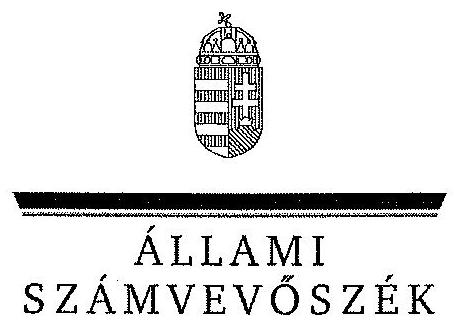
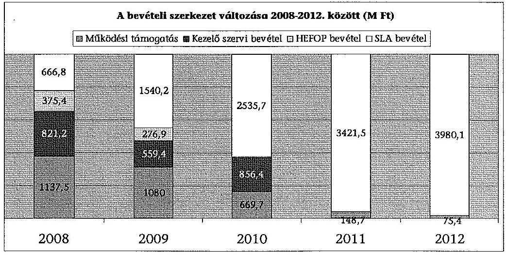
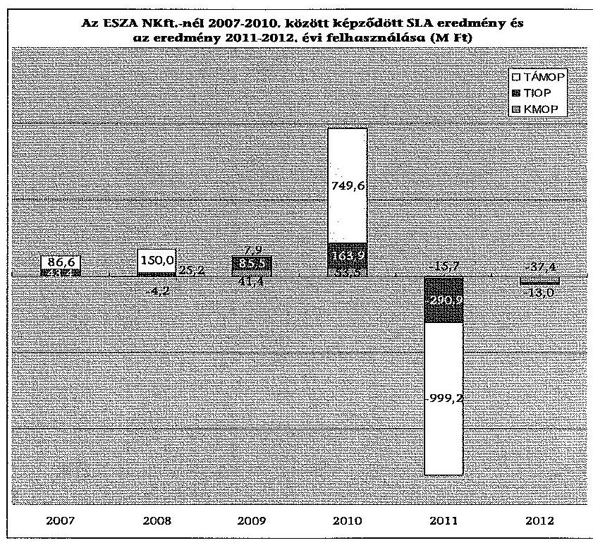
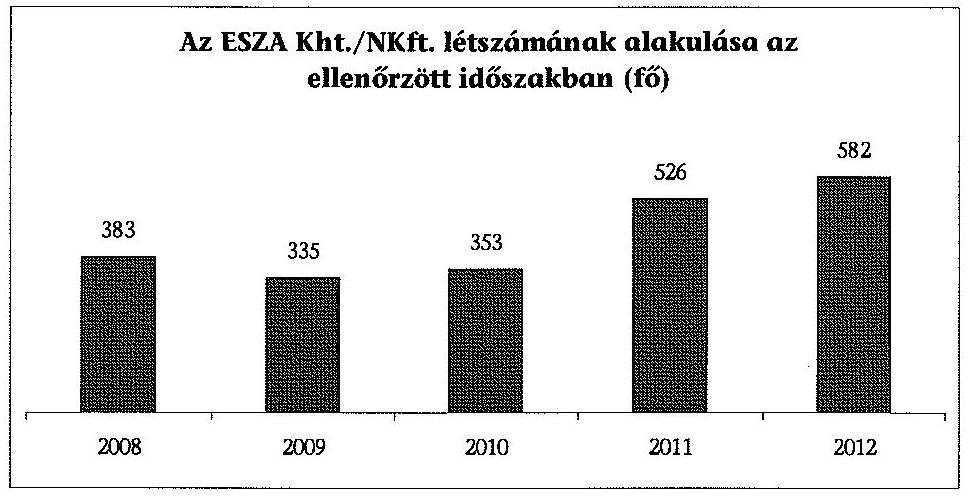
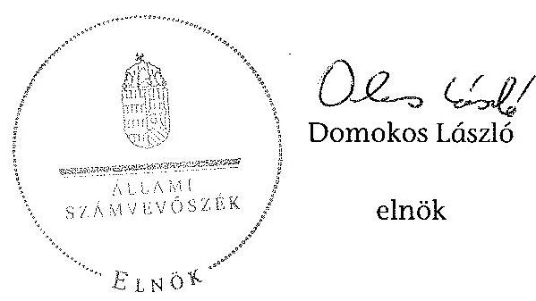

ÁLLAMI
SZÁMVEVÔSZÉK

# JELENTÉS 

az ESZA Társadalmi Szolgáltató Nonprofit Kft. gazdálkodásának ellenőrzéséről

---

# Állami Számvevôszék 

Iktatószám: V-0122-149/2013.
Témaszám: 1157
Vizsgálat-azonosító szám: V0619

## Az ellenőrzést felügyelte:

Dr. Horváth Margit
felügyeleti vezető
Az ellenőrzést vezette és az ellenőrzés végrehajtásáért felelős:
Niklai Heléna
ellenőrzésvezető
A számvevőszéki jelentés összeállításában közreműködtek:
Aradi Csaba
számvevő gyakornok
Kerekes Gábor
számvevő
Nagy Ildikó
számvevő
Az ellenőrzést végezték:

| Daróczi Ágnes Lenke | Gregor Andrea | Kerekes Gábor |
| :-- | :-- | :-- |
| számvevő | számvevő gyakornok | számvevő |
| Nagy Ildikó | Pencz Mária | Samu István |
| számvevő | számvevő | számvevő tanácsos |

## Trubiánszki Hajnalka

számvevő gyakornok

## A témához kapcsolódó eddig készített számvevőszéki jelentések:

## címe

Jelentés Magyarország 2012. évi központi költségvetése végrehăjtásának ellenőrzéséről
Jelentés a Magyar Köztársaság 2011. évi költségvetése végrehajtásának ellenőrzéséről
Jelentés a Nemzeti Civil Alapprogram múködésének- 1127 támogatásának hatásáról, figyelemmel a társadalmi és civil kapcsolatok fejlődésére, egyes kiemelt fontosságú közhasznú feladatok hatékonyabb ellátására
Jelentés a Nemzeti Kulturális Alap múködésének ellenőrzéséről 1002

---

# TARTALOMJEGYZÉK 

BEVEZETÉS ..... 3
I. ÖSSZEGZŐ MEGÁLLAPÍTÁSOK, KÖVETKEZTETÉSEK, JAVASLATOK ..... 6
II. RÉSZLETES MEGÁLLAPÍTÁSOK ..... 13

1. Az ESZA Nonprofit Kft. tevékenysége ..... 13
2. A kontrollrendszer kialakítása és múködése ..... 16
3. A gazdálkodás szabályszerűsége ..... 22
3.1. Pénzügyi gazdálkodás ..... 22
3.2. Vagyongazdálkodás ..... 30
4. Az ESZA Nonprofit Kft. egyes programokhoz kapcsolódó feladatellátása ..... 36
4.1. Hazai forrásból finanszírozott programok ..... 36
4.2. Uniós forrásból finanszírozott programok ..... 41

## MELLÉKLETEK

1. számú Rövidítések jegyzéke
2. számú Fogalomtár
3. számú A bevételi szerkezet változása az ellenőrzött időszakban
4. számú Az ESZA NKft.-nél 2007-2010 között képződött, illetve a 2011-2012. években felhasznált SLA eredmény bemutatása
5. számú A hazai forrásokból finanszírozott pályázati programok teljesítési adatai 2008-2010 között
6. számú Tájékoztató az ESZA NKft. által kezelt TÁMOP, TIOP, KMOP 4. prioritás támogatások 2007-2013. első féléve közötti teljesítési adatairól
7. számú Az ellenőrzött szervezetek ÁSZ által el nem fogadott észrevételei

---

.

---

# JELENTÉS 

## az ESZA Társadalmi Szolgáltató Nonprofit Kft. gazdálkodásának ellenőrzéséről

## BEVEZETÉS

Az ESZA NKft. jogelődjét, az ESZA Kht.-t 2000 októberében kizárólagos állami tulajdonú, kiemelten közhasznú társaságként alapította a Gazdasági Minisztérium, az Oktatási Minisztérium, továbbá a Szociális és Családügyi Minisztérium az Európai Szociális Alap által támogatott foglalkoztatási, oktatási- és nevelési célú programok végrehajtására. A társaság 2009 májusától nyereség- és vagyonszerzési cél nélkül működő, közhasznú jogállású, egyszemélyes nonprofit korlátolt felelősségű társaságként működik.

A szervezet az európai uniós támogatási forrásokhoz kapcsolódóan Magyarország uniós csatlakozását megelőzően a Phare projektek lebonyolítását végeztc. 2004 májusától jogszabályi kijelölés és a Nemzeti Fejlesztési Úgynökséggel kötött megállapodások alapján Közreműködő Szervezetként részt vesz az I. Nemzeti Fejlesztési Terv Humán Erőforrás Operatív Programjának végrehajtásában.

A Mobilitás feladatainak átvételével 2007-től közfeladatként ellátja egyes hazai támogatásból finanszírozott programok kezelését. Az ellenőrzött időszakban összesen 24 hazai pályázati program kezelésével kapcsolatban látott el feladatokat.

Feladatellátásában a hazai támogatások kezelése helyett fő tevékenységét 2011-től egyre inkább az uniós források közvetítése képezte. A korábbi másik két Közreműködő Szervezet, az OM Alapkezelő/OKMTI/Wekerle Sándor Alapkezelő, illetve a Strukturális Alapok Programiroda feladatainak átvételével az egyik legnagyobb hazai Közreműködő Szervezetté vált. Jogszabályi kijelölés és a Nemzeti Fejlesztési Ügynökséggel kötött megállapodások alapján részt vesz a 2007-2013-as időszak uniós támogatásainak döntő többségét biztosító Nemzeti Stratégiai Referencia Keret Társadalmi Megújulás, Társadalmi Infrastruktúra Operatív Programjai, illetve Közép-magyarországi Operatív Programja 4. prioritás 4.1-4.4 ${ }^{1}$ intézkedéseinek végrehajtásában.

Az ellenőrzés célja annak értékelése volt, hogy az ESZA Kht./NKft. 20082012. évek közötti feladatellátását és gazdálkodását a vonatkozó jogszabályoknak megfelelően végezték-e; a tulajdonosi jogokat gyakorló szervezet kialakította-e és a társaság működtette-e a belső kontrollokat az alapfeladatok, be-

[^0]
[^0]:    ${ }^{1}$ 4.1 „A munkaerő-piaci részvételt támogató infrastruktúra fejlesztése", 4.2 „A felsőoktatási intézmények infrastruktúra fejlesztése", 4.3 „Az egészségügyi intézmények infrastruktúra fejlesztése", 4.4 „A társadalmi befogadást támogató infrastruktúra fejlesztése" intézkedések.

---

számolók és a gazdálkodás ellenőrzésében; valamint, hogy a társaság pénz-ügyi- és vagyongazdálkodása a vonatkozó jogszabályoknak megfelelt-e.

Ennek keretében értékeltük:

- a tulajdonosi jogokat gyakorló szervezet kontrollját, a szervezet által kialakított belső kontroll rendszer működésének megfelelőségét, és a belső ellenőrzések megállapításainak hasznosulását;
- a társaság pénzügyi gazdálkodásának szabályszerűségét, és az egyes üzleti években a pénzügyi stabilitás biztosítását;
- a társaság vagyongazdálkodásának, vagyon nyilvántartásának szabályszerűségét;
- a társaság feladatellátásának, a hazai és uniós forrásból finanszírozott programok kezelésének, pályáztatásának szabályszerűségét.

Az ellenőrzés kapcsolódik Magyarország 2012. évi központi költségvetése végrehajtásának pénzügyi-szabályszerűségi ellenőrzéséhez (a továbbiakban: zárszámadási ellenőrzés). A zárszámadási ellenőrzés keretében az ÁSZ ellenőrizte a Nemzeti Fejlesztési Ügynökség, mint az Uniós fejlesztések költségvetési fejezet előirányzatait kezelő szervezet előirányzatokkal való gazdálkodásának és szakmai feladatellátásának szabályszerűségét. A 2012. év végi adatok alapján értékelte továbbá a 2007-2013. évi uniós költségvetési periódus Nemzeti Stratégia Referencia Keret Operatív Programjainak időarányos teljesülését és a támogatások lehívását.

A zárszámadási ellenőrzéshez kapcsolódó szabályszerűségi ellenőrzés ${ }^{2}$ területe, tárgya: A 2008-2012. évekre vonatkozóan ellenőriztük az ESZA Kht./NKft. pénzügyi- és vagyongazdálkodásának szabályszerűségét. Elvégeztük a pénzügyi és vagyongazdálkodási adatok elemzését. Értékeltük az ellenőrzött időszakban elszámolt, a társaság gazdálkodását jelentősen befolyásoló adatok (elszámolt értékcsökkenés, értékvesztés, a céltartalék képzés, a behajthatatlan követelések, szállítói kötelezettségek) alakulását. Ellenőriztük továbbá a feladatellátás, a hazai és uniós forrásból finanszírozott programok végrehajtása szabályszerűségét.

A társaság pénzügyi gazdálkodásának, vagyongazdálkodásának, feladatellátásának szabályszerűségi ellenőrzése a belső kontrollrendszerek kockázatbecslésén alapult, amely meghatározta a minta-elemszámokat.

Az ellenőrzött időszakban az ESZA NKft.-t, mint az uniós programok végrehajtásában Közreműködő Szervezetet az NFÜ irányító hatóságai és belső ellenőrzése mellett 2010-ig a KEHI, majd az Európai Uniós Támogatásokat Auditáló Főigazgatóság, továbbá az uniós ellenőrző szervek, az EU Bizottság és az Európai Számvevőszék is ellenőrizte. Az ezen szervezetek által végzett ellenőrzések megállapításainak áttekintése nem tartozott az ellenőrzés hatókörébe.

[^0]
[^0]:    ${ }^{2}$ A zárszámadási, valamint a kapcsolódó ellenőrzés nem terjedt ki a társaság éves beszámolóinak minősitésére.

---

A Jelentés az uniós forrásból finanszírozott programokkal kapcsolatos feladatellátás tekintetében hasznosítja a 2012., valamint a 2011. évi zárszámadási ellenőrzések kapcsolódó megállapításait. A hazai forrásból finanszírozott programokkal kapcsolatos feladatellátás tekintetében felhasználja továbbá az ÁSZ Nemzeti Civil Alapprogram múködésének-támogatásának ellenőrzése témájában 2011. évben kiadott, valamint a Nemzeti Kulturális Alap múködésének ellenőrzéséről 2010. évben közzétett jelentéseinek megállapításait.

Az ellenőrzés tapasztalataival hozzá kívánunk járulni az ellenőrzött szervezetek szabályszerű állami közfeladat ellátásához, a feltárt kockázatok, hiányosságok megfelelő kezeléséhez, a „jó gyakorlatok" hasznosításához. Az ellenőrzés aktualitását adja, hogy a Kormány 2012. évi határozataiban foglaltak alapján jelenleg folyamatban van a felkészülés a 2014-2020-as uniós költségvetési periódus forrásainak fogadására és az intézményrendszer kialakítására. Megállapításainkkal támogatni kívánjuk az új uniós intézményrendszer kialakítását és múködtetését, egyúttal az uniós források minél nagyobb mértékű felhasználását, ezen keresztül az uniós támogatásokat közvetítő intézmények iránti közbizalom erősítését.

Az ellenőrzést az ÁSZ 2013. I. félévi ellenőrzési terve alapján, a számvevőszéki ellenőrzés szakmai szabályai szerint, szabályszerűségi ellenőrzés módszerével, a vonatkozó nemzetközi standardok figyelembevételével végeztük.

Az ellenőrzés a 2008. január 1.-2012. december 31. közötti időszakra terjedt ki. A helyszíni ellenőrzést az ESZA Nonprofit Kft.-nél, az irányító hatósági feladatokat ellátó Nemzeti Fejlesztési Ügynökségnél és a tulajdonosi jogokat gyakorló Nemzeti Fejlesztési Minisztériumnál folytattuk le.

Az ellenőrzés végrehajtásának jogszabályi alapját az Állami Számvevőszékről szóló 2011. évi LXVI. törvény 1. § (3) bekezdése, az 5. § (2)-(6) bekezdései, valamint az államháztartásról szóló 2011. évi CXCV. törvény 61. § (2) bekezdése együttesen képezték.

Az ÁSZ az Állami Számvevőszékről szóló 2011. évi LXVI. törvény 29. §-a alapján a jelentéstervezetet észrevételezésre megküldte az ellenőrzött szervezetek vezetőinek. Az ellenőrzött szervezetek ÁSZ által el nem fogadott észrevételeit az 7. számú melléklet indokolással együtt tartalmazza.

---

# I. ÖSSZEGZŐ MEGÁLLAPÍTÁSOK, KÖVETKEZTETÉSEK, JAVASLATOK 

Az ESZA NKft. és jogelődje, az ESZA Kht. az ellenőrzött időszakban tevékenységével jelentősen hozzájárult a hazai és az uniós forrásból finanszírozott programok végrehajtásához. A szervezet alapítását az a tartós közérdekű cél motiválta, hogy kiemelten fontos a munkaerő piaci részvételt és az esélyegyenlőséget növelő, összességében a civil társadalom fejlődését elősegítő pályázatok kezelése.

A társaság fő feladata az ellenőrzött időszakban a hazai és uniós támogatási forrásoknak a gazdasági szereplők részére történő közvetítése volt. Feladatköre 2007-től a korábban hazai és uniós forrásból finanszírozott programok kezelését végző szervezetek - a Mobilitás, majd az OM Alapkezelő/OKMTI/Wekerle Sándor Alapkezelő és a Strukturális Alapok Programiroda - feladatainak jogutódként történt átvételével folyamatosan bővült. Az ellenőrzés megállapította, hogy az érintett szervezetek és a társaság közötti feladat átadásátvételek minden esetben szabályozottan, jegyzőkönyvekkel alátámasztott módon valósultak meg.

Fő feladatát 2008-2010 között a hazai forrásokból finanszírozott pályázati programok kezelése jelentette. Az ellenőrzött időszakban összesen 24 hazai pályázati program kezelésével kapcsolatban látott el feladatokat. 2011-2012. években a társaság több előirányzat kezelését átadta a Wekerle Sándor Alapkezelő3 részére. 2012. év végére nyolc hazai program kezelése maradt a társaságnál. A társaság tevékenységéről, a támogatások felhasználásáról készített közhasznúsági jelentések, illetve a szakmai beszámolók alapján a kezelt hazai pályázatok száma 2008-ról 2010-re 11,7\%-kal 22822 darabra emelkedett. Az igényelt támogatás összege évi 37,6-48,1 Mrd Ft között változott, amelynek 19,9-26,2\%-a került kifizetésre. A hazai programokra az ellenőrzött időszakban öszszesen 53,7 Mrd Ft támogatás kifizetését teljesítették. A megítélt támogatások döntő hányadát ( $64,1-80,3 \%$-át) a Nemzeti Civil Alapprogram tette ki. A hazai programokat a támogatási/vállalkozási szerződésekben megjelölt határidőre nem sikerült teljes mértékben lezárni a pályázatok hosszú átfutási, megvalósítási ideje, és azok lezárásának elhúzódása miatt.

A társaság fő tevékenysége 2011-től az uniós források közvetítése volt. Ennek keretében Közremüködő Szervezetként 2011-től 1793,6 Mrd Ft összegű uniós (és kapcsolódó hazai társfinanszírozási) keretet kezel, amely a 2007-2013-as időszakban a Nemzeti Stratégiai Referencia Keret alapján Magyarország rendelkezésére álló források mintegy 22\%-át jelenti. A társaság által kezelt uniós pályázatok száma a 2008-2012. közötti időszakban hatszorosára, 16993 darabra nőtt. A könnyített elbírálású (normatív) támogatások száma ugyanebben az időszakban közel hét és félszeresére emelkedett. A támogatott pályá-

[^0]
[^0]:    ${ }^{3}$ 2012. augusztus 16-tól Közigazgatási és Igazságügyi Hivatal.

---

zatok aránya 2008-ban 21\%, míg 2012-ben 31\% volt. Az ESZA NKft. a Társadalmi Megújulás, Társadalmi Infrastruktúra, illetve Közép-magyarországi Operatív Program keretében 2012. év végéig mintegy 800 Mrd Ft támogatást fizetett ki. A 2012. év végi adatok alapján az ESZA NKft. által kezelt Társadalmi Megújulás, illetve a Társadalmi Infrastruktúra Operatív Programoknál kormányzati, illetve európai bizottsági intézkedések hiányában - továbbra is magas a forrásvesztés kockázata ${ }^{4}$. Az ESZA NKft. által kezelt TÁMOP, TIOP, KMOP 4. prioritás támogatásainak 2007-2013. I. féléve közötti teljesítési adataira a 6. sz. mellékletben adunk kitekintést.

Az ESZA NKft. vizsgált időszakra vonatkozó feladatellátása az ellenőrzés megállapításai alapján részben megfelelő volt. A pályázati rendszer teljes folyamatának szabályozottsága mind a hazai, mind az uniós forrásokból biztosított programok esetében megfelelő volt, a programok pályázati rendszereinek múködésében hibákat viszont azonosítottunk.

A hazai pályázatok elbírálása részben volt megfelelő, mivel a bíráló bizottságok a támogatási döntéseknél esetenként eltértek a korábban meghatározott minimális ponthatároktól. Emellett az ellenőrzött tételek egy részénél a megkötött támogatási szerződésekről hiányzott a kötelezettségvállalás ellenjegyzése. Ezekben az esetekben az Ámr. ${ }_{1}$ ellenjegyzésre vonatkozó előírásai nem teljesültek.

Az uniós pályáztatási folyamat áttekintését és a változások követését nehezítette, hogy egy pályázati életciklus alatt az eljárásrend több verziója alapján kellett a pályázat különböző részfolyamatai esetében eljárni, amely az áttekinthetőség és az ellenőrizhetőség szempontjából kockázatot hordozott. Az ellenőrzés megállapította, hogy az uniós pályázati felhívások országos napilapban való meghirdetése hiányosan történt. A 2008. január 1. és 2010. január 1. közötti időszakban megkötött támogatási szerződéseken az Ámr.,, és önkormányzati kedvezményezettek esetében az Áht. ${ }_{1}$ előírásaival, a kötelezettségvállalás dokumentumaként szolgáló támogatói okiratokon az Ámr. ${ }_{2}$ az Ávr., és önkormányzati kedvezményezettek esetében az Áht. ${ }_{1}$ előírásaival ellentétben nem szerepelt a pénzügyi ellenjegyzés. Továbbá egy TÁMOP pályázatra jogosulatlanul történt összesen $48,9 \mathrm{M} F$ értékben támogatás-kifizetés, mivel a jogelőd KSz (OKMTI) a törvényi előírásokkal szemben összeférhetetlenségi nyilatkozat hiányában is elfogadta a pályázatot. A helyszíni ellenőrzés lezárásáig nem tettek intézkedéseket a jogosulatlanul kifizetett támogatások visszakövetelésére.

Az ellenőrzött időszakban jelentős változások történtek a társaság irányítási rendszerében. Az ESZA Kht. felett a Magyar Állam nevében tulajdonosi jogok gyakorló személyében többször következett be változás. Az uniós programok szakmai felügyeletét gyakorló Nemzeti Fejlesztési Ügynökség feladata a Közremúködő Szervezet Operatív Programmal kapcsolatos tevékenységének támogatáspolitikai felügyelete, az átruházott feladatok végrehajtásának ellenőrzése volt. Az ÁSZ a 2011. évi zárszámadási ellenőrzés során megállapította,

[^0]
[^0]:    ${ }^{4}$ Az ÁSZ a 2012. évi zárszámadási ellenőrzésről készített 13080. sz., 2013. augusztusban kiadott Jelentésében állapította meg (82. oldal).

---

hogy többek között az OKMTI/Wekerle Sándor Alapkezelő és a Strukturális Alapok Programiroda Közreműködő Szervezetek megszűnésével, záró elszámolásával és a feladatok átadás-átvételével kapcsolatban a Nemzeti Fejlesztési Ügynökség nem végzett ellenőrzést. Nem ellenőrizte a Közreműködő Szervezetekre átruházott feladatok végrehajtását sem.

A társaság belső kontrolljai az ellenőrzött időszakban összességében megfelelően múködtek. Az ellenőrzés során hiányosságokat a tulajdonosi kontrollok ${ }^{5}$ múködésében tártunk fel, amelyek a vagyongazdálkodást befolyásolták. A Mobilitástól 2007. januárban, a Strukturális Alapok Programirodától 2011 januárjában átvett feladatok ellátásához kapcsolódó vagyonelemek tulajdonjogviszonyának végleges rendezése több éves késedelemmel történt. Utóbbi esetben szerepet játszott, hogy a tulajdonosi joggyakorló NFM az átvett vagyontárgyak értékeléséhez több alkalommal könyvvizsgálót vett igénybe.

Az ügyvezető igazgató által múködtetett belső kontrollok megfelelően működtek. Az ellenőrzött időszak valamennyi éves beszámolójának valódiságát, megbízhatóságát és jogszerűségét könyvvizsgáló ellenőrizte, a beszámolókra elfogadó hitelesítő záradékot adott ki. A könyvvizsgálói munka során észlelt eltérések kijavítása folyamatosan megtörtént. A társaságnál 2008-2012. között a belső ellenőrzés által végzett szabályszerűségi és pénzügyi ellenőrzések száma és hatékonysága nőtt. Az öt év során összesen 44 ellenőrzést folytattak le, melyből 27 az utolsó két évre esett. Az ellenőrzések döntően az uniós és hazai forrásból finanszírozott programok kezelésére vonatkoztak, amelyek alapján 29 intézkedési terv készült. Az intézkedési tervekben foglalt feladatokat 2012-ben teljes körűen végrehajtották.

A jogszabályokban meghatározott feladatkör változásával, a kezelt hazai pályázatokkal kapcsolatos feladatok csökkenésével és az uniós forrásokból finanszírozott programokkal kapcsolatos feladatbővüléssel összefüggésben változott a társaság bevételi struktúrája. Az ESZA Kht.-nek/NKft.-nek bevétele az ellenőrzött időszakban a vonatkozó költségvetési törvények alapján kapott támogatásból, a hazai pályázatok kezeléséért, valamint az uniós támogatások esetében a HEFOP, TÁMOP, TIOP, és a KMOP közreműködő szervezeti feladatok ellátásáért kapott bevételből keletkezett. A társaság múködési támogatása a 2008. évi 1,1 Mrd Ft-ról 2012. évre 100 M Ft alá csökkent, amíg Közreműködő Szervezetként az uniós pályázati tevékenységéből származó ún. SLA bevétele ${ }^{6}$ a 2008. évi közel 0,7 Mrd Ft-ról 4,0 Mrd Ft-ra emelkedett.

[^0]
[^0]:    ${ }^{5}$ SzMM és NFM.
    ${ }^{6}$ A Nemzeti Fejlesztési Ügynökség és a Közreműködő Szervezet között megkötött szolgáltatási, ún. SLA szerződésekben rögzítették a Közreműködő Szervezetek feladatellátása finanszírozásának módját.

---

A kapott támogatásokkal/bevételekkel történő elszámolási kötelezettségeknek a társaság eleget tett, az elszámolási határidőket azonban nem tartotta be a kezelő szervi tevékenységgel kapcsolatos szerződések felénél, továbbá 2011-2012-ben az SLA megállapodásoknál, a módosított SLA szerződés NFÜ által történt késedelmes, visszamenőleges hatályú aláírása miatt.

Az SLA szerződések alapján végzett közreműködő szervezeti tevékenység bevételéből a társaságnak 2007-2010 között összesen 1,4 Mrd Ft eredménye képződött (TÁMOP 1,0 Mrd Ft, TIOP 0,3 Mrd Ft, KMOP 0,1 Mrd Ft). Az EU Bizottság 2010-ben kifogásolta a Közreműködő Szervezetek NFÜ-nek nyújtott „szolgáltatásai" ellenértékéből nyereség képződését, amelyet az ÁSZ korábbi zárszámadási ellenőrzései is megállapítottak. Az NFÜ a Közreműködő Szervezetek feladatellátásával kapcsolatos díjakat ezek alapján 2011től a korábban keletkezett eredményük terhére számoltatja el, annak kimerüléséig. Az ESZA NKft. 2012. év végéig 50 M Ft kivételével felhasználta a korábbi SLA eredmények összegét.

---

A társaság 2008-2012. évi pénzügyi gazdálkodása összességében megfelelő volt, ugyanakkor az ellenőrzés tárt fel hibákat, hiányosságokat, amelyek nagyságrendjüket tekintve azonban nem befolyásolták a gazdálkodás szabályszerűségét. A hibák, hiányosságok a következő területeket érintették: A fejezeti kezelésű előirányzatok terhére elszámolt működési költségek felosztását nem szabályozták. Szabályozás hiányában az ESZA múködési költségeket a hazai programokra eső működési költségekre számolta el, amelyeket az SLA szerződések nem tettek lehetővé. Az ESZA terven felüli értékcsökkenést káresemény, illetve elavult, meghibásodott tárgyi eszközök selejtezése után számolt el, viszont a selejtezett tárgyi eszközökről készített jegyzék alapján nem volt megállapítható az eszközök könyv szerinti értéke és azok szabályszerű elszámolása. A 2011-2012. években 52,9 M Ft összegű eszközberuházás passzív időbeli elhatárolások közötti elszámolása helytelenül történt, nem felelt meg a Számv. tv. 44. § (2) bekezdésében foglaltaknak. A követelések tartalma megfelelt a Számv. tv.-ben foglalt rendelkezéseknek, azok értékelése, valamint besorolása azonban több esetben ellentétes volt a törvényben és a számviteli politikában rögzítettekkel. A társaság követeléseit 2010-2011. év végén nem értékelte, azokra értékvesztést nem számolt el. Könyveiben több, tartósan - volt munkavállalókkal és minisztériumokkal szemben - fennálló, bizonytalan követelést mutatott ki, megsértve ezzel az óvatosság elvét. Követeléseinek behajtása érdekében érdemben intézkedést sok esetben nem vagy csak késedelmesen tett, a lejárt követeléseknél nem kezdeményezte a behajthatatlanság miatti törlést ${ }^{7}$, amely nem felelt meg a Számv. tv. 3. § (5) bekezdése előírásainak. Az ESZA NKft. a lejárt esedékességű szállítói kötelezettségek vonatkozásában (2012. évben a teljes szállítói állomány 4,4\%-ában) mérlegében el nem ismert, illetve

[^0]
[^0]:    ${ }^{7}$ A lejárt esedékességű követelések teljes követelésállományhoz viszonyított aránya 1\% alatt volt. A helyszíni ellenőrzés lezárásáig 21 lejárt esedékességủ követelést minősítettek behajthatatlannak.

---

elévült kötelezettséget mutatott ki, megsértette a Számv. tv. 42. § (1) és (3) bekezdéseiben foglalt előírásokat, valamint a 15. § (3) bekezdésben foglalt valódiság elvét.

A társaság vagyongazdálkodása összességében megfelelő volt, ugyanakkor az ellenőrzés hibákat, hiányosságokat tárt fel a feladatváltozásokhoz kapcsolódó vagyonelemek átadás-átvételének végrehajtásában. A Mobilitástól, illetve a Strukturális Alapok Programirodától, mint jogelőd szervezetektől átvett eszközök besorolásánál, bekerülési értékénél, értékcsökkenési leírásánál, valamint számviteli nyilvántartásokba való felvételénél szabálytalanságok mutatkoztak. Az egyes szervezetek közötti feladatváltozásokhoz kapcsolódó vagyontárgy-mozgások végrehajtása, dokumentumokkal való alátámasztása és utólagos nyomon követhetősége nem valósult meg teljes körűen.

A társaság folyamatos fizetőképessége az ellenőrzött időszakban biztosított volt. 2008-2012. években rendelkezett annyi forgóeszközzel, amely a rövid lejáratú kötelezettségeit fedezte. A követelések és kötelezettségek állományának nagysága és növekvő tendenciája a feladatellátást és a gazdálkodást nem befolyásolta.

Az Állami Számvevőszékről szóló 2011. évi LXVI. törvény 33. § (1) bekezdésében foglaltak értelmében a jelentésben foglalt megállapításokhoz kapcsolódó intézkedési tervet köteles az ellenőrzött szervezet vezetője összeállítani és azt a jelentés kézhezvételétől számított harminc napon belül az ÁSZ részére megküldeni. Amennyiben az intézkedési tervet határidőben nem küldi meg a szervezet, vagy az továbbra sem elfogadható, az ÁSZ elnöke a hivatkozott törvény 33. § (3) bekezdés a)- b) pontjaiban foglaltakat érvényesítheti.

A helyszíni ellenőrzés intézkedést igénylő megállapításai és javaslatai

# az ESZA NKft. felett tulajdonosi jogokat gyakorló részére 

A Mobilitástól 2007. januárban, a Strukturális Alapok Programirodától 2011. januárban átvett feladatok ellátásához kapcsolódó vagyonelemek tulajdonjogviszonyának végleges rendezése a tulajdonosi joggyakorló (SZMM, NFM) részéről több éves késedelemmel történt.

Javaslat:
Gondoskodjon az ESZA Nonprofit Kft. esetében a tulajdonosi kontrollok megfelelő és folyamatos müködtetéséről az állami vagyon védelme érdekében.

## a Nemzeti Fejlesztési Úgynökség elnökének és az ESZA Nonprofit Kft. Közremüködő Szervezet vezetőjének

Az ellenőrzés az uniós programok pályázati rendszereinek működésében hibákat azonosított. A 2008. január 1. és 2010. január 1. közötti időszakban megkötött támogatási szerződéseken az Ámr.,, a kötelezettségvállalás dokumentumaként szolgáló támogatói okiratokon az Ámr. ${ }_{2}$ az Ávr., és önkormányzati kedvezményezettek esetében az Áht., előírásaival ellentétben nem szerepelt a pénzügyi ellenjegyzés. To-

---

vábbá egy TÁMOP pályázatra jogosulatlanul történt összesen 48,9 M Ft értékben támogatás-kifizetés, mivel a jogelőd KSz (OKMTI) a törvényi előírásokkal szemben összeférhetetlenségi nyilatkozat nélkül is elfogadta a pályázatot. A helyszíni ellenőrzés lezárásáig nem tettek intézkedéseket a jogosulatlanul kifizetett támogatások viszszakövetelésére.

Javaslat:
Vizsgálják felül a jogosulatlanul, pénzügyi ellenjegyzés, illetve összeférhetetlenségi nyilatkozat nélkül kifizetett támogatások visszakövetelésének jogi lehetőségét. Amennyiben arra mód van, intézkedjenek a jogosulatlanul kifizetett támogatások visszakövetelésére. Vizsgálják ki, hogy a mulasztások miatt munkajogi, illetve kártérítési felelősség érvényesíthető-e. Amennyiben ezek feltételei fennállnak, a szükséges intézkedéseket tegyék meg.

---

# II. RÉSZLETES MEGÁLLAPÍTÁSOK 

## 1. Az ESZA Nonprofit Kft. teVékEnysége

Az ESZA NKft. jogelődjét, az ESZA Európai Szociális Alap Nemzeti Programirányító Iroda Társadalmi Szolgáltató Kht.-t 2000 októberében kizárólagos állami tulajdonú, kiemelten közhasznú társaságként alapította a Gazdasági Minisztérium, az Oktatási Minisztérium, továbbá a Szociális és Családügyi Minisztérium az Európai Szociális Alap által támogatott foglalkoztatási, oktatási- és nevelési célú programok végrehajtására. A társaság feladata az Európai Szociális Alap típusú munkaerő-piaci integrációs, továbbá az intézményfejlesztési és az esélyegyenlőséget előmozdító programok előkészítésében való részvétel, a jóváhagyott programok teljes körű szakmai és pénzügyi lebonyolítása, a programvégrehajtás ellenőrzése és utóellenőrzése volt.

A társaság 2007 februárjában egyszemélyessé ${ }^{8}$ vált, többször módosított társasági szerződése helyébe alapító okirat lépett, melynek egységes szerkezetbe foglalt szövegét 2007 szeptemberében adták ki első alkalommal.

A szervezet 2009 májusától nyereség- és vagyonszerzési cél nélkül múködő, közhasznú jogállású, egyszemélyes nonprofit korlátolt felelősségű társaságként múködik, amely megjelent az alapító okirat módosításában. Az átalakulás az FB előzetes, illetve az egyszemélyes tag jóváhagyásával történt. A társaság tevékenységében az átalakulással nem történt változás.

A Kht. 2009. június 30-ig a közhasznú társaságokra irányadó szabályok szerint múködhetett tovább. Két éven belül dönthetett arról, hogy nonprofit Kft.-ként múködik tovább, más nonprofit gazdasági társasággá alakul át vagy jogutód nélkül megszűnik.

A társaság múködését és gazdálkodását felügyelő bizottság ellenőrzi. Az egyszemélyes tag gondoskodott az FB létrehozásáról, összhangban a vonatkozó jogszabályokkal ${ }^{9}$ és az alapító okirattal. A társaságnál a Számv. tv. előírásai alapján kötelező a könyvvizsgálat. A vezető tisztségviselők, az FB tagjait és a könyvvizsgálót az alapító okiratban kijelölték. A könyvvizsgáló tevékenységét szerződés alapján végzi.

A társaságnál az ellenőrzött időszakban kétszer, 2008-ban és 2010-ben történt ügyvezető igazgató váltás.

[^0]
[^0]:    ${ }^{8}$ Egyszemélyes tagja a Magyar Állam. Az ellenőrzött időszak kezdetétől a Magyar Állam nevében az MNV Zrt., 2008 júniusától az SzMM, 2010-ben a NEFMI, majd az NFM gyakorolta a tulajdonosi jogokat.
    ${ }^{9}$ Gt. 33. § (1) bekezdés, (2) bekezdés c) pont. Civil tv. 240 . § (1) bekezdés.

---

A társaság tevékenységéről, a támogatások felhasználásáról közhasznúsági jelentést, továbbá éves beszámolót és üzleti jelentést készít. Számláját a Magyar Államkincstárnál vezeti.

Az ESZA NKft. múködésének célját, tevékenységi körét az alapító okirat nevesíti, amely szerint tartós közérdekű cél a tulajdonos által jogszabályi szinten rögzített speciális feladatok ellátása. Így különösen a munkaerő piaci integrációs és foglalkoztatási, oktatási, képzési programok, ifjúsági, sport, szociális, fogyasztóvédelmi, a civil szféra fejlesztését támogató intézményfejlesztési és az esélyegyenlőséget elősegítő programok végrehajtása, azaz a munkaerő piaci részvételt és az esélyegyenlőséget növelő, összességében a civil társadalom fejlődését elősegítő pályázatok kezelésével összefüggő feladatokban való közreműködés.

Az ESZA Kht./NKft. a 2008-2010. közötti időszakban összesen 24 hazai pályázati programnak volt a kezelő szerve. Az ESZA Kht. a hazai forrásokból finanszírozott támogatásokhoz kötődő feladatokat - az egyes fejezetek pályázati támogatásainak lebonyolításával kapcsolatosan - 2007. január 1-jétől végzett, amikor a 8/2006. (XII. 27.) sz. SzMM rendelet alapján jogutódként átvette a Mobilitás hazai pályázatok kezelésével összefüggő feladatait.

A Kht. 2007. december 31-ig a Kincstárral párhuzamosan volt a Nemzeti Civil Alapprogram kezelő szervezete is, majd ezt követően 2008. január 1-jétől önállóan végezte a feladatot.

A 2011-2012. években a társaság hat előirányzatot átadott más kezelő szervnek. A 311/2010. (XII. 23.) Korm. rendelet alapján a Nemzeti Civil Alapprogrammal kapcsolatos feladatok 2011-ben teljes körűen átadásra kerültek a WSA részére. Emellett szintén a WSA részére kerültek átadásra 2011. április 1-vel a 12/2011. (III. 30.) KIM rendeletben meghatározottak szerinti „fejezeti támogatások" elszámolásával, ellenőrzésével összefüggő feladatok.

A 311/2010. (XII. 23.) Korm. rendelet alapján 2011. január 1-től az NCA, illetve a 12/2011. (III. 30.) KIM rendelet alapján a KIM fejezethez 2010-ben átadott öt előirányzat terhére megítélt, 2011. évet megelőző év(ek)ben biztosított támogatások jogszabályban, támogatási megállapodásban foglaltak alapján történő elszámoltatását és az arról történő beszámolást, az ellenőrzésben való közreműködést a WSA-nak kellett elvégeznie.

A „Gyermekjóléti és gyermekvédelmi szolgáltatások fejlesztése, módszertani feladatok ellátása" fejezeti kezelésű előirányzatot - a 12/2011. (III. 30.) KIM rendelet 92. §ának előírásai ellenére - nem adták át a WSA részére, mivel az előirányzat továbbra is a NEFMI költségvetésében szerepelt. A szabályozási környezet nem volt egyértelmű. Az elszámoltatási és beszámolási feladatokat az ESZA NKft. végezte el 2011. évben. A 1188/2010. (IX. 10.) Korm. határozat 1.5 pontja előirta a megosztásra kerülő fejezeti kezelésű előirányzatokról szóló megállapodások megkötését. A KIM és a NEFMI 2010. november 22-én megállapodást kötött egymással az előirányzat megosztásáról, amelynek 3. e) pontja szerint $15,5 \mathrm{M}$ Ft - egyedi támogatásokat szolgáló - előirányzat került a KIM-hez. Az ESZA NKft. állásfoglalást kért a KIM-től, amely szerint az előirányzat pályázati úton megítélt támogatása felett a NEFMI rendelkezik. A 12/2011. (III. 30.) KIM rendelet nem rendelkezett az SzMM rendelet ${ }_{1,3,3}$ alapján az ESZA NKft. által kezelt további előirányzatok

---

státuszáról. A programok lezárásának feladata, és a dokumentumok az ESZA NKft.-nél maradtak.

A 24/2010. (XII. 30.) NEFMI rendelet értelmében a Gyermek és Ifjúsági Alaphoz kapcsolódó hazai forrásokra épülő támogatásokkal kapcsolatos feladatkörök 2011. január 1-vel átadásra kerültek az NCsSzI részére.

Az ESZA Kht./NKft. a 22/2004. (VI. 8.) FMM-OM együttes rendelet alapján a HEFOP közoktatási, szakképzési és felsőoktatási intézkedések végrehajtásában, a 21/2007. (IX. 7.) ÖTM-SzMM együttes rendelet alapján a TÁMOP 1., 2., 5. és 7. prioritásainak, a TIOP 3. prioritásának, valamint a KMOP 4. prioritásának végrehajtásában vett részt Közremúködő Szervezetként. A társaság uniós forrásközvetítési feladatkörében is 2011. január 1-ével történt jelentős változás. A 41/2010. (XII. 31.) NFM rendelet az ESZA NKft.-t - a feladatokat korábban ellátó OKMTI/WSA ${ }^{10}$ és a Strukturális Alapok Programiroda jogutódjaként - kijelölte a HEFOP valamennyi intézkedése, továbbá a TÁMOP, TIOP, valamint a KMOP humán közszolgáltatások intézményrendszerének fejlesztése 4. prioritás 4.1-4.4 intézkedések végrehajtásában Közreműködő Szervezetnek. A feladatváltozással kapcsolatosan az ESZA NKft. 2011-ben elkészítette az alapító okirat és az SzMSz-módosításokat.

A HEFOP intézkedések végrehajtásában 2004-től 2011. január 1-ig az ESZA Kht./NKft. mellett további két KSz vett részt, a 22/2004. (VI. 8.) FMM-OM együttes rendelet alapján a közoktatási, szakképzési és felsőoktatási intézkedések esetében az OM Alapkezelő/OKMTI, a 10/2004. (IV. 7.) FMM-ESzCsM együttes rendelet alapján az egészségügyi és szociális intézkedések tekintetében a STRAPI látta el a közreműködő szervezeti feladatokat.

A 21/2007. (IX. 7.) ÖTM-SzMM együttes rendelet, a 22/2007. (IX. 7.) ÖTM-EüM együttes rendelet, valamint a 25/2007. (X. 5.) ÖTM-OKM együttes rendelet, illetve a 9/2008. (VII. 25.) NFGM rendelet alapján a TÁMOP, a TIOP, valamint a KMOP 4. prioritásának érintett intézkedései végrehajtásában 2011. január 1-ig három KSz, az ESZA Kht., az OKMTI és a STRAPI vett részt.

Az NFÜ és a KSz közötti feladatmegosztást a vonatkozó hazai jogszabályok mellett az NFÜ és a KSz között megkötött szolgáltatási, ún. SLA szerződésekben rögzítették, amelyek tartalmazzák a KSz finanszírozásának módját is.

Az OKMTI/WSA és a STRAPI közreműködő szervezeti feladatai a megszüntető okiratok és a feladatok ellátására vonatkozó rendeletek értelmében 2011. január 1től átkerültek az ESZA NKft.-hez. A társaság az érintett projektek, programok végrehajtásával kapcsolatban kötött SLA szerződésekkel összefüggően fennálló vagyoni jogok és kötelezettségek tekintetében jogutóda az OKMTI/WSA-nak és a STRAPI-nak.

Az egyes szervezetek közötti feladat átadás-átvételek minden esetben szabályozottan, jegyzőkönyvekkel alátámasztott módon valósultak meg.

[^0]
[^0]:    ${ }^{10}$ 2010. november 27 -től a 259/2010. (XI. 16.) Korm. rendelet értelmében az OKMTI Wekerle Sándor Alapkezelő néven múködött tovább a KIM irányítása alatt. A WSA elnevezése a 177/2012. (VII. 26.) Korm. rendelet alapján 2012. augusztus 16-tól közigazgatási és Igazságügyi Hivatalra változott.

---

A jegyzőkönyvek és mellékleteik a 2010. évi XLII. tv. 6. §-ában és 1. sz. mellékletében foglaltaknak megfelelő tartalommal kerültek elkészítésre és az adott feladatcsoporthoz kapcsolódó összes releváns tényt, adatot, információt tartalmazzák, melyeket az átadó teljességi nyilatkozata is megerősített. Az informatikai területet érintően külön jegyzőkönyvek készültek. 2010. december 12-én került jegyzőkönyvvel átadásra a WSA részére az EPER informatikai szakrendszer és a hazai pályázatokhoz kapcsolódó adatbázisok, illetőleg 2011. január 13-án a STRAPI-tól átvételre kerültek a különböző, a feladatellátáshoz kapcsolódó adatbázisok. Az informatikai átadás-átvételről készített jegyzőkönyvek tartalma a jogszabályban foglaltaknak megfelel.

A tulajdonosi jogok gyakorlása és a szakmai felügyelet ellátása az ellenőrzött időszakban a hazai forrásból finanszírozott programok esetében nem vált el. Az uniós forrásból finanszírozott programok esetében a támogatások szakmai kezeléséért, felhasználásáért az NFÜ, illetve a szervezetén belül működő IH-k felelnek. A KSz tevékenységét a közösségi, valamint a vonatkozó hazai jogszabályok és az IH által meghatározott szempontok alapján végzi. Az ESZA Kht./NKft.-ra, mint KSz-re átruházott feladatok ellátásáért a végső felelősség az NFÜ IH-kat terheli. A jogszabályi előírások alapján az NFÜ feladata a KSz Operatív Programmal kapcsolatos tevékenységének támogatáspolitikai felügyelete, az átruházott feladatok végrehajtásának ellenőrzése. Az ÁSZ a 2011. évi zárszámadási ellenőrzésről készített 1297. sz. Jelentésében megállapította, hogy többek között az OKMTI/WSA és a STRAPI KSz-ek megszűnésével, záró elszámolásával és a feladatok átadás-átvételével kapcsolatban az NFÜ nem végzett ellenőrzést, valamint, hogy az IH-k - részben létszámproblémák miatt -2011-ben nem ellenőrizték a KSz-ekre átruházott feladatok végrehajtását.

# 2. A KONTROLLRENDSZER KIALAKÍTÁSA ÉS MŰKÖDÉSE 

Az ESZA NKft. belső kontrollrendszere a belső kontroll értékelés alapján magas megfelelőségi értéket, alacsony kockázati besorolást kapott. A belső kontroll munkalapok előzetes értékelését a helyszíni ellenőrzés megállapításai alapján felülvizsgálva, a belső kontrollrendszer minősítése nem változott. Az ellenőrzés megállapításai visszaigazolták a becsült belső kontroll kockázatot, a társaság belső kontrolljai az ellenőrzött időszakban összességében megfelelően müködtek. Az ellenőrzés a kontrolltevékenységek között a tulajdonosi jogok gyakorlója által működtetett kőntrollok tekintetében a 2008-2009-es, illetve a 2011-2012. éveket érintően. tárt fel hiányosságokat.

Nonprofit gazdasági társaság alapítására, müködésére a Gt. szabályait kell alkalmazni. A nonprofit Kft. üzletszerű gazdasági tevékenységet csak kiegészítő jelleggel végezhet. A társaság tevékenységéből származó nyereség nem osztható fel a tagok között, az a társaság vagyonát gyarapítja. A társaság müködésére a könyvvezetés és a beszámolás tekintetében a Számv. tv. szabályai az irányadóak, illetve a közhasznú jogállásra tekintettel a közhasznú szervezetekre vonatkozó előírásokat is alkalmaznia kell.

Az ellenőrzés megállapította, hogy a kontrollkörnyezet tekintetében a szervezet és a szabályozottság megfelelő. A társaság rendelkezik a Gt.-ben előírt alapító okirattal. Az alapító okirat az ellenőrzött időszakban megfelel t a törvény tartalmi előírásainak. A vezető tisztségviselők, az FB tagjait

---

és a könyvvizsgálót az alapító okiratban kijelölték. Az alapító okiratot az ellenőrzött időszakban hat alkalommal módosították, a szervezeti átalakulásokhoz, a társaság törzstőkéjének emeléséhez, a vezető tisztségviselő és az FB tagok megbízásához kapcsolódóan.

A társaság az ellenőrzött időszakban rendelkezett az egyszemélyes tag által jóváhagyott SzMSz-szel, amely tartalmazta a szervezet felépítését, szervezeti ábráját, a szervezet egységeinek feladatait, vezetési és irányítási rendszerét és müködési szabályait. Az SzMSz-t az ellenőrzött időszakban kilencszer módosították, jellemzően a szervezeti egységek változásai miatt.

A társaság elkészítette a pénzügyi és vagyongazdálkodást megalapozó belső szabályzatokat. A Számv. törvényben meghatározott számviteli politikát kialakították, azt a társaság ügyvezetője jóváhagyta. A számviteli politikát az ellenőrzött időszakban kétszer aktualizálták. A társaság a Számv. törvényben előírt szabályzatokat - eszközök és források leltárkészítési és leltározási szabályzata, eszközök és források értékelési szabályzata, önköltség-számítási szabályzat, pénzkezelési szabályzat - elkészítette. A társaság rendelkezett a Számv. tv. előírásainak megfelelő számlarenddel. A szabályzatok tartalma megfelelt a jogszabályi előírásoknak. Aktualizálásuk - az eszközök és források értékelési szabályzata kivételével - minden esetben követte a számviteli politika módosulásait.

Az ellenőrzött időszakban a számviteli politika 2010 januárjában és 2012 novemberében, az eszközök és források értékelési szabályzata azonban először csak 2012 novemberében módosult.

Az eszközök és források leltárkészítési és leltározási szabályzatát az ellenőrzött időszakban kétszer, 2010 januárjában és 2012 decemberében módosították, mivel a 2010 januárjától hatályos szabályzat nem tartalmazta a leltározási ütemterv készítésére és a tartalmára vonatkozó előírásokat, valamint a leltárértékelés ellenőrzésének módját.

A társaság a Számv. törvényben előírt egységes bizonylati renddel csak 2012. novembertől rendelkezik. A bizonylati rendre vonatkozó előírások a korábbi időszakban négy különböző szabályzatban voltak megtalálhatóak, a leltárkészítési és leltározási, a pénzkezelési, a számlakezelési szabályzatokban, valamint a kontrolling kézikönyvben.

A társaság átmenetileg szabad pénzeszközeinek felhasználását befektetési szabályzatban szabályozták, azonban a 2005 szeptemberétől hatályos dokumentumot a 2008-2012. évek között nem aktualizálták. A befektetési szabályzatot az Áht-1 alapján állították össze, amely 2012. január 1-től hatályon kívül került. A Civil tv-2 szerinti, a tulajdonos által elfogadott befektetési szabályzattal a társaság nem rendelkezik. A szabályzat aktualizálása a helyszíni ellenőrzés lezárásakor folyamatban volt, az alapító okiratban előírt felügyelőbizottsági jóváhagyásra történő felterjesztés fázisában.

A társaság rendelkezik közbeszerzési szabályzattal, azonban annak aktualizálása 2010 júniusát követően nem történt meg. Minden egyes közbeszerzési eljáráshoz külön eljárásrend készült, megfeleltetve a hatályos Kbt.-nek. A Kbt. hatálya alá nem tartozó beszerzések kezelésére beszerzési szabályzatot alkottak. A 2009. október 15-e óta hatályos szabályzatot nem aktualizálták, holott mind az ügyveze-

---

tő személyében, mind a szervezet felépítésében változások következtek be a 2012. év végéig.

A kockázatkezelés megfelelő volt. A társaság a 2008-2012. években mind a belső ellenőrzési kézikönyvekben, mind a belső ellenőrzési tervekben, mind a FEUVE eljárásrendben meghatározta a kockázat fogalmát, elemzésének, értékelésének és kezelésének módszereit.

A belső ellenőrzési kézikönyvekben meghatározták a kockázat fogalmát. A belső ellenőrzési tervekben a kockázatok elemzése során felmérték a társaság fófolyamatait, valamint egyes rendszereinek kockázati tényezőit. Meghatározták a kockázati tényezők súlyait.

A FEUVE eljárásrendben a kockázatelemzés módszer segítségével meghatározták a pályázati projektek olyan mintáját, ami alapján következtetéseket lehetett levonni a teljes sokaságra, majd egy kockázati rangsor felállításával a legkockázatosabb projekteket meg lehetett határozni.

A társaság által kezelt, hazai és uniós forrásból finanszírozott támogatásokhoz kapcsolódó pályázatok kockázatosságát több veszélyforrás együttesen határozta meg: a pályázatok, projektek nagy száma egy konstrukcióban, a konstrukció keretösszegének nagysága, valamint a pályázatok, projektek támogatási összegének nagysága. A kockázatok, veszélyforrások és a tényezők meghatározása uniós forrásból finanszírozott támogatásokhoz kapcsolódó pályázatok esetében a feldolgozást segítő ADAMAS szakrendszerre épült.

A kontrolltevékenységek az ellenőrzött időszakban - a tulajdonosi jogok gyakorlója által müködtetett kontrollok tekintetében feltárt hiányosságok kivételével - megfelelőek voltak.

A vagyongazdálkodás ellenőrzése során a tulajdonosi jogok gyakorlója által müködtetett kontrollok tekintetében a 2008-2009-es, illetve a 2011-2012. éveket érintően tártunk fel hiányosságokat. A Mobilitástól átvett feladatok ellátásához kapcsolódó vagyontárgyak ESZA NKft. tulajdonába történő átkerüléséről, illetve a STRAPI-tól átvett feladatok ellátásához kapcsolódó vagyonelemek tulajdonjogviszonyának rendezéséről a tulajdonosi jogokat gyakorló minisztériumok (SzMM, NFM) többéves késedelemmel döntöttek. Továbbá a tulajdonos NFM 2012 augusztusában elmulasztotta 1170,0 M Ft értékủ kötelezettségvállalás jóváhagyását. A kapcsolódó részletes megállapításokat a Jelentés 3.2. pontja tartalmazza.

Az ellenőrzött időszak kezdetétől az ESZA Kht. feletti tulajdonosi jogokat a Magyar Állam nevében az MNV Zrt., 2008. júniustól a 2010. évi kormányváltásig az MNV Zrt.-vel kötött megállapodás alapján az SzMM gyakorolta. A 2010. évi XLII. törvény alapján a tulajdonosi jogok gyakorlását az SzMM jogutódja, a NEFMI, majd 2010 szeptemberétől az NFM vette át, az MNV Zrt., a NEFMI és az NFM között létrejött megállapodás alapján.

Az egyszemélyes tag döntéseiről tulajdonosi határozatok készültek, amelyekről folyamatos nyilvántartást vezettek. Az egyszemélyes tag a hatáskörébe tartozó döntések meghozatalát megelőzően megismerte a vezető tisztségviselők, valamint az FB véleményét. Az FB véleménye tekintetében határozatok születtek, amelyeket az egyszemélyes tag rendelkezésére bocsátottak. Az alapító ok-

---

irat és a 2009. évi CXXII. törvény alapján az egyszemélyes tag javadalmazási szabályzatot alkotott.

Az egyszemélyes tag gondoskodott a felügyelő bizottság létrehozásáról, összhangban az alapító okirattal, a Gt. és a Civil tv ${ }_{2}$ elöírásaival. Az FB létszáma az ellenőrzött időszakban megfelelt a jogszabályi előírásoknak. Az FB tagjairól, díjazásukról a tulajdonos határozatban döntött.

Az FB 2010. novemberig 5 főből, azt követően a törvényi minimum szerinti 3 főből állt. Elnökének és tagjainak díjazása megfelelt a 2009. évi CXXII. törvényben előírtaknak.

Az FB évente legalább négyszer ülésezett, minden alkalommal határozatképes volt. Az egyszemélyes tag az FB írásos jelentéseinek birtokában határozott a Számv. tv. szerinti beszámoló elfogadásáról, megtárgyalta az éves üzleti terveket, az FB javaslata alapján döntött a könyvvizsgáló kiválasztásáról, illetve határozott az SzMSz módosításáról. A társaság vezetése hasznosította az FB ellenőrzéseinek tapasztalatait, a módosításokat átvezették a megfelelő dokumentumokon.

A tulajdonos a társaság múködésének ellenőrzéséhez könyvvizsgálót választott. Az ellenőrzött időszakban ugyanaz a cég látta el a könyvvizsgálati tevékenységet. A könyvvizsgáló személyére az ügyvezető az FB egyetértésével tett javaslatot a tulajdonosnak.

A 4/2009. (IV. 20.) alapítói határozattal megerősítették a könyvvizsgálói megbízást 2010. május 31-ig. A 4/2010. (IV. 01.) alapítói határozattal újabb egy évre, 2010. júniustól 2011. május végéig tartó időszakra választották meg a könyvvizsgálót, amelynek megbízását az 5/2011. (VI. 24.) alapítói határozattal késve, de 2013. május végéig újból meghosszabbították.

A könyvvizsgálóval ugyanezen időszakokra megkötötték a kapcsolódó szerződéseket. A társaság könyvvizsgálójával kötött szerződésben rendelkeztek az összeférhetetlenség és titoktartás szabályairól.

A 2008. évben a kiegészítő mellékletben nem mutatták be a tárgyévi üzleti évre vonatkozó beszámoló könyvvizsgálatáért a könyvvizsgáló által felszámított díjat. Az ellenőrzött időszak többi éveiben ezt az összeget már feltüntették.

A könyvvizsgáló az ellenőrzött időszak valamennyi éves beszámolójának valódiságát, megbízhatóságát és jogszerüségét ellenőrizte, melynek eredményeképpen elfogadó hitelesítő záradékot adott ki. A könyvvizsgálói munka során észlelt eltéréseket a társaság folyamatosan kijavította.

Az ügyvezető igazgató által múködtetett belső kontrollok az ellenőrzött időszakban megfelelően múködtek. Az ügyvezető igazgató - az alapító okirat és az SzMSz vonatkozó részeivel összhangban - gondoskodott a társaság könyveinek szabályos vezetéséről, az éves beszámolók könyvvizsgáló általi ellenőrzéséről. A társaság éves beszámolóit - az FB előzetes jóváhagyása után az egyszemélyes tulajdonos elé terjesztette. A beszámolók elfogadásáról alapítói elfogadó határozatok születtek.

---

A számviteli nyilvántartások vezetése a Registra programmal történt, amely támogatta a beszámoló elkészítését is, a bérszámfejtésre és a munkaidő nyilvántartásra a Nexon programot alkalmazták. A két informatikai rendszer nyomon követhetően, dokumentáltan biztosította a társaság tevékenysége során felmerült közvetlen és közvetett költségek, valamint a megszerzett bevételek elkülönítését a társaság egyéb tevékenységeivel kapcsolatos költségeitől és bevételeitől.

A cégbíróság részére történő adatszolgáltatási kötelezettségnek eleget tettek.
Az új ügyvezető igazgató - eleget téve a 2007. évi CLII. törvény előírásainak elkészítette a vagyonnyilatkozatát, melyet - a tulajdonosi jogok tárgyában bekövetkezett változásra figyelemmel - határidőben átadott az NFM részére.

Az ügyvezetőt érintő összeférhetetlenségi és kizáró szabályokat betartották, munkaszerződése részletesen tartalmazza a rá vonatkozó előírásokat.

A 2009. évi CXXII. törvényben rögzített közzétételi kötelezettségét a társaság teljesítette, valamennyi releváns információ fellelhető a társaság honlapján. ${ }^{11}$

A társaság ügyvezető igazgatója, mint KSz vezető a 2010. évre vonatkozóan eleget tett a 281/2006. (XII. 23.) Korm. rendelet 8. § (1) bekezdésében, valamint a 2011. és 2012. évekre vonatkozóan a 4/2011. (I. 28.) Korm. rendelet 13. § (1) bekezdésében foglaltaknak, és nyilatkozott az általa múködtetett irányítási és ellenőrzési rendszerek megfelelő és megbízható múködéséről. A tárgyévre vonatkozó nyilatkozatokat a következő év február 28-áig megküldte az NFÜ elnökének.

Az információ és kommunikáció a társaságon belül megfelelően múködött. A kialakított intranet hálózaton keresztül a munkavállalók a munkájukhoz szükséges információkhoz, belső szabályzatokhoz időben hozzájuthattak. A szabályzatok a dolgozók rendelkezésére állnak, az aktualizált szabályzatok a társaság belső hálózatán megtalálhatók.

A vezetői döntésekhez szükséges információk kellő időben eljutottak a megfelelő szervezeti egységekhez. Az egyszemélyes tag döntései az érintettek rendelkezésére álltak.

A társaság - az NFÜ aktuális akciótervei alapján a TÁMOP, TIOP és a KMOP pályázatokra vonatkozóan - kommunikációs terveket készített, amelyek összesítve és programonként tartalmazták a kommunikációs tevékenység típusát, a kommunikációs eszközöket, a célokat, a célcsoportot, a kimenet és eredmény indikátorokat, valamint a költségek összegét. A társaság kommunikációs terveit az ellenőrzött időszakban az NFÜ elfogadta és jóváhagyta. A kommunikációs tevékenységek megvalósítását az NFÜ és az ESZA között érvényben lévő kommunikációs múködési rend szerint végezték.

[^0]
[^0]:    ${ }^{11}$ www.esza.hu

---

A monitoring kontroll pillérhez kapcsolódó belső ellenőrzési tevékenység kialakítása és müködtetése az ellenőrzött időszakban megfelelő volt. A belső ellenőrzési tevékenység tekintetében 2008-2011. évek között a Ber., 2012. január 1-jétől a Bkr. előirásait kellett alkalmazni az uniós forrásból származó támogatások ellenőrzésére.

2008-2012. években az SzMSz alapján a belső ellenőrzési osztály az ügyvezető közvetlen irányítása alá tartozott, a belső ellenőrzés függetlensége biztosított volt. A belső ellenőrzési megbízások során érvényesítették az összeférhetetlenségi előírásokat. A társaság SzMSz-ének megfelelően a belső ellenőrzési osztályt az osztályvezető irányította, feladatait az előírt iskolai végzettséggel rendelkező belső ellenőrök látták el.

A belső ellenőri létszám nem minden évben érte el a belső ellenőrzési terv alapján előirányzott létszámot. 2008. és 2009. évben az előirányzott háromfős ellenőri létszámból 2,7 illetve 2,3 fő, 2010-ben 2,9 fő látta el a tevékenységet, emiatt az ellenőrzéseket a legkockázatosabb területeken végezték el.

A belső ellenőrzési osztály tevékenységét az ügyvezető igazgató által jóváhagyott belső ellenőrzési kézikönyv alapján, az éves ellenőrzési terv szerint végezte. A belső ellenőrzési vezető az osztály tevékenységéről az FB számára készítendő jelentésekhez rendszeres tájékoztatást nyújtott az ügyvezető részére.

2008-2011. évek között a belső ellenőrzések száma növekvő tendenciát mutatott, jellemzően a feladatok átadás-átvétele, és az ezzel járó kockázati tényezők számának növekedése miatt. A belső ellenőrzés szabályszerűségi és pénzügyi ellenőrzéseket végzett jellemzően a feladatellátás (uniós és hazai forrásból finanszírozott programok kezelése) területén.

# Az ellenőrzött időszakban lefolytatott belső ellenőrzések adatai 

| Évek | Belső ellenőrzés lét-száma (fő) | Ellenőrzések száma típus szerint (db) |  |  | Intézkedési tervek (db) |
| :--: | :--: | :--: | :--: | :--: | :--: |
|  |  | Szabályszerüségi-pénzügyi | Szabályszerüségi | Ebböl:   soron   kívüli |  |
| 2008 | 2,7 | 0 | 4 | 1 | 4 |
| 2009 | 2,3 | 5 | 0 | 2 | 4 |
| 2010 | 2,9 | 3 | 5 | 1 | 5 |
| 2011 | 4 | 4 | 11 | 10 | 5 |
| 2012 | 4 | 0 | 12 | 6 | 11 |
| Összesen | - | 12 | 32 | 20 | 29 |

A lefolytatott ellenőrzésekről jelentések, az ellenőrzési megállapítások alapján intézkedési tervek készültek, amelyeket az ügyvezető igazgató hagyott jóvá. Az éves ellenőrzésekről a belső ellenőrzési vezető éves jelentéseket készített.

---

Az ellenőrzött időszakban a belső ellenőrzés büntető, szabálysértési, kártérítési, illetve fegyelmi eljárás megindítására okot adó cselekményt, mulasztást vagy hiányosság gyanúját nem állapította meg.

2008-2011. években a szervezeti változások és a belső ellenőrzési osztályon történt személyi változások miatt a javaslatok hasznosulására vonatkozó beszámoló eredeti példánya számos esetben nem volt fellelhető, 2012. évben a beszámolók rendelkezésre álltak, a javaslatok megvalósultak.

A társaság 2006 decemberétől 2010-ig az EN ISO 9001:2000 (MSZ EN ISO 9001:2001), 2010-től az EN ISO 9001:2008 (MSZ EN ISO 9001:2009) minőségirányítási rendszer követelményeinek megfelelően szabályozta folyamatait. A minőségirányítással kapcsolatos előírásokat minőségirányítási kézikönyvben rögzítették.

A társaságnál a folyamatok kimenete objektíven ellenőrizhető volt mérések vagy felügyelet útján. A társaság a megfelelő előzetes kiválasztási kockázatelemzést követően döntött az alkalmazandó felülvizsgálati intézkedésekről. A folyamatok végeredményét az ügyvezető hagyta jóvá. A folyamatszabályozás belső szabályozói rendszerét az ügyvezető igazgató minden esetben validálta. A társaság folyamatosan nyomon követte a folyamatok és a szolgáltatás állapotát a mérés és a felügyelet követelményeinek teljesülése szempontjából.

A társaság meghatározott időszakonként belső auditokat, ellenőrzéseket végzett annak érdekében, hogy a minőségirányítási rendszer megfeleljen a külső és belső szabályozási környezet előírásainak.

A társaság vezetősége évente egyszer vezetőségi átvilágítást tartott, mely alkalmával sor került a tárgyév mérhető minőségcéljainak kitűzésére. Kiértékelték, elemezték a minőségcélok eredményeit, módosítási, fejlesztési irányokat határoztak meg.

A minőségcélok tartalmazták azokat a célokat, amelyek a főfolyamatokra, illetve az azt kiegészítő, támogató tevékenységekre vonatkozó folyamatokkal szemben megfogalmazott követelmények teljesítéséhez szükségesek voltak.

Míg a 2009. évben négy témakörben határoztak meg minőségcélokat és a hozzájuk kapcsolódó cél- és tényértékeket, addig a 2012. évre ez a sżám tíze növekedett. A minőségcélok teljesülésért különböző osztályok voltak a felelősek.

# 3. A GAZDÁLKODÁs SZABÁLYSZERŰSÉGE 

### 3.1. Pénzügyi gazdálkodás

A társaság 2008-2012. évi pénzügyi gazdálkodása összességében megfelelő volt, ugyanakkor az ellenőrzés a pénzügyi elszámolás, a terven felüli értékcsökkenés, a passzív időbeli elhatárolások elszámolása, a követelések és a kötelezettségek nyilvántartása területén tárt fel hibákat, hiányosságokat, amelyek nagyságrendjüket tekintve azonban nem befolyásolták a gazdálkodás szabályszerűségét.

---

Az ESZA Kht.-nek/Kft.-nek bevétele az ellenőrzött időszakban a vonatkozó költségvetési törvény alapján külön fejezeti soron kapott támogatásból, a hazai pályázatok kezeléséért, és lebonyolításáért kapott támogatásból, valamint közreműködő szervezetként a HEFOP, TÁMOP, TIOP, és a KMOP lebonyolításához kapcsolódó uniós pályázati tevékenységéből származó bevételből keletkezett, a 3. sz. mellékletben foglaltak szerint.

Az ellenőrzött időszakban a társaság feladatváltozásával párhuzamosan átalakult a bevételi szerkezet. 2008-2010. években a társaság költségvetési támogatása mellett meghatározó volt a hazai pályázatok kezelői feladataira kapott bevétele is. 2011-től Közreműködő Szervezetként az uniós pályázati tevékenységéből származó SLA bevétel emelkedett.

A költségvetésből juttatott múködési támogatásokról szóló szerződések, a hazai pályázatok kezelői feladataira kötött szerződések, valamint az SLA megállapodások előírták a társaság részére a kapott támogatásokkal/bevételekkel történő elszámolás kötelezettségét. Az elszámolási kötelezettségeknek a társaság eleget tett, az elszámolási határidőket azonban nem tartotta be a kezelő szervi tevékenységgel kapcsolatos szerződések felénél, továbbá 2011-2012ben az SLA megállapodásoknál a módosított SLA szerződés visszamenőleges (2011. január 1-i) hatályú aláírása miatt ${ }^{12}$. Az ESZA NKft. által elkészített elszámolásokat (szakmai beszámolókat, pénzügyi elszámolásokat, teljesítési jelentéseket) a hazai pályázatok kezelői/lebonyolítói feladataira megkötött támogatási/vállalkozási szerződésekről szóló beszámolók kivételével a tulajdonosi jogokat gyakorló szervezet, illetve az NFÜ elfogadta.

A hazai pályázatok kezelői/lebonyolítói feladataira megkötött támogatási/vállalkozási szerződésekről szóló beszámolók elfogadásáról az ESZA NKft.-nél rendelkezésre álló dokumentumok alapján az SzMM nem küldött elfogadó nyilatkozatot.

Az ESZA NKft. az ellenőrzött időszakban a feladatellátásból származó árbevételeket, valamint a különböző jogcímeken kapott támogatásokat elkülönítetten mutatta ki, a könyveiben elszámolt belföldi értékesítés nettó árbevételét, valamint a közhasznú tevékenység bevételét szabályszerűen számolta el, megfelelően a Számv. tv. előírásainak.

Az ESZA Kht./NKft. 2008-2012. években közhasznú tevékenység bevételeként számolta el a különféle támogatási szerződésekből származó bevételt, az elkülönített állami pénzalapoktól kapott támogatásokat, valamint a vonatkozó költségvetési törvények szerint a fejezeti kezelésű előirányzatok alapján kapott támogatást. A HEFOP közreműködő szervezeti tevékenységből származó bevételt a társaság a közhasznú tevékenység bevételén belül egyéb támogatásként elkülönítetten mutatta ki. A társaság a TÁMOP, TIOP, valamint a KMOP pályázatok kezeléséből származó díjakat közhasznú tevékenység árbevételeként számolta el, könyveiben az egyes programokhoz kapcsolódó bevételeket a közhasznú tevékenység

[^0]
[^0]:    ${ }^{12}$ Az új SLA szerződést az NFÜ 2011. március 28-án küldte meg véleményezésre az ESZA NKft. részére. A szerződés 2011. harmadik negyedévében került aláírásra az NFÜ részéről, az elszámolást ezt követően lehetett megkezdeni. 2012. első negyedévre a határidő csúszások megszűntek.

---

árbevételein belül elkülönítetten mutatta ki. Az elszámolások megfeleltek a Számv. tv.-ben foglaltaknak.

Fentieken túl a közhasznú tevékenység árbevételét az SzMM-nek végzett pályázatkezelési tevékenységből származó bevétel, az EPER pályázatkezelő rendszer használatához kapcsolódó regisztrációs díjak, közbeszerzésekhez kapcsolódó dokumentációk ellenértéke, valamint a 2012. évben oktatási tevékenységből származó bevétel képezte.

A társaság számviteli nyilvántartási rendszere biztosította a múködési költségek finanszírozási forrásonkénti elkülönítését, az önköltség-számítási rendszer lehetővé tette a költségek pontos felosztását.

A múködési költségek felvezetése és a költségfelosztásoknak a paraméterezése a Registra fökönyvi és költségfelosztási rendszerben történt, a költségfelosztást az Önköltség-számítási modulban végezték. A Registra rendszerbe paraméterezésre kerültek a vetítési alapok, munkaszám azonosítók, valamint a munkaidő ráfordítás \%-ban mérve (alapját a Nexon munkaidő-nyilvántartási rendszere képezte), mely alapján a múködési költségeket Operatív Programonként munkaszámra lebontva elkülönítetten mutatták ki.

A költségek felosztása az érintett munkaszámra halmozódás, illetve maradék nélkül, zárt rendszerben történt, ezáltal biztosított volt a kettős finanszírozás elkerülése.

A társaság pénzügyi elszámolása az ellenőrzött időszakban részben volt megfelelő a múködési költségek fejezeti kezelésú előirányzat terhére történő elszámolása szabályozottságának hiányosságai miatt. Az Operatív Programok esetében a múködési költségek költséghelyenkénti felosztása megfelelt a társaság elkülönítési szabályzatában foglaltaknak. A fejezeti kezelésű előirányzatok terhére elszámolt működési költségek felosztását nem szabályozták. Szabályozás hiányában az ESZA a múködési költségeket a hazai programokra eső működési költségekre számolta el, amelyet az SLA szerződések nem tettek lehetővé.

Az anyagjellegú ráfordítások értéke 2008-2011. években nagyságrendileg azonos volt, 2012-ben az előző évhez képest jelentősen, $70 \%$-kal nőtt, a 2012. évi érték $1537,3 \mathrm{M}$ Ft volt. Az anyagjellegú ráfordítások legnagyobb hányadát (2011-ben $92,7 \%$-át, 2012-ben $91,8 \%$-át) az igénybe vett szolgáltatások, nagy részben bérleti, valamint szakértői díjak tették ki, melyekre vonatkozóan a társaság vállalkozási szerződéseket kötött. Az ellenőrzött számlák megfeleltek a Számv. tv. 167. § (1) bekezdésében rögzített alaki és tartalmi követelményeknek.

A szakértői feladatok jellemzően az Operatív Programokra beérkezett pályázatok tartalmi értékelésében nyújtott tanácsadási feladatokra vonatkoztak. A társaság 2012. évben az NFÜ által kijelölt szakértői adatbázisból kiválasztott magánszemélyekkel kötött megbízási szerződéseket szakértői feladatok ellátására. A szerződésekben a feladatok egyértelműen meghatározottak voltak. A számfejtett ellenérték megegyezett a szerződésben foglaltakkal, az szja előleg és a járulékok levonása megfelelt a nyilatkozatoknak, és a jogszabályi előírásoknak.

---

A személyi jellegú ráfordítások legnagyobb hányadát a bérköltségek, tiszteletdíjak, megbízási díjak, cafeteria juttatások valamint járulékok tették ki. A dolgozók bérkartonjának ellenőrzése során szabálytalanságot nem állapítottunk meg, a dolgozók a munkaszerződésüknek megfelelő díjazásban részesültek, a besorolási béren felül túlóra díjak, távolléti díjak, valamint jutalom került elszámolásra. A járulékköteles jövedelmek után a munkaadót terhelő járulékok megállapítása és befizetése a vonatkozó jogszabályi előírásoknak megfelelő mértékben történt, befizetésük határidőben teljesült. Az szja előleg és a biztosítottakat terhelő járulékok levonása megfelelt a nyilatkozatoknak, és a jogszabályi előírásoknak. A cafeteria juttatások elszámolása, valamint a családi kedvezmény érvényesítése megfelelt az Szja tv. előírásainak, azokat a munkavállalók nyilatkozatai alapján számolták el.

A feladatbővüléssel összefüggésben változott az átlagos statisztikai állományi létszám. A legjelentősebb létszámnövekedés 2011. évben történt.

# Az ellenőrzött időszakban bekövetkezett létszámváltozások 

A dolgozók létszámának 2011. évi jelentősebb növekedésével párhuzamosan a személyi jellegű ráfordítások értéke a 2011. évben 29,8\%-kal volt magasabb az előző évben elszámoltnál, a 2011. évi beszámoló szerinti érték 3259,9 M Ft volt. A 2012. évben az átlagos statisztikai állományi létszámban a 2011. évhez képest további növekedés volt tapasztalható, melynek mértéke $10,6 \%$ volt, azonban a személyi jellegű ráfordítások esetében a bérköltségre vonatkozó megtakarítási intézkedések következtében 3,4\%-os csökkenést mutattak ki (2012. évi beszámoló szerinti érték $3149,0 \mathrm{M} F \mathrm{Ft}$ ).

A 2008-2012. között elszámolt értékcsökkenési leírás egyenletes képet mutatott, a 2012. évben elszámolt értékcsökkenés a beszámoló adatai alapján 205,2 M Ft volt, amely 2011. évhez képest 56,5 M Ft-tal csökkent. A társaság az ellenőrzött időszakban a terv szerinti értékcsökkenést szabályosan számolta el. Az elszámolt terv szerinti értékcsökkenés nagy részét a 100 E Ft egyedi beszerzési érték alatti tárgyi eszközök egyösszegű értékcsökkenésként történő elszámolása képezte, megfelelően a Számv. tv.-ben, valamint a számviteli politikában foglaltaknak. A tárgyi eszközök aktiválása során az ellenőrzött időszakban alkalmazott eljárás szabályszerű volt, azonban nem volt egységes, 2008. évig

---

az eszközök áfa összegével növelt értékét aktiválták, azt követően pedig az adó nélküli értéket, melynek oka, hogy a korábbi támogatási szerződések helyett a társaság finanszírozása 2009-től vállalkozási szerződések keretében ${ }^{13}$ valósult meg. A társaság az ellenőrzött időszakban élt a maradványértékkel történő elszámolással, mely megfelelt a Számv. tv.-ben, valamint a számviteli politikában rögzitetteknek.

A társaság terven felüli értékcsökkenést 2011. évben gépkocsi káresemény ( $0,9 \mathrm{M}$ Ft) és 2010. évben elavult, meghibásodott tárgyi eszközök selejtezése után számolt el. A selejtezett tárgyi eszközökről készített jegyzék alapján nem volt megállapítható az eszközök könyv szerinti értéke, szabályszerű elszámolása. A társaság a selejtezést megfelelő dokumentummal nem tudta alátámasztani, a selejtezésről a hatályos selejtezési szabályzatban foglaltakkal ellentétben jegyzőkönyv nem készült.

A rendkívüli bevételeknek kiemelkedő értéke a 2009. évben 6,6 M Ft összegben volt, amelyet a hazai pályázatok kezelésének átvételéhez kapcsolódóan a Mobilitástól térítésmentesen átvett eszközök indokoltak. A rendkívüli bevételek elszámolása a 2008-2012. években megfelelt a Számv. tv. 86. § (3) bekezdésében foglaltaknak.

A társaság rendkívüli ráfordítást a 2008. és 2011. években számolt el. A 2011. évi érték kimagasló, $18,0 \mathrm{M}$ Ft volt, mely a 2009. évben a Mobilitástól térítésmentesen átvett és 2011. évben a WSA-nak szintén térítésmentesen átadott eszközök (EPER informatikai szakrendszer) elszámolásából adódott.

Az egyéb bevételek 2008. évi beszámoló szerinti 3054,5 M Ft értékének jelentős hányadát a támogatási szerződésekből származó bevételek tették ki: az SzMM-től kapott támogatások, az ESZA fejezeti sor, a Munkaerőpiaci Alaptól kapott támogatások, a közmunkaprogram keretében kapott támogatások, valamint az NFÜ-től kapott támogatások. Az egyéb bevételek 2009-2011. évi beszámoló szerinti értéke nagyságrendileg azonos volt, a 2008. évi értékhez képest mintegy $50,0 \%$-kal csökkent. Az egyéb bevételek jelentős mértékű csökkenése mellett az értékesítés nettó árbevétele nőtt. Az egyéb bevételek 2012. évi beszámoló szerinti értéke $165,8 \mathrm{M}$ Ft volt, mely $89,0 \%$-os csökkenést jelentett az előző évi 1506,0 M Ft-os értékhez képest.

Az egyéb ráfordítások beszámoló szerinti értéke 2009. évről 2010. évre nőtt jelentősen, $87,9 \%$-kal, a 2010. évi beszámoló szerinti érték $1186,8 \mathrm{M}$ Ft volt.

Az ESZA NKft. 2008-2012. években a keletkezett eredménye terhére céltartalékot a várhatóan felmerülő kötelezettségek ellentételezésére képzett. Ilyen kötelezettsége a munkaügyi perekkel kapcsolatosan, illetve az el nem ismert szállítói kötelezettségekkel kapcsolatosan keletkezett. A céltartalék képzés, valamint feloldás megfelelt a Számv. tv.-ben foglaltaknak.

[^0]
[^0]:    ${ }^{13}$ Az SzMM részére a társaság a pályázatkezelési tevékenységeket a korábbi támogatási szerződések helyett 2009-től vállalkozási szerződések keretében végezte.

---

A munkaügyi perekkel kapcsolatosan képzett céltartalék 2008-2009 években egyaránt $40,1 \mathrm{M}$ Ft volt, mely a teljes céltartalék állomány $17,5 \%$-át tette ki. Az e célra képzett céltartalék a 2011., illetve a 2012. év folyamán szinte teljes egészében felhasználásra került, 2012. évben a teljes céltartalék-állomány mindössze $1,4 \%$-át tette ki.

A vitatott szállítói kötelezettségekre képzett céltartalék évenkénti megoszlása hasonló, 2012. évben az e célra képzett céltartalék 43,0\%-át használták fel.

Ezen túl a társaság az NFÜ-vel kötött SLA szerződések alapján keletkezett eredményére is céltartalékot képzett. A céltartalék állomány döntő hányadát - 2010. évben 95\%-át, 2011. évben 57,2\%-át, 2012. évben 63,8\%-át - az SLA megállapodások alapján képzett céltartalék tette ki.

Az EU Bizottság 2010-ben kifogásolta a KSz-ek NFÜ-nek nyújtott „szolgáltatásai" ellenértékéből nyereség képződését, amelyet az ÁSZ korábbi zárszámadási ellenőrzései is megállapítottak ${ }^{14}$. Az NFÜ a KSz-ek feladatellátásával kapcsolatos díjakat ezek alapján 2011-től a korábban keletkezett eredményük terhére számoltatja el, annak kimerüléséig. A 2011. év előtti időszak SLA megállapodások szerinti elszámolásainak tisztázására, a keletkezett eredmény auditálására az NFÜ külső könyvvizsgálót bízott meg. A külső könyvvizsgáló által kimutatott, a 2007-2010 évek között realizált nyereség mértéke az ESZA NKft. esetében összesen 1402,8 M Ft volt (TÁMOP 994,1 M Ft, TIOP 318,0 M Ft, KMOP 90,7 M Ft), amely az összes KSz-nél keletkezett eredmény 19,8\%-át tette ki. A társaságnál 2007-2010 között képződött SLA eredmény megoszlását, illetve a 2011-2012. években felhasznált eredmény alakulását a 4. sz. melléklet mutatja. Az ESZA NKft. 2012. év végéig 46,6 M Ft kivételével felhasználta a korábbi SLA eredmény összegét.

2011-től az NFÜ a KSz-ekkel új SLA szerződéseket kötött, amelyben előírta a KSzek teljesítményalapú finanszírozását. Az új SLA szerződések értelmében az ESZA NKft. elszámolási időszakonként munkatervet (tevékenységi terv) állít össze, melyet az NFÜ értékel és jóváhagy. A tevékenységi terv elszámolási egységenkénti bontásban tartalmazza a KSz által elvégezendő feladatokat. Az elszámolási időszak végén a teljesítésigazolást az NFÜ hitelesíti, ezt követően az ESZA NKft. jogosulttá válik a számla kiállítására.

Az új SLA szerződésekben rögzítésre került, hogy a teljesítésigazolásban szerepeltetett ellenérték nagyságáig a korábban realizált nyereséget bevételként kell elszámolni addig, míg a felhalmozott eredmény teljes mértékben elszámolásra kerül. Továbbá előírták a korábbi szerződésből adódóan képzett céltartalék kötelező felhasználását, melynek eredményeképpen a társaságnál képzett céltartalék mértéke 2011. évtől jelentős mértékben csökkent. Ennek köszönhetően az egyéb ráfordítások is $95,4 \%$-kal csökkentek a 2010. évben egyéb ráfordítások között elszámolt értékhez viszonyítva, a 2011. évi beszámoló szerinti érték $54,3 \mathrm{M}$ Ft volt.

A 2007-2010 között képződött eredmény 96,7\%-ának 2012. év végéig történt felhasználása következtében az egyéb bevételek jelentős mértékben csökkentek.

[^0]
[^0]:    ${ }^{14}$ 1297. sz. ÁSZ Jelentés a Magyar Köztársaság 2011. évi költségvetése végrehajtásának ellenőrzéséről, 2012. augusztus (95. oldal).

---

Az aktív időbeli elhatárolások 2012. évi mérleg szerinti értéke 18,7 M Ft volt, amely a 2011. évhez képest $243,9 \mathrm{M}$ Ft-os, $92,9 \%$-os csökkenést jelent. A csökkenést a bevételek aktív időbeli elhatárolása okozta, azon belül az új SLA szerződések megkötésével volt magyarázható.

Az ESZA NKft. a bevételek aktív időbeli elhatárolásai között tartotta nyilván a diszkontkincstárjegyek tárgyidőszakra eső kamatát, a Kincstár által a mérlegkészítés időpontjáig átutalt apákat megillető távolléti díjakat, valamint az SLA szerződések keretében a költségek ellentételezésére várható támogatási bevétel tárgyidőszaki részét. Költségek aktív időbeli elhatárolásaként előfizetési, biztosítási valamint felnőttképzési díjaknak a tárgyévet követő időszakára eső részét mutatta ki.

Az ellenőrzött tételek között az SLA szerződésekből adódóan a várható támogatási bevétel tárgyévi részének az aktív időbeli elhatárolása szerepelt, elszámolásuk megfelelt a Számv. törvényben foglaltaknak.

A passzív időbeli elhatárolások 2012. évi mérleg szerinti értéke 201,1 M Ft volt, mely $51,8 \%$-os csökkenést jelentett a 2011. évi $417,4 \mathrm{M}$ Ft-os értékhez képest. A passzív időbeli elhatárolásokon belül jelentős csökkenést a támogatási szerződésekből eredő bevételek költségekkel nem ellentételezett részének elhatárolása okozta.

A 2010-2011. évi ESZA fejezeti sorra kapott támogatások költségekkel nem ellentételezett részének passzív elhatárolásának elszámolása szabályos volt, megfelelt a Számv. tv. előírásainak. A 2011-2012. években a társaság a passzív időbeli elhatárolások között szerepeltette az NFM-től felhalmozási célra kapott támogatásból megvalósított eszközberuházások költségekkel nem ellentételezett részét. A passzív időbeli elhatárolások között elszámolt 52,9 M Ft eszközberuházás elszámolása nem felelt meg a Számv. tv. 44. § (2) bekezdésében foglaltaknak, mivel a támogatás $50,0 \mathrm{M}$ Ft felhalmozási kiadásra volt felhasználható.

Az NFM és az ESZA NKft. között kötött támogatási szerződés alapján az egyes feladatokon belül a múködési és felhalmozási kiadások közötti átcsoportosításra az adott feladat keretösszegének 10\%-ig van lehetőség. Fentiek miatt az ESZA fejezeti sorra elszámolt, támogatással ellentételezett eszközök bruttó értéke $52,9 \mathrm{M} \mathrm{Ft}$ volt, melynek a nettó értéke fenti törvényl rendelkezés értelmében elhatárolható.

Az ESZA NKft. tájékoztatása alapján a különbözet oka, hogy az eszközök 2011. évi értékcsökkenését 3,4 M Ft értékben SLA bevételre számolták el. A társaság a 2011. évben beszerzett eszközökre tárgyévben időarányosan elszámolt 2011. évi értékcsökkenést - tekintettel arra, hogy az SLA szerződéseket visszamenőleges hatállyal írták alá - utólag számolta el.

A Számv. tv. 44. § (2) bekezdésében foglaltak alapján passzív időbeli elhatárolásként kell kimutatni a költségek ellentételezésére - visszafizetési kötelezettség nélkül - kapott, pénzügyileg rendezett, egyéb bevételként elszámolt támogatás öszszegéből az üzleti évben költséggel, ráfordítással nem ellentételezett összegét.

A követelések állománya az ellenőrzött időszakban növekvő tendenciát mutatott, a 2008. évihez képest 2012. év végére mintegy 723,0\%-kal nőtt, a 2012. évi mérleg szerinti érték $2251,6 \mathrm{M}$ Ft volt.

---

A követelések tartalma megfelelt a Számv. tv.-ben foglalt rendelkezéseknek, azonban azok értékelése, valamint besorolása az ellenőrzött tételeknél több esetben ellentétes volt a törvényben és a számviteli politikában rögzítettekkel.

A társaság követeléseit 2010-2011. év végén nem értékelte, azokra értékvesztést nem számolt el. Az ellenőrzött időszakban kizárólag a 2012. évben, az év végi értékelés következtében számoltak el értékvesztést, azonban nem minden követelés vonatkozásában. A 2012. évben elszámolt értékvesztés mértéke $25 \%$ volt, megfelelően a számviteli politikában rögzítetteknek.

A Számv. tv. 55. § (1) bekezdése rendelkezik arról, hogy a mérleg fordulónapjáig nem rendezett követeléseket egyedileg kell értékelni és értékvesztést kell elszámolni a követelés könyv szerinti értéke és a követelés várhatóan megtérülő összege közötti - veszteségjellegű - különbözet összegében, ha ez a különbözet tartósnak mutatkozik és jelentős összegű.

A társaság könyveiben több, tartósan - volt munkavállalókkal és minisztériumokkal szemben - fennálló követelést szerepeltett, mérlegében bizonytalan követeléseket mutatott ki, megsértve ezzel az óvatosság elvét. Követeléseinek behajtása érdekében érdemben intézkedést sok esetben nem vagy késedelmesen tett, a lejárt követelések vonatkozásában nem élt behajthatatlanság miatti törléssel, annak ellenére, hogy annak törvényi feltételei fennálltak. A társaság ezen eljárása nem felelt meg a Számv. tv. 3. § (5) bekezdésében, valamint a számviteli politikában foglaltaknak. A lejárt esedékességű követeléseknek a teljes követelésállományhoz viszonyított aránya 2010-2012. években $1 \%$ alatt maradt. A helyszíni ellenőrzés lezárásáig 21 lejárt esedékességű követelést minősítettek behajthatatlannak.

A társaság 2010-ig hatályos számviteli politikájának 4. pontjában rögzítésre került, hogy az 50000 Ft alatti követeléseket behajthatatlan követeléseknek kell minősíteni, összhangban a Számv. tv. 3. § (5) bekezdésében foglaltakkal, melynek értelmében amennyiben a behajtásra fordított összeg meghaladja a követelés összegét, akkor azt behajthatatlanná kell nyilvánítani.

Az átadott idősoros kiegyenlített követelések analitikájából megállapítható volt, hogy a társaság 24 esetben 1000 napon, 26 esetben 500 napon túli követelése állt fent. A késedelmesen kiegyenlített tételek száma az ellenőrzött időszakban 4578 db volt. Az 500 napon túli követelésekből 7 db 50000 Ft feletti összegű, nagy része 2010. év előtti esedékességű volt. A társaság kisösszegű lejárt esedékességű követeléseit nem írta le behajthatatlanság címén annak ellenére, hogy azt számviteli politikájában rögzítette.

A társaság munkavállalóival szemben fennálló, 2007-2008. években keletkezett követeléseinek behajtása érdekében több esetben a 2012. évben is csak fizetési felszólítást bocsátott ki.

Az uniós támogatások kedvezményezetteivel szemben fennálló követelések kezelésében az ESZA NKft. az ellenőrzött időszakban, mint Közreműködő Szervezet vett részt, az értékvesztés elszámolása nem az ESZA NKft. könyveiben jelent meg, a követelések sikertelen behajtása esetében a leírt követeléseket nem az ESZA NKft.-nél tartották nyilván.

---

Az ellenőrzött tételek alapján a kötelezettségek tartalma, valamint besorolása megfelelt a Számv. tv. 42. §-ában foglaltaknak. A társaság az ellenőrzött időszakban szállítói kötelezettségeinek határidőben eleget tett.

Az ESZA Kht./NKft. szállítói állománya 2008-2012. években növekvő tendenciát mutatott, a 2011. évben jelentős mértékben, $44 \%$-kal nőtt az előző évi mérlegadatokhoz képest. A 2012. évi mérleg adatai alapján a szállítói állomány nagysága 297,8 M Ft volt, mely 93,1\%-os növekedést jelent a 2011. évhez képest.

A társaság könyveiben kizárólag rövid lejáratú kötelezettségeket számolt el. 2011-2012. években a kötelezettségek túlnyomó részét az NFÜ-től kapott előlegek képezték, a 2011. évben a teljes állomány $74,5 \%$-át, a 2012. évben $85,3 \%$-át tették ki. Ezen túl a társaság a rövid lejáratú kötelezettségek között szerepeltette a szállítókkal szemben fennálló, a támogatási szerződésből eredő, valamint az adó és járulék kötelezettségeit is.

A társaság lejárt esedékességú kötelezettségei évente növekvő tendenciát mutattak, a 2012. évi lejárt szállítói állomány értéke $13,2 \mathrm{M}$ Ft volt, mely $450 \%$-kal haladta meg a 2011. évben kimutatott, $2,4 \mathrm{M}$ Ft-os értéket. A lejárt esedékességű kötelezettségek a teljes szállítói állomány $4,4 \%$-át tették ki 2012. évben. Az ESZA NKft. a lejárt esedékességű szállítói kötelezettségek vonatkozásában nem a törvényi előírásoknak megfelelően járt el, mérlegében el nem ismert, illetve elévült kötelezettséget mutatott ki, megsértette a Számv. tv. 42. § (1) és (3) bekezdéseiben foglalt elöírásokat, valamint a 15. § (3) bekezdésben foglalt valódiság elvét.

A Számv. tv. 42. § (1) bekezdése szerint szállítói kötelezettségnek csak az elismert kötelezettség minősül, a 42. § (3) bekezdése arról rendelkezik, hogy rövid lejáratú kötelezettség az egy éven belül esedékes kötelezettség.

A társaság folyamatos fizetőképessége az ellenőrzött időszakban biztosított volt. 2008-2012. években a társaság rendelkezett annyi forgóeszközzel, amely a rövid lejáratú kötelezettségeit fedezte.

A követelés-, illetve a kötelezettségállomány nagysága 2008-2012. években nem befolyásolta a feladatellátást, nem okozott év közben fizetési nehézséget, a pénzügyi helyzet, a gazdálkodás kiegyensúlyozott volt.

A szállítói kötelezettségek, a vevő követelések, valamint az SLA szerződésekkel kapcsolatosan keletkezett behajthatatlan követelések állománya nem okozott fennakadást a társaság folyamatos múködésében, gazdálkodásában, fizetőképességét nem befolyásolta.

# 3.2. Vagyongazdálkodás 

A társaság vagyongazdálkodása az ellenőrzött időszakban összességében megfelelő volt, ugyanakkor az ellenőrzés hibákat, hiányosságokat tárt fel a feladatváltozásokhoz kapcsolódó vagyonelemek átadásátvételének végrehajtásában.

Az ellenőrzött időszakban ESZA Kht./NKft. jogszabályi előírások szerinti feladatváltozásai eszközváltozásokat (átadások-átvételeket) generál-

---

tak. A feladatváltozásokhoz kapcsolódó vagyonelem-változások két részterületet érintettek: a hazai pályázatok kezelésére a jogelőd Mobilitástól átvett EPER informatikai szakrendszer használati jogának és a kapcsolódó, a múködést biztosító hardver állomány fizikai átvételét, majd a későbbiekben ezek - az érintett támogatási részterületekkel együtt történő - átadását, illetőleg az uniós programokhoz kötődően az időközben megszüntetett STRAPI, mint Közreműködő Szervezet SLA keret terhére beszerzett eszközeinek használatba vételét. Az ellenőrzés megállapította, hogy az egyes szervezetek közötti feladatváltozásokhoz kapcsolódó vagyonelemek átadás-átvételének végrehajtása részben volt megfelelő, a vagyontárgy-mozgások szabályszerű végrehajtása, dokumentumokkal való alátámasztása és utólagos nyomon követhetősége nem minden tekintetben valósult meg. Az átvett eszközök besorolása, bekerülési értéke, értékcsökkenési leírása, valamint számviteli nyilvántartásokba való felvétele részben volt szabályszerű.

Az EPER pályázatkezelési szakrendszert a Mobilitás a GVOP-4.2.2-05/1-2005-060001/4.0 azonosítószámon nyilvántartott projekt keretében hozta létre külső fejlesztő szakmai közreműködésével. Az ESZA Kht. a 8/2006. (XII. 27.) sz. SzMM rendelet alapján a Mobilitás jogutódja lett, amely a támogatási szerződés 2007. évi módosításában is megjelent. A MAG Zrt, mint támogatást folyósító szervezet 2009. augusztusban helyszíni ellenőrzés keretében megállapította többek között, hogy a támogatás céljaként megvalósított/beszerzett vagyontárgyak, valamint azok forrása - a folyósított támogatás - nem szerepeltek az ESZA, akkor már NKft. könyveiben.

A Mobilitástól 2007. január 1-ével átvett feladatok ellátásához kapcsolódó vagyontárgyak ESZA NKft. tulajdonába történő átkerüléséről az SzMM 2009. október 19-ével, több mint két éves késedelemmel rendelkezett. A vagyonelemek tulajdonjoga az érintett időszakban rendezetlen volt. A társaság az EPER informatikai szakrendszert, mint szoftvert ezzel a dátummal vette fel nyilvántartásaiba $82,8 \mathrm{M} \mathrm{Ft}$ bruttó értéken és $76,5 \mathrm{M} \mathrm{Ft}$ elszámolt értékcsökkenés figyelembevételével 6,3 M Ft nettó értéken. Emellett öszszesen 8 db egyedi tárgyi eszköz került be ( $6,0 \mathrm{M}$ Ft bruttó érték/értékcsökkenési leírás mellett) nullára leírt eszközként a számviteli nyilvántartási rendszerekbe.

Az ellenőrzés megállapította, hogy az EPER pályázatkezelő szoftverhez kapcsolódóan két tárgyi eszköz kartont vezetett a társaság. Az egyik tárgyi eszköz kartonon az előzőekben részletezett állományi értékek szerepeltek. A pályázatkezelő szoftverhez tartozott egy másik tárgyi eszköz nyilvántartó karton is, amelyen a szoftver aktiválásának időpontja 2008. január 1., az eszköz nettó értéke 10,4 M Ft (bruttó érték 12,5 M Ft, elszámolt értékcsökkenési leírás 2,1 M Ft) volt. Ennek oka, hogy a pályázatkezelő szoftvert a társaság külső fejlesztő közreműködésével rendszeresen továbbfejlesztette, a fejlesztés érdekében kifizetett összegeket, mint idegen tárgyi eszközön végzett beruházást aktiválta. A társaság azonban elmulasztotta az átvételt követően a nyilvántartás aktualizálását és a két tárgyi eszköz kartonon szereplő értékek összevezetését.

Az ellenőrzés megállapította, hogy fentiek következtében a társaság 2008. évet érintő beszámolójában (mérlegében és kiegészítő mellékletében) a befektetett eszközök nem teljes körűen kerültek számbavételre és bemutatásra. A társaság eljárásával nem tartotta be a Számv. tv. 15. § (2) bekezdésének előírásait, melynek alapján a teljesség számviteli elve sérült.

---

A hazai pályázati rendszer változása következtében az EPER szakrendszer használati joga, valamint a kapcsolódó adatvagyon, illetőleg a külső fejlesztővel fennálló fejlesztői és üzemeltetői szerződés a WSA részére 2010. decemberben dokumentáltan átadásra került.

A társaság számviteli nyilvántartásaiból az EPER informatikai szakrendszer 2011. május 31 -én 18,0 M Ft értékben került kivezetésre, a rendkívüli ráfordítások fókönyvi számlával szemben, a Számv. tv.-ben foglalt előírásoknak megfelelően. A térítés nélküli eszközátadás a hatályos Áfa tv. előírásai alapján adókötelezettséget keletkeztet, melynek alapján számla kiállítására került sor, melyen az adó alapja a 2011. március 31-én nyilvántartott könyvszerinti érték ( $21,8 \mathrm{MFt}$ ) szerepelt, az áfát az átvevő WSA fizette meg.

Az ESZA NKft. a 41/2010. (XII. 31.) NFM rendelet alapján 2011. január 1-től a STRAPI jogutódja lett. A nemzeti fejlesztési miniszter a STRAPI 2011. május 31. időponttal való általános jogutód nélküli megszüntetéséről döntött a 2011. március 31 -én kiadott megszüntető okiratban. Az okirat előírásai rendelkeznek azon ingó vagyontárgyakról, amelyek a STRAPI-nál mint Közremúködő Szervezetnél az Európai Unió által biztosított technikai segítségnyújtás keret - az SLA keret terhére kerültek beszerzésre. Ezen vagyontárgyak tulajdonjoga - külön intézkedés alapján - az ESZA NKft. részére került átadásra a megszüntető okiratban rögzítettek szerint.

A STRAPI eszközeinek átvételével összefüggésben az ellenőrzés megállapította, hogy a STRAPI az általa előzetesen SLA keret terhére beszerzett eszközöket nem szabályozott formában adta át az ESZA NKft. részére.

Az eszközök ténylegesen át- és használatbavételre kerültek, amelyet az ESZA NKft. vezetője által 2011. december 31-i határnappal kiadott tárolási nyilatkozat tanúsít, melyben tételesen (mennyiségben, érték nélkül) kerültek felsorolásra a STRAPI eszközei. A nyilatkozatból megállapítható volt továbbá, hogy az adott időpontban a jelzett eszközállomány a Közbeszerzési és Ellátási Főigazgatóság ${ }^{15}$ vagyonkezelésében állt.

Az ellenőrzés rendelkezésére bocsátott dokumentumok alapján nem volt megállapítható, hogy az ESZA NKft. a STRAPI-tól, vagy a KEF-től, mint vagyonkezelőtől vette át használatra az érintett eszközöket. Az eszközállomány fizikai mozgásához kapcsolódóan átadás-átvételi eljárás lefolytatására nem került sor sem a STRAPI, sem a KEF részéről.

Az ESZA NKft. a STRAPI eszközeinek átvételével összefüggésben 2011-2012. évek viszonylatában a nyilvántartásaiban, valamint a számviteli beszámolóiban szabályszerűen - értékadatot nem szerepeltetett. 2011. december 31-i fordulónappal tételes mennyiségi leltárfelvétellel egyeztetésre kerültek a STRAPI volt eszközei, és azokról tárolási nyilatkozat került átadásra a KEF részére.

A vagyonelemek tulajdonjogviszonyának végleges rendezésére az NFM a tulajdonosi jogok gyakorlójaként szintén késedelmesen, 2012. év

[^0]
[^0]:    ${ }^{15}$ A korábbi Központi Szolgáltatási Főigazgatóság (KSZF) 2011. május 1-től Közbeszerzési és Ellátási Főigazgatóság (KEF) néven, megváltozott feladatkörrel múködik tovább.

---

végén (10/2012.(XII. 28.) sz. tulajdonosi határozatában) döntött ${ }^{16}$ az eszközök - szakértői vagyonértékelésre alapozott - 24,3 M Ft értékű apportálásáról, melyet jegyzett tőke emelésként a Fővárosi Törvényszék Cégbírósága 2013. február 14-én a cégjegyzékbe bejegyzett. Így a társaság törzstőkéje 580,2 M Ftra növekedett. Az apport tárgyát 3 fő eszközcsoport képezte, (szellemi termékek, informatikai eszközök és egyéb, jellemzően irodai gépek, berendezések) melyek a szakértők által készített vagyonértékelés alapján a KEF által nyilvántartott nettó értékhez viszonyítva jelentősen eltérő forgalmi értékkel bírtak a tőkeemelés időpontjában.

A szellemi termékek (a STRAPI volt internetes portálja, illetőleg az IPR informatikai szakrendszer) összesen $36,5 \mathrm{M}$ Ft nettó értékkel mindösszesen 200,0 Ft forgalmi értéken kerültek apportálásra, az eszközök társaságban történő használhatatlansága okán, azaz mivel a közfeladatok ellátásában, a tevékenység gyakorlásában ezek a vagyonelemek várhatóan zéró mértékben tudnak hasznosulni. Ezzel ellentétes irányú az informatikai eszközök és irodai berendezések gépek esetében a nettó érték és forgalmi érték viszonya, mivel az informatikai eszközöknél a 3,8 M Ft nettó értékű jellemzően hardver eszközök (2006-2010. évek közötti beszerzések) $8,6 \mathrm{M} \mathrm{Ft}$, míg az irodai berendezések, gépek $7,5 \mathrm{M}$ Ft nettó értékével szemben $15,7 \mathrm{M}$ Ft forgalmi érték került megállapításra.

A társaság kezelésében lévő állami tulajdonú eszközállomány forrása egyrészt az SzMM-mel 2007. április 25 -én kötött vagyonkezelői jog átruházásából ered, (ennek nyilvántartási/nettó értéke 2012. december 31-én $1,3 \mathrm{M} \mathrm{Ft}$ ) másrészt az ellenőrzött időszakban végrehajtott eszközátvételek voltak. A vagyonkezelői joghoz kapcsolódó eszközök nyilvántartásának, elszámolásának gyakorlata szabályszerú volt. Az eszköz átvételek-átadások folyamatáról külön belső szervezetszabályozó eszköz nem rendelkezett, a gyakorlatban a törvény szinten megfogalmazott jogi normák szerint járnak el.

Az érintett időszakban nem történt olyan eszközértékesítés, amelyhez az MNV. Zrt. előzetes engedélyére volt szükség.

A kötelezettségvállalások ellenőrzése során megállapítottuk, hogy a társaság 2012. évben a feladatnövekedéshez kapcsolódó létszámnövekedés miatt irodabérlet-beszerzési eljárást folytatott le 2015. december 31-ig tartó időszakra.

A társaság 2012. január-március között négy országos napilapban hirdetményt jelentett meg fenti tárgyban. A pályázók részére az alapvető és speciálisan szervezeti igények szerint összeállított ajánlati csomag elektronikus úton megküldésre került. A beérkezett 7 pályázó ajánlatának értékelését követően 3 pályázó került tovább az ún. második körös ártárgyalásra. A módosított árajánlatok összegzését követően az irodabérlet beszerzési eljárás nyertese a teljes bérleti időszakra vetített dí alapján az ezt megelőzően is a székhelyet biztosító bérbeadó társaság lett.

A bérleti jogviszonyt létesítő szerződést 2012. augusztusban írták alá a felek, melyben az ESZA NKft. 2012. július-2017. december közötti 66 hónapos időtartamra az irodaterületre biztosított kedvezményekkel együtt az időszakra összesen 3,9 M EUR ( $1170,0 \mathrm{M} \mathrm{Ft}$ ) kötelezettséget vállalt (egységre vetítve:

[^0]
[^0]:    ${ }^{16}$ A késedelmet a tulajdonosi joggyakorló NFM azzal indokolta, hogy az átvett vagyontárgyak értékeléséhez több alkalommal könyvvizsgálót vett igénybe.

---

9,1 EUR/hó/m²), mely összeg nem tartalmazza, az ún. kiegészítő helyiségek (raktár terület, parkoló) bérleti díjait, illetőleg a felmerülő üzemeltetési költségeket.

Az új bérleti díjtétel az előző időszaki díjtétellel összehasonlítva egyértelműen előnyös volt a társaság számára, mivel az előző szerződésben - a súlyozott átlaggal kiszámított - bérleti díj 13,4 EUR/hó/m² volt. Az éves költségmegtakarítás nagyságrendje ( 300 HUF/EUR árfolyamon számítva) $74,1 \mathrm{M} \mathrm{Ft}$.

A tulajdonos NFM álláspontja szerint a beszerzés SLA-szerződésből (uniós forrásból) finanszírozott működési költséggel kapcsolatos kötelezettségvállalásnak minősül, amelynek jóváhagyása az alapító okirat 8.6.23. pontja alapján nem tartozik a tulajdonosi jogok gyakorlójának kizárólagos hatáskörébe.

Az alapító okirat 8.6.23 pontja alapján a tulajdonosi jogok gyakorlójának kizárólagos hatáskörébe tartozik „(...) olyan szerzödés megkötésének jóváhagyása - a részben vagy egészben EU forrásból megvalósuló szerződések (...) kivételével - amelyben a kötelezettségvállalás értéke a 150 millió Ft-ot meghaladja, függetlenül a társaság szerződéses pozíciójától".

A befektetett eszközök vonatkozásában alkalmazott vagyongazdálkodási gyakorlat megfelelő volt. Az ESZA NKft. az ellenőrzött időszakban a befektetett eszközök (immateriális javak, tárgyi eszközök) beszerzését, a nyilvántartási érték megállapítását, az üzembe helyezéseket, az amortizáció elszámolását - az ellenőrzött tételek alapján - a hatályos számviteli törvény, valamint a belső számviteli szabályzatok előírásainak figyelembevételével eszközölte. Az ellenőrzött tételek egyedi azonosítóval rendelkeztek, a kapcsolódó szerződések, számlák, szakmai teljesítés-igazolások a megállapított hiányosságok kivételével rendelkezésre álltak. Az eszközök bekerülési értékének megállapítása megfelelt a Számv. tv.-ben előírtaknak. Az analitikus nyilvántartások adatai számszakilag megegyeztek a kapcsolódó dokumentumok (szerződések, számlák) szerinti összegekkel és a főkönyvi adatokkal. Az eszközök a leltárban fellelhetők voltak. A gépek, berendezések és felszerelések értékelése a számviteli elveknek megfelelő volt.

A 2009. március 30-án az ADAMAS informatikai rendszer fejlesztésére, támogatására megkötött vállalkozási szerződéshez kapcsolódó, 2010. szeptember 8-án kibocsátott 7,8 M Ft nettó értékủ eredeti számlán és a kapcsolódó $0,4 \mathrm{M}$ Ft nettó összegű helyesbítő számlán megnevezett szolgáltatás teljesítés-igazolása nem felelt meg az Ámr 76. § (1) bekezdése előírásainak. A helyesbítő számlán nem, az eredeti számlán pecsételt formában szerepelt teljesítés-igazolás, azonban a teljesí-tés-igazolást alátámasztó dokumentumok nem álltak rendelkezésre. Ezek hiányában a számla mögött lévő teljesítés, valamint a szerződésben vállaltak teljesítésének ellenőrzése nem volt biztosított.

Az ellenőrzött időszakban a beruházások elszámolása, az eszközök aktiválása (a kiválasztott tranzakciók dokumentációjának áttekintésére alapozva) szabályszerú volt, a vagyongazdálkodás beruházási részterületén alkalmazott gyakorlat - az ellenőrzés során a VIR rendszerintegrációval kapcsolatban feltárt hiányosságok alapján - azonban részben volt megfelelő.

---

A társaság kizárólag a 2009. évi beszámolójában szerepeltetett 45,4 M Ft értékben befejezetlen beruházási állományt, amely összetételét tekintve a VIR rendszerintegráció fordulónapig felmerült $36,6 \mathrm{M}$ Ft ráfordításait, a kialakítás alatt álló internetes portál $6,2 \mathrm{M}$ Ft összegét és egyéb informatikai eszközök még nem aktivált összegeit jelentik.

A vásárolt szoftverek eszközcsoportba 2011. december 31-én került aktiválásra és üzembe helyezésre a külső fejlesztők által, projekt keretében elindított VIR és rendszerintegráció alkalmazás összesen $49,8 \mathrm{M}$ Ft értékben. A projekt célkitűzése volt, hogy a szakmai és funkcionális területeken szigetszerűen múködő informatikai alkalmazások integrálása megtörténjen, illetőleg az új integrált rendszer a vezetők részére valós idejű, megbízható, helytálló adatokat biztosítson. A 2009. március 19-én megkötött szállítói szerződés alapján a megbízott a kapcsolódó feladatokat a kibocsátott számlák és kapcsolódó teljesítés igazolások alapján 2009. április - 2010. június közötti időszakban végezte el. A projekt teljes körű megvalósítására nem került sor. A társaság 2010. júniusban megbízást adott külső cég részére a szakrendszereit érintő átfogó biztonságtechnikai felülvizsgálatra, melynek keretében a kialakítás alatt álló VIR rendszer is áttekintésre került. Ezzel kapcsolatban a szakértők - a várható szervezeti és kapcsolódó feladatmódosulásra is tekintettel - a végleges döntést a rendszerintegrációra vonatkozóan mintegy féléves időintervallum figyelembevételével javasolták meghosszabbítani, melyet a társaság vezetése elfogadott. Ezt követően azonban a rendszerintegrációt célzó fejlesztéssel összefüggésben sem külső szakmai sem belső fejlesztői feladat elvégzésre nem került sor, a tervezett VIR rendszerintegráció nem valósult meg, a helyszíni ellenőrzés lezárásának időpontjában sem múködtek az egyes rendszerek integrált formában, az egyes adatokat/információkat továbbra is a jellemzően szigetszerűen működő szakrendszerek biztosítják.

A társaság beszámolóinak adatai alapján az összes eszközállomány a 2008. évi 2006,6 M Ft-ról 2012. év végére 5957,6 M Ft-ra - 196,9\%-kal - emelkedett. A növekedést a forgóeszközök állományának növekedése okozta. A 2011. és 2012. évek viszonylatában az SLA szerződések konstrukcióváltozása következtében megjelent az ún. saját termelésű befejezetlen készletállomány, továbbá a követelések állománya exponenciálisan emelkedett. Emellett a társaságban a likvid eszköznek minősülő pénzeszközök, illetve rövid lejáratú értékpapírok állománya is folyamatosan jelentős nagyságrendet mutatott a teljes ellenőrzött időszakban.

A készletek állományának megjelenését 2011. évben az SLA szerződések konstrukcióváltozása eredményezte. Az adott év utolsó negyedévében a folyamatban lévő pályázati tevékenységhez kapcsolódó felmerült, de még ki nem számlázott szolgáltatások összege - melyet az NFÜ az időszaki elszámolás felülvizsgálata során ellenőrzött - befejezetlen termelésként kerül bemutatásra a társaság beszámolójában. Az ellenőrzés véletlen minta alapján 2011-2012. vonatkozásában felülvizsgálta az év végi befejezetlen állományt, és megállapította, hogy rendszerében - az egyes munkaszámokhoz rendelt költségtételek a belső szervezetszabályozó Kontrolling kézikönyv és mellékletei alapján - szabályszerűen került számbavételre és kimutatásra.

A társaság 2009-2012. évek között jelentős összegű rövid lejáratú értékpapír állományt szerepeltett éves beszámolóiban. A diszkontkincstárjegyek forrásául a társaságban időlegesen rendelkezésre álló szabad pénzeszközök szolgáltak. A pénzeszközök stabil és folyamatos meglétét alapvetően a saját tőke (törzstőke és az eddigi múködési években elért nyereség pénzeszköz formában való rendelke-

---

zésre állása) biztosította, melyet kiegészített adott esetben a valóban átmenetileg szabad pénzeszközök állománya. Az értékpapír ügyletekkel kapcsolatos folyamatokat a befektetési szabályzat tartalmazza, az abban leírtak gyakorlati alkalmazása megvalósult az ellenőrzött időszakban. Az ellenőrzés során áttekintettük az ellenőrzött tételeket reprezentáló gazdasági tranzakciók dokumentumait, valamint elvégeztük a kapcsolódó pénzügyi-számviteli elszámolások felülvizsgálatát. Megállapítottuk, hogy a folyamatok szabályozott végrehajtása, az értékpapírok számviteli elszámolása, az év végi állományok értékelése és a kapcsolódó nyilvántartások vezetése szabályszerű, így a vagyongazdálkodás értékpapír részterületre kialakított gyakorlata megfelelő volt.

A társaság forrásállománya is megháromszorozódott az ellenőrzött időszak végére. A saját tőke 2008. évi 952,6 M Ft-os összege 2012. év végére 1413,7 M Ft-ra emelkedett, azáltal, hogy az öt év folyamán minden évben pozitív eredményt realizált a társaság.

A jegyzett tőke változására vonatkozóan két alkalommal döntött a tulajdonos képviselője. 2008. évben a 7/2008. (XII. 10.) SzMM alapítói határozatban foglaltak szerint az ESZA Kht. addigi 55,9 M Ft-os törzstőkéjét 500,0 M Ft pénzbeli hozzájárulás szolgáltatásával 555,9 M Ft-ra emelte. Az ellenőrzött időszakban a jegyzett tőke állománya összegszerűen nem változott. 2012 decemberében a tulajdonos NFM jegyzett tőke ágon apport formájában további 24,3 M Ft tőkejuttatásról döntött, mely 2013 február 14-én került cégbírósági bejegyzésre.

A saját tőke aránya a forrásokon belül évről évre csökkent, míg 2008. évben $47,5 \%$ részarányt mutatott, addig 2012. évben $23,7 \%$-ra változott.

# 4. Az ESZA NONPROFIT KFT. EGYES PROGRAMOKHOZ KAPCSOLÓDÓ FELADATELLÁTÁSA 

Az ESZA NKft. vizsgált időszakra vonatkozó feladatellátása az ellenőrzés megállapításai alapján részben megfelelő volt. A pályázati rendszer teljes folyamatának szabályozottsága mind a hazai, mind az uniós forrásokból biztosított programok esetében megfelelő volt. A programok pályázati rendszereinek múködésében az ellenőrzés - a hazai pályázatok esetében a pályázatok elbírálásánál és a kötelezettségvállalások pénzügyi ellenjegyzésénél; az uniós pályázatok esetében a felhívások megjelentetésénél, a kötelezettségvállalás pénzügyi ellenjegyzésénél, valamint az összeférhetetlenség kizárására tett intézkedéseknél - hibákat tárt fel.

### 4.1. Hazai forrásból finanszírozott programok

A 2008-2010. közötti időszakban az ESZA NKft. összesen 24 hazai pályázati programnak volt a kezelő szerve. A 2011-2012. években a társaság hat előirányzatot átadott más kezelő szervnek, tíz program esetében a kezelői feladatok lezárultak az ellenőrzött időszakban. 2012. év végére nyolc program maradt az ESZA NKft. kezelésében.

A közhasznúsági jelentések és a szakmai beszámolók szerint a beérkezett hazai pályázatok száma 2008 -ról 2010 -re 22822 db -ra, $11,7 \%$-kal emelkedett. 2010-ben a benyújtott pályázatok mintegy $60,0 \%$-a nyert el támogatást, a nyertes pályázatok száma 13671 db volt. Az igényelt támogatás összege

---

évi 37,6-48,1 Mrd Ft között változott, amelynek 19,9-26,2\%-a realizálódott, mint kifizetett támogatás a döntések alapján. Az egy pályázatra jutó összeg közel 0,6 M Ft volt 2010. évben, 23,4\%-kal kevesebb, mint 2008-ban. A megítélt támogatások döntő hányadát ( $64,1-80,3 \%$ ) az NCA tette ki. A hazai forrásokból finanszírozott pályázati programok teljesítési adatait 2008-2010. között az 5. sz. melléklet mutatja.

Az ESZA NKft. kezelésében maradt előirányzatokra 2008-2010. között összesen 7491 db pályázatot nyújtottak be, amelynek $51,1 \%$-a nyert támogatást. A leszerződött összeg $8331,1 \mathrm{MFt}$, az egy pályázatra jutó leszerződött összeg $2,5 \mathrm{MFt}$ volt.

A hazai programok pályázati rendszerének szabályozottsága megfelelő volt. Az ESZA NKft. a hazai programok pályázatkezelési eljárásrendje ${ }_{1,2,3}$-ban szabályozta egységesen a pályázati mechanizmust az NCA-ra vonatkozó sajátosságokkal, amelyet az ellenőrzött időszakban kétszer aktualizáltak. Az eljárásrend ${ }_{1,2,3}$ szabályozása követte a feladatellátásban bekövetkezett változásokat. A hazai pályázati mechanizmus szabályozó eszközeit 2010. évet követően nem aktualizálták, mivel a hazai támogatási programok más kezelő szervezetekhez kerültek.

A nem pályázati úton nyújtott támogatásokat az egyedi támogatás kezelésének eljárásrendje, az ellenőrzési feladatokat a hazai programok helyszíni ellenőrzési eljárásrendje szabályozta. Az eljárásrend tartalmazta a pályázati dokumentáció elkészítése, a pályázói regisztráció, a formai ellenőrzés, az elbírálás, a döntés, a szerződéskötés, a beszámoltatás, a pályázatok lezárásának szabályait. Az eljárásrend $_{2,3}$ előírta a pályáztatási folyamat egyes szakaszainak átfutási idejéről felhívásonként nyilvántartás vezetését.

A hazai programok pályázatkezelési eljárásrendje ${ }_{1,2,3}$ a fejezeti kezelésű előirányzatok felhasználásáról szóló SzMM rendelet ${ }_{1,2,3} 9 . \S$ (1) bekezdésében foglaltaknak megfelelően tartalmazta, hogy az elbírálás szempontjait a pályázati felhívásban és útmutatóban közzé kell tenni, valamint a nyilvánosságra került szempontokat később, az értékelés során megváltoztatni nem lehet.

Az eljárásrend ${ }_{1,2,3}$ előírta az objektív elbírálás érdekében, hogy törekedni kell a részletesen dokumentált, pontozásos eljárás alkalmazására. A szabályozás az ÁSZ hazai pályázati rendszerekre vonatkozó korábbi ellenőrzésének megállapítása alapján előremutató volt ${ }^{17}$. Az uniós eljárásrenddel szemben a hazai eljárásrendben az odaítélésnél nem volt szempont minimális \%-os pontszám elérésének előirása.

A pályázatkezelési eljárásrend $_{2,3}$ tartalmazta a pályázatból történő kizárás eseteit, de több éves kizárást az NCA, és az NKA végrehajtási rendeletével ellentétben nem írt elő.

Jogszabályi szinten a Knyt. határozta meg a közpénzekből nyújtott támogatások összeférhetetlenségi előirásait 2008. április 1-jétől. A hazai programok pályázatkezelési eljárásrendje ${ }_{2,3}$ tartalmazta a Knyt.-ben szereplő összeférhetetlenségi elveket. Az eljárásrend $_{2,3}$ megfogalmazta a pártatlanság elvét, a

[^0]
[^0]:    ${ }^{17}$ 1002. sz. ÁSZ Jelentés a Nemzeti Kulturális Alap múködésének ellenőrzéséről, 2010. március (51. oldal).

---

6.3.2 pont szerint pályázatértékelési folyamat valamennyi résztvevője köteles volt aláirni a pártatlansági és titoktartási nyilatkozatot.

Az eljárásrend ${ }_{2,3}$ 6.1.1. pont tartalmazta továbbá az értékelés befolyásolásának tilalmát. Az értékelésben résztvevőkkel történő befolyásolásra tett minden kísérlet a pályázó azonnali kizárást jelentette, amelyről jegyzökönyvet kellett készíteni részletes indoklással és a pályázónak megküldeni. Ugyanakkor az eljárásrend nem szabályozta, hogy kinek, milyen formában kell a bejelentést megtennie, annak megalapozottsága esetén a kizárásról mely testületnek/vezetőnek kell döntést hoznia.

Az SzMM utasítás ${ }_{1}$ 33. § (3) bekezdése és az SzMM utasítás ${ }_{2}$ 32. § (3) bekezdése alapján 2008-2009. években az SzMM és az ESZA Kht./NKft. együttmúködési megállapodást kötött az ellátandó feladatok meghatározására.

Az SzMM és az ESZA NKft. az előirányzatok szakmai céljainak és a kezelői feladatoknak a meghatározására programonként támogatási/vállalkozási szerződést kötött. Az együttmúködési megállapodásban foglaltak ellenére a 2008-2009. években tárgyév június 30-ra az ellenőrzésre kiválasztott szerződések 16,7\%-át kötötték meg.

A pályázati programokat az SzMM és az ESZA NKft. honlapján hirdették meg. A pályázati felhívások megfeleltek az Ámr. ${ }_{2}$ 132. § (2) bekezdésében, és az SzMM rendelet ${ }_{1,2,3} 6$. § (2) bekezdésében foglaltaknak, tartalmazták az elbírálás szempontrendszerét. A pályázati felhívások közzététele szabályosan történt.

Az internetes pályázatokat az eljárásrend ${ }_{1,2,3}$-nak megfelelően az EPER rendszerben nyújtották be. A pályázatok automatikusan pályázati azonosítót és EPER azonosítót kaptak, az érkeztetés szabályos volt. A beérkezett pályázatok érvényességi ellenőrzését az eljárásrend ${ }_{1,2,3}$-nak megfelelően elvégezték.

A pályázatok elbírálása részben volt megfelelő. A javaslattevő bíráló bizottsági tagok az arra felhatalmazott személyek voltak. A támogatói döntést az SzMM rendelet ${ }_{1,2,3} 10 . \S$ (2) bekezdése alapján a miniszter hozta meg. Az eljárásrend ${ }_{1,2,3}$-nak megfelelően az ellenőrzött tételek $80,0 \%$-ában alkalmaztak pontozásos elbírálási rendszert, $13,3 \%$-ában normatív módon, meghatározott kritériumok teljesítésével automatikusan nyertek támogatást a-pályázók. A bíráló bizottságok alkalmaztak minimális ponthatárt az elbírálás során, de ezektől esetenként eltértek a támogatási döntéseknél.

A 2007. évi kábítószer-probléma kezelésével kapcsolatos kommunikációs eszközök fejlesztésének támogatására kiírt pályázat esetében meghatároztak ponthatárokat. Az ellenőrzött tételek közül három pályázat, amely nem érte el a szükséges ponthatárt, összesen 3,7 M Ft összegű támogatásban részesült, mivel az eljárásrend ${ }_{1,2,3}$ szerint a bizottság döntött a javasolt projektek rangsoráról.

Az ellenőrzött tételeknél az ESZA NKft. a támogatói okiratoknak megfelelően kötötte meg a támogatási szerződéseket a pályázókkal. Az SZMM utasítások mellékletét képező, aláírt kötelezettségvállalási adatlapok tartalmazták a kötelezettségvállalás pénzügyi fedezete rendelkezésre állásának igazolását, viszont az ellenőrzött tételek egy részénél a támogatási szerződéseken a kötelezettségvállalás ellenjegyzése hiányzott, így ezekben az esetekben az

---

Ámr. 134. § (8) bekezdés ellenjegyzésre vonatkozó előírásai nem teljesültek.

Az Ámr. 134. § (8) bekezdésének előírásai alapján „kötelezettségvállalás (...) a gazdasági vezető vagy az általa írásban kijelölt személy ellenjegyzése után (...) történhet". Az Ámr. 1 2. § 67. pontja alapján kötelezettségvállalás dokumentumának minősül a szerződés, továbbá a pályázati úton odaítélt támogatásról szóló döntés aláírt dokumentuma, a 2010. január 1-ét megelőző időszakban kiállított szerződések esetében mindkét dokumentum tekintetében szükséges a pénzügyi ellenjegyzés a kötelezettségvállalást megelőzően.

A projektek végrehajtásának, a támogatások felhasználásának ellenőrzése az SzMM rendelet ${ }_{1,2,3} 21 . \S$ (1) bekezdése alapján dokumentum alapú és helyszíni ellenőrzéssel valósult meg. A pénzügyi elszámolások dokumentumalapú ellenőrzése megfelelt a pályázatkezelési eljárásrend ${ }_{1,2,3}$-ban foglalt előírásoknak. A szakmai beszámolók ellenőrzésére nem határoztak meg szempontokat.

A helyszíni ellenőrzések számát az SzMM nem kockázatalapú értékelés alapján, hanem 2009-től a szerződés mellékletét képező árajánlatkérésében jelölte meg, illetve a megkötött vállalkozási szerződésekben rögzítette.

Ugyanakkor az ellenőrzés alá vont pályázatok konkrét körét a kezelő szervezet kockázatelemzés alapján határozta meg. Az SzMM által megjelölt és a vállalkozási szerződésekben rögzített mennyiségú helyszíni ellenőrzési feladatot a kezelő szervezet elvégezte.

Az ellenőrzött program beszámolók fele tartalmazott adatokat a helyszíni ellenőrzések számáról. A helyszíni ellenőrzések aránya minimális szintet ért el (0-5,5\% között változott) a teljes sokasághoz viszonyítva.

Az ellenőrzött pályázatok 80,0\%-ánál a kedvezményezettek a szakmai beszámolót és a pénzügyi elszámolást határidőre elkészítették.

A SZOC-EHS-09-0060 és a KAB-KOM-07-A-0008 pályázatok nyertesei a szakmai beszámolót és a pénzügyi elszámolást, valamint a SZOC-KIE-08-0186 pályázat kedvezményezettje a pénzügyi elszámolást a támogatási szerződésben megjelölt határidő után nyújtotta be.

Az összeférhetetlenség kizárására tett intézkedések nèm biztosították teljes mértékben az előírások érvényesülését. A pályázat elbírálását végző szakértők az eljárásrend ${ }_{1,2,3}$-nak megfelelően kitöltötték a pártatlansági és titoktartási nyilatkozatot. Ugyanakkor a 2009. évi „Szenvedélybetegellátórendszer tárgyi és személyi feltételeinek fejlesztése" c. pályázat elbírálásáról készített jegyzőkönyv érintettség miatt megjelölt pályázatokat tartalmazott, azok elbírálásában a szakértők nem vehettek volna részt, viszont az eljárásrend ${ }_{2}$ előírásaival szemben szakértői státuszukról nem mondtak le.

Az eljárásrend ${ }_{2}$ előírásai alapján a szakértőknek a Knyt. szerinti összeférhetetlenség fennállását jelenteni kellett, és azonnal le kellett mondaniuk a szakértői státuszukról. Ezt követően nem vehettek részt semmilyen minőségben az értékelés további feladataiban, az értékelő üléseken.

---

A pályázók az EPER-ben elektronikusan nyilatkoztak arról, hogy a Knyt. 6. §ában rögzített feltételek nem vonatkoztak rájuk. Ugyanakkor a Knyt. 14. §-a szerint a pályázati anyaghoz csatolva írásban kellett nyilatkozni arról, hogy a pályázó nem esett a Knyt. 6. §-ában foglalt korlátozás alá.

A támogatási/vállalkozási szerződésekben a feladat végrehajtására megjelölt határidőre a programokat nem sikerült teljes mértékben lezárni. Egy pályázatra átlagosan három érvényességi, illetve beszámolóhoz kapcsolódó hiánypótlás, és egy szerződésmódosítás jutott.

Az ESZA NKft. indoklása szerint a beérkezett pályázatok érvényességi ellenőrzését követően, a legtöbb esetben a döntések elhúzódása miatt a határidők is kitolódtak, ez egyben a lezárások határidejének kitolódását is jelentette. További határ-idő-csúszást okozott az egyes pályázók többszöri hiánypótlási felszólítása és az azokra küldött hiánypótlások ellenőrzése; egyedi kérelmeik továbbítása a támogató felé, majd az azokra adott válaszok alapján további intézkedések megtétele és egyes pályázók esetében a támogatási összeg nem megfelelő elszámolása miatt indított eljárások lefolytatása.

Az ellenőrzött pályázatok átfutási ideje átlagosan 483 nap volt, amelyhez viszonyítva $41,3 \%$ volt a pályázatok megvalósítási ideje. A 2010. évben meghirdetett pályázatok esetében az átfutási idő 814 nap volt, mivel a pályázatok lezárása elhúzódott a hazai programigazgatóság megszűnés miatt. Az átfutási időt növelték a nem megfelelő pályázatok, elszámolások miatt az eljárásrend ${ }_{1,2,3}$ szerinti hiánypótlások.

Az ,,Étkeztetés és házi segítségnyújtás 2008. évi többletigényének támogatása" című alprogramot utólagosan, a megvalósítási határidőt követően egy évvel írták ki, a pályázati felhívásban megjelölt időpontokat nem lehetett betartani.

Az SzMM 2009. augusztus 28 -án kért árajánlatot az ESZA NKft.-től az „Étkeztetés és házi segítségnyújtás 2008. évi többletigényének támogatása" címú pályázatokban. A támogatási időszakot a 2008. augusztus 1 - december 31 közötti időszakban határozták meg. A pályázati felhívás 2009. december 29-én jelent meg. Az ESZA NKft. az SzMM-nek irt levelében aggályát fejezte ki, hogy 2009. évi előirányzat terhére 2008. évi kiadásokat támogassanak, amelyről a kedvezményezetteknek 2010-ben kell elszámolniuk. A pályázati felhívás szerint 2010. május 10 -ig kellett a beszámolót a nyertes pályázóknak benyújtaniuk. Az ellenőrzésre kiválasztott pályázat támogatási szerződését az ESZA NKft. részéről 2010. június 8 -án írták alá. A nyertes a pénzügyi elszámolást 2010. szeptember 6-án nyújtotta be. A program szakmai beszámolója 2012. május 7 -én készült el.

A 96/2005. (XII. 25.) OGY határozat ${ }^{18}$ meghatározta, hogy a fejlesztéseknek mérhető, egyértelmú eredményekkel kell járniuk, és a megvalósításuk során felhasznált erőforrásoknak arányosnak kell lenniük az elért eredményekkel.

Az ESZA NKft. által kezelt és lebonyolított pályázati programokra vonatkozó jogszabályok és közjogi szervezetszabályozó eszközök nem tartalmazták az

[^0]
[^0]:    ${ }^{18}$ Az Országos Fejlesztéspolitikai Koncepcióról (Melléklet 2.5 pont Fejlesztéspolitikai elvek, az indokoltság, koncentráltság és mérhetőség elve).

---

eredményesség és hatékonyság mérésére alkalmas monitoring- és ellenőrző rendszer kialakításának feladatát, felelősét, így a 96/2005. (XII. 25.) OGY határozat elvei a szabályozási környezetben nem érvényesültek.

Az SzMM rendelet ${ }_{1,2,3} 10 . \S$ (2) bekezdése alapján a miniszter volt a döntéshozó, az ESZA NKft. kezelői, illetve lebonyolítói feladatokat látott el. Az SzMM rendelet ${ }_{1,2,3}$, illetve az SzMM utasítás ${ }_{1,2,3}$ nem határozták meg a programok előzetes és utólagos értékelésének feladatát, felelősét. Ennek alapján a pályázatkezelési eljárásrend ${ }_{1,2,3}$ a teljesítmény-indikátorok nyomon-követési rendszerét nem tartalmazta. Az együttmúködési megállapodás ${ }_{1,2}$ szerint a pályázati felhívások az SzMM szakmai szervezeti egységei által meghatározott szakmai javaslattétel keretében készültek el.

Az SzMM utasítás ${ }_{1,2,3}$ rögzítette, hogy a fejezeti kezelésű előirányzatok költségvetési beszámolójának szöveges indoklását a szakmai szervezeti egységek és a kezelő/lebonyolító szervezetek bevonásával a Gazdasági Főosztály készíti el, de a programok célkitúzéseinek mérési feladatait nem tartalmazta.

A 2007-2008. évi támogatási szerződések előirása ellenére az ellenőrzött programok szakmai beszámolói nem tartalmazták a projektek szakmai beszámolóinak összesítését, a program eredményességének bemutatását. A 2009-től alkalmazott vállalkozási szerződésekben nem került előírásra az eredmények bemutatása, a projekt szakmai beszámolóinak összesítése. Ennek ellenére az ellenőrzött programok közül három szakmai beszámolójában szerepeltek „eredményességi mutatók", amelyek két esetben csupán a nyertesek számát tartalmazták.

Az eljárásrend ${ }_{1,2,3}$ szerint a beszámoltatás előkészítése során a programvezető a pályáztatóval egyeztetve állította össze a szakmai beszámoló szempontrendszerét. ${ }^{19}$

A szakmai beszámolók - a vonatkozó szabályozási eszközök ${ }^{20}$ és az SzMM-mel kötött együttműködési megállapodások előírásainak hiányában - nem tartalmazták a teljesítménymutatók kiértékelését.

A programcélok elérését jelző mutatók alapján tett intézkedések a következő évi pályázati felhívásokban, illetve a bírálati szempontrendszerben jelenhettek/jelentek meg, amelynek az összeállítását az együttmúködési megállapodás alapján az SzMM szakmai részlegei végezték.

# 4.2. Uniós forrásból finanszírozott programok 

Az európai uniós támogatási forrásokhoz kapcsolódóan az ESZA Kht. az uniós csatlakozást megelőzően a Phare projektek lebonyolítását végezte. 2004 májusától jogszabályi kijelölés és az NFÜ-vel kötött megállapodások alapján a

[^0]
[^0]:    ${ }^{19}$ 1127. sz. ÁSZ Jelentés a Nemzeti Civil Alapprogram múködésének-támogatásának hatásáról, figyelemmel a társadalmi és civil kapcsolatok fejlődésére, egyes kiemelt fontosságú közhasznú feladatok hatékonyabb ellátására, 2011. december (10. oldal).
    ${ }^{20} \mathrm{SzMM}$ rendelet ${ }_{1,2,3}, \mathrm{SzMM}$ utasítás ${ }_{1,2,3}$.

---

Kht./NKft. Közreműködő Szervezetként részt vesz az I. Nemzeti Fejlesztési Terv jelenleg már a fenntartási szakaszban tartó - HEFOP, továbbá a 2007-2013-as európai uniós költségvetési periódus ÜMFT/ÚSzT keretében megvalósuló TÁMOP, TIOP, és a KMOP 4. prioritás 4.1-4.4 intézkedéseinek végrehajtásában.

Az ESZA NKft. az uniós támogatások kezelésében történt 2011. évi feladatbővüléssel az egyik legnagyobb közreműködő szervezetté vált. A társaság a 2007-2013-as időszak uniós támogatásainak döntő többségét biztosító NSRKból Magyarország rendelkezésére álló 29 319,0 M EUR (8 209 319,5 M Ft) összegű támogatási keret ${ }^{21}$ mintegy $22 \%$-a ( $6405,7 \mathrm{M}$ EUR, $1793585,6 \mathrm{M}$ Ft) tekintetében lát el közreműködő szervezeti feladatokat ${ }^{22}$.

# ESZA NKft., mint Közreműködő Szervezet által kezelt NSRK keret 

| 2007-2013-ra rendelkezésre álló   támogatási keret (M EUR) ${ }^{23}$ | ESZA NKft., mint KSz   által kezelt keret   (M EUR) | ESZA NKft., mint   KSz által kezelt   keret a teljes keret   \%-ában |  |
| :-- | :--: | :--: | :--: |
| TÁMOP | 4093,7 | 4086,0 | 99,8 |
| TIOP | 2096,5 | 2082,9 | 99,4 |
| KMOP | 1726,1 | $236,7^{24}$ | 13,7 |
| NSRK összesen | 29319,0 | 6405,7 | 21,8 |

A társaság által kezelt uniós pályázatok száma a 2008-2012. közötti időszakban $559 \%$-kal, 3041 db -ról 16993 db -ra nőtt, ami az ellenőrzött időszakban összesen 34418 db pályázatot jelentett. A támogatott pályázatok aránya 2008-ban 21\%, 2009-ben 41\%, 2010-ben 72\%, 2011-ben 40\%, míg 2012ben $31 \%$ volt. A könnyített elbírálású (normatív) támogatások száma 2008-ban 1374 db volt, amely 2012-re $742 \%$-kal, 10198 db -ra emelkedett.
2008. évben az ESZA NKft. 176 517,9 M Ft értékben leszerződött támogatás esetében vett részt közreműködő szervezetként, ez az összeg 2012-re 414 933,5 M Ft-ra nőtt.

Az ÁSZ a 2012. évi zárszámadási ellenőrzésről készített 13080. sz. Jelentésében a 2007-2013. évi uniós költségvetési periódus programjainak időarányos teljesülésének és a támogatások lehívásának tekintetében megállapította, hogy az NSRK 2013. év végéig Magyarország számára rendelkezésre álló keretből a 2012. év végi adatok alapján az OP-k egyharmadánál, köztük az ESZA NKft. által kezelt TÁMOP-nál és a TIOP-nál - kormányzati, illetve európai bizottsági intézkedések hiányában - magas a forrásvesztés kockázata.

[^0]
[^0]:    ${ }^{21}$ Uniós forrás és kapcsolódó hazai társfinanszírozás.
    ${ }^{22}$ Forrás: NFÜ és ESZA NKft.
    ${ }^{23}$ 2013. év végéig Magyarország számára rendelkezésre álló uniós és kapcsolódó hazai társfinanszírozás.
    ${ }^{24}$ KMOP 4. prioritás 4.1.-4.4. intézkedések.

---

A 2012. évi zárszámadási törvényjavaslat általános indoklása szerint az alulteljesülés az NSRK esetében a kiemelt projektek csúszásával, a kivitelezések, a közbeszerzési eljárások elhúzódásával, továbbá a kedvezményezetti oldalról elmaradó számlabenyújtással magyarázható.

Az ESZA NKft. által kezelt TÁMOP, TIOP, KMOP 4. prioritás támogatásainak 2007-2013. I. féléve közötti teljesítési adatairól a 6. sz. melléklet ad tájékoztatást.

A pályázati rendszer szabályozottsága az uniós forrásból finanszírozott programok esetén megfelelő volt. Az NFÜ által kialakított eljárásrendek részletesen szabályozták a pályáztatás folyamatát, az ESZA NKft. által kialakított eljárásrendek tovább specifikálták az egyes részfolyamatokat.

A 2008-2011. években az uniós pályáztatás folyamata egyre szélesebb spektrumot átfogva az évek előrehaladásával került a közreműködő szervezet szintjén szabályozásra. Az érintett időszakban a hatályos jogszabályok, a HEFOP Müködési Kézikönyv, illetve a TÁMOP, a TIOP és a KMOP esetében az IMK és az EMK ${ }_{1,2}$ előírásai voltak az irányadóak.

Az IMK az NFÜ honlapjáról regisztrációval elérhető eljárásrend, amely az ÚMFT projektekre vonatkozó részletszabályokat, míg az NFM utasításként kiadott $\mathrm{EMK}_{1,2}$ az ÚSzT projektekre vonatkozó előírásokat tartalmazza.

A pályázatok elbírálására vonatkozó eljárásrend tartalmazza az ESZA NKft. által megvalósított konstrukciók döntés-előkészítési és bírálati folyamatainak eljárásrendi szabályait.

Az eljárásrend magában foglalja a projekt kiválasztás alapelveit, a pályázatok érkeztetését, a befogadási alapkritériumok ellenőrzését, a jogosultsági ellenőrzést, a tartalmi értékelést, a bíráló bizottságok tevékenységét és a döntéshozatalt, kifogáskezelést, a pályázati elbírálástól való visszalépést, a jogutódlást, az összeférhetetlenségi szabályokat, valamint az ellenőrzési- és kontrollrendszert a projekt kiválasztás területén.

Az uniós pályáztatás folyamat áttekintését és a változások követését nehezítették az IMK rendkívüli gyakorisággal történt módosításai: 2008-ban 39, 2009-ben 46, 2010-ben 56, 2011-ben $53^{25}$ alkalommal változott az IMK verziója. Az IMK gyakori módosítása következtében egy pályázati életciklus alatt az IMK több verziója alapján kellett a pályázat különböző részfolyamatai esetében eljárni, amely az áttekinthetőség és az ellenőrizhetőség szempontjából kockázatot hordoz magában.

Az ESZA NKft. módszertani osztálya koordinálta az IMK-ban történt változások kommunikálását az érintett munkatársak irányába, a legfrissebb módosításokról az NFÜ-től kapott, vagy az NFÜ honlapján paraméterezett kritériumok alapján automatikusan küldött értesítések alapján.

A pályázati felhívások megjelentetése részben volt megfelelő. A pályázati felhívások megjelentetését az NFÜ, illetve a feladat delegálása esetén a

[^0]
[^0]:    ${ }^{25}$ Az NFÜ honlapján fellelhető IMK archívum alapján.

---

KSz hatáskörébe rendelik a jogszabályok. A felhívások tartalma és saját honlapon való szerepeltetése megfelelá a jogszabályi előírásoknak, azonban az országos napilapban való meghirdetés hiányosan történt meg, nem felelt meg a hatályos jogszabályi előírásoknak.

Az NFT I. HEFOP pályázatok esetében a 16/2006. MeHVM rendelet 5. § (3) bekezdése alapján az NFÜ vagy a KSz „a közzététel tényéről, legalább két országos napilapban - regionális program esetén a régióhoz tartozó megyénként egy megyei napilapban - hirdetést jelentet meg". A 4/2011 (I. 28.) Korm. rendelet már nem nevesítette ezt a kötelezettséget. Az ellenőrzött pályázatok közül nyolc - korábban az OKMTI/WSA által kezelt - pályázat esetében nem álltak rendelkezésre az ESZA NKft.-nél a napilapban való megjelentetésekkel kapcsolatos dokumentumok.

A benyújtott pályázatokat - egy kivétellel, mely esetben a KSz feladatokat az OKMTI látta el, és az adott pályázat később került átvételre - megfelelően érkeztették.

A formai szempontból történt felülvizsgálat, a tartalmi értékelés, valamint a bíráló bizottság múködése megfelelő a mindenkor hatályos előírásoknak, a beérkezett pályázatok elbírálása megfelelő volt.

A pályázatok beérkezésekor a KSz megvizsgálta a befogadási és jogosultsági alapkritériumoknak való megfelelést, elvégezte a formai szempontból történő felülvizsgálatot.

Az ellenőrzött tételek esetében rendelkezésre álltak a KSz által kitöltött ellenőrző listák amelyek megfeleltek az egyes pályázatok benyújtásakor hatályos jogszabályi előírásoknak, illetve - a nem normatív támogatások esetében - a formai ellenőrzés eredményéről történt hivatalos tájékoztatás a pályázó irányába a jogszabályokban meghatározott határidőn belül történt.

Az ellenőrzött pályázatok $44 \%$-a tartozott a standard elbírálású pályázatok közé, amelyek elbírálása esetében pontozásos rendszert írt elő a pályázati útmutató, $56 \%$-a normatív támogatás volt.

A normatív támogatások esetében (amikor a projekt kiválasztási szempontok nem igényelnek mérlegelést) a befogadási és a jogosultsági kritériumoknak való megfeleléskor az értékelést végző automatikusan a pályázat támogathatóságára, illetve a támogatási keret kimerülését követően a projektjavaslat elutasítására tesz javaslatot. A normatív támogatások ellenőrzését követően a KSz támogatói okiratot, vagy az elutasításról szóló hivatalos tájékoztatót küldött ki a pályázónak.

A normatív támogatások esetében a 16/2006. (XII. 28.) MeHVM-PM együttes rendelet 13. § (4) alapján a KSz vezetője volt jogosult automatikus értékelés jóváhagyására 2011. február 9-ig. A 4/2011. (I. 28.) Korm. rendelet 23/A. § (4) pontja az értékelés jóváhagyásának jogosultságát visszavonta a KSz-ektől. A jogszabályi előírások változásának megfelelően a normatív támogatások értékelését a KSz vezetője mellett az IH is jóváhagyta illetőleg ellenjegyezte.

Az eljárásrend minden standard bírálat esetében pontozásos és szöveges értékelést írt elő, kiemelt konstrukcióra benyújtott projektjavaslat esetében kizárólag szöveges értékelésre került sor. A nyilvánosságra hozott kiválasztási kritériu-

---

mok tartalmazták az értékelési szempontokat és a maximálisan adható pontszámot. A tartalmi értékeléseket az EMK és IMK előírásait követve végezték el.

Az ESZA, mint közremúködő szervezet nem jogosult döntést hozni a pályázatok elbírálására vonatkozóan, minden döntési jogkör az Irányító Hatósághoz van rendelve. A pályázatok elbírálására a 255/2006 (XII. 8.) 7. § (4) I), a 16/2006. (XII. 28.) MeHVM-PM együttes rendelet 8. § (1) és a Kiválasztási eljárásrend alapján az IH bíráló bizottságot állít fel, amelynek elnökét és tagjait az IH vezetője jelöli ki, illetve hagyja jóvá. A KSz delegálja a bíráló bizottság titkárát, aki szavazati joggal nem rendelkezik.

A bíráló bizottsági ülés dokumentumai (ülés emlékeztetője, döntési adatlap) a nem normatív támogatásokhoz kapcsolódó tételek esetében megfeleltek a hatályos eljárásrendek és az IMK követelményeinek. Egy esetben (TÁMOP-4.2.2-08/1-2008-0018) a jelenléti ívet nem írta alá minden, az emlékeztetőben felsorolt, szavazati joggal rendelkező bíráló bizottsági tag. A bíráló bizottsági ülés időpontjában a KSz az OKMTI volt.

A támogatási szerződések és támogatói okiratok a támogatási döntésnek és a vonatkozó szabályozásnak megfelelő tartalommal lettek elkészítve, az ellenőrzésükre szolgáló lista az ellenőrzött tételek közül két esetben nem állt rendelkezésre.

A standard támogatási konstrukciók keretében a bíráló bizottság által javasolt támogatási összegre, az IH által a döntési adatlapon jóváhagyott pályázati konstrukciók esetében a KSz a döntésben jóváhagyott összegre köthet támogatói szerződést a pályázóval. Az ellenőrzött tételek esetében a KSz a támogatási szerződéseket az IH döntésének megfelelően kötötte meg.

A normatív támogatások esetében a 16/2006. (XII. 28.) MeHVM-PM együttes rendelet 13. § (4) szerint felhatalmazott KSz vezető által jóváhagyott automatikus értékelés eredményét köteles a KSz a támogatói okiratban figyelembe venni.

A támogatási szerződés és a támogatói okirat tartalmának és a pályázó által beküldendő dokumentumok meglétének ellenőrzését ellenőrző listák támogatják, amelyekre a 2011. február 9-ig megjelent felhívások esetében a projekt szintű IMK 1.2.1.6 pontja, valamint a Szerződéskötési eljárásrend 3.3 pontja vonatkozik. Két pályázat (TÁMOP-2.3.3/A-09/1-2009-0120, TÁMOP-2.3.3/A-09/2-2009-0095) esetében nem készült a támogatási szerződéshez kapcsolódó ellenőrzési dokumentum.

A szerződéskötés szabályosságának összevont értékelése nem megfelelő, tekintettel arra, hogy a 2008. január 1. és 2010. január 1. közötti időszakban megkötött támogatási szerződéseken az Ámr.,, és önkormányzati kedvezményezettek esetében az Áht., előírásaival, a kötelezettségvállalás dokumentumaként szolgáló támogatói okiratokon az Ámr. az Ávr., és önkormányzati kedvezményezettek esetében az Áht., előírásaival ellentétben nem szerepelt a pénzügyi ellenjegyzés. Az ellenőrzött pályázatok esetében a támogatási szerződéseket és támogatói okiratokat a KSz vezetője írta alá és adta ki.

---

Az Ámr. 1 2. § 67. pontja alapján kötelezettségvállalás dokumentumának minősül a szerződés, továbbá a pályázati úton odaítélt támogatásról szóló döntés aláírt dokumentuma, a 2010. január 1-ét megelőző időszakban kiállított szerződések esetében mindkét dokumentum tekintetében szükséges a pénzügyi ellenjegyzés a kötelezettségvállalást megelőzően. Az Ámr. ${ }_{2}$ előírásai - melyek 2010. január 1-vel léptek hatályba - már engedményt tesznek e tekintetben. Az Ámr. ${ }_{2}$ 72. § (1) b) pontja alapján kötelezettségvállalásnak minősül „a nyertes pályázókról a 135. § (3) bekezdése szerint kiadott döntési lista" is. Az Ámr. 2 135. § (3) kimondja, hogy „a döntési lista alapján kiadott támogatói okiratok vagy megkötött támogatási szerzödések a támogatási döntés végrehajtásának tekintendők, önmagukban nem jelentenek új kötelezettségvállalást".

A standard elbírálású pályázatok esetében a 2008. január 1. és 2010. január 1. közötti időszakban az IH által jóváhagyott és ellenjegyzett döntési lista mellett a támogatási szerződésen is szerepelnie kellett volna pénzügyi ellenjegyzésnek. A 2010. január 1-e után kötött támogatási szerződések esetében az IH által jóváhagyott és ellenjegyzett döntési lista tekinthető a kötelezettségvállalás dokumentumának, az Ámr. 2 135. § (3) alapján a támogatási szerződés nem jelent új kötelezettségvállalást, ezért pénzügyi ellenjegyzéssel való ellátása nem volt szükséges.

A normatív jellegü támogatások esetében 16/2006. (XII. 28.) MeHVM-PM együttes rendelet 13. § (4) lehetővé tette, hogy a KSz vezetője hagyja jóvá az értékelést, amely alapján kiadható volt a támogatói okirat. Az IH KSz részére a fenti rendelet alapján a kötelezettségvállalás megtételéhez szükséges forrás rendelkezésre állásáról küldött levele felhatalmazta a KSz vezetőjét a forráskeret összegéig a saját hatáskörben történő kötelezettségvállalásra. A KSz által kiadott támogatói okiratok, mint kötelezettségvállalás dokumentumai ugyanakkor csak a KSz vezetőjének hivatalos aláírását tartalmazták, pénzügyi ellenjegyzés nem szerepelt a dokumentumokon, amely nem felel meg az Âvr. 55. § (1), az Ámr. 2 74. § (1), és önkormányzati kedvezményezettek esetében az Áht. 23/A. § (4) bekezdés előírásainak.

Az Ávr. 55. § (1) alapján „a pénzügyi ellenjegyzést a kötelezettségvállalás dokumentumán a pénzügyi ellenjegyzés dátumának és a pénzügyi ellenjegyzés tényére történő utalás megjelölésével, az arra jogosult személy aláírásával kell igazolni".

Az Ámr. 2 74. § (1) kimondja, hogy „A kötelezettségvállalás - külön jogszabályban meghatározott és a 72. § (11)-(12) bekezdése szerinti kivétellel - kizárólag ellenjegyzés után, írásban történhet".

Az Áht. ${ }_{1}$ 23/A. § (4) szerint „a program végrehajtásáért felelős fejezet - amennyiben önkormányzat a program kedvezményezettje vagy megvalósítója - köteles az önkormányzattal szerződést kötni a több évet átfogó kötelezettségvállalásra és az elvállalt társfinanszírozási összeg éves önkormányzati részének biztosítása érdekében".

Az ÁSZ a 2011. évi zárszámadási ellenőrzésről készített 1297. sz. Jelentésében megállapította, hogy többek között a TÁMOP, TIOP előirányzatoknál önkormányzati kedvezményezettek részére támogatás folyósítására a KSz vezető által aláírt, a fedezet rendelkezésre állásáról szóló pénzügyi ellenjegyzést nem tartalmazó támogatói okirat alapján került sor, amely nem felel meg az Áht. 23/A. § (4) bekezdésében és az Ámr. 2 74. § (1) bekezdésében foglalt előírásoknak. Megállapította továbbá, hogy a 4/2011. (I. 28.) Korm. rendelettel bevezetett ÜMFT/ÜSzT könnyített elbírálású (normatív) támogatások esetében kiadott támogatói okirat-

---

oknál nem volt biztosított a kötelezettségvállalás pénzügyi ellenjegyzése, amely ellentétes az Ámr. ${ }_{2} 74 . \S$ (1) bekezdésében foglaltakkal.

Az ESZA NKft. álláspontja szerint, a pályáztatási folyamat során köteles az NFÜ által kiadott IMK, EMK, az eljárásrendek, a pályázati felhívás és útmutató sablonjait, illetve mellékleteit alkalmazni, nem jogosult azt kiegészíteni vagy módosítani. A pályázati folyamatban használat támogatói okirat és szerződés sablonja a pályázati útmutató mellékletét képezte.

Az ESZA NKft. 2007-2013-as programozási időszakban megjelenő felhívások előkészítésére vonatkozó eljárásrendje alapján ugyanakkor a KSz részt vesz a pályázati felhívás és útmutató minőségbiztosításában, amelynek része a jogszabályi megfelelőség ellenőrzése. A fentiek alapján a KSz-nek a minőségbiztosítás során ellenőriznie kellett volna az útmutató mellékletét képező támogatói okirat és szerződés sablonjainak jogszabályi megfelelőségét.

A szerződéskötésre vonatkozó határidőket és az előlegigénylés folyamatára vonatkozó előírásokat a KSz az ellenőrzött időszakban betartotta.

Az összeférhetetlenségi követelményeket jogszabályi előírások és az eljárásrendek szabályozzák. A 255/2006. (XII. 8.) Korm. rendelet 18. §-a és a 4/2011. (I. 28.) Korm. rendelet 14. §-a a pályáztatás folyamatában a pályázatot kiíró és közreműködő szervezet oldaláról, a Knyt. a pályázó oldaláról határozza meg azokat az összeférhetetlenségi kritériumokat, amelyek megléte esetén a pályázó nem indulhat a pályázaton és nem részesülhet támogatásban. Az ESZA NKft. összeférhetetlenség kizárására tett intézkedései az ellenőrzött időszakban megfelelőek voltak, a jogszabályi előírásokkal összhangban megkövetelte az összeférhetetlenségi nyilatkozatok megtételét. Az ESZA NKft. a pályázók, az értékelést végzők, a bíráló bizottsági tagok, a helyszíni ellenőrzésben részt vevők esetében összeférhetetlenségi nyilatkozat megtételét tette kötelezővé, amely tartalma lefedte a jogszabályban foglalt kritériumokat.

Az ESZA NKft. az összeférhetetlenség kizárása, illetve a hatályos jogszabályoknak (255/2006. (XII. 8.) Korm. rendelet 18. §, a 4/2011. (I. 28.) Korm. rendelet 14. §, Knyt. 14. §) való megfelelés érdekében összeférhetetlenségi nyilatkozat megtételére kötelezte a pályázót, a támogatásra vonatkozó döntés előkészítésében és meghozatalában részt vevő személyeket vagy szervezeteket (értékelőket és a bíráló bizottsági tagokat), valamint a helyszíni ellenőrzésben részt vevő ellenőröket.

A pályázatok esetében a Kiválasztási eljárásrend ${ }_{1}$ 10., Összeférhetetlenségi szabályok fejezete foglalta össze a korlátozó kritériumokat, illetve az eljárásrend mellékleteként szereplő összeférhetetlenségi nyilatkozatok tartalmazták az összeférhetetlenségi kritériumok felsorolását.

A Knyt. 14. § alapján a pályázó a pályázati anyaghoz csatolva köteles írásban nyilatkozni arról, hogy nem esik a törvényben foglalt korlátozások alá, a nyilatkozat csatolása nélkül a pályázat érvénytelen.

Az ellenőrzött azon pályázatok esetében, amelyek esetében a pályázók összeférhetetlenségi nyilatkozat megtételére voltak kötelesek a jogszabályok alapján (nem normatív jellegű pályázati felhívásra pályázók és államháztartáson kívül eső szervezetek) egy esetben nem állt rendelkezésre összeférhetetlenségi nyilatkozat. A feltárt hiányosság az ESZA NKft. jogelődjét, az OKMTI-t érintette.

---

A 9/2008. (VII. 25.) NFGM rendelet alapján a TÁMOP végrehajtásában 2008. július 28 -tól 2010. december 31-ig három KSz, az ESZA Kht., az OKMTI/WSA és a STRAPI vett részt. 2011. január 1-től a 41/2010. (XII. 31.) NFM rendelet az ESZA NKft.-t a feladatokat korábban ellátó KSz-ek jogutódja lett.

A TÁMOP-3.2.3-08/02-2009-0002 sz. pályázat esetében a kitöltő program sablonja alapján a pályázó köteles lett volna összeférhetetlenségi nyilatkozatot tenni, azonban a pályázó tévesen úgy ítélte meg, hogy nem tartozik a törvény hatálya alá, ezért nem tett nyilatkozatot. A pályázatot az OKMTI, mint KSz befogadta a nyilatkozat nélkül.

A TÁMOP-2.5.1-07/1-2008-0063 sz. pályázat esetében a pályázati útmutató és kitöltő program nem tartalmazta az összeférhetetlenségi nyilatkozatot. Az ESZA NKft. a pályázati útmutatóban szereplő előírások alapján, összeférhetetlenségi nyilatkozat nélkül volt köteles befogadni és ellenőrizni a benyújtott pályázatokat.

A pályázati útmutatóban meghatározott mellékletek és az egyes pályázati konstrukciókra készített kitöltő program összeállítása és jóváhagyása az NFÜ hatáskörébe tartozik.

A Knyt. előírásai értelmében a KSz-nek az összeférhetetlenségi nyilatkozat hiányában érvénytelenítenie kellett volna a pályázati anyagot, azonban ez nem történt meg, ezáltal a pályázat jogosulatlanul vett részt az értékelés folyamatában és részesült összesen 48,9 M Ft összegü támogatásban.

A TÁMOP-3.2.3-08/02-2009-0002 sz. pályázat záró kifizetése megtörtént, az NFÜ, illetve a KSz-ek (OKMTI, ESZA NKft.) nem tettek lépéseket a jogosulation kifizetés visszakövetelésére.

A projekt-megvalósulás nyomon követése az ellenőrzött tételek vonatkozásában megfelelően történt. A KSz számára a projekt előrehaladási jelentések teszik lehetővé annak ellenőrzését, hogy a kedvezményezettek által a projekt megvalósítás időszaka alatt folytatott tevékenységek megfelelő ütemben haladnak-e, illetve hogy eleget tesznek-e a támogatási szerződésben foglalt kötelezettségeiknek. A KSz a benyújtott projekt előrehaladási jelentéseket formai és tartalmi szempontból ellenőrizte, amelyek dokumentumai megfeleltek a vonatkozó előírásoknak. A KSz a projekt előrehaladási jelentések felülvizsgálatának eredményéről minden esetben értesítette a kedvezményezettet.

A 16/2006. (XII. 28.) MeHVM-PM együttes rendelet 23. § (1) alapján „a kedvezményezett a támogatási szerzödés megkötésétől kezdve hathavonta legalább egy alkalommal elörehaladási jelentést nyújt be a közremüködő szervezethez", ugyanakkor a (2) kimondja, hogy „amennyiben a támogatás nem éri el a 10 millió forintot, vagy a projekt megvalósításának idötartama nem éri el az 1 évet, a kedvezményezett egyetlen előrehaladási jelentést (záró jelentést) nyújt be a közremüködő szervezethez."

A pályázók által benyújtott kifizetési kérelmeket a KSz minden esetben ellenőrizte az előírt formanyomtatványokon. Az ellenőrzés egy esetben állapított meg hiányosságot, a TÁMOP-2.3.3/A-09/2-2009-0095 sz. pályázat esetében elszámolt két számlán a kettős finanszírozás elkerülése érdekében előírt szöveg nem szerepelt, amely hiányosságot a KSz a kifizetési kérelem ellenőrzése során nem észlelt.

---

A 281/2006. 20. § (1) bekezdése alapján „a kedvezményezett az eredeti számlán vagy egyéb, a gazdasági eseményt hitelesen dokumentáló bizonylaton (a továbbiakban: számla) köteles feltüntetni a projekt regisztrációs számát, és hogy a számla „támogatás elszámolására benyújtásra került". A kedvezményezett által hitelesített számlamásolatnak ezen információkat már tartalmaznia kell."

A KSz az ellenőrzött pályázatok $81 \%$-a esetében végzett helyszíni ellenőrzést, az átadott dokumentációban fellelhető volt a helyszíni ellenőrzés jegyzőkönyve, a helyszíni ellenőrzés ellenőrzési listái, a titoktartási és összeférhetetlenségi nyilatkozatok.

Az ESZA NKft., mint közremúködő szervezet a pályázati felhívásban és az útmutatóban meghatározott szempontok alapján, az IMK-ban, EMK-ban, és a KSz belső eljárásrendjeiben meghatározott szabályok figyelembe vételével kezeli a feladatkörébe tartozó uniós pályázatokat. A pályázatok kezelésével kapcsolatos folyamatokat a hatályos jogszabályok és szabályozások részletesen meghatározzák, amelyek az indikátorok kialakítását és nyomon követését az IH, és nem a KSz szintjén határozzák meg.

A 255/2006. (XII. 8.) Korm. rendelet 16. § (1) f) alapján az akciótervben az operatív program, illetve prioritástengely megvalósításának bemutatása tartalmazza a számszerüsített célokat (indikátorokat), amelyek teljesülésének nyomon követését a 7. § (4) c) pontja az IH feladatai közé sorolja. A 4/2011. (I. 28.) Korm. rendelet 15. § (1) a) az NFÜ feladatai között említi az operatív program szakmai előrehaladásának nyomon követését és felügyeletét, különös tekintettel az indikátorok teljesülésére.

Az egyes pályázati konstrukciókban az IH meghatározhat indikátorokat, illetve a pályázati útmutatóban kikötheti indikátorok szerepeltetését a pályázati anyagban. Az ESZA NKft. a projekt előrehaladási jelentések felülvizsgálata során nyomon követte az egyes indikátorok alakulását, illetve a helyszíni ellenőrzések során is köteles az indikátorok időarányos alakulását dokumentálni és az esetleges elmaradást jelezni.

Az uniós pályáztatási rendszer esetében nem az ESZA NKft. feladatkörébe tartozik az egyes programok célkitűzése teljesülésének, illetve a számszerüsített célok elérésének ellenőrzése, ez a feladat az IH hatásköre a 255/2006. (XII. 8.) Korm. rendelet 7. § (4) c) pontja, és a 4/2011. (I. 28.) Korm. rendelet 15. § (1) a) alapján.

Az uniós pályáztatási rendszerben a cél- és teljesítménymutatók kiértékelése nem az ESZA NKft. szintjén történik meg, ez az IH hatáskörébe tartozó feladat a 255/2006. (XII. 8.) Korm. rendelet 7. § (4) bekezdés c) pontja, és a 4/2011. (I. 28.) Korm. rendelet 15. § (1) bekezdés a) pontja alapján.

A programok célkitűzéseinek mérése eredményeként tett intézkedések szükségességét az IH határozza meg és dolgozza ki az esetleges lépéseket, amelyek az IH utasításai következtében érinthetik az ESZA NKft. müködését is, a társaság önállóan nem fogalmaz meg szükséges intézkedéseket.

---

A 255/2006. (XII. 8.) Korm. rendelet 7. § (4) bekezdés c) pontja az NFÜ IH-k feladatai közé sorolja a monitoring folyamat eredménye alapján szükségessé vált program szintü beavatkozások megtételét, illetve a 4/2011. (I. 28.) Korm. rendelet 15. § (1) bekezdés b) pontja alapján az NFÜ kötelezettsége a javaslattétel az operatív program módosítására, illetve a 15. § (1) c) pont alapján az akciótervek és módosításuk elkészítése.

Budapest, 2014. CA. hónap 45. nap

---

Mellékletek

---

# **Title: The Impact of Climate Change on Global Ecosystems**

## **Introduction**

Climate change is one of the most pressing environmental issues of our time. It affects ecosystems worldwide, leading to significant changes in biodiversity, habitat loss, and species extinction. This report explores the impacts of climate change on global ecosystems, focusing on key areas such as **forests**, **oceans**, and **polar regions**.

## **1. Forest Ecosystems**

Forests play a crucial role in carbon sequestration and maintaining biodiversity. However, rising temperatures and changing precipitation patterns are altering forest ecosystems. Key impacts include:

- **Increased frequency of wildfires**: Rising temperatures and drought conditions have led to more frequent and severe wildfires, destroying vast areas of forests.
- **Changes in species distribution**: Shifts in temperature and precipitation patterns are altering species distribution, leading to species extinction.
- **Insect outbreaks**: Warmer temperatures have increased the survival rates of pests like bark beetles, which are more likely to cause pests like bark beetles.

## **2. Ocean Ecosystems**

Oceans absorb a significant portion of the excess heat and carbon dioxide (CO₂) produced by human activities. The consequences include:

- **Increased frequency of wildfires**: Rising sea levels and drought conditions have led to more frequent and severe wildfires, destroying vast areas of oceans.
- **Changes in ocean currents**: Altered ocean currents are causing sea levels to decline, threatening species like polar bears and seals.
- **Insect outbreaks**: Warmer temperatures have increased the survival rates of pests like bark beetles, which are more likely to cause pests like bark beetles.

## **3. Ocean Ecosystems**

Oceans absorb a significant portion of the excess heat and carbon dioxide (CO₂) produced by human activities. The consequences include:

- **Increased frequency of wildfires**: Rising sea levels and drought conditions have led to more frequent and severe wildfires, destroying vast areas of oceans.
- **Changes in ocean currents**: Altered ocean currents are causing pests like bark beetles, which are more likely to cause pests like bark beetles.

## **4. Ocean Ecosystems**

Oceans absorb a significant portion of the excess heat and carbon dioxide (CO₂) produced by human activities. The consequences include:

- **Increased frequency of wildfires**: Rising sea levels and drought conditions have led to more frequent and severe wildfires, destroying vast areas of oceans.
- **Changes in ocean currents**: Altered ocean currents are causing pests like bark beetles, which are more likely to cause pests like bark beetles.

## **5. Polar Ecosystems**

Polar regions are particularly vulnerable to climate change due to their sensitivity to temperature changes. Key impacts include:

- **Melting of sea ice**: The Arctic is warming at twice the rate of the global average, leading to sea ice loss.
- **Glacial retreat**: Melting glaciers and their presence in the Arctic are rising, threatening species like polar bears and seals.
- **Changes in ocean currents**: Altered ocean currents are causing sea levels to decline, destroying vast areas of oceans.

## **Conclusion**

Climate change poses a significant threat to global ecosystems, with far-reaching consequences for biodiversity and human societies. By reducing greenhouse gas emissions, reducing greenhouse gas emissions, and reducing greenhouse gas emissions, we can protect the planet for future generations.

---

**References**

1. IPCC (Intergovernmental Panel on Climate Change). (2021). *Climate Change 2021: The Physical Science Basis*.
2. WWF (World Wildlife Fund). (2020). *Living Planet Report 2020*.
3. NASA Global Climate Change. (2022). *Vital Signs: Global Temperature*.

---

# RÖVIDÍTÉSEK JEGYZÉKE 

Törvények
Áht. 1
Áfa tv.
Civil tv.

Civil tv. ${ }_{2}$

Gt.
Kbt.

Knyt.
Ptk.
2007. évi CLII. törvény
2009. évi CXXII. törvény
2010. évi XLII. törvény
Rendeletek
Ámr. 1
Ámr. 2
Ávr.
Ber.
Bkr.

SzMM rendelet ${ }_{1}$

1992. évi XXXVIII. törvény az államháztartásról 2007. évi CXXVII. törvény az általános forgalmi adóról
a Nemzeti Civil Alapprogramról szóló 2003. évi L. törvény (hatályon kívül helyezte a 2011. évi CLXX. törvény, hatályon kívül 2012. I. 1-jétől)
2011. évi CLXXV. törvény az egyesülési jogról, a közhasznú jogállásról, valamint a civil szervezetek múködéséről és támogatásáról
2006. évi IV. törvény a gazdasági társaságokról
2003. évi CXXIX. törvény a közbeszerzésekről, illetve 2011. évi CVIII. törvény a közbeszerzésekről
2007. évi CLXXXI. törvény a közpénzekből nyújtott támogatások átláthatóságáról
1959. évi IV. törvény a Polgári Törvénykönyvről egyes vagyonnyilatkozat-tételi kötelezettségekről a köztulajdonban álló gazdasági társaságok takarékosabb múködéséről
A Magyar Köztársaság minisztériumainak felsorolásáról

217/1998. (XII. 30.) Korm. rendelet az államháztartás múködési rendjéről
292/2009. (XII. 19.) Korm. rendelet az államháztartás múködési rendjéről
368/2011. (XII. 31.) Korm. rendelet az államháztartásról szóló törvény végrehajtásáról
193/2003. (XI. 26.) Korm. rendelet a költségvetési szervek belső ellenőrzéséről
370/2011. (XII. 31.) Korm. rendelet a költségvetési szervek belső kontrollrendszeréről és belső ellenőrzéséről
2/2008. (III. 31.) SZMM rendelet a szociális és munkaügyi miniszter felügyelete alá tartozó fejezeti kezelésű előirányzatok felhasználásáról, valamint egyes szociális szolgáltatások 2008. évi kiegészítő támogatásáról (hatályban volt 2008. IV. 1-2009. III. 21 között)
7/2009. (III. 18.) SzMM rendelet a szociális és munkaügyi miniszter irányítása alá tartozó fejezeti kezelésű előirányzatok felhasználásáról (hatályban volt 2009.03.21-2010.03.15 között)

---

SzMM rendelet ${ }_{3}$

255/2006. (XII. 8.) Korm. rendelet

281/2006. (XII. 23.) Korm. rendelet

259/2010. (XI. 16.) Korm. rendelet

311/2010. (XII. 23.) Korm. rendelet

4/2011. (I. 28.) Korm. rendelet

177/2012. (VII. 26.) Korm. rendelet
10/2004. (IV. 7.) FMMESzCsM együttes rendelet

22/2004. (VI. 8.) FMM-OM együttes rendelet

6/2010. (III. 12.) SzMM rendelet a szociális és munkaügyi miniszter irányítása alá tartozó fejezeti kezelésű előirányzatok felhasználásáról (hatályban volt 2010.03.15-2011.09.04)
a 2007-2013 programozási időszakban az Európai Regionális Fejlesztési Alapból, az Európai Szociális Alapból és a Kohéziós Alapból származó támogatások felhasználásának alapvető szabályairól és felelős intézményeiről (hatályon kívül helyezte a 4/2011 (I. 28.) Korm. rendelet, hatályon kívül 2011. II. 9-től)
a 2007-2013. programozási időszakban az Európai Regionális Fejlesztési Alapból, az Európai Szociális Alapból és a Kohéziós Alapból származó támogatások fogadásához kapcsolódó pénzügyi lebonyolítási és ellenőrzési rendszerek kialakításáról
(hatályon kívül helyezte a 4/2011. (I. 28.) Korm. rendelet, hatályon kívül 2011. I. 1-jétől)
egyes költségvetési szervek központi hivatali jogállásáról (Hatályon kívül helyezte: 177/2012 (VII. 26.) Korm. rendelet, hatályon kívül 2012. VIII. 16-tól)
a Nemzeti Civil Alapprogramról szóló 2003. évi L. törvény végrehajtásáról szóló 160/2003. (X. 7.) Korm. rendelet módosításáról: hatályon kívül 2011. I. 2-től

2007-2013 programozási időszakban az Európai Regionális Fejlesztési Alapból, az Európai Szociális Alapból és a Kohéziós Alapból származó támogatások felhasználásának rendjéről
a Közigazgatási és Igazságügyi Hivatalról
az Egészségügyi, Szociális és Családügyi Minisztérium szervezeti egységének a 2004-2006. évi Humánerőforrás-fejlesztési Operatív ${ }^{-1}$ Program egészségügyi és szociális intézkedései végrehajtásban közremúködő szervezetté történő kijelöléséről és feladatairól
(Hatályon kívül helyezte: 41/2010. (XII. 31.) NFM rendelet, hatályon kívül 2011. I. 1-től)
az Oktatási Minisztérium Alapkezelési Igazgatósága és az Európai Szociális Alap Nemzeti Program Iroda Társadalmi Szolgáltató Közhasznú Társaság közreműködő szervezetté történő kijelöléséről, valamint a 2004-2006. évi Humánerőforrás -fejlesztési Operatív Program közoktatási, szakképzési és felsőoktatási intézkedéseinek vég-

---

8/2006. (XII. 27.) sz. SZMM rendelet

16/2006. (XII. 28.) MeHVMPM együttes rendelet

21/2007. (IX. 7.) ÖTMSZMM együttes rendelet

22/2007. (IX. 7.) ÖTM-EüM együttes rendelet

9/2008. (VII. 25.) NFGM rendelet

24/2010. (XII. 30.) NEFMI rendelet
rehajtásáról
(Hatályon kívül helyezte: 41/2010. (XII. 31.) NFM rendelet, hatályon kívül 2011. I. 1-től)
egyes ifjúsági, szociális és gyermekvédelmi tárgyú miniszteri rendeletek módosításáról
(Hatályon kívül helyezte: 118/2008 (V. 8.) Korm. rendelet, hatályon kívül 2008. V. 16-tól)
a 2007-2013 időszakban az Európai Regionális Fejlesztési Alapból, az Európai Szociális Alapból és a Kohéziós Alapból származó támogatások felhasználásának általános eljárási szabályairól (Hatályon kívül helyezte: 4/2011. (I. 28.) Korm. rendelet, hatályon kívül 2011. II. 9-től)
a Társadalmi Megújulás Operatív Program 1., 2., 5. és 7. prioritásainak, a Társadalmi Infrastruktúra Operatív Program 3. prioritásának, valamint a Közép-Magyarországi Operatív Program 4. prioritásának végrehajtásában közremúködő szervezet kijelöléséről
(Hatályon kívül helyezte: 9/2008. (VII. 25.) NFGM rendelet, hatályon kívül 2008. VII. 28-tól) a Társadalmi Megújulás Operatív Program 6. és 7. prioritásának és a Társadalmi Infrastruktúra Operatív Program 2. prioritásának, valamint a Közép-Magyarországi Operatív Program 4. prioritásának végrehajtásában közremúködő szervezet kijelöléséről
(Hatályon kívül helyezte: 9/2008. (VII. 25.) NFGM rendelet, hatályon kívül 2008. VII. 28-tól)
a Társadalmi Megújulás Operatív Program 3,. 4. és 7. prioritásainak, a Társadalmi Infrastruktúra Operatív Program 1. prioritásának, valamint a Közép-Magyarországi Operatív Program 4. prioritásának végrehajtásában közremúködő szervezet kijelöléséről
(Hatályon kívül helyezte: 9/2008. (VII. 25.) NFGM rendelet, hatályon kívül 2008. VII. 28-tól)
a Társadalmi Megújulás Operatív Program, a Társadalmi Infrastruktúra Operatív Program, valamint a Közép-Magyarországi Operatív Program egyes prioritásának végrehajtásában közremúködő szervezetek kijelöléséről (Hatályon kívül helyezte: 41/2010. (XII. 31.) NFM rendelet, hatályon kívül 2011. I. 1-től)
a Nemzeti Család- és Szociálpolitikai Intézet feladatainak megállapításával összefüggő egyes miniszteri rendeletek módosításáról: hatályon kívül 2011. I. 2-tól

---

41/2010. (XII. 31.) NFM rendelet

12/2011. (III. 30.) KIM rendelet

77/2012. (XII. 22.) NFM rendelet

Határozatok
96/2005. (XII. 25.) OGY határozat
Egyéb rövidítések
ÁSZ
AVOP
ÁROP
DAOP
DDOP
E Ft
EKOP
ÉAOP
ÉMOP
EU
ERFA
ESZA
ESZA Kht.
ESZA NKft.
EMK
EMK $_{1}$
$\mathrm{EMK}_{2}$
EPER
EUR
FB
FEUVE
Ft
GOP
a Humánerőforrás-fejlesztési Operatív Program, a Társadalmi Megújulás Operatív Program, a Társadalmi Infrastruktúra Operatív Program, a Közép-Magyarországi Operatív Program egyes prioritásainak végrehajtásában közremúködő szervezet kijelöléséről
a fejezeti kezelésű előirányzatok felhasználásának szabályairól (hatályon kívül helyezte a 19/2012. (III. 22.) rendelet, hatályon kívül 2012. III. 23.-tól)
egyes gazdasági társaságok felett az államot megillető tulajdonosi jogok és kötelezettségek összességét gyakorló szervezet kijelöléséről
az Országos Fejlesztéspolitikai Koncepcióról

Állami Számvevőszék
Agrár- és Vidékfejlesztés Operatív Program
Államreform Operatív Program
Dél-Alföldi Operatív Program
Dél-Dunántúli Operatív Program
ezer forint
Elektronikus Közigazgatás Operatív Program
Észak-Alföldi Operatív Program
Észak-Magyarországi Operatív Program
Európai Unió
Európai Regionális Fejlesztési Alap
Európai Szociális Alap
Európai Szociális Alap Nemzeti Programirányító Iroda Társadalmi Szolgáltató Kht.
Európai Szociális Alap Társadalmi Szolgáltató Nonprofit Kft.
Egységes Múködési Kézikönyv
24/2011 (V. 6.) NFM utasítás az egységes múködési kézikönyvről
26/2012 (X. 24.) NFM utasítás az egységes múködési kézikönyvről
Elektronikus Pályázatkezelési és Együttmúködési Rendszer
Euro
felügyelő bizottság
Folyamatba épített, előzetes, utólagos és vezetői ellenőrzés
forint
Gazdaságfejlesztés Operatív Program

---

| GVOP | Gazdasági Versenyképesség Operatív Program |
| :--: | :--: |
| HEFOP | Humán erőforrások fejlesztései Operatív Progrram |
| HUF | forint |
| IH | Irányító Hatóság |
| IMK | Interaktív Müködési Kézikönyv |
| KDOP | Közép-Dunántúli Operatív Program |
| KEF | Közbeszerzési és Ellátási Főigazgatóság |
| KEHI | Kormányzati Ellenőrzési Hivatal |
| KEOP | Környezet és Energia Operatív Program |
| Kincstár | Magyar Államkincstár |
| KIOP | Környezetvédelem és infrastruktúra Operatív   Program |
| Kiválasztási eljárásrend ${ }_{1}$ | az ESZA NKft. által készített ÚMFT keretében benyújtott pályázatok, projektjavaslatok kiválasztásának eljárásrendje |
| Kiválasztási eljárásrend ${ }_{2}$ | az ESZA NKft. által készített Az ÚSZT keretében benyújtott pályázatok, projektjavaslatok kiválasztásának eljárásrendje 2011. február 9. után megjelent felhívások esetében |
| KMOP | Közép-Magyarországi Operatív Program |
| KÖZOP | Közlekedés Operatív Program |
| KSz | Közremüködő Szervezet |
| KSzF | Központi Szolgáltatási Főigazgatóság |
| M Ft | millió forint |
| MAG Zrt. | Magyar Gazdaságfejlesztési Központ |
| MNV Zrt. | Magyar Nemzeti Vagyonkezelő Zrt. |
| Mrd Ft | milliárd forint |
| NAV | Nemzeti Adó- és Vámhivatal |
| NCA | Nemzeti Civil Alapprogram |
| NCsSzI | Nemzeti Család- és Szociálpolitikai Intézet |
| NEFMI | Nemzeti Erőforrás Minisztérium |
| NFM | Nemzeti Fejlesztési Minisztérium |
| NFT | Nemzeti Fejlesztési Terv |
| NFÜ | Nemzeti Fejlesztési Ügynökség |
| NKA | Nemzeti Kulturális Alap |
| NSRK | Magyarország 2006. július 11-i 1083/2006/EK Tanácsi Rendelet 27. cikke szerinti, a 2007-2013as programozási időszakra vonatkozó Nemzeti Stratégiai Referencia Kerete |
| NYDOP | Nyugat-Dunántúli Operatív Program |
| OGY | Országgyülés |
| OKMTI | Oktatási és Kulturális Minisztérium Támogatáskezelő Igazgatósága |
| OP | Operatív Program |

---

ROP
SLA szerződés/ megállapodás
STRAPI
SzMM
SzMM utasítás ${ }_{1}$

SzMM utasítás ${ }_{2}$

SzMM utasítás ${ }_{3}$

SzMSz
TÁMOP
TIOP
ÚMFT
ÚSzT
VIR
WSA

Regionális Fejlesztés Operatív Program
"Service-Level Agreement" (a Közremúködő Szervezetekkel kötött feladatellátási szerződés)
Strukturális Alapok Programiroda
Szociális és Munkaügyi Minisztérium
11/2008. (MüK. 5.) SzMM utasítás a fejezeti kezelésű előirányzatok 2008. évi gazdálkodási, kötelezettségvállalási és utalványozási szabályzatáról, valamint részletes felhasználási tervéről (hatályban volt 2008. IV. 30.-2009. V. 6. között)
15/2009. (V. 20.) SzMM utasítás a fejezeti kezelésű előirányzatok 2009. évi gazdálkodási, kötelezettségvállalási és utalványozási szabályzatáról, valamint részletes felhasználási tervéről (hatályban volt 2009. V. 6.-2010. V. 12. között)
16/2010. (V. 20.) SzMM utasítás a fejezeti kezelésű előirányzatok 2010. évi gazdálkodási, kötelezettségvállalási és utalványozási szabályzatáról (hatályos 2010. V. 13-tól)
Szervezeti és Múködési Szabályzat
Társadalmi Megújulás Operatív Program
Társadalmi Infrastruktúra Operatív Program
Új Magyarország Fejlesztési Terv
Új Széchenyi Terv
Vezetői Információs Rendszer
Wekerle Sándor Alapkezelő

---

# FOGALOMTÁR 

belső kontroll kockázat
belső kontrollrendszer

Egységes Monitoring Információs Rendszer (EMIR)
ellenjegyzés

Európai Regionális Fejlesztési Alap (ERFA)

Európai Szociális Alap (ESZA)
európai uniós források
intézkedési terv

Irányító Hatóság (IH)

Annak a kockázata, hogy az ellenőrzött szervezet (tevékenység, projekt) belső kontrollrendszere elmulasztja megelőzni, vagy jelezni és kijavítani a lényeges hibát, szabálytalanságot, vagy a félrevezető állítást.
A kockázatok kezelése és tárgyilagos bizonyosság megszerzése érdekében kialakított folyamatrendszer, ami azt a célt szolgálja, hogy megvalósuljanak a következő célok:
a múködés és a gazdálkodás során a tevékenységeket szabályszerűen, gazdaságosan, hatékonyan, eredményesen hajtsák végre, az elszámolási kötelezettségeket teljesítsék, és megvédjék az erőforrásokat a veszteségektől, károktól és nem rendeltetésszerű használattól.
(Az Áht. ${ }_{2}$ 69. § (1) bekezdéséből levezetett fogalom)
A nemzeti költségvetési, illetve nemzetközi támogatással megvalósuló programok figyelemmel kísérése céljából létrehozott egységes számítógépes rendszer, amely kizárólagosan jogosult a programok monitoring adatainak gyüjtésére és rendszerezésére. (124/2003. (VIII. 15.) Korm. rendelet 15. §-a)
Annak igazolása, hogy a kötelezettségvállalás vagy utalványozás teljesítéséhez szükséges fedezet rendelkezésre áll, és nem sérti a gazdálkodásra vonatkozó szabályokat.
Az Európai Unió strukturális alapjainak egyike, rendeltetése, hogy elősegítse a Közösségen belüli legjelentősebb regionális egyenlőtlenségek orvoslását a fejlődésben lemaradt térségek fejlesztésében és strukturális alkalmazkodásában, valamint a hanyatló ipari térségek átalakításában való részvétel útján. (Az Európai Unió múködéséről szóló szerződés 176. cikke)
Az Európai Unió strukturális alapjainak egyike, amelynek célja az Unión belül a munkavállalók foglalkoztatásának megkönnyítése, földrajzi és foglalkozási mobilitásuk növelése, továbbá az ipari és a termelési rendszerben bekövetkező változásokhoz való alkalmazkodásuk megkönnyítése, különösen szakképzés és átképzés útján. (Az Európai Unió múködéséről szóló szerződés 162. cikke)
Az Európai Unió költségvetéséből származó támogatások. Az ellenőrzési javaslatok alapján az ellenőrzött szervezet, szervezeti egység által készített intézkedések végrehajtásának ütemezése a végrehajtásért felelős személyek és a vonatkozó határidők megjelölésével.
A Strukturális Alapok és a Kohéziós Alap forrásainak szabályszerű, hatékony és eredményes felhasználásához szükséges intézményrendszer felső eleme. Az irányító hatóság általános és átfogó felelősséget visel a programok,

---

ISO 9001 minőségirányítási rendszer

Kohéziós Alap
kockázat
kockázatkezelési rendszer
kontrolltevékenységek
kötelezettségvállalás
projektek hatékony és szabályszerű végrehajtásáért. Felelősségi köréből eredően ellenőrzi a közösségi, valamint a hazai jogszabályok betartását, koordinálja az európai uniós források szétosztásának folyamatát, irányítja az intézményrendszer, a statisztikai és a pénzügyi nyilvántartási rendszer múködését. Az Új Magyarország Fejlesztési Terv Irányító Hatósága közremúködik az Operatív Program véglegesítésében, irányítja az Operatív Program Program-kiegészítő Dokumentum kidolgozását, és közreműködő szerepet vállal e dokumentumoknak az Európai Bizottsággal történő tárgyalásaiban. Az Irányító Hatóság részt vesz továbbá a költségvetési tervezésében, valamint közreműködő szervezetek bevonásával irányítja a meghirdetett pályázatok és a központi programok végrehajtását.
Az ISO 9001-es szabvány tartalmazza a minőségirányítási rendszerrel kapcsolatos követelményeket. A minőségirányítási rendszer biztosítja a szervezeten belüli folyamatok áttekinthetőségét és a tevékenységek ésszerű dokumentálhatóságát, lehetővé teszi a folyamatok napi irányíthatóságát. A nemzetközi gyakorlatban és egyezmények alapján egy minőségirányítási rendszert akkor tekintenek megfelelőnek és elfogadottnak, ha az adott szabványnak való megfelelőségét független, a szakterületen magas szintű minősítéssel rendelkező és a megfelelő módon feljogosított tanúsító szervezet tanúsította.
Az Európai Unió strukturális alapjainak egyike, amelynek célja a Közösség gazdasági és társadalmi kohéziójának megerősítése és a fenntartható fejlődés elősegítése (A Tanács 2006. július 11-i a Kohéziós Alap létrehozásáról szóló 1084/2006/EK rendeletének 1. cikke)
Az a lehetőség, hogy egy olyan esemény történik meg, amely negatívan hat a célok elérésére. (INTOSAI) A kockázat fogalma általánosságban úgy határozható meg, hogy az valamilyen esemény, tevékenység, vagy tevékenység elmulasztása, amely a jövőben valószínűleg bekövetkezik, és ha bekövetkezik, akkor ennek általában negatív, egyes esetekben viszont pozitív hatása van az adott szervezet céljainak elérésére.
Irányítási eszközök és módszerek összessége, melynek elemei a szervezeti célok elérését veszélyeztető tényezők (kockázatok) azonosítása, elemzése, csoportosítása, nyomon követése, valamint szükség esetén a kockázati kitettség mérséklése. (Bkr. 2. § m) pont)
A kontrolltevékenységek azok a politikák és eljárások, amelyeket a kockázatok megoldására hoznak létre a szervezet céljainak teljesítése érdekében.
A kiadási előirányzatok terhére fizetési kötelezettség vállalásáról szóló, szabályszerűen megtett nyilatkozat.

---

közhasznú társaság

Közremúködő Szervezet (KSz)

Mobilitás
monitoring
I. Nemzeti Fejlesztési Terv (NFT I.)

A nonprofit gazdasági társaság a Civil tv.-ben meghatározott feltételek fennállása esetén minősül közhasznú szervezetnek. A törvény meghatározza, hogy ehhez milyen követelményeket kell teljesítenie.
Bármely közjogi vagy magánjogi intézmény, amely egy irányító vagy az igazoló hatóság illetékessége alatt jár el, vagy ilyen hatóság nevében hajt végre feladatokat a múveleteket végrehajtó kedvezményezettek tekintetében (A Tanács 2006. július 11-ei 1083/2006/EK rendelet 2. cikk 6. pontja).
A 255/2006. (XII. 8.) Korm. rendelet 10. §-a alapján az Operatív Programok végrehajtásában Közreműködő Szervezetként részt vehet közvetlenül vagy közvetetten többségi állami tulajdonban lévő szervezet; költségvetési szerv; közalapítvány; illetve gazdasági társaság. Közreműködő Szervezet csak olyan szervezet lehet, amely az NFÜ által lebonyolított előminősítési eljáráson megfelelt. A 4/2011. (I. 28.) Korm. rendelet alapján Magyarországon 2012. december 31-én 11 közreműködő szervezet vett részt az NSRK 15 Operatív Programjának végrehajtásában.
Az Európai Unió fiatalokat érintő közösségi programjának nemzeti irodájaként 1995-ben alapított szervezet. 1999-től a Gyermek- és Ifjúsági Alapprogram pályázatainak kezelését látta el 2006 végéig. 2007. január 1-től a hazai forrásokkal kapcsolatos pályázatkezelési, adminisztratív jellegű tevékenységét az ESZA Kht. vette át, a Foglalkoztatási Hivatal főosztályaként múködött tovább 2011 végéig.
A monitoring a különböző szintű szervezeti célok megvalósításának folyamatát kíséri figyelemmel, melynek során a releváns eseményekről és tevékenységekről (együtt: folyamatokról) rendszeres jelleggel, strukturált, döntéstámogató információkhoz jutnak a szervezet vezetői. (NGM útmutató a költségvetési szervek monitoring rendszeréhez 3. oldal, 2011. november)

Helyzetelemzést, stratégiát a tervezett fejlesztési területek prioritásait, azok céljait és pénzügyi forrásaik megjelölését tartalmazó dokumentum, amelyet a Magyar Köztársaság készített az Európai Unió programozási irányelveinek, célkitűzéseinek megfelelően a fejlődésben lemaradó régiók fejlődésének és strukturális átalakulásának elősegítésére a kiemelt szükségletekre figyelemmel. A Nemzeti Fejlesztési Terv I. stratégiai fejezetének célja, hogy a 2004-2006 közötti időszakra kijelölje a strukturális alapokból támogatható fejlesztéspolitikai célkitűzéseit és prioritásait. A strukturális alapok operatív programjai: Agrár- és Vidékfejlesztés Operatív Program (AVOP); Gazdasági Versenyképesség Operatív Program (GVOP); Humán erőforrások fejlesztései Operatív Program (HEFOP); Környezetvédelem és infrastruktúra Operatív Program (KIOP); Regionális Fejlesztés

---

Nemzeti Stratégiai Referencia Keret (NSRK)
nonprofit gazdasági társaság
normatív támogatás

Operatív Program (OP)
SLA szerződés/megállapodás
szakmai
teljesítésigazolás
támogatási szerződés
támogatói okirat
utalványozás
utóellenőrzés

Operatív Program (ROP).
Magyarország 2006. július 11-i 1083/2006/EK Tanácsi Rendelet 27. cikke szerinti, a 2007-2013-as programozási időszakra vonatkozó Nemzeti Stratégiai Referencia Kerete Nem jövedelemszerzésre irányuló, közös gazdasági tevékenység folytatására alapított gazdasági társaság. A gazdasági társaság nonprofit jellegét a gazdasági társaság cégnevében, a társasági forma megjelölésénél fel kell tüntetni.
A 4/2011. (I. 28.) Korm. rendelet 24. § (4) bekezdése szerinti támogatás. Ha a támogatási döntés mérlegelés nélkül, kizárólag a projektkiválasztási szempontoknak való megfelelőségen alapul (könnyített elbírálású támogatás) az NFÜ dönt a projektjavaslat támogatásáról vagy elutasításáról.
A tagállam által benyújtott és a Bizottság által elfogadott dokumentum, amely összefüggő prioritások alkalmazásával fejlesztési stratégiát határoz meg, amelynek megvalósításához valamely alapból, illetve a „konvergencia" célkitúzés esetében a Kohéziós Alapból és az ERFA-ból támogatást vesznek igénybe (A Tanács 2006. július 11-ei 1083/2006/EK rendeletének 2. cikk 1. pontja)
Az NFÜ és az Operatív Program végrehajtásában Közreműködő Szervezet közötti feladatmegosztást, valamint a KSz finanszírozásának módját rögzítő ún. „Service Level Agreement" (szolgáltatási szerződés).
A szakmai teljesítés megtörténtének igazolása.
Az NFÜ vagy a közreműködő szervezet és a kedvezményezett között létrejött szerződés, amely tartalmazza a támogatás nyújtásának és felhasználásának részletes szabályait. (255/2006. (XII. 8.) Korm. rendelet 2. § (1) bekezdés r) pont)
A 4/2011. (I. 28.) Korm. rendelet 2. §-a szabályozza, mely szerint: „Amennyiben a projekt kiválasztási szempontok nem igényelnek mérlegelést (normatív támogatás), a támogatási szerzödés megkötése helyett támogatói okirat bocsátható ki, ezzel felgyorsul a szerzödéskötés folyamata."
A kiadás teljesítésének, bevétel beszedésének, vagy elszámolásának elrendelése.
Az intézkedések nyomon követése érdekében elrendelt ellenőrzés, amelynek célja, hogy az ellenőrzés bizonyosságot szerezzen az elfogadott intézkedések végrehajtásáról, vagy arról a tényről, hogy az ellenőrzött szerv, illetve az ellenőrzött szervezeti egység vezetője nem, vagy nem az elfogadott intézkedésnek megfelelően hajtja végre az intézkedéseket, továbbá meggyőződni arról, hogy a végrehajtott intézkedésekkel a megállapított kockázat ténylege-

---

Új Magyarország Fejlesztési Terv/ Új Széchenyi Terv (ÚMFT/ÚSzT)
vagyonkezelői jog és kötelezettség
véletlen minta
sen megszűnt, vagy a kockázati tűréshatár alá csökkent. Az Új Magyarország Fejlesztési Terv célja a foglalkoztatás bővítése és a tartós növekedés feltételeinek megteremtése. Ennek érdekében 2007-2013 között hat kiemelt területen indított el összehangolt állami és európai uniós fejlesztéseket: a gazdaságban, a közlekedésben, a társadalom megújulása érdekében, a környezet és az energetika területén, a területfejlesztésben és az államreform feladataival összefüggésben. Az Új Magyarország Fejlesztési Terv operatív programjai: Államreform Operatív Program (ÁROP); Elektronikus Közigazgatás Operatív Program (EKOP); Gazdaságfejlesztés Operatív Program (GOP); Környezet és Energia Operatív Program (KEOP); Közlekedés Operatív Program (KÖZOP); Dél-Alföldi Operatív Program (DAOP); Dél-Dunántúli Operatív Program (DDOP); Észak-Alföldi Operatív Program (ÉAOP); Észak-Magyarországi Operatív Program (ÉMOP); Közép-Dunántúli Operatív Program (KDOP); Közép-Magyarországi Operatív Program (KMOP); Nyugat-Dunántúli Operatív Program (NYDOP); Társadalmi Infrastruktúra Operatív Program (TIOP); Társadalmi Megújulás Operatív Program (TÁMOP). Az Új Széchenyi Terv keretében uniós forrásból finanszírozott pályázati felhívások a 2011. február 9. utáni meghirdetésűek, az ezen időpont előtti meghirdetésűek tartoznak az ÚMFThez.
A vagyonkezelői szerződés alapján a vagyonkezelő jogosult az állami tulajdonban álló vagyon birtoklására és hasznai szedésére. A vagyonkezelő köteles a vagyontárgy értékét megőrizni, állagának megóvásáról, karbantartásáról, múködtetéséről gondoskodni és a vagyonkezelési szerződésben előírt kötelezettségeit teljesíteni.
Az alapsokaságot képviselő (reprezentáló) véletlenszerűen kiválasztott részsokaság.

---

# **Title: The Impact of Climate Change on Global Ecosystems**

## **Introduction**

Climate change is one of the most pressing environmental issues of our time. It affects ecosystems worldwide, leading to significant changes in biodiversity, habitat loss, and species extinction. This report explores the impacts of climate change on global ecosystems, focusing on key areas such as **forests**, **oceans**, and **polar regions**.

## **1. Forest Ecosystems**

Forests play a crucial role in carbon sequestration and maintaining biodiversity. However, rising temperatures and changing precipitation patterns are altering forest ecosystems. Key impacts include:

- **Increased frequency of wildfires**: Rising temperatures and drought conditions have led to more frequent and severe wildfires, destroying vast areas of forests.
- **Changes in species distribution**: Shifts in temperature and precipitation patterns are altering species distribution, leading to species extinction.
- **Insect outbreaks**: Warmer temperatures have increased the survival rates of pests like bark beetles, which are causing widespread wildfires.

## **2. Ocean Ecosystems**

Oceans absorb a significant portion of the excess heat and carbon dioxide (CO₂) produced by human activities. The consequences include:

- **Increased frequency of wildfires**: Rising sea levels and drought conditions have led to more frequent and severe wildfires, threatening species like polar bears and seals.
- **Changes in ocean currents**: Altered ocean currents are causing widespread sea-level rise, threatening species like polar bears and seals.
- **Changes in ocean currents**: Shifts in ocean currents are altering ocean currents, threatening species like polar bears and seals.

## **3. Polar Ecosystems**

Polar regions are particularly vulnerable to climate change due to their sensitivity to temperature changes. Key impacts include:

- **Melting of sea ice**: The Arctic is warming at twice the rate of the global average, leading to sea ice loss.
- **Glacial retreat**: Melting glaciers and their presence in the Arctic are altering the ocean currents, threatening species like polar bears and seals.
- **Permafrost thawing**: Thawing permafrost releases stored carbon and methane, further accelerating global warming.

## **4. Polar Ecosystems**

Polar regions are particularly vulnerable to climate change due to their sensitivity to temperature changes. Key impacts include:

- **Melting of sea ice**: Melting glaciers and their presence in the Arctic are altering sea ice levels.
- **Glacial retreat**: Melting glaciers and their presence in the Arctic are altering sea ice levels, threatening species like polar bears and seals.
- **Changes in ocean currents**: Altered ocean currents are causing widespread sea-level rise, threatening species like polar bears and seals.

## **5. Polar Ecosystems**

Polar regions are particularly vulnerable to climate change due to their sensitivity to temperature changes. Key impacts include:

- **Melting of sea ice**: Melting glaciers and their presence in the Arctic are altering sea ice levels.
- **Glacial retreat**: Melting glaciers and their presence in the Arctic are altering sea ice levels, threatening species like polar bears and seals.
- **Changes in ocean currents**: Altered ocean currents are causing widespread sea-level rise, threatening species like polar bears and seals.

## **Conclusion**

Climate change poses a significant threat to global ecosystems, with far-reaching consequences for biodiversity and human societies. By understanding the impacts of climate change on global ecosystems, we can help you reduce and mitigate the impacts of climate change.

---

**References**

1. IPCC (Intergovernmental Panel on Climate Change). (2021). *Climate Change 2021: The Physical Science Basis*.
2. WWF (World Wildlife Fund). (2020). *Living Planet Report 2020*.
3. NASA Global Climate Change. (2022). *Vital Signs: Global Temperature*.

---

# A bevételi szerkezet változása az ellenőrzött időszakban

|  Bevétel (M Ft) | 2008 | 2009 | 2010 | 2011 | 2012 | Összesen | \%-os arány  |
| --- | --- | --- | --- | --- | --- | --- | --- |
|  Müködési támogatás | 1137,5 | 1080,0 | 669,7 | 148,7 | 75,4 | 3111,3 | 17,1  |
|  Kezelő́ szervi bevétel | 821,2 | 559,4 | 856,4 | 0 | 0 | 2237,0 | 12,3  |
|  HEFOP bevétel ${ }^{1}$ | 375,4 | 276,9 | 0 | 0 | 0 | 652,3 | 3,6  |
|  SLA bevétel | 666,8 | 1540,2 | 2535,7 | 3421,5 | 3980,1 | 12144,3 | 66,9  |
|  Összesen | 3000,9 | 3456,5 | 4061,8 | 3570,2 | 4055,5 | 18144,9 | 100  |

Forrás: ESZA NKft.

[^0] [^0]: ${ }^{1}$ 2010. évben a müködési támogatás biztosította a HEFOP feladatok ellátását, a 2011-2012. években a HEFOP feladatok ellátására SLA megállapodást kötöttek.

---

.

---

# Az ESZA NKft.-nél 2007-2010 között képződött SLA eredmény (M Ft) 

| Operatív Program   megnevezése | 2007. év | 2008. év | 2009. év | 2010. év | Képződött   eredmény   összesen |
| :-- | --: | --: | --: | --: | :--: |
| Társadalmi Megújulás   (TÁMOP) | 86,6 | 150,0 | 7,9 | 749,6 | 994,1 |
| Társadalmi Infrastruktúra   (TIOP) | 43,4 | 25,2 | 85,5 | 163,9 | 318,0 |
| Közép-magyarországi   (KMOP) | 0,0 | $-4,2$ | 41,4 | 53,5 | 90,7 |
| Összesen | 131,9 | 173,1 | 136,8 | 969,0 | 1402,8 |

Forrás: ESZA NKft.

## Az ESZA NKft. 2011-2012 között felhasznált SLA eredménye (M Ft)

| Operatív Program   megnevezése | 2011. év | 2012. év | Felhasznált   eredmény összesen | Fel nem használt   eredmény   2012. év végén |
| :-- | :--: | :--: | :--: | :--: |
| Társadalmi Megújulás   (TÁMOP) | 999,2 | 0,0 | 999,2 | $-5,1$ |
| Társadalmi Infrastruhtúra (TIOP) | 290,9 | 13,0 | 303,9 | 14,1 |
| Közép-magyarországi   (KMOP) | 15,7 | 37,4 | 53,1 | 37,6 |
| Összesen | 1307,8 | 52,4 | 1356,2 | 46,6 |

Forrás: ESZA NKft.

---

# **Chemistry**

## **Chemical Reactions**

### **Balancing Chemical Equations**

1. **Write the unbalanced equation:**
   - Example: $$C_3H_8 + O_2 \rightarrow CO_2 + H_2O$$

2. **Balance the equation:**
   - Example: $$2C_3H_8 + 7O_2 \rightarrow 6CO_2 + 8H_2O$$

3. **Balance the equation:**
   - Example: $$2C_3H_8 + 7O_2 \rightarrow 6CO_2 + 8H_2O$$

### **Types of Reactions**

1. **Combination Reaction:**
   - Example: $$2H_2 + O_2 \rightarrow 2H_2O$$

2. **Decomposition Reaction:**
   - Example: $$2H_2O_2 \rightarrow 2H_2O + O_2$$

3. **Single Displacement Reaction:**
   - Example: $$Zn + 2HCl \rightarrow ZnCl_2 + H_2$$

4. **Double Displacement Reaction:**
   - Example: $$AgNO_3 + NaCl \rightarrow AgCl + NaNO_3$$

5. **Combustion Reaction:**
   - Example: $$CH_4 + 2O_2 \rightarrow CO_2 + 2H_2O$$

## **Stoichiometry**

### **Mole Concept**

- **Mole (mol):** The amount of substance containing as many particles (atoms, molecules, ions) as there are atoms in exactly 12 grams of carbon-12.
- **Avogadro's Number:** $$6.022 \times 10^{23}$$ particles per mole.

### **Molar Mass**

- **Molar Mass:** The mass of one mole of a substance.
- Example: The molar mass of water ($$H_2O$$) is 18.015 g/mol.

### **Calculations**

1. **Moles to Mass:**
   - Formula: $$n = \frac{m}{M}$$
   - Example: Calculate the number of moles of $$H_2O$$ in 18 grams of water.
     - $$n = \frac{18.015 \, \text{g}}{18.015 \, \text{g/mol}} = 18.015 \, \text{g/mol}$$

2. **Moles to Mass:**
   - Formula: $$m = n \times M$$
   - Example: Calculate the mass of 18.015 g of water.
     - $$m = 18.015 \, \text{g/mol} = 18.015 \, \text{g/mol}$$

## **Gas Laws**

### **Ideal Gas Law**

- **Equation:** $$PV = nRT$$
- **Variables:**
  - $$P$$: Pressure (atm)
  - $$V$$: Volume (L)
  - $$n$$: Number of moles (mol)
  - $$R$$: Ideal gas constant (0.0821 L·atm/mol·K)
  - $$T$$: Temperature (K)

### **Boyle's Law**

- **Equation:** $$P_1V_1 = P_2V_2$$
- **Variables:**
  - P₁: Pressure (atm)
  - P₂: Volume (L)
  - P₃: Pressure (atm)
  - P₁: Pressure (atm)
  - P₂: Volume (L)
  - P₃: Pressure (atm)
  - P₁: Pressure (atm)

### **Boyle's Law (Boyle's Law)**

- **Equation:** $$\frac{P_1V_1}{P_2V_2} = \frac{P_1}{V_1}$$

## **Thermochemistry**

### **Enthalpy (H)**

- **Definition:** The heat content of a system at constant pressure.
- **Equation:** $$\Delta H = q_p$$
- **Variables:**
  - $$q_p$$: Heat transferred at constant pressure.
  - $$q_p$$: Heat transferred at constant pressure.

### **Hess's Law**

- **Statement:** The enthalpy change for a reaction is the same whether it occurs in one step or multiple steps.
- **Equation:** $$\Delta H = q_p + \Delta H_0$$
- **Variables:**
  - $$q_p$$: Heat transferred at constant pressure.
  - $$q_p$$: Heat transferred at constant pressure.

## **Electrochemistry**

### **Oxidation and Reduction**

- **Oxidation:** Loss of electrons.
- **Reduction:** Gain of electrons.

### **Galvanic Cells**

- **Definition:** A cell that converts chemical energy into electrical energy.
- **Components:**
  - Anode: Oxidation occurs.
  - Cathode: Reduction occurs.
  - Salt Bridge: Connects the two half-cells.

### **Nernst Equation**

- **Equation:** $$E = E^\circ - \frac{RT}{nF} \ln Q$$
- **Variables:**
  - $$E$$: Energy (K)
  - $$E^\circ$$: Heat transferred (J)
  - $$E$$: Heat transferred (J)
  - $$Q$$: Reaction quotient

---

# A hazai forrásokból finanszírozott pályázati programok teljesítési adatai 2008-2010 között 

| Ssz. | Cím | Előirányzat | Teljesített támogatás összege (M Ft) |  |  |
| :--: | :--: | :--: | :--: | :--: | :--: |
|  |  |  | 2008 | 2009 | 2010 |
|  | 116/17 | Képzéssel támogatott közmunkaprogram | 1330,0 | 360,0 | 12365,6 |
|  | 216/40 | A kábítószer-fogyasztás megelózésével kapcsolatos feladatok | 928,3 | 831,6 | 555,1 |
|  |  | Gyermek- és Ifjúsági célú pályázatok (rendezvények, |  |  |  |
|  | 3 16/41/3/1 | fesztiválok támogatása, multifunkcionális közösségi terek létrehozása, fejlesztése, Ifjúsági szálláshelyek fejlesztése, határon túli Ifjúsági kapcsolatok fejlesztése) | 295,0 | 228,9 | 68,0 |
|  |  | Gyermek és Ifjúsági szakmafejlesztési célok | 0,0 | 25,5 | 16,1 |
|  | 4 16/41/4/4 | Gyermek és Ifjúsági Alapprogram támogatása | 225,0 | 200,0 | 132,0 |
|  | 5 16/42/2 | Fogyasztóvédelmi társadalmiszervezetek támogatása | 260,0 | 308,8 | 308,5 |
|  | 6 16/48/2 | Szodális szolgáltatások kiegészítő támogatása | 2965,6 | 247,6 | 0,0 |
|  | 7 16/52/1 | Civil szervezetek, kapcsolódó feladatok támogatása | 104,0 | 0,0 | 120,1 |
|  | 9 16/56/8 | Európai Globallzádós Alap(ból nyújtott támogatások) cèlelőirányzat | 5,0 | 5,0 | 0,0 |
|  | 11 16/44/1 | Szodális alap és szakosított ellátások fejlesztése, módszertani feladatok támogatása | 923,1 | 2426,9 | 254,3 |
|  | 12 16/44/3 | Módszertani intézmények és szodális gyámhivatalok támogatása | 552,5 | 0,0 | 0,0 |
|  | 13 16/47 | Gyermekjáléti és gyermekvédelmi szolgáltatások fejlesztése, módszertani feladatok ellátása | 275,7 | 387,9 | 15,5 |
|  | 14 16/51/4 | Akadálymentesítési program és jelnyelvi tolmácszolgáltatás támogatása | 531,5 | 0,0 | 0,0 |
|  |  | Akadálymentes közlekedés fejlesztése (2010) | 0,0 | 0,0 | 20,0 |
|  | 15 16/51/5 | Romú te lepeken élők lakhatási és szociális integrációs programja | 485,3 | 0,0 | 325,3 |
|  | 16 16/51/6 | Fogyatékos személyek esélyegyenlőségét elősegítő programok támogatása | 271,9 | 587,1 | 361,0 |
|  | 17 16/53/1 | Az egyenlő bánásmód és az esélyegyenlőség fejlesztése terén egyes kiemelt feladatok támogatása | 712,2 | 719,9 | 193,7 |
|  | 18 16/55/5 | Fogyatékos személyek országos és regionális szervezeteinek támogatása | 31,0 | 37,8 | 340,4 |
|  | 19 16/53/3 | Rehabilitációs modellszolgáltatások támogatása | 90,0 | 0,0 | 0,0 |
|  | 20 16/53/2 | Idősügyi programok | 0,0 | 0,0 | 24,5 |
|  | 21 | A támogató szolgáltatást, a közösségi ellátásokat és az alacsony kúszóbú szolgáltatást müködtető szolgáltatok befogadása és állami támogatása | n.a. | n.a. | n.a. |
|  | 22 16/41/3/2 | Gyermek és Ifjúsági szakmafejlesztési célok megvalósítása, stratégiai programalkotási feladatok végrehajtása | 74,3 | 0,0 | 0,0 |
|  | 23 16/32/17 | Ifjúsági politikával kapcsolatos egyedi támogatások, elózóévek maradványa elöirányzat | n.a. | n.a. | n.a. |
|  | 24 | Bírságtevétel | 0,0 | 0,0 | 725,5 |
|  |  | Összesen | 16947,6 | 14047,0 | 22680,3 |

---

# **Title: The Impact of Climate Change on Global Ecosystems**

## **Introduction**

Climate change is one of the most pressing environmental issues of our time. It affects ecosystems worldwide, leading to significant changes in biodiversity, habitat loss, and species extinction. This report explores the impacts of climate change on global ecosystems, focusing on key areas such as **forests**, **oceans**, and **polar regions**.

## **1. Forest Ecosystems**

Forests play a crucial role in carbon sequestration and maintaining biodiversity. However, rising temperatures and changing precipitation patterns are altering forest ecosystems. Key impacts include:

- **Increased frequency of wildfires**: Rising temperatures and drought conditions have led to more frequent and severe wildfires, destroying vast areas of forests.
- **Changes in species distribution**: Shifts in temperature and precipitation patterns are altering species distribution, leading to species extinction.
- **Insect outbreaks**: Warmer temperatures have increased the survival rates of pests like bark beetles, which are causing widespread wildfires.

## **2. Ocean Ecosystems**

Oceans absorb a significant portion of the excess heat and carbon dioxide (CO₂) produced by human activities. The consequences include:

- **Increased frequency of wildfires**: Owing to the increase in CO₂ levels, the consequences for marine life are often felt by the sea, leading to widespread wildfires.
- **Changes in ocean currents**: Altered ocean currents affect nutrient distribution, leading to increased nutrient availability.
- **Insect outbreaks**: Warmer temperatures have increased the survival rates of pests like bark beetles, which are causing widespread wildfires.

## **3. Polar Ecosystems**

Polar regions are particularly vulnerable to climate change due to their sensitivity to temperature changes. Key impacts include:

- **Melting of sea ice**: The Arctic is warming at twice the rate of the global average, leading to sea ice loss.
- **Glacial retreat**: Melting glaciers and their presence in the Arctic are rising, leading to sea ice loss.
- **Permafrost thawing**: Thawing permafrost releases stored carbon and methane, further accelerating global warming.

## **4. Polar Ecosystems**

Polar regions are particularly vulnerable to climate change due to their sensitivity to temperature changes. Key impacts include:

- **Melting of sea ice**: Melting glaciers and their presence in the Arctic are rising, leading to sea ice loss.
- **Glacial retreat**: Melting glaciers and their presence in the Arctic are rising, leading to sea ice loss.
- **Permafrost thawing**: Thawing permafrost releases stored carbon and methane, further accelerating global warming.

## **5. Polar Ecosystems**

Polar regions are particularly vulnerable to climate change due to their sensitivity to temperature changes. Key impacts include:

- **Melting of sea ice**: Melting glaciers and their presence in the Arctic are rising, leading to sea ice loss.
- **Glacial retreat**: Melting glaciers and their presence in the Arctic are rising, leading to sea ice loss.
- **Permafrost thawing**: Thawing permafrost releases stored carbon and methane, further accelerating global warming.

## **Conclusion**

Climate change poses a significant threat to global ecosystems, with far-reaching consequences for biodiversity and human societies. By reducing greenhouse gas emissions, reducing greenhouse gas emissions, and reducing greenhouse gas emissions, we can protect the planet for future generations.

## **References**

1. IPCC (Intergovernmental Panel on Climate Change). (2021). *Climate Change 2021: The Physical Science Basis*.
2. WWF (World Wildlife Fund). (2020). *Living Planet Report 2020*.
3. NASA Global Climate Change. (2022). *Vital Signs: Global Temperature*.

---

# Tájékoztató az ESZA NKft. által kezelt TÁMOP, TIOP, KMOP 4. prioritás támogatások 2007-2013. első fóléve közötti teljesítési adatairól

|  Operatív Programok | 2007-2013-as keret összeg* |  | 2013. 1. fólév teljesítés |  |  |  |  |  | 2007-2013. 1 fólév komolált adatok |  |  |  |  |  |  |  |  |   |
| --- | --- | --- | --- | --- | --- | --- | --- | --- | --- | --- | --- | --- | --- | --- | --- | --- | --- | --- |
|   |  |  | Támogatási döntéssel
lekötött összeg* |  | Szerződéssel lekötött
összeg* |  | Kifizetett támogatás |  | Támogatási döntéssel
lekötött összeg* |  | 2007-2013. 1.
fólév között
Támogatási
döntéssel
lekötött összeg a
2007-2013-as
keret %-ában |  | Szerződéssel lekötött
összeg* |  | 2007-2013. 1.
fólév között
Szerződéssel
lekötött összeg a
2007-2013-as
keret %-ában |  | Kifizetett támogatás |  | 2007-2013. 1.
fólév között
Kifizetett
támogatás a
2007-2013-as
keret %-ában  |
|   | M € | M Ft | M € | M Ft | M € | M Ft | M € | M Ft | M € | M Ft | % | M € | M Ft | % | M € | M Ft | % | M € | M Ft  |
|  Tárnadaimi Meglípdás (TÁMOP) | 4 086,0 | 1 144 086,0 | 545,6 | 152 777,0 | 622,0 | 174 298,1 | 357,7 | 94 562,4 | 3 521,7 | 986 983,1 | 86,2% | 3 322,0 | 930 371,7 | 81,3% | 1 928,2 | 539 902,4 | 47,2% |  |   |
|  Tárnadaimi Infrastruktúra (TIOP) | 2 082,9 | 583 223,6 | 130,1 | 36 429,4 | 84,1 | 23 049,0 | 59,9 | 27 509,2 | 1 736,8 | 486 315,8 | 83,4% | 1 660,7 | 467 513,8 | 80,2% | 902,8 | 252 797,0 | 43,3% |  |   |
|  Kiháp-Magyarorongó (KIMOP) 4. prioritás | 236,7 | 66 275,0 | 0,0 | 0,0 | 0,0 | 0,0 | 18,5 | 5 179,4 | 236,0 | 64 045,0 | 97,4% | 229,7 | 64 328,6 | 97,1% | 142,4 | 39 885,2 | 60,2% |  |   |
|  - 6. prioritás 4.1 intézkedés** | 24,1 | 6 743,3 | 0,0 | 0,0 | 0,0 | 0,0 | 0,0 | 0,0 | 24,1 | 6 743,3 | 100,0% | 24,1 | 6 728,4 | 99,8% | 20,9 | 3 857,2 | 86,9% |  |   |
|  - 6. prioritás 4.2 intézkedés** | 69,6 | 19 478,4 | 0,0 | 0,0 | 0,0 | 0,0 | 0,7 | 2 717,9 | 69,6 | 19 478,4 | 100,0% | 68,3 | 19 276,4 | 99,0% | 57,7 | 10 550,9 | 40,3% |  |   |
|  - 6. prioritás 4.3 intézkedés*** | 135,5 | 39 161,7 | 0,0 | 0,0 | 0,0 | 0,0 | 8,8 | 2 461,2 | 122,7 | 37 431,7 | 95,6% | 122,7 | 37 431,6 | 95,6% | 80,7 | 22 600,0 | 51,4% |  |   |
|  - 6. prioritás 4.4 intézkedés** | 3,2 | 892,2 | 0,0 | 0,0 | 0,0 | 0,0 | 0,0 | 0,0 | 3,2 | 892,2 | 100,0% | 3,2 | 892,2 | 100,0% | 3,2 | 870,0 | 97,6% |  |   |

Forrás: NFÜ, árfolyam: 280 Ft/EUR

*Közkiadás alapon.

**Támogatási döntéssel lekötött összeg a 2007-2010-es időszakban közkiadás alapon.

***Támogatási döntéssel lekötött összeg a 2007-2010-es időszakban, valamint a 2011-2013-as Akciótervben szereplő keret összege közkiadás alapon.

---

.

---

# Az ellenőrzött szervezetek ÁSZ által el nem fogadott észrevételei 

## 1. Nemzeti Fejlesztési ÜGYnöksÉG

## Megállapítás

Az ellenőrzés az uniós programok pályázati rendszereinek múködésében hibákat azonosított. A 2008. január 1. és 2010. január 1. közötti időszakban megkötött támogatási szerződéseken az Ámr. ${ }_{1}$, a kötelezettségvállalás dokumentumaként szolgáló támogatói okiratokon az Ámr. ${ }_{2}$ az Ávr., és önkormányzati kedvezményezettek esetében az Áht. ${ }_{1}$ előírásaival ellentétben nem szerepelt a pénzügyi ellenjegyzés.

Javaslat:
Vizsgálják felül a jogosulatlanul, pénzügyi ellenjegyzés, illetve összeférhetetlenségi nyilatkozat nélkül kifizetett támogatások visszakövetelésének jogi lehetőségét. Amennyiben arra mód van, intézkedjenek a jogosulatlanul kifizetett támogatások visszakövetelésére. Vizsgálják ki, hogy a mulasztások miatt munkajogi, illetve kártérítési felelősség érvényesíthető-e. Amennyiben ezek feltételei fennállnak, a szükséges intézkedéseket tegyék meg.

A szerződéskötés szabályosságának összevont értékelése nem megfelelő, tekintettel arra, hogy a 2008. január 1. és 2010. január 1. közötti időszakban megkötött támogatási szerződéseken az Ámr. ${ }_{1}$, és önkormányzati kedvezményezettek esetében az Áht. ${ }_{1}$ előírásaival, a kötelezettségvállalás dokumentumaként szolgáló támogatói okiratokon az Ámr. ${ }_{2}$ az Ávr., és önkormányzati kedvezményezettek esetében az Áht. ${ }_{1}$ előírásaival ellentétben nem szerepelt a pénzügyi ellenjegyzés. Az ellenőrzött pályázatok esetében a támogatási szerződéseket és támogatói okiratokat a KSz vezetője írta alá és adta ki.

Az Ámr. ${ }_{1}$ 2. § 67. pontja alapján kötelezettségvállalás dokumentumának minősül a szerződés, továbbá a pályázati úton odaítélt támogatásról szóló döntés aláírt dokumentuma, a 2010. január 1-ét megelőző időszakban kiállított szerződések esetében mindkét dokumentum tekintetében szükséges a pénzügyi ellenjegyzés a kötelezettségvállalást megelőzően. Az Ámr. ${ }_{2}$ előírásai - melyek 2010. január 1-vel léptek hatályba - már engedményt tesznek e tekintetben. Az Ámr. ${ }_{2}$ 72. § (1) b) pontja alapján kötelezettségvállalásnak minősül „a nyertes pályázókról a 135. § (3) bekezdése szerint kiadott döntési lista" is. Az Ámr. ${ }_{2}$ 135. § (3) kimondja, hogy „a döntési lista alapján kiadott támogatói okiratok vagy megkötött támogatási szerződések a támogatási döntés végrehajtásának tekintendők, önmagukban nem jelentenek új kötelezettségvállalást".

A standard elbírálású pályázatok esetében a 2008. január 1. és 2010. január 1. közötti időszakban az IH által jóváhagyott és ellenjegyzett döntési lista mellett a támogatási szerződésen is szerepelnie kellett volna pénzügyi ellenjegyzésnek. A 2010. január 1-e után kötött támogatási szerződések esetében az IH által jóváhagyott és ellenjegyzett döntési lista tekinthető a kötelezettségvállalás do-

---

kumentumának, az Ámr. ${ }_{2}$ 135. § (3) alapján a támogatási szerződés nem jelent új kötelezettségvállalást, ezért pénzügyi ellenjegyzéssel való ellátása nem volt szükséges.

A normatív jellegű támogatások esetében 16/2006. (XII. 28.) MeHVM-PM együttes rendelet 13. § (4) lehetővé tette, hogy a KSz vezetője hagyja jóvá az értékelést, amely alapján kiadható volt a támogatói okirat. Az IH KSz részére a fenti rendelet alapján a kötelezettségvállalás megtételéhez szükséges forrás rendelkezésre állásáról küldött levele felhatalmazta a KSz vezetőjét a forráskeret összegéig a saját hatáskörben történő kötelezettségvállalásra. A KSz által kiadott támogatói okiratok, mint kötelezettségvállalás dokumentumai ugyanakkor csak a KSz vezetőjének hivatalos aláírását tartalmazták, pénzügyi ellenjegyzés nem szerepelt a dokumentumokon, amely nem felel meg az Av̌r. 55. § (1), az Ámr. ${ }_{2}$ 74. § (1), és önkormányzati kedvezményezettek esetében az Áht. ${ }_{1}$ 23/A. § (4) bekezdés előírásainak.

Az Ávr. 55. § (1) alapján „a pénzügyi ellenjegyzést a kötelezettségvállalás dokumentumán a pénzügyi ellenjegyzés dátumának és a pénzügyi ellenjegyzés tényére történő utalás megjelölésével, az arra jogosult személy aláírásával kell igazolni".

Az Ámr. ${ }_{2}$ 74. § (1) kimondja, hogy „A kötelezettségvállalás - külön jogszabályban meghatározott és a 72. § (11)-(12) bekezdése szerinti kivétellel - kizárólag ellenjegyzés után, írásban történhet".

Az Áht. ${ }_{1}$ 23/A. § (4) szerint „a program végrehajtásáért felelős fejezet - amennyiben önkormányzat a program kedvezményezettje vagy megvalósitója - köteles az önkormányzattal szerzödést kötni a több évet átfogó kötelezettségvállalásra és az elvállalt társfinanszírozási összeg éves önkormányzati részének biztosítása érdekében".

Az ÁSZ a 2011. évi zárszámadási ellenőrzésről készített 1297. sz. Jelentésében megállapította, hogy többek között a TÁMOP, TIOP előirányzatoknál önkormányzati kedvezményezettek részére támogatás folyósítására a KSz vezető által aláírt, a fedezet rendelkezésre állásáról szóló pénzügyi ellenjegyzést nem tartalmazó támogatói okirat alapján került sor, amely nem felel meg az Áht. ${ }_{1}$ 23/A. § (4) bekezdésében és az Ámr. ${ }_{2}$ 74. § (1) bekezdésében foglalt előírásoknak. Megállapította továbbá, hogy a 4/2011. (I. 28.) Korm. rendelettel bevezetett ÜMFT/ÚSzT könnyített elbírálású (normatív) támogatások esetében kiadott támogatói okiratoknál nem volt biztosított a kötelezettségvállalás pénzügyi ellenjegyzése, amely ellentétes az Ámr. ${ }_{2}$ 74. § (1) bekezdésében foglaltakkal.

Az ESZA NKft. álláspontja szerint, a pályáztatási folyamat során köteles az NFÜ által kiadott IMK, EMK, az eljárásrendek, a pályázati felhívás és útmutató sablonjait, illetve mellékleteit alkalmazni, nem jogosult azt kiegészíteni vagy módosítani. A pályázati folyamatban használat támogatói okirat és szerződés sablonja a pályázati útmutató mellékletét képezte.

# Észrevétel 

Az NFÜ Jogi Főosztály fenntartja korábbi, az ÁSZ 2011. évi zárszámadás ellenőrzéséről készült jelentés tervezetre tett észrevételét és azt az alábbiak szerint megismétli.

---

A támogatói okirat jogszabályi alapját a vizsgált időszakban a 16/2006. (XII. 28.) MeHVM-PM rendelet, a 217/1998. (XII. 30.) Korm. rendelettel összhangban teremtette meg.

Az államháztartást működési rendjéről szóló 217/1998. (XII. 30.) Korm. rendelet (régi Ámr.) 2. § 68. pontja szerint, a pályázati felhívás előzetes kötelezettségvállalásnak minősül. A 85. § (9) bekezdése alapján a támogatásról szóló döntés pedig kötelezettségvállalásnak minősül, amely megfeleltethető az ajánlati kötöttségnek/kötelmi kötelezettségnek, azaz szerződés létrehozására vagy a támogatás kifizetésére vonatkozó kötelezettségnek.

A Kedvezményezett és a támogató közötti jogviszonyt a polgári jog általános szabályai felől megközelítve megállapítható, hogy a pályázat benyújtása a pályázó és az intézményrendszer vonatkozásában az alábbi jogkövetkezményeket vonja maga után: a felek, vagyis a pályázó és a támogató között a támogatói döntéssel jön létre a jogviszony. A jogviszony létrejöttére analógia útján a Ptk. Ajánlatra vonatkozó rendelkezései irányadóak. Pályázati rendszerünkben ez a következőképpen történik: az NFÜ pályázati felhívást tesz közzé. Ez egy olyan jövőbeni szerződés előkészítésére alkalmas nyilatkozat, amely nyilatkozat ún. felhívás ajánlattételre, amelyhez nem kapcsolódik az ajánlati kötöttség és annak jogkövetkezményei. A pályázó a megjelent felhívásra pályázatot nyújt be, melyet jogszerú és szabályszerű aláírásával lát el. A pályázónak ez az akaratnyilatkozata közvetlenül a szerződéskötésre irányul, méghozzá oly módon, hogy a benyújtott pályázat - mint szerződéskötési nyilatkozat - jogilag ajánlatnak, így kötelezettség vállalására irányuló jognyilatkozatnak is minősül egyben.

Az ajánlat megtételével létrejön egy függő jogi helyzet, amely az ajánlattevőt (projektgazda) köti. A Ptk. Ajánlati kötöttségének szabályából kiindulva tehát e szakaszban az ajánlattevőnek (pályázónak) ajánlati kötöttsége van. Ptk. 211 § (1)).

A Ptk. fent is idézett szabályai szerint ajánlat elfogadásáról akkor beszélhetünk, ha azzal az elfogadó nyilatkozat (támogatói döntés) teljes tartalmi azonosulást jelent. Dogmatikailag az ajánlat elfogadásával a jogviszony létrejön a felek között. A Támogatási Szerződés, vagy a támogatói okirat aláírásá egyaránt e szerződés pénzügyi és tartalmi feltételei írásba foglalásának tekinthetó.

Ezt erősíti az a körülmény, hogy a pályázó a támogatói döntés meghozatalakor jogszabály alapján a projekt megvalósítását elkezdheti.

Az NFÜ Jogi Főosztály véleménye szerint tehát jogszerűen történt a támogatás kifizetés, így annak visszakövetelésére nincs jogi lehetőség.

Tájékoztatom továbbá, hogy a Nemzeti Fejlesztési Ügynökség elnökének és az ESZA Nonprofit Kft. vezetőének megfogalmazott javaslatra, mely szerint „Vizsgálják felül a jogosulatlanul, pénzügyi ellenjegyzés, illetve összeférhetetlenségi nyilatkozat nélkül kifizetett támogatások visszakövetelésének jogi lehetőségét. Amennyiben arra mód van, intézkedjenek a jogosulatlanul kifizetett támogatások visszakövetelésére. Vizsgálják ki, hogy a mulasztások miatt munkajogi,

---

illetve kártérítési felelősség érvényesíthető-e. Amennyiben ezek feltételei fennállnak, a szükséges intézkedéseket tegyék meg." az alábbi észrevételt teszem:

Továbbra is fenntartjuk „A Magyar Köztársaság 2011. évi költségvetése végrehajtásának ellenőrzése" során a fenti témában tett megállapításra vonatkozó, korábban már jelzett NFÜ központi álláspontot.

# El nem fogadott észrevétel indokolása 

A támogatói okirat pénzügyi ellenjegyzés nélkül történő kiállításával kapcsolatos, a 2011. évi zárszámadási ellenőrzés során is megfogalmazott észrevételeiket - figyelemmel a megállapításokban is hivatkozott, az ellenőrzött időszak tekintetében hatályos jogszabályi előírásokra - nem áll módunkban elfogadni, a megállapításokat, valamint a Magyar Köztársaság 2011. évi költségvetése végrehajtásának ellenőrzése során fenti témában megfogalmazott válaszunkat továbbra is fenntartjuk.

A Ptk. XVII. fejezet 199. § alapján „Egyoldalú nyilatkozatból csak a jogszabályban megállapított esetekben keletkezik jogosultság a szolgáltatás követelésére; az egyoldalú nyilatkozatokra - ha a törvény kivételt nem tesz - a szerződésre vonatkozó szabályokat kell megfelelően alkalmazni.". A Ptk. XVIII. fejezet 205/B. § (1) bekezdésének előírásai szerint „Az általános szerződési feltétel csak akkor válik a szerződés részévé, ha alkalmazója lehetővé tette, hogy a másik fél annak tartalmát megismerje, és ha azt a másik fél kifejezetten vagy ráutaló magatartással elfogadta." A (2) bekezdésben foglaltak szerint „Külön tájékoztatni kell a másik felet arról az általános szerzödési feltételről, amely a szokásos szerződési gyakorlattól, a szerződésre vonatkozó rendelkezésektől lényegesen vagy valamely korábban a felek között alkalmazott kikötéstől eltér. Ilyen feltétel csak akkor válik a szerződés részévé, ha azt a másik fél - a külön, figyelemfelhívó tájékoztatást követően - kifejezetten elfogadta."

A 2008. és 2010. közötti időszakban hatályos Ámr. szerint a kötelezettségvállalás dokumentumának minősül a szerződés, továbbá a pályázati úton odaítélt támogatásról szóló döntés aláírt dokumentuma. A kötelezettségvállalásra az arra jogosult személy általi pénzügyi ellenjegyzést követően kerülhet sor. Ennek alapján - a támogatásról szóló döntésen szereplő pénzügyi ellenjegyzésen túl a 2010. január 1-jét megelőző időszakban kiállított szerződéseket (mint kötelezettségvállalási dokumentumokat) a támogató csak a pénzügyi ellenjegyzést követően írhatta volna alá. Az akkor hatályos Ámr. szerint a pénzügyi ellenjegyzés ugyanis a fedezet rendelkezésre állását és a gazdálkodásra vonatkozó szabályok betartásának igazolására szolgál. Az NFÜ által hozott támogatói döntésen szereplő pénzügyi ellenjegyzés legfeljebb a támogatottak részére megítélt támogatás fedezetének rendelkezésre állását igazolja, viszont a közremúködő szervezet és a támogatottak közötti támogatási szerződések gazdálkodásra vonatkozó szabályokkal való összhangjának ellenőrzéséhez és igazolásához a szerződések - közremúködő szervezetel ellenjegyzésre jogosult személy általi egyenkénti ellenjegyzése szükséges.

A kötelezettségvállalás pénzügyi ellenjegyzésére vonatkozó előírásokat a megállapításainkban hivatkozott jogszabályok tartalmazzák.

---

Önkormányzati kedvezményezettek esetében az ÁSZ Jogi Osztálya által a 2010. évi zárszámadás-ellenőrzéshez 2011. július 26-án kiadott állásfoglalás 1. pont 1. bekezdésében foglaltak szerint, (amelyet a 2010. évi zárszámadás-ellenőrzés során az NFÜ részére is megküldtünk) az Áht. 2 23/A. §-ának (4) bekezdésében foglaltak alapján a szerződéskötés hiánya megalapozottan kifogásolható.

# Megállapítás 

Továbbá egy TÁMOP pályázatra jogosulatlanul történt összesen 48,9 M Ft értékben támogatás-kifizetés, mivel a jogelőd KSz (OKMTI) a törvényi előírásokkal szemben összeférhetetlenségi nyilatkozat hiányában is elfogadta a pályázatot. A helyszíni ellenőrzés lezárásáig nem tettek intézkedéseket a jogosulatlanul kifizetett támogatások visszakövetelésére.

Javaslat:
Vizsgálják felül a jogosulatlanul, pénzügyi ellenjegyzés, illetve összeférhetetlenségi nyilatkozat nélkül kifizetett támogatások visszakövetelésének jogi lehetőségét. Amennyiben arra mód van, intézkedjenek a jogosulatlanul kifizetett támogatások visszakövetelésére. Vizsgálják ki, hogy a mulasztások miatt munkajogi, illetve kártérítési felelősség érvényesíthető-e. Amennyiben ezek feltételei fennállnak, a szükséges intézkedéseket tegyék meg.

Az ellenőrzött azon pályázatok esetében, amelyek esetében a pályázók összeférhetetlenségi nyilatkozat megtételére voltak kötelesek a jogszabályok alapján (nem normatív jellegű pályázati felhívásra pályázók és államháztartáson kívül eső szervezetek) egy esetben nem állt rendelkezésre összeférhetetlenségi nyilatkozat. A feltárt hiányosság az ESZA NKft. jogelődjét, az OKMTI-t érintette.

A TÁMOP-3.2.3-08/02-2009-0002 sz. pályázat esetében a kitöltő program sablonja alapján a pályázó köteles lett volna összeférhetetlenségi nyilatkozatot tenni, azonban a pályázó tévesen úgy ítélte meg, hogy nem tartozik a törvény hatálya alá, ezért nem tett nyilatkozatot. A pályázatot az OKMTI, mint KSz befogadta a nyilatkozat nélkül.

A Knyt. előírásai értelmében a KSz-nek az összeférhetetlenségi nyilatkozat hiányában érvénytelenítenie kellett volna a pályázati anyagot, azonban ez nem történt meg, ezáltal a pályázat jogosulatlanul vett részt az értékelés folyamatában és részesült összesen 48,9 M Ft összegű támogatásban.

A TÁMOP-3.2.3-08/02-2009-0002 sz. pályázat záró kifizetése megtörtént, az NFÜ, illetve a KSz-ek (OKMTI, ESZA NKft.) nem tettek lépéseket a jogosulatlan kifizetés visszakövetelésére.

## Észrevétel

A TÁMOP-3.2.3-08/2 kiírás 2008.10.28-án jelent meg. Így ebben a konstrukcióban az összeférhetetlenségi nyilatkozat kitöltése szükséges volt. Ennek megfelelően a kedvezményezettek a pályázati adatlapon, annak 48., 49. és 50. pontja kitöltésével tettek eleget a törvény által megkívánt összeférhetetlenségi nyilatkozat megtételének. Maga a nyilatkozat megtétele tehát a pályázati adatlap kitöltésével megvalósult. A vizsgálatban érintett konkrét pályázó (TÁMOP-

---

3.2.3-08/02-2009-0002) esetén a „nem releváns" megjelölés az összeférhetetlenséggel kapcsolatban álláspontunk szerint egyértelműen akként értelmezendő, hogy a pályázóval szemben az összeférhetetlenség nem áll fenn. Az összeférhetetlenség fennállása esetén ugyanis értelemszerüen kizárólag a „nem" válasz megjelölése merülhetett fel. A KSZ-nek egyebekben nem volt feladata, hogy az adatlapot tartalmában vizsgálja. A pályázó nyilatkozata a formai követelményeknek megfelelt, amennyiben teljes körűen kitöltésre került az adatlap, így jelent esetben is megfelelő volt, ugyanis az pályázati útmutató ellenőrzési szempontjai alapján az eljáró KSZ részéről ellenőrzésre került a töltöttség, és a pályázó aláírásával annak valóságtartalmát igazolta.

A TÁMOP-3.2.3-08/2 pályázati konstrukció esetén külön dokumentumban rendelkezésre álló összeférhetetlenségi nyilatkozat hiánya miatt, a támogató részéről történő elállást és a kamatokkal növelt támogatási összeg visszakövetelését tehát egyáltalán nem látjuk megalapozottnak. A nyilatkozatok adatlap formában a törvényi szabályozásnak megfelelően rendelkezésünkre állnak. A támogatási szerződések mellékletét képező Általános Szerződési Feltételek alapján tehát nem merül fel a kedvezményezettek szerződésszegése, illetve az elállás lehetősége a KSZ részéről, a megállapítást kérjük törölni.

# El nem fogadott észrevétel indokolása 

A TÁMOP-3.2.3-08/2-2009-002 sz. pályázattal kapcsolatos észrevételeikben foglaltak szerint az érintett pályázati kiírás esetében a pályázó a pályázati adatlapon szereplő összeférhetetlenségi nyilatkozati részben szerepeltetett „nem releváns" rovat megjelölésével a törvényi előírások szerinti nyilatkozati kötelezettségének eleget tett. Észrevételeiket - figyelemmel a megállapításokban is hivatkozott, az ellenőrzött időszak tekintetében hatályos jogszabályi előírásokra nem áll módunkban elfogadni, a megállapításokat továbbra is fenntartjuk. A pályázó a Knyt. előírásai alapján köteles lett volna összeférhetetlenségi nyilatkozatot tenni, és a pályázatot a közreműködő szervezetnek az átláthatóságot igazoló nyilatkozattal együtt kellett volna befogadnia.