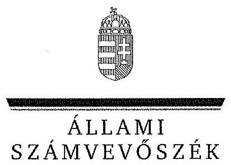
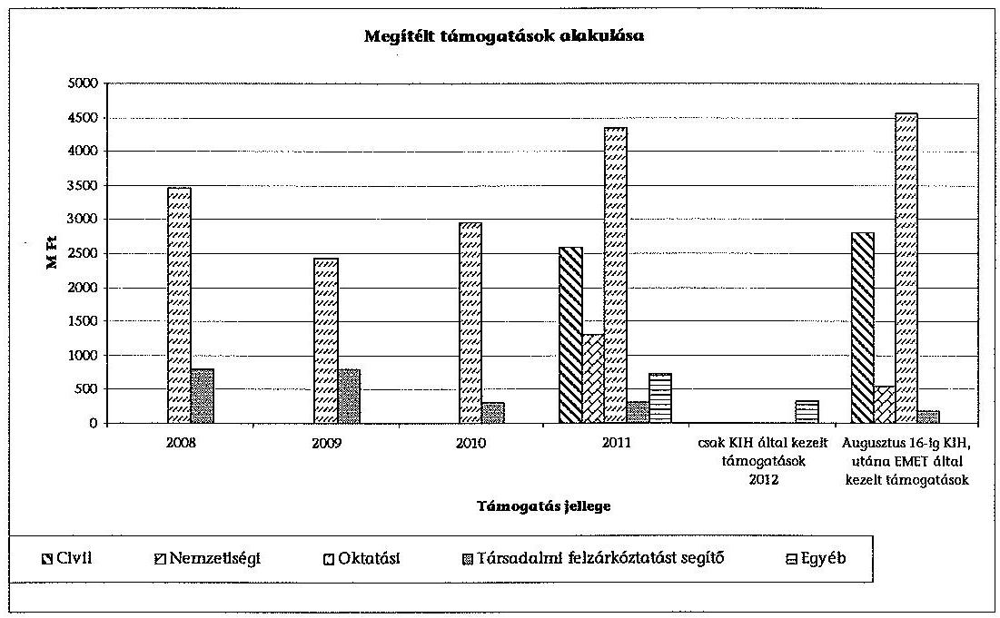
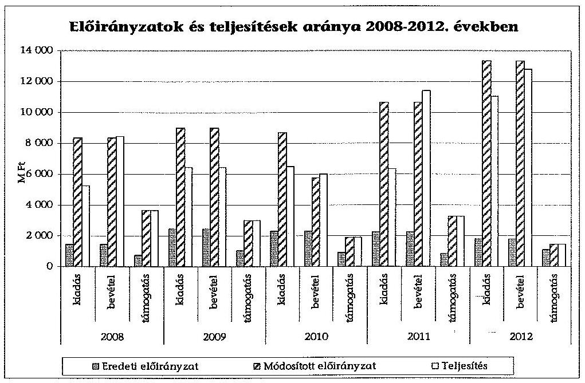
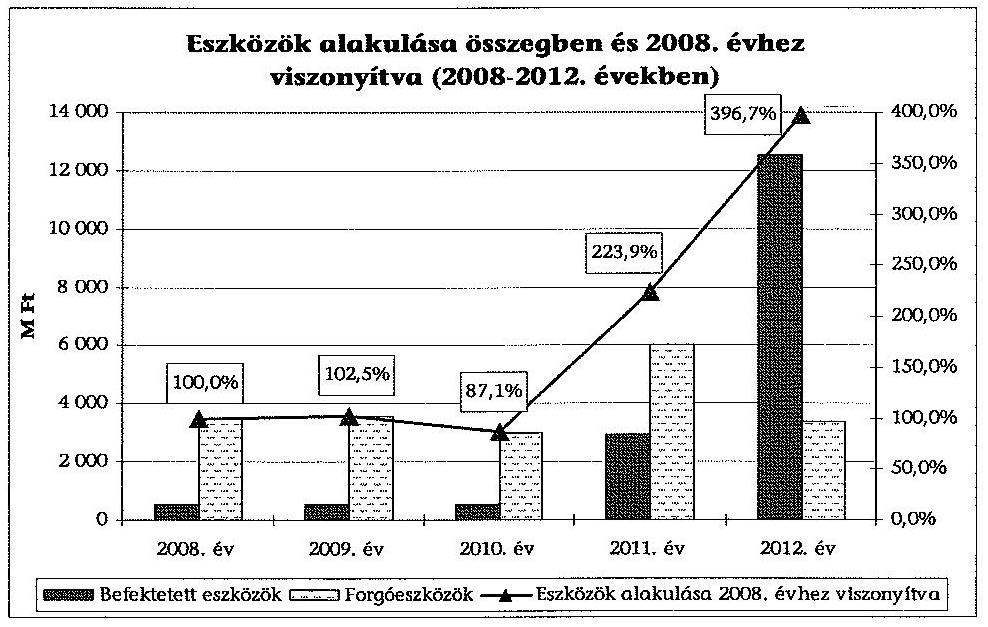
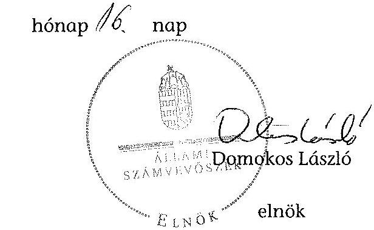
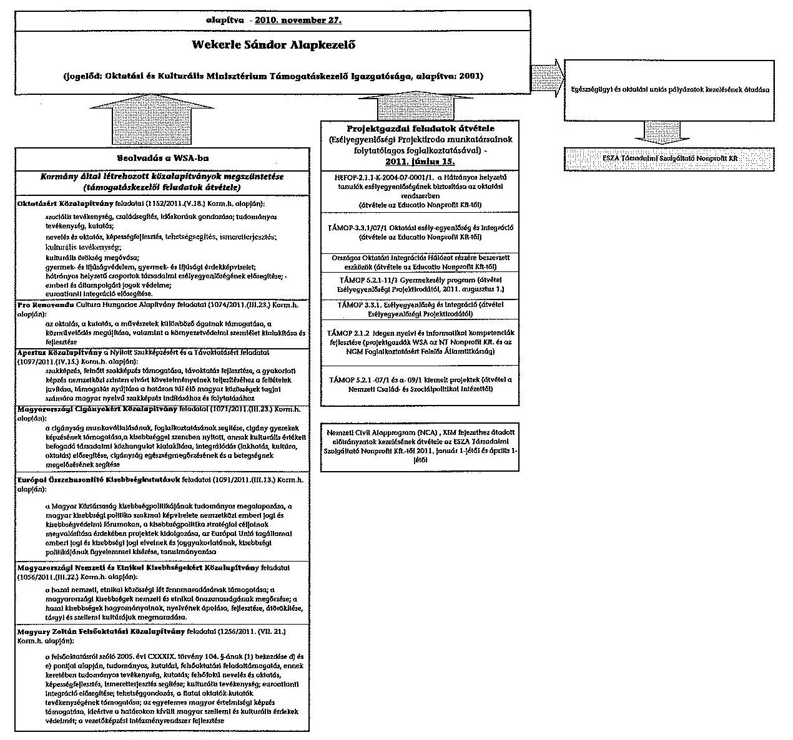
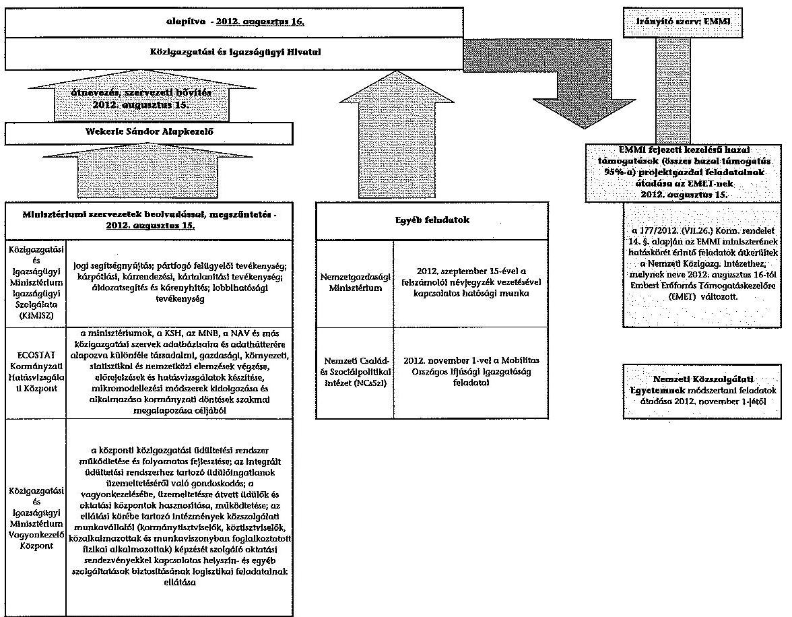

ÁLLAMI
SZÁMVEVŐSZÉK

# JELENTÉS 

a Wekerle Sándor Alapkezelő gazdálkodásának ellenőrzéséről

---

# Állami Számvevőszék 

Iktatószám: V-0116-273/2013.
Témaszám: 1151
Vizsgálat-azonosító szám: V0625

## Az ellenőrzést felügyelte:

Dr. Horváth Margit
felügyeleti vezető
Az ellenőrzést vezette és az ellenőrzés végrehajtásáért felelős:
Pongrácz Éva 2013. május 13-tól 2013. július 21-ig ellenőrzésvezető

Horthy Eszter 2013. július 22-től 2013. október 14-ig ellenőrzésvezető

A számvevőszéki jelentés összeállításában közreműködtek:
Horthy Eszter
ellenőrzésvezető
Kapronczai Gabriella
számvevő tanácsos
Az ellenőrzést végezték:

| Balázs Melinda | Belovai Sándorné | Kapronczai Gabriella |
| :-- | :-- | :-- |
| számvevő tanácsos | számvevő főtanácsos | számvevő tanácsos |

Dr. Vass Gábor
számvevő tanácsos

A témához kapcsolódó eddig készített számvevőszéki jelentések:
címe
sorszáma
Jelentés a központi költségvetés intézményrendszerének ellenőrzéséről
Jelentés a magyar központi közigazgatás modernizációjának ellenőrzéséről
Jelentés a Nemzeti Civil Alapprogram működésének és támogatásának hatásáról, figyelemmel a társadalmi és civil kapcsolatok fejlődésére, egyes kiemelt fontosságú közhasznú feladatok hatékonyabb ellátására

---

# TARTALOMJEGYZÉK 

BEVEZETÉS ..... 7
I. ÖSSZEGZŐ MEGÁLLAPÍTÁSOK, KÖVETKEZTETÉSEK, JAVASLATOK ..... 10
II. RÉSZLETES MEGÁLLAPÍTÁSOK ..... 17

1. A WSA szervezeti kereteinek kialakítása, feladatellátása ..... 17
1.1. Az intézményi átalakítások és az irányítószervi feladatellátás szabályozottsága és átláthatósága ..... 17
1.2. A WSA belső kontrollrendszerének kialakítása és működése ..... 22
1.3. A WSA szakmai feladatellátása ..... 26
2. A WSA gazdálkodása ..... 32
2.1. A WSA előirányzatainak teljesítése, a likviditás helyzete és a vagyon összetételének változása ..... 32
2.2. A pénzügyi és vagyongazdálkodás szabályozottsága ..... 38
3. Utóellenőrzés ..... 42

## MELLÉKLETEK

1/A. számú A WSA 2011. évi szervezeti és feladatváltozásai
1/B. számú A WSA/KIH 2012. évi szervezeti és feladatváltozásai
2. számú A WSA/KIH közfeladatai 2011. és 2012. években
3. számú WSA (OKMTI, KIH) által kezelt megítélt támogatások 2008-2012. években
4. számú Az eredeti, módosított bevételi és kiadási előirányzatok és támogatások, valamint azok teljesítési adatai a 2008-2012. évek között
5. számú Az ellenőrzött szervezetek ÁSZ által el nem fogadott észrevételei

---

# **Title: The Impact of Climate Change on Global Ecosystems**

## **Introduction**

Climate change is one of the most pressing environmental issues of our time. It affects ecosystems worldwide, leading to significant changes in biodiversity, habitat loss, and species extinction. This report explores the impacts of climate change on global ecosystems, focusing on key areas such as **forests**, **oceans**, and **polar regions**.

## **1. Forest Ecosystems**

Forests play a crucial role in carbon sequestration and maintaining biodiversity. However, rising temperatures and changing precipitation patterns are altering forest ecosystems. Key impacts include:

- **Increased frequency of wildfires**: Rising temperatures and drought conditions have led to more frequent and severe wildfires, destroying vast areas of forests.
- **Changes in species distribution**: Shifts in temperature and precipitation patterns are altering species distribution, leading to species extinction.
- **Insect outbreaks**: Warmer temperatures have increased the survival rates of pests like bark beetles, which are causing widespread wildfires.

## **2. Ocean Ecosystems**

Oceans absorb a significant portion of the excess heat and carbon dioxide (CO₂) produced by human activities. The consequences include:

- **Increased frequency of wildfires**: Rising sea levels and drought conditions have led to more frequent and severe wildfires, threatening species like polar bears and seals.
- **Changes in ocean currents**: Altered ocean currents are causing widespread sea-level rise, threatening species like polar bears and seals.
- **Changes in ocean currents**: Shifts in ocean currents are altering ocean currents, threatening species like polar bears and seals.

## **3. Polar Ecosystems**

Polar regions are particularly vulnerable to climate change due to their sensitivity to temperature changes. Key impacts include:

- **Melting of sea ice**: The Arctic is warming at twice the rate of the global average, leading to sea ice loss.
- **Glacial retreat**: Melting glaciers and their presence in the Arctic are altering the ocean currents, threatening species like polar bears and seals.
- **Permafrost thawing**: Thawing permafrost releases stored carbon and methane, further accelerating global warming.

## **4. Polar Ecosystems**

Polar regions are particularly vulnerable to climate change due to their sensitivity to temperature changes. Key impacts include:

- **Melting of sea ice**: Melting glaciers and their presence in the Arctic are altering sea ice and their presence in the Arctic are altering ocean currents.
- **Glacial retreat**: Melting glaciers and their presence in the Arctic are altering ocean currents, threatening species like polar bears and seals.
- **Changes in ocean currents**: Altered ocean currents are altering ocean currents, threatening species like polar bears and seals.

## **5. Polar Ecosystems**

Polar regions are particularly vulnerable to climate change due to their sensitivity to temperature changes. Key impacts include:

- **Melting of sea ice**: Melting glaciers and their presence in the Arctic are altering sea ice and their presence in the Arctic are altering ocean currents.
- **Glacial retreat**: Melting glaciers and their presence in the Arctic are altering ocean currents, threatening species like polar bears and seals.
- **Changes in ocean currents**: Altered ocean currents are altering ocean currents, threatening species like polar bears and seals.

## **Conclusion**

Climate change poses a significant threat to global ecosystems, with far-reaching consequences for biodiversity and human societies. By reducing greenhouse gas emissions, reducing greenhouse gas emissions, and reducing greenhouse gas emissions, we can protect the planet for future generations.

---

**References**

1. IPCC (Intergovernmental Panel on Climate Change). (2021). *Climate Change 2021: The Physical Science Basis*.
2. WWF (World Wildlife Fund). (2020). *Living Planet Report 2020*.
3. NASA Global Climate Change. (2022). *Vital Signs: Global Temperature*.

---

# RÖVIDÍTÉSEK JEGYZÉKE 

## Törvények

Áht.,
Áht. 2
ÁSZ tv.
Számv. tv.

## Rendeletek

Áhsz.

Ámr.
Ávr.
Ber.
Bkr.
259/2010. (XI. 16.)
Korm. rendelet
5/2012. (II. 16.) KIM rendelet
177/2012. (VII. 26.)
Korm. rendelet

## Szórövidítések

ÁPV Zrt.
ÁSZ
ECOSTAT
EMET
EMMI
EPER
ESZA Nonprofit Kft.
HEFOP
(köz)alapítványok

KIH
KIM
az államháztartásról szóló 1992. évi XXXVIII. törvény az államháztartásról szóló 2011. évi CXCV. törvény az Állami Számvevőszékről szóló 2011. évi LXVI. törvény a számvitelről szóló 2000. évi C. törvény
az államháztartás szervezeti beszámolási és könyvvezetési kötelezettségének sajátosságairól szóló 249/2000. (XII. 24.) Korm. rendelet
az államháztartás működési rendjéről szóló 292/2009. (XII. 19.) kormányrendelet
az államháztartásról szóló törvény végrehajtásáról szóló 368/2011. (XII. 31.) kormányrendelet
a költségvetési szervek belső ellenőrzéséről szóló 193/2003. (XI. 26.) Korm. rendelet
a költségvetési szervek belső kontrollrendszeréről és belső ellenőrzésről szóló 370/2011. (XII. 31.) Korm. rendelet egyes költségvetési szervek központi hivatali jogállásáról
a Nemzeti Együttműködési Alappal kapcsolatos egyes kérdésekről
a Közigazgatási és Igazságügyi Hivatalról

Állami Privatizációs és Vagyonkezelő Zrt.
Állami Számvevőszék
ECOSTAT Kormányzati Hatásvizsgálati Központ
Emberi Erőforrások Minisztériuma Emberi Erőforrás Támogatáskezelő
Emberi Erőforrások Minisztériuma
Elektronikus Pályázatkezelési és Együttműködési Rendszer ESZA Társadalmi Szolgáltató Nonprofit Kft.
Humánerőforrás-fejlesztési Operatív Program
A 2011-ben megszüntetett 6 közalapítvány és egy alapítvány, melyeknek feladatait a WSA vette át: az Oktatásért Közalapítvány, Magyary Zoltán Felsőoktatási Közalapítvány, az Apertus Közalapítvány a Nyitott szakképzésért, a Magyarországi Cigányokért Közalapítvány, az Európai Összehasonlító Kisebbségkutatások Közalapítvány, a Magyarországi Nemzeti és Etnikai Kisebbségekért Közalapítvány, a Pro Renovanda Cultura Hungariae Alapítvány
Közigazgatási és Igazságügyi Hivatal
Közigazgatási és Igazságügyi Minisztérium

---

| KIMISZ | KIM Igazságügyi Szolgálata |
| :-- | :-- |
| KIMVK | KIM Vagyonkezelő Központ |
| MACIKA | Magyarországi Cigányokért Közalapítvány |
| Magyary Program | Magyary Zoltán Közigazgatás-fejlesztési Program |
| MNV Zrt | Magyar Nemzeti Vagyonkezelő Zrt. |
| NCA | Nemzeti Civil Alapprogram |
| NCSSZI | Nemzeti Család- és Szociálpolitikai Intézet |
| NEA | Nemzeti Együttműködési Alap |
| NEFMI | Nemzeti Erőforrás Minisztérium |
| NFM | Nemzeti Fejlesztési Minisztérium |
| NGM | Nemzetgazdasági Minisztérium |
| NKE | Nemzeti Közszolgálati Egyetem |
| NKI | Nemzeti Közigazgatási Intézet |
| OKM | Oktatási és Kulturális Minisztérium |
| OKMTI | Oktatási és Kulturális Minisztérium Támogatáskezelő Igazgatósága |
| SZMSZ | Szervezeti és Működési Szabályzat |
| TÁMOP | Társadalmi Megújulás Operatív Program |
| WSA | Wekerle Sándor Alapkezelő |

---

# ÉRTELMEZŐ SZÓTÁR 

Belső kontrollrendszer

Intézkedési terv

Kockázatkezelés

Kontrollkörnyezet

A belső kontrollrendszer a kockázatok kezelése és tárgyilagos bizonyosság megszerzése érdekében kialakított folyamatrendszer, amely azt a célt szolgálja, hogy megvalósuljanak a következő célok:

- a működés és gazdálkodás során a tevékenységeket szabályszerűen, gazdaságosan, hatékonyan, eredményesen hajtsák végre,
- az elszámolási kötelezettségeket teljesítsék, és
- megvédjék az erőforrásokat a veszteségektől, károktól és nem rendeltetésszerű használattól.
(Áht. 2. 69.§ (1) bekezdés)
A belső kontrollrendszer összetevői:
- kontrollkörnyezet,
- kockázatkezelési rendszer,
- kontrolltevékenységek,
- információs és kommunikációs rendszer, és
- nyomon követési rendszer (monitoring).
(Bkr. 3. §-a alapján)
Az ellenőrzési javaslatok alapján az ellenőrzött szervezet, szervezeti egység által készített intézkedések végrehajtásának ütemezése a végrehajtásáért felelős személyek és a vonatkozó határidők megjelölésével.
(Bkr. 2. § k) pontja)
A kockázatkezelési rendszer olyan irányítási eszközök és módszerek összessége, melynek elemei a szervezeti célok elérését veszélyeztető tényezők (kockázatok) azonosítása, elemzése, csoportosítása, nyomon követése, valamint szükség esetén a kockázati kitettség mérséklése. A költségvetési szerv vezetője köteles kockázatkezelési rendszert működtetni. Ennek keretében fel kell mérni és meg kell állapítani a költségvetési szerv tevékenységében, gazdálkodásában rejlő kockázatokat, valamint meg kell határozni az egyes kockázatokkal kapcsolatban szükséges intézkedéseket, valamint azok teljesítésének folyamatos nyomon követésének módját.
(Bkr. 2. §. m) pontja és 7. §-a alapján)
A kontrollkörnyezet meghatározza a szervezet működésének jellegét, az etikai értékeket, a szervezet tagjainak szakértelmét, a vezetés filozófiáját, vezetési stílusát és annak módját. Magában foglalja:
- a világos szervezeti struktúra kiépítését (a szervezet bonyolultságát és területi (földrajzi) tagoltságát);
- a belső szabályzatok kialakítását;

---

- egyértelmű felelősségi és hatásköri viszonyok és feladatok meghatározását (azokat az eszközöket és módokat, amely által a vezetés figyelemmel kíséri a belső kontrollrendszer működését: monitoring, belső ellenőrzés, beszámoltatás);
- az etikai elvárások meghatározását a szervezet minden szintjén (a felső vezetés kockázatkezelő képességét, más szervezetekkel való kapcsolatát).
(Bkr. 6. §-a alapján)
Kontrolltevékenység

Monitoring rendszer

Nemzeti Civil Alapprogram

Nemzeti együttműködési Alap

A költségvetési szerv vezetője köteles a szervezeten belül kontrolltevékenységeket kialakítani, melyek biztosítják a kockázatok kezelését, hozzájárulnak a szervezet céljainak eléréséhez. A kontrolltevékenység részeként minden tevékenységre vonatkozóan biztosítani kell a folyamatba épített, előzetes, utólagos és vezetői ellenőrzést.
(Bkr. 8. §-a alapján)
A monitoring rendszer értékeli a belső kontrollok időbeli működését, feltárja a hiányosságokat és biztosítja, hogy azokról a felső vezetés a szükséges intézkedések megtétele érdekében tudomást szerezzen.
Célja a társadalom erősítése, a civil szervezetek társadalmi szerepvállalásának erősítése, a kormányzat és a civil társadalom közötti partneri viszony és munkamegosztás előmozdítása az állami, önkormányzati feladatok hatékonyabb ellátása érdekében (Nemzeti Civil Alap Programról szóló 2003. évi L. törvény, hatálytalan 2012. I. 1-től).

A civil önszerveződések működését és szakmai tevékenységét, nemzeti összetartozásuk erősítését és a közjó kiteljesedésében vállalt szerepük segítését támogató finanszírozási forma. Az Alap forrását a központi költségvetésről szóló törvény a közigazgatási és igazságügyi miniszter által vezetett minisztériumi fejezeti kezelésű előirányzatként tartalmazza (Az egyesülési jogról, a közhasznú jogállásról, valamint a civil szervezetek működéséről és támogatásáról szóló 2011. évi CLXXV. törvény 55. §). A kifizethető támogatások jogcímeit és eljárási rendjét a 2011. évi CLXXV. Civil tv. és a Nemzeti Együttműködési Alappal kapcsolatos egyes kérdésekről szóló 5/2012. (II. 16.) KIM rendelet szabályozza.

---

# JELENTÉS 

## a Wekerle Sándor
 Alapkezelő gazdálkodásának ellenőrzéséről

## BEVEZETÉS

A Wekerle Sándor Alapkezelő (WSA), valamint jogelődje, az Oktatási és Kulturális Minisztérium Támogatáskezelő Igazgatósága (OKMTI) és jogutódja, a Közigazgatási és Igazságügyi Hivatal (KIH) az elmúlt öt évben 29,8 Mrd Ft hazai támogatás kedvezményezettekhez juttatásában működött közre. Működését és gazdálkodását az Állami Számvevőszék (ÁSZ) korábban - a Nemzeti Civil Alapprogram (NCA) támogatás működése kivételével - nem ellenőrizte. Erre tekintettel az Állami Számvevőszékről szóló 2011. évi LXVI. törvény (ÁSZ tv.) alapján indokolt volt a gazdálkodási tevékenység ellenőrzése. Az ÁSZ az államháztartásból származó források felhasználásának ellenőrzése keretében ellenőrzi a központi költségvetésből gazdálkodó szervezeteket és felhatalmazása kiterjed a vagyonnal való gazdálkodás ellenőrzésére is.

A WSA jogelődjét, az OKMTI-t az Oktatási és Kulturális Minisztérium (OKM) alapította 2001-ben. A WSA az OKMTI jogutódjaként 2010. november 27-ével az OKM-ből kiválással jött létre. Ettől az időponttól a Közigazgatási és Igazságügyi Minisztérium (KIM) háttérintézményeként központi hivatali jogállással működött. A szervezet neve 2012. augusztus 16-ával KIH-re változott.

A szervezet alapító okirata alapvető közfeladataként a pályázat- és támogatáskezelést, ellenőrzést rögzítette. A 2010-ben megkezdett, majd 2011-ben folytatódó feladat-átcsoportosítások révén a kezelt hazai támogatások értéke jelentősen (közel 3-szorosára) megnövekedett. A 2012-ben végbement átszervezések és átalakítások hatására a kezelt hazai támogatások értéke (az előző évi 5%-ára) lecsökkent és ezzel egyidejűleg alapvető közfeladatai újabbakkal egészültek ki.

Az intézmény a Kormány által 2011-ben megszűntetett 6 közalapítvány és 1 alapítvány ((köz)alapítványok), valamint a Társadalmi Megújulás Operatív Program (TÁMOP) lebonyolításával kapcsolatban korábbi 7 projektíroda projektgazdai feladatait vette át. Feladatai 2011. januárban az addig az ESZA Társadalmi Szolgáltató Nonprofit Kft.-hez (ESZA Nonprofit Kft.) tartozó Nemzeti Civil Alapprogram (NCA), illetve 2011. áprilistól a KIM fejezethez átadott előirányzatok kezelésével egészültek ki. Három minisztériumi háttérintézmény, a KIM Igazságügyi Szolgálata (KIMISZ), a KIM Vagyonkezelő Központ (KIMVK), valamint az ECOSTAT Kormányzati Hatásvizsgálati Központ (ECOSTAT) beolvadásával 2012. augusztus 16-ával ellátott közfeladata újabbakkal - elemzői tevékenység, személyügyi igazgatási, igazságügyi, módszertani, vagyonkezelői feladatok - bővült. A Nemzetgazdasági Minisztériumtól (NGM) 2012. szeptember 15-ével a felszámolói névjegyzék vezetésével kapcsolatos hatósági munkát

---

vette át. A Nemzeti Család- és Szociálpolitikai Intézettől (NCSSZI) 2012. november 1-vel átvette a Mobilitas Országos Ifjúsági Igazgatóság feladatait is.

A feladatok csökkenését eredményezte, hogy 2011-től az egészségügyi és oktatási uniós pályázatok ${ }^{1}$ kezelését az ESZA Nonprofit Kft. részére, valamint 2012. november 1-jétől a módszertani feladatokat a Nemzeti Közszolgálati Egyetem (NKE) részére átadták. A KIM-ből a társadalmi felzárkóztatási, egyházi, nemzetiségi civil ügyek Emberi Erőforrások Minisztériumához (EMMI) kerülésével az addig a WSA feladatkörébe tartozó hazai támogatások kezelése (a WSA által kezelt hazai támogatások mintegy 95%-a) 2012. augusztus 16-ával az Emberi Erőforrások Minisztériuma Emberi Erőforrás Támogatáskezelőjéhez (EMET) került. A szervezetben és a feladatokban végbement 2011. és 2012. évi változásokat az 1/A. és 1/B. számú melléklet ábrái, a WSA 2011. évi feladatait, illetve a jogutód KIH által 2012. évben ellátott közfeladatok körét a 2. számú melléklet mutatja be.

A 2008-2012. között a szervezet pénzügyi gazdálkodása során összesen 45,1 Mrd Ft bevételt realizált, amelyből a teljesített kifizetések összesen 35,6 Mrd Ft-ot, az irányítószervi támogatás 13,2 Mrd Ft-ot tett ki. A felhasznált maradvány 14,1 Mrd Ft volt. Az éves beszámolókat könyvvizsgáló auditálta, melyek közül a 2011. és a 2012. évit korlátozott záradékkal látta el. A létszám a 2008. évi 85 fős nyitó létszámról - a megnövekedett feladatok eredményeként - 2012. december 31-re 294 főre emelkedett.

Az ellenőrzés kapcsolódott Magyarország 2012. évi központi költségvetése végrehajtásának ellenőrzéséhez, amelynek keretében az ÁSZ ellenőrizte a KIM háttérintézményeként a KIH-et. A KIH 2012. évi gazdálkodására és a kialakított belső kontrolljainak működésére vonatkozó megállapításokat a jelentés hasznosítja. Értékelésünk során hasznosítottuk a 2011. és 2012. évi könyvvizsgálói jelentést, a KIH által az ellenőrzés rendelkezésére bocsátott 2012. évi belső ellenőrzési jelentéseket is.

A 2008-2011. évi pénzügyi gazdálkodási és vagyongazdálkodási folyamatok szabályszerűségének értékeléséhez a főkönyvi könyvelés adatbázisából szekvenciális, megállásos mintavételi eljárással történt a mintatételek kiválasztása. A feladatellátás szabályszerűségének értékeléséhez a 2012. évi pénzügyi adatbázisból egyszerű, véletlen mintavétel alkalmazásával választottuk ki a mintatételeket.

Az ellenőrzés célja annak értékelése volt, hogy a WSA, továbbá jogelődje, az OKMTI és a jogutódja, a KIH működése és forrásfelhasználása, a kialakított szervezeti, szabályozási, finanszírozási és kontrollrendszere biztosította-e a szabályszerű gazdálkodást és feladatellátást; az intézmény kialakította-e és működtette-e a belső kontrollokat; a szervezet többszöri átalakulása/átalakítása szabályszerű volt-e.

[^0]
[^0]:    ${ }^{1}$ TÁMOP, Társadalmi Infrastruktúra Operatív Program, Közép-Magyarországi Operatív Program humán közszolgáltatások intézményrendszerének fejlesztése

---

Ennek során értékeltük, hogy:

- az intézményre vonatkozó irányító szervi feladatellátás, valamint az intézmény szervezete és szervezeti működésre vonatkozó szabályozása megfelelte a mindenkori alapító okiratban rögzített feladatoknak, hatásköröknek és a vonatkozó jogszabályi előírásoknak;
- az intézmény átalakítása, szakmai feladatellátása stratégiának megfelelően, a vonatkozó jogszabályok alapján szabályszerű és átlátható volt-e;
- az intézmény belső kontrollrendszere biztosította-e a szabályszerű feladatellátást, közpénz- és vagyongazdálkodást;
- az intézmény pénzügyi gazdálkodása a vonatkozó jogszabályok alapján szabályszerű volt-e;
- az intézmény vagyongazdálkodása a jogszabályoknak megfelelt-e;
- az intézmény hasznosította-e az ÁSZ ellenőrzésének ${ }^{2}$ javaslatait.

Az ellenőrzés kiterjedt az OKMTI, a WSA, valamint a KIH hazai forrásokkal összefüggő pályázat- és támogatáskezelői feladatainak ellátására, valamint az ezzel összefüggő ellenőrzési tevékenységére. Nem érintette a jogelőd, illetve a WSA társadalmi felzárkóztatást célzó európai uniós támogatásokkal összefüggő feladatait és a KIH további, valamint a KIH-be 2012-ben beolvadt szervezetek (KIMISZ, KIMVK, ECOSTAT) tevékenységét.

Az ellenőrzési megállapításainkkal hozzá kívánunk járulni a KIH gazdálkodásának stabilabbá, működésének szabályozottabbá tételéhez, valamint a belső kontrollrendszerének javításához.

Az ellenőrzést az ÁSZ 2013. I. félévi ellenőrzési terve alapján a számvevőszéki ellenőrzés szakmai szabályai szerint, a szabályszerűségi ellenőrzés módszerével, a vonatkozó nemzetközi standardok figyelembevételével végeztük.

# Az ellenőrzés a 2008. január 1. - 2012. december 31. közötti időszakra terjedt ki. 

A helyszíni ellenőrzést a KIH-nél, valamint annak irányító szervénél, a KIM-nél végeztük. A feladatellátás szabályszerűségének ellenőrzése céljából adatokat kértünk be a WSA pályázat- és támogatáskezelői, ellenőrzési feladatainak jelentős részét átvevő, az EMMI irányítása alá tartozó EMET-től.

Az ellenőrzés végrehajtásának jogszabályi alapját az ÁSZ tv. 1. § (3) bekezdése, az 5. § (2)-(6) bekezdései, valamint az Áht. 261. § (2) bekezdése együttesen képezték.

Az ÁSZ az ÁSZ tv. 29. §-a alapján a jelentéstervezetet észrevételezésre megküldte az ellenőrzött szervezetek vezetőinek. Az ellenőrzött szervezetek ÁSZ által el nem fogadott észrevételeit az 5. számú melléklet tartalmazza.

[^0]
[^0]:    ${ }^{2}$ Jelentés a Nemzeti Civil Alapprogram működésének-támogatásának hatásáról, figyelemmel a társadalmi és civil kapcsolatok fejlődésére, egyes kiemelt fontosságú közhasznú feladatok hatékonyabb ellátására (1127)

---

# I. ÖSSZEGZŐ MEGÁLLAPÍTÁSOK, KÖVETKEZTETÉSEK, JAVASLATOK 

A WSA, a jogelőd OKMTI és a jogutód KIH 2008. és 2012. között 29,8 Mrd Ft oktatási, felzárkóztatási, civil és nemzetiségi hazai támogatás kedvezményezettek részére történő eljuttatásában működött közre. Több tízezres nagyságrendű pályázatot bonyolítottak le, amelyek jellemzően kis összegű tételekből álltak és számos intézményt, kedvezményezettet érintettek.

A Kormány a WSA-t bízta meg 2011-től egy alapítvány és hat közalapítvány megszüntetését követő feladatok egy részének átvételével és vagyonrendezésével, valamint az Esélyegyenlőségi Projektiroda munkatársainak folytatólagos foglalkoztatásával. 2012-től a WSA-ba beolvadt a KIM három háttérintézménye, ugyanakkor a projektgazdai feladatai nagy része, ezzel együtt az összes hazai támogatás 95%-a 2012-ben az EMMI fejezet háttérintézményéhez, az EMET-hez került. (A végrehajtott szervezeti átalakításokat és feladatváltozásokat az 1/A. és 1/B. számú melléklet mutatja be.)

Az alapítványi konszolidáció és a szervezeti átalakítás illeszkedett a Magyary Program 2011. évi célkitűzéseihez. A WSA feladatellátása letisztult azáltal, hogy 2012-től a hazai támogatáskezelői feladatok tőle elkerültek, így fő profilját a tényleges háttérintézményi feladatok képezték 2012 végére. Az intézmény 2012. évi átalakításának ${ }^{3}$ végrehajtása már mutatta a Magyary Program pozitív hatásait, a feladatok átadás-átvételének folyamata átlátható, nyomon követhető volt.

A szervezeti átalakítások, a beolvadások, kiválások kereteit jogszabályokban fektették le. A feladatok átadás-átvétele során az ellenőrzés hiányosságokat tárt fel. Nem volt biztosított az EMET-nél a WSA-tól átvett feladatokkal kapcsolatban a 2008-2011. közötti időszakra az iratanyagok visszakereshetősége (Számv. tv. 169. § (2) bek.). Ennek következtében az EMET a részére átadott iratanyagok közül a pénzügyi gazdálkodás értékeléséhez leválogatott mintatételek 22%-áról az ellenőrzés nem tudott véleményt formálni.

Azok végrehajtása során a feladatátcsoportosításokhoz kapcsolódóan az iratanyagok átadás-átvétele nem volt rendezett, nem biztosította főként a 2012-ben az EMET részére átadott iratanyagok, illetve dokumentumok visszakereshetőségét (Számv. tv. 169. § (2) bekezdés), ezzel akadályozta az EMET-nél a jogelődök feladatellátásának, így a 2008-2011. évi pénzügyi gazdálkodás értékeléséhez leválogatott mintatételek 22%-ának (egyéb működési célú támogatások, kiadások) értékelését.

[^0]
[^0]:    ${ }^{3}$ Megalapozta a Közigazgatási és Igazságügyi Hivatalról szóló 177/2012. (VII. 26.) Korm. rendelet.

---

A szervezet belső kontrollrendszerének kiépítése és működtetése nem megfelelő minősítést kapott. A kontrollkörnyezet kialakítása nem volt megfelelő, a belső szabályozások nem fedték le a szervezet feladatai ellátásának teljes körét. A meglévő szabályzatok a változó szervezethez és a feladatokhoz igazítása 2012-ben elmaradt, nem aktualizálták a számviteli politikát (Számv. tv. 14. § (3), illetve az Áhsz. 8. § (3) bek.) és az értékelési szabályzatot (Számv. tv. 14. § (5) bek. b) pont), az ellenőrzött időszak meghatározó részében hiányoztak az ügyrendek (Ávr. 9. § (5) bek.) és a bizonylati szabályzat (Számv. tv. 161. § (2) bek. d) pont). ${ }^{4}$

A KIH (és jogelődjei) az ellenőrzött időszakban csak egy 2007-ben kiadott és azóta nem aktualizált kockázatkezelési szabályzattal rendelkezett, nem volt ellenőrzési nyomvonal (Bkr. 6. § (3) bek.), ezáltal nem volt biztosított a kockázatkezelési rendszer jogszabályban előírt megfelelő működése. ${ }^{5}$

A 2008-2012. években a vagyongazdálkodás szabályozottságában az ellenőrzés többféle hiányosságot tárt fel. A WSA (és a KIH) nem módosította, illetve nem aktualizálta teljes körűen a vagyongazdálkodásával kapcsolatos szabályzatokat, így azok nem minden esetben követték a jogszabályváltozásokból és az intézmény átalakítása miatt bekövetkezett változásokat.

A szervezetnél a létszám a növekvő feladatok, a beolvadások és kiválások hatására az ellenőrzött időszakban közel három és félszeresére (2008. évi 85 főről 2012. évre 294 főre) növekedett. Az ellenőrzött öt évben a szervezeten belül a fluktuáció mind a beosztottak, mind a vezetők körében jelentős volt.

A szabályzatokban mutatkozó hiányosságok, valamint a szervezeti átalakításokat követő létszámváltozások és vezetőcserék nagymértékben kihatottak a belső kontrollrendszer működési színvonalára. A szervezeti átalakítások különösen a pénzügyi-számviteli területen okoztak jelentős többletfeladatokat.

A kontrolltevékenységek fontos területeken nem működtek, így a folyamatos feladatellátást biztosító átadás-átvételeknél nem készültek jegyzőkönyvek.

Az információ és kommunikáció területén kockázatot jelentett, hogy az intézmény nem rendelkezik aktualizált iratkezelési szabályzattal, a szabálytalanságok kezelésének eljárásrendjét nem alakították ki. Továbbá nem aktualizálták az információs és kommunikációs szabályzatot. Ugyanakkor pozitív elmozdulás,
 hogy a támogatáskezelési terület eljárásrendjeit 2011-re kiadták.

Az intézmény szakmai feladatot ellátó szervezeti egységei folyamatosan ellenőrizték az elfogadott pályázatoknál a céloknak megfelelő felhasználást egy külön az erre a célra kiépített monitoring rendszer keretében. A támogatási mintatételek ellenőrzése során tártak fel szabálytalan felhasználásokat, amelyeket visszafizettettek, illetve lemondói nyilatkozatban csökkentették a kiutalt

[^0]
[^0]:    ${ }^{4}$ A KIH 2013. decemberi tájékoztatása szerint az ÁSZ által ellenőrzött időszakot követően több szabályzatát aktualizálta, illetve adott ki új szabályzatokat is.
    ${ }^{5}$ A KIH Belső Ellenőrzési Osztály tájékoztatása szerint 2013-ban több elnöki utasítás lépett életbe a kockázatkezelési rendszer működésének javítása érdekében.

---

támogatás összegét. A monitoring keretében kiemelt figyelmet fordítottak a NEA támogatások ellenőrzésére 2012-ben. A rendelkezésre álló 3042 M Ft támogatási összeg több, mint 5%-át ellenőrizték, melynek 70%-át ún. közbenső ellenőrzés keretében vizsgálták az előírt 20% helyett.

A WSA a jogszabályi előírásokat részben betartva látta el a támogatáskezeléssel kapcsolatos feladatait. Az ÁSZ által a 2012. évi feladatellátás értékelésére kiválasztott mintatételek 4%-ánál hiányzott a szerződésekről a kötelezettségvállalás ellenjegyzése (Ávr. 55. § (1) bekezdés), további 4%-ánál nem állt rendelkezésre a kapcsolódó iratanyag, amely meghiúsította az értékelést.

Ezen túl az ÁSZ ellenőrzése egy 2012-ben lezárult, az NCA keretéből nyújtott 500000 Ft támogatásból (NCA-EA-11-0222) 271662 Ft szabálytalan (határidőn túli) elszámolást állapított meg, amelynek a visszafizettetése indokolt lett volna. A szabálytalanul elszámolt összeg visszafizettetését azonban - ellentétben a fejezeti kezelésű előirányzatok felhasználásának szabályairól szóló 12/2011. (III. 30.) KIM rendelet 22. § (2) bekezdésének előírásával - a WSA nem kezdeményezte.

A hazai támogatások és pályázatok nyilvántartására az ESZA Nonprofit Kft.-től 2010. decemberben átvett támogató informatikai rendszer (EPER) szolgált. A 2012. évi átalakulások után az EPER a WSA jogutódjánál, a KIH-nél maradt. Az EPER rendszernél két kockázatot azonosítottunk: a rendszert az ellenőrzött időszakban nem auditálták, továbbá a fejlesztést és a karbantartást végző külső vállalkozás teljes adathozzáférési jogosultsággal rendelkezett, a fejlesztéseket és karbantartásokat közvetlenül a rendszerben hajtotta végre.

A KIM alapítói, irányító feladatait a jogszabályi előírásoknak megfelelően ellátta, ugyanakkor felügyeleti jogkörében 2012 végéig elmulasztotta az ellenőrzést. Ez is közrejátszott abban, hogy a szervezet belső kontroll rendszere nem működött megfelelően.

A belső ellenőrzés elsősorban a pénzügyi-gazdasági folyamatokra terjedt ki, végeztek ellenőrzéseket az informatikai rendszerek területén, a 2012. évi szervezeti átalakításokkal kapcsolatban, valamint egyéb részterületeket érintően (pl.: tűz- és munkavédelem, a reklám- és propaganda tevékenység). A 2008-2011. évi belső ellenőrzési dokumentumok megőrzéséről a Ber. 12. § n) pontjában foglaltak ellenére nem gondoskodtak, az akkor lefolytatott vizsgálatok hasznosítása nem követhető nyomon. Továbbá 2012. évben a Bkr. 45. § (2) bekezdésében az intézkedési terv készítésére és végrehajtására vonatkozó kötelezettségüket nem teljesítették, így a javaslatok hasznosulása nem volt nyomon követhető.

A WSA és a jogelőd OKMTI és a jogutód KIH részére a 2008-2012. évek között az alaptevékenységeik ellátásához szükséges forrásokat az irányító szervi támogatások és a saját bevételek fedezték. A vizsgált öt évben 13239 M Ft irányítószervi támogatásban részesültek, továbbá 45052,8 M Ft bevételt realizáltak. Az összes kiadásuk 35584,0 M Ft-ot tett ki. A maradvány felhasználása 14069,6 M Ft volt.

---

A kiadások és bevételek előirányzatai az évek során folyamatosan emelkedtek, a legnagyobb mértékben a 2011. és 2012. évek között nőttek a végrehajtott szervezeti átalakítások, a (köz)alapítványi feladatok, valamint egyéb feladatok átvétele, illetve 2012. augusztus 16-ával három KIM háttérintézmény beolvadása miatt. A támogatások mértéke - a kormányzati egyensúly-javító intézkedések következményeként - az évek során 2011. kivételével folyamatosan csökkent. A 2008-2012. években a kiadások, bevételek és támogatások eredeti, módosított előirányzatait és teljesítésüket a 4. számú mellékletben mutatjuk be.

A kormányzati egyensúly-javító intézkedések (zárolások és elvonások) növekvő mértéke ellenére a feladatellátás biztosított volt, a jelentkező többletfeladatokhoz kormányzati beavatkozással többletforrásokat biztosítottak.

Az előirányzat-módosításokat kormányzati, irányítószervi, illetve saját hatáskörben hajtották végre, azok minden esetben feladatváltozásokhoz kapcsolódtak, valamint intézkedések végrehajtását szolgálták. Az előirányzatmódosítások megalapozottak voltak, szabályosan valósultak meg. Az előírányt-módosításokat megfelelően dokumentálták.

Az ellenőrzött öt évben a likviditási helyzet jó volt, 2008-ban a rövid lejáratú kötelezettségeket majd 600-szorosan fedezték a pénzeszközök, még 2011-ben is több, mint 60-szoros volt a mutatók értéke, amelyek 2012-ben is 2-3szorosan fedezték a rövid lejáratú kötelezettségek teljesítését.

Az átlagos szállítói futamidő a 2008. és 2012. évek között nem ingadozott jelentősen, de kedvezőtlen tendenciát mutatott azzal, hogy a 2008. évi 0,5 napról 2012-re 25 napra nőtt. A szállítói tartozásnak az anyagi jellegű kiadásokon belüli, napokban kifejezett részaránya mindamellett az öt év során minden évben 30 nap alatt maradt, ami kedvezőnek ítélhető.

A vagyon állománya a 2011-2012. években jelentősen megnövekedett az átalakítások, a beolvadó szervezetek vagyonának átvétele és a székházcsere révén. A legnagyobb arányú növekedés a 2011. és 2012. években figyelhető meg. A vagyoni állományban bekövetkezett változást jól szemlélteti, hogy a 2008. évi 4014,5 M Ft mérlegfőösszeg 2012. évre 296,7%-kal, 15 926,6 M Ft-ra nőtt. A vagyon állományán belül a legnagyobb arányú, 6628 M Ft az ingatlanok és kapcsolódó vagyoni értékű jogok állományi értéke, amely 2012. évben a mérleg főösszegének 1/4-ét tette ki. Felújítási előirányzatot 2011-2012. években képeztek, azt megelőzően felújítást nem hajtottak végre. Az intézményen kívüli értékesítésre belső szabályzatot nem dolgoztak ki. Nem szabályozták a számítógépek magáncélú használatát, valamint 2012 végéig a helyiségek bérbeadási feltételeit.

A konszolidált (köz)alapítványok vagyonát a WSA az alapítványi záró beszámolók hiányában a saját mérlegében és beszámolójában csak egy év késedelemmel mutatta ki, továbbá az Apertus Közalapítványtól átvett részesedést a könyveiből nem vezette ki. Ezen vagyon-nyilvántartási hiányosságok miatt a WSA könyvvizsgálója a WSA 2011. évi és a 2012. évi beszámolóját korlátozott záradékkal látta el.

---

A pénzügyi gazdálkodás folyamatainak megítéléséhez a 2008-2011. évekre kiválasztott pénzforgalmi mintatételek közül a személyi juttatások és dologi kiadások mintatételeinél nem tártunk fel szabálytalanságot, ugyanakkor - bizonylatok hiányában - nem volt biztosított az egyéb működési célú támogatások, kiadások kötelezettségvállalási folyamatának nyomon követhetősége. A 2012-ben a zárszámadás ellenőrzése során kiválasztott mintatételek alapján a pénzügyi gazdálkodás folyamatai már szabályszerűek voltak.

Ugyanakkor a 2008-2012. évi felhalmozási pénzforgalomnál a felhalmozási mintatételek vagyoni szemléletű szabályosságának értékelése a szabályozási hiányosságokat nem tükrözte, a gazdálkodási gyakorlat a szabályozási hiányosságok ellenére ezen a területeken megfelelő volt. A beszerzéseket bruttó beszerzési értéken az eszköznyilvántartásba felvezették, tételenként meghatározták az értékcsökkenés mértékét és a beszerzett vagyon leírásának végső határidejét. Az értékcsökkenést a Számv. tv. előírásainak betartásával számolták el.

Utóellenőrzés keretében megvizsgáltuk a Nemzeti Civil Alapprogram működésének-támogatásának hatásáról, figyelemmel a társadalmi és civil kapcsolatok fejlődésére, egyes kiemelt fontosságú közhasznú feladatok hatékonyabb ellátásáról szóló ÁSZ Jelentés javaslatainak hasznosulását.

A jelentés közös javaslatot fogalmazott meg a közigazgatási és igazságügyi miniszternek és a WSA főigazgatójának a NET-re kész Programtámogatásnál 520 E Ft értékű támogatási tétel visszafizetésére. Időközben a támogatás kezelése az NFM-hez került, így a KIM a visszafizetési kötelezettséget jelezte az NFM-nek.

További javaslata volt az ÁSZ jelentésnek, hogy a WSA főigazgatója intézkedjen a jelentés külön mellékletében felsorolt, összesen 9253 E Ft összegű szabálytalan felhasználás visszafizetése érdekében. A WSA főigazgatója nem tett intézkedéseket a visszafizetés érdekében. Tekintettel arra, hogy a követelések 2013-ban elévülnek, szükséges a kötelezettségvállalásokban jogutódként eljáró EMET főigazgatójának figyelmét felhívni a jogosulatlanul elszámolt támogatások visszafizettetésére.

Ugyanakkor a WSA főigazgatója számba vette azokat a megállapításokat, amelyek vele kapcsolatban intézkedéseket igényelhetnek. Ezekkel kapcsolatban a jogszabályi kötelezettségén túl intézkedési tervet készített, az abban foglaltakat teljesítette. Ennek keretében növelte a közbenső vagy utólagos ellenőrzéseinek számát, kiiktatta a számlacsere lehetőségét, továbbá rendszeres képzéseket tartott a munkatársak részére az EPER használatával, a helyszíni ellenőrzés lefolytatásával kapcsolatban.

Az ÁSZ tv. 33. § (1) bekezdésében foglaltak értelmében az ellenőrzött szervezet vezetője köteles a jelentés megállapításaihoz kapcsolódóan intézkedési tervet összeállítani és azt a jelentés kézhezvételétől számított harminc napon belül az ÁSZ részére megküldeni. Amennyiben az intézkedési tervet határidőben nem küldi meg a szervezet, vagy az továbbra sem elfogadható, az ÁSZ elnöke a hivatkozott törvény 33. § (3) bekezdés a)-b) pontjaiban foglaltakat érvényesítheti.

---

A helyszíni ellenőrzés megállapításainak hasznosítása mellett javasoljuk:

# KIH elnökének 

1. A Bkr. 6. § (1) és (2) bekezdése szerinti kontrollkörnyezet kialakítása nem volt megfelelő, a belső szabályozások nem fedték le a szervezet feladatai ellátásának teljes körét. A meglévő szabályzatok a változó szervezethez és a feladatokhoz igazítása a 2012. évben elmaradt, nem aktualizálták a számviteli politikát (Számv. tv. 14. § (3) bek., illetve Áhsz. 8. § (3) bek.) és az értékelési szabályzatot (Számv. tv. 14. § (5) bek. b) pontja). A KIH az ellenőrzött időszakban nem alakította ki a kockázatkezelés rendszerét és nem rendelkezett aktualizált ellenőrzési nyomvonallal (Bkr. 6. § (3) bek.), az ellenőrzött időszak meghatározó részében hiányoztak az ügyrendek (Ávr. 9. § (5) bek.) és a bizonylati szabályzat (Számv. tv. 161. § (2) bek. d) pontja).

Javaslat:
Tegyen intézkedéseket az intézmény hiányzó belső szabályzatainak a jogszabályi változások és a szervezeti átalakulások figyelembe vételével történő pótlására, illetve a meglévő szabályzatok aktualizálására.
2. A monitoring kontroll keretén belül a belső ellenőrzés a pénzügyi-gazdasági folyamatokra, az informatikára, a 2012. évi szervezeti átalakításokkal kapcsolatos feladatok végrehajtására, valamint egyéb részterületekre terjedt ki. A 2008-2011. évi belső ellenőrzési dokumentumok megőrzéséről nem gondoskodtak (Bkr. 22. § (2) bek. b) pontja), a lefolytatott vizsgálatok hasznosítása nem követhető nyomon. A 2008-2012. években nem készültek intézkedési tervek (Bkr. 45. § (1) bek.), a megtett intézkedéseket nem dokumentálták, azokról nem vezettek nyilvántartást (Bkr. 47. § (1) bek.). A 2012-ben sem intézkedtek teljes körűen a hiányosságok megszüntetésére.

Javaslat:
Gondoskodjon az intézmény belső kontrollrendszerének működtetése érdekében arról, hogy a belső ellenőrzés a Bkr.-ben meghatározott feladatainak teljes körűen tegyen eleget. Ennek keretében intézkedjen az ellenőrzések megállapításainak és javaslatainak hasznosításáról, az intézkedések teljesülésének nyomon követéséről, a nyilvántartások vezetéséről, továbbá az iratok megőrzéséről.
3. Az EPER rendszer nem auditált, továbbá a fejlesztést és karbantartást végző külső vállalkozás teljes adathozzáférési jogosultsággal rendelkezik, tesztkörnyezet és tükörmásolat hiányában a fejlesztéseket és karbantartásokat közvetlenül a rendszerben hajtja végre.

Javaslat:
Tegyen intézkedést annak érdekében, hogy a rendszer működtetése során érvényesüljenek az állami és önkormányzati szervek elektronikus információbiztonságáról szóló 2013. évi L. törvény előírásai. Ennek keretében gondoskodjon az EPER rendszer auditálásáról, továbbá a külső vállalkozó adathozzáférési, valamint a rendszerben végzett feladatai végrehajtásával járó kockázatok minimalizálásáról.

---

# EMET főigazgatójának 

1. Egy, az NCA keretéből nyújtott, pénzügyi rendezésében 2012. évre áthúzódott 500000 Ft összegű támogatásból (NCA-EA-11-0222 azonosító számú támogatás) a kedvezményezett 271662 Ft-ot (a támogatás 54,3%-a) szabálytalanul számolt el, ennek ellenére az elszámolást a WSA elfogadta.

Javaslat:
Vizsgálja ki, hogy a szabálytalan elszámolás
 miatt munkajogi, illetve kártérítési felelősség érvényesíthető-e. Amennyiben a feltételek fennállnak, a szükséges intézkedéseket tegye meg. Egyúttal intézkedjen a jogosulatlanul kifizetett támogatás visszaköveteléséről.

---

# II. RÉSZLETES MEGÁLLAPÍTÁSOK 

## 1. A WSA SZERVEZETI KERETEINEK KIALAKÍTÁSA, FELADATELLÁTÁSA

### 1.1. Az intézményi átalakítások és az irányítószervi feladatellátás szabályozottsága és átláthatósága

Az ellenőrzött időszakban a 2011. és a 2012. évben - 7 (köz)alapítvány feladatainak átvételével, illetve 3 háttérintézmény beolvadásával - a szervezetet átalakították. 8 alkalommal a WSA illetve jogutódja a KIH vett át, 3 alkalommal (időpontban) pedig más szervezeteknek adott át feladatokat. A WSA által ellátandó szakmai feladatok az ellenőrzött időszakban többször módosultak. (A végrehajtott szervezeti átalakítások és feladatváltozások összefoglalását az 1/A. és 1/B. számú mellékletekben elhelyezett ábrák mutatják be, a WSA, illetve a KIH ellátott közfeladatait a 2. sz. melléklet tartalmazza.)

Az alapítványi konszolidáció és a szervezeti átalakítás illeszkedett a 2011. júniustól hatályos Magyary Zoltán Közigazgatás-fejlesztési Program 11.0 célkitűzéseihez. A 2011 júniusában megjelenő Magyary Program célul tűzte ki a közigazgatás feladatrendszerének megújítását (szervezet), a hatékony szervezeti működés megteremtését (feladat), a közigazgatási működési eljárások felülvizsgálatát (eljárás), valamint a tisztviselők felkészültségének és elkötelezettségének növelését (személyzet). A Magyary Program 11.0 intézkedési tervével összhangban állt az alapítványi konszolidáció keretében 7 (köz)alapítvány megszűntetése és feladatainak a WSA részére történő átadása. A szervezet 2012. évi átalakítása már tükrözte a Magyary Program pozitív hatásait, a feladatok átadás-átvétele átlátható, nyomon követhető volt.

A Magyary Program 11.0 intézkedési tervében megfogalmazta, hogy „Befejezzük az alapítványok, közalapítványok rendszerének felülvizsgálatát és egyszerűsítését", valamint hogy „Áttekintjük és hatékonyabbá tesszük a kormányhivatalok, központi hivatalok és háttérintézmények rendszerét". Az előbbire 2011. december 31-i és az utóbbira 2013. december 31-i határidőt szabtak meg. A 2012. augusztusban megjelent Magyary Program 12.0 már a közigazgatás racionalizálásának eredményeként nevesíti a közalapítványok konszolidációját, az EMET-nek történt feladatátadást, valamint a KIM három háttérintézményének a beolvadását a KIH-be.

A 2010. évben megkezdődött és 2011-2012. években folytatódó szervezeti változások, feladatátcsoportosítások kereteit jogszabályokban fektették le.

A (köz)alapítványok 2011. évi megszüntetését és feladatainak a WSA útján történő ellátását törvényi előírás $^{6}$ alapozta meg, megszüntetésükről

[^0]
[^0]:    $^{6}$ Az államháztartásról szóló 1992. évi XXXVIII. törvény és egyes kapcsolódó törvényekről szóló 2006. évi LXV. törvény 1. § (6) bekezdésének rendelkezése.

---

kormányhatározatok $^{7}$ döntöttek. Ugyanakkor a döntés-előkészítés hiányosságára utal, hogy egyes feladatokat az átcsoportosítást követően visszarendeltek az eredeti kezelőnek.

A WSA 2011. május 12-én vette át a Gyermek és Ifjúsági és a Regionális Ifjúsági Irodák közreműködéséről szóló, 2/1999.(IX.24) ISM rendelet módosításáról szóló 21/2011. (V. 13.) NEFMI rendelet értelmében a Gyermek- és ifjúsági Alapprogramot. A regionális feladatok ellátásában a WSA az NCSSZI és az ESZA jogutódja. Két hónappal később az ugyancsak a Gyermek és Ifjúsági és a Regionális Ifjúsági Irodák közreműködéséről szóló, 2/1999. (IX.24.) ISM rendelet módosításáról szóló 42/2011.(VII.5) NEFMI rendelet szerint a kezelési feladatokat a WSA az NCSSZI-nek visszaadta.

A 2012. évi intézményi változást a KIM a Kormány részére összeállított előterjesztéssel $^{8}$ készítette elő. Az előterjesztés tartalmazta a javasolt jogszabályi változások mellett azokat a célkitűzéseket, amelyek az intézményi változásokat alátámasztják. A KIM - az előterjesztés szerint - a Magyary Program 12.0 előkészítésével összhangban, a háttérintézményei alapvető feladatainak áttekintését követően tartotta szükségesnek a szervezeti átalakításokat.

Az előterjesztés célként egy olyan ágazatközi intézmény kialakítását határozta meg, amely egyaránt alkalmas a koordinációs és hatósági, kutatási, forráselosztási, valamint a fenntartói irányítási feladatok ellátására. Ezen célkitűzések alapján a WSA vette át a KIMVK, az ECOSTAT, valamint a KIMISZ feladatait.

# A feladatok átadás-átvétele során az ellenőrzés kisebb, nem jelentős hiányosságokat tárt fel. 

A 2011. évben ténylegesen megszüntetett (köz)alapítványok nem tettek eleget teljes körűen a megszüntető kormányhatározatokban előírtaknak. Az Apertus Közalapítvány kivételével egyik alapítvány sem készítette el a megszüntetés dátumával azonos fordulónappal a záró mérlegbeszámolóját, holott ezt a feladatot - a Magyary Zoltán Felsőoktatási Közalapítvány kivételével - a megszüntető kormányhatározatok részükre előírták. Emiatt a KIM közigazgatási államtitkára - felügyeleti jogkörének gyakorlása keretében - 2011. szeptember 22-én megbízta a WSA-t a vagyonelszámolói tevékenység ellátásával. A WSA saját gazdasági szervezetének bevonásával - a szűkös kapacitásai miatt - nem tudta elkészíteni a záró beszámolókat és elvégezni azok könyvvizsgálatát, külső szolgáltató igénybevételére volt szüksége. A WSA a megbízásnak - a 2011. évi költségvetési egyen-

[^0]
[^0]:    $^{7}$ Az 1152/2011. (V. 18.) Korm. határozat az Oktatásért Közalapítvány, az 1256/2011. (VII. 21.) Korm. határozat a Magyary Zoltán Felsőoktatási Közalapítvány, az 1074/2011. (III. 23.) Korm. határozat a Pro Renovanda Cultura Hungariae Alapítvány, az 1097/2011. (IV. 15.) Korm. határozat az Apertus Közalapítvány a Nyitott szakképzésért, az 1071/2011. (III. 23.) Korm. határozat a Magyarországí Cigányokért Közalapítvány, az 1091/2011. (IV. 13.) Korm. határozat az Európai Összehasonlító Kisebbségkutatások Közalapítvány, az 1056/2011. (III. 22.) Korm. határozat a Magyarországi Nemzeti és Etnikai Kisebbségekért Közalapítvány (MNEKK) megszüntetéséről.
    $^{8}$ Előterjesztés a Kormány részére a Közigazgatási és Igazságügyi Hivatalról és az Emberi Erőforrások Minisztériuma Nemzeti Alapkezelő Szervezetről 2012. július (KIM iktatószám: KIM/1745/2012.)

---

súlyt megtartó intézkedésekről szóló 1316/2011. (IX. 19.) számú Korm. határozattal elrendelt beszerzési tilalom miatt - a 2011. évben nem tett eleget, a beszámolók csak 2012. évben készültek el.

A (köz)alapítványok átadás-átvételéről jegyzőkönyveket vettek fel, amelyekben részletesen rögzítették az átvett munka- és bérügyi nyilvántartásokat, számviteli bizonylatokat, egyéb dokumentumokat.

A WSA 2012. augusztus 16-tól a Közigazgatási és Igazságügyi Hivatalról szóló 177/2012. (VII. 26.) Korm. rendelet alapján KIH néven, kibővített feladatkörrel látja el közfeladatait a közigazgatási és igazságügyi miniszter irányítása alatt. Közfeladata igazságügyi, támogatáskezelői- és közvetítői, elemzői és személyügyi igazgatási feladatokkal egészült ki. Az intézmény az Áht $^{2}$ 11. §. szerint költségvetési intézmények egyesítésével, ezen belül is beolvadással valósult meg. A beolvadó három KIM háttérintézmény $^{9}$ átadás-átvételi jegyzőkönyvei, mellékletei szabályszerűek voltak, a zárómérlegek a megszűnteknek szóló 2012. évközi beszámoló szerint, 2012. augusztus 15-i fordulónappal elkészültek, de az átalakuláskor az átláthatósági követelményeknek nem mindenben feleltek meg.

Az intézmény 2012. évi átalakításának $^{10}$ végrehajtása szabályszerű és átláthatósága magas szintű volt. A KIH az Áht. 11. §. szerint költségvetési intézmények egyesítésével, ezen belül is beolvadással jött létre. A KIM háttérintézmények elkészítették az átadás-átvételi jegyzőkönyveiket és azok mellékleteit, zárómérlegeik 2012. augusztus 15-i fordulónappal elkészültek. Az átalakítás folyamata során megvalósult az érintett szervezetek beszámolói közötti egyezőség, a vagyonátadási jelentéseket határidőben elkészítették.

Az intézményi átalakításokhoz kapcsolódó, a feladatellátásának letisztulását eredményező nagy horderejű szervezeti és egyben feladatváltozás volt, amikor 2012. augusztus 15-vel a WSA emberi erőforrások miniszterének hatáskörét érintő feladatai külön megállapodással átkerültek az NKI-hoz, amelynek neve augusztus 16-tól EMET-re változott. A két irányító szerv, a KIM és az EMMI között a jogszabály szerinti megállapodás létrejött, de 2 hét késéssel, 2012. augusztus 14-én. Kisebb határidőcsúszással a WSA és az NKI közötti megállapodás (2012. augusztus 10. helyett augusztus 15-vel) létrejött. Az át-adás-átvételek hatalmas mennyiségét jelzi, hogy az EMET-hez 93 db feladat (projekt, program, alprogram) kezelése került át a WSA-tól. Ezek között olyan programok is voltak, amelyeket a WSA 2011. május 24-én vett át hivatalosan az ESZA Nonprofit Kft-től, és amelyeket mintegy másfél év után ismételten átadott egy másik alapkezelőnek. Ennek során rendezetlen volt az NKI (új nevén EMET) és a WSA közötti iratanyag átadás-átvétel, melynek következtében az egyéb működési célú támogatások, kiadások háttérdokumentumait nem tudták az ellenőrzés rendelkezésére bocsátani. A szervezeten belül nem volt rendezett a dokumentumok, iratanyagok mozgása, nem biztosított az iktatási rendszerben a visszakereshetőség, ami lassította és bizonytalan-

[^0]
[^0]:    $^{9}$ KIMISZ, KIMVK, valamint ECOSTAT
    $^{10}$ Megalapozta a Közigazgatási és Igazságügyi Hivatalról szóló 177/2012. (VII. 26.) Korm. rendelet.

---

ná tette az információáramlást. Az EMET a részére átadott iratanyagok közül a pénzügyi gazdálkodás értékeléséhez leválogatott mintatételek 22%-ánál nem tudta az ellenőrzés rendelkezésére bocsátani a 2008-2010. évi támogatásokra vonatkozó háttérdokumentumokat.

A dokumentumok jó része többszörös áttétellel került az EMET birtokába (NCA program esetében a WSA az ESZA Nonprofit Kft.-től vette át az iratanyagokat, majd továbbadta az EMET-nek). Az NCA és az Útravaló programok korábbi iratanyagait az EMET 2012. augusztus 16-tól vette át. A nagymennyiségű iratanyagot (3500 iratfolyóméter, évi 15-20 ezer pályázati anyag) külső raktárbázisban (Dunaharaszti) helyezték el. Az ellenőrzéshez kapcsolódó dokumentumok az irattárban nem projektenként vannak gyűjtve, hanem külön rendszerben találhatók a pályázatok, szerződések, szerződésmódosítások, elszámolások. Az EMET nem ismeri az iratok elhelyezésének rendszerét, ennek következtében az egyes anyagok visszakereshetősége nem megoldott.

A 177/2012. (VII.26.) Korm. rendelet 14. §-a szerint a WSA-tól az emberi erőforrások miniszterének hatáskörét érintő feladatok külön megállapodással és alapító okirat módosítással átkerültek az NKI-hez. A feladatok átadásával párhuzamosan az NKI részére 753 M Ft-ot csoportosítottak át, valamint megállapodás született a Bursa Hungarica program, a Nemzeti Tehetség Program maradvány, a Szociális Földprogram előirányzat-maradvány és a Roma telepeken élők lakhatási és szociális integrációs projektje egyes alprogramjainak $^{11}$ előírá-nyzat-maradvány átutalására is.

Jogszabálynak megfelelően átadás-átvételi megállapodással, de nem határidőben történt meg az ifjúságpolitikai feladatok $^{12}$ 2012. november 1-től való átvétele az NCsSzI-től. Nem valósult meg a 2012. évi költségvetési támogatások tárgyévi átcsoportosítása, a 143,6 M Ft-os támogatás átcsoportosításáról szóló megállapodást a felek 2013. április 2-án írták alá. Ezért ezt a feladatot ideiglenesen források nélkül kellett a szervezetnek megoldania.

Némi késedelemmel, de a jogszabályi előírásoknak $^{13}$ megfelelően a KIH átadás-átvételi megállapodással átadta a Nemzeti Közszolgálati Egyetemnek (NKE) a módszertani feladatokat. A megállapodás 2012. október 1. helyett 2012. október 8-án lépett hatályba, amely szerint 25 fő álláshely került át az NKE-hez a hozzá tartozó 27 M Ft előirányzattal (személyi juttatás, járulék, dologi kiadás, felhasznált cafeteria) együtt.

A szervezeti változások - különösen az ellenőrzött időszak második felétől - nehéz feladat elé állították az intézmény vezetését, de különösen a pénzügyi-számviteli területen okoztak jelentős többletfeladatokat. Az ellenőr-

[^0]
[^0]:    $^{11}$ ROM-MS-09-A/B/D/D; ROM-TP-07-A/B, ROM-TP-08, ROM-TP-09-A/B alprogramok.
    $^{12}$ A Közigazgatási és Igazságügyi Hivatalról szóló 177/2012. (VII. 26.) Korm. rendelet, valamint az egyes miniszterek, valamint a Miniszterelnökséget vezető államtitkár fel-adat- és hatásköréről szóló 212/2010. (VII. 1.) Korm. rendelet módosításáról szóló 305/2012. (X. 29.) Korm. rendelet 1. §-a.
    $^{13}$ A közszolgálati tisztviselők továbbképzéséről szóló 273/2012. (IX.28.) Korm. rendelet 32. § (3) bekezdése.

---

zött időszakban a fluktuáció a szervezeten belül mind a vezetők, mind a beosztottak körében magas volt.

A gazdasági területen pl. az
 átalakulások kapcsán felmerült az eltérő könyvelési rendszerek alkalmazásából, az eltérő számlaszámokból, nyilvántartási rendszerekből adódó számviteli problémák, különbségek rendezése, kezelése, az átvett munkaerő betanítása és alkalmazása, a kötelezettségvállalás során alkalmazott eljárások beépítése a meglévő rendszerbe.

A gazdasági területen az integrációban érintett szervezetek munkatársai nagy számban elhagyták a hivatalt, ami nehezítette az információk átvételét, a záró beszámolók elkészítésben való közreműködést. Az intézmény 2012-es átalakulásakor a hazai támogatások területén problémát jelentett, hogy az azt kezelő főosztályon nem maradt pénzügyi referens, aki a pénzügyi elszámolások ellenőrzését végezhette volna, így a korábban kizárólag szakmai feladatot ellátó kollégák pénzügyi képzése vált szükségessé.

A WSA 2012. évi nyitó létszáma 211 fő volt. Az év folyamán ugyan felvettek 325 főt, de 242 fő távozott. Az év végi záró létszám 294 fő volt, vagyis az összes létszám-növekedés 83 főt tett ki.

Részben volt összhang a feladatellátás sokrétűsége, gyakori változása és a feladatellátásokhoz kapcsolódó humánerőforrás kapacitás alakulása között. A megszűnő (köz)alapítványok feladatainak átadását nem követte létszámbővülés. A KIM három háttérintézmény beolvadásával, illetve az NCSSZI-től átvett feladatokkal párhuzamosan megtörtént a létszám és előirányzat átadása, bár előbbi esetben a feladatok és a létszám összhangja, annak szabályozása között ellentmondások voltak.

A 2011. évben megszűnő (köz)alapítványok feladatainak átvételét, a feladatnövekedést nem követte a létszám bővítése. Az átvett feladatok ellátását felosztották a támogatások kezelésével foglalkozó munkatársak között, a feladatellátást megoldották.

A 2012. évben a KIM háttérintézményei beolvadásakor azok feladatainak és létszámának összhangja, annak szabályozása ellentmondásos volt. A KIMISZ-nél a beolvadást megelőzően 54 fős (109 főről 55 főre) létszámcsökkentést határozott meg a kormányzati létszámcsökkentésről szóló 1004/2012. (I.11.) számú Korm. határozat. Az elrendelt létszámcsökkentést teljes mértékben nem hajtották végre, mert az Intézmény vezetősége szerint a működőképességet veszélyeztette volna a drasztikus létszámleépítés. A beolvadáskori tényleges állományi létszám 83 fő volt. Az ECOSTAT engedélyezett létszámát 17 főről 10 főre csökkentették a 2012. évben. A KIMVK feladatainak átvételével párhuzamosan 63 fő létszám integrálódott a WSA-ba.

A 2012. november 1-től a Mobilitas Országos Ifjúsági Igazgatóságtól átvett feladatokkal párhuzamosan a KIH 27 fő álláshelyet kapott, ezzel a többletfeladat ellátásához szükséges létszámot biztosították.

A KIM az ellenőrzött időszakban ellátta az intézményre vonatkozó alapítói, irányító feladatait, ugyanakkor felügyeleti jogkörében 2012 végéig elmulasztotta az ellenőrzést.

---

A jogszabályokban meghatározott feladatváltozások függvényében, illetve a 2012-ben végrehajtott átalakítások kapcsán módosította az alapító okiratokban meghatározott alaptevékenységeket. Eleget tett az Áht. 9. § (1) bekezdés b) és c) pontjaiban előírt feladatának, vagyis 2010. november 26-val kinevezte a WSA főigazgatóját és gazdasági vezetőjét. A KIH létrejöttével a WSA főigazgatóját az intézmény elnökének nevezték ki ${ }^{14}$. A feladatváltozásokkal és intézményi átalakításokkal összefüggésben módosított alapító okiratokban szereplő feladatoknak, hatásköröknek megfelelő, az irányító szerv által jóváhagyott Szervezeti és Működési Szabályzat (SZMSZ) kiadásra került. Ugyanakkor 2010. novembertől 2011. április 16-ig terjedő időszakban a WSA nem rendelkezett a szervezeti működését meghatározó hatályos SZMSZ-el. A KIM a szervezet által elkészített elemi költségvetést - irányító szervi jogkörében eljárva - jóváhagyta. Az éves költségvetéséről szóló beszámolója a KIM éves beszámolójába beépítésre került. Az irányító szerv az elemi költségvetésen kívül egyéb, a gazdálkodással kapcsolatos követelményt nem határozott meg a szervezet részére.

A KIM ellenőrzési jogkörében először csak 2013-ban végzett szabályszerűségi ellenőrzést a KIH gazdálkodásának értékelésére, különös tekintettel a 2012. évi intézményváltozások végrehajtására ${ }^{15}$. Az ellenőrzés tárgya volt, hogy a KIH-et és jogelőd intézményeit szabályszerűen vonták-e össze és az összevonást követően az intézmény gazdálkodása a hatékonyság és eredményesség követelményeinek megfelelően történik-e. Az irányító szervi ellenőrzés több hiányosságot tárt fel, valamint javaslatokat fogalmazott meg a hibák kijavítására, ugyanakkor nem tért ki a gazdálkodás hatékonyságának és eredményességének az értékelésére.

A jelentés-tervezet megállapította, hogy a belső kontroll hiánya jelentősen növelte az átadás-átvétel hibalehetőségét. A KIH nem minden esetben módosította szabályzatait, azok felülvizsgálata szükséges annak érdekében, hogy megfeleljenek a hatályos jogszabályoknak, és hogy követni tudják a KIH megnövekedett feladatait. Az eszközgazdálkodás területén nem működik olyan nyilvántartási és ellenőrző rendszer, amellyel az eszközök beazonosíthatósága biztosított, az eszközmozgások követhetőek. Lényeges megállapításként szerepel, hogy a MACIKAtól a KIH által átvett 125 M Ft-os követelés 105 M Ft-os értékvesztést tartalmazott.

# 1.2. A WSA belső kontrollrendszerének kialakítása és működése 

A belső kontrollrendszer részben biztosította a szabályszerű feladatellátást, a közpénz- és vagyongazdálkodást.

A szervezet belső kontrollrendszere összességében nem volt megfelelő, a globális kockázati tényezők aránya a szervezeten belül 2012. évben több volt

[^0]
[^0]:    ${ }^{14}$ Az elnök személyében 2013-ban változás történt, a KIM 2013. február 1-i hatállyal új elnököt nevezett ki a KIH élére.
    ${ }^{15}$ KIM ellenőrzési jelentés-tervezet: a Közigazgatási és Igazságügyi Hivatal és a jogelőd intézmények 2012. évi gazdálkodásának ellenőrzése, különös tekintettel az intézmény kialakítására, az intézményi összevonásokra, az átalakulásának hatásaira tárgyú pénzügyi ellenőrzéshez

---

az átlagosnál, így az eredendő kockázat magas minősítési értéket kapott.

A belső kontrollrendszer öt pillére közül négy nem volt megfelelő: a kontrollkörnyezet kialakítása, az információ és kommunikáció területe, a kockázatkezelés, valamint a monitoring. Részben megfelelő minősítésű volt a kontrolltevékenység.

A kontrollkörnyezet kialakítása nem volt megfelelő, a belső szabályozások nem fedték le a szervezet feladatai ellátásának teljes körét. A meglévő szabályzatok változó szervezethez és feladatokhoz igazítása a 2012. évben elmaradt, például nem aktualizálták a számviteli politikát (Számv. tv. 14. § (3), illetve az Áhsz. 8. § (3) bek.), az értékelési szabályzatot (Számv. tv. 14. § (5) bek. b) pont). Egyes szabályzatok az ellenőrzött időszak egészében, így ellenőrzési nyomvonalat (Bkr. 6. § (3) bek.), másokat az ellenőrzött időszak meghatározó részében, így az ügyrendet (Ávr. 9. § (5) bek.), bizonylati szabályzatot (Számv. tv. 161. § (2) bek. d) pont) nem aktualizálták.

A KIH tájékoztatása szerint ${ }^{16}$ az ÁSZ ellenőrzést követő időszakot követően, 2013. évben a KIH több gazdálkodási szabályzatát aktualizálta, illetve adott ki újakat, valamint a gazdálkodáshoz kevésbé szorosan kötődő szabályokat is kiadott. Jelezte, hogy a Számlarend, Számlatükör és a Számviteli politikai szabályzat a törvényi változásokra tekintettel 2014. jan. 1. napjával kerül kiadásra.

Az intézmény vezetője - az Ámr. 157. § (1)-(3) bekezdéseivel, illetve a Bkr. 7. § (1)-(2) bekezdéseivel ellentétben - nem határozta meg, nem mérte fel, nem elemezte és nem kezelte a tevékenységével kapcsolatos kockázatokat, nem vizsgálta felül a kockázatkezelés folyamatát. Kockázatkezelés az intézményen belül csak a Támogatási Igazgatóságon történt, azaz az intézmény egészére nem. A Kockázatkezelési Szabályzat az OKMTI időszakában 2007. évben lépett hatályba, azonban csak 2013-ban jelent meg újra, 2008-2012. évek közötti időszakban nem került aktualizálásra. A 2007. évi Kockázatkezelési Szabályzat - tekintettel a végrehajtott szervezeti változásokra - nem tükrözte a szervezet aktuális kockázatait, nem adott megfelelő iránymutatást a felmerült kockázatok kezelésének módjára, ezáltal nem volt biztosított a kockázatkezelési rendszer jogszabályban előírt megfelelő működése.

A kontrolltevékenységek esetében megállapítható, hogy 2007. óta nincs ellenőrzési nyomvonal, nem megoldott a jelentős fluktuáció, a munkakörök változása miatti feladatátadások nyomon követése. Az intézménynél a kontrollok - a számítástechnikai rendszerek védelme és a távozó munkatársak esetében az átadás-átvételi jegyzőkönyvek felvétele, az egyéb működési célú támogatások, kiadások kötelezettségvállalási folyamatai, egyes NCA támogatások kivételével - működtek.

A számítástechnikai rendszer a beszámoló elkészítését, valamint a főkönyvi könyvelés és az analitikus könyvelés kapcsolatát megfelelően támogatja, a szervezetnél a döntési, ellenőrzési, pénzügyi teljesítési és könyvelési feladatokat szétválasztották. Nem rendelték hozzá a megfelelő kontroll tevékenységeket az ellen-

[^0]
[^0]:    ${ }^{16}$ KIH, Jelentéstervezetre észrevételek megküldése. Ikt. sz. GAZD/641-2/2013.

---

őrzési nyomvonalakban meghatározott kontroll pontokhoz, nem dokumentálták az informatikai rendszerekhez való hozzáférési jogosultságokat. Nem határozták meg az informatikai eszközökön kezelt dokumentumtípusok és adatbázisok védelmi igényeit és azokat nem sorolták biztonsági osztályokba.

A kontrolltevékenység területén hiányosság volt, hogy a távozó munkatársak, vezetők esetében nem volt gyakorlat az ellátandó, határidős feladatokat is tartalmazó átadás-átvételi jegyzőkönyv felvétele.

Az információ és kommunikáció területén kockázatot jelentett, hogy az intézmény nem rendelkezett aktualizált, a közokiratokról és a magánlevéltári anyag védelméről szóló 1995. évi LXVI. törvény 10. § (1) bekezdése szerinti egyedi iratkezelési szabályzattal, valamint nem készítették el az Ámr. 161. §-a, illetve a Bkr. 6. § (4) bekezdése szerinti szabálytalanságok kezelésének eljárásrendjét, az információs és kommunikációs szabályzatot nem aktualizálták.

A szervezet egészét lefedő, az Ámr. 160. §-a, illetve a Bkr. 10. §-a szerinti, a szervezet tevékenységének és a célok megvalósításának nyomon követését biztosító monitoring rendszert nem működtettek, csak a támogatáskezelési tevékenység területén. A monitoring kontroll pillérhez kapcsolódó belső ellenőrzési tevékenység kialakítását és működését a Ber. és Bkr. egyes jogszabályi előírásainak be nem tartása jellemezte.

Az ellenőrzött időszakban működött a belső ellenőrzés, amelynek funkcionális függetlensége biztosított volt a szervezeten belül. A belső ellenőrzés közvetlenül az első számú vezetőnek (főigazgatónak, illetve elnöknek) alárendelten végezte feladatát. Az OKMTI esetében a 2008-2010. években megbízással külső ellenőri szervezet ${ }^{17}$, 2011-2012-ben saját belső ellenőri szervezet (egy külsős ellenőrrel megerősítve) látta el a belső ellenőri feladatokat.

A 2010-2012. években a belső ellenőrzési kézikönyvet - amely megfelelt a jogszabályi követelményeknek - elkészítették, illetve gondoskodtak aktualizálásáról. A belső ellenőrzési terveket elkészítették, azok kockázatelemzésen alapultak.

Az ellenőrzött időszakban - a 2012. év kivételével - a nyilvántartásra és a dokumentumok megőrzésére vonatkozó jogszabályi előírások ${ }^{18}$ csak részben érvényesültek, a 2008-2011. években készült belső ellenőrzési dokumentumok nem álltak teljes körűen rendelkezésre.

Nem bocsátották az ellenőrzés rendelkezésére a 2008-2009. évi belső ellenőrzési kézikönyvet, a 2009-2010. évekre az ellenőrzések nyomon követésére vonatkozó

[^0]
[^0]:    ${ }^{17}$ A Ber. III. fejezet 4/A. §-a alapján, ha nem foglalkoztat belső ellenőrt, a költségvetési szerv vezetője köteles gondoskodni a költségvetési szerv belső ellenőrzési tevékenységének külső szolgáltató bevonásával történő megszervezéséről.
    ${ }^{18}$ A Ber. 12. § j) pontja és a Bkr. 22. § (2) bekezdés b) pontja szerint a belső ellenőrzési vezető feladata többek között gondoskodni az ellenőrzések nyilvántartásáról, valamint az ellenőrzési dokumentumok legalább 10 évig történő megőrzéséről, illetve a dokumentumok és az adatok biztonságos tárolásáról.

---

nyilvántartásokat, valamint az irányító szerv részére 2010. évre készített éves ellenőrzési jelentést.

A belső ellenőrzés számos ellenőrzést - köztük utóellenőrzéseket is - folytatott le és javaslatokat fogalmazott meg az intézmény működésével kapcsolatban. Az ellenőrzések nagy többsége (például: 2012-ben több mint fele ${ }^{19}$ ) a pénzügyigazdasági területet érintette. A 2012. évben lefolytatott ellenőrzések a kötelezettségvállalásokra, az EPER rendszerre, a rendezvényszervezésre, vagy a tűz és munkavédelemre terjedtek ki, de készült ellenőrzési jelentés szervezeti átalakításokról a három KIM háttérintézmény beolvadása kapcsán.

A belső ellenőrzés 2008-ban 15, 2009-ben 13, 2010-ben 9, 2011-ben
 10 és 2012-ben 15 ellenőrzést végzett. A pénzügyi-gazdálkodási területen kívül más területekre is irányultak ellenőrzések, mint például reklám és propaganda kiadások, szabályzatok, Elszámoltatási és Ügyfélkapcsolati Iroda tevékenysége, informatikai, üzemeltetési és karbantartási tevékenység, valamint 2012-ben a szervezet átalakulásával kapcsolatos feladatok értékelése.

Összességében a belső ellenőrzés nem nyújtott támogatást és megerősítést a gazdálkodási tevékenység eredményes működésében, minőségének fenntartásában. Ehhez hozzájárult az is, hogy ellentétben a Ber. 12. § g) pontjának előírásaival, a pénzügyi-számviteli terület nem kapta meg az ellenőrzési jelentéseket.

A 2008-2011. években - ellentétben a Ber. 12. § n) pontjában foglaltakkal - nem dokumentálták a belső ellenőrzési jelentésben tett megállapítások és javaslatok alapján készült intézkedési tervben foglalt feladatok végrehajtását. A 2012. évben ugyanakkor mind az intézkedési tervek készítése (Bkr. 45. § (1) bek.), mind a hiányosságok megszüntetéséhez szükséges intézkedések megtétele terén elmaradások voltak, a javaslattal érintett szerv, illetve szervezeti egységek vezetői nem minden esetben tartották be a Bkr. 45. § (2) bekezdésében az intézkedési terv készítésére és végrehajtására vonatkozó kötelezettségüket. Intézkedési terveket nem készítettek, illetve több területen intézkedések megtételére sem került sor. Utóbbira utal, hogy a korábbi ellenőrzések utóellenőrzése során - mely az ügykövetési rendszer, illetve az informatikai rendszer ellenőrzésére vonatkozott - ugyanazokat a hiányosságokat tárták fel.

A monitoring kontroll keretén belül a belső ellenőrzés a pénzügyi-gazdasági folyamatokra, az informatikára, a 2012. évi szervezeti átalakításokkal kapcsolatos feladatok végrehajtására, valamint egyéb részterületekre terjedt ki. A 2008-2011. évi belső ellenőrzési dokumentumok megőrzéséről nem gondoskodtak (Ber. 12. § j) pontja), a lefolytatott vizsgálatok hasznosítása nem követhető nyomon (Ber. 29. § (5) bek., és a 29/A. §). A 2008-2012. években nem készültek intézkedési tervek, a megtett intézkedések sem voltak dokumentáltak, azokról nem vezettek nyilvántartást (Bkr. 47. § (1) bek.). 2012-ben sem intézkedtek teljes körűen a hiányosságok megszüntetésére.

[^0]
[^0]:    ${ }^{19}$ A 2012-ben lefolytatott 12 ellenőrzésből 7 ellenőrzés a pénzügyi-gazdasági területet érintette.

---

# 1.3. A WSA szakmai feladatellátása 

Az ellenőrzött időszak öt évében a kezelt támogatások 29,8 Mrd Ft-ot tettek ki. A támogatások között túlnyomó többségben voltak 2008-2010. években az oktatási, társadalmi felzárkóztatási célú támogatások. A 2011. évben a civil és nemzetiségi támogatások átvételével, újak indításával (pl.: Európai Területi Társulások) a kezelt támogatások értéke jelentősen (közel 3-szorosára) növekedett. A KIM-től a társadalmi felzárkóztatási, egyházi, nemzetiségi, civil ügyek 2012-ben az EMMI-hez kerültek. Ezt követően, 2012. augusztus 16-ától a kapcsolódó támogatások - az összes kezelt támogatás mintegy 95 %-a - az EMET részére átadásra kerültek.

A megítélt támogatások évenkénti megoszlását támogatástípusonként az alábbi diagram szemlélteti:

A pályázat- és támogatáskezelés, ellenőrzés feladatok 2012. augusztus 15-i (NKI, majd EMET részére történő) átadásával a kezelt támogatások aránya jelentősen lecsökkent, de még a 2012. évben is mintegy 3 Mrd Ft közpénz kedvezményezettekhez való eljuttatásában közreműködött a szervezet. Az EMET által átvett és kezelt támogatástípusokra a 2012. évben 5,2 Mrd Ft kifizetés történt ${ }^{20}$.

A KIH a 2012. évben megállapodás alapján kezelte a Charles Simonyi Kutatói Ösztöndíjat, a Szilárd Leó Professzori Ösztöndíjat. Támogatáskezelési feladat volt a KIM „Európai Területi Társulások támogatása”, az NGM „Fogyasztóvédelmi társadalmi szervezetek támogatása” fejezeti kezelésű előirányzat, az Országos Munkavédelmi és Munkaügyi Főfelügyelőség pályázati felhívása a 2011. évi munkavédelmi jellegű bírságok felhasználására, valamint a Pro Renovanda Cultura Hungariae támogatások kezelése is.

[^0]
[^0]:    ${ }^{20}$ Az EMET lebonyolítási számláinak adatai szerint, mely tartalmazza a 2012. augusztus 16-a előtt, még a WSA által folyósított támogatásokat is.

---

Az EMET-nek történt átadásig a KIH kezelte többek között a Nemzeti Együttműködési Alapot (NEA), oktatási, szociális és ifjúsági támogatásokat, egyházi, nemzetiségi pályázati támogatásokat.

A 2008-2010. években az OKMTI, majd WSA alapvetően közoktatási és felsőoktatási, valamint szociális jellegű pályázatok, támogatások kezelését, illetve 2010. évtől a Magyarországi Cigányokért Közalapítvány (MACIKA) pályázatainak kezelését is ellátta.

Ebben az időszakban a hazai támogatások közül kiemelkedett a Bursa Hungarica Felsőoktatási Önkormányzati Ösztöndíjpályázat, amelynek keretében 2008-2010. években, évente közel 40000 főt részesítettek összesen 4,7 Mrd Ft támogatásban. Az egyéb oktatási és szociális jellegű támogatások összege ezekben az években 3,4 Mrd Ft-ot, az Útravaló ösztöndíj program támogatási összege mintegy 4,2 Mrd Ft-ot tett ki.
2010. évben a MACIKA Roma Kulturális Alap és a MACIKA Intervenciós Pályázat keretében 56,7 M Ft támogatást ítéltek meg.

A megítélt támogatások értékét tekintve a legkimagaslóbb a 2011. év volt a WSA számára. A korábbi években is meglévő közoktatás, felsőoktatás, felzárkóztatási pályázatok mellett megjelentek a nemzetiségi támogatások, illetve az ESZA Nonprofit Kft.-től átvett NCA program, amely 2,6 Mrd Ft felhasználását jelentette. A 2011. évben a WSA kezelte a Pro Renovanda Cultura Hungariae ${ }^{21}$ pályázati alapot, melynek keretében 25,5 M Ft támogatást ítéltek meg a pályázók részére. A WSA (OKMTI, KIH) által kezelt megítélt támogatások összetételét és alakulását a 3. számú melléklet mutatja be.

Az OKMTI, a WSA és a KIH szervezetén belül kialakították a pályázat- és támogatáskezelés, ellenőrzés szervezeti kereteit. A szervezeti felépítést, a feladatokat és a működési folyamatokat - a WSA 2010. novemberi alapításától mintegy fél évig, 2011. április 16-ig terjedő időszak kivételével - SZMSZ-ben rögzítették.

A 2008-2010. években a Hazai Finanszírozású Pályázatok Igazgatósága látta el a hazai támogatások és pályázatok kezelését. A 2011. évtől külön szervezet, az Oktatási Szociális és Ifjúsági Támogatásokért Felelős Programigazgatóság látta el a NEFMI fejezeti kezelésű előirányzataira kiírt - közoktatási, közoktatási integrációval kapcsolatos, felsőoktatási, esélyegyenlőségi és nemzetiségi - pályázati programok bonyolítását. A Társadalmi Felzárkózási Támogatásokért Felelős Programigazgatóság az Útravaló Ösztöndíjprogram (későbbi nevén Útravaló-MACIKA Ösztöndíjprogram) bonyolítását végezte.

A pályázat-és támogatáskezelés, ellenőrzés feladatait a 2012. évben a KIH létrejöttét követően a támogatási igazgató irányítása alá tartozó szervezeti egység (Hazai Támogatások Főosztálya) látta el, az EMET-nél az egyes támogatástípusok alapján alakították ki a szervezeti egységeket.

[^0]
[^0]:    ${ }^{21}$ A Pro Renovanda Cultura Hungariae Alapítvány 2011. áprilisi megszűntetésével a korábban általa kezelt támogatásokkal kapcsolatos bonyolítói feladatokat a WSA vette át.

---

A WSA által kezelt támogatások nyújtásának és elszámolásának feltételeit jogszabályok és együttműködési megállapodások, valamint 2011. január 1-jétől a munkafolyamatok részletes leírását tartalmazó belső eljárásrendek szabályozták. A jogszabályok és megállapodások minden esetben meghatározták a támogatás tárgyát, a teljesítés feltételeit, az elszámolás főbb szabályait, az elszámolási kötelezettséget, illetve a megállapodások a támogatási keretet is. A belső eljárásrendek főosztályi szinten tartalmazták a munkafolyamatok részletes leírását.

Külön megállapodások születtek a munkavédelmi jellegű bírságok felhasználására kiírt támogatás, az Európai Területi Társulások támogatásának, valamint a fogyasztóvédelmi társadalmi szervezetek támogatásának kezelésére. Az egyes megállapodásokban rögzítették a megállapodás tárgyát, az egyes felek feladatait. A fogyasztóvédelmi társadalmi szervezetek támogatásának kezelésére kötött megállapodás részletezi a pályázati eljárás szabályait is. Két ösztöndíjprogram (Charles Simonyi Kutatói Ösztöndíj, Szilárd Leó Professzori Ösztöndíj) céljainak és végrehajtásának elveit rögzítő megállapodások külön nem határozzák meg a program kezelésének szabályait, ezeknek a támogatásoknak a kezelésénél a támogatáskezelési eljárásrend előírásait vették alapul.

Az EMMI fejezeti kezelésű előirányzatok felhasználásának rendjét a XX. Emberi Erőforrások Minisztériuma költségvetési fejezethez tartozó fejezeti kezelésű előirányzatok 2012. évi felhasználásának szabályairól szóló 34/2012. (X. 17.) EMMI rendeletben határozták meg. Ennek figyelembe vételével az Emberi Erőforrások Minisztériuma fejezeti kezelésű előirányzatainak gazdálkodási, kötelezettségvállalási és utalványozási szabályzatáról szóló 15/2012. (XI. 13.) EMMI utasítás részletesen szabályozza, amelyek biztosítják a pályázatok megfelelő bírálatának folyamatát.

A támogatások kezelése és nyilvántartása a pályáztatástól kezdődően az elszámolásig, valamint a támogatás eredményeként keletkezett dokumentumok nyilvántartásáig az Elektronikus Pályázatkezelési és Együttműködési Rendszerben ${ }^{22}$ (EPER) történt.

Az EPER támogatást nyújt a pályázati kiírások elkészítésétől és a pályázati űrlapok összeállításától kezdve a pályázatok beadásán, ellenőrzésén, bírálatán és hiánypótlásán át, egészen a szerződéskötésig, beszámolókig és pénzügyi eseményekig. Az EPER-ben nyomon követhető a teljes pályázati életciklus. A pályázattal és a pályázatot benyújtó szervezettel kapcsolatos adatok nyilvántartása szintén az EPER rendszerben történik.

A WSA az EPER használati jogát, a kapcsolódó adatvagyont és a külső fejlesztővel fennálló fejlesztői és üzemeltetői szerződést dokumentáltan 2010. december végén vette át az ESZA Nonprofit Kft.-től. Az EPER rendszert könyveiben a szellemi termékek között az átvételkori nettó értéken ( $21,8 \mathrm{M} \mathrm{Ft}$ ) vette nyilvántartásba. A térítésmentes átvételhez kapcsolódó ÁFA fizetési kötelezettségnek a WSA eleget tett ( $5,4 \mathrm{M} \mathrm{Ft}$ ). A 2012 évi átalakulások után az EPER a WSA jogutódjánál, a KIH-nél, mint üzemeltetőnél maradt, de 2012. augusztus 16-tól a rendszert mintegy 90 %-ban az EMET használja. A KIM és az EMMI 2012. au-

[^0]
[^0]:    ${ }^{22}$ Egyes támogatások nyilvántartására, mint például a Bursa Hungarica, külön szoftvert használnak.

---

gusztus 14-én megállapodásban rögzítette, hogy 2012. december 31-ig külön megállapodás születik az EPER rendszer használatáról, ez azonban nem jött létre.

Az EPER rendszerrel kapcsolatban kétféle kockázatot azonosított ellenőrzésünk, egyrészt, hogy a rendszer nem auditált, másrészt, hogy a fejlesztést és karbantartást külső vállalkozás végezte, amely teljes adathozzáférési jogosultsággal rendelkezett, a fejlesztéseket és karbantartásokat közvetlenül a rendszerben hajtotta végre.

Az EPER hiányosságaira a 2012. évi belső ellenőri jelentés is felhívta a figyelmet. A rendszerbiztonság szabályozása tekintetében hiányosságként megállapította, hogy a mentési eljárásokat nem szabályozták, nem rendelkeznek vírusvédelmi és kártékony kódok elleni szabályozással, valamint Katasztrófa-elhárítási Tervvel.

A WSA a jogszabályi előírásokat részben betartva látta el a támogatáskezeléssel kapcsolatos feladatait ${ }^{23}$, miután az NCA támogatások 2012. évi tételeinél szabálytalanságokat tárt fel. Az NCA 2012-től megszűnt, azonban az előző évekből még voltak áthúzódó pénzügyi műveletek, elszámolások és azzal kapcsolatos pénzmozgások. Az NCA keretében korábbi években nyújtott és 2012. évre áthúzódó támogatások kezelése során a WSA nem minden esetben tartotta be a Számv. tv. 169. § (2) bekezdését, az Ávr. 55. § (1) bekezdését, valamint egy esetben nem tette meg a szükséges intézkedéseket a fejezeti kezelésű előirányzatok felhasználásának szabályairól szóló 12/2011. (III. 30.) KIM rendelet 22. § (2) bekezdése alapján a szabálytalanul elszámolt támogatás visszafizetése érdekében. A kiválasztott minták 4 %-ához az EMET nem tudta az ellenőrzés rendelkezésére bocsátani a kapcsolódó iratanyagokat, további 4 %-ánál elmaradt a támogatási szerződésen a kötelezettségvállaló ellenjegyzése. Egy további iratanyag áttanulmányozása során az ÁSZ ellenőrzése megállapította, hogy a kedvezményezett a számára megítélt 500000 Ft támogatásból 271662 Ft-ot (a támogatás 54,3 %-a) szabálytalanul számolt el, ennek ellenére a WSA azt elfogadta ${ }^{24}$. Az ÁSZ a helyszíni ellenőrzés során javasolta a támogatás felülvizsgálatát, valamint a szabálytalanul elszámolt támogatás kamatokkal növelt összegének visszafizetése érdekében a szükséges intézkedések megtételét. Az EMET főigazgatója az ÁSZ észrevétele alapján rendkívüli helyszíni ellenőrzést rendelt el.

A Nemzeti Együttműködési Alap (NEA) keretében először 2012. évben nyújtottak támogatást ${ }^{25}$. A kérelmezők 21989
 M Ft támogatási igényt nyújtottak be, ezzel szemben - a 10%-os előirányzat-csökkentést követően - a rendel-

[^0]
[^0]:    ${ }^{23}$ A feladatellátást a 2012. évi pénzügyi teljesítéseket tartalmazó adatállomány tételei közül egyszerű véletlen mintavétel alkalmazásával kiválasztott minta alapján értékeltük, amely 6 féle hazai fejezeti kezelésű és célelőirányzatból finanszírozott támogatásokat tartalmazott.
    ${ }^{24}$ NCA-EA-11-0222 támogatás
    ${ }^{25}$ A Nemzeti Együttműködési Alap eljárási szabályait az 5/2012. (II. 16.) KIM rendelet határozza meg, amely az egyesülési jogról szóló, a közhasznú jogállásról, valamint a civil szervezetek működéséről és támogatásáról szóló 2011. évi CLXXV. törvényre (Civil tv.) épül.

---

kezésre álló 3042 M Ft előirányzatból összesen 2825,1 M Ft támogatást ítéltek meg. A rendelkezésre álló előirányzatot a támogatás feletti döntésre jogosult öt kollégium között egyenlően, 514,7 M Ft-ban határozták meg. Az egyedi támogatásokra összesen 286,0 M Ft-ot, a NEA működésére 182,5 M Ft-ot terveztek. A források elosztásának felaprózódásához vezetett, hogy az egyes kollégiumok azonos arányban részesültek a forrásokból, míg a beérkező pályázatok száma nagy szóródást mutatott.

A Közösségi környezet kollégium 2012. évi működési pályázati kiírására 2624 db pályázat érkezett be, így ennél a kollégiumnál az 1 nyertes pályázatra jutó működési támogatás átlagosan 443 E Ft volt. Ezzel szemben a Nemzeti összetartozás kollégiumhoz 251 db pályázatot nyújtottak be, ahol az 1 nyertes pályázatra jutó működési támogatás átlagosan 1495 E Ft-ot tett ki.

A NEA támogatások kezelése, továbbá a Nemzeti Tehetség Program keretében nyújtott, a társadalmi felzárkózási és szociális valamint az egyházi támogatások felhasználása során a WSA betartotta a jogszabályban meghatározottakat, a támogatások felhasználása a céloknak megfelelő volt. Általános eljárás volt, hogy a kötelezettségvállalás (szerződés aláírása és ellenjegyzése) a szerződés támogatott általi aláírását követően hosszabb idő elteltével (NEA támogatások esetében átlag 1-1,5 hónap) történt meg, amely azonban nem jogszabályellenes ${ }^{26}$.

NEA támogatások esetében például egy egyesület a működéséhez 2 M Ft támogatást kapott. A szerződést az Egyesület 2012. október 27-én, az EMET 2012. november 21-én írta alá. Az elszámolható működési költségek 2012. május 21. és 2013. április 30. közötti időszakra vonatkoztak. Egy másik egyesület 600 E Ft működési támogatást kapott. A szerződést az EMET 2012. november 23-án (a támogatott október 22-én) írta alá, 2012. május 21. és 2013. március 20. közötti időszak elszámolási lehetősége mellett.

A WSA (illetve 2012 augusztusától az EMET) szakmai feladatot ellátó szervezeti egységei az erre a célra kiépített monitoring rendszer keretében folyamatosan ellenőrizték az elfogadott pályázatoknál a céloknak megfelelő felhasználást. A feladatokat a mindenkor hatályos SZMSZ alapján változó szervezetben látták el. Az EMET a korábban WSA által kezelt programok tekintetében a monitoring tevékenységet az egyes igazgatóságokhoz delegálta (pl. NCA, NEA beszámoló, Regionális Koordinációs Hálózat tevékenységének beszámolója), illetve a KIH-nél monitoring tevékenységet ellátó szervezeti egységet működtettek.

A 2008-2010. évek között a Hazai Finanszírozású Támogatások Igazgatósága látta el a hazai támogatások kezelésével kapcsolatos feladatokat. A WSA 2011. évi szervezeti struktúrájában közvetlenül a főigazgató irányítása alatt működött a Szakmai Ellenőrzési és Értékelési Főosztály, amelynek ügyrendjét 2011. január 3-án hagyták jóvá. Feladatai sokrétűek voltak, de mindenekelőtt a források, az eredmények és a teljesítmények mindenre kiterjedő és rendszeres ellenőrzését kel-

[^0]
[^0]:    ${ }^{26}$ Az Ávr. 78.§ (2) bekezdése szerint 2012. március 30-ig előfinanszírozás esetén az egyösszegű kifizetésre a támogatott tevékenység megvalósítása során keletkező költségek felmerülése előtt kerül sor. A módosítást követően 2012. március 31-től előfinanszírozás esetén az egyösszegű kifizetésre a záró beszámoló elfogadása esetén kerülhet sor.

---

lett biztosítania. Az ellenőrzések kiterjedtek annak vizsgálatára is, hogy a programok megvalósítása megfelelt-e a pályázatokban, rendeletekben megfogalmazott azon célkitűzéseknek, amelyek a pályázat elnyerését lehetővé tették.

A 2011. augusztus 20-i hatállyal érvényes SZMSZ szerint a Szakmai Ellenőrzési és Értékelési Főosztály megszűnt, helyette a gazdasági igazgató felügyelete alatt Monitoring és Minőségbiztosítási Főosztály működött. A 2012. augusztus 16-tól érvényes SZMSZ szerint a támogatási igazgató alárendeltségében lévő, a hazai támogatásokat érintő Szakmai, Pénzügyi és Helyszíni ellenőrzési Osztály vette át ezt a funkciót.

A WSA a támogatások ellenőrzésére kockázatkezelési eljárást alkalmazott. A kockázatkezelési eljárást három lépésben hajtották végre: a bekövetkezési valószínűség és az esetleges kár alapján kialakított kategóriákba való besorolás, a kockázati szorzótábla meghatározása, valamint a veszélyforrások listájának és a kapcsolódó tényezőknek az összeállítása.

A támogatások esetében utólagos ellenőrzéseket is végeztek, amelyekről minden esetben jegyzőkönyvet készítettek. A Nemzeti Együttműködési Alappal kapcsolatos egyes kérdésekről szóló 5/2012. (II. 16.) KIM rendelet 8. és 9. §-ai szabályozzák az ellenőrzés rendjét. Az előírások értelmében éves szinten az összes támogatott szervezet maximum 5%-ánál kell helyszíni ellenőrzést tartani, amelynek legalább 20%-át a támogatási időszakban, ún. közbenső ellenőrzésként kell elvégezni. Az előírásokat teljesítve az EMET 2012. II. félévében a nyilvántartott 3175 pályázóból 164-et (5,2%) választott ki helyszíni ellenőrzésre. A közbenső ellenőrzések száma meghaladta a KIM rendeletben meghatározott 20%-ot, mivel a 164 ellenőrzésből 115 (70,1%) közbenső ellenőrzést folytattak le 2013. január végéig. A NEA támogatások esetében az EMET félévenként ún. minőségbiztosítási felméréseket is végzett, amelyek országos felméréseken alapultak és a regionális koordinációs hálózat munkatársai végezték. Ennek keretében a kedvezményezettek véleményt alkotnak a támogatások menetével kapcsolatos ügymenetről és eljárásokról.

A programokhoz kapcsolódó beszámolók, monitoring jelentések kitértek a célszerűségi szempontok minősítésére is, amelyek az egyes programokkal kapcsolatban végzett helyszíni ellenőrzések megállapításain alapultak. Az ellenőrzések tártak fel szabálytalan felhasználást, melynek következtében (pl. késői elszámolást, amelyet nem tudott befogadni) elrendelték a jogosulatlanul felhasznált támogatások visszafizetését, vagy lemondói nyilatkozatban csökkentették a kiutalt támogatási összeget.

A WSA az NCA programot a 2011. évben kezelte. A végrehajtás 2011. évi tapasztalatait külön beszámolóban értékelte ${ }^{27}$. Az összefoglaló jelentés kitért a teljes pályáztatási folyamat megismertetésére, a szerződések megkötésének folyamatára, a támogatások elszámolására és ellenőrzésére, valamint a helyszínen történő ellenőrzés megvalósítására is. Részletes jelentés készült a Nemzeti Tehetség Program 2009-2010. évi cselekvési terve alapján kiírt pályázatok beszámolóinak ellenőrzéséről, valamint utólagos helyszíni ellenőrzéséről, ahol 89

[^0]
[^0]:    ${ }^{27}$ Az ezt megelőző időszakban az NCA programmal kapcsolatos beszámolót a korábbi kezelője az ESZA Nonprofit Kft. készítette el.

---

db támogatást ellenőriztek a referensek. Ebből 2 esetben a támogatás részösszegének, 2 esetben a teljes összegének visszafizetéséről intézkedtek, a többi támogatás esetében szabálytalanságot nem tártak fel.

A NEA programról, a támogatások kezeléséről 2012. évre külön beszámolót készített az EMET. A beszámoló tartalmazza a rendelkezésre álló előirányzatot, annak kollégiumok közötti megosztását, a megítélt támogatási összegeket. A beszámoló külön kitér a támogatási döntések előkészítésére, a pályázatok kezelésének rendjére, a helyszíni ellenőrzések tapasztalataira. A NEA támogatások célnak megfelelő felhasználását a közbenső ellenőrzések segítségével értékelték. A 2012. évben a közbenső ellenőrzések tapasztalatai alapján a támogatások jelentős hányadánál (a 115 közbenső ellenőrzésből 110-nél, 96%-nál) a felhasználás a célnak megfelelően történt. A fennmaradó 4% esetében támogatásról való lemondás, illetve a mindkét fél által aláírt támogatási szerződés hiányában nem került sor a közbenső ellenőrzés lefolytatására.

# 2. A WSA GAZDÁLKODÁSA 

### 2.1. A WSA előirányzatainak teljesítése, a likviditás helyzete és a vagyon összetételének változása

A WSA és a jogelőd OKMTI és a jogutód KIH a 2008-2012. évek között az alaptevékenysége ellátásához szükséges forrásokat az irányító szervi támogatás és a saját bevételek fedezték. A vizsgált öt évben 13239 M Ft irányítószervi támogatásban részesültek, továbbá 45052,8 M Ft bevételt realizáltak. Az összes kiadásuk 35 584,0 M Ft-ot tett ki. A maradvány felhasználása 14069,6 M Ft volt.

A kiadások és bevételek előirányzatai az évek során folyamatosan emelkedtek, a legnagyobb mértékben a 2011. és 2012. évek között nőttek. Ennek magyarázata a végrehajtott szervezeti átalakítások, a (köz)alapítványi feladatok, valamint egyéb feladatok átvétele, illetve 2012. augusztus 16-ával három KIM háttérintézmény beolvadása. A támogatások mértéke - a kormányzati egyensúly-javító intézkedések következményeként - az évek során 2011. kivételével folyamatosan csökkent. A 2008-2012. években a kiadások, bevételek és támogatások eredeti, módosított előirányzatait és teljesítésüket a 4. számú mellékletben elhelyezett táblázat mutatja be.

Az előirányzat-módosításokat kormányzati, irányítószervi, vagy saját hatáskörben hajtották végre és azok minden esetben feladatváltozásokhoz kapcsolódtak, illetve valamely intézkedés végrehajtását szolgálták.

Több évben is sor került a kereset-kiegészítések és ezek járulékainak, a prémiumévesek juttatásainak kifizetése érdekében kormányzati hatáskörben az előirányzatok módosítására. Például 2008-ban ilyen célból végrehajtott előirányzat-módosítás 236,5 M Ft volt.

Irányító szervi kezdeményezésre végrehajtott előirányzat-módosítások a feladatok ellátása a hazai támogatási programok kezelése érdekében történtek. A 2009. évben például az irányító szervi hatáskörben végrehajtott módosítás többsége (57%-a) az Útravaló ösztöndíj program keretén belül megvalósuló, illetve egyéb támogatásra (26,7%) biztosított pénzeszköz átvételhez kapcsolódott. Ugyanígy például 2011. évben a Bursa Hungarica, vagy az Útravaló program miatt volt szükség előirányzat-módosításra.

Saját hatáskörben végrehajtott előirányzat-módosítások egyrészt technikai jellegűek voltak, másrészt általában az előző évi előirányzat-maradvány felhasználására irányultak. A 2012. évben saját hatáskörben végrehajtott előirányzatmódosítás kiadási oldalon működési célú pénzeszköz-átadásra, működési célú előirányzat-maradványra, bevételi oldalon működési bevételre és maradvány-felhasználásra vonatkozott.

Az előirányzat-módosítások megalapozottak voltak, az eredetileg megállapított kiadási előirányzat növelése vagy csökkentése révén a bevételi előirányzatok egyidejű növelése vagy csökkentése mellett, szabályosan valósultak meg. Az előirányzat-módosításokat megfelelően dokumentálták.

Az ellenőrzött időszak minden évére jellemző volt, hogy az eredeti előirányzathoz képest a módosított előirányzat többszörösére (2009-ben 367,6%-ra, 2012. évben 747,8%-ra) növekedett. Az eredeti, módosított előirányzatok és a teljesítések évenkénti alakulását a következő diagram szemlélteti:

A kiadások minden évben meghaladták az eredeti előirányzatokat, de a módosított érték alatt maradtak. A kiadási tételek esetében a növekedés 2012-ben volt a legmagasabb (647,8%-os), de 2009-ben is - amikor az emelés a legalacsonyabb arányú volt - elérte a 267,6%-ot. Hasonló tendencia mutatható ki a bevételi előirányzatok és módosítása tekintetében is. A támogatások tervezett előirányzata legnagyobb mértékben (387,6%-kal) 2008-ban növekedett.

Az ellenőrzött időszakban - a 2008. év kivételével - a Kormány egyensúly-javító intézkedései előirányzat-zárolások és elvonások

---

formájában, évente eltérő mértékben (2009-ben 10 M Ft, 2012-ben 111,5 M Ft) jelentkeztek. A zárolások és elvonások mellett beszerzési tilalom ${ }^{28}$ is volt, valamint a KIM 2012. évben 300,0 M Ft zárolást hajtott végre a WSA 2012. évi költségvetésében keletkező megtakarításból.

A 2009. és a 2010. évben nem jelentős, mindössze 5,4 M Ft, illetve 4,6 M Ft dologi kiadás-zárolására és elvonására került sor az OKMTI-nél. A 2011. évben kormányzati döntéssel már nagyobb összegű, 95,1 M Ft költségvetési zárolást kellett végrehajtania a WSA-nak. Majd a 2012. évben összesen 111 457,0 E Ft elvonás történt,
 azonban a KIH költségvetési támogatása ténylegesen 53,9 M Ft-tal csökkent az év folyamán. Ennek oka, hogy az eredeti, kormányzati szándék szerinti elvonásnak mintegy fele más feladatok kapcsán visszaépült a költségvetésébe. Például a felszámolói névjegyzék vezetésével kapcsolatos hatósági munka ellátására egyszeri jelleggel $40,0 \mathrm{M}$ Ft támogatást kapott.

Az előirányzott megtakarításokat a KIH teljesítette, kiadásait a keletkezett maradványból, bevételeiből és a beolvadó szervezetektől átvett előirányzatokból tudta fedezni. A kormányzati egyensúlyjavító intézkedések nem okoztak finanszírozási problémákat.

Az elmúlt öt évben maradvány-tartási kötelezettség és keret-előrehozási kérelem nem volt.

Az elmúlt öt évre az engedélyezett létszámokat, a záró létszámokat, az átlagos statisztikai állományi létszámokat, illetve előző évihez viszonyított változását az alábbi táblázat mutatja be.

# Létszám alakulása a 2008-2012. évben 

| Év | Engedélyezett létszám (fő) | Záró létszám |  | Átlagos statisztikai állományi létszám |  |
| :--: | :--: | :--: | :--: | :--: | :--: |
|  |  | fő | változás   előző év $=100 \%$ | fő | változás   előző év $=100 \%$ |
| 2008 | 85 | 207 |  | 174 |  |
| 2009 | 84 | 220 | 106,3\% | 209 | 120,1\% |
| 2010 | 84 | 316 | 143,6\% | 284 | 135,9\% |
| 2011 | 346 | 211 | 66,8\% | 277 | 97,5\% |
| 2012 | 294 | 420 | 199,1\% | 391 | 141,2\% |

A feladatok bővülésével párhuzamosan az engedélyezett létszám is növekedett. A 2008. évi 85 fős nyitó létszám 2012. december 31-re majd három és félszeresére, 294 főre emelkedett. Az átlagos állományi létszám - a 2011. évi kivételével - minden évben jelentősen meghaladta az engedélyezett létszámot. Az eltérések a 2008-2010. években döntően EU-s projektek kezelésére, határozott idejű szerződéssel foglalkoztatott munkavállalók miatt fordultak elő. A határozott idejű munkaszerződések megkötésére az irányító szerv engedélyt adott. A 2012. évben az engedélyezett létszám túllépése a beolvadó KIM háttérintézményektől átvett munkavállalói létszámmal volt összefüggésben.

A költségvetési szervek likviditási helyzetének megítélése szempontjából a kötelezettségek állománya, nagyságrendje meghatározó. A kötelezettségek állománya a 2012. évben a 2010. évinek közel 14-szeresére emelkedett. Ebben a legnagyobb hányadú a rövid lejáratú kötelezettségek állománya (a hosszú lejáratú kötelezettség az összes kötelezettségnek mindössze $1,5 \%$-át tette ki), melyen belül évről évre csökken a szállítói tartozás (2010. évben $76,8 \%$, a 2012. évben $20,7 \%$). A követelések állományát illetően szintén növekedés figyelhető meg, a 2012. évben a 202,0 M Ft-os követelés állomány az előző évihez képest 28-szorosára emelkedett. A követelés-állomány értékelése a 2012. évben megtörtént, kétes, behajthatatlan követelés nem került a mérlegben kimutatásra.

A fizetőképesség szempontjából a követelések és kötelezettségek alakulása mellett meghatározó szerepük volt 2012-ben az EU-s projekteknek is, amelyek utófinanszírozással valósulnak meg. A közreműködő szervezettel megkötött megállapodás keretében történik a források lehívása, amelyet intézményi költségvetésből addig kell megelőlegezni, amíg a lehívott forrás megérkezik. A forráslehívás és a támogatás kiutalása között eltelt időszakban (2-3 hónap átfutási idő) az intézményi költségvetésből történik a támogatások, kifizetések megelőlegezése, amelyet a forrás megérkezésekor visszapótolnak. Likviditási problémák időszakosan felmerültek az EU-s projektek finanszírozása miatt, azonban központi intézkedésre nem volt szükség.

A likviditási mutató és a pénzeszköz likviditási mutató ${ }^{29}$ értékeinek alakulása stabil gazdálkodásra utal:

| Megnevezés | $\mathbf{2008}$ | $\mathbf{2009}$ | $\mathbf{2010}$ | $\mathbf{2011}$ | $\mathbf{2012}$ |
| :-- | :--: | :--: | :--: | :--: | :--: |
| Likviditási mutató | 593,8 | 198,6 | 38,9 | 61,4 | 3,3 |
| Pénzeszköz likviditási mutató | 590,9 | 178,7 | 31,9 | 60,2 | 2,2 |

Az elmúlt öt évben a likviditási helyzet jó volt, 2008-ban a rövid lejáratú kötelezettségeket majd 600-szorosan fedezték a pénzeszközök, még 2011-ben is több, mint 60-szoros volt a mutatók értéke, amelyek 2012-ben is 2-3-szorosan fedezték a rövid lejáratú kötelezettségek teljesítését.

A likviditási helyzetre nézve kockázatot jelenthet egy folyó per elvesztése.
A KIMISZ két jogelődje, az Országos Kárrendezési és Kárpótlási Hivatal, valamint a Központi Kárrendezési Iroda és annak irattára elhelyezését a Kormány az Országos Kárrendezési és Kárpótlási Hivatal, illetve jogutódjának működésével összefüggő egyes kérdésekről szóló 2079/1998. (III. 31.) Korm. határozatban rendezte. A Hauszmann Alajos utca 1. szám alatti ingatlanra a bérleti szerződést az Állami Privatizációs és Vagyonkezelő Zrt.-vel (ÁPV Zrt.) kötötték meg. A bérleti díj megfizetése jelentős terhet jelentett, amelyet 2008-tól a bérlő nem fizetett meg. A Magyar Nemzeti Vagyonkezelő Zrt. (MNV Zrt.), mint az ÁPV Zrt. jogutódja és mint bérbeadó, valamint a bérlő között peres eljárás kezdődött a 2010. augusztusában kiküldött fizetési felszólítást követően. A 2012. június 30. napjáig esedékessé vált és már lejárt $479,3 \mathrm{M}$ Ft tartozáson felül 2013. januárjáig - a bérleti díj, az őrzés-védelem és a közüzemi díjak esedékes havi részleteiből - további 162,8 M Ft követelés halmozódott fel a KIH-nél, ami együttesen - 2013. januárjáig - 642,1 M Ft tartozást eredményezett.

Az átlagos szállítói futamidő a 2008. és 2012. évek között nem ingadozott jelentősen, de kedvezőtlen tendenciát mutatott azzal, hogy a 2008. évi 0,5 napról 2012-re 25 napra nőtt. A szállítói tartozásnak az anyagi jellegű kiadásokon belüli, napokban kifejezett részaránya mindamellett az öt év során minden évben 30 nap alatt marad, ami kedvezőnek ítélhető. A szállítói tartozások állományi értéke 2012-ben 213,8 M Ft-ot jelentett, melynek több mint háromnegyede ($77,3 \%$) volt 60 napnál nem régebbi, azaz a szállítói tartozások kiegyenlítése nem értékelhető jelentős teherként. A 2012-ben a 90 és 180 nap közötti tartozások is megjelentek, bár összegszerűségük nem volt jelentős. 2012-ben az összes szállítói tartozás $2,5 \%$-át tette ki a 90 és 180 nap közötti tartozás, $19,8 \%$-ot a 60 és 90 nap közötti.

A vagyon állománya a 2011-2012. években jelentősen megnövekedett az átalakítások, a beolvadó szervezetek vagyonának átvétele és a székházcsere révén. A legnagyobb arányú növekedés a 2011. és 2012. években figyelhető meg. A vagyoni állományban bekövetkezett változást jól szemlélteti, hogy a 2008. évi 4014,5 M Ft mérlegfőösszeg 2012. évre 296,7\%-kal, 15 926,6 M Ft-ra nőtt. A vagyon állományán belül a legnagyobb arányú, 6628 M Ft az ingatlanok és kapcsolódó vagyoni értékű jogok állományi értéke, amely 2012. évben a mérleg főösszegének $1/4$-ét tette ki.

A WSA eszközeinek alakulását az alábbi ábra mutatja be:

A 2011. évben a befektetett eszközök állománya az előző évihez képest 5,7-szeresére növekedett, melynek hátterében a 2011. évben történt székhelyváltozás és ennek következtében végrehajtott ingatlancsere, valamint az EPER szoftver átvétele állt.

A WSA székhelye 2011. évben megváltozott, a Bihari János u. 5. szám alatt található ingatlan helyett a Reviczky u. 6. és a Múzeum u. 17. szám alatt található ingatlanokba költöztek. A korábbi székhely ingatlan kezelői joga az MNV Zrt. részére visszaadásra került és ezzel egyidejűleg az MNV Zrt. vagyonkezelésbe adta a jelenlegi székházat a WSA részére. A műemléki ingatlan bruttó értéke 2797,4 M Ft volt.

A WSA az ESZA-tól kezelői feladatainak (például az NCA, „A Szociális földprogramok működtetésének támogatása”, „A Szegénység és Társadalmi Kirekesztés Elleni Küzdelem Európai Év civil programjainak támogatása”) ellátásához térítésmentesen vette át az EPER rendszert, mint szellemi terméket, melyet a főkönyvi nyilvántartásban $21,8 \mathrm{M}$ Ft nettó értéken szerepeltettek.

A 2011. évben változás következett be a forgóeszközök állományában. Az átvett (köz)alapítványok pénzeszközei jelentős mértékben, a 2010. évihez képest 102,5\%-kal, 3 053,9 M Ft-tal növelték meg az elszámolási számlák állományi értékét.

A megszűnő (köz)alapítványok közül kettő kivételével (Magyary Zoltán Felsőoktatási Közalapítvány és Európai Összehasonlító Kisebbségkutatások Közalapítvány) 2011. évben történt meg a pénzeszközök átutalása. A WSA részére a 2011. évben teljesített átutalás összege 1 309,5 M Ft volt.

A WSA jogutódja, a KIH 2012. évi beszámolójában jelentek meg azok a vagyonváltozások, amelyek a (köz)alapítványok megszünéséhez kapcsolódtak. A (köz)alapítványok vagyona $40,9 \mathrm{M}$ Ft értékben került be a WSA mérlegébe. További jelentős hatást gyakorolt a vagyoni helyzetre a három KIM intézmény 2012. augusztus 16-i beolvadása is, mely a befektetett eszközök és a forgóeszközök állományára is számottevő hatást gyakorolt. A mérleg főösszege a 2011. évi 8 986,9 M Ft-hoz képest több, mint másfélszeresére 15 926,6 M Ft-ra emelkedett.

A befektetett eszközök 12532,2 M Ft-os állományán belül jelentős az ingatlanállomány és a gépek, berendezések állományának növekedése az előző évihez képest. Az átvett vagyon nettó értéke 9428 M Ft volt, amelyből a legjelentősebb az ingatlan-állomány, melynek átvételkori nettó értéke 7 998,4 M Ft. A pénzeszközök $65,9 \%$-os részaránya továbbra is meghatározó. A követelések a 2011. évi 7,1 M Ft-ról 2012-ben 202,0 M Ft-ra növekedtek. Ezen belül a támogatási program előlegek előfinanszírozásával kapcsolatos $83,6 \mathrm{M}$ Ft, míg az egyéb követelésekből származó összeg 98,8 M Ft-ot tesz ki. Az áruszállításokkal összefüggő követelés összege $17,2 \mathrm{M}$ Ft volt.

A vagyoni helyzet elemzése a befektetett eszközök aránya mutató, a saját tőke aránya mutató, a kötelezettségek és a saját tőke aránya mutató, valamint a használhatósági fok mutató alapján történt.

A befektetett eszközök aránya mutató (Befektetett eszközök/Eszközök összesen) a 2008-2010. években közel azonos ($13,8\%-13,6\%-14,8\%$) volt, a 2011. évben több mint duplájára, $32,9\%$-ra, 2012. évben pedig a kiugróan magas, $78,7\%$-os szintre emelkedett. A növekedést az új székház, a feladatátvételekkel és a beolvadásokkal átvett eszközállomány idézte elő. A mutató a stabil, illetve 2011. évtől egyre javuló eszköz-ellátottságot jelzi.

A saját tőke aránya mutató (Saját tőke összesen/Források összesen) értéke 2008. évben $14\%$, 2009. évben $21,8\%$, 2010. évben $28\%$, 2011. évben $32\%$, majd 2012. évben $73,4\%$ volt. A mutató alapján megállapítható, hogy az ellenőrzött időszakban stabil volt a pénzügyi helyzet, az alapfeladatok ellátásához szükséges pénzeszközök rendelkezésre álltak. A működés az ellenőrzött időszakban biztosított volt.

A kötelezettségek és a saját tőke aránya mutató (Kötelezettségek összesen/Saját tőke összesen) a 2008-2009. évi 1, illetve 2\%-hoz képest 2010-ben
 7,8%-ra növekedett, majd 2011-ben visszaesés (3,4%), 2012-ben pedig újabb növekedés (9%) figyelhető meg. Egyedül 2011-ben csökkent a mutató, azonban a többi évben növekedő. A beolvadások és kiválások miatt egyaránt nőtt a kötelezettségek és a saját tőke nagysága. A 2011-es visszaesést az okozta, hogy a (köz)alapítványok vagyonának elszámolása csak 2012-ben történt meg.

A használhatósági fok mutató (Tárgyi eszközök/Tárgyi eszközök, immateriális javak bruttó értéke) alapján megállapítható, hogy az ingatlanok használhatósági foka átlagosan 93,7%. Az immateriális javak amortizációjának mértéke a 2008-2010. évek között 52,9%-ról 43,2%-ra csökkent. A mutató értéke 2011-ben alacsony (29,9%) szintre esett vissza, ami az elmaradt beszerzésekkel, az ESZA Nonprofit Kit.-től átvett a nyilvántartásokban 21,8 M Ft értéken rögzített EPER rendszernek a 68%-ban már elszámolt és a tárgyévi értékcsökkenésével van összefüggésben. Az immateriális javak használhatósági foka a 2012. évben 40,4%-ra javult.

# 2.2. A pénzügyi és vagyongazdálkodás szabályozottsága 

A pénzügyi gazdálkodási jogkörök a belső szabályzatok alapján deklaráltak, a gazdálkodás során működésük szabályos volt.

A gazdasági igazgató alá tartozó szervezeti egységek végezték a gazdálkodási, pénzügyi, számviteli, igazgatási és bérszámfejtési feladatok koordinált ellátását. A gazdasági tevékenységet a gazdasági igazgató irányítása alá tartozó Gazdasági Főosztály és osztályai (Pénzügyi, Számviteli) látták el. A gazdasági igazgató $^{30}$ a Hivatal egységes gazdasági szervezetének vezetője, és a gazdasági és pénzügyi, továbbá valamennyi feladat tekintetében az elnök általános helyettese volt. A gazdasági főosztályvezető a gazdasági igazgató helyettese volt, feladat- és hatásköre megegyezett a gazdasági igazgatóéval.

A pénzügyi gazdálkodás folyamatainak megítéléséhez a 2008-2011. évekre kiválasztott pénzforgalmi mintatételek közül a személyi juttatások és dologi kiadások mintatételeinél nem tártunk fel szabálytalanságot. Ugyanakkor a bizonylatok megőrzésére vonatkozó, a Számv. tv. 169. § (2) bekezdése szerinti előírásokat nem tartották be, bizonylatok hiányában nem volt biztosított az egyéb működési célú támogatások, kiadások kötelezettségvállalási folyamatának nyomon követhetősége.

[^0]
[^0]:    $^{30}$ Az SZMSZ 2013. márciusi módosítása a gazdasági igazgató pozíciót megszüntette és a gazdasági főosztályvezetőt jelölte meg az elnök általános helyettesének.

---

Az egyéb működési támogatásokhoz kapcsolódó tranzakciók bizonylatai közül az EMET - mint a hazai támogatások esetében a WSA jogutódja - 13-nak egyáltalán nem, vagy csak hiányosan tudta rendelkezésre bocsátani a kötelezettségvállalási dokumentumait (támogatási szerződéseket, elszámolásokat) az iratok átadás-átvételének rendezetlensége következtében. A 2012. évben a zárszámadás ellenőrzése során kiválasztott mintatételek alapján a pénzügyi gazdálkodás folyamatai már szabályszerűek voltak.

A 2008-2012. években a vagyongazdálkodás szabályozottságát az ellenőrzésünk alacsony szintűnek minősítette. A WSA (és a KIH) nem módosította, illetve nem aktualizálta teljes körűen a vagyongazdálkodásával kapcsolatos szabályzatokat, így azok nem minden esetben követték a jogszabályváltozásokból és az intézmény átalakítás miatt bekövetkezett változásokat. Egyik évben sem szabályozták részletesen, mindenre kiterjedően az egyes eszközök bérbeadásának feltételeit, illetve az azok használata utáni térítési kötelezettségeket.

Nem került sor 2010-ben „A feleslegessé vált vagyontárgyak hasznosításának és selejtezésének szabályzata" aktualizálására, valamint a 2010. május 1-e óta hatályos „Az Eszközök és források értékelési szabályzatainak" a Számv. tv. és az Áhsz. előírásai alapján való módosítására.

Ugyanakkor a 2008-2012. évi felhalmozási pénzforgalomnál a felhalmozási mintatételek vagyoni szemléletű szabályosságának értékelése a szabályozási hiányosságokat nem tükrözte, a gazdálkodási gyakorlat a hiányosságok ellenére ezen a területeken megfelelő volt. A beszerzéseket bruttó beszerzési értéken az eszköznyilvántartásba felvezették, tételenként meghatározták az értékcsökkenés mértékét és a beszerzett vagyon leírásának végső határidejét. Az értékcsökkenést a Számv. tv. előírásainak betartásával számolták el és a nyilvántartásban minden esetben a nettó értéket is szerepeltették. A szervezeti átalakulások során az EMET-nek átadott eszközöket a nyilvántartásból kivezették. Az intézmény külön ráfordítással, értékbecslés alapján állapította meg a Magyarországí Nemzeti és Etnikai Kisebbségekért Közalapítványnál tárgyi eszközként nyilvántartott személygépkocsi piaci értékét, mert annak értéke nem volt megállapítható a beolvadó alapítvány kimutatásából.

A WSA a 2008-2012. években a könyvviteli mérlegét leltárral - az Áhsz. 37. § (1) bekezdése, valamint a belső szabályzatok előírásainak betartásával - alátámasztotta. A 2011. évi leltár azonban nem tartalmazta a (köz)alapítványoktól átvett vagyon mennyiségét és értékét. A nem pontos leltár következtében a WSA 2011. évi költségvetési beszámolója nem valós adatokat tartalmazott, ezért korlátozott könyvvizsgálói záradékot kapott. A WSA - a KIM-től kapott vagyonkezelői megbízás keretében elkészítette a (köz)alapítványoktól átvett eszközök értékbecslését, így 2012-től már valós értéken tartotta nyilván az átvett eszközöket.

A KIH, mint a tulajdonosi jogok gyakorlója, a számviteli nyilvántartásából 2012-ben nem vezetett ki egy 25 M Ft névértékű és 28,3 M Ft nyilvántartási értékű részesedést, miközben azt a nemzeti vagyonról szóló

---

2011. évi CXCVI. törvény 8. §-ának (7) bekezdése és egy erre vonatkozó, az MNV Zrt.-vel kötött megállapodás előírja $^{31}$. A részesedés az MNV Zrt. részére átadásra került, viszont a 2012. évi mérlegében, mint nyilvántartott részesedés szerepel. A hiba miatt a 2012. évi könyvvizsgálói jelentés a KIH éves beszámolóját korlátozott záradékkal látta el. A KIH intézkedett, a kifogásolt 53,3 M Ft a könyvekből kivezetésre került, a 2013. évi féléves beszámoló azt már nem tartalmazta $^{32}$.

Az eszközgazdálkodást szabályozási hiányosságok, a Számv. tv.-ben és az Áhsz.-ben foglalt előírások pontatlan betartása jellemezte. Az ellenőrzött időszakban a WSA nem szabályozta a munkavállalókkal az egyes eszközök (jellemzően laptopok) személyes felhasználásának feltételeit.

- A 2009. október 31-ei fordulónapra készült leltárzáró jegyzőkönyv szerint a leltározás során felvett eszközök mennyisége és értéke megegyezik a nyilvántartással, miközben a jegyzőkönyv összesítő táblázatában az üzemeltetésre átadott eszközöknél 5755,3 E Ft hiány szerepel. A kapcsolódó dokumentumok szerint a hiányt az okozta, hogy az eszközmozgások bizonylatait késve, nem az Áhsz. 51. § (1) bekezdésében szabályozott időn belül továbbította. A hiányt az intézmény a számvitelében elszámolta, a keletkezés okát azonban nem tárták fel.
- A 2012. évi leltárzáró jegyzőkönyv szerint 157 db tételből álló 3140,5 E Ft bruttó és 1112,7 E Ft nettó értékű leltárhiányt tártak fel. A leltározást követően felleltek 5 db 1690,2 E Ft bruttó értékű eszközt, ami a hiányt csökkentette. A hiányként kimutatott eszközök között beazonosíthatatlan és selejtezési eljárás nélkül „kidobott" eszközök, az üdülőket érintően kilenc festmény és épületgépészeti berendezések is szerepeltek. A leltáreltérések keletkezésének idejét nem tudták megállapítani és személyi felelőst sem tudtak megjelölni, így azok felkutatására tett intézkedések nélkül rendezték a hiányt. Ezzel sérült a Számv. tv. 15. § (3) és (4) bekezdésében a valódiság és világosság elve.
- A cégautó-adó ellenőrzése során megállapítottuk, hogy - a Számv. tv. 15. § (3) bekezdése (valódiság elve) ellenére - a 2012. évi leltárnyilvántartás a 2012. áprilisában eladott két személygépkocsit tartalmazta.

A KIM háttérintézményeinek WSA-ba való 2012. augusztusi beolvadása a vagyonelszámolás és pénzeszközátadás szempontjából megfelelt a jogszabályi előírásoknak. Az intézmények az Áhsz. előírásai alapján elkészítették az éves elemi költségvetési beszámolóval azonos tartalmú beszámolójukat, valamint a vagyonnal történő elszámoltatást szolgáló Vagyonátadási jelentésüket, továbbá pénzeszközeiket a megszűnésüket követő napokban átutalták a WSA részére. A beszámolók bizonylatokkal alátámasztottak voltak, azokat az NGM elemi költségvetési beszámoló összeállításáról szóló Módszertani Útmutató alapján készítették el. Elkészültek a három beolvadó szervezet rész-

[^0]
[^0]:    $^{31}$ Az MNV Zrt. SZT-36.911/1. megállapodása társasági részesedés vagyonkezelésének megszüntetéséről szóló megállapodásban (2012. december 12.) a részesedés nyilvántartás szerinti értéke 28,3 M Ft.
    $^{32}$ A 2012. évi zárszámadási jelentés tervezetének véleményezése során a KIH tájékoztatást adott a megtett intézkedéséről, annak eredményéről.

---

letes vagyonátadási jelentései is. A beszámolók és a vagyonátadási jelentések átadás-átvétele jegyzőkönyvek alapján történt.

A KIMVK, az ECOSTAT és a KIMISZ 2012. augusztus 15-ei fordulónappal határidőn belül elkészítette záró beszámolóját és vagyonátadási jelentését, amelyet a kapcsolódó dokumentumokkal és a mellékletekkel október 16-án és 17-én vett át a WSA jogutódja, a KIH.

Az ellenőrzött időszakban selejtezéseket a 2008., 2009. és 2011. években hajtottak végre. A 2008. és 2011. években a selejtezések során betartották a belső szabályzatokban előírtakat, a selejtezéseket átlátható módon készítették elő és hajtották végre. A selejtezett eszközöket a nyilvántartásból kivezették és dokumentálták, megsemmisítésüket a selejtezési bizottság tagjai hitelesítették. Az elektronikai berendezéseket megsemmisítés céljából, dokumentumokkal alátámasztva egy gazdasági társaság részére adták át.

A WSA 2009. évi selejtezési eljárásának szabályszerűsége nem volt értékelhető, miután ellentétben a Számv. tv. 169. § (2) bekezdése előírásával $^{33}$, nem rendelkezett a selejtezési jegyzőkönyvvel, azt nem tudta az ellenőrzés rendelkezésére bocsátani.

A selejtezett eszközök - évente 2-4 darab kivételével - nulla nettó értéken kerültek kivezetésre. Legnagyobb hányadukat - 87,6%-ot - a 2008. évben az elavult, illetve nem használt informatikai licencek és szoftverek, míg a 2009. és 2011. években az ügyviteli és számítástechnikai eszközök képezték. A mennyiségileg nyilvántartott és a három évben selejtezett kis értékű tárgyi eszközök beszerzéskori értéke összesen 7,2 M Ft-ot tett ki. Ennek legnagyobb hányada - 5,6 M Ft - a 2011. évi selejtezéshez kapcsolódik.

A KIH az ingatlanhasznosítási, illetve a bérlési tevékenységét $^{34}$ a gazdálkodási $^{35}$ és a kötelezettségvállalási szabályzatban foglalt előírások, valamint a vonatkozó jogszabályok betartásával végezte, ugyanakkor a helyszíni ellenőrzés idején készült el, de még nem volt elfogadva az üzemeltetésében lévő Fecskeházak igénybevételi rendjéről szóló szabályzat. A KIH-nek 2012. évben az ingatlanhasznosításból 41814 E Ft bevétele, míg a bérelt ingatlanok után 76239 E Ft kiadása volt.

A KIH ingatlanokat vesz bérbe piaci árszinten irodai, irattári és raktározási célra, valamint az un. Fecske-házak számára. Az MNV Zrt. előzetes jóváhagyásával a feladatellátáshoz nem szükséges ingatlanokat ugyanakkor bérbe adja, alapvetően állami közfeladatok ellátásának biztosítására. Ezek a Báthory utca 10. és Bajza utca 32. szám alatti ingatlanok, valamint a Fecske házakban biztosított lakás

[^0]
[^0]:    $^{33}$ A könyvviteli elszámolást közvetlenül és közvetetten alátámasztó számviteli bizonylatot (beleértve a selejtezés alapjául szolgáló bizonylatokat is), legalább 8 évig kell megőrizni.
    $^{34}$ Az állami vagyonnal való gazdálkodásról szóló 254/2007. (X. 4.) Korm. rendelet 53. § (1) bekezdés c) és d) pontja alapján.
    $^{35}$ A gazdálkodási szabályzat meghatározza többek között a műszaki (karbantartás, felújítás, beruházás), az üzemeltetési feladatokat, fogalmakat, illetőleg a feladatokhoz kapcsolódó jogokat és kötelezettségeket, azok fajtáit és a szolgáltatások nyújtásának feltételeit.

---

célú ingatlanok. Nem állami közfeladat ellátását szolgálja az Arany János utcai irodaház és a Maros utca 16. szám alatti ingatlan egy-egy részének banki, illetve vendéglátó ipari tevékenység céljára történő bérbeadása, valamint a Báthory és Reviczky utcai irodaházakban a büfé üzemeltetésére kiadott helyiségek.

Az ellenőrzött időszakban hatályos önköltségszámítási szabályzat nem határozta meg, hogy az intézmény mely ingatlanokat hasznosíthat, csak az egyes igazgatóságokat szerepeltetette (pl.: HEFOP igazgatóság) kalkulációs egységként. Viszont a részletes,
 a hasznosítható ingatlanokat, mint kalkulációs egységeket tartalmazó önköltségszámítási szabályzat csak 2012 decemberében lépett hatályba ${ }^{36}$.

Az önköltségszámítási szabályzatában a KIH meghatározta az ingatlanhasznosítás, valamint a rendezvény céljára alkalmas helyiségek bérbeadásának feltételeit. Az ingatlanhasznosítás keretében kalkulációs egységként nevezi meg a Fecskeházakat, valamint a Báthory és az Arany János utcai irodaházakat. A szabályzat szerint a KIM és háttérintézményei közvetlen önköltségi áron bérelhetik az egyes helyiségeket. A rendezvény helyiségek tekintetében a szabályzat a kalkuláció alapjául határozza meg a $\mathrm{m}^{2} /$ órára jutó önköltséget.

A Károlyi-Csekonics rezidencia reprezentatív helyiségeit, részletes szabályzat hiányában is alkalomszerűen adták bérbe, amelyből 2012-ben 14 013,3 E Ft bevételt realizáltak.

A 2012. évi intézményi beolvadásokkal átvett ingatlanok vagyonkezelői szerződésein nem vezették át a bekövetkezett változásokat. A KIH 2012. október 9-én - figyelemmel az állami vagyonnal való gazdálkodásról szóló 254/2007. (X. 4.) Korm. rendelet 11. §-ára - egységes vagyonkezelési szerződés-tervezet megküldésével kezdeményezte az MNV Zrt-nél a beolvadásokkal átvett ingatlanok jogi státuszának rendezését, az ingatlanok vagyonkezelésére vonatkozó jogok és kötelezettségek egységesítését.

A KIH rendelkezésére álló legkorábbi, 2001. július 24-én kelt vagyonkezelői szerződés a Báthory u. 10-re vonatkozik, amelyben a vagyonkezelő félként az Oktatási Minisztérium Szolgáltató Intézménye szerepel. A KIH kimutatása szerint több, 2004. március 30-i kelű vagyonkezelői szerződéssel rendelkeztek. A Bajza u. 32. szám alatti irodaház esetében továbbra is a KIMVK szerepelt a vagyonkezelői szerződésen vagyonkezelő félként és négy ingatlan esetében a KIH vagyonkezelői jogának átvezetése sem történt meg az ingatlan nyilvántartásban.

# 3. Utóellenőrzés 

A Nemzeti Civil Alapprogram működésének támogatásának hatásáról, figyelemmel a társadalmi és civil kapcsolatok fejlődésére, egyes kiemelt fontosságú közhasznú feladatok hatékonyabb ellátásáról szóló ÁSZ Jelentés számos megállapítást tett. Értékelése szerint nem alakították ki az NCA programok monitoring rendszerét. Nem éltek a közbenső ellenőrzések alkalmazásának lehetőségével, nagy mennyiségű pályázat esetében az ellenőrzések formaiak voltak, a szakmai szempontok háttérbe szorultak. A pályázók részére előírt adat-

[^0]
[^0]:    ${ }^{36}$ Az önköltség-számítási szabályzatáról szóló 11/2012. (XII. 17.) számú elnöki utasítás.

---

szolgáltatási kötelezettség teljesítéséről nem vezettek nyilvántartást, a pályázók adatszolgáltatási kötelezettségét nem ellenőrizték, hiánypótlások alkalmával a támogatáshoz nem kapcsolható tételek helyett a támogatott pénzügyi elszámolásában nem szereplő, új bizonylatokat is elfogadtak. Az ÁSZ jelentésében felhívta a figyelmet a bruttó 10 E Ft alatti tételekre vonatkozó pénzügyi bizonylatok elszámolásának hiányára.

Egyúttal a jelentés közös javaslatot fogalmazott meg a közigazgatási és igazságügyi miniszternek és a WSA főigazgatójának a NET-re kész Programtámogatásnál 520000 Ft értékű támogatási tétel visszafizetésére. Időközben a támogatás kezelése az NFM-hez került, így a KIM a visszafizetési kötelezettséget jelezte az NFM-nek.

További javaslata volt az ÁSZ jelentésnek, hogy a WSA főigazgatója intézkedjen a jelentés külön mellékletében felsorolt összesen 9253 E Ft összegű szabálytalan felhasználás visszafizetése érdekében. A WSA főigazgatója nem tett intézkedéseket a visszafizetés érdekében. Tekintettel arra, hogy a követelések 2013-ban elévülnek, szükséges a kötelezettségvállalásokban jogutódként eljáró EMET főigazgatójának figyelmét felhívni a jogosulatlanul elszámolt támogatások visszafizettetésére.

Ugyanakkor az ellenőrzött szervezet vezetője számba vette azokat a megállapításokat, amelyek vele kapcsolatban intézkedéseket igényelhetnek. Ezekkel kapcsolatban a jogszabályi kötelezettségén túl intézkedési tervet készített, az abban foglaltakat teljesítette. Növelte a helyszíni ellenőrzések számát, 2011 decemberében és 2012 januárjában további 407 ellenőrzéssel 558-ra növelte a közbenső vagy utólagos ellenőrzéseinek számát. Kiiktatta a számlacsere lehetőségét, továbbá rendszeres képzéseket tartott a munkatársak részére az EPER használatával, a helyszíni ellenőrzés lefolytatásával kapcsolatban.

Budapest, 2014.

Melléklet: $\quad 6 \mathrm{db}$

---

# **Title: The Impact of Climate Change on Global Ecosystems**

## **Introduction**

Climate change is one of the most pressing environmental issues of our time. It affects ecosystems worldwide, leading to significant changes in biodiversity, habitat loss, and species extinction. This report explores the impacts of climate change on global ecosystems, focusing on key areas such as **forests**, **oceans**, and **polar regions**.

## **1. Forest Ecosystems**

Forests play a crucial role in carbon sequestration and maintaining biodiversity. However, rising temperatures and changing precipitation patterns are altering forest ecosystems. Key impacts include:

- **Increased frequency of wildfires**: Rising temperatures and drought conditions have led to more frequent and severe wildfires, destroying vast areas of forests.
- **Changes in species distribution**: Shifts in temperature and precipitation patterns are altering species distribution, leading to species extinction.
- **Insect outbreaks**: Warmer temperatures have increased the survival rates of pests like bark beetles, which are causing widespread wildfires.

## **2. Ocean Ecosystems**

Oceans absorb a significant portion of the excess heat and carbon dioxide (CO₂) produced by human activities. The consequences include:

- **Increased frequency of wildfires**: Owing to the increase in CO₂ levels, the consequences for marine life are often felt by the sea, leading to significant sea-level rise.
- **Changes in ocean currents**: Altered ocean currents affect nutrient distribution, leading to sea-level rise and ocean acidification.
- **Insect outbreaks**: Warmer temperatures have increased the survival rates of pests like bark beetles, which are causing widespread wildfires.

## **3. Ocean Ecosystems**

Oceans absorb a significant portion of the excess heat and carbon dioxide (CO₂) produced by human activities. The consequences include:

- **Increased frequency of wildfires**: Rising temperatures and reduced CO₂ levels are altering the marine life of oceans, leading to significant sea-level rise and ocean acidification.
- **Changes in ocean currents**: Altered ocean currents are altering species distribution, leading to sea-level rise and ocean acidification.
- **Insect outbreaks**: Warmer temperatures have increased the survival rates of pests like bark beetles, which are causing widespread wildfires.

## **4. Polar Ecosystems**

Polar regions are particularly vulnerable to climate change due to their sensitivity to temperature changes. Key impacts include:

- **Melting of sea ice**: The Arctic is warming at twice the rate of the global average, leading to sea ice loss.
- **Glacial retreat**: Melting glaciers and their presence in the Arctic are altering the ocean currents, leading to sea-level rise and sea acidification.
- **Permafrost thawing**: Thawing permafrost releases stored carbon and methane, further accelerating global warming.

## **5. Ocean Ecosystems**

Ocean acidification is a significant part of the global sea level, leading to significant sea-level rise and sea acidification. Key impacts include:

- **Melting of sea ice**: The Arctic is warming at twice the rate of the global average, leading to sea-level rise and sea acidification.
- **Glacial retreat**: Melting glaciers and their presence in the Arctic are altering the ocean currents, leading to sea-level rise and sea acidification.
- **Permafrost thawing**: Thawing permafrost releases stored carbon and methane, further accelerating global warming.

## **Conclusion**

Climate change poses a significant threat to global ecosystems, with far-reaching consequences for biodiversity and human societies. Urgent action is needed to mitigate its impacts and preserve biodiversity for future generations.

## **References**

- IPCC (2021). *Climate Change 2021: The Physical Science Basis*. Intergovernmental Panel on Climate Change.
- WWF (2020). *Living Planet Report 2020*. World Wildlife Fund.
- NASA (2022). *Global Climate Change Vital Signs*. National Aeronautics and Space Administration.

---

MELLEKLETEK

---

.

---

# A WSA 2011. évi szervezeti és feladatváltozásai 

---

# **Chemistry**

## **Chemical Reactions**

### **Balancing Chemical Equations**

1. **Write the unbalanced equation:**
   - Example: $$C_3H_8 + O_2 \rightarrow CO_2 + H_2O$$

2. **Balance the equation:**
   - Example: $$2C_3H_8 + 7O_2 \rightarrow 6CO_2 + 8H_2O$$

3. **Balance the equation:**
   - Example: $$2C_3H_8 + 7O_2 \rightarrow 6CO_2 + 8H_2O$$

### **Types of Reactions**

1. **Combination Reaction:**
   - Example: $$2H_2 + O_2 \rightarrow 2H_2O$$

2. **Decomposition Reaction:**
   - Example: $$2H_2O_2 \rightarrow 2H_2O + O_2$$

3. **Single Displacement Reaction:**
   - Example: $$Zn + 2HCl \rightarrow ZnCl_2 + H_2$$

4. **Double Displacement Reaction:**
   - Example: $$AgNO_3 + NaCl \rightarrow AgCl + NaNO_3$$

5. **Combustion Reaction:**
   - Example: $$CH_4 + 2O_2 \rightarrow CO_2 + 2H_2O$$

## **Stoichiometry**

### **Mole Concept**

- **Mole (mol):** The amount of substance containing as many particles (atoms, molecules, ions) as there are atoms in exactly 12 grams of carbon-12.
- **Avogadro's Number:** $$6.022 \times 10^{23}$$ particles per mole.

### **Molar Mass**

- **Molar Mass:** The mass of one mole of a substance.
- Example: The molar mass of water ($$H_2O$$) is 18.015 g/mol.

### **Calculations**

1. **Moles to Mass:**
   - Formula: $$n = \frac{m}{M}$$
   - Example: Calculate the number of moles of $$H_2O$$ in 18 grams of water.
     - $$n = \frac{18 \, \text{g}}{18.015 \, \text{g/mol}} \approx 0.999 \, \text{mol}$$

2. **Moles to Mass:**
   - Formula: $$m = n \times M$$
   - Example: Calculate the mass of 1 mole of water.
     - $$m = 1 \, \text{mol} \times 18.015 \, \text{g/mol} = 18.015 \, \text{g}$$

## **Gas Laws**

### **Ideal Gas Law**

- **Equation:** $$PV = nRT$$
- **Variables:**
  - $$P$$: Pressure (atm)
  - $$V$$: Volume (L)
  - $$n$$: Number of moles (mol)
  - $$R$$: Ideal gas constant (0.0821 L·atm/mol·K)
  - $$T$$: Temperature (K)

### **Boyle's Law**

- **Equation:** $$P_1V_1 = P_2V_2$$
- **Variables:**
  - P₁: Pressure (atm)
  - V₁: Volume (L)
  - P₂: Pressure (atm)
  - V₂: Volume (L)

### **Boyle's Law (Boyle's Law)**

- **Equation:** $$\frac{P_1V_1}{P_2V_2} = \frac{P_1}{V_1}$$

## **Thermochemistry**

### **Enthalpy (H)**

- **Definition:** The heat content of a system at constant pressure.
- **Equation:** $$\Delta H = q_p$$
- **Variables:**
  - $$q_p$$: Heat transferred at constant pressure.

### **Hess's Law**

- **Statement:** The enthalpy change for a reaction is the same whether it occurs in one step or multiple steps.
- **Equation:** $$\Delta H = \sum \Delta H_i$$
- **Variables:**
  - $$\Delta H_i$$: Enthalpy change for each step.

## **Electrochemistry**

### **Oxidation and Reduction**

- **Oxidation:** Loss of electrons.
- **Reduction:** Gain of electrons.

### **Galvanic Cells**

- **Definition:** A cell that converts chemical energy into electrical energy.
- **Components:**
  - Anode: Oxidation occurs.
  - Cathode: Reduction occurs.
  - Salt Bridge: Connects the two half-cells.

### **Nernst Equation**

- **Equation:** $$E = E^\circ - \frac{RT}{nF} \ln Q$$
- **Variables:**
  - $$E$$: Cell potential (V)
  - $$E^\circ$$: Standard cell potential (V)
  - $$R$$: Ideal gas constant (8.314 J/mol·K)
  - $$T$$: Temperature (K)
  - $$n$$: Number of electrons transferred
  - $$F$$: Faraday constant (96485 C/mol)
  - $$Q$$: Reaction quotient

---

# A WSA/KIII 2012. évi szervezeti és feladatváltozásai 

---

.

---

# A WSA/KIH közfeladatai 2011. és 2012. években 

## A Wekerle Sándor Alapkezelő közfeladatai (2011.) ${ }^{1}$

- pályázat- és támogatáskezelés, ellenőrzés (A közigazgatási és igazságügyi miniszter által megjelölt, valamint

 egyes fejezetet irányító szerv által megállapodás alapján átadott költségvetési fejezeti kezelésű előirányzatok, programok és egyéb nemzetközi és közösségi pénzforrások, pályázati és más úton történő felhasználásának előkészítésével, lebonyolításával és ellenőrzésével kapcsolatos feladatok ellátása);

## A Közigazgatási- és Igazságügyi Hivatal közfeladatai (2012.) ${ }^{2}$

- pályázat- és támogatáskezelés, ellenőrzés,
- a kormányzással és közigazgatással kapcsolatos hazai és nemzetközi kutatások folytatása és ezekkel összefüggésben elemzések végzése,
- jogszabályban meghatározott személyügyi igazgatási feladatok ellátása,
- Korm. rendeletben meghatározott pártfogó felügyelői, jogi segítségnyújtási, áldozatsegítési és kárpótlási feladatok ellátása,
- módszertani kutatások és fejlesztések végzése,
- jogszabályban meghatározott vagyonkezelői feladatok ellátása.

[^0]
[^0]:    ${ }^{1}$ Forrás: Wekerle Sándor Alapkezelő alapító okirata (2011. május 24.)
    ${ }^{2}$ Forrás: Közigazgatási és Igazságügyi Hivatal alapító okirata (2012. augusztus 14.)

---

.

---

3. SZÁMÚ MELÉKLET A V-0116-273/SDLS. SZÁMÚ SZEMTEMEZ

WSA (DEMTS, KSB) által kezelt megelőző tőszegedések 2009-2012. Árvízvédelem

|  Tőszegedés (Egen) | 2009 |  | 2008 |  | 2007 |  | 2006 |  | 2005 |  | 2004 |  | 2003 |  | 2002 |  | 2001 |   |
| --- | --- | --- | --- | --- | --- | --- | --- | --- | --- | --- | --- | --- | --- | --- | --- | --- | --- | --- |
|   | Megelőző tőszegedés | Tőszegedés jellegű (25) | Megelőző tőszegedés | Tőszegedés jellegű (25) | Megelőző tőszegedés | Tőszegedés jellegű (25) | Megelőző tőszegedés | Tőszegedés jellegű (25) | Megelőző tőszegedés | Tőszegedés jellegű (25) | Megelőző tőszegedés | Tőszegedés jellegű (25) | Megelőző tőszegedés | Tőszegedés jellegű (25) | Megelőző tőszegedés | Tőszegedés jellegű (25) | Megelőző tőszegedés | Tőszegedés jellegű (25)  |
|  Hossain Civil. tőszpongnosi (HCM) | (5 530 273 907) | n.a. | (7 350 014 743) | n.a. | (5 314 427 170) | n.a. | 2 252 273 335 | 0 671 448 | n.a. | n.a. | n.a. | n.a. | n.a. | n.a. | n.a. | n.a. | n.a. | n.a.  |
|  Hossain Egytömezőszakk. tőszp (HCM) |  |  |  |  |  |  |  |  |  |  |  |  |  |  |  |  |  |   |
|  BONIA Hógazma Intézelemből (Ütészenképesés Üzszkett)progrusa | 1 327 330 000 | 27 000 | 1 294 220 000 | 29 120 | 1 055 040 000 | 29 000 | 1 499 350 000 | 98 000 | n.a. | 1 054 600 000 | n.a. | 7 849 423 000 | 144 000 |  |  |  |  |   |
|  Főszemvétel - Átoltásfizetési plátrázatok | 422 153 350 | 500 | 522 400 400 | 1 294 | 388 940 000 | 500 | 491 000 190 | 874 | n.a. | 1 014 044 000 | n.a. | 9 616 735 950 | 3 400 |  |  |  |  |   |
|  Hossaináigó tőszegedések*** |  |  |  |  |  |  | 1 311 041 420 | n.a. | n.a. | 1 040 000 000 | n.a. | 3 807 738 491 | n.a. |  |  |  |  |   |
|  Szociális főtőprogrusa módosításának és Szociális tőszedésekkel tőszegedése | 336 740 000 | 227 | 134 000 000 | 174 | 159 925 000 | 225 | 300 000 000 | 160 | n.a. | 153 125 247 | n.a. | 5 500 045 047 | 777 |  |  |  |  |   |
|  Ütemvét - Szédesíti programok | 1 250 000 000 | n.a. | 1 040 212 000 | n.a. | 1 228 970 000 | n.a. | 1 027 970 000 | 1 000 | n.a. | 2 193 057 720 | n.a. | 6 000 105 796 | 1 900 |  |  |  |  |   |
|  Fentus tőegedése (FÉS) gazdálás és beőbeálló szolankár | 400 000 000 |  | 647 770 000 | 0 |  |  |  |  |  |  |  | 1 347 773 999 | 25 |  |  |  |  |   |
|  Fentus tőnédzés tőszegedése |  |  |  |  |  |  |  |  |  |  | 30 000 000 | n.a. | 30 000 000 | n.a. |  |  |  |   |
|  Összpontosáig Úngtömezőek tőszegedésekre tőszedése |  |  |  |  | 30 700 000 | 0 |  |  |  |  |  |  | 30 700 000 | 0 |  |  |  |   |
|  Szegényelég és Tőszedésiéti Zárámaidővőkese (Üzszkett. Szedési. fő. Hógazma) |  |  |  |  | 700 132 499 | 0 |  |  |  |  |  |  | 139 132 499 | 0 |  |  |  |   |
|  Szolgált Töröktől Tőszedések tőszegedése |  |  |  |  |  |  | 795 171 334 | 0 | 119 900 000 | 0 |  |  | 314 031 334 | 0 |  |  |  |   |
|  Tőgyszakítnédelési tőszedelési szervizetési tőszegedése |  |  |  |  |  |  | 120 000 000 | 0 | 90 000 000 | 0 |  |  | 213 679 999 | 79 |  |  |  |   |
|  A szespartédelési átfázott tőszeged 2011. évi töszedésfázás - Útáságcsemesterrelátus és tőszedésiáigó tőszegedése |  |  |  |  |  |  | 390 000 000 | 0 |  |  |  |  | 390 000 000 | 0 |  |  |  |   |
|  Öre Szervizetési Szikora főszegedése |  |  |  |  |  |  | 33 404 001 | 274 | 119 911 911 | 224 |  |  | 140 340 912 | 400 |  |  |  |   |
|  (Üzschie Bőszingh Felsdrőtt Üzshöndő) |  |  |  |  |  |  |  |  | 6 120 700 | 0 |  |  | 6 120 700 | 0 |  |  |  |   |
|  Szilárd Léd Profiteria Üzshövött |  |  |  |  |  |  |  |  | 4 920 000 | 0 |  |  | 4 920 000 | 0 |  |  |  |   |
|  Tőszegedési részeszsa | 9 031 203 350 | 35 750 | 9 947 544 600 | 40 410 | 5 045 630 499 | 20 040 | 8 594 861 440 | 40 010 | 559 590 010 | 300 | 8 000 675 110 | 5 040 | 20 990 395 530 | 140 874 |  |  |  |   |
|  * az Átcs programokat (2002-2010. árvízvédelem az 2012. fővágciók 501. távállás, ezért nem kijelentette, szempont sárgát, az összesen ostánk átadók nem szerepel, ezért 10-e megelőző jellegű vészletekhez sem tekinthet ezek.
* Az önmosra jellegű elhúszása, a megelőző tőszegedések jellegűnek élveértette a híres szerv.
***A vonzókáigó tőszegedések 2009-2010. Árról történ az Önklésv szespartédelét az üvadáshoz állnak. |  |  |  |  |  |  |  |  |  |  |  |  |  |  |  |  |  |   |

---

.

---

Az eredeti, módosított bevételi és kiadási előirányzatok és támogatások, valamint azok teljesítési adatai a 2008-2012. évek között

|  Megnevezés | 2008 | 2009 | 2010 | 2011 | 2012  |
| --- | --- | --- | --- | --- | --- |
|  Kiadás |  |  |  |  |   |
|  eredeti | 1438700 | 2454034 | 2295334 | 2249600 | 1786400  |
|  módosított | 8357583 | 9019866 | 8686161 | 10658849 | 13358100  |
|  módosítás aránya % | $580,9 \%$ | $367,6 \%$ | $378,4 \%$ | $473,8 \%$ | $747,8 \%$  |
|  teljesítés | 5246947 | 6431155 | 6516235 | 6333204 | 11056500  |
|  teljesítés eredeti előirányzat %-ában | $364,7 \%$ | $262,1 \%$ | $283,9 \%$ | $281,5 \%$ | $618,9 \%$  |
|  Bevétel |  |  |  |  |   |
|  eredeti | 1438700 | 2454034 | 2295334 | 2249600 | 1786400  |
|  módosított | 8367583 | 9019866 | 5773106 | 10658849 | 13358100  |
|  módosítás aránya % | $581,6 \%$ | $367,6 \%$ | $251,5 \%$ | $473,8 \%$ | $747,8 \%$  |
|  teljesítés | 8439958 | 6431155 | 5984773 | 11413226 | 12783700  |
|  teljesítés eredeti előirányzat %-ában | $586,6 \%$ | $262,1 \%$ | $260,7 \%$ | $507,2 \%$ | $715,6 \%$  |
|  Támogatás |  |  |  |  |   |
|  eredeti | 751200 | 1069034 | 910334 | 864600 | 1098900  |
|  módosított | 3662872 | 2992864 | 1898651 | 3240977 | 1443700  |
|  módosítás aránya % | $487,6 \%$ | $280,0 \%$ | $208,6 \%$ | $374,9 \%$ |

 $131,4 \%$  |
|  teljesítés | 3662872 | 2992864 | 1898651 | 3240977 | 1443700  |
|  teljesítés eredeti előirányzat %-ában | $487,6 \%$ | $280,0 \%$ | $208,6 \%$ | $374,9 \%$ | $131,4 \%$  |
|  Maradvány |  | 3141300 | 2381600 |  |   |

---

.

---

# Az ellenőrzött szervezetek ÁSZ által el nem fogadott észrevételei 

## 1. Emberi Erőforrás Támogatáskezelő (EMET)

### 1.1. Megállapítás és javaslat

## „EMET főigazgatójának

1. Egy, az NCA keretéből nyújtott, pénzügyi rendezésében 2012. évre áthúzódott 500000 Ft összegű támogatásból (NCA-EA-11-0222 azonosító számú támogatás) a kedvezményezett 271662 Ft-ot (a támogatás 54,3%-a) szabálytalanul számolt el, ennek ellenére az elszámolást a WSA elfogadta.

Javaslat:
Vizsgálja ki, hogy a szabálytalan elszámolás miatt munkajogi, illetve kártérítési felelősség érvényesíthető-e. Amennyiben a feltételek fennállnak, a szükséges intézkedéseket tegye meg. Egyúttal intézkedjen a jogosulatlanul kifizetett támogatás visszaköveteléséről."

## Észrevétel

„A 2. számú javaslat szerinti Wekerle Sándor Alapkezelőnél szabálytalanul elfogadott elszámolás munkajogi és kártérítési felelőssége nem érvényesíthető a nem jogutód intézménynél."

## El nem fogadott észrevétel indokolása

A II. Részletes megállapítások 1.1. Az intézményi átalakítások és az irányítószervi feladatellátás szabályozottsága és átláthatósága alfejezet bemutatta, hogy 2012. augusztus 15-ével a WSA emberi erőforrások miniszterének hatáskörét érintő feladatai külön megállapodással átkerültek az NKI-hoz, amelynek neve augusztus 16-tól EMET-re változott. A két irányító szerv, a KIM és az EMMI között a jogszabály szerinti megállapodás létrejött. A feladatok átadásával párhuzamosan az NKI részére 753 M Ft-ot csoportosítottak át.

A Közigazgatási és Igazságügyi Hivatalról szóló 177/2012. (VII. 26.) számú Korm. rendelet 14. § (1) bekezdése értelmében a WSA emberi erőforrások miniszterének hatáskörét érintő feladatai külön megállapodással és alapító okirati módosítással átkerültek az NKI-hez, amelynek az elnevezése a kormány rendelet 15. § (2) bekezdése értelmében 2012. augusztus 16. napjától EMET-re változott. A kormányrendelet előírásainak megfelelően a WSA és az NKI főigazgatói között a feladatok átadás-átvételéről készült, 2012. augusztus 15. napján kelt részletes jegyzőkönyv III. 4. pontja rögzíti, hogy a Nemzeti Civil Alapprogramhoz (NCA) tartozó teljes dokumentáció, és a kapcsolódó kötelezettségvállalások az átadás-átvétel részét képezik. Az átadás-átvételt teljességi nyilatkozat is megerősítette.

---

Megállapítható, hogy az EMET főigazgatója, mint az NCA program kezelője a jogosulatlan kifizetés körülményeinek kivizsgálása érdekében felülvizsgálatot kezdeményezhet, és annak eredményeképpen munkáltatói jogkörén belül munkajogi felelősségre vonást is alkalmazhat.

Mindezekkel összefüggésben az EMET főigazgatójának címzett, az NCA keret szabálytalan elszámolásának rendezésére tett javaslatunkat fenntartjuk.

# 2. Közigazgatási és Igazságügyi Hivatal (KIH) 

### 2.1. Megállapítás

„2010. évben a MACIKA Roma Kulturális Alap és a MACIKA Intervenciós Pályázat keretében 56,7 M Ft támogatást ítéltek meg."

## Észrevétel

„A MACIKA RKA és Intervenció megítélt támogatások összege 71957800 Ft a rendelkezésre álló információk alapján."

## El nem fogadott észrevétel indoklása

Tanúsítványi adatszolgáltatás keretében az ellenőrzés rendelkezésére bocsátották a 2010. évben kezelt támogatások megítélt összegét. A tanúsítvány szerint - melynek adattartalma az ellenőrzés időszakában egyeztetésre került a KIH munkatársaival - a fenti két támogatás esetében a jelentéstervezet részbekezdésében szereplő $56,7 \mathrm{M}$ Ft-ot ítéltek meg a kedvezményezettek részére.

### 2.2. Megállapítás

„A Nemzeti Civil Alapprogram működésének-támogatásának hatásáról, figyelemmel a társadalmi és civil kapcsolatok fejlődésére, egyes kiemelt fontosságú közhasznú feladatok hatékonyabb ellátásáról szóló ÁSZ Jelentés számos megállapítást tett. Értékelése szerint nem alakították ki az NCA programok monitoring rendszerét. Nem éltek a közbenső ellenőrzések alkalmazásának lehetőségével, nagy mennyiségű pályázat esetében az ellenőrzések formaiak voltak, a szakmai szempontok háttérbe szorultak. A pályázók részére előírt adatszolgáltatási kötelezettség teljesítéséről nem vezettek nyilvántartást, a pályázók adatszolgáltatási kötelezettségét nem ellenőrizték, hiánypótlások alkalmával a támogatáshoz nem kapcsolható tételek helyett a támogatott pénzügyi elszámolásában nem szereplő, új bizonylatokat is elfogadtak. Az ÁSZ jelentésében felhívta a figyelmet a bruttó 10 E Ft alatti tételekre vonatkozó pénzügyi bizonylatok elszámolásának hiányára."

## Észrevétel

„Az NCA-ra vonatkozó hiányosságok és mulasztásokra tett megállapítások kiegészítésre szorulhatnak.

---

Monitoring rendszer a helyszíni ellenőrzések lefolytatásával és a szakmai és pénzügyi beszámolók ellenőrzésével valósulhatott meg.
A beszámolók ellenőrzése tételes volt és kiterjedt mind szakmai mind pénzügyi szempontokra.
Az EPER-ben történő adat rögzítés és adatszolgáltatás nyomon követhető és lekérdezhető.
Minden adat rögzítése, illetve nyomon követése a múltban és a jelenben egyaránt biztosított volt.
Az Útmutató a Nemzeti Civil Alapprogram 2011. évi pályázatainak szakmai és pénzügyi elszámolásához című dokumentum tartalmazza a 10e Ft alatti tételekről való rendelkezést tudomásunk szerint."

# El nem fogadott észrevétel indoklása 

A jelentéstervezet hivatkozott bekezdésében azt ismertettük, hogy melyek voltak a Nemzeti Civil Alapprogramra vonatkozóan az ÁSZ 1127 számú jelentésében foglalt főbb megállapítások, melyekre az utóellenőrzés irányult. A jelentéstervezet utolsó bekezdésében az utóellenőrzés eredményeként megállapítottuk, hogy a megfogalmazott megállapításokra a WSA főigazgatója jogszabályi kötelezettségén túl intézkedési tervet készített és azokat
