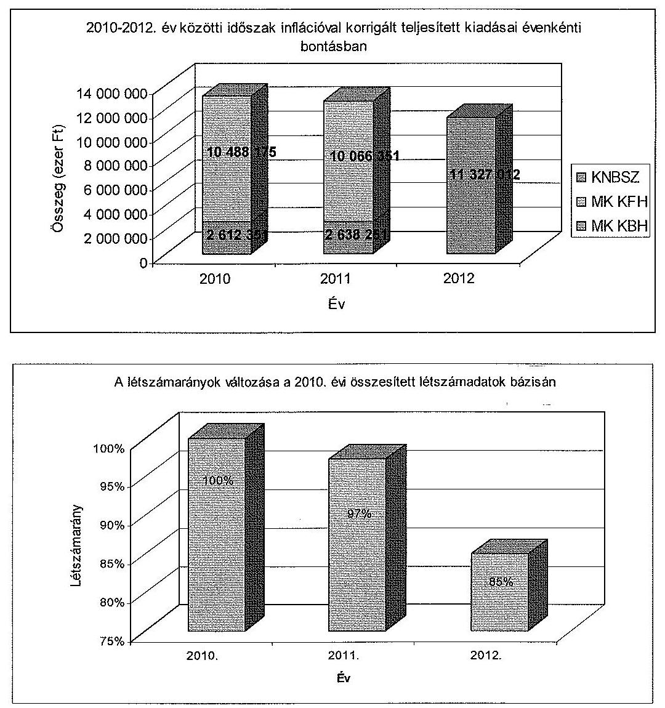
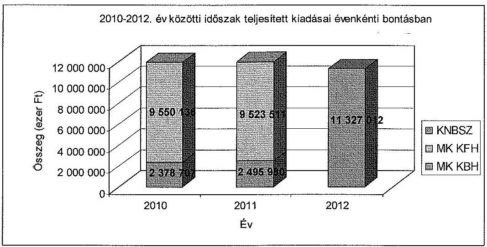
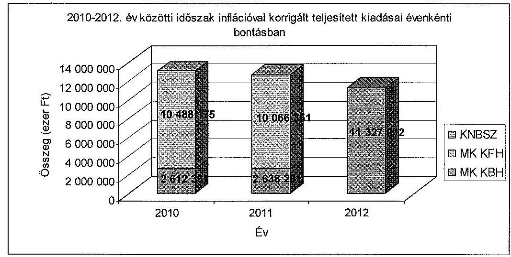
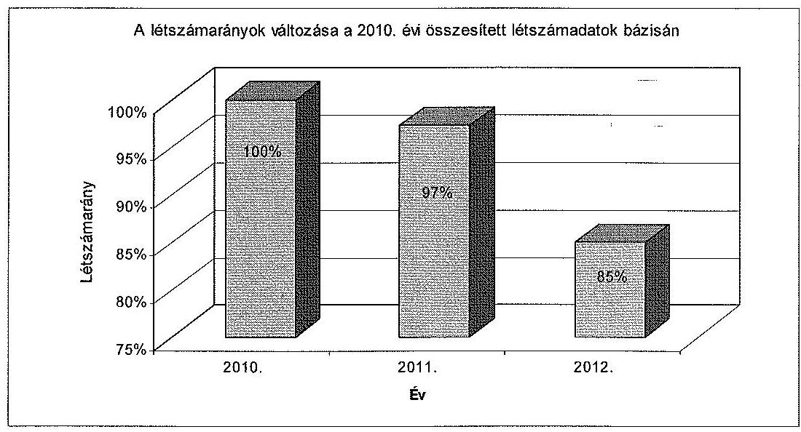
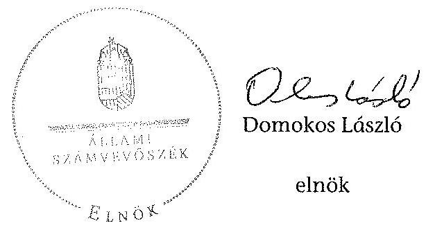

# ÁLLAMI   SZÁMVEVŐSZÉK 

## JELENTÉS

a Katonai Nemzetbiztonsági Szolgálat ellenőrzéséről

---

# Állami Számvevőszék 

Iktatószám: V-0125-029/2013.
Témasorszám: 1160
Vizsgálat-azonosító szám: V0628

## Az ellenőrzést felügyelte:

Dr. Horváth Margit
felügyeleti vezető
Az ellenőrzést vezette és az ellenőrzés végrehajtásáért felelős:
Görgényi Gábor
ellenőrzésvezető
A számvevőszéki jelentés összeállításában közreműködtek:
Görgényi Gábor
ellenőrzésvezető
Vas Lajos
számvevő tanácsos
Az ellenőrzést végezték:
Polyák Ferenc Vas Lajos
számvevő tanácsos számvevő tanácsos

A témához kapcsolódó eddig készített számvevőszéki jelentések:
címe
sorszáma
Jelentés Magyarország 2012. évi központi költségvetése végrehajtásának ellenőrzéséről

---

# TARTALOMJEGYZÉK 

BEVEZETÉS ..... 7
I. ÖSSZEGZŐ MEGÁLLAPÍTÁSOK, KÖVETKEZTETÉSEK, JAVASLATOK ..... 10
II. RÉSZLETES MEGÁLLAPÍTÁSOK ..... 15

1. A KNBSZ megalakítása és a jogelőd intézményeknél végrehajtott szervezeti korszerűsítések ..... 15
1.1. Az átalakulást megelőző szervezeti korszerűsítések ..... 15
1.2. Az átalakulás időszaka ..... 17
1.3. Az átalakulást követő időszak ..... 20
2. A HM irányító szervi tevékenysége ..... 22
3. A belső kontrollrendszerek kialakítása és működése ..... 23
4. A pénzügyi gazdálkodás szabályszerűsége ..... 28
4.1. A kiadási és bevételi előirányzatok alakulása ..... 28
4.2. A kiadási és bevételi előirányzatok felhasználásának szabályszerűsége ..... 34
4.2.1. Intézményi előirányzatok ..... 35
4.2.2. Speciális működési kiadások ..... 38
4.2.3. Katonadiplomáciai kiadások ..... 41
4.3. A KNBSZ sajátosságából adódó, az általánostól eltérő gazdálkodás szabályozása ..... 42
4.4. A HM KGIR működése ..... 43
5. A vagyongazdálkodás szabályszerűsége ..... 44
5.1. A vagyonelemekkel való gazdálkodás és a vagyonnyilvántartás szabályszerűsége ..... 44
5.2. Speciális működési kiadásokból beszerzett eszközök ..... 48
5.3. Vagyonváltozás, vagyonösszetétel ..... 48

---

# **Title: The Impact of Climate Change on Global Ecosystems**

## **Introduction**

Climate change is one of the most pressing environmental issues of our time. It affects ecosystems worldwide, leading to significant changes in biodiversity, habitat loss, and species extinction. This report explores the impacts of climate change on global ecosystems, focusing on key areas such as **forests**, **oceans**, and **polar regions**.

## **1. Forest Ecosystems**

Forests play a crucial role in carbon sequestration and maintaining biodiversity. However, rising temperatures and changing precipitation patterns are altering forest ecosystems. Key impacts include:

- **Increased frequency of wildfires**: Rising temperatures and drought conditions have led to more frequent and severe wildfires, destroying vast areas of forests.
- **Changes in species distribution**: Shifts in temperature and precipitation patterns are altering species distribution, leading to species extinction.
- **Insect outbreaks**: Warmer temperatures have increased the survival rates of pests like bark beetles, which are causing widespread wildfires.

## **2. Ocean Ecosystems**

Oceans absorb a significant portion of the excess heat and carbon dioxide (CO₂) produced by human activities. The consequences include:

- **Increased frequency of wildfires**: Rising sea levels and drought conditions have led to more frequent and severe wildfires, threatening species like polar bears and seals.  *(This line is nonsensical in the context of ocean ecosystems and should be removed or replaced with a relevant statement, but that is outside the scope of this task.)*
- **Changes in ocean currents**: Altered ocean currents are causing widespread sea-level rise, threatening species like polar bears and seals. *(This line is nonsensical in the context of ocean ecosystems and should be removed or replaced with a relevant statement, but that is outside the scope of this task.)*
- **Changes in ocean currents**: Shifts in ocean currents are altering ocean currents, threatening species like polar bears and seals. *(This line is repetitive and should be removed or replaced with a relevant statement, but that is outside the scope of this task.)*

## **3. Polar Ecosystems**

Polar regions are particularly vulnerable to climate change due to their sensitivity to temperature changes. Key impacts include:

- **Melting of sea ice**: The Arctic is warming at twice the rate of the global average, leading to sea ice loss.
- **Glacial retreat**: Melting glaciers and their presence in the Arctic are altering ocean currents, threatening species like polar bears and seals.
- **Glacial retreat**: Melting glaciers and their presence in the Arctic are altering ocean currents, threatening species like polar bears and seals. *(This line is repetitive and should be removed, but that is outside the scope of this task.)*

## **4. Polar Ecosystems**

Polar regions are particularly vulnerable to climate change due to their sensitivity to temperature changes. Key impacts include:

- **Melting of sea ice**: Melting glaciers and their presence in the Arctic are altering sea ice, threatening species like polar bears and seals.
- **Glacial retreat**: Melting glaciers and their presence in the Arctic are altering ocean currents, threatening species like polar bears and seals.

## **5. Polar Ecosystems**

Polar regions are particularly vulnerable to climate change due to their sensitivity to temperature changes. Key impacts include:

- **Melting of sea ice**: Melting glaciers and their presence in the Arctic are altering sea ice, threatening species like polar bears and seals.
- **Glacial retreat**: Melting glaciers and their presence in the Arctic are altering ocean currents, threatening species like polar bears and seals.

## **Conclusion**

Climate change poses a significant threat to global ecosystems, with far-reaching consequences for biodiversity and human societies. By reducing greenhouse gas emissions, reducing greenhouse gas emissions, and reducing greenhouse gas emissions, *(This line is repetitive and should be shortened, but that is outside the scope of this task.)* we can protect our planet for future generations.

---

**References**

1. IPCC (Intergovernmental Panel on Climate Change). (2021). *Climate Change 2021: The Physical Science Basis*.
2. WWF (World Wildlife Fund). (2020). *Living Planet Report 2020*.
3. NASA. (2021). *Global Climate Change Vital Signs*.

---

# RÖVIDÍTÉSEK JEGYZÉKE 

## Törvények

Áht. 1
Áht. 2
ÁSZ tv.
Hjt.

## HMH tv.

Kbt. 1
Kbt. 2
Mavtv.
Nbtv.
Sztv.

## Rendeletek

Áhsz.

Ámr.
Ávr.

## Utasítások

ÖKF

SzLR

## Egyéb rövidítések

ÁSZ
EFK
FEUVE

HM
HM BEF
HM BEH
HM KEHH

HM KGIR
1992. évi XXXVIII. törvény az államháztartásról (hatálytalan 2012. I. 1-től)
2011. évi CXCV. törvény az államháztartásról
2011. évi LXVI. törvény az Állami Számvevőszékről
2001. évi XCV. törvény a Magyar Honvédség hivatásos és szerződéses állományú katonáinak jogállásáról (hatálytalan 2013. VII. 1-től)
2004. évi CV. törvény a honvédelemről és a Magyar Honvédségről (hatálytalan 2012. I. 1-től)
2003. évi CXXIX. törvény a közbeszerzésekről (hatálytalan 2012. I. 1-től)
2011. évi CVIII. törvény a közbeszerzésekről
2009. évi CLV. törvény a minősített adat védelméről
1995. évi CXXV. törvény a nemzetbiztonsági szolgálatokról
2000. évi C. törvény a számvitelről

249/2000. (XII. 24.) Korm. rendelet az államháztartás szervezetei beszámolási és könyvvezetési kötelezettségének sajátosságairól
292/2009. (XII. 19.) Korm. rendelet az államháztartás működési rendjéről (hatálytalan 2012. I. 1-től)
368/2011. (XII. 31.) Korm. rendelet az államháztartásról szóló törvény végrehajtásáról

128/2011. (XII. 2.) HM utasítás a katonai nemzetbiztonsági szolgálatok összevonásával kapcsolatos egyes feladatokról (hatálytalan 2012. IX. 30-tól)
116/2011. (X. 21. HM utasítás a katonai nemzetbiztonsági szolgálatok szervezeti és létszám-racionalizálásának egyes feladatairól (hatálytalan 2012. IX. 30-tól)

Állami Számvevőszék
Előirányzat-felhasználási keretszámla
Folyamatba épített, előzetes, utólagos és vezetői ellenőrzés
Honvédelmi Minisztérium
Honvédelmi Minisztérium Belső Ellenőrzési Főosztály
Honvédelmi Minisztérium Belső Ellenőrzési Hivatal
Honvédelmi Minisztérium Központi Ellenőrzési és Hatósági Hivatal
Honvédelmi Minisztérium fejezet költségvetés gazdálkodási információs rendszer

---

| HM KPH | Honvédelmi Minisztérium Közgazdasági és Pénzügyi Hivatal |
| :-- | :-- |
| HM TKF | Honvédelmi Minisztérium Tervezési és Koordinációs Főosztály |
| HM GTSZF | Honvédelmi Minisztérium Gazdasági Tervezési és Szabályozási Főosztály |
| HSZIR | Haderőszervezési Információs Rendszer |
| Kincstár | Magyar Államkincstár |
| KIR | Központosított Illetményszámfejtési Rendszer |
| KNBSZ | Katonai Nemzetbiztonsági Szolgálat |
| MK KBH | Magyar Köztársaság Katonai Biztonsági Hivatal |
| MK KFH | Magyar Köztársaság Katonai Felderítő Hivatal |
| MNV Zrt. | Magyar Nemzeti Vagyonkezelő Zártkörű Részvénytársaság |
| NAV | Nemzeti Adó és Vámhivatal |
| NGM | Nemzetgazdasági Minisztérium |
| SZJA | személyi jövedelemadó |
| SzMSz | Szervezeti és Működési szabályzat |

---

# ÉRTELMEZŐ SZÓTÁR 

belső ellenőrzési vezető

belső kontroll kockázat
belső kontrollrendszer
beolvadás
ellenjegyzés
ellenőrzési nyomvonal
előirányzat-elvonás
előirányzat-módosítás
érvényesítés
intézkedési terv
irányító szerv
kockázat

A költségvetési szerv belső ellenőrzési egységének vezetője, ha a költségvetési szervnél egy fő látja el a belső ellenőrzést, akkor a belső ellenőrzést ellátó személy.
Annak a kockázata, hogy az ellenőrzött szervezet (tevékenység, projekt) belső kontrollrendszere elmulasztja megelőzni, vagy jelezni és kijavítani a lényeges hibát, szabálytalanságot, vagy a félrevezető állítást.
A kockázatok kezelése és tárgyilagos bizonyosság megszerzése érdekében kialakított folyamatrendszer, ami azt a célt szolgálja, hogy megvalósuljanak a következő célok: a működés és a gazdálkodás során a tevékenységeket szabályszerűen, gazdaságosan, hatékonyan, eredményesen hajtsák végre; az elszámolási kötelezettségeket teljesítsék; megvédjék az erőforrásokat a veszteségektől, károktól és nem rendeltetésszerű használattól.
Beolvadás esetén a beolvadó költségvetési szerv megszűnik, jogutódja az átvevő költségvetési szerv.
Annak igazolása, hogy a kötelezettségvállalás vagy utalványozás teljesítéséhez szükséges fedezet rendelkezésre áll, és nem sérti a gazdálkodásra vonatkozó szabályokat.
Az ellenőrzési nyomvonal egy olyan nyilvántartási rendszer kialakítását és fenntartását jelenti, amely a tranzakciók teljes folyamatának minden egyes szakaszára vonatkozóan teljes dokumentálást és igazolást nyújt. Az ellenőrzési nyomvonal lehetővé teszi, hogy az aggregált összegekből lefelé haladva nyomon lehessen követni az egyes tranzakciókat, csakúgy, mint az egyes tranzakciókból az aggregált összegeket.
A kiadási előirányzatok felhasználásának végleges korlátozása, az előirányzatok feltételhez nem kötött csökkentése.
A megállapított kiadási előirányzat növelése vagy csökkentése, a bevételi előirányzatok egyidejű növelése vagy csökkentése mellett.
A kiadás teljesítése, bevétel beszedése előtt azok jogosultságának, összegszerűségének, előírt alaki követelményeknek való megfelelésének, továbbá a szükséges fedezet meglétének igazolása.
Az ellenőrzési javaslatok alapján az ellenőrzött szervezet, szervezeti egység által készített intézkedések végrehajtásának ütemezése a végrehajtásért felelős személyek és a vonatkozó határidők megjelölésével.
A költségvetési szervvel és annak gazdálkodásával kapcsolatos irányítási jogokkal felruházott szerv, személy.
Az a lehetőség, hogy egy olyan esemény történik meg, amely negatívan hat a célok elérésére. A kockázat fo-

---

kockázatkezelési rendszer
kontrollkörnyezet
kontrolltevékenységek
kötelezettségvállalás
leválogatott tétel, mintatétel
likviditási mutató
monitoring
pénzeszköz likviditási mutató
speciális működési kiadás
utalványozás
zárolás
zárolás feloldása
galma általánosságban úgy határozható meg, hogy az valamilyen esemény, tevékenység, vagy tevékenység elmulasztása, amely a jövőben valószínűleg bekövetkezik, és ha bekövetkezik, akkor ennek általában negatív, egyes esetekben viszont pozitív hatása van az adott szervezet céljainak elérésére.
Irányítási eszközök és módszerek összessége, melynek elemei a szervezeti célok elérését veszélyeztető tényezők (kockázatok) azonosítása, elemzése, csoportosítása, nyomon követése, valamint szükség esetén a kockázati kitettség mérséklése.
A kontrollkörnyezet a költségvetési szerv vezetőinek a szervezeti célok elérését segítő kontrollok kialakításával és működtetésével, korszerűsítésével kapcsolatos magatartását, a kontrollpontokról érkező információkra való reagálását jelenti.
Azok az elvek, politikák és eljárások, amelyeket a kockázatok meghatározása és a szervezet céljainak elérése érdekében alakítanak ki.
A költségvetési szerv vezetője köteles a szervezeten belül kontrolltevékenységeket kialakítani, amelyek biztosítják a kockázatok kezelését, hozzájárulnak a szervezet céljainak eléréséhez.
A kiadási előirányzatok terhére fizetési kötelezettség vállalásáról szóló, szabályszerűen megtett nyilatkozat.
Az alapsokaságot képviselő (reprezentáló) véletlenszerűen kiválasztott részsokaság.
forgóeszközök összesen / rövid lejáratú kötelezettségek összesen (akkor elfogadható, ha eléri az 1-es értéket)
A különböző szintű szervezeti célok megvalósításához szükséges folyamatok figyelemmel kísérése, melynek során a releváns eseményekről és tevékenységekről (együtt: folyamatokról) rendszeres jelleggel, strukturált, döntéstámogató információkhoz jutnak a szervezet vezetői.
pénzeszközök összesen / rövid lejáratú kötelezettségek összesen
A nemzetbiztonsági szolgálatok titkosszolgálati tevékenységéhez, a titkos információgyűjtés eszközeinek és módszereinek alkalmazásához közvetlenül kötődő személyi és tárgyi vonatkozású kiadások.
A kiadás teljesítésének, bevétel beszedésének, vagy elszámolásának elrendelése.
A kiadási előirányzatok felhasználásának ideiglenes, feltételhez kötött korlátozása, felfüggesztése.
A kiadási előirányzatok felhasználásának ideiglenes, feltételhez kötött korlátozásának, felfüggesztésének megszüntetése.

---

# JELENTÉS 

## a Katonai Nemzetbiztonsági Szolgálat ellenőrzéséről

## BEVEZETÉS

A Katonai Nemzetbiztonsági Szolgálat (KNBSZ) a nemzetbiztonsági szolgálatokról szóló 1995. évi CXXV. törvényben (Nbtv.) meghatározott és szabályozott feladatai elvégzésével - a nyílt és a titkos információgyűjtés eszközrendszerével - elősegíti Magyarország nemzetbiztonsági érdekeinek érvényesítését, közreműködik az ország szuverenitásának biztosításában és alkotmányos rendjének védelmében. Az Nbtv. szabályozza a működés alapelveit, feladatait, a hozzá kötődő szervezeti- és eszközrendszert is.

A KNBSZ a nemzetbiztonsági szolgálatokról szóló 1995. évi CXXV.
 törvény katonai nemzetbiztonsági szolgálatok összevonásával kapcsolatos módosításáról, valamint az azzal összefüggő további törvénymódosításokról szóló 2011. évi CLXXI. törvény előírásai alapján 2012. január 1-jén jött létre, a korábbi két katonai nemzetbiztonsági szolgálat, a Magyar Köztársaság Katonai Felderítő Hivatal (MK KFH) és a Magyar Köztársaság Katonai Biztonsági Hivatal (MK KBH) egyesítésével. Az MK KBH 2011. december 31-én beolvadással megszűnt, a beolvadást követően 2012. január 1-jétől az MK KFH megnevezése Katonai Nemzetbiztonsági Szolgálatra módosult. Az összevonás célja alapvetően a vezetői szintek csökkentése, a feladatok és a tevékenységek párhuzamosságának megszüntetése, a műveleteket támogató és kiszolgáló személyzet létszámának optimalizálása volt.

A KNBSZ a Kormány irányítása alatt álló, az ország egész területére kiterjedő illetékességgel rendelkező, önállóan működő és gazdálkodó költségvetési szerv. A KNBSZ és jogelődei működésének általános kereteit, szervezeti felépítését, továbbá törvényen, kormányrendeleten vagy egyéb kormányzati döntésen alapuló feladatok végrehajtását a honvédelmi miniszter rendeletekben és utasításokban határozza meg.

A KNBSZ alapfeladatait tekintve elsősorban katonai hírszerzési, illetve kém- és terrorelhárítási, valamint alkotmányvédelmi és bűnmegelőzési feladatokat lát el. Ennek érdekében a nyílt és a bírói engedélyhez kötött, vagy ilyen engedélyhez nem kötött titkos információgyűjtés eszközrendszerével - a polgári nemzetbiztonsági szolgálatokkal együttműködve - elősegíti Magyarország nemzetbiztonsági érdekeinek érvényesítését, ezáltal közreműködik az ország szuverenitásának és alkotmányos rendjének védelmében.

A KNBSZ önálló pénzügyi és számviteli szervezeti egységgel rendelkezik, előirányzatai az intézményi működési kiadások mellett magukban foglalják a speciális kiadásokat és a katonadiplomáciai tevékenységének biztosítása érdeké-

---

ben, külföldön működtetett attaséhivatalok kiadásait is. Az alaptevékenységgel összefüggő speciális működési kiadásai biztosítására elkülönített előirányzatot a dologi kiadások előirányzatán belül egy összegben kell tervezni és elszámolni, függetlenül attól, hogy azok személyi jellegű, felhalmozási, felújítási célú vagy dologi kiadások.

A KNBSZ-nek és jogelődeinek a jogszabályi előírásoknak megfelelően, az alaptevékenységük ellátásához szükséges speciális kezelésű vagyonelemekről - a nemzeti vagyonnal történő felelős gazdálkodás, a nemzeti vagyon védelme érdekében - elkülönített nyilvántartást kell vezetni.

Az ellenőrzés kapcsolódott Magyarország 2012. évi központi költségvetése végrehajtásának ÁSZ ellenőrzéséhez, a 2012. évi gazdálkodás ellenőrzése vonatkozásában hasznosítja a hivatkozott ellenőrzés megállapításait.

Az ellenőrzés célja annak megállapítása volt, hogy a KNBSZ és jogelődei (MK KBH, MK KFH) a 2010-2012. évek között a feladatai ellátását célzó közpénzekkel felelősen, a szabályok betartásával gazdálkodott-e; a szervezetek átalakítása és átszervezése a feladatok és eszközök átadás-átvétele a jogszabályi előírásoknak megfelelt-e; a pénzügyi- és vagyongazdálkodása szabályszerű volt-e, valamint a szervezet gazdálkodását érintő belső kontrollrendszerének kiépítése, működése megfelelően biztosította-e a nemzetbiztonsági feladatok szabályszerű ellátását. Az ellenőrzés célja továbbá annak értékelése volt, hogy a speciális működési kiadások felhasználásának szabályozottsága, elszámolása és ellenőrzése megfelelt-e a jogszabályi követelményeknek.

Az ellenőrzés keretében értékeltük továbbá, hogy:

- a KNBSZ és jogelődei belső kontrollrendszerének kialakítása és működtetése biztosította-e a szabályszerű közpénz- és vagyongazdálkodást, megfelelően működött-e a belső ellenőrzési rendszere és hasznosultak-e annak megállapításai;
- a honvédelmi miniszter valamint a honvédelmi miniszter által feladatellátással felhatalmazott szervek irányító szervi feladatellátása, valamint a KNBSZ szervezeti működésére vonatkozó szabályozás megfelelt-e az alapító okiratban rögzített feladatoknak, hatásköröknek és a vonatkozó jogszabályi előírásoknak; az intézmény szervezeti átalakítása támogatta-e a feladatok ellátását;
- a KNBSZ megalakítása és a jogelőd intézményeknél a megalakítást megelőző 2011. évi szervezeti korszerűsítések végrehajtása a vonatkozó jogszabályok alapján szabályszerű volt-e;
- a KNBSZ és jogelődei pénz- és előirányzat-gazdálkodása az irányadó jogszabályoknak megfelelt-e, és az egyes költségvetési években a pénzügyi stabilitása biztosított volt-e;
- a KNBSZ és jogelődei vagyongazdálkodása, és az általuk kezelt (létesített és átvett) állami vagyon értékének és összetételének változása jogszerű döntésekkel alátámasztott volt-e.

---

A bevételek és kiadások ellenőrzése a 2010-2011. évek vonatkozásában a KNBSZ által rendelkezésre bocsátott főkönyvi adatbázisból, a belső kontrollrendszerekre támaszkodva, mintavételezéses eljárással történt, míg a 2012. évi gazdálkodás ellenőrzése a 2012. évi költségvetés végrehajtásának ellenőrzése keretében valósult meg.

A KNBSZ és jogelődei gazdálkodása, továbbá a speciális és katonadiplomáciai kiadások szabályszerűségének ismeretében ellenőrzésünkkel hozzá kívánunk járulni a központi alrendszer intézményeinél a jó gyakorlatok terjesztéséhez, valamint a belső kontrollrendszerek további erősítéséhez.

Az ellenőrzést az ÁSZ 2013. I. félévi ellenőrzési terve alapján a számvevőszéki ellenőrzés szakmai szabályai szerint, szabályszerűségi ellenőrzés módszerével, a vonatkozó nemzetközi standardok figyelembevételével végeztük.

Az ellenőrzés a 2010. január 1-je és 2012. december 31-e közötti időszakra terjedt ki.

A helyszíni ellenőrzést a KNBSZ-nél, valamint a KNBSZ irányító szervénél, a HM-nél végeztük.

Az ellenőrzés végrehajtásának jogszabályi alapját az ÁSZ tv. 1. § (3) bekezdés, 5. § (3)-(6), (11) bekezdés d) pontja, valamint Áht. 61. § (2) bekezdésének előírásai képezik.

Az ÁSZ az Állami Számvevőszékről szóló 2011. évi LXVI. törvény 29. §-a alapján a jelentéstervezetet észrevételezésre megküldte az ellenőrzött szervezetek vezetőinek. A HM nem tett észrevételt, a KNBSZ észrevétele alapján a jelentést pontosítottuk.

---

# I. ÖSSZEGZŐ MEGÁLLAPÍTÁSOK, KÖVETKEZTETÉSEK, JAVASLATOK 

A katonai nemzetbiztonsággal összefüggő felderítő, illetve elhárító tevékenységet 2010. és 2011. évben az MK KFH, illetve az MK KBH, majd a 2012. évtől a KNBSZ végezte. A KNBSZ 2012. január 1-jei megalakulását megelőzően a jogelőd MK KBH-nál és MK KFH-nál is szervezeti változások történtek, amelyek érintették az intézmények létszámát, létszámösszetételét és a szervezeti felépítését. A végrehajtott szervezeti változások a takarékosabb gazdálkodás és a feladatellátás racionalizálását szolgálták, közvetve hozzájárultak a KNBSZ megalakításának előkészítéséhez.

A szervezeti átalakításokkal összefüggésben elsőként kiadott 28/2011. (III. 9.) HM utasításban foglaltaknak megfelelően az MK KFH a szervezeti korszerűsítést létszámcsökkentés nélkül, ugyanakkor a szakmai működés elősegítése érdekében a hivatásos tiszti állomány növelésével hajtotta végre. Ezt követően a 116/2011. (X. 21.) HM utasítás (SzLR) alapján az MK KFH esetében 155 fő, az MK KBH esetében pedig 62 fő létszámcsökkenés történt. Ugyanakkor az intézmények a szervezeti felépítésben, a létszámban, illetve a feladatrendszerben bekövetkezett változásokat az SzMSz-ükben 2011. év végén már nem vezették át, mivel az MK KBH beolvadt az MK KFH-ba, az MK KFH névváltozásával pedig megalakult a KNBSZ.

Az integrálás gazdasági hátterét alapvetően meghatározó, a jogelődök elfogadott 2012. évi költségvetését alátámasztó gazdasági számvetések és kimutatások elkészültek, amelyek a szakmai munka folytonosságát biztosították.

A katonai nemzetbiztonsági szolgálatok összevonásának végrehajtása érdekében a honvédelmi miniszter hatályba léptette a katonai nemzetbiztonsági szolgálatok összevonásával kapcsolatos egyes feladatokról szóló 128/2011. (XII. 2.) HM utasítást (ÖKF). Az MK KFH és az MK KBH főigazgatói beosztásokban 2011. november 30-án személycsere történt. Az MK KBH főigazgatói feladatot 2011. december hónapban a megszűnésig megbízott főigazgató látta el. Az MK KFH új főigazgatója egyben a megalakuló KNBSZ kijelölt főigazgatója lett.

Az MK KFH és az MK KBH főigazgatói az ÖKF 21. § (6) bekezdése alapján gondoskodtak a vezetéshez szükséges belső rendelkezések kidolgozásáról, melynek keretében az M/2/2011. számú együttes utasításban részletesen szabályozták az egységes szervezet szintű működés feltételeit, valamint az összevonással összefüggő szakfeladatok végrehajtását, illetve az átadás-átvételt.

A megszűnés napjával az MK KBH leltárral és záró főkönyvi kivonattal alátámasztott éves beszámolóját és a zárszámadáshoz kapcsolódó adatszolgáltatást elkészítette. Az MK KBH megszűnésével összefüggő még fennmaradó pénzügyi és számviteli feladatokat a KNBSZ 2012. február 29-ig teljesítette.

Az átalakulást követően a feladatok összetétele nem változott, közfeladat elmaradás nem történt. A szakmai beszámolók és a helyszíni ellenőrzés tapasztalatai alapján a 2012. év során a feladatellátás színvonala nem maradt el az átalakítást megelőző időszakétól. A feladatellátás hatékonyságának növelése, illetve a költségvetési források takarékosabb felhasználása érdekében egységes szervezeti felépítés és ahhoz igazodó vezetői szintek kerültek kialakításra, a párhuzamosságokat megszüntették.

A KNBSZ megalakítása közpénz megtakarítást eredményezett. Az intézkedések takarékosabb gazdálkodást elősegítő hatásai az átalakulás előtti, illetve az átalakulás utáni intézményi teljesítési kiadások és a létszámadatok alapján egyértelműen kimutathatóak. A KNBSZ a változatlan volumenű feladatot kevesebb létszámmal, kisebb teljesített kiadással valósította meg, mint jogelődjei. Az átalakulást megelőzően az MK KBH és az MK KFH együttes teljesített kiadása 2010. évben 11 928,8 M Ft, 2011. évben pedig 12 019,5 M Ft, míg a KNBSZ 2012. évi teljesített kiadása 11 327,0 M Ft volt. Az átlagos statisztikai létszám az MK KBH és az MK KFH együttes 2010. évi bázisát alapul véve 2011. évben 3%-al, míg a KNBSZ esetében 15%-al csökkent.

A releváns adatok változását az alábbi grafikonokon keresztül mutatjuk be:

---

A HM irányító szervi tevékenysége összességében megfelelő volt. Az MK KBH, az MK KFH, valamint KNBSZ-re vonatkozó irányító szervi feladatokat a honvédelmi miniszter a HM KPH útján szabályosan, a jogszabályi előírásoknak megfelelően látta el. A KNBSZ létrehozásához kapcsolódó alapítói és irányító szervi döntések szabályszerűen történtek.

A szabályszerű gazdálkodást támogatandó belső kontrollrendszerek kiépítettsége és működése mindhárom ellenőrzött intézmény vonatkozásában megfelelő volt. Az egyes fő kontrollelemeknél feltárt kisebb hiányosságok nem veszélyeztették a gazdálkodás szabályszerűségét biztosító kontrollrendszer egészének működését.

A kontrollkörnyezet, valamint a kockázatkezelés részeként kidolgozott belső szabályzatok összességében megfeleltek a jogszabályok által előírt követelményeknek, azok lefedték a belső kontroll rendszer valamennyi elemét, a KNBSZ esetében azonban az átalakulás miatt az aktualizálásuk a 2012. év egészében elhúzódva történt. Mindez arra is visszavezethető, hogy a belső szabályzatok módosítását nem támogatták olyan kontrollok, amelyek meghatározzák, azok felülvizsgálatának kötelező időpontjait. További hiányosság, hogy a gazdálkodásra vonatkozó belső szabályzatok, illetve azok mellékletei az Ávr. 60. § (3) bekezdésében foglaltak ellenére nem tartalmazták a pénzügyi jogköröket gyakorlók megnevezését és aláírás mintáit, illetve nem hivatkoztak a külön fellelhető aláírás-minták elérhetőségi útvonalára. A jelzett hiányosságok ellenére a kiadási és bevételi tranzakciók mintavételezésen alapuló ellenőrzése során lényeges hibát és szabálytalanságot nem tártunk fel.

A kontrolltevékenységek keretében az intézmények kialakították a kötelezettségvállalás, a szakmai igazolás (teljesítésigazolás), az érvényesítés, az utalványozás területén a kontrollkörnyezetet kiegészítő, ahhoz kapcsolódóan működő eljárásokat, amelyek kellő mértékben támogatták a szabályszerűség megvalósulását. Az információ és kommunikáció kontrollelem keretében meghatározták a gazdálkodáshoz szükséges információk átadásának formáit, módját, az alkalmazottak és a vezetők a munkavégzéshez szükséges információhoz időben hozzájutottak. A monitoring kontrollelem részeként a tevékenységgel kapcsolatos monitoring rendszert az MK KBH már 2010., az MK KFH pedig 2011. évben alakította ki, míg a KNBSZ az Általános Belső Kontroll Szabályzata keretén belül 2012. évben hozta létre.

A belső ellenőrzést végző szervezeti egységek - amelyeket mindhárom intézmény szabályszerűen a főigazgatóhoz közvetlenül alárendelve működtetett - a saját belső kontrollrendszereinek önértékelését elvégezték, annak ajánlásait hasznosították a gazdálkodásra vonatkozó későbbi egységes szabályozásban melynek keretében vizsgálták annak kiépítését, megfelelőségét.

A szervezeti átalakításokkal, feladatváltozásokkal összefüggésben a kiadási és bevételi előirányzatok tényleges teljesítésénél, - figyelembe véve a speciális kiadásokat és bevételeket is - az eredeti előirányzatokhoz képest egyik intézménynél sem voltak lényeges változások, a gazdálkodásuk tervszerű volt. A különböző kormányhatározatokban meghatározott, a gazdálkodás racionalizálását és a költségvetés egyensúlyát biztosító beszerzési korlátozásokat az ellenőrzött időszakban betartották. Mindkét ellenőrzött évben érintette az MK KBH-t és az
 MK KFH-t előirányzat-zárolás, amely nem került feloldásra, a zárolt összegeket elvonták. A zárolás a módosított kiadási előirányzatok 1,5-2%-át, illetve 0,7-4,2%-át érintette. Maradványtartási kötelezettség csak 2011. évben érintette az MK KBH-t és az MK KFH-t, de az intézkedések feloldásra kerültek. A maradványtartás a módosított kiadási előirányzatok 3,4-6,6%-át érintette. A KNSZB-nél a honvédelmi szervezetek gazdálkodását racionalizáló és kiadásait csökkentő intézkedésekről szóló 26/2012. (IV. 21.) HM utasítás alapján 270,0 M Ft került elvonásra a 2012. évben. A költségvetés egyensúlyát biztosító kormányzati intézkedések szigorú gazdálkodási fegyelmet követeltek meg az intézményektől, de a működőképességüket és a feladatellátásukat nem veszélyeztették.

A KNBSZ és jogelődei az intézményi gazdálkodásuk mellett speciális gazdálkodást is folytattak, továbbá - az MK KBH kivételével - a katonadiplomáciai szakfeladataik ellátásához külföldön attaséhivatalokat működtettek. Az ellenőrzés tapasztalatai szerint mindhárom kiadási terület esetében a kötelezettségvállalás, ellenjegyzés, teljesítésigazolás, az érvényesítés, az utalványozás gyakorlata összhangban állt az ellenőrzött időszakban érvényes Áht., Áht.${ }_{2}$ Ámr., Ávr., valamint a gazdálkodási szabályzatok előírásaival. Lényeges szabályszerűségi, illetve megbízhatósági hibát nem tártunk fel.

Az intézmények a speciális működési kiadásaikat szabályszerűen, a dologi kiadások kiemelt előirányzatán belül egy összegben számolták el. Az attaséhivatalok finanszírozása a kialakított eljárásrendeknek megfelelően előleg elszámolási rendszerben valósult meg, az előlegek elszámolását, ellenőrzését a gazdálkodásért felelős igazgatóság a tárgyhónapot követően a hazaérkezett pénzügyi okmányok alapján hajtotta végre.

Ugyanakkor a speciális működési kiadásokat a minősített beszámoló „03 Dologi kiadások előirányzata és teljesítése" űrlapjának „29 Egyéb üzemeltetési, fenntartási szolgáltatási kiadások" sora tartalmazza, több egyéb más költségnem mellett, így nem biztosított a speciális kiadások egyértelmű és teljes körű beazonosíthatósága a minősített beszámoló szintjén, mert azok csak főkönyvi adatokból reprodukálhatóak.

A vagyonelemekkel történő gazdálkodás, a vagyonelemek nyilvántartása, azok karbantartása, az értékcsökkenések elszámolása mind az MK KBH, mind az MK KFH és a KNBSZ esetében is a keretjogszabályoknak megfelelően szabályozott volt. A KNBSZ 2012. év végi vagyona a mérlegfőösszege alapján 1898,8 M Ft volt. A vagyongazdálkodás kialakított gyakorlata - illeszkedve a jogszabályi, valamint a belső szabályzatok előírásaihoz - szintén szabályszerűen történt. Az intézmények a kezelésükben lévő vagyonelemeket az alapító okirataik szerinti tevékenységhez használták fel, az alaptevékenységükkel összefüggő speciális működési kiadásokból beszerzett eszközök kezelését szabályozták, azokról elkülönített nyilvántartást vezettek.

A minősített adatot (korábban államtitkot vagy szolgálati titkot) tartalmazó, illetőleg az alapvető biztonsági, nemzetbiztonsági érdeket érintő vagy különleges biztonsági intézkedést igénylő beszerzések vonatkozásában al-

---

# kalmazott eljárások megfeleltek a jogszabályi előírásoknak, azok szabályszerűek voltak. 

A használaton kívül helyezett immateriális javak, tárgyi eszközök intézményen kívüli értékesítésekor a HM vonatkozó keretutasítása, illetve annak végrehajtására kiadott intézményi belső eljárásrendek előírásai szerint jártak el, így mind az MK KFH-nál, mind pedig a KNBSZ-nél a használaton kívül helyezett tárgyi eszközök értékesítése szabályszerűen történt.

A helyszíni ellenőrzés megállapításainak hasznosítása mellett javasoljuk:

## A KNBSZ főigazgatójának

1. A belső szabályzatok módosítását nem támogatták olyan kontrollok, amelyek meghatározták volna azok kötelező felülvizsgálatának és módosításának esedékességét, időpontját, amely a kontrollkörnyezet jogszabályi környezettel szembeni sérülékenységének kockázatát növelte.

Javaslat
Intézkedjen arról, hogy a belső szabályzatokban határozzák meg, hogy a kapcsolódó jogszabály változása, illetve szervezeti változásokat követően legkésőbb hány napon belül szükséges a belső szabályozást aktualizálni. Továbbá a jogszabály-, vagy szervezeti változástól függetlenül milyen gyakorisággal szükséges a belső szabályzatokat minden esetben felülvizsgálni.
2. A gazdálkodásra vonatkozó belső szabályzatok, illetve azok mellékletei az Ávr. 60. § (3) bekezdésében foglaltak ellenére nem tartalmazták a pénzügyi jogköröket (kötelezettségvállalás, ellenjegyzés, szakmai teljesítésigazolás, érvényesítés, utalványozás) gyakorlók megnevezését és aláírás-mintáit, illetve nem hivatkoztak a külön fellelhető aláírás minták elérhetőségi útvonalára.

Javaslat
Intézkedjen arról, hogy a gazdálkodásra vonatkozó szabályzatok elválaszthatatlan részét képezzék az Ávr. 60. § (3) bekezdése szerint a pénzügyi jogköröket gyakorlók megnevezései és aláírás-mintái az adott gazdasági év egészére.

---

# II. RÉSZLETES MEGÁLLAPÍTÁSOK 

## 1. A KNBSZ MEGALAKÍTÁSA ÉS A JOGELŐD INTÉZMÉNYEKNÉL VÉGREHAJTOTT SZERVEZETI KORSZERŰSÍTÉSEK

A KNBSZ az Nbtv. előírásai alapján 2012. január 1-jén jött létre, az Nbtv. 1. § c) pontja és a 2. § (1) bekezdése alapján a korábbi MK KBH 2011. december 31-én történt beolvadásával, majd az MK KFH 2012. január 1-jén történt átalakulása nyomán.

A honvédelmi miniszter 2011. december 2-án a HMH tv. 76. § (3) bekezdése alapján - figyelemmel az Áht. 95. § és a 96. §-ban és az Ámr. 11. §-ban foglaltakra - kiadta az MK KBH megszüntető okiratát, amelyet az Ámr. 11. § (2) bekezdése szerint készített el. A megszüntető okiratot a honvédelmi szervezetek alapításáról, tevékenységéről és szabályzatairól szóló 80/2011. (VII. 29.) HM utasítás 3. § (1) bekezdése alapján a HM TKF a Kincstárnak megküldte, az okiratot a Hivatalos Értesítőben közzétették.

A honvédelmi miniszter 2011. december 2-án a HMH tv. 76. § (3) bekezdése alapján - figyelemmel az Áht. 88. §-ban és az Ámr. 10. §-ban, valamint az Nbtv. 1. § c) pontjában foglaltakra és a honvédelmi szervezetek működésének az államháztartás működési rendjétől eltérő szabályairól szóló 346/2009. (XII. 30.) Korm. rendeletre - a KNBSZ új alapító okiratát kiadta. Az átalakításról az alapító okiratot a 80/2011. (VII. 29.) HM utasítás 3. § (1) bekezdése alapján a HM TKF a Kincstárnak megküldte, az okiratot a Hivatalos Értesítőben közzétették.

### 1.1. Az átalakulást megelőző szervezeti korszerűsítések

A KNBSZ 2012. évi megalakítását megelőző évben az MK KFH szervezeti korszerűsítése érdekében a HMH tv. 52. § (1) bekezdés f) pontja alapján hatályba lépett a Magyar Köztársaság Katonai Felderítő Hivatal szervezetének korszerűsítéséről szóló 28/2011. (III. 9.) HM utasítás, amely a szervezeti korszerűsítéssel összefüggő feladatokat tartalmazta.

A HM utasítás 2. § (4) bekezdésének megfelelő új létszámarányokra kidolgozott állománytáblát az MK KFH 2011. április 15-én megküldte a HM TKF számára.

Az M/1095/162. számú állománytáblában az MK KFH figyelembe vette a hivatkozott bekezdésben előírtakat, mely szerint a szervezeti korszerűsítést létszámcsökkentés nélkül, az optimális működést elősegítő, rendszeresített rendfokozati arányváltoztatással kell végrehajtani. A 2011. április 15-én fennálló létszám ennek megfelelően nem csökkent, ugyanakkor a hivatásos tiszti állomány létszáma tiszthelyettes és a közalkalmazott állomány terhére növekedett.

A honvédelmi miniszter által előírt, az MK KFH szervezetének felülvizsgálatára és az optimális humánerőforrás meghatározására, valamint a döntés előkészítésre az MK KFH kimutatásokat, koncepciókat készített.

Az MK KFH-nál a szervezet korszerűsítésének állományváltozására „Az MK KFH létszámkimutatás alakulása”, „Kimutatás a Hivatal tervezett munkaköreiről, besorolási

---

kategóriáiról és az elérhető legmagasabb rendfokozatokról” és „Javaslatok bekérése a korszerűbb szervezetek létrehozására” címmel tervezetek készültek.

Az MK KFH főigazgatója a hivatal SzMSz-ét a szervezeti korszerűsítéssel összefüggésben kiadott módosításokkal egységes szerkezetbe foglalta (dokumentumazonosító: M/1095/163. sz.), amelyet a HM TKF-el történő egyeztetés után a főigazgató 2011. június 2-án írt alá, a honvédelmi miniszter pedig 2011. június 15-én hagyott jóvá.

A vagyonnyilatkozat-tételre kötelezett beosztások 2. számú melléklete csak az SzMSz elkészítésének határidejét követően 2011. június 17-én került be a hivatal SzMSz-ébe, amelyet a honvédelmi miniszter szintén jóváhagyott.

A költségvetési forrásokkal történő takarékosabb gazdálkodás megvalósítása érdekében az Nbtv. 11. § (1) bekezdés c) pontja, valamint a (2) bekezdés a) pontja alapján a honvédelmi miniszter hatályba léptette a katonai nemzetbiztonsági szolgálatok szervezeti és létszám-racionalizálásának egyes feladatairól szóló 116/2011. (X. 21.) HM utasítást (továbbiakban: SzLR). Az utasítás kiterjedt az MK KFH-ra és az MK KBH-ra is.

Az SzLR 7. § (2) bekezdése alapján mind az MK KFH, mind az MK KBH főigazgatója saját hatáskörében nyolc napon belül intézkedésekben részletesen szabályozta a szervezeti és létszám-racionalizálással összefüggő szakfeladatok végrehajtását.

Az MK KFH főigazgatója 20/2011. számú, az MK KBH főigazgatója pedig 23/2011. számú intézkedésben szabályozta a szervezet korszerűsítésével és létszámának csökkentésével kapcsolatos személyügyi szakfeladatok részletes ütemterv szerinti végrehajtását.

A feladatok ellátásához szükséges létszám-felmérést egyik intézmény sem készített, mert a létszámot az SzLR 3. § a) és b) pontja közvetve meghatározta, mely szerint az MK KFH létszáma 155, az MK KBH létszáma pedig 62 munkakörrel csökken. A létszámcsökkentést az intézmények végrehajtották.

Az MK KBH új állománytábláját a SzLR-ben foglalt határidőt követő második napon, 2011. október 17-én, az MK KFH pedig az előírt 2011. november 15-i határidőn belül terjesztette fel a honvédelmi miniszternek jóváhagyásra.

Az MK KBH vonatkozásában az SzLR 5. § (1) b) bekezdésben megjelölt 2011. október 15-i határidő hat nappal megelőzte a jogi norma hatályba lépésének időpontját.

Az MK KFH a szervezeti felépítésében, a rendszeresített létszámában, illetve a szervezet feladatrendszerében bekövetkezett változásokat az SzMSz-ében nem vezette át, azok csak a névváltozás, vagyis a KNBSZ 2012. január 1-jei megalakulása után a KNBSZ M/1095/176. számú SzMSz-ében 2012. február 29-én jelentek meg. Az MK KBH esetében a szervezeti változásokat szintén nem vezették át az SzMSz-ben, mivel a szervezet 2011. december 31-én beolvadással megszűnt.

Az SzLR 5. § (3) bekezdés alapján az MK KFH és az MK KBH főigazgatóinak saját szervezetük új SzMSz-eit fel kellett volna terjeszteniük a honvédelmi minisz-

---

ternek 2011. november 15-én, de mivel azokat nem készítették el ez nem történt meg.

Összességében megállapítható, hogy az MK KBH és az MK KFH a gazdálkodással összefüggő feladatait teljesítette. Az integrálás gazdasági hátterét alapvetően meghatározó, a jogelődök elfogadott 2012. évi költségvetését alátámasztó gazdasági számvetések és kimutatások elkészültek, amelyek a szakmai munka folytonosságát biztosították.

# 1.2. Az átalakulás időszaka 

A katonai nemzetbiztonsági szolgálatok összevonásának végrehajtása érdekében az Nbtv. 11. § (1) bekezdés c) valamint (2) bekezdés a) pontja alapján a honvédelmi miniszter hatályba léptette a katonai nemzetbiztonsági szolgálatok összevonásával kapcsolatos egyes feladatokról szóló 128/2011. (XII. 2.) HM utasítást (továbbiakban: ÖKF).

Az MK KFH és az MK KBH főigazgatói beosztásokban 2011. november 30-án személycsere történt. Mindkét esetben az M/112/2011. átadás-átvételi jegyzőkönyv és a 26/1-364/2011. számú jelentés készült, melyeket a honvédelmi miniszter jóváhagyott.

Az MK KBH főigazgatói feladatot 2011. december hónapban a megszűnésig (beolvadásig) a honvédelmi miniszter által megbízott főigazgatói jogkörrel ellátott személy látta el. Az MK KFH új főigazgatója egyben a megalakuló KNBSZ kijelölt főigazgatója lett.

Az ÖKF 6. § (1) bekezdésben foglaltak szerint a katonai nemzetbiztonsági szolgálatok főigazgatói beosztásainak átadás-átvétele 2011. november 30-ig végrehajtásra került, és az átadás-átvételről készített jegyzőkönyvek 2011. december 5-ig a honvédelmi miniszter által jóváhagyásra kerültek.

Az MK KFH új főigazgatója elkészítette az M/1095/173. számú integrált szervezet állománytábláját, de az ÖKF 5.§ (1) bekezdés b) pontjában meghatározott 2011. november 30-a helyett csak 2011. december 16-án terjesztette fel a honvédelmi miniszter részére.

Az MK KFH és az MK KBH főigazgatói az ÖKF 21. § (6) bekezdése alapján gondoskodtak a vezetéshez szükséges belső rendelkezések kidolgozásáról, melynek keretében kiadták a katonai nemzetbiztonsági szolgálatok összevonásával összefüggő szakfeladatok végrehajtásáról szóló M/2/2011. számú együttes utasítást, amelyben részletesen szabályozták az egységes szervezet szintű működés
 feltételeit, valamint az összevonással összefüggő szakfeladatok végrehajtását, illetve az átadás-átvételt. Az MK KBH megszüntető okiratot és az MK KFH alapító okirat módosítását jóváhagyásra felterjesztette a honvédelmi miniszternek.

Az MK KBH megszüntető okiratát, az MK KFH alapító okirat módosítását, valamint a KNBSZ új alapító okiratát, a honvédelmi szervezetek alapításáról, tevékenységéről és szabályzatairól szóló 80/2011. (VII. 29.) HM utasítás 3. § (4) bekezdése alapján a HM Jogi Főosztály tette közzé, és azokat a hivatkozott utasítás 3. § (1) bekezdése alapján a Kincstár részére a HM TKF megküldte.

---

Az MK KBH és az MK KFH főigazgatói között szakmai átadás-átvételi jegyzőkönyv nem készült, de az MK KBH megbízott főigazgatója az MK KBH éves tevékenységéről 2011. január 1. - 2011. december 31-ei időszakról beszámolt az 58/16-35/2012/MAR. számú okmányon, amit a honvédelmi miniszter jóváhagyott.

Az MK KBH megszűnésével összefüggő pénzügyi és számviteli feladatokat a KNBSZ 2012. február 29-ig teljesítette. Az MK KBH költségvetési gazdálkodással összefüggésben keletkezett pénzügyi, számviteli, továbbá szigorú számadásköteles bizonylatait, okmányait a KNBSZ részére a 23/39-53/2011. számú átadás-átvételi jegyzőkönyvön átadta.

Az MK KBH a 2012. évre vállalt kötelezettségeit felülvizsgálta, kiértesítő leveleken tájékoztatatta a szállítókat a szervezet megszűnéséről, továbbá egyeztette az MK KFH-val a szerződéseket, illetve a szükség szerinti módosításokat.

Az MK KBH a 2012. évre áthúzódó szerződésekről a 23/39-56/2011. számú átadás-átvételi jegyzőkönyvet elkészítette.

Az MK KBH a kincstári zárásra vonatkozó tájékoztatóban foglaltak alapján a házipénztárának állományát az EFK-jára befizette, majd az EFK-ján lévő számlakövetelését az MK KFH EFK-jára átutalta. A speciális műveleti számláján lévő számlakövetelését pedig az MK KFH által erre a célra megnyitott speciális műveleti számlájára utalta át.

Az állam tulajdonában, a HM vagyonkezelésében és az MK KBH használatában lévő ingó vagyonelemekről 2011. december 31-ei fordulónappal az MK KBH leltárt készített.

A Magyar Honvédség katonai szervezeteiből, illetve más szervezettől használatra, üzemeltetésre átvett hadfelszerelések, eszközök jogutód részére történő átadása és átvétele a 214-168/2012. számú feljegyzésen történt, átadás-átvételi jegyzőkönyv nem készült. A 2011. december 31-ei fordulónappal készített teljes körű vagyonfelmérő leltár alapján a Magyar Honvédség katonai szervezeteitől, illetve más szervezettől az MK KBH részére használatra, üzemeltetésre átvett hadfelszerelések és eszközök KNBSZ nyilvántartásba történő átadás-átvételét 2012. február 29-ig megvalósították.

A megszűnés napjával az MK KBH leltárral és záró főkönyvi kivonattal alátámasztott éves beszámolóját és a zárszámadáshoz kapcsolódó adatszolgáltatást, a 2011. évi zárszámadáshoz kapcsolódó intézményi adatszolgáltatás elkészítéséről szóló 2/2012. számú HM védelemgazdasági helyettes államtitkár szakutasításában meghatározottak szerint elkészítette.

Az MK KBH a vagyonátadási jelentést az előírt adattartalommal az Ámr. illetve az alapító szerv által meghatározott fordulónapra 60 napon belül elkészítette. A tényleges vagyonátadást 2011. december 31-i fordulónapi leltár alapján 2012. február 20-ig végrehajtotta.

Az átvett eszközök nyilvántartásba vétele eszközutalványok és a 286-3/2012. számú vagyon átadás-átvételi jegyzőkönyv alapján megtörtént, de az csak a

---

fordulónaptól számítva - az ÖKF 8. § (5) bekezdésének előírásaival ellentétben - 60 napon túl, 2012. március 20-ra készült el.

Az MK KBH a pénzügyileg nem teljesített kötelezettségvállalásokról a 23/3955/2011. számú átadás-átvételi jegyzőkönyvet az MK KFH részére elkészítette.

Az MK KBH 2011. december 31-ei fordulónappal a Kincstárnál az EFK-hoz benyújtott felhatalmazói levéllel és nyitott kötelezettségvállalással nem rendelkezett, ezért a felhatalmazói levelek visszavonásáról nem kellett intézkednie.

Az MK KBH a feladatvégrehajtás érdekében 2011. december 15-én központosított előirányzat-gazdálkodás keretében átadta a költségvetési előirányzatait az MK KFH részére.

Az MK KBH gondoskodott továbbá az EFK HM KGIR-ben történő lezárásáról, az adófolyószámla-egyeztetést végrehajtotta. A záró adóbevallását a NAV elfogadta, amely adótartozást nem tartalmazott.

Az MK KBH-nál a pénzeszközök, az egyéb aktív és a passzív pénzügyi elszámolás mérlegsoron szereplő egyenlege nulla volt, ezért átadással kapcsolatos számviteli teendő nem volt. Az MK KFH esetében a pénzeszközök, az egyéb aktív és a passzív pénzügyi elszámolás mérlegsoron szereplő egyenleg összegével megegyezően került megnyitásra a KNBSZ nyitó mérlegben.

A KNBSZ a 2012. január 1-jei megalakulásával összefüggő bejelentési kötelezettségeit a NAV, a Kincstár és a külső partnerei felé kiértesítő leveleken keresztül teljesítette, a névváltozásból eredő módosításokat átvezette. Az átalakulással összefüggő számviteli feladatait pedig 2011. december 31-ei fordulónapra teljesítette.

A KNBSZ az átvett pénzeszközöket, illetve az előirányzatokat nyilvántartásba vette. Az átvett előirányzatokat a módosított előirányzatok között szerepeltette. A Tartós tőke az átvett vagyon összegével növelt értéken került be a KNBSZ mérlegébe. Az MK KBH által vállalt kötelezettségeket az MK KFH 2011. december hónapban a 0. számlaosztályban vette állományba és az átalakulás után a KNBSZ a mérleg sorral egyezően a 0. számlaosztályban szerepeltette. Az MK KBH és az MK KFH záró főkönyvi kivonatai alapján nyitotta meg a KNBSZ a számláit. Az MK KBH és az MK KFH záró mérlegei és a KNBSZ nyitó mérlege megegyezett.

A KNBSZ a létszám, álláshely, feladatonként (a közalkalmazottak áthelyezése, az üres álláshelyek átadása) történő átadás-átvételét áthelyezési okiratok alapján végezte el.

A személyi juttatások és egyéb előirányzatok (a közalkalmazottak személyi juttatása, a járulékok elszámolása, a dologi és egyéb folyó kiadások, felhalmozási kiadások), az egyéb tételek (tanulmányi szerződés, dolgozói lakáskölcsön, peres ügyek), valamint a vagyonelemek (előző évi maradvány, a pénzforgalmi számla fordulónapi egyenlegének rendezése, immateriális javak, tárgyi eszközök, készletek, követelések, kötelezettségek) átadás-átvétele megtörtént és azokat nyilvántartásba vették.

---

A KNBSZ pénzeszközei az MK KFH pénztárában lévő állománnyal és az EFK-ján 2011. év végi záró egyenleggel egyezően kerültek 2012. évben megnyitásra. A záró egyenleg tartalmazta az MK KBH állományi adatait is.

A KNBSZ az SzMSz-ét az M/2/2011. számú együttes utasításban meghatározott 2012. február 15-ei határidő helyett 2012. február 29-re készítette el, majd terjesztette fel jóváhagyás céljából a honvédelmi miniszter részére, aki azt 2012. március 5-én jóváhagyta.

Az ÖKF 3. § alapján a KNBSZ létszámának meg kellett volna egyeznie az MK KFH és az MK KBH együttes létszámával, de honvédelmi miniszteri döntés alapján a KNBSZ további létszámot kapott.

Összességében megállapítható, hogy a KNBSZ megalakításáért felelős főigazgató eleget tett az ÖKF-ben előírt feladatoknak. A KNBSZ pedig a megalakulása után közvetlenül végrehajtandó feladatait szabályszerűen oldotta meg.

# 1.3. Az átalakulást követő időszak 

Az átalakulást követően a feladatok összetétele, nagyságrendje számottevően nem változott, közfeladat-elmaradás nem történt.

A KNBSZ létrehozása alkalmával saját, vagy más fejezet intézményétől, továbbá egyéb szervezettől feladatokat nem vett át. Az átalakításhoz kapcsolódóan sem megszűnő, sem létrehozott új feladatok nem voltak.

A 2012. év során a feladatellátás színvonala nem maradt el az átalakítást megelőző időszakétól. A feladatellátás hatékonyságának növelése, illetve a költségvetési források takarékosabb felhasználása érdekében egységes szervezeti felépítés és ahhoz igazodó vezetői szintek kerültek kialakításra, a párhuzamosságokat megszüntették. Az intézkedések takarékosabb gazdálkodást elősegítő hatásai az átalakulás előtti, illetve az átalakulás utáni intézményi teljesítési kiadások és a létszámadatok alapján kimutathatóak. A KNBSZ a változatlan volumenű feladatot kevesebb létszámmal, kisebb teljesített kiadással valósította meg, mint jogelődei, amit az alábbi diagramok is szemléltetnek:

---

Az átalakulást megelőzően az éves beszámolók tanúsága szerint az MK KBH és az MK KFH összevont teljesített kiadása 2010. évben 11 928,8 M Ft, 2011. évben pedig 12 019,5 M Ft, míg a KNBSZ 2012. évi teljesített kiadása 11 327,0 M Ft volt. A KNBSZ 2012. évi teljesített kiadása - az inflációt nem számítva - 95 illetve 94,2%-át tette ki az összevont szervezetek 2010. illetve 2011. évi teljesített kiadásainak, vagyis a teljesített kiadások 2010. év folyamán 5,3%-os, 2011. év során pedig 6,1%-os mértékben múlták felül a KNBSZ 2012. évi teljesített kiadását.

Pontosabb képet mutat az infláció mértékével korrigált teljesített kiadásokat bemutató adatsor. Ebben az esetben a teljesített kiadások 2010. év folyamán 15,7%-os, a 2011. év során pedig 12,2%-os mértékben múlták felül a KNBSZ 2012. évi teljesített kiadását.

A KNBSZ megalakulásával az átlagos statisztikai állományi létszám megtakarítás a jogelődök összevont adataihoz képest 2010. évhez viszonyítva 15%-os, 2011. évhez viszonyítva pedig 12,6%-os mértéket képviselt.

---

Összességében megállapítható, hogy a KNBSZ megalakítása közpénzmegtakarítást eredményezett, egyben - tekintettel az alapfeladatok változatlanságára, valamint a létszámcsökkentésre - a feladatok végrehajtását jobban biztosító szervezeti formát alakított ki, megteremtve a szakmai munka fejlesztésének beindításához szükséges feltételeket.

A KNBSZ főigazgatója a 2012. évi teljesítményről a HM és a Nemzetbiztonsági Bizottság részére beszámolt (Nyt. sz.: 1523/49/2013.), egyben jelentette a továbbiakban realizálható közpénz-megtakarítást, amely az elhelyezési körülmények véglegesítésével 2014. évtől számszerűsíthető.

# 2. A HM IRÁNYÍTÓ SZERVI TEVÉKENYSÉGE 

Az átalakulásban érintett szervezetek alapító okiratát a honvédelmi miniszter írta alá. Az intézmények gazdálkodási besorolásuk szerint önállóan működő és gazdálkodó költségvetési szervek.

A honvédelmi szervezetek fő tevékenységének szakágazati besorolása a szakfeladatrendről és az államháztartási szakágazati rendről szóló 56/2011. (XII. 31.) NGM rendeletben foglaltak alapján történt.

Az ellenőrzött időszakban, ahogy arról az 1. pontban már részletesen írtunk, az MK KBH-nál és az MK KFH esetében többször volt főigazgatói beosztásban személycsere. A főigazgatókat minden esetben a honvédelmi miniszter nevezte ki.

Az intézmények törzskönyvi nyilvántartásba történő bejegyzését, módosítását és törlését a HM TKF a törzskönyvi nyilvántartásról szóló 25/2009. (XI. 18.) PM és a 6/2012. (III. 1.) NGM rendeletek alapján meghatározott határidőre elvégezte.

A honvédelmi miniszter és a HM KPH az előírásoknak megfelelően gyakorolta az intézményekkel kapcsolatos irányítói jogosultságait, kivéve egy esetet, amikor a KNBSZ a 2012. évi külső (polgári) megbízási díjkeret biztosítása nem honvédelmi miniszteri, hanem HM KPH döntés alapján történt.

Az ÖKF 11. § (4) bekezdése alapján honvédelmi miniszteri döntés alapján kellett volna biztosítani a KNBSZ 2012. évi külső (polgári) megbízási díjkeretét.

A HM KPH az Áht. ¹ 49. § (5) bekezdése alapján felülvizsgálta, illetve jóváhagyta a költségvetési szervek éves beszámolóit, előirányzat-maradványait, egyidejűleg meghatározta a kötelezettségvállalással nem terhelt előirányzat-maradvány felhasználásának célját és rendeltetését. Elkészítette az intézmények költségvetésének végrehajtásáról szóló zárszámadását, továbbá beszámolt az államháztartásért felelős miniszternek a költségvetési szervek belső kontrollrendszerének és az annak részét képező belső ellenőrzés működéséről.

A HM KPH végrehajtotta az MK KBH által 2011. december 15-ig kezdeményezett EFK várható egyenleg átadásként történő átcsoportosítását, biztosította továbbá a katonai és külső megbízási díjkeretet, jóváhagyta a KNBSZ éves katonai túlszolgálati díjkeretét és honvédelmi miniszteri döntés alapján biztosította a KNBSZ 2012. évre vonatkozó magasabb parancsnoki szociális kereteit.

---

A HM BEF az intézményekkel kapcsolatos ellenőrzéseket szabályosan gyakorolta, amelyről részletesebben a 3. pont tartalmaz megállapításokat.

Az átalakulással összefüggésben a HM KPH az adatszolgáltatási és bejelentési kötelezettségeit az értesítő leveleken a Kincstár felé a meghatározott határidőre teljesítette.

Az irányító szerv felülvizsgálta a jogelőd szervezetek által elkészített éves elemi költségvetési beszámolókat.

Felülvizsgálta az MK KBH záró beszámolóját, a vagyonátadási jelentést, de egyetértési záradék nélkül küldte meg a záró beszámolót az államháztartásért felelős miniszternek az átalakulás utáni 120. napon belül.
 A záró beszámolón szerepel, hogy a HM KPH ellenőrizte, de azt, az Áhsz.13/A. § (6) bekezdése alapján az átszervezést elrendelő irányító szerv egyetértő záradékával kellett volna ellátni.

A honvédelmi miniszter és a HM KPH az előírásoknak megfelelően gyakorolták az intézményekkel kapcsolatos irányítói jogosultságaikat, az irányító szervi tevékenységük összességében megfelelő volt.

# 3. A BELSŐ KONTROLLRENDSZEREK KIALAKÍTÁSA ÉS MŰKÖDÉSE 

Az ellenőrzés során értékeltük az MK KBH, az MK KFH és a KNBSZ belső kontrollrendszerének kialakítását és működését.

A kontroll környezet részét képező belső szabályzatokat - amelyek lefedték a belső kontrollrendszer valamennyi elemét - az MK KBH, az MK KFH és a KNBSZ is megfelelően kialakította. Az ellenőrzött időszakban mindhárom intézmény rendelkezett hatályos, a költségvetési szerv létrehozásáról szóló jogszabályra hivatkozó SzMSz-szel, amelyek annak kötelező elemeit - kisebb hiányosságoktól eltekintve - tartalmazták, azzal, hogy az abban nem, vagy csak részben szabályozott elemeket a külön szervezeti egységek ügyrendjei foglalták magukban.

Az MK KFH SzMSz-e nem tartalmazta a törzskönyvi azonosító számot, míg az MK KBH SzMSz-e 2010. évre vonatkozóan a szervezeti ábrát csoportosított felsorolás formájában foglalta magában.

További - az 1. pontban már jelzett - hiányosság, hogy a szervezeti átalakításokkal összefüggésben sem az MK KBH, sem az MK KFH 2011. év végéig nem módosította az SzMSz-ét.

Az intézmények rendelkeztek megfelelő ügyrenddel, mely dokumentumok tartalmazták a gazdálkodással, könyvvezetéssel, vagyongazdálkodással és a szervezet működésével kapcsolatos feladatokat. Magukban foglalták továbbá a gazdasági szervezet tagjainak feladat- és hatáskörét, a helyettesítés rendjét, és a kapcsolattartás szabályait. Az intézmények rendelkeztek hatályos, az intézményvezető által jóváhagyott számviteli politikával, számlarenddel, amelyek tartalmazták a kötelező elemeket. Az intézmények gazdálkodási tevékenységét megfelelően kialakított eszközök és források értékelési szabályzata, bizonylati szabályzat, selejtezési szabályzat, bizonylati album, leltározási és leltárkészítési, valamint pénzkezelési szabályzat támogatta.

---

Az alkalmazott közbeszerzési szabályzatok mindegyik intézménynél tartalmazták az eljárásokban közreműködők feladatait, a központosított közbeszerzési eljárások esetén alkalmazandó eljárásrendet (ideértve annak dokumentálási rendjét), és a Kbt. ${ }_{1}$, illetve a Kbt. 2 hatálya alá nem tartozó beszerzések lebonyolítását.

Az MK KBH és az MK KFH esetében a dokumentum hiányossága, hogy az nem tért ki az eljárásban résztvevők összeférhetetlenségére vonatkozó nyilatkozattételi kötelezettség előírásaira, az ajánlati biztosíték kezelésével, nyilvántartásával, illetőleg visszaadásával kapcsolatos feladatokra.

Az intézmények rendelkeztek megfelelő informatikai biztonsági szabályzattal és ellenőrzési nyomvonallal, mely utóbbi dokumentumok tartalmazták az ellenőrzési pontokat.

Az MK KFH és KNBSZ esetében nem csak a gazdálkodási, hanem minden szakmai tevékenység szerepel az ellenőrzési nyomvonalban (M-REF/100-12/2010. nyilv. számú MK KFH ellenőrzési nyomvonal és folyamatlista).

A megfelelően kialakított szabálytalanságkezelési eljárásrendek tartalmazták a szabálytalanság fogalmát, észlelését, az intézkedések (eljárások) meghatározását, nyomon követését.

A KNBSZ esetében a szabálytalanságok kezelésének eljárásrendjét az KNBSZ Általános Belső Kontroll Szabályzata tartalmazta.

A gazdálkodási szabályzatok az MK KBH, az MK KFH és a KNBSZ esetében is tartalmazták a kötelezettségvállalásra jogosultak körét, kötelezettségvállalás mértékét, a kötelezettségvállalás ellenjegyzésére jogosultak körét, feladatait. Kellően szabályozta a szakmai teljesítésigazolásra az érvényesítésre, az utalványozásra, illetve az annak ellenjegyzésére jogosultak körét, feladatait. Nem volt része azonban a gazdálkodási szabályzatoknak, vagy azok mellékleteinek az Ávr. 60. § (3) bekezdése szerint a pénzügyi jogköröket (kötelezettségvállalás, kötelezettségvállalás ellenjegyzése, szakmai teljesítésigazolás, érvényesítés, utalványozás, utalványozás ellenjegyzése) gyakorlók megnevezése és aláírás mintái, illetve nem hivatkoztak az eljárásrendek a pénzügyi jogkört gyakorlók aláírás mintáinak elérhetőségi útvonalára.

A belső szabályzatok módosítását olyan kontrollok nem támogatták, amelyek meghatározták volna a kötelező felülvizsgálat és módosítás időpontját, amely a kontrollkörnyezet jogszabályi környezettel szembeni sérülékenységének kockázatát növelte.

A leírtakkal kapcsolatban megjegyezzük, hogy az ellenőrzési időszakot követően a belső rendelkezések előkészítésének és kiadásának rendjéről szóló 46/2013. számú KNBSZ főigazgatói intézkedés 6. pontja alapján, a belső rendelkezés előkészítéséért, annak szakmai tartalmáért, valamint a meghatározott határidőn belüli felterjesztéséért a belső rendelkezés kiadására jogosult vezető által kijelölt szervezeti egység, illetve szervezeti elem vezetője felelős.

Kiemelt jelentőséggel bír, a 2012. július 1-jén hatályba lépett KNBSZ Általános Belső Kontroll Szabályzata (Nyilv. szám: 1095/221.), amelynek 1. számú mellék-

---

lete tartalmazta a hatályos, a KNBSZ működését meghatározó belső szabályozók jegyzékét, támogatva a különböző szabályzatok alkalmazóit.

A kontrollkörnyezet pillér további részét képező alapító okiratok tartalmazták a szervezetek alaptevékenységét, irányító szervük nevét, székhelyét gazdálkodási besorolását. Az intézmények rendelkeztek etikai kódexszel is, amely a vezetők és a dolgozók számára elektronikusan elérhetőek. Az intézményben dolgozó foglalkoztatottak munkaköri leírással rendelkeztek. Valamennyi intézmény kontrollkörnyezet pillére megfelelő volt.

Az elkészített belső szabályzatok összességében megfeleltek a jogszabályok által előírt követelményeknek, de az átalakulás miatt az aktualizálások 2012. végéig teljes körűen nem fejeződtek be. ${ }^{1}$

A kockázatkezelés pillér keretében kialakított megfelelő kockázatkezelési szabályzattal az MK KBH az MK KFH és a KNBSZ is rendelkezett, amely dokumentumok tartalmazták a kockázat fogalmát, azonosítását, a kockázatok értékelését és kategóriákba sorolását, azok folyamatgazdáit. Tartalmazták az elfogadható kockázati keret meghatározását, a kockázat reakciót, a kockázatokra adható válaszintézkedések megvalósíthatóságának mérlegelését, továbbá kitértek a válaszintézkedések folyamatba történő beépítésére. A szabályzatok előírták a kockázati környezet („profil") rendszeres felülvizsgálatát. A bemutatott dokumentumok tanúsága szerint az intézmények a gazdálkodási tevékenységükkel kapcsolatos kockázatokat meghatározták és elemezték. Valamennyi intézmény kockázatkezelés pillére megfelelő volt.

A kontrolltevékenységek - ideértve a speciális működési kiadások és a katonadiplomáciai területet is - keretében az ellenőrzött szervek kialakították a kötelezettségvállalás, a szakmai teljesítésigazolás, az érvényesítés, az utalványozás területén a kontrollkörnyezetet kiegészítő, ahhoz kapcsolódó működő eljárásokat, amelyek támogatták a szabályszerűség megvalósulását. A pénzügyi jogkörök gyakorlásának eljárásrendjét az ellenőrzés időszakában az MK KBH esetében az MK KBH főigazgatójának az MK KBH költségvetési- és pénzgazdálkodása egyes kérdéseiről, az azzal összefüggő hatás- és jogkörökről, valamint az anyaggazdálkodás rendjéről szóló 12/2009. utasítás, míg az MK KFH és a KNBSZ tekintetében az MK KFH főigazgatójának a Hivatal gazdálkodásának rendjéről szóló 22/2009. számú intézkedése szabályozta. A szabályzatok összességében megfelelően kerültek kialakításra.

Az ellenőrzés tapasztalatai szerint, a kialakított kontrolltevékenységek kellő befolyást gyakorolnak a gazdálkodási folyamatra, biztosították a szabályszerű működést. A mintába került tételek ellenőrzése során megállapítást nyert, hogy a kötelezettségvállalás, ellenjegyzés, érvényesítés, szakmai igazolás területen kialakított kontrollok megfelelően működtek, a gazdasági események nyomon követhetőek voltak, a könyvelési rendszerbe ellenőrzött adatok kerültek. A kontrolltevékenységek pillér mindhárom intézménynél megfelelő volt.

Az információ és kommunikáció pillér keretében az MK KBH, az MK KFH és a KNBSZ is meghatározta a gazdálkodáshoz szükséges információk átadásának formáit, módját. Az ellenőrzés tapasztalatai alapján a munkavégzéshez szükséges információk az alkalmazottak és a vezetők részére időben eljutnak, illetve rendelkezésre állnak. Az MK KFH kommunikációs stratégiával 2011. évre vonatkozóan rendelkezett. A KNBSZ esetében az információ és kommunikáció szabályozása, az Általános Belső Kontroll Szabályzatának részét képezi. Az információ és kommunikáció pillér mindhárom intézménynél megfelelő volt.

A monitoring rendszeren belül a tevékenységével kapcsolatos működési monitoring rendszert az MK KBH már 2010., az MK KFH, pedig 2011. évben alakította ki, míg a KNBSZ ezt az elemet az Általános Belső Kontroll Szabályzat keretén belül hozta létre.

Az MK KBH, az MK KFH és a KNBSZ belső ellenőrzési egységei a saját belső kontrollrendszereinek önértékelését elvégezték. Ennek keretében vizsgálták annak kiépítését, megfelelőségét, amelyekről belső ellenőrzési jelentések készültek. A belső ellenőrzés a vizsgált folyamatokkal kapcsolatban a belső kontrollrendszer (ideértve a FEUVE-t is) továbbfejlesztése érdekében ajánlásokat tett, amelyekkel kapcsolatban az intézmények a belső ellenőrzés által feltárt, a belső kontrollrendszert érintő hiányosságok kiküszöbölését az intézmények elvégezték. A monitoring rendszer pillér mindhárom intézménynél megfelelő volt.

A belső kontrollrendszer működtetéséről és értékeléséről szóló 2010-2012. évi vezetői nyilatkozatokat mindhárom intézmény elkészítette.

Az ellenőrzésünk során külön értékeltük a belső kontrollrendszer monitoring pillér részét képező belső ellenőrzést.

A monitoring rendszer részét képező belső ellenőrzést az intézmények teljes munkaidőben foglalkoztatott létszámmal látták el. A belső ellenőrzési feladatköröket SzMSz-ben, belső ellenőrzési kézikönyvben, az MK KFH esetében pedig, ügyrendben is meghatározták. A belső ellenőrzési egység helye a szervezeti struktúrában az ellenőrzött intézményeknél megfelelő volt. Mindhárom ellenőrzött intézmény vonatkozásában a belső ellenőröket megillető betekintési és hozzáférési jogosultságok biztosítva voltak, a megbízások esetében érvényesültek az összeférhetetlenségi előírások. Az elvégzett ellenőrzésekről nyilvántartásokat vezettek. Az ellenőrzések eredményeként jelentős hibát, hiányosságot nem tártak fel, azonnali intézkedést igénylő (a folyamatokat veszélyeztető tényezőkre vonatkozó) javaslat nem született. Az ellenőrzési megállapítások alapján intézkedési terveket készültek, az azok alapján készült intézkedések vizsgálata megtörtént.

---

Az MK KBH esetében a belső ellenőrzési egység a szolgálati időpótlék folyósítását, a szolgálati gépjárművek magáncélú, illetve soron kívüli igénybevételét vizsgálta a belső kontroll rendszerekkel összefüggésben.

Az MK KFH vonatkozásában - többek között - a belső ellenőrzési egység a közbeszerzéseket, a kihelyezett pénztárak működését, a létszám és bérgazdálkodást, a leltározási tevékenységeket, a túlóra elszámolásokat vizsgálta. Önálló jelentés készült a belső kontroll rendszerek ellenőrzéséről. A belső ellenőrzési egység szakértői közreműködése segítségével dolgozta ki a KNBSZ az Általános Belső Kontroll Szabályzatot.

# A speciális működési kiadásokat érintő belső ellenőrzési feladatokat 

- a 75/2004. (HK 22.) HM utasítás 6. § (1) bekezdésében előírtaknak megfelelően - kizárólag a HM KEHH állományába tartozó, olyan személyek végezték, akiket érintően a „C" típusú nemzetbiztonsági ellenőrzés biztonsági kockázati tényező feltárása nélkül zárult le.

A HM KEHH a Honvédelmi Minisztérium Belső Ellenőrzési Hivatal költségvetési szerv alapításáról szóló 24/2010. (XII. 3.) HM határozat szerint a honvédelmi miniszter közvetlen alárendeltségében 2011. január 1-jei hatállyal megalapított HM Belső Ellenőrzési Hivatal (HM BEH) közvetlen jogelődje volt. Az ellenőrzött időszakban a HM BEH is megszűnt, mégpedig a honvédelmi miniszter által 2011. október 12-én kiadott 144-35/2012. számú megszüntető okirat alapján 2011. november 11-i hatállyal a HM-be történő beolvadással. A HM SzMSz-ről szóló 87/2010. (X. 6.) számú HM utasításban - amelyben a vonatkozó részt a 125/2011. (XI. 25.) HM utasítás módosította - a HM BEH feladatrendszere a szervezeti felépítést bemutató 1. számú függelék és a 2. számú függelék 7.1.0.2. pontjának tanúsága szerint már a HM Belső Ellenőrzési Főosztály (HM BEF) feladataként jelent meg. A belső ellenőrzésért felelős szervezeti egység elnevezésének leírt változásait azonban a hivatkozott HM utasítás nem követte.

A belső ellenőrzési egység a 75/2004. (HK 22.) HM utasítás 3. §-a alapján a lefolytatott ellenőrzések megállapításairól és a javasolt feladatokról külön - minősített - írásos jelentést készített.

A HM
 BEF a hivatkozott utasítás 4. § (2) bekezdésében a speciális működési kiadások ellenőrzése vonatkozásában meghatározott témaköröket csak a KNBSZ vonatkozásában vizsgálta, a 2010. és a 2011. évben sem az MK KFH, sem az MK KBH vonatkozásában nem volt ilyen típusú ellenőrzés.

Az M-1526/210/75/2013. Nyt. számon készített ellenőrzési jelentés hatóköre kiterjedt a speciális gazdálkodási terület szabályozottságára, a költségvetés, a speciális működési kiadások tervezésének és az előirányzatok felhasználásának szabályszerűségére, valamint a számviteli elszámolási, nyilvántartási szabályok érvényesülésére. Az utasításban megjelölt feladatok közül a pénzkezelés szabályainak betartása, a költségvetési beszámolóhoz kapcsolódó adatszolgáltatások okmányai, a kincstári vagyon kezelés, nyilvántartás, az azzal való gazdálkodás kialakított rendje témaköröket a HM BEF jelentése csak a szervezeti átalakítással összefüggésben vizsgálta. A HM BEF ellenőrzés nyomán kialakított vélemény szerint a vizsgált területek, illetve folyamatok értékelése összefoglalóan megfelelő volt. Főigazgatói szinten két átlagos jelentőségű rangsorolású javaslatot tartalmazott a jelentés, amelyek a speciális működési

---

kiadásokkal történő gazdálkodás helyi szabályozók aktualitásával és a speciális vagyonelemek nyilvántartási rendjének átláthatóbbá tételével voltak kapcsolatban.

Az államháztartási belső ellenőrzési jelentés megállapításait annak megfelelően rangsorolja a HM belső ellenőrzési egysége, hogy azok milyen hatással vannak az ellenőrzött tevékenységre, beleértve a belső irányítási és ellenőrzési rendszer hatékonyságára és eredményességére vonatkozó befolyásukat. Ennek alapján a javaslat kiemelt jelentőségű (azonnali intézkedést igényel), átlagos jelentőségű (a célkitűzés megvalósítását hátráltatja, de nem akadályozza) vagy csekély jelentőségű (nem hátráltat, de korrekciót igényel) lehet.

Az MK KBH esetében az ellenőrzött időszakban fejezeti ellenőrzés nem történt. A HM KEHH 2010. évben az MK KFH és négy kijelölt véderő-katonai és légügyi attaséhivatal fejezeti államháztartási belső ellenőrzését végezte el, 2012. évben pedig ismét hat katonai és légügyi attaséhivatalt ellenőrzött. Azonnali és kiemelt jelentőségű intézkedést igénylő megállapítás ezekben az esetekben sem volt.

Az ellenőrzéseket a HM BEF honvédelmi miniszter feladatszabása szerint végezte. Elkészítette az ellenőrzési programot, megbízóleveleket, ellenőrzési részjelentést, összefoglaló jelentést, az ellenőrzésekről nyilvántartást vezetett. Az ellenőrzés megállapításai nyomán az intézkedési tervek elkészültek.

# 4. A PÉNZÜGYI GAZDÁLKODÁS SZABÁLYSZERŰSÉGE 

### 4.1. A kiadási és bevételi előirányzatok alakulása

Az MK KFH, az MK KBH és a KNBSZ kiadási és bevételi előirányzatainak alakulásáról az alábbi táblázat nyújt információt.

| Intézmény / év | eradati |  |  | módosított |  |  | teljesített |  |  |
| :--: | :--: | :--: | :--: | :--: | :--: | :--: | :--: | :--: | :--: |
|  | kiadás | bevétel | támogatás | kiadás | bevétel | támogatás | kiadás | bevétel | támogatás |
| MK KBH 2010 | 2413,6 | 0,0 | 2413,6 | 2464,2 | 27,9 | 2436,3 | 2378,7 | 20,4 | 2433,0 |
| MK KBH 2011 | 2610,5 | 3,3 | 2607,0 | 2507,7 | 1,9 | 2535,8 | 2496,0 | 1,4 | 2494,6 |
| MK KFH 2010 | 9134,6 | 20,0 | 9114,5 | 10269,2 | 222,7 | 10066,6 | 9550,1 | 179,5 | 10160,1 |
| MK KFH 2011 | 8542,1 | 29,2 | 8813,8 | 10946,8 | 122,1 | 10828,7 | 9523,5 | 134,2 | 10154,2 |
| KNBSZ 2012 | 9913,0 | 20,0 | 9893,0 | 11644,6 | 111,0 | 11533,6 | 12000,1 | 134,0 | 11527,8 |

| Intézmény / év | előirányzat maradvány   összesen köt.váll. |
| :--: | :--: |
| MK KBH 2010 | 74,2 |
| MK KBH 2011 | 0,0 |
| MK KFH 2010 | 804,8 |
| MK KFH 2011 | 1400,8 |
| KNBSZ 2012 | 334,8 |

A szervezeti átalakításokkal, feladatváltozásokkal összefüggésben a kiadási és bevételi előirányzatok tényleges teljesítésénél, - figyelembe véve a speciális kiadásokat és bevételeket is - egyik intézménynél sem voltak lényeges változások. Az előirányzatok teljesülését az ellenőrzött időszakban az alábbi főbb okok befolyásolták:
2010. év tekintetében az MK KBH személyi juttatások módosított előirányzata 1,3%-os, a munkaadókat terhelő járulékok módosított előirányzata 3,5%

---

emelkedést mutat az eredeti előirányzathoz képest. A növekedés alapvető oka a 2010. évben végrehajtott szervezeti átalakítás, amely a nem rendszeres egyéb feltételtől függő juttatások miatt növekményt okozott a költségvetési kiadásokban.

A dologi kiadások módosított előirányzata az eredeti előirányzathoz képest 6,5%-al csökkent (288,9 M Ft-ról 270,4 M Ft-ra), 92,2%-os teljesítés mellett. Az eredeti előirányzat csökkenését a beruházási kiadásokra az irányító szerv által jóváhagyott és átcsoportosított összeg (19,8 M Ft) okozta.

A beruházási kiadások az eredeti előirányzathoz képest jelentősen - 10,0 M Ft-ról 39,2 M Ft-ra - növekedtek. A növekedést a dologi kiadásokról átcsoportosított fent említett összeg, valamint a külön meghatározott feladatra biztosított 12,6 M Ft okozta. A 2010. évi költségvetéssel összefüggő egyes feladatokról szóló 1132/2010. (VI.18.) Kormány határozat alapján 3,2 M Ft zárolása történt meg az előirányzaton.

A 2010. évi eredeti előirányzatoknál az illetmények tervezésének megfelelőségét alátámasztották az év végi teljesítési adatok. Az évközi módosítás lehetőséget biztosított az MK KBH nemzetbiztonsági feladatainak ellátására. A kormányzati hiánycél tartása miatt elrendelt december havi kifizetési moratórium következtében 32,3 M Ft összegű kötelezettségvállalással terhelt előirányzatmaradvány keletkezett. A gazdálkodás átalakítása és a felhasználások kormányzati célhoz igazodó ütemezése a gazdálkodásra jelentős hatást nem gyakorolt. A kötelezettségek 32,3 M Ft összegű nagyságrendje nem gyakorolt befolyást a fizetési kötelezettségek teljesítésére.

A helyszíni ellenőrzés során vizsgált dokumentumok és a szöveges beszámoló tanúsága szerint megállapítható, hogy az MK KBH 2010. évi költségvetési előirányzat szükséglete az eredeti és a biztosított pótelőirányzatokkal finanszírozható volt. A módosított költségvetés biztosította a személyi állomány járandóságainak kifizetéséhez szükséges fedezetet, a működőképesség fenntartását, továbbá az engedélyezett beruházások végrehajtását, lehetővé téve a gazdálkodási év eredményes zárását.
2011. évben az MK KBH személyi jellegű juttatások módosított előirányzata az eredeti előirányzathoz képest összességében 6%-os csökkenést mutat. A csökkenés alapvető oka a költségvetési tervezési létszám és a fluktuáció, valamint az állományba vételek meghiúsulása miatti különbözet okán kialakuló lekötetlen személyi jellegű kiadási előirányzatok évközi központosított gazdálkodás érdekében végrehajtott - 197,8 M Ft összegű - lemondás és a katonai nemzetbiztonsági szolgálatok összevonásával kapcsolatban beolvadó szervezetként az előirányzatok átadása.

A dologi kiadások az eredeti előirányzathoz képest jelentősen - 250,3 M Ft összeggel szemben 199,5 M Ft-ra - 21%-kal csökkentek. A dologi kiadások eredeti előirányzathoz viszonyított csökkenését alapvetően a beolvadás miatti, az MK KFH részére történő előirányzat átadás okozta. A dologi kiadások eredeti előirányzathoz viszonyított alakulása jelentősen nem befolyásolta a kitűzött gazdálkodási célok megvalósulását.

---

A beruházási kiadások az eredeti előirányzathoz képest jelentősen - 10,0 M Ft összeggel szemben 55,6 M Ft-ra - 556%-os mértékben emelkedtek. Az eredeti előirányzatokhoz képest biztosított előirányzati többlet az előző évi maradvány jóváhagyásából, illetve a 27,1 M Ft-os pótelőirányzatból adódik. Az előirányzatok felhasználása 100%-ban teljesült.

A 2011. évi eredeti előirányzatoknál az illetmények tervezését, valamint a beolvadással kapcsolatban a központi előirányzat gazdálkodás feladatait és az előirányzat átadásokat az előírásoknak megfelelően hajtották végre. Az évközi módosítás és tervezés végrehajtása során különös figyelmet igényelt a katonai nemzetbiztonsági szolgálatok összeolvadásával a felmentési idejét töltő személyi állomány körének fizetési kötelezettségeinek meghatározása és a központi illetménygazdálkodás rendszerébe illesztése. A szervezeti átalakítással kapcsolatos költségvetési prognózisokat elkészítették és a HM KPH részére megküldték, amely alapján a HM tárca racionalizálásának folyamatában a személyi juttatások kötelezettségeinek mértéke meghatározhatóvá és tervezhetővé vált.

A helyszíni ellenőrzés során ellenőrzött dokumentumok és a szöveges beszámoló tanúsága szerint megállapítható, hogy az MK KBH a költségvetési és pénzgazdálkodást a 2011. évre előírt feladatai szerint hajtotta végre. Az eredeti költségvetési előirányzatokon tervezett főösszeg, valamint a többletfeladatokra jóváhagyott költségvetési előirányzat elegendő forrást biztosított az alaprendeltetési feladatok és működőképesség elégséges szinten történő fenntartásához, a kötelezettségek mértéke érdemben nem befolyásolta a kiegyensúlyozott gazdálkodást. A 2011. évi szervezeti korszerűsítéshez kapcsolódó létszámcsökkentés egyszeri kiadásainak fedezetére jóváhagyott előirányzatokat, valamint a beolvadás miatt nem teljesülő előirányzatokat a HM KPH felügyelete és jóváhagyása alapján átadta a jogutód részére.
2010. évre vonatkozóan az MK KFH személyi jellegű juttatások módosított előirányzata az eredeti előirányzathoz képest összességében 5%-os csökkenést mutat. A csökkenés alapvető oka a költségvetési tervezési létszám és a fluktuáció, valamint az állományba vételek meghiúsulása miatti különbözet okán kialakuló lekötetlen személyi jellegű kiadási előirányzatok évközi átcsoportosítása. A személyi juttatások kiemelt előirányzaton a jóváhagyott módosított előirányzat felhasználása 99,2%-os, amely az összeg nagyságrendjét, az állomány létszámát, a fluktuációt figyelembe véve körültekintő gazdálkodást mutat.

A dologi kiadások az eredeti 2648,2 M Ft előirányzathoz képest jelentősen (51,5%-kal) 4011,4 M Ft-ra növekedtek. A növekedést alapvetően az év közben külön feladatra biztosított 407,1 M Ft költségvetési forrás; a 206,9 M Ft összegű terven felüli bevétel; az Nbtv. alapján a nemzetbiztonsági tevékenység érdekében a meghatározott speciális feladatok ellátására foglalkoztatott személyek munkaviszonyból eredő juttatásainak és költségtérítéseinek kifizetésének biztosítására átcsoportosított 150,0 M Ft; a 340,7 M Ft összegű 2009. évi maradvány; valamint a béren kívüli juttatások után fizetendő személyi jövedelemadó kiadásaira biztosított - 76,4 M Ft - eredményezte.

A dologi kiadások eredeti előirányzathoz viszonyított növekedéséhez hozzájáruló 407,1 M Ft összegű külön feladatot a 1059/2010. (III. 5.) Korm. határozat alapján az afganisztáni szerepvállalásra biztosított forrás jelentette.

---

A kötelezettségek 105,0 M Ft-os nagysága nem gyakorolt jelentős befolyást a kiadások teljesítésére. Kialakulásának oka jellemzően a 2010. évi költségvetési egyenleg teljesítéséhez szükséges intézkedésekről szóló 1268/2010. (XII. 3.) Korm. határozat alapján központilag előírt maradványtartási kötelezettség végrehajtása volt.

A helyszíni ellenőrzés során ellenőrzött dokumentumok és a szöveges beszámoló tanúsága szerint megállapítható, hogy az MK KFH 2010. évi költségvetési előirányzat szükséglete az eredeti és a biztosított pótelőirányzatokkal teljes mértékben finanszírozott volt. A módosított költségvetés biztosította a személyi állomány járandóságainak kifizetéséhez szükséges fedezetet, valamint a működőképesség fenntartását, ideértve az engedélyezett beruházások végrehajtását, amely így lehetővé tette a gazdálkodási év eredményes zárását.

Az MK KFH likviditása folyamatosan biztosított volt. Fizetési kötelezettségeit teljesítette, az év végi költségvetés lezárásával határidőn túli (30 nap) fizetési kötelezettség nem keletkezett. Az előirányzat-felhasználási tervek és a teljesítésarányos támogatási előirányzat-finanszírozási tervek összeállításának rendjéről szóló 13/2010. (I. 27.) HM utasítás alapján a finanszírozása ütemezett és tervszerű volt.

Az MK KFH 2011. évi gazdálkodása során a személyi jellegű juttatások módosított előirányzata az eredeti előirányzathoz képest összességében 16%-os mértékű növekedést mutat. A növekedést a 2011. évi szervezeti korszerűsítéshez kapcsolódó létszámcsökkentés egyszeri kiadásainak fedezetére biztosított 764,1 M Ft kiadás indokolta, amely 2012-re áthúzódó fizetési kötelezettségként jelent meg. A 2011. évi teljesítési adatok gyakorlatilag az eredeti előirányzat prognózisának mértékén realizálódtak.

A dologi kiadások az eredeti előirányzathoz képest jelentős mértékben 2581,5 M Ft-ról 3648,8 M Ft-ra - 41,3%-kal növekedtek. A dologi kiadások
 eredeti előirányzathoz viszonyított növekedését a 2010. évi maradvány jóváhagyása, kiemelt előirányzatok közötti átcsoportosítása, valamint az MK KBH átvett előirányzatok eredményezték. A maradvány összege $626,6 \mathrm{M} F \mathrm{t}$ volt, melynek része a 2010. évben az afganisztáni szerepvállalással összefüggő külön feladatra biztosított $407,1 \mathrm{M}$ Ft maradványa. A katonai nemzetbiztonsági szolgálatok összevonásával kapcsolatban a megszűnő MK KBH a központi előirányzat gazdálkodás részeként az előirányzataival elszámolt és előirányzatait átadta a jogutód MK KFH részére, azzal, hogy az átadott előirányzatok összege nem gyakorolt jelentős hatást a módosított előirányzatok nagyságrendjére.

A dologi kiadások növekedését okozta továbbá - számos - a szervezet költségvetési gazdálkodását jelentősen nem befolyásoló, illetve központosított eljárási rendbe vont pótelőirányzat biztosítás, amely a katonadiplomáciai területen, illetve a munkáltatót terhelő SZJA befizetési kötelezettségen került elszámolásra.

A helyszíni ellenőrzés során vizsgált dokumentumok és a szöveges beszámoló tanúsága szerint megállapítható, hogy az MK KFH a logisztikai, költségvetési és pénzgazdálkodást a 2011. évre előírt feladatai szerint hajtotta végre. Az eredeti költségvetési előirányzatokon tervezett főösszeg, valamint a többletfeladatokra jóváhagyott költségvetési előirányzat elegendő forrást biztosított az alaprendel-

---

tetési feladatok és működőképesség elégséges szinten történő fenntartásához, a kötelezettségek mértéke érdemben nem befolyásolta a kiegyensúlyozott gazdálkodást.

A KNBSZ 2012. évi személyi juttatásai az eredeti előirányzathoz képest összeségében gyakorlatilag nem változtak (a növekedés mértéke 1%) a dologi kiadások azonban az eredeti 2818,8 M Ft előirányzathoz képest jelentősen (28,7%-kal) 3628,3 M Ft-ra növekedtek.

A dologi kiadások eredeti előirányzathoz viszonyított növekedését eredményezte, hogy személyi juttatások előirányzatából $285,0 \mathrm{M}$ Ft került a dologi kiadásokra átcsoportosításra, illetve felhasználásra az Nbtv. alapján, a nemzetbiztonsági tevékenység érdekében, a meghatározott speciális feladatok ellátására foglalkoztatott személyek munkaviszonyból eredő juttatásainak és költségtérítéseinek kifizetésének biztosítására.

A személyi juttatások előirányzatának dologi kiadásokra történő átcsoportosításának mértékét ellentételezte a két elődszervezet integrációja során a létszám racionalizálása miatt, a létszámcsökkentéssel összefüggő személyi kiadásokra (végkielégítés, felmentési időre fizetett illetmény, szabadságmegváltás, stb.) fordított 2011. évi pótelőirányzat.

A dologi kiadások növekedését okozta továbbá, hogy a speciális személyi juttatások és járulékok előirányzataiból a KNBSZ integrációjával kapcsolatosan többek között - a legszükségesebb elhelyezési feltételek kialakításának megkezdése, a szakképzési rendszer átalakítása, az igazolványcserék végrehajtása során felmerülő dologi kiadásokra 194,8 M Ft-ot átcsoportosítottak, illetve azokat teljesítették. Kiemelt nagyságrendű növekményt jelentett a 2012. évi dologi kiadások változásában a 2011. évi maradvány jóváhagyása, amely $289,8 \mathrm{M} \mathrm{Ft}$ összegű felhasználást eredményezett.

Az MK KBH és az MK KFH gazdálkodását mindkét évben érintette a 1132/2010. (VI. 18.) és a 1025/2011. (II. 11.) Korm. határozatok alapján előirányzat zárolás, ami nem került feloldásra, azok elvonásra kerültek.

Az MK KBH esetében 2010. évben az érintett előirányzatok a személyi juttatások, az azzal kapcsolatos munkaadókat terhelő járulékok, dologi - ideértve a speciális kiadásokat is - és beruházási kiadások voltak 36,1 M Ft, 2011. évben pedig dologi kiadások vonatkozásában $44,2 \mathrm{M}$ Ft összegben.

Az MK KFH vonatkozásában mindkét évben ugyanazokat az előirányzatokat érintette a zárolás, mint az MK KBH esetében. A zárolt összegek 70,9 M Ft-ot, illetve $455,6 \mathrm{M}$ Ft-ot képeztek.

Az MK KBH, az MK KFH és a KNBSZ vonatkozásában olyan feladat átvételek, átadások nem voltak, amelyek a kiadásokra és a bevételekre érdemi költségvetési hatást gyakoroltak volna.

A zárolások valamint a maradványtartási kötelezettség nem veszélyeztette az intézmények - ideértve a speciális kiadások területét is - gazdálkodását, feladatelmaradás nem volt. Mind a statikus, mind a pénzeszköz likviditási mutató a beszámoló, illetve a főkönyvi kivonatok negyedévi állományi adatai alap-

---

ján - jelentős szórás mellett - mindhárom intézménynél megfelelő volt, keret előrehozásra pedig nem volt szükség.

Maradványtartási kötelezettség csak 2011. évben érintette az MK KBH-t 85,1 M Ft-tal és az MK KFH-t 726,1 M Ft-tal az 1316/2011. (IX. 19.) Korm. határozat alapján, mely megszorító intézkedéseket a 1471/2011. (XII. 23.) Korm. határozat feloldotta.

Az ellenőrzési időszakban az államháztartási egyensúly tartásával összefüggésben megjelent Korm. határozatok a gazdálkodás racionalizálása terén különféle kiadásokat csökkentő intézkedéseket illetve beszerzési tilalmakat fogalmaztak meg.

A 2010. évi költségvetéssel összefüggő egyes feladatokról szóló 1132/2010. (VI. 18.) Korm. határozat felfüggesztette a jutalom kifizetését, az állományba nem tartozók juttatásainak, valamint a szellemi tevékenység kifizetését azzal, hogy új szerződés nem köthető, a lejáró szerződések pedig nem hosszabbíthatók meg. A Korm. határozat továbbá beszerzési tilalmat rendelt el bútorvásárlásra, informatikai eszközbeszerzésre, valamint személygépkocsi-beszerzésre.

A 2011. évi költségvetési egyensúlyt megtartó intézkedésekről szóló 1316/2011. (IX. 19.) Korm. határozat a kormány irányítása alá tartozó fejezeteknél a bérleti és lízing díjak, a vásárolt közszolgáltatások, valamint a „szellemi tevékenység végzésére kifizetés" jogcímek felhasználására vonatkozóan szerződéskötési tilalmat rendelt el. A Korm. határozat ezen felül beszerzési tilalmat rendelt el az intézményi beruházás keretében történő tárgyi eszközök, felszerelési tárgyak, valamint immateriális javak beszerzése vonatkozásában.

A 2012. és 2013. évi költségvetési hiánycél biztosításához szükséges további intézkedésekről szóló 1036/2012. (II. 21.) Korm. határozat szerint a Kormány az irányítása alá tartozó fejezeteknél beszerzési tilalmat rendelt el az intézményi beruházás keretében történő bútor, személygépjármű, informatikai eszköz és telefon beszerzése vonatkozásában. A honvédelmi szervezetek gazdálkodását racionalizáló és kiadásait csökkentő intézkedésekről szóló 26/2012. (IV. 21.) HM utasítás ugyanígy rendelkezett, továbbá az utasítás alapján a KNBSZ költségvetéséből 270,0 M Ft elvonásra került.

A megszorító intézkedések, illetve tilalmak betartását a megfelelő főkönyvi számlák forgalma alapján ellenőriztük. Az ellenőrzés alapján megállapítottuk, hogy az MK KBH, az MK KFH, valamint a KNBSZ is betartotta a Korm. határozatokban leírt kötelezettségeket.

Az ellenőrzött időszakra vonatkozóan a fent hivatkozott Korm. határozatok előírták a hatályos, külső személyekkel kötött megbízási szerződések felülvizsgálatát is. Ennek a kötelezettségnek sem az MK KFH, sem az MK KBH nem tett eleget teljes körűen.
2010. évre vonatkozóan az MK KFH a szerződésállományt a 2010. november 3-i főigazgató-helyettes részére készített jelentés tanúsága szerint felülvizsgálta, az MK KBH vonatkozásában azonban nem volt olyan dokumentum, amely egyértelműen igazolná a feladat elvégzését.

---

2011. évre vonatkozóan sem az MK KFH, sem az MK KBH vonatkozásában nem volt olyan dokumentum, amely bizonyítaná a szerződésállomány felülvizsgálatát.
2012. évre vonatkozóan a közalkalmazotti jogviszony létesítéséhez szükséges miniszteri szinten kiadott névre szóló engedélyeket a KNBSZ bemutatta, mely dokumentumok közvetve igazolják a felülvizsgálatok megtörténtét. (A hivatkozott dokumentumok azonosítói: 130-36,/2012, 130-39/2012, 130-44/2012, 130-53/2012, 130-67/2012, 130-74/2012.)

A 2012. április hó folyamán kiadott Széll Kálmán terv 2.0-ban foglaltak közvetlen módon nem vonatkoztak a KNBSZ 2012. évi gazdálkodási tevékenységére, azt csak közvetett módon érintette a 1122/2012. (IV. 25.) Korm. határozat 4. és 15. pontja, amely a feleslegessé váló ingatlanok értékesítésének felgyorsítására, valamint a dologi kiadások befagyasztására vonatkozott.

A 2013. évi költségvetési egyenleg tartását biztosító intézkedésekről szóló 1428/2012. (X. 8.) Korm. határozat 1. sz. mellékletében a Honvédelmi Minisztériumot érintő 448,0 M Ft zárolási kötelezettség a KNBSZ-t nem érintette.

A kormányzati létszámcsökkentésről szóló 1004/2012. (I. 11.) Korm. határozat, a rendkívüli kormányzati intézkedések előirányzatból történő átcsoportosításáról szóló 1627/2012. (XII. 18.) Korm. határozat, továbbá az egyes kormányhatározatok módosításáról szóló 1635/2012. (XII. 18.) Korm. határozat a KNBSZ-t nem érintette.

Mindhárom intézmény vonatkozásában a negyedév végi kötelezettségállomány, illetve a belföldi szállítókkal szemben fennálló tartozás mértékét meghaladták az EFK számlájukon fennálló bankszámla követelések állományi adatai, azaz a negyedév végi szállítói állományok nem vezethetők vissza likviditás problémákra.

Az ellenőrzött intézmények negyedév végi kötelezettségei között nem szerepelt sem hosszú lejáratú tartozás, sem külföldi szállítókkal szembeni tartozás, a kötelezettségek állományi adatai megegyeztek a belföldi szállítók állományi adataival.

Összességében tehát megállapítható, hogy a költségvetés egyensúlyát biztosító kormányzati intézkedések szigorú gazdálkodási fegyelmet követeltek meg az intézményektől, de a működőképességüket és a feladatellátásukat nem veszélyeztették.

# 4.2. A kiadási és bevételi előirányzatok felhasználásának szabályszerűsége 

Az ellenőrzés végrehajtása során figyelembe vettük, hogy az ellenőrzött intézmények gazdálkodása három, jól elkülöníthető területet fed le. Az intézményi gazdálkodás mellett mindhárom szervezet speciális gazdálkodást is folytatott, harmadik területként pedig a katonadiplomáciai szakfeladatot is végeztek, amelynek ellátásához külföldön - az MK KBH kivételével - attaséhivatalokat működtettek.

---

Speciális működési kiadásnak minősülnek a nemzetbiztonsági szolgálatok titkosszolgálati tevékenységéhez, a titkos információgyűjtés eszközeinek és módszereinek alkalmazásához közvetlenül kötődő személyi és tárgyi kiadások.

Az ellenőrzés összességében megállapította, hogy a 2010-2012. évek tekintetében a kötelezettségvállalás, ellenjegyzés, teljesítésigazolás, az érvényesítés, az utalványozás gyakorlata a leválogatott bevételi és kiadási tételek esetében összhangban állt az ellenőrzési időszakban érvényes jogszabályok (Áht., Áht., Ámr., Ávr.), valamint a gazdálkodási szabályzatok előírásaival. Szabályszerűségi és megbízhatósági hibát nem tártunk fel.

Az ellenőrzött szervezetek előirányzatairól vezetett analitikus nyilvántartások nyitó, illetve záró állománya egyezőséget mutatott, a beszámolók 23. Költségvetési előirányzatok egyeztetése költségvetési kiadások összesen sor és a 711 Alaptevékenységek költségvetési kiadási előirányzata főkönyvi számlák nyitó, illetve záró egyenlegeivel. A kormányhatáskörben és intézményi hatáskörben végrehajtott előirányzat-módosítások dokumentumokkal alátámasztottak, szabályszerűek voltak.

# 4.2.1. Intézményi előirányzatok 

Az éves szintű teljesített kiadásokból az intézményi kiadások részaránya az MK KBH esetében 2010. évhez képest 2011. évben 2,4%-al nőtt, míg az MK KFH vonatkozásában 26,7%-al csökkent ugyanez a mutató. A KNBSZ vonatkozásában a 2012. évben teljesített 11327,0 M Ft mértékű kiadáson belül az intézményi kiadás mértéke az MK KBH 2010-2011. évi intézményi kiadások részarányától alacsonyabb, de az MK KFH 2010. évi intézményi kiadások részarányától nagyobb mértékben realizálódott.

Az MK KFH 2010-2011. évi intézményi gazdálkodási területeken bemutatott kiadási arányok csökkenésének oka, alapvetően az, hogy 2011-től a katonadiplomáciai területen foglalkoztatott személyi állomány rendszeres személyi juttatásait és járulékait a katonadiplomáciai szakfeladat paramétereivel látták el. Ezáltal megbízhatóbb képet lehetett bemutatni a gazdálkodás szerkezetéről.

A személyi juttatásokhoz kapcsolódó tevékenységek - a létszámgazdálkodás, az illetmény és bérgazdálkodás, az illetmény és bérszámfejtés, folyósítás, a kapcsolódó adó és járulék elszámolás, bevallás és befizetés - kezelése a honvédelmi szervezetek működésének az államháztartás működési rendjétől eltérő szabályairól szóló 346/2009. (XII. 30.) Korm. rendelet 2. §-a alapján központi gazdálkodás keretében valósult meg. Így a személyi juttatások és a kapcsolódó, munkaadókat terhelő adók pénzforgalma nem jelent meg az MK KBH, az MK KFH, illetve a KNBSZ EFK-ján.

A rendszeres személyi juttatások mintatételeinek ellenőrzése során megállapítottuk, hogy a dolgozók besorolása - amelyet az MK KBH, az MK KFH és KNBSZ főigazgatója parancsából készített személyre szóló kivonat dokumentált - szabályszerű volt, a dolgozók rendelkeztek besorolásuknak megfelelő végzettséggel, illetve gyakorlattal, mely feltételeket a Magyar Honvédség hivatásos és szerződéses állományú tagjainak beosztási kategóriába történő részletes besorolásáról szóló, illetve a beosztásokban rendszeresített rendfokozatokról szóló

---

34/2007. (VIII. 17.) HM rendelet, a Magyar Honvédség egyes beosztásaihoz kapcsolódó munkaköri követelményekről szóló 20/2002. (IV. 10.) HM rendelet és a katonák illetményéről és illetményjellegű juttatásairól, valamint a közalkalmazottak jutalmazásáról szóló 3/2002. (I. 25.) HM rendeletek határozzák meg. A fizetéshez kapcsolódó pótlékok, kiegészítések
 dokumentumokkal alátámasztottak voltak.

A nyelvpótlékokat alátámasztó nyelvvizsga bizonyítványok fellelhetőek voltak. A beosztási illetmény és a honvédelmi pótlék a Hjt. 6. számú melléklete, az illetménykiegészítés a Hjt. 110. § (1) a) bekezdése, a szolgálati pótlék a Hjt. 110/A. §, a titkosszolgálati pótlék és a területi pótlék az Nbtv. 25. §-a, a vezetői illetmény pótlék a Hjt. 111. §, a készenléti pótlék Hjt. 114. § (1) g), míg az idegen nyelvtudási pótlék a Hjt. 112. § alapján került megállapításra.

A rendszeres személyi juttatások elszámolását (kifizetését) az illetékes parancsnok által jóváhagyott „Munkaidő nyilvántartó lap" támogatta.

A nem rendszeres személyi juttatások keretén belül kifizetett ruházati költség elszámolása a ruházati illetménynormák megállapításáról szóló 43/2010. (IV. 16.) HM utasítás, a ruházati illetménynorma 2011. évi összegeinek megállapításáról szóló 60/2011. (V. 27.) HM utasítás és a ruházati illetménynorma 2012. évi összegeinek megállapításáról szóló 31/2012. (V. 8.) HM utasítás alapján kiadott főigazgatói intézkedések rendelkezéseinek megfelelően történt. Az elszámolások tartalmazzák a számla sorszámát, a számlán szereplő összeget, a számlák összértékét és az adóköteles maradványt, amennyiben a vásárlás értéke nem haladta meg a személyre szóló normát. Cafetéria címen juttatás nem volt.

A külső személyi juttatások elszámolását a leválogatott minták vonatkozásában szerződések támasztották alá, amelyeket az arra jogosult írt alá, és abban a feladat meghatározása egyértelmű volt. A munkák nem irányultak alapfeladat ellátására, a teljesítést az arra jogosult személy írta alá. A szerződésben rögzített megbízási díjak megfeleltethetőek a teljesítésigazolásban lévő összegnek. Az elkészült tanulmányok rendelkezésre állnak, illetve a szakmai szemlék különböző számaiban fellelhetőek. A megbízottat terhelő levonások megállapítása szabályszerű. A külső személyi juttatásokat - helyesen - az 5222 főkönyvi számlára könyvelték.

A leválogatott tételek vonatkozásában a munkavállalókat terhelő adók és járulékok megállapítását és levonását az MK KBH, az MK KFH és a KNBSZ a 2010-2012. évre vonatkozóan előírt mértékben - helyesen - állapította meg.

Az adóbevallással kapcsolatos adatszolgáltatás és a kapcsolódó dokumentumok felülvizsgálata során megállapítottuk, hogy külszolgálat alapján együttműködő magánszemély részére kifizetett összegből, az Nbtv. 63. §-ának (3) bekezdése szerint meghatározott 20% mértékű forrásadót vontak le az ellenőrzött szervek. Megállapítottuk azt is, hogy az ellenőrzött szervek hivatásos állományú tagjainak e jogviszonyával összefüggő külszolgálata alapján kifizetett jövedelméből az adott évi adótábla legmagasabb adókulcsa alkalmazásával vonták le az adót.

---

A vizsgált időszakban a vonatkozó eljárásrendet a tárgyban kiadott 16/2010. HM Közgazdasági és Pénzügyi Ügynökség Vezérigazgatójának intézkedése, és a 20/2011. HM Közgazdasági és Pénzügyi Hivatal főigazgatójának szakutasítása szabályozta.

A dologi kiadások kifizetését alátámasztó szerződéseket, a teljesítést igazoló számlákat a mintába került tételek vonatkozásában az ellenőrzött szervezetek bemutatták. A kötelezettségvállalás, az ellenjegyzés, a szakmai teljesítésigazolás, valamint a pénzügyi teljesítés - ideértve az érvényesítést és az utalványozást - szabályszerű volt.

Az ellenőrzött szervek költségvetésében az alaptevékenységükkel összefüggő speciális működési kiadásokat a dologi kiadások kiemelt előirányzaton belül egy összegben „szakmai tevékenységhez igénybe vett szolgáltatások" soron számolták el.

Az egyéb működési célú támogatások esetében - amelyek magukban foglalták a HM KPH által megküldött dokumentumok alapján végrehajtott 2009-2011. évi maradvány befizetéseket, valamint a dolgozók szociális támogatásával összefüggő egyéb juttatásokat - mind a kötelezettségvállalással, mind a pénzügyi teljesítéssel összefüggésben szabályszerű volt a pénzügyi jogok gyakorlása, a kifizetések dokumentáltak voltak.

A parancsnoki segély, a nevelési támogatás, a gyermek születése utáni egyszeri juttatás feltételeit a hivatásos és szerződéses katonák, a honvédségi közalkalmazottak egyes pénzbeli szociális juttatásairól szóló 11/2009. (VII. 10.) HM rendelet tette lehetővé.

Az egyéb folyó kiadások terhére a Magyar Honvédség külföldi szolgálatot teljesítő és külföldi tanulmányokat folytató személyi állománya devizaellátmányáról és egyes ellátmányon kívüli pénzbeli járandóságairól szóló 26/2007. HM rendelet 26.§ (1) bekezdés alapján - szabályszerűen - fizették ki, illetve számolták el a devizaellátmány előlegeket.

A még vissza nem fizetett devizaellátmányokat a 01 Könyvviteli mérleg űrlap mérlege Követelés eszközei között - szabályszerűen - tartották nyilván.

Az intézményi beruházások valamint a működési és felhalmozási bevételek vonatkozásában a teljesítésigazolás, az érvényesítés, az utalványozás gyakorlata a leválogatott és ellenőrzött tételek esetében összhangban állt a 2010-12. években érvényes gazdálkodási szabályzatok előírásaival.

A beszerzett tárgyi eszközök állományba vétele megtörtént, besorolásuk megfelelő, az üzembe helyezés megtörtént. A bekerülési érték meghatározása és az értékcsökkenés elszámolása szabályszerű volt. Szabályszerűségi vagy megbízhatósági hibát az ellenőrzés során nem tártunk fel.

A tárgyi eszközök értékesítését megalapozó szerződések - hasonlóan a működési bevételeket realizáló szerződésekhez - rendelkezésre álltak. Az ellenőrzés nem állapított meg szabálytalanságot. Szabályszerűségi vagy megbízhatósági hibát az ellenőrzés során nem tártunk fel.

---

# 4.2.2. Speciális működési kiadások 

Az éves szintű teljesített kiadásokból a speciális működési kiadások részaránya az MK KBH esetében 2010. évben alacsony mértékű volt, amely további 2,3%-al csökkent 2011. évben, az MK KFH vonatkozásában 2010. évhez képest 2011. évben 6,4%-al emelkedett. A KNBSZ tekintetében a 2012. évben teljesített 11 327,0 M Ft mértékű kiadáson belül a speciális működési kiadás részaránya megegyezett az MK KFH 2010. évi speciális működési kiadás részarányával.

Az MK KFH teljesített kiadásainak a 2010. éviről a 2011. évire történő emelkedésének alapvető oka, hogy a 2011. évben egy bizonyos HM haditechnikai képesség létrehozásának speciális kiadásai kerültek kifizetésre.

A nemzetbiztonsági szolgálatok az Nbtv. 63. § (1) bekezdése alapján költségvetésükben speciális működési kiadásaik fedezésére elkülönített előirányzatot szerepeltetnek. A vizsgált időszak folyamán a speciális műveleti kiadások kezelését az MK KBH, az MK KFH és a KNBSZ egymástól eltérő módon, de a jogi normákat betartva alakította ki.

A speciális műveleti kiadások egymástól eltérő kezelése a honvédelmi szervek működésének az államháztartás működési rendjétől eltérő szabályairól szóló 226/2004. (VII. 27.) Korm. rendelet 11. § (6) bekezdésének alkalmazási módja miatt alakult ki, mely jogszabályi hely alapján a nemzetbiztonsági szolgálatok speciális kiadásaik teljesítéséhez a Magyarország területén működő pénzforgalmi szolgáltatóknál fizetési számlát nyithatnak.

Az MK KBH a hivatkozott Korm. rendelet felhatalmazása alapján speciális kiadásait a Kincstárnál nyitott speciális műveleti számláról finanszírozta közvetlen átutalás, vagy a kihelyezett ún. műveleti pénztárba történt készpénzellátmány formájában.

Utóbbi tranzakciónak esetében főkönyvi könyvelés nem történt, mivel a speciális műveleti számlára történt átutalás alkalmával a tranzakció összege elszámolásra került az 55229993 Bizalmi kiadások főkönyvi számlára, mellyel összefüggésben a műveleti pénztár állománya az intézményi beszámoló 01 Könyvviteli mérleg űrlapon nem jelenik meg, annak állományi adata csak az analitikus nyilvántartásokban szerepel.

A bizalmi kiadások elszámolása a speciális műveleti számla igénybevétele mellett készpénzzel, előleg nyújtás alkalmazásával, az intézményi pénztáron keresztül is történt.

Az MK KFH nem élt a jogszabály nyújtotta lehetőséggel, speciális műveleti számlát a műveleti kiadások finanszírozása céljából nem nyitott, ezért speciális műveleti kiadásait, az EFK-ról finanszírozta, vagy közvetlen átutalással, vagy - hasonlóan az MK KBH által alkalmazott eljáráshoz - speciális műveleti pénztáron, továbbá intézményi pénztárán keresztül.

A KNBSZ a két eljárás ötvözetét alkalmazta, ami abban nyilvánult meg, hogy használta a speciális műveleti számlát is, viszont partnerei felé főigazgatói feladatszabás értelmében nemzetbiztonsági érdek sérelme esetén nem a műveleti számláról, hanem a saját EFK-ról kerül teljesítésre az átutalás.

---

Speciális műveleti számla devizában történő megnyitására nem került sor.
Az MK KBH, az MK KFH és a KNBSZ a speciális működési kiadások fedezetére elkülönített előirányzatot a dologi kiadások kiemelt előirányzaton belül szabályosan egy összegben, az ún. „szakmai tevékenységhez igénybe vett szolgáltatások" előirányzaton tervezte meg, illetve számolta el. A speciális működési kiadásokat - az NGM által kiadott költségvetési beszámoló garnitúrának megfelelően - a minősített beszámoló „03 Dologi kiadások előirányzata és teljesítése" űrlapjának „29 Egyéb üzemeltetési, fenntartási szolgáltatási kiadások" sora tartalmazza, több egyéb más költségnem mellett, így nem biztosított a speciális kiadások egyértelmű és teljes körű beazonosíthatósága a minősített beszámoló szintjén, mert azok csak főkönyvi adatokból reprodukálhatóak.

A hivatkozott sor a bizalmi kiadások (55229993) mellett tartalmazza a postai levél, csomag, távirat (552291), az egyéb postai szolgáltatás (552292), a szemétszállítás, kéményseprési díjak (552294), a mosatás (5522991), a szakképzési kiadás, szaktanfolyam díjak (55229994), a temetési, kegyeleti kiadások (55229995) és az egyéb más jellegű szolgáltatások teljesített kiadási előirányzatait.

Az intézmények a bizalmi kiadások fedezetére a speciális bankszámlára utalt teljes összeget az átutalás időpontjában kiadásként -szabályosan - lekönyvelték, melynek során az Bizalmi kiadások főkönyvi számla került terhelésre a Kincstári főkönyvi számla egyidejű elismerésével.

Az ellenőrzött időszakra vonatkozóan az MK KBH esetében 004/2003. számú és az M 4/2011. számú, míg az MK KFH vonatkozásában a 3/2003. számú főigazgatói utasítások szabályozták a vonatkozó eljárásrendet.

A speciális műveleti kiadások elszámolása a speciális műveleti számla mellett pénztáron keresztül is történt.

Az intézményi forint és valutapénztárak - az intézményi készpénzforgalom lebonyolítása mellett - kezelik elsődlegesen a speciális működési kiadások elszámolását.

Az ellenőrzött időszakban a forint és valutapénztárakra vonatkozó eljárásrendet az MK KFH, majd a KNBSZ vonatkozásában a 1940/2004. és az 1267/170. ny. számú az MK KFH forint és valutapénztárának működési szabályzata, az MK KBH esetében pedig az MK KBH főigazgatójának 1/2003. számú a kincstári számlakezelési- és pénztárszolgálati szabályzatáról szóló dokumentumok szabályozták. Az eljárásrendek megfelelően támogatták a pénzeszköz kifizetésekkel kapcsolatos folyamatokat. A KNBSZ főigazgató által az ellenőrzött időszakot követően hatályba léptetett a gazdálkodás rendjéről szóló 60/2013. számú intézkedése nyomán hatályon kívül kerültek a hivatkozott eljárásrendek, mivel ez az intézkedés magában foglalja a forint és valutapénztárak működési rendjét is.

Az intézményi pénztárak ellenőrzése során megállapítottuk, hogy az ellenőrzött évek utolsó napjára vonatkozó napi pénztárjelentések záradékának tanúsága szerint az év végi pénztárrovancs végrehajtásra került, a rovancs során előtalált pénzeszközök állományát jegyzőkönyvek tartalmazták. A jegyzőkönyvekben szereplő állományi adatok megegyeztek az érintett beszámolók 01 Könyvviteli mérleg űrlapjainak vonatkozó adataival.

---

A kiválasztott pénztári napok ellenőrzése során megállapítást nyert, hogy a napi pénztárjelentésben szereplő adatok megegyeztek az adott gazdasági eseményt dokumentáló alapbizonylatokon szereplő adatokkal, a gazdasági eseményt dokumentáló alapbizonylat és a kiadási és bevételi pénztárbizonylat adatai megegyeztek, a tranzakciók utalványozott és érvényesített bizonylatok (okmányok) alapján történtek.

A pénztáron keresztül realizálódott bevételeket bevételi pénztárbizonylat és pénztár könyvelési bizonylatok dokumentálták, amelyek az összeg mellett tartalmazták speciális bevétel jellegét meghatározva a szakfeladatot is. A kiadási és bevételi pénztárbizonylat tartalmazta a közgazdaságilag szükséges könyveléshez a megfelelő főkönyvi számlaszámot.

A speciális műveleti kiadások teljesítését, illetve elszámolását támogató kontrollok megfelelően kialakítottak voltak, és kellő befolyást gyakoroltak a folyamatokra. A leválogatott bevételi és kiadási tranzakciókkal kapcsolatban az MK KBH, az MK KFH és a KNBSZ területén sem a bankszámláról, sem a pénztáron keresztül realizált kifizetésekkel kapcsolatban szabályszerűségi vagy megbízhatósági hibát nem tártunk fel.

Az intézmények eleget tettek a 226/2004. (VII. 27.) Korm. rendelet 11. § (6) bekezdésében rögzített kötelezettségnek és valamennyi évre vonatkozóan elkészítették a speciális gazdálkodásról szóló jelentésüket, amelyekben szerepeltették a speciális műveleti számlák év végi záró egyenlegeit.

Az MK
 KBH 2010. évi speciális működési kiadásairól, a műveleti költségek felhasználásáról és gazdálkodásáról Bizalmas minősítésű beszámoló jelentést készített. A jelentés szerint 2010. évben a speciális működési kiadások előirányzata megegyezik az 5522999300 Bizalmi kiadások főkönyvi számlára könyvelt összeg mérőszámával.

Az MK KBH 2011. évi speciális működési kiadásairól, a műveleti költségek felhasználásáról és gazdálkodásáról Bizalmas minősítésű beszámoló jelentést készített.

A beszámoló jelentés tartalmazta, hogy a beolvadással összefüggésben 2011. december 21-én a 774096. sz. napi pénztárjelentés tanúsága szerint a záró készpénzállomány befizetésre, 2011. december 28-án pedig - a Kincstár 49. kivonatsorszámú bankszámlakivonata tanúsága szerint - az MK KBH speciális bankszámlájának záró egyenlege átutalásra került az MK KFH speciális bankszámlájára.

Az MK KFH 2010. évben speciális műveleti számlával nem rendelkezett. Az MK KBH beolvadása miatt a Kincstárnál speciális műveleti számlát nyitott.

Az ÖKF alapján az MK KBH műveleti számlája megszűnt, annak záró egyenlege az MK KFH által a Kincstárnál nyitott számlájára 2011. december 20-án átutalásra került.

Az MK KFH speciális műveleti számlájával kapcsolatos 2011. évi forgalmáról beszámoló jelentést készített, amely Titkos minősítésű.

---

A KNBSZ a Kincstárnál, mint az MK KFH jogutódja rendelkezik speciális, műveleti számlával, mely számlaszáma azonos az MK KFH által, a beolvadás alkalmával a Kincstárnál megnyitott speciális műveleti számlával. A speciális műveleti számla 2012. évi forgalmáról beszámoló jelentés készült, amely Titkos minősítésű.

A műveleti számla leltározását a 255/2012. számú KNBSZ főigazgatói parancsban kijelölt leltározási bizottság hajtotta végre, amelyről 3530/6-4/2013. műv. Nyrt. számú jegyzőkönyv készült.

A műveleti számla záró egyenlege megegyezik a Kincstár 2012. december 31-i bankszámlakivonatának záró egyenlegével.

# 4.2.3. Katonadiplomáciai kiadások 

Az MK KFH attaséhivatalok teljesített kiadásai az összes kiadáson belül 2010. évhez képest 2011. évben 20,2%-al emelkedtek.

Az MK KFH 2010-2011. évi katonadiplomáciai területeken bemutatott kiadási arányok növekedésének az oka, - összefüggésben a 4.2.1. pontban leírtakkal alapvetően az, hogy 2011-től a katonadiplomáciai területen foglalkoztatott személyi állomány rendszeres személyi juttatásait és járulékait a katonadiplomáciai szakfeladat paramétereivel látták el. Ezáltal megbízhatóbb képet lehetett bemutatni a gazdálkodás szerkezetéről.

A KNBSZ 2012. évi katonadiplomáciai kiadásainak aránya 29,1 százalékponttal alacsonyabb az MK KFH 2011. évi adatainál.

A képviseleti gazdálkodás célja az alaprendeltetésből adódó feladatok végrehajtásához szükséges költségvetési források biztosítása. Az attaséhivatalok finanszírozása az ellenőrzött időszak folyamán előleg elszámolás rendszerben valósult meg, melynek végpontjaként az előlegek elszámolását a gazdálkodásért felelős igazgatóság a tárgyhónapot követően a hazaérkezett pénzügyi okmányok alapján hajtotta végre.

Az ellenőrzött időszakban az eljárásrendet az MK KFH főigazgatójának a katonai képviseletek költségvetési és pénzgazdálkodásáról szóló 8/2001. és a KNBSZ főigazgatójának a képviseletek költségvetési és a pénzgazdálkodásáról szóló 277/2012. számú intézkedései szabályozták.

Az attaséhivatalok működésük biztosításához szükséges - a költségvetésükben meghatározott előirányzat alapján számított - finanszírozási előlegeiket az MK KFH és az KNBSZ is átfutó kiadásként kezelte. A kialakított folyamat szabályszerű, annak alapján az előlegek útja illetve státusza a folyósítástól, az elszámolásig nyomon követhető volt.

Az előlegekkel kapcsolatos elszámolást végző, gazdálkodásért felelős igazgatóság dokumentáció szintjén ellenőrizte a bankon és pénztáron keresztül történt kifizetéseket, és ha azokat szabályszerűnek, szakmainak indokoltnak találta utólagos kötelezettségvállalással igazolta.

Az igazolólap tartalmazta a pénztárnapló kivonatot és a bankszámla kivonatot, valamint a gazdasági eseményeket alátámasztó bizonylatokat.

---

A kontroll tevékenységek megfelelően kerültek kialakításra, azok megfelelően működtek. A kiválasztott bevételi és kiadási minták ellenőrzése során 2010. és a 2012. év vonatkozásában az MK KFH, és a KNBSZ a kialakított eljárásrendek szerint járt el, az ellenőrzés szabályszerűségi vagy megbízhatósági hibát nem állapított meg.

# 4.3. A KNBSZ sajátosságából adódó, az általánostól eltérő gazdálkodás szabályozása 

A KNBSZ sajátosságából adódó, az általánostól eltérő gazdálkodását a honvédelmi szervek működésének az államháztartás működési rendjétől eltérő szabályairól szóló 226/2004. (VII. 27.) Korm. rendelet, valamint a hasonló elnevezésű, a honvédelmi szervezetek működésének az államháztartás működési rendjétől eltérő szabályairól szóló 346/2009. (XII. 30.) Korm. rendelet szabályozza. A párhuzamosság elkerülése miatt indokolt lenne 226/2004. (VII. 27.) Korm. rendelet még hatályos, a szervezeti változásoknak megfelelően aktualizált részeinek a 346/2009. (XII. 30.) Korm. rendeletbe történő beépítése.

A KNBSZ és a HM GTSZF egyeztetései alapján olyan döntés született, hogy a szabályozás a 226/2004. (VII. 27.) Korm. rendelet hatályon kívül helyezését követően, annak meghatározott részeinek a 346/2009. (XII. 30.) Korm. rendeletbe történő beépítéssel egységes szerkezetben jelenjen meg. ${ }^{2}$

A jogszabály módosítását indokolja az a tény is, hogy a KNBSZ - saját kezdeményezésére - 2012. február 17-én vagyonkezelőként be lett jegyezve az MNV Zrt.-nél. Az ebből a jogállásból fakadó, nemzetbiztonsági szolgálatok szűkített kataszteriális adatszolgáltatási kötelezettségének azonban csak abban az esetben tud eleget tenni, ha arra a Korm. rendelet felhatalmazza.

Teljes körű adatszolgáltatást a KNBSZ az intézmény specialitása okán nem tud adni, az adatszolgáltatás jogszabályi felhatalmazás alapján is csak szűkített lehet. Átmeneti megoldásként a KNBSZ 2013. január 19-én a hatályban lévő 346/2009. (XII. 30.) Korm. rendelet módosítását (a vagyongazdálkodási szabályok új bekezdéssel történő kiegészítését) kezdeményezte.

Az Nbtv., a 226/2004. (VII. 27.) Korm. rendelet előírásai, a KNBSZ által az előírások alkalmazásánál a kapcsolódó jogszabályi feltételek (Szív., Ávr. stb.) érvényre juttatása, valamint a HM-nél egységesen bevezetett nyilvántartási rendszer KNBSZ-nél történő alkalmazása biztosítja a vagyonnal való szabályszerű gazdálkodást és nyilvántartást.

A megváltozott szervezeti és jogszabályi környezetben az előirányzat és a pénz gazdálkodás általánostól eltérő szabályozása a KNBSZ szabályszerű közfeladat ellátását alapvetően biztosítja, azonban az a leírtak miatt módosításra szorul.

[^0]
[^0]:    ${ }^{2}$ A KNBSZ a Korm. rendelet tervezetének átdolgozását végzi, 2013 szeptemberében a szövegjavaslatát átadta a HM GTSZF-nek.

---

# 4.4. A HM KGIR működése 

A HM KGIR-nak alapvetően nem kell a KNBSZ nemzetbiztonsági feladataiból adódó illetmény számfejtési sajátosságait kezelnie, azt a KNBSZ a HM KGIR-tól elkülönítve kezeli. A KNBSZ vonatkozásában a HM KGIR-en belül csak nyílt, a tárcán belül alkalmazott illetményszámfejtés bonyolódik. A HM KGIR-rel szemben a KNBSZ sajátosságaival összefüggésben követelmény, hogy a mechanizmus zárt, offline rendszerben működjön, illetve adatokat a HM KGIR csak összesítve a teljes tárcára vonatkozóan szolgáltasson, amelyben nincs megjelölve az egyes személyeknél KNBSZ-hez való tartozás. A HM KGIR felhasználói között a KNBSZ-re vonatkozó adatok lekérdezése, kezelése csak bevizsgált (a „C" típusú nemzetbiztonsági ellenőrzés biztonsági kockázati tényező feltárása nélkül lezárult) személy részéről engedélyezett.

A HM KGIR fejlesztésére fordított kiadások mértéke a HM Védelemgazdasági Hivatal adatszolgáltatása, illetve kimutatása alapján a 2008-2012. évek viszonylatában 3319,6 M Ft volt, melynek éves bontását a következő táblázat tartalmazza:

| Év | Összeg M Ft |
| :--: | :--: |
| 2008 | 65,3 |
| 2009 | 1099,4 |
| 2010 | 1174,3 |
| 2011 | 928,7 |
| 2012 | 51,8 |
| Összesen: | 3319,6 |

A fejlesztési ráfordítások 2008. évben alapvetően számítástechnikai eszközök beszerzését takarták, 2009. évben kezdődött a HM KGIR verzióváltása mint önálló projekt, illetve a Haderőszervezési Információs Rendszer (HSZIR) tervezése és megvalósítása. Ezek a fejlesztési projektek jelentik a 2009-2011 kiadásait, majd 2012. évben a jelenlegi rendszerhez a felhasználás alapján SAP licenszek kiegészítése valósult meg.

A központosított illetményszámfejtéshez kötelezően csatlakozók körének bővítéséhez szükséges intézkedésekről szóló 1419/2012. (X. 4.) Korm. határozat alapján az államháztartás központi és önkormányzati alrendszerbe tartozó valamennyi költségvetési szerv illetmény-számfejtését - a nemzetbiztonsági szolgálatok és az Országgyűlés Hivatala kivételével - 2013. január 1-jétől a Kincstárnak, mint számfejtő helynek kell ellátnia. A jelenleg érvényben lévő, a HM védelemgazdasági helyettes államtitkár és a Kincstár elnöke által 2012. december 6-án aláírt megállapodás ennek tükrében nem terjedt ki a KNBSZ-re.

A megállapodás alapján a Kincstár és HM KPH szakemberei által végrehajtott egyeztetések után, a HM tárca által üzemeltetett KGIR rendszerhez egy Kincstár KIR rendszerhez kapcsolódó szerverparkot telepítettek volna. Ezáltal a HM

---

KGIR-t üzemeltető szerver ún. online kapcsolattal, azonnali adatelérést biztosító módon kerülne összeköttetésre a KIR-rel. A Mavtv. vonatkozó előírásai alapján a Nemzeti Biztonsági Felügyelet által akkreditált rendszer szükséges a minősített adatokat a KNBSZ személyi állományára vonatkozó adatokat is tartalmazó szerverek üzemeltetéséhez, melyhez a személyi, fizikai, adminisztratív és elektronikus biztonsági követelményeket kötelező biztosítani. Az ellenőrzés időszakában a KNBSZ rendelkezésére álló, a lefolytatott interjúk során közölt információk alapján a Kincstár nem tudja biztosítani a Mavtv. szerinti alapvető adatbiztonsági követelményeknek való megfelelést, ezért annak bevezetését a KNBSZ nem támogatja.

A jelenlegi helyzet alapján a HM KGIR-KIR összeköttetés a rendszer alapvető különbségei miatt nem valósulhatott meg, csak összesített adatszolgáltatás történik a KIR felé a Korm. határozatnak történő megfelelés érdekében. A KNBSZ a kormányzati szándéknak megfelelően nem zárkózik el a központi számfejtés bevezetésétől, annak alkalmazása azonban csak a fenti követelmények biztosítása után lehetséges. A jelenlegi ismereteink szerint a Kincstár KIR rendszerhez történő csatlakozása a Mavtv.-vel összefüggésben kockázatot hordoz.

# 5. A VAGYONGAZDÁLKODÁS SZABÁLYSZERŰSÉGE 

### 5.1. A vagyonelemekkel való gazdálkodás és a vagyonnyilvántartás szabályszerűsége

Az ellenőrzés során megállapítást nyert, hogy az MK KBH és az MK KFH a vagyonelemek (immateriális javak, tárgyi eszközök) bekerülési érték részét képező tételeit a gazdasági esemény megtörténte után, a pénzügyi rendezéskor vette számításba a számlázott, és kifizetett összeg szerint.

Amennyiben a beszerzés értéke meghaladta a $0,1 \mathrm{M}$ Ft-ot, írásba foglalták a megrendelést vagy szerződést kötöttek.

Az ellenőrzött tételek vonatkozásában az intézmények beruházási kiadásaikat számlákkal alátámasztottak, a bekerülési összeget a megfelelő állományi számlákra könyvelték attól függően, hogy a beruházás üzembe helyezhető, befejezetlen állományt vagy csak előleget képezett. Az állományba vételt minden esetben a tőkeváltozások számlával szemben számolták el, az eszközök üzembe helyezése megtörtént.

Az immateriális javak és a tárgyi eszközök üzembe helyezését (használatbavételét) követően az értékcsökkenést (terv szerinti értékcsökkenést) az Áhsz. 30. § (2)-(8) bekezdésben foglaltak szerint szabályszerűen számolták el. Az üzembe helyezést - a számviteli politika részeként kialakított belső szabályozás szerint - hitelt érdemlően dokumentálták. Az értékcsökkenést az immateriális javak, a tárgyi eszközök után negyedévenként, az Áhsz. 30. § (2) bekezdés a)-k) pontokban meghatározott leírási kulcsok alapján, a tényleges használatnak megfelelően, időarányosan számolták el. Az eszközök bekerülési értéke, besorolása, értékcsökkenése a főkönyvi adatbázisban, illetve a leltárban való feltüntetése szabályszerű volt.

---

Az eszközök térítés nélküli átadás-átvétele azonos irányító szerv alá tartozó államháztartási szervezetek között történt, az intézmények az adott eszközt az átadó által közölt adatok alapján vették nyilvántartásba.

Az MK KBH az eszközöket az átadó könyveiben szereplő bruttó értéken vette nyilvántartásba, ezzel egyidejűleg az eszköz átadás időpontjáig - az átadónál időarányosan - elszámolt értékcsökkenés összegét is nyilvántartásba vette, míg az MK KFH és a KNBSZ az adott eszközt az átadó könyveiben szereplő könyvszerinti értéken rögzítette a könyvelési rendszerében.

A $0,1 \mathrm{M}$ Ft értéket meghaladó karbantartási költségekre írásba foglalt megrendelés alapján szerződéseket kötöttek, a kifizetett ellenértéket pedig az 5. számlaosztályban könyvelték el.

Összességében megállapítható, hogy az immateriális javak
 és a tárgyi eszközök üzembe helyezésének, karbantartásának szabályozottsága a jogszabályi előírásoknak megfelelt, az alkalmazott gyakorlat szabályszerű volt. Az MK KBH, az MK KFH és a KNBSZ a kezelésében lévő immateriális javakat, tárgyi eszközöket az alapító okirataik szerinti tevékenység érdekében használták fel.

A használaton kívül helyezett immateriális javak, tárgyi eszközök intézményen kívüli értékesítését a HM vagyonkezelésében lévő ingóságok és társasági részesedések kezelésének, tulajdonosi ellenőrzésének, valamint az ingóságok hasznosításának, használatba adásának, elidegenítésének, átadás-átvételének szabályairól szóló 4/2010. (I. 15.) HM utasítás alapján végezték el az intézmények, azzal, hogy a KNBSZ főigazgatója az eljárásrendet a 249/2012. számú intézkedése is szabályozta.

Használaton kívül helyezett immateriális javak intézményen kívüli értékesítésére az ellenőrzött időszakban egyik szervezetnél sem került sor.

A tárgyi eszközök közül az ellenőrzött időszakban 28 db jármű került értékesítésre az MK KFH-nál és a KNBSZ-nél.

Az értékesített 28 db gépjárműből 20 db személygépkocsi honvédelmi célra feleslegesnek minősítéséről vagyonkezelői határozatot adott ki a honvédelmi miniszter, míg a 8 db külképviseleti gépkocsi értékesítéséről főigazgatói döntés született a 4/2010. (I. 15.) HM utasítás 59. § (1)-(3) bekezdése alapján. A 20 db feleslegessé vált gépjármű tulajdonjogát a hivatal dolgozói licitálásos versenyeztetési eljárás útján szerezhették meg. A licitálás az MK KFH szervezet által készített és internetes hálózaton elérhető program segítségével – melynek teszteléséről jegyzőkönyv készült – zajlott le.

A gépjárművek értékének meghatározása érdekében (induló licit ár) három autókereskedő cégtől kértek be árajánlatot. A legmagasabb árajánlatot vették figyelembe. A legnagyobb összeget adó licit tulajdonosa nyerte meg és vásárolhatta meg (vagy közeli hozzátartozójuk (a Munka Törvénykönyvéről szóló 1992. évi XII. törvény 139. § (2) bekezdésben foglaltak szerinti) nevére vehette meg) a járművet. A kezdő licit értékéhez képest 22,9%-al több összeg folyt be a számlára.

---

A nyertesekkel az érintett intézmény adásvételi szerződést kötött, a szerződésben foglalt összegről számlát állított ki, aminek ellenértékét a nyertesek befizettek.

A 8 db külképviseleti gépkocsi külföldön került értékesítésre, amiről szintén adásvételi szerződést kötöttek. A szerződésben foglalt összegről számlát állítottak ki, amelynek ellenértéke szintén befizetésre került.

Az intézményeknél az MNV Zrt. engedélyéhez kötött értékesítés az ellenőrzött időszakban nem volt.

Mindezek alapján az MK KFH-nál és a KNBSZ-nél 2010-2012. között a használaton kívül helyezett tárgyi eszközök értékesítése a jogszabályoknak és a belső jogi normáknak megfelelően történt.

Az intézmények szabályozták a speciális besorolású gépjármű-technikai eszközök bérbeadásának eljárásrendjét is.

Az MK KBH a tevékenységet a 16/2007., 12/2010., 6/2011., és a 12/2011. számú az MK KBH szolgálati célra igénybe vehető gépjárművek használatának szabályairól szóló főigazgatói utasításokban, az MK KFH pedig a 16/2010. számú a KNBSZ pedig a M/3/2012. számú intézkedésben szabályozta.

Az MK KFH és a KNBSZ a nőtlenszálló bérleti díjának megállapításánál figyelembe vette a HM által nyújtott lakhatási támogatásokról szóló 19/2009. (XII. 29.) HM rendelet, a MNV Zrt. és a HM között 2008. május 29-én megkötött Vagyonkezelési Szerződés ingatlanvagyonra vonatkozó rendelkezései végrehajtásának egyes szabályairól szóló 11/2010. (I. 27.) HM utasítás és a HM által nyújtott lakhatási támogatásokkal összefüggő feladatok ellátásáról szóló 26/2010. (II. 26.) HM utasítás előírásait. Az intézmények külön belső szabályzatot nem készítettek, mert a három joganyag részletes végrehajtható eljárásrendet tartalmaz. Az MK KBH-nál ilyen bérleti forma nem volt.

Az MK KBH-nál az ellenőrzött időszakban bérbeadási tevékenység csak a szolgálati gépjármű magáncélú igénybe vétele tekintetében volt. Az ellenőrzött tételek vonatkozásában minden esetben főigazgatói engedély alapján történt a bérbeadás. Az elszámolás során számla kiállítással egyidejűleg a bérbevevő (saját dolgozó) személy illetményéből levonásra került a bérleti díj.

A bérbevevő menetlevél alapján számolt el a megtett kilométerről. Az engedélyezett magáncélú igénybevételek nyilvántartását és hajtóanyag feltöltését a magáncélú gépjármű igénylő lapon és a gépjármű-mozgási naplóban vezették.

Az MK KFH-nál a 2010. és a 2011. évben két vidéki objektumban antennahely bérbeadása, legelő, garázs bérbeadás, az ital automaták és személy állomány étkeztetése céljából ingatlan bérbeadás, szolgálati gépjármű magáncélú igénybevételbe adás és nőtlenszálló bérleti díjának elszámolása történt. A leválogatott tételek vonatkozásában az elszámolás a jogszabályi előírásoknak megfelelően történt. A bérbeadási tevékenység a KNBSZ-nél is szabályszerűen valósult meg.

---

Összességben megállapítható, hogy a költségvetési intézmény kezelésében lévő állami tulajdonú immateriális javak, tárgyi eszközök ellenőrzött intézményen kívüli bérbeadása folyamatának szervezeti belső szabályozottsága, a hasznosítás során a költségvetés érdekeinek érvényesülése a jogszabályi előírásoknak és belső normáknak megfelelt, azok alapján realizálódott. Az intézmények kezelésében lévő immateriális javakat és tárgyi eszközöket alapító okiratuk szerinti tevékenységek érdekében használták.

A vagyongazdálkodással összefüggésben mindhárom intézmény elkészítette közbeszerzési szabályzatát.

Az MK KBH a 137/2008. számú közbeszerzési szabályzatát 2008. május 7-én az MK KFH pedig a 1123/293/REF. számú közbeszerzési szabályzatát 2006. február 7-én készítette el. Az ellenőrzött időszakban a Kbt. változásai miatt egyik intézmény sem aktualizálta szabályzatát, de az ellenőrzés tapasztalatai szerint a Kbt. előírásait az intézmények betartották. A KNBSZ a 1267/238. számú közbeszerzés szabályzatát – a Kbt.² előírásaival összhangban – 2012. október 1-jén készítette el.

Az ellenőrzött időszakban az MK KBH és az MK KFH az államtitkot vagy szolgálati titkot, illetőleg alapvető biztonsági, nemzetbiztonsági érdeket érintő vagy különleges biztonsági intézkedést igénylő beszerzések sajátos szabályairól szóló 143/2004. (IV. 29.) Korm. rendelet alapján azonnali és könnyített eljárásokat, továbbá kétlépcsős beszerzési eljárásokat hajtott végre.

A minősített adatot, korábban államtitkot vagy szolgálati titkot tartalmazó, illetőleg az alapvető biztonsági, nemzetbiztonsági érdeket érintő vagy különleges biztonsági intézkedést igénylő beszerzések vonatkozásában alkalmazott eljárások megfeleltek a jogszabályi előírásoknak, azok szabályszerűek voltak.

Az azonnali eljárásba kizárólag az irányadó jegyzékben szereplő ajánlattevőt hívták meg. Az eljárás ajánlattételi felhívás megküldésével indult. A szükséges nemzetbiztonsági ellenőrzés lefolytatása megtörtént. Az eljárásban az MK KBH egy vagy három ajánlattevő kezdte meg a tárgyalásokat. Az ajánlatkérő minden egyes tárgyalásról a jegyzőkönyvet elkészítette, és azt a tárgyalás befejezésekor minden jelen lévő ajánlattevővel aláíratta. Az ajánlatkérő a legkedvezőbb érvényes ajánlattevővel, illetőleg a legkedvezőbb feltételeket adó céggel kötötte meg a szerződést.

A könnyített eljárásban lefolytatott beszerzésben a határidőt úgy határozták meg, hogy elegendő idő álljon rendelkezésre az ajánlattevők egyenlő eséllyel történő, megfelelő ajánlattételéhez. Az eljárásban törekedtek legalább három ajánlattevő részvételére. Az ajánlatkérő a legkedvezőbb érvényes ajánlatot tevővel, illetőleg a legkedvezőbb feltételeket adó céggel kötötte meg a szerződést.

A kétlépcsős beszerzési eljárás a részvételi felhívás megküldésével indult, melynek során az ajánlatkérő legalább három céget hívott meg. Az ajánlatkérő a részvételi felhívás szerinti kérdőíveket kizárólag az irányadó jegyzékben szereplő cégeknek küldte meg. A szükséges nemzetbiztonsági ellenőrzés lefolytatása megtörtént. A részvételi szakaszban az ajánlatkérő nem kért, a részvételre jelentkező pedig nem tett ajánlatot. A részvételi szakasz után az eredményhirdetéstől számított öt munkanapon belül az ajánlattételi felhívás megküldése megtörtént. Az ajánlat-

---

kérő a legkedvezőbb érvényes ajánlatot tevővel, illetőleg a legkedvezőbb feltételeket adó céggel kötötte meg a szerződést.

# 5.2. Speciális működési kiadásokból beszerzett eszközök 

Az intézmények alaptevékenységükkel összefüggő speciális működési kiadásokból beszerzett eszközök kezelését szabályozták.

Az MK KBH főigazgatója M4/2011. számú utasítást adott ki az eljárásról, azonban nem tért ki arra, hogy az alaptevékenységük ellátásához szükséges speciális vagyonelemeikről elkülönített nyilvántartást is kell vezetni.

A tevékenységet az MK KFH főigazgatója 003/2003. számú intézkedésében szabályozta, kiemelve az elkülönített nyilvántartás megjelenítését. A KNBSZ 2012. év folyamán ezt a belső jogi normát alkalmazta.

Az MK KBH az alaptevékenység ellátásához szükséges speciális működési kiadásból beszerzett vagyonelemekről – annak ellenére, hogy azt belső szabályzat nem írta elő – vagyonnyilvántartó programjában a 16. felderítő szakanyag néven belül elkülönített nyilvántartást, míg az MK KFH és a KNBSZ gazdálkodási területenként önálló vagyonnyilvántartó programot vezetett.

A speciális működési kiadások terhére beszerzett vagyontárgy saját hatáskörben történő értékesítése az ellenőrzött időszakban az MK KFH-nál és a KNBSZ-nél is volt, mely bevételeket speciális kiadások finanszírozására közvetlenül használták fel. A vizsgált tételek esetében az ellenőrzés során nem tártunk fel szabályszerűségi vagy megbízhatósági hibát.

A speciális tevékenységhez használt bérelt ingatlanon végzett felújítás az intézményeknél az ellenőrzött időszakban nem történt.

### 5.3. Vagyonváltozás, vagyonösszetétel

Az ellenőrzött időszakban vagyonelemek összetételének változása nem a feladatellátással összefüggésben következett be.

Az MK KBH mérleg szerinti nettó befektetett eszközök aránya 2010. évről 2011. évre 60,4%-ról 82,1%-ra növekedett. A növekedés oka, alapvetően, hogy a szervezet térítésmentesen vett át szellemi terméket és tárgyi eszközöket.

A forgóeszközök aránya ezzel szemben csökkent 39,6%-ról 17,9%-ra, melynek oka, hogy a 2011. évi nyitó pénzeszköz állományt felhasználták és a szervezet 2011. december 31-én megszűnt.

Az MK KFH mérleg szerinti nettó befektetett eszközeinek aránya 2010. évről 2011. évre 61,1%-ról 48,2%-ra csökkent. A csökkenés a szellemi termékek és a gépek, berendezések, felszerelések amortizációja miatt következett be, mivel a tárgyévi beruházásokra fordított összeg nem pótolta a szervezet eszközeinek amortizációs költségét.

---

A forgóeszközök aránya viszont 38,9%-ról 51,8%-ra növekedett. A növekedés a pénzátadás mellett az MK KFH 2011. évi előirányzat-maradványából adódott, amely a központi gazdálkodás miatt a fejezet által finanszírozott személyi jellegű kiadások maradványából és a gazdálkodás (felhalmozási és működési kiadások) maradványából tevődött össze.

Budapest, 2014. 01. hónap 15. nap

