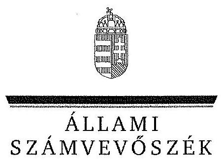
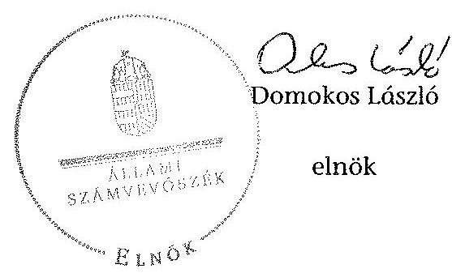

ÁLLAMI
SZÁMVEVŐSZÉK

# JELENTÉS 

az Európai Támogatásokat Auditáló Főigazgatóság múködésének és gazdálkodásának ellenőrzéséről

---

# Állami Számvevőszék 

Iktatószám: V-0112-096/2013.
Témaszám: 1147
Vizsgálat-azonosító szám: V0620

## Az ellenőrzést felügyelte:

Dr. Horváth Margit
felügyeleti vezető
Az ellenőrzést vezette és az ellenőrzés végrehajtásáért felelős:
Keresztes Tamás
ellenőrzésvezető
A számvevőszéki jelentés összeállítását végezte:
Keresztes Tamás
ellenőrzésvezető
Az ellenőrzést végezték:

| Bertalan Rudolf Gyula | Právitzné Pejkó | Dr. Vincze Ibolya |
| :-- | :-- | :-- |
| számvevő | Noémi | számvevő |
|  | számvevő |  |

A témához kapcsolódó eddig készített számvevőszéki jelentések:
címe
sorszáma
Jelentés Magyarország 2012. évi központi költségvetése végrehajtásának ellenőrzéséről

---

# TARTALOMJEGYZÉK 

BEVEZETÉS ..... 11
I. ÖSSZEGZŐ MEGÁLLAPÍTÁSOK, KÖVETKEZTETÉSEK, JAVASLATOK ..... 13
II. RÉSZLETES MEGÁLLAPÍTÁSOK ..... 20

1. Az EUTAF létrehozása ..... 20
2. Az EUTAF belső kontrollrendszerének kialakítása és múködése ..... 21
3. Az EUTAF gazdálkodása ..... 25
3.1. Az EUTAF előirányzatainak teljesítése, létszámának alakulása, likviditási helyzete ..... 25
3.2. A bevételi, illetve kiadási előirányzatok teljesítésének szabályszerűsége ..... 29
4. Az EUTAF feladatellátásának szabályozottsága és az ellenőrzések végrehajtása ..... 34
4.1. Az EUTAF feladatellátásának szabályozottsága ..... 34
4.2. Az EUTAF-nál a programokhoz kapcsolódóan elvégzett ellenőrzések végrehajtása ..... 35
4.3. A feladatellátás és a külső ellenőrzések kapcsolata ..... 41
5. Az NGM irányító szervi, szakmai irányítói, felügyeleti szervi feladatai ..... 41

## MELLÉKLETEK

1. számú Az EUTAF által elvégzett ellenőrzések 2010-2012., illetve az adott progra- mok ellenőrzési feladatainak végrehajtásával kapcsolatos ÁSZ minősítése
2. számú Az ellenőrzött szervezetek ÁSZ által el nem fogadott észrevételei

---

.

---

# RÖVIDÍTÉSEK JEGYZÉKE 

| Törvények |  |
| :--: | :--: |
| Áht. 1 | 1992. évi XXXVIII. törvény az államháztartásról (hatálytalan 2012. január 1-jétől) |
| Áht. 2 | 2011. évi CXCV. törvény az államháztartásról |
| ÁSZ tv. | 2011. évi LXVI. törvény az Állami Számvevőszékről |
| Kbt. 1 | 2003. évi CXXIX. törvény a közbeszerzésekről (hatálytalan 2012. január 1-jétől) |
| Kbt. 2 | 2011. évi CVIII. törvény a közbeszerzésekről |
| Kt. | 2011. évi CXCIX. törvény a közszolgálati tisztviselőkről |
| Ktv. | 1992. évi XXIII. törvény a köztisztviselők jogállásáról |
| Kvtv. | 2011. évi CLXXXVII. törvény Magyarország 2012. évi központi költségvetéséről |
| Szja. tv. | 1995. évi CXVII. törvény a személyi jövedelemadóról |
| Szt. | 2000. évi C. törvény a számvitelről |
| Tbj. | 1997. évi LXXX. törvény a társadalombiztosítás ellátásaira és a magánnyugdíjra jogosultakról, valamint e szolgáltatások fedezetéról |
| Rendeletek |  |
| Ámr. | 292/2009. (XII. 19.) Korm. rendelet az államháztartás múködési rendjéről (hatálytalan 2012. január 1-jétől) |
| Ávr. | 368/2011. (XII. 31.) Korm. rendelet az államháztartásról szóló törvény végrehajtásáról |
| Áhsz. | 249/2000. (XII. 24.) Korm. rendelet az államháztartás szervezetei beszámolási és könyvvezetési kötelezettségének sajátosságairól |
| Ber. | 193/2003. (XI. 26.) Korm. rendelet a költségvetési szervek belső ellenőrzéséről (hatálytalan 2012. január 1-jétől) |
| Bkr. | 370/2011. (XII. 31.) Korm. rendelet a költségvetési szervek belső kontrollrendszeréről és belső ellenőrzéséről |
| Egyéb rövidítések |  |
| ÁSZ | Állami Számvevőszék |
| BEK | Belső Ellenőrzési Kézikönyv |
| ECA | Európai Számvevőszék |
| EGT | Európai Gazdasági Térség |
| EK rendelet | Európai Közösségi rendelet |
| ETE | Európai Területi Együttmúködési Programok |
| EU | Európai Unió |
| EUTAF | Európai Támogatásokat Auditáló Főigazgatóság |
| ERFA | Európai Regionális Fejlesztési Alap |
| ESZA | Európai Szociális Alap |
| EUR | euro |
| IBSZ | Informatikai Biztonsági Szabályzat |
| IH | Irányító Hatóság (Irányító Szervezet) |

---

| IPA | Előcsatlakozási Támogatási Eszköz |
| :-- | :-- |
| KA | Kohéziós Alap |
| KEF | Közbeszerzési és Ellátási Főigazgatóság |
| KEHI | Kormányzati Ellenőrzési Hivatal |
| KIM | Közigazgatási és Igazságügyi Minisztérium |
| Kincstár | Magyar Államkincstár |
| KIR | Központosított Illetmény-számfejtési Rendszer |
| KSZ | Közremúködő Szervezet |
| KSZF | Központi Szolgáltatási Főigazgatóság |
| MNV Zrt. | Magyar Nemzeti Vagyonkezelő Zrt. |
| NFT | Nemzeti Fejlesztési Terv |
| NFÜ | Nemzeti Fejlesztési Ügynökség |
| NGM | Nemzetgazdasági Minisztérium |
| NGM-KGF | Nemzetgazdasági Minisztérium Költségvetési és Gazdálko- |
|  | dási Főosztály |
| NISZ Zrt. | Nemzeti Infokommunikációs Szolgáltató Zrt. |
| PM | Pénzügyminisztérium |
| PEA | Projekt Előkészítési Alap |
| SzMSz | Szervezeti és Múködési Szabályzat |
| TA | Technikai Segítségnyújtási Alap |
| ÚMFT | Új Magyarország Fejlesztési Terv |
| ÜSZT | Új Széchenyi Terv |
| VOP | Végrehajtás Operatív Program |

---

# FOGALOMTÁR 

belső ellenőrzési vezető
belső kontroll kockázat
belső kontrollrendszer

Egységes Monitoring Információs Rendszer
ellenjegyzés
ellenőrzési nyomvonal
előirányzat-elvonás
előirányzat-módosítás
érvényesítés

A költségvetési szerv belső ellenőrzési egységének vezetője, ha a költségvetési szervnél egy fő látja el a belső ellenőrzést, akkor a belső ellenőrzést ellátó személy.
Annak a kockázata, hogy az ellenőrzött szervezet (tevékenység, projekt) belső kontrollrendszere elmulasztja megelőzni, vagy jelezni és kijavítani a lényeges hibát, szabálytalanságot, vagy a félrevezető állítást.
A kockázatok kezelése és tárgyilagos bizonyosság megszerzése érdekében kialakított folyamatrendszer, ami azt a célt szolgálja, hogy megvalósuljanak a következő célok:
a működés és a gazdálkodás során a tevékenységeket szabályszerűen, gazdaságosan, hatékonyan, eredményesen hajtsák végre,
az elszámolási kötelezettségeket teljesítsék, és
megvédjék az erőforrásokat a veszteségektől, károktól és nem rendeltetésszerű használattól.
(Az Áht. 2 69. § (1) bekezdéséből levezetett fogalom)
A nemzeti költségvetési, illetve nemzetközi támogatással megvalósuló programok figyelemmel kísérése céljából létrehozott egységes számítógépes rendszer, amely kizárólagosan jogosult a programok monitoring adatainak gyűjtésére és rendszerezésére. (124/2003. (VIII. 15.) Korm. rendelet $15 . \S-a$ )
Annak igazolása, hogy a kötelezettségvállalás vagy utalványozás teljesítéséhez szükséges fedezet rendelkezésre áll, és nem sérti a gazdálkodásra vonatkozó szabályokat.
A költségvetési szerv múködési folyamatainak szöveges, táblázatokkal vagy folyamatábrákkal szemléltetett leírása, amely tartalmazza különösen a felelősségi és információs szinteket és kapcsolatokat, irányítási és ellenőrzési folyamatokat, lehetővé téve azok nyomon követését és utólagos ellenőrzését.
A kiadási előirányzatok felhasználásának végleges korlátozása, az előirányzatok feltételhez nem kötött csökkentése
A megállapított kiadási előirányzat növelése vagy csökkentése, a bevételi előirányzatok egyidejű növelése vagy csökkentése mellett.
A kiadás teljesítése, bevétel beszedése előtt azok jogosultságának, összegszerűségének, előírt alaki követelményeknek való megfelelésének, továbbá a szükséges fedezet meglétének igazolása.

---

Európai Regionális Fejlesztési Alap (ERFA)

Európai Szociális Alap (ESZA)
európai uniós források éves összefoglaló jelentés
intézkedési terv

INTERREG III Program
irányító hatóság

Az Európai Unió strukturális alapjainak egyike, rendeltetése, hogy elősegítse a Közösségen belüli legjelentősebb regionális egyenlőtlenségek orvoslását a fejlődésben lemaradt térségek fejlesztésében és strukturális alkalmazkodásában, valamint a hanyatló ipari térségek átalakításában való részvétel útján. (Az Európai Unió múködéséről szóló szerződés 176. cikke)
Az Európai Unió strukturális alapjainak egyike, amelynek célja az Unión belül a munkavállalók foglalkoztatásának megkönnyítése, földrajzi és foglalkozási mobilitásuk növelése, továbbá az ipari és a termelési rendszerben bekövetkező változásokhoz való alkalmazkodásuk megkönnyítése, különösen szakképzés és átképzés útján. (Az Európai Unió múködéséről szóló szerződés 162. cikke)
Az Európai Unió költségvetéséből származó támogatások. Az EUTAF által az egyes uniós támogatási programokról Európai Bizottság részére készített jelentés.
Az ellenőrzési javaslatok alapján az ellenőrzött szervezet, szervezeti egység által készített intézkedések végrehajtásának ütemezése a végrehajtásért felelős személyek és a vonatkozó határidők megjelölésével.
Az INTERREG III az Európai Unió négy Közösségi Kezdeményezésű Programjának egyike volt a 2000-2006-os finanszírozási periódusban. A program célkitűzései között szerepelt az Európai Unió tagállamainak határai mentén fekvő térségek és régiók közötti együttmúködés támogatása, gazdasági és társadalmi kohézió megteremtésének elősegítése, az európai térség kiegyensúlyozott és fenntartható fejlődésének biztosítása, a tagjelölt és egyéb szomszédos országokkal való területi integráció megvalósítása. Magyarország összesen 8 INTERREG programban vett részt 2004-2006 között. Irányítóhatósági funkciókat látott el két „háromoldalú" INTERREG IIIA program esetében: Magyarország-Szlovákia-Ukrajna és Magyarország-Románia-Szerbia határ menti együttmúködési programban.
A strukturális alapok és a Kohéziós alap forrásainak szabályszerű, hatékony és eredményes felhasználásához szükséges intézményrendszer felső eleme. Az irányító hatóság általános és átfogó felelősséget visel a programok, projektek hatékony és szabályszerű végrehajtásáért. Felelősségi köréből eredően ellenőrzi a közösségi, valamint a hazai jogszabályok betartását, koordinálja az európai uniós források szétosztásának folyamatát, irányítja az intézményrendszer, a statisztikai és a pénzügyi nyilvántartási rendszer múködését. Az Új Magyarország Fejlesztési Terv Irányító Hatósága közremúködik az Operatív Program véglegesítésében, irányítja az Operatív Program Program-kiegészítő Dokumentum kidolgozását, és közreműködő szerepet vállal e dokumentumoknak az Európai

---

irányító szerv
kockázat
kockázatkezelési rendszer

Kohéziós Alap
kontrolltevékenységek
kötelezettségvállalás
közreműködő szervezet
monitoring

Nemzeti Fejlesztési Terv I.

Bizottsággal történő tárgyalásaiban. Az Irányító Hatóság részt vesz továbbá a költségvetés tervezésében, valamint közreműködő szervezetek bevonásával irányítja a meghirdetett pályázatok és a központi programok végrehajtását.
A költségvetési szervvel és annak gazdálkodásával kapcsolatos irányítási jogokkal felruházott szerv vagy személy.
Az a lehetőség, hogy egy olyan esemény történik meg, amely negatívan hat a célok elérésére. (INTOSAI) A kockázat fogalma általánosságban úgy határozható meg, hogy az valamilyen esemény, tevékenység, vagy tevékenység elmulasztása, amely a jövőben valószínúleg bekövetkezik, és ha bekövetkezik, akkor ennek általában negatív, egyes esetekben viszont pozitív hatása van az adott szervezet céljainak elérésére.
Irányítási eszközök és módszerek összessége, melynek elemei a szervezeti célok elérését veszélyeztető tényezők (kockázatok) azonosítása, elemzése, csoportosítása, nyomon követése, valamint szükség esetén a kockázati kitettség mérséklése. (Bkr. 2. § m) pont)
Az Európai Unió strukturális alapjainak egyike, amelynek célja a Közösség gazdasági és társadalmi kohéziójának megerősítése és a fenntartható fejlődés elősegítése (A Tanács 2006. július 11-én kelt, a Kohéziós Alap létrehozásáról szóló 1084/2006/EK rendeletének 1. cikke)
Azok a politikák és eljárások, amelyeket a kockázatok kezelésére hoznak létre a szervezet céljainak teljesítése érdekében.
A kiadási előirányzatok terhére fizetési kötelezettség vállalásáról szóló, szabályszerűen megtett nyilatkozat.
Bármely közjogi vagy magánjogi intézmény, amely egy irányító vagy az igazoló hatóság illetékessége alatt jár el, vagy ilyen hatóság nevében hajt végre feladatokat a múveleteket végrehajtó kedvezményezettek tekintetében (A Tanács 2006. július 11-ei 1083/2006/EK rendelet 2. cikk 6. pontja)
A különböző szintű szervezeti célok megvalósításához szükséges folyamatok figyelemmel kísérése, melynek során a releváns eseményekről és tevékenységekről (együtt: folyamatokról) rendszeres jelleggel, strukturált, döntéstámogató információkhoz jutnak a szervezet vezetői. (NGM útmutató a költségvetési szervek monitoring rendszeréhez 3. oldal, 2011. november)

Helyzetelemzést, stratégiát a tervezett fejlesztési területek prioritásait, azok céljait és pénzügyi forrásaik megjelölését tartalmazó dokumentum, amelyet a Magyar Köztársaság készített az Európai Unió programozási irányelveinek, célkitűzéseinek megfelelően a fejlődésben lemaradó régiók

---

operatív program
önállóan múködő költségvetési szerv
projektellenőrzés
rendszerellenőrzés
szakmai teljesítésigazolás
utalványozás
utóellenőrzés
fejlődésének és strukturális átalakulásának elősegittésére a kiemelt szükségletekre figyelemmel. A Nemzeti Fejlesztési Terv I. stratégiai fejezetének célja, hogy a 2004-2006. évek közötti időszakra kijelölje a strukturális alapokból támogatható fejlesztéspolitika célkitűzéseit és prioritásait. A strukturális alapok operatív programjai: Agrár- és Vidékfejlesztés Operatív Program (AVOP); Gazdasági Versenyképesség Operatív Program (GVOP); Humán erőforrások fejlesztései Operatív Program (HEFOP); Környezetvédelem és infrastruktúra Operatív Program (KIOP); Regionális Fejlesztés Operatív Program (ROP).
A tagállam által benyújtott és a Bizottság által elfogadott dokumentum, amely összefüggő prioritások alkalmazásával fejlesztési stratégiát határoz meg. Ennek megvalósításához valamely alapból, illetve a „konvergencia" célkitúzés esetében a Kohéziós Alapból és az ERFA-ból támogatást vesznek igénybe (A Tanács 2006. július 11-ei 1083/2006/EK rendeletének 2. cikk 1. pontja)
A gazdálkodási jogkör alapján a költségvetési szerv egyik formája, mely gazdasági szervezettel nem rendelkezik. Az önállóan múködő költségvetési szerv az alapfeladatai ellátását szolgáló személyi juttatásokkal és az azokhoz kapcsolódó járulékok és egyéb közterhek előirányzataival minden esetben, egyéb előirányzatokkal a munkamegosztási megállapodásban foglaltaktól függően rendelkezik. A gazdasági szervezettel nem rendelkező költségvetési szerv a gazdasági szervezet feladatainak ellátására kijelölt költségvetési szervvel a munkamegosztás és felelősségvállalás rendjét megállapodásban rögzíti (Áht. ${ }_{2}$, Ávr.).
Az ellenőrzési hatóság által az operatív programok esetében az előző évben az Európai Bizottság felé bejelentett költségek mintavételes ellenőrzése (4/2011. (I. 28.) Korm. rend. 100. §-ból levezetett fogalom)
Az ellenőrzési hatóságnak az operatív programok irányítási és ellenőrzési rendszere eredményes múködésének vizsgálata céljából folytatott ellenőrzései. (4/2011. (I. 28.) Korm. rend. 39. §-ból levezetett fogalom)
A szakmai teljesítés megtörténtének igazolása.
A kiadás teljesítésének, bevétel beszedésének, vagy elszámolásának elrendelése.
Az intézkedések nyomon követése érdekében elrendelt ellenőrzés, amelynek célja, hogy az ellenőrzés bizonyosságot szerezzen az elfogadott intézkedések végrehajtásáról, vagy arról a tényről, hogy az ellenőrzött szerv, illetve az ellenőrzött szervezeti egység vezetője nem, vagy nem az elfogadott intézkedésnek megfelelően hajtja végre az intézkedéseket, továbbá meggyőződni arról, hogy a végrehajtott intézkedésekkel a megállapított kockázat ténylegesen megszűnt, vagy a kockázati túréshatár alá csökkent.

---

Új Magyarország Fejlesztési Terv
váletlen minta
zárolás
zárolás feloldása

Az Új Magyarország Fejlesztési Terv célja a foglalkoztatás bővítése és a tartós növekedés feltételeinek megteremtése. Ennek érdekében 2007-2013. évek között hat kiemelt területen indított el összehangolt állami és európai uniós fejlesztéseket: a gazdaságban, a közlekedésben, a társadalom megújulása érdekében, a környezet és az energetika területén, a területfejlesztésben és az államreform feladataival összefüggésben. Az Új Magyarország Fejlesztési Terv operatív programjai: Államreform Operatív Program (ÁROP); Elektronikus Közigazgatás Operatív Program (EKOP); Gazdaságfejlesztés Operatív Program (GOP); Környezet és Energia Operatív Program (KEOP); Közlekedés Operatív Program (KÖZOP); Dél-Alföldi Operatív Program (DAOP); Dél-Dunántúli Operatív Program (DDOP); ÉszakAlföldi Operatív Program (ÉAOP); Észak-Magyarországi Operatív Program (EMOP); Közép-Dunántúli Operatív Program (KDOP); Közép-Magyarországi Operatív Program (KMOP); Nyugat-Dunántúli Operatív Program (NYDOP); Társadalmi Infrastruktúra Operatív Program (TIOP); Társadalmi Megújulás Operatív Program (TÁMOP)
Az alapsokaságot képviselő (reprezentáló) véletlenszerűen kiválasztott részsokaság.
A kiadási előirányzatok felhasználásának időleges, feltételhez kötött korlátozása, felfüggesztése.
A kiadási előirányzatok felhasználásának időleges, feltételhez kötött korlátozásának, felfüggesztésének megszüntetése.

---

.

---

# JELENTÉS 

## az Európai Támogatásokat Auditáló Föigazgatóság müködésének és gazdálkodásának ellenőrzéséről

## BEVEZETÉS

Hazánknak 2004. május 1-jétől az Európai Unió teljes jogú tagállamaként a jelentős összegű uniós támogatások eredményes és szabályszerű felhasználása érdekében megfelelő ellenőrzési rendszert kellett kialakítania és müködtetnie. Az ellenőrzési rendszer többszintű. Az első szinten az uniós támogatások kifizetésében részt vevő szervezetek (Nemzeti Fejlesztési Ügynökség, közreműködő szervezetek, Kincstár) jelennek meg, amelyek beépített kontrollok alkalmazásával biztosítják a támogatások szabályszerű kifizetését. Ezen intézményrendszert, illetve az intézményrendszer által kialakított kontrollokat, azok müködését, valamint az uniós támogatások kifizetésének szabályszerűségét ellenőrzi a nemzeti ellenőrzési hatóság (második szintű ellenőrzés). A támogatási programok zárását, valamint a zárónyilatkozat kibocsátását szintén az EUTAF végzi (harmadik szintű ellenőrzés) ${ }^{1}$. Az uniós támogatások intézményrendszerét - ideértve az ellenőrzési hatóságot is - az EU Bizottság akkreditálta.

Az európai uniós források felhasználásának nemzeti ellenőrzési hatósági feladatait 2004. évtől 2010. évig a Kormányzati Ellenőrzési Hivatal látta el. Ezt a feladatot 2010. július 1-jétől a Kormányzati Ellenőrzési Hivatalból való kiválással létrejött Európai Támogatásokat Auditáló Főigazgatóság (EUTAF) végzi. A szervezeti változást az uniós szervek 2010-ben auditálták. Az EUTAF közfeladatként ellátja a több ezer Mrd Ft értékű uniós támogatás tekintetében az ellenőrzési hatósági feladatokat, jelentős hatással van az uniós források magyarországi felhasználásának szabályszerűségére azáltal, hogy rendszer- és projektellenőrzéseket végez. Elvégzi továbbá az egyéb nemzetközi támogatásokkal összefüggő ellenőrzési feladatokat.

Az EUTAF a Nemzetgazdasági Minisztérium (NGM) fejezeten belül, jogállását tekintve önállóan működő központi költségvetési szerv, az Alapító Okiratában foglaltak alapján a pénzügyi-gazdálkodási feladatait az NGM végzi.

Az EUTAF a szakmai tevékenységében független az uniós támogatások kifizetésében közreműködő intézményrendszertől (irányító hatóságoktól, közreműködő szervezetektől, az igazoló hatóságtól). A Főigazgatóság az ellenőrzési tevékenységének tervezése során, a módszerek kiválasztásában és az ellenőrzési program végrehajtásában önállóan jár el, befolyástól mentesen állítja össze az ellenőrzésekről szóló jelentéseit, amelyek tartalmáért felelősséggel tartozik.

[^0]
[^0]:    ${ }^{1}$ Az uniós támogatásokkal kapcsolatos negyedik szintű ellenőrzést az EU szervei (EU Bizottság, Európai Számvevőszék) végzik.

---

Az ellenőrzés kapcsolódik Magyarország 2012. évi központi költségvetése végrehajtásának ÁSZ ellenőrzéséhez, a 2012. évi gazdálkodás ellenőrzése vonatkozásában hasznosítja a hivatkozott ellenőrzés megállapításait.

Az ellenőrzés célja annak értékelése volt, hogy az NGM irányítása alatt álló önállóan működő - 2010. évben létrehozott - EUTAF 2010-2012. éveket érintő pénzügyi gazdálkodása, feladatellátása, belső kontrollrendszerének kialakítása és müködtetése megfelelt-e a vonatkozó előírásoknak, valamint az irányító szerv felügyeleti tevékenysége biztosította-e a szabályszerű feladatellátást. A feladatellátás tekintetében vizsgálatunk a határidők betartására, a megfelelő dokumentáltságra és a végrehajtási folyamatokba beépített kontrollokra terjedt ki.

Ennek keretében értékeltük, hogy az EUTAF létrehozása szabályszerűen történte. Ellenőriztük az EUTAF gazdálkodásának, feladatellátásának jogszabályokkal való összhangját, ehhez kapcsolódóan az EUTAF belső kontrollrendszerének kialakítását és működtetését. Kitért az ellenőrzésünk az NGM EUTAF-ot érintő irányító szervi, illetve felügyeleti tevékenységére is.

Az EUTAF feladatellátásának értékelése nem terjedt ki a Schengen Alap, illetve az Európai Unió Szolidaritási Alapja feladatellátásnak értékelésére, mivel ezen alapokhoz az ellenőrzött időszakban feladatok nem kapcsolódtak.

Az ellenőrzésünk nem terjedt ki az uniós támogatások folyósításában közreműködő intézményrendszerre (NFÜ, közreműködő szervezetek, Kincstár), illetve az uniós támogatások kifizetésének szabályszerűségére.

Az ellenőrzésünkkel hozzájárulunk az EUTAF gazdálkodásának stabilabbá tételéhez, a belső kontrollrendszerének és feladatellátásának javításához, ezzel közvetve az uniós támogatások jogszerú felhasználásához.

Az ellenőrzést az ÁSZ 2013. I. félévi ellenőrzési terve alapján a számvevőszéki ellenőrzés szakmai szabályai szerint, szabályszerűségi ellenőrzés módszerével, a vonatkozó nemzetközi standardok figyelembevételével végeztük.

Az ellenőrzés a 2010. július 1-je és 2012. december 31-e közötti idôszakra terjedt ki.

A helyszíni ellenőrzést az EUTAF-nál, valamint az EUTAF pénzügyigazdálkodási feladatait ellátó irányító szervénél, az NGM-nél végeztük.

Az ellenőrzés végrehajtásának jogszabályi alapját az ÁSZ tv. 1. § (3) bekezdése, az 5. § (2)-(6) bekezdései, valamint az Áht ${ }_{2} 61 . \S$ (2) bekezdése együttesen képezték.

Az ÁSZ az Állami Számvevőszékről szóló 2011. évi LXVI. törvény 29. §-a szerint a jelentéstervezetet megküldte az ellenőrzött szervezetek vezetőinek. Az EUTAF főigazgatója, a nemzeti fejlesztési és a nemzeti gazdasági miniszter egyaránt élt észrevételezési jogával. Az észrevételeket a jelentés véglegezésénél hasznosítottuk. Az el nem fogadott észrevételeket és azok indokolását a jelentés 2. számú melléklete tartalmazza.

---

# I. ÖSSZEGZŐ MEGÁLLAPÍTÁSOK, KÖVETKEZTETÉSEK, JAVASLATOK 

Az EUTAF a közfeladatként ellátott rendszer- és projektellenőrzéseivel jelentősen hozzájárult két és félezer milliárd forint értékű uniós támogatás felhasználásának szabályszerűségéhez.

A KEHI-ből kivált EUTAF alapítása (Alapító Okirata), a feladat és a vagyon át-adás-átvétele szabályszerű volt. Az EUTAF megfelel az EK vonatkozó Tanácsi rendeletében előírt funkcionális függetlenségnek, szervezetileg elkülönült, tevékenységében független az irányító és az igazoló hatóságoktól, valamint az uniós támogatás folyósításában közremúködő szervezetektől.

Az EUTAF ellenőrzési tevékenységét a stratégiák és az arra épülő ellenőrzési tervek alapozták meg. Az EUTAF a rendszerellenőrzéseket az európai uniós előírásokon alapuló saját módszertana alapján évente kiválasztásra kerülő, legkockázatosabbnak ítélt ellenőrzési területeken (főkövetelmények) folytatta le. Az operatív programok végső elszámolásához kapcsolódóan a zárónyilatkozat kiadásához szükséges ellenőrzéseket szintén az EUTAF hajtja végre. Az EUTAF az ellenőrzött időszakban a jogszabályokban tételesen meghatározott 12 program $^{2}$ alapján kifizetett uniós és nemzetközi támogatás felhasználását ellenőrizte. Ennek keretében több mint ezer - mintavételezés alapján kiválasztott - projektellenőrzést, félszáz rendszerellenőrzést és 36 záró ellenőrzést végzett. Az ellenőrzéseket négy téma szerint elkülönült ellenőrző igazgatóság látta el.

Az EUTAF ellenőrzési tevékenységét ${ }^{3}$ a vonatkozó jogszabályok és a nemzetközi ellenőrzési standardok figyelembevételével kidolgozott, a főigazgató által jóváhagyott Ellenőrzési Kézikönyv szabályozza, amelyben rögzítették a projektellenőrzés, a rendszerellenőrzés lebonyolítását, valamint az ellenőrzési jelentés elkészítését, a minőségbiztosításra, és az intézkedési terv nyilvántartására, a megvalósítás nyomon követésére, továbbá a beszámolásra vonatkozó eljárásokat.

Az ellenőrzések végrehajtásáról az EUTAF az illetékes miniszter útján minden évben beszámolt a Kormánynak. A beszámolót a Kormány minden évben elfogadta.

[^0]
[^0]:    ${ }^{2}$ Nemzeti Fejlesztési Terv I., Új Magyarország Fejlesztési Terv, Szolidaritási és Migrációs Áramlások Igazgatása általános program, EQUAL és INTERREG III. közösségi kezdeményezések, Kohéziós Alap, területi együttmúködési programok, Phare és Átmeneti Támogatások, EGT és Norvég Alap Finanszírozási Mechanizmusok, Svájci-Magyar Együttmúködési Program, Schengen Alap, Szolidaritási Alap.
    ${ }^{3}$ Ideértve a rendszer és projektellenőrzéseket mind az uniós, mind a nemzetközi támogatások esetében.

---

Az EUTAF-nál a programokhoz kapcsolódóan elvégzett ellenőrzések végrehajtásának szabályozottságát összességében magas megfelelőségűnek értékeltük.

Az EUTAF-nál a programokhoz kapcsolódóan elvégzett ellenőrzések végrehajtását összességében közepes megfelelőségűnek minősítettük. Jellemző volt az ellenőrzési tervek, az összefoglaló ellenőrzési jelentés elkészítésével, véleményeztetésével, illetve az illetékes hatóságok részére jóváhagyásra történő megküldésével kapcsolatos jogszabályi határidők késedelmes teljesítése. Ebben közrehatott, hogy a feladatok egymásra épülése miatt a végső felelősök a folyamatok közbeni császást nem tudták korrigálni; továbbá az Európai Bizottság által kért rendkívüli auditokat soron kívül kellett elvégezni a többi feladat terhére a támogatások folyamatos folyósításához. Az EUTAF feladatainak teljesítését mind az Európai Bizottság, mind az Európai Számvevőszék ellenőrizte. Megállapításaik szerint az EUTAF ellenőrzési tevékenysége a vizsgált időszakban magas szakmai színvonalú volt, csak kisebb hiányosságokat tártak fel.

Az ellenőrzésünk keretében minősítettük az EUTAF 10 programjához ${ }^{4}$ kapcsolódó ellenőrzés végrehajtási folyamatát. Egy programot alacsony (Phare és Átmeneti támogatások), három programot magas (Ú) Magyarország Fejlesztési Terv, Területi együttműködési programok, Szolidaritási és Migrációs Áramlások Igazgatása általános program), a többi programot közepes megfelelőségűnek értékeltük ${ }^{5}$. Hangsúlyos területe volt az ellenőrzésünknek az Új Magyarország Fejlesztési Terv/Új Széchenyi Terv szerteágazó Operatív Programjai EUTAF által történt ellenőrzésének minősítése. Az EU-s támogatások döntő hányadát (mintegy 90\%-át) az Új Magyarország Fejlesztési Terv/Új Széchenyi Terv programjai tették ki.

Az ÚMFT/ÚSZT programjainál a 2011-re tervezett mintavételes projektellenőrzéseket minden esetben lefolytatták, azok 20\%-kánál azonban a végleges jelentéseket az érintettek a következő évben kapták meg. Az éves ellenőrzési jelentések összefoglalóját az EUTAF nem tette közzé a honlapján.

Az INTERREG IIIA programjának lezárását az EU Bizottság nem fogadta el, mivel az EUTAF jogelődje (KEHI) által alkalmazott mintavételi módszer nem biztosította a megfelelő lefedettséget.

[^0]
[^0]:    ${ }^{4}$ Nemzeti Fejlesztési Terv I., Új Magyarország Fejlesztési Terv, Szolidaritási és Migrációs Áramlások Igazgatása általános program, EQUAL és INTERREG III. közösségi kezdeményezések, Kohéziós Alap, területi együttmúködési programok, Phare és Átmeneti Támogatások, EGT és Norvég Alap Finanszírozási Mechanizmusok, Svájci-Magyar Együttmüködési Program.
    ${ }^{5}$ Az értékeléshez egy, az EUTAF programok ellenőrzésének folyamatát három sávban minősítő munkalapot alkalmaztunk. Az alacsony minősítést a $60 \%$ vagy az alatti értékelés, a közepes minősítést a $61-80 \%$ közötti értékelés, míg a magas minősítést a $81 \%$ nál magasabb értékelés szerint adtuk.

---

| Megnevezés | EUTAF ellenőrzések (db) |  |  | ÁSZ minősítése |
| :--: | :--: | :--: | :--: | :--: |
|  | Projekt- | Rendszer- | Záró- |  |
| ÚFT/ÚMFT | 952 | 23 | - | magas ( $82 \%$ ) |
| NFT | 22 | - | 6 | közepes ( $80 \%$ ) |
| Kohéziós Alap | 26 | - | 26 | közepes ( $80 \%$ ) |
| Szolidaritás és Migrációs Áramlások Igazgatása | 48 | 4 | - | magas ( $82 \%$ ) |
| Phare és Átmeneti támogatások | 3 | - | - | alacsony ( $42 \%$ ) |
| INTERREG III | 5 | 4 | 3 | közepes ( $80 \%$ ) |
| ETE/IPA | 87 | 10 | - | magas ( $88 \%$ ) |
| EGT és Norvég   Finanszirozási   Mechanizmusok | 8 | - | - | közepes ( $71 \%$ ) |
| Svájci-Magyar   Együtt-múködési   Program | 6 | 2 | 1 | közepes ( $80 \%$ ) |
| Összesen: | 1157 | 43 | 36 | közepes ( $76 \%$ ) |

A Phare és Átmeneti támogatások programoknál az EUTAF a 2010. évi összefoglaló ellenőrzési jelentésében szereplő javaslatokra nem kérte számon az intézkedési terv elkészítését, illetve azok végrehajtását. A javaslatok szabálytalansági eljárások lefolytatására, illetve a szabálytalanul kifizetett támogatás visszafizetésére vonatkoztak. A szabálytalansággal érintett támogatási öszszeg az ellenőrzött projektekre kifizetett támogatás $63,9 \%$-át (219,3 ezer EUR) tette ki. Továbbá az EUTAF 2011-2012. évekre tervezett ellenőrzéseket - a hatókörén kívül eső okok miatt - nem tudta lefolytatni, így ezekre az évekre összefoglaló ellenőrzési jelentést sem készített. Nem intézkedett a zárónyilatkozat elkészítése érdekében, mivel az NFÜ és a KSZ nem küldte meg az ehhez szükséges végrehajtási jelentését.

Az EUTAF belső kontrollrendszere részben megfelelőnek minősült, mivel az EUTAF nem rendelkezett a folyamatba épített ellenőrzés szabályozása keretében Ellenőrzési Nyomvonallal, valamint Informatikai Biztonsági Szabályzattal. Az EUTAF nem határozta meg a tevékenységével kapcsolatos kockázati tényezőket, nem végezte el azok elemzését, értékelését és besorolását. Nem határozta meg a felmerülő kockázatok kezeléséhez szükséges válaszintézkedéseket. Súlyos hiányosság, hogy az EUTAF-nál csak a vizsgált időszak végére múködött a belső ellenőrzés. A 2012. év végén megbízott belső ellenőr által összeállított Belső Ellenőrzési Kézikönyv nem felelt meg teljes körűen a jogszabályi rendelkezéseknek (megbízólevél előírásának hiánya; az ellenőrzési program jóváhagyása nem volt megfelelő).

---

Az ellenőrzött három évben különböző mértékben emelkedett az EUTAF létszáma, az intézmény költségvetési támogatása és a teljesített kiadása. Az EUTAF kiadási előirányzata a 2010. évi 127,9 M Ft-ról 2012. év végére 689,7 M Ft-ra emelkedett. Az EUTAF 2010-ben 172,7 M Ft támogatásban részesült, 2012-ben a támogatás összege 404,9 M Ft-ot tett ki. Az EUTAF kiadása 2010 és 2012 között 5,4-szeresére, a költségvetési támogatása 2,3-szorosára emelkedett, a létszáma pedig $22,1 \%$-kal nőtt.

Az EUTAF költségvetési törvényekben megállapított költségvetési támogatása az ellenőrzött időszakban nem biztosította a feladatellátásához szükséges - az engedélyezett létszám figyelembevételével kiszámított - kiadások fedezetét. A folyamatos múködéshez szükség volt az uniós támogatások igénybevételére, amelyet az EUTAF az NFÜ-vel megkötött Támogatási Okirat, illetve Támogatási Szerződés alapján biztosított. Ennek ellenére a költségvetési törvények az EUTAF részére bevételt nem irányoztak elő. Az EUTAF költségvetésének nem megfelelő tervezése veszélyeztette az EUTAF stabil müködését és ezen keresztül a feladatellátását.

Az EUTAF-nál az ellenőrzött időszakban többször merültek fel likviditási problémák, a Kincstártól rendszertelenül és a müködéshez szükségesnél alacsonyabb összegben folyósított költségvetési támogatások, valamint az uniós támogatások utófinanszírozása miatt. Emiatt szükség volt támogatási keretelőrehozásokra, illetve szállítói kifizetések halasztására. Az ellenőrzött időszakban az év végén rendelkezésre álló pénzeszközök, illetve követelés állományok nem nyújtottak fedezetet a rövid lejáratú kötelezettségekre. Ezt támasztja alá a likviditási mutatók ${ }^{6}$ romló tendenciája. A mutatók 2011-től a szakmailag elvárható érték ${ }^{7}$ alatt maradtak. A saját tőke aránya évről-évre romlott (a 2012. évben már negatív értéket mutatott ${ }^{8}$ ), amely jelentős kockázatot hordoz a következő évek zavartalan müködése tekintetében.

Az EUTAF gazdálkodásának ellenőrzésénél a mintavételezés alapján ellenőrzött tételek azt mutatják, hogy a szükséges dokumentumok rendelkezésre álltak, a pénzügyi jogköröket megfelelően gyakorolták. Az uniós támogatások felhasználása cél szerint történt. Ugyanakkor az NFÜ részéről az intézmény müködéséhez folyósított támogatások elszámolásánál szabálytanságokat tártunk fel. Az EUTAF a támogatási program előlegeit nem mutatta ki a kötelezettségek között, továbbá az előlegből már kifizetett, de a támogatóval még el nem számolt kiadásokat nem a tényleges felmerülésüknek megfelelően, hanem az átfutó kiadások között mutatta ki a beszámolójában. Az EUTAF a 2012. évi beszámolót érintő megállapításunkat - a helyszíni ellenőrzés ideje alatt - elfogadta, a hibás tételek javítására in-

[^0]
[^0]:    ${ }^{6}$ A statikus likviditási mutató (forgóeszközök összesen/rövid lejáratú kötelezettségek összesen), továbbá a pénzeszköz likviditási mutató (pénzeszközök összesen/rövid lejáratú kötelezettségek összesen).
    ${ }^{7}$ A likviditási mutató akkor minősül elfogadhatónak, ha eléri az 1-es értéket.
    ${ }^{8}$ A 2010., 2011. és 2012. évek beszámolója szerint az EUTAF saját tőke arány mutatója (saját tőke összesen/források összesen) $0,0228,0,1783$ és $-1,2345$ értéket mutat, minden évben elmarad a szakmailag elvárható 1-es értéktől.

---

tézkedett ${ }^{9}$. A Kincstár a javított beszámolót befogadta. Ezzel az ÁSZ hozzájárult ahhoz, hogy az EUTAF beszámolója megbízható és valós képet mutasson.

Az ellenőrzött időszakban az EUTAF-nál külső ellenőrzést végzett az Európai Számvevőszék (ECA) és az EU Bizottság. Mindkét szervezet magas színvonalúnak értékelte az EUTAF munkáját, kisebb hiányosságokat azonosítottak.

Az ECA és az EU Bizottság megállapításaival kapcsolatban az EUTAF intézkedési tervet készített. Az ECA megállapításaival kapcsolatos intézkedés végrehajtásának határideje 2013. augusztus 31., az EUTAF megkezdte az Ellenőrzési Kézikönyvének módosítását ${ }^{10}$. Az EU Bizottság ellenőrzésével kapcsolatban az EUTAF az intézkedéseket végrehajtotta.

Az EUTAF Főigazgatója évente beszámolt a külső ellenőrzésekről, az ellenőrzések lezárását követően végrehajtott intézkedésekről az NGM-nek, amelyet az NGM tudomásul vett.

Az NGM az EUTAF-al kapcsolatos irányító szervi feladatait megfelelően ellátta és gondoskodott az uniós támogatások ellenőrzésének szabályozásáról, harmonizációjáról, koordinációjáról.

Az Állami Számvevőszékről szóló 2011. évi LXVI. törvény 33. § (1) bekezdésében foglaltak értelmében a Jelentésben foglalt megállapításokhoz kapcsolódó intézkedési tervet köteles az ellenőrzött szervezet vezetője összeállítani és azt a jelentés kézhezvételétől számított harminc napon belül az ÁSZ részére megküldeni. Amennyiben az intézkedési tervet határidőben nem küldi meg a szervezet, vagy az továbbra sem elfogadható, az ÁSZ elnöke a hivatkozott törvény 33. § (3) bekezdés a)- b) pontjaiban foglaltakat érvényesítheti.

A helyszíni ellenőrzés intézkedést igénylő megállapításai és javaslatai

# az EUTAF fölgazgatójának 

1. Az EUTAF belső kontrollrendszere összességében részben megfelelőnek minősült, mivel a kontrollrendszer kiépítésében és működtetésében hiányosságok mutatkoztak a kontrollkörnyezetnél, a kockázatkezelésnél és a monitoring tevékenységnél. Az EUTAF nem rendelkezett a folyamatba épített ellenőrzés szabályozása keretében Ellenőrzési Nyomvonallal, valamint Informatikai Biztonsági Szabályzattal. Az EUTAF nem határozta meg a tevékenységével kapcsolatos kockázati tényezőket, nem végezte el azok elemzését, értékelését és besorolását. Nem határozta meg a felmerülő kockázatok kezeléséhez szükséges intézkedéseket.

Javaslat:

[^0]
[^0]:    ${ }^{9}$ A javítások összege az EUTAF 2012. évi teljesített kiadásainak 31\%-a volt.
    ${ }^{10}$ Az EUTAF-tól kapott tájékoztatás alapján a módosított kézikönyvet 2013. október 1jén kiadták.

---

Intézkedjen arról, hogy az intézmény belső kontrollrendszerének müködése feleljen meg a jogszabályi előírásoknak. Ennek érdekében gondoskodjon a Bkr. 6. § (3) bekezdése szerinti Kockázatkezelési Szabályzat, a Bkr. 7. § (1)-(2) bekezdései szerinti Ellenőrzési Nyomvonal, továbbá az állami és önkormányzati szervek elektronikus információbiztonságáról szóló 2013. évi L. törvény 11. § (1) bekezdés f) pontjában foglaltak szerinti Informatikai Biztonsági Szabályzat elkészítéséről és kiadásáról.
2. Az EUTAF-nál a programokhoz kapcsolódóan elvégzett ellenőrzések végrehajtását összességében közepes megfelelőségűnek minősítettük. Jellemző volt az ellenőrzési tervek, az összefoglaló ellenőrzési jelentések elkészítésével, véleményeztetésével, illetve az illetékes hatóságok részére jóváhagyásra történő megküldésével kapcsolatos jogszabályi határidők késedelmes teljesítése.

Javaslat:
Intézkedjen a feladatellátás színvonalának növelése érdekében az ellenőrzési tervek, valamint az összefoglaló ellenőrzési jelentések készítésénél, véleményeztetésénél és az illetékes hatóságok részére jóváhagyásra történő megküldésénél a határidők betartásáról.
3. A Phare és Átmeneti támogatások vonatkozásában az EUTAF a 2010. évi összefoglaló ellenőrzési jelentésében szereplő javaslatokra nem kérte számon az NFÜ-től az intézkedési terv elkészítését, illetve annak végrehajtását. A javaslatok szabálytalansági eljárások lefolytatására, illetve a szabálytalanul kifizetett támogatás visszafizetésére vonatkoztak. A szabálytalansággal érintett támogatási összeg az ellenőrzött projektekre kifizetett támogatás $63,9 \%$-át (219,3 ezer EUR) tette ki.

Javaslat:
A költségvetés érdekeinek érvényesítése jegyében kérje számon az NFÜ-től a Phare és Átmeneti támogatások 2010. évi összefoglaló ellenőrzési jelentésében szereplő javaslatok végrehajtását, azokra intézkedési terv készítését.

# a nemzetgazdasági miniszternek a nemzeti fejlesztési miniszter és a miniszterelnökséget vezető államtitkár közremüködésével 

A Phare és Átmeneti támogatások vonatkozásában az EUTAF a 2010. évi összefoglaló ellenőrzési jelentésében szereplő javaslatokra nem kérte számon az NFÜ-től az intézkedési terv elkészítését, illetve annak végrehajtását. A javaslatok szabálytalansági eljárások lefolytatására, illetve a szabálytalanul kifizetett támogatás visszafizetésére vonatkoztak. A szabálytalansággal érintett támogatási összeg az ellenőrzött projektekre kifizetett támogatás $63,9 \%$-át (219,3 ezer EUR) tette ki.

További probléma a Phare és Átmeneti támogatásokkal kapcsolatban, hogy az EUTAF a 2011-2012. évekre tervezett ellenőrzéseket - a hatókörén kívül eső okok miatt - nem hajtotta végre, így ezekre az évekre összefoglaló ellenőrzési jelentést sem készített.

Javaslat:

---

Intézkedjen annak érdekében, hogy az NFÜ, illetve a közreműködő szervezet a Phare és Átmeneti támogatásokkal kapcsolatos zárónyilatkozathoz szükséges végrehajtási jelentést állítsa össze. Ezt követően az EUTAF adja ki a beszámolót. Mindhárom év vonatkozásában és mindhárom érintettre vizsgálja ki, hogy a mulasztások miatt személyes felelősségre vonás alkalmazható-e. Amennyiben ennek feltételei fennállnak, a szükséges felelősségre vonást tegye meg.

# a nemzetgazdasági miniszternek 

Az EUTAF költségvetési törvényekben megállapított költségvetési támogatása az ellenőrzött időszakban nem biztosította a feladatellátásához szükséges - az engedélyezett létszám figyelembevételével kiszámított - kiadások fedezetét. A folyamatos müködéshez szükség volt az uniós támogatások igénybevételére, amelyet az EUTAF az NFÜ-vel megkötött Támogatási Okirat, illetve Támogatási Szerződés alapján biztosított. Ennek ellenére a költségvetési törvények az EUTAF részére bevételt nem irányoztak elő. Az EUTAF költségvetésének nem megfelelő tervezése veszélyeztette az EUTAF stabil müködését és ezen keresztül a feladatellátását.

Az EUTAF-nál az ellenőrzött időszakban többször merültek fel likviditási problémák, a Kincstártól rendszertelenül és a müködéshez szükségesnél alacsonyabb összegben folyósított költségvetési támogatások, valamint az uniós támogatások utófinanszírozása miatt. Emiatt szükség volt támogatási keret-előrehozásokra, illetve szállítói kifizetések halasztására. Az ellenőrzött időszakban az év végén rendelkezésre álló pénzeszközök, illetve követelés állományok nem nyújtottak fedezetet a rövid lejáratú kötelezettségekre. Ezt támasztja alá a likviditási mutatók romló tendenciája. A mutatók 2011-től a szakmailag elvárható érték alatt maradtak. A saját tőke aránya évről-évre romlott (a 2012. évben már negatív értéket mutatott), amely jelentős kockázatot hordoz a következő évek zavartalan működése tekintetében.

Javaslat:
Tegye meg az EUTAF kiszámítható és zavartalan feladatellátása és működése érdekében szükséges intézkedéseket.

---

# II. RÉSZLETES MEGÁLLAPÍTÁSOK 

## 1. Az EUTAF LÉTREHOZÁSA

A Kormány 2010. július 1-jei hatállyal a 210/2010. (VI. 30.) Korm. rendelettel létrehozta az EUTAF-ot. Az EUTAF alapító okirata a jogszabályi előírásoknak megfelelt. Az EUTAF élén Főigazgató áll, akit a nemzetgazdasági miniszter nevez ki és ment fel. Az intézmény a megalakulásakor a jogelőd KEHI-től átvette az európai támogatások felhasználásának ellenőrzési hatósági feladatkörét.

Az EUTAF Alapító Okiratát a nemzetgazdasági miniszter, mint az irányításáért felelős szervezet vezetője 2010. július 1-én írta alá. Az Alapító Okirat megfelel az Áht ${ }_{1}$ 90. § (1) bekezdésben foglaltaknak. Az okirat rögzíti az EUTAF működési feltételeit, jogszabályi környezetét, és irányító szervét.

Az Alapító Okirat az ellenőrzött időszakban az EUTAF-ra vonatkozó jogszabályváltozások, valamint a szervezet székhelyének áthelyezése következtében három alkalommal módosult, a jelenleg hatályos Alapító Okiratot 2012. július 16-án kiadmányozta a nemzetgazdasági miniszter.

Az EUTAF Alapító Okiratában foglaltak alapján az EUTAF irányító szerve az NGM. Az Alapító Okirat rendelkezik továbbá arról, hogy az EUTAF központi közhatalmi költségvetési szerv, feladatellátásához kapcsolódó funkciója alapján önállóan működő, viszont a pénzügyi-gazdálkodási feladatait az NGM látja el.

Az EUTAF és az NGM 2010. július 15-én a jogszabályi előírásnak megfelelően ${ }^{11}$ - a munkamegosztás és felelősségvállalás rendjéről szóló - megállapodásban rögzítette az együttmúködésük általános szempontjait, területeit, valamint a gazdálkodás során ellátandó feladatokat. A megállapodásban foglaltak alapján az EUTAF gazdálkodási feladatait az NGM Költségvetési és Gazdálkodási Főosztálya (NGM-KGF) végzi.

A megállapodás részletezi az EUTAF gazdálkodására vonatkozóan mind az NGM, mind az EUTAF által elvégzendő feladatokat. A megállapodásban meghatározták, hogy az NGM az NGM igazgatása költségvetésért felelős főosztálya útján biztosítja az EUTAF gazdálkodásának feltételeit.

Az EUTAF, mint önállóan működő, de nem önállóan gazdálkodó költségvetési szerv státusza és szervezeti rendje megfelel az előírtaknak és biztosítja az EUTAF jogszerú feladatellátását.

A feladatok, illetve a vagyon átadás-átvételéről a KEHI, az EUTAF, az NGM és a KIM négyoldalú megállapodást írt alá a szervezet megalakulását követően közel egy hónapos késedelemmel, 2010. július 28-án.

[^0]
[^0]:    ${ }^{11} \mathrm{Az} \mathrm{Ámr}_{2} 16 . \S(4)$ bekezdése.

---

A Megállapodás tartalmazza az átadandó ügyeket, a foglalkoztatottak, valamint a személyi állomány kezelésének kérdéskörét, a vagyonmegosztást, a költségvetési előirányzatok átadásának módját, az iratok átadását, tájékoztatási kötelezettséget, valamint a Megállapodásból eredő fizetési kötelezettségek teljesítése kapcsán ellátandó feladatokat és azok teljesittési határidejét.

A Megállapodásban szereplő feladatok, eszközök átadása-átvétele a megállapodásban előírt határidőig megvalósult. A Megállapodás alapján a KEHI átadta az NGM-nek a Magyar Köztársaság 2010. évi költségvetéséről szóló törvényben jóváhagyott költségvetési előirányzatából az EUTAF-ot idő- és létszámarányosan megillető, összesen 172,7 M Ft összegű előirányzatát.

Az EUTAF eleget tett az Európai Regionális Fejlesztési Alapra (ERFA), az Európai Szociális Alapra (ESZA) és a Kohéziós Alapra (KA) vonatkozó általános rendelkezések megállapításáról szóló 1083/2006/EK tanácsi rendelet 59. cikk (1) bekezdés c) pontjában, valamint a 71. cikk (3) pontban meghatározott funkcionális függetlenségi kritériumnak. Azaz szervezetileg elkülönült és tevékenységében független az irányító és az igazoló hatóságoktól ${ }^{12}$, valamint az uniós támogatás folyósításában közremúködő szervezetektől. Az EUTAF szakmai tekintetben független az NGM-től, egyedi ügyekben nem utasítható.

Az EUTAF funkcionális függetlenségét az Áht ${ }_{1}$, Áht $_{2}$, az Ámr., az Ávr., a 210/2010. (VI. 30.) Korm. rendelet, valamint 4/2011. (I. 28.) Korm. rendelet írja elő.

# 2. Az EUTAF BELSŐ KONTROLLRENDSZERÉNEK KIALAKÍTÁSA ÉS MÜKÖDÉSE 

Az ellenőrzésünk során értékeltük az EUTAF gazdálkodási feladatait ellátó NGM kontrolljait, illetve az EUTAF kontrollrendszerét is.

Az EUTAF gazdálkodási tevékenységét végző NGM-KGF rendelkezik részletes ügyrenddel, mely tartalmazza a jogszabályokban előírt követelményeket. Az NGM-KGF rendelkezett a gazdálkodással összefüggő valamennyi szabályzattal, a szabályzatok aktualizáltak voltak, lefedték a gazdálkodás területét és megfeleltek a jogszabályi előírásoknak. ${ }^{13}$ Az NGM-KGF elkészítette az Ellenőrzési Nyomvonalat és a Kockázatkezelési Szabályzatot is.

A gazdálkodással összefüggő kontrollok múködtetése tekintetében kockázatot jelentett, hogy az NGM gazdálkodási területén a vizsgált időszakban (20102012.) nem volt kinevezett gazdasági vezető. ${ }^{14}$

Az NGM-KGF főosztályvezetői munkaköre egyik évben sem volt betöltve, és a munkakört helyettesítési megbízással sem látta el senki. Az Igazgatás beszámolóját készitő KGF Pénzügyi és Számviteli Osztályának nem volt kinevezett vezetője.

[^0]
[^0]:    ${ }^{12}$ Az NFÜ-től és a Magyar Államkincstártól.
    ${ }^{13}$ Sztv., Áhsz., Ávr., Ámr. ${ }_{1.2}$
    ${ }^{14}$ A kockázatot a 2012. évi zárszámadás ellenőrzése során az NGM igazgatása esetében is megállapítottuk.

---

A beszámoló készítéséért felelős személy nem vezető beosztású munkatárs volt, 2013. április 1-jétől kapott osztályvezetői megbízást.

Szintén kockázatot hordoz, hogy a pénzügyi-gazdálkodási, illetve számvitelinyilvántartási feladatokat az NGM-KGF látja el, ezért az EUTAF nem rendelkezik gazdasági szervezettel, nincs önálló gazdasági vezetője. A napi tevékenység ellátásakor gondot okoz, hogy a szakmai tevékenység az EUTAF székhelyén, míg a pénzügyi-gazdasági feladatellátás az NGM-KGF székhelyén történik.

# Az NGM EUTAF gazdálkodásával összefüggő belső kontrollrendszere összességében megfelelőnek minősült, a kontrollkockázat alacsony volt. 

A jogszabályok előírásai alapján az EUTAF vezetőjeként a főigazgató felelősségi körébe tartozott a belső kontrollrendszer kialakítása és működtetése. A belső kontrollrendszer kialakítását és működtetését az öt kontrollpillér (kontrollkörnyezet, kockázatkezelés, kontrolltevékenység, információ és kommunikáció, monitoring tevékenység) mindegyikénél ellenőriztük.

Az EUTAF kontrollkörnyezete csak részben felelt meg a jogszabályi követelményeknek. Az EUTAF rendelkezik az irányadó jogszabályi előírásoknak megfelelő Alapító Okirattal, SzMSz-el, Etikai kódexszel, Közbeszerzési szabályzattal, Szabálytalanságok feltárása esetén követendő eljárásrenddel. A kötelezettségvállalás rendjét, a szakmai teljesítés-igazolás eljárásrendjét szintén rögzítette szabályzatban. Az EUTAF-nál foglalkoztatottak rendelkeznek munkaköri leírással. Ugyanakkor az EUTAF nem rendelkezik a gazdálkodási jogkörelhez kapcsolódó Kockázatkezelési Szabályzattal, a folyamatba épített előzetes, utólagos és vezetői ellenőrzés (FEUVE) szabályozása keretében Ellenőrzési Nyomvonallal, valamint Informatikai Biztonsági Szabályzattal.

Az EUTAF a NISZ Zrt.-t jelölte meg az informatikai rendszereinek üzemeltetőjeként, és a NISZ Zrt. által kiadott IBSZ-t adta át az ellenőrzés során. A NISZ Zrt.-vel kötött szerződést azonban nem tudta bemutatni, helyette a 2007 januárjában kötött KSZF-PM közötti Szolgáltatási megállapodást bocsátotta az ellenőrzés rendelkezésére.

Az EUTAF kockázatkezelésével összefüggésben megállapítottuk, hogy az EUTAF nem határozta meg a tevékenységével kapcsolatos kockázati tényezőket, és nem végezte el azok elemzését, értékelését, és besorolását. Így nem történt meg az esetlegesen felmerült kockázatokra szükséges intézkedések meghatározása sem.

A gazdálkodási jogkörök gyakorlásához kapcsolódóan a kontrolltevékenységek megfelelőek voltak. A kötelezettségvállalások, a teljesítésigazolások, az érvényesítések és utalványozások során a kontrollok megfelelően működtek, érvényesült a négy szem elve. A költségvetési szerv vezetője a külső ellenőrzési jelentésekben szereplő ellenőrzési javaslatok alapján megtett intézkedések nyomon követéséről nyilvántartást vezetett.

Az információ és kommunikációval összefüggésben azt tapasztaltuk, hogy a belső szabályzatok az információ átadás formáit meghatározták, a dolgozók

---

részére a szabályzatok elektronikus formában rendelkezésre álltak, az EUTAF rendelkezett a kommunikációs tevékenységről szabályozással, stratégiával, valamint az ellenőrzések nyilvántartásának és a vezetői információs rendszer működtetésének szabályzatával.

Az EUTAF kialakította a tevékenységével kapcsolatos monitoring rendszerét. A 2012. évben kiadott Belső Ellenőrzési Stratégiájában elvégezte a belső kontrollrendszerének önértékelését, a belső ellenőrzés folyamatának kialakítása azonban 2012. év végén még folyamatban volt, ezért összességében a monitoring tevékenység nem megfelelőnek minősült.

A jogszabályi előírásoknak ${ }^{15}$ megfelelően az EUTAF vezetője minden évben nyilatkozott az általa vezetett költségvetési szerv belső kontrollrendszerének múködéséről, melyet megküldött az irányító szerv részére.

Az EUTAF belső kontrollrendszere összességében részben megfelelőnek, így a kontrollkockázata közepesnek minősült, ugyanis a belső szabályozások csak részben fedték le a belső kontrollrendszer elemeit, és a belső ellenőrzés folyamatának kialakítása sem valósult meg teljeskörűen.

Az ellenőrzésünk során külön értékeltük az EUTAF belső kontrollrendszerének monitoring pillérét alapvetően meghatározó belső ellenőrzést.

# Súlyos hiányosságként, és magas kockázati tényezőként állapítottuk meg, hogy az EUTAF-nál, a vizsgált időszakban (2010-2012.) nem történt meg a belső ellenőrzés kialakítása. 

Az EUTAF vezetőjeként a főigazgató felelősségi körébe tartozik a belső kontrollrendszer kialakítása és működtetése, ezen belül a belső ellenőrzés megszervezése. ${ }^{16}$

Az EUTAF 2/2010. (VII. 9.) NGM utasítással kiadott SzMSz-e úgy rendelkezett, hogy a Főigazgatóság belső ellenőrzését az irányító szerv (NGM) belső ellenőrzési egysége látja el, viszont az NGM-mel a munkamegosztás és felelősségvállalás rendjéről kötött megállapodásban részletezett feladatok a belső ellenőrzés ellátására nem terjedtek ki. A 4/2010. (X. 5.) NGM utasítással kiadott NGM SzMSz-ben sem szerepelt az NGM Ellenőrzési Főosztálya feladatai között az EUTAF-nál ellátandó belső ellenőrzési tevékenység.

Az NGM Ellenőrzési Főosztálya kétszer folytatott irányító szervi ellenőrzést az NGM által irányított intézmények belső ellenőrzési rendszere tárgyban. A 2011ben lezajlott vizsgálat során megállapították, hogy az EUTAF belső ellenőrzése nem volt megoldott a 2010. július 1-jei megalakulása óta. Az NGM Ellenőrzési Főosztálya 2012-ben újra vizsgálta utóellenőrzés keretében az irányítása alá tartozó intézmények belső ellenőrzési rendszerét. Az észrevételezési szakaszban az EUTAF vezetője tájékoztatta az NGM Ellenőrzési Főosztályát, hogy 2012. november 30 -án a belső ellenőrzés ellátására megbízási szerződést kötött.

[^0]
[^0]:    ${ }^{15}$ Ámr. ${ }_{2}$ 21. számú melléklet; Bkr. 1. számú melléklet.
    ${ }^{16}$ Az Áht ${ }_{1} 121 /$ A. § (3) bekezdése és a Ber. 4. § (1) bekezdése, illetve 2012. január 1-jétől az Áht ${ }_{2} 70 . \S$ (1) bekezdése és a Bkr. 15. § (1) bekezdése.

---

Az EUTAF 2011-ben kiadott SzMSz-e ${ }^{17}$ az EUTAF főigazgatójának felelősség- és hatáskörébe utalta a belső ellenőrzés múködtetését. A belső ellenőrzés működési kereteinek - jogszabályi előírások szerinti - kialakítása azonban csak 2012. év végén történt meg. Az Intézmény 2012. november 30 -án határozatlan időre megbízási szerződéssel megállapodást kötött a belső ellenőri feladatok ellátására.

A megbízott rendelkezik az Áht ${ }_{2} .70$. 8 -ában meghatározott engedéllyel, szerepel a költségvetési szervnél belső ellenőrzést végzők nyilvántartásában.

A megbízási szerződés rögzíti a megbízott szakmai függetlenségét, rendelkezésre állási kötelezettségét, valamint a rendszeres ellenőri feladatok teljesítése mellett ellátandó egyedi megbízásait, nem kellően részletezi azonban a Bkr. 16. § (4) bekezdés előirása szerinti belső ellenőrzési vezetői feladatok ellátásának kötelezettségét.

Az EUTAF-nál a megállapodás alapján egy fő látja el a belső ellenőrzési feladatokat, ezért a Bkr. 2. § c) pontjában meghatározottak értelmében a belső ellenőr egyben a belső ellenőrzési vezető is.

A megbízott összeállította az EUTAF Belső Ellenőrzési Kézikönyvét (BEK), a 2013. évre vonatkozó éves ellenőrzési tervét, és a stratégiai tervét (2012. december 14.), de konkrét belső ellenőrzési tevékenységet a 2012. évben még nem tudott végezni a megbízási szerződés év végi megkötése miatt.

# A BEK nem minden tekintetben felelt meg a jogszabályi rendelkezéseknek. 

A BEK a belső ellenőr számára a megbízólevél kiállítását nem írja elő, amely ellentétes a Bkr. 34. § (1) bekezdésével.

A BEK-ben a jogszabály előírásokkal ellentétesen került rögzítésre, hogy az ellenőrzési programot az EUTAF fölgazgatója hagyja jóvá. A Bkr. 33. § (2) bekezdése alapján az ellenőrzési program jóváhagyása a belső ellenőrzési vezető feladata.

A belső ellenőrzési vezető által összeállított éves ellenőrzési tervet a költségvetési szerv vezetője az előírásoknak megfelelően jóváhagyta, a terv alátámasztására vonatkozó kockázatelemzést a Stratégiai Terv tartalmazza. Az ellenőrzési tervben nem a jogszabályi előírásoknak megfelelően szerepel az ellenőrzések típus szerinti besorolása. Az ellenőrzési tervben az ellenőrzések típus meghatározásánál adatbekérésen alapuló elemzés, dokumentumokon alapuló elemzés, és interjúkészítés szerepel. A Bkr. 21. § (3) bekezdése szerint szabályszerűségi ellenőrzés, pénzügyi ellenőrzés, rendszerellenőrzés és teljesítmény-ellenőrzés lehet az ellenőrzés típusa.

Az éves ellenőrzési terv összeállítására, tartalmára vonatkozó jogszabályi előírások ${ }^{18}$ csak részben teljesültek, mert az éves ellenőrzési terv nem tartalmaz a soron kívüli ellenőrzésekre, valamint a képzésekre tervezett kapacitást.

[^0]
[^0]:    ${ }^{17}$ 28/2011. (XI. 2.) NGM utasítás.
    ${ }^{18}$ Bkr. 31. § (4) bekezdése.

---

# 3. Az EUTAF GAZDÁlKODÁSA 

### 3.1. Az EUTAF előirányzatainak teljesítése, létszámának alakulása, likviditási helyzete

Az EUTAF 2010. évi költségvetése a KEHI részére jóváhagyott 2010. évi költségvetési előirányzatból 172,7 M Ft összegű támogatási előirányzat átvételével alakult ki, az évközi alapításra (2010. július 1.) tekintettel. Az évközi módosítások hatására a bevételi előirányzat 24,8 M Ft-ra emelkedett. A 2010. év végére a kiadási előirányzat $127,9 \mathrm{M}$ Ft-ban, a bevételi előirányzat $24,8 \mathrm{M}$ Ftban, a támogatás $172,7 \mathrm{M}$ Ft-ban teljesült. A kiadások $90 \%$-át a személyi juttatások és munkaadókat terhelő járulékok tették ki. A felhasználható tárgyévi előirányzat maradvány $69,6 \mathrm{M}$ Ft volt, melyből a kötelezettség vállalással terhelt rész $35,7 \mathrm{M} F \mathrm{ft}$, a kötelezettség vállalással nem terhelt maradvány $33,9 \mathrm{M} \mathrm{Ft}$ volt, amelyet az intézménytől elvontak.

A 2010. év folyamán az intézmény - a jogszabályi rendelkezésekkel összhangban - saját hatáskörben az NFÜ által folyósított VOP Támogatási Projekt előlegének összegével ( $24,8 \mathrm{M}$ Ft-tal) megemelte a bevételi és kiadási előirányzatát.

Az EUTAF a feladatellátásának biztosítása érdekében a Nemzeti Fejlesztési Ügynökséggel 2010. július 30 -án Támogatói Okirat alapján megállapodást kötött. A szerződés tárgya az Ellenőrzési Hatóság kapacitásának és feladatellátásának biztosítása a 4/2011. (I. 28.) és a 210/2010. (VI. 30.) Korm. rendeletekben elöírtak szerinti ellenőrzési feladatok végrehajtása érdekében. A finanszírozás forrása a Kohéziós Alapból, valamint a Magyar Köztársaság költségvetéséről szóló törvény alapján az Uniós Fejlesztések XIX. fejezet VOP jogcímcsoportból származó vissza nem térítendő támogatás volt.

Az EUTAF a 2010. évi megalakulásakor 61 fővel kezdte meg a tevékenységét, amely az év végére 86 főre emelkedett. A 25 fős növekedéshez 2010-ben költségvetési többletforrás nem társult. Az engedélyezett és valós létszámadat eltérését a VOP terhére finanszírozott létszám adta. A VOP projektből 26 fő - határozott idejű jogviszony keretében foglalkoztatott munkavállaló - bérköltsége került kifizetésre. A tárgyévben belépett dolgozók száma 34 fő, míg a tárgyévben kilépett foglalkoztatottak száma 11 fő volt, amely adatok az éves 74 fős átlag létszám $45,9 \%$-át, illetve $14,9 \%$-át jelentették.

A költségvetési törvény 2011. évben az EUTAF részére összesen 427,8 M Ft kiadási előirányzatot és ezzel egyező összegű támogatást határozott meg, míg a bevételt nem tervezett. Az évközi módosítások következtében a kiadási előirányzat $653,7 \mathrm{M}$ Ft-ra, a bevételi előirányzat $221,3 \mathrm{M}$ Ft-ra, a támogatási előirányzat $432,4 \mathrm{M}$ Ft-ra emelkedett. A kiadási előirányzat a 2011. év végére 598,6 M Ft-ban, a bevételi előirányzat $220,8 \mathrm{M}$ Ft-ban, a támogatás 432,4 M Ft-ban teljesült. A kiadások $81 \%$-át a személyi juttatások és munkaadókat terhelő járulékok tették ki. A 2011. év végére a felhasználható tárgyévi előirányzat maradvány $54,6 \mathrm{M}$ Ft-ot tett ki, melyből a kötelezettség vállalással terhelt rész $36,8 \mathrm{MFt}$, a kötelezettség vállalással nem terhet maradvány $17,8 \mathrm{M}$ Ft volt, amelyet az intézménytől elvontak.

---

A 2011. évben az EUTAF-ot érintően Országgyűlési, kormányzati, irányító szervi és saját hatáskörű előirányzat módosítások is voltak.

Országgyűlési hatáskörben a 2010. évi költségvetési törvény módosításáról szóló 2011. évi CXIV. törvény 25,3 M Ft támogatást elvont az EUTAF-tól. Kormányzati hatáskörben a költségvetési szervekben foglalkoztatottak bérkompenzációjára 4,6 M Ft többlettámogatást kapott az EUTAF. Felügyeleti szervi hatáskörben az EUTAF-nál keletkezett többletbevételek alapján 1,4 M Ft összegben módosították az intézmény bevételi és kiadási előirányzatát. A saját hatáskörű módosítások VOP Támogatási Projekt utófinanszírozott támogatásához kapcsolódtak, amelyek alapján összesen 219,9 M Ft-tal emelték meg a bevételi és kiadási előirányzatot.

A 2011. évben a nyitólétszám - az év utolsó napján bekövetkezett létszámmozgásból adódóan - 82 fő volt, amely az év végére 103 főre emelkedett. Ebből a VOP terhére finanszírozott létszám 38 határozott idejű jogviszony keretében foglalkoztatott munkavállaló volt. A tárgyévben belépett dolgozók száma 46 fó, míg a tárgyévben kilépett foglalkoztatottak száma 25 fő volt, amely adatok az éves 93 fős átlag létszám 49,5\%-át, illetve 26,7\%-át jelentették.

A költségvetési törvény 2012. évben az EUTAF részére összesen 385,5 M Ft kiadási előirányzatot és ezzel egyező összegű támogatást határozott meg, míg bevételt nem tervezett. Az évközi módosítások következtében a kiadási előirányzat 744,5 M Ft-ra, a bevételi előirányzat 339,6 M Ft-ra, a támogatási előirányzat 404,9 M Ft-ra növekedett. A kiadási előirányzat a 2012. év végére 689,7 M Ft-ban, a bevételi előirányzat 338,4 M Ft-ban, a támogatás 404,9 M Ft-ban teljesült. A kiadások $82 \%$-át a személyi juttatások és munkaadókat terhelő járulékok tették ki. A 2012. év végére a felhasználható tárgyévi előirányzat maradvány 51,3 M Ft-ot tett ki, melyből a kötelezettség vállalással terhelt rész $25,0 \mathrm{MFt}$, a kötelezettség vállalással nem terhelt maradvány $26,3 \mathrm{M}$ Ft volt.

A 2012. évben az előirányzat átcsoportosítások kormányzati, felügyeleti szervi és saját hatáskörben történtek.

Kormányzati hatáskörben 1,4 M Ft bérkompenzáció, illetve 5,8 M Ft zárolás történt. Felügyeleti szervi hatáskörben ruházati költségtérítésre ( 14,4 M Ft), helyi utazási bérletre ( $9,5 \mathrm{MFt}$ ), valamint az EU-s bizottsági utazási költségeire ( $0,7 \mathrm{MFt}$ ) történt előirányzat átcsoportosítás. Az intézményi saját hatáskörű módosítások 338,8 M Ft összegben az EU-s programok utófinanszírozott támogatásához kapcsolódtak.

A 2012. évben a nyitólétszám 103 fő volt, amely az év végére 105 fơre emelkedett. Ebből a VOP terhére finanszírozott létszám 40 határozott idejű jogviszony keretében foglalkoztatott munkavállaló volt. A tárgyévben belépett dolgozók száma 22 fő, míg a tárgyévben kilépett foglalkoztatottak száma 18 fő volt, amely adatok az éves 102 fős átlag létszám 21,6\%-át, illetve 17,6\%-át jelentették.

Az EUTAF költségvetési törvényekben megállapított költségvetési támogatása az ellenőrzött idöszakban nem biztosította a feladatellátásához szükséges - az engedélyezett létszám figyelembevételével kiszámított - kiadások fedezetét. A folyamatos múködéshez szükség volt az uniós támogatások igénybevételére, amelyet az EUTAF az NFÜ-vel megkötött Támogatási Ok-

---

irat, illetve Támogatási Szerződés alapján biztosított. Ennek ellenére a költségvetési törvények az EUTAF részére bevételt nem irányoztak elő. Az EUTAF költségvetésének nem megfelelő tervezése veszélyeztette az EUTAF stabil múködését és ezen keresztül a feladatellátását.

A három ellenőrzött évben - a 2010. évi adatokat éves szintre kivetítve - különböző mértékben emelkedett az EUTAF létszáma, az intézmény költségvetési támogatása és a teljesített kiadásai. Az EUTAF kiadása 2010 és 2012 között 5,4szeresére, a költségvetési támogatása 2,3-szorosára emelkedett, a létszáma pedig $22,1 \%$-kal nőtt. (2011. és 2012. év viszonylatában a támogatás $6,4 \%$-kal csökkent).

Az évek során fokozatosan növekvő feladatot jelentett az EUTAF számára az ETE és IPA EU-s támogatások határon átnyúló nemzetközi hatósági ellenőrzési feladatainak ellátása, amely feladatkört az alapítást szabályozó 210/2010. (VI. 30.) Korm. rendelet a szervezet megalakulásától kezdve előírt az EUTAF részére. A megalakulást követően az intézmény hatásköre csak egy esetben bővült 2011. december 22-én az 1459/2011. (XII. 22.) Korm. határozat 5. pontja alapján, mely szerint az EUTAF a továbbiakban ellátja az Európai Unió Szolidaritási Alapjából származó támogatások ellenőrzését is. Ehhez a többletfeladathoz az EUTAF 4 fő létszámbővítést igényelt, amelyet az NGM nem hagyott jóvá.

Az EUTAF feladatellátását nehezítette a létszámában minden évben bekövetkezett jelentős fuktuáció. Az ellenőrzött időszakban - az év végi létszámhoz viszonyítva - évente átlagosan $39 \%$ volt az új belépő és $20 \%$ a kilépő munkavállalók aránya.

Az EUTAF gazdálkodását az ellenőrzött időszakban érdemben nem befolyásolták az évközi korlátozó kormányzati intézkedések, elsősorban az uniós forrásból kapott VOP támogatásokból eredő többletbevételek miatt. A feladatellátást a létszámcsökkentés nehezítette, de belső átszervezésekkel, illetve a VOP támogatási forrásból finanszírozott létszámkeret megemelésével sikerült teljesíteni a feladatokat.

A 2011. évben a költségvetési törvény módosítása $25,3 \mathrm{M}$ Ft kiadási előirányzatot vont el az EUTAF-tól, így a költségvetési támogatás eredeti előirányzata 5,6\%-al csökkent. Az EUTAF az elvonást a VOP támogatási forrásból kápott bevétellel ellensúlyozta.

A kormányzati létszámcsökkentésről szóló 1004/2012. (I. 11.) Korm. határozat az EUTAF-nál az engedélyezett 80 fős létszám keret $10 \%$-os csökkentését rendelte el. A létszámcsökkentésnek megfelelő személyi juttatás előirányzat és munkaadói juttatások a 2012. évi tervezés során elvonásra kerültek.

A 2012. évben a Széll Kálmán Terv kiterjesztése keretében megvalósítandó egyes intézkedésekről szóló 1122/2012. (IV. 25.) Korm. határozat 1. pontja által előírt zárolásból a fejezetet irányító NGM döntése alapján az EUTAF dologi kiadások előirányzatának terhére $5,8 \mathrm{M}$ Ft zárolás történt. Ez a teljes eredeti támogatási előirányzat $1,5 \%$-a volt. A zárolási kötelezettség a tárgyévi kötelezettségvállalások állományának nagyságát is figyelembe véve a gazdálkodás szempontjából kockázatot nem jelentett, feladat elmaradást nem okozott, illetve átütemezést sem tett szükségessé.

---

A költségvetési szervek likviditását alapvetően meghatározza a kötelezettségek nagyságrendje. Az EUTAF a kötelezettségek mérleg soron a 2010. évben 11,8 M Ft-ot, a 2011. évben 4,4 M Ft-ot és a 2012. évben 99,7 M Ft-ot tartott nyilván. Ebből a 2010. évben 11,6 M Ft, a 2011. évben 0,5 M Ft és a 2012. évben 8,8 M Ft volt a szállítói kötelezettség. A 2012. évben kimutatásra került az egyéb rövid lejáratú kötelezettségek között az EU-s támogatásokkal kapcsolatosan kapott előleg, amely összesen 91,0 M Ft volt.

Az EUTAF 2010., 2011. és 2012. évi beszámolójának adatai alapján számolt statikus likviditási mutatója (forgóeszközök összesen/rövid lejáratú kötelezettségek összesen), továbbá a pénzeszköz likviditási mutatója (pénzeszközök összesen/rövid lejáratú kötelezettségek összesen) ${ }^{19}$ romló tendenciát mutat, és a 2011-2012. év vonatkozásában elmarad a stabil likviditási helyzetet kifejező és szakmailag elvárható értéktől. A 2010-2012. években az év végén rendelkezésre álló pénzeszközök, illetve követelés állományok nem nyújtottak fedezetet a rövid lejáratú kötelezettségekre.

| Megnevezés | $\mathbf{2 0 1 0 .}$ | $\mathbf{2 0 1 1 .}$ | $\mathbf{2 0 1 2 .}$ |
| :-- | :-- | :-- | :-- |
| Statikus likviditási mutató | 2,60 | 0,85 | 0,59 |
| Pénzeszköz likviditási mutató | 1,82 | 0,47 | 0,15 |

Az átlagos szállítói futamidő mutató (szállítók/1 napi anyagjellegű kiadás) a 2010. évben 334,1, a 2011. évben 4,9 és a 2012. évben 31,1 volt. A mutató csak 2010-ben tekinthető kedvezőtlennek, 2011-ben és 2012-ben az elvárt szintnek megfelelően alakult.

A pénzügyi helyzet bizonytalanságára utal, hogy az EUTAF saját tőke állománya a megalakulása óta kedvezőtlen irányba változott, amely állomány csökkenés jelentős kockázatot hordoz az elkövetkező évek zavartalan múködése tekintetében. A mutatók nagymértékű alultőkésítésre és az évek tekintetében fokozatosan csökkenő saját tőkére utalnak, mivel minden évben a mutató jelentősen a szakmailag elvárható egyes érték alatt volt és a 2012. évben már negatív értéket mutat. ${ }^{20}$

A 2010., 2011. és 2012. évek beszámolója szerint az EUTAF saját tőke arány mutatója (saját tőke összesen/források összesen) $0,0228,0,1783$ és $-1,2345$ értéket mutat.

Az EUTAF-nál 2010. és 2012. évben is előfordultak likviditási problémák, a költségvetési támogatások rendszertelen beérkezése, a szükségesnél alacsonyabb összege, illetve az uniós támogatások (VOP,

[^0]
[^0]:    ${ }^{19}$ Figyelembe véve az uniós támogatások előlege miatti, ki nem mutatott kötelezettségeket is (lásd 3.2. pontban leírtakat).
    ${ }^{20}$ A 2011. évben helytelenül kimutatott Egyéb rövid lejáratú kötelezettségek mérleg sor jogszabályi előírásoknak megfelelő javítása esetében a saját tőke állománya már a 2011. évben is negatív értéket mutatna.

---

ETE-IPA) felhasználásának utófinanszírozása ${ }^{21}$ miatt. Ez a kifizetések elhalasztásához vezetett, illetve több alkalommal keret-elörehozásokra volt szükség. Az EUTAF a keret-elörehozási kérelmeket megfelelően indokolta, az NGM a beadványokat megalapozottnak találta és támogatta, így a Kincstár a keret előrehozásokat teljesítette.

A 2010. évben az EUTAF múködéséhez szükséges támogatások rendszertelenül érkeztek a Kincstártól, így szeptember 6-án 24,8 M Ft, november 2-án 40,9 M Ft és december 3-án 131,8 M Ft folyt be az EUTAF számlájára. A dolgozók munkabérének és járulékterhének kifizetése után 2010. október 27-én az EUTAF Elöi-rányzat-felhasználási keretszámlája 13200 Ft egyenleget mutatott, ezért három hónap illetményét az NGM igazgatása számlájáról fizették ki, amelyet december hónapban az EUTAF az NGM-nek visszafizetett.

Az EUTAF Előirányzat-felhasználási keretszámlája 2012. június 28-án 9,9 M Ft egyenleget mutatott, így nem lehetett volna a július 2-án esedékes munkabéreket kifizetni a dolgozóknak, ezért az intézmény 30 M Ft keret előrehozást kezdeményezett, amelyet a Kincstár 2012. július 2-án teljesített. Ezt követően a munkabéreket július 3-án átutalták.

Az EUTAF Előirányzat-felhasználási keretszámlája 2012. szeptember 26-án 19,6 M Ft egyenleget mutatott, ezért az intézmény 10 M Ft keret előrehozást kezdeményezett, amelyet a Kincstár 2012. október 5-én teljesített.

Az EUTAF Előirányzat-felhasználási keretszámlája 2012. december 31-én 14,8 M Ft-tal zárt, amely összeg 2013. január 2-án nem volt elegendő a munkabérek kifizetésére, így az EUTAF 30 M Ft keret előrehozást kezdeményezett, amit a Kincstár 2013. január 7-én teljesített.

Az Előirányzat-felhasználási keretszámla átmeneti forráshiányából adódóan elfordult, hogy az EUTAF a szállítói tartozásait késedelmesen fizette ki. A késedelmek átlagosan nem haladták meg a 30 napot.

# 3.2. A bevételi, illetve kiadási előirányzatok teljesítésének szabályszerűsége 

A bevételek és kiadások ellenőrzése a 2010-2011. évek vonatkozásában az EUTAF által rendelkezésre bocsátott főkönyvi adatbázisból,-szekvenciális megállásos - mintavételezéses eljárással történt. A 2012. évi gazdálkodás ellenőrzése a 2012. évi költségvetés végrehajtásának ellenőrzése keretében valósult meg.

A bevételek mintatételeinek ellenőrzése során megállapítottuk, hogy a bevételeket alátámasztó szerződésekben rögzítették a bevételek célját, a folyósításuk módját, az elszámolási és beszámolási kötelezettségeket és a teljesítési határidőket. A támogatási előlegek, illetve az utófinanszírozás formájában érkező bevételek a támogató (NFÜ) és az EUTAF közötti elszámolásnak megfelelő öszszegekben realizálódtak. A teljesítésigazolás, az érvényesítés, az utalványozás

[^0]
[^0]:    ${ }^{21}$ A támogatási konstrukciók szerint az EUTAF-nak a múködési költségei jelentős hányadát meg kell előlegeznie és azokat csak utólag kapja meg az NFÜ-től.

---

gyakorlata szabályszerű volt. Az uniós támogatások bevételeinek felhasználása a folyósításuk céljának megfelelően történt.

A dologi kiadások, az egyéb múködési célú kiadások, valamint a felhalmozási kiadások mintatételeinek áttekintése során megállapítottuk, hogy a kötelezettségvállalási dokumentumok rendelkezésre álltak és azokat ellenjegyezték. A pénzügyi teljesítés szakmai igazolása, érvényesítése, utalványozása a Kötelezettség vállalási utasítás előírásainak megfelelően történt. A gazdasági eseményeket alátámasztó dokumentumok, a kiadási utalványrendeletek, számlák, teljesítésigazolások, vállalkozási, illetve megbízási szerződések, továbbá esetenként a deviza elszámolási lapok rendelkezésre álltak. A pénzügyi kifizetések a szerződésekben meghatározott, illetve megrendeléseknek megfelelő összegek szerint történtek.

A kiadásoknál a 2010-2012. években három területen fordult elő közbeszerzés hatálya alá tartozó kifizetés, a felhalmozási kiadásoknál, a kiküldetéseknél és az uniós támogatásokhoz kapcsolódó kiadásoknál. Az előbbi két terület esetében a közbeszerzés központosított eljárás keretében valósult meg a Közbeszerzési és Ellátási Főigazgatóság (KEF) közremúködésével. Az utóbbi terület vonatkozásában az EUTAF saját hatáskörben járt el. A közbeszerzések esetében hibát, hiányosságot nem tártunk fel.

A személyi juttatások mintatételeinek ellenőrzése során megállapítottuk, hogy a kifizetésekkel összefüggésben a foglalkoztatottak rendelkeztek a besorolásuknak megfelelő felsőfokú végzettséggel és gyakorlattal. A kinevezési okiratban rögzített besorolásuk megfelelt a Kt.-ben, illetve a Ktv.-ben rögzített előírásoknak. A személyi juttatások kifizetését munkaidő elszámolás, illetve teljesítésigazolás támasztotta alá. A bruttó illetmény számfejtése megfelelt a kinevezési okiratban foglaltaknak, a munkavállalót terhelő levonások az Szja. tv. és a Tbj. vonatkozó előírásai szerint történtek. Az EUTAF-nál a személyi juttatások és a munkaadókat terhelő járulékok elszámolása a központosított illetményszámfejtésről szóló 172/2000. (X. 18.) Korm. rendelet szerint, a központosított illetményszámfejtés (KIR) keretében valósul meg.

Az EUTAF-nál a dolgozók cafetéria juttatásban a jogszabályokban előírt mértékig részesültek. A kifizetések a belső szabályozások előírásainak megfelelően és a nyilatkozatok tartalma alapján szabályosan történtek. A választható béren kívüli juttatások jogcímei és azok adóelszámolása összhangban voltak az Szja. tv. 69. § és 71. §-aiban foglaltakkal.

A kiválasztott mintatételektől függetlenül a múködési és a felhalmozási célú bevételek és kiadások elemző áttekintése során feltártuk, hogy az EUTAF a kapacitásának és feladatellátásának biztosítása érdekében 2010. július 30-án a Nemzeti Fejlesztési Ügynökséggel Támogatói Okirat alapján megállapodást kötött. A szerződés tárgya az Ellenőrzési Hatóság kapacitásának és feladatellátásának biztosítása a 4/2011. (I. 28.) és a 210/2010. (VI. 30.) Korm. rendeletekben előírtak szerinti ellenőrzési feladatok végrehajtása érdekében. A finanszírozás forrása a Kohéziós Alapból, valamint a Magyar Köztársaság költségvetéséről szóló törvény alapján az Uniós Fejlesztések XIX. fejezet VOP jogcímcsoportból származó vissza nem térítendő támogatás.

---

A projekt adatlap rögzítette, hogy 2010. augusztus 15 -éig 10 fôt, majd 2010. október 15 -éig további 15 fôt alkalmazhat az EUTAF a VOP támogatás terhére, továbbá a feladat ellátással kapcsolatos képzési, utazási és szállás költségek is elszámolhatók. A maximálisan elszámolható támogatás $99,4 \mathrm{M}$ Ft volt.

A Támogatói Okiratot az NFÜ és az EUTAF több alkalommal módosította. A módosítások lényege, hogy az elszámolható támogatás összege $627,7 \mathrm{M}$ Ft-ra emelkedett, amely az EUTAF feladatellátásához nélkülözhetetlen volt.

A 2011. április 19-én kelt módosítás alapján a maximálisan elszámolható támogatás $501,4 \mathrm{M}$ Ft-ra emelkedett. A módosított projekt adatlap rögzíti, hogy 2010ben 28 fôt, majd 2011-ben 33 fôt és 2012-ben 20 fôt alkalmazhat az EUTAF a VOP támogatás terhére. Az NFÜ 2011. június 21-én tájékoztatta az EUTAF-ot, hogy az Ámr. 150. § alapján $65,2 \mathrm{M}$ Ft támogatási előleg igénybevételére nyílt lehetőség a VOP Projekt keretében. Az NFÜ a levélben egyúttal arról is tájékoztatta az EUTAF-ot, hogy az Ámr. 150. § (4) bekezdése alapján elegendő az előleggel a projekt befejezésekor elszámolnia. A felek a Támogatási Okirat 2012. június 7én történő módosításával a maximálisan elszámolható támogatás összegét 586,1 M Ft-ra, majd 2013. március 6-án 627,7 M Ft-ra növelték.

A projekt végrehajtása során a 2010. és a 2012. évek között a Támogatói Okiratban rögzítetteknek megfelelően több esetben történt az NFÜ részéről támogatási előlegfolyósítás, illetve az EUTAF részéről a felmerült költségekkel való elszámolás. A folyósítások és a költségekkel való elszámolások szabályosak voltak.

A Támogatói Okiratban rögzített 1. számú előleg 24,8 M Ft-os összege 2010. szeptember 6-án folyt be az EUTAF-hoz. A Támogatási Okirat 1. módosítása alapján a 2. számú előleg 65,2 M Ft-os összege 2011. július 18-án folyt be az EUTAF-hoz.

Az EUTAF 2010. november 2-án kelt, az NFÜ-höz benyújtott 1. számú kifizetési kérelme alapján nem történt folyósítás, mert az igényelt támogatás ( $2,1 \mathrm{M}$ Ft) nem érte el a megítélt támogatás $10 \%$-át. ${ }^{22}$

Az EUTAF 2011. január 31-én benyújtotta a 2. számú kifizetési kérelmét az NFÜ részére, amely $34,3 \mathrm{M}$ Ft-ot tartalmazott és magában foglalta az 1 . számú kifizetési kérelemben kért $2,1 \mathrm{M}$ Ft-ot. A kifizetési kérelem $7,6 \mathrm{M}$ Ft felhalmozási kiadásból (számítógépek beszerzése), és $26,7 \mathrm{M}$ Ft 2010. év 8-12. havi VOP terhére elszámolt személyi juttatás és kapcsolódó járulékok összegeiből-tevődött össze. Az elszámolás alapján az NFÜ 14,8 M Ft-ot ( $7,6 \mathrm{M}$ Ft felhalmozási kiadás és 2010. évi 12. havi VOP terhére elszámolt személyi juttatás és járulék) a korábban folyósított $24,8 \mathrm{M}$ Ft előleget csökkentő összegként vett figyelembe, és $19,5 \mathrm{M}$ Ft-ot (2010. évi 8-11. hónapok VOP terhére elszámolt személyi juttatás és járulék), a projekt utófinanszírozása során felmerülő összegeként számolt el és 2011. május 3-án átutalt az EUTAF részére.

Az EUTAF 2011. július 27-én juttatta el a 3. számú kifizetési kérelmét az NFÜ részére, amely $65,6 \mathrm{M}$ Ft-ot tartalmazott. Az elszámolás alapján az NFÜ a $65,6 \mathrm{M}$ Ft-ot a projekt utófinanszírozása során felmerülő összegként vette figyelembe, és 2011. október 19-én átutalta az EUTAF részére.

[^0]
[^0]:    ${ }^{22}$ 281/2006. (XII. 23.) Kormányrendelet 19. § (6) bekezdése.

---

Az EUTAF 2012. március 7-én benyújtotta 4. számú kifizetési kérelmét az NFÜ részére, amely 88,4 M Ft -ot tartalmazott. A kifizetési kérelem 4,4 M Ft dologi kiadásból és $63,5 \mathrm{M}$ Ft 2011. év 7-11. hónapok és 20,5 M Ft 2011. évi 12. havi VOP terhére elszámolt személyi juttatás és kapcsolódó járulékok összegeiből tevődött össze. Az elszámolásból az NFÜ 0,1 M Ft-ot nem fogadott el. Az NFÜ a fennmaradó 88,3 M Ft-ot a projekt utófinanszírozása során felmerülő összegként vette figyelembe, és 2012. március 8-án átutalta az EUTAF részére.

Az EUTAF 5., 6. és 7. számú kifizetési kérelme alapján az NFÜ 2012. július 20-án 57,8 M Ft-ot, 2012. november 16-án 73,6 M Ft-ot és 2013. március 13-án 81,6 M Ft-ot utalt át a projekt utófinanszírozása során felmerülő összegként az EUTAF részére.

Megállapítottuk, hogy az EUTAF az Egyéb rövid lejáratú kötelezettségek között a támogatási program előlege miatti kötelezettség soron megsértve a jogszabályi előírásokat - nem mutatott ki adatot sem a 2010. évi, sem a 2011. évi beszámolójában, illetve nem megfelelően számolta el a támogatási előlegből teljesített kiadásokat.

A 2010. szeptember 6-án befolyt $24,8 \mathrm{M}$ Ft előlegből $14,8 \mathrm{M}$ Ft-ot a VOP projekt terhére a vonatkozó kiadási jogcímekre kellett volna elszámolni, és a 2010. évi beszámolóban ezzel megegyező összegben $14,8 \mathrm{M}$ Ft-ot a Támogatási program előlege miatti kötelezettség számlán nyilvántartásba kellett volna venni. Továbbá $10,0 \mathrm{M}$ Ft-ot a kötelezettséggel terhelt maradványok között és $19,5 \mathrm{M}$ Ft-ot a Nemzetközi program átfutó kiadása főkönyvi számlán kellett volna a 2010. évi beszámolóban kimutatni. A 2010. évi mérlegben ki nem mutatott 14,8 M Ft Támogatási program előlege miatti kötelezettség a 2010. évi beszámoló $83,3 \mathrm{M}$ Ft nagyságú mérlegfőösszegének 17,8\%-a.

A 2012. március 7-én benyújtott 4. kifizetési kérelemben szereplő $4,4 \mathrm{M}$ Ft dologi kiadást, valamint $63,5 \mathrm{M}$ Ft 2011. évi 7-11. havi VOP terhére elszámolt munkabért és járulékot a VOP projekt terhére a vonatkozó kiadási jogcímekre kellett volna elszámolni. A 2011. évi beszámolóban ezzel egyező összegben összesen 67,9 M Ft-ot a Támogatási program előlege miatti kötelezettség számlán, míg 20,5 M Ft 2011. évi 12. havi VOP terhére elszámolt munkabért és járulékot a Nemzetközi támogatási program átfutó kiadása főkönyvi számlán kellett volna kimutatni. A 2011. évi mérlegben ki nem mutatott $67,9 \mathrm{M}$ Ft Támogatási program előlege miatti kötelezettség a 2011. évi beszámoló $71,8 \mathrm{M}$ Ft nagyságú mérlegfőösszegének $94,5 \%$-a.

Az EUTAF ellentétesen járt el az Áhsz. 26. § (5) bekezdés dh) pontjában előírtakkal, mert a jogszabály rögzíti, hogy a rövid lejáratú kötelezettségek között kell kimutatni a támogatási program előlege miatti kötelezettségeket. Az EUTAF ellentétesen járt el az Áhsz. 9. melléklet 4d) pontjában foglaltakkal, mert a jogszabály előírja, hogy amennyiben az államháztartás szervezete támogatási program előlegében részesült, azt felhasználta, de a finanszírozásban résztvevő államháztartás szervezete ezeket még nem ismerte el jogszerú (szabályszerú, szerződés szerinti) felhasználásnak, addig ezeket a kötelezettségeket támogatási program előlege miatti kötelezettségekként kell nyilvántartásba vennie. A támogatási program előlege miatti kötelezettségek csak a hazai finanszírozó szerv, illetve az IH vagy a KSZ írásbeli értesítését, jóváhagyását követően vezethetők ki a könyvekből.

---

Az EUTAF a VOP támogatásokon felül az Európai Unió által meghatározott ellenőrzési hatósági feladatok ellátására 2012. július 13-án a Nemzeti Fejlesztési Ügynökséggel Támogatási Szerződést kötött. A szerződés tárgya a 2007-2013 programozási időszakban az ERFA, valamint az Előcsatlakozási Támogatási Eszköz és az Európai Szomszédsági és Partnerségi Eszköz pénzügyi alapok egyes operatív programja vonatkozásában az Ellenőrzési Hatóság által ellátandó feladatok szabályszerű és hatékony ellátásához szükséges pénzügyi finanszírozás biztosítása. A finanszírozás forrása a költségvetési törvény Európai Területi Együttmúködési Előirányzata (Kvtv. XIX. Fejezet 2. cím 5. alcím 1. jogcímcsoport).

Az EUTAF-nak a támogatások felhasználásával 2011. január 1. és 2015. december 31. között kell elszámolnia. Az EUTAF a szerződés szerint minden évben támogatott programonként a tervezett összeg 25\%-ában előlegre jogosult. A 2012. évre vonatkozó előleg kifizetése a szerződés aláírását követő 15 napon belül történik, a támogatott által benyújtott előlegízetési kérelem alapján.

Az EUTAF 2012. július 24-én 100 331,9 EUR előleget igényelt az NFÜ-től, amelyet az NFÜ folyósított.

A 2012. évi beszámoló ellenőrzése során megállapítottuk, hogy a Nemzetközi támogatási program átfutó kiadása, függő kiadása főkönyvi számlán a VOP, ETE és IPA projekt előlegei tekintetében kimutatott 91,0 M Ft összegủ átfutó kiadás elszámolása ellentétes az Áhsz. 22. § (7) és (9) bekezdésében, valamint 9. mellékletének 3g) pontjában és 11. pontjában rögzített előírásokkal.

A 91,0 M Ft összegben kimutatott átfutó kiadási tételeket a tényleges felmerülésüknek megfelelően az érintett kiadások között, a kapcsolódó projektekkel összefüggésben el kell elszámolni, amely a VOP Projekt esetében 67,9 M Ft, az ETE Projekt esetében 20,4 M Ft és az IPA Projekt esetében 2,7 M Ft.

Az EUTAF 2012. évi beszámolója tekintetében megállapítottuk továbbá, hogy 123,2 M Ft összegben elszámolt átfutó bevétel sérti az Áhsz. 26. § (5) bekezdés dh) pontjában, valamint a 9. melléklet 4di) pontjában rögzített előírásokat.

A 123,2 M Ft átfutó bevételből 91,0 M Ft-ot, mint kapott előleget az egyéb rövid lejáratú kötelezettségek között, 12,0 M Ft-ot, mint olyan előleget, amellyel szemben még nem merült fel költség, a kötelezettséggel terhelt maradványok között kell a mérlegben szerepeltetni. Továbbá 20,2 M Ft-ot bevételként kell elszámolni.

Az ellenőrzés megállapítását az EUTAF - a helyszíni ellenőrzés ideje alatt - elfogadta és a hibás tételeket javította és átkönyvelte ${ }^{23}$. A Kincstár a javított beszámolót befogadta. Ezzel az ÁSZ hozzájárult ahhoz, hogy az EUTAF beszámolója megbízható és valós képet mutasson.

[^0]
[^0]:    ${ }^{23}$ A javítások összege az EUTAF 2012. évi teljesített kiadásainak 31\%-a volt.

---

# 4. Az EUTAF feladateLlátÁsáNAK szabályozottsáGA És az elLENŐRZÉSEK VÉGREHAJTÁSA 

### 4.1. Az EUTAF feladatellátásának szabályozottsága

Az EUTAF az európai uniós támogatások tekintetében ellátja az Ellenőrzési Hatóság feladatait. Ezen kívül feladatkörébe tartozik egyes nemzetközi támogatások felhasználásának ellenőrzése is.

Az EUTAF ellenőrzi az Európai Regionális Fejlesztési Alapból (ERFA), az Európai Szociális Alapból (ESZA), a Kohéziós Alapból (KA) ${ }^{24}$, valamint a Szolidaritás és migrációs áramlások igazgatása általános programból származó támogatásokat. Továbbá ellátja a Kormány által meghatározott, egyéb európai uniós és nemzetközi támogatásokhoz ${ }^{25}$ kapcsolódó ellenőrzési feladatokat.

A Főigazgatóság feladatait az SzMSz-ben, a belső szabályzatokban, illetve a munkaköri leírásokban rögzítettek szerint végezte. Az SzMSz alapján az ellenőrzési tevékenységet négy -az Infrastrukturális Programokat, a Gazdaságfejlesztési és Egyéb Európai Programokat, a Regionális Programokat, valamint a Társadalmi, Közigazgatási és Végrehajtási Programokat Ellenőrző - Igazgatóság látta el. Az igazgatóságokat főosztályvezetői besorolással rendelkező igazgatók vezették. A szervezet alkalmazottai kormánytisztviselők. Az egyes Igazgatóságok feladatait az Ügyrendek részletesen tartalmazták. Az EUTAF SzMSz-e és ügyrendjei a jogszabályi előírásoknak és az Alapítói Okiratban foglaltaknak megfeleltek.

Az uniós jogszabályok előírásainak megfelelően az EUTAF rendszerellenőrzéseket és mintavételezés alapján projektellenörzéseket végez. Az EUTAF a rendszerellenőrzéseket a saját módszertana alapján évente kiválasztásra kerülő, legkockázatosabbnak ítélt ellenőrzési területeken (főkövetelmények) folytatja le. Az operatív programok végső elszámolásához kapcsolódóan a zárónyilatkozat kiadásához szükséges ellenőrzéseket szintén az EUTAF hajtja végre.

Az EUTAF, illetve a jogelőd KEHI az Európai Bizottság által kiadott módszertan, az 1828/2006/EK rendelet V. melléklete, valamint a vonatkozó bizottsági útmutatóban foglaltak figyelembevételével elkészítette az ellenőrzési stratégiákat, illetve azok szükséges módosításait. Az ellenőrzési stratégiákat megküldte az EU Bizottságnak és az államháztartásért felelős miniszternek. Az EU Bizottság a stratégiákat elfogadta.

Az EUTAF az ellenőrzési stratégiákkal összhangban - az államháztartásért felelős miniszter véleményének kikérésével - minden év május 31-éig elkészítette az éves ellenőrzési tervet, illetve - szükség esetén - a terv módosítását. Az ellenőrzési terveket határidőben megküldték az EU Bizottság, az NFÜ és a Ma-

[^0]
[^0]:    ${ }^{24}$ Nemzeti Fejlesztési Terv I., Új Magyarország Fejlesztési Terv, EQUAL és INTERREG III. közösségi kezdeményezések, Kohéziós Alap, területi együttmúködési programok.
    ${ }^{25}$ Phare és Átmeneti Támogatások, EGT és Norvég Alap Finanszírozási Mechanizmusok, Svájci-Magyar Együttmüködési Program, Schengen Alap, Szolidaritási Alap.

---

gyar Államkincstár részére. Az EU Bizottság az ellenőrzési terveket tudomásul vette.

Az EUTAF az egyes programok esetében az éves szinten elvégzett rendszerellenőrzések és projektellenőrzések eredményeiről éves összefoglaló jelentést állít öszsze. Az éves összefoglaló jelentést a jogszabályokban meghatározott határidőig az EU Bizottság részére kell megküldeni. Egyes programok esetében (pl. ÚMFT/ÚSZT) a határidő elmulasztása a támogatások folyósításának megszakítását vonhatja maga után.

Az EUTAF ellenőrzési tevékenységét ${ }^{26}$ a vonatkozó jogszabályok és a nemzetközi ellenőrzési standardok figyelembevételével kidolgozott, a főigazgató által jóváhagyott Ellenőrzési Kézikönyv szabályozza.

Az Ellenőrzési Kézikönyvben rögzítették a tervezési, az ellenőrzési program elkészítési, a mintavételezési, illetve kockázatelemzési eljárásokat, az ellenőrzés végrehajtása folyamatának egyes elemeit, a projektellenőrzés, a rendszerellenőrzés lebonyolítását, valamint az ellenőrzési jelentés elkészítését, a minőségbiztosításra, és az intézkedési terv nyilvántartására, a megvalósítás nyomon követésére, továbbá a beszámolásra vonatkozó eljárásokat.

Az ellenőrzések végrehajtásáról az illetékes miniszter útján minden évben beszámolt az EUTAF. A beszámolás azonban a 210/2010. (VI. 30.) Kormányrendeletben meghatározott határidőt követően történt, egyrészt a választásokat követő minisztériumi struktúraváltás miatt, másrészt a kormány késedelmesen vette napirendre a beszámoló megtárgyalását.

Az EUTAF-nál a programokhoz kapcsolódóan elvégzett ellenőrzések végrehajtásának szabályozottságát összességében magas megfelelőségűnek értékeltük (a beszámolásra vonatkozó határidő be nem tartása az EUTAF érdekkörén kívüli okra vezethető vissza).

# 4.2. Az EUTAF-nál a programokhoz kapcsolódóan elvégzett ellenőrzések végrehajtása 

Az EUTAF 12 különféle program alapján kifizetett uniós és nemzetközi támogatás felhasználását ellenőrzi. A 2007-2013. évi programozási periódusban a legjelentősebb összegű támogatással az ÚMFT/ÚSZT érintett. A 2004-2006. évi programozási időszakban az NFT keretében kifizetett támogatások voltak a meghatározóak, amelyekkel kapcsolatban az EUTAF a zárással összefüggő feladatokat látta el.

Az ÚMFT/ÚSZT programjaival kapcsolatban az ellenőrzési tervben foglaltakhoz képest a legjelentősebb ( $19 \%$-os) elmaradás a 2011. évben végrehajtott ellenőrzések számában volt. A betervezett rendszerellenőrzéseket azonban az EUTAF teljes körűen elvégezte. Az ellenőrzések során az EUTAF betartotta az uniós és hazai jogszabályok előírásait.

[^0]
[^0]:    ${ }^{26}$ Ideértve a rendszer és projektellenőrzéseket mind az uniós, mind a nemzetközi támogatások esetében.

---

| Megnevezés | 2010. év | 2011. év | 2012. év |
| :--: | :--: | :--: | :--: |
| Tervezett ellenőrzések | 271 | 338 | 448 |
| Ebből rendszerellenőrzés | 7 | 8 | 8 |
| Végrehajtott ellenőrzése | 266 | 275 | 434 |
| Ebből rendszerellenőrzés | 7 | 8 | 8 |

A rendszerellenőrzés keretében az EUTAF ellenőrizte, hogy az Operatív Programok irányítási és ellenőrzési rendszerének müködése összhangban van-e a jogszabályokkal, belső szabályzatokkal, valamint biztosítja-e a támogatások jogszerú, szabályszerű és a támogatási célnak megfelelő felhasználását. Az ellenőrzés dokumentumokkal alátámaszthatóan nyomon követte, hogy a 2009., 2010., 2011. évi rendszervizsgálat megállapításai és javaslatai alapján elkészített intézkedési tervekben foglaltak megfelelően, a terv szerinti tartalommal, határidőben és igazolhatóan megvalósultak-e, illetve az irányítási és ellenőrzési rendszerben feltárt hibákat, hiányosságokat felszámolták-e. Az ellenőrzés kiterjedt a megelőző évi rendszervizsgálat óta a rendszerben bekövetkezett változások értékelésére is.

A rendszerellenőrzés által vizsgált ellenőrzési területek (főkövetelmények) - az Ellenőrzési Stratégiában rögzített kockázatelemzési eljárás lefolytatása alapján - a megfelelő vezetői ellenőrzés és ellenőrzési nyomvonal, valamint a számítógép alapú, megbízható számviteli, monitoring és pénzügyi jelentéstételi rendszerek voltak.

A helyszíni ellenőrzések előkészítése, a mintavételezés, az ellenőrzések végrehajtása és ennek alapján a jelentések elkészítésének munkafolyamatai az EU-s támogatások lebonyolítását szabályozó uniós és hazai jogszabályok, valamint az Ellenőrzési Kézikönyv előírásai szerint történtek.

Az EUTAF az ellenőrzések eredményeiről és az operatív programok irányítási és ellenőrzési rendszerében feltárt esetleges hiányosságokról beszámoló éves összefoglaló ellenőrzési jelentés tervezetét a jogszabályokban ${ }^{27}$ előírt határidőn túl küldte meg az NFÜ, az Igazoló Hatóság és az államháztartásért felelős miniszter részére. Az EUTAF az éves összefoglaló ellenőrzési jelentéseket azonban minden esetben a december 31-i határidőig megküldte az EU Bizottság részére.

Az EUTAF az éves ellenőrzési jelentés összefoglalóját nem tette közzé a honlapján, ezzel megsértette a 4/2011. (XII. 23.) Korm. rendelet 113. § (5) bekezdésének előírásait.

Az ÚMFT/ÚSZT keretében támogatott projektekkel kapcsolatban az EUTAF által elvégzett ellenőrzések végrehajtását magas megfelelőségünek (82\%) értékeltük, ugyanakkor az éves ellenőrzési jelentések összefoglalóját nem tette közzé a honlapján.

[^0]
[^0]:    ${ }^{27}$ A 281/2006. (XII. 23.) Korm. rendelet 53. § (2) bekezdése, illetve a 4/2011. (I. 28.) Korm. rendelet 113. § (2) bekezdése alapján a véleményezésre történő megküldés határideje minden év december 15-e.

---

A területi együttmúködési programok (ETE/IPA) vonatkozásában a mintavételes ellenőrzések az ellenőrzési tervvel összhangban évente lefolytatásra kerültek. A rendszer- és mintavételes ellenőrzéseket az EUTAF két külső, közbeszerzés alapján kiválasztott audit szervezet bevonásával végezte el. A további kapcsolódó feladatok (tervezés és stratégiakészítés, minőségbiztosítás, az EU Bizottság felé történő beszámolás) végrehajtása az EUTAF feladatkörébe tartozott.

A megbízott ellenőrző szervezetek feladatait a velük megkötött vállalkozási szerződés tartalmazza. A szerződésben a szerződő felek rögzítették a teljesítésigazolás módját és az arra jogosultak körét is.

Az ellenőrzések eredményeiről és az operatív program irányítási és ellenőrzési rendszerében feltárt esetleges hiányosságokról beszámoló éves összefoglaló ellenőrzési jelentések tervezete esetenként néhány napos csúszással (1-12 nap) készült el ${ }^{28}$. Az éves összefoglaló ellenőrzési jelentés EU Bizottság részére történő megküldése azonban minden esetben az előírt december 31-i határidőig megtörtént.

Az EUTAF ETE/IPA programjai végrehajtásával kapcsolatos ellenőrzések végrehajtását magas megfelelőségűnek (88\%) értékeltük.

A Szolidaritás és Migrációs Áramlások Igazgatása általános programja esetében az ellenőrzési tervben szereplő ellenőrzéseket az EUTAF végrehajtotta. Az éves vizsgálati jelentéseket az EUTAF elkészítette, azt az EU Bizottságnak határidőben megküldte. Az EU Bizottság az éves vizsgálati jelentéseket elfogadta.

Az EUTAF Szolidaritás és Migrációs Áramlások Igazgatása általános programjával kapcsolatos ellenőrzések végrehajtását magas megfelelőségűnek (82\%) értékeltük.

A Svájci-Magyar Együttmúködési Program vonatkozásában az ellenőrzési tervében kitűzött rendszer- és projektellenőrzéseket az EUTAF elvégezte.

Az ellenőrzési terv alapján 2011-ben a TA keretében három szerződés, a PEA keretében pedig három projekt került ellenőrzésre. Ezen túl 2011-ben elvégeztek egy rendszerellenőrzést. A 2012. évi terv egy rendszerellenőrzést és egy záró ellenőrzést tartalmazott, amelyet maradéktalanul végrehajtottak. A projektellenőrzések a teljes hitelesített kiadások 15\%-át (66,8 M svájci frank) érintették.

A Svájci-Magyar Együttmúködési Program éves összefoglaló ellenőrzési jelentését az EUTAF 2011. évben két, míg 2012. évben három hónap késéssel készítette el a vonatkozó jogszabályban foglalt határidőhöz képest ${ }^{29}$. A jelentést szintén késedelmesen küldte meg véleményezésre az NFÜ és a Magyar Államkincstár részére.

[^0]
[^0]:    ${ }^{28}$ A 160/2009. Korm. rendelet 47. § (2) bekezdése szerint az éves ellenőrzési jelentést minden év december 15 -éig kell elkészíteni.
    ${ }^{29}$ A 237/2008. (IX. 26.) Korm. rendelet 79. § (1) bekezdése szerint a jelentést az EUTAFnak minden év március 15 -éig kell elkészítenie.

---

Az EUTAF Svájci-Magyar Együttmúködési Programmal kapcsolatos ellenőrzések végrehajtását közepes megfelelőségünek (80\%) értékeltük az éves összefoglaló jelentés késedelmes elkészítése miatt.

Az EUTAF az EGT és a Norvég Finanszírozási Mechanizmusok vonatkozásában csak részben teljesítette az ellenőrzési tervében kitűzött ellenőrzéseket.

A 2011. évi ellenőrzési terv 7 ellenőrzést tartalmazott. A 2012. évi ellenőrzési tervben 2011. évről áthúzódó 4 ellenőrzést, továbbá a második félévben három ellenőrzést terveztek. Ezzel szemben 2011. évben három, 2012. évben pedig négy projekt ellenőrzés zárult le.

Az EUTAF az EGT és Norvég Finanszírozási Mechanizmusok tekintetében nem tartotta be a 242/2006. (XII. 5.) Korm. rendelet 82. § (2) bekezdésében foglalt, az éves ellenőrzési tervek, valamint éves összefoglaló ellenőrzési jelentések készítésével, egyeztetésével, megküldésével kapcsolatos határidőket.

Az EUTAF az éves ellenőrzési tervet a jogszabályban előírt január 31-i határidőhöz képest 2011. évben február 18-án, 2012. évben február 3-án küldte meg a nemzetgazdasági miniszternek és az NFÜ-nek.

Az EUTAF a 2010. évi összefoglaló ellenőrzési jelentést nyolc hónapos (2011. április 15-e helyett 2011. december 5-én), míg a 2011. évi összefoglaló jelentést közel egy éves (2012. április 15-e helyett 2013. március 25-én) késedelemmel készítette el és küldte meg az NFÜ részére. A 2012. évi összefoglaló ellenőrzési jelentés az ellenőrzés lezárásáig nem készült el.

Az EUTAF az EGT és Norvég Finanszírozási Mechanizmusok 2011. évi összefoglaló jelentésében több hiányosságot, szabálytalanságot állapított meg. A szabálytalanságokkal kapcsolatban javaslatokat fogalmazott meg, melyeket az érintett szervezetek elfogadtak. A javasolt intézkedések részben megvalósultak, részben folyamatban vannak.

Az EUTAF javaslatai a támogatásközvetítő szervezet (VÁTI Nonprofit Kft.) szabályzatainak (ellenőrzési nyomvonal, számviteli eljárásrend) hiányosságaival, a négy szem elve érvényesülését alátámasztó ellenőrzési listák hiányával, illetve a jogszabályban előírt nyilvántartás vezetésének elmaradásával függtek össze. Az EUTAF továbbá megállapította, hogy az NFÜ belső ellenőrzési egysége a 2011. évben az EGT és Norvég Finanszírozási Mechanizmusok felhasználására irányuló ellenőrzést nem végzett.

Az EUTAF EGT és Norvég Finanszírozási Mechanizmusok keretében támogatott projektekkel kapcsolatos feladatellátását közepes megfelelőségünek (71\%) értékeltük, az ellenőrzési terv nem teljes körű végrehajtása és az ellenőrzési tervvel, éves összefoglaló ellenőrzési jelentéssel kapcsolatos jogszabályi határidők túllépése miatt.

A Nemzeti Fejlesztési Terv operatív programjai, az EQUAL és INTERREG III Közösségi Kezdeményezés program és a Kohéziós Alap projektek 2004-2006. programozási ciklusra vonatkozó kiemelt feladata a projektek zárását megelőző rendszerellenőrzések lefolytatása volt. A programzárást megelőző ellenőrzéseket a KEHI/EUTAF két ütemben hajtotta végre.

---

Az első ütem során, 2009. évben került sor a projekt zárására történő intézményi felkészülésnek, a nyomon követési rendszerek, az intézkedési tervek nyomon követésének, valamint a szabálytalanságok nyilvántartása és kezelése szabályszerűségének vizsgálatára. A második ütem - a zárónyilatkozat kiadását megelőző rendszerellenőrzés - végrehajtása 2010. évben történt meg, melynek során azt ellenőrizték, hogy az irányítási és ellenőrzési rendszer megfelelően múködött-e, a végső költségnyilatkozat és végső végrehajtási jelentés helytálló-e, illetve az ellenőrzés tárgyát képező program végrehajtása megfelelt-e a vonatkozó jogszabályokban előírtaknak, illetve az ellenőrzési nyomvonalnak.

A Kohéziós Alap projektekhez kapcsolódó zárónyilatkozatok kiadását megelőző ellenőrzések lezárására, illetve a zárónyilatkozatok kiadására 2010-2012. években került sor. Ennek oka az volt, hogy egyes infrastrukturális projektek megvalósítása elhúzódott, így azok zárása jellemzően 2012. évben történt meg. Néhány projekt esetében a zárások az ellenőrzött időszakon kívül történtek.

A Nemzeti Fejlesztési Terv operatív programjai, az EQUAL Közösségi Kezdeményezés program és a Kohéziós Alap projektek támogatásainak lezárásához kapcsolódó zárónyilatkozatot az EUTAF/KEHI a vonatkozó szabályozásokban ${ }^{30}$ foglaltak alapján adta ki. Az EUTAF/KEHI elkészítette a zárónyilatkozat alapjául szolgáló jelentést is, amelyet határidőben megküldött az EU Bizottságnak. A kiadott zárónyilatkozatok a 2004-2006. évek közötti programozási periódusban lefolytatott ellenőrzések tapasztalatain alapultak.

A zárási folyamat során az EU Bizottság a zárónyilatkozatokhoz kapcsolódóan a projektek zárásának ütemezése, a megállapított pénzügyi korrekciók, a támogatottakat meg nem illető összegek visszafizettetése és a megállapított szabálytalansági gyanúk témakörében tett fel az EUTAF-nak kérdéseket, amelyet az EUTAF teljes körűen megválaszolt.

Az INTERREG III programok tekintetében az EUTAF/KEHI 2010. évben kiadta a zárónyilatkozatokat, és ehhez kapcsolódóan a programok lebonyolításáról szóló záró beszámolót. Eszerint a támogatások felhasználása megfelelt az előírásoknak. Az INTERREG IIIA (magyar-román-szerb határon átnyúló) programjának lezárását az EU Bizottság elsőre nem fogadta el, mivel az EUTAF jogelődje (KEHI) által alkalmazott mintavételi módszer nem biztosította a megfelelő lefedettséget. Egyben felhívta az EUTAF-ot, hogy végezzen kiegészítő ellenőrzéseket a projektek végleges lezárhatósága érdekében. Az EUTAF_a pótlólagos ellenőrzéseket elvégezve megállapította, hogy egy projektnél (Klárafalva, biogáz üzem létesítése) a támogatott felszámolása miatt a projekt nem valósult meg. Az EU Bizottság emiatt felhívta az EUTAF-ot, hogy valamennyi magyar-románszerb határon átnyúló program esetében vizsgálják meg a megvalósulást. Az ellenőrzések 2012. évben megtörténtek, újabb szabálytalanságot nem tártak fel. Az EU Bizottság részéről az INTERREG IIIA pénzügyi zárása az ellenőrzésünk lezárásáig ${ }^{31}$ nem történt meg.

A Nemzeti Fejlesztési Terv operatív programjai, az EQUAL és INTERREG III Közösségi Kezdeményezés program, valamint a Kohéziós Alap projektek-

[^0]
[^0]:    ${ }^{30}$ A 360/2004. (XII. 26.) Korm. rendelet és az 1386/2002/EK rendelet V. fejezete.
    ${ }^{31}$ Az NFM-től kapott tájékoztatás szerint az Európai Bizottság az INTERREG IIIA HU-RO SRB programot a 2012. április 12-ei hivatalos értesítés alapján lezárta.

---

nél az ellenőrzések végrehajtását közepes megfelelőségűnek (80\%) értékeltük. Hiányosságként tártuk fel, hogy nem történt meg az INTERREG IIIA programjának lezárása a nem megfelelő mintavételi módszerrel végrehajtott ellenőrzés miatt.

A Phare és Átmeneti Támogatások programjai tekintetében a 2010. évi ellenőrzési tervben szereplő szabályszerűségi ellenőrzések 2011 augusztusában záródtak le. Az EUTAF a 2010. évi ellenőrzésekről szóló összefoglaló jelentést 2011 decemberében küldte meg az EU Bizottság részére, amely közel féléves csúszás a jogszabályban előírtakhoz ${ }^{32}$ képest.

Az EUTAF 2011-2012. években is tervezett ellenőrzést, amelyet nem hajtott végre. Emiatt a 2011-2012. évekre éves összefoglaló ellenőrzési jelentést sem készített. Az EUTAF az EU Bizottság felé jelezte, hogy nem tartja indokoltnak további ellenőrzések lefolytatását, de erre a Bizottságtól választ nem kapott.

Az EUTAF 2010. évi összefoglaló jelentésében tett megállapításokra, javaslatokra az NFÜ nem készített intézkedési tervet. A javaslatok szabálytalansági eljárások lefolytatására, illetve a szabálytalanul kifizetett támogatás viszszafizetésére vonatkoztak. A szabálytalansággal érintett támogatási összeg az ellenőrzött projektekre kifizetett támogatás $63,9 \%$-át (219,3 ezer EUR) tette ki. Az EUTAF nem kérte számon az intézkedési tervek elkészítését és javaslatainak végrehajtását.

A 210/2010. (VI. 30.) Korm. rendelet 11. §-a szerint az ellenőrzött szervezet vezetője köteles intézkedési tervet készíteni és annak végrehajtásáért, nyomon követéséért felelősséggel tartozik. Az EUTAF Ellenőrzési Kézikönyve és a 2/2010. (VII. 15.) számú, az ellenőrzések nyilvántartásáról és a vezetői információs rendszer (VIR) müködtetéséről szóló utasítása feladatként határozza meg az intézkedési tervek végrehajtásának nyomon követését, nyilvántartását.

A Phare és Átmeneti Támogatások tekintetében az EUTAF még nem tudta kiadni a 210/2010. (VI. 30.) Korm. rendelet 5. §-ában foglaltaknak megfelelően a zárónyilatkozatot, mivel tájékoztatása szerint a záró végrehajtási jelentést a NFÜ és a VÁTI nem küldte meg. Az EUTAF a felmerült problémát az NGM-nek jelezte, de intézkedés nem történt.

Az EUTAF Phare és Átmeneti Támogatások programjaira vonatkozó ellenőrzések végrehajtását alacsony megfelelőségűnek (42\%) értékeltük. Az EUTAF a 2011-2012. évekre tervezett ellenőrzéseket nem végzete el, így ezekre az évekre összefoglaló ellenőrzési jelentést sem készített. A 2010. évi öszszefoglaló ellenőrzési jelentést késedelmesen küldte meg az EU Bizottságnak. A 2010. évi összefoglaló ellenőrzési jelentésben szereplő javaslatokra nem kérte számon az intézkedési terv elkészítését, illetve a javaslatok végrehajtását. Nem intézkedett a zárónyilatkozat elkészítése érdekében.

[^0]
[^0]:    ${ }^{32}$ A 119/2004. (IV. 29.) Korm. rendelet 56. § (2) bekezdésében foglaltak szerint az EUBnak minden év június 30 -ig kell megküldeni a jelentést.

---

# 4.3. A feladatellátás és a külső ellenőrzések kapcsolata 

Az ellenőrzött időszakban az EUTAF-nál külső ellenőrzést végzett az Európai Számvevőszék (ECA) és az EU Bizottság. Az EUTAF múködését az Európai Számvevőszék a vonatkozó jelentésében megfelelőnek minősítette.

Az ECA és az EU Bizottság megállapításaival kapcsolatban az EUTAF intézkedési tervet készített. Az ECA megállapításaival kapcsolatos intézkedés végrehajtásának határideje 2013. augusztus 31., az EUTAF megkezdte az Ellenőrzési Kézikönyvének módosítását ${ }^{33}$. Az EU Bizottság ellenőrzésével kapcsolatban az EUTAF az intézkedéseket végrehajtotta.

Az EUTAF Főigazgatója évente beszámolt a külső ellenőrzésekről, az ellenőrzések lezárását követően végrehajtott intézkedésekről az NGM-nek, amelyet az NGM tudomásul vett.

## 5. Az NGM IRÁNYÍTÓ SZERVI, SZAKMAI IRÁNYÍTÓI, FELÜGYELETI SZERVI FELADATAI

Az NGM az irányító szervi feladatait az EUTAF vonatkozásában megfelelően látta el.

Az EUTAF Alapító okiratát a jogszabályi előírásoknak megfelelően adta ki az NGM, szükség esetén módosította azt.

Az EUTAF SzMSz-ét és annak módosításait a nemzetgazdasági miniszter jóváhagyta.

Az EUTAF főigazgatóját a nemzetgazdasági miniszter határozatlan időre nevezte ki, az ellenőrzött időszakban ugyanaz a személy töltötte be a főigazgatói munkakört.

Az NGM megállapította az EUTAF költségvetését és elkészítette a költségvetésének végrehajtását.

Az NGM az EUTAF költségvetési erőforrásokkal való szabályszerű és hatékony gazdálkodásának követelményeit a 2010. július 28 -án aláírt KEHI-EUTAF-KIMNGM közötti Megállapodásban, valamint a 2010. július 15 -én aláírt EUTAF-NGM közötti Munkamegosztás és felelősségvállalás rendjéről szóló megállapodásban rögzítette. Ezeket a követelményeket az EUTAF költségvetésének megállapítása során érvényesítette. Az NGM az EUTAF vezetőjét az intézmény féléves és éves költségvetésének alakulásáról jelentésben számoltatta be.

Az NGM az EUTAF feladatellátásának felügyeletét - kisebb hiányosságoktól eltekintve - megfelelően látta el. Az NGM nem tett közzé iránymutatást az EUTAF ellenőrzési feladatainak segítése céljából, így nem tartotta be a 255/2006. Korm. rendelet (XII. 8.) 13. § (3) bekezdésében, valamint a 4/2011. (I. 28.) Korm. rendelet 7. § (3) bekezdésében meghatározottakat.

[^0]
[^0]:    ${ }^{33}$ Az EUTAF jelzése alapján a módosított kézikönyv 2013. október 1-én kiadásra került.

---

Az NGM az EUTAF vezetőjét az éves szakmai feladat ellátásáról éves jelentésben számoltatta be.

A vonatkozó jogszabály ${ }^{34}$ szerint az EUTAF a nemzetgazdasági miniszter útján számol be a kormánynak az ellenőrzési tevékenységéről. A beszámolási kötelezettségének a nemzetgazdasági minisztérium a jogszabályban meghatározott határidőn túl tett eleget. A 2010. évi beszámolót a Kormány 2011. januárban tárgyalta, a jogszabályban meghatározott 2010. évben szeptember 30-1 határidő helyett. Ennek oka a kormányváltást követő minisztériumi átszervezés volt. A 2011. évről szóló beszámoló 2012 októberében készült el, majd a Kormány ezt követően csak 2013. január 9-én vette napirendjére (a jogszabályi határidő december 15.).

Az NGM a jogszabályokban előírt véleményezési kötelezettségének (ellenőrzési tervek, ellenőrzési stratégiák, jelentések) eleget tett.

Az NGM a 255/2006. (XII. 8.) és a 4/2011. (I. 28.) Korm. rendelet előírásainak megfelelően gondoskodott az uniós támogatások ellenőrzésének szabályozásáról, harmonizációjáról, koordinációjáról, valamint az ellenőrzési hatósági feladatok ellátásának biztosításáról.

Budapest, 2014. 01. hónap 17. nap

Melléklet: $\quad 2 \mathrm{db}$

${ }^{34}$ 210/2010. (VI. 30.) Korm. rendelet 13. § (2) bekezdése.

---

MELlÉkleteK

---

.

---

Az EUTAF által elvégzett ellenőrzések 2010-2012., illetve az adott programok ellenőrzési feladatainak végrehajtásával kapcsolatos ÁSZ minősítése

|  Megnevezés | Projektellenőrzések (db) | Rendszerellenőrzések (db) | Záró ellenőrzések (db) | ÁSZ által adott minősítések  |
| --- | --- | --- | --- | --- |
|  ÚFT/ÚMFT | 952 | 23 | - | magas megfelelőségű  |
|  NFT | 22 | - | 6 | közepes megfelelőségű  |
|  Kohéziós Alap | 26 | - | 26 | közepes
megfelelőségű  |
|  Szolidaritás és Migrációs Áramlások Igazgatása | 48 | 4 | - | magas
megfelelőségű  |
|  Phare és Átmeneti támogatások | 3 | - | - | alacsony
megfelelőségű  |
|  INTERREG III | 5 | 4 | 3 | közepes
megfelelőségű  |
|  ETE/IPA | 87 | 10 | - | magas
megfelelőségű  |
|  EGT és Norvég
Finanszírozási
Mechanizmusok | 8 | - | - | közepes
megfelelőségű  |
|  Svájci-Magyar Együttmüködési Program | 6 | 2 | 1 | közepes
megfelelőségű  |
|  Összesen: | 1157 | 43 | 36 | közepes
megfelelőségű  |

---

# **Title: The Impact of Climate Change on Global Ecosystems**

## **Introduction**

Climate change is one of the most pressing environmental issues of our time. It affects ecosystems worldwide, leading to significant changes in biodiversity, habitat loss, and species extinction. This report explores the impacts of climate change on global ecosystems, focusing on key areas such as **forests**, **oceans**, and **polar regions**.

## **1. Forest Ecosystems**

Forests play a crucial role in carbon sequestration and maintaining biodiversity. However, rising temperatures and changing precipitation patterns are altering forest ecosystems. Key impacts include:

- **Increased frequency of wildfires**: Rising temperatures and drought conditions have led to more frequent and severe wildfires, destroying vast areas of forests.
- **Changes in species distribution**: Shifts in temperature and precipitation patterns are altering species distribution, leading to species extinction.
- **Insect outbreaks**: Warmer temperatures have increased the survival rates of pests like bark beetles, which are causing widespread wildfires.

## **2. Ocean Ecosystems**

Oceans absorb a significant portion of the excess heat and carbon dioxide (CO₂) produced by human activities. The consequences include:

- **Increased frequency of wildfires**: Rising sea levels and drought conditions have led to more frequent and severe wildfires, threatening species like polar bears and seals.
- **Changes in ocean currents**: Altered ocean currents are causing widespread sea-level rise, threatening species like polar bears and seals.
- **Changes in ocean currents**: Shifts in ocean currents are altering ocean currents, threatening species like polar bears and seals.

## **3. Polar Ecosystems**

Polar regions are particularly vulnerable to climate change due to their sensitivity to temperature changes. Key impacts include:

- **Melting of sea ice**: The Arctic is warming at twice the rate of the global average, leading to sea ice loss.
- **Glacial retreat**: Melting glaciers and their presence in the Arctic are rising, threatening sea ice, which are causing sea-level rise.
- **Permafrost thawing**: Thawing permafrost releases stored carbon and methane, further accelerating global warming.

## **4. Polar Ecosystems**

Polar regions are particularly vulnerable to climate change due to their sensitivity to temperature changes. Key impacts include:

- **Melting of sea ice**: Melting glaciers and their presence in the Arctic are rising, threatening sea ice loss.
- **Glacial retreat**: Melting glaciers and their presence in the Arctic are rising, threatening sea ice, which are causing sea-level rise.
- **Changes in ocean currents**: Altered ocean currents are causing widespread sea-level rise, threatening species like polar bears and seals.

## **5. Polar Ecosystems**

Polar regions are particularly vulnerable to climate change due to their sensitivity to temperature changes. Key impacts include:

- **Melting of sea ice**: Melting glaciers and their presence in the Arctic are rising, threatening sea ice loss.
- **Glacial retreat**: Melting glaciers and their presence in the Arctic are rising, threatening sea ice loss.
- **Changes in ocean currents**: Altered ocean currents are causing widespread sea-level rise, threatening species like polar bears and seals.

## **Conclusion**

Climate change poses a significant threat to global ecosystems, with far-reaching consequences for biodiversity and human societies. By reducing greenhouse gas emissions, reducing greenhouse gas emissions, and reducing greenhouse gas emissions, we can protect our planet for future generations.

---

**References**

1. IPCC (Intergovernmental Panel on Climate Change). (2021). *Climate Change 2021: The Physical Science Basis*.
2. WWF (World Wildlife Fund). (2020). *Living Planet Report 2020*.
3. NASA Global Climate Change. (2022). *Vital Signs: Global Temperature*.

---

# Az ellenőrzött szervezetek ÁSZ által el nem fogadott észrevételei 

## 1. EUTAF

## Megállapítás

Az EUTAF költségvetési törvényekben megállapított költségvetési támogatása az ellenőrzött időszakban nem biztosította a feladatellátásához szükséges - az engedélyezett létszám figyelembevételével kiszámított - kiadások fedezetét. A folyamatos múködéshez szükség volt az uniós támogatások igénybevételére, amelyet az EUTAF az NFÜ-vel megkötött Támogatási Okirat, illetve Támogatási Szerződés alapján biztosított. Ennek ellenére a költségvetési törvények az EUTAF részére bevételt nem irányoztak elő. Az EUTAF költségvetésének nem megfelelő tervezése veszélyeztette az EUTAF stabil múködését és ezen keresztül a feladatellátását.

Az EUTAF-nál az ellenőrzött időszakban többször merültek fel likviditási problémák, a Kincstártól rendszertelenül és a múködéshez szükségesnél alacsonyabb összegben folyósított költségvetési támogatások, valamint az uniós támogatások utófinanszírozása miatt. Emiatt szükség volt támogatási keretelőrehozásokra, illetve szállítói kifizetések halasztására. Az ellenőrzött időszakban az év végén rendelkezésre álló pénzeszközök, illetve követelés állományok nem nyújtottak fedezetet a rövid lejáratú kötelezettségekre. Ezt támasztja alá a likviditási mutatók romló tendenciája. A mutatók 2011-től a szakmailag elvárható érték alatt maradtak. A saját tőke aránya évről-évre romlott (a 2012. évben már negatív értéket mutatott), amely jelentős kockázatot hordoz a következő évek zavartalan múködése tekintetében.

Javaslat:
Tegye meg az EUTAF kiszámítható és zavartalan feladatellátása és múködése érdekében szükséges intézkedéseket.

## Észrevétel

17. o. 2. megállapítás: Indokoltnak tartanánk egyértelmú álláspont megfogalmazását az EUTAF költségvetésének megfelelőségét illetően, továbbá a javaslat gyakorlati megvalósítása érdekében szükségesnek tartanánk annak pontosítását a konkrétan végrehajtandó intézkedések részletezésével.

## El nem fogadott észrevétel indokolása

A megállapításunk egyértelműen tartalmazza az EUTAF költségvetésére vonatkozóan feltárt hibákat, hiányosságokat. Az ÁSZ nem kívánja korlátozni az érinttetett a javaslat végrehajtásához szükséges eszközök megválasztásában.

---

# Megállapítás 

Súlyos hiányosságként, és magas kockázati tényezőként állapítottuk meg, hogy az EUTAF-nál, a vizsgált időszakban (2010-2012.) nem történt meg a belső ellenőrzés kialakítása.

## Észrevétel

21. o. 2. francia bekezdés: A bekezdés tartalmának felülvizsgálatát kérjük tekintettel arra, hogy az EUTAF belső ellenőrzését az NGM, mint irányító szerv, részben ellátta saját irányító szervi belső ellenőrzési tevékenysége keretében. Ez a tény, továbbá a gazdálkodás - NGM által ellátottság miatti - ellenőrzöttsége, valamint az erős külső (EUB, ECA) ellenőrzések csökkentik a belső ellenőrzés hiányosságainak kockázatát, javasoljuk a minősítés felülvizsgálatát.

## El nem fogadott észrevétel indokolása

Az irányító szervi ellenőrzés elkülönül a költségvetési szerv belső ellenőrzését, nem helyettesítheti azt. Emellett az irányító szervi ellenőrzés csupán annyit állapított meg, hogy az EUTAF belső ellenőrzése nem volt megoldott. Az EU szervei által végzett külső ellenőrzések szintén nem válthatják ki a belső ellenőrzést, ugyanis teljesen más megközelítésben és témakörökben végzik ellenőrzéseiket. Mind a Ber., mind a Bkr. előírta a belső ellenőrzési rendszer kialakítását, így megállapításunk megalapozott.

## Megállapítás

Az EUTAF gazdálkodását az ellenőrzött időszakban érdemben nem befolyásolták az évközi korlátozó kormányzati intézkedések, elsősorban az uniós forrásból kapott VOP támogatásokból eredő többletbevételek miatt. A feladatellátást a létszámcsökkentés nehezítette, de belső átszervezésekkel, illetve a VOP támogatási forrásból finanszírozott létszámkeret megemelésével sikerült teljesíteni a feladatokat.

## Észrevétel

25. o. 5. bekezdés: A bekezdés tanúsága szerint az EUTAF sikeresen ellátta a feladatát. A következetesség megteremtése és a logikai ellentmondások feloldása érdekében kérjük, hogy ahol ettől eltérő megállapításokat fogalmaz meg a jelentés, ott pontosan tüntessék fel ezek okát.

## El nem fogadott észrevétel indokolása

A jelentésben leírtak (sikerült teljesíteni a feladatokat) nem mondanak ellent a jelentés megállapításainak. A megállapítások minden esetben megalapozottak, ellenőrzési dokumentumokkal alátámasztottak.

## Megállapítás

Az EUTAF EGT és Norvég Finanszírozási Mechanizmusok keretében támogatott projektekkel kapcsolatos feladatellátását közepes megfelelőségűnek (71\%) érté-

---

keltük, az ellenőrzési terv nem teljes körű végrehajtása és az ellenőrzési tervvel, éves összefoglaló ellenőrzési jelentéssel kapcsolatos jogszabályi határidők be nem tartása miatt.

# Észrevétel 

36. o. 6. bekezdés: Álláspontunk szerint indokolt feltüntetni az elmaradás okát, hátterét.

## El nem fogadott észrevétel indokolása

Az ÁSZ ellenőrzés nem kapott olyan információt a helyszíni ellenőrzés során, amely az elmaradás okait tartalmazta volna. Az EUTAF nem kifogásolta a megállapítás megalapozottságát, így annak módosítását nem tartjuk indokoltnak.

## 2. NFÜ

## Megállapítás

Az ellenőrzésünk keretében minősítettük az EUTAF 10 programjához ${ }^{1}$ kapcsolódó ellenőrzések végrehajtási folyamatát. Egy programot alacsony (Phare és Átmeneti támogatások), három programot magas (Új Magyarország Fejlesztési Terv, Területi együttmúködési programok, Szolidaritási és Migrációs Áramlások Igazgatása általános program), a többi programot közepes megfelelőségűnek értékeltük².

A Phare és Átmeneti támogatások programoknál az EUTAF a 2010. évi összefoglaló ellenőrzési jelentésében szereplő javaslatokra nem kérte számon az intézkedési terv elkészítését, illetve azok végrehajtását. A javaslatok szabálytalansági eljárások lefolytatására, illetve a szabálytalanul kifizetett támogatás visszafizetésére vonatkoztak. A szabálytalansággal érintett támogatási öszszeg az ellenőrzött projektekre kifizetett támogatás $\mathbf{6 3 , 9 \% - a ́ t}$ (219,3 ezer EUR) tette ki. Továbbá az EUTAF 2011-2012. évekre tervezett ellenőrzéseket - a hatókörén kívül eső okok miatt - nem tudta lefolytatni, így ezekre az évekre összefoglaló ellenőrzési jelentést sem készített. Nem intézkedett a zárónyilatkozat elkészítése érdekében, mivel az NFÜ és a KSZ nem küldte meg az ehhez szükséges végrehajtási jelentését.

[^0]
[^0]:    ${ }^{1}$ Nemzeti Fejlesztési Terv I., Új Magyarország Fejlesztési Terv, Szolidaritási és Migrációs Áramlások Igazgatása általános program, EQUAL és INTERREG III. közösségi kezdeményezések, Kohéziós Alap, területi együttmúködési programok, Phare és Átmeneti Támogatások, EGT és Norvég Alap Finanszírozási Mechanizmusok, Svájci-Magyar Együttmüködési Program.
    ${ }^{2}$ Az értékeléshez egy, az EUTAF programok ellenőrzésének folyamatát három sávban minősítő munkalapot alkalmaztunk. Az alacsony minősítést a $60 \%$ vagy az alatti értékelés, a közepes minősítést a $61-80 \%$ közötti értékelés, míg a magas minősítést a $81 \%$ nál magasabb értékelés szerint adtuk.

---

A Phare és Átmeneti Támogatások tekintetében az EUTAF még nem tudta kiadni a 210/2010. (VI. 30.) Korm. rendelet 5. §-ában foglaltaknak megfelelően az ellenőrzésekről szóló beszámolót, mivel tájékoztatása szerint a záró végrehajtási jelentést a NFÜ és a VÁTI nem küldte meg. Az EUTAF a felmerült problémát az NGM-nek jelezte, de intézkedés nem történt.

# Észrevétel 

A programzárás a hatályos KPSZE EDIS kézikönyv alapján:
„5. Closing of The Programme
Within one month following the payment term of the programme, CFCU prepares the programme closing document on the basis of the National Fund's written claim. The programme closing documents are to be prepared by the Account Administrator and checked and signed by the manager. Account Administrator sends the signed documents to the National Fund. The Committee initiates the retransfer of the amounts not used from the National Fund, on the basis of the documents. CFCU, on the basis of the written claim of the National Fund, transfers the money actually on their bank account to the one given by National Fund. The execution of transfer exactly corresponds to the one set under point 3."

Ezek alapján a programzárás folyamata a tagállami oldalon a következő:

1. A Nemzeti Programengedélyező (továbbiakban: NAO) felszólító levele a zárással kapcsolatos dokumentumok megküldésére
2. A következő dokumentumok előkészítése a KPSZE feladatait ellátó szervezet által
a. Végső elszámolás nyomtatvány,
b. A projektek előrehaladásával kapcsolatos táblázat,
3. A bankszámlák egyenlegének visszautalása a NAO által megadott számlára a KPSZE által, az utalás rögzítése az Iperseus rendszerben.
4. Az elkészített dokumentumok, valamint az Iperseus rendszerből kinyomtatott jelentések, és egyéb jelentések megküldése a NAO részére a KPSZE feladatait ellátó szervezet által:
a. Financial Status of Contracts a PERSEUS nyilvántartási rendszerből,
b. Financing Memorandum Financial Status a PERSEUS nyilvántartási rendszerböl,
c. Bank Recnciliation jelentés a PERSEUS nyilvántartási rendszerből,
d. utolsó bankszámlakivonat (0-ás) másolata.

---

Fentiek alapján az ellenőrzési jelentésben szereplő „záró végrehajtási jelentés" című dokumentum a Phare és Átmeneti támogatás programokban nem kerül kiállításra, jogszabály erre vonatkozó kötelezettséget nem ír elő a KPSZE, illetve a Nemzeti Koordinátor részére. A kézikönyv által előírt dokumentumok elkészültek, és megküldésre kerültek az Európai Bizottság részére.

# El nem fogadott észrevétel indokolása 

Az észrevételben az NFÜ belső eljárásrendben (KPSZE EDIS kézikönyv) foglaltakra hivatkozik. Az EUTAF-ról szóló 210/2010. Korm. rendelet 5. § b) bekezdése azonban előírja az EUTAF számára az előcsatlakozási eszközök és Átmeneti Támogatás felhasználásának ellenőrzését, valamint az azokhoz kapcsolódó tervezési, beszámolási, illetve zárónyilatkozat-kiadási feladatok ellátását.

Az Európai Uniós előcsatlakozási eszközök és az Átmeneti Támogatás felhasználásának pénzügyi tervezési, lebonyolítási, számviteli és ellenőrzési rendjéről szóló 119/2004. (IV. 29.) Korm. rendelet 9/A. § (1) bekezdése előírja a KPSZE, mint végrehajtó szervezet (VÁTI) számára a Phare intézményfejlesztési programjai és az Átmeneti Támogatás programjai esetében a pénzügyi zárással kapcsolatos feladatok ellátását.

A rendelet 3. § (1) bekezdése alapján a Nemzeti Programengedélyező (NGM) feladata a pénzügyi jelentési rendszer folyamatos és hatékony működésének biztosítása és felügyelete. A Nemzeti Fejlesztési Ügynökségről szóló 130/2006. (VI. 15.) Korm. rendelet 2. § h) bekezdése alapján az NFÜ ellátja a Phare és az Átmeneti Támogatás programokkal kapcsolatos szervezési és koordinációs feladatokat.

Az NFÜ SzMSz-e szerint az NFÜ a Phare és az Átmeneti Támogatás program vonatkozásában felelős a programok jelentéstételi rendszerének működtetéséért továbbá felelős az egyes programokból finanszírozott projektek határidőre történő befejezéséhez szükséges feltételek megteremtéséért.

Fentiek alapján megállapításainkat és a kapcsolódó javaslatot fenntartjuk.

## Megállapítás

Az EUTAF Phare és Átmeneti Támogatások programjaira vonatkozó ellenőrzések végrehajtását alacsony megfelelőségűnek (42\%) értékeltük. Az EUTAF a 2011-2012. évekre tervezett ellenőrzéseket nem végzete el, így ezekre az évekre összefoglaló ellenőrzési jelentést sem készített. A 2010. évi öszszefoglaló ellenőrzési jelentést késedelmesen küldte meg az EU Bizottságnak. A 2010. évi összefoglaló ellenőrzési jelentésben szereplő javaslatokra nem kérte számon az intézkedési terv elkészítését, illetve a javaslatok végrehajtását. Nem intézkedett a zárónyilatkozat elkészítése érdekében.

## Észrevétel

A jelentéstervezet 38. oldalán szereplő megállapítás szerint az EUTAF Phare és Átmeneti támogatások programjai végrehajtásával kapcsolatos feladatellátása alacsony megfelelőségű (42\%). Az értékelés az EUTAF-ra vonatkozik, ugyanak-

---

kor megjegyezzük, hogy a százalékos arány számítási módszere nincs levezetve a jelentés-tervezetben, ezért ennek megítélése és véleményezése objektív módon nem lehetséges.

# El nem fogadott észrevétel indokolása 

Az észrevételben foglaltakat nem áll módunkban elfogadni. Az EUTAF Phare és Átmeneti támogatások programjai végrehajtásával kapcsolatos feladatellátás minősítésének dokumentálása az ellenőrzési Programban foglaltak szerint, a helyszíni ellenőrzés megállapításai alapján történt. A Jelentés tartalmazza, hogy az értékeléshez az EUTAF programok ellenőrzésének folyamatát három sávban minősítő munkalapot alkalmaztunk. Az alacsony minősítést a $60 \%$ vagy az alatti értékelés, a közepes minősítést a 61-80\% közötti értékelés, míg a magas minősítést a $81 \%$-nál magasabb értékelés szerint adtuk.