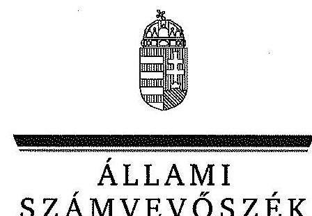
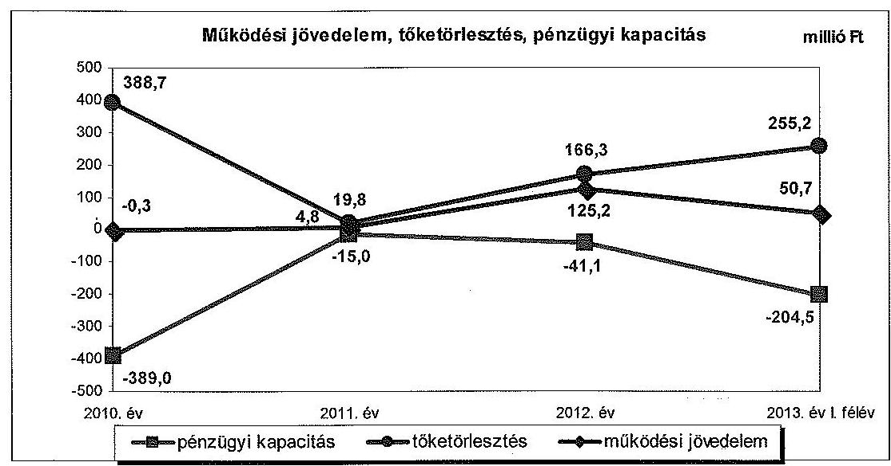
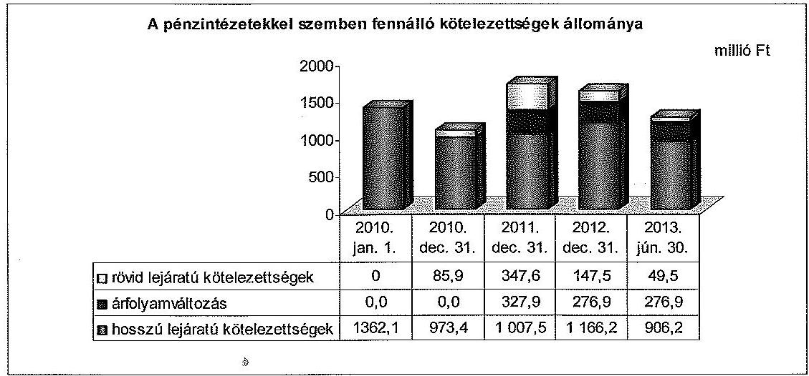
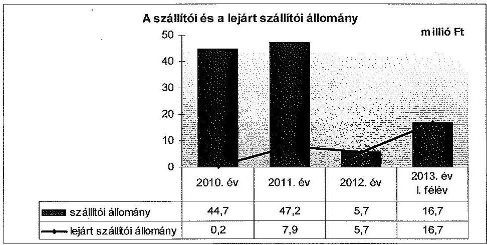
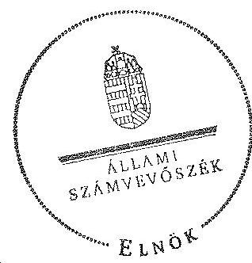

ÁLLAMI
SZÁMVEVŐSZÉK

# JELENTÉS 

az önkormányzatok pénzügyi gazdálkodási
helyzete értékelésének, és gazdálkodása szabályosságának

- 2013. évben induló - ellenőrzéséről

Gyömrő
14020
2014. január

---

# Állami Számvevőszék 

Iktatószám: V-0204-060/2014.
Témaszám: 1239
Vizsgálat-azonosító szám: V065002

## Az ellenőrzést felügyelte:

## Renkó Zsuzsanna

felügyeleti vezető
Az ellenőrzést vezette és az ellenőrzés végrehajtásáért felelős:
Valastyánné dr. Vízhányó Júlia
ellenőrzésvezető
A számvevőszéki jelentés összeállításában közremüködött:
Baksa Anikó
számvevő tanácsos
Az ellenőrzést végezték:
Hálóné Pelikán Veronika Béres László
számvevő
számvevő

---

# TARTALOMJEGYZÉK 

BEVEZETÉS ..... 3
I. ÖSSZEGZŐ MEGÁLLAPÍTÁSOK, KÖVETKEZTETÉSEK, JAVASLATOK ..... 6
II. RÉSZLETES MEGÁLLAPÍTÁSOK ..... 11

1. Az Önkormányzat kötelező és önként vállalt feladatai, a feladatellátás szervezeti kereteinek változása ..... 11
2. A pénzügyi egyensúly fenntartását veszélyeztető pénzügyi kockázatok, ezek csökkentése érdekében tett intézkedések ..... 13
3. Az Önkormányzat kötelezettségeinek állománya, azok összetételének változása, az adósságkonszolidáció hatása ..... 18
4. Az Önkormányzat pénzügyi gazdálkodása során érvényesített integritási szempontok ..... 23

---

# MELLÉKLETEK 

1/A. számú Az Önkormányzat bevételei és kiadásai, valamint adósságszolgálata a 2010-2013. év I. féléve közötti időszakban (a CLF módszer szerint, a Kvtv. 72. § (1) bekezdésében foglalt adósságátvállaláshoz kapcsolódó pénzügyi teljesítések nélkül)
1/B. számú Az Önkormányzat bevételei és kiadásai a Kvtv. 72. § (1) bekezdésében foglalt adósságátvállaláshoz kapcsolódó pénzügyi teljesítések nélkül a 2013. év I. félévében (a CLF módszer szerint)
2. számú Az Önkormányzat által a 2010. és a 2013. év I. félév között megvalósított fejlesztési feladatok érdekében teljesített felhalmozási kiadások és az ezekhez vállalt kötelezettségek összegzése
3. számú Az önkormányzati feladatok ellátásában résztvevő gazdasági társaságok egyes kiemelt adatai
4. számú Az Önkormányzat 2013. június 30 -án fennálló, hosszú lejáratú adósságot keletkeztető kötelezettségvállalásai
5. számú Az Önkormányzat kötelezettségeinek és egyes kötelezettségvállalásainak 2010. december 31-ei és 2013. június 30 -ai állománya, valamint a 2013. év II. félévében és az azt követő években várható kötelezettségek, kötelezettségvállalások miatti kiadások

## FÜGGELÉKEK

1. számú Rövidítések jegyzéke
2. számú Fogalomtár

---

# JELENTÉS 

## az önkormányzatok pénzügyi gazdálkodási helyzete értékelésének, és gazdálkodása szabályosságának - 2013. évben induló ellenőrzéséről Gyömrő

## BEVEZETÉS

Az ÁSZ a stratégiájában célul tűzte ki, hogy az önkormányzatok ellenőrzése során azok pénzügyi-gazdasági helyzetét értékeli, kockázatait feltárja, valamint az ellenőrzések helyszíneit objektív mutatószámrendszer alapján választja ki.

Az államháztartás önkormányzati alrendszerében az utóbbi években megjelenő gazdálkodási nehézségek, a pénzforgalmi hiány növekedése, az eladósodás az ÁSZ figyelmét az önkormányzatok pénzügyi helyzetére irányította. Az elkövetkezendő évek költségvetési hiánycéljainak tarthatósága érdekében indokolt, hogy az önkormányzatok pénzügyi helyzetelemzése és az egyensúlyi helyzetet befolyásoló kockázatok feltárása továbbra is kiemelt hangsúlyt kapjon az ÁSZ tevékenységében.

A közigazgatás átalakításának keretében - a helyi igazgatás és önkormányzás hatékonyabbá tétele érdekében - a Kormány az önkormányzatokra vonatkozóan 2012-ben újraszabályozta mind a sarkalatos, mind az önkormányzatok mindennapi múködését rendező törvényeket és a feladatok végrehajtását biztosító előírásokat. Az önkormányzati feladatellátást érintő átalakítások jelentős része 2013-ban következett be azzal, hogy az igazgatási, az oktatási és a szociális ellátásban a feladatok jelentős hányadát átvette az állam. Ahhoz, hogy az önkormányzatok meg tudjanak felelni a számukra meghatározott - szigorúbb - gazdálkodási szabályoknak, és az új feltételek mellett is biztosítható legyen a közszolgáltatások megfelelő színvonalú ellátása, szükséges volt a pénzügyigazdasági rendszerük alapjainak megszilárdítása. Ezt a célt szolgálja az adósságkonszolidáció, amely az önkormányzatok múködését és fejlesztését segítő, de korábban az állam által nem fedezett kiadásokkal kapcsolatos kötelezettségvállalások differenciált mértékű átvállalását jelenti.

Az ÁSZ a 2013. év I. félévi ellenőrzési tervében a 39. számú, az önkormányzatok pénzügyi gazdálkodási helyzete értékelésének és gazdálkodása szabályosságának - 2013. évben induló - ellenőrzésével az önkormányzatok 2011. évben megkezdett helyzetelemzését folytatja. Az adósságkonszolidáció az önkormányzatok pénzügyi egyensúlyi helyzetére egyértelműen kedvező hatást gyakorolt, azonban a problémák kiváltó okait nem szüntette meg, ennek kezelése nélkül viszont az adósságállomány újratermelődik. Az önkormányzati alrend-

---

szerben a 2013-tól bevezetett új feladatfinanszírozási rendszer keretein belül továbbra is megoldandó kérdés a pénzügyi egyensúly megteremtése, hosszú távú fenntartása. Erre tekintettel kiemelt fontosságú az önkormányzatok pénzügyi egyensúlyi helyzetére ható kockázatok feltárása, az ezzel kapcsolatos folyamatok, trendek bemutatása. Az ÁSZ ennek megfelelően a jövőben is tovább folytatja az önkormányzatok pénzügyi gazdálkodási helyzetét értékelő témacsoportos ellenőrzéseit.

Az ellenőrzések kockázatalapú megközelítése keretében megtörténik az önkormányzatok adósságkezelési és likviditási helyzetének értékelése, a pénzügyi egyensúly minősítése, továbbá az alrendszerben 2013-ban bekövetkezett változások hatásának értékelése.

Az ellenőrzés - eredményének várható hatásaként - megállapításaival segítséget nyújthat a pénzügyi helyzet értékeléséhez, a pénzügyi egyensúly helyreállítása érdekében szükségessé váló önkormányzati intézkedések megtételéhez. Az ellenőrzés során továbbra is célunk az államháztartás önkormányzati alrendszerére jellemző információk összegzésével támogatni az Országgyűlés munkáját a törvényalkotásban, a források elosztásában.

Az ellenőrzés célja: az Önkormányzat pénzügyi helyzetének, szabályosságának értékelése, a pénzügyi egyensúly alakulására hatással lévő folyamatoknak és a pénzügyi egyensúly alakulására ható kockázatoknak a feltárása.

# Az ellenőrzés célja annak értékelése volt, hogy: 

- a kötelező és önként vállalt feladatok ellátása, ezen belül az ellátott feladatok körének, az ellátást biztosító szervezeti formáknak a változása milyen hatást gyakorolt a pénzügyi egyensúlyi helyzetre;
- az Önkormányzat pénzügyi - múködési és felhalmozási - egyensúlya milyen irányban változott, a változást milyen okok idézték elő, továbbá milyen intézkedéseket tettek az egyensúly biztosítása, illetve javítása érdekében, az intézkedések hatására javult-e az Önkormányzat pénzügyi helyzete;
- a költségvetési kiadások finanszírozása érdekében vállalt, pénzintézetekkel szembeni kötelezettségek, a szállítói és egyéb kötelezettségek hogyan alakultak, az adósságkonszolidáció után fennmaradt kötelezettségek teljesítésének kockázatai miként befolyásolják a jövőbeli pénzügyi egyensúlyi helyzetet.

Az önkormányzatok korrupcióval szembeni veszélyeztetettségének csökkentése érdekében új feladatként felmértük az integritási szemlélet érvényesülését a pénzügyi gazdálkodási folyamatokban.

Utóellenőrzésre nem került sor, mivel az ÁSZ az ellenőrzött időszakban az Önkormányzatnál számvevőszéki jelentéssel lezárt ellenőrzést nem végzett.

Az ellenőrzési célokban megfogalmazott kérdések értékelési kritériumai a gazdálkodásra vonatkozó jogszabályok és a pénzügyi egyensúly biztosításának, valamint a pénzügyi helyzettel és gazdálkodással kapcsolatos kockázatok kezelésének követelménye. Az ellenőrzés az ellenőrzési célok eléréséhez elemző, értékelő, a pénzügyi helyzet kockázatát is minősítő eljárásokat alkalmazott.

---

Az ellenőrzés típusa: szabályszerűségi ellenőrzés

# Ellenőrzött szervezet: Gyömrő Város Önkormányzata 

Az ellenőrzött időszak: a 2010. január 1-jétől 2013. június 30-ig terjedő időszak, figyelemmel az ellenőrzés célja vonatkozásában megfogalmazottakra. A pénzintézetekkel szembeni kötelezettségek állományának vizsgálatakor az ellenőrzött időszakban fennálló kötelezettségeket vette figyelembe az ellenőrzés.

Az ellenőrzés szakmai módszertana az ÁSZ hivatalos honlapján (www.asz.hu) közzétett szakmai szabályokon alapult, amely a Legfőbb Ellenőrző Intézmények Nemzetközi Szervezete (INTOSAI) által kiadott nemzetközi standardok (ISSAI) figyelembevételével készült.

Az ellenőrzés jogszabályi alapját az ÁSZ tv. 1. § (3) bekezdésének, 5. § (2)-(6) bekezdéseinek, valamint az Áht. 61. § (2) bekezdésének előírásai képezik.

Az ellenőrzés során használt rövidítéseket az 1. számú, az egyes fogalmak magyarázatát a 2. számú függelék tartalmazza.

Gyömrő város állandó lakosainak száma 2010. január 1-jén 15994 fő, 2013. január 1-jén 16562 fő volt. Az Önkormányzat a 2012. évben 3240,2 millió Ft költségvetési bevételt ért el, és 3071,4 millió Ft költségvetési kiadást teljesített. A 2012. december 31-i könyvviteli mérleg szerint 12148,8 millió Ft értékű vagyonnal rendelkezett, a rövid lejáratú kötelezettségállomány 239,1 millió Ft, a hosszú lejáratú kötelezettségállomány 1396,8 millió Ft volt. Az Önkormányzat három gazdasági társaságban rendelkezett minősített többségi befolyással. A jegyző 1991. július 1-jétől látja el feladatait. A foglalkoztatott köztisztviselők száma 2012. január 1-jén 59 fő volt. Az Önkormányzat 2013. június 30 -án feladatait egy önállóan múködő és gazdálkodó költségvetési intézménnyel, hat önállóan múködő költségvetési intézménnyel és 13 gazdasági társasággal látta el.

Az ÁSZ tv. 29. § (1) bekezdése szerint a jelentéstervezetet megküldtük a polgármester részére, aki az ÁSZ tv. 29. § (2) bekezdésében foglalt észrevételezési jogával nem élt, a jelentéstervezetre észrevételt nem tett.

---

# I. ÖSSZEGZŐ MEGÁLLAPÍTÁSOK, KÖVETKEZTETÉSEK, JAVASLATOK 

Gyömrő Város Önkormányzatának pénzügyi egyensúlya az ellenőrzött időszakban rövid távon nem volt biztosított, mivel a múködési jövedelem nem nyújtott fedezetet a tőketörlesztési kötelezettségekre. A múködési költségvetés egyenlege a 2013. év I. félévben bevezetett új feladatellátási és finanszírozási rendszerben 50,7 millió Ft többletet mutatott. A 2013. évi 70,0\%-os mértékű, 1113,2 millió Ft tőketartozást és annak járulékait érintő adósságkonszolidáció hatására az Önkormányzat pénzügyi egyensúlyi helyzete javult, azonban a finanszírozásba bevonható pénzeszközei, valamint a jövedelemtermelő képessége alapján képződő bevételek várhatóan nem biztosítják a fennálló kötelezettségek jövőbeni fedezetét.

Az Önkormányzat költségvetésének elemzését a CLF módszerrel számított mutatók alapján végeztük. A pénzügyi kapacitás 2010-2013. év I. félév közötti változását - a 2013. évi adósságkonszolidáció pénzforgalmi hatása nélkül számítva - a következő ábra mutatja be:

Az Önkormányzat a 2010-2013. év I. félév között összesen 8905,6 millió Ft költségvetési bevételt ért el, és 9081,2 millió Ft költségvetési kiadást teljesített. A folyó bevételek a 2010. év kivételével fedezetet nyújtottak a folyó kiadásokra, az ellenőrzött időszakban összességében 180,4 millió Ft müködési jövedelem keletkezett. A 2012. évi kiugróan magas múködési jövedelmet alapvetően a helyi adók és a költségvetési támogatások emelkedése, valamint a múködési célra átadott pénzeszközök csökkenése eredményezte. Az Önkormányzat a 2010-2012. évek között ÖNHIKI támogatásban nem részesült, a 2013. év I. félévében 21,9 millió Ft szerkezetátalakítási tartalékból folyósított, központi támogatást kapott.

---

A felhalmozási bevételek a 2012. év kivételével nem nyújtottak fedezetet a felhalmozási kiadásokra, az ellenőrzött időszakban 356,0 millió Ft felhalmozási forráshiány keletkezett. A 2013. június 30 -ig pénzügyileg befejezett beruházások és felújítások értéke 2767,7 millió Ft volt, amely döntőrészt hat kiemelt projekthez (KEOP és KMOP pályázatok keretében megvalósult új vízbázis létesítése, víz- és szennyvízberuházás, művelődési ház építése, sportcsarnok bővítése, a városháza épületének korszerűsítése, valamint a Polgármesteri Hivatal „A" épületének energetikai korszerűsítése) kapcsolódott.

A pénzügyi kapacitás (nettó múködési jövedelem) az ellenőrzött időszakban folyamatosan negatív volt, a felhalmozási forráshiánnyal együtt az ellenőrzött időszakra - a 2012. évi 2,5 millió Ft finanszírozási többlet kivételével - számított 1008,1 millió Ft finanszírozási igényt folyószámlahitel, valamint fejlesztési hitel felvételével, továbbá az előző években képződött, finanszírozásba bevonható pénzeszközök felhasználásával fedezte az Önkormányzat.

Az Önkormányzat adatszolgáltatása alapján az ellenőrzött időszakban megvalósított fejlesztések önként vállalt feladatokhoz kapcsolódó felhalmozási kiadásainak összege 1308,3 millió Ft volt, amely $42,1 \%$-a a teljesített kifizetéseknek ( 3111,1 millió Ft). Az önként vállalt feladatokra teljesített felhalmozási kiadások magas részaránya felhalmozási kockázatot jelentett.

Az egyes igazgatási és köznevelési feladatok állami fenntartásba adása az Önkormányzat adatszolgáltatása alapján 344,7 millió Ft kiadáscsökkenést és 319,6 millió Ft bevételkiesést eredményezett, amely összességében kedvező hatást gyakorolt a 2013. év I. félévi pénzügyi egyensúlyi helyzetre. Az Önkormányzat által kimutatott, saját hatáskörben végrehajtott bevételnövelő és kiadáscsökkentő intézkedések az ellenőrzött időszakban összességében 168,3 millió Ft-tal javították a pénzügyi egyensúlyi helyzetet.

Az Önkormányzat pénzintézetekkel szembeni kötelezettsége 2010. január 1-jén 1362,1 millió Ft, 2013. június 30 -án 1232,6 millió Ft volt. A kötvénytartozáshoz kapcsolódó adósság átvállalása az ellenőrzött időszakot követően történt, amelynek következtében a pénzintézetekkel szembeni kötelezettségek állománya további 723,9 millió Ft-tal csökkent. Az adósságkonszolidációt követően fennmaradt kötelezettség állomány 459,2 millió Ft beruházási hitelből és 49,5 millió Ft támogatásmegelőlegező hitelből tevődött össze. A banki kitettség miatti kockázatot jelzi, hogy az ellenőrzött időszakban az Önkormányzat likviditásának fenntartása érdekében folyamatosan folyószámlahitelt vett igénybe. Az Önkormányzat jövedelemtermelő képességének és finanszírozásba bevonható pénzeszközeinek alacsony szintje miatt az adósságkonszolidáció kedvező hatása ellenére fennáll a kötelezettségek jövőbeni kifizethetőségének kockázata, az ellenőrzött időszakot követően esedékessé váló 586,0 millió Ft adósságszolgálattal kapcsolatban.

Az Önkormányzat a 2013. év I. félév végén az egyéb kötelezettségek között 16,7 millió Ft 30 napon belül lejárt szállítói tartozást mutatott ki, melynek rendezése 2013. júliusban megtörtént. A kizárólagos tulajdonú gazdasági társasága 40,0 millió Ft összegű folyószámlahitel-keretéhez vállalt kezesség mérlegen kívüli tételhez kapcsolódó kockázatot jelent.

---

Az Önkormányzat tulajdonában, kezelésében lévő egyes eszközök használatára, valamint az összeférhetetlenség esetén követendő eljárásokra vonatkozó szabályozásbeli hiányosságok, továbbá a pénzügyi helyzetet, az adósságterheket befolyásoló döntések előtti, azok kockázatainak felmérését előíró szabályozás hiánya arra utalnak, hogy az Önkormányzatnak még fejlődnie kell az integritási szemlélet teljes körű érvényesítése érdekében.

Az ellenőrzés során a gazdálkodási feladatok ellátásával kapcsolatban az alábbi szabályszerűségi hibákat tártuk fel:

- a 2011. évben két fejlesztési célú hitelszerződés esetében - az Ötv.-ben ${ }^{1}$ és az Ámr.-ben ${ }^{2}$ foglalt előírásokat megsértve - az Önkormányzat a költségvetési elszámolási számlájára és az esetleges további pénzforgalmi vagy pénzforgalmi jellegű bankszámláira azonnali benyújtható inkasszó jogot ajánlott fel a hitelt nyújtó takarékszövetkezetnek biztosítékként, ezáltal a hitel fedezeteként a központi költségvetésből származó bevételeit is felajánlotta;
- az Önkormányzat a 2013. évi költségvetési rendeletében a Mötv.-ben előírt működési egyensúly biztosítása érdekében 260,9 millió Ft működőképesség megőrzését szolgáló, kiegészítő támogatásból és 0,8 millió Ft központosított múködési célú előirányzatból származó bevételt vett figyelembe, ezáltal a bevételi előirányzatok tervezése az Áht. előírásai ellenére közgazdaságilag nem megalapozott módon történt.

Az ÁSZ tv. 33. § (1) bekezdésében foglaltak értelmében az ellenőrzött szervezet vezetője köteles a jelentésben foglalt megállapításokhoz kapcsolódó intézkedési tervet összeállítani, és azt a jelentés kézhezvételétől számított harminc napon belül az ÁSZ részére megküldeni. Amennyiben az intézkedési tervet határidőn belül nem küldi meg a szervezet vezetője, vagy az továbbra sem elfogadható, az ÁSZ elnöke a hivatkozott törvény 33. § (3) bekezdés a-b) pontjaiban foglaltakat érvényesítheti.

# Az ellenőrzés intézkedést igénylő megállapításai és javaslatai: 

## a polgármesternek

1. Az Önkormányzat pénzügyi egyensúlya az ellenőrzött időszakban rövid távon nem volt biztosított. A múködési költségvetés egyensúlya a 2010. év kivételével biztosított volt. A 2011. és a 2012. években összesen 130,0 millió Ft müködési többlet képződött. Az Önkormányzat 2010-2012 között ÖNHIKI támogatásban nem részesült. A 2013. év I. félévben az adósságkonszolidáció hatását kiszűrve 50,7 millió Ft müködési jövedelem képződött, amelyhez hozzájárult a 21,9 millió Ft szerkezetátalakítási tartalékból folyósított költségvetési támogatás. Az ellenőrzött időszakban a müködési jövedelem nem nyújtott fedezetet a tőketörlesztésre. A saját hatáskörben tett bevételnövelő és kiadáscsökkentő intézkedések nem biztosítottak elegendő forrást a pénzügyi egyensúly helyreállításához. A likviditás biztosítására igénybe vett folyószámlahitel a 2010-2012. években tartóssá vált, a napi átlagos hitelállomány
[^0]
[^0]:    ${ }^{1}$ Hatálytalan 2012. január 1-jétől, a 2012. március 31-től hatályos jogszabály: az Áht.
    ${ }^{2}$ Hatálytalan 2012. január 1-jétől, a 2012. január 1-jétől hatályos jogszabály: az Ávr.

---

88,1 millió Ft-ról 219,6 millió Ft-ra, közel két és félszeresére nőtt. Az adósságkonszolidáció keretében a 2012. év végi 147,7 millió Ft folyószámlahitel kiegyenlítésre került. Az Önkormányzatnak a 2013. év I. félév végén folyószámlahitel tartozása nem volt, a fennálló pénzintézeti kötelezettsége - a III. negyedévben a MÁK által rendezett 723,9 millió Ft kötvénytartozáson túl - összesen 508,7 millió Ft volt.

Javaslat:
A múködési jövedelemtermelő képesség és a feladatellátás összhangjának megteremtése, valamint a pénzügyi egyensúly helyreállítása, hosszú távú fenntarthatósága érdekében felelősök és határidők megjelölésével kezdeményezzen intézkedéseket, melyek keretében:
a) a költségvetési rendelettervezet, valamint annak évközi módosítása előterjesztését megelőzően mérjék fel a bevételszerző és kiadáscsökkentő lehetőségeket, és terjessze a Képviselő-testület elé a bevételek növelését, a kiadások csökkentését célzó intézkedések bevezetéséhez szükséges - a Htv. 140. § (1) bekezdés a) pontja alapján a jegyző által elkészített - döntési javaslatát;
b) terjesszen a Képviselő-testület elé jóváhagyásra - a Htv. 140. § (1) bekezdés a) pontja alapján a jegyző által elkészített - az Önkormányzat gazdasági helyzetének elemzésén alapuló, a pénzügyi egyensúlyi helyzet helyreállítását, hosszú távú fenntartását, valamint az adósságállomány újratermelődésének elkerülését biztosító intézkedéseket tartalmazó stabilizációs programot.
2. Az Önkormányzat a 2011. augusztus 26-án és szeptember 26-án megkötött fejlesztési célú hitel szerződéseiben a pénzintézet számára a költségvetési számlája és további pénzforgalmi vagy pénzforgalmi jellegű bankszámlái tekintetében - az Ötv. 88. § (1) bekezdés b) pontjában ${ }^{3}$ és az Ámr. 174. § (11) bekezdésében ${ }^{4}$ foglalt előírásokat megsértve - azonnali inkasszós jogot biztosított, ezáltal a hitel fedezeteként a központi költségvetésből származó bevételeit is felajánlotta.

Javaslat:
A pénzintézeti kötelezettségvállalásokkal kapcsolatos jogszerű biztosíték, illetve fedezet felajánlása érdekében:
a) intézkedjen, hogy jövőbeni hitelfelvétel, kötvénykibocsátás fedezeteként az Áht. 84. § (4) bekezdésében, továbbá az Ávr. 145. § (2) bekezdésében előírtak szerint az Önkormányzat általános müködésének és ágazati feladatainak támogatása, továbbá a költségvetési támogatás ne kerüljön felhasználásra, a költségvetési támogatások folyósítására szolgáló, elkülönített bankszámláról hiteltörlesztést ne teljesítsenek;

[^0]
[^0]:    ${ }^{3}$ Hatálytalan 2012. január 1-jétől, a 2012. március 31-től hatályos előírás az Áht. 84. § (4) bekezdése.
    ${ }^{4}$ Hatálytalan 2012. január 1-jétől, a 2012. január 1-jétől hatályos előírás az Ávr. 145. § (2) bekezdése.

---

b) a jogellenes állapot megszüntetése érdekében vizsgálja meg a jogszerú biztosíték cseréjének lehetőségét, és terjesszen javaslatot a Képviselő-testület elé a biztosíték cseréjéről.

# a jegyzönek 

1. Az Önkormányzat 2013. évi költségvetési rendeletében a müködési költségvetés Mötv. 111. § (4) bekezdésében előírt egyensúlyát oly módon biztosították, hogy 260,9 millió Ft müködőképesség megőrzését szolgáló kiegészítő támogatásból és 0,8 millió Ft központosított müködési célú előirányzatból származó bevételt is figyelembe vettek, ezáltal a bevételi előirányzatok tervezése az Áht. 12. § (1) bekezdésében előírtak ellenére közgazdaságilag nem megalapozott módon történt.

Javaslat:
Intézkedjen, hogy a költségvetési rendelettervezetben a müködési költségvetés Mötv. 111. § (4) bekezdésében előírt egyensúlyának biztosításakor a bevételeket az Áht. 12. § (1) bekezdésének megfelelően, közgazdaságilag megalapozottan határozzák meg.

---

# II. RÉSZLETES MEGÁLLAPÍTÁSOK 

## 1. Az ÖNKORMÁNYZAT KÖTELEZŐ ÉS ÖNKÉNT VÁLlALT FELADATAI, A FELADATELLÁTÁS SZERVEZETI KERETEINEK VÁLTOZÁSA

Az Önkormányzat az SZMSZ-ében határozta meg a kötelező és önként vállalt feladatainak körét. Az önként vállalt feladatok mértékét az intézmények alapító okiratában, feladatellátási és hatósági szerződéseiben, valamint az Önkormányzat költségvetési rendeleteiben állapította meg. Önként vállalt feladatok voltak - az Önkormányzat besorolása alapján - a sajátos nevelési igényű tanulók elkülönített iskolai és óvodai oktatása, az alapfokú művészeti oktatás, a pedagógiai szakszolgálat, a jelzőrendszeres házi segítségnyújtás, a támogató szolgálat, a folyóirat kiadás, a munkahelyi étkeztetés, a strandfürdő üzemeltetés, a helyi autóbusz közlekedés, a civil szervezetek támogatása és a közfoglalkoztatatás. Az Önkormányzat 2013. évi költségvetési rendelete ${ }^{5}$ tartalmazta a kötelező és önként vállalt feladatok költségvetési szervenkénti megbontását. A kötelező feladatok körében biztosították az óvodai nevelést és az általános iskolai oktatást, a szociális alapellátásokat, a gyermekjóléti feladatok közül a bölcsődei ellátást és a gyermekjóléti szolgálatot. Kötelező feladatként látták el továbbá a közművelődési és az igazgatási feladatokat, az egészségügyi szolgáltatások között a háziorvosi ellátást és a védőnői szolgálatot, az egyéb feladatok keretében a gyermekélelmezést, továbbá a városüzemeltetési tevékenységeket.

Az ellenőrzött időszakban a működési kiadásokon belül az önként vállalt feladatok kiadásainak részaránya a 2010. évi 10,7\%-ról (209,9 millió Ft-ról) a 2013. év I. félév végére 7,9\%-ra ( 47,0 millió Ft-ra) csökkent. Az önként vállalt feladatok ellátása nem jelentett kockázatot az Önkormányzat pénzügyi egyensúlyi helyzete szempontjából.

Az Önkormányzat adatszolgáltatása alapján az ellenőrzött időszakban megvalósított fejlesztések értéke 3111,1 millió Ft, ebből az önként vállalt feladatokra fordított felhalmozási kiadások összege 1308,3 millió Ft ( $42,1 \%$ ) volt. Az önként vállalt feladatokra teljesített felhalmozási kiadások magas részaránya felhalmozási kockázatot jelentett.

A 2013. év I. félévben az önként vállalt feladatokra fordított felhalmozási kiadások aránya $57,1 \%$ volt. Ezt „A magyar-szlovák határon átnyúló gazdasági kapacitás racionalizálása" című pályázat (inkubátorház induló vállalkozások számára) kapcsolódó fejlesztéseinek kiadásai okozták. A fejlesztés egyik forrását 26,7 ezer EUR önrész biztosította.

A 2010-2012 közötti években az Önkormányzat adatszolgáltatása alapján nem voltak a költségvetés kiadásaira és bevételeire ható feladatátvételek, illetve -átadások és egyéb intézkedések.

[^0]
[^0]:    ${ }^{5}$ 3/2013. (III.25.) sz. rendelet az Önkormányzat 2013. évi költségvetéséről

---

2010. január 1-jén az Önkormányzat a feladatait (óvodai ellátás, általános iskolai és alapfokú művészeti oktatás, szociális, egészségügyi, gyermekjóléti, közétkeztetési és közművelődési, valamint igazgatási és egyéb feladatok) négy önállóan működő és gazdálkodó és további hat önállóan működő költségvetési intézménnyel és 12 gazdasági társasággal látta el. A gazdasági társaságok útján ellátott, kiemelt feladatok a víz- és csatornaszolgáltatás, valamint a szilárdhulladékszállítás, a köztemető, park és közterület-fenntartás, a helyi tömegközlekedés és a strand üzemeltetése voltak. A három köznevelési intézmény állami fenntartásba kerülését követően, 2013. június 30 -án az Önkormányzat a feladatait egy önállóan működő és gazdálkodó költségvetési intézménnyel, hat önállóan működő költségvetési intézménnyel és 13 gazdasági társasággal látta el.

A 2013. év I. félévében a Pest Megyei Intézményfenntartó Központtól jogszabály ${ }^{6}$ alapján történt feladatátvételt követően - a 2013. március 28-án ${ }^{7}$ létrejött megállapodás alapján - az Önkormányzat végezte a közétkeztetést a közigazgatási területén működő Szakiskolában. A feladatátvétel kedvezötlenül hatott az Önkormányzat pénzügyi egyensúlyi helyzetére, mivel a kiadások 17,3 millió Ft összegű növekedése meghaladta a bevételek 12,3 millió Ft-os emelkedését.

A Szakiskolában az átvett közétkeztetési feladatok ellátására a Szolgáltatóval 2013. márciusban megkötött szolgáltatási szerződés közbeszerzési eljárás mellőzésével történt. Az Önkormányzat a közétkeztetésre vonatkozó szolgáltatási szerződését - a Kbt. 19. § (1) bekezdése alapján a Kbt. Második Részében előírtak megsértésével - közbeszerzési eljárás lefolytatása nélkül kötötte meg.

Az Önkormányzat köznevelési intézményeinek fenntartását 2013. január 1-jétől az állam vette át. Az Önkormányzat ${ }^{8}$ és a KIK megkötötte az épületek ingyenes használatáról szóló megállapodást, továbbá az Önkormányzat vállalta ${ }^{9}$ az intézmények működtetését 2015. augusztus 31-ig. A köznevelési intézmények működtetésének Önkormányzat általi átvállalását megelőzően nem készült előzetes gazdaságossági számítás, elemzés. A köznevelési feladatok államnak történt átadása és az Önkormányzat által felvállalt intézményműködtetés - a közétkeztetési feladatok átvételének kedvezőtlen hatásán túl - öszszességében 5,4 millió Ft-tal rontotta az Önkormányzat pénzügyi egyensúlyi helyzetét. Az önkormányzati adatszolgáltatás szerinti a bevételek 253,3 millió Ft összegű mérséklődése meghaladta a kiadások 247,9 millió Ft összegű csökkenését a 2013. év I. félévében.

Az átadás-átvételi jegyzőkönyv szerint ${ }^{10}$ átadásra került a Fekete István Általános Iskola és Szakiskola, a II. Rákóczi Ferenc Általános Iskola, a Weöres Sándor Általános Iskola és Alapfokú Zeneművészeti és Táncművészeti Intézmény és a Pedagógiai Szakszolgálat.

[^0]
[^0]:    ${ }^{6}$ a gyermekek védelméről és a gyámügyi igazgatásról szóló 1997. évi XXXI. törvény 151. § (2) bekezdésének 2013. január 1. napjától hatályos állapota értelmében
    ${ }^{7}$ a 7/2013. (I. 21.) sz. képviselő-testületi határozat alapján
    ${ }^{8}$ a 30/2013. (II. 14.) sz. képviselő-testületi határozat alapján
    ${ }^{9}$ a 212/2012. (XI.12.) sz. képviselő-testületi határozattal
    ${ }^{10}$ a köznevelési feladatot ellátó egyes önkormányzati fenntartású intézmények állami fenntartásba vételéről szóló 2012. évi CLXXXVIII. törvény 13. § és 15. §-a alapján

---

A 2013. év I. félévben az egyes önkormányzati igazgatási feladatok - az okmányiroda, az építésügyi hatóság és a gyámhivatal ${ }^{11}$ - a járási kormányhivatalnak kerültek átadásra. Ennek hatásaként - az Önkormányzat adatszolgáltatása alapján - a kiadások 75,6 millió Ft-tal, a bevételek pedig 45,1 millió Fttal mérséklődtek. Az igazgatási feladatok átadása összességében 30,5 millió Ft-tal javította az Önkormányzat pénzügyi egyensúlyi helyzetét. Az Önkormányzatnál a hivatali feladatok ellátására ténylegesen alkalmazott (köztisztviselői) létszámot a Polgármesteri Hivatal múködésének támogatására megállapított alaplétszámra ${ }^{12}$ figyelemmel alakították ki.

Az Önkormányzat adatszolgáltatása alapján a Polgármesteri Hivatalban a 2013. év I. félévben 32 fő köztisztviselő, 1 fő közalkalmazott, 4 fő Munka Törvénykönyve hatálya alá tartozó ${ }^{13}$ személy dolgozott.

A szakosított szociális és gyermekvédelmi szakellátási intézmények és a járóbeteg-szakellátási feladatok 2013. május 1-jén történt állami átvétele nem érintette az Önkormányzatot.

# 2. A PÉNZÜGYI EGYENSÚLY FENNTARTÁSÁT VESZÉLYEZTETŐ PÉNZÜGYI KOCKÁZATOK, EZEK CSÖKKENTÉSE ÉRDEKÉBEN TETT INTÉZKEDÉSEK 

Az Önkormányzat költségvetésének elemzését a CLF módszer szerint hajtottuk végre. A 2013. év I. félévi valós jövedelemtermelő képesség bemutatása érdekében az elemzés során nem vettük figyelembe az adósságkonszolidációhoz kapcsolódó bevételeket és kiadásokat.

Az adósságkonszolidációra vonatkozóan az Önkormányzat 2013. év I. félévi beszámolója 147,7 millió Ft múködési és 242,6 millió Ft felhalmozási költségvetési támogatást, valamint 389,3 millió Ft hiteltörlesztést tartalmazott. Az adósság átvállalásról kötött megállapodás alapján a kötvény visszafizetésének biztosítékául szolgáló 232,1 millió Ft óvadéki betétet az Önkormányzat átutalta a Magyar Államok, amelynek teljesítése a dologi kiadások között szerepelt. Az adósságkonszolidációhoz kapcsolódóan a folyó, illetve a felhalmozási bevételek között kimutatott költségvetési támogatások javították a múködési jövedelmet, illetve a felhalmozási költségvetés egyenlegét, ugyanakkor a folyó kiadások között elszámolt óvadéki betét, továbbá a finanszírozási kiadások között elszámolt hiteltörlesztés kedvezőtlenül befolyásolta a múködési jövedelmet, illetve a pénzügyi kapacitást.

[^0]
[^0]:    ${ }^{11}$ A 2010-2012. években az Önkormányzat saját költségvetési szervével látta el a feladatokat.
    ${ }^{12}$ a Kvtv. 2. számú melléklet I. 1. a pont alapján
    ${ }^{13}$ Jegyzői nyilatkozat alapján

---

A CLF módszer szerinti, önkormányzati, részletes adatokat 2010-2013. év I. félév között az 1/A. számú melléklet, az adósságkonszolidációhoz kapcsolódó bevételek és kiadások pénzügyi egyensúlyi helyzetre gyakorolt hatását az 1/B. számú melléklet, a főbb önkormányzati adatokat a következő tábla mutatja be:

| Megnevezés | 2010. év | 2011. év | 2012. év | millió Ft   2013. év   I. félév |
| :--: | :--: | :--: | :--: | :--: |
| Folyó bevételek | 1961,6 | 1914,5 | 1997,8 | 644,3 |
| Folyó kiadások | 1961,9 | 1909,7 | 1872,6 | 593,6 |
| Múködési jövedelem | $-0,3$ | 4,8 | 125,2 | 50,7 |
| Felhalmozási bevételek | 519,4 | 594,3 | 1242,4 | 31,3 |
| Felhalmozási kiadások | 600,2 | 832,8 | 1198,8 | 111,6 |
| Felhalmozási költségvetés egyenlege | $-80,8$ | $-238,5$ | 43,6 | $-80,3$ |
| Folyó és felhalmozási bevételek összesen | 2481,0 | 2508,8 | 3240,2 | 675,6 |
| Folyó és felhalmozási kiadások összesen | 2562,1 | 2742,5 | 3071,4 | 705,2 |
| Finanszírozási múveletek nélküli pozíció | $-81,1$ | $-233,7$ | 168,8 | $-29,6$ |
| Finanszírozási műveletek egyenlege | $-342,8$ | 311,1 | $-53,0$ | $-176,6$ |
| Tárgyévi pénzügyi pozíció | $-423,9$ | 77,4 | 115,8 | $-206,2$ |
| Hiteltörlesztés, értékpapír beváltás | 388,7 | 19,8 | 166,3 | 255,2 |
| Nettó múködési jövedelem | $-389,0$ | $-15,0$ | $-41,1$ | $-204,5$ |

Az Önkormányzat az ellenőrzött időszakban összesen 8905,6 millió Ft költségvetési bevételt ért el, és 9081,2 millió Ft költségvetési kiadást teljesített. A 2010-2013. év I. félévben elért folyó bevétel 6518,2 millió Ft, a teljesített folyó kiadás 6337,8 millió Ft volt. A múködési kiadások és bevételek egyenlege a 2010. és 2011. években egyensúlyi helyzethez közeli állapotot mutattak, a 2012. évben, valamint a 2013. év I. félévében 125,2 millió Ft, illetve 50,7 millió Ft múködési többlet keletkezett. A múködési jövedelem 2012. évi 120,4 millió Ft-os növekedését elsősorban a helyi adók és a költségvetési támogatások emelkedése, valamint a múködési célú pénzeszközátadásokhoz kapcsolódó kiadáscsökkentés tette lehetővé. Az ellenőrzött időszakban képződött öszszes múködési jövedelem 180,4 millió Ft volt. A 2010-2012. években az Önkormányzat nem részesült ÖNHIKI támogatásban, a 2013. év I. félévében 21,9 millió Ft szerkezetátalakítási tartalékból folyósított, központi támogatást kapott.

Az ellenőrzött időszakban az Önkormányzat felhalmozási költségvetésének egyenlege - a 2012. év kivételével - negatív volt, összességében 356,0 millió Ft felhalmozási forráshiány keletkezett. A 2012. évben a felhalmozási bevételek 648,1 millió Ft-os növekedését az adott évben megvalósított beruházásokhoz kapcsolódó támogatások idézték elő. A felhalmozási hiány összes felhalmozási kiadáshoz viszonyított aránya a 2010. évben 13,5\%, a 2011. évben $28,6 \%$, a 2013. év I. félévben $72,0 \%$ volt.

A pénzügyi kapacitás (nettó múködési jövedelem) az ellenőrzött időszakban folyamatosan negatív volt, a múködési jövedelem nem nyújtott fedezetet a tőketörlesztési kötelezettségekre. A 2013. év I. félévi múködési jövedelem, ezáltal a pénzügyi kapacitás egyenlegét jelentős mértékben rontotta az adósságkon-

---

szolidációba bevont, kötvényhez kapcsolódó 232,1 millió Ft óvadéki betét Magyar Államnak történt átutalása.

Az ellenőrzött időszakban - a 2012. évben keletkezett 2,5 millió Ft finanszírozási többleten túl - a fennállt 1008,1 millió Ft teljes finanszírozási igényt ${ }^{14}$ folyószámlahitel és fejlesztési hitelek igénybevételével, valamint a korábbi években képződött, finanszírozásba bevonható pénzeszközök (bankbetét) felhasználásával biztosította az Önkormányzat.

A folyó bevételek nagyságrendje alapvetően nem változott, a 2010. évi 1961,6 millió Ft-ról a 2012. évre 1,8\%-kal ( 36,2 millió Ft-tal) emelkedett. A folyó bevételek között a legnagyobb arányt a múködési költségvetési támogatások képviselték, ez 2010-ben 38,6\% ( 757,7 millió Ft), 2011-ben 37,7\% ( 721,5 millió Ft), 2012-ben 39,3\% ( 785,1 millió Ft), a 2013. év I. félévében $58,2 \%$ ( 375,2 millió Ft) volt. A folyó bevételeken belül az szja bevétel arányának (a 2010. évben $29,3 \%$, a 2011. évben $29,7 \%$, a 2012. évben $28,6 \%$ ) változása nem volt jelentős.

Az átengedett bevételeknél a 2013. év I. félévében az előző év időarányos adataihoz viszonyítva az átengedett gépjármúadó csökkenése 57,8\% ( 29,8 millió Ft), a helyben maradó szja megszűnése miatti bevételkiesés 80,2 millió Ft volt. Az egyéb saját bevételek aránya a folyó bevételeken belül a 2010. évben 16,3\%, a 2011. évben 17,4\%, a 2012. évben 8,2\%, a 2013. év I. félévében $14,9 \%$ volt. A 2010 . évi 319,6 millió Ft összegű egyéb bevétel a 2011. évben 4,1\%-kal növekedve 332,8 millió Ft volt, a 2012. évben (10,7\%-kal) 297,1 millió Ft-ra csökkent. A helyi adókból származó bevételek folyó bevételeken belüli aránya a 2010. és 2011. évben közel azonos ( $7,2 \%$, illetve 7,0\%) volt, a 2012. évi 9,3\%-ról a 2013. év I. félévében 13,2\%-ra emelkedett. Az Önkormányzatnál a helyi adóból származó bevétel nem jelentett bevételi kitettséget, mivel az egyes adónemekhez tartozó realizált bevétel $75,0 \%$-a több mint három adóalanytól származott.

A helyi adók közül az állandó jelleggel végzett iparűzési tevékenység adómértéke 2013. január 1-jétől 1,9\%-ról a törvényi felső határt jelentő 2,0\%-ra emelkedett, az építményadó mértéke változatlan volt.

A felhalmozási bevételek a 2010-2012. években növekvő tendenciát mutattak, összegük az ellenőrzött időszakban 2387,4 millió Ft volt, amely az összes költségvetési bevétel $26,8 \%$-át jelentette. A 2010 . évi 519,4 millió Ft összegű bevétel a 2011. évben $14,4 \%$-kal ( 74,9 millió Ft-tal) emelkedett, ezt követően a 2012. évben több mint kétszeresére 1242,4 millió Ft-ra növekedett. A 2013. év I. félév adata az előző évi felhalmozási bevétel alig több mint 2,5\%-ának ( 31,3 millió Ft) felelt meg. A felhalmozási bevételeken belül meghatározó volt az államháztartáson belülről kapott támogatás, amelynek összege a 2010-2013. év I. félév közötti időszakban 1419,3 millió Ft-ot tett ki. A saját felhalmozási bevételek összes felhalmozási bevételen belüli aránya a 2010. évben $17,1 \%$ ( 89 millió Ft), a 2011. évben $28,1 \%$ ( 146,1 millió Ft), a

[^0]
[^0]:    ${ }^{14}$ a nettó múködési jövedelem és a felhalmozási költségvetés összevont negatív egyenlege

---

2012. évben 26,6\% (330,8 millió Ft) volt. A 2013. év I. félévében az Önkormányzatnak nem volt saját felhalmozási bevétele.

A folyó kiadások az ellenőrzött időszakban folyamatosan csökkenő tendenciát mutattak. A működési kiadások csökkenését a 2010-2012. évek között döntően a személyi juttatások és a munkaadói járulékok 2,3\%-os ( 36,7 millió Ft-os), az átadott pénzeszközök 66,5\%-os ( 25,4 millió Ft-os), valamint a transzferkiadások 16,0\%-os ( 45,7 millió Ft-os) csökkenése eredményezte. A 2013. év I. félévben a folyó kiadások összege 593,6 millió Ft volt, az előző évhez viszonyított időarányos elmaradás az államnak történt feladatátadás, illetve az államtól történt feladatátvétel kiadásokra gyakorolt hatásának következménye.

Az összes költségvetési kiadáson belül a felhalmozási kiadások aránya a 2010-2012. években folyamatosan növekedett, a 2010. évben 23,4\% ( 600,2 millió Ft), a 2011. évben 30,4\% ( 832,8 millió Ft), a 2012. évben 39,0\% ( 1198,8 millió Ft) volt. A felhalmozási kiadások emelkedését a 2011. évben a városközpont rehabilitációját megvalósító beruházás, a 2012. évben a település vízhálózatának fejlesztése okozta. A 2013. év I. félévben a felhalmozási kiadások összes költségvetési kiadáson belüli aránya 15,8\%-ra (111,6 millió Ft-ra) csökkent.

Az ellenőrzött időszakban pénzügyileg befejezett beruházások és felájitások értéke 2767,7 millió Ft volt, amelyekre 605,6 millió Ft ( $21,9 \%$ ) saját bevétel, 513,2 millió Ft ( $18,5 \%$ ) hitel és 1648,9 millió Ft ( $59,6 \%$ ) egyéb költségvetési támogatás biztosított fedezetet. A befejezett beruházások között hat nagy értékű, műszakilag befejezett fejlesztés volt ${ }^{15}$. Az ezek jövőbeni üzemeltetésével kapcsolatos kockázatokat nem mérték fel. Az Önkormányzat ellenőrzött időszakban megvalósított fejlesztési feladatait és azok forrásösszetételét a 2. számú melléklet tartalmazza.

A 2013. június 30 -án folyamatban lévő két fejlesztésre ${ }^{16} 65,4$ millió Ft-ot fizetett ki az Önkormányzat, amelynek forrását 3,3 millió Ft saját bevétel és 62,1 millió Ft egyéb központi támogatás biztosította. A 2013. év I. félévét követően esedékes kötelezettségek teljesítését 378,3 millió Ft EU-s támogatásból ( $97,5 \%$ ), illetve 9,6 millió Ft ( $2,5 \%$ ) hitelfelvételből származó forrásból tervezi az Önkormányzat.

Az Önkormányzatnak 2013. június 30 -án két pályázata volt elbírálás alatt. A benyújtott „Óvodai nevelés szakmai innovációja Gyömrön" tárgyú TÁMOP pályázat forrásösszetétele önrészt nem tartalmazott. A „Gyömrő város

[^0]
[^0]:    ${ }^{15}$ KEOP pályázat keretén belül új vízbázis létesítése, víz- és szennyvíz beruházás, valamint a 2011-2012. években a művelődési központ építése, a sportcsarnok bővítése, a városháza épületének korszerűsítése KMOP pályázattal és a Polgármesteri Hivatal „A" épületének energetikai korszerúsítés KEOP pályázat keretében.
    ${ }^{16}$ Az Önkormányzat pályázati támogatást nyert a magyar-szlovák határon átnyúló projekthez kapcsolódó „inkubátorház" építésére. Ezen felül az Új Széchenyi Terv KMOP támogatási rendszeréhez benyújtott „Mesevár a kastélydombon" című pályázata óvoda megépítését tartalmazta.

---

szennyvízelvezetésének és tisztitásának biztositása kapacitásnöveléssel" tárgyú KEOP pályázat forrásösszetételében 33,2 millió Ft önrész szerepelt. A Képvise-lő-testület a 230/2012. (XI. 20.) sz. határozatában döntött az önrész 2013. évi költségvetésbe történő beépítéséről, ez a jegyző nyilatkozata szerint a céltartalékok között megtörtént.

Az Önkormányzat az ellenőrzött időszakban összesen 327,0 millió Ft pénzeszközt adott át múködési és felhalmozási célra ${ }^{17}$ gazdasági társaságoknak, támogatási szerződés alapján és szerződés szerinti feladatellátásra.

Az Önkormányzatnál a 2010-2011. években az Ámr. 158. § (1) bekezdésében, a 2012. évtől a Bkr. 8. § (1)-(2) bekezdésében előírtak ellenére nem alakitották ki a pénzeszközátadások feltételrendszerét, nem rögzítették a döntési jogosultságot, a cél szerinti felhasználást, az elszámolási kötelezettség előírásait, valamint a szabálytalan felhasználás esetére szankció előírását.

Az ellenőrzött időszakra vonatkozó gazdasági (költségvetési) koncepciók tartalmaztak tervezett kiadáscsökkentő és bevételnövelő intézkedéseket. A saját hatáskörben végrehajtott intézkedések - az Önkormányzat adatszolgáltatása alapján - összesen 168,3 millió Ft-tal javították a pénzügyi egyensúlyi helyzetet, amelyből a tartós intézkedés 5,5 millió Ft bevétel növekedést eredményezett ${ }^{18}$.

A 2010-2013. év I. félév között személyi jellegű kiadásokhoz kapcsolódó megtakarítás (juttatások csökkentése) összesen 62,4 millió Ft volt. Az államháztartáson kívülre átadott támogatások csökkentése 100,4 millió Ft megtakarítást eredményezett. Az 5,5 millió Ft bevételnövekedés helyi adó mértékének emeléséből származott.

Az Önkormányzatnál nem végeztek felmérést az eszközök műszaki állapotára vonatkozóan, és az elhasználódott eszközök felújításához, pótlásához szükséges forrásigény számbavétele nem történt meg. Az ellenőrzött időszakban nem mérték fel az eszközök használhatósági fokának alakulását. Az elszámolt értékcsökkenési leírás összegéből nem különítettek el eszközök pótlására, felújítására szolgáló pénzeszközöket ${ }^{19}$. Az elszámolt értékcsökkenés a 2010-2012. években 945,9 millió Ft, az eszközpótlásra fordított kiadás 253,3 millió Ft volt.

[^0]
[^0]:    ${ }^{17}$ A Gyömrő TÜF NKft. részére a 2010. és 2011. években évi 78,2 millió Ft, a 2012. évben 56,0 millió Ft, a 2013. év I. félévben 16,0 millió Ft összegű működési célú támogatást, a Gyömrő és Térsége Vízközmű Szolgáltató Kft. részére a 2010-2011. években évi 49,3 millió Ft fejlesztési célú támogatást nyújtott az Önkormányzat.
    ${ }^{18}$ Ezt az iparűzési adó $0,1 \%$-kal történő emelése okozta.
    ${ }^{19}$ A hatályos jogszabályok az eszközpótlásra szolgáló alap képzésére nem írtak elő kötelezettséget.

---

# 3. Az ÖNKORMÁNYZAT KÖTELEZETTSÉGEINEK ÁllomÁnya, AZOK ÖSSZETÉTELÉNEK VÁLTOZÁSA, AZ ADÓSSÁGKONSZOLIDÁCIO HATÁSA 

Az Önkormányzat pénzintézetekkel szemben 2010. január 1-jén fennálló kötelezettségeinek 1362,1 millió Ft-os állománya 9,5\%-kal (129,5 millió Ft-tal) csökkent az ellenőrzött időszakban. Az Önkormányzat pénzintézeti kötelezettségállományának alakulását az ellenőrzött időszakban a következő ábra szemlélteti:

A pénzintézetekkel szembeni kötelezettség 2010. január 1-jén 1362,1 millió Ft volt, amely 915,1 millió Ft hosszú lejáratú beruházási hitelből és 447,0 millió Ft összegű kötvénytartozásból állt. Az Önkormányzat a kötvényt a 2007. évben bocsátotta ki 3005,0 ezer CHF ( 447,0 millió Ft) névértéken, 2016. évi, egy öszszegben történő tőketörlesztési lejárattal, negyedéves kamatfizetéssel. Az ellenőrzött időszak kezdő időpontjában az Önkormányzatnak pénzintézetekkel szembeni, rövid lejáratú hiteltartozása nem volt.

A 2013. június 30 -ai pénzintézeti kötelezettségek állománya 1232,6 millió Ft volt, amely 447,0 millió Ft kötvénytartozást és ehhez kapcsolódóan az év végi értékeléskor elszámolt 276,9 millió Ft nem realizált árfolyamveszteséget, 459,2 millió Ft beruházási hitelt, valamint 49,5 millió Ft rövid lejáratú, támogatás megelőlegező hitelt tartalmazott. Az adósságkonszolidáció keretében a Magyar Állam 147,7 millió Ft folyószámlahitelt, 241,6 millió Ft beruházási hitelt, valamint 723,9 millió Ft kötvénytartozást vállalt át. A kötvénytartozás átvállalása az ellenőrzött időszakot követően valósult meg. Az Önkormányzat 70,0\%-os mértékú 1113,2 millió Ft tőketartozást érintő adósságkonszolidációt követően fennállt pénzintézetekkel szembeni tartozása 508,7 millió Ft volt, amely 49,5 millió Ft támogatás megelőlegező hitelből és 459,2 millió Ft beruházási hitelből tevődött össze. Az Önkormányzat 2013. június 30 -án fennállt, hosszú lejáratú adósságot keletkeztető kötelezettségvállalásait a 4. számú melléklet mutatja be.

---

A folyószámlahitelek igénybevételét a 2010-2013. év I. félévben az alábbi tábla szemlélteti:

| Megnevezés | 2010. év | 2011. év | 2012. év | 2013. év   1. félév |
| :-- | --: | --: | --: | --: |
| Folyószámlahitel |  |  |  |  |
| Keretösszeg január 1-jén (millió Ft) | 100,0 | 400,0 | 400,0 | 165,0 |
| Átlagos, napi állomány (millió Ft) | 88,1 | 194,3 | 219,6 | 120,9 |
| Hitellel zárt napok száma (nap) | 361 | 365 | 366 | 177 |
| Egyenleg állomány az időszak végén (millió Ft) | 85,9 | 272,9 | 147,7 | 0,0 |
| Teljesített kamat és egyéb kiadás (millió Ft) | 7,4 | 18,5 | 23,5 | 5,3 |

A 2010-2012. években a folyószámlahitel átlagos napi állománya folyamatosan emelkedett, a 2012. évi átlagos értéke 219,6 millió Ft volt. Az év végi egyenleg a 2011. évben jelentős mértékben, 272,9 millió Ft-ra emelkedett, majd 2012. december 31-ére 147,7 millió Ft-ra csökkent. A banki kitettség miatti kockázatot jelzi, hogy az ellenőrzött időszakban az Önkormányzat likviditásának fenntartása érdekében folyamatosan folyószámlahitelt vett igénybe. A hitelkeret 2010-2011 között 300,0 millió Ft-tal (az előző keretösszeg négyszeresére) nőtt, majd az adósságátvállalás eredményeként a 2013. év I. félévre 400,0 millió Ft-ról 165,0 millió Ft-ra csökkent. 2013. június 30 -án az adósságkonszolidáció keretében kapott támogatás eredményeként törlesztették ezt a rövid lejáratú adósságállományt. Az ellenőrzött időszakban az Önkormányzat munkabér megelőlegezési hitelt nem vett igénybe, azonban a 2012. évben három szerződés alapján 68,0 millió Ft, a 2013. év I. félévében két szerződés alapján 49,5 millió Ft összegben támogatásmegelőlegező hitelt vett fel.

A 2011. évi hosszú lejáratú hitelkeret-szerződésekből származó kötelezettségek (258,4 millió Ft) jövőbeni beruházásokat és fejlesztéseket finanszíroztak ${ }^{20}$. Az ellenőrzött időszakban az Önkormányzatnak nem keletkezett új deviza vagy deviza alapú kötelezettsége, és nem volt fedezetbevonás miatti kockázata. A 2010-2013. év I. félévben a devizaalapú kötvényhez kapcsolódóan törlesztési kötelezettség nem vált esedékessé, így tőketörlesztéséhez kapcsolódó pénzügyileg realizált árfolyam-különbözet nem keletkezett.

Az Önkormányzatnak 2013. június 30 -án nem volt lízing- és gazdasági társaságtól felvett kölcsönből származó tartozása, valamint PPP konstrukció miatti vagy peres eljárásból eredő fizetési kötelezettsége.

Az adósságkonszolidációt követően fennmaradt kötelezettségek alapján az Önkormányzat által teljesítendő adósságszolgálat a 2013. július 1. és 2015. december 31. közötti időszakban 167,4 millió Ft, a 2016. évtől várható adósságteher 418,6 millió Ft. Az Önkormányzat jövedelemtermelő képessége, valamint a 142,9 millió Ft finanszírozásba bevonható pénzeszköz (banki betét) alapján a fennálló kötelezettségek jövőbeni kifizethetősége kockázatot jelent. Az Önkormányzat kötelezettségeinek és egyes kötelezettségvállalásainak 2010. december 31-ei és 2013. június 30 -ai állománya, valamint a 2013. év II. félévében és az azt követő években várható kötelezettségek, kötelezettségvállalások miatti kiadásokat az 5. számú melléklet mutatja be.

[^0]
[^0]:    ${ }^{20}$ Vízbázisbővítés, közoktatási intézmények felújítása, városközpont rekonstrukció

---

A 2012-2013. év I. félév közötti időszakban az Önkormányzatnak nem volt a Kormány engedélyezési jogkörébe tartozó, adósságot keletkeztető ügylete.

Az előző években megkötött hosszú lejáratú hitelszerződésekből eredő pénzintézeti kötelezettségvállalások során vizsgálták az éves kötelezettségvállalás felső korlátját. A tárgyévi kötelezettségek összege nem haladta meg az Ötv. 88. § (2) bekezdése szerinti korrigált saját bevételt. ${ }^{21}$

Az Önkormányzat a 2011. augusztus 26-án és szeptember 26-án megkötött fejlesztési célú hitelszerződéseiben - az Ötv. 88. § (1) bekezdés b) pontjában ${ }^{22}$ és az Ámr. 174. § (11) bekezdésében ${ }^{23}$ foglalt előírásokat megsértve - a pénzintézet számára a költségvetési számlája és az esetleges további pénzforgalmi vagy pénzforgalmi jellegű bankszámlái tekintetében azonnali inkasszó jogot biztosított, ezáltal a hitel fedezeteként a központi költségvetésből származó bevételeit is felajánlotta.

Az Önkormányzat 2010-2013. év I. félév közötti szállítói és lejárt szállítói állományát az alábbi ábra mutatja be:

Az Önkormányzat szállítói kötelezettségének állománya a 2010. évről a 2012. évre csökkent, és az összes lejárt szállítói kötelezettsége 30 napon belüli volt. A 2013. év I. félévben a szállítói állomány a 2012. évi állomány közel háromszorosára emelkedett, továbbá a 30 napon belüli lejárt szállítói kötelezettség meghaladta a dologi kiadások havi átlagának 20,0\%-át. Az Önkormányzat saját forrásból nem tudta teljesíteni a 16,7 millió Ft összegű lejárt szállítói tartozását. 2013. június 30-án átmeneti forráshiányt okozott, hogy a folyószám-lahitel-szerződés meghosszabbítása folyamatban volt. A számlakifizetések 2013 júliusában megtörténtek.

[^0]
[^0]:    ${ }^{21}$ a 2010-2011. évek költségvetési beszámolójának 25. űrlapja alapján
    ${ }^{22}$ Hatálytalan 2012. január 1-jétől, a 2012. március 31-től hatályos előírás az Áht. 84. § (4) bekezdése.
    ${ }^{23}$ Hatálytalan 2012. január 1-jétől, a 2012. január 1-jétől hatályos előírás az Ávr. 145. § (2) bekezdése.

---

A 2010. évben a könyvvizsgálói audit által annak ellenére került elfogadásra a beszámoló, hogy az Önkormányzat a mérlegében nem mutatta ki rövid lejáratú kötelezettségként folyószámlahitele év végi állományát. Az Önkormányzatnál a 2010. évben nem került sor a kötvényből származó devizakötelezettség december 31-i CHF árfolyamnak megfelelő értékelésére és a nem realizált árfolyamveszteség mérlegben történő kimutatására. A könyvvizsgálói jelentés erre vonatkozóan nem tért ki.

A 2011. évi könyvelés zárásánál e tételek rendezése megtörtént. A könyvvizsgálói auditáláskor a kötvénynél elvégezték az év végi értékelést, és a nem realizált árfolyamveszteséget lekönyvelték. A folyószámlahitel év végi állományát a mérlegben szerepeltették.

A külföldi pénzértékre szóló kötelezettség ${ }^{24}$ év végi értékelése és könyvelése az Értékelési szabályzat alapján, a törvényi szabályozásoknak megfelelően történt a 2011-2012. években.

Az Önkormányzat beszámolói az ellenőrzési időszakban könyvvizsgálattal alátámasztottak voltak és a könyvvizsgálói vélemény nem tartalmazott a pénzforgalommal kapcsolatos, a pénzügyi helyzetet befolyásoló számviteli hiányosságot.

Az Önkormányzat a vagyongazdálkodási rendeletében ${ }^{25}$ meghatározta az ellenőrzött időszakra vonatkozóan a követelés elengedés módját és feltételét. A 2010-2013. év I. félévben az Önkormányzat követelést nem engedett el, és 2013. június 30 -án 28,6 millió Ft összegű behajthatatlan követelést (az összes követelés $4,5 \%-a$ ) tartott nyilván ${ }^{26}$.

Az Önkormányzat a 2013. évi költségvetésében ${ }^{27} 2324,7$ millió Ft költségvetési bevételi és kiadási főösszeget határozott meg. Az Önkormányzat a Mötv. 111. § (4) bekezdése szerinti múködési költségvetési egyensúly megteremtése érdekében 260,9 millió Ft működőképesség megőrzését szolgáló kiegészítő támogatásból és 0,8 millió Ft központosított működési célú előirányzatból származó bevételt is figyelembe vett, ezáltal a bevételi előirányzatok tervezése az Áht. 12. § (1) bekezdésében előírtak ellenére közgazdaságilag nem megalapozott módon történt.

Az Önkormányzat a 2013. év I. félévben egyedi elbírálás alapján a gyermekétkeztetési feladatok ellátására 40,2 millió Ft, a helyi önkormányzatok működésének általános támogatásához kapcsolódó beszámítás visszapótlására 31,1 millió Ft, szociális- és gyermekjóléti alapellátásra 7,7 millió Ft támoga-

[^0]
[^0]:    ${ }^{24}$ Az Önkormányzat által 2007. évben kibocsátott devizakötvényhez kapcsolódott.
    ${ }^{25}$ Gyömrő Nagyközség Önkormányzat Képviselő-testületének 33/2000. (XII.13.) számú rendelete az Önkormányzat vagyonáról
    ${ }^{26}$ felszámolás és végelszámolás alá került adózók gépjármú és iparűzési adó, pótlék és bírság összegei
    ${ }^{27}$ 3/2013. (III.25.) sz. rendelet az Önkormányzat 2013. évi költségvetéséről

---

tásban részesült. Az Önkormányzat részére 21,9 millió Ft támogatás került átutalásra 2013. június 30 -ig ${ }^{28}$.

Az Önkormányzat három minősített többségi befolyása alatt álló gazdasági társasággal rendelkezett 2013. június 30 -án.

A Gyömrő TÜF NKft.-ben az Önkormányzat a saját tulajdoni részaránya 100,0\% volt. 2010-2013. június 30. között a Gyömrő TÜF NKft. 40,0 millió Ft folyószámla-hitelkeretének biztosítékát, a keret mértékéig önkormányzati kezességvállalás képezte. Ebből az Önkormányzatnak fizetési kötelezettsége nem keletkezett, azonban mérlegen kívüli tételhez kapcsolódó kockázatot jelent. A Gyömrő TÜF NKft. 2013. június 30 -án meglévő lejárt szállítói állománya 12,1 millió Ft volt, ebből 11,7 millió Ft 30 napon túli. Az Önkormányzat folyamatosan csökkenő összegű működési támogatást biztosított a tevékenységéhez, ez a 2010-2011. években évi 78,2 millió Ft, a 2012. évben 56,0 millió Ft, a 2013. év I. félévében 16,0 millió Ft volt. A Gyömrő TÜF NKft. a 2010-2011. években nyereségesen múködött, viszont a 2012. évet veszteséggel zárta. A Gyömrő TÜF NKft. múködése jövőbeni pénzügyi kockázatot jelenthet.

Az Önkormányzatnak a Gyömrői Ingatlanfejlesztő és Vagyonkezelő Kftben 100,0\% saját tulajdoni részaránya volt. A 2013. szeptember 23-i képviseló́testületi ülésre készült előterjesztés javaslatot tett a Kft. végelszámolással történő megszüntetésre. A Kft. az alapító okirata szerinti tevékenységét a megváltozott gazdasági környezet miatt nem tudta elvégezni, és veszteségesen múködött. Az Önkormányzatnak a társaság végelszámolással történő megszűnése, megszüntetése nem jelent jövőbeni pénzügyi kockázatot, mivel a társaságnak nem volt mérleg szerinti kötelezettsége 2013. június 30 -án.

A Gyömrő és Térsége Víziközmú Szolgáltató Kft-ben az Önkormányzat 80,0\% saját tulajdonnal rendelkezett. A társaság folyamatosan nyereségesen múködött az ellenőrzött időszakban, eredménytartaléka 166,3 millió Ft volt. Lejárt szállítói állománnyal nem rendelkezett 2013. június 30 -án. Az ellenőrzött időszak során az Önkormányzat kizárólag a 2010-2011. években nyújtott fejlesztési célú támogatást a gazdasági társaság részére, évente 49,3 millió Ft öszszegben. A Kft. múködése nem jelent jövőbeni pénzügyi kockázatot az Önkormányzat számára.

Az Önkormányzat minősített többségi befolyása alatt álló gazdasági társaságok 2013. június 30 -án nem rendelkeztek hosszú lejáratú hitelfelvételből eredő kötelezettséggel, lízing és egyéb likvid hitel kötelezettséggel, és nem voltak kötvénykibocsátásból, valamint peres eljárásból eredő kötelezettségei. Az ellenőrzési időszak alatt az Önkormányzat nem nyújtott kölcsönt a gazdasági társaságainak, és az Önkormányzatnak a gazdasági társaságai pénzügyi egyensúlyi helyzete miatt pénzügyi kötelezettsége nem keletkezett. Az önkormányzati feladatok ellátásában résztvevő gazdasági társaságok egyes kiemelt adatait a 3. számú melléklet mutatja be.

[^0]
[^0]:    ${ }^{28}$ a szerkezetátalakítási tartalék felhasználásának szabályairól szóló 22/2013. (VI.11.) BM rendelet szerint

---

# 4. Az ÖNKORMÁNYZAT PÉNZÜGYI GAZDÁLKODÁSA SORÁN ÉRVÉNYESÍTETT INTEGRITÁSI SZEMPONTOK 

A pénzügyi gazdálkodás során - az etikai elvárásokra, a közérdekú bejelentések kezelésére, a pénzügyi-gazdálkodási folyamatokban a „négy szem" elvének alkalmazására vonatkozó szabályozás kialakítása tekintetében - érvényesült az integritási szemlélet. Az Önkormányzat tulajdonában, kezelésében lévő egyes eszközök használatára, valamint az összeférhetetlenség esetén követendő eljárásokra vonatkozó szabályozásbeli hiányosságok, továbbá a pénzügyi helyzetet, az adósságterheket befolyásoló döntések előtti, azok kockázatainak felmérését előíró szabályozás hiánya azonban arra utalnak, hogy az Önkormányzatnak még fejlődnie kell az integritási szemlélet teljes körü érvényesítése érdekében. Az Önkormányzat Integritás Kérdőívet az ellenőrzött időszakban nem töltött ki.

A Polgármesteri Hivatal az ellenőrzött időszakban Etikai kódexszel rendelkezett, melynek hatálya a Polgármesteri Hivatal minden dolgozójára és vezetőjére kiterjedt. Tartalmazta a köztisztviselőkre vonatkozó etikai előírások alapelveit, a kapcsolattartás során megfogalmazott elvárásokat. Kitért a vezető beosztású köztisztviselők felelősségére, a köztisztviselőkre vonatkozó bejelentési kötelezettségre, a jogtalan előnyre vonatkozó ajánlattal, ajándékozással kapcsolatos magatartás szabályaira. A Polgármesteri Hivatal 2012. év március 1jétől hatályos Etikai kódexe meghatározta a hatálya alá tartozó köztisztviselökre vonatkozó összeférhetetlenség eseteit. Emellett előírta a tevékenység jellegétől függően a tevékenység bejelentési kötelezettségét, az összeférhetetlenség esetén követendő eljárásokat azonban nem szabályozták.

Az Önkormányzat a tulajdonában lévő gépjármúvek használatának módját az ellenőrzött időszakban a Gépjármú üzemeltetési szabályzatban és a Gépjármú-használati szabályzatban határozta meg. Az eljárásrend nem adott lehetőséget a gépjármúvek magáncélú használatára. Az Önkormányzatnál használt telefonok magáncélú igénybevételére vonatkozóan szabályzat nem készült. Az alközpont alkalmas tételes hívásrészletező készítésére, és ez alapján azonosíthatóak a magáncélú hívások és azok költségei. A Polgármesteri Hivatal Informatikai szabályzata tiltotta az informatikai infrastruktúra használatát személyes jövedelemszerzés céljából, de elektronikus levelezésre vonatkozó szabályozás nem volt az Önkormányzatnál.

Rendelkeztek a közérdekú bejelentésekkel és panaszokkal kapcsolatos eljárásrendről, meghatározták a közérdekú bejelentés és panasz előterjesztésének és továbbításának módját, a panasz elutasításának feltételét, valamint a bejelentő azonosító adatainak kezelését.

Az Önkormányzat Pénzkezelési szabályzata a magas kockázatú folyamatok esetében tartalmazta „a négy szem elvének" alkalmazását a számlák feletti rendelkezési jog gyakorlásánál és a házipénztár kezelésénél.

---

Az Önkormányzat pénzügyi helyzetét, adósságterheit befolyásoló döntések előtt azok kockázatainak felmérését nem írták elő, nem szabályozták.

Budapest, 2014. 01 hónap 27 nap

Melléklet: 6 db
Függelék: 2 db

Domokos László
elnök ${ }^{e}$.

---

Az Önkormányzat bevételei és kiadásai, valamint adósságszolgálata a 2010-2013. év I. féléve közötti időszakban (a CLF módszer szerint, a Kvtv. 72. § (1) bekezdésében foglalt adósságátvállaláshoz kapcsolódó pénzügyi teljesítések nélkül)

|  1. FOLYÓ KÖLTSÉGVETÉS* | 2010. év | 2011. év | 2012. év | 2013. év
I. félévi  |
| --- | --- | --- | --- | --- |
|  1.1.1. Saját müködési bevételek | 382,1 | 308,6 | 376,7 | 188,5  |
|  1.1.2. Költségvetési támogatások ÖNHIKI támogatások nélkül** | 757,7 | 721,5 | 765,1 | 375,2  |
|  1.1.3. Átengedett bevételek | 674,5 | 679,8 | 674,5 | 21,8  |
|  1.1.4. Átlanmáztartáson belülről kapott támogatások | 119,6 | 190,4 | 193,3 | 53,3  |
|  1.1.5. Bűvöd és külföldről kapott bevételek | 0,0 | 0,0 | 0,0 | 0,0  |
|  1.1.6. Átlanmáztartáson kívülről kapott bevételek | 0,7 | 4,4 | 13,9 | 0,5  |
|  1.1.7. Hozam- és kamatbevételek | 27,0 | 8,8 | 12,0 | 6,1  |
|  1.1.8. Kölcsőnők visszatérülése, igénybevétele | 0,0 | 0,0 | 0,0 | 0,0  |
|  1.1.9. Előző évi pénzmaradvány élvétei | 0,0 | 1,0 | 2,3 | 0,0  |
|  1.1.10. A müködőképetség megőrzését szolgáló kiegészítő támogatások | 0,0 | 0,0 | 0,0 | 0,0  |
|  1.1. Folyó bevételek +1.1.1.+1.1.2.+1.1.3.+1.1.4.+1.1.5.+1.1.6.+1.1.7.+1.1.8.+1.1.9.+1.1.10. | 1961,6 | 1914,5 | 1997,8 | 644,3  |
|  1.2.1. Müködési kiadások kamatkiadások nélkül | 1621,7 | 1570,8 | 1585,0 | 506,2  |
|  1.2.2. Átlanmáztartáson belülre átadott pénzeszközök | 26,2 | 11,9 | 12,8 | 0,6  |
|  1.2.3.1. vállalkozásoknak | 756,7 | 733,8 | 82,8 | 19,8  |
|  1.2.3.2. EU-nak, illetve külföldre | 0,0 | 0,0 | 0,0 | 0,0  |
|  1.2.3.3. megköszemélyeknek | 104,7 | 125,4 | 139,4 | 52,4  |
|  1.2.3.4. nonprofit szervaseleknak | 25,3 | 40,1 | 37,8 | 8,3  |
|  1.2.4. Tvennőttkiadások (+1.2.3.1.+1.2.3.2.+1.2.3.3.+1.2.3.4.) | 365,0 | 299,3 | 259,8 | 11,2  |
|  1.2.4. Kamatkiadások | 16,5 | 26,7 | 31,7 | 9,6  |
|  1.2.5. Kölcsőnők nyújtása, törlesztése | 0,0 | 0,0 | 0,0 | 0,0  |
|  1.2.6. Előző évi pénzmaradvány átadás | 0,0 | 1,0 | 2,3 | 0,0  |
|  1.2. Folyó kiadások + 1.2.1.+1.2.2.+1.2.3.+1.2.4.+1.2.5.+1.2.6. | 1961,9 | 1909,7 | 1872,6 | 593,6  |
|  1.3. Folyó költségvetés egyenlege, működési jövedelem (1.1. - 1.2.) | $-0,3$ | 4,8 | 125,2 | 53,7  |
|  2. FELHALMOZÁSI KÖLTSÉGVETÉS*** |  |  |  |   |
|  2.1.1. Saját tőkebevételek | 89,0 | 146,1 | 335,4 | 0,0  |
|  2.1.2. Költségvetési támogatások | 2,7 | 5,2 | 126,2 | 0,0  |
|  2.1.3. Átlanmáztartáson belülről kapott támogatások | 297,9 | 384,7 | 720,6 | 18,0  |
|  2.1.4. Bűvöd és külföldről kapott támogatások | 0,0 | 0,0 | 0,0 | 0,0  |
|  2.1.5. Átlanmáztartáson kívülről kapott bevételek | 129,8 | 58,2 | 84,7 | 15,3  |
|  2.1.6. Hozam- és kamatbevételek | 0,0 | 0,0 | 0,0 | 0,0  |
|  2.1.7. Kölcsőnők visszatérülése, igénybevétele | 0,0 | 0,0 | 0,0 | 0,0  |
|  2.1.8. Előző évi pénzmaradvány élvétei | 0,0 | 0,0 | 0,5 | 0,0  |
|  2.1. Felhalmozási bevételek +2.1.1.+2.1.2.+2.1.3.+2.1.4.+2.1.5.+2.1.6.+2.1.7.+2.1.8. | 519,4 | 504,3 | 1242,4 | 31,3  |
|  2.2.1. Saját beruházási kiadás állvaí | 356,9 | 674,5 | 1142,2 | 96,4  |
|  2.2.2. Saját felújítási kiadás átleva | 174,2 | 11,9 | 0,0 | 0,0  |
|  2.2.3. Átlanmáztartáson belülre átadott pénzeszközök | 2,7 | 31,0 | 31,2 | 4,8  |
|  2.2.4. EU-nak és külföldnek adott pénzeszközök | 0,0 | 0,0 | 0,0 | 0,0  |
|  2.2.5. Átlanmáztartáson kívülre adott pénzeszközök | 0,0 | 0,0 | 0,0 | 0,0  |
|  2.2.6. Befektetési célú részesedések vásárlása | 1,8 | 0,0 | 1,5 | 0,1  |
|  2.2.7. Kamatkiadások | 22,5 | 16,7 | 23,9 | 8,3  |
|  2.2.8. Kölcsőnők nyújtása, törlesztése | 0,0 | 0,0 | 0,0 | 0,0  |
|  2.2.9. Előző évi pénzmaradvány átadás | 0,0 | 0,0 | 0,0 | 0,0  |
|  2.3.10. AFA befizetések | 32,1 | 96,7 | 0,0 | 0,0  |
|  2.2. Felhalmozási kiadások + 2.2.1.+2.2.2.+2.2.3.+2.2.4.+2.2.5.+2.2.6.+2.2.7.+2.2.8.+2.2.9.+2.2.10. | 600,2 | 832,6 | 1198,8 | 111,6  |
|  2.3. Felhalmozási költségvetés egyenlege (2.1. - 2.2.) | $-80,8$ | $-238,5$ | 43,6 | $-80,3$  |
|  3. FINANSZÍROZÁSI MÜVELETEK NELKÜLI (GFS) POZÍCIO (1.3.+2.3.) | $-81,1$ | $-233,7$ | 168,8 | $-29,6$  |
|  4. FINANSZÍROZÁSI MÜVELETEK |  |  |  |   |
|  4.1. Hitettevétei | 85,9 | 315,6 | 124,9 | 54,4  |
|  4.2. Hitettévesztés | 388,7 | 16,8 | 166,3 | 23,1  |
|  4.3. Forgatási és befektetési célú értékpapírok kibocsátása | 0,0 | 0,0 | 0,0 | 0,0  |
|  4.4. Forgatási és befektetési célú értékpapírok beváltása | 0,0 | 0,0 | 0,0 | 232,1  |
|  4.5. Forgatási és befektetési célú értékpapírok értékesítése | 0,0 | 0,0 | 0,0 | 0,0  |
|  4.6. Forgatási és befektetési célú értékpapírok vásárlása | 0,0 | 0,0 | 0,0 | 0,0  |
|  4.7. Egyéb finanszírozási bevételek (függő, átfutó, kiegyenülő) | $-54,4$ | 0,0 | $-5,3$ | 24,2  |
|  4.8. Egyéb finanszírozási kiadások (függő, átfutó, kiegyenülő) | $-18,4$ | $-11,8$ | 6,3 | 0,0  |
|  4.9. Finanszírozási művelméke egyenlege (4.1.-4.3.+4.3.-4.4.+4.5.-4.6.+4.7.-4.8.) | $-342,8$ | 311,1 | $-83,0$ | $-176,6$  |
|  5. TÁRGYÉVI PÉNZÜGYI POZÍCIO (1.3.+ 2.3.+4.9.) | $-423,9$ | 77,4 | 115,8 | $-206,2$  |
|  6. NETTÓ MÜKÖDÉSI JÖVEDELEM = müködési jövedelem (1.3.) - tőketörlesztés (4.2.+4.4.) | $-389,0$ | $-15,0$ | $-41,1$ | $-204,5$  |
|  TÁJÉKOZTATÓ ADATOK |  |  |  |   |
|  Összes kötelezettség | 1143,6 | 1844,2 | 1835,9 | 1289,7  |
|  abból rövid lejáratú | 190,0 | 475,3 | 239,1 | 57,1  |
|  Összes szállítói kötelezettség | 44,7 | 47,2 | 5,7 | 16,7  |
|  abból lejárt (tanúsítványból) | 0,2 | 7,0 | 5,7 | 16,7  |
|  Pénz- és tőkepleni kötelezettség (adósság) | 1059,3 | 1583,0 | 1590,6 | 1232,6  |
|  abból rövid lejáratú | 105,7 | 388,7 | 193,7 | 49,5  |
|  abból hosszú lejáratú kötelezettségek következő évet terhelő törlesztő részletei (anallókából) | 19,8 | 41,1 | 46,2 | 0,0  |
|  PPP szerződéses állomány jelenértéken (tanúsítványból) | 0,0 | 0,0 | 0,0 | 0,0  |
|  abból lejárt szolgáltatási áll miatti kötelezettség | 0,0 | 0,0 | 0,0 | 0,0  |
|  Folyószámla-, likvid- és munkabár hitel napi átlagos állománya (tanúsítványból) | 88,1 | 194,9 | 264,5 | 159,7  |
|  Résztség és garanciavállalások (tanúsítványból) | 40,0 | 40,0 | 40,0 | 40,0  |
|  Jogerős bírósági tőletekből adódó kötelezettségek (tanúsítványból) | 0,0 | 0,0 | 0,0 | 0,0  |
|  Finanszírozásba bevonható eszközök | 155,9 | 233,3 | 349,1 | 142,9  |
|  Tartós hitelvázzonyt megtekintítő értékpapírok | 0,0 | 0,0 | 0,0 | 0,0  |
|  Hosszú lejáratú bankbetétek | 0,0 | 0,0 | 0,0 | 0,0  |
|  Értékpapírok | 0,0 | 0,0 | 0,0 | 0,0  |
|  Pénzeszközök (idegen nélkül) | 155,9 | 233,3 | 349,1 | 142,9  |

- A költségvetési szerveknéi a számviteli szabályoknak megfelelően a bevételekben nem töröl, a kiadásokban nem jelenik meg az amortizáció, a vagyoni helyzetet az egyenleg befolyásolja. ** A költségvetési támogatásból a felhalmozási célú részt az Önkormányzat adatszolgáltatása szerinti mértékben vettük figyelembe a 2.1.2., a 2.1.6., illetve a 2.2.7. sorokon. *** Bevételekben vagyonmegőrzésre és -bővítésre fordítható források.

---

Az Önkormányzat bevételei és kiadásai a Kvtv. 72. § (1) bekezdésében foglalt adósságátvállaláshoz kapcsolódó pénzügyi teljesítések nélkül a 2013. év I. félévében (a CLF módszer szerint)

|  1. FOLYÓ KÖLTSÉGVETÉS* | beszámoló szerinti adatok | az adósság átvállaláshoz kapcsolódó bevételek III. kiadások | módosított adatok  |
| --- | --- | --- | --- |
|  1.1.1. Saját müködési bevételek | 166,0 |  | 166,0  |
|  1.1.2. Költségvetési támogatások Önrölki támogatások nélkül** | 522,9 | $-147,7$ | 375,2  |
|  1.1.3. Alanyadott bevételek | 21,8 |  | 21,8  |
|  1.1.4. Államháztartáson belülről kapott támogatások | 52,2 |  | 52,2  |
|  1.1.5. EU-tól és külföldről kapott bevételek | 0,0 |  | 0,0  |
|  1.1.6. Államháztartáson kívülről kapott bevételek | 0,5 |  | 0,5  |
|  1.1.7. Hozam- és kamatbevételek | 6,1 |  | 6,1  |
|  1.1.8. Külcslónők visszateríliése, igénybevétele | 0,0 |  | 0,0  |
|  1.1.9. Előző évl pénzmaradvány átvétel | 0,0 |  | 0,0  |
|  1.1.10. A müködőkéjesség megőrzését szolgáló kiegészítő támogatások | 0,0 |  | 0,0  |
|  1.1. Folyó bevételek $+1.1 .1 .+1.1 .2 .+1.1 .3 .+1.1 .4 .+1.1 .5 .+1.1 .6 .+1.1 .7 .+1.1 .8 .+1.1 .9 .+1.1 .10$. | 792,0 |  | 644,3  |
|  1.2.1. Müködési kiadások kamatkiadások nélkül | 736,3 | $-232,1$ | 506,2  |
|  1.2.2. Államháztartáson belülre átadott pénzeszközök | 0,0 |  | 0,0  |
|  1.2.3.1. vállalkozásoknak | 78,5 |  | 78,5  |
|  1.2.3.2. EU-nak, illetve külföldre | 0,0 |  | 0,0  |
|  1.2.3.3. magánszemélyeknek | 52,4 |  | 52,4  |
|  1.2.3.4. nonprofit szervezeteknek | 5,1 |  | 5,1  |
|  1.2.4. Transziterkiadások ( $+1.2 .3 .1 .+1.2 .3 .2 .+1.2 .3 .3 .+1.2 .3 .4$. ) | 17,2 |  | 17,2  |
|  1.2.5. Kamatkiadások | 9,6 |  | 9,6  |
|  1.2.6. Külcslónők nyújtása, törlésztése | 0,0 |  | 0,0  |
|  1.2.7. Előző évl pénzmaradvány átadás | 0,0 |  | 0,0  |
|  1.2. Folyó kiadások $+1.2 .1 .+1.2 .2 .+1.2 .3 .+1.2 .4 .+1.2 .5 .+1.2 .6$. | 920,7 |  | 993,6  |
|  1.3. Folyó költségvetés egyenlege, müködési jövedelem (1.1.-1.2.) | $-33,7$ |  | 50,7  |
|  2. FELHAL MOZÁSI KÖLTSEGVETÉS*** |  |  |   |
|  2.1.1. Saját tükcbevételek | 0,0 |  | 0,0  |
|  2.1.2. Költségvetési támogatások | 242,6 | $-242,6$ | 0,0  |
|  2.1.3. Államháztartáson belülről kapott támogatások | 16,0 |  | 16,0  |
|  2.1.4. EU-tól és külföldről kapott támogatások | 0,0 |  | 0,0  |
|  2.1.5. Államháztartáson kívülről kapott bevételek | 15,3 |  | 15,3  |
|  2.1.6. Hozam- és kamatbevételek | 0,0 |  | 0,0  |
|  2.1.7. Külcslónők visszateríliése, igénybevétele | 0,0 |  | 0,0  |
|  2.1.8. Előző évl pénzmaradvány átvétel | 0,0 |  | 0,0  |
|  2.1. Felhalmozási bevételek $+2.1 .1 .+2.1 .2 .+2.1 .3 .+2.1 .4 .+2.1 .5 .+2.1 .6 .+2.1 .7 .+2.1 .8$. | 275,9 |  | 31,3  |
|  2.2.1. Saját beruházási kiadás átavat | 96,4 |  | 96,4  |
|  2.2.2. Saját felújítási kiadás átavat | 0,0 |  | 0,0  |
|  2.2.3. Államháztartáson belülre átadott pénzeszközök | 6,8 |  | 6,8  |
|  2.2.4. EU-nak és külföldnek adott pénzeszközök | 0,0 |  | 0,0  |
|  2.2.5. Államháztartáson kívülre adott pénzeszközök | 0,0 |  | 0,0  |
|  2.2.6. Betektetési célú részesedések vásárlása | 0,1 |  | 0,1  |
|  2.2.7. Kamatkiadások | 9,3 | $-1,0$ | 6,3  |
|  2.2.8. Külcslónők nyújtása, törlésztése | 0,0 |  | 0,0  |
|  2.2.9. Előző évl pénzmaradvány átadás | 0,0 |  | 0,0  |
|  2.2.10. ÁFA befizetések | 0,0 |  | 0,0  |
|  2.2. Felhalmozási kiadások $+2.2 .1 .+2.2 .2 .+2.2 .3 .+2.2 .4 .+2.2 .5 .+2.2 .6 .+2.2 .7 .+2.2 .8 .+2.2 .9 .+2.2 .10$. | 112,6 |  | 111,6  |
|  2.3. Felhalmozási költségvetés egyenlege (2.1.-2.2.) | 161,3 |  | 46,3  |
|  3. FINANSZÍROZÁSI MÜVELETEK NÉLKÜLI (GFS) POZÍCIO (1.3.+2.3.) | 127,6 |  | $-29,6$  |
|  4. FINANSZÍROZÁSI MÜVELETEK |  |  |   |
|  4.1. Hőzőtévétel | 54,4 |  | 54,4  |
|  4.2. Hőzőtörlesztés | 412,4 | $-369,3$ | 23,1  |
|  4.3. Forgalási és befektetési célú értékpapírok kibocsátása | 0,0 |  | 0,0  |
|  4.4. Forgalási és befektetési célú értékpapírok továbbása | 0,0 | 232,1 | 232,1  |
|  4.5. Forgalási és befektetési célú értékpapírok értékesítése | 0,0 |  | 0,0  |
|  4.6. Forgalási és befektetési célú értékpapírok vásárlása | 0,0 |  | 0,0  |
|  4.7. Egyéb finanszírozási bevételek (függő, átfutó, kiegysolító) | 24,2 |  | 24,2  |
|  4.8. Egyéb finanszírozási kiadások (függő, átfutó, kiegysolító) | 0,0 |  | 0,0  |
|  4.9. Finanszírozási műveletek egyenlege (4.1.-4.2.+4.3.-4.4.+4.5.-4.6.+4.7.-4.8.) | $-333,8$ |  | $-176,6$  |
|  5. TÁRGYÉVI PÉNZÜGYI POZÍCIO (1.3.+ 2.3.+4.9.) | $-209,2$ |  | $-200,2$  |
|  6. NETTÓ MÜKÖDÉSI JÖVEDELEM = müködési jövedelem (1.3.) - tőketörlesztés (4.2.+4.4.) | $-446,1$ |  | $-204,5$  |

- A költségvetési szerveknéi a számviteli szabályoknak megfelelően a bevételekben nem térül, a kiadásokban nem jelenik meg az amortizáció, a vagyoni helyzetet az egyenleg belalapsolja. ** A költségvetési támogatásból a felhalmozási célú részt az Önkormányzat adatszolgáltatása szerinti mértékben vettük figyelembe a 2.1.2., a 2.1.6., illetve a 2.2.7. sorokon. *** Bevételekben vagyonmegőrzésre és -bővítésre fordítható források.

---

# Az Önkormányzat által a 2010. és a 2013. év I. félév között megvalósított fejlesztési feladatok érdekében teljesített felhalmozási kiadások és az ezekhez vállalt kötelezettségek összegzése

|  É | Fejlesztési feladat típusa |  |  |  |  |  |  |  |  |  |  |  |  |  |  |  |  |  |  |  |   |
| --- | --- | --- | --- | --- | --- | --- | --- | --- | --- | --- | --- | --- | --- | --- | --- | --- | --- | --- | --- | --- | --- |
|   |  |  |  |  |  |  |  |  |  |  |  |  |  |  |  |  |  |  |  |  |   |
|   |  |  |  |  |  |  |  |  |  |  |  |  |  |  |  |  |  |  |  |  |   |
|   |  |  |  |  |  |  |  |  |  |  |  |  |  |  |  |  |  |  |  |  |   |
|   |  |  |  |  |  |  |  |  |  |  |  |  |  |  |  |  |  |  |  |  |   |
|   |  |  |  |  |  |  |  |  |  |  |  |  |  |  |  |  |  |  |  |  |   |
|   |  |  |  |  |  |  |  |  |  |  |  |  |  |  |  |  |  |  |  |  |   |
|   |  |  |  |  |  |  |  |  |  |  |  |  |  |  |  |  |  |  |  |  |   |
|   |  |  |  |  |  |  |  |  |  |  |  |  |  |  |  |  |  |  |  |  |   |
|   |  |  |  |  |  |  |  |  |  |  |  |  |  |  |  |  |  |  |  |  |   |
|   |  |  |  |  |  |  |  |  |  |  |  |  |  |  |  |  |  |  |  |  |   |
|   |  |  |  |  |  |  |  |  |  |  |  |  |  |  |  |  |  |  |  |  |   |
|   |  |  |  |  |  |  |  |  |  |  |  |  |  |  |  |  |  |  |  |  |   |
|   |  |  |  |  |  |  |  |  |  |  |  |  |  |  |  |  |  |  |  |  |   |
|   |  |  |  |  |  |  |  |  |  |  |  |  |  |  |  |  |  |  |  |  |   |
|   |  |  |  |  |  |  |  |  |  |  |  |  |  |  |  |  |  |  |  |  |   |
|   |  |  |  |  |  |  |  |  |  |  |  |  |  |  |  |  |  |  |  |  |   |
|   |  |  |  |  |  |  |  |  |  |  |  |  |  |  |  |  |  |  |  |  |   |
|   |  |  |  |  |  |  |  |  |  |  |  |  |  |  |  |  |  |  |  |  |   |
|   |  |  |  |  |  |  |  |  |  |  |  |  |  |  |  |  |  |  |  |  |   |
|   |  |  |  |  |  |  |  |  |  |  |  |  |  |  |  |  |  |  |  |  |   |
|   |  |  |  |  |  |  |  |  |  |  |  |  |  |  |  |  |  |  |  |  |   |
|   |  |  |  |  |  |  |  |  |  |  |  |  |  |  |  |  |  |  |  |  |   |
|   |  |  |  |  |  |  |  |  |  |  |  |  |  |  |  |  |  |  |  |  |   |
|   |  |  |  |  |  |  |  |  |  |  |  |  |  |  |  |  |  |  |  |  |   |
|   |  |  |  |  |  |  |  |  |  |  |  |  |  |  |  |  |  |  |  |  |   |
|   |  |  |  |  |  |  |  |  |  |  |  |  |  |  |  |  |  |  |  |  |   |
|   |  |  |  |  |  |  |  |  |  |  |  |  |  |  |  |  |  |  |  |  |   |
|   |  |  |  |  |  |  |  |  |  |  |  |  |  |  |  |  |  |  |  |  |   |
|   |  |  |  |  |  |  |  |  |  |  |  |  |  |  |  |  |  |  |  |  |   |
|   |  |  |  |  |  |  |  |  |  |  |  |  |  |  |  |  |  |  |  |  |   |
|   |  |  |  |  |  |  |  |  |  |  |  |  |  |  |  |  |  |  |  |  |   |
|  

---

Győmről Város Önkormányzata 3. SZÁMÓ MELLÉKLET A V-0204-089/2014. SZÁMÓ JELENTÉSHEZ

Az önkormányzati feladatok ellátásában résztvevő gazdasági társaságok egyes kiemelt adatai

milliú Ft

|  Gazdasági társaság megnevezése | önkormányzat | önkormányzat gazdasági társaságának | saját tőke, jegyzett tőke aránya | kötelező feladathoz | önként vállalt feladathoz | hosszú lejáratú feladathoz | lázingból | lejárt szállító állományból | működési célú pénzeszközétadás | felhalmosási célú pénzeszközétadás  |
| --- | --- | --- | --- | --- | --- | --- | --- | --- | --- | --- |
|   | tulajdoni hányada (%) |  |  |  |  |  |  |  |  |   |
|   |  |  |  |  | rendelt nettó vagyon | fennálló kötelezettség |  |  | 2010. év | 2011. év  |
|  I. 100%-os tulajdoni hányadú gazdasági társaságok |  |  |  |  |  |  |  |  |  |   |
|  Győmről Városi Település |  |  |  |  |  |  |  |  |  |   |
|  Ozemetett és Fejlesztő | 100,0 | 0,0 | 7,0 | 2,1 | 38,3 | 0,0 | 0,0 | 12,1 | 78,2 | 78,2  |
|  Nonpesti Kft. |  |  |  |  |  |  |  |  |  |   |
|  Győmről Ingatlanfejlesztő és | 102,0 | 0,0 | 0,8 | 0,1 | 0,0 | 0,0 | 0,0 | 0,0 | 0,0 | 0,0  |
|  Vagyonvázatát Kft. |  |  |  |  |  |  |  |  |  |   |
|  100%-os tulajdoni hányadú gazdasági társaságok összesen |  |  |  | 2,2 | 38,3 | 0,0 | 0,0 | 12,1 | 78,2 | 78,2  |
|  II. 75-99%-os tulajdoni hányadú gazdasági társaságok |  |  |  |  |  |  |  |  |  |   |
|  Győmről és Tőrsége Víziközmől | 82,3 | 0,0 | 15,8 | 1 801,8 | 0,0 | 0,0 | 0,0 | 0,0 | 0,0 | 0,0  |
|  Szolgáltató Kft. |  |  |  |  |  |  |  |  |  |   |
|  75-99%-os tulajdoni hányadú gazdasági társaságok összesen |  |  |  | 1 801,8 | 0,0 | 0,0 | 0,0 | 0,0 | 0,0 | 0,0  |
|  |   |   |   |   |   |   |   |   |   |   |
|  I. + II. együtt (75-100%-os tulajdoni hányadú gazdasági társaságok) |  |  |  |  |  |  |  |  |  |   |
|  minősített befolyásszerző |  |  |  |  |  |  |  |  |  |   |
|  tulajdoni hányadú gazdasági társaságok összesen |  |  |  | 1 804,0 | 38,3 | 0,0 | 0,0 | 12,1 | 78,2 | 78,2  |
|  III. 81-74%-os tulajdoni hányadú gazdasági társaságok |  |  |  |  |  |  |  |  |  |   |
|  Győmről-Megülső-Ezser | 81,7 | 0,0 | 33,0 | 300,4 | 0,0 | 0,0 | 0,0 | 0,0 | 0,0 | 0,0  |
|  Szervychélep Kft. |  |  |  |  |  |  |  |  |  |   |
|  81-74%-os tulajdoni hányadú gazdasági társaságok összesen |  |  |  | 300,4 | 0,0 | 0,0 | 0,0 | 0,0 | 0,0 | 0,0  |
|  IV. egyéb, közfeladatot ellátó gazdasági társaságok |  |  |  |  |  |  |  |  |  |   |
|  Központi Cívosi Ügyelét | 49,0 | 0,0 | 1,1 | 0,0 | 0,0 | 0,0 | 0,0 | 0,0 | 0,0 | 0,0  |
|  Kft. |  |  |  |  |  |  |  |  |  |   |
|  Egyéb, közfeladatot ellátó gazdasági társaságok összesen |  |  |  | 0,0 | 0,0 | 0,0 | 0,0 | 0,0 | 0,0 | 0,0  |
|  Összesen |  |  |  | 2 113,4 | 38,3 | 0,0 | 0,0 | 12,1 | 78,2 | 78,2  |

---

Az Önkormányzat 2013. június 30-án fennálló, hosszú lejáratú adósságot keletkeztető kötelezettségvállalásai

|  Megnevezés | Szerződéskötés/
Kibocsátás időpontja | Felvett összeg
millió Ft-ban | Kibocsátott
összeg
ezer CHF-ben | Kamat
(referencia kamat + kamatfelár) | Felhasználás célja  |
| --- | --- | --- | --- | --- | --- |
|  Kötvénykibocsátásból eredő
kötelezettség | 2007. július 27. |  | 3005,0 | 3 havi CHF LIBOR $+1,1 \%$ | fejlesztési célú hitel kiváltása  |
|  Hosszú lejáratú hitel | 2005. július 26. | 125,0 |  | 3 havi EURIBOR $+1,5 \%$ | intézmények felújítása  |
|  Hosszú lejáratú hitel | 2005. november 10. | 217,2 |  | 3 havi EURIBOR $+0,73 \%$ | szennyvíztelep bővítés  |
|  Hosszú lejáratú hitel | 2009. június 25. | 250,0 |  | 3 havi EURIBOR $+2,5 \%$ | közoktatási intézmények felújítása, rekonstrukciója  |
|  Hosszú lejáratú hitel | 2011. augusztus 26. | 149,5 |  | 3 havi EURIBOR $+1,5 \%$ | városközpont felújítása  |
|  Hosszú lejáratú hitel | 2011. december 30. | 50,0 |  | 3 havi EURIBOR+RKO2+1,75\% | városközpont felújítása  |
|  Hosszú lejáratú hitel | 2011. december 30. | 4,9 |  | 3 havi EURIBOR+RKO2+1,75\% | vízbázis bővítés  |

---

Az Önkormányzat kötelezettségeinek és egyes kötelezettségvállalásainak 2010. december 31-ei és 2013. június 30-ai állománya, valamint a 2013. év II. félévében és az azt követő években várható kötelezettségek, kötelezettségvállalások miatti kiadások

|  Megnevezés | Állomány 2010. december 31-én |  |  | Állomány 2013. június 30-án |  |  | A 2013. év I. félév végén fennálló kötelezettségek, kötelezettségvállalások alapján várható kiadások |  |   |
| --- | --- | --- | --- | --- | --- | --- | --- | --- | --- |
|   |  |  |  |  |  |  | a 2013. július 1. és 2015. december 31. közötti dőszakban |  | a 2016. évtől  |
|   | (millió Ft-ban) | Devizában (ezer CHF-ben) | Devizánem | (millió Ft-ban) | Devizában (ezer CHF-ben) | Devizánem | (millió Ft-ban) | Devizában (ezer CHF-ben) | (millió Ft-ban)  |
|  folyószámla hitel | 85,9 |  | HUF | 0,0 |  | HUF | 0,0 |  | 0,0  |
|  támogatás megelőlegező egyéb likvid hitel | 0,0 |  | HUF | 49,5 |  | HUF | 49,5 |  | 0,0  |
|  hosszú lejáratú hitel* | 506,6 |  | HUF | 459,2 |  | HUF | 117,9 |  | 418,6  |
|  kötvény** |  | 3005,0 | CHF | 0,0 | 3005,0 | CHF | 0,0 | 0,0 | 0,0  |
|  Pénzintézeti kötelezettségek összesen millió Ft-ban | 592,5 | - | HUF | 508,7 | - | HUF | 167,4 | - | 418,6  |
|  Pénzintézeti kötelezettségek összesen ezer CHF-ben | - | 3005,0 | CHF | 0,0 | 3005,0 | CHF | 0,0 | 0,0 | 0,0  |
|  kezességvállalási kötelezettség
Gyömrő TÜF NKft. 40 millió Ft folyószámla hitelkeret | 40,0 |  | HUF | 40,0 |  | HUF | 0,0 |  | 0,0  |
|  Szállítói tartozás | 44,7 |  | HUF | 16,7 |  | HUF | 16,7 |  | 0,0  |

*: A hosszú lejáratú hitelek 2013. június 30-ai állománya az adósságkonszolidációt követően fennmaradt tartozásokból állt.* *: A 3005,0 ezer CHF kötvénytartozás 2013. június 30-án fennállt, az összeg teljes átvállalása 2013. júliusában történt meg.

---

# RÖVIDÍTÉSEK JEGYZÉKE 

| Törvények |  |
| :--: | :--: |
| Áht. | az államháztartásról szóló 2011. évi CXCV. törvény |
| ÁSZ tv. | az Állami Számvevőszékről szóló 2011. évi LXVI. törvény |
| Htv. | a helyi önkormányzatok és szerveik, a köztársasági megbízottak, valamint egyes centrális alárendeltségú szervek feladat- és hatásköreiről szóló 1991. évi XX. törvény |
| Kbt. | a közbeszerzésekről szóló 2011. évi CVIII. törvény (hatályos 2012. január 1-jétől) |
| Kvtv. | Magyarország 2013. évi központi költségvetéséről szóló 2012. évi CCIV. törvény |
| Mötv. | Magyarország helyi önkormányzatairól szóló 2011. évi CLXXXIX. törvény |
| Ötv. | a helyi önkormányzatokról szóló 1990. évi LXV. törvény |
| Rendeletek |  |
| Ámr. | az államháztartás múködési rendjéről szóló 292/2009. (XII. 19.) Korm. rendelet (hatálytalan 2012. január 1-jétől) |
| Ávr. | az államháztartásról szóló törvény végrehajtásáról szóló 368/2011. (XII. 31.) Korm. rendelet (hatályos 2012. január 1-jétől) |
| Bkr. | a költségvetési szervek belső kontrollrendszeréről és belső ellenőrzéséről szóló 370/2011. (XII. 31.) Korm. rendelet (hatályos 2012. január 1-jétől) |
| SZMSZ | Gyömrő Város Önkormányzatának 4/2007. (II. 15.) számú rendelete Gyömrő Város Képviselő-testülete szervei Szervezeti és Múködési Szabályzatáról |
| Szórövidítések |  |
| ÁSZ | Állami Számvevőszék |
| BM | Belügyminisztérium |
| CHF | svájci frank |
| EU | Európai Unió |
| EUR | euro |
| Gyömrő TÜF NKft. | Gyömrő Városi Település Üzemeltető és Fejlesztő Nonprofit Kft. |
| Jegyző | Gyömrő Város Önkormányzatának jegyzője |
| KEOP | Környezet és Energia Operatív Program |
| Képviselő-testület | Gyömrő Város Önkormányzatának Képviselő-testülete |
| KIK | Klebelsberg Intézményfenntartó Központ |
| KMOP | Közép-magyarországi Operatív Program |
| Önkormányzat | Gyömrő Város Önkormányzata |
| polgármester | Gyömrő Város Önkormányzatának polgármestere |
| Polgármesteri Hivatal | Gyömrő Város Önkormányzatának Polgármesteri Hivatala |

---

| PPP konstrukció | Public Private Partnership (Partnerségi együttmúködés |
| :-- | :-- |
| Szakiskola | közfeladatok ellátására a magánszektor bevonásával) |
|  | Általános Iskola, Speciális Szakiskola, Készségfejlesztő |
| szja | Speciális Szakiskola, Diákotthon és Gyermekotthon |
| TÁMOP | Gyömrő |

személyi jövedelemadó
Társadalmi Megújulás Operatív Program

---

# FOGALOMTÁR 

adósságszolgálat
banki kitettség
bevételi kitettség

CLF módszer

EURIBOR
felhalmozási kockázat
használhatósági fok
integritás

Az adósság tőkerészének és az esedékes kamat együttes összegének törlesztése.
Olyan függőségi viszony, ahol egy szervezet pénzügyi helyzete olyan külső körülmények hatására változhat, amely kizárólag a bank egyoldalú döntésén múlik.
Olyan függőségi viszony, ahol egy szervezet pénzügyi helyzetét meghatározó bevételek nagysága külső körülmények hatására azonnal és kedvezőtlen irányba változhat.
Az önkormányzatok költségvetése elemzésének módszere, amely a pénzügyi kapacitás (más néven a nettó müködési jövedelem) fogalmát helyezi a középpontba. A módszer következetesen elkülöníti a folyó és a felhalmozási költségvetés bevételeit és kiadásait, azok költségvetési egyenlegeit. Bizonyos mértékig a vállalati gazdálkodás logikai elemeit érvényesíti az önkormányzatok pénzügyi, jövedelmi helyzetének vizsgálata során.

A frankfurti bankközi piacon jegyzett, az Európai Központi Bank szabályainak megfelelően megállapított kínálati kamatláb. Az EURIBOR értékét a legfontosabb európai bankok hitelkínálatának kamatlábai alapján a Reuters ügynökség számolja ki és teszi közzé naponta. A magyar pénzintézetek is ezt használják viszonyítási alapnak EUR hitelek esetén.

Annak kockázata, hogy a folyamatban lévő felhalmozási feladatok finanszírozásához szükséges pénzügyi forrás nem fog rendelkezésre állni.

A tárgyi eszközállomány állagának elemzéséhez használt mutató, amely megmutatja, hogy a le nem írt (nettó) érték milyen hányadát képezi az aktiválási (bekerülési) értéknek. Számításakor a tárgyi eszköz könyv szerinti nettó értékét viszonyítják a tárgyi eszköz bruttó (beszerzési/létesítési) értékéhez.
Az „integritás" - egyik gyakran használt jelentése szerint - az elvek, értékek, cselekvések, módszerek, intézkedések konzisztenciáját jelenti, vagyis olyan magatartásmódot, amely meghatározott értékeknek megfelel. Integritás-

---

jövőbeni kötelezettségek kifizethetőségének kockázata
kezességvállalás
kezességvállalás kockázata
készfizető kezesség
irányítási rendszer bevezetése a szervezetben a szervezethez rendelt közfeladatok integritás szempontú ellátását, az érték alapú múködéssel (integritással) összefüggő szervezeti követelmények következetes érvényesítését jelenti. (Forrás: „Magyarországi államháztartási belső kontroll standardok Útmutató", kiadta az NGM 2012 decemberében)
Annak kockázata, hogy a kötelezett jövőbeni kötelezettségeit nem tudja teljesíteni, mert nem rendelkezik szabad pénzeszköz tartalékkal, nem intézkedett annak érdekében, hogy bevételeit növelje, kiadásait csökkentse, a követelésállományból a kétes kintlévőségek nagysága számottevő, a fedezetként felhasználható ingatlanállomány forgalmi értéke csökkent és értékesítésének lehetősége piaci oldalról korlátozott.
Szerződésben vállalt olyan kötelezettség, amelyben a kezes arra vállal kötelezettséget, hogy ha a szerződés kötelezettje nem teljesít, a kezes maga fog helyette teljesíteni a jogosultnak. (Forrás: Ptk. 272. §).
Annak kockázata, hogy a szerződés kötelezettje a szerződésben vállalt kötelezettségeit nem teljesíti a jogosultnak, azokért a kezes köteles helytállni. A kezes kötelezettsége nem válhat terhesebbé, mint amit a szerződés megkötésekor elvállalt. Nem köteles helytállni a kezes a kötelezettségért, amíg a teljesítés a kötelezettől vagy olyan kezesektől behajtható, akik őt megelőzően, reá tekintet nélkül vállaltak kezességet. A kezes, amennyiben teljesíteni köteles, mintegy az eredeti kötelezett helyébe lép, érvényesítheti azokat a kifogásokat, amelyeket a kötelezett érvényesíthet a jogosulttal szemben. Amennyiben teljesít, a kezességgel biztosított jogok (ideértve a kezességvállalást megelőzően keletkezett jogokat és a végrehajtási jogot is) átszállnak a kezesre.
Olyan kezességtípus, amelynél a szerződés kötelezettje nemfizetése esetén a hitelező közvetlenül a kezeshez fordulhat a hitel törlesztése érdekében.

---

kötelező közszolgáltatás (az önkormányzati feladatokat érintően)
kötvény
közfeladat

LIBOR
mérlegen kívüli tétel
mérlegen kívüli tétel kockázata
nettó múködési jövedelem

Az önkormányzat kötelezően vállalt feladatkörébe tartozó, a köztisztasággal és a településtisztasággal, valamint az élet- és vagyonbiztonsággal összefüggő egyes - közszolgáltatás útján megvalósuló - közfeladatok ellátása, amelyeket külön jogszabály (törvény, helyi önkormányzati rendelet) határoz meg.
Hosszabb lejáratra szóló, hitelviszonyt megtestesítő kamatozó értékpapír. A kötvényben a kibocsátó arra kötelezi magát, hogy a kötvényben megjelölt pénzösszegnek az előre meghatározott kamatát vagy egyéb jutalékait, továbbá az adott pénzösszeget a kötvény mindenkori tulajdonosának, illetve jogosultjának a megjelölt időben és módon megfizeti.
Jogszabályban meghatározott állami vagy önkormányzati feladat, amit az arra kötelezett közérdekből, a jogszabályban meghatározott követelményeknek és feltételeknek megfelelve végez, ideértve a lakosság közszolgáltatásokkal való ellátását, továbbá az állam nemzetközi szerződésekben vállalt kötelezettségeiből adódó közérdekú feladatokkal, valamint e feladatok ellátásakor szükséges infrastruktúra biztosítását is.
(Forrás: 2011. évi CXCVI. törvény 3. § 7. pontja)
Angol kifejezés, a London Interbank Offered Rate rövidítése. Jelentése: Londoni bankközi, referencia jellegű kínálati (hitel) kamatláb.
A mérlegen kívüli tétel olyan, szerződés alapján fennálló mérlegen kívüli [függő vagy biztos (jövőbeni)] kötelezettség, illetve követelés, amely pénzeszköz vagy egyéb eszköz átadására, illetve átvételére vonatkozik, a mérleg fordulónapján már fennáll, de mérlegtételkénti szerepeltetése egy jövőbeni esemény bekövetkezésétől vagy a szerződés teljesítésétől függ.
[Forrás: Számv. tv. 3. § (7) bekezdés 16. pont]
Annak kockázata, hogy a mérlegben ki nem mutatható kötelezettségvállalásból fizetési kötelezettség keletkezik.
A nettó múködési jövedelem a jövedelemtermelő képességet méri. Megmutatja a múködési bevételekből a múködési kiadások és a hitelek tőketörlesztésének kifizetése után fennmaradó jövedelmet.

---

ÖNHIKI támogatás
önkormányzat felhalmozási bevétele
önkormányzat felhalmozási kiadásai
önkormányzat folyó bevétele
önkormányzat folyó kiadása
önkormányzat folyó költségvetés egyenlege
önkormányzat gazdasági társasága miatti kockázatot jelentő tényezők

Az önkormányzatok múködőképességét szolgáló, önhibájukon kívül hátrányos helyzetben levő települési önkormányzatok támogatása.
Az önkormányzatok tárgyévi felhalmozási célú költségvetési bevételei.
Az önkormányzatok tárgyévi felhalmozási célú költségvetési kiadásai.
Az önkormányzatok tárgyévi múködési célú költségvetési kiadásai.
A folyó költségvetés egyenlege, azaz a múködési jövedelem megmutatja, hogy az Önkormányzat éves folyó bevétele fedezetet biztosít-e a kötelező és önként vállalt feladatellátáshoz kapcsolódó éves folyó kiadására. A múködési jövedelem negatív értéke pénzügyileg fenntarthatatlan helyzetet jelez. A mutató pozitív értéke megtakarítást mutat, amely forrásul szolgálhat az Önkormányzat fennálló kötelezettségei megfizetéséhez, valamint fejlesztéseihez.
Az önkormányzat gazdasági társaságának kedvezőtlen pénzügyi döntései következtében az önkormányzat pénzügyi egyensúlyi helyzetét veszélyeztető tényezők:

- az önkormányzat az önként vállalt és/vagy a kötelező feladatot ellátó társaságának a tevékenység ellátásához pénzeszközt ad át;
- az önkormányzat nem vizsgálja a feladatellátás választott szervezeti megoldásának hatékonyságát;
- a kötelező feladatellátást biztosító gazdasági társaság tevékenységének ágazati szabályozása változik (vízi közmúvagyon üzemeltetése);
- a kizárólagos vagy többségi tulajdonú társaságok pénzügyi helyzete nem stabil, amely az alapítóra kötelezettségeket háríthat;
- az önkormányzat a társaságok tevékenységét nem kísérte figyelemmel, nem élt az alapítói (irányítói) jogok gyakorlásával, a társaságok gazdálkodásának önkormányzati szintű konszolidálása nem biztosított;
- az önkormányzat garanciát vagy kezességet vállal a gazdasági társaság kötelezettségeire;
- a társaságoknak átadott pénzeszköz uniós elvárásoknak megfelelő kezelése.

---

önkormányzat korlátlan felelősségének értelmezése
önkormányzat törbbségi tulajdonában lévő gazdasági társaságok

Az önkormányzat korlátlan felelősséggel tartozik felszámolás esetén a Gt. 54. § (2) bekezdése alapján a minősített többségi befolyással rendelkező, illetve a Csődtv. 63. § (2) bekezdése alapján a kizárólagos önkormányzati tulajdonú gazdasági társaság minden olyan kötelezettségéért, amelynek kielégítését a felszámolási eljárás során az adós vagyona nem fedez, ha a hitelezőinek a felszámolási eljárás során vagy annak lezárását követő 90 napos jogvesztő határidőn belül benyújtott keresete alapján a bíróság - az adós társaság felé érvényesített tartósan hátrányos üzletpolitikájára figyelemmel megállapítja az önkormányzat korlátlan és teljes felelősségét a társaság tartozásaiért.
A Csődtv. 63. § (2) bekezdése 2012. március 1jétől előírja, hogy:
A minősített többséget biztosító befolyás alatt álló, valamint egyszemélyes gazdaság, továbbá az egyéni cég felszámolása esetében a befolyással rendelkező, illetve az egyedüli tag (részvényes) korlátlan felelősséggel tartozik a társaság minden olyan kötelezettségéért, amelynek kielégítését a felszámolási eljárás során az adós vagyona nem fedezi, ha a hitelezőnek a felszámolási eljárás során, vagy annak lezárását követő 90 napos jogvesztő határidőn belül benyújtott keresete alapján a bíróság megállapítja e tagnak (részvényesnek) - az adós társaság felé érvényesített tartósan hátrányos üzletpolitikájára figyelemmel - korlátlan és teljes felelősségét a társaság tartozásaiért. A felszámoló a keresetindítást megalapozó körülményekről és információkról köteles a hitelezői választmányt, a hitelezői képviselőt vagy a hozzá forduló hitelezőket tájékoztatni.
(Forrás: GT 54. § (2) bekezdés, Csődtv. 63. § (2) bekezdés)
Azok a gazdasági társaságok, amelyekben az önkormányzat a szavazatok több mint ötven százalékával vagy a Ptk. 685/8. § (2)-(3) bekezdéseiben rögzített meghatározó befolyással rendelkezik. A befolyással rendelkező akkor rendelkezik egy jogi személyben meghatározó befolyással, ha annak tagja, illetve részvényese és jogosult e jogi személy vezető tisztségviselői vagy felügyelő-bizottsága tagjai többségének megválasztására, illetve visszahívására, vagy a jogi személy más tagjaival, illetve részvényesei-

---

pénzügyi kapacitás
pénzügyi kockázat

PPP

RKO2
vel kötött megállapodás alapján egyedül rendelkezik a szavazatok több mint ötven százalékával. A meghatározó befolyás akkor is fennáll, ha a befolyással rendelkező számára e jogosultságok közvetett módon (köztes vállalkozásain keresztül) biztosítottak.
[Forrás: Ptk. 685/B. § (2)-(4) bekezdések]
A pénzügyi kapacitás az adósok hitelfelvételi képességének azon mértéke, ahol még növelni tudják az adósságot anélkül, hogy a fizetőképtelenség elkerülése érdekében csökkenteniük kellene akár az aktuális, akár a jövőben esedékes kiadásaikat.
A pénzügyi kockázat magában foglalja mindazon kockázatokat, amelyek a szervezet pénzügyi helyzetére hatással vannak. Pl.: az adósságszolgálat miatti kockázatot, árfolyamkockázatot, felhalmozási kockázatot, fizetőképességi kockázatot, jövőbeni kötelezettségek kifizethetőségének kockázatát, kamatkockázatot, kezességvállalás kockázatát, likviditási kockázat, mérlegen kívüli tételek kockázata, nemfizetési kockázat stb.
A köz- és a magánszféra együttmúködésén alapuló fejlesztési konstrukció. Az állami és a magánszféra együttmúködésének egyik formáját jelöli a PPP. A rövidítés a „köz- és magánszféra partnersége" angol nyelvű megfelelője. A PPP keretében a közcél a magánszféra jelentős mértékű közremúködésével valósul meg. Az állam (önkormányzat) a közszolgáltatások létrehozását a tradicionálisnál komplexebb módon bízza a magánszférára. Az együttmúködés keretében megvalósuló közszolgáltatás hosszú távra szól.
Az MFB Magyar Fejlesztési Bank Zrt. „Sikeres Magyarországért „Önkormányzati Infrastruktúrafejlesztési Hitelprogram refinanszírozási kamatfelár.