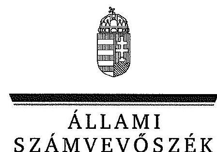
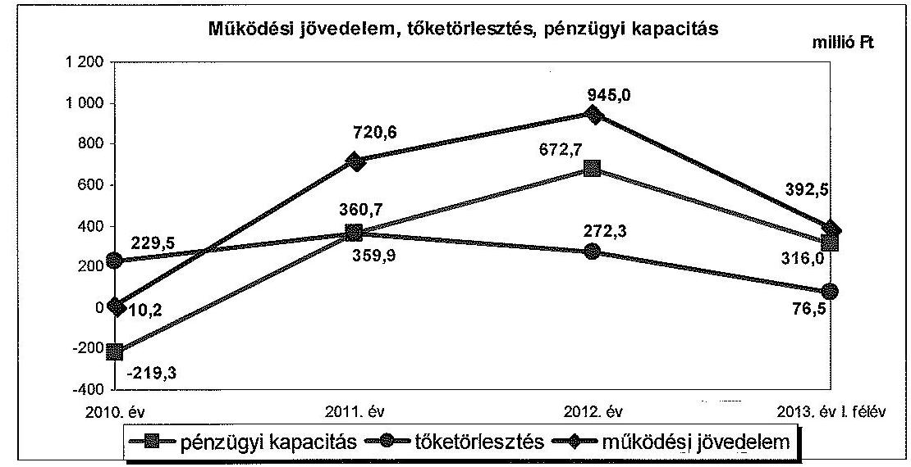
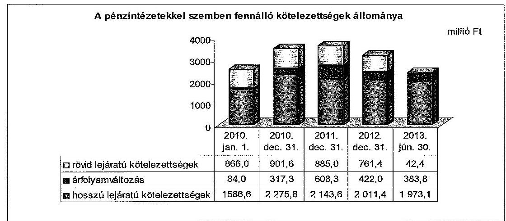
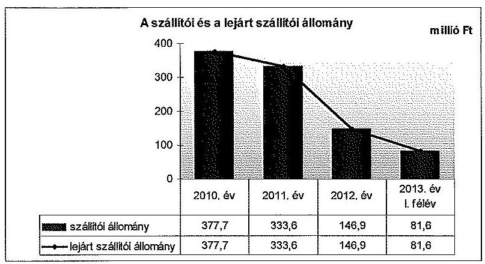
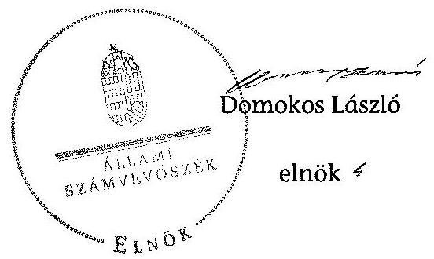

ÁLLAMI
SZÁMVEVŐSZÉK

# JELENTÉS 

az önkormányzatok pénzügyi gazdálkodási
helyzete értékelésének, és gazdálkodása szabályosságának

- 2013. évben induló - ellenőrzéséről

Gyöngyös
14021
2014. január

---

# Állami Számvevőszék 

Iktatószám: V-0202-081/2014.
Témaszám: 1237
Vizsgálat-azonosító szám: V065003

## Az ellenőrzést felügyelte:

## Renkó Zsuzsanna

felügyeleti vezető
Az ellenőrzést vezette és az ellenőrzés végrehajtásáért felelős:
Valastyánné dr. Vízhányó Júlia
ellenőrzésvezető
A számvevőszéki jelentés összeállításában közremüködött:
Baksa Anikó
számvevő tanácsos
Az ellenőrzést végezték:
Mészáros Ildikó Éva
Kersmájer Ágota
számvevő
számvevő tanácsos

---

# TARTALOMJEGYZÉK 

BEVEZETÉS ..... 3
I. ÖSSZEGZŐ MEGÁLLAPÍTÁSOK, KÖVETKEZTETÉSEK, JAVASLATOK ..... 6
II. RÉSZLETES MEGÁLLAPÍTÁSOK ..... 12

1. Az Önkormányzat kötelező és önként vállalt feladatai, a feladatellátás szervezeti kereteinek változása ..... 12
2. A pénzügyi egyensúly fenntartását veszélyeztető pénzügyi kockázatok, ezek csökkentése érdekében tett intézkedések ..... 14
3. Az Önkormányzat kötelezettségeinek állománya, azok összetételének változása, az adósságkonszolidáció hatása ..... 21
4. Az Önkormányzat pénzügyi gazdálkodása során érvényesített integritási szempontok ..... 26

---

# MELLÉKLETEK 

1/A. számú Az Önkormányzat bevételei és kiadásai, valamint adósságszolgálata a 2010-2013. év I. félév közötti időszakban (a CLF módszer szerint, a Kvtv. 72. § (1) bekezdésében foglalt adósságátvállaláshoz kapcsolódó pénzügyi teljesítések nélkül)
1/B. számú Az Önkormányzat bevételei és kiadásai a Kvtv. 72. § (1) bekezdésében foglalt adósságátvállaláshoz kapcsolódó pénzügyi teljesítések nélkül a 2013. év I. félévben (a CLF módszer szerint)
2. számú Az Önkormányzat által a 2010-2013. év I. félév között megvalósított fejlesztési feladatok érdekében teljesített felhalmozási kiadások és az ezekhez vállalt kötelezettségek összegzése
3. számú Az önkormányzati feladatok ellátásában résztvevő gazdasági társaságok egyes kiemelt adatai
4. számú Az Önkormányzat 2013. június 30 -án fennálló, hosszú lejáratú adósságot keletkeztető kötelezettségvállalásai
5. számú Az Önkormányzat kötelezettségeinek és egyes kötelezettségvállalásainak 2010. december 31-ei és a 2013. június 30 -ai állománya, valamint a 2013. év II. félévben és az azt követő években várható kötelezettségek, kötelezettségvállalások miatti kiadások

## FÜGGELÉKEK

1. számú Rövidítések jegyzéke
2. számú Fogalomtár

---

# JELENTÉS 

## az önkormányzatok pénzügyi gazdálkodási helyzete értékelésének, és gazdálkodása szabályosságának - 2013. évben induló ellenőrzéséről Gyöngyös

## BEVEZETÉS

Az ÁSZ a stratégiájában célul tűzte ki, hogy az önkormányzatok ellenőrzése során azok pénzügyi-gazdasági helyzetét értékeli, kockázatait feltárja, valamint az ellenőrzések helyszíneit objektív mutatószámrendszer alapján választja ki.

Az államháztartás önkormányzati alrendszerében az utóbbi években megjelenő gazdálkodási nehézségek, a pénzforgalmi hiány növekedése, az eladósodás az ÁSZ figyelmét az önkormányzatok pénzügyi helyzetére irányította. Az elkövetkezendő évek költségvetési hiánycéljainak tarthatósága érdekében indokolt, hogy az önkormányzatok pénzügyi helyzetelemzése és az egyensúlyi helyzetet befolyásoló kockázatok feltárása továbbra is kiemelt hangsúlyt kapjon az ÁSZ tevékenységében.

A közigazgatás átalakításának keretében - a helyi igazgatás és önkormányzás hatékonyabbá tétele érdekében - a Kormány az önkormányzatokra vonatkozóan 2012-ben újraszabályozta mind a sarkalatos, mind az önkormányzatok mindennapi múködését rendező törvényeket és a feladatok végrehajtását biztosító előírásokat. Az önkormányzati feladatellátást érintő átalakítások jelentős része 2013-ban következett be azzal, hogy az igazgatási, az oktatási és a szociális ellátásban a feladatok jelentős hányadát átvette az állam. Ahhoz, hogy az önkormányzatok meg tudjanak felelni a számukra meghatározott - szigorúbb - gazdálkodási szabályoknak, és az új feltételek mellett is biztosítható legyen a közszolgáltatások megfelelő színvonalú ellátása, szükséges volt a pénzügyigazdasági rendszerük alapjainak megszilárdítása. Ezt a célt szolgálja az adósságkonszolidáció, amely az önkormányzatok múködését és fejlesztését segítő, de korábban az állam által nem fedezett kiadásokkal kapcsolatos kötelezettségvállalások differenciált mértékű átvállalását jelenti.

Az ÁSZ a 2013. év I. félévi ellenőrzési tervében a 39. számú, az önkormányzatok pénzügyi gazdálkodási helyzete értékelésének, és gazdálkodása szabályosságának - 2013. évben induló - ellenőrzésével az önkormányzatok 2011. évben megkezdett helyzetelemzését folytatja. Az adósságkonszolidáció az önkormányzatok pénzügyi egyensúlyi helyzetére egyértelműen kedvező hatást gyakorolt, azonban a problémák kiváltó okait nem szüntette meg, ennek kezelése nélkül viszont az adósságállomány újratermelődik. Az önkormányzati alrendszerben a 2013-tól bevezetett új feladatfinanszírozási rendszer keretein belül to-

---

vábbra is megoldandó kérdés a pénzügyi egyensúly megteremtése, hosszú távú fenntartása. Erre tekintettel kiemelt fontosságú az önkormányzatok pénzügyi egyensúlyi helyzetére ható kockázatok feltárása, az ezzel kapcsolatos folyamatok, trendek bemutatása. Az ÁSZ ennek megfelelően a jövőben is tovább folytatja az önkormányzatok pénzügyi gazdálkodási helyzetét értékelő témacsoportos ellenőrzéseit.

Az ellenőrzések kockázatalapú megközelítése keretében megtörténik az önkormányzatok adósságkezelési és likviditási helyzetének értékelése, a pénzügyi egyensúly minősítése, továbbá az alrendszerben 2013-ban bekövetkezett változások hatásának értékelése.

Az ellenőrzés - eredményének várható hatásaként - megállapításaival segítséget nyújthat a pénzügyi helyzet értékeléséhez, a pénzügyi egyensúly helyreállítása érdekében szükségessé váló önkormányzati intézkedések megtételéhez. Az ellenőrzés során továbbra is célunk az államháztartás önkormányzati alrendszerére jellemző információk összegzésével támogatni az Országgyúlés munkáját a törvényalkotásban, a források elosztásában.

Az ellenőrzés célja: az Önkormányzat pénzügyi helyzetének, szabályosságának értékelése, a pénzügyi egyensúly alakulására hatással lévő folyamatoknak és a pénzügyi egyensúly alakulására ható kockázatoknak a feltárása.

# Az ellenőrzés célja annak értékelése volt, hogy: 

- a kötelező és önként vállalt feladatok ellátása, ezen belül az ellátott feladatok körének, az ellátást biztosító szervezeti formáknak a változása milyen hatást gyakorolt a pénzügyi egyensúlyi helyzetre;
- az Önkormányzat pénzügyi - múködési és felhalmozási - egyensúlya milyen irányban változott, a változást milyen okok idézték elő, továbbá milyen intézkedéseket tettek az egyensúly biztosítása, illetve javítása érdekében, az intézkedések hatására javult-e az Önkormányzat pénzügyi helyzete;
- a költségvetési kiadások finanszírozása érdekében vállalt, pénzintézetekkel szembeni kötelezettségek, a szállítói és egyéb kötelezettségek hogyan alakultak, az adósságkonszolidáció után fennmaradt kötelezettségek teljesítésének kockázatai miként befolyásolják a jövőbeli pénzügyi egyensúlyi helyzetet.

Az önkormányzatok korrupcióval szembeni veszélyeztetettségének csökkentése érdekében új feladatként felmértük az integritási szemlélet érvényesülését a pénzügyi gazdálkodási folyamatokban.

Utóellenőrzésre nem került sor, mivel az ÁSZ az ellenőrzött időszakban az Önkormányzatnál számvevőszéki jelentéssel lezárt ellenőrzést nem végzett.

Az ellenőrzési célokban megfogalmazott kérdések értékelési kritériumai a gazdálkodásra vonatkozó jogszabályok és a pénzügyi egyensúly biztosításának, valamint a pénzügyi helyzettel és gazdálkodással kapcsolatos kockázatok kezelésének követelménye. Az ellenőrzés az ellenőrzési célok eléréséhez elemző, értékelő, a pénzügyi helyzet kockázatát is minősítő eljárásokat alkalmazott.

---

Az ellenőrzés típusa: szabályszerűségi ellenőrzés

# Ellenőrzött szervezet: Gyöngyös Város Önkormányzata 

Az ellenőrzött időszak: a 2010. január 1-jétől 2013. június 30-ig terjedő időszak, figyelemmel az ellenőrzés célja vonatkozásában megfogalmazottakra. A pénzintézetekkel szembeni kötelezettségek állományának vizsgálatakor az ellenőrzött időszakban fennálló kötelezettségeket vette figyelembe az ellenőrzés.

Az ellenőrzés szakmai módszertana az ÁSZ hivatalos honlapján (www.asz.hu) közzétett szakmai szabályokon alapult, amely a Legfőbb Ellenőrző Intézmények Nemzetközi Szervezete (INTOSAI) által kiadott nemzetközi standardok (ISSAI) figyelembevételével készült.

Az ellenőrzés jogszabályi alapját az ÁSZ tv. 1. § (3) bekezdésének, 5. § (2)-(6) bekezdéseinek, valamint az Áht. 61. § (2) bekezdésének előírásai képezik.

Gyöngyös város állandó lakosainak száma 2010. január 1-jén 31633 fő, 2013. január 1-jén 30895 fő volt. Az Önkormányzat a 2012. évben 6879,8 millió Ft költségvetési bevételt ért el, és 6927,7 millió Ft költségvetési kiadást teljesített. A 2012. december 31-i könyvviteli mérleg szerint 17329,7 millió Ft értékű vagyonnal rendelkezett, a rövid lejáratú kötelezettségállomány 1161,8 millió Ft, a hosszú lejáratú kötelezettségállomány 2408,4 millió Ft volt. Az Önkormányzat 2013. június 30 -án hét minősített többségi befolyása alatt álló (kizárólagos tulajdonában lévő) gazdasági társasággal rendelkezett. A jegyző 2003. augusztus 1-jétől látja el feladatait. A foglalkoztatott köztisztviselők száma 2012. január 1 -jén 123 fő volt.

Az ÁSZ tv. 29. § (1) bekezdése szerint a jelentéstervezetet megküldtük a polgármester részére, aki az ÁSZ tv. 29. § (2) bekezdésében foglalt észrevételezési jogával határidőben nem élt.

---

# I. ÖSSZEGZŐ MEGÁLLAPÍTÁSOK, KÖVETKEZTETÉSEK, JAVASLATOK 

Gyöngyös Város Önkormányzatának pénzügyi egyensúlya középtávon nem biztosított. A múködési költségvetés egyenlege a 2013. év I. félévben bevezetett új feladatellátási és finanszírozási rendszerben is többletet mutatott. A 2013. évi 50,0\%-os mértékű, 1597,4 millió Ft tőketartozásra és annak járulékaira vonatkozó adósságkonszolidáció eredményeként az Önkormányzat pénzügyi egyensúlyi helyzete javult. A kötelezettségek jövőbeni kifizethetőségéhez elkülönített tartalék nem áll rendelkezésre. A pénzügyi egyensúly alakulása szempontjából kiemelt kockázatot jelent - a jövedelemtermelő képesség visszaesésén túl - a minősített többségi befolyás alatt álló gazdasági társaságok pénzügyi helyzete.

Az Önkormányzat költségvetésének elemzését a CLF módszerrel számított mutatók alapján végeztük. A pénzügyi kapacitás 2010-2013. év I. félév közötti változását - a 2013. évi adósságkonszolidáció pénzforgalmi hatása nélkül - az alábbi ábra szemlélteti:

Az Önkormányzat a 2010. év és a 2013. év I. félév között összesen 27001,2 millió Ft költségvetési bevételt ért el, és 26691,7 millió Ft költségvetési kiadást teljesített. 2010 és a 2013. év I. félév között a folyó költségvetés egyensúlya - a múködőképesség megőrzésére kapott 2011. évi 97,2 millió Ft és a 2012. évi 113,0 millió Ft ÖNHIKI támogatás, valamint a 2011. évi 93,2 millió Ft rövid lejáratú hiteltörlesztési támogatás nélkül is - minden évben biztosított volt. Az ellenőrzött időszakban összesen 2068,3 millió Ft múködési többlet képződött. A 2011-2012. években a bevételnövelő és a kiadáscsökkentő intézkedések eredményeként a múködési jövedelem jelentősen nőtt. A 2013. év I. félévben az Önkormányzat szerkezetátalakítási tartalékból folyósított támogatásban nem részesült.

---

Az ellenőrzött években az Önkormányzat felhalmozási költségvetésének egyenlege folyamatosan negatív volt, összesen 1758,8 millió Ft forráshiány keletkezett. A felhalmozási forráshiánynak a felhalmozási kiadásokhoz viszonyított aránya 2010-ben 31,6\% (426,9 millió Ft), 2011-ben 15,0\% (255,1 millió Ft), 2012-ben 48,7\% (992,9 millió Ft), míg a 2013. év I. félévében 21,0\% (83,9 millió Ft) volt. A forráshiány alakulását főként az EU-s projektek kivitelezése befolyásolta. A felhalmozási kiadásokon belül a beruházásokra és a felújításokra, valamint befektetési célú részesedések vásárlására teljesített kiadások voltak a meghatározóak.

A nettó múködési jövedelem (pénzügyi kapacitás) 2011-ben és a 2013. év I. félévében fedezetet nyújtott a felhalmozási forráshiányra is. A 2010. évi 646,2 millió Ft és a 2012. évi 320,2 millió Ft finanszírozási igényt folyószámlahitel felvételével és a kötvénykibocsátásból származó bevétel felhasználásával fedezte az Önkormányzat.

Az ellenőrzött időszakban ellátott kötelező és önként vállalt feladatok köre és a feladatok ellátását biztosító szervezeti formák változtak, valamint feladatátadások történtek. Az Önkormányzat feladatellátásában a kötelező feladatok voltak a meghatározóak. Az önként vállalt feladatok ellátására fordított múködési és felhalmozási kiadások nem veszélyeztették az Önkormányzat pénzügyi egyensúlyát.

Az Önkormányzat adatszolgáltatása szerint a 2013. évben egyes igazgatási feladatok és köznevelési intézmények állami fenntartásba adása 769,3 millió Ft-tal javította az Önkormányzat pénzügyi helyzetét. A finanszírozási rendszer 2013. évi változása keretében a költségvetési források csökkenése azonban ellensúlyozta a feladatváltozás bemutatott kedvező hatását. A saját hatáskörben végrehajtott bevételnövelő és kiadáscsökkentő intézkedések együttes hatása - az Önkormányzat adatszolgáltatása szerint 1004,0 millió Ft-tal javította a pénzügyi egyensúlyi helyzetet.

Az Önkormányzat pénzintézeti kötelezettsége 2010. január 1-jéről a 2013. év I. félév végére 2536,6 millió Ft-ról 2399,3 millió Ft-ra, 5,4\%-kal, 137,3 millió Ft-tal csökkent. A 2010. január 1-jei állapothoz képest az adósságállományt növelte a 2010. évi 800,0 millió Ft névértékű, EUR-alapú kötvénykibocsátás és a devizaalapú kötelezettségek 299,8 millió Ft árfolyamváltozás miatt bekövetkezett növekedése. Az EUR alapú kötvény, a beruházási hitelek és a folyószámlahitel 475,7 millió Ft összegű törlesztése, valamint a 761,4 millió Ft folyószámlahitel adósságkonszolidációhoz kapcsolódó átvállalása csökkentette a pénzintézeti kötelezettségeket. A változó kamatozású, adósságot keletkeztető kötelezettségvállalások kamatkockázatot, a devizában fennálló kötvények és a hosszú lejáratú hitel árfolyamkockázatot jelentettek az Önkormányzat pénzügyi egyensúlyi helyzetére.

Banki kitettséget jelentett, hogy az Önkormányzat az ellenőrzött időszakban likviditása fenntartása érdekében folyamatosan vett igénybe folyószámlahitelt, és a 2011. évben 200,0 millió Ft-tal, 1050,0 millió Ft-ra emelték a hitelkeret öszszegét. Az Önkormányzat a 2010-2011. években éven belüli, egyéb rövid lejáratú hitelt ( 130,0 millió Ft, 110,0 millió Ft) is igénybe vett. Az adósságkonszoli-

---

dációt követően is rendelkezett az Önkormányzat folyószámlahitellel, melynek állománya az ellenőrzött időszak végén 42,4 millió Ft volt.

Az adósságkonszolidáció keretében az állam az Önkormányzat 2012. december 31-én fennálló 3194,8 millió Ft pénzintézeti kötelezettségének az 50,0\%-át vállalta át. Az adósságkonszolidáció a teljes folyószámla hitelállományt ( 761,4 millió Ft-ot), a beruházási hitelek 50,0\%-át ( 325,7 millió Ft-ot), valamint a 2006. évi kötvénykibocsátásból származó kötelezettség 49,0\%-át ( 510,3 millió Ft-ot) érintette. A 2013. év I. félévében csak a folyószámlahitel rendezése történt meg. A beruházási hitelből és a kötvénykibocsátásból származó (összesen 836,0 millió Ft) kötelezettség kiegyenlítése 2013. június 30-ig nem valósult meg. Az adósságkonszolidációt követően az Önkormányzatot 2013. július 1-je és a 2015. év közötti időszakban 1567,4 ezer EUR, 631,5 ezer CHF és 42,4 millió Ft, a 2016. évtől 2626,7 ezer EUR és 1738,9 ezer CHF tőketörlesztési és kamatfizetési kötelezettség terheli.

Az Önkormányzat pénzügyi egyensúlyi helyzete szempontjából mérlegen kívüli tételek miatti kockázatot jelent a minősített többségi befolyása alatt álló gazdasági társaságok veszteséges gazdálkodása, továbbá kötelezettségállományuk nagysága. Az Önkormányzat az ellenőrzött időszakban a kizárólagos tulajdonában lévő gazdasági társaságok részére 693,8 millió Ft összegű pótbefizetést teljesített, valamint 268,3 millió Ft tőkeemelést hajtott végre, továbbá 733,8 millió Ft működési és 79,1 millió Ft felhalmozási célú pénzeszközt adott át. A gazdasági társaságok részére teljesített kifizetések jelentős része az ellenőrzött időszakot megelőzően megvalósított fejlesztésekhez (sport- és tornacsarnok építésre, strandfelújításra) felvett hitelek törlesztését szolgálta. Az Önkormányzat kizárólagos tulajdonában lévő három gazdasági társaság 2013. év I. félév végén fennálló, hosszú lejáratú hitelállományából adódó összes fizetési kötelezettség 11,1 millió CHF, melyből 9,1 millió CHF a tőketartozás és 2,0 millió CHF a várható kamatfizetési kötelezettség.

Az Önkormányzatnak a pénzügyi gazdálkodás során az integritási szemlélet teljes körű érvényesítése érdekében - az etikai elvárásokat, a pénzügyi gazdálkodási folyamatok vonatkozásában a „négy szem elve" alkalmazását, valamint a pénzügyi helyzetét és az adósságterheit befolyásoló döntések előtti, azok kockázatainak felmérését előíró szabályozás hiányára tekintettel - még fejlődnie kell.

Az ellenőrzés során a gazdálkodási feladatok ellátásával kapcsolatban az alábbi szabályszerüségi hibákat tártuk fel:

- a gazdasági társaságok részére teljesített 693,8 millió Ft pótbefizetés befektetési célú részesedés vásárlásaként történő elszámolása nem felelt meg az Áhsz. ${ }_{1}$-ben ${ }^{1}$ foglalt előírásoknak. A pótbefizetésekre teljesített összeggel megnövelték a részesedések bekerülési értékét, ezáltal a 2010-2012. években a könyvviteli mérlegben kimutatott részesedések értéke nem a tulajdoni részesedésnek megfelelő összegben került kimutatásra;

[^0]
[^0]:    ${ }^{1}$ 2014. január 1-jétől az Áhsz. ${ }_{2}$

---

- az Önkormányzat a folyószámla-hitelkeret összegének 850,0 millió Ft-ról 1050,0 millió Ft-ra történő emelése miatt a 2005-ben megkötött bankszámla és bankszámlahitel szerződését 2011. július 28 -án módosította; a hitelszerződés módosítását megelőzően közbeszerzési eljárás lefolytatására a Kbt. ${ }_{1}$-ben ${ }^{2}$ előírtak ellenére nem került sor;
- a pénzintézettel 2010. január 20-án és 2011. február 25-én megkötött, 150,0-150,0 millió Ft kölcsön igénybevételéről szóló szerződéseket a Kbt. ${ }_{1}$-ben ${ }^{3}$ foglalt előírás ellenére közbeszerzési eljárás lefolytatása nem előzte meg.

Az ÁSZ tv. 33. § (1) bekezdésében foglaltak értelmében az ellenőrzött szervezet vezetője köteles a jelentésben foglalt megállapításokhoz kapcsolódó intézkedési tervet összeállítani, és azt a jelentés kézhezvételétől számított harminc napon belül az ÁSZ részére megküldeni. Amennyiben az intézkedési tervet határidőn belül nem küldi meg a szervezet vezetője, vagy az továbbra sem elfogadható, az ÁSZ elnöke a hivatkozott törvény 33. § (3) bekezdés a-b) pontjaiban foglaltakat érvényesítheti.

# Az ellenőrzés intézkedést igénylő megállapításai és javaslatai: 

## a polgármesternek

1. Az Önkormányzat pénzügyi egyensúlya középtávon nem biztosított. A múködési költségvetés egyenlege az ellenőrzött időszak minden évében pozitív volt, az adósságkonszolidáció hatását kiszűrve, összesen 2068,3 millió Ft müködési többlet képződött. A folyó költségvetés egyensúlya a 2011-2012. években megítélt, müködőképesség megőrzésére kapott 303,4 millió Ft támogatás nélkül is biztosított volt. A nettó müködési jövedelem a 2010. év kivételével pozitív volt, a 2011. évben és a 2013. év I. félévben fedezetet nyújtott a felhalmozási költségvetés hiányára is. Az ellenőrzött időszakban a likviditás biztosítására igénybe vett folyószámlahitel tartóssá vált. Az adósságkonszolidáció keretében a folyószámlahitel 2012. év végi 761,4 millió Ft-os állománya kiegyenlítésre került, az ellenőrzött időszak végén kimutatott tartozás 42,4 millió Ft volt. A 2013. év I. félév végén az adósságkonszolidációt követően - a III. negyedévben a MÁK által rendezett 836,0 millió Ft fejlesztési hitel és kötvénytartozáson túl - fennálló összes pénzintézeti kötelezettség 1563,3 millió Ft volt, melynek jövőbeni teljesíthetőségéhez a müködési jövedelemtermelő képesség megőrzése szükséges. Az adósságszolgálat teljesítéséhez elkülönített tartalék nem áll rendelkezésre. Az Önkormányzat kizárólagos tulajdonában lévő gazdasági társaságok veszteséges gazdálkodása és kötelezettségei - a tulajdonosi részesedésből adódó helytállási kötelezettségre tekintettel - a pénzügyi helyzet szempontjából kockázatot jelentenek.

[^0]
[^0]:    ${ }^{2}$ 2012. január 1-jétől a Kbt. ${ }_{2}$
    ${ }^{3}$ 2012. január 1-jétől a Kbt. ${ }_{2}$

---

Javaslat:
A múködési jövedelemtermelő képesség és a feladatellátás összhangjának, valamint a pénzügyi egyensúly hosszú távú fenntarthatósága érdekében felelősök és határidők megjelölésével kezdeményezzen intézkedéseket, melyek keretében:
a) a költségvetési rendelettervezet, valamint annak évközi módosítása előterjesztését megelőzően mérjék fel a bevételszerző, kiadáscsökkentő lehetőségeket, és terjessze a Képviselő-testület elé a bevételek növelését és a kiadások csökkentését célzó intézkedések bevezetéséhez szükséges - a Htv. 140. § (1) bekezdés a) pontja alapján a jegyző által elkészített - döntési javaslatát;
b) terjesszen a Képviselő-testület elé jóváhagyásra - a Htv. 140. § (1) bekezdés a) pontja alapján a jegyző által elkészített - az Önkormányzat gazdasági helyzetének elemzésén alapuló, a pénzügyi egyensúlyi helyzet hosszú távú megőrzését és az adósságállomány újratermelődésének elkerülését biztosító intézkedéseket tartalmazó stabilizációs programot;
c) az Önkormányzat és a kizárólagos tulajdonában lévő gazdasági társaságok kötelezettségeinek jövőbeni teljesítése érdekében terjesszen a Képviselő-testület elé olyan egyensúlyi (elkülönített) tartalék képzésére vonatkozó - a Htv. 140. § (1) bekezdés a) pontja alapján a jegyző által elkészített - döntési javaslatot, amelyben a Képviselő-testület meghatározza annak összegét, és kötelezettséget vállal arra, hogy a tartozások kiegyenlítéséig a tartalékot a költségvetési rendeleteiben minden évben betervezi az esedékessé váló kötelezettségek teljesítésére;
d) terjessze a jegyző közreműködésével a Képviselő-testület elé jóváhagyásra az Önkormányzat kizárólagos tulajdonában lévő gazdasági társaságok által, a pénzügyi helyzetük stabilizálása érdekében elkészített intézkedési tervet.
2. Az Önkormányzatnál három esetben, a pénzügyi szolgáltatás igénybevételét megelőzően nem folytattak le közbeszerzési eljárást.

A bankszámla és bankszámlahitel szerződést a hitelkeret összegének 850,0 millió Ftról 1050,0 millió Ft-ra történő emelése miatt 2011. július 28 -án módosították. A hitelszerződés módosítását megelőzően közbeszerzési eljárás lefolytatására a Kbt. ${ }_{1}$ 252. § (1) bekezdésének e) pontjában, a 125. § (2) bekezdés b) pontjában és a 240. § (1) bekezdésében ${ }^{4}$ foglalt előírások ellenére nem került sor.

A 2010. január 20-án és a 2011. február 25-én megkötött, 150,0-150,0 millió Ft kölcsön igénybevételéről szóló szerződések megkötését - a Kbt. ${ }_{1} 240 . \S$ (1) bekezdésében foglalt előírás ellenére - közbeszerzési eljárás lefolytatása nem előzte meg.

Javaslat:
A közbeszerzési eljárásról szóló törvényben foglaltak maradéktalan betartása érdekében biztosítsa, hogy jövőbeni pénzügyi szolgáltatások igénybevétele esetén, ameny-

[^0]
[^0]:    ${ }^{4}$ Hatálytalan 2012. január 1-jétől, a 2012. január 1-jétől hatályos előírás: a Kbt. ${ }_{2} 119$. $\S, 120 . \S$ k) pontja.

---

nyiben a Kbt. 2 120. § k) pontjában foglalt kivétel nem áll fenn, a közbeszerzési eljárás lefolytatásának kötelezettségére a Kbt. 2 119. §-ban foglalt előírást érvényesítsék.

# a jegyzőnek 

1. Az ellenőrzött időszakban az Önkormányzat a kizárólagos tulajdonában lévő gazdasági társaságok részére, azok hiteltartozásainak és veszteségeinek rendezéséhez, viszszafizetési kötelezettség mellett teljesített pótbefizetés összegéből 693,8 millió Ft-ot - az Áhsz. 1 9. számú melléklet számlaosztályok tartalmára vonatkozó előírásai 1. h) pontjában és az Áhsz. 1 29. § (1) bekezdésében ${ }^{5}$ előírtakkal ellentétben - befektetési célú részesedések vásárlásaként számolt el, ezáltal a 2010-2012. években a könyvviteli mérlegben kimutatott részesedések értéke - az Áhsz. 1 32. § (1) bekezdésében ${ }^{6}$ előírtakat megsértve - nem a tulajdoni részesedésnek megfelelő összegben került kimutatásra.

Javaslat:
A könyvvezetési és beszámoló-készítési kötelezettség szabályszerű teljesítése érdekében intézkedjen, hogy részesedés beszerzéseként kizárólag az Áhsz. 15 . számú melléklet I. Egységes rovatrend K65. Részesedések beszerzése és a K66. Meglévő részesedések növeléséhez kapcsolódó kiadási rovatba tartozó kiadásokat, az Áhsz. 2 16. § (5) bekezdése szerint számolják el, ezzel összefüggésben a mérlegben kimutatott részesedések értékét az Áhsz. 2 21. § (3) bekezdése alapján határozzák meg.

[^0]
[^0]:    ${ }^{5}$ Hatálytalan 2014. január 1-jétől, a 2014.január 1-jétől hatályos előirás: az Áhsz. 15. számú melléklet I. Egységes rovatrend K65-K66. pontjai és az Áhsz. 16. § (5) bekezdése.
    ${ }^{6}$ Hatálytalan 2014. január 1-jétől, a 2014. január 1-jétől hatályos előirás: Áhsz. 21. § (3) bekezdése.

---

# II. RÉSZLETES MEGÁLLAPÍTÁSOK 

## 1. Az ÖNKORMÁNYZAT KÖTELEZŐ ÉS ÖNKÉNT VÁLlALT FELADATAI, A FELADATELLÁTÁS SZERVEZETI KERETEINEK VÁLTOZÁSA

Az Önkormányzat a kötelező és az önként vállalt feladatok körét, azok mértékét az ellenőrzött időszakban az SZMSZ mellékletében határozta meg. A kötelező feladatok körébe sorolták a szociális alap- és szakosított ellátásokat, a gyermekjóléti, egészségügyi és közoktatási alapellátásokat, a közművelődési, közgyűjteményi szolgáltatásokat, a sporttal, területfejlesztéssel, településüzemeltetéssel kapcsolatos feladatokat, a belső ellenőrzési, valamint a nemzeti és etnikai kisebbségek jogainak érvényesítését. Az önként vállalt feladatok körébe sorolták az alapfokú művészeti oktatást, a középiskolai oktatást, a logopédiai szolgáltatást, a gyógytestnevelést, a sportiskolai utánpótlás-nevelést, az idegenforgalmi és turisztikai feladatokat, az egészségügyi járó- és fekvőbeteg ellátást, a közterület-felügyeletet, a lakásgazdálkodási tevékenységet, a közművelődési, sport és ifjúságpolitikai tevékenység támogatását, az épített és természeti környezet védelmét, valamint a közbiztonsági és helyi tűzvédelmi feladatokat és a helyi információs közszolgáltatást. Az ellenőrzött időszakban a kötelező feladatok köre a katasztrófavédelmi tevékenységgel bővült, ugyanakkor az önként vállalt feladatok közül megszűnt a járó- és fekvőbeteg ellátás, valamint a helyi tűzvédelmi feladatok ellátása.

Az önként vállalt feladatokra fordított múködési kiadások aránya a 2010. évi $12,8 \%$-ról ( 743,2 millió Ft-ról) a 2013. év I. félévében 9,5\%-ra ( 181,1 millió Ft-ra) csökkent. A változást alapvetően az önként vállalt feladatellátásban érintett közoktatási intézmények 2013. évi állami, illetve 2011. évi egyházi fenntartásba kerülése, valamint az önként vállalt igazgatási és egyéb feladatokra fordított folyó kiadások csökkenése eredményezte.

A közoktatási ágazatban az önként vállalt feladatokra fordított folyó kiadás 2010-ben 318,1 millió Ft ( $17,0 \%$ ) volt, a 2013. év I. félévben valamennyi közoktatási múködési kiadás kötelező feladathoz kapcsolódott. Az igazgatási és egyéb feladatok arányának $8,6 \%$-ról ( 237,9 millió Ft-ról) $1,6 \%$-ra ( 18,6 millió Ft-ra) bekövetkezett csökkenését a feladatellátás szervezeti kereteinek változása okozta. Az idegenforgalom, turizmus feladatokat nem intézmény, hanem civil szervezet látja el, a helyi tüzvédelmi feladatokat az Önkormányzat megszüntette.

Az ellenőrzött időszakban megvalósított - 5490,7 millió Ft bekerülési értékű fejlesztések alapvetően a kötelező feladatok ellátását szolgálták. Az önként vállalt feladatokra fordított felhalmozási kiadások aránya az ellenőrzött időszakban 3,6\%-ot (197,7 millió Ft-ot) tett ki.

Az ellenőrzött időszakban az önként vállalt feladatok ellátása nem veszélyeztette az Önkormányzat pénzügyi egyensúlyi helyzetét.

Az Önkormányzat a kötelező és önként vállalt feladatait a 2010. évben - a Polgármesteri Hivatallal együtt - 16 szervezettel látta el, amelyek száma a

---

2013. év I. félév végére hatra csökkent. A közoktatási intézmények közül egy általános iskola (amely alapfokú művészeti oktatást is ellát) egyházi, négy általános iskola, valamint a Gimnázium, Szakiskola és Kollégium állami fenntartásba került, továbbá megszűnt a szociális és gyermekvédelmi alapszolgáltató intézmény és a Sportiskola. A járó- és fekvőbetegek ellátását a nem önkormányzati tulajdonban lévő Bugát Pál Kórház Kft. szolgáltatási szerződés alapján végezte 2012-ig. Az egyéb feladatok ${ }^{7}$ ellátásában résztvevő gazdasági társaságok száma a 2010. évi 48 -ról a 2013. év I. félév végére 49-re nőtt. A feladatok ellátásában társulások és civil szervezetek is részt vettek.

A Képviselő-testület határozattal ${ }^{8}$ döntött arról, hogy az iskolák működtetését 2013-tól nem vállalja, egyidejűleg a Köznev. tv. alapján kérte a működési kötelezettség alóli mentesítést. Az EMMI a mentesítést megadta, egyúttal havi 13,7 millió Ft hozzájárulás megfizetésére kötelezte az Önkormányzatot a 2013. január 1. és 2015. augusztus 31. közötti időszakra. A részletes számításokkal alátámasztott testületi előterjesztés többek között kitért a 2013. január 1-jétől továbbra is önkormányzati feladatot jelentő gyermekétkeztetésre. A feladatellátásra adott megbízást megelőzően az Önkormányzat - a Kbt. 2 19. § (1) bekezdésében, illetve a Kbt. ${ }_{2}$ Második Részében foglalt előírás ellenére - közbeszerzési eljárást nem folytatott le.

Az Önkormányzat pénzügyi helyzetét 683,1 millió Ft-tal javította (a bevételek 628,8 millió Ft és a kiadások 1311,9 millió Ft összegű csökkenése révén) a köznevelési intézmények (a Gimnázium, Szakiskola és Kollégium és a négy általános iskola) 2013. január 1-jétől történő állami fenntartásba adása. Az Önkormányzatnak további 82,7 millió Ft-os megtakarítást eredményezett 2013. január 1-jével az egyes igazgatási feladatok ${ }^{9}$ és 36 álláshely járási kormányhivatalnak történő átadása. A 2013. évben történt feladatátadások együttes pénzügyi hatása 769,3 millió Ft, ami javította az Önkormányzat pénzügyi helyzetét. A finanszírozási rendszer 2013. évi változása keretében a költségvetési források (gépjárműadó, személyi jövedelemadó) csökkenése azonban ellensúlyozta a feladatváltozás bemutatott kedvező hatását.

A szakosított szociális és gyermekvédelmi szakellátási intézmények, valamint a járóbeteg-szakellátási feladatok 2013. évi állami átvétele nem érintette az Önkormányzatot.

[^0]
[^0]:    ${ }^{7}$ hulladékkezelés, távhő- és vízszolgáltatás, szippantott szennyvízszállitás, helyi tájékoztatás, köztemető-, piac-, parkoló- és településüzemeltetés, ingatlankezelés, köztisztasági feladatok
    ${ }^{8}$ 293/2012. (XI.14.) KT határozat
    9 A járási kormányhivatalhoz átkerült feladatok: okmányirodai, gyámügyi, közgyógyellátás (alanyi és normatív alapú), hadigondozotti ellátási, védelembe vételi, egészségügyi ellátásra való jogosultsági feladatok, időskorúak járadéka, ápolási díj, ideiglenes hatályú elhelyezés, iskoláztatási támogatási feladatok.

---

# 2. A PÉNZÜGYI EGYENSÚLY FENNTARTÁSÁT VESZÉLYEZTETŐ PÉNZÜGYI KOCKÁZATOK, EZEK CSÖKKENTÉSE ÉRDEKÉBEN TETT INTÉZKEDÉSEK 

Az Önkormányzat költségvetésének elemzését a CLF módszer szerint hajtottuk végre. A 2013. év I. félévben a valós jövedelemtermelő képesség bemutatása érdekében az elemzés során nem vettük figyelembe az adósságkonszolidációhoz kapcsolódó bevételeket és kiadásokat.

Az adósságkonszolidációra vonatkozóan az Önkormányzat 2013. év I. félévi beszámolója 763,3 millió Ft, államháztartáson belüli megelőlegezésként elszámolt költségvetési támogatást tartalmazott. A 763,3 millió Ft forrást az Önkormányzat a fennálló folyószámla-hitelének rövid lejáratú múködési hitellé történő átalakítására és törlesztésére fordította, amelynek során 761,4 millió Ft tőkét és 1,9 millió Ft kamatot fizetett meg. Az adósságkonszolidációhoz kapcsolódóan a hiteltörlesztésként kimutatott 763,3 millió Ft államháztartáson belüli megelőlegezés, valamint a 761,4 millió Ft folyószámla-hitel átminősités kedvezőtlenül befolyásolta a pénzügyi kapacitást.

A CLF módszer szerinti önkormányzati részletes adatokat 2010-2013. év I. félév között az 1/A. számú melléklet, az adósságkonszolidációhoz kapcsolódó bevételek és kiadások pénzügyi egyensúlyi helyzetre gyakorolt hatását az 1/B. számú melléklet, a főbb önkormányzati adatokat a következő tábla mutatja be:

|  |  |  |  | millió Ft |
| :--: | :--: | :--: | :--: | :--: |
| Megnevezés | 2010. év | 2011. év | 2012. év | 2013. év   I. félév |
| Folyó bevételek | 7535,5 | 7598,1 | 5832,7 | 2302,7 |
| Folyó kiadások | 7525,3 | 6877,5 | 4887,7 | 1910,2 |
| Müködési jövedelem | 10,2 | 720,6 | 945,0 | 392,5 |
| Felhalmozási bevételek | 925,0 | 1444,6 | 1047,1 | 315,5 |
| Felhalmozási kiadások | 1351,9 | 1699,7 | 2040,0 | 399,4 |
| Felhalmozási költségvetés egyenlege | $-426,9$ | $-255,1$ | $-992,9$ | $-83,9$ |
| Folyó és felhalmozási bevételek összesen | 8460,5 | 9042,7 | 6879,8 | 2618,2 |
| Folyó és felhalmozási kiadások összesen | 8877,2 | 8577,2 | 6927,7 | 2309,6 |
| Finanszirozási múveletek nélküli pozíció | $-416,7$ | 465,5 | $-47,9$ | 308,6 |
| Finanszirozási műveletek egyenlege | 583,5 | $-295,6$ | $-169,5$ | $-47,6$ |
| Tárgyévi pénzügyi pozíció | 166,8 | 169,9 | $-217,4$ | 261,0 |
| Hiteltörlesztés, értékpapír beváltás | 229,5 | 360,7 | 272,3 | 76,5 |
| Nettó müködési jövedelem | $-219,3$ | 359,9 | 672,7 | 316,0 |

Az Önkormányzat a 2010. év és a 2013. év I. félév között összesen 27001,2 millió Ft költségvetési bevételt ért el, és 26691,7 millió Ft költségvetési kiadást teljesített. Az Önkormányzat folyó költségvetési egyenlege, müködési jövedelme az ellenőrzött időszak minden évében pozitív volt. A müködési jövedelem a 2010. évi 10,2 millió Ft-ról a bevételnövelő és kiadáscsökkentő intézkedések eredményeképpen a 2011. évre több mint 70-szeresére ( 720,6 millió Ft-ra), majd a 2012. évre további $31,1 \%$-kal ( 945,0 millió Ft-ra) nőtt. A 2011. évi jelentős növekedést a folyó bevételek $0,8 \%$-os ( 62,6 millió Ftos) növekedése mellett a folyó kiadások $8,6 \%$-os ( 647,8 millió Ft-os) csökkenése eredményezte. A 2013. év I. félévében szintén pozitív ( 392,5 millió Ft) müködési jövedelem képződött, mely éves szinten számítva meghaladta a 2011. évit,

---

azonban elmaradt a 2012. évitől. Az Önkormányzat a 2011. évben 97,2 millió Ft, a 2012. évben 113,0 millió Ft vissza nem térítendő ÖNHIKI támogatást, valamint a 2011. évben további 93,2 millió Ft támogatást kapott a helyi önkormányzatok rövid lejáratú hiteltörlesztési támogatásáról szóló 60/2011. (XII. 23.) BM rendelet alapján. Az Önkormányzatnak nem jelentettek bevételi kitettséget a működőképesség megőrzését szolgáló kiegészítő támogatások, mivel a folyó költségvetés egyenlege e költségvetési támogatások nélkül is többletet mutatott. Az Önkormányzatnál a pozitív és növekvő tendenciájú működési jövedelem miatt nem állt fenn müködési jövedelemtermelő képesség miatti kockázat az ellenőrzött időszakban.

Az Önkormányzat pénzügyi kapacitása (nettó működési jövedelme) az ellenőrzött időszakban folyamatosan javult. A nettó működési jövedelem csak a 2010. évben volt negatív ( $-219,3$ millió Ft), mivel a képződő működési jövedelem ( 10,2 millió Ft), nem nyújtott fedezetet a 229,5 millió Ft összegű tőketörlesztési kötelezettségre. A növekvő működési jövedelem eredményeként a nettó működési jövedelem a 2011. évben 359,9 millió Ft-ra, a 2012. évben 672,7 millió Ft-ra ( $86,9 \%$-kal) nőtt, a 2013. év I. félévében 316,0 millió Ft volt.

Az ellenőrzött években az Önkormányzat felhalmozási költségvetésének egyenlege folyamatosan negatív volt, összesen 1758,8 millió Ft forráshiány keletkezett. A felhalmozási forráshiánynak a felhalmozási kiadásokhoz viszonyított aránya 2010-ben 31,6\% ( 426,9 millió Ft), 2011-ben 15,0\% ( 255,1 millió Ft), 2012-ben $48,7 \%$ ( 992,9 millió Ft), míg a 2013. év I. félévében $21,0 \%$ ( 83,9 millió Ft) volt. A nettó múködési jövedelem 2011-ben és 2013. I. félévében fedezetet nyújtott a felhalmozási forráshiányra.

Az Önkormányzat évenkénti teljes finanszírozási igénye ${ }^{10}$ a CLF módszer szerint 2010-ben 646,2 millió Ft, 2012-ben 320,2 millió Ft volt, melynek fedezetét a folyószámlahitel felvételéből, valamint a kötvénykibocsátásból származó bevétel jelentette. A 2011. évben 104,8 millió Ft, a 2013. év I. félévében 232,1 millió Ft finanszírozási többlet keletkezett.

Az ellenőrzött időszakban a CLF módszer szerinti folyó és felhalmozási bevételek és kiadások alakulását befolyásolta, hogy azok a 2010-2011. években - az Önkormányzat gesztor szerepéből adódóan - az IFT és az SZHT adatait is tartalmazták. A társulások adatainak a múködési jövedelemre, a felhalmozási költségvetés egyenlegére, a finanszírozási műveletek egyenlegére, valamint a nettó múködési jövedelemre gyakorolt hatása azonban nem volt jelentős, ezért elemzésüket az e társulások adatait is tartalmazó CLF tábla alapján végeztük el.

[^0]
[^0]:    ${ }^{10}$ a nettó múködési jövedelem és a felhalmozási költségvetés összevont negatív egyenlege

---

A CLF módszer szerinti, 2010-2013. év I. félév közötti önkormányzati adatokat, a 2010. és a 2011. években a társulások adatai nélkül ${ }^{11}$ a következő tábla mutatja be:

|  |  |  |  | millió Ft |
| :--: | :--: | :--: | :--: | :--: |
| Megnevezés | 2010. év | 2011. év | 2012. év | 2013. év   1. félév |
| Folyó bevételek | 5836,5 | 6002,0 | 5832,7 | 2302,7 |
| Folyó kiadások | 5820,8 | 5360,4 | 4887,7 | 1910,2 |
| Müködési jövedelem | 15,7 | 641,6 | 945,0 | 392,5 |
| Felhalmozási bevételek | 670,1 | 1309,8 | 1047,1 | 315,5 |
| Felhalmozási kiadások | 1077,5 | 1568,5 | 2040,0 | 399,4 |
| Felhalmozási költségvetés egyenlege | $-407,4$ | $-258,7$ | $-992,9$ | $-83,9$ |
| Folyó és felhalmozási bevételek összesen | 6506,6 | 7311,8 | 6879,8 | 2618,2 |
| Folyó és felhalmozási kiadások összesen | 6898,3 | 6928,9 | 6927,7 | 2309,6 |
| Finanszírozási múveletek nélküli pozíció | $-391,7$ | 382,9 | $-47,9$ | 308,6 |
| Finanszírozási műveletek egyenlege | 542,8 | $-210,5$ | $-169,5$ | $-47,6$ |
| Tárgyévi pénzügyi pozíció | 151,1 | 172,4 | $-217,4$ | 261,0 |
| Hiteltörlesztés, értékpapír beváltás | 229,5 | 360,7 | 272,3 | 76,5 |
| Nettó müködési jövedelem | $-213,8$ | 280,9 | 672,7 | 316,0 |

Az Önkormányzat folyó bevételeinek és folyó kiadásainak elemzéséhez a CLF szerinti folyó bevételek és folyó kiadások összegéből a 2010. és a 2011. években kiszűrtük az IFT és az SZHT adatait. ${ }^{12}$

A folyó bevételek összege 2010-ről 2011-re 2,8\%-kal (165,5 millió Ft-tal) nőtt, majd a 2012. évben ugyanolyan mértékben ( 169,3 millió Ft-tal) csökkent. A 2011. évben a költségvetési támogatások és az átengedett bevételek 3,6\%-os ( 106,7 millió Ft-os) csökkenését kompenzálta a helyi adóbevételek, az áfabevételek, valamint az egyéb saját bevételek $9,4 \%$-os ( 272,2 millió Ft-os) növekedése. A 2012. évben a helyi adóbevételek, az áfa-bevételek, valamint az egyéb saját bevételek együttesen további $8,0 \%$-kal ( 255,1 millió Ft-tal) nőttek, míg a költségvetési támogatások és az átengedett bevételek összesen 14,9\%-kal ( 424,4 millió Ft-tal) csökkentek. Az ÖNHIKI és vis maior nélkül számított költségvetési támogatás összege a 2011. évben 19,9\%-kal (256,9 millió Ft-tal), a 2012. évben további $12,4 \%$-kal ( 234,6 millió Ft-tal) csökkent az előző évhez képest, mely döntően egy oktatási intézmény egyház részére történő átadása, valamint a tűzoltóság állami fenntartásba kerülésének a következménye.

A helyi adóbevételek a 2011. évben 7,5\%-kal (159,5 millió Ft-tal), a 2012. évben $11,8 \%$-kal ( 91,5 millió Ft-tal) növekedtek az előző évekhez képest. Az

[^0]
[^0]:    ${ }^{11}$ A beszámolási szabályok változása miatt az önkormányzati összevont éves beszámolók a 2012. évtől már nem tartalmazták a jogi személyiségú társulások és az azok irányítása alá tartozó költségvetési szervek beszámolóit.
    ${ }^{12}$ Az Önkormányzat IFT-ben betöltött gesztor szerepe gyakorolt elsősorban jelentős hatást a folyó bevételek és kiadások összegére, mivel az Önkormányzat által átadott, támogatásértékű működési kiadásként elszámolt, illetve az IFT által átvett, támogatásértékű működési bevételként elszámolt finanszírozást nem kellett nettósítani. Ebből adódóan az önkormányzati szintre összesített beszámoló adatai a bevételi és a kiadási oldalon is halmozódást tartalmaztak a 2010. és a 2011. években.

---

Önkormányzat az ellenőrzött időszakban a helyi iparűzési adót, a magánszemélyek kommunális adóját, az építményadót és az idegenforgalmi adót alkalmazta. A 2011. évben az idegenforgalmi adó, a 2011. és a 2012. évben a magánszemélyek kommunális adója mértékét emelték meg. A bevezetett helyi adók mértéke - az iparűzési adó kivételével - nem érte el a törvényi maximumot. Az Önkormányzat tájékoztatása szerint további adónem bevezetését és a már alkalmazott adónemek mértékének további emelését a lakosság teherbíró képessége nem teszi lehetővé. Az Önkormányzat számára a helyi adóbevételek nem jelentettek bevételi kitettséget. ${ }^{13}$

Az egyéb saját bevételek ${ }^{14}$ összege a 2011. évre 15,9\%-kal (105,3 millió Fttal), a 2012. évben 19,2\%-kal (147,1 millió Ft-tal) nőtt az előző évekhez viszonyítva. A 2011. évi növekedésben - egyéb bevételi jogcímek csökkenése mellett - meghatározó volt a támogatásértékű működési bevételek közel kétszeresére ( 162,3 millió Ft-tal) történő emelkedése, melyet a közfoglalkoztatásra, illetve a múködési célra kapott EU-s támogatások (ÁROP, TÁMOP) eredményeztek. A 2012. évi növekedést elsősorban az intézményi múködési bevételek, a hozam és kamatbevételek növekedése, valamint a múködési célra adott kölcsönök visszatérülése okozta.

A felhalmozási bevételek a 2010. évi 925,0 millió Ft-ról a 2011. évre 1444,6 millió Ft-ra ( $56,2 \%$-kal) növekedtek, a 2012. évre 1047,1 millió Ft-ra ( $27,6 \%$-kal) csökkentek a fejlesztésekhez elnyert EU-s támogatások miatt. Az államháztartáson belülről kapott támogatások összege a 2010. évi 410,8 millió Ft-ról a 2011. évre több mint kétszeresére, 891,6 millió Ft-ra emelkedett, majd a 2012. évre 646,4 millió Ft-ra ( $27,5 \%$-kal) csökkent. A 2010. évhez viszonyított növekedésben szerepet játszott, hogy a nagyobb bekerülési költségű EU-s projekteket (csapadékvíz-elvezetés, funkcióbővítő és szociális városrehabilitáció) a 2011. és a 2012. évben valósították meg. Az ellenőrzött időszakban a felhalmozási bevételeken belül a saját felhalmozási bevételek aránya $42,1 \%$-ot ( 1572,9 millió Ft-ot) képviselt, melyek döntően az üzemeltetetésre átadott vagyontárgyak (lakások, egyéb ingatlanok, temető, szennyvízvagyon) bevételéből, valamint ingatlanok értékesítéséből származtak.

A folyó kiadások a 2011. évben 7,9\%-kal (460,4 millió Ft-tal), a 2012. évben további $8,8 \%$-kal ( 472,7 millió Ft-tal) csökkentek az előző évhez képest. A személyi juttatások és munkaadót terhelő járulékok a 2012. évben $28,9 \%$-kal (597,4 millió Ft-tal) csökkentek a 2010. évhez képest, a létszámcsökkentések, valamint a tűzoltósággal kapcsolatos feladatátadás következtében. A dologi kiadások a 2011. évben 7,0\%-kal ( 92,4 millió Ft-tal) csökkentek, mely döntően a kommunális kiadások csökkentésének a következménye volt. Az IFT által fenntartott oktatási intézmények múködtetésére átadott pénzeszközök folyamatosan - a 2010. évi 1393,0 millió Ft-ról a 2012. évre 1206,9 millió Ft-ra - csök-

[^0]
[^0]:    ${ }^{13}$ A három legnagyobb iparűzési adót fizető adóalanytól származott az Önkormányzat részére befolyt iparűzési adóbevétel $22,4 \%$-a a 2010 . évben, $26,2 \%$-a a 2011 . évben és $28,3 \%$-a a 2012 . évben.
    ${ }^{14}$ intézményi múködési bevételek (térítési díjak, bérleti díjak stb.), támogatásértékű múködési bevételek, múködési célra átvett pénzeszközök, kamatbevételek, müködési célú kölcsönök visszatérülése

---

kentek a kiadáscsökkentő intézkedések eredményeképpen. A folyó kiadásokon belül az államháztartáson belülre átadott pénzeszközök aránya a 2012. évi 25,6\%-ról (1249,6 millió Ft-ról) a 2013. év I. félévben 2,0\%-ra (38,9 millió Ft-ra) csökkent az IFT által fenntartott öt oktatási intézmény állami fenntartásba adása miatt. A folyó kiadások csökkenését eredményezte még, hogy a 2010. évi 109,7 millió Ft kölcsönnyújtással szemben, a 2012. évben és a 2013. év I. félévében nem volt ilyen jellegű kiadása az Önkormányzatnak.

A felhalmozási kiadások összege a 2010. évi 1351,9 millió Ft-ról a 2011. évre 1699,7 millió Ft-ra ( $25,7 \%$-kal), a 2012. évre 2040,0 millió Ft-ra ( $20,0 \%$-kal) nőtt. A 2013. év I. félévben a felhalmozási kiadások 399,4 millió Ft-ra történő csökkenését az indokolta, hogy a nagyobb beruházásokkal kapcsolatos kiadások jelentős része a 2012. évben kifizetésre került. A felhalmozási kiadásokon belül a beruházásokra és a felújításokra, valamint befektetési célú részesedések vásárlására teljesített kiadások voltak a meghatározóak. Az ellenőrzött időszakban beruházásokra és felújításokra összesen 3741,1 millió Ft-ot kiadást teljesített az Önkormányzat, mely az összes felhalmozási kiadás 68,1\%-a.

A 2010-2013. év I. félév költségvetési beszámolói szerint befektetési célú részesedések vásárlására - amely döntően az Önkormányzat kizárólagos tulajdonában lévő gazdasági társaságok hiteltörlesztéseit és veszteségeit fedezte - a felhalmozási kiadások 17,5\%-át ( 962,1 millió Ft-ot) fordították. Az e jogcímen elszámolt kiadásokból tőkeemelésként 268,3 millió Ft-ot, tulajdonosi pótbefizetésként 693,8 millió Ft-ot teljesített az Önkormányzat, melynek jelentős része az ellenőrzött időszakot megelőzően megvalósított fejlesztésekhez (a sport-, és tornacsarnok építéséhez és a strand felújításához) felvett hitelek törlesztését szolgálta. A pótbefizetések befektetési célú részesedések vásárlásaként történő elszámolása ${ }^{15}$ nem felelt meg az Áhsz. 19. számú melléklet számlaosztályok tartalmára vonatkozó előírásai 1. h) pontjában, valamint az Áhsz. 29. § (1) bekezdésében foglaltaknak ${ }^{16}$, ugyanis a pótbefizetésekre teljesített összeggel megnövelték a részesedések bekerülési értékét ${ }^{17}$. Ezáltal - az Áhsz. 32. § (1) bekezdésében ${ }^{18}$ előírtakat megsértve - a 2010-2012. években a könyvviteli mérlegben kimutatott részesedések értéke nem a tulajdoni részesedésnek megfelelő összegben került kimutatásra. A Gt. 120. § (1) bekezdése rendelkezik a pótbefizetésekről, mely kimondja, hogy a „pótbefizetés összege a tag törzsbetétjét nem növell".

Pótbefizetést a Strand Kft. 279,7 millió Ft, a Sportcsarnok Kft. 133,3 millió Ft, a Gyöngyösi Televízió Kft. 5,0, millió Ft, a Városfejlesztő Kft. 0,6 millió Ft és a Tornacsarnok Kft. 280,2 millió Ft összegben kapott. A tőkeemelés a VG Zrt.-t

[^0]
[^0]:    ${ }^{15}$ a 2010. évben 13,4 millió Ft, a 2011. évben a teljesített 148,4 millió Ft pótbefizetésből 143,4 millió Ft, a 2012. évben 450,6 millió Ft, a 2013. év I. félévben 86,4 millió Ft
    ${ }^{16}$ 2014. január 1-jétől az Áhsz. 15 . számú melléklet I. Egységes rovatrend K65. Részesedések beszerzése és K66. Meglévő részesedések növeléséhez kapcsolódó kiadási rovathoz kapcsolódó kiadások, valamint az Áhsz. 16. § (5) bekezdése
    ${ }^{17}$ A tőkeemeléseken felül a pótbefizetések részesedésként történő kimutatása is hozzájárult ahhoz, hogy a részesedések mérleg szerinti állománya a 2010. január 1-jei 510,0 millió Ft-ról 2012. december 31-re 1051,5 millió Ft-ra nőtt.
    ${ }^{18}$ 2014. január 1-jétől az Áhsz. 21. § (3) bekezdése

---

165,2 millió Ft-tal, a Strand Kft.-t 47,8 millió Ft-tal, a Sportcsarnok Kft.-t 23,2 millió Ft-tal, a Tornacsarnok Kft.-t 15,8 millió Ft-tal és a Pro Caroberto Kft.-t 16,3 millió Ft-tal érintette.

Az Önkormányzat a 2010-2013. évi költségvetési rendeletekben meghatározta a céljelleggel nyújtott támogatások feltételrendszerét. A gazdasági társaságok részére nyújtott múködési és fejlesztési célú pénzeszközátadásokat megelőzően kötött támogatási szerződésekben meghatározták a folyósításra, az ellenőrzésre és az elszámolási kötelezettségre vonatkozó szabályokat, valamint a szabálytalan felhasználás szankcióit.

Az ellenőrzött időszakban az Önkormányzat a kizárólagos tulajdonában lévő gazdasági társaságok részére 733,8 millió Ft müködési és 79,1 millió Ft felhalmozási célú pénzeszközt adott át.

A Sportfólió Kft. részére 607,3 millió Ft múködési és 27,1 millió Ft felhalmozási támogatást, a Gyöngyös Televízió Kft. részére 111,2 millió Ft müködési és 48,0 millió Ft felhalmozási támogatást, a Városfejlesztő Kft. részére 15,3 millió Ft müködési támogatást, a VG Zrt.-nek 4,0 millió Ft felhalmozási támogatást nyújtott az Önkormányzat.

Egyéb, közfeladatot (helyi közlekedést, központi orvosi ügyeletet, családi napközt) ellátó gazdasági társaságok müködéséhez az Önkormányzat 42,9 millió Ft támogatást nyújtott a 2010-2013. év I. félév között. A helyi közlekedési feladatok ellátásához az Önkormányzat az állami támogatás átadásán felül az ellenőrzött években számla ellenében összesen 83,9 millió Ft hozzájárulást fizetett.

Az Önkormányzat által a 2010. és a 2013. év I. félév között megvalósított fejlesztési feladatok érdekében teljesített felhalmozási kiadások és az ezekhez vállalt kötelezettségek összegzését a 2. számú melléklet tartalmazza. A 2010-2013. év I. félév között megvalósított fejlesztések forrását 3106,7 millió Ft (56,7\%) önkormányzati saját bevétel, 649,9 millió Ft (11,8\%) kötvényforrásból származó bevétel, 1709,1 millió Ft (31,1\%) EU-s támogatás, valamint 25,0 millió Ft ( $0,4 \%$ ) egyéb központi támogatás képezte ${ }^{19}$. A 2013. június 30-a utáni kötelezettségvállalások forrása 203,2 millió Ft (34,6\%) önkormányzati saját bevétel, illetve 383,7 millió Ft (65,4\%) EU-s támogatás. Az Önkormányzat adatszolgáltatása szerint a szükséges források rendelkezésre álltak.

Az Önkormányzat által beadott, elbírálás alatti fejlesztési pályázatok segítségével három felújítást kívánnak megvalósítani, összesen 929,4 millió Ft tervezett bekerülési költséggel. A megvalósításhoz 83,5 millió Ft ( $9,0 \%$ ) saját bevételt terveznek felhasználni, ami az Önkormányzat adatszolgáltatása alapján rendelkezésre áll. EU-s támogatásból 845,9 millió Ft ( $91,0 \%$ ) támogatási összeg igénybe vételére pályáztak. Az Önkormányzatnak egy olyan nyertes EUs pályázata volt, melyre vonatkozóan a támogatási szerződés megkötésére

[^0]
[^0]:    ${ }^{19}$ A kiadások tartalmazzák az EU-s projektekkel kapcsolatban elszámolt dologi kiadásokat is 219,0 millió Ft összegben. Az ellenőrzött időszakban fordított áfa befizetésére teljesített 336,9 millió Ft - a halmozódások kiszűrése miatt - a felhalmozási kiadások összegéből levonásra került.

---

2013. június 30-a után került sor. E projekt tervezett bekerülési költsége 385,3 millió Ft, a támogatás mértéke 100,0\%.

Az SZHT a települési szilárdhulladék-lerakók rekultivációjának közös megvalósítására jött létre 11 önkormányzat részvételével. A projekttel kapcsolatos fejlesztési kiadások a 2012. évben ( 539,9 millió Ft) és a 2013. év 1. félévben ( 379,5 millió Ft) merültek fel ${ }^{20}$. Az SZHT az eddig felmerült kiadásokat szállítói finanszírozás keretében teljesítette. A 100,0\%-ban támogatott KEOP pályázattal kapcsolatban 422,0 millió Ft kiadás várható 2013. június 30-a után.

A folyamatban lévő és a pályázatokkal érintett, meg nem kezdett fejlesztések finanszírozásának a működési jövedelemtermelő képesség színvonalának megőrzése esetén előreláthatóan nincs kockázata. A fejlesztési feladatok jellegükből következően - épületek felújítása, csapadékvíz-elvezetés, útfelújítás, informatikai eszközök beszerzése - nem eredményeztek olyan létesítményt, amelynek fenntartása többletkiadással jár. Ezáltal a fejlesztések során létrehozott és létrehozandó létesítmények jövőbeni üzemeltetése nem jelent kockázatot az Önkormányzat számára.

A költségvetés egyensúlyának biztosítása, valamint a fizetőképesség fenntartása érdekében végrehajtott kiadáscsökkentő intézkedések ellenőrzött időszakra számszerűsített hatása az Önkormányzat kimutatása szerint 779,2 millió Ft volt. Egy oktatási intézmény egyházi fenntartásba adása és a Sportiskola megszüntetése 166,8 millió Ft, a többletjuttatások csökkentése és megszüntetése, valamint a létszámcsökkentések 372,0 millió Ft megtakarítást eredményeztek. A fejlesztési feladatokra, kommunális kiadásokra és civil szervezetek támogatására tervezett kiadások csökkentéséhez 240,4 millió Ft megtakarítás kapcsolódott. A bevételnövelő intézkedések (az idegenforgalmi adó és kommunális adó mértékének emelése) ellenőrzött időszakra számszerűsített hatása az Önkormányzat kimutatása szerint 224,8 millió Ft volt. A bevételnövelő és a kiadáscsökkentő intézkedések együttesen 1004,0 millió Ft-tal javították a pénzügyi egyensúlyt.

Az Önkormányzatnál és költségvetési szerveinél az engedélyezett álláshelyek száma a 2010. január 1-jei 901-ről 2012. december 31-re 724-re, a foglalkoztatottak száma 854 fơről 719 fơre csökkent egy oktatási intézmény egyházi fenntartásba adása, a Sportiskola megszüntetése, a tűzoltóság állami fenntartásba adása, valamint a létszámcsökkentő intézkedések következtében.

Az Önkormányzat a 2010-2012. évek költségvetésének tervezése során a vagyontárgyak felújítására vonatkozó javaslatokat kért be az intézményektől, valamint az üzemeltetőktől. A 2013. évben a felújítási igényekről nem készült a Képviselő-testület részére felmérés. Az elszámolt értékcsökkenésből az eszközök pótlására külön alapot ${ }^{21}$ nem képeztek. A 2010-2012. években a befektetett eszközök után a főkönyvi könyvelésben összesen 1331,0 millió Ft összegű érték-

[^0]
[^0]:    ${ }^{20}$ A költségvetési beszámolási szabályok változása miatt e kiadások az Önkormányzat összesített költségvetési beszámolójában nem jelentek meg.
    ${ }^{21}$ A hatályos jogszabályok nem kötelezik az önkormányzatokat arra, hogy alapot képezzenek az eszközök pótlására.

---

csökkenést számoltak el. ${ }^{22}$ A fejlesztési feladatokra az elszámolt értékcsökkenés több mint 2,5-szeresét, 3560,3 millió Ft-ot költöttek. Az eszközök használhatósági foka a 2010. és a 2012. évben 76,4\%, míg a 2011. évben 74,2\% volt. A 2010-2012. évek zárszámadási rendeleteiben bemutatták az immateriális javak és a tárgyi eszközök állományának alakulását, amely eszközcsoportonként tartalmazta a bruttó és a nettó értéket, valamint az elszámolt értékcsökkenést.

# 3. Az ÖNKORMÁNYZAT KÖTELEZETTSÉGEINEK ÁllomÁnVA, AZOK ÖSSZETÉTELÉNEK VÁLTOZÁSA, AZ ADÓSSÁGKONSZOLIDÁCIÓ HATÁSA 

Az Önkormányzat pénzintézetekkel szemben 2010-2013. év I. félévben fennálló kötelezettségeit az alábbi ábra mutatja be:

Az Önkormányzat pénzintézetekkel szembeni kötelezettségeinek állománya 2010. január 1-jén 2536,6 millió Ft volt. A kötelezettségállomány 34,1\%-a (866,0 millió Ft) folyószámlahitelből, 33,0\%-a (836,6 millió Ft) beruházási hitelből, 29,6\%-a ( 750,0 millió Ft) CHF alapú kötvénykibocsátásból és 3,3\%-a ( 84,0 millió Ft) mérlegkészítéskor elszámolt, nem realizált árfolyamveszteségből tevődött össze. A beruházási hitelek közül egy EUR alapú hitel a szennyvíztelep rekonstrukciójához, két forint hitel a közoktatási intézmények és a Művelődési ház felújításához kapcsolódott.

A pénzintézetekkel szembeni kötelezettség a 2013. év I. félév végére öszszesen 137,3 millió Ft-tal 5,4\%-kal csökkent a 2010. január 1-jei állapothoz képest. Az adósságállományt növelte a 800 millió Ft névértékű, EUR alapú kötvénykibocsátás és a devizaalapú kötelezettségek 299,8 millió Ft-os, árfolyamváltozás miatti növekedése, csökkentette az EUR alapú kötvény, a beruhá-

[^0]
[^0]:    ${ }^{22}$ A 2012. évben a terv szerinti értékcsökkenés állományának változása -752,8 millió Ft volt, mivel a kórház állami fenntartásba adását követően az addig egy gazdasági társaság vagyonkezelésében lévő eszközöket kivezették a nyilvántartásokból. Ebből adódóan a terv szerinti értékcsökkenést a 2012. évben az üzemeltetésre, vagyonkezelésbe adott eszközök nélkül vettük figyelembe.

---

zási hitelek és a folyószámlahitel 475,7 millió Ft összegű törlesztése ${ }^{23}$, valamint az adósságkonszolidációhoz kapcsolódó 761,4 millió Ft folyószámlahitel átvállalása. Az adósságkonszolidációba bevont 2116,8 ezer CHF kötvény, valamint az 1118,3 ezer EUR beruházási hiteltartozás (együtt 836,0 millió Ft) MÁK általi rendezése az ellenőrzött időszakot követően történt meg. Az Önkormányzat 2013. június 30 -án fennálló, hosszú lejáratú adósságot keletkeztető kötelezettségvállalásait a 4. számú melléklet részletezi.

A Képviselő-testület 2010 januárjában ${ }^{24}$ döntött a 800,0 millió Ft összegű, deviza alapú kötvény kibocsátásról. A testületi előterjesztés összehasonlító számítását a 2009. december 1-jei árfolyammal végezték, árfolyamváltozással nem számoltak. A kötvény biztosítékának meghatározásakor betartották az Ötv. 88. § (1) bekezdés b) pontjában foglaltakat.

Az Önkormányzat pénzügyi egyensúlyi helyzetét javította az adósságkonszolidáció. Az állam 1597,4 millió Ft adósságot és annak a Kvtv.ben meghatározott járulékait vállalta át. Az adósságkonszolidáció a 2012. év végi 3194,8 millió Ft tartozásállomány 50,0\%-át, ezen belül a teljes folyószámla hitelállományt ( 761,4 millió Ft-ot), a beruházási hitelek 50,0\%-át ( 325,7 millió Ft-ot), valamint a 2006. évi kötvénykibocsátásból fennálló kötelezettség 49,0\%-át ( 510,3 millió Ft-ot) fedezte. Az adósságkonszolidációt nem érintette az Önkormányzat 2010. évi kötvénykibocsátásából a 2012. december 31én fennálló 739,9 millió Ft tartozást. Az adósságkonszolidációt követően a 2013. július 1-je és 2015. év közötti időszakban esedékes várható tőketörlesztési és kamatfizetési kötelezettség 1567,4 ezer EUR, 631,5 ezer CHF, valamint 42,4 millió Ft, a 2016. évtől 2626,7 ezer EUR és 1738,9 ezer CHF. A változó kamatozású, adósságot keletkeztető kötelezettségvállalások kamatkockázatot, a devizában fennálló kötvények és a hosszú lejáratú hitel árfolyamkockázatot jelentettek a pénzügyi egyensúlyi helyzetre.

Az Önkormányzat a likvid hitel állományba vételét, a devizában fennálló kötelezettségei értékelését, a realizált árfolyamkülönbség elszámolását az előírásoknak megfelelően végezte. A könyvvizsgáló minden évben elfogadó záradékkal látta el az Önkormányzat beszámolóját. A 2010. évi audit során a szállítói kötelezettségeknél kisösszegű ( 2,6 millió Ft) eltérést jelzett. A 2011. évben a likvid hitelek elszámolását befolyásoló jogszabályi változások miatt az előző két év hatásainak rendezését kérte a főkönyvi elszámolásban. A korrekció kizárólag a költségvetési tartalék belső struktúráját érintette, melyet az Önkormányzat végrehajtott. A könyvvizsgáló mindhárom évben javaslatokat fogalmazott meg a Polgármesteri Hivatal és az intézmények feladatellátásának racionalizálására, valamint a szabályzatok (Értékelési szabályzat, FEUVE, Ellenőrzési nyomvonal) aktualizálására.

[^0]
[^0]:    ${ }^{23}$ Az EUR alapú kötvényből 111,7 millió Ft-ot, a szennyvíztelep rekonstrukciójához kapcsolódó hitelből 267,4 millió Ft-ot, az intézmények felújításához igénybe vett hitelekből 34,4 millió Ft-ot, a folyószámlahitelből 62,2 millió Ft-ot törlesztett az Önkormányzat.
    ${ }^{24}$ 3/2010. (I.14.) KT határozat

---

A folyószámlahitelek igénybevételét 2010-2013. év I. félévben a következő táblázat mutatja:

| Megnevezés | 2010. év | 2011. év | 2012. év | 2013. év   I. félév |
| :-- | --: | --: | --: | --: |
| Folyószámlahitel |  |  |  |  |
| Keretösszeg január 1-jén (millió Ft) | 850,0 | 850,0 | 1050,0 | 1050,0 |
| Átlagos, napi állomány (millió Ft) | 721,9 | 758,8 | 591,3 | 221,4 |
| Hitellel zárt napok száma (nap) | 365 | 365 | 337 | 181 |
| Egyenleg állomány az időszak végén (millió Ft) | 901,6 | 885,0 | 761,4 | 42,4 |
| Teljesített kamat és egyéb kiadás (millió Ft) | 35,3 | 45,2 | 39,7 | 16,1 |

Banki kitettséget jelentett, hogy az Önkormányzat az ellenőrzött időszakban likviditása fenntartása érdekében folyamatosan vett igénybe folyószámlahitelt, melynek keretösszegét - a 2005. évben határozatlan időre kötött bankszámla és bankszámlahitel-hitelszerződés 2011. július 28 -ai módosítása alapján - a pénzintézet 850,0 millió Ft-ról 1050,0 millió Ft-ra megemelte. A hitelszerződés módosítását megelőzően közbeszerzési eljárás lefolytatására a Kbt., 252. § (1) bekezdésének e) pontjában, a 125. § (2) bekezdés b) pontjában és a 240. § (1) bekezdésében foglalt előírások ${ }^{25}$ ellenére nem került sor.

Az Önkormányzat egyéb likvid hitelt is igénybe vett a 2010-2011. években, számlavezető bankjával kölcsönszerződést kötött mindkét évben 150,0 millió Ft-os kölcsön összegre, likviditásának finanszírozása céljából. A 2010. január 20-án és 2011. február 25-én megkötött 150,0-150,0 millió Ft kölcsön igénybevételéről szóló szerződéseket - a Kbt., 240. § (1) bekezdésében foglalt előírás ellenére - közbeszerzési eljárás lefolytatása nem előzte meg. Az Önkormányzat e kölcsönökből a 2010. évben 130,0 millió Ft-ot, a 2011. évben 110,0 millió Ft-ot vett igénybe, az éven belüli finanszírozás időtartama mindkét évben 31 nap volt. Az Önkormányzat részére szerződés alapján 2011. augusztus 1-jétől 2012. május 25-ig 100,0 millió Ft összegű munkabérmegelőlegezési hitelkeret állt rendelkezésre, melyet nem vett igénybe.

Az ellenőrzött időszakban a szállítókkal szembeni kötelezettségek mérleg szerinti összes kötelezettséghez viszonyított aránya folyamatosan csökkent. A 2010. évi $8,7 \%$-ról ( 377,7 millió Ft-ról) a 2013. év I. félév végére $2,9 \%$-ra ( 81,6 millió Ft-ra) mérséklődött.

[^0]
[^0]:    ${ }^{25}$ 2012. január 1-jétől a Kbt. 2 119. § és a 120. § k) pontja

---

Az Önkormányzat 2010-2013. év I. félév közötti szállítói és lejárt szállítói állományát az alábbi ábra mutatja be:

A szállítói tartozás lejárat szerinti összetétele kedvező irányban változott. A 2010. év végén 59,3 millió Ft volt az Önkormányzat 60 napon túli szállítói kötelezettsége, ebből 51,1 millió Ft éven túli tartozás volt. A 2013. év I. félév végén éven túli tartozás nem volt, a 90 napon túli tartozás 0,4 millió Ft-ot tett ki. A fennmaradó 81,2 millió Ft szállítói tartozás lejárata 60 nap alatti, melyből 54,5 millió Ft 30 napon belüli szállítói kötelezettség volt.

Az Önkormányzatnak kettő 2009-ben kötött gépjármú lizingszerződése volt. Mindkét szerződésből eredő fizetési kötelezettségét határidőn belül - a 2012. évben - teljesítette, az ellenőrzött időszakban újabb lízingszerződést nem kötött.

Az Önkormányzat az ellenőrzött időszakban gazdasági társaságok, valamint egy alkalommal egyéb szervezet részére nyújtott kölcsönt. Az Önkormányzat két kizárólagos tulajdonában álló társasága ${ }^{26}$ részére nyújtott kölcsönt pályázati önerő biztosításához, összesen 64,7 millió Ft összegben, a társaságok a kölcsönt határidőre visszafizették. Az Önkormányzat a Gyöngyös Ipari Park Kft. részére a 2010-2012. évek között több alkalommal nyújtott múködési célra kölcsönt, összesen 149,0 millió Ft-ot. A Kft.-nek a 2013. év I. félév végén 30,0 millió Ft tartozása állt fenn. Az Önkormányzat a Gyöngyös-Felsővárosi Római Katolikus Egyházközség részére az ÉMOP-3.1.2. városrehabilitációs projekt fordított áfa fizetési kötelezettség teljesítésére nyújtott kölcsönt 5,7 millió Ft összegben, melyből 2013. június 30 -án 2,5 millió Ft összegű tartozás állt fenn.

Az Önkormányzatnak 2010. december 31-én 127,5 millió Ft kezességvállalása volt. Az ellenőrzött időszakban az Önkormányzat a 2011. évben a Pro Caroberto Kft.-nek vállalt 40,0 millió Ft összegű kezességet. A kezességvállaláshoz kapcsolódó hitelek visszafizetésével az Önkormányzat kezességvállalása megszűnt, fizetési kötelezettsége nem keletkezett.

Az Önkormányzat a 2010. évi kötvénykibocsátáskor és a kezességvállaláskor betartotta az Ötv. 88. § (2) bekezdése szerinti felső korlátot.

[^0]
[^0]:    ${ }^{26}$ A VG Zrt.-nek a 2010. évben 48,4 millió Ft összegben, a Városfejlesztő Kft.-nek a 2010-2011. években összesen 16,3 millió Ft összegben.

---

Az Önkormányzat kötelezettségeinek és egyes kötelezettségvállalásainak 2010. december 31-ei és 2013. június 30 -ai állományát, valamint a 2013. év II. félévben és az azt követő években várható kötelezettségeket, kötelezettségvállalások miatti kiadásokat az 5 . számú melléklet mutatja be.

Az Önkormányzatnak 2010. január 1-jén nem volt jelzálogjoggal terhelt ingatlana. A 2011. évben két keretbiztosítéki jelzálogszerződést kötött, összesen 11 forgalomképes ingatlanra, mely két gazdasági társaságához ${ }^{27}$ kapcsolódott. A jelzáloggal terhelt ingatlanok számvitelben nyilvántartott nettó értéke 2012. december 31 -én 182,6 millió Ft volt, mely a forgalomképes ingatlanok nettó értékének $\mathbf{2 2 , 9 \% - a ́ t}$ tette ki.

Az Önkormányzat 2013. évi költségvetési rendeletében a kiadások meghaladták a bevételeket, a hiányt részben belső forrásból (záró pénzkészletből), részben külső forrásból ( 384,3 millió Ft folyószámlahitel és fejlesztési hitel felvételével) tervezték finanszírozni. A 2013-ban tervezett múködési célú bevételek elegendő forrást biztosítottak a kötelező feladatok ellátására. Az önként vállalt feladatok múködési kiadásainak finanszírozását részben a kötelező feladatok folyó bevételéből, részben belső finanszírozásból (záró pénzkészletből) tervezték. A 2013. évi költségvetésben tervezett felhalmozási hiány 388,0 millió Ft volt, melyet a költségvetés módosítása során 325,0 millió Ft-ra csökkentettek. A tervezett felhalmozási bevételek kizárólag, a kiadások döntően az önként vállalt feladatokhoz kapcsolódtak.

Az ellenőrzött időszakban az Önkormányzat hét gazdasági társaságban ${ }^{28}$ rendelkezett minősített többségi befolyással, 100,0\%-os tulajdonosi részesedéssel. Az Önkormányzat a 2010. év elején hat gazdasági társaságban ${ }^{29}$ rendelkezett 0,26\% és 60,5\% közötti tulajdoni részesedéssel. A 2011. évben a Gyöngyös Ipari Park Fejlesztő Kft.-ben a részesedését 60,5\%-ról 5,0\%-ra csökkentette, majd 2013-ban a Pro Caroberto Kft.-ben lévő 49,0\%-os részesedését megszüntette. Az Önkormányzat minősített többségi befolyása alatt álló társaságok közül kizárólag a VG Zrt.-nek volt a 2010-2012. években 60,0 millió Ft folyószámlahitelkerete, amit nem vett igénybe. Az Önkormányzat minősített többségi befolyása alatt álló gazdasági társaságok lejárt szállítói állománya ${ }^{30}$ nem jelentős nagyságrendű (a legnagyobb összegű tartozás 13,8 millió Ft), éven túli tartozása a Gyöngyösi Televízió Kft.-nek volt 0,2-0,5 millió Ft közötti összegben. A minősített többségi befolyás alatt álló gazdasági társaságok szállítói kötelezettségei nem veszélyeztették a pénzügyi egyensúlyi helyzetet.

A 2013. év I. félév végén az Önkormányzat három kizárólagos tulajdonában lévő társaságának összesen 9,1 millió CHF hosszú lejáratú pénzintézeti kötele-

[^0]
[^0]:    ${ }^{27}$ Strand Kft., Pro Caroberto Kft.
    ${ }^{28}$ Sportfólió Kft., Sportcsarnok Kft., Tornacsarnok Kft., Strand Kft., VG Zrt., Gyöngyösi Televízió Kft., Városfejlesztő Kft.
    ${ }^{29}$ Gyöngyös Ipari Park Fejlesztő Kft., Pro Caroberto Kft., Terra Vita Környezetgazdálkodási Kft., Heves megyei Vízmú Zrt., Gyöngyösi Hulladékkezelő Kft., KRF ÉszakMagyarországi Regionális Fejlesztési Zrt.
    ${ }^{30}$ A társaságok közül négy jelezte, hogy a 2013. év I. féléves adatok nem állnak rendelkezésükre, ezért a 2013. év I. félévi lejárt szállítói állomány adatai hiányosak.

---

zettsége volt, melyek után az utolsó kondíciók alapján a várható kamatfizetési kötelezettség 2,0 millió CHF.

A Sportcsarnok Kft.-nek a sport- és rendezvénycsarnok építésére felvett hitel miatt 4,3 millió CHF tőketörlesztési és 1,0 millió CHF kamatfizetési kötelezettsége, a Strand Kft.-nek a strandfürdő beruházáshoz felvett hitel miatt 4,2 millió CHF tőketartozása és 0,9 millió CHF kamatfizetési kötelezettsége, a VG Zrt.-nek az Otthon II. beruházás finanszírozásához felvett hitel miatt 0,6 millió CHF tőketörlesztési és 16,3 ezer CHF kamatfizetési kötelezettsége állt fenn.

Az Önkormányzat minősített többségi befolyása alatt álló gazdasági társaságok veszteséges gazdálkodása, valamint a 2013. június 30 -án fennálló hitelállományukból adódó 11,1 millió CHF összegű fizetési kötelezettség (az MNB hivatalos árfolyama ${ }^{31}$ alapján 2,6 milliárd Ft) az Önkormányzat számára mérlegen kívüli tételek miatti kockázatot jelent. Az önkormányzati feladatok ellátásában résztvevő gazdasági társaságok egyes kiemelt adatait a 3. számú melléklet tartalmazza.

# 4. Az ÖNKORMÁNYZAT PÉNZÜGYI GAZDÁLKODÁSA SORÁN ÉRVÉNYESÍTETT INTEGRITÁSI SZEMPONTOK 

A pénzügyi gazdálkodás során - az Önkormányzat tulajdonában, kezelésében lévő egyes eszközök használatára, az összeférhetetlenség esetén követendő eljárásokra, valamint a közérdekű bejelentések kezelésére vonatkozó szabályozás kialakítása tekintetében - érvényesült az integritási szemlélet. Az etikai elvárásokat, a pénzügyi gazdálkodási folyamatok vonatkozásában a „négy szem elve" alkalmazását, valamint a pénzügyi helyzetet, az adósságterheket befolyásoló döntések előtti, azok kockázatainak felmérését előíró szabályozás hiánya azonban arra utal, hogy az Önkormányzatnak még fejlődést kell elérnie az integritási szemlélet teljes körü érvényesítése érdekében. Az Integritás Kérdőívet az ellenőrzött időszakban 2013-ban töltötték ki.

A Polgármesteri Hivatalban foglalkoztatott köztisztviselők, közszolgálati ügykezelők vonatkozásában nem határozták meg a munkavégzésre vonatkozó etikai elvárásokat. A 2013. szeptember 1-jétől hatályos Magyar Kormánytisztviselői Kar Hivatásetikai Kódexe alapján a helyi kódex megalkotása folyamatban van.

Az Önkormányzat tulajdonában, kezelésében lévő eszközök (hivatali vezetékes telefonok, hivatali célú mobiltelefonok, hivatali üdülők) használatának és magáncélú használatának korlátozására vonatkozó szabályokat jegyzői, illetve polgármesteri-jegyzői közös utasítások tartalmazták.

A munkavégzésre irányuló egyéb jogviszony írásban történő bejelentési kötelezettségét a 2004. november 24 -től hatályos jegyzői utasítás írta elő, amelyben rendelkeztek az összeférhetetlenség kialakulása esetén követendő eljárásokról.

[^0]
[^0]:    ${ }^{31}$ Az MNB 2013. év I. félév végén (június 28 -án) közzétett CHF árfolyama $239,14 \mathrm{Ft}$.

---

Az Önkormányzat 2012. január 1-jétől múködtet szervezeten kívülről érkező közérdekű bejelentéseket kezelő rendszert. A Közérdekű bejelentések, panaszok kezelésének rendjéről szóló szabályzatban meghatározták az eljárás során követendő alapelveket, az eljárás megindítására, az elintézési határidőre, a tájékoztatásra, továbbá a bejelentés kivizsgálását követő intézkedésekre vonatkozó előírásokat. A beérkezett bejelentésekről nyilvántartás nem állt rendelkezésre.

Az Önkormányzatnál a pénzügyi gazdálkodási folyamatok vonatkozásában a „négy szem elve" alkalmazásának előírására nem került sor. Az Önkormányzat pénzügyi helyzetét, adósságterheit befolyásoló döntéseket megalapozó kockázatelemzési kötelezettséget nem írták elő.

A jegyző nyilatkozata szerint a Képviselő-testület a kötelezettségvállalást keletkeztető döntéseket megalapozó számításokat, javaslattételi változatokat tartalmazó előterjesztések tárgyalása során érdemi tájékoztatást kapott a döntést befolyásoló kockázati tényezőkről.

Budapest, 2014.
O1, hónap 24 -nap

Melléklet: $\quad 6 \mathrm{db}$
Függelék: $\quad 2 \mathrm{db}$

---

# **Chemistry**

## **Chemical Reactions**

### **Balancing Chemical Equations**

1. **Write the unbalanced equation:**
   - Example: $$C_3H_8 + O_2 \rightarrow CO_2 + H_2O$$

2. **Balance the equation:**
   - Example: $$2C_3H_8 + 7O_2 \rightarrow 6CO_2 + 8H_2O$$

3. **Balance the equation:**
   - Example: $$2C_3H_8 + 7O_2 \rightarrow 6CO_2 + 8H_2O$$

### **Types of Reactions**

1. **Combination Reaction:**
   - Example: $$2H_2 + O_2 \rightarrow 2H_2O$$

2. **Decomposition Reaction:**
   - Example: $$2H_2O_2 \rightarrow 2H_2O + O_2$$

3. **Single Displacement Reaction:**
   - Example: $$Zn + 2HCl \rightarrow ZnCl_2 + H_2$$

4. **Double Displacement Reaction:**
   - Example: $$AgNO_3 + NaCl \rightarrow AgCl + NaNO_3$$

5. **Combustion Reaction:**
   - Example: $$CH_4 + 2O_2 \rightarrow CO_2 + 2H_2O$$

## **Stoichiometry**

### **Mole Concept**

- **Mole (mol):** The amount of substance containing as many particles (atoms, molecules, ions) as there are atoms in exactly 12 grams of carbon-12.
- **Avogadro's Number:** $$6.022 \times 10^{23}$$ particles per mole.

### **Molar Mass**

- **Molar Mass:** The mass of one mole of a substance.
- Example: The molar mass of water ($$H_2O$$) is 18.015 g/mol.

### **Calculations**

1. **Moles to Mass:**
   - Formula: $$n = \frac{m}{M}$$
   - Example: Calculate the number of moles of $$H_2O$$ in 18 grams of water.
     - $$n = \frac{18.015 \, \text{g}}{18.015 \, \text{g/mol}} = 18.015 \, \text{g/mol}$$

2. **Moles to Mass:**
   - Formula: $$m = n \times M$$
   - Example: Calculate the mass of 18.015 g of water.
     - $$m = 18.015 \, \text{g/mol} = 18.015 \, \text{g/mol}$$

## **Gas Laws**

### **Ideal Gas Law**

- **Equation:** $$PV = nRT$$
- **Variables:**
  - $$P$$: Pressure (atm)
  - $$V$$: Volume (L)
  - $$n$$: Number of moles (mol)
  - $$R$$: Ideal gas constant (0.0821 L·atm/mol·K)
  - $$T$$: Temperature (K)

### **Boyle's Law**

- **Equation:** $$P_1V_1 = P_2V_2$$
- **Variables:**
  - P₁: Pressure (atm)
  - P₂: Volume (L)
  - P₃: Pressure (atm)
  - P₁: Pressure (atm)
  - P₂: Volume (L)
  - P₃: Pressure (atm)
  - P₁: Pressure (atm)

### **Boyle's Law (Boyle's Law)**

- **Equation:** $$\frac{P_1V_1}{P_2V_2} = \frac{P_1}{V_1}$$

## **Thermochemistry**

### **Enthalpy (H)**

- **Definition:** The heat content of a system at constant pressure.
- **Equation:** $$\Delta H = q_p$$
- **Variables:**
  - $$q_p$$: Heat transferred at constant pressure.
  - $$q_p$$: Heat transferred at constant pressure.

### **Hess's Law**

- **Statement:** The enthalpy change for a reaction is the same whether it occurs in one step or multiple steps.
- **Equation:** $$\Delta H = q_p + \Delta H_0$$
- **Variables:**
  - $$q_p$$: Heat transferred at constant pressure.
  - $$q_p$$: Heat transferred at constant pressure.

## **Electrochemistry**

### **Oxidation and Reduction**

- **Oxidation:** Loss of electrons.
- **Reduction:** Gain of electrons.

### **Galvanic Cells**

- **Definition:** A cell that converts chemical energy into electrical energy.
- **Components:**
  - Anode: Oxidation occurs.
  - Cathode: Reduction occurs.
  - Salt Bridge: Connects the two half-cells.

### **Nernst Equation**

- **Equation:** $$E = E^\circ - \frac{RT}{nF} \ln Q$$
- **Variables:**
  - $$E$$: Energy (K)
  - $$E^\circ$$: Heat transferred (J)
  - $$E$$: Heat transferred (K)
  - $$Q$$: Reaction quotient

---

Az Önkormányzat bevételei és kiadásai, valamint adósságszolgálata a 2010-2013. év I. félév közötti időszakban (a CLF módszer szerint, a Kvtv. 72. § (1) bekezdésében foglalt adósságátvállaláshoz kapcsolódó pénzügyi teljesítések nélkül)

|  1. FOLYÓ KÖLTSÉGVETÉS* | 2010. év | 2011. év | 2012. év | 2013. év
I. félév  |
| --- | --- | --- | --- | --- |
|  1.1.1. Saját működési bevételek | 2774,1 | 2946,2 | 2998,5 | 1434,5  |
|  1.1.2. Költségvetési támogatások ÖNKIKI támogatások nélkül** | 2144,7 | 1695,0 | 1651,4 | 574,8  |
|  1.1.3. Alampedett bevételek | 807,2 | 768,6 | 656,4 | 41,6  |
|  1.1.4. Állámháztartáson belülről kapott támogatások | 1673,0 | 1595,4 | 214,9 | 203,4  |
|  1.1.5. EU-tól és külföldről kapott bevételek | 0,0 | 2,2 | 0,0 | 0,0  |
|  1.1.6. Állámháztartáson kívülről kapott bevételek | 27,6 | 11,7 | 14,5 | 0,0  |
|  1.1.7. Hozatn- és kamatbevételek | 28,4 | 19,7 | 75,3 | 6,4  |
|  1.1.8. Kölcsönök visszatérülése, igénybevétele | 46,4 | 18,3 | 77,0 | 42,0  |
|  1.1.9. Előző évi pénzmaradvány átvétel | 31,0 | 70,4 | 31,5 | 0,0  |
|  1.1.10. A működtöképesség megőrzését szolgáló kiegészítő támogatások | 0,0 | 190,4 | 113,0 | 0,0  |
|  1.1. Folyó bevételek +1.1.1.+1.1.2.+1.1.3.+1.1.4.+1.1.5.+1.1.6.+1.1.7.+1.1.8.+1.1.9.+1.1.10. | 7535,5 | 7598,1 | 5832,7 | 2302,7  |
|  1.2.1. Müködési kiadások kamatkiadások nélkül | 3162,7 | 4590,7 | 2805,4 | 1437,7  |
|  1.2.2. Állámháztartáson belülre átadott pénzeszközök | 1489,1 | 1392,1 | 1249,6 | 38,9  |
|  1.2.3.1. vállalkozásoknak | 86,1 | 87,4 | 48,5 | 36,8  |
|  1.2.3.2. EU-nak, illetve külföldre | 0,0 | 0,0 | 0,0 | 0,0  |
|  1.2.3.3. magánszemelyeknek | 360,7 | 369,2 | 367,5 | 168,8  |
|  1.2.3.4. morgendő szervezetvének | 301,6 | 271,4 | 365,4 | 210,2  |
|  1.2.3. Tisuszfertéselások (+1.2.3.1.+1.2.3.2.+1.2.3.3.+1.2.3.4.) | 727,8 | 708,0 | 768,3 | 415,0  |
|  1.2.4. Kamatkiadások | 36,0 | 60,8 | 42,0 | 16,0  |
|  1.2.5. Kölcsönök nyújtása, törlesztése | 109,7 | 35,9 | 0,0 | 0,0  |
|  1.2.6. Előző évi pénzmaradvány átadás | 0,0 | 0,0 | 24,4 | 0,0  |
|  1.2. Folyó kiadások + 1.2.1.+1.2.2.+1.2.3.+1.2.4.+1.2.5.+1.2.6. | 1525,0 | 6877,5 | 4991,7 | 1910,2  |
|  1.3. Folyó költségvetés egyenlege, működési jövedelem (1.1. - 1.2.) | 10,2 | 720,6 | 945,0 | 392,5  |
|  2. FELHALMOZÁSI KÖLTSÉGVETÉS*** |  |  |  |   |
|  2.1.1. Saját tőkebevételek | 429,9 | 404,3 | 388,4 | 249,9  |
|  2.1.2. Költségvetési támogatások | 52,3 | 32,2 | 14,5 | 5,8  |
|  2.1.3. Állámháztartáson belülről kapott támogatások | 410,6 | 851,6 | 646,4 | 50,6  |
|  2.1.4. EU-tól és külföldről kapott támogatások | 0,0 | 0,0 | 0,0 | 0,0  |
|  2.1.5. Állámháztartáson kívülről kapott bevételek | 3,1 | 40,0 | 1,9 | 0,2  |
|  2.1.6. Hozatn- és kamatbevételek | 0,0 | 0,0 | 0,0 | 0,0  |
|  2.1.7. Kölcsönök visszatérülése, igénybevétele | 19,0 | 18,5 | 15,9 | 9,0  |
|  2.1.8. Előző évi pénzmaradvány átvétel | 0,0 | 0,0 | 0,0 | 0,0  |
|  2.1. Felhalmozási bevételek +2.1.1.+2.1.2.+2.1.3.+2.1.4.+2.1.5.+2.1.6.+2.1.7.+2.1.8. | 925,0 | 1444,8 | 1047,1 | 315,5  |
|  2.2.1. Saját beruházási kiadás átával | 366,0 | 992,1 | 575,1 | 127,4  |
|  2.2.2. Saját felújítási kiadás átával | 568,1 | 272,8 | 768,1 | 53,4  |
|  2.2.3. Állámháztartáson belülre átadott pénzeszközök | 16,1 | 8,2 | 0,0 | 0,0  |
|  2.2.4. EU-nak és külföldnek adott pénzeszközök | 0,0 | 0,0 | 0,0 | 0,0  |
|  2.2.5. Állámháztartáson kívülre adott pénzeszközök | 56,2 | 29,5 | 5,5 | 40,0  |
|  2.2.6. Behektetési célú részesedések vásárlása**** | 154,0 | 184,8 | 495,8 | 127,7  |
|  2.2.7. Kamatkiadások | 66,1 | 90,1 | 76,7 | 35,1  |
|  2.2.8. Kölcsönök nyújtása, törlesztése | 11,0 | 4,6 | 10,0 | 2,0  |
|  2.2.9. Előző évi pénzmaradvány átadás | 0,0 | 0,0 | 0,0 | 0,0  |
|  2.2.10. ÁFA befizetések | 94,4 | 119,5 | 110,5 | 12,5  |
|  2.2. Felhalmozási kiadások + 2.2.1.+2.2.2.+2.2.3.+2.2.4.+2.2.5.+2.2.6.+2.2.7.+2.2.8.+2.2.9.+2.2.10. | 1351,9 | 1699,7 | 2040,0 | 399,4  |
|  2.3. Felhalmozási költségvetés egyenlege (2.1. - 2.2.) | $-429,9$ | $-255,1$ | $-392,5$ | $-83,9$  |
|  3. FINANSZÍROZÁSI MÜVELETEK NÉLKÜLI (GFS) POZÍCIO (1.3.+2.3.) | $-416,7$ | 465,5 | $-47,8$ | 308,8  |
|  4. FINANSZÍROZÁSI MÜVELETEK |  |  |  |   |
|  4.1. Hitelfelvétel | 165,6 | 110,0 | 0,0 | 42,4  |
|  4.2. Hiteltörlesztés | 229,5 | 303,2 | 213,2 | 45,1  |
|  4.3. Forgatási és behektetési célú értékpapírok kibocsátása | 800,0 | 0,0 | 0,0 | 0,0  |
|  4.4. Forgatási és behektetési célú értékpapírok beváltása | 0,0 | 57,6 | 59,1 | 31,4  |
|  4.5. Forgatási és behektetési célú értékpapírok értékesítése | 34,7 | 0,0 | 0,0 | 0,0  |
|  4.6. Forgatási és behektetési célú értékpapírok vásárlása | 0,0 | 0,0 | 0,0 | 0,0  |
|  4.7. Egyéb finanszírozási bevételek (függő, átfutó, kiegyenlítő) | $-146,0$ | $-57,6$ | 6,3 | 7,9  |
|  4.8. Egyéb finanszírozási kiadások (függő, átfutó, kiegyenlítő) | $-41,3$ | $-12,7$ | $-94,5$ | 21,4  |
|  4.9. Finanszírozási műveletek egyenlege (4.1.-4.2.+4.3.-4.4.+4.5.-4.6.+4.7.-4.8.) | 583,5 | $-295,6$ | $-169,5$ | $-47,6$  |
|  5. TÁRGYÉVI PÉNZÜGYI POZÍCIO (1.3.+ 2.3.+4.9.) | 169,8 | 103,9 | $-217,4$ | 261,0  |
|  6. NETTÓ MÜKÖDÉSI JÖVEDELEM = működési jövedelem (1.3.) - tőketörlesztés (4.2.+4.4.) | $-219,3$ | 359,9 | 672,7 | 316,0  |
|  TÁJÉKOZTATÓ ADATOK |  |  |  |   |
|  Összes kötelezettség | 4247,8 | 4282,5 | 3576,2 | 2723,6  |
|  ebből rövid lejárató | 1582,6 | 1502,6 | 1181,8 | 261,4  |
|  Összes szállítás kötelezettség | 377,7 | 333,6 | 146,9 | 61,6  |
|  ebből lejáró (tanszifványból) | 377,7 | 333,6 | 146,9 | 61,6  |
|  Pénz- és tőkeplagi kötelezettség (adóssági) | 3494,7 | 3635,9 | 3194,8 | 2399,0  |
|  ebből rövid lejárató | 1258,3 | 1344,5 | 908,3 | 42,4  |
|  ebből hosszú lejáratú kötelezettségek következő évet terhelő törlesztő részletet (szolékából) | 156,7 | 159,5 | 146,9 |   |
|  PPP szerződéses állomány jelenértékes (tanszifványból) | 0,0 | 0,0 | 0,0 | 0,0  |
|  ebből lejáró szolgáltatási díj miatti kötelezettség | 0,0 | 0,0 | 0,0 | 0,0  |
|  Folyószámlatítás napi átlagos állománya (tanszifványból) | 721,9 | 759,6 | 591,3 | 221,4  |
|  Munkakor-megstőlegesési tétel napi átlagos állomány (tanszifványból) | 0,0 | 0,0 | 0,0 | 0,0  |
|  Likvid tétel napi átlagos állománya (tanszifványból) | 8,8 | 8,3 | 0,0 | 0,0  |
|  Kezesség és garancsválódások (tanszifványból) | 127,5 | 167,5 | 0,0 | 0,0  |
|  Jogerők tájékozti lételezésű adódó kötelezettségek (tanszifványból) | 0,0 | 0,0 | 0,0 | 0,0  |
|  Finanszírozásba bevonható eszközök | 278,3 | 448,1 | 213,8 | 474,6  |
|  Tárfőe létesrázzonyt megleleledő értékpapírok | 0,0 | 0,0 | 0,0 | 0,0  |
|  Hosszú lejáratú bankbetélek | 0,0 | 0,0 | 0,0 | 0,0  |
|  Értékpapírok | 0,0 | 0,0 | 0,0 | 0,0  |
|  Pénzeszközök (idegen nélkül) | 278,3 | 448,1 | 213,8 | 474,6  |

- A költségvetési szerveknéi a számoltal szabályoknak megfelelően a bevételekben nem térül, a kiadásokban nem jelenik meg az amortizáció, a vagyoni helyzetet az egyenleg befolyásolja. ** A költségvetési támogatásból a felhalmozási célú részt az Önkormányzat adatszolgáltatása szerinti mértékben vettük figyelembe a 2.1.2., a 2.1.6., illetve a 2.2.7. sorokon. *** Bevételekben vagyonmegőrzésre és -bővítésre fordítható források.

---

Az Önkormányzat bevételei és kiadásai a Kvtv. 72. § (1) bekezdésében foglalt adósságátvállaláshoz kapcsolódó pénzügyi teljesítések nélküli a 2013. év I. félévben (a CLF módszer szerint)

|  1. FOLYÓ KÖLTSÉGVETÉS* | beszámoló szerinti adatok | az adósság átvállaláshoz kapcsolódó bevételek és kiadások | módosított adatok  |
| --- | --- | --- | --- |
|   | 1 | 2. | 1.+2.  |
|  1.1.1. Saját működési bevételek | 1434,5 |  | 1434,5  |
|  1.1.2. Kölltségvetési támogatások ÖRRIKI támogatások nélkül** | 572,9 | 1,9 | 574,8  |
|  1.1.3. Alengedett bevételek | 41,6 |  | 41,6  |
|  1.1.4. Államháztartáson belülről kapott támogatások | 203,4 |  | 203,4  |
|  1.1.5. EU-ról és külföldről kapott bevételek | 0,0 |  | 0,0  |
|  1.1.6. Államháztartáson kívülről kapott bevételek | 0,0 |  | 0,0  |
|  1.1.7. Hozom- és kamatbevételek | 6,4 |  | 6,4  |
|  1.1.8. Kölcsönök visszatérülése, igénybevétele | 42,0 |  | 42,0  |
|  1.1.9. Előző évi pénzmaradvány átvélet | 0,0 |  | 0,0  |
|  1.1.10. A működőképesség megőrzését szolgáló kiegészítő támogatások | 0,0 |  | 0,0  |
|  1.1. Folyó bevételek =1.1.1.+1.1.2.+1.1.3.+1.1.4.+1.1.5.+1.1.6.+1.1.7.+1.1.8.+1.1.9.+1.1.10. | 2300,8 | 1,9 | 2300,7  |
|  1.2.1. Müködési kiadások kamatkiadások nélkül | 1437,7 |  | 1437,7  |
|  1.2.2. Államháztartáson belülre átadott pénzeszközök | 38,9 |  | 38,9  |
|  1.2.3.1. vállalkozásoknak | 85,4 |  | 85,4  |
|  1.2.3.2. EU-nak, illetve külföldre | 0,0 |  | 0,0  |
|  1.2.3.3. magánszemélyeének | 168,5 |  | 168,5  |
|  1.2.3.4. mogyorót szervezeteknek | 210,2 |  | 210,2  |
|  1.2.3. Transzferkiadások (=1.2.3.1.+1.2.3.2.+1.2.3.3.+1.2.3.4.) | 415,8 | 0,0 | 415,8  |
|  1.2.4. Kamatkiadások | 18,0 |  | 18,0  |
|  1.2.5. Kölcsönök nyújtása, törlösztése | 0,0 |  | 0,0  |
|  1.2.6. Előző évi pénzmaradvány átadás | 0,0 |  | 0,0  |
|  1.2. Folyó kiadások = 1.2.1.+1.2.2.+1.2.3.+1.2.4.+1.2.5.+1.2.6. | 1910,2 | 0,0 | 1910,2  |
|  1.3. Folyó költségvetés egyenlege, működési jövedelem (1.1. - 1.2.) | 390,6 | 1,9 | 392,5  |
|  2. FELHALMOZÁSI KÖLTSÉGVETÉS*** |  |  |   |
|  2.1.1. Saját tőkebevételek | 249,9 |  | 249,9  |
|  2.1.2. Kölltségvetési támogatások | 5,8 |  | 5,8  |
|  2.1.3. Államháztartáson belülről kapott támogatások | 50,0 |  | 50,0  |
|  2.1.4. EU-ról és külföldről kapott támogatások | 0,0 |  | 0,0  |
|  2.1.5. Államháztartáson kívülről kapott bevételek | 0,2 |  | 0,2  |
|  2.1.6. Hozom- és kamatbevételek | 0,0 |  | 0,0  |
|  2.1.7. Kölcsönök visszatérülése, igénybevétele | 0,0 |  | 0,0  |
|  2.1.8. Előző évi pénzmaradvány átvétel | 0,0 |  | 0,0  |
|  2.1. Felhalmozási bevételek =2.1.1.+2.1.2.+2.1.3.+2.1.4.+2.1.5.+2.1.6.+2.1.7.+2.1.8. | 315,5 | 0,0 | 315,5  |
|  2.2.1. Saját beruházási kiadás átavat | 157,4 |  | 157,4  |
|  2.2.2. Saját felújítási kiadás átavat | 53,4 |  | 53,4  |
|  2.2.3. Államháztartáson belülre átadott pénzeszközök | 0,0 |  | 0,0  |
|  2.2.4. EU-nak és külföldnek adott pénzeszközök | 0,0 |  | 0,0  |
|  2.2.5. Államháztartáson kívülre adott pénzeszközök | 40,0 |  | 40,0  |
|  2.2.6. Befektetési célú részesedések vásárlása | 157,7 |  | 157,7  |
|  2.2.7. Kamatkiadások | 25,1 |  | 25,1  |
|  2.2.8. Kölcsönök nyújtása, törlösztése | 3,3 |  | 3,3  |
|  2.2.9. Előző évi pénzmaradvány átadás | 0,0 |  | 0,0  |
|  2.2.10. ÁFA befizetések | 12,5 |  | 12,5  |
|  2.2. Felhalmozási kiadások = 2.2.1.+2.2.2.+2.2.3.+2.2.4.+2.2.5.+2.2.6.+2.2.7.+2.2.8.+2.2.9.+2.2.10. | 398,4 | 0,0 | 398,4  |
|  2.3. Felhalmozási költségvetés egyenlege (2.1. - 2.2.) | 83,3 | 0,0 | 83,3  |
|  3. FINANSZÍROZÁSI MŰVELETEK NELKÜLI (GFS) POZÍCIO (1.3.+2.3.) | 306,7 | 1,9 | 306,6  |
|  4. FINANSZÍROZÁSI MŰVELETEK |  |  |   |
|  4.1. Hilelfelvétel | 803,8 | $-761,4$ | 42,4  |
|  4.2. Hileltörlesztés**** | 1567,9 | $-1522,8$ | 45,1  |
|  4.3. Forgatási és befektetési célú értékpapírok kibocsátása | 0,0 |  | 0,0  |
|  4.4. Forgatási és befektetési célú értékpapírok beváltása | 31,4 |  | 31,4  |
|  4.5. Forgatási és befektetési célú értékpapírok értékesítése | 0,0 |  | 0,0  |
|  4.6. Forgatási és befektetési célú értékpapírok vásárlása | 0,0 |  | 0,0  |
|  4.7. Egyéb finanszírozási bevételek (figgeli, átfiziti, kiegyenítitő) | 771,2 | $-763,3$ | 7,9  |
|  4.8. Egyéb finanszírozási kiadások (figgeli, átfiziti, kiegyenítitő) | 21,4 |  | 21,4  |
|  4.9. Finanszírozási műveletek egyenlege (4.1.-4.2.+4.3.-4.4.+4.5.-4.6.+4.7.-4.8.) | 45,7 | $-1,9$ | $-47,6$  |
|  5. TÁRGYÉVI PÉNZÜGVI POZÍCIO (1.3.+ 2.3.+4.9.) | 261,0 | 0,0 | 261,0  |
|  6. NETTÓ MŰKÖDÉSI JÖVEDELEM = működési jövedelem (1.3.) - tőketörlesztés (4.2.+4.4.) | $-1206,7$ | 1524,7 | 316,0  |

- A költségvetési szervekből a számvitel szabályoknak megfelelően a bevételekben nem térül, a kiadásokban nem jelenik meg az amortizáció, a vagyoni helyzetet az egyenleg befolyásolja. ** A költségvetési támogatásból a felhalmozási célú részt az Önkormányzat adatszolgáltatása szerinti mértékben vettük figyelembe a 2.1.2., a 2.1.5., illetve a 2.2.7. sorokon. *** Bevételekben vagyonmegőrzésre és -bővítésre fordítható források. *** * A hileltörlesztés - beszámoló szerinti - összegében a folyós/ámláttétel visszatizetése és az annak átalakítására felvett, azonos összegű rövid lejáratú félni visszatizetése jelenik meg.

---

# Az Önkormányzat által a 2010-2013. év I. félév között megvalósított fejlesztési feladatok érdekében teljesített felhalmozási kiadások és az ezekhez vállalt kötelezettségek összegzése

|  É
A
B
A
B | Fejlesztési feladat típusa |  |  |  |  |  |  |  |  |  |  |  |  |  |  |  |  |  |   |
| --- | --- | --- | --- | --- | --- | --- | --- | --- | --- | --- | --- | --- | --- | --- | --- | --- | --- | --- | --- |
|   |  |  |  |  |  |  |  |  |  |  |  |  |  |  |  |  |  |  |   |
|   |  |  |  |  |  |  |  |  |  |  |  |  |  |  |  |  |  |  |   |
|   |  |  |  |  |  |  |  |  |  |  |  |  |  |  |  |  |  |  |   |
|   |  |  |  |  |  |  |  |  |  |  |  |  |  |  |  |  |  |  |   |
|   |  |  |  |  |  |  |  |  |  |  |  |  |  |  |  |  |  |  |   |
|   |  |  |  |  |  |  |  |  |  |  |  |  |  |  |  |  |  |  |   |
|   |  |  |  |  |  |  |  |  |  |  |  |  |  |  |  |  |  |  |   |
|   |  |  |  |  |  |  |  |  |  |  |  |  |  |  |  |  |  |  |   |
|   |  |  |  |  |  |  |  |  |  |  |  |  |  |  |  |  |  |  |   |
|   |  |  |  |  |  |  |  |  |  |  |  |  |  |  |  |  |  |  |   |
|   |  |  |  |  |  |  |  |  |  |  |  |  |  |  |  |  |  |  |   |
|   |  |  |  |  |  |  |  |  |  |  |  |  |  |  |  |  |  |  |   |
|   |  |  |  |  |  |  |  |  |  |  |  |  |  |  |  |  |  |  |   |
|   |  |  |  |  |  |  |  |  |  |  |  |  |  |  |  |  |  |  |   |
|   |  |  |  |  |  |  |  |  |  |  |  |  |  |  |  |  |  |  |   |
|   |  |  |  |  |  |  |  |  |  |  |  |  |  |  |  |  |  |  |   |
|   |  |  |  |  |  |  |  |  |  |  |  |  |  |  |  |  |  |  |   |
|   |  |  |  |  |  |  |  |  |  |  |  |  |  |  |  |  |  |  |   |
|   |  |  |  |  |  |  |  |  |  |  |  |  |  |  |  |  |  |  |   |
|   |  |  |  |  |  |  |  |  |  |  |  |  |  |  |  |  |  |  |   |
|   |  |  |  |  |  |  |  |  |  |  |  |  |  |  |  |  |  |  |   |
|   |  |  |  |  |  |  |  |  |  |  |  |  |  |  |  |  |  |  |   |
|   |  |  |  |  |  |  |  |  |  |  |  |  |  |  |  |  |  |  |   |
|   |  |  |  |  |  |  |  |  |  |  |  |  |  |  |  |  |  |  |   |
|   |  |  |  |  |  |  |  |  |  |  |  |  |  |  |  |  |  |  |   |
|   |  |  |  |  |  |  |  |  |  |  |  |  |  |  |  |  |  |  |   |
|   |  |  |  |  |  |  |  |  |  |  |  |  |  |  |  |  |  |  |   |
|   |  |  |  |  |  |  |  |  |  |  |  |  |  |  |  |  |  |  |   |
|   |  |  |  |  |  |  |  |  |  |  |  |  |  |  |  |  |  |  |   |
|   |  |  |  |  |  |  |  |  |  |  |  |  |  |  |  |  |  |  |   |
|   |  |  |  |  |  |  |  |  |  |  |  |  |  |  |  |  |  |  |   |
|  

---

.

---

## Az önkormányzati feladatok ellátásában résztvevő gazdasági társaságok egyes kiemelt adatai

|  Gazdasági társaság megnevezése |  |  |  |  |  |  |  |  |  |  |  |  |  |  |  |  |   |
| --- | --- | --- | --- | --- | --- | --- | --- | --- | --- | --- | --- | --- | --- | --- | --- | --- | --- |
|   | önkormányzat | önkormányzat gazdasági társaságának | saját tőke, jegyzett tőke aránya | kötelező feladathoz | önként vállalt feladathoz | hosszú lejáratot hitellező, kötvényből | Bilingból | lejárat szálából állományból | műszabályi célú pénzeszközöksész | felhalmozási célú pénzeszközöksész | felhalmozású célú pénzeszközöksész |  |  |  |  |  |   |
|   | tulajdoni hányada (%) |  |  |  |  |  |  |  |  |  |  |  |  |  |  |  |   |
|   |  |  |  |  |  | rendelt nettó vagyon | fennálló kötelezettség |  |  | 2010. év | 2011. év | 2012. év | 2013. év
L félév | 2010. év | 2011. év | 2012. év | 2013. év
L félév  |
|  I. 100%-os tulajdoni hányadú gazdasági társaságok |  |  |  |  |  |  |  |  |  |  |  |  |  |  |  |  |   |
|  Gyöngyösi Sporttólási Nonprofit Kft. | 100,0 | 0,0 | 1,0 | 490,3 | 147,6 | 0,0 | 0,0 | 7,8 | 191,8 | 167,1 | 164,9 | 69,7 | 9,1 | 8,0 | 6,0 | 5,0 |   |
|  Gyöngyös-Sportcsamok Ingatlanhasznosító Kft. | 100,0 | 0,0 | -0,4 | 660,8 | 0,0 | 1 040,8 | 0,0 | 1,3 | 0,0 | 0,0 | 0,0 | 0,0 | 0,0 | 0,0 | 0,0 | 0,0 |   |
|  Gyöngyös-Tomacsamok Ingatlanhasznosító Kft. | 100,0 | 0,0 | 4,4 | 218,8 | 0,0 | 0,0 | 0,0 | 0,1 | 0,0 | 0,0 | 0,0 | 0,0 | 0,0 | 0,0 | 0,0 | 0,0 |   |
|  Gyöngyös-Szand Ingatlanhasznosító Kft. | 100,0 | 0,0 | 0,9 | 0,0 | 751,7 | 1 011,8 | 0,0 | 0,1 | 0,0 | 0,0 | 0,0 | 0,0 | 0,0 | 0,0 | 0,0 | 0,0 |   |
|  Városgondozási Zrt. | 100,0 | 0,0 | 1,6 | 314,4 | 1 086,9 | 138,7 | 0,0 | 0,0 | 0,0 | 0,0 | 0,0 | 0,0 | 0,0 | 0,0 | 0,0 | 4,0 |   |
|  Gyöngyösi Városi Televízió Nonprofit Közhasznú Kft. | 100,0 | 0,0 | 1,7 | 0,0 | 150,9 | 0,0 | 0,0 | 1,7 | 33,0 | 27,9 | 31,0 | 18,0 | 0,0 | 15,0 | 33,0 | 0,0 |   |
|  Gyöngyös Városfejlesztő Kft. | 100,0 | 0,0 | 12,4 | 6,6 | 0,0 | 0,0 | 0,0 | 6,8 | 0,0 | 0,0 | 0,0 | 15,3 | 0,0 | 0,0 | 0,0 | 0,0 |   |
|  100%-os tulajdoni hányadú gazdasági társaságok összesen |  |  |  |  | 1 688,9 | 2 137,1 | 2 190,8 | 0,0 | 17,8 | 224,8 | 195,0 | 195,9 | 118,3 | 9,1 | 23,0 | 42,0 | 5,0  |
|  II. 75-99%-os tulajdoni hányadú gazdasági társaságok |  |  |  |  |  |  |  |  |  |  |  |  |  |  |  |  |   |
|  75-99%-os tulajdoni hányadú gazdasági társaságok összesen |  |  |  |  | 0,0 | 0,0 | 0,0 | 0,0 | 0,0 | 0,0 | 0,0 | 0,0 | 0,0 | 0,0 | 0,0 | 0,0 |   |
|  I. + II. együtt (75-100%-os tulajdoni hányadú gazdasági társaságok) |  |  |  |  |  |  |  |  |  |  |  |  |  |  |  |  |   |
|  minősített befolyásszerző tulajdoni hányadú gazdasági társaságok összesen |  |  |  |  | 1 688,9 | 2 137,1 | 2 190,8 | 0,0 | 17,8 | 224,8 | 195,0 | 195,9 | 118,3 | 9,1 | 23,0 | 42,0 | 5,0  |
|  III. 51-74%-os tulajdoni hányadú gazdasági társaságok |  |  |  |  |  |  |  |  |  |  |  |  |  |  |  |  |   |
|  51-74%-os tulajdoni hányadú gazdasági társaságok összesen |  |  |  |  | 0,0 | 0,0 | 0,0 | 0,0 | 0,0 | 0,0 | 0,0 | 0,0 | 0,0 | 0,0 | 0,0 | 0,0 |   |

---

## Az önkormányzati feladatok ellátásában résztvevő gazdasági társaságok egyes kiemelt adatai

|  Gazdasági társaság
megevevéése |  |  |  |  |  |  |  |  |  |  | a gazdasági társaságnak szerződéses kötelezettsége, feladatellátási szerződésre alapozottan az
Önkormányzat költségvetéséről nyújtott |  |  |  |  |  |  |  |  |  |  |  |  |  |  |  |  |  |  |  |  |  |  |  |  |  |  |  |  |  |  |  |  |  |  |  |  |  |  |  |  |  |  |  |  |  |  |  |  |  |  |  |  |  |  |  |  |  |  |  |  |  |  |  |  |  |  |  |  |  |  |  |  |  |  |  |  |  |  |  |  |  |  |  |  |  |  |  |  |  |  |  |  |  |  |  |  |  |  |  | 

---

Az Önkormányzat 2013. június 30-án fennálló, hosszú lejáratú adósságot keletkeztető kötelezettségvállalásai

|  Megnevezés | Szerződéskötés/
Kibocsátás időpontja | Összeg
ezer CHF, EUR-
ban | Kamat
(referencia kamat + kamatfelár) | Felhasználás célja  |
| --- | --- | --- | --- | --- |
|  GF-022905. sz. hosszú
lejáratú hitel * | 2005.május 20. | 5439,2 CHF | 3 havi CHF LIBOR+0,39\% | szennyvíztelep rekonstrukciója  |
|  kötvény II. | 2006.szeptember 29. | 4322,8 CHF | 6 havi CHF LIBOR+1,5\% | városi strandfürdő fejlesztése  |
|  kötvény III. | 2010. február 22. | 2952,0 EUR | 6 havi EURIBOR+4,75\% | beruházás, fejlesztés finanszírozás  |

- 2009. június 30-án a még fennálló 4985,9 ezer CHF tartozás devizanemét eurora váltották át, így a fennmaradó tartozás 3280,2 ezer EUR lett.

---

Az Önkormányzat kötelezettségeinek és egyes kötelezettségvállalásainak 2010. december 31-ei és a 2013. június 30-ei állománya, valamint a 2013. év II. félévben és az azt követő években várható kötelezettségek, kötelezettségvállalások miatti kiadások

|  Megnevezés | Állomány 2010. december 31-én |  |  | Állomány 2013. június 30-án * |  |  | A 2013. június 30-án fennálló kötelezettségek, kötelezettségvállalások alapján várható kiadások ** |  |   |
| --- | --- | --- | --- | --- | --- | --- | --- | --- | --- |
|   | (millió Ft-ban) | Devizában (ezer EUR,CHF-ban) | Devizámen | (millió Ft-ban) | Devizában (ezer EUR, CHF-ban) | Devizámen | (millió Ft-ban) | Devizában (ezer EUR,CHF-ban) | (millió Ft-ban)  |
|  Közoktatási intézmények felújítása (GAQ-023908 sz.hosszú lejáratú hitel) | 12,8 |  |  | 0,0 |  |  |  |  |   |
|  Művelődési Központ tetőfelújítása (GYH-1/2006. sz.hosszú lejáratú hitel) | 5,4 |  |  | 0,0 |  |  |  |  |   |
|  Szennyvíztelep rekonstrukció (GF-022905. sz. hosszú lejáratú hitel) |  | 2 832,9 | EUR |  | 2 087,4 | EUR |  | 772,2 |   |
|  kötvény II. |  | 4 322,8 | CHF |  | 4 322,8 | CHF |  | 631,5 |   |
|  kötvény III. |  | 2 952,0 | EUR |  | 2 437,0 | EUR |  | 795,2 |   |
|  Folyószámla-hitel | 901,6 |  |  | 42,4 |  |  | 42,4 |  |   |
|  Pénzintézeti kötelezettségek összesen Ft-ban | 919,6 | - | - | 42,4 | - | - | 42,4 | - | 0,0  |
|  Pénzintézeti kötelezettségek összesen EUR-ban | - | 5 784,9 | EUR | - | 4 524,4 | EUR | - | 1 567,4 | -  |
|  Pénzintézeti kötelezettségek összesen CHF-ben | - | 4 322,8 | CHF | - | 4 322,8 | CHF | - | 631,5 | -  |
|  Lízing kötelezettségek |  | 0,0 | EUR |  | 0,0 | EUR |  |  |   |
|  Lízing kötelezettségek |  | 15,6 | CHF |  | 0,0 | CHF |  |  |   |
|  Szállítási tartozás | 377,7 |  |  | 81,6 |  |  | 81,6 |  | 0,0  |
|  Egyéb kötelezettségek összesen Ft-ban | 377,7 | - | - | 81,6 | - | - | 81,6 | - | 0,0  |
|  Egyéb kötelezettségek összesen EUR-ban | - | 0,0 | EUR | - | 0,0 | EUR | - | - | -  |
|  Egyéb kötelezettségek összesen CHF-ben | - | 15,6 | CHF | - | 0,0 | CHF | - | - | 0,0  |

- A 2013. június 30-i adatok a számviteli nyilvántartásokkal egyezőek. Az adósságkonszolidáció a folyószámla-hitel kivételével a 2013. év I. félévben nem valósult meg. Az adósságkonszolidációval a hosszú lejáratú hitel 1118,3 ezer euroval, a kötvény II 2116,8 ezer CHF-vel csökken, ezért a 2013. július 1-jét követően várható kötelezettségeket a még nem teljesített konszolidációval csökkentett tőketartozás alapján vettük figyelembe. ** A tőke és a várható kamat kötelezettséget tartalmazza az utolsó kamatfizetési kondíciók szerint.

---

# RÖVIDÍTÉSEK JEGYZÉKE 

## Törvények

Áht.
ÁSZ tv.
Gt.
Htv.

Kbt. $_{1}$
Kbt. $_{2}$
Köznev. tv.
Kvtv.
Ötv.

## Rendeletek

Áhsz. $_{1}$

Áhsz. $_{2}$
2010. évi költségvetési rendelet
2011. évi költségvetési rendelet
2012. évi költségvetési rendelet
2013. évi költségvetési rendelet

## Szórövidítések

áfa
ÁROP
ÁSZ
BM
CHF
EMMI
ÉMOP
EU
EUR
az államháztartásról szóló 2011. évi CXCV. törvény az Állami Számvevőszékről szóló 2011. évi LXVI. törvény a gazdasági társaságokról szóló 2006. évi IV. törvény a helyi önkormányzatok és szerveik, a köztársasági megbízottak, valamint egyes centrális alárendeltségủ szervek feladat- és hatásköreiről szóló 1991. évi XX. törvény a közbeszerzésről szóló 2003. CXXIX. törvény (hatálytalan 2012. január 1-jétől)
a közbeszerzésről szóló 2011. CVIII. törvény (hatályos 2012. január 1-jétől)
a nemzeti köznevelésről szóló 2011. évi CXC. törvény Magyarország 2013. évi központi költségvetéséről szóló 2012. évi CCIV. törvény
a helyi önkormányzatokról szóló 1990. évi LXV. törvény
az államháztartás szervezetei beszámolási és könyvvezetési kötelezettségének sajátosságairól szóló 249/2000. (XII. 24.) Korm. rendelet (hatálytalan 2014. január 1-jétől)
az államháztartás számviteléről szóló 4/2013. (I. 11.) Korm. rendelet (hatályos 2014. január 1-jétől)
Gyöngyös Város Önkormányzat Képviselő-testületének 4/2010.(II. 22.) önkormányzati rendelete Gyöngyös Város Önkormányzata 2010. évi költségvetéséről
Gyöngyös Város Önkormányzat Képviselő-testületének 6/2011.(III. 11.) önkormányzati rendelete Gyöngyös Város Önkormányzata 2011. évi költségvetéséről
Gyöngyös Város Önkormányzat Képviselő-testületének 7/2012.(III. 2.) önkormányzati rendelete Gyöngyös Város Önkormányzata 2012. évi költségvetéséről
Gyöngyös Város Önkormányzat Képviselő-testületének 3/2013.(III.1.) önkormányzati rendelete Gyöngyös Város Önkormányzata 2013. évi költségvetéséről
általános forgalmi adó
Államreform Operatív Program
Állami Számvevőszék
Belügyminisztérium
svájci frank
Emberi Erőforrások Minisztériuma
Észak-Magyarországi Operatív Program
Európai Unió
euro

---

| FEUVE | folyamatba épített előzetes, utólagos és vezetői ellenőrzési rendszer |
| :--: | :--: |
| Gyöngyösi Televízió Kft. | Gyöngyös Városi Televízió Nonprofit Közhasznú Kft. |
| IFT | Gyöngyös-Pálosvörösmart Intézményfenntartó Társulás |
| jegyző | Gyöngyös Város Önkormányzatának jegyzője |
| KEOP | Környezet és Energia Operatív Program |
| Képviselő-testület | Gyöngyös Város Önkormányzatának Képviselő-testülete |
| Kft. | Korlátolt felelősségú társaság |
| KT | Képviselö-testület |
| MÁK | Magyar Államkincstár |
| ÖNHIKI | önhibáján kívül hátrányos helyzetben lévő önkormányzatok támogatása |
| Önkormányzat polgármester | Gyöngyös Város Önkormányzata |
| Polgármesteri Hivatal | Gyöngyös Város Önkormányzatának polgármestere |
|  | Gyöngyös Város Önkormányzatának Polgármesteri Hivatala |
| Sportcsarnok Kft. | Gyöngyös-Sportcsarnok Ingatlanhasznosító Kft. |
| Sportfólió Kft. | Gyöngyösi Sportfólió Nonprofit Kft. |
| Strand Kft. | Gyöngyös-Strand Ingatlanhasznosító Kft. |
| SZHT | Települési Szilárdhulladék-lerakókat Rekultiváló Társulás |
| SZMSZ | Szervezeti és Müködési Szabályzat |
| TÁMOP | Társadalmi Megújulás Operatív Program |
| Tornacsarnok Kft. | Gyöngyös-Tornacsarnok Ingatlanhasznosító Kft. |
| Városfejlesztő Kft. | Gyöngyösi Városfejlesztő Kft. |
| VG Zrt. | Városgondozási Zrt. |
| Zrt. | Zártkörú részvénytársaság |

---

# FOGALOMTÁR 

adósságszolgálat
árfolyamkockázat
banki kitettség
bevételi kitettség

CLF módszer

EURIBOR
felhalmozási kockázat
fordított adózás áfa esetében

Az adósság tőkerészének és az esedékes kamat együttes összegének törlesztése.
Annak kockázata, hogy a külföldi devizában fennálló pénzügyi eszközök hazai fizetőeszközben kifejezett értéke az árfolyam elmozdulásával megváltozik.
Olyan függőségi viszony, ahol egy szervezet pénzügyi helyzete olyan külső körülmények hatására változhat, amely kizárólag a bank egyoldalú döntésén múlik.
Olyan függőségi viszony, ahol egy szervezet pénzügyi helyzetét meghatározó bevételek nagysága külső körülmények hatására azonnal és kedvezőtlen irányba változhat.
Az önkormányzatok költségvetése elemzésének módszere, amely a pénzügyi kapacitás (más néven a nettó múködési jövedelem) fogalmát helyezi a középpontba. A módszer következetesen elkülöníti a folyó és a felhalmozási költségvetés bevételeit és kiadásait, azok költségvetési egyenlegeit. Bizonyos mértékig a vállalati gazdálkodás logikai elemeit érvényesíti az önkormányzatok pénzügyi, jövedelmi helyzetének vizsgálata során.

A frankfurti bankközi piacon jegyzett, az Európai Központi Bank szabályainak megfelelően megállapított kínálati kamatláb. Az EURIBOR értékét a legfontosabb európai bankok hitelkínálatának kamatlábai alapján a Reuters ügynökség számolja ki és teszi közzé naponta. A magyar pénzintézetek is ezt használják viszonyítási alapnak EUR hitelek esetén.

Annak kockázata, hogy a folyamatban lévő felhalmozási feladatok finanszírozásához szükséges pénzügyi forrás nem fog rendelkezésre állni.

Az általános forgalmi adóról szóló 2007. évi CXXVII. törvény 142. §-ában meghatározott termékekre és szolgáltatásokra alkalmazott adózási rend, melynek keretében az általános forgalmi adót a termék beszerzője, szolgáltatás igénybevevője fizeti meg és vallja be. (Forrás: az általános forgalmi adóról szóló 2007. évi CXXVII. törvény 142. §)

---

| gesztor önkormányzat | Több önkormányzatot érintő ügyben több önkormányzat nevében és képviseletében eljáró önkormányzat. A társulási megállapodásban meghatározott képviselő-testület, illetve annak szerve, amely az intézmény közös fenntartásával, illetve a közös foglalkoztatással kapcsolatos feladat- és hatásköröket gyakorolja. |
| :--: | :--: |
| használhatósági fok | A tárgyi eszközállomány állagának elemzéséhez használt mutató, amely megmutatja, hogy a le nem írt (nettó) érték milyen hányadát képezi az aktiválási (bekerülési) értéknek. Számításakor a tárgyi eszköz könyv szerinti nettó értékét viszonyítják a tárgyi eszköz bruttó (beszerzési/létesítési) értékéhez. |
| integritás | Az „integritás" - egyik gyakran használt jelentése szerint - az elvek, értékek, cselekvések, módszerek, intézkedések konzisztenciáját jelenti, vagyis olyan magatartásmódot, amely meghatározott értékeknek megfelel. Integritásirányitási rendszer bevezetése a szervezetben a szervezethez rendelt közfeladatok integritás szempontú ellátását, az érték alapú múködéssel (integritással) összefüggő szervezeti követelmények következetes érvényesítését jelenti. (Forrás: „Magyarországi államháztartási belső kontroll standardok Útmutató", kiadta az NGM 2012 decemberében) |
| kamatkockázat | Annak kockázata, hogy a változó kamatozású forint-, vagy a devizahitel futamideje alatt kedvezőtlen irányban változhat a hitel kamata és így a törlesztőrészlete is. |
| kezességvállalás | Szerződésben vállalt olyan kötelezettség, amelyben a kezes arra vállal kötelezettséget, hogy ha a szerződés kötelezettje nem teljesít, a kezes maga fog helyette teljesíteni a jogosultnak. (Forrás: Ptk. 272. §). |
| kötelező közszolgáltatás (az önkormányzati feladatokat érintően) | Az önkormányzat kötelezően vállalt feladatkörébe tartozó, a köztisztasággal és a településtisztasággal, valamint az élet- és vagyonbiztonsággal összefüggő egyes - közszolgáltatás útján megvalósuló - közfeladatok ellátása, amelyeket külön jogszabály (törvény, helyi önkormányzati rendelet) határoz meg. |
| kötvény | Hosszabb lejáratra szóló, hitelviszonyt megtestesítő kamatozó értékpapír. A kötvényben a kibocsátó arra kötelezi magát, hogy a kötvényben megjelölt pénzösszegnek az előre meghatározott kamatát vagy egyéb jutalékait, továbbá az adott pénzösszeget a kötvény mindenkori |

---

közfeladat

LIBOR
mérlegen kívüli tétel
mérlegen kívüli tétel
mérlegen kívüli tétel kockázata
nettó múködési jövedelem

ÖNHIKI támogatás
önkormányzat felhalmozási bevétele
önkormányzat felhalmozási kiadásai
önkormányzat folyó bevétele
önkormányzat folyó kiadása
önkormányzat folyó költségvetés egyenlege
tulajdonosának, illetve jogosultjának a megjelölt időben és módon megfizeti.
Jogszabályban meghatározott állami vagy önkormányzati feladat, amit az arra kötelezett közérdekből, a jogszabályban meghatározott követelményeknek és feltételeknek megfelelve végez, ideértve a lakosság közszolgáltatásokkal való ellátását, továbbá az állam nemzetközi szerződésekben vállalt kötelezettségeiből adódó közérdekű feladatokkal, valamint e feladatok ellátásakor szükséges infrastruktúra biztosítását is.
(Forrás: 2011. évi CXCVI. törvény 3. § 7. pontja) Angol kifejezés, a London Interbank Offered Rate rövidítése. Jelentése: Londoni bankközi, referencia jellegú kínálati (hitel) kamatláb.
A mérlegen kívüli tétel olyan, szerződés alapján fennálló mérlegen kívüli [függő vagy biztos (jövőbeni)] kötelezettség, illetve követelés, amely pénzeszköz vagy egyéb eszköz átadására, illetve átvételére vonatkozik, a mérleg fordulónapján már fennáll, de mérlegtételkénti szerepeltetése egy jövőbeni esemény bekövetkezésétől vagy a szerződés teljesítésétől függ.
[Forrás: Számv. tv. 3. § (7) bekezdés 16. pont]
Annak kockázata, hogy a mérlegben ki nem mutatható kötelezettségvállalásból fizetési kötelezettség keletkezik.
A nettó múködési jövedelem a jövedelemtermelő képességet méri. Megmutatja a múködési bevételekből a múködési kiadások és a hitelek tőketörlesztésének kifizetése után fennmaradó jövedelmet.
Az önkormányzatok múködőképességét szolgáló, önhibájukon kívül hátrányos helyzetben levő települési önkormányzatok támogatása.
Az önkormányzatok tárgyévi felhalmozási célú költségvetési bevételei.
Az önkormányzatok tárgyévi felhalmozási célú költségvetési kiadásai.
Az önkormányzatok tárgyévi múködési célú költségvetési bevételei.
Az önkormányzatok tárgyévi múködési célú költségvetési kiadásai.
A folyó költségvetés egyenlege, azaz a múködési jövedelem megmutatja, hogy az Önkormányzat éves folyó bevétele fedezetet biztosít-e a kötelező és önként vállalt feladatellátáshoz kapcsolódó

---

önkormányzat gazdasági társasága miatti kockázatot jelentő tényezők
önkormányzat korlátlan felelősségének értelmezése
éves folyó kiadására. A múködési jövedelem negatív értéke pénzügyileg fenntarthatatlan helyzetet jelez. A mutató pozitív értéke megtakarítást mutat, amely forrásul szolgálhat az Önkormányzat fennálló kötelezettségei megfizetéséhez, valamint fejlesztéseihez.
Az önkormányzat gazdasági társaságának kedvezőtlen pénzügyi döntései következtében az önkormányzat pénzügyi egyensúlyi helyzetét veszélyeztető tényezők:

- az önkormányzat az önként vállalt és/vagy a kötelező feladatot ellátó társaságának a tevékenység ellátásához pénzeszközt ad át;
- az önkormányzat nem vizsgálja a feladatellátás választott szervezeti megoldásának hatékonyságát;
- a kötelező feladatellátást biztosító gazdasági társaság tevékenységének ágazati szabályozása változik (vízi közmúvagyon üzemeltetése);
- a kizárólagos vagy többségi tulajdonú társaságok pénzügyi helyzete nem stabil, amely az alapítóra kötelezettségeket háríthat;
- az önkormányzat a társaságok tevékenységét nem kísérte figyelemmel, nem élt az alapítói (irányítói) jogok gyakorlásával, a társaságok gazdálkodásának önkormányzati szintű konszolidálása nem biztosított;
- az önkormányzat garanciát vagy kezességet vállal a gazdasági társaság kötelezettségeire;
- a társaságoknak átadott pénzeszköz uniós elvárásoknak megfelelő kezelése.
Az önkormányzat korlátlan felelősséggel tartozik felszámolás esetén a Gt. 54. § (2) bekezdése alapján a minősített többségi befolyással rendelkező, illetve a Csődtv. 63. § (2) bekezdése alapján a kizárólagos önkormányzati tulajdonú gazdasági társaság minden olyan kötelezettségéért, amelynek kielégítését a felszámolási eljárás során az adós vagyona nem fedez, ha a hitelezőinek a felszámolási eljárás során vagy annak lezárását követő 90 napos jogvesztő határidőn belül benyújtott keresete alapján a bíróság - az adós társaság felé érvényesített tartósan hátrányos üzletpolitikájára figyelemmel megállapítja az önkormányzat korlátlan és teljes felelősségét a társaság tartozásaiért.

---

önkormányzat többségi tulajdonában lévő gazdasági társaságok
pénzügyi kapacitás

A Csődtv. 63. § (2) bekezdése 2012. március 1jétő előírja, hogy:
A minősített többséget biztosító befolyás alatt álló, valamint egyszemélyes gazdaság, továbbá az egyéni cég felszámolása esetében a befolyással rendelkező, illetve az egyedüli tag (részvényes) korlátlan felelősséggel tartozik a társaság minden olyan kötelezettségéért, amelynek kielégítését a felszámolási eljárás során az adós vagyona nem fedezi, ha a hitelezőnek a felszámolási eljárás során, vagy annak lezárását követő 90 napos jogvesztő határidőn belül benyújtott keresete alapján a bíróság megállapítja e tagnak (részvényesnek) - az adós társaság felé érvényesített tartósan hátrányos üzletpolitikájára figyelemmel - korlátlan és teljes felelősségét a társaság tartozásaiért. A felszámoló a keresetindítást megalapozó körülményekről és információkról köteles a hitelezői választmányt, a hitelezői képviselőt vagy a hozzá forduló hitelezőket tájékoztatni.
(Forrás: GT 54. § (2) bekezdés, Csődtv. 63. § (2) bekezdés)
Azok a gazdasági társaságok, amelyekben az önkormányzat a szavazatok több mint ötven százalékával vagy a Ptk. 685/B. § (2)-(3) bekezdéseiben rögzített meghatározó befolyással rendelkezik. A befolyással rendelkező akkor rendelkezik egy jogi személyben meghatározó befolyással, ha annak tagja, illetve részvényese, és jogosult e jogi személy vezető tisztségviselői vagy felügyelő-bizottsága tagjai többségének megválasztására, illetve visszahívására, vagy a jogi személy más tagjaival, illetve részvényeseivel kötött megállapodás alapján egyedül rendelkezik a szavazatok több mint ötven százalékával. A meghatározó befolyás akkor is fennáll, ha a befolyással rendelkező számára e jogosultságok közvetett módon (köztes vállalkozásain keresztül) biztosítottak.
[Forrás: Ptk. 685/B. § (2)-(4) bekezdések]
A pénzügyi kapacitás az adósok hitelfelvételi képességének azon mértéke, ahol még növelni tudják az adósságot anélkül, hogy a fizetőképtelenség elkerülése érdekében csökkenteniük kellene akár az aktuális, akár a jövőben esedékes kiadásaikat.

---

pénzügyi kockázat
üzemeltetésre átadott eszközök az önkormányzatnál
vagyonkezelői jog

A pénzügyi kockázat magában foglalja mindazon kockázatokat, amelyek a szervezet pénzügyi helyzetére hatással vannak. Pl.: az adósságszolgálat miatti kockázatot, árfolyamkockázatot, felhalmozási kockázatot, fizetőképességi kockázatot, jövőbeni kötelezettségek kifizethetőségének kockázatát, kamatkockázatot, kezességvállalás kockázatát, likviditási kockázat, mérlegen kívüli tételek kockázata, nemfizetési kockázat stb.
Az önkormányzat tulajdonában lévő azon eszközök, amelyeket nem saját maga vagy felügyelete alatt álló költségvetési szervei üzemeltetnek, hanem az üzemeltetését, múködtetését más szervekre bízta. Az önkormányzat számviteli nyilvántartásában elkülönítetten kell nyilvántartani ezen eszközök bruttó értékét és értékcsökkenését.
A vagyonkezelői szerződés alapján a vagyonkezelő jogosult meghatározott szervezeti tulajdonába tartozó dolog birtoklására és hasznai szedésére. A vagyonkezelő köteles a vagyontárgy értékét megőrizni, állagának megóvásáról, karbantartásáról, múködtetéséről gondoskodni, továbbá díjat fizetni vagy a szerződésben előírt kötelezettséget teljesíteni.