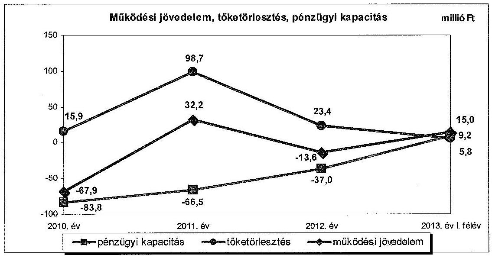
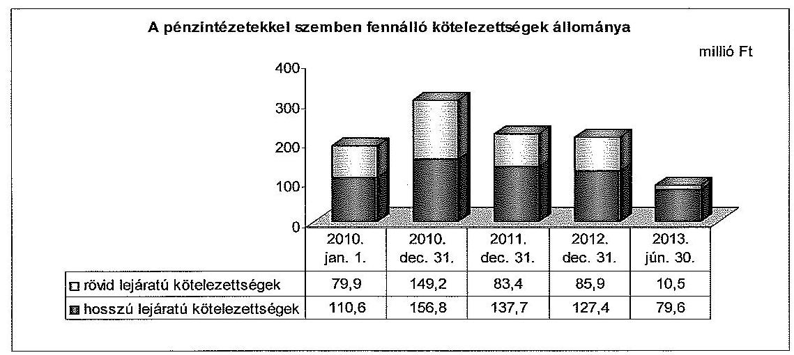
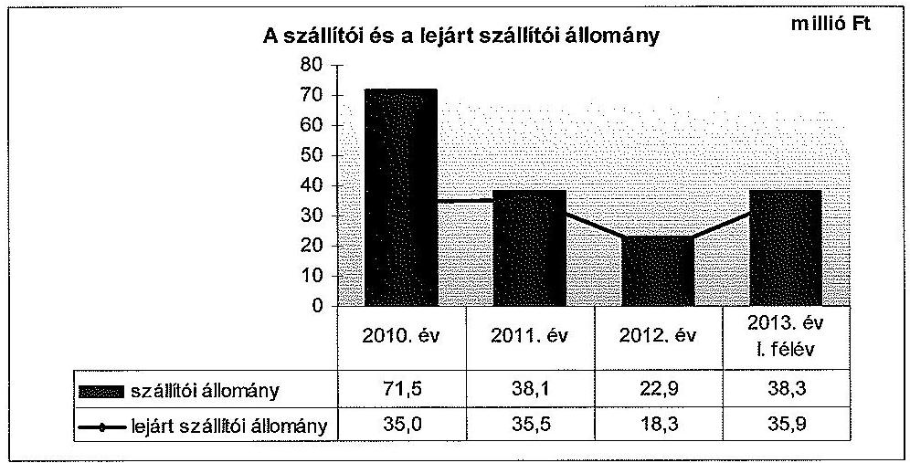
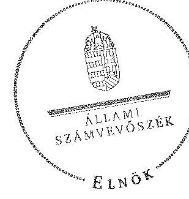

ÁLLAMI
SZÁMVEVŐSZÉK

# JELENTÉS 

az önkormányzatok pénzügyi gazdálkodási
helyzete értékelésének, és gazdálkodása szabályosságának

- 2013. évben induló - ellenőrzéséről

Létavértes
14022
2014. január

---

# Állami Számvevőszék 

Iktatószám: V-0206-039/2014.
Témaszám: 1241
Vizsgálat-azonosító szám: V065004

## Az ellenőrzést felügyelte:

## Renkó Zsuzsanna

felügyeleti vezető
Az ellenőrzést vezette és az ellenőrzés végrehajtásáért felelős:
Valastyánné dr. Vízhányó Júlia
ellenőrzésvezető
A számvevőszéki jelentés összeállításában közreműködött:
Baksa Anikó
számvevő tanácsos
Az ellenőrzést végezték:
Szalontai Miklós
számvevő tanácsos

## Gölöncsér Péter

számvevő

---

# TARTALOMJEGYZÉK 

BEVEZETÉS ..... 3
I. ÖSSZEGZŐ MEGÁLLAPÍTÁSOK, KÖVETKEZTETÉSEK, JAVASLATOK ..... 6
II. RÉSZLETES MEGÁLLAPÍTÁSOK ..... 11

1. Az Önkormányzat kötelező és önként vállalt feladatai, a feladatellátás szervezeti kereteinek változása ..... 11
2. A pénzügyi egyensúly fenntartását veszélyeztető pénzügyi kockázatok, ezek csökkentése érdekében tett intézkedések ..... 13
3. Az Önkormányzat kötelezettségeinek állománya, azok összetételének változása, az adósságkonszolidáció hatása ..... 17
4. Az Önkormányzat pénzügyi gazdálkodása során érvényesített integritási szempontok ..... 22

---

# MELLÉKLETEK 

1/A. számú Az Önkormányzat bevételei és kiadásai, valamint adósságszolgálata a 2010-2013. év I. féléve közötti időszakban (a CLF módszer szerint, a Kvtv. 72. § (1) bekezdésében foglalt adósságátvállaláshoz kapcsolódó pénzügyi teljesítések nélkül)
1/B. számú Az Önkormányzat bevételei és kiadásai a Kvtv. 72. § (1) bekezdésében foglalt adósságátvállaláshoz kapcsolódó pénzügyi teljesítések nélkül a 2013. év I. félévében (a CLF módszer szerint)
2. számú Az Önkormányzat által a 2010. és a 2013. év I. félév között megvalósított fejlesztési feladatok érdekében teljesített felhalmozási kiadások és az ezekhez vállalt kötelezettségek összegzése
3. számú Az önkormányzati feladatok ellátásában résztvevő gazdasági társaságok egyes kiemelt adatai
4. számú Az Önkormányzat 2013. június 30-án fennálló, hosszú lejáratú adósságot keletkeztető kötelezettségvállalásai
5. számú Az Önkormányzat kötelezettségeinek és egyes kötelezettségvállalásainak 2010. december 31-ei és 2013. június 30-ai állománya, valamint a 2013. év II. félévében és az azt követő években várható kötelezettségek, kötelezettségvállalások miatti kiadások

## FÜGGELÉKEK

1. számú Rövidítések jegyzéke
2. számú Fogalomtár

---

# JELENTÉS 

## az önkormányzatok pénzügyi gazdálkodási helyzete értékelésének, és gazdálkodása szabályosságának - 2013. évben induló ellenőrzéséről Létavértes

## BEVEZETÉS

Az ÁSZ a stratégiájában célul tűzte ki, hogy az önkormányzatok ellenőrzése során azok pénzügyi-gazdasági helyzetét értékeli, kockázatait feltárja, valamint az ellenőrzések helyszíneit objektív mutatószámrendszer alapján választja ki.

Az államháztartás önkormányzati alrendszerében az utóbbi években megjelenő gazdálkodási nehézségek, a pénzforgalmi hiány növekedése, az eladósodás az ÁSZ figyelmét az önkormányzatok pénzügyi helyzetére irányította. Az elkövetkezendő évek költségvetési hiánycéljainak tarthatósága érdekében indokolt, hogy az önkormányzatok pénzügyi helyzetelemzése és az egyensúlyi helyzetet befolyásoló kockázatok feltárása továbbra is kiemelt hangsúlyt kapjon az ÁSZ tevékenységében.

A közigazgatás átalakításának keretében - a helyi igazgatás és önkormányzás hatékonyabbá tétele érdekében - a Kormány az önkormányzatokra vonatkozóan 2012-ben újraszabályozta mind a sarkalatos, mind az önkormányzatok mindennapi működését rendező törvényeket és a feladatok végrehajtását biztosító előírásokat. Az önkormányzati feladatellátást érintő átalakítások jelentős része 2013-ban következett be azzal, hogy az igazgatási, az oktatási és a szociális ellátásban a feladatok jelentős hányadát átvette az állam. Ahhoz, hogy az önkormányzatok meg tudjanak felelni a számukra meghatározott - szigorúbb - gazdálkodási szabályoknak, és az új feltételek mellett is biztosítható legyen a közszolgáltatások megfelelő színvonalú ellátása, szükséges volt a pénzügyigazdasági rendszerük alapjainak megszilárdítása. Ezt a célt szolgálja az adósságkonszolidáció, amely az önkormányzatok működését és fejlesztését segítő, de korábban az állam által nem fedezett kiadásokkal kapcsolatos kötelezettségvállalások differenciált mértékű átvállalását jelenti.

Az ÁSZ a 2013. év I. félévi ellenőrzési tervében a 39. számú, az önkormányzatok pénzügyi gazdálkodási helyzete értékelésének, és gazdálkodása szabályosságának - 2013. évben induló - ellenőrzésével az önkormányzatok 2011. évben megkezdett helyzetelemzését folytatja. Az adósságkonszolidáció az önkormányzatok pénzügyi egyensúlyi helyzetére egyértelműen kedvező hatást gyakorolt, azonban a problémák kiváltó okait nem szüntette meg, ennek kezelése nélkül viszont az adósságállomány újratermelődik. Az önkormányzati alrend-

---

szerben a 2013-tól bevezetett új feladatfinanszírozási rendszer keretein belül továbbra is megoldandó kérdés a pénzügyi egyensúly megteremtése, hosszú távú fenntartása. Erre tekintettel kiemelt fontosságú az önkormányzatok pénzügyi egyensúlyi helyzetére ható kockázatok feltárása, az ezzel kapcsolatos folyamatok, trendek bemutatása. Az ÁSZ ennek megfelelően a jövőben is tovább folytatja az önkormányzatok pénzügyi gazdálkodási helyzetét értékelő témacsoportos ellenőrzéseit.

Az ellenőrzések kockázatalapú megközelítése keretében megtörténik az önkormányzatok adósságkezelési és likviditási helyzetének értékelése, a pénzügyi egyensúly minősítése, továbbá az alrendszerben 2013-ban bekövetkezett változások hatásának értékelése.

Az ellenőrzés - eredményének várható hatásaként - megállapításaival segítséget nyújthat a pénzügyi helyzet értékeléséhez, a pénzügyi egyensúly helyreállítása érdekében szükségessé váló önkormányzati intézkedések megtételéhez. Az ellenőrzés során továbbra is célunk az államháztartás önkormányzati alrendszerére jellemző információk összegzésével támogatni az Országgyűlés munkáját a törvényalkotásban, a források elosztásában.

Az ellenőrzés célja: az Önkormányzat pénzügyi helyzetének, szabályosságának értékelése, a pénzügyi egyensúly alakulására hatással lévő folyamatoknak és a pénzügyi egyensúly alakulására ható kockázatoknak a feltárása.

# Az ellenőrzés célja annak értékelése volt, hogy: 

- a kötelező és önként vállalt feladatok ellátása, ezen belül az ellátott feladatok körének, az ellátást biztosító szervezeti formáknak a változása milyen hatást gyakorolt a pénzügyi egyensúlyi helyzetre;
- az Önkormányzat pénzügyi - működési és felhalmozási - egyensúlya milyen irányban változott, a változást milyen okok idézték elő, továbbá milyen intézkedéseket tettek az egyensúly biztosítása, illetve javítása érdekében, az intézkedések hatására javult-e az Önkormányzat pénzügyi helyzete;
- a költségvetési kiadások finanszírozása érdekében vállalt, pénzintézetekkel szembeni kötelezettségek, a szállítói és egyéb kötelezettségek hogyan alakultak, az adósságkonszolidáció után fennmaradt kötelezettségek teljesítésének kockázatai miként befolyásolják a jövőbeli pénzügyi egyensúlyi helyzetet.

Az önkormányzatok korrupcióval szembeni veszélyeztetettségének csökkentése érdekében új feladatként felmértük az integritási szemlélet érvényesülését a pénzügyi gazdálkodási folyamatokban.

Utóellenőrzésre nem került sor, mivel az ÁSZ az ellenőrzött időszakban az Önkormányzatnál számvevőszéki jelentéssel lezárt ellenőrzést nem végzett.

Az ellenőrzési célokban megfogalmazott kérdések értékelési kritériumai a gazdálkodásra vonatkozó jogszabályok és a pénzügyi egyensúly biztosításának, valamint a pénzügyi helyzettel és gazdálkodással kapcsolatos kockázatok kezelésének követelménye. Az ellenőrzés az ellenőrzési célok eléréséhez elemző, értékelő, a pénzügyi helyzet kockázatát is minősítő eljárásokat alkalmazott.

---

Az ellenőrzés típusa: szabályszerűségi ellenőrzés

# Ellenőrzött szervezet: Létavértes Város Önkormányzat 

Az ellenőrzött időszak: a 2010. január 1-jétől 2013. június 30-ig terjedő időszak, figyelemmel az ellenőrzés célja vonatkozásában megfogalmazottakra. A pénzintézetekkel szembeni kötelezettségek állományának vizsgálatakor az ellenőrzött időszakban fennálló kötelezettségeket vette figyelembe az ellenőrzés.

Az ellenőrzés szakmai módszertana az ÁSZ hivatalos honlapján (www.asz.hu) közzétett szakmai szabályokon alapult, amely a Legfőbb Ellenőrző Intézmények Nemzetközi Szervezete (INTOSAI) által kiadott nemzetközi standardok (ISSAI) figyelembevételével készült.

Az ellenőrzés jogszabályi alapját az ÁSZ tv. 1. § (3) bekezdésének, 5. § (2)-(6) bekezdéseinek, valamint az Áht. 61. § (2) bekezdésének előírásai képezik.

Az ellenőrzés során használt rövidítéseket az 1. számú, az egyes fogalmak magyarázatát a 2. számú függelék tartalmazza.

Létavértes város állandó lakosainak száma 2010. január 1-jén 7320 fő, 2013. január 1-jén 7379 fő volt. Az Önkormányzat a 2012. évben 1357,1 millió Ft költségvetési bevételt ért el, és 1333,7 millió Ft költségvetési kiadást teljesített. A 2012. december 31-i könyvviteli mérleg szerint 3796,5 millió Ft értékű vagyonnal rendelkezett, a rövid lejáratú kötelezettségállomány 137,5 millió Ft, a hosszú lejáratú kötelezettségállomány 134,6 millió Ft volt. A jegyző 2006. november 28-tól látja el feladatait. A foglalkoztatott köztisztviselők száma 2012. január 1-jén 25 fő volt.

Az ÁSZ tv. 29. § (1) bekezdése szerint a jelentéstervezetet megküldtük a polgármester részére, aki az ÁSZ tv. 29. § (2) bekezdésében foglalt észrevételezési jogával nem élt, a jelentéstervezetre észrevételt nem tett.

---

# I. ÖSSZEGZŐ MEGÁLLAPÍTÁSOK, KÖVETKEZTETÉSEK, JAVASLATOK 

Létavértes Város Önkormányzatának pénzügyi egyensúlya az ellenőrzött időszakban rövid távon nem volt biztosított. A működési költségvetés egyenlege a 2013. év I. félévben bevezetett új feladatellátási és finanszírozási rendszerben 15,0 millió Ft többletet mutatott. A 2013. évi 60,0\%-os mértékű, 128,0 millió Ft tőketartozás és annak járulékai átvállalására vonatkozó adósságkonszolidáció hatására az Önkormányzat pénzügyi egyensúlyi helyzete javult, azonban a jövedelemtermelő képessége alapján képződő bevételek várhatóan nem biztosítják a fennálló kötelezettségek jövőbeni fedezetét.

Az Önkormányzat költségvetésének elemzését a CLF módszerrel számított mutatók alapján végeztük. A pénzügyi kapacitás 2010-2013. év I. félév közötti változását - a 2013. évi adósságkonszolidáció pénzforgalmi hatása nélkül számítva - a következő ábra mutatja be:

Az Önkormányzat az ellenőrzött időszakban összesen 5318,5 millió Ft összegű költségvetési bevételt ért el, és 5344,8 millió Ft összegű költségvetési kiadást teljesített. A folyó bevételek a 2010. és 2012. években nem biztosítottak fedezetet a folyó kiadásokra, az ellenőrzött időszakban összességében 34,3 millió Ft működési hiány keletkezett. A 2011. évi pozitív működési jövedelem kialakulását alapvetően a működőképesség megőrzését szolgáló támogatás eredményezte. Az Önkormányzat a 2010. évben 6,0 millió Ft, a 2011. évben 27,9 millió Ft, a 2012. évben 104,9 millió Ft ÖNHIKI támogatásban, a 2013. év I. félévében 14,4 millió Ft szerkezetátalakítási tartalékból folyósított központi támogatásban részesült. Működési jövedelemtermelő képesség miatti kockázatot és egyben bevételi kitettséget jelez, hogy a működőképesség megőrzését szolgáló kiegészítő támogatások nélkül a működési jövedelem nagyobb összegű -2010-ben 73,9 millió Ft, 2012-ben 118,5 millió Ft - hiányt mutatott volna.

---

A felhalmozási költségvetés egyenlege a 2010. évben és a 2013. év I. félévben 79,3 millió Ft, illetve 1,5 millió Ft hiányt mutatott, amelynek finanszírozására hosszú lejáratú hitelek nyújtottak fedezetet. A 2011. és 2012. években az Önkormányzatnak 88,8 millió Ft felhalmozási forrástöbblete keletkezett. A megvalósított fejlesztések révén létrejött létesítmények üzemeltetésének várható működési kiadásait, továbbá a működtetéshez szükséges forrásokat nem mérték fel, ezért fennáll a létesítmények jövőbeni üzemeltetése miatti kockázat. A 2013. június 30-át követő időszakra vállalt 291,2 millió Ft felhalmozási célú kötelezettség - döntően a 2012. évben indult bel- és külterületi csapadékvízmentesítési és a 2013. év I. félévében indult szennyvízhálózat és szennyvíztisztító telep bővítési projektek befejezéséhez kapcsolódó kiadások - fedezetét 93,7\%-ban (272,9 millió Ft összegben) EU-s és egyéb költségvetési támogatás jelenti. A két kiemelt beruházás tervezett összes bekerülési költsége 309,1 millió Ft.

A nettó működési jövedelem (pénzügyi kapacitás) a 2010-2012 közötti években folyamatosan negatív volt, a 2013. év I. félévében a működési jövedelem fedezetet nyújtott a hiteltörlesztésekre. Az Önkormányzat 2010-2011. években képződött finanszírozási igénye 177,8 millió Ft volt, amelyre a hitelek biztosítottak fedezetet.

Az önként vállalt feladatokra fordított kiadások összes működési kiadáson belüli aránya a 2010. évi 12,3\%-ról (169,1 millió Ft-ról) a 2012. évre 1,6\%-ra (20,6 millió Ft-ra) csökkent, a 2013. év I. félévében 4,9\% (22,3 millió Ft) volt. Az Önkormányzat alacsony jövedelemtermelő képességére tekintettel az önként vállalt feladatok ellátása működési kockázatot jelentett. Az ellenőrzött időszakban az igazgatási feladatok járási kormányhivatalnak történő átadása, a közoktatási intézmények állami fenntartásba vétele, valamint a szociális ellátási feladatok egyháznak történt átadása az Önkormányzat adatszolgáltatása alapján a 347,6 millió Ft bevételkiesést meghaladó, 535,7 millió Ft kiadáscsökkenést eredményezett. A saját hatáskörben végrehajtott intézkedések hatására 26,4 millió Ft bevételnövekedést és 59,0 millió Ft kiadáscsökkentést ért el az Önkormányzat. A feladatváltozások kedvező hatásával szemben a 2013. év I. félévben az új finanszírozási rendszer keretében a költségvetési források csökkenése kedvezőtlen hatással volt a pénzügyi egyensúlyi helyzetre.

Az Önkormányzat pénzintézeti kötelezettsége a 2010. év elejéről a 2013. év I. félév végére 190,5 millió Ft-ról 90,1 millió Ft-ra csökkent a hitelfelvételek és törlesztések, továbbá az adósságkonszolidáció együttes hatására. Az adósságátvállalást követően fennmaradt pénzintézeti kötelezettségállomány 10,5 millió Ft folyószámlahitelből és 79,6 millió Ft fejlesztési célú hitelből tevődött össze. Banki kitettség miatti kockázatot jelentett, hogy az Önkormányzat az ellenőrzött időszakban a likviditását folyószámlahitel és munkabérmegelőlegezési hitel folyamatos igénybevételével tudta biztosítani. Az adósságkonszolidáció kedvező hatása ellenére az ellenőrzött időszakot követően fennálló 146,6 millió Ft kötelezettségre - az alacsony jövedelemtermelő képesség miatt - a működési jövedelem várhatóan nem nyújt fedezetet. Az Önkormányzat a 2013. év I. félév végén a kötelezettségek jövőbeni kifizethetősége érdekében felhasználható szabad tartalékkal nem rendelkezett.

---

A szállítókkal szembeni kötelezettség 2010 végén 71,5 millió Ft, 2013. június 30-án 38,3 millió Ft volt, a 60 napon túli lejárt esedékességű tartozás 8,5 millió Ft-ot tett ki, amely miatt fennállt a szállítói kitettség kockázata.

Az Önkormányzat 35,6\%-os tulajdoni részaránnyal rendelkezik az önként vállalt feladatot ellátó Társaságában, melynek negatív eredménytartalék mellett folytatott veszteséges gazdálkodása, továbbá a folyószámlahiteléhez 15,0 millió Ft keretösszegben vállalt készfizető kezesség mérlegen kívüli tételek miatti kockázatot hordoz.

Az Önkormányzatnak a pénzügyi gazdálkodás során az integritási szemlélet teljes körű érvényesítése érdekében - az etikai elvárásokat, az eszközök magáncélú használatát, az összeférhetetlenség eseteit, a közérdekű bejelentések kezelését, a pénzügyi gazdálkodási folyamatok vonatkozásában a „négy szem elve" alkalmazását, valamint a pénzügyi helyzetét és az adósságterheit befolyásoló döntések előtti, azok kockázatainak felmérését előíró szabályozás hiányára tekintettel - még fejlődnie kell.

Az ellenőrzés során a gazdálkodási feladatok ellátásával kapcsolatban az alábbi szabályszerűségi hibákat tártuk fel:

- az Önkormányzat - a Kbt. ${ }_{1}$ hatálya ${ }^{1}$ alá tartozó szervezetként - közbeszerzési eljárás lefolytatása nélkül - a számlavezető bankjával 2010. február 2-án és 2010. szeptember 6-án kölcsönszerződést kötött, valamint korábbi folyó-számla-hitelkeret szerződését 2010. augusztus 25-i hatállyal módosította. Tekintettel a beszerzések értékére, illetve a Kbt. ${ }_{1}$-ben foglalt egybeszámítási szabályra, az Önkormányzat megsértette a Kbt. ${ }_{1}$-ben a közbeszerzési eljárás lefolytatására vonatkozó előírást;
- az Önkormányzat a 2013. évi költségvetési rendeletében a működési költségvetés Mötv.-ben előírt egyensúlyát oly módon biztosította, hogy a költségvetési támogatásból származó bevételek eredeti előirányzatai között 141,4 millió Ft működőképesség megőrzését szolgáló, kiegészítő támogatásból származó bevételt is figyelembe vett, ezáltal a bevételi előirányzatok tervezése az Áht.-ban foglalt előírás ellenére közgazdaságilag nem megalapozott módon történt.

Az ÁSZ tv. 33. § (1) bekezdésében foglaltak értelmében az ellenőrzött szervezet vezetője köteles a jelentésben foglalt megállapításokhoz kapcsolódó intézkedési tervet összeállítani, és azt a jelentés kézhezvételétől számított harminc napon belül az ÁSZ részére megküldeni. Amennyiben az intézkedési tervet határidőn belül nem küldi meg a szervezet vezetője, vagy az továbbra sem elfogadható, az ÁSZ elnöke a hivatkozott törvény 33. § (3) bekezdés a-b) pontjaiban foglaltakat érvényesítheti.

[^0]
[^0]:    ${ }^{1}$ Hatálytalan 2012. január 1-jétől, a 2012. január 1-jétől hatályos jogszabály Kbt. ${ }_{2}$.

---

# Az ellenőrzés intézkedést igénylő megállapításai és javaslatai: 

## a polgármesternek

1. Az Önkormányzat pénzügyi egyensúlya az ellenőrzött időszakban rövid távon nem volt biztosított. A folyó költségvetés egyenlege a 2010. és a 2012. évben a működőképesség megőrzését szolgáló támogatások ellenére is hiányt mutatott. A 2013. év I. félévében az adósságkonszolidáció keretében kapott 85,9 millió Ft működési célú költségvetési támogatás nélkül a folyó költségvetés egyensúlyban volt, azonban a 15,0 millió Ft működési többlethez döntően hozzájárult a szerkezetátalakítási tartalékból kapott 14,4 millió Ft támogatás. A pénzügyi kapacitás 2010-2012 között minden évben hiányt jelzett, míg a 2013. év I. félévében az adósságkonszolidáció hatását kiszűrve 9,2 millió Ft többletet mutatott. A saját hatáskörben tett bevételnövelő és kiadáscsökkentő intézkedések nem biztosítottak elegendő forrást a pénzügyi egyensúly helyreállításához. Az ellenőrzött időszakban a likviditás biztosítására igénybe vett folyószámla- és munkabér-megelőlegezési hitel tartóssá vált. A folyószámlahitel 2012. év végi állománya az állami adósságátvállalás keretében kiegyenlítésre került, ugyanakkor az ellenőrzött időszak végére ismételten 10,5 millió Ft hiteltartozás keletkezett. A 2013. év I. félév végén - a lezárult adósságkonszolidációt követően - a pénzintézeti kötelezettségállomány 90,1 millió Ft volt. A kötelezettségek jövőbeni kifizethetőségére felhasználható szabad tartalék nem áll rendelkezésre. Nemfizetési kockázatot jelent, hogy a 2013. év I. félév végi 38,3 millió Ft szállítói állomány 93,7\%-a (35,9 millió Ft) lejárt tartozás, melyből 8,5 millió Ft 60 napon túli lejárt esedékességű.

Javaslat:
A működési jövedelemtermelő képesség és a feladatellátás összhangjának megteremtése, valamint a pénzügyi egyensúly helyreállítása, hosszú távú fenntarthatósága érdekében felelősök és határidők megjelölésével kezdeményezzen intézkedéseket, melyek keretében:
a) a költségvetési rendelettervezet, valamint annak évközi módosítása előterjesztését megelőzően mérjék fel a bevételszerző, kiadáscsökkentő lehetőségeket, és terjessze a Képviselő-testület elé a bevételek növelését, a kiadások csökkentését célzó intézkedések bevezetéséhez szükséges - a Htv. 140. § (1) bekezdés a) pontja alapján a jegyző által elkészített - döntési javaslatát;
b) terjesszen a Képviselő-testület elé jóváhagyásra - a Htv. 140. § (1) bekezdés a) pontja alapján a jegyző által elkészített - az Önkormányzat gazdasági helyzetének elemzésén alapuló, a pénzügyi egyensúlyi helyzet gyors helyreállítását, hosszú távú fenntartását, valamint az adósságállomány újratermelődésének elkerülését biztosító intézkedéseket tartalmazó reorganizációs programot;
c) az Önkormányzat kötelezettségeinek jövőbeni teljesítése, a fizetőképesség megőrzése érdekében terjesszen a Képviselő-testület elé - a Htv. 140. § (1) bekezdés a) pontja alapján a jegyző által elkészített - döntési javaslatot, amelyben a Képvi-selő-testület kötelezettséget vállal arra, hogy előre meghatározott összegben és módon a realizált többletbevételeket, a meglévő és a jövőben képződő tartalékokat mindaddig a kötelezettségek rendezésére fordítja, azt nem használja más célra, amíg az Önkormányzat pénzügyi egyensúlya rövid távon veszélyeztetett;

---

d) a szállítói kitettség és az Adósságrendezési tv. 4. § (2) bekezdés a)-b) pontjaiban megjelölt helyzet kialakulásának elkerülése érdekében, meghatározott gyakorisággal számoljon be a Képviselő-testületnek az Önkormányzat lejárt szállítói állománya alakulásáról. Intézkedjen a szállítói számlák esedékesség szerinti kiegyenlítéséről vagy a lejárt tartozások átütemezéséről.
2. Az Önkormányzat és a számlavezető pénzintézet között 2010. február 2-án és 2010. szeptember 6-án létrejött hitelszerződések megkötését, valamint a korábbi folyó-számla-hitelkeret szerződés 2010. augusztus 25-i módosítását megelőzően - a beszerzések értéke és a Kbt. 140. §-ában előírt egybeszámítási szabály ellenére - a Kbt. 1 240. § (1) bekezdésében ${ }^{2}$ foglalt előírást megsértve közbeszerzési eljárás lefolytatására nem került sor.

Javaslat:
A közbeszerzési eljárásról szóló törvényben foglaltak maradéktalan betartása érdekében biztosítsa, hogy jövőbeni pénzügyi szolgáltatás igénybevétele esetén, amennyiben a Kbt. 2 120. § k) pontjában foglalt kivétel nem áll fenn, a közbeszerzési eljárás lefolytatásának kötelezettségére a 119. §-ban foglalt előírást érvényesítsék.

# a jegyzőnek 

1. Az Önkormányzat a 2013. évi jóváhagyott költségvetési rendeletében a működési költségvetés Mötv. 111. § (4) bekezdésében előírt egyensúlyát oly módon biztosította, hogy a költségvetési támogatásból származó bevételek eredeti előirányzatai között 141,4 millió Ft működőképesség megőrzését szolgáló, kiegészítő támogatásból származó bevételt is figyelembe vett, ezáltal a bevételi előirányzatok tervezése az Áht. 12. § (1) bekezdésében előírtak ellenére közgazdaságilag nem megalapozott módon történt.

Javaslat:
Intézkedjen, hogy a költségvetési rendelettervezetben a működési költségvetés Mötv. 111. § (4) bekezdésében előírt egyensúlyának biztosításakor a bevételeket az Áht. 12. § (1) bekezdésének megfelelően, közgazdaságilag megalapozottan határozzák meg.

[^0]
[^0]:    ${ }^{2}$ Hatálytalan 2012. január 1-jétől, a 2012. január 1-jétől hatályos előírás: a Kbt. 2 119. § és 120. § k) pontja.

---

# II. RÉSZLETES MEGÁLLAPÍTÁSOK 

## 1. Az ÖNKORMÁNYZAT KÖTELEZŐ ÉS ÖNKÉNT VÁLLALT FELADATAI, A FELADATELLÁTÁS SZERVEZETI KERETEINEK VÁLTOZÁSA

A kötelező és az önként vállalt feladatok ellátását a 2010-2013. év I. félév közötti időszakban az Önkormányzat az SZMSZ-ében szabályozta. Az Önkormányzat az önként vállalt feladatai körébe sorolta a helyi tömegközlekedés biztosítását, a körzeti igazgatási feladatokat (okmányiroda, gyámügy, építéshatóság), a parkok és a játszóterek üzemeltetését, a településtisztasági és közbiztonsági helyi feladatokat, a közhasznú, közcélú munkák szervezését, a piacfenntartást, a településfejlesztést, a tudományos, a művészeti és sport tevékenység támogatását, a mezőőri szolgálatot, a lakásgazdálkodást és a helyi tűzvédelmet. Az Önkormányzat az ellenőrzött időszakban az önként vállalt feladatai körét nem módosította. Az ellenőrzött időszakban - az SZMSZ-ben rögzítetteken túl - önként vállalt feladatként biztosították a járóbetegszakellátást.

A kötelező feladatok körében biztosították az óvodai nevelést és az általános iskolai oktatást ${ }^{3}$, a szociális ellátás keretében az ápoló, gondozó ellátást (időskorúak otthona), az egészségügyi alapellátást, a helyi közutak és a köztemető fenntartását, az ivóvízellátást, továbbá társulás keretében a gyermekjóléti szolgálatot. Feladatátadási megállapodás alapján a szociális ellátási feladatokat a 2011. év II. félévétől az egyház végezte. A kötelező közművelődési feladatokat művelődési ház és könyvtár fenntartásával látták el.

A Polgármesteri Hivatal feladatát képezték az igazgatási feladatok, a lakásgazdálkodás, a vagyonüzemeltetés, a park- és közterület-fenntartás, a gyermekélelmezés és a védőnői szolgálat. Az Önkormányzat a feladatait 2010. január 1-jén hét költségvetési szervével, 27 telephelyen látta el. Az ellenőrzött időszak végén az önkormányzati fenntartású költségvetési szervek száma ötre, a telephelyek száma 21-re csökkent.

A háziorvosi ellátást és az orvosi ügyeletet vállalkozói szerződés útján biztosították. Az Önkormányzat egyes kötelező feladatait (közvilágítás, víz- és csatornaszolgáltatás, szilárdhulladék-szállítás, köztemető fenntartás) közszolgáltatási szerződések alapján gazdasági társaságok látták el. A feladatellátásban résztvevő gazdasági társaságok egyes kiemelt adatait a 3. számú melléklet tartalmazza.

A 2012. évben a teljesített működési kiadások összege 1316,7 millió Ft volt, 4,4\%-kal (60,0 millió Ft-tal) kevesebb a 2010. évi teljesített működési kiadásnál. A működési kiadások mérséklődését a szociális feladatok átadása, a dolgozói létszám és a személyi többletjuttatások csökkentésének együttes hatása okozta. A kötelező feladatokra fordított működési kiadások aránya az összes működési

[^0]
[^0]:    ${ }^{3}$ A két helyi általános iskola fenntartását 2013. január 1-jétől a Magyar Állam vette át.

---

kiadáshoz viszonyítva a 2010. évi 87,7\%-ról a 2012. évre 98,4\%-ra nőtt, összege a 2010. évi 1207,6 millió Ft-ról a 2012. évre 1296,1 millió Ft-ra emelkedett. A 2013. év I. félévében a teljesített működési kiadások összege 453,7 millió Ft volt, melynek 95,1\%-a (431,4 millió Ft) kapcsolódott a kötelező feladatellátáshoz. A 2013. év I. félévi teljesített kiadás a megelőző év időarányos teljesítésének kevesebb mint 70,0\%-a volt. A kiadások csökkenése alapvetően az általános iskolák állami fenntartásba adásának és az egyes igazgatási feladatok járási kormányhivatalhoz kerülésének a következménye volt.

Az ellenőrzött időszakban az önként vállalt feladatokra fordított kiadások súlya alapvetően az egyes szociális feladatok egyház részére, illetve az okmányiroda, a gyámügy és az építéshatósági feladatok illetékes járási kormányhivatalnak történt átadása következtében csökkent. Az önként vállalt feladatokra teljesített kiadások aránya az összes működési kiadáson belül a 2010. évi 12,3\%-ról (169,1 millió Ft-ról) 2012-re 1,6\%-ra (20,6 millió Ft-ra) csökkent. A 2013. év I. félévben az önként vállalt feladatokra teljesített kiadás 22,3 millió Ft (a működési kiadások $4,9 \%$-a) volt. E kiadások csökkenése ellenére az önként vállalt feladatok ellátása miatt a működési kockázat - az Önkormányzat alacsony jövedelemtermelő képességére tekintettel - fennállt.

Az Önkormányzat adatszolgáltatása alapján az ellenőrzött időszakban megvalósított fejlesztések értéke 918,7 millió Ft, ebből az önként vállalt feladatokra fordított felhalmozási kiadások összege 150,8 millió Ft (16,4\%) volt. Az önként vállalt feladatokra teljesített felhalmozási kiadások részaránya nem jelentett felhalmozási kockázatot.

A kötelező és az önként vállalt feladatokra fordított kiadások arányának, mértékének és azok változásának a pénzügyi egyensúlyi helyzetre gyakorolt hatását az Önkormányzat az ellenőrzött időszakban nem értékelte, az önként vállalt feladatok körét SZMSZ-ében nem módosította (járóbeteg-szakellátás).

Az Önkormányzat a kötelező és önként vállalt szociális ellátási feladatait a 2011. év II. félévétől megállapodással az egyháznak átadta, illetve ezzel egyidejűleg szociális intézményét megszüntette. Ennek következtében - az Önkormányzat kimutatása szerint - a bevételek 118,3 millió Ft-tal, a kiadások 141,4 millió Ft-tal csökkentek a 2012. év végéig. A közoktatási ágazatban a 2013. évtől a két általános iskola állami fenntartásba vétele jelentett változást. Az állami feladatátvétel a pénzügyi helyzetre kedvező hatást gyakorolt, mivel az önkormányzati kimutatások szerint - a kiadások nagyobb mértékben (327,9 millió Ft-tal) csökkentek, mint a bevételek (222,0 millió Ft). A közneveléshez kapcsolódó vagyonkezelési feladatokat továbbra is az Önkormányzat látja el. Az egyes igazgatási feladatok (okmányiroda, gyámügy, építéshatóság) járási kormányhivatalnak történő átadása az Önkormányzat pénzügyi helyzetére kedvező hatással volt, mert az igazgatási feladatokhoz kapcsolódó kiadások 66,4 millió Ft-tal, a bevételek 7,3 millió Ft-tal csökkentek. A hivatali feladatok ellátására ténylegesen alkalmazott (köztisztviselői) létszámot a Polgármesteri Hivatal működésének támogatására megállapított alaplétszámra figyelemmel alakították ki. A feladatváltozások kedvező hatásával szemben a 2013. év I. félévben az új finanszírozási rendszer keretében a költségvetési források csökkenése kedvezőtlen hatással volt a pénzügyi egyensúlyi helyzetre.

---

# 2. A PÉNZÜGYI EGYENSÚLY FENNTARTÁSÁT VESZÉLYEZTETŐ PÉNZÜGYI KOCKÁZATOK, EZEK CSÖKKENTÉSE ÉRDEKÉBEN TETT INTÉZKEDÉSEK 

Az Önkormányzat költségvetésének elemzését a CLF módszer szerint hajtottuk végre. A 2013. év I. félévi valós jövedelemtermelő képesség bemutatása érdekében az elemzés során nem vettük figyelembe az adósságkonszolidációhoz kapcsolódó bevételeket és kiadásokat.

Az adósságkonszolidációra vonatkozóan az Önkormányzat 2013. év I. félévi beszámolója 85,9 millió Ft működési és 42,1 millió Ft felhalmozási költségvetési támogatást, valamint 128,0 millió Ft hiteltörlesztést tartalmazott. Az adósságkonszolidációhoz kapcsolódóan a folyó, illetve a felhalmozási bevételek között kimutatott költségvetési támogatások javították a működési jövedelmet, illetve a felhalmozási költségvetés egyenlegét, ugyanakkor a finanszírozási kiadások között elszámolt hiteltörlesztés kedvezőtlenül befolyásolta a pénzügyi kapacitást.

A CLF módszer szerinti önkormányzati részletes adatokat 2010-2013. év I. félév között az 1/A. számú melléklet, az adósságkonszolidációhoz kapcsolódó bevételek és kiadások pénzügyi egyensúlyi helyzetre gyakorolt hatását az 1/B. számú melléklet, a főbb önkormányzati adatokat a következő tábla mutatja be:

|  |  |  |  | millió Ft |
| :--: | :--: | :--: | :--: | :--: |
| Megnevezés | 2010. év | 2011. év | 2012. év | 2013.év   I. félév |
| Folyó bevételek | 1308,8 | 1273,7 | 1303,1 | 468,7 |
| Folyó kiadások | 1376,7 | 1241,5 | 1316,7 | 453,7 |
| Működési jövedelem | $-67,9$ | 32,2 | $-13,6$ | 15,0 |
| Felhalmozási bevételek | 747,0 | 131,6 | 54,0 | 31,6 |
| Felhalmozási kiadások | 826,3 | 79,8 | 17,0 | 33,1 |
| Felhalmozási költségvetés egyenlege | $-79,3$ | 51,8 | 37,0 | $-1,5$ |
| Folyó és felhalmozási bevételek összesen | 2055,8 | 1405,3 | 1357,1 | 500,3 |
| Folyó és felhalmozási kiadások összesen | 2203,0 | 1321,3 | 1333,7 | 486,8 |
| Finanszírozási műveletek nélküli pozíció | $-147,2$ | 84,0 | 23,4 | 13,5 |
| Finanszírozási műveletek egyenlege | 135,7 | $-88,1$ | $-11,5$ | 14,4 |
| Tárgyévi pénzügyi pozíció | $-11,5$ | $-4,1$ | 11,9 | 27,9 |
| Hiteltörlesztés, értékpapír beváltás | 15,9 | 98,7 | 23,4 | 5,8 |
| Nettó működési jövedelem | $-83,8$ | $-66,5$ | $-37,0$ | 9,2 |

Az Önkormányzat a 2010. év és a 2013. év I. félév között - a 2013. évi adósságkonszolidációs támogatás nélkül számítva - összesen 5318,5 millió Ft költségvetési bevételt ért el, és 5344,8 millió Ft költségvetési kiadást teljesített. Az ellenőrzött időszakban a működési jövedelem változóan alakult. A működési jövedelem a 2010. évi -67,9 millió Ft-ról a 2011. évre 32,2 millió Ft-ra nőtt a folyó kiadások (alapvetően személyi kiadások, járulékok, dologi kiadások) jelentős, 135,2 millió Ft-os csökkenése miatt. A 2012. évben a működési jövedelem -13,6 millió Ft volt, mivel a folyó kiadások növekedése meghaladta a folyó bevételek emelkedését. A 2012. évben a folyó bevételek növekedését kizárólag az előző évhez képest 77,0 millió Ft-tal több ÖNHIKI támogatás eredményezte. A folyó kiadások a 2011. évihez képest ugyanakkor 75,2 millió Ft-tal (1316,7 millió Ft-ra) emelkedtek, alapvetően a dologi kiadások növekedése miatt.

---

Az alacsony jövedelemtermelő képesség miatti kockázat az ellenőrzött időszakban folyamatosan fennállt, mivel a működőképesség megőrzését szolgáló kiegészítő támogatások nélkül számított működési jövedelem a 2011. évben 4,3 millió Ft, a 2013. év I. félévben 0,6 millió Ft lett volna. Az Önkormányzat a 2010. évben 6,0 millió Ft, a 2011. évben 27,9 millió Ft, a 2012. évben 104,9 millió Ft ÖNHIKI támogatásban részesült. A 2010. és 2012. években bevételi kitettség kockázatát jelentette a kialakult negatív működési jövedelem, amely az ÖNHIKI támogatás nélkül még hátrányosabb pénzügyi helyzetet (73,9 millió Ft, illetve 118,5 millió Ft hiányt) okozott volna. A 2013. év I. félév pozitív működési jövedelmét döntően a 14,4 millió Ft szerkezetátalakítási tartalékból folyósított központi támogatás eredményezte.

A nettó működési jövedelem a 2010-2012. években negatív tartományban (2010-ben -83,8 M Ft, 2011-ben -66,5 millió Ft és 2012-ben -37,0 millió Ft) mozgott, azonban javuló tendenciát mutatott. A 2013. év I. félévben - az adósságkonszolidáció, mint egyszeri állami pénzügyi beavatkozás hatását figyelmen kívül hagyva - a nettó működési jövedelem 9,2 millió Ft volt, a 15,0 millió Ft működési jövedelem és az 5,8 millió Ft tőketörlesztés egyenlegeként. A 2010-2011. években felmerült finanszírozási igény ${ }^{4} 177,8$ millió Ft volt, amelyet hitelből fedezett az Önkormányzat. A 2012-2013. év I. félév közötti időszakban 7,7 millió Ft finanszírozási többlet képződött.

A felhalmozási bevételek és kiadások egyenlege a 2010. évben hiányt (-79,3 millió Ft) mutatott. E forráshiány fedezetét hosszú lejáratú hitelekből finanszírozták. A 2011. évi felhalmozási költségvetés egyenlege kedvezően, 51,8 millió Ft-ra javult. A 2012. évi egyenleg 37,0 millió Ft volt. Az adósságkonszolidáció (42,1 millió Ft összegű tőketörlesztésre fordított költségvetési támogatás) hatását kiszűrve a felhalmozási költségvetés 2013. év I. félévi egyenlege 1,5 millió Ft összegű hiányt mutatott.

A folyó bevételek nagyságrendje a 2010. és 2012. években közel azonos volt, 2011-ben 2,7\%-kal (35,1 millió Ft-tal) csökkent az előző évhez viszonyítva. A 2013. év I. félévi időarányos folyó bevételek (468,7 millió Ft) csökkenését alapvetően a feladatellátásban bekövetkezett változások okozták. A folyó bevételeket leginkább meghatározó költségvetési támogatások aránya az ellenőrzött időszakban lényegesen nem változott: a 2010. évben az összes folyó bevétel $52,5 \%$-át, a 2011. évben $50,8 \%$-át, a 2012. évben $56,0 \%$-át, a 2013. év I. félévben $67,2 \%$-át képezte.

A helyi adóból származó bevétel nem jelentett bevételi kitettséget, mivel az ellenőrzött időszakban az egyes adónemekhez tartozó realizált adóbevétel 75,0\%-a több mint három adóalanytól származott, továbbá az Önkormányzatnak lehetősége volt új adónem bevezetésére és a meglévők mértékének növelésére. Új adónemként az Önkormányzat bevezette az iparűzési adót és a kommunális adót, melyek mértéke nem érte el a törvényes maximumot.

Az Önkormányzat fejlesztései megvalósítását biztosító források között az EU-s forrású támogatás volt meghatározó, mely az ellenőrzött időszakban realizált

[^0]
[^0]:    ${ }^{4}$ a nettó működési jövedelem és a felhalmozási költségvetés összevont negatív egyenlege

---

összes felhalmozási bevétel (964,2 millió Ft) 78,6\%-át (757,5 millió Ft) jelentette. Az ellenőrzött időszakban az EU-s forrású támogatásokat a saját felhalmozási bevételek (összesen 148,0 millió Ft) 15,3\%-ban, a költségvetési támogatások (összesen 55,9 millió Ft) 5,8\%-ban egészítették ki. Az államháztartáson kívülről kapott bevételek összege 2,8 millió Ft $(0,3 \%)$ volt.

A folyó kiadások (a 2010. évben 1376,7 millió Ft, a 2011. évben 1241,5 millió Ft, a 2012. évben 1316,7 millió Ft) ellenőrzött időszakban bekövetkezett változását a legnagyobb részarányt képviselő jogcímének - a kamatkiadások nélkül számított működési kiadások - alakulása határozta meg, melynek összege az egyes években 1144,2 millió Ft, 1000,5 millió Ft és 1050,2 millió Ft volt. A kamatkiadások nélküli működési kiadásokat a személyi juttatások és a munkaadót terhelő járulékok csökkenése, valamint a dologi kiadások változó irányú alakulása befolyásolta. A kiadáscsökkentő intézkedések hatására a 2010. évről a 2011. évre a személyi juttatások és munkaadót terhelő járulékok 9,3\%-kal, a dologi kiadások 16,5\%-kal, a 2011. évről a 2012. évre a személyi juttatások és munkaadót terhelő járulékok 4,4\%-kal csökkentek. A dologi kiadások a 2012. évben $27,1 \%$-kal (89,5 millió Ft) emelkedtek az előző évhez viszonyítva. A 2013. év I. félévi folyó kiadások, illetve kamatkiadások nélküli működési kiadások az előző év időarányos teljesítéséhez képest - az intézményfenntartó-váltás és feladatátadások miatt - 453,7 millió Ft-ra, illetve 355,7 millió Ft-ra csökkentek. A transzferkiadások (a 2010. évben 222,6 millió Ft, a 2011. évben 229,1 millió Ft, a 2012. évben 238,1 millió Ft) ellenőrzött időszaki emelkedése nem volt jelentős, a változás mértéke az előző évhez viszonyítva a 2011. évben 2,9\%, a 2012. évben 3,9\% volt.

Az ellenőrzött időszakban megvalósított fejlesztésekre teljesített kifizetések 86,4\%-a (826,3 millió Ft) a 2010. évben merült fel. A 2011. évtől kezdődően a felhalmozási kiadás, illetve annak összes kiadáson belüli aránya jelentősen alacsonyabb volt: a 2011. évben 79,8 millió Ft (6,0\%), a 2012. évben 17,0 millió Ft (1,3\%).

A 2010. évben az új óvodaépület kialakítására 534,6 millió Ft-ot, településfejlesztésre 50,9 millió Ft-ot, belterületi utak felújítására 66,8 millió Ft-ot, akadálymentesítésre 33,5 millió Ft-ot, egyéb fejlesztésekre 38,3 millió Ft-ot fordított az Önkormányzat. A fordított áfa befizetés összege 102,2 millió Ft volt.

Az Önkormányzat 2010-2013. év I. félévben pénzügyileg befejezett beruházásainak és felújításainak értéke 871,3 millió Ft volt, a folyamatban lévő beruházásokra és felújításokra 18,0 millió Ft kiadást fordítottak. Az ellenőrzött időszakban megvalósított fejlesztések teljes bekerülési költsége 918,7 millió Ft volt, melynek finanszírozásához EU-s pályázati forrásból 710,1 millió Ft-ot (77,3\%), egyéb központi támogatásból 47,6 millió Ft-ot (5,2\%), hitelből 62,1 millió Ft-ot (6,8%) és saját bevételből 98,9 millió Ft-ot (10,7%) használtak fel. A 2013. június 30. utáni időszakra vállalt 291,2 millió Ft kötelezettség forrásait 259,1 millió Ft (89,0%) EU-s támogatásból, 13,8 millió Ft (4,7%) egyéb központi támogatásból és 18,3 millió Ft (6,3%) saját bevételből tervezték biztosítani.

A 2013. június 30-át követő időszakra vállalt felhalmozási célú kötelezettség döntően a 2012-ben indult bel- és külterületi csapadékvíz-mentesítési és a 2013-ban

---

indult szennyvízhálózat és szennyvíztisztító telep bővítési projekthez kapcsolódik. A két kiemelt beruházás tervezett összes bekerülési költsége 309,1 millió Ft.

A fejlesztések során kialakított létesítmények jövőbeni üzemeltetése miatti kockázat fennáll, mert a megvalósított fejlesztések üzemeltetésének várható működési kiadásait, a működtetés forrásait nem számszerűsítették, a fejlesztésekről történő döntéskor ezt a Képviselő-testület számára nem mutatták be. Az Önkormányzat által megvalósított fejlesztések működtetése pótlólagos forrást nem teremt.

Az Önkormányzat részéről eseti jelleggel 1,8 millió Ft működési és 5,6 millió Ft felhalmozási célú pénzeszközátadás történt a 2012. évben az önként vállalt feladatként járóbeteg-szakellátást biztosító Társaságának. A pénzeszközátadások feltételrendszerét - a 2010-2011. években az Ámr. 158. § (1) bekezdésében, a 2012. évtől a Bkr. 8. § (1) bekezdésében előírtaknak ellenére - az Önkormányzatnál nem alakították ki. Nem rögzítették a döntési jogosultságot, a cél szerinti felhasználás, az elszámolási kötelezettség előírásait, valamint a szabálytalan felhasználás esetére szankció előírását. Az eseti, működési célú pénzeszközátadás elszámoltatása a Társaság éves beszámoltatásának keretében megtörtént.

Az ellenőrzött időszakban - az Önkormányzat adatszolgáltatása alapján - a saját hatáskörben végrehajtott bevételnövelő és kiadáscsökkentő intézkedések összességében 85,4 millió Ft-tal javították a pénzügyi egyensúlyi helyzetet. A bevételnövelő intézkedések következtében kommunális adó emelésből 12,5 millió Ft, fakitermelésből (eszközhasznosításból) 3,0 millió Ft, bérműveltetésből és mezőőri járulék kiterjesztéséből 10,9 millió Ft többletbevétel származott. A kiadáscsökkentő intézkedések az ellenőrzött években összesen 59,0 millió Ft összegű megtakarítást eredményeztek a szociális feladatok 2011. év II. félévtől történt átadása (30,8 millió Ft) és a személyi jellegű kiadások 2010-2011. évi csökkentése révén (28,1 millió Ft), illetve a civil szervezetek számára nyújtott támogatások csökkentésével (0,1 millió Ft).

Az ellenőrzött időszakban nem mérték fel az elszámolt értékcsökkenés és az elhasználódott eszközök felújítására, pótlására fordított kiadások arányának alakulását. Az elszámolt értékcsökkenés összegéhez igazodó,-pótlásra, illetve felújításra szolgáló pénzeszközöket nem különítettek el. Az Önkormányzat a 2010-2012. évek között összesen 243,6 millió Ft értékcsökkenést számolt el. Adatszolgáltatása szerint eszközpótlásra és az eszközök átlagos műszaki állapotának javítására 40,7 millió Ft-ot fordított. A 2010-2012. években az eszközök használhatósági foka a felújításokra és beruházásokra elszámolt, értékcsökkenést meghaladó ráfordítás ellenére a 2010. évi 87,0%-ról a 2012. évre 82,8%-ra csökkent. A használhatósági fok kismértékű csökkenését az eszközállomány összetételében bekövetkezett változás okozta.

---

# 3. Az ÖNKORMÁNYZAT KÖTELEZETTSÉGEINEK Állománya, AZOK ÖSSZETÉTELÉNEK VÁLTOZÁSA, AZ ADÓSSÁGKONSZOLIDÁCIÓ HATÁSA

Az Önkormányzat pénzintézeti kötelezettségállománya 2010. január 1-jén 190,5 millió Ft volt. E kötelezettségállomány az ellenőrzött időszak végére (2013. június 30-ra) 52,7%-kal 90,1 millió Ft-ra csökkent. A pénzintézeti kötelezettségek 2010. január 1-jén fennálló állománya az ellenőrzési időszakot megelőzően felvett forintalapú, hosszú lejáratú hitelek alapján fennálló kötelezettségből (110,6 millió Ft), valamint a folyószámla- és a munkabérmegelőlegezési hitel nyitó egyenlegéből (51,9 millió Ft, illetve 28,0 millió Ft) származott. A 2013. június 30-án fennálló pénzintézeti kötelezettséget három forintalapú fejlesztési célú hitel ${ }^{5}$ állománya (79,6 millió Ft) és a folyószámlahitel egyenlege (10,5 millió Ft) képezte. Az Önkormányzatnak devizában fennálló pénzintézeti kötelezettsége a 2010-2013. év I. félév között nem volt, kötvényt nem bocsátott ki.

Az Önkormányzat pénzintézetekkel szemben 2010-2013. év I. félévben fennálló kötelezettségeit az alábbi ábra mutatja be:

Az ellenőrzött időszakban az Önkormányzat mérlegében kimutatott pénzintézeti kötelezettségek összegének alakulását hitelfelvételei (összesen 170,6 millió Ft) és törlesztései (összesen 143,8 millió Ft), továbbá az adósságkonszolidáció (128,0 millió Ft) határozta meg. Az Önkormányzat 2013. június 30-án fennálló, hosszú lejáratú adósságot keletkeztető kötelezettségvállalásait a 4. számú melléklet részletezi.

Az Önkormányzat az 1-2-09-3800-1210-1. számon 2010. február 2-án és az 1-1-10-3800-0674-6. számon 2010. szeptember 6-án létrejött, hosszú lejáratú banki hitelszerződések megkötését megelőzően - tekintettel a beszerzések értékére és a Kbt. 140. §-ában előírt egybeszámítási szabályra - a közbeszerzési

[^0]
[^0]:    ${ }^{5}$ A 2005. évi Ö-3800-2005-006300 számú, és a 2010. évi 1-2-09-3800-1210-1, valamint 1-2-10-3800-0674-6 számú hitelszerződések alapján.

---

eljárás lefolytatásának mellőzésével megsértette a Kbt. 140. §-ának (1) bekezdésében ${ }^{6}$ foglalt előírást.

A Kvtv. 72. § (1) bekezdése alapján a 2013. év I. félévben végrehajtott adósságkonszolidáció keretében a Magyar Állam a 2012. december 31-én fennálló összes kötelezettség (213,3 millió Ft) konszolidációs megállapodásban rögzített 60,0%-át, 128,0 millió Ft tőketartozást és annak járulékait vállalta át, melynek rendezése 2013. június 28-án megtörtént. Az Önkormányzatnak 2013. június 30-án nem volt olyan további kötelezettsége, melyet az adósságkonszolidáció nem érintett. A bank ezzel egyidejűleg az Önkormányzat 2012. december 31-én fennálló 100,0 millió Ft összegű folyószámlahitel-keretét 14,1 millió Ft-ra, továbbá a munkabér-megelőlegezési hitelkeretét 28,0 millió Ft-ról 15,0 millió Ft-ra csökkentette ${ }^{7}$.

A 2010-2013. év I. félév közötti időszakban az adósságszolgálat teljesítése érdekében nem vállaltak újabb adósságot keletkeztető kötelezettséget.

Az ellenőrzött időszakban a jogszabályi ${ }^{8}$ előírások betartásával határozták meg a hitelek fedezetét, a visszafizetés fedezetéül normatív állami hozzájárulást, állami támogatást, személyi jövedelemadót és államháztartáson belülről működési célra átvett bevételeket nem jelöltek meg. Az igénybe vett hitelek biztosítékaként törzsvagyonba tartozó ingatlant nem ajánlottak fel. Az adósságot keletkeztető ügyletek (kötelezettségek) középtávú finanszírozási tervében a fedezetül szolgáló tervezett forrásokat ${ }^{9}$ a 2012. évi költségvetési rendelet elfogadásáig a Képviselő-testület számára bemutatták, mely előterjesztést a Képviselő-testület határozattal jóváhagyta. Az adósságszolgálat teljesítésére tartalékot nem képeztek.

A finanszírozási terv tartalmazta a 2012. évre, valamint az azt követő három évre az adósságot keletkeztető kötelezettségvállalásokból származó fizetési kötelezettségeket és a finanszírozásra megjelölt forrásokat (helyi adók, pótlékok, bírságok, vagyonhasznosítás bevétele).

A 2010-2012. évi független könyvvizsgálói jelentések alátámasztották a könyvvizsgálatra kötelezett Önkormányzat mérlegében szereplő kötelezettségek értékének valódiságát. A likvid hitellel (folyószámla- és munkabérmegelőlegezési hitel) kapcsolatos év végi zárlati feladat elvégzése az előírtak ${ }^{10}$ szerint történt. A könyvvizsgálói vélemény szerint a beszámoló nem tartalmazott - a pénzforgalommal kapcsolatos, illetve a pénzügyi helyzetről bemutatott képet befolyásoló - számviteli hiányosságot.

[^0]
[^0]:    ${ }^{6}$ Hatálytalan 2012. január 1-jétől, a 2012. január 1-jétől hatályos előírás: a Kbt. 119. § és 120. § k) pontja.
    ${ }^{7}$ a 2013. június 27-én aláírt 1-2-107-3800-0811-3 számú folyószámla-hitelkeret szerződés 9. számú, illetve a 1-2-11-3800-0739-7 számú munkabérhitel 4. számú módosítása
    ${ }^{8}$ a 2010-2011. években az Ötv. 88. § (1) bekezdésének b) pontjában, a 2012. évtől az Áht. 84. § (4) bekezdésében foglaltak
    ${ }^{9}$ az Áht. 29. § (3) bekezdésében foglaltak alapján
    ${ }^{10}$ a 2010-2011. években az Áhsz. 9. számú mellékletének a számlaosztályok tartalmára vonatkozó előírásai 3. b) pontjában, a 2012. évben a 3. bb) pontjában foglaltak szerint

---

Az Önkormányzat pénzügyi egyensúlya a 2013. június 30-án fennálló kötelezettségekből adódó jövőbeni tőketörlesztési és kamatfizetési kiadások miatt rövid távon nem biztosított. Az egyes éveket terhelő törlesztőrészletek kiadásait a gördülő tervezés keretében figyelembe vették. Az Önkormányzat likviditását a 2010-2013. év I. félévben folyószámla- és munkabérmegelőlegezési hitel felvételével tudta biztosítani.

A folyószámlahitel és a munkabér-megelőlegezési hitel igénybevételét a 2010-2013. év I. félévben az alábbi tábla mutatja be:

| Megnevezés | 2010. év | 2011. év | 2012. év | 2013. év   I. félév |
| :-- | --: | --: | --: | --: |
| Folyószámlahitel |  |  |  |  |
| Keretösszeg január 1-jén (millió Ft) | 70,0 | 100,0 | 100,0 | 100,0 |
| Átlagos, napi állomány (millió Ft) | 69,7 | 90,8 | 89,8 | 92,7 |
| Hítellel zárt napok száma (nap) | 359 | 365 | 365 | 181 |
| Egyenleg állomány az időszak végén (millió Ft) | 87,0 | 70,7 | 85,9 | 10,5 |
| Teljesített kamat és egyéb kiadás (millió Ft) | 7,3 | 8,0 | 8,6 | 5,2 |
| Munkabér-megelőlegezési hitel |  |  |  |  |
| Keretösszeg január 1-jén (millió Ft) | 28,0 | 28,0 | 28,0 | 28,0 |
| Átlagos, napi állomány (millió Ft) | 27,2 | 26,0 | 25,6 | 0,7 |
| Hítellel zárt napok száma (nap) | 360 | 352 | 349 | 57 |
| Egyenleg állomány az időszak végén (millió Ft) | 28,0 | 0,0 | 0,0 | 0,0 |
| Teljesített kamat és egyéb kiadás (millió Ft) | 2,7 | 2,5 | 2,9 | 0,2 |

Az ellenőrzött időszakban az év minden napján (a 2010. évi néhány napos eltérést kivéve) folyamatosan fennállt az Önkormányzat folyószámlahitel tartozása. Az ellenőrzött időszakban e hitel igénybevételéhez kapcsolódó kamat és egyéb költség címen összesen 29,1 millió Ft-ot fizettek ki.

Az adósságkonszolidáció a folyószámlahitel ellenőrzött időszakbeli tartós és intenzív igénybevétele miatti eladósodottságot és az ebből eredő banki kitettséget jelentősen csökkentette. Az Önkormányzat 2012. december 31-én fennálló 85,9 millió Ft folyószámlahitel-állományának visszafizetése az adósságkonszolidáció keretében 2013. június 28-án megtörtént. Az ellenőrzött időszak végén a bank által biztosított 14,1 millió Ft hitelkeretből az Önkormányzat által igénybevett folyószámlahitel összege 10,5 millió Ft volt.

Az Önkormányzat a számlavezető pénzintézetével megkötött folyószámlahitelkeret szerződését közbeszerzési eljárás lefolytatása nélkül 2010. augusztus 25-én, az 1-2-10-3800-0671-3. számú szerződés alapján módosította. Tekintettel a beszerzés értékére, illetve a Kbt. 140. §-ában előírt egybeszámítási szabályra a közbeszerzési eljárás mellőzésével megsértették a Kbt. 140. §-ának (1) bekezdésében foglalt előírást.

Az Önkormányzat a 2010-2013. év I. félév folyamán keretszerződéssel rendelkezett munkabér-megelőlegezési hitel igénybevételére. A hitel átlagos, napi állománya 2010-ről 2012-re 27,2 millió Ft-ról 25,6 millió Ft-ra (5,9%-kal), a hitellel zárt napok száma 360-ról 349-re csökkent. A 2013. év I. félévben a hitellel zárt napok száma 57, a napi átlagos hitelállomány 0,7 millió Ft volt. A munkabér-megelőlegezési hitel igénybevétele az ellenőrzött időszakban összesen 8,3 millió Ft kamatfizetési kötelezettséget jelentett. E hitel 2010. év végi ál-

---

lománya 28,0 millió Ft volt, az ezt követő időszakok végén nem állt fenn hitelállomány.

Az Önkormányzat 2010 szeptemberében 167,3 millió Ft összegű, fejlesztésekhez kapcsolódó támogatás-megelőlegező hitelt vett igénybe. A hitel visszafizetése a szerződéses feltételek szerint - a támogatások jóváírását követően - megtörtént. Az e hitel igénybevételével járó kamat és egyéb költségek összesen 6,6 millió Ft-tal rontották az Önkormányzat pénzügyi egyensúlyi helyzetét.

Az ellenőrzött időszakban az Önkormányzat likviditása és rövid távú pénzügyi egyensúlya kedvezőtlenül alakult, a folyószámlahitel, valamint a 2010-2012. években a munkabér-megelőlegezési hitel tartóssá válása és átlagos napi állományának magas szintje banki kitettséget jelentett.

Az Önkormányzat 2010-2013. év I. félév közötti szállítói és lejárt szállítói állományát az alábbi ábra mutatja be:

A szállítókkal szembeni kötelezettségek könyvviteli mérleg szerinti rövid és hosszú lejáratú kötelezettségeken belüli aránya csökkent: a 2010. évben 15,0%-ot, a 2011. évben $12,8 \%$-ot, a 2012. évben $8,4 \%$-ot tett ki. A 2013. év I. félévben ez a részarány kedvezőtlenül, $29,6 \%$-ra emelkedett.

A szállítói tartozáson belül a lejárt esedékességű (zömében 31-90 nap közötti) állomány aránya (2010-ben 49,0\%, 2011-ben 93,2\%, 2012-ben 79,9\%, 2013. év I. félévben $93,7 \%$ ) hullámzóan alakult. A pénzügyi helyzet kedvezőtlen alakulását, egyben szállítói kitettséget jelentett, hogy a kiugróan magas 2010. év végi tartozás (71,5 millió Ft) elsősorban a közüzemi szolgáltatók felé fennálló kötelezettségekből állt. A 2011. december 31-i szállítói tartozás az előző évihez képest 38,1 millió Ft-ra csökkent, azonban ebből a lejárt állomány kedvezőtlenül magas arányú ( $93,2 \%$ ) volt. A 2012. év végi szállítói és a lejárt szállítói tartozásállomány (22,9 millió Ft, illetve 18,3 millió Ft) az előző évhez képest kedvezőbben alakult. 2013. I. félév végére a szállítói tartozás előző években mutatott csökkenő tendenciája megtört, a szállítói állomány és ezen belül a lejárt tartozás összege a 2011. év végi szintre emelkedett. A 2013. év I. félév végére a lejárt szállítói állomány kedvezőtlenül 35,9 millió Ft-ra, ezen belül a 60 napon túli szállítói tartozás 8,5 millió Ft-ra (a 2012. évi állomány közel négyszeresére) emelkedett.

---

Az Önkormányzat figyelemmel kísérte a szállítói kötelezettségek állományát, annak változásait és a pénzügyi helyzetre gyakorolt hatását, illetve intézkedéseket tett a 60 napon túl lejárt szállítói tartozásállomány csökkentése érdekében. A 2010-2012. évben megítélt 6,0 millió Ft, 27,9 millió Ft, illetve 104,9 millió Ft összegű, működőképesség megőrzését szolgáló, kiegészítő támogatást a szállítói tartozások kiegyenlítésére fordították. A 2010. év folyamán a működés finanszírozhatósága érdekében az Önkormányzat a meglévő folyó-számla-hitelkeretét 70,0 millió Ft-ról 100,0 millió Ft-ra emeltette meg hitelintézeténél. Az intézkedések ellenére a szállítói kötelezettségek miatti nemfizetési kockázat fennállt, mert a lejárt szállítói állomány az ellenőrzött időszakban meghaladta a dologi kiadások egyhavi átlagos összegének 20,0\%-át (a 2013. év I. félév végén a $100,0 \%$-át).

Az Önkormányzat egyéb kötelezettségei körében 2012. szeptember 27-én tehergépjármű lízingelésére kötött szerződést 2,0 millió Ft összegben. A lízingszerződés lejárata 2014. március 27. Az ebből származó, 2013. év I. félévétől várható fizetési kötelezettség 0,9 millió Ft, melynek a pénzügyi egyensúlyra gyakorolt hatása csekély.

Az Önkormányzat a 2011. év folyamán 15,0 millió Ft keretösszegig készfizető kezességet vállalt a járóbeteg-szakellátást biztosító Társasága folyószámlahitelével kapcsolatos pénzintézeti kötelezettségek teljesítésére. E kötelezettség az ellenőrzött időszakban banki érvényesítésre nem került, azonban a 2013. év I. félév végén fennálló kötelezettség mérlegen kívüli tételek miatti kockázatot jelent.

Az ellenőrzött időszakban az Önkormányzat 13 forgalomképes ingatlanára történt zálogjog bejegyzés, mely ingatlanok 2012. december 31-i nettó értéke 3,0 millió Ft (az összes forgalomképes ingatlan nettó értékének 4,3\%-a) volt. Az ellenőrzött időszakbeli fedezetbevonások miatti kockázat nem számottevő. A 2020. március 5-ig, illetve 2025. szeptember 5-ig jelzáloggal terhelt ingatlanok a 2010-ben induló új óvoda kialakítására, illetve infrastruktúra fejlesztések pénzügyi forrásának biztosítására kötött kölcsönszerződésekhez kapcsolódtak. Az ellenőrzött időszakban az Önkormányzat törzsvagyonába sorolt ingatlanok tehermentesek voltak.

Az Önkormányzat pénzintézetekkel szemben fennálló kötelezettségeinek állománya a 2013. év I. félév végén 90,1 millió Ft volt. A 2013. évi adósságkonszolidáció az Önkormányzat pénzügyi helyzetét javította, azonban a 2013. július 1. és 2015. december 31. közötti időszakban várhatóan esedékessé váló 37,6 millió Ft, valamint a 2016. évtől a 69,8 millió Ft összegű tőketörlesztési és kamatfizetési kötelezettség teljesíthetőségének kockázata fennáll az ellenőrzött időszakban kimutatott alacsony jövedelemtermelő képesség miatt. Az Önkormányzat szabad tartalékkal nem rendelkezik, folyószámlahitelállományának újratermelődése a 2013. év II. félévtől kockázatot hordoz. Az Önkormányzat kötelezettségeinek és egyes kötelezettségvállalásainak 2010. december 31-ei és 2013. június 30-ai állományát, valamint a 2013. évben és az azt követő években várható kötelezettségeket, kötelezettségvállalások miatti kiadásokat az 5. számú melléklet mutatja be.

---

Az Önkormányzatnak a 2012-2013. év I. félév közötti időszakban a Stabilitási tv. 10. § (1) bekezdésében meghatározott, a Kormány engedélyéhez kötött adósságot keletkeztető ügylete nem volt.

A költségvetési beszámolók adatai alapján az Önkormányzatnál és költségvetési szerveinél 2010. január 1-jén foglalkoztatottak száma 282 fő, a 2012. december 31-i záró létszám 267 fő volt. Az ellenőrzött időszakban 28 fő foglalkoztatása szűnt meg feladatátadás miatt, illetve 13 fő létszámnövekedés származott közfoglalkoztatásból.

Az Önkormányzat a 2013. évi költségvetését ${ }^{11} 1099,6$ millió Ft költségvetési bevétellel, 1194,7 millió Ft költségvetési kiadással és 95,1 millió Ft felhalmozási hiánnyal állapította meg. A működési költségvetés Mötv. 111. § (4) bekezdésében előírt egyensúlyának megteremtése érdekében a költségvetési támogatások bevételének tervezése során 141,4 millió Ft működőképesség megőrzését szolgáló, kiegészítő támogatást is figyelembe vettek, ezáltal a bevételi előirányzatok tervezése az Áht. 12. § (1) bekezdésében előírtak ellenére közgazdaságilag nem megalapozott módon történt.

Az Önkormányzatnak az ellenőrzött időszakban - az alapítói okiratban, alapszabályban rögzítettek szerint - nem volt olyan gazdasági társasága, melyben minősített többségi befolyással rendelkezett. Az Önkormányzat 35,6\%-os tulajdonrészével működő Társaságnál a 2012. évben tőkepótlást ${ }^{12}$ hajtottak végre tekintettel arra, hogy a 2010-2011. években a Társaság saját tőkéje kevesebb volt a jegyzett tőkénél. A 2012. évi tőkepótlás Önkormányzatra eső része 5,6 millió Ft volt, mely befizetési kötelezettség rontotta az Önkormányzat pénzügyi helyzetét. A Társaság veszteséges gazdálkodásából adódóan a 2014. évtől az ismételt tőkepótlás szükségessége mérlegen kívüli tételek miatti kockázatot jelent, tekintettel arra, hogy a Társaság 2012. évre és 2013. év I. félévre vonatkozó adatai alapján a saját tőke kevesebb a jegyzett tőkéje összegénél. A Társaság saját tőke/ jegyzett tőke aránya a 2012. év végén 0,9, a 2013. év I. félév végén 0,97 volt.

# 4. Az ÖNKORMÁNYZAT PÉNZÜGYI GAZDÁLKODÁSA SORÁN ÉRVÉNYESÍTETT INTEGRITÁSI SZEMPONTOK

A pénzügyi gazdálkodás során - az etikai elvárásokra, az Önkormányzat tulajdonában, kezelésében lévő egyes eszközök használatára, az összeférhetetlenség eseteinek meghatározására, a közérdekű bejelentések kezelésére, a pénzügyigazdálkodási folyamatokban a „négy szem" elvének alkalmazására, valamint a pénzügyi helyzetet és az adósságterheket befolyásoló döntések előtti, azok kockázatainak felmérésére vonatkozó szabályozás hiányára tekintettel - az Önkormányzatnak még fejlődnie kell az integritási szemlélet teljes körű érvényesítése érdekében. Az Integritás Kérdőívet a 2012. és 2013. években töltötték ki.

[^0]
[^0]:    ${ }^{11}$ az Önkormányzat 3/2013 (III. 12.) Ör. számú rendelete alapján
    ${ }^{12}$ a Gt. 51. §-a és 143. §-a alapján.

---

Az Önkormányzat nem rendelkezett a teljes szervezetre (szervezeti egységekre) vonatkozó etikai szabályokat tartalmazó dokumentummal (szabályzattal, utasítással). A Polgármesteri Hivatalnál dolgozók munkaköri leírása elvárható magatartási szabályokat nem tartalmaztak.

Az Önkormányzat tulajdonában, kezelésében lévő eszközök magáncélú használatára vonatkozó szabályokat a Polgármesteri Hivatalnál nem határozták meg.

Az Önkormányzat tulajdonában lévő üzemi használatú gépkocsik (kulcsos gépkocsik) önkormányzati dolgozók által történő használatát a 2007. évtől hatályos Gépjármű üzemeltetési szabályzat (II. fejezet) tartalmazza. E szabályzat a kifejezetten magáncélú felhasználás vonatkozásában nem tartalmazott előírásokat.

Az Önkormányzatnál nem határozták meg az összeférhetetlenség eseteit. Nem szabályozták a tevékenység bejelentési kötelezettségét, amennyiben az összefügg az adott szervezeti egység tevékenységével vagy az alkalmazott beosztásával, illetve munkaköri feladatával.

Az Önkormányzat nem működtetett a szervezeten kívülről érkező közérdekű bejelentéseket kezelő rendszert, erre vonatkozó szabályozást nem alakítottak ki. Az ilyen típusú bejelentéseket a gyakorlatban a hivatali munkavégzésbe épülve (szignálás, illetékes ügyintézőhöz rendelés, vezető felé jelzés) kezelik.

A Polgármesteri Hivatalnál a „négy szem elvének" alkalmazására - a magas kockázatú területeken vagy folyamatokban legalább két személy együttes áttekintésére, ellenőrzésére - vonatkozó előírás a belső szabályzatok közül kizárólag a Pénzkezelési Szabályzatban rögzített tevékenységek (kulcsok kezelése, pénztárellenőrzés, pénzszállítás szabályai, pénztár felnyitása, kontírozó könyveléssel egyidejű számszaki adatok ellenőrzése) esetében jelenik meg.

Az Önkormányzat pénzügyi helyzetét, adósságterheit befolyásoló döntések előtt a pénzügyi kockázatok felmérésének kötelezettségét, azok döntéshozó számára való bemutatását a belső szabályzatok nem tartalmazták. A Kockázatkezelési szabályzat erre vonatkozó szabályokat csak általánosságban tartalmazott.

Budapest, 2014.
$O 1$
hónap 2.8 nap

Domokos László
elnök

Melléklet: $\quad 6 \mathrm{db}$
Függelék: $\quad 2 \mathrm{db}$

---

# **Title: The Impact of Climate Change on Global Ecosystems**

## **Introduction**

Climate change is one of the most pressing environmental issues of our time. It affects ecosystems worldwide, leading to significant changes in biodiversity, habitat loss, and species extinction. This report explores the impacts of climate change on global ecosystems, focusing on key areas such as **forests**, **oceans**, and **polar regions**.

## **1. Forest Ecosystems**

Forests play a crucial role in carbon sequestration and maintaining biodiversity. However, rising temperatures and changing precipitation patterns are altering forest ecosystems. Key impacts include:

- **Increased frequency of wildfires**: Rising temperatures and drought conditions have led to more frequent and severe wildfires, destroying vast areas of forests.
- **Changes in species distribution**: Shifts in temperature and precipitation patterns are altering species distribution, leading to species extinction.
- **Insect outbreaks**: Warmer temperatures have increased the survival rates of pests like bark beetles, which are causing widespread wildfires.

## **2. Ocean Ecosystems**

Oceans absorb a significant portion of the excess heat and carbon dioxide (CO₂) produced by human activities. The consequences include:

- **Increased frequency of wildfires**: Overtime, wildfires are more frequent and severe, leading to widespread wildfires and increased sea levels.
- **Changes in ocean currents**: Altered ocean currents affect nutrient distribution, leading to sea-level rise and loss of marine food.
- **Insect outbreaks**: Warmer temperatures have increased the survival rates of pests like bark beetles, which are causing widespread wildfires.

## **3. Polar Ecosystems**

Polar regions are particularly vulnerable to climate change due to their sensitivity to temperature changes. Key impacts include:

- **Melting of sea ice**: The Arctic is warming at twice the rate of the global average, leading to
 sea ice loss.
- **Glacial retreat**: Melting glaciers and their presence in the Arctic are rising, leading to sea-level rise and loss of marine food.
- **Permafrost thawing**: Thawing permafrost releases stored carbon and methane, further accelerating global warming.

## **4. Polar Ecosystems**

Polar regions are particularly vulnerable to climate change due to their sensitivity to temperature changes. Key impacts include:

- **Melting of sea ice**: Melting glaciers and their presence in the Arctic are rising, leading to sea-level rise and loss of marine food.
- **Glacial retreat**: Melting glaciers and their presence in the Arctic are rising, leading to sea-level rise and loss of marine food.
- **Permafrost thawing**: Thawing permafrost releases stored carbon and methane, further accelerating global warming.

## **5. Polar Ecosystems**

Polar regions are particularly vulnerable to climate change due to their sensitivity to temperature changes. Key impacts include:

- **Melting of sea ice**: Melting glaciers and their presence in the Arctic are rising, leading to sea-level rise and loss of marine food.
- **Glacial retreat**: Melting glaciers and their presence in the Arctic are rising, leading to sea-level rise and loss of marine food.
- **Permafrost thawing**: Thawing permafrost releases stored carbon and methane, further accelerating global warming.

## **Conclusion**

Climate change poses a significant threat to global ecosystems, with far-reaching consequences for biodiversity and human societies. By reducing greenhouse gas emissions, reducing greenhouse gas emissions, and fostering sustainable practices, we can protect our planet for future generations.

---

**References**

1. IPCC (Intergovernmental Panel on Climate Change). (2021). *Climate Change 2021: The Physical Science Basis*.
2. WWF (World Wildlife Fund). (2020). *Living Planet Report 2020*.
3. NASA Global Climate Change. (2022). *Vital Signs of the Planet*.

---

Az Önkormányzat bevételei és kiadásai, valamint adósságszolgálata a 2010-2013. év 1. féléve közötti időszakban (a CLF módszer szerint, a Kvtv. 72. § (1) bekezdésében foglalt adósságátvállaláshoz kapcsolódó pénzügyi teljesítések nélkül)

|  1. FOLYÓ KÖLTSÉGVETÉS* | 2010. év | 2011. év | 2012. év | 2013. év
1. félév  |
| --- | --- | --- | --- | --- |
|  1.1.1. Saját működési bevételek | 223,2 | 214,7 | 212,1 | 107,9  |
|  1.1.2. Költségvetési támogatások ÖNNKI támogatások nélkül** | 661,0 | 616,8 | 524,9 | 315,0  |
|  1.1.3. Átengedett bevételek | 293,9 | 268,2 | 261,9 | 6,4  |
|  1.1.4. Államháztartáson belülről kapott támogatások | 102,5 | 123,6 | 85,5 | 36,6  |
|  1.1.5. EU-tól és külföldről kapott bevételek | 0,0 | 0,0 | 0,0 | 0,0  |
|  1.1.6. Államháztartáson kívülről kapott bevételek | 1,0 | 0,0 | 0,1 | 0,0  |
|  1.1.7. Hozam- és kamatbevételek | 0,3 | 0,2 | 0,2 | 0,4  |
|  1.1.8. Kölcsönök visszatérülése, igénybevétele | 0,0 | 0,0 | 0,0 | 0,0  |
|  1.1.9. Előző évi pénzmaradvány átvétek | 0,0 | 0,0 | 13,5 | 2,4  |
|  1.1.10. A működőképesség megőrzését szolgáló kiegészítő támogatások | 6,0 | 27,9 | 104,9 | 0,0  |
|  1.1. Folyó bevételek =1.1.1.+1.1.5.+1.1.3.+1.1.4.+1.1.5.+1.1.6.+1.1.7.+1.1.8.+1.1.9.+1.1.10. | 1.306,6 | 1.273,7 | 1.303,1 | 468,7  |
|  1.2.1. Működési kiadások kamatkiadások nélkül | 1.144,2 | 1.000,5 | 1.050,2 | 355,7  |
|  1.2.2. Államháztartáson belülre átadott pénzeszközök | 0,0 | 0,0 | 7,7 | 0,4  |
|  1.2.3.1. vállalkozásoknak | 0,0 | 0,0 | 0,0 | 0,0  |
|  1.2.3.2. EU-nak, illetve külföldre | 0,0 | 0,0 | 0,0 | 0,0  |
|  1.2.3.3. magánszemélyeknek | 217,2 | 223,8 | 229,4 | 89,5  |
|  1.2.3.4. nonprofit szervezésének | 0,4 | 0,2 | 8,7 | 2,7  |
|  1.2.5. Tartáskielkiadások (=1.2.3.1.+1.2.3.2.+1.2.3.3.+1.2.3.4.) | 222,6 | 229,1 | 236,1 | 90,6  |
|  1.2.6. Kamatkiadások | 9,9 | 11,9 | 12,6 | 4,4  |
|  1.2.7. Kölcsönök nyújtása, törlesztése | 0,0 | 0,0 | 0,0 | 0,0  |
|  1.2.8. Előző évi pénzmaradvány átadás | 0,0 | 0,0 | 0,1 | 2,6  |
|  1.2. Folyó kiadások = 1.2.1.+1.2.2.+1.2.3.+1.2.4.+1.2.5.+1.2.6. | 1.376,7 | 1.241,5 | 1.316,7 | 453,7  |
|  1.3. Folyó költségvetési egyenlege, működési jövedelem (1.1. - 1.2.) | -57,9 | 32,2 | -10,6 | 15,0  |
|  2. FELHALMOZASI KÖLTSÉGVETÉS*** |  |  |  |   |
|  2.1.1. Saját tőkebevételek | 107,8 | 36,3 | 1,0 | 3,8  |
|  2.1.2. Költségvetési támogatások | 15,4 | 5,8 | 34,7 | 0,0  |
|  2.1.3. Államháztartáson belülről kapott támogatások | 523,7 | 64,7 | 18,3 | 20,8  |
|  2.1.4. EU-tól és külföldről kapott támogatások | 0,0 | 0,0 | 0,0 | 0,0  |
|  2.1.5. Államháztartáson kívülről kapott bevételek | 0,0 | 2,6 | 0,0 | 0,0  |
|  2.1.6. Hozam- és kamatbevételek | 0,0 | 0,0 | 0,0 | 0,0  |
|  2.1.7. Kölcsönök visszatérülése, igénybevétele | 0,0 | 0,0 | 0,0 | 0,0  |
|  2.1.8. Előző évi pénzmaradvány átvétek | 0,0 | 0,0 | 0,0 | 0,0  |
|  2.1. Felhalmozás bevétellek =2.1.1.+2.1.2.+2.1.3.+2.1.4.+2.1.5.+2.1.6.+2.1.7.+2.1.8. | 747,0 | 131,6 | 54,0 | 31,6  |
|  2.2.1. Saját beruházási kiadás átleve | 694,0 | 63,6 | 7,8 | 16,1  |
|  2.2.2. Saját felújítási kiadás átleve | 21,7 | 0,0 | 0,0 | 12,0  |
|  2.2.3. Államháztartáson belülre átadott pénzeszközök | 0,0 | 0,0 | 0,0 | 0,0  |
|  2.2.4. EU-nak és külföldnek adott pénzeszközök | 0,0 | 0,0 | 0,0 | 0,0  |
|  2.2.5. Államháztartáson kívülre adott pénzeszközök | 0,0 | 0,0 | 0,0 | 0,0  |
|  2.2.6. Befektetési célú részesedések vásárlása | 0,0 | 0,0 | 0,0 | 0,0  |
|  2.2.7. Kamatkiadások | 8,4 | 0,7 | 3,8 | 1,7  |
|  2.2.8. Kölcsönök nyújtása, törlesztése | 0,0 | 0,0 | 0,0 | 0,0  |
|  2.2.9. Előző évi pénzmaradvány átadás | 0,0 | 0,0 | 0,0 | 0,0  |
|  2.2.10. ÁFA befizetések | 102,2 | 0,0 | 0,0 | 0,0  |
|  2.2. Felhalmozás kiadások = 2.2.1.+2.2.2.+2.2.3.+2.2.4.+2.2.5.+2.2.6.+2.2.7.+2.2.8.+2.2.9.+2.2.10. | 526,3 | 79,6 | 11,0 | 30,1  |
|  2.3. Felhalmozás költségvetés egyenlege (2.1. - 2.2.) | -79,3 | 51,8 | 37,0 | -1,5  |
|  3. FINANSZÍROZASI MÜVELETÉK NÉLKÜLI (GFS) POZICIÓ (1.3.+2.3.) | -147,2 | 64,0 | 23,4 | 13,5  |
|  4. FINANSZÍROZASI MÜVELETEK |  |  |  |   |
|  4.1. Hitelletvétel | 131,3 | 13,7 | 16,1 | 10,5  |
|  4.2. Hitel törlesztésre | 15,0 | 96,7 | 23,4 | 5,8  |
|  4.3. Forgalási és befektetési célú értékpapírok kibocsátása |  | 0,0 | 0,0 | 0,0  |
|  4.4. Forgalási és befektetési célú értékpapírok beváltása |  | 0,0 | 0,0 | 0,0  |
|  4.5. Forgalási és befektetési célú értékpapírok értékpótása |  | 0,0 | 0,0 | 0,0  |
|  4.6. Forgalási és befektetési célú értékpapírok vásárlása |  | 0,0 | 0,0 | 0,0  |
|  4.7. Egyéb finanszírozási bevételek (függő, átfutó, kiegészítő) | -42,8 | 0,2 | 0,1 | -0,3  |
|  4.8. Egyéb finanszírozási kiadások (függő, átfutó, kiegészítő) | -53,1 | 3,5 | 0,3 | -10,0  |
|  4.9. Finanszírozási műveletét eszközöke (4.1.-4.2.+4.3.-4.4.+4.5.-4.6.+4.7.-4.8.) | 135,7 | 69,1 | 11,0 | 14,4  |
|  5. TÁRGYÉVI PÉNZÜGYI POZICIÓ (1.3.+ 2.3.+4.9.) | -11,5 | -4,1 | 11,9 | 27,9  |
|  6. NETTO MÜKÖDÉSI JÖVÉDELEM = működési jövedelem (1.3.) - főkelőríesztés (4.2.+4.4.) | -83,8 | -69,5 | -37,0 | 9,2  |
|  TÁJÉKOZTATÓ ADATOK |  |  |  |   |
|  Összes kötelezettség | 475,3 | 304,6 | 272,1 | 170,0  |
|  ebből rövid lejárata | 316,7 | 157,6 | 137,0 | 46,3  |
|  Összes szállítói kötelezettség | 71,0 | 38,1 | 22,9 | 38,3  |
|  ebből lejárt (terciőványító) | 35,0 | 35,0 | 18,3 | 35,0  |
|  Pénz- és főkepleri kötelezettség (adósság) | 306,0 | 221,1 | 213,3 | 90,1  |
|  ebből rövid lejárata | 171,0 | 95,0 | 87,3 | 16,3  |
|  ebből hosszú lejáratú kötelezettségek következő évet terhelő törlesztő részletet (anallikából) | 22,0 | 11,6 | 11,6 | 4,0  |
|  PPP szerződéses állomány jelenértében (terciőványító) | 0,0 | 0,0 | 0,0 | 0,0  |
|  ebből lejárt szolgáltatási től miatti kötelezettség | 0,0 | 0,0 | 0,0 | 0,0  |
|  Folyószámba-hitel napi átlagos állománya (terciőványító) | 69,7 | 30,8 | 80,8 | 92,7  |
|  Munkatár megelőlegzési nézi napi átlagos állománya (terciőványító) | 27,2 | 26,0 | 25,8 | 0,7  |
|  Kezesség és garanciavállalások (terciőványító) | 0,0 | 15,0 | 15,0 | 15,0  |
|  Jogadás birósági kötelekből adódó kötelezettségek (terciőványító) | 0,0 | 0,0 | 0,0 | 0,0  |
|  Finanszírozásba bevonható eszközök | 11,0 | 7,0 | 16,0 | 47,0  |
|  Tartós fehériszomyt megtestesítő értékpapírok | 0,0 | 0,0 | 0,0 | 0,0  |
|  Hosszú lejáratú bankbetétek | 0,0 | 0,0 | 0,0 | 0,0  |
|  Értékpapírok | 0,0 | 0,0 | 0,0 | 0,0  |
|  Pénzeszközök (idegen nélkül) | 11,0 | 7,0 | 16,0 | 47,0  |

- A költségvetési szervekből a számviteli szabályoknak megfelelően a bevételekben nem térül, a kiadásokban nem jelenik meg az amortizáció, a vagyoni helyzetet az egyenleg befolyásolja. ** A költségvetési támogatásból a felhalmozású célú részt az Önkormányzat adatszolgáltatása szerinti mértékben vettük figyelembe a 2.1.2., a 2.1.6., illetve a 2.2.7. sorokon. *** Bevételekben vagyonmegőrzésre és -bővítésre fordítható források.

---

Az Önkormányzat bevételei és kiadásai a Kvtv. 72. § (1) bekezdésében foglalt adósságátvállaláshoz kapcsolódó pénzügyi teljesítések nélkül a 2013. év I. félévében (a
 CLF módszer szerint)

|  1. FOLYÓ KÖLTSÉGVETÉS* | beszámoló szerinti adatok | az adósság átvállaláshoz kapcsolódó bevételek III. kiadások | módosított adatok  |
| --- | --- | --- | --- |
|   | 1. | 2. | 1.+2.  |
|  1.1.1. Saját működési bevételek | 107,9 |  | 107,9  |
|  1.1.2. Költségvetési támogatások Önkormányzati támogatások nélkül** | 406,9 |  | $-85,9$  |
|  1.1.3. Átengedett bevételek | 6,4 |  | 6,4  |
|  1.1.4. Államháztartáson belőlről kapott támogatások | 36,6 |  | 36,6  |
|  1.1.5. EU-tól és külföldről kapott bevételek | 0,0 |  | 0,0  |
|  1.1.6. Államháztartáson kívülről kapott bevételek | 0,0 |  | 0,0  |
|  1.1.7. Hozam- és kamatbevételek | 0,4 |  | 0,4  |
|  1.1.8. Kölcsönök visszatérülése, igénybevétele | 0,0 |  | 0,0  |
|  1.1.9. Előző évi pénzmaradvány átvétel | 2,4 |  | 2,4  |
|  1.1.10. A működőképesség megőrzését szolgáló kiegészítő támogatások | 0,0 |  | 0,0  |
|  1.1. Folyó bevételek $=1.1 .1 .+1.1 .2 .+1.1 .3 .+1.1 .4 .+1.1 .5 .+1.1 .6 .+1.1 .7 .+1.1 .8 .+1.1 .9 .+1.1 .10$. | 554,6 |  | $-85,9$  |
|  1.2.1. Működési kiadások kamatkiválások nélkül | 359,7 |  | 350,7  |
|  1.2.2. Államháztartáson belülre átadott pénzeszközök | 0,4 |  | 0,4  |
|  1.2.3.1. vállalkozásoknak | 0,0 |  | 0,0  |
|  1.2.3.2. EU-nak, illetve külföldre | 0,0 |  | 0,0  |
|  1.2.3.3. magánszemélyeknek | 86,9 |  | 86,9  |
|  1.2.3.4. nonprofit szervezeteknek | 2,1 |  | 2,1  |
|  1.2.4. Transzferkiadások ( $=1.2 .3 .1 .+1.2 .3 .2 .+1.2 .3 .3 .+1.2 .3 .4$. | 90,6 | 0,0 | 90,6  |
|  1.2.4. Kamatkiválások | 4,4 |  | 4,4  |
|  1.2.5. Kölcsönök nyújtása, törlesztése | 0,0 |  | 0,0  |
|  1.2.6. Előző évi pénzmaradvány átadás | 2,8 |  | 2,8  |
|  1.2. Folyó kiadások $=1.2 .1 .+1.2 .2 .+1.2 .3 .+1.2 .4 .+1.2 .5 .+1.2 .6$. | 453,7 | 0,0 | 453,7  |
|  1.3. Folyó költségvetési egyenlege, működési jövedelem (1.1.-1.2.) | 100,9 | $-95,9$ | 10,0  |
|  2. FELHALMOZÁSI KÖLTSÉGVETÉS*** |  |  |   |
|  2.1.1. Saját tőkebevételek | 0,0 |  | 0,0  |
|  2.1.2. Költségvetési támogatások | 42,1 | $-42,1$ | 0,0  |
|  2.1.3. Államháztartáson belülről kapott támogatások | 30,8 |  | 30,8  |
|  2.1.4. EU-tól és külföldről kapott támogatások | 0,0 |  | 0,0  |
|  2.1.5. Államháztartáson kívülről kapott bevételek | 0,0 |  | 0,0  |
|  2.1.6. Hozam- és kamatbevételek | 0,0 |  | 0,0  |
|  2.1.7. Kölcsönök visszatérülése, igénybevétele | 0,0 |  | 0,0  |
|  2.1.8. Előző évi pénzmaradvány átvétel | 0,0 |  | 0,0  |
|  2.1. Felhalmozási bevételek $=2.1 .1 .+2.1 .2 .+2.1 .3 .+2.1 .4 .+2.1 .5 .+2.1 .6 .+2.1 .7 .+2.1 .8$. | 73,7 | $-42,1$ | 31,8  |
|  2.2.1. Saját beruházási kiadás áfával | 16,7 |  | 16,7  |
|  2.2.2. Saját felújítási kiadás áfával | 12,7 |  | 12,7  |
|  2.2.3. Államháztartáson belülre átadott pénzeszközök | 0,0 |  | 0,0  |
|  2.2.4. EU-nak és külföldnek adott pénzeszközök | 0,0 |  | 0,0  |
|  2.2.5. Államháztartáson kívülre adott pénzeszközök | 0,0 |  | 0,0  |
|  2.2.6. Befektetési célú részesedések vásárlása | 0,2 |  | 0,2  |
|  2.2.7. Kamatkiválások | 1,7 |  | 1,7  |
|  2.2.8. Kölcsönök nyújtása, törlesztése | 0,0 |  | 0,0  |
|  2.2.9. Előző évi pénzmaradvány átadás | 0,0 |  | 0,0  |
|  2.2.10. ÁFA befejejtések | 0,0 |  | 0,0  |
|  2.3. Felhalmozási kiadások $=2.3 .1 .+2.3 .2 .+2.3 .3 .+2.3 .4 .+2.3 .5 .+2.3 .6 .+2.3 .7 .+2.3 .8 .+2.3 .9 .+2.2 .10$. | 53,7 | 0,0 | 53,7  |
|  2.3. Felhalmozási költségvetés egyenlege (2.1.-2.2.) | $-40,8$ | $-42,1$ | $-1,8$  |
|  3. FINANSZÍROZÁSI MŰVELETEK NÉLKÜLI (GFS) POZÍCIÓ (1.3.+2.3.) | 141,5 | $-128,0$ | 13,5  |
|  4. FINANSZÍROZÁSI MŰVELETEK |  |  |   |
|  4.1. Hitelődvétel | 10,5 |  | 10,5  |
|  4.2. Hitelődvesztés | 122,8 | $-128,0$ | 9,8  |
|  4.3. Forgalási és befektetési célú értékpapírok kibocsátása | 0,0 |  | 0,0  |
|  4.4. Forgalási és befektetési célú értékpapírok beváltása | 0,0 |  | 0,0  |
|  4.5. Forgalási és befektetési célú értékpapírok értékesítése | 0,0 |  | 0,0  |
|  4.6. Forgalási és befektetési célú értékpapírok vásárlása | 0,0 |  | 0,0  |
|  4.7. Egyéb finanszírozási bevételek (függő, átfizet, kiegészítő) | $-0,0$ |  | $-0,0$  |
|  4.8. Egyéb finanszírozási kiadások (függő, átfizet, kiegészítő) | $-10,0$ |  | $-10,0$  |
|  4.9. Finanszírozási műveleti egyenlege (4.1.-4.2.+4.3.-4.4.+4.5.-4.6.+4.7.-4.8.) | $-110,0$ | $-128,0$ | 14,4  |
|  5. TÁRGYÉVI PÉNZÜGYI POZÍCIÓ (1.3.+ 2.3.+4.9.) | 27,9 | 0,0 | 27,9  |
|  6. NETTÓ MŰKÖDÉSI JÖVEDELEM = működési jövedelem (1.3.) - tőketörlesztés (4.2.+4.4.) | $-32,9$ | $-42,1$ | 9,2  |

* A költségvetési szerveknél a számviteli szabályoknak megfelelően a bevételekben nem térül, a kiadásokban nem jelenik meg az amortizáció, a vagyoni helyzetet az egyenleg befolyásolja. ** A költségvetési támogatásból a felhalmozási célú részt az Önkormányzat adatszolgáltatása szerinti mértékben vettük figyelembe a 2.1.2., a 2.1.6., illetve a 2.2.7. soron. *** Bevételekben vagyonmegőrzésre és -bővítésre fordítható források.

---

# Az Önkormányzat által a 2010. és a 2013. év I. félév között megvalósított fejlesztési feladatok érdekében teljesített felhalmozási kiadások és az ezekhez vállalt kötelezettségek összegzése

|  Év | Fejlesztési feladat típusa |  |  |  |  |  |  |  |  |  |  |  |  |  |  |  |  |   |
| --- | --- | --- | --- | --- | --- | --- | --- | --- | --- | --- | --- | --- | --- | --- | --- | --- | --- | --- |
|   |  |  |  |  |  |  |  |  |  |  |  |  |  |  |  |  |  |   |
|  0 |  |  |  |  |  |  |  |  |  |  |  |  |  |  |  |  |  |   |
|  1 |  |  |  |  |  |  |  |  |  |  |  |  |  |  |  |  |  |   |
|  2 |  |  |  |  |  |  |  |  |  |  |  |  |  |  |  |  |  |   |
|  3 |  |  |  |  |  |  |  |  |  |  |  |  |  |  |  |  |  |   |
|  4 |  |  |  |  |  |  |  |  |  |  |  |  |  |  |  |  |  |   |
|  5 | Fejlesztési feladat típusa |  |  |  |  |  |  |  |  |  |  |  |  |  |  |  |  |   |
|  0 |  |  |  |  |  |  |  |  |  |  |  |  |  |  |  |  |  |   |
|  1 |  |  |  |  |  |  |  |  |  |  |  |  |  |  |  |  |  |   |
|  2 |  |  |  |  |  |  |  |  |  |  |  |  |  |  |  |  |  |   |
|  3 |  |  |  |  |  |  |  |  |  |  |  |  |  |  |  |  |  |   |
|  4 |  |  |  |  |  |  |  |  |  |  |  |  |  |  |  |  |  |   |
|  5 | Fejlesztési feladat típusa |  |  |  |  |  |  |  |  |  |  |  |  |  |  |  |  |   |
|  0 | |  |  |  |  |  |  |  |  |  |  |  |  |  |  |  |  |   |
|  1 |  |  |  |  |  |  |  |  |  |  |  |  |  |  |  |  |  |   |
|  2 |  |  |  |  |  |  |  |  |  |  |  |  |  |  |  |  |  |   |
|  3 |  |  |  |  |  |  |  |  |  |  |  |  |  |  |  |  |  |   |
|  4 |  |  |  |  |  |  |  |  |  |  |  |  |  |  |  |  |  |   |
|  5 | Fejlesztési feladat típusa |  |  |  |  |  |  |  |  |  |  |  |  |  |  |  |  |   |
|  0 |  |  |  |  |  |  |  |  |  |  |  |  |  |  |  |  |  |   |
|  1 |  |  |  |  |  |  |  |  |  |  |  |  |  |  |  |  |  |   |
|  2 |  |  |  |  |  |  |  |  |  |  |  |  |  |  |  |  |  |   |
|  3 |  |  |  |  |  |  |  |  |  |  |  |  |  |  |  |  |  |   |
|  4 |  |  |  |  |  |  |  |  |  |  |  |  |  |  |  |  |  |   |
|  5 | Fejlesztési feladat típusa |  |  |  |  |  |  |  |  |  |  |  |  |  |  |  |  |   |
|  0 |  |  |  |  |  |  |  |  |  |  |  |  |  |  |  |  |  |   |
|  1 |  |  |  |  |  |  |  |  |  |  |  |  |  |  |  |  |  |   |
|  2 |  |  |  |  |  |  |  |  |  |  |  |  |  |  |  |  |  |   |
|  3 |  |  |  |  |  |  |  |  |  |  |  |  |  |  |  |  |  |   |
|  4 |  |  |  |  |  |  |  |  |  |  |  |  |  |  |  |  |  |   |
|  5 | Fejlesztési feladat típusa |  |  |  |  |  |  |  |  |  |  |  |  |  |  |  |  |   |
|  0 |  |  |  |  |  |  |  |  |  |  |  |  |  |  |  |  |  |   |
|  1 |  |  |  |  |  |  |  |  |  |  |  |  |  |  |  |  |  |   |
|  2 |  |  |  |  |  |  |  |  |  |  |  |  |  |  |  |  |  |   |
|  3 |  |  |  |  |  |  |  |  |  |  |  |  |  |  |  |  |  |   |
|  4 |  |  |  |  |  |  |  |  |  |  |  |  |  |  |  |  |  |   |
|  5 | Fejlesztési feladat típusa |  |  |  |  |  |  |  |  |  |  |  |  |  |  |  |  |   |
|  0 |  |  |  |  |  |  |  |  |  |  |  |  |  |  |  |  |  |   |
|  1 |  |  |  |  |  |  |  |  |  |  |  |  |  |  |  |  |  |   |
|  2 |  |  |  |  |  |  |  |  |  |  |  |  |  |  |  |  |  |   |
|  3 |  |  |  |  |  |  |  |  |  |  |  |  |  |  |  |  |  |   |
|  4 |  |  |  |  |  |  |  |  |  |  |  |  |  |  |  |  |  |   |
|  5 | Fejlesztési feladat típusa |  |  |  |  |  |  |  |  |  |  |  |  |  |  |  |  |   |
|  0 |  |  |  |  |  |  |  |  |  |  |  |  |  |  |  |  |  |   |
|  1 |  |  |  |  |  |  |  |  |  |  |  |  |  |  |  |  |  |   |
|  2 |  |  |  |  |  |  |  |  |  |  |  |  |  |  |  |  |  |   |
|  3 |  |  |  |  |  |  |  |  |  |  |  |  |  |  |  |  |  |   |
|  4 |  |  |  |  |  |  |  |  |  |  |  |  |  |  |  |  |  |   |
|  5 | Fejlesztési feladat típusa |  |  |  |  |  |  |  |  |  |  |  |  |  |  |  |  |   |
|  0 |  |  |  |  |  |  |  |  |  |  |  |  |  |  |  |  |  |   |
|  1 |  |  |  |  |  |  |  |  |  |  |  |  |  |  |  |  |  |   |
|  2 |  |  |  |  |  |  |  |  |  |  |  |  |  |  |  |  |  |   |
|  3 |  |  |  |  |  |  |  |  |  |  |  |  |  |  |  |  |  |   |
|  4 |  |  |  |  |  |  |  |  |  |  |  |  |  |  |  |  |  |   |
|  5 | Fejlesztési feladat típusa |  |  |  |  |  |  |  |  |  |  |  |  |  |  |  |  |   |
|  0 |  |  |  |  |  |  |  |  |  |  |  |  |  |  |  |  |  |   |
|  1 |  |  |  |  |  |  |  |  |  |  |  |  |  |  |  |  |  |   |
|  2 |  |  |  |  |  |  |  |  |  |  |  |  |  |  |  |  |  |   |
|  3 |  |  |  |  |  |  |  |  |  |  |  |  |  |  |  |  |  |   |
|  4 |  |  |  |  |  |  |  |  |  |  |  |  |  |  |  |  |  |   |
|  5 | Fejlesztési feladat típusa |  |  |  |  |  |  |  |  |  |  |  |  |  |  |  |  |   |
|  0 |  |  |  |  |  |  |  |  |  |  |  |  |  |  |  |  |  |   |
|  1 |  |  |  |  |  |  |  |  |  |  |  |  |  |  |  |  |  |   |
|  2 |  |  |  |  |  |  |  |  |  |  |  |  |  |  |  |  |  |   |
|  3 |  |  |  |  |  |  |  |  |  |  |  |  |  |  |  |  |  |   |
|  4 |  |  |  |  |  |  |  |  |  |  |  |  |  |  |  |  |  |   |
|  5 | Fejlesztési feladat típusa |  |  |  |  |  |  |  |  |  |  |  |  |  |  |  |  |   |
|  0 |  |  |  |  |  |  |  |  |  |  |  |  |  |  |  |  |  |   |
|  1 |  |  |  |  |  |  |  |  |  |  |  |  |  |  |  |  |  |   |
|  2 |  |  |  |  |  |  |  |  |  |  |  |  |  |  |  |  |  |   |
|  3 |  |  |  |  |  |  |  |  |  |  |  |  |  |  |  |  |  |   |
|  4 |  |  |  |  |  |  |  |  |  |  |  |  |  |  |  |  |  |   |
|  5 | Fejlesztési feladat típusa |  |  |  |  |  |  |  |  |  |  |  |  |  |  |  |  |   |
|  0 |  |  |  |  |  |  |  |  |  |  |  |  |  |  |  |  |  |   |
|  1 |  |  |  |  |  |  |  |
 |  |  |  |  |  |  |  |  |  |   |
|  2 |  |  |  |  |  |  |  |  |  |  |  |  |  |  |  |  |  |   |
|  3 |  |  |  |  |  |  |  |  |  |  |  |  |  |  |  |  |  |   |
|  4 |  |  |  |  |  |  |  |  |  |  |  |  |  |  |  |  |  |   |
|  5 | Fejlesztési feladat típusa |  |  |  |  |  |  |  |  |  |  |  |  |  |  |  |  |   |
|  0 |  |  |  |  |  |  |  |  |  |  |  |  |  |  |  |  |  |   |
|  1 |  |  |  |  |  |  |  |  |  |  |  |  |  |  |  |  |  |   |
|  2 |  |  |  |  |  |  |  |  |  |  |  |  |  |  |  |  |  |   |
|  3 |  |  |  |  |  |  |  |  |  |  |  |  |  |  |  |  |  |   |
|  4 |  |  |  |  |  |  |  |  |  |  |  |  |  |  |  |  |  |   |
|  5 | Fejlesztési feladat típusa |  |  |  |  |  |  |  |  |  |  |  |  |  |  |  |  |   |
|  0 |  |  |  |  |  |  |  |  |  |  |  |  |  |  |  |  |  |   |
|  1 |  |  |  |  |  |  |  |  |  |  |  |  |  |  |  |  |  |   |
|  2 |  |  |  |  |  |  |  |  |  |  |  |  |  |  |  |  |  |   |
|  3 |  |  |  |  |  |  |  |  |  |  |  |  |  |  |  |  |  |   |
|  4 |  |  |  |  |  |  |  |  |  |  |  |  |  |  |  |  |  |   |
|  5 | Fejlesztési feladat típusa |  |  |  |  |  |  |  |  |  |  |  |  |  |  |  |  |   |
|  0 |  |  |  |  |  |  |  |  |  |  |  |  |  |  |  |  |  |   |
|  1 |  |  |  |  |  |  |  |  |  |  |  |  |  |  |  |  |  |   |
|  2 |  |  |  |  |  |  |  |  |  |  |  |  |  |  |  |  |  |   |
|  3 |  |  |  |  |  |  |  |  |  |  |  |  |  |  |  |  |  |   |
|  4 |  |  |  |  |  |  |  |  |  |  |  |  |  |  |  |  |  |   |
|  5 | Fejlesztési feladat típusa |  |  |  |  |  |  |  |  |  |  |  |  |  |  |  |  |   |
|  0 |  |  |  |  |  |  |  |  |  |  |  |  |  |  |  |  |  |   |
|  1 |  |  |  |  |  |  |  |  |  |  |  |  |  |  |  |  |  |   |
|  2 |  |  |  |  |  |  |  |  |  |  |  |  |  |  |  |  |  |   |
|  3 |  |  |  |  |  |  |  |  |  |  |  |  |  |  |  |  |  |   |
|  4 |  |  |  |  |  |  |  |  |  |  |  |  |  |  |  |  |  |   |
|  5 | Fejlesztési feladat típusa |  |  |  |  |  |  |  |  |  |  |  |  |  |  |  |  |   |
|  0 |  |  |  |  |  |  |  |  |  |  |  |  |  |  |  |  |  |   |
|  1 |  |  |  |  |  |  |  |  |  |  |  |  |  |  |  |  |  |   |
|  2 |  |  |  |  |  |  |  |  |  |  |  |  |  |  |  |  |  |   |
|  3 |  |  |  |  |  |  |  |  |  |  |  |  |  |  |  |  |  |   |
|  4 |  |  |  |  |  |  |  |  |  |  |  |  |  |  |  |  |  |   |
|  5 | Fejlesztési feladat típusa
 | | | | | | | | | | | | | | | | | | |
| 0 | | | | | | | | | | | | | | | | | |
| 1 | | | | | | | | | | | | | | | | | |
| 2 | | | | | | | | | | | | | | | | | |
| 3 | | | | | | | | | | | | | | | | | |
| 4 | | | | | | | | | | | | | | | | | |
| 5 | Fejlesztési feladat típusa | | | | | | | | | | | | | | | | | |
| 0 | | | | | | | | | | | | | | | | | |
| 1 | | | | | | | | | | | | | | | | | |
| 2 | | | | | | | | | | | | | | | | | |
| 3 | | | | | | | | | | | | | | | | | |
| 4 | | | | | | | | | | | | | | | | | |
| 5 | Fejlesztési feladat típusa | | | | | | | | | | | | | | | | | |
| 0 | | | | | | | | | | | | | | | | | |
| 1 | | | | | | | | | | | | | | | | | |
| 2 | | | | | | | | | | | | | | | | | |
| 3 | | | | | | | | | | | | | | | | | |
| 4 | | | | | | | | | | | | | | | | | |
| 5 | Fejlesztési feladat típusa | | | | | | | | | | | | | | | | | |
| 0 | | | | | | | | | | | | | | | | | |
| 1 | | | | | | | | | | | | | | | | | |
| 2 | | | | | | | | | | | | | | | | | |
| 3 | | | | | | | | | | | | | | | | | |
| 4 | | | | | | | | | | | | | | | | | |
| 5 | Fejlesztési feladat típusa | | | | | | | | | | | | | | | | | |
| 0 | | | | | | | | | | | | | | | | | |
| 1 | | | | | | | | | | | | | | | | | |
| 2 | | | | | | | | | | | | | | | | | |
| 3 | | | | | | | | | | | | | | | | | |
| 4 | | | | | | | | | | | | | | | | | |
| 5 | Fejlesztési feladat típusa | | | | | | | | | | | | | | | | | |
| 0 | | | | | | | | | | | | | | | | | |
| 1 | | | | | | | | | | | | | | | | | |
| 2 | | |
 |  |  |  |  |  |  |  |  |  |  |  |  |  |  |  |   |
|  3 |  |  |  |  |  |  |  |  |  |  |  |  |  |  |  |  |  |  |   |
|  4 |  |  |  |  |  |  |  |  |  |  |  |  |  |  |  |  |  |  |   |
|  5 | Fejlesztési feladat típusa |  |  |  |  |  |  |  |  |  |  |  |  |  |  |  |  |  |  |   |
|  0 |  |  |  |  |  |  |  |  |  |  |  |  |  |  |  |  |  |  |  |   |
|  1 |  |  |  |  |  |  |  |  |  |  |  |  |  |  |  |  |  |  |  |   |
|  2 |  |  |  |  |  |  |  |  |  |  |  |  |  |  |  |  |  |  |  |   |
|  3 |  |  |  |  |  |  |  |  |  |  |  |  |  |  |  |  |  |  |  |   |
|  4 |  |  |  |  |  |  |  |  |  |  |  |  |  |  |  |  |  |  |  |  |   |
|  5 | Fejlesztési feladat típusa |  |  |  |  |  |  |  |  |  |  |  |  |  |  |  |  |  |  |  |   |
|  0 |  |  |  |  |  |  |  |  |  |  |  |  |  |  |  |  |  |  |  |  |   |
|  1 |  |  |  |  |  |  |  |  |  |  |  |  |  |  |  |  |  |  |  |  |   |
|  2 |  |  |  |  |  |  |  |  |  |  |  |  |  |  |  |  |  |  |  |  |   |
|  3 |  |  |  |  |  |  |  |  |  |  |  |  |  |  |  |  |  |  |  |  |   |
|  4 |  |  |  |  |  |  |  |  |  |  |  |  |  |  |  |  |  |  |  |  |  |   |
|  5 | Fejlesztési feladat típusa |  |  |  |  |  |  |  |  |  |  |  |  |  |  |  |  |  |  |  |  |   |
|  0 |  |  |  |  |  |  |  |  |  |  |  |  |  |  |  |  |  |  |  |  |  |   |
|  1 |  |  |  |  |  |  |  |  |  |  |  |  |  |  |  |  |  |  |  |  |  |   |
|  2 |  |  |  |  |  |  |  |  |  |  |  |  |  |  |  |  |  |  |  |  |  |   |
|  3 |  |  |  |  |  |  |  |  |  |  |  |  |  |  |  |  |  |  |  |  |  |   |
|  4 |  |  |  |  |  |  |  |  |  |  |  |  |  |  |  |  |  |  |  |  |  |   |
|  5 | Fejlesztési feladat típusa |  |  |  |  |  |  |  |  |  |  |  |  |  |  |  |  |  |  |  |  |  |   |
|  0 |  |  |  |  |  |  |  |  |  |  |  |  |  |  |  |  |  |  |  |  |  |  |   |
|  1 |  |  |  |  |  |  |  |  |  |  |  |  |  |  |  |  |  |  |  |  |  |  |   |
|  2 |  |  |  |  |  |  |  |  |  |  |  |  |  |  |  |  |  |  |  |  |  |  |   |
|  3 |  |  |  |  |  |  |  |  |  |  |  |  |  |  |  |  |  |  |  |  |  |  |   |
|  4 |  |  |  |  |  |  |  |  |  |  |  |  |  |  |  |  |  |  |  |  |  |  |  |   |
|  5 | Fejlesztési feladat típusa |  |  |  |  |  |  |  |  |  |  |  |  |  |  |  |  |  |  |  |  |  |  |  |   |
|  0 |  |  |  |  |  |  |  |  |  |  |  |  |  |  |  |  |  |  |  |  |  |  |  |  |  |   |
|  1 |  |  |  |  |  |  |  |  |  |  |  |  |  |  |  |  |  |  |  |  |  |  |  |  |  |   |
|  2 |  |  |  |  |  |  |  |  |  |  |  |  |  |  |  |  |  |  |  |  |  |  |  |  |  |   |
|  3 |  |  |  |  |  |  |  |  |  |  |  |  |  |  |  |  |  |  |  |  |  |  |  |  |  |   |
|  4 |  |  |  |  |  |  |  |  |  |  |  |  |  |  |  |  |  |  |  |  |  |  |  |  |  |   |
|  0
 | | | | | | | | | | | | | | | | | | | | | | | | | | |
| 1 | | | | | | | | | | | | | | | | | | | | | | | | | | |
| 2 | | | | | | | | | | | | | | | | | | | | | | | | | | | |
| 3 | | | | | | | | | | | | | | | | | | | | | | | | | | | |
| 4 | | | | | | | | | | | | | | | | | | | | | | | | | | | | |
| 0 | | | | | | | | | | | | | | | | | | | | | | | | | | | | |
| 3 | | | | | | | | | | | | | | | | | | | | | | | | | | | |
| 0 | | | | | | | | | | | | | | | | | | | | | | | | | | | | |
| 1 | | | | | | | | | | | | | | | | | | | | | | | | | | | | | | |
| 2 | | | | | | | | | | | | | | | | | | | | | | | | | | | |
| 3 | | | | | | | | | | | | | | | | | | | | | | | | | | | |
| 4 | | | | | | | | | | | | | | | | | | | | | | | | | | | | |
| 0 | | | | | | | | | | | | | | | | | | | | | | | | | | | | | |
| 1 | | | | | | | | | | | | | | | | | | | | | | | | | | |
| 2 | | | | | | | | | | | | | | | | | | | | | | | | | | | |
| 3 | | | | | | | | | | | | | | | | | | | | | | | | | |
| 1 | | | | | | | | | | | | | | | | | | | | | | | |
| 2 | | | | | | | | | | | | | | | | | | | | | | | |
| 3 | | | | | | | | | | | | | | | | | | | | | | | | |
| 0 | | | | | | | | | | | | | | | | | | | | | | | |
| 4 | | | | | | | | | | | | | | | | | | | | | | |
| 0 | | | | | | | | | | | | | | | | | | | | | | | |
| 1 | | | | | | | | | | | | | | | | | | | | | | | | |
| 2 | | | | | | | | | | | | | | | | | | | | | | | | |
| 3 | | | | | | | | | | | | | | | | | | | | | | | |
| 1 | | | | | | | | | | | | | | | | | | | | | | |
| 4 | | | | | | | | | | | | | | | | | | | | | | | |
| 0 | | | | | | | | | | | | | | | | | | | | | | | |
| 1 | | | | | | | | | | | | | | | | | | |
 |  |  |  |  |   |
|  2 |  |  |  |  |  |  |  |  |  |  |  |  |  |  |  |  |  |  |   |
|  3 |  |  |  |  |  |  |  |  |  |  |  |  |  |  |  |  |  |  |  |  |   |
|  0 |  |  |  |  |  |  |  |  |  |  |  |  |  |  |  |  |  |  |  |   |
|  0 |  |  |  |  |  |  |  |  |  |  |  |  |  |  |  |  |  |  |   |
|  1 |  |  |  |  |  |  |  |  |  |  |  |  |  |  |  |  |  |  |  |  |   |
|  0 |  |  |  |  |  |  |  |  |  |  |  |  |  |  |  |  |  |  |  |   |
|  0 |  |  |  |  |  |  |  |  |  |  |  |  |  |  |  |  |  |  |  |  |   |
|  0 |  |  |  |  |  |  |  |  |  |  |  |  |  |  |  |  |  |  |  |   |
|  0 |  |  |  |  |  |  |  |  |  |  |  |  |  |  |  |  |  |  |  |   |
|  0 |  |  |  |  |  |  |  |  |  |  |  |  |  |  |  |  |  |  |  |   |
|  1 |  |  |  |  |  |  |  |  |  |  |  |  |  |  |  |  |  |  |  |  |  |  |  |  |  |  |  |  |  |  |  |  |  |  |  |  |  |  |    |                                       2 |  |  |  |  |  |  |  |  |  |  |  |  |  |  |  |  |  |  |  |  |  |  |   |                                                                                                                                                                                                           

---

## Az önkormányzati feladatok ellátásában résztvevő gazdasági társaságok egyes kiemelt adatai

|  Gazdasági társaság megnevezése |  |  |  |  |  |  |  |  |  |  |  |  |  |  |  |  |  |   |
| --- | --- | --- | --- | --- | --- | --- | --- | --- | --- | --- | --- | --- | --- | --- | --- | --- | --- | --- |
|   |  |  |  |  |  |  |  |  |  | a gazdasági társaságnak szerződéses kötelezettségre, feladatellátási szerződésre alapozottan az Önkormányzat költségvetéséből nyújtott |  |  |  |  |  |  |  |   |
|   | önkormányzat | önkormányzat gazdasági társaságának | saját tőke, jegyzett tőke | kötelező feladathoz | önként vállalt feladathoz | hosszú lejáratú hitelből, kötvényből | származó | lejárt szállító állományból | működési célú pénzeszközátadás | felhalmozási célú pénzeszközátadás |  |  |  |  |  |  |  |   |
|   | tulajdoni hányada (%) |  |  |  |  |  |  | fennálló kötelezettség |  |  |  |  |  |  |  |  |  |   |
|   |  |  |  |  |  | rendelt nettó vagyon |  |  |  | 2010. év | 2011. év | 2012. év | 2013. év
1. félév | 2010. év | 2011. év | 2012. év | 2013. év
1. félév |   |
|  I. 100%-os tulajdoni hányadú gazdasági társaságok |  |  |  |  |  |  |  |  |  |  |  |  |  |  |  |  |  |   |
|  100%-os tulajdoni hányadú gazdasági társaságok összesen | × | × | × | 0,0 | 0,0 | 0,0 | 0,0 | 0,0 | 0,0 | 0,0 | 0,0 | 0,0 | 0,0 | 0,0 | 0,0 | 0,0 | 0,0  |
|  II. 75-99%-os tulajdoni hányadú gazdasági társaságok |  |  |  |  |  |  |  |  |  |  |  |  |  |  |  |  |  |   |
|  75-99%-os tulajdoni hányadú gazdasági társaságok összesen | × | × | × | 0,0 | 0,0 | 0,0 | 0,0 | 0,0 | 0,0 | 0,0 | 0,0 | 0,0 | 0,0 | 0,0 | 0,0 | 0,0 | 0,0  |
|  I. + II. együtt (75-100%-os tulajdoni hányadú gazdasági társaságok) |  |  |  |  |  |  |  |  |  |  |  |  |  |  |  |  |  |   |
|  minősített befolyásszerző tulajdoni hányadú gazdasági társaságok összesen | × | × | × | 0,0 | 0,0 | 0,0 | 0,0 | 0,0 | 0,0 | 0,0 | 0,0 | 0,0 | 0,0 | 0,0 | 0,0 | 0,0 | 0,0  |
|  III. 51-74%-os tulajdoni hányadú gazdasági társaságok |  |  |  |  |  |  |  |  |  |  |  |  |  |  |  |  |  |   |
|  51-74%-os tulajdoni hányadú gazdasági társaságok összesen | × | × | × | 0,0 | 0,0 | 0,0 | 0,0 | 0,0 | 0,0 | 0,0 | 0,0 | 0,0 | 0,0 | 0,0 | 0,0 | 0,0 | 0,0  |
|  IV. egyéb, közfeladatot ellátó gazdasági társaságok |  |  |  |  |  |  |  |  |  |  |  |  |  |  |  |  |  |   |
|  LÉT.A.MED.Z/I. | 35,6 | 0,0 | 1,0 | 0,0 | 0,0 | 14,9 | 0,0 | 4,9 | 0,0 | 0,0 | 1,8 | 0,0 | 0,0 | 0,0 | 5,8 | 0,0 |   |
|  Hajdú-Bihar/ Önkormányzatok Vízmű Z/I. | 14,9 | 0,0 | 0,2 | 182,1 | 0,0 | 0,0 | 0,0 | 0,0 | 0,0 | 0,0 | 0,0 | 0,0 | 0,0 | 0,0 | 0,0 | 0,0 | 0,0  |
|  Hajdú-Bihar Megye/ Temetkezési Vállalat | 3,7 | 0,0 | n.a. | 0,0 | 0,0 | 0,0 | 15,0 | 0,0 | 0,0 | 0,0 | 0,0 | 0,0 | 0,0 | 0,0 | 0,0 | 0,0 | 0,0  |
|  A.K.S.D. Kft. | 0,0 | 0,0 | n.a. | 0,0 | 0,0 | n.a. | n.a. | 0,0 | 0,0 | 0,0 | 0,0 | 0,0 | 0,0 | 0,0 | 0,0 | 0,0 | 0,0  |
|  egyéb, közfeladatot ellátó gazdasági társaságok összesen | × | × | × | 182,1 | 0,0 | 14,9 | 15,0 | 4,9 | 0,0 | 0,0 | 1,8 | 0,0 | 0,0 | 0,0 | 5,8 | 0,0 |   |
|  Összesen | × | × | × | 182,1 | 0,0 | 14,9 | 15,0 | 4,9 | 0,0 | 0,0 | 1,8 | 0,0 | 0,0 | 0,0 | 5,8 | 0,0 |   |

---

Az Önkormányzat 2013. június 30-án fennálló, hosszú lejáratú adósságot keletkeztető kötelezettségvállalásai

|  Megnevezés | Szerződéskötés/
Kibocsátás időpontja | Összeg
millió Ft-ban | Kamat
(referencia kamat + kamatfelár) | Felhasználás célja  |
| --- | --- | --- | --- | --- |
|  Ö_3800_2005_006300 sz.
Kölcsönszerződés | 2005.12.09 | 97,0 | 3 havi EURIBOR $+1,9 \%$ | Arany János Ált. Iskola rekonstrukciója  |
|  1_2_09_3800_1210_1 sz.
Kölcsönszerződés | 2010.02.02 | 21,7 | 3 havi EURIBOR $+2,5 \%$ | Regionális Operatív Programok keretében
megvalósítandó önkormányzati
infrastruktúrafejlesztések  |
|  1_2_10_3800_0674_6 sz.
Kölcsönszerződés | 2010.09.06 | 46,8 | 3 havi EURIBOR + MFB
refinanszírozási kamatfelár + OTP
Bank kamatfelár (1,25\%) | új óvodaépület kialakítása  |

---

Az Önkormányzat kötelezettségeinek és egyes kötelezettségvállalásainak 2010. december 31-ei és 2013. június 30-ai állománya, valamint a 2013. év II. félévében és az azt követő években várható kötelezettségek, kötelezettségvállalások miatti kiadások

|  Megnevezés | Állomány 2010. december 31-én | Állomány 2013. június 30-án | A 2013. év I. félév végén fennálló kötelezettségek, kötelezettségvállalások alapján várható kiadások * |   |
| --- | --- | --- | --- | --- |
|   |  |  | a 2013. július 1. és 2015. december 31. közötti időszakban | a 2016. évtől  |
|  Ö_3800_2005_006300 sz. Kölcsönszerződés | 80,2 | 25,3 | 6,6 | 22,1  |
|  1_2_09_3800_1210_1 sz. Kölcsönszerződés | 20,1 | 16,1 | 8,0 | 10,4  |
|  1_2_10_3800_0674_6 sz. Kölcsönszerződés | 41,9 | 38,2 | 12,5 | 37,3  |
|  1_2_107_3800_0811_3 sz.Folyószámla-hitelkeret szerződés | 87,0 | 10,5 | 10,5 | 10,5  |
|  Pénzintézeti kötelezettségek összesen: | 229,2 | 90,1 | 37,6 | 69,8  |
|  MBLH12/016108 sz. Lízing szerződés | 0,0 | 0,9 | 0,9 | 0,0  |
|  Kezességvállalás | 0,0 | 15,0 | 0,0 | 0,0  |
|  Szállítói tartozás | 71,5 | 38,3 | 38,3 | 0,0  |
|  Kötelezettségek összesen: | 300,7 | 144,3 | 76,8 | 69,8  |

- A 2013. év I. félév végén fennálló kötelezettségek, kötelezettségvállalások alapján a tőketörlesztés a várható kamatkiadásokkal együtt számítva.

---

# RÖVIDÍTÉSEK JEGYZÉKE 

## Törvények

Adósságrendezési tv.
Áht.
ÁSZ tv.
Gt.
Htv.

Kvtv.
Mötv.
Ötv.
$\mathrm{Kbt}_{.1}$
$\mathrm{Kbt}_{.2}$
Stabilitási tv.

## Rendeletek

Áhsz.

Ámr.

Bkr.

SZMSZ $_{1}$

SZMSZ $_{2}$

## Szórövidítések

áfa
ÁSZ
EU
jegyző
a helyi önkormányzatok adósságrendezési eljárásáról szóló 1996. évi XXV. törvény
az államháztartásról szóló 2011. évi CXCV. törvény
az Állami Számvevőszékről szóló 2011. évi LXVI. törvény
a gazdasági társaságokról szóló 2006. évi IV. törvény
a helyi önkormányzatok és szerveik, a köztársasági megbízottak, valamint egyes centrális alárendeltségű szervek feladat- és hatásköreiről szóló 1991. évi XX. törvény
Magyarország 2013. évi központi költségvetéséről szóló 2012. évi CCIV. törvény
Magyarország helyi önkormányzatairól szóló 2011. évi CLXXXIX. törvény
a helyi önkormányzatokról szóló 1990. évi LXV. törvény
a közbeszerzésekről szóló 2003. évi CXXIX. törvény (hatályos 2004. május 1-jétől 2012. január 1-jéig)
a közbeszerzésekről szóló 2011. évi CVIII. törvény (hatályos 2012. január 1-jétől)
Magyarország gazdasági stabilitásáról szóló 2011. évi CXCIV. törvény (hatályos 2012. január 1-jétől)
az államháztartás szervezetei beszámolási és könyvvezetési kötelezettségének sajátosságairól szóló 249/2000. (XII. 24.) Korm. rendelet
az államháztartás működési rendjéről szóló 292/2009. (XII. 19.) Korm. rendelet (hatálytalan 2012. január 1-jétől)
a költségvetési szervek belső kontrollrendszeréről és belső ellenőrzéséről szóló 370/2011. (XII. 31.) Korm. rendelet (hatályos 2012. január 1-jétől)
Létavértes Város Önkormányzata Képviselő-testületének 4/2007 (III. 27.) Ör. számú rendelete Létavértes Városi Önkormányzat és Szervei Szervezeti és Működési Szabályzatáról (hatálytalan 2011. április 20-tól)
Létavértes Város Önkormányzata Képviselő-testületének 7/2011 (IV. 19.) számú önkormányzati rendelete Létavértes Város Önkormányzata Képviselő-testülete Szervezeti és Működési Szabályzatáról (hatályos 2011. április 20-tól)

## Szórövidítések

általános forgalmi adó
Állami Számvevőszék
Európai Unió
Létavértes Város Önkormányzatának jegyzője

---

| Képviselő-testület | Létavértes Város Önkormányzatának Képviselő-testülete |
| :-- | :-- |
| ÖNHIKI | Önhibájukon kívül hátrányos helyzetben lévő helyi ön-   kormányzatok támogatása |
| Önkormányzat | Létavértes Város Önkormányzata |
| polgármester | Létavértes Város Önkormányzatának polgármestere |
| Polgármesteri Hivatal | Létavértes Város Önkormányzatának Polgármesteri Hiva-   tala |
| Társaság | LÉT.A.MED Zrt. |

---

# FOGALOMTÁR 

adósságszolgálat
banki kitettség
bevételi kitettség

CLF módszer
felhalmozási kockázat
fordított adózás áfa esetében
használhatósági fok
integritás

Az adósság tőkerészének és az esedékes kamat együttes összegének törlesztése.
Olyan függőségi viszony, ahol egy szervezet pénzügyi helyzete olyan külső körülmények hatására változhat, amely kizárólag a bank egyoldalú döntésén múlik.
Olyan függőségi viszony, ahol egy szervezet pénzügyi helyzetét meghatározó bevételek nagysága külső körülmények hatására azonnal és kedvezőtlen irányba változhat.
Az önkormányzatok költségvetése elemzésének módszere, amely a pénzügyi kapacitás (más néven a nettó működési jövedelem) fogalmát helyezi a középpontba. A módszer következetesen elkülöníti a folyó és a felhalmozási költségvetés bevételeit és kiadásait, azok költségvetési egyenlegeit. Bizonyos mértékig a vállalati gazdálkodás logikai elemeit érvényesíti az önkormányzatok pénzügyi, jövedelmi helyzetének vizsgálata során.
Annak kockázata, hogy a folyamatban lévő felhalmozási feladatok finanszírozásához szükséges pénzügyi forrás nem fog rendelkezésre állni.
Az általános forgalmi adóról szóló 2007. évi CXXVII. törvény 142. §-ában meghatározott termékekre és szolgáltatásokra alkalmazott adózási rend, melynek keretében az általános forgalmi adót a termék beszerzője, szolgáltatás igénybevevője fizeti meg és vallja be. (Forrás: az általános forgalmi adóról szóló 2007. évi CXXVII. törvény 142. §)
A tárgyi eszközállomány állagának elemzéséhez használt mutató, amely megmutatja, hogy a le nem írt (nettó) érték milyen hányadát képezi az aktiválási (bekerülési) értéknek. Számításakor a tárgyi eszköz könyv szerinti nettó értékét viszonyítják a tárgyi eszköz bruttó (beszerzési/létesítési) értékéhez.
Az „integritás" - egyik gyakran használt jelentése szerint - az elvek, értékek, cselekvések, módszerek, intézkedések konzisztenciáját jelenti, vagyis olyan magatartásmódot, amely meghatározott értékeknek megfelel. Integritásirányítási rendszer bevezetése a szervezetben a

---

jövőbeni kötelezettségek kifizethetőségének kockázata
kezességvállalás
kezességvállalás kockázata
készfizető kezesség
kötelező közszolgáltatás (az önkormányzati feladatokat érintően)
szervezethez rendelt közfeladatok integritás szempontú ellátását, az érték alapú működéssel (integritással) összefüggő szervezeti követelmények következetes érvényesítését jelenti. (Forrás: „Magyarországi államháztartási belső kontroll standardok Útmutató", kiadta az NGM 2012. decemberében)
Annak kockázata, hogy a kötelezett jövőbeni kötelezettségeit nem tudja teljesíteni, mert nem rendelkezik szabad pénzeszköz tartalékkal, nem intézkedett annak érdekében, hogy bevételeit növelje, kiadásait csökkentse, a követelésállományból a kétes kintlévőségek nagysága számottevő, a fedezetként felhasználható ingatlanállomány forgalmi értéke csökkent és értékesítésének lehetősége piaci oldalról korlátozott.
Szerződésben vállalt olyan kötelezettség, amelyben a kezes arra vállal kötelezettséget, hogy ha a szerződés kötelezettje nem teljesít, a kezes maga fog helyette teljesíteni a jogosultnak. (Forrás: Ptk. 272. §).
Annak kockázata, hogy a szerződés kötelezettje a szerződésben vállalt kötelezettségeit nem teljesíti a jogosultnak azokért a kezes köteles helytállni. A kezes kötelezettsége nem válhat terhesebbé, mint amit a szerződés megkötésekor elvállalt. Nem köteles helytállni a kezes a kötelezettségért, amíg a teljesítés a kötelezettől vagy olyan kezesektől behajtható, akik őt megelőzően, reá tekintet nélkül vállaltak kezességet. A kezes, amennyiben teljesíteni köteles, mintegy az eredeti kötelezett helyébe lép, érvényesítheti azokat a kifogásokat, amelyeket a kötelezett érvényesíthet a jogosulttal szemben. Amennyiben teljesít, a kezességgel biztosított jogok (ideértve a kezességvállalást megelőzően keletkezett jogokat és a végrehajtási jogot is) átszállnak a kezesre.
Olyan kezességtípus, amelynél a szerződés kötelezettje nemfizetése esetén a hitelező közvetlenül a kezeshez fordulhat a hitel törlesztése érdekében.
Az önkormányzat kötelezően vállalt feladatkörébe tartozó, a köztisztasággal és a településtisztasággal, valamint az élet- és vagyonbiztonsággal összefüggő egyes - közszolgáltatás útján megvalósuló - közfeladatok ellátása, amelyeket külön jogszabály (törvény, helyi önkormányzati rendelet) határoz meg.

---

kötvény
közfeladat
mérlegen kívüli tétel
mérlegen kívüli tétel
működési kockázat
nemfizetési kockázat
nettó működési jövedelem

ÖNHIKI támogatás
önkormányzat felhalmozási bevétele

Hosszabb lejáratra szóló, hitelviszonyt megtestesítő kamatozó értékpapír. A kötvényben a kibocsátó arra kötelezi magát, hogy a kötvényben megjelölt pénzösszegnek az előre meghatározott kamatát vagy egyéb jutalékait, továbbá az adott pénzösszeget a kötvény mindenkori tulajdonosának, illetve jogosultjának a megjelölt időben és módon megfizeti.
Jogszabályban meghatározott állami vagy önkormányzati feladat, amit az arra kötelezett közérdekből, a jogszabályban meghatározott követelményeknek és feltételeknek megfelelve végez, ideértve a lakosság közszolgáltatásokkal való ellátását, továbbá az állam nemzetközi szerződésekben vállalt kötelezettségeiből adódó közérdekű feladatokat, valamint e feladatok ellátásakor szükséges infrastruktúra biztosítását is.
(Forrás: 2011. évi CXCVI. törvény 3. § 7. pontja) A mérlegen kívüli tétel olyan, szerződés alapján fennálló mérlegen kívüli [függő vagy biztos (jövőbeni)] kötelezettség, illetve követelés, amely pénzeszköz vagy egyéb eszköz átadására, illetve átvételére vonatkozik, a mérleg fordulónapján már fennáll, de mérlegtételkénti szerepeltetése egy jövőbeni esemény bekövetkezésétől vagy a szerződés teljesítésétől függ.
[Forrás: Számv. tv. 3. § (7) bekezdés 16. pont]
Annak kockázata, hogy a mérlegben ki nem mutatható kötelezettségvállalásból fizetési kötelezettség keletkezik.
Annak kockázata, hogy nem megfelelő működésből, emberi hibákból, rendszerhibákból vagy külső eseményekből adódik veszteség.
Annak kockázata, hogy a kötelezett fennálló kötelezettségét átmenetileg vagy véglegesen nem tudja határidőre megfizetni.
A nettó működési jövedelem a jövedelemtermelő képességet méri. Megmutatja a működési bevételekből a működési kiadások és a hitelek tőketörlesztésének kifizetése után fennmaradó jövedelmet.
Az önkormányzatok működőképességét szolgáló, önhibájukon kívül hátrányos helyzetben levő települési önkormányzatok támogatása.
Az önkormányzatok tárgyévi felhalmozási célú költségvetési bevételei.

---

önkormányzat felhalmozási kiadásai
önkormányzat folyó bevétele
önkormányzat folyó kiadása
önkormányzat folyó költségvetés egyenlege
önkormányzat gazdasági társasága miatti kockázatot jelentő tényezők
önkormányzat többségi tulajdonában lévő gazdasági társaságok

Az önkormányzatok tárgyévi felhalmozási célú költségvetési kiadásai.
Az önkormányzatok tárgyévi működési célú költségvetési kiadásai.

A folyó költségvetés egyenlege, azaz a működési jövedelem megmutatja, hogy az Önkormányzat éves folyó bevétele fedezetet biztosít-e a kötelező és önként vállalt feladatellátáshoz kapcsolódó éves folyó kiadására. A működési jövedelem negatív értéke pénzügyileg fenntarthatatlan helyzetet jelez. A mutató pozitív értéke megtakarítást mutat, amely forrásul szolgálhat az Önkormányzat fennálló kötelezettségei megfizetéséhez, valamint fejlesztéseihez.

Az önkormányzat gazdasági társaságának kedvezőtlen pénzügyi döntései következtében az önkormányzat pénzügyi egyensúlyi helyzetét veszélyeztető tényezők:

- az önkormányzat az önként vállalt és/vagy a kötelező feladatot ellátó társaságának a tevékenység ellátásához pénzeszközt ad át;
- az önkormányzat nem vizsgálja a feladatellátás választott szervezeti megoldásának hatékonyságát;
- a kötelező feladatellátást biztosító gazdasági társaság tevékenységének ágazati szabályozása változik (vízi közművagyon üzemeltetése);
- a kizárólagos vagy többségi tulajdonú társaságok pénzügyi helyzete nem stabil, amely az alapítóra kötelezettségeket háríthat;
- az önkormányzat a társaságok tevékenységét nem kísérte figyelemmel, nem élt az alapítói (irányítói) jogok gyakorlásával, a társaságok gazdálkodásának önkormányzati szintű konszolidálása nem biztosított;
- az önkormányzat garanciát vagy kezességet vállal a gazdasági társaság kötelezettségeire;
- a társaságoknak átadott pénzeszköz uniós elvárásoknak megfelelő kezelése.
Azok a gazdasági társaságok, amelyekben az önkormányzat a szavazatok több mint ötven százalékával vagy a Ptk. 685/B. § (2)-(3) bekezdéseiben rögzített meghatározó befolyással rendelkezik. A befolyással rendelkező akkor ren-

---

# 2. SZÁMÚ FÜGGELÉK 

A V-0206-039/2014. SZÁMÚ JELENTÉSHEZ
pénzügyi kapacitás
pénzügyi kockázat
szállítói kitettség
delkezik egy jogi személyben meghatározó befolyással, ha annak tagja, illetve részvényese, és jogosult e jogi személy vezető tisztségviselői vagy felügyelő-bizottsága tagjai többségének megválasztására, illetve visszahívására, vagy a jogi személy más tagjaival, illetve részvényeseivel kötött megállapodás alapján egyedül rendelkezik a szavazatok több mint ötven százalékával. A meghatározó befolyás akkor is fennáll, ha a befolyással rendelkező számára e jogosultságok közvetett módon (köztes vállalkozásain keresztül) biztosítottak.
[Forrás: Ptk. 685/B. § (2)-(4) bekezdések]
A pénzügyi kapacitás az adósok hitelfelvételi képességének azon mértéke, ahol még növelni tudják az adósságot anélkül, hogy a fizetőképtelenség elkerülése érdekében csökkenteniük kellene akár az aktuális, akár a jövőben esedékes kiadásaikat.
A pénzügyi kockázat magában foglalja mindazon kockázatokat, amelyek a szervezet pénzügyi helyzetére hatással vannak. Pl.: az adósságszolgálat miatti kockázatot, árfolyamkockázatot, felhalmozási kockázatot, fizetőképességi kockázatot, jövőbeni kötelezettségek kifizethetőségének kockázatát, kamatkockázatot, kezességvállalás kockázatát, likviditási kockázat, mérlegen kívüli tételek kockázata, nemfizetési kockázat stb.
Olyan függőségi viszony, ahol egy szervezet pénzügyi helyzete a szállítói tartozások rendezése érdekében foganatosított intézkedések hatására azonnal és kedvezőtlen irányba változhat.