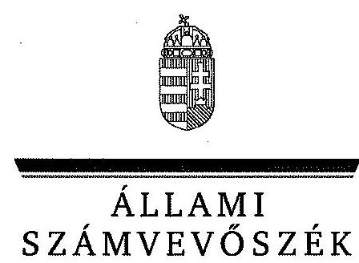
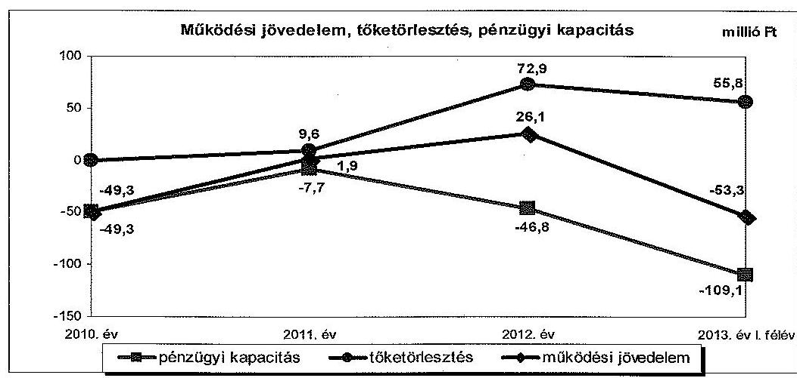
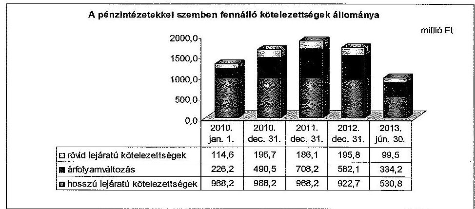
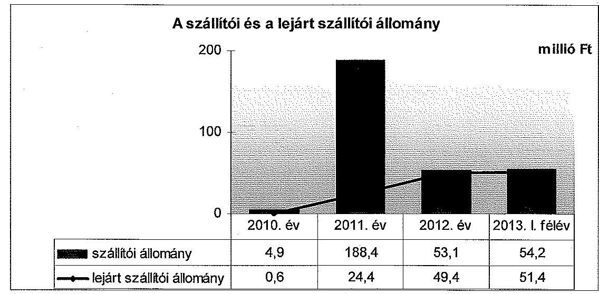
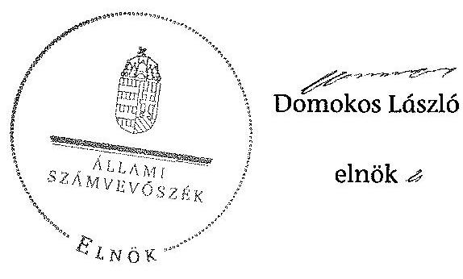
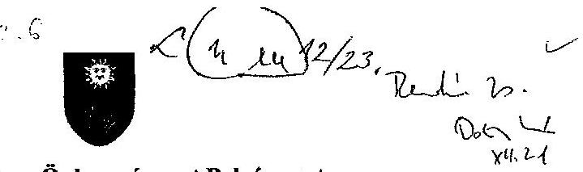
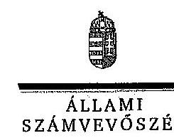
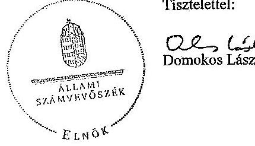
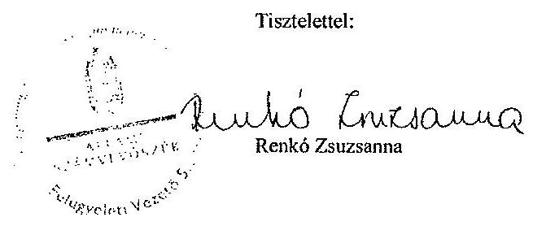

ÁLLAMI
SZÁMVEVŐSZÉK

# JELENTÉS 

az önkormányzatok pénzügyi gazdálkodási
helyzete értékelésének, és gazdálkodása szabályosságának

- 2013. évben induló - ellenőrzéséről

Füzesabony
14023
2014. január

---

# Állami Számvevőszék 

Iktatószám: V-0203-036/2014.
Témaszám: 1238
Vizsgálat-azonosító szám: V065001
Az ellenőrzést felügyelte:
Renkó Zsuzsanna
felügyeleti vezető
Az ellenőrzést vezette és az ellenőrzés végrehajtásáért felelős:
Valastyánné dr. Vízhányó Júlia
ellenőrzésvezető
A számvevőszéki jelentés összeállításában közremüködött:
Baksa Anikó
számvevő tanácsos
Az ellenőrzést végezték:
Boldoczki János
Számvevő

Burenzsargal Narantuja
számvevő tanácsos

---

# TARTALOMJEGYZÉK 

BEVEZETÉS ..... 3
I. ÖSSZEGZŐ MEGÁLLAPÍTÁSOK, KÖVETKEZTETÉSEK, JAVASLATOK ..... 6
II. RÉSZLETES MEGÁLLAPÍTÁSOK ..... 12

1. Az Önkormányzat kötelező és önként vállalt feladatai, a feladatellátás szervezeti kereteinek változása ..... 12
2. A pénzügyi egyensúly fenntartását veszélyeztető pénzügyi kockázatok, ezek csökkentése érdekében tett intézkedések ..... 15
3. Az Önkormányzat kötelezettségeinek állománya, azok összetételének változása, az adósságkonszolidáció hatása ..... 19
4. Az Önkormányzat pénzügyi gazdálkodása során érvényesített integritási szempontok ..... 24

---

# MELLÉKLETEK 

1/A. számú Az Önkormányzat bevételei és kiadásai, valamint adósságszolgálata a 2010-2013. év I. féléve közötti időszakban (a CLF módszer szerint, a Kvtv. 72. § (1) bekezdésében foglalt adósság átvállaláshoz kapcsolódó pénzügyi teljesítések nélkül)
1/B. számú Az Önkormányzat bevételei és kiadásai a Kvtv. 72. § (1) bekezdésében foglalt adósság átvállaláshoz kapcsolódó pénzügyi teljesítések nélkül a 2013. év I. félévében (a CLF módszer szerint)
2. számú Az Önkormányzat által a 2010. és a 2013. év I. félév között megvalósított fejlesztési feladatok érdekében teljesített felhalmozási kiadások és az ezekhez vállalt kötelezettségek összegzése
3. számú Az önkormányzati feladatok ellátásában résztvevő gazdasági társaságok egyes kiemelt adatai
4. számú Az Önkormányzat kötelezettségeinek és egyes kötelezettségvállalásainak 2010. december 31-ei és 2013. június 30 -ai állománya, valamint a 2013. év II. félévben és az azt követő években várható kötelezettségek, kötelezettségvállalások miatti kiadások
5. számú Füzesabony Városi Önkormányzat Polgármesterének a jelentéstervezethez tett észrevétele
6. számú Az ÁSZ válasza Füzesabony Városi Önkormányzat Polgármesterének a jelentéstervezethez tett észrevételére

## FÜGGELÉKEK

1. számú Rövidítések jegyzéke
2. számú Fogalomtár

---

# JELENTÉS 

## az önkormányzatok pénzügyi gazdálkodási helyzete értékelésének, és gazdálkodása szabályosságának - 2013. évben induló ellenőrzéséről Füzesabony

## BEVEZETÉS

Az ÁSZ a stratégiájában célul tűzte ki, hogy az önkormányzatok ellenőrzése során azok pénzügyi-gazdasági helyzetét értékeli, kockázatait feltárja, valamint az ellenőrzések helyszíneit objektív mutatószámrendszer alapján választja ki.

Az államháztartás önkormányzati alrendszerében az utóbbi években megjelenő gazdálkodási nehézségek, a pénzforgalmi hiány növekedése, az eladósodás az ÁSZ figyelmét az önkormányzatok pénzügyi helyzetére irányította. Az elkövetkezendő évek költségvetési hiánycéljainak tarthatósága érdekében indokolt, hogy az önkormányzatok pénzügyi helyzetelemzése és az egyensúlyi helyzetet befolyásoló kockázatok feltárása továbbra is kiemelt hangsúlyt kapjon az ÁSZ tevékenységében.

A közigazgatás átalakításának keretében - a helyi igazgatás és önkormányzás hatékonyabbá tétele érdekében - a Kormány az önkormányzatokra vonatkozóan 2012-ben újraszabályozta mind a sarkalatos, mind az önkormányzatok mindennapi múködését rendező törvényeket és a feladatok végrehajtását biztosító előírásokat. Az önkormányzati feladatellátást érintő átalakítások jelentős része 2013-ban következett be azzal, hogy az igazgatási, az oktatási és a szociális ellátásban a feladatok jelentős hányadát átvette az állam. Ahhoz, hogy az önkormányzatok meg tudjanak felelni a számukra meghatározott - szigorúbb - gazdálkodási szabályoknak, és az új feltételek mellett is biztosítható legyen a közszolgáltatások megfelelő színvonalú ellátása, szükséges volt a pénzügyigazdasági rendszerük alapjainak megszilárdítása. Ezt a célt szolgálja az adósságkonszolidáció, amely az önkormányzatok múködését és fejlesztését segítő, de korábban az állam által nem fedezett kiadásokkal kapcsolatos kötelezettségvállalások differenciált mértékű átvállalását jelenti.

Az ÁSZ a 2013. év I. félévi ellenőrzési tervében a 39. számú, az önkormányzatok pénzügyi gazdálkodási helyzete értékelésének, és gazdálkodása szabályosságának - 2013. évben induló - ellenőrzésével az önkormányzatok 2011. évben megkezdett helyzetelemzését folytatja. Az adósságkonszolidáció az önkormányzatok pénzügyi egyensúlyi helyzetére egyértelműen kedvező hatást gyakorolt, azonban a problémák kiváltó okait nem szüntette meg, ennek kezelése nélkül viszont az adósságállomány újratermelődik. Az önkormányzati alrend-

---

szerben a 2013-tól bevezetett új feladatfinanszírozási rendszer keretein belül továbbra is megoldandó kérdés a pénzügyi egyensúly megteremtése, hosszú távú fenntartása. Erre tekintettel kiemelt fontosságú az önkormányzatok pénzügyi egyensúlyi helyzetére ható kockázatok feltárása, az ezzel kapcsolatos folyamatok, trendek bemutatása. Az ÁSZ ennek megfelelően a jövőben is tovább folytatja az önkormányzatok pénzügyi gazdálkodási helyzetét értékelő témacsoportos ellenőrzéseit.

Az ellenőrzések kockázatalapú megközelítése keretében megtörténik az önkormányzatok adósságkezelési és likviditási helyzetének értékelése, a pénzügyi egyensúly minősítése, továbbá az alrendszerben 2013-ban bekövetkezett változások hatásának értékelése.

Az ellenőrzés - eredményének várható hatásaként - megállapításaival segítséget nyújthat a pénzügyi helyzet értékeléséhez, a pénzügyi egyensúly helyreállítása érdekében szükségessé váló önkormányzati intézkedések megtételéhez. Az ellenőrzés során továbbra is célunk az államháztartás önkormányzati alrendszerére jellemző információk összegzésével támogatni az Országgyűlés munkáját a törvényalkotásban, a források elosztásában.

Az ellenőrzés célja: az Önkormányzat pénzügyi helyzetének, szabályosságának értékelése, a pénzügyi egyensúly alakulására hatással lévő folyamatoknak és a pénzügyi egyensúly alakulására ható kockázatoknak a feltárása.

# Az ellenőrzés célja annak értékelése volt, hogy: 

- a kötelező és önként vállalt feladatok ellátása, ezen belül az ellátott feladatok körének, az ellátást biztosító szervezeti formáknak a változása milyen hatást gyakorolt a pénzügyi egyensúlyi helyzetre;
- az Önkormányzat pénzügyi - múködési és felhalmozási - egyensúlya milyen irányban változott, a változást milyen okok idézték elő, továbbá milyen intézkedéseket tettek az egyensúly biztosítása, illetve javítása érdekében, az intézkedések hatására javult-e az Önkormányzat pénzügyi helyzete;
- a költségvetési kiadások finanszírozása érdekében vállalt, pénzintézetekkel szembeni kötelezettségek, a szállítói és egyéb kötelezettségek hogyan alakultak, az adósságkonszolidáció után fennmaradt kötelezettségek teljesítésének kockázatai miként befolyásolják a jövőbeli pénzügyi egyensúlyi helyzetet.

Az önkormányzatok korrupcióval szembeni veszélyeztetettségének csökkentése érdekében új feladatként felmértük az integritási szemlélet érvényesülését a pénzügyi gazdálkodási folyamatokban.

Utóellenőrzésre nem került sor, mivel az ÁSZ az ellenőrzött időszakban az Önkormányzatnál számvevőszéki jelentéssel lezárt ellenőrzést nem végzett.

Az ellenőrzési célokban megfogalmazott kérdések értékelési kritériumai a gazdálkodásra vonatkozó jogszabályok és a pénzügyi egyensúly biztosításának, valamint a pénzügyi helyzettel és gazdálkodással kapcsolatos kockázatok kezelésének követelménye. Az ellenőrzés az ellenőrzési célok eléréséhez elemző, értékelő, a pénzügyi helyzet kockázatát is minősítő eljárásokat alkalmazott.

---

Az ellenőrzés típusa: szabályszerűségi ellenőrzés

# Ellenőrzött szervezet: Füzesabony Városi Önkormányzat 

Az ellenőrzött időszak: a 2010. január 1-jétől 2013. június 30-ig terjedő időszak, figyelemmel az ellenőrzés célja vonatkozásában megfogalmazottakra. A pénzintézetekkel szembeni kötelezettségek állományának vizsgálatakor az ellenőrzött időszakban fennálló kötelezettségeket vette figyelembe az ellenőrzés.

Az ellenőrzés szakmai módszertana az ÁSZ hivatalos honlapján (www.asz.hu) közzétett szakmai szabályokon alapult, amely a Legfőbb Ellenőrző Intézmények Nemzetközi Szervezete (INTOSAI) által kiadott nemzetközi standardok (ISSAI) figyelembevételével készült.

Az ellenőrzés jogszabályi alapját az ÁSZ tv. 1. § (3) bekezdésének, 5. § (2)-(6) bekezdéseinek, valamint az Áht. 61. § (2) bekezdésének előírásai képezik.

Az ellenőrzés során használt rövidítéseket az 1. számú, az egyes fogalmak magyarázatát a 2 . számú függelék tartalmazza.

Füzesabony város állandó lakosainak száma 2010. január 1-jén 8146 fő, 2013. január 1-jén 8006 fő volt. Az Önkormányzat a 2012. évben 1564,1 millió Ft költségvetési bevételt ért el, és 1650,7 millió Ft költségvetési kiadást teljesített. A 2012. december 31-i könyvviteli mérleg szerint 4864,5 millió Ft értékű vagyonnal rendelkezett, a rövid lejáratú kötelezettségállomány 342,6 millió Ft, a hoszszú lejáratú kötelezettségállomány 1430,6 millió Ft volt. Az Önkormányzat az önállóan múködő és gazdálkodó Polgármesteri Hivatalon és a Városi Intézményi Központon kívül egy önállóan működő költségvetési szervvel és két többségi hányadú gazdasági társasággal látta el feladatait. Az Önkormányzatnál foglalkoztatott köztisztviselők száma 2012. december 31-én 46 fő volt. A jegyző 2011. február 23-ától látja el feladatait.

Az ÁSZ tv. 29. § (1) bekezdése szerint a jelentéstervezetet megküldtük a polgármester részére, aki az ÁSZ tv. 29. § (2) bekezdésében foglalt észrevételezési jogával élt, a jelentéstervezetre észrevételt tett.

---

# I. ÖSSZEGZŐ MEGÁLLAPÍTÁSOK, KÖVETKEZTETÉSEK, JAVASLATOK 

Füzesabony Város Önkormányzatának pénzügyi egyensúlya az ellenőrzött időszakban rövid távon nem volt biztosított. A múködési költségvetés egyenlege a 2013. év I. félévben bevezetett új feladatellátási és finanszírozási rendszerben 53,3 millió Ft hiányt mutatott. A 2013. évi 40,0\%-os mértékű, 680,3 millió Ft tőketartozásra és annak járulékaira vonatkozó adósságkonszolidáció hatására az Önkormányzat pénzügyi egyensúlyi helyzete javult, azonban a finanszírozásba bevonható pénzeszközei, valamint a jövedelemtermelő képessége alapján képződő bevételek várhatóan nem biztosítják a fennálló kötelezettségek jövőbeni fedezetét.

Az Önkormányzat költségvetésének elemzését a CLF módszerrel számított mutatók alapján végeztük. A pénzügyi kapacitás 2010-2013. év I. félév közötti változását - a 2013. évi adósságkonszolidáció pénzforgalmi hatása nélkül számítva - a következő ábra mutatja be:

Az Önkormányzat a 2010-2013. év I. félév között összesen 5459,5 millió Ft költségvetési bevételt ért el, és 5812,2 millió Ft költségvetési kiadást teljesített. A folyó bevételek a 2010. évben és a 2013. év I. félévben nem nyújtottak fedezetet a folyó kiadásokra, amely múködési jövedelemtermelő képesség miatti kockázatot jelez. Az ellenőrzött időszakban összességében 74,6 millió Ft múködési hiány keletkezett. Az Önkormányzat a 2011. évben 47,1 millió Ft, a 2012. évben 75,4 millió Ft ÖNHIKI támogatásban részesült. Bevételi kitettséget jelentett, hogy a folyó költségvetés egyenlege a múködőképesség megőrzését szolgáló kiegészítő támogatás nélkül 2011-ben 45,2 millió Ft, 2012-ben 49,3 millió Ft hiányt mutatott volna. A 2013. év I. félévben az Önkormányzat szerkezetátalakítási tartalékból folyósított központi támogatásban nem részesült.

Az Önkormányzat felhalmozási forráshiánya a 2010-2013. év I. félév között összesen 278,1 millió Ft volt, melynek finanszírozására az ellenőrzött időszakot megelőzően kibocsátott kötvény biztosított fedezetet. A felhalmozási for-

---

ráshiány alakulását elsősorban az EU-s támogatásokhoz kapcsolódó projektek kivitelezése befolyásolta.

Az Önkormányzat adatszolgáltatása alapján az ellenőrzött időszakban megvalósított fejlesztések önként vállalt feladatokhoz kapcsolódó felhalmozási kiadásainak összege 789,7 millió Ft volt, amely $73,8 \%$-a a teljesített kifizetéseknek (1069,6 millió Ft). Kiemelt projektként valósult meg az Egészségügyi Központ 333,7 millió Ft összköltségű fejlesztése, amelyhez 260,0 millió Ft EU-s támogatást nyertek el az ÉMOP keretében. Az önként vállalt feladatokra teljesített felhalmozási kiadások magas részaránya felhalmozási kockázatot jelentett.

A nettó múködési jövedelem (pénzügyi kapacitás) az ellenőrzött időszakban folyamatosan negatív volt, a felhalmozási forráshiánnyal együtt számított 491,0 millió Ft finanszírozási igényt forgatási célú értékpapír beváltásból, az előző években képződött, a kötvénybevétel fel nem használt részéből származó tartalékból, valamint folyószámlahitelből fedezte az Önkormányzat.

Az önként vállalt feladatokra fordított működési kiadások aránya 2010-ről a 2013. év I. félév végére - döntően a járóbeteg-szakellátási feladatok bővítésének következtében - 21,9\%-ról 26,4\%-ra emelkedett. Az Önkormányzat a járóbeteg-szakellátási feladatok 2013. évet követő további folytatását vállalta. Az önként vállalt feladatok ellátása azonban - tekintettel a jövedelemtermelő képesség szintjére - múködési kockázatot jelent. Az egyes igazgatási és köznevelési feladatok állami fenntartásba adása az Önkormányzat adatszolgáltatása alapján 412,6 millió Ft kiadáscsökkenést és 328,4 millió Ft bevételkiesést eredményezett. A feladatátadások kedvező hatása ellenére az új feladatfinanszírozási rendszer keretében csökkenő költségvetési források hatására a pénzügyi egyensúlyi helyzet összességében a 2013. év I. félévében kedvezőtlenül változott. A saját hatáskörben végrehajtott bevételnövelő és kiadáscsökkentő intézkedések ellenőrzött időszakra számszerűsített hatása 8,7 millió Ft volt, amely nem biztosított elegendő forrást a pénzügyi egyensúlyi helyzet helyreállításához.

Az Önkormányzat pénzintézeti kötelezettségei a 2010. év elejéről a 2012. év végére 29,9\%-kal, 1309,0 millió Ft-ról 1700,6 millió Ft-ra növekedtek, ezt követően a 2013. év I. félévre 964,5 millió Ft-ra csökkentek. A deviza alapú kötvénykibocsátás árfolyam- és kamatkockázatot, a folyószámlahitel folyamatos igénybevétele banki kitettség miatti kockázatot jelentett az Önkormányzat számára. Az adósságkonszolidációt követően fennmaradt pénzintézeti kötelezettségállomány 99,5 millió Ft folyószámlahitelből és 865,0 millió Ft CHF alapú kötvénytartozásból tevődött össze. Az Önkormányzat jövedelemtermelő képességét és finanszírozásba bevonható pénzeszközeit figyelembe véve - az adósságkonszolidáció kedvező hatása ellenére - fennáll a jövőbeni kötelezettségek kifizethetőségének kockázata az ellenőrzött időszakot követően teljesítendő 103,6 millió Ft és 3995,7 ezer CHF adósságszolgálattal kapcsolatban.

A lejárt szállítói tartozások összege az ellenőrzött időszakban folyamatosan emelkedett. Szállítói kitettséget és nemfizetési kockázatot jelentett, hogy a 2013. év I. félévének végén fennállt lejárt esedékességű tartozásállomány $81,1 \%$-a ( 41,7 millió Ft) egy szállítóhoz kapcsolódott, továbbá az Önkormányzatnak 22,4 millió Ft 60 napon túli fizetési késedelemben lévő tartozása volt. Az

---

Önkormányzatnál mérlegen kívüli tételek miatti kockázatot jelentett két gazdasági társaság kötelezettségeire a 14,7 millió Ft összegben vállalt készfizető kezesség, továbbá a döntően kötelező feladatokat ellátó, kizárólagos önkormányzati tulajdonban lévő gazdasági társaság veszteséges gazdálkodása.

Az Önkormányzatnak a pénzügyi gazdálkodás során az integritási szemlélet teljes körű érvényesítése érdekében - a pénzügyi helyzetét és az adósságterheit befolyásoló döntések előtt, azok kockázatainak felmérését előíró szabályozás hiányára tekintettel - még fejlődnie kell.

Az ellenőrzés során a gazdálkodási feladatok ellátásával kapcsolatban az alábbi szabályszerűségi hibákat tártuk fel:

- a Képviselő-testület határozata szerint a 2010. május 31-én, közbeszerzési eljárás lefolytatását követően megkötött folyószámla-hitelkeret szerződést 2011. június 3-án módosították, ezáltal a szerződés hatálya 2011. május 31-ről 2011. június 30-ra módosult. A szerződés módosításáról szóló, a Kbt.1-ben ${ }^{1}$ előírt tájékoztató hirdetmény útján történő közzététele azonban a jogszabályban előírt határidőig nem történt meg;
- az Önkormányzat a 2013. évi költségvetési rendeletében a költségvetési bevételek és kiadások előirányzatának főösszegét az Áht.-ban foglalt előírások ellenére finanszírozási célú bevételekkel és kiadásokkal együtt állapította meg;
- a devizában fennálló kötvénytartozás törlesztő részletei után a pénzügyileg realizált árfolyamveszteség összegét a főkönyvi könyvelésben az Áhsz.1-ben foglalt előírásokkal ${ }^{2}$ ellentétben elkülönítetten nem mutatták ki.

Az ÁSZ tv. 33. § (1) bekezdésében foglaltak értelmében az ellenőrzött szervezet vezetője köteles a jelentésben foglalt megállapításokhoz kapcsolódó intézkedési tervet összeállítani, és azt a jelentés kézhezvételétől számított harminc napon belül az ÁSZ részére megküldeni. Amennyiben az intézkedési tervet határidőn belül nem küldi meg a szervezet vezetője, vagy az továbbra sem elfogadható, az ÁSZ elnöke a hivatkozott törvény 33. § (3) bekezdés a-b) pontjaiban foglaltakat érvényesítheti.

# Az ellenőrzés intézkedést igénylő megállapításai és javaslatai: 

## a polgármesternek

1. Az Önkormányzat pénzügyi egyensúlya az ellenőrzött időszakban rövid távon nem volt biztosított. A múködési költségvetés egyenlege a 2010. évben és - a működőképesség megőrzését szolgáló 122,5 millió Ft támogatások nélkül - a 2011. és 2012. években is negatív volt. A 2013. év I. félévében az adósságkonszolidáció keretében kapott 78,4 millió Ft működési célú törlesztési támogatás nélkül a folyó költségvetés egyenlege 53,3 millió Ft hiányt mutatott. Az ellenőrzött időszakban képződött mű-
[^0]
[^0]:    ${ }^{1}$ Hatálytalan 2012. január 1-jétől, a 2012. január 1-jétől hatályos jogszabály: a Kbt. ${ }_{2}$
    ${ }^{2}$ Hatálytalan 2014. január 1-jétől, a 2014. január 1-jétől hatályos jogszabály: az Áhsz. ${ }_{2}$

---

ködési jövedelem egyik évben sem nyújtott fedezetet a tőketörlesztési kötelezettségre. A saját hatáskörben tett bevételnövelő és a kiadáscsökkentő intézkedések nem biztosítottak elegendő forrást a pénzügyi egyensúly helyreállításához. Az ellenőrzött időszakban a likviditás biztosítására igénybe vett folyószámlahitel tartóssá vált. A folyószámlahitel 2012. év végi 195,8 millió Ft-os állományából az adósságátvállalás keretében 78,4 millió Ft kiegyenlítésre került, az ellenőrzött időszak végén azonban a folyószámlahitel tartozás ismét 99,5 millió Ft volt. A 2013. év I. félév végén - a lezárult adósságkonszolidációt követően - fennálló pénzintézeti kötelezettség 964,5 millió Ft volt. Kockázatot jelent, hogy a kötelezettségek jövőbeni teljesítéséhez elkülönített tartalék nem áll rendelkezésre. Nemfizetési kockázatot jelent, hogy a 2013. év I. félév végi 54,2 millió Ft szállítói állomány $94,8 \%$-a ( 51,4 millió Ft) lejárt tartozás, melyből 22,4 millió Ft 60 napon túli lejárt esedékességű. Az önként vállalt feladatok ellátása müködési és felhalmozási kockázatot jelentett. A 2013. évi költségvetésben az önként vállalt feladatok bevételi és kiadási eredeti előirányzatainak különbözete 58,1 millió Ft hiányt mutatott. Az Önkormányzat pénzügyi helyzetének szempontjából mérlegen kívüli kockázatot jelent a kizárólagos tulajdonában lévő gazdasági társaság veszteséges gazdálkodása.

Javaslat:
A müködési jövedelemtermelő képesség és a feladatellátás összhangjának megteremtése, valamint a pénzügyi egyensúly helyreállítása, hosszú távú fenntarthatósága érdekében felelősök és határidők megjelölésével kezdeményezzen intézkedéseket, melyek keretében:
a) a költségvetési rendelettervezet, valamint annak évközi módosítása előterjesztését megelőzően mérjék fel a bevételszerző, kiadáscsökkentő lehetőségeket, és terjessze a Képviselő-testület elé a bevételek növelését, a kiadások csökkentését célzó intézkedések bevezetéséhez szükséges - a Htv. 140. § (1) bekezdés a) pontja alapján a jegyző által elkészített - döntési javaslatát;
b) terjesszen a Képviselő-testület elé jóváhagyásra - a Htv. 140. § (1) bekezdés a) pontja alapján a jegyző által elkészített - az Önkormányzat gazdasági helyzetének elemzésén alapuló, a pénzügyi egyensúlyi helyzet gyors helyreállítását, hosszú távú fenntartását, valamint az adósságállomány újratermelődésének elkerülését biztosító intézkedéseket tartalmazó reorganizációs programot;
c) az Önkormányzat és a kizárólagos tulajdonában lévő gazdasági társaság kötelezettségeinek jövőbeni teljesítése, a fizetőképesség megőrzése érdekében terjeszszen a Képviselő-testület elé - a Htv. 140. § (1) bekezdés a) pontja alapján a jegyző által elkészített - döntési javaslatot, amelyben a Képviselő-testület kötelezettséget vállal arra, hogy előre meghatározott összegben és módon a realizált többletbevételeket, a meglévő és a jövőben képződő tartalékokat mindaddig a kötelezettségek rendezésére fordítja, azt nem használja más célra, amíg az Önkormányzat és a kizárólagos tulajdonában lévő gazdasági társaság pénzügyi egyensúlya rövid távon veszélyeztetett;
d) a szállítói kitettség és az Adósságrendezési tv. 4. § (2) bekezdés a)-b) pontjaiban megjelölt helyzet kialakulásának elkerülése érdekében, meghatározott gyakorisággal számoljon be a Képviselő-testületnek az Önkormányzat lejárt szállítói ál-

---

lománya alakulásáról. Intézkedjen a szállítói számlák esedékesség szerinti kiegyenlítéséről, vagy a lejárt tartozások átütemezéséről;
e) vizsgálja felül az önként vállalt feladatok finanszírozhatóságát a kötelező feladatellátás elsődlegességének biztosítása érdekében, és ennek függvényében tegyen javaslatot a Képviselő-testületnek a feladatellátás racionalizálására;
f) terjessze a jegyző közreműködésével a Képviselő-testület elé jóváhagyásra az Önkormányzat kizárólagos tulajdonában lévő gazdasági társaság által, pénzügyi helyzete stabilizálása érdekében elkészített intézkedési tervet.
2. Az Önkormányzat közbeszerzési eljárást lefolytatva kötött folyószámla-hitelkeret szerződést a 2010. június 1-jétől 2011. május 31-ig, valamint a 2011. június 30-tól 2012. június 29-ig terjedő időszakokra. Az új szerződés megkötését megelőzően a Képviselő-testület a korábbi szerződés egy hónappal történő meghosszabbításáról döntött. A 2011. június 3-án aláírt szerződés módosításáról szóló tájékoztató hirdetmény útján történő közzététele azonban a Kbt. 1 307. § (1) bekezdésében ${ }^{3}$ foglaltak ellenére, a jogszabályban meghatározott határidőig nem történt meg.

Javaslat:
A közbeszerzési eljárásról szóló törvényben foglaltak maradéktalan betartása érdekében biztosítsa, hogy a közbeszerzési eljárás alapján megkötött szerződés módosítása esetén a Kbt. 230 . § (1) bekezdés h) pontjában foglalt előírás alapján a szerződés módosításáról szóló tájékoztató hirdetmény útján történő közzétételére legkésőbb a Kbt. 230 . § (4) bekezdése szerint, a szerződés módosításától számított 15 munkanapon belül kerüljön sor.

# a jegyzőnek 

1. Az Önkormányzat a 2013. évi költségvetési rendeletében a költségvetési bevételek és kiadások eredeti előirányzatának főösszegét - az Áht. 5. § (1)-(2) bekezdéseiben foglalt előírások ellenére - az Áht. 73. § (1) bekezdése szerinti finanszírozási célú bevételekkel és kiadásokkal együtt állapította meg.

Javaslat:
Intézkedjen, hogy a költségvetési rendelettervezet összeállítása során a költségvetési bevételeket és a költségvetési kiadásokat az Áht. 5. § (1)-(2) bekezdéseiben foglalt előírások szerint határozzák meg.

[^0]
[^0]:    ${ }^{3}$ Hatálytalan 2012. január 1-jétől, a 2012. január 1-jétől hatályos előírás: a Kbt. 230 . § (1) bekezdés h) pontja és 30 . § (4) bekezdés.

---

2. Az Önkormányzatnál a devizában fennálló kötvénytartozás törlesztő részletei után a pénzügyileg realizált árfolyamveszteség összegét a főkönyvi könyvelésben - az Áhsz. 1 9. számú mellékletének a számlaosztályok tartalmára vonatkozó előírásai 4. dl pontjában és a 9. d) pontjában foglalt előírással ${ }^{4}$ ellentétben - elkülönítetten nem mutatták ki.

Javaslat:
Intézkedjen, hogy a devizában fennálló kötvénytartozás törlesztése során a pénzügyileg realizált árfolyamveszteség elszámolása az Áhsz. 2 44. § (3) bekezdésben foglalt előírás alapján a 27. § (8) bekezdés a) pontjában foglaltaknak megfelelően a pénzügyi műveletek egyéb ráfordításai között történjen. Amennyiben a törlesztés során árfolyamnyereség keletkezik, azt az Áhsz. 2 27. § (4) bekezdés c) pontjában foglalt előírás szerint, a pénzügyi műveletek egyéb eredményszemléletű bevételei között mutassák ki.

[^0]
[^0]:    ${ }^{4}$ Hatálytalan 2014. január 1-jétől. A 2014. január 1-jétől hatályos előírás: az Áhsz. 244. § (3) bekezdés és a 27. § (8) bekezdés a) pontja.

---

# II. RÉSZLETES MEGÁLLAPÍTÁSOK 

## 1. Az ÖNKORMÁNYZAT KÖTELEZŐ ÉS ÖNKÉNT VÁLlALT FELADATAI, A FELADATELLÁTÁS SZERVEZETI KERETEINEK VÁLTOZÁSA

Az Önkormányzat a kötelező és az önként vállalt feladatainak körét az önkormányzati SZMSZ-ben határozta meg. Az önként vállalt feladatok közé sorolt feladatok a járóbeteg-szakellátást nyújtó egészségügyi intézmény múködtetése, a gimnáziumi és szakközépiskolai oktatás, az alapfokú művészetoktatás, a versenysport és a civil szervezetek, szerveződések támogatása, a bölcsőde működtetése és a Televíziózást Segítő Nonprofit Kft. támogatása voltak.

A kötelező feladatok körében biztosította az Önkormányzat a közoktatási ágazatban az óvodai nevelést, valamint az általános iskolai oktatást, a szociális és gyermekjóléti feladatok keretében a családsegítést, a szociális étkeztetést, a házi segítségnyújtást, a nappali ellátást és a gyermekjóléti szolgálatot. Az egészségügyi feladatok ellátására védőnői szolgálatot tartott fenn, a háziorvosi és gyermekorvosi ellátás biztosítására két gazdasági társasággal és egy háziorvossal, a fogorvosi ellátásra két gazdasági társasággal kötött szerződést. Közszolgáltatási szerződések alapján gazdasági társaságok ${ }^{5}$ látták el a víz- és csatornaszolgáltatás, a szilárdhulladék-szállítás, -kezelés, a köztemető fenntartás, a park- és közterület fenntartás és a gyermekélelmezés feladatait. A piac müködtetését egyéni vállalkozó végezte. A kötelező közművelődési feladatokat könyvtár és művelődési ház fenntartásával teljesítették.

Az ellenőrzött időszakban a működési kiadásokon belül az önként vállalt feladatok kiadásainak részaránya $21,9 \%$-ról $26,4 \%$-ra bővült, összege a 2010. évi 356,9 millió Ft-ról a 2012. évre 375,4 millió Ft-ra emelkedett, amit jelentős részben a járóbeteg-szakellátás bővítésével összefüggő kiadásnövekedés okozott. Az önként vállalt feladatokra fordított múködési kiadások arányának növekedése az egészségügyi feladatok körének bővülése következtében együtt müködési kockázatot jelentett.

Az Önkormányzat adatszolgáltatása alapján az ellenőrzött időszakban megvalósított fejlesztések értéke 1069,6 millió Ft, ebből az önként vállalt feladatokra fordított felhalmozási kiadások összege 789,7 millió Ft ( $73,8 \%$ ) volt. Az önként vállalt feladatokra teljesített felhalmozási kiadások magas részaránya felhalmozási kockázatot jelentett.

A Képviselő-testület a 2011. évtől a költségvetési koncepció meghatározása, valamint a költségvetési rendelet elfogadását megelőzően vizsgálta a kötelező és önként vállalt feladatok mértékét és arányát.

[^0]
[^0]:    ${ }^{5}$ Az önkormányzati feladatok ellátásában résztvevő gazdasági társaságok egyes kiemelt adatait a 3. számú melléklet tartalmazza.

---

Az Önkormányzat 2013. június 30 -án három költségvetési szervet tartott fenn, amelyek tíz telephellyel rendelkeztek. Önállóan múködő és gazdálkodó költségvetési szervként múködött a Polgármesteri Hivatal és a Városi Intézményi Központ, továbbá önállóan múködő költségvetési szerv az Egészségügyi Központ volt. A költségvetési szervek száma eggyel, a telephelyek száma tízzel csökkent az ellenőrzött időszakban a feladatellátás szervezeti kereteiben bekövetkezett változások hatására.

Az Önkormányzat az ellenőrzött időszakban a Televíziózást Segítő Nonprofit Kft.-ben és a Városüzemeltetési Kft.-ben rendelkezett 100,0\%-os tulajdoni részesedéssel. A Városüzemeltetési Kft. vállalkozási szerződés alapján látott el intézményi karbantartási, köztisztasági, park- és játszótér kezelési, ároktisztítási és sport feladatokat. A Televíziózást Segítő Nonprofit Kft. végezte a képviselőtestületi ülések és egyéb városi események közvetítését, közművelődési feladatokat és a Közösségi Ház üzemeltetését, amelyhez támogatást kapott az Önkormányzattól az ellenőrzött időszakban. Tevékenységi köréből 2011. július 1-jétől kikerültek a közművelődési feladatok.

Az Önkormányzat közoktatási kiadásainak összes múködési kiadáson belüli aránya a 2010. évi 31,9\%-ról - a köznevelési intézmények Klebelsberg Intézményfenntartó Központnak történő átadása következtében - 21,6\%-ra mérséklődött a 2013. év I. félévében. A fenntartóváltást követően az Önkormányzat vállalta a köznevelési intézmények ingó és ingatlan vagyonának további múködtetését. A köznevelési feladatok átadása következtében a kiadások 328,8 millió Ft-tal, a bevételek 269,5 millió Ft-tal, az önkormányzati intézményekben foglalkoztatottak száma 102 fővel csökkent. A 2013. év első félévében az ingó és ingatlan vagyon múködtetésére teljesített kiadások összege az átadott intézményekhez kapcsolódóan 44,1 millió Ft volt. A Képviselő-testület a működtetésről szóló döntés előtt vizsgálta a kapcsolódó kiadásokat, azonban az arról való esetleges lemondás pénzügyi hatásának elemzéséhez előzetes számításokat nem készítettek. Az átszervezést követően a Képviselő-testület a 2013. május 30 -ai határozatában a Széchenyi István Általános Iskola múködtetésének az Egri Főegyházmegye részére történő átadásáról döntött.

A szociális és gyermekjóléti feladatok ellátására a 2010. évben a múködési kiadások 19,6\%-át, 318,6 millió Ft-ot fordítottak. A szociális alapszolgáltatás feladatait - a családsegítés kivételével - 2011. december 31-ig a szociális mikrotársulás ${ }_{1}$ keretében, a Szociális Központon keresztül látták el gesztor településként. A társult települések likviditási gondjaira tekintettel az Önkormányzat kilépett a szociális mikrotársulás ${ }_{1}$-ből és csatlakozott a szociális mikrotársulás ${ }_{2}$-höz. Az átszervezés hatására a kiadások 46,9 millió Ft-tal, a bevételek 48,7 millió Ft-tal csökkentek, a dolgozókat a mikrotársulás ${ }_{2}$ foglalkoztatta, a dologi kiadásokat továbbra is az Önkormányzat finanszírozta. A 2012. évig a családsegittési feladatokat a Városi Intézményi Központ, a gyermekjóléti szolgálat múködtetését a Füzesabonyi Kistérség Többcélú Társulása látta el, ezt követően a szociális mikrotársulás ${ }_{2}$ vette át ezeket a feladatokat is.

A közmưvelődési- és sportfeladatokra az Önkormányzat a 2010. évben 37,2 millió Ft-ot, a múködési kiadások 2,3\%-át teljesítette. A kapcsolódó kiadások összege 2013. év I. félévében 5,7 millió Ft-ra csökkent a feladatellátás mértékének és módjának változása következtében. A közművelődési feladatokat a

---

2011. évig megállapodás alapján az Önkormányzat kizárólagos tulajdonában lévő Televíziózást Segítő Nonprofit Kft. látta el. 2011. július 1-jétől egy egyéni vállalkozót bíztak meg a feladatellátással. A Képviselő-testület 2013. április 25 -én a közművelődési szolgáltatások intézményi kereteinek ismételt átalakításáról döntött, a köznevelési feladatok átadása miatti változásokkal összefüggően.

Az egészségügyi ágazatban az Önkormányzat az Egészségügyi Központ fenntartásával látta el a járóbeteg-szakellátási feladatokat. Az intézmény 2009-2012. évek közötti felújításával bővült az igénybe vehető szakellátások köre, a működési alapterület és a költségvetési létszám is megnőtt, ami a 2013. évi tervezett kiadások 43,4\%-os ( 44,8 millió Ft-os) emelkedését okozta a 2010. évben teljesített múködési kiadásokhoz képest. Az emelt szintű szakellátás kiadásai az önként vállalt feladatok 2013. év I. félévi kiadásainak 54,4\%-át tették ki. Az Önkormányzat az egészségügyről szóló 1997. évi CLIV. törvény 244/D. § (5) bekezdése alapján a járóbeteg-szakellátási feladatainak 2013. április 30 -át követő folytatását vállalta.

Az igazgatási és egyéb feladatok területén a múködési kiadások aránya a múködési kiadásokon belül jelentősen nem változott, 2010-ben 39,0\%, a 2013. év I. félévben $38,2 \%$ volt, azonban a 2010. évi kiadásokhoz képest a 2013. évben az Önkormányzat 204,7 millió Ft-tal kevesebb kiadást tervezett. A csökkenést az egyes igazgatási feladatoknak a Járási Hivatal részére történő átadása, a tűzvédelmi feladatok ellátásában bekövetkezett szervezeti változások, a közfoglalkoztatás kiadásainak jelentős csökkenése és a 2010. évi egyszeri tételek (normatíva-visszafizetés, választásra fordított kiadások, kölcsönök visszatérülésével kapcsolatos technikai jellegű elszámolás) okozták.

A Járási Hivatal kialakításához a Kormányhivatallal megkötött megállapodás alapján a Polgármesteri Hivataltól 18 fő létszám és négy üres státusz átadására került sor. A Járási Hivatalnak történt feladatátadás eredményeként a kiadások 83,8 millió Ft-tal (személyi juttatások és járulékok 48,7 millió Ft-tal, dologi kiadások 35,1 millió Ft-tal), a bevételek 58,9 millió Ft-tal mérséklődtek. A Polgármesteri Hivatal 2013. évre tervezett kiadásainak összege 148,1 millió Ft, az éves támogatás összege 123,8 millió Ft volt. A Polgármesteri Hivatal 2013. évi költségvetési engedélyezett létszámát az önkormányzatok általános múködési támogatása kiszámításának alapjául szolgáló elismert hivatali létszámnak megfelelően határozták meg. Az Önkormányzat és a Járási Hivatal közös épületben múködött 2013. január 1-jétől az üzemeltetési kiadásokat a Kormányhivatal arányosan viselte. Az Önkormányzati Tűzoltóság állami tűzoltósággá történő átalakulása miatt 2012. január 1-jétől a foglalkoztatottak száma három fővel, a kiadások és a bevételek egyaránt 16,7 millió Ft-tal csökkentek. A feladatátadások kedvező hatása ellenére, az új feladatfinanszírozási rendszer keretében csökkenő költségvetési források hatására a pénzügyi egyensúlyi helyzet összességében a 2013. év I. félévében kedvezőtlenül változott.

---

# 2. A PÉNZÜGYI EGYENSÚLY FENNTARTÁSÁT VESZÉLYEZTETŐ PÉNZÜGYI KOCKÁZATOK, EZEK CSÖKKENTÉSE ÉRDEKÉBEN TETT INTÉZKEDÉSEK 

Az Önkormányzat költségvetésének elemzését a CLF módszer szerint hajtottuk végre. A 2013. év I. félévi valós jövedelemtermelő képesség bemutatása érdekében az elemzés során nem vettük figyelembe az adósságkonszolidációhoz kapcsolódó bevételeket és kiadásokat.

Az adósságkonszolidációra vonatkozóan az Önkormányzat 2013. év I. félévi beszámolója 78,4 millió Ft müködési költségvetési támogatást, valamint 78,4 millió Ft hiteltörlesztést tartalmazott. Az adósságkonszolidációhoz kapcsolódóan a folyó bevételek között kimutatott költségvetési támogatás javította a múködési jövedelmet.

A CLF módszer szerinti önkormányzati részletes adatokat 2010-2013. év I. félév között az 1/A. számú melléklet, az adósságkonszolidációhoz kapcsolódó bevételek és kiadások pénzügyi egyensúlyi helyzetre gyakorolt hatását az 1/B. számú melléklet, a főbb önkormányzati adatokat a következő tábla mutatja be:

|  |  |  |  | millió Ft |
| :--: | :--: | :--: | :--: | :--: |
| Megnevezés | 2010. év | 2011. év | 2012. év | 2013. év   I. félév |
| Folyó bevételek | 1577,0 | 1471,3 | 1441,3 | 464,8 |
| Folyó kiadások | 1626,3 | 1469,4 | 1415,2 | 518,1 |
| Müködési jövedelem | $-49,3$ | 1,9 | 26,1 | $-53,3$ |
| Felhalmozási bevételek | 111,0 | 243,8 | 122,8 | 27,5 |
| Felhalmozási kiadások | 281,1 | 238,2 | 235,5 | 28,4 |
| Felhalmozási költségvetés egyenlege | $-170,1$ | 5,6 | $-112,7$ | $-0,9$ |
| Folyó és felhalmozási bevételek összesen | 1688,0 | 1715,1 | 1564,1 | 492,3 |
| Folyó és felhalmozási kiadások összesen | 1907,4 | 1707,6 | 1650,7 | 546,5 |
| Finanszírozási múveletek nélküli pozíció | $-219,4$ | 7,5 | $-86,6$ | $-54,2$ |
| Finanszírozási műveletek egyenlege | 76,5 | 171,6 | $-65,5$ | $-50,2$ |
| Tárgyévi pénzügyi pozíció | $-142,9$ | 179,1 | $-152,1$ | $-104,4$ |
| Hiteltörlesztés, értékpapír beváltás | 0,0 | 9,6 | 72,9 | 55,8 |
| Nettó müködési jövedelem | $-49,3$ | $-7,7$ | $-46,8$ | $-109,1$ |

Az Önkormányzat a 2010. év és a 2013. év I. félév között - a 2013. évi adósságkonszolidációs támogatás nélkül számítva - összesen 5459,5 millió Ft költségvetési bevételt ért el, és 5812,2 millió Ft költségvetési kiadást teljesített. A müködési jövedelem - az ÖNHIKI támogatások ellenére - az ellenőrzött időszakban összesen 74,6 millió Ft forráshiányt mutatott. Az Önkormányzat 2010-2012. évek közötti folyó költségvetési egyenlegének pozitív irányú változását az eredményezte, hogy a kiadások nagyobb mértékben csökkentek, mint a bevételek. A 2011. évi folyó kiadások az előző évhez képest 156,9 millió Ft-tal mérséklődtek, a folyó bevételek 105,7 millió Ft-tal csökkentek. A 2012. évi folyó kiadások a 2011. évihez viszonyítva 54,2 millió Ft-tal, a folyó bevételek 30,0 millió Ft-tal csökkentek.

Az Önkormányzat a 2011. évben 47,1 millió Ft, a 2012. évben 75,4 millió Ft ÖNHIKI támogatásban részesült. Az Önkormányzat részére nyújtott támoga-

---

tást a 2012. évi központi költségvetéséről szóló, 2011. évi CLXXXVIII. törvény szerinti céloknak megfelelően, a közüzemi számlák, az élelmiszerbeszállítók felé fennálló tartozások, valamint egyéb szállítói tartozások kiegyenlítésére használták fel. Az Önkormányzatnál a múködési jövedelemtermelő képesség miatti kockázat az ellenőrzött időszakban fennállt, mivel a folyó költségvetésének egyenlege a 2010. évben 49,3 millió Ft, a 2013. év I. félévben 53,3 millió Ft hiány volt. Bevételi kitettséget jelentett, hogy a múködőképesség megőrzését szolgáló kiegészítő ÖNHIKI támogatás nélkül a múködési jövedelem 2011-ben 45,2 millió Ft, 2012-ben 49,3 millió Ft hiányt mutatott volna. A nettó múködési jövedelem értéke az ellenőrzött időszakban negatív volt (-212,9 millió Ft), a múködési jövedelem nem nyújtott fedezetet a tőketörlesztési kötelezettségek teljesítéséhez.

Az Önkormányzat felhalmozási kiadásai - a 2011. év kivételével - meghaladták a felhalmozási bevételeket. A felhalmozási forráshiány a 2010-2013. év I. félév közötti időszakban összesen 278,1 millió Ft volt. A felhalmozási költségvetés egyenlege a 2010. évben 170,1 millió Ft, a 2012. évben 112,7 millió Ft, a 2013. év I. félévében 0,9 millió Ft hiányt, a 2011. évben 5,6 millió Ft többletet mutatott. A felhalmozási költségvetés egyensúlyának 2011. évi javulása elsősorban az EU-s pályázati forrásból megvalósuló Egészségügyi Központ beruházásához kapott 126,5 millió Ft támogatásértékű felhalmozási bevételből, és 73,5 millió Ft kamatbevételből adódott. Az Önkormányzat felhalmozási forráshiányának finanszírozására a 2008. évi kötvénykibocsátásból származó tartalék biztosított fedezetet.

A felhalmozási költségvetés és a nettó múködési jövedelem együttes, negatív egyenlegéből adódó finanszírozási igény az ellenőrzött időszakban 491,0 millió Ft volt, amelyre forgatási célú értékpapír beváltás, előző években képződött, a kötvénybevétel fel nem használt részéből származó tartalék, valamint folyószámlahitel biztosított fedezetet.

Az Önkormányzat finanszírozási múveleteinek egyenlege a 2012. évtől kezdődően negatív volt, amit a kötvényhez kapcsolódó tőketörlesztés megkezdése és a folyószámlahitel-állomány törlesztése okozott. Az adósságszolgálat teljesítése érdekében újabb adósságot keletkeztető kötelezettséget az Önkormányzat nem vállalt.

A folyó bevételek összege a 2010-2012. években folyamatosan csökkenő tendenciát mutatott, a 2010. évi 1577,0 millió Ft-ról a 2011. évre 105,7 millió Ft-tal, a 2012. évre 30,0 millió Ft-tal mérséklődött. A változásra jelentős hatással volt az ÖNHIKI nélküli költségvetési támogatásoknak és a saját múködési bevételeknek a 2011. évben az előző évhez képest 7,9\%-os ( 85,9 millió Ft-os), a 2012. évben az előző időszakhoz viszonyított 5,7\%-os (59,1 millió Ft-os) csökkenése. A 2013. év I. félévben a folyó bevétel teljesített összege 464,8 millió Ft volt. A folyó bevételeken belül a legnagyobb részarányt a költségvetési támogatások és a saját múködési bevételek képezték. A folyó bevételeknek 2010-ben 11,5\%-a, 2011-ben 12,9\%-a, 2012-ben 14,5\%-a, a 2013. év I. félévben $18,1 \%$-a származott államháztartáson belülről kapott támogatásból. A legjelentősebb összegű támogatásértékű bevételeket a 20102012. években az OEP támogatásból a szakrendelésekre, valamint a Munkaügyi Központtól a közhasznú munka támogatására kapta az Önkormányzat.

---

A saját múködési bevételek összege a 2010. évben 454,9 millió Ft volt, a 2011. évben 409,5 millió Ft-ra, a 2012. évben 391,0 millió Ft-ra és a 2013. év I. félévben 143,6 millió Ft-ra csökkent.

Az Önkormányzat a Helyi adó tv. szerinti iparűzési adót és a magánszemélyek kommunális adóját vezette be. Az iparűzési adó kulcsa elérte a törvény szerinti maximális $2,0 \%$-os értéket, azonban a kommunális adó mértéke ${ }^{6}$ a jogszabályi felső határ alatt volt. A 2010-2013. év I. félév közötti időszakban adóemelésre nem került sor. Az Önkormányzat gazdálkodásában az ellenőrzött időszakban a helyi adók a folyó bevételek körében jelentős súlyt képviseltek, összegük 2010-ben 322 millió Ft, 2011-ben 301,0 millió Ft, 2012-ben 297,0 millió Ft, 2013. év I. félévben 98,0 millió Ft volt, arányuk a 2010. évi 20,4\%-hoz képest lényegesen nem változott. A helyi adókon belül az iparűzési adó részesedése a 2010. évben $94,3 \%$, a 2013. év I. félévében $86,2 \%$ volt. Az adóbevételek számos adóalanytól származtak, ezért nem állt fenn a helyi adók miatti bevételi kitettség. Az Önkormányzat helyi adókból származó bevételeinek szerkezetét és összetételét a 2010-2012. évi zárszámadási rendeletek előterjesztéseiben bemutatták, de az adóbevételek és az adózók száma egymáshoz viszonyított változásának hatását nem értékelték.

Az ellenőrzött időszakban az Önkormányzat 505,1 millió Ft felhalmozási bevételt teljesített, ezen belül az államháztartáson belülről kapott - az otthontere-rmtési-, és az Egészségügyi Központ fejlesztési projekthez kapcsolódó - támogatások összege 204,7 millió Ft volt. A saját felhalmozási bevételek ingadozását a felhalmozási célú kamatbevétel változása okozta.

Az Önkormányzatnál a folyó kiadások összege a 2010. évben 1626,3 millió Ft volt, és a 2011. évben 1469,4 millió Ft-ra, a 2012. évben 1415,2 millió Ft-ra esett vissza. A működési kiadások csökkenéséhez az egyszeri jellegű tételek mellett hozzájárult a közfoglalkoztatás rendszerének átalakítása és az Önkormányzat intézményi kereteiben bekövetkezett változás. Az ellenőrzött időszakban az összes kiadáson belül a folyó kiadások aránya 85,3\%-94,8\% között alakult.

Az Önkormányzat 2010-2013. év I. félévben pénzügyileg befejezett beruházásainak és felújításainak értéke 537,7 millió Ft volt, a folyamatban lévő beruházásokra és felújításokra 413,6 millió Ft kiadást fordítottak ${ }^{7}$. Az ellenőrzött időszakban megvalósított fejlesztések teljes bekerülési költsége 1069,6 millió Ft volt, amelynek finanszírozásához EU-s pályázati forrásból 301,9 millió Ft-ot ( $28,2 \%$ ), egyéb központi támogatásból 101,1 millió Ft-ot $(9,5 \%)$ és kötvényforrásból 666,6 millió Ft-ot ( $62,3 \%$ ) használtak fel. A 2013. június 30. utáni időszakra vállalt 375,0 millió Ft kötelezettség forrásait a 295,5 millió Ft kötvénykibocsátásból származó bevétel maradványából,

[^0]
[^0]:    ${ }^{6}$ Az adó évi mértéke a $100 \mathrm{~m}^{2}$ alatti lakás esetében 6250 Ft , a $100 \mathrm{~m}^{2}$ feletti lakás és az $500 \mathrm{~m}^{2}$-nél nagyobb telek esetében 10000 Ft volt.
    ${ }^{7}$ Az Önkormányzat által a 2010. és a 2013. év I. félév között megvalósított fejlesztési feladatok érdekében teljesített felhalmozási kiadások és az ezekhez vállalt kötelezettségek összegzését a 2. számú melléklet tartalmazza.

---

79,3 millió Ft EU-s támogatásból, és 0,2 millió Ft egyéb központi támogatásból tervezték biztosítani.

Az Önkormányzat az „Alapszintü járó beteg szakellátás feltételeinek biztositása a füzesabonyi Egészségügyi Központban" címú EMOP projektre megkötött támogatási szerződés alapján összesen 260,0 millió Ft összegű támogatásban részesült. A projekt összköltsége 333,7 millió Ft volt.

Az „IKT technológia bevezetése Füzesabony közoktatási intézményeiben" címú projekt keretében az Önkormányzat által fenntartott iskolákban pedagógiai módszertani fejlesztés (iskolai számítógép-csomagok, digitális táblák beszerzése) valósult meg 18,7 millió Ft összegben, teljes egészében TIOP támogatással.

A 2009. évben elkezdődött tanuszoda beruházására az Önkormányzat a 2010. évben 41,3 millió Ft-ot fordított. A teljesítés körüli vitás kérdések hatására a kivitelező 2011-ben felmondta a beruházási szerződést. Az Önkormányzat a beruházás leállításáról döntött, és jogi lépéseket kezdeményezett a személyi felelősség megállapítására. Az eljárás az ellenőrzött időszakban nem zárult le.

Az Önkormányzat az ellenőrzött években a zárszámadási rendeleteiben bemutatta a múködési és felhalmozási kiadások alakulását, főbb jogcímek szerinti összetétel változását, azonban nem értékelte a felhalmozási kiadások, valamint a fejlesztések során megvalósult, illetve megvalósuló létesítmények jövőbeni üzemeltetése miatti kockázatot.

A 2010. és 2013. év I. félév közötti időszakban - az Önkormányzat adatszolgáltatása szerint - a saját hatáskörben végrehajtott bevételnövelő és kiadáscsökkentő intézkedések összességében 8,7 millió Ft-tal javították a költségvetés egyensúlyát, azonban nem biztosítottak elegendő forrást a pénzügyi egyensúly helyreállításához. Az intézkedések a személyi jellegű kiadások és az igénybe vett közszolgáltatások csökkentéséhez, valamint a bevételek behajtásához kapcsolódtak.

Az Önkormányzat a fizetőképesség megőrzésére és az eladósodás kezelésére szolgáló stratégiával, koncepcióval nem rendelkezett. Nem elemezték a rövid és hosszú távú kötelezettségvállalásokkal kapcsolatos kockázatokat, és nem dolgozták ki a kockázatok kezelésére vonatkozó eljárásokat, módszereket. Az Önkormányzat nem készített programot a pénzügyi egyensúlyának biztosítására, illetve helyreállítására.

Az ellenőrzött időszakban az Önkormányzatnál nem mérték fel az eszközök műszaki állapotát, a szükséges pótlási, felújítási munkák forrásigényét, és nem végeztek az eszközök műszaki állapotára vonatkozó számításokat. Az eszközök használhatósági foka a 2010. évi $77,0 \%$-ról a 2011. évben $74,9 \%$-ra csökkent az elszámolt értékcsökkenés hatására, és a 2012. évben $75,4 \%$-ra nőtt az üzembe helyezések, valamint egyes „0"-ig leírt eszközök kivezetése hatására.

---

# 3. Az ÖNKORMÁNYZAT KÖTELEZETTSÉGEINEK ÁllomÁnVA, AZOK ÖSSZETÉTELÉNEK VÁLTOZÁSA, AZ ADÓSSÁGKONSZOLIDÁCIÓ HATÁSA 

Az Önkormányzat pénzintézeti kötelezettségeinek állománya 2010. január 1-jétől 2012. december 31-ig 29,9\%-kal, 1309,0 millió Ft-ról 1700,6 millió Ft-ra emelkedett. A növekedés $90,9 \%$-át a deviza alapú kötvényhez kapcsolódó nem realizált árfolyamveszteség változása okozta. A 2013. év I. félév végén a pénzintézeti kötelezettségek összege a 2012. évihez képest - jelentős részben az adósságkonszolidáció hatására - 43,3\%-kal, 736,1 millió Ft-tal volt alacsonyabb.

Az Önkormányzat pénzintézetekkel szemben a 2010-2013. I. félévben fennálló kötelezettségeit a következő ábra mutatja be:

A pénzintézeti kötelezettségek állományát 2013. június 30-án 99,5 millió Ft folyószámlahitel és 865,0 millió Ft kötvény tartozás képezte. Az Önkormányzat a 2008. évben 6550,5 ezer CHF ( 968,2 millió Ft) névértékú kötvény bocsátott ki 19 év és 4 hónap lejárati idővel. A tőketörlesztési kötelezettség 2012. április 30-ától kezdődött, a tőkerészletek a futamidő alatt növekvő mértékűek. Az Önkormányzat a fizetési nehézségei miatt a 2012. év I. félévében csak a kamatfizetési kötelezettségét teljesítette. A bankkal folytatott egyeztetést követően a tőketörlesztés a fel nem használt kötvénybevételből 2012. július 2-án történt meg. A kifizetett késedelmi kamat 1961,0 CHF ( 0,5 millió Ft) volt. A késedelmes teljesítés miatt a bank nem élt inkasszós jogával.

A Kvtv. 72. § (1) bekezdésében foglaltak alapján a Magyar Állam részben átvállalta az Önkormányzat adósságállományát és járulékait. A kötvényhez kapcsolódó, 40,0\%-ban átvállalt fizetési kötelezettség le nem járt névérték jogcímen 2497,1 ezer CHF-et, kamatok jogcímen 5,2 ezer CHF-et tett ki, a megállapodás alapján 603,2 millió Ft összegben. A kötvényhez kapcsolódó 601,9 millió Ft-os tőketörlesztést a Magyar Államkincstár közvetlenül a kötvénytulajdonos pénzintézettel rendezte, a tranzakció az Önkormányzat pénzforgalmában nem jelent meg. A kapcsolódó állományváltozás könyvelése 2013. június 30 -áig megtörtént. A folyószámlahitel-állomány csökkentéséhez az Önkormányzat további 78,4 millió Ft adósságkonszolidációs támogatásban részesült. A pénzintézeti kötelezettségek összege csökkent, melynek eredményeként javult az Önkormányzat pénzügyi egyensúlyi helyzete.

---

A devizában fennálló kötelezettség árfolyamkockázatot, a változó kamatozású kötvény és folyószámlahitel kamatkockázatot jelentett az Önkormányzat számára, és hatással volt a pénzügyi egyensúlyi helyzetére. A kötvény miatt fennálló kötelezettség alakulását, a teljesített tőketörlesztést és kamatfizetést a Képviselő-testületnek az éves beszámolóban bemutatták. A tőketörlesztés kezdetét megelőzően a Képviselő-testület vizsgálta a visszafizetés lehetséges forrásait.

A devizában kibocsátott kötvény Számv. tv szerinti év végi értékelését az ellenőrzött időszak minden évében végrehajtotta az Önkormányzat. Az Áhsz. 1 9. számú mellékletének a számlaosztályok tartalmára vonatkozó előírásai 4. dl) pontjában és 9. d) pontjában foglaltak ${ }^{8}$ ellenére azonban - a tőketörlesztések könyvelésének tételes áttekintése alapján - a törlesztések kivezetésére a 2013. évi adósságkonszolidáció kivételével a pénzügyi teljesítés forint árfolyamán került sor, a kötelezettség könyv szerinti forintértéke helyett. A nem megfelelő árfolyamon elszámolt évközi gazdasági esemény a kötelezettség év végi értékelés utáni mérlegértékét nem befolyásolta.

Az Önkormányzat a 2010. év és 2013. június 30-a közötti időszakban a fizetőképességét folyószámlahitel igénybevételével tudta fenntartani. A folyószámlahitel igénybevételét a 2010-2013. év I. félévében a következő tábla mutatja be:

| Megnevezés | 2010. év | 2011. év | 2012. év | 2013. I.   félév |
| :-- | --: | --: | --: | --: |
| Folyószámlahitel |  |  |  |  |
| Keretösszeg január 1-jén (millió Ft) | 200,0 | 200,0 | 200,0 | 200,0 |
| Átlagos, napi állomány (millió Ft) | 147,0 | 181,4 | 175,5 | 178,9 |
| Hitellel zárt napok száma (nap) | 365 | 365 | 366 | 181 |
| Egyenleg állomány az időszak végén (millió Ft) | 195,7 | 186,1 | 195,8 | 99,5 |
| Teljesített kamat és egyéb kiadás (millió Ft) | 13,7 | 17,8 | 19,2 | 8,9 |

A folyószámlahitel igénybevétele az ellenőrzött időszakban folyamatos volt, amellyel kapcsolatban az Önkormányzat összesen 58,6 millió Ft kamatot és 1,0 millió Ft egyéb költséget fizetett meg. A napi átlagos állomány a 2010. évi 147,0 millió Ft-ról a 2013. év I. félévében 178,9 millió Ft-ra emelkedett, az ellenőrzési időszak végére a záró állomány 195,7 millió Ft-ról 99,5 millió Ft-ra csökkent az adósságkonszolidációs támogatás eredményeként. A számlavezető bank kezdeményezésére a hitelkeret 2013. június 28 -tól 200,0 millió Ft-ról 120,0 millió Ft-ra csökkent. A folyószámlahitel-keret folyamatos igénybevétele és a hitelkeret csökkentése hozzájárult az Önkormányzat banki kitettség miatti kockázatának növekedéséhez.

Az ellenőrzött időszakban a Képviselő-testület három alkalommal - az eredetileg meghatározott fejlesztési céloktól eltérően - a kötvényből származó fel nem használt pénzeszközök múködési kiadások finanszírozásába történő, átmeneti bevonásáról döntött ${ }^{9}$. A már lezárt költségvetési években az összeg visszapótlásáról intézkedtek.

[^0]
[^0]:    ${ }^{8}$ Hatálytalan: 2014. január 1-jétől. A 2014. január 1-jétől hatályos előírás: az Áhsz. ${ }_{2}$ 27. § (8) bekezdés f) pontja és a (4) bekezdés 9. pontja
    ${ }^{9}$ a 122/2011. (VII. 13.), 85/2012. (VI. 28.) és 20/2013. (II. 28.) számú képviselő-testületi határozatok

---

Az Önkormányzat Képviselő-testülete határozatot hozott, hogy a még hatályban lévő 2010. május 31-én, közbeszerzési eljárás lefolytatását követően megkötött folyószámla-hitelkeret szerződést módosítja, ezáltal a szerződés hatályát 2011. június 30-ig meghosszabbítja. Az ÁSZ által hivatalból indított jogorvoslati eljárás során a Közbeszerzési Döntőbizottság D.424/16/2013. számú határozatában megállapította, hogy a 2011. június 3 -án kelt szerződés módosításáról szóló tájékoztató hirdetmény útján történő közzététele a Kbt.. 307. § (1) bekezdésében ${ }^{10}$ foglaltak ellenére, a jogszabályban előírt határidőig nem történt meg.

Az Önkormányzat munkabér-megelőlegezési hitellel, egyéb likvid hitellel nem rendelkezett és hosszú lejáratú hitelt nem vett fel az ellenőrzött időszakban.

A szállítókkal szembeni kötelezettségek mérleg szerinti állományának összes kötelezettségen belüli aránya a 2010. évi 0,3\%-ról 2013. június 30 -ig $5,4 \%$-ra, összege 49,3 millió Ft-tal emelkedett. Az Önkormányzat 2010-2013. év I. félév közötti szállítói és lejárt szállítói állományát az alábbi ábra mutatja be:

A 2011. évi kiugró értéket az Egészségügyi Központ fejlesztési projekttel kapcsolatban az év végén beérkezett, 156,3 millió Ft összegű számla okozta. A lejárt szállítói tartozás 2013. év I. félév végén meghaladta a teljesített dologi kiadások egyhavi átlagos összegének 130,0\%-át, a 60 napot meghaladó fizetési késedelemben lévő tartozás összege 22,4 millió Ft volt. A teljes lejárt szállítói állományból 41,7 millió Ft a közétkeztetést biztosító szállítóval szemben állt fenn, ami nagymértékben növelte az Önkormányzat szállítói kitettségét. A legnagyobb szállítói hitelező felé az Önkormányzat részletfizetésre vonatkozó ajánlatot tett a 2013. év I. félévben. Az Önkormányzatnál a szállítói kötelezettségekből eredő nemfizetési kockázat kedvezőtlenül befolyásolta a pénzügyi egyensúlyi helyzetét.

[^0]
[^0]:    ${ }^{10}$ Hatálytalan 2012. január 1-jétől, a 2012. január 1-jétől hatályos előírás: a Kbt. ${ }_{2}$ 30. § (1) bekezdés h) pontja és a 30. § (4) bekezdése.

---

Az Önkormányzatnak a Hivatásos Önkormányzati Tűzoltóság használt terepjáró beszerzésére 2009. évben aláírt, euró alapú zártvégú líingszerződése alapján 2011. december 31 -én 1,0 millió Ft kötelezettsége állt fenn, amit 2012. január 1-jétől a Heves Megyei Katasztrófavédelmi Igazgatóság átvállalt.

Az ellenőrzött időszakban az Önkormányzatnak PPP konstrukcióval, kölcsön felvétellel, bevétel visszafizetéssel, valamint egyéb kölcsön felvételéből és peres eljárásból eredően fizetési kötelezettsége nem keletkezett. A Kormány engedélyezési jogkörébe tartozó, újabb adósságot keletkeztető ügylete nem volt, ezzel kapcsolatban kérelmet nem nyújtott be.

Az Önkormányzatnál 2013. június 30 -áig a nem rendszeres személyi juttatások és járulékai esetében 1,7 millió Ft kiadáselmaradás halmozódott fel. A Kép-viselő-testület az ellenőrzött időszakban egy alkalommal engedett el követelést ${ }^{11}, 50,0$ ezer Ft értékben.

Az Önkormányzat jelzáloggal terhelt ingatlanjainak száma a 2010-2012. közötti években nem változott. A három forgalomképes ingatlan a 2004. évben megkötött folyószámla-hitelkeret szerződés 2006. évi módosítását követően szolgált biztosítékul a folyószámlahitel és járulékai megfizetésére 200,0 millió Ft összeg erejéig.

A folyószámla-hitelkeret szerződés módosítását követően az Önkormányzat a helyszíni ellenőrzés időtartama alatt kezdeményezte a jelzálogbejegyzések törlését.

A Füzesabonyi Sport Club rekonstrukciója I. üteméhez nyújtott támogatáshoz kapcsolódóan jelzálogjog került bejegyzésre 5,0 millió Ft és járulékai erejéig az Önkormányzat sporttelep megjelölésű ingatlanára. Az összes jelzáloggal terhelt ingatlan könyv szerinti értéke 2012. december 31-én 127,6 millió Ft volt, ami nem érte el a forgalomképes ingatlanok nettó értékének 75,0\%-át, ezért a fedezetbevonások értéke nem jelentett kockázatot.

Az Önkormányzatnak mérlegen kívüli tételek miatti kockázatot jelentett az F-ABO Hőszolgáltató Kft. hitelfelvételével összefüggő, 13,7 millió Ft és járulékai erejéig terjedő készfizető́ kezesség vállalása, ami az önkormányzati intézmények garantált megtakarításból történő fűtéskorszerűsítéséhez kapcsolódott. A készfizető kezesi szerződés aláírására 2013. június 13 -án került sor. A kezességvállalás miatt az Önkormányzatnak az ellenőrzött időszakban fizetési kötelezettsége nem keletkezett.

A vállalt, pénzintézeti kötelezettségekkel összefüggő tőketörlesztés és kamatkiadás a 2013. év II. féléve és a 2015. év közötti időszakban a folyószámlahitelhez kapcsolódóan várhatóan 103,6 millió Ft, a kötvény esetében 563,1 ezer CHF. A 2016. évtől kezdődően teljesítendő tőketörlesztés és kamatfizetési kötelezettség összege 3 432,6 ezer CHF ( 827,4 millió Ft) az Önkormányzat adatszolgáltatása alapján. A finanszírozásba bevonható pénzeszközök és a jö-

[^0]
[^0]:    ${ }^{11}$ A Képviselő-testület a 48/2013. (IV. 25.) számú határozatában döntött 50,0 ezer Ft bérleti díj elengedéséről. A követelés elengedés módját és feltételeit az Önkormányzat rendeletben nem határozta meg.

---

vedelemtermelő képesség kedvezőtlen alakulása alapján az adósságkonszolidáció pozitív hatása ellenére az Önkormányzatnál továbbra is fennáll a jövőbeni kötelezettségek kifizethetőségének kockázata ${ }^{12}$.

Az Önkormányzat a 2013. évi költségvetési rendeletében hitelfelvétel tervezése nélkül biztosította a múködési költségvetés 47,4 millió Ft-os pozitív egyenlegét. A költségvetési bevételi, illetve kiadási előirányzatok főösszegét ugyanakkor - az Áht. 5. § (1)-(2) bekezdéseiben foglalt előirások ellenére - az Áht. 73. § (1) bekezdése szerinti finanszírozási célú bevételekkel és kiadásokkal együtt állapították meg.

A 2013. évi költségvetési rendeletben tervezett saját bevételek összege 338,8 millió Ft volt, ami a helyi adók esetében 2,0 millió Ft-tal magasabb, míg az osztalékbevételeknél 2,9 millió Ft-tal, a díjak, pótlékok, bírságok esetében 6,2 millió Ft-tal és a vagyonhasznosításból származó bevételeknél 15,7 millió Ft-tal alacsonyabb az előző évi teljesítés összegénél. A kiadások között a kötvényhez kapcsolódó adósságszolgálatot a 2013. évben teljes összegben megtervezték, nem számoltak az adósságkonszolidáció várható csökkentő hatásával.

Az Önkormányzat az ellenőrzött időszakban az Ötv. 92/A. § (3) bekezdésében foglaltak alapján könyvvizsgálatra volt kötelezett. A 2010-2012. közötti évek egyszerűsített éves költségvetési beszámolójáról készített könyvvizsgálói vélemény a pénzforgalommal kapcsolatos, illetve a pénzügyi helyzetről bemutatott képet befolyásoló számviteli hiányosságot nem rögzített.

A Televíziózást Segítő Nonprofit Kft.-nél a 2010. év előtt felhalmozott negatív eredménytartalék és a saját tőke, jegyzett tőke arányának kedvezőtlen alakulása miatt az Önkormányzat pótbefizetés teljesítésével két részletben, összesen 430,0 ezer Ft tőkeemelést hajtott végre a 2010. évben. A tőkeemelés nem eredményezett tartós javulást a társaság tőkeszerkezetében, ezért a Képviselőtestület 2011-ben a társaság jegyzett tőkéjét 500,0 ezer Ft-ra csökkentette az eredménytartalékkal szemben. Az ellenőrzött időszakban az Önkormányzat a Televíziózást Segítő Nonprofit Kft.-nek összesen 27,9 millió Ft összegű támogatást nyújtott. Az évenkénti támogatási megállapodásokban az Önkormányzat elszámolási kötelezettséget írt elő. A benyújtott elszámolásokat azonban - a 2010. évi támogatás kivételével - dokumentáltan nem ellenőrizték. A Képvise-lő-testület a társaság 2010-2012. évi beszámolóit megtárgyalta és elfogadta.

A Képviselő-testület Pénzügyi és Városfejlesztési Bizottsága a 2011. évben ellenőrizte a 2010. évi támogatás kapcsán felmerült költségeket és azok számviteli bizonylatokkal való alátámasztását. A Pénzügyi és Városfejlesztési Bizottság javaslatot tett a közmúvelődési feladatok leválasztására a gazdasági társaság „gazdálkodásának egyszerübb nyomon követése és a televíziózással kapcsolatos szakirányú feladatok tényleges elvégzésének megkönnyitése érdekében".

[^0]
[^0]:    ${ }^{12}$ Az Önkormányzat kötelezettségeinek és egyes kötelezettségvállalásainak 2010. december 31-ei és 2013. június 30 -ai állományát, valamint a 2013. év II. félévben és az azt követő években várható kötelezettségeket, kötelezettségvállalások miatti kiadásokat az 4. számú melléklet mutatja be.

---

A Városüzemeltetési Kft. mérleg szerinti eredménye a 2010. évben 3,8 millió Ft veszteséget, a 2011. évben 1,2 millió Ft nyereséget, a 2012. évben 2,5 millió Ft veszteséget mutatott. A Kft. veszteséges gazdálkodásának hatására a saját tőke összege a 2012. év végére $-0,6$ millió Ft-ra csökkent, a jegyzett tőke összege 2,8 millió Ft volt. A Kft. által végzett fűtésrekonstrukciós munkálatokra az Önkormányzat a 2010. évben 2,0 millió Ft-tal megemelte a Kft. törzstőkéjét. A Kft. követelésállománya 2012. december 31-ére 1,9 millió Ft-ra emelkedett, aminek 96,8\%-a a Polgármesteri Hivatallal szemben állt fenn. A kötelezettségek összege 4,8 millió Ft volt, melyből 1,8 millió Ft-ot a Polgármesteri Hivatal felé fizetendő bérleti díj összege tett ki. A Képviselő-testület 2011. évi határozata alapján a Kft. anyagvásárlásához az Önkormányzat 1,0 millió Ft összeg erejéig készfizető kezességet vállalt, amellyel kapcsolatban az ellenőrzött időszakban fizetési kötelezettsége nem keletkezett. A gazdasági társaság veszteséges múködése és a kezességvállalás mérlegen kívüli tételek miatti kockázatot jelentett.

A kizárólagos önkormányzati tulajdonú gazdasági társaságok folyószámlahitelt, munkabér-megelőlegezési hitelt nem vettek igénybe, kötvénnyel, egyéb likvid hitellel, hosszú lejáratú hitellel, illetve lízing kötelezettséggel nem rendelkeztek.

# 4. AZ ÖNKORMÁNYZAT PÉNZÜGYI GAZDÁLKODÁSA SORÁN ÉRVÉNYESÍTETT INTEGRITÁSI SZEMPONTOK 

A pénzügyi gazdálkodás során - az etikai elvárásokra, az Önkormányzat tulajdonában, kezelésében lévő egyes eszközök használatára, az összeférhetetlenség eseteinek meghatározására, a közérdekű bejelentések kezelésére és a pénzügyigazdálkodási folyamatokban a „négy szem" elvének alkalmazására vonatkozó szabályozás kialakítása tekintetében - érvényesült az integritási szemlélet.

A pénzügyi helyzetet és az adósságterheket befolyásoló döntések előtt, azok kockázatainak felmérését előíró szabályozás hiánya azonban arra utal, hogy az Önkormányzatnak még fejlődnie kell az integritási szemlélet teljes körü érvényesítése érdekében. Az Integritás Kérdőívet az ellenőrzött időszak minden évében kitöltötték.

Az etikai kódexben a szervezet minden szintjére kiterjedően meghatározták a Polgármesteri Hivatal vezetőinek és dolgozóinak a munkavégzéssel kapcsolatos elkötelezettségre, felelősségvállalásra, valamint szakmai felkészültségre vonatkozó elvárásokat.

A gépjármú üzemeltetési szabályzatban a gépjármú rendeltetésére és használatára vonatkozó eljárásokat - a magáncélú gépjármúhasználat szabályozásának kivételével - meghatározták. Az eljárásrend tartalmazta az engedélyezés, az üzemanyag felhasználás elszámolási módjára vonatkozó rendelkezéseket, valamint a felelősök kijelölését a szállítási feladatok indokoltságát, célszerűségét, valamint takarékosságát illetően.

A telefonhasználati szabályzat tartalmazta a vezetői mobiltelefonhasználat egységes havi keretösszegét, a kezdeményezhető hívások hivatali cé-

---

lú korlátozását, valamint havi keretösszeg túllépés esetében a díjtérítési kötelezettséget. A vezetékes telefon használatával kapcsolatban meghatározták a magáncélú használat megtérítésének kötelezettségét, a költségek számításának alapját és módját.

A Polgármesteri Hivatal köztisztviselői és ügyviteli alkalmazottai összeférhetetlenségét tartalmazó szabályzat kidolgozásánál figyelembe vették a Kttv. vonatkozó előírásait. Előírták a kinevezéskor fennálló, munkavégzésre irányuló egyéb- és további jogviszony folytatására, illetve a kinevezést követően ilyen jogviszony létesítésére vonatkozó bejelentési kötelezettséget. Az összeférhetetlenség kialakulása esetére megállapították a követendő eljárásokat, és meghatározták az engedélyhez kötött tevékenységekhez kapcsolódó bejelentési kötelezettség elmulasztásának fegyelmi minősítését.

A közérdekú bejelentések szabályzatának elkészítésénél figyelembe vették az európai uniós csatlakozással összefüggő egyes törvénymódosításokról, törvényi rendelkezések hatályon kívül helyezéséről, valamint egyes törvényi rendelkezések megállapításáról szóló 2004. évi XXIX. törvény 141-143. §-ai szerinti előírásokat, meghatározták a közérdekú bejelentések kezelése során alkalmazott alapelveket, szabályozták az eljárások rendjét. A közérdekú bejelentésekkel, panaszokkal kapcsolatos eljárások eredményeit dokumentálták.

Az Önkormányzat a „négy szem elvének" a pénzügyi gazdálkodását érintő folyamataiban - kötelezettségvállalás, ellenjegyzés, teljesítésigazolás, érvényesítés - történő alkalmazásáról a kötelezettségvállalási szabályzatban rendelkezett.

Az Önkormányzat pénzügyi helyzetét, adósságterheit befolyásoló döntések kockázatának felmérését a 2010-2011. években az Ámr. 157. § (1)-(3) bekezdéseiben, a 2012-2013. év I. félév közötti időszakban a Bkr. 7. § (1)-(2) bekezdéseiben foglalt előírások ellenére nem végezték el.

Budapest, 2014. 

Melléklet: $\quad 7 \mathrm{db}$
Függelék: $\quad 2 \mathrm{db}$

---

.

---

Az Önkormányzat bevételei és kiadásai, valamint adósságszolgálata a 2010-2013. év I. féléve közötti időszakban (a CLF módszer szerint, a Kvtv. 72. § (1) bekezdésében foglalt adósság átvállaláshoz kapcsolódó pénzügyi teljesítések nélküli)

|  1. FOLYÓ KÖLTSÉGVETÉS* | 2010. év | 2011. év | 2012. év | 2013. I. félévi  |
| --- | --- | --- | --- | --- |
|  1.1.1. Saját működési bevételek | 454,9 | 409,5 | 391,0 | 145,5  |
|  1.1.2. Költségvetési támogatások Öklötői támogatások nélkül** | 575,2 | 626,1 | 588,5 | 227,9  |
|  1.1.3. Átongedett bevételek | 192,8 | 172,6 | 174,7 | 5,8  |
|  1.1.4. Államháztartáson belülről kapott támogatások | 191,0 | 189,8 | 209,4 | 84,3  |
|  1.1.5. EU-től és külföldről kapott bevételek | 21,6 | 21,3 | 0,0 | 0,0  |
|  1.1.6. Államháztartáson kívülről kapott bevételek | 18,8 | 1,2 | 0,0 | 0,0  |
|  1.1.7. Hozam- és kamatbevételek | 1,8 | 0,7 | 1,0 | 0,2  |
|  1.1.8. Kölcsönök visszatérülése, igénybevétele | 33,2 | 0,0 | 0,0 | 0,0  |
|  1.1.9. Előző évi pénzmaradvány átvétel | 0,0 | 0,0 | 0,0 | 0,0  |
|  1.1.10. A működőképesség megőrzését szolgáló kiegészítő támogatások | 0,0 | 47,1 | 75,4 | 0,0  |
|  1.1. Folyó bevételek =1.1.1.+1.1.2.+1.1.3.+1.1.4.+1.1.5.+1.1.6.+1.1.7.+1.1.8.+1.1.9.+1.1.10. | 1.577,0 | 1.471,3 | 1.441,3 | 464,8  |
|  1.2.1. Müködési kiadások kamatkiadások nélkül | 264,3 | 259,9 | 1.227,2 | 429,4  |
|  1.2.2. Államháztartáson belülre átadott pénzeszközök | 23,6 | 13,8 | 7,2 | 10,9  |
|  1.2.3.1. vállalkozásoknak | 22,8 | 11,2 | 4,8 | 2,2  |
|  1.2.3.2. EU-nak, illetve külföldre | 0,0 | 0,0 | 0,0 | 0,0  |
|  1.2.3.3. magánszemélyeknek | 128,0 | 145,3 | 147,8 | 54,7  |
|  1.2.3.4. conyofő szervezeteknek | 14,4 | 10,4 | 8,5 | 2,2  |
|  1.2.3. Transzfertőekben (=1.2.3.1.+1.2.3.2.+1.2.3.3.+1.2.3.4.) | 162,0 | 167,0 | 161,9 | 68,6  |
|  1.2.4. Kamatkiadások | 13,7 | 18,7 | 18,0 | 8,2  |
|  1.2.5. Kölcsönök nyújtása, törlesztése | 31,2 | 0,0 | 0,0 | 0,0  |
|  1.2.6. Előző évi pénzmaradvány átadás | 0,0 | 0,0 | 0,0 | 0,0  |
|  1.3. Folyó kiadások = 1.2.1.+1.2.2.+1.2.3.+1.2.4.+1.2.5.+1.2.6. | 1.626,0 | 1.459,4 | 1.416,2 | 518,1  |
|  1.3. Folyó költségvetés egyenlege, működési jövedelem (1.1. - 1.2.) | $-49,3$ | 1,9 | 26,1 | 53,3  |
|  2. FELHALMOZÁSI KÖLTSÉGVETÉS*** |  |  |  |   |
|  2.1.1. Saját tökebevételek | 13,3 | 33,3 | 3,0 | 5,8  |
|  2.1.2. Költségvetési támogatások | 35,0 | 1,4 | 0,0 | 0,4  |
|  2.1.3. Államháztartáson belülről kapott támogatások | 7,4 | 126,0 | 66,7 | 4,1  |
|  2.1.4. EU-től és külföldről kapott támogatások | 4,9 | 0,0 | 0,0 | 0,0  |
|  2.1.5. Államháztartáson kívülről kapott bevételek | 2,7 | 7,9 | 5,5 | 0,0  |
|  2.1.6. Hozam- és kamatbevételek | 45,4 | 73,6 | 48,6 | 16,7  |
|  2.1.7. Kölcsönök visszatérülése, igénybevétele | 1,1 | 1,2 | 1,0 | 0,4  |
|  2.1.8. Előző évi pénzmaradvány átvétel | 0,0 | 0,0 | 0,0 | 0,0  |
|  2.1. Felhalmozási bevételek =2.1.1.+2.1.2.+2.1.3.+2.1.4.+2.1.5.+2.1.6.+2.1.7.+2.1.8. | 111,0 | 243,8 | 122,8 | 27,5  |
|  2.2.1. Saját beruházási kiadás átával | 195,0 | 177,6 | 200,0 | 3,9  |
|  2.2.2. Saját felújítási kiadás átával | 61,8 | 6,7 | 10,1 | 9,0  |
|  2.2.3. Államháztartáson belülre átadott pénzeszközök | 0,0 | 0,0 | 0,0 | 0,0  |
|  2.2.4. EU-nak és külföldnek adott pénzeszközök | 0,0 | 0,0 | 0,0 | 0,0  |
|  2.2.5. Államháztartáson kívülre adott pénzeszközök | 1,2 | 3,7 | 3,6 | 5,2  |
|  2.2.6. Befektetési célú részesedések vásárlása | 2,0 | 0,0 | 0,0 | 0,0  |
|  2.2.7. Kamatkiadások | 20,5 | 21,5 | 20,9 | 10,3  |
|  2.2.8. Kölcsönök nyújtása, törlesztése | 0,0 | 0,0 | 0,0 | 0,0  |
|  2.2.9. Előző évi pénzmaradvány átadás | 0,0 | 0,0 | 0,0 | 0,0  |
|  2.2.10. ÁFA befezítések | 0,0 | 26,7 | 0,0 | 0,0  |
|  2.2. Felhalmozási kiadások = 2.2.1.+2.2.2.+2.2.3.+2.2.4.+2.2.5.+2.2.6.+2.2.7.+2.2.8.+2.2.9.+2.2.10. | 281,1 | 236,2 | 235,5 | 26,4  |
|  2.3. Felhalmozási költségvetés egyenlege (2.1. - 2.2.) | $-170,1$ | 5,6 | $-112,7$ | $-0,9$  |
|  3. FINANSZÍROZÁSI MŰVELETEK NÉLKÜLI (GFS) POZÍCIO (1.3.+2.3.) | $-219,4$ | 7,5 | $-86,6$ | $-54,2$  |
|  4. FINANSZÍROZÁSI MŰVELETEK |  |  |  |   |
|  4.1. Hítelfelvétel | 81,1 | 0,0 | 9,7 | 0,0  |
|  4.2. Hítelfelvlesztés | 0,0 | 0,0 | 0,0 | 17,9  |
|  4.3. Forgalási és befektetési célú értékpapírok kibocsátása | 0,0 | 0,0 | 0,0 | 0,0  |
|  4.4. Forgalási és befektetési célú értékpapírok beváltása | 0,0 | 0,0 | 72,9 | 37,9  |
|  4.5. Forgalási és befektetési célú értékpapírok értékesítése | 0,0 | 190,5 | 0,0 | 0,0  |
|  4.6. Forgalási és befektetési célú értékpapírok vásárlása | 0,0 | 0,0 | 0,0 | 0,0  |
|  4.7. Egyéb finanszírozási bevételek (filippi, átfutó, kiegyenlítő) | $-31,0$ | $-10,0$ | $-4,2$ | $-10,7$  |
|  4.8. Egyéb finanszírozási kiadások (filippi, átfutó, kiegyenlítő) | $-25,7$ | 2,3 | 6,5 | $-16,3$  |
|  4.9. Finanszírozási műveletek egyenlege (4.1.-4.2.+4.3.-4.4.+4.5.-4.6.+4.7.-4.8.) | 78,5 | 171,8 | $-55,8$ | $-50,2$  |
|  5. TÁRGYÉVI PÉNZÜGYI POZÍCIO (1.3.+ 2.3.+4.9.) | $-142,8$ | 179,1 | $-102,1$ | $-104,4$  |
|  6. NETTÓ MÜKÖDÉSI JÖVEDELEM = müködési jövedelem (1.3.) - tőketörlesztés (4.2.+4.4.) | $-49,3$ | $-7,7$ | $-48,8$ | $-109,1$  |
|  TÁJÉKOZTATO ADATOK |  |  |  |   |
|  Összes kötelezettség*** | 1.705,1 | 2.153,2 | 1.173,2 | 1.020,4  |
|  ebből rövid lejáratú | 296,1 | 554,1 | 342,8 | 229,7  |
|  Összes szállítói kötelezettség | 4,9 | 168,4 | 53,1 | 54,2  |
|  ebből lejárt (tanszifoktatói) | 0,0 | 24,4 | 49,4 | 51,4  |
|  Pénz- és tőkeplasi kötelezettség (adósság) | 1.654,4 | 1.982,5 | 1.700,6 | 964,5  |
|  ebből rövid lejáratú | 198,7 | 204,9 | 270,0 | 173,7  |
|  ebből hosszú lejáratú kötelezettségek következő évet terhelő törlesztő részletet (anatlakötő) | 0,0 | 76,8 | 74,2 | 74,2  |
|  PPP szerződéses állomány pismérlésen (tartóbbulcsító) | 0,0 | 0,0 | 0,0 | 0,0  |
|  ebből lejárt szolgáltatási áll miatt kötelezettség | 0,0 | 0,0 | 0,0 | 0,0  |
|  Folyószámla-, lövid- és munkabár hitet (vajt átlagos állománya (tanszifoktatói) | 147,0 | 181,4 | 175,8 | 178,6  |
|  Kezesség és garanciavállalások (tanszifoktatói) | 0,0 | 1,0 | 1,0 | 14,7  |
|  Jogurfa bírósági kötelektől adódó kötelezettségek (tanszifoktatói) | 0,0 | 0,0 | 0,0 | 0,0  |
|  Finanszírozásba bevonható eszközök | 578,1 | 861,7 | 709,5 | 955,2  |
|  Tartós felelőszonyi megtestesítő értékpapírok | 193,5 | 0,0 | 0,0 | 0,0  |
|  Hosszú lejáratú bankbetétek | 0,0 | 0,0 | 0,0 | 0,0  |
|  Értékpapírok | 0,0 | 0,0 | 0,0 | 0,0  |
|  Pénzeszközök (idegen nélkül) | 582,6 | 861,7 | 709,5 | 955,2  |

- A költségvetési szerveknéi a számviteli szabályoknak megfelelően a bevételekben nem törül, a kiadásokban nem jelenik meg az amortizáció, a vagyoni helyzetet az egyenleg befolyásolja. ** A költségvetési támogatásból a felhalmozási célú részt az Önkormányzat adatszolgáltatása szerinti mértékben vettük figyelembe a 2.1.2., a 2.1.6., illetve a 2.2.7. sorokon. *** Bevételekben vagyonmegőrzésze és -bővítésre fordítható források. ****Az Önkormányzat által módosított adatszolgáltatást vettük figyelembe a kötelezettségek 2013. év I. félévi összegénél

---

Az Önkormányzat bevételei és kiadásai a Kvtv. 72.§ (1) bekezdésében foglalt adósság átvállaláshoz kapcsolódó pénzügyi teljesítések nélkül a 2013. év I. félévében (a CLF módszer szerint)

|  1. FOLYÓ KÖLTSÉGVETÉS* | beszámoló szerinti adatok | az adósság átvállaláshoz kapcsolódó bevételek ill. kiadások | módosított adatok  |
| --- | --- | --- | --- |
|   | 1. | 2. | 1.+2.  |
|  1.1.1. Saját működési bevételek | 143,6 |  | 143,6  |
|  1.1.2. Költségvetési támogatások Öltöülű támogatások nélkül** | 306,3 | $-76,4$ | 227,9  |
|  1.1.3. Átengedett bevételek | 8,8 |  | 8,8  |
|  1.1.4. Államháztartáson belüliről kapott támogatások | 84,3 |  | 84,3  |
|  1.1.5. Eliről és külföldiről kapott bevételek | 0,0 |  | 0,0  |
|  1.1.6. Államháztartáson kívüliről kapott bevételek | 0,0 |  | 0,0  |
|  1.1.7. Hozam- és kamatbevételek | 0,2 |  | 0,2  |
|  1.1.8. Kölcsönök visszatérítése, igénybevétele | 0,0 |  | 0,0  |
|  1.1.9. Előző évt pénzmaradvány átvétel | 0,0 |  | 0,0  |
|  1.1.10. A működtöképesség megőrzését szolgáltó kögészítő támogatások | 0,0 |  | 0,0  |
|  1.1. Folyó bevételek =1.1.1.+1.1.2.+1.1.3.+1.1.4.+1.1.5.+1.1.6.+1.1.7.+1.1.8.+1.1.9.+1.1.10. | 543,2 | $-76,4$ | 464,6  |
|  1.2.1. Működési kiadások kamatikiadások nélkül | 429,4 |  | 429,4  |
|  1.2.2. Államháztartáson belülire átadott pénzeszközök | 10,9 |  | 10,9  |
|  1.2.3.1. vállalkozásoknak | 2,2 |  | 2,2  |
|  1.2.3.2. Elí-nak, illetve külföldire | 0,0 |  | 0,0  |
|  1.2.3.3. megprocentrőjvének | 64,1 |  | 64,1  |
|  1.2.3.4. nonprofit szervezeteknek | 2,2 |  | 2,2  |
|  1.2.3. Transzitvikiadások ( $+1.2 .3 .1 .+1.2 .3 .2 .+1.2 .3 .3 .+1.2 .3 .4$ ) | 60,6 | 0,0 | 60,6  |
|  1.2.4. Kamatikiadások | 8,2 |  | 8,2  |
|  1.2.5. Kölcsönök nyújtása, törlesztése | 0,0 |  | 0,0  |
|  1.2.6. Előző évt pénzmaradvány átadás | 0,0 |  | 0,0  |
|  1.2. Folyó kiadások = 1.2.1.+1.2.2.+1.2.3.+1.2.4.+1.2.5.+1.2.6. | 516,1 | 0,0 | 516,1  |
|  1.3. Folyó költségvetés egyenleges, müködési jövedelem (1.1.-1.2.) | $-25,1$ | $-76,4$ | $-53,3$  |
|  2. FELHÁLMOZÁSI KÖLTSÉGVETÉS*** |  |  |   |
|  2.1.1. Saját tölcsbevételek | 5,9 |  | 5,9  |
|  2.1.2. Költségvetési támogatások | 0,4 |  | 0,4  |
|  2.1.3. Államháztartáson belüliről kapott támogatások | 4,1 |  | 4,1  |
|  2.1.4. Elí-ölő és külföldiről kapott támogatások | 0,0 |  | 0,0  |
|  2.1.5. Államháztartáson kívüliről kapott bevételek | 0,0 |  | 0,0  |
|  2.1.6. Hozam- és kamatbevételek | 16,7 |  | 16,7  |
|  2.1.7. Kölcsönök visszatérítése, igénybevétele | 0,4 |  | 0,4  |
|  2.1.8. Előző évt pénzmaradvány átvétel | 0,0 |  | 0,0  |
|  2.1. Felhalmozási bevételek =2.1.1.+2.1.2.+2.1.3.+2.1.4.+2.1.5.+2.1.6.+2.1.7.+2.1.8. | 27,5 | 0,0 | 27,5  |
|  2.2.1. Saját beruházási kiadás átával | 3,9 |  | 3,9  |
|  2.2.2. Saját felújítási kiadás átával | 6,0 |  | 6,0  |
|  2.2.3. Államháztartáson belülire átadott pénzeszközök | 0,0 |  | 0,0  |
|  2.2.4. Elí-nak és külföldnek adott pénzeszközök | 0,0 |  | 0,0  |
|  2.2.5. Államháztartáson kívülire adott pénzmódotók | 0,2 |  | 0,2  |
|  2.2.6. Befektetési célú részesedések vásárlása | 0,0 |  | 0,0  |
|  2.2.7. Kamatikiadások | 10,3 |  | 10,3  |
|  2.2.8. Kölcsönök nyújtása, törlesztése | 0,0 |  | 0,0  |
|  2.2.9. Előző évt pénzmaradvány átadás | 0,0 |  | 0,0  |
|  2.2.10. ÁFA befizetések | 0,0 |  | 0,0  |
|  2.3. Felhalmozási kiadások = 2.2.1.+2.2.2.+2.2.3.+2.2.4.+2.2.5.+2.2.6.+2.2.7.+2.2.8.+2.2.9.+2.2.10. | 28,4 | 0,0 | 28,4  |
|  2.3. Felhalmozási költségvetés egyenleges (2.1.-2.2.) | $-0,9$ | 0,0 | $-0,9$  |
|  3. FINANSZÍROZÁSI MŰVELETEK NELKÜLI (GFS) POZÍCIÓ (1.3.+2.3.) | 24,2 | $-76,4$ | $-54,2$  |
|  4. FINANSZÍROZÁSI MŰVELETEK |  |  |   |
|  4.1. Hitelődvétel | 0,0 |  | 0,0  |
|  4.2. Hitelődvétel | 96,3 | $-76,4$ | 17,9  |
|  4.3. Forgatási és befektetési célú értékpapírok időszaká | 0,0 |  | 0,0  |
|  4.4. Forgatási és befektetési célú értékpapírok beváltása | 37,9 |  | 37,9  |
|  4.5. Forgatási és befektetési célú értékpapírok értékesítése | 0,0 |  | 0,0  |
|  4.6. Forgatási és befektetési célú értékpapírok vásárlása | 0,0 |  | 0,0  |
|  4.7. Egyéb finanszírozási bevételek (Kippli, átfiziti, kiegyenítiti) | $-10,7$ |  | $-10,7$  |
|  4.8. Egyéb finanszírozási kiadások (Kippli, átfiziti, kiegyenítiti) | $-16,3$ |  | $-16,3$  |
|  4.9. Finanszírozási műveletek egyenleges (4.1.-4.2.+4.3.-4.4.+4.5.-4.6.+4.7.-4.8.) | $-128,5$ | 76,4 | $-50,2$  |
|  5. TÁRGYÉVI PÉNZÜGYI POZÍCIÓ (1.3.+ 2.3.+4.9.) | $-104,4$ | 0,0 | $-104,4$  |
|  6. NETTO MŰKÖDÉSI JÖVEDELEM = müködési jövedelem (1.3.) - töketörlesztés (4.2.+4.4.) | $-109,1$ | 0,0 | $-109,1$  |

- A költségvetési szerveknéi a számviteli szabályoknak megfelelően a bevételekben nem térül, a kiadásokban nem jelenik meg az amortizáció, a vagyoni helyzetet az egyenleg befolyásolja. ** A költségvetési támogatásból a felhalmozási célú részt az Önkormányzat adatszolgáltatása szerinti mértékben vettük figyelembe a 2.1.2., a 2.1.6., illetve a 2.2.7. sorokon. *** Bevételekben vagyonmegőzésre és -bővítésre fordítható források.

---

# Az Önkormányzat által a 2010. és a 2013. év I. félév között megvalósított fejlesztési feladatok érdekében teljesített felhalmozási kiadások és az ezekhez vállalt kötelezettségek összegzése

|  É | Fejlesztési feladat típusa |  |  |  |  |  |  |  |  |  |  |  |  |  |  |  |  |   |
| --- | --- | --- | --- | --- | --- | --- | --- | --- | --- | --- | --- | --- | --- | --- | --- | --- | --- | --- |
|   |  |  |  |  |  |  |  | 2013. június 30-ig teljesített fejlesztések forrásösszetétele |  |  |  |  |  | 2013. június 30. utáni kötelezettségvállalások forrásösszetétele |  |  |  |   |
|   |  |  |  |  |  |  |  |  |  |  |  |  |  |  |  |  |  |   |
|   |  |  |  |  |  |  |  |  |  |  |  |  |  |  |  |  |  |   |
|   |  |  |  |  |  |  |  |  |  |  |  |  |  |  |  |  |  |   |
|   |  |  |  |  |  |  |  |  |  |  |  |  |  |  |  |  |  |   |
|   |  |  |  |  |  |  |  |  |  |  |  |  |  |  |  |  |  |   |
|   |  |  |  |  |  |  |  |  |  |  |  |  |  |  |  |  |  |   |
|   |  |  |  |  |  |  |  |  |  |  |  |  |  |  |  |  |  |   |
|   | Fejlesztési feladat típusa |  |  |  |  |  |  |  |  |  |  |  |  |  |  |  |  |   |
|   |  |  |  |  |  |  |  |  |  |  |  |  |  |  |  |  |  |   |
|   |  |  |  |  |  |  |  |  |  |  |  |  |  |  |  |  |  |   |
|   |  |  |  |  |  |  |  |  |  |  |  |  |  |  |  |  |  |   |
|   |  |  |  |  |  |  |  |  |  |  |  |  |  |  |  |  |  |   |
|   |  |  |  |  |  |  |  |  |  |  |  |  |  |  |  |  |  |   |
|   |  |  |  |  |  |  |  |  |  |  |  |  |  |  |  |  |  |   |
|   |  |  |  |  |  |  |  |  |  |  |  |  |  |  |  |  |  |   |
|   |  |  |  |  |  |  |  |  |  |  |  |  |  |  |  |  |  |   |
|   |  |  |  |  |  |  |  |  |  |  |  |  |  |  |  |  |  |   |
|   |  |  |  |  |  |  |  |  |  |  |  |  |  |  |  |  |  |   |
|   |  |  |  |  |  |  |  |  |  |  |  |  |  |  |  |  |  |   |
|   |  |  |  |  |  |  |  |  |  |  |  |  |  |  |  |  |  |   |
|   |  |  |  |  |  |  |  |  |  |  |  |  |  |  |  |  |  |   |
|   |  |  |  |  |  |  |  |  |  |  |  |  |  |  |  |  |  |   |
|   |  |  |  |  |  |  |  |  |  |  |  |  |  |  |  |  |  |   |
|   |  |  |  |  |  |  |  |  |  |  |  |  |  |  |  |  |  |   |
|   |  |  |  |  |  |  |  |  |  |  |  |  |  |  |  |  |  |   |
|   |  |  |  |  |  |  |  |  |  |  |  |  |  |  |  |  |  |   |
|   |  |  |  |  |  |  |  |  |  |  |  |  |  |  |  |  |  |   |
|   |  |  |  |  |  |  |  |  |  |  |  |  |  |  |  |  |  |   |
|   |  |  |  |  |  |  |  |  |  |  |  |  |  |  |  |  |  |   |
|   |  |  |  |  |  |  |  |  |  |  |  |  |  |  |  |  |  |   |
|   |  |  |  |  |  |  |  |  |  |  |  |  |  |  |  |  |  |   |
|   |  |  |  |  |  |  |  |  |  |  |  |  |  |  |  |  |  |   |
|   |  |  |  |  |  |  |  |  |  |  |  |  |  |  |  |  |  |   |
|   |  |  |  |  |  |  |  |  |  |  |  |  |  |  |  |  |  |   |
|   |  |  |  |  |  |  |  |  |  |  |  |  |  |  |  |  |  |   |
|   |  |  |  |  |  |  |  |  |  |  |  |  |  |  |  |  |  |   |
|   |  |  |  |  |  |  |  |  |  |  |  |  |  |  |  |  |  |   |
|   |  |  |  |  |  |  |  |  |  |  |  |  |  |  |  |  |  |   |
|   |  |  |  |  |  |  |  |  |  |  |  |  |  |  |  |  |  |   |
|   |

---

### Az önkormányzati feladatok ellátásában résztvevő gazdasági társaságok egyes kiemelt adatai

|  Gazdasági társaság
megnevezése | 2013. június 30-én | a gazdasági társaságnak szerződéses kötelezettségre, feladatellátási szerződésre alapozottan az Önkormányzat költségvetéséből nyújtott  |
| --- | --- | --- |
|   | önkormányzat | önkormányzat
gazdasági
társaságának  |
|   |  | tulajdoni hányada (%)  |
|  I. 100%-os tulajdoni hányadú gazdasági társaságok |  |   |
|  Fűzesabonyi
Város(izemelletési) idő | 100,0 | 0,0  |
|  Fűzesabonyi Város
Televízózási Segítő Nonprofit
idő | 100,0 | 0,0  |
|  100%-os tulajdoni
hányadú gazdasági
társaságok összesen | x | x  |
|  II. 75-99%-os tulajdoni hányadú gazdasági társaságok |  |   |
|  75-99%-os tulajdoni
hányadú gazdasági
társaságok összesen | x | x  |
|  I. + II. együtt (75-100%-os tulajdoni hányadú gazdasági társaságok) |  |   |
|  minősített befolyásszerző
tulajdoni hányadú
gazdasági társaságok
összesen | x | x  |
|  III. 51-74%-os tulajdoni hányadú gazdasági társaságok |  |   |
|  51-74%-os tulajdoni
hányadú gazdasági
társaságok összesen | x | x  |
|  Heves Megyel Vízmű Zrt. | 2,8 | n.a.  |
|  Remondia Tisza
Hulladékgazdálkodási Zrt. | 10,0 | n.a.  |
|  egyéb, közfeladatot ellátó
gazdasági társaságok
összesen | x | x  |
|  Összesen | x | x  |

---

# Az Önkormányzat kötelezettségeinek és egyes kötelezettségvállalásainak 2010. december 31-ei és 2013. június 30-ai állománya, valamint 2013. év II. félévben és az azt követő években várható kötelezettségek, kötelezettségvállalások miatti kiadások

|  Megnevezés | Állomány 2010. december 31-én |  |  | Állomány 2013. június 30-án |  |  | A 2013. év I. félév végén fennálló kötelezettségek, kötelezettségvállalások alapján várható kiadások |  |   |
| --- | --- | --- | --- | --- | --- | --- | --- | --- | --- |
|   | (millió Ft-ban) | Devizában (ezer CHF-ben, EUR-ban) | Devizánem | (millió Ft-ban) | Devizában (ezer CHF-ben) | Devizánem | (millió Ft-ban) | Devizában (ezer CHF-ben) | (millió Ft-ban)  |
|  Folyószámlahibel | 195,7 | - | - | 99,5 | - | - | 103,6 | - | 0,0  |
|  Füzesabony 2027 kötvény | - | 6550,5 | CHF | - | 3591,6 | CHF | - | 563,1 | -  |
|  Pénzintézeti kötelezettségek összesen Ft-ban | 195,7 | - | - | 99,5 | - | - | 103,6 | - | 0,0  |
|  Pénzintézeti kötelezettségek összesen devizában | - | 6550,5 | CHF | - | 3591,6 | CHF | - | 563,1 | -  |
|  Kezesség | 103,6 | 103,6 | 103,6 | 14,7 | - | - | 103,6 | 103,6 | 103,6  |
|  Biztosítékok összesen: |  |  |  | 14,7 | - | - |  |  |   |
|  Lizing kötelezettségek | 0,0 | 4,4 | EUR | 0,0 | 0,0 | - | 0,0 | 0,0 | 0,0  |
|  Szállítói tartozás | 4,9 | - | - | 54,2 | - | - | 54,2 | - | 0,0  |
|  Egyéb kiadás elmaradás | 0,0 | - | - | 1,7 | - | - | 1,7 | - | 0,0  |
|  Egyéb kötelezettségek összesen Ft-ban | 4,9 | - | - | 55,9 | - | - | 55,9 | - | 0,0  |
|  Egyéb kötelezettségek összesen devizában | - | 4,4 | EUR | - | 0,0 | 0,0 | - | 0,0 | -  |

---

# Füzesabony Város Önkormányzat Polgármestere 

$21602-712013$.
Állami Számvevőszék

Budapest
Apáczai Csere János utca 10.
1364
Domokos László Elnők Úr részére

Tárgy: észrevétel
iktatószámuk: V-203-022/2013.

Tisztelt Elnök Úr!
„Az önkormányzatok pénzügyi gazdálkodási helyzete értékelésének és gazdálkodása szabályosságának - 2013. évben induló - ellenőrzésről - Füzesabony „címủ jelentéstervezettel kapcsolatosan az alábbi észrevételt teszem:

A jelentéstervezet 8. oldalán leírt szabályszerűségi hibák első felsorolása tartalmazza, hogy a folyószámla hitelkeret szerződés módosítása Kbt.-be ütközően történt. Ezzel kapcsolatosan a 10. oldal 2. pontja szintén ez a Kbt.-be ütköző eljárást részletezi, miszerint a szerződés egy hónappal történő meghosszabbításáról közbeszerzési eljárás lefolytatása nélkül, a Kbt. 252. § (1) bekezdésének e) pontjában, a 125. § (2) bekezdés b) pontjában és a Kbt. 240. § (1) bekezdésében foglaltakat megsértve döntött. A 21. oldal első bekezdésében szintén ugyanerre vonatkozóan található leírat.

Ézzevételem, hogy a Közbeszerzési Hatóság Közbeszerzési Döntőbizottsága D.424/16/2013. határozata szerint: „A Döntőbiztosság a közbeszerzési eljárás mellőzése miatt kezdeményezett kérelmi elem tekintetében a jogsértés hiányát állapítja meg".

Füzesabony, 2013. december 19.

Tisztelettel:

Gulyás László

Füzesabony Város Polgármestere

---

ELNök

Ikt.szám: V-0203-030/2014.

# Gulyás László úr 

polgármester

Füzesabony Városi Önkormányzat

## Füzesabony

## Tisztelt Polgármester Úr!

Köszönettel megkaptam „Az önkormányzatok pénzügyi gazdálkodást helyzete értékelésének, és gazdálkodása szabályosságának - 2013. évben induló - ellenőrzéséről - Füzesabony" címü jelentéstervezetre tett észrevételét.

A jelentéstervezet megállapításaira vonatkozó észrevételével kapcsolatosan az Állami Számvevőszék álláspontját a mellékletként csatolt, a felügyeleti vezető által készített indokolás tartalmazza.

Budapest, 2014. 01. hó 87 nap

Tisztelettel:

Melléklet: Észrevételre adott válasz

---

# Gulyás László úr   polgármester 

Füzesabony Városi Önkormányzat

## Füzesabony

## Tisztelt Polgármester Úr!

„Az önkormányzatok pénzügyi gazdálkodási helyzete értékelésének, és gazdálkodása szabályosságának - 2013. évben induló - ellenőrzéséről - Füzesabony" címü jelentéstervezetre tett észrevételét az Állami Számvevőszékről szóló 2011. évi LXVI. törvény 29. § (2) bekezdésében meghatározott tizenöt napos határidőn belül küldte meg.

A jelentéstervezetben - az összegző megállapítások fejezet 8. oldalán és a részletes megállapítások fejezet 21. oldalán - szereplő, a folyószámlahitel-keret szerződés 2011. június 3 -án kelt módosítását megelőzően a közbeszerzési eljárás jogszabályi elölrással ellentétes mellőzésére vonatkozó megállapításra tett észrevételét elfogadom, a számvevőszéki jelentésben a hivatkozott megállapítást a Közbeszerzési Döntőbizottság D.424/16/2013. számú határozatában foglaltak alapján töröltem.

A jelentéstervezetet a Közbeszerzési Döntőbizottság hivatkozott számú határozatában megállapított, alábbiakban részletezett jogsértésre tekintettel kiegészítettem. A folyószámlahitel-keret szerződés módosításával kapcsolatosan a Közbeszerzési Döntőbizottság az Állami Számvevőszék által hivatalból indított jogorvoslati eljárás során megállapította, hogy az Önkormányzat a közbeszerzésekről szóló 2003. évi CXXIX. törvény 307. § (1) bekezdésében foglalt, a szerződés módosításáról szóló tájékoztató hirdetmény útján történő közzétételi kötelezettségének a jogszabályban elölrt határidőig nem tett eleget, mely jogsértésre tekintettel bírság kiszabására került sor.

---

A jelentéstervezetben szereplő megállapításokkal kapcsolatos módosítással összhangban a számvevőszéki jelentésben szereplő, a polgármesternek címzett 2. számú javaslatot a Közbeszerzési Döntőbizottság határozatában foglaltak alapján módosítom.

Tájékoztatom, hogy a számvevőszéki jelentés mellékleteként szerepeltetjük a jelentéstervezetre tett észrevételét, valamint az arra adott válaszlevelünket.

Budapest, 2014. O.A. hó 17 nap.

---

.

---

# RÖVIDÍTÉSEK JEGYZÉKE 

## Törvények

Adósságrendezési tv.
Áht.
ÁSZ tv.
Helyi adó tv.
Htv.

Kbt. $_{1}$
$\mathrm{Kbt}_{2}$
Kttv.
Kvtv.
Ötv.
Számv. tv

## Rendeletek

Áhsz. $_{1}$

Áhsz. $_{2}$
Ámr.

Bkr.
önkormányzati SZMSZ

## Szórövidítések

ÁSZ
CHF
etikai kódex
EU
gépjármú üzemeltetési szabályzat
Járási Hivatal
a helyi önkormányzatok adósságrendezési eljárásáról szóló 1996. évi XXV. törvény
az államháztartásról szóló 2011. évi CXCV. törvény
az Állami Számvevőszékről szóló 2011. évi LXVI. törvény
a helyi adókról szóló 1990. évi C. törvény
a helyi önkormányzatok és szerveik, a köztársasági megbízottak, valamint egyes centrális alárendeltségú szervek feladat- és hatásköreiről szóló 1991. évi XX. törvény
a közbeszerzésekről szóló 2003. évi CXXIX. törvény (hatálytalan 2012. január 1-jétől)
a közbeszerzésekről szóló 2011. évi CVIII. törvény (hatályos 2012. január 1-jétől)
a közszolgálati tisztviselők ről szóló 2011. évi CXCIX. törvény
Magyarország 2013. évi központi költségvetéséről szóló 2012. évi CCIV. törvény
a helyi önkormányzatokról szóló 1990. évi LXV. törvény
a számvitelről szóló 2000. évi C. törvény
az államháztartás szervezetei beszámolási és könyvvezetési kötelezettségének sajátosságairól szóló 249/2000. (XII. 24.) Korm. rendelet

4/2013. (I. 11.) Korm. rendelet az államháztartás számviteléről (hatályos 2014. január 1-jétől)
az államháztartás múködési rendjéről szóló 292/2009. (XII. 19.) Korm. rendelet (hatálytalan 2012. január 1-jétől)
a költségvetési szervek belső kontrollrendszeréről és belső ellenőrzéséről szóló 370/2011. (XII. 31.) Korm. rendelet (hatályos 2012. január 1-jétől)
Füzesabony Város Önkormányzata 3/1991. (III. 26.) számú rendelete az Önkormányzat Szervezeti és Múködési Szabályzatáról

Állami Számvevőszék
svájci frank
Füzesabony Város Polgármesteri Hivatal Etikai kódexe (hatályos 2013. január 2-ától)
Európai Unió
Füzesabony Város Önkormányzatának Gépjármú üzemeltetési szabályzata (hatályos 2009. november 1-jétől)
Füzesabonyi Járási Hivatal

---

jegyzó
Képviselő-testület

Kormányhivatal
kötelezettségvállalási szabályzat
közérdekú bejelentések szabályzata

OEP
Önkormányzat
polgármester
Polgármesteri Hivatal

PPP konstrukció
szociális mikrotársulás ${ }_{1}$
szociális mikrotársulás ${ }_{2}$
telefonhasználati szabályzat

Televíziózást Segítő Nonprofit Kft.
TIOP
Városüzemeltetési Kft.

Füzesabony Város Önkormányzatának jegyzője
Füzesabony Város Önkormányzatának Képviselőtestülete
Heves Megyei Kormányhivatal
Füzesabony Város Polgármesteri Hivatal Kötelezettségvállalás, utalványozás, ellenjegyzés, érvényesités rendjének szabályzata (hatályos 2013. május 15 -étől)
Füzesabony Város Polgármesteri Hivatal Közérdekú bejelentések és panaszok kezeléséről szóló jegyzői intézkedés (hatályos 2012. január 2-ától)
Országos Egészségbiztosítási Pénztár
Füzesabony Város Önkormányzata
Füzesabony Város Önkormányzatának polgármestere
Füzesabony Város Önkormányzatának Polgármesteri Hivatala
Public Private Partnership (Partnerségi együttmúködés közfeladatok ellátására a magánszektor bevonásával)
Füzesabony, Aldebrő, Tódalu, Kápolna, Dormánd községek Szociális Ellátó Intézményfenntartó Társulása
Laskó-Rima-menti Szociális Ellátó- és Gyermekjóléti Intézményfenntartó Mikrotársulás
Füzesabony Város Polgármesteri Hivatal Vezetékes- és mobiltelefonokkal, mobilinternet, valamint információtechnológiai eszközök használatáról szóló polgármesteri jegyzői közös utasítás (hatályos 2012. március 2-ától)
Füzesabonyi Városi Televíziózást Segítő Nonprofit Kft.
Társadalmi Infrastruktúra Operatív Program
Füzesabonyi Városüzemeltetési Kft.

---

# FOGALOMTÁR 

adósságszolgálat
árfolyamkockázat
banki kitettség
bevételi kitettség

CLF módszer
felhalmozási kockázat
gesztor önkormányzat
használhatósági fok
integritás

Az adósság tőkerészének és az esedékes kamat együttes összegének törlesztése.
Annak kockázata, hogy a külföldi devizában fennálló pénzügyi eszközök hazai fizetőeszközben kifejezett értéke az árfolyam elmozdulásával megváltozik.
Olyan függőségi viszony, ahol egy szervezet pénzügyi helyzete olyan külső körülmények hatására változhat, amely kizárólag a bank egyoldalú döntésén múlik.
Olyan függőségi viszony, ahol egy szervezet pénzügyi helyzetét meghatározó bevételek nagysága külső körülmények hatására azonnal és kedvezőtlen irányba változhat.
Az önkormányzatok költségvetése elemzésének módszere, amely a pénzügyi kapacitás (más néven a nettó múködési jövedelem) fogalmát helyezi a középpontba. A módszer következetesen elkülöníti a folyó és a felhalmozási költségvetés bevételeit és kiadásait, azok költségvetési egyenlegeit. Bizonyos mértékig a vállalati gazdálkodás logikai elemeit érvényesíti az önkormányzatok pénzügyi, jövedelmi helyzetének vizsgálata során.
Annak kockázata, hogy a folyamatban lévő felhalmozási feladatok finanszírozásához szükséges pénzügyi forrás nem fog rendelkezésre állni.
Több önkormányzatot érintő ügyben több önkormányzat nevében és képviseletében eljáró önkormányzat. A társulási megállapodásban meghatározott képviselő-testület, illetve annak szerve, amely az intézmény közös fenntartásával, illetve a közös foglalkoztatással kapcsolatos feladat- és hatásköröket gyakorolja.
A tárgyi eszközállomány állagának elemzéséhez használt mutató, amely megmutatja, hogy a le nem írt (nettó) érték milyen hányadát képezi az aktiválási (bekerülési) értéknek. Számításakor a tárgyi eszköz könyv szerinti nettó értékét viszonyítják a tárgyi eszköz bruttó (beszerzési/létesítési) értékéhez.
Az „integritás" - egyik gyakran használt jelentése szerint - az elvek, értékek, cselekvések, módszerek, intézkedések konzisztenciáját jelen-

---

jövőbeni kötelezettségek kifizethetőségének kockázata
kamatkockázat
kezességvállalás
kezességvállalás kockázata
készfizető kezesség
ti, vagyis olyan magatartásmódot, amely meghatározott értékeknek megfelel. Az integritásirányitási rendszer bevezetése a szervezetben a szervezethez rendelt közfeladatok integritás szempontú ellátását, az érték alapú müködéssel (integritással) összefüggő szervezeti követelmények következetes érvényesitését jelenti. (Forrás: „Magyarországi államháztartási belső kontroll standardok Útmutató", kiadta az NGM 2012 decemberében)
Annak kockázata, hogy a kötelezett jövőbeni kötelezettségeit nem tudja teljesíteni, mert nem rendelkezik szabad pénzeszköz tartalékkal, nem intézkedett annak érdekében, hogy bevételeit növelje, kiadásait csökkentse, a követelésállományból a kétes kintlévőségek nagysága számottevő, a fedezetként felhasználható ingatlanállomány forgalmi értéke csökkent és értékesítésének lehetősége piaci oldalról korlátozott.
Annak kockázata, hogy a változó kamatozású forint-, vagy a devizahitel futamideje alatt kedvezőtlen irányban változhat a hitel kamata és így a törlesztő részlete is.
Szerződésben vállalt olyan kötelezettség, amelyben a kezes arra vállal kötelezettséget, hogy ha a szerződés kötelezettje nem teljesít, a kezes maga fog helyette teljesíteni a jogosultnak. (Forrás: Ptk. 272. §).
Annak kockázata, hogy a szerződés kötelezettje a szerződésben vállalt kötelezettségeit nem teljesíti a jogosultnak, azokért a kezes köteles helytállni. A kezes kötelezettsége nem válhat terhesebbé, mint amit a szerződés megkötésekor elvállalt. Nem köteles helytállni a kezes a kötelezettségért, amíg a teljesítés a kötelezettől vagy olyan kezesektől behajtható, akik őt megelőzően, reá tekintet nélkül vállaltak kezességet. A kezes, amennyiben teljesíteni köteles, mintegy az eredeti kötelezett helyébe lép, érvényesítheti azokat a kifogásokat, amelyeket a kötelezett érvényesithet a jogosulttal szemben. Amennyiben teljesít, a kezességgel biztosított jogok (ideértve a kezességvállalást megelőzően keletkezett jogokat és a végrehajtási jogot is) átszállnak a kezesre.
Olyan kezességtípus, amelynél a szerződés kötelezettje nemfizetése esetén a hitelező közvetlenül a kezeshez fordulhat a hitel törlesztése érdekében.

---

kötelező közszolgáltatás (az önkormányzati feladatokat érintően)
kötvény
közfeladat
mérlegen kívüli tétel
mérlegen kívüli tétel
mérlegen kívüli tétel kockázata
múködési kockázat
nemfizetési kockázat

Az önkormányzat kötelezően vállalt feladatkörébe tartozó, a köztisztasággal és a településtisztasággal, valamint az élet- és vagyonbiztonsággal összefüggő egyes - közszolgáltatás útján megvalósuló - közfeladatok ellátása, amelyeket külön jogszabály (törvény, helyi önkormányzati rendelet) határoz meg.
Hosszabb lejáratra szóló, hitelviszonyt megtestesítő kamatozó értékpapír. A kötvényben a kibocsátó arra kötelezi magát, hogy a kötvényben megjelölt pénzösszegnek az előre meghatározott kamatát vagy egyéb jutalékait, továbbá az adott pénzösszeget a kötvény mindenkori tulajdonosának, illetve jogosultjának a megjelölt időben és módon megfizeti.
Jogszabályban meghatározott állami vagy önkormányzati feladat, amit az arra kötelezett közérdekből, a jogszabályban meghatározott követelményeknek és feltételeknek megfelelve végez, ideértve a lakosság közszolgáltatásokkal való ellátását, továbbá az állam nemzetközi szerződésekben vállalt kötelezettségeiből adódó közérdekú feladatokkal, valamint e feladatok ellátásakor szükséges infrastruktúra biztosítását is.
(Forrás: 2011. évi CXCVI. törvény 3. § 7. pontja)
A mérlegen kívüli tétel olyan, szerződés alapján fennálló mérlegen kívüli [függő vagy biztos (jövőbeni)] kötelezettség, illetve követelés, amely pénzeszköz vagy egyéb eszköz átadására, illetve átvételére vonatkozik, a mérleg fordulónapján már fennáll, de mérlegtételkénti szerepeltetése egy jövőbeni esemény bekövetkezésétől vagy a szerződés teljesítésétől függ.
[Forrás: Számv. tv. 3. § (7) bekezdés 16. pont]
Annak kockázata, hogy a mérlegben ki nem mutatható kötelezettségvállalásból fizetési kötelezettség keletkezik.
Annak kockázata, hogy nem megfelelő múködésből, emberi hibákból, rendszerhibákból vagy külső eseményekből adódik veszteség.
Annak kockázata, hogy a kötelezett fennálló kötelezettségét átmenetileg vagy véglegesen nem tudja határidőre megfizetni.

---

nettó múködési jövedelem

ÖNHIKI támogatás
önkormányzat felhalmozási bevétele
önkormányzat felhalmozási kiadásai
önkormányzat folyó bevétele
önkormányzat folyó kiadása
önkormányzat folyó költségvetés egyenlege
önkormányzat gazdasági társasága miatti kockázatot jelentő tényezők

A nettó múködési jövedelem a jövedelemtermelő képességet méri. Megmutatja a múködési bevételekből a múködési kiadások és a hitelek tőketörlesztésének kifizetése után fennmaradó jövedelmet.
Az önkormányzatok múködőképességét szolgáló, önhibájukon kívül hátrányos helyzetben levő települési önkormányzatok támogatása.
Az önkormányzatok tárgyévi felhalmozási célú költségvetési bevételei.
Az önkormányzatok tárgyévi felhalmozási célú költségvetési kiadásai.
Az önkormányzatok tárgyévi múködési célú költségvetési bevételei.
Az önkormányzatok tárgyévi múködési célú költségvetési kiadásai.

A folyó költségvetés egyenlege, azaz a múködési jövedelem megmutatja, hogy az Önkormányzat éves folyó bevétele fedezetet biztosít-e a kötelező és önként vállalt feladatellátáshoz kapcsolódó éves folyó kiadására. A múködési jövedelem negatív értéke pénzügyileg fenntarthatatlan helyzetet jelez. A mutató pozitív értéke megtakarítást mutat, amely forrásul szolgálhat az Önkormányzat fennálló kötelezettségei megfizetéséhez, valamint fejlesztéseihez.

Az önkormányzat gazdasági társaságának kedvezőtlen pénzügyi döntései következtében az önkormányzat pénzügyi egyensúlyi helyzetét veszélyeztető tényezők:

- az önkormányzat az önként vállalt és/vagy a kötelező feladatot ellátó társaságának a tevékenység ellátásához pénzeszközt ad át;
- az önkormányzat nem vizsgálja a feladatellátás választott szervezeti megoldásának hatékonyságát;
- a kötelező feladatellátást biztosító gazdasági társaság tevékenységének ágazati szabályozása változik (vizi közmúvagyon üzemeltetése);
- a kizárólagos vagy többségi tulajdonú társaságok pénzügyi helyzete nem stabil, amely az alapítóra kötelezettségeket háríthat;
- az önkormányzat a társaságok tevékenységét nem kísérte figyelemmel, nem élt az alapítói (irányítói) jogok gyakorlásával, a társaságok gazdálkodásának önkormányzati szintű kon-

---

önkormányzat többségi tulajdonában lévő gazdasági társaságok
pénzügyi kapacitás
pénzügyi kockázat
szállítói kockázat
szállítói kitettség
szolidálása nem biztosított;

- az önkormányzat garanciát vagy kezességet vállal a gazdasági társaság kötelezettségeire;
- a társaságoknak átadott pénzeszköz uniós elvárásoknak megfelelő kezelése.
Azok a gazdasági társaságok, amelyekben az önkormányzat a szavazatok több mint ötven százalékával vagy a Ptk. 685/B. § (2)-(3) bekezdéseiben rögzített meghatározó befolyással rendelkezik. A befolyással rendelkező akkor rendelkezik egy jogi személyben meghatározó befolyással, ha annak tagja, illetve részvényese, és jogosult e jogi személy vezető tisztségviselői vagy felügyelő-bizottsága tagjai többségének megválasztására, illetve visszahívására, vagy a jogi személy más tagjaival, illetve részvényeseivel kötött megállapodás alapján egyedül rendelkezik a szavazatok több mint ötven százalékával. A meghatározó befolyás akkor is fennáll, ha a befolyással rendelkező számára e jogosultságok közvetett módon (köztes vállalkozásain keresztül) biztosítottak.
[Forrás: Ptk. 685/B. § (2)-(4) bekezdések]
A pénzügyi kapacitás az adósok hitelfelvételi képességének azon mértéke, ahol még növelni tudják az adósságot anélkül, hogy a fizetőképtelenség elkerülése érdekében csökkenteniük kellene akár az aktuális, akár a jövőben esedékes kiadásaikat.
A pénzügyi kockázat magában foglalja mindazon kockázatokat, amelyek a szervezet pénzügyi helyzetére hatással vannak. Pl.: az adósságszolgálat miatti kockázatot, árfolyamkockázatot, felhalmozási kockázatot, fizetőképességi kockázatot, jövőbeni kötelezettségek kifizethetőségének kockázatát, kamatkockázatot, kezességvállalás kockázatát, likviditási kockázat, mérlegen kívüli tételek kockázata, nemfizetési kockázat stb.
Annak kockázata, hogy a kötelezett a szállítókkal szemben fennálló, már elismert kötelezettségét átmenetileg vagy véglegesen nem tudja határidőre teljesíteni.
Olyan függőségi viszony, ahol egy szervezet pénzügyi helyzete a szállítói tartozások rendezése érdekében foganatosított intézkedések hatására azonnal és kedvezőtlen irányba változhat.