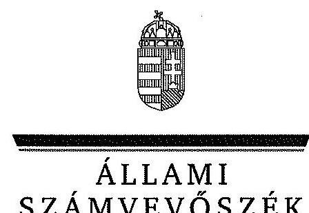

ÁLLAMI
SZÁMVEVŐSZÉK

# JELENTÉS 

az önkormányzatok pénzügyi gazdálkodási
helyzete értékelésének, és gazdálkodása szabályosságának

- 2013. évben induló - ellenőrzéséről Újfehértó

---

# Állami Számvevőszék 

Iktatószám: V-0205-038/2014.
Témaszám: 1240
Vizsgálat-azonosító szám: V065005

## Az ellenőrzést felügyelte:

## Renkó Zsuzsanna

felügyeleti vezető
Az ellenőrzést vezette és az ellenőrzés végrehajtásáért felelős:
Valastyánné dr. Vízhányó Júlia
ellenőrzésvezető
A számvevőszéki jelentés összeállításában közremúködött:
Baksa Anikó
számvevő tanácsos
Az ellenőrzést végezték:
Völgyesi Mátyás
Számvevő

Berki László
számvevő

---

# TARTALOMJEGYZÉK 

BEVEZETÉS ..... 3
I. ÖSSZEGZŐ MEGÁLLAPÍTÁSOK, KÖVETKEZTETÉSEK, JAVASLATOK ..... 6
II. RÉSZLETES MEGÁLLAPÍTÁSOK ..... 12

1. Az Önkormányzat kötelező és önként vállalt feladatai, a feladatellátás szervezeti kereteinek változása ..... 12
2. A pénzügyi egyensúly fenntartását veszélyeztető pénzügyi kockázatok, ezek csökkentése érdekében tett intézkedések ..... 15
3. Az Önkormányzat kötelezettségeinek állománya, azok összetételének változása, az adósságkonszolidáció hatása ..... 19
4. Az Önkormányzat pénzügyi gazdálkodása során érvényesített integritási szempontok ..... 25

---

# MELLÉKLETEK 

1/A. számú Az Önkormányzat bevételei és kiadásai, valamint adósságszolgálata a 2010-2013. év I. félév közötti időszakban (a CLF módszer szerint, a Kvtv. 72. § (1) bekezdésében foglalt adósságátvállaláshoz kapcsolódó pénzügyi teljesítések nélkül)
1/B. számú Az Önkormányzat bevételei és kiadásai a Kvtv. 72. § (1) bekezdésében foglalt adósságátvállaláshoz kapcsolódó pénzügyi teljesítések nélkül a 2013. év I. félévben (a CLF módszer szerint)
2. számú Az Önkormányzat által a 2010. és a 2013. év I. félév között megvalósított fejlesztési feladatok érdekében teljesített felhalmozási kiadások és az ezekhez vállalt kötelezettségek összegzése
3. számú Az önkormányzati feladatok ellátásában résztvevő gazdasági társaságok egyes kiemelt adatai
4. számú Az Önkormányzat 2013. június 30 -án fennálló, hosszú lejáratú adósságot keletkeztető kötelezettségvállalásai
5. számú Az Önkormányzat kötelezettségeinek és egyes kötelezettségvállalásainak 2010. december 31-ei és 2013. június 30 -ai állománya, valamint a 2013. év II. félévben és az azt követő években várható kötelezettségek, kötelezettségvállalások miatti kiadások
6. számú Újfehértó Város Önkormányzata Polgármesterének a jelentéstervezethez tett észrevétele
7. számú Az ÁSZ válasza Újfehértó Város Önkormányzata Polgármesterének a jelentéstervezethez tett észrevételére

## FÜGGELÉKEK

1. számú Rövidítések jegyzéke
2. számú Fogalomtár

---

# JELENTÉS 

## az önkormányzatok pénzügyi gazdálkodási helyzete értékelésének, és gazdálkodása szabályosságának - 2013. évben induló ellenőrzéséról Újfehértó

## BEVEZETÉS

Az ÁSZ a stratégiájában célul tűzte ki, hogy az önkormányzatok ellenőrzése során azok pénzügyi-gazdasági helyzetét értékeli, kockázatait feltárja, valamint az ellenőrzések helyszíneit objektív mutatószámrendszer alapján választja ki.

Az államháztartás önkormányzati alrendszerében az utóbbi években megjelenő gazdálkodási nehézségek, a pénzforgalmi hiány növekedése, az eladósodás az ÁSZ figyelmét az önkormányzatok pénzügyi helyzetére irányította. Az elkövetkezendő évek költségvetési hiánycéljainak tarthatósága érdekében indokolt, hogy az önkormányzatok pénzügyi helyzetelemzése és az egyensúlyi helyzetet befolyásoló kockázatok feltárása továbbra is kiemelt hangsúlyt kapjon az ÁSZ tevékenységében.

A közigazgatás átalakításának keretében - a helyi igazgatás és önkormányzás hatékonyabbá tétele érdekében - a Kormány az önkormányzatokra vonatkozóan 2012-ben újraszabályozta mind a sarkalatos, mind az önkormányzatok mindennapi múködését rendező törvényeket és a feladatok végrehajtását biztosító előírásokat. Az önkormányzati feladatellátást érintő átalakítások jelentős része 2013-ban következett be azzal, hogy az igazgatási, az oktatási és a szociális ellátásban a feladatok jelentős hányadát átvette az állam. Ahhoz, hogy az önkormányzatok meg tudjanak felelni a számukra meghatározott - szigorúbb - gazdálkodási szabályoknak, és az új feltételek mellett is biztosítható legyen a közszolgáltatások megfelelő színvonalú ellátása, szükséges volt a pénzügyigazdasági rendszerük alapjainak megszilárdítása. Ezt a célt szolgálja az adósságkonszolidáció, amely az önkormányzatok múködését és fejlesztését segítő, de korábban az állam által nem fedezett kiadásokkal kapcsolatos kötelezettségvállalások differenciált mértékű átvállalását jelenti.

Az ÁSZ a 2013. év I. félévi ellenőrzési tervében a 39. számú, az önkormányzatok pénzügyi gazdálkodási helyzete értékelésének, és gazdálkodása szabályosságának - 2013. évben induló - ellenőrzésével az önkormányzatok 2011. évben megkezdett helyzetelemzését folytatja. Az adósságkonszolidáció az önkormányzatok pénzügyi egyensúlyi helyzetére egyértelműen kedvező hatást gyakorolt, azonban a problémák kiváltó okait nem szüntette meg, ennek kezelése nélkül viszont az adósságállomány újratermelődik. Az önkormányzati alrend-

---

szerben a 2013-tól bevezetett új feladatfinanszírozási rendszer keretein belül továbbra is megoldandó kérdés a pénzügyi egyensúly megteremtése, hosszú távú fenntartása. Erre tekintettel kiemelt fontosságú az önkormányzatok pénzügyi egyensúlyi helyzetére ható kockázatok feltárása, az ezzel kapcsolatos folyamatok, trendek bemutatása. Az ÁSZ ennek megfelelően a jövőben is tovább folytatja az önkormányzatok pénzügyi gazdálkodási helyzetét értékelő témacsoportos ellenőrzéseit.

Az ellenőrzések kockázatalapú megközelítése keretében megtörténik az önkormányzatok adósságkezelési és likviditási helyzetének értékelése, a pénzügyi egyensúly minősítése, továbbá az alrendszerben 2013-ban bekövetkezett változások hatásának értékelése.

Az ellenőrzés - eredményének várható hatásaként - megállapításaival segítséget nyújthat a pénzügyi helyzet értékeléséhez, a pénzügyi egyensúly helyreállítása érdekében szükségessé váló önkormányzati intézkedések megtételéhez. Az ellenőrzés során továbbra is célunk az államháztartás önkormányzati alrendszerére jellemző információk összegzésével támogatni az Országgyúlés munkáját a törvényalkotásban, a források elosztásában.

Az ellenőrzés célja: az Önkormányzat pénzügyi helyzetének, szabályosságának értékelése, a pénzügyi egyensúly alakulására hatással lévő folyamatoknak és a pénzügyi egyensúly alakulására ható kockázatoknak a feltárása.

# Az ellenőrzés célja annak értékelése volt, hogy: 

- a kötelező és önként vállalt feladatok ellátása, ezen belül az ellátott feladatok körének, az ellátást biztosító szervezeti formáknak a változása milyen hatást gyakorolt a pénzügyi egyensúlyi helyzetre;
- az Önkormányzat pénzügyi - múködési és felhalmozási - egyensúlya milyen irányban változott, a változást milyen okok idézték elő, továbbá milyen intézkedéseket tettek az egyensúly biztosítása, illetve javítása érdekében, az intézkedések hatására javult-e az Önkormányzat pénzügyi helyzete;
- a költségvetési kiadások finanszírozása érdekében vállalt, pénzintézetekkel szembeni kötelezettségek, a szállítói és egyéb kötelezettségek hogyan alakultak, az adósságkonszolidáció után fennmaradt kötelezettségek teljesítésének kockázatai miként befolyásolják a jövőbeli pénzügyi egyensúlyi helyzetet.

Az önkormányzatok korrupcióval szembeni veszélyeztetettségének csökkentése érdekében új feladatként felmértük az integritási szemlélet érvényesülését a pénzügyi gazdálkodási folyamatokban.

Utóellenőrzésre nem került sor, mivel az ÁSZ az ellenőrzött időszakban az Önkormányzatnál számvevőszéki jelentéssel lezárt ellenőrzést nem végzett.

Az ellenőrzési célokban megfogalmazott kérdések értékelési kritériumai a gazdálkodásra vonatkozó jogszabályok és a pénzügyi egyensúly biztosításának, valamint a pénzügyi helyzettel és gazdálkodással kapcsolatos kockázatok kezelésének követelménye. Az ellenőrzés az ellenőrzési célok eléréséhez elemző, értékelő, a pénzügyi helyzet kockázatát is minősítő eljárásokat alkalmazott.

---

Az ellenőrzés típusa: szabályszerűségi ellenőrzés

# Ellenőrzött szervezet: Újfehértó Város Önkormányzata 

Az ellenőrzött időszak: a 2010. január 1-jétől 2013. június 30-ig terjedő időszak, figyelemmel az ellenőrzés célja vonatkozásában megfogalmazottakra. A pénzintézetekkel szembeni kötelezettségek állományának vizsgálatakor az ellenőrzött időszakban fennálló kötelezettségeket vette figyelembe az ellenőrzés.

Az ellenőrzés szakmai módszertana az ÁSZ hivatalos honlapján (www.asz.hu) közzétett szakmai szabályokon alapult, amely a Legfőbb Ellenőrző Intézmények Nemzetközi Szervezete (INTOSAI) által kiadott nemzetközi standardok (ISSAI) figyelembevételével készült.

Az ellenőrzés jogszabályi alapját az ÁSZ tv. 1. § (3) bekezdésének, 5. § (2)-(6) bekezdéseinek, valamint az Áht. 61. § (2) bekezdésének előírásai képezik.

Az ellenőrzés során használt rövidítéseket az 1. számú, az egyes fogalmak magyarázatát a 2. számú függelék tartalmazza.

Újfehértó város állandó lakosainak száma 2010. január 1-jén 13521 fő, 2013. január 1-jén 13352 fő volt. Az Önkormányzat a 2012. évben 2049,1 millió Ft költségvetési bevételt ért el, és 1882,1 millió Ft költségvetési kiadást teljesített. A 2012. december 31-i könyvviteli mérleg szerint 5198,4 millió Ft értékű vagyonnal rendelkezett, a rövid lejáratú kötelezettségállomány 631,2 millió Ft, a hoszszú lejáratú kötelezettségállomány 819,3 millió Ft volt. Az ellenőrzött időszakban az Önkormányzat két többségi tulajdoni hányadú gazdasági társasággal rendelkezett. A jegyző a 1999. évtől látja el feladatait. A foglalkoztatott köztisztviselők száma 2012. január 1-jén 42 fő volt.

Az ÁSZ tv. 29. § (1) bekezdése szerint a jelentéstervezetet megküldtük a polgármester részére, aki az ÁSZ tv. 29. § (2) bekezdésében foglalt észrevételezési jogával élt, a jelentéstervezetre észrevételt tett.

---

# I. ÖSSZEGZŐ MEGÁLLAPÍTÁSOK, KÖVETKEZTETÉSEK, JAVASLATOK 

Újfehértó Város Önkormányzatának pénzügyi egyensúlya az ellenőrzött időszakban rövid távon nem volt biztosított. A múködési költségvetés a 2013. év I. félévben bevezetett új feladatellátási és finanszírozási rendszerben 7,5 millió Ft többletet mutatott. A 2013. évi 70,0\%-os mértékű, 966,1 millió Ft tőketartozást és annak járulékait érintő adósságkonszolidáció hatására az Önkormányzat pénzügyi egyensúlyi helyzete javult, azonban a finanszírozásba bevonható pénzeszközök, valamint a jövedelemtermelő képessége alapján képződő bevételek várhatóan nem biztosítják a fennálló kötelezettségek jövőbeni fedezetét.

Az Önkormányzat költségvetésének elemzését a CLF módszerrel számított mutatók alapján végeztük. A pénzügyi kapacitás 2010-2013. év I. félév közötti változását - a 2013. évi adósságkonszolidáció pénzforgalmi hatása nélkül számítva - a következő ábra mutatja be:
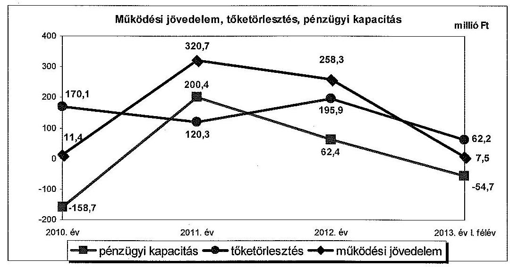

Az Önkormányzat 2010-2013. év I. félév között összesen 7817,0 millió Ft költségvetési bevételt ért el, és 7609,6 millió Ft költségvetési kiadást teljesített. Az ellenőrzött időszakban a múködési jövedelem végig pozitív tartományban mozgott, 11,4 millió Ft-ról 7,5 millió Ft-ra változott. A közbenső két évben a működési jövedelem jelentős emelkedést mutatott, a 2011. évben 320,7 millió Ft-ra, a 2012. évben pedig 258,3 millió Ft-ra nőtt. A kedvező változást a folyó kiadások - döntően a közfoglalkoztatás csökkenése, az egyháznak átadott intézmények és az étkeztetési feladatok kiszervezése miatt bekövetkezett - csökkenése okozta. Az Önkormányzat a 2011. évben 62,9 millió Ft, a 2012. évben összesen 67,9 millió Ft ÖNHIKI és rövid lejáratú hiteltörlesztési támogatásban részesült. A folyó költségvetés egyenlege a müködőképesség megőrzését szolgáló, kiegészítő támogatás nélkül 2011-ben 257,8 millió Ft, 2012-ben 190,4 millió Ft többletet mutatott volna. Az Önkormányzat a 2013. év I. félévben 20,2 millió Ft szerkezetátalakítási tartalékból folyósított központi támoga-

---

tást kapott. A működési jövedelemtermelő képesség miatti kockázatot jelzi, hogy a 2013. év I. félévében a folyó költségvetés egyenlege a szerkezetátalakítási tartalékból megítélt 20,2 millió Ft támogatással együtt mindössze 7,5 millió Ft többletet mutatott.

Az Önkormányzat nettó múködési jövedelme 2010-ben -158,7 millió Ft, a 2013. év I. félévben -54,7 millió Ft volt. A 2011. és a 2012. évben képződött múködési jövedelem fedezetet nyújtott a hitelek törlesztésére.

Az ellenőrzött években az Önkormányzat felhalmozási költségvetésének egyenlege folyamatosan negatív volt, összesen 390,5 millió Ft felhalmozási forráshiány keletkezett. A 2011. és a 2012. években keletkezett pozitív nettó múködési jövedelem nem nyújtott fedezetet a felhalmozási forráshiányra.

Az Önkormányzat évenkénti teljes finanszírozási igénye a CLF módszer szerint 2010-ben 179,7 millió Ft, 2011-ben 43,1 millió Ft, 2012-ben 28,9 millió Ft, a 2013. év I. félévben 89,4 millió Ft volt, melynek finanszírozásához múködési és fejlesztési célú, továbbá egyéb likvid hiteleket vettek igénybe.

Az Önkormányzat adatszolgáltatása alapján az egyes köznevelési és igazgatási feladatok egyháznak, illetve államnak történő átadása 219,6 millió Ft-os kiadás-megtakarítást, továbbá 140,2 millió Ft bevételcsökkenést jelentett, összességében kedvező hatást gyakorolt a pénzügyi helyzetre. A finanszírozási rendszer 2013. évi változása keretében a költségvetési források csökkenése azonban ellensúlyozta a feladatváltozás bemutatott kedvező hatását. A saját hatáskörben végrehajtott bevételnövelő és kiadáscsökkentő intézkedések együttes hatása - amely az étkeztetési feladat kiszervezése révén elért megtakarítást is tartalmazza - az Önkormányzat kimutatása szerint jelentős mértékben, 575,2 millió Ft-tal javította a pénzügyi egyensúlyi helyzetet.

Az önként vállalt feladatokra fordított múködési kiadások aránya a 2010. évi $5,1 \%$-ról a 2013. év I. félév végére $10,1 \%$-ra növekedett a sport feladatok körének bővülése miatt, amely múködési kockázatot jelentett az Önkormányzat pénzügyi egyensúlyi helyzetére. Az ellenőrzött időszakban megvalósított, önként vállalt fejlesztési feladatokra fordított kiadások nem jelentettek felhalmozási kockázatot.

A pénzintézeti kötelezettségek a 2010. év elejéről a 2012. év végére 3,4\%$\mathrm{kal}, 1334,2$ millió Ft-ról 1379,6 millió Ft-ra növekedtek, majd az adósságkonszolidációt követően a 2013. év I. félév végére 340,0 millió Ft-ra csökkentek. A 2012. december 31-én fennálló 1379,6 millió Ft adósság 70,0\%-át, összesen 966,1 millió Ft-ot ( 376,1 millió Ft kötvénytartozást, 237,3 millió Ft váltótartozás, valamint 352,7 ezer Ft hiteltartozást) vállalt át a Magyar Állam. Az adósságkonszolidációt követően fennmaradt pénzintézeti kötelezettségállomány 155,9 millió Ft beruházási hitelből, 46,2 millió Ft hosszú lejáratú múködési hitelből, 184,3 ezer EUR ( 53,7 millió Ft) kötvénytartozásból, 51,3 millió Ft váltótartozásból, valamint 32,9 millió Ft likvid hitelből tevődött össze. Az ellenőrzött időszakban a változó kamatozású, adósságot keletkeztető kötelezettségvállalások kamatkockázatot, a devizaalapú hitelek és a kötvény árfolyamkockázatot jelentettek. Az Önkormányzatnál az ellenőrzött időszakban folyama-

---

tosan fennállt a banki kitettség, mivel fizetőképességét likvid hitelek rendszeres megújításával tudta biztosítani.

A szállítók felé fennálló kötelezettségek az ellenőrzött időszakban 180,6 millió Ft-ról 34,8 millió Ft-ra csökkentek. 2010-ben a lejárt szállítói tartozás 132,5 millió Ft volt, amely a 2013. év I. félév végére 34,8 millió Ft-ra csökkent. A 60 napon túli lejárt szállítói állomány 2010-ben 96,2 millió Ft-ot tett ki, 2011-2013 között már nem volt. Az ellenőrzött időszakban fizetési átütemezési megállapodással érintett szállítói tartozása az Önkormányzatnak a 2010. év végén volt, 47,7 millió Ft összegben. A 2013. június 30 -án fennálló, egyben lejárt esedékességú szállítói tartozás a PPP szolgáltatási díjakból adódott, amely nemfizetési kockázatot jelent.

Az Önkormányzatnál mérlegen kívüli tételek miatti kockázatot jelentett a csatornamú társulat kötelezettségeire vállalt készfizető kezesség. A kezességvállalás összege az ellenőrzött időszak végén 202,6 millió Ft volt. Az Önkormányzat kizárólagos tulajdonában lévő, önként vállalt feladatot ellátó gazdasági társaság a 2011. évet kivéve nyereséggel gazdálkodott. A többségi tulajdonban lévő, az egészségügyi feladatokat ellátó gazdasági társaság veszteséges gazdálkodása és az ellenőrzött időszak végén fennálló kötelezettségállománya azonban mérlegen kívüli tételek miatti kockázatot jelenthet az Önkormányzat pénzügyi helyzete szempontjából.

Az ellenőrzött időszak végén fennálló, pénzintézetekkel szembeni kötelezettség alapján a 2013. július 1. és 2015. december 31. közötti időszakban várhatóan 151,3 millió Ft és 37,6 ezer EUR, a 2016. évtől 174,6 millió Ft és 174,0 ezer EUR összegű adósságszolgálat válik esedékessé. A 2013. évi adósságkonszolidáció az Önkormányzat pénzügyi helyzetére kedvező hatást gyakorolt, azonban a jövedelemtermelő képesség csökkenése, valamint a finanszírozásba bevonható eszközök korlátozott szintje miatt a jövőbeni kötelezettségek kifizethetőségének kockázata fennáll. Az Önkormányzat a 2007. évben uszoda és tornacsarnok beruházás megvalósítására két - a 2025. évben lejáró, 3469,0 millió Ft összegű - PPP szerződést kötött, mely kötelezettségvállalás mérlegen kívüli tételek miatti kockázatot jelent. A 2013. június 30 -án fennálló 2989,0 millió Ft PPP szerződés miatti kötelezettségből a 2013. július 1. és 2015. december 31. közötti időszakban várhatóan 667,0 millió Ft, a 2016. évtől 2322,0 millió Ft szolgáltatási díj fizetési kötelezettség lesz esedékes.

Az Önkormányzatnak a pénzügyi gazdálkodás során az integritási szemlélet teljes körű érvényesítése érdekében - a közérdekű bejelentésekre vonatkozó szabályozás hiányára tekintettel - még fejlődnie kell.

Az ellenőrzés során a gazdálkodási feladatok ellátásával kapcsolatban az alábbi szabályszerüségi hibákat tártuk fel:

- a pénzintézeti kötelezettségekhez kapcsolódóan az ellenőrzött időszakban az Önkormányzat törzsvagyonába tartozó, négy korlátozottan forgalomképes ingatlanra került jelzálogjog bejegyzésre. A korlátozottan forgalomképes ingatlanokra történő jelzálogjog alapításával az Önkormányzat megsértette a

---

2010-2011. években az Ötv.-ben ${ }^{1}$, a 2012. évben az Áht.-ban foglalt előírásokat;

- az Önkormányzat a 2013. évi költségvetési rendeletében a működési költségvetés Mötv.-ben előírt egyensúlyát oly módon biztosította, hogy a költségvetési támogatások eredeti előirányzatai között 360,5 millió Ft működőképesség megőrzését szolgáló, kiegészítő támogatást is tervezett, ezáltal a bevételi előirányzatok tervezése az Áht.-ban előírtak ellenére közgazdaságilag nem megalapozott módon történt.

Az ÁSZ tv. 33. § (1) bekezdésében foglaltak értelmében az ellenőrzött szervezet vezetője köteles a jelentésben foglalt megállapításokhoz kapcsolódó intézkedési tervet összeállítani, és azt a jelentés kézhezvételétől számított harminc napon belül az ÁSZ részére megküldeni. Amennyiben az intézkedési tervet határidőn belül nem küldi meg a szervezet vezetője, vagy az továbbra sem elfogadható, az ÁSZ elnöke a hivatkozott törvény 33. § (3) bekezdés a-b) pontjaiban foglaltakat érvényesítheti.

# Az ellenőrzés intézkedést igénylő megállapításai és javaslatai: 

## a polgármesternek

1. Az Önkormányzat pénzügyi egyensúlya az ellenőrzött időszakban rövid távon nem volt biztosított. A folyó költségvetés egyensúlya a 2010-2012. években a működőképesség megőrzését szolgáló támogatások (összesen 130,8 millió Ft) nélkül biztosított volt. A 2013. év I. félévben az adósságkonszolidáció keretében kapott 89,4 millió Ft működési célú költségvetési támogatás nélkül a működési költségvetés egyenlege 7,5 millió Ft többletet mutatott, amely tartalmazza a szerkezetátalakítási tartalékból megítélt 20,2 millió Ft költségvetési támogatást is. Az ellenőrzött időszakban a nettó működési jövedelem - e támogatások nélkül - a 2011. év kivételével negatív volt. A saját hatáskörben tett bevételnövelő és a kiadáscsökkentő intézkedések nem biztosítottak elegendő forrást a pénzügyi egyensúly helyreállításához. Az Önkormányzat folyószámlahitelt kizárólag a 2010. évben vett igénybe, ezt követően likviditásának fenntartását rövid lejáratú és éven túli működési célú hitelek felvételével biztosította. A 2013. év I. félév végén - a lezárult adósságkonszolidációt követően - a fennálló pénzintézeti kötelezettség 340,0 millió Ft volt. A jövőbeni kötelezettségek kifizethetőségének kockázata fennáll, a kötelezettségek teljesítésére felhasználható, elkülönített tartalék nem áll rendelkezésre. Nemfizetési kockázatot jelent, hogy a 2013. év I. félév végi 34,8 millió Ft szállítói állomány 100,0\%-a 30 nap alatti lejárt tartozás. Az Önkormányzat két PPP konstrukcióban megvalósított fejlesztéséből adódó, 2013. június 30 -án fennálló kötelezettsége 2989,0 millió Ft. Az Önkormányzat 2011-2012-ben az esedékessé vált, összes szolgáltatási díffizetési kötelezettségének nem tudott eleget tenni, a díffizetés módosítását, illetve átütemezését kezdeményezte. Az ellenőrzött időszak során az önként vállalt feladatok ellátása kockázatot jelentett.
[^0]
[^0]:    ${ }^{1}$ Hatálytalan 2012. március 31-től, a 2012. március 31-től hatályos jogszabály: Áht.

---

Javaslat:
A múködési jövedelemtermelő képesség és a feladatellátás összhangjának megteremtése, valamint a pénzügyi egyensúly helyreállítása, hosszú távú fenntarthatósága érdekében felelősök és határidők megjelölésével kezdeményezzen intézkedéseket, melyek keretében:
a) a költségvetési rendelettervezet, valamint annak évközi módosítása előterjesztését megelőzően mérjék fel a bevételszerző, kiadáscsökkentő lehetőségeket, és terjessze a Képviselő-testület elé a bevételek növelését, a kiadások csökkentését célzó intézkedések bevezetéséhez szükséges - a Htv. 140. § (1) bekezdés a) pontja alapján a jegyző által elkészített - döntési javaslatát;
b) terjesszen a Képviselő-testület elé jóváhagyásra - a Htv. 140. § (1) bekezdés a) pontja alapján a jegyző által elkészített - az Önkormányzat gazdasági helyzetének elemzésén alapuló, a pénzügyi egyensúlyi helyzet gyors helyreállítását, hoszszú távú fenntartását, valamint az adósságállomány újratermelődésének elkerülését biztosító intézkedéseket tartalmazó reorganizációs programot;
c) az Önkormányzat kötelezettségeinek jövőbeni teljesítése, a fizetőképesség megőrzése érdekében terjesszen a Képviselő-testület elé - a Htv. 140. § (1) bekezdés a) pontja alapján a jegyző által elkészített - döntési javaslatot, amelyben a Képvi-selő-testület kötelezettséget vállal arra, hogy előre meghatározott összegben és módon a realizált többletbevételeket, a meglévő és a jövőben képződő tartalékokat mindaddig a kötelezettségek rendezésére fordítja, azt nem használja más célra, amíg az Önkormányzat pénzügyi egyensúlya rövid távon veszélyeztetett;
d) a szállítói kitettség és az Adósságrendezési tv. 4. § (2) bekezdés a)-b) pontjaiban megjelölt helyzet kialakulásának elkerülése érdekében, meghatározott gyakorisággal számoljon be a Képviselő-testületnek az Önkormányzat lejárt szállítói állománya alakulásáról. Intézkedjen a szállítói számlák esedékesség szerinti kiegyenlítéséről vagy a lejárt tartozások átütemezéséről;
e) vizsgálja felül az önként vállalt feladatok finanszírozhatóságát a kötelező feladatellátás elsődlegességének biztosítása érdekében, és ennek függvényében tegyen javaslatot a Képviselő-testületnek a feladatellátás racionalizálására.
2. Az Önkormányzat az ellenőrzött időszak során a pénzintézeti kötelezettségeihez kapcsolódóan - a 2010-2011. években az Ötv. 88. § (1) bekezdés b) pontjában, a 2012. évben az Áht. 84. § (4) bekezdésében foglalt előírások ellenére - a törzsvagyonába tartozó, négy korlátozottan forgalomképes ingatlanára engedélyezte jelzálogjog bejegyzését.

Javaslat:
A pénzintézeti kötelezettségvállalásokkal kapcsolatos jogszerű biztosíték, illetve fedezet felajánlás érdekében:
a) intézkedjen, hogy jövőbeni hitelfelvétel és kötvénykibocsátás fedezeteként az Áht. 84. § (4) bekezdésében előírtak szerint a törzsvagyon körébe tartozó ingatlan ne kerüljön felhasználásra;

---

b) a jogellenes állapot megszüntetése érdekében vizsgálják meg a megterhelt, korlátozottan forgalomképes törzsvagyonba tartozó ingatlanok kiváltásának lehetőségét, és terjesszen javaslatot a Képviselő-testület elé a jogszerűen biztosítékba adható önkormányzati vagyontárgyakkal való kiváltásról.

# a jegyzőnek 

1. Az Önkormányzat a 2013. évi jóváhagyott költségvetési rendeletében a múködési költségvetés Mötv. 111. § (4) bekezdésében előírt egyensúlyát oly módon biztosította, hogy a költségvetési támogatásból származó bevételek eredeti előirányzatai között 360,5 millió Ft működőképesség megőrzését szolgáló, kiegészítő támogatásból származó bevételt is figyelembe vett, ezáltal a bevételi előirányzatok tervezése az Áht. 12. § (1) bekezdésében előírtak ellenére közgazdaságilag nem megalapozott módon történt.

Javaslat:
Intézkedjen, hogy a költségvetési rendelettervezetben a müködési költségvetés Mötv. 111. § (4) bekezdésében előírt egyensúlyának biztosításakor a bevételeket az Áht. 12. § (1) bekezdésének megfelelően, közgazdaságilag megalapozottan határozzák meg.

---

# II. RÉSZLETES MEGÁLLAPÍTÁSOK 

## 1. Az ÖNKORMÁNYZAT KÖTELEZŐ ÉS ÖNKÉNT VÁLlALT FELADATAI, A FELADATELLÁTÁS SZERVEZETI KERETEINEK VÁLTOZÁSA

Az Önkormányzat a kötelező és az önként vállalt feladatait nem határoztat meg. Az Önkormányzat a 2013. évi költségvetési rendeletében elkülönítetten mutatta be a kötelező és önként vállalt feladatok bevételi és kiadási előirányzatait.

Az ellenőrzött időszakban az önként vállalt feladatok közé tartozott a PPP konstrukcióban megépült sportlétesítmények üzemeltetése, az egészségügyi szolgáltatásoknak helyet adó Egészségcentrum épületének fenntartása és az Általános Művészeti Iskola múködtetése, valamint a helyi buszközlekedés biztosítása. A múködési kiadásokon belül - a sportfeladatokra fordított kiadások növekedéséből adódóan - az önként vállalt feladatok kiadásainak részaránya a 2010. évi $5,1 \%$-ról a 2012. évre $9,1 \%$-ra, a 2013. év I. félévben $10,1 \%$-ra bővült. Összegük a 2010. évi 104,6 millió Ft-ról a 2012. évre 160,5 millió Ft-ra emelkedett, a 2013. év I. félévben 62,8 millió Ft-ot tett ki. A sportcélú kiadások 2010-ről 2011-re 72,6 millió Ft-ról 163,0 millió Ft-ra nőttek a 2010 áprilisában átadott uszoda és tornacsarnok után fizetett PPP szolgáltatási díjak miatt. Az Önkormányzatnak az egészségügyi önként vállalt feladatra (laborvizsgálat, fizikoterápia) fordított kiadásai nem voltak számottevőek. Az önként vállalt feladatokra fordított múködési kiadások arányának növekedése müködési kockázatot jelentett.

Az Önkormányzat adatszolgáltatása alapján az ellenőrzött időszakban megvalósított fejlesztések értéke 1765,2 millió Ft, ebből az önként vállalt feladatokra fordított felhalmozási kiadások összege 40,5 millió Ft ( $2,3 \%$ ) volt. Az önként vállalt feladatokra teljesített felhalmozási kiadások részaránya nem jelentett felhalmozási kockázatot.

Az Önkormányzat 2010-2012 között feladatait egy önállóan múködő és gazdálkodó költségvetési szervvel (Polgármesteri Hivatal), valamint öt önállóan múködő költségvetési intézménnyel látta el. Az intézmények száma, az oktatási intézmények 2013. évi átadása következtében, hatról ötre csökkent. Az Önkormányzatnak a két felszámolás alatt álló gazdasági társaságán² felül három, a feladatellátásban résztvevő gazdasági társaságban volt tulajdonosi részesedése, melyek száma az ellenőrzött időszakban nem változott. A gazdasági társaságok közül kettő önkormányzati többségi tulajdonú társaság múködött, az egyik a városi buszközlekedésben, a másik az egészségügyi ellátásban vállalt szerepet.

[^0]
[^0]:    ${ }^{2}$ Újfehértó Városfejlesztési és Városüzemeltetési Nonprofit Kft. „f.a.", Dél-Nyírségi Vendéglátóipari Kft. „f.a."

---

A közoktatási feladatok ellátását az Önkormányzat által fenntartott, önállóan múködő költségvetési intézmények biztosították.

A szociális és gyermekjóléti alapszolgáltatási feladatokat, valamint az időskorúak ápolását, gondozását nyújtó otthon működtetését 2008-tól intézményfenntartó társulás keretében látta el a Szociális Ellátó és Gyermekjóléti Intézmény. Az intézményfenntartó társulás gesztora az Önkormányzat volt. Az oktatási és nevelési intézményekben a közétkeztetést a saját tulajdonú főzőkonyha révén biztosították 2011-ig, ezt követően az Önkormányzat a főzőkonyhát közbeszerzési pályázattal bérbe adta egy vállalkozásnak, amely pályázat a közétkeztetés ellátását is magában foglalta.

A háziorvosi és a fogorvosi alapellátást egyéni vállalkozások és egy gazdasági társaság végzi. Az Önkormányzat a háziorvosi ellátáshoz helységet biztosít, mely feladatot 62,0\%-os tulajdonú társaságával látja el. Az Egészségcentrumot az Újfehértói Egészségügyi Szolgáltató Közhasznú Nonprofit Kft. működteti, amelybe az Önkormányzat ingatlanapportot vitt be. Az Egészségcentrum a háziorvosi ellátás mellett a laborvizsgálatoknak és a fizikoterápia szolgáltatásnak is helyt ad. Az Önkormányzat önként vállalt feladatként biztosítja ${ }^{3}$ a városon belüli buszközlekedést a kizárólagos tulajdonában lévő Újfehértour Kft.-vel.

Az Önkormányzat észrevétele szerint a Mötv. 13. § (1) bekezdés 18. pontja szerint a helyi közösségi közlekedés biztosítása nem önként vállalt feladat, erre tekintettel az önként vállalt feladatok felülvizsgálatára vonatkozó, a polgármesternek címzett 1. e) számú javaslat megvalósítása során sem kell az adott feladatot figyelembe venni.

Az észrevételben foglaltakat részben elfogadjuk. A Mötv. 13. § (1) bekezdése az önkormányzatok által helyben ellátandó közfeladatok felsorolását tartalmazza, melyből közvetlenül nem vezethető le a kérdéses feladat, adott önkormányzattípus vonatkozásában történő minősítése. A Mötv. 14. § (1) bekezdése szerint a 13. § (1) bekezdésben meghatározott feladatok ellátásának részletes szabályait, ha e törvény másként nem rendelkezik, jogszabályok tartalmazzák. A 2012. július 1-jétől hatályos személyszállítási szolgáltatásokról szóló 2012. évi XLI. törvény 4. § (4) bekezdés c) pontja alapján a települési önkormányzat önként vállalt feladata lehet a helyi személyszállítási közszolgáltatások megszervezése, a közlekedési szolgáltató kiválasztása, a helyi személyszállítási közszolgáltatások megrendelése. Az ellenőrzött időszakban 2012. július 1. előtt hatályban lévő, az autóbusszal végzett menetrend szerinti személyszállításról szóló 2004. évi XXXIII. törvény 3. § (1) bekezdése szerint a helyi közlekedésben a települési önkormányzat feladata a közforgalmú közlekedés részeként a lehető legmagasabb színvonalú menetrend szerinti autóbusz-közlekedés biztosítása.

E rendelkezések alapján a helyi személyszállítási feladat 2012. július 1-jétől önként vállalt önkormányzati feladatnak minősül. A 2013. január 1-jétől hatályba lépő feladatfinanszírozási rendszer keretében a központi költségvetésről szóló törvényben rögzített, az önkormányzatok általános müködésének és ágazati feladatainak támogatására szolgáló támogatás jogcímei sem tartalmaznak a helyi személyszállítási közszolgáltatás, mint kötelező feladat finanszírozására vonatkozó rendelkezést. Az Önkormányzat a 2013. évi költségvetési rendeletének ösz-

[^0]
[^0]:    ${ }^{3}$ A 2012. július 1-jétől hatályba lépő, a személyszállítási szolgáltatásokról szóló 2012. évi XLI. törvény 4. § (4) bekezdés c) pontja alapján.

---

szeállítása során az önként vállalt feladatokhoz kapcsolódó bevételeinek és kiadásainak bemutatása keretében sem nevesítette a helyi személyszállítási közszolgáltatást.

A számvevőszéki jelentésben szereplő javaslattal kapcsolatosan az ellenőrzött szervezet számára a jogszabályi előírások mérlegelési jogkört nem biztosítanak, azokhoz kapcsolódóan az ÁSZ tv. 33. § (1) bekezdése intézkedési terv készitési kötelezettséget ír elő. Az észrevételben foglaltak a javaslat megalapozottságát jelentő megállapítást nem módosítják, ezért a javaslatot továbbra is fenntartjuk.

Kötelező önkormányzati feladatot lát el az Önkormányzat és a Tűzoltó Egyesület által létrehozott Önkormányzati Tűzoltóság Újfehértó, amely köztestületként működik.

Az Önkormányzat 2012. augusztus 31 -én átadta a református egyháznak az Újfehértói Általános Művelődési Központ tagintézményeként múködő általános iskoláját és egyik óvodáját. Az iskola és óvoda átadása az Önkormányzat adatszolgáltatása szerint 27,1 millió Ft kiadáscsökkenést és 20,9 millió Ft bevételkiesést jelentett, összességében kedvező hatást gyakorolt a pénzügyi egyensúlyi helyzetre.

Az Önkormányzat 2013. január 1-jével két köznevelési intézményét adta át a KIK-nek, egyben a 2013. évre vonatkozóan vállalta ${ }^{4}$ a KIK fenntartásába került iskolák múködtetését. A köznevelési feladatok átadása következtében - az Önkormányzat kimutatása szerint - 169,8 millió Ft kiadási megtakarítás és 104,4 millió Ft bevételi elmaradás keletkezett. A Képviselő-testület a KIK-nek átadott iskolák miatt 109 fős létszámcsökkentésről döntött5. Ezzel egyidejűleg az iskola működtetési feladatainak ellátására - 18 álláshellyel bővítette a Polgármesteri Hivatal intézményfenntartói létszámát. Az Önkormányzat 2013. január 1-jével a szakigazgatási feladatokat átadta a járási kormányhivatalnak, amely adatszolgáltatása szerint a 14,9 millió Ft bevételi elmaradást meghaladó 22,7 millió Ft kiadási megtakarítást eredményezett a 2013. év I. félévben.

Az egyes igazgatási és köznevelési feladatok államnak történt átadása összességében kedvező hatást (192,5 millió Ft kiadási megtakarítás és 119,3 millió Ft bevételi elmaradás) gyakorolt a pénzügyi helyzetre. A finanszírozási rendszer 2013. évi változása keretében a költségvetési források (átengedett szja bevétel, gépjármúadó) csökkenése azonban ellensúlyozta a feladatváltozás bemutatott kedvező hatását.

[^0]
[^0]:    ${ }^{4}$ 202/2012. (XII.13.) számú Képviselő-testületi határozat
    ${ }^{5}$ 204/2012. (XII.13.) számú Képviselő-testületi határozat

---

# 2. A PÉNZÜGYI EGYENSÚLY FENNTARTÁSÁT VESZÉLYEZTETŐ PÉNZÜGYI KOCKÁZATOK, EZEK CSÖKKENTÉSE ÉRDEKÉBEN TETT INTÉZKEDÉSEK 

Az Önkormányzat költségvetésének elemzését a CLF módszer szerint hajtottuk végre. A 2013. év I. félévi valós jövedelemtermelő képesség bemutatása érdekében az elemzés során nem vettük figyelembe az adósságkonszolidációhoz kapcsolódó bevételeket és kiadásokat.

Az adósságkonszolidációra vonatkozóan az Önkormányzat 2013. év I. félévi beszámolója 89,4 millió Ft múködési és 62,3 millió Ft felhalmozási költségvetési támogatást, valamint 150,3 millió Ft hiteltörlesztést tartalmazott. Az adósságkonszolidációhoz kapcsolódóan a folyó, illetve a felhalmozási bevételek között kimutatott költségvetési támogatások javították a múködési jövedelmet, illetve a felhalmozási költségvetés egyenlegét, ugyanakkor a finanszírozási kiadások között elszámolt hiteltörlesztés kedvezőtlenül befolyásolta a pénzügyi kapacitást.

A CLF módszer szerinti önkormányzati részletes adatokat a 2010-2013. év I. félév között az 1/A. számú melléklet, az adósságkonszolidációhoz kapcsolódó bevételek és kiadások pénzügyi egyensúlyi helyzetre gyakorolt hatását az 1/B. számú melléklet, a főbb önkormányzati adatokat a következő tábla mutatja be:

|  |  |  |  | millió Ft |
| :--: | :--: | :--: | :--: | :--: |
| Megnevezés | 2010. év | 2011. év | 2012. év | 2013. év   I. félév |
| Folyó bevételek | 2077,6 | 2114,0 | 2012,6 | 629,8 |
| Folyó kiadások | 2066,2 | 1793,3 | 1754,3 | 622,3 |
| Múködési jövedelem | 11,4 | 320,7 | 258,3 | 7,5 |
| Felhalmozási bevételek | 529,2 | 404,9 | 36,5 | 12,4 |
| Felhalmozási kiadások | 550,2 | 648,4 | 127,8 | 47,1 |
| Felhalmozási költségvetés egyenlege | $-21,0$ | $-243,5$ | $-91,3$ | $-34,7$ |
| Folyó és felhalmozási bevételek összesen | 2606,8 | 2518,9 | 2049,1 | 642,2 |
| Folyó és felhalmozási kiadások összesen | 2616,4 | 2441,7 | 1882,1 | 669,4 |
| Finanszírozási múveletek nélküli pozíció | $-9,6$ | 77,2 | 167,0 | $-27,2$ |
| Finanszírozási műveletek egyenlege | 32,0 | $-87,3$ | $-82,1$ | $-24,9$ |
| Tárgyévi pénzügyi pozíció | 22,4 | $-10,1$ | 84,9 | $-52,1$ |
| Hiteltörlesztés, értékpapír beváltás | 170,1 | 120,3 | 195,9 | 62,2 |
| Nettó múködési jövedelem | $-158,7$ | 200,4 | 62,4 | $-54,7$ |

Az Önkormányzat a 2010. év és a 2013. év I. félév között összesen 7817,0 millió Ft költségvetési bevételt ért el, és 7609,6 millió Ft költségvetési kiadást teljesített. Az ellenőrzött időszakban a múködési jövedelem végig pozitív tartományban mozgott, 11,4 millió Ft-ról, 7,5 millió Ft-ra változott. A közbenső két évben a múködési jövedelem kiugró emelkedést mutatott, a 2011. évben 320,7 millió Ft-ra, a 2012. évben pedig 258,3 millió Ft-ra nőtt.

A múködési jövedelem emelkedése a folyó bevételek jelentős átrendeződése mellett, a folyó kiadások csökkenése miatt következett be. A folyó bevételek között a költségvetési támogatások és az átengedett bevételek 2010-2012 között 250,9 millió Ft-tal csökkentek, a 2013. év I. félévében pedig ez a tendencia tovább erősödött. Ezzel szemben 2010-2012 között a saját bevételek, azon belül a

---

helyi adók és az egyéb saját bevételek 167,0 millió Ft-tal növekedtek. A 2013. év I. félévben a saját bevételek időarányosan megfelelnek a megelőző év adatainak. A folyó kiadások csökkenésének döntő részét a református egyháznak átadott oktatási intézmények fenntartási és múködtetési kiadásainak csökkenése, valamint az étkeztetési feladatok kiszervezése miatt a személyi jellegű kiadások megtakarítása eredményezte.

A múködési jövedelem folyó kiadásokhoz viszonyított aránya a 2010. évben 0,6\% (11,4 millió Ft), a 2011. évben 17,9\% (320,7 millió Ft), a 2012. évben $14,7 \%$ ( 258,3 millió Ft), a 2013. év I. félévében $15,4 \%$ ( 7,5 millió Ft) volt.

Az Önkormányzat a 2011. évben 42,7 millió Ft és a 2012. évben 67,9 millió Ft ÖNHIKI támogatásban részesült. A 2011. évi 20,2 millió Ft rövid lejáratú hiteltörlesztési támogatással együtt a múködőképesség megőrzését szolgáló kiegészítő támogatások együttesen 130,8 millió Ft-tal javították az Önkormányzat pénzügyi egyensúlyi helyzetét. E támogatások bevételi kitettség miatti kockázatot nem jelentettek, mivel a folyó költségvetés egyenlege a működőképesség megőrzését szolgáló kiegészítő támogatások nélkül is 2011-ben 257,8 millió Ft, 2012-ben 190,4 millió Ft többletet mutatott volna.

Az Önkormányzat múködési jövedelemtermelő képességének kockázatát jelzi, hogy a 2013. év I. félévében a folyó költségvetés egyenlege a szerkezetátalakítási tartalékból folyósított 20,2 millió Ft támogatással együtt mindössze 7,5 millió Ft többletet mutatott.

A nettó múködési jövedelem (pénzügyi kapacitás) 2010-ben -158,7 millió Ft, a 2013. év I. félévben -54,7 millió Ft volt. A 2011. és a 2012. évben képződött működési jövedelem fedezetet nyújtott a tőketörlesztési kötelezettségekre. A hitelek törlesztését követően a 2011. évben 200,4 millió Ft, a 2012. évben 60,4 millió Ft nettó működési jövedelem keletkezett.

Az ellenőrzött években a felhalmozási költségvetés egyenlege folyamatosan negatív volt. A felhalmozási forráshiány alakulását jelentős mértékben befolyásolta, hogy a felhalmozási kiadások 87,3\%-a (1198,6 millió Ft) a 2010. és a 2011. években merült fel. A 2011. és 2012. években keletkezett pozitív nettó múködési jövedelem nem nyújtott fedezetet a felhalmozási forráshiány teljes összegére.

Az Önkormányzat évenkénti teljes finanszírozási igénye ${ }^{6}$ a CLF módszer szerint 2010-ben 179,7 millió Ft, 2011-ben 43,1 millió Ft, 2012-ben 28,9 millió Ft, a 2013. év I. félévben 89,4 millió Ft volt, melynek finanszírozásához múködési és fejlesztési hiteleket, továbbá egyéb likvid hiteleket vettek igénybe.

A folyó bevételek összegének alakulása 2010-2013. év I. féléve között változó irányú tendenciát mutatott, a 2010. évi 2077,6 millió Ft-ról a 2011. évre 2114,0 millió Ft-ra ( $1,7 \%$-kal) nőtt, majd a 2012. évre 2012,6 millió Ft-ra ( $4,7 \%$-kal) csökkent. A 2013. év I. félévben teljesült 629,8 millió Ft folyó bevétel

[^0]
[^0]:    ${ }^{6}$ A finanszírozási igény a nettó múködési jövedelem és a felhalmozási költségvetés öszszevont negatív egyenlege.

---

376,5 millió Ft-tal ( $37,4 \%$-kal) maradt el az előző évben elért, időarányos folyó bevétel összegétől.

Az ÖNHIKI nélküli költségvetési támogatások és az átengedett bevételek együttes összege, valamint a folyó bevételeken belüli aránya a 2010. évi 1625,3 millió Ft-ról ( $78,2 \%$-ról) 2012-re 1374,4 millió Ft-ra ( $68,3 \%$-ra) csökkent. A feladatellátási és finanszírozási rendszer 2013. évi változásának következtében az e jogcímeken befolyt bevételek ( 343,9 millió Ft ) folyó bevételekhez viszonyított aránya tovább csökkent a 2013. év I. félévben, 54,6\%-ra. A 2013. évben megszűnt - a 2012. évben még 463,4 millió Ft összegű - átengedett szja bevételnek és a gépjármúadónak csak a 40,0\%-a marad helyben.

Az Önkormányzat a korábbi időszakban is alkalmazott helyi iparűzési adó mellett 2011. április 1-jétől bevezette a magánszemélyek kommunális adóját és az építményadót. A helyi adók, pótlékok aránya a folyó bevételek között az ellenőrzött időszakban folyamatosan emelkedett. Arányuk 2010-ben 6,5\% (136,0 millió Ft), 2011-ben 11,8\% (248,9 millió Ft), 2012-ben 12,0\% (241,4 millió Ft) és a 2013. év I. félévben 19,4\% volt. Az iparűzési adóbevétel összege és az adófizetők száma is viszonylag alacsony volt, az adóbevétel nagy része kisvállalkozásoktól származott. Az Önkormányzatnak bevételi kitettség miatti kockázatot nem jelentettek a helyi adóbevételek.

A felhalmozási bevételek 2010-2013. év I. féléve között folyamatosan, 529,2 millió Ft-ról 12,4 millió Ft-ra csökkentek az EU-s forrásból támogatott fejlesztések túlnyomó részének 2011. évi befejeződése miatt. Az ellenőrzött időszakban elért 983,0 millió Ft felhalmozási bevétel 95,0\%-a ( 934,1 millió Ft) a 2010. és a 2011. években realizálódott. A felhalmozási bevételek $84,0 \%$-át az államháztartáson belülről kapott bevételek jelentették. A fejlesztési források többségét út-, kerékpárút- és csatornaépítésre, kisebb részben pedig intézményfelújítás, -bővítés tevékenységekre használták fel.

A folyó kiadások a 2010. évi 2066,2 millió Ft-ról a 2012. évre 1754,3 millió Ft-ra folyamatosan csökkentek, összegük a 2013. év I. félévben 622,3 millió Ft volt. A folyó kiadások bemutatott változását döntően a közcélú foglalkoztatottakra fordított kiadások 111,8 millió Ft-os csökkenése, a 3000 adagos főzőkonyha bérbeadásából származó 65,9 millió Ft személyi kiadás megtakarítás és a református egyháznak átadott oktatási intézmények miatti 27,1 millió Ft múködtetési kiadás megtakarítása okozta. A dologi kiadások a 2010. évi 647,0 millió Ft-ról 2012-re 7,3 \%-kal, 597,2 millió Ft-ra csökkentek. A 2013. év I. félévében az időarányos teljesítés is a korábbi évek csökkenő tendenciájának felelt meg.

A felhalmozási kiadások összege a 2010. évi 550,2 millió Ft-ról a 2011. évre 648,4 millió Ft-ra növekedett, majd a 2012. évben 127,8 millió Ft-ra, a 2013. év I. félévben 47,1 millió Ft-ra csökkent. A felhalmozási kiadások aránya a költségvetési kiadásokon belül a 2010. évi $21,0 \%$-ról a 2013. év I. félévben $7,0 \%$-ra csökkent. A felhalmozási kiadások összegének és arányának csökkenését az indokolta, hogy az EU-s forrásból támogatott nagyobb bekerülési értékű beruházásokat a 2010. és a 2011. évben valósították meg.

---

Az Önkormányzat által a 2010. és a 2013. év I. félév között megvalósított fejlesztési feladatok érdekében teljesített felhalmozási kiadások és az ezekhez vállalt kötelezettségek összegzését a 2. számú melléklet tartalmazza. A 2010-2013. év I. félév között megvalósított fejlesztések forrását 170,8 millió Ft ( $9,7 \%$ ) saját bevétel, 163,2 millió Ft ( $9,2 \%$ ) hitel, 1219,2 millió Ft ( $69,1 \%$ ) EU-s támogatás, valamint 212,0 millió Ft ( $12,0 \%$ ) egyéb központi támogatás képezte. A 2013. június 30-a utáni kötelezettségvállalások forrása 12,4 millió Ft (5,6\%) saját bevétel, 202,7 millió Ft ( $90,8 \%$ ) EU-s támogatás, illetve 8,0 millió Ft (3,6\%) egyéb központi támogatás. Az EU-s források segítségével megvalósított fejlesztéseknél éltek az előleg, illetve a szállítói finanszírozás lehetőségével. Az Önkormányzat 2010-2013. év I. féléve között megvalósított fejlesztéseinek 97,7\%-a kötelező feladatokhoz kapcsolódott. A létesítmények jövőbeni üzemeltetésével kapcsolatosan számításokat nem végeztek.

Az Önkormányzat az ellenőrzött időszakban összesen 48,0 millió Ft pénzeszközt adott át múködési célra ${ }^{7}$ a feladatellátásban résztvevő gazdasági társasága számára. A pénzeszközátadások megállapodás alapján történtek, amelyben az átadott pénzeszközök felhasználási célját és az elszámolási kötelezettséget rögzítették.

Az ellenőrzött időszakban az Önkormányzat bevételei növelése érdekében a helyi adókkal kapcsolatos intézkedésről, eszközök hasznosításáról, illetve bérleti díjak beszedéséről döntött. A bevételnövelő intézkedések hatása - az Önkormányzat adatszolgáltatása alapján - az ellenőrzött időszakban összesen 220,0 millió Ft volt. Az Önkormányzatnál a saját bevételek növelésének korlátai vannak, a 2011. évben bevezetett két új adónem mellett újabb lakossági terhek bevezetése nem volna lehetséges, amelyet a helyi adók növekvő követelésállománya mutat.

Kiadáscsökkentésként létszámcsökkentésről, egyes személyi juttatások megszüntetéséről, valamint képviselő-testületi kiadások csökkentéséről határoztak. A 2010-2013. év I. félév vége közötti időszakban végrehajtott kiadáscsökkentő intézkedések hatása - az Önkormányzat kimutatása szerint 355,2 millió Ft volt. Az ellenőrzött időszakban az Önkormányzatnál 211 álláshely szűnt meg, üres álláshely az időszak elején és végén nem volt. A kiadáscsökkentő és bevételnövelő intézkedések - ellenőrzött időszakra vonatkozó - együttes hatása az Önkormányzat kimutatása alapján 575,2 millió Ft volt, ami javította a pénzügyi helyzetet, és hozzájárult a múködési jövedelem 2011. és 2012. évi növekedéséhez.

Az ellenőrzött időszakban az Önkormányzatnál nem mérték fel az eszközök műszaki állapotát, továbbá nem készítettek felmérést a szükséges pótlási, felújítási munkák forrásigényére vonatkozóan. Az elszámolt értékcsökkenésekből az eszközök pótlására külön alapot nem képeztek ${ }^{8}$. Az ellenőrzött időszakban nem mérték fel, a Képviselő-testület részére nem mutatták be

[^0]
[^0]:    ${ }^{7}$ Az Újfehértour Kft.-nek 48,0 millió Ft múködési célú támogatást nyújtott az Önkormányzat.
    ${ }^{8}$ A hatályos jogszabályok nem kötelezik az önkormányzatokat arra, hogy alapot képezzenek az eszközök pótlására.

---

az elszámolt értékcsökkenés és az eszközpótlásra fordított források arányának, és ezzel összefüggésben az eszközök használhatósági fokának alakulását. A 2010-2012. években a befektetett eszközök után elszámolt értékcsökkenés ( 618,1 millió Ft) közel kétszeresét tette ki az ugyanezen időszakban a beruházásokra és felújításokra fordított kiadások összege. Az eszközök használhatósági foka ennek ellenére a 2010. évi 82,0\%-ról 80,0\%-ra csökkent, melyet az eszközállomány-összetétel változása okozott. Az eszközökön belül nagyobb arányban nőtt a magasabb amortizációs kulccsal rendelkező eszközök (immateriális javak, gépek, berendezések, járművek) értéke.

# 3. Az ÖNKORMÁNYZAT KÖTELEZETTSÉGEINEK ÁLLOMÁNYA, AZOK ÖSSZETÉTELÉNEK VÁLTOZÁSA, AZ ADÓSSÁGKONSZOLIDÁCIÓ HATÁSA 

A pénzintézeti kötelezettségek állománya - a deviza alapú adósságokhoz kapcsolódóan elszámolt árfolyamváltozás 138,2 millió Ft-os növekedése, valamint az adósságállomány 92,8 millió Ft-os csökkenése hatására - a 2010. január 1-jei 1334,2 millió Ft-ról 2012. december 31-ére 3,4\%-kal, 1379,6 millió Ft-ra emelkedett. A pénzintézeti kötelezettségek összege 2013. június 30-ára - döntően az adósságkonszolidáció hatására - a 2012. évihez képest kevesebb mint negyedére, 340,0 millió Ft-ra csökkent. Az Önkormányzat pénzintézetekkel szemben 2010-2013. év I. félévben fennálló kötelezettségeit az alábbi ábra mutatja be:
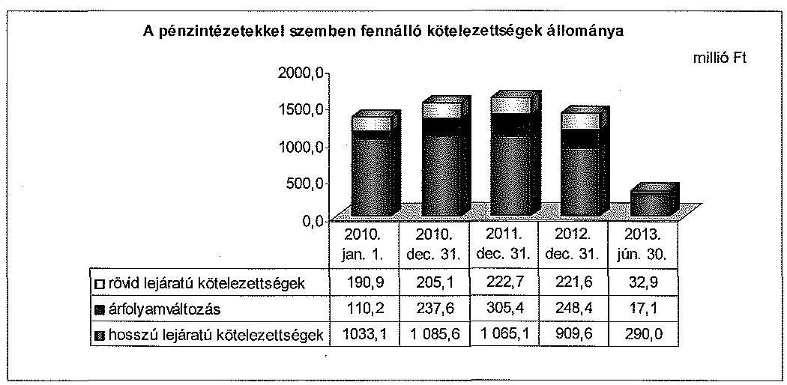

A pénzintézetekkel szembeni kötelezettségállomány 2010. január 1-jén 1334,2 millió Ft volt, mely négy - összesen 197,5 millió Ft összegű - hosszú lejáratú beruházási hitelből, 355,6 millió Ft kötvénytartozásból, 213,2 millió Ft hosszú lejáratú múködési hitelből, 429,2 millió Ft váltótartozásból, valamint 138,7 millió Ft egyéb rövid lejáratú hitelből állt.

A 2002. évben két iskola, valamint közutak felújítására felvett három devizahitelből az ellenőrzött időszak elején 457,4 ezer CHF ( 83,4 millió Ft), 2012. december 31-én 290,6 ezer CHF ( 70,0 millió Ft) kötelezettsége volt az Önkormányzatnak. E hitelek 100,0\%-ban konszolidálásra kerültek.

---

A bérlakások építésére 2004-ben Igénybevett 134,1 millió Ft fejlesztési hitelből a 2009. december 31-ei lejáratig csak 20,0 millió Ft, az ellenőrzött időszakban további 33,1 millió Ft tőkét törlesztett az Önkormányzat. E hitel nem került konszolidálásra, mert kamattámogatást élvez. A 2013. év I. félév végén fennálló tartozás 81,0 millió Ft volt.

Az Önkormányzat a 2007. évben múködési hitelek kiváltására 1334,0 ezer CHF (200,0 millió Ft) hitelt vett fel 2017. június 30 -ai lejáratra, melyet 2011-ben 2020. június 30 -ára hosszabbítottak meg. Az ellenőrzött időszak elején 1169,3 ezer CHF (213,2 millió Ft), 2012. december 31 -én 893,0 ezer CHF (215,3 millió Ft) kötelezettség állt fenn, amit 100,0\%-ban átvállalt a Magyar Állam.

Az Önkormányzat 2007-ben 1950,0 ezer CHF összegű kötvényt bocsátott ki zárt körben, a forrásszerkezet diverzifikálására, 2022. szeptember 28-ai lejárattal. A kötvényt 2011-ben - a bank javaslatára - EUR alapú kötvénykibocsátással váltották ki, 1506,7 ezer EUR összegben. Az árfolyamok növekedése miatt a kötvénykibocsátásból származó kötelezettség a 2010. január 1-jei 355,6 millió Ft-ról 2012. december 31-ére 402,3 millió Ft-ra nőtt. A tőketörlesztés 2013. év I. félévben kezdődött meg 31,4 ezer EUR összeggel. A Magyar Állam az 1 475,3 ezer EUR tartozásból 1 291,0 ezer EUR-t vállalt át.

Az Önkormányzat a 2007. évben a 3000 adagos főzőkonyha-beruházás építési és finanszírozási szerződése szerint, az ellenérték megfizetéseként 2008-2018 között, évente lejáró váltókat bocsátott ki, összesen 485,8 millió Ft összegben a kivitelező javára, amelyeket az egy bankra engedményezett. Az Önkormányzatnak 2010. január 1-jén 429,2 millió Ft, 2012. december 31-én 339,7 millió Ft kötelezettsége állt fenn a váltókibocsátásból. Az adósságkonszolidáció hatására a 2013. június 28 -án fennálló 327,8 millió Ft váltótartozás 276,5 millió Ft-tal ${ }^{9}$ csökkent. A váltókibocsátás az Önkormányzat pénzügyi kitettségét növelte, az ebből eredő kötelezettséggel kapcsolatosan a váltójog szigor a hitelező követelésének érvényesíthetősége, végrehajthatósága elősegítését biztosítja, az adós védelme azonban háttérbe szorul.

Az Önkormányzat a 2011. évben a Sikeres Magyarországért Önkormányzati Infrastruktúrafejlesztési Hitelprogram keretében három fejlesztési célú hitelszerződést kötött. A 117,0 millió Ft hitelkeretből, összesen 93,9 millió Ft-ot hívtak le. E hitelek nem kerültek konszolidálásra, a 2013. év I. félév végén fennálló kötelezettség 74,9 millió Ft volt.

A változó kamatozású adósságot keletkeztető kötelezettségvállalások kamatkockázatot, a devizaalapú hitelek és a kötvény árfolyamkockázatot jelentettek az Önkormányzat pénzügyi egyensúlyi helyzetére.

Az Önkormányzat az ellenőrzött időszakban folyószámlahitelt kizárólag a 2010. évben vett igénybe 334 napon keresztül, melynek átlagos napi állománya 1,3 millió Ft volt. Az Önkormányzat 2010-ben 70,0 millió Ft múködési

[^0]
[^0]:    ${ }^{9}$ A váltótartozás miatt átvállalt adósság a lejárati összeg alapján 276,5 millió Ft, a 2013. június 28. napjára számított nettó jelenértéken 237,8 millió Ft volt.

---

hitelt vett fel a folyószámlahitel-tartozás kiváltására 2015. szeptember 30-ai lejárattal. A 2013. év I. félév végén fennálló 60,0 millió Ft kötelezettségből 27,8 millió Ft-ot - támogatás nyújtásával - vállalt át az állam. Az Önkormányzat 2010-ben éven belüli múködési hitel kiváltására 40,0 millió Ft múködési hitelt vett fel 2013. július 31-ei lejárattal, melyből a 2013. év I. félévéig 26,0 millió Ft-ot törlesztett.

Az ellenőrzött időszak minden évében, összesen hat alkalommal, 292,0 millió Ft összegben vettek igénybe egyéb likvid hitelt múködési, illetve fejlesztési célokra. A likvid hitelekből fizették az egyes beruházások miatti kötelezettségeket (PPP szolgáltatási díjakat, váltótartozásokat). A likvid hitelből fennálló 60,7 millió Ft tartozás 100,0\%-ban konszolidálásra került. A 2013. év I. félév végén fennálló 32,9 millió Ft összegű likvid hitelállomány a 2013. év I. félévében felvett hitelből származott. Az Önkormányzatnál az ellenőrzött időszakban folyamatosan fennállt a banki kitettség, mivel fizetőképességét a likvid hitelek rendszeres megújításával tudta biztosítani.

Az adósságkonszolidáció a megállapodás szerint a pénzintézetekkel szemben fennálló adósság 70,0\%-ára, valamint azok Kvtv.-ben meghatározott járulékaira terjedt ki. A 2012. december 31 -én fennálló 1379,6 millió Ft adósságból a Magyar Állam 966,1 millió Ft-ot vállalt át. A tartozásátvállalás ${ }^{10}$ a devizaalapú kötvényből 376,1 millió Ft (1291,0 ezer EUR), a váltótartozásból 237,3 millió Ft, valamint egy devizaalapú múködési hitelből 202,4 millió Ft (837,2 ezer CHF) adósságot érintett, együttesen 815,8 millió Ft összegben. Ezen felül az Önkormányzat 150,3 millió Ft támogatásban részesült öt hitelszerződés alapján fennálló tartozás ${ }^{11}$ törlesztéséhez.

# A 2013. június 30-án fennálló pénzintézeti kötelezettségek állománya 

340,0 millió Ft volt, mely négy beruházási hitelből ( 155,9 millió Ft), két hosszú lejáratú múködési hitelből ( 46,2 millió Ft), 184,3 ezer EUR ( 53,7 millió Ft) öszszegű kötvénytartozásból, valamint 51,3 millió Ft váltótartozásból ${ }^{12}$ és 32,9 millió Ft likvid hitelből állt. Az Önkormányzat 2013. június 30-án fennálló, hosszú lejáratú adósságot keletkeztető kötelezettségvállalásait a 4. számú melléklet részletezi.

Az ellenőrzött időszakban az Önkormányzatnál az adósságot keletkeztető kötelezettségvállalás felső korlátját betartották. A hitel visszafizetéshez tartalékképzésről nem döntöttek, a döntés-előkészítő dokumentumokban a visszafizetés lehetséges forrásait nem minden esetben jelölték meg, több esetben csak az éves költségvetést határozták meg fedezetként a hitel visszafizetésére.

[^0]
[^0]:    ${ }^{10}$ A tartozásátvállalás az Önkormányzat pénzforgalmi adatait nem érintette. E kötelezettségek a tőkeváltozással szemben kerültek kivezetésre a könyvviteli nyilvántartásokban.
    ${ }^{11}$ a két iskola felújítására, a közutak felújítására felvett beruházási hitelek, valamint egy-egy múködési, illetve likvid hitel
    ${ }^{12}$ Az Önkormányzatnak 37,2 millió Ft régi váltótartozása maradt fenn, valamint a részbeni konszolidáció miatt - a tartozásátvállalási szerződésben előírtak alapján 2013. június 28-án 14,1 millió Ft összegben új váltó kibocsátására került sor.

---

A könyvvizsgáló minden évben elfogadó záradékkal látta el az Önkormányzat beszámolóját, amely a kötelezően előírt tartalmon felül nem tartalmazott más megjegyzést vagy figyelemfelhívást. Az ellenőrzés során nem merült fel olyan megállapítás, amely kétségbe vonná a beszámolók hitelességét.

Az Önkormányzat 2010-2013. év I. félév közötti szállítói és lejárt szállítói állományát az alábbi ábra mutatja be:
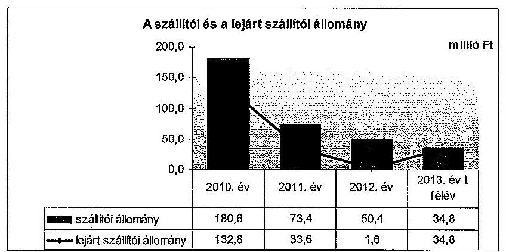

A szállítók felé fennálló kötelezettségek az ellenőrzött időszakban 180,6 millió Ft-ról 34,8 millió Ft-ra, a lejárt szállítói tartozások 132,8 millió Ft-ról 34,8 millió Ft-ra csökkentek. A 2010. évi 60 napon túl lejárt 96,2 millió Ft szállítói állományból az éven túli 65,0 millió Ft-ot, a 91-365 nap között lejárt 5,6 millió Ft-t tett ki. A 2011-2013. év I. félév végén fennálló, lejárt szállítói tartozások 30 napon belül lejártak voltak. A lejárt szállítói állomány - a 2012. év kivételével - minden évben meghaladta a teljesített dologi kiadások egy havi átlagos összege 20,0\%-át. A 2013. június 30 -án fennálló, egyben lejárt esedékességú szállítói tartozás a PPP szolgáltatási díjakból adódott, amely nemfizetési kockázatot jelent. Az ellenőrzött időszakban fizetési átütemezési megállapodással érintett szállítói tartozás a 2010. év végén volt, 47,7 millió Ft összegben.

Az Önkormányzatnak az ellenőrzött időszakban két PPP szerződésből származó kötelezettségvállalása volt, melyeket a 2007. évben uszoda és tornacsarnok beruházás megvalósítására kötöttek, összesen 3469,0 millió Ft összegben. A 2025. évben lejáró szerződésekből 2013. június 30 -án 2989,0 millió Ft kötelezettség állt fenn. Az Önkormányzat számára pénzügyi nehézséget okozott a PPP konstrukcióban megvalósított beruházások miatti szolgáltatási díffizetési kötelezettség, ezért 2011. április 27 -én a tornacsarnokra vonatkozóan megállapodott a szolgáltatóval a havi díj 50,0\%-os csökkentésében a 20112012. évekre vonatkozóan. A megállapodás szerint a különbözetet 2013-tól kezdődően, a hátralévő évekre egyenletesen elosztva köteles az Önkormányzat megfizetni. Az Önkormányzat 2012. június 5 -én múszaki szakértővel vizsgáltatta felül a tornacsarnok építési és üzemeltetési költségeit.

A szakértő megállapította, hogy a szolgáltató által számlázott mindkét díjrész meghaladja a valós költségeket. Az értékaránytalanság az üzemeltetési költségekben volt jelentős. A szakértői vélemény szerint az üzemeltetés költsége 19,8 millió Ft+áfa/év, ezzel szemben a szolgáltatási szerződésben megállapított

---

üzemeltetési díj 41,2 millió Ft+áfa/év. Az Önkormányzat a szakértői vélemény ismeretében kezdeményezte a szerződés felülvizsgálatát a szolgáltatóval.

Az Önkormányzatnak az ellenőrzött időszakban két, 2010-ben lejárt gépjármú lizingszerződése volt.

Az Önkormányzat 2012. október 9-én 202,6 millió Ft összegben készfizető kezességet vállalt az Újfehértó-Bököny Víziközmű Beruházási Társulás által felvett fejlesztési hitelért. A kezességvállaláshoz kapcsolódó kötelezettség teljes összege fennállt 2013. június 30 -án, amely mérlegen kívüli tételek miatti kockázatot jelent az Önkormányzat pénzügyi egyensúlyi helyzete szempontjából.

Az ellenőrzött időszakban a jegyző összesen 1,2 millió Ft helyi adó- és pótléktartozás elengedéséről döntött. Az Önkormányzatnál egyéb követeléselengedésre nem került sor.

A pénzintézeti kötelezettségekhez kapcsolódóan az ellenőrzött időszakban négy korlátozottan forgalomképes és két forgalomképes ingatlanra jegyeztek be jelzálogjogot. A törzsvagyon körébe tartozó, korlátozottan forgalomképes ingatlanokra történő jelzálogjog alapításával az Önkormányzat megsértette a 2010. és a 2011. években az Ötv. 88. § (1) bekezdés b) pontjában ${ }^{13}$, a 2012. évben az Áht. 84. § (4) bekezdésében foglalt előírásokat. Az összes jelzáloggal terhelt ingatlan könyv szerinti értéke 2012. december 31-én 567,0 millió Ft volt, melyből a korlátozottan forgalomképes ingatlanok értéke 541,0 millió Ft-ot tett ki.

Az Önkormányzat a Kormány engedélyezési jogkörébe tartozó, adósságot keletkeztető ügyletet nem kötött, a 353/2011. (XII. 30.) Korm. rendelet alapján ilyen ügylethez hozzájárulást nem kért.

Az Önkormányzat pénzügyi egyensúlya rövid távon nem volt biztosított. Az ellenőrzött időszak végén fennálló pénzintézeti kötelezettség alapján a 2013. július 1. és 2015. december 31. közötti időszakban várhatóan 151,3 millió Ft és 37,6 ezer EUR, a 2016. évtől 174,6 millió Ft és 174,0 ezer EUR összegű adósságszolgálat válik esedékessé. A 2013. évi adósságkonszolidáció az Önkormányzat pénzügyi helyzetére kedvező hatást gyakorolt, azonban a jövedelemtermelő képesség csökkenése, valamint a finanszírozásba bevonható eszközök korlátozott szintje miatt a jövöbeni kötelezettségek kifizethetőségének kockázata fennáll. A PPP szerződésekből adódó kötelezettségvállalások mérlegen kívüli tételek miatti kockázatot jelentenek Önkormányzat számára. A 2013. június 30 -án fennálló 2989,0 millió Ft összegű, PPP szerződések miatti kötelezettségekből a 2013. július 1. és 2015. december 31. közötti időszakban várhatóan 667,0 millió Ft, a 2016. évtől 2322,0 millió Ft lesz esedékes. Az Önkormányzat kötelezettségeinek és egyes kötelezettségvállalásainak 2010. december 31-ei és 2013. június 30 -ai állományát, valamint a 2013. év II. félévben és az azt követő években várható kötelezettségeket, kötelezettségvállalások miatti kiadásokat az 5 . számú melléklet mutatja be.

[^0]
[^0]:    ${ }^{13}$ 2012. március 31-től az Áht. 84. § (4) bekezdése

---

Az Önkormányzat a 2013. évi költségvetési rendeletében a Mötv. 111. § (4) bekezdése szerinti múködési költségvetési egyensúly megteremtése érdekében 360,5 millió Ft müködőképesség megőrzését szolgáló, kiegészítő támogatást is figyelembe vett, ezáltal a bevételi előirányzatok tervezése az Áht. 12. § (1) bekezdésében előírtak ellenére közgazdaságilag nem megalapozott módon történt.

Az Önkormányzat észrevétele szerint az Állami Számvevőszék által feltárt problémát érzékelték, azzal kapcsolatosan a Belügyminisztériumtól kértek tájékoztatást. A költségvetés elfogadásának határidejére tekintettel a múködési egyensúly biztosításának megoldásaként 360536 ezer Ft kiegészítő támogatásból származó bevételt építettek be a 2013. évi költségvetésbe. Az észrevételben foglaltak a megállapítás megalapozottságát nem befolyásolják. A költségvetés összeállítása során a Mötv.-ben előírt működési egyensúly biztosítása céljából nem vehető figyelembe olyan bevétel, melynek teljesítése, pénzügyi realizálása tekintetében az Önkormányzat hatáskörrel, illetve jogosultsággal nem rendelkezik. Az Áht. 4. § (2) bekezdése alapján a bevételi előirányzatok azok teljesítésének kötelezettségét jelentik. A központi költségvetésből folyósított müködőképesség megőrzését szolgáló, kiegészítő támogatás közgazdaságilag megalapozott módon a kormányzati jóváhagyó döntést követően válik az Önkormányzat költségvetésében figyelembe vehető bevételi előirányzattá.

Az Önkormányzat kizárólagos tulajdonában lévő Újfehértour Kft. gazdálkodása a 2011. évet kivéve nyereséges volt. Az Önkormányzat a 2010-2012. években évente változó mértékű, összesen 48,0 millió Ft múködési célú támogatást adott át részére. A gazdasági társaság ugyanakkor hitelezője is az Önkormányzatnak, mert minden évben 5,5-13,0 millió Ft összegű, éven belül lejáró kölcsönt nyújtott az Önkormányzat átmeneti forráshiányának kezelésére.

Az Önkormányzat az Újfehértói Egészségügyi Szolgáltató Közhasznú Nonprofit Kft.-ben 62,0\%-os tulajdoni hányaddal rendelkezett. A gazdasági társaság az ellenőrzött időszak minden évében veszteségesen (2,2-7,6 millió Ft) gazdálkodott. Az Önkormányzat a gazdasági társaságban a 2010. és a 2011. évben tőkeemelést hajtott végre, 2012-ben és a 2013. év I. félévében a veszteség rendezésére pótbefizetést teljesített, továbbá a 2011. évben tagi kölcsönt nyújtott. A gazdasági társaság veszteséges gazdálkodása és az ellenőrzött időszak végén fennálló kötelezettségállománya mérlegen kívüli tételek miatti kockázatot jelent az Önkormányzat pénzügyi egyensúlyi helyzete szempontjából. Az önkormányzati feladatok ellátásában résztvevő gazdasági társaságok egyes kiemelt adatait a 3. számú melléklet tartalmazza.

Az ellenőrzött időszak végén az Önkormányzat két 100,0\%-os tulajdoni hányadú gazdasági társasága felszámolási eljárás alatt állt.

A Dél-Nyírségi Vendéglátóipari Kft. 2008. november 28. óta áll felszámolás alatt. A benyújtott hitelezői igényeket a felszámoló vagyon hiányában nem tudta kielégíteni, és a felszámolási eljárás egyszerüsített lezárását kérte a bíróságtól. Az Önkormányzat a részesedés teljes összege ( 3,0 millió Ft) után értékvesztést számolt el. Az Újfehértó Városfejlesztési és Városüzemeltetési Nonprofit Kft. 2009. november 24. óta áll felszámolás alatt. A gazdasági társaság miatt az Önkormányzatnak 2010-ben 5,0 millió Ft hitel miatti kezességvállalást kellett teljesítenie. Az Önkormányzat a részesedés teljes összege (103,4 millió Ft) után értékvesztést számolt el.

---

# 4. Az ÖNKORMÁNYZAT PÉNZÜGYI GAZDÁLKODÁSA SORÁN ÉRVÉNYESÍTETT INTEGRITÁSI SZEMPONTOK 

A pénzügyi gazdálkodás során - az etikai elvárásokra, az Önkormányzat tulajdonában, kezelésében lévő egyes eszközök használatára, az összeférhetetlenség meghatározására, a pénzügyi-gazdálkodási folyamatokban a „négy szem" elvének alkalmazására, a pénzügyi helyzetet, az adósságterheket befolyásoló döntések előtti, azok kockázatainak felmérésére vonatkozó szabályozás kialakítása tekintetében - érvényesült az integritási szemlélet. A közérdekű bejelentések kezelésére vonatkozó szabályozásbeli hiányosságok azonban arra utalnak, hogy az Önkormányzatnak még fejlődnie kell az integritási szemlélet teljes körü érvényesítése érdekében. Az Integritás Kérdőívet az ellenőrzött időszakban nem töltötték ki.

Az Önkormányzat nem rendelkezett külön etikai szabályzattal. Bizonyos etikai elvárásokat meghatároztak a munkaköri leírásokban, továbbá a Polgármesteri Hivatal Közszolgálati és javadalmazási rendjének szabályairól szóló, 2011. január 1-jétől hatályos jegyzői utasításban. E jegyzői utasításban szabályozták a munkavégzésre irányuló egyéb jogviszony bejelentési kötelezettségét és az öszszeférhetetlenség kialakulása esetén követendő eljárásokat.

Az Önkormányzat tulajdonában, kezelésében lévő eszközök (telefon, gépjármú) magáncélú használatának korlátozására vonatkozó szabályokat jegyzői utasítások tartalmazták.

Az Önkormányzat nem rendelkezett a kívülről, illetve belülről érkező közérdekű bejelentések kezelésére vonatkozó szabályzattal. A Polgármesteri Hivatal Panaszkezelési Szabályzata nem tartalmazott a közérdekú bejelentésekkel kapcsolatos előírásokat.

Az Önkormányzat a pénzügyi-gazdálkodási folyamatokban biztosította a „négy szem elvének" alkalmazását.

A Kockázatkezelési szabályzat 2010 júniusa óta tartalmazta a külső kockázatok (kamatláb-változások, árfolyamváltozások, infláció), valamint a pénzügyi kockázatok kezelésének módját, azonosítását, ellenőrzését.

Budapest, 2014.
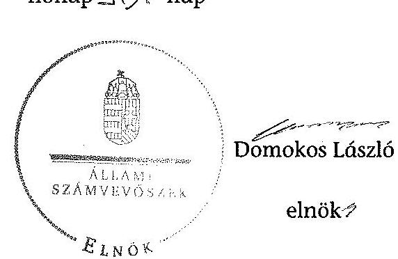

Melléklet: $\quad 8 \mathrm{db}$
Függelék: $\quad 2 \mathrm{db}$

---

.

---

# Az Önkormányzat bevételei és kiadásai, valamint adósságszolgálata a 2010–2013. év t. félév közötti időszakban (a CLF módszer szerint, a Kvtr. 72. § (1) bekezdésében foglalt adósságátvállaláshoz kapcsolódó pénzügyi teljesítések nélkül)

|  1. FOLYÓ KÖLTSÉGVETÉS* | 2010. év | 2011. év | 2012. év | 2013. év t. félév  |
| --- | --- | --- | --- | --- |
|  1.1.1. Saját működési bevételek | 344,7 | 442,0 | 416,0 | 229,9  |
|  1.1.2. Költségvetési támogatások ÖNHIKI támogatások nélkül** | 1019,2 | 631,4 | 622,7 | 326,3  |
|  1.1.3. Alanyadott bevételek | 606,1 | 592,4 | 551,7 | 17,6  |
|  1.1.4. Állámháztartáson belülről kapott támogatások | 105,2 | 183,0 | 152,3 | 55,0  |
|  1.1.5. EU-tól és külföldről kapott bevételek | 0,0 | 0,0 | 0,0 | 0,0  |
|  1.1.6. Állámháztartáson kívülről kapott bevételek | 0,0 | 0,0 | 0,0 | 0,0  |
|  1.1.7. Hozam- és karadóbevételek | 1,9 | 1,4 | 1,4 | 1,0  |
|  1.1.8. Kölcsönök visszatérülése, igénybevétele | 0,0 | 0,0 | 0,0 | 0,0  |
|  1.1.9. Előző évt pánumeradvány átvétel | 0,0 | 0,0 | 0,0 | 0,0  |
|  1.1.10. A működőképesség megőrzését szolgáló kiegészítő támogatások | 0,0 | 62,9 | 67,9 | 0,0  |
|  1.1. Folyó bevételek +1.1.1.+1.1.2.+1.1.3.+1.1.4.+1.1.5.+1.1.6.+1.1.7.+1.1.8.+1.1.9.+1.1.10. | 2 077,6 | 2 114,0 | 2 012,6 | 629,6  |
|  1.2.1. Működési kiadások kamatkordások nélkül | 1 715,4 | 1 426,5 | 1 382,5 | 490,6  |
|  1.2.2. Állámháztartáson belülre átadott pénzeszközök | 2,5 | 0,0 | 0,0 | 3,1  |
|  1.2.3.1. vállalkozásoknak | 1,7 | 0,7 | 1,3 | 4,5  |
|  1.2.3.2. EU-nak, illetve külföldre | 0,0 | 0,0 | 0,0 | 0,0  |
|  1.2.3.3. magánszomélyoknak | 281,4 | 283,1 | 286,3 | 96,1  |
|  1.2.3.4. morgonffi szervezeteknek | 42,4 | 22,7 | 28,7 | 8,0  |
|  1.2.3. Transzferkiadások (+1.2.3.1.+1.2.3.2.+1.2.3.3.+1.2.3.4.) | 326,2 | 316,1 | 329,3 | 109,6  |
|  1.2.4. Kamatkiadások | 33,1 | 40,9 | 40,9 | 16,4  |
|  1.2.5. Kölcsönök nyújtása, törlesztése | 0,0 | 2,9 | 0,9 | 0,0  |
|  1.2.6. Előző évt pánumeradvány átadás | 0,0 | 0,0 | 0,0 | 0,0  |
|  1.2. Folyó kiadások +1.2.1.+1.2.2.+1.2.3.+1.2.4.+1.2.5.+1.2.6. | 2 068,2 | 1 793,3 | 1 704,3 | 622,3  |
|  1.3. Folyó költségvetés egyenlege, működési jövedelem (1.1. - 1.2.) | 11,4 | 320,7 | 256,3 | 7,5  |
|  2. FELHALMOZÁSI KÖLTSÉGVETÉS*** |  |  |  |   |
|  2.1.1. Saját tökebevételek | 27,0 | 71,9 | 0,0 | 0,4  |
|  2.1.2. Költségvetési támogatások | 33,4 | 4,6 | 16,4 | 0,0  |
|  2.1.3. Állámháztartáson belülről kapott támogatások | 408,6 | 328,3 | 17,1 | 12,0  |
|  2.1.4. EU-tól és külföldről kapott támogatások | 0,0 | 0,0 | 0,0 | 0,0  |
|  2.1.5. Állámháztartáson kívülről kapott bevételek | 0,0 | 0,0 | 0,0 | 0,0  |
|  2.1.6. Hozam- és kamatbevételek | 0,0 | 0,1 | 0,0 | 0,0  |
|  2.1.7. Kölcsönök visszatérülése, igénybevétele | 0,0 | 0,0 | 0,0 | 0,0  |
|  2.1.8. Előző évt pánumeradvány átadás | 0,0 | 0,0 | 0,0 | 0,0  |
|  2.1. Felfalmozási bevételek +2.1.1.+2.1.2.+2.1.3.+2.1.4.+2.1.5.+2.1.6.+2.1.7.+2.1.8. | 529,2 | 404,9 | 36,5 | 12,4  |
|  2.2.1. Saját beruházási kiadás átlevat | 491,9 | 514,3 | 39,0 | 16,6  |
|  2.2.2. Saját felújítási kiadás átfavat | 0,1 | 59,1 | 46,7 | 13,0  |
|  2.2.3. Állámháztartáson belülre átadott pénzeszközök | 4,5 | 0,0 | 14,6 | 0,0  |
|  2.2.4. EU-nak és külföldnek adott pénzeszközök | 0,0 | 0,0 | 0,0 | 0,0  |
|  2.2.5. Állámháztartáson kívülre adott pénzeszközök | 13,0 | 1,8 | 4,6 | 0,0  |
|  2.2.6. Befektetési célú részesedések vásárlása | 0,4 | 0,0 | 0,0 | 0,0  |
|  2.2.7. Kamatkiadások | 14,0 | 14,2 | 19,8 | 13,8  |
|  2.2.8. Kölcsönök nyújtása, törlesztése | 0,0 | 0,0 | 0,0 | 0,0  |
|  2.2.9. Előző évt pánumeradvány átadás | 0,0 | 0,0 | 0,0 | 0,0  |
|  2.2.10. ÁFA beffizetések | 11,1 | 59,0 | 0,0 | 0,0  |
|  2.2. Felfalmozási kiadások +2.2.1.+2.2.2.+2.2.3.+2.2.4.+2.2.5.+2.2.6.+2.2.7.+2.2.8.+2.2.9.+2.2.10. | 550,2 | 548,4 | 127,8 | 27,1  |
|  2.3. Felfalmozási költségvetés egyenlege (2.1. - 2.2.) | -21,0 | -243,5 | -21,3 | -24,7  |
|  3. FINANSZÍROZÁSI MÜVELETEK NELKÜLI (GFS) POZÍCIO (1.3.+2.3.) | -5,6 | 77,2 | 167,0 | -27,2  |
|  4. FINANSZÍROZÁSI MÜVELETEK |  |  |  |   |
|  4.1. Hitelfelvétel | 206,3 | 113,5 | 32,0 | 32,9  |
|  4.2. Hitelförlesztés | 170,1 | 120,3 | 195,9 | 62,2  |
|  4.3. Forgatási és befektetési célú értékpapírok kibocsátása | 0,0 | 0,0 | 0,0 | 0,0  |
|  4.4. Forgatási és befektetési célú értékpapírok beváltása | 0,0 | 0,0 | 0,0 | 0,0  |
|  4.5. Forgatási és befektetési célú értékpapírok értékesítése | 0,0 | 0,0 | 0,1 | 0,0  |
|  4.6. Forgatási és befektetési célú értékpapírok vásárlása | 0,0 | 0,0 | 0,0 | 0,0  |
|  4.7. Egyéb finanszírozási bevételek (függő, átfutó, kiegyenlítő) | -78,9 | 0,1 | -0,1 | 4,4  |
|  4.8. Egyéb finanszírozási kiadások (függő, átfutó, kiegyenlítő) | -72,7 | 79,6 | -81,9 | 0,0  |
|  4.9. Finanszírozási műveletek egyenlege (4.1.-4.2.+4.3.-4.4.+4.5.-4.6.+4.7.-4.8.) | 32,0 | -87,3 | -52,1 | -24,9  |
|  5. TÁRGYÉVI PÉNEUÓVI POZÍCIO (1.3.+ 2.3.+4.9.) | 22,4 | -10,1 | 64,9 | -52,1  |
|  6. NETTÓ MÜKÖDÉSI JÖVEDELEM = működési jövedelem (1.3.) - tőkstörlesztés (4.2.+4.4.) | -159,7 | 200,4 | 52,4 | -54,7  |
|  TÁJÉKOZTATÓ ADATOK |  |  |  |   |
|  Összes kötelezettség | 1739,1 | 1694,7 | 1450,5 | 417,2  |
|  ebből rövid lejárata | 842,0 | 706,3 | 631,2 | 186,2  |
|  Összes szállítói kötelezettség | 180,6 | 75,4 | 55,4 | 34,5  |
|  ebből lejáró (tanszifvágyító) | 132,8 | 33,6 | 1,6 | 34,8  |
|  Pénz- és tökeziszi kötelezettség (adósság) | 1026,3 | 1593,2 | 1379,6 | 340,0  |
|  ebből rövid lejárata | 205,1 | 222,7 | 221,6 | 32,9  |
|  ebből hosszú lejáratú kötelezettségek következő évet tartalú törlesztő részletek (analitkából) | 65,1 | 208,2 | 221,6 | n.a.  |
|  PPP karcsítéktes állomány jelenértéken (tanszifvágyító) | n.a. | n.a. | n.a. | 3 669,0  |
|  ebből lejáró szolgáltatási díj miatti kötelezettség | n.a. | n.a. | n.a. | 34,8  |
|  Folyószámla hitel napi átlagos állománya (tanszifvágyító) | 1,3 | 0,0 | 0,0 | 0,0  |
|  Likvid hitel napi átlagos állománya (tanszifvágyító) | 124,7 | 37,2 | 43,8 | 25,0  |
|  Monkebér hitel napi átlagos állománya (tanszifvágyító) | 0,0 | 0,0 | 0,0 | 0,0  |
|  Kezesség és param/beváltatások (tanszifvágyító) | n.a. | n.a. | n.a. | 202,6  |
|  Jogerők bírósági létletekből adódó kötelezettségek (tanszifvágyító) | n.a. | n.a. | n.a. | 4,6  |
|  Finanszírozásba bevonható eszközök | 71,9 | 61,6 | 141,6 | 87,2  |
|  Tartós laboriszoncé megtartásító értékpapírok | 0,0 | 0,0 | 0,0 | 0,0  |
|  Hosszú lejáratú bankbetétek | 0,0 | 0,0 | 0,0 | 0,0  |
|  Értékpapírok | 0,0 | 0,0 | 0,0 | 0,0  |
|  Pénzeszközök (idegen nélkül) | 71,9 | 61,6 | 141,6 | 87,2  |

- A költségvetési szervoknél a számviteli szabályoknak megfelelően a bevételekben nem körül, a kiadásokban nem jelenik meg az amortizáció, a vagyoni helyzetet az egyenleg befolyásolja.

* A költségvetési támogatásból a felfalmozási célú részt az Önkormányzat adatszolgáltatása szerinti mértékben vettük figyelembe a 2.1.2., a 2.1.6., illetve a 2.2.7. sorokon.

*** Bevételekben vagyonmegőrzésre és -bővítésre fordítható források.

---

Az Önkormányzat bevételei és kiadásai a Kvtv. 72. § (1) bekezdésében foglalt adósságátvállaláshoz kapcsolódó pénzügyi teljesítések nélkül a 2013. év I. félévben (a CLF módszer szerint)

|  1. FOLYÓ KÖLTSÉGVETÉS* | beszámoló szerinti adatok | az adósság átvállaláshoz kapcsolódó bevételek ill. kiadások | módosított adatok  |
| --- | --- | --- | --- |
|   | 1. | 2. | 1.+2.  |
|  1.1.1. Saját müködési bevételek | 229,9 |  | 229,9  |
|  1.1.2. Költségvetési támogatások ÖNHIKI támogatások nélkül** | 415,1 | $-89,4$ | 335,3  |
|  1.1.3. Annegedett bevételek | 17,6 |  | 17,6  |
|  1.1.4. Államháztartáson belülről kapott támogatások | 55,0 |  | 55,0  |
|  1.1.5. EU-tól és külföldről kapott bevételek | 0,0 |  | 0,0  |
|  1.1.6. Államháztartáson kívülről kapott bevételek | 0,0 |  | 0,0  |
|  1.1.7. Hozam- és kamatbevételek | 1,0 |  | 1,0  |
|  1.1.8. Kölcsönök visszatérődése, igénybevétele | 0,0 |  | 0,0  |
|  1.1.9. Előző évl pénzmaradvány átvétel | 0,0 |  | 0,0  |
|  1.1.10. A müködőképetség megőrzését szolgáló kiegészítő támogatások | 0,0 |  | 0,0  |
|  1.1. Folyó bevételek $=1.1 .1 .+1.1 .2 .+1.1 .3 .+1.1 .4 .+1.1 .5 .+1.1 .6 .+1.1 .7 .+1.1 .8 .+1.1 .9 .+1.1 .10$. | 718,2 | $-80,4$ | 629,9  |
|  1.2.1. Müködési kiadások kamatkiadások nélkül | 490,6 |  | 490,6  |
|  1.2.2. Államháztartáson belülre átadott pénzeszközök | 3,7 |  | 3,7  |
|  1.2.3.1. vállalkozásoknak | 4,5 |  | 4,5  |
|  1.2.3.2. EU-nak, illetve külföldre | 0,0 |  | 0,0  |
|  1.2.3.3. megbenzemélyeknek | 86,7 |  | 86,7  |
|  1.2.3.4. nonprofit szervezateknek | 8,8 |  | 8,8  |
|  1.2.5. Transzitokladások ( $=1.2 .3 .1 .+1.2 .3 .2 .+1.2 .3 .3 .+1.2 .3 .4$ ) | 109,6 | 0,0 | 109,6  |
|  1.2.4. Kamatkiadások | 18,3 | $-0,9$ | 18,4  |
|  1.2.5. Kölcsönök nyújtása, törlesztése | 0,0 |  | 0,0  |
|  1.2.6. Előző évl pénzmaradvány átadás | 0,0 |  | 0,0  |
|  1.2. Folyó kiadások $=1.2 .1 .+1.2 .2 .+1.2 .3 .+1.2 .4 .+1.2 .5 .+1.2 .6$. | 623,2 | $-0,9$ | 623,3  |
|  1.2. Folyó költségvetés egyenlege, müködési jövedelem (1.1. - 1.2.) | 66,0 | $-88,3$ | 7,0  |
|  2. FELHALMOZÁSI KÖLTSÉGVETÉS*** |  |  |   |
|  2.1.1. Saját tőkebevételek | 0,4 |  | 0,4  |
|  2.1.2. Költségvetési támogatások | 62,3 | $-62,3$ | 0,0  |
|  2.1.3. Államháztartáson belülről kapott támogatások | 12,0 |  | 12,0  |
|  2.1.4. EU-tól és külföldről kapott támogatások | 0,0 |  | 0,0  |
|  2.1.5. Államháztartáson kívülről kapott bevételek | 0,0 |  | 0,0  |
|  2.1.6. Hozam- és kamatbevételek | 0,0 |  | 0,0  |
|  2.1.7. Kölcsönök visszatérődése, igénybevétele | 0,0 |  | 0,0  |
|  2.1.8. Előző évl pénzmaradvány átvétel | 0,0 |  | 0,0  |
|  2.1. Felhalmozási bevételek $=2.1 .1 .+2.1 .2 .+2.1 .3 .+2.1 .4 .+2.1 .5 .+2.1 .6 .+2.1 .7 .+2.1 .8$. | 74,7 | $-62,3$ | 12,4  |
|  2.2.1. Saját beruházási kiadás átával | 19,8 |  | 19,8  |
|  2.2.2. Saját felújítási kiadás átával | 13,0 |  | 13,0  |
|  2.2.3. Államháztartáson belülre átadott pénzeszközök | 0,0 |  | 0,0  |
|  2.2.4. EU-nak és külföldnek adott pénzeszközök | 0,0 |  | 0,0  |
|  2.2.5. Államháztartáson kívülre adott pénzeszközök | 0,0 |  | 0,0  |
|  2.2.6. Befektetési célú részesedések vásárlása | 0,0 |  | 0,0  |
|  2.2.7. Kamatkissókok | 14,3 | $-0,5$ | 13,5  |
|  2.2.8. Kölcsönök nyújtása, törlesztése | 0,0 |  | 0,0  |
|  2.2.9. Előző évl pénzmaradvány átadás | 0,0 |  | 0,0  |
|  2.2.10. Afrú befejejtések | 0,0 |  | 0,0  |
|  2.2. Felhalmozási kiadások $=2.2 .1 .+2.2 .2 .+2.2 .3 .+2.2 .4 .+2.2 .5 .+2.2 .6 .+2.2 .7 .+2.2 .8 .+2.2 .9 .+2.2 .10$. | 47,6 | $-0,5$ | 47,7  |
|  2.3. Felhalmozási költségvetés egyenlege (2.1. - 2.2.) | 27,1 | $-61,8$ | 34,7  |
|  3. FINANSZÍROZÁSI MÜVELETEK NELKÜLI (GFS) POZÍCIO (1.3.+2.3.) | 123,1 | $-150,3$ | $-27,2$  |
|  4. FINANSZÍROZÁSI MÜVELETEK |  |  |   |
|  4.1. Hitelletvétel | 32,9 |  | 32,9  |
|  4.2. Hiteltörlesztés | 212,5 | $-180,3$ | 62,2  |
|  4.3. Forgatási és befektetési célú értékpapírok kibocsátása | 0,0 |  | 0,0  |
|  4.4. Forgatási és befektetési célú értékpapírok beváltása | 0,0 |  | 0,0  |
|  4.5. Forgatási és befektetési célú értékpapírok értékesítése | 0,0 |  | 0,0  |
|  4.6. Forgatási és befektetési célú értékpapírok vásárlása | 0,0 |  | 0,0  |
|  4.7. Egyéb finanszírozási bevételek (függő, átfutó, kiegyenlítő) | 4,4 |  | 4,4  |
|  4.8. Egyéb finanszírozási kiadások (függő, átfutó, kiegyenlítő) | 0,0 |  | 0,0  |
|  4.9. Finanszírozási műveletek egyenlege (4.1.-4.2.+4.3.-4.4.+4.5.-4.6.+4.7.-4.8.) | $-175,2$ | 150,3 | 24,9  |
|  5. TÁRGYÉVI PÉNZÜGYI POZÍCIO (1.3.+ 2.3.+4.9.) | $-52,1$ | 0,0 | $-52,1$  |
|  6. NETTO MÜKÖDÉSI JÖVEDELÉM = müködési jövedelem (1.3.) - tőketörlesztés (4.2.+4.4.) | $-116,9$ | 61,9 | $-54,7$  |

- A költségvetési szerveknéi a számviteli szabályoknak megfelelően a bevételekben nem töröl, a kiadásokban nem jelenik meg az amortizáció, a vagyoni helyzetet az egyenleg befolyásolja. ** A költségvetési támogatásból a felhalmozási célú részt az Önkormányzat adatszolgáltatása szerinti mértékben vettük figyelembe a 2.1.2., a 2.1.6., illetve a 2.2.7. sorokon. *** Bevételekben vagyonmegőrzésre és -tö́vítósre fordítható források.

---

A V-0205-039/2014. SZÁMÚ JELENTÉSHEZ

Az Önkormányzat által a 2010. és a 2013. év I. félév között megvalósított fejlesztési feladatok érdekében teljesített felhalmozási kiadások és az ezekhez vállalt kötelezettségek összegzése

|  |   |   |   |   |   |   |   |   |   |   |   |   |   |   |   |   |   |   |
| --- | --- | --- | --- | --- | --- | --- | --- | --- | --- | --- | --- | --- | --- | --- | --- | --- | --- | --- |
|  |   |   |   |   |   |   |   |   |   |   |   |   |   |   |   |   |   |   |
|  K
A
S
A
B
A
B | Fejlesztési feladat típusa |  |  |  |  |  |  |  |  |  |  |  |  |  |  |  |  |   |
|   |  |  |  |  |  |  |  |  |  |  |  |  |  |  |  |  |  |   |
|   |  |  |  |  |  |  |  |  |  |  |  |  |  |  |  |  |  |   |
|   |  |  |  |  |  |  |  |  |  |  |  |  |  |  |  |  |  |   |
|   |  |  |  |  |  |  |  |  |  |  |  |  |  |  |  |  |  |   |
|   |  |  |  |  |  |  |  |  |  |  |  |  |  |  |  |  |  |   |
|   |  |  |  |  |  |  |  |  |  |  |  |  |  |  |  |  |  |   |
|   |  |  |  |  |  |  |  |  |  |  |  |  |  |  |  |  |  |   |
|   |  |  |  |  |  |  |  |  |  |  |  |  |  |  |  |  |  |   |
|   |  |  |  |  |  |  |  |  |  |  |  |  |  |  |  |  |  |   |
|   |  |  |  |  |  |  |  |  |  |  |  |  |  |  |  |  |  |   |
|   |  |  |  |  |  |  |  |  |  |  |  |  |  |  |  |  |  |   |
|   |  |  |  |  |  |  |  |  |  |  |  |  |  |  |  |  |  |   |
|   |  |  |  |  |  |  |  |  |  |  |  |  |  |  |  |  |  |   |
|   |  |  |  |  |  |  |  |  |  |  |  |  |  |  |  |  |  |   |
|   |  |  |  |  |  |  |  |  |  |  |  |  |  |  |  |  |  |   |
|   |  |  |  |  |  |  |  |  |  |  |  |  |  |  |  |  |  |   |
|   |  |  |  |  |  |  |  |  |  |  |  |  |  |  |  |  |  |   |
|   |  |  |  |  |  |  |  |  |  |  |  |  |  |  |  |  |  |   |
|   |  |  |  |  |  |  |  |  |  |  |  |  |  |  |  |  |  |   |
|   |  |  |  |  |  |  |  |  |  |  |  |  |  |  |  |  |  |   |
|   |  |  |  |  |  |  |  |  |  |  |  |  |  |  |  |  |  |   |
|   |  |  |  |  |  |  |  |  |  |  |  |  |  |  |  |  |  |   |
|   |  |  |  |  |  |  |  |  |  |  |  |  |  |  |  |  |  |   |
|   |  |  |  |  |  |  |  |  |  |  |  |  |  |  |  |  |  |   |
|   |  |  |  |  |  |  |  |  |  |  |  |  |  |  |  |  |  |   |
|   |  |  |  |  |  |  |  |  |  |  |  |  |  |  |  |  |  |   |
|   |  |  |  |  |  |  |  |  |  |  |  |  |  |  |  |  |  |   |
|   |  |  |  |  |  |  |  |  |  |  |  |  |  |  |  |  |  |   |
|   |  |  |  |  |  |  |  |  |  |  |  |  |  |  |  |  |  |   |
|   |  |  |  |  |  |  |  |  |  |  |  |  |  |  |  |  |  |   |
|   |  |  |  |  |  |  |  |  |  |  |  |  |  |  |  |  |  |   |
|   |

---

# Az önkormányzati feladatok ellátásában résztvevő gazdasági társaságok egyes kiemelt adatai

|  Gazdasági társaság megnevezése | 2013. június 30-án | a gazdasági társaságnak szerződéses kötelezettségre, feladatellátási szerződésre alapozottan az Önkormányzat költségvetéséből nyújtott  |
| --- | --- | --- |
|   | önkormányzat | önkormányzat az alábbis megyesítők (1)  |
|   |  | 2013. év  |
|   |  | 2012. év  |
|   |  | 2011. év  |
|   |  | 2012. év  |
|   |  | 2013. év  |
|   |  | 2012. év  |
|   |  | 2011. év  |
|   |  | 2012. év  |
|   |  | 2013. év  |
|   |  | 2012. év  |
|   |  | 2013. év  |
|   |  | 2012. év  |
|   |  | 2011. év  |
|   |  | 2012. év  |
|   |  | 2013. év  |
|   |  | 2012. év  |
|   |  | 2013. év  |
|   |  | 2012. év  |
|   |  | 2013. év  |
|   |  | 2012. év  |
|   |  | 2013. év  |
|   |  | 2012. év  |
|   |  | 2013. év  |
|   |  | 2012. év  |
|   |  | 2013. év  |
|   |  | 2012. év  |
|   |  | 2013. év  |
|   |  | 2012. év  |
|   |  | 2012. év  |
|   |  | 2012. év  |
|   |  | 2012. év  |
|   |  | 2012. év  |
|   |  | 2012. év  |
|   |  | 2012. év  |
|   |  | 2012. év  |
|   |  | 2012. év  |
|   |  | 2012. év  |
|   |  | 2012. év  |
|   |  | 2012. év  |
|   |  | 2012. év  |
|   |  | 2012. év  |
|   |  | 2012. év  |
|   |  | 2012. év  |
|   |  | 2012. év  |
|   |  | 2012. év  |
|   |  | 2012. év  |
|   |  | 2012. év  |
|   |  | 2012. év  |
|   |  | 2012. év  |
|   |  | 2012. év  |
|   |  | 2012. év  |
|   |  | 2012. év  |
|   |  | 2012. év  |
|   |  | 2012. év  |
|   |  | 2012. év  |
|   |  | 2012. év  |
|   |  | 2012. év  |
|   |  | 2012. év  |
|  

---

Az Önkormányzat 2013. június 30-án fennálló, hosszú lejáratú adósságot keletkeztető kötelezettségvállalásai

|  Megnevezés | Szerződéskötés/
Kibocsátás időpontja | Összeg
millió Ft-ban | Összeg
ezer CHF-ban | Kamat
(referencia kamat + kamatfelár) | Felhasználás célja  |
| --- | --- | --- | --- | --- | --- |
|  Sikeres Magyarországért
Önk. Infrastruktúra fejl. Hitel | 2011.05.11 | 41,2 |  | 3 havi EURIBOR $+1,5 \%$ | Kerékpárút, csapadékelvezető rendszer
kilpítése  |
|  Sikeres Magyarországért
Önk. Infrastruktúra fejl. Hitel | 2011.05.11 | 8,2 |  | 3 havi EURIBOR $+1,5 \%$ | Óvoda felújítás  |
|  Sikeres Magyarországért
Önk. Infrastruktúra fejl. Hitel | 2011.05.11 | 44,5 |  | 3 havi EURIBOR $+2,0 \%$ | Útburkolatok felújítása  |
|  55 bérlakás építésére felvett
hitel | 2004.12.10 | 134,1 |  | 7,50\% | 55 db bérlakás építése  |
|  Váltó | 2008.02.08 | 485,8 |  |  | 3000 adagos főzőkonyha építése  |
|  kötvény | 2007.09.23 | 293,4 | 1950,0 | 3 havi CHF LIBOR $+0,7 \%$ | Kibocsátó forrászerkezetének
diverzifikálása  |
|  Hosszú lejáratú müködési
hitel | 2010.11.30 | 70,0 |  | 3 havi BUBOR $+3 \%$ | Éven túli müködési hitel, folyószámla- és
rulírozó hitel kiváltása  |
|  Éven túli müködési hitel | 2010.12.22 | 40,0 |  | 1 havi BUBOR $+3 \%$ | Éven túli müködési hitel éven belüli
kiváltása  |
|  PPP szerződés Uszoda | 2007.09.28 | 1452,0 |  |  | Uszoda építése  |
|  PPP szerződés
Tornacsarnok | 2007.08.06 | 2017,0 |  |  | Tornacsarnok építése  |

---

Az Önkormányzat kötelezettségeinek és egyes kötelezettségvállalásainak 2010. december 31-ei és 2013. június 30-ei állománya, valamint a 2013. év II. félévben és az azt követő években várható kötelezettségek, kötelezettségvállalások miatti kiadások

|  Megnevezés | Állomány 2010. december 31-én |  |  | Állomány 2013. június 30-án |  |  | A 2013. év I. félév végén fennálló kötelezettségek, kötelezettségvállalások alapján várható kiadások |  |   |
| --- | --- | --- | --- | --- | --- | --- | --- | --- | --- |
|   |  |  |  |  |  | a 2013. július 1. és 2015. december 31. közötti dőszakban |  | a 2016. évtől |   |
|   | (millió Ft-ban) | Devizában (ezer CHF-ben) | Devizámen | (millió Ft-ban) | Devizában (ezer EUR-ben) | Devizámen | (millió Ft-ban) | Devizában (ezer EUR-ben) | (millió Ft-ban)  |
|  Váltó | 429,2 |  |  | 51,3 |  |  | 0,0 |  | 51,3  |
|  Éven túli működési hitel | 70,0 |  |  | 32,2 |  |  | 39,2 |  | 0,0  |
|  Sikeres Magyarországért Önk. Infrastruktúra hitel | 0,0 |  |  | 34,1 |  |  | 15,9 |  | 29,2  |
|  Sikeres Magyarországért Önk. Infrastruktúra hitel | 0,0 |  |  | 5,9 |  |  | 2,6 |  | 4,1  |
|  Sikeres Magyarországért Önk. Infrastruktúra hitel | 0,0 |  |  | 34,9 |  |  | 14,9 |  | 26,2  |
|  55 bérlakás építésre felvett hitel | 104,1 |  |  | 81,0 |  |  | 31,8 |  | 49,2  |
|  Működési hitelek kiváltása felvett hitel |  | 1004,6 | CHF | 0,0 |  |  |  |  |   |
|  Jóksi utca és Vörösmarty utca felújítására felhasznált hitel |  | 57,9 | CHF | 0,0 |  |  |  |  |   |
|  Kökény utcal iskola felújítására felhasznált hitel |  | 166,3 | CHF | 0,0 |  |  |  |  |   |
|  Debreceni út iskola felújítására felhasznált hitel |  | 166,3 | CHF | 0,0 |  |  |  |  |   |
|  Éven túli működési hitel | 40,0 |  |  | 14,0 |  |  | 14,0 |  | 14,6  |
|  Kötvény ${ }^{1}$ |  | 1950,0 | CHF |  | 184,3 | EUR |  | 37,6 |   |
|  Müködési célú rövid lejáratú hitel | 140,0 |  |  | 0,0 |  |  |  |  |   |
|  Új lévidítási hitel |  |  |  | 32,9 |  |  | 32,9 |  |   |
|  Pénzintézeti kötelezettségek összesen Ft-ban | 783,3 |  |  | 286,3 |  |  | 151,3 |  | 174,6  |
|  Pénzintézeti kötelezettségek összesen devizában |  | 3345,1 |  |  | 184,3 |  |  | 37,6 |   |
|  Kezesség | 0,0 |  |  | 202,6 |  |  |  |  |   |
|  Biztosítékok összesen: | 0,0 |  |  | 202,6 |  |  |  |  |   |
|  PPP szerződések |  |  |  | 2989,0 |  |  | 667,0 |  | 2322,0  |
|  Szállítói tartozás | 180,6 |  |  | 34,8 |  |  | 34,8 |  |   |
|  Egyéb kötelezettségek összesen Ft-ban | 180,6 |  |  | 3023,8 |  |  | 701,6 |  | 2322,0  |

${ }^{1}$ A kötvény devizanemét a 2011. évben CHF-ről EUR-ra módosították.

---

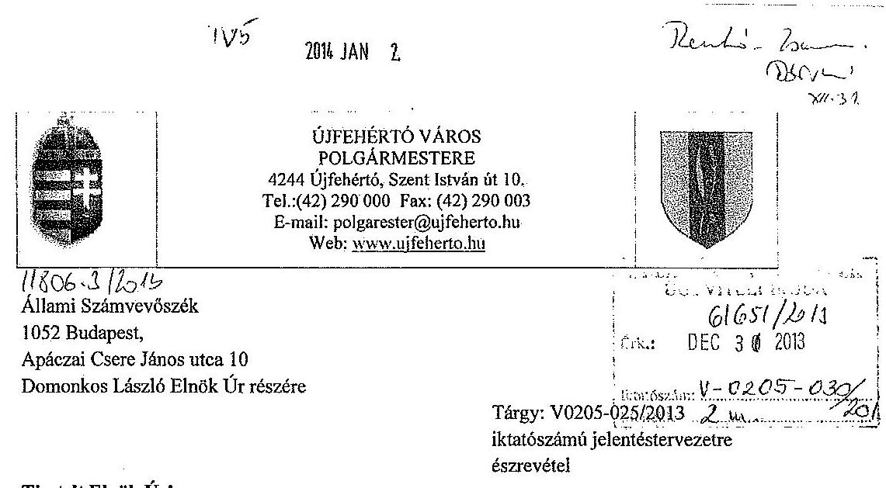

Tisztelt Elnök Úr!
„Az önkormányzatok pénzügyi gazdálkodási helyzete értékelésének és a gazdálkodás szabályozottságának-2013 évben induló- ellenőrzéséről- Újfehérti" című jelentéstervezettel kapcsolatban az alábbi észrevételt tesszük.

A jelentéstervezet II. részletes megállapítások fejezete 3. pontjának 32. oldal első bekezdésében leír, 2013 évi költségvetési rendeletben betervezésre kerülő 360,5 millió kiegészítő támogatás tervezésével kapcsolatban az alábbiakat nyilatkozzuk.

A költségvetés tervezése során az Önök által jelzett problémát az Önkormányzat érzékelte, melyet 2013. január 23.-án írásban jeleztünk a Belügyminisztérium Önkormányzati Államtitkárságánál Tállai András Önkormányzati Államtitkár Úr részére, melyet teljes terjedelemben csatolunk az észrevétel mellé.

Államtitkár Úr részéről 2013. március 13.-án érkezett meg az a levél, melyben reagál az általunk leírtakra. E levél alapján továbbra sem volt egyértelmủ a hiány kezelésének módja, viszont a költségvetés elfogadásának határideje és az Önkormányzat müködőképessége érdekében elfogadott költségvetéssel kellett rendelkezni. Ezért a Magyar Államkincstár illetékes osztályával több körös egyeztetésre került sor, és az Ő átmutatásoak alapján került betervezésre az Újfehértó Város Képviselő Testületének 7/2013.(III.14.) számú 2013. évi költségvetési rendelt 2.§. (3) bekezdésének b) pontjában a 360536 e Ft kiegészítő támogatási bevétel.

A jelentéstervezet II. részletes megállapítások fejezete 3. pontjának 13. oldal második bekezdésének utolsó mondatához, mely szerint az önkormányzat önként vállalt feladataként biztosítja a városon belüli buszközlekedést, az alábbi észrevételt tesszük.

---

A Magyarország helyi önkormányzatairól szóló 2011. évi CLXXXIX. törvény 13. § (1) bekezdés szerint a helyi közügyek, valamint a helyben biztosítható közfeladatok körében ellátandó helyi önkormányzati feladatok különösen: tō."helyi közösségi közlekedés biztosítása;" pont alapján nem önként vállalt feladata az Önkormányzatnak a városon belüli buszközlekedés biztosítása.
Véleményünk szerint a jelentés tervezetben a Polgármesternek javaslatként megfogalmazottak e) pontjában (10. oldal) meg határozott önként vállalt feladatok felülvizsgálatakor a helyi buszközlekedés biztosítását a nem az önként vállalt feladatellátásként kell figyelembe venni.

Kelt Újfchértó, 2013-12-22

Tisztelettel: $\quad$ Nagy Rá̉̉dor polgármester
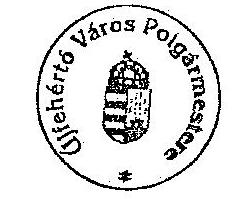

---

Iktatószám: BMÖNH/ 76-1 /2013.

Nagy Sándor Úr részére, polgármester

Úgyintéző: Gyurczina Attila
Telefon: (1) 441-1690
Türgy: 2013. évi költségvetés tervezése

# Újfehérto 

Szent I. u. 10.
4244

## Tisztelt Polgármester Úr!

Önkormányzatuk 2013. évi költségvetésének tervezésével kapcsolatos levelét megértéssel olvastam, az abban foglaltakkal összefüggésben az alábbiakról tájékoztatom.

Mindenekelőtt szeretném hangsúlyozni, hogy a kormányzat számára nagyon fontos az önkormányzatok biztonságos müködése, a közfeladatok folyamatos ellátása. A Belügyminisztérium igyekszik ehhez - jogszabályi keretek között - minden segítséget megadni az önkormányzatoknak. Ennek szellemében nyújtott segítséget 2012-ben az önhibájukon kívül hátrányos helyzetben lévő önkormányzatok 2012. évi támogatásáról szóló 3/2012. (III.1.) BM rendelet alapján nyújtható támogatás, melynek keretében több mint 1.700 önkormányzat részesült összesen mintegy 38,6 milliárd forint támogatásban.
2012. októberében a Kormány kiemelkedő jelentőségű döntést hozott az 5.000 fő alatti települések adósságának $100 \%$-ban történő átvállalásáról, valamint 2013. februárjában az 5.000 fő feletti települések adósságának részben történő átvállalásáról.

Mint ahogy az Polgármester Úr előtt is ismert Magyarország helyi önkormányzatairól szóló 2011. évi CLXXXIX. törvény 111. § (4) bekezdése alapján a költségvetési rendeletben müködési hiány nem tervezhető. A 2013. évi költségvetési rendeletet ennek megfelelően kell elfogadni minden település esetében.

Tájékoztatom Polgármester Urat, hogy a finanszírozási rendszer változása miatt az önkormányzatok müködésében jelentkező problémákkal, felvetésekkel kapcsolatos önkormányzati megkeresések feldolgozása az Önkormányzati Államtitkárságon folyamatban van. A felmerülő, esetlegesen kormányzati intézkedést is igénylő önkormányzati finanszírozási kérdések kezelésére a IX. Helyi önkormányzatok támogatásai fejezetben külön forrás áll rendelkezésre. E támogatás igénylésének, döntési rendszerének kialakítása folyamatban van. Ennek véglegezéséig szíves türelmét kérem.

Budapest, 2013. március ${ }_{10}$ ".
Üdvözlettel:
Tállai András

---

# GJFEHÉRTÓ VÁROS POLGÁRMESTERE 

4244 Újfőhértő, Szent István út 10.
Tel.:(42) 290000 Fax: (42) 290003
E-mail: polgarmester@ujfcherto.hu
Web: www.ujfcherto.hu

## Belligyminisztérium   Önkormányzati Államtitkárság

Tállai András
Önkormányzati Államtitkár Úr részére

## BUDAPEST

Pf: 314.
1903

## Tisztelt Államtitkár Úr!

Az államháztartásról szóló 2011. évi CXCV törvény 24. §. (2) bekezdése alapján a jegyző által előkészített költségvetési rendelet-tervezetet a polgármesternek kell benyújtnia a képviselő-testület elé a törvényben leírt határidőket figyelembe véve.

Jegyző Úr a hivatal munkatársaival elkészítette Újfehértó Város 2013. évi költségvetési rendelet-tervezetét.

Az elkészített rendelet-tervezetet áttekintve - a pénzügyi szakemberek véleményének kikérésével együtt - sajnálattal kell megállapítanom, hogy a hatályos Magyarország Helyi Önkormányzatairól szóló 2011. évi CLXXXIX. törvény 111. § (4) bekezdésére tekintettel nem tudom a rendelet-tervezetet a képviselő-testület elé jóváhagyásra beterjeszteni az alábbi indokok alapján:

- Az önkormányzat 2013. évi tervezett müködési bevétele 871.722.000.-Ft
- Az önkormányzat 2013. évi tervezett müködési kiadása 1.180.850.000.-Ft
- Ezek alapján az önkormányzat müködési hiánya: 309.128.000.-Ft
- Az önkormányzat 2013. évi tervezett felhalmozási kiadása és egyben felhalmozási hiánya
88.283.000.-Ft
- Az önkormányzat 2013. évi tervezett müködési és felhalmozási hiánya együttesen 397.411.000.-Ft

Az önkormányzatnak a hitelező pénzintézetek felé törlesztendő tőke összege: 92.454.000.-Ft
Összességében az önkormányzat tervezett bevételei és kiadásainak különbözete: 498.865.000.-Ft

---

A tervezett költségvetés 2013. évre - néhány millió forint támogatást kivéve - nem tartalmaz nem kötelező feladatfinanszírozást.

Sajátos helyzetben vagyunk a „PPP"-s konstrukcióban megépült városi tanuszoda és sportcsamok esetében - a Kormány döntése értelmében a megvalósult létesítmény kivásárlásra kerül. Ennek pontos időpontja még előttünk nem ismert, így a létesítmény müködtetésével kapcsolatos kiadások tervezett összege 2013. évben 67.631 eFt, mely szintén az önkormányzat 2013. évi költségvetését terheli.

Az uszoda építésével egyidőben az önkormányzat hasonló konstrukcióban épített egy városi sportcsamokot, amelyben az állam nem vállalt szerepet. Így ennek a teljes müködtetési költsége 127 millió forint lenne. Itt sikerült megállapodni az üzemeltetővel, hogy 2013. évben ezen összeg felét: 63.545 eFt-ot kell fizetnünk és ezt terveztük az önkormányzat költségvetésében.

Az alapfokú oktatás esetében az illetékes minisztériumok közel 10 millió forint havi fizetési kötelezettséget állapítottak meg, ezért a képviselő-testületünk a müködtetést választotta, amely további 120 millió forinttal terheli a kiadásainkat.

Az óvoda müködtetése esetében a központi költségvetésből kapott normatív támogatás 129.906.000.-Ft, figyelembe véve az intézmény saját bevételét több, mint 62 millió forinttal kell pótolni a müködtetést.

A bölcsőde esetében szintén több mint 10 millió forinttal kell pótolni a müködtetést.
A közművelődési feladatok esetében az önkormányzat kiegészítése 20 millió forintos nagyságrendủ.

Az általános iskolai gyermekétkeztetésre kapott normatívát 40 millió forinttal kell kiegészíteni.

A 2013. évi bevételek tervezése kapcsán 2012. évhez viszonyítva jelentősen csökkent az önkormányzat normatív hozzájárulása és az átengedett központi adók mértéke.

# Összességében 641.195.000.-Ft a kiesés mértéke. 

Ezen belül a legjelentősebb tétel a jövedelem-differenciálódás mérséklésére adott támogatás elvonása 430.926.000.-Ft összegben, valamint az önkormányzatot megillető SZJA $8 \%$-os mértéke $62.099 .000 .-\mathrm{Ft}$.
A gépjárműadó esetében 54.000.000.-Ft a kiesés.
Önkormányzatunk rendkívül alacsony helyi iparüzési adóbevétellel rendelkezik, ezért a müködtetési kiadások pótlására elsősorban a jövedelemdifferenciálódás mérséklésére kapott támogatás adott lehetőséget.

Önkormányzatunk a saját lehetőségei határait feszítve 2011.-ben két új adónemet vezetett be településünkön, a magánszemélyek kommunális adóját és a vállalkozók építményadóját, mely éves szinten 89.100.000.-Ft-tal terhelte az adóalanyokat 2011-2012. években, évente.

---

Képviselő-testületünk a 2013. évi költségvetési koncepciókészítése során - látva a várható müködési nehézségeket - úgy döntött, hogy 2013. évre a fent említett új adónemeket hatályban tartja.

Önkormányzatunk az előzetes döntésnek megfelelően $70 \%$-os adósságkonszolidációs körbe tartozik, mely jelentős segítség mind rövid, mind hosszútávon városunknak. Erre tekintettel a rendelet-tervezet készítése során- figyelembe véve az adósságkonszolidáció várható mértékéta 2013. évet terhelő kamat, illetve tőketörlesztések $30 \%$-át irányoztuk elő.

Tisztelt Államtitkár Úr!
Szeretném tájékoztatni arról is, hogy önkormányzatunk képviseletében megkerestük Puskás László alpolgármester Úrral közösen Dr. Vinnai Győző Urat a Szabolcs-Szatmár-Bereg Megyei Kormányhivatal Kormánymegbízottját, akit tájékoztattunk a költségvetési rendelettervezet kapcsán kialakult helyzetéről.

Újfehértő Város Önkormányzata, illetve Képviselő-testülete nevében Tisztelettel kérem legyen segitségünkre abban, hogy a hatályos jogszabályoknak megfelelő költségvetési rendelet-tervezetet tudjam határidőben a képviselő-testületünk elé jóváhagyásra beterjeszteni.

Újfehértő, 2013. január 23.
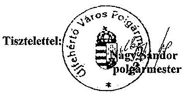

---

# 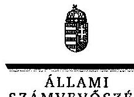   E L K ÖK 

Ikt.szám: V-0205-032/2014.

## Nagy Sándor úr

polgármester

Újfehértó Város Önkormányzata

## Újfehértó

## Tisztelt Polgármester Úr!

Köszönettel megkaptam ,,Az önkormányzatok pénzügyi gazdálkodási helyzete értékelésének, és gazdálkodása szabályosságának - 2013. évben induló - ellenőrzéséről - Újfehértó" címü jelentéstervezetre tett észrevételét.

A jelentéstervezet megállapításaira vonatkozó észrevételével kapcsolatosan az Állami Számvevőszék álláspontját a mellékletként csatolt, a felügyeleti vezető által készített indokolás tartalmazza.

Tájékoztatom Polgármester Urat, hogy az Állami Számvevőszékről szóló 2011. évi LXVI. törvény 29. § (3) bekezdése alapján a számvevőszéki jelentésben az el nem fogadott észrevételeket az elutasítás indokolásával szerepeltetjük.

Budapest, 2014. 07 hó 25 nap
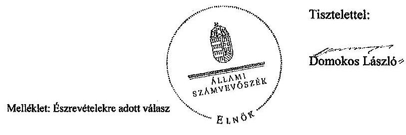

Tisztelettel:
Dömokos László

---

# 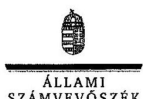   FELÜGYELETI VEZETÜ 

Ikt.szám: V-0205-031/2014.

## Nagy Sándor úr

polgármester

Újfehértő Város Önkormányzata

## Újfehértő

## Tisztelt Polgármester Úr!

„Az önkormányzatok pénzügyi gazdálkodási helyzete értékelésének, és gazdálkodása szabályosságának - 2013. évben induló - ellenőrzéséről - Újfehértő" címú jelentéstervezetre tett észrevételét az Állami Számvevőszékről szóló 2011. évi LXVI. törvény (továbbiakban: ÁSZ tv.) 29. § (2) bekezdésében meghatározott tizenöt napos határidőn belül küldte meg.

A jelentéstervezet megállapításaival kapcsolatos észrevételeit az alábbi indokolás alapján nem fogadom el:

- a jelentéstervezet részletes megállapítások fejezet 3. pont 23. oldal első bekezdése alapján az Önkormányzat a 2013. évi költségvetési rendeletében a Magyarország helyi önkormányzatairól szóló 2011. évi CLXXXIX. törvény (továbbiakban: Mötv.) 111. § (4) bekezdése szerinti müködési költségvetési egyensúly megteremtése érdekében 360,5 millió Ft müködőképesség megőrzését szolgáló, kiegészítő támogatást is figyelembe vett, ezáltal a bevételi előirányzatok tervezése az államháztartásról szóló 2011. évi CXCV. törvény (továbbiakban: Áht.) 12. § (1) bekezdésében előírtak ellenére közgazdaságilag nem megalapozott módon történt.

Ézzrevételjük szerint a költségvetés tervezése során az Állami Számvevők által feltárt problémát az Önkormányzat érzékelte és írásban jelezte a Belügyminisztérium Önkormányzati Államtitkársága felé. Az Államtitkár Úrtól 2013. március 13-án érkezett tájékoztatás alapján továbbra sem volt egyértelmủ a hiány kezelésének módja, ugyanakkor a költségvetés elfogadásának határidejére tekintettel megoldást kellett találni. Az Önkormányzat a Magyar

---

Államkincstárral folytatott egyeztetés alapján a 2013. évi költségvetési rendeletében 360536 ezer Ft kiegészitő támogatásból származó bevételt tervezett be.

Az észrevételben foglaltak a jelentéstervezetben szereplő megállapítást nem befolyásolják, azt a továbbiakban is megalapozottnak tartom. A költségvetés összeállítása során a Mötv.-ben előírt müködési egyensúly biztosítása céljából nem vehető figyelembe olyan bevétel, melynek teljesitése, pénzügyi realizálása tekintetében az Önkormányzat hatáskörrel, illetve jogosultsággal nem rendelkezik. Felhívom szíves figyelmét, hogy az Áht. 4. § (2) bekezdése alapján a bevételi előirányzatok azok teljesítésének kötelezettségét jelentik. A központi költségvetésből folyósított müködőképesség megőrzését szolgáló, kiegészitő támogatás közgazdaságilag megalapozott módon a kormányzati jóváhagyó döntést követően válik az Önkormányzat költségvetésében figyelembe vehető bevételi előirányzattá. A Mötv.-ben előírt müködési egyensúly biztosításához a müködési jövedelemtermelő képesség és a feladatellátás összhangjának megteremtésére van szükség. Az Állami Számvevöszék ennek elősegítése érdekében fogalmazta meg a polgármester számára a pénzügyi egyensúly helyreállításához, hosszú távú fenntarthatóságához szükséges intézkedésekre vonatkozó javaslatait;

- a jelentéstervezet részletes megállapítások fejezet 13. oldal 3. bekezdése szerint az Önkormányzat önként vállalt feladatként biztosítja a városon belüli buszközlekedést a kizárólagos tulajdonában lévő Újfohértour Kft.-vel. A polgármesternek címzett 1. e) számú javaslat a kötelező feladatellátás elsődlegességének biztosítása érdekében az önként vállalt feladatok finanszírozhatóságának felülvizsgálatára vonatkozik, e felülvizsgálat függvényében a Kép-viselő-testület elé terjesztendő javaslat tételére irányul, a feladatellátás racionalizálása érdekében.

Észrevételük szerint a Mötv. 13. § (1) bekezdés 18. pontja szerint a helyi közösségi közlekedés biztosítása nem önként vállalt feladata az Önkormányzatnak. A polgármesternek megfogalmazott 1. e) számú javaslattal kapcsolatosan az önként vállalt feladatok felülvizsgálatakor a helyi buszközlekedés biztosítását a nem önként vállalt feladatellátásként kell figyelembe venni.

Az észrevételben foglaltakat részben elfogadom. A Mötv. 13. § (1) bekezdése az önkormányzatok által helyben ellátandó közfeladatok felsorolását tartalmazza, melyből közvetlenül nem vezethető le a kérdéses feladat, adott önkormányzatúpus vonatkozásában történő minősítése. A Mötv. 14. § (1) bekezdése szerint a 13. § (1) bekezdésben meghatározott feladatok ellátásának részletes szabályait, ha e törvény másként nem rendelkezik, jogszabályok tartalmazzák. A 2012. július 1-jétől hatályos személyszállítási szolgáltatásokról szóló 2012. évi XLI. törvény 4. § (4) bekezdés c) pontja alapján a települési önkormányzat önként vállalt feladata lehet a helyi személyszállítási közszolgáltatások megszervezése, a közlekedési szolgáltató kiválasztása, a helyi személyszállítási közszolgáltatások megrendelése. A hivatkozott jogszabály hatályba lépését követően, a helyi személyszállítási közszolgáltatás önként vállalt feladatként történő jogszabályi besorolásának pontositását indokoltnak tartom a számvevőszéki jelentésben megjeleníteni, azonban a feladatellátás minősitését a továbbiakban is fenntartom. Az ellenőrzött időszakban 2012. július 1. előtt hatályban lévő,

---

az autóbusszal végzett menetrend szerinti személyszállításról szóló 2004. évi XXXIII. törvény 3. § (1) bekezdése szerint a helyi közlekedésben a települési (fővárosi) önkormányzat, helyközi közlekedésben az állam feladata a közforgalmú közlekedés részeként a lehető legmagasabb színvonalú menetrend szerinti autóbusz-közlekedés biztosítása. E rendelkezés alapján a kérdéses feladat kötelező önkormányzati feladatnak minősült.

A 2013. január 1-jétől hatályba lépő feladatfinanszírozási rendszer keretében a központi költségvetés a helyi önkormányzatok kötelező feladatainak ellátásához biztosít forrásokat. A központi költségvetésről szóló törvényben rögzített, az önkormányzatok általános müködésének és ágazati feladatainak támogatására szolgáló támogatás jogcímei nem tartalmaznak a helyi személyszállítási közszolgáltatás finanszírozására vonatkozó rendelkezést. Az Önkormányzat a 2013. évi költségvetési rendeletének összeállítása során az önként vállalt feladatokhoz kapcsolódó bevételeinek és kiadásainak bemutatása keretében sem nevesítette a helyi személyszállítási közszolgáltatást.

Felhívom szíves figyelmét, hogy a számvevőszéki jelentésben szereplő, polgármesternek címzett javaslattal kapcsolatosan Polgármester Úrnak a jogszabályi előírások mérlegelési jogkört nem biztosítanak, azokhoz kapcsolódóan az ÁSZ tv. 33. § (1) bekezdése szerint intézkedési terv készítési kötelezettsége van. Az észrevételben foglaltak a javaslat megalapozottságát jelentő megállapítást nem módosítják, ezért a javaslatot továbbra is fenntartjuk. Az Önkormányzat pénzügyi helyzetének helyreállítása érdekében indokolt azon önként vállalt feladat(ok) ellátásának felülvizsgálata, melyek esetében a kiadások jelentősen meghaladják a bevételeket, ezáltal a közfeladat ellátás biztonságát korlátozzák, veszélyeztetik.

Tájékoztatom, hogy a számvevőszéki jelentés mellékleteként szerepeltetjük a jelentéstervezetre tett észrevételét, valamint az arra adott válaszlevelünket.

Budapest, 2014. 0.1 hó $2 h$ nap.
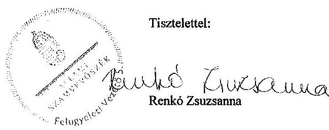

---

# RÖVIDÍTÉSEK JEGYZÉKE 

## Törvények

Adósságrendezési tv.
Áht.
ÁSZ tv.
Htv.

Kvtv.
Mötv.
Ötv.

## Szórövidítések

áfa
ÁSZ
CHF
KIK
EU
EUR
jegyzó
Képviselő-testület
ÖNHIKI
Önkormányzat
polgármester
Polgármesteri Hivatal
PPP konstrukció
szja
a helyi önkormányzatok adósságrendezési eljárásáról szóló 1996. évi XXV. törvény
az államháztartásról szóló 2011. évi CXCV. törvény
az Állami Számvevőszékről szóló 2011. évi LXVI. törvény
a helyi önkormányzatok és szerveik, a köztársasági megbízottak, valamint egyes centrális alárendeltségú szervek feladat- és hatásköreiről szóló 1991. évi XX. törvény
Magyarország 2013. évi központi költségvetéséről szóló 2012. évi CCIV. törvény

Magyarország helyi önkormányzatairól szóló 2011. évi CLXXXIX. törvény
a helyi önkormányzatokról szóló 1990. évi LXV. törvény
általános forgalmi adó
Állami Számvevőszék
svájci frank
Klebelsberg Intézményfenntartó Központ
Európai Unió
euro
Újfehértó Város Önkormányzatának jegyzője
Újfehértó Város Önkormányzatának Képviselő-testülete
önhibáján kívül hátrányos helyzetben lévő önkormányzatok támogatása
Újfehértó Város Önkormányzata
Újfehértó Város Önkormányzatának polgármestere
Újfehértó Város Önkormányzatának Polgármesteri Hivatala
Public Private Partnership (Partnerségi együttmúködés közfeladatok ellátására a magánszektor bevonásával)
személyi jövedelemadó

---

$\cdot$
$\cdot$
$\cdot$
$\cdot$
$\cdot$
$\cdot$
$\cdot$
$\cdot$
$\cdot$
$\cdot$
$\cdot$
$\cdot$
$\cdot$
$\cdot$
$\cdot$
$\cdot$
$\cdot$
$\cdot$
$\cdot$
$\cdot$
$\cdot$
$\cdot$
$\cdot$
$\cdot$
$\cdot$
$\cdot$
$\cdot$
$\cdot$
$\cdot$
$\cdot$
$\cdot$
$\cdot$
$\cdot$
$\cdot$
$\cdot$
$\cdot$
$\cdot$
$\cdot$
$\cdot$
$\cdot$
$\cdot$
$\cdot$
$\cdot$
$\cdot$
$\cdot$
$\cdot$
$\cdot$
$\cdot$
$\cdot$
$\cdot$
$\cdot$
$\cdot$
$\cdot$
$\cdot$
$\cdot$
$\cdot$
$\cdot$
$\cdot$
$\cdot$
$\cdot$
$\cdot$
$\cdot$
$\cdot$
$\cdot$
$\cdot$
$\cdot$
$\cdot$
$\cdot$
$\cdot$
$\

---

# FOGALOMTÁR 

adósságszolgálat
árfolyamkockázat
banki kitettség
bevételi kitettség

CLF módszer
felhalmozási kockázat
gesztor önkormányzat
használhatósági fok

Az adósság tőkerészének és az esedékes kamat együttes összegének törlesztése.
Annak kockázata, hogy a külföldi devizában fennálló pénzügyi eszközök hazai fizetőeszközben kifejezett értéke az árfolyam elmozdulásával megváltozik.
Olyan függőségi viszony, ahol egy szervezet pénzügyi helyzete olyan külső körülmények hatására változhat, amely kizárólag a bank egyoldalú döntésén múlik.
Olyan függőségi viszony, ahol egy szervezet pénzügyi helyzetét meghatározó bevételek nagysága külső körülmények hatására azonnal és kedvezőtlen irányba változhat.
Az önkormányzatok költségvetése elemzésének módszere, amely a pénzügyi kapacitás (más néven a nettó múködési jövedelem) fogalmát helyezi a középpontba. A módszer következetesen elkülöníti a folyó és a felhalmozási költségvetés bevételeit és kiadásait, azok költségvetési egyenlegeit. Bizonyos mértékig a vállalati gazdálkodás logikai elemeit érvényesíti az önkormányzatok pénzügyi, jövedelmi helyzetének vizsgálata során.
Annak kockázata, hogy a folyamatban lévő felhalmozási feladatok finanszírozásához szükséges pénzügyi forrás nem fog rendelkezésre állni.
Több önkormányzatot érintő ügyben több önkormányzat nevében és képviseletében eljáró önkormányzat. A társulási megállapodásban meghatározott képviselő-testület, illetve annak szerve, amely az intézmény közös fenntartásával, illetve a közös foglalkoztatással kapcsolatos feladat- és hatásköröket gyakorolja.
A tárgyi eszközállomány állagának elemzéséhez használt mutató, amely megmutatja, hogy a le nem írt (nettó) érték milyen hányadát képezi az aktiválási (bekerülési) értéknek. Számításakor a tárgyi eszköz könyv szerinti nettó értékét viszonyítják a tárgyi eszköz bruttó (beszerzési/létesítési) értékéhez.

---

integritás
jövőbeni kötelezettségek kifizethetőségének kockázata
kamatkockázat
kezességvállalás
kezességvállalás kockázata

Az „integritás" - egyik gyakran használt jelentése szerint - az elvek, értékek, cselekvések, módszerek, intézkedések konzisztenciáját jelenti, vagyis olyan magatartásmódot, amely meghatározott értékeknek megfelel. Az integritásirányitási rendszer bevezetése a szervezetben a szervezethez rendelt közfeladatok integritás szempontú ellátását, az érték alapú múködéssel (integritással) összefüggő szervezeti követelmények következetes érvényesítését jelenti. (Forrás: „Magyarországi államháztartási belső kontroll standardok Útmutató", kiadta az NGM 2012 decemberében)
Annak kockázata, hogy a kötelezett jövőbeni kötelezettségeit nem tudja teljesíteni, mert nem rendelkezik szabad pénzeszköz tartalékkal, nem intézkedett annak érdekében, hogy bevételeit növelje, kiadásait csökkentse, a követelésállományból a kétes kintlévőségek nagysága számottevő, a fedezetként felhasználható ingatlanállomány forgalmi értéke csökkent és értékesítésének lehetősége piaci oldalról korlátozott.
Annak kockázata, hogy a változó kamatozású forint-, vagy a devizahitel futamideje alatt kedvezőtlen irányban változhat a hitel kamata és így a törlesztőrészlete is.
Szerződésben vállalt olyan kötelezettség, amelyben a kezes arra vállal kötelezettséget, hogy ha a szerződés kötelezettje nem teljesít, a kezes maga fog helyette teljesíteni a jogosultnak. (Forrás: Ptk. 272. §).
Annak kockázata, hogy a szerződés kötelezettje a szerződésben vállalt kötelezettségeit nem teljesíti a jogosultnak, azokért a kezes köteles helytállni. A kezes kötelezettsége nem válhat terhesebbé, mint amit a szerződés megkötésekor elvállalt. Nem köteles helytállni a kezes a kötelezettségért, amíg a teljesítés a kötelezettől vagy olyan kezesektől behajtható, akik őt megelőzően, reá tekintet nélkül vállaltak kezességet. A kezes, amennyiben teljesíteni köteles, mintegy az eredeti kötelezett helyébe lép, érvényesítheti azokat a kifogásokat, amelyeket a kötelezett érvényesíthet a jogosulttal szemben. Amennyiben teljesít, a kezességgel biztosított jogok (ideértve a kezességvállalást megelőzően keletkezett jogokat és a végrehajtási jogot is) átszállnak a kezesre.

---

készfizető kezesség
kötelező közszolgáltatás (az ön-
kormányzati feladatokat érintő-
en)
kötvény
mérlegen kívüli tétel
mérlegen kívüli tétel kockázata
múködési kockázat
nemfizetési kockázat
nettó múködési jövedelem

ÖNHIKI támogatás
önkormányzat felhalmozási bevétele

Olyan kezességtípus, amelynél a szerződés kötelezettje nemfizetése esetén a hitelező közvetlenül a kezeshez fordulhat a hitel törlesztése érdekében.
Az önkormányzat kötelezően vállalt feladatkörébe tartozó, a köztisztasággal és a településtisztasággal, valamint az élet- és vagyonbiztonsággal összefüggő egyes - közszolgáltatás útján megvalósuló - közfeladatok ellátása, amelyeket külön jogszabály (törvény, helyi önkormányzati rendelet) határoz meg.
Hosszabb lejáratra szóló, hitelviszonyt megtestesítő kamatozó értékpapír. A kötvényben a kibocsátó arra kötelezi magát, hogy a kötvényben megjelölt pénzösszegnek az előre meghatározott kamatát vagy egyéb jutalékait, továbbá az adott pénzösszeget a kötvény mindenkori tulajdonosának, illetve jogosultjának a megjelölt időben és módon megfizeti.
A mérlegen kívüli tétel olyan, szerződés alapján fennálló mérlegen kívüli [függő vagy biztos (jövőbeni)] kötelezettség, illetve követelés, amely pénzeszköz vagy egyéb eszköz átadására, illetve átvételére vonatkozik, a mérleg fordulónapján már fennáll, de mérlegtételkénti szerepeltetése egy jövőbeni esemény bekövetkezésétől vagy a szerződés teljesítésétől függ.
[Forrás: Számv. tv. 3. § (7) bekezdés 16. pont]
Annak kockázata, hogy a mérlegben ki nem mutatható kötelezettségvállalásból fizetési kötelezettség keletkezik.
Annak kockázata, hogy nem megfelelő múködésből, emberi hibákból, rendszerhibákból vagy külső eseményekből adódik veszteség.
Annak kockázata, hogy a kötelezett fennálló kötelezettségét átmenetileg vagy véglegesen nem tudja határidőre megfizetni.
A nettó múködési jövedelem a jövedelemtermelő képességet méri. Megmutatja a múködési bevételekből a múködési kiadások és a hitelek tőketörlesztésének kifizetése után fennmaradó jövedelmet.
Az önkormányzatok múködőképességét szolgáló, önhibájukon kívül hátrányos helyzetben levő települési önkormányzatok támogatása.
Az önkormányzatok tárgyévi felhalmozási célú költségvetési bevételei.

---

önkormányzat felhalmozási kiadásai
önkormányzat folyó bevétele
önkormányzat folyó kiadása
önkormányzat folyó költségvetés egyenlege
önkormányzat gazdasági társasága miatti kockázatot jelentő tényezők
önkormányzat többségi tulajdonában lévő gazdasági társaságok

Az önkormányzatok tárgyévi felhalmozási célú költségvetési kiadásai.
Az önkormányzatok tárgyévi múködési célú költségvetési kiadásai.
A folyó költségvetés egyenlege, azaz a múködési jövedelem megmutatja, hogy az Önkormányzat éves folyó bevétele fedezetet biztosít-e a kötelező és önként vállalt feladatellátáshoz kapcsolódó éves folyó kiadására. A múködési jövedelem negatív értéke pénzügyileg fenntarthatatlan helyzetet jelez. A mutató pozitív értéke megtakarítást mutat, amely forrásul szolgálhat az Önkormányzat fennálló kötelezettségei megfizetéséhez, valamint fejlesztéseihez.
Az önkormányzat gazdasági társaságának kedvezőtlen pénzügyi döntései következtében az önkormányzat pénzügyi egyensúlyi helyzetét veszélyeztető tényezők:

- az önkormányzat az önként vállalt és/vagy a kötelező feladatot ellátó társaságának a tevékenység ellátásához pénzeszközt ad át;
- az önkormányzat nem vizsgálja a feladatellátás választott szervezeti megoldásának hatékonyságát;
- a kötelező feladatellátást biztosító gazdasági társaság tevékenységének ágazati szabályozása változik (vízi közmúvagyon üzemeltetése);
- a kizárólagos vagy többségi tulajdonú társaságok pénzügyi helyzete nem stabil, amely az alapítóra kötelezettségeket háríthat;
- az önkormányzat a társaságok tevékenységét nem kísérte figyelemmel, nem élt az alapítói (irányítói) jogok gyakorlásával, a társaságok gazdálkodásának önkormányzati szintű konszolidálása nem biztosított;
- az önkormányzat garanciát vagy kezességet vállal a gazdasági társaság kötelezettségeire;
- a társaságoknak átadott pénzeszköz uniós elvárásoknak megfelelő kezelése.
Azok a gazdasági társaságok, amelyekben az önkormányzat a szavazatok több mint ötven százalékával vagy a Ptk. 685/B. § (2)-(3) bekezdéseiben rögzített meghatározó befolyással rendelkezik. A befolyással rendelkező akkor ren-

---

delkezik egy jogi személyben meghatározó befolyással, ha annak tagja, illetve részvényese, és jogosult e jogi személy vezető tisztségviselői vagy felügyelő-bizottsága tagjai többségének megválasztására, illetve visszahívására, vagy a jogi személy más tagjaival, illetve részvényeseivel kötött megállapodás alapján egyedül rendelkezik a szavazatok több mint ötven százalékával. A meghatározó befolyás akkor is fennáll, ha a befolyással rendelkező számára e jogosultságok közvetett módon (köztes vállalkozásain keresztül) biztosítottak.
[Forrás: Ptk. 685/B. § (2)-(4) bekezdések]
pénzügyi kapacitás
pénzügyi kockázat

PPP

A pénzügyi kapacitás az adósok hitelfelvételi képességének azon mértéke, ahol még növelni tudják az adósságot anélkül, hogy a fizetőképtelenség elkerülése érdekében csökkenteniük kellene akár az aktuális, akár a jövőben esedékes kiadásaikat.
A pénzügyi kockázat magában foglalja mindazon kockázatokat, amelyek a szervezet pénzügyi helyzetére hatással vannak. Pl.: az adósságszolgálat miatti kockázatot, árfolyamkockázatot, felhalmozási kockázatot, fizetőképességi kockázatot, jövőbeni kötelezettségek kifizethetőségének kockázatát, kamatkockázatot, kezességvállalás kockázatát, likviditási kockázat, mérlegen kívüli tételek kockázata, nemfizetési kockázat stb.
A köz- és a magánszféra együttmúködésén alapuló fejlesztési konstrukció. Az állami és a magánszféra együttmúködésének egyik formáját jelöli a PPP. A rövidítés a „köz- és magánszféra partnersége" angol nyelvű megfelelője. A PPP keretében a közcél a magánszféra jelentős mértékű közreműködésével valósul meg. Az állam (önkormányzat) a közszolgáltatások létrehozását a tradicionálisnál komplexebb módon bízza a magánszférára. Az együttmúködés keretében megvalósuló közszolgáltatás hosszú távra szól.