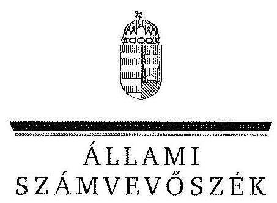

# JELENTÉS 

a Magyar Művelődési Intézet és Képzőművészeti Lektorátus pénzügyi gazdálkodási helyzetének és vagyongazdálkodásának ellenőrzéséről a Nemzeti Művelődési Intézetnél

---

# Állami Számvevőszék 

Iktatószám: V-0168-217/2013.
Témaszám: 1203
Vizsgálat-azonosító szám: V0603001

## Az ellenőrzést felügyelte:

Holman Magdolna
felügyeleti vezető
Az ellenőrzést vezette és az ellenőrzés végrehajtásáért felelős:
Solymár Ágnes
ellenőrzésvezető
A számvevőszéki jelentés összeállításában közreműködött:
Robák Ferencné
számvevő tanácsos
Az ellenőrzést végezték:
Kuszinger Andrea
Robbák Ferencné
Vida Cecília
számvevő
számvevő tanácsos számvevő

---

# TARTALOMJEGYZÉK 

BEVEZETÉS ..... 7
I. ÖSSZEGZŐ MEGÁLLAPÍTÁSOK, KÖVETKEZTETÉSEK, JAVASLATOK ..... 10
II. RÉSZLETES MEGÁLLAPÍTÁSOK ..... 18

1. Az irányító szerv intézményre vonatkozó feladatellátása, az intézmény szervezete ..... 18
1.1. Alapítói jogosultságok gyakorlása ..... 18
1.2. Irányítási jogosultságok gyakorlása ..... 19
1.3. Az intézmény szervezete ..... 21
2. Az intézmény szakmai feladatellátásának szabályossága ..... 21
2.1. A szakmai feladatellátás szabályossága ..... 22
2.2. Az intézmény pályázat és támogatáskezelése ..... 23
3. Az intézmény belső kontrollrendszere ..... 25
3.1. Az intézmény kontrollkörnyezete, kockázatkezelése ..... 25
3.2. A kontrolltevékenységek kialakítása ..... 27
3.3. Az információs, kommunikációs és monitoring rendszer kialakítása és működtetése ..... 27
3.4. A belső ellenőrzés kialakítása és működtetése ..... 28
3.5. Külső ellenőrzések ..... 29
4. Az intézmény pénzügyi gazdálkodása ..... 29
4.1. A bevételek és kiadások összhangja a feladatellátással ..... 29
4.2. Az intézmény pénzforgalmának szabályossága ..... 32
4.3. Az intézmény pénzügyi stabilitása ..... 33
5. Az intézmény vagyongazdálkodása ..... 34
5.1. Az intézmény vagyongazdálkodásának szabályozottsága ..... 34
5.2. A vagyonelemekkel való gazdálkodás szabályszerűsége ..... 35
5.3. A vagyon nyilvántartása ..... 36
5.4. A vagyon összetétele és annak változása ..... 37

## MELLÉKLETEK

1. számú Az intézmény mérlegadatai a 2008-2012. június 30. közötti időszakra
2. számú Az intézmény kiadásai és bevételei a 2008-2012. június 30. közötti időszakra
3. számú Az emberi erőforrások minisztere jelentéstervezethez tett észrevétele

---

4. számú Az ÁSZ válasza az emberi erőforrások minisztere jelentéstervezethez tett észrevételére
5. számú A Nemzeti Művelődési Intézet főigazgatójának jelentéstervezethez tett észrevétele
6. számú Az ÁSZ válasza a Nemzeti Művelődési Intézet főigazgatójának jelentéstervezethez tett észrevételére

---

# RÖVIDÍTÉSEK JEGYZÉKE 

| Törvények |  |
| :--: | :--: |
| ÁSZ tv. | 2011. évi LXVI. törvény az Állami Számvevőszékről |
| Áht1 | 1992. évi XXXVIII. törvény az államháztartásról |
| Áht2 | 2011. évi CXCV. törvény az államháztartásról |
| Sztv. | 2000. évi C. törvény a számvitelről |
| Vtv. | 2007. évi CVI. törvény az állami vagyonról |
| Kbt1 | 2003. évi CXXIX. törvény a közbeszerzésekről |
| Kbt2 | 2011. évi CVIII. törvény a közbeszerzésekről |
| Kt. | 2008. évi CV. törvény a költségvetési szervek jogállásáról és gazdálkodásáról |
| Nvtv. | 2011. évi CXCVI. törvény a nemzeti vagyonról |
| Rendeletek |  |
| Ámr1 | 217/1998. (XII. 30.) Korm. rendelet az államháztartás működési rendjéről |
| Ámr2 | 292/2009. (XII. 19.) Korm. rendelet az államháztartás működési rendjéről |
| Ávr. | 368/2011. (XII. 31.) Korm. rendelet az államháztartásról szóló törvény végrehajtásáról |
| Áhsz. | 249/2000. (XII. 24.) Korm. rendelet az államháztartás szervezetei beszámolási és könyvvezetési kötelezettségének sajátosságairól |
| Ber. | 193/2003. (XI. 26.) Korm. rendelet a költségvetési szervek belső ellenőrzéséről |
| Bkr. | 370/2011. (XII. 31.) Korm. rendelet a költségvetési szervek belső kontrollrendszeréről és belső ellenőrzésről |
| Vtvr. | 254/2007. (X. 4.) Korm. rendelet az állami vagyonnal való gazdálkodásról |
| Egyéb rövidítések |  |
| ÁSZ | Állami Számvevőszék |
| EMMI | Emberi Erőforrások Minisztériuma |
| ERIKANET | Egységes Regionális Információs Közművelődési Adatbázis |
| HH | Hagyományok Háza |
| Lektorátus | Képző- és Iparművészeti Lektorátus |
| MMIKL | Magyar Művelődési Intézet és Képzőművészeti Lektorátus |
| MNV Zrt. | Magyar Nemzeti Vagyonkezelő Zrt. |
| NEFMI | Nemzeti Erőforrás Minisztérium |
| NKA | Nemzeti Kulturális Alap |
| NMI | Nemzeti Művelődési Intézet |
| OKM | Oktatási és Kulturális Minisztérium |
| SZMSZ | Szervezeti Működési Szabályzat |

---

.

---

# ÉRTELMEZŐ SZÓTÁR 

alapítói jogok
alaptevékenység
belső kontrollrendszer
ellenjegyzés
ellenőrzési nyomvonal
előirányzat-elvonás
előirányzat-módosítás
érvényesítés
intézkedési terv
irányító szerv

A költségvetési szerv alapítása, átalakítása, megszüntetése, ennek keretében a költségvetési szerv alapító és megszüntető okiratának kiadása, módosítása, szervezeti és működési szabályzatának jóváhagyása (Áht1 93. § (1) bekezdés a) pont, Áht2 9. § (1) bekezdés a) pont, 2008. évi CV. tv. 8. § (2) bekezdés a) pont)
Az a tevékenység, amelyet a költségvetési szerv létrehozásáról rendelkező jogszabályban, alapító okiratában szakmai alapfeladataként meghatároztak, ideértve a szabad kapacitások hasznosítására irányuló, nem haszonszerzési céllal végzett tevékenységet is.
A kockázatok kezelése és tárgyilagos bizonyosság megszerzése érdekében kialakított folyamatrendszer, ami azt a célt szolgálja, hogy megvalósuljanak a következő célok: a működés és a gazdálkodás során a tevékenységeket szabályszerűen, gazdaságosan, hatékonyan, eredményesen hajtsák végre, az elszámolási kötelezettségeket teljesítsék, és megvédjék az erőforrásokat a veszteségektől, károktól és nem rendeltetésszerű használattól. (Az Áht${ }_{2}$ 69. § (1) bekezdéséből levezetett fogalom)

Annak igazolása, hogy a kötelezettségvállalás vagy utalványozás teljesítéséhez szükséges fedezet rendelkezésre áll, és nem sérti a gazdálkodásra vonatkozó szabályokat.
Az ellenőrzési nyomvonal a költségvetési szerv működési folyamatainak szöveges, táblázatokkal, vagy folyamatábrákkal szemléltetett leírása, amely tartalmazza különösen a felelősségi és információs szinteket és kapcsolatokat, irányítási és ellenőrzési folyamatokat, lehetővé téve azok nyomon követését és utólagos ellenőrzését. (Bkr. 6. § (3) bekezdés)
A kiadási előirányzatok felhasználásának végleges korlátozása, az előirányzatok feltételhez nem kötött csökkentése.
A megállapított kiadási előirányzat növelése vagy csökkentése, a bevételi előirányzatok egyidejű növelése vagy csökkentése mellett.
A kiadás teljesítése, bevétel beszedése előtt azok jogosultságának, összegszerűségének, előírt alaki követelményeknek való megfelelésének, továbbá a szükséges fedezet meglétének igazolása.
Az ellenőrzési javaslatok alapján az ellenőrzött szervezet, szervezeti egység által készített intézkedések végrehajtásának ütemezése a végrehajtásért felelős személyek és a vonatkozó határidők megjelölésével.
A központi alrendszer egyes intézményével és annak gazdálkodásával kapcsolatos irányítási jogokkal felruházott szerv vagy személy.
Az a lehetőség, hogy egy olyan esemény történik meg, amely negatívan hat a célok elérésére. A kockázat fogalma általánosságban úgy határozható meg, hogy az valamilyen esemény, tevékenység vagy tevékenység elmulasztása, amely a jövőben valószínűleg bekövetkezik, és ha bekövetkezik, akkor ennek általában negatív, egyes esetekben viszont pozitív hatása van az adott szervezet céljainak elérésére. (Belső Kontroll Kézikönyv 94. oldal)
Irányítási eszközök és módszerek összessége, melynek elemei a szervezeti célok elérését veszélyeztető tényezők (kockázatok) azonosítása, elemzése, csoportosítása, nyomon követése, valamint szükség esetén a kockázati kitettség mérséklése. (Bkr. 2. § m) pontja)
Azok az eljárások (eszközök, eljárások, mechanizmusok=kontrollok), amelyeket a szervezet vezetése annak érdekében hoz létre, hogy elősegítse a szervezet célkitűzéseinek elérését a működés eredményessége és hatékonysága, a pénzügyi jelentések megbízhatósága, és az alkalmazandó törvényeknek és előírásoknak való megfelelés területén. (PM Belső Kontroll Kézikönyv 134. oldal)
A kiadási előirányzatok terhére fizetési kötelezettség vállalásáról szóló, szabályszerűen megtett jognyilatkozat.
Jogszabályban meghatározott állami vagy önkormányzati feladat, amit az arra kötelezett közérdekből, haszonszerzési cél nélkül, jogszabályban meghatározott követelményeknek és feltételeknek megfelelve végez.
A monitoring a különböző szintű szervezeti célok megvalósításának folyamatát kíséri figyelemmel, melynek során a releváns eseményekről és tevékenységekről (együtt: folyamatokról) rendszeres jelleggel, strukturált, döntéstámogató információkhoz jutnak a szervezet vezetői. (NGM útmutató a költségvetési szervek monitoring rendszeréhez 3. oldal, 2011. november)
Az önállóan gazdálkodó költségvetési szervnek - az irányító szerv által meghatározott - jogi személyiséggel nem rendelkező szervezeti egysége (telephelye), amely egyes előirányzatok felett rendelkezési jogosultsággal bír. (Ámr 2. § 40 pont)
A szakmai teljesítés megtörténtének igazolása.
A kiadás teljesítésének, bevétel beszedésének vagy elszámolásának elrendelése.
A kiadási előirányzatok felhasználásának időleges, feltételhez kötött korlátozása, felfüggesztése.
A kiadási előirányzatok felhasználásának időleges, feltételhez kötött korlátozásának, felfüggesztésének megszüntetése.

---

# JELENTÉS 

## a Magyar Művelődési Intézet és Képzőművészeti Lektorátus pénzügyi gazdálkodási helyzetének és vagyongazdálkodásának ellenőrzéséről a Nemzeti Művelődési Intézetnél

## BEVEZETÉS

Az államháztartás működtetése során a közfeladatok folyamatos és megfelelő színvonalú ellátása érdekében biztosítani kell a szükséges pénzügyi, személyi és tárgyi feltételeket. A közfeladatok ellátása elsősorban költségvetési szervek működtetésével történik. Az Áht${ }_{2}$ 7. §-a értelmében a költségvetési szerv jogszabályban vagy az alapító okiratban meghatározott közfeladat-ellátására létrejött jogi személy, amely a létrehozásáról rendelkező jogszabályban vagy az alapító okiratában meghatározott szakmai feladatokat alapfeladatként látja el.

Az Emberi Erőforrások Minisztériuma (EMMI) közművelődési és alkotóművészeti állami feladatokat ellátó háttérintézménye Magyar Művelődési Intézet és Képzőművészeti Lektorátus (MMIKL) néven működött az ellenőrzéssel érintett időszakban. Az alapító okirat rendelkezései szerint az intézmény jogszabályban meghatározott közfeladatai a közművelődési szakmai tanácsadás és szolgáltatás biztosítása, a helyi közművelődési tevékenységek és a megyei (fővárosi) feladatok segítése, valamint műalkotásokról szakvélemény adása. Az intézmény alaptevékenységét a kulturális értékek megőrzése és közvetítése, valamint a vizuális kultúra fejlesztése és az alkotóművészeti tevékenység támogatása érdekében fejti ki.

Az önállóan működő és gazdálkodó jogkörű szervezet működését az ellenőrzött időszakban alapvetően az állami költségvetés finanszírozta, a XX. fejezet 4. Egyéb kulturális intézmények címen belül. Az intézmény vállalkozási tevékenységet nem végzett. Beszámolóinak adatai szerint az MMIKL jelentősen csökkenő nagyságrendű (2008-ban 1447,4 M Ft, a 2011. évben 515,5 M Ft) költségvetési támogatás felhasználásával látta el feladatait. A kiadások a 2008. évi 1273,6 M Ft-ról a 2010. évre 1546,4 M Ft-ra nőttek, majd 2011-ben 817,1 M Ft-ra csökkentek. Az intézmény költségvetési engedélyezett létszámkerete 99 fő. Záró létszáma 2008-ban 88 fő, 2009-ben 91 fő, 2010-ben 99 fő, 2011-ben 70 fő volt.

Az MMIKL mérlegfőösszege a 2008. évi 1003,1 M Ft-ról 2011-re 398,1 M Ft-ra csökkent, alapvetően a pénzeszközök - költségvetési tartalék felhasználásával összefüggő - változása következtében. A többi vagyonelemnél lényeges változás nem következett be.

---

2012. év második felében sor került az MMIKL tevékenységének átszervezésére, amely a közművelődés országos szakmai módszertani és tanácsadó feladatellátásának megerősítését és a területi szintek együttműködését célozta. Az átszervezés az ellenőrzött időszakot követően történt meg, a 2013. április 1-jétől hatályos módosított alapító okirat szerint az intézmény Nemzeti Művelődési Intézet (NMI) néven működik.

Az Állami Számvevőszék (ÁSZ) Stratégiájának egyik fontos célja, hogy a lefolytatott ellenőrzések a közpénzek felhasználásában a kimutatható megtakarításon túl a gazdálkodás javítását eredményezzék, és hozzáadott értéket teremtsenek. A 2013. évtől - a korábbi gyakorlattól eltérően - az ÁSZ ellenőrzéseinek jelentős kapacitása irányul a költségvetési intézmények átvilágítására. Fontos feladat, hogy az ellenőrzések rámutassanak a gazdálkodás jó gyakorlataira és hogy a hibák, szabálytalanságok, esetleges jogszabálysértések, a közpénzek pazarlásának feltárásával segítséget nyújtsanak a gazdálkodási, pénzügyi fegyelem kialakításához, megszilárdításához.

Az intézmény gazdálkodását, valamint közfeladat-ellátását az ÁSZ korábban még nem ellenőrizte.

Az ellenőrzés célja annak megállapítása volt, hogy az intézmény a közfeladatainak ellátását szabályszerűen és a céloknak megfelelően végezte-e, a rábízott közpénzekkel és állami vagyonnal felelősen, a szabályok betartásával gazdálkodott-e.

Az ellenőrzés keretében értékeltük, hogy:

- az irányító szerv intézményre vonatkozó - dokumentált célok szerinti - feladatellátása, valamint az intézmény szervezete, a szervezeti működésre vonatkozó szabályozása összhangban volt-e a jogszabályi előírásokkal és az alapító okiratban foglaltakkal;
- az intézmény a vonatkozó szabályok betartása mellett, a céloknak megfelelően látta-e el a jogszabályokban, az alapító okiratban és egyéb megállapodásokban rögzített
 közfeladatait;
- az ellenőrzött időszakban szabályszerű volt-e az intézmény pénzügyi gazdálkodása, biztosított volt-e pénzügyi stabilitása;
- az intézmény vagyongazdálkodása megfelelt-e a jogszabályoknak, változott-e a vagyon nagysága és összetétele;
- az intézmény belső kontroll-rendszere biztosította-e a szabályszerű feladatellátást, közpénzfelhasználást és vagyongazdálkodást.

Helyszíni ellenőrzést az MMIKL utódintézményénél, az NMI-nél, valamint a gazdálkodási és szakmai felügyeletet ellátó EMMI-nél végeztünk a 2008. január 1-jétől 2012. június 30-ig tartó időszakra vonatkozóan. Az ellenőrzött időszakon túl megvalósított átszervezések értékelésére az ellenőrzés nem terjedt ki.

Az ellenőrzést a számvevőszéki ellenőrzés szakmai szabályai szerint és a nemzetközi standardok figyelembevételével, szabályszerűségi ellenőrzés módszerével végeztük. Megállapításainkat a helyszíni ellenőrzés tapasztalataira, az el-

---

lenőrzött szervezettől bekért dokumentumokra, a kitöltött tanúsítványok, kérdőívek elemzésére, az adott időszakban hatályos jogszabályok és belső szabályzatok előírásaira alapoztuk.

Az Állami Számvevőszékről szóló 2011. évi LXVI. törvény 29. §-a szerint a jelentéstervezetet megküldtük egyeztetésre az Emberi Erőforrások Minisztériuma és a Nemzeti Múvelődési Intézet részére. A beérkezett észrevételeket és az ezekre adott válaszokat, ideértve az el nem fogadott észrevételeket és azok indokolását a jelentés 3-6. számú mellékletei tartalmazzák.

Az ellenőrzés jogszabályi alapját az ÁSZ tv. 1. § (3) bekezdés, 5. § (2)-(6) bekezdéseinek előírásai képezték.

---

# I. ÖSSZEGZŐ MEGÁLLAPÍTÁSOK, KÖVETKEZTETÉSEK, JAVASLATOK 

Az intézmény irányítószervi feladatait ellátó minisztériumok irányítószervi jogosultságainak gyakorlása sem az alapítói, sem az irányítási jogosultságok területén nem volt teljes körű. Az intézmény irányítószervi feladatait ellátó minisztériumok (OKM, NEFMI) szabályszerűen gondoskodtak az alapító okiratok módosításainak kiadásáról. A 2009. évben és a 2010. évben történt alapító okirat módosításokat követően az ellenőrzött időszak végéig az intézmény SZMSZ-e nem volt összhangban az alapító okiratokkal. A 2009. évi módosítás alapján benyújtott SZMSZ tervezetet az irányító szerv (OKM) nem fogadta el, de nem kérte annak átdolgozását. A 2010. évi alapító okirat módosítása után benyújtott SZMSZ NEFMI által kért javítását az intézmény nem végezte el. A korábban jóváhagyott SZMSZ-ek az Ámr${ }_{1}$ előírása ellenére nem tartalmazták a feladatellátáshoz engedélyezett létszámot.

A minisztériumok irányítószervi feladatellátása az intézmény főigazgatójával kapcsolatos munkáltatói jogok gyakorlása tekintetében szabályos volt. A gazdasági igazgató közalkalmazotti jogviszonyának megszűnéséről közös megegyezés alapján az intézmény főigazgatója döntött. A NEFMI minisztere ennek elfogadásáról nem döntött az Áht${ }_{2}$-ben rögzítettektől eltérően, viszont hozzájárult a megüresedett álláshely betöltéséhez. Az irányító szervek nem intézkedtek - az Áht${ }_{1,2}$ előírásai ellenére - az intézményi közfeladat ellátására, az intézményi erőforrásokkal való szabályszerű és hatékony gazdálkodásra vonatkozó követelmények kialakítása érdekében, ezek hiányában azokat nem kérték számon és nem ellenőrizték.

Az intézmény irányítószervi feladatait ellátó minisztériumok kialakították az intézmény Áht${ }_{1,2}$ szerinti beszámoltatási, ellenőrzési rendszerét. Az intézmény gazdálkodásának kontrollját az éves, gazdálkodásról és szakmai feladatellátásról szóló beszámolók elfogadásával, továbbá a 2009. évben végzett helyszíni ellenőrzésekkel biztosította. A helyszíni ellenőrzések során megfogalmazott javaslatokat az intézmény vezetője csak részben hasznosította, ezért az ellenőrzések nem eredményezték az intézmény működése és gazdálkodása szabályosságának javítását. Az intézmény belső ellenőre nem végezte el a külső ellenőrzések megállapításaira tett intézkedések hasznosulásának nyomon követését.

Az intézmény feladatai ellátását az alapító okirataiban megfogalmazott célok elérése érdekében végezte. Az intézmény, mint az irányítószervi feladatokat ellátó minisztériumok háttérintézménye - éves költségvetésével támogatott alap- és közfeladatai mellett - külön szerződések alapján is végzett szakmai, továbbá pályázatkezelői, -lebonyolítói feladatokat. Valamennyi vállalt tevékenysége megfelelően illeszkedett az alapító okiratában előírt feladatrendszerbe. Az intézmény a 2010. és a 2012. években nem rendelkezett az irányító szerv utasításában előírt és jóváhagyott munkatervvel, megszegve ezzel az irányító szerv utasítását.

---

Az irányító szervtől szakmai feladatellátásra kapott költségvetési források mintavétel alapján ellenőrzött felhasználása során az intézmény a gazdálkodásra (kifizetések utalványozása, ellenjegyzése, szakmai teljesítésigazolása) vonatkozó jogszabályok${ }^{1}$ és belső szabályzatok előírásait 7605,8 E Ft összegű kifizetés esetében nem tartotta be. Ezekből az Áht${ }_{1,2}$ előírásait megsértő, szabálytalan kifizetésekből 2982 E Ft összegű kifizetés esetében a teljesítésigazolás hiánya, illetve szabálytalan gyakorlata miatt nem volt igazolható a kifizetés jogossága. A többi kifizetés esetén az utalványozás nem az Ámr${ }_{2}$ és az Ávr. előírása szerint történt.

Az intézmény a szakmai tevékenységének megfelelő témájú pályázatok lebonyolításával kapcsolatos feladatait szabályszerűen végezte. A pályázatok lebonyolítására kötött együttműködési megállapodások minden esetben tartalmazták a támogató és az intézmény közötti feladatmegosztás és együttműködés részletes szabályait. Az intézmény a pályázat kedvezményezetteivel minden esetben a jogszabályokban rögzített tartalmú szerződést kötött. A szerződések megkötésének együttműködési megállapodásban rögzített határidejét három esetben nem tartotta be az intézmény. Az intézmény a kedvezményezettek szakmai beszámolóit és pénzügyi elszámolásait ellenőrizte, szabálytalan felhasználást nem tárt fel, a fel nem használt támogatásokat visszafizettette. Az intézmény a megkötött megállapodásokban előírt határidőben elszámolt a pályáztatásra folyósított összegekkel. Az elvégzett feladatokról szakmai beszámolót készített. A fel nem használt támogatásokat visszafizette.

Az intézmény belső kontrollrendszere nem biztosította a szabályszerű feladatellátást, közpénzfelhasználást és vagyongazdálkodást.

A kontrollkörnyezet kialakítása az ellenőrzött időszakban csak részben felelt meg az Áht${ }_{1,2}$, az Ámr${ }_{1,2}$, az Ávr., a Ber., a Bkr., és az Áhsz. előírásainak. Az intézmény főigazgatója nem gondoskodott a 2008-2010 novemberéig tartó időszakra vonatkozóan az ellenőrzési nyomvonal, a 2012. évtől olyan kontrollkörnyezet kialakításáról, melyben meghatározottak az etikai elvárások a szervezet minden szintjén. A szabálytalanságkezelés eljárásrendjét késedelemmel, csak a jogszabályban előírt határidő után félévvel szabályozta. Az intézmény gazdasági vezetője nem készítette el és nem terjesztette az intézmény vezetője elé jóváhagyásra a 2008. és 2009. évekre vonatkozóan az eszközök hasznosítási és selejtezési szabályzatát. A gazdasági szervezet ügyrendje, a vonatkozó jogszabályok${ }^{2}$ előírásai ellenére nem tartalmazta a helyettesítés rendjét, amely korlátozta a feladatellátás számon kérhetőségét és folyamatosságának biztosítását. A leltározási és leltárkészítési szabályzat, eltérően az Áhsz. előírásától, nem tartalmazta a vagyonkezelésbe vett és az üzemeltetésre, kezelésre átadott, illetve az idegen helyen tárolt eszközök leltározásának módját. Az eszközök és források értékelési szabályzata a 2008. és 2009. években nem tartalmazta a kis összegű követelések minősítési szempontjait és dokumentálásának rendjét.

[^0]
[^0]:    ${ }^{1}$ Áht$_{1,2}$, Ámr$_{2}$, Ávr.
    ${ }^{2}$ Ámr$_{1}$ 17. § (5) bekezdése, Ámr$_{2}$ 15. § (6) bekezdése, Ávr. 9. § (5) bekezdése

---

Az intézmény kockázatkezelési rendszerének kialakítása nem volt megfelelő, mivel a vonatkozó jogszabályi előírások${ }^{3}$ ellenére, csak 2010 novemberétől rendelkezett az intézmény a folyamatba épített előzetes és utólagos vezetői ellenőrzés rendszerét tartalmazó szabályzattal, amely magában foglalta a kockázatkezeléssel kapcsolatos eljárásrendet.

A kontrolltevékenységek kialakítása nem felelt meg a jogszabályi követelményeknek, mert a kötelezettségvállalás, ellenjegyzés, szakmai teljesítésigazolás, utalványozás szabályait tartalmazó 2010 novemberéig hatályos kötelezettségvállalási szabályzatok a vonatkozó jogszabályok${ }^{4}$ előírása ellenére nem tartalmazták a kötelezettség ellenjegyzésére, a szakmai teljesítésigazolására jogosultak feladatait, az 50 E Ft-ot, illetve 2010. évtől a 100 E Ft-ot el nem érő kifizetések rendjét, valamint a szakmai teljesítésigazolásra jogosultak aláírás mintáját. A szakmai teljesítésigazolásra jogosultak feladatait, az Ávr.-ben foglaltak ellenére, az ellenőrzött időszakban hatályos szabályzatok egyike sem tartalmazta.

Az intézmény a jogszabályi előírások${ }^{5}$ ellenére nem teljes körűen alakította ki az információs, kommunikációs és monitoring rendszerét az ellenőrzött időszakban. Az informatikai szabályzat a vonatkozó szabályozás${ }^{6}$ ellenére nem tartalmazta az információátadás formáit. A munkavállalók a munkavégzéshez, a vezetők a döntések meghozatalához szükséges információkhoz időben hozzájutottak. Az intézmény főigazgatója a Bkr. előírásától eltérően sem az intézmény gazdálkodási tevékenységére, sem a szakmai feladatellátására vonatkozóan nem alakított ki és nem működtetett - a belső ellenőrzés feladatellátását kivéve - monitoring rendszert.

Az intézmény a belső ellenőrzési rendszere működésének szervezeti kereteit a jogszabályi előírásoknak megfelelően alakította ki. A belső ellenőrzés helye az intézmény szervezetében megfelelt a vonatkozó jogszabályoknak, mivel a belső ellenőr tevékenységét az intézmény főigazgatójának közvetlenül alárendelve végezte. Az elvégzett ellenőrzésekről a belső ellenőr a Ber. és a Bkr. előírása ellenére nem vezetett nyilvántartást.

A belső ellenőrzési tevékenység az intézmény belső kontrollrendszerének, a könyvelés naprakészségének, az intézmény likviditási helyzetének ellenőrzésére terjedt ki, nem tért ki a vagyongazdálkodás, illetve az informatikai rendszer ellenőrzésére. Az ellenőrzött időszakban lefolytatott belső ellenőrzések által tett javaslatok végrehajtására az intézmény főigazgatója, mint a szervezet vezetője nem készített intézkedési terveket a Ber és a Bkr. előírása ellenére, ezért a belső ellenőrzési jelentésekben megfogalmazott javaslatok nem hasznosultak, nem járultak hozzá az intézmény jogszabályoknak megfelelő gazdálkodásához.

[^0]
[^0]:    ${ }^{3}$ Ámr$_{1}$ 145/C. §, Ámr$_{2}$ 157. §, Bkr. 7. §
    ${ }^{4}$ Ámr$_{1}$ 134. § (3) bekezdés és az Ámr$_{2}$ 72. § (11) bekezdése
    ${ }^{5}$ Ámr$_{1}$ 145/F. §, Ámr$_{2}$ 159.-160. §, Bkr. 9. §
    ${ }^{6}$ Bkr. 8. § (4) bekezdés b) pontja

---

Az intézmény pénzügyi stabilitása biztosított volt. Az intézmény likviditási helyzete, a forgóeszközök, ezen belül is a pénzeszközök csökkenése miatt, az ellenőrzött időszakban folyamatosan romlott. A pénzeszközök az ellenőrzött időszakban csökkenő arányban, de mindvégig fedezetet nyújtottak a kötelezettségekre.

Az intézmény teljesített bevételeinek összege a 2008. évi 1864355 E Ft bevételhez képest 2011. évre 54,8%-kal, 843122 E Ft-ra csökkent. A bevétel csökkenését mind az irányító szervtől kapott támogatás, mind a támogatás értékű működési bevételek, mind az előző évi előirányzat felhasználás visszaesése okozta. Az intézmény teljesített kiadásainak összege a 2008. évhez képest, a 2011. évre 35,6%-kal, 1268558 E Ft-ról 817082 E Ft-ra csökkent. Az intézmény a csökkenő költségvetési támogatás ellensúlyozására a kiadásait csökkentette (szerződések felülvizsgálatával, megszüntetésével, létszámcsökkentéssel), ugyanakkor saját bevételeit nem növelte, 2011. évre 22,8%-kal csökkentek a saját bevételei.

Az intézmény eredeti előirányzatainak módosítása az Áht${ }_{2}$, az Ámr${ }_{1}$, az Ámr${ }_{2}$ előírásainak megfelelően történt. A kormányzati, irányítószervi és intézményi hatáskörben végrehajtott előirányzat-módosítások szabályosak, indokoltak voltak.

Az intézmény pénzgazdálkodásával kapcsolatos, mintavétel alapján ellenőrzött gazdasági eseményekkel összefüggésben a gazdálkodási jogkörökhöz jogszabályokban és belső szabályzatokban előírt belső kontrollok nem működtek megfelelően.

A bevételi tranzakciók közül az Ámr${ }_{1,2}$ és az Ávr. előírásai, továbbá az ellenőrzött időszakban hatályos kötelezettségvállalási szabályzatokban foglaltak ellenére, 19 esetben, összesen 98880 E Ft értékben a bevételek beszedésének elrendelését megelőző szakmai teljesítésigazolást nem végezte el az arra kijelölt személy, tehát nem ellenőrizte és nem igazolta annak jogosságát és összegszerűségét. A bevételek beszedése 24 esetben, összesen 266279,5 E Ft értékben a jogszabályi előírások ellenére utalványozás, illetve az utalványozás ellenjegyzése nélkül történt.

A kiadásoknál az Ámr${ }_{1,2}$ és az Ávr. előírásai és az időszakban hatályos kötelezettségvállalási szabályzatokban foglaltak ellenére, 9 esetben, összesen 21860,2 E Ft értékben a kötelezettségvállaló és a kötelezettségvállaló
 ellenjegyzője aláírása hiányzott. A szakmai teljesítésigazolásra kijelölt személy 7 esetben 20671,1 E Ft értékben a kiadás teljesítésének elrendelését megelőzően nem ellenőrizte és nem igazolta annak jogosságát és összegszerűségét, a szerződés/megrendelés szerinti teljesítését. Ezekben az esetekben nem volt igazolt a kifizetés jogossága. A kifizetések utalványozás, illetve utalványozás ellenjegyzése nélkül történtek 20 esetben, 13411,5 E Ft értékben. Az utalványok ellenjegyzői a kiadások teljesítését megelőzően, annak ellenére ellenjegyezték a kifizetéseket, hogy a kötelezettségvállalások és azok ellenjegyzése nem történt meg, illetve a szakmai teljesítésigazolást nem végezték el.

Az intézmény mérleg szerinti vagyona az időszakban több mint felére csökkent, a 2008. évi 1003052 E Ft-ról 2012. I. félévére 493883 E Ft-ra. A vagyon csökkenését a forgóeszközök értékének 77,2%-os, valamint a befektetett eszközök 9,8%-os csökkenése okozta. A forgóeszközökön belül is a pénzeszközök csökkenése volt a legjelentősebb, 81,5%-os.

Az immateriális javakra, tárgyi eszközökre az intézmény az ellenőrzött időszakban összesen 43652 E Ft értékcsökkenést számolt el. Az intézmény a 2008-2012. I. félévben beruházásra és felújításra fordított 31363 E Ft összegű kiadása nem érte el az időszakban elszámolt értékcsökkenés összegét, annak 71,8%-át tette ki. Ennek következtében a tárgyi eszközök és immateriális javak használhatósági mutatója 69,5%-ról 61,5%-ra csökkent. A mutató csökkenése elsősorban a szabályosan nullára leírt szoftverek és gépkocsik további használatban tartásával volt magyarázható.

Az intézmény saját vagyona a 2008. évi 998543 E Ft-ról a 2012. év első félévére 493816 E Ft-ra csökkent, a saját tőke 30270 E Ft-os, valamint a tartalékok 474457 E Ft-os csökkenésének eredményeként. A kötelezettségek a 2008. évi 4359 E Ft-ról 2011. év végére 6058 E Ft-ra emelkedtek, az időszakban az intézmény forrásainak átlagosan a 1,5%-át tették ki, hosszú lejáratú kötelezettsége nem volt az intézménynek. Az intézmény - csökkenő költségvetési forrásai ellenére - alapító okiratban rögzített feladatait ellátta, megőrizte fizetőképességét.

Az intézmény vagyongazdálkodása során nem teljesült az Nvtv.-ben meghatározott nemzeti vagyonnal való felelős gazdálkodás alapelve. Az intézmény vagyongazdálkodásának szabályozottsága az ellenőrzött időszakban nem volt teljes körű. Szabályzatai nem szolgálták az állami vagyon hatékony és gazdaságos működtetését, állagának védelmét, értékének megőrzését, illetve gyarapítását, az állami feladatok ellátásához ideiglenesen vagy véglegesen nem szükséges vagyon hasznosítását, értékesítését. A szabályzatok nem tartalmazták a bérlakások, a telephelyek közül a Lektorátus és a továbbképző ház üzemeltetéséhez kapcsolódó eljárásrendet, valamint a gépjárművek üzemeltetéséhez kapcsolódó feladatokat, felelősségeket.

Az intézmény székhelyéül szolgáló ingatlan vagyonkezelésére az MNV Zrt-vel kötött és az időszakban hatályos szerződés - az Vtvr. rendelkezésétől eltérően - nem rögzítette az MMIKL és a Hagyományok Háza (HH) által közösen használt ingatlan birtoklásának, használatának és a hasznok szedésének szabályait, az egyes vagyonkezelőket megillető jogokat és kötelezettségeket. A vagyonkezelési szerződés nem rendelkezett továbbá az intézmény által kezelt épületben lévő bérlakások üzemeltetésére vonatkozó felelősségről, kötelező feladatokról, a bérleti díj megállapításának irányelveiről. Az intézmény nem kezdeményezte a vagyonkezelői szerződés felülvizsgálatát.

Az intézmény vagyonnyilvántartása területén az eszközök elkülönített nyilvántartása és bekerülési értékük megállapítása szabályszerű volt. Az eszközök besorolása azonban nem az Áhsz.-ben előírtaknak megfelelően és a számviteli politikával ellentétben történt az ingatlanokhoz kötődő vagyoni értékű jogok, az éven túli követelések átsorolása tekintetében. Az intézmény éves mérlegei leltárral alátámasztottak voltak.

Az intézmény nem járt el a jó gazda gondosságával, amikor a vagyonkezelésébe adott ingatlanban lévő bérlakások bérleti díjait nem vizsgálta felül és nem biztosította, hogy azok fedezzék az ingatlan karbantartására és fenntartására fordított kiadások arányos részét. A növekvő vevőkövetelések - köztük a bérleti díjakhoz kapcsolódó követelések - állományának értékelését, behajthatatlanná válásának vizsgálatát az intézmény nem végezte el, amely részben az értékelésre vonatkozó szabályozás hiányosságára volt visszavezethető. Ezen túl nem tett intézkedéseket az elmaradt lakbérkövetelések beszedésére.

Az intézmény vagyongazdálkodásával kapcsolatos mintába választott gazdasági eseményekkel összefüggésben a gazdálkodási jogkörökhöz jogszabályokban és belső szabályzatokban előírt belső kontrollok nem működtek megfelelően. Az intézmény vagyonkezelésébe kapott ingatlan 1389,5 E Ft összegű tetőfelújításánál az Ámr előírásától eltérően az elvégzett munkák részletezését nem tartalmazta sem a számla, sem az átadás-átvételi eljárásról szóló jegyzőkönyv. Hét esetben fordult elő összesen 7200 E Ft értékben a Sztv.-t megsértő késedelmes könyvelés.

Az ÁSZ tv. 33. § (1) bekezdésében foglaltak értelmében az ellenőrzött szervezet vezetője köteles a jelentésben foglalt megállapításokhoz kapcsolódó intézkedési tervet összeállítani, és azt a jelentés kézhezvételétől számított 30 napon belül az ÁSZ részére megküldeni. Amennyiben az intézkedési tervet határidőre nem küldi meg a szervezet, az ÁSZ elnöke a hivatkozott törvény 33. § (3) bekezdés a)-b) pontjaiban foglaltakat érvényesítheti.

Az ellenőrzés intézkedést igénylő megállapításai és javaslatai:

# az emberi erőforrások miniszterének 

Az irányító szervek az Áht. 49. § (5) bekezdés f) pontjának és az Áht. 9. § (1) bekezdés f) pontjának előírásai ellenére nem intézkedtek az intézményi közfeladat ellátására, az intézményi erőforrásokkal való szabályszerű és hatékony gazdálkodásra vonatkozó követelmények kialakítása érdekében, ezek hiányában azokat nem kérték számon és nem ellenőrizték.

Javaslat:
Intézkedjen az Áht. 9. § (1) bekezdés f) pontjának előírása alapján az intézményi közfeladat ellátására, az intézményi erőforrásokkal való szabályszerű és hatékony gazdálkodásra vonatkozó követelmények kialakítása érdekében, valamint ezt követően azokat kérje számon és ellenőrizze.

## a Nemzeti Művelődési Intézet főigazgatójának

1. A 2009. évben és a 2010. évben történt alapító okirat módosításokat követően az ellenőrzött időszak végéig az intézmény SZMSZ-e nem volt összhangban az alapító okiratokkal. A 2009. évi módosítás alapján benyújtott SZMSZ tervezetet az irányító szerv (OKM) nem fogadta el, de nem kérte annak átdolgozását. A 2010. évi alapító okirat módosítása után benyújtott SZMSZ NEFMI által kért javítását az Intézmény nem végezte el.

Javaslat:
Készítse el a Nemzeti Művelődési Intézet hatályos alapító okiratának, valamint az Ávr. 13. § (1) bekezdésében foglaltaknak megfelelő SZMSZ-ét, és azt nyújtsa be az irányító szervének jóváhagyásra.
2. A Magyar Művelődési Intézet és Képzőművészeti Lektorátus főigazgatója nem gondoskodott teljes körűen a Bkr. 6. § (1) bekezdés c) pontjának előírása ellenére olyan kontrollkörnyezet kialakításáról - a 2012. évtől kezdődően -, amelyben az etikai elvárások a szervezet minden szintjén meghatározottak.

Javaslat:
Alakítson ki a Bkr. 6. § (1) bekezdés c) pontja alapján olyan kontrollkörnyezetet, amelyben meghatározottak az etikai elvárások a szervezet minden szintjén.
3. A Magyar Művelődési Intézet és Képzőművészeti Lektorátus főigazgatója a Bkr 3. § e) pontjának és 10. §-nak előírásától eltérően sem az intézmény gazdálkodási tevékenységére, sem a szakmai feladatellátására vonatkozóan nem alakított ki és nem működtetett - a belső ellenőrzést kivéve - monitoring rendszert.

Javaslat:
Alakítsa ki és működtesse a Bkr. 3. § e) pontjának és 10. §-ának megfelelő, a szervezet tevékenységének, a célok megvalósításának nyomon követését biztosító rendszert.
4. Az elvégzett ellenőrzésekről a belső ellenőrzési vezető a Ber. 32. §-a, valamint a Bkr. 22. § (2) bekezdés e) pontjának és az 50. §-ának előírásai ellenére nem vezetett nyilvántartást.

Javaslat:
Intézkedjen, hogy a Bkr. 22. § (2) bekezdés e) pontjában és a Bkr. 50. §-ában foglaltak szerint a belső ellenőrzési vezető vezessen nyilvántartást az elvégzett belső ellenőrzésekről.
5. Az intézmény székhelyéül szolgáló ingatlanra kötött és az időszakban hatályos, az MNV Zrt.-vel megkötött vagyonkezelési szerződés - a Vtvr. 8. § (1) bekezdésében előírtakkal ellentétben - nem rögzítette az MMIKL és a Hagyományok Háza által közösen használt ingatlan birtoklásának, használatának és a hasznok szedésének szabályait, az egyes vagyonkezelőket megillető jogokat és kötelezettségeket.

Javaslat:
Kezdeményezze az MNV Zrt-nél a vagyonkezelési szerződés kiegészítését - a Vtvr. 8. § (1) bekezdésében előírtaknak megfelelően - a közösen használt ingatlan birtoklásának, használatának és a hasznok szedésének szabályaival, az egyes vagyonkezelőket megillető jogokkal és kötelezettségekkel.
6. Az intézmény pénzgazdálkodásával kapcsolatos, mintavétel alapján ellenőrzött gazdasági eseményekkel összefüggésben a gazdálkodási jogkörökhöz jogszabályokban és belső szabályzatokban előírt belső kontrollok nem működtek megfelelően. A kiadásoknál az Ámr 1,2 és az Ávr. előírásai, és a kötelezettségvállalási szabályzatokban foglaltak ellenére, 9 esetben, összesen 21 860,2 E Ft értékben a kötelezettségvállaló és a kötelezettségvállaló ellenjegyzője aláírása hiányzott. A szakmai teljesítésigazolásra kijelölt személy 7 esetben 20671,1 E Ft értékben a kiadás teljesítésének elrendelését megelőzően nem ellenőrizte és nem igazolta annak jogosságát és összegszerűségét, a szerződés/megrendelés szerinti teljesítését. Ezekben az esetekben nem volt igazolt a kifizetés jogossága. A kifizetések utalványozás, illetve utalványozás ellenjegyzése nélkül történtek 20 esetben, 13411,5 E Ft értékben. Az utalványok ellenjegyzői a kiadások teljesítését megelőzően, annak ellenére ellenjegyezték a kifizetéseket, hogy a kötelezettségvállalások és azok ellenjegyzése nem történt meg, illetve a szakmai teljesítésigazolást nem végezték el.

Javaslat:
Intézkedjen a gazdálkodási jogkörök gyakorlásával kapcsolatban feltárt hiányosságok munkajogi felelősség szempontjából történő kivizsgálásáról, a vizsgálat eredményének függvényében a még munkaviszonyban álló dolgozók tekintetében tegye meg a szükséges intézkedéseket.

# a Nemzeti Művelődési Intézet gazdasági igazgatójának 

1. A gazdasági szervezet ügyrendje az Ámr. 17. § (5) bekezdésében, az Ámr. 2 15. § (6) és 20. § (7) bekezdésében, valamint az Ávr. 9. § (5) és 13. § (5) bekezdésében foglaltak ellenére, nem tartalmazta a helyettesítés rendjét, amely korlátozta a feladatellátás számon kérhetőségét és folyamatosságának biztosítását.

Javaslat:
Egészítse ki az intézmény gazdasági szervezetének ügyrendjét az Ávr. 9. § (5) és 13. § (5) bekezdésében foglaltak előírása alapján a helyettesítés rendjével.
2. A költségvetési források felhasználása során nem végezték el az Ávr. 55. § - 57. § (1) bekezdése szerinti, a kiadások teljesítésének ellenőrzését és (szakmai) igazolását, amely szabálytalan kifizetéseket eredményezett.

Javaslat:
Gondoskodjon arról, hogy a költségvetési kifizetések során érvényesüljenek az Áht 2. 36. § - 38. §-ában és az Ávr. 55. § - 57. § (1) bekezdésében előírt követelmények.
3. Az éven túli dolgozói hitelek esetében az Áhsz. 22. § (1) dg) pontjaival és a számviteli politikával ellentétben a következő évben esedékes törlesztéseket nem sorolták át a rövidlejáratú követelések közé, 2011. évben elmaradt átsorolás 158,4 E Ft volt.

Javaslat:
Végezze el minden költségvetési év végén az Áhsz. 22. § (1) dg) pontjának (2014. január 1-től a 4/2013. Korm. rendelet 13. § (6) bekezdésének) és a számviteli politikában foglaltaknak eleget téve a követelések átsorolását.

# II. RÉSZLETES MEGÁLLAPÍTÁSOK 

## 1. Az irányító szerv Intézményre vonatkozó feladatellátása, az intézmény szervezete

Az ellenőrzött időszakban az MMIKL irányítószervi feladatait 2010. május 28-ig az OKM, 2012. május 13-ig a NEFMI, utána az EMMI látta el.

### 1.1. Alapítói jogosultságok gyakorlása

Az Áht 1 49. § (5) bekezdés c) pontja, valamint az Áht 2 9. § (1) bekezdés b) pontja előírta, hogy a fejezetet irányító szerv gyakorolja az irányítása alá tartozó költségvetési szervre vonatkozóan az alapítói jogokat. A költségvetési szervek jogállásáról és gazdálkodásáról szóló 2008. évi CV. törvény (Kt.) 8. § (2) bekezdés a) pontja szerint alapítói jogokon
 „a költségvetési szerv alapítása, átalakítása, megszüntetése, továbbá költségvetési szerv alapító okiratának kiadása, szervezeti és működési szabályzatának jóváhagyása" értendő.

Az MMIKL irányítószervi feladatait ellátó minisztériumok alapítói jogosultságukat az alapító okirat módosításainak kiadásával a meghatározott célok szerint szabályszerűen végezték, de az alapító okirat módosítását, a Kt. 8. § (2) bekezdés a) pontjában foglaltaktól eltérően, nem minden esetben követte az SZMSZ elfogadása, amely az előírt változások miatt indokolt lett volna.

Az MMIKL alapítói jogait gyakorló minisztériumok kiadták az Intézet alapító okiratának módosításait. Az ellenőrzött időszakban az OKM által 2007 decemberében, 2008 augusztusában és 2009 júliusában, továbbá a NEFMI által 2010 novemberében kiadott alapító okirat módosítás volt hatályban.

Az alapító okiratok tartalmazták az Áht ${ }_{1}$ 88. § (3) bekezdésében felsoroltakat. A minisztériumok az alapító okiratokat az Áht ${ }_{2}$ 8. § (8) bekezdés előírásának megfelelően nyilvánosságra hozták. Az alapító okiratok nem érintették a feladatellátás körét, nem eredményeztek szervezeti változást.

Az intézményi SZMSZ aktualizálása az alapító okirat módosításaival összefüggésben csak a 2008. és a 2009. évben történt meg.

Az alapító okiratok előírták, hogy „a főigazgató köteles az SZMSZ-t és annak mellékleteit, továbbá annak módosításait az alapító okirat hatályba lépését követő 60 napon belül elkészíteni és a miniszterhez jóváhagyás céljából felterjeszteni".

A 2007. és 2008. évben az intézmény az alapító okirat módosítások nyomán készített SZMSZ tervezetét az irányítószervi feladatokat ellátó minisztériumok részére megküldte. A minisztériumi főosztályok az SZMSZ-t véleményezték. A költségvetési főosztályok fogalmaztak meg a tervezet korrekciójára vonatkozó javaslatokat. Az intézmény a vélemény alapján elkészítette az SZMSZ végleges változatát, melyet a minisztérium felelős vezetője jóváhagyott.

---

A 2007. évi alapító okirat kapcsán készített SZMSZ 2008 márciusában, a 2008. évi alapító okirat kapcsán készített SZMSZ 2009 márciusában lépett hatályba.

Az alapító okirat 2009. évi módosítása alapján az intézmény benyújtotta SZMSZ tervezetét, amelyet azonban az irányító szerv (OKM) nem fogadott el, de az alapító okirat várható újabb módosítása miatt nem kérte annak átdolgozását. A 2010. évi alapító okirat módosítása után benyújtott SZMSZ NEFMI által kért javítását az intézmény nem végezte el.

Ezek miatt az intézmény a 2009. évi alapító okirat módosításától kezdődően az ellenőrzés végéig nem rendelkezett a módosított alapító okiratokkal összhangban lévő SZMSZ-szel. Az ellenőrzött időszakon kívül 2012 novemberében és 2013 márciusában is módosult az alapító okirat.

Az intézmény alapító okirata és a teljes időszakban hatályos OKM belső utasítások az SZMSZ mellékleteire vonatkozó szabályozása eltért egymástól. Az alapító okiratok az SZMSZ és valamennyi mellékletének felterjesztését írták elő, ugyanakkor a minisztériumi utasítás csak a szervezeti ábrát és a szabálytalanságok kezelésének eljárásrendjét nevesítette.

Az Oktatási és Kulturális Minisztérium felügyeleti, tulajdonosi, alapítói jogok gyakorlásának rendjéről szóló 8/2007. számú miniszteri utasítással kiadott szabályzat módosításáról szóló 1/2009. (I. 30.) OKM utasítás 2.3. a) pontja szerint „a költségvetési szervek szervezeti és működési szabályzatának jóváhagyására irányuló kérelemhez minden esetben csatolni szükséges a költségvetési szerv szervezeti és működési szabályzatának tervezetét annak kötelező mellékleteivel együtt (kötelező mellékletek: szabálytalanságok kezelésének eljárásrendje, szervezeti ábra)".

# 1.2. Irányítási jogosultságok gyakorlása 

Az MMIKL irányítószervi feladatait ellátó minisztériumok a szakmai feladatellátásra, a gazdálkodásra vonatkozó és egyéb irányítási jogosultságukat csak részben gyakorolták szabályosan.

A Kt. 8. § (2) bekezdés b) pontja szerint az irányítószerv feladata a költségvetési szerv vezetőjének kinevezése, felmentése, a vele kapcsolatos egyéb munkáltatói jogok gyakorlása.

Az ellenőrzött időszakban az intézménynél új vezetői kinevezés, illetve vezetői személycsere nem történt. A minisztérium irányítószervi feladatellátása az MMIKL főigazgatójával kapcsolatos egyéb munkáltatói jogok gyakorlása tekintetében szabályos volt.

A 2004. augusztus 1-jétől 2012. július 13-ig terjedő időszakban az intézmény főigazgatójának személyében nem történt változás. A főigazgató kinevezésének, megbízásának, továbbá a vezetői megbízatás visszavonásának dokumentumai a minisztériumnál rendelkezésre álltak.

Az Áht ${ }_{2}$ 9. § (1) bekezdés c) pontja szerint az irányítási jog gyakorlása „a költségvetési szerv gazdasági vezetőjének megbízása, megbízásának visszavonása, díjazásának megállapítása". Az MMIKL gazdasági igazgatójával kapcsolatos irányítószervi jogosultságait a minisztérium csak részben gyakorolta szabályszerűen,

---

mert a gazdasági igazgató közalkalmazotti megbízásának visszavonására vonatkozó hatáskör gyakorolása nem valósult meg, a főigazgató döntött a jogviszony megszűnéséről.

Az intézmény gazdasági igazgatója 2002 szeptemberétől töltötte be munkakörét. 2012. május 1-jével közalkalmazotti jogviszonyát az intézmény közös megegyezéssel megszüntette. A nemzeti erőforrás minisztere az Ávr. 11. § (8) bekezdésében foglalt hatásköre szerint hozzájárult az álláshely átmeneti betöltéséhez.

Az intézmény irányítószervi feladatait ellátó minisztériumok kialakították a felügyeletük alá tartozó költségvetési szervek irányítási, beszámoltatási, ellenőrzési rendszerét. Az intézmény gazdálkodásának kontrollját az éves, gazdálkodásról és szakmai feladatellátásról szóló beszámolók elfogadása, továbbá helyszíni ellenőrzések jelentették.

A minisztérium Belső Ellenőrzési Főosztálya eleget téve a Kt. 8. § (2) bekezdés d) pontjában foglaltaknak a 2009. évben a kontrollmechanizmus kialakítása, továbbá a belső ellenőrzési tevékenység tárgyában végzett szabályszerűségi ellenőrzést. Ellenőrizte továbbá a 2008. évi költségvetéséről készült beszámoló megbízhatóságát. Ugyanebben az évben végzett utóellenőrzést az MMIKL munkaügyi tevékenysége tárgyában a 2006-2007. évben végzett szabályszerűségi ellenőrzés kapcsán. Teljesítményellenőrzést az irányító szerv nem végzett.

A minisztériumok SZMSZ-ei szerint a Belső Ellenőrzési Főosztály feladata „a miniszter által irányított és felügyelt költségvetési szervek tevékenységére, különösen a költségvetési bevételek és kiadások tervezésének, felhasználásának és elszámolásának, valamint az eszközökkel és forrásokkal való gazdálkodásnak a vizsgálatára" vonatkozó ellenőrzési tevékenység. A főosztály tevékenysége továbbá vonatkozik „a minisztérium által nyújtott költségvetési támogatások felhasználásának vizsgálatára a kedvezményezetteknél és a lebonyolító szerveknél, ellátja a miniszter által irányított költségvetési szervek belső ellenőrzési tevékenységének szakmai felügyeletét".

Az ellenőrzött időszakban az MMIKL irányítószervi feladatait ellátó minisztériumok jogszabályi előírás hiányában nem készítettek kulturális, illetve közművelődési stratégiát.

2007-ben készítette el az OKM Közművelődési Főosztálya a 2007-2013. évekre szóló Közművelődési stratégiát. A dokumentum megmaradt a főosztályi szinten, államtitkári, miniszteri jóváhagyásra nem került. Hangsúlyozta, hogy a célkitűzések megvalósulásában különösen fontos és nélkülözhetetlen a partnerség erősítése az országos szakmai intézményekkel, így az MMIKL-lel. Az MMIKL feladatai között - az oktatási, támogatási, tanácsadói, kutatási pályázatkezelői tevékenységen túl - kiemeli a kisebbségi, határon túli, roma és ifjúsági szervezetekkel való együttműködést is.

A minisztériumok az Áht ${ }_{1}$ 49. § (5) bekezdés f) pontjának és az Áht ${ }_{2}$ 9. § (1) bekezdés f) pontjának előírásai ellenére nem intézkedtek az intézményi közfeladat-ellátására, az intézményi erőforrásokkal való szabályszerű és hatékony gazdálkodásra vonatkozó követelmények kialakítása érdekében, ezek hiányában azokat nem kérték számon és nem ellenőrizték. A költségvetési beszámoló szöveges indoklásában az intézmény szervezeti egységenként beszámolt az elvégzett feladatokról. A beszámolóban bemutatott feladatmutatók elemzéséhez sem az éves munkatervek, sem az előző évi teljesítések nem jelentettek alapot,

---

mivel a munkatervek nem tartalmaztak azonos tartalmú adatokat és a beszámolók adatait nem viszonyították a korábbi teljesítményekhez.

# 1.3. Az intézmény szervezete 

Az alapító okirat szerint az ellenőrzött időszak elején az MMIKL előirányzatai felett teljes jogkörrel rendelkező, önállóan gazdálkodó, kincstári körbe tartozó központi költségvetési szerv volt. 2009 júliusától besorolása közszolgáltató költségvetési szerv, majd 2010 novemberétől önállóan működő és gazdálkodó költségvetési szerv volt.

Az ellenőrzött időszakban az intézmény átalakítással járó átszervezésére nem került sor. Az intézmény élén új vezetői kinevezés, illetve vezetői személycsere nem történt. Szervezeti felépítése az ellenőrzött időszak alatt nem változott. Az ellátott tevékenységek alapján három jól elkülöníthető területre tagozódott: a Főigazgatóságra, a Közművelődési Igazgatóságra és a Képző- és Iparművészeti Lektorátusra (Lektorátus). A Lektorátus a 2010. évi alapító okirat módosításáig az intézmény részjogkörű költségvetési egységeként működött.

Az intézmény ellenőrzött időszakban hatályos SZMSZ-ei tartalmazták a szervezet felépítését és működési rendjét, szervezeti ábráját, a szervezeti egységeinek feladatait, azonban az Ámr ${ }_{1}$ 13/A. § (3) bekezdés e) pontjában, az Ámr ${ }_{2}$ 20. § (2) bekezdésében, illetve az Ávr. 13. § (1) bekezdés e) pontjában foglaltak ellenére nem tartalmazták a feladatellátáshoz engedélyezett létszámot.

## 2. AZ INTÉZMÉNY SZAKMAI FELADATELLÁTÁSÁNAK SZABÁLYOSSÁGA

A 2009 júliusa óta kiadott alapító okiratok szerint az intézmény jogszabályban meghatározott közfeladata:

- a muzeális intézményekről, a nyilvános könyvtári ellátásról és a közművelődésről szóló 1997. évi CXL. törvény 87. §-ában meghatározottak szerint,
- az oktatásügyi közvetítői szolgálat, a könyvtári intézet, a közművelődési szakmai tanácsadó és szolgáltató szerv és a műbíráló szerv kijelöléséről szóló 1/2007. (I. 9.) Korm. rendelet alapján
a helyi közművelődési tevékenységek és a megyei (fővárosi) feladatok érdekében közművelődési szakmai tanácsadás és szolgáltatás biztosítása, továbbá szakvélemény adása műalkotásokról.

Az intézmény, mint az irányítószervi feladatokat ellátó minisztériumok háttérintézménye, éves költségvetésével támogatott alapfeladatai mellett külön szerződések alapján végzett az alapító okirata szerinti szakmai feladatokat. Ennek keretében elsősorban pályázatkezelői, -lebonyolítói feladatokat végzett. Forrásait sikeres pályázatok és szponzori támogatás megszerzésével egészítette ki. További bevételt realizált - elsősorban a Képzőművészeti Lektorátus - szolgáltatásaival.

---

# 2.1. A szakmai feladatellátás szabályossága 

Az MMIKL alaptevékenységét a 2010. és a 2012. évek kivételével az irányító szerv utasításában előírt és jóváhagyott munkaterv alapján végezte.

A 2010. és a 2012. években az intézmény nem rendelkezett a minisztérium által elfogadott munkatervvel, ezzel megsértette a hatályos 2/2009. (VII. 1.) OKM utasítás előírásait.

Azokban az években, melyekben rendelkezett az intézmény a minisztérium által elfogadott munkatervvel, az MMIKL ellátta a munkatervben szereplő feladatokat, a tervezett feladatok megfeleltek az alapító okiratban meghatározott feladatoknak.

Az irányítószervtől kapott költségvetési forrás mintavétel alapján ellenőrzött felhasználása nem volt szabályszerű, mivel 7605,8 E Ft összegű kifizetés a jogszabályi előírásoknak nem felelt meg. Ebből 2982 E Ft kifizetése esetén a szabálytalan, vagy elmaradt szakmai teljesítésigazolás miatt nem volt igazolható a célszerinti felhasználás.

- A 2010. évben az egyik 1625 E Ft-os tételhez nem kapcsolódott sem szerződés, sem utalványrendelet. A másik 2998,8 E Ft-os tétel esetében hiányzott az utalványrendeleten az utalványozó aláírása, ezzel sérültek az Ámr 78. 79. §-aiban foglaltak. A szerződés nem tartalmazott a szerződéstől eltérő teljesítés esetére megfogalmazott szankciókat.
- Az egyik 2011. évi 1000 E Ft-os tétel esetén a teljesítés határidejének túllépését és a teljesítésigazolás szabálytalanságát, ezzel az Áht ${ }_{1}$ 100/C. § (6) bekezdésében, az Ámr ${ }_{2}$ 76. § (1) bekezdésében foglaltak megsértését állapította meg az ellenőrzés.
- A 2012. évre minden kiválasztott tételnél az utalványozás és a teljesítésigazolás szabálytalan volt. Két esetben az utalványozó aláírása és a teljesítés ellenjegyzése hiányzott, a számlázott összeg 1932 E Ft volt. Ezzel sérültek az Áht ${ }_{2}$ 37. § (1) bekezdésében, valamint az Ávr. 58.-59. §-aiban foglaltak. Egy esetben a pénzügyi teljesítés értéknapja megelőzte a megrendelés és a kiállított számla dátumát 50 E Ft értékben, így a kifizetés (banki átutalás) kötelezettségvállalás és annak ellenjegyzése, teljesítésigazolás, és utalványozás nélkül valósult meg. Ezzel sérültek az Áht ${ }_{2}$ 37. § (1) bekezdésében, valamint az Ávr. 52. §, 57.-59. §-aiban foglaltak.

Az ellenőrzött időszakban az MMIKL az alapító okiratban
 meghatározott intézményi célkitűzéseknek megfelelően látta el az alapító okiratban rögzített közfeladatait. Minden év végén szakmai beszámolót készített, melyben szervezeti egységenként beszámolt az elvégzett feladatokról, az intézmény szervezeti egységei értékelték a szakfeladatuk kiadásainak és működési bevételeinek teljesítését.

Az ellenőrzött időszakban az alapfeladatokat - a beszámolók tanúsága szerint - az intézmény végrehajtotta, alapfeladata nem maradt el.

---

A 2012. évre az intézmény nem készített munkatervet, a féléves beszámolóhoz nem kellett sem szöveges, sem szakmai beszámolót készítenie.

Az ellenőrzött időszakban egyszer fordult elő, hogy az intézmény az éves költségvetésén kívül az oktatási és kulturális miniszter döntése és feladatkijelölése alapján a Munkaerő-piaci Alap képzési alaprész 2008. évi központi keretéből 34060 E Ft további forrást kapott. A feladat ellátását célzó támogatási szerződés megkötése szabályszerű volt, pénzügyi lezárására késedelemmel, a 2011. évben került sor.

A minisztériumtól előre meghatározott feladat ellátására kapott költségvetési forrás felhasználása szabályos volt. A felhasználás az előre meghatározott költségvetésnek megfelelő elszámolás szerint került elfogadásra.

# 2.2. Az intézmény pályázat és támogatáskezelése 

Az MMIKL munkaterveiben meghatározott feladatai között szerepelt, hogy képző-, ipar- és fotóművészeti szakvéleményező és pályázatlebonyolítói feladatokat lát el. A Lektorátus így meghatározott tevékenysége mellett az intézmény további pályázatkezelői feladatokat vállalt.

Az MMIKL pályázati lebonyolító tevékenysége a 2008. és 2011. évek között:

| Évek | Pályázatok száma   (db) | Megállapodás sze-   rinti teljes összeg   (E Ft) | Bonyolítási díj (E Ft) |
| :--: | :--: | :--: | :--: |
| 2008 | 11 | $583698,2$ | 22089,0 |
| 2009 | 47 | 957217,0 | 35814,7 |
| 2010 | 17 | 144446,0 | 3340,0 |
| 2011 | 12 | 53045,0 | 1452,0 |

Az intézmény a pályázatok kezeléséért, lebonyolításáért kapott bonyolítási díjakkal kiegészítette működési forrásait. A vállalt feladatok mennyisége nem jelentett egyenletes leterhelést az MMIKL számára: a 2009. évben kiemelkedően magas volt (47 támogatási program), a 2012. évben egyáltalán nem végzett ilyen tevékenységet.

A pályázatok lebonyolításával, kezelésével az irányítószervi feladatokat gyakorló minisztériumok, a Nemzeti Kulturális Alap (NKA) és a Szellemi Tulajdon Nemzeti Hivatala - 2011. január 1-jéig Magyar Szabadalmi Hivatal - bízta meg az intézményt.

A pályázatkezeléssel kapcsolatban az intézmény nem készített eljárásrendet. Az egyes pályázatok kezelésének módját külön-külön sem szabályozta.

Az MMIKL pályázatok kezelésével és lebonyolításával kapcsolatos feladatai a meghirdetett programok szerint változtak, elsősorban kifizetői, elszámoltatói szerepre korlátozódtak.

---

A megbízóval kötött együttműködési megállapodások tartalmazták az Ámr ${ }_{1}$ 57/A. § (1) bekezdésében ${ }^{7}$ előírtakat, továbbá minden esetben tartalmazták a megbízó és a lebonyolító közötti feladatmegosztás és együttműködés részletes szabályait.

A megbízóval kötött szerződés, megállapodás szerint a megbízó vagy a megbízó az intézménnyel közösen készítette el a pályázati felhívást.

A pályázati kiírás tartalmazta az Ámr ${ }_{1} 83$. §-ban ${ }^{8}$ előírt tartalmi követelményeket. Az intézmény a kiírást az Ámr 132. § (1) bekezdésének ${ }^{9}$ megfelelően megjelentette - a szerződés előírása szerint - saját vagy a támogató internetes honlapján.

A felhívásokban szerepeltették a pályázat címét és célját, a támogató megnevezését, a pályázat jellegét, a pályázat benyújtására jogosultak körét, a tartalmi, formai követelményeket, a rendelkezésre álló forrás megnevezését, összegét, az elszámolható és el nem számolható költségek körét, a pályázattal kapcsolatos hiánypótlás feltételeit, a felhasználásra vonatkozó feltételeket, az elbírálás főbb szempontjait, határidejét, az eredményről történő értesítés módját, határidejét.

Amennyiben a megbízásban az szerepelt, az intézmény elvégezte a beküldött pályázatok formai ellenőrzését. A beküldött pályázatok tartalmazták az Ámr ${ }_{1} 83$. §-ban ${ }^{10}$, illetve a pályázati kiírásban előírt adatokat. Az ellenőrzött pályázatok esetében hiánypótlásra nem került sor.

A pályázat szakmai elbírálását a megbízó, illetve a megbízó által megnevezett tagokból álló bizottság végezte, ezért az intézménynél nem állt rendelkezésre a pályázati döntést előkészítő, az Ámr ${ }_{1} 85$. § (4) bekezdésének ${ }^{11}$ megfelelő dokumentum.

A döntést a pályázati kiírásban szereplő határidőben hozták meg. Minden esetben elkészült az Ámr ${ }_{1} 85$. § (6) bekezdése ${ }^{12}$ szerinti, a pályázat nyerteseit tartalmazó döntési lista, melyet a pályázati kiírásnak megfelelően nyilvánosságra hoztak.

A kedvezményezettekkel az intézmény támogatási szerződést kötött. A szerződés megfelelt a döntésnek, a pályázók csatolták a szerződéskötéshez az előírt dokumentumokat. A szerződésben rögzítették az Ámr ${ }_{1} 87$. § (1) bekezdésében ${ }^{13}$ előírt tartalmi elemeket. A szerződések megkötésének lebonyolítási szerződésben rögzített határidejét három ellenőrzött esetben nem tartotta be az intézmény.

[^0]
[^0]:    ${ }^{7}$ 2010. I. 1-jétől Ámr 2112. § (6) bekezdése, 2012. I. 1-jétől Ávr. 73. § (1) bekezdése
    ${ }^{8}$ 2010. I. 1-jétől Ámr 2132. § (2) bekezdése, 2012. I. 1-jétől Ávr. 66. § (2) bekezdése
    ${ }^{9}$ 2012. I. 1-jétől Ávr. 66. § (1) bekezdése
    ${ }^{10}$ 2010. I. 1-jétől Ámr 2132. §, 2012. I. 1-jétől Ávr. 67. § (1) bekezdés
    ${ }^{11}$ 2010. I. 1-jétől Ámr 2135. § (1) bekezdés, 2012. I. 1-jétől Ávr. 68. § (1) bekezdés
    ${ }^{12}$ 2010. I. 1-jétől Ámr 2135. § (3) bekezdés, 2012. I. 1-jétől Ávr. 68. § (4) bekezdés
    ${ }^{13}$ 2010. I. 1-jétől Ámr 2112. § (6) bekezdés, 2012. I. 1-jétől Ávr. 73. § (1) bekezdés

---

Az intézmény a támogatásokat a támogatási szerződésben előírt határidőben folyósította.

A pályázatok pénzügyi teljesítéseinek mintavétel alapján történt ellenőrzése nem tárt fel szabálytalanságot.

Az intézmény a kedvezményezettek szakmai beszámolóit és pénzügyi elszámolásait ellenőrizte. Nem tárt fel szabálytalan felhasználást, így a teljesítés hiányosságai miatt szankciót nem alkalmazott.

Támogatási szerződés módosítására, visszavonására nem került sor. A támogatások visszafizetésére az ellenőrzött időszakban lezárt elszámolások 16,7%-ánál került sor. Visszafizetésre azokat a szervezeteket kötelezték, amelyek a részükre kiutalt összegeket nem teljes egészében használták fel. Felszólítás után a kedvezményezettek a fel nem használt támogatásokat visszafizették.

Az MMIKL a megbízókkal kötött megállapodások szerinti feladatait elvégezte. A megkötött megállapodások alapján végezte pályázatkezelő, -lebonyolító tevékenységét. Határidőre elszámolt a feladatra folyósított összegekkel és a bonyolításért kapott működési forrásokkal.

Az elvégzett feladatokról szakmai beszámolót készített. A fel nem használt támogatásokat, a megbízó által - az elszámolásokban feltüntetett - el nem fogadott összegeket visszafizette.

# 3. Az intézmény Belső KontrollRendszere 

### 3.1. Az intézmény kontrollkörnyezete, kockázatkezelése

Az intézmény kontrollkörnyezete részben volt megfelelő, az egyes szabályzatok hiánya és a meglévő szabályzatok hiányosságai, jogszabályi előírásoktól eltérő tartalma miatt.

Az intézmény főigazgatója

- nem gondoskodott a 2012. évtől kezdődően a Bkr. 6. § (1) bekezdésének előírása ellenére olyan kontrollkörnyezet kialakításáról, melyben meghatározottak az etikai elvárások a szervezet minden szintjén;
- nem szabályozta a jogszabályban előírt határidőben az Ámr ${ }_{1}$ 145/A. § (5) bekezdés előírása ellenére a szabálytalanságok kezelésének eljárásrendjét;

Az Ámr 2008. 05. 16-tól hatályos 94. § (12) bekezdése előírja, hogy a szabálytalanságkezeléssel kapcsolatos eljárásrend elkészítésének határideje 90 nap. Az intézménynél a 2009. 02. 23-tól hatályos SZMSZ mellékletét képezte a szabálytalanságkezelési eljárásrend, amely több mint hat hónappal a jogszabály hatályba lépése után került kiadásra.

- nem készítette el az Ámr 145/B. § előírásai ellenére az intézmény ellenőrzési nyomvonalát a 2008-2010 novemberéig tartó időszakra vonatkozóan.

---

Az intézmény gazdasági vezetője, mint a gazdálkodási szabályzatok elkészítéséért az Ámr 18. § (5) bekezdése, az Ámr 2 17. § (1) bekezdése, valamint az Ávr. 11. § (1) bekezdése szerint felelős, nem készítette el, és nem terjesztette az intézmény vezetője elé jóváhagyásra:

- az Áhsz. 37. § (5) bekezdésében foglaltak ellenére az eszközök hasznosítási és selejtezési szabályzatát a 2008. és 2009. évekre vonatkozóan.

Az intézmény gazdasági vezetője nem érvényesítette a jogszabályi előírásokat az alábbiak miatt:

- az Ámr 1 17. § (5) bekezdés, valamint az Ámr 2 15. § (6) bekezdés és az Ávr. 9. § (5) bekezdés előírásai ellenére az intézmény gazdasági szervezetének ügyrendje nem tartalmazta a helyettesítés rendjét, amely korlátozta a feladatellátás számon kérhetőségét és folyamatosságának biztosítását;
- az Sztv. 14. § (5) bekezdés a) pontja szerint elkészítendő leltározási és leltárkészítési szabályzat eltérően a 2010. évtől az ellenőrzött időszak végéig hatályos Áhsz. 37. § (4) bekezdésétől, nem tartalmazta a vagyonkezelésbe vett eszközök leltározásának módját és az üzemeltetésre, kezelésre átadott, vagyonkezelésbe vett, illetve az idegen helyen tárolt eszközök leltározásának módját;
- az Sztv. 14. § (5) bekezdés b) pontja szerint elkészítendő eszközök és források értékelési szabályzata az Áhsz. 8. § (17) bekezdés előírásától eltérően a 2008. és 2009. években nem tartalmazta a kis összegű követelések minősítési szempontjait és dokumentálásának rendjét, azt követően már tartalmazta;
- az Sztv. 14. § (5) bekezdés d) pontja szerinti pénzkezelési szabályzat nem határozta meg a 2008. évben a készpénzben teljesíthető kiadások jogcímeit és értékhatárait ${ }^{14}$, az intézmény által igénybe vehető kincstári kártya típusait ${ }^{15}$, a 2009. évben a kincstári kártya felhasználásának eljárásrendjét, 2010. évtől az elektronikus aláírásra vonatkozó eljárásrendet ${ }^{16}$;
- a Kbt ${ }_{1}$ 6. § (1) és (3) bekezdései szerint elkészítendő közbeszerzési szabályzat nem tartalmazta az Ámr 2 20. § (3) bekezdésének előírásától eltérően a törvény hatálya alá nem tartozó beszerzések lebonyolítását, illetve a Kbt ${ }_{1}$ 93. § (1) és (2) bekezdéseiben meghatározott, az írásbeli összegzéskészítés és az ajánlattevők részére történő megküldési kötelezettség felelősét, továbbá a Kbt ${ }_{1,2}$ 59. §-ában szabályozott, az ajánlati biztosíték kezelésével, nyilvántartásával, illetőleg visszaadásával kapcsolatos feladatokat. Az intézmény az ellenőrzött időszakban közbeszerzési eljárást nem folytatott le, mivel értékhatárt meghaladó beszerzés nem volt.

Az intézmény kockázatkezelési rendszerének kialakítása nem volt megfelelő, mivel az Ámr 1 145/C. § és az Ámr 2 157. § előírásai ellenére, csak 2010 novemberétől rendelkezett az intézmény folyamatba épített előzetes és

[^0]
[^0]:    ${ }^{14}$ Sztv. 14. § (8) bekezdés, 36/1999. (XII. 27.) PM rendelet 8. §
    ${ }^{15}$ 46/2009. (XII. 30.) PM rendelet 26. § (1) bekezdés
    ${ }^{16}$ 46/2009. (XII. 30.) PM rendelet 13. § (4) bekezdés

---

utólagos vezetői ellenőrzés rendszerét tartalmazó szabályzattal, amely magában foglalta a kockázatkezeléssel kapcsolatos eljárásrendet. A szabályzat nem tartalmazta a kockázatok értékelését és kategorizálását, illetve a kockázat folyamatgazdáit és a Kockázatkezelő Bizottság működését. Nem határozták meg az elfogadható kockázati szintet, a kockázati reakciót és a válaszintézkedéseket.

# 3.2. A kontrolltevékenységek kialakítása 

Az intézmény pénz- és vagyongazdálkodásával, valamint a szakmai feladatellátásával kapcsolatos gazdasági eseményekkel összefüggő kontrolltevékenység kialakítása nem volt szabályszerű.

Az intézmény az Ámr ${ }_{1}$ 145/B. §-ban és az Ámr 2 156. § (2) bekezdésében előírt ellenőrzési nyomvonallal csak 2010. november 2-ától rendelkezett, amely tartalmazta az intézmény által ellátott tevékenységek, az
 azok végrehajtásáért felelős szervezet megnevezését, a folyamatos sorszámozást, az ellenőrzési pontokat és a végrehajtást igazoló dokumentumok megnevezését.

Az ellenőrzött időszakban az intézmény rendelkezett az Ámr 1 134-137. §-aiban, az Ámr 2 20. § (3) bekezdés a) pontjában és az Ávr. 53. § (2) bekezdésében előírt kötelezettségvállalási szabályzattal. A szabályzatban rögzítette a kötelezettségvállalásra, annak ellenjegyzésére, a szakmai teljesítésigazolásra, az érvényesítésre, az utalványozásra és annak ellenjegyzésére jogosultak körét, az összeférhetetlenség fennállásának feltételeit.

A 2010. novemberéig hatályos szabályzat azonban nem tartalmazta:

- az Ámr 134. § (8)-(11) bekezdéseiben, az Ámr 2. 74. §-ban foglaltak ellenére a kötelezettség ellenjegyzésére jogosultak feladatait;
- az Ámr 135. § (1)-(3) bekezdésekben, az Ámr 2 76. §-ban foglaltak ellenére a szakmai teljesítésigazolásra jogosultak feladatait;
- az Ámr 134. § (3) bekezdése, az Ámr 2 72. § (11) bekezdés ${ }^{17}$ ellenére az 50 E Ft-ot, illetve 2010. évtől a 100 E Ft-ot el nem érő kifizetések rendjét;
- az Ámr 135. § (2) bekezdése és az Ámr 2 80. § (3) bekezdése ellenére a szakmai teljesítésigazolásra jogosultak aláírás mintáját.

A 2010. novemberétől hatályos szabályzata megfelelt az Ámr 2 és az Ávr. előírásainak, nem tartalmazta azonban a szakmai teljesítésigazolásra jogosultak feladatait az Ámr 2 76. §-ban és az Ávr. 57. §-ban foglaltaknak megfelelően.

### 3.3. Az információs, kommunikációs és monitoring rendszer kialakítása és működtetése

Az intézmény az Ámr 1 145/F. § és az Ámr 2 159. § és 160. §, illetve a Bkr. 9. § előírásai ellenére nem alakította ki teljes körűen az információs, kommunikációs és monitoring rendszerét az ellenőrzött időszakban.

[^0]
[^0]:    ${ }^{17}$ 2010. augusztus 15-től Ámr ${ }_{2} 72$. § (13) bekezdés a) pontja

---

Az intézmény informatikai szabályzata a Bkr. 8. § (4) bekezdés b) pontjának előírása ellenére nem tartalmazta az információ átadás formáit. A munkavállalók a munkavégzéshez és a vezetők a döntések meghozatalához szükséges információkhoz időben hozzájutottak. Az intézmény az ellenőrzött időszakban kommunikációs stratégiával nem rendelkezett.

A főigazgató a Bkr. 3. § e) pontjában és 10. §-ában foglaltak ellenére sem az intézmény gazdálkodási tevékenységére, sem a szakmai feladatellátására vonatkozóan nem alakított ki, és nem működtetett - a belső ellenőrzés feladatellátását kivéve - az intézmény tevékenységének, céljai megvalósításának nyomon követését biztosító monitoring rendszert.

# 3.4. A belső ellenőrzés kialakítása és működtetése 

Az intézménynél a belső ellenőrzési feladatokat egy fő egyéni vállalkozó, megbízási szerződés alapján végezte. A belső ellenőrzés feladatkörét a Ber. 4. és 5. §-aiban, valamint a Bkr. 15. § (2) bekezdésében foglaltak szerint határozták meg az intézmény SZMSZ-ében és ellenőrzési kézikönyvében.

A belső ellenőrzés helye az intézmény szervezetében megfelelt a Ber. 6. § (2) bekezdésében, valamint a Bkr. 15. §-ában foglaltaknak, mivel a belső ellenőr tevékenységét az intézmény főigazgatójának közvetlenül alárendelve végezte.

Ellentmondás volt a belső ellenőrzés szabályozása és a gyakorlat között, mivel a 2008. március 25-től hatályos SZMSZ értelmében a belső ellenőrzés külön osztályként tartozott a főigazgatóhoz, a gyakorlatban azonban a belső ellenőr szerződés alapján egyéni vállalkozóként végezte az ellenőrzéseket.

A belső ellenőrzések során az ellenőrzött szervezeti egységek, a Ber. 13. és 17. §-aiban, valamint a Bkr. 28. §-ában foglalt előírásoknak megfelelően együttműködési kötelezettségüknek eleget tettek, a belső ellenőr betekintési és hozzáférési jogosultságát biztosították.

Az ellenőrzött időszakban a belső ellenőrzési tevékenység az intézmény belső kontrollrendszerének, a könyvelés naprakészségének, az intézmény likviditási helyzetének ellenőrzésére terjedt ki. Nem tért ki az eszközökkel és forrásokkal való gazdálkodásra, illetve az informatikai rendszer ellenőrzésére.

Az elvégzett ellenőrzésekről a belső ellenőr a Ber. 32. §-a, valamint a Bkr 22. § (2) bekezdés e) pontjának és az 50. §-ának előírásai ellenére nem vezetett nyilvántartást. A belső ellenőrzés nem végezte el a külső ellenőrzések megállapításaira tett intézkedések hasznosulásának nyomon követését.

Az ellenőrzött időszakban lefolytatott belső ellenőrzések által tett javaslatok végrehajtására az intézmény főigazgatója, mint a szervezet vezetője nem készített intézkedési terveket a Ber. 29. § (1) bekezdésében, illetve a Bkr 45. § (1) bekezdésében foglalt előírások ellenére, ezért a belső ellenőrzési jelentésekben megfogalmazott javaslatok nem hasznosultak, nem járultak hozzá az intézmény jogszabályoknak megfelelő gazdálkodásához.

---

# 3.5. Külső ellenőrzések 

Az ellenőrzött időszakban az irányító szerv (OKM) Ellenőrzési Főosztálya a 2009. évben négy alkalommal ellenőrizte az intézményt. Az ellenőrzések során megfogalmazott javaslatokat az intézmény vezetője csak részben hasznosította, ezért az ellenőrzések nem eredményezték az intézmény működése és gazdálkodása szabályosságának javítását.

Az ellenőrzések a szabályzatok hiányosságát, az üzembehelyezési dokumentumok hiányát és az értékcsökkenés nem megfelelő elszámolását, illetve a kötelezettségvállalások nem az Áhsz. előírása szerinti analitikus nyilvántartását állapították meg.

A belső ellenőrzési tevékenységgel kapcsolatos irányító szervi ellenőrzés megállapításaira, javaslataira készített intézkedési terv végrehajtását utóellenőrzés keretében vizsgálta a minisztérium. Az utóellenőrzés megállapította, hogy az intézkedési tervben meghatározott feladatokat részben hajtották végre, a belső szabályzatok aktualizálása megtörtént, de a belső ellenőrzés szabályszerűségi ellenőrzése továbbra is hiányosságokat tárt fel.

Az intézmény a beszámolójának megbízhatósági ellenőrzése eredményeként megfogalmazott javaslatokra készített intézkedési tervet csak részben hajtotta végre. A szabályzatok javítása, kiegészítése megtörtént, de az értékcsökkenési leírás jogszabályi előírásoknak megfelelő elszámolása továbbra sem valósult meg.

A minisztérium által elvégzett szabályszerűségi ellenőrzés megállapításaira készült intézkedési terv részben késedelmesen hasznosult, mert a kötelezettségvállalási szabályzat kötelezettségvállalás bejelentésére és a szakmai teljesítés igazolók aláírás mintáira vonatkozó kiegészítése határidőben, míg az utalványozó és az utalványozás ellenjegyzőjének aláírás mintájával, csak az intézkedési tervben előírt határidőn túl egészítették ki a szabályzatot. A szerződéskötés rendjére vonatkozó szabályzat jogszabálynak megfelelő elkészítése határidőben megtörtént.

A 2006-2007. évben, munkaügyi tárgyban végzett ellenőrzés utóellenőrzése megállapította, hogy az intézkedési tervben megfogalmazott feladatok csak részben hasznosultak. Az utóellenőrzés megállapította, hogy az intézmény belső kontrollrendszere nem kielégítő hatékonysággal működik. Az utóellenőrzést követően az intézkedési terv elkészült, melyben azonnali hatállyal határozták meg a szükséges intézkedéseket és felelősöket.

## 4. Az intézmény pénzügyi gazdálkodása

### 4.1. A bevételek és kiadások összhangja a feladatellátással

Az ellenőrzött időszakban intézményi feladatátadás, illetve átvétel nem volt, így a bevételi és kiadási előirányzatok a teljes időszakban csak kis mértékben változtak.

---

Az intézmény előirányzatainak teljesülése a 2008. és 2012. év első féléve között (adatok E Ft-ban):

| Megnevezés | 2008. | 2009. | 2010. | 2011. | 2012. I.   félév |
| :-- | :--: | :--: | :--: | :--: | :--: |
| Kiadások |  |  |  |  |  |
| Eredeti előirány-   zat | 792800 | 810191 | 732591 | 720000 | 587200 |
| Módosított elői-   rányzat | 1859295 | 2141707 | 1685495 | 872855 | 665576 |
| Teljesítés | 1273561 | 1606638 | 1546432 | 817082 | 305095 |
| Bevételek |  |  |  |  |  |
| Eredeti előirány-   zat | 792800 | 810191 | 732591 | 720000 | 587200 |
| Módosított elői-   rányzat | 1859295 | 2141707 | 1685495 | 872855 | 665576 |
| Teljesítés | 1864355 | 2086996 | 1656798 | 840978 | 427638 |

# Bevételekből irányító szervtől kapott támogatás 

| Eredeti előirányzat | 714300 | 690191 | 612591 | 600000 | 467200 |
| :--: | :--: | :--: | :--: | :--: | :--: |
| Módosított előirányzat | 1447420 | 1345072 | 619742 | 515467 | 476786 |
| Teljesítés | 1447420 | 1345072 | 619742 | 515467 | 261163 |

Az intézmény eredeti bevételi és kiadási előirányzatai kizárólag a 2009. évben emelkedtek az előző évhez képest, ezt követően évről évre csökkentek.

2009-ben az intézmény éves eredeti bevételi és kiadási előirányzata (810191 E Ft) kis mértékben, 2,2%-kal haladta meg a 2008. évi eredeti előirányzat összegét (792800 E Ft).

2010-ben az eredeti előirányzat (732591 E Ft) a 2009. évinél 9,6%-kal (77600 E Ft) volt alacsonyabb.

A 2011. évben az eredeti előirányzat (720000 E Ft) a 2010. évi költségvetési támogatáshoz képest 1,7%-os csökkenést jelentett. Az intézmény 2012. évi előirányzata (587200 E Ft) jelentősen, 18,4%-kal maradt el a 2011. évitől.

Az intézmény eredeti bevételi és kiadási előirányzatainak módosítása az Áht ${ }_{2}$ 30-33. § és 35. §, illetve az Ámr 31. § és 37-38. §, az Ámr 2 54-56. § előírásainak megfelelően történt. Az előirányzat-módosítások egy részét az irányító szerv által meghatározott többletfeladatok indokolták.

A 2008. évben az eredeti előirányzatok 134,5%-kal emelkedtek (1 859 295,0 E Ft). A módosításokat kormánydöntés alapján, az irányítószervi és a saját hatáskörben meghozott döntésekkel megítélt támogatások, illetményemelés, 13. havi bérkifizetés fedezetére befolyt pénzeszközök jelentették.

---

A 2009. évi eredeti előirányzatok 164,4%-kal emelkedtek (2 141 707 E Ft). Az előirányzatok emelkedését saját hatáskörű előirányzat-módosítás, kormányzati hatáskörű előirányzat-elvonás, irányítószervi, OKM programok lebonyolítására átadott előirányzat-emelés eredményezte.

A 2010. évi eredeti kiadási és bevételi előirányzata (1 685 495 E Ft) 130%-kal emelkedett. A növekedést saját hatáskörben szervezett programok, pályázatok lebonyolítása, irányítószervi hatáskörben meghatározott feladatok, tetőfelújítás és homlokzat-felújítás, illetve kormány hatáskörben megítélt kereset-kiegészítés indokolták.

A 2011. évi eredeti előirányzat (872 855 E Ft) 21,2%-kal nőtt. A módosításokat az előző évekhez hasonlóan - a kormány (bérkompenzáció), az irányító szervi (tetőfelújítás, Public art program, elvonás), illetve saját (előző évi előirányzat maradvány igénybevétele, köztéri pályázatok) hatáskörben meghozott döntések rendelték el.
2012. évben az intézmény módosított előirányzata (665 576 E Ft) az eredeti előirányzathoz képest 13,4%-kal emelkedett.

Az ellenőrzött időszakban az intézmény előirányzatait zárolások és a zárolt összegek elvonása csökkentették, összesen 153 234 E Ft összegben. Az ellenőrzés teljes időszakában az intézménynek maradványtartási-kötelezettsége és előirányzat-keret előrehozása nem volt. Az összes zárolás 97,7%-át a 2010. évi és a 2011. évi elvonás tette ki.

A 2010. évben a 2010. évi költségvetéssel összefüggő egyes feladatokról szóló 1132/2010. (VI. 18.) Korm. határozat alapján irányítószervi hatáskörben elvont összeg 49 742 E Ft volt.

A 2011. évben az államháztartási egyensúly megőrzéséhez szükséges intézkedésekről szóló 1025/2011. (II. 11.) Korm. határozat alapján irányítószervi hatáskörben zárolt 99 900 E Ft támogatási előirányzatot a 2011. évi költségvetési törvény módosításáról rendelkező 2011. évi CXIV. törvény alapján elvonták.

A zárolások ellenére az intézmény - költségvetési beszámolói szerint - az alapító okiratban előírt feladatait teljes mértékben elvégezte.

Az intézmény teljesített bevételeinek összege 2008. évről 2009. évre 11,9%-kal emelkedett. A 2010. évre a bevételek összege 20,6%-kal csökkent 2009. évhez képest, az irányító szervtől kapott támogatás 53,9%-os csökkenése, a támogatás értékű működési bevétel 25%-os és az előző évi előirányzat felhasználás 22,1%-os visszaesése miatt. 2011. évre 49,2%-os csökkenés következett be a tényleges bevételek értékében az előző évhez viszonyítva, melyet az előirányzat maradvány felhasználásának 71%-os,
 az előző évi maradvány átvételének 81,6%-os és a támogatás értékű működési bevétel 60,7%-os csökkenése okozott.

A teljesített kiadások összege 2009. évre 26,2%-kal emelkedett a 2008. évhez képest, melyet az egyéb folyó kiadások 845,7%-os, az előző évi előirányzat átadás 147,8%-os és működési célú pénzeszköz átadás 162,2%-os növekedése befolyásolt. A 2010. évre a teljesített kiadások értéke 3,7%-kal csökkent a 2009. évhez viszonyítva. 2010. évre jelentősen visszaesett a támogatás értékű működési kiadások és a felhalmozási célú pénzeszköz átadások összege. 2010. évhez képest 2011. évre 47,2%-kal tovább csökkent az intézmény kiadásainak értéke.

---

Az intézmény a csökkenő költségvetési támogatás ellensúlyozására a kiadásait csökkentette (szerződések felülvizsgálatával, megszüntetésével, létszámcsökkentéssel), ugyanakkor saját bevételeit nem tudta növelni.

# 4.2. Az intézmény pénzforgalmának szabályossága 

A teljesített bevételi és kiadási pénzforgalmi tranzakciók szabályossága a kontrollok nem megfelelő szabályozása és működése miatt nem volt biztosított az ellenőrzött időszakban.

A pénzügyi bevételi mintatételek (31 db tétel) esetében az alábbi szabálytalanságokat tártuk fel:

- Az Ámr 135. § (1)-(3) bekezdésekben, az Ámr 2 76. § (2) bekezdésében, valamint az Ávr. 57. § (2) bekezdésben foglaltaktól eltérően a szakmai teljesítést igazolók aláírásai az esetek 61%-ában (98 880 E Ft) hiányoztak az utalványrendeletekről vagy számlákról, így a bevételek beszedésének elrendelése előtt a szakmai teljesítésigazolásra kijelölt személy nem ellenőrizte és nem igazolta annak jogosságát és összegszerűségét.
- Az ellenőrzött tételek 29%-ánál (168 181,1 E Ft) csak az érvényesítő aláírása volt megtalálható az utalványrendeleteken, ezért az Ávr. 58. § (1) bekezdésében előírtaktól eltérően az érvényesítést végző teljesítés igazolás hiányában az összegszerűség megfelelőségéről nem győződött meg.
- Az Ámr 136. § (1) bekezdésétől, az Ámr 2 78-79. §-októl, valamint az Ávr. 59. § (1) bekezdéstől eltérően a bevételek beszedése a tételek 77,4%-ánál (266 279,5 E Ft) utalványozás, illetve az utalványozás ellenjegyzése nélkül történt.

A pénzügyi kiadási 34 db mintatétel (36 114,2 E Ft) esetében szabálytalanságokat tártunk fel. Ebből 7 esetben 20 671,1 E Ft kifizetésénél a szabálytalan vagy elmaradt szakmai teljesítésigazolás miatt nem volt igazolható a kifizetés jogossága.

- Az Ámr 134. §-ában, az Ámr 2 72. § és 74. § (1) bekezdésében, valamint az Ávr. 53. § (1) bekezdésében foglaltak ellenére a tételek 26,5%-ánál (21 860,2 E Ft) a kötelezettségvállaló és a kötelezettségvállaló ellenjegyzőjének aláírása hiányzott.
- Az utalványok ellenjegyzői annak ellenére ellenjegyezték a kifizetéseket, hogy a kötelezettségvállalások és azok ellenjegyzése az Ámr 134. § (8) bekezdésében, az Ámr 2 74. § (1) bekezdésében és az Ávr. 55. § (1) bekezdésében foglaltak ellenére nem történt meg.
- Az Ámr 135. § (1) bekezdésében, az Ámr 2 76. § (1) bekezdése, valamint az Ávr. 57. §-ában foglaltak ellenére az ellenőrzött mintatételek 20,6%-ában (20 671,1 E Ft) a szakmai teljesítésigazolás hiányzott. Ezáltal a kiadás teljesítésének elrendelését megelőzően a szakmai teljesítésigazolásra kijelölt személy nem ellenőrizte és nem igazolta annak jogosságát és összegszerűségét, a szerződés/megrendelés szerinti teljesítését.

---

- Az utalványok ellenjegyzői a kiadások teljesítését megelőzően az Ámr 137. § (3) bekezdésében, az Ámr 2 79. § (2) bekezdésében, és az Ávr. 59. § (1) bekezdésében foglaltakat nem tartották be, mert annak ellenére ellenjegyezték a kifizetéseket, hogy a szakmai teljesítésigazolás nem történt meg.
- Az Ámr 136-137. §-aiban, az Ámr 2 78-79. §-aiban, valamint az Ávr. 58-59. §-aiban foglaltak ellenére a tételek 58,8%-ánál a kifizetések utalványozás, illetve utalványozás ellenjegyzése nélkül történtek. E tételek összértéke 13 411,5 E Ft-ot tett ki.

# 4.3. Az intézmény pénzügyi stabilitása 

Az intézmény likviditási helyzete a forgóeszközök, ezen belül is a pénzeszközök csökkenése miatt, az ellenőrzött időszakban folyamatosan romlott. Ugyanakkor az év végi mérleg adatokból számított likviditási mutató (pénzeszközök/rövidlejáratú kötelezettségek) értéke a teljes időszakban 1 fölötti értéket mutatott, vagyis a pénzeszközök az időszakban csökkenő arányban, de mindvégig fedezetet nyújtottak a kötelezettségekre.

Az intézmény pénzeszközei 2008. évről a 2009. évre 18,7%-kal, a 2009. évről a 2010. évre 72%-kal, a 2010. évről a 2011. évre 90,7%-kal csökkent.

A tárgyi eszközök és készletek értéke az ellenőrzött időszakban közel azonos szinten mozgott, míg a vevőkövetelések folyamatosan emelkedtek és lejárat szerinti összetételük romlott az ellenőrzött időszakban. A növekvő vevőkövetelések állományának értékelését, behajthatatlanná válásának vizsgálatát az intézmény nem végezte el az Áhsz. 31. § (2) bekezdésének előírásai szerint. Az intézmény nem tett lépéseket a követelések behajtása érdekében.

A 2008. évről a 2009. évre a vevőkövetelések év végi állománya 48,4%-kal emelkedett, és lejárati határidőn belüli volt. A 2009. év végén a vevőkövetelések 33,1%-a 181 és 360 napon belül lejárt követelés volt.

A vevő követelések értéke 2009-ről 2010-re 50,4%-kal emelkedett.
A lejárt határidejű vevőkövetelések állományának összetétele 2010. évről 2011. évre romlott, mert a 2011. év végén a vevőkövetelések 41,6%-a volt 180 napon belül, 23%-a 181 és 360 nap között, illetve 30%-a 360 napon túl lejárt kintlévőség. Ezzel szemben a 2010. év végén a teljes követelésállományhoz viszonyítva a 180 napon belül lejárt követelés állománya 67%-ot, a 181 és 360 nap közötti lejáratú követelések 15,3%-ot, illetve a 360 napon túl lejárt követelések 14,7%-ot tettek ki.

A 2012. I. félév végére a vevőkövetelések értéke mindössze 0,4%-kal emelkedett, összetételét tekintve 45,2%-kal emelkedett a 360 napon túl lejárt követelések állománya, míg a 180 napon belül lejárt követelések értéke 52,1%-kal csökkent.

A források között a saját tőke és a tartalékok értéke évről évre csökkent, a szállítói kötelezettségek állománya 2008. évről 2009. évre történő közel 50%-os növekedését követően kis mértékben visszaesett, de a további ellenőrzött időszakban azonos szinten mozgott. 2012. I. félév végére az intézmény szállítói tartozással nem rendelkezett.

---

A rövid lejáratú kötelezettségek állománya 2008. évről 2009. évre 104,4%-kal emelkedett. A szállítói tartozások állománya 2009-ről 2010-re 21,7%-kal, majd 2010. évről 2011. évre 13,1%-kal csökkent, 2012. I. félév végére az összes szállítói tartozás kiegyenlítésre került.

A költségvetési főfelügyelők és költségvetési felügyelők kirendeléséről szóló 1360/2011. (XI. 5.) Korm. határozat azonnali hatállyal költségvetési főfelügyelőt rendelt ki az intézményhez. A főfelügyelő 2012. I. félévében havi rendszerességgel készített jelentéseket az intézmény működési és gazdálkodási helyzetéről. A főfelügyelő a jelentésekben a finanszírozási és likviditási helyzetet értékelte.

# 5. Az intézmény vagyongazdálkodása 

### 5.1. Az intézmény vagyongazdálkodásának szabályozottsága

Az intézmény vagyongazdálkodásának szabályozottsága az ellenőrzött időszakban nem volt teljes körű. Szabályzatai nem szolgálták az állami vagyon hatékony és gazdaságos működtetését, állagának védelmét, értékének megőrzését, illetve gyarapítását, az állami feladatok ellátásához ideiglenesen vagy véglegesen nem szükséges vagyon hasznosítását, értékesítését.

Az intézmény működését biztosító ingatlan jellegzetességei miatt felmerülő speciális vagyonkezelési feladatokat sem az állami vagyonért felelős MNV Zrt.vel kötött vagyonkezelési szerződésben, sem az intézmény belső szabályzataiban nem szabályozták. A vagyonkezelési szerződés az intézmény székhelyéül szolgáló ingatlan a HH-val közös, 52%-48% arányú használatáról rendelkezett.

A vagyonkezelési szerződés azonban - a Vtvr. 8. § (1) bekezdésében előírtakkal ellentétben - nem rögzítette a közösen használt ingatlan birtoklásának, használatának és a hasznok szedésének szabályait, az egyes vagyonkezelőket megillető jogokat és kötelezettségeket.

A két intézmény a közüzemi díjak megosztásáról szerződést kötött, amely szerint fizették a rezsiköltségeket.

A vagyonkezelési szerződés nem rendelkezett továbbá az intézmény vagyonkezelésébe adott épületben lévő bérlakások üzemeltetésére vonatkozó felelősségről, kötelező feladatokról, a bérleti díj megállapításának irányelveiről. Az intézmény nem kezdeményezte a vagyonkezelői szerződés felülvizsgálatát.

Az intézmény belső szabályzatai nem tartalmazták:

- a működést nem szolgáló ingatlanvagyon (bérlakások) üzemeltetéséhez kapcsolódó eljárásrendet,
- az ingatlanüzemeltetési feladatokon belül a telephelyek: Lektorátus, balatoni továbbképző ház üzemeltetésének rendjét,
- a gépjárművek üzemeltetéséhez kapcsolódó feladatokat, felelősségek rögzítését.

---

A 2008. évtől 2011 májusáig hatályos számlarendben az immateriális javakra vonatkozó szabályok nem feleltek meg az Áhsz. 17. § (1) bekezdésének, mert az immateriális javak között szerepeltették az ingatlanokhoz kapcsolódó vagyoni értékű jogokat. A 2011 májusától hatályos szabályzat ebben a tekintetben nem volt hiányos.

Sem a 2008. november 1-jétől, sem a 2010. március 31-től az ellenőrzött időszak végéig hatályos leltározási és leltárkészítési szabályzat, az Áhsz. 37. § (4) bekezdésében foglaltaktól eltérően nem tartalmazta a vagyonkezelésbe vett eszközök leltározásának módját és az üzemeltetésre, kezelésre átadott, vagyonkezelésbe vett, illetve az idegen helyen tárolt eszközök leltározásának módját.

A 2010. márciusáig hatályos eszközök és források értékelési szabályzata, az Áhsz. 8. § (17) bekezdés előírásától eltérően nem tartalmazta a kis összegű követelések minősítési szempontjait és dokumentálásának rendjét. A 2010. márciusától hatályos szabályzat ebben a tekintetben nem volt hiányos.

Az időszakban hatályos gépjármű-használati szabályzat nem tartalmazta a gépjármű üzemeltetésének, vagyonvédelmének szabályait: karbantartási feladatok, ennek felelőse, engedélyezője, szabálysértések, büntetések esetén költségviselő megnevezése. Nem rögzítette a gépjárművek igénybevételének szabályait, igénybevételük eseteit.

# 5.2. A vagyonelemekkel való gazdálkodás szabályszerűsége 

Az ellenőrzött időszakban az intézmény a rendelkezésre bocsátott vagyont az alapító okiratban megfogalmazott célok végrehajtására használta.

A beszerzések, illetve a beruházások üzembe helyezésének dokumentálása a jogszabályoknak megfelelően történt. Minden esetben megfelelt az Sztv. 52. § (2) bekezdésének és a számviteli politikában foglaltaknak. Az állománynövekedéssel párhuzamosan megtörtént az eszközkarton kiállítása, az eszközbeszerzéseket alátámasztották, dokumentálták.

Az intézmény a 2008. évben központosított közbeszerzési eljárással szerzett be számítógépeket, irodaszereket, tárgyalószékeket. A beszerzés megfelelt a hatályos jogszabályban előírtaknak. A 2009. évtől a Kbt. hatálya alá tartozó beszerzés nem történt.

A beszerzett, létesített és átvett immateriális javak, tárgyi eszközök fenntartásának, karbantartásának intézményi gyakorlata során nem teljesült az Nvtv. 7. § (2) bekezdésében előírt nemzeti vagyonnal való felelős gazdálkodás alapelve „az állami vagyon egységes elveken alapuló, átlátható, hatékony és költségtakarékos működtetése” az alábbiak miatt:

- Az intézmény kezelésében lévő kilenc állami tulajdonú bérlakás bérbeadási feltételei az ellenőrzött időszakban nem változtak. Az intézmény a belső szabályozásától eltérően nem végzett kalkulációt a bérleti díj megállapítására, ezért a bérleti díjak nem tartalmazták az ingatlan fenntartására fordított kiadások, karbantartások, felújítások arányos részét.

---

- Az intézmény nem gondoskodott az elmaradt bérleti díjak beszedéséről. Az értékelési szabályzatának 2.1 pontjában foglaltaktól és az Áhsz. 33. § (2) pontjától eltérően a tartós követelésekre, többéves lakbértartozásra nem képeztek értékvesztést.

Az intézmény vagyongazdálkodásával kapcsolatos gazdasági események szabályosságának ellenőrzése során az alábbi, a belső kontrollok nem megfelelő működéséből adódó szabálytalanságokat tártuk fel:

- Egy esetben, a 2010. évben az elvégzett tetőfelújítás 1389,5 E Ft-os számlájának alapján történt teljesítéséhez nem csatolták a teljesített munka részletezését, elszámolását. Az elvégzendő munkák részletezését a vállalkozási szerződés sem tartalmazta. A kifizetés alátámasztását az elvégzett munkák részletezését (anyagköltség, darabszám, munkaóra) csak az árajánlat tartalmazta, de erre az árajánlatra sem a szerződésben, sem a számla kifizetésénél nem hivatkoztak. Ezzel sérültek az Ámr 2 76. § (1) bekezdésében foglaltak.
- Hét esetben,
 a 2008-2011. évek közötti időszak minden évében, összesen 7200 E Ft értékben az Sztv. 165. §. (3) bekezdés a) pontjában előírt határidőt túllépve, késedelemmel történt a gazdasági események számviteli rögzítése. Ezek közül egy esetben a rögzítés féléves késedelemmel történt.

A használaton kívül helyezett, terv szerinti vagy terven felüli értékcsökkenéssel leírt, a tevékenység szempontjából az intézmény által szükségtelennek tartott immateriális javak, tárgyi eszközök költségvetési intézményen kívüli értékesítése a belső szabályozás szerint történt. A selejtezés, értékesítés a selejtezési szabályzatban foglaltaknak megfelelően történt. Az ellenőrzött időszak alatt nem történt olyan eszközértékesítés, amelyhez az MNV Zrt. előzetes engedélyére szükség volt.

# 5.3. A vagyon nyilvántartása 

A vagyonnyilvántartás az Áhsz. 49. §. (1) bekezdésében és a számlarendben előírtak szerint a főkönyvi számlák alábontásával biztosította a vagyonelemek (ezen belül forgalomképtelen, illetve korlátozottan forgalomképes), valamint az egyéb vagyon részét képező eszközök elkülönítését.

Az eszközök besorolása és a bekerülési érték megállapítása során a vonatkozó belső szabályzatok és az Áhsz. 14-26. §, valamint az Sztv. 22-46. § szerinti, a mérleg tartalmára vonatkozó előírásainak figyelembevételével jártak el az alábbiak kivételével:

- az ingatlanhoz kapcsolódó vagyoni értékű jogot (bérlő kijelölési) az Áhsz. 17. § (1) bekezdésének előírásától eltérően az immateriális javak között mutatták ki, a belső szabályozás szerint meghatározott értékcsökkenési leírást alkalmazva, helyesen, 0 Ft értéken;
- nem szerepel - a vagyonkezelői szerződéssel ellentétben - az intézmény nyilvántartásaiban az ingatlanhoz kapcsolódó vagyoni értékű jogok közül a Lektorátus elhelyezésére szolgáló ingatlanrész használati joga. A vagyonkezelői szerződés nem rendelt értéket ezekhez a vagyonelemekhez,

---

- az éven túli dolgozói hitelek esetében az Áhsz. 22. §. (1) bekezdés d) és g) pontjaival és a számviteli politikával ellentétben a következő évben esedékes törlesztéseket nem sorolták át a rövidlejáratú követelések közé, 2011. évben elmaradt átsorolás 158,4 E Ft volt.

A bekerülési érték meghatározása az Áhsz. 28. § (1)-(5) bekezdéseiben foglaltak szerint történt, aktiváláskor figyelembe vették a beszerzéskor felmerült elszámolható költségeket.

A 2008-2011. években a leltározást összességében az intézmény az adott időszakban hatályos leltározási szabályzataiban foglalt előírásoknak megfelelően végezte el. A leltározást a leltárkészítési szabályzatnak megfelelően, a leltározási ütemterv alapján évente október és január között hajtották végre. A leltározás folyamata, a leltár kiértékelése, a mérleg alátámasztottsága megfelelően dokumentált, értékben egyező volt.

A szabályozásnak megfelelt a leltározási bizottság kijelölése, a leltározásért felelős személyek megbízása, leltárellenőr kijelölése. A leltárkiértékelés az ellenőrzött időszakban minden esetben megtörtént. Az éves beszámolót tételes leltárral támasztották alá. A vagyon részét képező, szakkönyvtári gyűjtemény leltározása a könyvtári állomány ellenőrzéséről (leltározásáról) és az állományból történő törlésről szóló 3/1975. (VIII. 17.) KM-PM együttes rendeletben előírtaknak megfelelően, évente megtörtént.

A tárgyi eszközök, berendezések elszámolása, bruttó állománynövekedése, az elszámolt halmozott értékcsökkenés a számviteli szabályoknak megfelelő volt. Az értékcsökkenési leírást a bekerülési érték alapján az Áhsz. 30. §-ában foglalt leírási kulcsok figyelembevételével számolták el. Az eszközök aktiválását üzembe helyezési okmánnyal alátámasztották. Az eszközmozgások az átadás-átvételről szóló feljegyzések, főkönyvi feladások és főkönyvi eszköz kartonok alapján ellenőrizhetőek voltak.

# 5.4. A vagyon összetétele és annak változása 

Az intézmény mérleg szerinti vagyona a 2008. évi 1003052 E Ft-ról 2012. I. félévére 493883 E Ft-ra, 51%-kal (509169 E Ft-tal) csökkent. A vagyon csökkenését a forgóeszközök értékének 77,2%-os (470742 E Ft) csökkenése okozta. A forgóeszközökön belül is a pénzeszközök csökkenése volt a legjelentősebb, 81,5%-os.

---

A tárgyi eszközök és immateriális javak értékének változását a 2008. évről a 2012. I. félévre az alábbi táblázat mutatja:

| Megnevezés | 2008. évi nyitóérték (ezer Ft) | 2012. félévi záró érték (ezer Ft) | Változás (ezer Ft) | Változás (%) |
| :-- | :--: | :--: | :--: | :--: |
| Ingatlanok | 381587 | 347181 | -34406 | -9,0 |
| Gépek, berendezések | 17078 | 7475 | -9603 | -56,2 |
| Járművek | 7191 | 0 | -7191 | -100,0 |
| Immateriális javak | 1592 | 0 | -1592 | -100,0 |
| Összesen | 407448 | 354656 | -52792 | -13,0 |

A befektetett eszközök között az intézmény ingatlanvagyona az ellenőrzött időszak kezdetén az intézmény központ elhelyezését biztosító Budai Vigadó - HH-val közös használatú épülete mellett - egy Balatonalmádi üdülőből állt. Az intézmény rendelkezett ingatlanokhoz kötődő vagyoni értékű joggal: egy I. kerületi önkormányzati lakás bérleti jogával. Továbbá az intézménynek használati joga volt egy ingatlanrészre, amelyben a Lektorátus irodáit alakították ki.

Az ingatlan vagyon mérleg szerinti értéke a 2008. év eleji 381 587,0 E Ft-ról 2012 júliusára 347 181,0 M Ft-ra, (9,0%-kal) csökkent. Az ellenőrzött időszak során az MMIKL ingatlanjain 10598 E Ft beruházást, felújítást végeztek el, az elszámolt értékcsökkenés 34255 E Ft volt.

2010-ben felújításra került a központi épület belső udvara 7540,5 E Ft értékben (vakolathibák javítása és átfestése történt), majd 2011-ben tetőfelújítás volt, (bádogos munkák elvégzése), 2000,0 E Ft értékben, külön minisztériumi támogatásból, illetve a Lektorátus gázkazánját korszerűsítették 275,0 E Ft értékben. 2012-ben a központi épület villamosvezetékeinek cseréje történt meg 783,2 E Ft összegben.

Az időszakban két jelentős változás történt az intézmény ingatlanvagyonában:

- 2011 szeptemberében a központi épületet az 53/2011. (VIII. 25.) NEFMI rendelet műemlékké nyilvánította, ezzel összhangban az Áhsz. 30. § (8) pontja alapján megszűnt az értékcsökkenés elszámolása az ingatlanra.
- 2011. szeptember 30-án a Balatonalmádi üdülőt az intézmény átadta vagyonkezelésre az MNV Zrt-nek, kivezetett nettó érték 10749,1 E Ft volt. A használaton kívüli ingatlan átadása során az intézmény betartotta az Áhsz. 13. (6) bekezdésében rögzítetteket.

A gépek, berendezések, felszerelések könyvszerinti értéke 2008. évi elején 17078,4 E Ft volt, ami 2012 júliusára 7475,1 E Ft-ra, (56,2%-kal) csökkent. Ezen belül az ügyvitel-technikai és számítástechnikai eszközök nyitó állománya 5 496,1 E Ft-ról, 1065,0 E Ft-ra csökkent, a gépek, berendezések nyitó állománya pedig 11078,4 E Ft-ról, 6 280,1 E Ft-ra változott.

---

Az ellenőrzött időszak alatt végzett beszerzések értéke 13 624,2 E Ft volt.
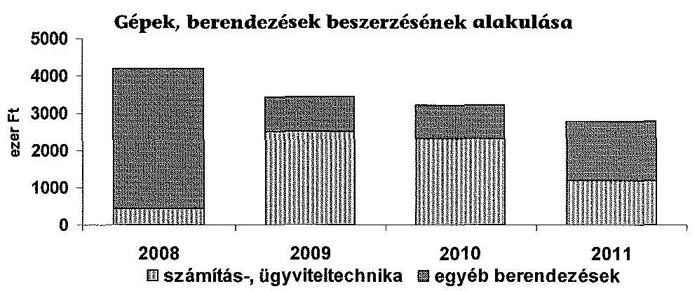

Az ellenőrzött időszakban a gépek, berendezések, felszerelések állományára elszámolt értékcsökkenések összege 36736,2 E Ft, a selejtezés miatti bruttó állománykivezetés 15274,0 E Ft volt. A 2010. év végén történt jelentős, 12,4%-os, 11 206,0 E Ft bruttó értékű selejtezés során 8236,1 E Ft értékű használaton kívüli számítástechnikai berendezés leltári kivezetése valósult meg. A gépek berendezések használhatósági foka 19,5%-ról, 8,7%-ra csökkent az időszak alatt.

Az intézmény járműparkja három személygépkocsiból állt. A 2008. évi 5392 E Ft-os állomány az ellenőrzött időszak végére leírásra került. A járművek a helyszíni ellenőrzés alatt is használatban voltak. Az ellenőrzött időszakban járműbeszerzés nem történt. Az MMIKL ingatlanokhoz kötődő vagyoni értékű jogai voltak: a Képzőművészeti Lektorátus elhelyezését biztosító épületrész határozatlan idejű használati joga és egy I. kerületi önkormányzati lakás bérleti joga.

Az immateriális javak értéke az ellenőrzött időszakban leírásra került. A szellemi termékek szoftverek, programok bruttó állományában a közművelődés- és kultúraszervezést támogató honlap, az ERIKANET közművelődési portál értéke szerepelt. A honlap üzemeltetését támogató és az intézmény szakkönyvtárának munkáját segítő adatbázisok, programok elemeit a régiós adatbázis, a GEO Média Program, az SPSS Kutatási Program, a Szirén Könyvtárprogram és a Magyarország digitális térképe jelentették.

Az immateriális javakra, tárgyi eszközökre az intézmény az ellenőrzött időszakban összesen 43652 E Ft értékcsökkenést számolt el. Az intézmény a 2008-2012. I. félévben beruházásra és felújításra fordított 31363 E Ft összegű kiadása nem érte el az időszakban elszámolt értékcsökkenés összegét, annak 71,8%-át tette ki. Ennek következtében az intézmény tárgyi eszközeinek és immateriális javainak használhatósági mutatója a 2008. évi nyitó állapothoz képest 69,5%-ról 2012 júliusára 61,5%-ra csökkent.

---

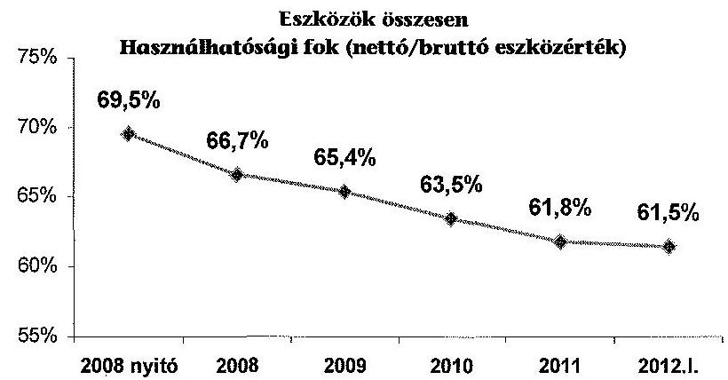

Az intézmény saját vagyona a 2008. évi 998.543 E Ft-ról 2012. I. félévre 493816 E Ft-ra csökkent, a saját tőke 30270 E Ft-os, valamint a tartalékok 474457 E Ft-os csökkenésének eredményeként. A kötelezettségek a 2008. évi 4359 E Ft-ról 2011. év végére 6058 E Ft-ra emelkedtek, az időszakban az intézmény forrásainak átlagosan az 1,5%-át tették ki, hosszú lejáratú kötelezettsége nem volt az intézménynek.

Budapest, 2014. 02. hó 06. nap

Melléklet: $\quad 6 \mathrm{db}$
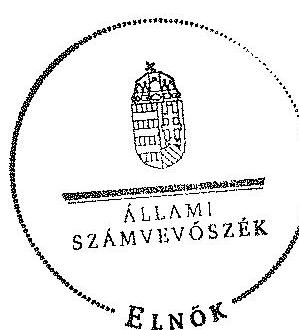

Domokos László
elnök

---

# Magyar Művelődési Intézet és Képzőművészeti Lektorátus

Az intézmény mérlegadatai a 2008-2012. június 30. közötti időszakra adatok ezer Ft-ban

|  Ssz. | Megnevezés | 2008. év | 2009. év | 2010. év | 2011. év | 2012. 1. félév  |
| --- | --- | --- | --- | --- | --- | --- |
|  1 | IMMATERIÁLIS JAVAK | 729,0 | 328,0 | 7,0 | 0,0 | 0,0  |
|  2 | Alapítás átszervezés aktivált értéke |  |  |  |  |   |
|  3 | Kizérlett fejlesztés aktivált értéke |  |  |  |  |   |
|  4 | Vagyoni értékű jogok |  |  |  |  |   |
|  5 | Szellemi termékek | 729,0 | 328,0 | 7,0 | 0,0 | 0,0  |
|  6 | Immateriális javakra adott előlegek |  |  |  |  |   |
|  7 | Immateriális javak értékhelyesbítése |  |  |  |  |   |
|  8 | TÁRGYI ESZKÖZÖK | 391794,0 | 378816,0 | 373857,0 | 355796,0 | 354656,0  |
|  9 | Ingatlanok és kapcsolódó vagyonértékű jogok | 372329,0 | 363061,0 | 361273,0 | 346432,0 | 347181,0  |
|  10 | Gépek, berendezések, felszerelések | 14073,0 | 12162,0 | 10790,0 | 9262,0 | 7475,0  |
|  11 | Járművek | 5392,0 | 3593,0 | 1794,0 | 102,0 | 0,0  |
|  12 | Tenyészállatok |  |  |  |  |   |
|  13 | Beruházások, felújítások |  |  |  |  |   |
|  14 | Beruházásra adott előlegek |  |  |  |  |   |
|  15 | Állami készletek, tartalékok |  |  |  |  |   |
|  16 | Tárgyi eszközök értékhelyesbítése |  |  |  |  |   |
|  17 | BEFEKTETETT PÉNZÜGYI ESZKÖZÖK | 653,0 | 491,0 | 330,0 | 172,0 | 93,0  |
|  18 | ÜZEMELTETÉSRE, KEZELÉSRE ÁTADOTT VAGYON, KEZELÉSRE VÉLI ESZKÖZÖK |  |  |  |  |   |
| 

 19 | BEFEKTETETT ESZKÖZÖK ÖSSZESEN | 393176,0 | 379635,0 | 374194,0 | 355968,0 | 354749,0  |
|  20 | KÉSZLETEK | 10165,0 | 8821,0 | 10040,0 | 10052,0 | 10398,0  |
|  21 | Anyagok | 856,0 |  |  |  |   |
|  22 | Befektetéslen termelés és félkész termék |  |  |  |  |   |
|  23 | Késztermékek |  |  |  |  |   |
|  24 | Áruk, göngyölegek, közvetített szolgáltatások | 9309,0 | 8821,0 | 10040,0 | 10052,0 | 10398,0  |
|  25 | Egyéb készletek |  |  |  |  |   |
|  26 | KÖVETELÉSEK | 2428,0 | 3603,0 | 5420,0 | 5450,0 | 5470,0  |
|  27 | Követelések áruértékesítésből és szolgáltatásból | 2428,0 | 3603,0 | 5420,0 | 5450,0 | 5470,0  |
|  28 | Ebből lejárt: 1 - 180 nap | 0,0 | 0,0 | 3630,0 | 2367,0 | 1085,0  |
|  29 | 181-360 nap | 0,0 | 1193,0 | 829,0 | 1252,0 | 222,0  |
|  30 | 360 napon túl | 0,0 | 0,0 | 795,0 | 1629,0 | 2366,0  |
|  31 | Adósságok |  |  |  |  |   |
|  32 | ÉRTÉKPAPÍROK |  |  |  |  |   |
|  33 | PÉNZESZKÖZÖK | 597161,0 | 485787,0 | 136009,0 | 12596,0 | 110796,0  |
|  34 | Pénztárak, csekkek, betétkönyvek |  |  |  |  | 144,0  |
|  35 | Költségvetési pénzforgalmi számlák |  |  |  |  |   |
|  36 | Elszámolási számlák | 597028,0 | 485787,0 | 136009,0 | 12596,0 | 109996,0  |
|  37 | Idegen pénzeszközök | 133,0 |  |  |  | 636,0  |
|  38 | EGYÉB AKTÍV PÉNZÜGYI ELSZÁMOLÁSOK | 122,0 | 531,0 | 117,0 | 14026,0 | 12470,0  |
|  39 | FORGÓESZKÖZÖK ÖSSZESEN | 609876,0 | 498742,0 | 151586,0 | 42124,0 | 139134,0  |
|  40 | ESZKÖZÖK ÖSSZESEN | 1003052,0 | 878377,0 | 525780,0 | 398092,0 | 493883,0  |
|  41 | SAJÁT TÖKE | 401543,0 | 383435,0 | 383117,0 | 365994,0 | 371273,0  |
|  42 | Tartós tőke | 79892,0 | 79892,0 | 383435,0 | 383435,0 | 383967,0  |
|  43 | Ebből: kezelésbe vett eszközök | 321651,0 | 303543,0 | -318,0 | -17441,0 | -12694,0  |
|  44 | Tőkeváltozások |  |  |  |  |   |
|  45 | Ebből: kezelésbe vett eszközök tőkeváltozása |  |  |  |  |   |
|  46 | Értékelési tartalék |  |  |  |  |   |
|  47 | TARTALÉKOK | 597000,0 | 486033,0 | 135691,0 | 26040,0 | 122543,0  |
|  48 | Költségvetési tartalékok | 597000,0 | 486033,0 | 135691,0 | 26040,0 |   |
|  49 | Vállalkozási tartalékok |  |  |  |  |   |
|  50 | KÖTELEZETTSÉGEK | 4359,0 | 8909,0 | 6972,0 | 6058,0 | 0,0  |
|  51 | Hosszú lejáratú kötelezettségek |  |  |  |  |   |
|  52 | Rövid lejáratú kötelezettségek | 4359,0 | 8909,0 | 6972,0 | 6058,0 | 0,0  |
|  53 | Ebből: Kötelezettségek áruértékesítésből, szolgáltatásokból (szállítók) |  |  |  |  |   |
|  54 | 181-360 nap |  |  |  |  |   |
|  55 | 360 napon túl |  |  |  |  |   |
|  56 | Egyéb kötelezettségek |  |  |  |  |   |
|  57 | 181-360 nap |  |  |  |  |   |
|  58 | 360 napon túl |  |  |  |  |   |
|  59 | EGYÉB PASSZÍV PÉNZÜGYI ELSZÁMOLÁSOK | 150,0 |  |  |  | 67,0  |
|  60 | FORRÁSOK ÖSSZESEN | 1003052,0 | 878377,0 | 525780,0 | 398092,0 | 493883,0  |

---

.

---

# Magyar Művelődési Intézet és Képzőművészeti Lektorátus

## Az intézmény kiadásai és bevételei a 2008-2012. június 30. közötti időszakra

|  Ssz. | Megnevezés | 2008. év teljesítés | 2009. év teljesítés | 2010. év teljesítés | 2011. év teljesítés | 2012. I. félév teljesítés  |
| --- | --- | --- | --- | --- | --- | --- |
|   | 1 | 2 | 3 | 4 | 5 | 6  |
|  1. | KIADÁSOK |  |  |  |  |   |
|  2. | Személyi juttatások | 506062,0 | 471432,0 | 410604,0 | 345159,0 | 148474,0  |
|  3. | Munkaadót terhelő járulékok | 125794,0 | 108799,0 | 105310,0 | 93997,0 | 41513,0  |
|  4. | Dologi kiadások | 324157,0 | 333176,0 | 320951,0 | 177080,0 | 96093,0  |
|  5. | Egyéb folyó kiadások | 4494,0 | 42498,0 | 63953,0 | 64576,0 | 11305,0  |
|  6. | Támogatásértékű működési kiadások | 83621,0 | 46002,0 | 722,0 | 72812,0 | 1950,0  |
|  7. | Támogatásértékű felhalmozási kiadások | 0,0 | 17195,0 | 0,0 | 7910,0 | 0,0  |
|  8. | Előző évi előirányzat átadás | 163352,0 | 404801,0 | 390659,0 | 17652,0 | 0,0  |
|  9. | Működési célú pénzeszköz átadás | 61073,0 | 160104,0 | 227625,0 | 18397,0 | 4765,0  |
|  10. | Felhalmozási célú pénzeszköz átadás | 0,0 | 18457,0 | 13170,0 | 13675,0 | 0,0  |
|  11. | Előadók pénzbeli juttatásai | 0,0 | 0,0 | 0,0 | 0,0 | 0,0  |
|  12. | Egyéb juttatás | 0,0 | 0,0 | 0,0 | 0,0 | 0,0  |
|  13. | Felújítás | 0,0 | 0,0 | 1737,0 | 2344,0 | 995,0  |
|  14. | Intézményi beruházási kiadások AFA-val | 5008,0 | 4176,0 | 4012,0 | 3480,0 | 0,0  |
|  15. | Központi beruházási kiadások AFA-val | 0,0 | 0,0 | 7689,0 | 0,0 | 0,0  |
|  16. | Lakásépítési kiadások AFA-val | 0,0 | 0,0 | 0,0 | 0,0 | 0,0  |
|  17. | Összesen | 1273561,0 | 1606638,0 | 1546432,0 | 817082,0 | 305095,0  |
|  18. | BEVÉTELEK |  |  |  |  |   |
|  19. | Közhatalmi bevételek | 0,0 | 0,0 | 0,0 | 0,0 | 0,0  |
|  20. | Intézményi működési bevételek | 88493,0 | 68073,0 | 89006,0 | 73677,0 | 34283,0  |
|  21. | Működési célú pénzeszköz átvételek | 5782,0 | 5943,0 | 6378,0 | 1853,0 | 0,0  |
|  22. | Felhalmozási bevételek | 0,0 | 0,0 | 0,0 | 0,0 | 0,0  |
|  23. | Felhalmozási célú pénzeszköz átvételek | 0,0 | 0,0 | 8146,0 | 18035,0 | 0,0  |
|  24. | Irányító szervtől kapott támogatás | 1447420,0 | 1345072,0 | 619742,0 | 515467,0 | 261163,0  |
|  25. | Támogatásértékű működési bevétel | 88588,0 | 54873,0 | 46628,0 | 18325,0 | 30660,0  |
|  26. | Támogatásértékű felhalmozási bevétel | 0,0 | 0,0 | 0,0 | 0,0 | 0,0  |
|  27. | Előző évi maradvány átvétele | 13219,0 | 21710,0 | 426190,0 | 80074,0 | 75492,0  |
|  28. | Előirányzat-maradvány felhasználása | 220853,0 | 591325,0 | 460708,0 | 133547,0 | 26040,0  |
|  29. | Összesen | 1864355,0 | 2086996,0 | 1656798,0 | 840978,0 | 627638,0  |

---

.

---

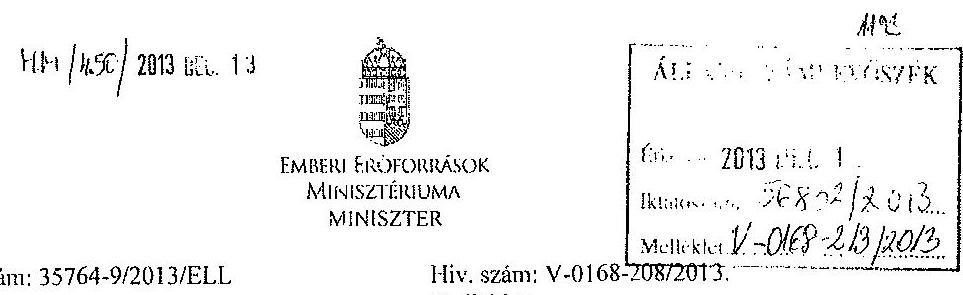

Iktatószám: 35764-9/2013/ELL

# Domokos László részére

**Kölönök**

Állami Számvevőszék

Budapest

Apáczai Csere János u. 10.

1052

Tárgy: A Magyar Művelődési Intézet és Képzőművészeti Lektorátus pénzügyi gazdálkodási helyzetének és vagyongazdálkodásának ellenőrzéséről készült jelentéstervezet véleményezése

Tisztelt Elnök Úr!

A Magyar Művelődési Intézet és Képzőművészeti Lektorátus pénzügyi gazdálkodási helyzetének és vagyongazdálkodásának ellenőrzéséről készült jelentéstervezetet kapcsolatban az alábbi észrevételt teszem.

A Nemzeti Művelődési Intézet főigazgatójának címzett 5. számú javaslat: „Kezdeményezze az MNV Zrt-nél a vagyonkezelési szerződés kiegészítését ... a közösen használt ingatlan birtoklásának, használatának és a hasznok szedésének szabályaival, az egyes vagyonkezelőket megillető jogokkal és kötelezettségekkel”.

A hivatkozott vagyonkezelési szerződés érvényét veszítette, 2013. szeptember 17-én a Nemzeti Művelődési Intézet átadta a székhelyéül szolgáló ingatlan vagyonkezelői jogát a Hagyományok Házának, ennek következtében a javaslatban megfogalmazott vagyonkezelési szerződés kiegészítését a Hagyományok Háza kezdeményezte. Az előbbiekre tekintettel kérem az 5. pontban megfogalmazott javaslat módosítását.

Budapest, 2013. december „H.”

Üdvözlettel:

*Björg Zajian*

1054 Budapest, Akadémia utca 3. Tel.: +36-1-795-4430 Fax: +36-1-795-0166
e-mail: info@gmmi.gov.hu

---

.

---

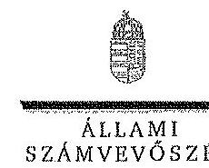

ELBÖK

Ikt.szám: V-0168-215/2014.

# Balog Zoltán úr 

emberi erőforrások minisztere
Emberi Erőforrások Minisztériuma

## Budapest

## Tisztelt Miniszter Úr!

A Magyar Művelődési Intézet és Képzőművészeti Lektorátus pénzügyi gazdálkodási helyzetének és vagyongazdálkodásának ellenőrzése a Nemzeti Művelődési Intézetnél című ellenőrzéséről készített jelentéstervezetre tett észrevételét köszönettel megkaptam.

Az Állami Számvevőszék észrevételekre vonatkozó álláspontjáról a felügyeleti vezető által készített tájékoztatást csatoltan megküldöm.

Tájékoztatom Miniszter urat, hogy a jelentésben - az Állami Számvevőszékről szóló 2011. évi LXVI. törvény 29. § (3) bekezdése alapján - az el nem fogadott észrevételt szerepeltetjük az elutasítás indokának feltüntetésével együtt.

Budapest, 2014. június 25.
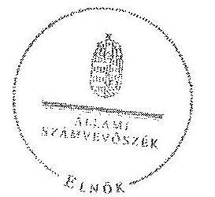

Tisztelettel:

Domokos László

Melléklet: Tájékoztatás az el nem fogadott észrevételről

---

# Tájékoztatás 

## az el nem fogadott észrevételről

A Magyar Művelődési Intézet és Képzőművészeti Lektorátus pénzügyi gazdálkodási helyzetének és vagyongazdálkodásának ellenőrzése a Nemzeti Művelődési Intézetnél című ellenőrzéséről készített jelentéstervezetre 35764-9/2013/ELL iktatószámú levelében tett észrevételét áttekintettük, annak kezeléséről az alábbi tájékoztatást adom.

A Nemzeti Művelődési Intézet székhelyéül
 szolgáló ingatlan vagyonkezelői jogának átadására vonatkozó tájékoztatását megköszönöm. A vagyonkezelői szerződés kiegészítésére vonatkozó javaslatra tett észrevételét az intézkedési terv értékelése során, a vagyonkezelői jog átadására, az NMI vagyonkezelői szerződésének megszűnésére vonatkozó dokumentumok beérkezését követően tudjuk figyelembe venni.

Tájékoztatom, hogy a számvevőszéki jelentés mellékleteiként szerepeltetjük a jelentéstervezethez tett észrevételét, valamint arra adott válaszunkat.

Budapest, 2014. 01. hó 28. nap

## 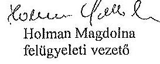

Holman Magdolna
felügyeleti vezető

---

Ikt. szám: 9726/2013.
Tárgy: Jelentéstervezet
Úgyintéző: Nagy Márta

# Domokos László 

## Elnök

Állami Számvevőszék

## Budapest

Apáczai Csere János utca 10.
1052

## Tisztelt Elnök Úr!

A V-0168-210/2013. iktatószámú levél mellékleteként megküldött „a Magyar Müvelődési Intézet és Képzőművészeti Lektorátus pénzügyi gazdálkodási helyzetének és vagyongazdálkodásának ellenőrzéséről a Nemzeti Müvelődési Intézetnél" készült jelentéstervezetet áttekintettük, az abban foglaltakkal kapcsolatban az alábbi észrevételt tesszük.

A Magyar Müvelődési Intézet és Képzőművészeti Lektorátus 2011. év februárjában a PANKKK pályázattal kapcsolatban szabálytalanul, a minisztérium engedélye nélkül fizetett ki 9150 000,- Ft-ot. Tisztelettel kérem, hogy ez a szabálytalanság konkrétan kerüljön kiemelésre a végleges jelentésben.

Egyidejűleg megköszönöm Elnök úrnak a tájékoztatást és munkatársainak szíves közreműködését.

Budapest, 2013. december 12.
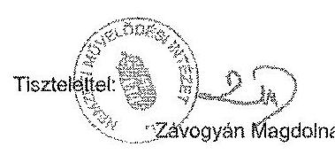
főigazgató

---

.

---

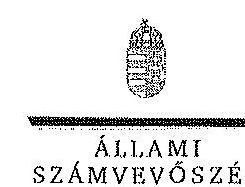

ELNÖK

Ikt.szám: V-0168-216/2014.

# Závogyán Magdolna úrhölgy 

főigazgató
Nemzeti Müvelődési Intézet

## Budapest

## Tisztelt Főigazgató Úrhölgy!

A Magyar Müvelődési Intézet és Képzőművészeti Lektorátus pénzügyi gazdálkodási helyzetének és vagyongazdálkodásának ellenőrzése a Nemzeti Müvelődési Intézetnél címủ ellenőrzéséről készített jelentéstervezetre tett észrevételét köszönettel megkaptam.

Az Állami Számvevőszék észrevételre vonatkozó álláspontjáról a felügyeleti vezető által készített részletes tájékoztatást csatoltan megküldöm.

Tájékoztatom Főigazgató úrhölgyet, hogy a jelentésben - az Állami Számvevőszékről szóló 2011. évi LXVI. törvény 29. § (3) bekezdése alapján - az el nem fogadott észrevételt szerepeltetjük az elutasítás indokának feltüntetésével együtt.

Budapest, 2014.
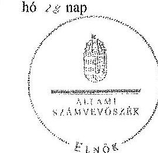

Tisztelttel:

Melléklet: Tájékoztatás az el nem fogadott észrevételről

1952 BUDAPEST, APÁCZAI CSERE JÁNOS UTCA 10, 1304 Budapest 4. Pl. 54 tokdan-484 5181 fax-484 5201

---

# Tájékoztatás 

## az el nem fogadott észrevételről

A Magyar Müvelődési Intézet és Képzőművészeti Lektorátus pénzügyi gazdálkodási helyzetének és vagyongazdálkodásának ellenőrzése a Nemzeti Müvelődési Intézetnél című ellenőrzéséről készített jelentéstervezetre 9726/2013. iktatószámú levelében tett észrevételt áttekintettük, annak kezeléséről az alábbi tájékoztatást adom.

Az észrevételét nem fogadjuk el. Az Állami Számvevőszék ellenőrzése az intézményi feladatellátásra, az intézményi gazdálkodás szabályszerűségére terjed ki. A Magyar Müvelődési Intézet és Képzőművészeti Lektorátus pályázatkezelési tevékenységének ellenőrzése a megbízóval kötött együttműködési megállapodásban foglalt követelmények teljesítésére terjedt ki, amelyet mintavétellel végeztünk. A jelentéstervezet 25. oldalán tett megállapítás az ellenőrzött mintatételekre vonatkozik, amelyek között az észrevételben szereplő PANKKK pályázat nem szerepelt.

Tájékoztatom, hogy a számvevőszéki jelentés mellékleteiként szerepeltetjük a jelentéstervezethez tett észrevételét, valamint arra adott válaszunkat.

Budapest, 2014. 01. hó 10. nap

Holman Magdolna
felügyeleti vezető
