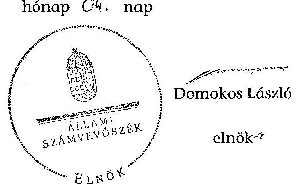

# ÁLLAMI   SZÁMVEVŐSZÉK 

## JELENTÉS

a helyi nemzetiségi önkormányzatok gazdálkodásának ellenőrzéséről
Mezőkeresztesi Roma Nemzetiségi Önkormányzat

---

# Állami Számvevőszék 

Iktatószám: V-0148-041/2014.
Témaszám: 1201
Vizsgálat-azonosító szám: V065206

## Az ellenőrzést felügyelte:

Horváth Balázs
felügyeleti vezető
Az ellenőrzést vezette és az ellenőrzés végrehajtásáért felelős:
Pats Regina
ellenőrzésvezető
A számvevőszéki jelentést készítették és a jelentés összeállításában közremüködtek:

Dr. Fátrainé Zsebedics Katalin
számvevő tanácsos
Csényi István
számvevő-tanácsos
Az ellenőrzést végezték:
Magyaricsné Hajdú Regina
Számvevő

Dr. Szöllősi Zsolt
számvevő

---

# TARTALOMJEGYZÉK 

BEVEZETÉS ..... 3
I. ÖSSZEGZŐ MEGÁLLAPÍTÁSOK, KÖVETKEZTETÉSEK, JAVASLATOK ..... 6
II. RÉSZLETES MEGÁLLAPÍTÁSOK ..... 12

1. A Nemzetiségi Önkormányzat és a Települési Önkormányzat együttműködésének szabályozása, a működési feltételek biztosítása ..... 12
2. A gazdálkodási feladatok ellátásának szabályszerűsége ..... 13
2.1. A költségvetésre és zárszámadásra, valamint a kincstári adatszolgáltatás rendjére vonatkozó jogszabályi előírások betartása ..... 13
2.2. A Nemzetiségi Önkormányzat gazdálkodásának szabályozottsága ..... 14
2.3. Az operatív gazdálkodási jogkörök kialakítása, gyakorlása ..... 15
3. A Nemzetiségi Önkormányzattal kapcsolatos gazdálkodási feladatok belső ellenőrzése ..... 16
4. A Nemzetiségi Önkormányzat feladatellátása ..... 16
MELLÉKLET
5. számú A Nemzetiségi Önkormányzat 2012. évi gazdálkodásának főbb adatai, mutatói
FÜGGELÉKEK
6. számú Rövidítések jegyzéke
7. számú Értelmező szótár
8. számú A gazdálkodás értékelésének módszere

---

.

---

# JELENTÉS   a helyi nemzetiségi önkormányzatok gazdálkodásának ellenőrzéséről Mezőkeresztesi Roma Nemzetiségi Önkormányzat 

## BEVEZETÉS

A Nemzetiségi Önkormányzat 2002. évben alakult, elnöke a 2010. évi helyhatósági választások óta látja el feladatát. A Nemzetiségi Önkormányzat intézményt, gazdasági társaságot és más szervezetet nem alapított, illetve ezek társulásában nem vesz részt. A négytagú Képviselő-testület a munkája segitésére bizottságot nem hozott létre. A Nemzetiségi Önkormányzat költségvetési beszámolója szerint a 2012. évben a módosított költségvetési bevételi és kiadási elöirányzat 215,0 ezer Ft, a teljesített költségvetési bevétel 216,0 ezer Ft, a teljesített költségvetési kiadás 207,0 ezer Ft volt. A Nemzetiségi Önkormányzat a 2011. és a 2012. évben feladatalapú támogatásban nem részesült. A 2012. évi gazdálkodási adatokat részletesen az 1. számú mellékletben mutatjuk be.

Az Alaptörvény XXIX. cikk (1) bekezdése szerint a Magyarországon élő nemzetiségek államalkotó tényezők. Minden, valamely nemzetiséghez tartozó magyar állampolgárnak joga van önazonossága szabad vállalásához és megőrzéséhez. A hazánkban élő nemzetiségek helyi (települési és területi) valamint országos önkormányzatokat hozhatnak létre. A helyi nemzetiségi önkormányzatok gazdálkodási feladatait jogszabályi előírás alapján a székhely szerinti helyi önkormányzat polgármesteri hivatala látja el.

A nemzetiségek helyzete, támogatása mind hazai, mind EU-s szinten kiemelt figyelmet kap napjainkban. A helyi nemzetiségi önkormányzatok gazdálkodására és támogatási rendszerére vonatkozó jogszabályok a 2010-2012. években jelentős változásokon mentek át. A települési és területi nemzetiségi önkormányzatok gazdálkodásának, a részükre juttatott költségvetési támogatások felhasználásának ellenőrzését az ÁSZ 2012-ben sorozatjellegű ellenőrzés keretében indította el. A 2013. évi ellenőrzések e témacsoportos ellenőrzések folytatását jelentik.

Az ellenőrzés célja annak értékelése volt, hogy a nemzetiségi önkormányzat gazdálkodási kereteinek kialakítása, gazdálkodása és feladatellátása megfelelte a jogszabályoknak.

---

Ennek keretében értékeltük, hogy:

- a nemzetiségi önkormányzat és a települési önkormányzat együttműködésének szabályozása, a működési feltételek biztosítása megfelelt-e a jogszabályi előírásoknak;
- a felek együttműködése megfelelt-e a közöttük létrejött megállapodásnak a gazdálkodási feladatok szabályszerű ellátása során, ennek keretében betar-tották-e a helyi nemzetiségi önkormányzat gazdálkodásához kapcsolódóan a költségvetésre és zárszámadásra, a gazdálkodás szabályozására, az operatív gazdálkodási jogkörök gyakorlására vonatkozó jogszabályi előírásokat;
- a jegyző biztosította-e a nemzetiségi önkormányzat gazdálkodásának belső ellenőrzését;
- a nemzetiségi önkormányzat feladatalapú támogatásának felhasználása, a folyósított feladatalapú támogatással történő elszámolás az előírásoknak megfelelő volt-e;
- a nemzetiségi önkormányzat feladatellátása összhangban volt-e a vonatkozó jogszabályi előírásokkal.

Az ellenőrzés várható hasznosulását négy szinten tervezzük. A törvényalkotás számára összegzett tapasztalatok állnak rendelkezésre a nemzetiségi önkormányzatok testületi döntéseinek, gazdálkodásának és a feladatalapú támogatás felhasználásának szabályszerűségéről, amelynek alapján következtetést lehet levonni arra, hogy indokolt-e esetleges jogszabályi módosítás kezdeményezése. Az ellenőrzés az ellenőrzött számára visszajelzést ad a működésében fellépő hiányosságokról, javaslataival hozzájárul azok kiküszöböléséhez, amely csökkentheti a későbbi ellenőrzések gyakoriságát. Az ellenőrzés megállapításai és javaslatai tanulságul szolgálhatnak más nemzetiségi önkormányzatok, szervezetek számára a rendezett gazdálkodási keretek kialakításához. A társadalom számára jelzi, hogy közpénz nem maradhat ellenőrizetlenül, az ÁSZ értékteremtő rend kialakításához és megőrzéséhez hozzájáruló tevékenysége pozitív hatással lesz a szervezetről kialakított összkép formálásában. Az ÁSZ szervezetén belül lehetőség nyílik arra, hogy a megállapítások szintetizálásával az intézmény a hozzáadott értéket teremtő elemző tevékenységét és tanácsadó szerepét erősítse.

A helyi nemzetiségi önkormányzatok gazdálkodásának ellenőrzéséről szóló jelentés I. fejezetének összegző része az ellenőrzés céljára adott rövid, szintetizáló összefoglalót és következtetéseket tartalmazza a II. fejezet részletes megállapításain alapulóan. A jelentés intézkedést igénylő megállapításait és javaslatait az összegzőben foglaltak mellett - az ellenőrzés során feltárt, a jelentés II. fejezetében rögzített részletes megállapítások alapozzák meg, illetve támasztják alá.

Az ellenőrzés típusa: szabályszerűségi ellenőrzés.
Az ellenőrzött időszak: 2012. január 1. - 2012. december 31. közötti időszak. Az ellenőrzés kiterjedt a helyi nemzetiségi önkormányzatoknak juttatott 2012. évi feladatalapú támogatás 2013. évben való elszámolására is.

---

Ellenőrzött szervezet: Mezőkeresztesi Roma Nemzetiségi Önkormányzat és a gazdálkodási feladatait ellátó Mezőkeresztes Város Önkormányzata.

Az ellenőrzés végrehajtásának jogszabályi alapját az Állami Számvevőszékről szóló 2011. évi LXVI. törvény 1. § (3) bekezdése, az 5. § (2) és (6) bekezdései, valamint az Államháztartásról szóló 2011. évi CXCV. törvény 61. §. (2) bekezdésének előírásai képezik.

Az ellenőrzés szakmai módszertana az ÁSZ hivatalos honlapján (www.asz.hu) közzétett szakmai szabályokon alapult, amely a Legfőbb Ellenőrző Intézmények Nemzetközi Szervezete (INTOSAI) által kiadott nemzetközi standardok (ISSAI) figyelembevételével készült.

A helyi nemzetiségi önkormányzatok gazdálkodásának ellenőrzése során értékeltük a települési önkormányzat és a nemzetiségi önkormányzat együttmúködésének, a gazdálkodás szabályozottságának és a pénzügyi folyamatokban kulcsszerepet betöltő belső kontrollok (teljesítésigazolás és érvényesítés) múködésének megfelelőségét. A kulcskontrollokat a dologi kiadásokkal kapcsolatos kifizetéseknél véletlen mintavételi eljárást alkalmazva ellenőriztük. Ellenőriztük, hogy a jegyző biztosította-e a nemzetiségi önkormányzat gazdálkodásának belső ellenőrzését. Értékeltük a feladatalapú támogatások felhasználásának, elszámolásának szabályszerűségét, a nemzetiségi önkormányzat feladatellátása és a jogszabályi előírások összhangját.

Az ellenőrzés lefolytatásához a Nemzetiségi Önkormányzat és a gazdálkodási feladatait ellátó Települési Önkormányzat tanúsítványok és a kapcsolódó, dokumentumjegyzékben megjelölt dokumentumok elektronikus úton történő megküldésével, rendelkezésre bocsátásával szolgáltatott adatokat. Az adatszolgáltatás kontrollálása és szükség szerinti javítása a helyszíni ellenőrzés keretében történt. A gazdálkodás értékelésének módszerét a 3. számú függelék tartalmazza.

Az ÁSZ tv. 29. § (1) bekezdése szerint a jelentéstervezetet megküldtük észrevételezésre az alpolgármesternek és a Nemzetiségi Önkormányzat elnökének, akik az ÁSZ tv. 29. § (2) bekezdésében foglalt észrevételezési jogukkal nem éltek, a jelentéstervezetre határidőben észrevételt nem tettek.

---

# I. ÖSSZEGZŐ MEGÁLLAPÍTÁSOK, KÖVETKEZTETÉSEK, JAVASLATOK 

A Nemzetiségi Önkormányzat és a Települési Önkormányzat együttmüködésének szabályozása nem felelt meg a jogszabályi előírásoknak. A Nemzetiségi Önkormányzat a 2012. évben rendelkezett hatályban lévő együttműködési megállapodással a Települési Önkormányzattal történő együttműködésre. Az együttműködési megállapodást a Nek. 2 tv-ben foglaltaknak megfelelően az előírt határidőn belül felülvizsgálták. A Nemzetiségi Önkormányzat a Nek. 2 tv. előírása ellenére nem alkotta meg a 2012. évben az SZMSZ-ét, így az együttmúködési megállapodásban szereplő működési feltételek Nemzetiségi Önkormányzat SZMSZ-ében való rögzítése nem történt meg. Az együttmúködés szabályozása az Áht. ${ }_{2}$-ben és a Nek. ${ }_{2}$ tv-ben meghatározott tartalmi elemek tekintetében hiányos volt. A megállapodás az Áht. ${ }_{2}$ előírása ellenére nem tartalmazta a Nemzetiségi Önkormányzat bevételeivel és kiadásaival kapcsolatban az ellenőrzési és az adatszolgáltatási feladatok részletes szabályait. A Nek. ${ }_{2}$ tv-ben foglaltakat figyelmen kívül hagyva nem tartalmazta a Nemzetiségi Önkormányzat részére az önálló fizetési számla nyitásával, törzskönyvi nyilvántartásba vételével és az adószám igénylésével kapcsolatos határidőket, együttmúködési kötelezettségeket és ezek felelőseinek konkrét kijelölését, a költségvetés előkészítésével és megalkotásával, valamint a költségvetéssel összefüggő adatszolgáltatási kötelezettségek teljesítésével kapcsolatban a felelősök konkrét kijelölését. A Nek. ${ }_{2}$ tv-ben foglaltak ellenére csak részben tartalmazta a Nemzetiségi Önkormányzat kötelezettségvállalásaival kapcsolatosan a Települési Önkormányzatot terhelő pénzügyi ellenjegyzési, érvényesítési feladatok felelőseinek kijelölését, mert a megállapodásban - a felelősök konkrét kijelölése helyett - munkaköröket jelöltek meg. A megállapodás a Nek. ${ }_{2}$ tv-ben foglaltak ellenére nem tartalmazta, hogy a jegyző, vagy annak - a jegyzővel azonos képesítési előírásoknak megfelelő - megbízottja a Települési Önkormányzat megbízásából és képviseletében részt vesz a Nemzetiségi Önkormányzat képviselő-testületi ülésein és jelzi amennyiben törvénysértést észlel. A Települési Önkormányzat a szabályozási hiányosságok ellenére biztosította a Nemzetiségi Önkormányzat múködéséhez szükséges személyi és tárgyi feltételeket.

A Nemzetiségi Önkormányzat 2012. évi költségvetésének és zárszámadásának tartalma, jóváhagyása, valamint a kapcsolódó 2012. évi kincstári adatszolgáltatás szabályszerűsége megfelelt a jogszabályi előírásoknak. A Nemzetiségi Önkormányzat elnöke a 2012. évi költségvetés és zárszámadás tervezetét az Áht. ${ }_{2}$-ben előírtaknak megfelelően határidőben benyújtotta a Képvi-selő-testületnek. A költségvetés és a zárszámadás tartalmazta az Áht. ${ }_{2}$-ben foglalt előírások szerinti tartalmi elemek közül a költségvetési bevételeket és kiadásokat előirányzat-csoportok és kiemelt előirányzatok szerinti bontásban. A Képviselő-testület részére - tájékoztatás céljából - bemutatták az előírt mérlegeket és kimutatásokat. A 2012. évi költségvetési és zárszámadási határozat azonos szerkezetben készült, az összehasonlíthatóság biztosított volt, a zárszámadásban a Nemzetiségi Önkormányzat valamennyi bevételéről és kiadásáról elszámolt. A jóváhagyott költségvetés azonban nem tartalmazta a Nemzetiségi Önkormányzat költségvetése végrehajtásával kapcsolatos hatásköröket, így kü-

---

lönösen a finanszírozási bevételekkel és kiadásokkal kapcsolatos hatásköröket, valamint a költségvetési egyenleg összegét múködési és felhalmozási cél szerinti bontásban. A jegyző a Települési Önkormányzat 2012. évi költségvetéshez kapcsolódó, a Nemzetiségi Önkormányzatra vonatkozó kincstári adatszolgáltatási kötelezettségének - egy eset kivételével - határidőben eleget tett.

A Nemzetiségi Önkormányzat gazdálkodásának szabályozottsága nem volt megfelelő. A Nemzetiségi Önkormányzat a 2012. évben rendelkezett önálló számviteli politikával, számlarenddel, pénzkezelési, valamint kötelezettségvállalási szabályzattal, azonban nem rendelkezett a Számv. tv-ben és az Áhszben előírt leltározási és leltárkészítési szabályzattal, valamint az eszközök és források értékelési szabályzatával. A Polgármesteri Hivatal SZMSZ-e nem tartalmazta az Ávr. szerinti, a munkakörökhöz tartozó - a Nemzetiségi Önkormányzat gazdálkodásával kapcsolatos - feladat- és hatáskörökre, a hatáskörök gyakorlásának módjára, a helyettesítés rendjére, az ezekhez kapcsolódó felelősségi szabályokra vonatkozó előírásokat. A Nemzetiségi Önkormányzat a 2012. évben - a Bkr-ben előírtak ellenére - nem rendelkezett ellenőrzési nyomvonallal, szabálytalanságok kezelésének eljárásrendjével és a folyamatba épített előzetes, utólagos és vezetői ellenőrzés szabályozásával.

A Nemzetiségi Önkormányzat gazdálkodása tekintetében az operatív gazdálkodási jogkörök kialakítása nem felelt meg a jogszabályi előírásoknak, mivel a pénzügyi ellenjegyzési és az érvényesítési feladatok ellátására történt kijelölés során nem vették figyelembe a 2012. évtől bekövetkezett jogszabályi változásokat. Az önálló gazdasági szervezettel nem rendelkező Polgármesteri Hivatalban az Ávr-ben foglaltak ellenére a pénzügyi ellenjegyzői és az érvényesítői feladatokat ellátó személyeket a jegyző helyett a Nemzetiségi Önkormányzat elnöke jelölte ki. A Nemzetiségi Önkormányzatnál a 2012. évben a dologi kiadások teljesítése során a teljesítésigazolás és az érvényesítés kulcsszerepet betöltő kontrollok múködésének megfelelősége gyenge volt, a hibák száma a lényegességi szintet, a kritikus hibahatárt elérte. A teljesítés igazolásánál annak időpontját nem tüntették fel, így nem volt megállapítható, hogy az a kifizetést megelőzően történt-e meg. Az érvényesítőt az érvényesítői feladatokra az arra nem jogosult személy - a Nemzetiségi Önkormányzat elnöke - jelölte ki, emiatt feladatát jogosulatlanul látta el, az érvényesítés időpontját a bizonylatokon nem tüntették fel. A számvevőszéki ellenőrzés a kifizetések dokumentumainak ellenőrzése alapján nem tárt fel jogosulatlan kifizetést, a kulcskontrollok múködéséhez kapcsolódó hiányosságok miatt azonban nem biztosították a hibák megelőzését, feltárását és kijavítását.

A jegyző nem biztosította a Nemzetiségi Önkormányzat gazdálkodásával összefüggő végrehajtási feladatok belső ellenőrzését. A Polgármesteri Hivatal 2012. évi belső ellenőrzési tervét megalapozó kockázatelemzés - a Ber-ben foglaltak ellenére - nem terjedt ki a Nemzetiségi Önkormányzat gazdálkodásával összefüggő végrehajtási feladatokra, és azok tekintetében belső ellenőrzési feladatot a 2012. évben nem terveztek és nem végeztek.

A Nemzetiségi Önkormányzat a képviselő-testületi múködésen túl - a tanúsítványon közölt adatok és az ellenőrzés részére átadott dokumentumok alapján a 2012. évben sem kötelező, sem önként vállalt feladatot nem látott el, annak

---

ellenére, hogy a Települési Önkormányzat biztosította a Nemzetiségi Önkormányzat müködéséhez szükséges személyi és tárgyi feltételeket.

Az ÁSZ tv. 33. § (1) bekezdésében foglaltak értelmében az ellenőrzött szervezet vezetője köteles a jelentésben foglalt megállapításokhoz kapcsolódó intézkedési tervet összeállítani, és azt a jelentés kézhezvételétől számított 30 napon belül az ÁSZ részére megküldeni. Amennyiben az intézkedési tervet határidőre nem küldi meg a szervezet, vagy az nem elfogadható, az ÁSZ elnöke az ÁSZ tv. 33. § (3) bekezdés a)-b) pontjaiban foglaltakat érvényesítheti.

A helyszíni ellenőrzés megállapításainak hasznosítása mellett javasoljuk:

# a jegyzőnek 

1. az együttműködés szabályozásával kapcsolatban

A Nemzetiségi Önkormányzat a Nek. ${ }_{2}$ tv. 113. § a) pontja szerinti felhatalmazás ellenére nem alkotta meg a 2012. évben az SZMSZ-ét. A Nemzetiségi Önkormányzat és a Települési Önkormányzat által kötött együttműködési megállapodás az Áht. 2 27. § (2) bekezdésében foglaltak ellenére nem tartalmazta az adatszolgáltatási és az ellenőrzési feladatok ellátásának részletes szabályait. A Nek. ${ }_{2}$ tv. 80. § (3) bekezdés a) pontjában foglaltak ellenére nem rendelkeztek az önálló fizetési számla nyitásával, a törzskönyvi nyilvántartásba vételével és adószám igénylésével kapcsolatos határidőről és együttműködési kötelezettségekről a felelősök konkrét kijelölésével. Az együttműködési megállapodás csak részben tartalmazta a Nek. ${ }_{2}$ tv. 80. § (3) bekezdés a), b) és d) pontjai szerint a költségvetés előkészítésével és megalkotásával és a költségvetéssel összefüggő adatszolgáltatási kötelezettségek teljesítésével kapcsolatos feladatokat, az ellenjegyzési, érvényesítési, utalványozási és teljesítésigazolási feladatok felelőseinek konkrét kijelölését, a Nemzetiségi Önkormányzat müködési feltételeinek és gazdálkodásának eljárási és dokumentációs részletszabályaival, valamint az ezeket végző személyek kijelölésének rendjével és az adatszolgáltatási feladatok teljesítésével kapcsolatos előírásokat, feltételeket. A Nek. ${ }_{2}$ tv. 80. § (4) bekezdésében foglaltak ellenére nem rögzítették, hogy a jegyző vagy annak megbízottja a Települési Önkormányzat megbízásából és képviseletében részt vesz a Nemzetiségi Önkormányzat Képviselő-testületi ülésein és jelzi, amennyiben törvénysértést észlel.

Javaslat
Az együttműködés szabályszerűsége érdekében készítse elő:
a) a Nemzetiségi Önkormányzat SZMSZ-ét a Nek. ${ }_{2}$ tv. 113. § a) pontjában foglalt felhatalmazás alapján;
b) az együttműködési megállapodás módosítását, hogy az tartalmilag feleljen meg a Nek. ${ }_{2}$ tv. 80. § (3) bekezdés a), b), és d) pontjaiban, valamint a Nek. ${ }_{2}$ tv. 80. § (4) bekezdésében, valamint az Áht. ${ }_{2}$ 27. § (2) bekezdésében foglalt előírásoknak.
2. a költségvetés és a zárszámadás szabályszerűségével kapcsolatban

A jóváhagyott költségvetés nem tartalmazta az Áht. ${ }_{2}$ 23. § (2) bekezdés h) pontja szerint a finanszírozási bevételekkel és kiadásokkal kapcsolatos hatásköröket, vala-

---

mint az Áht. 2 23. § (2) bekezdés c) pontjának előírását figyelmen kívül hagyva, a költségvetési egyenleg összegét.

Javaslat
Gondoskodjon a jövőben a költségvetési határozatok szabályszerűsége érdekében arról, hogy az tartalmában feleljen meg az Áht. 2 23. § (2) bekezdés c) és h) pontjaiban foglaltaknak.
3. a gazdálkodási feladatok szabályozottságával, ellátásával kapcsolatban

A 2012. évben a Nemzetiségi Önkormányzat gazdálkodásával kapcsolatos - a munkakörökhöz tartozó - feladat- és hatásköröket, a hatáskörök gyakorlásának módjára, a helyettesítés rendjére, az ezekhez tartozó felelősségi szabályokra vonatkozó előírásokat a Polgármesteri Hivatal SZMSZ-e az Ávr. 13 § (1) bekezdés g) pontja ellenére nem tartalmazta.

A Nemzetiségi Önkormányzat a 2012. évben a Számv. tv. 14. § (5) bekezdésének a) és b) pontjaiban, a Bkr. 6. § (3)-(4) bekezdéseiben és a Bkr. 8. § (2)-(4) bekezdéseiben előírtak ellenére - nem rendelkezett leltározási és leltárkészítési, eszközök és források értékelési szabályzatával, ellenőrzési nyomvonallal, szabálytalanságok kezelésének eljárásrendjével és a folyamatba épített előzetes, utólagos és vezetői ellenőrzés szabályozásával.

Javaslat
A gazdálkodás szabályszerűsége érdekében:
a) készítse elő a Polgármesteri Hivatal SZMSZ-ének az Ávr. 13 § (1) bekezdés g) pontjában foglalt előírásoknak megfelelő módosítását;
b) készítse el a Számv. tv. 14. § (5) bekezdésének a) és b) pontjaiban, a Bkr. 6. § (3)-(4) és a Bkr. 8. § (2)-(4) bekezdéseiben meghatározott szabályzatokat.
4. a pénzügyi kulcskontrollok múködésével kapcsolatban

Az önálló gazdasági szervezettel nem rendelkező Polgármesteri Hivatalban 2012. március 30 -áig az Ávr. 10. § (7) bekezdésében és 11. § (3)-(4) bekezdésében foglaltak ellenére, 2012. március 31-étől az Ávr. 55. § (2) bekezdés g) pontjában foglaltak ellenére a pénzügyi ellenjegyzői és az érvényesítői feladatokat ellátó személyeket a jegyző helyett a Nemzetiségi Önkormányzat elnöke jelölte ki.

A Nemzetiségi Önkormányzatnál a teljesítés igazolására jogosult az Ávr. 57. § (3) bekezdésében foglaltak ellenére a teljesítésigazolás időpontját a bizonylatokon nem tüntette fel, így nem volt megállapítható, hogy a kiadások jogosságának, összegszerűségének és az ellenszolgáltatás teljesítésének ellenőrzése a kifizetéseket megelőzően történt-e meg.

Az érvényesítés időpontjai az Ávr. 58. § (3) bekezdésében foglaltak ellenére a bizonylatokon nem szerepeltek, így nem volt megállapítható, hogy az összegszerűség, a fedezet meglétének, a főkönyvi számla kijelölési szabályok, valamint az egyéb jogszabályban és belső utasításban foglalt előírások betartásának Ávr. 58. § (1) bekez-

---

désében foglalt előírások szerinti ellenőrzése a kifizetéseket megelőzően történt meg.

Javaslat
Az operatív gazdálkodás működési hibáinak megelőzése, feltárása és kijavítása érdekében:
a) az Ávr. 55. § (2) bekezdés g) pontjában foglaltak alapján jelölje ki a pénzügyi ellenjegyzői és az érvényesitői feladatokat ellátó személyeket;
b) gondoskodjon arról, hogy a teljesítést igazoló a feladatait az Ávr. 57. § (3) bekezdésében foglaltak betartásával, és az érvényesítő a feladatait az Ávr. 58. § (3) bekezdésében foglaltak betartásával lássa el.

# a polgármesternek 

A Nemzetiségi Önkormányzat és a Települési Önkormányzat által kötött együttmúködési megállapodás az Áht. 2 27. § (2) bekezdésében foglaltak ellenére nem tartalmazta az adatszolgáltatási és az ellenőrzési feladatok ellátásának részletes szabályait. A Nek. 2 tv. 80. § (3) bekezdés a) pontjában foglaltak ellenére nem rendelkeztek az előírt költségvetés előkészítésével és megalkotásával, valamint a költségvetéssel öszszefüggő adatszolgáltatási kötelezettségek teljesítésével, az önálló fizetési számla nyitásával, a törzskönyvi nyilvántartásba vételével és adószám igénylésével kapcsolatos határidőről és együttműködési kötelezettségekről a felelősök konkrét kijelölésével. Az együttműködési megállapodás csak részben tartalmazta a Nek. 2 tv. 80. § (3) bekezdés a), b) és d) pontjai szerint a költségvetés előkészítésével és megalkotásával, a költségvetéssel összefüggő adatszolgáltatási kötelezettségek teljesítésével kapcsolatos feladatokat, az ellenjegyzési, érvényesítési, utalványozási és teljesítésigazolási feladatok felelőseinek konkrét kijelölését, a Nemzetiségi Önkormányzat müködési feltételeinek és gazdálkodásának eljárási és dokumentációs részletszabályaival, valamint az ezeket végző személyek kijelölésének rendjével és az adatszolgáltatási feladatok teljesítésével kapcsolatos előírásokat, feltételeket. A Nek. 2 tv. 80. § (4) bekezdésében foglaltak ellenére nem rögzítették, hogy a jegyző vagy annak megbízottja a Települési Önkormányzat megbízásából és képviseletében részt vesz a Nemzetiségi Önkormányzat Képviselő-testületi ülésein és jelzi, amennyiben törvénysértést észlel.

A 2012. évben a Nemzetiségi Önkormányzat gazdálkodásával kapcsolatos - a munkakörökhöz tartozó - feladat- és hatásköröket, a hatáskörök gyakorlásának módjára, a helyettesítés rendjére, az ezekhez tartozó felelősségi szabályokra vonatkozó előírásokat a Polgármesteri Hivatal SZMSZ-e az Ávr. 13. § (1) bekezdés g) pontja ellenére nem tartalmazta.

Javaslat
Terjessze a Települési Önkormányzat Képviselő-testülete elé jóváhagyásra:
a) a Nek. 2 tv. 80. § (3) bekezdésének a), b), és d) pontjaiban, a Nek. 2 tv. 80. § (4) bekezdésében, valamint az Áht. 2 27. § (2) bekezdésében foglalt előírások betartásával előkészített együttműködési megállapodás módosítást;

---

b) a jegyző által előkészített Polgármesteri Hivatal SZMSZ-e módosítását, amely tartalmazza az Ávr. 13. § (1) bekezdés g) pontjában foglaltakat.

# a Nemzetiségi Önkormányzat elnökének 

A Nemzetiségi Önkormányzat a Nek. 2 tv. 113. § a) pontja szerinti felhatalmazás ellenére nem alkotta meg a 2012. évben az SZMSZ-ét. A Nemzetiségi Önkormányzat és a Települési Önkormányzat által kötött együttműködési megállapodás az Áht. 2 27. § (2) bekezdésében foglaltak ellenére nem tartalmazta az adatszolgáltatási és az ellenőrzési feladatok ellátásának részletes szabályait. A Nek. 2 tv. 80. § (3) bekezdés a) pontjában foglaltak ellenére nem rendelkeztek az önálló fizetési számla nyitásával, a törzskönyvi nyilvántartásba vételével és adószám igénylésével kapcsolatos határidőről és együttműködési kötelezettségekről a felelősök konkrét kijelölésével. Az együttműködési megállapodás csak részben tartalmazta a Nek. 2 tv. 80. § (3) bekezdés a), b) és d) pontjai szerint a költségvetés előkészítésével és megalkotásával, valamint a költségvetéssel összefüggő adatszolgáltatási kötelezettségek teljesítésével, az ellenjegyzési, érvényesítési, utalványozási és teljesítésigazolási feladatok felelőseinek konkrét kijelölésével, a Nemzetiségi Önkormányzat müködési feltételeinek és gazdálkodásának eljárási és dokumentációs részletszabályaival, valamint az ezeket végző személyek kijelölésének rendjével és az adatszolgáltatási feladatok teljesítésével kapcsolatos előírásokat, feltételeket. A Nek. 2 tv. 80. § (4) bekezdésében foglaltak ellenére nem rögzítették, hogy a jegyző vagy annak megbízottja a Települési Önkormányzat megbízásából és képviseletében részt vesz a Nemzetiségi Önkormányzat Képviselő-testületi ülésein és jelzi, amennyiben törvénysértést észlel.

Javaslat
Terjessze a Képviselő-testület elé jóváhagyásra:
a) a Nemzetiségi Önkormányzat SZMSZ-ét a Nek. 2 tv. 113. § a) pontjában foglalt felhatalmazás alapján;
b) a Nek. 2 tv. 80. § (3) bekezdés a)-b) és d) pontjaiban, a Nek. 2 tv. 80. § (4) bekezdésében, valamint az Áht. 2 27. § (2) bekezdésében foglalt előírások betartásával előkészített együttműködési megállapodás módosítást.

---

# II. RÉSZLETES MEGÁLLAPÍTÁSOK 

## 1. A Nemzetiségi Önkormányzat És a Telepúlési ÖnkormányZAT EGYÜTTMÚKÖDÉSÉNEK SZABÁLYOZÁSA, A MÚKÖDÉSI FELTÉTELEK BIZTOSÍTÁSA

A Nemzetiségi Önkormányzat és a Települési Önkormányzat együttmúködésének szabályozása nem felelt meg a jogszabályi előírásoknak. A Nemzetiségi Önkormányzat a Nek. 2 tv. 113. § a) pontjában foglalt előírás ellenére nem alkotta meg a 2012. évben az SZMSZ-ét, így az együttmúködési megállapodásban szereplő múködési feltételek Nemzetiségi Önkormányzat SZMSZében való rögzítése nem történt meg.

Az együttmúködés szabályozása az Áht. ${ }_{2}$-ben és a Nek. ${ }_{2}$ tv-ben meghatározott tartalmi elemek tekintetében hiányos volt:

- a Nemzetiségi Önkormányzat és a Települési Önkormányzat által kötött együttműködési megállapodás az Áht. 2 27. § (2) bekezdésében foglaltak ellenére nem tartalmazta a Nemzetiségi Önkormányzat bevételeivel és kiadásaival kapcsolatban az adatszolgáltatási és az ellenőrzési feladatok ellátásának részletes szabályait;
- a 2012. december 31-én hatályos együttműködési megállapodás a Nek. ${ }_{2}$ tv. 80. § (3) bekezdés a) pontjában foglaltak ellenére nem tartalmazta a Nemzetiségi Önkormányzat részére önálló fizetési számla nyitásával, törzskönyvi nyilvántartásba vételével és adószám igénylésével kapcsolatos határidőket, az együttműködési kötelezettséget és ezek felelőseinek konkrét kijelölését;
- a Nek. ${ }_{2}$ tv. 80. § (4) bekezdésében foglaltak ellenére az együttműködési megállapodásban nem rögzítették, hogy a jegyző, vagy annak - a jegyzővel azonos képesítési előírásoknak megfelelő - megbízottja a Települési Önkormányzat megbízásából és képviseletében részt vesz a Nemzetiségi Önkormányzat Képviselő-testületi ülésein és jelzi, amennyiben törvénysértést észlel;
- az együttműködési megállapodás a Nemzetiségi Önkormányzat gazdálkodási feladatainak ellátásával kapcsolatban csak részben tartalmazta - a Nek. ${ }_{2}$ tv. 80. § (3) bekezdés a) pontjában előírt - a Települési Önkormányzat és a Nemzetiségi Önkormányzat költségvetésének előkészítésével és megalkotásával, valamint a költségvetéssel összefüggő adatszolgáltatási kötelezettségek teljesítésével kapcsolatos határidőket, együttműködési kötelezettségeket és ezek felelőseinek konkrét kijelölését;
- az együttműködési megállapodás részben tartalmazta a Nemzetiségi Önkormányzat kötelezettségvállalásaival kapcsolatosan a Nek. ${ }_{2}$ tv. 80. § (3) bekezdés b) pontjában előírt, a Települési Önkormányzatot terhelő ellenjegyzési, érvényesítési feladatokkal kapcsolatos felelősök konkrét kijelölését, mert a

---

megállapodásban - a felelősök konkrét kijelölése helyett - munkaköröket jelöltek meg;

- az együttmúködési megállapodásnak a Nemzetiségi Önkormányzat működési feltételeinek és gazdálkodásának eljárási és dokumentációs részletszabályaival, valamint az ezeket végző személyek kijelölésének rendjével és az adatszolgáltatási feladatok teljesítésével kapcsolatos előírásai a Nek. 2 tv. 80. § (3) bekezdés d) pontjában foglaltak ellenére hiányosak voltak.

A Nemzetiségi Önkormányzat a 2012. évben rendelkezett hatályban lévő együttmúködési megállapodással a Települési Önkormányzattal történő együttmúködésre. Az együttmúködési megállapodást a jogszabályban foglaltaknak megfelelően az előírt határidőn belül felülvizsgálták. A Települési Önkormányzat és a Nemzetiségi Önkormányzat képviselő-testületei az együttmúködési megállapodásokat határozataikkal jóváhagyták ${ }^{1}$.

A Települési Önkormányzat a szabályozási hiányosságok ellenére biztosította a Nemzetiségi Önkormányzat múködéséhez szükséges személyi és tárgyi feltételeket.

# 2. A GAZDÁLKODÁSI FELADATOK ELLÁTÁSÁNAK SZABÁLYSZERŰSÉGE 

### 2.1. A költségvetésre és zárszámadásra, valamint a kincstári adatszolgáltatás rendjére vonatkozó jogszabályi előírások betartása

A Nemzetiségi Önkormányzat 2012. évi költségvetésének ${ }^{2}$ és zárszámadásának ${ }^{3}$ tartalma, jóváhagyása, valamint a kapcsolódó 2012. évi kincstári adatszolgáltatás szabályszerűsége megfelelt a jogszabályi előírásoknak.

A Nemzetiségi Önkormányzat elnöke a 2012. évi költségvetés tervezetét határidőben, 2012. év február 7 -én nyújtotta be a Képviselő-testületnek. A jóváhagyott költségvetés tartalmazta az Áht. ${ }_{2}$-ben foglalt előírások szerinti tartalmi elemeket: a költségvetési bevételeket és kiadásokat előirányzat-csoportok és kiemelt előirányzatok szerinti bontásban. A 2012. évi költségvetés előterjesztésekor a Képviselő-testület részére tájékoztatás céljából bemutatták az előírt mérlegeket és kimutatásokat.

[^0]
[^0]:    ${ }^{1}$ A 2012. évben hatályos együttmúködési megállapodást a Képviselő-testület a 3/2011. (IV. 26.) számú, a Települési Önkormányzat a 17/2011. (IV. 28.) számú határozattal fogadta el. A Nek. 2 tv. 159. § (3) bekezdésében előírtak alapján 2012. június 1jéig felülvizsgált és módosított együttmúködési megállapodást a Képviselő-testület a 3/2012. (III. 27.) számú, a Települési Önkormányzat a 19/2012. (III. 29.) számú határozattal fogadta el.
    ${ }^{2}$ A Képviselő-testület Nemzetiségi Önkormányzat 2012. évi költségvetéséről szóló 2/2012. (II. 7.) számú határozata.
    ${ }^{3}$ A Képviselő-testület Nemzetiségi Önkormányzat 2012. évi zárszámadásáról szóló 9/2013. (IV. 25.) számú határozata.

---

A jóváhagyott költségvetés azonban nem tartalmazta az Áht. 2 23. § (2) bekezdés h) pontja szerint a finanszírozási bevételekkel és kiadásokkal kapcsolatos hatásköröket, továbbá az Áht. 2 23. § (2) bekezdés c) pontjának előírását figyelmen kívül hagyva a költségvetési egyenleg összegét működési és felhalmozási cél szerinti bontásban.

A jegyző által elkészített 2012. évi zárszámadási határozat tervezetet a Nemzetiségi Önkormányzat elnöke az Áht. ${ }_{2}$-ben foglaltak alapján, határidőn belül beterjesztette a Képviselő-testületnek. A zárszámadás elkészítése során a határozat elkészítésére, tartalmi előírásaira, elfogadására és továbbítására vonatkozó előírásokat a Nemzetiségi Önkormányzat betartotta. A 2012. évi zárszámadási határozat-tervezet előterjesztésénél a Képviselő-testület részére tájékoztatásul bemutatták az előírt mérlegeket és kimutatásokat és az előirányzatfelhasználási tervet.

A 2012. évi zárszámadásról alkotott határozatnál biztosított volt az elfogadott költségvetéssel történő összehasonlíthatóság, a zárszámadásban a Nemzetiségi Önkormányzat valamennyi bevételéről és kiadásáról elszámolt.

A jegyző a Települési Önkormányzat 2012. évi költségvetéshez kapcsolódó, a Nemzetiségi Önkormányzatra vonatkozó kincstári adatszolgáltatási kötelezettségének - egy eset kivételvel ${ }^{4}$ - határidőben eleget tett.

# 2.2. A Nemzetiségi Önkormányzat gazdálkodásának szabályozottsága 

A Nemzetiségi Önkormányzat gazdálkodásának szabályozottsága nem volt megfelelö.

A Nemzetiségi Önkormányzat a 2012. évben:

- nem rendelkezett a Számv. tv. 14. § (5) bekezdésében és az Áhsz. 8. § (4) bekezdés a) pontjában előírt leltározási és leltárkészítési szabályzattal, valamint a Számv. tv. 14. § (5) bekezdés b) pontjában és az Áhsz. 8. § (4) bekezdés b) pontjában előírt eszközök és források értékelési szabályzatával;
- a 2012. évben a Nemzetiségi Önkormányzat gazdálkodásával kapcsolatos a munkakörökhöz tartozó - feladat- és hatásköröket, a hatáskörök gyakorlásának módjára, a helyettesítés rendjére, az ezekhez tartozó felelősségi szabályokra vonatkozó előírásokat a Polgármesteri Hivatal SZMSZ-e az Ávr. 13. § (1) bekezdés g) pontja ellenére nem tartalmazta;
- a Nemzetiségi Önkormányzat gazdálkodásával kapcsolatos feladatok és hatáskörök a feladattal megbízott köztisztviselők munkaköri leírásaiban nem szerepeltek;
- a Nemzetiségi Önkormányzat a 2012. évben - a Bkr. 6. § (3)-(4) bekezdéseiben és a Bkr. 8. § (2)-(4) bekezdéseiben előírtak ellenére - nem rendelkezett

[^0]
[^0]:    ${ }^{4}$ A 2012. évi beszámolót az előírt 2013. március 10-i határidő helyett 2013. március 12én nyújtották be a Kincstár részére.

---

ellenőrzési nyomvonallal, szabálytalanságok kezelésének eljárásrendjével és a folyamatba épített előzetes, utólagos és vezetői ellenőrzés szabályozásával.

A Nemzetiségi Önkormányzat a 2012. évben rendelkezett önálló számviteli politikával, számlarenddel, pénzkezelési, valamint kötelezettségvállalási szabályzattal.

# 2.3. Az operatív gazdálkodási jogkörök kialakítása, gyakorlása 

A Nemzetiségi Önkormányzat gazdálkodása tekintetében az operatív gazdálkodási jogkörök kialakítása nem felelt meg a jogszabályi elöírásoknak.

A pénzügyi ellenjegyzési és az érvényesítési feladatok ellátására történt kijelölés során nem vették figyelembe a 2012. évtől bekövetkezett jogszabályi változásokat. Az önálló gazdasági szervezettel nem rendelkező Polgármesteri Hivatalban az Ávr-ben foglaltak ${ }^{5}$ ellenére a pénzügyi ellenjegyzői és az érvényesítői feladatokat ellátó személyeket a jegyző helyett a Nemzetiségi Önkormányzat elnöke jelölte ki.

A Nemzetiségi Önkormányzat elnöke felhatalmazott írásban a kötelezettségvállalás és az utalványozás gyakorlására más képviselőt az Ávr. 52. § (7) bekezdésében és az Ávr. 59. § (1) bekezdésében foglaltak alapján, valamint kijelölte a teljesítést igazoló személyeket az Ávr. 57. § (4) bekezdésében foglaltak szerint.

A Nemzetiségi Önkormányzatnál a 2012. évben a dologi kiadások teljesítése során a teljesítésigazolás és az érvényesítés kulcskontrollok müködésének megfelelősége gyenge volt, a hibák száma a lényegességi szintet, a kritikus hibahatárt elérte, mivel:

- a Nemzetiségi Önkormányzatnál a teljesítés igazolására jogosult - az Ávr. 57. § (3) bekezdésében foglaltak ellenére - a teljesítésigazolás időpontját a bizonylatokon nem tüntette fel, így nem volt megállapítható, hogy a kiadások jogosságának, összegszerűségének és az ellenszolgáltatás teljesítésének ellenőrzése a kifizetéseket megelőzően történt-e meg;
- az érvényesítőt az érvényesítői feladatokra az arra nem jogosult személy - a Nemzetiségi Önkormányzat elnöke - jelölte ki, így jogszerű kijelöléssel nem rendelkezett, emiatt feladatát jogosulatlanul látta el;
- az érvényesítés időpontjai az Ávr. 58. § (3) bekezdésében foglaltak ellenére a bizonylatokon nem szerepeltek, így nem volt megállapítható, hogy az öszszegszerűség, a fedezet meglétének, a formai és főkönyvi számla kijelölési szabályok, valamint az egyéb jogszabályban és belső utasításban foglalt elő-

[^0]
[^0]:    ${ }^{5}$ A pénzügyi ellenjegyzői és az érvényesítői feladatokat ellátó személyek kijelölésére 2012. március 30 -élg az Ávr. 10. § (7) bekezdése és 11. § (3)-(4) bekezdése szerint, 2012. március 31 -étől az Ávr. 55. § (2) bekezdés g) pontja szerint a jegyző jogosult.

---

írások betartásának Ávr. 58. § (1) bekezdésben foglalt előírások szerinti ellenőrzése a kifizetéseket megelőzően történt-e meg.

A számvevőszéki ellenőrzés a kifizetések dokumentumainak ellenőrzése alapján nem tárt fel jogosulatlan kifizetést, a kulcskontrollok múködéséhez kapcsolódó hiányosságok miatt azonban nem biztosították a hibák megelőzését, feltárását és kijavítását.

A Nemzetiségi Önkormányzatnál a 2012. évben múködési és felhalmozási célú támogatásértékű kiadások, valamint államháztartáson kívülre teljesített múködési és felhalmozási célú pénzeszközátadások nem voltak.

# 3. A Nemzetiségi Önkormányzattal kapcsolatos gazdálkoDÁSI FELADATOK BELSŐ ELLENŐRZÉSE 

A jegyző̉ nem biztosította a Nemzetiségi Önkormányzat gazdálkodásával összefüggő végrehajtási feladatok belsö ellenőrzését. A Polgármesteri Hivatal 2012. évi belső ellenőrzési tervét megalapozó kockázatelemzés - a Ber. 21. § (2) bekezdésben foglaltak ellenére - nem terjedt ki a Nemzetiségi Önkormányzat gazdálkodásával összefüggő végrehajtási feladatokra, azok tekintetében belsö ellenőrzési feladatot a 2012. évben nem terveztek és nem végeztek.

A 2012. évre vonatkozó belső ellenőrzési terv elkészítésének idején hatályos együttműködési megállapodás szerint „A helyi kisebbségi önkormányzat belső ellenőrzésének megszervezéséről, müködtetéséről a jegyző feladata gondoskodni."

A számvevőszéki ellenőrzés részére szolgáltatott adatok alapján a 2012. évben a Kormányhivatal hiánypótlási felszólítására a Nemzetiségi Önkormányzat a költségvetési határozatát megküldte.

## 4. A Nemzetiségi Önkormányzat feladATEllátása

A Nemzetiségi Önkormányzat - a tanúsítványon közölt adatok és az ellenőrzés részére átadott dokumentumok alapján - a képviselő-testületi müködésen túl a 2012. évben sem a Nek. 2 tv. 115. §-ában felsorolt kötelező, sem a Nek. ${ }_{2}$ tv. 116. §-a szerinti önként vállalt feladatot nem látott el annak ellenére, hogy a Települési Önkormányzat biztosította a Nemzetiségi Önkormányzat müködéséhez szükséges személyi és tárgyi feltételeket.

Budapest, 2014.

---

# A Nemzetiségi Önkormányzat 2012. évi gazdálkodásának föbb adatai, mutatói 

A) Bevételek

| Megnevezés | Eredeti elöirányzat |  | Módosított   elöirányzat | Teljesités |
| :--: | :--: | :--: | :--: | :--: |
|  | ezer Ft |  |  | megoszlás |
| Általános müködési támogatás | 215,0 | 215,0 | 215,0 | $99,5 \%$ |
| Kamatbevételek | 0,0 | 0,0 | 1,0 | $0,5 \%$ |
| Pénzforgalmi bevételek összesen | 215,0 | 215,0 | 216,0 | 100,0\% |
| Bevételek összesen | 215,0 | 215,0 | 216,0 | 100,0\% |

B) Kiadások

| Megnevezés | Eredeti elöirányzat | Módosított   elöirányzat | Teljesités |  |
| :--: | :--: | :--: | :--: | :--: |
|  |  |  |  | megoszlás |
| Dologi kiadások | 215,0 | 215,0 | 207,0 | 100,0\% |
| Müködési kiadások összesen | 215,0 | 215,0 | 207,0 | 100,0\% |
| Kiadások összesen | 215,0 | 215,0 | 207,0 | 100,0\% |

---

.

---

# RÖVIDÍTÉSEK JEGYZÉKE 

## Törvények

Alaptörvény
Áht. 2
ÁSZ tv.
Nek. ${ }_{1}$ tv.
Nek. ${ }_{2}$ tv.
Számv. tv.

## Rendeletek

Áhsz.

Ávr.

Ber.
Bkr.
támogatási kormányrendelet ${ }_{1}$
támogatási kormányrendelet ${ }_{2}$

Polgármesteri Hivatal SZMSZ-e

Települési Önkormányzat SZMSZ-e

## Szórövidítések

ÁSZ

Magyarország Alaptörvénye
Az államháztartásról szóló 2011. évi CXCV. törvény (hatályos 2011. december 31-től)
Az Állami Számvevőszékről szóló 2011. évi LXVI. törvény (hatályos 2011. július 1-jétől)
A nemzeti és etnikai kisebbségek jogairól szóló 1993. évi LXXVII. törvény (hatályos 2011. december 31-ig)
A nemzetiségek jogairól szóló 2011. évi CLXXIX. törvény (hatályos 2011. december 20-tól)
A számvitelről szóló 2000 . évi C. törvény
Az államháztartás szervezetei beszámolási és könyvvezetési kötelezettségének sajátosságairól szóló 249/2000. (XII. 24.) Korm. rendelet (hatályos 2013. december 31-ig)

Az államháztartásról szóló törvény végrehajtásáról szóló 368/2011. (XII. 31.) Korm. rendelet (hatályos 2012. január 1-jétől)
193/2003. (XI. 26.) Korm. rendelet a költségvetési szervek belső ellenőrzéséről (hatályos 2011. december 31-ig)
A költségvetési szervek belső kontrollrendszeréről és belső ellenőrzéséről szóló 370/2011. (XII. 31.) Korm. rendelet (hatályos 2012. január 1-jétől)
A kisebbségi önkormányzatoknak a központi költségvetésből, valamint fejezeti kezelésű előirányzatból nyújtott támogatások feltételrendszeréről és elszámolásának rendjéről szóló 342/2010. (XII. 28.) Korm. rendelet (hatályos 2012. március 6 -ig)
A nemzetiségi célú előirányzatokból nyújtott támogatások feltételrendszeréről és elszámolásának rendjéről szóló 28/2012. (III. 6.) Korm. rendelet (hatályos 2012. december 31-ig)

5/2011. (IV.14.) számú önkormányzati rendelet 1. számú melléklete Mezőkeresztes Város Polgármesteri Hivatalának Szervezeti és Múködési Szabályzatáról
5/2011. (IV.14.) önkormányzati rendelet Mezőkeresztes Város Önkormányzatának Szervezeti és Múködési Szabályzatáról

Állami Számvevőszék

---

együttmúködési megállapodás

EU
jegyzó
Képviselő-testület

Kincstár
Kormányhivatal
Nemzetiségi Önkormányzat

Nemzetiségi Önkormányzat elnöke
pénzügyi kontrollok
polgármester
Polgármesteri Hivatal
SZMSZ
Települési Önkormányzat

A Települési Önkormányzat és a Nemzetiségi Önkormányzat megállapodásai az együttmúködésre 2012. május 30 -ig, illetve 2012. év június 1-jétől hatályos megállapodások
Európai Unió
Mezőkeresztes Város Önkormányzatának jegyzője
Mezőkeresztes Város Cigány Kisebbségi Önkormányzat Képviselő-testülete 2011. december 31-éig, Mezőkeresztesi Roma Nemzetiségi Önkormányzat Képviselö-testülete 2012. január 1-jétől
Magyar Államkincstár Borsod-Abaúj-Zemplén Megyei Igazgatósága
Borsod-Abaúj-Zemplén Megyei Kormányhivatal
Mezőkeresztes Város Cigány Kisebbségi Önkormányzat 2011. december 31-ig, Mezőkeresztesi Roma Nemzetiségi Önkormányzat 2012. január 1-jétől
Mezőkeresztes Város Cigány Kisebbségi Önkormányzat elnöke 2011. december 31-ig, Mezőkeresztesi Roma Nemzetiségi Önkormányzat elnöke 2012. január 1-jétől
2012. január 1-jétől a pénzügyi ellenjegyzés, a teljesítés igazolása és az érvényesítés
Mezőkeresztes Város Önkormányzatának polgármestere
Mezőkeresztes Város Önkormányzatának Polgármesteri Hivatala
Szervezeti és Múködési Szabályzat
Mezőkeresztes Város Önkormányzata

---

# ÉRTELMEZŐ SZÓTÁR 

feladatalapú támogatás

A támogatási évben általános múködési támogatásban részesült, és a Támogatónak a Kincstárhoz intézett, a feladatalapú támogatás utalására vonatkozó rendelkező levele keltének időpontjában múködő települési és területi kisebbségi önkormányzatoknak az e rendeletben rögzített feltételrendszer alapján nyújtható támogatás. (Forrás: támogatási kormányrendelet; 2. § (2) bekezdés c) pont.) A támogatási évben általános múködési támogatásban részesült, és a Támogatónak a Magyar Államkincstárhoz (a továbbiakban: Kincstár) intézett, a feladatalapú támogatás utalására vonatkozó rendelkező levele keltének időpontjában múködő települési és területi nemzetiségi önkormányzatoknak az e rendeletben rögzített feltételrendszer alapján nyújtható, a nemzetiségi önkormányzat által a Nj. tv. szerinti nemzetiségi közfeladatok ellátásához közvetlenül kötődő támogatás. (Forrás: támogatási kormányrendelet 2. § (2) bekezdés b) pont.)
kulcskontrollok
együttmúködési megállapodás
nemzetiségi közügy

Teljesítés igazolása és az érvényesítés.
A nemzetiségi önkormányzatnak a múködési feltételei biztosítására, továbbá a bevételeivel és a kiadásaival kapcsolatban a tervezési, gazdálkodási, ellenőrzési, finanszírozási, adatszolgáltatási és beszámolási feladatai végrehajtására a székhelye szerinti települési önkormányzattal megkötött megállapodás. (Forrás: Nek. ${ }_{2}$ tv. 80 § (2) bekezdés, Áht. ${ }_{2}$ 27. § (2) bekezdés.)
Az egyéni és közösségi jogok érvényesülése, a nemzetiséghez tartozók érdekeinek kifejezésre juttatása - különösen az anyanyelv ápolása, őrzése és gyarapítása, továbbá a nemzetiségek kulturális autonómiájának a nemzetiségi önkormányzatok által történő megvalósítása és megőrzése - érdekében a nemzetiséghez tartozók meghatározott közszolgáltatásokkal való ellátásával, ezen ügyek önálló vitelével és az ehhez szükséges szervezeti, személyi és anyagi feltételek megteremtésével összefüggő ügy. A közhatalmat gyakorló állami és helyi önkormányzati szervekben, továbbá a nemzetiségi önkormányzati szervekben való nemzetiségi képviselethez és mindezek szervezeti, személyi és anyagi feltételeinek biztosításához kapcsolódó ügy. (Forrás: Nek. ${ }_{2}$ tv. 2. § 1. pont.)

---

nemzetiség
nemzetiségi önkormányzat

Minden olyan Magyarország területén legalább egy évszázada honos népcsoport, amely az állam lakossága körében számszerú kisebbségben van és a lakosság többi részétől saját nyelve és kultúrája, hagyományai különböztetik meg, egyben olyan összetartozás-tudatról tesz bizonyságot, amely mindezek megőrzésére, történelmileg kialakult közösségeik érdekeinek kifejezésére és védelmére irányul. (Forrás: Nek. 2 tv. 1. § (1) bekezdés.)
Törvényben meghatározott nemzetiségi közszolgáltatási feladatokat ellátó, testületi formában múködő, jogi személyiséggel rendelkező, demokratikus választások útján törvény alapján létrehozott szervezet, amely a nemzetiségi közösséget megillető jogosultságok érvényesítésére, a nemzetiségek érdekeinek védelmére és képviseletére, a feladat- és hatáskörébe tartozó nemzetiségi közügyek települési, területi vagy országos szinten történő önálló intézésére jön létre. (Forrás: Nek. 2 tv. 2. § 2. pont.) A jelentésben e fogalmat a települési nemzetiségi önkormányzatokra leszúkítve használjuk.

---

# A GAZDÁLKODÁS ÉRTÉKELÉSÉNEK MÓDSZERE 

A helyi nemzetiségi önkormányzatok gazdálkodásának ellenőrzése keretében a nemzetiségi önkormányzat gazdálkodása kereteinek kialakítása, gazdálkodása megfelelőségének minősítéséhez az alábbi területeket értékeltük:

- a helyi nemzetiségi önkormányzat és a helyi önkormányzat együttműködése szabályozását, a megállapodásban előírt működési feltételek biztosítását;
- a helyi nemzetiségi önkormányzat jóváhagyott költségvetésére, zárszámadására, továbbá a kincstári adatszolgáltatás rendjére vonatkozó jogszabályi előírások betartását;
- a helyi nemzetiségi önkormányzat gazdálkodási feladataira vonatkozó szabályzatok jogszabályi előírások szerinti rendelkezésre állását;
- a helyi nemzetiségi önkormányzat gazdálkodása tekintetében az operatív gazdálkodási jogkörök kialakítása jogszabályi előírásoknak történő megfelelését;
- a helyi nemzetiségi önkormányzat részére folyósított feladatalapú támogatás felhasználása és elszámolása jogszabályi előírásoknak való megfelelééét;
- a helyi nemzetiségi önkormányzattal összefüggő gazdálkodási feladatok tekintetében a jogszabályokban előírt belső ellenőrzés biztosítását.

A helyi nemzetiségi önkormányzat gazdálkodását az ellenőrzési program szerint a hat területhez kapcsolódóan feltett kérdésekre adott válaszok alapján értékeltük. A kérdésekhez rendelt súlyozott pontszámok alapján az elért összérték a megszerezhető maximális pontszám százalékában került kimutatásra. Ennek figyelembevételével a kialakított minősítések az alábbiak:

Megfelelő: $\quad 81 \%$-tól
Részben megfelelő: $61 \%-80 \%$
Nem megfelelő: $\quad 0 \%-60 \%$
A pénzügyi folyamatok belső kontrolljának ellenőrzése keretében a pénzügyi folyamatokban kulcsszerepet betöltő belsö kontrollok - a teljesítésigazolás és az érvényesítés - múködésének megfelelőségét értékeltük. A kulcskontrollok működésének értékeléséhez a kritériumokat jogszabályok határozzák meg. A kulcskontrollok működése megfelelőségének értékelése tekintetében lényeges minden olyan hiba, amely gátolja, hogy a kontrolltevékenység eredményesen működjön.

A két kulcskontroll múködése megfelelőségének ellenőrzéséhez a dologi kiadások könyvviteli tételeiből szekvenciális (megállásos) mintavételi eljárással vá-

---

lasztottuk ki az ellenőrizendő tételeket. A kulcskontrollok megfelelőségének vizsgálata keretében a számvevő bizonyosságot szerez arról, hogy a rendelkezésre álló szabályozás és dokumentumok alapján a teljesítésigazoláshoz és az érvényesítéshez szükséges ellenőrzési lépéseket végrehajtották-e.

A kulcskontrollok múködése „kiváló", „jó" vagy „gyenge" minősítést kaphatott. Az ellenőrzési program szerint feltett kérdésekhez rendelt súlyozott pontszámok alapján elért összérték a megszerezhető maximális pontszám százalékában került kimutatásra, mely alapján kialakított minősítések a következők:

| Kiváló: | $91 \%$-tól |
| :-- | :-- |
| Jó: | $71 \%-90 \%$ |
| Gyenge: | $0 \%-70 \%$ |

A kulcskontrollok múködését:

- kiválónak értékeltük abban az esetben, ha azok múködése megfelelt a hibák megelőzésére és kijavítására meghatározott szabályozásnak, valamint a legmagasabb szintű elvárásoknak;
- jónak minősítettük, ha a megállapított kisebb, tolerálható mértékű hiányosságok nem veszélyeztették az ellenőrzött területek hibáinak megelőzését és kijavítását;
- gyengének értékeltük, amennyiben a kontrollok múködésében túl sok hiányosság fordult elő ahhoz, hogy a kontrollok biztosítsák a hibák megelőzését, feltárását, kijavítását.