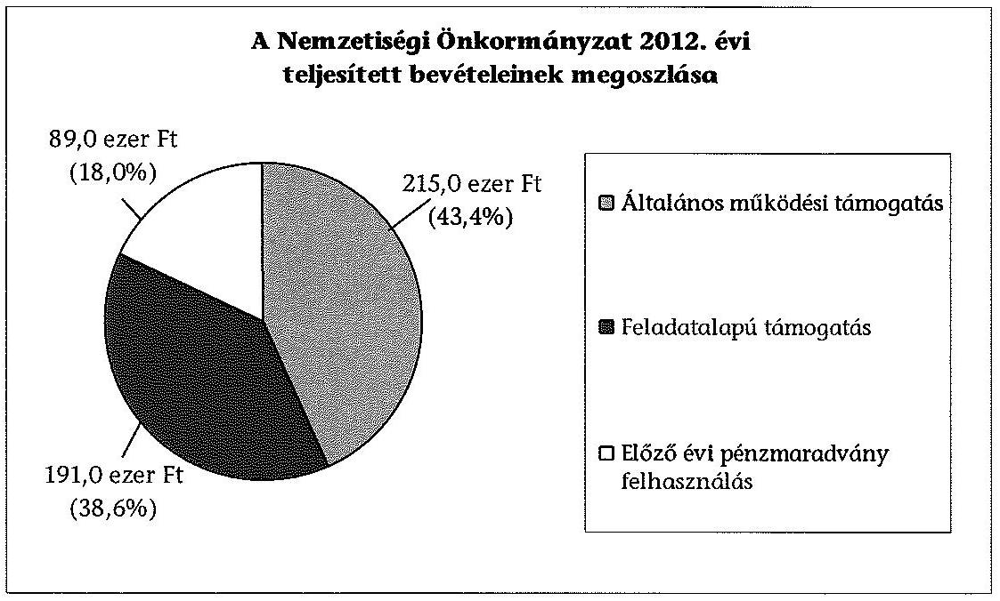
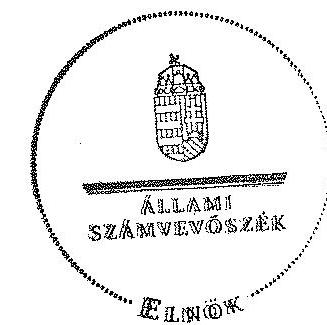

# ÁLLAMI   SZÁMVEVŐSZÉK 

## JELENTÉS

a helyi nemzetiségi önkormányzatok gazdálkodásának ellenőrzéséről
Cikói Német Nemzetiségi Önkormányzat

---

# Állami Számvevőszék 

Iktatószám: V-0217-043/2014.
Témaszám: 1252
Vizsgálat-azonosító szám: V065224

## Az ellenőrzést felügyelte:

Horváth Balázs
felügyeleti vezető
Az ellenőrzést vezette és az ellenőrzés végrehajtásáért felelős:
Pats Regina
ellenőrzésvezető
A számvevőszéki jelentést készítették és a jelentés összeállításában közreműködtek:

Dr. Fátrainé Zsebedics Katalin
számvevő tanácsos
Csényi István
számvevő tanácsos
Az ellenőrzést végezték:
Hadnagyné Papp Ildikó
Ungár Ervin
számvevő
számvevő

---

# TARTALOMJEGYZÉK 

BEVEZETÉS ..... 3
I. ÖSSZEGZŐ MEGÁLLAPÍTÁSOK, KÖVETKEZTETÉSEK, JAVASLATOK ..... 6
II. RÉSZLETES MEGÁLLAPÍTÁSOK ..... 14

1. A Nemzetiségi Önkormányzat és a Települési Önkormányzat együttműködésének szabályozása, a működési feltételek biztosítása ..... 14
2. A gazdálkodási feladatok ellátásának szabályszerűsége ..... 15
2.1. A költségvetésre és zárszámadásra, valamint a kincstári adatszolgáltatás rendjére vonatkozó jogszabályi előírások betartása ..... 15
2.2. A Nemzetiségi Önkormányzat gazdálkodásának szabályozottsága ..... 16
2.3. Az operatív gazdálkodási jogkörök kialakítása, gyakorlása ..... 16
3. A Nemzetiségi Önkormányzattal kapcsolatos gazdálkodási feladatok belső ellenőrzése ..... 18
4. A feladatalapú támogatás felhasználásának, elszámolásának szabályszerűsége, a Nemzetiségi Önkormányzat feladatellátása ..... 19
MELLÉKLET
5. számú A Nemzetiségi Önkormányzat 2012. évi gazdálkodásának főbb adatai, mutatói
FÜGGELÉKEK
6. számú Rövidítések jegyzéke
7. számú Értelmező szótár
8. számú A gazdálkodás értékelésének módszere

---

.

---

# JELENTÉS   a helyi nemzetiségi önkormányzatok gazdálkodásának ellenőrzéséről Cikói Német Nemzetiségi Önkormányzat 

## BEVEZETÉS

A Nemzetiségi Önkormányzat 1990. évben alakult, elnöke a 2010. évi helyhatósági választások óta látja el feladatát. A Nemzetiségi Önkormányzat intézményt, gazdasági társaságot és más szervezetet nem alapított, illetve társulásban nem vett részt. A négytagú Képviselő-testület a munkája segítésére bizottságot nem hozott létre. A Nemzetiségi Önkormányzat költségvetési beszámolója szerint a 2012. évben a módosított költségvetési bevételi és kiadási előirányzata 804,0 ezer Ft, a teljesített költségvetési bevétel 498,0 ezer Ft, a teljesített költségvetési kiadás 328,0 ezer Ft volt. A 2012. évi gazdálkodási adatokat részletesen az 1. számú mellékletben mutatjuk be.

Az Alaptörvény XXIX. cikk (1) bekezdése szerint a Magyarországon élő nemzetiségek államalkotó tényezők. Minden, valamely nemzetiséghez tartozó magyar állampolgárnak joga van önazonossága szabad vállalásához és megőrzéséhez. A hazánkban élő nemzetiségek helyi (települési és területi) valamint országos önkormányzatokat hozhatnak létre. A helyi nemzetiségi önkormányzatok gazdálkodási feladatait jogszabályi előírás alapján a székhely szerinti helyi önkormányzat polgármesteri hivatala látja el.

A nemzetiségek helyzete, támogatása mind hazai, mind EU-s szinten kiemelt figyelmet kap napjainkban. A helyi nemzetiségi önkormányzatok gazdálkodására és támogatási rendszerére vonatkozó jogszabályok a 2010-2012. években jelentős változásokon mentek át. A települési és területi nemzetiségi önkormányzatok gazdálkodásának, a részükre juttatott költségvetési támogatások felhasználásának ellenőrzését az ÁSZ 2012-ben sorozatjellegű ellenőrzés keretében indította el. A 2013. évi ellenőrzések e témacsoportos ellenőrzések folytatását jelentik.

Az ellenőrzés célja annak értékelése volt, hogy a nemzetiségi önkormányzat gazdálkodási kereteinek kialakítása, gazdálkodása és feladatellátása megfelelt-e a jogszabályoknak.

Ennek keretében értékeltük, hogy:

- a nemzetiségi önkormányzat és a települési önkormányzat együttműködésének szabályozása, a működési feltételek biztosítása megfelelt-e a jogszabályi előírásoknak;
- a felek együttműködése megfelelt-e a közöttük létrejött megállapodásnak a gazdálkodási feladatok szabályszerű ellátása során, ennek keretében betar-

---

tották-e a helyi nemzetiségi önkormányzat gazdálkodásához kapcsolódóan a költségvetésre és zárszámadásra, a gazdálkodás szabályozására, az operatív gazdálkodási jogkörök gyakorlására vonatkozó jogszabályi előírásokat;

- a jegyző biztosította-e a nemzetiségi önkormányzat gazdálkodásának belső ellenőrzését;
- a nemzetiségi önkormányzat feladatalapú támogatásának felhasználása, a folyósított feladatalapú támogatással történő elszámolás az előírásoknak megfelelő volt-e;
- a nemzetiségi önkormányzat feladatellátása összhangban volt-e a vonatkozó jogszabályi előírásokkal.

Az ellenőrzés várható hasznosulását négy szinten tervezzük. A törvényalkotás számára összegzett tapasztalatok állnak rendelkezésre a nemzetiségi önkormányzatok testületi döntéseinek, gazdálkodásának és a feladatalapú támogatás felhasználásának szabályszerűségéről, amelynek alapján következtetést lehet levonni arra, hogy indokolt-e esetleges jogszabályi módosítás kezdeményezése. Az ellenőrzés az ellenőrzött számára visszajelzést ad a működésében fellépő hiányosságokról, javaslataival hozzájárul azok kiküszöböléséhez, amely csökkentheti a későbbi ellenőrzések gyakoriságát. Az ellenőrzés megállapításai és javaslatai tanulságul szolgálhatnak más nemzetiségi önkormányzatok, szervezetek számára a rendezett gazdálkodási keretek kialakításához. A társadalom számára jelzi, hogy közpénz nem maradhat ellenőrizetlenül, az ÁSZ értékteremtő rend kialakításához és megőrzéséhez hozzájáruló tevékenysége pozitív hatással lesz a szervezetről kialakított összkép formálásában. Az ÁSZ szervezetén belül lehetőség nyílik arra, hogy a megállapítások szintetizálásával az intézmény a hozzáadott értéket teremtő elemző tevékenységét és tanácsadó szerepét erősítse.

A helyi nemzetiségi önkormányzatok gazdálkodásának ellenőrzéséről szóló jelentés I. fejezetének összegző része az ellenőrzés céljára adott rövid, szintetizáló összefoglalót és következtetéseket tartalmazza a II. fejezet részletes megállapításain alapulóan. A jelentés intézkedést igénylő megállapításait és javaslatait az összegzőben foglaltak mellett - az ellenőrzés során feltárt, a jelentés II. fejezetében rögzített részletes megállapítások alapozzák meg, illetve támasztják alá.

Az ellenőrzés típusa: szabályszerűségi ellenőrzés.
Az ellenőrzött időszak: 2012. január 1. - 2012. december 31. közötti időszak. Az ellenőrzés kiterjedt a helyi nemzetiségi önkormányzatoknak juttatott 2012. évi feladatalapú támogatás 2013. évben való elszámolására is.

Ellenőrzött szervezet: Cikói Német Nemzetiségi Önkormányzat és a gazdálkodási feladatait ellátó Cikó Község Önkormányzata.

Az ellenőrzés végrehajtásának jogszabályi alapját az Állami Számvevőszékről szóló 2011. évi LXVI. törvény 1. § (3) bekezdése, az 5. § (2) és (6) bekezdései, valamint az Államháztartásról szóló 2011. évi CXCV. törvény 61. §. (2) bekezdésének előírásai képezik.

---

Az ellenőrzés szakmai módszertana az ÁSZ hivatalos honlapján (www.asz.hu) közzétett szakmai szabályokon alapult, amely a Legfőbb Ellenőrző Intézmények Nemzetközi Szervezete (INTOSAI) által kiadott nemzetközi standardok (ISSAI) figyelembevételével készült.

A helyi nemzetiségi önkormányzatok gazdálkodásának ellenőrzése során értékeltük a települési önkormányzat és a nemzetiségi önkormányzat együttműködésének, a gazdálkodás szabályozottságának és a pénzügyi folyamatokban kulcsszerepet betöltő belső kontrollok (teljesítésigazolás és érvényesítés) működésének megfelelőségét. A kulcskontrollokat a dologi kiadásokkal kapcsolatos kifizetéseknél véletlen mintavételi eljárást alkalmazva ellenőriztük. Ellenőriztük, hogy a jegyző biztosította-e a nemzetiségi önkormányzat gazdálkodásának belső ellenőrzését. Értékeltük a feladatalapú támogatások felhasználásának, elszámolásának szabályszerűségét, a nemzetiségi önkormányzat feladatellátása és a jogszabályi előírások összhangját.

Az ellenőrzés lefolytatásához a Nemzetiségi Önkormányzat és a gazdálkodási feladatait ellátó Települési Önkormányzat tanúsítványok és a kapcsolódó, dokumentumjegyzékben megjelölt dokumentumok elektronikus úton történő megküldésével, rendelkezésre bocsátásával szolgáltatott adatokat. Az adatszolgáltatás kontrollálása és szükség szerinti javítása a helyszíni ellenőrzés keretében történt. A gazdálkodás értékelésének módszerét a 3. számú függelék tartalmazza.

Az ÁSZ tv. 29. § (1) bekezdése szerint a jelentéstervezetet megküldtük a polgármester és a Nemzetiségi Önkormányzat elnöke részére, akik az ÁSZ tv. 29. § (2) bekezdésében foglalt észrevételezési jogukkal nem éltek, a jelentéstervezetre észrevételt nem tettek.

---

# I. ÖSSZEGZŐ MEGÁLLAPÍTÁSOK, KÖVETKEZTETÉSEK, JAVASLATOK 

A Nemzetiségi Önkormányzat és a Települési Önkormányzat együttműködésének szabályozása részben felelt meg a jogszabályi előírásoknak. A Nemzetiségi Önkormányzat a 2012. évben nem rendelkezett a teljes évre nézve a Települési Önkormányzattal kötött együttműködési megállapodással. A 2012. május 31-én aláírt megállapodást a Nemzetiségi Önkormányzat Képviselő-testülete az előírt határidőt követően, 2012. szeptember 13-án fogadta el. A Nemzetiségi Önkormányzat és a Települési Önkormányzat által kötött együttműködési megállapodásban a Nek. ${ }_{2}$ tv-ben előírtaknak megfelelően szabályozták a Nemzetiségi Önkormányzat működésének személyi és tárgyi feltételeit, azonban a megállapodás szerinti működési feltételeket a megállapodás megkötését követő harminc napon belül a Nek. ${ }_{2}$ tv-ben foglaltak alapján a Nemzetiségi Önkormányzat SZMSZ-ében nem rögzítették. Az együttműködési megállapodás az Áht. ${ }_{2}$ ben foglalt ellenőrzési feladatokra nem tért ki, nem tartalmazta a Nek. ${ }_{2}$ tv. előírásainak megfelelően a Nemzetiség Önkormányzat részére önálló fizetési számla nyitását, a törzskönyvi nyilvántartásba vételét és az adószám igénylésével kapcsolatos határidőket, az együttműködési kötelezettséget és ezek felelőseinek konkrét kijelölését. Nem tartalmazta továbbá a Nemzetiségi Önkormányzat kötelezettségvállalásának SZMSZ-ében meghatározott szabályait, különösen az összeférhetetlenségi és nyilvántartási szabályokat, kötelezettségeket, valamint hogy a jegyző, vagy annak - a jegyzővel azonos képesítési előírásoknak megfelelő - megbízottja a Települési Önkormányzat megbízásából és képviseletében részt vesz a Nemzetiségi Önkormányzat testületi ülésein és jelzi, amennyiben törvénysértést észlel. A Nemzetiségi Önkormányzat működésének személyi és tárgyi feltételeit - a szabályozási hiányosságok ellenére - a Települési Önkormányzat a 2012. évben biztosította.

A Nemzetiségi Önkormányzat a költségvetésre és zárszámadásra, valamint a kincstári adatszolgáltatás rendjére vonatkozó jogszabályi előírásoknak megfelelt. A Nemzetiségi Önkormányzat a költségvetési és zárszámadási határozatát a jogszabályban előírt eljárásrend szerint, határidőben fogadta el. A költségvetési és zárszámadási határozatok egymással összehasonlítható szerkezetben készültek, a zárszámadási határozatban a Nemzetiségi Önkormányzat valamennyi bevételéről és kiadásáról elszámoltak. A 2012. évi költségvetés és zárszámadás előterjesztésekor a Képviselő-testület részére - tájékoztatás céljából - bemutatták az Áht. ${ }_{2}$-ben előírt mérlegeket és kimutatásokat. A költségvetési határozatban az Áht. ${ }_{2}$-ben előírtak ellenére az évközi többletigények, valamint az elmaradt bevételek pótlására szolgáló tartalék összegét nem különítették el általános és céltartalékra, valamint a határozat nem tartalmazta az Áht. ${ }_{2}$-ben foglalt finanszírozási bevételekkel és kiadásokkal kapcsolatos hatásköröket. A kincstári adatszolgáltatási kötelezettséget a jegyző a 2012. évben két alkalommal késedelmesen teljesítette.

A Nemzetiségi Önkormányzat gazdálkodásának szabályozottsága az ellenőrzött időszakban nem felelt meg a jogszabályi előírásoknak. A Polgármesteri Hivatal Számv. tv. és Áhsz. által előírt szabályzatainak - számviteli politika

---

és az ahhoz kapcsolódó, a gazdálkodásra vonatkozó szabályzatok - hatálya nem terjedt ki a Nemzetiségi Önkormányzat gazdálkodási feladataira, a Nemzetiségi Önkormányzat a szabályzatokkal önállóan sem rendelkezett. A Polgármesteri Hivatal az Áht. ${ }_{2}$-ben előírt SZMSZ-szel nem rendelkezett, így a Nemzetiségi Önkormányzat gazdálkodásával összefüggő feladatok Ávr. szerinti szabályozása nem valósult meg. Az Áht. ${ }_{2}$-ben és az Ávr-ben foglaltak szerinti, a tervezéssel, gazdálkodással, így különösen a kötelezettségvállalás, pénzügyi ellenjegyzés, teljesítésigazolás, az érvényesítés, az utalványozás gyakorlásának módjával, eljárási és dokumentációs részletszabályaival kapcsolatos belső előírásokat - az Áht. ${ }_{2}$-ben foglalt ellenőrzési feladatok teljesítésével kapcsolatos belső előírások kivételével - a 2012. szeptember 13-ától hatályos együttműködési megállapodás és a Polgármesteri Hivatal gazdálkodási szabályzata tartalmazta.

A Nemzetiségi Önkormányzat gazdálkodása tekintetében az operatív gazdálkodási jogkörök kialakítása nem felelt meg a jogszabályi előírásoknak. A jegyző az Ávr-ben foglaltak ellenére nem jelölt ki írásban a Polgármesteri Hivatal állományába tartozó, előírt végzettséggel rendelkező köztisztviselőt a pénzügyi ellenjegyzésre és az érvényesítői feladatokra. A 2013. január 1-jétől hatályos szabályozásban a kijelölések megtörténtek. A Nemzetiségi Önkormányzat elnöke, mint kötelezettségvállaló az Ávr-ben foglaltak alapján más képviselőt nem hatalmazott fel írásban a kötelezettségvállalás és az utalványozás gyakorlására, valamint nem jelölt ki teljesítést igazoló személyeket, emiatt az Ávr-ben foglalt összeférhetetlenségi követelmények érvényesülésének feltételeit nem biztosította. 2013. január 1-jétől az írásos felhatalmazás a kötelezettségvállalást és az utalványozást érintően megtörtént. Az ellenőrzött gazdasági események közül egy pénztári kifizetésnél a számvevőszéki ellenőrzés összeférhetetlenséget tárt fel, mert a teljesítésigazoló, az utalványozó és az összeg felvevője egyaránt a Nemzetiségi Önkormányzat elnöke volt.

A Nemzetiségi Önkormányzat gazdálkodása tekintetében a 2012. évben a dologi kiadások területén a kulcsszerepet betöltő kontrollok működése gyenge volt, a hibák száma a lényegességi szintet, a kritikus hibahatárt elérte. A teljesítés igazolására jogosult személy az Ávr-ben foglalt ellenőrzési feladatának egy esetben nem tett
 eleget, mert annak ellenére igazolta a kiadás teljesítésének jogosságát, hogy nem állt rendelkezésre a teljesítés tényét igazoló dokumentum. Az érvényesítő kijelölésére az Ávr-ben foglaltak ellenére nem került sor, az érvényesítés nem történt meg, így a kiadások teljesítését megelőzően az összegszerűség, a fedezet meglétének, a formai és a főkönyvi számla kijelölési szabályainak, valamint az egyéb jogszabályban és belső szabályozásban foglalt előírásoknak a betartását nem ellenőrizték. A kulcskontrollok megfelelő működéséhez szükséges dokumentációs és részletszabályokat az Ávr-ben foglaltak ellenére nem határozták meg és kötelezettségvállalásra vonatkozó nyilvántartást nem vezettek. Az államháztartáson kívülre teljesített működési célú pénzeszközátadások területén a kulcsszerepet betöltő kontrollok működése gyenge volt. A teljesítést igazoló az Ávr-ben foglalt ellenőrzési feladatának nem tett eleget, mert annak ellenére igazolta a kiadások teljesítésének jogosságát, összegszerűségét, hogy a pénzeszközátadások vonatkozásában hozott képviselő-testületi döntéseket követően az Ávr-ben foglaltak ellenére a költségvetési támogatás biztosításának módjáról a kedvezményezettekkel támogatási szerződést nem kötöttek. Az érvényesítés kulcskontroll működése nem volt megfelel-

---

lő a dologi kiadásoknál is jelzett hiányosságok miatt. A számvevőszéki ellenőrzés a dologi kiadásoknál és az államháztartáson kívülre teljesített működési célú pénzeszközátadásoknál tárt fel jogosulatlan kifizetéseket, mert nem állt rendelkezésre a kifizetések alapját képező dokumentum.

A jegyző nem biztosította a Nemzetiségi Önkormányzat gazdálkodásával összefüggő végrehajtási feladatok belső ellenőrzését. A Polgármesteri Hivatal 2012. évi belső ellenőrzési tervét megalapozó kockázatelemzés - a Ber-ben foglaltak ellenére - nem terjedt ki a Nemzetiségi Önkormányzat gazdálkodásával összefüggő végrehajtási feladatokra, és azok tekintetében belső ellenőrzési feladatot a 2012. évben nem terveztek és nem végeztek.

A Nemzetiségi Önkormányzat a 2012. évben 191,0 ezer Ft összegű, a bevételei 38,4%-át kitevő feladatalapú támogatásban részesült. A 2011. évi 1025,2 ezer Ft feladatalapú támogatást a tárgyévben felhasználták. A 2012. évi feladatalapú támogatás felhasználásáról a Képviselő-testület támogatási döntéseket hozott. A jegyző a Nek. ${ }_{2}$ tv-ben foglaltak ellenére nem gondoskodott az Ávr-ben előírt szerződés kedvezményezettekkel történő megkötéséről és az Áht. ${ }_{2}$-vel ellentétesen a támogatás felhasználásával kapcsolatban beszámolási kötelezettséget nem írtak elő. A Nemzetiségi Önkormányzat a kedvezményezetteket a támogatás felhasználásáról nem számoltatta el, ezért a támogatások felhasználásának jogszerűsége nem állapítható meg. A 2011. évi feladatalapú támogatás elszámolása a támogatási kormányrendelet ${ }_{1}$, valamint a 2012. évi feladatalapú támogatás elszámolása a támogatási kormányrendelet ${ }_{2}$ előírása ellenére nem történt meg. A támogatások felhasználását, elszámolását az ellenőrzésre jogosult külső szervek nem ellenőrizték. A Nemzetiségi Önkormányzat kötelező és önként vállalt feladatellátásának tárgya összhangban volt a Nek. ${ }_{2}$ tv-ben foglalt előírásokkal.

Az ÁSZ tv. 33. § (1) bekezdésében foglaltak értelmében az ellenőrzött szervezet vezetője köteles a jelentésben foglalt megállapításokhoz kapcsolódó intézkedési tervet összeállítani, és azt a jelentés kézhezvételétől számított 30 napon belül az ÁSZ részére megküldeni. Amennyiben az intézkedési tervet határidőre nem küldi meg a szervezet, vagy az nem elfogadható, az ÁSZ elnöke az ÁSZ tv. 33. § (3) bekezdés a)-b) pontjaiban foglaltakat érvényesítheti.

A helyszíni ellenőrzés megállapításainak hasznosítása mellett javasoljuk:

# a jegyzőnek 

1. az együttműködés szabályozásával kapcsolatban

A Nemzetiségi Önkormányzat és a Települési Önkormányzat együttműködését meghatározó - 2012. szeptember 13-ától hatályos - együttműködési megállapodás nem tartalmazta a Nek. ${ }_{2}$ tv. 80. § (3) bekezdés a) és c) pontja szerinti, a költségvetéssel összefüggő adatszolgáltatási kötelezettségek teljesítésével, a helyi nemzetiségi önkormányzat önálló fizetési számla nyitásával, törzskönyvi nyilvántartásba vételével és adószám igénylésével kapcsolatos határidőket és együttműködési kötelezettséget, valamint ezek felelőseinek kijelölését, továbbá a Nemzetiségi Önkormányzat kötelezettségvállalásainak SZMSZ-ben meghatározott szabályait, különösen az összeférhe-

---

tetlenségi, nyilvántartási kötelezettségeket. Az együttműködési megállapodás nem tartalmazta a Nek. 2 tv. 80. § (4) bekezdésében foglaltak ellenére, hogy a jegyző, vagy annak - a jegyzővel azonos képesítési előírásoknak megfelelő - megbízottja a Települési Önkormányzat megbízásából és képviseletében részt vesz a Nemzetiségi Önkormányzat testületi ülésein és jelzi amennyiben törvénysértést észlel. Az Áht. 2 27. § (2) bekezdésében foglaltak ellenére nem rendelkeztek a Nemzetiségi Önkormányzat bevételeivel és kiadásaival kapcsolatos ellenőrzési feladatok végrehajtásának rendjéről.

Az együttműködési megállapodásában foglalt működési feltételeket a megállapodás megkötését követő harminc napon belül a Nek. 2 tv. 80. § (2) bekezdésében foglaltak ellenére a Nemzetiségi Önkormányzat SZMSZ-ében nem rögzítették.

Javaslat
Az együttműködés szabályozása érdekében készítse elő:
a) az együttműködési megállapodás módosítását, hogy az tartalmilag feleljen meg az Áht. 2 27. § (2) bekezdésében, továbbá a Nek. 2 tv. 80. § (3) bekezdés a) és c) pontjaiban és a Nek. 2 tv. 80. § (4) bekezdésben foglalt előírásoknak;
b) a Nemzetiségi Önkormányzat SZMSZ-ének módosítását, hogy megfeleljen a Nek 2 tv. 80. § (2) bekezdésében foglalt előírásnak.
2. a költségvetés szabályszerűségével kapcsolatban

A költségvetési határozatban az Áht. 2 23. § (3) bekezdésében foglaltak ellenére az évközi többletigények, valamint az elmaradt bevételek pótlására szolgáló tartalék összegét nem különítették el általános és céltartalékra, valamint a költségvetési határozat nem tartalmazta az Áht. 2 23. § (2) bekezdés h) pontjában foglalt finanszírozási bevételekkel és kiadásokkal kapcsolatos hatásköröket.

Javaslat
A költségvetés szabályszerűsége érdekében a jövőben:
a) gondoskodjon az Áht. 2 23. § (3) bekezdésében foglalt előírás alapján arról, hogy a költségvetési határozatban a tartalék összegét különítsék el általános és céltartalékra;
b) gondoskodjon arról, hogy az Áht. 2 23. § (2) bekezdése h) pontja alapján a finanszírozási bevételekkel és kiadásokkal kapcsolatos hatáskörök a költségvetési határozatban rögzítésre kerüljenek.
3. a kincstári adatszolgáltatási kötelezettség teljesítésével kapcsolatban

A jegyző a Nemzetiségi Önkormányzat I. és III. negyedéves időközi költségvetési jelentéssel kapcsolatos adatszolgáltatási kötelezettségének az Ávr. 169. § (2) bekezdésében előírt határidőn túl tett eleget.

---

Javaslat
A jövőben az adatszolgáltatási kötelezettségeinek az Ávr. 169. § (2) bekezdésében előírt határidő betartásával tegyen eleget.
4. a gazdálkodási feladatok szabályozottságával kapcsolatban

A Polgármesteri Hivatal az Áht. 2 10. § (5) bekezdésében előírt SZMSZ-szel nem rendelkezett, ebből fakadóan a Nemzetiségi Önkormányzat gazdálkodásával összefüggő feladatok Ávr. 13. § (1) bekezdés g) pontjában foglalt előírás szerinti szabályozása nem valósult meg.

A Polgármesteri Hivatal 2012. évi Számv. tv. 14. § (3)-(4) bekezdésében előírtak szerinti számviteli politikájának, illetve ennek keretében a Számv. tv. 14. § (5) bekezdés a)-b) és d) pontjaiban előírt eszközök és források leltározási és leltárkészítési, értékelési valamint pénzkezelési szabályzatainak, valamint a Számv. tv. 161. § (1) bekezdése szerinti számlarendjének, továbbá a Bkr. 6. § (3)-(4), és 8. § (2)-(4) bekezdéseiben előírt ellenőrzési nyomvonal, szabálytalanságkezelési eljárásrend, a folyamatba épített előzetes, utólagos és vezetői ellenőrzés szabályozásának hatálya nem terjedt ki a Nemzetiségi Önkormányzat gazdálkodási feladataira.

Javaslat
A szabályszerű gazdálkodás biztosítása érdekében:
a) készítse el az Áht. 2 10. § (5) bekezdése előírásának eleget téve a Polgármesteri Hivatal SZMSZ-ét és abban a Nemzetiségi Önkormányzat gazdálkodásával kapcsolatos feladatokat az Ávr. 13. § (1) bekezdés g) pontjában foglalt előírás szerint szabályozza;
b) gondoskodjon arról, hogy a Polgármesteri Hivatal - Számv. tv. 14. § (3)-(4) bekezdéseiben, ennek keretében a Számv. tv. 14. § (5) bekezdés a)-b) és d) pontjaiban, továbbá a Számv. tv. 161. § (1) bekezdésében előírt - számviteli szabályzatainak, valamint a Bkr. 6. § (3)-(4) és a Bkr. 8. § (2)-(4) bekezdéseiben meghatározott szabályzatainak hatálya a Nemzetiségi Önkormányzat gazdálkodási feladataira kiterjedjen.
5. a pénzügyi kulcskontrollok működésével kapcsolatban

Az érvényesítés az ellenőrzött gazdasági eseményeknél az Ávr. 58. § (1) és (3) bekezdésében foglaltak ellenére nem történt meg, a kiadások teljesítését megelőzően az összegszerűséget, a fedezet meglétét, a formai és a főkönyvi számla kijelölési szabályainak, valamint az egyéb jogszabályban és belső szabályozásban foglalt előírásoknak a betartását nem ellenőrizték.

Az Ávr. 13. § (2) bekezdésének a) pontjában meghatározott dokumentációs és részletszabályokat tartalmazó szabályzatot a 2012. évben bekövetkezett jogszabályi változásokkal összhangban nem aktualizálták és a kötelezettségvállalásra vonatkozó nyilvántartást az Ávr. 56. § (1) bekezdésében foglaltak ellenére nem vezették.

---

Az ellenőrzött működési és felhalmozási célú támogatásértékű kiadások és államháztartáson kívülre átadott pénzeszközök területén a teljesítésigazoló az Ávr. 57. § (1) bekezdésében foglalt ellenőrzési feladatának nem tett eleget, mert annak ellenére igazolta a kiadások teljesítésének jogosságát, összegszerűségét, hogy nem állt rendelkezésre a kapcsolódó testületi ülések jegyzőkönyveiben hivatkozott támogatási kérelem és támogatási szerződés.

Javaslat
Az operatív gazdálkodás működési hibáinak megelőzése, feltárása és kijavítása érdekében:
a) gondoskodjon az Ávr. 13. § (2) bekezdésének a) pontjában meghatározott dokumentációs és részletszabályokat tartalmazó szabályzat aktualizálásáról a bekövetkezett jogszabályi változásokkal összhangban és a kötelezettségvállalásra vonatkozó nyilvántartás vezetéséről az Ávr. 56. § (1) bekezdésében foglaltak alapján;
b) gondoskodjon az Ávr. 58. § (1) és (3) bekezdésében előírt érvényesítési feladatok ellátásáról, és az előírt ellenőrzési feladatok szabályszerű ellátásáról;
c) gondoskodjon arról, hogy a teljesítés igazoló az Ávr. 57. § (1) bekezdésében foglalt ellenőrzési feladatinak tegyen eleget.
6. a feladatalapú támogatás elszámolásával kapcsolatban

A 2011. évi feladatalapú támogatás elszámolása a támogatási kormányrendelet ${ }_{1}$ 7. § (2) bekezdésében hivatkozott, valamint a 2012. évi feladatalapú támogatás elszámolása a támogatási kormányrendelet ${ }_{2}$ 8. § (5) bekezdésében hivatkozott „a helyi önkormányzatok elszámolási és ellenőrzési rendjére vonatkozó jogszabályok rendelkezései alkalmazandóak" előírása ellenére nem történt meg.

A 2012. évi feladatalapú támogatás felhasználása során a támogatott szervezetekkel az Ávr. 70. § (1) bekezdése előírása ellenére a költségvetési támogatás biztosításának módjáról támogatási szerződést nem kötöttek, az Áht. ${ }_{2}$ 53. § (1) bekezdésével ellentétesen a támogatás felhasználásával kapcsolatban beszámolási kötelezettséget nem írtak elő.

Javaslat
Gondoskodjon a feladatalapú támogatás szabályszerű felhasználása, elszámolása érdekében:
a) az Áht. 2 27. § (2) bekezdésében meghatározott feladatkörében a Nemzetiségi Önkormányzat által igénybe vett feladatalapú támogatás elszámolásának elkészítéséről, figyelemmel az Áht. 2 57. § (4) bekezdésében foglaltakra;
b) a feladatalapú támogatás felhasználása során támogatott szervezetekkel az Ávr. 70. § (1) bekezdése szerinti támogatási szerződés elkészítéséről, az Áht. ${ }_{2}$ 53. § (1) bekezdésében előírtak szerint a nyújtott támogatások elszámoltatásáról.

---

# a polgármesternek 

A Nemzetiségi Önkormányzat és a Települési Önkormányzat együttműködését meghatározó - 2012. szeptember 13-ától hatályos - együttműködési megállapodás nem tartalmazta a Nek. 2 tv. 80. § (3) bekezdés a) és c) pontja szerinti, a költségvetéssel összefüggő adatszolgáltatási kötelezettségek teljesítésével, a helyi nemzetiségi önkormányzat önálló fizetési számla nyitásával, törzskönyvi nyilvántartásba vételével és adószám igénylésével kapcsolatos határidőket és együttműködési kötelezettséget, valamint ezek felelőseinek kijelölését, továbbá a Nemzetiségi Önkormányzat kötelezettségvállalásainak SZMSZ-ben meghatározott szabályait, különösen az összeférhetetlenségi, nyilvántartási kötelezettségeket. Az együttműködési megállapodás nem tartalmazta a Nek. 2 tv. 80. § (4) bekezdésében foglaltak ellenére, hogy a jegyző, vagy annak - a jegyzővel azonos képesítési előírásoknak megfelelő - megbízottja a Települési Önkormányzat megbízásából és képviseletében részt vesz a Nemzetiségi Önkormányzat testületi ülésein és jelzi amennyiben törvénysértést észlel. Az Áht. 2 27. § (2) bekezdésében foglaltak ellenére nem rendelkeztek a Nemzetiségi Önkormányzat bevételeivel és kiadásaival kapcsolatos ellenőrzési feladatok végrehajtásának rendjéről.

A Polgármesteri Hivatal
 Áht. 2. 10. § (5) bekezdésében előírt SZMSZ-szel nem rendelkezett, ebből fakadóan a Nemzetiségi Önkormányzat gazdálkodásával összefüggő feladatok Ávr. 13. § (1) bekezdés g) pontjában foglalt előírás szerinti szabályozása nem valósult meg.

Javaslat
Terjessze a Települési Önkormányzat Képviselő-testülete elé jóváhagyásra:
a) a jegyző által az Áht. 2. 27. § (2) bekezdésben, továbbá a Nek. 2. tv. 80. § (3) bekezdés a) és c) pontjaiban és a Nek. 2. tv. 80. § (4) bekezdésében foglalt előírás betartásával előkészített együttműködési megállapodás módosítást;
b) az Áht. 2. 10. § (5) bekezdése előírásának eleget téve a Polgármesteri Hivatal SZMSZ-ét és abban a Nemzetiségi Önkormányzat gazdálkodásával kapcsolatos feladatokat, az Ávr. 13. § (1) bekezdés g) pontjában foglalt előírás szerint.

## a Nemzetiségi Önkormányzat elnökének

1. A Nemzetiségi Önkormányzat és a Települési Önkormányzat együttműködését meghatározó - 2012. szeptember 13-ától hatályos - együttműködési megállapodás nem tartalmazta a Nek. 2. tv. 80. § (3) bekezdés a) és c) pontja szerinti, a költségvetéssel összefüggő adatszolgáltatási kötelezettségek teljesítésével, a helyi nemzetiségi önkormányzat önálló fizetési számla nyitásával, törzskönyvi nyilvántartásba vételével és adószám igénylésével kapcsolatos határidőket és együttműködési kötelezettséget, valamint ezek felelőseinek kijelölését, továbbá a Nemzetiségi Önkormányzat kötelezettségvállalásainak SZMSZ-ben meghatározott szabályait, különösen az összeférhetetlenségi, nyilvántartási kötelezettségeket. Az együttműködési megállapodás nem tartalmazta a Nek. 2. tv. 80. § (4) bekezdésében foglaltak ellenére, hogy a jegyző, vagy annak - a jegyzővel azonos képesítési előírásoknak megfelelő - megbízottja a Települési Önkormányzat megbízásából és képviseletében részt vesz a Nemzetiségi Önkormányzat testületi ülésein és jelzi amennyiben törvénysértést észlel. Az Áht. 2

---

27. § (2) bekezdésében foglaltak ellenére nem rendelkeztek a Nemzetiségi Önkormányzat bevételeivel és kiadásaival kapcsolatos ellenőrzési feladatok végrehajtásának rendjéről.

A Nek. 2 tv. 80. § (2) bekezdésében foglaltak ellenére a megállapodás megkötését követő harminc napon belül a Nemzetiségi Önkormányzat SZMSZ-ében nem rögzítették a megállapodás szerinti működési feltételeket.

Javaslat
Terjessze a Képviselő-testület elé jóváhagyásra:
a) a jegyző által az Áht. 2 27. § (2) bekezdésben, továbbá a Nek. 2 tv. 80. § (3) bekezdés a) és c) pontjaiban és a Nek. 2 tv. 80. § (4) bekezdésében foglalt előírás betartásával előkészített együttműködési megállapodás módosítást;
b) a Nemzetiségi Önkormányzat SZMSZ-ének a Nek. 2 tv. 80. § (2) bekezdése előírásainak betartásával előkészített módosítását.
2. A Nemzetiségi Önkormányzat elnöke, mint kötelezettségvállaló a 2012. évben az Ávr. 57. § (4) bekezdésében foglaltak ellenére nem jelölte ki a teljesítés igazolására jogosult személyeket.

Javaslat
Jelölje ki az Ávr. 57. § (4) bekezdésében foglalt előírásnak megfelelően a teljesítés igazolására jogosult személyeket.
3. A 2011. évi feladatalapú támogatás elszámolása a támogatási kormányrendelet 7. § (2) bekezdésében hivatkozott, valamint a 2012. évi feladatalapú támogatás elszámolása a támogatási kormányrendelet 8. § (5) bekezdésében hivatkozott „a helyi önkormányzatok elszámolási és ellenőrzési rendjére vonatkozó jogszabályok rendelkezései alkalmazandóak" előírása ellenére nem történt meg.

Javaslat
A Nemzetiségi Önkormányzat által igénybe vett feladatalapú támogatásról szóló elszámolást az Áht. 2 57. § (4) bekezdése alapján, a jegyző által elkészített éves költségvetési beszámolóban terjessze a Képviselő-testület elé.
4. A feladatalapú támogatás felhasználása során a képviselő-testületi döntéseket követően az átadott pénzeszközökről az Ávr. 70. § (1) bekezdésében foglaltak ellenére a költségvetési támogatás biztosításának módjáról a kedvezményezettekkel támogatási szerződést nem kötöttek.

Javaslat
A jövőben a feladatalapú támogatás felhasználása során a támogatottakkal az Ávr. 70. § (1) bekezdésének megfelelően kössön támogatási szerződést.

---

# II. RÉSZLETES MEGÁLLAPÍTÁSOK 

## 1. A Nemzetiségi Önkormányzat és a Települési Önkormányzat együttműködésének szabályozása, a működési feltételek biztosítása

A Nemzetiségi Önkormányzat és a Települési Önkormányzat együttműködésének szabályozása részben felelt meg a jogszabályi előírásoknak.

A Nemzetiségi Önkormányzat a 2012. évben nem rendelkezett a teljes évre vonatkozó, a Települési Önkormányzattal kötött együttműködési megállapodással¹. A Nemzetiségi Önkormányzat és a Települési Önkormányzat 2012. május 31-én kötött együttműködési megállapodását a Települési Önkormányzat Képviselő-testülete az előírt határidőben, a Nemzetiségi Önkormányzat Képviselő-testülete azonban az előírt határidőn túl, 2012. szeptember 13-án fogadta el². Ezt megelőzően a Nemzetiségi Önkormányzat és a Települési Önkormányzat között nem volt együttműködési megállapodás.

A Nemzetiségi Önkormányzat és a Települési Önkormányzat az együttműködési megállapodásban szabályozta a Nemzetiségi Önkormányzat működésének személyi és tárgyi feltételeit, a megállapodás szerinti működési feltételeket, melyeket azonban a megállapodás megkötését követő harminc napon belül a Nek. 2 tv. 80. § (2) bekezdésében foglaltak alapján a Nemzetiségi Önkormányzat SZMSZ-ében nem rögzítették. Az együttműködési megállapodás az Áht. 2-ben foglaltak szerint tartalmazta a Nemzetiségi Önkormányzat bevételeivel és kiadásaival kapcsolatban a tervezési, gazdálkodási, finanszírozási, adatszolgáltatási, beszámolási feladatok ellátásának részletes szabályait, az Áht. 2 27. § (2) bekezdésében foglaltakat figyelmen kívül hagyva azonban az ellenőrzési feladatokra nem tért ki.

Az együttműködési megállapodás nem tartalmazta a Nek. 2 tv. 80. § (3) bekezdése előírásai ellenére a Nemzetiség Önkormányzat részére önálló fizetési számla nyitását, a törzskönyvi nyilvántartásba vételét és az adószám igénylésével kapcsolatos határidőket, az együttműködési kötelezettséget és ezek felelőseinek konkrét kijelölését, a Nemzetiségi Önkormányzat kötelezettségvállalásának SZMSZ-ében meghatározott szabályait, különösen az összeférhetetlenségi és nyilvántartási szabályokat, kötelezettségeket. Nem tartalmazta továbbá a Nek. 2 tv. 80. § (4) bekezdésében foglaltakat, amely szerint a jegyző, vagy annak - a jegyzővel azonos képesítési előírásoknak megfelelő - megbízottja a Te-

[^0]
[^0]: ¹ V-0217-031/2013. számú, 2013. szeptember 18-án a Nemzetiségi Önkormányzat elnöke és a jegyző által aláírt nyilatkozat.
² A Nemzetiségi Önkormányzat Képviselő-testülete a megállapodást a 12/2012. (IX. 13.) NNÖ számú határozatával, a Települési Önkormányzat Képviselőtestülete a 98/2012. (V. 31.) számú határozatával fogadta el.

---

lepülési Önkormányzat megbízásából és képviseletében részt vesz a Nemzetiségi Önkormányzat testületi ülésein és jelzi, amennyiben törvénysértést észlel.

A Települési Önkormányzat - a szabályozási hiányosságok ellenére - a Nemzetiségi Önkormányzat működésének személyi és tárgyi feltételeit a 2012. évben biztosította.

# 2. A GAZDÁLKODÁSI FELADATOK ELLÁTÁSÁNAK SZABÁLYSZERŰSÉGE 

### 2.1. A költségvetésre és zárszámadásra, valamint a kincstári adatszolgáltatás rendjére vonatkozó jogszabályi előírások betartása

A Nemzetiségi Önkormányzat a költségvetésre és zárszámadásra, valamint a kincstári adatszolgáltatás rendjére vonatkozó jogszabályi előírásoknak megfelelt. A Nemzetiségi Önkormányzat költségvetési³ és zárszámadási⁴ határozatát a jogszabályban előírt határidőben fogadták el. A költségvetési és a zárszámadási határozat egymással összehasonlítható szerkezetben készült, a zárszámadási határozatban a Nemzetiségi Önkormányzat valamennyi bevételéről és kiadásáról elszámoltak.

A költségvetési határozat a jogszabályi előírásoknak megfelelően tartalmazta a Nemzetiségi Önkormányzat költségvetési bevételeit és költségvetési kiadásait előirányzat-csoportok, kiemelt előirányzatok szerinti bontásban. A 2012. évi költségvetés előterjesztésekor a Képviselő-testület részére - tájékoztatás céljából - bemutatták az előírt költségvetési mérleget és a Nemzetiségi Önkormányzat előirányzat-felhasználási tervét. A költségvetési határozatban az Áht. 2 23. § (3) bekezdésében foglaltak ellenére az évközi többletigények, valamint az elmaradt bevételek pótlására szolgáló tartalék összegét nem különítették el általános és céltartalékra, valamint a határozat nem tartalmazta az Áht. 2 23. § (2) bekezdés h) pontjában foglalt finanszírozási bevételekkel és kiadásokkal kapcsolatos hatásköröket.

A jegyző elkészítette, az elnök az előírt határidőben a Képviselő-testület elé terjesztette a 2012. évi zárszámadási határozat-tervezetet. A zárszámadási határozat-tervezet előterjesztésekor a Képviselő-testület részére tájékoztatás céljából a mérleget bemutatták. A Képviselő-testület a zárszámadásról határozatot hozott.

A jegyző a Nemzetiségi Önkormányzat részére előírt kincstári adatszolgáltatást a 2012. évben két esetben az előírt határidőn túl, néhány napos késéssel teljesítette. Az I. negyedéves időközi költségvetési jelentést 2012. április 25-én, a

[^0]
[^0]: ³ Az Ávr. 169. § (2) bekezdésében előírt határidő a negyedévet követő hónap 20. napja.
⁴ A Cikói Német Nemzetiségi Önkormányzat Képviselő-testületének 8/2013. (IV. 26.) számú határozata a 2012. évi zárszámadás elfogadásáról.

---

III. negyedéves időközi költségvetési jelentést október 22-én küldte meg a Kincstárnak³.

# 2.2. A Nemzetiségi Önkormányzat gazdálkodásának szabályozottsága 

A Nemzetiségi Önkormányzat gazdálkodásának szabályozottsága az ellenőrzött időszakban nem felelt meg a jogszabályi előírásoknak. A Polgármesteri Hivatal a Számv. tv. 14. § (5) bekezdés a) pontjában előírt leltározási és leltárkészítési, 14. § (5) bekezdés b) pontjában előírt eszközök és források értékelési, 14. § (5) bekezdés d) pontjában előírt pénzkezelési, a Számv. tv. 14. § (3) és (4) bekezdésében előírt számviteli politika és a 161. § (1) bekezdése szerinti számlarend szabályozások hatálya nem terjedt ki a Nemzetiségi Önkormányzat gazdálkodási feladataira, és ezekkel a szabályzatokkal a Nemzetiségi Önkormányzat önállóan sem rendelkezett.

A Polgármesteri Hivatal a Bkr. 6. § (3) és (4) bekezdésében előírt ellenőrzési nyomvonala és a szabálytalanságok kezelésének eljárásrendje, valamint a Bkr. 8. § (2) és (4) bekezdései szerinti folyamatba épített előzetes, utólagos és vezetői ellenőrzés szabályozásainak hatálya nem terjedt ki a Nemzetiségi Önkormányzat gazdálkodási feladataira. A Polgármesteri Hivatal az Áht. 2 10. § (5) bekezdésében előírt SZMSZ-szel nem rendelkezett, ebből fakadóan a Nemzetiségi Önkormányzat gazdálkodásával összefüggő feladatok Ávr. 13. § (3a) bekezdése szerinti és az Ávr. 13. § (1) bekezdés g) pontjában foglalt előírás szerinti szabályozása nem valósult meg.

A jogszabályokban foglaltak szerinti, a tervezéssel, gazdálkodással, különösen az operatív gazdálkodási jogkörök gyakorlásának módjával, eljárási és dokumentációs részletszabályaival, valamint az ezeket végző személyek kijelölési rendjével és az ellenőrzési, adatszolgáltatási feladatok teljesítésével kapcsolatos belső előírásokat a 2012. szeptember 13-ától hatályos együttműködési megállapodás és a Polgármesteri Hivatal gazdálkodási szabályzata tartalmazta. Az ellenőrzési feladatok teljesítésével kapcsolatos belső előírásokat az együttműködési megállapodásban az Áht. 2 27. § (2) bekezdésében foglaltak ellenére nem rögzítették.

A Polgármesteri Hivatalban a Nemzetiségi Önkormányzat gazdálkodásával kapcsolatos feladatokat ellátó köztisztviselő munkaköri leírása nem tartalmazta a Nemzetiségi Önkormányzat gazdálkodásával kapcsolatos feladatokat.

### 2.3. Az operatív gazdálkodási jogkörök kialakítása, gyakorlása

A Nemzetiségi Önkormányzat gazdálkodása tekintetében az operatív gazdálkodási jogkörök kialakítása nem felelt meg a jogszabályi előírásoknak.

A gazdasági szervezettel nem rendelkező Polgármesteri Hivatalban a jegyző az Ávr. 55. § (2) bekezdés g) pontjában, illetve az Ávr. 58. § (4) bekezdésében előírtak ellenére nem jelölt ki írásban a Polgármesteri Hivatal állományába tartozó, előírt végzettséggel rendelkező köztisztviselőt a pénzügyi ellenjegyzésre és az érvényesítői feladatokra⁶.

A Nemzetiségi Önkormányzat elnöke más képviselőt nem hatalmazott fel írásban az Ávr. 52. § (7) bekezdésében foglaltak alapján a kötelezettségvállalás, az Ávr. 59. § (1) bekezdésében foglaltak alapján az utalványozás gyakorlására⁷, valamint az Ávr. 57. § (4) bekezdése alapján nem jelölt ki teljesítés igazolására jogosult személyeket⁸, emiatt az Ávr. 60. § (2) bekezdésében foglalt összeférhetetlenségi követelmények érvényesítésének feltételeit nem biztosította. A teljesítésigazolás jogkört az elnök gyakorolta.

Négy kifizetés
 esetében az Ávr. 60. § (2) bekezdésében foglalt összeférhetetlenségi követelményeket nem tartották be. Az utalványozási és a teljesítés igazolói feladatot a Nemzetiségi Önkormányzat elnöke saját maga javára látta el. A készpénzben történt kifizetéseknél a kiadási pénztárbizonylatokon az összeg átvevőjeként is az elnök aláírása szerepelt. A kifizetésekhez - egy kivétellel - minden esetben szabályos, a Nemzetiségi Önkormányzat nevére kiállított számlát csatoltak.

A Nemzetiségi Önkormányzat gazdálkodása tekintetében a 2012. évben a dologi kiadások területén a kulcsszerepet betöltő kontrollok - a teljesítés igazolása és az érvényesítés - működésének megfelelősége gyenge volt, a hibák száma a lényegességi szintet, a kritikus hibahatárt elérte, mert:

- a teljesítésigazoló az Ávr. 57. § (1) bekezdésében foglalt ellenőrzési feladatának nem tett eleget, mert egy kifizetés esetében annak ellenére igazolta a kiadás teljesítésének jogosságát, hogy nem állt rendelkezésre a kifizetés jogalapját igazoló dokumentum;
- kijelölés hiányában az Ávr. 58. § (1) és (3) bekezdésében előírtak szerinti érvényesítés nem történt meg, ezért a kiadások teljesítését megelőzően az összegszerűséget, a fedezet meglétét, a formai és a főkönyvi számla kijelölési szabályainak, valamint az egyéb jogszabályban és belső szabályozásban foglalt előírásoknak a betartását nem ellenőrizték;
- az Ávr. 13. § (2) bekezdésének a) pontjában meghatározott dokumentációs és részletszabályokat tartalmazó szabályzatot a 2012. évben bekövetkezett jogszabályi változásokat követően nem aktualizálták és a kötelezettségvállalásra vonatkozó nyilvántartást az Ávr. 56. § (1) bekezdésében foglaltak ellenére nem vezették ${ }^{9}$.

[^0]
[^0]:    ${ }^{6}$ 2013. január 1-jétől hatályos szabályozásban a kijelölés megtörtént mind az ellenjegyzést, mind pedig az érvényesítést tekintve.
    ${ }^{7}$ 2013. január 1-jétől az írásos felhatalmazás megtörtént mind a kötelezettségvállalást, mind pedig az utalványozást érintően.
    ${ }^{8}$ Teljesítést igazoló személyek kijelölésére 2013. január 1-jei hatállyal sem került sor.
    ${ }^{9}$ V-0217-016/2013. sz. nyilatkozat. A kötelezettségvállalás nyilvántartási program feltöltése 2013-ban folyamatban van.

---

A Nemzetiségi Önkormányzat gazdálkodása tekintetében a 2012. évben az államháztartáson kívülre teljesített működési célú pénzeszközátadások területén a kulcskontrollok - a teljesítés igazolása és az érvényesítés - működésének megfelelősége gyenge volt, mert:

- a teljesítést igazoló az Ávr. 57. § (1) bekezdésében foglalt ellenőrzési feladatának nem tett eleget, mert annak ellenére igazolta a kiadások teljesítésének jogosságát, összegszerűségét, hogy - az ellenőrzés részére átadott dokumentumok alapján - a pénzeszközátadásoknál nem állt rendelkezésre a kapcsolódó testületi ülések jegyzőkönyveiben hivatkozott támogatási kérelem és a képviselő-testületi döntéseket ${ }^{10}$ követően az Ávr. 70. § (1) bekezdésében foglaltak ellenére a költségvetési támogatás biztosításának módjáról a kedvezményezettekkel támogatási szerződésben nem állapodtak meg.

A kulcskontrollok működéséhez kapcsolódó hiányosságok nem biztosították a hibák megelőzését, feltárását és kijavítását. A számvevőszéki ellenőrzés a dologi kiadásoknál és az államháztartáson kívülre teljesített működési célú pénzeszközátadásoknál tárt fel jogosulatlan kifizetéseket, mert nem állt rendelkezésre a kifizetések alapját képező dokumentum.

A Nemzetiségi Önkormányzatnál a 2012. évben működési és felhalmozási célú támogatásértékű kiadások, valamint államháztartáson kívülre teljesített felhalmozási célú pénzeszközátadások nem voltak.

# 3. A Nemzetiségi Önkormányzattal kapcsolatos gazdálkodási feladatok belső ellenőrzése 

A jegyző nem biztosította a Nemzetiségi Önkormányzat gazdálkodásával összefüggő végrehajtási feladatok belső ellenőrzését. A Polgármesteri Hivatal 2012. évi belső ellenőrzési tervét megalapozó kockázatelemzés - a Ber. 21. § (2) bekezdésében foglaltak ellenére - nem terjedt ki a Nemzetiségi Önkormányzat gazdálkodásával összefüggő végrehajtási feladatokra, és azok tekintetében belső ellenőrzési feladatot a 2012. évben nem terveztek és nem végeztek.

Az ellenőrzéshez szolgáltatott adatok alapján a 2012. évben a Kormányhivatal a Nemzetiségi Önkormányzatot illetően nem élt törvényességi felügyeleti eszközökkel.

[^0]
[^0]:    10 16/2012. (IX. 13.) NNÖ sz. határozat, 17/2012. (IX. 13.) NNÖ sz. határozat, 18/2012. (IX. 13.) NNÖ sz. határozat, 19/2012. (IX. 13.) NNÖ sz. határozat, 20/2012. (IX. 13.) NNÖ sz. határozat, 11/2012. (IV. 25.) NNÖ sz. határozat.

---

# 4. A feladatalapú támogatás felhasználásának, elszámolásának szabályszerűsége, a Nemzetiségi Önkormányzat feladatellátása 

A Nemzetiségi Önkormányzat a 2012. évben 191,0 ezer Ft összegű feladatalapú támogatásban részesült, amelynek az összes bevételből való részesedését a következő diagram szemlélteti:

A 2011. évi 1025,2 ezer Ft összegű feladatalapú támogatást a tárgyévben felhasználták. A Képviselő-testület a 2012. évi feladatalapú támogatás tervezett felhasználási céljairól a támogatás kiutalását megelőzően határozatot hozott ${ }^{11}$. A folyósított feladatalapú támogatás összegével a 2012. évi költségvetési határozatát - az Áht. ${ }_{2}$ 34. § (5)-(6) bekezdéseiben foglalt előírásokat figyelembe véve - a zárszámadással egyidejűleg módosította.

A 2012. évi feladatalapú támogatás felhasználásáról a Nemzetiségi Önkormányzat Képviselő-testülete úgy döntött, hogy azt a Cikói Német-Székely Hagyományőrző Egyesület nemzetiségi rendezvényeinek, illetve a német nemzetiségi iskola tanulóinak támogatására, a nemzetiségi nap megrendezésére - a Cikói Tehetséges Általános Iskolás Tanulók Támogatásáért Alapítványon keresztül - fordítja. A jegyző a Nek. ${ }_{2}$ tv. 80. § (4) bekezdésében foglaltak ellenére a Képviselő-testület felé nem jelezte a szerződéskötési kötelezettséget és nem gondoskodott az Ávr. 70. § (1) bekezdésében előírt szerződés kedvezményezettekkel történő megkötéséről ${ }^{12}$. Az Áht. ${ }_{2}$ 53. § (1) bekezdésével ellentétesen a támogatás felhasználásával kapcsolatban beszámolási kötelezettséget nem írtak elő. A Nemzetiségi Önkormányzat a kedvezményezetteket a támogatás felhasználá-

[^0]
[^0]:    ${ }^{11}$ 16/2012. (IX. 13.) NNÖ sz. határozat, 17/2012. (IX. 13.) NNÖ sz. határozat, 18/2012. (IX. 13.) NNÖ sz. határozat, 19/2012. (IX. 13.) NNÖ sz. határozat.
    ${ }^{12}$ A jegyző munkajogi jogviszonya 2012. december 31-én megszűnt.

---

sáról nem számoltatta el, ezért a támogatások felhasználásának jogszerűsége nem állapítható meg.

A 2011. évi feladatalapú támogatás elszámolása a támogatási kormányrendelet ${ }_{1}$ 7. § (2) bekezdésében hivatkozott, valamint a 2012. évi feladatalapú támogatás elszámolása a támogatási kormányrendelet ${ }_{2} 8 . \S$ (5) bekezdésében hivatkozott „a helyi önkormányzatok elszámolási és ellenőrzési rendjére vonatkozó" jogszabályok rendelkezései alkalmazása előírása ellenére nem történt meg. A feladatalapú támogatások felhasználását, elszámolását az ellenőrzésre jogosult külső szervek nem ellenőrizték.

A Nemzetiségi Önkormányzat feladatellátásának tárgya összhangban volt a Nek. ${ }_{2}$ tv. 115. §-ában és 116. §-ában foglaltakkal. A Nemzetiségi Önkormányzat a Nek. ${ }_{2}$ tv. 116. § (2) bekezdésében foglalt önként vállalt feladatokat végzett a hagyományápolás és a közművelődési területén.

Budapest, 2014. C4. hónap C4. nap

Dómokos László
elnök ${ }^{\text {A }}$

Melléklet: $\quad 1 \mathrm{db}$
Függelék: $\quad 3 \mathrm{db}$

---

# A Nemzetiségi Önkormányzat 2012. évi gazdálkodásának főbb adatai, mutatói 

A) Bevételek

| Megnevezés | Eredeti előirányzat | Módosított | Teljesítés |
| :--: | :--: | :--: | :--: |
|  |  | ezer Ft |  |
| Intézmény működési bevételek | 0,0 | 3,0 | 3,0 | $0,6 \%$ |
| Felhalmozási saját bevételek | 500,0 | 216,0 | 0,0 | $0,0 \%$ |
| Általános működési támogatás | 215,0 | 304,0 | 215,0 | $43,2 \%$ |
| Feladatalapú támogatás | 0,0 | 191,0 | 191,0 | $38,4 \%$ |
| Pénzforgalmi bevételek összesen | 715,0 | 714,0 | 409,0 | 82,1\% |
| Előző évi pénzmaradvány felhasználás | 89,0 | 90,0 | 89,0 | $17,9 \%$ |
| Bevételek összesen | 804,0 | 804,0 | 498,0 | 100,0\% |

B) Kiadások

| Megnevezés | Eredeti előirányzat | Módosított | Teljesítés |
| :--: | :--: | :--: | :--: |
|  |  | ezer Ft |  |
| Dologi kiadások | 194,0 | 218,0 | 58,0 | $17,7 \%$ |
| Működési célú pénzeszközátadások államháztartáson kívülre | 600,0 | 576,0 | 270,0 | 82,3\% |
| Működési kiadások összesen | 794,0 | 794,0 | 328,0 | 100,0\% |
| Tartalék | 10,0 | 10,0 | 0,0 | 0,0\% |
| Kiadások összesen | 804,0 | 804,0 | 328,0 | 100,0\% |

---

.

---

# RÖVIDÍTÉSEK JEGYZÉKE 

| Törvények |  |
| :--: | :--: |
| Alaptörvény | Magyarország Alaptörvénye |
| Áht. 1 | 1992. évi XXXVIII. törvény az államháztartásról (hatályos 2011. december 31-ig) |
| Áht. 2 | Az államháztartásról szóló 2011. évi CXCV. törvény (hatályos 2011. december 31-étől) |
| ÁSZ tv. | Az Állami Számvevőszékről szóló 2011. évi LXVI. törvény (hatályos 2011. július 1-jétől) |
| Nek. ${ }_{1}$ tv. | 1993. évi LXXVII. törvény a nemzeti és etnikai kisebbségek jogairól (hatályos 2011. december 31-ig) |
| Nek. ${ }_{2}$ tv. | A nemzetiségek jogairól szóló 2011. évi CLXXIX. törvény (hatályos 2011. december 20-ától) |
| Számv. tv. | A számvitelről szóló 2000. évi C. törvény |
| Rendeletek |  |
| Áhsz. | Az államháztartás szervezetei beszámolási és könyvvezetési kötelezettségének sajátosságairól szóló 249/2000. (XII. 24.) Korm. rendelet (hatályos 2013. december 31-ig) |
| Ámr. | Az államháztartás működési rendjéről szóló 292/2009. (XII. 19.) Korm. rendelet (hatályos 2011. december 31-ig) |
| Ávr. | Az államháztartásról szóló törvény végrehajtásáról szóló 368/2011. (XII. 31.) Korm. rendelet (hatályos 2012. január 1-jétől) |
| Ber. | 193/2003. (XI. 26.) Korm. rendelet a költségvetési szervek belső ellenőrzéséről (hatályos 2011. december 31-ig) |
| Bkr. | A költségvetési szervek belső kontrollrendszeréről és belső ellenőrzéséről szóló 370/2011. (XII. 31.) Korm. rendelet (hatályos 2012. január 1-jétől) |
| támogatási kormányrendelet ${ }_{1}$ | A kisebbségi önkormányzatoknak a központi költségvetésből, valamint fejezeti kezelésű előirányzatból nyújtott támogatások feltételrendszeréről és elszámolásának rendjéről szóló 342/2010. (XII. 28.) Korm. rendelet (hatályos 2012. március 6-ig) |
| támogatási kormányrendelet ${ }_{2}$ | A nemzetiségi célú előirányzatokból nyújtott támogatások feltételrendszeréről és elszámolásának rendjéről szóló 28/2012. (III. 6.) Korm. rendelet (hatályos 2012. december 31-ig) |
| Települési Önkormányzat SZMSZ-e | Cikó Község Önkormányzata Képviselő-testületének 4/2007. (IV.S.) számú rendelete az Önkormányzat Szervezeti és Működési Szabályzatáról, módosítva a 12/2008.(VIII. 19.), 14/2008.(IX.29.), 1/2009.(III.S.), 1/2010. (I.21.) és a 7/2010. (X.14.) számú rendeletekkel |

Határozatok

---

Nemzetiségi Önkormányzat SZMSZ-e

## Szórövidítések

ÁSZ
együttműködési megállapodás
jegyző
Képviselő-testület

Kincstár
Kormányhivatal
Nemzetiségi Önkormányzat
Nemzetiségi Önkormányzat elnöke
polgármester
Polgármesteri Hivatal
SZMSZ
Települési Önkormányzat
Települési Önkormányzat Képviselő-testülete

Cikói Német Nemzetiségi Önkormányzat Képviselőtestületének 20/2011 számú határozata a Szervezeti és Működési Szabályzatáról

Állami Számvevőszék
Cikó Község Önkormányzata 98/2012. (V. 31.) számú határozatával és a Nemzetiségi Önkormányzat 12/2012. (IX. 13.) számú határozatával elfogadott együttműködési megállapodás
Cikó Község Önkormányzatának jegyzője
Cikói Német Nemzetiségi Önkormányzat Képviselőtestülete
Magyar Államkincstár Tolna Megyei Igazgatóság
Tolna Megyei Kormányhivatal
Cikói Német Nemzetiségi Önkormányzata
Cikói Német Nemzetiségi Önkormányzat elnöke
Cikó Község Önkormányzatának polgármestere
Cikó Község Polgármesteri Hivatala
Szervezeti és Működési Szabályzat
Cikó Község Önkormányzata
Cikó Község Önkormányzatának Képviselő-testülete

---

# ÉRTELMEZŐ SZÓTÁR 

feladatalapú támogatás
kulcskontrollok
együttműködési megállapodás
nemzetiségi közügy

A támogatási évben általános működési támogatásban részesült, és a Támogatónak a Kincstárhoz intézett, a feladatalapú támogatás utalására vonatkozó rendelkező levele keltének időpontjában működő települési és területi kisebbségi önkormányzatoknak az e rendeletben rögzített feltételrendszer alapján nyújtható támogatás. (Forrás: támogatási kormányrendelet; 2. § (2) bekezdés c) pont.) A támogatási évben általános működési támogatásban részesült, és a Támogatónak a Magyar Államkincstárhoz (a továbbiakban: Kincstár)
 intézett, a feladatalapú támogatás utalására vonatkozó rendelkező levele keltének időpontjában működő települési és területi nemzetiségi önkormányzatoknak az e rendeletben rögzített feltételrendszer alapján nyújtható, a nemzetiségi önkormányzat által a Nj. tv. szerinti nemzetiségi közfeladatok ellátásához közvetlenül kötődő támogatás. (Forrás: támogatási kormányrendelet ${ }_{2} 2$. § (2) bekezdés b) pont.)
Teljesítés igazolása és az érvényesítés.
A nemzetiségi önkormányzatnak a működési feltételei biztosítására, továbbá a bevételeivel és a kiadásaival kapcsolatban a tervezési, gazdálkodási, ellenőrzési, finanszírozási, adatszolgáltatási és beszámolási feladatai végrehajtására a székhelye szerinti települési önkormányzattal megkötött megállapodás. (Forrás: Nek. 2 tv. 80 § (2) bekezdés, Áht. 2 27. § (2) bekezdés.)
Az egyéni és közösségi jogok érvényesülése, a nemzetiséghez tartozók érdekeinek kifejezésre juttatása - különösen az anyanyelv ápolása, őrzése és gyarapítása, továbbá a nemzetiségek kulturális autonómiájának a nemzetiségi önkormányzatok által történő megvalósítása és megőrzése - érdekében a nemzetiséghez tartozók meghatározott közszolgáltatásokkal való ellátásával, ezen ügyek önálló vitelével és az ehhez szükséges szervezeti, személyi és anyagi feltételek megteremtésével összefüggő ügy. A közhatalmat gyakorló állami és helyi önkormányzati szervekben, továbbá a nemzetiségi önkormányzati szervekben való nemzetiségi képviselethez és mindezek szervezeti, személyi és anyagi feltételeinek biztosításához kapcsolódó ügy. (Forrás: Nek. 2 tv. 2. § 1. pont)

---

nemzetiség
nemzetiségi önkormányzat

Minden olyan Magyarország területén legalább egy évszázada honos népcsoport, amely az állam lakossága körében számszerű kisebbségben van és a lakosság többi részétől saját nyelve és kultúrája, hagyományai különböztetik meg, egyben olyan összetartozás-tudatról tesz bizonyságot, amely mindezek megőrzésére, történelmileg kialakult közösségeik érdekeinek kifejezésére és védelmére irányul. (Forrás: Nek. 2 tv. 1. § (1) bekezdés.)
Törvényben meghatározott nemzetiségi közszolgáltatási feladatokat ellátó, testületi formában működő, jogi személyiséggel rendelkező, demokratikus választások útján törvény alapján létrehozott szervezet, amely a nemzetiségi közösséget megillető jogosultságok érvényesítésére, a nemzetiségek érdekeinek védelmére és képviseletére, a feladat- és hatáskörébe tartozó nemzetiségi közügyek települési, területi vagy országos szinten történő önálló intézésére jön létre. (Forrás: Nek. 2 tv. 2. § 2. pont.) A jelentésben e fogalmat a települési nemzetiségi önkormányzatokra leszűkítve használjuk.

---

# A GAZDÁLKODÁS ÉRTÉKELÉSÉNEK MÓDSZERE 

A helyi nemzetiségi önkormányzatok gazdálkodásának ellenőrzése keretében a nemzetiségi önkormányzat gazdálkodása kereteinek kialakítása, gazdálkodása megfelelőségének minősítéséhez az alábbi területeket értékeltük:

- a helyi nemzetiségi önkormányzat és a helyi önkormányzat együttműködése szabályozását, a megállapodásban előírt működési feltételek biztosítását;
- a helyi nemzetiségi önkormányzat jóváhagyott költségvetésére, zárszámadására, továbbá a kincstári adatszolgáltatás rendjére vonatkozó jogszabályi előírások betartását;
- a helyi nemzetiségi önkormányzat gazdálkodási feladataira vonatkozó szabályzatok jogszabályi előírások szerinti rendelkezésre állását;
- a helyi nemzetiségi önkormányzat gazdálkodása tekintetében az operatív gazdálkodási jogkörök kialakítása jogszabályi előírásoknak történő megfelelését;
- a helyi nemzetiségi önkormányzat részére folyósított feladatalapú támogatás felhasználása és elszámolása jogszabályi előírásoknak való megfelelését;
- a helyi nemzetiségi önkormányzattal összefüggő gazdálkodási feladatok tekintetében a jogszabályokban előírt belső ellenőrzés biztosítását.

A helyi nemzetiségi önkormányzat gazdálkodását az ellenőrzési program szerint a hat területhez kapcsolódóan feltett kérdésekre adott válaszok alapján értékeltük. A kérdésekhez rendelt súlyozott pontszámok alapján az elért összérték a megszerezhető maximális pontszám százalékában került kimutatásra. Ennek figyelembevételével a kialakított minősítések az alábbiak:

Megfelelő: $\quad 81 \%$-tól
Részben megfelelő: $61 \%-80 \%$
Nem megfelelő: $\quad 0 \%-60 \%$
A pénzügyi folyamatok belső kontrolljának ellenőrzése keretében a pénzügyi folyamatokban kulcsszerepet betöltő belső kontrollok - a teljesítésigazolás és az érvényesítés - működésének megfelelőségét értékeltük. A kulcskontrollok működésének értékeléséhez a kritériumokat jogszabályok határozzák meg. A kulcskontrollok működése megfelelőségének értékelése tekintetében lényeges minden olyan hiba, amely gátolja, hogy a kontrolltevékenység eredményesen működjön.

A két kulcskontroll működése megfelelőségének ellenőrzéséhez a dologi kiadások könyvviteli tételeiből szekvenciális (megállásos) mintavételi eljárással választottuk ki az ellenőrizendő tételeket. A kulcskontrollok megfelelőségének vizsgálata keretében a számvevő bizonyosságot szerez arról, hogy a rendelkezésre álló szabályozás és dokumentumok alapján a teljesítésigazoláshoz és az érvényesítéshez szükséges ellenőrzési lépéseket végrehajtották-e.

A kulcskontrollok működése „kiváló", „jó" vagy „gyenge" minősítést kaphatott. Az ellenőrzési program szerint feltett kérdésekhez rendelt súlyozott pontszámok alapján elért összérték a megszerezhető maximális pontszám százalékában került kimutatásra, mely alapján kialakított minősítések a következők:

| Kiváló: | $91 \%$-tól |
| :-- | :-- |
| Jó: | $71 \%-90 \%$ |
| Gyenge: | $0 \%-70 \%$ |

A kulcskontrollok működését:

- kiválónak értékeltük abban az esetben, ha azok működése megfelel a hibák megelőzésére és kijavítására meghatározott szabályozásnak, valamint a legmagasabb szintű elvárásoknak;
- jónak minősítettük, ha a megállapított kisebb, tolerálható mértékű hiányosságok nem veszélyeztették az ellenőrzött területek hibáinak megelőzését és kijavítását;
- gyengének értékeltük, amennyiben a kontrollok működésében túl sok hiányosság fordult elő ahhoz, hogy a kontrollok biztosítsák a hibák megelőzését, feltárását, kijavítását.
