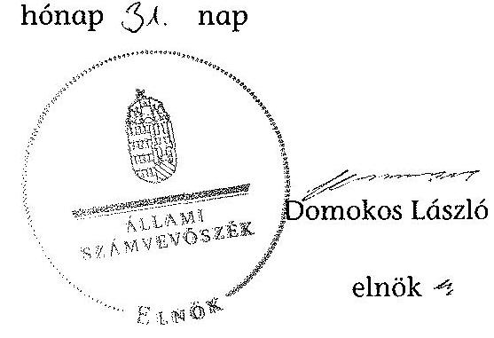

# ÁLLAMI   SZÁMVEVŐSZÉK 

## JELENTÉS

a helyi nemzetiségi önkormányzatok gazdálkodásának ellenőrzéséről
Sajóbábonyi Szlovák Nemzetiségi Önkormányzat

---

# Állami Számvevőszék 

Iktatószám: V-0152-039/2014.
Témaszám: 1201
Vizsgálat-azonosító szám: V065208

## Az ellenőrzést felügyelte:

Horváth Balázs
felügyeleti vezető
Az ellenőrzést vezette és az ellenőrzés végrehajtásáért felelős:
Pats Regina
ellenőrzésvezető
A számvevőszéki jelentést készítették és a jelentés összeállításában közreműködtek:

Dr. Fátrainé Zsebedics Katalin
számvevő tanácsos
Csényi István
számvevő tanácsos
Az ellenőrzést végezték:

| Szabó Zsuzsanna | Puskás Balázs |
| :-- | :-- |
| számvevő | számvevő |

---

# TARTALOMJEGYZÉK 

BEVEZETÉS ..... 3
I. ÖSSZEGZŐ MEGÁLLAPÍTÁSOK, KÖVETKEZTETÉSEK, JAVASLATOK ..... 6
II. RÉSZLETES MEGÁLLAPÍTÁSOK ..... 11

1. A Nemzetiségi Önkormányzat és a Települési Önkormányzat együttműködésének szabályozása, a működési feltételek biztosítása ..... 11
2. A gazdálkodási feladatok ellátásának szabályszerűsége ..... 12
2.1. A költségvetésre és zárszámadásra, valamint a kincstári adatszolgáltatás rendjére vonatkozó jogszabályi előírások betartása ..... 12
2.2. A Nemzetiségi Önkormányzat gazdálkodásának szabályozottsága ..... 13
2.3. Az operatív gazdálkodási jogkörök kialakítása, gyakorlása ..... 13
3. A Nemzetiségi Önkormányzattal kapcsolatos gazdálkodási feladatok belső ellenőrzése ..... 14
4. A Nemzetiségi Önkormányzat feladatellátása ..... 15
MELLÉKLET
5. számú A Nemzetiségi Önkormányzat 2012. évi gazdálkodásának főbb adatai, mutatói
FÜGGELÉKEK
6. számú Rövidítések jegyzéke
7. számú Értelmező szótár
8. számú A gazdálkodás értékelésének módszere

---

.

---

# JELENTÉS   a helyi nemzetiségi önkormányzatok gazdálkodásának ellenőrzéséről Sajóbábonyi Szlovák Nemzetiségi Önkormányzat 

## BEVEZETÉS

A Nemzetiségi Önkormányzat 2010. évben alakult, elnöke a 2010. évi helyhatósági választások óta látja el feladatát. A Nemzetiségi Önkormányzat intézményt, gazdasági társaságot és más szervezetet nem alapított, illetve ezek társulásában nem vesz részt. A négytagú Képviselő-testület a munkája segítésére bizottságot nem hozott létre. A Nemzetiségi Önkormányzat költségvetési beszámolója szerint a 2012. évben a módosított költségvetési bevételi és kiadási előirányzat 215,0 ezer Ft, a teljesített költségvetési bevétel 260,0 ezer Ft, a teljesített költségvetési kiadás 245,0 ezer Ft volt. A Nemzetiségi Önkormányzat a 2011. és a 2012. évben feladatalapú támogatásban nem részesült. A 2012. évi gazdálkodási adatokat részletesen az 1. számú mellékletben mutatjuk be.

Az Alaptörvény XXIX. cikk (1) bekezdése szerint a Magyarországon élő nemzetiségek államalkotó tényezők. Minden, valamely nemzetiséghez tartozó magyar állampolgárnak joga van önazonosságának szabad vállalásához és megőrzéséhez. A hazánkban élő nemzetiségek helyi (települési és területi) valamint országos önkormányzatokat hozhatnak létre. A helyi nemzetiségi önkormányzatok gazdálkodási feladatait jogszabályi előírás alapján a székhely szerinti helyi önkormányzat polgármesteri hivatala látja el.

A nemzetiségek helyzete, támogatása mind hazai, mind EU-s szinten kiemelt figyelmet kap napjainkban. A helyi nemzetiségi önkormányzatok gazdálkodására és támogatási rendszerére vonatkozó jogszabályok a 2010-2012. években jelentős változásokon mentek át. A települési és területi nemzetiségi önkormányzatok gazdálkodásának, a részükre juttatott költségvetési támogatások felhasználásának ellenőrzését az ÁSZ 2012-ben sorozatjellegű ellenőrzés keretében indította el. A 2013. évi ellenőrzések e témacsoportos ellenőrzések folytatását jelentik.

Az ellenőrzés célja annak értékelése volt, hogy a nemzetiségi önkormányzat gazdálkodási kereteinek kialakítása, gazdálkodása és feladatellátása megfelelt-e a jogszabályoknak.

---

Ennek keretében értékeltük, hogy:

- a nemzetiségi önkormányzat és a települési önkormányzat együttműködésének szabályozása, a működési feltételek biztosítása megfelelt-e a jogszabályi előírásoknak;
- a felek együttműködése megfelelt-e a közöttük létrejött megállapodásnak a gazdálkodási feladatok szabályszerű ellátása során, ennek keretében betartották-e a helyi nemzetiségi önkormányzat gazdálkodásához kapcsolódóan a költségvetésre és zárszámadásra, a gazdálkodás szabályozására, az operatív gazdálkodási jogkörök gyakorlására vonatkozó jogszabályi előírásokat;
- a jegyző biztosította-e a nemzetiségi önkormányzat gazdálkodásának belső ellenőrzését;
- a nemzetiségi önkormányzat feladatalapú támogatásának felhasználása, a folyósított feladatalapú támogatással történő elszámolás az előírásoknak megfelelő volt-e;
- a nemzetiségi önkormányzat feladatellátása összhangban volt-e a vonatkozó jogszabályi előírásokkal.

Az ellenőrzés várható hasznosulását négy szinten tervezzük. A törvényalkotás számára összegzett tapasztalatok állnak rendelkezésre a nemzetiségi önkormányzatok testületi döntéseinek, gazdálkodásának és a feladatalapú támogatás felhasználásának szabályszerűségéről, amelynek alapján következtetést lehet levonni arra, hogy indokolt-e esetleges jogszabályi módosítás kezdeményezése. Az ellenőrzés az ellenőrzött számára visszajelzést ad a működésében fellépő hiányosságokról, javaslataival hozzájárul azok kiküszöböléséhez, amely csökkentheti a későbbi ellenőrzések gyakoriságát. Az ellenőrzés megállapításai és javaslatai tanulságul szolgálhatnak más nemzetiségi önkormányzatok, szervezetek számára a rendezett gazdálkodási keretek kialakításához. A társadalom számára jelzi, hogy közpénz nem maradhat ellenőrizetlenül, az ÁSZ értékteremtő rend kialakításához és megőrzéséhez hozzájáruló tevékenysége pozitív hatással lesz a szervezetről kialakított összkép formálásában. Az ÁSZ szervezetén belül lehetőség nyílik arra, hogy a megállapítások szintetizálásával az intézmény a hozzáadott értéket teremtő elemző tevékenységét és tanácsadó szerepét erősítse.

A helyi nemzetiségi önkormányzatok gazdálkodásának ellenőrzéséről szóló jelentés I. fejezetének összegző része az ellenőrzés céljára adott rövid, szintetizáló összefoglalót és következtetéseket tartalmazza a II. fejezet részletes megállapításain alapulóan. A jelentés intézkedést igénylő megállapításait és javaslatait az összegzőben foglaltak mellett - az ellenőrzés során feltárt, a jelentés II. fejezetében rögzített részletes megállapítások alapozzák meg, illetve támasztják alá.

Az ellenőrzés típusa: szabályszerűségi ellenőrzés.
Az ellenőrzött időszak: 2012. január 1. - 2012. december 31. közötti időszak. Az ellenőrzés kiterjedt a helyi nemzetiségi önkormányzatoknak juttatott 2012. évi feladatalapú támogatás 2013. évben való elszámolására is.

---

Ellenőrzött szervezet: Sajóbábonyi Szlovák Nemzetiségi Önkormányzat és a gazdálkodási feladatait ellátó Sajóbábony Város Önkormányzata.

Az ellenőrzés végrehajtásának jogszabályi alapját az Állami Számvevőszékről szóló 2011. évi LXVI. törvény 1. § (3) bekezdése, az 5. § (2) és (6) bekezdései, valamint az Államháztartásról szóló 2011. évi CXCV. törvény 61. §. (2) bekezdésének előírásai képezik.

Az ellenőrzés szakmai módszertana az ÁSZ hivatalos honlapján (www.asz.hu) közzétett szakmai szabályokon alapult, amely a Legfőbb Ellenőrző Intézmények Nemzetközi Szervezete (INTOSAI) által kiadott nemzetközi standardok (ISSAI) figyelembevételével készült.

A helyi nemzetiségi önkormányzatok gazdálkodásának ellenőrzése során értékeltük a települési önkormányzat és a nemzetiségi önkormányzat együttműködésének, a gazdálkodás szabályozottságának és a pénzügyi folyamatokban kulcsszerepet betöltő belső kontrollok (teljesítésigazolás és érvényesítés) működésének megfelelőségét. A kulcskontrollokat a dologi kiadásokkal kapcsolatos kifizetéseknél véletlen mintavételi eljárást alkalmazva ellenőriztük. Ellenőriztük, hogy a jegyző biztosította-e a nemzetiségi önkormányzat gazdálkodásának belső ellenőrzését. Értékeltük a feladatalapú támogatások felhasználásának, elszámolásának szabályszerűségét, a nemzetiségi önkormányzat feladatellátása és a jogszabályi előírások összhangját.

Az ellenőrzés lefolytatásához a Nemzetiségi Önkormányzat és a gazdálkodási feladatait ellátó Települési Önkormányzat tanúsítványok és a kapcsolódó, dokumentumjegyzékben megjelölt dokumentumok elektronikus úton történő megküldésével, rendelkezésre bocsátásával szolgáltatott adatokat. Az adatszolgáltatás kontrollálása és szükség szerinti javítása a helyszíni ellenőrzés keretében történt. A gazdálkodás értékelésének módszerét a 3. számú függelék tartalmazza.

Az ÁSZ tv. 29. § (1) bekezdése szerint a jelentéstervezetet megküldtük a polgármester és a Nemzetiségi Önkormányzat elnöke részére, akik az ÁSZ tv. 29. § (2) bekezdésében foglalt észrevételezési jogukkal nem éltek, a jelentéstervezetre észrevételt nem tettek.

---

# I. ÖSSZEGZŐ MEGÁLLAPÍTÁSOK, KÖVETKEZTETÉSEK, JAVASLATOK 

A Nemzetiségi Önkormányzat és a Települési Önkormányzat együttműködésének szabályozása megfelelt a jogszabályi előírásoknak. A 2012. május 30-án aláírt együttműködési megállapodás elfogadásáról a Képviselő-testület az előírt határidőt követően - 2012. október 21-én - döntött. Az együttműködési megállapodás - az iratkezelési feladatok ellátása kivételével - a Nek. 2 tv-ben foglaltaknak megfelelően tartalmazta a Nemzetiségi Önkormányzat működési feltételeit. A Nemzetiségi Önkormányzat gazdálkodásával kapcsolatos feladatokat, felelősöket, határidőket az előírásoknak megfelelően szabályozták. A Nek. 2 tv-ben foglaltak ellenére azonban nem rögzítették a Nemzetiségi Önkormányzat SZMSZ-ében a megállapodás szerinti működési feltételeket a megállapodás módosítását követő harminc napon belül. A Nemzetiségi Önkormányzat SZMSZ-e nem tartalmazta a kötelezettségvállalásának részletes szabályait, különösen az összeférhetetlenségi, nyilvántartási kötelezettségeket. A Települési Önkormányzat a szabályozási hiányosságok ellenére biztosította a Nemzetiségi Önkormányzat működéséhez szükséges személyi és tárgyi feltételeket.

A Nemzetiségi Önkormányzat a költségvetésére és zárszámadására, valamint a kincstári adatszolgáltatás rendjére vonatkozó jogszabályi előírásoknak részben felelt meg. A Nemzetiségi Önkormányzat elnöke a 2012. évi költségvetést az Áht. 2-ben foglalt határidőn túl nyújtotta be a Képviselő-testületnek. A költségvetési határozat az Áht. 2-ben foglaltak ellenére nem tartalmazta a Nemzetiségi Önkormányzat költségvetésének egyenlegét és a finanszírozási bevételekkel és kiadásokkal kapcsolatos hatásköröket. A 2012. évi költségvetés és a zárszámadás előterjesztésekor a Képviselő-testület részére tájékoztatásul nem mutatták be az Áht. 2-ben előírt mérlegeket és kimutatásokat. A 2012. évi költségvetési és zárszámadási határozat azonos szerkezetben készült, az összehasonlíthatóság biztosított volt, a zárszámadásban a Nemzetiségi Önkormányzat valamennyi bevételéről és kiadásáról elszámolt. A jegyző a Települési Önkormányzat 2012. évi költségvetéshez kapcsolódó, a Nemzetiségi Önkormányzatra vonatkozó kincstári adatszolgáltatási kötelezettségének határidőben eleget tett.

A gazdálkodás szabályozottsága részben volt megfelelő. A 2012. évben a Polgármesteri Hivatal belső szabályzatainak hatálya a Nemzetiségi Önkormányzat gazdálkodási feladataira kiterjedt. Rendelkeztek számviteli politikával és kapcsolódóan a gazdálkodásra vonatkozó - leltározási és leltárkészítési-, az eszközök és források értékelési-, pénzkezelési- és számlarend - szabályzatokkal, ellenőrzési nyomvonallal, folyamatba épített előzetes, utólagos és vezetői ellenőrzés szabályzattal és szabálytalanságok kezelésének eljárásrendjével. A Polgármesteri Hivatalban a 2012. évben az Ávr-ben előírtaktól eltérően nem alakították ki az előzetes írásbeli kötelezettségvállalást nem igénylő kifizetések rendjét. A Nemzetiségi Önkormányzat gazdálkodásával kapcsolatos feladatok az érintett köztisztviselők munkaköri leírásában nem szerepeltek. Az Ávr-ben foglalt előírások ellenére a tervezéssel, gazdálkodással, így különösen a kötelezettségvállalással, pénzügyi ellenjegyzéssel és teljesítésigazolással, az érvényesítés, utalványozás gyakorlásának módjával, eljárási és dokumentálási részlet-

---

szabályaival, valamint az ezeket végző személyek kijelölésének rendjével, az ellenőrzési és adatszolgáltatási feladatok teljesítésével kapcsolatos belső előírásokat, feltételeket tartalmazó szabályzattal nem rendelkeztek. A Polgármesteri Hivatal SZMSZ-e nem tartalmazta az Ávr-ben foglaltak szerinti, a Nemzetiségi Önkormányzat gazdálkodásával kapcsolatos feladat- és hatáskörökre, a hatáskörök gyakorlásának módjára, a helyettesítés rendjére, az ezekhez kapcsolódó felelősségi szabályokra vonatkozó előírásokat.

A Nemzetiségi Önkormányzat gazdálkodása tekintetében az operatív gazdálkodási jogkörök kialakítása részben felelt meg a jogszabályi előírásoknak. A Nemzetiségi Önkormányzat elnöke az Ávr-ben foglaltak alapján más képviselőt nem hatalmazott fel írásban a kötelezettségvállalás és az utalványozás gyakorlására, emiatt az összeférhetetlenségi követelmények érvényesülésének feltételeit nem biztosította, valamint a teljesítést igazoló személyeket nem jelölte ki. A Nemzetiségi Önkormányzatnál a 2012. évben a dologi kiadások teljesítése során a teljesítésigazolás és az érvényesítés kulcsszerepet betöltő kontrollok működésének megfelelősége gyenge volt, a hibák száma a lényegességi szintet, a kritikus hibahatárt elérte. A kifizetéseket megelőzően a teljesítés igazolása és az érvényesítés nem történt meg, így az Ávr-ben előírt ellenőrzési kötelezettségnek nem tettek eleget. A számvevőszéki ellenőrzés a kifizetések dokumentumainak ellenőrzése alapján nem tárt fel jogosulatlan kifizetést, a kulcskontrollok működéséhez kapcsolódó hiányosságok miatt azonban nem biztosították a hibák megelőzését, feltárását és kijavítását.

A jegyző nem biztosította a Nemzetiségi Önkormányzat gazdálkodásával összefüggő végrehajtási feladatok belső ellenőrzését. A Polgármesteri Hivatal 2012. évi belső ellenőrzési tervét megalapozó kockázatelemzés - a Ber-ben foglaltak ellenére - nem terjedt ki a Nemzetiségi Önkormányzat gazdálkodásával összefüggő végrehajtási feladatokra, és azok tekintetében belső ellenőrzési feladatot a 2012. évben nem terveztek és nem végeztek.

A Nemzetiségi Önkormányzat a képviselő-testületi működésen túl - a tanúsítványon közölt adatok és az ellenőrzés részére átadott dokumentumok alapján a 2012. évben sem kötelező, sem önként vállalt feladatot nem látott el, annak ellenére, hogy a Települési Önkormányzat biztosította a Nemzetiségi Önkormányzat
 működéséhez szükséges személyi és tárgyi feltételeket.

Az ÁSZ tv. 33. § (1) bekezdésében foglaltak értelmében az ellenőrzött szervezet vezetője köteles a jelentésben foglalt megállapításokhoz kapcsolódó intézkedési tervet összeállítani, és azt a jelentés kézhezvételétől számított 30 napon belül az ÁSZ részére megküldeni. Amennyiben az intézkedési tervet határidőre nem küldi meg a szervezet, vagy az nem elfogadható, az ÁSZ elnöke az ÁSZ tv. 33. § (3) bekezdés a)-b) pontjaiban foglaltakat érvényesítheti.

---

A helyszíni ellenőrzés megállapításainak hasznosítása mellett javasoljuk:

# a jegyzőnek 

1. az együttműködés szabályozásával kapcsolatban

Az együttműködési megállapodás nem tartalmazta a Nek. 2 tv. 80. § (1) bekezdés e) pontjában foglalt iratkezelési feladatokat.

A Nemzetiségi Önkormányzat SZMSZ-e a Nek. 2 tv. 80. § (3) bekezdés c) pontjában foglaltak ellenére nem tartalmazta a kötelezettségvállalás részletes szabályait, különösen az összeférhetetlenségi, nyilvántartási kötelezettségekre.

Javaslat
Az együttműködés szabályszerűsége érdekében készítse elő:
a) az együttműködési megállapodás módosítását, hogy tartalmilag feleljen meg a Nek. 2 tv. 80. § (1) bekezdés e) pontjában foglalt előírásnak;
b) a Nemzetiségi Önkormányzat SZMSZ-ének a Nek. 2 tv. 80. § (3) bekezdés c) pontjában foglalt előírásnak megfelelő módosítását.
2. a költségvetési és zárszámadási előterjesztéssel és határozattal kapcsolatban

A 2012. évi költségvetési határozat nem tartalmazta az Áht. 2 23. § (2) bekezdés c) pontjában előírt költségvetési egyenleg összegét, az Áht. 2 23. § (2) bekezdés d) és h) pontjainak előírásait megsértve, a költségvetési határozatban nem szerepeltek a költségvetési hiány belső finanszírozására szolgáló előző évek pénzmaradványának igénybevétele, illetve a finanszírozási bevételekkel és kiadásokkal kapcsolatos hatáskörök. A 2012. évi költségvetés előterjesztésekor a Képviselő-testület részére - tájékoztatás céljából, szöveges indoklással együtt - az Áht. 2 24. § (4) bekezdés a) pontja szerinti előírástól eltérően nem mutatták be a Nemzetiségi Önkormányzat költségvetési mérlegét közgazdasági tagolásban, valamint az előirányzat felhasználási tervet. A 2012. évi zárszámadási határozat tervezetének előterjesztésénél a Képviselő-testület részére tájékoztatásul nem mutatták be az Áht. 2 91. § (2) bekezdésében foglalt mérlegeket és kimutatásokat.

Javaslat
Gondoskodjon a jövőben arról, hogy a költségvetési határozatok tartalmukban feleljenek meg az Áht. 2 23. § (2) bekezdés c), d) és h) pontjaiban, az Áht. 2 24. § (4) bekezdés a) pontjában foglaltaknak, a zárszámadási határozat feleljen meg az Áht. 2 91. § (2) bekezdésében foglalt előírásoknak.
3. a gazdálkodás szabályozottságával, ellátásával kapcsolatban

A 2012. évben a Nemzetiségi Önkormányzat gazdálkodásával kapcsolatos, a munkakörökhöz tartozó - feladat- és hatásköröket, a hatáskörök gyakorlásának módjára, a helyettesítés rendjére, az ezekhez tartozó felelősségi szabályokra vonatkozó - szabályokat a Polgármesteri Hivatal SZMSZ-e az Ávr. 13. § (1) bekezdés g) pontjában foglalt előírás ellenére nem tartalmazta.

Az Ávr. 13. § (2) bekezdés a) pontjában foglalt előírás ellenére a tervezéssel, gazdálkodással, így különösen a kötelezettségvállalással, pénzügyi ellenjegyzéssel és teljesítésigazolással, az érvényesítés, utalványozás gyakorlásának módjával, eljárási és dokumentálási részletszabályaival, valamint az ezeket végző személyek kijelölésének rendjével, az ellenőrzési és adatszolgáltatási feladatok teljesítésével kapcsolatos előírásokat, feltételeket tartalmazó szabályzattal nem rendelkeztek.

Javaslat
A gazdálkodás szabályszerűsége érdekében készítse elő:
a) az Ávr. 13. § (1) bekezdés g) pontjában foglaltaknak megfelelően a Polgármesteri Hivatal SZMSZ-ének módosítását;
b) az Ávr. 13. § (2) bekezdés a) pontjában foglaltak szerint a Nemzetiségi Önkormányzat gazdálkodásával kapcsolatos szabályozást.
4. a pénzügyi kulcskontrollok működésével kapcsolatban

A Polgármesteri Hivatalban a 2012. évben az Ávr. 53. § (2) bekezdésében előírtaktól eltérően nem alakították ki az előzetes írásbeli kötelezettségvállalást nem igénylő kifizetések rendjét. Az Ávr. 57. § (3) bekezdésében előírt teljesítés igazolás nem történt meg, így a kifizetéseket megelőzően az Ávr. 57. § (1) bekezdésében foglaltak ellenére a kiadások jogosságának, összegszerűségének és az ellenszolgáltatás teljesítésének ellenőrzését nem végezték el. Az Ávr. 58. § (3) bekezdésében foglaltak ellenére a kifizetéseket megelőzően az érvényesítés nem történt meg, így az Ávr. 58. § (1) bekezdésében foglaltak ellenére az összegszerűség, a fedezet megléte, a formai és a főkönyvi számla kijelölési szabályok, valamint az egyéb jogszabályban és a belső szabályzatokban foglalt előírások betartásának ellenőrzésére nem került sor.

Javaslat
Az operatív gazdálkodás működési hibáinak megelőzése, feltárása és kijavítása érdekében:
a) alakítsa ki az előzetes írásbeli kötelezettségvállalást nem igénylő kifizetések rendjét az Ávr. 53. § (2) bekezdésében foglalt előírás szerint;
b) gondoskodjon arról, hogy a teljesítést igazoló a feladatait az Ávr. 57. § (3) bekezdésben foglaltak betartásával, és az érvényesítő a feladatait az Ávr. 58. § (3) bekezdésében foglaltak betartásával lássa el.

# a polgármesternek 

Az együttműködési megállapodás nem tartalmazta a Nek. 2 tv. 80. § (1) bekezdés e) pontjában foglalt iratkezelési feladatokat.

---

A 2012. évben a Nemzetiségi Önkormányzat gazdálkodásával kapcsolatos, a munkakörökhöz tartozó - feladat- és hatásköröket, a hatáskörök gyakorlásának módjára, a helyettesítés rendjére, az ezekhez tartozó felelősségi szabályokra vonatkozó - szabályokat a Polgármesteri Hivatali SZMSZ-e az Ávr. 13. § (1) bekezdés g) pontjában foglalt előírás ellenére nem tartalmazta.

Javaslat
Terjessze a Települési Önkormányzat Képviselő-testülete elé jóváhagyásra:
a) a jegyző által - a Nek. ${ }_{2}$ tv. 80. § (1) bekezdés e) pontjában foglalt előírás betartásával - előkészített együttműködési megállapodás módosítást;
b) az Ávr. 13. § (1) bekezdés g) pontjában foglalt szabályozásra figyelemmel a jegyző által elkészített Polgármesteri Hivatal SZMSZ-e módosítását.

# a Nemzetiségi Önkormányzat elnökének 

Az együttműködési megállapodás nem tartalmazta a Nek. ${ }_{2}$ tv. 80. § (1) bekezdés e) pontjában foglalt iratkezelési feladatokat.

A Nemzetiségi Önkormányzat SZMSZ-e a Nek. ${ }_{2}$ tv. 80. § (3) bekezdésében foglaltak ellenére nem tartalmazta a kötelezettségvállalás részletes szabályait, különösen az összeférhetetlenségi, nyilvántartási kötelezettségekre.

Javaslat
Terjessze elő a Képviselő-testület elé jóváhagyásra:
a) A jegyző által - a Nek. ${ }_{2}$ tv. 80. § (1) bekezdés e) pontjában foglalt előírás betartásával - előkészített együttműködési megállapodás módosítást;
b) a Nek. ${ }_{2}$ tv. 80. § (3) bekezdésében foglaltakkal összhangban módosított Nemzetiségi Önkormányzat SZMSZ-ét.

---

# II. RÉSZLETES MEGÁLLAPÍTÁSOK 

## 1. A Nemzetiségi Önkormányzat és a Települési Önkormányzat együttműködésének szabályozása, a működési feltételek biztosítása

A Nemzetiségi Önkormányzat és a Települési Önkormányzat együttműködésének szabályozása megfelelt a jogszabályi előírásoknak.

A Nemzetiségi Önkormányzat az ellenőrzött időszakban rendelkezett együttműködési megállapodással. A Nemzetiségi Önkormányzat és a Települési Önkormányzat 2011. február 8-án ${ }^{1}$ kötött együttműködési megállapodást. Az együttműködő felek az együttműködési megállapodást 2012. január 31-éig a Nek. ${ }_{2}$ tv. 80. § (2) bekezdés előírása ellenére nem vizsgálták felül, azonban a Nek. ${ }_{2}$ tv. 159. § (3) bekezdésben előírt felülvizsgálat 2012. június 1-jéig megtörtént. A 2012. május 30-án aláírt, módosított együttműködési megállapodást a Települési Önkormányzat Képviselő-testülete határidőben² elfogadta, a Nemzetiségi Önkormányzat Képviselő-testülete azonban az elfogadásról az előírt határidőn túl, 2012. október 21-én döntött ${ }^{3}$.

Az együttműködési megállapodás a jogszabályi előírásoknak megfelelően Nek. ${ }_{2}$ tv. 80. § (1) bekezdés e) pontjában foglalt iratkezelési feladatok ellátása kivételével tartalmazta a Nemzetiségi Önkormányzat működési feltételeit. A Nemzetiségi Önkormányzat gazdálkodásával kapcsolatos feladatokat, felelősöket, határidőket az előírásoknak megfelelően szabályozták, valamint rögzítették, hogy a jegyző, vagy annak - a jegyzővel azonos képesítési előírásoknak megfelelő - megbízottja a Települési Önkormányzat megbízásából és képviseletében részt vesz a Nemzetiségi Önkormányzat testületi ülésein és jelzi, amennyiben törvénysértést észlel. A Nemzetiségi Önkormányzat SZMSZ-ében azonban - a Nek. ${ }_{2}$ tv. 80. § (2) bekezdésében foglaltakat figyelmen kívül hagyva - nem rögzítették a megállapodás szerinti működési feltételeket a megállapodás módosítását követő harminc napon belül. A Nemzetiségi Önkormányzat SZMSZ-e a Nek. ${ }_{2}$ tv. 80. § (3) bekezdés c) pontjában foglaltak ellenére nem tartalmazta a kötelezettségvállalás részletes szabályait, különösen az összeférhetetlenségi, nyilvántartási kötelezettségeket.

A Települési Önkormányzat a szabályozási hiányosságok ellenére biztosította a Nemzetiségi Önkormányzat működéséhez szükséges személyi és tárgyi feltételeket.

[^0]
[^0]:    ${ }^{1}$ Az együttműködési megállapodást a Települési Önkormányzat Képviselő-testülete a 27/2011. (II. 22.), a Nemzetiségi Önkormányzat Képviselő-testülete a 3/2011. (II. 14.) számú határozatával hagyta jóvá 2011. február 1-jel hatállyal.
    ${ }^{2}$ 127/2012. (V. 29.) számú határozat
    ${ }^{3}$ 4/2012. (X. 21.) számú határozat

---

# 2. A gazdálkodási feladatok ellátásának szabályszerűsége 

### 2.1. A költségvetésre és zárszámadásra, valamint a kincstári adatszolgáltatás rendjére vonatkozó jogszabályi előírások betartása

A Nemzetiségi Önkormányzat 2012. évi költségvetésének ${ }^{4}$ és zárszámadásának ${ }^{5}$ tartalma, jóváhagyása, valamint a kapcsolódó 2012. évi adatszolgáltatás szabályszerűsége részben felelt meg a jogszabályi előírásoknak.

A 2012. évi - jóváhagyott - költségvetési határozat tartalmazta a Nemzetiségi Önkormányzat költségvetési bevételeit és költségvetési kiadásait előirányzatcsoportok és kiemelt előirányzatok szerinti bontásban. A költségvetés tervezetét azonban a Nemzetiségi Önkormányzat elnöke az Áht. 2 26. § (1) bekezdésében és az Áht. 2 24. § (2) bekezdésében előírtaktól eltérően határidőn túl ${ }^{6}$ nyújtotta be a Képviselő-testületnek. A 2012. évi költségvetési határozat nem tartalmazta az Áht. 2 23. § (2) bekezdés c) pontjában előírt költségvetési egyenleg összegét, és az Áht. 2 23. § (2) bekezdés d) és h) pontjainak előírásait megsértve, a költségvetési határozatban nem szerepelt a költségvetési hiány belső finanszírozására szolgáló előző évek pénzmaradványának igénybevétele, illetve a finanszírozási bevételekkel és kiadásokkal kapcsolatos hatáskörök. A 2012. évi költségvetés előterjesztésekor a Képviselő-testület részére - tájékoztatás céljából, szöveges indoklással együtt - az Áht. 2 24. § (4) bekezdés a) pontja szerinti előírástól eltérően nem mutatták be a Nemzetiségi Önkormányzat költségvetési mérlegét közgazdasági tagolásban, valamint az előirányzat felhasználási tervet.

A jegyző által elkészített 2012. évi zárszámadási határozat tervezetet a Nemzetiségi Önkormányzat elnöke a jogszabályi határidőn belül beterjesztette a Képviselő-testület elé. A zárszámadás elkészítése során a határozat elkészítésére, elfogadására és továbbítására vonatkozó előírásokat a Nemzetiségi Önkormányzat betartotta. A 2012. évi költségvetési és zárszámadási határozat azonos szerkezetben készült, az összehasonlíthatóság biztosított volt, a zárszámadásban a Nemzetiségi Önkormányzat valamennyi bevételéről és kiadásáról elszámolt. A 2012. évi zárszámadási határozat tervezetének előterjesztésénél azonban a Képviselő-testület részére tájékoztatásul nem mutatták be az Áht. 2 91. § (2) bekezdésében foglalt mérlegeket és kimutatásokat.

A jegyző a Nemzetiségi Önkormányzat elemi költségvetésére, a negyedéves és éves időközi költségvetési jelentésekre, az időközi mérlegjelentésekre, a féléves és éves elemi költségvetési beszámolóra vonatkozó kincstári adatszolgáltatási kötelezettségének határidőben eleget tett.

[^0]
[^0]:    ${ }^{4}$ A Képviselő-testületnek a Nemzetiségi Önkormányzat 2012. évi költségvetéséről szóló 2/2012. (II. 19.) számú határozata.
    ${ }^{5}$ A Képviselő-testületnek a Nemzetiségi Önkormányzat 2012. évi zárszámadásáról szóló 2/2013. (III. 30.) számú határozata.
    ${ }^{6}$ 2012. február 19-én

---

# 2.2. A Nemzetiségi Önkormányzat gazdálkodásának szabályozottsága 

A Nemzetiségi Önkormányzat gazdálkodásának szabályozottsága részben volt megfelelő.

A 2012. évben a Polgármesteri Hivatal belső szabályzatainak hatálya kiterjedt a Nemzetiségi Önkormányzat gazdálkodási feladataira. Rendelkeztek számviteli politikával és kapcsolódóan a gazdálkodásra vonatkozó - leltározási és leltárkészítési-, eszközök és
 források értékelési-, pénzkezelési- és számlarend-szabályzatokkal. A Polgármesteri Hivatal az ellenőrzött időszakban - a Nemzetiségi Önkormányzat gazdálkodási feladataira kiterjedő hatályú - ellenőrzési nyomvonallal, szabálytalanságok kezelésének eljárásrendjével és a folyamatba épített előzetes, utólagos és vezetői ellenőrzés szabályozással rendelkezett.

A Polgármesteri Hivatalban a 2012. évben az Ávr. 53. § (2) bekezdésében előírtaktól eltérően nem alakították ki az előzetes írásbeli kötelezettségvállalást nem igénylő kifizetések rendjét, annak ellenére, hogy éltek az Ávr. 53. § (1) bekezdésében foglalt lehetőséggel ${ }^{7}$.

A 2012. évben a Nemzetiségi Önkormányzat gazdálkodásával kapcsolatos, a munkakörökhöz tartozó - feladat- és hatásköröket, a hatáskörök gyakorlásának módjára, a helyettesítés rendjére, az ezekhez tartozó felelősségi szabályokra vonatkozó - szabályokat a Polgármesteri Hivatal SZMSZ-e az Ávr. 13. § (1) bekezdés g) pontjában foglalt előírás ellenére nem tartalmazta és ezen feladatok a köztisztviselők munkaköri leírásaiban sem szerepeltek.

Az Ávr. 13. § (2) bekezdés a) pontjában foglalt előírások ellenére a tervezéssel, gazdálkodással, így különösen a kötelezettségvállalással, pénzügyi ellenjegyzéssel és teljesítésigazolással, az érvényesítés, utalványozás gyakorlásának módjával, eljárási és dokumentálási részletszabályaival, valamint az ezeket végző személyek kijelölésének rendjével, az ellenőrzési és adatszolgáltatási feladatok teljesítésével kapcsolatos előírásokat, feltételeket tartalmazó szabályzattal nem rendelkeztek.

### 2.3. Az operatív gazdálkodási jogkörök kialakítása, gyakorlása

A Nemzetiségi Önkormányzat gazdálkodása tekintetében az operatív gazdálkodási jogkörök kialakítása részben felelt meg a jogszabályi előírásoknak.

[^0]
[^0]:    7 Ávr. 53. § (1): „Törvény vagy e rendelet eltérő rendelkezése hiányában nem szükséges előzetes írásbeli kötelezettségvállalás az olyan kifizetés teljesítéséhez, amely
    a) értéke a százezer forintot nem éri el,
    b) pénzügyi szolgáltatás igénybevételéhez kapcsolódik, vagy
    c) az Áht. 36. § (2) bekezdése szerinti egyéb fizetési kötelezettségnek minősül."

---

A gazdasági szervezettel nem rendelkező Polgármesteri Hivatalban a jegyző 2012. március 30-áig ${ }^{8}$, illetve 2012. március 31-étől ${ }^{9}$ az Ávr. szerinti jogkörében eljárva írásban kijelölte a Polgármesteri Hivatal állományába tartozó, előírt végzettséggel rendelkező köztisztviselőt a pénzügyi ellenjegyzés gyakorlására. Az érvényesítési feladatok ellátására a jegyző az együttműködési megállapodásokban és a 2009. április 1-jétől hatályos gazdálkodási jogkörök szabályzatában jelölte ki a Polgármesteri Hivatal köztisztviselőit. Az operatív gazdálkodási feladatokat - kötelezettségvállalás, utalványozás, ellenjegyzés, érvényesítés és teljesítés igazolása - az ellenőrzött időszakban az együttműködési megállapodásban szabályozták.

A Nemzetiségi Önkormányzat elnöke más képviselőt nem hatalmazott fel az Ávr. 52. § (7) bekezdésében foglaltak alapján a kötelezettségvállalás, továbbá az Ávr. 59. § (1) bekezdése szerinti utalványozás gyakorlására, emiatt az Ávr. 60. § (2) bekezdésében foglalt összeférhetetlenségi követelmények érvényesülésének feltételeit nem biztosította. A Nemzetiségi Önkormányzat elnöke az Ávr. 57. § (4) bekezdésében foglaltak ellenére a teljesítést igazoló személyeket nem jelölte ki.

A Nemzetiségi Önkormányzatnál a 2012. évben a dologi kiadások teljesítése során a teljesítésigazolás és az érvényesítés kulcskontrollok működésének megfelelősége gyenge volt, a hibák száma a lényegességi szintet, a kritikus hibahatárt elérte. Az Ávr. 57. § (3) bekezdésében előírt teljesítés igazolása nem történt meg, így a kifizetéseket megelőzően az Ávr. 57. § (1) bekezdésében foglaltak ellenére a kiadások jogosságának, összegszerűségének és az ellenszolgáltatás teljesítésének ellenőrzését nem végezték el. Az Ávr. 58. § (3) bekezdésében foglaltak ellenére a kifizetéseket megelőzően az érvényesítés nem történt meg, így az Ávr. 58. § (1) bekezdésében foglaltak ellenére az összegszerűség, a fedezet megléte, a formai és a főkönyvi számla kijelölési szabályok, valamint az egyéb jogszabályban és a belső szabályzatokban foglalt előírások betartásának ellenőrzésére nem került sor.

A számvevőszéki ellenőrzés a kifizetések dokumentumainak ellenőrzése alapján nem tárt fel jogosulatlan kifizetést, a kulcskontrollok működéséhez kapcsolódó hiányosságok miatt azonban nem biztosították a hibák megelőzését, feltárását és kijavítását.

A Nemzetiségi Önkormányzatnál a 2012. évben működési és felhalmozási célú támogatásértékű kiadások, valamint államháztartáson kívülre teljesített működési és felhalmozási célú pénzeszközátadások nem voltak.

# 3. A Nemzetiségi Önkormányzattal kapcsolatos gazdálkodási feladatok belső ellenőrzése 

A jegyző nem biztosította a Nemzetiségi Önkormányzat gazdálkodásával összefüggő végrehajtási feladatok belső ellenőrzését.

[^0]
[^0]:    ${ }^{8}$ Ávr. 10. § (7) bekezdés és 11. § (3)-(4) bekezdése szerint
    ${ }^{9}$ Ávr. 55. § g) pontja szerint

---

A Polgármesteri Hivatal 2012. évi belső ellenőrzési tervét megalapozó kockázatelemzés - a Ber. 21. § (2) bekezdésben foglaltak ellenére - nem terjedt ki a Nemzetiségi Önkormányzat gazdálkodásával összefüggő végrehajtási feladatokra, azok tekintetében belső ellenőrzési feladatot a 2012. évben nem terveztek és nem végeztek.

A 2012. évre vonatkozó belső ellenőrzési terv elkészítésének idején hatályos együttműködési megállapodás a Nemzetiségi Önkormányzat belső ellenőrzésére vonatkozóan általános előírásokat tartalmazott.

A megállapodásban rögzítették, hogy: „A helyi kisebbségi önkormányzat belső ellenőrzését megbízott belső ellenőr végzi. A belső ellenőrzés lefolytatásának rendjét a belső ellenőrzési vezető által jóváhagyott belső ellenőrzési kézikönyv tartalmazza. A helyi kisebbségi önkormányzatot érintő belső ellenőrzési jelentést az elnök a helyi kisebbségi önkormányzat képviselő-testületével ismerteti. Az elnök a FEUVE rendszer és a belső ellenőrzés helyi kisebbségi önkormányzatot érintő értékeléséről készülő beszámolót a helyi kisebbségi önkormányzat képviselő-testületével ismerteti."

A számvevőszéki ellenőrzés részére szolgáltatott adatok alapján a 2012. évben a Kormányhivatal a Nemzetiségi Önkormányzatot illetően nem élt törvényességi felügyeleti eszközökkel.

# 4. A Nemzetiségi Önkormányzat feladatellátása 

A Nemzetiségi Önkormányzat a képviselő-testületi működésen túl - a tanúsítványon közölt adatok és az ellenőrzés részére átadott dokumentumok alapján a 2012. évben sem a Nek. ${ }_{2}$ tv. 115. §-ában felsorolt kötelező, sem a Nek. ${ }_{2}$ tv. 116. §-a szerinti önként vállalt feladatot nem látott el, annak ellenére, hogy a Települési Önkormányzat biztosította a Nemzetiségi Önkormányzat működéséhez szükséges személyi és tárgyi feltételeket.

Budapest, 2014.

Melléklet: $\quad 1 \mathrm{db}$
Függelék: $\quad 3 \mathrm{db}$

---

.

---

# A Nemzetiségi Önkormányzat 2012. évi gazdálkodásának főbb adatai, mutatói 

A) Bevételek

| Megnevezés | Eredeti előirányzat |  | Módosított   előirányzat | Teljesítés |
| :--: | :--: | :--: | :--: | :--: |
|  | ezer Ft |  |  | megoszlás |
| Általános működési támogatás | 215,0 | 215,0 | 215,0 | 82,7\% |
| Pénzforgalmi bevételek összesen | 215,0 | 215,0 | 215,0 | 82,7\% |
| Előző évi pénzmaradvány felhasználás | 0,0 | 0,0 | 45,0 | 17,3\% |
| Bevételek összesen | 215,0 | 215,0 | 260,0 | 100,0\% |

B) Kiadások

| Megnevezés | Eredeti előirányzat | Módosított   előirányzat | Teljesítés |
| :--: | :--: | :--: | :--: |
|  |  |  |  |
| Dologi kiadások | 215,0 | 215,0 | 245,0 | 100,0\% |
| Működési kiadások összesen | 215,0 | 215,0 | 245,0 | 100,0\% |
| Kiadások összesen | 215,0 | 215,0 | 245,0 | 100,0\% |

---

.

---

# RÖVIDÍTÉSEK JEGYZÉKE 

## Törvények

Alaptörvény
Áht. 2
ÁSZ tv.
Nek. 1 tv.
Nek. 2 tv.
Számv. tv.

## Rendeletek

Áhsz.

Ávr.

Ber.
Bkr.
támogatási kormányrendelet ${ }_{1}$
támogatási kormányrendelet ${ }_{2}$

Települési Önkormányzat SZMSZ-e

## Határozatok

Nemzetiségi Önkormányzat SZMSZ-e

Polgármesteri Hivatal SZMSZ-e

Magyarország Alaptörvénye
Az államháztartásról szóló 2011. évi CXCV. törvény (hatályos 2011. december 31-tól)
Az Állami Számvevőszékről szóló 2011. évi LXVI. törvény (hatályos 2011. július 1-jétől)
A nemzeti és etnikai kisebbségek jogairól szóló 1993. évi LXXVII. törvény (hatályos 2011. december 31-ig)
A nemzetiségek jogairól szóló 2011. évi CLXXIX. törvény (hatályos 2011. december 20-tól)
A számvitelről szóló 2000. évi C. törvény

Az államháztartás szervezetei beszámolási és könyvvezetési kötelezettségének sajátosságairól szóló 249/2000. (XII. 24.) Korm. rendelet (hatályos 2013. december 31-ig)

Az államháztartásról szóló törvény végrehajtásáról szóló 368/2011. (XII. 31.) Korm. rendelet (hatályos 2012. január 1-jétől)
193/2003. (XI. 26.) Korm. rendelet a költségvetési szervek belső ellenőrzéséről (hatályos 2011. december 31-ig)
A költségvetési szervek belső kontrollrendszeréről és belső ellenőrzéséről szóló 370/2011. (XII. 31.) Korm. rendelet (hatályos 2012. január 1-jétől)
A kisebbségi önkormányzatoknak a központi költségvetésből, valamint fejezeti kezelésű előirányzatból nyújtott támogatások feltételrendszeréről és elszámolásának rendjéről szóló 342/2010. (XII. 28.) Korm. rendelet (hatályos 2012. március 6-ig)
A nemzetiségi célú előirányzatokból nyújtott támogatások feltételrendszeréről és elszámolásának rendjéről szóló 28/2012. (III. 6.) Korm. rendelet (hatályos 2012. december 31-ig)

Sajóbábony Város Önkormányzata Képviselőtestületének többször módosított 4/2003. (II. 26.) számú önkormányzati rendelete az Önkormányzat Szervei Szervezeti és Működési Szabályzatáról

Sajóbábonyi Szlovák Nemzetiségi Önkormányzat Képviselő-testületének 1/2010. számú határozata a Nemzetiségi Önkormányzat Szervezeti és Működési Szabályzatáról

Sajóbábony Nagyközség Polgármesteri Hivatal 37/2008. (IV.29.) számú Képviselő-testületi határozattal elfogadott Szervezeti és Működési Szabályzata, hatályos 2008. má-

---

# Szórövidítések 

ÁSZ
együttműködési megállapodás

EU
gazdálkodási jogkörök szabályzata
jegyző
Képviselő-testület

Kincstár
Kormányhivatal
Nemzetiségi Önkormányzat

Nemzetiségi Önkormányzat elnöke

Önkormányzati Társulás
polgármester
Polgármesteri Hivatal
SZMSZ
Települési Önkormányzat
 Települési Önkormányzat Képviselő-testülete
jus 1-jétől
Állami Számvevőszék
A Települési Önkormányzat Képviselő-testületének 127/2012. (V. 29.) számú határozatával és a Nemzetiségi Önkormányzat Képviselő-testülete 4/2012. (X. 21.) számú határozatával jóváhagyott együttműködési megállapodás
Európai Unió
Sajóbábony Nagyközségi Önkormányzat Polgármesteri Hivatalának kötelezettségvállalás, utalványozás, ellenjegyzés, érvényesítés, rendjének szabályzata (hatályos 2009. április 1-jétől)

Sajóbábony Város Önkormányzatának jegyzője
Sajóbábonyi Szlovák Kisebbségi Önkormányzat Képviselő-testülete 2011. december 31-éig, Sajóbábonyi Szlovák Nemzetiségi Önkormányzat Képviselő-testülete 2012. január 1-jétől
Magyar Államkincstár Borsod-Abaúj-Zemplén Megyei Igazgatósága
Borsod-Abaúj-Zemplén Megyei Kormányhivatal
Sajóbábonyi Szlovák Kisebbségi Önkormányzat 2011. december 31-ig, Sajóbábonyi Szlovák Nemzetiségi Önkormányzat 2012. január 1-jétől
Sajóbábonyi Szlovák Kisebbségi Önkormányzat elnöke 2011. december 31-éig, Sajóbábonyi Szlovák Nemzetiségi Önkormányzat elnöke 2012. január 1-jétől
Társulási Együttműködési Megállapodás a belső ellenőrzési feladatok ellátásáról 53/2009 (X.16.) Társulási Tanács Határozat
Sajóbábony Város Önkormányzatának polgármestere
Sajóbábony Város Önkormányzatának Polgármesteri Hivatala
SZMSZ
Sajóbábony Város Önkormányzata
Sajóbábony Város Önkormányzatának Képviselőtestülete

---

# ÉRTELMEZŐ SZÓTÁR 

feladatalapú támogatás

A támogatási évben általános működési támogatásban részesült, és a Támogatónak a Kincstárhoz intézett, a feladatalapú támogatás utalására vonatkozó rendelkező levele keltének időpontjában működő települési és területi kisebbségi önkormányzatoknak az e rendeletben rögzített feltételrendszer alapján nyújtható támogatás. (Forrás: támogatási kormányrendelet, 2. § (2) bekezdés c) pont.) A támogatási évben általános működési támogatásban részesült, és a Támogatónak a Magyar Államkincstárhoz (a továbbiakban: Kincstár) intézett, a feladatalapú támogatás utalására vonatkozó rendelkező levele keltének időpontjában működő települési és területi nemzetiségi önkormányzatoknak az e rendeletben rögzített feltételrendszer alapján nyújtható, a nemzetiségi önkormányzat által a Nj. tv. szerinti nemzetiségi közfeladatok ellátásához közvetlenül kötődő támogatás. (Forrás: támogatási kormányrendelet 2. § (2) bekezdés b) pont.)
kulcskontrollok
együttműködési megállapodás
nemzetiségi közügy

Teljesítés igazolása és az érvényesítés.
A nemzetiségi önkormányzatnak a működési feltételei biztosítására, továbbá a bevételeivel és a kiadásaival kapcsolatban a tervezési, gazdálkodási, ellenőrzési, finanszírozási, adatszolgáltatási és beszámolási feladatai végrehajtására a székhelye szerinti települési önkormányzattal megkötött megállapodás. (Forrás: Nek. 2 tv. 80 § (2) bekezdés, Áht. 2 27. § (2) bekezdés.)
Az egyéni és közösségi jogok érvényesülése, a nemzetiséghez tartozók érdekeinek kifejezésre juttatása - különösen az anyanyelv ápolása, őrzése és gyarapítása, továbbá a nemzetiségek kulturális autonómiájának a nemzetiségi önkormányzatok által történő megvalósítása és megőrzése - érdekében a nemzetiséghez tartozók meghatározott közszolgáltatásokkal való ellátásával, ezen ügyek önálló vitelével és az ehhez szükséges szervezeti, személyi és anyagi feltételek megteremtésével összefüggő ügy. A közhatalmat gyakorló állami és helyi önkormányzati szervekben, továbbá a nemzetiségi önkormányzati szervekben való nemzetiségi
 képviselethez és mindezek szervezeti, személyi és anyagi feltételeinek biztosításához kapcsolódó ügy. (Forrás: Nek. 2 tv. 2. § 1. pont.)

---

nemzetiség
nemzetiségi önkormányzat

Minden olyan Magyarország területén legalább egy évszázada honos népcsoport, amely az állam lakossága körében számszerű kisebbségben van és a lakosság többi részétől saját nyelve és kultúrája, hagyományai különböztetik meg, egyben olyan összetartozás-tudatról tesz bizonyságot, amely mindezek megőrzésére, történelmileg kialakult közösségeik érdekeinek kifejezésére és védelmére irányul. (Forrás: Nek. 2 tv. 1. § (1) bekezdés.)
Törvényben meghatározott nemzetiségi közszolgáltatási feladatokat ellátó, testületi formában működő, jogi személyiséggel rendelkező, demokratikus választások útján törvény alapján létrehozott szervezet, amely a nemzetiségi közösséget megillető jogosultságok érvényesítésére, a nemzetiségek érdekeinek védelmére és képviseletére, a feladat- és hatáskörébe tartozó nemzetiségi közügyek települési, területi vagy országos szinten történő önálló intézésére jön létre. (Forrás: Nek. 2 tv. 2. § 2. pont.) A jelentésben e fogalmat a települési nemzetiségi önkormányzatokra leszűkítve használjuk.

---

# A GAZDÁLKODÁS ÉRTÉKELÉSÉNEK MÓDSZERE 

A helyi nemzetiségi önkormányzatok gazdálkodásának ellenőrzése keretében a nemzetiségi önkormányzat gazdálkodása kereteinek kialakítása, gazdálkodása megfelelőségének minősítéséhez az alábbi területeket értékeltük:

- a helyi nemzetiségi önkormányzat és a helyi önkormányzat együttműködése szabályozását, a megállapodásban előírt működési feltételek biztosítását;
- a helyi nemzetiségi önkormányzat jóváhagyott költségvetésére, zárszámadására, továbbá a kincstári adatszolgáltatás rendjére vonatkozó jogszabályi előírások betartását;
- a helyi nemzetiségi önkormányzat gazdálkodási feladataira vonatkozó szabályzatok jogszabályi előírások szerinti rendelkezésre állását;
- a helyi nemzetiségi önkormányzat gazdálkodása tekintetében az operatív gazdálkodási jogkörök kialakítása jogszabályi előírásoknak történő megfelelését;
- a helyi nemzetiségi önkormányzat részére folyósított feladatalapú támogatás felhasználása és elszámolása jogszabályi előírásoknak való megfelelését;
- a helyi nemzetiségi önkormányzattal összefüggő gazdálkodási feladatok tekintetében a jogszabályokban előírt belső ellenőrzés biztosítását.

A helyi nemzetiségi önkormányzat gazdálkodását az ellenőrzési program szerint a hat területhez kapcsolódóan feltett kérdésekre adott válaszok alapján értékeltük. A kérdésekhez rendelt súlyozott pontszámok alapján az elért összérték a megszerezhető maximális pontszám százalékában került kimutatásra. Ennek figyelembevételével a kialakított minősítések az alábbiak:

Megfelelő: $\quad 81 \%$-tól
Részben megfelelő: $61 \%-80 \%$
Nem megfelelő: $\quad 0 \%-60 \%$
A pénzügyi folyamatok belső kontrolljának ellenőrzése keretében a pénzügyi folyamatokban kulcsszerepet betöltő belső kontrollok - a teljesítésigazolás és az érvényesítés - működésének megfelelőségét értékeltük. A kulcskontrollok működésének értékeléséhez a kritériumokat jogszabályok határozzák meg. A kulcskontrollok működése megfelelőségének értékelése tekintetében lényeges minden olyan hiba, amely gátolja, hogy a kontrolltevékenység eredményesen működjön.

A két kulcskontroll működése megfelelőségének ellenőrzéséhez a dologi kiadások könyvviteli tételeiből szekvenciális (megállásos) mintavételi eljárással választottuk ki az ellenőrizendő tételeket. A kulcskontrollok megfelelőségének vizsgálata keretében a számvevő bizonyosságot szerez arról, hogy a rendelkezésre álló szabályozás és dokumentumok alapján a teljesítésigazoláshoz és az érvényesítéshez szükséges ellenőrzési lépéseket végrehajtották-e.

A kulcskontrollok működése „kiváló", „jó" vagy „gyenge" minősítést kaphatott. Az ellenőrzési program szerint feltett kérdésekhez rendelt súlyozott pontszámok alapján elért összérték a megszerezhető maximális pontszám százalékában került kimutatásra, mely alapján kialakított minősítések a következők:

| Kiváló: | $91 \%$-tól |
| :-- | :-- |
| Jó: | $71 \%-90 \%$ |
| Gyenge: | $0 \%-70 \%$ |

A kulcskontrollok működését:

- kiválónak értékeltük abban az esetben, ha azok működése megfelelt a hibák megelőzésére és kijavítására meghatározott szabályozásnak, valamint a legmagasabb szintű elvárásoknak;
- jónak minősítettük, ha a megállapított kisebb, tolerálható mértékű hiányosságok nem veszélyeztették az ellenőrzött területek hibáinak megelőzését és kijavítását;
- gyengének értékeltük, amennyiben a kontrollok működésében túl sok hiányosság fordult elő ahhoz, hogy a kontrollok biztosítsák a hibák megelőzését, feltárását, kijavítását.
