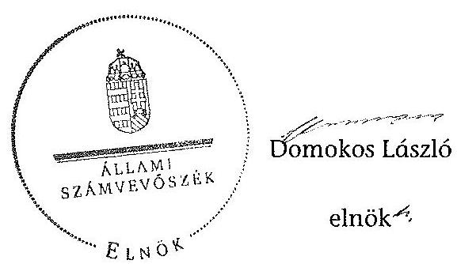

# ÁLLAMI   SZÁMVEVŐSZÉK 

## JELENTÉS

a helyi nemzetiségi önkormányzatok gazdálkodásának ellenőrzéséről
Tét Város Roma Nemzetiségi Önkormányzat

---

# Állami Számvevőszék 

Iktatószám: V-0153-040/2014.
Témaszám: 1201
Vizsgálat-azonosító szám: V065210

## Az ellenőrzést felügyelte:

Horváth Balázs
felügyeleti vezető
Az ellenőrzést vezette és az ellenőrzés végrehajtásáért felelős:
Pats Regina
ellenőrzésvezető
A számvevőszéki jelentést készítették és a jelentés összeállításában közreműködtek:

Csényi István
számvevő tanácsos
Dr. Fátrainé Zsebedics Katalin
számvevő tanácsos
Az ellenőrzést végezték:
Fekete Győr László Gölöncsér Péter
számvevő
számvevő

---

# TARTALOMJEGYZÉK 

BEVEZETÉS ..... 3
I. ÖSSZEGZŐ MEGÁLLAPÍTÁSOK, KÖVETKEZTETÉSEK, JAVASLATOK ..... 6
II. RÉSZLETES MEGÁLLAPÍTÁSOK ..... 12

1. A Nemzetiségi Önkormányzat és a Települési Önkormányzat együttműködésének szabályozása, a működési feltételek biztosítása ..... 12
2. A gazdálkodási feladatok ellátásának szabályszerűsége ..... 13
2.1. A költségvetésre és zárszámadásra, valamint a kincstári adatszolgáltatás rendjére vonatkozó jogszabályi előírások betartása ..... 13
2.2. A Nemzetiségi Önkormányzat gazdálkodásának szabályozottsága ..... 14
2.3. Az operatív gazdálkodási jogkörök kialakítása, gyakorlása ..... 15
3. A Nemzetiségi Önkormányzattal kapcsolatos gazdálkodási feladatok belső ellenőrzése ..... 16
4. A Nemzetiségi Önkormányzat feladatellátása ..... 16

## MELLÉKLET

1. számú A Nemzetiségi Önkormányzat 2012. évi gazdálkodásának főbb adatai, mutatói

## FÜGGELÉKEK

1. számú Rövidítések jegyzéke
2. számú Értelmező szótár
3. számú A gazdálkodás értékelésének módszere

---

.

---

# JELENTÉS   a helyi nemzetiségi önkormányzatok gazdálkodásának ellenőrzéséről Tét Város Roma Nemzetiségi Önkormányzat 

## BEVEZETÉS

A Nemzetiségi Önkormányzat 1998. évben alakult, elnöke a 2010. évi helyhatósági választások óta látja el feladatát. A Nemzetiségi Önkormányzat intézményt, gazdasági társaságot és más szervezetet nem alapított, illetve ezek társulásában nem vett részt. A négytagú Képviselő-testület a munkája segítésére bizottságot nem hozott létre. A Nemzetiségi Önkormányzat költségvetési beszámolója szerint a 2012. évben a módosított költségvetési bevételi és kiadási előirányzat 215,0 ezer Ft, a teljesített költségvetési bevétel 335,0 ezer Ft, a teljesített költségvetési kiadás 323,0 ezer Ft volt. A Nemzetiségi Önkormányzat a 2011. és a 2012. évben feladatalapú támogatásban nem részesült. A 2012. évi gazdálkodási adatokat részletesen az 1. számú mellékletben mutatjuk be.

Az Alaptörvény XXIX. cikk (1) bekezdése szerint a Magyarországon élő nemzetiségek államalkotó tényezők. Minden, valamely nemzetiséghez tartozó magyar állampolgárnak joga van önazonossága szabad vállalásához és megőrzéséhez. A hazánkban élő nemzetiségek helyi (települési és területi) valamint országos önkormányzatokat hozhatnak létre. A helyi nemzetiségi önkormányzatok gazdálkodási feladatait jogszabályi előírás alapján a székhely szerinti helyi önkormányzat polgármesteri hivatala látja el.

A nemzetiségek helyzete, támogatása mind hazai, mind EU-s szinten kiemelt figyelmet kap napjainkban. A helyi nemzetiségi önkormányzatok gazdálkodására és támogatási rendszerére vonatkozó jogszabályok a 2010-2012. években jelentős változásokon mentek át. A települési és területi nemzetiségi önkormányzatok gazdálkodásának, a részükre juttatott költségvetési támogatások felhasználásának ellenőrzését az ÁSZ 2012-ben sorozatjellegű ellenőrzés keretében indította el. A 2013. évi ellenőrzések e témacsoportos ellenőrzések folytatását jelentik.

Az ellenőrzés célja annak értékelése volt, hogy a nemzetiségi önkormányzat gazdálkodási kereteinek kialakítása, gazdálkodása és feladatellátása megfelelt-e a jogszabályoknak.

Ennek keretében értékeltük, hogy:

- a nemzetiségi önkormányzat és a települési önkormányzat együttműködésének szabályozása, a működési feltételek biztosítása megfelelt-e a jogszabályi előírásoknak;

---

- a felek együttműködése megfelelt-e a közöttük létrejött megállapodásnak a gazdálkodási feladatok szabályszerű ellátása során, ennek keretében betartották-e a helyi nemzetiségi önkormányzat gazdálkodásához kapcsolódóan a költségvetésre és zárszámadásra, a gazdálkodás szabályozására, az operatív gazdálkodási jogkörök gyakorlására vonatkozó jogszabályi előírásokat;
- a jegyző biztosította-e a nemzetiségi önkormányzat gazdálkodásának belső ellenőrzését;
- a nemzetiségi önkormányzat feladatalapú támogatásának felhasználása, a folyósított feladatalapú támogatással történő elszámolás az előírásoknak megfelelő volt-e;
- a nemzetiségi önkormányzat feladatellátása összhangban volt-e a vonatkozó jogszabályi előírásokkal.

Az ellenőrzés várható hasznosulását négy szinten tervezzük. A törvényalkotás számára összegzett tapasztalatok állnak rendelkezésre a nemzetiségi önkormányzatok testületi döntéseinek, gazdálkodásának és a feladatalapú támogatás felhasználásának szabályszerűségéről, amelynek alapján következtetést lehet levonni arra, hogy indokolt-e esetleges jogszabályi módosítás kezdeményezése. Az ellenőrzés az ellenőrzött számára visszajelzést ad a működésében fellépő hiányosságokról, javaslataival hozzájárul azok kiküszöböléséhez, amely csökkentheti a későbbi ellenőrzések gyakoriságát. Az ellenőrzés megállapításai és javaslatai tanulságul szolgálhatnak más nemzetiségi önkormányzatok, szervezetek számára a rendezett gazdálkodási keretek kialakításához. A társadalom számára jelzi, hogy közpénz nem maradhat ellenőrizetlenül, az ÁSZ értékteremtő rend kialakításához és megőrzéséhez hozzájáruló tevékenysége pozitív hatással lesz a szervezetről kialakított összkép formálásában. Az ÁSZ szervezetén belül lehetőség nyílik arra, hogy a megállapítások szintetizálásával az intézmény a hozzáadott értéket teremtő elemző tevékenységét és tanácsadó szerepét erősítse.

A helyi nemzetiségi önkormányzatok gazdálkodásának ellenőrzéséről szóló jelentés I. fejezetének összegző része az ellenőrzés céljára adott rövid, szintetizáló összefoglalót és következtetéseket tartalmazza a II. fejezet részletes megállapításain alapulóan. A jelentés intézkedést igénylő megállapításait és javaslatait az összegzőben foglaltak mellett - az ellenőrzés során feltárt, a jelentés II. fejezetében rögzített részletes megállapítások alapozzák meg, illetve támasztják alá.

Az ellenőrzés típusa: szabályszerűségi ellenőrzés.
Az ellenőrzött időszak: 2012. január 1. - 2012. december 31. közötti időszak. Az ellenőrzés kiterjedt a helyi nemzetiségi önkormányzatoknak juttatott 2012. évi feladatalapú támogatás 2013. évben való elszámolására is.

Ellenőrzött szervezet: Tét Város Roma Nemzetiségi Önkormányzat és a gazdálkodási feladatait ellátó Tét Város Önkormányzata.

Az ellenőrzés végrehajtásának jogszabályi alapját az Állami Számvevőszékről szóló 2011. évi LXVI. törvény 1. § (3) bekezdése, az 5. § (2) és (6) be-

---

kezdései, valamint az Államháztartásról szóló 2011. évi CXCV. törvény 61. §. (2) bekezdésének előírásai képezik.

Az ellenőrzés szakmai módszertana az ÁSZ hivatalos honlapján (www.asz.hu) közzétett szakmai szabályokon alapult, amely a Legfőbb Ellenőrző Intézmények Nemzetközi Szervezete (INTOSAI) által kiadott nemzetközi standardok (ISSAI) figyelembevételével készült.

A helyi nemzetiségi önkormányzatok gazdálkodásának ellenőrzése során értékeltük a települési önkormányzat és a nemzetiségi önkormányzat együttműködésének, a gazdálkodás szabályozottságának és a pénzügyi folyamatokban kulcsszerepet betöltő belső kontrollok (teljesítésigazolás és érvényesítés) működésének megfelelőségét. A kulcskontrollokat a dologi kiadásokkal kapcsolatos kifizetéseknél véletlen mintavételi eljárást alkalmazva ellenőriztük. Ellenőriztük, hogy a jegyző biztosította-e a nemzetiségi önkormányzat gazdálkodásának belső ellenőrzését. Értékeltük a feladatalapú támogatások felhasználásának, elszámolásának szabályszerűségét, a nemzetiségi önkormányzat feladatellátása és a jogszabályi előírások összhangját.

Az ellenőrzés lefolytatásához a Nemzetiségi Önkormányzat és a gazdálkodási feladatait ellátó Települési Önkormányzat tanúsítványok és a kapcsolódó, dokumentumjegyzékben megjelölt dokumentumok elektronikus úton történő megküldésével, rendelkezésre bocsátásával szolgáltatott adatokat. Az adatszolgáltatás kontrollálása és szükség szerinti javítása a helyszíni ellenőrzés keretében történt. A gazdálkodás értékelésének módszerét a 3. számú függelék tartalmazza.

Az ÁSZ tv. 29. § (1) bekezdése szerint a jelentéstervezetet megküldtük a polgármester és a Nemzetiségi Önkormányzat elnöke részére, akik az ÁSZ tv. 29. § (2) bekezdésében foglalt észrevételezési jogukkal nem éltek, a jelentéstervezetre észrevételt nem tettek.

---

# I. ÖSSZEGZŐ MEGÁLLAPÍTÁSOK, KÖVETKEZTETÉSEK, JAVASLATOK 

A Nemzetiségi Önkormányzat és a Települési Önkormányzat együttműködésének szabályozása nem felelt meg a jogszabályi előírásoknak. Az együttműködési megállapodás az Áht. ${ }_{2}$ előírása ellenére nem tartalmazta a Nemzetiségi Önkormányzat bevételeivel és kiadásaival kapcsolatban az ellenőrzési, a finanszírozási és az adatszolgáltatási feladatok részletes szabályait. A Nek. ${ }_{2}$ tvben foglaltak ellenére hiányoztak a Nemzetiségi Önkormányzat költségvetésének előkészítésével és megalkotásával, valamint a költségvetéssel összefüggő adatszolgáltatási kötelezettségek teljesítésével, a törzskönyvi nyilvántartásba vétellel és adószám igénylésével kapcsolatos határidők, az együttműködési kötelezettség és a felelősök konkrét kijelölése. A Nek. ${ }_{2}$ tv-ben foglalt, a Települési Önkormányzatot terhelő pénzügyi ellenjegyzési, érvényesítési feladatokkal kapcsolatban a felelősök konkrét kijelölését, továbbá a Nemzetiségi Önkormányzat kötelezettségvállalásának SZMSZ-ében meghatározott szabályait, különösen az összeférhetetlenségi és nyilvántartási kötelezettségeket nem szerepeltették. Az együttműködési megállapodás nem tartalmazta, hogy a jegyző, vagy annak - a jegyzővel azonos képesítési előírásoknak megfelelő - megbízottja a Települési Önkormányzat megbízásából és képviseletében részt vesz a Nemzetiségi Önkormányzat Képviselő-testületi ülésein és jelzi amennyiben törvénysértést észlel. A Települési Önkormányzat a szabályozási hiányosságok ellenére biztosította a Nemzetiségi Önkormányzat működéséhez szükséges személyi és tárgyi feltételeket.

A Nemzetiségi Önkormányzat a 2012. évi költségvetésére és zárszámadására, valamint a kincstári adatszolgáltatás rendjére vonatkozó jogszabályi előírásoknak részben felelt meg. A költségvetési határozat nem tartalmazta - az Áht. 2 -ben előírtak ellenére - a finanszírozási bevételekkel és kiadásokkal kapcsolatos hatásköröket. A 2012. évi zárszámadási határozat tervezetet - az Áht. ${ }_{2}$ előírásai ellenére - a jegyző az előírt határidőn túl készítette el, így a Nemzetiségi Önkormányzat elnöke határidőn túl terjesztette a Képviselőtestület elé. A zárszámadási határozat tervezet előterjesztésekor a Képviselőtestület részére tájékoztatásul nem mutatták be az Áht. ${ }_{2}$-ben előírt többéves kihatással járó döntések számszerűsítését éves bontásban és összesítve, valamint a közvetett támogatásokat tartalmazó kimutatásokat. A költségvetési és zárszámadási határozatok egymással összehasonlítható szerkezetben készültek. A zárszámadási határozatban a Nemzetiségi Önkormányzat valamennyi bevételéről és kiadásáról elszámoltak, azonban az Áht. ${ }_{2}$ előírásait figyelmen kívül hagyva, az előző évi pénzmaradvány igénybevételével, valamint a megyei nemzetiségi önkormányzattól kapott támogatás összegével - legkésőbb a zárszámadással egyidejűleg - nem módosították a költségvetési határozatot. A jegyző a Települési Önkormányzat 2012. évi költségvetéshez kapcsolódó, a Nemzetiségi Önkormányzatra vonatkozó kincstári adatszolgáltatási kötelezettségének határidőn túl tett eleget, mert a negyedéves időközi költségvetési és mérlegjelentéseket az Ávr. szerinti határidőket követően küldte meg a Kincstárnak.

---

A gazdálkodás szabályozottsága részben volt megfelelő. A Számv. tv-ben és az Áhsz-ben előírt szabályzatok - az eszközök és források értékelési szabályzata kivételével - rendelkezésre álltak. A Polgármesteri Hivatal számviteli politikájának és számlarendjének, a leltározási és leltárkészítési szabályzatának, valamint a pénzkezelési szabályzatának hatálya kiterjedt a Nemzetiségi Önkormányzat gazdálkodási feladataira, azonban a Polgármesteri Hivatal SZMSZ-e nem tartalmazta az Ávr. szerinti, a munkakörökhöz tartozó - a Nemzetiségi Önkormányzat gazdálkodásával kapcsolatos - feladat- és hatáskörökre, a hatáskörök gyakorlásának módjára, a helyettesítés rendjére, az ezekhez kapcsolódó felelősségi szabályokra vonatkozó előírásokat. Az ellenőrzött időszakban a Nemzetiségi Önkormányzat gazdálkodásával kapcsolatos kontrollkörnyezet kialakítása keretében a Bkr-ben előírt folyamatba épített előzetes, utólagos és vezetői ellenőrzés szabályozása nem történt meg.

A Nemzetiségi Önkormányzat gazdálkodása tekintetében az operatív gazdálkodási jogkörök kialakítása részben felelt meg a jogszabályi előírásoknak. A Nemzetiségi Önkormányzat elnöke az Áht. ${ }_{2}$-ben és az Ávr-ben foglaltak alapján a kötelezettségvállalás és az utalványozás gyakorlására más képviselőt írásban nem hatalmazott fel, emiatt az Ávr-ben előírt összeférhetetlenségi követelmények érvényesülésének feltételeit nem biztosította. A gazdasági szervezettel nem rendelkező Polgármesteri Hivatalban a jegyző - az Ávr. szerinti jogkörét 2012. november 30 -áig nem gyakorolta - csak 2012. december 1-jétől jelölt ki írásban a Polgármesteri Hivatal állományába tartozó, előírt végzettséggel rendelkező köztisztviselőt a pénzügyi ellenjegyzési feladatra. A Nemzetiségi Önkormányzatnál a 2012. évben a dologi kiadások teljesítése során a teljesítésigazolás és az érvényesítés kulcsszerepet betöltő kontrollok működésének megfelelősége gyenge volt, a hibák száma a lényegességi szintet, a kritikus hibahatárt elérte. A teljesítésigazolást az arra nem jogosult személy végezte, így a kiadások teljesítése jogosságának, összegszerűségének, valamint az ellenszolgáltatás teljesítésének igazolása jogszerűen nem történt meg. Az érvényesítés az Áht. ${ }_{2}$ előírása ellenére nem történt meg. A számvevőszéki ellenőrzés a kifizetések dokumentumainak ellenőrzése alapján nem tárt fel jogosulatlan kifizetést, a kulcskontrollok működéséhez kapcsolódó hiányosságok
 miatt azonban nem volt biztosított a hibák megelőzése, feltárása és kijavítása.

A jegyző nem biztosította a Nemzetiségi Önkormányzat gazdálkodásával összefüggő végrehajtási feladatok belső ellenőrzését. A Polgármesteri Hivatal 2012. évi belső ellenőrzési tervét megalapozó kockázatelemzés - a Ber-ben foglaltak ellenére - nem terjedt ki a Nemzetiségi Önkormányzat gazdálkodásával összefüggő végrehajtási feladatokra, azok tekintetében belső ellenőrzési feladatot a 2012. évben nem terveztek és nem végeztek.

A Nemzetiségi Önkormányzat a képviselő-testületi működésen túl a 2012. évet érintően a Nek. ${ }_{2}$ tv. szerinti kötelező, illetve önként vállalt feladatellátás alátámasztására a számvevőszéki ellenőrzés részére nem bocsátott rendelkezésre dokumentumokat.

Az ÁSZ tv. 33. § (1) bekezdésében foglaltak értelmében az ellenőrzött szervezet vezetője köteles a jelentésben foglalt megállapításokhoz kapcsolódó intézkedési tervet összeállítani, és azt a jelentés kézhezvételétől számított 30 napon belül az

---

ÁSZ részére megküldeni. Amennyiben az intézkedési tervet határidőre nem küldi meg a szervezet, vagy az nem elfogadható, az ÁSZ elnöke az ÁSZ tv. 33. § (3) bekezdés a)-b) pontjaiban foglaltakat érvényesítheti.

A helyszíni ellenőrzés megállapításainak hasznosítása mellett javasoljuk:

# a jegyzőnek 

1. az együttműködés szabályozásával kapcsolatosan

Az együttműködési megállapodás az Áht. 2 27. § (2) bekezdés előírása ellenére nem tartalmazta a Nemzetiségi Önkormányzat bevételeivel és kiadásaival kapcsolatban az ellenőrzési, a finanszírozási és az adatszolgáltatási feladatok részletes szabályait. A Nek. 2 tv. 80. § (3) bekezdés a) pontjában foglaltak ellenére hiányoztak a Nemzetiségi Önkormányzat költségvetésének előkészítésével és megalkotásával, valamint a költségvetéssel összefüggő adatszolgáltatási kötelezettségek teljesítésével, a törzskönyvi nyilvántartásba vétellel és adószám igénylésével kapcsolatos határidők, az együttműködési kötelezettség és a felelősök konkrét kijelölése. A Nek. 2 tv. 80. § (3) bekezdés b) pontjában foglalt, a Települési Önkormányzatot terhelő pénzügyi ellenjegyzési, érvényesítési feladatokkal kapcsolatban a felelősök konkrét kijelölését, továbbá a Nek. 2 tv. 80. § (3) bekezdés c) pontja szerint a Nemzetiségi Önkormányzat kötelezettségvállalásának SZMSZ-ében meghatározott szabályait, különösen az összeférhetetlenségi és nyilvántartási kötelezettségeket nem szerepeltették. A Nek. 2 tv. 80. § (4) bekezdésében foglaltak ellenére a megállapodás nem tartalmazta, hogy a jegyző, vagy annak - a jegyzővel azonos képesítési előírásoknak megfelelő - megbízottja a Települési Önkormányzat megbízásából és képviseletében részt vesz a Nemzetiségi Önkormányzat Képviselő-testületi ülésein és jelzi amennyiben törvénysértést észlel.

Javaslat
Készítse elő az együttműködési megállapodás módosítását, hogy az tartalmilag feleljen meg az Áht. 2 27. § (2) bekezdésében, a Nek. 2 tv. 80. § (3) bekezdés a) - c) pontjaiban, valamint a Nek. 2 tv. 80. § (4) bekezdésében foglalt előírásoknak.
2. a költségvetési és zárszámadási határozattal kapcsolatban

A költségvetési határozat nem tartalmazta - az Áht. 2 23. § (2) bekezdés h) pontja szerinti - a finanszírozási bevételekkel és kiadásokkal kapcsolatos hatásköröket. A 2012. évi zárszámadási határozat tervezetet - az Áht. 2 91. § (1) bekezdése előírása ellenére - a jegyző az előírt határidőn túl készítette el, így a Nemzetiségi Önkormányzat elnöke határidőn túl terjesztette a Képviselő-testület elé. A zárszámadási határozat tervezetének előterjesztésekor a Képviselő-testület részére tájékoztatásul nem mutatták be az Áht. 2 91. § (2) bekezdés a) pontjában előírt többéves kihatással járó döntések számszerűsítését éves bontásban és összesítve, valamint a közvetett támogatásokat tartalmazó kimutatásokat. A zárszámadási határozatban az Áht. 2 34. § (1) és (6) bekezdéseinek előírásait figyelmen kívül hagyva, az előző évi pénzmaradvány igénybevételével, valamint a megyei nemzetiségi önkormányzattól kapott támogatás összegével nem módosították sem a bevételi, sem a kiadási előirányzatokat.

Javaslat

---

A költségvetés, zárszámadás szabályszerűsége érdekében a jövőben:
a) gondoskodjon arról, hogy a költségvetési határozat tartalmában feleljen meg az Áht. 2 23. § (2) bekezdés h) pontjában, a zárszámadási határozat az Áht. 2 34. § (1) és (6) bekezdéseiben, valamint az Áht. 2 91. § (2) bekezdés a) pontjában foglalt előírásoknak;
b) a zárszámadási határozat tervezet határidőben történő elkészítése céljából biztosítsa az Áht. 2 91. § (3) bekezdésében foglaltak betartását.
3. a kincstári adatszolgáltatási kötelezettség teljesítésével összefüggésben

A jegyző a negyedéves időközi költségvetési jelentéseket az Ávr. 169. § (2) bekezdése szerinti határidőket követően, a negyedéves időközi mérlegjelentéseket az Ávr. 170. § (5) bekezdése szerinti határidőt követően küldte meg a Kincstárnak.

Javaslat
A jövőben az adatszolgáltatási kötelezettségeinek az Ávr. 169. § (2) bekezdésében és az Ávr. 170. § (5) bekezdésében foglalt határidők betartásával tegyen eleget.
4. a gazdálkodás szabályozottságával, ellátásával kapcsolatban

A Nemzetiségi Önkormányzat - és a Polgármesteri Hivatal - nem rendelkezett a Számv. tv. 14. § (5) bekezdés b) pontjában előírt eszközök és források értékelési szabályzatával. A Nemzetiségi Önkormányzat gazdálkodásával kapcsolatos kontrollkörnyezet kialakítása keretében a Bkr. 8. § (2)-(4) bekezdései szerinti folyamatba épített előzetes, utólagos és vezetői ellenőrzés szabályozása nem történt meg. A Polgármesteri Hivatal SZMSZ-e nem tartalmazta az Ávr. 13. § (1) bekezdés g) pontjában foglaltak szerinti, a munkakörökhöz tartozó - a Nemzetiségi Önkormányzat gazdálkodásával kapcsolatos - feladat- és hatáskörökre, a hatáskörök gyakorlásának módjára, a helyettesítés rendjére, az ezekhez kapcsolódó felelősségi szabályokra vonatkozó előírásokat.

Javaslat
A gazdálkodás szabályszerűsége érdekében:
a) készítse elő a Polgármesteri Hivatal - Számv. tv. 14. § (5) bekezdés b) pontjában előírt - eszközök és források értékelési szabályzatát a Nemzetiségi Önkormányzat gazdálkodási feladataira is kiterjedően;
b) az Ávr. 13. § (3a) bekezdése alapján gondoskodjon a Nemzetiségi Önkormányzat gazdálkodási feladatait érintően a Bkr. 8. § (2)-(4) bekezdései szerinti folyamatba épített előzetes, utólagos és vezetői ellenőrzés szabályozásáról;
c) készítse elő a Polgármesteri Hivatal SZMSZ-e módosítását figyelemmel az Ávr. 13. § (1) bekezdés g) pontjában foglaltakra.

---

5. a pénzügyi kulcskontrollok működésével kapcsolatban

Az érvényesítés az Ávr. 58. § (1) bekezdésében foglaltak ellenére nem történt meg, így a kifizetéseket megelőzően az Ávr. 58. § (1) és (3) bekezdésében előírt feladatokat nem végezték el.

Javaslat
Intézkedjen az érvényesítési feladatok Ávr. 58. § (1) és (3) bekezdésében előírtak szerinti elvégzéséről.

# a polgármesternek 

Az együttműködési megállapodás az Áht. 2 27. § (2) bekezdés előírása ellenére nem tartalmazta a Nemzetiségi Önkormányzat bevételeivel és kiadásaival kapcsolatban az ellenőrzési, a finanszírozási és az adatszolgáltatási feladatok részletes szabályait. A Nek. 2 tv. 80. § (3) bekezdés a) pontjában foglaltak ellenére hiányoztak a Nemzetiségi Önkormányzat költségvetésének előkészítésével és megalkotásával, valamint a költségvetéssel összefüggő adatszolgáltatási kötelezettségek teljesítésével, a törzskönyvi nyilvántartásba vétellel és adószám igénylésével kapcsolatos határidők, az együttműködési kötelezettség és a felelősök konkrét kijelölése. A Nek. 2 tv. 80. § (3) bekezdés b) pontjában foglalt, a Települési Önkormányzatot terhelő pénzügyi ellenjegyzési, érvényesítési feladatokkal kapcsolatban a felelősök konkrét kijelölését, továbbá a Nek. 2 tv. 80. § (3) bekezdés c) pontja szerint a Nemzetiségi Önkormányzat kötelezettségvállalásának SZMSZ-ében meghatározott szabályait, különösen az összeférhetetlenségi és nyilvántartási kötelezettségeket nem szerepeltették. A Nek. 2 tv. 80. § (4) bekezdésében foglaltak ellenére a megállapodás nem tartalmazta, hogy a jegyző, vagy annak - a jegyzővel azonos képesítési előírásoknak megfelelő - megbízottja a Települési Önkormányzat megbízásából és képviseletében részt vesz a Nemzetiségi Önkormányzat Képviselő-testületi ülésein és jelzi amennyiben törvénysértést észlel.

A Nemzetiségi Önkormányzat - és a Polgármesteri Hivatal - nem rendelkezett a Számv. tv. 14. § (5) bekezdés b) pontjában előírt eszközök és források értékelési szabályzatával. A Polgármesteri Hivatal SZMSZ-e nem tartalmazta az Ávr. 13. § (1) bekezdés g) pontjában foglaltak szerinti, a munkakörökhöz tartozó - a Nemzetiségi Önkormányzat gazdálkodásával kapcsolatos - feladat- és hatáskörökre, a hatáskörök gyakorlásának módjára, a helyettesítés rendjére, az ezekhez kapcsolódó felelősségi szabályokra vonatkozó előírásokat.

Javaslat
Terjessze a Települési Önkormányzat Képviselő-testülete elé jóváhagyásra:
a) az Áht. 2 27. § (2) bekezdésében, a Nek. 2 tv. 80. § (3) bekezdés a) - c) pontjaiban, valamint a Nek. 2 tv. 80. § (4) bekezdésében foglalt előírások betartásával előkészített együttműködési megállapodás módosítást;

---

b) a jegyző által elkészített Polgármesteri Hivatal - Számv. tv. 14. § (5) bekezdés b) pontjában előírt - eszközök és források értékelési szabályzatát a Nemzetiségi Önkormányzat gazdálkodási feladataira is kiterjedően;
c) a Polgármesteri Hivatal SZMSZ-e módosítását annak érdekében, hogy az megfeleljen az Ávr. 13. § (1) bekezdés g) pontjában foglalt előírásoknak.

# a Nemzetiségi Önkormányzat elnökének 

Az együttműködési megállapodás az Áht. 2 27. § (2) bekezdés előírása ellenére nem tartalmazta a Nemzetiségi Önkormányzat bevételeivel és kiadásaival kapcsolatban az ellenőrzési, a finanszírozási és az adatszolgáltatási feladatok részletes szabályait. A Nek. 2 tv. 80. § (3) bekezdés a) pontjában foglaltak ellenére hiányoztak a Nemzetiségi Önkormányzat költségvetésének előkészítésével és megalkotásával, valamint a költségvetéssel összefüggő adatszolgáltatási kötelezettségek teljesítésével, a törzskönyvi nyilvántartásba vétellel és adószám igénylésével kapcsolatos határidők, az együttműködési kötelezettség és a felelősök konkrét kijelölése. A Nek. 2 tv. 80. § (3) bekezdés b) pontjában foglalt, a Települési Önkormányzatot terhelő pénzügyi ellenjegyzési, érvényesítési feladatokkal kapcsolatban a felelősök konkrét kijelölését, továbbá a Nek. 2 tv. 80. § (3) bekezdés c) pontja szerint a Nemzetiségi Önkormányzat kötelezettségvállalásának SZMSZ-ében meghatározott szabályait, különösen az összeférhetetlenségi és nyilvántartási kötelezettségeket nem szerepeltették. A Nek. 2 tv. 80. § (4) bekezdésében foglaltak ellenére a megállapodás nem tartalmazta, hogy a jegyző, vagy annak - a jegyzővel azonos képesítési előírásoknak megfelelő - megbízottja a Települési Önkormányzat megbízásából és képviseletében részt vesz a Nemzetiségi Önkormányzat Képviselő-testületi ülésein és jelzi amennyiben törvénysértést észlel.

Javaslat
Terjessze a Képviselő-testület elé jóváhagyásra az Áht. 2 27. § (2) bekezdésében, a Nek. 2 tv. 80. § (3) bekezdés a)-c) pontjaiban, valamint a Nek. 2 tv. 80. § (4) bekezdésében foglalt előírások betartásával előkészített együttműködési megállapodás módosítást.

---

# II. RÉSZLETES MEGÁLLAPÍTÁSOK 

## 1. A Nemzetiségi Önkormányzat és a Települési Önkormányzat együttműködésének szabályozása, a működési feltételek biztosítása

A Nemzetiségi Önkormányzat és a Települési Önkormányzat együttműködésének szabályozása nem felelt meg a jogszabályi előírásoknak. A 2010. február 16-án kelt együttműködési megállapodás felülvizsgálatára a Nek. 2 tv. 80. § (2) bekezdés, valamint a 159. § (3) bekezdés előírásai ellenére az előírt határidőkig nem került sor. A Nemzetiségi Önkormányzat az ellenőrzött időszaknak csak egy részében rendelkezett a jogszabályi előírásoknak megfelelő eljárásrendben és határidőben jóváhagyott, módosított együttműködési megállapodással. A 2010. február 16-án kelt együttműködési megállapodás hatályon kívül helyezését és új megállapodás megkötését a Képviselőtestület a 17/2012. (IX. 7.) számú, a Települési Önkormányzat Képviselőtestülete a 101/2012. (VIII. 29.) számú határozattal fogadta el. Az új együttműködési megállapodás az V. fejezet ${ }^{1}$ vonatkozásában - Nek. ${ }_{2}$ tv. előírásainak megfelelően - csak 2013. január 1-jétől volt hatályos.

Az együttműködés szabályozása - a 2012. december 31-én hatályos együttműködési megállapodás alapján - az Áht. ${ }_{2}$-ben és a Nek. ${ }_{2}$ tv-ben meghatározott tartalmi elemek tekintetében hiányos volt, mert a megállapodás nem tartalmazta:

- az Áht. 2 27. § (2) bekezdés előírása ellenére a Nemzetiségi Önkormányzat bevételeivel és kiadásaival kapcsolatban az
 ellenőrzési, a finanszírozási és az adatszolgáltatási feladatok részletes szabályait;
- a Nek. ${ }_{2}$ tv. 80. § (3) bekezdés a) pontjában foglaltakat figyelmen kívül hagyva a Nemzetiségi Önkormányzat törzskönyvi nyilvántartásba vételével és az adószám igénylésével kapcsolatos határidőket, az együttműködési kötelezettséget és ezek felelőseinek konkrét kijelölését, a költségvetés előkészítésével és megalkotásával, valamint a költségvetéssel összefüggő adatszolgáltatási kötelezettségek teljesítésével kapcsolatban a felelősök konkrét kijelölését;
- a Nek. ${ }_{2}$ tv. 80. § (3) bekezdés b) pontjában foglaltak ellenére a Nemzetiségi Önkormányzat kötelezettségvállalásaival kapcsolatosan a Települési Önkormányzatot terhelő pénzügyi ellenjegyzési, érvényesítési feladatokkal kapcsolatban a felelősök konkrét kijelölését;
- a Nek. ${ }_{2}$ tv. 80. § (3) bekezdés c) pontjában foglaltakat figyelmen kívül hagyva a Nemzetiségi Önkormányzat kötelezettségvállalásának SZMSZ-ében

[^0]
[^0]:    ${ }^{1}$ Az együttműködési megállapodás V. fejezete a Nemzetiségi Önkormányzat működésének személyi és tárgyi feltételeinek biztosításáról rendelkezik.

---

meghatározott szabályait, különösen az összeférhetetlenségi és nyilvántartási kötelezettségeket;

- a Nek. ${ }_{2}$ tv. 80. § (4) bekezdésében foglaltak ellenére azt, hogy a jegyző, vagy annak - a jegyzővel azonos képesítési előírásoknak megfelelő - megbízottja a Települési Önkormányzat megbízásából és képviseletében részt vesz a Nemzetiségi Önkormányzat képviselő-testületi ülésein és jelzi, amennyiben törvénysértést észlel.

A Települési Önkormányzat a szabályozási hiányosságok ellenére biztosította a Nemzetiségi Önkormányzat működéséhez szükséges személyi és tárgyi feltételeket.

# 2. A GAZDÁLKODÁSI FELADATOK ELLÁTÁSÁNAK SZABÁLYSZERŰSÉGE 

### 2.1. A költségvetésre és zárszámadásra, valamint a kincstári adatszolgáltatás rendjére vonatkozó jogszabályi előírások betartása

A Nemzetiségi Önkormányzat 2012. évi költségvetésének ${ }^{2}$ és zárszámadásának ${ }^{3}$ tartalma, jóváhagyása, valamint a kapcsolódó 2012. évi kincstári adatszolgáltatás szabályszerűsége részben felelt meg a jogszabályi előírásoknak.

A Nemzetiségi Önkormányzat elnöke a 2012. évi költségvetés tervezetét a jogszabályi előírásoknak megfelelően, határidőben benyújtotta a Képviselőtestületnek. A 2012. évi költségvetés előterjesztésekor a Képviselő-testület részére bemutatták az előírt mérlegeket és kimutatásokat, azonban a költségvetési határozat nem tartalmazta - az Áht. 2 23. § (2) bekezdés h) pontja szerint - a finanszírozási bevételekkel és kiadásokkal kapcsolatos hatásköröket.

A 2012. évi zárszámadási határozat tervezetet - az Áht. 2 91. § (1) és (3) bekezdései előírásai ellenére - a jegyző az előírt határidőn túl ${ }^{4}$ készítette el, így a Nemzetiségi Önkormányzat elnöke határidőn túl terjesztette a Képviselőtestület elé. A zárszámadás összeállítása során a határozat elkészítésére, tartalmi előírásaira, elfogadására és továbbítására vonatkozó előírásokat betartották. A zárszámadási határozat tervezetének előterjesztésekor a Képviselőtestület részére tájékoztatásul nem mutatták be az Áht. 2 91. § (2) bekezdés a) pontjában előírt többéves kihatással járó döntések számszerűsítését éves bontásban és összesítve, valamint a közvetett támogatásokat tartalmazó kimutatásokat. A költségvetési és zárszámadási határozatok egymással összehasonlítható szerkezetben készültek. A zárszámadási határozatban a Nemzetiségi Önkormányzat valamennyi bevételéről és kiadásáról elszámoltak, azonban az

[^0]
[^0]:    ${ }^{2}$ A Nemzetiségi Önkormányzat Képviselő-testületének 2012. évi költségvetéséről szóló 2/2012. (II. 3.) számú határozata.
    ${ }^{3}$ A Nemzetiségi Önkormányzat Képviselő-testületének 5/2013. (VI. 7.) számú határozata a 2012. gazdálkodási évről szóló költségvetési beszámoló elfogadásáról.
    ${ }^{4}$ 2013. május 31-én

---

Áht. 33. § (1) és (6) bekezdéseinek előírásait figyelmen kívül hagyva, az előző évi pénzmaradvány igénybevételével, valamint a megyei nemzetiségi önkormányzattól kapott támogatás összegével - legkésőbb a zárszámadással egyidejűleg - nem módosították a költségvetési határozatot.

A jegyző a Települési Önkormányzat 2012. évi költségvetéshez kapcsolódó, a Nemzetiségi Önkormányzatra vonatkozó kincstári adatszolgáltatási kötelezettségének határidőn túl tett eleget, mert a negyedéves időközi költségvetési jelentéseket az Ávr. 169. § (2) bekezdése szerinti határidőket követően, a negyedéves időközi mérlegjelentéseket az Ávr. 170. § (5) bekezdése szerinti határidőt követően küldte meg a Kincstárnak. A féléves és éves elemi költségvetési beszámolók nem készültek el az Áhsz. 10. § (1) bekezdésében előírt határidőre.

# 2.2. A Nemzetiségi Önkormányzat gazdálkodásának szabályozottsága 

A Nemzetiségi Önkormányzat gazdálkodásának szabályozottsága az ellenőrzött időszakban részben volt megfelelő:

- a Polgármesteri Hivatal számviteli politikájának és számlarendjének, a leltározási és leltárkészítési szabályzatának, valamint a pénzkezelési szabályzatának hatálya kiterjedt a Nemzetiségi Önkormányzat gazdálkodási feladataira, így a 2012. évben a Nemzetiségi Önkormányzat rendelkezett a Számv. tv. és az Áhsz. által előírt számviteli politikával és kapcsolódóan a gazdálkodásra vonatkozó - leltározási és leltárkészítési, pénzkezelési és számlarend - szabályzatokkal;
- az Áht. ${ }_{2}$-ben és az Ávr.-ben foglaltak szerinti, a tervezéssel, gazdálkodással, a kötelezettségvállalással, pénzügyi ellenjegyzéssel és teljesítésigazolással, az érvényesítés, utalványozás gyakorlásának módjával, eljárási és dokumentálási részletszabályaival, valamint az ezeket végző személyek kijelölésének rendjével, az ellenőrzési és adatszolgáltatási feladatok teljesítésével kapcsolatos belső előírásokat, feltételeket tartalmazó szabályzat 2012. december 1-jei hatállyal állt rendelkezésre;
azonban:
- a Nemzetiségi Önkormányzat nem rendelkezett a Számv. tv. 14. § (5) bekezdés b) pontjában előírt eszközök és források értékelési szabályzatával (azzal a Polgármesteri Hivatal sem rendelkezett);
- az ellenőrzött időszakban a Nemzetiségi Önkormányzat gazdálkodásával kapcsolatos kontrollkörnyezet kialakítása keretében a Bkr. 8. § (2)-(4) bekezdéseiben előírt folyamatba épített előzetes, utólagos és vezetői ellenőrzés szabályozása nem történt meg;
- a Polgármesteri Hivatal SZMSZ-e nem tartalmazta az Ávr. 13. § (1) bekezdés g) pontjában foglaltak ellenére a munkakörökhöz tartozó - a Nemzetiségi Önkormányzat gazdálkodásával kapcsolatos - feladat- és hatáskörökre, a hatáskörök gyakorlásának módjára, a helyettesítés rendjére, az ezekhez kapcsolódó felelősségi szabályokra vonatkozó előírásokat, és ezen előírásokat a Polgármesteri Hivatalnál a Nemzetiségi Önkormányzat gazdálkodásával

---

kapcsolatos feladatokat ellátó köztisztviselők munkaköri leírásai sem tartalmazták.

# 2.3. Az operatív gazdálkodási jogkörök kialakítása, gyakorlása 

A Nemzetiségi Önkormányzat gazdálkodása tekintetében az operatív gazdálkodási jogkörök kialakítása részben felelt meg a jogszabályi előírásoknak, mivel:

- a Nemzetiségi Önkormányzat elnöke nem hatalmazott fel írásban más képviselőt az Ávr. 52. § (7) bekezdése szerint a kötelezettségvállalás, valamint az Ávr. 59. § (1) bekezdése szerint az utalványozás gyakorlására, emiatt az Ávr. 60. § (2) bekezdésében foglalt összeférhetetlenségi követelmények érvényesülésének feltételeit nem biztosította;
- a gazdasági szervezettel nem rendelkező Polgármesteri Hivatalban a jegyző - 2012. március 30-ig az Ávr. 10. § (7) bekezdése és a 11. § (3)-(4) bekezdése szerinti, 2012. március 31-től az Ávr. 55. § (2) bekezdés g) pontja szerinti jogkörét 2012. november 30-áig nem gyakorolta - csak 2012. december 1-jétől jelölt ki írásban a Polgármesteri Hivatal állományába tartozó, előírt végzettséggel rendelkező köztisztviselőt a pénzügyi ellenjegyzési feladatra.

A Nemzetiségi Önkormányzatnál a 2012. évben a dologi kiadások teljesítése során a teljesítésigazolás és az érvényesítés kulcskontrollok működésének megfelelősége gyenge volt. A hibák száma a lényegességi szintet, a kritikus hibahatárt elérte, mert:

- a teljesítésigazolást 2012. november 30-áig az arra nem jogosult személy végezte, a teljesítésigazoló - jogszabályi előírásoknak megfelelő - kijelölése csak 2012. december 1-jétől történt meg az akkortól hatályba lépő Gazdálkodási Szabályzatban, így az Ávr. 57. § (1) bekezdésében előírt, a kiadások teljesítése jogosságának, összegszerűségének igazolása, valamint az ellenszolgáltatás teljesítésének igazolása jogszerűen 2012. november 30-áig nem történt meg;
- az érvényesítés nem történt meg, így a kifizetéseket megelőzően az Ávr. 58. § (1) és (3) bekezdésében előírt feladatokat nem végezték el.

A számvevőszéki ellenőrzés a kifizetések dokumentumainak ellenőrzése alapján nem tárt fel jogosulatlan kifizetést, a kulcskontrollok működéséhez kapcsolódó hiányosságok miatt azonban nem biztosították a hibák megelőzését, feltárását és kijavítását.

A Nemzetiségi Önkormányzatnál a 2012. évben működési és felhalmozási célú támogatásértékű kiadások, valamint államháztartáson kívülre teljesített működési és felhalmozási célú pénzeszközátadások nem voltak.

---

# 3. A Nemzetiségi ÖNKORMÁNYZATTAL KAPCSOLATOS GAZDÁLKODÁSI FELADATOK BELSŐ ELLENŐRZÉSE 

A jegyző nem biztosította a Nemzetiségi Önkormányzat gazdálkodásával összefüggő végrehajtási feladatok belső ellenőrzését. A Polgármesteri Hivatal 2012. évi belső ellenőrzési tervét megalapozó kockázatelemzés - a Ber. 21. § (2) bekezdésben foglaltak ellenére - nem terjedt ki a Nemzetiségi Önkormányzat gazdálkodásával összefüggő végrehajtási feladatokra, azok tekintetében belső ellenőrzési feladatot a 2012. évben nem terveztek és nem végeztek.

A 2012. évre vonatkozó belső ellenőrzési terv elkészítésének idején hatályos együttműködési megállapodás a Nemzetiségi Önkormányzat belső ellenőrzésére vonatkozóan általános előírást tartalmazott.

A megállapodásban rögzítették, hogy: „A települési kisebbségi önkormányzat belső ellenőrzését a (főállásban / vagy / megbizási jogviszonyban / vagy / önkormányzati társulás keretében) megbízott belső ellenőr végzi. Belső ellenőrzésre a kockázatelemzéssel alátámasztott éves belső ellenőrzési tervben meghatározottak szerint kerül sor. A belső ellenőrzés lefolytatásának rendjét a belső ellenőrzési vezető által jóváhagyott belső ellenőrzési kézikönyv tartalmazza. A települési kisebbségi önkormányzatot érintő belső ellenőri jelentést az elnök a települési kisebbségi önkormányzat képviselő-testületével ismerteti."

A számvevőszéki ellenőrzés részére szolgáltatott adatok alapján a 2012. évben a Kormányhivatal a Nemzetiségi Önkormányzatot illetően nem élt törvényességi felügyeleti eszközökkel.

## 4. A Nemzetiségi ÖNKORMÁNYZAT FELADATELLÁTÁSA

A Nemzetiségi Önkormányzat a képviselő-testületi működésen túl a 2012. évet érintően a Nek. 3 tv. 115. §-a szerinti kötelező, illetve 116. §-a szerinti önként vállalt feladatellátás alátámasztására a számvevőszéki ellenőrzés részére nem bocsátott rendelkezésre dokumentumokat.

Budapest, 2014. $O \lambda$.
hónap C\&. nap

Melléklet: $\quad 1 \mathrm{db}$
Függelék: $\quad 3 \mathrm{db}$

---

# A Nemzetiségi Önkormányzat 2012. évi gazdálkodásának főbb adatai, mutatói

A) Bevételek

|  Megnevezés | Eredeti előirányzat | Módosított | Teljesítés  |
| --- | --- | --- | --- |
|   | ezer Ft |  | megoszlás  |
|  Intézményi működési bevételek | 0,0 | 0,0 | 3,0  |
|  Általános működési támogatás | 215,0 | 215,0 | 215,0  |
|  Megyei Roma Nemzetiségi Önkormányzat által nyújtott támogatás | 0,0 | 0,0 | 90,0  |
|  Pénzforgalmi bevételek összesen | 215,0 | 215,0 | 308,0  |
|  Előző évi pénzmaradvány felhasználás | 0,0 | 0,0 | 27,0  |
|  Bevételek összesen | 215,0 | 215,0 | 335,0  |

B) Kiadások

|  Megnevezés | Eredeti előirányzat | Módosított | Teljesítés  |
| --- | --- | --- | --- |
|   | ezer Ft |  | megoszlás  |
|  Dologi kiadások | 215,0 | 215,0 | 323,0  |
|  Működési kiadások összesen | 215,0 | 215,0 | 323,0  |
|  Kiadások összesen | 215,0 | 215,0 | 323,0  |

---

$\cdot$
$\cdot$
$\cdot$
$\cdot$
$\cdot$
$\cdot$
$\cdot$
$\cdot$
$\cdot$
$\cdot$
$\cdot$
$\cdot$
$\cdot$
$\cdot$
$\cdot$
$\cdot$
$\cdot$
$\cdot$
$\cdot$
$\cdot$
$\cdot$
$\cdot$
$\cdot$
$\cdot$
$\cdot$
$\cdot$
$\cdot$
$\cdot$
$\cdot$
$\cdot$
$\cdot$
$\cdot$
$\cdot$
$\cdot$
$\cdot$
$\cdot$
$\cdot$
$\cdot$
$\cdot$
$\cdot$
$\cdot$
$\cdot$
$\cdot$
$\cdot$
$\cdot$
$\cdot$
$\cdot$
$\cdot$
$\cdot$
$\cdot$
$\cdot$
$\cdot$
$\cdot$
$\cdot$
$\cdot$
$\cdot$
$\cdot$
$\cdot$
$\cdot$
$\cdot$
$\cdot$
$\cdot$
$\cdot$
$\cdot$
$\cdot$
$\cdot$
$\cdot$
$\cdot$
$\cdot$
$\cdot$
$\cdot$
$\

---

# RÖVIDÍTÉSEK JEGYZÉKE 

## Törvények

Alaptörvény
Áht. 1
Áht. 2
ÁSZ tv.
Nek. 1 tv.
Nek. 2 tv.
Számv. tv.

## Rendeletek

Áhsz.

Ámr.
Ávr.

Ber.
Bkr.
támogatási kormányrendelet ${ }_{1}$
támogatási kormányrendelet ${ }_{2}$

Polgármesteri Hivatal SZMSZ-e

## Szórövidítések

ÁSZ
EU

Magyarország Alaptörvénye
Az államháztartásról szóló 1992. évi XXXVIII. törvény (hatályos 2011. december 31-ig)
Az államháztartásról szóló 2011. évi CXCV. törvény (hatályos 2011. december 31-től)
Az Állami Számvevőszékről szóló 2011. évi LXVI. törvény (hatályos 2011. július 1-jétől)
A nemzeti és etnikai kisebbségek jogairól szóló 1993. évi LXXVII. törvény (hatályos 2011. december 31-ig)
A nemzetiségek jogairól szóló 2011. évi CLXXIX. törvény (hatályos 2011. december 20-tól)
A számvitelről szóló 2000. évi C. törvény
Az államháztartás szervezetei beszámolási és könyvvezetési kötelezettségének
 sajátosságairól szóló 249/2000. (XII. 24.) Korm. rendelet (hatályos 2013. december 31-ig)

Az államháztartás működési rendjéről szóló 292/2009. (XII. 19.) Korm. rendelet (hatályos 2011. december 31-ig)

Az államháztartásról szóló törvény végrehajtásáról szóló 368/2011. (XII. 31.) Korm. rendelet (hatályos 2012. január 1-jétől)
193/2003. (XI. 26.) Korm. rendelet a költségvetési szervek belső ellenőrzéséről (hatályos 2011. december 31-ig)
A költségvetési szervek belső kontrollrendszeréről és belső ellenőrzéséről szóló 370/2011. (XII. 31.) Korm. rendelet (hatályos 2012. január 1-jétől)
A kisebbségi önkormányzatoknak a központi költségvetésből, valamint fejezeti kezelésű előirányzatból nyújtott támogatások feltételrendszeréről és elszámolásának rendjéről szóló 342/2010. (XII. 28.) Korm. rendelet (hatályos 2012. március 6-ig)
A nemzetiségi célú előirányzatokból nyújtott támogatások feltételrendszeréről és elszámolásának rendjéről szóló 28/2012. (III. 6.) Korm. rendelet (hatályos 2012. december 31-ig)

Tét Város Polgármesteri Hivatalának Szervezeti és Működési Szabályzatáról szóló 48/2007. (IV. 12.) képviselőtestületi határozat

Állami Számvevőszék
Európai Unió

---

együttműködési megállapodás
jegyző
Képviselő-testület
Kincstár
Kormányhivatal
Nemzetiségi Önkormányzat
Nemzetiségi Önkormányzat elnöke
polgármester
Polgármesteri Hivatal
SZMSZ
Települési Önkormányzat
Települési Önkormányzat Képviselő-testülete

Tét Város Önkormányzata 101/2012. (VIII. 29.) számú képviselő-testületi határozatával és a Nemzetiségi Önkormányzat 17/2012. (IX. 7.) számú képviselő-testületi határozatával elfogadott együttműködési megállapodás
Tét Város Önkormányzatának jegyzője
Tét Város Roma Nemzetiségi Önkormányzat Képviselőtestülete
Magyar Államkincstár Győr-Moson-Sopron Megyei Igazgatósága
Győr-Moson-Sopron Megyei Kormányhivatal
Tét Város Roma Nemzetiségi Önkormányzat
Tét Város Roma Nemzetiségi Önkormányzat elnöke
Tét Város Önkormányzatának polgármestere
Tét Város Önkormányzatának Polgármesteri Hivatala
Szervezeti és Működési Szabályzat
Tét Város Önkormányzata
Tét Város Önkormányzatának Képviselő-testülete

---

# ÉRTELMEZŐ SZÓTÁR 

feladatalapú támogatás
kulcskontrollok
együttműködési megállapodás
nemzetiségi közügy

A támogatási évben általános működési támogatásban részesült, és a Támogatónak a Kincstárhoz intézett, a feladatalapú támogatás utalására vonatkozó rendelkező levele keltének időpontjában működő települési és területi kisebbségi önkormányzatoknak az e rendeletben rögzített feltételrendszer alapján nyújtható támogatás. (Forrás: támogatási kormányrendelet ${ }_{1}$ 2. § (2) bekezdés c) pont.) A támogatási évben általános működési támogatásban részesült, és a Támogatónak a Magyar Államkincstárhoz (a továbbiakban: Kincstár) intézett, a feladatalapú támogatás utalására vonatkozó rendelkező levele keltének időpontjában működő települési és területi nemzetiségi önkormányzatoknak az e rendeletben rögzített feltételrendszer alapján nyújtható, a nemzetiségi önkormányzat által a Nj. tv. szerinti nemzetiségi közfeladatok ellátásához közvetlenül kötődő támogatás. (Forrás: támogatási kormányrendelet ${ }_{2} 2$. § (2) bekezdés b) pont.)
Teljesítés igazolása és az érvényesítés.
A nemzetiségi önkormányzatnak a működési feltételei biztosítására, továbbá a bevételeivel és a kiadásaival kapcsolatban a tervezési, gazdálkodási, ellenőrzési, finanszírozási, adatszolgáltatási és beszámolási feladatai végrehajtására a székhelye szerinti települési önkormányzattal megkötött megállapodás. (Forrás: Nek. 2 tv. 80 § (2) bekezdés, Áht. 2 27. § (2) bekezdés.)
Az egyéni és közösségi jogok érvényesülése, a nemzetiséghez tartozók érdekeinek kifejezésre juttatása - különösen az anyanyelv ápolása, őrzése és gyarapítása, továbbá a nemzetiségek kulturális autonómiájának a nemzetiségi önkormányzatok által történő megvalósítása és megőrzése - érdekében a nemzetiséghez tartozók meghatározott közszolgáltatásokkal való ellátásával, ezen ügyek önálló vitelével és az ehhez szükséges szervezeti, személyi és anyagi feltételek megteremtésével összefüggő ügy. A közhatalmat gyakorló állami és helyi önkormányzati szervekben, továbbá a nemzetiségi önkormányzati szervekben való nemzetiségi képviselethez és mindezek szervezeti, személyi és anyagi feltételeinek biztosításához kapcsolódó ügy. (Forrás: Nek. 2 tv. 2. § 1. pont.)

---

nemzetiség
nemzetiségi önkormányzat

Minden olyan Magyarország területén legalább egy évszázada honos népcsoport, amely az állam lakossága körében számszerű kisebbségben van és a lakosság többi részétől saját nyelve és kultúrája, hagyományai különböztetik meg, egyben olyan összetartozás-tudatról tesz bizonyságot, amely mindezek megőrzésére, történelmileg kialakult közösségeik érdekeinek kifejezésére és védelmére irányul. (Forrás: Nek. 2 tv. 1. § (1) bekezdés.)
Törvényben meghatározott nemzetiségi közszolgáltatási feladatokat ellátó, testületi formában működő, jogi személyiséggel rendelkező, demokratikus választások útján törvény alapján létrehozott szervezet, amely a nemzetiségi közösséget megillető jogosultságok érvényesítésére, a nemzetiségek érdekeinek védelmére és képviseletére, a feladat- és hatáskörébe tartozó nemzetiségi közügyek települési, területi vagy országos szinten történő önálló intézésére jön létre. (Forrás: Nek. 2 tv. 2. § 2. pont.) A jelentésben e fogalmat a települési nemzetiségi önkormányzatokra leszűkítve használjuk.

---

# A GAZDÁLKODÁS ÉRTÉKELÉSÉNEK MÓDSZERE 

A helyi nemzetiségi önkormányzatok gazdálkodásának ellenőrzése keretében a nemzetiségi önkormányzat gazdálkodása kereteinek kialakítása, gazdálkodása megfelelőségének minősítéséhez az alábbi területeket értékeltük:

- a helyi nemzetiségi önkormányzat és a helyi önkormányzat együttműködése szabályozását, a megállapodásban előírt működési feltételek biztosítását;
- a helyi nemzetiségi önkormányzat jóváhagyott költségvetésére, zárszámadására, továbbá a kincstári adatszolgáltatás rendjére vonatkozó jogszabályi előírások betartását;
- a helyi nemzetiségi önkormányzat gazdálkodási feladataira vonatkozó szabályzatok jogszabályi előírások szerinti rendelkezésre állását;
- a helyi nemzetiségi önkormányzat gazdálkodása tekintetében az operatív gazdálkodási jogkörök kialakítása jogszabályi előírásoknak történő megfelelését;
- a helyi nemzetiségi önkormányzat részére folyósított feladatalapú támogatás felhasználása és elszámolása jogszabályi előírásoknak való megfelelését;
- a helyi nemzetiségi önkormányzattal összefüggő gazdálkodási feladatok tekintetében a jogszabályokban előírt belső ellenőrzés biztosítását.

A helyi nemzetiségi önkormányzat gazdálkodását az ellenőrzési program szerint a hat területhez kapcsolódóan feltett kérdésekre adott válaszok alapján értékeltük. A kérdésekhez rendelt súlyozott pontszámok alapján az elért összérték a megszerezhető maximális pontszám százalékában került kimutatásra. Ennek figyelembevételével a kialakított minősítések az alábbiak:

Megfelelő: $\quad 81 \%$-tól
Részben megfelelő: $61 \%-80 \%$
Nem megfelelő: $\quad 0 \%-60 \%$
A pénzügyi folyamatok belső kontrolljának ellenőrzése keretében a pénzügyi folyamatokban kulcsszerepet betöltő belső kontrollok - a teljesítésigazolás és az érvényesítés - működésének megfelelőségét értékeltük. A kulcskontrollok működésének értékeléséhez a kritériumokat jogszabályok határozzák meg. A kulcskontrollok működése megfelelőségének értékelése tekintetében lényeges minden olyan hiba, amely gátolja, hogy a kontrolltevékenység eredményesen működjön.

A két kulcskontroll működése megfelelőségének ellenőrzéséhez a dologi kiadások könyvviteli tételeiből szekvenciális (megállásos) mintavételi eljárással választottuk ki az ellenőrizendő tételeket. A kulcskontrollok megfelelőségének vizsgálata keretében a számvevő bizonyosságot szerez arról, hogy a rendelkezésre álló szabályozás és dokumentumok alapján a teljesítésigazoláshoz és az érvényesítéshez szükséges ellenőrzési lépéseket végrehajtották-e.

A kulcskontrollok működése „kiváló", „jó" vagy „gyenge" minősítést kaphatott. Az ellenőrzési program szerint feltett kérdésekhez rendelt súlyozott pontszámok alapján elért összérték a megszerezhető maximális pontszám százalékában került kimutatásra, mely alapján kialakított minősítések a következők:

| Kiváló: | $91 \%$-tól |
| :-- | :-- |
| Jó: | $71 \%-90 \%$ |
| Gyenge: | $0 \%-70 \%$ |

A kulcskontrollok működését:

- kiválónak értékeltük abban az esetben, ha azok működése megfelelt a hibák megelőzésére és kijavítására meghatározott szabályozásnak, valamint a legmagasabb szintű elvárásoknak;
- jónak minősítettük, ha a megállapított kisebb, tolerálható mértékű hiányosságok nem veszélyeztették az ellenőrzött területek hibáinak megelőzését és kijavítását;
- gyengének értékeltük, amennyiben a kontrollok működésében túl sok hiányosság fordult elő ahhoz, hogy a kontrollok biztosítsák a hibák megelőzését, feltárását, kijavítását.
