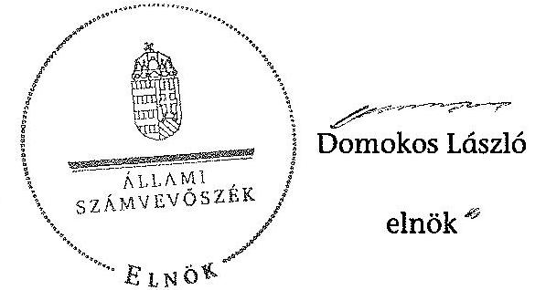

# ÁLLAMI   SZÁMVEVŐSZÉK 

## JELENTÉS

a helyi nemzetiségi önkormányzatok gazdálkodásának ellenőrzéséről
Tompa Város Horvát Nemzetiségi Önkormányzat

---

# Állami Számvevőszék 

Iktatószám: V-0154-051/2014.
Témaszám: 1201
Vizsgálat-azonosító szám: V065202

## Az ellenőrzést felügyelte:

Horváth Balázs
felügyeleti vezető
Az ellenőrzést vezette és az ellenőrzés végrehajtásáért felelős:
Pats Regina
ellenőrzésvezető
A számvevőszéki jelentést készítették és a jelentés összeállításában
közreműködtek:
dr. Győri Gabriella
számvevő
dr. Fátrainé Zsebedics Katalin
számvevő tanácsos
Az ellenőrzést végezték:
Molnár-Sipos Judit Vörösné Lakatos Zsuzsanna dr. Márton Gabriella számvevő számvevő számvevő tanácsos

---

# TARTALOMJEGYZÉK 

BEVEZETÉS ..... 3
I. ÖSSZEGZŐ MEGÁLLAPÍTÁSOK, KÖVETKEZTETÉSEK ..... 5
II. RÉSZLETES MEGÁLLAPÍTÁSOK ..... 6
FÜGGELÉKEK

1. számú Rövidítések jegyzéke
2. számú Értelmező szótár

---

# **SOLUTIONS**

## **PROBLEM 1**

### **Part (a)**

**PROBLEM 1**

**PROBLEM 2**

**PROBLEM 3**

**PROBLEM 4**

**PROBLEM 5**

**PROBLEM 6**

**PROBLEM 7**

**PROBLEM 8**

**PROBLEM 9**

**PROBLEM 10**

**PROBLEM 11**

**PROBLEM 12**

**PROBLEM 13**

**PROBLEM 14**

**PROBLEM 15**

**PROBLEM 16**

**PROBLEM 17**

**PROBLEM 18**

**PROBLEM 19**

**PROBLEM 20**

**PROBLEM 21**

**PROBLEM 22**

**PROBLEM 23**

**PROBLEM 24**

**PROBLEM 25**

**PROBLEM 26**

**PROBLEM 27**

**PROBLEM 28**

**PROBLEM 29**

**PROBLEM 30**

**PROBLEM 31**

**PROBLEM 32**

**PROBLEM 33**

**PROBLEM 34**

**PROBLEM 35**

**PROBLEM 36**

**PROBLEM 37**

**PROBLEM 38**

**PROBLEM 39**

**PROBLEM 40**

**PROBLEM 41**

**PROBLEM 42**

**PROBLEM 43**

**PROBLEM 44**

**PROBLEM 45**

**PROBLEM 46**

**PROBLEM 47**

**PROBLEM 48**

**PROBLEM 49**

**PROBLEM 50**

**PROBLEM 51**

**PROBLEM 52**

**PROBLEM 53**

**PROBLEM 54**

**PROBLEM 55**

**PROBLEM 56**

**PROBLEM 57**

**PROBLEM 58**

**PROBLEM 59**

**PROBLEM 60**

**PROBLEM 61**

**PROBLEM 62**

**PROBLEM 63**

**PROBLEM 64**

**PROBLEM 65**

**PROBLEM 66**

**PROBLEM 67**

**PROBLEM 68**

**PROBLEM 69**

**PROBLEM 70**

**PROBLEM 71**

**PROBLEM 72**

**PROBLEM 73**

**PROBLEM 74**

**PROBLEM 75**

**PROBLEM 76**

**PROBLEM 77**

**PROBLEM 78**

**PROBLEM 79**

**PROBLEM 80**

**PROBLEM 81**

**PROBLEM 82**

**PROBLEM 83**

**PROBLEM 84**

**PROBLEM 85**

**PROBLEM 86**

**PROBLEM 87**

**PROBLEM 88**

**PROBLEM 89**

**PROBLEM 90**

**PROBLEM 91**

**PROBLEM 92**

**PROBLEM 93**

**PROBLEM 94**

**PROBLEM 95**

**PROBLEM 96**

**PROBLEM 97**

**PROBLEM 98**

**PROBLEM 99**

**PROBLEM 100**

**PROBLEM 101**

**PROBLEM 102**

**PROBLEM 103**

**PROBLEM 104**

**PROBLEM 105**

**PROBLEM 106**

**PROBLEM 107**

**PROBLEM 108**

**PROBLEM 109**

**PROBLEM 110**

**PROBLEM 111**

**PROBLEM 112**

**PROBLEM 113**

**PROBLEM 114**

**PROBLEM 115**

**PROBLEM 116**

**PROBLEM 117**

**PROBLEM 118**

**PROBLEM 119**

**PROBLEM 120**

**PROBLEM 121**

**PROBLEM 122**

**PROBLEM 123**

**PROBLEM 124**

**PROBLEM 125**

**PROBLEM 126**

**PROBLEM 127**

**PROBLEM 128**

**PROBLEM 129**

**PROBLEM 130**

**PROBLEM 131**

**PROBLEM 132**

**PROBLEM 133**

**PROBLEM 134**

**PROBLEM 135**

**PROBLEM 136**

**PROBLEM 137**

**PROBLEM 138**

**PROBLEM 139**

**PROBLEM 140**

**PROBLEM 141**

**PROBLEM 142**

**PROBLEM 143**

**PROBLEM 144**

**PROBLEM 145**

**PROBLEM 146**

**PROBLEM 147**

**PROBLEM 148**

**PROBLEM 149**

**PROBLEM 150**

**PROBLEM 151**

**PROBLEM 152**

**PROBLEM 153**

**PROBLEM 154**

**PROBLEM 155**

**PROBLEM 156**

**PROBLEM 157**

**PROBLEM 158**

**PROBLEM 159**

**PROBLEM 160**

**PROBLEM 161**

**PROBLEM 162**

**PROBLEM 163**

**PROBLEM 164**

**PROBLEM 165**

**PROBLEM 166**

**PROBLEM 167**

**PROBLEM 168**

**PROBLEM 169**

**PROBLEM 170**

**PROBLEM 171**

**PROBLEM 172**

**PROBLEM 173**

**PROBLEM 174**

**PROBLEM 175**

**PROBLEM 176**

**PROBLEM 177**

**PROBLEM 178**

**PROBLEM 179**

**PROBLEM 180**

**PROBLEM 181**

**PROBLEM 182**

**PROBLEM 183**

**PROBLEM 184**

**PROBLEM 185**

**PROBLEM 186**

**PROBLEM 187**

**PROBLEM 188**

**PROBLEM 189**

**PROBLEM 190**

**PROBLEM 191**

**PROBLEM 192**

**PROBLEM 193**

**PROBLEM 194**

**PROBLEM 195**

**PROBLEM 196**

**PROBLEM 197**

**PROBLEM 198**

**PROBLEM 199**

**PROBLEM 200**

**PROBLEM 201**

**PROBLEM 202**

**PROBLEM 203**

**PROBLEM 204**

**PROBLEM 205**

**PROBLEM 206**

**PROBLEM 207**

**PROBLEM 208**

**PROBLEM 209**

**PROBLEM 210**

**PROBLEM 211**

**PROBLEM 212**

**PROBLEM 213**

**PROBLEM 214**

**PROBLEM 215**

**PROBLEM 216**

**PROBLEM 217**

**PROBLEM 218**

**PROBLEM 219**

**PROBLEM 220**

**PROBLEM 221**

**PROBLEM 222**

**PROBLEM 223**

**PROBLEM 224**

**PROBLEM 225**

**PROBLEM 226**

**PROBLEM 227**

**PROBLEM 228**

**PROBLEM 229**

**PROBLEM 230**

**PROBLEM 231**

**PROBLEM 232**

**PROBLEM 233**

**PROBLEM 234**

**PROBLEM 235**

**PROBLEM 236**

**PROBLEM 237**

**PROBLEM 238**

**PROBLEM 239**

**PROBLEM 240**

**PROBLEM 241**

**PROBLEM 242**

**PROBLEM 243**

**PROBLEM 244**

**PROBLEM 245**

**PROBLEM 246**

**PROBLEM 247**

**PROBLEM 248**

**PROBLEM 249**

**PROBLEM 250**

**PROBLEM 251**

**PROBLEM 252**

**PROBLEM 253**

**PROBLEM 254**

**PROBLEM 255**

**PROBLEM 256**

**PROBLEM 257**

**PROBLEM 258**

**PROBLEM 259**

**PROBLEM 260**

**PROBLEM 261**

**PROBLEM 262**

**PROBLEM 263**

**PROBLEM 264**

**PROBLEM 265**

**PROBLEM 266**

**PROBLEM 267**

**PROBLEM 268**

**PROBLEM 269**

**PROBLEM 270**

**PROBLEM 271**

**PROBLEM 272**

**PROBLEM 273**

**PROBLEM 274**

**PROBLEM 275**

**PROBLEM 276**

**PROBLEM 277**

**PROBLEM 278**

**PROBLEM 279**

**PROBLEM 280**

**PROBLEM 281**

**PROBLEM 282**

**PROBLEM 283**

**PROBLEM 284**

**PROBLEM 285**

**PROBLEM 286**

**PROBLEM 287**

**PROBLEM 288**

**PROBLEM 289**

**PROBLEM 290**

**PROBLEM 291**

**PROBLEM 292**

**PROBLEM 293**

**PROBLEM 294**

**PROBLEM 295**

**PROBLEM 296**

**PROBLEM 297**

**PROBLEM 298**

**PROBLEM 299**

**PROBLEM 300**

**PROBLEM 301**

**PROBLEM 302**

**PROBLEM 303**

**PROBLEM 304**

**PROBLEM 305**

**PROBLEM 306**

**PROBLEM 307**

**PROBLEM 308**

**PROBLEM 309**

**PROBLEM 310**

**PROBLEM 311**

**PROBLEM 312**

**PROBLEM 313**

**PROBLEM 314**

**PROBLEM 315**

**PROBLEM 316**

**PROBLEM 317**

**PROBLEM 318**

**PROBLEM 319**

**PROBLEM 320**

**PROBLEM 321**

**PROBLEM 322**

**PROBLEM 323**

**PROBLEM 324**

**PROBLEM 325**

**PROBLEM 326**

**PROBLEM 327**

**PROBLEM 328**

**PROBLEM 329**

**PROBLEM 330**

**PROBLEM 331**

**PROBLEM 332**

**PROBLEM 333**

**PROBLEM 334**

**PROBLEM 335**

**PROBLEM 336**

**PROBLEM 337**

**PROBLEM 338**

**PROBLEM 339**

**PROBLEM 340**

**PROBLEM 341**

**PROBLEM 342**

**PROBLEM 343**

**PROBLEM 344**

**PROBLEM 345**

**PROBLEM 346**

**PROBLEM 347**

**PROBLEM 348**

**PROBLEM 349**

**PROBLEM 350**

**PROBLEM 351**

**PROBLEM 352**

**PROBLEM 353**

**PROBLEM 354**

**PROBLEM 355**

**PROBLEM 356**

**PROBLEM 357**

**PROBLEM 358**

**PROBLEM 359**

**PROBLEM 360**

**PROBLEM 361**

**PROBLEM 362**

**PROBLEM 363**

**PROBLEM 364**

**PROBLEM 365**

**PROBLEM 366**

**PROBLEM 367**

**PROBLEM 368**

**PROBLEM 369**

**PROBLEM 370**

**PROBLEM 371**

**PROBLEM 372**

**PROBLEM 373**

**PROBLEM 374**

**PROBLEM 375**

**PROBLEM 376**

**PROBLEM 377**

**PROBLEM 378**

**PROBLEM 379**

**PROBLEM 380**

**PROBLEM 381**

**PROBLEM 382**

**PROBLEM 383**

**PROBLEM 384**

**PROBLEM 385**

**PROBLEM 386**

**PROBLEM 387**

**PROBLEM 388**

**PROBLEM 389**

**PROBLEM 390**

**PROBLEM 391**

**PROBLEM 392**

**PROBLEM 393**

**PROBLEM 394**

**PROBLEM 395**

**PROBLEM 396**

**PROBLEM 397**

**PROBLEM 398**

**PROBLEM 399**

**PROBLEM 400**

**PROBLEM 401**

**PROBLEM 402**

**PROBLEM 403**

**PROBLEM 404**

**PROBLEM 405**

**PROBLEM 406**

**PROBLEM 407**

**PROBLEM 408**

**PROBLEM 409**

**PROBLEM 410**

**PROBLEM 411**

**PROBLEM 412**

**PROBLEM 413**

**PROBLEM 414**

**PROBLEM 415**

**PROBLEM 416**

**PROBLEM 417**

**PROBLEM 418**

**PROBLEM 419**

**PROBLEM 420**

**PROBLEM 421**

**PROBLEM 422**

**PROBLEM 423**

**PROBLEM 424**

**PROBLEM 425**

**PROBLEM 426**

**PROBLEM 427**

**PROBLEM 428**

**PROBLEM 429**

**PROBLEM 430**

**PROBLEM 431**

**PROBLEM 432**

**PROBLEM 433**

**PROBLEM 434**

**PROBLEM 435**

**PROBLEM 436**

**PROBLEM 437**

**PROBLEM 438**

**PROBLEM 439**

**PROBLEM 440**

**PROBLEM 441**

**PROBLEM 442**

**PROBLEM 443**

**PROBLEM 444**

**PROBLEM 445**

**PROBLEM 446**

**PROBLEM 447**

**PROBLEM 448**

**PROBLEM 449**

**PROBLEM 450**

**PROBLEM 451**

**PROBLEM 452**

**PROBLEM 453**

**PROBLEM 454**

**PROBLEM 455**

**PROBLEM 456**

**PROBLEM 457**

**PROBLEM 458**

**PROBLEM 459**

**PROBLEM 460**

**PROBLEM 461**

**PROBLEM 462**

**PROBLEM 463**

**PROBLEM 464**

**PROBLEM 465**

**PROBLEM 466**

**PROBLEM 467**

**PROBLEM 468**

**PROBLEM 469**

**PROBLEM 470**

**PROBLEM 471**

**PROBLEM 472**

**PROBLEM 473**

**PROBLEM 474**

**PROBLEM 475**

**PROBLEM 476**

**PROBLEM 477**

**PROBLEM 478**

**PROBLEM 479**

**PROBLEM 480**

**PROBLEM 481**

**PROBLEM 482**

**PROBLEM 483**

**PROBLEM 484**

**PROBLEM 485**

**PROBLEM 486**

**PROBLEM 487**

**PROBLEM 488**

**PROBLEM 489**

**PROBLEM 490**

**PROBLEM 491**

**PROBLEM 492**

**PROBLEM 493**

**PROBLEM 494**

**PROBLEM 495**

**PROBLEM 496**

**PROBLEM 497**

**PROBLEM 498**

**PROBLEM 499**

**PROBLEM 500**

**PROBLEM 501**

**PROBLEM 502**

**PROBLEM 503**

**PROBLEM 504**

**PROBLEM 505**

**PROBLEM 506**

**PROBLEM 507**

**PROBLEM 508**

**PROBLEM 509**

**PROBLEM 510**

**PROBLEM 511**

**PROBLEM 512**

**PROBLEM 513**

**PROBLEM 514**

**PROBLEM 515**

**PROBLEM 516**

**PROBLEM 517**

**PROBLEM 518**

**PROBLEM 519**

**PROBLEM 520**

**PROBLEM 521**

**PROBLEM 522**

**PROBLEM 523**

**PROBLEM 524**

**PROBLEM 525**

**PROBLEM 526**

**PROBLEM 527**

**PROBLEM 528**

**PROBLEM 529**

**PROBLEM 530**

**PROBLEM 531**

**PROBLEM 532**

**PROBLEM 533**

**PROBLEM 534**

**PROBLEM 535**

**PROBLEM 536**

**PROBLEM 537**

**PROBLEM 538**

**PROBLEM 539**

**PROBLEM 540**

**PROBLEM 541**

**PROBLEM 542**

**PROBLEM 543**

**PROBLEM 544**

**PROBLEM 545**

**PROBLEM 546**

**PROBLEM 547**

**PROBLEM 548**

**PROBLEM 549**

**PROBLEM 550**

**PROBLEM 551**

**PROBLEM 552**

**PROBLEM 553**

**PROBLEM 554**

**PROBLEM 555**

**PROBLEM 556**

**PROBLEM 557**

**PROBLEM 558**

**PROBLEM 559**

**PROBLEM 560**

**PROBLEM 561**

**PROBLEM 562**

**PROBLEM 563**

**PROBLEM 564**

**PROBLEM 565**

**PROBLEM 566**

**PROBLEM 567**

**PROBLEM 568**

**PROBLEM 569**

**PROBLEM 570**

**PROBLEM 571**

**PROBLEM 572**

**PROBLEM 573**

**PROBLEM 574**

**PROBLEM 575**

**PROBLEM 576**

**PROBLEM 577**

**PROBLEM 578**

**PROBLEM 579**

**PROBLEM 580**

**PROBLEM 581**

**PROBLEM 582**

**PROBLEM 583**

**PROBLEM 584**

**PROBLEM 585**

**PROBLEM 586**

**PROBLEM 587**

**PROBLEM 588**

**PROBLEM 589**

**PROBLEM 590**

**PROBLEM 591**

**PROBLEM 592**

**PROBLEM 593**

**PROBLEM 594**

**PROBLEM 595**

**PROBLEM 596**

**PROBLEM 597**

**PROBLEM 598**

**PROBLEM 599**

---

# JELENTÉS   a helyi nemzetiségi önkormányzatok gazdálkodásának ellenőrzéséről Tompa Város Horvát Nemzetiségi Önkormányzat 

## BEVEZETÉS

A Nemzetiségi Önkormányzat 2010. évben alakult, elnöke a 2011. február 18-án megtartott képviselő-testületi ülésen lemondott. A Nemzetiségi Önkormányzat intézményt, gazdasági társaságot és más szervezetet

 nem alapított, illetve ezek társulásában nem vett részt. A négytagú Képviselő-testület a munkája segítésére bizottságot nem hozott létre, két képviselő 2012. januárjában lemondott mandátumáról. A Nemzetiségi Önkormányzat a 2012. évet érintően költségvetéssel nem rendelkezett, 2012. március 19-én megszűnt. A Nemzetiségi Önkormányzat a 2011. és a 2012. évben feladat alapú támogatásban nem részesült.

Az Alaptörvény XXIX. cikk (1) bekezdése szerint a Magyarországon élő nemzetiségek államalkotó tényezők. Minden, valamely nemzetiséghez tartozó magyar állampolgárnak joga van önazonosságának szabad vállalásához és megőrzéséhez. A hazánkban élő nemzetiségek helyi (települési és területi), valamint országos önkormányzatokat hozhatnak létre. A helyi nemzetiségi önkormányzatok gazdálkodási feladatait jogszabályi előírás alapján a székhely szerinti helyi önkormányzat polgármesteri hivatala látja el.

A nemzetiségek helyzete, támogatása mind hazai, mind EU-s szinten kiemelt figyelmet kap napjainkban. A helyi nemzetiségi önkormányzatok gazdálkodására és támogatási rendszerére vonatkozó jogszabályok a 2010-2012. években jelentős változásokon mentek át. A települési és területi nemzetiségi önkormányzatok gazdálkodásának, a részükre juttatott költségvetési támogatások felhasználásának ellenőrzését az ÁSZ 2012-ben sorozatjellegű ellenőrzés keretében indította el. A 2013. évi ellenőrzések e témacsoportos ellenőrzések folytatását jelentik.

Az ellenőrzés célja annak értékelése volt, hogy a nemzetiségi önkormányzat gazdálkodási kereteinek kialakítása, gazdálkodása és feladatellátása megfelelt-e a jogszabályoknak.

---

Ennek keretében értékeltük, hogy:

- a nemzetiségi önkormányzat és a települési önkormányzat együttműködésének szabályozása, a működési feltételek biztosítása megfelelt-e a jogszabályi előírásoknak;
- a felek együttműködése megfelelt-e a közöttük létrejött megállapodásnak a gazdálkodási feladatok szabályszerű ellátása során, ennek keretében betartották-e a helyi nemzetiségi önkormányzat gazdálkodásához kapcsolódóan a költségvetésre és zárszámadásra, a gazdálkodás szabályozására, az operatív gazdálkodási jogkörök gyakorlására vonatkozó jogszabályi előírásokat;
- a jegyző biztosította-e a nemzetiségi önkormányzat gazdálkodásának belső ellenőrzését;
- a nemzetiségi önkormányzat feladatellátása összhangban volt-e a vonatkozó jogszabályi előírásokkal.

A helyi nemzetiségi önkormányzatok gazdálkodásának ellenőrzéséről szóló jelentés I. fejezetének összegző része az ellenőrzés céljára adott rövid, szintetizáló összefoglalót és következtetéseket tartalmazza a II. fejezet részletes megállapításain alapulóan.

Az ellenőrzés típusa: szabályszerűségi ellenőrzés.
Az ellenőrzött időszak: 2012. január 1. - 2012. március 19. közötti időszak.
Ellenőrzött szervezet: Tompa Város Horvát Nemzetiségi Önkormányzat és a gazdálkodási feladatait ellátó Tompa Város Önkormányzata.

Az ellenőrzés végrehajtásának jogszabályi alapját az ÁSZ tv. 5. § (2)-(3) és (6) bekezdéseiben foglaltak képezik.

Az ellenőrzés szakmai módszertana az ÁSZ hivatalos honlapján (www.asz.hu) közzétett szakmai szabályokon alapult, amely a Legfőbb Ellenőrző Intézmények Nemzetközi Szervezete (INTOSAI) által kiadott nemzetközi standardok (ISSAI) figyelembevételével készült.

Az ellenőrzés lefolytatásához a Nemzetiségi Önkormányzat és a gazdálkodási feladatait ellátó Települési Önkormányzat tanúsítványok és a kapcsolódó dokumentumok helyszíni ellenőrzés során történő rendelkezésre bocsátásával szolgáltatott adatokat. Az adatszolgáltatás kontrollálása és szükség szerinti javítása is a helyszíni ellenőrzés keretében történt.

Az ÁSZ tv. 29. § (1) bekezdése szerint a jelentéstervezetet megküldtük észrevételezésre a polgármesternek, aki az ÁSZ tv. 29. § (2) bekezdésében foglalt észrevételezési jogával nem élt, a jelentéstervezetre észrevételt nem tett.

---

# I. ÖSSZEGZŐ MEGÁLLAPÍTÁSOK, KÖVETKEZTETÉSEK 

A Nemzetiségi Önkormányzat a 2010. évi önkormányzati választásokat követően jött létre, az elnöke a 2011. február 18-án megtartott képviselő-testületi ülésen lemondott. A Nemzetiségi Önkormányzatnál a 2011. február 18. és 2012. január 27. közötti időszakban képviselő-testületi ülés összehívására, közmeghallgatásra és új elnök választására nem került sor. A Képviselő-testület két tagja 2012. január 27-én lemondott képviselői mandátumáról. A HVB a 2012. február 3-i ülésén megállapította, hogy a megüresedett képviselői mandátumok helyett új mandátumok nem adhatók ki és a Képviselő-testület megbízatását a képviselők számának a Képviselő-testület működéséhez szükséges létszám alá történt csökkenése miatt visszavonta. A HVB a 2012. február 27-ei ülésén a Nemzetiségi Önkormányzat működésképtelenség miatti megszűnését mondta ki, de döntést követően nem került sor a megszűnés törzskönyvi nyilvántartásba való bejelentésére. A HVB a 2012. március 19-i ülésén a Nemzetiségi Önkormányzat Képviselő-testület feloszlása miatti megszünéséről döntött. A Települési Önkormányzat 2012. április 4-én kezdeményezte a Kincstárnál a Nemzetiségi Önkormányzat törzskönyvi nyilvántartásból való törlését, melyre 2012. április 17-én került sor.

A Nemzetiségi Önkormányzat az ellenőrzött időszakban rendelkezett hatályban lévő együttműködési megállapodással, melynek felülvizsgálatát testületi működés hiányában nem végezték el 2012. január 31-éig. A 2010. december 22-én kötött együttműködési megállapodásban a jogszabályi előírásoknak megfelelően szabályozták a gazdálkodási feladatokat, valamint azok teljesítési határidejét és felelőseit. A Nemzetiségi Önkormányzat működéséhez szükséges személyi és tárgyi feltételeket a jogszabályi előírásoknak megfelelően szabályozták, azonban ezek biztosítása az ellenőrzött időszakban már nem volt szükséges.

A Nemzetiségi Önkormányzat működés hiányában a 2012. évre költségvetési határozatot nem hozott, ezért a Polgármesteri Hivatal a Nemzetiségi Önkormányzat 2012. évi elemi költségvetéséről nem tudott adatot szolgáltatni a Kincstárnak. Az Áhsz.-ben foglalt előírások ellenére a megszűnés fordulónapjával, a megszűnést követő 60 napon belül nem készült sem beszámoló, sem vagyonátadás-átvételi jegyzőkönyv. A Nemzetiségi Önkormányzat 2011. évi pénzmaradványával és 2012. évi általános működési támogatásával kapcsolatos adatokat a Települési Önkormányzat 2012. évi éves elemi költségvetési beszámolója tartalmazta. A Polgármesteri Hivatal a Nemzetiségi Önkormányzat 2011. évi pénzmaradványát és a 2012. évi általános működési támogatását a központi költségvetés javára visszautalta. A Nemzetiségi Önkormányzatnál az ellenőrzött időszakban feladatellátás és gazdálkodás nem történt, ezért a gazdálkodás szabályozottságának és a pénzügyi folyamatokban kulcsszerepet betöltő belső kontrollok (teljesítésigazolás és érvényesítés) működésének megfelelőségét, a Nemzetiségi Önkormányzat gazdálkodásával kapcsolatos belső ellenőrzési feladatokat és a feladatellátás jogszabályokkal való összhangját a számvevőszéki ellenőrzés nem értékelte.

---

# II. RÉSZLETES MEGÁLLAPÍTÁSOK 

A Nemzetiségi Önkormányzat a 2010. évi önkormányzati választásokat követően jött létre, a Kincstár 2010. október 29-én jegyezte be a közhiteles törzskönyvi nyilvántartásba. A 2011. február 18-án megtartott képviselő-testületi ülésen a Nemzetiségi Önkormányzat elnöke lemondott és új elnök személyére tett javaslatot. A Nemzetiségi Önkormányzatnál a 2011. február 18. és 2012. január 27. közötti időszakban képviselő-testületi ülés összehívására, közmeghallgatásra és új elnök választására nem került sor. A Képviselő-testület két tagja 2012. január 27-én lemondott képviselői mandátumáról.

A HVB a 2012. február 3-i ülésén ${ }^{1}$ megállapította, hogy a két képviselő lemondása folytán megüresedett képviselői mandátumok helyett a 2010. október 3-án megtartott választás eredménye alapján - a szavazatszám szerint - új mandátumok nem adhatók ki. A Képviselő-testület megbízatását a Nek. ${ }_{2}$ tv. 69. § (2) bekezdésére hivatkozással - a képviselők számának a Képviselő-testület működéséhez szükséges létszám alá történt csökkenése miatt - visszavonta. A HVB a 2012. február 27-ei ülésén² a Nemzetiségi Önkormányzat működésképtelenség miatti megszűnését mondta ki. A 25/2009. (XI. 18.) PM rendelet 9. §-ában foglaltak ellenére a döntést követően nem került sor a megszűnés törzskönyvi nyilvántartásba való bejelentésére.

A HVB a 2012. március 19-i ülésén ${ }^{3}$ a Nemzetiségi Önkormányzat Képviselő-testület feloszlása miatti megszünését mondta ki, valamint azt, hogy új választásra csak a következő általános választáskor kerülhet sor. A Települési Önkormányzat 2012. április 4-én kezdeményezte a Kincstárnál a Nemzetiségi Önkormányzat törzskönyvi nyilvántartásból való törlését, melyre 2012. április 17-én került sor ${ }^{4}$.

A Nemzetiségi Önkormányzat az ellenőrzött időszakban rendelkezett hatályban lévő együttműködési megállapodással, melyet a Nemzetiségi Önkormányzat és a Települési Önkormányzat Képviselő-testületei határozattal ${ }^{5}$ jóváhagytak és az arra jogosult személyek aláírták. Az együttműködési megállapodás felülvizsgálatát, módosítását testületi működés hiányában nem végezték el 2012. január 31-éig.

A 2010. december 22-én kötött együttműködési megállapodásban a jogszabályi előírásoknak megfelelően szabályozták a gazdálkodási feladatokat, valamint azok teljesítési határidejét és felelőseit.

[^0]
[^0]:    ${ }^{1} 1 / 2012$. (II. 3.) HVB számú határozat
    ${ }^{2} 3 / 2012$. (II. 27.) HVB számú határozat
    ${ }^{3} 5 / 2012$. (III. 19.) HVB számú határozat
    ${ }^{4}$ 036779133/8/2012. nyilvántartási számon
    ${ }^{5}$ A 245/2010. (XII. 22.) KT számú határozat és a 8/2010. (XII. 13.) HKÖ számú határozat

---

A Települési Önkormányzat SZMSZ-e, a Nemzetiségi Önkormányzat megszűnéséig hatályos együttműködési megállapodás és a Nemzetiségi Önkormányzat SZMSZ-e tartalmazta a működéshez szükséges személyi és tárgyi feltételek meghatározását, azonban ezek biztosítása az ellenőrzött időszakban már nem volt szükséges.

A Nemzetiségi Önkormányzat a 2012. évre költségvetési határozatot nem hozott és a megszűnés fordulónapjával nem készített költségvetési beszámolót sem.

A Nemzetiségi Önkormányzat elnök-helyettese ${ }^{6}$ működés hiányában nem nyújtott be az Áht. 2 24. § (2) bekezdésében és a 26. § (1) bekezdésében foglaltak szerint költségvetési határozat tervezetet a Képviselő-testület részére. A költségvetési határozat hiánya miatt a Polgármesteri Hivatal a Nemzetiségi Önkormányzat 2012. évi elemi költségvetéséről az Ávr. 33. § (1)-(2) bekezdése alapján nem tudott adatot szolgáltatni a Kincstárnak.

A megszűnés fordulónapjával, a megszűnést követő 60 napon belül nem készült sem az Áhsz. 13/A. § (1) bekezdése szerinti, az éves elemi költségvetési beszámolónak megfelelő adattartalmú - leltárral és főkönyvi kivonattal alátámasztott - beszámoló, sem az Áhsz. 13/A. § (6) bekezdése szerinti vagyonátadás-átvételi jegyzőkönyv.

A polgármester ${ }_{2}$ és a jegyző ${ }_{2}$ a helyszíni ellenőrzés során közösen nyilatkoztak arról, hogy a Nemzetiségi Önkormányzat a megalakulásakor ingó- és ingatlanvagyont a működéséhez nem igényelt, vagyoni értékű joggal nem rendelkezett.

A Nemzetiségi Önkormányzatot érintően a testületi működés hiánya miatt az Áht. 2 84. § (1)-(2) bekezdései szerinti önálló fizetési számla megnyitására nem került sor. A Nemzetiségi Önkormányzat 2011. évi pénzmaradványával és 2012. évi általános működési támogatásával kapcsolatos adatokat - a Nemzetiségi Önkormányzat önálló számlájának, költségvetésének és beszámolójának hiányában - a Települési Önkormányzat 2012. évi éves elemi költségvetési beszámolója tartalmazta.

A Nemzetiségi Önkormányzat - a 2010. évi maradványt is magában foglaló 2011. évi pénzmaradványát (293649 Ft), valamint a 2012. évi általános működési támogatását (214689 Ft) a Polgármesteri Hivatal a Települési Önkormányzat költségvetési számlájáról visszautalta a központi költségvetés javára.

A Nemzetiségi Önkormányzatnál az ellenőrzött időszakban gazdálkodás nem történt. A gazdálkodás szabályozottságának és a pénzügyi folyamatokban kulcsszerepet betöltő belső kontrollok (teljesítésigazolás és érvényesítés) működésének megfelelőségét, valamint a Nemzetiségi Önkormányzat gazdálkodásával kapcsolatos belső ellenőrzési feladatokat - gazdasági esemény hiányában - a számvevőszéki ellenőrzés nem értékelte.

[^0]
[^0]:    ${ }^{6}$ A Nemzetiségi Önkormányzat SZMSZ-e szerint az új elnök megválasztásáig az elnök jogait és kötelezettségeit az elnök-helyettes gyakorolja.

---

A számvevőszéki ellenőrzés részére szolgáltatott adatok alapján az ellenőrzött időszakban a Kormányhivatal a Nemzetiségi Önkormányzatot illetően nem élt törvényességi felügyeleti eszközökkel.

A Nemzetiségi Önkormányzat az ellenőrzött időszakban a Nek. 2 tv. 115. §-a szerinti kötelező, illetve a Nek. 2 tv. 116. §-a szerinti önként vállalt feladatot - működés hiányában - nem látott el.

Budapest, 2014. 01 hónap 24 nap

Függelék: $\quad 2 \mathrm{db}$

---

# RÖVIDÍTÉSEK JEGYZÉKE 

## Törvények

Alaptörvény
Áht. 1
Áht. 2
ÁSZ tv.
Nek. 1 tv.
Nek. 2 tv.

## Rendeletek

Áhsz.

Ávr.

25/2009. (XI. 18.) PM rendelet

## Szórövidítések

ÁSZ
együttműködési megállapodás

EU
HVB
jegyző ${ }_{1}$
jegyző ${ }_{2}$
Képviselő-testület
Kincstár
Kormányhivatal
Nemzetiségi Önkormányzat
Nemzetiségi Önkormányzat elnöke

Magyarország Alaptörvénye
Az államháztartásról szóló 1992. évi
 XXXVIII. törvény (hatályos 2011. december 31-éig)
Az államháztartásról szóló 2011. évi CXCV. törvény (hatályos 2011. december 31-étől)
Az Állami Számvevőszékről szóló 2011. évi LXVI. törvény (hatályos 2011. július 1-jétől)
A nemzeti és etnikai kisebbségek jogairól szóló 1993. évi LXXVII. törvény (hatályos 2011. december 31-éig)
A nemzetiségek jogairól szóló 2011. évi CLXXIX. törvény (hatályos 2011. december 20-ától)

Az államháztartás szervezetei beszámolási és könyvvezetési kötelezettségének sajátosságairól szóló 249/2000. (XII. 24.) Korm. rendelet (hatálytalan 2014. január 1-jétől)
Az államháztartásról szóló törvény végrehajtásáról szóló 368/2011. (XII. 31.) Korm. rendelet (hatályos 2012. január 1-jétől)
A törzskönyvi nyilvántartásról szóló 25/2009. (XI. 18.) PM rendelet (hatályos 2012. III. 1-jéig)

Állami Számvevőszék
Együttműködési megállapodás a Települési Önkormányzat, a Nemzetiségi Önkormányzat és a Polgármesteri Hivatal között (jóváhagyta Tompa Város Önkormányzata a 245/2010.(XII. 22.) KT. számú határozatával, a Nemzetiségi Önkormányzat a 8/2010. (XII.13.) HKÖ számú határozatával)
Európai Unió
Helyi Választási Bizottság, Tompa
Tompa Város Önkormányzatának jegyzője 2012. január 31-éig (tartós távollét 2010. december 10-étől)
Tompa Város Önkormányzatának jegyzője 2012. február 1-jétől
Tompa Város Horvát Nemzetiségi Önkormányzat Képviselő-testülete 2012. március 19-ei megszünéséig
Magyar Államkincstár Bács-Kiskun Megyei Igazgatósága
Bács-Kiskun Megyei Kormányhivatal
Tompa Város Horvát Nemzetiségi Önkormányzata a 2012. március 19-ei megszűnéséig

Tompa Város Horvát Nemzetiségi Önkormányzat elnöke (lemondott: 2011. február 18-án)

---

Nemzetiségi Önkormányzat elnökhelyettese
polgármester $_{1}$
polgármester $_{2}$
Polgármesteri Hivatal
Települési Önkormányzat
Települési Önkormányzat Képviselő-testülete

Tompa Város Horvát Nemzetiségi Önkormányzat elnökhelyettese

Tompa Város Önkormányzatának polgármestere 2010. október 3-ától 2012. április 17-éig
Tompa Város Önkormányzatának polgármestere 2012. július 1-jétől
Tompa Város Önkormányzatának Polgármesteri Hivatala
Tompa Város Önkormányzata
Tompa Város Önkormányzatának Képviselő-testülete

---

# ÉRTELMEZŐ SZÓTÁR 

feladatalapú támogatás

A támogatási évben általános működési támogatásban részesült, és a Támogatónak a Kincstárhoz intézett, a feladatalapú támogatás utalására vonatkozó rendelkező levele keltének időpontjában működő települési és területi kisebbségi önkormányzatoknak az e rendeletben rögzített feltételrendszer alapján nyújtható támogatás. (Forrás: A kisebbségi önkormányzatoknak a központi költségvetésből, valamint fejezeti kezelésű előirányzatból nyújtott támogatások feltételrendszeréről és elszámolásának rendjéről szóló 342/2010. (XII. 28.) Korm. rendelet 2. § (2) bekezdés c) pont.)
A támogatási évben általános működési támogatásban részesült, és a Támogatónak a Magyar Államkincstárhoz (a továbbiakban: Kincstár) intézett, a feladatalapú támogatás utalására vonatkozó rendelkező levele keltének időpontjában működő települési és területi nemzetiségi önkormányzatoknak az e rendeletben rögzített feltételrendszer alapján nyújtható, a nemzetiségi önkormányzat által a Nek. 3 tv. szerinti nemzetiségi közfeladatok ellátásához közvetlenül kötődő támogatás. (Forrás: A nemzetiségi célú előirányzatokból nyújtott támogatások feltételrendszeréről és elszámolásának rendjéről szóló 28/2012. (III. 6.) Korm. rendelet 2. § (2) bekezdés b) pont.) a nemzetiségi önkormányzatnak a működési feltételei biztosítására, továbbá a bevételeivel és a kiadásaival kapcsolatban a tervezési, gazdálkodási, ellenőrzési, finanszírozási, adatszolgáltatási és beszámolási feladatai végrehajtására a székhelye szerinti települési önkormányzattal megkötött megállapodás. (Forrás: Nek. 3 tv. 80. § (2) bekezdés, Áht. 3 27. § (2) bekezdés.)
nemzetiség
nemzetiségi önkormányzat
Minden olyan Magyarország területén legalább egy évszázada honos népcsoport, amely az állam lakossága körében számszerű kisebbségben van és a lakosság többi részétől saját nyelve és kultúrája, hagyományai különböztetik meg, egyben olyan összetartozás-tudatról tesz bizonyságot, amely mindezek megőrzésére, történelmileg kialakult közösségeik érdekeinek kifejezésére és védelmére irányul. (Forrás: Nek. 3 tv. 1. § (1) bekezdés.)
Törvényben meghatározott nemzetiségi közszolgáltatási feladatokat ellátó, testületi formában működő, jogi személyiséggel rendelkező, demokratikus választások útján törvény alapján létrehozott szervezet, amely a nemzetiségi közösséget megillető jogosultságok érvényesítésére, a nemzetiségek érdekeinek védelmére és képviseletére, a feladat- és hatáskörébe tartozó nemzetiségi közügyek települési, területi vagy országos szinten történő önálló intézésére jön létre. (Forrás: Nek. ${ }_{2}$ tv. 2. § 2. pont.) A jelentésben e fogalmat a települési nemzetiségi önkormányzatokra leszűkítve használjuk.
