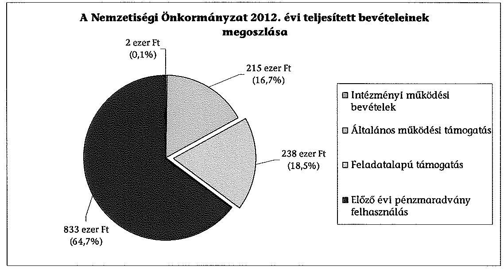
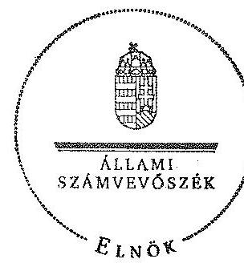

# ÁLLAMI   SZÁMVEVÔSZÉK 

## JELENTÉS

a helyi nemzetiségi önkormányzatok gazdálkodásának ellenőrzéséről
Bélapátfalva Város Roma Nemzetiségi Önkormányzata

---

# Állami Számvevőszék 

Iktatószám: V-0161-022/2014.
Témaszám: 1179
Vizsgálat-azonosító szám: V065211

## Az ellenőrzést felügyelte:

Horváth Balázs
felügyeleti vezető
Az ellenőrzést vezette és az ellenőrzés végrehajtásáért felelős:
Korsósné Vigh Andrea
ellenőrzésvezető
A számvevőszéki jelentést készítették és a jelentés összeállításában
közremüködtek:
Papp József
számvevő tanácsos
Molnár Istvánné
számvevő tanácsos
Az ellenőrzést végezték:
Papp József Béres László
számvevő tanácsos számvevő

---

# TARTALOMJEGYZÉK 

BEVEZETÉS ..... 3
I. ÖSSZEGZŐ MEGÁLLAPÍTÁSOK, KÖVETKEZTETÉSEK, JAVASLATOK ..... 6
II. RÉSZLETES MEGÁLLAPÍTÁSOK ..... 13

1. A Nemzetiségi Önkormányzat és a Települési Önkormányzat együttműködésének szabályozása, a működési feltételek biztosítása ..... 13
2. A gazdálkodási feladatok ellátásának szabályszerűsége ..... 14
2.1. A költségvetésre és zárszámadásra, valamint a kincstári adatszolgáltatás rendjére vonatkozó jogszabályi előírások betartása ..... 14
2.2. A Nemzetiségi Önkormányzat gazdálkodásának szabályozottsága ..... 14
2.3. Az operatív gazdálkodási jogkörök kialakítása, gyakorlása ..... 15
3. A Nemzetiségi Önkormányzattal összefüggő gazdálkodási feladatok belső ellenőrzése ..... 17
4. A feladatalapú támogatás felhasználásának, elszámolásának szabályszerűsége, a Nemzetiségi Önkormányzat feladatellátása ..... 17

## MELLÉKLET

1. számú A Nemzetiségi Önkormányzat 2012. évi gazdálkodásának főbb adatai, mutatói

## FÜGGELÉKEK

1. számú Rövidítések jegyzéke
2. számú Értelmező szótár
3. számú A gazdálkodás értékelésének módszere

---

$\cdot$
$\cdot$

---

# JELENTÉS 

## a helyi nemzetiségi önkormányzatok gazdálkodásának ellenőrzéséről Bélapátfalva Város Roma Nemzetiségi Önkormányzata

## BEVEZETÉS

A Nemzetiségi Önkormányzat 1999. évben alakult, elnöke a 2010. évi helyhatósági választások óta látja el feladatát. A Nemzetiségi Önkormányzat intézményt, gazdasági társaságot és más szervezetet nem alapított, illetve ezek társulásában nem vett részt. A négytagú Képviselő-testület a munkája segitésére bizottságot nem hozott létre. A Nemzetiségi Önkormányzat költségvetési beszámolója szerint a 2012. évben a módositott költségvetési bevételi és kiadási elöirányzat 1287 ezer Ft, a teljesitett költségvetési bevétel 1288 ezer Ft, a teljesített költségvetési kiadás 1112 ezer Ft volt. A 2012. évi gazdálkodási adatokat részletesen az 1. számú mellékletben mutatjuk be.

Az Alaptörvény XXIX. cikk (1) bekezdése szerint a Magyarországon élő nemzetiségek államalkotó tényezők. Minden, valamely nemzetiséghez tartozó magyar állampolgárnak joga van önazonossága szabad vállalásához és megőrzéséhez. A hazánkban élő nemzetiségek helyi (települési és területi), valamint országos önkormányzatokat hozhatnak létre. A helyi nemzetiségi önkormányzatok gazdálkodási feladatait jogszabályi előírás alapján a székhely szerinti helyi önkormányzat polgármesteri hivatala látja el.

A nemzetiségek helyzete, támogatása mind hazai, mind EU-s szinten kiemelt figyelmet kap napjainkban. A helyi nemzetiségi önkormányzatok gazdálkodására és támogatási rendszerére vonatkozó jogszabályok a 2010-2012. években jelentős változásokon mentek át. A települési és területi nemzetiségi önkormányzatok gazdálkodásának, a részükre juttatott költségvetési támogatások felhasználásának ellenőrzését az ÁSZ a 2012. évben sorozatjellegű ellenőrzés keretében indította el. A 2013. évi ellenőrzések e témacsoportos ellenőrzések folytatását jelentik.

Az ellenőrzés célja annak értékelése volt, hogy a Nemzetiségi Önkormányzat gazdálkodási kereteinek kialakítása, gazdálkodása és feladatellátása megfelelt-e a jogszabályoknak.

Ennek keretében értékeltük, hogy:

- a Nemzetiségi Önkormányzat és a Települési Önkormányzat együttműködésének szabályozása, a működési feltételek biztosítása megfelelt-e a jogszabályi előírásoknak;

---

- a felek együttműködése megfelelt-e a közöttük létrejött megállapodásnak a gazdálkodási feladatok szabályszerű ellátása során, ennek keretében betartották-e a helyi nemzetiségi önkormányzat gazdálkodásához kapcsolódóan a költségvetésre és zárszámadásra, a gazdálkodás szabályozására, az operatív gazdálkodási jogkörök gyakorlására vonatkozó jogszabályi előírásokat;
- a jegyző biztosította-e a nemzetiségi önkormányzat gazdálkodásának belső ellenőrzését;
- a nemzetiségi önkormányzat feladatalapú támogatásának felhasználása, a folyósított feladatalapú támogatással történő elszámolás az előírásoknak megfelelő volt-e;
- a nemzetiségi önkormányzat feladatellátása összhangban volt-e a vonatkozó jogszabályi előírásokkal.

Az ellenőrzés várható hasznosulását négy szinten tervezzük. A törvényalkotás számára összegzett tapasztalatok állnak rendelkezésre a nemzetiségi önkormányzatok testületi döntéseinek, gazdálkodásának és a feladatalapú támogatás felhasználásának szabályszerűségéről, amelynek alapján következtetést lehet levonni arra, hogy indokolt-e jogszabályi módosítás kezdeményezése. Az ellenőrzés az ellenőrzött számára visszajelzést ad a működésében fellépő hiányosságokról, javaslataival hozzájárul azok kiküszöböléséhez, amely csökkentheti a későbbi ellenőrzések gyakoriságát. Az ellenőrzés megállapításai és javaslatai tanulságul szolgálhatnak más nemzetiségi önkormányzatok, szervezetek számára a rendezett gazdálkodási keretek kialakításához. A társadalom számára jelzi, hogy közpénz nem maradhat ellenőrizetlenül, az ÁSZ értékteremtő rend kialakításához és megőrzéséhez hozzájáruló tevékenysége pozitív hatással lesz a szervezetről kialakított összkép formálásában. Az ÁSZ szervezetén belül lehetőség nyílik arra, hogy a megállapítások szintetizálásával az intézmény a hozzáadott értéket teremtő elemző tevékenységét és tanácsadó szerepét erősítse.

A helyi nemzetiségi önkormányzatok gazdálkodásának ellenőrzéséről szóló jelentés I. fejezetének összegző része az ellenőrzés céljára adott rövid, szintetizáló összefoglalót és következtetéseket tartalmazza a II. fejezet részletes megállapításain alapulóan. A jelentés intézkedést igénylő megállapításait és javaslatait az összegzőben foglaltak mellett - az ellenőrzés során feltárt, a jelentés II. fejezetében rögzített részletes megállapítások alapozzák meg, illetve támasztják alá.

Az ellenőrzés típusa: szabályszerűségi ellenőrzés
Az ellenőrzött időszak: 2012. január 1. - 2012. december 31. közötti időszak. Az ellenőrzés kiterjedt a helyi nemzetiségi önkormányzatnak juttatott 2012. évi támogatás 2013. évben való elszámolására is.

Ellenőrzött szervezet: Bélapátfalva Város Roma Nemzetiségi Önkormányzata és a gazdálkodási feladatait ellátó Bélapátfalva Város Önkormányzata.

Az ellenőrzés végrehajtásának jogszabályi alapját az ÁSZ tv. 5. § (2)-(3) és (6) bekezdéseiben foglaltak képezik.

---

Az ellenőrzés szakmai módszertana az ÁSZ hivatalos honlapján (www.asz.hu) közzétett szakmai szabályokon alapult, amely a Legfőbb Ellenőrző Intézmények Nemzetközi Szervezete (INTOSAI) által kiadott nemzetközi standardok (ISSAI) figyelembevételével készült.

A helyi nemzetiségi önkormányzatok gazdálkodásának ellenőrzése során értékeltük a Települési Önkormányzat és a Nemzetiségi Önkormányzat együttmúködésének, a gazdálkodás szabályozottságának és a pénzügyi folyamatokban kulcsszerepet betöltő belső kontrollok (teljesítés igazolás és érvényesítés) müködésének megfelelőségét. A kulcskontrollokat a müködési és felhalmozási célú támogatásértékű kiadásoknál, az államháztartáson kívülre teljesített müködési és felhalmozási célú pénzeszköz átadásoknál, a dologi kiadásokkal kapcsolatos kifizetéseknél - véletlen mintavételi eljárást alkalmazva - ellenőriztük. Ellenőriztük, hogy a jegyző biztosította-e a Nemzetiségi Önkormányzat gazdálkodásának belső ellenőrzését. Értékeltük a feladatalapú támogatások felhasználásának, elszámolásának szabályszerűségét, a Nemzetiségi Önkormányzat feladatellátása és a jogszabályi előírások összhangját.

Az ellenőrzés lefolytatásához a Nemzetiségi Önkormányzat és a gazdálkodási feladatait ellátó Települési Önkormányzat tanúsítványok és a kapcsolódó, dokumentumjegyzékben megjelölt dokumentumok elektronikus úton történő megküldésével, rendelkezésre bocsátásával szolgáltatott adatokat. Az adatszolgáltatás kontrollálása és szükség szerinti javítása a helyszíni ellenőrzés keretében történt. A minősítési szempontokat a 3. számú függelék tartalmazza.

Az ÁSZ tv. 29. § (1) bekezdése szerint a jelentéstervezetet megküldtük észrevételezésre az alpolgármesternek és a Nemzetiségi Önkormányzat elnökének, akik az ÁSZ tv. 29. § (2) bekezdésében foglalt észrevételezési jogukkal nem éltek, a jelentéstervezetre határidőben észrevételt nem tettek.

---

# 1. ÖSSZEGZŐ MEGÁLLAPÍTÁSOK, KÖVETKEZTETÉSEK, JAVASLATOK 

A Nemzetiségi Önkormányzat és a Települési Önkormányzat együttmüködésének szabályozása a feltárt tartalmi hiányosságok mellett megfelelt a jogszabályi előírásoknak. A Nemzetiségi Önkormányzat a 2012. évben a felek által az előírások szerinti határidőben felülvizsgált és módosított megállapodással rendelkezett. Az együttmúködés szabályozása a Nek. ${ }_{2}$ tv.-ben meghatározott tartalmi elemek tekintetében hiányos volt. Nem határozták meg a költségvetéssel összefüggő adatszolgáltatási kötelezettségek teljesítésével, a Nemzetiségi Önkormányzat önálló fizetési számlájának nyitásával, törzskönyvi nyilvántartásba vételével és adószám igénylésével kapcsolatos határidőket és együttmúködési kötelezettségeket a felelősök konkrét kijelölésével. A megállapodás nem tartalmazta az ellenjegyzési, érvényesítési, utalványozási és teljesítésigazolási feladatok felelő́seinek konkrét kijelölését. Nem szabályozták a Nemzetiségi Önkormányzat személyi és tárgyi múködési feltételeinek és gazdálkodásának eljárási és dokumentációs részletszabályaival, valamint az ezeket végző személyek kijelölésének rendjével kapcsolatos előírásokat, feltételeket. A megállapodás szerint az Ávr. előírásával ellentétesen a Nemzetiségi Önkormányzat elnökén kívül a jegyző is jogosult a teljesítésigazoló kijelölésre. A Települési Önkormányzat biztosította a Nemzetiségi Önkormányzat múködéséhez szükséges személyi és tárgyi feltételeket.

A Nemzetiségi Önkormányzat 2012. évi költségvetésének és zárszámadásának tartalma, jóváhagyása megfelelt a jogszabályi előírásoknak. A Nemzetiségi Önkormányzat elnöke a 2012. évi költségvetés tervezetét határidőben benyújtotta a Képviselő-testületnek. A jóváhagyott költségvetési határozat - a finanszírozási célú pénzügyi műveletekkel kapcsolatos hatáskörök szabályozása - kivételével megfelelt a jogszabályokban előírt követelményeknek. A 2012. évi költségvetés előterjesztésekor a Képviselő-testület részére tájékoztatásul bemutatták a jogszabályban előírt mérlegeket, kimutatásokat. A 2012. évi zárszámadási határozat tervezetét a Képviselő-testület határidőben jóváhagyta. A költségvetés és a zárszámadás összehasonlíthatóságát biztosították, valamint a Nemzetiségi Önkormányzat valamennyi bevételéről és kiadásáról elszámoltak.

A Nemzetiségi Önkormányzat gazdálkodásának szabályozottsága nem volt megfelelő. A jegyző a Nemzetiségi Önkormányzat gazdálkodási feladataira nem terjesztette ki a Bkr.-ben előírt ellenőrzési nyomvonalat, szabálytalanságok kezelésének eljárásrendjét, valamint a folyamatba épített előzetes, utólagos és vezetői ellenőrzés szabályozását, e szabályzatokkal a Nemzetiségi Önkormányzat önállóan sem rendelkezett. A Polgármesteri Hivatal SZMSZ-e az Ávr. előírása ellenére nem tartalmazta az SZMSZ-ben nevesített munkakörökhöz tartozó - a Nemzetiségi Önkormányzat gazdálkodásával kapcsolatos - feladotés hatáskörökre, a hatáskörök gyakorlásának módjára, a helyettesítés rendjére, az ezekhez kapcsolódó felelősségi szabályokra vonatkozó előírásokat, azokat a helyettesítés rendjére vonatkozóan hiányosan - a munkaköri leírásokban rögzítették. A gazdálkodási feladatok végrehajtását ellátó Polgármesteri Hivatal a 2012. évben a Számv. tv. és az Áhsz. által előírt számviteli politikával és a

---

hozzá kapcsolódó szabályzatokkal a Nemzetiségi Önkormányzat gazdálkodási feladataira kiterjedő hatállyal rendelkezett.

A Nemzetiségi Önkormányzat gazdálkodása tekintetében az operatív gazdálkodási jogkörök kialakítása nem felelt meg a jogszabályi előírásoknak. Az Ávr. előírásai ellenére 2012. március 30 -ig az elnök helyett a teljesítésigazolót, továbbá 2012. március 31-ét követően a gazdasági vezető helyett az érvényesitőt a jegyző jelölte ki. A kötelezettségvállalási és utalványozási jogköröket az előírásokkal összhangban szabályozták. A teljesítésigazolás és az érvényesítés kulcskontrollok múködésének megfelelőségét a dologi kiadások bizonylatainak tesztelése alapján az ellenőrzés gyengének értékelte, a hibák száma a lényegességi szintet, a kritikus hibahatárt elérte. A teljesítésigazoló jogosulatlan kijelölés alapján, továbbá az előzetes írásbeli kötelezettségvállalási dokumentumok hiányában nem az Ávr. előírásainak megfelelően végezte el ellenőrzési és igazolási feladatát. Az érvényesítő a 2012. március 31 -ét követő időszakban nem jogszerű kijelölés alapján, ezt megelőzően nem az Ávr. előirrása szerint végezte el ellenőrzési feladatát: előzetes írásbeli kötelezettségvállalási dokumentum hiányában az összegszerűség, továbbá a megelőző ügymenetben a teljesítésigazolásra vonatkozó szabályok érvényesülése tekintetében. A Nemzetiségi Önkormányzatnál a 2012. évben a dologi kiadások három legnagyobb összegű kifizetése, valamint az államháztartáson kívülre teljesített múködési célú pénzeszköz átadás egyedi értékelése alapján a teljesítés igazolása és az érvényesítés kulcskontrollok nem múködtek megfelelően. A teljesítés igazolását az Ávr. előírása ellenére nem, illetve az összegszerűség tekintetében nem megfelelően végezték el. Az érvényesítő nem az Ávr.-ben foglalt előírások szerint látta el feladatát, mert nem ellenőrizte a megelőző ügymenetben a teljesítésigazolásra vonatkozó Ávr. rendelkezések betartását, a jogszabálytól való eltérést nem jelezte az utalványozónak. A Nemzetiségi Önkormányzatnál a kulcskontrollok 2012. évi múködésében feltárt hiányosságokkal összefüggésben az ellenőrzés jogosulatlan kifizetést nem állapított meg, azonban a kulcskontrollok múködésében feltárt hiányosságok miatt nem biztosított a hibák megelőzése, feltárása és kijavítása.

A jegyző nem biztosította a Polgármesteri Hivatalnál a Nemzetiségi Önkormányzat gazdálkodásával összefüggő végrehajtási feladatok belső ellenőrzését. A Polgármesteri Hivatal 2012. évi belső ellenőrzési tervét megalapozó kockázatelemzés a Ber. előírása ellenére nem terjedt ki a Nemzetiségi Önkormányzat gazdálkodásával összefüggő végrehajtási feladatokra, azok tekintetében 2012. évi belső ellenőrzési feladatot nem terveztek és nem végeztek.

A Nemzetiségi Önkormányzat a 2012. évben 238 ezer Ft összegű feladatalapú támogatásban részesült, amelyet a folyósítás évében a támogatási célokkal összhangban felhasznált. A 2011. évi feladatalapú támogatás 2012. június 30 -ig fel nem használt és kötelezettségvállalással nem terhelt maradványa 320 ezer Ft volt, amelyről - mint meghatározott célra fel nem használt támogatás - az Áht. ${ }_{2}$ előírása ellenére a Nemzetiségi Önkormányzat haladéktalanul nem mondott le és nem fizette vissza azt a központi költségvetés javára. A 2011. és 2012. évi feladatalapú támogatás elszámolása a támogatási kormányrendelet ${ }_{1,2}$ előírása ellenére nem történt meg, a támogatás felhasználását, elszámolását az ellenőrzésre jogosult szervek nem ellenőrizték.

---

A Nemzetiségi Önkormányzat feladatellátásának tárgya - mind a kötelező, mind az önként vállalt feladatok tekintetében - összhangban volt a Nek. ${ }_{2}$ tv. előírásaival. A kötelező közfeladatok keretében együttdöntési jogot gyakoroltak a Nemzetiségi Önkormányzat illetékességi területén múködő közoktatási intézmény müködésével, feladatellátásával kapcsolatban. Együttmüködési megállapodásokat kötöttek a képviselt közösség esélyegyenlőségének megteremtése, kulturális autonómiájának megerősítése, önszerveződésének támogatása és kapcsolattartásának segítése érdekében. Önként vállalt közfeladatot a hagyományápolás és a közmúvelődés tárgyában végeztek.

Az ÁSZ tv. 33. § (1) bekezdésében foglaltak értelmében az ellenőrzött szervezet vezetője köteles a jelentésben foglalt megállapításokhoz kapcsolódó intézkedési tervet összeállítani, és azt a jelentés kézhezvételétől számított 30 napon belül az ÁSZ részére megküldeni. Amennyiben az intézkedési tervet határidőre nem küldi meg a szervezet, vagy az nem elfogadható, az ÁSZ elnöke az ÁSZ tv. 33. § (3) bekezdés a)-b) pontjaiban foglaltakat érvényesítheti.

A helyszíni ellenőrzés megállapításainak hasznosítása mellett javasoljuk:

# a jegyzőnek 

1. az együttműködés szabályozásával kapcsolatban

A Nemzetiségi Önkormányzat és a Települési Önkormányzat együttmüködését meghatározó - 2012. december 31-én hatályos - megállapodás a Nek. ${ }_{2}$ tv. 80. § (3) bekezdése a)-b) és d) pontjaiban foglaltak ellenére nem tartalmazta a költségvetéssel összefüggő adatszolgáltatási kötelezettségek teljesítésével, Nemzetiségi Önkormányzat önálló fizetési számla nyitásával, a törzskönyvi nyilvántartásba vételével és adószám igénylésével kapcsolatos határidőket és együttműködési kötelezettségeket a felelősök konkrét kijelölésével; az ellenjegyzési, érvényesítési, utalványozási és teljesítésigazolási feladatok felelőseinek konkrét kijelölését; a Nemzetiségi Önkormányzat müködési feltételeinek és gazdálkodásának eljárási és dokumentációs részletszabályaival, valamint az ezeket végző személyek kijelölésének rendjével és az adatszolgáltatási feladatok teljesítésével kapcsolatos előírásokat, feltételeket. A megállapodás az Ávr. 57. § (4) bekezdésével ellentétesen az elnökön kívül a jegyző részére is lehetőséget biztosít a teljesítésigazolási feladatot ellátó személy kijelölésére.

Javaslat
Készítse elő az együttműködési megállapodás módosítását, hogy az tartalmilag feleljen meg a Nek. ${ }_{2}$ tv. 80. § (3) bekezdés a)-b) és d) pontjaiban foglalt előírásoknak, továbbá a teljesítésigazolási feladatot ellátó személy kijelölésére az Ávr. 57. § (4) bekezdésében foglaltaknak megfelelően kizárólag a Nemzetiségi Önkormányzat elnöke számára biztosítson lehetőséget.
2. a költségvetés előterjesztésével kapcsolatban

A Nemzetiségi Önkormányzat 2012. évi költségvetési határozatában nem rögzítette - az Áht. 2 23. § (2) bekezdés h) pontjában foglaltak ellenére - a finanszírozási célú pénzügyi műveletekkel kapcsolatos hatásköröket.

---

Javaslat
Gondoskodjon a jövőben arról, hogy a költségvetési határozat előterjesztése az Áht. 2 23. § (2) bekezdés h) pontja szerint tartalmazza a finanszírozási célú pénzügyi műveletekkel kapcsolatos hatásköröket.
3. a gazdálkodási feladatok szabályozottságával kapcsolatban

A Nemzetiségi Önkormányzat gazdálkodási feladataira nem terjesztették ki a Bkr. 6. § (3)-(4) bekezdéseiben előírt ellenőrzési nyomvonalat, a szabálytalanságok kezelésének eljárásrendjét, valamint a Bkr. 8. § (2)-(4) bekezdései szerinti folyamatba épített előzetes, utólagos és vezetői ellenőrzés szabályozását. Ezekkel a szabályzatokkal a Nemzetiségi Önkormányzat önállóan sem rendelkezett. A Polgármesteri Hivatal SZMSZ-e az Avr. 13. § (1) bekezdés g) pontjában foglaltak ellenére nem tartalmazta az SZMSZ-ben nevesített munkakörökhöz tartozó - a Nemzetiségi Önkormányzat gazdálkodásával kapcsolatos - feladat- és hatásköröket, a hatáskörök gyakorlásának módját, a helyettesítés rendjét, az ezekhez kapcsolódó felelősségi szabályokat.

Javaslat
A gazdálkodás szabályszerűsége érdekében:
a) gondoskodjon a Bkr. 6. § (3)-(4) bekezdéseiben és a Bkr. 8. § (2)-(4) bekezdéseiben előírtak szerinti a Nemzetiségi Önkormányzatra kiterjesztett/vonatkozó ellenőrzési nyomvonal, szabálytalanságok kezelésének eljárásrendje, valamint a folyamatba épített előzetes, utólagos és vezetői ellenőrzés szabályozásának elkészítéséről;
b) készítse elő a Polgármesteri Hivatal SZMSZ-ének módosítását, hogy az feleljen meg az Ávr. 13. § (1) bekezdése g) pontjában foglalt előírásnak.
4. az operatív gazdálkodási jogkörök kialakításával kapcsolatban

A gazdasági szervezettel rendelkező Polgármesteri Hivatalban az érvényesítő személyek jegyző általi kijelölését 2012. március 31 -ét követően - a jogszabályi változást figyelmen kívül hagyva - nem módosították annak ellenére, hogy az Ávr. 55. § (2) bekezdés g) pontjának, valamint az Ávr. 58. § (4) bekezdésének előírásai a kijelölést a gazdasági vezető hatáskörébe utalta.

Javaslat
Az operatív gazdálkodási jogkörök megfelelő kialakítása érdekében gondoskodjon arról, hogy a 2012. március 31 -től bekövetkezett jogszabályi változásoknak megfelelően a Polgármesteri Hivatalban az érvényesítő személyek kijelölését az Ávr. 55. § (2) bekezdés g) pontjának, valamint az Ávr. 58. § (4) bekezdésének előírásai alapján a gazdasági vezető végezze.

---

5. a kulcskontrollok múködésével kapcsolatban

A kiadások teljesítésének igazolása vagy nem történt meg, vagy az Ávr. 57. § (4) bekezdésében foglaltak ellenére jogosulatlanul a jegyző által kijelölt személy végezte el. A teljesítésigazoló előzetes írásbeli kötelezettségvállalási dokumentum hiányában nem szabályszerűen látta el az Ávr. 57. § (1) és (3) bekezdéseiben foglalt ellenőrzési és igazolási feladatát. Az érvényesítő a 2012. március 31-ét követő időszakban nem jogszerű kijelölés alapján, továbbá ezt megelőzően nem az Ávr. 58. § (1) és (2) bekezdésében előírtak szerint végezte el ellenőrzési feladatát, mert előzetes írásbeli kötelezettségvállalási dokumentum hiányában az összegszerűség, továbbá a megelőző ügymenetben a gazdálkodási szabályok betartásának ellenőrzését nem végezte el, nem jelezte az utalványozónak, hogy a teljesítés igazolását végző személyt jogosulatlanul a jegyző jelölte ki.

Javaslat
Az operatív gazdálkodás működési hibáinak megelőzése, feltárása és kijavítása érdekében gondoskodjon arról, hogy:
a) a kiadás teljesítésének igazolását az Ávr. 57. § (4) bekezdése előírása szerint arra jogosult személy végezze;
b) a teljesítés igazolása során az Ávr. 57. § (1) és (3) bekezdésében előírtaknak megfelelően ellenőrizhető okmányok alapján ellenőrizzék a kiadások teljesítésének jogosságát, összegszerűségét, az ellenszolgáltatást is magába foglaló kötelezettségvállalás esetében a szerződés, megrendelés teljesítését;
c) az érvényesítő tegyen eleget az Ávr. 58. § (1)-(2) bekezdésében előírtak szerint az ellenőrzési feladatának, valamint jogsértés észlelése esetén az utalványozó felé jelzési kötelezettségének.
6. a feladatalapú támogatás elszámolásával kapcsolatban

A 2011. és 2012. évi feladatalapú támogatás elszámolása a támogatási kormányrendelet ${ }_{1} 7 . \S$ (2) bekezdésében és a támogatási kormányrendelet ${ }_{2}$ 8. § (5) bekezdésében hivatkozott „a helyi önkormányzatok elszámolási és ellenőrzési rendjére vonatkozó" jogszabályok rendelkezései alkalmazása előírása ellenére nem történt meg.

Javaslat
Gondoskodjon az Áht. ${ }_{2}$ 27. § (2) bekezdésben meghatározott feladatkörében a Nemzetiségi Önkormányzat által igénybe vett feladatalapú támogatás elszámolásának elkészítéséről, figyelemmel az Áht. ${ }_{2}$ 57. § (4) bekezdésben foglaltakra.

# a polgármesternek 

A Nemzetiségi Önkormányzat és a Települési Önkormányzat együttműködését meghatározó - 2012. december 31-én hatályos - megállapodás a Nek. ${ }_{2}$ tv. 80. § (3) bekezdése a)-b) és d) pontjaiban foglaltak ellenére nem tartalmazta a költségvetéssel összefüggő adatszolgáltatási kötelezettségek teljesítésével, az önálló fizetési

---

számla nyitásával, a törzskönyvi nyilvántartásba vételével és adószám igénylésével kapcsolatos határidőket és együttmúködési kötelezettségeket a felelősök konkrét kijelölésével; az ellenjegyzési, érvényesitési, utalványozási és teljesítésigazolási feladatok felelő́seinek konkrét kijelölését; a Nemzetiségi Önkormányzat müködési feltételeinek és gazdálkodásának eljárási és dokumentációs részletszabályaival, valamint az ezeket végző személyek kijelölésének rendjével és az adatszolgáltatási feladatok teljesítésével kapcsolatos előírásokat, feltételeket. A megállapodás az Ávr. 57. § (4) bekezdésével ellentétesen az elnökön kívül a jegyző részére is lehetőséget biztosít a teljesítésigazolási feladatot ellátó személy kijelölésére.

A Polgármesteri Hivatal SZMSZ-e az Ávr. 13. § (1) bekezdés g) pontjában foglaltak ellenére nem tartalmazta az SZMSZ-ben nevesített munkakörökhöz tartozó - a Nemzetiségi Önkormányzat gazdálkodásával kapcsolatos - feladat- és hatásköröket, a hatáskörök gyakorlásának módját, a helyettesítés rendjét, az ezekhez kapcsolódó felelősségi szabályokat.

Javaslat
Terjessze a Települési Önkormányzat Képviselő-testülete elé jóváhagyásra:
a) a Nek. ${ }_{2}$ tv. 80. § (3) bekezdése a)-b) és d) pontjaiban és az Ávr. 57. § (4) bekezdésében foglaltaknak megfelelő előírások betartásával előkészített megállapodás módosítást;
b) az Ávr. 13. § (1) bekezdés g) pontjában foglalt szabályozásra figyelemmel a jegyző által előkészített Polgármesteri Hivatal SZMSZ-ének módosítását.

# a Nemzetiségi Önkormányzat elnökének 

1. A Nemzetiségi Önkormányzat és a Települési Önkormányzat együttműködését meghatározó - 2012. december 31-én hatályos - megállapodás a Nek. ${ }_{2}$ tv. 80. § (3) bekezdése a)-b) és d) pontjaiban foglaltak ellenére nem tartalmazta a költségvetéssel összefüggő adatszolgáltatási kötelezettségek teljesítésével, az önálló fizetési számla nyitásával, a törzskönyvi nyilvántartásba vételével és adószám igénylésével kapcsolatos határidőket és együttmüködési kötelezettségeket a felelősök konkrét kijelölésével; az ellenjegyzési, érvényesitési, utalványozási és teljesítésigazolási feladatok felelőseinek konkrét kijelölését; a Nemzetiségi Önkormányzat müködési feltételeinek és gazdálkodásának eljárási és dokumentációs részletszabályaival, valamint az ezeket végző személyek kijelölésének rendjével és az adatszolgáltatási feladatok teljesítésével kapcsolatos előírásokat, feltételeket. A megállapodás az Ávr. 57. § (4) bekezdésével ellentétesen az elnökön kívül a jegyző részére is lehetőséget biztosít a teljesítésigazolási feladatot ellátó személy kijelölésére.

Javaslat
Terjessze a Nemzetiségi Önkormányzat Képviselő-testülete elé jóváhagyásra a Nek. ${ }_{2}$ tv. 80. § (3) bekezdése a)-b) és d) pontjaiban és az Ávr. 57. § (4) bekezdésében foglaltaknak megfelelő előírások betartásával előkészített megállapodás módosítást.

---

2. A 2011. és 2012. évi feladatalapú támogatás elszámolása a támogatási kormányrendelet ${ }_{1} 7 . \S$ (2) bekezdésében és a támogatási kormányrendelet ${ }_{2}$ 8. § (5) bekezdésében hivatkozott „a helyi önkormányzatok elszámolási és ellenőrzési rendjére vonatkozó" jogszabályok rendelkezései alkalmazása előirása ellenére nem történt meg.

Javaslat
Terjessze a Képviselő-testület elé jóváhagyásra az Áht. ${ }_{2}$ 57. § (4) bekezdése alapján összeállított, a Nemzetiségi Önkormányzat által igénybe vett feladatalapú támogatás elszámolását.
3. A Nemzetiségi Önkormányzat nem tett eleget az Áht. ${ }_{2}$ 57. § (2) bekezdésében előírtaknak azáltal, hogy a meghatározott célra fel nem használt támogatás 320 ezer Ft összegű, 2012. június 30 -áig kötelezettségvállalással nem terhelt maradványáról haladéktalanul nem mondott le és nem fizette vissza azt a központi költségvetés javára.

Javaslat
Terjessze a Képviselő-testület elé jóváhagyásra az Áht. ${ }_{2}$ 57/A. § (1) bekezdés előírásának megfelelően a 2011. évi feladatalapú támogatás kötelezettségvállalással nem terhelt maradványáról történő lemondást és intézkedjen a maradvány összegének visszafizetéséről a központi költségvetés javára.

---

# II. RÉSZLETES MEGÁLLAPÍTÁSOK 

## 1. A Nemzetiségi Önkormányzat és a Telepúlési Önkormányzat együttmúködésének szabályozása, a múködési feltéteLEK BIZTOSÍTÁSA

A Nemzetiségi Önkormányzat és a Települési Önkormányzat együttmúködésének szabályozása a tartalmi hiányosságok mellett megfelelt a jogszabályi előírásoknak.

A Nemzetiségi Önkormányzat rendelkezett a 2012. év folyamán hatályban lévő megállapodással ${ }^{1}$ a Települési Önkormányzattal történő együttműködésre. A megállapodást a felek a Nek. ${ }_{2}$ tv.-ben előírt határidőben felülvizsgálták és módosították.

A 2012. december 31-én hatályos megállapodásban a Nemzetiségi Önkormányzat múködésének személyi és tárgyi feltételeit az előírásoknak megfelelően rögzítették. A gazdálkodási feladatai ellátásának szabályozása a Nek. ${ }_{2}$ tv. 80. § (3) bekezdés a)-b) és d) pontjaiban foglalt tartalmi elemek tekintetében hiányos volt, mert nem tartalmazta:

- a költségvetéssel összefüggő adatszolgáltatási kötelezettségek teljesítésével, az önálló fizetési számla nyitásával, a törzskönyvi nyilvántartásba vételével és adószám igénylésével kapcsolatos határidőket és együttműködési kötelezettségeket a felelősök konkrét kijelölésével;
- az ellenjegyzési, érvényesítési, utalványozási és teljesítésigazolási feladatok felelőseinek konkrét kijelölését;
- a Nemzetiségi Önkormányzat múködési feltételeinek és gazdálkodásának eljárási és dokumentációs részletszabályaival, valamint az ezeket végző személyek kijelölésének ${ }^{2}$ rendjével és az adatszolgáltatási feladatok teljesítésével kapcsolatos előírásokat, feltételeket.

A megállapodás az Ávr. 57. § (4) bekezdésével ellentétesen a Nemzetiségi Önkormányzat elnökén kívül a jegyző részére is lehetőséget biztosít a teljesítésigazolás feladatot ellátó személy kijelölésére.

[^0]
[^0]:    ${ }^{1}$ A 2012. január 22-ig hatályos megállapodást a Települési Önkormányzat Képviselőtestülete az 1/2011. (I. 10.) számú határozatával módosított 16/2007. (II. 12.) számú, a Képviselő-testület a 2/2011. (I. 6.) számú határozatával módosított 2/2007. (II. 12.) számú határozattal fogadta el. A Nek. 2 tv. 159. § (3) bekezdésében előírtak alapján megkötött megállapodást a Települési Önkormányzat Képviselő-testülete a 3/2012. (I. 23.), a Képviselő-testület a 2/2012. (I. 23.) számú határozattal fogadta el.
    ${ }^{2}$ kivéve az egyes operatív gazdálkodási jogköröket ellátók kijelölési rendjét, amelyekre vonatkozóan a megállapodás tartalmazott előírásokat

---

A Települési Önkormányzat biztosította a Nemzetiségi Önkormányzat müködéséhez szükséges személyi és tárgyi feltételeket.

# 2. A GAZDÁLKODÁSI FELADATOK ELLÁTÁSÁNAK SZABÁLYSZERŰSÉGE 

### 2.1. A költségvetésre és zárszámadásra, valamint a kincstári adatszolgáltatás rendjére vonatkozó jogszabályi előírások betartása

A Nemzetiségi Önkormányzat 2012. évi költségvetésének és zárszámadásának tartalma, jóváhagyása, valamint a kapcsolódó adatszolgáltatás megfelelt a jogszabályi előírásoknak.

A Nemzetiségi Önkormányzat elnöke a 2012. évi költségvetés tervezetét az Áht. ${ }_{2}$ előírásainak megfelelően határidőben ${ }^{3}$ benyújtotta a Képviselőtestületnek. A jóváhagyott költségvetés ${ }^{4}$ - egy kivétellel - tartalmazta az Áht. ben és az Ávr.-ben meghatározott tartalmi elemeket: a 2012. évi költségvetési határozatban nem rögzítették - az Áht. ${ }_{2} 23 . \S$ (2) bekezdés h) pontjában foglaltak ellenére - a finanszírozási célú pénzügyi műveletekkel kapcsolatos hatásköröket. A 2012. évi költségvetés előterjesztésekor a Képviselő-testület részére tájékoztatásul bemutatták a jogszabályban előírt mérlegeket, kimutatásokat.

A jegyző a 2012. évi költségvetéshez kapcsolódó, a Nemzetiségi Önkormányzatra vonatkozó kincstári adatszolgáltatási kötelezettségeinek az előírásoknak megfelelően eleget tett.

A jegyző által elkészített 2012. évi zárszámadási határozat tervezetet a Nemzetiségi Önkormányzat elnöke az Áht. ${ }_{2}$-ben foglaltak alapján, határidőn belül beterjesztette a Képviselő-testületnek, amely azt határozatban ${ }^{5}$ jóváhagyta. A jogszabályban előírt mérlegeket, kimutatásokat a zárszámadás előterjesztésekor tájékoztatásul bemutatták, és biztosították az összehasonlíthatóságát az elfogadott költségvetéssel. A zárszámadásban a Nemzetiségi Önkormányzat valamennyi bevételéről és kiadásáról elszámoltak.

### 2.2. A Nemzetiségi Önkormányzat gazdálkodásának szabályozottsága

A Nemzetiségi Önkormányzat gazdálkodásának szabályozottsága az ellenőrzött időszakban nem volt megfelelő.

[^0]
[^0]:    ${ }^{3}$ A költségvetés esetében a központi költségvetésről szóló törvény kihirdetését követő 45. napig, a zárszámadás esetében a költségvetési évet követő negyedik hónap utolsó napjáig.
    ${ }^{4}$ A Képviselő-testület 7/2012. (II. 20.) számú határozata a Nemzetiségi Önkormányzat 2012. évi költségvetéséről.
    ${ }^{5}$ A Képviselő-testület 4/2013. (IV. 30.) számú határozata a Nemzetiségi Önkormányzat 2012. évi költségvetésének végrehajtásáról és pénzmaradványának jóváhagyásáról.

---

A gazdálkodási feladatok végrehajtását ellátó Polgármesteri Hivatal a 2012. évben a Számv. tv.-ben és az Ahsz.-ben előírt gazdálkodást érintő szabályzatokkal ${ }^{6}$ a Nemzetiségi Önkormányzat gazdálkodási feladataira kiterjedő hatállyal rendelkezett.

A jegyző a Nemzetiségi Önkormányzat gazdálkodási feladataira nem terjesztette ki a Bkr. 6. § (3)-(4) bekezdéseiben előírt ellenőrzési nyomvonalat, a szabálytalanságok kezelésének eljárásrendjét, valamint a Bkr. 8. § (2)-(4) bekezdései szerinti folyamatba épített előzetes, utólagos és vezetői ellenőrzés szabályozását. Ezekkel a szabályzatokkal a Nemzetiségi Önkormányzat önállóan sem rendelkezett.

A Polgármesteri Hivatal SZMSZ-e az Ávr. 13. § (1) bekezdés g) pontjában foglaltak ellenére nem tartalmazta az SZMSZ-ben nevesített munkakörökhöz tartozó - a Nemzetiségi Önkormányzat gazdálkodásával kapcsolatos - feladat- és hatásköröket, a hatáskörök gyakorlásának módját, a helyettesítés rendjét, az ezekhez kapcsolódó felelősségi szabályokat. Azokat - a helyettesítés rendjére vonatkozóan hiányosan - a munkaköri leírásokban rögzítették.

# 2.3. Az operatív gazdálkodási jogkörök kialakítása, gyakorlása 

A Nemzetiségi Önkormányzat gazdálkodása tekintetében az operatív gazdálkodási jogkörök kialakítása nem felelt meg a jogszabályi előírásoknak.

A Nemzetiségi Önkormányzat kifizetései tekintetében az operatív gazdálkodási jogkörök kialakítását tartalmazó belső szabályozásban ${ }^{7}$, valamint az alkalmazott gyakorlat során a 2012. évi jogszabályi változásokat nem teljes körűen érvényesítették, ebből adódóan:

- a teljesítésigazoló személyt az Ávr. 57. § (4) bekezdés előírása ellenére az elnök helyett szabálytalanul a jegyző jelölte ki 2012. március 30-ig, ezt követően a kijelölés a jogszabályi előírásoknak megfelelő volt, továbbá
- a gazdasági szervezettel rendelkező Polgármesteri Hivatalban az érvényesítő személyek jegyző általi kijelölését 2012. március 31-ét követően - a jogszabályi változást figyelmen kívül hagyva - nem módosították annak ellenére, hogy az Ávr. 55. § (2) bekezdés g) pontjának, valamint az Ávr. 58. § (4) bekezdésének előírása a kijelölést a gazdasági vezető hatáskörébe utalta.

A Nemzetiségi Önkormányzat elnöke az előírásoknak megfelelően - nemzetiségi önkormányzati képviselőnek a kötelezettségvállalás és utalványozás gyakorlására történő felhatalmazással - biztosította e jogkörök tekintetében az öszszeférhetetlenségi követelmények érvényesülésének szabályozási feltételeit.

[^0]
[^0]:    ${ }^{6}$ számviteli politika, eszközök és források leltárkészítési és leltározási szabályzata, eszközök és források értékelési szabályzata, pénzkezelési szabályzat, számlarend
    ${ }^{7}$ a Polgármesteri Hivatal kötelezettségvállalás, utalványozás, érvényesítés, szakmai igazolások rendjének szabályzata

---

A Nemzetiségi Önkormányzatnál a 2012. évben a dologi kiadások teljesítése során - a bizonylatok tesztelése alapján - a teljesítés igazolása és az érvényesítés kulcskontrollok müködésének megfelelősége gyenge volt. A hibák száma a lényegességi szintet, a kritikus hibahatárt elérte, mert:

- a kiadás teljesítésének igazolását egy esetben az Ávr. 57. § (4) bekezdésében foglaltak ellenére jogosulatlanul a jegyző által kijelölt személy végezte el. A teljesítésigazoló két esetben előzetes írásbeli kötelezettségvállalás dokumentum hiányában nem szabályszerűen látta el az Ávr. 57. § (1) és (3) bekezdéseiben foglalt feladatát, a kiadások teljesítésének jogossága, összegszerűsége, valamint az ellenszolgáltatás teljesítése ellenőrzését, igazolását;
- az érvényesítő a 2012. március 31-ét követő időszakban nem jogszerű kijelölés alapján, továbbá ezt megelőzően nem az Ávr. 58. § (1) és (2) bekezdésében előírtak szerint végezte el ellenőrzési feladatát, előzetes írásbeli kötelezettségvállalási dokumentum hiányában az összegszerűség, továbbá a megelőző ügymenetben a gazdálkodási szabályok - ennek keretében az Ávr. előírásai - betartásának ellenőrzését, mert nem jelezte az utalványozónak, hogy a teljesítés igazolását végző személyt jogosulatlanul a jegyző jelölte ki.

A Nemzetiségi Önkormányzatnál a 2012. évi dologi kiadások között a három legnagyobb összegű kiadás teljesítése egyedi értékelése alapján a teljesítésigazolás és az érvényesítés kulcskontrollok nem müködtek megfelelően. A teljesítésigazoló az Ávr. 57. § (1) és (3) bekezdésében foglalt ellenőrzési és igazolási feladatát egy esetben nem, két esetben - előzetes írásbeli kötelezettségvállalási dokumentum hiányában - nem szabályszerűen, továbbá az összegszerűség tekintetében nem megfelelően ${ }^{8}$ végezte el. Az érvényesítésre vonatkozóan a feltárt hiányosságok megegyezőek voltak a dologi kiadások értékelésénél feltárt hiányosságokkal.

A Nemzetiségi Önkormányzatnál a 2012. évben az államháztartáson kívülre teljesített egy múködési célú pénzeszköz átadás során a teljesítés igazolása és az érvényesítés kulcskontrollok nem müködtek megfelelően. A kiadás teljesítésére az Ávr. 57. § (1) és (3) bekezdései előírása ellenére teljesítésigazolás nélkül került sor. Az érvényesítő nem az Ávr. 58. § (1)-(2) bekezdésében foglalt előírások szerint látta el feladatát, mert nem ellenőrizte a megelőző ügymenet tekintetében az Ávr. előírásai betartását, a jogszabálytól eltérést - a teljesítésigazolás hiányát - nem jelezte az utalványozónak.

Múködési és felhalmozási célú támogatásértékű kiadás, valamint felhalmozási célú pénzeszközátadás államháztartáson kívülre nem történt.

A Nemzetiségi Önkormányzatnál a kulcskontrollok 2012. évi müködésében feltárt hiányosságokkal összefüggésben az ellenőrzés jogosulatlan kifizetést nem állapított meg, azonban a kulcskontrollok müködésében feltárt hiányosságok miatt nem biztosított a hibák megelőzése, feltárása és kijavítása.

[^0]
[^0]:    ${ }^{8}$ A számla alapján kifizethető részösszeg helyett annak teljes összegére vonatkozott a teljesítésigazolás, azonban e formai hiba ellenére a megfelelő összegben teljesítették a kiadást.

---

# 3. A Nemzetiségi ÖNKORMÁNYZATTAI ÖSSZEFÜGGŐ GAZDÁlKODÁSI FELADATOK BELSŐ ELLENŐRZÉSE 

A jegyző nem biztosította a Polgármesteri Hivatalnál a Nemzetiségi Önkormányzat gazdálkodásával összefüggő végrehajtási feladatok belső ellenőrzését. A Polgármesteri Hivatal 2012. évi éves belső ellenőrzési tervét megalapozó kockázatelemzés a Ber. 21. § (2) bekezdés előirása ellenére nem terjedt ki a Nemzetiségi Önkormányzat gazdálkodásával összefüggő végrehajtási feladatokra, és azok tekintetében belsö ellenőrzési feladatot a 2012. évben nem terveztek és nem végeztek.

A 2012. január 22-ig hatályos megállapodásban nem tértek ki a belső ellenőrzési feladatok ellátására. A 2012. január 23-tól hatályos megállapodásban rögzítették, hogy a Nemzetiségi Önkormányzat a gazdálkodásának belső ellenőrzését a Bélapátfalvai Kistérség Többcélú Társulás Munkaszervezetének belső ellenőrzésén keresztül biztosítja.

A számvevőszéki ellenőrzés részére szolgáltatott adatok alapján a 2012. évben a Kormányhivatal a Nemzetiségi Önkormányzatot illetően nem élt törvényességi felügyeleti eszközökkel.

## 4. A feladatalapú támogatás felhasználásáNAK, elszámolásáNAK SzabálySzerúsége, a Nemzetiségi Önkormányzat feladATEllátása

A Nemzetiségi Önkormányzat részére 2011. és 2012. évben folyósított feladatalapú támogatás felhasználása, elszámolása összességében nem volt megfelelö.

A 2011. évben a Nemzetiségi Önkormányzat részesült feladatalapú támogatásban, amelynek a kötelezettségvállalással nem terhelt maradványa 2011. december 31 -én 493 ezer Ft volt. Ebből a felhasználásra (kötelezettségvállalásra) rendelkezésre álló időpontig, 2012. június 30 -áig 173 ezer Ft-ot használtak fel a támogatási céloknak megfelelően. A 2011. évi támogatás 2012. június 30ig kötelezettségvállalással nem terhelt maradványa - az ellenőrzött tanúsítványi adatok alapján - 320 ezer Ft volt, amely a támogatási kormányrendelet ${ }_{1}$ 7. § (4) bekezdés előírása alapján határidőt követően jogszerűen nem használható fel.

A támogatási kormányrendelet ${ }_{1} 7 . \S$ (4) bekezdés előirása szerint a „feladatarányos támogatás" tárgyévben fel nem használt (kötelezettségvállalással nem terhelt) maradványa a következö év június 30 -áig kötelezettségvállalással terhelhetö".

A Nemzetiségi Önkormányzat nem tett eleget az Áht. ${ }_{2}$ 57. § (2) bekezdésében előírtaknak azáltal, hogy a meghatározott célra fel nem használt támogatás 320 ezer Ft összegű maradványáról haladéktalanul nem mondott le és nem fizette vissza azt a központi költségvetés javára.

[^0]
[^0]:    ${ }^{9}$ Feladatarányos támogatás: általános múködési és feladatalapú támogatás

---

A Nemzetiségi Önkormányzat a 2012. évben 238 ezer Ft feladatalapú támogatásban részesült, amelynek az összes bevételhez viszonyított részarányát a következő ábra szemlélteti.

A Képviselő-testület a 2012-ben folyósított feladatalapú támogatás összegével a 2012. évi költségvetésének ${ }^{10}$ bevételi és kiadási előirányzatait növelte, a támogatást dologi és beruházási kiadásokra tervezte fordítani, azonban a felhasználás konkrét céljairól nem döntött. A 2012. évi támogatást a folyósítás évében a támogatási célokkal összhangban felhasználták.

A 2011. és 2012. évi feladatalapú támogatás elszámolása a támogatási kormányrendelet ${ }_{1}$ 7. § (2), illetve a támogatási kormányrendelet ${ }_{2}$ 8. § (5) bekezdésében hivatkozott „a helyi önkormányzatok elszámolási és ellenőrzési rendjére vonatkozó" jogszabályok rendelkezései alkalmazása előirása ellenére nem történt meg. A feladatalapú támogatás felhasználását, elszámolását az ellenőrzésre jogosult szervek nem ellenőrizték.

A Nemzetiségi Önkormányzat feladatellátásának tárgya összhangban volt a Nek. ${ }_{2}$ tv. 115. és 116. § előírásaival. Kötelező közfeladatai keretében:

- a Nemzetiségi Önkormányzat illetékességi területén múködő közoktatási intézmény múködésével, feladatellátásával összefüggő, a nemzetiségi közösség kulturális autonómiája megerősítését szolgáló döntési, együttdöntési jogát gyakorolta;
- együttmúködési megállapodásokat kötött a képviselt közösség érdekképviselete, esélyegyenlőségének a megteremtése, kulturális autonómiájának megerősítése, a közösség önszerveződésének szervezési és múködési feladatok ellátásával történő támogatása, valamint a képviselt közösség helyi nemzeti-

[^0]
[^0]:    ${ }^{10}$ A Képviselő-testület 24/2012. (XI. 30.) számú határozata a Nemzetiségi Önkormányzat 2012. évi költségvetése módosításáról.

---

ségi civil szervezeteivel, szerveződéseivel történő kapcsolattartás segítése érdekében.

Önként vállalt közfeladatot a hagyományápolás, közművelődés és társadalmi felzárkóztatás terén végeztek.

Budapest, 2014. 02. hónap 04. nap

Domokos László
elnök*

Melléklet: $\quad 1 \mathrm{db}$
Függelék: $\quad 3 \mathrm{db}$

---

.

---

# A Nemzetiségi Önkormányzat 2012. évi gazdálkodásának főbb adatai, mutatói 

A) Bevételek

| Megnevezés | Eredeti elöirányzat | Módosított   ezer Ft | Teljesítés |  |
| :--: | :--: | :--: | :--: | :--: |
|  |  |  |  | megoszlás |
| Intézményi múködési bevételek | 0 | 1 | 2 | $0,1 \%$ |
| Általános múködési támogatás | 0 | 215 | 215 | $16,7 \%$ |
| Feladatalapú támogatás | 0 | 238 | 238 | $18,5 \%$ |
| Müködési költségvetés bevételei | 0 | 454 | 455 | $35,3 \%$ |
| Előző évi pénzmaradvány felhasználás | 833 | 833 | 833 | $64,7 \%$ |
| Költségvetési bevételek összesen | 833 | 1287 | 1288 | $100,0 \%$ |
| Bevételek mindösszesen | 833 | 1287 | 1288 | 100,0\% |

B) Kiadások

| Megnevezés | Eredeti elöirányzat | Módosított   ezer Ft | Teljesítés |  |
| :--: | :--: | :--: | :--: | :--: |
|  |  |  |  | megoszlás |
| Személyi juttatások | 84 | 84 | 84 | 7,2\% |
| Munkaadókat terhelő járulékok és szociális hozzájárulási adó összesen | 22 | 23 | 23 | $2,0 \%$ |
| Dologi kiadások | 723 | 862 | 861 | 73,4\% |
| Tervezett maradvány és tartalék | 0 | 174 | 0 | $0,0 \%$ |
| Müködési célú pénzeszközátadások államháztartáson kívülre | 4 | 4 | 4 | $0,3 \%$ |
| Müködési kiadások összesen | 833 | 1147 | 972 | 82,9\% |
| Felhalmozási kiadások összesen | 0 | 140 | 140 | 12,0\% |
| Költségvetési kiadások összesen | 833 | 1287 | 1112 | 94,9\% |
| Függő, átfutó, kiegyenlítő kiadások | 0 | 0 | 60 | $5,1 \%$ |
| Kiadások mindösszesen | 833 | 1287 | 1172 | 100,0\% |

---

.

---

# RÖVIDÍTÉSEK JEGYZÉKE 

## Törvények

Áht. 1
Áht. 2
Nek. ${ }_{1}$ tv.
Nek. ${ }_{2}$ tv.
Számv. tv.
Rendeletek, határozatok
Áhsz.

Ámr.
Ávr.

Ber.
Bkr.
támogatási kormányrendelet ${ }_{1}$
támogatási kormányrendelet ${ }_{2}$
támogatási kormányrendelet ${ }_{3}$

Polgármesteri Hivatal SZMSZ-e

## Szórövidítések

ÁSZ
EU

1992. évi XXXVIII. törvény az államháztartásról (hatályos 2011. december 31-ig)
2011. évi CXCV. törvény az államháztartásról (hatályos 2011. december 31-től)
1993. évi LXXVII. törvény a nemzeti és etnikai kisebbségek jogairól (hatályos 2011. december 31-ig)
2011. évi CLXXIX. törvény a nemzetiségek jogairól (hatályos 2011. december 20-tól)
2000. évi C. törvény a számvitelről

249/2000. (XII. 24.) Korm. rendelet az államháztartás szervezetei beszámolási és könyvvezetési kötelezettségének sajátosságairól (hatálytalan 2014. január 1-jétől)
368/2011. (XII. 19.) Korm. rendelet az államháztartás múködési rendjéről (hatályos 2011. december 31-ig)
368/2011. (XII. 31.) Korm. rendelet az államháztartásról szóló törvény végrehajtásáról (hatályos 2012. január 1jétől)
193/2003. (XI. 26.) Korm. rendelet a költségvetési szervek belső ellenőrzéséről (hatályos 2011. december 31-ig)
370/2011. (XII. 31.) Korm. rendelet a költségvetési szervek belső kontrollrendszeréről és belső ellenőrzéséről (hatályos 2012. január 1-jétől)
342/2010. (XII. 28.) Korm. rendelet a kisebbségi önkormányzatoknak a központi költségvetésből, valamint fejezeti kezelésű előirányzatból nyújtott támogatások feltételrendszeréről és elszámolásának rendjéről (hatályos 2011. december 31-ig)

28/2012. (III. 6.) Korm. rendelet a nemzetiségi célú előirányzatokból nyújtott támogatások feltételrendszeréről és elszámolásának rendjéről (hatályos 2012. január 1jétől 2012. december 31-ig)
428/2012. (XII. 29.) Korm. rendelet a nemzetiségi célú előirányzatokból nyújtott támogatások feltételrendszeréről és elszámolásának rendjéről (hatályos 2013. január 1-jétől)
Bélapátfalva Város Önkormányzata 23/2005. (XII. 20.) számú rendelete Bélapátfalva Város Polgármesteri Hivatalának Szervezeti és Müködési Szabályzatáról

Állami Számvevőszék
Európai Unió

---

| jegyzö | Bélapátfalva Város Önkormányzatának címzetes főjegyzöje |
| :--: | :--: |
| Képviselö-testület | Bélapátfalva Város Roma Nemzetiségi Önkormányzata képviselő-testülete |
| Kincstár | Magyar Államkincstár Heves Megyei Igazgatósága |
| Kormányhivatal | Heves Megyei Kormányhivatal |
| Nemzetiségi Önkormányzat | Bélapátfalva Város Roma Nemzetiségi Önkormányzata |
| Nemzetiségi Önkormányzat elnöke | Bélapátfalva Város Roma Nemzetiségi Önkormányzata elnöke |
| polgármester | Bélapátfalva Város Önkormányzatának polgármestere |
| Polgármesteri Hivatal | Bélapátfalva Város Önkormányzatának Polgármesteri Hivatala |
| Települési Önkormányzat | Bélapátfalva Város Önkormányzata |
| Települési Önkormányzat Képviselő-testülete | Bélapátfalva Város Önkormányzata Képviselő-testülete |

---

# ÉRTELMEZŐ SZÓTÁR 

feladatalapú támogatás
kulcskontrollok megállapodás
nemzetiségi közügy

Nemzetiség

A támogatási évben általános múködési támogatásban részesült, és a Támogatónak a Kincstárhoz intézett, a feladatalapú támogatás utalására vonatkozó rendelkező levele keltének időpontjában múködő nemzetiségi önkormányzatoknak kormányrendeletben rögzített feltételrendszer alapján nyújtható támogatás. A feladatalapú támogatás a nemzetiségi közügyeknek a nemzetiségi önkormányzatok által történő ellátását szolgálja. (A támogatási kormányrendelet ${ }_{1} 2 . \S$ (2) bekezdés c) pont, és a támogatási kormányrendelet ${ }_{2} 4 . \S$ (1) bekezdése alapján.) Teljesítés igazolása és az érvényesítés.
A nemzetiségi önkormányzatnak a múködési feltételei biztosítására, továbbá a bevételeivel és a kiadásaival kapcsolatban a tervezési, gazdálkodási, ellenőrzési, finanszírozási, adatszolgáltatási és beszámolási feladatai végrehajtására a székhelye szerinti települési önkormányzattal megkötött megállapodás. (Az Áht. 66. §, a Nek. 2 tv. 80. § (2) bekezdés, valamint az Áht. 27. § (2) bekezdés alapján levezetett fogalom.)

Az egyéni és közösségi jogok érvényesülése, a nemzetiséghez tartozók érdekeinek kifejezésre juttatása - különösen az anyanyelv ápolása, őrzése és gyarapítása, továbbá a nemzetiségek kulturális autonómiájának a nemzetiségi önkormányzatok által történő megvalósítása és megőrzése - érdekében a nemzetiséghez tartozók meghatározott közszolgáltatásokkal való ellátásával, ezen ügyek önálló vitelével és az ehhez szükséges szervezeti, személyi és anyagi feltételek megteremtésével összefüggő ügy. A közhatalmat gyakorló állami és helyi önkormányzati szervekben, továbbá a nemzetiségi önkormányzati szervekben való nemzetiségi képviselethez és mindezek szervezeti, személyi és anyagi feltételeinek biztosításához kapcsolódó ügy. (A Nek. 2 tv. 2. § 1. pontjából levezetett fogalom.)
Minden olyan Magyarország területén legalább egy évszázada honos népcsoport, amely az állam lakossága körében számszerú kisebbségben van és a lakosság többi részétől saját nyelve és kultúrája, hagyományai különböztetik meg, egyben olyan összetartozás-tudatról tesz bizonyságot, amely mindezek megőrzésére, történelmileg kialakult közösségeik érdekeinek kifejezésére és védelmére irányul. (A Nek. 2 tv. 1. § (1) bekezdése alapján levezetett fogalom.)

---

nemzetiségi önkormányzat

Törvényben meghatározott nemzetiségi közszolgáltatási feladatokat ellátó, testületi formában múködő, jogi személyiséggel rendelkező, demokratikus választások útján törvény alapján létrehozott szervezet, amely a nemzetiségi közösséget megillető jogosultságok érvényesítésére, a nemzetiségek érdekeinek védelmére és képviseletére, a feladat- és hatáskörébe tartozó nemzetiségi közügyek települési, területi vagy országos szinten történő önálló intézésére jön létre. (A Nek. 2 tv. 2. § 2. pontjából levezetett fogalom.)

---

# A GAZDÁLKODÁS ÉRTÉKELÉSÉNEK MÓDSZERE 

A helyi nemzetiségi önkormányzatok gazdálkodásának ellenőrzése keretében az önkormányzat gazdálkodása kereteinek kialakítása, gazdálkodása megfelelőségének minösítéséhez az alábbi területeket értékeltük:

- a helyi nemzetiségi önkormányzat és a helyi önkormányzat együttmúködése szabályozását, a megállapodásban előírt működési feltételek biztosítását;
- a helyi nemzetiségi önkormányzat jóváhagyott költségvetésére, zárszámadására, továbbá a kincstári adatszolgáltatás rendjére vonatkozó jogszabályi előírások betartását;
- a helyi nemzetiségi önkormányzatra vonatkozó gazdálkodási szabályzatok jogszabályi előírások szerinti rendelkezésre állását;
- a helyi nemzetiségi önkormányzat gazdálkodása tekintetében az operatív gazdálkodási jogkörök kialakítása jogszabályi előírásoknak történő megfelelését;
- a helyi nemzetiségi önkormányzattal összefüggő feladatalapú támogatás felhasználása és elszámolása jogszabályi előírásoknak való megfelelését;
- a helyi nemzetiségi önkormányzattal összefüggő gazdálkodási feladatok tekintetében a jogszabályokban előírt belső ellenőrzés biztosítását.

A helyi kisebbségi önkormányzat gazdálkodását az ellenőrzési program munkalapjain a hat területhez kapcsolódóan feltett kérdésekre adott válaszok alapján értékeltük. A kérdésekhez rendelt súlyozott pontszámok alapján elért összérték a megszerezhető maximális pontszám százalékában került kimutatásra. Ennek figyelembevételével kialakított minősítések a következőek voltak:

| Nem megfelelő: | $0-60 \%$ |
| :-- | :-- |
| Részben megfelelő: | $61-80 \%$ |
| Megfelelő: | $81 \%$-tól |

A pénzügyi folyamatok belső kontrolljának ellenőrzése keretében a pénzügyi folyamatokban kulcsszerepet betöltő belső kontrollok - a teljesítésigazolás és az érvényesítés - múködésének megfelelőségét értékeltük. A kulcskontrollok múködésének értékeléséhez a kritériumokat jogszabályok határozták meg. A kulcskontrollok múködése megfelelőségének értékelése tekintetében lényeges minden olyan hiba, amely gátolja, hogy a kontrolltevékenység eredményesen működjön.

A két kulcskontroll múködése megfelelőségének ellenőrzéséhez a dologi és egyéb folyó kiadások könyvviteli tételeiből szekvenciális (megállásos) mintavételi eljárással választottuk ki az ellenőrizendő tételeket. A kulcskontrollok meg-

---

felelőségének vizsgálata keretében a számvevő bizonyosságot szerez arról, hogy a rendelkezésre álló szabályozás és dokumentumok alapján a teljesítésigazoláshoz és az érvényesítéshez szükséges ellenőrzési lépéseket végrehajtották-e.

A kulcskontrollok működése „kiváló", „jó" vagy „gyenge" minősítést kaphatott. A munkalapon feltett kérdésekhez rendelt súlyozott pontszámok alapján elért összérték a megszerezhető maximális pontszám százalékában került kimutatásra, mely alapján kialakított minősítések a következőek voltak:

| gyenge: | $0-70 \%$ |
| :-- | :-- |
| jó: | $71-90 \%$ |
| kiváló: | $91 \%$-tól |

A kulcskontrollok működését:

- kiválónak értékeltük abban az esetben, ha azok múködése megfelel a hibák megelőzésére és kijavítására meghatározott szabályozásnak, valamint a legmagasabb szintű elvárásoknak;
- jónak minősítettük, ha a megállapított kisebb, tolerálható mértékű hiányosságok nem veszélyeztetik az ellenőrzött területek hibáinak megelőzését és kijavítását;
- gyengének értékeltük, amennyiben a kontrollok müködésében túl sok hiányosság fordul elő ahhoz, hogy a kontrollok biztosítsák a hibák megelőzését, feltárását, kijavítását.