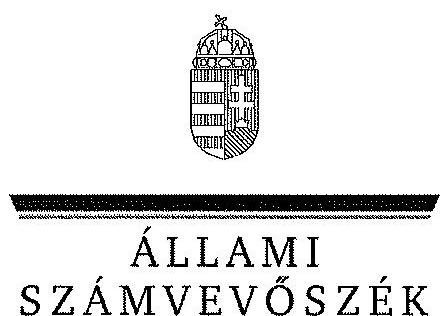
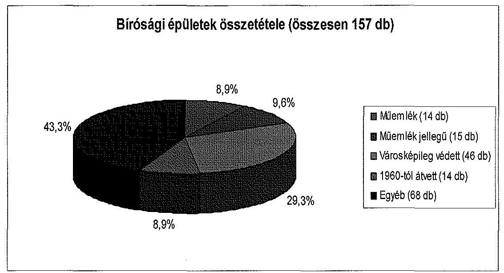
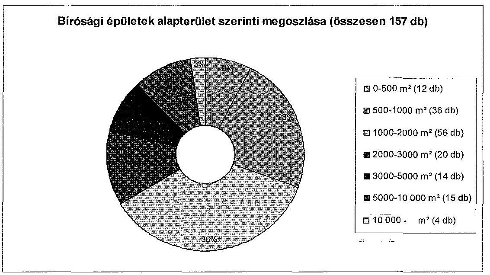
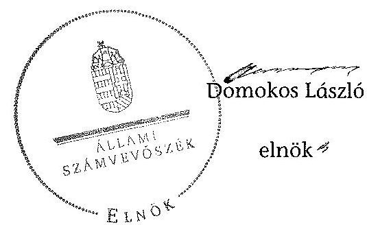

ÁLLAMI
SZÁMVEVŐSZÉK

# JELENTÉS 

a Bíróságok gazdálkodásának ellenőrzéséről

---

# Állami Számvevőszék 

Iktatószám: V-0120-577/2014.
Témaszám: 1155
Vizsgálat-azonosító szám: V0627

## Az ellenőrzést felügyelte:

Dr. Horváth Margit
felügyeleti vezető
Az ellenőrzést vezette és az ellenőrzés végrehajtásáért felelős:
Balkay Attila
ellenőrzésvezető
A számvevőszéki jelentés összeállításában közreműködtek:
Bodonyi Miklós
számvevő főtanácsos
Dr. Pataki Magdolna
számvevő tanácsos
Trenovszki István
számvevő tanácsos
Vásárhelyi Zoltán
számvevő tanácsos

Az ellenőrzést végezték:

| Bodonyi Miklós számvevő főtanácsos | Dr. Csapó Anna számvevő tanácsos | Csepreginé Tancsik Erzsébet számvevő főtanácsos |
| :--: | :--: | :--: |
| Domonkosné Kurilla Edit számvevő tanácsos | Ganter Ildikó számvevő | Kámán Edina számvevő |
| Kopasz Norman számvevő gyakornok | Nagyné Lakhézi Éva számvevő tanácsos | Orosz Diána számvevő |
| Dr. Pataki Magdolna számvevő tanácsos | Reichert Margit számvevő tanácsos | Dr. Remport Katalin számvevő tanácsos |
| Szabó Erzsébet számvevő tanácsos | Temesváry Miklós számvevő tanácsos | Trenovszki István számvevő tanácsos |
| Vásárhelyi Zoltán számvevő tanácsos | Vida László számvevő tanácsos |  |

Jelentéseink az Országgyűlés számítógépes hálózatán és az Interneten a www.asz.hu címen is olvashatóak.

---

# A témához kapcsolódó eddig készített számvevőséki jelentések: 

## címe

Jelentés Magyarország 2012. évi központi költségvetése végrehajtásának ellenőrzéséről
Jelentés a Magyar Köztársaság 2011. évi költségvetése végrehajtásának ellenőrzéséről
Jelentés a Magyar Köztársaság 2010. évi költségvetése végrehajtásának ellenőrzéséről
Jelentés a Magyar Köztársaság 2009. évi költségvetése végrehajtásának ellenőrzéséről
Jelentés a Magyar Köztársaság 2008. évi költségvetése végrehajtásának ellenőrzéséről
sorszáma
13080
1297
1117
1016
0928

---

# TARTALOMJEGYZÉK 

BEVEZETÉS ..... 3
I. ÖSSZEGZŐ MEGÁLLAPÍTÁSOK, KÖVETKEZTETÉSEK, JAVASLATOK ..... 8
II. RÉSZLETES MEGÁLLAPÍTÁSOK ..... 18

1. Az irányító szerv feladatellátása ..... 18
2. A bíróságok belső kontrollrendszere ..... 23
2.1. A belső szabályozottság megfelelősége ..... 23
2.2. A belső kontrollok működésének megfelelősége ..... 35
2.3. A belső ellenőrzési rendszer kialakítása és működtetése ..... 41
3. A bírósági intézmények pénzügyi gazdálkodása ..... 46
3.1. Az előirányzatok felhasználásának szabályszerűsége ..... 46
3.2. A pénzügyi kötelezettségek teljesítése ..... 53
3.3. A feladatváltozások hatásai ..... 55
3.4. Az évközi korlátozó intézkedések hatásai ..... 56
3.5. Az igazságügyi követelések kezelése és nyilvántartása ..... 57
4. A bírósági intézmények vagyongazdálkodása ..... 62
4.1. A bírósági épületek jellemzői ..... 62
4.2. A beruházások és felújítások tervezése ..... 65
4.3. A beruházások és felújítások végrehajtása ..... 68
4.4. A vagyongazdálkodás és a vagyonnyilvántartás szabályszerűsége ..... 69
4.5. A bírósági intézmények vagyonának változása ..... 73

## MELLÉKLETEK

1. számú A VI. Bíróságok fejezethez tartozó önállóan működő és gazdálkodó bíró-sági intézmények
2. számú A VI. Bíróságok fejezethez tartozó önállóan működő és gazdálkodó bíró-sági intézmények és az illetékességi körükbe tartozó helyi és munkaügyi bíróságok
3. számú Az előirányzatok alakulása a Bíróságok fejezetnél 2008-2011 között
4. számú Az intézmények 2008-2011. évi összesített mérlegadatai
5. számú Az ingatlanok állományában bekövetkezett változások a 2008-2011. években
6. számú Az intézmények immateriális javaiban és tárgyi eszközeiben bekövetkezett változások a 2008-2011. években

---

7. számú A gépek, berendezések és felszerelések állományában bekövetkezett változások a 2008-2011. években
8. számú A járművek állományában bekövetkezett változások a 2008-2011. években

# FÜGGELÉKEK 

1. számú Rövidítések jegyzéke
2. számú Értelmező szótár

---

# JELENTÉS 

## a Bíróságok gazdálkodásának ellenőrzéséről

## BEVEZETÉS

A magyar bírói szervezet összetételét és szerepét az ellenőrzési időszak végéig az Alkotmány ${ }^{1}$ határozta meg. Eszerint „a Magyar Köztársaságban az igazságszolgáltatást a Magyar Köztársaság Legfelsőbb Bírósága, az ítélőtáblák, a Fővárosi Bíróság és a megyei bíróságok, valamint a helyi és a munkaügyi bíróságok gyakorolják."2 Az Állami Számvevőszék - szabályszerűségi ellenőrzés keretében - e szervezetek gazdálkodását ellenőrizte a 2008. január 1-jétől 2011. december 31-ig terjedő időszakra vonatkozóan.

Az ellenőrzést egyrészt az indokolta, hogy az ÁSZ a Bíróságok fejezet működését utoljára 2002-ben ellenőrizte. ${ }^{3}$ Másrészt a bíróságok gazdálkodásának szabályszerűségi értékelése tágabb áttekintést és egyúttal kiegészítést nyújt a központi költségvetés végrehajtásának ÁSZ ellenőrzéseihez. (A bíróságok belső kontrollrendszere a 2011. évi zárszámadáshoz kapcsolódóan került ellenőrzésre. ${ }^{4}$ A 2012. évben működő belső kontrollrendszer értékelése a 2012. évi központi költségvetés végrehajtásának ÁSZ ellenőrzése keretében történt meg. ${ }^{5}$ )

Az ellenőrzés célja annak értékelése volt, hogy a bíróságok a közpénzekkel és az állami vagyonnal a szabályok betartásával gazdálkodtak-e; gazdálkodásuk átlátható és elszámoltatható volt-e, ezen belül a saját bevételek és az egyes kiadások elszámolása szabályszerű és indokolt volt-e; az irányító szerv felügyeleti és irányító tevékenysége, valamint a bírósági intézmények belső kontrollrendszere a 2008-2011. években biztosította-e a szabályszerű gazdálkodást.

Ennek keretében értékeltük, hogy:

- az irányító szerv bírósági intézményekre vonatkozó feladatellátása, valamint az intézmények szervezetére és működésére vonatkozó szabályozás megfelelt-e a mindenkori alapító okiratban rögzített feladatoknak, hatásköröknek, illetve a vonatkozó jogszabályi előírásoknak;

[^0]
[^0]:    ${ }^{1}$ 1949. évi XX. törvény a Magyar Köztársaság Alkotmányáról 45-50. §
    ${ }^{2}$ Alkotmány 45. § (1) bekezdés
    ${ }^{3}$ Jelentés a Bíróságok fejezet működésének ellenőrzéséről [0240] 2002. október
    ${ }^{4}$ Jelentés a belső kontrollrendszer és a belső ellenőrzés szabályszerűségének a zárszámadási ellenőrzésbe bevont központi költségvetési intézményeknél lefolytatott ellenőrzéséről [1298] 2012. szeptember
    ${ }^{5}$ Jelentés Magyarország 2012. évi központi költségvetése végrehajtásának ellenőrzéséről. [13080] T/12002/1 2013. augusztus

---

- a bírósági intézmények belső kontrollrendszere biztosította-e a törvényes közpénz- és vagyongazdálkodást, megfelelően működött-e a belső ellenőrzési rendszere és hasznosultak-e annak megállapításai;
- a bírósági intézmények pénzügyi gazdálkodása az irányadó jogszabályoknak megfelelt-e, és az egyes költségvetési években a pénzügyi stabilitás biztosított volt-e;
- az intézmény vagyongazdálkodása a jogszabályoknak megfelelt-e;
- az igazságügyi követelésekkel összefüggő teendők ellátása megfelelt-e a vonatkozó jogszabályoknak és a belső szabályozás előírásainak.

Az intézmények pénzügyi és vagyongazdálkodási helyzetének értékelését szakmai tevékenysége, költségvetése, valamint előirányzat-gazdálkodása szabályszerűsége, továbbá belső kontroll-rendszere alapozza meg, ezért az ellenőrzés kiterjedt továbbá:

- a jogszabályi előírásoknak megfelelő belső szabályozásra és annak végrehajtására;
- az ellenőrzendő költségvetési előirányzatok felhasználásának szabályszerűségére;
- a működőképesség pénzügyi feltételeinek és a fizetőképességének biztosítására;
- a kötelezettségvállalások és teljesítések, valamint a kiadások intézményi feladatokra történő elszámolásának szabályozottságára és szabályszerű végrehajtására;
- a vagyonkezelés, a vagyongazdálkodás törvényességére, szabályozottságára és annak megfelelő gyakorlatára.

Az ellenőrzés lefolytatásához a bíróságok tanúsítványokkal, valamint egyéb elektronikus és papíralapú dokumentumokkal szolgáltattak adatokat, amelyeket helyszíni ellenőrzés keretében ellenőriztünk.

A belső kontrollrendszer kialakításának ellenőrzése során értékeltük a kontrollkörnyezet, a kockázatkezelési rendszer, a kontrolltevékenységek, az információs és kommunikációs rendszer, valamint a monitoring rendszer szabályozottságának megfelelőségét.

Egyszerű véletlen és szakmai mintavétellel kiválasztott tételek alapján értékeltük a pénzügyi folyamatokban kulcsszerepet betöltő belső kontrollok működésének megfelelőségét a bérleti díjak, az egyéb dologi kiadások, valamint a működési bevételek pénzforgalmánál. Ezt a módszert alkalmaztuk a vagyongazdálkodás ellenőrzésével összefüggésben a felhalmozási tételekre, továbbá az igazságügyi követelésekre.

Az ÁSZ az ellenőrzés megállapításait az ellenőrzött időszakban hatályos, az intézkedést igénylő megállapításokra tett javaslatait a jelenleg hatályos jogszabályok figyelembevételével fogalmazta meg.

---

Az ellenőrzés szakmai módszertana az Állami Számvevőszék Ellenőrzési Kézikönyvében foglalt szakmai szabályokon alapult.

Az ellenőrzött időszakban a bírói szervezet költségvetése a VI. Bíróságok fejezetben jelent meg két címmel: Bíróságok és Fejezeti kezelésű előirányzatok.

A Bíróságok fejezet 1. címéhez 27, az előirányzatok feletti jogosultság szempontjából teljes jogkörrel rendelkező, a feladatellátáshoz gyakorolt funkció szerint önállóan működő és gazdálkodó, kincstári körbe tartozó költségvetési szerv tartozott: az Országos Igazságszolgáltatási Tanács Hivatala (továbbiakban: OITH), a Legfelsőbb Bíróság (továbbiakban: LB), az öt ítélőtábla, a fővárosi és a 19 megyei bíróság. (1. számú melléklet) Az egyes bíróságok külön alcímen nem szerepeltek. (A 2013. év költségvetésében ${ }^{6}$ jelent meg először külön költségvetési címen a Legfelsőbb Bíróság jogutódja, a Kúria.)

A fejezet éves részletes költségvetési előirányzatait és létszámkeretét az Országos Igazságszolgáltatási Tanács (továbbiakban: OIT) irányító szervi hatáskörében határozta meg a Bszi. előírásai szerint, a költségvetési törvényekben jóváhagyott előirányzatok alapján. A 2008. évi költségvetési törvény 72 268,6 M Ft, a 2009. évi $72373,5 \mathrm{M}$ Ft, a 2010. évi $70442,3 \mathrm{M}$ Ft, a 2011. évi $74838,3 \mathrm{M}$ Ft kiadási előirányzatot hagyott jóvá a fejezet számára. (A költségvetési előirányzatok alakulását a 3. számú melléklet mutatja be.)

A Bíróságok 2. cím fejezeti kezelésű előirányzatainak felhasználása többnyire az intézményeknél teljesült, így az egyes célokat szolgáló források előirányzatmódosítással kerültek az intézményekhez. Fejezeti szinten finanszírozandó célok voltak az intézményi beruházások körében az épületrekonstrukciók, a Ptk. alapján történő kártérítés, a nemzetközi tagdíjak, a kincstári számlavezetési díj kiadásai, a Nemzeti Fejlesztési Terv végrehajtása, továbbá az Új Magyarország Fejlesztési Terv keretében megvalósuló projektek.

A fejezeti kezelésű előirányzatokból finanszírozták a Fővárosi és a Pest Megyei Bíróságon felhalmozódott ügyhátralék kezelését, valamint a cégbírósági és céginformációs rendszerek továbbfejlesztését és korszerűsítését. A fejezeti egyensúlyi tartalék az OIT döntése alapján általában az intézmények dologi kiadásai hiányzó forrásainak finanszírozását szolgálta.

A támogatások a 27 önállóan működő és gazdálkodó intézmény között oszlottak meg, amelyek közül 20 intézmény az illetékességi körébe tartozó - jogi személyiséggel nem rendelkező - helyi és munkaügyi bíróságok működését is finanszírozta ${ }^{7}$. (2. számú melléklet)

A 2008-2011. években a bíróságok működésére és a bírák tevékenységére vonatkozó alapelveket a bírói függetlenség elvének maradéktalan megvalósítása és az ítélkezés egységének biztosítása érdekében a bíróságok szervezetéről és igazgatásáról szóló 1997. évi LXVI. törvényben (Bszi.) foglaltak határozták

[^0]
[^0]:    ${ }^{6}$ Magyarország 2013. évi központi költségvetéséről szóló 2012. évi CCIV. törvény
    ${ }^{7}$ A Fővárosi Bíróság és a 19 megyei bíróság mindösszesen 111 kerületi, illetve városi, valamint 20 munkaügyi bíróság költségvetési forrásait biztosította.

---

meg. Külön törvények rendelkeztek a bírák jogállásáról és javadalmazásáról és az igazságügyi alkalmazottak szolgálati viszonyáról ${ }^{8}$.

A bíróságok igazgatásának központi feladatait a Bszi. 34. § (1) bekezdése alapján az Országos Igazságszolgáltatási Tanács látta el, amelyet Hivatala segített. Az OIT feladatai között szerepelt többek között, hogy gyakorolja a bírósági fejezet gazdálkodásával, a munkáltatói és személyügyi jogkörökkel kapcsolatos feladatokat; irányítsa közvetlenül a belső ellenőrzést és a bíróság fejezet felügyeleti, pénzügyi ellenőrzését; irányítsa a bíróságok informatikai fejlesztését; igazgatási feladatainak ellátása érdekében kötelező szabályzatokat alkosson, és ezek megtartását ellenőrizze.

A Bszi. 35. § (1) bekezdésben foglaltaknak megfelelően az OIT elnöke a Legfelsőbb Bíróság elnöke, aki a Magyar Köztársaság költségvetéseiről szóló törvényekben rögzítettek szerint egyben a Bíróságok fejezet irányítását ellátó szerv vezetője is volt.

A Legfelsőbb Bíróságot (továbbiakban: LB) az Országgyűlés hozta létre 1954. február 1-jei hatállyal ${ }^{9}$. Az ellenőrzött időszakban a Bszi. rendelkezett az intézmény működéséről. Az LB elnökét a köztársasági elnök javaslatára az Országgyűlés választotta, a megválasztásához az országgyűlési képviselők kétharmadának szavazata volt szükséges. Az ellenőrzött időszak alatt közel egy évig 2008. június 27-től 2009. június 21-ig - nem volt az LB-nek az OGY által megválasztott elnöke. Az ellenőrzött négy év alatt négy személy látta el az LB elnöki feladatait.

Az LB az Alkotmány és a Bszi. értelmében biztosítani volt hivatott a bíróságok jogalkalmazásának egységét. Elbírálta - a törvényben meghatározott ügyekben - a bíróságok határozata ellen előterjesztett jogorvoslatot, felülvizsgálati kérelmet, a bíróságokra
 kötelező jogegységi határozatot hozott, eljárt a hatáskörébe tartozó egyéb ügyekben.

Az LB munkaterheinek csökkentése és a jogorvoslati rendszer differenciáltabb szabályozása érdekében az Országgyűlés 2002-ben ${ }^{10}$ öt ítélőtáblát felállítását rendelte el. 2003. január 1-jétől Budapesten, Pécsett és Szegeden, 2004. július 1-jétől Debrecenben és Győrött. Az első három ítélőtábla 2003. július 1-jétől, az utóbbi kettő 2005. január 1-jétől kezdte meg a működését.

Az ítélőtábla elbírálja - törvényben meghatározott ügyekben - a helyi vagy a megyei bíróság határozata ellen előterjesztett jogorvoslatot, illetve eljár a hatáskörébe utalt egyéb ügyekben. Az ítélőtábla jogi személy, mint költségvetési szerv önállóan működik és gazdálkodik, előirányzatai felett teljes jogkörrel rendelkezik.

[^0]
[^0]:    ${ }^{8}$ a bírák jogállásáról és javadalmazásáról szóló 1997. évi LXVII. törvény (Bjt.), az igazságügyi alkalmazottak szolgálati viszonyáról szóló 1997. évi LXVIII. törvény (Iasz.)
    ${ }^{9}$ a Magyar Népköztársaság bírósági szervezetéről szóló 1954. évi II. törvény. Hatálytalan: 1973. I. 1-től
    ${ }^{10}$ az ítélőtáblák és a fellebbviteli ügyészi szervek székhelyének és illetékességi területének megállapításáról szóló 2002. évi XXII. törvény

---

Az ítélőtáblák felállítása és működése nem érintette az LB szakmai és költségvetési-igazgatási feladatainak párhuzamosságából adódó nehézségeket, ami a bírósági szervezeti rendszer új modelljének igényét vetette fel.

2012-től a bírósági rendszer alapvetően átalakult. A 2012. január 1-jétől hatályos Alaptörvény ${ }^{11}$ végrehajtásaként a bíróságok szervezetéről és igazgatásáról szóló 2011. évi CLXI. törvény, valamint a bírák jogállásáról és javadalmazásáról szóló CLXII. törvény az egész bírósági rendszert és ítélkezést korszerűbb és hatékonyabban működő pályára kívánta állítani.

A törvény indokolása kiemelte, hogy 2012. január 1-jétől egy olyan konstrukció jön létre, ahol a szakmai és igazgatási hatáskörök nem keverednek: a bíróságok központi igazgatását az Országos Bírósági Hivatal (korábbi OIT Hivatal) elnöke látja el, a Kúria (korábban Legfelsőbb Bíróság) elnöke pedig a szakmai vezetésért lesz felelős. A rendszer elemét képezi a bírák által választott és kizárólag bírákból álló Országos Bírói Tanács, amely döntően kontrollfunkciókat gyakorol.

A jogutódlások tisztázásának keretében került sor korábbi bírósági elnevezések megváltoztatására, mely szerint a Fővárosi Bíróság és az adott megyei bíróság jogutódja az adott törvényszék.

Annak érdekében, hogy a jogutód szervezet részére minél mélyebb és szélesebb körű áttekintést tudjunk nyújtani a gazdálkodási folyamatokról, az alkalmazott kontrollok megfelelőségéről, azok gyenge pontjairól, a vizsgált időszakot 2011-ben lezártuk. Ezáltal a jogutód szervezeteknek lehetőséget biztosítunk a jelentésünk megállapításainak minél szélesebb körű hasznosítására, a tapasztalatok beépítésével a szervezet kontrolljainak erősítésére. A Bíróságok tevékenysége és működése folyamatosan a közérdeklődés középpontjában áll. Jelentésünkkel ennek egy szűk területét tudjuk lefedni, a jogelőd szervezet gazdálkodási folyamatairól áttekintő képet tudunk nyújtani, így például a bírósági ingatlanállomány alakulásáról, a bírósági végrehajtások eredményességéről.

Az ellenőrzés a 2008. január 1 - 2011. december 31. közötti időszakra terjedt ki. Az ellenőrzött időszakra tekintettel az ellenőrzés során a bírósági intézmények 2012. január 1-jét megelőző elnevezését szerepeltettük.

A helyszíni ellenőrzést az Országos Bírósági Hivatalnál (korábbi OITH), a Kúriánál (korábbi LB), az öt Ítélőtáblánál, és a Törvényszékeknél (korábbi Fővárosi Bíróság és a 19 megyei bíróság) folytattuk le az ellenőrzési időszakra vonatkozó dokumentumok alapján.

Az ellenőrzés jogszabályi alapját az Állami Számvevőszékről szóló 2011. évi LXVI. törvény 1. § (3) bekezdés, 5. § (2)-(6) bekezdései, valamint az Áht. 2 61. § (2) bekezdésének előírásai képezték.

Az ÁSZ tv. 29. §-a szerint a jelentéstervezetet megküldtük egyeztetésre az OBH és a Kúria elnökének. A beérkezett pontosító észrevételeket elfogadtuk és a jelentésen átvezettük.

[^0]
[^0]:    ${ }^{11}$ Magyarország Alaptörvénye (2011. április 25.)

---

# 1. ÖSSZEGZŐ MEGÁLLAPÍTÁSOK, KÖVETKEZTETÉSEK, JAVASLATOK 

Ellenőrzésünk során értékeltük a bírósági intézmények belső kontrollrendszerének kiépítését és működését, valamint a pénzügyi és vagyongazdálkodását.

A belső kontrollrendszer kialakításának kockázatos, a működésre is kiható alapvető hiányossága volt, hogy a gazdálkodási jogköröket nem igazították hozzá a bírói szervezet specializációihoz. Előnye ugyanakkor, hogy a kontroll és monitoring rendszereket kialakították és működtették.

A Bíróságok szabályozási környezet értékelésének középpontjában a bíróságok SZMSZ-ei, a költségvetési gazdálkodást meghatározó belső szabályzatok, a gazdálkodási jogkörök és nyilvántartási kötelezettségek belső szabályozásai álltak. Az irányító szerv a szabályozások és eljárási gyakorlat egységesítését a mintaszabályzatok ellenére a gazdálkodás területén nem tudta megoldani.

A bírósági intézmények irányítószervi feladatellátásában az intézmények szervezetére és működésére vonatkozó szabályozás részben felelt meg az alapító okiratokban rögzített feladatoknak, hatásköröknek, illetve a vonatkozó jogszabályi előírásoknak. Az irányító szerv a beterjesztett SZMSZ tervezeteket utólag hagyta jóvá. A bíróságok SZMSZ-ei alapvetően az Ámr. ${ }_{1,2}$ előírásainak megfelelő tartalommal rendelkeztek, ugyanakkor még a 2011. év végén is jelentkező hiányosság volt 14 bíróságnál a szervezeti felépítést bemutató ábra, 20 intézménynél a szervezeti egységek engedélyezett létszámának meghatározása. A gazdasági szervezetek mindegyike rendelkezett ügyrenddel, amelyekben megfelelően szabályozták a vagyongazdálkodással, a könyvvezetéssel és az adatszolgáltatással kapcsolatos feladatokat. Az Ámr. ${ }_{1,2}$-ben foglaltak ellenére 2-5 bíróság ellenben egyáltalán nem vagy nem megfelelően szabályozta a gazdálkodással és a szervezet működésével kapcsolatos feladatokat, valamint a gazdasági szervezet alkalmazottainak feladat- és hatáskörét. Az egyes években 5-11 bíróságnál mutatkozott hiányosság a helyettesítés rendjének, továbbá a gazdasági szervezet belső és külső kapcsolattartásának meghatározásában, 3-6 bíróságon mulasztották el az ügyrend aktualizálását.

A költségvetési gazdálkodást meghatározó, a hatályos jogszabályokban előírt belső szabályzatokkal valamennyi bíróság rendelkezett. Ugyanakkor a gazdálkodási jogkörök és a kapcsolódó nyilvántartási kötelezettségek belső szabályozása a 2008-2011. években egyik bíróságnál sem felelt meg teljes mértékben az Áht. ${ }_{1}$ és az Ámr. ${ }_{1,2}$ előírásainak. Az egységes szabályozást az OIT mintaszabályzatok kiadásával támogatta (számviteli politika, számlarend és számlatükör, eszközök és források értékelése, bizonylati rend). A 2010. év végén és a 2011. évtől negyedéves gyakorisággal - az OITH által központilag meghatározott algoritmussal és paraméterekkel - végzett értékvesztés-elszámolás már megteremtette az adósok számvitelben kimutatott fordulónapi állománya reális, egységes szabályok szerinti értékelésének lehetőségét. A bíróságok rendelkeztek leltározási és leltárkészítési, valamint pénz- és értékkezelési szabályzattal, továbbá a felesleges vagyontárgyak feltárási és selejtezési szabályzatával. Szabályozták továbbá a folyamatba épített előzetes, utólagos és vezetői ellenőrzés (FEUVE) rendjét, meghatározták az ellenőrzési nyomvonalat, a szabálytalanságok kezelésének eljárásrendjét és jóváhagyták az informatikai biztonsági szabályzatot.

A kötelezettségvállalásra, az utalványozásra, az ezek ellenjegyzésére és az érvényesítésre jogosultak körét, feladatait, és a vonatkozó eljárási szabályokat hat bíróság az ellenőrzött időszak egészében vagy egy részében nem a jogszabályi előírásoknak megfelelően határozta meg. A bíróságok egyharmadánál nem, vagy nem teljes körűen állt rendelkezésre az egyes gazdálkodási jogköröket gyakorló személyek azonosítására szolgáló - az Ámr. ${ }_{2}$-ben előírt - aláírásminta. Jellemző hiányosságként fordult elő a szakmai teljesítésigazolás kötelezettségének és módjának teljes vagy részleges szabályozatlansága, a teljesítésigazolásra felhatalmazott személyek kijelölésének elmaradása. A kijelölt dolgozók aktuális aláírás-mintája az ellenőrzött időszak egészében vagy egy részében a bíróságok felénél hiányzott.

A gazdálkodási jogkörök belső szabályozásának a bíróságok egyharmadánál alapvető hiányossága volt, hogy még utalásszerűen sem rendelkezett a bírák, bírósági titkárok és végrehajtók peres vagy peren kívüli eljárás során az intézményük költségvetése terhére gyakorolt gazdálkodási jogköréről. Az ítélkezési vagy más igazságszolgáltatási eljárásban közreműködő szakértők, tolmácsok, fordítók, kirendelt védők, tanúk stb. államot terhelő díjazásának és költségtérítésének kifizetéséhez kapcsolódóan a bíróságok kétharmada kötelezettségvállalási vagy utalványozási jogkört és/vagy teljesítésigazolási feladatkört határozott meg számukra, a gyakorlásuk módját és a kapcsolódó kontrollokat azonban nem szabályozta.

A bíróságok az Áht. ${ }_{1}$ és az Ámr. ${ }_{1,2}$ előírásának megfelelően elvégezték a kockázatelemzést és működtették a kockázatkezelési rendszert. Az intézményi szabályzatok kétharmada a jogszabályi előírásoknak megfelelő tartalommal és részletességgel állapította meg a kockázatok kezelésének eljárásait, feladatait és felelősségi rendjét az ellenőrzött időszak egészében.

A bírósági szervezetek információs és kommunikációs rendszereinek szabályozottsága a 2008-2011. években - eseti kivételekkel - megfelelő volt.

A szervezet tevékenységének, a célok megvalósításának nyomon követését biztosító, az operatív tevékenységek keretében megvalósuló folyamatos és eseti nyomon követésből álló - az Ámr. ${ }_{1,2}$-ben előírt - monitoring rendszer valamennyi bíróságon működött.

A gazdálkodási jogkörökhöz kapcsolódó belső kontrollok jogszabályok szerinti működését, a kontrolltevékenységek gyakorlását a bíróságok belső szabályozásának megfelelősége alapvetően meghatározta. Kontrollálatlan, vagy nem folyamatosan és megbízhatóan kontrollált pénzügyi, vagyoni és elszámolási kockázatok a 2008-2011. években jellemzően azokon a területeken jelentkeztek, ahol a bíróságok az egyes gazdálkodási jogköröket és eljárásokat nem, vagy nem megfelelően szabályozták, továbbá a bevételek beszedéséről kiállított utalványok érvényesítői és ellenjegyzői a költségarányos díjakra vonatkozó - az Ámr. ${ }_{1,2}$-be foglalt - jogszabályi és belső előírások betartására irányuló ellenőrzési, illetve jelzési feladatuknak nem tettek eleget.

A szabályoktól eltérő írásbeli kötelezettségvállalásra és annak ellenjegyzésére két bíróságnál rendszeresen, hét bíróságnál eseti jelleggel került sor. Az érintett bíróságokon megsértették az Áht. ${ }_{1}$ és az Ámr. ${ }_{1,2}$ előírásait, mert a kötelezettséget vállalók nem rendelkeztek a szükséges felhatalmazással, és a kötelezettségvállalásra nem az ellenjegyzést követően került sor. Ezáltal az aláírást megelőzően elmaradt az Ámr. ${ }_{1,2}$-ben meghatározott, a kötelezettségvállalás fedezetére és jogszerűségére irányuló ellenőrzési feladatok szabályszerű végrehajtása és igazolása.

Helyszíni ellenőrzésünk a bíróságok egyharmadát érintően azoknál a kiadásoknál állapította meg a legmagasabb kockázatot, amelyeket a szakmai teljesítésigazolás elmaradása vagy jogosulatlan elvégzése ellenére is kifizettek. A megrendelt szolgáltatások és áruszállítások szerződésszerű teljesítésének, a kiállított számlák számszerű helyességének és jogosultságának ellenőrzésére és igazolására szolgáló - az Ámr. ${ }_{1,2}$-ben előírt - szakmai teljesítésigazolás hiányát a kontrollfolyamat további elemei nem szűrték ki. A kiadási utalványok érvényesítői, az Ámr. ${ }_{1,2}$ előírását figyelmen kívül hagyva, az érvényesítést nem a szakmai teljesítésigazolás alapján végezték. Az utalványok ellenjegyzői pedig ahelyett, hogy az Ámr. ${ }_{1,2}$ előírása szerinti ellenőrzési kötelezettségüknek megfelelve intézkedtek volna a szakmai teljesítésigazolás pótlására, aláírásukkal megalapozottnak és szabályosnak minősítették a kifizetéseket.

A bíróságokon betartották az Ámr. ${ }_{1,2}$-nek az összeférhetetlenségre vonatkozó szabályait. Az ellenőrzött időszakban az NMB-nél azonban öt esetben, összesen 600 E Ft összegben az utalványozás valószínűsíthetően közeli hozzátartozó részére történt, megsértve a jogszabály erre vonatkozó tilalmát.

Az utalványok ellenjegyzői összességében eleget tettek az Ámr. ${ }_{1,2}$-ben szabályozott feladataiknak. Az SMB-nél feltárt egy eset kivételével az intézmények biztosították, hogy a kiadásokat a jogszabályokban és az alapító okiratban meghatározott célokra fordítsák a gazdálkodási és elszámolási szabályok betartása mellett.

A bírósági szervezetek belső ellenőrzési rendszere működésének szervezeti keretei biztosították a belső ellenőrzés függetlenségét. A belső ellenőrök feladatkörét az SZMSZ-ekben és a Ber. előírásainak megfelelő belső ellenőrzési kézikönyvekben meghatározták, a feladatokat teljes munkaidőben foglalkoztatottakkal látták el. Ugyanakkor az intézmények létszáma és költségvetése nagyságrendjét és bonyolultságát figyelmen kívül hagyva történt az ellenőri létszám megállapítása (mindenütt egy fő volt). Az éves ellenőrzési tervek kockázatelemzésen alapultak. Tartalmukban - két intézmény kivételével - megfeleltek a Ber. előírásainak, azonban az Áht.
 ${ }_{1}$ és a Ber. előírásai ellenére 22 intézmény egyáltalán nem tervezett, illetve nem végzett sem teljesítményellenőrzést, sem informatikai rendszerellenőrzést. Az elvégzett ellenőrzések során büntető-, szabálysértési, kártérítési, fegyelmi eljárás megindítására okot adó cselekményt nem tártak fel. Az intézkedési tervek teljesítésének utóvizsgálata három intézmény kivételével megtörtént, a javaslatok hasznosultak.

---

Az ellenőrzött négy év alatt a bíróságok működése és fejlesztése 300,4 Mrd Ft kiadással járt, amelyből a fejezeti kezelésű előirányzatokkal együtt $274,9 \mathrm{Mrd}$ Ft-ot - 91,5\%-ot - állami támogatás fedezett.

Az éves előirányzatok megtervezésének bizonytalansága hátráltatta az előrelátást és a források kiszámíthatóságát, valamint a tervszerűség hiányát idézte elő. Az eredeti előirányzatok elégtelensége azok rendszeres módosítását tette szükségessé. A tervezés során gyakorlattá vált, hogy a személyi jellegű kiadásoknál jelentkező kiadási megtakarításokat, valamint a pótelőirányzatokat a dologi kiadások hiányának rendezésére fordították. A bíróságok fizetőképessége az alapvetően takarékos, megfontolt gazdálkodáson alapult. A szervezetek működőképességüket általában tudták biztosítani. Ugyanakkor a szervezet költséghatékonyságának átfogó elemzésére, szervezetkorszerűsítésre 2011 végéig nem került sor.

Az ítélkezési kiadásokat érintő előirányzat-átcsoportosítások, elvonások és többletjuttatások kedvezőtlenül hatottak a gazdálkodás kiszámíthatóságára és átláthatóságára.

A személyi juttatások (a négy évben összesen 235,2 Mrd Ft) előirányzatain belül a külső személyi juttatások - a bírói eljárásban közreműködő ülnökök, szakértők, tolmácsok, tanúk, továbbá a bírák európai jogra való felkészítésével összefüggő megbízási díjak fedezetére szolgáltak - a vizsgált időszak elején 650 M Ft-tal, a vizsgált időszak végén 870 M Ft-tal voltak alultervezettek. A 2011. évben az OIT a külső személyi juttatások előirányzatát 221,5 M Ft összegben csökkentette, ugyanakkor 200,0 M Ft többlet elismerése történt a szakértői, ülnöki és tanúdíjak többleteinek fedezetére. Az ítélkezési kiadások forrása volt a dologi kiadásokban megjelenő megbízási díjak előirányzata is, amelyhez 2011-ben a szolgáltatási díjak növekedésének ellentételezésére 600,0 M Ft támogatási többletet biztosított a központi költségvetés. Az ítélkezési kiadásokhoz kapcsolódó előirányzat-átcsoportosítások, elvonások és többletjuttatások kedvezőtlenül hatottak a gazdálkodás kiszámíthatóságára és átláthatóságára.

Az FB és a PMB a felhalmozódott ügyhátralékok miatt folyamatosan kritikus helyzetben volt a létszámszükséglet tekintetében, mivel az ítélkezésre váró ügyek aránya jelentősen - 20-40\%-ban - meghaladta a bírói létszám arányát. Az ügyhátralékok növekedésének 42\%-a a fővárosban, elsősorban a büntető pereknél, 38\%-a pedig Pest megyében, a polgári és büntető pereknél következett be. Az OIT 2008. évi intézkedésével rövid távú megoldásként létszámbővítésekre tett intézkedést, amelyek mértéke az öt főtől 100 főig terjedt. 2009-ben az OGY 931,0 M Ft, 2010-ben és 2011-ben azonos összegű, 735,5 M Ft-os támogatási többletet biztosított ${ }^{12}$ a Fővárosi és a Pest Megyei Bíróságon felhalmozódott ügyhátralék kezelése c. fejezeti kezelésű előirányzatban a létszámbővítések költségeire.

[^0]
[^0]:    ${ }^{12}$ a Magyar Köztársaság 2009. évi költségvetéséről szóló 2008. évi CII. törvény, a Magyar Köztársaság 2010. évi költségvetéséről szóló 2009. évi CXXX. törvény, a Magyar Köztársaság 2011. évi költségvetéséről szóló 2010. évi CLXIX. törvény

---

A megtett intézkedések kis mértékben és csak átmenetileg javították az ügyfeldolgozás mértékét. A fejezet 2011. évi beszámolója ${ }^{13}$ szerint a személyi és tárgyi feltételek javítása nélkül nem lehetséges az ügyhátralék feldolgozása. Az egyes bíróságok munkaterhei továbbra is jelentős eltéréseket mutattak, a kiemelkedő ügyhátralékkal rendelkező bíróságok elsősorban a központi régió bíróságai maradtak.

A dologi kiadásoknál (négy év alatt 51,9 Mrd Ft) az irányító szerv az intézmények igényét az eredeti előirányzat jóváhagyásakor nem érvényesítette, a számítások és az előző évi teljesítési adatok ellenére nem a szükségleteknek, az ügyforgalomnak megfelelő forrásellátottság volt jellemző. A jóváhagyott eredeti előirányzatok rendre, és valamennyi bíróságnál jelentős mértékben (16,0-63,0\%-ban) eltértek az igényektől, valamint az előző évi teljesítéstől.

A bíróságok fizetőképessége az alapvetően takarékos, megfontolt gazdálkodáson alapult. Az egyes évek végére adósságot nem halmoztak fel, ugyanakkor jelentős (1,3-2,3 Mrd Ft összegű, 1,9-2,9\%-os arányú) előirányzatmaradványok képződtek. A pénzeszköz likviditási mutató ${ }^{14}$ fejezeti szinten minden évben meghaladta az 1-es értéket (2,8 és 1,6 között alakult). Öt bíróság azonban folyamatosan pénzügyi nehézséggel küzdött az év végére is.

A bírósági intézmények gazdálkodását a négy év alatt korlátozó intézkedésként 7,3 Mrd Ft előirányzat-zárolás érintette. Az OITH a zárolt előirányzatok mindössze 0,5-1,1\%-ának feloldásáról intézkedett július hónapban, a zárolás végleges feloldására csak minden év novemberében került sor, amikor egyidejűleg intézkedett egyes bírósági intézmények esetében az előirányzatok részleges elvonásáról is. Annak ellenére, hogy a szervezetek működőképességüket általában tudták biztosítani, a zárolások és feloldások gyakorlata nehezítette a folyamatosan felmerülő beszerzési igények kielégítését, a végrehajtó terület egyenletes munkaterhelését, gátolta a költségvetési folyamatok átláthatóságát, az éves tervezések megbízható adatokra épülő megalapozását.

Az ítélkezési kiadások - jellemzően szakértői, tolmácsolási, ügyvédi, tanú és ülnöki díjak - az igények pontos ismerete nélkül nem voltak kellő megbízhatósággal tervezhetők. A működési kiadások 2008-ban 8\%-át, a 2011. évben 11\%-át meghaladó ítélkezési kiadások folyamatos emelkedéséhez a növekvő ügyszám, a szakértői díjakat, valamint az áfa-t érintő 2008. és 2009. évi jogszabályváltozások is hozzájárultak. A kiadások nagyságára a bírói határozattal költségmentességben részesülő ügyfelek számának alakulása is hatással volt, mivel a költségmentesség a végrehajtási szakban is megillette az ügyfelet.

A bíróságok működési bevételei a továbbszámlázott működési kiadásokból, a bérleti díjakból, vendégszobák, üdülők hasznosításából származtak, valamint részüket képezték az önálló bírósági végrehajtók visszatérítései, az elkobzott vagyontárgyak, valamint az át nem vett bűnjelek értékesítéséből származó be-

[^0]
[^0]:    ${ }^{13}$ T/8196. sz. OGY Iromány
    ${ }^{14}$ A pénzeszköz likviditási mutató a rövid lejáratú kötelezettségek teljesítésére azonnal felhasználható saját pénzeszközök arányát fejezi ki. A pénzeszközöket korrigáltan, az idegen (letéti) pénzeszközök nélkül vettük számításba.

---

vételek, továbbá a dolgozók térítései. A bíróságok folyó bevételei a 2007. évi 5,7 Mrd Ft-ról 2011-re 6,9 Mrd Ft-ra, a négy év alatt 21,0\%-kal nőttek. A bevételi teljesítés 2008-ban 7,4\%-kal, 2011-ben 1,2\%-kal volt alacsonyabb, mint a módosított bevételi előirányzat.

A közhatalmi, igazságügyi (bírság jellegű, ill. igazságügyi szolgáltatás díj) bevételek tervezhetőségét több tényező befolyásolta. A költség felmerülése, illetve a megtérítésének előírása között az időbeni eltérés igen jelentős, akár több év is lehetett. A követelések behajtásának eredményessége az adósok jövedelmi helyzete és a bírósági végrehajtói tevékenység függvénye. Emellett az átváltoztatható és a költségtérítés jellegű követelések behajtásának eredményessége között is alapvető különbség mutatkozott. A követelés megfizetésének elmulasztása miatt elzárással fenyegetett adósok többsége önként, vagy a fogházbüntetésre történő átváltásról szóló bírói végzés hatására fizette be az adósságát.

A 20 megyei (fővárosi) bíróság a 2008. év végi 10 494,1 M Ft igazságügyi követeléssel szemben a 2011. évi vagyonmérlegében 32,9\%-kal kisebb összeget, 7037,3 M Ft-ot mutatott ki. A követelések mérleg szerinti állományának csökkenése annak ellenére következett be, hogy évről-évre nőtt a bíróságok által megítélt pénzbeli szankciók és költségtérítésre kötelezések mennyisége és összértéke. Az ellenőrzött időszakban a 20 bíróság évente növekvő, a 2011. évben a 2008. évihez viszonyítva 25,3\%-kal több, 4261,5 M Ft bevételre tett szert az igazságügyi követelésekből. A követelések mérlegben kimutatott állományának visszaesése a 2010. évtől megváltozott egyszerűsített (csoportos) értékvesztési szabályok alkalmazásának következménye volt.

Az igazságügyi követelések értékvesztésének fejezeti szinten egységes kimutatásával szemben a behajthatatlannak minősülő követelések törlésében - a zárszámadási ellenőrzést követően évenként megismételt számvevőszéki javaslat ellenére - a 2008-2011. években nem alakult ki összehangolt intézményi szabályozás és gyakorlat. A megyei bíróságok egyötödénél és így fejezeti szinten sem szereztek érvényt az Sztv. és az Áhsz. előírásának, veszteségként azokat nem vezették ki a számviteli nyilvántartásból. A 2008-2011. években behajthatatlan követelésként a bíróságok által kimutatott, összesen 1286,8 M Ft törlése - az eltérő intézményi gyakorlat miatt - nem volt teljes körű, így nem vezetett a fejezeti szinten valós összkép bemutatásához. A behajthatatlan követeléseket törlő bíróságokon ellenőrzésünk nem tapasztalt igazságügyi követelésről való, az Áht. előírásába ütköző lemondásokat.

Az ellenőrzött időszakban a megyei (fővárosi) bíróságokon a végrehajtás eredményeként az önálló végrehajtóknak kiadott előleg 23,7\%-a térült meg. A költségmentes ügyekben az önálló végrehajtóknak kiadott előlegek növekedése (2008-ban 145,9 M Ft, 2011-ben 237,2 M Ft), illetve a megtérülések csökkenése (2008-ban 32,1\%, 2011-ben 19,4\%) miatt az újabb előlegek fedezetének egy részét más forrásból kellett biztosítani, ugyanakkor a meg nem térült előlegek a Bíróságok fejezet mérlegét terhelték.

A végrehajtás eredményességét hátráltatta az ügyfelek gyenge fizetési hajlandósága és vagyoni, jövedelmi helyzete, a magas ügyszám, esetenként a végrehajtás módjának - terület alapúról darabszámos felosztásra történő - megváltoztatása is. Az ellenőrzött időszakban a végrehajtók nyilvántartással, pénzke-

---

zeléssel kapcsolatos munkáját esetenként belső ellenőrzés keretében értékelték, ugyanakkor az önálló bírósági végrehajtók szakmai munkájának ellenőrzésére, tevékenységük hatékonyabbá tételére a bíróságoknak nincsenek eszközeik.

A bírósági intézmények vagyongazdálkodása megítélésének kiindulási pontja, hogy az OIT 2008. februárjában elfogadott 2008-2013. évekre vonatkozó beruházási és felújítási terve nem volt kellően megalapozott és a kitűzött mérsékelt célokhoz sem tudták biztosítani a pénzügyi fedezetet. A vagyongazdálkodás során nehézséget jelentett továbbá, hogy nem volt fejezeti szinten meghatározott értékelési rend az ingatlanok nettó értékének meghatározására. Sem fejezeti, sem intézményi szinten nem állnak rendelkezésre a mérlegadatokon túl egyéb, az ingatlanállomány értékelését, a szükséges fejlesztések és beruházások prioritását támogató mutatók. Az idősebb épületek és a teljes felújítás nélkül átvett fiatalabb épületek indokolt rekonstrukciója elmaradt. A bíróságok a Vtv. előírásai ellenére, a Magyar Nemzeti Vagyonkezelő Zrt.-vel (MNV Zrt.) nem kötöttek vagyonkezelői szerződést. A beruházások nagy része 2008. és 2011. között több évi átfutási idővel valósult meg. A bíróságok vagyonkezelésében lévő ingatlanok összes alapterületére ( $370000 \mathrm{~m}^{2}$ ) vetítve teljes rekonstrukciót mindössze azok 3,4\%-ára ( $12500 \mathrm{~m}^{2}$ ) hajtottak végre és fejeztek be.

A jelentős épületállomány, ezen belül a kisméretű városi bíróságok nagy száma az intézményi felhalmozási előirányzatok elaprózódását vonta maga után. A bíróságok 157 db - kezelésükben lévő - épületben végezték ítélkezési tevékenységüket, amelynek közel fele (47,8\%) műemlék, műemléki környezetben áll, vagy helyi védettséget élvez. A műemlék épületek után nem számolnak el értékcsökkenést az intézmények, emellett az évtizedekkel korábban megállapított, ma már irreálisan alacsony vagyonértékek felértékelésére nem került sor. A műemlék épületek használhatósága csökkent a fizikai állapotuk romlásával.

Az éves költségvetési beszámolók mérlegadatai szerint a vagyonmérleg főösszege a 2008. év végi 61,1 Mrd Ft-ról a 2011. év végére 64,3 Mrd Ft-ra, 3,2 Mrd Ft-tal, 5,2\%-kal nőtt (4. számú melléklet). A növekedés elsősorban a beruházási és felújítási tevékenység hatására következett be amellett, hogy a műemlék épületekre értékcsökkenést nem kellett elszámolni.

Az ingatlanok bruttó értéke a 2007. év végi 31,1 Mrd Ft-ról 2011. év végére 38,4 Mrd Ft-ra növekedett, használhatósági fokuk a beruházások, felújítások ellenére kis mértékben csökkent. (5. számú melléklet) Az ingatlanok használhatósági foka intézményenként
 a négy év alatt jelentős szórást mutatott (67%-tól 96%-ig). Az ingatlanok értékadatai és a hasznosíthatósági mutatók nem adnak valós képet a bírósági ingatlanállomány állapotáról. A bírósági épületek beruházására és felújítására a költségvetési törvényekben biztosított összegek az igényektől elmaradtak, a 2008. évi 1603,7 M Ft-ról 2009-re 1143,6 M Ft-ra csökkentek, majd a 2010. évi, az előző évivel azonos mérték után 2011-ben kis mértékben, 1434,6 M Ft-ra emelkedtek, nem érték el a 2008. évi támogatás szintjét.

A hosszabb távra történő tervszerű megoldás érdekében az OIT 2008. februárjában elfogadta a bírósági épületek 2008-2013. évek közötti időszakra vonatkozó középtávú beruházási és felújítási tervét. A tervet tartalmi és összegszerűségi eltérések jellemezték, az sem szakmai, sem pénzügyi szempontból nem bizonyult

---

időtállónak. A kivitelezett beruházások és felújítások mind tartalmukban, mind összegszerűségükben eltértek az igényektől, illetve a tervezettől. Az OITH 2010. január közepén hatályon kívül helyezte a tervet.

Az intézmények nem alakítottak ki egységes gyakorlatot a vagyontárgyak bérbeadási eljárásaira. A bérbeadás eljárásrendjének szabályozása összesen nyolc intézménynél nem, vagy nem teljes körűen történt meg. Az intézmények többsége felmérte a piaci lehetőségeket, az adott települési önkormányzat által alkalmazott díjtételeket, illetve a helyben szokásos piaci árakat. Az így megállapított díjak fedezték a bérbe adott eszközök fenntartására fordított kiadásokat és azok amortizációjának időarányos részét. Négy bíróságnál a bérleti és a szolgáltatási díjakat nem alapozta meg aktuális önköltség-számítás, e bíróságok költségkalkuláció nélküli, vagy 3-10 évvel korábban kalkulált díjakat alkalmaztak. Az OITH helyiségbérleteit leszámítva hiányzott a bevételek beszedését megelőző szakmai teljesítésigazolás.

A gép, berendezés és felszerelés eszközállomány értéke a 2007. év végi 11 260,6 M Ft-ról 2011. év végére 12 026,0 M Ft-ra növekedett. Ugyanakkor a mérlegben kimutatott nettó értékük közel felére csökkent. Jelentősebb - elsősorban informatikai - eszközbeszerzés csak 2008. évben történt fejezeti szervezésben. Az eszközcsoport amortizálódását az ellenőrzött időszakban a beszerzések nem tudták pótolni, így annak használhatósági foka 2011-re 12,0%-ra esett vissza, amely a nullára leírt gépparkot is, az eszközök relatíve hosszú üzemidejét, a meghibásodásokat figyelembe véve, a javítási és az üzemeltetési költségek növekedésének kockázatát hordozza.

A helyszíni ellenőrzés megállapításainak hasznosítása mellett javasoljuk:

# az OBH elnökének: 

1. A gazdálkodási jogkörök belső szabályozásának a bíróságok egyharmadánál alapvető hiányossága volt, hogy még utalásszerűen sem rendelkezett a bírák, bírósági titkárok és végrehajtók peres vagy peren kívüli eljárás során az intézményük költségvetése terhére gyakorolt gazdálkodási jogköréről. A bíróságok kétharmada kötelezettségvállalási vagy utalványozási jogkört és/vagy teljesítésigazolási feladatkört határozott meg számukra, azonban a gyakorlásuk módját és a kapcsolódó kontrollokat nem szabályozta. A jogerős bírósági döntést külön írásbeli kötelezettségvállalás és ellenjegyzés nélkül is teljesíthető kötelezettségként 2010. január 1-jei hatállyal az Ámr. 2 72. § (12) bekezdése, majd augusztus 15-től a (14) bekezdése meghatározta ugyan, de az előírás belső szabályzatokban történő érvényesítése 2011 végéig csak két bíróság esetében történt meg.

Javaslat:
Az Áht. 2 36. § (1)-(2) bekezdése előírásának érvényesítése érdekében intézkedjen arra nézve, hogy a peres és nemperes eljárások során hozott bírósági döntésekkel meghatározott fizetési kötelezettséget minden bírói szervezet egységesen és kötelezően a törvényi előírás, valamint az Ávr. 53. § (1) bekezdés c) pontja szerinti „más fizetési kötelezettségként" kezelje, és az Ávr. 53. § (2) bekezdése alapján módosítsa a belső szabályzatában a gazdálkodási jogköröket.

---

2. Az NMB-nél az ellenőrzött időszakban öt esetben, összesen 600 E Ft összegben az utalványozás valószínűsíthetően közeli hozzátartozó részére történt, megsértve az Ámr. 138. § (3) és az Ámr. 2 80. § (2) bekezdés erre vonatkozó tilalmát.

Javaslat:
A Nógrád Megyei Bíróságnál felmerült esetleges összeférhetetlenség tisztázása érdekében a munkajogi felelősség megállapítására indítson vizsgálatot a Balassagyarmati Törvényszéknél, szükség esetén kezdeményezze az indokolt munkajogi lépéseket.
3. Az OITH a zárolt előirányzatok mindössze 0,5-1,1%-ának feloldásáról intézkedett július hónapban, a zárolás végleges feloldására csak minden év novemberében került sor, amikor egyidejűleg intézkedett egyes bírósági intézmények esetében az előirányzatok központi célokra történő részleges elvonásáról is. Annak ellenére, hogy a szervezetek működőképességüket általában tudták biztosítani, a zárolások és feloldások gyakorlata nehezítette a folyamatosan felmerülő beszerzési igények kielégítését, a végrehajtó terület egyenletes munkaterhelését, gátolta a költségvetési folyamatok átláthatóságát, az éves tervezés megbízható adatokra épülő megalapozását. Az éves előirányzatok bizonytalansága hátráltatta az előrelátást, a források kiszámíthatóságát és a tervszerűség hiányát idézte elő.

Javaslat:
A bírósági szervezetek kiegyensúlyozottabb gazdálkodása, megalapozott tervezése, valamint a költségvetési folyamatok átláthatóságának javítása érdekében dolgoztasson ki olyan kockázatértékelő és monitorizáló eljárási rendet, amely lehetővé teszi az évközi zárolások feloldásának több lépcsőben, időben arányosabban és egyenletesebben történő megvalósítását.
4. Az igazságügyi követelések értékvesztésének fejezeti szinten egységes kimutatásával szemben a behajthatatlannak minősülő követelések törlésében - a zárszámadási ellenőrzést követően évenként megismételt számvevőszéki javaslat ellenére - a 2008-2011. években nem alakult ki összehangolt intézményi szabályozás és gyakorlat. Ennek következtében a megyei bíróságok egyötödénél és így fejezeti szinten sem szereztek érvényt az Sztv. és az Áhsz. előírásainak, amelyek szerint a könyvviteli mérlegben a behajthatatlan követeléseket nem lehet kimutatni, hitelezési veszteségként azokat ki kell vezetni a számviteli nyilvántartásból. A 2008-2011. években behajthatatlan követelésként a bíróságok által kimutatott, összesen 1286,8 M Ft törlése - az eltérő intézményi gyakorlat miatt - nem volt teljes körű, így nem vezetett a fejezeti szinten valós összkép bemutatásához.

Javaslat:
A bírósági szervezetek igazságügyi követelései valós, reális mértékének meghatározása érdekében intézkedjen a behajthatatlannak minősülő követelések törlésének fejezeti szinten egységes, az Sztv. 65. § (7) bekezdés, valamint a 4/2013. (I. 11.) Korm. rendelet 53. § (8) bekezdés e) pontja előírásainak megfelelő gyakorlata kialakítására.
5. A hosszabb távra történő tervszerű megoldás érdekében az OIT 2008. februárjában elfogadta a bírósági épületek 2008-2013. évek közötti időszakra vonatkozó középtávú beruházási és felújítási tervét. A terv végrehajtását tartalmi és összegszerűségi eltérések jellemezték, az sem szakmai, sem pénzügyi szempontból nem bizonyult időtállónak. A tervet 2010. januárjában az OIT hatályon kívül helyezte. A kivitelezett beruházások és felújítások mind tartalmukban, mind összegszerűségükben eltértek az igényektől, illetve a tervezettől.

Javaslat:
A meglévő épületvagyon értékének megőrzése, valamint az ítélkezési tevékenységhez szükséges, méltó elhelyezési körülmények általános biztosítása érdekében intézkedjen az időtálló, szakmailag és pénzügyileg megalapozott beruházási és felújítási terv összeállítására, az ahhoz szükséges feltételek megteremtésére.
6. A gép, berendezés és felszerelés eszközállomány a 2007. év végi bruttó 11 260,6 M Ft-ról 2011. év végére 12 026,0 M Ft-ra növekedett. Ugyanakkor a mérlegben kimutatott nettó értékük közel felére csökkent. Jelentősebb - elsősorban informatikai - eszközbeszerzés csak 2008. évben történt fejezeti szervezésben. Az eszközcsoport amortizálódását az ellenőrzött időszakban a beszerzések nem tudták pótolni, így annak használhatósági foka 2011-re 12,0%-ra esett vissza, amely a nullára leírt gépparkot is, az eszközök relatíve hosszú üzemidejét, a meghibásodásokat figyelembe véve, a javítási és az üzemeltetési költségek növekedésének kockázatát hordozza.

Javaslat:
Gondoskodjon a gép, berendezés és felszerelés eszközállomány értékállóságát fejezeti szinten és folyamatosan biztosító beszerzési és gazdálkodási terv összeállításáról az ítélkezési tevékenység jó színvonalú technikai támogatásának megteremtése és megőrzése érdekében.

---

# II. RÉSZLETES MEGÁLLAPÍTÁSOK 

## 1. Az IRÁNYÍTÓ SZERV FELADATELLÁTÁSA

Az OIT részben látta el az Áht. 49. § (5) bekezdésében és a Bszi. 39-41. és 46-47. §-aiban foglalt előírásoknak megfelelően irányítószervi feladatait.

Minden évben összeállította a fejezet költségvetésére és a költségvetés végrehajtására vonatkozó javaslatát, döntött a bírósági fejezethez tartozó intézmények kiemelt költségvetési előirányzatairól. Irányította a bíróságok informatikai fejlesztését. Meghatározta a létszámgazdálkodás fő irányait, gyakorolta személyügyi és munkáltatói jogkörét. Az OIT előzetes véleményt nyilvánított a Legfelsőbb Bíróság elnökének tisztségére jelölt személyről és az elnökhelyettes személyéről, és esetenként döntött az ítélőtáblák, megyei bíróságok, valamint az OITH vezetőit érintő kérdésekről. Eleget tett az ülnökök választásának előkészítésével kapcsolatos feladatokat meghatározó törvényi előírásoknak is. Meghatározta a központi oktatási feladatokat és felügyelte azok végrehajtását.

Az OIT elnöke, ill. elnökhelyettese elkészítette a bíróságok alapító okiratait, majd 2009-ben a költségvetési szervek jogállásáról és gazdálkodásáról szóló 2008. évi CV. törvény 2. § (2) bekezdése alapján a törvény 4. §-ában, az Áht. 90. § (1) bekezdésében és az Ámr. 10. §-ában előírtakat figyelembe véve módosította azokat. Az alapító okiratok azonban néhány esetben nem feleltek meg teljes mértékben a jogszabályi előírásoknak.

GYÍT-nél a 2008. július 17-étől hatályos alapító okiratban rögzítették az Ítélőtábla jogszabályban meghatározott közfeladatát, azonban az, az Áht. 88. § (3) bekezdésében foglaltak ellenére nem tartalmazta a felügyeleti szerve nevét és címét. A 2009. évi alapító okirat módosításakor a hiányosságot megszüntették.

SMB módosított alapító okiratában az Ámr. 10. § (6) bekezdés előírása ellenére nem szerepelt a kisegítő tevékenység (üdültetés, oktatás, vendégszoba hasznosítása magáncélra, helyiségek bérbeadása, szolgáltatás - fénymásolás, CD - nyújtása) megnevezése és szakfeladat száma.

Az OIT elfogadta a szervezeti és működési szabályzatát, meghatározta a bíróságok SZMSZ-ének alapelveit, jóváhagyta a Legfelsőbb Bíróság, az Ítélőtáblák és a Megyei Bíróságok, valamint az OITH szervezeti és működési szabályzatát. A kialakított gyakorlat szerint az OIT a beterjesztett SZMSZ tervezeteket utólag hagyta csak jóvá, ami a hatályosságot illetően kockázatot jelentett. Emellett az ellenőrzött időszakban a bíróságok 2010 végétől a módosításokat követően a Bszi. 39. §-ában meghatározottak ellenére nem rendelkeztek jóváhagyott SZMSZ-szel.

---

A BAZMB esetében a 2008. július 11-én kelt SZMSZ-t a 242/2008.(IX.4.) OIT határozat¹⁵, a 2009. október 5-én kelt SZMSZ-t a 237/2010. (XI.9.) OIT határozat¹⁶, a 2010. október 25-én kelt SZMSZ-t a 288/2013. (VII.10.) OBH elnöki határozat¹⁷ hagyta jóvá.

Az OIT nem fordított figyelmet az Ámr. 13/A. § (3) bekezdés a), b), c), e) pontjai és az Ámr. 20. § (2) bekezdés a), c), e), i) pontok alapján megfogalmazott jogszabályi követelmények érvényesítésére. Az intézményi SZMSZ-ek hat kivételtől eltekintve (BAZMB, FMB, HMB, LB, PÍT, SZÍT) nem tartalmazták a szervezeti ábrát, valamint öt intézményt leszámítva (HMB, LB, PÍT, SZÍT, SZSZMB) a szervezeti egységek engedélyezett létszámát. Több intézmény (FB, NMB, SMB, VaMB, VMB, ZMB) szabályzatai nem tartalmazták a költségvetési szerv létrehozásáról szóló jogszabályra való hivatkozást, az intézmény nyilvántartási számát, az alapító okiratának keltét és azonosítóját, valamint az intézmény által ellátandó és a szakfeladatrend szerint (szakfeladat számmal és megnevezéssel) besorolt alaptevékenységek, valamint a kiegészítő, kisegítő tevékenységek felsorolását. Az SZMSZ-ek utólagos jóváhagyásakor az OIT nem hívta fel a bíróságokat a hiányosságok pótlására.

Az OIT igazgatási feladatainak ellátása érdekében jogszabályi keretek között a bíróságokra kötelező szabályzatokat alkotott, ajánlásokat tett és határozatokat hozott. A hatáskörébe tartozó feladatok ellátása érdekében tájékozódott a bíróságok gyakorlatáról, figyelemmel kísérte a bíróságok igazgatására vonatkozó szabályok érvényesülését, az eljárási határidők
 és az ügyviteli szabályok megtartását. A bírósági statisztikai adatok gyűjtésével és feldolgozásával kapcsolatos központi feladatokat elvégeztette. Ugyanakkor a Fővárosi Törvényszék, a Győri Ítélőtábla és a Tatabányai Törvényszék tájékoztatása szerint az OIT 2008-2011 között több, a Bszi-ben előírt feladatának nem tett eleget, mivel a társadalom széles körét érintő vagy a közérdek szempontjából kiemelkedő jelentőségű ügyek soron kívüli intézésére nem intézkedett, nem folytatta le a vagyonnyilatkozatok ellenőrzését, nem nyilvánított előzetes véleményt a Legfelsőbb Bíróság elnökének tisztségére jelölt személyről, nem határozta meg a létszámgazdálkodás fő irányait.

A Fővárosi Törvényszék elnökének információszolgáltatása szerint 2008. január 1-2011. január 6. között az OIT nem tett eleget a Bszi. 40. § (2) bekezdés c) pontjában foglalt kollégiumvezető kinevezésére vonatkozó feladatának, valamint a 41. § (1) bekezdésben foglaltak ellenére nem intézkedett a társadalom széles körét érintő vagy a közérdek szempontjából kiemelkedő jelentőségű ügyek soron kívüli intézésére vonatkozóan. 2011. január 7-december 31. között az OIT ez utóbbi feladatát továbbra sem látta el, a 40. § (1) bekezdésben foglaltak ellenére nem nyilvánított előzetes véleményt a Legfelsőbb Bíróság elnökének tisztségére jelölt személyről és a 39. § a) pont előírását figyelmen kívül hagyva nem határozta meg a létszámgazdálkodás fő irányait.

[^0]
[^0]:    ${ }^{15}$ a 2006. szeptember 12-2008. szeptember 30. között készített SZMSZ-ek jóváhagyásáról rendelkezett
    ${ }^{16}$ a 2008. szeptember 30-2010. szeptember 15. között készített SZMSZ-ek jóváhagyásáról rendelkezett
    ${ }^{17}$ Az OBH elnöke a hivatkozott határozatában a Miskolci Törvényszék 2010. szeptember 15. és 2013. július 15. közötti SZMSZ módosításait hagyta jóvá.

---

A Tatabányai Törvényszék elnökének információszolgáltatása szerint az OIT a törvényi kötelezettségei közül 2008. január 1-2011. január 6. között egyedül a társadalom széles körét érintő vagy a közérdek szempontjából kiemelkedő jelentőségű ügyek soron kívüli intézésére vonatkozóan a Bszi. 41. § (1) bekezdésében előírt rendelkezési feladatának nem tett eleget. A 2011. január 7. és december 31. közötti időszakban az OIT e mellett nem folytatta le a vagyonnyilatkozatoknak a Bszi. 39. § i) pontjában előírt ellenőrzését.

Az OIT elnöke ellátta az Áht. ${ }_{1}$-ben és más jogszabályokban a költségvetési fejezet felügyeletét ellátó szerv vezetője számára meghatározott feladatokat, irányította az OITH vezetőjének tevékenységét. Tájékoztatta az Országgyűlést a bíróságok általános helyzetéről és az OIT igazgatási tevékenységéről. Helyettesítése szabályosan történt.

Az OIT elvi irányításával önállóan működött és gazdálkodott az OITH, amely a Bszi. 55. § (1) és (2) bekezdéseiben foglaltak szerint előkészíti az OIT üléseit és gondoskodik határozatainak végrehajtásáról, valamint ellátja az OIT működésével kapcsolatos ügyviteli feladatokat, vezeti a bírák központi személyi nyilvántartását. Az OITH képviseletét teljes jogkörrel a hivatalvezető látja el. Az ellenőrzött időszakban az OITH-nak három vezetője volt. 2009 őszétől 2010. október közepéig kinevezés nélkül a gazdasági hivatalvezető-helyettes látta el a feladatokat.

Az OITH az OIT gazdálkodási szabályzatának előírása szerint szakmai iránymutatással támogatta az intézményvezetők gazdálkodó tevékenységét. Az Ámr. ${ }_{2}$ 13. § (1) bekezdésében foglalt gazdálkodáshoz fűződő irányító szervi feladatokat az Ámr. ${ }_{2} 13 . \S$ (2) bekezdésének megfelelően a szervezeti egységek közötti együttműködéssel, összehangoltan látta el.

Az OITH szervezeti felépítésében elkülönültek egymástól a pénzügyi, gazdálkodási, ügyviteli és a fejezet szakmai irányító szervi feladatok. A gazdálkodási szabályzatban rögzítettek alapján a gazdálkodási tevékenységgel összefüggésben irányító szervi feladatokat a Költségvetési Fejezeti Főosztály, a Személyzeti Főosztály, az Oktatási Főosztály, az Informatikai Főosztály és a Műszaki Főosztály látta el.

Az OIT a Bszi. 39. § meghatározása alapján közvetlenül irányította a belső ellenőrzést és a fejezet felügyeleti, pénzügyi ellenőrzését. ${ }^{18}$ Az OIT SZMSZ 30. § (1) bekezdése szerint: „az OIT, a Hivatal és a bíróságok belső ellenőrzésének közvetlen irányítását és a bírósági fejezet felügyeleti, pénzügyi ellenőrzését a Hivatal Pénzügyi Ellenőrzési Önálló Főosztálya (PEÖF) közreműködésével látja el." Az ellenőrzött időszakban a feladatvégzéshez szükséges szervezeti és funkcionális függetlenség folyamatosan biztosított volt.

A PEÖF 2008-2011 között az Áht. 1 121/A. § (4) bekezdés a), ill. a 121/B. § (5) bekezdés a) pontjában és a Ber. 21. § (3) bekezdésében előírt, valamint OIT határozatokban ${ }^{19}$ jóváhagyott éves ellenőrzési tervek alapján - az ellenőrzések el-

[^0]
[^0]:    ${ }^{18}$ Bszi. 39. § g), illetve d) pont
    ${ }^{19}$ 192/2007. (XII. 4.) számú, 19/2009. (II. 3.) számú, 20/2010. (I. 12.) számú, 260/2010. (XII. 7.) számú OIT határozatok

---

járási rendjét tartalmazó Belső ellenőrzési kézikönyvben (BEK) foglaltakat figyelembe véve - végezte tevékenységét. Ellenőrzései megalapozásához elkészítette a kockázat- és egyéb elemzéseket. A felügyeleti szerv részére az ellenőrzési rendszer működésének tárgyévi értékeléséről az éves jelentéseket elkészítette, ${ }^{20}$ eleget tett a Ber. 31. § (3) bekezdésében előírt beszámolási és tájékoztatási kötelezettségeinek a PM felé is.

A PEÖF a PM által közzétett belső ellenőrzési kézikönyv mintával összhangban 2005-ben alkotta meg első ízben Belső ellenőrzési kézikönyvét (BEK), ami ezt követően két alkalommal került módosításra. A 2009. és 2010. évi jogszabályváltozások miatt a BEK teljes átdolgozása vált szükségessé 2010-ben. Az új Kézikönyvet az Áht. ${ }_{2}$ és a Bkr. előírásainak megfelelve ismételten új BEK elkészítése és kiadása követte 2012-ben. A belső ellenőrzési kézikönyv tartalmazta a szakmai etikai kódexet, a minőségbiztosítási eljárásokat, ill. mellékletként a kockázatelemzési módszertant.

Fejezeti ellenőrzés keretében 14 rendszer-, 10 szabályszerűségi és 2 terven felüli pénzügyi, valamint 3 utóellenőrzésre került sor az ellenőrzött időszakban. Ugyanakkor a 2008. és 2011. évek között az Áht. ${ }_{1} 121 /$ A. § (5) bekezdésben foglaltak, valamint a Ber. 9. § előírása ellenére fejezeti szinten nem végeztek teljesítmény-, informatikai rendszer- és megbízhatósági ellenőrzéseket.

Az Áht. ${ }_{1}$ 121/A. §-ának (5) bekezdése értelmében a belső ellenőrzési tevékenység során szabályszerűségi, pénzügyi, rendszer- és teljesítmény-ellenőrzéseket, informatikai rendszerellenőrzéseket kellett végezni és 2008. december 31-ig az éves beszámolókról megbízhatósági igazolásokat és az európai uniós források tekintetében zárónyilatkozatokat kellett kibocsátani. 2009. január 1. és 2010. december 31. között fejezetet irányító szerv esetén megbízhatósági ellenőrzéseket is kellett végezni. A költségvetési szervek elemi költségvetési beszámolóinak ellenőrzését az ÁSZ által kidolgozott módszertan szerint kellett végrehajtani.

A Ber. 2. §-ának e) pontja szerint a "megbízhatósági ellenőrzés „a költségvetési szerv által működtetett belső kontrollrendszer megfelelőségének, az éves elemi költségvetési beszámolók számviteli alapelveknek való megfelelőségének, illetve a beszámolási időszak költségvetési gazdálkodása szabályszerűségének minősítése az Áht. 121/A. §-ának (5) bekezdésében foglaltak szerint". A Ber. 31. § (5) bekezdése előírja, hogy a megbízhatósági ellenőrzésekről készült ellenőrzési jelentéseket a fejezetet irányító szerv belső ellenőrzési egységének vezetője a jelentések elkészülte után haladéktalanul, de legkésőbb a tárgyévet követő év május 31-éig megküldi a pénzügyminiszternek.

A PEÖF a Ber. 32. §-ának megfelelően az elvégzett ellenőrzésekről nyilvántartást vezetett.

A PEÖF 2009-ben a fejezet egészére vonatkozó gazdálkodást elemző, likviditási gondokat feltáró rendszerellenőrzést végzett. Ennek keretében megállapította, hogy a dologi kiadásokhoz szükséges támogatások, az előző év tényleges szintjénél is kevesebb eredeti előirányzatként, az általa vizsgált három év egyikében sem álltak az intézmények rendelkezésére; az ítélkezési kiadások jogcímen kifizetett összegek jelentősen megnövekedtek; a hosszabb távú

[^0]
[^0]:    ${ }^{20}$ 65007/2009/42. OIT Hiv. számú, 65007/2010/8. OIT Hiv. számú, 65004/2011./7. OIT Hiv. számú és 65014/2012. OBH számú előterjesztések, jelentések

---

likviditás szempontjából tartalékok a rendszeres személyi juttatásokban találhatók, ami teljes feltöltöttség esetén már nem állnak rendelkezésre. Az ellenőrzést követően a megállapításokon túl javaslatok megfogalmazására nem került sor.

A Bszi. 39. § szerint ${ }^{21}$ az OIT hatáskörében ellátta a központi oktatási feladatokat, amelyet a Hivatal SZMSZ-e szerint ${ }^{22}$ főosztályi szervezeti státuszban, az OITH kihelyezett szervezeti egységeként működő Magyar Bíróképző Akadémia (MBA) valósította meg ${ }^{23}$. Ennek során szervezte a bírák, bírósági vezetők, titkárok, igazságügyi alkalmazottak komplex képzését és továbbképzését, továbbá elősegítette a tudományos-kutatási tevékenységet is. Az MBA-t főosztályvezetői jogállású igazgató vezette, tevékenységét a jogszabályok, az OIT szabályzatai, határozatai, ajánlásai alapján az OITH vezetője irányította, közvetlen felügyelete a hivatalvezető általános helyetteséhez tartozott, aki egyúttal ellátta az Akadémia képviseletét is. Az OITH az MBA szolgáltatásainak térítési díjairól árutasításokat adott ki. Az önköltségszámításnak komoly akadályai is voltak, pl. a konyhának nem volt külön vízfogyasztásmérője.

Az MBA 90 fős szálláskapacitással (30 db egyágyas, 20 db kétágyas szoba és 5 apartman), 80 fős étteremmel és 120 fő ellátását szolgáló saját konyhával rendelkezik. A létesítményben a 120 fős konferenciaterem, öt db 20 fős oktatóterem, 30 fős informatikai oktatóterem, 20 fős nyelvi labor, 2 db szimulációs tárgyaló terem és könyvtár mellett aszoda, szauna, kondicionáló terem, szolárium, valamint 2 darab fedhető teniszpálya, teniszklub, 68 állásos mélygarázs és a recepció mellett kávézó található.

Az ÁSZ a 2009. évi zárszámadási ellenőrzés keretében megállapította, hogy az MBA által nyújtott szolgáltatások egy része (pl. a teniszpálya, alkoholos italok értékesítése, a hozzátartozók, ill. külső vendégek részére biztosított szállodai szolgáltatás) nem kapcsolódik a bíróság igazságszolgáltatási alaptevékenységéhez és javasolta a szervezet működésének, szervezeti besorolásának felülvizsgálatát. Kifogásolta továbbá azt is, hogy az MBA egyes tevékenységei esetében (teniszpályák üzemeltetése) az értékesítési árak alatta maradnak a 2009. évi tényadatok alapján kalkulált önköltségi áraknak, amely nem felelt meg az Áht. 92. § (3) bekezdésben foglaltaknak.

Az OIT 2010. évben átvilágíttatta az OITH működését. Az elkészített tanulmány javasolta az MBA szervezeti leválasztását a Hivataltól, mivel az MBA tevékenysége közvetlenül nem illeszkedik az OITH alapvető feladatköreibe, annak ellenére, hogy azzal pl. a költségvetési, pénzügyi, humánpolitikai területen és a nemzetközi együttműködés során kapcsolatban vannak ${ }^{24}$. Az MBA kihasználtsága alacsony volt, a szállás vonatkozásában 40% alatti. 2011-ben a bel-

[^0]
[^0]:    ${ }^{21}$ Bszi. 39. § h), illetve m) pont
    ${ }^{22}$ 2008. január 1-május 5. között 30. §, 2008. május 6-tól 34. §
    ${ }^{23}$ a bíróságok szervezetéről és igazgatásáról szóló 2011. évi CLXI. törvény 188. § (3) bekezdés szerint 2012. január 1-jétől Magyar Igazságügyi Akadémia
    ${ }^{24}$ A helyszíni ellenőrzés időszakában az intézmény már csak belső vendégek részére nyújtott szolgáltatást, azokat sem hozzátartozók, sem külső vendégek nem vehették igénybe. A teniszpályák működtetését vállalkozói szerződés keretében látják el.

---

ső ellenőrzés 24%-os, a teniszpályákat illetően 12,4%-os kihasználtságot állapított meg $^{25}$.

# 2. A BÍRÓSÁGOK BELSŐ KONTROLLRENDSZERE 

A bíróságok működését és az alaptevékenységként ellátott igazságszolgáltatási feladatköreit meghatározó jogszabályi környezet, a belső szervezeti viszonyok és szabályozottság, valamint a feladat- és felelősségi körök meghatározottsága valamennyi bíróság esetében megfelelő keretet biztosított a szabályszerű gazdálkodás számára. A belső kontrollrendszer egyes elemeinek felmérésére irányuló értékelésünk azt mutatta, hogy a

 szervezeti célok elérését veszélyeztető kockázatokat a 2008-2011. években a bíróságok vezetőinek sikerült folyamatosan csökkenő - a 2011. évre alacsony - szintre mérsékelni.

### 2.1. A belső szabályozottság megfelelősége

A bíróságok szervezeti és működési szabályzatai a szervezeti felépítést és a működés rendjét az Ámr. ${ }_{1} 10 . \S$ (5) bekezdés és az Ámr. ${ }_{2} 20 . \S$ (2) bekezdés előírásainak többségében megfelelő tartalommal határozták meg. Az SZMSZ-ek szabályozták a szervezeti egységek (ezen belül a jogi személyiségű szervezeti egységek és a gazdasági szervezet) feladatait és a szervezeti egységek közötti kapcsolattartás rendjét, a hatáskörök gyakorlásának módját, a helyettesítés rendjét, az ezekhez kapcsolódó felelősségi szabályokat, valamint a munkáltatói jogok gyakorlásának rendjét. A hivatkozott jogszabályi előírások ellenére jellemző hiányosságként volt ugyanakkor tapasztalható a szervezeti felépítést bemutató ábra és a szervezeti egységek engedélyezett létszáma SZMSZ-ben történő rögzítésének elmaradása.

A 27 szervezet közül 2008-ban mindössze hat bíróság (BAZMB, FMB, HMB, LB, PÍT, SZÍT) SZMSZ-e tartalmazta a szervezeti ábrát. A 2011. év végéig hét bírósági intézmény (BéMB, BKMB, CSMB, FMB, OITH, PMB, SZSZMB) pótolta az elmaradását, 14 intézmény belső szabályozása továbbra is hiányos maradt.

A szervezeti egységek engedélyezett létszámát 2008-ban öt bíróság (HMB, LB, PÍT, SZÍT, SZSZMB) szerepeltette az SZMSZ-ében és számuk négy év alatt is csak kettővel (CSMB, BéMB) nőtt. Így 2011 végéig 20 bíróság nem tett eleget a vonatkozó szabályozási kötelezettségének.

A bíróságok gazdasági szervezeteinek mindegyike rendelkezett az elnök által aláírt ügyrenddel. A 2011. évben valamennyi ügyrend megfelelően szabályozta a vagyongazdálkodással, a könyvvezetéssel és az adatszolgáltatással kapcsolatos feladatokat. Az Ámr. ${ }_{1} 17 . \S$ (5) bekezdésében és az Ámr. ${ }_{2} 15 . \S$ (6) bekezdésében foglaltak ellenére a gazdálkodással és a szervezet működésével kapcsolatos feladatokat, valamint a gazdasági szervezet alkalmazottainak feladat- és hatáskörét 2-5 bíróság viszont nem, vagy nem megfelelően szabályozta. Ennél lényegesen magasabb számban, 5-11 bíróságnál mutatkozott hiányosság a helyettesítés rendjének, továbbá a gazdasági szervezet belső és külső kapcsolattartásának meghatározásában. Az egyes években 3-6 bíróságon mu-

[^0]
[^0]:    ${ }^{25} 1009 / 2011$ sz. és 1003/2011 sz. jelentés

---

tatkozott el az ügyrend - jogszabályi, szervezeti, személyi, belső szabályozási vagy egyéb ok miatt szükségessé váló - aktualizálását.

Az intézményi gazdálkodással és a szervezet működésével kapcsolatos feladatokat az OITH gazdasági szervezetének ügyrendje a 2008-2011. években nem szabályozta. Az SZSZMB a gazdálkodással, a VeMB a szervezet működésével kapcsolatos feladatok ügyrendi szabályozását a 2009. évben hajtotta végre. A gazdasági szervezet alkalmazottai feladat- és hatáskörének az ügyrendből hiányzó meghatározását a ZMB - a 2009. évi költségvetés végrehajtására irányuló számvevőszéki ellenőrzés vonatkozó megállapítása és javaslata ellenére - 2011 végéig sem pótolta. E szabályozási kötelezettségének a BéMB, a KEMB és a VEMB 2010-ben, a HBMB 2011-ben tett eleget.

A helyettesítési rendet az FMB, a GYÍT, a GYMB, a HBMB és a TMB ügyrendje az ellenőrzött időszak éveiben nem határozta meg. A szabályozásra a BéMB, a VeMB és a ZMB esetében is csak a 2010. évben került sor. A szabályozási hiányosság az említett bíróságok esetében nem okozott lényeges problémát, mert az alkalmazottak rendelkeztek munkaköri leírással, amely a feladatkörük és felelősségük mellett kitért a helyettesítési kötelezettségükre is.

A 2008-2011 közötti időszakban hét bíróság (GYÍT, GYMB, OITH, PMB, SMB, TMB, ZMB) gazdasági szervezetének ügyrendje nem tartalmazta a belső és a külső kapcsolattartás rendjét. A 2008-ban még hiányzó előírásokkal három szervezet (BaMB, HBMB, KEMB) 2009-ben, további három (BéMB, SZSZMB, ZMB) 2010-ben egészítette ki az ügyrendjét.

Az ellenőrzött négy év alatt hat bíróság (BaMB, BKMB, DÍT, FB, FMB, JNSZMB) egy alkalommal, két bíróság (SMB és VeMB) két évben, három bíróság (GYÍT, OITH és ZMB) pedig három évben nem aktualizálta a gazdasági szervezete ügyrendjét, 16 szervezet ezzel szemben minden évben elvégezte az ügyrendi szabályok módosítását.

Az európai uniós forrásokkal támogatott fejlesztési feladatok végrehajtásának eljárási rendjét az SMB - a támogatás 2009. évi igénybevétele ellenére - csak 2010. augusztus 15-től szabályozta, de a gazdasági hivatal alkalmazottainak munkaköri leírásaiban a feladatok ellátásával összefüggő tevékenységre és felelősségre vonatkozó szabályokat akkor sem rögzítette. A munkaköri leírások kiegészítése az NMB-nél is elmaradt. A VeMB az uniós támogatások felhasználásának és elszámolásának szabályait az Áht- 1 13/A. §, 49. § (5) bekezdés g) pont és a 122. § előírásaival szemben nem alakította ki.

A kontrollkörnyezet minőségére hatást gyakorló belső szabályozási elemek közül a bíróságok egynegyede (2008-tól hat, 2011-ben hét intézmény) rendelkezett a szervezet minden szintjére vonatkozóan az etikai elvárások - Ámr. 1 145/D. § c) pontjában, illetve Ámr. 2 156. § (1) bekezdés c) pontjában előírt meghatározásával.

Az etikai elvárások - kódexben vagy más szabályzatban történő - megfogalmazásával 2008-tól a CSMB, a JNSZMB, az LB, a PMB, a SZÍT és az SZSZMB rendelkezett. A BéMB a 2010. évben léptette hatályba az etikai normákat.

A költségvetési gazdálkodást meghatározó, a hatályos jogszabályokban előírt belső szabályzatokkal valamennyi bíróság rendelkezett. A szervezetek vezetői - eltérő formában és tartalommal - meghatározták a gazdálkodási jogkörök gyakorlásának rendjét. Szabályozták továbbá a folyamatba épített előzetes, utólagos és vezetői ellenőrzés (FEUVE) rendjét, meghatározták az ellenőrzési nyomvonalat, a szabálytalanságok kezelésének eljárásrendjét és jóváhagyták az informatikai biztonsági szabályzatot.

Az OIT által jóváhagyott fejezeti mintaszabályzatok figyelembevételével a bíróságok elnökei meghatározták a számviteli politikát, az ahhoz kapcsolódó számlarendet és számlatükröt, az eszközök és források értékelési szabályait, valamint a bizonylati rendet és - bizonylati albumban - a szervezetüknél alkalmazandó bizonylatokat. A bíróságok rendelkeztek leltározási és leltárkészítési, valamint pénz- és értékkezelési szabályzattal, továbbá a felesleges vagyontárgyak feltárási és selejtezési szabályzatával. A közbeszerzés és az önköltségszámítás rendjének meghatározásában tapasztalható szabályozási elmaradások az értékhatárt meghaladó beszerzések, illetve saját bevételt eredményező szolgáltatások hiányával függtek össze.

Az Ámr. ${ }_{1}$ 134-137. §-ában és az Ámr. ${ }_{2}$ 72, 74-79. §-ában szabályozott gazdálkodási jogköröket és a kapcsolódó nyilvántartási kötelezettségeket az egyes bíróságok vezetői az SZMSZ-ben, a gazdasági szervezet ügyrendjében, gazdálkodási szabályzatban, pénzgazdálkodási szabályzatban és/vagy a kötelezettségvállalásról, utalványozásról, ellenjegyzésről és érvényesítésről szóló szabályzatban határozták meg. A jogkörök több helyen, egymással összehangolatlanul történt párhuzamos szabályozása a ZMB esetében ellentmondásokhoz is vezetett.

A ZMB a kötelezettségvállalási szabályzaton kívül a kötelezettségvállalás, utalványozás, érvényesítés feladatait az SZMSZ-ben és az ügyrendben is szabályozta. Az SZMSZ-ben meghatározottak szerint kötelezettségvállalásra csak írásban kerülhetett sor. A 2010. november 30-ig hatályos kötelezettségvállalási szabályzat ugyanakkor tartalmazta - az 50 E Ft-ot el nem érő kifizetések esetében - a nem írásbeli kötelezettségvállalás lehetőségét, azonban annak rendjét az Ámr. ${ }_{1}$ 134. § (3) bekezdésében, illetve az Ámr. ${ }_{2}$ 72. § (14) bekezdésében foglaltakat figyelmen kívül hagyva nem határozták meg. A kötelezettségvállalási szabályzatot a 2010. december 1-jétől hatályos módosítással hozták összhangba az SZMSZ előírásaival.

A gazdálkodási jogkörök és a kapcsolódó nyilvántartási kötelezettségek belső szabályozása a 2008-2011. években egyik bíróságnál sem felelt meg teljes mértékben az Áht. ${ }_{1}$ és az Ámr. ${ }_{1,2}$ hivatkozott előírásainak.

A kötelezettségvállalásra, az utalványozásra, az ezek ellenjegyzésére és az érvényesítésre jogosultak körét, feladatait, és a vonatkozó eljárási szabályokat hat bíróság az ellenőrzött időszak egészében vagy egy részében nem a jogszabályi előírásoknak megfelelően határozta meg.

A BaMB 2011. augusztus 15-ig nem szabályozta az utalványozó, az ellenjegyző és az érvényesítő feladatait. Nem történt meg az egyes jogkörök gyakorlóinak a bíróság elnöke, illetve a gazdasági szervezet vezetője általi, személyre szóló, írásbeli kijelölése. A személyre szóló kijelölés az FMB és a ZMB, az érvényesítők és az utalvány ellenjegyzői vonatkozásában az SZSZBMB esetében is hiányzott. A SZÍT a belső szabályzatát 2009-től nem aktualizálta, annak ellenére, hogy 2011-ben új személy látta el az érvényesítés feladatát.

---

A CSMB belső szabályozása a bevételek beszedésére vonatkozóan nem tartalmazta az Ámr. 135. § (4)-(6) bekezdésében, illetve az Ámr. ${ }_{2} 77 . \S$-ában foglaltak ellenére az érvényesítésre jogosultak körét, feladatait, továbbá az Ámr. 137. § (1), (3)-(6) bekezdésében, valamint az Ámr. ${ }_{2} 79$. §-ában foglaltak ellenére az utalvány ellenjegyzésére jogosultak körét és feladatait.

A gazdálkodási jogkörök gyakorlásának folyamatába épített belső kontrollok megbízható működését veszélyeztette, hogy a bíróságok egyharmadánál nem, vagy nem teljes körűen állt rendelkezésre az egyes gazdálkodási jogköröket gyakorló személyek azonosítására szolgáló - az Ámr. ${ }_{2} 80 . \S$ (3) bekezdésben előírt - aláírás-minta.

A kötelezettségvállalásra, az utalványozásra, az ezek ellenjegyzésére és az érvényesítésre jogosultak aktuális aláírás-mintája a 2008-2011. években a BKMB, a HBMB és a ZMB esetében hiányzott. A JNSZMB, a KEMB és az OITH csak a 2009. évtől rendelkezett az előírt nyilvántartással. A CSMB-n a bevételek beszedésére vonatkozóan az érvényesítésre és az utalvány ellenjegyzésére jogosultak, a GYMSMB-n a kötelezettségvállalók és a kötelezettségvállalás ellenjegyzőinek aláírás-mintája nem állt rendelkezésre. A VaMB gazdasági szervezete vezetőjének, mint kötelezettségvállalásra és utalványozásra kijelölt személynek nem volt aláírás-mintája, a 2011. április 15-től hatályos belső szabályzat a helyi bíróságokon kijelölt érvényesítők aláírás-mintáját nem tartalmazta.

Jellemző hiányosságként fordult elő a szakmai teljesítésigazolás Ámr. 135. § (1)-(2) bekezdésében és az Ámr. ${ }_{2} 76 . \S$ (1)-(3) bekezdésében előírt kötelezettségének és módjának teljes vagy részleges szabályozatlansága, a teljesítésigazolásra felhatalmazott személyek kijelölésének elmaradása. A kijelölt dolgozók Ámr. ${ }_{2} 80 . \S$ (3) bekezdés szerinti aktuális aláírás-mintája az ellenőrzött időszak egészében vagy egy részében a bíróságok felénél hiányzott.

A BaMB gazdálkodási jogkörök szabályzata 2011. augusztus 15-éig nem tartalmazta a szakmai teljesítésigazolás módját és a szakmai teljesítésigazoló feladatait, valamint a teljesítésigazolásra jogosultak aláírás-mintáját.

A BéMB és az CSMB gazdálkodási szabályzata nem tartalmazta a szakmai teljesítésigazolásra jogosultak körét, feladatait, továbbá a szakmai teljesítésigazolásra jogosultak aláírás-mintáját a bevételek beszedésére vonatkozóan.

A BKMB gazdálkodási szabályzata meghatározta a szakmai teljesítésigazolásra jogosultak körét, azonban aláírás-mintáikat nem rögzítették sem önállóan, sem a szabályzat mellékleteként.

Az FB 2009. május 1-jéig hatályos kötelezettségvállalási szabályzatából a teljesítésigazolók személye és aláírás-mintája nem, csak azt követően volt megismerhető (a teljesítésigazolási feladatot az érintett dolgozók munkaköri leírásai tartalmazták).

Az FMB gazdálkodási szabályzatában a takarítóeszköz, az informatikai, a kommunikációs szolgáltatásokkal és beszerzésekkel, valamint a központi beruházásokkal kapcsolatos kiadások esetében meghatározták a teljesítés igazolására jogosult munkaköröket, de a további gazdasági eseményekre (karbantartás, kisjavítás, egyéb szolgáltatások, vásárolt közszolgáltatások, bevételek beszedése) vonatkozóan a szabályzat nem tartalmazott rendelkezést.

---

A JNSZMB gazdálkodási szabályzata az ellenőrzött évek egyikében sem tartalmazta a szakmai teljesítésigazolásra jogosultak körét, feladatait, valamint az aláírás-mintájukat.

A KEMB a 2009. évet megelőzően nem rendelkezett a szakmai teljesítésigazolásra kijelölt személyekről és szabályzata nem tartalmazta aláírás-mintájukat.

Az OITH a szakmai teljesítésigazolásra kijelölt személyekről aláírás-mintával ellátott nyilvántartást nem tudott bemutatni a 2008.
 évre vonatkozóan.

A PÍT és a TMB a szakmai teljesítésigazolásra jogosultak körét meghatározta, azonban a szakmai teljesítésigazolás módját a 2008–2010. években nem szabályozta.

Az SZSZBMB a 2008–2009. években a szakmai teljesítésigazolást végzőket írásban nem hatalmazta fel feladatellátásra. A 2009. február 12-től hatályos ügyrend is csak az aláírás-mintákat tartalmazta. Az intézmény 2010. április 1-jétől hatályos gazdálkodási szabályzata szüntette meg a korábbi hiányosságot.

A ZMB belső szabályzataiban nem rögzítették a szakmai teljesítésigazoló feladatait és a teljesítésigazolás módját. Elmaradt a jogkör gyakorlóinak írásbeli kijelölése. A szakmai teljesítés igazolására jogosult személyekről és aláírás-mintájukról vezetett nyilvántartás naprakészségét nem biztosították.

A bíróságok belső szabályzatai lehetővé tették a kis összegű (50, illetve 100 E Ft alatti) kötelezettségek írásbeli megrendelés, szerződés nélküli vállalását. Az Ámr. 134. § (3) és az Ámr. 2 72. § (14) bekezdésében foglaltak ellenére azonban 2008-ban még tíz, 2011-től pedig négy bíróság (FB, HBMB, JNSZMB, VeMB) nem szabályozta az előzetes írásbeli kötelezettségvállalást nem igénylő kifizetések rendjét.

A gazdálkodási jogkörök belső szabályozásának a bíróságok egyharmadánál alapvető hiányossága volt, hogy – az Áht. 98. § (1)–(3), illetve 100/B. § (1)–(4) bekezdésének, az Ámr. 1 134–136. §-a, és az Ámr. 2 72., 74–78. §-a előírása ellenére – még utalásszerűen sem rendelkezett a bírák, bírósági titkárok és végrehajtók peres vagy peren kívüli eljárás során az intézményük költségvetése terhére gyakorolt gazdálkodási jogköréről.

A bírák, bírósági titkárok és végrehajtók gazdálkodási jogkörének szabályozása a BaMB, az FB, az FMB, a GYMSMB, a PÍT, az SZSZMB és a TMB belső szabályzatából a 2008–2011. évek mindegyikében hiányzott. Az SMB a 2010. augusztus 15-től hatályos kötelezettségvállalási szabályzatban csak részlegesen pótolta a korábbi hiányt, mert a szakmai teljesítésigazolás szabályozása a bírákra vonatkozóan továbbra sem volt megtalálható a módosított szabályzatban. A BKMB az ellenőrzési nyomvonalban annak ellenére szerepeltette az eljáró bírók kötelezettségvállalási jogát, hogy azt a gazdálkodási szabályzatban meghatározta volna.

A bíróságok kétharmada a bírák, bírósági titkárok és végrehajtók gazdálkodási jogosítványait jellemzően általános jelleggel, a gyakorlásuk módjára vonatkozó szabályok és a kapcsolódó kontrollok kialakítása hiányában határozta meg. Ebben az OIT-nak a gazdálkodásról szóló 2004. évi 3. számú – az ellenőrzött időszakban hatályos, szakmai iránymutatásnak minősített felügyeleti szervi szabályzata is szerepet játszott. A szabályzat ugyanis „előzetes kötelezettségvállalás nélküli költségnek" írta le a bírói kirendelés miatti kiadást, amely esetében a

---

teljesítést a bíró, illetőleg a titkár igazolja. A szabályzat a bírói kirendelést nem tekintette kötelezettségvállalásnak, megfogalmazása lényegében – az Áht. 1 és az Ámr. ${ }_{1}$ előírásainak figyelmen kívül hagyásával – az összeghatár korlátozása és ellenjegyzési kötelezettség nélküli kötelezettségvállalási jogot rendelt a bírák hatáskörébe. A jogerős bírósági döntést külön írásbeli kötelezettségvállalás és ellenjegyzés nélkül is teljesíthető kötelezettségként viszont csak a 2010. január 1-jétől hatályos Ámr. ${ }_{2}$ 72. § (12) bekezdése tette lehetővé, amelynek a belső szabályzatokban történő érvényesítése csak a FÍT és a HMB esetében történt meg.

A Polgári perrendtartásról szóló 1952. évi III. törvény VI. fejezete; a büntetőeljárásról szóló 1998. évi XIX. törvény 74. § (3) bekezdése, 105. § (6) bekezdése, 258. § (2) bekezdés g) pontja, 340. § (3) bekezdése, 381. § (1) bekezdése, 398. § (3) bekezdése, 578. §-a; a költségmentesség alkalmazásáról a bírósági eljárásban szóló 6/1986. (VI. 26.) IM rendelet 12. § (1) bekezdése, 15. § (3) és (5) bekezdése, 15/E § (1) bekezdése az eljáró bíróságok feladatává tette az ítélkezési vagy más igazságszolgáltatási eljárásban közreműködő szakértők, tolmácsok, fordítók, kirendelt védők, tanúk stb. államot terhelő dijazásának és költségtérítésének megállapítását. A fizetési kötelezettségről végzés, egyes eljárásokban ítélet vagy határozat formájában kell az eljáró bíróságnak rendelkeznie. A díjak és költségtérítések mértékét miniszteri rendeletek, így a pártfogó ügyvéd és a kirendelt védő részére megállapítható díjról és költségekről szóló 7/2002. (III. 30.) IM rendelet és a terhelt és a védő készkiadása, illetőleg a védő díja állam általi megtérítésének szabályairól, valamint a büntetőeljárásban részt vevő személyek és képviselőik költségéről és díjáról szóló 26/2003. (VII. 1.) IM-BM-PM együttes rendelet normatív módon meghatározzák.

Az Áht. ${ }_{1}$ és az Ámr. ${ }_{1}$ generális jelleggel – a bírósági szervezet vezetője és gazdasági vezetője helyett – nem adott felhatalmazást a bírói kirendelések esetén a kötelezettségvállaláshoz kapcsolódó belső kontrollok és a teljesítésigazolás mellőzésére. A 2008–2009. években egyik bíróság belső szabályzata sem sorolta az 50 E Ft-ot el nem érő bírói kirendeléseket az előzetes írásbeli kötelezettségvállalást nem igénylő gazdasági események közé, és – az LB kivételével – nem rendelkezett az ezt meghaladó összegű kötelezettségvállalások esetén az ellenjegyzési kötelezettségről.

Az LB a tanácselnökök számára biztosította a kötelezettségvállalási jogot, viszont a bírák aláírás-mintáit – a jelentős létszámra, az aláírást kísérő pecsétre, illetve jogszabályokra hivatkozással – nem tartotta szükségesnek nyilvántartani. A vonatkozó szabályzatban rögzítették, hogy az Áht. 1 98. § (2) bekezdésében foglaltaknak megfelelően a kötelezettségvállalás a főosztályvezető vagy annak helyettese ellenjegyzése mellett írásban történik, valamint kötelezettségvállalásnak előirányzat-felhasználási tervén kell alapulnia. Továbbá az ellenjegyző a feladat ellátásához szakértőt a főtitkár jóváhagyásával vehet igénybe.

A bírák és titkárok gazdálkodási jogkörét szabályozó bíróságok közül az OIT 2004. évi szabályzatát egyedül a GYÍT érvényesítette, adaptálva annak előírását. A többi bíróság közül a BéMB, a BKMB, a CSMB, az FMB, a HMB és az SMB kötelezettségvállalási, a BaMB, az FMB, a VaMB és a ZMB utalványozási jogkörrel ruházta fel őket, anélkül azonban, hogy a kötelezettségvállaláshoz és/vagy az utalványozáshoz kapcsolódó ellenjegyzés végrehajtásának, valamint az érvényesítés során észlelt esetleges számszaki hibák kijavításának eljárásrendjét meghatározta volna. A bírákat és a titkárokat teljesítésigazolói minőségben – a GYÍT-en kívül – csak három bíróság (BaMB, CSMB, VaMB), és

---

csak a kötelezettségvállalási vagy az utalványozási jogkörükkel együtt szerepeltette a szabályzatában. A szabályzatok és/vagy mellékleteik „valamennyi bíró”, „eljáró bíró”, vagy „bírák és titkárok” megjelölést alkalmaztak a személyek megnevezése és aláírás-mintájuk csatolása nélkül.

A bíróságok közül 2008-ban hét, és 2011-ben is még három (GYMSMB, HBMB, VeMB) nem szabályozta az Ámr. ${ }_{1}$ 134. § (13) bekezdés és az Ámr. ${ }_{2}$ 75. § (1) bekezdésében foglaltak ellenére a kötelezettségvállalásokhoz kapcsolódó analitikus nyilvántartás vezetésének módját és öt bíróság (BaMB, HBMB, JNSZMB, VeMB, ZMB) nem határozta meg a kötelezettségvállalások nyilvántartásának egyeztetésével kapcsolatos feladatokat. Az Áhsz. 9. számú mellékletében előírtak ellenére a kötelezettségvállalások 0-s számlaosztályban történő nyilvántartásának eljárásrendjét a 2008-ban még tíz bírósággal szemben 2011-ben három szervezet (GYÍT, GYMSMB, HBMB) nem szabályozta. Az Ámr. ${ }_{1}$ 162/B. § (1) bekezdésében és az Ámr. ${ }_{2}$ 235. §-ában foglaltak ellenére a 25, illetve 10 M Ft-os, 2010. évtől az 1, illetve 5 M Ft-os egyedi értékhatárt elérő kötelezettségvállalások Kincstárhoz történő bejelentésével kapcsolatos feladatokat a 2008. évben tíz, a 2011. évben öt bíróság (GYÍT, PÍT, GYMSMB, HBMB, KEMB) nem határozta meg.

További szabályozási hiányosságot jelentett, hogy az ítélkezésben közreműködő szakértők, tolmácsok, védők államot terhelő bírói kirendeléséről, mint kötelezettségvállalásról még azokon a bíróságokon sem írták elő a 2008–2009. években a gazdasági hivatalok számára a nyilvántartás vezetését, ahol a bíráknak kötelezettségvállalási jogot állapítottak meg.

A költségek előlegezésével, a költségjegyzékek kiállításával, illetve a költségjegyzékek nyilvántartásával kapcsolatos eljárás rendjét a költségmentesség alkalmazásáról a bírósági eljárásban szóló 6/1986. (VI. 26.) IM rendelet szabályozza. Ezt a nyilvántartást azonban nem lehet az ítélkezési kiadások kötelezettségvállalási nyilvántartásával azonosnak tekinteni, miután a rendelet 12. § (4) bekezdésében foglalt kivételek miatt nem teljes körű, és a nyilvántartás tartalmi előírásai nem feleltek meg az Ámr. ${ }_{1}$ 134. § (13) bekezdésében és 25. sz. mellékletében előírt, a kötelezettségvállalás nyilvántartására vonatkozó kritériumoknak sem.

A bíróságok a 2008–2011. évek mindegyikében rendelkeztek az elnök által jóváhagyott és az SZMSZ mellékletét képező számviteli politikával, az ahhoz kapcsolódó számlarenddel, leltározási és leltárkészítési, az eszközök és források értékelési, valamint pénz- és értékkezelési szabályzattal. Önkoltség-számítási szabályzata valamennyi bíróságnak volt, amely saját bevételt eredményező szolgáltatást végzett. Az intézmények számviteli rendjének belső szabályozásában általában érvényesültek az OIT által jóváhagyott egységes fejezeti szintű szabályok és a központosított integrált főkönyvi rendszer (GIIR) előírásai. A kialakított rendszerben csak esetileg fordultak elő egyes bíróságokon kockázatot hordozó szabályozási hiányosságok.

A Bíróságok fejezet 2008. évi költségvetése végrehajtásának pénzügyi szabályszerűségi ellenőrzéséről készült ÁSZ jelentés a Bíróságok címre vonatkozóan egységes számviteli politika és értékelési szabályzat elkészítését javasolta, mivel az intézményenként eltérő szabályozás következtében az eszközök értékelése különbözőképpen valósult meg. Az egységes szabályozást az irányító szerv 2009. december 10-én küldte meg az intézményeknek, amely alapján a belső szabályzatok átdolgozása 2010. évben valósult meg.

---

A GIIR 2005. évi bevezetését követően az egyes gazdasági eseményekhez kapcsolódó főkönyvi számlaszámokat és számlaösszefüggéseket az OITH határozta meg. A főkönyvi összefüggéseket tartalmazó paraméter táblákat az OITH kezelte és küldte meg a bíróságoknak. A bíróságok főkönyvi számlanyitási joggal nem rendelkeztek, kizárólag javaslattételi lehetőségük volt. A számlakeret-tükör fejezeti szintű karbantartásáért, illetve a jogszabályi változások átvezetéséért is az OITH volt a felelős.

Az OIT szabályzatai szerint a bíróságoknak saját hatáskörben kellett szabályozni az üzembe helyezés szabályait, a rendkívülinek minősülő eseményeket, továbbá az Áhsz. 8. §-a alapján a kis összegű követelések törlésével kapcsolatos szabályokat, a dokumentálás rendjét, a követelés-elengedés lehetőségét. Ennek ellenére a sajátos szabályokat az NMB és a VeMB a számviteli politikájában nem határozta meg.

A számviteli szabályoknak az OIT intézkedését követően végrehajtott 2010. évi átdolgozása szüntetett meg korábbi szabályozási hiányosságokat egyes bíróságokon. Így pl. a JNSZMB számviteli politikája a 2008. évben az Áhsz. 8. § (7) bekezdésében foglaltak ellenére nem tartalmazta a beszerzett immateriális javak és tárgyi eszközök üzembe helyezésének szabályait. A leltározási és leltárkészítési szabályzata nem tartalmazta a záró jegyzőkönyvek elkészítésének határidejét. Az NMB 2008. és a 2009. évi leltározási szabályzata az eszközök leltározásának gyakoriságát nem az Áhsz. 37. § (1) bekezdése szerinti előírásoknak megfelelően állapította meg. Az eszközök és források értékelési szabályzata a 2008–2009. években nem tartalmazta követeléstípusonként a minősítés szempontjait és a dokumentálás rendjét a kis összegű követelések esetében. A HBMB leltározási szabályzata nem tartalmazta az Áhsz. 37. § (4) és (6) bekezdésében előírtak ellenére a vagyonkezelésbe adott, az üzemeltetésre, kezelésre átadott, a könyvviteli mérlegben értékkel nem szereplő eszközök leltározásának módját. Nem határozta meg az egyedi eszköznek a rendelet szerint elszámolt értékcsökkenéssel, értékvesztéssel csökkentett, visszaírással növelt értékét, az érték különbözetét. Nem állapította meg a leltározás időszakában történő eszközmozgatások eljárásrendjét, bizonylatolását, valamint a záró jegyzőkönyv elkészítésének határidejét.

Az OIT intézkedése ellenére a belső szabályzatok felülvizsgálata és módosítása egyes bíróságokon elmaradt. A VeMB a 2006. évi számviteli
 politikája új tervezetét 2009-ben és 2010-ben is elkészítette, de az nem lépett hatályba. A 2008. évi számlarendet, a 2005. évi bizonylati rendet és a 2005. évi önköltség-számítási szabályzatot sem módosították. A 2003. évi leltározási és leltárkészítési szabályzatot és a 2004. évi értékelési szabályzatot 2011-ben aktualizálták. A felesleges vagyontárgyak hasznosításának és selejtezésének 2006. évi szabályzatát nem módosították. Az OITH-nál az önköltség-számítási szabályzatot csak 2011-ben aktualizálták, valamint a 2006-ban, illetve 2008-ban kiadott leltározási szabályzat és selejtezési szabályzat aktualizálására nem került még sor. A ZMB esetében a selejtezési szabályzat módosítása maradt el az ellenőrzött időszakban. A leltározási szabályzat még a 2011. évben sem tartalmazta az egyedi eszközöknek a rendelet szerint elszámolt értékcsökkenéssel, értékvesztéssel csökkentett, visszaírással növelt bekerülési értékét, értékkülönbözetét.

A 2010. évig hatályos intézményi számviteli politikák - az Áhsz-nek az értékvesztések csoportos elszámolására vonatkozó 31/A. §-ában meghatározott korlátozott kör ellenére - lehetővé tették az adások között előírt igazságügyi követelések egyszerűsített leírását. Az elszámolt értékvesztés aránya - az egyes bevételi jogcímek közötti differenciálás nélkül - az esedékességtől számítva évente 20 százalékponttal nőtt, az ötödik évben érte el a 100%-os arányt. A

---

szabályozás a részleges törlesztés esetén is a követelés teljes összegének visszaírásáról rendelkezett, függetlenül attól, hogy reálisan várható volt-e a teljes megtérülés. Az egyedi értékelés számviteli alapelvének megsértésére már a 2008. évi zárszámadás megbízhatóságára irányuló számvevőszéki ellenőrzés felhívta a figyelmet ${ }^{26}$, amit a következő évi ellenőrzés megismételt ${ }^{27}$. Az értékvesztés egyszerűsített (csoportos) elszámolására az Áhsz. 2010. január 1-től hatályos módosítása adott csak lehetőséget.

A bíróságok 2010-ben hatályba helyezett számviteli politikája a követelések értékvesztésének elszámolását az OIT által kiadott fejezeti szintű értékelési keretszabályzat figyelembevételével, azt ott meghatározott eljárási szabályok figyelembevételével határozta meg. Az értékvesztés megváltozott szabályok szerinti kimutatására első alkalommal a 2010. évi költségvetési beszámolóban került sor.

A 2011. évtől negyedéves gyakoriságú értékvesztés elszámolás és a számítógéppel támogatott elszámolási rendszer (a GIIR bevételi modulja) OITH által központilag módosított algoritmusa és paraméterei között továbbra is ellentmondások voltak tapasztalhatók, amelyek nem biztosították a követelések számvitelben kimutatott mindenkori állományának reális értékét.

Az adósokkal szembeni követelések értékvesztésének „leírására" a bevételi jogcímenként fejezeti szinten átlagolt megtérülési arányok alapján - informatikai úton - került sor. Az értékvesztés a főkönyvi elszámolás mellett az adósok egyedi kartonján is megjelent. Szemben viszont az értékelési szabályzat előírásával, amely szerint: „Az értékvesztés visszaírása adósok esetén automatikusan történik a befizetett összeg nagyságával egyezően", az értékvesztés teljes összege került visszaírásra. Így az elszámolás virtuális, az adósokkal szembeni követelések értékvesztéssel csökkentett összegét csak a negyedéves zárások időpillanatában mutatta, az év többi napján a követelések teljes összege jelent meg úgy a főkönyvi nyilvántartásban, mint az egyedi adósokkal szemben.

A bíróságok pénzkezelési szabályzatainak jellemző hiányossága volt, hogy 2008-ban nyolc, és 2011-ben is még hat szervezet (DÍT, GYÍT, BaMB, FMB, TMB és VeMB) a 46/2009. (XII. 30) PM rendelet 26. § (1) bekezdésében foglaltakkal ellentétben nem határozta meg az igénybe vehető kincstári kártya típusát és felhasználásának eljárásrendjét, valamint az aláírás-bejelentő okmányok kezelésével kapcsolatos feladatokat és hatásköröket. A 2008. évi III. törvény előírásai ellenére 2008-ban tizenkét, 2011-ben öt bíróság (BaMB, OITH, HBMB, JNSZMB és VeMB) nem határozta meg az 1 és 2 Ft-os címletű érmék bevonása következtében szükséges kerekítések elszámolásának szabályait.

Közbeszerzési szabályzattal valamennyi bíróság rendelkezett, évenkénti felülvizsgálatukat és módosításukat viszont 6-9 szervezet nem hajtotta végre. Ezek közül a BKMB, a HBMB és az OITH a 2008-2011. évek egyikében sem aktualizálta a szabályzatát. A szabályzatok egyharmada (7-9 bíróságnál) a Kbt. 2 23. §-a, a 168/2004. (V. 25.) Korm. rendelet 7. §-a, 8. § (3) bekezdése, 15-20. és

[^0]
[^0]:    ${ }^{26} 0928$ számú, a Magyar Köztársaság 2008. évi költségvetése végrehajtásának ellenőrzéséről szóló jelentés
    ${ }^{27} 1016$ számú, a Magyar Köztársaság 2009. évi költségvetése végrehajtásának ellenőrzéséről szóló jelentés

---

26. §-a előírása ellenére nem tartalmazta a központosított közbeszerzési eljárások esetén alkalmazandó eljárásrendet. A 2008. évben még 14 és a 2011. évben is 6 szabályzatból hiányzott - az Ámr. ${ }_{2} 20 . \S$ (3) bekezdésben foglaltakkal szemben - a Kbt. hatálya alá nem tartozó beszerzések lebonyolításának szabályozása. A bíróságok egyharmadának (7-9 intézmény) szabályzata nem tért ki a Kbt. ${ }_{1}$ 42-43. §-a és a Kbt. ${ }_{2}$ 32. § (1) bekezdés b) pontja szerinti, a közösségi értékhatárokat elérő közbeszerzések esetén az előzetes, összesített tájékoztató készítésének kötelezettségére. A 2011. évben még 5 bíróság nem szabályozta (szemben a 2008. évi 11-gyel) az ajánlati biztosíték kezelésével, nyilvántartásával, illetőleg visszaadásával kapcsolatos, a Kbt. ${ }_{1}$ 59. §-ában és a Kbt. ${ }_{2}$ 59. §-ában előírt feladatokat.

Az Áht. ${ }_{1}$ 120/B. § (2) bekezdés b) pontja és az Ámr. ${ }_{1}$ 145/C. §-a előírásának megfelelően a bíróságok elkészítették a kockázatelemzés elvégzését és a kockázatkezelési rendszer működését meghatározó kockázatkezelési szabályzatot. Két bíróságon (HMB és VaMB) a szabályzatokat csak 2009-ben léptették hatályba. A szabályzatok kétharmada a jogszabályi előírásoknak megfelelő tartalommal és részletességgel állapította a kockázatok kezelésének eljárásait, feladatait és felelősségi rendjét az ellenőrzött időszak egészében. A fogalmak, folyamatok, kezelési módok tekintetében hiányos, vagy rossz kockázatkezelő megjelölése miatt koncepcionálisan hibás szabályzatokat - az FB kivételével - nem módosították megfelelően a 2011. év végéig.

A BaMB kockázatkezelési szabályzatában nem határozták meg a kockázat fogalmát, azonosítóját, a folyamatgazdákat, az elfogadható kockázati keretet, a kockázati reakciókat, a kockázatokra adható válaszokat, válaszintézkedéseket, a kockázati környezet rendszeres felülvizsgálatának feladatait.

A CSMB és a JNSZMB kockázatkezelési szabályzata nem tartalmazta az elfogadható kockázati keret meghatározását, a kockázati reakciókat, a kockázatokra adható válaszok (válaszintézkedések) megvalósíthatóságának mérlegelését, a kockázat nyilvántartását, a válaszintézkedés beépítését a folyamatba, illetve a kockázati környezet rendszeres felülvizsgálatát. A bíróságok az ellenőrzött években nem rendelkeztek kockázatkezelési eljárásrenddel sem.

Az FB 2007. január 1-én hatályba lépett szabályzata a kockázatok felmérésének, értékelésének és kezelésének fókuszába a gazdálkodási tevékenységeket és folyamatokat helyezte, és ennek megfelelően a kockázatok kezelőjeként a Gazdasági Hivatal igazgatóját jelölte meg. A szabályzat a kockázatkezelési rendszer elemeit és működtetésének eljárási szabályait csak elnagyoltan határozta meg. A részletes előírásokat és az azok végrehajtását gyakorlati útmutatással, rendszerezéssel és az alkalmazandó elemzések mintájával támogató új szabályzatot 2011. szeptember 1-jével helyezték hatályba. Ez a szabályzat már - helyesen - az elnököt nevezte meg a kockázat kezelőjeként, aki a szabályzat szerint a folyamatgazdák bevonásával látja el funkcióját. A kockázatkezelés hatókörét kiterjesztették a bíróság valamennyi tevékenységére.

A HMB a kockázatkezelési szabályzat kiadását megelőzően - a FEUVE szabályzat részeként - a kockázatkezelési rendszer elemeit és működtetésének eljárási szabályait csak nagy vonalakban határozta meg. A kockázatelemzés feladatát, a bíróság számára legnagyobb kockázatot rejtő folyamatok, feladatok, tevékenységek feltárását, ellenőrzését, figyelemmel kísérését a függetlenített belső ellenőrzés számára írta elő.

---

Az OITH a 2005. évben adta ki a kockázatkezelési szabályzatát. A tevékenységben, gazdálkodásban rejlő kockázatok felmérése is megtörtént, ugyanakkor a kockázatok kezelését, a kockázatokkal kapcsolatos intézkedéseket, az intézkedések teljesítésének nyomon követését nem dokumentálták.

Az SZSZBMB szabályzata az ellenőrzött időszakban nem tartalmazta a kockázatok folyamatgazdáit, valamint a kockázatkezeléssel kapcsolatos eljárásrendet. Az intézmény az ellenőrzött időszakban a kockázatok felmérésére és kezelésére vonatkozó írásos dokumentációkkal nem rendelkezett.

A ZMB a még a FEUVE szabályzat részeként elkészített kockázatkezelési szabályzatát az ellenőrzött időszakban nem aktualizálta. A szabályzat nem tartalmazta a kockázatokra adható válaszok megvalósíthatóságának mérlegelését. Dokumentáltan nem gondoskodtak a bíróság tevékenységében, gazdálkodásában rejlő kockázatok felméréséről, azonosításáról, nem határozták meg az egyes kockázatokkal kapcsolatos intézkedéseket és megtételük módját, kockázatelemzést nem végeztek.

A bíróságok információs és kommunikációs rendszereinek szabályozottsága a 2008-2011. években - eseti kivételekkel - megfelelő volt. Az intézmények vezetői az Ámr. 145/E. § (2) b) pontja és 145/F. §-a, illetve az Ámr. 158. § (2) b) pontja és 159. §-a előírásainak megfelelően a belső szabályzatokban meghatározták az információáramlás rendjét és a kommunikációs feladatokat. Kommunikációs stratégia kidolgozását ugyanakkor a bíróságok elnökeinek több mint egyharmada (2008-ban 11, 2011-ben 10) nem tartotta szükségesnek.

A BéMB a 2010. január 1-jétől, a SZÍT a 2010. december 1-jétől hatályos belső kontroll kézikönyvben külön is szabályozta a szervezet információs és kommunikációs rendszerét.

A belső szabályzatok az adatok és információk átadásának formáit meghatározták, a vezetők és az alkalmazottak a munkavégzésükhöz szükséges információkhoz időben hozzájuthattak. Az aktuális információk (jogszabályi változások, utasítások, szabályzatok, körlevelek stb.) belső intranetes levelezési rendszeren keresztül történő közzétételét minden bíróságon előírták.

A belső hálózathoz és egyes alkalmazásokhoz, a BIIR és a GIIR rendszerek különböző moduljaihoz való hozzáférési jogosultságok kiadásáról az informatikai biztonsági szabályzatok rendelkeztek. Az informatikai biztonsági szabályzatot minden bíróság - többségük az OIT által elfogadott fejezeti szintű keretszabályzat figyelembevételével - elkészítette. A jellemzően a 2005-2007. években készült szabályzatokat az ellenőrzött időszakban viszont a bíróságoknak csak a kétharmada aktualizálta. Ebben szerepet játszott, hogy a fejezeti keretszabályzatot előkészítő OITH sem végezte el az aktualizálást, és nem szorgalmazta azt a bíróságoknál sem.

Az OIT 2007-ben fogadta el a Bírósági Szervezetek Informatikai Stratégiáját, és 2009-ben került kiadásra az informatikai biztonsági szabályzat. A szabályzat a személyes adatok védelméről és a közérdekű adatok nyilvánosságáról szóló 1992. évi LXIII. törvény 10. § (1)-(2) bekezdés előírásaival szemben nem tartalmazott működésfolytonossági tervet, azaz üzletmenet-folytonossági tervet és/vagy katasztrófa-elhárítási tervet.

---

Az információs önrendelkezési jogról és az információszabadságról szóló 2011. évi CXII. törvényben és az Ámr. 2 20. § (3) bekezdés i) pontjában foglalt előírásoknak megfelelően a bíróságok - a KEMB kivételével - meghatározták a közérdekű adatok közzétételi eljárásának, nyilvánosságra hozatalának rendjét, és kijelölték a közérdekű adatok közzétételének adatfelelőseit, valamint az adatközlő személyeket. Az Avtv. 20. § (8) bekezdés, valamint az Ámr. 2 20. § (3) bekezdés i) pontjának előírása szerint szabályozták a közérdekű adatok megismerésére irányuló igények teljesítésének rendjét (a KEMB ebben is kivételt jelentett). A sajtószabadságról és a médiatartalmak alapvető szabályairól szóló 2010. évi CIV. törvénnyel összhangban a CSMB és a JNSZMB elnöke sajtószabályzatot is kibocsátott és szabályozta a bírósági sajtószóvivő feladatkörét.

Az intézmények vezetői kialakították továbbá az iktatási rendszert, szabályozták az ügyintézési határidőket és azok betartásának nyomon követését. A szervezetek rendelkeztek adatvédelmi és adatbiztonsági szabályzattal.

A bíróságok elnökei meghatározták a szabálytalanságok kezelésének eljárásrendjét, amely az Ámr. ${ }_{1} 145/$A. § (5) bekezdés és az Ámr. ${ }_{2} 161. \S$-a előírásainak megfelelően tartalmazta a szabálytalanság fogalmát, a szabálytalanságok észlelését követően megteendő intézkedések meghatározását, az intézkedések nyomon követését, nyilvántartását.

Az információs és kommunikációs rendszer keretében a bíróságok elnökei évente tájékoztatták az OIT elnökét, valamint az
 összbírói értekezletet és a bíróság más dolgozóit az adott bíróság működéséről, ügyforgalmi és gazdálkodási helyzetéről, valamint a megelőző naptári évben kitűzött célok és intézkedések végrehajtásáról és eredményéről. A bíróságok elnökei a vezetői döntések elfogadottsága és a bíróság előtt álló operatív célokkal való azonosulás érdekében a bírósági dolgozókat a vezetői értekezletek időpontjához kapcsolódva a bíróság intranetes rendszerén keresztül rendszeresen tájékoztatták az elért eredményekről és a következő időszak elképzeléseiről. A vezetői elvárások, az aktuális feladatok és eredmények kommunikálásának, az információk megosztásának fórumait jelentették a vezetői és operatív értekezletek, a kollégiumi ülések, valamint a nem bírói munkakörben dolgozók értekezletei és az egyes szervezeti egységek munkaértekezletei.

A szervezet tevékenységének, a célok megvalósításának nyomon követését biztosító, az operatív tevékenységek keretében megvalósuló folyamatos és eseti nyomon követésből álló - az Ámr. ${ }_{1} 145/$G. § (1) bekezdésében, valamint az Ámr. ${ }_{2} 160. § (1) bekezdésében előírt - monitoring rendszer valamennyi bíróságon működött. A nyomon követés egyes területeinek, elemeinek, eljárási szabályainak és felelősségi rendjének önálló szabályzatba foglalásával nem találkoztunk, de a rendszer megfelelő működését biztosítani hivatott szabályok a bíróságok belső szabályzataiban meghatározásra kerültek.

A bíróságok a szervezeti célok teljesítésének, a szakmai teljesítmények és a munkaterhek alakulásának nyomon követésére egyik alapvető eszközként a fejezeti szinten kialakított és működtetett statisztikai rendszerből nyerhető adatokat használták. Az országos szinten összesített és az info.juctice.hu internetes oldalon publikált ügyforgalmi és egyéb adatok összehasonlításul is szolgáltak a megyei és helyi bíróságok, ítélőtáblák között. Az alap- és háttértevékenységek

---

folyamatos nyomon követését az SZMSZ-ben és más belső szabályzatokban előírt jelentési, beszámolási kötelezettségek és a vezetés számára az információk folyamatos, illetve meghatározott időszakonkénti átadása is szolgálta.

A BAZMB és a KEMB elnöke kialakította a belső kontrollrendszer kockázatelemzésen alapuló nyomon követési rendjét is, gondoskodott a folyamatba épített monitoring rendszer kialakításáról és kijelölte a feladatok felelőseit. Szabályozta a rendszeresen végzendő vezetői ellenőrzés rendjét.

A CSMB elnöke az SZMSZ-ben meghatározott, a bíróság igazgatásával összefüggő értekezleti és beszámolási rendszerek (éves munkatervek, vezetői értekezletek, kollégiumvezetői értekezletek, tanácselnöki feljegyzések) mellett igazgatási ellenőrzéseket is bevezetett (pl. a 30, 60 napon túli írásba foglalási késedelmek, ill. az 1, 3 és 5 éven túli ügyek okainak vizsgálatára).

Az éves költségvetés teljesítésére, az aktuális gazdálkodási helyzetre és esetleges problémákra vonatkozó információk a gazdasági szervezet rendszeres pénzügyi adatszolgáltatása mellett a bíróságok elnökei és a gazdasági hivatalok vezetői közötti napi kapcsolat keretében jutottak el a szervezetek vezetéséhez.

# 2.2. A belső kontrollok működésének megfelelősége 

A gazdálkodási jogkörökhöz kapcsolódó belső kontrollok jogszabályok szerinti működését a bíróságok - e jogkörök gyakorlására vonatkozó - belső szabályozásának megfelelősége alapvetően meghatározta. Kontrollálatlan, vagy nem folyamatosan és megbízhatóan kontrollált pénzügyi, vagyoni és elszámolási kockázatok a 2008-2011. években jellemzően azokon a területeken jelentkeztek, ahol a bíróságok az egyes gazdálkodási jogköröket és eljárásokat nem, vagy nem megfelelően szabályozták.

A helyiségeiket bérbe adó, vendégszobai vagy üdülői szolgáltatást nyújtó és okiratokról térítés ellenében másolatot készítő bíróságoknál - e kontrollelem szabályozatlansága miatt - hiányzott a 2008-2011. években a teljesítés - bevételek beszedését megelőző - szakmai igazolása (kivételt az OITH helyiségbérletei jelentették). Ezzel 2008-2009-ben figyelmen kívül hagyták az Ámr. ${ }_{1}$-nek a jogosultság és az összegszerűség ellenőrzésére szolgáló szakmai teljesítésigazolás kötelező elvégzésére vonatkozó 135. § (1) bekezdését, 2010-2011-ben az Ámr. ${ }_{2} 76. § (2) bekezdésében arra lehetőséget adó előírását. A bevételek beszedésében kontrollt gyakorlók közül az érvényesítők elmulasztották az Ámr. ${ }_{1} 135. § (3)$ és az Ámr. ${ }_{2} 77. § (1)$ bekezdésében, az utalványok ellenjegyzői pedig az Ámr. ${ }_{1} 137. § (3)$ és az Ámr. ${ }_{2} 79. § (2)$ bekezdésében foglalt, a teljesítés igazolására alapozott kötelezettségük teljesítését. Az OITH és a ZMB bérleti díjbevételeinél és intézményi működési bevételeinél az Ámr. ${ }_{1} 135. § (3)$ bekezdésében, valamint az Ámr. ${ }_{2} 77. § (1)$ bekezdésében foglaltak ellenére az érvényesítést sem végezték el, amit a bevételi utalványok ellenjegyzői az Ámr. ${ }_{1} 137.§ (3)$ és az Ámr. ${ }_{2} 79.§ (2)$ bekezdésének előírása ellenére figyelmen kívül hagytak. A bevételi utalványok érvényesítését és ellenjegyzését a CSMB és a JNSZMB esetében jogosulatlanul, arra - a belső szabályzatban - fel nem hatalmazott személyek végezték.

A bevételek beszedéséről kiállított utalványok érvényesítői és ellenjegyzői annál a négy bíróságnál, ahol a bérleti és a szolgáltatási díjakat nem alapozta meg aktuális önköltség-számítás, a költségarányos díjakra vonatkozó - az Ámr. ${ }_{1}$

---

57. § (12) és az Ámr. ${ }_{2} 81. § (6)$ bekezdésébe foglalt - jogszabályi és belső előírások betartására irányuló ellenőrzési, illetve jelzési feladatuknak sem tettek eleget.

Az FB egyes épületeiben működtetett büfék és automaták után fizetett bérleti díjak megállapítása az Ámr. ${ }_{1}$ és az Ámr. ${ }_{2}$ hivatkozott előírásai ellenére költségkalkuláció nélkül történt. A bérleti díjak éves emelésére bázis alapon, az infláció mértékének figyelembevételével, de a költségek ismeretének hiányában került sor. A megüresedett helyekre - nyílt versenyben győztes pályázó helyett - a megüresedő helyekről információhoz jutott jelentkezőkkel kötöttek szerződést.

Az NMB bérleti bevételeire vonatkozóan önköltség-számítás az ellenőrzött időszakra nem készült. A legutóbbi, 2004. február 27-én kelt, és a vendégszobával kapcsolatban 2003. évben felmerült költségek alapján összeállított kalkuláció 1498 Ft/nap önköltséget mutatott. A szolgáltatást az ellenőrzött időszakban (2009 áprilisáig) - a hitelesített vendégszobai nyilvántartás szerint - kizárólag bírósági dolgozók vették igénybe, 3000 Ft/nap térítési díj ellenében (a bérleti díjból származó bevétel 2008-ban 30 E, 2009-ben 9 E Ft volt). Az iratmásolásnál alkalmazott díjakat megalapozó önköltség-számítás 2003. évben készült. Az ellenőrzött időszakban (és 2013-ban, helyszíni ellenőrzésünk idején) is az akkor végzett kalkuláció szerinti 80 Ft/lap egységárat számították fel. Az ügyfélnek az „iratmásolat iránti kérelem" c. nyomtatványon lehetett kérni és átvenni a cégiratokról készült másolatot. A nyomtatványok háromnegyedéről azonban hiányzott „a kért iratot átvettem" aláírás, valamint egynegyedéről a kérelmező aláírása.

Az SMB minden évben elkészítette a fonyódi üdülő használatának önköltségszámítását. Az önköltség megállapítása során azonban nem a teljes költséget, hanem kizárólag a dologi kiadásokat vették figyelembe. A beutalók kiállítása így az önköltségi ár alatt, 2267 és 2451 Ft/fő/nap+áfa közötti összegben történt. (A beutaló alapján kiszámított üdülési díj és idegenforgalmi adó befizetése az üdülés megkezdése előtt megtörtént.) A siófoki vendégszoba igénybevételi díjait megalapozó kalkulációk a teljes költség helyett szintén csak a dologi kiadásokkal számoltak. A kaposvári vendégszoba 2009 áprilisában megállapított igénybevételi díja ugyan figyelembe vette a 2008. évi költségek alapján kalkulált önköltséget, viszont a következő két évben a díjat nem változtatták meg. A vendégszobák kiadásából származó (évi 200 E Ft körüli) bevételek 50%-ánál nem volt írásbeli szobafoglalás, és a dokumentumokból nem volt megállapítható, hogy az igénybevétel kizárólag szolgálati kötelezettség teljesítését szolgálta-e. Így az sem volt megítélhető, hogy a helyi adókról szóló 1990. évi C. tv. 30. § (1) bekezdés c) pontja szerinti adómentesség vonatkozhatott-e a vendégszoba kiadására, amit az érvényesítők és az utalványok ellenjegyzői nem jeleztek. Önköltségszámítás az SMB társadalmi szervezetek és alapítványok bejegyzését és nyilvántartását végző irodája által végzett iratmásolásra vonatkozóan 2001. évben készült. Számlázásnál az ellenőrzött időszakban (és 2013-ban, helyszíni ellenőrzésünk idején) is az akkori kalkuláció szerinti 13 Ft/lap egységárat alkalmazták.

A VaMB a vendégszobákra meghatározott díjakat - az önköltség-számítási szabályzatában foglaltak ellenére - számításokkal nem alapozta meg. A vendégszobák igénybevételéről vendégkönyvet nem vezettek. A vendégszobák kiadásakor a vendég által kitöltésre került nyomtatvány a vendég nevét, munkahelyét, beosztását és a vendégszobát igénybevevők számát is tartalmazta ugyan, de azt az idegenforgalmi adó fizetési kötelezettség megállapításához és kontrolljához - az ellenőrzött időszakban hatályos belső szabályozás ellenére - nem vették figyelembe. A BaMB a vendégszobák hasznosításának szabályait nem alakította ki, nem határozta meg, hogy mely személyek számítanak bírósági dolgozónak, nem rendelkezett az idegenforgalmi adóval kapcsolatos fizetési kötelezettségről. Nem

---

vizsgálták az idegenforgalmi adó alóli mentesség feltételének fennállását, a vendégszobákat igénybevevőktől nem szedték be a helyi önkormányzat által meghatározott idegenforgalmi adót, s azt nem fizették be az önkormányzat részére.

A bíróságokon a működési és felhalmozási kiadásokat eredményező kötelezettségvállalásokat és azok ellenjegyzését - helyi és eseti kivételekkel - a belső szabályzatokban arra felhatalmazott személyek végezték. E gazdálkodási jogkörök gyakorlása biztosította, hogy a bíróságok a támogatási előirányzataikat és támogatásértékű bevételeiket az Ámr. ${ }_{1} 57.§ (1)$ bekezdés előírásai, az igazságügyi bevételeket és az alkalmazottak térítése címén befolyt bevételeket az Ámr. ${ }_{2} 81.§ (1)$ bekezdés előírásai szerint az alaptevékenységük ellátására használták fel. Az Ámr. ${ }_{1} 57.§ (2)$ bekezdésében meghatározott saját bevételeiket az 57. § (3) bekezdése szerinti célokra fordították. Ellenőrzésünk az SMB esetében találkozott jogellenes, rendeltetéstől eltérő közpénzfelhasználással, és az NMB-nél az összeférhetetlenségi szabályok valószínűsíthető megsértésével.

A szabályoktól eltérő írásbeli kötelezettségvállalásra és annak ellenjegyzésére két bíróságnál rendszeresen, hét bíróságnál eseti jelleggel került sor. Az érintett bíróságokon ezzel megsértették az Áht. ${ }_{1} 98.§ (1)$, az Ámr. ${ }_{1} 134.§ (1)$ és az Ámr. ${ }_{2} 74.§ (2)$ bekezdésében előírtakat, mert a kötelezettséget vállalók nem rendelkeztek a szükséges felhatalmazással, és mert az Áht. ${ }_{1} 98.§ (2)$, az Ámr. ${ }_{1} 134.§ (8)$ és az Ámr. ${ }_{2} 74.§ (1)$ bekezdésében előírtak ellenére a kötelezettségvállalásra nem az ellenjegyzést követően került sor. Ezáltal az aláírást megelőzően elmaradt az Ámr. ${ }_{1} 134.§ (9)$ és az Ámr. ${ }_{2} 74.§ (3)$ bekezdésében foglalt, a kötelezettségvállalás fedezetére és jogszerűségére irányuló ellenőrzési feladatok végrehajtása és igazolása.

A BaMB főosztályvezető-helyettese annak ellenére vállalt rendszeresen kötelezettséget, hogy a gazdálkodási szabályzat 2011. augusztus 15-ei módosításáig nem rendeltek ehhez a munkakörhöz kötelezettségvállalói jogkört, továbbá a munkaköri leírásában sem szerepelt e feladat elvégzése. Felhatalmazás nélküli, a 2010. évben esetileg előfordult kötelezettségvállalással az SZSZBMB-nél találkoztunk (a bíráló bizottság által kiválasztott 1,5 M Ft bruttó értékű informatikai eszközök megrendelését egy felhatalmazással nem rendelkező személy írta alá).

A ZMB 2008. évi karbantartási kiadásainál a kötelezettséget arra nem jogosult személy vállalta, és a megrendelések ellenjegyzői sem rendelkeztek a kifizetések időpontjában felhatalmazással. A bíróságnál a kötelezettségvállalás ellenjegyzésének elmaradása a 2008-2011. években más kiadási jogcímeknél is rendszeresen előfordult, és a beszerzéseknél is sor került esetileg jogosulatlan ellenjegyzésre.

A megrendelések, szerződések ellenjegyzése egy-két alkalommal a BKMB, a DÍT, a JNSZMB, az OITH,
 az SMB és a VaMB esetében maradt el. A kötelezettségvállalásra az OITH és a PMB által kötött szerződéseknél esetileg nem az ellenjegyzést követően került sor.

A kis összegű (50, illetve 2010-től 100 E Ft alatti) kötelezettségek írásbeli megrendelés, szerződés nélküli vállalásának és teljesítésének rendjét az Ámr. 134. § (3) és az Ámr. ${ }_{2} 72 . \S$ (14) bekezdésében foglaltak ellenére nem szabályozó bíróságokon - értékhatár alatti összegben - rendszeresen vettek igénybe szolgáltatásokat és végeztek beszerzéseket írásbeli kötelezettségvállalás nélkül. Két bíróságon merültek fel értékhatár feletti kiadások is írásbeli kötelezettségvállalás nélkül. Ezzel megsértették az Áht. ${ }_{1} 98 . \S$ (2), az Ámr. ${ }_{1} 134 . \S$ (8) és az Ámr. ${ }_{2} 72 . \S$

---

(3) bekezdésében a kötelezettségvállalás írásbeliségére és ellenjegyzési kötelezettségére vonatkozó előírásokat.

Kis összegű, írásbeli megrendelés, szerződés nélküli szolgáltatást vett igénybe és beszerzést hajtott végre mind a négy ellenőrzött évben az FB, a GYÍT, a HBMB és a VeMB; 2009-ig a JNSZMB; 2010-ig a GYMSMB, az SMB, a TMB és a ZMB; 2011-ig a BaMB. Írásbeli megrendelés nélküli, értékhatárt meghaladó (107,3 ezer Ft-os) beszerzést hajtott végre 2008-ban a GYÍT, 2010-ben (0,3 millió Ft) és 2011-ben (0,6 millió Ft) az SMB.

Helyszíni ellenőrzésünk a bíróságok egyharmadát érintően azoknál a kiadásoknál állapította meg a legmagasabb kockázatot, amelyeket a szakmai teljesítésigazolás elmaradása vagy jogosulatlan elvégzése ellenére is kifizettek. A megrendelt szolgáltatások és áruszállítások szerződésszerű teljesítésének, a kiállított számlák számszerű helyességének és jogosultságának ellenőrzésére és igazolására szolgáló - az Ámr. ${ }_{1} 135 . \S$ (1) és az Ámr. ${ }_{2} 76 . \S$ (1) bekezdésében előírt - szakmai teljesítésigazolás hiányát a kontrollfolyamat további elemei nem szűrték ki. A kiadási utalványok érvényesítői, az Ámr. ${ }_{1} 135 . \S$ (3) és az Ámr. ${ }_{2}$ 77. § (1) bekezdés előírását figyelmen kívül hagyva, az érvényesítést nem a szakmai teljesítésigazolás alapján végezték. Az utalványok ellenjegyzői pedig annak ellenére, hogy az Ámr. ${ }_{1} 137 . \S$ (3) és az Ámr. ${ }_{2} 79 . \S$ (2) bekezdés előírása szerinti ellenőrzési kötelezettségüknek megfelelve intézkedtek volna a szakmai teljesítésigazolás pótlására, aláírásukkal megalapozottnak és szabályosnak minősítették a kifizetéseket.

Tipikusnak tekinthető hiányosság volt, hogy a postai szolgáltatások igénybevételének (bérmentesítő gép havi elszámolása, postai utalványköltség, levél- és csomagfeladás, egyéb postai szolgáltatás) teljesítését szakmailag nem igazolták, vagy a teljesítésigazolást ezzel a feladattal meg nem bízott személyek írták alá. (A helyszínen a tételes tesztelés alá került mintában 80%-os arányban fordult elő ez a hiányosság, illetve szabálytalanság: BAZMB, FMB, GYÍT, GYMSMB, JNSZMB, SMB, TMB, VaMB, ZMB).

A szakmai teljesítés igazolásával megbízottak körét a JNSZMB pénzgazdálkodási jogkörök szabályozására vonatkozó, a 2008-2011. években hatályos egyik szabályzata sem tartalmazta, így a teljesítésigazolóként aláiró személyek minden esetben jogosulatlanul jártak el.

A dologi kiadások körében elsősorban a karbantartási, javítási munkák esetében jelentkezett a teljesítésigazolás elmaradása, vagy jogosulatlan végzése, amely az SMB-nél teljes körűen volt tapasztalható, de magas, 10-30%-os arányban fordult elő az FMB, a GYSMB, a TMB és a ZMB esetében is. A működési kiadások között elszámolt beszerzésekre irányulóan az SMB-nél nem funkcionált kielégítően a teljesítésigazolás (irodaszer beszerzések), a többi bíróságon (FMB, TMB, ZMB) az igazolások elmaradása, vagy jogosulatlan aláírása eseteinek volt ítélhető. Ez jellemezte a felhalmozási előirányzatok terhére végzett beszerzések teljesítésigazolását is.

A bíróságokon a kiadási utalványok érvényesítését jellemzően az arra felhatalmazott személyek végezték. Jogosulatlan érvényesítés - szabályozatlanság miatt - a JNSZMB minden kiadását érintette. A SZÍT 2011. évi kiadási utalványait - a szabályzat aktualizálásának elmaradása miatt - arra megbízással nem rendelkező személy érvényesítette. A KEMB-nél a felszámolási díjak utal-

---

ványainak érvényesítésével megbízott személy a szakértői és védői díjak, útiköltség elszámolások utalványainak érvényesítésénél járt el jogosulatlanul.

Az érvényesítést végzők az Ámr. 135. § (3) és az Ámr. 77. § (1) bekezdésében előírt feladataikat - a teljesítésigazolás hiányának szabálytalan elfogadásán túl - alacsony hibahatáron belül látták el. A kiadási tranzakciókból vett minta tételes tesztelésének tapasztalatai szerint az érvényesítők által fel nem tárt, ezért kijavítatlanul maradt, vagy csak később kijavított bizonylati és elszámolási hibák és hiányosságok mértéke nem befolyásolta lényeges szinten a bíróságok pénzügyi elszámolásait és vagyoni kimutatásait.

Az FB-n az érvényesítést végző figyelmét elkerülte, hogy 2009-ben beruházásként számoltak el és immateriális jószágként vettek nyilvántartásba egy 9,1 M Ft bruttó értékű vásárolt informatikai szolgáltatást. (A hibát a következő évben vették észre, és 7,8 M Ft terven felüli értékcsökkenés elszámolásával vezették ki az immateriális javak közül.)

Az NMB-n bírói végzés alapján - szakértői díjakról - kiállított négy számla nem felelt meg az általános forgalmi adóról szóló 2007. évi CXXVII. tv. 169. § f) és k) pontjaiban meghatározott követelményeknek. A számlákon nem volt megtalálható a szakértés besorolási (SZJ) száma, valamint három teljesítés esetében a számlán szereplő útiköltség tétele után az áfa nem került felszámításra (a végzésben megtalálható díjtételeknél sem szerepelt az útiköltségek áfa tétele). Az érvényesítő a felhalmozási kiadások utalványain visszatérően hibásan (dologi kiadásként) szereplő kincstári tranzakciós kódokat nem javíttatta, módosításukat csak a Kincstárral történt egyeztetés során hajtották végre.

A SZÍT-en az érvényesítő - a teljesítésigazolás hiánya mellett - nem kifogásolta 2011 decemberében, hogy az őrzési feladatot ellátó szolgáltató a szerződés szerinti Ft/óra/fő+áfa szolgáltatási díjtétellel szemben a számlában „I hónap" teljesítést szerepeltetett, így nem volt megállapítható a szolgáltatási díj összegének megfelelősége. Az érvényesítésre a 2008. évben annak ellenére sor került, hogy az épületen végzett 53,9 M Ft összegű karbantartási munkát szabálytalanul beruházásként kezelték (az elszámolt értéknövekedés hibáját még abban az évben felfedezték és terven felüli értékcsökkenéssel leírták, így a vagyonértékre nem gyakorolt hatást).

Az SZSZBMB-n a 2008-2011. években a fénymásolók karbantartásával összefüggő kiadási tételek kontírozása - az utalványok érvényesítése ellenére - nem megfelelő főkönyvi számra történt (tévesen bérleti kiadásra került elszámolásra).

A bíróságokon a kiadások teljesítését a belső szabályozásban felhatalmazott személyek utalványozták és ellenjegyezték. A ZMB esetében tapasztalta ellenőrzésünk, hogy a bíróság gazdasági hivatalának vezetője a 2008-2011. években, az utalványozási jogkörének gyakorlása során, figyelmen kívül hagyva a számára engedélyezett 300 E Ft-os összeghatárt, rendszeresen túllépte hatáskörét. A 2008-2010. években az utalványokat felhatalmazással nem rendelkező személy is ellenjegyezte. Ezzel megsértették az Ámr. 1 136. § (1) és az Ámr. 78. § (1) bekezdésében az utalványozási, illetve az Ámr. 137. § (1) és az Ámr. 79. § (1) bekezdésében az utalvány ellenjegyzési jog gyakorlására vonatkozó előírásokat.

A pénzügyi tranzakciók tételes tesztelésének tapasztalatai szerint a bíróságokon betartották az Ámr. 1 138. § (3) és az Ámr. 2 80. § (2) bekezdésében az összeférhe-

---

tetlenségre vonatkozó előírásokat. Az NMB-nél viszont az ellenőrzött időszakban öt esetben, összesen 600 E Ft összegben az utalványozás valószínűsíthetően közeli hozzátartozó részére történt, megsértve ezzel a hivatkozott jogszabály erre vonatkozó tilalmát.

Egy balassagyarmati székhelyű számítástechnikai szolgáltatóval 2003. szeptember 1-jén kötött, utoljára 2008. január 1-jén módosított szerződés alapján az NMB egyedi ügyviteli szoftvereket bérelt a vállalkozástól. (Az ellenőrzött időszakban a bíróság informatikai osztályvezetője a vállalkozás egyik beltagja volt.) A szoftvereket a bíróság a bérleti szerződés 2010. május 2-án közös megegyezéssel történt, 2010. június 30-ai hatályú felmondásáig rendeltetésszerűen használta. A bíróság gazdasági hivatala - a szoftverek bérleti díja átutalásáról rendelkező - vezetőjének vezetékneve azonos a vállalkozás cégvezetésre jogosult beltagja (és egyik kültagja, a cégvezető testvére) vezetéknevével, amely valószínűsíti a közeli rokoni kapcsolatot.

A bíróságokon az utalványok ellenjegyzői az Ámr. 1 137. § (3) és az Ámr. 2 79. § (2) bekezdésében szabályozott feladataiknak - a teljesítésigazolás korábban jelzett hiányának elfogadása kivételével - eleget tettek. Az intézmények az SMB-nél feltárt egy eset kivételével biztosították, hogy a kiadásokat a jogszabályokban és az alapító okiratban meghatározott célokra fordítsák a gazdálkodási és elszámolási szabályok betartása mellett.

A Somogy Megyei Bíróság elnöke a 2003. évtől a személyi tulajdonában álló vitorlása részére, a saját nevében kikötőhelyet bérelt a Balatoni Hajózási Zrt.-től. A Somogy Megyei Bírósággal viszont nem kötött megállapodást annak érdekében, hogy hivatalosan, reprezentációs célra a saját vitorlása igénybe vehető legyen, valamint a bérleti díj elszámolása szabályosan történjen. Ennek ellenére a 2003. december 6-án kelt, a Gazdasági Hivatal vezetője részére írt levelében elrendelte a Fonyód, Fürdő u. 2. szám alatt lévő bírósági üdülőhöz a fonyódi vitorláskikötőben egy kikötő bérletét, a Balatoni Hajózási Rt.-vel kötendő szerződés alapján. A levél szerint „e kikötőhely teszi lehetővé a megyei bírósági elnökök, táblaelnökök, illetve az Országos Igazságszolgáltatási Tanács Elnökének vendégeinek alkalomszerű hajóztatását... továbbá ez a kikötőhely szolgál arra is, hogy a fonyódi üdülőben nyaralók alkalomszerű vitorláztatása lebonyolítható legyen". Kérte a szerződés alapján a „szükséges intézkedések megtételét".

A bíróság elnöke az OITH vezetője részére írt, 2007. január 24-én kelt, nem iktatott levélben ajánlotta fel a vitorlást az OIT elnökének és a Hivatal reprezentációs céljaira. Írásbeli válasz, vagy a bérleti díj kifizethetőségéről OIT általi felhatalmazó okirat a rendelkezésre álló dokumentumok között nem volt megtalálható.

A 2003 óta összesen 3,0 M Ft összegű kikötő bérleti díj intézményi támogatásból történt fizetése nem az alaptevékenység ellátását szolgálta, ezért ellentétes volt az Ámr. 1 57. § (1) bekezdés, valamint az Ámr. 2 81. § (1) bekezdés előírásaival. Az elnök nevére évente megkötött szerződések a bíróság könyvviteli elszámolásában az Ámr. 1 138. § (3) és az Ámr. 2 80. § (2) bekezdésében előírtak szerint nem szerepelhettek volna.

Az ellenőrzött időszakban kiegyenlített bérleti díjak összege - a 2008. február 22-én átutalt bérleti díj kivételével - nem egyezett meg a szerződések szerinti bérleti díjak és a hozzájuk kapcsolódó számlák összegével sem. A négy év alatt átutalt 1,881 M Ft bérleti díjhoz kapcsolódó szerződések szerinti összeg 1,930 M Ft, a leszámlázott összeg 1,896 M Ft volt.

---

A bérleti díj kifizetéséről kiállított utalványrendeletet az ellenjegyző minden alkalommal kézjegyével látta el, amellyel formálisan azt igazolta, hogy - az Ámr. 137. § (3) és az Ámr. 79. § (2) bekezdésében foglaltak értelmében - a szakmai teljesítés igazolása és az érvényesítés szabályosan megtörtént, a kifizetés nem sérti a gazdálkodásra vonatkozó szabályokat. Ezzel ellentétes dokumentum, a gazdálkodási szabályok megsértéséről szóló, a bíróság elnökének átadott írásbeli tájékoztatás, vagy az OIT elnökének szóló jelentés az iratok között nem volt megtalálható.

Az OBH Költségvetési Fejezeti Főosztálya - a 2012. augusztus 13-án kelt jelentése szerint - elvégezte a kikötő bérletével kapcsolatos iratok ellenőrzését. Az ellenőrzésnek is szerepe lehetett abban, hogy a 2012. évre kötött kikötő bérleti szerződésben meghatározott és 2011.
 december 23-án kiegyenlített 0,4 M Ft összeget az elnök 2012. június 25-én visszautalta a Kaposvári Törvényszék részére.

A Központi Nyomozó Főügyészség Győri Regionális Osztálya a 2013. január 9-én kelt levele szerint az ügyben a Btk. 319. § (1) bekezdésébe ütköző, de a (3) bekezdés b) pontja szerint minősülő jelentős vagyoni hátrányt okozó hűtlen kezelés bűntettének gyanúja miatt nyomozást folytat.

# 2.3. A belső ellenőrzési rendszer kialakítása és működtetése 

A bírósági intézmények belső ellenőrzési rendszere működésének szervezeti keretei megfeleltek a vonatkozó jogszabályi előírásoknak. Megvalósult a belső ellenőrzés függetlensége. A belső ellenőrök feladatkörét SZMSZ-ekben és a Ber. 5. § (1) és (2) bekezdés előírásainak megfelelően elkészített és a (3) bekezdésének megfelelően folyamatosan aktualizált belső ellenőrzési kézikönyvekben meghatározták. Helyük a szervezeti struktúrában megfelelő volt, az intézmények első számú vezetője határozott meg számukra feladatot.

Az intézmények a belső ellenőrzési feladatokat az ellenőrzött időszakban teljes munkaidőben foglalkoztatottakkal látták el. Az FB 2010-ig 4 főt, 2011. évben 2 főt, a többi intézmény 1-1 fő belső ellenőrt alkalmazott. Az intézmények létszáma és költségvetése nagyságrendjét és bonyolultságát figyelmen kívül hagyva történt a létszám megállapítása, a megyei bíróságok is ugyanúgy egy fővel látták el a feladatot, mint a lényegesen kisebb költségvetéssel és létszámmal gazdálkodó ítélőtáblák.

A ZMB belső ellenőre többször áttekintette a belső ellenőrzéshez szükséges kapacitást, stratégiai terve és a 2010-2011. évi éves ellenőrzési jelentései szerint a belső ellenőrzés létszámát tekintve nem felelt meg a Ber. 4. § (6) bekezdésében előírtaknak. A ZMB elnöke az SZMSZ 2010. évi módosításával 3 fős belső ellenőrzési osztály kialakításáról rendelkezett, viszont a többletlétszámmal való feltöltése a 2010-2011. években pénzügyi forrás hiány miatt elmaradt, a belső ellenőrzési feladatokat a helyszíni ellenőrzésünk időszakában is egy fő belső ellenőr látta el.

A belső ellenőrök rendelkeztek a munkakör betöltéséhez szükséges, a Ber. 11. § (1) bekezdése szerinti szakirányú végzettséggel és a belső ellenőrzési tevékenység folytatásához az államháztartásért felelős miniszter engedélyével. A Ber. 13. § szerinti, a belső ellenőröket megillető betekintési és hozzáférési jogosultságokat - az éves belső ellenőrzési jelentések szerint - biztosították számukra. Az ellenőrzések során az ellenőrzöttek teljesítették az ellenőrzéssel kapcsolatos, a Ber. 17. §-ában előírt együttműködési kötelezettségüket. A belső ellenőri megbí-

---

zásoknál érvényesültek a Ber. 15. § szerinti összeférhetetlenségi előírások, az ellenőrzéseket - egy intézmény kivételével - megbízólevéllel végezték.

Az ellenőrzött időszakban lefolytatott belső ellenőrzéseknél a PMB belső ellenőre részére az ellenőrzési feladatainak elvégzéséhez megbízó levél nem készült, így a Ber. 24. §-ban foglalt előírások itt nem érvényesültek.

A bírósági intézmények elnökei által a Ber. 21. § (1) bekezdése szerinti időpontig jóváhagyott éves ellenőrzési tervek a 21. § (2) bekezdésében előírt kockázatelemzésen alapultak, és tartalmukban - kettő intézmény kivételével - megfeleltek a Ber. 21. § (3) bekezdésének.

A 2008. és 2009. években a Ber. 21. § (3) bekezdés c) és f) pontjaiban foglaltak ellenére a GYÍT éves ellenőrzési tervei nem tartalmazták az ellenőrzés célját és módszereit. A 2008. évi ellenőrzési tervét határidőn túl készítette el, melyet az Ítélőtábla elnöke 2008. március 5-én hagyott jóvá, így a Ber. 22. § (1) bekezdés szerinti, előző év november 15-i időpontig nem küldte azt meg az OITH számára. A ZMB 2008. és 2009. évi ellenőrzési tervei a Ber. 21. § (3) bekezdés f) pontjában foglaltak ellenére nem tartalmazták az ellenőrzés módszereit. A 2010. és 2011. években az éves ellenőrzési tervek már a Ber. előírásainak megfelelő tartalommal készültek.

Az FB belső ellenőrzési terve kialakítása során - a szakmai kritériumok keretein belül - figyelemmel voltak a felső vezetők és a szervezeti egységek vezetőinek ellenőrzési igényeire is. A CSMB 2008. évtől kezdődően nem csak a belső ellenőrzés kockázatelemzése alapján alakította ki a következő évi tervet, hanem a vezetői igényeket is figyelembe vette, a bíróságok vezetői a saját tapasztalataik alapján kockázatosnak ítélt témákat javasoltak a következő évi ellenőrzési tervbe.

Az ellenőrzési tervekben szereplő feladatokat döntő többségében elvégezték, azokhoz képest a néhány esetben történt elmaradást a belső ellenőr személyének változása, valamint az elnökök által elrendelt soron kívüli ellenőrzések okozták.

A BéMB által 2008. évre tervezett tízből hat, a 2009. évre tervezett nyolcból öt, a 2010. évben hatból egy, a 2011. évben nyolc vizsgálat közül kettő elmaradásának oka a belső ellenőr tartós távolléte volt. A BaMB elnöke által elrendelt soron kívüli ellenőrzések következtében 2008-2009-ben egy-egy, 2010-ben kettő tervezett ellenőrzés végrehajtása maradt el. A BKMB által a 2009. évben tervezett hat ellenőrzés helyett csak kettő teljesült, részben a belső ellenőri státusz féléves feltöltetlensége, részben a soron kívül elrendelt két nem gazdálkodási témájú ellenőrzés miatt. A BAZMB esetében 2011-ben betegség miatt csak fél évig működött belső ellenőrzés, így a tervezett hat ellenőrzésből kettő fejeződött be, egy félbeszakadt. A GYÍT 2008. és 2009. évben tervezett egy-egy ellenőrzése a belső ellenőr egyéb tevékenységének $^{28}$ soronkívülisége miatt elmaradt, azonban a tárgyévet követő év ellenőrzési tervében ismét előírásra, majd végrehajtásra került. A HBMB 2009. és 2011. évre tervezett hét-hét vizsgálata közül a 2009. évben egy, a 2011. évben kettő elmaradt. A belső ellenőr - az elmaradt ellenőrzések kapcsán a Ber. 32/B. § (6) bekezdésében foglaltak ellenére nem kezdeményezte az ellenőrzési terv módosítását.

[^0]
[^0]:    $^{28}$ A belső ellenőr az OIT elnökének kinevezése alapján ellátta a honvédelmi és polgárvédelmi megbízotti feladatokat is.

---

A ZMB ellenőrzési jelentései a Ber. 27. § (2) bekezdés b), c) és k) pontjaiban előírtak ellenére nem tartalmazták az ellenőrzött szervezeti egység megnevezését, az ellenőrzésre vonatkozó jogszabályi felhatalmazás megjelölését, valamint az ellenőrzött időszakban hivatalban lévő vezetők nevét, beosztását. A vezetők nevére és beosztására vonatkozó hiányosságot a 2012. évtől megszüntették.

Soron kívüli ellenőrzéseket az intézmények vezetői általában a bíróságok sajátos gazdálkodási feladataira vonatkozóan rendeltek el.

A BaMB belső ellenőre soron kívüli ellenőrzések keretében felülvizsgálta az SZMSZ-t, az Országos Fordító és Fordításhitelesítő Iroda Zrt. által kibocsátott, ki nem egyenlített számlákat, a fizetés elmaradásának okait, a helyi bíróságok pénzkezelésének utóellenőrzését, a hivatali vezetékes telefonok magáncélú használatát, a magáncélú telefonbeszélgetések díjának megtérülését. A BéMB-n a 2010. évben a végrehajtói eljárás gazdálkodással kapcsolatos pontjainak (letéti forgalmi kimutatás, egyéni jutalomról jegyzék, nyugta, napidíj elszámolás), illetve az azzal kapcsolatban felmerült költségek vizsgálatát, a 2011. évben a készenlét és ügyelet ellátásával kapcsolatos ügymenet vizsgálatát végezték soron kívüli ellenőrzés keretében. Az FMB elnöke által elrendelt soron kívüli ellenőrzések keretében a belső ellenőr minden hónapban felülvizsgálta a bírósági végrehajtók elszámolását, a részükre kifizetendő jutalékok összegét. A GYMSMB-n soron kívüli ellenőrzésre 2008-ban kettő, 2009-ben három, 2010-ben egy, 2011-ben kettő alkalommal került sor. A munkatervekben a soron kívüli ellenőrzésre külön időt biztosítottak. A CsMB-n minden évben eggyel több ellenőrzést végeztek, mint amennyi a tervben szerepelt. A HMB-n a 2009. évben a hírközlési és informatikai eszközbeszerzés gyakorlatának rendszerellenőrzése, 2011-ben a telefonszolgáltatás magáncélú használata elszámolásának ellenőrzése soron kívüli ellenőrzés volt. Az OITH a 2011. évben soron kívüli belső ellenőrzést végzett az MBA téli időszakban drasztikusan megnőtt gázszámlák és azok költségvetési gazdálkodásra gyakorolt hatásának értékelése céljából.

Az OITH 2011. évi soron kívüli ellenőrzése során megállapította, hogy az MBA teniszpálya használatával kapcsolatos bevételei folyamatosan csökkentek, a 2008. évi 6,7 M Ft-ról 2010-ben 4,5 M Ft-ra, a kiadások 12,0 M Ft-ról 2010-re 7,6 M Ft-ra, a kihasználtság 21,1 %-ról 2010-re 12,8 %-ra. Ennek ellenére a 2010-2011. téli időszakra az MBA üzemeltetési osztályvezetője a kihasználtságot még 24,3 %-os mértékűre tervezte. A jelentés megállapította továbbá, hogy mindhárom év működése veszteséges volt, 2008-ban 5,3 M Ft, 2009-ben 4,2 M Ft és 2010-ben 3,1 M Ft volt a negatív egyenleg, viszont az Ámr. 12. § (6) bekezdése szerint: „Támogatásból nem finanszírozható a szabad kapacitás kihasználását célzó, nem haszonszerzés céljából végzett alaptevékenység. A költségvetési szerv e tevékenységeiből származó bevételének fedeznie kell a végzett tevékenységgel összefüggő valamennyi közvetlen kiadást és az ahhoz hozzárendelhető közvetett kiadásokat." Ennek megfelelően az állami pénzből történő működtetés szabálytalan volt. Az ellenőrzés eredményeként az OITH a teniszpálya üzemeltetését egy 2012. május 14-én kelt szerződéssel vállalkozásba adta.

A 2008-2011. években az Áht. $_{1}$ 121/A. § (5) bekezdésben foglaltak, valamint a Ber. 9. § előírása ellenére több intézmény egyáltalán nem végzett sem teljesítményellenőrzést, sem informatikai rendszerellenőrzést.

A 2008. évben a BéMB egy, a KEMB egy, az SMB három, a VeMB egy teljesítmény-ellenőrzést végzett, 2011. évben az FMB egyet. Informatikai ellenőrzést a 2010. évben az LB és a GYÍT, a 2011. évben a BéMB, a HMB és a KEMB végzett.

---

Ellenőrzésünk két intézménynél (DÍT, BAZMB) találkozott a belső ellenőrzés minőségével, vagy mennyiségével összefüggő problémákkal.

A DÍT egyik belső ellenőrzési jelentése a 2009. évben a szállítói analitikában szereplő, teljesített árubeszerzésekhez és igénybe vett szolgáltatásokhoz kapcsolódó, a 2008. évben, vagy korábban kötött szerződések ellenőrzése során az épület őrzésvédelmi szerződésével kapcsolatban úgy foglalt állást, hogy az a nemzeti értékhatárt túllépte (a jelentésben konkrét összeget nem jelölt meg), így véleménye szerint arra a szerződéskötés időpontjában a Kbt. $_{1}$ VI. fejezetében foglalt előírások vonatkoztak. Jelentésében azonban nem tért ki arra, hogy közbeszerzés helyett a szerződés szövege szerint a DÍT az államtitkot vagy szolgálati titkot, illetőleg alapvető biztonsági, nemzetbiztonsági érdeket érintő vagy különleges biztonsági intézkedést igénylő beszerzések sajátos szabályairól szóló 143/2004. (IV. 29.) Korm. rendelet 14. § (3) bekezdés a) pontja alapján lefolytatott eljárás nyertesével kötött szerződést, így azt nem is minősíthette. Nem derült ki a jelentéséből, hogy utánajárt-e a rendelet alkalmazása körülményeinek, megbizonyosodott-e az OGY illetékes bizottsága felmentő engedélyének meglétéről. Mindezt az ÁSZ helyszíni ellenőrzése pótolta, az eljárást szabályosnak minősítve.

A BAZMB évenkénti ellenőrzéseinek száma változóan, 2-14 db között alakult, amely a 11 helyi bíróság számával és feladataival nem volt összhangban. Ezt csak részben indokolta a belső ellenőri státusz időleges feltöltetlensége.

Az intézkedési tervek a belső ellenőrzési megállapítások alapján a Ber. 29. § (1) bekezdése szerinti határidőn belül az intézmények többségénél elkészültek. Az intézkedési terveket az ellenőrzés vezetője a Ber. 29. § (2) bekezdés előírása szerint véleményezte. Nem volt egységes azonban a gyakorlat abban, hogy mikor indokolt javaslatot tenni és mikor kell intézkedési tervet készíteni.

A BaMB által végzett 34 ellenőrzésből 28 jelentés, összesen 50 javaslatot fogalmazott meg. Kilenc esetben határidők és felelősök megjelölésével intézkedési terv készült, a többi javaslat esetében az elnök, illetve a GH főosztályvezetője írásban, valamint munkaértekezlet keretében hívta fel a hiányosságra az érintettek figyelmét. Az
 ellenőrzött egységek vezetői intézkedtek a megállapítások hasznosítása érdekében. A GYÍT 19 ellenőrzési jelentéséből 11-nél a belső ellenőrzés hiányosságot nem állapított meg, nyolc jelentésben intézkedési terv készítését nem igénylő javaslatot fogalmazott meg. A PMB az ellenőrzési jelentések javaslataira intézkedési tervet csak néhány esetben adott ki, így a megállapítások alapján tett intézkedések határidőben történő hasznosulásának utólagos ellenőrzése korlátozottan volt biztosított. A jelentésekről az intézmény vezetője kiértékelő megbeszéléseket tartott a jelentésben érintettekkel, az ezekről készített jegyzőkönyvek helyettesítették az intézkedési tervet.

Az SMB-n az ellenőrzési megállapítások alapján a megadott határidőn belül nem minden esetben készültek el az intézkedési tervek. Évente egy-egy alkalommal nem készült intézkedési terv, azonban az utóvizsgálat során a belső ellenőrzés megállapította, hogy minden esetben megtették a szükséges intézkedéseket. A ZMB ellenőrzött szervezeti egységei a jelentések javaslataira intézkedési tervet nem készítettek. A jelentősnek minősített belső ellenőri javaslatok alapján az elnök meghatározta az elvégzendő feladatokat. A kiadott feladatok elvégzésének beszámoltatása írásban, vezetői értekezleten, az ellenőrzéseket követő záró megbeszéléseken történt meg. A belső ellenőr kimutatása szerint a belső ellenőri jelentésekben az ellenőrzött időszakban megfogalmazott, összesen 135 db javaslatból 133 hasznosult. (Két javaslat azért nem hasznosult, mert azok a már lezárt és

---

a felügyeleti szerv által jóváhagyott beszámolóra vonatkoztak, melyeket utólag nem módosítottak.)

A JNSZMB elnökét az ellenőrzött szervezeti egységek vezetői tájékoztatták a megtett intézkedésekről, amennyiben az ellenőrzésnek voltak megállapításai, javaslatai. Utóellenőrzés nem vált szükségessé, mivel jelentősebb belső ellenőri megállapítások és javaslatok nem születtek. A belső ellenőrzés szerint az ellenőrzések megállapításai nem indokolták intézkedési tervek készítését. A PÍT belső ellenőrzési jelentései közül öt tartalmazott intézkedést igénylő megállapítást, azonban konkrétan megfogalmazott javaslatokat nem tett a belső ellenőr. Az intézkedést igénylő megállapításokra a szükséges intézkedéseket megtették, viszont intézkedési tervet nem készítettek.

A BéMB minden esetben intézkedett, de nem mindig készített intézkedési tervet. A BKMB intézkedési tervet nem készített, az ellenőrzés megállapításaira, javaslataira az ellenőrzött szervezeti egység vezetője a vizsgálat során, illetve a jelentéstervezet megismerése után azonnal megtette a szükséges intézkedést. Annak végrehajtásáról személyesen szóban, illetve írásban tájékoztatta a belső ellenőrt, így a vizsgálati jelentésbe már az intézkedés végrehajtása is bekerült. A CsMB ellenőrzései során feltárt kisebb elszámolási hibákat még az ellenőrzés ideje alatt javították, így ezekre nem kellett intézkedést hozni. Intézkedést jellemzően rendszerbeli, vagy szabályozásbeli hiányosságra javasoltak.

Az elvégzett ellenőrzésekről a belső ellenőrök négy intézmény (GYÍT, HBMB, VaMB, VeMB) kivételével a Ber. 32. § (1) bekezdésében előírt tartalommal vezettek nyilvántartást. Ezekben a javaslatok végrehajtásának a Ber. 8. § f) pontjában foglaltak szerinti nyomon követése is szerepelt.

A GYÍT belső ellenőre a Ber. 29/A. § (1) bekezdésében előírtak ellenére a megállapítások, javaslatok hasznosulásáról nyilvántartást nem vezetett. A HBMB belső ellenőre által vezetett nyilvántartásban nem szerepeltek a Ber. 32. § (1) bekezdés e) pontjában foglaltak ellenére a jelentősebb megállapítások, javaslatok és a Ber. 12. § n) pontjában foglalt előírást figyelmen kívül hagyva a megtett intézkedések sem. A VaMB belső ellenőre 2010-ig, a VeMB belső ellenőre 2011-ig nem tett eleget a Ber. 12. § n) pontja előírásának, külön nyilvántartást nem vezetett a lefolytatott belső ellenőrzésekről, az intézkedést igénylő megállapításokról, javaslatokról és azok hasznosulásáról (2010-től illetve 2011-től a hiányosságot megszüntették).

Három intézmény (DÍT, FMB, ZMB) kivételével az intézkedési tervekben megfogalmazott intézkedések utóvizsgálata a Ber. 8. § f) pontja szerint megtörtént, az utóellenőrzések megvalósultak, a javaslatok hasznosultak.

A Bíróságok fejezet 2009. évi költségvetési beszámolója pénzügyi (szabályszerűségi) ellenőrzéséről készített számvevői jelentés a ZMB szabályzatainak kiegészítésére, aktualizálásra tett javaslatot. Ez nem hasznosult teljes körűen, mert az ügyrendet ugyan több területen kiegészítették, azonban a pénzügyi-gazdasági feladatok ellátásáért felelős alkalmazottak feladat- és hatáskörét az továbbra sem tartalmazta.

Az FMB a kapacitás hiányával indokolta, hogy az ellenőrzött időszakban készült 12 intézkedési tervből csak kettő esetében ellenőrizték a végrehajtást. A DÍT belső ellenőrzési javaslatai általában teljesültek, de a közbeszerzések 2009. évben végzett ellenőrzése kapcsán tett, a közbeszerzési szabályzat legalább évente egyszeri aktualizálására tett javaslata a 2010. évben nem teljesült (2009 után csak a

---

2011. évben aktualizálták a szabályzatot). A 2010. évben, a FEUVE rendszer ellenőrzéséről készített jelentésében, az SZMSZ jogszabályi hivatkozásainak módosítására tett javaslata sem valósult meg, ezt a belső ellenőr a következő ellenőrzés során nem kifogásolta.

Az éves ellenőrzési jelentések tartalma a Ber. 31. § (3) bekezdésében előírtakhoz igazodott, és az elnöki jóváhagyást követően az irányító szerv vezetőjének a Ber. 31. § (1) bekezdésében előírt határidőig megküldték. Az elvégzett ellenőrzések során büntető-, szabálysértési, kártérítési, fegyelmi eljárás megindítására okot adó cselekményt a belső ellenőrzések nem tártak fel.

# 3. A bírósági intézmények pénzügyi gazdálkodása 

### 3.1. Az előirányzatok felhasználásának szabályszerűsége

A Bíróságok fejezet költségvetési törvényekben jóváhagyott éves költségvetési előirányzatait és létszámkeretét az intézmények között az OIT irányító szervi hatáskörében bontotta meg a Bszi. 39. § a), b) és c) pontjai szerint. Az egyes határozatok a bírósági intézmények részletes, indokolt költségvetési szükségletein, továbbá a fejezeti szintű költségvetési egyeztetési tárgyalások eredményein alapultak. Az ellenőrzött időszak költségvetési előirányzatainak alakulását a 3. számú melléklet mutatja be.

A fejezetnél foglalkoztatott létszám egyik évben sem haladta meg az engedélyezettet. A 2008. évi 10840, majd 10878 főről 2009-ben 10952 főre emelkedett és ezen a szinten is maradt 2011-ig.

A létszámkeretek év közben, az egyes bíróságok vagy ítélőtáblák munkaterheivel összefüggésben intézményenként változtak, a létszámkeretek feltöltési lehetőségétől függetlenül alakultak. (A megemelt létszámkeretek általában 5-7% között haladták meg a teljesítéseket. Előfordult, hogy már az eredeti keretszámok külön határozatokkal módosítottan kerültek az egyes intézmények költségvetési tervébe.

2009-ben a jóváhagyott költségvetésben az engedélyezett keret a FíT-nél 206 fő volt, de külön határozat alapján 209 fő lehetett. A GYÍT-nél az engedélyezett létszám a költségvetésben 54 fő, de külön határozat alapján 55 fő volt.

Sajátos helyzetben volt az FB és a PMB a létszámszükséglet tekintetében a felhalmozódott ügyhátralékok miatt.

2008-ban fejezeti szinten a peres hátralékon belül az egy évnél régebben érkezett ügyek száma 40847 volt. Az ügyhátralékon belül a három éven túli perek száma 11%-kal nőtt. A növekedés 42%-a a Fővárosban, elsősorban a büntető pereknél, 38%-a pedig Pest megyében, a polgári és büntető pereknél következett be.

Az országos bírói létszám kevesebb mint 30%-át foglalkoztató FB-re az országosan érkezett helyi bírósági gazdasági peres ügyek 50%-a, a megyei I. fokú polgári peres ügyek több mint 40%-a, az I. fokú megyei gazdasági peres ügyek több mint 50%-a, a közigazgatási peres ügyek több mint 60%-a jutott. A többi peres és nemperes ügytípusnak is a 30-70% közötti aránya esett az FB-re.

---

Az OIT kiemelten foglalkozott a bíróságokon folyamatban lévő, hosszú pertartamú, két és öt éven túli, ezen belül a strasbourgi ügyek helyzetének alakulásával. Ennek során megállapította, hogy a Fővárosi és a Pest Megyei Bíróság helyzete kritikus. 144/2008. (VI. 9.) számon határozatot hozott a két bíróságon felhalmozódott ügyhátralék megoldására a 2009-2011. évekre vonatkozóan, amelyben - többek között - elrendelte a két intézmény működésének külső szervvel történő átvilágítását. Ennek eredményeként rövid távú megoldásként létszámbővítésekre tett intézkedést, amelyek költségvetési fedezetéről határozatok útján gondoskodott ${ }^{29}$.

További megoldásként szolgált, hogy 2009-től a Fővárosi és Pest Megyei Bíróságon felhalmozódott ügyhátralék kezelése alcímú fejezeti kezelésű előirányzatban az OGY fejlesztési többletet biztosított a költségvetési törvényekben ${ }^{30}$. 2009-ben 931,0 M Ft, 2010-ben és 2011-ben 735,5-735,5 M Ft átadása történt meg a két bíróság számára a létszámbővítéshez szükséges személyi juttatásokra és járulékaikra, valamint a kapcsolódó dologi kiadásokra. Az érintett intézmények részletes elszámolást nyújtottak be az irányító szervnek az előirányzatok felhasználásáról, amelyeket a fejezeti ellenőrzések a rendeltetésének megfelelőnek, az elszámolást megbízhatónak minősítették. Ugyanakkor a keretszámok folyamatos módosításával, az ideiglenes létszámtöbbletek biztosításával és átcsoportosításával a létszámgazdálkodás átláthatósága kevésbé érvényesült.

A 2009. évi előirányzatból az FB 687,6, a PMB 243,4 M Ft póttámogatásban részesült. 2010-ben az FB 540,3, a PMB 195,2 M Ft-ot kapott. 2011-ben az FB 547,0, míg a PMB 188,5 M Ft póttámogatáshoz jutott az ügyhátralék kezelésére.

A PMB engedélyezett záró létszáma a 2008. és a 2009. évben 905 fő, a 2010. évben 906 fő, míg a 2011. évben 911 fő volt. A PMB esetében a felügyeleti szerv a 2008. évben az engedélyezett létszámhoz 2011. 10. 31-ig ${ }^{31}$ hét, a 2010. évben 2010. 12. 31-ig további 25 ideiglenes álláshelyet rendszeresített a felhalmozódott ügyhátralékok kezelésére.

Az FB engedélyezett létszáma 2008-ban 2547 fő, 2009-ben és a további években 2575 fő volt. Az FB helyzetét javítandóan az OIT a 2008. évi költségvetés készítésekor két fő FB köztisztviselői álláshelyet két bíróira módosított az OITH-nál rendelkezésre álló álláshelyek cseréjével, 2008. június 1-jétől 2008. december 31-éig pedig 30 ideiglenes álláshelyet biztosított. A fejezeti kezelésű támogatási többlet 75 fő (ebből 30 bíró) átmeneti foglalkoztatására, elhelyezésére és a szükséges eszközökkel történő ellátására, valamint az indokolt külső személyi juttatásokra szolgált fedezetül.

A megtett intézkedések némileg javították az ügyfeldolgozás mértékét.
2009-ben az összes ügyhátralék a 2008. évi intézkedések hatására csökkent, azonban az FB az országos hátralék 38 százalékát, míg a PMB 13,3 százalékát

[^0]
[^0]:    ${ }^{29}$ 122/2008. (V. 7.) OIT határozat, 274/2008. (XII. 9.) OIT határozat
    ${ }^{30}$ a Magyar Köztársaság 2009. évi költségvetéséről szóló 2008. évi CII. törvény, a Magyar Köztársaság 2010. évi költségvetéséről szóló 2009. évi CXXX. törvény, a Magyar Köztársaság 2011. évi költségvetéséről szóló 2010. évi CLXIX. törvény
    ${ }^{31}$ Az ideiglenes álláshely biztosítása meghosszabbításra került 2012. 02. 29-ig.

---

koncentrálta. A 3 éven túl folyamatban maradt ügyek 28 százaléka Pest megyében, 52 százaléka pedig a fővárosban volt.

2010-ben kismértékű javulás következett be: összességében a főváros az országos hátralék 35,0%-át, Pest megye pedig 12,0%-át koncentrálta.

2011-ben az OIT a bírói munkateher és a bírói létszám alakulásának 2001-2010. évek közötti országos adatai alapján megállapította, hogy az egyes bíróságok között a munkateher szempontjából jelentős eltérések tapasztalhatók, és a kiemelkedő ügyhátralékkal rendelkező bíróságok - elsősorban a központi régió bíróságai - a személyi és tárgyi feltételek javítása nélkül nem képesek az ügyhátralék feldolgozására. Ugyanakkor a rendszer költséghatékonyságának átfogó elemzésére, szervezeti racionalizálásra, létszám-átcsoportosításokra már nem került sor ${ }^{32}$.

A Kúria elnökének 2012. évi beszámolója tartalmazza, hogy a belső ellenőrzés tapasztalatai alapján a szervezetkorszerűsítés iránti igény reális cél ${ }^{33}$.

A személyi juttatások előirányzatai - amelyek teljesítési aránya az összes kiadáson belül 59,6 és 61,0% között alakult - fedezetet nyújtottak a rendszeres és a nem rendszeres személyi juttatásokra. (Tartalmazták a
 Bjt. és az Iasz. alapján kifizetendő illetmények, kötelező előresorolások és a bírák egyhavi különjuttatásának összegét.) Ugyanakkor a külső személyi juttatások eredeti előirányzatai - amelyek az ítélkezésben, illetve a bírói eljárásban közreműködő ülnökök, szakértők, tolmácsok, tanúk, továbbá a bírák európai jogra való felkészítésével összefüggő megbízási díjak fedezetére szolgálnak - minden évben alultervezettek voltak.

2008-tól 2010-ig a külső személyi juttatások előirányzata 948,5 M Ft volt. 2011-ben ebből 221,5 M Ft elvonás is történt.

2008-ban a külső személyi juttatásokra kifizetett összeg 1605,6 M Ft, az előző évhez viszonyítva 33,6%-kal több volt, 2009-ben további 11,2%-kal magasabb, 1785,1 M Ft volt a teljesítés. 2010-ben az előző évhez képest 9,1%-kal alacsonyabb, 1622,9 M Ft kifizetés után 2011-ben 1815,8 M Ft, az előző évhez képest 11,9%-kal magasabb volt a külső személyi juttatások teljesülése. A forrást más előirányzaton történő megtakarítás átcsoportosításával lehetett biztosítani.

A dologi kiadásoknál az irányító szerv az intézmények igényét az előirányzat jóváhagyásakor nem érvényesítette, így az előirányzatnál évről-évre jelentkezett a forráshiány. A jóváhagyott eredeti előirányzatok rendre, és valamennyi bíróságnál jelentős mértékben eltértek az előző évi teljesítéstől, a teljesítések is többször alacsonyabban realizálódtak az előző évihez képest. (Pl. 2008-ban az OIT az intézményi szükségletek 74,65%-át javasolta előirányzatként, a fejezeti tartalékból 15,35%-ot javasolt kiegészíteni. ${ }^{34}$ Ez több intézménynél állandósult likviditási problémát okozott, összességében valamennyi intézménynél a gazdálkodás kiszámíthatatlanságához vezetett.

[^0]
[^0]:    ${ }^{32}$ T/8196. sz. OGY Iromány
    ${ }^{33} 114$. o.
    ${ }^{34}$ OIT 2007/145. (XII. 4.) számú belső határozat

---

A PÍT által szükségesnek ítélt dologi előirányzatoktól a jóváhagyott előirányzatok 2008-ban 25%-kal, 2009-ben 11%-kal, 2010-ben 27%-kal, 2011-ben 32%-kal maradtak el.

Az FMB-nél az éves eredeti dologi előirányzatok (2008: 210,5, 2009: 249,7, 2010: 214,4 és 2011: 228,8 M Ft) meghatározását követően 2008-ban 77,6 M Ft, 2009-ben 64,0 M Ft, 2010-ben 142,7 M Ft, 2011-ben 143,4 M Ft hiány mutatkozott. A BaMB az éves dologi előirányzatok (2008: 247,3, 2009: 282,1, 2010: 256,7 és 2011: 264,2 M Ft) meghatározását követően az évek sorrendjében 82,5 M Ft, 47,8 M Ft, 146,3 M Ft, 117,2 M Ft hiányt mutatott ki. A KEMB-nél a 2009-ben biztosított előirányzat 81,2%-a, 2010-ben 75,1%-a, 2011-ben 73,6%-a volt az előző évi teljesítésnek, ami állandósult fizetési nehézségeket okozott.

A jelentősen alátervezett dologi kiadások a teljesített összkiadásokon belül 11,6-13,6%-os részarányt jelentettek. A jelentősebb többletkiadások az ár- és díjemelésekkel érintett kiadásoknál (energia, közműdíjak, karbantartások, bérleti díj, adatátviteli és egyéb kommunikáció, postai szolgáltatások), valamint az ítélkezésben közreműködő szakértők, védők, ülnökök, tanúk, tolmácsok, pártfogó ügyvédek részére kifizetett díjaknál mutatkoztak.

Az ítélkezési kiadásokat meghatározóan a büntető és költségmentes ügyekben kifizetett szakértői, tolmácsolási, ügyvédi és tanú, valamint a büntető ügyekben felmerült ülnöki díjak képezik. Ezeknek a költségeknek a megtervezését nehezíti, hogy a tervezéskor sem a feladat teljes tartalma, sem a nagysága nem ismert, így az ahhoz szükséges kiadás, vagy az azzal összefüggő bevétel nem rendelhető egyértelműen a feladathoz.

Egy a PEÖF által a korábbi likviditási célellenőrzések tapasztalatait összefoglaló 2012. évi szakmai anyag szerint a megyei (fővárosi) bíróságokon az ítélkezéshez kötődő kiadások - beleértve a bűnjelekkel kapcsolatosan felmerült szakértői és bérleti díj kiadásokat, a felmentettek részére kifizetett ügyvédi díjakat, a végrehajtóknak kiadott előleget, a postaköltséget és az ítélkezési kiadások áfáját is - a 2007. évi 4661,6 M Ft-ról 2008-ban 13,9%-kal, 2009-ben további 13,0%-kal 5996,6 M Ft-ra nőttek.

A tanulmány szerint a folyamatosan növekvő ítélkezési kiadások nagysága 2008. évtől már meghaladta az üzemeltetési kiadásokét és a működési kiadásokon belüli aránya is megnövekedett. A működési kiadásoknak 2007-ben átlagosan 7,7%-át fordították az ítélkezéshez kötődő külső személyi és dologi kiadásokra, 2008-ban 8,1%-át, 2009-ben pedig már 9,6%-át.

A kiadások ilyen nagymértékű változásához az összes munkateher emelkedése, 2009. második félévétől az áfa növekedése, valamint jogszabályváltozások is hozzájárultak.

Az igazságügyi szakértők az igazságügyi szakértői tevékenységről szóló 2005. évi XLVII. tv. 17. § (3) bekezdése és az igazságügyi szakértők díjazásáról szóló 3/1986. (II. 21.) IM rendelet 1. § (1) és (5) bekezdése alapján, az általuk meghatározott órák szerint számolhatják el költségeiket, ezáltal azok lényegében szabadárassá váltak 2008. január 1-jétől. (A tételes szakértői díjjegyzék ugyanakkor 2008. óta nem változott.) A bírók a szakértők elszámolását a vonatkozó IM rendelet 1. § (9) bekezdésében foglaltak alapján felülbírálhatják.

---

A bíróság kötelezi a peres felet a bizonyítási eljárással összefüggő szakértői, tolmácsolással (fordítással) felmerülő, illetőleg egyéb költségek fedezetének biztosítására a bíróságok költségvetésétől független elnöki letétekre történő befizetéssel, ill. amennyiben az ügyfél nem tud fizetni, az államot terhelik a jogai érvényesítésével együtt járó költségek, mert kérelme alapján költségmentességet kaphat. A 6/1986. (VI. 26.) IM rendelet 3. § a-h) pontjaiban meghatározott tárgyi költségmentességen felül a személyes költségmentesség engedélyezése az 5. § alapján, az ügyfél pénzügyi és vagyoni helyzetére figyelemmel az ügyben eljáró bíró döntése. A költségmentesség nemcsak a bírósági szakban, hanem ezt követően a végrehajtási szakban is megilleti az ügyfelet.

A költségmentesség engedélyezésének alapjául szolgáló körülmények igazolásáról szóló 2/1968. (I. 24.) IM rendelet 5. § előírásai szerint a jövedelemről az adóhatóság, a vagyont illetően az önkormányzat állít ki igazolást, azonban az 5. § (3) bekezdése rögzíti, hogy igazolást csak abban az esetben kell kiállítani, ha a kérelmező arról nyilatkozik, hogy van ingatlana, adóköteles vagyontárgya vagy jövedelme, illetőleg adóköteles tevékenységet folytat.

Az intézményi beruházások eredeti előirányzatait általában - 2011-ben pl. öt bíróság kivételével - 2,5 M Ft-ban határozva meg az OIT, amelyek az intézmények legszükségesebb fejlesztéseit szolgálták. Az előirányzatok évközi módosításait az irányító szerv végezte el az éves beruházási tervek szerint, melyekhez legtöbbször a fejezeti kezelésű előirányzatokból biztosította a forrásokat. Előfordult azonban, hogy a beruházás teljesítése előirányzat keret-előrehozást igényelt (CSMB, ZMB).

A felújítások intézményi eredeti előirányzatai általában - kevés kivétellel - nullát mutattak. Kivétel esetében - pl. az LB-nél 2010-ben - az eredeti a tizedét sem érte el az igénynek, a teljesítés pedig alig a negyedét.

A bírósági épületek beruházására és felújítására fordítható pénzügyi lehetőségek 2011-ig nominálértéken másfél évtizede lényegében változatlanok maradtak. A felújítások évenkénti teljesítési adatai az összes kiadás 0,4 és 0,8%-a között alakultak. A 2008-2009 közötti időszakban csökkent, majd a 2010. évben stagnált a felhasználható összeg. Ebből következően nem teljesülhetett a Vtv. 27. § (2) bekezdésének azon előírása, mely szerint „A vagyonkezelő köteles a vagyontárgy értékét megőrizni, állagának megóvásáról, jó karban tartásáról, működtetéséről gondoskodni."

Az OGY a 2010. évre a Bíróságok fejezet részére központi beruházások céljára 943,6 M Ft-ot hagyott jóvá, amelynek szétosztása az OIT 2010/3. (I. 12.) számú belső határozata alapján megtörtént. A bírósági épületek felújítási előirányzataira - az OIT 2009/102. (XII. 9.) számú belső határozatában foglaltak alapján - 200,0 M Ft került elosztásra. Így 2010. évben a központi előirányzattal együtt összesen 1143,6 M Ft állt rendelkezésre. A bíróságok által épületrekonstrukciókra és beruházásokra fordítható összeg 2010-ben azonos volt a 2009. évi pénzügyi lehetőséggel (1143,6 M Ft). 2011-ben az eredeti intézményi beruházási előirányzatok összege 245,2 M Ft, a felújításoké 500,0 M Ft volt.

Az alultervezett dologi és külső személyi juttatások, valamint a felújítások és intézményi beruházások eredeti előirányzatai azok rendszeres módosítását tet-

---

ték szükségessé. A kormányzati módosítások elsősorban a bérekhez kapcsolódó fejlesztésekhez, illetve kompenzációkhoz kapcsolódtak.

A költségvetési szerveknél foglalkoztatottak 2007. év után járó tizenharmadik havi illetménye 2008. évi elszámolásával összefüggő átcsoportosításáról szóló 2016/2008. (II. 21.) Korm. határozat; a közszféra területén dolgozók 2008. évi illetményemelésének és egyéb személyi célú kifizetéseinek támogatásáról szóló 49/2008. (III. 14.) Korm. rendelet; a központi költségvetési szerveknél foglalkoztatottak 2009. évi kereset-kiegészítésének fedezetére az 1005/2009. (I. 20.) Korm. határozat; a költségvetési szerveknél foglalkoztatottak 2010. évi eseti keresetkiegészítéséről szóló 316/2009. (XII. 28.) Korm. rendelet; a költségvetési szerveknél foglalkoztatottak 2011. évi kompenzációjáról szóló 352/2010 (XII. 30.) Korm. rendelet eredményezett előirányzat-módosításokat.

A Kormány hatáskörében végrehajtott módosításokat megalapozó igénylések indokoltak, számszakilag alátámasztottak voltak, megfeleltek az Ámr. 47. §, valamint az Ámr. 55. és 57. § előírásainak.

A fejezeti hatáskörű módosítások 2010-ig csökkenő, majd emelkedő mértéket mutattak. Intézményi hatáskörben 2010-ig növekvő, majd csökkenő módosítási összegek voltak jellemzőek, 2009-ben és 2010-ben nagyságrendileg meghaladták, 2011-ben közelítették a fejezeti módosítások mértékét. Az ÁSZ zárszámadásai jelentései megállapították, hogy az előirányzat-módosításokat a szükséges mértékben, megfelelően dokumentálva hajtották végre.

A fejezeti egyensúlyi tartalék 2008-ban jóváhagyott előirányzata 1858,0 M Ft volt, amelyből az OIT döntése alapján 1558,0 M Ft az intézmények dologi kiadásainak finanszírozására, 300,0 M Ft felhalmozási kiadásokra és a megkezdett beruházási feladatokra (pl. a Kiskunhalasi, valamint a Szikszói Városi Bíróság épülete rekonstrukciójára) került átcsoportosításra.

2009-ben az 53,9 M Ft tartalék az intézmények dologi kiadásainak finanszírozására került átcsoportosításra. 2010-ben a 100,0 M Ft-os fejezeti tartalék az előre nem tervezhető, rendkívüli feladatok teljesítésére és a dologi kiadások finanszírozására került átcsoportosításra az intézmények részére.

2011-ben a fejezet 151,6 M Ft fejezeti tartalékot tervezett, amelyet törvényi rendelkezésre ${ }^{33}$ - irányító szervi hatáskörben végrehajtott fejezeten belüli átcsoportosítással - 3661,6 M Ft-ra teljesített. A fejezeti tartalék felhasználását - a korábbi évek gyakorlatától eltérve - az OGY ${ }^{36}$ nem engedélyezte, így a bírósági eljárások időtartamának csökkentésére szolgáló 3000,0 M Ft fejezeti kezelésű előirányzatból teljesítés nem történt, a tartalékképzési kötelezettség feladatelmaradást eredményezett.

Az OIT 50/2011. (III. 24.) sz. határozatában jóváhagyta a 3661,6 M Ft-os fejezeti tartalék kötelező képzéséhez az OIT hatáskörébe tartozó zárolt központi keretből

[^0]
[^0]:    ${ }^{33}$ A Magyar Köztársaság 2011. évi költségvetéséről szóló 2010. évi CLXIX. törvény módosításáról szóló 2011. évi XXXII. törvény 2011. április 2-tól hatályosan tartalékképzési kötelezettséget írt elő.
    ${ }^{36}$ a Magyar Köztársaság 2011. évi költségvetéséről szóló 2010. évi CLXIX. törvényben előírt egyes tartalékok felhasználásáról szóló 93/2011. (XII. 14.) OGY határozat

---

661,6 M Ft, és a bírósági eljárások gyorsítására szolgáló fejezeti kezelésű előirányzatból 3000,0 M Ft elvonását.

A bírósági intézmények működési bevételeit a továbbszámlázott működési kiadások utáni bevételek, a bérleti díj bevételek, a vendégszobák, üdülő hasznosítása, az önálló bírósági végrehajtók visszatérítései, az elkobzott vagyontárgyak értékesítéséből, valamint az át nem vett bűnjelek értékesítéséből származó bevételek, továbbá a dolgozók térítései (magáncélú telefon használat) alkották. A bíróságok folyó bevételei a 2007. évi 5,7 Mrd Ft-ról 2011-re 6,9 Mrd Ft-ra, 21,0%-kal nőttek.

Az ítélőtábláknál sajátosság, hogy saját bevételük csak esetleges forrásokból és kiadásaiknak csak töredékeként realizálódnak, forrásaik döntően támogatásból származtak.

A polgári perrendtartásról szóló 1952. évi III. tv. (Pp.) és a büntetőeljárásról szóló 1998. évi XIX. tv. (Be.) alapján az
 ítélőtáblák hoznak bevételt eredményező ítéleteket, határozatokat az eljárásaik során felmerült perköltségek és bűnügyi költségek megtérítéséről, valamint rendbírságokról, azonban a bevétel nem az ítélőtábláknál realizálódik. Az általuk jogerős ítélettel, határozattal megállapított költségtérítéseket és bírságokat a kötelezetteknek a megtámadott ítéletet hozó bíróság/törvényszék részére kell befizetnie.

A bevételek teljesítési adatai 2008-ban és 2009-ben meghaladták az előző évi adatokat, azonban a következő években nem érték el az előző évi teljesítést. Ugyanakkor minden évben alacsonyabb volt a bevételi teljesítés, mint a módosított bevételi előirányzat. Több esetben a korábban biztos bírósági bevételi lehetőségek csökkentek, amelyek összefüggést mutatnak a felújítási, beruházási kiadások elégtelenségével is. A tervezett bevételek elmaradása - tekintve, hogy ezek a dologi szükségletek egy részének fedezetéül szolgáltak - tovább fokozta a gazdálkodási bizonytalanságot.

Az FMB kezelésében lévő agárdi üdülőt csak a 2009. évig hasznosították, mivel műszaki állapota miatt a továbbiakban emberi tartózkodásra már nem volt alkalmas, felújítására az FMB nem rendelkezett elegendő forrással.

Az OIT már 2008-ban kifejezte, hogy „Középtávon érdemes célként kitűzni azt, hogy jelentős mértékben csökkenjen a bíróságok működésének bevételfüggő környezete, és az alapfeladatok ellátásához szükséges forrás költségvetési támogatásból kerüljön biztosításra. ${ }^{37}$ Ugyanekkor jelezte az intézmények vezetőinek igényét egy átláthatóbb, egyszerűbb tervezési és finanszírozási környezet megteremtésére és egy megalapozottabb vezetői döntéshozatal kiépítésére, amire azonban még nem került sor.

[^0]
[^0]:    ${ }^{37}$ 42.824/2007. OIT Hiv. Előterjesztés az Országos Igazságszolgáltatási Tanács részére a Legfelsőbb Bíróság, az ítélőtáblák, a megyei (fővárosi) bíróságok és az OIT Hivatala (intézmények) 2008. évi kiemelt költségvetési előirányzatairól. 8. o.

---

Különböző indokok alapján az intézmények közel 60\%-a (16 intézmény) keret-előrehozási kérelmet nyújtott be előirányzatai terhére.

A 13. havi illetmény kifizetéséhez és járulékaihoz, valamint a cafeteria keretében nyújtott szolgáltatások kifizetéséhez kapcsolódó keret-előrehozás történt minden évben a BaMB, a BKMB, a CSMB, az FMB, a HMB, a DÍT és az SMB intézményeknél. Az OITH 2008-2010 között mindhárom évben, a GYÍT, a PÍT és a JNSZMB egy-két évben élt ezzel a lehetőséggel. A PÍT a nem egyenletesen jelentkező kiadások (nyugdíba vonulások) miatti egyszeri kifizetések a 2010. és a 2011. években kért és kapott keret-előrehozást.

A felhalmozási kiadások fedezetének hiánya miatt a CSMB a 2010. évben az öt épület akadálymentesítéséhez kapcsolódó EU-s projekt fizetési kötelezettségének teljesítése kapcsán, a ZMB-nél a 2009. évben a Nagykanizsai Városi Bíróság akadálymentesítéséhez a pályázati támogatás megelőlegezése tette szükségessé az előirányzat-előrehozatait.

A dologi kiadások oldalán jelentkező likviditási nehézségek miatt a JNSZMB, az NMB, a PMB, az SZSZBMB, a VaMB és a ZMB élt keret-előrehozási kérelemmel a különböző években.

# 3.2. A pénzügyi kötelezettségek teljesítése 

Az intézmények gazdálkodására a fegyelmezettség volt jellemző, év végére adósságot nem halmoztak fel. A likviditási mutató ${ }^{38}$ fejezeti szinten minden évben a megfelelő tartományon belül (22,8 és 8,5 közötti értéken) maradt, ami azt jelezte, hogy összességében a bíróságok rendelkezésére álló forgóeszközök értéke nagyobb volt rövidlejáratú kötelezettségeinek értékénél.

Ugyanakkor az egyes bírósági intézményeknél - forrásaik, pénzügyi helyzetük különbözősége miatt - a mutató eltérően alakult.

Minden ellenőrzött évben az intézmények 74,1\%-ánál a mutató értéke 1-nél nagyobb volt (BéMB, CSMB, FB, FÍT, FMB, GYÍT, GYMSMB, HBMB, HMB, JNSZMB, NMB, KEMB, LB, SMB, SZÍT, SZSZBMB, TMB, VaMB, VeMB, ZMB).

A pénzeszköz likviditási mutató ${ }^{39}$ számításával az intézmények fizetőképességéről kaptunk közelebbi képet. Fejezeti szinten a mutató minden évben meghaladta az 1-es értéket (2,8 és 1,6 között alakult). Általában az egynél többszörösen nagyobb likviditási mutatójú bíróságok pénzeszköz likviditási mutatója is 1-nél nagyobb volt. Előfordult azonban, hogy jó likviditási mutató

[^0]
[^0]:    ${ }^{38}$ Az összes forgóeszköz értékből levontuk az idegen pénzeszközöket és ezt osztottuk az összes rövid lejáratú kötelezettséggel. A mutató azt fejezi ki, hogy az intézmény forgóeszközei milyen mértékben képesek fedezni a rövidtávú kötelezettségeket. A mutató értéke akkor jó, ha 1-nél nagyobb és akkor fejez ki pozitív tendenciát, ha az értéke évrőlévre növekszik.
    ${ }^{39}$ A pénzeszköz likviditási mutató kifejezi a rövid lejáratú kötelezettségek teljesítésére azonnal felhasználható saját pénzeszközök arányát. A pénzeszközöket korrigáltan, az idegen (letéti) pénzeszközök nélkül vettük számításba.

---

ellenére a rendelkezésre álló saját pénzeszközök összege nem fedezte a fennálló rövid lejáratú kötelezettségek összegét.

A BKMB likviditási mutatója minden évben meghaladta az 1-et, de a 2010. és a 2011. év végén a pénzeszköz likviditási mutató 0,71 és 0,87 volt. A finanszírozási gondok mögött elsősorban az akadálymentesítési munkák utófinanszírozása állt. Hasonlóan, a BAZMB magas likviditási mutatók mellett 2009-ben 0,23 pénzeszköz likviditási mutatóval volt jellemezhető, amely mögött az állt, hogy a szállítók felé ki nem egyenlített tartozások összege az előző évhez képest 20,3 M Ft-ról 74,9 M Ft-ra növekedett. Ennek oka a sátoraljaújhelyi bíróság felújítása kapcsán keletkezett 23,0 M Ft fizetési kötelezettség, valamint a szikszói és az ózdi bíróságok akadálymentesítésével összefüggésben 21,7 M Ft ki nem fizetett számla volt, amelyek év végén kerültek kiállításra. A nyilvántartott 74,9 M Ft-ból 58,8 M Ft 30 napon belül kiegyenlítésre került.

A PMB a kapott póttámogatásokkal és előirányzat-átcsoportosításokkal az átmeneti likviditási nehézségeket az év végére rendezni tudta. Ennek megfelelően a mérlegadatok alapján a likviditási mutatók a 2010. év kivételével egynél nagyobb értéket mutattak.

Egyes bíróságok folyamatosan pénzügyi nehézséggel küzdöttek az év végére is.
A ZMB-nél a pénzeszköz likviditási mutató az ellenőrzött időszak éveiben folyamatosan negatív tendenciát jelzett, értéke 2008-ban 0,26; 2009-ben 0,16; 2010-ben 0,13; 2011-ben 0,09 volt. Minden évben egy alatti értéket mutatott a DÍT, a FÍT és a SZÍT. Az SZSZBMB 2008-at kivéve minden évben 0,3 pénzeszköz likviditáson állt.

2008-ban kilenc bíróság (33,3\%) pénzügyi likviditása nem volt kielégítő (DÍT, FÍT, PÍT, SZÍT, BaMB, FMB, JNSZMB, NMB, ZMB).

A BKMB-nél a 2008., a TMB-nél a 2009., a SZÍT-nél a 2010. év végén nem volt nyilvántartott szállítói kötelezettség.

2009-ben 17 intézmény (63,0\%) pénzügyi likviditása nem volt megfelelő (DÍT, FÍT, PÍT, SZÍT, BaMB, BAZMB, BéMB, CSMB, FMB, HMB, HMB, JNSZMB, NMB, SMB, SZSZMB, VaMB, ZMB).

2010-ben a 27 intézményből 18 (66,7\%) nem volt tekinthető pénzügyileg likvid helyzetűnek. (Megfelelő volt a mutató az LB, FB, GYÍT, SZÍT, BAZMB, GYMB, HMB, JNSZMB és a TMB esetében.)

2011-ben 11 intézmény (40,7\%) esetében a pénzeszközök nem fedezték teljes mértékben az év végi rövid lejáratú kötelezettségeket (OIT, DÍT, FÍT, FMB, BéMB, BKNM, HBMB, JNSZMB, KEMB, SZBMB, ZMB).

A likviditási, illetve pénzeszköz likviditási mutatók - tekintve, hogy ezek az év végi állományi adatokból nyerhetőek - az évközi finanszírozási zavarok kimutatására nem alkalmasak. Mindemellett a mutatók alakulására a bírósági szervezeteknek korlátozott a hatása, mivel eszközeik, forrásaik mértékét elsősorban a költségvetési lehetőségek határolják be. A bíróságok fizetőképességük megőrzésére alapvetően takarékos, megfontolt gazdálkodással tudtak hatni, ami a legtöbb intézménynél jellemző volt.

---

A takarékossági intézkedések közé tartozott a magánbeszélgetések kiszámlázása, a karbantartói munkák saját erővel történő megoldása, az energiafogyasztó berendezések használaton kívül helyezése indokolt esetekben stb. A GYÍT-nél például a villamos energia szolgáltatás díjának csökkentése érdekében teljesítményblokkoló került beépítésre, valamint a folyosókon a lámpatesteket kapcsoló mozgásérzékelőket kikapcsolták a fogyasztás csökkentése érdekében. Az épülethez tartozó területek, parkok rendezését, kertészeti gondozását az Ítélőtáblán foglalkoztatott teremőrök látták el. A folyóirat beszerzést ésszerúsítették, a papír alapú beszerzést elektronikus hozzáférés biztosításával racionalizálták.

# 3.3. A feladatváltozások hatásai 

A bírósági intézmények szakmai feladatai - a 2008-2011. évi költségvetési beszámolók szöveges indoklásai szerint - az ellenőrzött években alapvetően nem változtak. Az igazságszolgáltatási feladatokat (is) érintő jogszabályi változások mértéke nem érte el azt a szintet, amely érdemi változást okozott volna a bevételi és a kiadási előirányzatok mértékében. A hatás az ügyszámok változásán keresztül elsősorban a bírák munkaterheinek alakulásán volt mérhető, és az elhelyezési lehetőségekben okozott gondot.

Az időszak egészében többletmunkát okozott a bírósági határozatoknak az elektronikus információszabadságról szóló 2005. évi XC. törvény IV. rész 16-20. §-ai szerinti anonimizált formában történő közzététele, valamint a cégnyilvánosságról, a bírósági cégeljárásról és a végelszámolásról szóló 2006. évi V. törvény 48. § (4) bekezdésében előírt egy munkaórás ügyintézési határidő betartása.

A fizetési meghagyásos eljárásról szóló 2009. évi L. törvény a bíróságok hatásköréből a közjegyzők hatáskörébe helyezte ezeket az eljárásokat, amely tehercsökkenést eredményezett. A hozzátartozók közötti erőszak miatt alkalmazható távoltartásról szóló 2009. évi LXXII. törvény viszont növelte azt.

Az egyes törvényeknek a bíróságok hatékony működését és a bírósági eljárások gyorsítását szolgáló módosításáról szóló 2010. évi CLXXXIII. törvény 101. §-a a vagyonjogi perekben érintette a hatásköri szabályokat. A megyei bíróság hatáskörébe utalta azon vagyonjogi pereket, amelyek tárgyának értéke a 10 M forintot meghaladja (a törvény hatályba lépése előtt az értékhatár 5 M Ft volt). A törvény módosította a helyi bíróságok kizárólagos illetékességi szabályait is. Általános illetékességet állapított meg 2011. március 1-jétől a közlekedési büntető ügyek, a foglalkozás körében elkövetett bűncselekmények tekintetében, majd 2011. szeptember 1-től a fiatalkorúak elleni büntető eljárásokban. A fővárosi és megyei kormányhivatalokról, valamint a fővárosi és megyei kormányhivatalok kialakításával és a területi integrációval összefüggő törvénymódosításokról szóló 2010. évi CXXVI. törvény 96. § (2) bekezdése eredményeként egy további nemperes eljárás, az európai területi társulás tagi jóváhagyási eljárása kikerült a Fővárosi Bíróság hatásköréből.

Az egyes eljárási és az igazságszolgáltatást érintő egyéb törvények módosításáról szóló, 2011. július 13-án hatályba lépett 2011. évi LXXXIX. törvény a büntető és a polgári szakterületen kiemelt jelentőségű ügyként új ügykategóriát nevesített, tovább növelve ezzel a soron kívüli eljárás keretében tárgyalandó ügyek számát.
„Az épületállomány rossz műszaki állapota mellett továbbra is gondot jelent az elhelyezési lehetőségek szűkössége. Az elmúlt évtizedben több száz jogszabály bővítette a bíró-

---

ságok feladatkörét, melyek közül néhány létszámbővítéssel is járt, ezeket azonban finanszírozási okok miatt nem követhette az elhelyezési lehetőségek bővítése."40

A 2008. évi fejlesztési többletek - beépülő támogatásként - tartalmazták az elektronikus információszabadság végrehajtásával és a cégbírósági többletfeladatokkal kapcsolatos kiadásokból eredő többletkiadások forrását. Az igazságügyi szakértői tevékenységről szóló 2005. évi XLVII. törvény módosításából eredő többletköltségek csak az előirányzatok átcsoportosítása révén voltak teljesíthetők, ugyanakkor 2011-ben plusz 800,0 M Ft-ot biztosított a költségvetés.

# 3.4. Az évközi korlátozó intézkedések hatásai 

A bírósági intézmények gazdálkodására vonatkozó korlátozó intézkedéseket a Kormány nem, csak az irányító szerv, az OIT hozott, amely minden ellenőrzött évben már a tervezési köriratban közölte az előirányzatok egy részének zárolási kötelezettségét. Az OIT az Ámr. 2 12. § (12) bekezdés szerint járt el, amennyiben az előírás szerint a zárolás feloldásáról, vagy a zárolt összegnek megfelelő előirányzat csökkentéséről, illetve törléséről legkésőbb a költségvetési év zárását megelőzően intézkedett.

A zárolások 2008-ban és 2009-ben
 a nem rendszeres személyi juttatások előirányzatából, a normatív jutalomként meghatározott összeggel és annak járulékaival kerültek meghatározásra (2008-ban mindösszesen 1676,2 M Ft, 2009-ben 2178,0 M Ft volt a zárolás). 2010-ben és 2011-ben a rendszeres személyi juttatások előirányzatából - a járulékokkal együtt - 1270,0, illetve 2138,2 M Ft volt a zárolás. A zárolások eltérően érintették az egyes intézményeket, mértékük 2011-ben szembetűnően megemelkedett. (Míg az összes zárolt előirányzat az eredetinek 2,1%-a volt 2010-ben, 2011-ben már 3,5%-a.)

Az OITH a zárolt előirányzatok mindössze 0,5-1,1%-ának feloldásáról intézkedett július hónapban, a zárolás döntő részének feloldására csak minden év novemberében került sor. Az irányító szerv a zárolás novemberi feloldásával egyidejűleg egyes bírósági intézmények esetében intézkedett az előirányzatok részleges elvonásáról is. Az irányító szerv sem az előirányzatok zárolása, sem részleges elvonása esetén nem rendelkezett az érintett bíróságok feladatainak megváltoztatásáról.

Az FB-nél a négy év alatt elvont összesen 362,9 M Ft-ból 342,7 M Ft a személyi juttatások, 20,2 M Ft a járulék előirányzatot csökkentette.
2009. évben az OIT a DÍT-től 4,5 M Ft-ot, a FÍT-től 37,8 M Ft-ot, a GYÍT esetében a 2009. évben 23,5 M Ft-ot, a PÍT-től összesen 9,0 M Ft-ot vont el az intézmények közötti előirányzat-átcsoportosítás céljából. A BKMB-től a 2008. évben az OIT 8,8 M Ft-ot vont el központi célra. Az OIT évközi előirányzat-módosítással végrehajtott elvonással a BAZMB esetén csak 2009-ben élt, 28,8 M Ft nagyságban.

[^0]
[^0]:    ${ }^{40}$ Az Országos Bírósági Hivatal elnökének tájékoztatója a bíróságok általános helyzetéről és az országos igazságszolgáltatási tanács tevékenységéről 2011. J/8157 OGY Iromány 50.0

---

Az OIT minden év második és harmadik negyedében felmérte a kiemelt előirányzatok - személyi juttatások és járulékaik, valamint a dologi kiadások várható megtakarításait, illetve hiányait, továbbá a bevételi elmaradást, vagy többletet. A féléves teljesítési adatok alapján rendelkezett a zárolt előirányzatok részleges felszabadításáról, az esetleges póttámogatásokról, az előirányzatok közötti átcsoportosításokról azoknál az intézményeknél, ahol fenyegető mértékű hiányok mutatkoztak. Ezek hatására a második felmérés idejére általában csökkentek a hiányok. Ekkor döntött a zárolt előirányzatok végleges felszabadításáról mindegyik intézménynél.

A 2011. év első félévében 4,1 Mrd Ft dologi hiányt prognosztizáltak az év végére. ${ }^{41}$ A második félévben a dologi hiány már „csak" 2,8 Mrd Ft volt. ${ }^{42}$

A személyi juttatások előirányzatán minden évben jelentkezett megtakarítás, ugyanakkor a dologi kiadások oldalán valamennyi intézménynél hiányt lehetett előre vetíteni. Ennek hatására az ellenőrzött időszakban gyakorlattá vált - amire maga az OIT is ösztönzött éves költségvetési határozataiban -, hogy a személyi jellegű kiadásoknál jelentkező kiadási megtakarításokat, valamint az OIT által engedélyezett pótelöirányzatokat a dologi kiadások előirányzatának rendezésére fordították.

A zárolások és feloldások gyakorlata gátolta a folyamatosan felmerülő beszerzési igények kielégítését, az egyenletes megrendeléseket, a végrehajtó terület egyenletes munkaterhelését. A folyamatos fedezethiányok mellett a zárolások feloldásának és a többlettámogatások időzítése következtében év végén jelentős összegű (1,3 és 2,3 Mrd Ft közötti összegű) - kötelezettségvállalással terhelt maradványok keletkeztek. Fejezeti szinten az évek sorrendjében 2,1 Mrd Ft, 1,9 Mrd Ft, majd 1,4-1,4 Mrd Ft előző évi előirányzat-maradványt vettek igénybe a következő évben.

Annak ellenére, hogy az évenkénti zárolások és előirányzat-elvonások mellett a szervezetek működőképességüket általában tudták biztosítani, ez a költségvetési gyakorlat gátolja a költségvetési folyamatok átláthatóságát, nehezíti az éves tervezések megbízható adatokra épülő megalapozását, az éves előirányzatok bizonytalansága miatt hátráltatja az előrelátást, a források kiszámíthatóságát és a tervszerűség hiányát idézi elő.

# 3.5. Az igazságügyi követelések kezelése és nyilvántartása 

Az igazságügyi követeléseket kezelő 20 megyei (fővárosi) bíróság a 2008. év végi 10 494,1 M Ft igazságügyi követeléssel szemben a 2011. évi vagyonmérlegében 32,9%-kal (3456,8 M Ft-tal) kisebb összeget, 7037,3 M Ft-ot mutatott ki. A követelések mérleg szerinti állományának csökkenése annak ellenére következett be, hogy évről-évre nőtt a bíróságok által megítélt pénzbeli szankciók (pl. pénzbüntetések, vagyonelkobzás, pénz- és rendbírság) és költségtérítésre (pl. a bűnügyi költség, perköltség megtérítésére) kötelezések mennyisége és összértéke. Az ellenőrzött időszakban a 20 bíróság évente növekvő, a

[^0]
[^0]:    ${ }^{41}$ 131/2011. (IX. 13.) OIT határozat
    ${ }^{42}$ 156/2011. (XI. 8.) OIT határozat

---

2011. évben a 2008. évihez viszonyítva 25,3%-kal több, 4261,5 M Ft bevételre tett szert az igazságügyi követelésekből.

A követelések mérlegben kimutatott állományának visszaesése a 2010. évtől megváltozott egyszerűsített (csoportos) értékvesztési szabályok alkalmazásának következménye volt. Az Áhsz. 31/A. § (1) bekezdésében szabályozott, a bírósági szervezetek számára 2010. január 1-jétől hatályos lehetőség alapján a követeléseket az OITH által fejezeti szinten átlagolt realizálási arányoknak megfelelően értékelték.

Az egyszerűsített eljárást a fejezet év közben vezette be, az értékvesztést először 2010. harmadik negyedév végén számolták el az intézmények (két bíróság csak a IV. negyedévben). Az informatikai támogatású új elszámolási és nyilvántartási rendszerre történt áttérés során eltérések mutatkoztak a követelések állományában, amelyek a 2010. évi zárszámadás számvevőszéki ellenőrzésének megállapítása szerint kedvezőtlen hatást gyakoroltak a fejezeti beszámoló megbízhatóságára.

A GIIR bevételi moduljaként alkalmazott számítógépes program az adósok egyedi nyilvántartása alapján számított és a főkönyvi adatok között 11 intézménynél eltérést jelzett. Az eltérések az informatikai rendszerre történt áttérést megelőző (még 2006 előtti), és a különböző addigi alkalmazások nem egységes adattartalmának konvertálása során bekövetkezett egyenlőtlenségek miatt alakultak ki. Az FB például a 2006. évig - az akkori szabályzatának megfelelően - az önálló bírósági végrehajtók költségelőlegeire 103,0 M Ft értékvesztést számolt el. A bevezetett modulban azonban erre a jogcímre már nem történt értékvesztés elszámolás, viszont az összeg a nyitó és a záró állományban továbbra is megjelent a főkönyvben.

A 2010. évben bevezetett új program - az idő közbeni, ötszöri javítás ellenére - is okozott eltéréseket a részletfizetésekhez kapcsolódó értékvesztések elszámolásánál, negatív egyenlegeket előidézve. Az intézmények a 2010. évi zárás előtt jelezték az összesen 7,6 M Ft negatív könyv szerinti érték problémáját. Az OITH az év lezárására intézkedett, arra hivatkozással, hogy a hibák rendbetétele csak egyedileg, hosszú idő alatt valósulhat meg, akadályozva a korábbi évekre előírt tartozások beszedését, és a 2011. évi előírások rögzítését. A hibák kijavítására 2011 áprilisában - az OITH és a programot fejlesztő cég közreműködésével - került sor.

Az igazságügyi követelések értékvesztésének fejezeti szinten egységes kimutatásával szemben a behajthatatlannak minősülő követelések törlésében - a zárszámadási ellenőrzést követően évenként megismételt számvevőszéki javaslat ellenére - a 2008-2011. években nem alakult ki összehangolt intézményi szabályozás és gyakorlat. Ennek következtében a megyei bíróságok egyötödénél és így fejezeti szinten sem szereztek érvényt az Sztv. 65. § (7) bekezdése és az Áhsz. 34. § (10) bekezdése előírásának, amely szerint a könyvviteli mérlegben a behajthatatlan követeléseket nem lehet kimutatni, hitelezési veszteségként azokat ki kell vezetni a számviteli nyilvántartásból. A 2008-2011. években behajthatatlan követelésként a bíróságok által kimutatott, összesen 1286,8 M Ft törlése az eltérő intézményi gyakorlat miatt - nem vezetett a fejezeti szinten valós összkép bemutatásához.

A megyei bíróságok egyharmada (BéMB, BKMB, FMB, GYMSMB, HBM, NMB, ZMB) a költségvetési beszámolója szerint egyáltalán nem számolt el és törölt be-

---

hajthatatlan követelést. A többi intézmény - a költség-haszon számviteli alapelvnek megfelelően - alkalmazta az Áht., 108. § (4) bekezdése alapján a kis összegű követelésekre vonatkozóan a törlés lehetőségét. A belső szabályozások aktualizálásának helyenkénti elmaradása miatt viszont előfordult, hogy a költségvetési törvényben 10 E Ft-ra emelt küszöbértékkel szemben csak az 5 E Ft-ot el nem érő követeléseket törölték a fizetésre történt eredménytelen felszólítást követően (BAZMB, GYMSMB). Az FB-nél a belső szabályozásban meghatározott feltételek igazolt fennállása esetén - elnöki jóváhagyáshoz kötötten - törölték a 100 E Ft-ot el nem érő közhatalmi követeléseket is.

Sor került a követelések szabályos törlésére azokban az esetekben is, amikor kettős előírást vagy a bíróságnak szóló téves értesítést azonosítottak, illetve elévült a követelés. A törlések oka volt a büntető ügyeknél a hatályon kívül helyezés, valamint a kegyelmi jogkör gyakorlása, amely a már teljesített befizetés esetén visszafizetési kötelezettséggel is járt. Az átváltoztatható jogcímekből való törlések abból is adódtak, hogy az előzetes letartóztatásban, az őrizetben és a büntetés-végrehajtási intézetben letöltött idő beszámításra került a követelés teljesítésébe.

A behajthatatlan követeléseket törlő bíróságokon ellenőrzésünk nem tapasztalt közhatalmi követelésről való, az Áht. 108. § (2) bekezdés előírásába ütköző lemondásokat.

Az OIT a 2010/66. (XII. 07.) számú belső határozatával hagyta jóvá a fejezet 2009. évi költségvetési beszámolójának ellenőrzéséről szóló ÁSZ jelentés javaslatainak végrehajtására készített intézkedési tervet, amelynek 2. pontja feladatul tűzte ki az igazságügyi követelésekre vonatkozó jogszabályok összehangolásának kezdeményezését.

Az intézményeknek a közhatalmi követelések esetében a 2011. évi beszámoló készítése során már az intézkedési terv végrehajtásaként jóváhagyott, és 2011. július 1-jén hatályba léptetett 8/2011. OIT szabályzat szerint kellett eljárni. A szabályzat meghatározta a behajthatatlan követelés fogalmát, kezelésének szabályait, valamint a behajthatatlanná minősítés kritériumait.

Az igazságügyi követelések előírásával, nyilvántartásával és kezelésével összefüggő feladatokat és eljárási szabályokat a megyei (fővárosi) bíróságok fele a gazdasági hivatala ügyrendjében, másik fele önálló szabályzatban határozta meg (a HMB és a ZMB 2010-ben léptette hatályba a szabályzatát). A belső szabályozások megfeleltek az Áht. ₁, az Ámr. ₁,₂ és a 9/2002. (IV. 9.) IM rendelet előírásainak, kellő részletezettséggel, az egyes követelés-típusokra is külön szabályozták az ellátandó feladatokat és munkafolyamatokat, az elszámolási és egyeztetési követelményeket. A BaMB ugyanakkor sem az ügyrendben, sem külön szabályzatban nem szabályozta a végrehajtásra adás, a végrehajtási eljárás sürgetése, a végrehajtás felfüggesztése, megszűntetése szabályait, eljárásrendjét, dokumentálásának módját, formáját.

A gazdasági hivatalok bevételi csoportjai - a nyilvántartott igazságügyi követelésekből vett minta tételes tesztelésének tapasztalatai szerint - a jogszabályoknak és a belső szabályozásnak megfelelően látták el feladatukat. Szabályosan jártak el a követelések előírásánál, a fizetési felszólítások elkészítésénél és postázásánál, eredménytelenség esetén az átváltoztatás kezdeményezése vagy végrehajtásra történő átadása esetén. Különbségek az ügyintézés időtartamánál jellemzően indokoltan jelentkeztek, és a bevételi csoportok feladatkörének elté-

---

résével függtek össze. Szükségtelenül hosszú átfutási időt ellenőrzésünk csak esetileg tapasztalt.

A bíróságok kisebb részénél a bevételi csoport feladatai közé tartozott pl. a hatályossá vált bírói döntés alapján fizetésre kötelezettek felkutatása (lakcím, kézbesítési cím kiderítése, a büntetésüket töltőknél a büntetés-végrehajtási intézet tisztázása), részükre a fizetési felszólítás igazolt eljuttatása, jövedelmi és vagyoni helyzetükről az információk lehetőség szerinti beszerzése (munkahellyel vagy nyugdíjjal rendelkezőknél a letiltás lehetőségének megismerése, gépkocsi tulajdonról a polgármesteri hivatalok, ingatlan tulajdonról a földhivatalok megkeresése), ennek függvényében a letiltás intézése, illetve lefoglalható tulajdon esetén a végrehajtás ilyen irányú kezdeményezése. Az ügyintézés 100 napot meghaladó átfutási idejének terjedelmét - az adósok egyedi kartonjain feljegyzett események alapján - a többszöri
 sikertelen kézbesítés, a hatóságokkal és más szervekkel folytatott levélváltások időigénye indokolta. Azok a bevételi csoportok, amelyek feladatköre a felszólító levelek kiküldésére, és nem fizetés esetén az átváltoztatás kezdeményezésére vagy a végrehajtásra történő átadásra korlátozódott, 30-40 napos ügyintézési határidővel dolgoztak.

A 9/2002. (IV. 9.) IM rendelet IV. fejezetében meghatározott, államot megillető követelések - pénzbüntetés, vagyonelkobzás, rendbírság, államot megillető bűnügyi költség - behajtását főállású bírósági végrehajtók végezték.

A bíróságok az 1994. évi LIII. törvényben meghatározott esetekben - jellemzően magánszemélyek pénzkövetelései, pl. vissza nem fizetett pénztartozás, gyerektartásdíj, meg nem fizetett munkabértartozás esetén - a követelések behajtását önálló bírósági végrehajtók bevonásával foganatosították és a feltételek fennállása esetében (tárgyi, személyi költségmentesség) a végrehajtás költségeit megelőlegezték.

A költségmentes ügyekben az önálló végrehajtóknak kiadott előlegek növekedése, illetve a megtérülések csökkenése miatt az újabb előlegek fedezetének egy részét más forrásból kell biztosítani, ugyanakkor a behajthatatlan előlegek a Bíróságok fejezet mérlegét terhelik. A végrehajtási költségek megelőlegezése során, annak kifizetését megelőzően a bíróságok felülvizsgálták az önálló bírósági végrehajtók által kért összegek 6/1986. (VI. 26.) IM rendelet 15/E §-a és a 14/1994. (IX. 8) IM rendelet 17. §-a előírásainak való megfelelőségét.

Az ellenőrzött időszakban a megyei (fővárosi) bíróságokon a behajtás eredményeként az önálló végrehajtóknak kiadott előleg 23,7%-a térült meg. A kiadott előleg összege növekedett, megtérülési aránya folyamatosan csökkent.

A végrehajtás költségei és megtérülése

| Önálló bírósági végrehajtók költségei | Előleg | Megtérülés |  |
| :-- | :--: | :--: | :--: |
|  | E Ft | E Ft | % |
| 2008 | 145898 | 46808 | 32,1 |
| 2009 | 156618 | 38613 | 24,7 |
| 2010 | 184055 | 39919 | 21,7 |
| 2011 | 237179 | 46040 | 19,4 |
| Összesen | $\mathbf{723750}$ | $\mathbf{171380}$ | $\mathbf{23,7}$ |

---

Az önálló bírósági végrehajtók a végrehajtási ügy érdemi vagy ügyviteli befejezéséről az általuk felszámított munkadíjról, költségtérítésről, behajtási jutalékról, egyéb összegekről a 14/1994. (IX. 8.) IM rendelet 21. § előírása alapján kiállított díjegyzék megküldésével tájékoztatták a bíróságok gazdasági hivatalait, ahol a jogszabályi megfelelőséget ellenőrizték. A végrehajtási ügy befejezésekor az állam által megelőlegezett költségek fedezetére befolyt összeget az önálló bírósági végrehajtók átutalták a bíróságok számláira.

Az igazságügyi követelések behajtásának eredményessége elsősorban az adósok jövedelmi helyzete, másodsorban a törvényszéki végrehajtói tevékenység függvénye. Az átváltoztatható és a költségtérítés jellegű követelések behajtásának eredményessége között alapvető különbség mutatkozott. A követelés megfizetésének elmulasztása miatt elzárással fenyegetett adósok többsége önként, vagy a fogházbüntetésre történő átváltásról szóló bírói végzés hatására befizette az adósságát.

Az önálló bírósági végrehajtó vállalkozó, tevékenységéért díjazásban részesül. A bíróság - mivel magánkövetelés behajtását végzi a végrehajtó - nem a végrehajtást kérő pozíciójában vesz részt a folyamatban, és ebből a sajátos helyzetből adódóan legfeljebb az önálló bírósági végrehajtó előleggel való elszámoltatását tűzheti ki célul, azonban ehhez sincs jogi eszköze.

A 1994. évi LIII. tv. 217. §-a alapján végrehajtási kifogással az élhet, akinek jogát vagy jogos érdekét sérti a végrehajtó tevékenysége, illetve intézkedésének elmulasztása (pl. a 47. § alapján a vagyonváltozásáról rendszeres tájékozódás).

A KEMB gyakorlata szerint, ha a végrehajtó tevékenysége nem volt kielégítő (pl. vontatott ügyintézés), akkor végrehajtási kifogással élt azzal, hogy a végrehajtó nem tett eleget az 1994. évi LIII. tv. 47.§-ában foglaltaknak, amely a végrehajtó adatkérési lehetőségeit részletezi.

A végrehajtás eredményességét hátráltatja a magas ügyszám is. Tekintve, hogy az elévülési időt megszakítja bármilyen végrehajtási cselekmény (pl. a végrehajtást kérő sürgetésére történő ismételt eljárások, új cím, vagy börtönből történő szabadulás utáni eljárások), olyan behajthatatlan ügyekkel is foglalkozni kellett, melyekből megtérülés nem volt várható, ugyanakkor az elévülést újraindították és a költségek ismét a bíróság költségvetését terhelték. Ezen ügyek kezelése jelentős időt vett el és rontotta a végrehajtás hatékonyságát és eredményességét.

A VaMB-nél 2011-től a végrehajtások területalapú felosztásáról a végrehajtók közötti darabszámos felosztásra tértek át, amely kockázati tényezőt jelentett. Ugyanazon ügyféllel szemben egymásról nem tudva mindkét végrehajtó eljárhat, a folyamatban lévő végrehajtást más végrehajtási eljárásra hivatkozva az ügyfél megtámadhatja, ezzel az addig lefolytatott eljárást megsemmisíti, így akár sikeres árverés esetén is vissza kell állítani az eredeti állapotot.

A bírósági végrehajtási ügyvitelről és pénzkezelésről szóló 1/2002. (I. 17.) IM rendelet 25-27. §-ai rendelkeznek a végrehajtási eljárások egyesítéséről, csatolásáról. A bírósági végrehajtásról szóló 1994. évi LIII. törvény 217. §-a alapján a végrehajtó mulasztása esetén is végrehajtási kifogást terjeszthet elő az ügyfél, így akkor is, ha elmaradt az ügyek egyesítése. Területalapú végrehajtás esetén a végrehajtó az ügyfél elleni valamennyi eljárást ismeri, együtt kezeli.

---

Egy adóssal szemben 3 eljárás (vagyonelkobzás, két bűnügyi költség) tárgyában a végrehajtó megegyezett részletfizetésben, az adós a megegyezés alapján teljesített is. Utóbb a rokkant adós jövedelemszerzéshez szükséges gépkocsiját a másik végrehajtó egy 4. ügyben lefoglalta, ezzel a már megkötött egyezségek eredményes végrehajtása megszakadt.

A vizsgált időszakban a végrehajtók nyilvántartással, pénzkezeléssel kapcsolatos munkáját esetenként belső ellenőrzés keretében értékelték (GYMSMB, VaMB). Ugyanakkor az önálló bírósági végrehajtók szakmai tevékenységének ellenőrzésére a Magyar Bírósági Végrehajtói Kamara jogosult, tevékenységük hatékonyabbá tételére a bíróságoknak nincsenek eszközeik.

# 4. A bírósági intézmények vagyongazdálkodása 

### 4.1. A bírósági épületek jellemzői

A bíróságok az ellenőrzött időszakban 157 db - kezelésükben lévő - épületben végezték ítélkezési tevékenységüket. A megyei (fővárosi) bíróságok, valamint a megyeszékhelyi városi bíróságok - jellemzően nagy alapterületű - épületei döntő mértékben a századforduló és az I. világháború, míg a helyi bíróságok többségének ingatlanjai a két világháború közötti időszakban épültek. A rendszerváltozás során átvett fiatalabb épületek többsége nem igazságszolgáltatási funkcióra épült. Az ítélkezési feladatoknak helyet adó épületállomány majdnem fele műemlék, műemléki környezetben áll vagy helyi védettséget élvez.

A bírósági ingatlanok kezelésével, használatával és nyilvántartásával, valamint a bíróságok elhelyezésével kapcsolatos karbantartási, felújítási, építési munkák koordinálása az OITH Műszaki Főosztályának/Osztályának hatáskörébe tartozott. Forráshiány miatt a bíróságok állományában az illetékességi területükön végzett építési tevékenység szervezésére, ellenőrzésére néhány kivételtől eltekintve nem állt rendelkezésre műszaki szakember, így az OITH szakemberei rendszeresen, a helyszínen végzett koordinációs értekezleteken irányították szakmailag a munkák elvégzését.

---

A jelentős épületállomány, ezen belül a kisméretű városi bíróságok nagy száma a rendelkezésre álló források hatékony felhasználását nagymértékben megnehezítette, elsősorban az intézményi felhalmozási előirányzatokat érintően azok elaprózódását vonta maga után.

A bírósági épületek beruházására és felújítására a költségvetési törvényben biztosított összegek a 2008. évi 1603,7 M Ft-ról 2009-re 1143,6 M Ft-ra csökkentek. A 2010. évi, az előző évivel azonos mérték után 2011-ben kis mértékben, 1434,6 M Ft-ra emelkedtek, viszont nem érték el nominálisan a 2008. évi támogatás szintjét. A bíróságok általános helyzetéről és az OIT tevékenységéről az OGY számára készült éves tájékoztatók ${ }^{43}$ szerint a rendelkezésre álló pénzügyi lehetőségek miatt esetenként nemcsak az idősebb épületek rekonstrukciója

[^0]
[^0]:    ${ }^{43}$ 2009. évi J/304 sz., 2011. évi J/3738 sz. és 2012. évi J/8157 sz. Iromány

---

maradt el, hanem a teljes felújítás nélkül átvett épületek állaga is romlott. Ezt az épületek műszaki állapotát és elhelyezési körülményeit az OBH 2012-ben végzett felmérése is igazolta.

A BaMB 1998-ban költözött Pécsen egy nyolcemeletes épületbe. Az épület teteje beázik, az eredeti fa nyílászárók elöregedtek, rosszul záródnak, a műszaki felmérések szerint az épület fűtési, hűtési rendszere elöregedett, szennyvízrendszere elavult. A beköltözés óta nem végeztek tisztasági festést. A Pécsi Városi Bíróság elhelyezését szolgáló műemléki védettségű épületben évek óta elhelyezési gondokkal küzdenek az ott dolgozók, a bírói és az igazságügyi alkalmazotti dolgozószobák túlzsúfoltak, a tárgyalótermi kapacitás nem elegendő. A közjegyzőktől átvett iratok tárolásához nem rendelkeznek megfelelő helyiséggel. 1995 óta nem végeztek tisztasági festést. A Mohácsi Városi Bíróság épületében az ablakok korhadtak. A Siklósi Városi Bíróságon évek óta elhelyezési gondokkal küzdenek, kevés a dolgozószoba és a tárgyalóterem. A Szigetvári Városi Bíróság BaMB vagyonkezelésében lévő épületének tetőszerkezete a beszivárgó víz miatt rongálódott, korhadásnak indult.

A BAZMB épülete a 1980 körüli átépítés óta nem volt felújítva, homlokzata veszélyes, épületgépészete és villamoshálózata elavult, nem felel meg a jelenlegi előírásoknak. Az FMB-n és a Székesfehérvári Városi Bíróságon 1999 óta tisztasági festésre, mázolásra, nyílászáró javításra nem volt lehetőség. Évek óta elhelyezési gondokkal küzdenek, kevés a dolgozószoba és a tárgyalóterem. Az elektromos hálózat tovább már nem terhelhető. A távfűtésre kapcsolt fűtési rendszer elavult, üzemeltetése nem gazdaságos.

A Sárbogárdi Városi Bíróság épülete az 1950-es években épült. A szigetelés hiányos, a fűtés és a villamoshálózat korszerűsítésre szorul. A külső homlokzat és a belső vakolat balesetveszélyes, omladozik, a nyílászárók rosszul záródnak, emiatt beesik az eső, illetve a fűtés jelentős többletköltséggel jár. A korszerűsítést, felújítást a 2009. évre ütemezte az OIT, azonban központi források hiányában az a helyszíni ellenőrzés idejéig nem kezdődött el. Az épület erősen leromlott állapotban van, a közvetlen kárelhárítás, balesetveszély megszüntetése a karbantartási kiadások terhére történik. A CSMB épülete előtt a helyszíni ellenőrzés idején 3 méterenként „Vigyázat omlásveszély!" tábla volt kihelyezve a közlekedők védelme érdekében.

A Dunaújvárosi Városi Bíróság lapos-tetős, egyemeletes panelépületében a hűtési rendszer kiépítése évek óta megoldatlan, annak ellenére, hogy a nyári időszakban rendszeresen $40-45^{\circ} \mathrm{C}$ fokos meleget mérnek a tárgyalótermekben és a dolgozószobákban. Évek óta elmaradt a tisztasági festés, a parketta csiszolása, a műanyagpadlók cseréje, a déli homlokzaton lévő nyílászárók árnyékolása. A KEMB illetékességébe tartozóan a beruházások, felújítások elsősorban a helyi bíróságok akadálymentesítését szolgálták, az elhelyezési körülmények jelentős javulásához nem vezettek, továbbra is maradtak fenn megoldásra váró problémák, mint pl. Tatabányai Városi Bíróság esetében a tárgyalók hiánya és a bírók, titkárok elhelyezése.

A Ráckevei Városi Bíróság a fejezet legrosszabb állapotban lévő épülete. Az elhelyezésre új épületet keresnek. Az Egri Törvényszék épülete minden elemében elöregedett, korszerűsítésre és bővítésre szorul. A Kiskőrösi Városi Bíróság által használt épület építészeti és elrendezési adottságai miatt, biztonságtechnikai szempontból szinte alkalmatlan bírósági funkcióra.

---

A megyei bíróságok vagyonkezelői szerződést kötöttek a KVI-vel, a Vtv. hatályba lépése után azonban az MNV Zrt.-vel elmaradt. A vagyonkezelési szerződéssel kapcsolatos tárgyalások a helyszíni ellenőrzés idején még folyamatban voltak.

Az FB a vagyongyarapodást eredményező beruházások végrehajtásához a vagyontörvény végrehajtására kiadott kormányrendelet előírása ${ }^{44}$ ellenére nem kérte az MNV Zrt. engedélyét arra hivatkozással, hogy a beruházásokat központi, fejezeti források finanszírozzák, és az MNV Zrt.-vel a fejezetet irányító szerv áll kapcsolatban. Az SMB az MNV Zrt. engedélye nélkül engedett át $173 \mathrm{~m}^{2}$ földterületet Siófok Város Önkormányzatával kötött megállapodása szerint a telekhatár rendezéséből adódóan, 874800 Ft összegért.

Az MNV Zrt. 2011. március 16-án az OITH-nak megküldte az általa előkészített
 vagyonkezelési szerződés tervezetét. Az OIT a szerződés több pontjára módosítási javaslatot tett és kérte, hogy a szerződéstervezet véglegesítése során azok kerüljenek figyelembevételre ${ }^{45}$.

Az OIT részéről a módosítási javaslatok elsősorban az adatszolgáltatási kötelezettségek határidejével, a vagyonnyilvántartás földhivatali ingatlan-nyilvántartással való egyezőség biztosításával, a vagyonkezelt ingatlanok bérbe vagy használatba adásával, a tulajdonosi hozzájárulás kiadásának határidejével, a vagyonelem és vagyontárgy fogalmának definiálásával, valamint a vagyonkezelőnek felróható vagyonvesztés esetén a vagyonpótlással kapcsolatosan merültek fel.

# 4.2. A beruházások és felújítások tervezése 

Az OITH vezetése - a 2008. évi fejezeten belüli költségvetési tárgyalások tapasztalataiból kiindulva - a felújítások hosszabb távra történő tervszerű megoldása érdekében újragondolta a felújítások és beruházások korábban meghatározott sorrendjét. Az intézmények igényei alapján a Műszaki Főosztály kezdeményezésére az OIT 2008. februárjában a 2008/9. (II. 5.) sz. belső határozatával elfogadta a bírósági épületek 2008-2013. évek közötti időszakra vonatkozó középtávú beruházási és felújítási tervét.

Az ingatlan-felújítási program összeállításához - a költségvetési lehetőségek előzetes vizsgálata nélkül - a bíróságok tájékoztatást adtak arra vonatkozóan, hogy mely ingatlanok esetében milyen munkálatok elvégzését tartják szükségesnek központi forrásból, és a munkák elvégzését mekkora értékre becsülik. Tekintve, hogy esetenként beruházásnak minősülő feladatok is rögzítésre kerültek, az egyeztetések keretében az igényeket pontosították.

Mind a felújítási, mind a beruházási tervjavaslat az elmúlt évek pénzügyi tapasztalatai és a 2008. évi költségvetési előirányzatok figyelembevételével, a várható adatok alapján készült. Beszámították az egyensúlyi tartalék erre a

[^0]
[^0]:    ${ }^{44}$ 2011. január 1-jét követően az állami vagyonnal való gazdálkodásról szóló 254/2007. (X. 4.) Korm. rendelet 9. § (6) a) pontja.
    ${ }^{45}$ Az OIT vagyonkezelési szerződéssel kapcsolatos módosítási javaslatait az MNV Zrt. részére megküldött 3031/2011. OIT Hiv. iktatószámú levél tartalmazta.

---

célra várhatóan felhasználható összegét is, valamint a kereteket az előző évi tervhez képest 2009-től évente 10%-kal növelték.

A középtávú tervek megalapozása azonban a megvalósíthatóság szempontjából kockázatokat hordozott. Az egyes bíróságok szakember hiányában becsülték meg az általuk szükségesnek tartott feladatokat és azok elvégzésének költségeit, ami a tartalmat és a költségeket is jelentősen eltéríthette.

A Bajai Városi Bíróság tetőfelújítása a tervezett 29,0 M Ft-tal szemben 13,1 M Ft-ból, fűtéskorszerűsítése a tervezett 30,0 M Ft-tal szemben 21,9 M Ft-ból megvalósult. A Kalocsai Városi Bíróság tetőátrakása a tervezett 15,0 M Ft-tal szemben 12,0 M Ft-ból, fűtéskorszerűsítése a tervezett 25,0 M Ft-tal szemben 5,7 M Ft-ból teljesült.

A felújítási terv azzal számolt, hogy az ingatlanok és tárgyi eszközök állagának megőrzése, rendszeres karbantartása érdekében az egyes bíróságok a saját dologi kiadásuk terhére elvégzik az ütemezett karbantartási munkákat. Az elvégzendő felújításokat munkanemenként csoportosították és a károkozás kockázata alapján (veszélyelhárítás; beázások, szigetelések és tetőfelújítások; fűtési rendszerek javítása, kazánok cseréje; elektromos rendszerek, villámvédelem és érintésvédelem; csatornahálózat és vizesblokk; ablakok cseréje; vakolatjavítások, festések és mázolások; egyéb) rangsorolták. A terv feltételezte a szükséges karbantartások elvégzését, aminek a költségfedezete a korábbi években sem állt teljes mértékben a fejezet rendelkezésére. A felújítási tartalékot ugyan 10%-ra tervezték, azonban a beruházásoké csak 3% körül alakult.

A beruházási terv összeállításánál a műszaki állapot mellett szempont volt a területi kiegyenlítődés megvalósítása. Ugyanakkor a középtávú beruházási terv nem tartalmazott egyes, előre nehezen kalkulálható költségeket és forrásokat, pl. a bírósági épületek részleges vagy teljes rekonstrukciója, akadálymentesítésére vonatkozó nemzetközi pályázatok (komplex akadálymentesítés, városközpontok rehabilitációja) keretében elnyerhető fejlesztési forrásokhoz kapcsolódó önrészt, illetve a szükséges szakértők költségvonzatát.

2008-ban, fél évvel a középtávú programok elfogadása után a bírósági épületek középtávú felújítási és beruházási, valamint a tanulmányok és pályázatok tartalékkeretéből 73 millió Ft átcsoportosításával 30 darab nagy futásteljesítményű és gazdaságtalanul üzemelő gépkocsi cseréjére került sor.

Az OITH biztosítottnak látta a tervek teljesíthetőségét, amit a 2008/108. (VII. 1.) sz. belső határozata is tükrözött: „2008. évben a fejezeti pénzeszköz felhasználásával történő legsürgősebb beszerzés a bírósági épületek középtávú felújítási és beruházási, valamint a tanulmányok és pályázatok tartalékkeretéből, összesen 71 millió forint átcsoportosításával biztosítható. A gépjárműpark műszaki állapotának átfogó javításához szükséges egyéb forrással a fejezet nem rendelkezik. Az átcsoportosítás következtében a bírósági épületek középtávú felújítási és beruházási, valamint a tanulmányok és pályázatok tartalékkeretében fennmaradó összegből az építési programok teljesíthetők."

2009. decemberében a körülményekben bekövetkezett változásokra hivatkozva az OITH pénzügyi-gazdasági hivatalvezető-helyettes előterjesztéssel ${ }^{46}$ fordult az

[^0]
[^0]:    ${ }^{46} 55.148 / 2009$. OIT Hiv. iktatószám

---

OIT-hoz annak érdekében, hogy az épületekre vonatkozó középtávú terveket hatálytalanítsák.
„Mind a beruházások, mind a felújítások tekintetében a belső határozatban szereplő tételek sorrendjét több tényező is módosította. Ilyen tényezők voltak többek között az előre nem látható állagromlásból adódó veszélyelhárítási kötelezettségek teljesítése, a beruházás-előkészítések egyeztetéseinek elhúzódása miatti költségigények módosulása, a sikeres uniós pályázatok által felmerült önrész-finanszírozások szükségessége. Fentiek miatt indokoltnak tartom és javaslom az Országos Igazságszolgáltatási Tanács részére a 2008/9.(II.5.) belső határozat hatályon kívül helyezését."

A 2008. évben elkészült CSMB komplex felújításával kapcsolatos döntéselőkészítő tanulmánytervek szerint a becsült költségek (5 Mrd Ft) 2 Mrd Ft-tal meghaladták a középtávú tervben szereplő összeget. 2009-ben a CSMB elhelyezésének előkészítő tevékenysége helyett - az OIT döntése alapján - a Makói Városi Bíróság épületének elektromos felújítása került megvalósításra. 2010-ben a CSMB Széchenyi téri épülete tetőfelújításának tervezése helyett a Szentesi Városi Bíróság két vizesblokkjának felújítása, a CSMB Tábor úti épületének elektromos felújítása I. ütemének kivitelezése és II. ütemének tervezése, valamint az autómosó bontása valósult meg.

Az OIT a javaslatot elfogadva 2010. januárjában a 2010/3. (I. 12.) sz. belső határozatával hatályon kívül helyezte a bírósági épületek 2008-2013. évek közötti időszakra vonatkozó középtávú beruházási és felújítási tervét.

A kezelésben lévő ingatlanok állagmegőrzéséhez, felújításához a szükségleteket és részben azok kalkulált pénzügyi forrásigényét a bíróságok évente felmérték, az adott év költségvetésére vonatkozó költségvetési tervtárgyaláson jelezték. A felmerült igényeket emlékeztetőben rögzítették. Az OIT elnöke a rendelkezésre álló források függvényében kívánta biztosítani a megvalósításukhoz szükséges forrást, azok azonban nem fedték le a műszakilag indokolt beruházások és felújítások teljes körét.

A BAZMB által 2007-ben készíttetett szakértői vélemény a villamoshálózat, a tűz- és villámvédelmi rendszerek felújításának szükségességére és annak halaszthatatlanságára hívta fel a figyelmet. A jelzések ellenére a helyzet 2013-ban is fennállt. A fenntartott 11 db ingatlanra, valamint gépek, berendezések pótlására minden évben 3,5 M Ft eredeti előirányzatot hagyott jóvá a felügyeleti szerv. A BéMB a műszakilag indokolt pótló/fejlesztési beruházási igényeit az adott év költségvetésére vonatkozó költségvetési tervtárgyaláson jelezte, azonban a felhalmozási kiadásokra igényelt összeg töredékét kapta meg.

A CSMB esetében a felhalmozási kiadások eredeti előirányzata 2,5 és 22,5 MFt között változott az ellenőrzött években. Az időszak végéig a középtávú beruházási tervben szereplő tetőfelújítás megkezdése tekintetében költségvetési fedezet hiányában előrelépés nem történt. A HMB intézményi beruházási előirányzatának meghatározása nem a szükséglet alapján történt. A fenntartott 7 db ingatlanra minden évben 2,5 M Ft eredeti előirányzatot hagyott jóvá az OIT. 2011-ben a bíróság 10,0 M Ft-os felújítási igényének mindössze töredékét (1,7 MFt) kapta a megyei bíróság épületének bádogos és tetőfedő, valamint az Egri Városi Bíróság lapos tető szerkezete felújítási munkálatainak megvalósítására.

A JNSZMB esetében a 2010. évre jelzett informatikai fejlesztési igényre (közel 50 db számítógép memória bővítése) az éves költségvetésben előirányzatot nem biztosítottak. A 2011. évre jelzett 9,2 millió forint felújítási igényre (festés, tetőfelújítás) szintén nem biztosítottak forrást.

# 4.3. A beruházások és felújítások végrehajtása 

A 2008-2011. évek között a beruházások nagy része több évi átfutási idővel valósult meg. A bíróságok vagyonkezelésében lévő ingatlanok összes alapterületére (370000 m²) vetítve teljes rekonstrukciót mindössze azok 3,4%-ára (12500 m²) hajtottak végre és fejeztek be.

A bírák elhelyezési és munkafeltételeinek javítása érdekében több bíróságot érintően rekonstrukciókra (Pesti Központi Kerületi Bíróság; Kiskunhalasi, Bicskei, Szikszói Városi Bíróságok), bővítésekre és felújításokra (Budapesti IV. és XV. Kerületi Bíróság, Nyírbátori Városi Bíróság) került sor. A műszaki állapot javítása és a működési költségek csökkentése érdekében fűtési és elektromos rendszerek felújítását, korszerűsítését végezték el (LB; NMB; TMB; Makói, Szekszárdi, Stófoki, Balassagyarmati, Kalocsai, Szentesi, Váci, Tatabányai Városi Bíróságok). Két esetben veszélyelhárítás miatt tető (SZSZBMB), illetve épület (VMB) felújítás vált szükségessé.

2008-ban befejeződtek a Fonyódi Városi Bíróság új épületének kivitelezési munkái. A Soproni Városi Bíróság épületének kezelői joga a Soproni Evangélikus Egyházközség tulajdonába került ${ }^{47}$, így 2011. december 31-ig új elhelyezési megoldást kellett találni a bíróság és az ügyészség részére. Kártalanításként, a Soproni Városi Bíróság és a Soproni Városi Ügyészség kihelyezésére, az állami költségvetés külön jogcímen 1400 M Ft-ot biztosított. A Soproni Városi Bíróság új elhelyezését szolgáló beruházás 2012. augusztus hónapban elkészült.

A beruházások és a felújítások tartalma és összege az igényektől is, meg a tervezet nagyságrendtől is eltért. A felújított bírósági épületeknél megvalósult a bíróságok biztonságát szolgáló biztonságtechnikai berendezések és rendszerek telepítése is.

A BAZMB esetében a 2008-ban tervezett 63,2 M Ft beruházási és felújítási igény 58,9 M Ft összegben teljesült. 2009-ben a 34,6 M Ft igénnyel szemben a teljesítés 37,9 M Ft volt. 2010-ben 77,6 M Ft igényt állított össze a bíróság és 80,8 M Ft volt a teljesülés. 2011-ben a tervezett 10,3 M Ft szükséglettel szemben 36,8 M Ft összegű beruházás és felújítás teljesült.

A BéMB 2008. évi igénye informatikai eszközök (számítástechnikai eszközök, multifunkciós gépek) beszerzésére 2,5 M Ft, a Szarvasi Városi Bíróság homlokzat-felújítására 1,6 M Ft, a BéMB épületének felújítására, karbantartására 31,6 M Ft, a pince szigetelésére 13,0 M Ft, a Békési Városi Bíróság világítás-korszerűsítésére 5,0 M Ft, az Orosházi Városi Bíróság belső festésére, felújítására 11,0 M Ft, a nyílászárók cseréjére 8,8 M Ft, a homlokzat külső szigetelésére 19,8 M Ft, a Szeghalmi Városi Bíróság festésére, mázolására 3,0 M Ft volt. 2008-ban a felhalmozási célú igényekből egyedül a Szarvasi Városi Bíróság homlokzat-felújítása valósult meg.

[^0]
[^0]:    ${ }^{47}$ A Magyarországi Református Egyház és a Magyarországi Evangélikus Egyház számára a 2008. évben rendezésre javasolt ingatlanok rendezéséről, az e célra elkülönített költségvetési keret elosztásáról szóló 1047/2008. (VII. 16.) Korm. határozat

---

A BKMB illetékességi területén 2010-2011-ben a Bajai Városi Bíróság vízvezeték-hálózatának középtávú felújítási tervben szereplő felújítása (12 M Ft), a Kiskőrösi Városi Bíróság homlokzatjavítása (30 M Ft) és a Kiskunfélegyházi Városi Bíróság ablakcseréje (12 M Ft) elmaradt.

2008-ban a Debreceni Városi Bíróság elektromos hálózatát részlegesen felújították. A 2010. évben a HBMB épületén homlokzat- és kazánház-tető, a Hajdúszoboszlói Városi Bíróság épületén homlokzat- és tetőszigetelés, a Püspökladányi Városi Bíróság esetében járda-felújítás
 végeztek. 2011-ben a Püspökladányi és a Hajdúszoboszlói Városi Bíróság nyílászáróinak cseréje történt meg.

A bírósági épületek 2008-2013. évre vonatkozó középtávú felújítási, beruházási tervével összhangban a 2008. és a 2009. években megvalósultak a PMB illetékességi területén tervezett beruházások, felújítások, például a Gödöllői Városi Bíróság szennyvíz-csatornájának és a Ráckevei és a Gödöllői Városi Bíróságok elektromos hálózatának a javítása, a Budaörsi Városi Bíróság és a Budapest, Thököly út 97/101. szám alatti épület balesetveszélyes lépcsőinek javítása. A 2010. évben nem valósult meg a Dabasi Városi Bíróság tervezett szerkezeti javításai, valamint a Budapest, Rózsa utca 72. szám alatti épület vizesblokk felújítása. Azonban a középtávú tervben szereplő beruházásokon, felújításokon túl az irányító szerv jóváhagyását követően a 2010-2011. években további halaszthatatlan és sürgős beruházások (fűtésrendszer felújítása, kazáncsere, tetőfelújítás stb.) valósultak meg.

2008-2009 között - az épületekre vonatkozó középtávú tervek figyelembevételével - elkészült a Fehérgyarmati Városi Bíróság vízvezeték rendszerének felújítása, valamint a Vásárosnaményi Városi Bíróság homlokzatának javítása. A 2010. évben az SZSZMB igényként megfogalmazta a Kisvárdai Városi Bíróság épületének teljes rekonstrukcióját. A beruházás értékét nettó 840,0 M Ft-ra becsülte az intézmény. A teljes rekonstrukcióból csak a nyílászáró csere történt meg a 2010. évet követően. Nem történt meg a Vásárosnaményi Városi Bíróság fűtésrendszerének korszerűsítése.

A 2009. évi pótigényekből a 2011. évben a TMB illetékességi területén megvalósult a Paksi Városi Bíróság tetőszerkezetének felújítása, melynek összege 18,2 M Ft volt. A Szekszárdi Városi Bíróság épülete süllyedésének orvoslása csak részben valósult meg, mivel az időközben felmerült hibák kijavításával együtt szükséges forrás (40 M Ft) nem állt rendelkezésre. 2011-ben a Szekszárdi Városi Bíróság elektromos hálózat felújítása 49,7 M Ft-ból valósult meg.

Az uniós pályázatokon a bíróságok 77 bírósági épület komplex akadálymentesítéséhez nyertek el támogatást. Az összesen 1831,8 M Ft támogatású projekteket megvalósították, azokhoz 2011. november végéig 426,1 M Ft saját forrást használtak fel. Az összes értéknövelő (5,3 Mrd Ft) beruházás mintegy felét tették ki az akadálymentesítési beruházások.

# 4.4. A vagyongazdálkodás és a vagyonnyilvántartás szabályszerűsége 

A vagyonkezelési célok teljesítését a szervezetek pénzügyi lehetőségei korlátozták. Ugyanakkor a belső szabályozás a vagyonkezelési tevékenységeket rendezte. Az immateriális javak, a tárgyi eszközök beszerzésének, üzembe helyezésének, állagmegóvásának intézményi szabályozottsága a jogszabályi előirrásoknak megfelelt.

---

Az OIT 2003. szeptember 25-i ülésén meghozott 2003/145. (XI. 25.) számú határozatában engedélyezte a bírósági vezetők részére a bíróságok tulajdonában lévő, üzemi használatú személygépkocsik magáncélú, térítésmentes igénybevételét naptári évenként 10000 km erejéig, Magyarország területén és külföldön egyaránt. Ennek megfelelően ebben a körben merült fel gépjármű személyes célú használata. Nagy értékű tárgyi eszközök személyes célú használata ezen túl nem volt jellemző. A hivatali célú mobiltelefonok használatát szabályozták, azokra keretösszegeket állapítottak meg. A keretet meghaladó használatot havonta, vagy negyedévente a dolgozókkal befizettették.

A közfeladat-ellátás szempontjából feleslegessé vált, valamint a használaton kívüli vagyontárgyak értékesítési folyamatának szabályozottsága a jogszabályi előírásoknak általában megfelelt. A BKMB és a DÍT szabályzata tartalmazta az eladási ár megállapításának rendjét, viszont azt nem, hogy milyen módon hirdetik meg a vásárlás lehetőségét és nagyobb érdeklődés esetén hogyan döntenek a vásárlásra jogosultakról.

A bírósági intézmények kezelésében lévő vagyontárgyak bérbeadási eljárása, hasznosítása során nem alakult ki egységes gyakorlat. Jellemzően vendégszobákat üzemeltettek, a nem használt garázst, az ingatlanok egy bizonyos részét adták bérbe az épületekben működtetett italautomaták, büfék működéséhez.

A bérbeadás eljárásrendjét nem szabályozta a BKMB, az FB, a GYÍT, a GYMB és a ZMB. Ennek ellenére a BKMB a hasznosítás során a költségvetés érdekeit érvényesítette, a díjak megállapítása több szempont (pl. épület színvonala, a bérlő szociális helyzete, fizetőképessége, más hasznosítási lehetőség vagy annak hiánya) körültekintő mérlegelése alapján történt. A GYÍT és a GYMSMB által megállapított díjak fedezték a bérbe adott eszközök fenntartására fordított kiadásokat és biztosították a bérbe adott eszközök amortizációjának időarányos részét.

Nem tartalmazta teljes körűen a bérbeadással kapcsolatos, a gyakorlatban alkalmazott eljárás rendjét a PMB, az OITH és az SZSZBMB szabályozása. Ennek ellenére a PMB és az SZSZBMB az új helyiségbérleti szerződések megkötését megelőzően felmérte a piaci lehetőségeket, a bérlők kiválasztása nyilvános eljárásban történt.

Az eszközök értékesítési gyakorlata a belső szabályozásban előírtaktól eltérően valósult meg négy intézménynél.

A TMB és az NMB a feladat ellátásához nem használt eszközök értékesítési feltételeit szabályozta, az értékesítés előtt azonban vagyonértékelést nem készíttetett, a vevők kiválasztására nem nyilvános eljárásban került sor. Az SMB a 2008. évben egy és a 2009. évben két személyautó értékesítése során nem tartotta be a belső szabályozásában leírtakat, a dokumentumok között elnöki engedély nem volt megtalálható ${ }^{48}$. Az FB egy feleslegessé vált személygépkocsit 2008. évben a

[^0]
[^0]:    ${ }^{48}$ Az SMB Felesleges vagyontárgyak hasznosításának és selejtezésének szabályzata szerint az „értékesítés módjáról, az értékesítő szerv ajánlatának el nem fogadásáról a BGH vezető javaslata alapján a megyei bíróság elnöke dönt."

---

selejtezési szabályzat előírása ellenére nem nyílt versenyeztetés keretében értékesített.

A selejtezési eljárások lefolytatása, a vagyoncsökkenés általában megfelelő kiértékelése és elszámolása mellett tapasztalható volt a számviteli szabályokat sértő gyakorlat is.

A 2010. évben az FB selejtként vezetett ki a nyilvántartásból egy nagy értékű mobiltelefont, amelyet használója elveszettnek jelentett be. Az ilyenkor szükséges eljárás lefolytatása helyett az elnök engedélyezte a szabálytalan megoldást. Ugyanebben az évben 2 db személyi számítógép lopás miatti hiánya esetén is - a rendőrségi eljárást lezáró értesítés felhasználása helyett - a selejtezést alkalmazták.

Az OITH Ingatlan-hasznosítási tevékenysége során a költségvetés érdekei - különösen az MBA teniszpálya esetében - csak korlátozottan érvényesültek a jogszabályi előírásoknak megfelelően.

Az irodahelyiségek bérbeadása során az adott települési önkormányzat által alkalmazott díjtételek, illetve a helyben szokásos piaci árak alapján állapították meg a fizetendő díjakat a BaMB, a CSMB, a PMB és az SZSZMB.

A vendégszobák térítési díját önköltségszámítással határozta meg a BaMB, a CSMB, az FB, az FMB, a GYÍT, a JNSZMB és a PMB.

A Budapest, VI. Bajza u. 52. szám alatti, a Pesti Központi Kerületi Bíróság Peren kívüli csoportja által használt ingatlanban működő Országos Fordítói és Fordításhitelesítő Intézet által fizetett bérleti díj nem volt számításokkal megalapozva. A külön fizetett, illetve megtérített közüzemi költségek miatt feltételezni lehet, hogy a bérleti díjbevétel fedezte az FB adott ingatlannal kapcsolatos költségeit. Emellett az FB egyes épületeiben működtetett büfék és automaták után fizetett bérleti díjak megállapítása is költségkalkuláció nélkül történt az Ámr. 1. § 57. (12) és (14) bekezdése, valamint az Ámr. 81. § (6) és (8) bekezdése előírásai ellenére. Azok éves emelésére bázis alapon, az infláció figyelembevételével került sor. Annak ellenére, hogy a TMB és a BKMB az eszközök bérbeadásának feltételeit szabályozta, a bérlők kiválasztására ott sem nyilvános eljárásban került sor.

Az ellenőrzött időszakban az FB működéséhez szükség volt irodai, tárgyalótermi és irattári területek bérlésére. Az összesen öt bérlemény közül három, ingatlanhasznosító cégtől bérelt, újszerű irodaépületben - az igazságügyi célokra történő használat érdekében - 0,4 M Ft értékű beruházást hajtottak végre. Az ingatlanhasznosító cégektől bérelt ingatlanok közül az egyiket - az MNV Zrt. által juttatott irodaépületbe történt átköltözést követően - kiürítették, a másik bérleti joga 2014. év végén jár le. Ezzel két ingatlan esetében megszűnik, vagy már meg is szűnt az MNV Zrt. 2012-ben végzett vizsgálata szerint a piaci áraknál magasabb bérleti díjak fizetésének kötelezettsége.

Az MNV Zrt. ellenőrzési jelentése szerint: „egy 2523,31 m² összterület nagyságú iroda/tárgyaló, 208,61 m² alapterületű irattárolásra alkalmas helyiség, valamint 20 darab személygépkocsi parkolóhely bérbevételére kötött, 2014. 12. 31-ig szóló határozott idejű bérleti szerződés esetén a bérbe vett terület bérleti díja 3652 Ft/m²/hó, azaz 13,5 €/m²/hó, ami meghaladja a kerületre jellemző 10,5-11,7 €/m²/hó bérleti díjat. ...Egy

---

másik 2011. 12. 31-ig szóló határozott idejű bérleti szerződés szerint pedig egy 2329 m² alapterületű, irattárolásra alkalmas, bérbe vett terület bérleti díja 1080 Ft/m²/hó, azaz 4 €/m²/hó volt, ami meghaladta a kerületre jellemző 3 euró/m²/hó bérleti díjat."

A Bicskei Városi Bíróság épületének rekonstrukciója idején az igazságszolgáltatási tevékenységet bérelt ingatlanban végezték, melyre az FMB összesen 3,8 M Ft-ot fizetett, eszközök bérleti díjára évente 2,7-8,2 M Ft-ot fordítottak az ellenőrzött időszakban.

Az FMB leállított egy elhúzódó felújítást, ezzel kárenyhítést ért el. Az FMB a vállalkozó pénzügyi teljesítőképességének hiánya miatt egyoldalú nyilatkozattal felmondta a szerződést, és új vállalkozói szerződést kötött.

A Bicskei Városi Bíróság rekonstrukciója során a határidőre történő teljesítés elmaradása következtében az FMB nem látta biztosítottnak a vállalkozó pénzügyi teljesítőképességét, ezért a vállalkozói szerződés alapján egyoldalú nyilatkozattal 2009. december 1-jével a szerződést felmondta, s érvényesíteni kívánta a szerződéshez becsatolt bankgaranciát. Az FMB a 16,5 M Ft összegű bankgarancia lehívását követően értesült arról, hogy azt nem a pénzintézet állította ki, ezért feljelentést tett magánokirat-hamisítás bűntettének gyanúja miatt. A bírósági eljárás a helyszíni ellenőrzés időszakában is folyamatban volt, másodfokon a Budapest Környéki Törvényszéken. A szerződés felbontását követően a félbehagyott munkák befejezését végző vállalkozót hirdetmény nélküli tárgyalásos eljárás során választották ki, aki a szerződésben vállalt határidőre a munkát készre jelentette, az üzembe helyezés megtörtént.

A véletlen mintavétellel kiválasztott gazdasági eseményekhez kapcsolódó könyvelési tételek dokumentumai (szerződések, szállítói számlák, üzembe helyezési bizonylatok, tárgyi eszköz analitika, főkönyvi nyilvántartás, leltározási dokumentáció) ellenőrzése alapján az alkalmazott gyakorlat - négy intézmény egyes beszerzéseinek elszámolása kivételével - az Áhsz. 28-31. és 37. §-aiban megfogalmazott követelményeknek megfelelő, szabályszerű volt.

Az FB és a KEMB a gyakorlatban nem szerzett érvényt az időbeliségre vonatkozó számviteli követelményeknek, mert a beszerzést, átvételt követően nem azonnal, hanem csak hónapokkal később folytatták le az üzembe helyezési eljárást és a vagyontárgyak aktiválását. A vagyontárgyak aktiválásához szükséges vagyonérték többnyire szabályos és helyes megállapítása mellett az FB egy esetben hibásan minősítette a 9,1 M Ft összegű vásárolt szolgáltatást, mivel azt tévesen immateriális jószágként vette nyilvántartásba. A GYÍT az épület 2010-2011. évi garanciális munkálataihoz kapcsolódó kifizetéseket - így a műszaki ellenőrzés díját is - karbantartás helyett szabálytalanul ${ }^{49}$ felújításként, valamint beruházásként számolta el, majd az értéknövekedést terven felüli értékcsökkenéssel írta le. 2008-ban a SZÍT is karbantartási munkákat beruházásként számolt el, 54 M Ft összegben.

A KEMB felújításainak elszámolása során is tapasztalt hibát az ellenőrzés, az udvari nagykapu felújítására 2011. május 6. értéknappal kifizetett 229,3 E Ft-ot

[^0]
[^0]:    ${ }^{49}$ Az épület garanciális javítása a Sztv. 3. § (4) bekezdés 7. és 8. pontjában meghatározott beruházás és felújítás helyett, a 3. § (4) bekezdés
 9. pontja szerinti karbantartásnak felelt meg.

---

nem bontották meg eszközcsoportokra, a kapumozgató szerkezet és automatika a gépek, berendezések helyett ingatlanként került elszámolásra, így arra is az ingatlanra megállapított 2% értékcsökkenést számolták el a gépek, berendezésekre vonatkozó helyett. Hasonló hibát tapasztaltunk a VaMB akadálymentesítéshez kapcsolódó kiadásai elszámolása és leltározása ellenőrzésekor: a halláskárosult ügyfelek részére beszerzett adó-vevő készletet is szabálytalanul, épületre aktiválták a gépek, berendezések helyett, így az értékcsökkenési leírás és a leltárban szereplő érték megállapítása is szabálytalan volt.

A megyei bíróságok 1997 decemberében, az ítélőtáblák - a SZÍT és a FÍT kivételével - megalakulásukat, illetve állami vagyonnal történt ellátásukat követően kötöttek vagyonkezelői szerződést a Kincstári Vagyoni Igazgatósággal. A Vtv. hatályba lépését követően új szerződés megkötésére nem került sor, a KVI jogai és kötelezettségei az MNV Zrt.-re szálltak át. Az MNV Zrt. új szerződés megkötését kezdeményezte, az OIT Hivatalával történt egyeztetések eddig nem vezettek eredményre.

A SZÍT és a FÍT a 2008-2011. években nem rendelkezett sem a Kincstári Vagyoni Igazgatósággal, sem az MNV Zrt.-vel megkötött vagyonkezelési szerződéssel.

A FÍT Ingatlanvagyonnal, illetve vagyonkezelői joggal nem rendelkezik, ítélkezési tevékenységének és működésének 2003. évi megkezdése óta két, nem a vagyonkezelésében lévő épületben kapott elhelyezést. A FÍT az LB-vel kötött megállapodás alapján üzemeltetési díjat, míg a bérlemény miatt szerződés szerinti bérleti és üzemeltetési díjat fizetett az ellenőrzött években.

A bírósági intézmények teljesítették az állami vagyonnal való gazdálkodásról szóló 254/2007. (X. 4.) Korm. rendelet 14. §-ában meghatározott adatszolgáltatási kötelezettségüket, az általuk kezelt vagyonnal kapcsolatos adatszolgáltatásnak az MNV Zrt. által kért formában, határidőben eleget tettek.

A 2008-2009. években évente egyszer, május 31-ig adatot szolgáltattak az eszközök értékének évközi változásáról, jogcímeiről, valamint az év végi állományról. A 2010. évtől kezdődően az MNV Zrt. kérésének megfelelően az 5 M Ft-ot meghaladó értékű eszközökről egyedi, az 5 M Ft alattiakról eszközcsoportonként - bruttó érték, értékcsökkenés, változás, nettó érték bontásban - teljesítették adatszolgáltatási kötelezettségüket.

# 4.5. A bírósági intézmények vagyonának változása 

Az éves költségvetési beszámolók mérlegadatai szerint a vagyonmérleg főösszege a 2008. év végi 61 129,6 M Ft-ról a 2011. év végére 64 324,8 M Ft-ra, 3195,2 M Ft-tal, 5,2%-kal nőtt.

Elsősorban a beruházási és felújítási tevékenység hatására a befektetett eszközök (amelyek 99%-át az immateriális javak és a tárgyi eszközök tették ki) nyilvántartott értéke a 2008. évi 33 263,8 M Ft-ról 3680,1 M Ft-tal, 36 943,9 M Ft-ra nőtt.

A befektetett eszközök és a mérlegfőösszeg változása közötti lényeges (484,9 M Ft-nyi) különbséget alapvetően a letétként kezelt idegen pénzeszközök

---

súlya és a 10 Mrd Ft nagyságrendű igazságügyi követelések értékvesztésének az egyes évekbeli eltérő elszámolása idézte elő.

Az egyes évek végén 15 257,1 és 18 393,0 M Ft közötti összeget kitevő letéti pénzek aránya minden évben meghaladta a mérlegfőösszeg 25%-át. A 2011. év végi állományuk 3135,9 M Ft-tal volt több a 2008. évinél.

A követelések - értékvesztéssel csökkentett - összege (a követelések bruttó állományának növekedése ellenére) 3820,5 M Ft-tal maradt el a 2008. évitől. Ezen belül az igazságügyi követelések összege a 2008. év végi 10 494,1 M Ft-ról 7037,3 M Ft-ra csökkent.

Erősen torzító hatása miatt az idegen pénzeszközök figyelmen kívül hagyásával reálisabban elemezhető az ellenőrzött intézmények vagyoni helyzete és vagyonváltozása. Így számítva a befektetett eszközök korrigált aránya 72,5%-ról 80,4%-ra nőtt, de nem egyenletesen, a 2009. évi 69,5%-ra történt visszaesést a követelések előző évhez képest több mint 2,1 Mrd Ft-os növekedése okozta. 2010. évben a mutató 81,5%-ra történt emelkedését a követelések kimutatott összegének kevesebb, mint felére történt esése idézte elő.

A forrásokon belül a saját tőke aránya az egyéb passzív pénzügyi elszámolások - annak erősen torzító hatása miatti - figyelmen kívül hagyásával is 95,4%-ról 93,8%-ra csökkent a saját tőke kismértékű csökkenése és a tartalékok, valamint az egyéb kötelezettségek kismértékű növekedése miatt. A kötelezettségek és a saját tőke aránya mutató 36,1%-ról 44,9%-ra nőtt, ami szintén negatív irányú változást jelent. A bírói letétek, mint idegen pénzeszközök forrását jelentő passzív elszámolások nélkül számított kötelezettségek saját tőkéhez viszonyított aránya közel kétszeresére (1,3-ról 2,4%-ra) nőtt.

Az immateriális javak mérlegben kimutatott értéke - amelynek 96%-a az OITH mérlegében szerepel - 1011,4 M Ft-ról 1365,8 M Ft-ra emelkedett, értékének növekedése is alapvetően az OITH-nál történt. Ugyanakkor a többi intézménynél a teljesen leírt immateriális javak, tárgyi eszközök bruttó értéke 7438,4 M Ft-ról 11 646 M Ft-ra nőtt, nettó értéke 0-21,0 M Ft között alakult. (6. számú melléklet)

Az ingatlanok bruttó értéke a 2007. év végi 31 067 M Ft-ról a 2011. év végére 38 394 M Ft-ra növekedett, amelyhez hozzájárultak az ellenőrzött 4 év során elszámolt beszerzések, létesítések és a térítésmentes ingatlan-átadások-átvételek, valamint a korábbi évek beruházásainak aktiválása. Az ingatlanok mérlegben kimutatott nettó értéke a 2008. év végi 26 486,1 M Ft-ról 31 805,1 M Ft-ra, 20,1%-kal nőtt. Egyes intézményeknél egy-egy beruházás vagy felújítás aktiválása a megyei bíróság teljes ingatlanállományára számított mutató lényeges javulását eredményezte. (Az évtizedekkel korábban megállapított, ma már irreálisan alacsony vagyonértékek felértékelésére - a vállalkozásoktól eltérően a közszférában nem került sor.)

A Kiskunhalasi Városi Bíróság rekonstrukciója az aktiválás évében a BKMB ingatlanainak nettó értékét 2008-ról 2009-re több mint kétszeresére növelte. A CSMB beruházásai 2009-ről 2010-re az ingatlanok bruttó értékét 36%-kal, nettó értékét 43%-kal emelték meg.

---

Az ingatlanok használhatósági foka a végrehajtott beruházások, felújítások ellenére csökkent az ellenőrzött időszakban, 83,1%-ról 82,8%-ra. A mutatók ennél rosszabb helyzetet tükröznének, ha a műemlék épületek után is elszámolnának értékcsökkenést az intézmények⁵⁰. Az ingatlanok akadálymentesítése egyes intézményeknél a számviteli szabályoknak megfelelően történt elszámolás következtében a használhatósági mutató erőteljes növekedését eredményezte, ugyanakkor az épületek egyéb műszaki állapota tovább romlott.

A Sárbogárdi Városi Bíróság (FMB) épülete az 1950-es években épült. Az OBH által 2012-ben kért adatszolgáltatás szerint a szigetelés hiányos, a fűtés és a villamoshálózat korszerűsítésre szorul. A külső homlokzat és a belső vakolat balesetveszélyes, omladozik, a nyílászárók rosszul záródnak, emiatt beesik az eső, illetve a fűtés jelentős többletköltséggel jár. A közvetlen kárelhárítás, balesetveszély megszüntetése a karbantartási kiadások terhére történik. A korszerűsítést, felújítást a 2009. évre ütemezte az OIT, azonban központi források hiányában a helyszíni ellenőrzésünk idejéig ez nem kezdődött el. Ugyanakkor 2009-ben megtörtént az épület komplex akadálymentesítése. Az akadálymentesítési beruházás eredményeként a Sárbogárdi Városi Bíróság épületének használhatósági foka 2011-ben 84,7%-ra nőtt.

A még pozitív nettó értékkel rendelkező gép, berendezés és felszerelés (a továbbiakban gépek) eszközállomány bruttó értéke a 2007. év végi 11 260,6 M Ft-ról a 2011. év végére 12 026,0 M Ft-ra növekedett. A gépek, berendezések és felszerelések mérlegben kimutatott nettó értéke viszont a 2008. év végi 2764,3 M Ft-ról 1441,7 M Ft-ra, közel felére csökkent. (7. számú melléklet) Ebben az eszközcsoportban a legnagyobb az amortizációs kulcs (a gépek, berendezések esetében 14,5%, számítástechnikai eszközöknél 33%). Az eszközcsoport amortizálódását az ellenőrzött időszakban a beszerzések nem tudták pótolni. Jelentősebb - elsősorban informatikai - eszközbeszerzés csak 2008. évben történt fejezeti szervezésben, az intézmények részére térítésmentes átadással.

A gépek használhatósági foka a 2008. évi központi beszerzés hatására az év végére 24,2%-ra javult, erről a mértékről azonban 2011-re 12,0%-ra esett, ami a nullára leírt gépparkot is figyelembe véve, az eszközök relatíve hosszú üzemidejét, a meghibásodások, a javítási és az üzemeltetési költségek növekedésének kockázatát hordozza. A mutató az egyes intézményeknél a 2008. évben 10-55% között, a 2011. évben 5-26% között alakult, egyetlen intézmény kivételével mindenhol romlott. Jelentősen, 4891,0 M Ft-ról 8276,0 M Ft-ra nőtt a teljesen leírt gépek bruttó értéke.

A 2010. évi emelkedést a Bicskei Városi Bíróság rekonstrukciója során beszerzett eszközök aktiválása, valamint a nullára leírtak selejtezése eredményezte. A SZÍT-nél a 2011. évi leltár szerint két 2010-ben vásárolt számítógéptől eltekintve valamennyi 2003-ban, illetve 2005-ben beszerzett eszköz volt.

A járművek bruttó értéke a 2007. év végi 584,5 M Ft-ról a 2011. év végére 576,0 M Ft-ra csökkent. Jelentősebb járműcsere a 2008. évben történt, az OITH által biztosított előirányzat intézményi kiegészítésével, illetve a lecseréltek értékesítéséből befolyt bevétel felhasználásával. Ezt követően csak néhány intéz-

[^0]
[^0]:    ⁵⁰ A bírósági épületek 8,9%-a (14 db) műemlék, a Sztv. szerint ezekre nem számolnak el értékcsökkenést.

---

ménynél történt járműbeszerzés, így a járművek nettó értéke folyamatosan, a 2008. évi 236,1 M Ft-ról 96,8 M Ft-ra csökkent, használhatósági fokuk pedig 38%-ról 17%-ra. A mutató az egyes intézményeknél heterogén képet mutatott, a 2008. évben 0-96% között, a 2011. évben 0-46% között alakult, három intézmény kivételével mindenhol romlott. A teljesen leírt járművek bruttó értéke 145,0 M Ft-ról 339,0 M Ft-ra nőtt. (8. számú melléklet)

A forgóeszközök mérlegben kimutatott értéke a 2008. évi 27 865,4 M Ft-ról a 2011. évben 27 380,9 M Ft-ra, 484,5 M Ft-tal csökkent. Ezen belül a készletek nagyságrendje változatlan volt, 50,0-57,0 M Ft között alakult. A követelések összege a 2008. évben kimutatott 10 949,9 M Ft-ról a 2009. évre 13 097,6 M Ft-ra nőtt, majd a 2010. évben 6147,7 M Ft-ot, a 2011. évben 7129,4 M Ft-ot mutattak ki, melynek közel 100%-át az igazságügyi követelések tették ki. A pénzeszközök összege 2008-ról 2011-re 16 824,5 M Ft-ról 20 077,4 M Ft-ra, ezen belül a letétek összege 15 257,1 M Ft-ról 18 393,0 M Ft-ra nőtt. Az intézményi forgóeszközök nagyságát és változását túlnyomóan a letéti pénzeszközök és az igazságügyi követelések kapcsán hozott bírói döntések határozták meg, melyet a vonatkozó összegek is alátámasztanak.

Budapest, 2014. 01 hónap 26. nap

Melléklet: 8 db
Függelék: 2 db

---

Mellékletek

---

# A VI. Bíróságok fejezethez tartozó önállóan működő és gazdálkodó bírósági intézmények

|  Sorszám | Név
2011. december 31-ig | Név
2012. évtől  |
| --- | --- | --- |
|  1 | Legfelsőbb Bíróság | Kúria  |
|   | Ítélőtáblák |   |
|  2 | Debreceni Ítélőtábla | Debreceni Ítélőtábla  |
|  3 | Fővárosi Ítélőtábla | Fővárosi Ítélőtábla  |
|  4 | Győri Ítélőtábla | Győri Ítélőtábla  |
|  5 | Pécsi Ítélőtábla | Pécsi Ítélőtábla  |
|  6 | Szegedi Ítélőtábla | Szegedi Ítélőtábla  |
|   | Megyei Bíróságok |   |
|  7 | Bács-Kiskun Megyei Bíróság | Kecskeméti Törvényszék  |
|  8 | Baranya Megyei Bíróság | Pécsi Törvényszék  |
|  9 | Békés Megyei Bíróság | Gyulai Törvényszék  |
|  10 | Borsod-Abaúj-Zemplén Megyei Bíróság |

 Miskolci Törvényszék  |
|  11 | Csongrád Megyei Bíróság | Szegedi Törvényszék  |
|  12 | Fejér Megyei Bíróság | Székesfehérvári Törvényszék  |
|  13 | Fővárosi Bíróság | Fővárosi Törvényszék  |
|  14 | Győr-Moson-Sopron Megyei Bíróság | Győri Törvényszék  |
|  15 | Hajdú-Bihar Megyei Bíróság | Debreceni Törvényszék  |
|  16 | Heves Megyei Bíróság | Egri Törvényszék  |
|  17 | Jász-Nagykun-Szolnok Megyei Bíróság | Szolnoki Törvényszék  |
|  18 | Komárom-Esztergom Megyei Bíróság | Tatabányai Törvényszék  |
|  19 | Nógrád Megyei Bíróság | Balassagyarmati Törvényszék  |
|  20 | Pest Megyei Bíróság | Budapest Környéki Törvényszék  |
|  21 | Somogy Megyei Bíróság | Kaposvári Törvényszék  |
|  22 | Szabolcs-Szatmár-Bereg Megyei Bíróság | Nyíregyházi Törvényszék  |
|  23 | Tolna Megyei Bíróság | Szekszárdi Törvényszék  |
|  24 | Vas Megyei Bíróság | Szombathelyi Törvényszék  |
|  25 | Veszprém Megyei Bíróság | Veszprémi Törvényszék  |
|  26 | Zala Megyei Bíróság | Zalaegerszegi Törvényszék  |
|   | Fejezeti irányító szerv |   |
|  27 | Országos Igazságszolgáltatási Tanács Hivatala | Országos Bírósági Hivatal  |

---

# A VI. Bíróságok fejezethez tartozó önállóan működő és gazdálkodó bírósági intézmények és az illetékességi körükbe tartozó helyi és munkaügyi bíróságok*

|  Sorszám | PIR törzsszám | NÉV
2012. év előtti  |
| --- | --- | --- |
|  1 | 329552 | Országos Igazságszolgáltatási Tanács Hivatala  |
|  2 | 304001 | Legfelsőbb Bíróság  |
|  3 | 597319 | Szegedi Ítélőtábla  |
|  4 | 597320 | Fővárosi Ítélőtábla  |
|  5 | 597331 | Pécsi Ítélőtábla  |
|  6 | 597913 | Győri Ítélőtábla  |
|  7 | 597924 | Debreceni Ítélőtábla  |
|  8 | 311399 | 1. FŐVÁROSI BÍRÓSÁG  |
|  9 |  | 1/1. Pesti Központi Kerületi Bíróság  |
|  10 |  | 1/2. Budai Központi Kerületi Bíróság  |
|  11 |  | 1/3. Budapesti II. és III. Kerületi Bíróság  |
|  12 |  | 1/4. Budapesti IV. és XV. Kerületi Bíróság  |
|  13 |  | 1/5. Budapesti XVIII. és XIX. Kerületi Bíróság  |
|  14 |  | 1/6. Budapesti XX., XXI. és XXIII. Kerületi Bíróság  |
|  15 |  | 1/7. Fővárosi Munkaügyi Bíróság  |
|  16 | 311519 | 2. BARANYA MEGYEI BÍRÓSÁG (székhelye: Pécs)  |
|  17 |  | 2/1. Pécsi Városi Bíróság  |
|  18 |  | 2/2. Komlói Városi Bíróság  |
|  19 |  | 2/3. Mohácsi Városi Bíróság  |
|  20 |  | 2/4. Siklósi Városi Bíróság  |
|  21 |  | 2/5. Szigetvári Városi Bíróság  |
|  22 |  | 2/6. Pécsi Munkaügyi Bíróság  |
|  23 | 311487 | 3. BÁCS-KISKUN MEGYEI BÍRÓSÁG (székhelye: Kecskemét)  |
|  24 |  | 3/1. Kecskeméti Városi Bíróság  |
|  25 |  | 3/2. Bajai Városi Bíróság  |
|  26 |  | 3/3. Kalocsai Városi Bíróság  |
|  27 |  | 3/4. Kiskőrösi Városi Bíróság  |
|  28 |  | 3/5. Kiskunfélegyházi Városi Bíróság  |
|  29 |  | 3/6. Kiskunhalasi Városi Bíróság  |
|  30 |  | 3/7. Kunszentmiklósi Városi Bíróság  |
|  31 |  | 3/8. Kecskeméti Munkaügyi Bíróság  |
|  32 | 311465 | 4. BÉKÉS MEGYEI BÍRÓSÁG (székhelye: Gyula)  |
|  33 |  | 4/1. Gyulai Városi Bíróság  |
|  34 |  | 4/2. Battonyai Városi Bíróság  |
|  35 |  | 4/3. Békési Városi Bíróság  |
|  36 |  | 4/4. Békéscsabai Városi Bíróság  |
|  37 |  | 4/5. Orosházi Városi Bíróság  |
|  38 |  | 4/6. Szarvasi Városi Bíróság  |
|  39 |  | 4/7. Szeghalmi Városi Bíróság  |
|  40 |  | 4/8. Gyulai Munkaügyi Bíróság  |

---

| 41 | 311498 | 5. BORSOD-ABAÚJ-ZEMPLÉN MEGYEI BÍRÓSÁG (székhelye: Miskolc) |
| :--: | :--: | :--: |
| 42 |  | 5/1. Miskolci Városi Bíróság |
| 43 |  | 5/2. Encsi Városi Bíróság |
| 44 |  | 5/3. Kazincbarcikai Városi Bíróság |
| 45 |  | 5/4. Mezőkövesdi Városi Bíróság |
| 46 |  | 5/5. Ózdi Városi Bíróság |
| 47 |  | 5/6. Sátoraljaújhelyi Városi Bíróság |
| 48 |  | 5/7. Szerencsi Városi Bíróság |
| 49 |  | 5/8. Szikszó Városi Bíróság |
| 50 |  | 5/9. Tiszaújvárosi Városi Bíróság |
| 51 |  | 5/10. Miskolci Munkaügyi Bíróság |
| 52 | 311520 | 6. CSONGRÁD MEGYEI BÍRÓSÁG (székhelye: Szeged) |
| 53 |  | 6/1. Szegedi Városi Bíróság |
| 54 |  | 6/2. Csongrádi Városi Bíróság |
| 55 |  | 6/3. Hódmezővásárhelyi Városi Bíróság |
| 56 |  | 6/4. Makói Városi Bíróság |
| 57 |  | 6/5. Szentesi Városi Bíróság |
| 58 |  | 6/6. Szegedi Munkaügyi Bíróság |
| 59 | 311542 | 7. FEJÉR MEGYEI BÍRÓSÁG (székhelye: Székesfehérvár) |
| 60 |  | 7/1. Székesfehérvári Városi Bíróság |
| 61 |  | 7/2. Bicskei Városi Bíróság |
| 62 |  | 7/3. Dunaújvárosi Városi Bíróság |
| 63 |  | 7/4. Sárbogárdi Városi Bíróság |
| 64 |  | 7/5. Székesfehérvári Munkaügyi Bíróság |
| 65 | 311454 | 8. GYŐR-MOSON-SOPRON MEGYEI BÍRÓSÁG (székhelye: Győr) |
| 66 |  | 8/1. Győri Városi Bíróság |
| 67 |  | 8/2. Mosonmagyaróvári Városi Bíróság |
| 68 |  | 8/3. Soproni Városi Bíróság |
| 69 |  | 8/4. Győri Munkaügyi Bíróság |
| 70 | 311421 | 9. HAJDÚ-BIHAR MEGYEI BÍRÓSÁG (székhelye: Debrecen) |
| 71 |  | 9/1. Debreceni Városi Bíróság |
| 72 |  | 9/2. Berettyóújfalui Városi Bíróság |
| 73 |  | 9/3. Hajdúböszörményi Városi Bíróság |
| 74 |  | 9/4. Hajdúszoboszló Városi Bíróság |
| 75 |  | 9/5. Püspökladányi Városi Bíróság |
| 76 |  | 9/6. Debreceni Munkaügyi Bíróság |
| 77 | 311432 | 10. HEVES MEGYEI BÍRÓSÁG (székhelye: Eger) |
| 78 |  | 10/1. Egri Városi Bíróság |
| 79 |  | 10/2. Füzesabonyi Városi Bíróság |
| 80 |  | 10/3. Gyöngyösi Városi Bíróság |
| 81 |  | 10/4. Hatvani Városi Bíróság |
| 82 |  | 10/5. Hevesi Városi Bíróság |
| 83 |  | 10/6. Egri Munkaügyi Bíróság |

---

| 84 | 311553 | 11. JÁSZ-NAGYKUN-SZOLNOK MEGYEI BÍRÓSÁG (székhelye:   Szolnok) |
| :--: | :--: | :--: |
| 85 |  | 11/1. Szolnoki Városi Bíróság |
| 86 |  | 11/2. Jászberényi Városi Bíróság |
| 87 |  | 11/3. Karcagi Városi Bíróság |
| 88 |  | 11/4. Kunszentmártoni Városi Bíróság |
| 89 |  | 11/5. Mezőtúri Városi Bíróság |
| 90 |  | 11/6. Tiszafüredi Városi Bíróság |
| 91 |  | 11/7. Szolnoki Munkaügyi Bíróság |
| 92 | 311443 | 12. KOMÁROM-ESZTERGOM MEGYEI BÍRÓSÁG (székhelye: Ta-   tabánya) |
| 93 |  | 12/1. Tatabányai Városi Bíróság |
| 94 |  | 12/2. Esztergomi Városi Bíróság |
| 95 |  | 12/3. Komáromi Városi Bíróság |
| 96 |  | 12/4. Tatai Városi Bíróság |
| 97 |  | 12/5. Tatabányai Munkaügyi Bíróság |
| 98 | 311410 | 13. NÓGRÁD MEGYEI BÍRÓSÁG (székhelye: Balassagyarmat) |
| 99 |  | 13/1. Balassagyarmati Városi Bíróság |
| 100 |  | 13/2. Pásztói Városi Bíróság |
| 101 |  | 13/3. Salgótarjáni Városi Bíróság |
| 102 |  | 13/4. Salgótarjáni Munkaügyi Bíróság |
| 103 | 311409 | 14. PEST MEGYEI BÍRÓSÁG (székhelye: Budapest) |
| 104 |  | 14/1. Budakörnyéki Bíróság (székhelye: Budapest) |
| 105 |  | 14/2. Ceglédi Városi Bíróság |
| 106 |  | 14/3. Dabasi Városi Bíróság |
| 107 |  | 14/4. Dunakeszi Városi Bíróság |
| 108 |  | 14/5. Gödöllői Városi Bíróság |
| 109 |  | 14/6. Monori Városi Bíróság |
| 110 |  | 14/7. Nagykátai Városi Bíróság |
| 111 |  | 14/8. Nagykőrösi Városi Bíróság |
| 112 |  | 14/9. Ráckevei Városi Bíróság |
| 113 |  | 14/10. Szentendrei Városi Bíróság |
| 114 |  | 14/11. Váci Városi Bíróság |
| 115 |  | 14/12. Budaörsi Városi Bíróság |
| 116 |  | 14/13. Pest Megyei Munkaügyi Bíróság |
| 117 | 311476 | 15. SOMOGY MEGYEI BÍRÓSÁG (székhelye: Kaposvár) |
| 118 |  | 15/1. Kaposvári Városi Bíróság |
| 119 |  | 15/2. Barcsi Városi Bíróság |
| 120 |  | 15/3. Fonyódi Városi Bíróság |
| 121 |  | 15/4. Marcali Városi Bíróság |
| 122 |  | 15/5. Nagyatádi Városi Bíróság |
| 123 |  | 15/6. Siófoki Városi Bíróság |
| 124 |  | 15/7. Kaposvári Munkaügyi Bíróság |

---

| 125 | 311508 | 16. SZABOLCS-SZATMÁR-BEREG MEGYEI BÍRÓSÁG (székhelye: Nyíregyháza) |
| :--: | :--: | :--: |
| 126 |  | 16/1. Nyíregyházi Városi Bíróság |
| 127 |  | 16/2. Fehérgyarmati Városi Bíróság |
| 128 |  | 16/3. Kisvárdai Városi Bíróság |
| 129 |  | 16/4. Mátészalkai Városi Bíróság |
| 130 |  | 16/5. Nyírbátori Városi Bíróság |
| 131 |  | 16/6. Vásárosnaményi Városi Bíróság |
| 132 |  | 16/7. Nyíregyházi Munkaügyi Bíróság |
| 133 | 311531 | 17. TOLNA MEGYEI BÍRÓSÁG (székhelye: Szekszárd) |
| 134 |  | 17/1. Szekszárdi Városi Bíróság |
| 135 |  | 17/2. Bonyhádi Városi Bíróság |
| 136 |  | 17/3. Dombóvári Városi Bíróság |

 |
| 144 |  | 17/4. Paksi Városi Bíróság |
| 145 |  | 17/5. Tamási Városi Bíróság |
| 146 |  | 17/6. Szekszárdi Munkaügyi Bíróság |
| 147 | 311564 | 18. VAS MEGYEI BÍRÓSÁG (székhelye: Szombathely) |
| 148 |  | 18/1. Szombathelyi Városi Bíróság |
| 149 |  | 18/2. Körmendi Városi Bíróság |
| 150 |  | 18/3. Kőszegi Városi Bíróság |
| 151 |  | 18/4. Sárvári Városi Bíróság |
| 152 |  | 18/5. Szombathelyi Munkaügyi Bíróság |
| 153 | 311575 | 19. VESZPRÉM MEGYEI BÍRÓSÁG (székhelye: Veszprém) |
| 154 |  | 19/1. Veszprémi Városi Bíróság |
| 155 |  | 19/2. Ajkai Városi Bíróság |
| 156 |  | 19/3. Pápai Városi Bíróság |
| 157 |  | 19/4. Tapolcai Városi Bíróság |
| 158 |  | 19/5. Zirci Városi Bíróság |
| 159 |  | 19/6. Veszprémi Munkaügyi Bíróság |
| 160 | 311586 | 20. ZALA MEGYEI BÍRÓSÁG (székhelye: Zalaegerszeg) |
| 161 |  | 20/1. Zalaegerszegi Városi Bíróság |
| 162 |  | 20/2. Keszthelyi Városi Bíróság |
| 163 |  | 20/3. Lenti Városi Bíróság |
| 164 |  | 20/4. Nagykanizsai Városi Bíróság |
| 165 |  | 20/5. Zalaegerszegi Munkaügyi Bíróság |

* 2010. évi CLXXXIV. törvény a bíróságok elnevezéséről, székhelyéről és illetékességi területének meghatározásáról (hatályos: 2011. dec. 31-ig) alapján

---

### Az előirányzatok alakulása a Bíróságok fejezetnél 2008-2011 között

|  Megnevezés |  | 2007. évi tény | 2008. évi eredeti előirányzat | 2008. évi módosított előirányzat | 2008. évi tény | 2008. évi kiadáshoz viszonyított arány | 2008. tény/ 2007. tény | 2008. tény/ 2008. eredeti el. | 2008. tény/ 2008. mód. el. | 2009. évi eredeti előirányzat | 2009. évi módosított előirányzat | 2009. évi tény | 2009. évi kiadáshoz viszonyított arány | 2009. tény/ 2008. tény | 2009. tény/ 2009. eredeti el. | 2009. tény/ 2009. mód. el.  |
| --- | --- | --- | --- | --- | --- | --- | --- | --- | --- | --- | --- | --- | --- | --- | --- | --- |
|   |  | 0 | 1 | 2 | 3 | 4 | 5 | 6 | 7 | 8 | 9 | 10 | 11 | 12 | 13 | 14  |
|   |  |  |  |  |  |  |  |  |  |  |  |  |  |  |  |   |
|   |  |  |  |  |  |  |  |  |  |  | Millió Ft-ban, egy tizedessel |  |  |  |  |   |
|  Kiadás |  |  | 70 830,5 | 72 268,6 | 81 415,5 | 78 382,7 | 100,0% | 110,7% | 108,5% | 96,3% | 72 373,5 | 78 447,3 | 75 955,3 | 100,0% | 96,9% | 104,9%  | 96,8% |
|  ebből: | személyi juttatás |  | 44 298,0 | 45 912,6 | 47 829,5 | 47 671,5 | 60,8% | 107,6% | 103,8% | 99,7% | 46 938,6 | 45 511,6 | 45 305,2 | 59,6% | 95,0% | 96,5%  | 99,5% |
|   | dologi kiadások |  | 10 753,7 | 8 968,6 | 12 107,0 | 11 403,6 | 14,5% | 106,0% | 127,2% | 94,2% | 9 897,9 | 13 399,9 | 12 762,7 | 16,8% | 111,9% | 128,9%  | 95,5% |
|   | intézményi beruházás |  | 416,8 | 179,5 | 1837,5 | 1 621,8 | 2,1% | 389,1% | 903,5% | 88,3% | 245,2 | 1 774,60 | 1 647,0 | 2,2% | 101,6% | 671,7%  | 92,8% |
|   | felújítás |  | 59,5 | 253,7 | 496,6 | 370,2 | 0,5% | 622,2% | 145,9% | 74,5% | 200,0 | 512,2 | 424,0 | 0,6% | 114,5% | 212,0%  | 82,8% |
|   | központi beruházás |  | 1 282,0 | 1 350,0 | 3 052,9 | 1 791,9 | 2,3% | 139,8% | 132,7% | 58,7% | 943,6 | 3 024,1 | 1 734,1 | 2,3% | 96,8% | 183,8%  | 57,3% |
|  Folyó bevétel |  |  | 5 678,7 | 5 268,8 | 7 879,6 | 7 297,7 | 9,3% | 128,5% | 138,5% | 92,6% | 5 526,6 | 8 099,6 | 7 796,9 | 10,3% | 106,8% | 141,1%  | 96,3% |
|  Támogatás |  |  | 65 943,3 | 66 999,8 | 71 319,9 | 71 319,9 | 91,0% | 108,2% | 106,4% | 100,0% | 66 846,9 | 67 896,9 | 67 897,0 | 89,4% | 95,2% | 101,6%  | 99,9% |
|  Előirányzat-maradvány |  |  | 1 411,3 |  | 2 216,0 | 2 091,9 | 2,7% | 148,2% |  | 94,4% |  | 2 450,8 | 1 903,2 | 2,5% | 91,0% |   | 98,7% |
|  Létszám (fő) |  |  | 10 183,0 | 10 848,0 | 10 878,0 | 10 167,0 |  | 99,8% | 93,7% | 93,5% | 10 952,0 | 10 922,0 | 10 347,0 |  | 101,8% | 94,5%  | 94,7% |

---

### Az előirányzatok alakulása a Bíróságok fejezetnél 2008-2011 között

|  Megnevezés |  | 2010. évi
eredeti
előirányzat | 2010. évi
módosított
előirányzat | 2010. évi
tény | 2010. évi
kiadáshoz
viszonyított
arány | 2010. tény/
2009. tény | 2010. tény/
2010. eredeti
el. | 2010. tény/
2010. mód.
el. | 2011. évi
eredeti
előirányzat | 2011. évi
módosított
előirányzat | 2011. évi
tény | 2011. évi
kiadáshoz
viszonyított
arány | 2011. tény/
2010. tény | 2011. tény/
2011. eredeti
el. | 2011. tény/
2011. mód.
el.  |
| --- | --- | --- | --- | --- | --- | --- | --- | --- | --- | --- | --- | --- | --- | --- | --- |
|   |  | 15 | 16 | 17 | 18 | 19 | 20 | 21 | 22 | 23 | 24 | 25 | 26 | 27 | 28  |
|   |  |  |  |  |  |  |  |  |  |  |  |  |  |  |   |
|  Kiadás |  |  | 70 442,3 | 75 364,2 | 73 069,4 | 100,0% | 96,2% | 103,7% | 97,0% | 74 838,3 | 78 748,6 | 72 988,8 | 100,0% | 99,9% | 97,5%  | 92,7% |
|  ebből: |  |  |  |  |  |  |  |  |  |  |  |  |  |  |   |
|  személyi juttatás |  | 46 898,6 | 44 650,2 | 44 557,6 | 61,0% | 98,3% | 95,0% | 99,8% | 48 761,5 | 44 554,7 | 44 467,4 | 60,9% | 99,8% | 91,2% | 99,8%  |
|  dologi kiadások |  | 10 246,2 | 14 316,2 | 13 682,2 | 18,7% | 107,2% | 133,5% | 95,6% | 10 635,2 | 14 806,7 | 14 033,7 | 19,2% | 102,6% | 132,0% | 94,8%  |
|  intézményi beruházás |  | 245,2 | 1479 | 1 329,1 | 1,8% | 80,7% | 542,0% | 89,9% | 245,1 | 1043,6 | 878,6 | 1,2% | 66,1% | 358,5% | 84,2%  |
|  felújítás |  | 200,0 | 356,6 | 293,0 | 0,4% | 69,1% | 146,5% | 82,2% | 500 | 680,1 | 588,0 | 0,8% | 200,7% | 117,6% | 86,5%  |
|  központi beruházás |  | 943,6 | 2 569,4 | 1 290,1 | 1,8% | 74,4% | 136,7% | 50,2% | 943,6 | 2 236,4 | 1 370,4 | 1,9% | 106,2% | 145,2% | 61,3%  |
|  folyó bevétel |  | 5 526,6 | 7 202,9 | 6 985,1 | 9,6% | 89,6% | 126,4% | 97,0% | 5 526,6 | 6 984,8 | 6 899,7 | 9,5% | 98,8% | 124,8% | 98,8%  |
|  Támogatás |  | 64 915,7 | 65 971,8 | 65 971,8 | 90,3% | 97,2% | 101,6% | 100,0% | 69 311,7 | 69 686,8 | 69 686,8 | 95,5% | 105,6% | 100,5% | 100,0%  |
|  Előirányzat-maradvány |  |  | 2 189,5 | 1 378,3 | 1,9% | 72,4% |  | 63,0% |  | 2 077,0 | 1 404,0 | 1,9% | 101,9% |  | 67,6%  |
|  Létszám (fő) |  | 10 952,0 | 10 952,0 | 10 359,0 |  | 100,1% | 94,6% | 94,6% | 10 952,0 | 10 952,0 | 10 179,0 |  | 98,3% | 92,9% | 92,9%  |

---

# Az intézmények 2008-2011. évi összesített mérlegadatai

|  Sorszám | Megnevezés | ÖSSZESEN | ÖSSZESEN | ÖSSZESEN | ÖSSZESEN  |
| --- | --- | --- | --- | --- | --- |
|   |  | 2008 | 2009 | 2010 | 2011  |
|  1 | IMMOBILIÁLIS JAVAK | 1011,4 | 852,23 | 1115,3 | 1565,8  |
|  8 | TÁROLÓ ESZKÖZÖK | 31826,5 | 33386,4 | 34342,4 | 35279,7  |
|  17 | BEFEKTETETT PÉNZÜGYI ESZKÖZÖK | 366,4 | 306,8 | 278,4 | 268,4  |
|  18 | ÜZEMELTETÉSRE ÉS/VAGY ÉSZLELÉSRE ÁTADOTT VAGYON ÉSZLELÉSRE VÉTELRE KERÜLT ESZKÖZÖK | 0 | 55,2 | 41,6 | 30  |
|  19 | BEFEKTETETT ESZKÖZÖK ÖSSZESEN | 33265,8 | 34581,3 | 35775,7 | 36943,9  |
|  20 | KÉSZLETEK |

 55,8 | 56,6 | 49,8 | 57,2  |
|  26 | KÖVETELÉSEK | 10949,9 | 13097,6 | 6147,7 | 7129,398  |
|  20 | PÉNZÜGYIESZKÖZÖK | 16824,5 | 18119,5 | 21238,1 | 20077,4  |
|  22 | EGYÉB AKTÍV PÉNZÜGYI ELSZÁMOLÁSOK | 34,8 | 114,5 | 139,5 | 116,8  |
|  26 | FORGÓESZKÖZÖK ÖSSZESEN | 27865,4 | 32388,3 | 27575,2 | 27380,9  |
|  27 | ESZKÖZÖK ÖSSZESEN | 61129,6 | 66969,5 | 63351,1 | 64324,8  |
|  28 | SAJÁT TŐKE | 43746,3 | 46881,4 | 41310,3 | 43172,5  |
|  63 | TARTALÉKOK | 1579,6 | 1940,2 | 1874,8 | 1779,259  |
|  66 | KÖTELEZETTSÉGEK | 15801,5 | 18145,4 | 20159,3 | 19369,084  |
|  86 | FORRÁSOK ÖSSZESEN | 61129,6 | 66969,6 | 63350,9 | 64324,8  |

## Kiadási és bevételi előirányzatok teljesítése

|  Sorszám | Megnevezés | ÖSSZESEN | ÖSSZESEN | ÖSSZESEN | ÖSSZESEN  |
| --- | --- | --- | --- | --- | --- |
|   |  | 2008 | 2009 | 2010 | 2011  |
|  17 | Eladások összesen | 77119,6 | 74569,8 | 72699,734 | 72671,9  |
|  22 | Bevételek összesen | 46882,5 | 45688,4 | 41619,63 | 44009,2  |

## Mutatószámok

|  Vagyoni helyzet elemzésének mutatói |  |  |  |  |   |
| --- | --- | --- | --- | --- | --- |
|  Befektetett eszközök aránya (Befektetett eszközök összesen/Eszközök összesen) |  | 0,5441521 | 0,51637387 | 0,56472105 | 0,57433369  |
|  Befektetett eszközök korrigált aránya (Befektetett eszközök összesen/Eszközök összesen a letéti pénzek nélkül) |  | 0,72513597 | 0,69544539 | 0,81466343 | 0,80433065  |
|  Saját tőke aránymutató (Saját tőke összesen/Források összesen) |  | 0,71563203 | 0,70004002 | 0,65208703 | 0,67116624  |
|  Saját tőke arányának korrigált mutatója (Saját tőke összesen/Források összesen, egyéb passzív pénzügyi elszámolások) |  | 0,95345441 | 0,94189289 | 0,94021239 | 0,9383633  |
|  Kötelezettségek és a saját tőke aránymutatója (Kötelezettségek összesen/Saját tőke összesen) |  | 0,36120769 | 0,38704902 | 0,48799694 | 0,44864402  |
|  Korrigált kötelezettségek és a saját tőke aránymutatója (Kötelezettségek összesen a letéti összegek nélkül/Saját tőke összesen) |  | 0,01265936 | 0,0202511 | 0,01804877 | 0,02438552  |
|  Pénzügyi helyzet elemzésének mutatói |  |  |  |  |   |
|  Likviditási mutató (Forgóeszközök összesen/Rövid lejáratú kötelezettségek összesen) |  | 50,3167208 | 34,1144934 | 36,9839056 | 26,008089  |
|  Korrigált likviditási mutató (Forgóeszközök összesen-Idegen pénzeszközök/Rövid lejáratú kötelezettségek összesen) |  | 22,7668834 | 15,9513377 | 10,9157725 | 8,5372745  |
|  Pénzeszköz likviditási mutató (Pénzeszközök összesen/Rövid lejáratú kötelezettségek összesen) |  | 30,3801011 | 20,1385085 | 28,4845762 | 19,0707686  |
|  Korrigált pénzeszköz likviditási mutató (Pénzeszközök összesen-Idegen pénzeszközök/Rövid lejáratú kötelezettségek összesen) |  | 2,83026363 | 1,97535285 | 2,41644313 | 1,59995403  |
|  Átlagos szállítói fizetési határidő mutatója (Szállítói vagy anyagjellegű kiadások) |  | 9,98393426 | 14,6543573 | 13,9737722 | 20,0271491  |

---

### Az Ingatlanok állományában bekövetkezett változások a 2008-2011. években

|  Sorszám | Megnevezés |  |  |  |  |  |  |  |  |  |  |  |  |  | Immateriális javak, Tárgyi eszközök összesen |  |  |  |  |  |   |
| --- | --- | --- | --- | --- | --- | --- | --- | --- | --- | --- | --- | --- | --- | --- | --- | --- | --- | --- | --- | --- | --- |
|   |  |  |  |  |  |  |  |  |  |  |  |  |  |  |  | 2008 | 2009 | 2010 | 2011 |  |   |
|   |  |  |  |  |  |  |  |  |  |  |  |  |  |  |  |  | M Ft M Ft M Ft M Ft |  |  |  |   |
|   |  |  |  |  |  |  |  |  |  |  |  |  |  |  |  |  |  |  |  |  |   |
|   |  |  |  |  |  |  |  |  |  |  |  |  |  |  |  |  |  |  |  |  |   |
|   |  |  |  |  |  |  |  |  |  |  |  |  |  |  |  |  |  |  |  |  |   |
|   |  |  |  |  |  |  |  |  |  |  |  |  |  |  |  |  |  |  |  |  |   |
|   |  |  |  |  |  |  |  |  |  |  |  |  |  |  |  |  |  |  |  |  |   |
|   |  |  |  |  |  |  |  |  |  |  |  |  |  |  |  |  |  |  |  |  |   |
|   |  |  |  |  |  |  |  |  |  |  |  |  |  |  |  |  |  |  |  |  |   |
|   |  |  |  |  |  |  |  |  |  |  |  |  |  |  |  |  |  |  |  |  |   |
|   |  |  |  |  |  |  |  |  |  |  |  |  |  |  |  |  |  |  |  |  |   |
|   |  |  |  |  |  |  |  |  |  |  |  |  |  |  |  |  |  |  |  |  |   |
|   |  |  |  |  |  |  |  |  |  |  |  |  |  |  |  |  |  |  |  |  |   |
|   |  |  |  |  |  |  |  |  |  |  |  |  |  |  |  |  |  |  |  |  |   |
|   |  |  |  |  |  |  |  |  |  |  |  |  |  |  |  |  |  |  |  |  |   |
|   |  |  |  |  |  |  |  |  |  |  |  |  |  |  |  |  |  |  |  |  |   |
|   |  |  |  |  |  |  |  |  |  |  |  |  |  |  |  |  |  |  |  |  |   |
|   |  |  |  |  |  |  |  |  |  |  |  |  |  |  |  |  |  |  |  |  |   |
|   |  |  |  |  |  |  |  |  |  |  |  |  |  |  |  |  |  |  |  |  |   |
|   |  |  |  |  |  |  |  |  |  |  |  |  |  |  |  |  |  |  |  |  |   |
|   |  |  |  |  |  |  |  |  |  |  |  |  |  |  |  |  |  |  |  |  |   |
|   |  |  |  |  |  |  |  |  |  |  |  |  |  |  |  |  |  |  |  |  |   |

 |  |  |  |  |  |  |  |  |  |  |  |  |  |  |  |  |   |
|   |  |  |  |  |  |  |  |  |  |  |  |  |  |  |  |  |  |  |  |  |   |
|   |  |  |  |  |  |  |  |  |  |  |  |  |  |  |  |  |  |  |  |  |   |
|   |  |  |  |  |  |  |  |  |  |  |  |  |  |  |  |  |  |  |  |  |   |
|   |  |  |  |  |  |  |  |  |  |  |  |  |  |  |  |  |  |  |  |  |   |
|   |  |  |  |  |  |  |  |  |  |  |  |  |  |  |  |  |  |  |  |  |   |
|   |  |  |  |  |  |  |  |  |  |  |  |  |  |  |  |  |  |  |  |  |   |
|   |  |  |  |  |  |  |  |  |  |  |  |  |  |  |  |  |  |  |  |  |   |
|   |  |  |  |  |  |  |  |  |  |  |  |  |  |  |  |  |  |  |  |  |   |
|   |  |  |  |  |  |  |  |  |  |  |  |  |  |  |  |  |  |  |  |  |   |
|   |  |  |  |  |  |  |  |  |  |  |  |  |  |  |  |  |  |  |  |  |   |
|   |  |  |  |  |  |  |  |  |  |  |  |  |  |  |  |  |  |  |  |  |   |
|  

---

Az intézmények immateriális javakban és tárgyi eszközeiben bekövetkezett változások a 2008-2011. években

|  Ssz. | Megnevezés | 2008 | 2009 |  | 2010 |  |  | 2011 |  |  |   |
| --- | --- | --- | --- | --- | --- | --- | --- | --- | --- | --- | --- |
|   |  | Összesen | Összesen | 2009/2008 | Összesen | 2010/2008 | 2010/2009 | Összesen | 2011/2008 | 2011/2009 | 2011/2010  |
|   |  | M Ft | M Ft | % | M Ft | % | % | M Ft | % | % | %  |
|   |  | 2 | 3 | 4 | 2 | 6 | 7 | 8 | 9 | 10 | 11  |
|  01. | Tárgyévi nyitódítomány | 46986,1 | 48172,1 | 103% | 51464,2 | 110% | 107% | 54223,7 | 115% | 113% | 105%  |
|  02. | Beszerzés, létesítés | 2884,8 | 2998,5 | 104% | 2185,0 | 76% | 73% | 1820,6 | 63% | 61% | 83%  |
|  03. | Felújítás | 309,2 | 348,2 | 113% | 246,2 | 80% | 71% | 470,7 | 152% | 135% | 191%  |
|  04. | 01.-02. előzetesen felszámított Áfája | 639,4 | 732,5 | 115% | 531,5 | 83% | 73% | 581,3 | 91% | 79% | 109%  |
|  05. | Tárgyévi pénzforg. növ. összesen | 3833,4 | 4079,3 | 106% | 2962,8 | 77% | 73% | 2872,8 | 75% | 70% | 97%  |
|  06. | Soját kivit. beruházás(felújítás) aktivált értéke | 0,0 | 0,0 |  | 0,0 |  |  | 0,0 |  |  |   |
|  07. | Gőző évek beruházásából aktivált érték | 593,9 | 1776,6 | 299% | 1139,1 | 192% | 64% | 1016,3 | 171% | 57% | 89%  |
|  08. | Térítémenrész átvétel | 623,1 | 33,1 | 5% | 151,2 | 24% | 457% | 106,8 | 17% | 323% | 71%  |
|  09. | Alapítás, átszervezés miatti átvétel | 0,0 | 0,0 |  | 0,0 |  |  | 0,0 |  |  |   |
|  10. | Egyéb növekedés | 1479,8 | 2194,3 | 148% | 1325,8 | 90% | 60% | 1429,7 | 97% | 65% | 108%  |
|  11. | Tárgyévi pénzforg. nélküli növ. összesen | 2697,4 | 3822,0 | 142% | 2425,4 | 90% | 63% | 2509,8 | 93% | 66% | 103%  |
|  12. | Összes növekedés | 6530,1 | 8018,7 | 123% | 5562,3 | 83% | 69% | 5382,7 | 82% | 67% | 97%  |
|  13. | Értékesítés | 133,5 | 87,0 | 57% | 16,5 | 11% | 19% | 42,5 | 28% | 49% | 257%  |
|  14. | 02-04-ből nem aktivált beruh. felúj. és áfa | 1404,5 | 1348,2 | 96% | 1226,6 | 87% | 91% | 945,2 | 67% | 70% | 77%  |
|  15. | 02-04-ből beruházási előleg | 0,0 | 0,0 |  | 0,0 |  |  | 0,0 |  |  |   |
|  16. | Selejtezés, megsemmisülés | 804,4 | 318,8 | 40% | 413,9 | 51% | 130% | 160,5 | 20% | 50% | 39%  |
|  17. | Térítémenrész átadás | 1120,0 | 240,7 | 21% | 138,3 | 12% | 57% | 52,9 | 5% | 22% | 38%  |
|  18. | Alapítás átszervezés miatti átadás | 0,0 | 0,0 |  | 0,0 |  |  | 0,0 |  |  |   |
|  19. | Egyéb csökkenés | 1860,9 | 2797,7 | 150% | 1024,3 | 55% | 37% | 1543,8 | 83% | 55% | 151%  |
|  20. | Összes csökkenés | 5343,3 | 4792,5 | 90% | 2819,6 | 53% | 59% | 2761,8 | 52% | 58% | 98%  |
|  21. | Bruttó érték összesen | 48173,0 | 51464,0 | 107% | 54223,7 | 113% | 105% | 56898,1 | 118% | 111% | 105%  |
|  22. | Terv szerinti értékcsökkenés nyitódítománya | 15997,9 | 17217,3 | 108% | 18517,7 | 116% | 108% | 19998,0 | 125% | 116% | 108%  |
|  23. | Terv szerinti értékcsökkenés növekedése | 3810,9 | 3977,0 | 104% | 2406,8 | 63% | 61% | 2471,4 | 65% | 62% | 103%  |
|  24. | Terv szerinti értékcsökkenés csökkenése | 2591,4 | 2677,3 | 105% | 926,4 | 56% | 35% | 842,4 | 33% | 31% | 91%  |
|  25. | Terv szerinti értékcsökkenés záró állománya | 17217,3 | 18517,3 | 108% | 19836,2 | 115% | 107% | 21627,1 | 126% | 117% | 109%  |
|  26. | Terven felüli értékcsökkenés nyitódítománya | 13,9 | 67,4 | 485% | 5,9 | 42% | 9% | 6,4 | 46% | 9% | 108%  |
|  27. | Terven felüli értékcsökkenés növekedése | 59,3 | 156,2 | 264% | 9,6 | 16% | 6% | 131,0 | 221% | 84% | 1363%  |
|  28. | Terven felüli értékcsökkenés csökkenése | 5,7 | 217,6 | 3784% | 9,0 | 157% | 4% | 35,2 | 577% | 15% | 368%  |
|  29. | Terven felüli értékcsökkenés visszainlas | 0,0 | 0,0 |  | 0,0 |  |  | 0,0 |  |  |   |
|  30. | Terven felüli értékcsökkenés záró állománya | 67,4 | 6,0 | 9% | 6,5 | 10% | 108% | 104,2 | 155% | 1737% | 1603%  |
|  31. | Értékcsökkenés összesen | 17285,0 | 18523,3 | 107% | 20004,8 | 116% | 108% | 21731,2 | 126% | 117% | 109%  |
|  32. | Eszközök nettó értéke | 30888,0 | 32940,7 | 107% | 34218,9 | 111% | 104% | 35166,9 | 114% | 107% | 103%  |
|  33. | Teljesen leírt
 eszközök bruttó értéke | 7438,4 | 8429,6 | 113% | 9873,0 | 133% | 117% | 11646,0 | 157% | 138% | 118%  |
|   | Hasznosíthatósági faktor | 0,641 | 0,640 |  | 0,631 |  |  | 0,618 |  |  |   |

---

A gépek, berendezések és felszerelések állományában bekövetkezett változások a 2008-2011. években

|  Sza | Megnevezés | Gépek, berendezések, felszerelések |  |  |  |  |  |  |  |  |  |  |  |  |  |  |  |  |   |
| --- | --- | --- | --- | --- | --- | --- | --- | --- | --- | --- | --- | --- | --- | --- | --- | --- | --- | --- | --- |
|   |  | 2008 | 2009 | 2010 | 2011 | 2008. megnevezés | 2009. megnevezés | 2010. megnevezés | 2011. megnevezés | 2009-2008. különbség | 2010-2009. különbség | 2011-2010. különbség | 2008 | 2009 | 2010 | 2011 |  |  |   |
|   |  | M Ft | M Ft | M Ft | M Ft | % | % | % | % | M Ft | M Ft | M Ft | M Ft | M Ft | M Ft | M Ft |  |  |   |
|   | 1 | 2 | 3 | 4 | 5 | 7 | 8 | 9 | 10 | 12 | 13 | 14 | 15 | 16 | 17 | 18 | 19 |  |   |
|   | 01. Tárgyértéknövekmény nyitóállomány | 11260,6 | 11430,1 | 11596 | 11871 | 23,90% | 23,96% | 21,99% | 22,15% | 169,5 | 165,9 | 275 | 47116,299 | 47709,8 | 52731 | 53591,8 |  |  |   |
|   | 02. Beszerzés, látszítás | 508,686 | 575,095 | 596,79 | 522,4 | 32,14% | 9,59% | 16,22% | 17,42% | 66,41 | 21,7 | -74,39 | 2671,156 | 2869,65 | 2441,6 | 1830,71 |  |  |   |
|   | 03. Felszámítás | 2,3 | 22,4 | 6,8 | 7 | 0,68% | 7,02% | 2,45% | 1,60% | 20,1 | -15,6 | 0,2 | 339,798 | 319,305 | 277,81 | 437,512 |  |  |   |
|   | 04. 01.-02. előzetesen felszámított ÁFA | 193,037 | 62,674 | 100,22 | 81,9 | 52,50% | 8,96% | 16,68% | 14,13% | -130,36 | 37,55 | -18,32 | 603,76 | 699,262 | 600,92 | 579,771 |  |  |   |
|   | 05. Tárgyérték pénzügyi növ. összesen | 1136,13 | 360,265 | 305,81 | 411,2 | 31,43% | 9,27% | 15,19% | 14,34% | -775,87 | 45,55 | 105,39 | 3614,804 | 3888,52 | 3324,4 | 2868,193 |  |  |   |
|   | 06. Saját kivitelezésű beruházás (folyó) fejlesztés (aktivált értéke) | 0 | 0 | 0 | 0 | 0,00% | 0,00% | 0,00% | 0,00% | 0 | 0 | 0 | 0 | 0 | 0 | 0 |  |  |   |
|   | 07. Eztőről évek beruházásából aktivált érték | 162,582 | 328,185 | 43,805 | 42,345 | 73,87% | 18,86% | 6,14% | 4,21% | 165,6 | -284,38 | -1,46 | 220,078 | 1740,02 | 713,34 | 1006,993 |  |  |   |
|   | 08. Tártómenetes átvétel | 493,917 | 32,7 | 150,06 | 25,248 | 82,78% | 99,20% | 97,85% | 21,76% | -461,22 | 117,36 | -124,81 | 596,663 | 52,963 | 153,36 | 106,847 |  |  |   |
|   | 09. Alapítás, átszervezés, műszaki átvétel | 0 | 0 | 0 | 0 | 0,00% | 0,00% | 0,00% | 0,00% | 0 | 0 | 0 | 0 | 0 | 0 | 0 |  |  |   |
|   | 10. Egyéb növekedés | 274,6 | 854,722 | 458,2 | 720,26 | 18,54% | 34,72% | 20,21% | 47,86% | 580,12 | -396,52 | 262,06 | 1481,057 | 2661,85 | 1516,7 | 1504,944 |  |  |   |
|   | 11. Tárgyérték pénzügyi nélküli növ. összesen | 931,199 | 1315,51 | 651,97 | 785,85 | 40,51% | 20,00% | 29,74% | 30,64% | 384,31 | -663,54 | 133,88 | 2298,498 | 4051,63 | 2192,5 | 2563,184 |  |  |   |
|   | 12. Összes növekedés | 2067,32 | 1575,77 | 1155,9 | 1197,1 | 34,95% | 19,56% | 20,31% | 22,03% | -491,55 | -419,8 | 41,2 | 5912,602 | 8057,55 | 3691 | 5433,477 |  |  |   |
|   | 13. Értékesítés | 14,5 | 34,2 | 6,198 | 12,6 | 9,69% | 43,00% | 1,49% | 29,67% | 19,7 | -28,0 | 6,4 | 149,6 | 76 | 13,298 | 42,464 |  |  |   |
|   | 14. 02-04-ből nem aktivált beruházás, felújítás és átalakítás | 45,085 | 75,305 | 32,145 | 90 | 2,30% | 5,58% | 1,93% | 9,15% | 30,22 | -43,16 | 57,86 | 1366,621 | 1349,54 | 1664,5 | 983,239 |  |  |   |
|   | 15. 02-04-ből beruházási előleg | 0 | 0 | 0 | 0 | 0,00% | 0,00% | 0,00% | 0,00% | 0 | 0 | 0 | 0 | 0 | 0 | 0 |  |  |   |
|   | 16. Felszámítás, megnevezés | 725,314 | 307,8 | 315,74 | 130,71 | 89,34% | 102,00% | 69,50% | 80,52% | -417,51 | 7,94 | -185,03 | 811,84 | 301,775 | 454,28 | 162,323 |  |  |   |
|   | 17. Tártómenetes átadás | 558,5 | 36,8 | 137,1 | 20,6 | 49,45% | 15,29% | 99,13% | 58,94% | -521,7 | 100,3 | -116,5 | 1129,385 | 240,7 | 138,3 | 52,9 |  |  |   |
|   | 18. Alapítás, átszervezés, műszaki átadás | 0 | 0 | 0 | 0 | 0,00% | 0,00% | 0,00% | 0,00% | 0 | 0 | 0 | 0 | 0 | 0 | 0 |  |  |   |
|   | 19. Egyéb csökkenés | 554,359 | 955,198 | 396,14 | 788,24 | 29,79% | 31,08% | 33,80% | 48,88% | 400,84 | -559,06 | 392,1 | 1860,857 | 3073,54 | 1172,1 | 1612,472 |  |  |   |
|   | 20. Összes csökkenés | 1897,66 | 1409,3 | 881,22 | 1042,2 | 33,68% | 27,95% | 25,58% | 36,31% | -488,36 | -528,08 | 160,98 | 5318,303 | 3041,55 | 3445,5 | 2870,298 |  |  |   |
|   | 21. Bruttó érték összesen | 11430,2 | 11596,5 | 11871 | 12026 | 23,96% | 22,83% | 21,59% | 21,40% | 166,3 | 274,5 | 155 | 47710,698 | 50791,2 | 54996 | 56208,47 |  |  |   |
|   | 22. Terv szerinti értékcsökkenés nyitóállomány | 8269,16 | 8653,06 | 8920,1 | 9972,6 | 51,83% | 30,50% | 48,85% | 50,78% | 383,9 | 267,04 | 1052,5 | 15946,72 | 17128,1 | 19088 | 19638,78 |  |  |   |
|   | 23. Terv szerinti értékcsökkenés növekedése | 1423,7 | 2507,76 | 1416,2 | 1324,8 | 36,25% | 63,04% | 54,41% | 52,63% | 1084,06 | -1091,56 | -91,4 | 3927,966 | 3978,14 | 2603,1 | 3316,931 |  |  |   |
|   | 24. Terv szerinti értékcsökkenés csökkenése | 1037,79 | 1837,6 | 768,9 | 714,61 | 37,93% | 68,67% | 69,29% | 78,30% | 799,81 | -1068,7 | -53,29 | 2736,367 | 2675,83 | 1109,7 | 912,665 |  |  |   |
|   | 25. Terv szerinti értékcsökkenés záró állománya | 8655,06 | 9325,07 | 9972,4 | 10583 | 50,50% | 50,57% | 48,45% | 49,19% | 669,01 | 647,0 | 610,6 | 17128,119 | 18440,7 | 20581 | 21513,13 |  |  |   |
|   | 26. Terven felüli értékcsökkenés nyitóállomány | 10,691 | 10,6 | 3,1 | 3,6 | 76,96% | 15,73% | 52,34% | 56,25% | -0,091 | -7,5 | 0,5 | 13,891 | 67,4 | 8,9 | 0,4 |  |  |   |
|   | 27. Terven felüli értékcsökkenés növekedése | 0,625 | 2 | 1,8 | 3,6 | 1,08% | 1,28% | 16,73% | 2,75% | 1,375 | -0,2 | 1,8 | 57,758 | 156,154 | 9,611 | 131 |  |  |   |
|   | 28. Terven felüli értékcsökkenés csökkenése | 0,714 | 9,5 | 1,2 | 5,1 | 16,80% | 4,37% | 13,32% | 15,36% | 8,786 | -8,3 | 3,9 | 4,249 | 217,554 | 9,011 | 53,2 |  |  |   |
|   | 29. Terven felüli értékcsökkenés visszaírás | 0 | 0 | 0 | 0 | 0,00% | 0,00% | 0,00% | 0,00% | 0 | 0 | 0 | 0 | 0 | 0 | 0 |  |  |

  |   |
|   | 30. Terven felüli értékcsökkenés záró állománya | 10,6 | 3,1 | 3,7 | 3,1 | 15,73% | 31,67% | 56,92% | 2,02% | -6 | 1 | -2 | 67,4 | 6 | 6,5 | 104,2 |  |  |   |
|   | 31. Értékcsökkenés összesen | 8665,76 | 9328,17 | 9976,1 | 10585 | 50,37% | 50,57% | 48,46% | 48,96% | 662 | 648 | 605 | 17205,819 | 18446,7 | 20588 | 21617,23 |  |  |   |
|   | 32. Eszközök nettó értéke | 2794,45 | 2268,21 | 1894,9 | 1441,3 | 9,06% | 7,01% | 5,51% | 4,17% | -496 | -375 | -454 | 30504,779 | 32344,5 | 34408 | 34591,16 |  |  |   |
|   | 33. Teljesen leírt eszközök bruttó értéke | 4890,64 | 5332,41 | 5852,2 | 6076,1 | 53,37% | 74,17% | 57,20% | 71,34% | 1442 | 520 | 1424 | 1438,849 | 8557,58 | 10181 | 11600,3 |  |  |   |
|   | Használhatósági fok (nettó/bruttó) | 0,2419 | 0,1956 | 0,16 | 0,1198 |  |  |  |  |  |  |  | 0,63936979 | 0,6368 | 0,626 | 0,61541 |  |  |   |

---

A járművek állományában bekövetkezett változások a 2008-2011. években

|  Sorszám | Megnevezés | Járművek | Immateriális javak, Tárgyi eszközök összesen  |
| --- | --- | --- | --- |
|   |  | 2008 | 2009  |
|   |  | M Ft | M Ft  |
|  1 | Tárgyévi nyitóállomány | 584,5 | 615,1  |
|  2 | Beszerzés, létesítés | 154,5 | 29,8  |
|  3 | Felújítás | 0 | 2,1  |
|  4 | 1-2. előzetesen felszámított Áfája | 27,27 | 6,7  |
|  5 | Tárgyévi pénzforgalmi növ. összesen | 181,7 | 38,6  |
|  6 | Saját kivitelezésű beruházás/felújítás aktivált értéke | 0 | 0  |
|  7 | Előző évek beruházásából aktivált érték | 0 | 0,7  |
|  8 | Térítésmentes átvétel | 0 | 0  |
|  9 | Alapítás, összevonás miatti átvétel | 0 | 0  |
|  10 | Egyéb növekedés | 40,4 | 35,9  |
|  11 | Tárgyévi pénzforgalmi nélküli növ. összesen | 40,4 | 36,6  |
|  12 | Összes növekedés | 214,8 | 75,2  |
|  13 | Értékesítés | 139 | 50,5  |
|  14 | 2-4-ből nem aktivált beruházás, felújítás és Áfa | 0,7 | 0  |
|  15 | 2-4-ből beruházási előleg | 0 | 0  |
|  16 | Selejtezés, megsemmisülés | 11,4 | 0  |
|  17 | Térítésmentes átadás | 0 | 0  |
|  18 | Alapítás, összevonás miatti átadás | 0 | 0  |
|  19 | Egyéb csökkenés | 40,4 | 35,9  |
|  20 | Összes csökkenés | 191,5 | 86,5  |
|  21 | Bruttó érték összesen | 615,1 | 603,9  |
|  22 | Terv szerinti értékcsökkenés nyitóállománya | 449,2 | 379,1  |
|  23 | Terv szerinti értékcsökkenés növekedése | 109 | 153,1  |
|  24 | Terv szerinti értékcsökkenés csökkenése | 179,1 | 115,7  |
|  25 | Terv szerinti értékcsökkenés záró állománya | 379,1 | 416,3  |
|  26 | Terven felüli értékcsökkenés nyitóállománya | 2,2 | 0  |
|  27 | Terven felüli értékcsökkenés növekedése | 2,8 | 0  |
|  28 | Terven felüli értékcsökkenés csökkenése | 5 | 0  |
|  29 | Terven felüli értékcsökkenés visszaírása | 0 | 0  |
|  30 | Terven felüli értékcsökkenés záró állománya | 0 | 0  |
|  31 | Értékcsökkenés összesen | 379,1 | 416,5  |
|  32 | Eszközök nettó értéke | 236,1 | 187,6  |
|  33 | Teljesen leírt eszközök bruttó értéke | 144,9 | 197,1  |
|   | Használhatósági fok (nettó/bruttó) | 0,38 | 0,31  |

---

Függelék

---

# RÖVIDÍTÉSEK JEGYZÉKE 

## Törvények

Áht. 1
Áht. 2
Alaptörvény
Alkotmány
ÁSZ tv.
Avtv.
Bjt.
Bszi.

Iasz.
Ptk.
$\mathrm{Kbt}_{.1}$
$\mathrm{Kbt}_{.2}$
Sztv.
Vtv.

## Rendeletek

Áhsz.

Ámr. 1
Ámr. 2
Ber.
Bkr.
1992. évi XXXVIII. törvény az államháztartásról (hatálytalan: 2012. I. 1-jétől)
2011. évi CXCV. törvény az államháztartásról

Magyarország Alaptörvénye (2011. április 25.)
1949. évi XX. törvény a Magyar Köztársaság Alkotmányáról (hatálytalan: 2012. I. 1-től)
2011. évi LXVI. törvény az Állami Számvevőszékről
1992. évi LXIII. törvény a személyes adatok védelméről és a közérdekű adatok nyilvánosságáról
1997. évi LXVII. törvény a bírák jogállásáról és javadalmazásáról (hatálytalan: 2012. I. 1-től)
1997. évi LXVI. törvény a bíróságok szervezetéről és igazgatásáról (hatálytalan: 2011. XII. 31-től)
Megjegyzés: A törvény az ellenőrzött időszakban többször módosult, amely során az egyes években egyes szakaszok hatályukat vesztették, illetve újak léptek hatályba. Az adott időszak ellenőrzésénél figyelembe veendő jogszabályok kezelése szempontjából technikai megoldásként alkalmazzuk a jogszabály módosításai szerinti megbontását.
1997. évi LXVIII. törvény az igazságügyi alkalmazottak szolgálati viszonyáról
1959. évi IV. törvény a Polgári Törvénykönyvről
2003. évi CXXIX. törvény a közbeszerzésekről (hatálytalan: 2012. I. 1-től)
2011. évi CVIII. törvény a közbeszerzésekről
2000. évi C. törvény a számvitelről
2007. évi CVI. törvény az állami vagyonról

249/2000. (XII. 24.) Korm. rendelet az államháztartás szervezetei beszámolási és könyvvezetési kötelezettségének sajátosságairól (hatálytalan: 2014. I. 1-től)
217/1998. (XII. 30.) Korm. rendelet az államháztartás működési rendjéről
292/2009. (XII. 19.) Korm. rendelet az államháztartás működési rendjéről (hatálytalan: 2012. I. 1-től)
193/2003. (XI. 26.) Korm. rendelet a költségvetési szervek belső ellenőrzéséről (hatálytalan: 2012. I. 1-től)
370/2011. (XII. 31.) Korm. rendelet a költségvetési szervek belső kontrollrendszeréről és belső ellenőrzéséről

---

# Ellenőrzött bírósági intézmények rövidítései 

| OITH | Országos Igazságszolgáltatási Tanács Hivatala |
| :-- | :-- |
| LB | Legfelsőbb Bíróság |
| BaMB | Baranya Megyei Bíróság |
| BAZMB | Borsod-Abaúj-Zemplén Megyei Bíróság |
| BéMB | Békés Megyei Bíróság |
| BKMB | Bács-Kiskun Megyei Bíróság |
| CSMB | Csongrád Megyei Bíróság |
| FB | Fővárosi Bíróság |
| FMB | Fejér Megyei Bíróság |
| GYMB | Győr-Moson-Sopron Megyei Bíróság |
| HBMB | Hajdú-Bihar Megyei Bíróság |
| HMB | Heves Megyei Bíróság |
| JNSZMB | Jász-Nagykun-Szolnok Megyei Bíróság |
| KEMB | Komárom-Esztergom Megyei Bíróság |
| NMB | Nógrád Megyei Bíróság |
| PMB | Pest Megyei Bíróság |
| SMB | Somogy Megyei Bíróság |
| SZSZMB | Szabolcs-Szatmár-Bereg Megyei Bíróság |
| TMB | Tolna Megyei Bíróság |
| VaMB | Vas Megyei Bíróság |
| VeMB | Veszprém Megyei Bíróság |
| ZMB | Zala Megyei Bíróság |
| DÍT | Debreceni Ítélőtábla |
| FÍT | Fővárosi Ítélőtábla |
| GYÍT | Győri Ítélőtábla |
| PÍT | Pécsi Ítélőtábla |
| SZÍT | Szegedi Ítélőtábla |
| Szórövidítések |  |
| ÁSZ | Állami Számvevőszék |
| BEK | Belső Ellenőrzési Kézikönyv |
| FEUVE | a) folyamatba épített, előzetes és utólagos vezetői ellenőrzés (2004. I. 1-jétől 2008. XII. 31-ig: Áht. 1 121. §, Ámr. 1   2. § 62. pont)   b) folyamatba épített, előzetes, utólagos és vezetői ellenőrzés (2009. I. 1-jétől 2011. XII. 31-ig: Ámr. 2 155. § (1) bekezdés) |
| GIIR | Gazdálkodási Integrált Informatikai Rendszer |
| IM | Igazságügyi Minisztérium |
| Kincstár | Magyar Államkincstár |
| KVI | Kincstári Vagyoni Igazgatóság |

---

| MBA | Magyar Bíróképző Akadémia |
| :-- | :-- |
| MNV Zrt. | Magyar Nemzeti Vagyonkezelő Zrt. |
| OBH | Országos Bírósági Hivatal |
| OGY | Országgyűlés |
| OIT | Országos Igazságszolgáltatási Tanács |
| PEÖF | az OITH Pénzügyi Ellenőrzési Önálló Főosztálya |
| PM | Pénzügyminisztérium |
| SZMSZ | Szervezeti és Működési Szabályzat |

---

# ÉRTELMEZŐ SZÓTÁR 

alapdokumentumok
alapítói jogok
átlagos szállítói futamidő mutató
befektetett eszközök aránya-mutató
belső kontrollkockázat
belső kontrollrendszer
bírósági intézmények
dereguláció
előirányzat-elvonás
előirányzat-módosítás

A bírósági intézmények alapító okiratainak, SZMSZ-einek, és ügyrendjeinek összefoglaló elnevezése.
A költségvetési szerv alapítása, átalakítása, megszüntetése, ennek keretében a költségvetési szerv alapító és megszüntető okiratának kiadása, módosítása, szervezeti és működési szabályzatának jóváhagyása. A bírósági intézmény alapításának, megszüntetésének jogát az Országgyűlés gyakorolja.
Szállítók állománya/1 napi anyagjellegű kiadás. A szállítói tartozásnak az anyagi jellegű kiadásokhoz viszonyított részarányát napokban kifejező mutató (Nevezőben: az összes pénzforgalmi kiadás a személyi juttatások és a munkaadókat terhelő járulékok, az előző évi előirányzat átadása, a pénzeszközátadások és az egyéb juttatások kivételével). A napi kiadás 360 nap figyelembe vételével meghatározva.
Befektetett eszközök/Eszközök összesen
Annak a kockázata, hogy az ellenőrzött szervezet (tevékenység, projekt) belső kontrollrendszere elmulasztja megelőzni, vagy jelezni és kijavítani a lényeges hibát, szabálytalanságot vagy a félrevezető állítást.
A kockázatok kezelése és a tárgyilagos bizonyosság megszerzése érdekében kialakított folyamatrendszer, ami azt célt szolgálja, hogy megvalósuljanak a következő célok: a működés és a gazdálkodás során a tevékenységeket szabályszerűen, gazdaságosan, hatékonyan, eredményesen hajtsák végre, az elszámolási kötelezettségeket teljesítsék, és megvédjék az erőforrásokat a veszteségektől, károktól és nem rendeltetésszerű használattól.
(Áht., 121. § (1) bekezdés)
A bírósági intézményekhez az OITH/OBH, a Legfelsőbb Bíróság/Kúria, az ítélőtáblák és a megyei bíróságok/megyei törvényszékek tartoznak. (A helyi bíróságok és a munkaügyi bíróságok nem jogi személyek.) A jelentésben az ellenőrzött időszakban hatályos elnevezések szerepelnek.
A hatályos joganyag meghatározott szempontok (pl. hatályosság, időszerűség) szerinti felülvizsgálata, melynek célja lehet a jogszabályok számának csökkentése, a joganyag egyszerűbbé, átláthatóbbá tétele.
A kiadási előirányzatok felhasználásának végleges korlátozása, az előirányzatok feltételhez nem kötött csökkentése.
A megállapított kiadási előirányzat növelése vagy csökkentése, a bevételi előirányzatok egyidejű növelése vagy csökkentése mellett.

---

előirányzat-zárolás
előirányzat-zárolás feloldása
eredendő kockázat
használhatósági fok
helyi bíróság
igazságügyi követelések
intézkedési terv
irányítási, felügyeleti jogok
irányító szerv
kockázat

A kiadási előirányzatok felhasználásának időleges, feltételhez kötött korlátozása, felfüggesztése.
A kiadási előirányzatok felhasználásának időleges, feltételhez kötött korlátozásának, felfüggesztésének megszüntetése.
Az ellenőrzött szervezet céljai elérését veszélyeztető belső tulajdonságaival, működésével, teljesítményével összefüggő lényeges hiba, szabálytalanság, gyenge teljesítmény vagy félrevezető információk előfordulásának lehetősége.
Nettó (amortizációval csökkentett) érték /bruttó érték.
A bírósági intézmények illetékességi körébe tartozó városi és kerületi bíróságok a régi Bszi. 16. § d) pontja alapján.
Az igazságügyi követelések a közhatalmi tevékenység ellátásával az igazságszolgáltatási alaptevékenység keretében, külön jogszabályokban meghatározott, a bírósági intézmény által előírt, de még be nem folyt összegek. Az igazságügyi követelés elismertnek minősül a jogszabályon alapuló határozat jogerőre emelkedésekor. A határozat biztosítja az elismertséget még akkor is, ha azt az

 adós vitatja.
Az ellenőrzési javaslatok alapján az ellenőrzött szervezet, szervezeti egység által készített intézkedések végrehajtásának ütemezése a végrehajtásért felelős személyek és a vonatkozó határidők megjelölésével.
Az alapítói jogok gyakorlása, a költségvetési szerv vezetőjének és gazdasági vezetőjének kinevezése vagy megbízása, felmentése vagy vezetői megbízásának visszavonása, a vele kapcsolatos egyéb munkáltatói jogok gyakorlása, a költségvetési szerv tevékenységének szabályszerűségi, pénzügyi és teljesítmény-ellenőrzése, a fejezetet irányító szervnek a fejezet működésével és gazdálkodásával kapcsolatos jogainak gyakorlása, költségvetési szerv jelentéstételre vagy beszámolóra való kötelezése, a költségvetési szerv döntéseinek előzetes vagy utólagos jóváhagyása, egyedi utasítás adása feladat elvégzésére, vagy mulasztás pótlására.
A központi alrendszer egyes intézményével és annak gazdálkodásával kapcsolatos irányítási jogokkal felruházott szerv vagy személy.
Az a lehetőség, hogy egy olyan esemény történik meg, amely negatívan hat a célok elérésére. A kockázat fogalma általánosságban úgy határozható meg, hogy az valamilyen esemény, tevékenység, vagy tevékenység elmulasztása, amely a jövőben valószínűleg bekövetkezik, és ha bekövetkezik, akkor ennek általában negatív, egyes esetekben viszont pozitív hatása van az adott szervezet céljainak elérésére.

---

kockázatbecslés
kockázatkezelési rendszer
kontrolltevékenységek
kötelezettségek és a saját tőke aránya mutató
kötelezettségvállalás
követelések kezelése
likviditási mutató
pénzeszköz likviditási mutató

PIR szám
saját tőke aránya mutató
szakfeladat rend
utóellenőrzés
véletlen minta

A kockázat jelentőségének becslését, valamint a kockázat felmerülése valószínűségének értékelését jelenti. A kockázat jelentőségének becslése a kockázatértékelés része.
Az irányítási eszközök és módszerek összessége, melynek elemei a szervezeti célok elérését veszélyeztető tényezők (kockázatok) azonosítása, elemzése, csoportosítása, nyomon követése, valamint szükség esetén a kockázati kitettség mérséklése.
A kontrolltevékenységek azok a politikák és eljárások, amelyeket a kockázatok megoldására hoznak létre a szervezet céljainak teljesítése érdekében.
Kötelezettségek összesen/Saját tőke összesen
A kötelezettségek saját tőkéhez viszonyított fedezettségét fejezi ki.
A kiadási előirányzatok terhére fizetési kötelezettség vállalásáról szóló, szabályszerűen megtett nyilatkozat.
A követelések kezelése fogalom tartalmazza a követelések előírását, a követelések és a befizetések folyamatos, naprakész nyilvántartását, az ezzel kapcsolatos (belső szabályzatban előírt) tevékenységeket, a követelések értékelését és az ezzel kapcsolatos feladatok (értékvesztés elszámolása, visszaírása stb.) ellátását, továbbá a behajtásra átadás feladatait.
Forgóeszközök összesen/Rövid lejáratú kötelezettségek összesen
Pénzeszközök összesen/Rövid lejáratú kötelezettségek összesen
a költségvetési intézmények törzsszáma a Pénzügyi Információs Rendszerben
Saját tőke összesen/Források összesen
A saját tőke arányát az összes (idegen és saját) forráson belül kifejező mutató.
A költségvetési szerv tevékenységeit az államháztartási szakfeladatok rendje (a továbbiakban: szakfeladat rend) szerint - szakfeladat-számmal és megnevezéssel - be kell sorolni, illetve a szakmai alaptevékenységeit az alapító okiratában fel kell tüntetni.
Az intézkedések nyomon követése érdekében elrendelt ellenőrzés, amelynek célja, hogy az ellenőrzés bizonyosságot szerezzen az elfogadott intézkedések végrehajtásáról, vagy arról a tényről, hogy az ellenőrzött szerv, illetve az ellenőrzött szervezeti egység vezetője nem, vagy nem az elfogadott intézkedésnek megfelelően hajtja végre az intézkedéseket, továbbá meggyőződni arról, hogy a végrehajtott intézkedésekkel a megállapított kockázat ténylegesen megszűnt, vagy a kockázati túréshatár alá csökkent.
Az alapsokaságot képviselő (reprezentáló) véletlenszerűen kiválasztott részsokaság.
