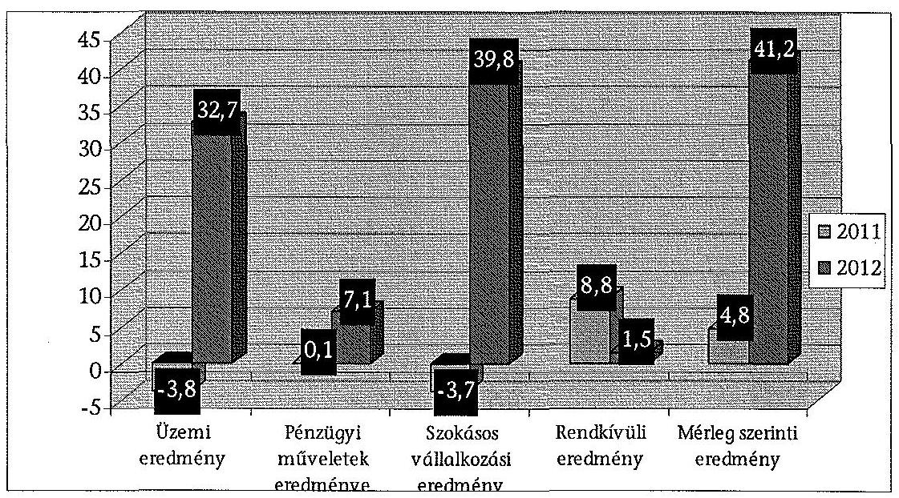
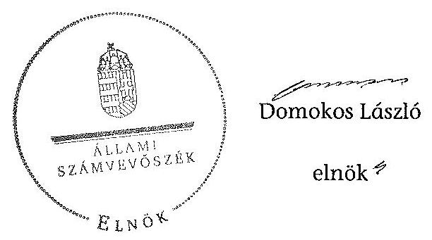
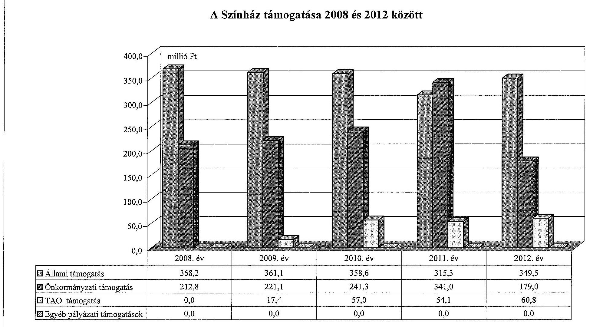
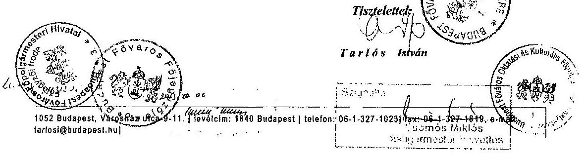
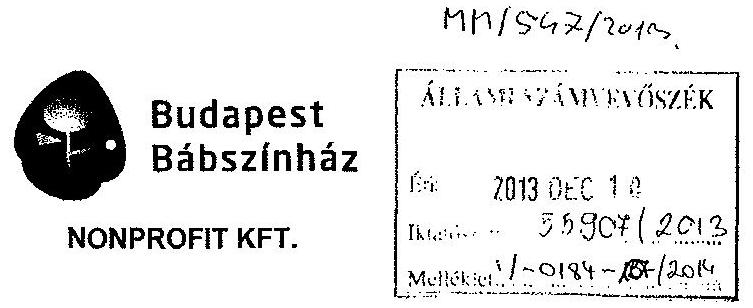
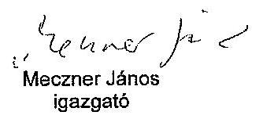
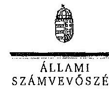
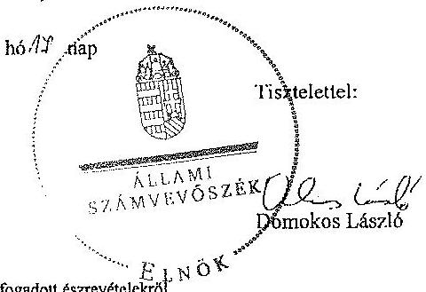

ÁLLAMI
SZÁMVEVŐSZÉK

# JELENTÉS

az önkormányzatok többségi tulajdonában lévő gazdasági társaságok közfeladat-ellátásának ellenőrzéséről Budapest Bábszínház Nonprofit Kft. és jogelődje

---

# Állami Számvevőszék

Iktatószám: V-0184-142/2014.
Témaszám: 1159
Vizsgálat-azonosító szám: V06530203

## Az ellenőrzést felügyelte:

## Makkai Mária

felügyeleti vezető
Az ellenőrzést vezette és az ellenőrzés végrehajtásáért felelős:
Horváth József
ellenőrzésvezető
A számvevőszéki jelentés összeállításában közreműködött:
Jenei Zoltán Béláné
számvevő
Az ellenőrzést végezték:
Jenei Zoltán Béláné Váradiné Jassó Mariann Varga Magdolna
számvevő
külső szakértő
külső szakértő

A témához kapcsolódó eddig készített számvevőszéki jelentések:
címe
sorszáma
Jelentés a színházak állami támogatásának és gazdálkodásának 1039
ellenőrzéséről

---

# TARTALOMJEGYZÉK

BEVEZETÉS ..... 3
I. ÖSSZEGZŐ MEGÁLLAPÍTÁSOK, KÖVETKEZTETÉSEK, JAVASLATOK ..... 6
II. RÉSZLETES MEGÁLLAPÍTÁSOK ..... 12

1.  Az Önkormányzat közfeladat-ellátásának megszervezése ..... 12
1.1. A közfeladat meghatározása, a feladat ellátásának választott módja ..... 12
1.2. Az önkormányzati és a tulajdonosi irányítás megítélése ..... 17
2.  A Színház közfeladat-ellátással kapcsolatos tevékenysége ..... 20
2.1. A Színház szervezeti kialakítása, szabályozottsága ..... 20
2.2. A Színház vagyonnyilvántartása ..... 22
2.3. A gazdasági évek ráfordításainak és bevételeinek alakulása ..... 25
2.4. A gazdasági társaság eredményének alakulása ..... 27
2.5. A Színház folyamatos üzemmenetének, likviditásának biztosítása ..... 29
3.  Az Önkormányzat tulajdonosi jogainak és kötelezettségeinek érvényesítése ..... 30
3.1. A gazdasági társaságtól származó információk hasznosítása ..... 30
3.2. Az Önkormányzat közgyűlésének intézkedései ..... 31
MELLÉKLETEK
4.  számú Budapest Főváros Önkormányzatának közgyűlési határozatai az Intézmény átalakítására vonatkozóan
5.  számú A Színház szakmai tevékenységének mutatói 2008 és 2012 között
6.  számú A Színház támogatása 2008 és 2012 között
7.  számú A Színház vagyonának főbb adatai 2008. január 1-je és 2012. december 31-e között
8.  számú Budapest Főváros Főpolgármesterének észrevétele
9.  számú A Budapest Bábszínház Nonprofit Kft. ügyvezetőjének észrevétele
10. számú A Budapest Bábszínház Nonprofit Kft. ügyvezetőjének észrevételére adott válasz
FÜGGELÉKEK
11. számú Rövidítések jegyzéke
12. számú Értelmező szótár

---

.

---

# JELENTÉS

## az önkormányzatok többségi tulajdonában lévő gazdasági társaságok közfeladat-ellátásának ellenőrzéséről Budapest Bábszínház Nonprofit Kft. és jogelődje

## BEVEZETÉS

Az Önkormányzatnak közfeladata az Ötv. alapján a művészeti feladatok ellátásáról való gondoskodás, az Mötv. szerint az előadó-művészeti szervezet támogatása. Ezt az Önkormányzat előadó-művészeti költségvetési szerv fenntartásával, illetve a tulajdonában álló egyszemélyes gazdasági társaság támogatásával valósította meg.

Az Önkormányzat az ellenőrzött időszakban színházi koncepcióval ${ }^{1}$ rendelkezett, amely a színházak működtetésének alternatíváit vázolta fel és jövőbeli célokat határozott meg. Ezt a Közgyűlés határozattal ${ }^{2}$ elfogadta.

A Főpolgármester a 2011. évben tette közzé a Zöld Könyvet ${ }^{3}$, melyben megállapította, hogy a kulturális terület legnagyobb problémája a rendszer széttagoltsága volt, mert az Önkormányzat a működési tevékenységgel kapcsolatos feladatait a színházak által részben költségvetési intézményi, részben gazdasági társasági formában látta el, ez a fajlagos működési költségek, a vezetők javadalmazása és a számviteli politika eltéréseit okozta a különböző formában működő szervezeteknél. Ezért készítette elő a Közgyűlés a 2011. március 23-án hozott határozataival az egyes költségvetési szervként működő színházak átalakítását.

A Színházak támogatása az ellenőrzött időszakban központi költségvetési, illetve fenntartói támogatás formájában, valamint pályázatok útján valósult meg. A 2010-2012. évek költségvetési törvényei egy összegben tartalmazták az Önkormányzat fenntartásában működő színházak fenntartói ösztönző részhozzájárulását, amelyet a fenntartó saját döntése alapján oszthatott el.

[^0]
[^0]:    ${ }^{1}$ Koncepció a fővárosi fenntartású színházak struktúráját és finanszírozását érintő változásokról (2007. XI. 29.).
    ${ }^{2}$ a Főv. Kgy. 1979/2007 (11.29.) sz. határozata
    ${ }^{3}$ Zöld Könyv - Az új városvezetés a rend és a fejlődés szolgálatában - az első 10 hónap eredményei - 2011. augusztus, Kiadja: Budapest Főváros Önkormányzata, Felelős kiadó: Tarlós István, 18. o.

---

Az ellenőrzött időszakban a Színház 2011. július 31-ig költségvetési intézményként, ezt követően - a Közgyűlés határozata alapján - 2011. augusztus 1-jétől nonprofit korlátolt felelősségű társasági formában működött.

Az Önkormányzat a gazdasági társasággal a közfeladat ellátásának biztosítására 2011. augusztus 4-én Közszolgáltatási szerződést ${ }^{4}$, majd 2013. január 1-jei hatálybalépéssel Fenntartói megállapodást kötött. A Közszolgáltatási szerződés meghatározta a közhasznú tevékenység körét, az Önkormányzat által biztosított támogatás összegét, a feladatellátáshoz szükséges befektetett eszközöket, valamint azok rendelkezésre bocsátásának módját.

Az Emtv. új elemként vezette be 2009 novemberétől a társasági adókedvezménnyel igénybe vehető támogatást, mint közvetett támogatási formát. Ennek felső határát a jogalkotó a tárgyévi jegybevétel 80%-ában határozta meg. A tao támogatás pénzügyi teljesülése a támogatást nyújtó vállalkozások eredményességének és támogatás nyújtási hajlandóságának függvénye.

A Színház a közfeladat ellátása érdekében az ellenőrzött időszakban összesen 2947,9 millió Ft állami és önkormányzati támogatást kapott. Emellett 2009 és 2012 között 189,3 millió Ft tao támogatást tudott igénybe venni.

A Budapest Bábszínház az 1949-ben alakult Állami Bábszínház jogutódjaként 1992-ben vette fel nevét és 2009-ben ünnepelte fennállásának 60. évfordulóját. A társulat sokáig az egyetlen professzionista Bábszínház volt hazánkban.

A Színház fizető nézőinek száma évente 80-95 ezer fő, az előadások száma pedig évi 341-396 között változott a 2008-2012. években. A Színház által foglalkoztatott dolgozók átlaglétszáma a 2008. évi 120 főről a 2012. évre 105 főre csökkent.

A Színház főbb szakmai mutatószámait a 2. számú melléklet tartalmazza.
Az ellenőrzés várható eredménye: a jelentés nyilvánossága a társadalom széles körével ismerteti meg a Színház gazdálkodására vonatkozó megállapításainkat, továbbá a megállapítások alapján megfogalmazott számvevőszéki javaslatok hasznosítása elősegíti a feltárt hibák megszüntetését, az ellenőrzött szervezet jobb feladatellátását. A társadalom számára jelzi, hogy közpénz nem maradhat ellenőrizhetetlenül, az ÁSZ értékteremtő rend kialakításához és megőrzéséhez hozzájáruló tevékenysége pozitív hatással lesz a szervezetről kialakított összkép formálásában. A szervezeten belül lehetőség nyílik arra, hogy a megállapítások szintetizálásával az ÁSZ a hozzáadott értéket teremtő, elemző tevékenységét és tanácsadó szerepét is erősítse. A jó gyakorlatok bemutatásával az ÁSZ hozzájárul a követendő megoldások megismertetéséhez és terjesztéséhez.

[^0]
[^0]:    ${ }^{4}$ Az Emtv. 13. § (2) bekezdése szerint a közszolgáltatási szerződés a közszolgáltatás nyújtására irányuló, legalább három évre szóló szerződés, amely az állam vagy az önkormányzat és a közszolgáltatást végző előadó-művészeti szervezet kapcsolatát szabályozza, tartalmazza a teljesítendő előadásszámot, a szolgáltatás nyújtásának időtartamát, helyét és a teljesítésért járó díjazást.

---

Az ellenőrzés célja annak értékelése volt, hogy:

-   az Önkormányzat a jogszabályi előírások figyelembevételével döntött-e az ellenőrzésre kerülő közfeladat megszervezéséről, az ellátás módjáról; a tulajdonostól elvárható gondossággal felügyelte-e a társaság feladatellátását; a gazdasági társaság rendelkezésére bocsátotta-e a közfeladat ellátásához a szükséges közvagyont, és biztosította-e a tulajdonosi jogok közvagyon feletti érvényesülését; a társaság vagyonvesztése esetén intézkedett-e a további vagyonvesztés megakadályozásáról;
-   a gazdasági társaság teljesítette-e a tulajdonos önkormányzat részéről meghatározott célokat és feladatokat a rendelkezésre álló erőforrások felhasználásával; végrehajtotta-e a közfeladat-ellátási szerződés előírásait; betartotta-e a vagyonnal történő gazdálkodásra vonatkozó jogszabályi rendelkezéseket.

Az ellenőrzés hatóköre: az önkormányzatok közfeladat-ellátásának ellenőrzése, amely kiterjed az önkormányzatok és a közfeladatot ellátó, az önkormányzat többségi tulajdonában lévő gazdasági társaság közötti feladatmegosztásra, az önkormányzatok tulajdonosi jogainak gyakorlására, a nemzeti vagyon kezelésének ellenőrzése keretében a közfeladat-ellátáshoz rendelt vagyonra és a vagyont érintő szerződésekre. A jelen ellenőrzés kiterjed az önkormányzatok többségi tulajdonlásával működő gazdasági társaságok közfeladatellátására, vagyongazdálkodási tevékenységére, valamint a kapcsolódó nyilvántartások, elszámolások szabályszerűségére és megbízhatóságára. Az ellenőrzött tételek kiválasztása véletlen mintavétellel történt.

Az ellenőrzés típusa: szabályszerűségi ellenőrzés.
Az ellenőrzött időszak: a 2008-2012. évek, valamint a helyszíni ellenőrzés befejezéséig - 2013. augusztus 16-ig - bekövetkezett változások figyelemmel kísérése.

Ellenőrzött szervezet: a Budapest Bábszínház Nonprofit Kft. és jogelődje, valamint Budapest Főváros Önkormányzata.

Az ellenőrzés végrehajtásának jogszabályi alapját az ÁSZ tv. 5. § (3)-(5) bekezdéseiben foglaltak képezik.

Az ÁSZ a 2011. évi LXVI. törvény 29. §-a szerint a jelentéstervezetet megküldte Budapest Főváros Önkormányzata főpolgármesterének és a Budapest Bábszínház Nonprofit Kft. ügyvezető igazgatójának egyeztetésre. A beérkezett észrevételeket és az azokra adott választ a jelentés 5-7. számú mellékletei tartalmazzák.

---

# I. ÖSSZEGZŐ MEGÁLLAPÍTÁSOK, KÖVETKEZTETÉSEK, JAVASLATOK

Az Önkormányzat a művészeti feladatok ellátásáról való gondoskodásnak, illetve az előadó-művészeti szervezet támogatásának, mint az Ötv.-ben és az Mötv.-ben meghatározott közfeladatának, az ellenőrzött időszak alatt eleget tett. Az Önkormányzat a Színház közfeladat-ellátását 2011. július 31-éig a költségvetési intézmény fenntartásával, azt követően a gazdasági társaság támogatásával biztosította. A Közgyűlés a tulajdonosi jogait az ellenőrzött időszakban a szabályzataiban és rendeleteiben foglaltak szerint gyakorolta.

Az Önkormányzat közfeladat-ellátása érdekében az Intézmény, majd 2011. augusztus 1-jétől az alapító okiratokban foglaltaknak megfelelően a Színház rendelkezésére bocsátotta az előadó-művészeti közfeladat ellátásához szükséges ingatlan és ingó vagyont. A Színház részére a közfeladat-ellátáshoz szükséges forrás biztosításáról - 2008. január 1. és 2011. július 31. között - az éves költségvetések elfogadásával - 2011. augusztus 1. és 2012. december 31. között - a Közszolgáltatási szerződésben (az annak elválaszthatatlan részét képező éves költségvetési rendeletekben) döntött az Önkormányzat.

Az Önkormányzat az Intézmény számára a közfeladat teljesítésével kapcsolatosan konkrét célokat, elvárásokat nem fogalmazott meg. Az Emtv. 2009. évi hatálybalépésével a tevékenység ellátására vonatkozó követelmények és feladatmutatók a törvény által kerültek meghatározásra.

Az Önkormányzat az Intézmény költségvetésének elfogadását, a beszámoltatásokat, valamint az adatszolgáltatási kötelezettség ellenőrzését a jogszabályokban és a belső szabályozásában foglaltaknak megfelelően végezte el. Az Önkormányzat a Színház művészeti tevékenységének ellátását évadbeszámolók alapján értékelte, amelyeket a 2008-2010. évek között - az Önkormányzat SZMSZ ${ }_{1}$ rendelkezései szerint - a Kulturális Bizottság elfogadott.

Az intézményi működés időszakában alkalmazott ösztönző rendszer megfelelt a vonatkozó jogszabályi és belső szabályozási előírásoknak. Az évenkénti jutalmazások időpontja és mértéke azonban nem volt kiszámítható, annak teljesítményösztönző, motiváló hatása nem érvényesült. Az Intézmény vezetője számára kifizetett jutalom összege nem kapcsolódott a beszámoló teljesítéséhez köthető mutatószámokhoz, a jutalomkeret a besorolási bérek arányában került meghatározásra.

Az Önkormányzat belső ellenőrzése az Intézménynél a 2008-2011. években ellenőrzést nem végzett.

Az Intézmény megszüntetése és a gazdasági társaság alapítása a Közgyűlés határozatainak megfelelően történt, azonban az intézmény megszüntető okiratának 2011. június 30-án - a Főpolgármester-helyettes által - történő aláírásával, a Főpolgármesteri Hivatal kilenc nappal túllépte az Áht. szerinti közzétételi határidőt.

---

Az Önkormányzat döntése alapján a gazdasági társaság a közfeladat-ellátást 2011. augusztus 1-jén kezdte meg. Az Önkormányzat közfeladat-ellátásának tárgyi és pénzügyi feltételeit a Közszolgáltatási szerződésben határozta meg. Ez tartalmazta az ingatlanok bérbeadásának és az ingó vagyontárgyak ingyenes használatba adásának módját, valamint a költségvetési támogatás mértékét. Meghatározta a közhasznú tevékenység körét, a szerződés megszűnésének esetére szabályozta a vagyontárgyak visszaszolgáltatásának rendjét és határidejét, továbbá a Színház által teljesítendő művészeti tevékenységek jellegét, körét, mértékét és pontos mutatószámait. Az önkormányzati tulajdon védelme érdekében szabályozta a kötelező leltár készítését, annak gyakoriságát, továbbá a gazdálkodás és a művészeti tevékenység ellátásával összefüggő kötelező adatszolgáltatás formáját, idejét és módját, valamint előírta a gazdálkodás körében felmerülő rendkívüli eseményekről történő tájékoztatási kötelezettséget.

A leltározásra vonatkozó előírások a társasággá alakulást követően az Önkormányzat Vagyonrendeleteiben nem a hatályos jogszabályoknak megfelelően szerepeltek, mivel az üzemeltetésre, kezelésre átadott eszközök leltározási szabályairól a Vagyonrendelet ${ }_{1,2}$ 2010. január 1-jétől az Áhsz., előírásaival ellentétben nem tartalmazott szabályozást.

A tulajdonos Önkormányzat az Intézmény könyveiben nyilvántartott, befektetett eszközöket a közhasznú tevékenység eredményes ellátása érdekében 2011. augusztus 1-jén haszonkölcsön formájában átadta a Színház részére. A vagyon átadás-átvételi jegyzőkönyv szerint a befektetett eszközök értéke 399,3 millió Ft volt.

Az Önkormányzat a vagyon védelme érdekében a Közszolgáltatási szerződésben garanciális követelményként fogalmazta meg a kötelezettségek megszegésének jogkövetkezményét, valamint a szerződés megszűnésének esetére az átadott vagyontárgyak visszaszolgáltatási kötelezettségét. Az ellenőrzött időszakban kötelezettség megszegésére, illetve szerződés megszűnésére nem került sor.

Az Önkormányzat a Színház Alapító Okirat ${ }_{2}$-ben - a Gt. előírásaival összhangban - szabályozta az Alapító tulajdonosi joggyakorlásának kereteit. Az Alapító Okiratban a Színház legfőbb szerve, a Közgyűlés kizárólagos hatáskörébe tartozó feladatként határozta meg a Színház SZMSZ ${ }_{4}$-ének jóváhagyását, amely a hiánypótlások következtében - közel egy év elteltével - 2012. szeptember 13-án történt meg. A Közgyűlés a tulajdonosi érdekeinek védelmére határozatokban kijelölte a Színház FB tagjait és könyvvizsgálóját.

Az Önkormányzat a Színház ügyvezetőjének és egyéb vezető állású dolgozóinak, valamint az FB tagoknak a díjazására vonatkozó új Javadalmazási szabályzat ${ }_{1}$-et a Taktv.-ben foglalt határidőn túl, 2010. január 31. helyett április 29-én fogadta el.

Az Önkormányzat a Színház üzleti tervének elfogadását, a beszámoltatását és az adatszolgáltatási kötelezettség ellenőrzését a jogszabályokban, az Önkormányzat belső szabályzataiban és a Közszolgáltatási szerződésben foglaltaknak megfelelően, határidőn belül - az FB határozat és a könyvvizsgálói jelentés figyelembe vételével - végezte el.

---

A Színház szakmai tevékenységének ellátását az Önkormányzat évadbeszámolók alapján értékelte. A 2011-2012. évekre benyújtott évadbeszámolókról a kulturális ügyekért felelős Főpolgármester-helyettes tájékoztatót nyújtott be a Közgyűlés részére, melyet a Közgyűlés tudomásul vett.

A 2011. és a 2012. évekre vonatkozóan a Színház ügyvezetője részére a prémiumfeladatok meghatározása a Javadalmazási szabályzat ${ }_{2,3}$-tól eltérően - késedelmesen - történt. A prémiumfeltételeket és a prémium összegét mindkét évben az üzleti terv elfogadását követően határozta meg az Alapító.

Az Önkormányzat belső ellenőrzése a Színháznál egy ellenőrzést végzett. A 2011. évben végzett szabályszerűségi ellenőrzés a Színház részére nem fogalmazott meg javaslatot. Az Önkormányzat - jogszabályi kötelezettség hiányában - nem vett részt az ingyenesen haszonkölcsönbe adott eszközeinek leltározásában és annak ellenőrzésében.

A Színház 2011-2012. évi gazdálkodása, valamint mérleg szerinti nyeresége nem tette szükségessé, hogy a tulajdonos Önkormányzat a vagyon, illetve a közpénzek nem célszerinti hasznosításával, az esetleges pazarló felhasználással kapcsolatban, valamint a lejárt kötelezettségek csökkentése érdekében tulajdonosi intézkedéseket tegyen.

Az Intézmény a vagyonnal történő gazdálkodásra vonatkozó jogszabályi rendelkezéseknek nem teljes körűen tett eleget. A Számviteli politika hiányosságai az Intézmény integritásával kapcsolatban kockázatot jelentettek. Az Intézmény 2008. január 1-je és 2011. július 31-e közötti időszakra vonatkozó Számviteli politika ${ }_{1}$-je nem felelt meg a Számv. tv.-nek, mert az egyes produkciókban közvetlenül felhasználandó díszleteket, jelmezeket és kellékeket a Színház a beszerzési és előállítási értéktől és a használati időtől függetlenül azonnal 100%-ban költségként, a dologi kiadások között számolta el. Ez a vagyonvédelem szempontjából kockázatot jelentett. Nem szabályozta továbbá a produkciók színrevitele költségeinek (szellemi termék) elszámolási rendjét.

Az Intézmény működési formája a közfeladat-ellátás követelményeinek megfelel. Alapító Okirat ${ }_{1}$-gyel, SZMSZ ${ }_{1,2,3}$-mal, az irányítási, döntési és felelősségi jogköröket tartalmazó belső szabályzatokkal rendelkezett.

Az Intézmény 2008. január 1-je és 2011. július 31-e között az előadó-művészeti tevékenység ellátásához szükséges, a fenntartó által rendelkezésére bocsátott vagyont az Áhsz.-ben foglaltaknak megfelelően saját mérlegében mutatta ki, melyet a belső szabályozásban foglaltaknak megfelelően elkészített leltárral támasztottak alá.

Az Intézmény adatszolgáltatási kötelezettségeit a jogszabályokban és a belső szabályozásban foglalt módon havi, negyedéves, féléves, éves időszakonként teljesítette.

Az Intézmény összes bevétele a 2010. évben 889,8 millió Ft volt, 17,5%-kal növekedett 2008-hoz képest. Az összes kiadása 2008-ról 2010-re 14,3 millió Ft-tal (1,9%-kal) emelkedett, 2010-ben 737,7 millió Ft-ot tett ki. Az Intézmény összes kiadásainak több mint felét a személyi juttatások és a járulékok összege eredményezte.

---

A Közgyűlés 2011. március 23-án határozatot hozott a költségvetési intézményként működő Színház megszüntetésének előkészítéséről, és ezzel összhangban az utódszervezet, gazdasági társaság alapításához szükséges engedélyeket megadta. A Főpolgármester-helyettes a költségvetési intézmény megszüntető okiratát 2011. június 30-án írta alá.

A Színház teljesítette az Önkormányzat részéről a Közszolgáltatási szerződésben meghatározott célokat és feladatokat. A gazdálkodásra vonatkozó jogszabályi rendelkezéseket - az önköltségszámítás, valamint a 2011. évi leltározás kivételével - betartották.

A Színház rendelkezett Alapító Okirat ${ }_{2,3}$-mal és az irányítási, döntési és felelősségi jogköröket tartalmazó belső szabályzatokkal. A Színház - tulajdonosi jóváhagyás hiányában - 2012. szeptember 13-ig érvényes SZMSZ nélkül működött.

A Színház a Közszolgáltatási szerződés előírásának megfelelően folyamatosan biztosította a tevékenységi körébe tartozó színházi szolgáltatást.

A leltározás vonatkozásában nem tartották be a Számv. tv.-ben, az Áhsz-ben, valamint a Leltározási szabályzat ${ }_{3}$-ban foglaltakat. A Színház 2011. december 31-i fordulónappal az Önkormányzat által ingyenes használatba adott eszközök leltározását egyeztetéssel végezte el. A leltár mennyiségi felvételére - az Intézmény megszűntetéséhez kapcsolódóan - 2011. május 31-i fordulónappal került sor. A 2012. évi mérleg eszközeinek és forrásainak leltárral történő alátámasztását a Leltározási szabályzatban foglaltak szerint végezték el.

A Színház olyan Számlarendet alakított ki, amelyből az ellátott közfeladat bevételei és ráfordításai elkülönülten ellenőrizhetők. A Számviteli politika ${ }_{2}$-ben a díszletek, valamint a szellemi termékek elszámolását megfelelően szabályozták. A Társaság elkészítette az Önköltségszámítási szabályzat ${ }_{2}$-t, azonban abban nem tért ki a társulat bérének és járulékainak legalább a produkció színreviteléig történő felosztási módjára. Ennek következtében a produkciók színreviteléig aktivált szellemi termékek nem a ténylegesen felmerült közvetlen költségek alapján kerültek elszámolásra. Továbbá az Önköltségszámítási szabályzat nem tartalmazta az általános költségeknek a felosztási módját.

A Színház az Önkormányzat tulajdonában álló eszközöket a Számv. tv.-nek megfelelően (ingatlanok, immateriális javak, tárgyi eszközök, készletek) számlarendjében elkülönítetten, a 0-ás számlaosztályban tartotta nyilván.

A Színház művészeti tevékenységét szolgáló - saját és Önkormányzati tulajdonú - eszközök 2012. december 31-ei nettó értéke (551,6 millió Ft) a 2008. december 31-ei adathoz viszonyítva 44,4%-kal (169,6 millió Ft-tal) emelkedett.

Az Önkormányzat által a Színház rendelkezésére bocsátott ingatlanokkal kapcsolatban az ellenőrzés megállapította, hogy a Színház székhelyéül szolgáló Budapest VI. Andrássy út 69. szám alatti ingatlanban működött a Magyar Képzőművészeti Egyetem is. Az ingatlan tulajdon-, illetve kezelői joga tisztázatlan.

---

A Kincstári Vagyoni Igazgatóság és a Magyar Képzőművészeti Főiskola által 1997-ben kötött vagyonkezelési szerződés értelmében az ingatlan tulajdonosa a Magyar Állam, vagyonkezelője a Főiskola. A szerződést a Főpolgármester megfellebbezte, aminek eredményeként a Belügyminiszter határozata alapján a Fővárosi Földhivatal kezelőként a Kincstári Vagyoni Igazgatóságot, ingyenes használati joggal az Önkormányzatot jegyezte be.

Az LB 2002-ben a Belügyminiszter határozatát hatályon kívül helyezte, megállapította, hogy az ingatlan jogosult kezelőjének a Magyar Képzőművészeti Egyetemet kell tekinteni és új eljárásra kötelezte az első fokú hatóságot. Az új eljárás a helyszíni ellenőrzés lezárásáig nem indult meg. A földhivatali nyilvántartásban nem történt meg az LB döntésének megfelelő átvezetése.

A Budapest VI. Nagymező u. 8. fszt. 7. sz. alatti ingatlant a kataszteri nyilvántartásból törölték, amelyet a Színház a 2011. évben jelzett az Önkormányzat felé. Ezzel egy időben kérte az Alapító Okirat ${ }_{2}$ módosítását is. A Színház 2013. február 27-től érvényes Alapító okirat ${ }_{2}$-ában a fenti ingatlan telephelyként már nem szerepel, a Földhivatal felé azonban a tulajdonosi jogok rendezése az Önkormányzat részéről nem történt meg.

A Színház a 2011-2012. években elkészítette üzleti tervét. Mérleg szerinti eredménye a 2011. évben 4,8 millió Ft volt. A Színház üzemi eredménye veszteséget mutatott, de a rendkívüli eredmény következtében pozitív mérleg szerinti eredmény realizálódott. A 2012. évben a mérleg szerinti eredmény 41,2 millió Ft volt, amit a jegybevételek, a tao támogatások kedvező alakulása, valamint a kiemelt feladatok ellátására kapott pályázati források elnyerése alakított ki. A Színház 2011-2012. évi beszámolóit a Közgyűlés elfogadta.

A Színház első teljes évében, 2012-ben 700,6 millió Ft bevételt ért el, a ráfordítások összege 659,3 millió Ft volt. A Színház a szabad pénzeszközeit a számlavezető banknál kötötte le.

Az Állami Számvevőszékről szóló 2011. évi LXVI. törvény 33. § (1) bekezdésében foglaltak értelmében a jelentésben foglalt megállapításokhoz kapcsolódó intézkedési tervet köteles az ellenőrzött szervezet vezetője összeállítani, és azt a jelentés kézhezvételétől számított 30 napon belül az ÁSZ részére megküldeni. Amennyiben az intézkedési tervet határidőben nem küldi meg a szervezet, vagy az nem elfogadható, az ÁSZ elnöke a hivatkozott törvény 33. § (3) bekezdés a)-b) pontjaiban foglaltakat érvényesítheti.

Az ellenőrzés intézkedést igénylő megállapításai és javaslatai:

# Budapest Főváros Főjegyzőjének

1.  A Színház működését biztosító ingatlanok jogi helyzete nem rendezett. A Legfelsőbb Bíróság 2002-ben megállapította, hogy az Andrássy út 69. szám alatti ingatlan jogosult kezelőjének a Magyar Képzőművészeti Egyetemet kell tekinteni, és a Fővárosi Önkormányzatnak nincs ingyenes használati joga. A földhivatali nyilvántartásban a döntés átvezetése nem történt meg. A Színház alapító okiratában székhelyként ez a cím szerepelt. A Nagymező u. 8. fszt. 7. sz. ingatlan tulajdonosa a földhivatali tulajdoni lap szerint a Bábszínház. Az alapító okiratban az ingatlan telephelyként már

---

nem szerepel, azonban a tulajdoni jogok rendezése az Önkormányzat által nem történt meg.

Javaslat:
Intézkedjen a Budapest Bábszínház közfeladatának ellátásában érintett ingatlanok Budapest VI. Andrássy út 69. és Budapest VI. Nagymező utca 8. fszt. 7. sz. - jogi, tulajdonosi helyzetének rendezéséről.
2. A leltározásra vonatkozó előírások a társasággá alakulást követően az Önkormányzat Vagyonrendeleteiben nem a hatályos jogszabályoknak megfelelően szerepeltek, mivel az üzemeltetésre, kezelésre átadott eszközök leltározási szabályairól a Vagyonrendelet 2010. január 1-jétől az Áhsz. előírásaival ellentétben nem tartalmazott szabályozást.

Javaslat:
Készítse elő a Közgyűlés elé való terjesztés érdekében a Vagyonrendelet ${ }_{2}$ módosítását, hogy az tartalmazza az Áhsz. 22. § (2) bekezdésben előírtaknak megfelelően az üzemeltetésre, kezelésre átadott eszközök leltározási szabályait.

# a Budapest Bábszínház igazgatójának

A Társaság a Számv. tv. 14. § (5) bekezdés c) pontja és (7) bekezdése alapján elkészítette az Önköltségszámítási szabályzat ${ }_{2}$-t, azonban abban nem tért ki a társulat bérének és járulékainak legalább a produkció színreviteléig történő felosztási módjára. Ennek következtében a produkciók színreviteléig aktivált szellemi termékek nem a ténylegesen felmerült közvetlen költségek alapján kerültek elszámolásra. Továbbá az Önköltségszámítási szabályzat nem tartalmazta az általános költségeknek a felosztási módját.

Javaslat:
Intézkedjen az Önköltségszámítási szabályzat módosításáról annak érdekében, hogy
a) a produkció bemutatásáig elszámolt közvetlen költségek tartalmazzák a társulat bérének és járulékainak a produkcióra felosztott költségeit;
b) a szabályzat tartalmazza az általános költségeknek a felosztási módját.

---

# II. RÉSZLETES MEGÁLLAPÍTÁSOK

## 1. Az ÖNKORMÁNYZAT KÖZFELADAT-ELLÁTÁSÁNAK MEGSZERVEZÉSE

### 1.1. A közfeladat meghatározása, a feladat ellátásának választott módja

Az Önkormányzat a művészeti feladatok ellátásáról való gondoskodásnak, illetve az előadó-művészeti szervezet támogatásának, mint az Ötv.-ben és az Mötv.-ben meghatározott közfeladatának, az ellenőrzött időszak alatt eleget tett. Az Önkormányzat
 a közfeladat ellátását 2011. július 31-éig az Intézmény fenntartásával, azt követően a Színház támogatásával biztosította.

Az Önkormányzat kötelező közfeladata az Ötv. 63/A §. n) pontja szerint a művészeti feladatok ellátása ${ }^{5}$. A Htv. 111. § alapján a közművelődési, közgyűjteményi és művészeti tevékenységekkel kapcsolatos helyi irányítási, ellenőrzési, valamint a fenntartással és működtetéssel kapcsolatos feladatokat a Közgyűlés látja el. A kulturális feladat ellátását az Önkormányzat az Emtv. 3. § (2) bekezdése alapján előadó-művészeti szervezet fenntartásával (költségvetési szervei esetében), vagy annak támogatásával (gazdasági társaságai esetében) valósította meg.

Az Önkormányzat az ellenőrzött időszakban elfogadott koncepcióval ${ }^{6}$ rendelkezett, amelyet a Közgyűlés ${ }^{7}$ határozatával fogadott el.

A koncepció a színházak működtetésének módozatait vázolta fel és jövőbeli célokat határozott meg, nem vizsgálta azonban a megvalósításhoz szükséges források nagyságát.

A 2010. évi önkormányzati választásokat követően az Ötv. 91. § (1) és (6) bekezdésnek megfelelően a Közgyűlés ${ }^{8}$ elfogadta az Önkormányzat 2011-2014. évekre vonatkozó Gazdasági Programját9.

Az Önkormányzat a költségvetési szervezeti formában működő Színház teljesítményével kapcsolatosan konkrét célokat, elvárásokat nem fogalmazott meg, a szakmai elvárásait az igazgatói pályázat kiírásában szerepeltette. A nyertes

[^0]
[^0]:    ${ }^{5}$ A 2013. január 1-től hatályos Mötv. 13. § (1) bekezdés 7. pont is kötelezően ellátandó feladatként határozza meg az előadó-művészeti szervezetek támogatását.
    ${ }^{6}$ Koncepció a fővárosi fenntartású színházak struktúráját és finanszírozását érintő változásokról
    ${ }^{7}$ a Főv. Kgy. 1979/2007. (11.29.) sz. határozata
    ${ }^{8}$ a Főv. Kgy. 937/2011. (04.27.) sz. határozata
    ${ }^{9}$ A Főváros fejlesztésének és gazdálkodásának stabilizálása és reformkoncepciója a 2011-2014. évi választási ciklusra

---

pályázat a megválasztott igazgató stratégiai céljait, valamint konkrét szakmai elképzeléseit foglalta össze.

Az Emtv. hatálybalépésével a tevékenység ellátására vonatkozó követelmények és feladatmutatók a törvény által kerültek meghatározásra.

A Közgyűlés 2011. március 23-án határozatokat ${ }^{10}$ hozott a költségvetési szervként működő színházak megszüntetéséről és az utódszervezetek, nonprofit gazdasági társaságok alapításáról. A Közgyűlés határozata ${ }^{11}$ az Áht. 100/O. § (5) bekezdésének, az előzetes engedélyhez készített előterjesztés tartalma az Áht. 100/L. § (4) bekezdésének megfelelt.

Az Önkormányzat a határozatával ${ }^{12}$ a költségvetési intézményt az utódszervezet létrehozásával egyidejűleg, 2011. július 31-i hatállyal megszüntette. A Főpolgármester-helyettes a megszüntető okiratot 2011. június 30-án írta alá. Ezzel a Hivatal nem tett eleget az Áht. 96. § (1) bekezdése rendelkezésének, amely előírta, hogy a költségvetési szerv megszüntető okiratát legalább negyven nappal a megszüntetés kérelmezett napja előtt ki kell hirdetni (közzé kell tenni).

A 2011. augusztus 1-jén létrehozott gazdasági társaság a költségvetési szervként működő intézmény jogutódjaként jött létre. Az intézmény valamennyi közfeladat-ellátással összefüggő joga és kötelezettsége, valamint a vagyona feletti rendelkezés, illetőleg az Önkormányzat tulajdonát képező, közfeladatellátás céljából használatában álló ingatlanokkal és ingóságokkal kapcsolatos jogok és kötelezettségek a gazdasági társaságra szálltak át.

Az Önkormányzat a költségvetési szervek megszüntetésénél betartotta az Ámr. 11. § (1) bekezdés a)-c), f) pontjaiban és (2) bekezdésében előírtakat, valamint a Kjt. 25/A. § (2)-(3) és (8) bekezdéseinek megfelelően gondoskodott a költségvetési szervnél foglalkoztatott közalkalmazottak további foglalkoztatásáról.

Az Intézmény a költségvetési gazdálkodás szabályai szerint működött 2011. július 31-ig, Alapító Okirata megfelelt a jogszabályi előírásoknak, továbbá tartalmazta a közfeladat ellátásához szükséges eszközöket.

Az Önkormányzat 2008. január 1-je és 2011. július 31-e között az alapító okiratokban foglaltaknak megfelelően az Intézmény rendelkezésére bocsátotta (haszonkölcsönbe adta) az előadó-művészeti közfeladat ellátásához szükséges ingatlan és ingó vagyont.

A Közgyűlés határozatának ${ }^{13}$ megfelelően a megszüntetésre kerülő költségvetési szerv 2011. július 31-i fordulónappal az Áhsz. 13/A. §-ában foglaltak szerinti -

[^0]
[^0]:    ${ }^{10}$ 1. sz. melléklet 5-8. sorszámú határozatai
    ${ }^{11}$ 1. sz. melléklet 5. sorszámú határozata
    ${ }^{12}$ 1. sz. melléklet 9. sorszámú határozata
    ${ }^{13}$ 1. sz. melléklet 9. sorszámú határozata

---

leltárral és főkönyvi kivonattal alátámasztott - záró beszámolóját elkészítették. A záró beszámolót a Közgyűlés jóváhagyta ${ }^{14}$.

A tulajdonos az Intézmény könyveiben nyilvántartott befektetett eszközöket a közhasznú tevékenység eredményes ellátása érdekében átadta a Színház részére. A vagyon átadás-átvételi jegyzőkönyv szerint a befektetett eszközök értéke 399,3 millió Ft volt. A Nvtv. 3. § alapján az ellenőrzött Színház átlátható szervezet.

A Közgyűlés a határozatával ${ }^{15}$ megalapította a gazdasági társaságot, jóváhagyta a Közszolgáltatási szerződés szövegét. A Főpolgármester a Közszolgáltatási szerződést 2011. augusztus 4-én írta alá.

Az Önkormányzat az Alapító Okirat szövegezésénél a Gt. 15. § (1) bekezdésének előírásait figyelembe vette, mely szerint a társasági szerződés ellenjegyzésének napjától a létrehozni kívánt gazdasági társaság előtársaságaként működhet ${ }^{16}$. Figyelmen kívül hagyta azonban az Áht. 100/O. §. (2) bekezdését, mely szerint költségvetési intézmény utódszervezete előtársaságként nem működhet, így üzletszerű gazdasági tevékenységet nem végezhet és a bejegyzés idejéig kötelezettséget nem vállalhat. A Színház gazdasági tevékenységét az Alapító Okiratának megfelelően 2011. augusztus 1-jével kezdte meg.

Az Alapító Okirat 4.6. és 4.9. pontja egymásnak ellentmond, mivel a 4.6. pontja szerint a társasági szerződés ellenjegyzésének napjától a létrehozni kívánt gazdasági társaság előtársaságként működhet, a 4.9. pontban pedig az Alapító rögzíti, hogy a Színház a közfeladat ellátását és működését 2011. augusztus 1. napjával kezdi meg.

Az Önkormányzat a Színház Alapító Okiratában - a Gt. előírásaival összhangban - szabályozta az Alapító tulajdonosi joggyakorlásának kereteit. Az Alapító Okirat megfelelően rendelkezett a Színház gazdálkodása során elért eredmény felhasználásáról, az ügyvezető, az FB tagok és a könyvvizsgáló kijelöléséről, az összeférhetetlenségi szabályokról, valamint az Áht. 100/N. § (8) bekezdés előírásainak betartatásáról.

Az Alapító az egyszemélyes nonprofit korlátolt felelősségű társaság alapításával eleget tett az Áht. 100/L. § (1) bekezdésében előírt rendelkezésnek, a Színház Alapító Okirata tartalmának meghatározásakor eleget tett a Ptk. 54. § (12) és a Gt. 12. § (1) bekezdésében előírt, valamint a Közhasznú tv. 4. § (1) bekezdésében foglalt tartalmi követelményeknek.

Az Önkormányzat a hatályos Emtv. 15. § (3) bekezdésének megfelelően a Színház hatósági nyilvántartás szerinti adatainak módosítására irányuló kérelmét benyújtotta.

[^0]
[^0]:    ${ }^{14}$ 1. sz. melléklet 12. sorszámú határozata
    ${ }^{15}$ 1. sz. melléklet 10. sorszámú határozata
    ${ }^{16}$ A Gt. 16 § (2) bekezdése alapján az előtársasági létszakasz a cégbejegyzéssel szűnik meg, és az előtársasági létszakaszban kötött jogügyletek a gazdasági társaság jogügyleteinek minősülnek.

---

Az előadó-művészeti szervezetet (a Színházat) a KÖH Film- és Előadó-művészeti Iroda nyilvántartásba vette.

Az Önkormányzat tulajdonában álló vagyon a nemzeti vagyon részét képezi. A Vagyonrendelet 6. § (1) bekezdés szerint a Színház használatában lévő, a feladatellátását szolgáló ingatlanvagyon korlátozottan forgalomképes törzsvagyon.

Az Önkormányzat döntése alapján a gazdasági társaság a közfeladat-ellátást 2011. augusztus 1-jén kezdte meg. Az Önkormányzat közfeladat-ellátásának tárgyi és pénzügyi feltételeit a Közszolgáltatási szerződésben határozta meg. Ez tartalmazta az ingatlanok bérbeadásának és az ingó vagyontárgyak ingyenes használatba adásának módját, valamint a költségvetési támogatás mértékét. A Közszolgáltatási szerződés meghatározta a közhasznú tevékenység körét, a szerződés megszűnésének esetére szabályozta a vagyontárgyak visszaszolgáltatásának rendjét és határidejét, továbbá a Színház által teljesítendő művészeti tevékenységek jellegét, körét, mértékét és pontos mutatószámait. Az önkormányzati tulajdon védelme érdekében a Közszolgáltatási szerződésben szabályozta a kötelező leltár készítését, annak gyakoriságát, továbbá a gazdálkodás és a művészeti tevékenység ellátásával összefüggő kötelező adatszolgáltatás formáját, idejét és módját, valamint előírta a gazdálkodás körében felmerülő rendkívüli eseményekről történő tájékoztatási kötelezettséget.

Az Önkormányzat a Színház által használt ingatlanok vonatkozásában a Közgyűlés 2011. augusztus 31-ei határozatának megfelelően a megszabott határidőn belül bérleti szerződést kötött a Színházzal. A bérleti szerződés aláírásával a szerződő felek között kötelmi viszony keletkezett. A bérleti szerződés rendelkezései szerint a megszerzési díj megfizetése bérleti jogviszonyt hozott létre. A Bérleti szerződés úgy rendelkezett, hogy a bérlő a Közszolgáltatási szerződés alapján, haszonkölcsön ${ }^{17}$ címén használta korábban az ingatlant. A Közszolgáltatási szerződés azonban ezzel ellentétben azt tartalmazza, hogy az Önkormányzat bérlet formájában biztosította azt. Továbbá az Önkormányzat figyelmen kívül hagyta, hogy a korábbi határozatának ${ }^{18}$ megfelelő tartalommal bíró, 2011. július 31-éig költségvetési intézményként működő szerv Megszüntető Okirata alapján, a jogelőd ingyenes ingatlanhasználata az utódszervezetre szállt át. Azzal, hogy az Önkormányzat a 2011. november 23-án aláírt bérleti szerződés szerint - az annak aláírását megelőző időszakra - érvényesítette a későbbi szerződésben szereplő díjak bérlő általi megfizetését, nem a korábbi határozatának megfelelően járt el.

A Színháznak a bérleti szerződés aláírását megelőző időszakra használati díjat, azt követően bérleti díjat (0,6 millió Ft/hó+áfa), valamint a bérleti díj összegét alapul véve egyszeri, 3 havi megszerzési díjat és 5 havi óvadékot kellett fizetnie. A 2011-es évre vonatkozóan óvadékként, megszerzési díjként, használati és bérleti díjként összesen egy évi bérleti díjnak megfelelő összeg került kifizetésre.

[^0]
[^0]:    ${ }^{17}$ A Ptk. 583. § (1) bekezdése szerint a haszonkölcsön-szerződés alapján a kölcsönadó köteles a dolgot a szerződésben meghatározott időre ingyenesen a kölcsönvevő használatába adni, a kölcsönvevő pedig köteles azt a szerződés megszűntekor visszaadni.
    ${ }^{18}$ 1. sz. melléklet 9 . sorszámú határozata

---

A felek 2012-ben a Bérleti szerződés 2. pontját kiegészítették azzal, hogy az Önkormányzat az óvadék összegét „a bérleti szerződés időtartama alatt a kielégítési jog megnyílta előtt használhatja és rendelkezhet vele." Az óvadék összegének fedezete az Önkormányzat részéről tett nyilatkozat ${ }^{19}$ alapján folyamatosan rendelkezésre állt.

A Színház támogatása az ellenőrzött időszakban központi költségvetési, illetve fenntartói támogatással, valamint pályázatok útján valósult meg. Az Önkormányzat a saját tulajdonosi támogatás színházak közötti elosztásának elveit, szempontjait szabályzatban, illetve belső utasításban nem határozta meg, annak mértékét, nagyságrendjét a teljes támogatási összegéhez igazította.

A 2010. évtől az Emtv. 16. § (1) bekezdése ${ }^{20}$ szerint a színházak támogatása művészeti ösztönző részhozzájárulásból és fenntartói ösztönző részhozzájárulásból tevődött össze. A 2010-2012. években a költségvetési törvények 7. sz. melléklete tartalmazta az Önkormányzat fenntartásában működő színházak fenntartói ösztönző részhozzájárulásának összegét, amelyet a fenntartó saját döntése alapján oszthatott el. A költségvetési törvények a színházak művészeti ösztönző részhozzájárulását külön nevesítve tartalmazták. A 2013. évtől a színházakat művészeti és létesítménygazdálkodási célra működési támogatás illette meg.

Az Emtv. 48. § (1) bekezdése új elemként bevezette - a Taotv. 4. § 37-39. pontjai alapján - a társasági adókedvezménnyel igénybe vehető támogatást, mint közvetett támogatási formát. A tao kedvezmény
 igénybevétele 2009. november 12-től volt lehetséges, a meghatározott jegybevétel 80%-áig. A tao támogatás pénzügyi teljesülése a támogatást nyújtó vállalkozások eredményességének és támogatás nyújtási hajlandóságának függvénye.

Az ellenőrzött időszakban a Színház számára biztosított működési hozzájárulás és tao támogatás alakulását a 3. számú melléklet tartalmazza.

Az állami támogatás összege - az átalakulás évét kivéve - az ellenőrzött időszakban minden évben meghaladta az önkormányzati támogatás összegét, és részaránya magasabb volt. Az önkormányzati támogatás összege a 2008. évtől a 2009. évre 3,9\%-kal (8,3 millió Ft), a 2010. évben az előző évhez képest 9,1\%-kal (20,2 millió Ft) nőtt. A 2011. évben az előző évhez viszonyítva 41,3\%-kal növekedett (99,7 millió Ft) annak következtében, hogy a nonprofit kft.-vé alakuláshoz az Önkormányzat egyszeri támogatást nyújtott. A 2012. évben csökkent a rendszeres támogatás az előző évhez képest 47,5%-kal (162,0 millió Ft). A tao támogatás a 2009. évtől kezdődően - a 2011. év kivételével - folyamatosan növekedett.

Az ellenőrzött időszakban az önkormányzati vagyon megőrzése, védelme érdekében a 2011. évig az Intézmény leltározását az önkormányzati Vagyonrendelet szabályozta. A Vagyonrendelet 12. § (1) bekezdése szerint az Önkormányzat tulajdonában lévő eszközöket minden évben leltározni kell, az ettől eltérő eseteket a rendelet 12. § (3)-(4) bekezdése szabályozta.

[^0]
[^0]:    ${ }^{19}$ A Főpolgármesteri Hivatal ellenőrzéshez kirendelt kapcsolattartója 2013. augusztus 14-én e-mail formájában adott válasza alapján.
    ${ }^{20}$ hatályon kívül helyezve 2012. május 1-jétől

---

A leltározásra vonatkozó előírások a társasággá alakulást követően az Önkormányzat Vagyonrendeleteiben nem a hatályos jogszabályoknak megfelelően szerepeltek, mivel az üzemeltetésre, kezelésre átadott eszközök leltározási szabályairól a Vagyonrendelet - az Áhsz. 2010. január 1-jétől hatályos előírásaival ellentétben - nem tartalmazott szabályozást.

A Közszolgáltatási szerződés 5. A pontja az Önkormányzat tulajdonát képező ingó vagyonra vonatkozóan kötelező leltár készítését, a szerződés 6. pont 4. bekezdése az önkormányzati vagyon nyilvántartására vonatkozó előírásoknak megfelelő adatszolgáltatási és nyilvántartási kötelezettség teljesítését írta elő a Színház számára.

A fenntartói megállapodás 5.1. pontjában a közszolgáltatási szerződés rendelkezésével megegyezően a vagyontárgyak évenkénti, december 31-i fordulónappal történő leltárkészítési kötelezettségét írta elő, továbbá köteles volt a Színház azt megküldeni a tárgyévet követő év január 31-ig az Önkormányzatnak.

Az Önkormányzat minden negyedév végén bekérte a Színháztól az ingatlanadatok változására vonatkozó dokumentumokat, a bruttó érték növekedés vagy csökkenés (kataszteri módosító lapok), valamint az értékcsökkenés elszámolásáról szóló, a gazdasági vezető által aláírt "6. sz. melléklet" című táblázatot. A megküldött dokumentumok alapján a kataszteri rendszer, valamint a Pénzügyi Információs Rendszer adatainak frissítése megtörtént.

Az Önkormányzat vagyonkimutatást készített a 2008-2012. években az éves zárszámadáshoz az Ötv. 78. § (2) bekezdésében és az Mötv. 110. § (2) bekezdésében foglaltaknak megfelelően.

A Vagyonrendelet 14. §-a a leltározás vonatkozásában a korábbi vagyonrendelettel azonos rendelkezéseket tartalmaz. Az Önkormányzat a 7/2011. sz. Leltározási és Leltárkészítési Szabályzatában sem rendelkezett a társaságok leltárainak önkormányzati ellenőrzéséről.

Az Önkormányzat a vagyon védelme érdekében a Közszolgáltatási szerződésben garanciális követelményként fogalmazta meg a kötelezettségek megszegésének jogkövetkezményét, valamint a szerződés megszűnésének esetére az átadott vagyontárgyak visszaszolgáltatási kötelezettségét. Az ellenőrzött időszakban kötelezettség megszegésére, illetve szerződés megszűnésére nem került sor.

# 1.2. Az önkormányzati és a tulajdonosi irányítás megítélése 

A Színház mint költségvetési intézmény esetében az irányító szervi jogok gyakorlását a költségvetési szervekre vonatkozó jogszabályok és az Önkormányzat rendeletei határozták meg.

## A Közgyűlés a tulajdonosi jogait az ellenőrzött időszakban szabályzatainak és rendeleteinek megfelelően látta el.

Az Önkormányzat az SZMSZ 49. § (1) bekezdése alapján a 2008. és a 2011. évek között létrehozta állandó bizottságként a Kulturális Bizottságot. Ezen időszakban a Közgyűlés a bizottságra az Önkormányzat SZMSZ 5. számú mellékletében szereplő feladatok ellátását ruházta át.

---

Az egyszemélyes társaság legfőbb szervének hatáskörébe tartozó (az FB, valamint az ügyvezetőnek, továbbá a könyvvizsgálónak a megválasztása, visszahívása, megbízása, megbízásának visszavonása) jogok gyakorlását a 2011. május 25-e és november 10-e közötti időszakban az Önkormányzat eltérően szabályozta a 2011. év előtt, illetve a 2011-ben gazdasági társasággá alakított színházak esetében.

A 2011. év előtt alapított társaságok esetében 2011. január 1-jétől a Vagyonrendelet 52. § (2) bekezdése alapján a fenti jogokat a Főpolgármester közvetlenül gyakorolta. A 2011. május 25-én alapított gazdasági társaságok esetében 2011. november 9-éig a fenti tulajdonosi jogok gyakorlására kizárólag a Közgyűlés volt jogosult. Az eltérő szabályozás oka az volt, hogy a Közgyűlés a Vagyonrendelet 5. számú mellékletét nem az alapítással egy időben módosította.

Az Önkormányzat új vagyonrendelete 56. § (2) bekezdés a) pontjának 2012. március 16-ai hatálybalépésétől 2013. március 18-áig a Vagyonrendelet 5. sz. mellékletében szereplő gazdasági társaság esetében a társaság legfőbb szervének a törvény által hatáskörébe tartozó (az FB tagjainak és a társaság könyvvizsgálójának megválasztása, visszahívása, díjazásának megállapítása valamint a (2) bekezdés b) pontja alapján az ügyvezető megválasztása, kinevezése és díjazásának megállapítása) jogokat a Főpolgármester közvetlenül, egy személyben gyakorolta.
2013. március 19-től a Vagyonrendelet 56. § (2) bekezdés a) pontja szerint a közgyűlés hatáskörébe tartozik a Főpolgármester előterjesztése alapján az FB tagjainak és a társaság könyvvizsgálójának megválasztása, visszahívása, díjazásának megállapítása valamint a (2) bekezdés b) pontja alapján az ügyvezetőnek a megválasztása, kinevezése és díjazásának megállapítása.

Az Önkormányzat az Alapító Okirat 7.2. pontjában a Gt.-vel összhangban szabályozta az Alapító tulajdonosi joggyakorlás kereteit. A köztulajdon védelméről, továbbá a Gt. 33. § (1) bekezdés c) pontja előírásának megfelelően az FB létrehozásáról gondoskodott. A Taktv. 4. § (2) bekezdésének megfelelően a társasági törzsőke összegéhez igazodva a Színház esetében 3 főben határozta meg az FB létszámát.

A Közgyűlés a tulajdonosi érdekeinek védelmére határozatokban kijelölte a Színház FB tagjait és könyvvizsgálóját, és a Gt. 34. § (4) bekezdése alapján jóváhagyta az FB ügyrendjét.

Az Intézményi időszakban az Áhsz. 10. § alapján az államháztartás szervezetei a költségvetési év első félévéről június 30-ai fordulónappal féléves elemi költségvetési beszámolót, a költségvetési évről december 31-ei fordulónappal éves elemi költségvetési beszámolót készítettek. A Kulturális Ügyosztály ezen beszámolókat ellenőrizte, összesítette. Emellett a Közgyűlés a Kulturális Ügyosztály előterjesztése alapján döntött a költségvetési beszámolók elfogadásáról.

Az Önkormányzat a Színház üzleti tervének elfogadását, beszámoltatását, az adatszolgáltatási kötelezettség ellenőrzését a jogszabályokban, az Önkormányzat belső szabályzataiban és a Közszolgáltatási szerződésben foglaltaknak megfelelően, határidőn belül - az FB határozat és a könyvvizsgálói jelentés figyelembe vételével - végezte el.

---

A társasági időszakban az Önkormányzat beszámoltatása kiterjedt az üzleti terv elemzésére és jóváhagyására, valamint az éves beszámoló, az üzleti jelentés és a közhasznúsági jelentés elemzésére, a Közgyűlés általi elfogadására.

A Közgyűlés a 983/2012. (05.30.) és a 872/2013. (05.29.) számú határozatával elfogadta a Színház 2011. és 2012. évekről készített közhasznúsági jelentését, a könyvvizsgáló jelentését, az FB határozatát a Színház beszámolójáról, a Színház 2011-2012. évi üzleti tervét és a Színház 2011-2012. évi üzleti évre vonatkozó beszámolóját (mérlegét, eredmény-kimutatását, kiegészítő mellékletét).

A Közszolgáltatási szerződés az aláírás idején hatályos Emtv. előírásaival összhangban, megfelelően szabályozta a közfeladat-ellátás tartalmát. A szerződés összegszerűen tartalmazta a 2011. tárgyévre vonatkozó támogatási összeget. A szerződés fennállása alatti további évekre a támogatás összegét az Önkormányzat a tárgyévi költségvetési rendeleteiben, a Színház részére biztosított támogatási összegre szóló rendelkezésekhez kötötte.

Az Intézményi időszak alatt az alkalmazott ösztönző rendszer gyakorlata megfelelt a vonatkozó jogszabályi előírásoknak, illetve a belső szabályozásoknak. Az évenkénti jutalmazások időpontja, mértéke azonban nem volt kiszámítható, a jutalmazás motiváló, teljesítményösztönző hatása nem érvényesült.

Az intézmények vezetői számára kifizetett jutalom dokumentáltan nem kapcsolódott az év végi beszámoló tartalmához, a jutalomkeret elsősorban a besorolási bérek arányában került felosztásra.

A Színház ügyvezetőjének és egyéb vezető állású munkavállalójának javadalmazásával kapcsolatban a Közgyűlés megalkotta a 970/2010. (04.29.) sz. határozatot, a 2490/2010. (12.15.) sz. határozatot és a 2062/2012. (10.3.) számú határozatot. A 970/2010. (04.29.) sz. határozat megalkotásával az Alapító késedelmesen tett eleget a Taktv. 9. § (1) bekezdésében előírt (2010. január 31.) rendelkezésnek.

A Javadalmazási szabályzat értelmében a prémiumfeltételeket és a prémium összegét a legfőbb szerv, illetve a munkáltatói jogok gyakorlója határozza meg, legkésőbb az éves üzleti terv elfogadásával egyidejűleg.

A 2011. augusztus 1-je és 2011. december 31-e közötti időszakra, valamint a 2012. évre vonatkozóan a Színház ügyvezetője részére a Javadalmazási szabályzat-tól eltérően, késedelmesen történt meg a premizálási feltételek meghatározása.

A 2011. évi üzleti tervet a Közgyűlés a 2011. szeptember 21-ei ülésén fogadta el, míg a prémium feltételek meghatározása 2011. november 25-én történt meg. A

[^0]
[^0]:    ${ }^{21}$ Az Emtv. 13. § (2) bekezdése szerint a közszolgáltatási szerződés a közszolgáltatás nyújtására irányuló, legalább három évre szóló szerződés, amely az állam vagy az önkormányzat és a közszolgáltatást végző előadó-művészeti szervezet kapcsolatát szabályozza, tartalmazza a teljesítendő előadásszámot, a szolgáltatás nyújtásának időtartamát, helyét és a teljesítésért járó díjazást.

---

2012. évben az üzleti tervet a Közgyűlés a 2012. május 30-ai ülésén fogadta el, a prémium feltételeket a Főpolgármester-helyettes 2012. július 13-án hagyta jóvá.

Ezen késedelem következtében a prémium-célkitűzés nem tudta betölteni teljesítményösztönző szerepét.

A 2011. és a 2012. évi kitűzött prémiumfeladatokat a Színház részben teljesítette. A Javadalmazási szabályzat V. pontja (6) bekezdésének megfelelően a feladat teljesítéséről a Színház beszámolót készített és az FB határozatot hozott.

A Főpolgármester az igazgató éves prémiumösszege 70%-ának kifizetését engedélyezte. A Főpolgármester a kitűzésben az egyensúlyi gazdálkodásra vonatkozó feltételt minősítette nem teljesítettnek, amelynek csökkentési mértéke 30%-os volt.

Az Intézménynél 2010-ben lejárt az igazgató megbízatása, új igazgatói kinevezés vált szükségessé. Az igazgatói munkakörére vonatkozó pályázat kiírásáról amely megfelelt az Emtv. 39. § (5) bekezdésében foglaltaknak - a Közgyűlés döntött. A pályázat elbírálása a jogszabályban előírt határidőn belül történt. A Közgyűlés határozata alapján - az Emtv. 41. § (1) bekezdésének megfelelően kinevezték a Színház igazgatóját.

# 2. A SzíNHÁz KÖZFELADAT-ELLÁTÁSSAL KAPCSOLATOS TEVÉKENYSÉGE 

### 2.1. A Színház szervezeti kialakítása, szabályozottsága

A Színház 2011. július 31-ig költségvetési intézményként (továbbiakban Intézmény) működött.

## Az Intézmény szervezeti formája a közfeladat-ellátás követelményeinek megfelelt.

Alapító Okirat-gyel, SZMSZ-mal, az irányítási, döntési és felelősségi jogköröket tartalmazó belső szabályzatokkal (Számviteli politika, Pénzkezelési szabályzat, Leltározási szabályzat, Értékelési szabályzat) rendelkezett. A döntési szinteket a szabályzatok és a munkaköri leírások tartalmazták.

Az Intézmény - az Áhsz. 37. § (7) bekezdésében foglalt előírások figyelembevételével - a Vagyonrendelet 12 § (3) bekezdésével összhangban készítette el a Leltározási szabályzat-t, amely kétévenkénti leltározást írt elő. A mérlegtételek év
 végi leltározását az intézmény a belső szabályozásában foglaltaknak megfelelően végezte.

Az Áhsz. 137. § (5) bekezdésének megfelelően a költségvetési szerv a selejtezés részletes szabályait saját hatáskörben állapította meg, figyelemmel az Önkormányzat Vagyonrendeletére. A felesleges vagyontárgyak hasznosításának és selejtezésének eljárásrendjét a Selejtezési szabályzatban rögzítette.

---

# A Színház költségvetési szerv a vagyonnal történő gazdálkodásra vonatkozó jogszabályi rendelkezéseknek nem teljes körűen tett eleget. 

Az Intézmény 2008. január 1-je és 2011. július 31-e közötti időszakra vonatkozó Számviteli politikája a Számv. tv. 24. § (1) bekezdésének megfelelően szabályozta a Színház esetében az egyes produkciók színpadra állításához szükséges díszletek, bábok és jelmezek befektetett eszközök között való elszámolását, mivel az egyes produkciók műsoron tartása a produkciók jelentős hányadánál meghaladja az egy évet.

A gyakorlat szerint azonban az Intézmény a bemutató évében költségként számolta el a szellemi terméket, a díszleteket, a bábokat és a jelmezeket függetlenül az egyedi érték nagyságától és a várható használati időtől, ami nem felelt meg a Számv. tv. 24. § (1) bekezdésének és a belső szabályozásnak.

Az Intézmény Pénzkezelési szabályzata és Értékelési szabályzata megfelel a jogszabályi előírásoknak.

Az Intézmény Önköltség-számítási szabályzata meghatározta az Intézmény által végzett szolgáltatások tervezett és tényleges közvetlen önköltsége előállítási költsége megállapításának módját.

Az Intézmény megszüntetéséről a Közgyűlés 2011. július 31-i hatállyal döntött. A megszüntetéssel egyidejűleg a gazdasági társaság a közfeladat-ellátását 2011. augusztus 1-jén megkezdte.

## A Színház szervezeti formája a közfeladat-ellátás követelményeinek megfelelt.

A Budapest Bábszínház Nonprofit Kft. teljesítette az Önkormányzat által a Közszolgáltatási szerződésben meghatározott célokat és feladatokat. A gazdálkodásra vonatkozó jogszabályi rendelkezéseket - az önköltségszámítás, valamint a 2011. évi leltározás kivételével - betartották.

A Színház a Közszolgáltatási szerződés előírásának megfelelően folyamatosan biztosította a tevékenységi körébe tartozó színházi szolgáltatást.

A Színház rendelkezett Alapító Okirattal és az irányítási, döntési és felelősségi jogköröket tartalmazó belső szabályzatokkal. A Színház SZMSZ-ét és az FB ügyrendjét azonban a Közgyűlés az 1770/2012. (09.13.) számú határozatával hiánypótlások következtében közel egy év elteltével később - 2012. szeptember 13-án hagyta jóvá.

A Színház a Számv. tv. 14. § (5) bekezdése a) és b) pontjában előírtaknak megfelelően, a tulajdon védelme érdekében rendelkezett leltározási és leltárkészítési, továbbá az eszközök és források Értékelési szabályzatával.

A leltározás vonatkozásában nem tartották be a Számv. tv.-ben, az Áhsz.-ben, valamint a Leltározási szabályzatban foglaltakat. A Színház 2011. december 31-i fordulónappal az Önkormányzat által ingyenes használatba adott eszkö-

---

zök leltározását egyeztetéssel végezte el. A leltár mennyiségi felvételére - az Intézmény megszűntetéséhez kapcsolódóan - 2011. május 31-i fordulónappal került sor. A 2012. évi mérleg eszközeinek és forrásainak leltárral történő alátámasztását a Leltározási szabályzatban foglaltak szerint végezték el.

A Színház olyan Számlarendet alakított ki, amelyből az ellátott közfeladat bevételei és ráfordításai elkülönülten ellenőrizhetők.

A Színház a Számv. tv. 14. § (5) bekezdés c) pontja és (7) bekezdése alapján elkészítette az Önköltségszámítási szabályzatát, azonban abban nem tért ki a társulat bérének és járulékainak legalább a produkció színreviteléig történő felosztási módjára. Ennek következtében a produkciók színreviteléig aktivált szellemi termékek nem a ténylegesen felmerült közvetlen költségek alapján kerültek elszámolásra. Továbbá az Önköltségszámítási szabályzat nem tartalmazta az általános költségeknek a felosztási módját.

A Színház az ellenőrzött időszakban az igazgató pályázatában fogalmazta meg az Önkormányzat közfeladat-ellátásra vonatkozó szakmai koncepcióját, programját, mely összhangban volt az ágazati előírásokkal.

A Színház alapítása óta évente üzleti tervet, valamint éves közhasznúsági jelentést készített és adott át a Közgyűlésnek, elfogadás végett.

Az Intézmény a 2008. és a 2010. évek közötti időszakban az éves költségvetésében a fenntartó által előírt követelmények alapján elkészítette fejlesztési tervét. A 2011. és a 2012. években a Színház az FB véleményével ellátott üzleti tervében mutatta be a Színház felújítási, beruházási igényeinek indokoltságát. A tervezett felújítások mindegyike megvalósult.

A Színház a Fővárosi fejlesztési források és a belföldi pályázatok útján megszerezhető forrásokon kívül uniós forrásokra nem pályázott. Az ellenőrzött időszakban fejlesztési támogatás címén 30,0 M Ft támogatást kapott, melyet a céloknak megfelelően használt fel. A fejlesztések megtérülésére vonatkozóan tanulmányokat, elemzéseket nem végeztek. A fejlesztésekhez idegen forrást nem vettek igénybe. Ennek következtében nem került sor tulajdonosi garancia és kezességvállalásra.

A Színház a 2008. és a 2012. évek között a fenntartó, illetve tulajdonos tájékoztatásának rendjét szabályzatban nem írta elő. Az Önkormányzat külön nem számoltatta be a Színházat, kizárólag a bevételek és ráfordítások, valamint a lejárt tartozások évközi és év végi alakulásáról kért adatszolgáltatást, amelyet a Színház a 2011. és 2012. évi közhasznúsági jelentéseiben és annak szöveges indoklásában teljesített.

# 2.2. A Színház vagyonnyilvántartása 

Az Intézmény 2008. január 1-je és 2011. július 31-e között az előadó-művészeti tevékenység ellátásához szükséges, a fenntartó által rendelkezésére bocsátott vagyont saját mérlegében mutatta ki. Az Intézmény Alapító Okiratában felsorolták azokat az eszközöket, amelyek az Önkormányzat a költségvetési szerv használatába adott.

---

Az Intézmény mérlegében az eszközök 2011. július 31-ei értéke 27,2 millió Ft-tal magasabb a 2008. január 1-jei nyitó értéknél. A növekedést jellemzően két ellentétes irányú változás eredményezte. Egyrészt a befektetett eszközök értéke közel 108,9 millió Ft-tal növekedett, alapvetően a tárgyi eszközök értéknövekedése következtében, másrészt a forgóeszközök értéke 81,7 millió Ft-tal csökkent.

Az Önkormányzat döntése értelmében a megszűnt költségvetési szerv eszközei a 2011. július 31-ei zárómérlegben szereplő értékkel a fenntartó tulajdonába kerültek. Az átadott eszközök nettó értéke 399,3 millió Ft volt.

A Színház részére a tulajdonos Önkormányzat a közfeladat ellátásának biztosítása érdekében az Intézménytől átvett eszközöket a Színház rendelkezésére bocsátotta. A Színház az átvett eszközöket (ingatlanok, immateriális javak, tárgyi eszközök, készletek) a számlarendjében elkülönítetten, a 0-ás számlaosztályban tartotta nyilván. Ezzel a Színház eleget tett a Számv. tv. 160. § (5) bekezdésében foglaltaknak.

A Színház 2011. évi mérlegében a befektetett eszközök értéke 6,3 millió Ft volt, az Intézmény 2011. augusztus 1-jei működési formájának változása miatt. Az Önkormányzat könyveiben kerültek kimutatásra a megszűnt Intézmény eszközei, melyeket a Színház részére ingyenes használatba adott a tulajdonos.

A Színház az ellenőrzött időszakban selejtezést hajtott végre. A selejtezett eszközök nettó értéke 4,5 millió Ft volt. A selejtezést mindhárom esetben a Színház belső szabályzatában előírtak szerint végezték el. A megsemmisítés módját dokumentálták. A kiselejtezett eszközöket a nyilvántartásokból kivezették.

A Színház használatában lévő (önkormányzati tulajdonú) ingatlanok értékeit és főbb mutatóit a következő táblázat szemlélteti:

| Megnevezés | $\mathbf{2 0 0 8}$ | $\mathbf{2 0 0 9}$ | $\mathbf{2 0 1 0}$ | $\mathbf{2 0 1 1}$ | $\mathbf{2 0 1 2}$ |
| :-- | :--: | :--: | :--: | :--: | :--: |
| Bruttó érték (millió Ft) | 315,4 | 345,4 | 389,1 | 390,7 | 366,8 |
| Nettó érték (millió Ft) | 267,9 | 297,6 | 341,0 | 343,4 | 318,9 |
| Használhatósági fok (\%) | $84,9 \%$ | $86,2 \%$ | $87,7 \%$ | $87,9 \%$ | $87,0 \%$ |
| Elhasználódási szint (\%) | $15,1 \%$ | $13,8 \%$ | $12,3 \%$ | $12,1 \%$ | $13,0 \%$ |

A Színház használatában lévő (saját és önkormányzati tulajdonú) tárgyi eszközök értékeit és főbb mutatóit az ingatlanok adatai nélkül a következő táblázat szemlélteti:

| Megnevezés | $\mathbf{2 0 0 8}$ | $\mathbf{2 0 0 9}$ | $\mathbf{2 0 1 0}$ | $\mathbf{2 0 1 1}$ | $\mathbf{2 0 1 2}$ |
| :-- | :--: | :--: | :--: | :--: | :--: |
| Bruttó érték (millió Ft) | 197,2 | 197,6 | 205,0 | 211,0 | 225,7 |
| Nettó érték (millió Ft) | 67,2 | 54,8 | 49,5 | 49,7 | 42,7 |
| Használhatósági fok (\%) | $34,1 \%$ | $27,7 \%$ | $24,2 \%$ | $23,5 \%$ | $18,9 \%$ |
| Elhasználódási szint (\%) | $65,9 \%$ | $72,3 \%$ | $75,8 \%$ | $76,5 \%$ | $81,1 \%$ |

A Színház vagyoni helyzetét jellemző főbb, könyvviteli mérleg szerinti adatokat a 4. számú melléklet tartalmazza.

---

A melléklet alapján megállapítható, hogy a Színház közfeladatai ellátásához biztosított - saját és Önkormányzati tulajdonú - eszközök 2012. december 31-ei nettó értéke a 2008. január 31-ei adathoz viszonyítva 44,4%-kal (169,6 millió Ft-tal) volt magasabb.

A Színház székhelyéül szolgáló Budapest VI. Andrássy út 69. szám alatti ingatlanban folyamatosan működött és működik a - jelenlegi nevén - Magyar Képzőművészeti Egyetem, illetve a Színház.

1964 óta az ingatlan a Magyar Állam tulajdonában és a Magyar Képzőművészeti Főiskola kezelésében volt. Az 1970-es években a Színháznak nyújtott beruházási hitelből elvégzett beruházás során a műemlék ingatlanra ráépítéssel (hozzátoldással) egy új épület keletkezett, amelyet azóta is teljes egészében a Színház használ. Ennek az épületrésznek a feltüntetésére a földhivatali nyilvántartásban az ellenőrzés lezárásáig nem került sor.

1997-ben a Kincstári Vagyoni Igazgatóság és a Magyar Képzőművészeti Főiskola által kötött vagyonkezelési szerződés értelmében az ingatlan tulajdonosa a Magyar Állam, vagyonkezelője a Főiskola. A szerződést a Főpolgármester megfellebbezte, aminek eredményeként a belügyminiszter határozata alapján a Fővárosi Földhivatal 7712/10000 részben kezelőként a Kincstári Vagyoni Igazgatóságot, ingyenes használati joggal a Budapest Fővárosi Önkormányzatot jegyezte be. Ezt követően a Legfelsőbb Bíróság 2002-ben megállapította, hogy az ingatlan jogosult kezelőjének a Magyar Képzőművészeti Egyetemet kell tekinteni. Hatályon kívül helyezte a belügyminiszter határozatát, egyben új eljárásra kötelezte az első fokú hatóságot. Ez az eljárás a helyszíni ellenőrzés lezárásáig nem indult meg. A földhivatali nyilvántartásban nem történt meg az LB döntésének megfelelő átvezetés, miszerint az Önkormányzatnak nincs ingyenes használati joga az ingatlanon. 2013-ban Budapest Főváros Önkormányzata a Színház gazdasági társasággá alakulásakor az annak székhelyéül szolgáló ingatlanra - Befogadó nyilatkozatot adott ki a Színház számára, amelyben hozzájárult ahhoz, hogy a Kft. a Budapest VI. Andrássy 69. sz. alatti ingatlant székhelyként használja és igénybe vegye. Az Önkormányzat az ingyenes használati jogára való tekintettel adta ki a befogadó nyilatkozatot. Ez a joga azonban az LB döntése értelmében nem áll fenn.

A Budapest VI. Nagymező u. 8. fszt. 7. sz. alatti ingatlan tulajdonosa a földhivatali tulajdoni lap szerint 1995 óta a Színház. Az ingatlant a Színház soha nem használta, azt az 1998. és az 1999. évek között mintegy három hónapig bérbe adta, azóta az ingatlan használata - az ellenőrzésnek átadott dokumentumok szerint - szerződésileg rendezetlen.

A Színház már 2011 áprilisában - a várható szervezeti átalakulásra tekintettel - jelezte az Önkormányzat felé, hogy kéri a kataszteri nyilvántartást és a Színház Alapító okiratát módosítani ezen ingatlan törlésével. A Színház 2013. február 27-től érvényes Alapító okiratában a fenti ingatlan telephelyként már nem szerepel, a Földhivatal felé azonban a tulajdonosi jogok rendezése az Önkormányzat által nem történt meg.

---

# 2.3. A gazdasági évek ráfordításainak és bevételeinek alakulása 

Az Intézmény 2008. évi költségvetésében a kiadások eredeti előirányzata 638,2 millió Ft, a teljesítés a finanszírozási kiadásokkal együtt 723,4 millió Ft volt. A kiadások eredeti előirányzata 2009-ben 624,9 millió Ft, a teljesítés a finanszírozási kiadásokkal együtt 693,4 millió Ft volt. A 2010. évi költségvetésében a kiadások eredeti előirányzata 638,7 millió Ft, a teljesítés a finanszírozási kiadásokkal együtt 737,7 millió Ft volt. A 2011. évi költségvetésében a kiadások eredeti előirányzata 659,4 millió Ft, a teljesítés a finanszírozási kiadásokkal együtt 572,6 millió Ft volt. Az Intézmény 2011. július 31-én megszűnt. (Ezért a 2011. évi adatait összehasonlításként nem vettük figyelembe.) Az Intézmény összes kiadása 2008-ról 2010-re 1,9\%-kal növekedett.

A Színház a 2011. augusztus 1-je és december 31-e közötti időszakra 419,5 millió Ft ráfordítást tervezett, a teljesítés 443,7 millió Ft volt. A 2012. évben ráfordításként 635,2 millió Ft-ot tervezett, a teljesítés 659,3 millió Ft volt.

2012-ben a tervezett összes költséghez viszonyított eltérést az anyagjellegű ráfordítások 3,6 millió Ft-os csökkenése, illetve a személyi jellegű ráfordítások 8,7 millió Ft-os, az értékcsökkenési leírás 2,9 millió Ft-os, valamint az egyéb ráfordítások 16,1 millió Ft-os növekedése eredményezte.

A Színház tényleges ráfordításai az ellenőrzött időszak minden évében - a 2011. évi intézményi időszak kivételével - jelentősen meghaladták a tervezett értéket.

Az ellenőrzött időszakban (2008-2012. évek) a Színház anyag- és készletbeszerzéseinek, személyi juttatásainak, és anyagjellegű ráfordításainak alakulását érdemben nem befolyásolta a szervezeti forma megváltozása.

A Színház anyag- és készletbeszerzései (díszletkészítés) az előadásokhoz kötődtek, a beszerzések indokoltak voltak. A beszerzések nagyságát a szakmai normák figyelembevételével határozták meg. A beszerzések és a teljesített szolgáltatások összhangban voltak a közfeladat-ellátás mértékével.

A Színház a tárgyi eszközeit a rendeltetésnek megfelelően a produkciókhoz kapcsolódóan szerezte be.

A Színház az ellenőrzött időszakban összesen 25 közbeszerzési eljárást kezdeményezett, vagy vett részt benne, amelyekből 23 szerződéskötéssel zárult, 2 eredménytelen volt. Az eljárások végrehajtása megfelelt a Közbesz. tv. ${ }_{2}$-ben előírtaknak. Az ellenőrzés megállapította, hogy az értékhatár alatti beszerzések esetében a kiválasztás három ajánlat bekérése alapján történt.

A Színház az összes kiadásainak több mint felét a személyi juttatások és a járulékok összege tette ki. Az összes kiadásokon belül a személyi juttatások aránya csökkenő tendenciát mutatott. A Színház által foglalkoztatott dolgozók átlaglétszáma a 2008. évi 120 főről 2012. év végére 105 főre csökkent.

---

Az ellenőrzött időszakban a Kollektív szerződés ${ }_{1,2}$ értelmében a jutalmazás tényéről és összegéről a Színház igazgatója döntött az érintett szervezeti egység vezetőjének ajánlása és a dolgozók adott időszak alatti teljesítményének figyelembe vételével.

A Színház az értékcsökkenési leírást a hatályos Számviteli politikájában meghatározott kulcsokkal számolta el. Ennek évenkénti alakulását az éves beszámolók kiegészítő mellékletében részletesen bemutatta. Az ellenőrzött időszakban terven felüli értékcsökkenést nem számoltak el.

A Színháznak az ellenőrzött időszakban nem voltak finanszírozási nehézségei.
A Színház hitelállománnyal nem rendelkezett, így a pénzügyi műveletek között ráfordításokat nem számolt el. Az egyéb ráfordítások kimutatása során betartották a Számv. tv.-ben és a Számviteli politikában előírtakat.

A Színház eredmény-kimutatásában a 2011. évben 0,7 millió Ft rendkívüli ráfordítást mutatott ki. Ez az intézményi időszakban keletkezett, és a társasági időszakban kiegyenlített szállítói tartozásokat tartalmazta. Az elszámolt tételek a Számv. tv. 86. §-a alapján tartalmukban nem minősültek rendkívülinek, azok elszámolása a rendkívüli ráfordítások között nem volt indokolt.

Az Intézmény 2008. évi költségvetésében a bevételek eredeti előirányzata 638,2 millió Ft, a teljesítés 757,2 millió Ft volt. Az 2009. évi költségvetésben a bevételek eredeti előirányzata 624,9 millió Ft, a teljesítés 774,5 millió Ft volt. Az 2010. évi költségvetésében a bevételek eredeti előirányzata 638,7 millió Ft, a teljesítés 889,8 millió Ft volt. A 2011. évi költségvetésében a bevételek eredeti előirányzata 659,4 millió Ft, a teljesítés a finanszírozási kiadásokkal együtt 461,3 millió Ft volt. Az Intézmény 2011. július 31-én megszűnt. (Ezért a 2011. évi adatokat összehasonlításként nem vettük figyelembe.) Az Intézmény összes bevétele 2008-ról 2010-re 132,6 millió Ft-tal (17,5\%-kal) növekedett.

A Színház a 2011. augusztus 1-je és december 31-e közötti időszakra 419,5 millió Ft bevételt tervezett, a teljesítés 448,8 millió Ft volt. A 2012. évben bevételként 635,2 millió Ft-ot tervezett, a teljesítés 700,6 millió Ft volt.

2012-ben a tervezett összes bevételhez viszonyított többletet a tao bevétel tervezettnél magasabb összegű realizálása eredményezte.

A Színház tényleges bevételei az ellenőrzött időszak minden évében - a 2011. évi intézményi időszak kivételével - jelentősen meghaladták a tervezett értéket.

A Színház a bevételeken belül a közfeladat-ellátással kapcsolatos díjbevételeket elkülönítette. Az analitikus nyilvántartásában kimutatott vevőállományról naprakész nyilvántartást vezetett, a Számv. tv. 29. § (1) és (2) bekezdés alapján. A nyilvántartás alkalmas volt a vevők koranalízis szerinti kimutatására.

A határidőig ki nem egyenlített követelések behajtásának rendje szabályozott volt. Behajthatatlan követelések nem keletkeztek, a könyvekből történő kivezethetőségükkel kapcsolatosan intézkedésekre nem volt szükség.

---

A Színház saját bevételeit döntően a jegyértékesítésből származó bevételek biztosítják. A gazdálkodó szervezet az egyes társadalmi csoportok helyzetének figyelembe vételével a jegyek árával kapcsolatosan kedvezményeket és mentességeket adott.

Az ellenőrzött időszakban az árképzés teljes egészében a Színház saját hatáskörében volt.

A jegyárak meghatározásakor két ellentétes irányú tényező gyakorolt hatást. Egyrészt a jegyárak alacsonyan tartása mellett szólt, hogy alacsonyabb árak esetén magasabb lehet a nézettség, szélesebb réteg számára válnak elérhetővé az egyes színházi produkciók. Másrészt a magasabb jegyárak magasabb jegyárbevételt eredményeznek, aminek a mértéke pedig meghatározó a tao bevételek tekintetében.

A szabályozás kialakításakor figyelemmel voltak az ellenőrizhetőségre, illetve a korrupciós kockázatok csökkentésére.

A színházjegyek kezelését a Színház utasításban szabályozta. A kedvezményesen biztosított jegyekről a Színház külön kimutatást vezetett.

# 2.4. A gazdasági társaság eredményének alakulása 

A Színház a 2011. évben nullszaldós mérleg szerinti eredményt tervezett, a teljesítés 4,8 millió Ft volt.

A Színház üzemi eredménye -0,4 millió Ft, rendkívüli eredménye 8,8 millió Ft volt. A rendkívüli eredményt a költségvetési intézmény időszakában az adóhatóságtól visszaigényelt áfa 2011. augusztus 1-jét követő elszámolása eredményezte. A Színháznak 0,2 millió Ft adófizetési kötelezettsége keletkezett.

A 2012. évben is nullaszaldós mérleg szerinti eredményt terveztek. A teljesítés 41,2 millió Ft volt. A mérleg szerinti eredményt a bevételek túlteljesítése és a ráfordítások tervezetthez viszonyított alacsonyabb összege eredményezte.

A Színház üzemi eredménye a tervezett -2,0 millió Ft-tal szemben 32,7 millió Ft, a pénzügyi műveletek eredménye 7,1 millió Ft volt. A Színháznak 0,1 millió Ft adófizetési kötelezettsége keletkezett.

---

A Színház eredmény-kimutatásának főbb adatait a következő ábra tartalmazza millió Ft-ban:

A közfeladat-ellátásához nem tartozó, engedéllyel végzett kiegészítő, illetve vállalkozási tevékenységek ${ }^{22}$ szerepét, azok eredményre gyakorolt hatását az ellenőrzött időszakban a Színház az éves beszámolóiban értékelte.

A Színház a 2011. és 2012. években szigorú költséggazdálkodást folytatott, melyet a bizonytalan finanszírozási és üzleti környezet kényszerített rá. Az eredményesség, illetve a nézőszám emelése érdekében vezette be a Színház az ún. buszrendelést, amellyel lehetőség nyílt a Színháztól távolabb eső iskolások és óvodások részére megfelelő körülmények között eljutni a Színházba. A sikeres külföldi kapcsolatok és vendégszereplések, illetve a bevételek növelése érdekében korábbi munkakörök átstrukturálásával a Színház kialakította a nemzetközi kapcsolatok, valamint a pályázati menedzser pozíciókat.

A Színház a 2011. évi 54,1 millió Ft tao bevételt meghaladóan 2012-ben 60,8 millió Ft támogatást kapott. Ezzel mindkét évben a maximálisan igénybe vehető tao támogatás több mint 90,0\%-át kihasználták. A Színház az Önkormányzat pályázati keretéből a 2011. évben 11,6 millió Ft, 2012-ben 2,5 millió Ft támogatást, az Nemzeti Kulturális Alaptól a két évben 3,0 millió Ft támogatást nyert el.

A Színház a közhasznúsági jelentést az előírt formában készítette el, a könyvvizsgálói jelentés tartalmazta a közhasznúsági jelentés vizsgálatát. A Színház eredményeinek nyomon követése a jegy-árbevétel alakulásán keresztül történt.

[^0]
[^0]:    ${ }^{22}$ Ingatlan bérbeadása, kulturális képzés, személyszállítás, szabadidős tevékenység, reklám, sporteszközök, tárgyi eszközök kölcsönzése, könyvkiadás, sokszorosítás, műsorgyártás

---

A Színház az évközi gazdálkodás eredményének alakulásáról az önkormányzatot az előírt kötelező adatszolgáltatáson kívül nem tájékoztatta. Likviditási helyzetét, az eredmény alakulását folyamatosan elemezte.

# 2.5. A Színház folyamatos üzemmenetének, likviditásának biztosítása 

Az Intézmény az Áhsz. ${ }_{1}$-ben előírtak szerint előirányzat-felhasználási tervet készített, amelyben havi bontásban meghatározta a bevételeket (saját bevételek, fenntartói és állami támogatás), valamint a kiadásokat kiemelt előirányzatonként. Ez hozzájárult ahhoz, hogy az intézményi időszakban a Színház fizetőképességét fenntartotta, üzletmenetét hitelek, kölcsönök felvétele nélkül biztosította.

A Színház megalakulását követően évente (a 2011. évre 2011. augusztus 1-jétől december 31-éig, és a 2012. évre) reális üzleti tervet és arra épülő likviditási tervet készített. Az üzleti tervekben pénzforgalmi hiánnyal nem számolt, hitele, kölcsöne nem állt fenn.

A Színház 2011. évi üzleti tervét 2011. szeptember 21-én a 2688/2011. (09.21.) Főv. Kgy. határozattal fogadták el, míg a 2012. évit a 2011. évi beszámolóval egyidejűleg a 983/2012. (05.30.) sz. határozatával hagyta jóvá a Közgyűlés.

A Színház az ellenőrzött időszakban az átmeneti szabad pénzeszközeit a számlavezető bankjánál kötötte le. Az átmenetileg szabad pénzeszközök az Önkormányzat finanszírozási rendszeréből adódtak, mert a tulajdonos a Közszolgáltatói szerződésben megítélt támogatást negyedévente, előre utalta.

A Színház kamatbevétel, illetve árfolyamnyereség címén a 2011. évben 0,1 millió Ft, a 2012. évben 7,1 millió Ft összegben számolt el.

A Színház ellenőrzött időszakban végrehajtott beruházásai és felújításai egyrészt a leromlott állapotú fogadó helyiségek, irodák, kiszolgáló helyiségek, valamint a színpad és a nézőtér megújítását, másrészt a színpadi munka technikai eszközeinek fejlesztését szolgálták.

Az ellenőrzött időszakban végrehajtott és aktivált beruházások, felújítások összege 194,7 millió Ft volt.

A Színház a számviteli nyilvántartásában elkülönítve - külön főkönyvi számokon - tartotta nyilván a kapott támogatásokat (önkormányzati, állami, egyéb). A támogatásokkal a Közszolgáltatási szerződésben, illetve a támogatókkal kötött egyéb szerződésekben meghatározottak szerint elszámoltak.

---

# 3. Az ÖNKORMÁNYZAT TULAJDONOSI JOGAINAK ÉS KÖTELEZETTSÉGEINEK ÉRVÉNYESÍTÉSE 

### 3.1. A gazdasági társaságtól származó információk hasznosítása

Az Önkormányzat a Színházak rendszeres adatszolgáltatási kötelezettségével kapcsolatban szabályzatot nem adott át az ÁSZ ellenőrzésére részére. A Kulturális, Turisztikai és Sport Főosztály 2013. augusztus 12-én készített táblázatban mutatta be az intézmények és társaságok rendszeres - havi, negyedéves, féléves, éves - adatszolgáltatási kötelezettségét.

Az 529/2007. számú, és az 536/2008. számú, valamint az 537/2009. számú Főpolgármesteri intézkedések alapján havi zárlati kimutatások elkészítését is előírták az intézmény számára.

Az Emtv. értelmében az előadó-művészeti államigazgatási szerv nyilvántartást vezetett a törvényben meghatározott előadó-művészeti szervezetekről. A 7/2009. (III. 4.) OKM rendelet határozta meg a nyilvántartásba vételi és besorolási eljárás rendjét. A nyilvántartásba vételi kérelem részletes szabályait, illetve a nyilvántartásba vételhez szükséges adatokat a 14/2012. (III. 6.) NEFMI rendelet tartalmazza.

A Színház az ellenőrzött időszakban minden évben eleget tett a tulajdonos felé a besoroláshoz, illetve a minősítéséhez szükséges adatszolgáltatásnak, így a tulajdonos Önkormányzat az előzőekben felsorolt rendeletekben meghatározott határidőre teljesítette adatszolgáltatási kötelezettségét.

A 14/2012. NEFMI rendelet 16. § (3) bekezdése alapján a Színház adatot szolgáltatott az előadó-művészeti államigazgatási szerv részére az általános forgalmi adóval csökkentett tárgyévi jegy- és bérletbevételéről. Ez alapján az államigazgatási szerv kibocsájtotta a Taotv. szerinti adókedvezményre jogosító támogatási igazolást, ami tartalmazta a kedvezményre jogosító támogatás összegét.

Az Önkormányzat a Színház szakmai tevékenységének ellátását az évadbeszámolók alapján értékelte. Az Intézmény az ellenőrzött időszak minden évében elkészítette a szakmai értékelését, amelyet a 2008. és a 2010. évek között az Önkormányzat Kulturális Bizottsága elfogadott. A 2011. és a 2012. évekre benyújtott évadbeszámolókról a Kulturális Főpolgármester-helyettes Tájékoztatót nyújtott be a Közgyűlés részére, amelyet a Közgyűlés tudomásul vett.

A 14/2012. NEFMI rendelet 11. § (4) bekezdése előírja az Önkormányzat részére a létesítménygazdálkodási célú működési támogatás mértékének megállapításához szükséges adatszolgáltatást. Az Önkormányzat a Színházak szakmai tevékenységével összefüggő adatszolgáltatási kötelezettségeinek az ellenőrzött időszakban a fenti jogszabályoknak megfelelően, az azokban meghatározott határidőn belül és tartalommal eleget tett.

---

Az Önkormányzat Kulturális, Sport és Turisztikai Főosztálya, mint az Önkormányzat tulajdonában lévő színházakkal összefüggő szakmai főosztály a színházak által végzett szolgáltatásra vonatkozóan önálló elemzéseket, tanulmányokat nem készített. Belső elemzésként értékelhetők a szakmai főosztály által a Közgyűlés számára benyújtott előterjesztésekhez készített - a megalapozott döntés meghozatalához szükséges - szakmai anyagok.

Az ellenőrzött időszakban az Önkormányzat megrendelésére külső szakértők közreműködésével az Önkormányzat által működtetett, illetve tulajdonolt színházak - köztük a Színház - vonatkozásában összesen 8 tanulmány készült, együttesen 29,8 millió Ft + áfa értékben.

Az Önkormányzat 2007. évi koncepciójában meghatározott feladatok végrehajtása érdekében három szakértői vizsgálat készült. A három tanulmányban foglalt feladatok végrehajtására, a tanulmányok hasznosítására az Emtv. hatályba lépése miatt az Önkormányzat nem hozott intézkedéseket.

Az elkészített tanulmányok alapján a Közgyűlés 2011. január 1-jétől hatályos javadalmazási szabályzatot fogadott el. Az intézmény-átalakítási koncepció a költségvetési szervek megszüntetésének és az utódszervezet megalakításának folyamatára, ütemtervére fogalmazott meg javaslatokat, amelyek a 2011. július 31. napjával történt intézménymegszüntetés során nyomon követhetők. A számviteli, illetve gazdálkodási szabályzatokhoz készített tanulmányokban nem fogalmazták meg a színházakra vonatkozó speciális szabályozást, illetve nem fedték le a törvényekben, jogszabályokban előírtakat.

A tanulmányok vonatkozásában az Önkormányzat az elektronikus információszabadságról szóló 2005. évi XC. törvényből eredő közzétételi kötelezettségének eleget tett.

# 3.2. Az Önkormányzat közgyűlésének intézkedései 

Az Önkormányzatnál a vagyon, illetve a közpénzek nem célszerinti hasznosításával, az esetleges pazarló felhasználással kapcsolatban az Főpolgármesteri Hivatal 2013. augusztus 22-én kelt nyilatkozata szerint a Színház esetében az esetleges veszteség megszüntetése, a lejárt kötelezettségek csökkentése vagy a Színház által jelzett csődveszély elhárítása érdekében tulajdonosi intézkedések megtétele nem vált szükségessé.

Az Önkormányzat Alapító Okirat ${ }_{2}$-ben, a Közszolgáltatási Szerződésben illetve a 2013. január 1-jén hatályba lépett Fenntartói megállapodásban határozta meg a Színház rendelkezésére bocsátott vagyon és a közpénzek cél szerinti felhasználásával kapcsolatos követelményeket.

A Színház az Alapító Okirata ${ }_{2}$ szerint az Önkormányzat kizárólagos hatáskörébe tartozott - többek között - a gazdasági társaság üzleti tervének, SZMSZ-ének jóváhagyása, beszámolójának, valamint a közhasznúsági jelentésnek az elfogadása. A Közgyűlés a Színház felsorolt dokumentumait szabályszerűen, minden esetben határozatokkal fogadta el.

Az Önkormányzat a tulajdonostól elvárható gondossággal a vagyonvédelem érdekében a Közszolgáltatási szerződésben, illetve a Fenntartói megállapodás-

---

ban megfelelően szabályozta a gazdasági társaság működését befolyásoló rendkívüli események felmerülése esetén a társaságok részéről történő azonnali tájékoztatási kötelezettséget.

A társasági működés időszakában a tájékoztatás körébe tartozó rendkívüli események nem következtek be, így az Önkormányzatnak sem volt intézkedési kötelezettsége.

Az Önkormányzat 2013. augusztus 2-án kelt nyilatkozata szerint a 2008. és a 2010. évek között nem volt tudomásuk az Önkormányzat megkereséséről a Színházat érintő lejárt kötelezettség kiegyenlítésével kapcsolatban, a 2011. és a 2012. években pedig nem érkezett megkeresés. Az Önkormányzatnak az ellenőrzött időszak folyamán nem kellett intézkednie a Színház lejárt kötelezettségeivel kapcsolatban.

A Színház 2011. és 2012. évről készült eredmény-kimutatásában veszteséget nem mutatott ki, így az Önkormányzatnak nem volt intézkedési kötelezettsége a veszteség rendezése érdekében.

Az Önkormányzat a kulturális közfeladat megfelelő színvonalú ellátását a Színházak igazgatóinak évadbeszámolói alapján kísérte figyelemmel. A társasági időszakban a hatályos jogszabályok (Gt., Emtv. és a végrehajtási rendeletei) előírásait betartva az Önkormányzat követelményeket határozott meg a Közszolgáltatási szerződésben, illetve a 2013. évtől a Fenntartói megállapodásban, valamint döntött a szakmai tevékenység elfogadásáról. Intézkedései hozzájárultak a közfeladat megfelelő ellátásához.

A gazdasági társasági időszakban 2012. december 31-ig a Közszolgáltatási szerződés 4. pontja tartalmazta a Színház cél szerinti közhasznú tevékenységeinek felsorolását. A szerződés szerint a Színház vállalta az aláírás időpontjában hatályos Emtv. szerinti feltételeknek a játszóhelyeken történő teljesítését, és folyamatosan biztosítja a meghatározott színházi szolgáltatást. A Színház működése során teljesítette a Szerződésben foglalt kötelezettségeit, melyet a Közgyűlés határozatban fogadott el.

A nem szerződésszerű teljesítésre vonatkozóan a Közszolgáltatási szerződés 8. pontja rendelkezett. Ezzel kapcsolatban a Közgyűlésnek intézkedési kötelezettsége nem volt.

Az Önkormányzat és a Színház 2013. január 1-jei hatállyal az Mötv. és az Emtv. előírásainak megfelelően Fenntartói megállapodást kötött, amely Közszolgáltatási szerződésnek is minősül és a korábban kötött Közszolgáltatási szerződést hatályon kívül helyezte. A Színháznak az előadó-művészeti szolgáltatást a Fenntartói megállapodás 4. pontjában rögzített mutatószámoknak megfelelően kell teljesítenie.

Az Önkormányzat a Fenntartói megállapodásban a Színház szakmai tevékenységét illetően a korábbi Közszolgáltatási szerződésnél szélesebb körben és egyes esetekben (bérleti szerződés megszegése) szigorúbban szabályozta a kötelezettség nem szerződésszerű teljesítésének jogkövetkezményeit.

---

Az Önkormányzat - a Gt.-ben az FB részére előírt feladatokon túl - a tulajdonosi képviseletet ellátó FB tagokat nem számoltatta be.

A Színház FB tevékenysége során a Gt. szerint nevesített kötelező feladatait ellátta, és támogatta a Színház működését.

A Színház FB a 2011. évben három, a 2012. évben öt, a 2013. évben az ellenőrzés lezárásáig öt ülést tartott.

Az FB a Színház tevékenységeire vonatkozóan minden évben a Könyvvizsgáló véleményének figyelembevételével megvitatta és elfogadásra javasolta az üzleti tervet, az éves beszámolót és mellékleteit.

Az FB a Színház gazdálkodását, vagyoni helyzetét, a jogszabályokban és a Színház belső szabályzataiban előírtak betartását, valamint a közszolgálati szerződésben foglaltak teljesítését is ellenőrizte.

Az Önkormányzat belső ellenőrzésének éves munkatervei tartalmazták a tervezett ellenőrzéseket. A belső ellenőrzési tervek jóváhagyása - a 2009. évre vonatkozó belső ellenőrzési tervet kivéve - az előírt határidőn belül megtörtént.

A 2009. évi belső ellenőrzési tervet az Ötv. 92. § (6) bekezdésével ellentétben - a tárgyévet megelőző év november 15-ei határidő helyett - 2008. december 3-án hagyták jóvá.

A Főpolgármester az Ötv. 92. § (10) bekezdése előírásának megfelelően, a zárszámadási rendelettervezettel egyidejűleg a Közgyűlés elé terjesztette a belső ellenőrzés éves összefoglaló jelentését. A jelentés tartalmazta az Önkormányzat felügyelete alá tartozó költségvetési szervek és a tulajdonában lévő gazdasági társaságok, valamint a Főpolgármesteri Hivatal éves belső ellenőrzési tevékenységéről szóló összefoglalást is.

Az Önkormányzat belső ellenőrzése a 2008. és 2012. évek között egy ellenőrzést végzett a Színháznál. 2011-ben, a szervezeti forma átalakítását követően került sor az ellenőrzésre, melynek során az ellenőrzés részéről nem fogalmazódott meg javaslat.

A Színház a Közhasznú tv. 14. § (1) bekezdésének, illetve a Civil tv. 42. § (1) bekezdésének megfelelően a gazdálkodása során elért eredményét nem osztotta fel, azt a létesítő okiratában meghatározott közhasznú tevékenységére fordította.

A Színház mindkét évben nyereséget ért el (a 2011. évben 5,0 millió Ft közhasznú eredmény, és 4,8 millió Ft mérleg szerinti eredmény, illetve a 2012. évben 37,4 millió Ft közhasznú eredmény, és 41,2 millió Ft mérleg szerinti eredmény), melynek elfogadásáról a Közgyűlés a Vagyonrendelet ${ }_{2} 56$. § (1) bekezdése alapján 2012. május 30-i ülésén a 973/2012. (05. 30.) sz. határozatában döntött, de az eredmény felhasználásáról a határozatban külön nem rendelkezett. A 2012. évi mérleg szerinti eredmény „eredménytartalék terhére helyezését" a Közgyűlés a 2013.

[^0]
[^0]:    ${ }^{23}$ Az Önkormányzat 2008., 2009., 2010., 2011. és 2012. évi ellenőrzési tervét átruházott hatáskörben a főpolgármester a főjegyzővel közösen hagyta jóvá.

---

május 29-i ülésén a 872/2013. (05. 29.) sz. határozat részeként elfogadta. A határozatban írt kifejezés „eredménytartalék terhére helyezését" pontatlan, mert a pozitív eredményt az eredménytartalékban kellett helyezni.

A Színház 2011. és 2012. évi mérleg szerinti eredménye alapján nem volt szükség tulajdonosi intézkedésre a Gt. 143. § szerint a veszteség rendezése, illetve a saját tőke/jegyzett tőke előírt szintjének biztosítása érdekében.

A Színház gazdasági társasági működése során a 2011. évi számviteli beszámolójában a saját tőke 7,8 millió Ft, a 2012. évben pedig 49,0 millió Ft volt, mindkét évben többszörösen meghaladta a 3,0 millió Ft jegyzett tőkét.

Budapest, 2014. 04 hó 28 nap

Melléklet: $\quad 7 \mathrm{db}$
Függelék: $\quad 2 \mathrm{db}$

---

# Budapest Főváros Önkormányzatának közgyűlési határozatai az Intézmény átalakítására vonatkozóan 

| Sorsz. | Döntés száma | Határozat | Határozat szövege |
| :--: | :--: | :--: | :--: |
| 1 | 2499/2010.(12.15.) | érdemi határozat | elviekben egyetért a költségvetési szervként működő színházak 2011. augusztus 1. napjától gazdasági társaságként történő továbbműködtetésének az előterjesztésben foglalt koncepciójával. |
| 2 | 2500/2010.(12.15.) | érdemi határozat | Felkéri a főpolgármestert, hogy az Áht. 100/O. § (5) bekezdésében foglalt előzetes engedélyre vonatkozó döntést terjessze a Fővárosi Közgyűlés elé az alábbi, költségvetési szervként működő színházak vonatkozásában: 1. Budapest Bábszínház 2. Kolibri Gyermek- és Ifjúsági Színház 3. Radnóti Miklós Színház 4. Vígszínház 5. Katona József Színház 6. Budapesti Operettszínház |
| 3 | 2501/2010.(12.15.) | érdemi határozat | Felkéri a főpolgármestert, hogy az előzetes engedélyre vonatkozó döntés előkészítése során gondoskodjon a költségvetési szervként működő színházak gazdasági társaságként történő továbbműködtetéséhez szükséges forrásnak a 2011. évi költségvetésében történő megtervezéséről. |
| 4 | 2502/2010.(12.15.) | érdemi határozat | Felkéri a főpolgármestert, hogy a költségvetési szervek vezetői útján gondoskodjon az előzetes engedélyre vonatkozó döntés előkészítése érdekében az Áht. 100/O. § (5) bekezdésében foglalt intézményi feladatok megvalósításáról. |
| 5 | 376/2011.(03.23.) | érdemi határozat | az államháztartásról szóló 1992. évi XXXVIII. törvény (Áht.) 100/O. § (5) bekezdésében foglaltak alapján a költségvetési szervek 2011. július 31. napján történő megszüntetéséhez és - az általuk ellátott közfeladatok 2011. augusztus 1. napján történő átvételére - 2011. június 1. napjával gazdasági társaságok alapításához az előzetes engedélyt megadja az alábbi, jelenleg költségvetési szervként működő kőszínházak vonatkozásában, egyben felkéri a főpolgármestert, hogy - az egyben a gazdasági társaságokról szóló 2006. évi IV. törvény 6. §-ának (1) bekezdése szerinti alapítási engedélynek minősülő - előzetes engedélye megadásáról tájékoztassa a kulturális költségvetési szervek vezetőjét: 1. Budapest Bábszínház 2. Kolibri Gyermek- és Ifjúsági Színház 3. Radnóti Miklós Színház 4. Vígszínház 5. Katona József Színház |

---

| 6 | $377 / 2011 .(03.23$.$) | érdemi határozat | Felkéri a főpolgármestert, hogy a költségvetési szervek megszüntetésére, a gazdasági társaságok alapítására, valamint a megszűnő költségvetési szervek által ellátott közfeladatnak a gazdasági társaságok részére - a közfeladat ellátásának és a közalkalmazottak továbbfoglalkoztatásának kötelezettségével - történő átadására vonatkozó döntések meghozatalához szükséges okirattervezeteket és határozati javaslatokat terjessze a Fővárosi Közgyűlés elé az alábbi, költségvetési szervként működő kőszínházak vonatkozásában: 1. Budapest Bábszínház 2. Kolibri Gyermek- és Ifjúsági Színház 3. Radnóti Miklós Színház 4. Vígszínház 5. Katona József Színház |
| :--: | :--: | :--: | :--: |
| 7 | $378 / 2011 .(03.23$.$) | érdemi ha-$   tározat | Módosítja a 2499/2010. (XII. 15.) Főv. Kgy. határozatát az alábbiak szerint: elviekben egyetért az alábbiakban felsorolt költségvetési szervként működő színházak 2011. augusztus 1. napjától gazdasági társaságként történő továbbműködtetésének az előterjesztésben foglalt koncepciójával: 1. Budapest Bábszínház 2. Kolibri Gyermek- és Ifjúsági Színház 3. Radnóti Miklós Színház 4. Vígszínház 5. Katona József Színház |
| 8 | $379 / 2011 .(03.23$.$) | érdemi ha-$   tározat | Módosítja a 2500/2010. (XII. 15.) Főv. Kgy. határozatát az alábbiak szerint: felkéri a főpolgármestert, hogy az Áht. 100/O. § (5) bekezdésében foglalt előzetes engedélyre vonatkozó döntést terjessze a Fővárosi Közgyűlés elé az alábbi, költségvetési szervként működő színházak vonatkozásában: 1. Budapest Bábszínház 2. Kolibri Gyermek- és Ifjúsági Színház 3. Radnóti Miklós Színház 4. Vígszínház 5. Katona József Színház |
| 9 | $1330 / 2011 .(05.25$.$) | érdemi ha-$   tározat | a Budapest Bábszínház költségvetési szervet (székhely: 1062 Budapest VI., Andrássy út. 69.) 2011. július 31-ei hatállyal az államháztartásról szóló 1992. évi XXXVIII. törvény 100/O. §-ában foglaltaknak megfelelően utódszervezet létrehozásával megszünteti; jóváhagyja a költségvetési szerv megszüntető okiratát az 1. sz. melléklet szerinti tartalommal, és felkéri a főpolgármestert a megszüntető okirat aláírására és kiadására, továbbá annak közzétételére és kincstárhoz történő benyújtására, valamint a megszűnő költségvetési szerv pénzforgalmi számlájának 2011. július 31-i határnappal történő megszüntetésére. |

---

| 10 | 1340/2011.(05.25.) | érdemi határozat | Megalapítja a Budapest Bábszínház költségvetési szerv - az államháztartásról szóló 1992. évi XXXVIII. tv. 100/O. §-a szerinti - utódszervezeteként a közfeladat további ellátása érdekében a Budapest Bábszínház Kiemelkedően Közhasznú Nonprofit Korlátolt Felelősségű Társaságot (székhely: 1062 Budapest VI., Andrássy út 69.), és jóváhagyja alapító okiratát az előterjesztő által módosított 6. sz. melléklet szerinti tartalommal. Jóváhagyja és megköti a Budapest Bábszínház Kiemelkedően Közhasznú Nonprofit Korlátolt Felelősségű Társaság közszolgáltatási szerződését a 11. sz. melléklet szerinti tartalommal. Felkéri a főpolgármestert a Budapest Bábszínház Kiemelkedően Közhasznú Nonprofit Korlátolt Felelősségű Társaság alapító okiratának és közszolgáltatási szerződésének aláírására, valamint a színház hatósági nyilvántartás szerinti adatainak módosítására irányuló kérelem benyújtására. |
| :--: | :--: | :--: | :--: |
| 11 | 2316/2011.(08.31.) | érdemi ha-   tározat | Az államháztartásról szóló 1992. évi XXXVIII. törvény 108. § (1) bekezdésének a) pontja alapján, a Fővárosi Önkormányzat tulajdonában lévő nem lakás céljára szolgáló helyiségek feletti tulajdonosi jogok gyakorlásáról szóló 40/2006. (VII. 14.) Főv. Kgy. rendelet 2. §, 21. §, 21/A. §, valamint 35. § (1) bekezdésében meghatározott hatáskörében eljárva és eseti jelleggel magához vonva a Gazdasági Bizottságra átruházott hatáskört bérbe adja a Budapest Bábszínház Nonprofit Kft. (1062 Budapest, Andrássy út 69.) részére a $\cdot$ Szentendre, Ady E. u. 15. sz. alatti, 4819 hrsz-ú, 1.234 nm alapterületű; $\cdot$ Bp. VI., Hunyadi tér 10. sz. alatti, 29493/0/A/1 hrsz-ú, 48 nm alapterületű; $\cdot$ Bp. VI., Rózsa F. u. 52. sz. alatti, 29529/0/A/26 hrsz-ú, 72 nm alapterületű; - Bp. VI., Rózsa F. u. 54. sz. alatti, 29530/0/A/12 hrsz-ú, 72 nm alapterületű; - Bp. VI., Vörösmarty M. u. 31. sz. alatti, 29496/0/A/1 hrsz-ú, 126 nm alapterületű; $\cdot$ Bp. VI., Vörösmarty M. u. 31. sz. alatti, 29496/0/A/2 hrsz-ú, 51 nm alapterületű; $\cdot$ Bp. VI., Vörösmarty M. u. 31. sz. alatti, 29496/0/A/4 hrsz-ú, 58 nm alapterületű; $\cdot$ Bp. VI., Vörösmarty M. u. 33. sz. alatti, 29497/0/A/3 hrsz-ú, 34 nm alapterületű ingatlanokat az alábbi feltételekkel: a) a bérlet időtartama a szerződés aláírásának napjától határozatlan időre szól, b) a bérleti díjat a szerződés tárgyát képező ingatlanok tekintetében összesen 599.890 Ft + áfa/hó összegben határozza meg, mely összeg évente a KSH által hivatalosan köz- |

---

|  |  |  | zétett fogyasztói árindex mértékének megfelelően korrigálandó, c) megszerzési díjként, a határozatlan időre szóló bérleti jogviszony időtartamának figyelembe-vételével három havi bruttó bérleti díjnak megfelelő összeget, azaz 1.799.670 $\mathrm{Ft}+$ áfa összeget, valamint d) óvadékként öt havi nettó bérleti díjnak megfelelő összeget, azaz 2.999.450 Ft-ot állapít meg, e) a megszerzési díj és az óvadék 2011. december 31-ig történő, halasztott megfizetését engedélyezi, f) a megállapított bérleti díjon felül a Bérlő kötelezettsége a Bérlemény használatával összefüggésében felmerülő minden üzemeltetési és közüzemi költség megtérítése. Jóváhagyja és megköti az előterjesztés 11. sz. mellékletét képező bérleti szerződést és felkéri a főpolgármestert, hogy gondoskodjon annak a BFVK Zrt. útján történő aláírásáról. |
| :--: | :--: | :--: | :--: |
| 12 | 3365/2011.(11.16.) | érdemi határozat | jóváhagyja a Budapest Bábszínház költségvetési intézmény záró mérlegét az előterjesztés 36. számú melléklete szerinti tartalommal és az intézmény 2011. évi pénzmaradványát az előterjesztés 21. számú mellékletében foglaltak szerint - a 2011. július 31-én, az intézmény bankszámláján lévő 144.355 eFt-os összeg Fővárosi Önkormányzat részére történt átutalását követően -135.454 eFt összegben fogadja el. |

---

# A Színház szakmai tevékenységének mutatói 2008 és 2012 között

|  Sorszám | Megnevezés | 2008. év |  | 2009. év |  | 2010. év |  | 2011. év |  | 2012. év |  | Változás \%-a  |
| --- | --- | --- | --- | --- | --- | --- | --- | --- | --- | --- | --- | --- |
|   |  | Terv | Tény | Terv | Tény | Terv | Tény | Terv | Tény | Terv | Tény | 2012. év tény/
2008. év tény  |
|  1 | Színházlátogatások száma (ezer fő) | 67 | 88 | 67 | 81 | 67 | 97 | 55 | 92 | 52 | 98 | 111,4  |
|  2 | Fizetőnéző-szám (ezer fő) | 67 | 87 | 67 | 80 | 67 | 95 | 55 | 91 | 52 | 96 | 110,3  |
|  - | Ebből a bérlettel rendelkezők száma |  |  |  | 1 |  | 5 |  | 6 |  | 6 |   |
|  3 | Jegyárkedvezménnyel értékesített férőhelyek száma (ezer fő) |  | 2 |  | 2 |  | 2 |  | 3 |  | 4 | 200,0  |
|  4 | Előadások száma (db) | 327 | 341 | 259 | 348 | 260 | 379 | 232 | 358 | 320 | 396 | 116,1  |
|  5 | Férőhelyek száma (db) | 470 | 470 | 470 | 470 | 470 | 470 | 470 | 470 | 470 | 470 | 100,0  |

---

# **SOLUTIONS**

## **PROBLEM 1**

### **Part (a)**

**PROBLEM 1**

**PROBLEM 2**

**PROBLEM 3**

**PROBLEM 4**

**PROBLEM 5**

**PROBLEM 6**

**PROBLEM 7**

**PROBLEM 8**

**PROBLEM 9**

**PROBLEM 10**

**PROBLEM 11**

**PROBLEM 12**

**PROBLEM 13**

**PROBLEM 14**

**PROBLEM 15**

**PROBLEM 16**

**PROBLEM 17**

**PROBLEM 18**

**PROBLEM 19**

**PROBLEM 20**

**PROBLEM 21**

**PROBLEM 22**

**PROBLEM 23**

**PROBLEM 24**

**PROBLEM 25**

**PROBLEM 26**

**PROBLEM 27**

**PROBLEM 28**

**PROBLEM 29**

**PROBLEM 30**

**PROBLEM 31**

**PROBLEM 32**

**PROBLEM 33**

**PROBLEM 34**

**PROBLEM 35**

**PROBLEM 36**

**PROBLEM 37**

**PROBLEM 38**

**PROBLEM 39**

**PROBLEM 40**

**PROBLEM 41**

**PROBLEM 42**

**PROBLEM 43**

**PROBLEM 44**

**PROBLEM 45**

**PROBLEM 46**

**PROBLEM 47**

**PROBLEM 48**

**PROBLEM 49**

**PROBLEM 50**

**PROBLEM 51**

**PROBLEM 52**

**PROBLEM 53**

**PROBLEM 54**

**PROBLEM 55**

**PROBLEM 56**

**PROBLEM 57**

**PROBLEM 58**

**PROBLEM 59**

**PROBLEM 60**

**PROBLEM 61**

**PROBLEM 62**

**PROBLEM 63**

**PROBLEM 64**

**PROBLEM 65**

**PROBLEM 66**

**PROBLEM 67**

**PROBLEM 68**

**PROBLEM 69**

**PROBLEM 70**

**PROBLEM 71**

**PROBLEM 72**

**PROBLEM 73**

**PROBLEM 74**

**PROBLEM 75**

**PROBLEM 76**

**PROBLEM 77**

**PROBLEM 78**

**PROBLEM 79**

**PROBLEM 80**

**PROBLEM 81**

**PROBLEM 82**

**PROBLEM 83**

**PROBLEM 84**

**PROBLEM 85**

**PROBLEM 86**

**PROBLEM 87**

**PROBLEM 88**

**PROBLEM 89**

**PROBLEM 90**

**PROBLEM 91**

**PROBLEM 92**

**PROBLEM 93**

**PROBLEM 94**

**PROBLEM 95**

**PROBLEM 96**

**PROBLEM 97**

**PROBLEM 98**

**PROBLEM 99**

**PROBLEM 100**

**PROBLEM 101**

**PROBLEM 102**

**PROBLEM 103**

**PROBLEM 104**

**PROBLEM 105**

**PROBLEM 106**

**PROBLEM 107**

**PROBLEM 108**

**PROBLEM 109**

**PROBLEM 110**

**PROBLEM 111**

**PROBLEM 112**

**PROBLEM 113**

**PROBLEM 114**

**PROBLEM 115**

**PROBLEM 116**

**PROBLEM 117**

**PROBLEM 118**

**PROBLEM 119**

**PROBLEM 120**

**PROBLEM 121**

**PROBLEM 122**

**PROBLEM 123**

**PROBLEM 124**

**PROBLEM 125**

**PROBLEM 126**

**PROBLEM 127**

**PROBLEM 128**

**PROBLEM 129**

**PROBLEM 130**

**PROBLEM 131**

**PROBLEM 132**

**PROBLEM 133**

**PROBLEM 134**

**PROBLEM 135**

**PROBLEM 136**

**PROBLEM 137**

**PROBLEM 138**

**PROBLEM 139**

**PROBLEM 140**

**PROBLEM 141**

**PROBLEM 142**

**PROBLEM 143**

**PROBLEM 144**

**PROBLEM 145**

**PROBLEM 146**

**PROBLEM 147**

**PROBLEM 148**

**PROBLEM 149**

**PROBLEM 150**

**PROBLEM 151**

**PROBLEM 152**

**PROBLEM 153**

**PROBLEM 154**

**PROBLEM 155**

**PROBLEM 156**

**PROBLEM 157**

**PROBLEM 158**

**PROBLEM 159**

**PROBLEM 160**

**PROBLEM 161**

**PROBLEM 162**

**PROBLEM 163**

**PROBLEM 164**

**PROBLEM 165**

**PROBLEM 166**

**PROBLEM 167**

**PROBLEM 168**

**PROBLEM 169**

**PROBLEM 170**

**PROBLEM 171**

**PROBLEM 172**

**PROBLEM 173**

**PROBLEM 174**

**PROBLEM 175**

**PROBLEM 176**

**PROBLEM 177**

**PROBLEM 178**

**PROBLEM 179**

**PROBLEM 180**

**PROBLEM 181**

**PROBLEM 182**

**PROBLEM 183**

**PROBLEM 184**

**PROBLEM 185**

**PROBLEM 186**

**PROBLEM 187**

**PROBLEM 188**

**PROBLEM 189**

**PROBLEM 190**

**PROBLEM 191**

**PROBLEM 192**

**PROBLEM 193**

**PROBLEM 194**

**PROBLEM 195**

**PROBLEM 196**

**PROBLEM 197**

**PROBLEM 198**

**PROBLEM 199**

**PROBLEM 200**

**PROBLEM 201**

**PROBLEM 202**

**PROBLEM 203**

**PROBLEM 204**

**PROBLEM 205**

**PROBLEM 206**

**PROBLEM 207**

**PROBLEM 208**

**PROBLEM 209**

**PROBLEM 210**

**PROBLEM 211**

**PROBLEM 212**

**PROBLEM 213**

**PROBLEM 214**

**PROBLEM 215**

**PROBLEM 216**

**PROBLEM 217**

**PROBLEM 218**

**PROBLEM 219**

**PROBLEM 220**

**PROBLEM 221**

**PROBLEM 222**

**PROBLEM 223**

**PROBLEM 224**

**PROBLEM 225**

**PROBLEM 226**

**PROBLEM 227**

**PROBLEM 228**

**PROBLEM 229**

**PROBLEM 230**

**PROBLEM 231**

**PROBLEM 232**

**PROBLEM 233**

**PROBLEM 234**

**PROBLEM 235**

**PROBLEM 236**

**PROBLEM 237**

**PROBLEM 238**

**PROBLEM 239**

**PROBLEM 240**

**PROBLEM 241**

**PROBLEM 242**

**PROBLEM 243**

**PROBLEM 244**

**PROBLEM 245**

**PROBLEM 246**

**PROBLEM 247**

**PROBLEM 248**

**PROBLEM 249**

**PROBLEM 250**

**PROBLEM 251**

**PROBLEM 252**

**PROBLEM 253**

**PROBLEM 254**

**PROBLEM 255**

**PROBLEM 256**

**PROBLEM 257**

**PROBLEM 258**

**PROBLEM 259**

**PROBLEM 260**

**PROBLEM 261**

**PROBLEM 262**

**PROBLEM 263**

**PROBLEM 264**

**PROBLEM 265**

**PROBLEM 266**

**PROBLEM 267**

**PROBLEM 268**

**PROBLEM 269**

**PROBLEM 270**

**PROBLEM 271**

**PROBLEM 272**

**PROBLEM 273**

**PROBLEM 274**

**PROBLEM 275**

**PROBLEM 276**

**PROBLEM 277**

**PROBLEM 278**

**PROBLEM 279**

**PROBLEM 280**

**PROBLEM 281**

**PROBLEM 282**

**PROBLEM 283**

**PROBLEM 284**

**PROBLEM 285**

**PROBLEM 286**

**PROBLEM 287**

**PROBLEM 288**

**PROBLEM 289**

**PROBLEM 290**

**PROBLEM 291**

**PROBLEM 292**

**PROBLEM 293**

**PROBLEM 294**

**PROBLEM 295**

**PROBLEM 296**

**PROBLEM 297**

**PROBLEM 298**

**PROBLEM 299**

**PROBLEM 300**

**PROBLEM 301**

**PROBLEM 302**

**PROBLEM 303**

**PROBLEM 304**

**PROBLEM 305**

**PROBLEM 306**

**PROBLEM 307**

**PROBLEM 308**

**PROBLEM 309**

**PROBLEM 310**

**PROBLEM 311**

**PROBLEM 312**

**PROBLEM 313**

**PROBLEM 314**

**PROBLEM 315**

**PROBLEM 316**

**PROBLEM 317**

**PROBLEM 318**

**PROBLEM 319**

**PROBLEM 320**

**PROBLEM 321**

**PROBLEM 322**

**PROBLEM 323**

**PROBLEM 324**

**PROBLEM 325**

**PROBLEM 326**

**PROBLEM 327**

**PROBLEM 328**

**PROBLEM 329**

**PROBLEM 330**

**PROBLEM 331**

**PROBLEM 332**

**PROBLEM 333**

**PROBLEM 334**

**PROBLEM 335**

**PROBLEM 336**

**PROBLEM 337**

**PROBLEM 338**

**PROBLEM 339**

**PROBLEM 340**

**PROBLEM 341**

**PROBLEM 342**

**PROBLEM 343**

**PROBLEM 344**

**PROBLEM 345**

**PROBLEM 346**

**PROBLEM 347**

**PROBLEM 348**

**PROBLEM 349**

**PROBLEM 350**

**PROBLEM 351**

**PROBLEM 352**

**PROBLEM 353**

**PROBLEM 354**

**PROBLEM 355**

**PROBLEM 356**

**PROBLEM 357**

**PROBLEM 358**

**PROBLEM 359**

**PROBLEM 360**

**PROBLEM 361**

**PROBLEM 362**

**PROBLEM 363**

**PROBLEM 364**

**PROBLEM 365**

**PROBLEM 366**

**PROBLEM 367**

**PROBLEM 368**

**PROBLEM 369**

**PROBLEM 370**

**PROBLEM 371**

**PROBLEM 372**

**PROBLEM 373**

**PROBLEM 374**

**PROBLEM 375**

**PROBLEM 376**

**PROBLEM 377**

**PROBLEM 378**

**PROBLEM 379**

**PROBLEM 380**

**PROBLEM 381**

**PROBLEM 382**

**PROBLEM 383**

**PROBLEM 384**

**PROBLEM 385**

**PROBLEM 386**

**PROBLEM 387**

**PROBLEM 388**

**PROBLEM 389**

**PROBLEM 390**

**PROBLEM 391**

**PROBLEM 392**

**PROBLEM 393**

**PROBLEM 394**

**PROBLEM 395**

**PROBLEM 396**

**PROBLEM 397**

**PROBLEM 398**

**PROBLEM 399**

**PROBLEM 400**

**PROBLEM 401**

**PROBLEM 402**

**PROBLEM 403**

**PROBLEM 404**

**PROBLEM 405**

**PROBLEM 406**

**PROBLEM 407**

**PROBLEM 408**

**PROBLEM 409**

**PROBLEM 410**

**PROBLEM 411**

**PROBLEM 412**

**PROBLEM 413**

**PROBLEM 414**

**PROBLEM 415**

**PROBLEM 416**

**PROBLEM 417**

**PROBLEM 418**

**PROBLEM 419**

**PROBLEM 420**

**PROBLEM 421**

**PROBLEM 422**

**PROBLEM 423**

**PROBLEM 424**

**PROBLEM 425**

**PROBLEM 426**

**PROBLEM 427**

**PROBLEM 428**

**PROBLEM 429**

**PROBLEM 430**

**PROBLEM 431**

**PROBLEM 432**

**PROBLEM 433**

**PROBLEM 434**

**PROBLEM 435**

**PROBLEM 436**

**PROBLEM 437**

**PROBLEM 438**

**PROBLEM 439**

**PROBLEM 440**

**PROBLEM 441**

**PROBLEM 442**

**PROBLEM 443**

**PROBLEM 444**

**PROBLEM 445**

**PROBLEM 446**

**PROBLEM 447**

**PROBLEM 448**

**PROBLEM 449**

**PROBLEM 450**
 451

**PROBLEM 452**

**PROBLEM 453**

**PROBLEM 454**

**PROBLEM 455**

**PROBLEM 456**

**PROBLEM 457**

**PROBLEM 458**

**PROBLEM 459**

**PROBLEM 460**

**PROBLEM 461**

**PROBLEM 462**

**PROBLEM 463**

**PROBLEM 464**

**PROBLEM 465**

**PROBLEM 466**

**PROBLEM 467**

**PROBLEM 468**

**PROBLEM 469**

**PROBLEM 470**

**PROBLEM 471**

**PROBLEM 472**

**PROBLEM 473**

**PROBLEM 474**

**PROBLEM 475**

**PROBLEM 476**

**PROBLEM 477**

**PROBLEM 478**

**PROBLEM 479**

**PROBLEM 480**

**PROBLEM 481**

**PROBLEM 482**

**PROBLEM 483**

**PROBLEM 484**

**PROBLEM 485**

**PROBLEM 486**

**PROBLEM 487**

**PROBLEM 488**

**PROBLEM 489**

**PROBLEM 490**

**PROBLEM 491**

**PROBLEM 492**

**PROBLEM 493**

**PROBLEM 494**

**PROBLEM 495**

**PROBLEM 496**

**PROBLEM 497**

**PROBLEM 498**

**PROBLEM 499**

**PROBLEM 500**

**PROBLEM 501**

**PROBLEM 502**

**PROBLEM 503**

**PROBLEM 504**

**PROBLEM 505**

**PROBLEM 506**

**PROBLEM 507**

**PROBLEM 508**

**PROBLEM 509**

**PROBLEM 510**

**PROBLEM 511**

**PROBLEM 512**

**PROBLEM 513**

**PROBLEM 514**

**PROBLEM 515**

**PROBLEM 516**

**PROBLEM 517**

**PROBLEM 518**

**PROBLEM 519**

**PROBLEM 520**

**PROBLEM 521**

**PROBLEM 522**

**PROBLEM 523**

**PROBLEM 524**

**PROBLEM 525**

**PROBLEM 526**

**PROBLEM 527**

**PROBLEM 528**

**PROBLEM 529**

**PROBLEM 530**

**PROBLEM 531**

**PROBLEM 532**

**PROBLEM 533**

**PROBLEM 534**

**PROBLEM 535**

**PROBLEM 536**

**PROBLEM 537**

**PROBLEM 538**

**PROBLEM 539**

**PROBLEM 540**

**PROBLEM 541**

**PROBLEM 542**

**PROBLEM 543**

**PROBLEM 544**

**PROBLEM 545**

**PROBLEM 546**

**PROBLEM 547**

**PROBLEM 548**

**PROBLEM 549**

**PROBLEM 550**

**PROBLEM 551**

**PROBLEM 552**

**PROBLEM 553**

**PROBLEM 554**

**PROBLEM 555**

**PROBLEM 556**

**PROBLEM 557**

**PROBLEM 558**

**PROBLEM 559**

**PROBLEM 560**

**PROBLEM 561**

**PROBLEM 562**

**PROBLEM 563**

**PROBLEM 564**

**PROBLEM 565**

**PROBLEM 566**

**PROBLEM 567**

**PROBLEM 568**

**PROBLEM 569**

**PROBLEM 570**

**PROBLEM 571**

**PROBLEM 572**

**PROBLEM 573**

**PROBLEM 574**

**PROBLEM 575**

**PROBLEM 576**

**PROBLEM 577**

**PROBLEM 578**

**PROBLEM 579**

**PROBLEM 580**

**PROBLEM 581**

**PROBLEM 582**

**PROBLEM 583**

**PROBLEM 584**

**PROBLEM 585**

**PROBLEM 586**

**PROBLEM 587**

**PROBLEM 588**

**PROBLEM 589**

**PROBLEM 590**

**PROBLEM 591**

**PROBLEM 592**

**PROBLEM 593**

**PROBLEM 594**

**PROBLEM 595**

**PROBLEM 596**

**PROBLEM 597**

**PROBLEM 598**

**PROBLEM 599**

**PROBLEM 591**

**PROBLEM 592**

**PROBLEM 593**

**PROBLEM 594**

**PROBLEM 595**

**PROBLEM 596**

**PROBLEM 597**

**PROBLEM 598**

**PROBLEM 599**

**PROBLEM 591**

**PROBLEM 592**

**PROBLEM 593**

**PROBLEM 594**

**PROBLEM 595**

**PROBLEM 596**

**PROBLEM 597**

**PROBLEM 598**

**PROBLEM 599**

**PROBLEM 591**

**PROBLEM 592**

**PROBLEM 593**

**PROBLEM 594**

**PROBLEM 595**

**PROBLEM 596**

**PROBLEM 597**

**PROBLEM 598**

**PROBLEM 599**

**PROBLEM 591**

**PROBLEM 592**

**PROBLEM 593**

**PROBLEM 594**

**PROBLEM 595**

**PROBLEM 596**

**PROBLEM 597**

**PROBLEM 598**

**PROBLEM 599**

**PROBLEM 591**

**PROBLEM 592**

**PROBLEM 593**

**PROBLEM 594**

**PROBLEM 595**

**PROBLEM 596**
 599**

**PROBLEM 591**

**PROBLEM 592**

**PROBLEM 593**

**PROBLEM 594**

**PROBLEM 595**

**PROBLEM 596**

**PROBLEM 597**

**PROBLEM 598**

**PROBLEM 599**

**PROBLEM 591**

**PROBLEM 592**

**PROBLEM 593**

**PROBLEM 594**

**PROBLEM 595**

**PROBLEM 596**

**PROBLEM 597**

**PROBLEM 598**

**PROBLEM 599**

**PROBLEM 591**

**PROBLEM 592**

**PROBLEM 593**

**PROBLEM 594**

**PROBLEM 595**

**PROBLEM 596**

**PROBLEM 597**

**PROBLEM 598**

**PROBLEM 599**

**PROBLEM 591**

**PROBLEM 592**

**PROBLEM 593**

**PROBLEM 594**

**PROBLEM 595**

**PROBLEM 596**

**PROBLEM 597**

**PROBLEM 598**

**PROBLEM 599**

**PROBLEM 591**

**PROBLEM 592**

**PROBLEM 593**

**PROBLEM 594**

**PROBLEM 595**

**PROBLEM 596**

**PROBLEM 597**

**PROBLEM 598**

**PROBLEM 599**

**PROBLEM 591**

**PROBLEM 592**

**PROBLEM 593**

**PROBLEM 594**

**PROBLEM 595**

**PROBLEM 596**

**PROBLEM 597**

**PROBLEM 598**

**PROBLEM 599**

**PROBLEM 591**

**PROBLEM 592**

**PROBLEM 593**

**PROBLEM 594**

**PROBLEM 595**

**PROBLEM 596**

**PROBLEM 597**

**PROBLEM 598**

**PROBLEM 599**

**PROBLEM 591**

**PROBLEM 592**

**PROBLEM 593**

**PROBLEM 594**

**PROBLEM 595**

**PROBLEM 596**

**PROBLEM 597**

**PROBLEM 598**

**PROBLEM 599**

**PROBLEM 591**

**PROBLEM 592**

**PROBLEM 593**

**PROBLEM 594**

**PROBLEM 595**

**PROBLEM 596**

**PROBLEM 597**

**PROBLEM 598**

**PROBLEM 599**

**PROBLEM 591**

**PROBLEM 592**

**PROBLEM 593**

**PROBLEM 594**

**PROBLEM 595**

**PROBLEM 596**

**PROBLEM 597**

**PROBLEM 598**

**PROBLEM 599**

**PROBLEM 591**

**PROBLEM 592**

**PROBLEM 593**

**PROBLEM 594**

**PROBLEM 595**

**PROBLEM 596**

**PROBLEM 597**

**PROBLEM 598**

**PROBLEM 599**

**PROBLEM 591**

**PROBLEM 592**

**PROBLEM 593**

**PROBLEM 594**

**PROBLEM 595**

**PROBLEM 596**

**PROBLEM 597**

**PROBLEM 598**

**PROBLEM 599**

**PROBLEM 591**

**PROBLEM 592**

**PROBLEM 593**

**PROBLEM 594**

**PROBLEM 595**

**PROBLEM 596**

**PROBLEM 597**

**PROBLEM 598**

**PROBLEM 599**

**PROBLEM 591**

**PROBLEM 592**

**PROBLEM 593**

**PROBLEM 594**

**PROBLEM 595**

**PROBLEM 596**

**PROBLEM 597**

**PROBLEM 598**

**PROBLEM 599**

**PROBLEM 591**

**PROBLEM 592**

**PROBLEM 593**

**PROBLEM 594**

**PROBLEM 595**

**PROBLEM 596**

**PROBLEM 597**

**PROBLEM 598**

**PROBLEM 599**

**PROBLEM 591**

**PROBLEM 592**

**PROBLEM 593**

**PROBLEM 594**

**PROBLEM 595**

**PROBLEM 596**

**PROBLEM 597**

**PROBLEM 598**

**PROBLEM 599**
 599**

**PROBLEM 591**

**PROBLEM 592**

**PROBLEM 593**

**PROBLEM 594**

**PROBLEM 595**

**PROBLEM 596**

**PROBLEM 597**

**PROBLEM 598**

**PROBLEM 599**

**PROBLEM 591**

**PROBLEM 592**

**PROBLEM 593**

**PROBLEM 594**

**PROBLEM 595**

**PROBLEM 596**

**PROBLEM 597**

**PROBLEM 598**

**PROBLEM 599**

**PROBLEM 591**

**PROBLEM 592**

**PROBLEM 593**

**PROBLEM 594**

**PROBLEM 595**

**PROBLEM 596**

**PROBLEM 597**

**PROBLEM 598**

**PROBLEM 599**

**PROBLEM 591**

**PROBLEM 592**

**PROBLEM 593**

**PROBLEM 594**

**PROBLEM 595**

**PROBLEM 596**

**PROBLEM 597**

**PROBLEM 598**

**PROBLEM 599**

**PROBLEM 591**

**PROBLEM 592**

**PROBLEM 593**

**PROBLEM 594**

**PROBLEM 595**

**PROBLEM 596**

**PROBLEM 597**

**PROBLEM 598**

**PROBLEM 599**

**PROBLEM 591**

**PROBLEM 592**

**PROBLEM 593**

**PROBLEM 594**

**PROBLEM 595**

**PROBLEM 596**

**PROBLEM 597**

**PROBLEM 598**

**PROBLEM 599**

**PROBLEM 591**

**PROBLEM 592**

**PROBLEM 593**

**PROBLEM 594**

**PROBLEM 595**

**PROBLEM 596**

**PROBLEM 597**

**PROBLEM 598**

**PROBLEM 599**

**PROBLEM 591**

**PROBLEM 592**

**PROBLEM 593**

**PROBLEM 594**

**PROBLEM 595**

**PROBLEM 596**

**PROBLEM 597**

**PROBLEM 598**

**PROBLEM 599**

**PROBLEM 591**

**PROBLEM 592**

**PROBLEM 593**

**PROBLEM 594**

**PROBLEM 595**

**PROBLEM 596**

**PROBLEM 597**

**PROBLEM 598**

**PROBLEM 599**

**PROBLEM 591**

**PROBLEM 592**

**PROBLEM 593**

**PROBLEM 594**

**PROBLEM 595**

**PROBLEM 596**

**PROBLEM 597**

**PROBLEM 598**

**PROBLEM 599**

**PROBLEM 591**

**PROBLEM 592**

**PROBLEM 593**

**PROBLEM 594**

**PROBLEM 595**

**PROBLEM 596**

**PROBLEM 597**

**PROBLEM 598**

**PROBLEM 599**

**PROBLEM 591**

**PROBLEM 592**

**PROBLEM 593**

**PROBLEM 594**

**PROBLEM 595**

**PROBLEM 596**

**PROBLEM 597**

**PROBLEM 598**

**PROBLEM 599**

**PROBLEM 591**

**PROBLEM 592**

**PROBLEM 593**

**PROBLEM 594**

**PROBLEM 595**

**PROBLEM 596**

**PROBLEM 597**

**PROBLEM 598**

**PROBLEM 599**

**PROBLEM 591**

**PROBLEM 592**

**PROBLEM 593**

**PROBLEM 594**

**PROBLEM 595**

**PROBLEM 596**

**PROBLEM 597**

**PROBLEM 598**

**PROBLEM 599**

**PROBLEM 591**

**PROBLEM 592**

**PROBLEM 593**

**PROBLEM 594**

**PROBLEM 595**

**PROBLEM 596**

**PROBLEM 597**

**PROBLEM 598**

**PROBLEM 599**

**PROBLEM 591**

**PROBLEM 592**

**PROBLEM 593**

**PROBLEM 594**

**PROBLEM 595**

**PROBLEM 596**

**PROBLEM 597**

**PROBLEM 598**

**PROBLEM 599**

**PROBLEM 591**

**PROBLEM 592**

**PROBLEM 593**

**PROBLEM 594**

**PROBLEM 595**

**PROBLEM 596**

**PROBLEM 597**

**PROBLEM 598**

**PROBLEM 599**

**PROBLEM 591**

**PROBLEM 592**

**PROBLEM 593**

**PROBLEM 594**

**PROBLEM 595**

**PROBLEM 596**

**PROBLEM 597**

**PROBLEM 598**

**PROBLEM 599**

**PROBLEM 591**

**PROBLEM 592**

**PROBLEM 593**

**PROBLEM 594**

**PROBLEM 595**

**PROBLEM 597**

**PROBLEM 598**

**PROBLEM 599**

**PROBLEM 591**

**PROBLEM 592**

**PROBLEM 593**

**PROBLEM 594**

**PROBLEM 595**

**PROBLEM 596**

**PROBLEM 597**

**PROBLEM 598**

**PROBLEM 599**

**PROBLEM 591**

**PROBLEM 592**

**PROBLEM 593**

**PROBLEM 594**

**PROBLEM 595**

**PROBLEM 597**

**PROBLEM 598**

**PROBLEM 599**

**PROBLEM 591**

**PROBLEM 592**

**PROBLEM 593**

**PROBLEM 594**

**PROBLEM 595**

**PROBLEM 596**

**PROBLEM 597**

**PROBLEM 598**

**PROBLEM 599**

**PROBLEM 591**

**PROBLEM 592**

**PROBLEM 593**

**PROBLEM 594**

**PROBLEM 595**

**PROBLEM 596**

**PROBLEM 597**

**PROBLEM 598**

**PROBLEM 599**

**PROBLEM 591**

**PROBLEM 592**

**PROBLEM 593**

**PROBLEM 594**

**PROBLEM 595**

**PROBLEM 597**

**PROBLEM 598**

**PROBLEM 599**

**PROBLEM 591**

**PROBLEM 592**

**PROBLEM 593**

**PROBLEM 594**

**PROBLEM 595**

**PROBLEM 596**

**PROBLEM 597**

**PROBLEM 598**

**PROBLEM 599**

**PROBLEM 591**

**PROBLEM 592**

**PROBLEM 593**

**PROBLEM 594**

**PROBLEM 595**

**PROBLEM 597**

**PROBLEM 598**

**PROBLEM 599**

**PROBLEM 599**

**PROBLEM 591**

**PROBLEM 592**

**PROBLEM 593**

**PROBLEM 594**

**PROBLEM 595**

**PROBLEM 596**

**PROBLEM 597**

**PROBLEM 598**

**PROBLEM 599**

**PROBLEM 599**

**PROBLEM 591**

**PROBLEM 592**

**PROBLEM 593**

**PROBLEM 594**

**PROBLEM 595**

**PROBLEM 596**

**PROBLEM 597**

**PROBLEM 598**

**PROBLEM 599**

**PROBLEM 599**

**PROBLEM 591**

**PROBLEM 592**

**PROBLEM 593**

**PROBLEM 594**

**PROBLEM 595**

**PROBLEM 596**

**PROBLEM 597**

**PROBLEM 598**

**PROBLEM 599**

**PROBLEM 599**

**PROBLEM 591**

**PROBLEM 592**

**PROBLEM 593**

**PROBLEM 594**

**PROBLEM 595**

**PROBLEM 596**

**PROBLEM 597**

**PROBLEM 598**

**PROBLEM 599**

**PROBLEM 599**

**PROBLEM 599**

**PROBLEM 591**

**PROBLEM 592**

**PROBLEM 593**

**PROBLEM 594**

**PROBLEM 595**

**PROBLEM 596**

**PROBLEM 597**

**PROBLEM 598**

**PROBLEM 599**

**PROBLEM 599**

**PROBLEM 599**

**PROBLEM 591**

**PROBLEM 592**

**PROBLEM 593**

**PROBLEM 594**

**PROBLEM 595**

**PROBLEM 596**

**PROBLEM 597**

**PROBLEM 598**

**PROBLEM 599**

**PROBLEM 599**

**PROBLEM 599**

**PROBLEM 597**

**PROBLEM 598**

**PROBLEM 599**

**PROBLEM 599**

**PROBLEM 599**

**PROBLEM 599**

**PROBLEM 599**

**PROBLEM 599**

**PROBLEM 591**

**PROBLEM 592**

**PROBLEM 593**

**PROBLEM 594**

**PROBLEM 595**

**PROBLEM 596**

**PROBLEM 597**

**PROBLEM 598**

**PROBLEM 599**

**PROBLEM 599**

**PROBLEM 599**

**PROBLEM 591**

**PROBLEM 592**

**PROBLEM 593**

**PROBLEM 594**

**PROBLEM 595**

**PROBLEM 596**

**PROBLEM 597**

**PROBLEM 598**

**PROBLEM 599**

**PROBLEM 599**

**PROBLEM 599**

**PROBLEM 597**

**PROBLEM 598**

**PROBLEM 599**

**PROBLEM 599**

**PROBLEM 599**

**PROBLEM 599**

**PROBLEM 591**

**PROBLEM 592**

**PROBLEM 593**

**PROBLEM 594**

**PROBLEM 595**

**PROBLEM 596**

**PROBLEM 597**

**PROBLEM 598**

**PROBLEM 599**

**PROBLEM 599**

**PROBLEM 599**

**PROBLEM 599**

**PROBLEM 597**

**PROBLEM 598**

**PROBLEM 599**

**PROBLEM 599**

**PROBLEM 599**

**PROBLEM 599**

**PROBLEM 599**

**PROBLEM 599**

**PROBLEM 599**

**PROBLEM 599**

**PROBLEM 599**

**PROBLEM 599**

**PROBLEM 599**

**PROBLEM 599**

**PROBLEM 599**

**PROBLEM 599**

**PROBLEM 599**

**PROBLEM 599**

**PROBLEM 599**

**PROBLEM 599**

**PROBLEM 599**

**PROBLEM 599**

**PROBLEM 599**

**PROBLEM 599**

**PROBLEM 599**

**PROBLEM 599**

**PROBLEM 599**

**PROBLEM 599**

**PROBLEM 599**

**PROBLEM 599**

**PROBLEM 599**

**PROBLEM 599**

**PROBLEM 599**

---

# A Színház támogatása 2008 és 2012 között

|  Állami támogatás | 2008. év | 2009. év | 2010. év | 2011. év | 2012. év  |
| --- | --- | --- | --- | --- | --- |
|  Önkormányzati támogatás | 368,2 | 361,1 | 358,6 | 315,3 | 349,5  |
|  TAO támogatás | 212,8 | 221,1 | 241,3 | 341,0 | 179,0  |
|  Egyéb pályázati támogatások | 0,0 | 17,4 | 57,0 | 54,1 | 60,8  |

---

.

---

# A Színház vagyonának főbb adatai 2008. január 1-je és 2012. december 31-e között

|  Mérlegsor megnevezése | 2008. jan. 1. (E Ft) | 2008. dec. 31. (E Ft) | 2009. dec. 31. (E Ft) | 2010. dec. 31. (E Ft) | 2011. dec. 31. (E Ft) | 2012. dec. 31. (E Ft) | Változás \%-a 2012. dec. 31./ 2008. jan. 1.  |
| --- | --- | --- | --- | --- | --- | --- | --- |
|  Immateriális javak | 1538 | 1426 | 2945 | 2264 | 0 | 0 |   |
|  Tárgyi eszközök | 288904 | 335113 | 352416 | 390543 | 6276 | 11914 | 4,1  |
|  Ebből: Ingatlanok | 220220 | 267923 | 297631 | 341036 | 1788 | 1428 | 0,6  |
|  Gépek, berendezések | 68684 | 67190 | 54785 | 49507 | 4488 | 10486 | 15,3  |
|  Befektetett eszközök összesen | 290442 | 336539 | 355361 | 392807 | 6276 | 11914 | 4,1  |
|  Forgóeszközök összesen | 91505 | 88332 | 128536 | 183879 | 124323 | 176060 | 192,4  |
|  Aktív időbeli elhatárolások |  |  |  |  | 1976 | 11940 |   |
|  Eszközök összesen | 381947 | 424871 | 483897 | 576686 | 132575 | 199914 | 52,3  |
|  Saját tőke összesen | 295254 | 331403 | 350712 | 387671 | 7828 | 49050 | 16,6  |
|  Ebből:Jegyzett tőke |  |  |  |  | 3000 | 3000 |   |
|  Eredménytartalék |  |  |  |  |  | 4828 |   |
|  Mérleg szerinti eredmény |  |  |  |  | 4828 | 41222 |   |
|  Tartalékok | 33912 | 39262 | 80942 | 178837 |  |  |   |
|  Céltartalék |  |  |  |  | 59000 | 74000 |   |
|  Kötelezettségek összesen | 52781 | 54206 | 52243 | 10178 | 43914 | 60666 | 114,9  |
|  Passzív időbeli elhatárolások |  |  |  |  | 21833 | 16198 |   |
|  Források összesen: | 381947 | 424871 | 483897 | 576686 | 132575 | 199914 | 52,3  |
|  |   |   |   |   |   |   |   |
|  Önkormányzattól átvett eszközök összesen |  |  |  |  | 390160 | 351670 |   |
|  Ebből: immateriális javak |  |  |  |  | 1521 | 492 |   |
|  ingatlanok |  |  |  |  | 343439 | 318941 |   |
|  gépek, berendezések |  |  |  |  | 45200 | 32237 |   |
|  Saját és átvett eszközök összesen | 381947 | 424871 | 483897 | 576686 | 522735 | 551584 | 144,4  |

---

.

---

# BUDAPEST

FŐVÁROSI ÖNKORMÁNYZAT
FŐPOLGÁRMESTERE

B6. szám:

70/ 590-164/2013.
Tárgy: A V-0183-042/2013.
a V-0184-132/2013 és
a V-0185-085/2013. számú
számvevőszéki jelentések
észrevételezése

Állami Számvevőszék
Domokos László elnök úr
részére

Tisztelt Elnök Úr!
$\qquad$

Köszönettel vettem

- a V-0183-042/2013. számon megküldött, az „önkormányzatok többségi tulajdonában lévő gazdasági társaságok közfeladat-ellátásának ellenőrzéséről, - Radnóti Miklós Színház Nonprofit Kft. és jogelődje",
- a V-0184-132/2013. számon megküldött, az „önkormányzatok többségi tulajdonában lévő gazdasági társaságok közfeladat-ellátásának ellenőrzéséről, - Budapest Bábszínház Nonprofit Kft. és jogelődje"és
- a V-0185-085/2013. számon megküldött, az „önkormányzatok többségi tulajdonában lévő gazdasági társaságok közfeladat-ellátásának ellenőrzéséről, - Kolibri Kiemelkedően Közhasznú Nonprofit Kft. és jogelődje"
megnevezésű jelentéseik tervezetét, amelyek észrevételezésére - figyelemmel a jogszabályi előírásokra - T. Elnök úr 15 napot biztosított.

Tájékoztatom, hogy a 2008-2012. évekre kiterjedő vizsgálataikat rendkívül alaposnak ítéljük meg, megállapításaikat és javaslataikat elfogadjuk, a jelentés-tervezetre észrevételt nem teszünk. Pontosításként annyit jelzünk, hogy amennyiben az alapító okirat szerinti rövidített nevet kívánja használni az ellenőrzés, úgy a „Kolibri Kiemelkedően Közhasznú Nonprofit Kft." helyett a „Kolibri Színház Nonprofit Kft." megnevezés javasolható.

Munkájukat megköszönöm.

Budapest, 2013. december „12"

---

$\dagger$
$\dagger$
$\dagger$
$\dagger$
$\dagger$
$\dagger$
$\dagger$
$\dagger$
$\dagger$
$\dagger$
$\dagger$
$\dagger$
$\dagger$
$\dagger$
$\dagger$
$\dagger$
$\dagger$
$\dagger$
$\dagger$
$\dagger$
$\dagger$
$\dagger$
$\dagger$
$\dagger$
$\dagger$
$\dagger$
$\dagger$
$\dagger$
$\dagger$
$\dagger$
$\dagger$
$\dagger$
$\dagger$
$\dagger$
$\dagger$
$\dagger$
$\dagger$
$\dagger$
$\dagger$
$\dagger$
$\dagger$
$\dagger$
$\dagger$
$\dagger$
$\dagger$
$\dagger$
$\dagger$
$\dagger$
$\dagger$
$\dagger$
$\dagger$
$\dagger$
$\dagger$
$\dagger$
$\dagger$
$\dagger$
$\dagger$
$\dagger$
$\dagger$
$\dagger$
$\dagger$
$\dagger$
$\dagger$
$\dagger$
$\dagger$
$\dagger$
$\dagger$
$\dagger$
$\dagger$
$\

---

Állami Számvevőszék
Domokos László
elnök úr

Ikt.szám: K0673/2013.
Hiv.szám: V-0184-128/2013.

Budapest

Tisztelt Elnök Úr!
A számvevőszéki jelentéstervezetet 2013. november 28-án köszönettel megkaptam.
Az abban megfogalmazott intézkedési javaslattal kapcsolatosan az alábbi észrevételt teszem.

Az Önköltség-számítási szabályzatunk valóban nem tér ki az alkalmazottak bérének és járulékainak felosztási módjára. A közvetlen önköltség megállapításakor azokat a költségelemeket vettük figyelembe, amelyek valóban közvetlen, szoros kapcsolatba hozhatók a produkció előállításával. A fent említett bérek és járulékai tekintetében nincsen, illetve mi nem tudunk meghatározni olyan megfelelő mutatót vagy jellemzőt, amelynek segítségével a produkciókhoz egyértelműen hozzárendelhető lenne olyan hányaduk, ami a közvetlen önköltség fogalmába belefér illetve egymáshoz viszonyított arányukat reálisabbá tenné. Az előállítással közvetlenül kapcsolatba nem hozható költségeket pedig a közvetlen önköltség nem tartalmazhat.

Budapest, 2013. december 06.
Tisztelettel:

[^0]
[^0]:    H-1062 Budapest, Andrássy út 69. Telefon: 461-5815, Fax: 461-5822
    www.budapest-babszinhaz.hu, e-mail: bbgb@budapest-babszinhaz.hu

---

.

---

# Meczner János úr

igazgató
Budapest Bábszínház Nonprofit Kft.

## Budapest

## Tisztelt Igazgató Úr!

A „Jelentéstervezet az önkormányzatok többségi tulajdonában lévő gazdasági társaságok közfeladat-ellátásának ellenőrzéséről - Budapest Bábszínház Nonprofit Kft. és jogelődje" című jelentéstervezetre tett észrevételét köszönettel megkaptam.

Az Állami Számvevőszék észrevételre vonatkozó álláspontjáról a felügyeleti vezető által készített részletes tájékoztatást csatoltan megküldöm.

Tájékoztatom Igazgató urat, hogy a számvevőszéki jelentés mellékleteként szerepeltetjük a jelentéstervezetre tett észrevételét, valamint az arra adott válaszunkat.

Budapest, 2014.

Melléklet: Tájékoztatás az el nem fogadott észrevételekről

---

# Tájékoztatás

## az el nem fogadott észrevételekről

A „Jelentéstervezet az önkormányzatok többségi tulajdonában lévő gazdasági társaságok közfeladat-ellátásának ellenőrzéséről - Budapest Bábszínház Nonprofit Kft. és jogelődje" című jelentéstervezetre a K0673/2013. iktatószámú levelében tett észrevételt áttekintettük, azt a következők szerint kezeljük:

Az önköltségszámítási szabályzattal kapcsolatos, jelentéstervezetben szereplő megállapítás helytállóságát levelében megerősíti, és arról ad tájékoztatást, hogy a közvetlen önköltség megállapításakor milyen költségelemeket vettek figyelembe.

A számviteli törvény tételesen a közvetlen önköltséget szabályozza, de a törvényi előírásokból nem következik (a törvény ilyet nem tartalmaz) az, hogy az önköltség azonos a közvetlen önköltséggel. Az önköltséget a Számv. tv. a 160. § (4) bekezdésében említi az egységes számlakeret vonatkozásában a következők szerint:
„(4) A 6-7. számlaosztály - a gazdálkodó döntésének megfelelően - használható a vezetői információk biztosítására. E számlaosztályok szabad használata lehetővé teszi a vállalkozáson belüli egységek elszámoltatását, a költséggazdálkodás, az önköltségszámítás sajátos rendszerének kialakítását."

A Színháznak, amennyiben önköltségszámítási szabályzatot készít, be kell tartania egyrészt a Számv. tv.-nek a közvetlen önköltségszámításra vonatkozó előírásait, másrészről az önköltségszámítási szabályzatnak tartalmaznia kell az önköltség részét képező általános költségek felosztási módját. Az önköltség nem öncélú, hanem a hatékony költséggazdálkodást szolgálja, lehetővé teszi az elszámolást, ahhoz nyújt használható információkat.

A társulati bér- és járulékköltségek az előadások (szolgáltatások) során közvetlenül merülnek fel - az előadásokat a társulat tagjai hozzák létre - így ezen költségeket a Számv. tv. 51. § (2) bekezdése szerint megfelelő mutatók segítségével el lehet (és el kell) számolni legalább a produkció bemutatásáig az adott előadás közvetlen önköltségében.

Az előzőekben kifejtettekre tekintettel, valamint az egyértelmű megfogalmazás érdekében a jelentéstervezet 9. oldalának hatodik bekezdését, a 22. oldalának negyedik bekezdését és a Színház igazgatójának szóló javaslat intézkedést igénylő megállapítását az alábbiakra pontosítjuk:

---

„A Társaság a Számv. tv. 14. § (5) bekezdés c) pontja és (7) bekezdése alapján elkészítette az Önköltségszámítási szabályzatot, azonban abban nem tért ki a társulat bérének és járulékainak legalább a produkció színreviteléig történő felosztási módjára. Ennek következtében a produkciók színreviteléig aktivált szellemi termékek nem a ténylegesen felmerült közvetlen költségek alapján kerültek elszámolásra. Továbbá az önköltségszámítási szabályzat nem tartalmazta az általános költségeknek a felosztási módját."

Ezzel összefüggésben a javaslat szövegét az alábbira pontosítjuk:
„Intézkedjen az önköltségszámítási szabályzat módosításáról annak érdekében, hogy
a) a produkció bemutatásáig elszámolt közvetlen költségek tartalmazzák a társulat bérének és járulékainak a produkcióra felosztott költségeit;
b) a szabályzat tartalmazza az általános költségeknek a felosztási módját."

Budapest, 2014. ơ:o: $\sqrt{ }$ hó 33. nap

Makkai Mária
felügyeleti vezető

---

.

---

# RÖVIDÍTÉSEK JEGYZÉKE 

## TÖRVÉNYEK

Alaptörvény
Áht. 1
Áht. 2
ÁSZtv.
Civil tv.

Emtv.

Gt.
Htv.

Kjt.

Közbesz. tv. 1
Közbesz. tv. 2
Közhasznú tv.
Mötv.
NKA tv.
Nvtv.

Ötv.
Ptk.
Számv. tv.
Tao tv.

Magyarország Alaptörvénye (2011. IV. 25.)
az államháztartásról szóló 1992. évi XXXVIII. törvény, hatályos 2011. december 31-ig
az államháztartásról szóló 2011. évi CXCV. törvény, hatályos 2011. december 31-étől
az Állami Számvevőszékről szóló 2011. évi LXVI. törvény, hatályos 2011. július 1-jétől
az egyesülési jogról, a közhasznú jogállásról, valamint a civil szervezetek működéséről és támogatásáról szóló 2011. évi CLXXV. törvény, hatályos 2012. január 1jétől
az előadó-művészeti szervezetek támogatásáról és sajátos foglalkoztatási szabályairól szóló 2008. évi XCIX. törvény
a gazdasági társaságokról szóló 2006. évi IV. törvény
a helyi önkormányzatok és szerveik, a köztársasági megbízottak, valamint egyes centrális alárendeltségű szervek feladat- és hatásköreiről szóló 1991. évi XX. törvény, hatályos 1991. július 23-tól
a közalkalmazottak jogállásáról szóló 1992. évi XXXIII. törvény
a közbeszerzésekről szóló 2003. évi CXXIX. törvény
a közbeszerzésekről szóló 2011. évi CVIII. törvény
a közhasznú szervezetekről szóló 1997. évi CLVI. törvény, hatályos 2011. december 31-ig
Magyarország helyi önkormányzatairól szóló 2011. évi CLXXXIX. törvény
a Nemzeti Kulturális Alapról szóló 1993. évi XXIII. törvény
a nemzeti vagyonról szóló 2011. évi CXCVI. törvény (hatályos: 2011. december 31-étől, kivéve a 20 § (2) bekezdésében meghatározott paragrafusok, amelyek 2012. január 1-jétől, a (3) bekezdésben meghatározott paragrafusok 2013. január 1-jétől, a (4) bekezdésében meghatározott paragrafus 2012. március 2-ától léptek hatályba)
a helyi önkormányzatokról szóló 1990. évi LXV. törvény
a Polgári Törvénykönyvről szóló 1959. évi IV. törvény
a számvitelről szóló 2000. évi C. törvény
a társasági adóról és az osztalékadóról szóló 2006. évi IV. törvény

---

## Taktv.

## RENDELETEK

Áhsz. 1

Áhsz. 2
Ámr.

Ávr.

Ber.

Bkr.

14/2012. (III. 6.) NEFMI rendelet

6/2010. (II. 4.) OKM rendelet
végrehajtási rendelet

## UTASÍTÁSOK

Főpolgármesteri Hivatal SZMSZ-e
a köztulajdonban álló gazdasági társaságok takarékosabb működéséről szóló 2009. évi CXXII. törvény
az államháztartás szervezetei beszámolási és könyvvezetési kötelezettségének sajátosságairól szóló 249/2000. (XII. 24.) Korm. rendelet
az államháztartás számviteléről szóló 4/2013. (I. 11.) Korm. rendelet
az államháztartás működési rendjéről szóló 292/2009. (XII. 19.) Korm. rendelet, hatályos 2011. december 31-ig
az államháztartásról szóló törvény végrehajtásáról szóló 368/2011. (XII. 31.) Korm. rendelet, hatályos 2012. január 1-jétől
a költségvetési szervek belső ellenőrzéséről szóló 193/2003. (XI. 26.) Korm. rendelet, hatályos 2011. december 31-ig
a költségvetési szervek belső kontrollrendszeréről és belső ellenőrzésről szóló 370/2011. (XII. 31.) Korm. rendelet, hatályos 2012. január 1-jétől
az előadó-művészeti szervezetek és az előadóművészeti érdekképviseleti szervezetek működésével kapcsolatos hatósági eljárások és adatszolgáltatások részletes szabályairól
az előadó-művészeti szervezetek beszámolójának formai és tartalmi követelményeiről, a benyújtásával és elfogadásával kapcsolatos részletes szabályokról, továbbá az elszámolható költségekről
a Nemzeti Kulturális Alapról szóló törvény végrehajtásáról szóló 9/2006. (V. 9.) NKÖM rendelet

Budapest Főváros Önkormányzata és Főjegyzője 58/2013. (VI. 20.) együttes utasítása Budapest Főváros Önkormányzata Főpolgármesteri Hivatal Szervezeti és Működési Szabályzatáról, Ügyrendjéről

# a Fővárosi Önkormányzat Szabályzatai 

Javadalmazási szabály- 2096/2003. (XI.27.) Főv. Kgy. határozat: Szabályzat az zat $_{1}$ egyszemélyes kulturális közhasznú társaságok ügyvezetőinek, felügyelő bizottsági tagjainak javadalmazására (hatályon kívül helyezve: 2010. április 30-tól)
Javadalmazási szabály- 970/2010. (IV.29) Főv. Kgy. határozat: Szabályzat a zat $_{2}$ Fővárosi Önkormányzat kulturális ágazatba tartozó, egyszemélyes tulajdonában lévő gazdasági társaságai ügyvezetőinek, egyéb vezető állású munkavállalóinak, valamint felügyelő bizottsági tagjainak javadalmazására (hatályon kívül helyezve: 2011. január 1-jétől)

---

Javadalmazási szabályzat $_{3}$

Javadalmazási szabályzat $_{4}$

Kötelezettségvállalási szabályzat

Leltározási és leltárkészítési szabályzat

PIR rendszer bevezetésével kapcsolatos szabályozás

Számviteli politika és számlarend $_{1}$

Számviteli politika és számlarend $_{2}$
önkormányzati SZMSZ $_{1}$
önkormányzati SZMSZ $_{2}$
önkormányzati SZMSZ $_{3}$

2490/2010. (XII.15.) Főv. Kgy. határozat: Szabályzat a Fővárosi Önkormányzat kulturális ágazatba tartozó, egyszemélyes tulajdonban lévő gazdasági társaságai ügyvezetőinek, egyéb vezető állású munkavállalóinak, valamint felügyelőbizottsági tagjainak javadalmazására (hatályon kívül helyezve: 2012. november 1-jétől)
2062/2012. (X.3.) Főv. Kgy. Határozat: Szabályzat a Fővárosi Önkormányzat kulturális és oktatási ágazatba tartozó, egyszemélyes tulajdonban lévő gazdasági társasági ügyvezetőinek, egyéb vezető állású munkavállalóinak, valamint felügyelő bizottságainak javadalmazására
Budapest Főváros Főpolgármesterének és Főjegyzőjének 556/2005. számú együttes intézkedése a Főpolgármesteri Hivatal pénzgazdálkodásával kapcsolatos kötelezettségvállalás, utalványozás, ellenjegyzés, érvényesítés és szakmai teljesítést igazoló hatásköri rendjéről (hatályos: 2005. 05. 16.)
Budapest Főváros Főjegyzőjének 507/2008. számú intézkedése a Főpolgármesteri Hivatal eszközök és források leltározási és leltárkészítési szabályzatáról, egységes szerkezetben a módosítására kiadott 532/2010. számú intézkedéssel (hatályos: 2008. 02. 05.)
Budapest Főváros Főjegyzőjének 501/2009. számú intézkedése az egységes Pénzügyi Információs Rendszer (PIR) bevezetésével kapcsolatos hivatali feladatok végrehajtására, egységes szerkezetben a módosítására kiadott 515/2010. számú intézkedéssel (hatályos: 2009. 01. 05.)

Budapest Főváros Főjegyzőjének 568/2007. számú intézkedése Budapest Főváros Önkormányzata Főpolgármesteri Hivatala számviteli politikájáról és számlarendjéről (hatályos: 2007. 11. 26.)
Budapest Főváros Főjegyzőjének 54/2013. (VI. 7.) számú utasítása Budapest Főváros Önkormányzata Főpolgármesteri Hivatala számviteli politikájáról és számlarendjéről (hatályos: 2007. 11. 26.)
a Fővárosi Önkormányzat Szervezeti és Működési Szabályzatáról szóló 7/1992. (III. 26.) Főv. Kgy. Rendelet (hatályon kívül helyezve: 2011. január 1-jétől)
a Fővárosi Önkormányzat Szervezeti és Működési Szabályzatáról szóló 55/2010. (XII. 9.) Főv. Kgy. Rendelet (hatályon kívül helyezve: 2013. március 19-től)
a Fővárosi Önkormányzat Szervezeti és Működési Szabályzatáról szóló 11/2013. (III. 18.) Főv. Kgy. rendelet

---

Vagyonrendelet $_{1}$

Vagyonrendelet $_{2}$

Vagyonrendelet $_{3}$

50/1998. (X. 30.) Főv. Kgy. rendelet

22/2012. (III. 14.) Főv. Kgy. rendelet
50/1998. (X. 30.) Főv. Kgy. rendelet

## Intézményi időszakban

Bizonylati szabályzat
Értékelési szabályzat ${ }_{1}$

Gazdasági ügyrend
Kockázatkezelési szabályzat
Kötelezettségvállalási szabályzat

Kollektív szerződés ${ }_{1}$
Közbeszerzési szabályzat $_{1}$
Közbeszerzési szabályzat $_{2}$
Leltározási szabályzat ${ }_{1}$
Leltározási szabályzat ${ }_{2}$
Önköltségszámítási szabályzat ${ }_{1}$
a Fővárosi Önkormányzat vagyonáról, a vagyontárgyak feletti tulajdonosi jogok gyakorlásáról szóló 75/2007. (XII. 28.) Főv. Kgy. rendelet (hatályon kívül helyezve: 2012. március 15 -től)
Budapest Főváros Önkormányzata vagyonáról, a vagyonelemek feletti tulajdonosi jogok gyakorlásáról szóló 22/2012. (III. 14.) Főv. Kgy. rendelet
Budapest Főváros Önkormányzata és intézményei beruházási és felújítási tevékenysége előkészítésének, jóváhagyásának, megvalósításának rendjéről
Budapest Főváros Önkormányzata vagyonáról, a vagyonelemek feletti tulajdonosi jogok gyakorlásáról
Budapest Főváros Önkormányzata és intézményei beruházási és felújítási tevékenysége előkészítésének, jóváhagyásának, megvalósításának rendjéről *

Budapest Bábszínház Bizonylati szabályzat (hatályos: 2011. 08. 01.)

Budapest Bábszínház Értékelési szabályzat - A mérlegben szereplő eszközök és források értékelésének szabályzata (hatályos: 2005. 01. 01.)
Budapest Bábszínház Gazdasági ügyrend (hatályos: 2008. 09. 01.)

Budapest Bábszínház Kockázatkezelési szabályzat (hatályos: 2008. 07. 01.)
Budapest Bábszínház Kötelezettségvállalás, ellenjegyzés, utalványozás, érvényesítés szabályzata (hatályos: 2008. 09. 01.)

Budapest Bábszínház Kollektív szerződése (hatályos: 2007. 01. 01.)

Budapest Bábszínház Közbeszerzési szabályzata (hatályos: 2006. 09. 03.)
Budapest Bábszínház Közbeszerzési szabályzata (hatályos: 2011.01.01.)
Budapest Bábszínház Leltározási és leltárkészítési szabályzata az eszközökről és a forrásokról (hatályos:2006. 09. 01.)
Budapest Bábszínház Leltározási és leltárkészítési szabályzata az eszközökről és a forrásokról (hatályos:2010. 01. 01.)
Budapest Bábszínház Önköltségszámítási szabályzata (hatályos: 2006. 01. 01.)

---

Pénzkezelési szabályzat ${ }_{1} \quad$ Budapest Bábszínház Pénzkezelési szabályzat (hatályos :2007. 01. 01.)
Pénzkezelési szabályzat ${ }_{2} \quad$ Budapest Bábszínház Pénzkezelési szabályzat (hatályos:2008. 09. 01.)
Pénzkezelési szabályzat ${ }_{3} \quad$ Budapest Bábszínház Pénzkezelési szabályzat (hatályos:2009. 10. 01.)
Pénzügyi irányítás szabályozása
Belejtezési szabályzat ${ }_{1} \quad$ Budapest Bábszínház és ellenőrzési rendszer szabályozása (hatályos: 2006. 09.)
Számlarend ${ }_{1} \quad$ Budapest Bábszínház Felesleges vagyontárgyak hasznosításának, selejtezésének szabályzata (hatályos: 2006. 11. 08.)

Számlarend ${ }_{1} \quad$ Budapest Bábszínház Számlarend (hatályos: 2006. 01. 01.)

Számviteli politika $_{1} \quad$ Budapest Bábszínház Számviteli politika (hatályos: 2006. 10. 01.)

Színházjegyek kezelése ${ }_{1} \quad$ Budapest Bábszínház Szabályzat a színházjegyek kezeléséről (2008. 09. 01.)
SZMSZ $_{1} \quad$ Budapest Bábszínház Szervezeti és Működési Szabályzata (hatályos 2008. 08. 31.)
SZMSZ $_{2} \quad$ Budapest Bábszínház Szervezeti és Működési Szabályzata (hatályos 2009. 10. 22.)
SZMSZ $_{3} \quad$ Budapest Bábszínház Szervezeti és Működési Szabályzata (hatályos 2010. 11. 24.)

## Társasági időszakban

Értékelési szabályzat ${ }_{2} \quad$ Budapest Bábszínház Nonprofit Kft. Eszközök és források értékelési szabályzata (hatályos: 2011. 08. 01.)
Iratkezelési szabályzat
Kollektív szerződés ${ }_{1} \quad$ Budapest Bábszínház Nonprofit Kft. Iratkezelési és irattározási szabályzata (hatályos: 2011. 08. 01.)
Közbeszerzési szabályzat $_{3}$
Közbeszerzési szabályzat $_{4}$
Közhasznú jelentés rendje
Leltározási szabályzat ${ }_{3}$
Önköltségszámítási szabályzat $_{2}$
Pénzkezelési szabályzat

Budapest Bábszínház Nonprofit Kft. Eszközök és források értékelési szabályzata (hatályos: 2011. 08. 01.)
Budapest Bábszínház Nonprofit Kft. Iratkezelési és irattározási szabályzata (hatályos: 2011. 08. 01.)
Budapest Bábszínház Kollektív szerződése (hatályos: 2012. 02. 01.)

Budapest Bábszínház Nonprofit Kft. Közbeszerzési szabályzata (hatályos: 2011. 08. 01.)
Budapest Bábszínház Nonprofit Kft. Közbeszerzési szabályzata (hatályos: 2013. 01. 02.)
Budapest Bábszínház Nonprofit Kft. Közhasznú jelentés készítésének rendje (hatályos: 2011. 08. 01.)
Budapest Bábszínház Nonprofit Kft. Eszközök és források leltározási és leltárkészítési szabályzata (hatályos: 2011. 08. 01.)

Budapest Bábszínház Nonprofit Kft. Önköltségszámítási szabályzata (hatályos: 2011. 08. 01.)

Budapest Bábszínház Nonprofit Kft. Pénzkezelési Szabályzata (hatályos: 2011. 08. 01.)

---

| Selejtezési szabályzat ${ }_{2}$ | Budapest Bábszínház Nonprofit Kft. Felesleges vagyontárgyak hasznosításának és selejtezésének szabályzata (hatályos: 2011. 08. 01.) |
| :--: | :--: |
| Számlarend $_{2}$ | Budapest Bábszínház Nonprofit Kft. Számlarend (hatályos: 2011. 08. 01.) |
| Számlatükör | Budapest Bábszínház Nonprofit Kft. Számlatükör (hatályos: 2011. 08. 01.) |
| Számviteli politika $_{2}$ | Budapest Bábszínház Nonprofit Kft. Számviteli politika (hatályos: 2011. 08. 01.) |
| Színházjegyek kezelése ${ }_{2}$ | Budapest Bábszínház Nonprofit Kft. Szabályzat a színházjegyek kezeléséről (2011. 08. 01.) |
| SZMSZ $_{4}$ | Budapest Bábszínház Nonprofit Kft. Szervezeti és Működési Szabályzata (hatályos 2012. 09. 13.) |
| SZÓRÖVIDÍTÉSEK |  |
| áfa | Általános forgalmi adó |
| Alapító | Budapest Fővárosi Önkormányzata |
| Alapító okirat ${ }_{1}$ | Budapest Bábszínház Alapító okirata (intézmény) (hatályos: 2007. 07.) |
| Alapító okirat ${ }_{2}$ | Budapest Bábszínház Alapító okirata (társaság) (hatályos: 2011. 05. 31.) |
| Alapító okirat ${ }_{3}$ | Budapest Bábszínház Alapító okirata (társaság) (hatályos: 2013. 02. 27.) |
| ÁSZ | Állami Számvevőszék |
| BKA | Budapest Kulturális Alap |
| BFVK Zrt. | Budapest Főváros Vagyonkezelő Központ Zrt. |
| EMT | Előadó-művészeti Tanács |
| EU | Európai Unió |
| FB | Felügyelő Bizottság |
| Fenntartói megállapodás | Budapest Főváros Önkormányzata és Budapest Bábszínház Kiemelkedően Közhasznú Nonprofit Korlátolt Felelősségű Társaság között megkötött megállapodás |
| Főjegyző | Budapest Főváros Főjegyzője |
| Fővárosi Önkormányzat | Budapest Fővárosi Önkormányzata |
| Főpolgármester | Budapest Főváros Főpolgármestere |
| Főpolgármesterhelyettes | Budapest Főváros Főpolgármester-helyettese |
| Főpolgármesteri Hivatal | Budapest Főváros Önkormányzata Főpolgármesteri Hivatala |
| Főv. Kgy. | Fővárosi Közgyűlés |
| Intézmény | Budapest Bábszínház költségvetési intézmény |
| IRM | Igazságügyi és Rendészeti Minisztérium |
| Kft. | Korlátolt felelősségű társaság |
| KÖH | Kulturális Örökségvédelmi Hivatal |
| Közgyűlés | Budapest Főváros Önkormányzata Közgyűlése |

---

| Közszolgáltatási szerző- | Budapest Főváros Önkormányzata és Budapest Bábszínház Kiemelkedően Közhasznú Nonprofit Korlátolt |
| :-- | :-- |
| dés | Felelősségű Társaság között megkötött szerződés |
| LB | Legfelsőbb Bíróság |
| NEFMI | Nemzeti Erőforrás Minisztérium |
| OKM | Oktatási és Kulturális Minisztérium |
| Önkormányzat | Budapest Fővárosi Önkormányzata |
| Színház | Budapest Bábszínház |
| Tao | Társasági adó |
| Társaság | Budapest Bábszínház Kiemelkedően Közhasznú |
| tao támogatás | Nonprofit Korlátolt Felelősségű Társaság |
|  | Taotv. szerinti támogatás |

---

# **Chemistry**

## **Chemical Reactions**

### **Balancing Chemical Equations**

1. **Write the unbalanced equation:**
   - Example: $$C_3H_8 + O_2 \rightarrow CO_2 + H_2O$$

2. **Balance the equation:**
   - Example: $$2C_3H_8 + 7O_2 \rightarrow 6CO_2 + 8H_2O$$

3. **Balance the equation:**
   - Example: $$2C_3H_8 + 7O_2 \rightarrow 6CO_2 + 8H_2O$$

### **Types of Reactions**

1. **Combination Reaction:**
   - Example: $$2H_2 + O_2 \rightarrow 2H_2O$$

2. **Decomposition Reaction:**
   - Example: $$2H_2O_2 \rightarrow 2H_2O + O_2$$

3. **Single Displacement Reaction:**
   - Example: $$Zn + 2HCl \rightarrow ZnCl_2 + H_2$$

4. **Double Displacement Reaction:**
   - Example: $$AgNO_3 + NaCl \rightarrow AgCl + NaNO_3$$

5. **Combustion Reaction:**
   - Example: $$CH_4 + 2O_2 \rightarrow CO_2 + 2H_2O$$

## **Stoichiometry**

### **Mole Concept**

- **Mole (mol):** The amount of substance containing as many particles (atoms, molecules, ions) as there are atoms in exactly 12 grams of carbon-12.
- **Avogadro's Number:** $$6.022 \times 10^{23}$$ particles per mole.

### **Molar Mass**

- **Molar Mass:** The mass of one mole of a substance.
- Example: The molar mass of water ($$H_2O$$) is 18.015 g/mol.

### **Calculations**

1. **Moles to Mass:**
   - Formula: $$n = \frac{m}{M}$$
   - Example: Calculate the number of moles of $$H_2O$$ in 18 grams of water.
     - $$n = \frac{18.015 \, \text{g}}{18.015 \, \text{g/mol}} = 18.015 \, \text{g/mol}$$

2. **Moles to Mass:**
   - Formula: $$m = n \times M$$
   - Example: Calculate the mass of 18.015 g of water.
     - $$m = 18.015 \, \text{g/mol} = 18.015 \, \text{g/mol}$$

## **Gas Laws**

### **Ideal Gas Law**

- **Equation:** $$PV = nRT$$
- **Variables:**
  - $$P$$: Pressure (atm)
  - $$V$$: Volume (L)
  - $$n$$: Number of moles (mol)
  - $$R$$: Ideal gas constant (0.0821 L·atm/mol·K)
  - $$T$$: Temperature (K)

### **Boyle's Law**

- **Equation:** $$P_1V_1 = P_2V_2$$
- **Variables:**
  - P₁: Pressure (atm)
  - P₂: Volume (L)
  - P₃: Temperature (K)
  - P₁: Pressure (atm)
  - P₂: Volume (L)
  - P₃: Temperature (K)

### **Boyle's Law (Boyle's Law)**

- **Equation:** $$\frac{P_1V_1}{P_2V_2} = \frac{P_1}{V_1}$$

## **Thermochemistry**

### **Enthalpy (H)**

- **Definition:** The heat content of a system at constant pressure.
- **Equation:** $$\Delta H = q_p$$
- **Variables:**
  - $$q_p$$: Heat transferred at constant pressure.
  - $$q_p$$: Heat transferred at constant pressure.

### **Hess's Law**

- **Statement:** The enthalpy change for a reaction is the same whether it occurs in one step or multiple steps.
- **Equation:** $$\Delta H = q_p + \Delta H_0$$
- **Variables:**
  - $$q_p$$: Heat transferred at constant pressure.
  - $$q_p$$: Heat transferred at constant pressure.

## **Electrochemistry**

### **Oxidation and Reduction**

- **Oxidation:** Loss of electrons.
- **Reduction:** Gain of electrons.

### **Galvanic Cells**

- **Definition:** A cell that converts chemical energy into electrical energy.
- **Components:**
  - Anode: Oxidation occurs.
  - Cathode: Reduction occurs.
  - Salt Bridge: Connects the two half-cells.

### **Nernst Equation**

- **Equation:** $$E = E^\circ - \frac{RT}{nF} \ln Q$$
- **Variables:**
  - $$E$$: Energy (K)
  - $$E^\circ$$: Heat transferred (K)
  - $$E$$: Heat transferred (atm)
  - $$T$$: Temperature (K)
  - $$n$$: Number of electrons transferred
  - $$F$$: Faraday constant (96,485 C/mol)
  - $$Q$$: Reaction quotient

---

# ÉRTELMEZŐ SZÓTÁR 

átlagos életkor
elhasználódási szint
előadó-művészeti szervezet
értékcsökkenés
fenntartói - önkormányzati támogatás gazdasági-vállalkozási tevékenység eredménye
használhatósági fok (a színház saját és használatra átvett ingatlanjaira és egyéb tárgyi eszközeire)
közfeladat
közhasznú tevékenység eredménye

Számításakor a színház saját tárgyi eszközei és a használatra átvett eszközök elhasználódási szintjének százalékos értékét viszonyítják az eszközök éves értékcsökkenési leírási kulcsának százalékos értékéhez.
Számításakor a színház saját tárgyi eszközei és a használatra átvett eszközök elszámolt értékcsökkenés értékét viszonyítják az eszközök záró bruttó (beszerzési/létesítési) értékéhez. A %-ban kifejezett mutató növekedése az eszköz állagának romlására, avulására utal.
Az az önálló jogi személyiségű színház, balett- vagy táncegyüttes, szimfonikus zenekar, énekkar, kamara-szimfonikus zenekar, kamarazenekar, amely alaptevékenységeként előadóművészeti színház-, tánc- vagy zeneművészeti tevékenységet lát el.
Az immateriális javak, a tárgyi eszközök bruttó értékének a használati időre történő felosztása a várható élettartam, a fizikai elhasználódás és az erkölcsi avulás alapján.
A fenntartó által nyújtott támogatás, amelybe nem számít bele a központi költségvetési támogatás.
A jövedelem- és vagyonszerzésre irányuló vagy azt eredményező, üzletszerűen végzett gazdasági tevékenység eredménye, ide nem értve az adomány (ajándék) elfogadását, továbbá a bevétellel járó, létesítő okiratban meghatározott cél szerinti, valamint a közhasznú tevékenységet.
Számításakor a színház saját tárgyi eszközei és a használatra átvett eszközök könyv szerinti (nettó) értékét viszonyítják az eszközök bruttó (beszerzési/létesítési) értékéhez. A %-ban kifejezett mutató csökkenése az eszköz állagának romlására, avulására utal, ami maga után vonja az üzemeltetési és fenntartási költségek növekedését is.
Jogszabályban meghatározott állami vagy önkormányzati feladat, amit az arra kötelezett közérdekből, jogszabályban meghatározott követelményeknek és feltételeknek megfelelve végez, ideértve a lakosság közszolgáltatásokkal való ellátását, továbbá az állam nemzetközi szerződésekben vállalt kötelezettségeiből adódó közérdekű feladatokat, valamint az e feladatok ellátásához szükséges infrastruktúra biztosítását is (Vagyon tv. 3. § (1) bekezdés 7. pont).
Minden olyan tevékenység eredménye, amely a létesítő okiratban megjelölt közfeladat teljesítését közvetlenül vagy közvetve szolgálja, ezzel hozzájárulva a társadalom és az egyén közös szükségleteinek kielégítéséhez.

---

mérleg szerinti eredmény
pénzügyi műveletek eredménye
szokásos vállalkozási eredmény színház
rendkívüli eredmény
társulat
tulajdonosi joggyakorló

Üzemi (üzleti) eredmény

A mérleg szerinti eredmény az osztalékra, részesedésre, a kamatozó részvények kamatára igénybe vett eredménytartalékkal növelt, a jóváhagyott osztalékkal, részesedéssel, a kamatozó részvények kamatával csökkentett tárgyévi adózott eredmény, egyezően az eredménykimutatásban ilyen címen kimutatott összeggel (Számv. tv. 39. § (2) bekezdés).
A pénzügyi műveletek eredménye a pénzügyi műveletek bevételeinek és ráfordításainak különbözete. A pénzügyi műveletek bevételei: a kapott (járó) osztalék és részesedés, a részesedések értékesítésének árfolyamnyeresége, a befektetett pénzügyi eszközök kamatai, árfolyamnyeresége, az egyéb kapott (járó) kamatok és kamatjellegű bevételek, a pénzügyi műveletek egyéb bevételei. A pénzügyi műveletek ráfordításai: a befektetett pénzügyi eszközök árfolyamvesztesége, a fizetendő kamatok és kamatjellegű ráfordítások, a pénzügyi műveletek egyéb ráfordításai, a részesedések, az értékpapírok, a bankbetétek értékvesztése. (Számv. tv. 83-85.§-ai)
Az üzemi (üzleti) eredmény és a pénzügyi műveletek eredményének összege.
Prózai, zenés, táncos színpadi művek előadásával foglalkozó előadó-művészeti szervezet, ideértve a bábszínházat, befogadó színházat, produkciós színházat, független színházat, szabadtéri színházat és a nemzetiségi színházat.
A rendkívüli bevételek és a rendkívüli ráfordítások különbsége. (Számv. tv. 86. §-a)
Művészek olyan csoportja, akik munkaviszony, közalkalmazotti jogviszony vagy munkavégzésre irányuló egyéb jogviszony alapján egy vagy több évadon keresztül folyamatosan kapcsolódnak egy előadó-művészeti szervezethez.
Aki a nemzeti vagyon felett az államot vagy a helyi önkormányzatot megillető tulajdonosi jogok és kötelezettségek összességének gyakorlására jogosult (Vagyon tv. 3. § (1) bekezdés 17. pont)

Az üzleti évben elszámolt értékesítés nettó árbevételének, az eszközök között állományba vett saját teljesítmények értékének, az egyéb bevételeknek, valamint az üzleti évben elszámolt anyagjellegű ráfordítások, személyi jellegű ráfordítások, értékcsökkenési leírás és egyéb ráfordítások együttes összegének különbözeteként (összköltség eljárással) állapítható meg (Számv. tv. 71. § (1) bekezdés a) pont).