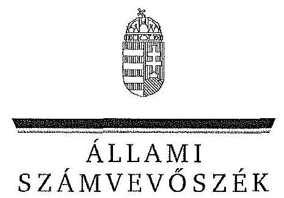
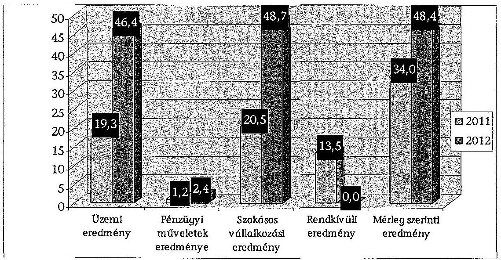
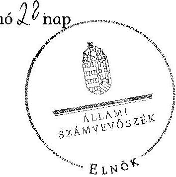
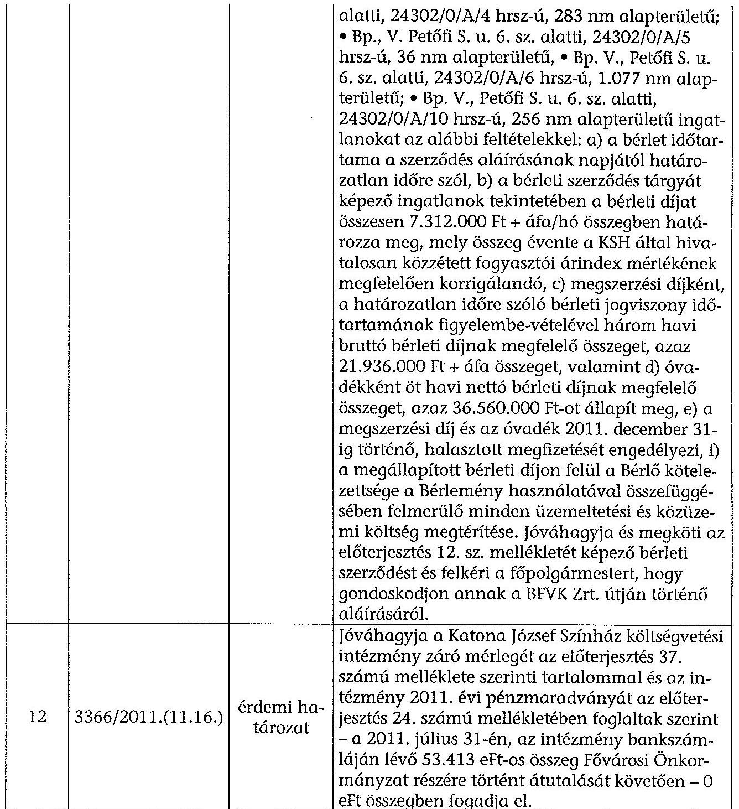
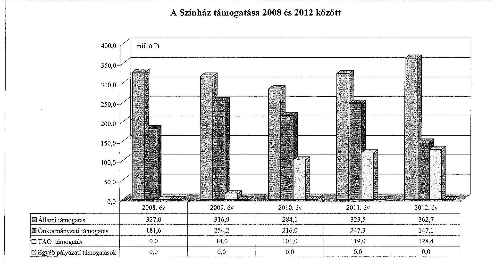
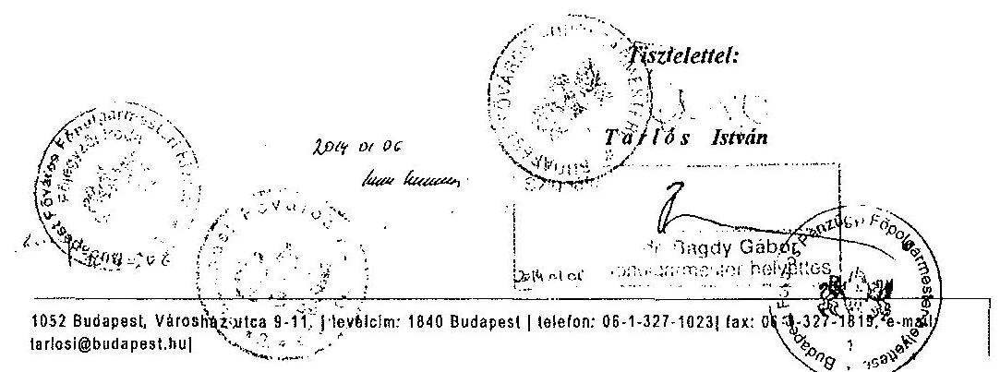
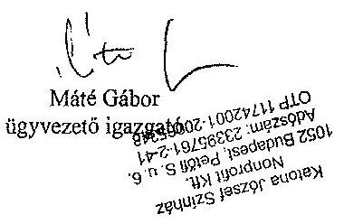
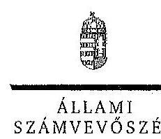
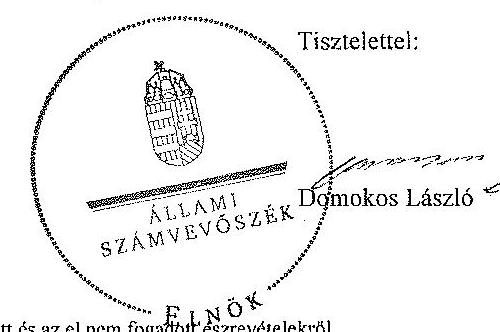
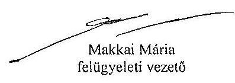

ÁLLAMI
SZÁMVEVŐSZÉK

# JELENTÉS 

az önkormányzatok többségi tulajdonában lévő gazdasági társaságok közfeladat-ellátásának ellenőrzéséről Katona József Színház Nonprofit Kft. és jogelődje

---

# Állami Számvevőszék 

Iktatószám: V-0186-084/2014.
Témaszám: 1159
Vizsgálat-azonosító szám: V06530202

## Az ellenőrzést felügyelte:

Makkai Mária
felügyeleti vezető
Az ellenőrzést vezette és az ellenőrzés végrehajtásáért felelős:
Horváth József
ellenőrzésvezető
Az ellenőrzést végezték:
Tolnai Lászlóné Szilágyi Magdolna Dr. Tóthné Szémán Anna számvevő főtanácsos külső szakértő
A témához kapcsolódó eddig készített számvevőszéki jelentések:
címe
sorszáma
Jelentés a színházak állami támogatásának és gazdálkodásának 1039 ellenőrzéséről

---

# TARTALOMJEGYZÉK 

BEVEZETÉS ..... 3
I. ÖSSZEGZŐ MEGÁLLAPÍTÁSOK, KÖVETKEZTETÉSEK, JAVASLATOK ..... 6
II. RÉSZLETES MEGÁLLAPÍTÁSOK ..... 12

1. Az Önkormányzat közfeladat-ellátásának megszervezése ..... 12
1.1. A közfeladat meghatározása, a feladat ellátásának választott módja ..... 12
1.2. Az önkormányzati és a tulajdonosi irányítás megítélése ..... 17
2. A Színház közfeladat-ellátással kapcsolatos tevékenysége ..... 20
2.1. A Színház szervezeti kialakítása, szabályozottsága ..... 20
2.2. A Színház vagyonnyilvántartása ..... 22
2.3. A gazdasági évek ráfordításainak és bevételeinek alakulása ..... 24
2.4. A gazdasági társaság eredményének alakulása ..... 28
2.5. A Színház folyamatos üzemmenetének, likviditásának biztosítása ..... 29
3. Az önkormányzat tulajdonosi jogainak és kötelezettségeinek érvényesítése ..... 30
3.1. A gazdasági társaságtól származó információk hasznosítása ..... 30
3.2. Az Önkormányzat közgyűlésének intézkedései ..... 31
MELLÉKLETEK
4. számú Budapest Főváros Önkormányzatának közgyűlési határozatai az Intéz- mény átalakítására vonatkozóan
5. számú A Színház szakmai tevékenységének mutatói 2008 és 2012 között
6. számú A Színház támogatása 2008 és 2012 között
7. számú A Színház vagyonának főbb adatai 2008. január 1-je és 2012. december 31-e között
8. számú Budapest Főváros Főpolgármesterének észrevétele
9. számú A Katona József Színház Nonprofit Kft. ügyvezetőjének észrevétele
10. számú A Katona József Színház Nonprofit Kft. ügyvezetőjének észrevételére adott válasz

## FÜGGELÉKEK

1. számú Rövidítések jegyzéke
2. számú Értelmező szótár

---

$\cdot$
$\cdot$
$\cdot$
$\cdot$
$\cdot$
$\cdot$
$\cdot$
$\cdot$
$\cdot$
$\cdot$
$\cdot$
$\cdot$
$\cdot$
$\cdot$
$\cdot$
$\cdot$
$\cdot$
$\cdot$
$\cdot$
$\cdot$
$\cdot$
$\cdot$
$\cdot$
$\cdot$
$\cdot$
$\cdot$
$\cdot$
$\cdot$
$\cdot$
$\cdot$
$\cdot$
$\cdot$
$\cdot$
$\cdot$
$\cdot$
$\cdot$
$\cdot$
$\cdot$
$\cdot$
$\cdot$
$\cdot$
$\cdot$
$\cdot$
$\cdot$
$\cdot$
$\cdot$
$\cdot$
$\cdot$
$\cdot$
$\cdot$
$\cdot$
$\cdot$
$\cdot$
$\cdot$
$\cdot$
$\cdot$
$\cdot$
$\cdot$
$\cdot$
$\cdot$
$\cdot$
$\cdot$
$\cdot$
$\cdot$
$\cdot$
$\cdot$
$\cdot$
$\cdot$
$\

---

# JELENTÉS 

## az önkormányzatok többségi tulajdonában lévő gazdasági társaságok közfeladatellátásának ellenőrzéséről Katona József Színház Nonprofit Kft. és jogelődje

## BEVEZETÉS

Az Önkormányzatnak közfeladata az Ötv. alapján a művészeti feladatok ellátásáról való gondoskodás, az Mötv. szerint az előadó-művészeti szervezet támogatása. Ezt az Önkormányzat előadó-művészeti költségvetési szerv fenntartásával, illetve egyszemélyes tulajdonában álló gazdasági társaság támogatásával valósította meg.

Az Önkormányzat az ellenőrzött időszakban színházi koncepcióval ${ }^{1}$ rendelkezett, amely a színházak múködtetésének alternatíváit vázolta fel és jövőbeli célokat határozott meg. Ezt a Közgyűlés határozattal² elfogadta.

A Főpolgármester a 2011. évben tette közzé a Zöld Könyvet³, melyben megállapította, hogy a kulturális terület legnagyobb problémája a rendszer széttagoltsága volt, mert az Önkormányzat a múködési tevékenységgel kapcsolatos feladatait a színházak által részben költségvetési intézményi, részben gazdasági társasági formában látta el, ez a fajlagos múködési költségek, a vezetők javadalmazása és a számviteli politika eltéréseit okozta a különböző formában múködő szervezeteknél. Ezért készítette elő a Közgyűlés a 2011. március 23-án hozott határozataival az egyes költségvetési szervként működő színházak átalakítását.

A színházak támogatása az ellenőrzött időszakban központi költségvetési, illetve fenntartói támogatás formájában, valamint pályázatok útján valósult meg. A 2010. és 2012. évek költségvetési törvényei egy összegben tartalmazták az Önkormányzat fenntartásában működő színházak fenntartói ösztönző részhozzájárulását, amelyet a fenntartó saját döntése alapján oszthatott el.

[^0]
[^0]:    ${ }^{1}$ Koncepció a fővárosi fenntartású színházak struktúráját és finanszírozását érintő változásokról (2007. XI. 29.)
    ${ }^{2}$ a Főv. Kgy. 1979/2007. (11.29.) sz. határozata
    ${ }^{3}$ Zöld Könyv - Az új városvezetés a rend és a fejlődés szolgálatában - az első 10 hónap eredményei - 2011. augusztus, Kiadja: Budapest Főváros Önkormányzata, Felelős kiadó: Tarlós István, 18. o.

---

Az ellenőrzött időszakban a Színház 2011. július 31-ig költségvetési intézményként, ezt követően - a Közgyűlés határozata alapján - 2011. augusztus 1-jétől nonprofit korlátolt felelősségű társasági formában múködött.

Az Önkormányzat a gazdasági társasággal a közfeladat ellátásának biztosítására 2011. augusztus 4-én Közszolgáltatási szerződést4, majd 2013. január 1-jei hatálybalépéssel Fenntartói megállapodást kötött. A Közszolgáltatási szerződés meghatározta a közhasznú tevékenység körét, az Önkormányzat által biztosított támogatás összegét, a feladatellátáshoz szükséges befektetett eszközöket, valamint azok rendelkezésre bocsátásának módját.

Az Emtv. új elemként vezette be 2009 novemberétől a társasági adókedvezménnyel igénybe vehető támogatást, mint közvetett támogatási formát. Ennek felső határát a jogalkotó a tárgyévi jegybevétel $80 \%$-ában határozta meg. A tao támogatás pénzügyi teljesülése a támogatást nyújtó vállalkozások eredményességének és támogatás nyújtási hajlandóságának függvénye.

A Színház a közfeladat ellátása érdekében az ellenőrzött időszakban összesen 2660,4 millió Ft állami és önkormányzati múködési támogatást kapott. Emellett 2009 és 2012 között 362,4 millió Ft tao támogatást tudott igénybe venni.

A Katona József Színház társulattal rendelkező, repertoárrendben játszó, mű-vész-színházi műsorpolitikát folytató előadó-művészeti szervezet. Kortárs művész színház, amely a hazai és külföldi kortárs és klasszikus műveket újszerű formában mutatja be, a társadalmat széles körben célozza meg, egyedi és realista látásmódban adaptálva a színpadi műveket.

A Színház megalakulása óta folyamatosan vendégszerepel és részt vesz nemzetközi fesztiválokon. 1990-ben alapító tagja volt az európai művészszínházakat tömörítő Európai Színházak Uniójának.

Az ellenőrzött időszakban a Színház évente három játszóhelyen átlagosan tíz bemutatót tartott. A Színház fizető nézőinek száma évente 80-87 ezer fő, az előadások száma pedig évi 377-511 között változott a 2008. és 2012. években. A Színház által foglalkoztatott dolgozók átlaglétszáma közel azonos maradt, a 2008. évi 89 fơről a 2012. évre 87 főre csökkent.

A Színház főbb szakmai mutatószámait a 2. számú melléklet tartalmazza.
Az ellenőrzés várható eredménye: a jelentés nyilvánossága a társadalom széles körével ismerteti meg a Színház gazdálkodására vonatkozó megállapításainkat, továbbá megállapítások alapján megfogalmazott számvevőszéki javaslatok hasznosítása elősegíti a feltárt hibák megszüntetését, az ellenőrzött szervezet jobb feladatellátását. A társadalom számára jelzi, hogy közpénz nem maradhat ellenőrizetlenül, az ÁSZ értékteremtő rend kialakításához és megőr-

[^0]
[^0]:    ${ }^{4}$ Az Emtv. 13. § (2) bekezdése szerint a közszolgáltatási szerződés a közszolgáltatás nyújtására irányuló, legalább három évre szóló szerződés, amely az állam vagy az önkormányzat és a közszolgáltatást végző előadó-művészeti szervezet kapcsolatát szabályozza, tartalmazza a teljesítendő előadásszámot, a szolgáltatás nyújtásának időtartamát, helyét és a teljesítésért járó díjazást.

---

zéséhez hozzájáruló tevékenysége pozitív hatással lesz a szervezetről kialakított összkép formálásában. A szervezeten belül lehetőség nyílik arra, hogy a megállapítások szintetizálásával az ÁSZ a hozzáadott értéket teremtő, elemző tevékenységét és tanácsadó szerepét is erősítse. A jó gyakorlatok bemutatásával az ÁSZ hozzájárul a követendő megoldások megismertetéséhez és terjesztéséhez.

Az ellenőrzés célja annak értékelése volt, hogy:

- az Önkormányzat a jogszabályi előírások figyelembevételével döntött-e az ellenőrzésre kerülő közfeladat megszervezéséről, az ellátás módjáról; a tulajdonostól elvárható gondossággal felügyelte-e a társaság feladatellátását; a gazdasági társaság rendelkezésére bocsátotta-e a közfeladat-ellátásához a szükséges közvagyont, és biztosította-e a tulajdonosi jogok közvagyon feletti érvényesülését; a társaság vagyonvesztése esetén intézkedett-e a további vagyonvesztés megakadályozásáról;
- a gazdasági társaság teljesítette-e a tulajdonos önkormányzat részéről meghatározott célokat és feladatokat a rendelkezésre álló erőforrások felhasználásával; végrehajtotta-e a közfeladat-ellátási szerződés előírásait; betartotta-e a vagyonnal történő gazdálkodásra vonatkozó jogszabályi rendelkezéseket.

Az ellenőrzés hatóköre: az önkormányzatok közfeladat-ellátásának ellenőrzése, amely kiterjed az önkormányzatok és a közfeladatot ellátó, az önkormányzat többségi tulajdonában lévő gazdasági társaság közötti feladatmegosztásra, az önkormányzatok tulajdonosi jogainak gyakorlására, a nemzeti vagyon kezelésének ellenőrzése keretében a közfeladat-ellátáshoz rendelt vagyonra és a vagyont érintő szerződésekre. A jelen ellenőrzés kiterjed az önkormányzatok többségi tulajdonlásával működő gazdasági társaságok közfeladatellátására, vagyongazdálkodási tevékenységére, a kapcsolódó nyilvántartások, elszámolások szabályszerűségére és megbízhatóságára. Az ellenőrzött tételek kiválasztása véletlen mintavétellel történt.

Az ellenőrzés típusa: szabályszerűségi ellenőrzés.
Az ellenőrzött időszak: a 2008-2012. évek, valamint a helyszíni ellenőrzés befejezéséig - 2013. augusztus 16-ig - bekövetkezett változások figyelemmel kísérése.

Ellenőrzött szervezet: Katona József Színház Nonprofit Kft. és jogelődje, valamint a tulajdonos Budapest Főváros Önkormányzata.

Az ellenőrzés végrehajtásának jogszabályi alapját az ÁSZ tv. 5. § (3)-(5) bekezdéseiben foglaltak képezik.

Az ÁSZ a 2011. évi LXVI. törvény 29. §-a szerint a jelentéstervezetet megküldte Budapest Főváros Önkormányzata főpolgármesterének és a Katona József Színház Nonprofit Kft. ügyvezető igazgatójának egyeztetésre. A beérkezett észrevételeket és az azokra adott választ a jelentés 5-7. számú mellékletei tartalmazzák.

---

# I. ÖSSZEGZŐ MEGÁLLAPÍTÁSOK, KÖVETKEZTETÉSEK, JAVASLATOK 

Az Önkormányzat a művészeti feladatok ellátásáról való gondoskodásnak, illetve az előadó-művészeti szervezet támogatásának, mint az Ötv.-ben és az Mötv.-ben meghatározott közfeladatának, az ellenőrzött időszak alatt eleget tett. Az Önkormányzat a közfeladat-ellátását 2011. július 31-éig a Színháznak, mint költségvetési intézménynek a fenntartásával, azt követően a gazdasági társaság támogatásával biztosította. A Közgyűlés a tulajdonosi jogait az ellenőrzött időszakban a szabályzataiban és rendeleteiben foglaltak szerint gyakorolta.

Az Önkormányzat a közfeladat-ellátása érdekében az Intézmény, majd 2011. augusztus 1-jétől a Színház részére az alapító okiratokban foglaltaknak megfelelően rendelkezésére bocsátotta az előadó-művészeti közfeladat-ellátáshoz szükséges ingatlan és ingó vagyont. A színház részére a közfeladat-ellátáshoz szükséges forrás biztosításáról - 2008. január 1. és 2011. július 31. között - az éves költségvetések elfogadásával - 2011. augusztus 1. és 2012. december 31. között - a Közszolgáltatási szerződésben (az annak elválaszthatatlan részét képező éves költségvetési rendeletekben) döntött az Önkormányzat.

Az Önkormányzat az Intézmény számára a közfeladat teljesítésével kapcsolatosan konkrét célokat, elvárásokat nem fogalmazott meg. Az Emtv. 2009. évi hatálybalépésével a tevékenység ellátására vonatkozó követelmények és feladatmutatók a törvény által kerültek meghatározásra.

Az Önkormányzat az Intézmény költségvetésének elfogadását, a beszámoltatásokat, valamint az adatszolgáltatási kötelezettség ellenőrzését a jogszabályokban és a belső szabályozásában foglaltaknak megfelelően végezte el. Az Önkormányzat a Színház művészeti tevékenységének ellátását évadbeszámolók alapján értékelte, amelyeket 2008 és 2010 között - az Önkormányzat SZMSZ ${ }_{1}$ rendelkezései szerint - a Kulturális Bizottsága elfogadott.

Az intézményi működés időszakában alkalmazott ösztönző rendszer megfelelt a vonatkozó jogszabályi és belső szabályozási előírásoknak. Az évenkénti jutalmazások időpontja és mértéke azonban nem volt kiszámítható, annak teljesítményösztönző, motiváló hatása nem érvényesült. Az Intézmény vezetője számára kifizetett jutalom összege nem kapcsolódott a beszámoló teljesítéséhez köthető mutatószámokhoz, a jutalomkeret a besorolási bérek arányában került meghatározásra.

Az Önkormányzat belső ellenőrzése az Intézménynél egy alkalommal, a 2008. évben végzett ellenőrzést. A szabályszerűségi és pénzügyi ellenőrzés tárgya a szabályozások meglétének, az előirányzatokkal való gazdálkodás, az elszámolás és pénzügyi nyilvántartások vezetésének ellenőrzése volt. A 2008. évi ellenőrzéssel kapcsolatban a jelentés megállapította, hogy szabályozni kell a szellemi tevékenység területén a szerződéskötést, a munkakörök átadásánakátvételének körülményeit, valamint az eseti bevétellel vagy támogatással össze-

---

függő költségek megosztásának rendjét. A költségvetési gazdálkodás területén előirányzat-felhasználási tervet kell készíteni. Az Intézmény az Intézkedési tervet végrehajtotta, és erről beszámolt az Önkormányzat részére.

Az Intézmény megszüntetése és a gazdasági társaság alapítása a Közgyűlés határozatainak megfelelően történt, azonban az intézmény megszüntető okiratának 2011. június 30 -án - a Főpolgármester-helyettes által - történő aláírásával a Hivatal kilenc nappal túllépte az Áht ${ }_{1}$, szerinti közzétételi határidőt.

Az Önkormányzat döntése alapján a gazdasági társaság a közfeladat-ellátást 2011. augusztus 1-jén kezdte meg. Az Önkormányzat közfeladat-ellátásának tárgyi és pénzügyi feltételeit a Közszolgáltatási szerződésben határozta meg. Ez tartalmazta az ingatlanok bérbeadásának és az ingó vagyontárgyak ingyenes használatba adásának módját, valamint a költségvetési támogatás mértékét. Meghatározta a közhasznú tevékenység körét, a szerződés megszűnésének esetére szabályozta a vagyontárgyak visszaszolgáltatásának rendjét és határidejét, továbbá a Színház által teljesítendő művészeti tevékenységek jellegét, körét, mértékét és pontos mutatószámait. Az önkormányzati tulajdon védelme érdekében szabályozta a kötelező leltár készítését, annak gyakoriságát, továbbá a gazdálkodás és a művészeti tevékenység ellátásával összefüggő kötelező adatszolgáltatás formáját, idejét és módját, valamint előírta a gazdálkodás körében felmerülő rendkívüli eseményekről történő tájékoztatási kötelezettséget.

A tulajdonos Önkormányzat az Intézmény könyveiben nyilvántartott befektetett eszközöket a közhasznú tevékenység eredményes ellátása érdekében 2011. augusztus 1-én haszonkölcsön formájában átadta a Színház részére. A vagyon átadás-átvételi jegyzőkönyv szerint a befektetett eszközök értéke 1270,6 millió Ft volt.

A leltározásra vonatkozó előírások a társasággá alakulást követően az Önkormányzat Vagyonrendeleteiben nem a hatályos jogszabályoknak megfelelően szerepeltek, mivel az üzemeltetésre, kezelésre átadott eszközök leltározási szabályairól a Vagyonrendelet ${ }_{1,2}$ - az Áhsz. 1 2010. január 1-jétől hatályos előírásaival ellentétben - nem tartalmazott szabályozást.

Az Önkormányzat a vagyon védelme érdekében a Közszolgáltatási szerződésben garanciális követelményként fogalmazta meg a kötelezettségek megszegésének jogkövetkezményét, valamint a szerződés megszűnésének esetére az átadott vagyontárgyak visszaszolgáltatási kötelezettségét. Az ellenőrzött időszakban kötelezettség megszegésére, illetve szerződés megszűnésére nem került sor.

Az Önkormányzat a Színház Alapító Okirat ${ }_{2}$-ben - a Gt. előírásaival összhangban - szabályozta az Alapító tulajdonosi joggyakorlásának kereteit. Az Alapító Okiratban a Színház legfőbb szerve, a Közgyűlés kizárólagos hatáskörébe tartozó feladatként határozata meg a Színház SZMSZ4-ének jóváhagyását, amely a hiánypótlások következtében - közel egy év elteltével - 2012. szeptember 13-án történt meg. A Közgyűlés a tulajdonosi érdekeinek védelmére határozatokban kijelölte a Színház FB tagjait és könyvvizsgálóját.

Az Önkormányzat a Színház üzleti tervének elfogadását, beszámoltatását és az adatszolgáltatási kötelezettség ellenőrzését a jogszabályokban, az Önkormány-

---

zat belső szabályzataiban és a Közszolgáltatási szerződésben foglaltaknak megfelelően, határidőn belül - az FB határozata és a könyvvizsgálói jelentés figyelembe vételével - végezte el.

A Színház szakmai tevékenységének ellátását az Önkormányzat évadbeszámolók alapján értékelte. A 2011. és 2012. évekre benyújtott évadbeszámolókról a kulturális ügyekért felelős Főpolgármester-helyettes tájékoztatót nyújtott be a Közgyűlés részére, melyet a Közgyűlés tudomásul vett.

A 2011. és 2012. évekre vonatkozóan a Színház ügyvezetője részére a prémiumfeladatok meghatározása a Javadalmazási szabályzat ${ }_{2}$-tól eltérően - késedelmesen - történt. A prémiumfeltételeket és prémium összegét mindkét évben az üzleti terv elfogadását követően határozta meg az Alapító.

Az Önkormányzat belső ellenőrzése a Színháznál egy ellenőrzést végzett 2012ben. A szabályszerűségi ellenőrzés a gazdálkodási szabályzatokkal és a szerződéskötés gyakorlatával kapcsolatban fogalmazott meg hiányosságokat. A jelentés javasolta, hogy a Színház tegyen eleget a közérdekű adatok közzétételére vonatkozó szabályzat hatályba léptetésének, jelöljön ki adatvédelmi felelőst, a Selejtezési szabályzatot egészítse ki, illetve módosítsa a sikerdíjjal kötött, illetve kötbérezést nem tartalmazó szerződéseket. A Színház az ellenőrzésekkel kapcsolatban intézkedési tervet készített, amelyet határidőre végrehajtott.

A Színház 2011. és 2012. évi gazdálkodása, valamint mérleg szerinti nyeresége nem tette szükségessé, hogy a tulajdonos Önkormányzat a vagyon, illetve a közpénzek nem célszerinti hasznosításával, az esetleges pazarló felhasználással kapcsolatban, valamint a lejárt kötelezettségek csökkentése érdekében tulajdonosi intézkedéseket tegyen.

Az Intézmény a vagyonnal történő gazdálkodásra vonatkozó jogszabályi rendelkezéseknek nem teljes körűen tett eleget. A Számviteli politika ${ }_{1}$ hiányosságai az Intézmény integritásával kapcsolatban kockázatot jelentettek. Az Intézmény 2008. január 1. és 2011. július 31. közötti időszakra vonatkozó Számviteli poli-tika ${ }_{1}$-e nem felelt meg a Számv. tv.-nek, mert az egyes produkciókban közvetlenül felhasználandó díszleteket, jelmezeket és kellékeket a Színház a beszerzési és előállítási értéktől, és a használati időtől függetlenül azonnal 100\%-ban költségként, a dologi kiadások között számolta el. Ez a vagyonvédelem szempontjából kockázatot jelentett. Nem szabályozta továbbá a produkciók színrevitele költségeinek (szellemi termék) elszámolási rendjét.

Az Intézmény működési formája a közfeladat-ellátás követelményeinek megfelelt. Alapító Okirat ${ }_{1}$-gyel, SZMSZ ${ }_{1,2}$-vel, továbbá az irányítási, döntési és felelősségi jogköröket tartalmazó belső szabályzatokkal rendelkezett.

Az Intézmény az 2008. január 1. és 2011. július 31. között az előadó-művészeti tevékenység ellátásához szükséges, a fenntartó által rendelkezésére bocsátott vagyont az Áhsz. ${ }_{1}$-ben foglaltaknak megfelelően saját mérlegében mutatta ki, melyet a belső szabályozásban foglaltaknak megfelelően elkészített leltárral támasztottak alá.

---

Az Intézmény adatszolgáltatási kötelezettségeit a jogszabályokban és a belső szabályozásban foglalt módon havi, negyedéves, féléves, éves időszakonként teljesítette.

Az Intézmény összes bevétele a 2010. évben 920,6 millió Ft volt, 4,8\%-kal növekedett a 2008. évi összes bevételhez képest. Az összes kiadása 2008-ról 2010re 7,0\%-kal emelkedett, 2010-ben 937,0 millió Ft-ot tett ki. A személyi juttatások és a járulékok összege az Intézmény összes kiadásainak 42,5-44\%-át tette ki.

A tárgyi eszközök értékcsökkenési leírását a Számviteli politika ${ }_{1,2}$-ben rögzített módon és az ott meghatározott leírási kulcsoknak megfelelően számolták el. Az Intézmény a 2009. évben a KAMRA nézőtér bővítéséhez 25 db nézőtéri emelvényt és 160 db széket szerzett be. Az eszközök aktiválása nem felelt meg a Számv. tv. előírásainak, mert azt az ingatlanra aktiválták, és nem önálló eszközként vették állományba.

A Közgyűlés 2011. március 23-án határozatot hozott a költségvetési intézményként működő Színház megszüntetésének előkészítéséről, és ezzel összhangban az utódszervezet, gazdasági társaság alapításához szükséges engedélyeket megadta. A Főpolgármester-helyettes a költségvetési intézmény megszüntető okiratát 2011. június 30-án írta alá.

A Színház teljesítette az Önkormányzat részéről a Közszolgáltatási szerződésben meghatározott célokat és feladatokat. A gazdálkodásra vonatkozó jogszabályi rendelkezéseket - az önköltségszámítás kivételével - betartották.

A Színház rendelkezett Alapító Okirat ${ }_{2}$-vel, azonban az irányítási, döntési és felelősségi jogköröket tartalmazó belső szabályzatok nem voltak teljes körűek. A Színház - tulajdonosi jóváhagyás hiányában - 2012. szeptember 13-ig érvényes SZMSZ nélkül múködött. A Színház a megalakulása után nem szabályozta az operatív pénzügyi gazdálkodással összefüggő jogköröket. A szabályzat elkészítése a helyszíni ellenőrzés befejezésekor folyamatban volt.

A Színház a Közszolgáltatási szerződés előírásának megfelelően folyamatosan biztosította a tevékenységi körébe tartozó színházi szolgáltatást.

A Színház 2011. december 31-i fordulónappal az Önkormányzat által ingyenes használatba adott eszközök leltározását mennyiségi leltárfelvétellel végezte el.

A Színház olyan Számlarendet alakított ki, amelyből az ellátott közfeladat bevételei és ráfordításai elkülönülten ellenőrizhetők. A Számviteli politka ${ }_{2}$-ben a díszletek, valamint a szellemi termékek elszámolását megfelelően szabályozták.

A Színház elkészítette az Önköltségszámítási szabályzat ${ }_{1,2}$-t, azonban azokban nem tért ki a társulat bérének és járulékainak legalább a produkció színreviteléig történő felosztási módjára. Ennek következtében a produkciók színreviteléig aktivált szellemi termékek nem a ténylegesen felmerült közvetlen költségek alapján kerültek elszámolásra. Továbbá az Önköltségszámítási szabályzat ${ }_{1,2}$ nem tartalmazta az általános költségeknek a felosztási módját.

---

A Színház az Önkormányzat tulajdonában álló eszközöket a Számv. tv.-nek megfelelően (ingatlanok, immateriális javak, tárgyi eszközök, készletek), számlarendjében elkülönítetten, a 0 -ás számlaosztályban tartotta nyilván. A Színház művészeti tevékenységét szolgáló - saját és Önkormányzati tulajdonú eszközök 2012. december 31-ei nettó értéke ( 1410,3 millió Ft) a 2008. január 1jei adathoz viszonyítva $5,5 \%$-kal ( 73,5 millió Ft-tal) emelkedett.

A Színház a 2011-2012. években elkészítette üzleti és az arra épülő likviditási tervét. Mérleg szerinti eredménye a 2011. évben 34,0 millió Ft, 2012-ben 48,4 millió Ft volt, amit a jegybevételek és a tao támogatások kedvező alakulása eredményezett. A Színház 2011-2012. évi beszámolóit a Közgyűlés elfogadta.

A Színház első teljes évében, 2012-ben 901,3 millió Ft bevételt ért el, a ráfordítások összege 854,9 millió Ft volt.

A Színház az átmenetileg szabad pénzeszközeit a számlavezető banknál rövid lejáratú - egy éven belüli - fix kamatozású betétként kötötte le, ezért nem volt indokolt Befektetési szabályzat készítése.

Az Állami Számvevőszékről szóló 2011. évi LXVI. törvény 33. § (1) bekezdésében foglaltak értelmében a jelentésben foglalt megállapításokhoz kapcsolódó intézkedési tervet köteles az ellenőrzött szervezet vezetője összeállítani, és azt a jelentés kézhezvételétől számított 30 napon belül az ÁSZ részére megküldeni. Amennyiben az intézkedési tervet határidőben nem küldi meg a szervezet, vagy az nem elfogadható, az ÁSZ elnöke a hivatkozott törvény 33. § (3) bekezdés a)-b) pontjaiban foglaltakat érvényesítheti.

Az ellenőrzés intézkedést igénylő megállapításai és javaslatai:

# Budapest Főváros Főjegyzőjének 

A leltározásra vonatkozó előírások a társasággá alakulást követően az Önkormányzat Vagyonrendeleteiben nem a hatályos jogszabályoknak megfelelően szerepeltek, mivel az üzemeltetésre, kezelésre átadott eszközök leltározási szabályairól a Vagyonrendelet 2010. január 1-jétől - az Áhsz. előírásaival ellentétben - nem tartalmazott szabályozást.

Javaslat:
Készítse elő a Közgyűlés elé való terjesztés érdekében a Vagyonrendelet ${ }_{2}$ módosítását, hogy az tartalmazza az Áhsz. ${ }_{2}$ 22. § (2) bekezdésben előírtaknak megfelelően az üzemeltetésre, kezelésre átadott eszközök leltározási szabályait.

## a Katona József Színház Igazgatójának

A Színház elkészítette az Önköltségszámítási szabályzat ${ }_{1,2}$-t, azonban azokban nem tért ki a társulat bérének és járulékainak legalább a produkció színreviteléig történő felosztási módjára. Ennek következtében a produkciók színreviteléig aktivált szellemi termékek nem a ténylegesen felmerült közvetlen költségek alapján kerültek elszámo-

---

lásra. Továbbá az Önköltségszámítási szabályzat ${ }_{1,2}$ nem tartalmazta az általános költségeknek a felosztási módját.

Javaslat:
Intézkedjen az Önköltségszámítási szabályzat módosításáról annak érdekében, hogy
a) a produkció bemutatásáig elszámolt közvetlen költségek tartalmazzák a társulat bérének és járulékainak a produkcióra felosztott költségeit;
b) a szabályzat tartalmazza az általános költségeknek a felosztási módját.

---

# II. RÉSZLETES MEGÁLLAPÍTÁSOK 

## 1. Az ÖNKORMÁNYZAT KÖZFELADAT-ELLÁTÁSÁNAK MEGSZERVEZÉSE

### 1.1. A közfeladat meghatározása, a feladat ellátásának választott módja

Az Önkormányzat a múvészeti feladatok ellátásáról való gondoskodásnak, illetve az előadó-múvészeti szervezet támogatásának, mint az Ötv.-ben és az Mötv.-ben meghatározott közfeladatának, az ellenőrzött idöszak alatt eleget tett. Az Önkormányzat a közfeladat ellátását 2011. július 31 -élg az Intézmény fenntartásával, azt követően a Katona József Színház Nonprofit Kft. támogatásával biztosította.

Az Önkormányzat kötelező közfeladata az Ötv. 63/A §. n) pontja szerint a művészeti feladatok ellátása. ${ }^{5}$ A Htv. 111. § alapján a közművelődési, közgyűjteményi és művészeti tevékenységekkel kapcsolatos helyi irányítási, ellenőrzési, valamint a fenntartással és múködtetéssel kapcsolatos feladatokat a Közgyűlés látja el. A kulturális feladat ellátását az Önkormányzat az Emtv. 3. § (2) bekezdése alapján előadó-művészeti szervezet fenntartásával (költségvetési szervei esetében), vagy annak támogatásával (gazdasági társaságai esetében) valósította meg.

Az Önkormányzat az ellenőrzött időszakban koncepcióval ${ }^{6}$ rendelkezett, amelyet a Közgyűlés ${ }^{7}$ határozatával fogadott el.

A koncepció a színházak múködtetésének módozatait vázolta jövőbeli célokat határozott meg, nem vizsgálta azonban a megvalósításhoz szükséges források nagyságát.

A 2010. évi önkormányzati választásokat követően az Ötv. 91. § (1) és (6) bekezdésnek megfelelően a Közgyűlés ${ }^{8}$ elfogadta az Önkormányzat 2011-2014. évekre vonatkozó Gazdasági Programját ${ }^{9}$.

Az Önkormányzat a Színházra vonatkozó szakmai elvárásait az igazgatói pályázat kiírásában szerepeltette. A nyertes pályázat a megválasztott igazgató stratégiai céljait, valamint konkrét szakmai elképzeléseit foglalta össze.

[^0]
[^0]:    ${ }^{5}$ A 2013. 01. 01-től hatályos Mötv. 13.§ 1) bekezdés 7. pont is kötelezően ellátandó feladatként határozza meg az előadó-művészeti szervezetek támogatását.
    ${ }^{6}$ Koncepció a fővárosi fenntartású színházak struktúráját és finanszírozását érintő változásokról
    ${ }^{7}$ a Főv. Kgy. 1979/2007. (11.29.) sz. határozata
    ${ }^{8}$ a Főv. Kgy. 937/2011. (04.27.) sz. határozata
    ${ }^{9}$ A Főváros fejlesztésének és gazdálkodásának stabilizálása és reformkoncepciója a 2011-2014. évi választási ciklusra

---

Az Emtv. hatálybalépésével a tevékenység ellátására vonatkozó követelmények és feladatmutatók a törvény által kerültek meghatározásra.

A Közgyűlés 2011. március 23-án határozatokat ${ }^{10}$ hozott a költségvetési szervként működő színházak megszüntetéséről és az utódszervezetek, nonprofit gazdasági társaságok alapításáról. A Közgyűlés határozata ${ }^{11}$ az Áht. ${ }_{1}$ 100/O. § (5) bekezdésének, az előzetes engedélyhez készített előterjesztés tartalma az Áht. 1 100/L. § (4) bekezdésének megfelelt.

Az Önkormányzat a határozatával ${ }^{12}$ a költségvetési intézményt az utódszervezet létrehozásával egyidejűleg, 2011. július 31-i hatállyal megszüntette. A Fő-polgármester-helyettes a megszüntető okiratot 2011. június 30-án írta alá. Ezzel a Hivatal nem tett eleget az Áht. 1 96. § (1) bekezdése rendelkezésének, amely előírta, hogy a költségvetési szerv megszüntető okiratát legalább negyven nappal a megszüntetés kérelmezett napja előtt ki kell hirdetni, közzé kell tenni.

A 2011. augusztus 1-jén létrehozott gazdasági társaság a költségvetési szervként működő intézmény jogutódjaként jött létre. Az intézmény valamennyi közfeladat-ellátással összefüggő joga és kötelezettsége, valamint vagyona feletti rendelkezés, illetőleg az Önkormányzat tulajdonát képező, közfeladat-ellátás céljából használatában álló ingatlanokkal és ingóságokkal kapcsolatos jogok és kötelezettségek a gazdasági társaságra szálltak át.

Az Önkormányzat a költségvetési szervek megszüntetésénél betartotta az Ámr. 11. § (1) bekezdés a)-c), f) pontjaiban és (2) bekezdésében előírtakat, valamint a Kjt. 25/A. § (2)-(3) és (8) bekezdéseinek megfelelően gondoskodott a költségvetési szervnél foglalkoztatott közalkalmazottak további foglalkoztatásáról.

# Az Intézmény a költségvetési gazdálkodás szabályai szerint múködött 2011. július 31-ig, Alapító Okirata ${ }_{1}$-je megfelelt a jogszabályi előírások 

nak, továbbá tartalmazta a közfeladat ellátásához szükséges eszközöket.

A Közgyűlés határozatának ${ }^{13}$ megfelelően a megszüntetésre kerülő költségvetési szerv 2011. július 31-i fordulónappal az Áhsz. ${ }_{1}$ 13/A. §-ában foglaltak szerinti leltárral és főkönyvi kivonattal alátámasztott - záró beszámolóját elkészítették. A záró beszámolót a Közgyűlés jóváhagyta ${ }^{14}$.

A tulajdonos az Intézmény könyvelben nyilvántartott befektetett eszközöket a közhasznú tevékenység eredményes ellátása érdekében átadta a Színház részére. A Vagyon átadás-átvételi jegyzőkönyv szerint a befektetett eszközök értéke 1270,6 millió Ft volt. A Nvtv. 3. § alapján az ellenőrzött Színház átlátható szervezet.

[^0]
[^0]:    ${ }^{10}$ az 1. sz. melléklet 5-8. sorszámú határozatai
    ${ }^{11}$ az 1. sz. melléklet 5. sorszámú határozata
    ${ }^{12}$ az 1. sz. melléklet 9. sorszámú határozata
    ${ }^{13}$ az 1. sz. melléklet 9. sorszámú határozata
    ${ }^{14}$ az 1. sz. melléklet 12. sorszámú határozata

---

A Közgyűlés a határozatával ${ }^{15}$ megalapította a gazdasági társaságot, és jóváhagyta a Közszolgáltatási szerződés szövegét. A Főpolgármester a Közszolgáltatási szerződést 2011. augusztus 4-én írta alá.

Az Önkormányzat az Alapító Okirat ${ }_{2}$ szövegezésénél figyelembe vette a Gt. 15. § (1) bekezdésének előírásait, mely szerint a társasági szerződés ellenjegyzésének napjától a létrehozni kívánt gazdasági társaság előtársaságként müködhet ${ }^{16}$. Figyelmen kívül hagyta azonban az Áht. 100/O. §. (2) bekezdését, mely szerint költségvetési intézmény utódszervezete előtársaságként nem múködhet, így üzletszerű gazdasági tevékenységet nem végezhet, és a bejegyzés idejéig kötelezettséget nem vállalhat. A Színház gazdasági tevékenységét az Alapító Okiratának megfelelően augusztus 1-jével kezdte meg.

Az Alapító Okirat 2 4.6. és 4.9. pontja egymásnak ellent mond, mivel a 4.6. pont szerint a társasági szerződés ellenjegyzésének napjától a létrehozni kívánt gazdasági társaság előtársaságként múködhet, a 4.9. pontban pedig az Alapító rögzíti, hogy a Színház a közfeladat-ellátását és múködését 2011. augusztus 1. napjával kezdi meg.

Az Önkormányzat a Színház Alapító Okirat ${ }_{2}$-ben - a Gt. előírásaival összhangban - szabályozta az Alapító tulajdonosi joggyakorlásának kereteit. Az Alapító Okirat ${ }_{2}$ megfelelően rendelkezik a Színház gazdálkodása során elért eredmény felhasználásáról, az ügyvezető, az FB tagok és a könyvvizsgáló kijelöléséről, az összeférhetetlenségi szabályokról, valamint az Áht. 1 100/N. § (8) bekezdés előírásainak betartatásáról.

Az Alapító az egyszemélyes nonprofit korlátolt felelősségű társaság alapításával eleget tett az Áht. 1 100/L. § (1) bekezdésében előírt rendelkezéseknek, a Színház az Alapító Okirat ${ }_{2}$ tartalmának meghatározásakor eleget tett a Ptk. 54. § (1)-(2) bekezdéseiben és a Gt. 12. § (1) bekezdésében előírt, valamint a Közhasznú tv. 4. § (1) bekezdésében foglalt tartalmi követelményeknek.

Az Önkormányzat a hatályos Emtv. 15. § (3) bekezdésének megfelelően a Színház hatósági nyilvántartás szerinti adatainak módosítására irányuló kérelmét benyújtotta.

Az előadó-művészeti szervezetet (a Színházat) a KÖH Film- és Előadó-művészeti Iroda nyilvántartásba vette.

Az Önkormányzat tulajdonában álló vagyon a nemzeti vagyon részét képezi. A vagyonrendelet ${ }_{2}$ 6. § (1) bekezdése szerint a Színház használatában lévő, a feladatellátását szolgáló ingatlanvagyon korlátozottan forgalomképes törzsvagyon.

# Az Önkormányzat döntése alapján a gazdasági társaság a közfel-adat-ellátást 2011. augusztus 1-jén kezdte meg. Az Önkormányzat a 

[^0]
[^0]:    ${ }^{15}$ az 1. sz. melléklet 10. sorszámú határozata
    ${ }^{16}$ A Gt. 16 § (2) bekezdés alapján az előtársasági létszakasz a cégbejegyzéssel szűnik meg, és az előtársasági létszakaszban kötött jogügyletek a gazdasági társaság jogügyleteinek minősülnek.

---

közfeladat-ellátásának tárgyi és pénzügyi feltételeit a Közszolgáltatási szerződésben határozta meg. Ez tartalmazta az ingatlanok bérbeadásának és az ingó vagyontárgyak ingyenes használatba adásának módját, valamint a költségvetési támogatás mértékét. A Közszolgáltatási szerződés meghatározta a közhasznú tevékenység körét, a szerződés megszűnésének esetére szabályozta a vagyontárgyak visszaszolgáltatásának rendjét és határidejét, továbbá a színház által teljesítendő művészeti tevékenységek jellegét, körét, mértékét és pontos mutatószámait. Az önkormányzati tulajdon védelme érdekében a Közszolgáltatási szerződésben szabályozta a kötelező leltár készítését, annak gyakoriságát, továbbá a gazdálkodás és a művészeti tevékenység ellátásával összefüggő kötelező adatszolgáltatás formáját, idejét és módját, valamint előírta a gazdálkodás körében felmerülő rendkívüli eseményekről történő tájékoztatási kötelezettséget.

Az Önkormányzat a Színház által használt ingatlanok vonatkozásában a Közgyűlés 2011. augusztus 31-ei határozatának megfelelően a megszabott határidőn belül bérleti szerződést kötött a Színházzal. A bérleti szerződés aláírásával a szerződő felek között kötelmi viszony keletkezett. A bérleti szerződés rendelkezései szerint a megszerzési díj megfizetése bérleti jogviszonyt hozott létre. A Bérleti szerződés úgy rendelkezett, hogy a bérlő a Közszolgáltatási szerződés alapján, haszonkölcsön ${ }^{17}$ címén használta korábban az ingatlant. A Közszolgáltatási szerződés azonban ezzel ellentétben azt tartalmazza, hogy az Önkormányzat bérlet formájában biztosította azt. Továbbá az Önkormányzat figyelmen kívül hagyta, hogy a korábbi határozatának ${ }^{18}$ megfelelő tartalommal bíró, a 2011. július 31 -élg költségvetési intézményként múködő szerv Megszüntető Okirata alapján, a jogelőd ingyenes ingatlanhasználata az utódszervezetre szállt át. Azzal, hogy az Önkormányzat a 2011. november 23án aláírt bérleti szerződés szerint - az annak aláírását megelőző időszakra - érvényesítette a későbbi szerződésben szereplő díjak bérlő általi megfizetését, nem a korábbi határozatának megfelelően járt el.

A Színháznak a bérleti szerződés aláírását megelőző időszakra használati díjat, azt követően bérleti díjat ( 7312 ezer Ft/hó+áfa), valamint a bérleti díj összegét alapul véve egyszeri 3 havi megszerzési díjat és 5 havi bérleti díjnak megfelelő óvadékot kellett fizetnie.

A felek 2012-ben a Bérleti szerződés 2. pontját kiegészítették azzal, hogy az Önkormányzat az óvadék összegét „a bérleti szerződés időtartama alatt a kielégítési jog megnyilta előtt használhatja és rendelkezhet vele." Az óvadék összegének fedezete az Önkormányzat részéről tett nyilatkozat ${ }^{19}$ alapján folyamatosan rendelkezésre állt.

[^0]
[^0]:    ${ }^{17}$ Ptk. 583. § (1) bekezdése szerint haszonkölcsön-szerződés alapján a kölcsönadó köteles a dolgot a szerződésben meghatározott időre ingyenesen a kölcsönvevő használatába adni, a kölcsönvevő pedig köteles azt a szerződés megszűntekor visszaadni.
    ${ }^{18}$ az 1. sz. melléklet 9. sorszámú határozata
    ${ }^{19}$ A Főpolgármesteri Hivatal ellenőrzéshez kirendelt kapcsolattartója 2013. augusztus 14 -én adott válasza alapján.

---

# A Színház támogatása az ellenőrzött időszakban központi költségvetési, illetve fenntartói támogatással, valamint pályázatok útján valósult meg. Az Önkormányzat a saját tulajdonosi támogatásának színházak közötti elosztási elveit, szempontjait szabályzatban, belső utasításban nem határozta meg, annak mértékét, nagyságrendjét a teljes támogatási összegéhez igazította. 

A 2010. évtől az Emtv. 16. § (1) bekezdése ${ }^{20}$ szerint a színházak támogatása mũvészeti ösztönző részhozzájárulásból és fenntartói ösztönző részhozzájárulásból tevődött össze. A 2010. és 2011. években a költségvetési törvények 7. sz. melléklete egy összegben tartalmazta az Önkormányzat fenntartásában múködő színházak fenntartói ösztönző részhozzájárulásának összegét, amelyet a fenntartó saját döntése alapján oszthatott el. A költségvetési törvények a színházak művészeti ösztönző részhozzájárulását külön nevesítve tartalmazták. A 2013. évtől a színházakat művészeti és létesítménygazdálkodási célra működési támogatás illette meg.

Az Emtv. 48. § (1) bekezdése új elemként bevezette - a Taotv. 4. § 37-39. pontjai alapján - a társasági adókedvezménnyel igénybe vehető támogatást, mint közvetett támogatási formát. A tao kedvezmény igénybevétele 2009. november 12től volt lehetséges, a meghatározott jegybevétel $80 \%$-álg. A tao támogatás pénzügyi teljesülése a támogatást nyújtó vállalkozások eredményességének és támogatás nyújtási hajlandóságának függvénye.

Az ellenőrzött időszakban a Színház számára biztosított múködési hozzájárulás és tao támogatás alakulását a 3. számú melléklet tartalmazza:

Az önkormányzat múködési hozzájárulásának összege az ellenőrzött időszakban évenként változó nagyságrendű volt, az előző évhez viszonyítva két évben nőtt (a 2009. évben $40,0 \%$-kal, a 2011. évben $14,4 \%$-kal), két évben pedig csökkent (a 2010. évben $15,0 \%$-kal, a 2012. évben $40,5-\mathrm{kal}, 100,2$ M Ft-tal).

Az ellenőrzött időszakban az önkormányzati vagyon megőrzése, védelme érdekében 2011. július 31-éig az Intézmény leltározását az Vagyonrendelet; szabályozta. A Vagyonrendelet ${ }_{1}$ 12. § (1) bekezdése szerint az Önkormányzat tulajdonában lévő eszközöket minden évben leltározni kell, az ettől eltérő eseteket a rendelet 12. § (3)-(4) bekezdése szabályozták.

A leltározásra vonatkozó előírások a társasággá alakulást követően az Önkormányzat Vagyonrendeleteiben nem a hatályos jogszabályoknak megfelelően szerepeltek, mivel az üzemeltetésre, kezelésre átadott eszközök leltározási szabályairól a Vagyonrendelet ${ }_{1,2}$ - az Áhsz. 1 2010. január 1-jétől hatályos előírásaival ellentétben - nem tartalmazott szabályozást.

A Közszolgáltatási szerződés 5. A. pontja az Önkormányzat tulajdonát képező ingó vagyonra vonatkozóan kötelező leltár készítését, a szerződés 6. pont 4. bekezdése az önkormányzati vagyon nyilvántartására vonatkozó előírásoknak megfelelő adatszolgáltatási és nyilvántartási kötelezettség teljesítését írta elő a Színház számára.

[^0]
[^0]:    ${ }^{20}$ hatályon kívül helyezve 2012. május 1-jétől

---

A Fenntartói megállapodás 5.1. pontja a Közszolgáltatási szerződés rendelkezésével megegyezően a vagyontárgyak évenkénti, december 31-i fordulónappal történő leltárkészítési kötelezettségét írta elő, továbbá köteles volt a társaság azt megküldeni a tárgyévet követő év január 31-ig az Önkormányzatnak.

Az Önkormányzat minden negyedév végén bekérte a Színháztól az ingatlanadatok változására vonatkozó dokumentumokat, a bruttó érték növekedés vagy csökkenés (kataszteri módosító lapok), valamint az értékcsökkenés elszámolásáról szóló, a gazdasági vezető által aláírt "6. sz. melléklet" című táblázatot. A megküldött dokumentumok alapján a kataszteri rendszer, valamint a Pénzügyi Információs Rendszer adatainak frissítése megtörtént.

Az Önkormányzat vagyonkimutatást készített a 2008. és 2012. években az éves zárszámadáshoz az Ötv. 78. § (2) bekezdésében és az Mötv. 110. § (2) bekezdésében foglaltaknak megfelelően.

A Vagyonrendelet ${ }_{2}$ 14. §-a a leltározás vonatkozásában a korábbi vagyonrendelettel azonos rendelkezéseket tartalmaz. Az Önkormányzat a 7/2011. sz. Leltározási és Leltárkészítési Szabályzatában a Vagyonrendelet ${ }_{2}$-vel azonosan írta elő a feladatokat, azonban az sem rendelkezett a társaságok leltárainak önkormányzati ellenőrzéséről.

Az Önkormányzat a vagyon védelme érdekében a Közszolgáltatási szerződésben garanciális követelményként fogalmazta meg a kötelezettségek megszegésének jogkövetkezményét, valamint a szerződés megszűnésének esetére az átadott vagyontárgyak visszaszolgáltatási kötelezettségét. Az ellenőrzött időszakban kötelezettség megszegésére, illetve szerződés megszűnésére nem került sor.

# 1.2. Az önkormányzati és a tulajdonosi irányítás megítélése 

A Színház mint költségvetési intézmény esetében az irányító szervi jogok gyakorlását a költségvetési szervekre vonatkozó jogszabályok és az Önkormányzat rendeletei határozták meg.

## A Közgyűlés a tulajdonosi jogait az ellenőrzött időszakban szabályzatainak és rendeleteinek megfelelően látta el.

Az Önkormányzat az SZMSZ, 49. § (1) bekezdés alapján 2008 és 2011 között létrehozta állandó bizottságként a Kulturális Bizottságot. Ezen időszakban a Közgyűlés a bizottságra az Önkormányzat SZMSZ, 5. számú mellékletében szereplő feladatok ellátását ruházta át.

Az egyszemélyes társaság legfőbb szervének hatáskörébe tartozó (az FB tagjainak, valamint az ügyvezetőnek, továbbá a könyvvizsgálónak a megválasztása, visszahívása, megbízása, illetve megbízásának visszavonása) jogok gyakorlását a 2011. május 25 -e és 2011 . november 10-e közötti időszakban az Önkormányzat eltérően szabályozta a 2011. év előtt, illetve a 2011-ben gazdasági társasággá alapított színházak esetében.

A 2011. év előtt alapított társaságok esetében 2011.január 1-jétől a Vagyonrendelet, 52. § (2) bekezdése alapján a fenti jogokat a Főpolgármester közvetlenül gyakorolta. A 2011. május 25 -én alapított gazdasági társaságok esetében 2011. no-

---

vember 9-élg a fenti tulajdonosi jogok gyakorlására kizárólag a Közgyűlés volt jogosult. Az eltérő szabályozás oka az volt, hogy a Közgyűlés a Vagyonrendelet ${ }_{1}$ 5. számú mellékletét nem az alapítással egy időben módosította.

Az Önkormányzat új vagyonrendelete 56. § (2) bekezdés a) pontjának 2012. március 16 -ai hatálybalépésétől 2013. március 18 -áig a Vagyonrendelet ${ }_{2}$ 5. sz. mellékletében szereplő gazdasági társaság esetében a társaság legfőbb szervének a törvény által hatáskörébe tartozó (az FB tagjainak, a társaság könyvvizsgálójának megválasztása, visszahívása, díjazásának megállapítása, valamint a (2) bekezdés b) pontja alapján az ügyvezető megválasztása, kinevezése és díjazásának megállapítása) jogokat a Főpolgármester közvetlenül, egy személyben gyakorolta.
2013. március 19-től a Vagyonrendelet ${ }_{2}$ 56. § (2) bekezdés a) pontja szerint a közgyűlés hatáskörébe tartozik a Főpolgármester előterjesztése alapján az FB tagjainak és a társaság könyvvizsgálójának megválasztása, visszahívása és díjazásának megállapítása, valamint a (2) b) bekezdése alapján az ügyvezetőnek a megválasztása, kinevezése és díjazásának megállapítása.

Az Önkormányzat az Alapító Okirat 7.2. pontjában a Gt.-vel összhangban szabályozta az Alapító tulajdonosi joggyakorlás kereteit. A köztulajdon védelméről és a Gt. 33. § (1) bekezdés c) pontja előírásának megfelelően az FB létrehozásáról gondoskodott. A köztulajdonban álló gazdasági társaságok takarékosabb müködéséről szóló 2009. évi CXXII. törvény 4. § (2) bekezdésének megfelelően a társasági törzstőke összegéhez igazodva minden színház esetében 3 fớben határozta meg az FB létszámát.

A Közgyűlés a tulajdonosi érdekeinek védelmére határozatokban kijelölte a Színház FB tagjait és könyvvizsgálóját, és a Gt. 34. § (4) bekezdése alapján jóváhagyta az FB ügyrendjét.

Az Intézményi időszakban az Áhsz. 10. § alapján az államháztartás szervezetei a költségvetési év első félévéről június 30 -ai fordulónappal féléves elemi költségvetési beszámolót, a költségvetési évről december 31-ei fordulónappal éves elemi költségvetési beszámolót készítettek. A Kulturális Ügyosztály ezen beszámolókat ellenőrizte és összesítette. Emellett a Közgyűlés a Kulturális Ügyosztály előterjesztése alapján döntött a költségvetési beszámolók elfogadásáról.

Az Önkormányzat a Színház beszámoltatását a szabályozásnak megfelelően végezte, ennek alapját a Színház számára előírt adatszolgáltatási kötelezettségek képezték.

Az Önkormányzat a Színház üzleti tervének elfogadását, beszámoltatását és az adatszolgáltatási kötelezettség ellenőrzését a jogszabályokban, az Önkormányzat belső szabályzataiban és a Közszolgáltatási szerződésben foglaltaknak megfelelően, határidőn belül - az FB határozata és a könyvvizsgálói jelentés figyelembe vételével - végezte el.

A társasági időszakban az Önkormányzat beszámoltatása kiterjedt az üzleti terv elemzésére, jóváhagyására, és az éves beszámoló, az üzleti jelentés, valamint a közhasznúsági jelentés elemzésére, valamint a Közgyűlés általi elfogadására.

---

A Közgyűlés a 986/2012. (05.30.) és a 832/2013. (05.29.) számú határozatával elfogadta a Színház 2011. és 2012. évekről készített közhasznúsági jelentését, a könyvvizsgáló jelentését, az FB határozatát a Színház beszámolójáról, a Színház 2012. évi üzleti tervét, a Színház 2011. és 2012. évre vonatkozó beszámolóját (mérlegét, eredmény-kimutatását, kiegészítő mellékletét).

A Közszolgáltatási szerződés az aláírás idején hatályos Emtv. előírásaival összhangban ${ }^{21}$, megfelelően szabályozta a közfeladat-ellátás tartalmát. A szerződés összegszerűen tartalmazta a 2011. évre vonatkozó támogatási összeget. A szerződés fennállása alatti, további évekre a támogatás összegét az Önkormányzat tárgyévi költségvetési rendeleteiben, a Színház részére biztosított támogatási összegről szóló rendelkezésekhez kötötte.

Az Intézményi időszak alatt az alkalmazott ösztönző rendszer gyakorlata megfelelt a vonatkozó jogszabályi előírásoknak, illetve a belső szabályozásoknak. Az évenkénti jutalmazások időpontja és mértéke azonban nem volt kiszámítható, a jutalmazás motiváló, teljesítményösztönző hatása nem érvényesült.

Az intézmény vezetője számára kifizetett jutalom dokumentáltan nem kapcsolódott az év végi beszámoló tartalmához, a jutalomkeret elsősorban a besorolási bérek arányában került felosztásra.
2011. augusztus 1-jétől a Színház ügyvezetőjének és egyéb vezető állású munkavállalójának javadalmazásával kapcsolatban a Közgyűlés megalkotta a 2490/2010. (XII. 15.) sz. és a 2062/2012. (X. 3.) számú határozatot. A szabályzatok megalkotásával az Alapító késedelmesen tett eleget a Taktv. 9. § (1) bekezdésében előírt rendelkezésnek.

A Javadalmazási szabályzat ${ }_{1-3}$ értelmében a prémiumfeltételeket és a prémium összegét a legfőbb szerv, illetve a munkáltatói jogok gyakorlója határozza meg legkésőbb az éves üzleti terv elfogadásával egyidejűleg.

A 2011. augusztus 1. és 2011. december 31. közötti időszakra, valamint a 2012. évre vonatkozóan a Színház ügyvezetője részére a Javadalmazási szabályzat ${ }_{2}$-tól eltérően, késedelmesen történt meg a premizálási feltételek meghatározása.

A 2011. évi üzleti tervet a Közgyűlés a 2011. szeptember 21-ei ülésén fogadta el, míg a prémium feltételek meghatározása 2011. november 25 -én történt meg. A 2012. évben az üzleti tervet a Közgyűlés a 2012. május 30 -ai ülésén fogadta el, a prémium feltételeket a Főpolgármester-helyettes 2012. július 13-án hagyta jóvá.

Ezen késedelem következtében a prémium-célkitűzés nem tudta betölteni teljesítményösztönző szerepét.

[^0]
[^0]:    ${ }^{21}$ Emtv. 13. § (2) bekezdés szerint a közszolgáltatási szerződés a közszolgáltatás nyújtására irányuló, legalább három évre szóló szerződés, amely az állam vagy az önkormányzat és a közszolgáltatást végző előadó-művészeti szervezet kapcsolatát szabályozza, tartalmazza a teljesítendő előadásszámot, a szolgáltatás nyújtásának időtartamát, helyét és a teljesítésért járó díjazást.

---

A 2011. és a 2012. évi kitűzött prémiumfeladatokat a Színház teljes egészében teljesítette. A Javadalmazási szabályzat ${ }_{2}$ V. pontja (6) bekezdésének megfelelően a feladat teljesítéséről a Színház beszámolót készített, az FB határozatot hozott. A prémium-célkitűzések teljesítése és az azzal összefüggő kifizetések engedélyezése a Javadalmazási szabályza ${ }_{2}$-nak megfelelően történt.

Az Intézménynél az ellenőrzött időszakban (2011. január 31-én) lejárt az igazgató megbízatása, ezért új igazgatói kinevezés vált szükségessé. Az igazgatói munkakörre vonatkozó pályázat kiírásáról - amely megfelelt az Emtv. 39. § (5) bekezdésében foglaltaknak - a Közgyűlés döntött. A pályázat elbírálása a jogszabályban előírt határidőn belül történt. A Közgyűlés határozata alapján - az Emtv. 41. § (1) bekezdésének megfelelően - kinevezték a Színház igazgatóját.

# 2. A SZÍNHÁZ KÖZFELADAT-ELLÁTÁSSAL KAPCSOLATOS TEVÉKENYSÉGE 

### 2.1. A Színház szervezeti kialakítása, szabályozottsága

A Katona József Színház 1982 őszétől önálló társulattal rendelkező színház. 2011. július 31-ig költségvetési intézményként működött, 2011. augusztus 1jétől a tulajdonos nonprofit Kft. formájában működtetette a Színházat.

## Az Intézmény szervezeti formája megfelelt a közfeladat-ellátás követelményeinek.

A Színház rendelkezett a tulajdonos által kibocsátott Alapító Okirat ${ }_{1}$-tal, $\mathrm{SZMSZ}_{1,2}$-vel és az irányítási, döntési és felelősségi jogköröket tartalmazó belső szabályzatokkal.

Az SZMSZ ${ }_{1,2}$ a 2008. évtől a 2011. évben bekövetkezett átalakulásig meghatározta, hogy az Intézmény nevében - múködési, gazdálkodási feladatainak ellátása során - fizetési vagy egyéb teljesítési kötelezettségvállalásra, illetve külső féllel szembeni követelés előírására az Intézmény vezetője jogosult. Az SZMSZ ${ }_{1,2}$ tartalmazza a pénzgazdálkodási jogkörök gyakorlására jogosult beosztásokat, illetve a kötelezettségvállalás ellenjegyzésének módját.

A Számviteli politika ${ }_{1}$ részeként elkészült a Leltározási és leltárkészítési szabályzata ${ }_{1}$, Értékelési szabályzata ${ }_{1}$, Pénzkezelés szabályzata ${ }_{1}$ és Selejtezési szabályzata ${ }_{1}$. A szabályzatok összeállítása a hatályos jogszabályoknak megfelelően történt.

Az intézményi időszakban a leltár biztosította, hogy a beszámoló alátámasztásaként valamennyi vagyontárgy mennyiségben és értékben a fordulónapon kimutatásra kerüljön, biztosítva a vagyon védelmét. A selejtezési eljárásokat az intézményi időszakban a selejtezési szabályzatban előírtak szerint hajtották végre, az eljárások megfelelően dokumentáltak voltak.

Az Intézmény megszüntetéséről a Közgyűlés 2011. július 31-i hatállyal döntött. A közfeladat-ellátás további biztosítására a megszüntetéssel egyidejűleg, 2011. augusztus 1-jei hatállyal a megalapított gazdasági társaság közfeladatellátásának megkezdéséről intézkedett.

---

# A nonprofit Kft. múködési forma a közfeladat-ellátás követelményeinek megfelelt. 

A Színház rendelkezett Alapító Okirattal ${ }_{2}$-vel, az irányítási, döntési és felelősségi jogköröket tartalmazó belső szabályzatok azonban nem voltak teljes körűek. A Színház $\mathrm{SZMSZ}_{2}$-ját a Közgyűlés az 1774/2012. (09.13.) számú határozatával - közel egy év elteltével - 2012. szeptember 13-án hagyta jóvá.

A Színház Számviteli politikája ${ }_{2}$ és a vagyongazdálkodást érintő egyéb belső szabályzatai a Számv. tv. előírásainak megfelelően a bejegyzést követő 90 napon belül elkészültek A szabályzatokat az ügyvezető jóváhagyta, de az iktatásuk csak a 2013. évben történt meg.

A Színház a vagyongyarapítással összefüggésben a Számviteli politika ${ }_{2}$-ben szellemi terméknek minősíti a produkció bemutatásáig jelentkező, a színre állítással kapcsolatban felmerülő egyszeri díjazásokat, amely lényeges változás az intézményi időszakhoz képest.

Az eszközök és források Értékelési szabályzat ${ }_{2}$, és a Leltárkészítési és leltározási szabályzat ${ }_{2}$ a Számv. tv. hatályos előírásainak megfelelt.

A Selejtezési szabályzat ${ }_{2}$ a Számv. tv. előírásait figyelembe véve készült, tárgyi hatálya a Színház tulajdonában lévő immateriális javakra, tárgyi eszközökre és készletekre terjedt ki, és nem vonatkozott a Közszolgáltatási szerződésben előírtaknak megfelelően a haszonkölcsönbe kapott eszközök selejtezési eljárására.

A Színház a leltározást a szabályzatban előírtaknak megfelelően hajtotta végre, és a tulajdonos Önkormányzattól haszonkölcsönbe kapott eszközöket külön leltározta. A Színház a megalakulása óta selejtezési eljárást nem folytatott le.

A Pénz és értékkezelési szabályzat ${ }_{2}$ a Számv. tv.-ben meghatározott követelményekkel összhangban volt. A mintatételek ellenőrzése során megállapítást nyert, hogy a tételek elszámolása megfelelt a szabályzatban előírtaknak.

A Színház az ellenőrzött időszakban több közbeszerzési szabályzattal rendelkezett. A Közbeszerzési szabályzat ${ }_{3}$ a társasággá történő alakulást követően készült el a Közbesz. tv-1 alapján. A Közbesz. tv ${ }_{2}$. hatályba lépésével a szabályzat aktualizálása elmaradt.

A Színház a társasággá alakulása után nem szabályozta az operatív pénzügyi gazdálkodással összefüggő jogköröket (utalványozás, szakmai teljesítésigazolás, felelősség, döntési szintek, értékhatárok). A szabályzat elkészítése a helyszíni ellenőrzés befejezésekor folyamatban volt. Az anyag- és készletbeszerzés és a szolgáltatások vásárlása során a korábbi szabályszerű - intézményi - időszak gyakorlatát követték.

A Színház elkészítette az Önköltségszámítási szabályzat ${ }_{1,2} \mathbf{t}$, azonban azokban nem tért ki a társulat bérének és járulékainak legalább a produkció színreviteléig történő felosztási módjára. Ennek következtében a produkciók színreviteléig aktivált szellemi termékek nem a ténylegesen felmerült közvetlen költsé-

---

gek alapján kerültek elszámolásra. Továbbá az Önköltségszámítási szabály$z^{2 t_{1,3}}$ nem tartalmazta az általános költségeknek a felosztási módját.

A Színház középtávú szakmai tervet nem készített, a középtávú művészeti program fő irányvonalait (ifjúsági program, repertoár sokszínúbbé tétele, más játszóhelyen való bemutató) a 2011-ben kinevezett igazgató pályázati anyaga tartalmazta.

A Színház az ellenőrzött időszakban évente az általa szükségesnek ítélt fejlesztésekről, beruházásokról igényt nyújtott be az Önkormányzatnak. A tulajdonos a rendelkezésre álló források figyelembe vételével engedélyezte a megvalósítható terveket, melynek fedezetét biztosította.

Az Intézmény a Színház beszerzéseit és felújításait finanszírozó önkormányzati forrásokat saját forrásokkal egészítette ki. A Színház az ellenőrzött időszakban fejlesztési támogatás címén 26,4 millió Ft támogatást kapott, melyet a céloknak megfelelően használt fel. A beruházásokkal kapcsolatban gazdaságossági, megtérülési számításokat nem végeztek.

A Színház a 2011. augusztus 1-je és 2011.december 31-e közötti időszakra, illetve a 2012., és a 2013. évekre készített üzleti tervet, amelyeket az Önkormányzat közgyűlési határozattal fogadott el.

A Színház külön szabályzatot nem készített a tulajdonos Önkormányzat felé történő tájékoztatási, beszámolási kötelezettséggel kapcsolatban. A Színház az Önkormányzat felé történő tájékoztatási kötelezettségének beszámoló jelentések, kimutatások és adatközlők formájában - a kért gyakorisággal, illetve a jogszabályi előírások figyelembevételével - eleget tett.

# 2.2. A Színház vagyonnyilvántartása 

Az Intézmény 2008. január 1. és 2011. július 31. között az előadó-művészeti tevékenység ellátásához szükséges, a fenntartó által rendelkezésére bocsátott vagyont saját mérlegében mutatta ki. Az Intézmény Alapító Okirat ${ }_{1}$-ében felsorolták azokat az eszközöket, amelyek az Önkormányzat a költségvetési szerv használatába adott.

Az Intézmény mérlegében az eszközök 2008. január 1-jei nyitó értéke 1264,2 millió Ft volt.

Az Önkormányzat döntése értelmében a megszűnt költségvetési szerv eszközei a 2011. július 31-ei zárómérlegben szereplő értékkel a fenntartó tulajdonába kerültek. Az átadott eszközök nettó értéke 1270,6 millió Ft volt.

A Színház 2011. augusztus 1-jei megalakulásával a tulajdonos Önkormányzat a közfeladat ellátásának biztosítása érdekében az Intézménytől átvett eszközöket a Színház rendelkezésére bocsátotta. A Színház az átvett eszközöket (ingatlanok, immateriális javak, tárgyi eszközök, készletek) számlarendjében elkülönítetten, a 0 -ás számlaosztályban tartotta nyilván. Ezzel a Színház eleget tett a Számv. tv. 160. § (5) bekezdésében foglaltaknak.

---

A Színház 2011. évi mérlegében az eszközök értéke 162,3 millió Ft volt, az Intézmény 2011. augusztus 1-jei múködési formájának változása miatt. Az Önkormányzat könyveiben kerültek kimutatásra a megszűnt Intézmény eszközei, melyeket a Színház részére ingyenes használaba adott a tulajdonos. A 2012. évben a Színház mérlegében az eszközök értéke 230,6 millió Ft volt. A növekedést döntően az idegen ingatlanon végzett felújítás eredményezte.

Az Intézmény a 2009. és 2011. években három alkalommal hajtott végre selejtezést. A selejtezett eszközök nettó értéke a 2009. évben 0,3 millió Ft, a 2010. évben 0,2 millió Ft, és a 2012. évben 0,1 millió Ft volt. A selejtezést mindhárom esetben a belső szabályzatban előírtak szerint végezték el. A selejtezési eljárások megfelelően dokumentáltak voltak

A Színház használatában lévő (önkormányzati tulajdonú) ingatlanok értékeit és főbb mutatóit a következő táblázat szemlélteti:

| Megnevezés | $\mathbf{2 0 0 8}$ | $\mathbf{2 0 0 9}$ | $\mathbf{2 0 1 0}$ | $\mathbf{2 0 1 1}$ | $\mathbf{2 0 1 2}$ |
| :-- | :--: | :--: | :--: | :--: | :--: |
| Bruttó érték (millió Ft) | 1455,9 | 1479,0 | 1516,3 | 1545,4 | 1536,4 |
| Nettó érték (millió Ft) | 1204,3 | 1195,5 | 1202,4 | 1183,7 | 1147,0 |
| Használhatósági fok (\%) | $82,7 \%$ | $80,8 \%$ | $79,3 \%$ | $76,6 \%$ | $74,7 \%$ |
| Elhasználódási szint (\%) | $17,3 \%$ | $19,2 \%$ | $20,7 \%$ | $23,4 \%$ | $25,3 \%$ |

A Színház használatában lévő (saját és önkormányzati tulajdonú) tárgyi eszközök értékeit és főbb mutatóit az ingatlanok adatai nélkül a következő táblázat szemlélteti:

| Megnevezés | $\mathbf{2 0 0 8}$ | $\mathbf{2 0 0 9}$ | $\mathbf{2 0 1 0}$ | $\mathbf{2 0 1 1}$ | $\mathbf{2 0 1 2}$ |
| :-- | :--: | :--: | :--: | :--: | :--: |
| Bruttó érték (millió Ft) | 143,8 | 144,8 | 155,9 | 176,3 | 193,5 |
| Nettó érték (millió Ft) | 39,2 | 50,8 | 49,2 | 54,6 | 39,1 |
| Használhatósági fok (\%) | $27,3 \%$ | $35,1 \%$ | $31,6 \%$ | $31,0 \%$ | $20,2 \%$ |
| Elhasználódási szint (\%) | $72,7 \%$ | $64,9 \%$ | $68,4 \%$ | $69,0 \%$ | $79,8 \%$ |

A Színház vagyoni helyzetét jellemző főbb, könyvviteli mérleg szerinti adatokat a 4. számú melléklet tartalmazza.

A melléklet alapján megállapítható, hogy Színház közfeladatai ellátásához biztosított - saját és Önkormányzati tulajdonú - eszközök 2012. december 31-ei nettó értéke 1410,3 millió Ft volt, amely a 2008. január 1-jei (1336,7 millió Ft) adathoz viszonyítva 5,5\%-kal (73,5 millió Ft-tal) emelkedett.

A Színház az ellenőrzött időszak első felében döntően manuálisan, a továbbiakban önálló programmal, illetve az integrált ügyviteli rendszer alkalmazásával tartotta nyilván a tulajdonos Önkormányzattól használatba kapott vagyont. A Színház saját tárgyi eszközeinek analitikus és főkönyvi nyilvántartását is az integrált ügyviteli rendszer, valamint INTERTICKET program használata biztosította. Az analitikus rendszer a vizsgált időszakban teljes körű volt, az analitika, a főkönyv, illetve a beszámolók egyezősége fennállt, a vagyon nyilvántartása biztosított volt.

---

# 2.3. A gazdasági évek ráfordításainak és bevételeinek alakulása 

Az Intézmény 2008. évi költségvetésében a kiadások eredeti előirányzata 701,2 millió Ft, a teljesítés a finanszírozási kiadásokkal együtt 872,8 millió Ft volt. A kiadások eredeti előirányzata 2009-ben 695,6 millió Ft, a teljesítés a finanszírozási kiadásokkal együtt 1006,6 millió Ft volt. A 2010. évi költségvetésében a kiadások eredeti előirányzata 700,8 millió Ft, a teljesítés a finanszírozási kiadásokkal együtt 922,4 millió Ft volt. A 2011. évi költségvetésében a kiadások eredeti előirányzata 765,1 millió Ft, a teljesítés a finanszírozási kiadásokkal együtt 671,4 millió Ft volt. Az Intézmény 2011. július 31-én megszűnt. (Ezért a 2011. évi adatait összehasonlításként nem vettük figyelembe.) Az Intézmény összes kiadása 2008-ról 2010-re 5,7\%-kal növekedett.

A Színház a 2011. augusztus 1-je és december 31-e közötti időszakra 376,5 millió Ft ráfordítást tervezett, a teljesítés 340,6 millió Ft volt. A 2012. évben ráfordításként 679,1 millió Ft-ot tervezett, a teljesítés 855,6 millió Ft volt.

A Színház tényleges ráfordításai az ellenőrzött időszak minden évében - a 2011. év kivételével - jelentősen meghaladták a tervezett értéket.

Az ellenőrzött időszakban (2008-2012. évek) a Színház anyag- és készletbeszerzéseinek, személyi juttatásainak és anyagjellegủ ráfordításainak alakulását érdemben nem befolyásolta a szervezeti forma megváltozása.

Az anyagköltséget a produkció díszlet és jelmezköltség igénye határozta meg, illetve a személyi jellegű kifizetések között elszámolt szellemi termék (a produkciók színreviteli költsége) is produkció-függő volt. A bérek és személyi jellegű kifizetések összeg és struktúrája jelentősen nem változott, kis mértékben csökkent. Az értékcsökkenési leírás a 2009. évi gép és jármű beruházás miatt nőtt.

A Színháznál az anyagjellegű ráfordítások összege a 2008. évben 320,9 millió Ft, a 2009-ben 287,9 millió Ft, a 2010. évben 311,4 millió Ft, 2011-ben 352,1 millió Ft, 2012-ben pedig 451,7 millió Ft volt.

Az anyag- és készletbeszerzések az előadásokhoz kötődtek. A beszerzéseket produkciókra lebontott, tételes költségvetés alapján határozták meg. A beszerzések végrehajtása és elszámolása megfelelt a jogszabályok és a belső szabályzatok előírásainak.

Az ellenőrzés az anyagbeszerzés elszámolásának szabályszerűségét, azaz a szakmai teljesítés, utalványozás, ellenjegyzés és érvényesítés gyakorlati alkalmazását mintavételes eljárással ellenőrizte.

A Színháznál utalványrendeletként alkalmazott bélyegző adattartalma nem felelt meg a belső szabályozásnak, mert nem tüntette fel az utalvány szót, a költségvetési évet, valamint az ellenjegyző aláírását.

Az ellenőrzött számlák tételei több főkönyvi számot is érintettek, a kontírozás azonban nem volt mindig teljes körű, az áfa számlakijelölése több esetben hiányzott. Az alkalmazott gyakorlat megsértette a Számv. tv. 167. § (1) bekezdés h) pontjában foglaltakat.

---

Az ellenőrzött mintákban ( 5,7 millió Ft) a tételek felénél hiányzott a teljes körű kontírozás, ennek értéke 0,6 millió Ft volt.

A Színház költségeiben megjelenő, anyagjellegű szolgáltatások alapvetően a közfeladat ellátása érdekében, a művészi produktum előállításánál, valamint a közüzemi jellegű szolgáltatások igénybevételénél merültek fel.

A Színház művészi elképzeléseinek megvalósításához vállalkozókat is igénybe vett.

A Közbeszerzési szabályzat ${ }_{2}$ 2008. április 27-től hatályos. A közbeszerzési eljárás lebonyolítását a vizsgált időszak alatt egy ügyvédi iroda végezte, közbeszerzési szakértő személyes közreműködésével.

Az ellenőrzött szolgáltatások igénybevételének szabályszerűségét a közbeszerzési eljárások lefolytatásának, lebonyolításának rendszerén keresztül ellenőriztük a Színház színpadtechnikai rendszerének 2011. évi üzemeltetésével kapcsolatban.

A Színház a színpadtechnikai rendszerének üzemeltetésre a Közbesz. tv ${ }_{1}$. VI. fejezete szerinti tárgyalás nélküli eljárás keretében 122,1 millió Ft +áfa összegben vállalkozási szerződést kötött a 2011. március 1. és 2013. július 31. közötti, határozott időtartamra. A szerződés V. rész 5. 2. pontja a szerződésszerű teljesítés estére 6,1 millió Ft sikerdíj fizetését írja elő a vállalkozó részére. A szerződés teljesítést biztosító mellékkötelezettségeket (kötbér) nem tartalmazott.

A Ptk. 389. § alapján a vállalkozási szerződés eredmény elérésére irányul, így a vállalkozó a szerződés teljesülésére eredményfelelősséggel tartozik. A felek a sikerdíjat indokolatlanul alkalmazták, amely a közpénzek felelős felhasználásnak elvével és a Színház gazdaságos múködésével is ellentétes volt.

A tulajdonos Önkormányzat is kifogásolta a 2013. február 7.-én kelt „Ellenőrzési jelentés"-ében a sikerdíjas szerződéskötést a következő indokkal: „a vállalkozási szerződés jó teljesítése nem minősül további díjazásra okot adó teljesítménynek." Az Önkormányzat jelentése intézkedés megtételét javasolta a Színháznak, de nem tartalmazta a sikerdíj megállapításával kapcsolatban az esetleges felelősség kivizsgálását.

A Színház igazgatója intézkedési tervet készített, melyben a jövőre nézve vállalta, hogy a sikerdíjas szerződések lejártát követően a gyakorlatot nem folytatják. Az intézkedési tervben foglaltak teljesítéséről a Színháznak a helyszíni ellenőrzés befejezését követően, 2013. szeptember 9-ig kellett jelentést tennie a tulajdonos részére.

A Színháznál a személyi juttatások és járulékok összegének részaránya az öszszes költséghez viszonyítva 2008. évi 42,5\%-ról (295,2 millió Ft) a 2012. évre $38,4 \%$-ra (346,6 millió Ft) csökkent.

Az intézményi időszakban a munkavállalókat közalkalmazotti jogviszonyban foglalkoztatták. Foglalkoztatásuk összhangban volt a Közalkalmazotti szabályzatban, valamint a Kjt.-ben és az Mt.-ben foglalt előírásokkal.

---

A Színház a közfeladat-ellátásának 2011. augusztus 1-jei megkezdését követően a munkavállalókat munkaszerződéssel alkalmazta az Mt. előírásainak megfelelően. Az új munkaszerződésekben a bérek megegyeztek a közalkalmazotti szerződés szerinti bérekkel.

A bérrendszer szabályozása az Üzemi szabályzatban történt, amely a munkaviszonyban foglalkoztatott munkavállalók jogviszonyára vonatkozó részletes szabályokat tartalmazza a Mt., az Emtv. és e törvények hatályos végrehajtási rendeletei alapján.

Az Intézménnyel foglalkoztatási (közalkalmazotti) jogviszonyban állóknál munkaköri kötelezettségbe tartozó feladatra megbízási szerződést nem kötöttek. Az ellenőrzés megállapította, hogy a megbízási szerződések tartalmilag és formailag megfeleltek a Mt. előírásainak.

A Színháznál anyagi érdekeltségi rendszer nem működött, általános jutalmazás, premizálás nem volt.

A Színház az eszközeire vonatkozó értékcsökkenési leírásának módját és kulcsait az intézményi és a társasági időszakban egyaránt a hatályos Számviteli politikáiban rögzítette. A vizsgált időszakban az értékcsökkenési leírás elszámolásában és a leírás módszerében változás nem volt, terven felüli értékcsökkenést nem számoltak el.

Az ellenőrzés megállapította, hogy a beruházások, felújítások esetében - a Kamra nézőtér bővítése kivételével - a szerződés előkészítése, a szerződéskötés, a számlák elszámolása, az üzembe helyezés, valamint a gazdasági események könyvelése szabályszerűen történt. Az eszközök minősítését és az amortizációs kulcs meghatározását a számviteli politika ${ }_{1}$ előírásai szerint végezték.

A KAMRA nézőterének bővítését a Színház a 2009. évben az Önkormányzat által biztosított 6,6 millió Ft forrás terhére valósította meg. A teljesítésigazolás és a műszaki átadás-átvétel a beruházásnál szabályszerűen megtörtént.

# A beruházás aktiválása az épületre történt, annak ellenére, hogy az eszközök mobilak, nem elválaszthatatlan részei az épületnek. Az eljárással megsértették a Számv. tv. 15. § (3) bekezdésében előírt valódiság számviteli alapelvet. 

A beruházás számla szerinti értéke 5,5 millió Ft+áfa volt. A szabálytalan aktiválás miatt az ingatlanra vonatkozóan $2 \%$-os értékcsökkenési leírási kulcsot számoltak el, a gépekre, berendezésekre és felszerelésekre érvényes $14,5 \%$ helyett. Ennek következtében az Intézmény Ingatlan és tárgyi eszköz sorait a mérlegben helytelenül mutatták ki. A hiba a két érintett sor között 1,4 millió Ft eltérést okozott.

Az egyéb ráfordítások és bevételek, valamint a rendkívüli ráfordítások és bevételek minősítését, számviteli elszámolását a számlarendben szabályozták a hatályos Számv. tv. szerint, az elszámolás során a szabályozásban foglaltakat betartották.

A Színház sem a 2011., sem a 2012. évben egyéb ráfordítást nem tervezett. A teljesítés a 2011. évben 2 ezer Ft, 2012-ben 4,8 millió Ft volt. A pénzügyi művele-

---

tekkel kapcsolatban ráfordítások csak a 2012. évben merültek fel, 0,7 millió Ft összegben. Rendkívüli ráfordítás 2011-ben 2,6 millió Ft összegben keletkezett a megszűnés után beérkező közüzemi számlákból adódóan.

Az Intézmény 2008. évi költségvetésében a bevételek eredeti előirányzata 701,2 millió Ft, a teljesítés 878,1 millió Ft volt. Az 2009. évi költségvetésben a bevételek eredeti előirányzata 695,6 millió Ft, a teljesítés 1036,2 millió Ft volt. Az 2010. évi költségvetésben a bevételek eredeti előirányzata 700,8 millió Ft, a teljesítés 920,6 millió Ft volt. A 2011. évi költségvetésben a bevételek eredeti előirányzata 765,1 millió Ft, a teljesítés a finanszírozási kiadásokkal együtt 703,7 millió Ft volt. Az Intézmény 2011. július 31 -én megszűnt. (Ezért a 2011. évi adatait összehasonlításként nem vettük figyelembe.)

Az Intézmény összes bevétele 2008-ról 2010-re 4,8\%-kal növekedett.
A Színház a 2011. augusztus 1-je és december 31-e közötti időszakra 396,1 millió Ft bevételt tervezett, a teljesítés 374,7 millió Ft volt. A 2012. évben bevételként 682,2 millió Ft-ot tervezett, a teljesítés 904,4 millió Ft volt.

A 2012. évi bevételek tervezett értéktől való nagymértékű eltérését döntően a jegybevételek és az export értékesítés, valamint a tao támogatás tervezetthez viszonyított emelkedése okozta.

A Színház tényleges bevételei az ellenőrzött időszak minden évében - 2011. év kivételével - meghaladták a tervezett értéket.

A Színház vállalkozási tevékenysége bérbeadás és reklámtevékenység volt, amelyből a 2011. évben 5,5 millió Ft, a 2012. évben 19,6 millió Ft bevétele származott.

Az Intézmény és a Színház egyaránt a Jegyeladási szabályzatban rögzítette a jegyértékesítés rendszerét. Jogszabályban előírt, illetve az Önkormányzat részéről folyamatosan meghatározott kedvezmények nem voltak.

A 2011/2012-es évadban a Színháznál folyamatos kedvezményeket biztosítottak (diák, pedagógus, és nyugdíjas, valamint online és csoportos kedvezmény).

A Színház a Budapesti Kulturális Alap támogatásával 2200 db 500 Ft-os, ifjúsági programos jegyet értékesített az évadban. 1500 diák 19 iskolából 3 előadást látott, emellett a csoportok egy szabadon választott előadást tekinthettek meg a Színház jegyáraihoz képest nagyobb kedvezménnyel.

A Színház 2011-ben 1,2 millió Ft, a 2012.évben 3,1 millió Ft kamatbevételt ért el az önkormányzati támogatás előre történő utalása következtében, szabad pénzeszközei bankszámlán való lekötéséből.

A mérlegben kimutatott kintlévőségek a mérlegkészítés időszakában pénzügyileg rendeződtek, tartós kintlévőség nincs. A 2012. évben bérleti szerződésből adódóan egy Kft. nem fizetett, ezért 0,5 millió Ft követelésre értékvesztést kellett elszámolni. A bérleti szerződés időközben megszűnt.

A Színháznak a fentieken túl peres ügye nincs folyamatban, továbbá nincs olyan ügye, mely per indítását követelné meg.

---

# 2.4. A gazdasági társaság eredményének alakulása 

A Színház a 2011. évben 19,6 millió Ft mérleg szerinti eredményt tervezett, a teljesítés 34,0 millió Ft volt.

A Színház üzemi eredménye 19,3 millió Ft, rendkívüli eredménye 13,6 millió Ft volt. A rendkívüli eredményt a költségvetési intézmény időszakában az adóhatóságtól visszaigényelt ÁFA 2011. augusztus 1-jét követő elszámolása eredményezte. A Színháznak a vállalkozási tevékenysége eredményéből adódóan 0,1 millió adófizetési kötelezettsége volt.

A Színház a 2012. évben 2,6 millió Ft mérleg szerinti eredményt tervezett. A teljesítés 48,5 millió Ft volt.

A Színház üzemi eredménye 46,4 millió Ft, a pénzügyi műveletek eredménye 3,1 millió Ft volt. A Színháznak a vállalkozási tevékenysége eredményéből 0,3 millió Ft adófizetési kötelezettsége keletkezett.

A Színház eredmény-kimutatásának főbb adatait a következő ábra tartalmazza M Ft-ban:

A 2011. és 2012. évi üzleti tervek és a tényleges adatok között jelentős eltérések vannak, a tervek megalapozottságának hiánya következtében. A Színháznál dokumentált formában gazdaságossági számítások, hatástanulmány, illetve szakértői vélemény nem álltak rendelkezésre.

A Színháznál a valódi árképzést szabályzatban nem határozták meg. A jegyárak változásáról a gazdasági igazgató készít feljegyzést, melyet a jegyirodák és a szervezők hivatalosan megkapnak.

A jegyárak meghatározásakor két ellentétes irányú tényező gyakorolt hatást. Egyrészt a jegyárak alacsonyan tartása mellett szólt, hogy alacsonyabb árak esetén magasabb lehet a nézettség, szélesebb réteg számára válnak elérhetővé az egyes színházi produkciók. Másrészt a magasabb jegyárak magasabb jegyárbevételt eredményeznek, aminek a mértéke pedig meghatározó a tao bevételek tekintetében.

---

A Színház működése során tett intézkedések biztosították az Önkormányzat által meghatározott célok elérését, a tervezés hiányosságai mellett a Közszolgáltatási szerződésben megfogalmazott követelményeket. A rendelkezésre álló anyagi és humán erőforrással megfelelően gazdálkodtak. Emellett reklámszerződésekkel, a társasági adó kedvezmény kihasználásával és a jegyár kedvezmények rendszerével sikerült pótlólagos forrást találni.

A 2012. évben a Színház a tao bevételt $99,9 \%$-os mértékben tudta igénybe venni, és pályázatokkal további 8,6 millió Ft-ot nyert el.

A Színháznak az éves beszámoló részeként közhasznúsági jelentést kell készíteni. A Színház a 2011. és 2012. évekről szóló közhasznúsági jelentést (szöveges értékelés és 5 db melléklet) a törvény és a belső szabályzata szerinti formában és tartalommal elkészítette.

Az eredmény évközi alakulásáról dokumentált elemzés, értékelés nem volt, az Önkormányzat év közben nem kért tájékoztatást az üzleti terv alakulásáról. Az FB ülésekről készült jegyzőkönyvekben az üzleti terv évközi értékelése nem szerepelt. Az éves beszámolókat az FB értékelte és elfogadásra javasolta.

# 2.5. A Színház folyamatos üzemmenetének, likviditásának biztosítása 

Az Intézmény az Áhsz. ${ }_{1}$-ben előírtak szerint előirányzat-felhasználási tervet készített, amelyben havi bontásban meghatározta a bevételeket (saját bevételek és állami támogatás), valamint a kiadásokat kiemelt előirányzatonként. A terv hozzájárult ahhoz, hogy az intézményi időszakban a Színház a fizetőképességét fenntartotta, üzletmenetét hitelek, kölcsönök felvétele nélkül biztosította.

A Társaság időszakában az éves üzleti terv mellett likviditási terv nem készült. Az átalakulást követő időszakban a pénzgazdálkodása stabil, kiegyensúlyozott volt. A Színház az üzleti tervekben hiánnyal nem számolt, hitele, kölcsöne nem állt fenn.

A Színház az átmenetileg szabad pénzeszközöket a számlavezető banknál rövid lejáratú, fix kamatozású betétként kötötte le. Az átmenetileg szabad pénzeszközök az Önkormányzat finanszírozási rendszeréből adódtak, mert a tulajdonos a Közszolgáltatói szerződésben megítélt támogatást negyedévente, előre utalta. A szabad pénzeszközök hasznosításáról külön szabályzat nem rendelkezett.

A Színház a 2008 és 2012 között kötelezettségeinek nyilvántartását folyamatosan, naprakészen vezette. A Színháznak az ellenőrzött időszakban határidőn túli, lejárt kötelezettsége nem volt.

A Színház a 2011. évi mérlegében le nem járt kötelezettség címén 12,6 millió Ft szállítói állományt, és 15,4 millió Ft egyéb rövid lejáratú kötelezettséget mutatott ki.

A 2012. évi mérlegében le nem járt kötelezettség címén kimutatott szállító állománya 20,5 millió Ft, az egyéb rövid lejáratú kötelezettség állománya 19,8 millió Ft volt.

---

A Színháznál a támogatás (önkormányzati és állami együtt) a 2011. évről a 2012. évre közel 10,7\%-kal ( 61,0 millió Ft-tal) csökkent. A 2012. évben a tao támogatás az összes támogatásból $20 \%$-ot ( 128,4 millió Ft-ot) képviselt.

A Színház a támogatásokat a 2011. és 2012. években az előadó-művészeti tevékenységhez kapcsolódó anyagjellegű, személyi jellegű, és egyéb ráfordításokra használta fel. A Színház az állami támogatásokkal teljes körűen elszámolt, azokat szabályszerűen használta fel, visszafizetési kötelezettsége nem volt.

# 3. AZ ÖNKORMÁNYZAT TULAJDONOSI JOGAINAK ÉS KÖTELEZETTSÉGEINEK ÉRVÉNYESÍTÉSE 

### 3.1. A gazdasági társaságtól származó információk hasznosítása

Az Önkormányzat a színházak rendszeres adatszolgáltatási kötelezettségével kapcsolatban szabályzatot az ÁSZ ellenőrzés részére nem adott át. A Kulturális, Turisztikai és Sport Főosztály 2013. augusztus 12 -én készített táblázatban mutatta be az intézmények és társaságok rendszeres - havi, negyedéves, féléves, éves - adatszolgáltatási kötelezettségét.

Az 529/2007. számú, az 536/2008. számú, illetve az 537/2009. számú Főpolgármesteri intézkedések alapján havi zárlati kimutatások elkészítését is előírták az intézmény számára.

Az Emtv. értelmében az előadó-művészeti államigazgatási szerv nyilvántartást vezetett a törvényben meghatározott előadó-művészeti szervezetekről. A 7/2009. (III. 4.) OKM rendelet határozta meg a nyilvántartásba vételi és besorolási eljárás rendjét. A nyilvántartásba vételi kérelem részletes szabályait, illetve a nyilvántartásba vételhez szükséges adatokat a 14/2012. (III. 6.) NEFMI rendelet tartalmazza.

A Színház az ellenőrzött időszakban minden évben eleget tett a tulajdonos felé a besoroláshoz, illetve a minősítéséhez szükséges adatszolgáltatási kötelezettségnek, így a tulajdonos Önkormányzat az előzőekben felsorolt rendeletekben meghatározott határidőre teljesítette adatszolgáltatási kötelezettségét.

A 14/2012. NEFMI rendelet 16. § (3) bekezdése alapján a Színház adatot szolgáltatott az előadó-művészeti államigazgatási szerv részére az általános forgalmi adóval csökkentett tárgyévi jegy-és bérietbevételéről. Ez alapján az államigazgatási szerv kibocsájtja a Taotv. szerinti adókedvezményre jogosító támogatási igazolást, ami tartalmazza a kedvezményre jogosító támogatás öszszegét.

Az Önkormányzat a Színház szakmai tevékenységének ellátását az évadbeszámolók alapján értékelte. Az Intézmény az ellenőrzött időszak minden évében elkészítette a szakmai értékelését, melyet 2008 és 2010 között az Önkormányzat Kulturális Bizottsága elfogadott. A 2011. és 2012. évekre benyújtott

---

évadbeszámolókról a Kulturális Főpolgármester-helyettes Tájékoztatót nyújtott be a Közgyűlés részére.

A 14/2012. NEFMI rendelet 11. § (4) bekezdése előírja az Önkormányzat részére a létesítménygazdálkodási célú működési támogatás mértékének megállapításához szükséges adatszolgáltatást. Az Önkormányzat a színházak szakmai tevékenységével összefüggő adatszolgáltatási kötelezettségeinek az ellenőrzött időszakban a fenti jogszabályoknak megfelelően, az azokban meghatározott határidőn belül és tartalommal eleget tett.

Az Önkormányzat Kulturális, Sport és Turisztikai Főosztálya mint az Önkormányzat tulajdonában lévő színházakkal összefüggő szakmai főosztály a színházak által végzett szolgáltatásra vonatkozóan önálló elemzéseket, tanulmányokat nem készített. Belső elemzésként értékelhetők a szakmai főosztály által a Közgyűlés számára benyújtott előterjesztésekhez készített - a megalapozott döntés meghozatalához szükséges - szakmai anyagok.

Az ellenőrzött időszakban az Önkormányzat megrendelésére külső szakértők közreműködésével az Önkormányzat által működtetett, illetve tulajdonolt színházak - köztük a Színház - vonatkozásában összesen 8 tanulmány készült, együttesen 29,8 millió Ft + áfa értékben.

Az Önkormányzat 2007. évi koncepciójában meghatározott feladatok végrehajtása érdekében három szakértői vizsgálat készült. A három tanulmányban foglalt feladatok végrehajtására és a tanulmányok hasznosítására az Emtv. hatályba lépése miatt az Önkormányzat nem hozott intézkedéseket.

Az elkészített tanulmányok alapján a Közgyűlés 2011. január 1-jétől hatályos javadalmazási szabályzatot fogadott el. Az intézmény-átalakítási koncepció a költségvetési szervek megszüntetése és az utódszervezet megalakításának folyamatára, ütemtervére fogalmazott meg javaslatokat, amelyek a 2011. július 31. napjával történt intézménymegszüntetés során nyomon követhetők. A számviteli, illetve gazdálkodási szabályzatokról készített tanulmányokban nem fogalmazták meg a színházakra vonatkozó speciális szabályozást, illetve nem fedték le a törvényekben, jogszabályokban előírtakat.

Az Önkormányzat által lebonyolított tanulmányok vonatkozásában az Önkormányzat az elektronikus információszabadságról szóló 2005. évi XC. törvényből eredő közzétételi kötelezettségének eleget tett.

# 3.2. Az Önkormányzat közgyűlésének intézkedései 

Az Önkormányzatnál a vagyon, illetve a közpénzek nem célszerinti hasznosításával, az esetleges pazarló felhasználással kapcsolatban az Főpolgármesteri Hivatal 2013. augusztus 22 -én kelt nyilatkozata szerint a Színház esetében az esetleges veszteség megszüntetése, a lejárt kötelezettségek csökkentése vagy a Színház által jelzett csődveszély elhárítása érdekében tulajdonosi intézkedések megtétele nem vált szükségessé.

Az Önkormányzat az Alapító Okirat ${ }_{2}$-ban, a Közszolgáltatási Szerződésben, illetve a 2013. január 1-jén hatályba lépett Fenntartói Megállapodásban hatá-

---

rozta meg a Színház rendelkezésére bocsátott vagyon és a közpénzek cél szerinti felhasználásával kapcsolatos követelményeket.

A Színház Alapító Okirat ${ }_{2}$-je szerint az Önkormányzat kizárólagos hatáskörébe tartozott - többek között - a gazdasági társaság üzleti tervének és SZMSZ-ének jóváhagyása, beszámolójának, valamint a közhasznúsági jelentésnek az elfogadása. A Közgyűlés a Színház felsorolt dokumentumait szabályszerűen, minden esetben határozatokkal fogadta el.

Az Önkormányzat a tulajdonostól elvárható gondossággal, a vagyonvédelem érdekében, a Közszolgáltatási szerződésben, illetve a Fenntartói Megállapodásban megfelelően szabályozta a gazdasági társaság múködését befolyásoló rendkívüli események felmerülése esetén a társaságok részéről történő azonnali tájékoztatási kötelezettséget.

A társasági múködés időszakában a tájékoztatás körébe tartozó rendkívüli események nem következtek be, így az Önkormányzatnak sem volt intézkedési kötelezettsége.

Az Önkormányzat 2013. augusztus 2-án kelt nyilatkozata szerint a 2008. és 2010. évek tekintetében nem volt tudomásuk az Önkormányzat megkereséséről a Színházat érintő lejárt kötelezettség kiegyenlítésével kapcsolatban, a 20112012. években pedig nem érkezett megkeresés. Az Önkormányzatnak az ellenőrzött időszak folyamán nem kellett intézkednie a Színház lejárt kötelezettségeivel kapcsolatban.

A Színház 2011. és 2012. évekről készült eredménykimutatásában veszteséget nem mutatott ki, így az Önkormányzatnak nem volt intézkedési kötelezettsége a veszteség rendezése érdekében.

Az Önkormányzat a kulturális közfeladat megfelelő színvonalú ellátását a színházak igazgatóinak évadbeszámolói alapján kísérte figyelemmel. A társasági időszakban a hatályos jogszabályok (Gt., Emtv. és végrehajtási rendeleteik) előírásait betartva az Önkormányzat követelményeket határozott meg a Közszolgáltatási Szerződésben, illetve a 2013. évtől a Fenntartói megállapodásban, valamint döntött a szakmai tevékenység elfogadásáról. Intézkedései hozzájárultak a közfeladat megfelelő színvonalú ellátásához.

A gazdasági társasági időszakban 2012. december 31-ig a Közszolgáltatási Szerződés 4. pontja tartalmazta a Színház cél szerinti közhasznú tevékenységeinek felsorolását. A Szerződés szerint a Színház vállalja az aláírás időpontjában hatályos Emtv. szerinti feltételeknek a játszóhelyeken történő teljesítését, és folyamatosan biztosítja a meghatározott színházi szolgáltatást. A Színház múködése során teljesítette a Szerződésben foglalt kötelezettségeit, melyet a Közgyűlés határozatban fogadott el.

A nem szerződésszerű teljesítésre vonatkozóan a Közszolgáltatási szerződés 8. pontja rendelkezett. Ezzel kapcsolatban a Közgyűlésnek intézkedési kötelezettsége nem volt.

Az Önkormányzat és a Színház 2013. január 1-jei hatállyal az Mötv. és az Emtv. előírásainak megfelelően Fenntartói megállapodás kötött, amely köz-

---

szolgáltatási szerződésnek is minősül, és a korábban kötött Közszolgáltatási szerződést hatályon kívül helyezte. A Színháznak az előadó-művészeti szolgáltatást a Fenntartói megállapodás 4. pontjában rögzített mutatószámoknak megfelelően kell teljesítenie.

Az Önkormányzat a Fenntartói Megállapodásban a Színház szakmai tevékenységét illetően a korábbi Közszolgáltatási szerződésnél szélesebb körben, és egyes esetekben (bérleti szerződés megszegése) szigorúbban szabályozta a kötelezettség nem szerződésszerű teljesítésének jogkövetkezményeit.

A Színház FB a tevékenysége során a Gt. szerint nevesített kötelező feladatait ellátta és támogatta a Színház múködését.

A Színház FB a 2011. évben kettő, a 2012. évben öt, a 2013. évben az ellenőrzés lezárásálg három ülést tartott.

Az FB a Színház tevékenységeire vonatkozóan a Könyvvizsgáló véleményének figyelembevételével minden évben megvitatta és elfogadásra javasolta az üzleti tervet, az éves beszámolót és mellékleteit.

Az FB a Színház gazdálkodását, vagyoni helyzetét, a jogszabályokban és a Színház belső szabályzataiban előírtak betartását, valamint a közszolgálati szerződésben foglaltak betartását nem ellenőrizte

Az Önkormányzat belső ellenőrzésének éves munkatervei tartalmazták a tervezett ellenőrzéseket. A belső ellenőrzési tervek jóváhagyása - a 2009. évre vonatkozó belső ellenőrzési tervet kivéve - az előírt határidőn belül megtörtént.

A 2009. évi belső ellenőrzési tervet az Ötv. 92. § (6) bekezdésével ellentétben - a tárgyévet megelőző év november 15 -ei határidő helyett - 2008. december 3 -án hagyták jóvá ${ }^{22}$.

A Főpolgármester az Ötv. 92. § (10) bekezdése előírásának megfelelően, a zárszámadási rendelettervezettel egyidejűleg a Közgyűlés elé terjesztette a belső ellenőrzés éves összefoglaló jelentését. A jelentés tartalmazta az Önkormányzat felügyelete alá tartozó költségvetési szervek és a tulajdonában lévő gazdasági társaságok, valamint a Főpolgármesteri Hivatal éves belső ellenőrzési tevékenységéről szóló összefoglalást is.

Az Önkormányzat belső ellenőrzés és 2008 és 2012 között két ellenőrzést végzett a Színháznál. A 2008-ban végzett szabályszerűségi és pénzügyi ellenőrzés tárgya a szabályozások megléte, az előirányzatokkal való gazdálkodás, az elszámolás és a pénzügyi nyilvántartások vezetése volt. A 2012. évi szabályszerűségi ellenőrzés tárgya a belső szabályozások megfelelőségének vizsgálata volt az új szervezeti formában.

A Színház 2008. évi ellenőrzése során a feltárt hiányosságok alapján a jogszabályok érvényre juttatása, a gazdálkodás színvonalának javítása érdekében az ellenőrzés intézkedéseket javasolt. Az ellenőrzés a jelentésében megállapította,

[^0]
[^0]:    ${ }^{22}$ Az Önkormányzat 2008., 2009., 2010., 2011., 2012. évi ellenőrzési terveit átruházott hatáskörben a Főpolgármester a Főjegyzővel közösen hagyta jóvá.

---

hogy szabályozni kell a szellemi tevékenység területén a szerződéskötést, a munkakörök átadásának-átvételének körülményeit és az eseti bevétellel vagy támogatással összefüggő költségek megosztásának rendjét. A költségvetési gazdálkodás területén előirányzat-felhasználási tervet kell készíteni, a belső ellenőrzés területén pedig a nyomvonalak körét tovább kell bővíteni.

A Színház 2012. évi ellenőrzése során a Belső Ellenőrzési Osztály a feltárt hiányosságok alapján intézkedéseket javasolt. Az ellenőrzés a jelentésében megállapította, hogy gondoskodni kell a közérdekú adatok közzétételére vonatkozó szabályzat hatályba léptetéséről, az adatvédelmi felelős kijelöléséről és a selejtezési szabályzat kiegészítéséről, valamint módosítani kell a sikerdíjjal kötött, illetve kötbérezést nem tartalmazó szerződéseket.

Az ellenőrzési jelentés megállapításai alapján a Színház intézkedési terveket készített. Az intézkedési terveket, illetve az intézkedések végrehajtásról készült beszámolókat a belső ellenőrzés véleményezte és azt követően a Főjegyző hagyta jóvá.

A Színház az eredményét a Közhasznú tv. 14. § (1) bekezdésének, illetve a Civil tv. 42. § (1) bekezdésének megfelelően nem osztotta fel, azt a létesítő okiratában meghatározott közhasznú tevékenységére fordította.

A Színház mindkét évben nyereséget ért el (a 2011. évben 33,9 millió Ft közhasznú eredmény, és 34,0 millió Ft mérleg szerinti eredmény, illetve a 2012. évben 14,7 millió Ft közhasznú eredmény, és 48,5 millió Ft mérleg szerinti eredmény), melynek elfogadásáról a Közgyűlés a Vagyonrendelet ${ }_{2}$ 56. § (1) bekezdése alapján 2012. május 30-i ülésén a 986/2012. (05. 30.) sz. határozatában döntött, de az eredmény felhasználásáról a határozatban külön nem rendelkezett. A 2012. évi mérleg szerinti eredmény „eredménytartalék terhére helyezését" a Közgyűlés a 2013. május 29-i ülésén a 832/2013. (05. 29.) sz. határozat részeként elfogadta. A határozatban írt kifejezés „eredménytartalék terhére helyezését" pontatlan, mert a pozitív eredményt az eredménytartalékban kellett helyezni.

A Színház 2011. és 2012. évi mérleg szerinti eredménye alapján nem volt szükség tulajdonosi intézkedésre a Gt. 143. § szerint a veszteség rendezése, illetve a saját tőke/jegyzett tőke előírt szintjének biztosítása érdekében.

A Színház gazdasági társasági múködése során a 2011. évi számviteli beszámolójában a saját tőke 37,0 millió Ft, a 2012. évben pedig 85,5 millió Ft volt, mindkét évben többszörösen meghaladta a 3,0 millió Ft jegyzett tőkét.
Budapest, 2014.

Domokos László
elnök $\varphi$

Melléklet: $\quad 7 \mathrm{db}$
Függelék: $\quad 2 \mathrm{db}$

---

# Budapest Főváros Önkormányzatának közgyűlési határozatai az Intézmény átalakítására vonatkozóan 

| Sorsz. | Döntés száma | Határozat | Határozat szövege |
| :--: | :--: | :--: | :--: |
| 1 | 2499/2010.(12.15.) | érdemi határozat | elviekben egyetért a költségvetési szervként müködő színházak 2011. augusztus 1. napjától gazdasági társaságként történő továbbmüködtetésének az előterjesztésben foglalt koncepciójával. |
| 2 | 2500/2010.(12.15.) | érdemi határozat | Felkéri a főpolgármestert, hogy az Áht. 100/O. § (5) bekezdésében foglalt előzetes engedélyre vonatkozó döntést terjessze a Fővárosi Közgyűlés elé az alábbi, költségvetési szervként müködő színházak vonatkozásában: 1. Budapest Bábszínház 2. Kolibri Gyermek- és Ifjúsági Színház 3. Radnóti Miklós Színház 4. Vígszínház 5. Katona József Színház 6. Budapesti Operettszínház |
| 3 | 2501/2010.(12.15.) | érdemi határozat | Felkéri a főpolgármestert, hogy az előzetes engedélyre vonatkozó döntés előkészítése során gondoskodjon a költségvetési szervként múködő színházak gazdasági társaságként történő továbbmüködtetéséhez szükséges forrásnak a 2011. évi költségvetésében történő megtervezéséről. |
| 4 | 2502/2010.(12.15.) | érdemi határozat | Felkéri a főpolgármestert, hogy a költségvetési szervek vezetői útján gondoskodjon az előzetes engedélyre vonatkozó döntés előkészítése érdekében az Áht. 100/O. § (5) bekezdésében foglalt intézményi feladatok megvalósításáról. |
| 5 | 376/2011.(03.23.) | érdemi határozat | az államháztartásról szóló 1992. évi XXXVIII. törvény (Áht.) 100/O. § (5) bekezdésében foglaltak alapján a költségvetési szervek 2011. július 31. napján történő megszüntetéséhez és - az általuk ellátott közfeladatok 2011. augusztus 1. napján történő átvételére - 2011. június 1. napjával gazdasági társaságok alapításához az előzetes engedélyt megadja az alábbi, jelenleg költségvetési szervként múködő kőszínházak vonatkozásában, egyben felkéri a főpolgármestert, hogy - az egyben a gazdasági társaságokról szóló 2006. évi IV. törvény 6. §-ának (1) bekezdése szerinti alapítási engedélynek minősülő - előzetes engedélye megadásáról tájékoztassa a kulturális költségvetési szervek vezetőjét: 1. Budapest Bábszínház 2. Kolibri Gyermek- és Ifjúsági Színház 3. Radnóti Miklós Színház 4. Vígszínház 5. Katona József Színház |

---

| 6 | $377 / 2011 .(03.23$. | érdemi határozat | Felkéri a főpolgármestert, hogy a költségvetési szervek megszüntetésére, a gazdasági társaságok alapítására, valamint a megszűnő költségvetési szervek által ellátott közfeladatnak a gazdasági társaságok részére - a közfeladat ellátásának és a közalkalmazottak továbbfoglalkoztatásának kötelezettségével - történő átadására vonatkozó döntések meghozatalához szükséges okirattervezeteket és határozati javaslatokat terjessze a Fővárosi Közgyűlés elé az alábbi, költségvetési szervként múködő kőszínházak vonatkozásában: 1. Budapest Bábszínház 2. Kolibri Gyermek- és Ifjúsági Színház 3. Radnóti Miklós Színház 4. Vígszínház 5. Katona József Színház |
| :--: | :--: | :--: | :--: |
| 7 | $378 / 2011 .(03.23$.$) | érdemi ha-$   tározat | Módosítja a 2499/2010. (XII. 15.) Főv. Kgy. határozatát az alábbiak szerint: elviekben egyetért az alábbiakban felsorolt költségvetési szervként múködő színházak 2011. augusztus 1. napjától gazdasági társaságként történő továbbmüködtetésének az előterjesztésben foglalt koncepciójával: 1. Budapest Bábszínház 2. Kolibri Gyermekés Ifjúsági Színház 3. Radnóti Miklós Színház 4. Vígszínház 5. Katona József Színház |
| 8 | $379 / 2011 .(03.23$.$) | érdemi ha-$   tározat | Módosítja a 2500/2010. (XII. 15.) Főv. Kgy. határozatát az alábbiak szerint: felkéri a főpolgármestert, hogy az Áht. 100/O. § (5) bekezdésében foglalt előzetes engedélyre vonatkozó döntést terjessze a Fővárosi Közgyűlés elé az alábbi, költségvetési szervként múködő színházak vonatkozásában: 1. Budapest Bábszínház 2. Kolibri Gyermek- és Ifjúsági Színház 3. Radnóti Miklós Színház 4. Vígszínház 5. Katona József Színház |
| 9 | $1332 / 2011 .(05.25$.$) | érdemi ha-$   tározat | A Katona József Színház költségvetési szervet (székhely: 1052 Budapest V., Petőfi Sándor u. 6.) 2011. július 31-ei hatállyal az államháztartásról szóló 1992. évi XXXVIII. törvény 100/O. §-ában foglaltaknak megfelelően utódszervezet létrehozásával megszünteti; jóváhagyja a költségvetési szerv megszüntető okiratát a 2. sz. melléklet szerinti tartalommal, és felkéri a főpolgármestert a megszüntető okirat aláírására és kiadására, továbbá annak közzétételére és kincstárhoz történő benyújtására, valamint a megszűnő költségvetési szerv pénzforgalmi számlájának 2011. július 31-i határnappal történő megszüntetésére. |

---

| 10 | 1341/2011.(05.25.) | érdemi határozat | Megalapítja a Katona József Színház költségvetési szerv - az államháztartásról szóló 1992. évi XXXVIII. tv. 100/O. §-a szerinti - utódszervezeteként a közfeladat további ellátása érdekében a Katona József Színház Kiemelkedően Közhasznú Nonprofit Korlátolt Felelősségű Társaságot (székhely: 1052 Budapest V., Petőfi Sándor u. 6.), és jóváhagyja alapító okiratát az előterjesztő által módosított 7. sz. melléklet szerinti tartalommal. Jóváhagyja és megköti a Katona József Színház Kiemelkedően Közhasznú Nonprofit Korlátolt Felelősségű Társaság közszolgáltatási szerződését a 12. sz. melléklet szerinti tartalommal. Felkéri a főpolgármestert a Katona József Színház Kiemelkedően Közhasznú Nonprofit Korlátolt Felelősségű Társaság alapító okiratának és közszolgáltatási szerződésének aláírására, valamint a színház hatósági nyilvántartás szerinti adatainak módosítására irányuló kérelem benyújtására. |
| :--: | :--: | :--: | :--: |
| 11 | 2317/2011.(08.31.) | érdemi határozat | Az államháztartásról szóló 1992. évi XXXVIII. törvény 108. § (1) bekezdésének a) pontja alapján, a Fővárosi Önkormányzat tulajdonában lévő nem lakás céljára szolgáló helyiségek feletti tulajdonosi jogok gyakorlásáról szóló 40/2006. (VII. 14.) Főv. Kgy. rendelet 2. §, 21. §, 21/A. §, valamint 35. § (1) bekezdésében meghatározott hatáskörében eljárva és eseti jelleggel magához vonva a Gazdasági Bizottságra átruházott hatáskört bérbe adja a Katona József Színház Nonprofit Kft. (1052 Budapest, Petőfi S. u. 6.) részére a - Bp. V., Ferenciek tere 11. sz. alatti, 24305/0/A/6 hrsz-ú, 64 nm alapterületű; $\cdot$ Bp. V., Ferenciek tere 11. sz. alatti, 24305/0/A/8 hrszú, 148 nm alapterületű; - Bp. V., Ferenciek tere 4. sz. alatti, 24005/0/A/1 hrsz-ú, 434 nm alapterületű; $\cdot$ Bp. V., Ferenciek tere 4. sz. alatti, 24005/0/A/45 hrsz-ú, 23 nm alapterületű; $\cdot$ Bp. V., Ferenciek tere 4. sz. alatti, 24005/0/A/46 hrszú, 202 nm alapterületű; - Bp. V., Haris köz 5. sz. alatti, 24301/6/A/1 hrsz-ú, 203 nm alapterületű; - Bp. V., Haris köz 5. sz. alatti, 24301/6/A/8 hrszú, 135 nm alapterületű; - Bp. V., Haris köz 5. sz. alatti, 24301/6/A/10 hrsz-ú, 203 nm alapterületű; - Bp. V., Kossuth L. u. 3. sz. alatti, 24189/2 hrsz-ú, 35 nm alapterületű; - Bp. V., Petőfi S. u. 6. sz. alatti, 24302/0/A/1 hrsz-ú, 175 nm alapterületű; $\cdot$ Bp. V., Petőfi S. u. 6. sz. alatti, 24302/0/A/2 hrsz-ú, 222 nm alapterületű; $\cdot$ Bp. V., Petőfi S. u. 6. sz. alatti, 24302/0/A/3 hrsz-ú, 249 nm alapterületű; - Bp. V., Petőfi S. u. 6. sz. |

---

| 12 | 3366/2011.(11.16.) | érdemi határozat | alatti, 24302/0/A/4 hrsz-ú, 283 nm alapterületű; - Bp., V. Petőfi S. u. 6. sz. alatti, 24302/0/A/5 hrsz-ú, 36 nm alapterületű, - Bp. V., Petőfi S. u. 6. sz. alatti, 24302/0/A/6 hrsz-ú, 1.077 nm alapterületű; - Bp. V., Petőfi S. u. 6. sz. alatti, 24302/0/A/10 hrsz-ú, 256 nm alapterületű ingatlanokat az alábbi feltételekkel: a) a bérlet időtartama a szerződés aláírásának napjától határozatlan időre szól, b) a bérleti szerződés tárgyát képező ingatlanok tekintetében a bérleti díjat összesen 7.312.000 Ft + áfa/hó összegben határozza meg, mely összeg évente a KSH által hivatalosan közzétett fogyasztói árindex mértékének megfelelően korrigálandó, c) megszerzési díjként, a határozatlan időre szóló bérleti jogviszony időtartamának figyelembe-vételével három havi bruttó bérleti díjnak megfelelő összeget, azaz 21.936.000 Ft + áfa összeget, valamint d) óvadékként öt havi nettó bérleti díjnak megfelelő összeget, azaz 36.560.000 Ft-ot állapít meg, e) a megszerzési díj és az óvadék 2011. december 31ig történő, halasztott megfizetését engedélyezi, f) a megállapított bérleti díjon felül a Bérlő kötelezettsége a Bérlemény használatával összefüggésében felmerülő minden üzemeltetési és közüzemi költség megtérítése. Jóváhagyja és megköti az előterjesztés 12. sz. mellékletét képező bérleti szerződést és felkéri a főpolgármestert, hogy gondoskodjon annak a BFVK Zrt. útján történő aláírásáról. |
| :--: | :--: | :--: | :--: |
|  |  |  | Jóváhagyja a Katona József Színház költségvetési intézmény záró mérlegét az előterjesztés 37. számú melléklete szerinti tartalommal és az intézmény 2011. évi pénzmaradványát az előterjesztés 24. számú mellékletében foglaltak szerint - a 2011. július 31-én, az intézmény bankszámláján lévő 53.413 eFt-os összeg Fővárosi Önkormányzat részére történt átutalását követően - 0 eFt összegben fogadja el. |

---

# A Színház szakmai tevékenységének mutatói 2008 és 2012 között

|  Sorszám | Megnevezés | 2008. év |  | 2009. év |  | 2010. év |  | 2011. év |  | 2012. év |  | Változás \%-a  |
| --- | --- | --- | --- | --- | --- | --- | --- | --- | --- | --- | --- | --- |
|   |  | Terv | Tény | Terv | Tény | Terv | Tény | Terv | Tény | Terv | Tény | 2012. év tény/ 2008. év tény  |
|  1 | Színházlátogatások száma (ezer fö) | 65 | 91,6 | 65 | 90,2 |  | 83 |  | 85,6 |  | 93,6 | 102,2  |
|  2 | Fizetőnéző-szám (ezer fö) |  | 87,3 |  | 85,2 | 79,9 | 80,4 | 78,2 | 82,9 |  | 87,3 | 100,0  |
|  - | Ebből a bérlettel rendelkezők száma |  | 0 | 0 | 0 | 0 | 0 | 0 | 0 | 0 | 0 |   |
|  3 | Jegyárkedvezménnyel értékesített férőhelyek száma (ezer fö) |  |  |  |  |  |  |  | 0 |  | 6 |   |
|  4 | Előadások száma (db) | 320 | 403 | 320 | 389 | 340 | 377 | 340 | 455 |  | 511 | 126,8  |
|  5 | Férőhelyek száma (db) | 523 | 523 | 523 | 523 | 523 | 523 | 523 | 523 | 523 | 523 | 100,0  |

---

.

---

# A Színház támogatása 2008 és 2012 között

|  Állami támogatás | 2008. év | 2009. év | 2010. év | 2011. év | 2012. év  |
| --- | --- | --- | --- | --- | --- |
|  Önkormányzati támogatás | 327,0 | 316,9 | 284,1 | 323,5 | 362,7  |
|  TÁO támogatás | 181,6 | 254,2 | 216,0 | 247,3 | 147,1  |
|  Egyéb pályázati támogatások | 0,0 | 14,0 | 101,0 | 119,0 | 128,4  |

---

.

---

A Színház vagyonának főbb adatai 2008. január 1-je és 2012. december 31-e között

|  Mérlegsor megnevezése | 2008. jan. 1. (E Ft) | 2008. dec. 31. (E Ft) | 2009. dec. 31. (E Ft) | 2010. dec. 31. (E Ft) | 2011. dec. 31. (E Ft) | 2012. dec. 31. (E Ft) | $\begin{gathered} \text { Változás } \% \text {-a } \ 2012 . \text { dec. } 31 . / \ 2008 . \text { jan. } 1 . \end{gathered}$  |
| --- | --- | --- | --- | --- | --- | --- | --- |
|  Immateriális javak | 1596 | 1248 | 1089 | 1194 | 7939 | 14729 |   |
|  Tárgyi eszközök | 1262641 | 1243551 | 1246318 | 1251680 | 30855 | 93426 | 7,4  |
|  Ebből: Ingatlanok | 1219013 | 1204340 | 1195506 | 1202447 | 23338 | 85883 | 7,0  |
|  Gépek, berendezések, jármüvek | 43628 | 39211 | 50812 | 49233 | 7517 | 7543 | 17,3  |
|  Befektetett eszközök összesen | 1264237 | 1244799 | 1247407 | 1252874 | 38794 | 108155 | 8,6  |
|  Forgóeszközök összesen | 72492 | 64711 | 97015 | 48832 | 117925 | 113251 | 156,2  |
|  Aktív időbeli elhatárolások |  |  |  |  | 5610 | 9152 |   |
|  Eszközök összesen | 1336729 | 1309510 | 1344422 | 1301706 | 162329 | 230558 | 17,2  |
|  Saját tőke összesen | 1293741 | 1269851 | 1277522 | 1284902 | 37038 | 85494 | 6,6  |
|  Ebből:Jegyzett tőke |  |  |  |  | 3000 | 3000 |   |
|  Eredménytartalék |  |  |  |  | 0 | 34038 |   |
|  Mérleg szerinti eredmény |  |  |  |  | 34038 | 48456 |   |
|  Tartalékok | 6148 | 2054 | 33380 | 15654 |  |  | 0,0  |
|  Céltartalék |  |  |  |  | 0 | 0 |   |
|  Kötelezettségek összesen | 36840 | 37605 | 33520 | 1150 | 27974 | 40277 | 109,3  |
|  Passzív időbeli elhatárolások |  |  |  |  | 97317 | 104787 |   |
|  Források összesen: | 1336729 | 1309510 | 1344422 | 1301706 | 162329 | 230558 | 17,2  |
|  |   |   |   |   |   |   |   |
|  Onkormányzattól átvett eszközök összesen |  |  |  |  | 1231493 | 1179711 |   |
|  Ebből: immateriális javak |  |  |  |  | 688 | 1134 |   |
|  ingatlanok |  |  |  |  | 1183697 | 1146962 |   |
|  gépek, berendezések |  |  |  |  | 47108 | 31615 |   |
|  Saját és átvett eszközök összesen | 1336729 | 1309510 | 1344422 | 1301706 | 1393822 | 1410269 | 105,5  |

---

.

---

# BUDAPEST 

## FÖVÁROSI ÖNKORMÁNYZAT FÖPOLGRMESTERE

| ISt. sekm: | 70/24-4/2014. |
| :--: | :--: |
| Tárgy: | A V-0186-077/2013.   a V-0190-129/2013 és   a V-0187-265/2013. . számú   számvevőszéki jelentések   észrevételezése |

Állami Számvevőszék
Domokos László elnök úr részére

## Tisztelt Elnök Úr!

Köszönettel vettem

- a V-0186-077/2013. számon megküldött, az „önkormányzatok többségi tulajdonában lévő gazdasági társaságok közfeladat-ellátásának ellenörzéséről, - Katona József Színház Nonprofit Kft. és jogelödje",
- a V-0190-129/2013. számon megküldött, az „önkormányzatok többségi tulajdonában lévő gazdasági társaságok közfeladat-ellátásának ellenörzéséről, - Új Színház Nonprofit Kft." és
- a V-0187-265/2013. számon megküldött, az „önkormányzatok többségi tulajdonában lévő gazdasági társaságok közfeladat-ellátásának ellenörzéséről, - Örkény István Színház Nonprofit Kft. "
megnevezésű jelentéseik tervezetét, amelyek észrevételezésére - figyelemmel a jogszabályi előírásokra - T. Elnök úr 15 napot biztosított.

Tájékoztatom, hogy a 2008-2012. évekre kiterjedő vizsgálataikat rendkívül alaposnak ítéljük meg, megállapításaikat és javaslataikat elfogadjuk, a jelentés-tervezetre észrevételt nem teszünk.

Munkájukat megköszönöm.

Budapest, 2014. január „07"

---

.

---

# Domokos László 

részére
Állami Számvevőszék
Budapest
Apáczai Csere János u. 10.

Tisztelt Domokos László Úr!
A V-0186-071/2013. iktatószámú számvevőszéki jelentéstervezetük javaslataira válaszolva az alábbiakról tájékoztatom.

1. Intézkedés a számlarend és az önköltség-számítási szabályzat módosításáról:

A saját alkalmazottak havi bére nem kerül felosztásra a produkciókra azon belül a bemutató elötti és bemutatót követő időszakra. A jövedelem megállapítása nem teljesítmény vagy időbérezés alapján történik, hanem havi bér formájában. A költség - haszon elv alapján nem készül bérköltség felosztó a színrevitel költségeiről. A számviteli politika kijelöli a produkciók színrevitelének aktiválandó költségeit, ezek a között a saját munkavállaló díjazása nem szerepel.
Az általános költségek felosztására vonatkozó javaslat abban az esetben lenne megalapozott, ha a jegyárak a produkciók teljes önköltségén alapulnának és piaci ár megállapítását szolgálnák. Az általános költségek felosztásához valós kép kialakítását biztosító vetítési alap kiválasztása szükséges, ami ebben a tevékenységben nem biztosított. A produkciók előállítási költségeinek kalkulálása, a költségek alakulásának figyelemmel kísérése kizárólag vezetői döntések megalapozását szolgálják.
2. Intézkedés a tárgyi eszköz beszerzéseknek a Számv.tv. 15. § (3) bekezdése előírásainak megfelelő elszámolásáról:

2009-ben még költségvetési intézményként müködött a színház, az eszköz átadásra került a Fővárosi Önkormányzat részére. A társaságnak nincs módja a nyilvántartáson módosítani.

Üdvözlettel:

Budapest, 2013-12-27

---

.

---

ELKök

# Máté Gábor úr 

ügyvezető igazgató
Katona József Színház Nonprofit Kft.

## Budapest

## Tisztelt Ügyvezető Igazgató Úr!

A „Jelentéstervezet az önkormányzatok többségi tulajdonában lévő gazdasági társaságok közfeladat-ellátásának ellenőrzéséről - Katona József Szinház Nonprofit Kft. és jogelödje" címủ jelentéstervezetre tett észrevételeit köszönettel megkaptam.

Az Állami Számvevőszék észrevételekre vonatkozó álláspontjáról a felügyeleti vezető által készített részletes tájékoztatást csatoltan megküldőm.

Tájékoztatom Ügyvezető Igazgató urat, hogy a számvevőszéki jelentés az elfogadott észrevételei figyelembevételével készül.

Budapest, 2014. 04. hó 38. nap

Melléklet: Tájékoztatás az elfogadott és az el nem fogadót észrevételekről

---

# Tájékoztatás   az elfogadott és az el nem fogadott észrevételekről 

A „Jelentéstervezet az önkormányzatok többségi tulajdonában lévő gazdasági társaságok közfeladat-ellátásának ellenörzéséről - Katona József Színház Nonprofit Kft. és jogelöüje" című jelentéstervezetre tett észrevételeket áttekintettük, azokat a következők szerint kezeljük:

## 1. Intézkedés a számlarend és az önköltség-számítási szabályzat módosításáról

Az észrevételben megerősíti, hogy a saját alkalmazottak havi bére nem kerül felosztásra a produkcióra, azon belül a bemutató előtti és bemutatót követő időszakra. A költségek felosztására vonatkozó javaslatot a Színház akkor tartaná megalapozottnak, ha a jegyárak a produkciók teljes önköltségén alapulnának és a piaci ár megállapítását szolgálnák.

A számviteli törvény tételesen a közvetlen önköltséget szabályozza, de a törvényi előírásokból nem következik - a törvény nem tartalmazza - , hogy az önköltség azonos a közvetlen önköltséggel. Az önköltséget a Számv. tv. a 160. § (4) bekezdésében említi az egységes számlakeret vonatkozásában a következők szerint:
„(4) A 6-7. számlaosztály - a gazdálkodó döntésének megfelelően - használható a vezetői információk biztosítására. E számlaosztályok szabad használata lehetővé teszi a vállalkozáson belüli egységek elszámoltatását, a költséggazdálkodás, az önköltségszámitás sajátos rendszerének kialakítását."

A Színház, amennyiben önköltségszámitási szabályzatot készít be kell tartania egyrészt a Számv. tv.-nek a közvetlen önköltségszámitásra vonatkozó előírásait, másrészről az önköltségszámítási szabályzatnak tartalmaznia kell az önköltség részét képező általános költségek felosztási módját. Az önköltség nem öncélú, hanem a hatékony költséggazdálkodást szolgálja, lehetővé teszi az elszámolást, ahhoz nyújt használható információkat.

A társulati bér- és járulékköltségek az előadások (szolgáltatások) során közvetlenül merülnek fel - az előadásokat a társulat tagjai hozzák létre - így ezen költségeket a Számv. tv. 51. § (2) bekezdése szerint megfelelő mutatók segítségével el lehet (és el kell) számulni legalább a produkció bemutatásáig az adott előadás közvetlen önköltségében.

Az előzőekben kifejtettekre tekintettel, valamint az egyértelmű megfogalmazás érdekében a jelentéstervezet 9. oldalának utolsó előtti bekezdését, a 22. oldalának második bekezdését és a Színház igazgatójának szóló 1. számú javaslat intézkedést igénylő megállapítását az alábbiakra pontosítjuk:

---

„A Szinház elkészítette az Önköltségszámitási szabályzat ${ }_{1,2}$-t, azonban azokban nem tért ki a társulat bérének és járulékainak legalább a produkciô szinreviteléig történô felosztási módjára. Ennek következtében a produkciák szinreviteléig aktivált szellemi termékek nem a ténylegesen felmerült közvetlen költségek alapján kerültek elszámolásra. Továbbá az Önköltségszámitási szabályzat ${ }_{1,2}$ nem tartalmazza az általános költségeknek a felosztási módját."

Ezzel összefüggésben a javaslat szövegét az alábbira pontosítjuk:
„Intézkedjen az Önköltségszámitási szabályzat módosításáról annak érdekében, hogy
a) a produkciô bemutatásáig elszámolt közvetlen költségek tartalmazzák a társulat bérének és járulékainak a produkcióra felosztott költségeit;
b) a szabályzat tartalmazza az általános költségeknek a felosztási módját."
2. Intézkedés a tárgyi eszközök beszerzésének a Számv. tv. 15. § (3) bekezdése elöírásainak megfelelő elszámolásról

A Kamra nézőterének bővitésével összefüggő, szabálytalanul aktivált eszközöket a Színház a Fővárosi Önkormányzat részére átadta, emiatt a Színháznak nincs módja intézkedni, ezért töröljük az Önnek címzett 2. számú javaslatot.

Tájékoztatom Ügyvezető Igazgató urat, hogy a számvevőszéki jelentés mellékleteként szerepeltetjük a jelentéstervezethez tett észrevételeit, valamint az azokra adott válaszunkat.

Budapest, 2014. 01. hó 38 nap

---

.

---

# RÖVIDÍTÉSEK JEGYZÉKE 

## TÖRVÉNYEK

Áht. 1
Áht. 2
ÁSZ tv.
Civil tv.

Emtv.
Gt.
Htv.

Kjt.
Közbesz. tv. 1
Közbesz. tv. 2
Közhasznú tv.
Mt.
Mötv.
Ötv.
Ptk.
Taktv.
Taotv.
Számv. tv.

## RENDELETEK

Áhsz. 1

Áhsz. 2
Ámr.
75/2007. (XII. 28.) Főv. Kgy. rendelet
az államháztartásról szóló 1992. évi XXXVIII. törvény, hatályos 2011. december 31-ig
az államháztartásról szóló 2011. évi CXCV. törvény, hatályos 2011. december 31-étől
az Állami Számvevőszékről szóló 2011. évi LXVI. törvény, hatályos 2011. július 1-jétől
az egyesülési jogról, a közhasznú jogállásról, valamint a civil szervezetek múködéséről és támogatásáról szóló 2011. évi CLXXV. törvény, hatályos 2012. január 1-jétől az előadó-művészeti szervezetek támogatásáról és sajátos foglalkoztatási szabályairól szóló 2008. évi XCIX. törvény a gazdasági társaságokról szóló 2006. évi IV. törvény a helyi önkormányzatok és szerveik, a köztársasági megbízottak, valamint egyes centrális alárendeltségủ szervek feladat- és hatásköreiről szóló 1991. évi XX. törvény, hatályos 1991. július 23 -tól
a közalkalmazottak jogállásáról szóló 1992. évi XXXIII. törvény
a közbeszerzésekről szóló 2003. évi CXXIX. törvény
a közbeszerzésekről szóló 2011. évi CVIII. törvény
a közhasznú szervezetekről szóló 1997. évi CLVI. törvény, hatályos 2011. december 31-ig
Munka Törvénykönyve
Magyarország helyi önkormányzatairól szóló 2011. évi CLXXXIX. törvény
a helyi önkormányzatokról szóló 1990. évi LXV. törvény
a Polgári Törvénykönyvről szóló 1959. évi IV. törvény
a köztulajdonban álló gazdasági táraságok takarékosabb múködéséről szóló 2009. évi CXXII. törvény
a társasági adóról és osztalékadóról szóló 1996. évi LXXXI. törvény
a számvitelről szóló 2000 . évi C. törvény
az államháztartás szervezetei beszámolási és könyvvezetési kötelezettségének sajátosságairól szóló 249/2000. (XII. 24.) Korm. rendelet
az államháztartás számviteléről szóló 4/2013. (I. 11.) Korm. rendelet
az államháztartás múködési rendjéről szóló 292/2009. (XII. 19.) Korm. rendelet, hatályos 2011. december 31-ig a Fővárosi Önkormányzat vagyonáról, a vagyontárgyak feletti tulajdonosi jogok gyakorlásáról

---

2/2012. (III. 14.) Főv. Budapest Főváros Önkormányzata vagyonáról, a vagyonelemek feletti tulajdonosi jogok gyakorlásáról hatályos 2012. március 16 -tól
50/1998. (X. 30.) Főv. Budapest Főváros Önkormányzata és intézményei beruházási és felújítási tevékenysége előkészítésének, jóváhagyásának, megvalósításának rendjéről
Önkormányzat SZMSZ ${ }_{1}$ a Fővárosi Önkormányzat Szervezeti és Működési Szabályzatáról szóló 7/1992. (III. 26.) Főv. Kgy. Rendelet (hatályon kívül helyezve 2011. január 1-jétől)
Önkormányzat SZMSZ ${ }_{2}$ Budapest Főváros Önkormányzata Közgyűlésének 10/2011. (III. 10.) önkormányzati rendelete Budapest Főváros Önkormányzata Közgyűlésének Szervezeti és Múködési Szabályzatáról
Vagyonrendelet ${ }_{1}$ a Fővárosi Önkormányzat vagyonáról, a vagyontárgyak feletti tulajdonosi jogok gyakorlásáról szóló 75/2007. (XII. 28.) Főv. Kgy. rendelet
Vagyonrendelet ${ }_{2}$ Budapest Főváros Önkormányzata vagyonáról, a vagyonelemek feletti tulajdonosi jogok gyakorlásáról szóló 22/2012. (III. 14.) Főv. Kgy. rendelet
14/2012. (III. 6.) NEFMI az előadó-művészeti szervezetek és az előadó-művészeti rendelet
érdekképviseleti szervezetek múködésével kapcsolatos hatósági eljárások és adatszolgáltatások részletes szabályairól
6/2010. (II. 4.) OKM az előadó-művészeti szervezetek beszámolójának formai rendelet és tartalmi követelményeiről, a benyújtásával és elfogadásával kapcsolatos részletes szabályokról, továbbá az elszámolható költségekről
7/2009. (III. 4.) OKM az előadó-művészeti szervezetek múködésével kapcsolatos rendelet

## Határozatok

Javadalmazási szabály$z^{2}{ }_{1}$

Javadalmazási szabály$z^{2}{ }_{2}$

Javadalmazási szabály$z^{2}{ }_{2}$

Javadalmazási szabály$z^{2}{ }_{3}$

970/2010. (04.29) Főv. Kgy. határozat: Szabályzat a Fővárosi Önkormányzat kulturális ágazatba tartozó, egyszemélyes tulajdonban lévő gazdasági társaságai ügyvezetőinek, egyéb vezető állású munkavállalóinak, valamint felügyelő bizottsági tagjainak javadalmazására (hatályon kívül helyezve 2011. január 1-jétől)
2490/2010. (12.15.) Főv. Kgy. határozat: Szabályzat a Fővárosi Önkormányzat kulturális ágazatba tartozó, egyszemélyes tulajdonban lévő gazdasági társaságai ügyvezetőinek, egyéb vezető állású munkavállalóinak, valamint felügyelőbizottsági tagjainak javadalmazására (hatályon kívül helyezve 2012. november 1-jétől)
2062/2012. (10.3.) Főv. Kgy. határozat: Szabályzat a Fővárosi Önkormányzat kulturális és oktatási ágazatba tartozó, egyszemélyes tulajdonban lévő gazdasági társasági ügyvezetőinek, egyéb vezető állású munkavállaló-

---

inak, valamint felügyelő bizottságainak javadalmazására.

## UTASÍTÁSOK

Főpolgármesteri Hivatal SZMSZ-e

## KATONA JÓZSEF SZÍNHÁZ SZABÁLYZATAI

SZMSZ $_{1}$
SZMSZ $_{2}$
SZMSZ $_{3}$

Leltározási szabályzat ${ }_{1}$
Leltározási szabályzat ${ }_{2}$
Számviteli politika ${ }_{1}$
Számviteli politika ${ }_{2}$
Értékelési szabályzat ${ }_{1}$
Értékelési szabályzat ${ }_{2}$
Selejtezési szabályzat ${ }_{1}$
Selejtezési szabályzat ${ }_{2}$
Számlarend $_{1}$
Számlarend $_{2}$
Önklitségszámítási szabályzat ${ }_{1}$
Önklitségszámítási szabályzat ${ }_{2}$
Pénz- és értékkezelési szabályzat ${ }_{1}$
Pénz- és értékkezelési szabályzat ${ }_{2}$
Közbeszerzési szabályzath
Közbeszerzési szabály-zat ${ }_{3}$
Közalkalmazotti szabályzat
Közhasznúsági jelentés készítésének rendje
Budapest Főváros Önkormányzata és Főjegyzője 58/2013. (VI. 20.) együttes utasítása Budapest Főváros Önkormányzata Főpolgármesteri Hivatal Szervezeti és Müködési Szabályzatáról, Ugyrendjéről

Szervezeti és Müködési Szabályzat 2002. május 31.
Szervezeti és Müködési Szabályzat 2009. október
Szervezeti és Müködési Szabályzat 2011.
száma: BSZ 2013/11.
Leltározási szabályzat 2007. április
Leltározási szabályzat 2011.
száma: BSZ 2013/2.
Számviteli politika 2007. április
Számviteli politika 2011. augusztus 1.
száma: BSZ 2013/14.
Értékelési szabályzat 2007. április
Értékelési szabályzat 2011. száma: BSZ 2013/6.
Selejtezési szabályzat 2007. április
Selejtezési szabályzat 2011.
Számlarend 2007. január
Számlarend 2011. augusztus 1. száma: BSZ 2013/13.
Önklitségszámítási szabályzat 2007. január 1.
Önklitségszámítási szabályzat 2011. augusztus 1. száma: BSZ 2013/4.
Pénz- és értékkezelési szabályzat 2003. szeptember 15.
Pénz- és értékkezelési szabályzat 2011.
száma: BSZ 2013/1.
Közbeszerzési szabályzat 2004. szeptember 10.
Közbeszerzési szabályzat 2008.
Közbeszerzési szabályzat 2011.
száma: BSZ 2013/5.
Közalkalmazotti szabályzat
hatályos 2006. december
Közhasznúsági jelentés készítésének rendje 2011. augusztus 1. száma: BSZ 2013/12.

---

Gazdálkodási jogkörök Szabályozása

## SZÓRÖVIDÍTÉSEK

Alapító
Alapító Okirat ${ }_{1}$
Alapító Okirat ${ }_{2}$
ÁFA
ÁSZ
Bérleti szerződés

BFVK Zrt.
Fenntartói megállapodás
FB
Önkormányzat
Főpolgármester
Főpolgármesteri hivatal

FPH
Intézmény
Kft.
KÖH
Színház
Közgyưlés
Közszolgáltatási szerződés
NAV
NEFMI
Tao

Az operatív pénzügyi gazdálkodással összefüggő jogkörök szabályozása 2010. január 1.

Budapest Főváros Önkormányzata Közgyűlése
12-4/2762008. ikt. sz. Alapító Okirat (egységes szerkezetben)
FPH038/55-37/2011. ikt. sz. Alapító Okirat
Általános forgalmi adó
Állami Számvevőszék
Budapest Fővárosi Önkormányzata és a Katona József Színház között kötött Bérleti szerződés
hatályos 2011. november 23 -tól
Budapest Főváros Vagyonkezelő Központ Zrt.
2012. október 26-i Fenntartói Megállapodás hatályos 2013. január 1-től

Felügyelő Bizottság
Budapest Fővárosi Önkormányzata
Budapest Főváros Főpolgármestere
Budapest Főváros Önkormányzata Főpolgármesteri Hivatala
Budapest Főváros Önkormányzata Főpolgármesteri Hivatala
Katona József Színház önállóan működő és gazdálkodó költségvetési intézmény
Korlátolt felelősségű társaság
Kulturális Örökségvédelmi Hivatal
Katona József Színház
Budapest Főváros Önkormányzata Közgyűlése
FPH037/55-93/2011. ikt. sz. Közszolgáltatási Szerződés hatályos 2011. augusztus 4 -től
Nemzeti Adó- és Vámhivatal
Nemzeti Erőforrás Minisztérium
Társasági adó

---

# ÉRTELMEZŐ SZÓTÁR 

átlagos életkor
elhasználódási szint
előadó-művészeti szervezet
értékcsökkenés
fenntartói - önkormányzati támogatás gazdaságivállalkozási tevékenység eredménye
használhatósági fok (a színház saját és használatra átvett ingatlanjaira és egyéb tárgyi eszközeire)
közfeladat
közhasznú tevékenység eredménye
mérleg szerinti eredmény

Számításakor a színház saját tárgyi eszközei és a használatra átvett eszközök elhasználódási szintjének százalékos értékét viszonyítják az eszközök éves értékcsökkenési leírási kulcsának százalékos értékéhez.
Számításakor a színház saját tárgyi eszközei és a használatra átvett eszközök elszámolt értékcsökkenés értékét viszonyítják az eszközök záró bruttó (beszerzési/létesítési) értékéhez. A \%ban kifejezett mutató növekedése az eszköz állagának romlására, avulására utal.
Az az önálló jogi személyiségú színház, balett- vagy táncegyüttes, szimfonikus zenekar, énekkar, kamara-szimfonikus zenekar, kamarazenekar, amely alaptevékenységeként előadóművészeti színház-, tánc- vagy zeneművészeti tevékenységet lát el.
Az immateriális javak, a tárgyi eszközök bruttó értékének a használati időre történő felosztása a várható élettartam, a fizikai elhasználódás és az erkölcsi avulás alapján.
A fenntartó által nyújtott támogatás, amelybe nem számít bele a központi költségvetési támogatás.
A jövedelem- és vagyonszerzésre irányuló vagy azt eredményező, üzletszerűen végzett gazdasági tevékenység eredménye, ide nem értve az adomány (ajándék) elfogadását, továbbá a bevétellel járó, létesítő okiratban meghatározott cél szerinti, valamint a közhasznú tevékenységet.
Számításakor a színház saját tárgyi eszközei és a használatra átvett eszközök könyv szerinti (nettó) értékét viszonyítják az eszközök bruttó (beszerzési/létesítési) értékéhez. A \%-ban kifejezett mutató csökkenése az eszköz állagának romlására, avulására utal, ami maga után vonja az üzemeltetési és fenntartási költségek növekedését is.
Jogszabályban meghatározott állami vagy önkormányzati feladat, amit az arra kötelezett közérdekből, jogszabályban meghatározott követelményeknek és feltételeknek megfelelve végez, ideértve a lakosság közszolgáltatásokkal való ellátását, továbbá az állam nemzetközi szerződésekben vállalt kötelezettségeiből adódó közérdekű feladatokat, valamint az e feladatok ellátásához szükséges infrastruktúra biztosítását is (Vagyon tv. 3. § (1) bekezdés 7. pont).
Minden olyan tevékenység eredménye, amely a létesítő okiratban megjelölt közfeladat teljesítését közvetlenül vagy közvetve szolgálja, ezzel hozzájárulva a társadalom és az egyén közös szükségleteinek kielégítéséhez.
A mérleg szerinti eredmény az osztalékra, részesedésre, a kamatozó részvények kamatára igénybe vett eredménytartalékkal növelt, a jóváhagyott osztalékkal, részesedéssel, a kamato-

---

pénzügyi műveletek eredménye
szokásos vállalkozási eredmény színház
rendkívüli eredmény
társulat
tulajdonosi joggyakorló

Üzemi (üzleti) eredmény
zó részvények kamatával csökkentett tárgyévi adózott eredmény, egyezően az eredmény-kimutatásban ilyen címen kimutatott összeggel (Számv. tv. 39. § (2) bekezdés)
A pénzügyi műveletek eredménye a pénzügyi műveletek bevételeinek és ráfordításainak különbözete. A pénzügyi műveletek bevételei: a kapott (járó) osztalék és részesedés, a részesedések értékesítésének árfolyamnyeresége, a befektetett pénzügyi eszközök kamatai, árfolyamnyeresége, az egyéb kapott (járó) kamatok és kamatjellegủ bevételek, a pénzügyi múveletek egyéb bevételei. A pénzügyi múveletek ráfordításai: a befektetett pénzügyi eszközök árfolyamvesztesége, a fizetendő kamatok és kamatjellegủ ráfordítások, a pénzügyi műveletek egyéb ráfordításai, a részesedések, az értékpapírok, a bankbetétek értékvesztése. (Számv. tv. 83-85.§-ai)
Az üzemi (üzleti) eredmény és a pénzügyi műveletek eredményének összege.
Prózai, zenés, táncos színpadi művek előadásával foglalkozó előadó-művészeti szervezet, ideértve a bábszínházat, befogadó színházat, produkciós színházat, független színházat, szabadtéri színházat, nemzetiségi színházat.
A rendkívüli bevételek és a rendkívüli ráfordítások különbsége. (Számv. tv. 86. §-a)
Művészek olyan csoportja, akik munkaviszony, közalkalmazotti jogviszony vagy munkavégzésre irányuló egyéb jogviszony alapján egy vagy több évadon keresztül folyamatosan kapcsolódnak egy előadó-művészeti szervezethez.
Aki a nemzeti vagyon felett az államot vagy a helyi önkormányzatot megillető tulajdonosi jogok és kötelezettségek öszszességének gyakorlására jogosult (Vagyon tv. 3. § (1) bekezdés 17. pont)

Az üzleti évben elszámolt értékesítés nettó árbevételének, az eszközök között állományba vett saját teljesítmények értékének, az egyéb bevételeknek, valamint az üzleti évben elszámolt anyagjellegủ ráfordítások, személyi jellegű ráfordítások, értékcsökkenési leírás és egyéb ráfordítások együttes összegének különbözeteként (összköltség eljárással) állapítható meg (Számv. tv. 71. § (1) bekezdés a) pont).

---

.