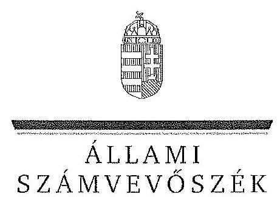
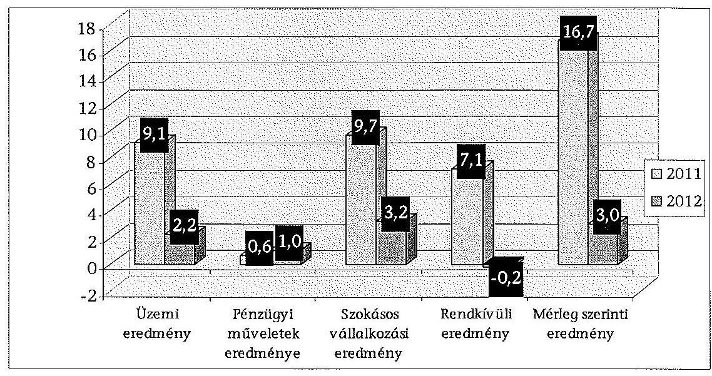
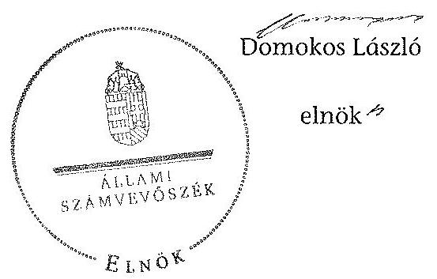
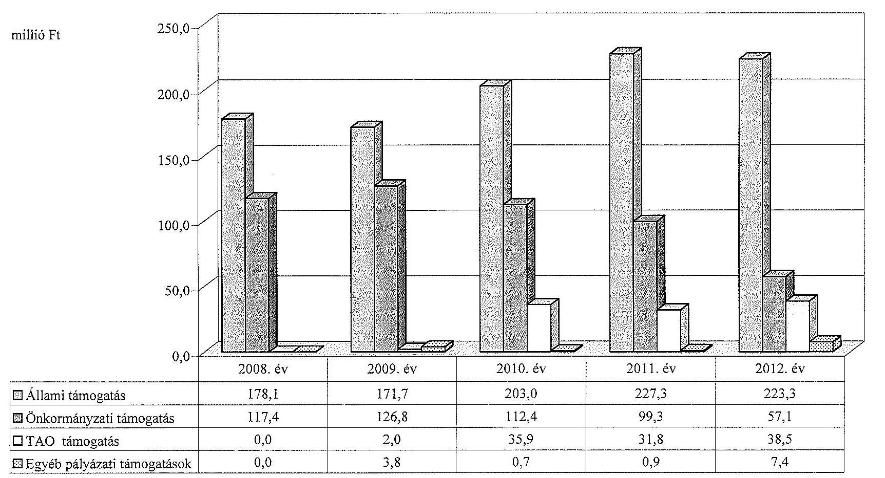
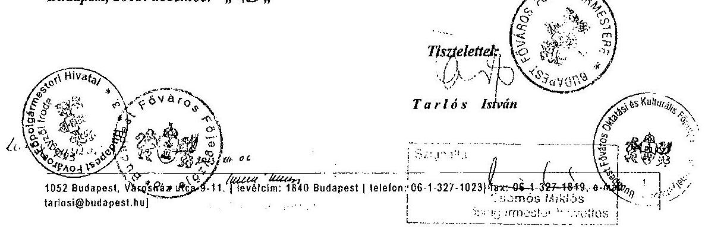
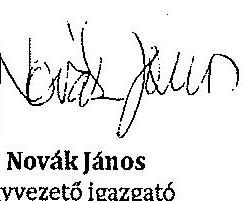
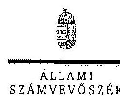
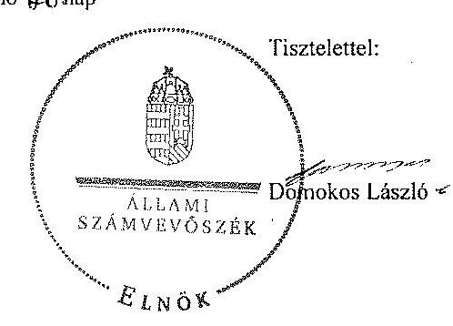

ÁLLAMI
SZÁMVEVŐSZÉK

# JELENTÉS 

az önkormányzatok többségi tulajdonában lévő gazdasági társaságok közfeladat-ellátásának ellenőrzéséről
Kolibri Kiemelkedően Közhasznú Nonprofit Kft. és jogelődje

---

# Állami Számvevőszék 

Iktatószám: V-0185-090/2014.
Témaszám: 1159
Vizsgálat-azonosító szám: V06530204

## Az ellenőrzést felügyelte:

## Makkai Mária

felügyeleti vezető
Az ellenőrzést vezette és az ellenőrzés végrehajtásáért felelős:
Horváth József
ellenőrzésvezető
A számvevőszéki jelentés összeállításában közreműködött:
Dr. Dorogi Zsolt Pál
számvevő
Az ellenőrzést végezték:
Dr. Dorogi Zsolt Pál Vida Katalin Hollósi Györgyi
számvevő külső szakértő
A témához kapcsolódó eddig készített számvevőszéki jelentések:
címe
sorszáma
Jelentés a színházak állami támogatásának és gazdálkodásának 1039 ellenőrzéséről

---

# TARTALOMJEGYZÉK 

BEVEZETÉS ..... 3
I. ÖSSZEGZŐ MEGÁLLAPÍTÁSOK, KÖVETKEZTETÉSEK, JAVASLATOK ..... 7
II. RÉSZLETES MEGÁLLAPÍTÁSOK ..... 13

1. Az Önkormányzat közfeladat-ellátásának megszervezése ..... 13
1.1. A közfeladat meghatározása, a feladat ellátásának választott módja ..... 13
1.2. Az önkormányzati és a tulajdonosi irányítás ..... 18
2. A Színház közfeladat-ellátással kapcsolatos tevékenysége ..... 21
2.1. A Színház szervezeti kialakítása, szabályozottsága ..... 21
2.2. A Színház vagyonnyilvántartása ..... 24
2.3. A gazdasági évek ráfordításainak és bevételeinek alakulása ..... 25
2.4. A gazdasági társaság eredményének alakulása ..... 28
2.5. A Színház folyamatos üzemmenetének, likviditásának biztosítása ..... 29
3. Az önkormányzat tulajdonosi jogainak és kötelezettségeinek érvényesítése ..... 30
3.1. A gazdasági társaságtól származó információk hasznosítása ..... 30
3.2. Az Önkormányzat közgyűlésének intézkedései ..... 32
MELLÉKLETEK
4. számú Budapest Főváros Önkormányzatának közgyűlési határozatai az Intézmény átalakítására vonatkozóan
5. számú A Színház szakmai tevékenységének mutatói 2008 és 2012 között
6. számú A Színház támogatása 2008 és 2012 között
7. számú A Színház vagyonának főbb adatai 2008. január 1-je és 2012. december 31-e között
8. számú Budapest Főváros Főpolgármesterének észrevétele
9. számú A Kolibri Kiemelkedően Közhasznú Nonprofit Kft. ügyvezetőjének észrevétele
10. számú A Kolibri Kiemelkedően Közhasznú Nonprofit Kft. ügyvezetőjének észrevételére adott válasz

## FÜGGELÉKEK

1. számú Rövidítések jegyzéke
2. számú Értelmező szótár

---

$\cdot$
$\cdot$
$\cdot$
$\cdot$
$\cdot$
$\cdot$
$\cdot$
$\cdot$
$\cdot$
$\cdot$
$\cdot$
$\cdot$
$\cdot$
$\cdot$
$\cdot$
$\cdot$
$\cdot$
$\cdot$
$\cdot$
$\cdot$
$\cdot$
$\cdot$
$\cdot$
$\cdot$
$\cdot$
$\cdot$
$\cdot$
$\cdot$
$\cdot$
$\cdot$
$\cdot$
$\cdot$
$\cdot$
$\cdot$
$\cdot$
$\cdot$
$\cdot$
$\cdot$
$\cdot$
$\cdot$
$\cdot$
$\cdot$
$\cdot$
$\cdot$
$\cdot$
$\cdot$
$\cdot$
$\cdot$
$\cdot$
$\cdot$
$\cdot$
$\cdot$
$\cdot$
$\cdot$
$\cdot$
$\cdot$
$\cdot$
$\cdot$
$\cdot$
$\cdot$
$\cdot$
$\cdot$
$\cdot$
$\cdot$
$\cdot$
$\cdot$
$\cdot$
$\cdot$
$\cdot$

---

# JELENTÉS 

## az önkormányzatok többségi tulajdonában lévő gazdasági társaságok közfeladat-ellátásának ellenőrzéséről Kolibri Kiemelkedően Közhasznú Nonprofit Kft. és jogelődje

## BEVEZETÉS

Az Önkormányzatnak közfeladata az Ötv. alapján a művészeti feladatok ellátásáról való gondoskodás, az Mötv. szerint az előadó-művészeti szervezet támogatása. Ezt az Önkormányzat előadó-művészeti költségvetési szerv fenntartásával, illetve egyszemélyes tulajdonában álló gazdasági társaság támogatásával valósította meg.

Az Önkormányzat az ellenőrzött időszakban színházi koncepcióval ${ }^{1}$ rendelkezett, amely a színházak működtetésének alternatíváit vázolta fel és jövőbeli célokat határozott meg. Ezt a Közgyűlés határozattal² elfogadta.

A Főpolgármester a 2011. évben tette közzé a Zöld Könyvet³, melyben megállapította, hogy a kulturális terület legnagyobb problémája a rendszer széttagoltsága volt, mert az Önkormányzat a működési tevékenységgel kapcsolatos feladatait a színházak által részben költségvetési intézményi, részben gazdasági társasági formában látta el, ez a fajlagos működési költségek, a vezetők javadalmazása és a számviteli politika eltéréseit okozta a különböző formában működő szervezeteknél. Ezért készítette elő a Közgyűlés a 2011. március 23-án hozott határozataival az egyes költségvetési szervként működő színházak átalakítását.

A Színházak támogatása az ellenőrzött időszakban központi költségvetési, illetve fenntartói támogatás formájában, valamint pályázatok útján valósult meg. A 2010. és 2012. évek közötti költségvetési törvények egy összegben tartalmazták az Önkormányzat fenntartásában működő színházak fenntartói ösztönző részhozzájárulásának összegét, amelyet a fenntartó saját döntése alapján oszthatott el.

[^0]
[^0]:    ${ }^{1}$ Koncepció a fővárosi fenntartású színházak struktúráját és finanszírozását érintő változásokról (2007. XI. 29.)
    ${ }^{2}$ a Főv. Kgy. 1979/2007 (11. 29.) sz. határozata
    ${ }^{3}$ Zöld Könyv - Az új városvezetés a rend és a fejlődés szolgálatában - az első 10 hónap eredményei - 2011. augusztus, Kiadja: Budapest Főváros Önkormányzata, Felelős kiadó: Tarlós István 18. o.

---

A Kolibri Gyermek és Ifjúsági Színházat az Állami Bábszínházból történő kiválással 1992-ben alapította Budapest Főváros Közgyűlése. Az ellenőrzött időszakban 2011. július 31-ig költségvetési intézményként, ezt követően - a Közgyűlés határozata alapján - 2011. augusztus 1-jétől nonprofit korlátolt felelősségű társaságként működött.

Az Önkormányzat a gazdasági társasággal a közfeladat ellátásának biztosítására 2011. augusztus 4-én Közszolgáltatási szerződést ${ }^{4}$, majd 2013. január 1-jei hatálybalépéssel Fenntartói megállapodást kötött. A Közszolgáltatási szerződés meghatározta a közhasznú tevékenység körét, az Önkormányzat által biztosított támogatás összegét, a feladat-ellátáshoz szükséges befektetett eszközöket, valamint azok rendelkezésre bocsátásának módját.

Az Emtv. új elemként vezette be 2009 novemberétől a társasági adókedvezménnyel igénybe vehető támogatást, mint közvetett támogatási formát. Ennek felső határát a jogalkotó a tárgyévi jegybevétel 80%-ában határozta meg. A tao támogatás pénzügyi teljesülése a támogatást nyújtó vállalkozások eredményességének és támogatás nyújtási hajlandóságának függvénye.

A Színház a közfeladat ellátása érdekében az ellenőrzött időszakban összesen 1487,1 millió Ft állami és önkormányzati működési, valamint 29,3 millió Ft önkormányzati fejlesztési támogatást kapott. Emellett 2009 és 2012 között 108,2 millió Ft tao támogatást tudott igénybe venni. A 2010. és a 2011. évben bűnmegelőzési pályázaton nyertek az igazságügyi tárcánál és rendszeresen pályáznak a Nemzeti Kulturális Alaphoz.

A Színház a főváros első olyan színháza, amelyben csecsemő, gyermek és ifjúsági kategóriában, félévestől 18 éves korig mindenki számára kínál az érdeklődésének, szellemi és lelki fejlődésének megfelelő, többféle műfajú báb és élő színházi, opera és mozgásszínházi előadásokat. A Kolibri Színházban mutattak be elsőként fél és 3 év közötti korosztálynak szóló rövid, speciális audiovizuális elemeket tartalmazó csecsemődarabot és osztálytermi színházi előadást.

Az ellenőrzött időszakban a Színház évente átlagosan hét bemutatót tartott. A Színház fizető nézőinek száma évente 48-55 ezer fő, az előadások száma pedig évi 480-593 között változott 2008 és 2012 között. A Színház által foglalkoztatott dolgozók átlaglétszáma a 2008. évi 78 főről a 2012. évre 76 főre csökkent.

A Színház főbb szakmai mutatószámait a 2. számú melléklet tartalmazza.
Az ellenőrzés várható eredménye: a jelentés nyilvánossága a társadalom széles körével ismerteti meg a Színház gazdálkodására vonatkozó megállapításainkat, továbbá a megállapítások alapján megfogalmazott számvevőszéki javaslatok hasznosítása elősegíti a feltárt hibák megszüntetését, az ellenőrzött szervezet feladatellátásának szabályszerűségét. A társadalom számára jelzi,

[^0]
[^0]:    ${ }^{4}$ Az Emtv. szerint a közszolgáltatási szerződés a közszolgáltatás nyújtására irányuló, legalább három évre szóló szerződés, amely az állam vagy az önkormányzat és a közszolgáltatást végző előadó-művészeti szervezet kapcsolatát szabályozza, tartalmazza a teljesítendő előadásszámot, a szolgáltatás nyújtásának időtartamát, helyét és a teljesítésért járó díjazást.

---

hogy közpénz nem maradhat ellenőrizetlenül, az ÁSZ értékteremtő rend kialakításához és megőrzéséhez hozzájáruló tevékenysége pozitív hatással lesz a szervezetről kialakított összkép formálásában. A szervezeten belül lehetőség nyílik arra, hogy a megállapítások szintetizálásával az ÁSZ a hozzáadott értéket teremtő, elemző tevékenységét és tanácsadó szerepét is erősítse. A jó gyakorlatok bemutatásával az ÁSZ hozzájárul a követendő megoldások megismertetéséhez és terjesztéséhez.

Az ellenőrzés célja annak értékelése volt, hogy:

- az Önkormányzat a jogszabályi előírások figyelembevételével döntött-e az ellenőrzésre kerülő közfeladat megszervezéséről, az ellátás módjáról; a tulajdonostól elvárható gondossággal felügyelte-e a társaság feladatellátását; a gazdasági társaság rendelkezésére bocsátotta-e a közfeladat-ellátásához a szükséges közvagyont, és biztosította-e a tulajdonosi jogok közvagyon feletti érvényesülését; a társaság vagyonvesztése esetén intézkedett-e a további vagyonvesztés megakadályozásáról;
- a gazdasági társaság teljesítette-e a tulajdonos önkormányzat részéről meghatározott célokat és feladatokat a rendelkezésre álló erőforrások felhasználásával; végrehajtotta-e a közfeladat-ellátási szerződés előírásait; betartotta-e a vagyonnal történő gazdálkodásra vonatkozó jogszabályi rendelkezéseket.

Az ellenőrzés hatóköre: az önkormányzatok közfeladat-ellátásának ellenőrzése, amely kiterjed az önkormányzatok és a közfeladatot ellátó, az önkormányzat többségi tulajdonában lévő gazdasági társaság közötti feladatmegosztásra, az önkormányzatok tulajdonosi jogainak gyakorlására, valamint a nemzeti vagyon kezelésének ellenőrzése keretében a közfeladat-ellátáshoz rendelt vagyonra és a vagyont érintő szerződésekre. A jelen ellenőrzés kiterjed az önkormányzatok többségi tulajdonlásával működő gazdasági társaságok közfeladat-ellátására, vagyongazdálkodási tevékenységére, a kapcsolódó nyilvántartások, elszámolások szabályszerűségére és megbízhatóságára. Az ellenőrzött tételek kiválasztása véletlen mintavétellel történt.

Az ellenőrzés típusa: szabályszerűségi ellenőrzés.
Az ellenőrzött időszak: a 2008-2012. évek, valamint a helyszíni ellenőrzés befejezéséig - 2013. augusztus 16-ig - bekövetkezett változások figyelemmel kísérése.

Ellenőrzött szervezet: a Kolibri Kiemelkedően Közhasznú Nonprofit Kft. és jogelődje, valamint Budapest Főváros Önkormányzata.

Az ellenőrzés végrehajtásának jogszabályi alapját az ÁSZ tv. 5. § (3)-(5) bekezdéseiben foglaltak képezik.

Az ÁSZ a 2011. évi LXVI. törvény 29. §-a szerint a jelentéstervezetet megküldte Budapest Főváros Önkormányzata főpolgármesterének és a Kolibri Kiemelkedően Közhasznú Nonprofit Kft. ügyvezető igazgatójának egyeztetésre. A beérkezett észrevételeket és az azokra adott választ a jelentés 5-7. számú mellékletei tartalmazzák.

---

BEVEZETÉS

---

# I. ÖSSZEGZŐ MEGÁLLAPÍTÁSOK, KÖVETKEZTETÉSEK, JAVASLATOK 

Az Önkormányzat a művészeti feladatok ellátásáról való gondoskodásnak, illetve az előadó-művészeti szervezet támogatásának, mint az Ötv.-ben és az Mötv.-ben meghatározott közfeladatának, az ellenőrzött időszak alatt eleget tett. Az Önkormányzat a közfeladat-ellátását 2011. július 31-éig a Színháznak mint költségvetési intézménynek a fenntartásával, azt követően a gazdasági társaság támogatásával biztosította. A Közgyűlés tulajdonosi jogait az ellenőrzött időszakban a szabályzataiban és rendeleteiben foglaltak szerint gyakorolta.

Az Önkormányzat a közfeladat-ellátása érdekében - az Intézménynél az Alapító Okiratban, majd 2011. augusztus 1-jétől a Színházzal kötött Közszolgáltatási szerződésben foglaltaknak megfelelően - rendelkezésre bocsátotta az előadóművészeti közfeladat-ellátásához szükséges ingatlan és ingó vagyont. A Színház részére a közfeladat-ellátáshoz szükséges forrás biztosításáról - 2008. január 1. és 2011. július 31. között - az éves költségvetések elfogadásával - 2011. augusztus 1. és 2012. december 31. között - a Közszolgáltatási szerződésben (az annak elválaszthatatlan részét képező éves költségvetési rendeletekben) döntött az Önkormányzat.

Az Önkormányzat az Intézmény számára a közfeladat teljesítésével kapcsolatosan konkrét célokat, elvárásokat nem fogalmazott meg. Az Emtv. 2009. évi hatálybalépésével a tevékenység ellátására vonatkozó követelmények és feladatmutatók a törvény által kerültek meghatározásra.

Az Önkormányzat az Intézmény költségvetésének elfogadását, a beszámoltatásokat, valamint az adatszolgáltatási kötelezettség ellenőrzését a jogszabályokban és a belső szabályozásában foglaltaknak megfelelően végezte el. Az Önkormányzat a Színház művészeti tevékenységének ellátását évadbeszámolók alapján értékelte, amelyeket 2008 és 2010 között - az Önkormányzat SZMSZ$_{1}$ rendelkezései szerint - a Kulturális Bizottsága elfogadott.

Az intézményi működés időszakában alkalmazott ösztönző rendszer megfelelt a vonatkozó jogszabályi és belső szabályozási előírásoknak. Az évenkénti jutalmazások időpontja, mértéke azonban nem volt kiszámítható, annak teljesítményösztönző, motiváló hatása nem érvényesült. Az Intézmény vezetője számára kifizetett jutalom összege nem kapcsolódott a beszámoló teljesítéséhez köthető mutatószámokhoz, a jutalomkeret a besorolási bérek arányában került meghatározásra.

Az Önkormányzat belső ellenőrzése az Intézménynél egy szabályszerűségi ellenőrzést végzett. A 2008. évi ellenőrzés a feltárt hiányosságok alapján a gazdálkodási jogkörök betartására, és a Közbesz. tv. által előírt eljárások lefolytatására fogalmazott meg javaslatot. Az ellenőrzés által feltárt hiányosságokat a Színház az intézkedési terv végrehajtásával megszüntette.

---

Az Intézmény megszüntetése és a gazdasági társaság alapítása a Közgyűlés határozatainak megfelelően történt, azonban az Intézmény Megszüntető Okiratának 2011. június 30-án - a Főpolgármester-helyettes által - történő aláírásával, a Hivatal 10 nappal túllépte az Áht. szerinti közzétételi határidőt.

Az Önkormányzat döntése alapján a gazdasági társaság a közfeladat-ellátást 2011. augusztus 1-jén kezdte meg. Az Önkormányzat a közfeladat-ellátásának tárgyi és pénzügyi feltételeit a Közszolgáltatási szerződésben határozta meg. Ez tartalmazta az
 ingatlanok bérbeadásának és az ingó vagyontárgyak ingyenes használatba adásának módját, valamint a költségvetési támogatás mértékét. Meghatározta a közhasznú tevékenység körét, a szerződés megszűnésének esetére szabályozta a vagyontárgyak visszaszolgáltatásának rendjét és határidejét, továbbá a Színház által teljesítendő művészeti tevékenységek jellegét, körét, mértékét és pontos mutatószámait. Az önkormányzati tulajdon védelme érdekében szabályozta a kötelező leltár készítését, annak gyakoriságát, továbbá a gazdálkodás és a művészeti tevékenység ellátásával összefüggő kötelező adatszolgáltatás formáját, idejét és módját, valamint előírta a gazdálkodás körében felmerülő rendkívüli eseményekről történő tájékoztatási kötelezettséget.

A tulajdonos Önkormányzat az Intézmény könyveiben nyilvántartott befektetett eszközöket a közhasznú tevékenység eredményes ellátása érdekében 2011. augusztus 1-jén haszonkölcsön formájában átadta a Színház részére. A vagyon átadás-átvételi jegyzőkönyv szerint a befektetett eszközök értéke 268,2 millió Ft volt.

A Színház támogatása az ellenőrzött időszakban központi költségvetési, illetve fenntartói támogatással, valamint pályázatok útján valósult meg. Az Önkormányzat a saját tulajdonosi támogatás színházak közötti elosztásának elveit, szempontjait szabályzatban, belső utasításban nem határozta meg, annak mértékét, nagyságrendjét a teljes támogatási összegéhez igazította.

A leltározásra vonatkozó előírások a társasággá alakulást követően az Önkormányzat Vagyonrendeleteiben nem a hatályos jogszabályoknak megfelelően szerepeltek, mivel az üzemeltetésre, kezelésre átadott eszközök leltározási szabályairól a Vagyonrendelet 1,2 - az Áhsz. 1 2010. január 1-jétől hatályos előírásaival ellentétben - nem tartalmazott szabályozást.

Az Önkormányzat a vagyon védelme érdekében a Közszolgáltatási szerződésben garanciális követelményként fogalmazta meg a kötelezettségek megszegésének jogkövetkezményét, valamint a szerződés megszűnésének esetére az átadott vagyontárgyak visszaszolgáltatási kötelezettségét. Az ellenőrzött időszakban kötelezettség megszegésére, illetve szerződés megszűnésére nem került sor.

Az Önkormányzat a Színház Alapító Okirat2-ben - a Gt. előírásaival összhangban - szabályozta az Alapító tulajdonosi joggyakorlásának kereteit. Az Alapító Okiratban a Színház legfőbb szerve, a Közgyűlés kizárólagos hatáskörébe tartozó feladatként határozta meg a Színház SZMSZ-ének és az FB ügyrendjének jóváhagyását, amely a hiánypótlások következtében - közel egy év elteltével - 2012. szeptember 13-án történt meg. A Közgyűlés a tulajdonosi érdekeinek védelmére határozatokban kijelölte a Színház FB tagjait és könyvvizsgálóját.

---

Az Önkormányzat a Színház ügyvezetőjének és egyéb vezető állású dolgozóinak, valamint az FB tagoknak a díjazására vonatkozó Javadalmazási szabályzat1-et a Taktv.-ben foglalt határidőn túl 2010. január 31. helyett április 29-én fogadta el.

Az Önkormányzat a Színház üzleti tervének elfogadását, beszámoltatását és az adatszolgáltatási kötelezettség ellenőrzését a jogszabályokban, az Önkormányzat belső szabályzataiban és a Közszolgáltatási szerződésben foglaltaknak megfelelően, határidőn belül - az FB határozat és a könyvvizsgálói jelentés figyelembe vételével - végezte el.

A Színház szakmai tevékenységének ellátását az Önkormányzat évadbeszámolók alapján értékelte. A 2011 és 2012 között benyújtott évadbeszámolókról a kulturális ügyekért felelős Főpolgármester-helyettes tájékoztatót nyújtott be a Közgyűlés részére, melyet a Közgyűlés tudomásul vett.

A 2011. és 2012. évekre vonatkozóan a Színház ügyvezetője részére a prémiumfeladatok meghatározása a Javadalmazási szabályzat1,2-től eltérően - késedelmesen - történt. A prémiumfeltételeket és annak összegét mindkét évben az üzleti terv elfogadását követően határozta meg az Alapító.

Az Önkormányzat belső ellenőrzése a Színháznál egy szabályszerűségi ellenőrzést végzett. A 2012. évi ellenőrzés a Színház gazdálkodási szabályzataival, a közérdekű adatok törvényszerű közzétételével és a szerződések teljesítését biztosító mellékkötelezettségekkel kapcsolatban fogalmazott meg javaslatokat. Az ellenőrzés által megfogalmazott hiányosságokat a Színház az intézkedési terv végrehajtásával megszüntette.

A Színház 2011-2012. évi gazdálkodása, valamint mérleg szerinti nyeresége nem tette szükségessé, hogy a tulajdonos Önkormányzat a vagyon, illetve a közpénzek nem célszerinti hasznosításával, az esetleges pazarló felhasználással kapcsolatban, valamint a lejárt kötelezettségek csökkentése érdekében tulajdonosi intézkedéseket tegyen.

Az Intézmény a vagyonnal történő gazdálkodásra vonatkozó jogszabályi rendelkezéseknek nem teljes körűen tett eleget. A Számviteli politika1 hiányosságai az Intézmény integritásával kapcsolatban kockázatot jelentettek. Az Intézmény 2008. január 1. és 2011. július 31. közötti időszakra vonatkozó Számviteli politika1-e nem felelt meg a Számv. tv.-nek, mert az egyes produkciókban közvetlenül felhasználandó díszleteket, jelmezeket és kellékeket a beszerzési és előállítási értéktől, valamint a használati időtől függetlenül azonnal 100%-ban költségként, a dologi kiadások között számolta el. Ez a vagyonvédelem szempontjából kockázatot jelentett. Nem szabályozta továbbá a produkciók színrevitele költségeinek (szellemi termék) elszámolási rendjét.

Az Intézmény az eszközeiről nem vezetett folyamatos értékbeni és mennyiségi nyilvántartást. A Leltározási szabályzat1-ben a leltározás gyakoriságát két évben határozta meg, amely ellentétes az Áhsz.1 előírásaival.

Az Intézmény működési formája a közfeladat-ellátás követelményeinek megfelel. Az Intézmény Alapító Okirat1-gyel, SZMSZ1,2-vel, valamint az irányítási, döntési és felelősségi jogköröket tartalmazó belső szabályzatokkal rendelkezett.

---

Az Intézmény 2008. január 1. és 2011. július 31. között az előadó-művészeti tevékenység ellátásához szükséges, a fenntartó által rendelkezésére bocsátott vagyont az Áhsz.1-ben foglaltaknak megfelelően saját mérlegében mutatta ki, melyet a belső szabályozásban foglaltaknak megfelelően elkészített leltárral támasztottak alá.

Az Intézmény az adatszolgáltatási kötelezettségeit a jogszabályokban és a belső szabályozásban foglalt módon havi, negyedéves, féléves, éves időszakonként teljesítette.

Az Intézmény összes bevétele a 2010. évben 499,1 millió Ft volt, 24,6%-kal növekedett 2008-hoz (400,6 millió Ft) képest. Az összes kiadása 2008-ról (366,2 millió Ft) 2010-re 24,3%-kal emelkedett. A kiadás a 2010. évben 455,3 millió Ft volt. Az Intézmény összes kiadásainak több mint felét a személyi juttatások és a járulékok összege tette ki.

A Közgyűlés 2011. március 23-án határozatot hozott a költségvetési intézményként működő Színház megszüntetésének előkészítéséről és ezzel összhangban az utódszervezet, gazdasági társaság alapításához szükséges engedélyeket megadta. A Főpolgármester-helyettes a költségvetési intézmény Megszüntető Okiratát 2011. június 30-án írta alá.

A Színház teljesítette az Önkormányzat részéről a Közszolgáltatási szerződésben meghatározott célokat és feladatokat. A gazdálkodásra vonatkozó jogszabályi rendelkezéseket - az önköltségszámítás, valamint a 2011. évi leltározás kivételével - betartották.

A Színház rendelkezett az Alapító Okirat2-vel és az irányítási, döntési és felelősségi jogköröket tartalmazó belső szabályzatokkal. A Színház - tulajdonosi jóváhagyás hiányában - 2012. szeptember 13-ig érvényes SZMSZ nélkül működött.

A Színház a Közszolgáltatási szerződés előírásának megfelelően folyamatosan biztosította a tevékenységi körébe tartozó színházi szolgáltatást.

A Színház a tulajdon védelme érdekében rendelkezett a Leltározási szabályzat2-vel és az Értékelési szabályzat2-vel, a Selejtezési szabályzattal, és az Önköltségszámítási szabályzattal, azonban azok nem feleltek meg teljes körűen a jogszabályi előírásoknak.

Az Értékelési szabályzat2 a Számv. tv.-vel ellentétesen határozta meg a vagyoni értékű jogok érték és felhasználási idő szerinti besorolását, valamint a szellemi termékek értékcsökkenésének elszámolási módját. A Számviteli politika2 és az Értékelési szabályzat2 nem tartalmazta teljes körűen a Színház eszközcsoportjaira alkalmazott amortizációs kulcsokat és élettartamokat.

Az Eszközök és források értékelési szabályzata2 nem volt összhangban a Számv. tv.-ben foglaltakkal, mivel lehetővé tette, hogy a Színház a 10 ezer Ft egyedi beszerzési, előállítási érték alatti vagyoni értékű jogok és szellemi termékek bekerülési értékét használatbavételkor egy összegben számolja el értékcsökkenési leírásként, amennyiben a tervezett/várható élettartam egy évnél rövidebb.

---

A Színház Selejtezési szabályzat1-e nem volt összhangban az Önkormányzat Vagyonrendelet1-gyel. Két selejtezési eljárás során megsértették a Vagyonrendelet1-ben előírt tájékoztatási kötelezettséget.

A leltározás vonatkozásában nem tartották be a Számv. tv.-ben, az Áhsz.1-ben, valamint a Leltározási szabályzat2-ben foglaltakat. A Színház a 2011. és a 2012. évi leltározást az Önkormányzat által ingyenes használatba adott eszközöknél mennyiségi felvétel helyett egyeztetéssel végezte el. A Színház a 2011. és a 2012. évi beszámolóját leltárral nem támasztotta alá, mert a saját eszközök leltározása nem történt meg.

A Színház olyan Számlarendet alakított ki, amelyből az ellátott közfeladat bevételei és ráfordításai elkülönülten ellenőrizhetők. A Színház a Számv. tv. alapján elkészítette az Önköltségszámítási szabályzat2-t, azonban abban nem tért ki a társulat bérének és járulékainak legalább a produkció színreviteléig történő felosztási módjára. Ennek következtében a produkciók színreviteléig aktivált szellemi termékek nem a ténylegesen felmerült közvetlen költségek alapján kerültek elszámolásra. Továbbá nem tartalmazta az általános költségek felosztási módját.

A Színház az Önkormányzat tulajdonában álló eszközöket a Számv. tv.-nek megfelelően (ingatlanok, immateriális javak, tárgyi eszközök, készletek), számlarendjében elkülönítetten, a 0-ás számlaosztályban tartotta nyilván. A Színház művészeti tevékenységét szolgáló - saját és Önkormányzati tulajdonú - eszközök 2012. december 31-ei nettó értéke (293,7 millió Ft) a 2008. december 31-ei adathoz (309,9 millió Ft) viszonyítva 5,2%-kal csökkent.

A Színház 2011 és 2012 között elkészítette üzleti és az arra épülő likviditási tervét. Mérleg szerinti eredménye a 2011. évben 16,7 millió Ft, 2012-ben 2,9 millió Ft volt. A Színház 2011. és 2012. évi beszámolóit a Közgyűlés elfogadta.

A Színház első teljes évében, 2012-ben 412,6 millió Ft bevételt ért el, a ráfordítások összege 410,6 millió Ft volt.

A Színház az átmenetileg szabad pénzeszközeit a számlavezető bankjánál lekötött betétként helyezte el, befektetési tevékenységet nem végzett.

Az Állami Számvevőszékről szóló 2011. évi LXVI. törvény 33. § (1) bekezdésében foglaltak értelmében a jelentésben foglalt megállapításokhoz kapcsolódó intézkedési tervet köteles az ellenőrzött szervezet vezetője összeállítani, és azt a jelentés kézhezvételétől számított 30 napon belül az ÁSZ részére megküldeni. Amennyiben az intézkedési tervet határidőben nem küldi meg a szervezet, vagy az nem elfogadható, az ÁSZ elnöke a hivatkozott törvény 33. § (3) bekezdés a)-b) pontjaiban foglaltakat érvényesítheti.

Az ellenőrzés intézkedést igénylő megállapításai és javaslatai:

# Budapest Főváros Főjegyzőjének 

A leltározásra vonatkozó előírások a társasággá alakulást követően az Önkormányzat Vagyonrendeleteiben nem a hatályos jogszabályoknak megfelelően szerepeltek, mi-

---

vel az üzemeltetésre, kezelésre átadott eszközök leltározási szabályairól a Vagyonrendelet2 - 2010. január 1-jétől az Áhsz.1 előírásaival ellentétben - nem tartalmazott szabályozást.

Javaslat:
Készítse elő a Közgyűlés elé való terjesztés érdekében a Vagyonrendelet2 módosítását, hogy az tartalmazza az Áhsz. 2 22. § (2) bekezdésben előírtaknak megfelelően az üzemeltetésre, kezelésre átadott eszközök leltározási szabályait.

# A Kolibri Gyermek- és Ifjúsági Színház igazgatójának 

1. Az eszközök és források értékelési szabályzata a számviteli törvény előírásaival ellentétesen határozta meg a vagyoni értékű jogok érték és felhasználási idő szerinti besorolását, valamint a szellemi termékek nyilvántartásba vételének elszámolását.

Javaslat:
Intézkedjen a Számv. tv. 24. § (1) bekezdésében foglaltak figyelembevételével a produkciókban egy évnél tovább használt eszközöknek a tárgyi eszközök közötti kimutatásáról, valamint a Számv. tv. 23. §-ában, a 26. § (1) bekezdésében és az 52. §-ában foglaltak szerinti nyilvántartásáról és elszámolásáról.
2. A Színház a Számv. tv. 14. § (5) bekezdés c) pontja és (7) bekezdése alapján elkészítette az Önköltségszámítási szabályzat2-t, azonban abban nem tért ki a társulat bérének és járulékainak legalább a produkció színreviteléig történő felosztási módjára. Ennek következtében a produkciók színreviteléig aktivált szellemi termékek nem a ténylegesen felmerült közvetlen költségek alapján
 kerültek elszámolásra. Továbbá nem tartalmazta az általános költségek felosztási módját.

Javaslat:
Intézkedjen az Önköltségszámítási szabályzat módosításáról annak érdekében, hogy
a) a produkció bemutatásáig elszámolt közvetlen költségek tartalmazzák a társulat bérének és járulékainak a produkcióra felosztott költségeit;
b) a szabályzat tartalmazza az általános költségek felosztási módját.
3. A Színháznál a 2011. évi és a 2012. évi leltározás során nem tartották be a leltározási szabályzatban foglaltakat. Az Önkormányzat által ingyenesen használatba adott eszközöknél mennyiségi felvétel helyett a leltározást egyeztetéssel végezték el. A Színház saját eszközeinek leltározása nem történt meg.

Javaslat:
Intézkedjen a leltározási szabályzatban előírtaknak megfelelő leltározásról a saját eszközei és a használatba adott eszközök esetében.

---

# II. RÉSZLETES MEGÁLLAPÍTÁSOK 

## 1. Az ÖNKORMÁNYZAT KÖZFELADAT-ELLÁTÁSÁNAK MEGSZERVEZÉSE

### 1.1. A közfeladat meghatározása, a feladat ellátásának választott módja

Az Önkormányzat a művészeti feladatok ellátásáról való gondoskodásnak, illetve az előadó-művészeti szervezet támogatásának, mint az Ötv.-ben és az Mötv.-ben meghatározott közfeladatának, az ellenőrzött időszak alatt eleget tett. Az Önkormányzat a közfeladat ellátását 2011. július 31-éig az Intézmény fenntartásával, azt követően a Kolibri Kiemelkedően Közhasznú Nonprofit Kft. támogatásával biztosította.

Az Önkormányzat kötelező közfeladata az Ötv. 63/A § n) pontja szerint a művészeti feladatok ellátása ${ }^{5}$. A Htv. 111. § alapján a közművelődési, közgyűjteményi és művészeti tevékenységekkel kapcsolatos helyi irányítási, ellenőrzési, valamint a fenntartással és működtetéssel kapcsolatos feladatokat a Közgyűlés látja el. A kulturális feladat ellátását az Önkormányzat az Emtv. 3. § (2) bekezdése alapján előadó-művészeti szervezet fenntartásával (költségvetési szervei esetében), vagy annak támogatásával (gazdasági társaságai esetében) valósította meg.

Az Önkormányzat az ellenőrzött időszakban elfogadott koncepcióval ${ }^{6}$ rendelkezett, amelyet a Közgyűlés ${ }^{7}$ határozatával fogadott el.

A koncepció a színházak működtetésének módozatait vázolta fel és jövőbeli célokat határozott meg, azonban nem vizsgálta a megvalósításhoz szükséges források nagyságát.

A 2010. évi önkormányzati választásokat követően az Ötv. 91. § (1) és (6) bekezdésnek megfelelően a Közgyűlés ${ }^{8}$ elfogadta az Önkormányzat 2011-2014. évekre vonatkozó Gazdasági Programját ${ }^{9}$.

Az Önkormányzat a költségvetési szervezeti formában működő Intézmény teljesítményével kapcsolatosan konkrét célokat, elvárásokat nem fogalmazott meg, a szakmai elvárásait az igazgatói pályázat kiírásában szerepeltette. A

[^0]
[^0]:    ${ }^{5}$ A 2013. 01. 01-től hatályos Mötv. 13.§ 1) 7. pont is kötelezően ellátandó feladatként határozza meg az előadó-művészeti szervezetek támogatását.
    ${ }^{6}$ Koncepció a fővárosi fenntartású színházak struktúráját és finanszírozását érintő változásokról
    ${ }^{7}$ a Főv. Kgy. 1979/2007. (11.29.) sz. határozata
    ${ }^{8}$ a Főv. Kgy. 937/2011. (04.27.) sz. határozata
    ${ }^{9}$ A Főváros fejlesztésének és gazdálkodásának stabilizálása és reformkoncepciója a 2011-2014. évi választási ciklusra

---

nyertes pályázat a megválasztott igazgató stratégiai céljait, valamint konkrét szakmai elképzeléseit foglalta össze.

Az Emtv. hatálybalépésével a tevékenység ellátására vonatkozó követelmények és feladatmutatók a törvény által kerültek meghatározásra.

A Közgyűlés 2011. március 23-án határozatokat ${ }^{10}$ hozott a költségvetési szervként működő színházak megszüntetésének és az utódszervezet gazdasági társaságok alapításának előkészítéséről. A Közgyűlés határozata ${ }^{11}$ az Áht. 100/O. § (5) bekezdésének, az előzetes engedélyhez készített előterjesztés tartalma az Áht. 100/L. § (4) bekezdésének megfelelt.

Az Önkormányzat határozata ${ }^{12}$ a költségvetési intézményt az utódszervezet létrehozásával egyidejűleg, 2011. július 31-i hatállyal megszüntette. A Főpolgármester-helyettes a megszüntető okiratot 2011. június 30-án írta alá. Ezzel a Hivatal nem tett eleget az Áht. 96. § (1) bekezdése rendelkezésének, amely előírta, hogy a költségvetési szerv megszüntető okiratát legalább negyven nappal a megszüntetés kérelmezett napja előtt ki kell hirdetni, közzé kell tenni.

A 2011. július 25-én bejegyzett gazdasági társaság a költségvetési szervként működő intézmény jogutódjaként jött létre. Az intézmény valamennyi közfeladat-ellátással összefüggő joga és kötelezettsége, valamint a vagyona feletti rendelkezés, illetőleg az Önkormányzat tulajdonát képező közfeladat-ellátás céljából használatában álló ingatlanokkal és ingóságokkal kapcsolatos jogok és kötelezettségek a gazdasági társaságra szálltak át.

Az Önkormányzat a költségvetési szervek megszüntetésénél betartotta az Ámr. 11. § (1) bekezdés a)-c), f) pontjaiban, és (2) bekezdésében előírtakat, valamint a Kjt. 25/A. § (2)-(3) és (8) bekezdéseinek megfelelően gondoskodott a költségvetési szervnél foglalkoztatott közalkalmazottak további foglalkoztatásáról.

# Az Intézmény a költségvetési gazdálkodás szabályai szerint működött 2011. július 31-ig, Alapító Okirata megfelelt a jogszabályi előírásoknak, továbbá tartalmazta a közfeladat-ellátáshoz szükséges eszközök meghatározását. 

Az Önkormányzat 2008. január 1. és 2011. július 31-e között az alapító okiratokban foglaltaknak megfelelően az Intézmény rendelkezésére bocsátotta (haszonkölcsönbe adta) az előadó-művészeti közfeladat-ellátáshoz szükséges ingatlan és ingó vagyont.

A Közgyűlés határozatának ${ }^{13}$ megfelelően a megszüntetésre kerülő költségvetési szerv az Áhsz. 13/A. §-ában foglaltak szerinti - leltárral és főkönyvi kivonattal

[^0]
[^0]:    ${ }^{10}$ az 1. sz. melléklet 5-8. sorszámú határozatai
    ${ }^{11}$ az 1. sz. melléklet 5. sorszámú határozata
    ${ }^{12}$ az 1. sz. melléklet 9. sorszámú határozata
    ${ }^{13}$ az 1. sz. melléklet 9. sorszámú határozata

---

alátámasztott - záró beszámolóját 2011. július 31-i fordulónappal elkészítették. A záró beszámolót a Közgyűlés jóváhagyta ${ }^{14}$.

A tulajdonos az Intézmény könyveiben nyilvántartott befektetett eszközöket a közhasznú tevékenység eredményes ellátása érdekében átadta a Színház részére. A Vagyon átadás-átvételi jegyzőkönyv szerint a befektetett eszközök értéke 268,2 millió Ft volt. A Nvtv. 3. § alapján az ellenőrzött Színház átlátható szervezet.

A Közgyűlés a határozatával ${ }^{15}$ megalapította a gazdasági társaságot, jóváhagyta a Közszolgáltatási szerződés szövegét. A Főpolgármester a közszolgáltatási szerződést 2011. augusztus 4-én írta alá.

Az Önkormányzat az Alapító Okirat szövegezésénél a Gt. 15. § (1) bekezdésének előírásait vette figyelembe, mely szerint a társasági szerződés ellenjegyzésének napjától a létrehozni kívánt gazdasági társaság előtársaságként működhet ${ }^{16}$. Figyelmen kívül hagyta azonban az Áht. 100/O. §. (2) bekezdését, mely szerint költségvetési intézmény utódszervezete előtársaságként nem működhet, így üzletszerű gazdasági tevékenységet nem végezhet és a bejegyzés idejéig kötelezettséget nem vállalhat. A Színház a gazdasági tevékenységét az Alapító Okiratának megfelelően augusztus 1-jével kezdte meg.

Az Alapító Okirat 4.6. és 4.9. pontja egymásnak ellentmond, mivel a 4.6. pontja szerint a társasági szerződés ellenjegyzésének napjától a létrehozni kívánt gazdasági társaság előtársaságként működhet, a 4.9. pontban pedig az Alapító rögzíti, hogy a Színház a közfeladat-ellátását és működését 2011. augusztus 1. napjával kezdi meg.

Az Önkormányzat a Színház Alapító Okiratban - a Gt. előírásaival összhangban - szabályozta az Alapító tulajdonosi joggyakorlásának kereteit. Az Alapító Okirat megfelelően rendelkezett a Színház gazdálkodása során elért eredmény felhasználásáról, az ügyvezető, az FB tagok és a könyvvizsgáló kijelöléséről, az összeférhetetlenségi szabályokról, valamint az Áht. 100/N. § (8) bekezdése előírásainak betartatásáról.

Az Alapító az egyszemélyes nonprofit korlátolt felelősségű társaság alapításával eleget tett az Áht. 100/L. § (1) bekezdésében előírt rendelkezésnek, a Színház Alapító Okiratjának tartalmának meghatározásakor eleget tett a Ptk. 54. § (1)-(2) bekezdéseiben és a Gt. 12. § (1) bekezdésében előírt, valamint a Közhasznú tv. 4. § (1) bekezdésében foglalt tartalmi követelményeknek.

Az Önkormányzat a hatályos Emtv. 15. § (3) bekezdésének megfelelően a Színház hatósági nyilvántartás szerinti adatainak módosítására irányuló kérelmét benyújtotta.

[^0]
[^0]:    ${ }^{14}$ az 1. sz. melléklet 12. sorszámú határozata
    ${ }^{15}$ az 1. sz. melléklet 10. sorszámú határozata
    ${ }^{16}$ A Gt. 16 § (2) bekezdés alapján az előtársasági létszakasz a cégbejegyzéssel szűnik meg, és az előtársasági létszakaszban kötött jogügyletek a gazdasági társaság jogügyleteinek minősülnek.

---

Az előadó-művészeti szervezetet (a Színházat) a KÖH Film- és Előadó-művészeti Iroda nyilvántartásba vette.

Az Önkormányzat tulajdonában álló vagyon a nemzeti vagyon részét képezi. A Vagyonrendelet 2. 6. § (1) bekezdése szerint a Színház használatában lévő, a feladatellátását szolgáló ingatlanvagyon korlátozottan forgalomképes törzsvagyon.

Az Önkormányzat döntése alapján a gazdasági társaság a közfeladat-ellátást 2011. augusztus 1-jén kezdte meg. Az Önkormányzat a közfeladat-ellátásának tárgyi és pénzügyi feltételeit a Közszolgáltatási szerződésben határozta meg. Ez tartalmazta az ingatlanok bérbeadásának és az ingó vagyontárgyak ingyenes használatba adásának módját, valamint a költségvetési támogatás mértékét. A Közszolgáltatási szerződés meghatározta a közhasznú tevékenység körét, a szerződés megszűnésének esetére szabályozta a vagyontárgyak visszaszolgáltatásának rendjét és határidejét, továbbá a Színház által teljesítendő művészeti tevékenységek jellegét, körét, mértékét és pontos mutatószámait. Az önkormányzati tulajdon védelme érdekében a Közszolgáltatási szerződésben szabályozta a kötelező leltár készítését, annak gyakoriságát, továbbá a gazdálkodás és a művészeti tevékenység ellátásával összefüggő kötelező adatszolgáltatás formáját, idejét és módját, valamint előírta a gazdálkodás körében felmerülő rendkívüli eseményekről történő tájékoztatási kötelezettséget.

Az Önkormányzat a Társaság által használt ingatlanok vonatkozásában a Közgyűlés 2011. augusztus 31-ei határozatának megfelelően a megszabott határidőn belül bérleti szerződést kötött a Társasággal. A bérleti szerződés aláírásával a szerződő felek között kötelmi viszony keletkezett. A bérleti szerződés rendelkezései szerint a megszerzési díj megfizetése bérleti jogviszonyt hozott létre. A Bérleti szerződés úgy rendelkezett, hogy a bérlő a Közszolgáltatási szerződés alapján, haszonkölcsön ${ }^{17}$ címén használta korábban az ingatlant. A Közszolgáltatási szerződés azonban ezzel ellentétben azt tartalmazza, hogy az Önkormányzat bérlet formájában biztosította azt. Továbbá az Önkormányzat figyelmen kívül hagyta, hogy a korábbi határozatának ${ }^{18}$ megfelelő tartalommal bíró, a 2011. július 31-éig költségvetési intézményként működő szerv Megszüntető Okirata alapján a jogelőd ingyenes ingatlanhasználata az utódszervezetre szállt át. Azzal, hogy az Önkormányzat a 2011. november 23-án aláírt bérleti szerződés szerint - az annak aláírását megelőző időszakra - érvényesítette a későbbi szerződésben szereplő díjak bérlő általi megfizetését nem a korábbi határozatának megfelelően járt el.

A Színháznak a bérleti szerződés aláírását megelőző időszakra használati díjat, azt követően bérleti díjat (1796,1 ezer Ft/hó+áfa), valamint a bérleti díj összegét alapul véve egyszeri 3 havi megszerzési díjat és 5 havi bérleti díjnak megfelelő óvadékot kellett fizetnie. A 2011-es évre vonatkozóan óvadékként, megszerzési

[^0]
[^0]:    ${ }^{17}$ A Ptk. 583. § (1) bekezdése szerint haszonkölcsön-szerződés alapján a kölcsönadó köteles a dolgot a szerződésben meghatározott időre ingyenesen a kölcsönvevő használatába adni, a kölcsönvevő pedig köteles azt a szerződés megszűntekor visszaadni.
    ${ }^{18}$ az 1. sz. melléklet 9. sorszámú határozata

---

díjként, használati és bérleti díjként összesen egy évi bérleti díjnak megfelelő összeg került kifizetésre.

A felek 2012-ben a Bérleti szerződés 2. pontját kiegészítették azzal, hogy az Önkormányzat az óvadék összegét „a bérleti szerződés időtartama alatt a kielégítési jog megnyílta előtt használhatja és rendelkezhet vele." Az óvadék összegének fedezete az Önkormányzat részéről tett nyilatkozat ${ }^{19}$ alapján
 folyamatosan rendelkezésre állt.

# A Színház támogatása az ellenőrzött időszakban központi költségvetési, illetve fenntartói támogatással, valamint pályázatok útján valósult meg. Az Önkormányzat a saját tulajdonosi támogatásának színházak közötti elosztási elveit, szempontjait szabályzatban, belső utasításban nem határozta meg, annak mértékét, nagyságrendjét a teljes támogatási összegéhez igazította. 

A 2010. évtől az Emtv. 16. § (1) bekezdése ${ }^{20}$ szerint a színházak támogatása művészeti ösztönző részhozzájárulásból és fenntartói ösztönző részhozzájárulásból tevődött össze. 2010 és 2012 között a költségvetési törvények 7. sz. melléklete egy összegben tartalmazta az Önkormányzat fenntartásában működő színházak fenntartói ösztönző részhozzájárulásának összegét, amelyet a fenntartó saját döntése alapján oszthatott el. A költségvetési törvények a színházak művészeti ösztönző részhozzájárulását külön nevesítve tartalmazták. A 2013. évtől a színházakat művészeti és létesítménygazdálkodási célra működési támogatás illette meg.

Az Emtv. 48. § (1) bekezdése új elemként bevezette - a Taotv. 4. § 37-39. pontjai alapján - a társasági adókedvezménnyel igénybe vehető támogatást, mint közvetett támogatási formát. A tao kedvezmény igénybevétele 2009. november 12-től volt lehetséges, a meghatározott jegybevétel 80%-áig. A tao támogatás pénzügyi teljesülése a támogatást nyújtó vállalkozások eredményességének és támogatás nyújtási hajlandóságának függvénye.

Az ellenőrzött időszakban a Színház számára biztosított állami, önkormányzati és tao támogatás alakulását a 3. számú melléklet tartalmazza.

Az állami támogatás összege az ellenőrzött időszakban minden évben meghaladta az önkormányzati támogatás összegét, és részaránya is magasabb volt. Az önkormányzati támogatás összege a 2008. évtől a 2009. évre 8%-kal (9,4 M Ft-tal) növekedett, a 2010. évben az előző évhez képest 11,4%-kal (14,4 M Ft-tal) csökkent. A 2011. évben az előző évhez viszonyítva 11,6%-kal (13,1 M Ft) csökkent. A 2012. évben csökkent a támogatás az előző évhez képest 42,5%-kal (42,2 M Ft). A 2009. évtől kezdődően a tao támogatás növekedett, kivéve a 2011-es évet.

Az ellenőrzött időszakban az önkormányzati vagyon megőrzése, védelme érdekében a 2011. évig az Intézmény leltározását az Önkormányzat Vagyonrendelet${ }_{1}$-e szabályozta. A Vagyonrendelet${ }_{1,2}$ szerint az Önkormányzat tulajdonában

[^0]
[^0]:    ${ }^{19}$ a Főpolgármesteri Hivatal ellenőrzéshez kirendelt kapcsolattartója 2013. augusztus 14-én adott válasza alapján
    ${ }^{20}$ hatályon kívül helyezve 2012. május 1-jétől

---

lévő eszközöket minden évben leltározni kell, az ettől eltérő eseteket a rendeletek külön szabályozták.

A leltározásra vonatkozó előírások a társasággá alakulást követően az Önkormányzat Vagyonrendeleteiben nem a hatályos jogszabályoknak megfelelően szerepeltek, mivel az üzemeltetésre, kezelésre átadott eszközök leltározási szabályairól a Vagyonrendelet${ }_{1,2}$ - az Áhsz. ${ }_{1}$ 2010. január 1-jétől hatályos előírásaival ellentétben - nem tartalmazott szabályozást.

A Közszolgáltatási szerződés 5. A. pontja az Önkormányzat tulajdonát képező ingó vagyonra vonatkozóan kötelező leltár készítését, a szerződés 6. pont 4. bekezdése az önkormányzati vagyon nyilvántartására vonatkozó előírásoknak megfelelő adatszolgáltatási és nyilvántartási kötelezettség teljesítését írta elő a Színház számára.

A Fenntartói megállapodás 5.1. pontja a közszolgáltatási szerződés rendelkezésével megegyezően a vagyontárgyak évenkénti, december 31-i fordulónappal történő leltárkészítési kötelezettségét írta elő, továbbá köteles volt a Színház azt megküldeni a tárgyévet követő év január 31-ig az Önkormányzatnak.

Az Önkormányzat minden negyedév végén bekérte a Színháztól az ingatlanadatok változására vonatkozó dokumentumokat, a bruttó érték növekedés vagy csökkenés (kataszteri módosító lapok), valamint az értékcsökkenés elszámolásáról szóló, a gazdasági vezető által aláírt "6. sz. melléklet" című táblázatot. A megküldött dokumentumok alapján a kataszteri rendszer, valamint a Pénzügyi Információs Rendszer adatainak frissítése megtörtént.

Az Önkormányzat vagyonkimutatást készített a 2008-2012. években az éves zárszámadáshoz, az Ötv. 78. § (2) bekezdésében és az Mötv. 110. § (2) bekezdésében foglaltaknak megfelelően.

A Vagyonrendelet${ }_{2}$ 14. §-a a leltározás vonatkozásában a korábbi vagyonrendelettel azonos rendelkezéseket tartalmaz. Az Önkormányzat a 7/2011. sz. Leltározási és Leltárkészítési Szabályzatában sem rendelkezett a társaságok leltárainak önkormányzati ellenőrzéséről.

Az Önkormányzat a vagyon védelme érdekében a Közszolgáltatási szerződésben garanciális követelményként fogalmazta meg a kötelezettségek megszegésének jogkövetkezményét, valamint a szerződés megszűnésének esetére az átadott vagyontárgyak visszaszolgáltatási kötelezettségét. Az ellenőrzött időszakban kötelezettség megszegésére, illetve szerződés megszűnésére nem került sor.

# 1.2. Az önkormányzati és a tulajdonosi irányítás 

A Színház mint költségvetési intézmény esetében a fenntartói, irányító szervi jogok gyakorlását a költségvetési szervekre vonatkozó jogszabályok és az Önkormányzat rendeletei határozták meg.

## A Közgyűlés a tulajdonosi jogait az ellenőrzött időszakban szabályzatainak és rendeleteinek megfelelően látta el.

---

Az Önkormányzat az SZMSZ${ }_{1}$ alapján a 2008. és a 2011. évek között a 49. § (1) bekezdése alapján létrehozta állandó bizottságként a Kulturális Bizottságot. Ezen időszakban a Közgyűlés a bizottságra az Önkormányzat SZMSZ${ }_{1}$ 5. számú mellékletében szereplő feladatok ellátását ruházta át.

Az egyszemélyes társaság legfőbb szervének hatáskörébe tartozó (az FB tagjainak, valamint az ügyvezetőnek, továbbá a könyvvizsgálónak a megválasztása, visszahívása, megbízása, megbízásának visszavonása) jogok gyakorlását a 2011. május 25. és 2011. november 10. közötti időszakban az Önkormányzat eltérően szabályozta a 2011. év előtt, illetve a 2011-ben alapított gazdasági társaságok esetében.

A 2011. év előtt alapított társaságok esetében 2011. január 1-jétől a Vagyonrendelet${ }_{1}$ 52. § (2) bekezdése alapján a fenti jogokat a Főpolgármester közvetlenül gyakorolta. A 2011. május 25-én alapított gazdasági társaságok esetében 2011. november 9-ig a fenti tulajdonosi jogok gyakorlására kizárólag a Közgyűlés volt jogosult. Az eltérő szabályozás oka az volt, hogy a Közgyűlés a Vagyonrendelet${ }_{1}$ 5. számú mellékletét nem az alapítással egy időben módosította.

Az Önkormányzat Vagyonrendelet${ }_{2}$-je 56. § (2) bekezdés a) pontjának 2012. március 16-ai hatálybalépésétől 2013. március 18-áig a Vagyonrendelet${ }_{2}$ 5. sz. mellékletében szereplő gazdasági társaság esetében a társaság legfőbb szervének a törvény által hatáskörébe tartozó (az FB tagjainak, a társaság könyvvizsgálójának megválasztása, visszahívása, díjazásának megállapítása, valamint (2) bekezdés b) pontja alapján az ügyvezető megválasztása, kinevezése és díjazásának megállapítása) jogokat a Főpolgármester közvetlenül, egy személyben gyakorolta. 2013. március 19-től a Vagyonrendelet${ }_{2}$ 56. § (2) bekezdés a) pontja szerint a Közgyűlés hatáskörébe tartozik a Főpolgármester előterjesztése alapján az FB tagjainak és a társaság könyvvizsgálójának megválasztása, visszahívása, díjazásának megállapítása valamint a (2) bekezdés b) pontja alapján az ügyvezetőnek a megválasztása, kinevezése és díjazásának megállapítása.

Az Önkormányzat az Alapító Okirat 7.2. pontjában a Gt.-vel összhangban szabályozta a tulajdonosi joggyakorlás kereteit. A köztulajdon védelméről és a Gt. 33. § (1) bekezdés c) pontja előírásának megfelelően az FB létrehozásáról gondoskodott. A köztulajdonban álló gazdasági társaságok takarékosabb működéséről szóló 2009. évi CXXII. törvény 4. § (2) bekezdésének megfelelően a társasági törzstőke összegéhez igazodva minden színház esetében 3 főben határozta meg az FB létszámát.

A Közgyűlés a tulajdonosi érdekeinek védelmére határozatokban kijelölte a Színház FB tagjait és könyvvizsgálóját, és a Gt. 34. § (4) bekezdése alapján jóváhagyta az FB Ügyrendjét.

Az Intézményi időszakban az Áhsz. 10. § alapján az államháztartás szervezetei a költségvetési év első félévéről június 30-ai fordulónappal féléves elemi költségvetési beszámolót, a költségvetési évről december 31-ei fordulónappal éves elemi költségvetési beszámolót készítettek. A Kulturális Ügyosztály ezen beszámolókat ellenőrizte és összesítette. Emellett a Közgyűlés a Kulturális Ügyosztály előterjesztése alapján döntött a költségvetési beszámolók elfogadásáról.

---

Az Önkormányzat a Színház üzleti tervének elfogadását, beszámoltatását és az adatszolgáltatási kötelezettség ellenőrzését a jogszabályokban, az Önkormányzat belső szabályzataiban és a Közszolgáltatási szerződésben foglaltaknak megfelelően, határidőn belül - az FB határozat és a könyvvizsgálói jelentés figyelembe vételével - végezte el.

A társasági időszakban az Önkormányzat beszámoltatása kiterjedt az üzleti terv elemzésére, jóváhagyására, és az éves beszámoló, az üzleti jelentés, valamint a közhasznúsági jelentés elemzésére, valamint a Közgyűlés általi elfogadására.

A Közgyűlés a 987/2012. (05. 30.) és a 875/2013. (05. 29.) számú határozatával elfogadta a Színház 2011. és 2012. évekről készített közhasznúsági jelentését, a könyvvizsgáló jelentését, az FB határozatát a Színház beszámolójáról, a Színház 2011-2012. évi üzleti tervét, valamint a Színház 2011 és 2012. évi üzleti évre vonatkozó beszámolóját (mérlegét, eredménykimutatását, kiegészítő mellékletét).

A Közszolgáltatási szerződés az aláírás idején hatályos Emtv. előírásaival összhangban ${ }^{21}$, megfelelően szabályozta a közfeladat-ellátás tartalmát. A szerződés összegszerűen tartalmazta a 2011. évre vonatkozó támogatási összeget. A szerződés fennállása alatti további évekre a támogatás összegét az Önkormányzat tárgyévi költségvetési rendeleteiben, a Színház részére biztosított támogatási összegről szóló rendelkezésekhez kötötte.

Az Intézményi időszak alatt az alkalmazott ösztönző rendszer gyakorlata megfelelt a vonatkozó jogszabályi előírásoknak, illetve a belső szabályozásoknak. Az évenkénti jutalmazások időpontja és mértéke azonban nem volt kiszámítható, a jutalmazás motiváló, teljesítményösztönző hatása nem érvényesült.

Az Intézmény vezetője számára kifizetett jutalom dokumentáltan nem kapcsolódott az év végi beszámoló tartalmához, a jutalomkeret elsősorban a besorolási bérek arányában került felosztásra.

A Színház ügyvezetőjének és egyéb vezető állású munkavállalójának javadalmazásával kapcsolatban a Közgyűlés megalkotta a 970/2010. (04. 29.) sz. határozatot, a 2490/2010. (12. 15.) sz. határozatot és a 2062/2012. (10. 03.) számú határozatot. A 970/2010. (04. 29.) sz. határozat megalkotásával az Alapító késedelmesen tett eleget a Taktv. 9. § (1) bekezdésében előírt (2010. január 31.) rendelkezésnek.

A Javadalmazási szabályzat${ }_{1-3}$ értelmében a prémiumfeltételeket és prémium összegét a legfőbb szerv, illetve a munkáltatói jogok gyakorlója határozza meg legkésőbb az éves üzleti terv elfogadásával egyidejűleg.

[^0]
[^0]:    ${ }^{21}$ Az Emtv. szerint a közszolgáltatási szerződés a közszolgáltatás nyújtására irányuló, legalább három évre szóló szerződés, amely az állam vagy az önkormányzat és a közszolgáltatást végző előadó-művészeti szervezet kapcsolatát szabályozza, tartalmazza a teljesítendő előadásszámot, a szolgáltatás nyújtásának időtartamát, helyét és a teljesítésért járó díjazást.

---

A 2011. augusztus 1. és 2011. december 31. közötti időszakra, valamint a 2012. évre vonatkozóan a Színház ügyvezetője részére a Javadalmazási szabályzat${ }_{2}$-től eltérően, késedelmesen történt meg a premizálási feltételek meghatározása.

A 2011. évi üzleti tervet a Közgyűlés a 2011. szeptember 21-ei ülésén fogadta el, míg a prémium feltételek meghatározása 2011. november 25-én történt meg. A 2012. évben az üzleti tervet a Közgyűlés a 2012. május 30-ai ülésén fogadta el, a prémium feltételeket a Főpolgármester-helyettes 2012. július 13-án hagyta jóvá.

Ezen késedelem következtében a prémium-célkitűzés nem tudta betölteni teljesítményösztönző szerepét.

A 2011 és 2012 között kitűzött prémiumfeladatokat a Színház teljes egészében teljesítette. A Javadalmazási szabályzat${ }_{2}$ V. pontja (6) bekezdésének megfelelően a feladat teljesítéséről a Színház beszámolót készített és az FB határozatot hozott. A prémium-célkitűzések teljesítése, és az azzal összefüggő kifizetések engedélyezése a Javadalmazási szabályzat${ }_{2}$-nek megfelelően történt.

Az Intézménynél az ellenőrzött időszakban (2010. év) lejárt az igazgató megbízatása. Az igazgatói munkakörre vonatkozó pályázat kiírása az Emtv. 39. § (5) bekezdésének megfelelően történt. A pályázat elbírálása a jogszabályban előírt határidőn belül történt, a
 Közgyűlés - az Emtv. 41. § (1) bekezdésének megfelelően - határozatot hozott a Színházigazgató kinevezéséről.

# 2. A Színház közfeladat-ellátásai. Kapcsolatos tevékenysége 

A Színház az Alapító Okirat ${ }_{1,2,3}$-ban és a Közszolgáltatási szerződésében megfogalmazott követelményeknek megfelelően közfeladatait végrehajtotta, a rendelkezésre álló erőforrásokat szabályszerűen használta fel.

### 2.1. A Színház szervezeti kialakítása, szabályozottsága

A Színházat az Alapító Okirat ${ }_{1}$ szerint 1992-ben Budapest Főváros Közgyűlése alapította, és 2011. július 31-ig költségvetési intézményként működött.

## Az Intézmény szervezeti formája a közfeladat-ellátás követelményeinek megfelelt.

Az Alapító Okirat ${ }_{1,2}$-vel, az SZMSZ ${ }_{1}$-gyel ${ }^{22}$, valamint az irányítási, döntési és felelősségi jogköröket tartalmazó belső szabályzatokkal (Számviteli politika, Pénzkezelési szabályzat, Leltározási szabályzat, Értékelési szabályzat, Kötelezettségvállalási szabályzat) rendelkeztek. A döntési szinteket a szabályzatok és a munkaköri leírások tartalmazták.

[^0]
[^0]:    ${ }^{22}$ Az ellenőrzés részére a Közgyűlés Kulturális Bizottsága által a 305/2009. (10. 22.) sz. bizottsági határozat alapján jóváhagyott SZMSZ került átadásra.

---

Az Intézmény nem rendelkezett az Ámr. 20. § (3) bekezdésében előírt szabályzatok közül a Kiküldetések, a Beszerzések lebonyolítása, az Anyag- és készletgazdálkodás és a Gépjármű igénybevételi szabályzatokkal.

Az Intézmény nem az Áhsz. ${ }_{1}$ 37. § (7) bekezdésében foglalt előírások figyelembevételével határozta meg a Leltározási szabályzat ${ }_{1}$-ben a leltározás gyakoriságát. Nem rendelkezett az eszközeiről és az azok állományában bekövetkezett változásokról részletező nyilvántartással mennyiségben és értékben, ennek ellenére a mérlegtételek év végi leltárral történő alátámasztását kétévenkénti leltározással teljesítette, amellyel megsértette az Áhsz. ${ }_{1}$ 37. § (1) bekezdésében előírt évenkénti leltározási kötelezettséget.

Az Áhsz. ${ }_{1}$ 37.§ (5) bekezdésének megfelelően a költségvetési szerv a felesleges vagyontárgyak hasznosításának és selejtezésének eljárásrendjét, folyamatát a Selejtezési szabályzat ${ }_{1}$-ben rögzítette, ugyanakkor nem vette figyelembe az Önkormányzat Vagyonrendelet ${ }_{1}$-et.

Az Intézmény Számviteli politika ${ }_{1}$-e nem szabályozta a szellemi termékek körét és a készletek elszámolását, ami nem felelt meg a Számv. tv. 24. § (1) bekezdésének. A szabályozás előírta, hogy az egyes produkciókban közvetlenül felhasználandó díszleteket, jelmezeket, kellékeket és fodrászkellékeket, a Színház beszerzési és előállítási értéktől, valamint a használati időtől függetlenül, azonnal 100%-ban költségként, a dologi kiadások között számolta el.

A Közgyűlés 2011. július 31-i hatállyal az Intézmény megszüntetéséről, ezzel egyidejúleg 2011. augusztus 1-jei hatállyal gazdasági társaságként történő megalakításáról döntött.

# A Színház szervezeti formája a közfeladat-ellátás követelményeinek megfelelt. 

A Színház rendelkezett az Alapító Okirat ${ }_{2}$-mal, és az irányítási, döntési és felelősségi jogköröket tartalmazó belső szabályzatokkal. A Színház SZMSZ ${ }_{2}$-jét azonban a Közgyűlés az 1766/2012. (09. 13.) számú határozatával - közel egy év elteltével - 2012. szeptember 13-án hagyta jóvá.

Az ellenőrzött időszakban az Alapító Okirat ${ }_{2}$-t a Közgyűlés a Fővárosi Bíróság mint Cégbíróság végzésében foglaltaknak eleget téve, 2011. július 14-én kelt határozatával módosította, és egységes szerkezetben elfogadta.

A Színház a Számv. tv. 14. § (5) bekezdése a) és b) pontjaiban előírtaknak megfelelően, a tulajdon védelme érdekében rendelkezett a Leltározási Szabályzat ${ }_{2}$-vel, a Selejtezési-, Önköltség-számítási Szabályzattal, továbbá az Értékelési szabályzat ${ }_{2}$-vel.

A Színház szabályzatai nem feleltek meg teljes körűen a vonatkozó törvényi, jogszabályi előírásoknak, az egyes szabályzatok belső összhangja sem volt teljes mértékben biztosított.

A Számviteli politika ${ }_{2}$ és az Értékelési szabályzat ${ }_{2}$ nem tartalmazza teljes körűen a Színház eszközcsoportjaira vonatkozóan (gépek, berendezések, járművek) az alkalmazott amortizációs kulcsokat és élettartamokat.

---

A Színház a produkciók színreviteléig felmerült költségeket nem aktiválta, így szellemi termékként azokat nem mutatta ki. Ugyancsak azonnali költségként számolták el a működéshez beszerzett eszközöket értéknagyságuktól és használati idejüktől függetlenül.

Nem felelt meg a Számv. tv. 24-26. §-aiban foglalt előírásoknak, ahogy a Színház a színreviteli költségeket (szellemi termék, tárgyi eszköz) a Számviteli politika ${ }_{2}$-ben szabályozta, tekintettel arra, hogy a Számviteli politika ${ }_{2}$ 6.3. pontja szerint „a bemutató színrevitelének mindennemű ráfordítását a bemutató évében költségként számolja, függetlenül annak értéknagyságrendjétől.".

A Színház Leltározási szabályzat ${ }_{2}$ nem megfelelően szabályozta a leltározási folyamat elvégzését.

A Leltározási szabályzat ${ }_{2}$ általános elveket fogalmazott meg, nem vette figyelembe a Színház sajátosságait (1.3. pont."a társaság belső szabályzatában kell meghatározni azon eszközök körét és időpontját, amelyeket folyamatosan kívánnak leltározni").

A leltározás vonatkozásában nem tartották be a Számv. tv. 46. § (3) és a 69. § (2) bekezdését, valamint a Leltározási szabályzat ${ }_{2}$-ben foglaltakat. A Színház 2011. július 31-i fordulónappal az Önkormányzat által ingyenes használatba adott eszközökről teljes körű leltározást végzett, azt követően leltározás nem történt. A 2011. és a 2012. év december 31-ei fordulónapjára a használatra átvett eszközökről az analitikus nyilvántartás alapján készítették el a leltárt. A saját eszközök leltározása egyik évben sem történt meg.

# A selejtezett eszközök elszámolása során megsértették a Számv. tv. 

53. § (1) bekezdés b) pontját, mert a maradványértéket nem terven felüli értékcsökkenésként számolták el.

A megsemmisítés módja nem volt teljes körűen dokumentumokkal alátámasztott. A műszaki vezető és a gépkocsivezető nyilatkozata szerint a kiselejtezett eszközöket átvevőhelyre szállították el, erről nyilatkozatot adtak. Az Önkormányzat a selejtezés ellen utólag nem emelt kifogást.

Az ellenőrzött időszakban két alkalommal selejteztek (0,8 millió Ft értékben), a selejtezés sértette a 75/2007. (XII. 28.) Főv. Kgy rendelet 15. §-át és a 18. § A) pontját, mivel hasznosítható és elidegeníthető eszközt selejteztek, értékesítettek, és a selejtezésről az eljárás előtt a tulajdonost nem tájékoztatták.

A Színház Számlarend ${ }_{2}$-jében az ellátott közfeladat bevételei és ráfordításai elkülöníthetők.

A Színház a Számv. tv. 14. § (5) bekezdés c) pontja és (7) bekezdése alapján elkészítette az Önköltségszámítási szabályzat ${ }_{2}$-t, azonban abban nem tért ki a társulat bérének és járulékainak legalább a produkció színreviteléig történő felosztási módjára. Ennek következtében a produkciók színreviteléig aktivált szellemi termékek nem a ténylegesen felmerült közvetlen költségek alapján kerültek elszámolásra. Továbbá nem tartalmazta az általános költségek felosztási módját.

Az ellenőrzött időszakban az Önkormányzat a közfeladat ellátásra vonatkozó szakmai elvárásait a Színház igazgatójának pályázati kiírásában határozta

---

meg. A Színházigazgató nyertes pályázati anyaga az Önkormányzat Színházra vonatkozó szakmai programjának megfelelt.

A Színház által évente készített üzleti tervet, valamint a könyvvizsgáló által auditált éves beszámolót és közhasznúsági jelentést (közhasznúsági melléklet) a Közgyűlés elfogadta.

Az Intézmény a 2008 és 2010 közötti időszakban az éves költségvetésében a fenntartó által előírt követelmények alapján elkészítette fejlesztési tervét. A 2011. és 2012. években a Színház az FB véleményével ellátott üzleti tervében mutatta be a Színház felújítási, beruházási igényeinek indokoltságát. A tervezett felújítások fejlesztési forráshiány miatt csak részben valósultak meg.

Az ellenőrzött időszakban a Színház fejlesztési támogatás címén 29,3 millió Ft támogatást kapott, melyet a céloknak megfelelően használt fel. A fejlesztések megtérülésére vonatkozóan tanulmányokat, elemzéseket nem végeztek. A fejlesztésekhez idegen forrást nem vettek igénybe. Ennek következtében nem került sor tulajdonosi garancia- és kezességvállalásra.

A Színház 2008 és 2012 között a fenntartó, illetve a tulajdonos tájékoztatásának rendjét szabályzatban nem írta elő. Az Önkormányzat külön nem számoltatta be a Színházat, kizárólag a bevételek és ráfordítások, valamint a lejárt tartozások évközi és év végi alakulásáról kért adatszolgáltatást, amelyet a Színház a 2011. és 2012. évi közhasznúsági jelentéseiben, és azok szöveges indoklásában teljesített.

# 2.2. A Színház vagyonnyilvántartása 

Az Intézmény 2008. január 1-je és 2011. július 31-e között az előadó-művészeti közfeladat-ellátásához szükséges, a fenntartó által rendelkezésére bocsátott vagyont saját mérlegében mutatta ki. Az Alapító Okirat ${ }_{1,2,3}$-ban felsorolták azokat az eszközöket, amelyeket az Önkormányzat az Intézmény használatába adott.

Az Önkormányzat döntése értelmében a megszűnt költségvetési szerv eszközei 2011. július 31-ei zárómérlegben szereplő értékkel a fenntartó tulajdonába kerültek. Az átadott eszközök nettó értéke 268,2 millió Ft volt.

A Színház 2011. augusztus 1-jei megalakulásával a tulajdonos Önkormányzat a közfeladat ellátásának biztosítása érdekében az Intézménytől átvett eszközöket a Színház rendelkezésére bocsátotta. A Színház az átvett eszközöket (ingatlanok, immateriális javak, tárgyi eszközök, készletek) számlarendjében elkülönítetten, a 0-ás számlaosztályban tartotta nyilván. Ezzel a Színház eleget tett a Számv. tv. 160. § (5) bekezdésében foglaltaknak.

A Színház mérlegében az eszközök értéke a 2011. év végére 65,2 millió Ft-ra csökkent, az Intézmény 2011. augusztus 1-jei működési formájának változása miatt. A továbbiakban az Önkormányzat könyveiben került kimutatásra a Színház részére ingyenes használatba adott eszközök értéke.

---

A Színház használatában lévő (önkormányzati tulajdonú) ingatlanok értékeit és főbb mutatóit a következő táblázat szemlélteti:

| Megnevezés | $\mathbf{2008}$ | $\mathbf{2009}$ | $\mathbf{2010}$ | $\mathbf{2011}$ | $\mathbf{2012}$ |
| :-- | :--: | :--: | :--: | :--: | :--: |
| Bruttó érték (millió Ft) | 287,1 | 287,7 | 288,8 | 288,8 | 272,4 |
| Nettó érték (millió Ft) | 244,6 | 239,7 | 235,3 | 229,8 | 208,4 |
| Használhatósági fok (\%) | $85,2 \%$ | $83,3 \%$ | $81,5 \%$ | $79,6 \%$ | $76,5 \%$ |
| Elhasználódási szint (\%) | $14,8 \%$ | $16,7 \%$ | $18,5 \%$ | $20,4 \%$ | $23,5 \%$ |

A Színház használatában lévő (saját és önkormányzati tulajdonú) tárgyi eszközök értékeit és főbb mutatóit az ingatlanok adatai nélkül a következő táblázat szemlélteti:

| Megnevezés | $\mathbf{2008}$ | $\mathbf{2009}$ | $\mathbf{2010}$ | $\mathbf{2011}$ | $\mathbf{2012}$ |
| :-- | :--: | :--: | :--: | :--: | :--: |
| Bruttó érték (millió Ft) | 52,1 | 58,0 | 65,1 | 65,0 | 67,9 |
| Nettó érték (millió Ft) | 15,5 | 17,2 | 27,3 | 31,5 | 27,0 |
| Használhatósági fok (\%) | $29,8 \%$ | $29,6 \%$ | $41,9 \%$ | $48,4 \%$ | $39,9 \%$ |
| Elhasználódási szint (\%) | $70,2 \%$ | $70,4 \%$ | $58,1 \%$ | $51,6 \%$ | $60,1 \%$ |

A Színház vagyoni helyzetét jellemző főbb, könyvviteli mérleg szerinti adatokat a 4. számú melléklet tartalmazza.

A melléklet alapján megállapítható, hogy a Színház közfeladatai ellátásához biztosított - saját és Önkormányzati tulajdonú - eszközök 2012. december 31-ei nettó értéke (293,7 millió Ft) a 2008. december 31-ei adathoz (316,2 millió Ft) viszonyítva 5,2%-kal csökkent, amely az önkormányzati bérbeadásból kivont 16,4 millió Ft értékű szentendrei üdülővel állt összefüggésben.

# 2.3. A gazdasági évek ráfordításainak és bevételeinek alakulása 

Az Intézmény 2008. évi költségvetésében a kiadások eredeti előirányzata 324,3 millió Ft, a teljesítés 366,2 millió Ft volt. A 2009. évi költségvetésében a kiadások eredeti előirányzata 302,4 millió Ft, a teljesítés 380,1 millió Ft volt. A 2010. évi költségvetésében
 a kiadások eredeti előirányzata 319,5 millió Ft, a teljesítés 455,3 millió Ft volt. A 2011. évi költségvetésében a kiadások eredeti előirányzata 361,6 millió Ft, a teljesítés a finanszírozási kiadásokkal együtt 288,4 millió Ft volt. Az Intézmény 2011. július 31-én megszűnt. (Ezért a 2011. évi adatait összehasonlításként nem vettük figyelembe.)

Az Intézmény összes kiadása 2008-ról 2010-re 24,3%-kal növekedett.
A Színház a 2011. augusztus 1-je és december 31-e közötti időszakra 155,8 millió Ft ráfordítást tervezett, a teljesítés 172,4 millió Ft volt. A Színház első teljes évében (2012) ráfordításként 366,9 millió Ft-ot tervezett, a teljesítés 410,7 millió Ft volt.

---

2012-ben a tervezett összes költséghez viszonyított többletköltséget az anyagjellegű ráfordítások 47,9 millió Ft-os többlete, a személyi jellegű ráfordítások 4,1 millió Ft-os csökkenése, az értékcsökkenési leírás 0,2 millió Ft-os növekedése és az egyéb ráfordítások 0,5 millió Ft-os csökkenése eredményezte.

A Színház tényleges ráfordításai az ellenőrzött időszak minden évében - a 2011. évi intézményi időszak kivételével - jelentősen meghaladták a tervezett értéket.

Az ellenőrzött időszakban (2008 és 2012 között) a Színház anyag- és készletbeszerzéseinek, személyi juttatásainak, és anyagjellegű ráfordításainak alakulását érdemben nem befolyásolta a szervezeti forma megváltozása.

A Színház anyag- és készletbeszerzései (díszletkészítés) az előadásokhoz kötődtek. A beszerzések nagyságát a szakmai normák figyelembevételével határozták meg. A beszerzések és a teljesített szolgáltatások összhangban voltak a közfeladat-ellátás mértékével.

A Színház a tárgyi eszközeit a rendeltetésnek megfelelően a produkciókhoz kapcsolódóan szerezte be.

A Színház az ellenőrzött időszakban 2006. január 1-én közbeszerzési eljárás lefolytatása nélkül kötött megbízási szerződést őrzés-védelmi feladatok ellátására. A szerződés határozatlan időre szólt. A megbízási díj összegét évente felülvizsgálták. A szerződést több alkalommal módosították. A Színház azzal, hogy határozatlan időre szóló megbízási szerződést kötött, és a megbízási díj becsült értéke 48 hónapra vonatkozóan meghaladta a közbeszerzési értékhatárt, megsértette a Közbesz. tv., egyszerű közbeszerzési eljárás lefolytatásának kötelezettségére vonatkozó szabályait.

A szerződés 5.3. pontja olyan rendelkezést tartalmazott, amely két éves felmondási időt írt elő. A Színház 2013. augusztus 13-án kelt levelében a helyszíni ellenőrzés idején jelezte szándékát, hogy az előnytelen szerződéses rendelkezés módosítását kezdeményezni fogja.

Az ellenőrzés megállapította, hogy a beruházások és felújítások lefolytatása, elszámolása és aktiválása megfelelt a vonatkozó jogszabályi előírásoknak.

# A Színház összes kiadásainak több mint felét a személyi juttatások 

és a járulékok összege tette ki. Az összes kiadásokon belül a személyi juttatások aránya csökkenő tendenciát mutatott, viszont az egy személyhez kapcsolódó juttatások emelkedtek. A Színház által foglalkoztatott dolgozók átlaglétszáma a 2008. évi 78 főről 2012. évre 76 főre csökkent.

A Színháznál az anyagi ösztönzést szolgáló kifizetések az igazgató hatáskörébe tartoztak. 2013. január 1-jétől léptették hatályba a Színház Javadalmazási szabályzatát, amely tartalmazta az alkalmazottak teljesítmény szerinti ösztönzésének mértékét. Az igazgató évadonként értékelte a színészek munkáját.

Az Intézmény belső ellenőrzése megállapította, hogy a 2008. évben 2 dolgozó előirányzat számításánál és átsorolásánál alkalmazott besorolása nem megfelelő fizetési osztály/fizetési fokozatba történt, amelyet korrigáltak.

---

Az ellenőrzés megállapította, hogy a megbízási szerződéseket a produkciókhoz kapcsolódóan - 90%-ban a művészeti iskola stúdiós hallgatóival statiszta szerepre - kötötték. A megbízási szerződések tartalma, teljesítésigazolása és kifizetése szabályszerű volt.

A Színház az értékcsökkenési leírást a Számviteli politikájában meghatározott kulcsokkal számolta el. Ennek évenkénti alakulását az éves beszámolók kiegészítő mellékletében részletesen bemutatta. Az ellenőrzött időszakban terven felüli értékcsökkenést nem számoltak el.

A Színháznak az ellenőrzött időszakban nem voltak finanszírozási nehézségei.
Az egyéb ráfordítások, a pénzügyi műveletek ráfordításai és a rendkívüli ráfordítások elszámolása során betartották a Számv. tv.-ben és a hatályos Számviteli politikában előírtakat.

A Színház egyéb ráfordítást 2011-ben nem tervezett, míg a 2012. évben 0,5 millió Ft-ot állított be terveibe. Az egyéb ráfordítás teljesítése a 2011. évben 3,7 millió Ft, 2012-ben 42 ezer Ft volt. A pénzügyi műveletekkel kapcsolatban ráfordítások egyik évben sem merültek fel.

Rendkívüli ráfordítás 2011-ben 0,2 millió Ft összegben merült fel, a Szentendrei Üdülővel kapcsolatos közműfejlesztés végleges pénzátadásának elszámolásaként.

Az Intézmény 2008. évi költségvetésében a bevételek eredeti előirányzata 324,3 millió Ft, a teljesítés 400,6 millió Ft volt. Az 2009. évi költségvetésben a bevételek eredeti előirányzata 302,4 millió Ft, a teljesítés 438,4 millió Ft volt. A 2010. évi költségvetésben a bevételek eredeti előirányzata 319,5 millió Ft, a teljesítés 499,1 millió Ft volt. A 2011. évi költségvetésben a bevételek eredeti előirányzata 361,6 millió Ft, a teljesítés a finanszírozási kiadásokkal együtt 304,4 millió Ft volt. Az Intézmény 2011. július 31-én megszűnt. (Ezért a 2011. évi adatait összehasonlításként nem vettük figyelembe.)

Az Intézmény összes bevétele 2008-ról 2010-re 24,6%-kal növekedett.
A Színház a 2011. augusztus 1-je és a december 31-e közötti időszakra 156,4 millió Ft bevételt tervezett, a teljesítés 189,2 millió Ft volt. A 2012. évben bevételként 367,7 millió Ft-ot tervezett, a teljesítés 412,6 millió Ft volt.

2012-ben a tervezett értékekhez képest bekövetkező növekedést az értékesítés nettó árbevételének 13,7 millió Ft-os, valamint az egyéb bevételeknek a 30,7 millió Ft-os, tervezett értéktől kedvezőbb alakulása eredményezte.

# A Színház tényleges bevételei az ellenőrzött időszak mindkét évében jelentősen meghaladták a tervezett értéket. 

A Színház a közfeladat-ellátásával kapcsolatos díjbevételeket elkülönítette. Az analitikus nyilvántartásában kimutatott vevőállományról naprakész nyilvántartást vezetett, a Számv. tv. 29. §. (1) és (2) bekezdése alapján. A nyilvántartás alkalmas volt a vevők koranalízis szerinti kimutatására. A 2011. december 31-ei mérlegében kimutatott 9,4 millió Ft-os vevőállományból 3,8% volt a lejárt követelés, amely 2012 júniusáig befolyt a Színház számlájára.

---

A határidőig ki nem egyenlített követelések behajtásának rendje szabályozott volt. Behajthatatlan követelések nem keletkeztek, ezért azok könyvekből történő kivezethetőségére vonatkozóan külön intézkedésekre nem volt szükség.

A Színház saját bevételeit döntően a jegyértékesítésből származó bevételek biztosítják. A gazdálkodó szervezet az egyes társadalmi csoportok helyzetének figyelembe vételével a jegyek árával kapcsolatos kedvezményeket és mentességeket adott.

Az ellenőrzött időszakban az árképzés teljes egészében a Színház saját hatáskörében volt. Ezt a feladatot 2012. augusztus 1-jétől belső szabályzat alapján látják el. A jegyárakat - a közönségszervezés vezetőjének javaslatára, a gazdasági igazgató jóváhagyását követően - az ügyvezető határozta meg. A szabályzat tartalmazta a kedvezmények fajtáit (10 féle), mértékét, valamint az évenkénti felülvizsgálatot.

A jegyárak meghatározásakor két ellentétes irányú tényező gyakorolt hatást. Egyrészt a jegyárak alacsonyan tartása mellett szólt, hogy alacsonyabb árak esetén magasabb lehet a nézettség, szélesebb réteg számára válnak elérhetővé az egyes színházi produkciók. Másrészt a magasabb jegyárak magasabb jegyárbevételt eredményeznek, aminek a mértéke az elérhető tao bevételek tekintetében meghatározó szempont.

A szabályozás kialakításakor figyelemmel voltak az ellenőrizhetőségre, illetve a korrupciós kockázatok csökkentésére.

# 2.4. A gazdasági társaság eredményének alakulása 

A Színház a 2011. évben 0,6 millió Ft mérleg szerinti eredményt tervezett, a teljesítés 16,7 millió Ft volt. A tervezett értékhez képest az eltérést az okozta, hogy a tao bevételt - annak bizonytalansága miatt - alacsonyabb mértékben tervezték.

A Színház üzemi eredménye 9,1 millió Ft, rendkívüli eredménye 7,1 millió Ft volt. A rendkívüli eredményt a költségvetési intézmény időszakában az adóhatóságtól visszaigényelt áfa 2011. augusztus 1-jét követő elszámolása eredményezte. A Színháznak a vállalkozási tevékenysége eredményéből 21 ezer Ft adófizetési kötelezettsége volt.

A Színház a 2012. évben 0,8 millió Ft mérleg szerinti eredményt tervezett. A teljesítés 3,0 millió Ft volt. A mérleg szerinti eredmény tervezett értéknél magasabb összegű realizálását a jegybevételek kedvező alakulása, a tao támogatások hatékony begyűjtése, valamint a kiemelt feladatok ellátására kapott pályázati források elnyerése eredményezte.

A Színház üzemi eredménye 2,2 millió Ft, a pénzügyi műveletek eredménye 1,0 millió Ft volt. A Színháznak a vállalkozási tevékenysége eredményéből nem volt adófizetési kötelezettsége.

A Színház eredmény-kimutatásának főbb adatait a következő ábra tartalmazza millió Ft-ban:

---

A Színház a CD és DVD forgalmazáson, valamint a színházi büfé bérbeadáson kívül más vállalkozási tevékenységet nem folytatott.

A Színház a 2011. és a 2012. években szigorú költséggazdálkodást folytatott, amelyet a bizonytalan finanszírozási és üzleti környezet kényszerített rá.

A Színház a 2011. évi 31,8 millió Ft tao bevételt meghaladóan a 2012. évben 38,5 millió Ft tao támogatást kapott. Ezzel keretei 70%-át kihasználta.

A Budapest Kulturális Alapból a Színház összesen 15,3 millió Ft-ot kapott, amelyből a 2011. évben 3,7 millió Ft, és a 2012. évben 11,6 millió Ft támogatást használt fel.

A színházi előadások látogatottsága a 2012. évben a 2008. évhez viszonyítva 4,4%-kal, a fizető nézőszám 11,3%-kal nőtt, ugyanakkor a bérletesek száma 6,4%-kal csökkent. Az előadások száma 23,5%-kal növekedett (2. sz. melléklet).

A Színház a közhasznúsági jelentést az előírt formában készítette el, a könyvvizsgálói jelentés tartalmazta a közhasznúsági jelentés vizsgálatát. A Színház a likviditási helyzetét, eredményének alakulását folyamatosan elemezte. Az évközi gazdálkodás eredményének alakulásáról az önkormányzatot az előírt kötelező adatszolgáltatáson kívül nem tájékoztatta.

# 2.5. A Színház folyamatos üzemmenetének, likviditásának biztosítása 

Az Intézmény az Áhsz. 1-ben előírtak szerint előirányzat-keretfelhasználási tervet készített, amelyben havi bontásban meghatározta a bevételeket (saját bevételek, fenntartó és állami támogatás), valamint a kiadásokat kiemelt előirányzatonként. Ez hozzájárult ahhoz, hogy az intézményi időszakban a Színház a fizetőképességét fenntartotta, üzletmenetét hitelek, kölcsönök felvétele nélkül biztosította.

---

A Színház évente (a 2011. üzleti évre 2011. augusztus 1-jétől december 31-éig és a 2012. teljes évre) üzleti tervet és arra épülő likviditási tervet készített. Az üzleti tervekben pénzforgalmi hiánnyal nem számoltak, hitele, kölcsöne nem állt fenn, működését pénzintézet nem finanszírozta.

A Színház 2011. évi üzleti és likviditási tervét 2011. szeptember 21-én, míg a 2012. évit a 2011. évi beszámolóval egyidejűleg, 2012. május 30-án tárgyalta és hagyta jóvá a Közgyűlés.

A Színház az ellenőrzött időszakban átmenetileg szabad pénzeszközeit folyószámla vezető bankjánál kötötte le. Biztonságos hasznosítás mellett döntött, más módot nem alkalmazott.

A pénzintézettől a lekötött betét után kapott kamatok a Színház eredményét növelték. A Színház befektetési tevékenységet nem végzett, emiatt Befektetési szabályzat készítéséről nem kellett gondoskodnia.

A Színház a 2011. évben 0,6 millió Ft, a 2012. évben 1,0 millió Ft kamatbevételt számolt el.

A Színház 2008 és 2012 között kötelezettségeinek határidőn belül történő teljesítését folyamatosan nyomon követte. A kötelezettségek nyilvántartási rendszere biztosította a határidők betartásának figyelését. A szállítói állomány rendszeres áttekintése megvalósult, az analitikus nyilvántartásokat folyamatosan, naprakészen vezették. A Színháznak az ellenőrzött időszakban határidőn túli, lejárt kötelezettsége nem volt. Az FB a 2011. év során ellenőrizte és értékelte a kötelezettségállományának alakulását.

A Színház a 2011. évi mérlegében le nem járt kötelezettség címén 5,1 millió Ft szállítói állományt és 10,2 millió Ft egyéb rövid lejáratú kötelezettséget mutatott ki.

2012-ben mérlegében le nem járt kötelezettség címén kimutatott szállítói állománya 5,6 millió Ft, az egyéb rövid lejáratú kötelezettségállománya 11,0 millió Ft volt.

A Színház számviteli nyilvántartásában elkülönítve - külön főkönyvi számlákon - tartotta nyilván a kapott támogatásokat (önkormányzati, állami, egyéb). A
 kapott támogatásokkal a Közszolgáltatási szerződésben, illetve a támogatóval kötött egyéb szerződésekben meghatározottak szerint elszámoltak.

# 3. AZ ÖNKORMÁNYZAT TULAJDONOSI JOGAINAK ÉS KÖTELEZETTSÉGEINEK ÉRVÉNYESÍTÉSE 

### 3.1. A gazdasági társaságtól származó információk hasznosítása

Az Önkormányzat a színházak rendszeres adatszolgáltatási kötelezettségével kapcsolatban szabályzatot nem készített. A Kulturális, Turisztikai és Sport Főosztály 2013. augusztus 12-én készített táblázatban mutatta be az intézmények

---

és társaságok rendszeres - havi, negyedéves, féléves, éves - adatszolgáltatási kötelezettségét.

Az 529/2007. számú és az 536/2008. számú, valamint az 537/2009. számú Főpolgármesteri intézkedések alapján havi zárlati kimutatások elkészítését is előírták az intézmény számára.

Az Emtv. értelmében az előadó-művészeti államigazgatási szerv nyilvántartást vezetett a törvényben meghatározott előadó-művészeti szervezetekről. A 7/2009. (III. 4.) OKM rendelet határozta meg a nyilvántartásba vételi és besorolási eljárás rendjét. A nyilvántartásba vételi kérelem részletes szabályait, illetve a nyilvántartásba vételhez szükséges adatokat a 14/2012. (III. 6.) NEFMI rendelet tartalmazza.

# A Színház az ellenőrzött időszakban minden évben eleget tett a tulajdonos felé a besoroláshoz, illetve a minősítéséhez szükséges adatszolgáltatási kötelezettségének, így a tulajdonos Önkormányzat az előzőekben felsorolt rendeletekben meghatározott határidőre teljesítette adatszolgáltatási kötelezettségét. 

A 14/2012. (III. 6.) NEFMI rendelet 16. § (3) bekezdése alapján a Színház adatot szolgáltatott az előadó-művészeti államigazgatási szerv részére az általános forgalmi adóval csökkentett tárgyévi jegy-és bérletbevételéről. Ez alapján az államigazgatási szerv kibocsátotta a Taotv. szerinti adókedvezményre jogosító támogatási igazolást, ami tartalmazta a kedvezményre jogosító támogatás összegét.

Az Önkormányzat a Színház szakmai tevékenységének ellátását az évadbeszámolók alapján értékelte. Az Intézmény az ellenőrzött időszak minden évében elkészítette a szakmai értékelését, amelyet 2008 és 2010 között az Önkormányzat Kulturális Bizottsága elfogadott. A 2011 és 2012 között benyújtott évadbeszámolókról a Kulturális Főpolgármester-helyettes tájékoztatót nyújtott be a Közgyűlés részére, amelyet a Közgyűlés tudomásul vett.

A 14/2012. (III. 6.) NEFMI rendelet 11. § (4) bekezdése előírja az Önkormányzat részére a létesítménygazdálkodási célú működési támogatás mértékének megállapításához szükséges adatszolgáltatást. Az Önkormányzat a színházak szakmai tevékenységével összefüggő adatszolgáltatási kötelezettségeinek az ellenőrzött időszakban a fenti jogszabályoknak megfelelően, az azokban meghatározott határidőn belül és tartalommal eleget tett.

Az Önkormányzat Kulturális, Sport és Turisztikai Főosztálya, mint az Önkormányzat tulajdonában lévő színházakkal összefüggő szakmai főosztály a színházak által végzett szolgáltatásra vonatkozóan önálló elemzéseket, tanulmányokat nem készített. Belső elemzésként értékelhetők a szakmai főosztály által a Közgyűlés számára benyújtott, elé kerülő előterjesztésekhez készített - a megalapozott döntés meghozatalához szükséges - szakmai anyagok.

Az ellenőrzött időszakban az Önkormányzat megrendelésére, külső szakértők közreműködésével az Önkormányzat által működtetett, illetve tulajdonolt színházak - köztük a Színház - vonatkozásában összesen 8 tanulmány készült, együttesen 29,8 millió Ft + áfa értékben.

---

Az Önkormányzat 2007. évi koncepciójában meghatározott feladatok végrehajtása érdekében három szakértői vizsgálat készült. A három tanulmányban foglalt feladatok végrehajtására és a tanulmányok hasznosítására az Emtv. hatályba lépése miatt az Önkormányzat nem hozott intézkedéseket.

Az elkészített tanulmányok alapján a Közgyűlés 2011. január 1-jétől hatályos javadalmazási szabályzatot fogadott el. Az intézmény-átalakítási koncepció a költségvetési szervek megszüntetése és az utódszervezet megalakításának folyamatára, ütemtervére fogalmazott meg javaslatokat, amelyek a 2011. július 31. napjával történt intézménymegszüntetés során nyomon követhetők. A számviteli, illetve gazdálkodási szabályzatokról készített tanulmányokban nem fogalmazták meg a színházakra vonatkozó speciális szabályozást, illetve nem fedték le a törvényekben, jogszabályokban előírtakat.

Az Önkormányzat által lebonyolított tanulmányok vonatkozásában az Önkormányzat az elektronikus információszabadságról szóló 2005. évi XC. törvényből eredő közzétételi kötelezettségének eleget tett.

# 3.2. Az Önkormányzat közgyűlésének intézkedései 

Az Önkormányzatnál a vagyon, illetve a közpénzek nem célszerinti hasznosításával, az esetleges pazarló felhasználással kapcsolatban a Főpolgármesteri Hivatal 2013. augusztus 22-én kelt nyilatkozata szerint a Színház esetében az esetleges veszteség megszüntetése, a lejárt kötelezettségek csökkentése, vagy a Színház által jelzett csődveszély elhárítása érdekében tulajdonosi intézkedések megtétele nem vált szükségessé.

Az Önkormányzat Alapító Okirat ${ }_{1,2,3}$-ban, a Közszolgáltatási szerződésben illetve a 2013. január 1-jén hatályba lépett Fenntartói Megállapodásban határozta meg a Színház rendelkezésére bocsátott vagyon és a közpénzek cél szerinti felhasználásával kapcsolatos követelményeket.

A Színház Alapító Okirat ${ }_{2}$-je szerint az Önkormányzat kizárólagos hatáskörébe tartozott - többek között - a gazdasági társaság üzleti tervének és az SZMSZ-ének jóváhagyása, beszámolójának, valamint a közhasznúsági jelentésnek az elfogadása. A Közgyűlés a Színház felsorolt dokumentumait szabályszerűen, minden esetben határozatokkal fogadta el.

Az Önkormányzat a tulajdonostól elvárható gondossággal, a vagyonvédelem érdekében, a Közszolgáltatási szerződésben, illetve a Fenntartói megállapodásban megfelelően szabályozta a gazdasági társaság működését befolyásoló rendkívüli események felmerülése esetén a társaságok részéről történő azonnali tájékoztatási kötelezettséget.

A társasági működés időszakában a tájékoztatás körébe tartozó rendkívüli események nem következtek be, így az Önkormányzatnak sem volt intézkedési kötelezettsége.

Az Önkormányzat 2013. augusztus 2-án kelt nyilatkozata szerint 2008 és 2010 között nem volt tudomásuk az Önkormányzat megkereséséről a Színházat érintő lejárt kötelezettség kiegyenlítésével kapcsolatban, a 2011. és 2012. években pedig nem érkezett megkeresés. Az Önkormányzatnak az ellenőrzött időszak folyamán nem kellett intézkednie a Színház lejárt kötelezettségeivel kapcsolatban.

A gazdasági társaság a 2011. és 2012. évről készült eredmény-kimutatásában veszteséget nem mutatott ki, így az Önkormányzatnak nem volt intézkedési kötelezettsége a veszteség rendezése érdekében.

Az Önkormányzat a kulturális közfeladat megfelelő színvonalú ellátását a színházak igazgatóinak évadbeszámolói alapján kísérte figyelemmel. A társasági időszakban a hatályos jogszabályok (Gt., Emtv. és a végrehajtási rendeletei) előírásait betartva az Önkormányzat követelményeket határozott meg a Közszolgáltatási Szerződésben, illetve a 2013. évtől a Fenntartói megállapodásban, valamint döntött a szakmai tevékenység elfogadásáról. Intézkedései hozzájárultak a közfeladat megfelelő színvonalú ellátásához.

A gazdasági társasági időszakban 2012. december 31-ig a Közszolgáltatási szerződés 4. pontja tartalmazta a Színház cél szerinti közhasznú tevékenységeinek felsorolását. A szerződés szerint a Színház vállalta az aláírás időpontjában hatályos Emtv. szerinti feltételeknek a játszóhelyeken történő teljesítését, és folyamatosan biztosította a meghatározott színházi szolgáltatást. A Színház működése során teljesítette a szerződésben foglalt kötelezettségeit, melyet a Közgyűlés határozatban fogadott el.

A nem szerződésszerű teljesítésre vonatkozóan a Közszolgáltatási szerződés 8. pontja rendelkezett. Ezzel kapcsolatban a Közgyűlésnek intézkedési kötelezettsége nem volt.

Az Önkormányzat és a Színház 2013. január 1-jei hatállyal az Mötv. és az Emtv. előírásainak megfelelően Fenntartói megállapodást kötött, amely közszolgálati szerződésnek is minősült, és a korábban kötött Közszolgáltatási szerződést hatályon kívül helyezte. A Színháznak az előadó-művészeti szolgáltatást a Fenntartói Megállapodás 4. pontjában rögzített mutatószámoknak megfelelően kellett teljesítenie.

Az Önkormányzat a Fenntartói megállapodásban a Színház szakmai tevékenységét illetően a korábbi Közszolgáltatási szerződésnél szélesebb körben, és egyes esetekben (bérleti szerződés megszegése) szigorúbban szabályozta a kötelezettség nem szerződésszerű teljesítésének jogkövetkezményeit.

Az Önkormányzat - a Gt.-ben az FB részére előírt feladatokon túl - a tulajdonosi képviseletet ellátó FB tagokat nem számoltatta be.

A Színház FB a tevékenysége során a Gt. szerint nevesített kötelező feladatait ellátta, és támogatta a Színház működését.

A Színház FB-je a 2011. évben három, a 2012. évben hat, a 2013. évben az ellenőrzés lezárásáig hat ülést tartott.

Az FB a Színház tevékenységeire vonatkozóan a Könyvvizsgáló véleményének figyelembevételével minden évben megvitatta és elfogadásra javasolta az üzleti tervet, az éves beszámolót és mellékleteit.

---

Az FB a Színház gazdálkodását, vagyoni helyzetét, valamint a jogszabályokban és a Színház belső szabályzataiban előírtak betartását, továbbá a Közszolgálati szerződésben foglaltak teljesítését is ellenőrizte.

Az Önkormányzat belső ellenőrzésének éves munkatervei tartalmazták a tervezett ellenőrzéseket. A belső ellenőrzési tervek jóváhagyása - a 2009. évre vonatkozó belső ellenőrzési tervet kivéve - az előírt határidőn belül megtörtént.

A 2009. évi belső ellenőrzési tervet az Ötv. 92. § (6) bekezdésével ellentétben - a tárgyévet megelőző év november 15-ei határidő helyett - 2008. december 3-án hagyták jóvá ${ }^{23}$.

A Főpolgármester az Ötv. 92. § (10) bekezdése előírásának megfelelően, a zárszámadási rendelettervezettel egyidejűleg a Közgyűlés elé terjesztette a belső ellenőrzés éves összefoglaló jelentését. A jelentés tartalmazta az Önkormányzat felügyelete alá tartozó költségvetési szervek és a tulajdonában lévő gazdasági társaságok, valamint a Főpolgármesteri Hivatal éves belső ellenőrzési tevékenységéről szóló összefoglalóját is.

Az Önkormányzat belső ellenőrzése a 2008. és 2012. évek között két szabályszerűségi ellenőrzést végzett a Színháznál. A 2008-ban végzett szabályszerűségi ellenőrzés tárgya a szabályozások megléte, az előirányzatokkal való gazdálkodás, az elszámolás és a nyilvántartások vezetése volt.

Az Intézmény 2008. évi ellenőrzése során az ellenőrző szerv a feltárt hiányosságok alapján intézkedéseket javasolt. A javaslatok között szerepelt a pénzügyi jogkörök betartása és a közbeszerzési törvény által előírt eljárás lefolytatása.

A 2012-ben végzett szabályszerűségi ellenőrzés tárgya a belső szabályozások megfelelőségének vizsgálata volt az új szervezeti formában.

A belső ellenőrzés a Színház 2012. évi ellenőrzése során a feltárt hiányosságok alapján intézkedéseket javasolt. Az ellenőrzési jelentésében megállapította, hogy módosítani kell a Színház SZMSZ-ét, Számviteli politikáját és egyéb belső szabályzatait, gondoskodnia kell a közérdekű adatok törvényes közzétételéről, és a szerződéskötési gyakorlatát ki kell egészítenie a szerződések teljesítését biztosító mellékötelezettségekkel (kötbér).

Az ellenőrzési jelentések megállapításai alapján a Színház intézkedési terveket készített. Az intézkedési terveket, illetve az intézkedések végrehajtásáról készült beszámolókat a belső ellenőrzésért felelős szervezeti egység véleményezte, és azt követően a Főjegyző hagyta jóvá. Az ellenőrzés által feltárt hiányosságokat a Színház az intézkedési tervek végrehajtásával megszüntette.

A Színház a Közhasznú tv. 14. § (1) bekezdésének illetve a Civil tv. 42. § (1) bekezdésének megfelelően a gazdálkodása során elért eredményét nem osztotta fel, azt a létesítő okiratában meghatározott közhasznú tevékenységre fordította.

[^0]
[^0]:    ${ }^{23}$ Az Önkormányzat 2008., 2009., 2010., 2011. és 2012. évi ellenőrzési tervét átruházott hatáskörben a főpolgármester a főjegyzővel közösen hagyta jóvá.

---

A Színház mindkét évben nyereséget ért el (a 2011. évben 16,6 millió Ft közhasznú eredmény, és 16,7 millió Ft mérleg szerinti eredmény, illetve a 2012. évben 2,33 millió Ft közhasznú eredmény, és 3,0 millió Ft mérleg szerinti eredmény), melynek elfogadásáról a Közgyűlés a Vagyonrendelet ${ }_{2}$ 56. § (1) bekezdése alapján a 2012. május 30-i ülésén a 987/2012. (05. 30.) sz. határozatában döntött, de az eredmény felhasználásáról a határozatban külön nem rendelkezett. A 2012. évi mérleg szerinti eredmény „eredménytartalék terhére helyezését" a Közgyűlés a 2013. május 29-i ülésén a 833/2013. (05. 29.) sz. határozat részeként elfogadta. A határozatban írt kifejezés „eredménytartalék terhére helyezését" pontatlan, mert a pozitív eredményt az eredménytartalékban kellett elhelyezni.

A Színház 2011. és 2012. évi mérleg szerinti eredménye alapján nem volt szükség tulajdonosi intézkedésre, a Gt. 143. § szerint a veszteség rendezése, illetve a saját tőke/jegyzett tőke előírt szintjének biztosítása érdekében.

A Színház gazdasági társasági működése során a 2011. évi számviteli beszámolójában a saját tőke 19,7 millió Ft, a 2012. évben pedig 22,7 millió Ft volt, mindkét évben meghaladta a 3,0 millió Ft jegyzett tőkét.

Budapest, 2014. 01. hó 2. nap

|  |  |
|

 :-- | :-- |
| Melléklet: | 7 db |
| Függelék: | 2 db |

---

.

---

# Budapest Főváros Önkormányzatának közgyűlési határozatai az Intézmény átalakítására vonatkozóan 

| Döntés száma | Határozat | Határozat szövege |
| :--: | :--: | :--: |
| 2499/2010.(12.15.) | érdemi határozat | Elviekben egyetért a költségvetési szervként működő színházak 2011. augusztus 1. napjától gazdasági társaságként történő továbbműködtetésének az előterjesztésben foglalt koncepciójával. |
| 2500/2010.(12.15.) | érdemi határozat | Felkéri a főpolgármestert, hogy az Áht. 100/O. § (5) bekezdésében foglalt előzetes engedélyre vonatkozó döntést terjessze a Fővárosi Közgyűlés elé az alábbi, költségvetési szervként működő színházak vonatkozásában: 1. Budapest Bábszínház 2. Kolibri Gyermek- és Ifjúsági Színház 3. Radnóti Miklós Színház 4. Vígszínház 5. Katona József Színház 6. Budapesti Operettszínház |
| 2501/2010.(12.15.) | érdemi határozat | Felkéri a főpolgármestert, hogy az előzetes engedélyre vonatkozó döntés előkészítése során gondoskodjon a költségvetési szervként működő színházak gazdasági társaságként történő továbbműködtetéséhez szükséges forrásnak a 2011. évi költségvetésében történő megtervezéséről. |
| 2502/2010.(12.15.) | érdemi határozat | Felkéri a főpolgármestert, hogy a költségvetési szervek vezetői útján gondoskodjon az előzetes engedélyre vonatkozó döntés előkészítése érdekében az Áht. 100/O. § (5) bekezdésében foglalt intézményi feladatok megvalósításáról. |
| 376/2011.(03.23.) | érdemi határozat | Az államháztartásról szóló 1992. évi XXXVIII. törvény (Áht.) 100/O. § (5) bekezdésében foglaltak alapján a költségvetési szervek 2011. július 31. napján történő megszüntetéséhez és - az általuk ellátott közfeladatok 2011. augusztus 1. napján történő átvételére - 2011. június 1. napjával gazdasági társaságok alapításához az előzetes engedélyt megadja az alábbi, jelenleg költségvetési szervként működő kőszínházak vonatkozásában, egyben felkéri a főpolgármestert, hogy - az egyben a gazdasági társaságokról szóló 2006. évi IV. törvény 6. §-ának (1) bekezdése szerinti alapítási engedélynek minősülő - előzetes engedély megadásáról tájékoztassa a kulturális költségvetési szervek vezetőjét: 1. Budapest Bábszínház 2. Kolibri Gyermek- és Ifjúsági Színház 3. Radnóti Miklós Színház 4. Vígszínház 5. Katona József Színház |

---

| 377/2011.(03.23.) | érdemi határozat | Felkéri a főpolgármestert, hogy a költségvetési szervek megszüntetésére, a gazdasági társaságok alapítására, valamint a megszűnő költségvetési szervek által ellátott közfeladatnak a gazdasági társaságok részére - a közfeladat ellátásának és a közalkalmazottak továbbfoglalkoztatásának kötelezettségével - történő átadására vonatkozó döntések meghozatalához szükséges okirattervezeteket és határozati javaslatokat terjessze a Fővárosi Közgyűlés elé az alábbi, költségvetési szervként működő kőszínházak vonatkozásában: 1. Budapest Bábszínház 2. Kolibri Gyermek- és Ifjúsági Színház 3. Radnóti Miklós Színház 4. Vígszínház 5. Katona József Színház |
| :--: | :--: | :--: |
| 378/2011.(03.23.) | érdemi határozat | Módosítja a 2499/2010. (XII. 15.) Főv. Kgy. határozatát az alábbiak szerint: elviekben egyetért az alábbiakban felsorolt költségvetési szervként működő színházak 2011. augusztus 1. napjától gazdasági társaságként történő továbbműködtetésének az előterjesztésben foglalt koncepciójával: 1. Budapest Bábszínház 2. Kolibri Gyermek- és Ifjúsági Színház 3. Radnóti Miklós Színház 4. Vígszínház 5. Katona József Színház |
| 379/2011.(03.23.) | érdemi határozat | Módosítja a 2500/2010. (XII. 15.) Főv. Kgy. határozatát az alábbiak szerint: felkéri a főpolgármestert, hogy az Áht. 100/O. § (5) bekezdésében foglalt előzetes engedélyre vonatkozó döntést terjessze a Fővárosi Közgyűlés elé az alábbi, költségvetési szervként működő színházak vonatkozásában: 1. Budapest Bábszínház 2. Kolibri Gyermek- és Ifjúsági Színház 3. Radnóti Miklós Színház 4. Vígszínház 5. Katona József Színház |
| 1334/2011.(05.25.) | érdemi határozat | A Kolibri Gyermek- és Ifjúsági Színház költségvetési szervet (székhely: 1061 Budapest VI., Jókai tér 10.) 2011. július 31-ei hatállyal az államháztartásról szóló 1992. évi XXXVIII. törvény 100/O. §-ában foglaltaknak megfelelően utódszervezet létrehozásával megszünteti; jóváhagyja a költségvetési szerv megszüntető okiratát a 3. sz. melléklet szerinti tartalommal, és felkéri a főpolgármestert a megszüntető okirat aláírására és kiadására, továbbá annak közzétételére és kincstárhoz történő benyújtására, valamint a megszűnő költségvetési szerv pénzforgalmi számlájának 2011. július 31-i határnappal történő megszüntetésére. |

---

| 1342/2011.(05.25.) | érdemi határozat | Megalapítja a Kolibri Gyermek- és Ifjúsági Színház költségvetési szerv - az államháztartásról szóló 1992. évi XXXVIII. tv. 100/O. §-a szerinti - utódszervezeteként a közfeladat további ellátása érdekében a Kolibri Gyermek- és Ifjúsági Színház Kiemelkedően Közhasznú Nonprofit Korlátolt Felelősségű Társaságot (székhely: 1061 Budapest VI., Jókai tér 10.), és jóváhagyja alapító okiratát az előterjesztő által módosított 8. sz. melléklet szerinti tartalommal. Jóváhagyja és megköti a Kolibri Gyermek- és Ifjúsági Színház Kiemelkedően Közhasznú Nonprofit Korlátolt Felelősségű Társaság közszolgáltatási szerződését a 13. sz. melléklet szerinti tartalommal. Felkéri a főpolgármestert a Kolibri Gyermek- és Ifjúsági Színház Kiemelkedően Közhasznú Nonprofit Korlátolt Felelősségű Társaság alapító okiratának és közszolgáltatási szerződésének aláírására, valamint a színház hatósági nyilvántartás szerinti adatainak módosítására irányuló kérelem benyújtására. |
| :--: | :--: | :--: |
| 2318/2011.(08.31.) | érdemi határozat | Az államháztartásról szóló 1992. évi XXXVIII. törvény 108. § (1) bekezdésének a) pontja alapján, a Fővárosi Önkormányzat tulajdonában lévő nem lakás céljára szolgáló helyiségek feletti tulajdonosi jogok gyakorlásáról szóló 40/2006. (VII. 14.) Főv. Kgy. rendelet 2. §, 21. §, 21/A. §, valamint 35. § (1) bekezdésében meghatározott hatáskörében eljárva és eseti jelleggel magához vonva a Gazdasági Bizottságra átruházott hatáskört bérbe adja a Kolibri Gyermek- és Ifjúsági Színház (1061 Budapest, Jókai tér 10.) részére a • Szentendre, Tulipán u. 1. sz. alatti, 4820 hrsz-ú, 744 nm alapterületű; • Bp. VI., Andrássy út 74. sz. alatti, 28661/0/A/1 hrsz-ú, 50 nm alapterületű; • Bp. VI., Andrássy út 74. sz. alatti, 28661/0/A/3 hrsz-ú, 69 nm alapterületű; • Bp. VI., Andrássy út 74. sz. alatti, 28661/0/A/4 hrsz-ú, 24 nm alapterületű; • Bp. VI., Andrássy út 77. sz. alatti, 29533/0/A/1 hrsz-ú, 230 nm alapterületű; • Bp. VI., Jókai tér 10. sz. alatti, 29056/0/A/1 hrsz-ú, 1.153 nm alapterületű; • Bp. VI., Jókai tér 10. sz. alatti, 29056/0/A/2 hrsz-ú, 46 nm alapterületű; • Bp. VI., Jókai tér 3. sz. alatti, 29066/0/A/19 hrsz-ú, 65 nm alapterületű; • Bp. VI., Vörösmarty M. u. 31. sz. alatti, 29496/0/A/5 hrsz-ú, 30 nm alapterületű ingatlanokat az alábbi feltételekkel: a) a bérlet időtartama a szerződés aláírásának napjától határozatlan időre szól, b) a bérleti szerződés tárgyát képező ingatlanok tekintetében a bérleti díjat összesen 1.796.104 Ft + áfa/hó összegben határozza meg, mely összeg évente a KSH által hivatalosan közzétett fogyasztói árindex mértékének megfelelően korrigálandó, c) megszerzési díjként, a határozatlan időre szóló bérleti jogviszony időtartamának figyelembevételével három havi bruttó bérleti díjnak megfelelő összeget, azaz 5.388.313 Ft + áfa |

---

|  |  | összeget, valamint d) óvadékként öt havi nettó bérleti díjnak megfelelő összeget, azaz 8.980.520 Ft-ot állapít meg, e) a megszerzési díj és az óvadék 2011. december 31-ig történő, halasztott megfizetését engedélyezi, f) a megállapított bérleti díjon felül a Bérlő kötelezettsége a Bérlemény használatával összefüggésben felmerülő minden üzemeltetési és közüzemi költség megtérítése. Jóváhagyja és megköti az előterjesztés 13. sz. mellékletét képező bérleti szerződést és felkéri a főpolgármestert, hogy gondoskodjon annak a BFVK Zrt. útján történő aláírásáról. |
| :--: | :--: | :--: |
| 3367/2011.(11.16.) | érdemi határozat | Jóváhagyja a Kolibri Gyermek- és Ifjúsági Színház költségvetési intézmény záró mérlegét az előterjesztés 38. számú melléklete szerinti tartalommal és az intézmény 2011. évi pénzmaradványát az előterjesztés 27. számú mellékletében foglaltak szerint - a 2011. július 31-én, az intézmény bankszámláján lévő 17.374 eFt-os összeg Fővárosi Önkormányzat részére történt átutalását követően - 0 eFt összegben fogadja el. |

---

# A Színház szakmai tevékenységének mutatói 2008 és 2012 között

| Sorszám | Megnevezés | 2008. év |  | 2009. év |  | 2010. év |  | 2011. év |  | 2012. év |  | Változás %-a  |
| --- | --- | --- | --- | --- | --- | --- | --- | --- | --- | --- | --- | --- |
|   |  | Terv | Tény | Terv | Tény | Terv | Tény | Terv | Tény | Terv | Tény | 2012. év tény/ 2008. év tény  |
|  1 | Színházlátogatások száma (ezer fő) | 46 | 52,4 | 50 | 55,5 |  | 56,5 |  | 54,7 |  | 54,7 | 104,4  |
|  2 | Fizetőnéző-szám (ezer fő) |  | 48,7 |  | 50,9 | 47 | 56,3 | 50 | 54,7 |  | 54,2 | 111,3  |
|  - | Ebből a bérlettel rendelkezők száma |  | 14,1 |  | 13,8 |  | 13,6 |  | 14,3 |  | 13,2 | 93,6  |
|  3 | Jegyárkedvezménnyel értékesített férőhelyek száma (ezer fő) |  | 19,3 |  | 25,9 |  | 17,6 |  | 24,5 |  | 22,6 | 117,1  |
|  4 | Előadások száma (db) | 460 | 480 | 460 | 526 | 500 | 555 | 500 | 568 |  | 593 | 123,5  |
|  5 | Férőhelyek száma (db) |  | 107 |  | 107 | 107 | 107 | 107 | 107 | 107 | 107 | 100,0  |

---

.

---

# A Színház támogatása 2008 és 2012 között 

---

.

---

# A Színház vagyonának főbb adatai 2008. január 1-je és 2012. december 31-e között

| Mérlegsor megnevezése | 2008. jan. 1. (E Ft) | 2008. dec. 31. (E Ft) | 2009. dec. 31. (E Ft) | 2010. dec. 31. (E Ft) | 2011. dec. 31. (E Ft) | 2012. dec. 31. (E Ft) | Változás %-a 2012. dec. 31./ 2008. jan. 1.  |
| --- | --- | --- | --- | --- | --- | --- | --- |
| Immateriális javak | 146 | 186 | 945 | 936 | 0 | 158 | 108,2  |
| Tárgyi eszközök | 255545 | 260146 | 256885 | 262815 | 0 | 2364 | 0,9  |
| Ebből: Ingatlanok | 237149 | 244621 | 239727 | 235322 |  |  | 0,0  |
| Gépek, berendezések, járművek | 18396 | 15525 | 17159 | 27293 |  | 2364 | 12,9  |
| Befektetett eszközök összesen | 255691 | 260332 | 257830 | 263551 | 0 | 2522 | 1,0  |

  Forgóeszközök összesen | 54248 | 55923 | 81848 | 62609 | 62899 | 55927 | 103,1  |
|  Aktív időbeli elhatárolások |  |  |  |  | 2265 | 1183 |   |
|  Eszközök összesen | 309939 | 316255 | 339678 | 326160 | 65164 | 59632 | 19,2  |
|  Saját tőke összesen | 255691 | 260332 | 257830 | 263551 | 19732 | 22717 | 8,9  |
|  Ebből: Jegyzett tőke |  |  |  |  | 3000 | 3000 |   |
|  Eredménytartalék |  |  |  |  | 0 | 16732 |   |
|  Mérleg szerinti eredmény |  |  |  |  | 16732 | 2985 |   |
|  Tartalékok | 34196 | 35506 | 63157 | 62511 |  |  | 0,0  |
|  Céltartalék |  |  |  |  | 3703 | 2985 |   |
|  Kötelezettségek összesen | 20052 | 20417 | 18691 | 98 | 15294 | 16605 | 82,8  |
|  Passzív időbeli elhatárolások |  |  |  |  | 26435 | 17325 |   |
|  Források összesen: | 309939 | 316255 | 339678 | 326160 | 65164 | 59632 | 19,2  |
|  |   |   |   |   |   |   |   |
|  Önkormányzattól átvett eszközök összesen |  |  |  |  | 262591 | 234115 |   |
|  Ebből: immateriális javak |  |  |  |  | 1282 | 995 |   |
|  ingatlanok |  |  |  |  | 229806 | 208439 |   |
|  gépek, berendezések |  |  |  |  | 31503 | 24681 |   |
|  Saját és átvett eszközök összesen | 309939 | 316255 | 339678 | 326160 | 327755 | 293747 | 94,8  |

---

.

---

# BUDA:Pest 

## FŐVÁROSI ÖNKORMÁNYZAT FŐPOLGÁRMESTERE

| Bú. 2020 | $70 / 590-164 / 2013$. |
| :--: | :--: |
| Tárgy: | A V-0183-042/2013.   a V-0184-132/2013. és   a V-0185-085/2013. számú   számvevőszéki jelentések   észrevételezése |

Állami Számvevőszék
Domokos László elnök úr részére

Tisztelt Elnök Úr!

Köszönettel vettem

- a V-0183-042/2013. számon megküldött, az „önkormányzatok többségi tulajdonában lévő gazdasági társaságok közfeladat-ellátásának ellenőrzéséről, - Radnóti Miklós Színház Nonprofit Kft. és jogelődje",
- a V-0184-132/2013. számon megküldött, az „önkormányzatok többségi tulajdonában lévő gazdasági társaságok közfeladat-ellátásának ellenőrzéséről, - Budapest Bábszínház Nonprofit Kft. és jogelődje" és
- a V-0185-085/2013. számon megküldött, az „önkormányzatok többségi tulajdonában lévő gazdasági társaságok közfeladat-ellátásának ellenőrzéséről, - Kolibri Kiemelkedően Közhasznú Nonprofit Kft. és jogelődje"
megnevezésű jelentéseik tervezetét, amelyek észrevételezésére - figyelemmel a jogszabályi előírásokra - T. Elnök úr 15 napot biztosított.

Tájékoztatom, hogy a 2008-2012. évekre kiterjedő vizsgálataikat rendkívül alaposnak ítéljük meg, megállapításaikat és javaslataikat elfogadjuk, a jelentés-tervezetre észrevételt nem teszünk. Pontosításként annyit jelzünk, hogy amennyiben az alapító okirat szerinti rövidített nevet kívánja használni az ellenőrzés, úgy a „Kolibri Kiemelkedően Közhasznú Nonprofit Kft." helyett a „Kolibri Színház Nonprofit Kft." megnevezés javasolható.

Munkájukat megköszönöm.

Budapest, 2013. december 4.,

---

.

---

Állami Számvevőszék
Domokos László
Elnök úr
részére

Tisztelt Domokos László Elnök Úr!
Tárgy: észrevétel
$57677 / 2015$
$V-0185-088 / 2014$

A V-0185-085/2013. iktatószámú, 1159 témaszámú, V06530204 vizsgálat-azonosító számú jelentéstervezetet 2013. november 28. napján megkaptam. A jelentéstervezetben szereplő megállapításokra észrevételt nem kívánok tenni. A megállapításokban foglaltakat a jövőben szem előtt tartva a jogszabályi előírásoknak megfelelően betartásra kerülnek.

Budapest, 2013. december 12.

Tisztelettel:

---

# **Chemistry**

## **Chemical Reactions**

### **Balancing Chemical Equations**

1. **Write the unbalanced equation:**
   - Example: $$C_3H_8 + O_2 \rightarrow CO_2 + H_2O$$

2. **Balance the equation:**
   - Example: $$2C_3H_8 + 7O_2 \rightarrow 6CO_2 + 8H_2O$$

3. **Balance the equation:**
   - Example: $$2C_3H_8 + 7O_2 \rightarrow 6CO_2 + 8H_2O$$

### **Types of Reactions**

1. **Combination Reaction:**
   - Example: $$2H_2 + O_2 \rightarrow 2H_2O$$

2. **Decomposition Reaction:**
   - Example: $$2H_2O_2 \rightarrow 2H_2O + O_2$$

3. **Single Displacement Reaction:**
   - Example: $$Zn + 2HCl \rightarrow ZnCl_2 + H_2$$

4. **Double Displacement Reaction:**
   - Example: $$AgNO_3 + NaCl \rightarrow AgCl + NaNO_3$$

5. **Combustion Reaction:**
   - Example: $$CH_4 + 2O_2 \rightarrow CO_2 + 2H_2O$$

## **Stoichiometry**

### **Mole Concept**

- **Mole (mol):** The amount of substance containing as many particles (atoms, molecules, ions) as there are atoms in exactly 12 grams of carbon-12.
- **Avogadro's Number:** $$6.022 \times 10^{23}$$ particles per mole.

### **Molar Mass**

- **Molar Mass:** The mass of one mole of a substance.
- Example: The molar mass of water ($$H_2O$$) is 18.015 g/mol.

### **Calculations**

1. **Moles to Mass:**
   - Formula: $$n = \frac{m}{M}$$
   - Example: Calculate the number of moles of $$H_2O$$ in 18 grams of water.
     - $$n = \frac{18 \, \text{g}}{18.015 \, \text{g/mol}} \approx 0.999 \, \text{mol}$$

2. **Moles to Mass:**
   - Formula: $$m = n \times M$$
   - Example: Calculate the mass of 1 mole of water.
     - $$m = 1 \, \text{mol} \times 18.015 \, \text{g/mol} = 18.015 \, \text{g}$$

## **Gas Laws**

### **Ideal Gas Law**

- **Equation:** $$PV = nRT$$
- **Variables:**
  - $$P$$: Pressure (atm)
  - $$V$$: Volume (L)
  - $$n$$: Number of moles (mol)
  - $$R$$: Ideal gas constant (0.0821 L·atm/mol·K)
  - $$T$$: Temperature (K)

### **Boyle's Law**

- **Equation:** $$P_1V_1 = P_2V_2$$
- **Variables:**
  - $$P_1$$: Initial pressure (atm)
  - $$V_1$$: Initial volume (L)
  - $$P_2$$: Final pressure (atm)
  - $$V_2$$: Final volume (L)

### **Boyle's Law (Boyle's Law)**

- **Equation:** This is a duplicate entry and should be removed.

## **Thermochemistry**

### **Enthalpy (H)**

- **Definition:** The heat content of a system at constant pressure.
- **Change in Enthalpy (ΔH):** $$ΔH = q_p$$
- **Change in Enthalpy (ΔH_2):** This is a duplicate entry and should be removed.
- **Change in Enthalpy (ΔH_1):** This is a duplicate entry and should be removed.
- **Change in Enthalpy (ΔH_2):** This is a duplicate entry and should be removed.

### **Hess's Law**

- **Statement:** The enthalpy change for a reaction is the same whether it occurs in one step or multiple steps.
- **Equation:** $$\Delta H_{rxn} = \sum \Delta H_i$$ (where i represents individual steps)
- **Statement:** This is a duplicate entry and should be removed.

### **Hess's Law 2**

- **Statement:** This is a duplicate entry and should be removed.
- **Equation:** This is a duplicate entry and should be removed.
- **Statement:** This is a duplicate entry and should be removed.

### **Example**

- **C18H12O:** This appears to be a chemical formula.  No correction needed.
- **C18H12O + O2:** This appears to be a chemical equation. No correction needed.
- **C18H12O + O2:** This appears to be a duplicate entry and should be removed.

## **Electrochemistry**

### **Oxidation and Reduction**

- **Oxidation:** Loss of electrons.
- **Reduction:** Gain of electrons.

### **Galvanic Cells**

- **Definition:** A cell that converts chemical energy into electrical energy.
- **Components:**
  - Anode: Oxidation occurs.
  - Cathode: Reduction occurs.
  - Salt Bridge: Connects the two half-cells.

### **Nernst Equation**

- **Equation:** $$E = E^\circ - \frac{RT}{nF} \ln Q$$
- **Variables:**
  - $$E$$: Cell potential
  - $$R$$: Ideal gas constant
  - $$T$$: Temperature (K)
  - $$n$$: Number of electrons transferred
  - $$F$$: Faraday constant
  - $$Q$$: Reaction quotient

---

ELNÖK

ELSZÁM1
SZÁMVEVŐSZÉK

Ikt.szám: V-0185-089/2014.

# Novák János úr 

Ügyvezető igazgató
Kolibri Kiemelkedően Közhasznú Nonprofit Kft.

## Budapest

## Tisztelt Ügyvezető Igazgató Úr!

A „Jelentéstervezet az önkormányzatok többségi tulajdonában lévő gazdasági társaságok közfeladat-ellátásának ellenőrzéséről - Kolibri Kiemelkedően Közhasznú Nonprofit Kft." címmel készített jelentéstervezettel kapcsolatos levelét köszönettel megkaptam.

A levelében foglaltakra vonatkozóan az Állami Számvevőszék álláspontjáról a felügyeleti vezető által készített részletes tájékoztatást csatoltan megküldöm.

Budapest, 2014. október 8.

Melléklet: Tájékoztatás az ügyvezető igazgatói levélben foglaltakról

---

# Tájékoztatás   az ügyvezető igazgatói levélben foglaltakról 

A „Jelentéstervezet az önkormányzatok többségi tulajdonában lévő gazdasági társaságok közfeladat-ellátásának ellenőrzéséről - Kolibri Kiemelkedően Közhasznú Nonprofit Kft." címmel készített jelentéstervezetre vonatkozó levelével kapcsolatban a következő tájékoztatást adom.

A Színház a jelentéstervezet tartalmával kapcsolatban észrevételt nem tett.
A jelentéstervezet egyeztetése során tapasztaltak alapján ugyanakkor az önköltségszámítással összefüggésben leírtak módosítása vált szükségessé.

A Kolibri Színház esetében az ellenőrzés megállapította, hogy a Társaság elkészítette az önköltségszámítási szabályzatot, azonban abban nem tért ki az alkalmazottak bérének és járulékaiknak a felosztási módjára. A Számv. tv. előírásaival ellentétben az egyes produkciók tényleges, valamint a produkciók színreviteléig felmerült (aktivált) költségek nem a valós értéket tartalmazták.

A Színház, amennyiben önköltségszámítási szabályzatot készít, be kell tartania egyrészt a Számv. tv.-nek a közvetlen önköltségszámításra vonatkozó előírásait, másrészt az önköltségszámítási szabályzatnak tartalmaznia kell az önköltség részét képező általános költségek felosztási módját. Az önköltség nem öncélú, hanem a hatékony költséggazdálkodást szolgálja, lehetővé teszi az elszámolást, ahhoz nyújt használható információkat.

A számviteli törvény tételesen a közvetlen önköltséget szabályozza, de az önköltség nem azonos a közvetlen önköltséggel. Az önköltséget a Számv. tv. a 160. § (4) bekezdésében említi az egységes számlakeret vonatkozásában a következők szerint:
„(4) A 6-7. számlasor - a gazdálkodó döntésének megfelelően - használható a vezetői információk biztosítására. E számlasorok szabad használata lehetővé teszi a vállalkozáson belüli egységek elszámoltatását, a költséggazdálkodás, az önköltségszámítás sajátos rendszerének kialakítását."

A társulati bér- és járulékköltségek az előadások (szolgáltatások) során közvetlenül merülnek fel - az előadásokat a társulat tagjai hozzák létre - így ezen költségeket a Számv. tv. 51. § (2) bekezdése szerint megfelelő mutatók segítségével el lehet (és el kell) számolni legalább a produkció bemutatásáig az adott előadás közvetlen önköltségében.

---

Az előzőekben kifejtettekre tekintettel az egyértelmű megfogalmazás érdekében a jelentéstervezet 10. oldalának harmadik bekezdését, a 23. oldalának harmadik bekezdését és a Színház igazgatójának szóló 2. számú javaslat intézkedést igénylő megállapítását az alábbiakra pontosítjuk:
„A Színház a Számv. tv. 14. § (5) bekezdés
 c) pontja és (7) bekezdése alapján elkészítette az Önköltségszámítási szabályzat${ }_{2}$-i, azonban abban nem tért ki a társulat bérének és járulékainak legalább a produkció színreviteléig történő felosztási módjára. Ennek következtében a produkciók színreviteléig aktivált szellemi termékek nem a ténylegesen felmerült közvetlen költségek alapján kerültek elszámolásra. Továbbá nem tartalmazta az általános költségek felosztási módját."

Ezzel összefüggésben a javaslat szövegét az alábbira pontosítjuk:
„Intézkedjen az önköltségszámítási szabályzat módosításáról annak érdekében, hogy
a) a produkció bemutatásáig elszámolt közvetlen költségek tartalmazzák a társulat bérének és járulékainak a produkcióra felosztott költségeit;
b) az Önköltségszámítási szabályzat tartalmazza az általános költségek felosztási módját."

Budapest, 2014. 01. 38.

Makkai Mária
felügyeleti vezető

---

.

---

# RÖVIDÍTÉSEK JEGYZÉKE 

## TÖRVÉNYEK

Áht. 1

Áht. 2

ÁSZ tv.
Civil tv.

Emtv.
Gt.
Htv.

Kjt.
Közbesz. tv. 1
Közbesz. tv. 2
Közhasznú tv.

Mötv.

Nvtv.
Ötv.
Ptk.
Számv. tv.
Taktv.

Taotv.

## RENDELETEK

Áhsz. 1

Áhsz. 2
Ámr.
az államháztartásról szóló 1992. évi XXXVIII. törvény, hatályos 2011. december 31-ig
az államháztartásról szóló 2011. évi CXCV. törvény, hatályos 2012. január 1-jétől
az Állami Számvevőszékről szóló 2011. évi LXVI. törvény, hatályos 2011. július 1-jétől
az egyesülési jogról, a közhasznú jogállásról, valamint a civil szervezetek működéséről és támogatásáról szóló 2011. évi CLXXV. törvény
az előadó-művészeti szervezetek támogatásáról és sajátos foglalkoztatási szabályairól szóló 2008. évi XCIX. törvény a gazdasági társaságokról szóló 2006. évi IV. törvény a helyi önkormányzatok és szerveik, a köztársasági megbízottak, valamint egyes centrális alárendeltségű szervek feladat- és hatásköreiről szóló 1991. évi XX. törvény a közalkalmazottak jogállásáról szóló 1992. évi XXXIII. törvény
a közbeszerzésekről szóló 2003. évi CXXIX. törvény a közbeszerzésekről szóló 2011. évi CVIII. törvény
A közhasznú szervezetekről szóló 1997. CLVI. törvény, hatályos 2011. december 31-ig
Magyarország helyi önkormányzatairól szóló 2011. évi CLXXXIX. Törvény
A nemzeti vagyonról szóló 2011. évi CXCVI. törvény
A helyi önkormányzatokról szóló 1990. évi LXV. törvény
A Polgári Törvénykönyvről szóló 1959. évi IV. törvény
A számvitelről szóló 2000. évi C. törvény
A köztulajdonban álló gazdasági társaságok takarékosabb működéséről szóló 2009. évi CXXII. törvény, hatályos 2009. december 4-től
A társasági adóról és osztalékadóról szóló 1996. évi LXXXI. törvény
az államháztartás szervezetei beszámolási és könyvvezetési kötelezettségének sajátosságairól szóló 249/2000. (XII. 24.) Korm. rendelet
az államháztartás számviteléről szóló 4/2013. (I. 11.) Korm. rendelet
az államháztartás működési rendjéről szóló 292/2009. (XII. 19.) Korm. rendelet, hatályos 2011. december 31-ig

---

Ávr.
Önkormányzat SZMSZ${ }_{1}$
Önkormányzat SZMSZ${ }_{2}$
Önkormányzat SZMSZ${ }_{3}$

14/2012. (III. 6.) NEFMI rendelet

7/2009. (II. 4.) OKM rendelet

Vagyonrendelet${ }_{1}$

Vagyonrendelet${ }_{2}$

## Határozatok

Javadalmazási szabályzat${ }_{1}$

Javadalmazási szabályzat${ }_{2}$

Javadalmazási szabályzat${ }_{3}$
az államháztartásról szóló törvény végrehajtásáról szóló 368/2011. (XII. 31.) Korm. rendelet, hatályos 2012. január 1-jétől
Budapest Főváros Önkormányzat Közgyűlésének 7/1992. (III. 26.) a Fővárosi Önkormányzat Szervezeti és Működési Szabályzata (hatálytalan 2010. december 31-től)
Budapest Főváros Önkormányzata Közgyűlésének 55/2010. (XII. 9.) a Fővárosi Önkormányzat Szervezeti és Működési Szabályzata (hatálytalan 2013. március 18-tól)
Budapest Főváros Önkormányzata Közgyűlésének 11/2013. (III. 18.) a Fővárosi Önkormányzat Szervezeti és Működési Szabályzata (hatályos 2013. március 19-től)
az előadó-művészeti szervezetek és az előadó-művészeti érdekképviseleti szervezetek működésével kapcsolatos hatósági eljárások és adatszolgáltatások részletes szabályairól
az előadó-művészeti szervezetek működésével kapcsolatos hatósági eljárások részletes szabályairól, továbbá a zenekarok és énekkarok tevékenységéhez szükséges tárgyi feltételekről, valamint a fizető nézőszám alsó határáról. (hatálytalan 2012.III.31-től)
75/2007. (XII. 28.) Főv. Kgy. rendelet a Fővárosi Önkormányzat vagyonáról, a vagyontárgyak feletti tulajdonosi jogok gyakorlásáról (hatálytalan 2012. március 15-től)
22/2012. (III. 14.) Főv. Kgy. rendelet Budapest Főváros Önkormányzata vagyonáról, a vagyonelemek feletti tulajdonosi jogok gyakorlásáról szóló (hatályos 2012. március 15-től)

970/2010. (04.29) Főv. Kgy. határozat: Szabályzat a Fővárosi Önkormányzat kulturális ágazatba tartozó, egyszemélyes tulajdonban lévő gazdasági társaságai ügyvezetőinek, egyéb vezető állású munkavállalóinak, valamint felügyelő bizottsági tagjainak javadalmazására (hatályon kívül helyezve 2011. január 1-jétől)
2490/2010. (12.15.) Főv. Kgy. határozat: Szabályzat a Fővárosi Önkormányzat kulturális ágazatba tartozó, egyszemélyes tulajdonban lévő gazdasági társaságai ügyvezetőinek, egyéb vezető állású munkavállalóinak, valamint felügyelőbizottsági tagjainak javadalmazására (hatályon kívül helyezve 2012. november 1-jétől)
2062/2012. (10.3.) Főv. Kgy. határozat: Szabályzat a Fővárosi Önkormányzat kulturális és oktatási ágazatba tartozó, egyszemélyes tulajdonban lévő gazdasági társasági ügyvezetőinek, egyéb vezető állású munkavállalóinak, valamint felügyelő bizottságainak javadalmazására

---

# Kolibri Színház szabályzatai 

Értékelési szabályzat${ }_{1}$ Kolibri Színház - mint költségvetési intézmény - Eszközök és Források értékelési szabályzata (hatálytalan 2011. augusztus 1-től)
Értékelési szabályzat${ }_{2}$ Kolibri Színház - mint kiemelkedően közhasznú nonprofit korlátolt felelősségű társaság - Eszközök és Források értékelési szabályzata (hatályos 2011. augusztus 1-től)
Leltározási szabályzat${ }_{1}$ A Kolibri Színház - mint költségvetési intézmény - Eszközök és Források leltározási és leltárkészítési szabályzata (hatálytalan 2011. augusztus 1-jétől)
Leltározási szabályzat${ }_{2}$ A Kolibri Színház - mint kiemelkedően közhasznú nonprofit korlátolt felelősségű társaság - Eszközök és Források leltározási és leltárkészítési szabályzata (hatályos 2011. augusztus 1-jétől)

Önköltségszámítási szabályzat${ }_{1}$ A Kolibri Színház - mint költségvetési intézmény Önköltségszámítási szabályzata (hatálytalan 2011. augusztus 1-jétől)
Önköltségszámítási szabályzat${ }_{2}$ Kolibri Színház - mint kiemelkedően közhasznú nonprofit korlátolt felelősségű társaság - Önköltségszámítási szabályzata (hatályos 2011. augusztus 1-től)
Pénzkezelési szabályzat Pénzkezelési szabályzat (hatályos 2008. január 1-jétől)
Selejtezési szabályzat${ }_{1}$ A Kolibri Színház - mint költségvetési intézmény - Felesleges vagyontárgyak hasznosításának és selejtezésének szabályzata (hatálytalan 2011. augusztus 1-jétől)
Selejtezési szabályzat${ }_{2}$ A Kolibri Színház - mint kiemelkedően közhasznú nonprofit korlátolt felelősségű társaság - Felesleges vagyontárgyak hasznosításának és selejtezésének szabályzata (hatályos 2011. augusztus 1-jétől)
SZMSZ${ }_{1}$ A Kolibri Színház - mint költségvetési intézmény - Szervezeti és Működési Szabályzata (hatálytalan 2011. augusztus 1-jétől)
SZMSZ${ }_{2}$ A Kolibri Színház - mint kiemelkedően közhasznú nonprofit korlátolt felelősségű társaság - Szervezeti és Működési Szabályzata (hatályos 2012. szeptember 13-tól)
Számlarend${ }_{1}$ Kolibri Színház, mint költségvetési intézmény számlarendje (hatálytalan 2011. augusztus 1-jétől)
Számlarend${ }_{2}$ A Kolibri Színház - mint költségvetési intézmény - számlarendje (hatályos 2011. augusztus 1-től)
Számviteli politika${ }_{1}$ A Kolibri Színház - mint kiemelkedően közhasznú nonprofit korlátolt felelősségű társaság - számviteli politikája (hatálytalan 2011. augusztus 1-jétől)
Számviteli politika${ }_{2}$ A Kolibri Színház - mint kiemelkedően közhasznú nonprofit korlátolt felelősségű társaság - számviteli politikája (hatályos 2011. augusztus 1-től)

## SZÓRÖVIDÍTÉSEK

Alapító

Budapest Főváros Önkormányzatának Közgyűlése

---

| Alapító Okirat${ }_{1}$ | Kolibri Gyermek- és Ifjúsági Színház - Budapest Főváros Közgyűlése 189/2008. (II.28.) számú határozatával elfogadott Alapító Okirata |
| :--: | :--: |
| Alapító Okirat${ }_{2}$ | Kolibri Gyermek- és Ifjúsági Színház - Budapest Főváros Közgyűlése 1662/2009. (X.12.) számú határozatával elfogadott Alapító Okirata |
| Alapító Okirat${ }_{3}$ | Kolibri Gyermek- és Ifjúsági Színház Kiemelkedően Közhasznú Nonprofit Korlátolt Felelősségű Társaság - Budapest Főváros Közgyűlése 1342/2011. (V.25.) számú határozatával elfogadott, 2171/2011. (07.18) számú határozatával módosított Alapító Okirata |
| ÁSZ | Állami Számvevőszék |
| Bérleti szerződés | Budapest Főváros Önkormányzata és a Kolibri Gyermek és Ifjúsági Színház Kiemelkedően Közhasznú Nonprofit Korlátolt Felelősségű Társaság között megkötött szerződés |
| BFVK Zrt. | Budapest Főváros Vagyonkezelő Központ Zrt. |
| FB | Felügyelő Bizottság |
| Fenntartói megállapodás | Budapest Főváros Önkormányzata és a Kolibri Gyermek és Ifjúsági Színház Kiemelkedően Közhasznú Nonprofit Korlátolt Felelősségű Társaság között megkötött megállapodás |
| Főjegyző | Budapest Főváros Főjegyzője |
| Főpolgármester | Budapest Főváros Főpolgármestere |
| Főpolgármesterhelyettes | Budapest Főváros Főpolgármester helyettese |
| Főv. Kgy. | Fővárosi Közgyűlés |
| Főpolgármesteri Hivatal | Budapest Főváros Önkormányzat Főpolgármesteri Hivatala |
| Intézmény | Kolibri Gyermek- és Ifjúsági Színház költségvetési szerv |
| Közgyűlés | Budapest Főváros Önkormányzatának Közgyűlése |
| Közszolgáltatási szerződés | Budapest Főváros Önkormányzata és a Kolibri Gyermek és Ifjúsági Színház Kiemelkedően Közhasznú Nonprofit Korlátolt Felelősségű Társaság között megkötött szerződés |
| Kulturális Bizottság | Budapest Főváros Önkormányzat Közgyűlésének Kulturális Bizottsága |
| Kulturális Ügyosztály | Budapest Főváros Önkormányzat Közgyűlésének Főpolgármesteri Hivatala - Kulturális Ügyosztály |
| Kulturális, Turisztikai és Sport Főosztály | Budapest Főváros Önkormányzat Közgyűlésének Főpolgármesteri Hivatala - Kulturális, Turisztikai és Sport Főosztály |
| Önkormányzat | Budapest Főváros Önkormányzata |
| Színház | Kolibri Gyermek- és Ifjúsági Színház és Kolibri Gyermek és Ifjúsági Színház Nkft. általában |
| tao | Társasági adó |
| tao támogatás | a társasági adóról és osztalékadóról szóló törvény alapján nyújtott támogatás |

---

# ÉRTELMEZŐ SZÓTÁR 

átlagos életkor
elhasználódási szint
előadó-művészeti szervezet
értékcsökkenés
fenntartói - önkormányzati támogatás gazdasági vállalkozási tevékenység eredménye
használhatósági fok (a színház saját és használatra átvett ingatlanjaira és egyéb tárgyi eszközeire)
közfeladat
közhasznú tevékenység eredménye
mérleg szerinti eredmény

Számításakor a színház saját tárgyi eszközei és a használatra átvett eszközök elhasználódási szintjének százalékos értékét viszonyítják az eszközök éves értékcsökkenési leírási kulcsának százalékos értékéhez.
Számításakor a színház saját tárgyi eszközei és a használatra átvett eszközök elszámolt értékcsökkenés értékét viszonyítják az eszközök záró bruttó (beszerzési/létesítési) értékéhez. A %-ban kifejezett mutató növekedése az eszköz állagának romlására, avulására utal.
Az az önálló jogi személyiségű színház, balett- vagy táncegyüttes, szimfonikus zenekar, énekkar, kamara-szimfonikus zenekar, kamarazenekar, amely alaptevékenységeként előadóművészeti színház-, tánc- vagy zeneművészeti tevékenységet lát el.
Az immateriális javak, a tárgyi eszközök bruttó értékének a használati időre történő felosztása a várható élettartam, a fizikai elhasználódás és az erkölcsi avulás alapján.
A fenntartó által nyújtott támogatás, amelybe nem számít bele a központi költségvetési támogatás.
A jövedelem- és vagyonszerzésre irányuló vagy azt eredményező, üzletszerűen végzett gazdasági tevékenység eredménye, ide nem értve az adomány (ajándék) elfogadását, továbbá a bevétellel járó, létesítő okiratban meghatározott cél szerinti, valamint a közhasznú tevékenységet.
Számításakor a színház saját tárgyi eszközei és a használatra átvett eszközök könyv szerinti (nettó) értékét viszonyítják az eszközök bruttó (beszerzési/létesítési) értékéhez. A %-ban kifejezett mutató csökkenése az eszköz állagának romlására, avulására utal, ami maga után vonja az üzemeltetési és fenntartási költségek növekedését is.
Jogszabályban meghatározott állami vagy önkormányzati feladat, amit az arra kötelezett közérdekből, jogszabályban meghatározott követelményeknek és feltételeknek megfelelve végez, ideértve a lakosság közszolgáltatásokkal való ellátását, továbbá az állam nemzetközi szerződésekben vállalt kötelezettségeiből adódó közérdekű feladatokat, valamint az e feladatok ellátásához szükséges infrastruktúra biztosítását is (Vagyon tv. 3. § (1) bekezdés 7. pont).
Minden olyan tevékenység eredménye, amely a létesítő okiratban megjelölt közfeladat teljesítését közvetlenül vagy közvetve szolgálja, ezzel hozzájárulva a társadalom és az egyén közös szükségleteinek kielégítéséhez.
A mérleg szerinti eredmény az osztalékra, részesedésre, a kamatozó részvények kamatára igénybe vett eredménytartalékkal növelt, a jóváhagyott osztalékkal, részesedéssel, a kamato-

---

pénzügyi műveletek eredménye
szokásos vállalkozási eredmény színház
rendkívüli eredmény
társulat
tulajdonosi joggyakorló

Üzemi (üzleti) eredmény
zó részvények kamatával csökkentett tárgyévi adózott eredmény, egyezően az eredmény-kimutatásban ilyen címen kimutatott összeggel (Számv. tv. 39. § (2) bekezdés)
A pénzügyi műveletek eredménye a pénzügyi műveletek bevételeinek és ráfordításainak különbözete. A pénzügyi műveletek bevételei: a kapott (járó) osztalék és részesedés, a részesedések értékesítésének árfolyamnyeresége, a befektetett pénzügyi eszközök kamatai, árfolyamnyeresége, az egyéb kapott (járó) kamatok és kamatjellegű bevételek, a pénzügyi műveletek egyéb bevételei. A pénzügyi műveletek ráfordításai: a befektetett pénzügyi eszközök árfolyamvesztesége, a fizetendő kamatok és kamatjellegű ráfordítások, a pénzügyi műveletek egyéb

 ráfordításai, a részesedések, az értékpapírok, a bankbetétek értékvesztése. (Számv. tv. 83-85.§-ai)
Az üzemi (üzleti) eredmény és a pénzügyi műveletek eredményének összege.
Prózai, zenés, táncos színpadi művek előadásával foglalkozó előadó-művészeti szervezet, ideértve a bábszínházat, befogadó színházat, produkciós színházat, független színházat, szabadtéri színházat, nemzetiségi színházat.
A rendkívüli bevételek és a rendkívüli ráfordítások különbsége. (Számv. tv. 86. §-a)
Művészek olyan csoportja, akik munkaviszony, közalkalmazotti jogviszony vagy munkavégzésre irányuló egyéb jogviszony alapján egy vagy több évadon keresztül folyamatosan kapcsolódnak egy előadó-művészeti szervezethez.
Aki a nemzeti vagyon felett az államot vagy a helyi önkormányzatot megillető tulajdonosi jogok és kötelezettségek összességének gyakorlására jogosult (Vagyon tv. 3. § (1) bekezdés 17. pont)

Az üzleti évben elszámolt értékesítés nettó árbevételének, az eszközök között állományba vett saját teljesítmények értékének, az egyéb bevételeknek, valamint az üzleti évben elszámolt anyagjellegű ráfordítások, személyi jellegű ráfordítások, értékcsökkenési leírás és egyéb ráfordítások együttes összegének különbözeteként (összköltség eljárással) állapítható meg (Számv. tv. 71. § (1) bekezdés a) pont).
