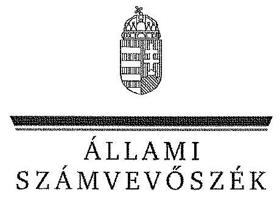
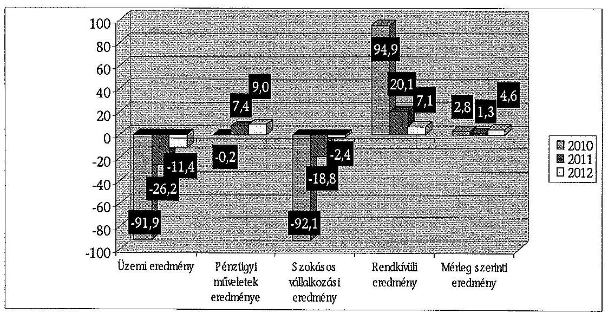
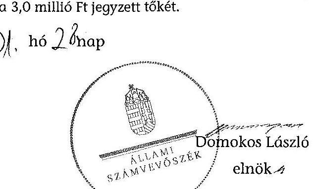
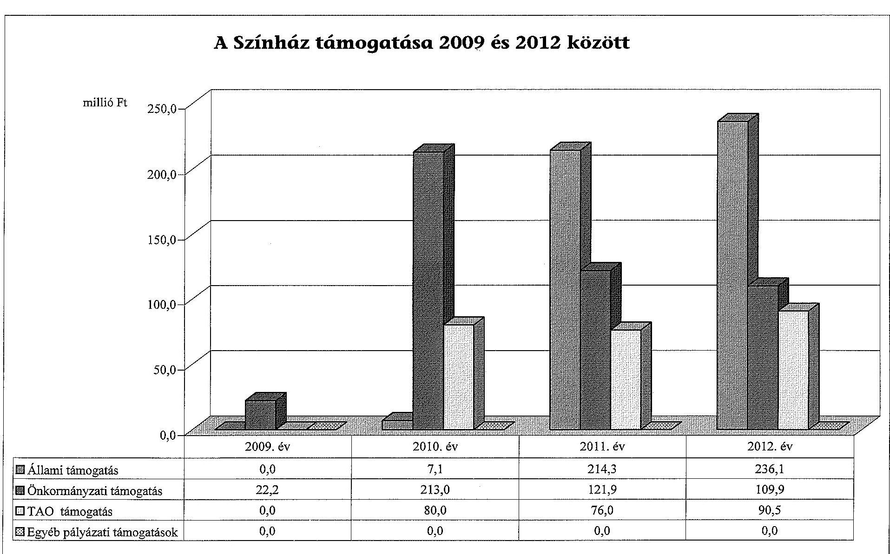
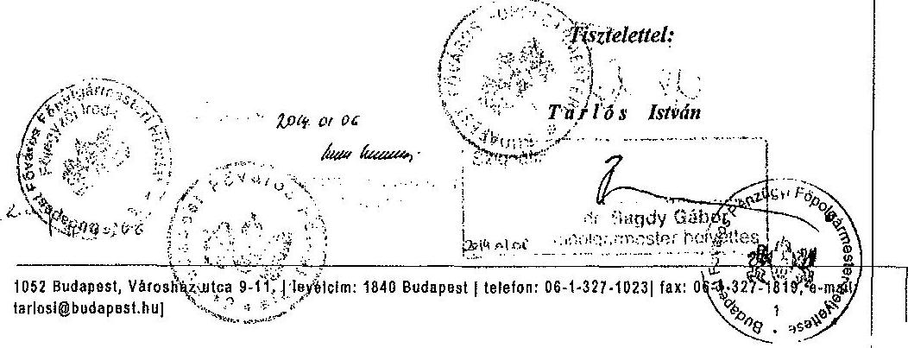
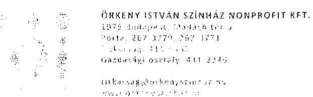
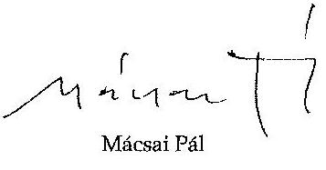
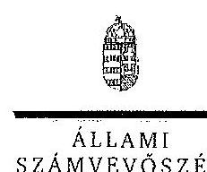
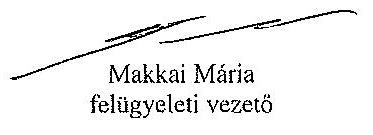

ÁLLAMI
SZÁMVEVŐSZÉK

# JELENTÉS 

az önkormányzatok többségi tulajdonában lévő gazdasági társaságok közfeladat-ellátásának ellenőrzéséről Örkény István Színház Nonprofit Kft.

---

# Állami Számvevőszék 

Iktatószám: V-0187-270/2014.
Témaszám: 1159
Vizsgálat-azonosító szám: V06530205

## Az ellenőrzést felügyelte:

## Makkai Mária

felügyeleti vezető
Az ellenőrzést vezette és az ellenőrzés végrehajtásáért felelős:
Horváth József
ellenőrzésvezető
A számvevőszéki jelentés összeállításában közreműködött:
Samu István
számvevő tanácsos
Az ellenőrzést végezték:
Jeszenkovits Tamás
Samu István
Tatár Zsuzsanna
külső szakértő
számvevő tanácsos
külső szakértő

A témához kapcsolódó eddig készített számvevőszéki jelentések:
címe
sorszáma
Jelentés a színházak állami támogatásának és gazdálkodásának ellenőrzéséről 1039

---

# TARTALOMJEGYZÉK 

BEVEZETÉS ..... 3
I. ÖSSZEGZŐ MEGÁLLAPÍTÁSOK, KÖVETKEZTETÉSEK, JAVASLATOK ..... 6
II. RÉSZLETES MEGÁLLAPÍTÁSOK ..... 12

1. Az Önkormányzat közfeladat-ellátásának megszervezése ..... 12
1.1. A közfeladat meghatározása, a feladat ellátásának választott módja ..... 12
1.2. Az önkormányzati és a tulajdonosi irányítás megítélése ..... 16
2. A Színház közfeladat-ellátással kapcsolatos tevékenysége ..... 19
2.1. A Színház szervezeti kialakítása, szabályozottsága ..... 20
2.2. A gazdasági társaság vagyonnyilvántartása ..... 22
2.3. A gazdasági évek ráfordításainak és bevételeinek alakulása ..... 23
2.4. A gazdasági társaság eredményének alakulása ..... 25
2.5. A gazdasági társaság folyamatos üzemmenetének, likviditásának biztosítása ..... 27
3. Az Önkormányzat tulajdonosi jogainak és kötelezettségeinek érvényesítése ..... 29
3.1. A gazdasági társaságtól származó információk hasznosítása ..... 29
3.2. Az Önkormányzat közgyűlésének intézkedései ..... 30

## MELLÉKLETEK

1. számú A Színház szakmai tevékenységének mutatói 2009 és 2012 között
2. számú A Színház támogatása 2009 és 2012 között
3. számú A Színház vagyonának főbb adatai 2009. október 12-e és 2012. december 31-e között
4. számú Budapest Főváros Főpolgármesterének észrevétele
5. számú Az Örkény István Színház Nonprofit Kft. ügyvezetőjének észrevétele
6. számú Az Örkény István Színház Nonprofit Kft. ügyvezetőjének észrevételére adott válasz

## FÜGGELÉKEK

1. számú Rövidítések jegyzéke
2. számú Értelmező szótár

---

.

---

# JELENTÉS 

## az önkormányzatok többségi tulajdonában lévő gazdasági társaságok közfeladat-ellátásának ellenőrzéséről Örkény István Színház Nonprofit Kft.

## BEVEZETÉS

Az Önkormányzatnak közfeladata az Ötv. alapján a művészeti feladatok ellátásáról való gondoskodás, az Mötv. szerint az előadó-művészeti szervezet támogatása. Ezt az Önkormányzat előadó-művészeti költségvetési szervek fenntartásával, illetve egyszemélyes tulajdonában álló gazdasági társaságok támogatásával valósította meg.

Az Önkormányzat az ellenőrzött időszakban színházi koncepcióval ${ }^{1}$ rendelkezett, amely a színházak működtetésének alternatíváit vázolta fel és jövőbeli célokat határozott meg. Ezt a Közgyűlés határozattal² elfogadta.

A színházak támogatása az ellenőrzött időszakban központi költségvetési, illetve fenntartói támogatás formájában, valamint pályázatok útján valósult meg. A 2010-2012. évek költségvetési törvényei egy összegben tartalmazták az Önkormányzat fenntartásában működő színházak fenntartói ösztönző részhozzájárulásának összegét, amelyet a fenntartó saját döntése alapján oszthatott el.

A fenntartó 2000-ben a Madách Színház igazgatójának feladatául jelölte meg a Madách Kamara önállósulásának előkészítését. A 2004. évben az intézmény felvette az Örkény István Színház nevet, és önálló társulattal rendelkező repertoárszínházként működött a Madách Színház keretein belül. A Közgyűlés 2009. október 12-én egyhangú szavazással megalapította az önálló Örkény István Színházat működtető gazdasági társaságot. Az Önkormányzat döntése alapján a gazdasági társaság a közfeladat-ellátást 2010. január 1-jén kezdte meg. A Színház adottságai szerint elsősorban prózai dráma-színház, éves bemutatóinak száma három-hat között alakult.

[^0]
[^0]:    ${ }^{1}$ Koncepció a fővárosi fenntartású színházak struktúráját és finanszírozását érintő változásokról (2007. XI. 29.)
    ${ }^{2}$ a Főv. Kgy. 1979/2007 (11.29.) sz. határozata

---

Az Önkormányzat a gazdasági társasággal a közfeladat ellátásának biztosítására 2009 decemberében Közszolgáltatási szerződést ${ }^{3}$, majd 2013. január 1-jei hatálybalépéssel Fenntartói megállapodást kötött. A Közszolgáltatási szerződés meghatározta a közhasznú tevékenység körét, az Önkormányzat által biztosított támogatás összegét, a feladat-ellátáshoz szükséges befektetett eszközöket, valamint azok rendelkezésre bocsátásának módját.

Az Emtv. új elemként vezette be 2009 novemberétől a Taotv. módosításával a tao támogatást, mint közvetett támogatási formát. Ennek felső határát a jogalkotó a tárgyévi jegybevétel 80%-ában határozta meg. A tao támogatás pénzügyi teljesülése a támogatást nyújtó vállalkozások eredményességének és támogatás nyújtási hajlandóságának függvénye.

A Színház a közfeladat ellátása érdekében az ellenőrzött időszakban összesen 924,5 millió Ft állami és önkormányzati támogatást kapott. Emellett 2010 és 2012 között 246,5 millió Ft tao támogatást vett igénybe.

A Színház fizető nézőinek száma évente 54-63 ezer fő, az előadások száma pedig évi 212-242 darab között változott a 2010-2012. években. A Színház által foglalkoztatott dolgozók átlaglétszáma az ellenőrzött időszakban 49-51 fő között alakult.

A Színház főbb szakmai mutatószámait az 1. számú melléklet tartalmazza.
Az ellenőrzés várható eredménye: a jelentés nyilvánossága a társadalom széles körével ismerteti meg a Színház gazdálkodására vonatkozó megállapításainkat, továbbá a megállapítások alapján megfogalmazott számvevőszéki javaslatok hasznosítása elősegíti a feltárt hibák megszüntetését, az ellenőrzött szervezet jobb feladatellátását. A társadalom számára jelzi, hogy közpénz nem maradhat ellenőrizetlenül, az ÁSZ értékteremtő rend kialakításához és megőrzéséhez hozzájáruló tevékenysége pozitív hatással lesz a szervezetről kialakított összkép formálásában. A szervezeten belül lehetőség nyílik arra, hogy a megállapítások szintetizálásával az ÁSZ a hozzáadott értéket teremtő, elemző tevékenységét és tanácsadó szerepét is erősítse. A jó gyakorlatok bemutatásával az ÁSZ hozzájárul a követendő megoldások megismertetéséhez és terjesztéséhez.

Az ellenőrzés célja annak értékelése volt, hogy:

- az Önkormányzat a jogszabályi előírások figyelembevételével döntött-e az ellenőrzésre kerülő közfeladat megszervezéséről, az ellátás módjáról; a tulajdonostól elvárható gondossággal felügyelte-e a társaság feladatellátását; a gazdasági társaság rendelkezésére bocsátotta-e a közfeladat-ellátásához a szükséges közvagyont, és biztosította-e a tulajdonosi jogok közvagyon feletti

[^0]
[^0]:    ${ }^{3}$ Az Emtv. 13. § (2) bekezdése szerint a közszolgáltatási szerződés a közszolgáltatás nyújtására irányuló, legalább három évre szóló szerződés, amely az állam vagy az önkormányzat és a közszolgáltatást végző előadó-művészeti szervezet kapcsolatát szabályozza, tartalmazza a teljesítendő előadásszámot, a szolgáltatás nyújtásának időtartamát, helyét és a teljesítésért járó díjazást.

---

érvényesülését; a társaság vagyonvesztése esetén intézkedett-e a további vagyonvesztés megakadályozásáról;

- a gazdasági társaság teljesítette-e a tulajdonos önkormányzat részéről meghatározott célokat és feladatokat a rendelkezésre álló erőforrások felhasználásával; végrehajtotta-e a közfeladat-ellátási szerződés előírásait; betartotta-e a vagyonnal történő gazdálkodásra vonatkozó jogszabályi rendelkezéseket.

Az ellenőrzés hatóköre: az önkormányzatok közfeladat-ellátásának ellenőrzése, amely kiterjed az önkormányzatok és a közfeladatot ellátó, az önkormányzat többségi tulajdonában lévő gazdasági társaság közötti feladatmegosztásra, az önkormányzatok tulajdonosi jogainak gyakorlására, valamint a nemzeti vagyon kezelésének ellenőrzése keretében a közfeladat-ellátáshoz rendelt vagyonra és a vagyont érintő szerződésekre. A jelen ellenőrzés kiterjed az önkormányzatok többségi tulajdonlásával működő gazdasági társaságok közfeladat-ellátására, vagyongazdálkodási tevékenységére, a kapcsolódó nyilvántartások, elszámolások szabályszerűségére és megbízhatóságára. Az ellenőrzött tételek kiválasztása véletlen mintavétellel történt.

Az ellenőrzés típusa: szabályszerűségi ellenőrzés.
Az ellenőrzött időszak: a 2009-2012. évek, valamint a helyszíni ellenőrzés befejezéséig - 2013. szeptember 6-ig - bekövetkezett változások figyelemmel kísérése.

Ellenőrzött szervezet: az Örkény István Színház Nonprofit Kft. és Budapest Főváros Önkormányzata.

Az ellenőrzés végrehajtásának jogszabályi alapját az ÁSZ tv. 5. § (3)-(5) bekezdéseiben foglaltak képezik.

Az ÁSZ a 2011. évi LXVI. törvény 29. §-a szerint a jelentéstervezetet megküldte Budapest Főváros Önkormányzata főpolgármesterének és az Örkény István Színház Nonprofit Kft. ügyvezető igazgatójának egyeztetésre. A beérkezett észrevételeket és az azokra adott választ a jelentés 4-6. számú mellékletei tartalmazzák.

---

# I. ÖSSZEGZŐ MEGÁLLAPÍTÁSOK, KÖVETKEZTETÉSEK, JAVASLATOK 

Az Önkormányzat a művészeti feladatok ellátásáról való gondoskodásnak, illetve az előadó-művészeti szervezet támogatásának, mint az Ötv.-ben és az Mötv.-ben meghatározott közfeladatának, az ellenőrzött időszak alatt eleget tett. Az Önkormányzat közfeladat-ellátását az Örkény István Színház, mint gazdasági társaság támogatásával biztosította. A Közgyűlés a tulajdonosi jogait az ellenőrzött időszakban, szabályzataiban és rendeleteiben foglaltak szerint gyakorolta.

A Közgyűlés 2009. október 12-én alapította meg az Örkény István Színházat. Az Önkormányzat a Színház rendelkezésére bocsátotta, haszonkölcsönbe adta a Közszolgáltatási szerződésben foglaltaknak megfelelően az előadó-művészeti közfeladat-ellátásához szükséges ingó és ingatlan vagyont. Az átadott, befektetett eszközök nettó értéke 614,1 millió Ft volt. Az ingó és ingatlan vagyon rendelkezésre bocsátása nem volt szabályszerű. A Közszolgáltatási szerződés jóváhagyásáról és megkötéséről szóló Közgyűlési határozat mellékletében lévő leltárösszesítőn nem tüntették fel a „Vagyonleltár-tervezet" megnevezést, a vagyonleltár végrehajtásáért felelős személy nevét és aláírását, valamint a vagyonleltárt könyvvizsgáló nem hitelesítette, ezzel megsértették a Számv. tv. előírásait.

Az Önkormányzat a közfeladat-ellátásának tárgyi és pénzügyi feltételeit a Közszolgáltatási szerződésben határozta meg. A Színház részére a közfeladat-ellátáshoz szükséges forrás biztosításáról a Közszolgáltatási szerződésben (az annak elválaszthatatlan részét képező éves költségvetési rendeletekben) döntött az Önkormányzat. Meghatározta a közhasznú tevékenység körét, a szerződés megszűnésének esetére szabályozta a vagyontárgyak visszaszolgáltatásának rendjét és határidejét, továbbá a Színház által teljesítendő művészeti tevékenységek jellegét, körét, mértékét és pontos mutatószámait. Az önkormányzati tulajdon védelme érdekében szabályozta a leltár készítését, annak gyakoriságát, továbbá a gazdálkodás és a művészeti tevékenység ellátásával összefüggő kötelező adatszolgáltatás formáját, idejét és módját, valamint előírta a gazdálkodás körében felmerülő rendkívüli eseményekről történő tájékoztatási kötelezettséget.

A Közgyűlés határozata alapján az Önkormányzat megbízásából a BFVK Zrt. és a Színház 2011. november 23-án Bérleti szerződést kötöttek, amely alapján az Önkormányzat tulajdonában álló ingatlanok után bérleti díjat kellett fizetni. A Közszolgáltatási szerződés 2011. november 25-i módosításával a közfeladat-ellátáshoz szükséges ingatlanokat visszamenőlegesen, 2011. szeptember 1-jétől a Színház ingyenesen nem használhatta.

Az Önkormányzat a vagyon védelme érdekében a Közszolgáltatási szerződésben garanciális követelményként fogalmazta meg a kötelezettségek megszegésének jogkövetkezményét, valamint a szerződés megszűnésének esetére az átadott vagyontárgyak visszaszolgáltatási kötelezettségét. Az ellenőrzött időszakban kötelezettség megszegésére, illetve szerződés megszűnésére nem került sor.

---

Az Önkormányzat a Színház Alapító Okiratban - a Gt. előírásaival összhangban - szabályozta az Alapító tulajdonosi joggyakorlásának kereteit. A Közgyűlés a tulajdonos érdekeinek védelmére határozatokban kijelölte a Színház FB tagjait és könyvvizsgálóját. Az Alapító Okiratban a Színház legfőbb szerve, a Közgyűlés kizárólagos hatáskörébe tartozó feladatként határozta meg a Színház SZMSZ-ének jóváhagyását, amely a hiánypótlások következtében - közel másfél év elteltével - 2011. január 31-én történt meg.

A 2010. évben a Színház FB elnökét a Közgyűlés közvetlenül választotta meg. Az eljárás ellentétes volt a Gt. előírásával, amely szerint - ha törvény vagy a társasági szerződés ettől eltérően nem rendelkezik - az FB a tagjai sorából választ elnököt.

Az Önkormányzat a Színház ügyvezetőjének és egyéb vezető állású dolgozóinak, valamint az FB tagoknak a díjazására vonatkozó Javadalmazási szabályzatot a Taktv.-ben foglalt határidőn túl, 2010. január 31-e helyett 2010. április 29-én fogadta el.

Az Önkormányzat a Színház üzleti tervének elfogadását, beszámoltatását és az adatszolgáltatási kötelezettség ellenőrzését a jogszabályokban, az Önkormányzat belső szabályzataiban és a Közszolgáltatási szerződésben foglaltaknak megfelelően, határidőn belül - az FB határozat és a könyvvizsgálói jelentés figyelembe vételével - végezte el.

A könyvvizsgáló az ÁSZ ellenőrzés által feltárt hibákat a jelentésében, illetve vezetői levélben nem jelezte sem a tulajdonos, sem a Színház vezetése felé. Az ellenőrzött évek mindegyikében a Színház beszámolóját „tiszta záradékkal" látta el.

A Színház szakmai tevékenységének ellátását az Önkormányzat évadbeszámolók alapján értékelte. A Színház az ellenőrzött időszak minden évében elkészítette a szakmai értékelését, amelyet a 2010. évben az Önkormányzat Kulturális Bizottsága elfogadott. A 2011. és a
 2012. évekre benyújtott évadbeszámolókról a Kulturális Főpolgármester-helyettes tájékoztatót nyújtott be a Közgyűlés részére, amelyet a Közgyűlés tudomásul vett.

A 2010. évben a célkitűzések jóváhagyása a szabályzatban foglaltaknak megfelelő volt. A 2011. és a 2012. évekre vonatkozóan a Színház ügyvezetője részére a prémiumfeladatok meghatározása a Javadalmazási szabályzat ${ }_{2,3}$-ban foglaltaktól eltérően - késedelmesen - történt. A prémiumfeltételeket és a prémium összegét mindkét évben az üzleti terv elfogadását követően határozta meg az Alapító.

Az Önkormányzat a Színháznál 2013-ban, az ÁSZ ellenőrzéssel egy időben végzett belső ellenőrzést, amelyről a jelentés a helyszíni ellenőrzés időpontjáig nem készült el. Az Önkormányzat - jogszabályi kötelezettség hiányában - nem vett részt az ingyenesen haszonkölcsönbe adott eszközeinek leltározásában és annak ellenőrzésében.

A Színház 2010-2012. évi gazdálkodása, valamint mérleg szerinti nyeresége nem tette szükségessé, hogy a tulajdonos Önkormányzat a vagyon, illetve a közpénzek nem célszerű hasznosításával, az esetleges pazarló felhasználással

---

kapcsolatban, valamint a lejárt kötelezettségek csökkentése érdekében tulajdonosi intézkedéseket tegyen.

Az Örkény István Színház Nonprofit Kft. teljesítette az Önkormányzat részéről a Közszolgáltatási szerződésben meghatározott célokat és feladatokat. A vagyonnal történő gazdálkodásra vonatkozó jogszabályi rendelkezéseket a számlarend, valamint a leltározás területén nem tartották be. A belső szabályozás hiányosságai a Színház integritásával kapcsolatban kockázatot jelentettek.

A Színház rendelkezett az Alapító Okirat ${ }_{1.3}$-mal, és az irányítási, döntési és felelősségi jogköröket tartalmazó belső szabályzatokkal. A Színház a Közszolgáltatási szerződés előírásának megfelelően folyamatosan biztosította a tevékenységi körébe tartozó színházi szolgáltatást.

A közfeladat-ellátást szolgáló vagyon védelme nem volt biztosított. A Színház elkészítette a Leltározási, továbbá az Értékelési szabályzatát. A Leltározási szabályzat nem felelt meg a Számv. tv. 2012. január 1-jével hatályos előírásának, mivel az ingatlanok esetében a törvényi előírás szerinti legalább 3 éves gyakorisággal szemben 5 évenkénti mennyiségi felvétellel történő leltározási kötelezettséget írt elő, továbbá a gépek, berendezések, felszerelések mennyiségi és értékbeli leltározásának gyakoriságát három évben határozta meg, amely szabályozás nem volt összhangban a Közszolgáltatási szerződésben előírt évenkénti leltárkészítés kötelezettséggel.

A leltározás vonatkozásában nem tartották be a Leltározási szabályzatban foglaltakat. A Színház a saját tárgyi eszközeit és beruházásait - a tárgyi eszközök 2012. évi mérlegében kimutatott értéke 95,2 millió Ft volt - tételes, mennyiségi felvétellel a működése 3. évében nem leltározta. Ezzel a 2012. évi beszámolójában kimutatott eszközök értékét leltározással nem támasztotta alá, amit a könyvvizsgáló nem kifogásolt, jelentésében erre nem hívta fel a figyelmet. A Színház december 31-i fordulónappal az Önkormányzat által ingyenes használatba adott eszközök leltározását mennyiségi felvétel helyett egyeztetéssel végezte el. A leltározás tekintetében a Színház 2010-2012 között nem tett eleget az Önkormányzat vagyonát illetően - az Áhsz. előírásainak.

A Színház nem a Számv. tv. szerint mutatta ki a kapott támogatásokat. A kiegészítő melléklete egyik évben sem tartalmazta teljes körűen a támogatásokat és azok felhasználását, továbbá a fel nem használt részek összegét jogcímenként.

Az ellenőrzött időszakban a Színház nem rendelkezett a Számv. tv. előírásainak megfelelő Számlarenddel. Az ellenőrzésre átadott szabályozás („Számlamagyarázatok”) nem tartalmazta a számla értéke növekedésének, illetve csökkenésének jogcímeit, sem a számlát érintő gazdasági eseményeket és azok más számlákkal való kapcsolatát, sem a főkönyvi számla és az analitikus nyilvántartás kapcsolatát, sem a számlarendben foglaltakat alátámasztó bizonylati rendet. A Színház a Számlarendjét a helyszíni ellenőrzést követően elkészítette.

A Színház az önköltségszámítás rendjére vonatkozó szabályzat készítésére nem volt kötelezett a Számv. tv. alapján, de a produkciós költségeket kimutatta, azonban abban nem tért ki a társulat bérének és járulékainak legalább a pro-

---

dukció színreviteléig történő felosztási módjára. Ennek következtében a produkciók színreviteléig aktivált szellemi termékek nem a ténylegesen felmerült közvetlen költségek alapján kerültek elszámolásra. Továbbá nem tartalmazta az általános költségek felosztási módját.

A Színház az Önkormányzattól átvett - a közfeladat-ellátását biztosító - eszközöket a 0-ás számlaosztályban nem tartotta nyilván. Ezzel a Színház nem tett eleget a Számv. tv.-ben foglaltaknak. A Színház közfeladatai ellátásához biztosított - saját és önkormányzati tulajdonú - eszközök 2012. december 31-ei nettó értéke (1038,6 millió Ft) a 2010. december 31-ei adathoz viszonyítva 12,9%-kal nőtt.

A Színház ráfordításai 2010-ről (497,4 millió Ft) 2012-re 16,5%-kal emelkedtek, a 2012. évben 579,4 millió Ft-ot értek el. A Színház bevételei az ellenőrzött időszakban 16,7%-kal nőttek, 2012-ben 584,0 millió Ft-t tettek ki. A bázisévhez képest a 2011. évben egy korábbi bemutató elmaradása, illetve betegség miatt a fizető nézőszám 12,3%-kal 54,1 ezer főre csökkent, 2012-ben 62,6 ezer főre emelkedett.

Az ellenőrzött időszakban a Színház összes ráfordításának közel 40%-át a személyi jellegű ráfordítások összege tette ki, amely 184,3 millió Ft-ról 234,0 millió Ft-ra emelkedett. A fellépti díjakkal és a művészi munkát elősegítő, művészeti ügykezelés címen elszámolt megbízási díjakkal korrigált bérjellegű kifizetések évről évre növekedtek, 2012-ben (271,1 millió Ft) a 2010. évi érték 122,4%-át érték el.

A Színház az értékcsökkenési leírást a Számviteli politikájában meghatározottak szerint számolta el. Ennek évenkénti alakulását az éves beszámolók kiegészítő mellékletében részletesen bemutatta. Az ellenőrzött időszakban terven felüli értékcsökkenést nem számoltak el.

A Színház a 2010-2012. években elkészítette üzleti tervét. A Színház üzleti terveiben az egyes években a bevételeket a ráfordításokkal azonos összegben tervezte meg. A Színház mérleg szerinti eredménye az ellenőrzött időszak minden évében pozitív volt, a 2010. évben 2,8 millió Ft-ot, 2011-ben 1,3 millió Ft-ot, 2012-ben 4,6 millió Ft-ot tett ki.

A Színháznak az ellenőrzött időszakban átmeneti pénzintézeti finanszírozásra nem volt szüksége. Fizetési kötelezettségeit határidőn belül tudta teljesíteni, köztartozásai nem keletkeztek.

A Színház a 2011. évtől kezdve az Önkormányzat részére készített fejlesztési, beruházási tervet. A fejlesztési-beruházási tervek az elavult, elhasználódott épületrészek és berendezések felújításához, cseréjéhez és a művészeti célok megvalósításához kapcsolódtak. A Színház 2010-2012 között 7,8 millió Ft összegű fejlesztést valósított meg.

A Színház rövidlejáratú bankbetétek formájában kötötte le az átmenetileg szabad pénzeszközeit. A Színház befektetési tevékenységet nem végzett, így Befektetési Szabályzatot nem kellett készítenie.

---

Az Állami Számvevőszékről szóló 2011. évi LXVI. törvény 33. § (1) bekezdésében foglaltak értelmében a jelentésben foglalt megállapításokhoz kapcsolódó intézkedési tervet köteles az ellenőrzött szervezet vezetője összeállítani, és azt a jelentés kézhezvételétől számított 30 napon belül az ÁSZ részére megküldeni. Amennyiben az intézkedési tervet határidőben nem küldi meg a szervezet, vagy az nem elfogadható, az ÁSZ elnöke a hivatkozott törvény 33. § (3) bekezdés a)-b) pontjaiban foglaltakat érvényesítheti.

Az ellenőrzés intézkedést igénylő megállapításai és javaslatai:

# az Örkény István Színház igazgatójának 

1. A Színház az önköltségszámítás rendjére vonatkozó szabályzat készítésére nem volt kötelezett a Számv. tv. 14. § (6) bekezdése alapján, de a produkciós költségeket kimutatta, azonban abban nem tért ki a társulat bérének és járulékainak legalább a produkció színreviteléig történő felosztási módjára. Ennek következtében a produkciók színreviteléig aktivált szellemi termékek nem a ténylegesen felmerült közvetlen költségek alapján kerültek elszámolásra. Továbbá nem tartalmazta az általános költségek felosztási módját.

Javaslat:
Intézkedjen annak érdekében, hogy
a) a produkció bemutatásáig elszámolt közvetlen költségek tartalmazzák a társulat bérének és járulékainak a produkcióra felosztott költségeit;
b) az önköltségszámítási szabályzat tartalmazza az általános költségek felosztási módját.
2. A leltározási szabályzat 5.2.1 pontja nem felelt meg a Számv. tv. 2012. január 1-jével hatályos 69. § (3) bekezdése előírásának, mert az ingatlanok esetében a törvényi előírás szerinti legalább három éves gyakorisággal szemben öt évenkénti mennyiségi felvétellel történő leltározási kötelezettséget írt elő.

Javaslat:
Intézkedjen a leltározási szabályzat módosításáról annak érdekében, hogy a szabályzat az ingatlanok esetében a Számv. tv. 69. § (3) bekezdésének megfelelően legalább három évenkénti mennyiségi felvétellel történő leltározást írjon elő.
3. A Társaság a Fővárosi Önkormányzat tulajdonában álló, átvett eszközöket a 0-ás számlaosztályban nem tartotta nyilván. Ezzel a Színház nem tett eleget a Számv. tv. 160. § (5) bekezdésében foglaltaknak.

Javaslat:
Intézkedjen a Fővárosi Önkormányzat tulajdonában álló, átvett eszközök 0-ás számlaosztályban történő nyilvántartásáról.
4. A Társaság nem mutatta ki a Számv. tv. 93. § (3) bekezdése szerint a kapott támogatásokat a beszámoló kiegészítő mellékletében. Egyik évben sem tartalmazta a ki-

---

egészítő melléklet teljes körűen a kapott támogatásokat és azok felhasználását, továbbá a fel nem használt összeget jogcímenként, évenkénti bontásban.

Javaslat:
Intézkedjen a beszámoló kiegészítő mellékletében a támogatások Számv. tv. 93. § (3) bekezdése szerinti kimutatásáról.

---

# II. RÉSZLETES MEGÁLLAPÍTÁSOK 

## 1. Az ÖNKORMÁNYZAT KÖZFELADAT-ELLÁTÁSÁNAK MEGSZERVEZÉSE

### 1.1. A közfeladat meghatározása, a feladat ellátásának választott módja

Az Önkormányzat a művészeti feladatok ellátásáról való gondoskodásnak, illetve az előadó-művészeti szervezet támogatásának, mint az Ötv.-ben és az Mötv.-ben meghatározott közfeladatának, az ellenőrzött időszak alatt eleget tett. Az Önkormányzat a közfeladat ellátását az Örkény István Színház Nonprofit Kft. támogatásával biztosította.

Az Önkormányzat kötelező közfeladata az Ötv. 63/A §. n) pontja szerint a művészeti feladatok ellátása ${ }^{4}$. A Htv. 111. § alapján a közművelődési, közgyűjteményi és művészeti tevékenységekkel kapcsolatos helyi irányítási, ellenőrzési, valamint a fenntartással és működtetéssel kapcsolatos feladatokat a Közgyűlés látja el. A kulturális feladat ellátását az Önkormányzat az Emtv. 3. § (2) bekezdése alapján előadó-művészeti szervezet (gazdasági társaság) támogatásával valósította meg.

Az Önkormányzat az ellenőrzött időszakban rendelkezett a fővárosi fenntartású színházakra vonatkozó koncepcióval ${ }^{5}$, amelyet a Közgyűlés ${ }^{6}$ határozatával fogadott el.

A 2007-ben jóváhagyott koncepció a színházak működtetésének módozatait vázolta fel és jövőbeli célokat határozott meg, azonban nem vizsgálta a megvalósításhoz szükséges források nagyságát.

A koncepcióban foglaltaknak megfelelően megvalósult az Örkény István Színház önállóvá válása. A Közgyűlés egyhangú döntésével, a 1393/2009. (10.12.) sz. határozatával, 3,0 millió Ft törzstőkével megalapította az Örkény István Színház Nonprofit Kft.-t.

A 2010. évi önkormányzati választásokat követően az Ötv. 91. § (1) és (6) bekezdésnek megfelelően a Közgyűlés ${ }^{7}$ elfogadta az Önkormányzat 2011-2014. évekre vonatkozó Gazdasági Programját ${ }^{8}$.

[^0]
[^0]:    ${ }^{4}$ A 2013. január 1-jétől hatályos Mötv. 13. § (1) bekezdés 7. pont is kötelezően ellátandó feladatként határozza meg az előadó-művészeti szervezetek támogatását.
    ${ }^{5}$ Koncepció a fővárosi fenntartású színházak struktúráját és finanszírozását érintő változásokról
    ${ }^{6}$ a Főv. Kgy. 1979/2007. (11.29.) sz. határozata
    ${ }^{7}$ a Főv. Kgy. 937/2011. (04.27.) sz. határozata
    ${ }^{8}$ A Főváros fejlesztésének és gazdálkodásának stabilizálása és reformkoncepciója a 2011-2014. évi választási ciklusra.

---

Az Alapító az egyszemélyes nonprofit korlátolt felelősségű társaság alapításával eleget tett az Áht. 100/L. § (1), és 100/O. § (2) szakaszában előírt rendelkezéseknek, a Színház Alapító Okirata ${ }_{1}$-e tartalmának meghatározásakor eleget tett a Ptk. 54. § (1-2) és a Gt. 12. § (1) bekezdésében előírt, valamint a Közhasznú tv. 4. § (1) bekezdésében foglalt tartalmi követelményeknek.

Az Önkormányzat a Színház Alapító Okirat
 }_{1}$-ben - a Gt. előírásaival összhangban - szabályozta az Alapító tulajdonosi joggyakorlásának kereteit. Az Alapító Okirat ${ }_{1}$ megfelelően rendelkezett a Színház gazdálkodása során elért eredmény felhasználásáról, az ügyvezető, az FB tagok és a könyvvizsgáló kijelöléséről, az összeférhetetlenségi szabályokról, valamint az Áht. ${ }_{1}$ 100/N. § (8) előírásainak betartatásáról.

Az Önkormányzat a hatályos Emtv. 15. § (3) bekezdésének megfelelően a Színház hatósági nyilvántartás szerinti adatainak módosítására irányuló kérelmét benyújtotta, a Színház 2010 és 2012 között I. kategóriába sorolt színházként működött.

Az Önkormányzat tulajdonában álló vagyon a nemzeti vagyon részét képezi. A Vagyonrendelet ${ }_{2}$ 6. § (1) bekezdés szerint a Színház használatában lévő, a feladatellátását szolgáló ingatlanvagyon korlátozottan forgalomképes törzsvagyon.

A Színház és az Önkormányzat között létrejött Közszolgáltatási szerződés jóváhagyásáról és megkötéséről a 2087/2009. (XI.26.) számú Főv. Kgy. határozat rendelkezett. A szerződést határozott időre, a 2010. január 1-től 2013. június 30-ig tartó időszakra kötötték meg, amelyet a Főpolgármester 2009 decemberében írt alá. Az Önkormányzat a Színház teljesítményével kapcsolatos célokat, elvárásokat a Közszolgáltatási szerződésben - az Emtv. szerinti I. kategóriába soroláshoz szükséges feltételek teljesítésével - határozta meg. A szakmai elvárásait az igazgatói pályázat kiírásában szerepeltette. A nyertes pályázat a megválasztott igazgató stratégiai céljait, valamint konkrét szakmai elképzeléseit foglalta össze.

Az Önkormányzat a közfeladat-ellátása érdekében a Színház rendelkezésére bocsátotta - haszonkölcsönbe adta - az előadó-művészeti közfeladat-ellátásához szükséges ingó és ingatlan vagyont. Az Önkormányzat 2011. július 31-ig a Közszolgáltatási szerződésekben foglaltaknak megfelelően, ingyenesen bocsátotta a Színház részére az előadó-művészeti közfeladat-ellátásához szükséges eszközöket. A Közszolgáltatási szerződés melléklete szerint a befektetett eszközök bruttó értéke 853,3 millió Ft, nettó értéke 614,1 millió Ft volt 2009. december 31-én. A Nvtv. 3. § alapján az ellenőrzött Színház átlátható szervezet.

Az Önkormányzat döntése alapján a gazdasági társaság a közfeladat-ellátást 2010. január 1-jén kezdte meg. Az Önkormányzat a közfeladat-ellátásának tárgyi és pénzügyi feltételeit a Közszolgáltatási szerződésben határozta meg. A Közszolgáltatási szerződés tartalmazta a közhasznú tevékenység körét, a szerződés megszűnésének esetére szabályozta a vagyontárgyak visszaszolgáltatásának rendjét és határidejét, továbbá a Színház által teljesítendő művészeti tevékenységek jellegét, körét, mértékét és pontos mutatószámait. Az önkormány-

---

zati tulajdon védelme érdekében a Közszolgáltatási szerződésben szabályozta a kötelező leltár készítését, annak gyakoriságát, továbbá a gazdálkodás és a művészeti tevékenység ellátásával összefüggő kötelező adatszolgáltatás formáját, idejét és módját, valamint előírta a gazdálkodás körében felmerülő rendkívüli eseményekről történő tájékoztatási kötelezettséget.

A Közgyűlés 2310/2011. (VIII.31.) határozata alapján az Önkormányzat megbízásából a BFVK Zrt. és a Színház 2011. november 23-án Bérleti szerződést kötöttek, amely alapján az Önkormányzat tulajdonában álló ingatlanok után bérleti díjat kellett fizetni. A Közgyűlés 2437/2011. (VIII.31.) sz. határozatát határidőn túl hajtották végre, mivel a Főpolgármester-helyettes a Közszolgáltatási szerződés-módosítását a 2011. október 1-jei határidőt követően írta alá. A Közszolgáltatási szerződés 2011. november 25-i módosításával és a Bérleti szerződés aláírásával a közfeladat ellátáshoz szükséges ingatlanokat visszamenőlegesen, 2011. szeptember 1-jétől a Színház ingyenesen nem használhatta.

A Színháznak a bérleti szerződés aláírását megelőző időszakra használati díjat, azt követően bérleti díjat (3,9 millió Ft/hó+áfa), valamint a bérleti díj összegét alapul véve egyszeri 3 havi megszerzési díjat és 5 havi óvadékot kellett fizetnie. A 2011-es évre vonatkozóan óvadékként, megszerzési díjként és használati díjként összesen egy évi bérleti díjnak megfelelő összeg került kifizetésre.

A felek 2012-ben a Bérleti szerződés 2. pontját kiegészítették azzal, hogy az Önkormányzat az óvadék összegét „a bérleti szerződés időtartama alatt a kielégítési jog megnyílta előtt használhatja és rendelkezhet vele." Az óvadék összegének fedezete az Önkormányzat részéről tett nyilatkozat ${ }^{9}$ alapján folyamatosan rendelkezésre állt.

# A Színház támogatása az ellenőrzött időszakban központi költségvetési, illetve fenntartói támogatással, valamint pályázatok útján valósult meg. Az Önkormányzat a saját tulajdonosi támogatás színházak közötti elosztásának elveit, szempontjait szabályzatban, belső utasításban nem határozta meg, annak mértékét, nagyságrendjét a teljes támogatási összegéhez igazította. 

A 2010. évtől az Emtv. 16. § (1) bekezdése ${ }^{10}$ szerint a színházak támogatása művészeti ösztönző részhozzájárulásból és fenntartói ösztönző részhozzájárulásból tevődött össze. A 2010-2012. években a költségvetési törvények 7. sz. melléklete egy összegben tartalmazta az Önkormányzat fenntartásában működő színházak fenntartói ösztönző részhozzájárulásának összegét, amelyet a fenntartó saját döntése alapján oszthatott el. A költségvetési törvények a színházak művészeti ösztönző részhozzájárulását külön nevesítve tartalmazták. A 2013. évtől a színházakat művészeti és létesítménygazdálkodási célra működési támogatás illette meg.

[^0]
[^0]:    ${ }^{9}$ A Főpolgármesteri hivatal ellenőrzéshez kirendelt kapcsolattartója 2013. augusztus 14-én adott válasza alapján.
    ${ }^{10}$ Hatályon kívül helyezve 2012. május 1-jétől.

---

Az Emtv. 48. § (1) bekezdése új elemként bevezette - a Taotv. 4. § 37-39. pontja alapján - a társasági adókedvezménnyel igénybe vehető támogatást, mint közvetett támogatási formát. A tao kedvezmény igénybevétele 2009. november 12-től volt lehetséges, a meghatározott jegybevétel 80%-áig. A tao támogatás pénzügyi teljesülése a támogatást nyújtó vállalkozások eredményességének és támogatás nyújtási hajlandóságának függvénye.

Az ellenőrzött időszakban a Színház számára biztosított működési hozzájárulás és tao támogatás alakulását a 2. számú melléklet tartalmazza.

A Színház számára nyújtott támogatás összege folyamatosan emelkedett megalapítása óta, a 2012. évben 346,0 millió Ft volt. Ezt a 236,1 millió Ft állami (a Nemzeti Kulturális Alap támogatásával együtt), és a 109,9 millió Ft önkormányzati támogatás eredményezte. A tulajdonos Önkormányzat saját működési támogatását - az állami támogatás növekedésével párhuzamosan - 2010-2012 között 48,4%-kal (103,1 millió Ft-tal) csökkentette. Az Önkormányzat a központi költségvetésben nevesített fenntartói ösztönző részhozzájárulás és a saját fenntartói támogatása színházak közötti felosztásánál - a teljesítési adatok alapján - a művészszínházak, így az Örkény István Színház működésének támogatását preferálta.

Az ellenőrzött időszakban az önkormányzati vagyon megőrzése, védelme érdekében a leltározást az önkormányzati Vagyonrendelet ${ }_{1,2}$ szabályozta. A Vagyonrendelet ${ }_{1}$ 12. § (1) bekezdése szerint az Önkormányzat tulajdonában lévő eszközöket minden évben leltározni kell, az ettől eltérő eseteket a rendelet a 12. § (3)-(4) bekezdései szabályozták.

A leltározásra vonatkozó előírások a társasággá alakulást követően az Önkormányzat Vagyonrendeleteiben nem a hatályos jogszabályoknak megfelelően szerepeltek, mivel az üzemeltetésre, kezelésre átadott eszközök leltározási szabályairól a Vagyonrendelet ${ }_{1,2}$ - az Áhsz. 2010. január 1-jétől hatályos előírásaival ellentétben - nem tartalmazott szabályozást.

A Közszolgáltatási szerződés 5. A pontja az Önkormányzat tulajdonát képező ingó vagyonra vonatkozóan kötelező leltár készítését, a szerződés 6. pont 4. bekezdése az önkormányzati vagyon nyilvántartására vonatkozó előírásoknak megfelelő adatszolgáltatási és nyilvántartási kötelezettség teljesítését írta elő a Színház számára.

A Fenntartói megállapodás 5.1. pontjában a közszolgáltatási szerződés rendelkezésével megegyezően a vagyontárgyak évenkénti, december 31-i fordulónappal történő leltárkészítési kötelezettségét írta elő, továbbá köteles volt a Színház azt megküldeni a tárgyévet követő év január 31-ig az Önkormányzatnak.

Az Önkormányzat minden negyedév végén bekérte a Színháztól az ingatlanadatok változására vonatkozó dokumentumokat, a bruttó érték növekedés vagy csökkenés (kataszteri módosító lapok), valamint az értékcsökkenés elszámolásáról szóló, a gazdasági vezető által aláírt "6. sz. melléklet" című táblázatot. A megküldött dokumentumok alapján a kataszteri rendszer, valamint a Pénzügyi Információs Rendszer adatainak frissítése megtörtént.

Az Önkormányzat vagyonkimutatást készített a 2008-2012. években az éves zárszámadáshoz az Ötv. 78. § (2) bekezdésében és az Mötv. 110. § (2) bekezdésében foglaltaknak megfelelően.

---

A Vagyonrendelet 14. §-a a leltározás vonatkozásában a korábbi vagyonrendelettel azonos rendelkezéseket tartalmazott. Az Önkormányzat a 7/2011. sz. Leltározási és Leltárkészítési Szabályzatában sem rendelkezett a társaságok leltárainak önkormányzati ellenőrzéséről.

Az Önkormányzat a vagyon védelme érdekében a Közszolgáltatási szerződésben garanciális követelményként fogalmazta meg a kötelezettségek megszegésének jogkövetkezményét, valamint a szerződés megszűnésének esetére az átadott vagyontárgyak visszaszolgáltatási kötelezettségét. Az ellenőrzött időszakban kötelezettség megszegésére, illetve szerződés megszűnésére nem került sor.

# 1.2. Az önkormányzati és a tulajdonosi irányítás megítélése 

A Színház esetében a tulajdonosi jogok gyakorlásának rendjét a gazdasági társaságokra és a közhasznú szervezetekre vonatkozó jogszabályok és az Önkormányzat rendeletei határozták meg.

## A Közgyűlés a tulajdonosi jogait az ellenőrzött időszakban szabályzataiban és rendeleteiben foglaltak szerint gyakorolta.

Az Önkormányzat SZMSZ ${ }_{1}$ 49. § (1) bekezdése alapján a Közgyűlés állandó bizottságaként a 2010. évig a Kulturális Bizottság működött. Ezen időszakban a Közgyűlés a bizottságra az Önkormányzat SZMSZ ${ }_{1}$ 5. számú mellékletében szereplő feladatok ellátását ruházta át.

Az egyszemélyes társaság legfőbb szervének hatáskörébe tartozó (az FB tagjainak, valamint az ügyvezetőnek, továbbá a könyvvizsgálónak a megválasztása, visszahívása, megbízása, illetve megbízásának visszavonása) jogok gyakorlását az Önkormányzat eltérően szabályozta a 2011. év előtt, illetve a 2011-ben gazdasági társasággá alapított színházak esetében.

A 2011. év előtt alapított társaságok esetében 2011. január 1-jétől a Vagyonrendelet ${ }_{1}$ 52. § (2) bekezdése alapján a fenti jogokat a Főpolgármester közvetlenül gyakorolta. A 2011. május 25-én alapított gazdasági társaságok esetében 2011. november 9-éig a fenti tulajdonosi jogok gyakorlására kizárólag a Közgyűlés volt jogosult. Az eltérő szabályozás oka az volt, hogy a Közgyűlés a Vagyonrendelet ${ }_{1}$ 5. számú mellékletét nem az alapítással egy időben módosította.

Az Önkormányzat új vagyonrendelete 56. § (2) bekezdés a) pontjának 2012. március 16-ai hatálybalépésétől 2013. március 18-áig a Vagyonrendelet ${ }_{2}$ 5. sz. mellékletében szereplő gazdasági társaság esetében a társaság legfőbb szervének a törvény által hatáskörébe tartozó (az FB tagjainak, a társaság könyvvizsgálójának megválasztása, visszahívása, díjazásának megállapítása valamint a (2) bekezdés b) pontja alapján az ügyvezető megválasztása, kinevezése és díjazásának megállapítása) jogokat a Főpolgármester közvetlenül, egy személyben gyakorolta. 2013. március 19-től a Vagyonrendelet ${ }_{2}$ 56. § (2) bekezdés a) pontja szerint a közgyűlés hatáskörébe tartozik a Főpolgármester előterjesztése alapján az FB tagjainak és a társaság könyvvizsgálójának megválasztása, visszahívása, díjazásának megállapítása, valamint a (2) bekezdés b) pontja alapján az ügyvezetőnek a megválasztása, kinevezése és díjazásának megállapítása.

---

Az Önkormányzat az Alapító Okirat, VII/A. pontjában a Gt.-vel összhangban szabályozta az Alapító tulajdonosi joggyakorlás kereteit. A Közgyűlés a köztulajdon védelmének biztosítása érdekében a Gt. 33. § (1) bekezdés c) pontjában, és a Közhasznú tv. 10. § (1) bekezdésében foglalt előírásoknak megfelelően FB létrehozásáról döntött. A Taktv. 4. § (2) bekezdésének megfelelően a társasági törzstőke összegéhez igazodva a Színház esetében 3 főben határozta meg az FB létszámát.

A Közgyűlés a tulajdonosi érdekeinek védelmére határozatokban kijelölte a Színház FB tagjait és könyvvizsgálóját, valamint a Gt. 34. § (4) bekezdése alapján jóváhagyta az FB ügyrendjét.

Az Önkormányzat a tulajdonosi képviseletet ellátó FB tagokat nem számoltatta be, ezt a Gt., és a belső szabályozás nem írta elő. Az ellenőrzés megállapította, hogy a 2010. évben az FB elnökének megválasztása nem felelt meg a jogszabályi előírásnak.

A Gt. 34. § (2) bekezdésében
 foglaltak szerint - ha törvény vagy a társasági szerződés eltérően nem rendelkezik - az FB a tagjai sorából választ elnököt. A Közgyűlés a 2044/2010. (10.27.) sz. határozatában megválasztotta a Színház FB elnökét. A közgyűlési határozat ellentétes volt a Gt. 34. § (2) bekezdésében előírtakkal, mivel az alapító okirat, illetve törvény nem rendelkezett ettől eltérően.

Az Önkormányzat a Színház üzleti tervének elfogadását, beszámoltatását, valamint az adatszolgáltatási kötelezettség ellenőrzését a jogszabályokban, az Önkormányzat belső szabályzataiban és a Közszolgáltatási szerződésben foglaltaknak megfelelően, határidőn belül - az FB határozat és a könyvvizsgálói jelentés figyelembe vételével - végezte el.

A könyvvizsgáló az ÁSZ ellenőrzés által feltárt hibákat jelentésében, illetve vezetői levélben nem jelezte sem a tulajdonos, sem a Színház vezetése felé. Az ellenőrzött évek mindegyikében „tiszta záradékkal" látta el a Színház beszámolóját.

Az Önkormányzat beszámoltatása kiterjedt az üzleti terv elemzésére, jóváhagyására és az éves beszámoló, valamint a közhasznúsági jelentés elemzésére, valamint a Közgyűlés általi elfogadására.

A Közgyűlés a 1427/2011. (05.25.), a 990/2012. (05.30.), és a 835/2013. (05.29.) számú határozatával elfogadta a Színház 2010-2012. évekről készített beszámolóját, a könyvvizsgáló jelentését, az FB határozatát.

A tulajdonosi joggyakorlás megvalósításában a 2012. évben előrelépést jelentett a monitoring tevékenység bevezetése. Ennek keretében egységes adattartalom és adattábla-rendszer került meghatározásra a Színház számára mind az üzleti terv, mind a beszámoló elkészítéséhez.

A Főpolgármesteri Hivatal Jegyzői Irodájának 2012. november 9-én kiadott Belső Működési Szabályzata alapján a Főjegyzői Iroda Monitoring és Koordinációs Referatúra feladatkörébe tartozott a társaságok üzleti terveire és a közszolgáltatási szerződésekre vonatkozó határozatok hatásvizsgálata, a társaságok működésének és gazdálkodásának folyamatos nyomon követése (az üzleti tervek gazdálkodási adatainak bemutatását szolgáló egységes táblarend kialakítása; a társasá-

---

gok éves üzleti terveinek közgazdasági megfelelőségi értékelése; a társaságok éves beszámolóinak üzleti tervek teljesítésének aspektusából történő értékelése és a tervektől való eltérés esetén az önkormányzati vezetés tájékoztatása).

A 2013. évi üzleti terv már részletes, egységes szerkezetet és információtartalmat biztosított, amely az irányítási tevékenységet a teljesítmények összehasonlító elemzési lehetőségével és a beszámoltatás tartalmi színvonalának javításával szolgálta.

A Közszolgáltatási szerződés az aláírásának idején hatályos Emtv. előírásaival összhangban ${ }^{11}$, megfelelően szabályozta a közfeladat-ellátás tartalmát. A szerződés összegszerűen tartalmazta a 2010. tárgyévre vonatkozó támogatási összeget. A szerződés fennállása alatti további évekre a támogatás összegét az Önkormányzat a tárgyévi költségvetési rendeleteiben, a Színház részére biztosított támogatási összegre szóló rendelkezésekhez kötötte.

A Színház ügyvezetőjének és egyéb vezető állású munkavállalójának javadalmazásával kapcsolatban a Közgyűlés megalkotta a 970/2010. (04.29.) sz. határozatot, a 2490/2010. (12. 15.) sz. határozatot és a 2062/2012. (10. 3.) számú határozatot. A 970/2010. (04.29.) sz. határozat megalkotásával az Alapító késedelmesen tett eleget a Taktv. 9. § (1) bekezdésében előírt (2010. január 31.) határidőnek.

A Javadalmazási szabályzat ${ }_{1-3}$ értelmében a prémiumfeltételeket és a prémium összegét a legfőbb szerv, illetve a munkáltatói jogok gyakorlója határozza meg, legkésőbb az éves üzleti terv elfogadásával egyidejűleg.

A 2010. évben a célkitűzések jóváhagyása a szabályzatban leírtaknak megfelelő volt. A 2011-2012. évre vonatkozóan a Színház ügyvezetője részére a Javadalmazási szabályzat ${ }_{2,3}$-ban foglaltaktól eltérően, késedelmesen történt meg a premizálási feltételek meghatározása.

A 2011. évi üzleti tervet a Közgyűlés a 2011. május 25-i ülésén fogadta el, míg a prémiumfeltételek meghatározása 2011. november 25-én történt meg. A 2012. évben az üzleti tervet a Közgyűlés a 2012. május 30-ai ülésén fogadta el, a prémiumfeltételeket 2012. július 13-án hagyták jóvá.

Ezen késedelem következtében a prémium-célkitűzés nem tudta betölteni teljesítményösztönző szerepét.

A 2490/2010. (12.05.) számú Főv. Kgy. határozattal a 2011. január 1-től hatályba léptetett Javadalmazási szabályzat ${ }_{2}$ rendelkezett a prémium mértékének a személyi alapbér, illetve megbízási díj 120%-ról maximum 40%-ra történő csökkentéséről. Ezzel egy időben döntöttek az ügyvezetők és FB tagok havi maximális személyi alapbérének KSH átlagkeresethez mért felső korlátjáról. A sza-

[^0]
[^0]:    ${ }^{11}$ Az Emtv. 13. § (2) bekezdése szerint a közszolgáltatási szerződés a közszolgáltatás nyújtására irányuló, legalább három évre szóló szerződés, amely az állam vagy az önkormányzat és a közszolgáltatást végző előadó-művészeti szervezet kapcsolatát szabályozza, tartalmazza a teljesítendő előadásszámot, a szolgáltatás nyújtásának időtartamát, helyét és a teljesítésért járó díjazást.

---

bályzat kitért az egyéb jogviszony keretében végzett tevékenységek munkáltatónál történő díjazási tilalmáról, továbbá részletezte az adható egyéb juttatásokat (cafetéria, telefon és gépjárműhasználat).

A szabályozás módosulása kapcsán az Önkormányzat az ügyvezető részére - a prémiummérték egyharmadára történő csökkentése miatti jövedelem visszaesés részbeni kompenzálása érdekében - 2011. évben 53%-os személyi alapbéremelést hajtott végre.

A 2010. évi prémiumfeladatok között a kifizetés kizáró feltételeként szereplő rövid lejáratú kötelezettségek év végi értéke a bevételek 5,9%-át tette ki, a meghatározott 5% helyett. Ennek ellenére a 100%-os teljesítés elfogadásáról és a kifizethetőségről döntött a Közgyűlés.

A 2011. évi kitűzött prémiumfeladatok közül a Színház nem tudta teljesíteni a Közgyűlés által elfogadott 3/A szakmai követelményt, miszerint a 2011. évi jegybevétel haladja meg az előző év hasonló adatát.

Az FB a prémium feladatteljesítés értékelése során - méltányolva a Színház indoklását - objektív tényezők figyelembe vételével (betegség miatti bemutatócsúszás, elmaradás) a döntéshozó részére javasolta a prémiumfeladat teljesítésének elfogadását.

A Főpolgármester mint a munkáltatói jogkör gyakorlója - a Javadalmazási szabályzat ${ }_{2}$ előírásait figyelembe véve - e feladat végrehajtását (az összes prémium 20%-át) nem fogadta el teljesítésként.

A Színház megalakulása előtt a Színház igazgatói munkakörére vonatkozó pályázat kiírásáról - amely megfelelt az Emtv. 39. § (5) bekezdésében foglaltaknak - a Közgyűlés döntött. A pályázat elbírálása a jogszabályban előírt határidőn belül történt. A Közgyűlés határozata alapján - az Emtv. 41. § (1) bekezdésének megfelelően - nevezték ki a Színház igazgatóját.

# 2. A SZÍNHÁZ KÖZFELADAT-ELLÁTÁSSAL KAPCSOLATOS TEVÉKENYSÉGE 

Az Örkény István Színház Nonprofit Kft. teljesítette az Önkormányzat részéről a Közszolgáltatási szerződésben meghatározott célokat és feladatokat. A Színház a feladatai ellátásához a költségvetési törvények alapján - mint I. kategóriába sorolt színház - művészeti és fenntartói ösztönző részhozzájárulásban, valamint az Önkormányzat döntése szerint fenntartói támogatásban részesült. A vagyonnal történő gazdálkodásra vonatkozó jogszabályi rendelkezéseket a számlarend készítése, valamint a leltározás területén nem tartották be. A belső szabályozás hiányosságai a Színház integritásával kapcsolatban kockázatot jelentettek. A Színház mérleg szerinti eredménye pozitív volt, pénzeszközei emelkedtek az ellenőrzött években.

---

# 2.1. A Színház szervezeti kialakítása, szabályozottsága 

A Színházat az Alapító Okirat ${ }_{1}$ szerint 2009. október 12-én Budapest Főváros Közgyűlése alapította meg nonprofit közhasznú társasági formában. A Színház szervezeti formája a közfeladat-ellátás követelményeinek megfelelt.

## A Színház a Közszolgáltatási szerződés előírásának megfelelően folyamatosan biztosította a tevékenységi körébe tartozó színházi szolgáltatást.

A Színház rendelkezett az Alapító Okirat ${ }_{1,3}$-mal és az irányítási, döntési és felelősségi jogköröket tartalmazó belső szabályzatokkal. A Színház az alapítást követő másfél évben azonban jóváhagyott SZMSZ nélkül működött. A Közgyűlés - hiánypótlások miatt - az Örkény István Színház SZMSZ-ét a 193/2011. (01.31.) számú, FB ügyrendjét a 192/2011. (01.31.) számú határozatával fogadta el.

A Színház a Számv. tv. 14. § (5) bekezdése a) és b) pontjában előírtaknak megfelelően elkészítette leltározási és leltárkészítési, továbbá az eszközök és források értékelési szabályzatát.

A közfeladat-ellátást szolgáló vagyon védelme nem volt biztosított. A Leltározási szabályzat 5.2.1. pontja nem felelt meg a Számv. tv. 2012. január 1-jével hatályos 69. § (3) bekezdése előírásának, mert az ingatlanok esetében a törvényi előírás szerinti legalább 3 éves gyakorisággal szemben, 5 évenkénti mennyiségi felvétellel történő leltározási kötelezettséget írt elő. A szabályzat 5.2.2. pontjában a gépek, berendezések, felszerelések mennyiségi és értékbeli leltározását minden harmadik évre írta elő. A szabályzatban foglaltak nem voltak összhangban a Közszolgáltatási szerződésben előírt, évenkénti leltárkészítés kötelezettséggel sem.

A leltározás vonatkozásában nem tartották be a leltározási szabályzat 5.2.2. pontját. A Színház a saját tárgyi eszközeit és beruházásait - a tárgyi eszközök 2012. évi mérlegében kimutatott értéke 95,2 millió Ft volt - tételes, mennyiségi felvétellel a működése 3. évében nem leltározta. Ezzel a 2012. évi beszámolójában kimutatott eszközök értékét leltározással nem támasztotta alá, amit a könyvvizsgáló nem kifogásolt, jelentésében erre nem hívta fel a figyelmet. A Színház december 31-i fordulónappal az Önkormányzat által ingyenes használatba adott eszközök leltározását mennyiségi felvétel helyett egyeztetéssel végezte el. A leltározás tekintetében a Színház - az önkormányzati vagyon vonatkozásában - nem tett eleget az Áhsz. 37. § (4) bekezdésének 2010-2012 között.

A Színház nem a Számv. tv. 93. § (3) bekezdése szerint mutatta ki a kapott támogatásokat. A kiegészítő melléklete egyik évben sem tartalmazta teljes körűen a támogatásokat, és azok felhasználását, továbbá a fel nem használt részek összegét jogcímenként.

A Pénzgazdálkodási jogkörök szabályzata a munkakörökhöz kötötten meghatározta a teljesítések igazolásának, az utalványozásnak és a pénzkezelésnek az előírásait. A szabályzat tartalmában megfelelt a Számv. tv. 14. § (8) bekezdésé-

---

ben megfogalmazott követelményeknek. Nem tartalmazta viszont az Art. 17. § (9) bekezdésének előírásai szerint 2012. január 1-jétől hatályos eljárási rendet, azaz a készpénzforgalom korlátozásával, ellenőrzésével kapcsolatos teendőket.

A Színháznál a működési és fejlesztési célú támogatások elszámolásával kapcsolatban a Számv. tv. 44. § (2) és 45. § (2) bekezdése nem érvényesült. A könyvviteli nyilvántartásban az előző évek fel nem használt támogatásaiból elhatárolt összegeket minden év elején megszűntette, és a tárgyévben kapott támogatásokat elszámolta az egyéb bevételek között. Év végén az egyéb bevételekből a tárgyévben fel nem használt részt határolta el. A Színház által alkalmazott elszámolás a beszámolóban végül a helyes eredményt mutatta, de az alkalmazott módszer miatt nem volt alkalmas a kapott összegek és azok felhasználásának évenkénti és jogcímenkénti bemutatására.

A Számv. tv. 44. § (2) és 45. § (2) bekezdése előírja, hogy passzív időbeli elhatárolásként kell kimutatni a költségek (ráfordítások) ellentételezésére - visszafizetési kötelezettség nélkül - kapott, pénzügyileg rendezett, egyéb bevételként elszámolt támogatás összegéből az üzleti évben költséggel, ráfordítással nem ellentételezett összeget. Az elhatárolást a költségek, ráfordítások tényleges felmerülésekor, illetve a támogatási szerződésben, megállapodásban foglaltak teljesülésekor kell megszüntetni.

A Színház a Számviteli politikában a díszleteknek mint tárgyi eszközöknek, valamint a (a 100 ezer Ft feletti) szellemi termékeknek az értékcsökkenési leírását degresszív módon írta elő, az 1. évben 70%, a 2. évben 25% és a 3. évben 5% os mértékben, a 100 ezer Ft alatt vásárolt eszközöket azonnal költségként számolták el.

A Színház rendelkezett Számlarendnek nevezett „Számlamagyarázatokkal", de az nem felelt meg a Számv. tv. 161. § (1)-(3) bekezdéseinek (nem tartalmazta a számla növekedésének, illetve csökkenésének jogcímeit, sem a számlát érintő gazdasági események elszámolását és azok más számlákkal való kapcsolatát, a főkönyvi számla és az analitikus nyilvántartás
 kapcsolatát, valamint a számlarendben foglaltakat alátámasztó bizonylati rendet). A Színház így nem teljesítette a Számv. tv. 161. § (5) bekezdése szerinti határidőn belül a Számlarend elkészítésére vonatkozó kötelezettségét. A Színház a Számlarendjét a helyszíni ellenőrzés lezárását követően készítette el.

A Színház az önköltségszámítás rendjére vonatkozó szabályzat készítésére nem volt kötelezett a Számv. tv. 14. § (6) bekezdése alapján, de a produkciós költségeket kimutatta, azonban abban nem tért ki a társulat bérének és járulékainak legalább a produkció színreviteléig történő felosztási módjára. Ennek következtében a produkciók színreviteléig aktivált szellemi termékek nem a ténylegesen felmerült közvetlen költségek alapján kerültek elszámolásra. Továbbá nem tartalmazta az általános költségek felosztási módját.

A Színház az ellenőrzött időszakban az igazgató pályázatában fogalmazta meg az Önkormányzat közfeladat-ellátásra vonatkozó szakmai koncepcióját, programját, amely összhangban volt az ágazati előírásokkal.

---

A Színház az alapítása óta évente üzleti tervet, valamint éves közhasznúsági jelentést készített és adott át a Közgyűlésnek elfogadás végett.

A 2011. és a 2012. években a Színház az FB véleményével ellátott üzleti tervében mutatta be a Színház felújítási, beruházási igényeinek indokoltságát. A tervezett felújítások részben valósultak meg.

A Színház a 2010-2012. években a fenntartó, illetve tulajdonos tájékoztatásának rendjét szabályzatban nem írta elő. Az Önkormányzat külön nem számoltatta be a Színházat, kizárólag a bevételek és ráfordítások, a lejárt tartozások évközi és év végi alakulásáról kért adatszolgáltatást, amelyet a Színház a 2011. és a 2012. évi közhasznúsági jelentésben és annak szöveges indoklásában teljesített.

# 2.2. A gazdasági társaság vagyonnyilvántartása 

Az Önkormányzat a közfeladat ellátásának biztosítása érdekében a szükséges eszközöket a Színház rendelkezésére bocsátotta. A Színház az átvett eszközöket (ingatlanok, gépek, felszerelések) a 0-ás számlaosztályban nem tartotta nyilván. Ezzel a Színház nem tett eleget a Számv. tv. 160. § (5) bekezdésében foglaltaknak.

A Színház mérlegében kimutatott saját eszközök értéke a 2012. év végére 467,7 millió Ft volt. Az Önkormányzat tulajdonában álló és a Színháznak átadott eszközök nettó értéke 570,9 millió Ft volt 2012-ben.

Az eszközök rendelkezésre bocsátása, átadása nem volt szabályszerű. A Közszolgáltatási szerződés jóváhagyásáról és megkötéséről szóló, 2087/2009. (XI.26.) számú Főv. Kgy. határozat mellékleteként csatolt leltárösszesítőn nem tűntették fel a „Vagyonleltár-tervezet" megnevezést, a vagyonleltár végrehajtásáért felelős személy nevét és aláírását, és nem volt a könyvvizsgáló által hitelesítve a Számv. tv. 136. § (9) bekezdése erre vonatkozó, kötelező előírása ellenére.

Az Önkormányzat tulajdonában álló, a Színháznak használatra átadott ingatlanok bruttó értéke 2009. december 31-én 766,6 millió Ft, nettó értéke 613,1 millió Ft volt. A szellemi termékek és gépek, berendezések bruttó értéke 87,2 millió Ft-ot, nettó értéke 1,0 millió Ft-ot képviselt.

A Madách és az Örkény Színház között létrejött birtokba adási jegyzőkönyv 2. számú mellékletében az átadásra kerülő eszközök listái nem a végleges adatokat tartalmazták. A jegyzőkönyv 1.) b) pontja szerint a 2009. IV. negyedévi értékcsökkenés az átadás napjáig nem került elszámolásra a Madách Színháznál, a pontosított kimutatást 2010. április 15-ig tervezték átadni. Az eszközök bruttó értéke 214,5 millió Ft, nettó értéke 79,7 millió Ft volt. Végleges Vagyonleltár nem készült a Számv. tv. 136. § (2) bekezdésében előírtak ellenére.

A Közszolgáltatási szerződés 5.A) a) pontja 3. bekezdésének az előírása szerint a Színházat megillette a selejtezés joga. A selejtezés alatt álló eszközök elidegenítéséről és hasznosításáról és az ebből származó bevétel felhasználásáról a haszonkölcsönbe adó tulajdonos volt jogosult döntést hozni. A Színház az alapítástól az ellenőrzés lezárásáig tartó időszakban selejtezést nem hajtott végre.

---

A Színház használatában lévő (saját és önkormányzati tulajdonú) ingatlanok értékeit és főbb mutatóit a következő táblázat szemlélteti:

| Megnevezés | $\mathbf{2 0 1 0}$ | $\mathbf{2 0 1 1}$ | $\mathbf{2 0 1 2}$ |
| :-- | --: | --: | --: |
| Bruttó érték (millió Ft) | 825,5 | 837,4 | 838,4 |
| Nettó érték (millió Ft) | 655,6 | 649,6 | 630,4 |
| Használhatósági fok (\%) | $79,4 \%$ | $77,6 \%$ | $75,2 \%$ |
| Elhasználódási szint (\%) | $20,6 \%$ | $22,4 \%$ | $24,8 \%$ |

A Színház használatában lévő (saját és önkormányzati tulajdonú) tárgyi eszközök értékeit és főbb mutatóit az ingatlanok adatai nélkül a következő táblázat szemlélteti:

| Megnevezés | $\mathbf{2 0 1 0}$ | $\mathbf{2 0 1 1}$ | $\mathbf{2 0 1 2}$ |
| :-- | --: | --: | --: |
| Bruttó érték (millió Ft) | 131,5 | 153,2 | 180,9 |
| Nettó érték (millió Ft) | 17,8 | 22,8 | 35,7 |
| Használhatósági fok (\%) | $13,7 \%$ | $14,9 \%$ | $19,7 \%$ |
| Elhasználódási szint (\%) | $86,5 \%$ | $85,1 \%$ | $80,3 \%$ |

A Színház vagyoni helyzetét jellemző főbb, könyvviteli mérleg szerinti adatokat a 3. számú melléklet tartalmazza.

A melléklet alapján megállapítható, hogy a Színház közfeladatai ellátásához biztosított - saját és Önkormányzati tulajdonú - eszközök 2012. december 31-ei nettó értéke (1038,6 millió Ft) a 2010. december 31-ei (919,7 millió Ft) adathoz viszonyítva 12,9%-kal nőtt.

# 2.3. A gazdasági évek ráfordításainak és bevételeinek alakulása 

A Színház ráfordításai 2010-ről 2012-re 16,5%-kal emelkedtek. A Színház 2010. évi üzleti tervében a ráfordítások terv adata 435,4 millió Ft, a teljesítés 497,4 millió Ft volt. A 2011. évi üzleti tervben a ráfordításokra 573,5 millió Ft-ot terveztek, a teljesítés 472,3 millió Ft volt. A 2012. évi üzleti tervben 591,3 millió Ft ráfordítást terveztek, amely 579,4 millió Ft-tal teljesült. A Színház tényleges ráfordításai 2010-ben meghaladták a tervezett értéket, a 2011. évben 82,3%-ban, 2012-ben 98,0%-ban teljesültek.

Az üzleti tervek szerkezete a 2010-2012. években nem igazodott a beszámoló mérlegének és eredmény-kimutatásának a szerkezetéhez, hanem a közhasznúsági tevékenység kiemelt bevételeit és költségeit tartalmazta évente változó tartalommal. Az üzleti tervek teljesítéséről beszámolót nem készítettek. A 2013-ról szóló üzleti terv már egységesített, a számviteli beszámolónak megfelelő formátumban készült el.

Az anyag- és készletbeszerzések az előadásokhoz kötődtek. A beszerzéseket a produkciókra lebontott tételes költségvetés alapján határozták meg. A beszerzés-

---

ek végrehajtása és elszámolása megfelelt a jogszabályok és a belső szabályzatok előírásainak.

A Színház a tárgyi eszközeit a rendeltetésnek megfelelően - alapvetően a produkciókhoz kapcsolódóan - szerezte be.

A próbaterem megvásárlása esetében közbeszerzési eljárást folytattak le 32,5 millió Ft értékben, amelyet a Közbesz. tv.-ben előírtaknak megfelelően hajtottak végre. Az ellenőrzött mintatételek alapján megállapítható volt, hogy a Színház megsértette a Pénzgazdálkodási jogkörök szabályzatának 3.2. szakmai teljesítés és 3.4. utalványozás pontjait, mivel a Próbaterem létesítés és Pince felújítás beruházásoknál a számlákat két kivétellel nem utalványozták.

A Színház összes ráfordításának közel 40%-át a személyi jellegű ráfordítások összege tette ki, amelyek 184,3 millió Ft-ról 234,0 millió Ft-ra emelkedett. A fellépti díjakkal és a művészi munkát elősegítő művészeti ügykezelés címen elszámolt megbízási díjakkal korrigált bérjellegű kifizetések évről évre növekedtek, 2012-ben a 2010. évi érték 122,4%-át érték el, 271,1 millió Ft-ot tettek ki.

A Színház által foglalkoztatott munkavállalók átlaglétszáma 2010-2012 között 49-51 fő között változott. A havi átlagbérek a 2010. évi 209,7 ezer Ft-ról 290,5 ezer Ft-ra emelkedtek.

A Színháznál az anyagi ösztönzést szolgáló kifizetések az igazgató hatáskörébe tartoztak. Az igazgató évadonként értékelte a színészek munkáját.

Az ellenőrzés során megállapítást nyert, hogy a megbízási szerződéseket alapvetően produkciókhoz kapcsolódóan kötötték. A teljesítésigazolások megtörténtek.

A Színház az értékcsökkenési leírást a Számviteli politikájában meghatározottak szerint számolta el. Ennek évenkénti alakulását az éves beszámolók kiegészítő mellékletében részletesen bemutatta. Az ellenőrzött időszakban terven felüli értékcsökkenést nem számoltak el.

A Színháznak az ellenőrzött időszakban nem voltak finanszírozási nehézségei. Az egyéb ráfordítások, pénzügyi műveletek ráfordításai és a rendkívüli ráfordítások elszámolása során betartották a Számv. tv.-ben és a számviteli politikában előírtakat.

A Színház egyéb ráfordításának összege 2010-ben 15,0 M Ft, a 2011. évben 2,1 M Ft, 2012-ben 2,9 M Ft volt. A pénzügyi műveletekkel kapcsolatban a ráfordítások összege egymillió forint alatt maradt. Az ellenőrzött években a Színháznak rendkívüli ráfordításai nem merültek fel.

A Színház bevételei 2010-2012 között 16,7%-kal emelkedtek. A Színház a 2010. évi üzleti tervében 435,4 millió Ft bevételt irányzott elő, a teljesítés 500,1 millió Ft volt. A 2011. évi üzleti terv 573,5 millió Ft bevételt tartalmazott, ami 473,3 millió Ft-ra teljesült. A 2012. évi üzleti tervet 591,3 millió Ft bevételi összeggel fogadták el, a teljesítés 584,0 millió Ft volt. A Színház tényleges bevé-

---

telei a 2010. évben meghaladták a tervezett értéket, a 2011. évben 82,6%-ban, 2012-ben 98,8%-ban teljesültek.

A 2011. évi bevétel alakulásában közrejátszott, hogy egy korábbi bemutató betegség miatt elmaradt, ezáltal a fizető nézőszám 12,3%-kal, 54,1 ezer főre csökkent.

A Színház a bevételeken belül a közfeladat ellátásával kapcsolatos díjbevételeket elkülönítetten mutatta ki. Az analitikus nyilvántartásában kimutatott vevőállományról naprakész nyilvántartást vezetett, a Számv. tv. 29. §. (1) és (2) bekezdés alapján. A nyilvántartás alkalmas volt a vevő tartozások koranalízis szerinti kimutatására.

A Színház 2012. december 31-én 170 ezer Ft összegben mutatott ki 360 napon túli vevőkövetelést, amelynek behajtására vagy leírására érdemi intézkedést nem tettek. A behajthatatlan követelések könyvekből történő kivezethetőségére tett intézkedésekre az ellenőrzött időszakban nem került sor. A határidőre ki nem egyenlített követelések behajtásának rendjét nem szabályozták.

A belföldi értékesítés árbevételét döntően a jegyértékesítésből származó bevételek biztosították. A gazdálkodó szervezet az egyes társadalmi csoportok helyzetének figyelembevételével a jegyek árával kapcsolatos kedvezményeket adott.

Az ellenőrzött időszakban az árképzés teljes egészében a Színház saját hatáskörébe tartozott.

A jegyárak meghatározásakor két ellentétes irányú tényező érvényesült. Egyrészt a jegyárak alacsonyan tartása mellett szólt, hogy alacsonyabb árak esetén magasabb lehet a nézettség, szélesebb réteg számára válnak elérhetővé az egyes színházi produkciók. Másrészt a magasabb jegyárak esetleg magasabb jegyár bevételt eredményeznek, aminek a mértéke pedig meghatározó a tao bevételek tekintetében.

A Színház jegyárpolitikájában a kedvezmények nyújtásának korlátozott volt a szerepe, a pártoló tagok bérleténél, a nyugdíjas, illetve diákbérletnél 20%-os kedvezményt, valamint jegyárkedvezményeket állapítottak meg.

Az évadokra szóló jegyár kedvezményekről gazdasági igazgatói utasításokat adtak ki, amelyek kialakításakor figyelemmel voltak az ellenőrizhetőségre és a korrupciós kockázatok csökkentésére.

# 2.4. A gazdasági társaság eredményének alakulása 

A Színház az üzleti terveiben hiányt nem tervezett, a bevételek és ráfordítások összege a 2010-2012. években megegyezett. A Színház mérleg szerinti eredménye pozitív volt a megalakulása óta. A mérleg szerinti eredményt eredménytartalékba helyezték, amelynek összege 4,1 M Ft volt a 2012. év végén.

A Színház a 2010. évben nullszaldós mérleg szerinti eredményt tervezett, a teljesítés 2,8 millió Ft volt. Az üzleti tevékenység eredménye negatív volt, mivel a központi költségvetésből kapott támogatást a 2010. évben még a Madách Színház kapta meg, amelyet megállapodás
 alapját átadott az Örkény István Színháznak. Így a Színháznál a támogatás rendkívüli bevételként jelent meg.

A Színház üzemi eredménye - 91,9 millió Ft, rendkívüli eredménye 94,9 millió Ft volt, amelyet teljes egészében a rendkívüli bevételek alkottak, rendkívüli kiadása a Színháznak nem volt.

A 2011. évben a nullszaldósra tervezet mérleg szerinti eredmény 1,3 millió Ft-ra teljesült. Az üzleti tevékenység eredménye 2011-ben is negatív volt. Az értékesítés nettó árbevétele 21,4 %-kal csökkent (162,6 millió Ft-ról 127,7 millió Ft-ra) az előző évhez képest, az egyéb bevételek 31,3 %-kal emelkedtek (242,2 millió Ft-ról 318,1 millió Ft-ra). Az anyag jellegű ráfordítások összege alapvetően nem változott, a személyi jellegű ráfordítások 14,6 %-kal nőttek (184,3 millió Ft-ról 211,1 millió Ft-ra).

A Színház üzemi eredménye - 26,2 millió Ft, a pénzügyi műveletek eredménye 7,4 millió Ft volt. A Színháznak a rendkívüli eredménye a Madách Színháztól kapott eszközök elhatárolásának feloldása miatt 20,1 M Ft volt. A rendkívüli eredményben térült meg az elhatárolt, térítés nélkül átvett eszközök és a támogatásokból beszerzett tárgyi eszközök értékcsökkenése.

A Színház a 2012. évben 4,6 millió Ft mérleg szerinti eredményt ért el. Az üzleti tevékenység eredménye az előző két évihez hasonlóan negatív volt. Az értékesítés nettó árbevétele 34,9 %-kal (127,7 millió Ft-ról 172,4 millió Ft-ra), az egyéb bevételek 24,3 %-kal emelkedtek (318,1 millió Ft-ról 395,3 millió Ft-ra). Az anyagjellegű ráfordítások 33,9 %-kal (206,7 millió Ft-ról 276,7 millió Ft-ra), a személyi jellegű ráfordítások 10,8 %-kal (211,1 millió Ft-ról 234,0 millió Ft-ra) nőttek.

A Színház üzemi eredménye - 11,4 millió Ft, a pénzügyi műveletek eredménye 9,0 millió Ft volt. A Színház 7,1 millió Ft összegű rendkívüli eredménye következtében a mérleg szerinti eredmény pozitív lett.

A Színház eredmény-kimutatásának főbb adatait a következő ábra tartalmazza millió Ft-ban:

---

Az előadások látogatottságát, elfogadottságát folyamatosan figyelemmel kísérték, a repertoárt a célszerűségnek megfelelően változtatták. Az elért teljesítményt elsősorban az éves beszámoló részét képező kiegészítő mellékletben található szakmai beszámolóban elemezték. A Színház a 2012. évben művészeti aktivitását erősítette, nyitott a fiatalok és a szélesebb publikum felé (IRAM, Széljegyzet, Örkény-kert utcai kitelepülés stb.). A Színház az ellenőrzött időszakban több külföldi vendégszereplésen vett részt sikerrel.

A Színház a tao támogatási lehetőséget egyik évben sem tudta teljes mértékben kimeríteni. A Színház a 2010-2012. évek között ilyen címen összesen 246,5 millió Ft támogatást vett igénybe, amely az időszakban rendelkezésre álló tao támogatási keret megközelítőleg 90 %-os mértékének felelt meg.

A Színház a 2011. évben a Budapest Kulturális Alapból 3,8 millió Ft, a 2012. évben a Budapesti Színházi Keretből 7,0 millió Ft, a Nemzeti Kulturális Alaptól a három évben összesen 12,7 millió Ft támogatást nyert el.

# 2.5. A gazdasági társaság folyamatos üzemmenetének, likviditásának biztosítása 

A Tulajdonos a likviditási terv készítését a 2013. üzleti évre vonatkozóan írta elő az ellenőrzött időszak alatt. A Színház a 2010-2012. években likviditási tervet nem készített. A Színház likviditása az alapítás óta stabil volt, szabad pénzeszközeinek az állománya a 2010-2011. években folyamatosan emelkedett.

A beszámolóban kimutatott pénzeszközök állománya a 2010. évi 191,4 millió Ftról 2012-re 285,8 millió Ft-ra emelkedett. Az Önkormányzat a 2013. évre a saját tulajdonú nonprofit gazdasági társaságai részére egységesített formátumú és tartalmú tervcsomagot készített. A tervezés során a likviditásról szóló szöveges részben a Színház részletesen bemutatta, hogy milyen körülmények és szempontok figyelembevételével készítette el a 2013. pénzügyi évre vonatkozó likviditási tervét. Az így elkészített likviditási terv negyedéves bontásban tartalmazta a bevételeket forrásonként, a kiadásokat főbb jogcímenként, és a kettő különbözeteként keletkező pénzeszköztöbbletet vagy -hiányt, továbbá az esetlegesen keletkező pénzeszközhiány miatti egyéb forrásbevonást jogcímenként, majd mindezek eredményeként az így keletkezett záró pénzeszközállományt.

A Színháznak az ellenőrzött időszakban átmeneti pénzintézeti finanszírozásra nem volt szüksége. Fizetési kötelezettségeit határidőn belül tudta teljesíteni, köztartozásai nem keletkeztek.

A Színház rövidlejáratú bankbetétek formájában kötötte le a folyószámláján jelentkező - havi likviditás biztosításához szükséges - összegen felül rendelkezésére álló egyenlegeit. A Színház befektetési tevékenységet nem végzett, így Befektetési Szabályzatot nem kellett készítenie. A 2012. év végén rendelkezésre álló szabad pénzeszköz alapvetően az egyéb bevételekből származott.

A Színház a 2011. évtől kezdve az Önkormányzat részére készített fejlesztési, beruházási tervet. A fejlesztési-beruházási tervek az elavult, elhasználódott épületrészek, berendezések felújításához, cseréjéhez és a művészeti célok meg-

---

valósításához kapcsolódtak. A Színház 2010-2012 között 7,8 millió Ft fejlesztést valósított meg.

A Beruházási és fejlesztési tervek megalapozottságát gazdaságossági számításokkal nem támasztották alá, a fejlesztési célok megvalósításához szükséges forrásokat nem határozták meg az ellenőrzés alá vont időszakban. Az Önkormányzat a beruházási tervek megvalósítását nem kérte számon, azokat nem ellenőrizte. Az Önkormányzat a 2013. évtől az üzleti tervek részeként a Színházakkal elkészíttette a beruházási terveket is, amely tervtábla már tartalmazta az egyes beruházások megvalósítási forrásait és ütemterveit.

Az ellenőrzés időszakában a fejlesztésekhez, felújításokhoz kizárólag fenntartói támogatást vettek igénybe. A Színház a 2013. évben az Önkormányzattól 20,8 millió Ft fejlesztési támogatást kapott az úgynevezett „Ponthúzó rendszer" felújítására.

A Színház a kötelezettségeinek határidőn belül történő teljesítését folyamatosan nyomon követte. A kötelezettségek nyilvántartási rendszere biztosította a határidők betartását.

A Színház 2010. évi mérlegében le nem járt kötelezettség címén 18,6 millió Ft szállítói állományt, és 10,8 millió Ft egyéb rövid lejáratú kötelezettséget mutatott ki.

A Színház 2012. évi mérlege 13,5 millió Ft szállítói állományt, és 10,8 millió Ft egyéb rövid lejáratú kötelezettséget tartalmazott.

A 2012. évben a Színház mérlegében le nem járt kötelezettségek között kimutatott szállítói állomány 11,6 millió Ft, az egyéb rövid lejáratú kötelezettség állománya 13,9 millió Ft volt.

A szállítói állományról az analitikus nyilvántartásokat folyamatosan, naprakészen vezették. A Színház az ellenőrzött időszakban határidőn túli, lejárt kötelezettséget egy szállítóval szemben mutatott ki, melyet a Színház nem ismert el, ezért ezt a kötelezettségét a Számv. tv. 42. § (1) bekezdésében foglaltakkal ellentétben a Mérleg tételei között kimutatta.

A Színház a szállítói kötelezettségei között egyetlen partnerével szemben mutatott ki 360 napon túli kötelezettséget, 270 ezer Ft értékben. E tétel a Színház által vitatott teljesítés eredményeként azért nem került kifizetésre, mert a Homburg Hercege című előadáshoz a partner két darab törhető asztal helyett 20 darabot gyártott le. Az előadást időközben a Színház levette a műsoráról és az árut nem vette át. A tétel rendezése a helyszíni ellenőrzés alatt folyamatban volt.

A Színház számviteli nyilvántartásában elkülönítve - külön főkönyvi számlákon - tartotta nyilván a kapott támogatásokat (önkormányzati, állami, egyéb). A támogatásokkal a Közszolgáltatási szerződésben, illetve a támogatóval kötött szerződésekben meghatározottak szerint elszámoltak.

---

# 3. Az ÖNKORMÁNYZAT TULAJDONOSI JOGAINAK ÉS KÖTELEZETTSÉGEINEK ÉRVÉNYESÍTÉSE 

### 3.1. A gazdasági társaságtól származó információk hasznosítása

Az Önkormányzat a színházak rendszeres adatszolgáltatási kötelezettségével kapcsolatban szabályzatot nem adott át az ÁSZ ellenőrzés részére. A Kulturális, Turisztikai és Sport Főosztály 2013. augusztus 12-én készített táblázatban mutatta be az intézmények és társaságok rendszeres - havi, negyedéves, féléves, éves - adatszolgáltatási kötelezettségét.

Az Emtv. értelmében az előadó-művészeti államigazgatási szerv nyilvántartást vezetett a törvényben meghatározott előadó-művészeti szervezetekről. A 7/2009. (III. 4.) OKM rendelet határozta meg a nyilvántartásba vételi és besorolási eljárás rendjét. A nyilvántartásba vételi kérelem részletes szabályait, illetve a nyilvántartásba vételhez szükséges adatokat a 14/2012. (III. 6.) NEFMI rendelet tartalmazza.

A Színház az ellenőrzött időszakban minden évben eleget tett a tulajdonos felé a besoroláshoz, illetve a minősítéséhez szükséges adatszolgáltatási kötelezettségnek, így a tulajdonos Önkormányzat az előzőekben felsorolt rendeletekben meghatározott határidőre teljesítette adatszolgáltatási kötelezettségét.

A 14/2012. NEFMI rendelet 16. § (3) bekezdése alapján a Színház adatot szolgáltatott az előadó-művészeti államigazgatási szerv részére az általános forgalmi adóval csökkentett tárgyévi jegy-és bérletbevételéről. Ez alapján az államigazgatási szerv kibocsájtja a Taotv. szerinti adókedvezményre jogosító támogatási igazolást, ami tartalmazza a kedvezményre jogosító támogatás összegét.

Az Önkormányzat a Színház szakmai tevékenységének ellátását az évadbeszámolók alapján értékelte. A Színház az ellenőrzött időszak minden évében elkészítette a szakmai értékelését, amelyet a 2010. évben az Önkormányzat Kulturális Bizottsága elfogadott. A 2011. és 2012. évekre benyújtott évadbeszámolókról a Kulturális Főpolgármester-helyettes Tájékoztatót nyújtott be a Közgyűlés részére, amelyet a Közgyűlés tudomásul vett.

A 14/2012. NEFMI rendelet 11. § (4) bekezdése előírja az Önkormányzat részére a létesítménygazdálkodási célú működési támogatás mértékének megállapításához szükséges adatszolgáltatást. Az Önkormányzat a Színházak szakmai tevékenységével összefüggő adatszolgáltatási kötelezettségeinek az ellenőrzött időszakban a fenti jogszabályoknak megfelelően, az azokban meghatározott határidőn belül és tartalommal eleget tett.

Az Önkormányzat Kulturális, Sport és Turisztikai Főosztálya, mint az Önkormányzat tulajdonában lévő színházakkal összefüggő szakmai főosztály a színházak által végzett szolgáltatásra vonatkozóan önálló elemzéseket, tanulmányokat nem készített. Belső elemzésként értékelhetők a szakmai főosztály által

---

a Közgyűlés számára benyújtott előterjesztésekhez készített - a megalapozott döntés meghozatalához szükséges - szakmai anyagok.

Az ellenőrzött időszakban az Önkormányzat megrendelésére külső szakértők közreműködésével az Önkormányzat által működtetett, illetve tulajdonolt színházak - köztük a Színház - vonatkozásában összesen 8 tanulmány készült, együttesen 29,8 millió Ft + áfa értékben.

Az Önkormányzat 2007. évi koncepciójában meghatározott feladatok végrehajtása érdekében három szakértői vizsgálat készült. A három tanulmányban foglalt feladatok végrehajtására, a tanulmányok hasznosítására az Emtv. hatályba lépése miatt az Önkormányzat nem hozott intézkedéseket.

Az elkészített tanulmányok alapján a Közgyűlés 2011. január 1-jétől hatályos javadalmazási szabályzatot fogadott el. Az intézmény-átalakítási koncepció a költségvetési szervek megszüntetése és az utódszervezet megalakításának folyamatára, ütemtervére fogalmazott meg javaslatokat, amelyek a 2011. július 31. napjával történt intézménymegszüntetés során nyomon követhetők. A számviteli, illetve gazdálkodási szabályzatokról készített tanulmányokban nem fogalmazták meg a színházakra vonatkozó speciális szabályozást, illetve nem fedték le a törvényekben, jogszabályokban előírtakat.

A tanulmányok vonatkozásában az Önkormányzat az elektronikus információszabadságról szóló 2005. évi XC. törvényből eredő közzétételi kötelezettségének eleget tett.

# 3.2. Az Önkormányzat közgyűlésének intézkedései 

Az Önkormányzatnál a vagyon, illetve a közpénzek nem célszerinti hasznosításával, az esetleges pazarló felhasználással kapcsolatban a Főpolgármesteri Hivatal 2013. augusztus 22-én kelt nyilatkozata szerint a Színház esetében az esetleges veszteség megszüntetése, a lejárt kötelezettségek csökkentése, a Színház által jelzett csődveszély elhárítása érdekében tulajdonosi intézkedések megtétele nem vált szükségessé.

Az Önkormányzat az Alapító Okiratban, a Közszolgáltatási szerződésben illetve a 2013. január 1-jén hatályba lépett Fenntartói megállapodásban határozta meg a Színház rendelkezésére bocsátott vagyon és a közpénzek cél szerinti felhasználásával kapcsolatos követelményeket.

A Színház Alapító Okirata szerint az Önkormányzat kizárólagos hatáskörébe tartozott - többek között - a gazdasági Színház üzleti tervének, SZMSZ-ének jóváhagyása, beszámolójának, valamint a közhasznúsági jelentésnek az elfogadása. A Közgyűlés a Színház felsorolt dokumentumait szabályszerűen, minden esetben határozatokkal fogadta el.

Az Önkormányzat a tulajdonostól elvárható gondossággal, a vagyonvédelem érdekében a Közszolgáltatási szerződésben, illetve a
 Fenntartói megállapodásban megfelelően szabályozta a gazdasági társaság működését befolyásoló rendkívüli események felmerülése esetén a társaságok részéről történő azonnali tájékoztatási kötelezettséget.

---

A Színház működése során a tájékoztatás körébe tartozó rendkívüli események nem következtek be, így az Önkormányzatnak sem volt intézkedési kötelezettsége.

Az Önkormányzat 2013. augusztus 2-án kelt nyilatkozata szerint a 2009-2010. évek tekintetében nem volt tudomásuk az Önkormányzat megkereséséről a Színházat érintő lejárt kötelezettség kiegyenlítésével kapcsolatban, a 2011-2012. években pedig nem érkezett megkeresés. Az Önkormányzatnak az ellenőrzött időszak folyamán nem kellett intézkednie a Színház lejárt kötelezettségeivel kapcsolatban.

A Színház a 2010-2012. évekről készült eredmény-kimutatása alapján az üzleti tevékenység veszteséget mutatott, azonban a pénzügyi műveletek eredménye, valamint a rendkívüli eredmény következtében az adózott eredmény pozitív lett, így az Önkormányzatnak nem volt intézkedési kötelezettsége a veszteség rendezése érdekében.

Az Önkormányzat a kulturális közfeladat megfelelő színvonalú ellátását a színházak igazgatóinak évadbeszámolói alapján kísérte figyelemmel. A hatályos jogszabályok (Gt., Emtv. és a végrehajtási rendeletei) előírásait betartva az Önkormányzat követelményeket határozott meg a Közszolgáltatási Szerződésben, illetve a 2013. évtől a Fenntartói megállapodásban, valamint döntött a szakmai tevékenység elfogadásáról. Intézkedései hozzájárultak a közfeladat megfelelő ellátásához.

A Színház cél szerinti közhasznú tevékenységeinek felsorolását 2012. december 31-ig a Közszolgáltatási szerződés 4. pontja tartalmazta. A Szerződés szerint a Színház vállalta az aláírás időpontjában hatályos Emtv. szerinti feltételeknek a játszóhelyeken történő teljesítését, és a meghatározott színházi szolgáltatás folyamatos biztosítását. Számszaki mutatókat a szerződésben nem határoztak meg, hanem az Emtv. szerinti I. kategóriába soroláshoz szükséges feltételek teljesítését írták elő a Színház részére. A Színház a működése során teljesítette a Szerződésben foglalt kötelezettségeit, amelyet a Közgyűlés határozatban fogadott el.

Az előírt mutatószámok az Emtv. 10. § (1) bekezdése ${ }^{12}$ szerint: évente legalább 180 előadás, saját társulattal legalább két bemutató létrehozása, és a megtartott előadások legalább 75%-a a Színház saját előadása legyen.

A nem szerződésszerű teljesítésre vonatkozóan a Közszolgáltatási szerződés 8. pontja rendelkezett. Ezzel kapcsolatban a Közgyűlésnek intézkedési kötelezettsége nem volt.

Az Önkormányzat és a Színház 2013. január 1-jei hatállyal az Mötv. és az Emtv. előírásainak megfelelően Fenntartói megállapodást kötött, amely Közszolgáltatási szerződésnek is minősül, és a korábban kötött Közszolgáltatási szerződést hatályon kívül helyezte. A Színháznak az előadó-művészeti szolgáltatást a Fenntartói megállapodás 4. pontjában rögzített mutatószámoknak megfelelően kell teljesítenie (évente legalább 180 előadás megtartása, saját társulattal évente két bemutató létrehozása, a megtartott előadások legalább 75%-a a Színház saját előadása legyen, átlagosan legalább 70%-os kihasználtság elérése).

Az Önkormányzat a Fenntartói megállapodásban a Színház szakmai tevékenységét illetően a korábbi Közszolgáltatási szerződésnél szélesebb körben és egyes esetekben (bérleti szerződés megszegése) szigorúbban szabályozta a kötelezettség nem szerződésszerű teljesítésének jogkövetkezményeit.

A Színház FB a tevékenysége során a Gt. szerint nevesített kötelező feladatait ellátta, a belső szabályozás szerinti feladatait nem teljes körűen hajtotta végre. Az FB jóváhagyta és a tulajdonosnak elfogadásra javasolta az éves beszámolókat, az üzleti terveket, a prémium feladatokat, és azok teljesítését. Az FB határozatot hozott a Színház éves beszámolójáról és a közhasznúsági jelentésről az Alapító Okirat ${ }_{1}$-ben és a Gt. 35. § (3) bekezdésében előírt írásbeli jelentés készítés helyett. A határozat a beszámoló fő adatait nem tartalmazta.

Az FB jegyzőkönyvek az Alapító Okirat ${ }_{1}$-ben megjelöltek ellenére a vagyonmérleg és a vagyonleltár tervezetek ellenőrzését nem tartalmazták. A Javadalmazási Szabályzat ${ }_{1-2}$-ban előírtak ellenére az FB nem értékelte az ellenőrzött években a Színháznál alkalmazott foglalkoztatási és bérezési gyakorlatot.

Az Önkormányzat belső ellenőrzésének éves munkatervei tartalmazták a tervezett ellenőrzéseket. A belső ellenőrzési tervek jóváhagyása - a 2009. évre vonatkozó belső ellenőrzési tervet kivéve - az előírt határidőn belül megtörtént.

A 2009. évi belső ellenőrzési tervet az Ötv. 92. § (6) bekezdésével ellentétben - a tárgyévet megelőző év november 15-ei határidő helyett - 2008. december 3-án hagyták jóvá ${ }^{13}$.

A Főpolgármester az Ötv. 92. § (10) bekezdése előírásának megfelelően, a zárszámadási rendelettervezettel egyidejűleg a Közgyűlés elé terjesztette a belső ellenőrzés éves összefoglaló jelentését. A jelentés tartalmazta az Önkormányzat felügyelete alá tartozó költségvetési szervek és a tulajdonában lévő gazdasági társaságok, valamint a Főpolgármesteri Hivatal éves belső ellenőrzési tevékenységéről szóló összefoglalást is.

A Színház önállóvá válásának feltételei vonatkozásában a Közgyűlés az 1985/2007. (XI. 29.) sz. határozata alapján revizori vizsgálatot rendelt el, amelynek célja az volt, hogy állapítsa meg, hogy az Örkény István Színháznak a Madách Színház Kht.-ról történő leválasztása többletforrás igénye nélkül végrehajtható-e.

A határozat végrehajtása érdekében a Főjegyző rendkívüli revizori vizsgálatot rendelt el. A 2008. évben készített belső ellenőri jelentés, és ennek alapján az Örkény István Színház önálló működtetésének lehetőségéről szóló közgyűlési tájékoztató megállapította, hogy a Színház leválasztása, önálló gazdasági társaságként történő működtetése többletforrás bevonása nélkül nem megoldható.

[^0]
[^0]:    ${ }^{13}$ Az Önkormányzat 2008., 2009., 2010., 2011., 2012. évi ellenőrzési tervét átruházott hatáskörben a Főpolgármester a Főjegyzővel közösen hagyta jóvá.

---

Az Önkormányzat 2009 és 2012 között nem élt az Ötv. 92. § (11) bekezdés b) pontjában ${ }^{14}$ biztosított lehetőséggel, a Színháznál belső ellenőrzést nem végzett. Az Önkormányzat a Színháznál 2013-ban, az ÁSZ ellenőrzéssel egy időben végzett belső ellenőrzést, amelyről a Jelentés a helyszíni ellenőrzés időpontjáig nem készült el.

A 2013. évi belső ellenőrzési munkaterv tartalmazta a Színház szabályszerűségi ellenőrzését. Az ellenőrzési terv kockázatelemzése szerint a Színház magas kockázati besorolást kapott.

A Színház a Közhasznú tv. 14. § (1) bekezdésének, illetve a Civil tv. 42. § (1) bekezdésének megfelelően a közhasznú szervezet gazdálkodása során elért eredményét nem osztotta fel, azt a létesítő okiratában meghatározott közhasznú tevékenységre fordította.

A Színház az alapítását követő években nyereséget ért el (a 2010. évben 2,6 millió Ft közhasznú eredményt, és 2,8 millió Ft mérleg szerinti eredményt, a 2011. évben 1,3 millió Ft közhasznú eredmény, ami megegyezett a mérleg szerinti eredménnyel, illetve a 2012. évben 4,6 millió Ft közhasznú eredmény és 35 ezer Ft vállalkozási eredmény). A 2011. évi beszámoló elfogadásáról a Közgyűlés a Vagyonrendelet ${ }_{1}$ 52. § (1) bekezdése alapján, a 2012. évi beszámoló elfogadásáról a Vagyonrendelet ${ }_{2}$ 56. § (1) bekezdése alapján döntött, de az eredmény felhasználásáról a határozatokban külön nem rendelkezett. A 2012. évi mérleg szerint eredmény „eredménytartalék terhére helyezését" a Közgyűlés a 2013. május 29-i ülésén a 835/2013. (V. 29.) sz. határozat részeként elfogadta. A határozatban írt kifejezés „eredménytartalék terhére helyezését" pontatlan, mert a pozitív eredményt az eredménytartalékban kellett helyezni.

A Színház 2010-2012. évi mérleg szerinti eredménye alapján nem volt szükség tulajdonosi intézkedésre a Gt. 143. § szerint a veszteség rendezése, illetve a saját tőke/jegyzett tőke előírt szintjének biztosítása érdekében.

A Színház működése során a 2010. évi számviteli beszámolójában a saját tőke 5,8 millió Ft, a 2011. évben 7,1 millió Ft, és 2012-ben 11,7 millió Ft volt, mindhárom évben meghaladta a 3,0 millió Ft jegyzett tőkét.
Budapest, 2014.

Melléklet: $\quad 6 \mathrm{db}$
Függelék: $\quad 2 \mathrm{db}$

[^0]
[^0]:    ${ }^{14}$ Az Ötv. előírása 2013. január 1-jétől hatálytalan. Ekkortól az ellenőrzési jogosultságot az Áht. 70. § (1) bekezdés d) pontja rögzíti.

---

.

---

# A Színház szakmai tevékenységének mutatói 2009 és 2012 között

|  Sorszám | Megnevezés | 2010 | 2011 | 2012 | Változás %-a  |
| --- | --- | --- | --- | --- | --- |
|   |  |  |  |  | 2012. év / 2010.  |
|   |  |  |  |  | év  |
|  1 | Színházlátogatások száma (fő) | 65937 | 56434 | 65385 | 99,2  |
|  2 | Fizetőnéző-szám (fő) | 61644 | 54058 | 62568 | 101,5  |
|  - | Ebből a bérlettel rendelkezők száma | 876 | 0 | 299 | 34,1  |
|  3 | Jegyárkedvezménnyel értékesített férőhelyek száma (fő) | 23035 | 17406 | 22099 | 95,9  |
|  4 | Előadások száma (db) | 225 | 212 | 242 | 107,6  |
|  5 | Férőhelyek száma (db) | 380 | 380 | 380 | 100,0  |

---

# **Chemistry**

## **Chemical Reactions**

### **Balancing Chemical Equations**

1. **Write the unbalanced equation:**
   - Example: $$C_3H_8 + O_2 \rightarrow CO_2 + H_2O$$

2. **Balance the equation:**
   - Example: $$2C_3H_8 + 7O_2 \rightarrow 6CO_2 + 8H_2O$$

3. **Balance the equation:**
   - Example: $$2C_3H_8 + 7O_2 \rightarrow 6CO_2 + 8H_2O$$

### **Types of Reactions**

1. **Combination Reaction:**
   - Example: $$2H_2 + O_2 \rightarrow 2H_2O$$

2. **Decomposition Reaction:**
   - Example: $$2H_2O_2 \rightarrow 2H_2O + O_2$$

3. **Single Displacement Reaction:**
   - Example: $$Zn + 2HCl \rightarrow ZnCl_2 + H_2$$

4. **Double Displacement Reaction:**
   - Example: $$AgNO_3 + NaCl \rightarrow AgCl + NaNO_3$$

5. **Combustion Reaction:**
   - Example: $$CH_4 + 2O_2 \rightarrow CO_2 + 2H_2O$$

## **Stoichiometry**

### **Mole Concept**

- **Mole (mol):** The amount of substance containing as many particles (atoms, molecules, ions) as there are atoms in exactly 12 grams of carbon-12.
- **Avogadro's Number:** $$6.022 \times 10^{23}$$ particles per mole.

### **Molar Mass**

- **Molar Mass:** The mass of one mole of a substance.
- Example: The molar mass of water ($$H_2O$$) is 18.015 g/mol.

### **Calculations**

1. **Moles to Mass:**
   - Formula: $$n = \frac{m}{M}$$
   - Example: Calculate the number of moles of $$H_2O$$ in 18 grams of water.
     - $$n = \frac{18 \, \text{g}}{18.015 \, \text{g/mol}} \approx 0.999 \, \text{mol}$$

2. **Moles to Mass:**
   - Formula: $$m = n \times M$$
   - Example: Calculate the mass of 1 mole of water.
     - $$m = 1 \, \text{mol} \times 18.015 \, \text{g/mol} = 18.015 \, \text{g}$$

## **Gas Laws**

### **Ideal Gas Law**

- **Equation:** $$PV = nRT$$
- **Variables:**
  - $$P$$: Pressure (atm)
  - $$V$$: Volume (L)
  - $$n$$: Number of moles (mol)
  - $$R$$: Ideal gas constant (0.0821 L·atm/mol·K)
  - $$T$$: Temperature (K)

### **Boyle's Law**

- **Equation:** $$P_1V_1 = P_2V_2$$
- **Variables:**
  - $$P_1$$: Initial pressure (atm)
  - $$V_1$$: Initial volume (L)
  - $$P_2$$: Final pressure (atm)
  - $$V_2$$: Final volume (L)

### **Boyle's Law**

- **Equation:** $$\frac{P_1V_1}{T_1} = \frac{P_2V_2}{T_2}$$

## **Thermochemistry**

### **Enthalpy (H)**

- **Definition:** The heat content of a system at constant pressure.
- **Equation:** $$\Delta H = q_p$$

 H = q_p$$
- **Variables:**
  - $$q_p$$: Heat transferred at constant pressure.
  - $$q_p$$: Heat transferred at constant pressure.

### **Hess's Law**

- **Statement:** The enthalpy change for a reaction is the same whether it occurs in one step or multiple steps.
- **Equation:** $$\Delta H = q_p + \Delta H_0$$
- **Variables:**
  - $$q_p$$: Heat transferred at constant pressure.
  - $$q_p$$: Heat transferred at constant pressure.

## **Electrochemistry**

### **Oxidation and Reduction**

- **Oxidation:** Loss of electrons.
- **Reduction:** Gain of electrons.

### **Galvanic Cells**

- **Definition:** A cell that converts chemical energy into electrical energy.
- **Components:**
  - Anode: Oxidation occurs.
  - Cathode: Reduction occurs.
  - Salt Bridge: Connects the two half-cells.

### **Nernst Equation**

- **Equation:** $$E = E^\circ - \frac{RT}{nF} \ln Q$$
- **Variables:**
  - $$E$$: Energy (K)
  - $$E^\circ$$: Standard potential (K)
  - $$E^\circ$$: Standard potential (atm)
  - $$E$$: Standard potential (atm)
  - $$R$$: Ideal gas constant (0.0821 L·atm/mol·K)
  - $$T$$: Temperature (K)

## **Electrochemistry**

### **Oxidation and Reduction**

- **Oxidation:** Loss of electrons.
- **Reduction:** Gain of electrons.

### **Electrochemical Cells**

- **Definition:** A cell that converts chemical energy into electrical energy.
- **Components:**
  - Anode: Oxidation occurs.
  - Cathode: Reduction occurs.
  - Salt Bridge: Connects the two half-cells.

### **Nernst Equation**

- **Equation:** $$E = E^\circ - \frac{RT}{nF} \ln Q$$
- **Variables:**
  - $$E^\circ$$: Energy (K)
  - $$E^\circ$$: Standard potential (K)
  - $$E^\circ$$: Standard potential (atm)
  - $$E$$: Standard potential (atm)
  - $$R$$: Ideal gas constant (0.0821 L·atm/mol·K)
  - $$T$$: Temperature (K)

## **Organic Chemistry**

### **Functional Groups**

- **Alkanes:** -C=O -C=18 -C=18 -C=18 -C=18 -C=18 -C=18 -C=18 -C=18 -C=18 -C=18 -C=18 -C=18 -C=18 -C=18 -C=18 -C=18 -C=18 -C=18 -C=18 -C=18 -C=18 -C=18 -C=18 -C=18 -C=18 -C=18 -C=18 -C=18 -C=18 -C=18 -C=18 -C=18 -C=18 -C=18 -C=18 -C=18 -C=18 -C=18 -C=18 -C=18 -C

---

# A Színház támogatása 2009 és 2012 között

|  Állami támogatás | 0,0 | 7,1 | 214,3 | 236,1  |
| --- | --- | --- | --- | --- |
|  Önkormányzati támogatás | 22,2 | 213,0 | 121,9 | 109,9  |
|  **TAO támogatás** | 0,0 | 80,0 | 76,0 | 90,5  |
|  Egyéb pályázati támogatások | 0,0 | 0,0 | 0,0 | 0,0  |

---

.

---

# A Színház vagyonának főbb adatai 2009. október 12-e és 2012. december 31-e között

|  Mérlegsor megnevezése | 2009. dec. 31. (E Ft) | 2010. dec. 31. (E Ft) | 2011. dec. 31. (E Ft) | 2012. dec. 31. (E Ft) | $\begin{gathered} \text { Változás } \% \text {-a } 2012 . \text { dec. } 31 . \text { -hez képest } 2010 . \text { dec. } 31 . \end{gathered}$  |
| --- | --- | --- | --- | --- | --- |
|  Immateriális javak | 1454 | 14873 | 23224 | 30493 | 205,0  |
|  Tárgyi eszközök | 0 | 69938 | 85229 | 95206 | 136,1  |
|  Ebből: Ingatlanok | 0 | 57764 | 67153 | 63341 | 109,7  |
|  Gépek, berendezések | 0 | 12174 | 18076 | 31865 | 261,7  |
|  Befektetett eszközök összesen | 1454 | 84811 | 108453 | 125699 | 148,2  |
|  Forgóeszközök összesen | 26271 | 222147 | 296728 | 333817 | 150,3  |
|  Aktív időbeli elhatárolások |  | 9386 | 6624 | 8158 | 86,9  |
|  Eszközök összesen | 27725 | 316344 | 411805 | 467674 | 147,8  |
|  Saját tőke összesen | 3000 | 5840 | 7099 | 11728 | 200,8  |
|  Ebből:Jegyzett tőke | 3000 | 3000 | 3000 | 3000 | 100,0  |
|  Eredménytartalék |  |  | 2840 | 4099 |   |
|  Mérleg szerinti eredmény | 0 | 2840 | 1259 | 4629 | 163,0  |
|  Tartalékok |  |  |  |  |   |
|  Céltartalék |  |  | 0 | 0 |   |
|  Kötelezettségek összesen | 2867 | 29473 | 24284 | 25473 | 86,4  |
|  Passzív időbeli elhatárolások | 21858 | 281031 | 380422 | 430473 | 153,2  |
|  Források összesen: | 27725 | 316344 | 411805 | 467674 | 147,8  |
|  Onkormányzattól átvett eszközök összesen | 614119 | 603350 | 587123 | 570925 | 94,6  |
|  Ebből: immateriális javak | 0 | 0 | 0 | 0 |   |
|  ingatlanok | 613095 | 597765 | 582428 | 567100 | 94,9  |
|  gépek, berendezések | 1024 | 5585 | 4695 | 3825 | 68,5  |
|  Saját és átvett eszközök összesen | 641844 | 919694 | 998928 | 1038599 | 112,9  |

*A színházat 2009. október 12 -én alapították.

---

.

---

# BUDAPEST

FŐVÁROSI ÖNKORMÁNYZAT FŐPOLGÁRMESTERI HIVE

|  Bó. szám: | 70/24-4/2014.  |
| --- | --- |
|  Tárgy: | A V-0186-077/2013,  |
|   | a V-0190-129/2013 és  |
|   | a V-0187-265/2013. számú  |
|   | számvevőszaki jelentések  |
|   | észrevételezése  |

Állami Számvevőszék

Domokos László elnök úr részére

Tisztelt Elnök Úr!

Köszönettel vettem

- a V-0186-077/2013. számon megküldött, az „önkormányzatok többségi tulajdonában lévő gazdasági társaságok közfeladat-ellátásának ellenőrzéséről, - Katona József Színház Nonprofit Kft. és jogelődje",
- a V-0190-129/2013. számon megküldött, az „önkormányzatok többségi tulajdonában lévő gazdasági társaságok közfeladat-ellátásának ellenőrzéséről, - Új Színház Nonprofit Kft." és
- a V-0187-265/2013. számon megküldött, az „önkormányzatok többségi tulajdonában lévő gazdasági társaságok közfeladat-ellátásának ellenőrzéséről, - Örkény István Színház Nonprofit Kft. " megnevezésű jelentéseik tervezetét, amelyek észrevételezésére - figyelemmel a jogszabályi előírásokra - T. Elnök úr 15 napot biztosított.

Tájékoztatom, hogy a 2008-2012. évekre kiterjedő vizsgálataikat rendkívül alaposnak ítéljük meg, megállapításaikat és javaslataikat elfogadjuk, a jelentés-tervezetre észrevételt nem teszünk.

Munkájukat megköszönöm.

Budapest, 2014. január

---

.

---

ÖRKÉNY ISTVÁN SZÍNHÁZ NONPROFIT KFT. 1075 Budapest, Madách Imre út 6. Posta: 263-3770, 263-2771
Titkárság: 413-0485
Gazdasági osztály: 413-2546
titkarsag@orkenyszinhaz.hu
www.orkenyszinhaz.hu

Állami Számvevőszék
1364 Budapest 4. Pf. 54.
Domokos László
elnök úr

Tisztelt Elnök Úr!

Hivatkozva 2013. december 07-én megküldött levelére, mellékelten megküldöm „Az önkormányzatok többségi tulajdonában lévő gazdasági társaságok közfeladat-ellátásának ellenőrzéséről - Örkény István Színház Nonprofit Kft." címmel készített számvevőszéki jelentéstervezethez kapcsolódó intézkedési tervünket.

Kelt.: Budapest, 2013. december 19.

Tisztelettel:

Mácsai Pál
ügyvezető igazgató

---

Intézkedési terv a számvevőszéki jelentéstervezetben javasoltakhoz

# 1. ÁSZ megállapítás: 

„A Társaság az önköltségszámítás rendjére vonatkozó szabályzat készítésére nem volt kötelezett a Számv. tv. 14. § (6) bekezdése alapján, de a Színház a produkciós költségeket kimutatta, azonban abban nem tért ki az alkalmazottak bérének és járulékainak, valamint az általános költségeknek a felosztási módjára. A Számv. tv. előírásaival ellentétben az egyes produkciók tényleges költségei, valamint a produkciók színreviteléig felmerült (aktivált) költségek nem a valós értéket tartalmazták."

Intézkedés: Önköltség-számítási szabályzat kidolgozása.
Megjegyzés: Az Önköltség-számítási Szabályzatot a Színház elkészíti. Tekintettel arra, hogy színházunk nem profitorientált gazdasági társaság - az általános (ill. közvetett, működési) költségeket nem tervezzük felosztani az egyes produkciók között. A produkciók bekerülési költségeinek kimutatását szolgáló nyilvántartások vezetésének gyakorlatát folytatjuk.
Határidő: Szabályzat elkészítése: 2014. február 28., kimutatások vezetése: folyamatos
Felelős: Gazdasági igazgató
2. ÁSZ megállapítás:
„A leltározási szabályzat 5.2.1 pontja nem felelt meg a Számv. tv. 2012. január 1-jével hatályos 69 § (3) bekezdése előírásainak, mert az ingatlanok esetében a törvényi előírás szerinti legalább három éves gyakorisággal szemben öt évenkénti mennyiségi felvétellel történő leltározási kötelezettséget ír elő."

Intézkedés: A Leltározási szabályzat jogszabályi hivatkozásoknak megfelelő frissítése.
Határidő: 2014. február 28.
Felelős: Gazdasági igazgató
Intézkedés: A szabályzatnak megfelelő leltározás elvégzése.
Határidő: 2014. április 30.
Felelős: Gazdasági igazgató

---

# 3. ÁSZ megállapítás: 

„A Társaság a Fővárosi Önkormányzat tulajdonában álló, átvett eszközöket a 0-s számlaosztályban nem tartotta nyilván. Ezzel a Színház nem tett eleget a Számv. tv. 160 § (5) bekezdésében foglaltaknak."

Intézkedés: A Fővárosi Önkormányzat tulajdonában álló, átvett eszközök 0-s számlaosztályban történő nyilvántartását elvégezzük.

Megjegyzés: A számviteli törvény 160.§ (5) bekezdése nem tartalmaz előírást a közfeladat ellátását biztosító eszközök 0 -ás számlaosztályban való nyilvántartására.

Határidő: 2014. április 30.
Felelős: Gazdasági igazgató
4. ÁSZ megállapítás:
„A Társaság nem mutatta ki a Számv. tv. 93 § (3) bekezdése szerint kapott támogatásokat a beszámoló kiegészítő mellékletében. Egyik évben sem tartalmazta a kiegészítő melléklet teljes körűen a kapott támogatásokat és azok felhasználását, továbbá a fel nem használt összeget jogcímként, évenkénti bontásban."

Intézkedés: A beszámoló kiegészítő melléklete formátumának felülvizsgálata, szükség szerint részletesebb formátum kidolgozása.

Megjegyzés: A 2012. évi kiegészítő melléklet valóban csak a tárgyévben kapott támogatás jogcím szerinti felhasználását tartalmazza, illetve kimutatja az el nem költött, tovább vitt támogatást. Az előző években a közhasznúsági jelentésben adott számot a Társaság a támogatások bevételéről és felhasználásáról előző év, tárgyév és következő év részletezéssel.

Határidő: 2014. április 30.
Felelős: Gazdasági igazgató

Kelt.: Budapest, 2013. december 20.

ügyvezető igazgató

---

.

---

ELNÖK

Ikt.szám: V-0187-269/2014.

Mácsai Pál úr
ügyvezető igazgató
Örkény István Színház Nonprofit Kft.

Budapest

Tisztelt Ügyvezető Igazgató Úr!

A „Jelentéstervezet az önkormányzatok többségi tulajdonában lévő gazdasági társaságok közfeladat-ellátásának ellenőrzéséről – Örkény István Színház Nonprofit Kft. “ címmel készített jelentéstervezettel kapcsolatos levelét köszönettel megkaptam.

A levelében foglaltakra vonatkozóan az Állami Számvevőszék álláspontjáról a felügyeleti vezető által készített részletes tájékoztatást csatoltan megküldöm.

Budapest, 2014. január 30.

Tisztelettel:

Melléklet: Tájékoztatás az ügyvezető igazgatói levélben foglaltakról

1052 BUDAPEST, APÁCZAI CSERJÉP JÁNOS UTCA 16. 1364 Budapest 4. Pf. 54 telefon: 484 9101 fax: 484 8281

---

# Tájékoztatás   az ügyvezető igazgatói levélben foglaltakról 

A „Jelentéstervezet az önkormányzatok többségi tulajdonában lévő gazdasági társaságok közfeladat-ellátásának ellenőrzéséről - Örkény István Színház Nonprofit Kft." címmel készített jelentéstervezetre vonatkozó levelével kapcsolatban a következő tájékoztatást adom. Az Állami Számvevőszék a jelentéstervezetet az Állami Számvevőszékről szóló 2011. évi LXVI. törvény 29. § (2) bekezdése alapján észrevételek megtétele céljából küldte meg.

A Színház a jelentéstervezet tartalmával kapcsolatban észrevételt nem tett, ugyanakkor megküldték a jelentéstervezethez kapcsolódó intézkedési tervet.

Az Állami Számvevőszékről szóló 2011. évi LXVI. törvény 33. § (1) bekezdésének előírása alapján az ellenőrzött szervezet vezetője köteles a számvevőszéki jelentésben foglalt megállapításokhoz kapcsolódóan intézkedési tervet készíteni és azt a jelentés kézhezvételétől számított 30 napon belül az Állami Számvevőszék (ÁSZ) részére megküldeni. Ennek megfelelően a végleges, kiadmányozott jelentés megküldését követően kérem az intézkedési terv elkészítését, annak ÁSZ részére történő megküldését, amellyel kapcsolatos ÁSZ álláspontról külön levélben adunk majd tájékoztatást.

Felhívom szíves figyelmét, hogy
 a korábban megküldött jelentéstervezet intézkedést igénylő megállapításait és javaslatait az alábbi indokok alapján módosítottuk. Kérem, hogy a végleges jelentésre készítendő intézkedési tervben szíveskedjen ezekre figyelemmel lenni.

A Színház esetében az ellenőrzés megállapította, hogy bár a számviteli törvény alapján nem volt kötelezett önköltségszámítási szabályzat készítésére, a produkciós költségeket mégis kimutatta, abban azonban nem tért ki az alkalmazottak bérének és járulékainak, valamint az általános költségek felosztási módjára.

A Színház, amennyiben önköltségszámítási szabályzatot készít - függetlenül attól, hogy ezt saját elhatározásból vagy törvényi kötelezésre teszi - be kell tartania egyrészt a Számv. tv.-nek a közvetlen önköltségszámításra vonatkozó előírásait, másrészt az önköltségszámítási szabályzatnak tartalmaznia kell az önköltség részét képező általános költségek felosztási módját. Az önköltség nem öncélú, hanem a hatékony költséggazdálkodást szolgálja, lehetővé teszi az elszámolást, ahhoz nyújt használható információkat.

---

A számviteli törvény tételesen a közvetlen önköltséget szabályozza, de az önköltség nem azonos a közvetlen önköltséggel. Az önköltséget a Számv. tv. a 160. § (4) bekezdésében említi az egységes számlakeret vonatkozásában a következők szerint:
„(4) A 6-7. számlaosztály - a gazdálkodó döntésének megfelelően - használható a vezetői információk biztosítására. E számlaosztályok szabad használata lehetővé teszi a vállalkozáson belüli egységek elszámoltatását, a költséggazdálkodás, az önköltségszámítás sajátos rendszerének kialakítását."

A társulati bér- és járulékköltségek az előadások (szolgáltatások) során közvetlenül merülnek fel - az előadásokat a társulat tagjai hozzák létre - így ezen költségeket a Számv. tv. 51. § (2) bekezdése szerint megfelelő mutatók segítségével el lehet (és el kell) számolni legalább a produkció bemutatásáig az adott előadás közvetlen önköltségében.

Az előzőekben kifejtettekre tekintettel, valamint a jelentéstervezet egyeztetése során tapasztaltak alapján az egyértelmű megfogalmazás érdekében a jelentéstervezet 8. oldalának utolsó bekezdését, a 20. oldalának utolsó előtti bekezdését és a Színház igazgatójának szóló 1. számú javaslat intézkedést igénylő megállapítását az alábbiakra pontosítjuk:
„A Színház az önköltségszámítás rendjére vonatkozó szabályzat készítésére nem volt kötelezett a Számv. tv. 14. § (6) bekezdése alapján, de a produkciós költségeket kimutatta, azonban abban nem tért ki a társulat bérének és járulékainak legalább a produkció színreviteléig történő felosztási módjára. Ennek következtében a produkció színreviteléig aktivált szellemi termékek nem a ténylegesen felmerült közvetlen költségek alapján kerültek elszámolásra. Továbbá nem tartalmazta az általános költségek felosztási módját."

Ezzel összefüggésben a javaslat szövegét az alábbiakra pontosítjuk:
„Intézkedjen annak érdekében, hogy
a) a produkció bemutatásáig elszámolt közvetlen költségek tartalmazzák a társulat bérének és járulékainak a produkcióra felosztott költségeit;
b) az önköltségszámítási szabályzat tartalmazza az általános költségek felosztási módját."

Budapest, 2014. OI. hó 13. pap

---

.

---

# RÖVIDÍTÉSEK JEGYZÉKE 

## Törvények

Áht.,
Az államháztartásról szóló 1992. évi XXXVIII. törvény, hatályos 2011. december 31-ig
Áht. 2
Az államháztartásról szóló 2011. évi CXCV. törvény, hatályos 2011. december 31-étől
Art.
Az adózás rendjéről szóló 2003. évi XCII. Törvény, hatályos 2004. január 1-jétől
ÁSZ tv.
Az Állami Számvevőszékről szóló 2011. évi LXVI. törvény, hatályos 2011. július 1-jétől
Civil tv.
az egyesülési jogról, a közhasznú jogállásról, valamint a civil szervezetek működéséről és támogatásáról szóló 2011. évi CLXXV. törvény, hatályos 2012. január 1-jétől

Emtv.
az előadó-művészeti szervezetek támogatásáról és sajátos foglalkoztatási szabályairól szóló 2008. évi XCIX. törvény
Gt.
a gazdasági társaságokról szóló 2006. évi IV. törvény
Htv.
a helyi önkormányzatok és szerveik, a köztársasági megbízottak, valamint egyes centrális alárendeltségű szervek feladat- és hatásköreiről szóló 1991. évi XX. törvény
Közbesz. tv. ${ }_{1}$
a közbeszerzésekről szóló 2003. évi CXXIX. törvény, hatályos 2011. december 31-ig
Közbesz. tv. ${ }_{2}$
a közbeszerzésekről szóló 2011. évi CVIII. törvény
Közhasznú tv.
A közhasznú szervezetekről szóló 1997. évi CLVI. törvény, hatályos 2011. december 31-ig
Mötv.
Magyarország helyi önkormányzatairól szóló 2011. évi CLXXXIX. törvény
Nvtv.
a nemzeti vagyonról szóló 2011. évi CXCVI. törvény
Ötv.
a helyi önkormányzatokról szóló 1990. évi LXV. törvény
Ptk.
a Polgári Törvénykönyvről szóló 1959. évi IV. törvény
Számv. tv.
a számvitelről szóló 2000. évi C. törvény
Taotv.
A társasági adóról és osztalékadóról szóló 1996. évi LXXXI. törvény
Taktv.
A köztulajdonban álló gazdasági társaságok takarékosabb működéséről szóló 2009. évi CXXII. törvény

## Rendeletek

Áhsz.
az államháztartás szervezeti beszámolási és könyvvezetési kötelezettségének sajátosságairól szóló 249/2000. (XII. 24.) Korm. rendelet
Ber.
a költségvetési szervek belső ellenőrzéséről szóló 193/2003. (XI. 26.) Korm. rendelet, hatályos 2011. december 31-ig
Bkr.
a költségvetési szervek belső kontrollrendszeréről és belső ellenőrzésről szóló 370/2011. (XII. 31.) Korm. rendelet, hatályos 2012. január 1-jétől

---

| Önkormányzat SZMSZ ${ }_{1}$ | Budapest Főváros Önkormányzata Közgyűlésének 7/1992. (III. 26.) a Fővárosi Önkormányzat Szervezeti és Működési Szabályzata (hatálytalan 2010. december 31-től) |
| :--: | :--: |
| Önkormányzat SZMSZ ${ }_{2}$ | Budapest Főváros Önkormányzata Közgyűlésének 55/2010. (XII. 9.) a Fővárosi Önkormányzat Szervezeti és Működési Szabályzata (hatálytalan 2013. március 18-tól) |
| Önkormányzat SZMSZ ${ }_{3}$ | Budapest Főváros Önkormányzata Közgyűlésének 11/2013. (III. 18.) a Fővárosi Önkormányzat Szervezeti és Működési Szabályzata (hatályos 2013. március 19-től) |
| 7/2009. (III. 4.) OKM rendelet | az előadó-művészeti szervezetek működésével kapcsolatos hatósági eljárások részletes szabályairól, továbbá a zenekarok és énekkarok tevékenységéhez szükséges tárgyi feltételekről, valamint a fizető nézőszám alsó határáról (hatálytalan 2012. március 31-től) |
| 14/2012. (III. 6.) NEFMI rendelet | az előadó-művészeti szervezetek és az előadó-művészeti érdekképviseleti szervezetek működésével kapcsolatos hatósági eljárások és adatszolgáltatások részletes szabályairól |
| Vagyonrendelet ${ }_{1}$ | 75/2007. (XII. 28.) Főv. Kgy. rendelet a Fővárosi Önkormányzat vagyonáról, a vagyontárgyak feletti tulajdonosi jogok gyakorlásáról (hatálytalan 2012. március 15-től) |
| Vagyonrendelet ${ }_{2}$ | 22/2012. (III. 14.) Főv. Kgy. rendelet Budapest Főváros Önkormányzata vagyonáról, a vagyonelemek feletti tulajdonosi jogok gyakorlásáról szóló (hatályos 2012. március 15-től) |
| Határozatok |  |
| Javadalmazási szabályzat${ }_{1}$ | 970/2010. (04.29) Főv. Kgy. határozat: Szabályzat a Fővárosi Önkormányzat kulturális ágazatba tartozó, egyszemélyes tulajdonában lévő gazdasági társaságai ügyvezetőinek, egyéb vezető állású munkavállalóinak, valamint felügyelő bizottsági tagjainak javadalmazására (hatályon kívül helyezve: 2011. január 1-jétől) |
| Javadalmazási szabályzat${ }_{2}$ | 2490/2010. (12.15.) Főv. Kgy. határozat: Szabályzat a Fővárosi Önkormányzat kulturális ágazatba tartozó, egyszemélyes tulajdonban lévő gazdasági társaságai ügyvezetőinek, egyéb vezető állású munkavállalóinak, valamint felügyelőbizottsági tagjainak javadalmazására (hatályon kívül helyezve: 2012. november 1-jétől) |
| Javadalmazási szabályzat${ }_{3}$ | 2062/2012. (10.3.) Főv. Kgy. határozat: Szabályzat a Fővárosi Önkormányzat kulturális és oktatási ágazatba tartozó, egyszemélyes tulajdonban lévő gazdasági társasági ügyvezetőinek, egyéb vezető állású munkavállalóinak, valamint felügyelő bizottságainak javadalmazására. |

---

| Örkény István Színház szabályzatai |  |
| :--: | :--: |
| Értékelési szabályzat | Örkény István Színház Nonprofit Korlátolt Felelősségű Társaság eszközök és források értékelési szabályzata (hatályos 2010. február 16-tól) |
| Leltározási szabályzat | Örkény István Színház Nonprofit Korlátolt Felelősségű Társaság leltározási szabályzata (hatályos 2009. november 12-től) |
| Pénzgazdálkodási jogkörök szabályzata | Örkény István Színház Nonprofit Korlátolt Felelősségű Társaság pénzgazdálkodási jogkörök szabályzata (hatályos 2009. október 26-tól) |
| Pénzkezelési szabályzat | Örkény István Színház Nonprofit Korlátolt Felelősségű Társaság pénz- és értékkezelési szabályzata (hatályos 2010-től) |
| Selejtezési szabályzat | Örkény István Színház Nonprofit Korlátolt Felelősségű Társaság selejtezési szabályzata (hatályos 2010. január 12-től) |
| SZMSZ | Örkény István Színház Nonprofit Korlátolt Felelősségű Társaság Szervezeti és Működési Szabályzata (hatályos 2011. április 8-tól) |
| Számviteli politika | Örkény István Színház Nonprofit Korlátolt Felelősségű Társaság számviteli politikája (hatályos 2009. november 12-től) |
| Szórövidítések |  |
| Alapító Okirat ${ }_{1}$ | Budapest Főváros Közgyűlése a 1393/2009. (10.12.) sz. határozatával alapította meg az Örkény István Színház Nonprofit Korlátolt Felelősségű Társaságot, az alapító okirat száma: FPH012-783/21/2009. |
| Alapító Okirat ${ }_{2}$ | Budapest Főváros Közgyűlése a 753/2010. (04.29.) számú határozatával módosította és egységes szerkezetbe foglalta az Örkény István Színház Nonprofit Korlátolt Felelősségű Társaság alapító okiratát, az alapító okirat száma: 012-5/30/2010. |
| Alapító Okirat ${ }_{3}$ | Budapest Főváros Közgyűlése a 71/2013. (02.22.) számú határozatával módosította és egységes szerkezetbe foglalta az Örkény István Színház Nonprofit Korlátolt Felelősségű Társaság alapító okiratát, az alapító okirat száma: FPH058/383-26/2013. |
| ÁSZ | Állami Számvevőszék |
| Bérleti szerződés | Budapest Főváros Vagyonkezelő Központ Zrt. és az Örkény István Színház Nonprofit Korlátolt Felelősségű Társaság között megkötött szerződés |
| BFVK Zrt. | Budapest Főváros Vagyonkezelő Központ Zrt. |
| FB | Felügyelő Bizottság |
| Fenntartói megállapodás | Budapest Főváros Önkormányzata és az Örkény István Színház Nonprofit Korlátolt Felelősségű Társaság között megkötött megállapodás |

---

| Főjegyző | Budapest Főváros Főjegyzője |
| :-- | :-- |
| Főpolgármester | Budapest Főváros Főpolgármestere |
| Főpolgármesteri hivatal | Budapest Főváros Önkormányzata Főpolgármesteri Hiva- |
|  | tala (FPH) |
| Közgyűlés | Budapest Főváros Önkormányzata Közgyűlése |
| Közszolgáltatási szerző- | Budapest Főváros Önkormányzata és az Örkény István |
| dés | Színház Közhasznú Nonprofit Korlátolt Felelősségű Társa- |
|  | ság között megkötött szerződés |
| Önkormányzat | Budapest Főváros Önkormányzata |
| Színház/Társaság | Örkény István Színház Közhasznú Nonprofit Korlátolt |
|  | Felelősségű Társaság |
| tao | Társasági adó |
| tao támogatás | Taotv. szerinti támogatás |

---

# ÉRTELMEZŐ SZÓTÁR 

átlagos életkor
elhasználódási szint
előadó-művészeti
szervezet
értékcsökkenés
fenntartói - önkormányzati támogatás gazdasági vállalkozási tevékenység eredménye
használhatósági fok (a színház saját és használatra átvett ingatlanjaira és egyéb tárgyi eszközeire)
közfeladat
közhasznú tevékenység eredménye
mérleg szerinti eredmény

Számításakor a színház saját tárgyi eszközei és a használatra átvett eszközök elhasználódási szintjének százalékos értékét viszonyítják az eszközök éves értékcsökkenési leírási kulcsának százalékos értékéhez.
Számításakor a színház saját tárgyi eszközei és a használatra átvett eszközök elszámolt értékcsökkenés értékét viszonyítják az eszközök záró bruttó (beszerzési/létesítési) értékéhez. A %ban kifejezett mutató növekedése az eszköz állagának romlására, avulására utal.
Az az önálló jogi személyiségű színház, balett- vagy táncegyüttes, szimfonikus zenekar, énekkar, kamara-szimfonikus zenekar, kamarazenekar, amely alaptevékenységeként előadóművészeti színház-, tánc- vagy zeneművészeti tevékenységet lát el.
Az immateriális javak, a tárgyi eszközök bruttó értékének a használati időre történő felosztása a várható élettartam, a fizikai elhasználódás és az erkölcsi avulás alapján.
A fenntartó által nyújtott támogatás, amelybe nem számít bele a központi költségvetési támogatás.
A jövedelem- és vagyonszerzésre irányuló vagy azt eredményező, üzletszerűen végzett gazdasági tevékenység eredménye, ide nem értve az adomány (ajándék) elfogadását, továbbá a bevétellel járó, létesítő okiratban meghatározott cél szerinti, valamint a közhasznú tevékenységet.
Számításakor a színház saját tárgyi eszközei és a használatra átvett eszközök könyv szerinti (nettó) értékét viszonyítják az eszközök bruttó (beszerzési/létesítési) értékéhez. A %-ban kifejezett mutató csökkenése az eszköz állagának romlására, avulására utal, ami maga után vonja az üzemeltetési és fenntartási költségek növekedését is.
Jogszabályban meghatározott állami vagy önkormányzati feladat, amit az arra kötelezett közérdekből, jogszabályban meghatározott követelményeknek és feltételeknek megfelelve végez, ideértve a lakosság közszolgáltatásokkal való ellátását, továbbá az állam nemzetközi szerződésekben vállalt kötelezettségeiből adódó közérdekű feladatokat, valamint az e feladatok ellátásához szükséges infrastruktúra biztosítását is (Vagyon tv. 3. § (1) bekezdés 7. pont).
Minden olyan tevékenység eredménye, amely a létesítő okiratban megjelölt közfeladat teljesítését közvetlenül vagy közvetve szolgálja, ezzel hozzájárulva
 a társadalom és az egyén közös szükségleteinek kielégítéséhez.
A mérleg szerinti eredmény az osztalékra, részesedésre, a kamatozó részvények kamatára igénybe vett eredménytartalékkal növelt, a jóváhagyott osztalékkal, részesedéssel, a kamatozó

---

pénzügyi műveletek eredménye
szokásos vállalkozási eredmény színház
rendkívüli eredmény
társulat
tulajdonosi joggyakorló

Üzemi (üzleti) eredmény
részvények kamatával csökkentett tárgyévi adózott eredmény, egyezően az eredménykimutatásban ilyen címen kimutatott összeggel (Számv. tv. 39. § (2) bekezdés)
A pénzügyi műveletek eredménye a pénzügyi műveletek bevételeinek és ráfordításainak különbözete. A pénzügyi műveletek bevételei: a kapott (járó) osztalék és részesedés, a részesedések értékesítésének árfolyamnyeresége, a befektetett pénzügyi eszközök kamatai, árfolyamnyeresége, az egyéb kapott (járó) kamatok és kamatjellegű bevételek, a pénzügyi műveletek egyéb bevételei. A pénzügyi műveletek ráfordításai: a befektetett pénzügyi eszközök árfolyamvesztesége, a fizetendő kamatok és kamatjellegű ráfordítások, a pénzügyi műveletek egyéb ráfordításai, a részesedések, az értékpapírok, a bankbetétek értékvesztése. (Számv. tv. 83-85.§-ai)
Az üzemi (üzleti) eredmény és a pénzügyi műveletek eredményének összege.
Prózai, zenés, táncos színpadi művek előadásával foglalkozó előadó-művészeti szervezet, ideértve a bábszínházat, befogadó színházat, produkciós színházat, független színházat, szabadtéri színházat, nemzetiségi színházat.
A rendkívüli bevételek és a rendkívüli ráfordítások különbsége. (Számv. tv. 86. §-a)
Művészek olyan csoportja, akik munkaviszony, közalkalmazotti jogviszony vagy munkavégzésre irányuló egyéb jogviszony alapján egy vagy több évadon keresztül folyamatosan kapcsolódnak egy előadó-művészeti szervezethez.
Aki a nemzeti vagyon felett az államot vagy a helyi önkormányzatot megillető tulajdonosi jogok és kötelezettségek egészének gyakorlására jogosult (Vagyon tv. 3. § (1) bekezdés 17. pont)

Az üzleti évben elszámolt értékesítés nettó árbevételének, az eszközök között állományba vett saját teljesítmények értékének, az egyéb bevételeknek, valamint az üzleti évben elszámolt anyagjellegű ráfordítások, személyi jellegű ráfordítások, értékcsökkenési leírás és egyéb ráfordítások együttes összegének különbözeteként (összköltség eljárással) állapítható meg (Számv. tv. 71. § (1) bekezdés a) pont).
