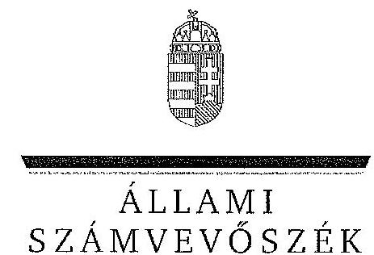

ÁLLAMI
SZÁMVEVŐSZÉK

# JELENTÉS 

az önkormányzatok többségi tulajdonában lévő gazdasági társaságok közfeladat-ellátásának ellenőrzéséről
Radnóti Miklós Színház Nonprofit Kft. és jogelődje

---

# Állami Számvevőszék 

Iktatószám: V-0183-058/2014.
Témaszám: 1159
Vizsgálat-azonosító szám: V06530201

## Az ellenőrzést felügyelte:

## Makkai Mária

felügyeleti vezető
Az ellenőrzést vezette és az ellenőrzés végrehajtásáért felelős:
Horváth József
ellenőrzésvezető
A számvevőszéki jelentés összeállításában közreműködött:
Farkas László
számvevő tanácsos
Az ellenőrzést végezték:
Farkas László Dr. Pálffy Imre Péter
számvevő tanácsos
külső szakértő

A témához kapcsolódó eddig készített számvevőszéki jelentések:
címe
sorszáma
Jelentés a színházak állami támogatásának és gazdálkodásának 1039
ellenőrzéséről

---

# TARTALOMJEGYZÉK 

BEVEZETÉS ..... 3
I. ÖSSZEGZŐ MEGÁLLAPÍTÁSOK, KÖVETKEZTETÉSEK, JAVASLATOK ..... 6
II. RÉSZLETES MEGÁLLAPÍTÁSOK ..... 12

1. Az Önkormányzat közfeladat-ellátásának megszervezése ..... 12
1.1. A közfeladat meghatározása, a feladat ellátásának választott módja ..... 12
1.2. Az önkormányzati és a tulajdonosi irányítás megítélése ..... 17
2. A Színház közfeladat-ellátással kapcsolatos tevékenysége ..... 20
2.1. A Színház szervezeti kialakítása, szabályozottsága ..... 20
2.2. A gazdasági társaság vagyonnyilvántartása ..... 23
2.3. A gazdasági évek ráfordításainak és bevételeinek alakulása ..... 25
2.4. A gazdasági társaság eredményének alakulása ..... 27
2.5. A gazdasági társaság folyamatos üzemmenetének, likviditásának biztosítása ..... 29
3. Az Önkormányzat tulajdonosi jogainak és kötelezettségeinek érvényesítése ..... 30
3.1. A gazdasági társaságtól származó információk hasznosítása ..... 30
3.2. Az önkormányzat közgyűlésének intézkedései ..... 31

## MELLÉKLETEK

1. számú Budapest Főváros Önkormányzatának közgyűlési határozatai az Intézmény átalakítására vonatkozóan
2. számú Radnóti Miklós Színház szakmai tevékenységének mutatói 2008- 2012 között
3. számú Radnóti Miklós Színház támogatása 2008-2012 között
4. számú Radnóti Miklós Színház vagyonának főbb adatai 2008. január 1-je és 2012. december 31-e között
5. számú Budapest Főváros Főpolgármesterének észrevétele
6. számú A Radnóti Miklós Színház Nonprofit Kft. ügyvezetőjének észrevétele
7. számú A Radnóti Miklós Színház Nonprofit Kft. ügyvezetőjének észrevételére adott válasz

---

# FÜGGELÉKEK 

1. számú Rövidítések jegyzéke
2. számú Értelmező szótár

---

# JELENTÉS 

## az önkormányzatok többségi tulajdonában lévő gazdasági társaságok közfeladat-ellátásának ellenőrzéséről Radnóti Miklós Színház Nonprofit Kft. és jogelődje

## BEVEZETÉS

Az Önkormányzatnak közfeladata az Ötv. alapján a művészeti feladatok ellátásáról való gondoskodás, az Mötv. szerint az előadó-művészeti szervezet támogatása. Ezt az Önkormányzat előadó-művészeti költségvetési szerv fenntartásával, illetve egyszemélyes tulajdonában álló gazdasági társaság támogatásával valósította meg.

Az Önkormányzat az ellenőrzött időszakban rendelkezett színházi koncepcióval $^{1}$, amely a színházak működtetésének alternatíváit vázolta fel, illetve jövőbeli célokat határozott meg. Ezt a Közgyűlés határozattal² elfogadta.

A Főpolgármester a 2011. évben tette közzé a Zöld Könyvet³, melyben megállapította, hogy a kulturális terület legnagyobb problémája a rendszer széttagoltsága volt. Az Önkormányzat a működési tevékenységgel kapcsolatos feladatait a színházak által részben költségvetési intézményi, részben gazdasági társasági formában látta el, ez a fajlagos működési költségek, a vezetők javadalmazása és a számviteli politika eltéréseit okozta a különböző formában működő szervezeteknél. Ezért a Közgyűlés a 2011. március 23-án hozott határozataival előkészítette az egyes költségvetési szervként működő színházak átalakítását.

A színházak támogatása az ellenőrzött időszakban központi költségvetési, illetve fenntartói támogatás formájában, valamint pályázatok útján valósult meg. A 2010-2012. évek költségvetési törvényei egy összegben tartalmazták az Önkormányzat fenntartásában működő színházak fenntartói ösztönző részhozzájárulását, amelyet a fenntartó saját döntése alapján oszthatott el.

[^0]
[^0]:    ${ }^{1}$ Koncepció a fővárosi fenntartású színházak struktúráját és finanszírozását érintő változásokról (2007. XI. 29.)
    ${ }^{2}$ Főv. Kgy. 1979/2007 (11.29.) sz. határozata
    ${ }^{3}$ Zöld Könyv - Az új városvezetés a rend és a fejlődés szolgálatában - az első 10 hónap eredményei - 2011. augusztus, Kiadja: Budapest Főváros Önkormányzata, Felelős kiadó: Tarlós István 18. o.

---

Az ellenőrzött időszakban a színház 2011. július 31-ig költségvetési intézményként, ezt követően - a Közgyűlés határozata alapján - 2011. augusztus 1-jétől nonprofit korlátolt felelősségű társasági formában működött.

Az Önkormányzat a gazdasági társasággal a közfeladat ellátásának biztosítására 2011. augusztus 4-én Közszolgáltatási szerződést ${ }^{4}$, majd 2013. január 1-jei hatálybalépéssel Fenntartói megállapodást kötött. A Közszolgáltatási szerződés meghatározta a közhasznú tevékenység körét, az Önkormányzat által biztosított támogatás összegét, a feladat-ellátáshoz szükséges befektetett eszközöket, valamint azok rendelkezésre bocsátásának módját.

A Színház a közfeladat ellátása érdekében az ellenőrzött időszakban összesen 1647,5 millió Ft állami és önkormányzati működési, valamint 26,4 millió Ft fejlesztési támogatást kapott. Emellett 2009 és 2012 között 232,2 millió Ft TAO támogatást tudott igénybe venni.

A Színház társulattal rendelkező, repertoárrendben játszó, művész-színházi műsorpolitikát folytató előadó-művészeti szervezet. Az ellenőrzött időszakban a Színház évente átlagosan négy bemutatót tartott, repertoárjában pedig nyolctíz előadás szerepelt folyamatosan. Legfőbb törekvésük olyan értékteremtő és értékálló előadások létrehozása volt, amelyek az európai színházművészet legnemesebb hagyományait ötvözték a korunkra jellemző látásmóddal, az aktuális problémák iránti érzékenységgel. A Színház fizető nézőinek száma évente 47-50 ezer fő, az előadások száma pedig évi 214-221 között változott a 2008-2012. években. A Színház által foglalkoztatott dolgozók átlaglétszáma a 2008. évi 63 főről 2012. évre 56 főre csökkent.

A Színház főbb szakmai mutatószámait a 2. számú melléklet tartalmazza.
Az ellenőrzés várható eredménye: a jelentés nyilvánossága a társadalom széles körével ismerteti meg a Színház gazdálkodására vonatkozó megállapításainkat, továbbá a megállapítások alapján megfogalmazott számvevőszéki javaslatok hasznosítása elősegíti a feltárt hibák megszüntetését, az ellenőrzött szervezet jobb feladatellátását. A társadalom számára jelzi, hogy közpénz nem maradhat ellenőrizhetetlenül, az ÁSZ értékteremtő rend kialakításához és megőrzéséhez hozzájáruló tevékenysége pozitív hatással lesz a szervezetről kialakított összkép formálásában. A szervezeten belül lehetőség nyílik arra, hogy a megállapítások szintetizálásával az ÁSZ a hozzáadott értéket teremtő, elemző tevékenységét és tanácsadó szerepét is erősítse. A jó gyakorlatok bemutatásával az ÁSZ hozzájárul a követendő megoldások megismertetéséhez, terjesztéséhez.

Az ellenőrzés célja annak értékelése volt, hogy:

- az Önkormányzat a jogszabályi előírások figyelembevételével döntött-e az ellenőrzésre kerülő közfeladat megszervezéséről, az ellátás módjáról; a tulaj-

[^0]
[^0]:    ${ }^{4}$ Emtv. értelmező rendelkezések - a közszolgáltatási szerződés a közszolgáltatás nyújtására irányuló, legalább három évre szóló szerződés, amely az állam vagy az önkormányzat és a közszolgáltatást végző előadó-művészeti szervezet kapcsolatát szabályozza, tartalmazza a teljesítendő előadásszámot, a szolgáltatás nyújtásának időtartamát, helyét és a teljesítésért járó díjazást.

---

donostól elvárható gondossággal felügyelte-e a társaság feladatellátását; a gazdasági társaság rendelkezésére bocsátotta-e a közfeladat ellátásához a szükséges közvagyont, és biztosította-e a tulajdonosi jogok közvagyon feletti érvényesülését; a társaság vagyonvesztése esetén intézkedett-e a további vagyonvesztés megakadályozásáról;

- a gazdasági társaság teljesítette-e a tulajdonos önkormányzat részéről meghatározott célokat és feladatokat a rendelkezésre álló erőforrások felhasználásával; végrehajtotta-e a közfeladat-ellátási szerződés előírásait; betartotta-e a vagyonnal történő gazdálkodásra vonatkozó jogszabályi rendelkezéseket.

Az ellenőrzés hatóköre: az önkormányzatok közfeladat-ellátásának ellenőrzése, amely kiterjed az önkormányzatok és a közfeladatot ellátó, az önkormányzat többségi tulajdonában lévő gazdasági társaság közötti feladatmegosztásra, az önkormányzatok tulajdonosi jogainak gyakorlására, a nemzeti vagyon kezelésének ellenőrzése keretében a közfeladat-ellátáshoz rendelt vagyon és a vagyont érintő szerződésekre. A jelen ellenőrzés kiterjed az önkormányzatok többségi tulajdonlásával működő gazdasági társaságok közfeladat-ellátására, vagyongazdálkodási tevékenységére, a kapcsolódó nyilvántartások, elszámolások szabályszerűségére és megbízhatóságára. Az ellenőrzött tételek kiválasztása véletlen mintavétellel történt.

Az ellenőrzés típusa: szabályszerűségi ellenőrzés.
Az ellenőrzött időszak: a 2008-2012. évek, valamint a helyszíni ellenőrzés befejezéséig - 2013. augusztus 16-ig - bekövetkezett változások figyelemmel kísérése.

Ellenőrzött szervezet: a Radnóti Miklós Színház Nonprofit Kft. és jogelődje, valamint Budapest Főváros Önkormányzata.

Az ellenőrzés végrehajtásának jogszabályi alapját az ÁSZ tv. 5. § (3)-(5) bekezdéseiben foglaltak képezik.

Az ÁSZ a 2011. évi LXVI. törvény 29. §-a szerint a jelentéstervezetet megküldte Budapest Főváros Önkormányzata főpolgármesterének és a Radnóti Miklós Színház Nonprofit Kft. ügyvezető igazgatójának egyeztetésre. A beérkezett észrevételeket és az azokra adott választ a jelentés 5-7. számú mellékletei tartalmazzák.

---

# I. ÖSSZEGZŐ MEGÁLLAPÍTÁSOK, KÖVETKEZTETÉSEK, JAVASLATOK 

Az Önkormányzat a művészeti feladatok ellátásáról való gondoskodásnak, illetve az előadó-művészeti szervezet támogatásának, mint az Ötv.-ben és az Mötv.-ben meghatározott közfeladatának, az ellenőrzött időszak alatt eleget tett. Az Önkormányzat a közfeladat-ellátását 2011. július 31-ig a Színháznak, mint költségvetési intézménynek a fenntartásával, azt követően a gazdasági társaság támogatásával biztosította. A Közgyűlés tulajdonosi jogait az ellenőrzött időszakban a szabályzataiban és rendeleteiben foglaltak szerint gyakorolta.

Az Önkormányzat az Alapító Okiratban foglaltaknak megfelelően az Intézmény, majd 2011. augusztus 1-jétől a Társaság rendelkezésére bocsátotta az előadó-művészeti közfeladat-ellátásához szükséges ingatlan és ingó vagyont. A Színház részére a közfeladat-ellátáshoz szükséges forrás biztosításáról - 2008. január 1. és 2011. július 31. között - az éves költségvetések elfogadásával 2011. augusztus 1. és 2012. december 31. között - a Közszolgáltatási szerződésben (az annak elválaszthatatlan részét képező éves költségvetési rendeletekben) döntött az Önkormányzat.

Az Önkormányzat az Intézmény számára a közfeladat teljesítésével kapcsolatosan konkrét célokat, elvárásokat nem fogalmazott meg. Az Emtv. 2009. évi hatálybalépésével a tevékenység ellátására vonatkozó követelmények és feladatmutatók a törvény által kerültek meghatározásra.

Az Önkormányzat az Intézmény költségvetésének elfogadását, a beszámoltatásokat, az adatszolgáltatási kötelezettség ellenőrzését a jogszabályokban és a belső szabályozásában foglaltaknak megfelelően végezte el. Az Önkormányzat a Színház művészeti tevékenységének ellátását évadbeszámolók alapján értékelte, amelyeket a 2008-2010. évek között - az Önkormányzat SZMSZ ${ }_{1}$ rendelkezései szerint - a Kulturális Bizottsága elfogadott.

Az intézményi működés időszakában alkalmazott ösztönző rendszer megfelelt a vonatkozó jogszabályi és belső szabályozási előírásoknak. Az évenkénti jutalmazások időpontja, mértéke azonban nem volt kiszámítható, annak teljesítményösztönző, motiváló hatása nem érvényesült. Az Intézmény vezetője számára kifizetett jutalom összege nem kapcsolódott a beszámoló teljesítéséhez köthető mutatószámokhoz, a jutalomkeret a besorolási bérek arányában került meghatározásra.

Az Önkormányzat belső ellenőrzése az Intézménynél a 2008-2011. években ellenőrzést nem végzett.

Az Intézmény megszüntetése és a gazdasági társaság alapítása a Közgyűlés határozatainak megfelelően történt, azonban az intézmény megszüntető okiratának 2011. június 30-án - a Főpolgármester-helyettes által - történő aláírásával a Hivatal 10 nappal túllépte az Áht. szerinti közzétételi határidőt.

---

Az Önkormányzat döntése alapján a gazdasági társaság a közfeladat-ellátást 2011. augusztus 1-jén kezdte meg. Az Önkormányzat közfeladat-ellátásának tárgyi és pénzügyi feltételeit a Közszolgáltatási szerződésben határozta meg. Ez tartalmazta az ingatlanok bérbeadásának és az ingó vagyontárgyak ingyenes használatba adásának módját, valamint a költségvetési támogatás mértékét. Meghatározta a közhasznú tevékenység körét, a szerződés megszűnésének esetére szabályozta a vagyontárgyak visszaszolgáltatásának rendjét és határidejét, továbbá a Színház által teljesítendő művészeti tevékenységek jellegét, körét, mértékét és pontos mutatószámait. Az önkormányzati tulajdon védelme érdekében szabályozta a kötelező leltár készítését, annak gyakoriságát, továbbá a gazdálkodás és a művészeti tevékenység ellátásával összefüggő kötelező adatszolgáltatás formáját, idejét és módját, valamint előírta a gazdálkodás körében felmerülő rendkívüli eseményekről történő tájékoztatási kötelezettséget.

A tulajdonos Önkormányzat az Intézmény könyveiben nyilvántartott, befektetett eszközöket a közhasznú tevékenység eredményes ellátása érdekében 2011. augusztus 1-én haszonkölcsön formájában átadta a Társaság részére. A vagyon átadás-átvételi jegyzőkönyv szerint a befektetett eszközök értéke 318,0 millió Ft volt.

Az Emtv. új elemként vezette be 2009 novemberétől a társasági adókedvezménnyel igénybe vehető támogatást, mint közvetett támogatási formát. Ennek mértékét a jogalkotó a tárgyévi jegybevétel 80%-ában határozta meg. A TAO támogatás pénzügyi
 teljesülése a támogatást nyújtó vállalkozások eredményességének és támogatásnyújtási hajlandóságának függvénye.

Az Önkormányzat a gazdasági társasági működés időszakában a Közszolgáltatási szerződésben határozta meg a közfeladat-ellátás követelményeit. Az Önkormányzat a vagyon védelme érdekében a Közszolgáltatási szerződésben garanciális követelményként fogalmazta meg a kötelezettségek megszegésének jogkövetkezményét, valamint a szerződés megszűnésének esetére az átadott vagyontárgyak visszaszolgáltatási kötelezettségét. Az ellenőrzött időszakban kötelezettség megszegésére, illetve szerződés megszűnésére nem került sor.

A leltározásra vonatkozó előírások a társasággá alakulást követően az Önkormányzat Vagyonrendeleteiben nem a hatályos jogszabályoknak megfelelően szerepeltek, mivel az üzemeltetésre, kezelésre átadott eszközök leltározási szabályairól a Vagyonrendelet 2010. január 1-jétől az Áhsz. előírásaival ellentétben nem tartalmazott szabályozást.

Az Önkormányzat a Társaság Alapító Okiratban - a Gt. előírásaival összhangban - szabályozta az Alapító tulajdonosi joggyakorlásának kereteit. Az Alapító Okiratban a Társaság legfőbb szerve, a Közgyűlés kizárólagos hatáskörébe tartozó feladatként határozta meg a Társaság SZMSZ-ének és az FB ügyrendjének jóváhagyását, amely a hiánypótlások következtében - közel egy év elteltével - 2012. szeptember 13-án történt meg. A Közgyűlés a tulajdonosi érdekeinek védelmére határozatokban kijelölte a Társaság FB tagjait és könyvvizsgálóját.

Az Önkormányzat a társaság ügyvezetőjének és egyéb vezető állású dolgozóinak, valamint az FB tagoknak a díjazására vonatkozó Javadalmazási szabályzatot a Taktv.-ben foglalt határidőn túl, 2010. január 31. helyett április 29-én fogadta el.

Az Önkormányzat a Társaság üzleti tervének elfogadását, beszámoltatását és az adatszolgáltatási kötelezettség ellenőrzését a jogszabályokban, az Önkormányzat belső szabályzataiban és a Közszolgáltatási szerződésben foglaltaknak megfelelően, határidőben - az FB és a könyvvizsgálói jelentés figyelembe vételével - végezte el.

A Társaság szakmai tevékenységének ellátását az Önkormányzat évadbeszámolók alapján értékelte. A 2011-2012. évekre benyújtott évadbeszámolókról a kulturális ügyekért felelős Főpolgármester-helyettes tájékoztatót nyújtott be a Közgyűlés részére, melyet a Közgyűlés tudomásul vett.

A 2011. és a 2012. évekre vonatkozóan a Társaság ügyvezetője részére a prémiumfeladatok meghatározása a Javadalmazási szabályzattól eltérően - késedelmesen - történt. A prémiumfeltételeket és annak összegét mindkét évben az üzleti terv elfogadását követően határozta meg az Alapító.

Az Önkormányzat belső ellenőrzése a Társaságnál egy ellenőrzést végzett. A 2011. évben végzett szabályszerűségi ellenőrzés a gazdálkodási szabályzatokkal kapcsolatban fogalmazott meg hiányosságokat. Az Önkormányzat - jogszabályi kötelezettség hiányában - nem vett részt az ingyenesen haszonkölcsönbe adott eszközeinek leltározásában és annak ellenőrzésében.

A Társaság 2011-2012. évi gazdálkodása, valamint mérleg szerinti nyeresége nem tette szükségessé, hogy a tulajdonos Önkormányzat a vagyon, a közpénzek nem célszerű hasznosításával, az esetleges pazarló felhasználással kapcsolatban, valamint a lejárt kötelezettségek csökkentése érdekében tulajdonosi intézkedéseket tegyen.

Az Intézmény a vagyonnal történő gazdálkodásra vonatkozó jogszabályi rendelkezéseknek nem teljes körűen tett eleget. A Számviteli politika hiányosságai az Intézmény integritásával kapcsolatban kockázatot jelentettek. Az Intézmény 2008. január 1. és 2011. július 31. közötti időszakra vonatkozó Számviteli politikája nem felelt meg a Számv. tv.-nek, mert az egyes produkciókban közvetlenül felhasználandó díszleteket, jelmezeket és kellékeket a Színház a beszerzési és előállítási értéktől és a használati időtől függetlenül azonnal 100%-ban költségként, a dologi kiadások között számolta el. Ez a vagyonvédelem szempontjából kockázatot jelentett. Nem szabályozta továbbá a produkciók színrevitele költségeinek (szellemi termék) elszámolási rendjét.

Az Intézmény működési formája a közfeladat-ellátás követelményeinek megfelel, Alapító Okirattal, SZMSZ-vel, az irányítási, döntési és felelősségi jogköröket tartalmazó belső szabályzatokkal rendelkezett.

Az Intézmény 2008. január 1. és 2011. július 31. között az előadó-művészeti tevékenység ellátásához szükséges, a fenntartó által rendelkezésére bocsátott vagyont az Áhsz. ben foglaltaknak megfelelően saját mérlegében mutatta ki, melyet a belső szabályozásban foglaltaknak megfelelően elkészített leltárral támasztottak alá.

Az Intézmény adatszolgáltatási kötelezettségeit a jogszabályokban és a belső szabályozásban foglalt módon, havi, negyedéves, féléves, éves időszakonként teljesítette.

Az Intézmény összes bevétele a 2010. évben 637,4 millió Ft volt, 23,3%-kal növekedett 2008-hoz képest. Az összes kiadása 2008-ról 2010-re 27,3%-kal emelkedett, 2010-ben 578,4 millió Ft-ot tett ki. Az Intézmény összes kiadásainak több mint felét a személyi juttatások és a járulékok összege tette ki.

A Közgyűlés 2011. március 23-án határozatot hozott a költségvetési intézményként működő Színház megszüntetéséről, és ezzel összhangban az utódszervezet, gazdasági társaság alapításához szükséges engedélyeket megadta. A Főpolgármester-helyettes a költségvetési intézmény megszüntető okiratát 2011. június 30-án írta alá.

A gazdasági társaság teljesítette az Önkormányzat részéről a Közszolgáltatási szerződésben meghatározott célokat és feladatokat. A gazdálkodásra vonatkozó jogszabályi rendelkezéseket - az önköltségszámítás kivételével - betartották.

A Társaság rendelkezett Alapító Okirattal és az irányítási, döntési és felelősségi jogköröket tartalmazó belső szabályzatokkal. A Társaság - tulajdonosi jóváhagyás hiányában - 2012. szeptember 13-ig érvényes SZMSZ nélkül működött.

A Társaság a Közszolgáltatási szerződés előírásának megfelelően folyamatosan biztosította a tevékenységi körébe tartozó színházi szolgáltatást.

A Társaság 2011. december 31-i fordulónappal az Önkormányzat által ingyenes használatba adott eszközök leltározását mennyiségi felvétel helyett egyeztetéssel végezte el. A Társaság 2011. évi beszámolóját egyeztetéssel készített leltárral támasztották alá. A 2012. évi mérleg eszközeinek és forrásainak leltárral történő alátámasztását a Leltározási szabályzatban foglaltak szerint végezték el.

A Társaság olyan Számlarendet alakított ki, amelyből az ellátott közfeladat bevételei és ráfordításai elkülönülten ellenőrizhetők. A Számviteli politikában a díszletek, valamint a szellemi termékek elszámolását megfelelően szabályozták. A Társaság elkészítette az Önköltségszámítási szabályzatot, azonban azokban nem tért ki a társulat bérének és járulékainak legalább a produkció színreviteléig történő felosztási módjára. Ennek következtében a produkciók színreviteléig aktivált szellemi termékek nem a ténylegesen felmerült közvetlen költségek alapján kerültek elszámolásra. Továbbá az Önköltségszámítási szabályzat nem tartalmazta az általános költségek felosztási módját.

A Társaság az Önkormányzat tulajdonában álló eszközöket a Számv. tv.-nek megfelelően, (ingatlanok, immateriális javak, tárgyi eszközök, készletek) számlarendjében elkülönítetten, a 0-ás számlaosztályban tartotta nyilván. A Színház művészeti tevékenységét szolgáló - saját és Önkormányzati tulajdonú eszközök 2012. december 31-ei nettó értéke (5098 millió Ft) a 2008. december 31-ei adathoz viszonyítva 53,5%-kal (177,6 millió Ft-tal) emelkedett.

Az Intézmény 2011. július 31-ig bérleti jogviszony keretében használta a külön tulajdonban lévő Paulay Ede u. 52. szám alatti ingatlanrészt. A közfeladatellátás az ingatlanrész (hátsó színpad és díszletbehordó folyosó, $72 \mathrm{~m}^{3}$) használata nélkül nem biztosítható. A Színház és az ingatlan tulajdonosa között megkötött bérleti szerződés a költségvetési intézmény megszüntetését követően nem került módosításra, mivel a bérbeadó korábbi szerződéskötési szándéka megváltozott. A Színház folyamatosan használta az ellenőrzött időszakban az ingatlanrészt a bérbeadó és a költségvetési intézmény között létrejött bérleti szerződés alapján. A bérbeadó a számlákat továbbra is a megszűnt Intézmény nevére állította ki (2011. szeptember 10. és 2013. május 10. közötti időszak, 7,7 millió Ft összegben), amelyet a Társaság befogadott és elszámolt, ezzel megsértve a Számv. tv. előírásait. A szabálytalan elszámolás miatt a bérleti díj áfa tartalmát a Társaság nem igényelte vissza. Az Önkormányzat az ingatlan használatának szükségességéről igazolhatóan tudomással bírt. A fennálló helyzet a közfeladat eredményes ellátását veszélyezteti, és a bérleti díjak szabályszerű elszámolását nem teszi lehetővé.

A Társaság a 2011-2012. években elkészítette üzleti és az arra épülő likviditási tervét. Mérleg szerinti eredménye a 2011. évben 125,0 millió Ft, 2012-ben 45,8 millió Ft volt, amit a jegybevételek, a tao támogatások, valamint a kiemelt feladatok ellátására kapott pályázati források elnyerése alakított ki. A Társaság 2011-2012. évi beszámolóit a Közgyűlés elfogadta.

A Társaság első teljes évében, 2012-ben 514,8 millió Ft bevételt ért el, a ráfordítások összege 475,0 millió Ft volt.

A Társaság az átmenetileg szabad pénzeszközeit befektetési alapban helyezte el, annak ellenére, hogy nem rendelkezett a Közhasznú tv.-ben, a Civil tv.-ben és a mindenkor hatályos Alapító Okiratában előírt, az Alapító által jóváhagyott, érvényes Befektetési szabályzattal.

Az Állami Számvevőszékről szóló 2011. évi LXVI. törvény 33. § (1) bekezdésében foglaltak értelmében a jelentésben foglalt megállapításokhoz kapcsolódó intézkedési tervet köteles az ellenőrzött szervezet vezetője összeállítani, és azt a jelentés kézhezvételétől számított 30 napon belül az ÁSZ részére megküldeni. Amennyiben az intézkedési tervet határidőben nem küldi meg a szervezet, vagy az nem elfogadható, az ÁSZ elnöke a hivatkozott törvény 33. § (3) bekezdés a)-b) pontjaiban foglaltakat érvényesítheti.

Az ellenőrzés intézkedést igénylő megállapításai és javaslatai:

# Budapest Főváros Főjegyzőjének 

1. A leltározásra vonatkozó előírások a társasággá alakulást követően az Önkormányzat Vagyonrendeleteiben nem a hatályos jogszabályoknak megfelelően szerepeltek, mivel az üzemeltetésre, kezelésre átadott eszközök leltározási szabályairól a Vagyon-
[^0]
[^0]:    ${ }^{5}$ A befektetési tevékenységet folytató közhasznú szervezetnek befektetési szabályzatot kell készítenie, amelyet a legfőbb szerv fogad el.

rendelet 2010. január 1-jétől az Áhsz. előírásaival ellentétben nem tartalmazott szabályozást.

Javaslat:
Készítse elő a Közgyűlés elé való terjesztés érdekében a Vagyonrendelet módosítását, hogy az tartalmazza az Áhsz. 22. § (2) bekezdésben előírtaknak megfelelően az üzemeltetésre, kezelésre átadott eszközök leltározási szabályait.

# A Radnóti Miklós Színház igazgatójának 

1. A Társaság elkészítette az Önköltségszámítási szabályzatot, azonban azokban nem tért ki a társulat bérének és járulékainak legalább a produkció színreviteléig történő felosztási módjára. Ennek következtében a produkciók színreviteléig aktivált szellemi termékek nem a ténylegesen felmerült közvetlen költségek alapján kerültek elszámolásra. Továbbá az Önköltségszámítási szabályzat nem tartalmazta az általános költségek felosztási módját.

Javaslat:
Intézkedjen az Önköltségszámítási szabályzat módosításáról annak érdekében, hogy
a) a produkció bemutatásáig elszámolt közvetlen költségek tartalmazzák a társulat bérének és járulékainak a produkcióra felosztott költségeit;
b) a szabályzat tartalmazza az általános költségek felosztási módját.
2. A Színház a feladatai ellátásához a Paulay Ede u. 52. szám alatti épületben lévő ingatlanrészt az ellenőrzött időszakban bérleti jogviszony keretében használta. A költségvetési intézmény megszűnésével a bérleti szerződés megújítására nem került sor. Az ingatlan tulajdonosa rendszeresen számlát állított ki a megszűnt intézmény nevére, amit a Társaság befogadott. Ezzel a Társaság megsértette a Számv. tv. 165. § (2) bekezdésében előírt bizonylati fegyelmet. 2011. szeptember 10. és 2013. május 10. között a Társaság 7,7 millió Ft bérleti díjat fizetett ki nem megfelelő számla ellenében.

Javaslat:
Kezdeményezze a bérleti szerződés módosítását annak érdekében, hogy a számlákat a Társaság nevére szólóan állítsa ki a bérbeadó, továbbá intézkedjen a társasági időszakra vonatkozó megfelelő számla bérbeadó általi megküldése érdekében, és az alapján rendezze a vissza nem igényelt áfát.
3. A Színház 2011. szeptember 15-étől Befektetési szabályzatban rendelkezett a szabad pénzeszközeinek felhasználási módjáról. A Befektetési szabályzat tervezetét a tulajdonos részére nem küldte meg, ezért az Alapító Okirat 7.3. pontja szerint az alapító nem fogadta el azt. A Befektetési szabályzat így érvényesen nem jött létre, ezért rendelkezései nem hatályosak.

Javaslat:
Intézkedjen a Befektetési szabályzat tulajdonos részére történő megküldéséről annak érdekében, hogy azt a tulajdonos jóvá tudja hagyni.

# II. RÉSZLETES
 MEGÁLLAPÍTÁSOK 

## 1. Az ÖNKORMÁNYZAT KÖZFELADAT-ELLÁTÁSÁNAK MEGSZERVEZÉSE

### 1.1. A közfeladat meghatározása, a feladat ellátásának választott módja

Az Önkormányzat a művészeti feladatok ellátásáról való gondoskodásnak, illetve az előadó-művészeti szervezet támogatásának, mint az Ötv.-ben és az Műtv.-ben meghatározott közfeladatának, az ellenőrzött időszak alatt eleget tett. Az Önkormányzat a közfeladat ellátását 2011. július 31-éig Intézmény fenntartásával, azt követően a Színház támogatásával biztosította.

Az Önkormányzat kötelező közfeladata az Ötv. 63/A. § n) pontja szerint a művészeti feladatok ellátása ${ }^{6}$. A Htv. 111. § alapján a közművelődési, közgyűjteményi és művészeti tevékenységekkel kapcsolatos helyi irányítási, ellenőrzési, valamint a fenntartással és működtetéssel kapcsolatos feladatokat a Közgyűlés látja el. A kulturális feladat ellátását az Önkormányzat az Emtv. 3. § (2) bekezdése alapján előadó-művészeti szervezet fenntartásával (költségvetési szervei esetében) vagy annak támogatásával (gazdasági társaságai esetében) valósította meg.

Az Önkormányzat az ellenőrzött időszakban elfogadott kulturális stratégiával nem, csak koncepcióval ${ }^{7}$ rendelkezett, amelyet a Közgyűlés ${ }^{8}$ határozatával fogadott el.

A koncepció a színházak működtetésének módozatait vázolta fel, jövőbeli célokat határozott meg, nem vizsgálta azonban a megvalósításhoz szükséges források nagyságát.

A 2010. évi önkormányzati választásokat követően az Ötv. 91. § (1) és (6) bekezdésnek megfelelően a Közgyűlés ${ }^{9}$ elfogadta az Önkormányzat 2011-2014. évekre vonatkozó Gazdasági Programját ${ }^{10}$.

Az Önkormányzat a költségvetési szervezeti formában működő Színház teljesítményével kapcsolatosan konkrét célokat, elvárásokat nem fogalmazott meg,

[^0]
[^0]:    ${ }^{6}$ A 2013. 01. 01-től hatályos Műtv. 13. § 1) 7. pont is kötelezően ellátandó feladatként határozza meg az előadó-művészeti szervezetek támogatását.
    ${ }^{7}$ Koncepció a fővárosi fenntartású színházak struktúráját és finanszírozását érintő változásokról
    ${ }^{8}$ a Főv. Kgy. 1979/2007. (11.29.) sz. határozata
    ${ }^{9}$ a Főv. Kgy. 937/2011. (04.27.) sz. határozata
    ${ }^{10}$ A Főváros fejlesztésének és gazdálkodásának stabilizálása és reformkoncepciója a 2011-2014. évi választási ciklusra

---

a szakmai elvárásait az igazgatói pályázat kiírásában szerepeltette. A nyertes pályázat a megválasztott igazgató stratégiai céljait, valamint konkrét szakmai elképzeléseit foglalta össze.

# Az Emtv. hatálybalépésével a tevékenység ellátására vonatkozó követelmények és feladatmutatók a törvény által kerültek meghatározásra. 

A Közgyűlés 2011. március 23-án határozatokat ${ }^{11}$ hozott a költségvetési szervként működő színházak megszüntetéséről és az utódszervezetek, nonprofit gazdasági társaságok alapításáról. A Közgyűlés határozata ${ }^{12}$ az Áht. 100/O. § (5) bekezdésének, az előzetes engedélyhez készített előterjesztés tartalma az Áht. 100/L. § (4) bekezdésének felelt meg.

Az Önkormányzat határozatával ${ }^{13}$ a költségvetési intézményt az utódszervezet létrehozásával egyidejűleg, 2011. július 31-i hatállyal megszüntette. A Főpolgármester-helyettes a megszüntető okiratot 2011. június 30-án írta alá. Ezzel a Hivatal nem tett eleget az Áht. 96. § (1) bekezdése rendelkezésének, amely előírta, hogy a költségvetési szerv megszüntető okiratát legalább negyven nappal a megszüntetés kérelmezett napja előtt ki kell hirdetni (közzé kell tenni).

A 2011. augusztus 1-jén létrehozott gazdasági társaság a költségvetési szervként működő intézmény jogutódjaként jött létre. Az intézmény valamennyi közfeladat-ellátással összefüggő joga és kötelezettsége, valamint a vagyona feletti rendelkezés, illetőleg az Önkormányzat tulajdonát képező, a közfeladat-ellátás céljából használatában álló ingatlanokkal és ingóságokkal kapcsolatos jogok és kötelezettségek a gazdasági társaságra szálltak át.

Az Önkormányzat a költségvetési szervek megszüntetésénél betartotta az Ámr. 11. § (1) a)-c), f) és (2) bekezdésében előírtakat, valamint a Kjt. 25/A. § (2)-(3) és (8) bekezdéseinek megfelelően gondoskodott a költségvetési szervnél foglalkoztatott közalkalmazottak további foglalkoztatásáról.

Az Intézmény a költségvetési gazdálkodás szabályai szerint működött 2011. július 31-ig, Alapító Okirata megfelelt a jogszabályi előírásoknak, és tartalmazta a közfeladat-ellátásához szükséges eszközöket.

Az Önkormányzat 2008. január 1. és 2011. július 31-e között az Alapító Okiratokban foglaltaknak megfelelően az Intézmény rendelkezésére bocsátotta (haszonkölcsönbe adta) az előadó-művészeti közfeladat-ellátásához szükséges ingatlan és ingó vagyont.

A Közgyűlés határozatának ${ }^{14}$ megfelelően a megszüntetésre kerülő költségvetési szerv Áhsz. 13/A. §-ában foglaltak szerinti - leltárral és főkönyvi kivonattal

[^0]
[^0]:    ${ }^{11}$ az 1. sz. melléklet 5-8. sorszámú határozatai
    ${ }^{12}$ az 1. sz. melléklet 5. sorszámú határozata
    ${ }^{13}$ az 1. sz. melléklet 9. sorszámú határozata
    ${ }^{14}$ az 1. sz. melléklet 9. sorszámú határozata.

---

alátámasztott - záró beszámolóját 2011. július 31-i fordulónappal elkészítették. A záró beszámolót a Közgyűlés jóváhagyta ${ }^{15}$.

A tulajdonos az Intézmény könyveiben nyilvántartott, befektetett eszközöket a közhasznú tevékenység eredményes ellátása érdekében átadta a Társaság részére. A vagyon átadás-átvételi jegyzőkönyv szerint a befektetett eszközök értéke 318,0 millió Ft volt.

A Nvtv. 3. § alapján az ellenőrzött Színház átlátható szervezet.
A Közgyűlés határozatával ${ }^{16}$ megalapította a gazdasági társaságot, jóváhagyta a Közszolgáltatási szerződés szövegét. A Főpolgármester a Közszolgáltatási szerződést 2011. augusztus 4-én írta alá.

Az Önkormányzat az Alapító Okirat szövegezésénél a Gt. 15. § (1) bekezdésének előírásait figyelembe vette, mely szerint a társasági szerződés ellenjegyzésének napjától a létrehozni kívánt gazdasági társaság előtársaságként működhet ${ }^{17}$. Azonban figyelmen kívül hagyta az Áht. 100/O. § (2) bekezdését, mely szerint költségvetési intézmény utódszervezete előtársaságként nem működhet, így üzletszerű gazdasági tevékenységet nem végezhet, és a bejegyzés idejéig kötelezettséget nem vállalhat. A Színház gazdasági tevékenységét az Alapító Okiratának megfelelően augusztus 1-jével kezdte meg.

Az Alapító Okirat 4.6. és 4.9. pontja egymásnak ellentmond, mivel 4.6. pontja szerint a társasági szerződés ellenjegyzésének napjától a létrehozni kívánt gazdasági társaság előtársaságként működhet, a 4.9. pontban pedig az Alapító rögzíti, hogy a Társaság a közfeladat-ellátását és működését 2011. augusztus 1. napjával kezdi meg.

Az Önkormányzat a Társaság Alapító Okiratban - a Gt. előírásaival összhangban - szabályozta az Alapító tulajdonosi joggyakorlásának kereteit. Az Alapító Okirat megfelelően rendelkezett a társaság gazdálkodása során elért eredmény felhasználásáról, az ügyvezető, az FB tagok és a könyvvizsgáló kijelöléséről, az összeférhetetlenségi szabályokról, valamint az Áht. 100/N. § (8) előírásainak betartatásáról.

Az Alapító az egyszemélyes nonprofit korlátolt felelősségű társaság alapításával eleget tett az Áht. 100/L. § (1), és 100/O. § (2) szakaszában előírt rendelkezéseknek, a társaság Alapító Okiratának tartalmának meghatározásakor eleget tett a Ptk. 54. § (1-2) és a Gt. 12. § (1) bekezdésében előírt, valamint a Közhasznú tv. 4. § (1) bekezdésében foglalt tartalmi követelményeknek.

Az Önkormányzat a hatályos Emtv. 15. § (3) bekezdésének megfelelően a Színház hatósági nyilvántartás szerinti adatainak módosítására irányuló kérelmét benyújtotta.

[^0]
[^0]:    ${ }^{15}$ az 1. sz. melléklet 12. sorszámú határozata.
    ${ }^{16}$ az 1. sz. melléklet 10. sorszámú határozata.
    ${ }^{17}$ A Gt. 16 § (2) bekezdése alapján az előtársasági létszakasz a cégbejegyzéssel szűnik meg, és az előtársasági létszakaszban kötött jogügyletek a gazdasági társaság jogügyleteinek minősülnek.

---

Az előadó-művészeti szervezetet (a Színházat) a KÖH Film- és Előadó-művészeti Iroda nyilvántartásba vette.

Az Önkormányzat tulajdonában álló vagyon a nemzeti vagyon részét képezi. A Vagyonrendelet 26. § (1) bekezdés szerint a Társaság használatában lévő, feladatellátását szolgáló ingatlanvagyon korlátozottan forgalomképes törzsvagyon.

Az Önkormányzat döntése alapján a gazdasági társaság a közfeladat-ellátást 2011. augusztus 1-jén kezdte meg. Az Önkormányzat a közfeladat ellátásának tárgyi és pénzügyi feltételeit a Közszolgáltatási szerződésben határozta meg. Ez tartalmazta az ingatlanok bérbeadásának és az ingó vagyontárgyak ingyenes használatba adásának módját, valamint a költségvetési támogatás mértékét. A Közszolgáltatási szerződés meghatározta a közhasznú tevékenység körét, a szerződés megszűnésének esetére szabályozta a vagyontárgyak visszaszolgáltatásának rendjét, határidejét, továbbá a Színház által teljesítendő művészeti tevékenységek jellegét, körét, mértékét és pontos mutatószámait. Az önkormányzati tulajdon védelme érdekében a Közszolgáltatási szerződésben szabályozták a kötelező leltár készítését, gyakoriságát, továbbá a gazdálkodás és a művészeti tevékenység ellátásával összefüggő kötelező adatszolgáltatás formáját, idejét és módját, valamint előírták a gazdálkodás körében felmerülő rendkívüli eseményekről történő tájékoztatási kötelezettséget.

# Az Önkormányzat a Társaság által használt ingatlanok vonatkozásában a Közgyűlés 2011. augusztus 31-ei határozatának megfelelően a megszabott határidőn belül bérleti szerződést kötött a Társasággal. A bérleti szerződés aláírásával a szerződő felek között kötelmi viszony keletkezett. A bérleti szerződés rendelkezései szerint a megszerzési díj megfizetése bérleti jogviszonyt hozott létre. A Bérleti szerződés úgy rendelkezett, hogy a bérlő a Közszolgáltatási szerződés alapján, haszonkölcsön ${ }^{18}$ címén használta korábban az ingatlant. A Közszolgáltatási szerződés azonban ezzel ellentétben azt tartalmazza, hogy az Önkormányzat bérlet formájában biztosította azt. Továbbá az Önkormányzat figyelmen kívül hagyta, hogy a korábbi határozatának ${ }^{19}$ megfelelő tartalmú okirat, a 2011. július 31-éig költségvetési intézményként működő szerv Megszüntető Okirata alapján a jogelőd ingyenes ingatlanhasználata az utódszervezetre szállt át. Azzal, hogy az Önkormányzat a 2011. november 23-án aláírt bérleti szerződés szerint - az annak aláírását megelőző időszakra - érvényesítette a későbbi szerződésben szereplő díjak bérlő általi megfizetését, nem a korábbi határozatának megfelelően járt el.

A Társaságnak a bérleti szerződés aláírását megelőző időszakra használati díjat, azt követően bérleti díjat (2,3 millió Ft/hó+áfa), valamint a bérleti díj összegét alapul véve egyszeri, 3 havi megszerzési díjat és 5 havi óvadékot kellett fizetnie. A 2011-es évre vonatkozóan óvadékként, megszerzési díjként, használati és bérleti díjként, összesen egy évi bérleti díjnak megfelelő összeg került kifizetésre.

[^0]
[^0]:    ${ }^{18}$ A Ptk. 583. § (1) bekezdése szerint haszonkölcsön-szerződés alapján a kölcsönadó köteles a dolgot a szerződésben meghatározott időre ingyenesen a kölcsönvevő használatába adni, a kölcsönvevő pedig köteles azt a szerződés megszűntekor visszaadni.
    ${ }^{19}$ az 1. sz. melléklet 9. sorszámú határozata

---

A felek 2012-ben a Bérleti szerződés 2. pontját kiegészítették azzal, hogy az Önkormányzat az óvadék összegét „a bérleti szerződés időtartama alatt a kielégítési jog megnyílta előtt használhatja és rendelkezhet vele." Az óvadék összegének fedezete az Önkormányzat részéről tett nyilatkozat ${ }^{20}$ alapján folyamatosan rendelkezésre állt.

# A Színház támogatása az ellenőrzött időszakban központi költségvetési, illetve fenntartói támogatással, valamint pályázatok útján valósult meg. Az Önkormányzat a saját tulajdonosi támogatás színházak közötti elosztásának elveit, szempontjait szabályzatban, illetve belső utasításban nem határozta meg. 

A 2010. évtől az Emtv. 16. § (1) bekezdése ${ }^{21}$ szerint a színházak támogatása művészeti ösztönző részhozzájárulásból és fenntartói ösztönző részhozzájárulásból tevődött össze. A 2010-2012. években a költségvetési törvények 7. sz. melléklete egy összegben tartalmazta az Önkormányzat fenntartásában működő színházak fenntartói ösztönző részhozzájárulását, amelyet a fenntartó saját döntése alapján oszthatott el. A költségvetési törvények a színházak művészeti ösztönző részhozzájárulását külön nevesítve tartalmazták. A 2013. évtől a színházakat művészeti, és
 létesítménygazdálkodási célra működési támogatás illette meg.

Az Emtv. 48. § (1) bekezdése új elemként bevezette - a Taotv. 7. § (1) bekezdés z) pontja alapján - a társasági adókedvezménnyel igénybe vehető támogatást, mint közvetett támogatási formát. A tao kedvezmény igénybevétele 2009. november 12-től volt lehetséges, a meghatározott jegybevétel 80%-áig. A tao támogatás pénzügyi teljesülése a támogatást nyújtó vállalkozások eredményességének és támogatás nyújtási hajlandóságának függvénye.

Az ellenőrzött időszakban a Színház számára biztosított működési hozzájárulás és tao támogatás alakulását a 3. számú melléklet tartalmazza.

Az állami támogatás összege - az átalakulás évét kivéve - az ellenőrzött időszakban minden évben meghaladta az önkormányzati támogatás összegét, és részaránya magasabb volt. Az önkormányzati támogatás összege a 2008. évtől a 2009. évre 37,9%-kal (41,5 millió Ft), a 2010. évben az előző évhez képest 8,3%-kal (12,5 millió Ft) csökkent. A 2011. évben az előző évhez viszonyítva 51,2%-kal növekedett (70,9 millió Ft) annak következtében, hogy a nonprofit kft.-vé alakuláshoz az önkormányzat egyszeri támogatást nyújtott. A 2012. évben csökkent a rendszeres támogatás az előző évhez képest 2,3%-kal (2,5 millió Ft). A tao támogatás a 2009. évtől kezdődően folyamatosan növekedett.

Az ellenőrzött időszakban az önkormányzati vagyon megőrzése, védelme érdekében a 2011. évig az Intézmény leltározását az önkormányzati Vagyonrendelet¹ szabályozta. A Vagyonrendelet¹ 12. § (1) bekezdése szerint az Önkormányzat tulajdonában lévő eszközöket minden évben leltározni kell, az ettől eltérő eseteket a rendelet 12. § (3)-(4) bekezdései szabályozták.

[^0]
[^0]:    ${ }^{20}$ a Főpolgármesteri Hivatal ellenőrzéshez kirendelt kapcsolattartója 2013.08.14. 12:02kor e-mail formájában adott válasza alapján
    ${ }^{21}$ hatályon kívül helyezve 2012. május 1-jétől

---

A leltározásra vonatkozó előírások a társasággá alakulást követően az Önkormányzat Vagyonrendeleteiben nem a hatályos jogszabályoknak megfelelően szerepeltek, mivel az üzemeltetésre, kezelésre átadott eszközök leltározási szabályairól a Vagyonrendelet 2010. január 1-jétől, az Áhsz. előírásaival ellentétben nem tartalmazott szabályozást.

A Közszolgáltatási szerződés 5. B pontja az Önkormányzat tulajdonát képező ingó vagyonra vonatkozóan kötelező leltár készítését, a szerződés 6. pont 4. bekezdése az önkormányzati vagyon nyilvántartására vonatkozó előírásoknak megfelelő adatszolgáltatási és nyilvántartási kötelezettség teljesítését írta elő a társaság számára. ${ }^{22}$

Az Önkormányzat minden negyedév végén bekérte a Társaságtól az ingatlanadatok változására vonatkozó dokumentumokat, a bruttó érték növekedés vagy csökkenés (kataszteri módosító lapok), valamint az értékcsökkenés elszámolásáról szóló, a gazdasági vezető által aláírt, "6. sz. melléklet" című táblázatot. A megküldött dokumentumok alapján a kataszteri rendszer, valamint a Pénzügyi Információs rendszer adatainak frissítése megtörtént.

Az Önkormányzat vagyonkimutatást készített a 2008-2012. években az éves zárszámadáshoz az Ötv. 78. § (2) bekezdésében, és az Mötv. 110. § (2) bekezdésében foglaltaknak megfelelően.

A Vagyonrendelet² 14. §-a a leltározás vonatkozásában a korábbi vagyonrendelettel azonos rendelkezéseket tartalmaz. Az Önkormányzat a 7/2011. sz. Leltározási és Leltárkészítési Szabályzatában sem rendelkezett a társaságok leltárainak önkormányzati ellenőrzéséről.

Az Önkormányzat a vagyon védelme érdekében a Közszolgáltatási szerződésben garanciális követelményként fogalmazta meg a kötelezettségek megszegésének jogkövetkezményét, valamint a szerződés megszűnésének esetére az átadott vagyontárgyak visszaszolgáltatási kötelezettségét. Az ellenőrzött időszakban kötelezettség megszegésére, illetve szerződés megszűnésére nem került sor.

# 1.2. Az önkormányzati és a tulajdonosi irányítás megítélése 

A Színház - mint költségvetési intézmény - esetében a tulajdonosi jogok gyakorlását a költségvetési szervekre vonatkozó jogszabályok és az Önkormányzat rendeletei határozták meg.

## A Közgyűlés tulajdonosi jogait az ellenőrzött időszakban a szabályzataiban és rendeleteiben foglaltak szerint gyakorolta.

Az Önkormányzati SZMSZ¹ 49. § (1) bekezdése alapján a 2008. és a 2011. évek között létrehozta állandó bizottságként a Kulturális Bizottságot. Ezen időszak-

[^0]
[^0]:    ${ }^{22}$ A fenntartói megállapodás 5.1. pontja a közszolgáltatási szerződés rendelkezésével megegyezően a vagyontárgyak évenkénti, december 31-i fordulónappal történő leltározási kötelezettségét írta elő, továbbá a társaság köteles volt azt megküldeni a tárgyévet követő év január 31-ig az Önkormányzatnak.

---

ban a Közgyűlés a bizottságra az SZMSZ¹,² 5. számú mellékletében szereplő feladatok ellátását ruházta át.

Az egyszemélyes társaság legfőbb szervének hatáskörébe tartozó jogok (a felügyelőbizottság tagjainak, valamint az ügyvezetőnek, továbbá a könyvvizsgálónak a megválasztása, visszahívása, megbízása, megbízásának visszavonása) gyakorlását a 2011. május 25. és 2011. november 10. közötti időszakban az Önkormányzat eltérően szabályozta a 2011. év előtt, illetve a 2011-ben gazdasági társasággá alapított színházak esetében.

A 2011. év előtt alapított társaságok esetében 2011. január 1-jétől a Vagyonrendelet¹ 52. § (2) bekezdése alapján a fenti jogokat a Főpolgármester közvetlenül gyakorolta. A 2011. május 25-én alapított színház gazdasági társaságok esetében 2011. november 9-éig a fenti tulajdonosi jogok gyakorlására kizárólag a Közgyűlés volt jogosult. Az eltérő szabályozás oka az volt, hogy a Közgyűlés a Vagyonrendelet¹ 5. számú mellékletét nem az alapítással egy időben módosította.

Az Önkormányzat új vagyonrendelete 56. § (2) bekezdés a) pontjának 2012. március 16-ai hatálybalépésétől 2013. március 18-áig a Vagyonrendelet² 5. sz. mellékletében szereplő színház gazdasági társaság esetében a társaság legfőbb szervének a törvény által hatáskörébe tartozó jogokat (az FB tagjainak és a társaság könyvvizsgálójának megválasztása, visszahívása és díjazásának megállapítása, valamint a (2) bekezdés b) pontja alapján az ügyvezető megválasztása, kinevezése és díjazásának megállapítása) a Főpolgármester közvetlenül, egy személyben gyakorolta. 2013. március 19-től a Vagyonrendelet² 56. § (2) bekezdés a) pontja szerint a közgyűlés hatáskörébe tartozik a Főpolgármester előterjesztése alapján az FB tagjainak és a társaság könyvvizsgálójának a megválasztása, visszahívása és díjazásának megállapítása, valamint a (2) bekezdés b) pontja alapján az ügyvezetőnek a megválasztása, kinevezése és díjazásának megállapítása.

Az Önkormányzat az Alapító Okirat 7.2. pontjában a Gt.-vel összhangban szabályozta az Alapító tulajdonosi joggyakorlás kereteit. A Közgyűlés a köztulajdon védelmének biztosítása érdekében, a Gt. 33. § (1) bekezdés c) pontjának és a Közhasznú tv. 10. § (1) bekezdésében foglalt előírásának megfelelően FB létrehozásáról döntött. A Taktv. 4. § (2) bekezdésének megfelelően a társasági törzstőke összegéhez igazodva minden színház esetében 3 főben határozta meg az FB létszámát.

# A Közgyűlés a tulajdonosi érdekeinek védelmére határozatokban kijelölte a Színház felügyelő bizottságának tagjait és könyvvizsgálóját, és a Gt. 34. § (4) bekezdése alapján jóváhagyta az FB ügyrendjét. 

Az Intézményi időszakban az Áhsz. 10. § alapján az államháztartás szervezetei a költségvetési év első félévéről június 30-ai fordulónappal féléves elemi költségvetési beszámolót, a költségvetési évről december 31-ei fordulónappal éves elemi költségvetési beszámolót készítettek. A Kulturális Ügyosztály ezen beszámolókat ellenőrizte és összesítette. Emellett a Közgyűlés a Kulturális Ügyosztály előterjesztése alapján döntött a költségvetési beszámolók elfogadásáról.

Az Önkormányzat a Társaság üzleti tervének elfogadását, beszámoltatását, valamint az adatszolgáltatási kötelezettség ellenőrzését a jogszabályokban, az

---

Önkormányzat belső szabályzataiban és a Közszolgáltatási szerződésben foglaltaknak megfelelően, határidőben - az FB és a könyvvizsgálói jelentés figyelembe vételével - végezte el.

A társasági időszakban az Önkormányzat beszámoltatása kiterjedt az üzleti terv elemzésére, jóváhagyására és az éves beszámoló, az üzleti jelentés, valamint a közhasznúsági jelentés elemzésére, illetve a Közgyűlés általi elfogadására.

A Közgyűlés a 991/2012. (05.30.) és a 836/2013. (05.29.) határozatával elfogadta a Társaság 2011. és 2012. évekről készített közhasznúsági jelentését, a könyvvizsgáló jelentését, az FB határozatát a Társaság beszámolójáról, a Társaság 2012. évi üzleti tervét és a Társaság 2012. évi üzleti évre vonatkozó beszámolóját (mérlegét, eredménykimutatását, kiegészítő mellékletét).

A Közszolgáltatási szerződés az aláírás idején hatályos Emtv. előírásaival összhangban${ }^{23}$, megfelelően szabályozta a közfeladat-ellátás tartalmát. A szerződés összegszerűen tartalmazta a 2011. tárgyévre vonatkozó támogatási összeget. A szerződés fennállása alatti további évekre a támogatás összegét az Önkormányzat tárgyévi költségvetési rendeleteiben foglalt, a társaság részére biztosított támogatási összegről szóló rendelkezésekhez kötötte.

Az Intézményi időszak alatt az alkalmazott ösztönző rendszer gyakorlata megfelelt a vonatkozó jogszabályi előírásoknak, illetve a belső szabályozásoknak. Az évenkénti jutalmazások időpontja és mértéke azonban nem volt kiszámítható, a jutalmazás motiváló, teljesítményösztönző hatása nem érvényesült.

Az intézmények vezetői számára kifizetett jutalom dokumentáltan nem kapcsolódott az év végi beszámoló tartalmához, a jutalomkeret elsősorban a besorolási bérek arányában került felosztásra.

A Társaság ügyvezetőjének, illetve egyéb vezető állású munkavállalójának javadalmazásával kapcsolatban a Közgyűlés a 970/2010. (04.29.) sz. határozatot, a 2490/2010. (XII. 15.) sz. határozatot${ }^{24}$ és a 2062/2012. (X. 3.) számú határozatot${ }^{25}$ alkotta meg. A 970/2010. (04.29.) sz. határozat megalkotásával az Alapító késedelmesen tett eleget a Taktv. 9. § (1) bekezdésében előírt (2010. január 31.) rendelkezésnek.

A Javadalmazási szabályzat értelmében a prémiumfeltételeket és a prémium összegét a legfőbb szerv, illetve a munkáltatói jogok gyakorlója határozza meg, legkésőbb az éves üzleti terv elfogadásával egyidejűleg.

[^0]
[^0]:    ${ }^{23}$ Az Emtv. 13. § (2) bekezdése szerint a közszolgáltatási szerződés a közszolgáltatás nyújtására irányuló, legalább három évre szóló szerződés, amely az állam vagy az önkormányzat és a közszolgáltatást végző előadó-művészeti szervezet kapcsolatát szabályozza, tartalmazza a teljesítendő előadásszámot, a szolgáltatás nyújtásának időtartamát, helyét és a teljesítésért járó díjazást.
    ${ }^{24}$ Javadalmazási Szabályzat
    ${ }^{25}$ A Fővárosi Önkormányzat kulturális ágazatba tartozó, egyszemélyes tulajdonban levő gazdasági társaságai ügyvezetőinek, egyéb vezető állású munkavállalóinak, valamint felügyelőbizottsági tagjainak javadalmazásáról szóló szabályzat

---

A 2011. augusztus 1. és 2011. december 31. közötti időszakra, valamint a 2012. évre vonatkozóan a Társaság ügyvezetője részére a javadalmazási szabályzattól eltérően, késedelmesen történt meg a premizálási feltételek meghatározása.

A 2011. évi üzleti tervet a Közgyűlés a 2011. szeptember 21-ei ülésén fogadta el, míg a prémium feltételek meghatározása 2011. november 25-én történt meg. A 2012. évben az üzleti tervet a Közgyűlés a 2012. május 30-ai ülésén fogadta el, a prémium feltételeket a Főpolgármester-helyettes 2012. július 13-án hagyta jóvá.

Ezen késedelem következtében a prémium-célkitűzés nem tudta betölteni teljesítményösztönző szerepét.

A 2011. és a 2012. évi kitűzött prémiumfeladatokat a Társaság teljes egészében teljesítette. A vonatkozó javadalmazási szabályzat V. pontja (6) bekezdésének megfelelően a feladat teljesítéséről a Társaság beszámolót készített és az FB határozatot hozott. A prémium-célkitűzések teljesítése és az azzal összefüggő kifizetések engedélyezése a vonatkozó javadalmazási szabályzatnak megfelelően történt.

Az Intézménynél az ellenőrzött időszakban (2010. év) lejárt az igazgató megbízatása, új igazgatói kinevezés vált szükségessé. Az igazgatói munkakörre vonatkozó a pályázat kiírásáról - amely megfelelt az Emtv. 39. § (5) bekezdésében foglaltaknak - a Közgyűlés döntött. A pályázat elbírálása a jogszabályban előírt határidőn belül történt. A Közgyűlés határozata alapján - az Emtv. 41. § (1) bekezdésének megfelelően - kinevezték a Színház igazgatóját.

# 2. A Színház közfeladat-ellátással kapcsolatos tevékenysége 

### 2.1. A Színház szervezeti kialakítása, szabályozottsága

A Színházat az Alapító
 Okirat ${ }_{1}$ szerint 1992-ben Budapest Főváros Közgyűlése alapította, és 2011. július 31-ig költségvetési intézményként működött.

## Az Intézmény szervezeti formája a közfeladat-ellátás követelményeinek megfelelt.

Az Intézmény Alapító Okirat ${ }_{1}$-gyel, SZMSZ ${ }_{1,2}$-vel és az irányítási, döntési és felelősségi jogköröket tartalmazó belső szabályzatokkal (számviteli politika ${ }_{1,2}$, pénzkezelési szabályzat ${ }_{1}$, leltározási szabályzat ${ }_{1,2}$, értékelési szabályzat ${ }_{1,2}$ ) rendelkezett. A döntési szinteket a szabályzatok és a munkaköri leírások tartalmazták.

Az Intézmény - az Áhsz-1 37. § (7) bekezdésében foglalt előírások figyelembevételével - a Vagyonrendelet ${ }_{1}$ 12. § (3) bekezdésével összhangban készítette el a Leltározási szabályzat ${ }_{1,2}$-t, amely kétévenkénti leltározást írt elő. A mérlegtételek év végi leltározását az intézmény a belső szabályozásában foglaltaknak megfelelően végezte.

Az Áhsz-1 37. § (5) bekezdésének megfelelően a költségvetési szerv a selejtezés részletes szabályait saját hatáskörben állapította meg, figyelemmel az Önkor-

---

mányzat Vagyonrendeletére ${ }_{1}$. A felesleges vagyontárgyak hasznosításának és selejtezésének eljárásrendjét a Selejtezési szabályzat ${ }_{1,2}$-ben rögzítette.

A Színház - mint költségvetési szerv - a vagyonnal történő gazdálkodásra vonatkozó jogszabályi rendelkezéseknek nem teljes körűen tett eleget. A Számviteli politika hiányosságai az Intézmény integritásával kapcsolatban kockázatot jelentettek.

Az Intézmény 2008. január 1. és 2011. július 31. közötti időszakra vonatkozó Számviteli politika ${ }_{1,2}$-je nem felelt meg a Számv. tv. 24. § (1) bekezdésének, mivel előírta, hogy az egyes produkciókban közvetlenül felhasználandó díszleteket, jelmezeket, kellékeket és fodrászkellékeket a Színház a beszerzési és előállítási értéktől és a használati időtől függetlenül, azonnal 100%-ban költségként, a dologi kiadások között számolja el. Ez a vagyonvédelem szempontjából kockázatot jelentett. Az Intézmény a Számviteli politika ${ }_{1,2}$-ben nem szabályozta a produkciók színrevitelének költségeinek (szellemi termék) elszámolási rendjét.

A gyakorlat szerint a bemutató évében költségként számolta el a szellemi terméket, függetlenül az egyedi érték nagyságától és a várható használati időtől.

Az Intézménynél a Pénzkezelési szabályzat ${ }_{1}$ és az Értékelési szabályzat ${ }_{1,2}$ megfelelt a jogszabályi előírásoknak.

Az Intézmény megszüntetéséről a Közgyűlés 2011. július 31-i hatállyal döntött. A közfeladat-ellátás további biztosítására a megszüntetéssel egyidejűleg, 2011. augusztus 1-jei hatállyal a megalapított gazdasági társaság közfeladat-ellátásának megkezdéséről intézkedett.

# A Társaság szervezeti formája a közfeladat-ellátás követelményeinek megfelelt. 

A Társaság teljesítette az Önkormányzat részéről a Közszolgáltatási szerződésben meghatározott célokat és feladatokat. A gazdálkodásra vonatkozó jogszabályi rendelkezéseket - az önköltségszámítás kivételével - betartották.

## A Társaság a Közszolgáltatási szerződés előírásának megfelelően folyamatosan biztosította a tevékenységi körébe tartozó színházi szolgáltatást.

A Társaság rendelkezett Alapító Okirat ${ }_{2}$-vel, és az irányítási, döntési és felelősségi jogköröket tartalmazó belső szabályzatokkal. A Társaság SZMSZ $_{4}$-ét és az FB ügyrendjét azonban a Közgyűlés az 1770/2012. (09.13.) határozatával - hiánypótlások következtében közel egy év elteltével később - 2012. szeptember 13-án hagyta jóvá.

Az ellenőrzött időszakban az Alapító Okiratot ${ }_{2}$ a Közgyűlés a Fővárosi Bíróság mint Cégbíróság Cg. 01-09-96363214 sz. végzésében foglaltaknak eleget téve, 2011. július 14-én kelt (rendkívüli zárt ülésének) határozatával módosította, és egységes szerkezetben elfogadta.

---

A Társaság a Számv. tv. 14. § (5) bekezdése a) és b) pontjaiban előírtaknak megfelelően, a tulajdon védelme érdekében rendelkezett leltározási és leltárkészítési ${ }_{3,4}$, továbbá az eszközök és források értékelési szabályzatával.

A Társaságnál 2011. december 31-i fordulónappal az Önkormányzat által ingyenes használatba adott eszközök leltározását mennyiségi felvétel helyett egyeztetéssel végezték el. A Társaság 2011. évi beszámolóját egyeztetéssel készített leltárral támasztották alá.

A leltározás tekintetében az 1591/2011. számú (2011. 08. 01-jén aláirt) ügyvezetői utasítás előírta, hogy a szabályzat a 2012-es naptári évtől érvényes, mivel 2011-ben július 31-ével megtörtént a társaság eszközeinek mennyiségi felvétele.

A 2012. évi mérleg eszközeinek és forrásainak leltárral történő alátámasztását a Leltározási szabályzatban foglaltak szerint végezték el.

A Számviteli politika ${ }_{4}$-ben a díszleteknek, mint tárgyi eszközöknek, valamint a szellemi termékeknek (100 ezer Ft feletti) az értékcsökkenési leírása az 1. évben 70%, a 2. évben 25% és a 3. évben 5% volt, a 100 ezer Ft alatt vásárolt eszközöket költségként számolták el.

A Társaság olyan Számlarendet alakított ki, amelyből az ellátott közfeladat bevételei és ráfordításai elkülönítetten ellenőrizhetők.

A Társaság elkészítette az Önköltségszámítási szabályzat ${ }_{3,3}$-at, azonban azokban nem tért ki a társulat bérének és járulékainak legalább a produkció színreviteléig történő felosztási módjára. Ennek következtében a produkciók színreviteléig aktivált szellemi termékek nem a ténylegesen felmerült közvetlen költségek alapján kerültek elszámolásra. Továbbá az Önköltségszámítási szabályzat nem tartalmazta az általános költségek felosztási módját.

A Színház az ellenőrzött időszakban az igazgató pályázatában fogalmazta meg az Önkormányzat közfeladat-ellátásra vonatkozó szakmai koncepcióját, programját, mely összhangban volt az ágazati előírásokkal.

A Társaság alapítása óta évente üzleti tervet, valamint éves közhasznúsági jelentést készített és adott át a Közgyűlésnek elfogadás végett.

Az Intézmény a 2008-2010. évek közötti időszakban az éves költségvetésében a fenntartó által előírt követelmények alapján elkészítette fejlesztési tervét. A 2011. és 2012. években a Társaság az FB véleményével ellátott üzleti tervében mutatta be a Színház felújítási, beruházási igényeinek indokoltságát. A tervezett felújítások forráshiány miatt csak részben valósultak meg.

A Színház a fővárosi fejlesztési források és a belföldi pályázatok útján megszerezhető forrásokon kívül uniós forrásokra nem pályázott. Az ellenőrzött időszakban fejlesztési támogatás címén 26,4 millió Ft támogatást kapott, melyet a céloknak megfelelően használt fel. A fejlesztések megtérülésére vonatkozóan tanulmányokat, elemzéseket nem végeztek. A fejlesztésekhez idegen forrást nem vettek igénybe. Ennek következtében nem került sor tulajdonosi garancia- és kezességvállalásra.

---

A Színház a 2008-2012. években a fenntartó, illetve tulajdonos tájékoztatásának rendjét szabályzatban nem írta elő. Az Önkormányzat külön nem számoltatta be a Társaságot, kizárólag a bevételek és ráfordítások, valamint a lejárt tartozások évközi és év végi alakulásáról kért adatszolgáltatást, amelyet a Társaság a 2011. és 2012. évi közhasznúsági jelentéseiben, és azok szöveges indoklásában teljesített.

# 2.2. A gazdasági társaság vagyonnyilvántartása 

Az Intézmény 2008. január 1. és 2011. július 31. között az előadó-művészeti tevékenység ellátásához szükséges, a fenntartó által rendelkezésére bocsátott vagyont saját mérlegében mutatta ki. Az Intézmény Alapító Okiratában felsorolták azokat az eszközöket, amelyeket az Önkormányzat a költségvetési szerv használatába adott.

Az Intézmény mérlegében az eszközök 2011. július 31-ei értéke közel 8 millió Ft-tal kevesebb a 2008. január 1-jei nyitó értéknél. A csökkenést a forgóeszközök állományának változása okozta. A mérleg főösszegének csökkenése ellenére a tárgyi eszközök a 2009-2010. években a felújítások hatására növekedtek.

Az Önkormányzat döntése értelmében a megszűnt költségvetési szerv eszközei a 2011. július 31-ei zárómérlegben szereplő értékkel a fenntartó tulajdonába kerültek. Az átadott eszközök nettó értéke 318,0 millió Ft volt.

A Társaság 2011. augusztus 1-jei megalakulásakor a tulajdonos Önkormányzat a közfeladat-ellátásának biztosítása érdekében az Intézménytől átvett eszközöket a Társaság rendelkezésére bocsátotta. A Társaság az átvett eszközöket (ingatlanok, immateriális javak, tárgyi eszközök, készletek) számlarendjében elkülönítetten, a 0-ás számlaosztályban tartotta nyilván. Ezzel a Társaság eleget tett a Számv. tv. 160. § (5) bekezdésében foglaltaknak.

A Társaság 2011. évi mérlegében a befektetett eszközök értéke 52,7 millió Ft volt, az Intézmény működési formájának 2011. augusztus 1-jei változása miatt. Az Önkormányzat könyveiben kerültek kimutatásra a megszűnt Intézmény eszközei, melyeket a Társaság részére ingyenes használatba adott a tulajdonos.

A Színház használatában lévő ingatlanok értékeit és főbb mutatóit a következő táblázat szemlélteti:

| Megnevezés | 2008 | 2009 | 2010 | 2011 | 2012 |
| :-- | --: | --: | --: | --: | --: |
| Bruttó érték (millió Ft) | 298,9 | 308,7 | 324,8 | 332,8 | 332,8 |
| Nettó érték (millió Ft) | 245,9 | 249,6 | 259,5 | 261,0 | 254,5 |
| Használhatósági fok (\%) | $82,3 \%$ | $80,9 \%$ | $79,9 \%$ | $78,4 \%$ | $76,5 \%$ |
| Elhasználódási szint (\%) | $17,7 \%$ | $19,1 \%$ | $20,1 \%$ | $21,6 \%$ | $23,5 \%$ |
| Átlagos életkor (év) | 8,9 | 9,6 | 10,1 | 10,8 | 11,8 |

---

A Színház tulajdonában és használatában álló tárgyi eszközök értékeit és főbb mutatóit az ingatlanok adatai nélkül a következő táblázat szemlélteti:

| Megnevezés | 2008 | 2009 | 2010 | 2011 | 2012 |
| :-- | --: | --: | --: | --: | --: |
| Bruttó érték (millió Ft) | 60,9 | 81,7 | 115,2 | 111,2 | 122,9 |
| Nettó érték (millió Ft) | 13,3 | 30,9 | 60,3 | 51,8 | 44,8 |
| Használhatósági fok (\%) | $21,9 \%$ | $37,8 \%$ | $52,3 \%$ | $46,6 \%$ | $36,4 \%$ |
| Elhasználódási szint (\%) | $78,1 \%$ | $62,2 \%$ | $47,7 \%$ | $53,4 \%$ | $63,6 \%$ |

A Színház vagyoni helyzetét jellemző főbb, könyvviteli mérleg szerinti adatokat a 4. számú melléklet tartalmazza.

A melléklet alapján megállapítható, hogy a Színház közfeladatai ellátásához biztosított - saját és Önkormányzati tulajdonú - eszközök 2012. december 31-ei nettó értéke a 2008. december 31-ei adathoz viszonyítva 53,5%-kal emelkedett.

A Színház a feladatai ellátásához 1978. május 9-e óta használja a Paulay Ede u. 52. szám alatti (hrsz.: 29387) épületben fekvő ingatlanrészt. Az ingatlan természetes fekvéséből és a színházban betöltött funkciójából kifolyólag (hátsó színpad és díszletbehordó folyosó, $72 \mathrm{~m}^{2}$ ) a közfeladat sikeres ellátásához nélkülözhetetlenül szükséges.

Az ingatlan használatát az ellenőrzés időszakában bérleti jogviszony keretében biztosították. A bérbeadó szerződéskötési akarata időközben változott. A költségvetési intézmény megszünésével egyidejűleg a bérleti szerződés megújításra nem került sor.

Az ingatlan tulajdonosa rendszeresen számlát állított ki a megszűnt Intézmény nevére, amit a gazdasági társaság továbbra is befogadott, és a számlázott összeget a bérbeadó részére megtérítette. A jogelőd nevére szóló számla befogadásával és pénzügyi teljesítésével a gazdasági társaság megsértette a Számv. tv. 165. § (2) bekezdés által előírt bizonylati fegyelmet.
2011. szeptember 10. és 2013. május 10. között a Társaság által 7,7 millió Ft bérleti díj kifizetésére került sor.

# A bérleti díj áfa tartalmát a Színház nem igényelte vissza, mert nem a nevére szólt a számla. 

A közfeladat-ellátására kötelezett önkormányzat számára a probléma igazolhatóan ismert volt, de 2011. február 7-e óta érdemi előrelépés az ügy rendezése végett nem történt. A közfeladat ellátása az ingatlanrész használata nélkül nem biztosítható, így a tisztázatlan jogi helyzet a közfeladat eredményes ellátása tekintetében kockázatot hordoz, a szabályszerű elszámolásokat nem teszi lehetővé.

---

# 2.3. A gazdasági évek ráfordításainak és bevételeinek alakulása 

Az Intézmény 2008. évi költségvetésében a kiadások eredeti előirányzata 385,4 millió Ft, a teljesítés a finanszírozási kiadásokkal együtt 454,2 millió Ft volt. A kiadások eredeti előirányzata 2009-ben 379,9 millió Ft, a teljesítés a finanszírozási kiadásokkal
 együtt 503,7 millió Ft volt. A 2010. évi költségvetésében a kiadások eredeti előirányzata 382,9 millió Ft, a teljesítés a finanszírozási kiadásokkal együtt 578,4 millió Ft volt. A 2011. évi költségvetésében a kiadások eredeti előirányzata 402,3 millió Ft, a teljesítés a finanszírozási kiadásokkal együtt 417,2 millió Ft volt. Az Intézmény 2011. július 31-én megszűnt. (Ezért a 2011. évi adatait összehasonlításként nem vettük figyelembe) Az Intézmény összes kiadása 2008-ról 2010-re 27,3%-kal növekedett.

A Társaság a 2011. augusztus 1. és december 31. közötti időszakra 241,9 millió Ft ráfordítást tervezett, a teljesítés 295,3 millió Ft volt. A 2012. évben ráfordításként 413,5 millió Ft-ot tervezett, a teljesítés 475,0 millió Ft volt.

2012-ben a tervezett összes költséghez viszonyított többletet az anyagjellegű ráfordítások 30,1 millió Ft-os, az értékcsökkenési leírás 17,3 millió Ft-os, az egyéb ráfordítások 15,9 millió Ft-os növekedése és a személyi jellegű ráfordítások 1,8 millió Ft-os csökkenése eredményezte.

## A Színház tényleges ráfordításai az ellenőrzött időszak minden évében jelentősen meghaladták a tervezett értéket.

Az ellenőrzött időszakban (2008-2012. évek) a Színház anyag- és készletbeszerzéseinek, személyi juttatásainak és anyagjellegű ráfordításainak alakulását érdemben nem befolyásolta a szervezeti forma megváltozása.

A Színház anyag- és készletbeszerzései (díszletkészítés) az előadásokhoz kötődtek, a beszerzések indokoltak voltak. A beszerzések nagyságát a szakmai normák figyelembevételével határozzák meg. A beszerzések és a teljesített szolgáltatások elszámolása megfelelt a jogszabályi előírásoknak.

A Színház a tárgyi eszközeit a rendeltetésnek megfelelően - többségében a produkciókhoz kapcsolódóan - szerezte be.

Közbeszerzési eljárást a színházi nézőtér felújítása esetében folytattak le, melyet a Közbesz. tv.-ben előírtaknak megfelelően hajtottak végre. Az ellenőrzött mintatételek (három db) alapján megállapítható, hogy az értékhatár alatti beszerzések esetében a kiválasztás három ajánlat bekérése alapján történt.

A Színház összes kiadásainak több mint felét a személyi juttatások és a járulékok összege tette ki. Az összes kiadásokon belül a személyi juttatások aránya csökkenő tendenciát mutatott, viszont a személyi juttatások összege emelkedett.

A Színház által foglalkoztatott dolgozók átlaglétszáma a 2008. évi 63 főről a 2012. évre 56 főre csökkent. A havi átlagbérek a 2008. évi 345,4 ezer Ft-ról 403,3 ezer Ft-ra emelkedtek. A Társaságnál 2013. január 1-jétől átlagosan 5%-os béremelést hajtottak végre.

---

A Társaságnál az anyagi ösztönzést szolgáló kifizetések az igazgató hatáskörébe tartoztak. Az igazgató évadonként értékelte a színészek munkáit.

Az ellenőrzés megállapította, hogy a 2010. évi munkáltatót terhelő járulékokat hibás könyvelés miatt helytelenül 70,9 millió Ft összegben mutatták ki, a helyes érték 57,7 millió Ft volt. A hiba a pénzforgalmi jelentést és a mérleg főösszegét nem befolyásolta.

Az ellenőrzés során megállapítást nyert, hogy a megbízási szerződéseket általában produkciókhoz kapcsolódóan kötötték. A teljesítésigazolások megtörténtek. A szerződések elszámolásával kapcsolatban az ellenőrzés megállapította, hogy egy munkavállalóval - a munkaköri leírásában nem szereplő - feladat ellátására külön megbízási szerződést kötöttek. A megbízási szerződést évente megújították, a munkavállaló havi fix megbízási díjat kapott. A feladat ellátása a Színház működéséhez szükséges volt. A gazdasági esemény valós tartalmának megfelelőbb lenne a munkaköri leírás kiegészítése a többletfeladat ellátásával, és ennek megfelelően a munkaszerződés módosítása.

A Színház az értékcsökkenési leírást a Számviteli politikájában meghatározott kulcsokkal számolta el. Ennek évenkénti alakulását az éves beszámolók kiegészítő mellékletében részletesen bemutatta. Az ellenőrzött időszakban terven felüli értékcsökkenést nem számoltak el.

# A Társaságnak az ellenőrzött időszakban nem voltak finanszírozási nehézségei. 

Az egyéb ráfordítások, pénzügyi műveletek ráfordításai és a rendkívüli ráfordítások elszámolása során betartották a Számv. tv.-ben és a számviteli politikában előírtakat.

A Társaság sem a 2011., sem a 2012. évben egyéb ráfordítást nem tervezett. A teljesítés a 2011. évben 2,0 millió Ft, 2012-ben 15,9 millió Ft volt. A pénzügyi műveletekkel kapcsolatban ráfordítások egyik évben sem merültek fel. Rendkívüli ráfordítás 2011-ben 486 ezer Ft összegben merült fel.

Az Intézmény 2008. évi költségvetésében a bevételek eredeti előirányzata 385,4 millió Ft, a teljesítés 493,0 millió Ft volt. A 2009. évi költségvetésben a bevételek eredeti előirányzata 379,9 millió Ft, a teljesítés 585,6 millió Ft volt. A 2010. évi költségvetésben a bevételek eredeti előirányzata 382,9 millió Ft, a teljesítés 637,4 millió Ft volt. A 2011. évi költségvetésében a bevételek eredeti előirányzata 402,3 millió Ft, a teljesítés a finanszírozási kiadásokkal együtt 361,9 millió Ft volt. Az Intézmény 2011. július 31-én megszűnt. (Ezért a 2011. évi adatait összehasonlításként nem vettük figyelembe)

Az Intézmény összes bevétele 2008-ról 2010-re 23,3%-kal növekedett.
A Társaság a 2011. augusztus 1. és december 31. közötti időszakra 275,7 millió Ft bevételt tervezett, a teljesítés 170,3 millió Ft volt. A 2012. évben bevételként 414,0 millió Ft-ot tervezett, a teljesítés 514,8 millió Ft volt.

2012-ben a tervezett összes bevételhez viszonyított többletet a tao bevétel tervezésének bizonytalansága eredményezte.

---

# A Színház tényleges bevételei az ellenőrzött időszak minden évében jelentősen meghaladták a tervezett értéket. 

A Társaság a bevételeken belül a közfeladat ellátásával kapcsolatos díjbevételeket elkülönítette. Az analitikus nyilvántartásában kimutatott vevőállományról naprakész nyilvántartást vezetett, a Számv. tv. 29. §. (1) és (2) bekezdése alapján. A nyilvántartás alkalmas volt a vevők koranalízis szerinti kimutatására.

A határidőig ki nem egyenlített követelések behajtásának rendje szabályozott volt. A behajthatatlan követelések könyvekből történő kivezethetőségére tett intézkedésekre az ellenőrzött időszakban nem került sor.

A határidőn túli követelések behajtásával kapcsolatban két peres eljárás van folyamatban, ennek összértéke 164,7 ezer Ft. A mérlegben az Intézmény határidőn túli követelést nem mutatott ki.

A Társaság saját bevételeit döntően a jegyértékesítésből származó bevételek biztosítják. A gazdálkodó szervezet az egyes társadalmi csoportok helyzetének figyelembe vételével a jegyek árával kapcsolatos kedvezményeket és mentességeket adott.

Az ellenőrzött időszakban az árképzés teljes egészében a színházak saját hatáskörében volt. Ezt a feladatot - anélkül, hogy ez nevesítve lett volna a munkaköri leírásban - a színházak igazgatói végezték, esetleg egy szűk szakmai kör, pl. gazdasági igazgató segítette a munkájukat.

A jegyárak meghatározásakor két ellentétes irányú tényező gyakorolt hatást. Egyrészt a jegyárak alacsonyan tartása mellett szólt, hogy alacsonyabb árak esetén magasabb lehet a nézettség, szélesebb réteg számára válnak elérhetővé az egyes színházi produkciók. Másrészt a magasabb jegyárak magasabb jegyárbevételt eredményeznek, aminek a mértéke pedig meghatározó a tao bevételek tekintetében.

A szabályozás kialakításakor figyelemmel voltak az ellenőrizhetőségre és a korrupciós kockázatok csökkentésére.

Vendégjegyek kiadására vonatkozóan adtak ki utasítást. A vendégjegyekről az ügyvezető igazgató titkárságán nyilvántartást vezettek.

### 2.4. A gazdasági társaság eredményének alakulása

A Társaság a 2011. évben 33,8 millió Ft mérleg szerinti eredményt tervezett, a teljesítés 125,0 millió Ft volt. A tervezett értékhez képest jelentős eltérést az okozta, hogy tao bevételt - annak bizonytalansága miatt - nem terveztek.

A Társaság üzemi eredménye 115,7 millió Ft, rendkívüli eredménye 9,0 millió Ft volt. A rendkívüli eredményt a költségvetési intézmény időszakában az adóhatóságtól visszaigényelt áfa 2011. augusztus 1-jét követő elszámolása eredményezte. A Társaságnak a vállalkozási tevékenysége eredményéből 83 ezer Ft adófizetési kötelezettsége volt.

---

A 2012. évben a Társaság 1,2 millió Ft mérleg szerinti eredményt tervezett. A teljesítés 45,8 millió Ft volt. A mérleg szerinti eredmény tervezett értéknél magasabb összegű realizálását a jegybevételek kedvező alakulása, a tao támogatások hatékony begyűjtése, valamint a kiemelt feladatok ellátására kapott pályázati források elnyerése eredményezte.

A Társaság üzemi eredménye 39,8 millió Ft, a pénzügyi műveletek eredménye 6,0 millió Ft volt. A Társaságnak a vállalkozási tevékenysége eredményéből 22 ezer Ft adófizetési kötelezettsége volt.

A Társaság eredmény-kimutatásának főbb adatait a következő ábra tartalmazza millió Ft-ban:
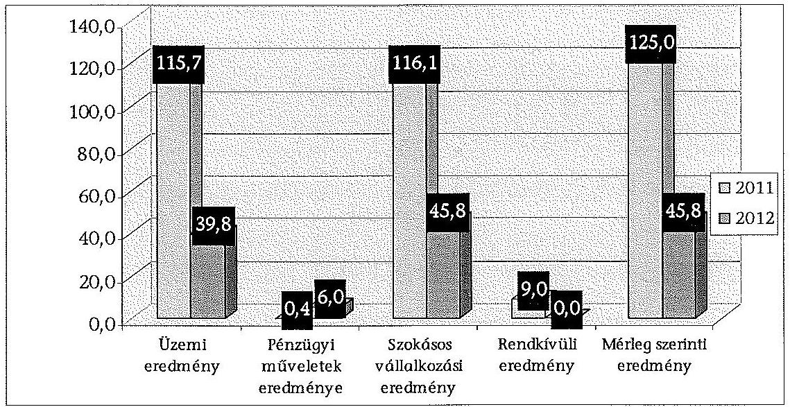

A Társaság a CD és DVD forgalmazáson, valamint a színházi büfé bérbeadáson kívül más vállalkozási tevékenységet nem folytatott. Adottságai ezen a területen erősen korlátozottak.

A Társaság a 2011. és 2012. években szigorú költséggazdálkodást folytatott, melyet a bizonytalan finanszírozási és üzleti környezet kényszerített rá. A bevételek, illetve a nyereség érdekében részt vettek a Színházak éjszakáján, valamint több tájelőadást (a 2011. évben négy db, a 2012. évben egy db) tartottak. Ezeket a rendezvényeket pozitív eredménnyel zárták.

A Társaság a 2011. évi 77,0 millió Ft tao bevétellel szemben 2012-ben 78,2 millió Ft támogatást kapott. Ezzel keretei 99,8%-át kihasználta. A Budapest Színház Keretből 10,0 millió Ft többlettámogatást kapott a Nényei Pál Mozgófénykép című kortárs darab ősbemutatójára, valamint a kísérleti jelleggel indult, fiatalokat és az „55+”-os korosztályt érintő színházpedagógiai programokra.

A színházi előadások látogatottsága mindkét évben 100% felett alakult, a hatékonysági intézkedések a szakmai színvonal tartásában merültek ki.

---

A Társaság a közhasznúsági jelentést az előírt formában készítette el, a könyvvizsgálói jelentés tartalmazta a közhasznúsági jelentés vizsgálatát. A Társaság eredményeinek nyomon követése a jegyárbevétel alakulásán keresztül történt.

A Társaság az évközi gazdálkodás eredményének alakulásáról az önkormányzatot az előírt kötelező adatszolgáltatáson kívül nem tájékoztatta. Likviditási helyzetét és az eredmény alakulását folyamatosan elemezte.

# 2.5. A gazdasági társaság folyamatos üzemmenetének, likviditásának biztosítása 

Az Intézmény az Áhsz. 1.ben előírtak szerint előirányzat-felhasználási tervet készített, amelyben havi bontásban meghatározta a bevételeket (saját bevételek, fenntartói és állami támogatás), valamint a kiadásokat kiemelt előirányzatonként. Ez hozzájárult ahhoz, hogy az intézményi időszakban a Színház a fizetőképességét fenntartotta, üzletmenetét hitelek, kölcsönök felvétele nélkül biztosította.

A Társaság megalakulását követően évente (a 2011. évre 2011. augusztus 1-jétől december 31-éig, és a 2012. évre) reális üzleti tervet és arra épülő likviditási tervet készített. Az üzleti tervekben pénzforgalmi hiánnyal nem számolt, hitele, kölcsöne nem állt fenn.

A Társaság a 2011. évi üzleti tervét és likviditási tervét 2011. szeptember 21-én a 2690/2011. (IX.21.) Főv. Kgy. határozattal fogadták el, míg a 2012. évit a 2011. évi beszámolóval egyidejűleg, 2012. április 25-én tárgyalta és hagyta jóvá a Közgyűlés.

A Színház az ellenőrzött időszakban az átmenetileg szabad pénzeszközeit MKB Garantált Likviditási Alapba (befektetési jegy) helyezte el. Az átmenetileg szabad pénzeszközök az Önkormányzat finanszírozási rendszeréből adódtak, mert a tulajdonos a Közszolgáltatói szerződésben megítélt támogatást negyedévente, előre utalta.

A társaság árfolyamnyereség címén a 2011. évben 0,4 millió Ft, a 2012. évben 6,0 millió Ft összeget számolt el.

A Társaság 2011. szeptember 15-étől Befektetési szabályzatban rendelkezett a szabad pénzeszközeinek felhasználási módjáról. A Befektetési szabályzat tervezetét a tulajdonos részére nem küldte meg $^{26}$, ezért a Közhasznú tv. 17. §-a, illetve a Civil tv. 45. §-a, továbbá az Alapító Okirat 7.3. pontja előírásainak ellenére nem terjesztette elő jóváhagyásra. Így a Befektetési szabályzat érvényesen nem jött létre, ezért rendelkezései nem hatályosak. A Társaság érvényes Befektetési szabályzat nélkül befektetési tevékenységet végzett.

A Színház számviteli nyilvántartásában elkülönítve - külön főkönyvi számokon - tartotta nyilván a kapott támogatásokat (önkormányzati, állami, egyéb).

[^0]
[^0]: $^{26}$ a 2013. augusztus 28-án a Főpolgármesteri Hivatal első emelet 151. számú helyiségében készült emlékeztető alapján

---

A támogatásokról a Közszolgáltatási szerződésben, illetve a támogatókkal kötött egyéb
 szerződésekben meghatározottak szerint elszámoltak.

# 3. Az ÖNKORMÁNYZAT TULAJDONOSI JOGAINAK ÉS KÖTELEZETTSÉGEINEK ÉRVÉNYESÍTÉSE 

### 3.1. A gazdasági társaságtól származó információk hasznosítása

Az Önkormányzat a színházak rendszeres adatszolgáltatási kötelezettségével kapcsolatban szabályzatot nem adott át. A Kulturális, Turisztikai és Sport Főosztály 2013. augusztus 12-én készített táblázatban mutatta be az intézmények és társaságok rendszeres – havi, negyedéves, féléves, éves – adatszolgáltatási kötelezettségét.

A 529/2007. számú, az 536/2008. számú, illetve az 537/2009. számú Főpolgármesteri intézkedések alapján havi zárlati kimutatások elkészítését is előírták az intézmény számára.

Az Emtv. értelmében az előadó-művészeti államigazgatási szerv nyilvántartást vezetett a törvényben meghatározott előadó-művészeti szervezetekről. A 7/2009. (III. 4.) OKM rendelet határozta meg a nyilvántartásba vételi és besorolási eljárás rendjét. A nyilvántartásba vételi kérelem részletes szabályait, illetve a nyilvántartásba vételhez szükséges adatokat a 14/2012. (III. 6.) NEFMI rendelet tartalmazza.

A Színház az ellenőrzött időszakban minden évben eleget tett a tulajdonos felé a besoroláshoz, illetve a minősítéséhez szükséges adatszolgáltatási kötelezettségének, így a tulajdonos Önkormányzat az előzőekben felsorolt rendeletekben meghatározott határidőre teljesítette adatszolgáltatási kötelezettségét.

A 14/2012. NEFMI rendelet 16. § (3) bekezdése alapján a Színház adatot szolgáltatott az előadó-művészeti államigazgatási szerv részére az általános forgalmi adóval csökkentett tárgyévi jegy-és bérletbevételéről. Ez alapján az államigazgatási szerv kibocsátja a Taotv. szerinti adókedvezményre jogosító támogatási igazolást, ami tartalmazza a kedvezményre jogosító támogatás összegét.

Az Önkormányzat a Színház szakmai tevékenységének ellátását az évadbeszámolók alapján értékelte. Az Intézmény az ellenőrzött időszak minden évében elkészítette a szakmai értékelését, melyet a 2008-2010. évek között az Önkormányzat Kulturális Bizottsága elfogadott. A 2011. és 2012. évekre benyújtott évadbeszámolókról a Kulturális Főpolgármester-helyettes tájékoztatót nyújtott be a Közgyűlés részére, amelyet a Közgyűlés tudomásul vett.

A 14/2012. NEFMI rendelet 11. § (4) bekezdése előírja az Önkormányzat részére a létesítménygazdálkodási célú működési támogatás mértékének megállapításához szükséges adatszolgáltatást. Az Önkormányzat a színházak szakmai tevékenységével összefüggő adatszolgáltatási kötelezettségeinek

---

# az ellenőrzött időszakban a fenti jogszabályoknak megfelelően, az azokban meghatározott határidőn belül és tartalommal eleget tett. 

Az Önkormányzat Kulturális, Sport és Turisztikai Főosztálya, mint az Önkormányzat tulajdonában lévő színházakkal összefüggő szakmai főosztály a színházak által végzett szolgáltatásra vonatkozóan önálló elemzéseket, tanulmányokat nem készített. Belső elemzésként értékelhetők a szakmai főosztály által a Közgyűlés elé kerülő előterjesztésekhez készített – a megalapozott döntés meghozatalához szükséges – szakmai anyagok.

Az ellenőrzött időszakban az Önkormányzat megrendelésére, külső szakértők közreműködésével az Önkormányzat által működtetett, illetve tulajdonában lévő színházak – köztük a Színház – vonatkozásában összesen 8 tanulmány készült, együttesen 29,8 millió Ft + áfa értékben.

Az Önkormányzat 2007. évi koncepciójában meghatározott feladatok végrehajtása érdekében három szakértői vizsgálat készült. A három tanulmányban foglalt feladatok végrehajtására, illetve a tanulmányok hasznosítására az Emtv. hatályba lépése miatt az Önkormányzat nem hozott intézkedéseket.

Az elkészített tanulmányok alapján a Közgyűlés 2011. január 1-jétől hatályos javadalmazási szabályzatot fogadott el. Az intézmény-átalakítási koncepció a költségvetési szervek megszüntetése és az utódszervezet megalakításának folyamatára, ütemtervére fogalmazott meg javaslatokat, amelyek a 2011. július 31. napjával történt intézménymegszüntetés során nyomon követhetők. A számviteli, illetve gazdálkodási szabályzatokra készített tanulmányokban nem fogalmazták meg a színházakra vonatkozó speciális szabályozást, illetve nem fedték le a törvényekben, jogszabályokban előírtakat.

A tanulmányok vonatkozásában az Önkormányzat az elektronikus információszabadságról szóló 2005. évi XC. törvényből eredő közzétételi kötelezettségének eleget tett.

### 3.2. Az önkormányzat közgyűlésének intézkedései

Az Önkormányzatnak a vagyon, illetve a közpénzek nem célszerű hasznosításával, az esetleges pazarló felhasználással kapcsolatban az FPH 2013. augusztus 22-én kelt nyilatkozata szerint a Társaság esetében az esetleges veszteség megszüntetése, a lejárt kötelezettségek csökkentése és a Társaság által jelzett csődveszély elhárítása érdekében tulajdonosi intézkedések megtétele nem vált szükségessé.

Az Önkormányzat az Alapító Okirat$_{2}$-ben, a Közszolgáltatási szerződésben illetve a 2013. január 1-jén hatályba lépett Fenntartói megállapodásban határozta meg a Színház rendelkezésére bocsátott vagyon és a közpénzek cél szerinti felhasználásával kapcsolatos követelményeket.

A Társaság Alapító Okirata$_{2}$ szerint az Önkormányzat kizárólagos hatáskörébe tartozott – többek között – a gazdasági társaság üzleti tervének, SZMSZ-ének jóváhagyása, beszámolójának, valamint a közhasznúsági jelentésnek az elfogadása. A Közgyűlés a Társaság felsorolt dokumentumait szabályszerűen, minden esetben határozatokkal fogadta el.

---

Az Önkormányzat a tulajdonostól elvárható gondossággal a vagyonvédelem érdekében a Közszolgáltatási szerződésben, illetve a Fenntartói Megállapodásban megfelelően szabályozta a gazdasági társaság működését befolyásoló rendkívüli események felmerülése esetén a társaságok részéről történő azonnali tájékoztatási kötelezettséget.

A társasági működés időszakában a tájékoztatás körébe tartozó rendkívüli események nem következtek be, így az Önkormányzatnak sem volt intézkedési kötelezettsége.

Az Önkormányzat 2013. augusztus 2-án kelt nyilatkozata szerint a 2008-2010. évek tekintetében nem volt tudomásuk az Önkormányzat megkereséséről a Színházat érintő lejárt kötelezettség kiegyenlítésével kapcsolatban, a 2011-2012. években pedig nem érkezett megkeresés. Az Önkormányzatnak az ellenőrzött időszak folyamán nem kellett intézkednie a Színház lejárt kötelezettségeivel kapcsolatban.

A gazdasági társaság 2011. és 2012. évről készült eredménykimutatásában veszteséget nem mutatott ki, így az Önkormányzatnak nem volt intézkedési kötelezettsége a veszteség rendezése érdekében.

Az Önkormányzat a kulturális közfeladat megfelelő színvonalú ellátását a színházak igazgatóinak évadbeszámolói alapján kísérte figyelemmel. A társasági időszakban a hatályos jogszabályok (Gt., Emtv. és a végrehajtási rendeletei) előírásait betartva az Önkormányzat követelményeket határozott meg a Közszolgáltatási Szerződésben, illetve a 2013. évtől a Fenntartói megállapodásban, valamint döntött a szakmai tevékenység elfogadásáról. Intézkedései hozzájárultak a közfeladat megfelelő ellátásához.

A gazdasági társasági időszakban 2012. december 31-ig a Közszolgáltatási szerződés 4. pontja tartalmazta a Társaság cél szerinti közhasznú tevékenységeinek felsorolását. A Szerződés szerint a Társaság vállalja az aláírás időpontjában hatályos Emtv. szerinti feltételeknek a játszóhelyeken történő teljesítését és folyamatosan biztosítja a meghatározott színházi szolgáltatást. A Társaság működése során teljesítette a Szerződésben foglalt kötelezettségeit, melyet a Közgyűlés határozatban fogadott el.

A nem szerződésszerű teljesítésre vonatkozóan a Közszolgáltatási szerződés 8. pontja rendelkezett. Ezzel kapcsolatban a Közgyűlésnek intézkedési kötelezettsége nem volt.

Az Önkormányzat és a Társaság 2013. január 1-jei hatállyal az Mötv. és az Emtv. előírásainak megfelelően Fenntartói megállapodást kötött, amely Közszolgáltatási szerződésnek is minősül, és a korábban kötött Közszolgáltatási szerződést hatályon kívül helyezte. A Színháznak az előadó-művészeti szolgáltatást a Fenntartói megállapodás 4. pontjában rögzített mutatószámoknak megfelelően kell teljesítenie.

Az Önkormányzat a Fenntartói megállapodásban a Színház szakmai tevékenységét illetően a korábbi Közszolgáltatási szerződésnél szélesebb körben és egyes esetekben (bérleti szerződés megszegése) szigorúbban szabályozta a kötelezettség nem szerződésszerű teljesítésének jogkövetkezményeit.

---

Az Önkormányzat – a Gt.-ben az FB részére előírt feladatokon túl – a tulajdonosi képviseletet ellátó felügyelő bizottsági tagokat nem számoltatta be.

A Színház Felügyelő Bizottsága tevékenysége során a Gt. szerint nevesített kötelező feladatait ellátta, és támogatta a Társaság működését.

A Színház Felügyelő Bizottsága a 2011. évben négy, a 2012. évben öt, a 2013. évben az ellenőrzés lezárásáig három ülést tartott.

Az FB a Társaság tevékenységeire vonatkozóan minden évben a Könyvvizsgáló véleményének figyelembevételével megvitatta és elfogadásra javasolta az üzleti tervet, az éves beszámolót és mellékleteit.

Az FB a társaság gazdálkodását, vagyoni helyzetét, a jogszabályokban és a Társaság belső szabályzataiban előírtak betartását, valamint a közszolgálati szerződésben foglaltak teljesítését is ellenőrizte.

Az Önkormányzat belső ellenőrzésének éves munkatervei tartalmazták a tervezett ellenőrzéseket. A belső ellenőrzési tervek jóváhagyása – a 2009. évre vonatkozó belső ellenőrzési tervet kivéve – az előírt határidőn belül megtörtént.

A 2009. évi belső ellenőrzési tervet az Ötv. 92. § (6) bekezdésével ellentétben – a tárgyévet megelőző év november 15-ei határidő helyett – 2008. december 3-án hagyták jóvá$^{27}$.

A Főpolgármester az Ötv. 92. § (10) bekezdése előírásának megfelelően, a zárszámadási rendelettervezettel egyidejűleg a Közgyűlés elé terjesztette a belső ellenőrzés éves összefoglaló jelentését. A jelentés tartalmazta az Önkormányzat felügyelete alá tartozó költségvetési szervek és a tulajdonában lévő gazdasági társaságok és a Főpolgármesteri Hivatal éves belső ellenőrzési tevékenységéről szóló összefoglalást is.

Az Önkormányzat belső ellenőrzése a 2008. és 2012. évek között egy ellenőrzést végzett a Színháznál. A 2011-ben végzett szabályszerűségi ellenőrzés tárgya a belső szabályozások megfelelőségének vizsgálata volt új szervezeti formában.

A Színház 2011. évi ellenőrzése során a Belső Ellenőrzési Osztály a feltárt hiányosságok alapján szabályszerűségi és célszerűségi intézkedéseket javasolt. Az ellenőrzés jelentésében megállapította, hogy pontosítani kell a számviteli politikát és a hozzá kapcsolódó szabályzatokat. A pénzkezelési szabályzat előírásait összhangba kell hozni a gyakorlattal.

Az ellenőrzési jelentés megállapításai alapján a Színház intézkedési tervet készített. Az intézkedési tervet, illetve az intézkedések végrehajtásáról készült beszámolót a belső ellenőrzés véleményezte és azt követően a Főjegyző hagyta jóvá.

[^0]
[^0]:    $^{27}$ Az Önkormányzat 2008., 2009., 2010., 2011. és 2012. évi ellenőrzési tervét átruházott hatáskörben a főpolgármester a főjegyzővel közösen hagyta jóvá.

---

A Társaság a Közhasznú tv. 14. § (1) bekezdésének, illetve a Civil tv. 42. § (1) bekezdésének megfelelően a közhasznú szervezet gazdálkodása során elért eredményét nem osztotta fel, azt a létesítő okiratában meghatározott közhasznú tevékenységére fordította.

A Társaság mindkét évben nyereséget ért el (a 2011. évben 123,4 millió Ft közhasznú eredmény, és 125,0 millió Ft mérleg szerinti eredmény, illetve a 2012. évben 43,9 millió Ft közhasznú eredmény, és 45,8 millió Ft mérleg szerinti eredmény), melynek elfogadásáról a Közgyűlés a Vagyonrendelet 256. § (1) bekezdése alapján 2012. május 30-i ülésén a 991/2012. (05. 30.) sz. határozatában döntött, de az eredmény felhasználásáról a határozatban külön nem rendelkezett. A 2012. évi mérleg szerint eredmény „eredménytartalék terhére helyezését” a Közgyűlés a 2013. május 29-i ülésén a 836/2013. (05. 29.) sz. határozat részeként elfogadta. A határozatban írt kifejezés „eredménytartalék terhére helyezését” pontatlan, mert a pozitív eredményt az eredménytartalékban kellett helyezni.

A Társaság 2011. és 2012. évi mérleg szerinti eredménye alapján nem volt szükség tulajdonosi intézkedésre a Gt. 143. § szerint a veszteség rendezése, illetve a saját tőke/jegyzett tőke előírt szintjének biztosítása érdekében.

A Színház gazdasági társasági működése során a 2011. évi számviteli beszámolójában a saját tőke 128,0 millió Ft, a 2012. évben pedig 173,8 millió Ft volt, mindkét évben többszörösen meghaladta a 3,0 millió Ft jegyzett tőkét.

Budapest, 2014. 0/. hó 20 nap

Melléklet: $\quad 7 \mathrm{db}$
Függelék: $\quad 2 \mathrm{db}$
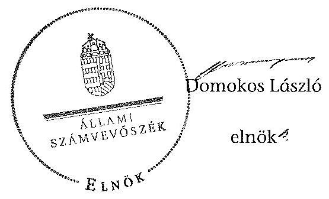

---

# Budapest Főváros Önkormányzatának közgyűlési határozatai az Intézmény átalakítására vonatkozóan 

| Sorsz. | Döntés száma | Határozat | Határozat szövege |
| :--: | :--: | :--: | :--: |
| 1 | 2499/2010.(12.15.) | érdemi határozat | Elviekben egyetért a költségvetési szervként működő színházak 2011. augusztus 1. napjától gazdasági társaságként történő továbbműködtetésének az előterjesztésben foglalt koncepciójával. |
| 2 | 2500/2010.(12.15.) | érdemi határozat | Felkéri a főpolgármestert, hogy az Áht. 100/O. § (5) bekezdésében foglalt előzetes engedélyre vonatkozó döntést terjessze a Fővárosi Közgyűlés elé az alábbi, költségvetési szervként működő színházak vonatkozásában: 1. Budapest Bábszínház 2.

 Kolibri Gyermek- és Ifjúsági Színház 3. Radnóti Miklós Színház 4. Vígszínház 5. Katona József Színház 6. Budapesti Operettszínház |
| 3 | 2501/2010.(12.15.) | érdemi határozat | Felkéri a főpolgármestert, hogy az előzetes engedélyre vonatkozó döntés előkészítése során gondoskodjon a költségvetési szervként működő színházak gazdasági társaságként történő továbbműködtetéséhez szükséges forrásnak a 2011. évi költségvetésében történő megtervezéséről. |
| 4 | 2502/2010.(12.15.) | érdemi határozat | Felkéri a főpolgármestert, hogy a költségvetési szervek vezetői útján gondoskodjon az előzetes engedélyre vonatkozó döntés előkészítése érdekében az Áht. 100/O. § (5) bekezdésében foglalt intézményi feladatok megvalósításáról. |
| 5 | 376/2011.(03.23.) | érdemi határozat | Az államháztartásról szóló 1992. évi XXXVIII. törvény (Áht.) 100/O. § (5) bekezdésében foglaltak alapján a költségvetési szervek 2011. július 31. napján történő megszüntetéséhez és - az általuk ellátott közfeladatok 2011. augusztus 1. napján történő átvételére - 2011. június 1. napjával gazdasági társaságok alapításához az előzetes engedélyt megadja az alábbi, jelenleg költségvetési szervként működő kőszínházak vonatkozásában, egyben felkéri a főpolgármestert, hogy - az egyben a gazdasági társaságokról szóló 2006. évi IV. törvény 6. §-ának (1) bekezdése szerinti alapítási engedélynek minősülő - előzetes engedélye megadásáról tájékoztassa a kulturális költségvetési szervek vezetőjét: 1. Budapest Bábszínház 2. Kolibri Gyermek- és Ifjúsági Színház 3. Radnóti Miklós Színház 4. Vígszínház 5. Katona József Színház |

---

| 6 | 377/2011.(03.23.) | érdemi határozat | Felkéri a főpolgármestert, hogy a költségvetési szervek megszüntetésére, a gazdasági társaságok alapítására, valamint a megszűnő költségvetési szervek által ellátott közfeladatnak a gazdasági társaságok részére - a közfeladat ellátásának és a közalkalmazottak továbbfoglalkoztatásának kötelezettségével - történő átadására vonatkozó döntések meghozatalához szükséges okirattervezeteket és határozati javaslatokat terjessze a Fővárosi Közgyűlés elé az alábbi, költségvetési szervként működő kőszínházak vonatkozásában: 1. Budapest Bábszínház 2. Kolibri Gyermek- és Ifjúsági Színház 3. Radnóti Miklós Színház 4. Vígszínház 5. Katona József Színház |
| :--: | :--: | :--: | :--: |
| 7 | 378/2011.(03.23.) | érdemi határozat | Módosítja a 2499/2010. (XII. 15.) Főv. Kgy. határozatát az alábbiak szerint: elviekben egyetért az alábbiakban felsorolt költségvetési szervként működő színházak 2011. augusztus 1. napjától gazdasági társaságként történő továbbműködtetésének az előterjesztésben foglalt koncepciójával: 1. Budapest Bábszínház 2. Kolibri Gyermek- és Ifjúsági Színház 3. Radnóti Miklós Színház 4. Vígszínház 5. Katona József Színház |
| 8 | 379/2011.(03.23.) | érdemi határozat | Módosítja a 2500/2010. (XII. 15.) Főv. Kgy. határozatát az alábbiak szerint: felkéri a főpolgármestert, hogy az Áht. 100/O. § (5) bekezdésében foglalt előzetes engedélyre vonatkozó döntést terjessze a Fővárosi Közgyűlés elé az alábbi, költségvetési szervként működő színházak vonatkozásában: 1. Budapest Bábszínház 2. Kolibri Gyermek- és Ifjúsági Színház 3. Radnóti Miklós Színház 4. Vígszínház 5. Katona József Színház |
| 9 | 1336/2011.(05.25.) | érdemi határozat | A Radnóti Miklós Színház költségvetési szervet (székhely: 1065 Budapest VI., Nagymező u. 11.) 2011. július 31-ei hatállyal az államháztartásról szóló 1992. évi XXXVIII. törvény 100/O. §-ában foglaltaknak megfelelően utódszervezet létrehozásával megszünteti; jóváhagyja a költségvetési szerv megszüntető okiratát a 4. sz. melléklet szerinti tartalommal, és felkéri a főpolgármestert a megszüntető okirat aláírására és kiadására, továbbá annak közzétételére és kincstárhoz történő benyújtására, valamint a megszűnő költségvetési szerv pénzforgalmi számlájának 2011. július 31-i határnappal történő megszüntetésére. |

---

| 10 | 1343/2011.(05.25.) | érdemi határozat | Megalapítja a Radnóti Miklós Színház költségvetési szerv - az államháztartásról szóló 1992. évi XXXVIII. tv. 100/O. §-a szerinti - utódszervezeteként a közfeladat további ellátása érdekében a Radnóti Miklós Színház Kiemelkedően Közhasznú Nonprofit Korlátolt Felelősségű Társaságot (székhely: 1065 Budapest VI., Nagymező u. 11.), és jóváhagyja alapító okiratát az előterjesztő által módosított 9. sz. melléklet szerinti tartalommal. Jóváhagyja és megköti a Radnóti Miklós Színház Kiemelkedően Közhasznú Nonprofit Korlátolt Felelősségű Társaság közszolgáltatási szerződését a 14. sz. melléklet szerinti tartalommal. Felkéri a főpolgármestert a Radnóti Miklós Színház Kiemelkedően Közhasznú Nonprofit Korlátolt Felelősségű Társaság alapító okiratának és közszolgáltatási szerződésének aláírására, valamint a színház hatósági nyilvántartás szerinti adatainak módosítására irányuló kérelem benyújtására. |
| :--: | :--: | :--: | :--: |
| 11 | 2319/2011.(08.31.) | érdemi határozat | Az államháztartásról szóló 1992. évi XXXVIII. törvény 108. § (1) bekezdésének a) pontja alapján, a Fővárosi Önkormányzat tulajdonában lévő nem lakás céljára szolgáló helyiségek feletti tulajdonosi jogok gyakorlásáról szóló 40/2006. (VII. 14.) Főv. Kgy. rendelet 2. §, 21. §, 21/A. §, valamint 35. § (1) bekezdésében meghatározott hatáskörében eljárva és eseti jelleggel magához vonva a Gazdasági Bizottságra átruházott hatáskört bérbe adja a Radnóti Miklós Színház Nonprofit Kft. (1065 Budapest, Nagymező u. 11.) részére a - Bp. VI., Andrássy út 31. sz. alatti, 29336/0/A/9 hrsz-ú, 160 nm alapterületű; - Bp. VI., Andrássy út 35. sz. alatti, 29378/0/A/27 hrsz-ú, 24 nm alapterületű; - Bp. VI., Andrássy út 31. sz. alatti, 29378/0/A/28 hrsz-ú, 116 nm alapterületű; - Bp. VI., Andrássy út 37. sz. alatti, 29379/0/A/3 hrsz-ú, 211 nm alapterületű; - Bp. VI., Nagymező u. 11. sz. alatti, 29377/0/A/16 hrsz-ú, 697 nm alapterületű; - Bp. VI., Nagymező u. 7. sz. alatti, 29375/0/A/15 hrsz-ú, 28 nm alapterületű; - Bp. VI., Paulay E. u. 67. sz. alatti, 29393/1/A/1 hrsz-ú, 46 nm alapterületű; - Bp. VI., Vasvári P. u. 9. sz. alatti, 29344/0/A/28 hrsz-ú, 49 nm alapterületű ingatlanokat az alábbi feltételekkel: a) a bérlet időtartama a szerződés aláírásának napjától határozatlan időre szól, b) a bérleti szerződés tárgyát képező ingatlanok tekintetében a bérleti díjat összesen 2.339.083 Ft + áfa /hó összegben határozza meg, mely összeg |

---

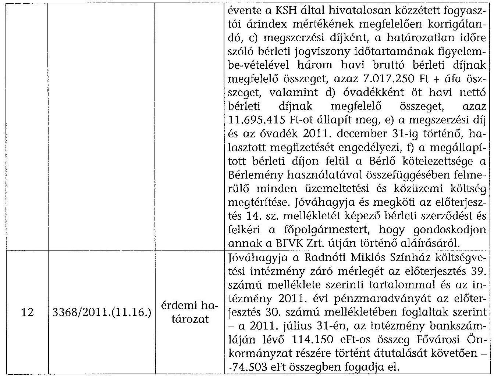

Jóváhagyja a Radnóti Miklós Színház költségvetési intézmény záró mérlegét az előterjesztés 39. számú melléklete szerinti tartalommal és az intézmény 2011. évi pénzmaradványát az előterjesztés 30. számú mellékletében foglaltak szerint - a 2011. július 31-én, az intézmény bankszámláján lévő 114.150 eFt-os összeg Fővárosi Önkormányzat részére történt átutalását követően - 74.503 eFt összegben fogadja el.

---

# Radnóti Miklós Színház szakmai tevékenységének mutatói 2008-2012 között

|  Sorszám | Megnevezés | 2008. év |  | 2009. év |  | 2010. év |  | 2011. év |  | 2012. év |  | Változás %-a  |
| --- | --- | --- | --- | --- | --- | --- | --- | --- | --- | --- | --- | --- |
|   |  | Terv | Tény | Terv | Tény | Terv | Tény | Terv | Tény | Terv | Tény | 2012. év tény/ 2008. év tény  |
|  1 | Színházlátogatások száma (ezer fő) | 41 | 53 | 41 | 52 | 46 | 49 | 46 | 50 | 46 | 51 | 96,2  |
|  2 | Fizetőnéző-szám (ezer fő) | 41 | 50 | 41 | 49 | 46 | 47 | 46 | 49 | 46 | 50 | 100,0  |
|  - | Ebből a bérlettel rendelkezők száma | 0 | 0 | 0 | 0 | 0 | 0 | 0 | 0 | 0 | 0 | -  |
|  3 | Jegyárkedvezménnyel értékesített férőhelyek száma (ezer fő) | 0 | 7 | 0 | 5 | 0 | 5 | 0 | 5 | 0 | 6 | 85,7  |
|  4 | Előadások száma (db) | 200 | 216 | 200 | 221 | 200 | 215 | 200 | 214 | 200 | 219 | 101,4  |
|  5 | Férőhelyek száma (db) | 228 | 230 | 228 | 230 | 228 | 230 | 228 | 230 | 228 | 230 | 100,0  |

---

.

---

# 3. SZÁMÚ MELLÉKLET A V-0183-058/2014. SZÁMÚ JELENTÉSHEZ

## Radnóti Miklós Színház támogatása 2008-2012 között

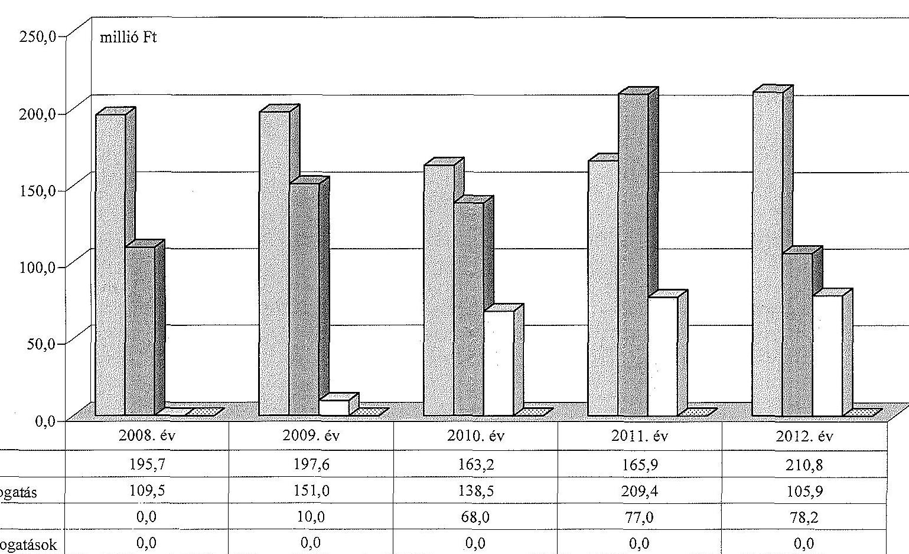

|   | 2008. év | 2009. év | 2010. év | 2011. év | 2012. év  |
| --- | --- | --- | --- | --- | --- |
|  **Állami támogatás** | 195,7 | 197,6 | 163,2 | 165,9 | 210,8  |
|  **Önkormányzati támogatás** | 109,5 | 151,0 | 138,5 | 209,4 | 105,9  |
|  **TAO támogatás** | 0,0 | 10,0 | 68,0 | 77,0 | 78,2  |
|  **Egyéb pályázati támogatások** | 0,0 | 0,0 | 0,0 | 0,0 | 0,0  |

---

.

---

# Radnóti Miklós Színház vagyonának főbb adatai 2008. január 1-je és 2012. december 31-e között

|  Mérlegsor megnevezése | 2008. jan. 1. (E Ft) | 2008. dec. 31. (E Ft) | 2009. dec. 31. (E Ft) | 2010. dec. 31. (E Ft) | 2011. dec. 31. (E Ft) | 2012. dec. 31. (E Ft) | $\begin{gathered} \text { Változás } \% \text {-a } 2012 . \text { dec. } 31 . / 2008 . \text { jan. } 1 . \end{gathered}$  |
| --- | --- | --- | --- | --- | --- | --- | --- |
|  Immateriális javak | 0 | 0 | 0 | 0 | 695 | 2655 |   |
|  Tárgyi eszközök | 264404 | 259240 | 280523 | 319732 | 51966 | 52537 | 19,9  |
|  Ebből: Ingatlanok | 251918 | 245924 | 249614 | 259465 | 49055 | 46055 | 18,3  |
|  Gépek, berendezések | 12486 | 13316 | 30909 | 60267 | 2911 | 6482 | 51,9  |
|  Befektetett eszközök összesen | 264404 | 259240 | 280523 | 319732 | 52661 | 55192 | 20,9  |
|  Forgóeszközök összesen | 67747 | 73356 | 170728 | 114050 | 107886 | 158386 | 233,8  |
|  Aktív időbeli elhatárolások |  |  |  |  | 14075 | 2933 |   |
|  Eszközök összesen | 332151 | 332596 | 451251 | 433782 | 174622 | 216511 | 65,2  |
|  Saját tőke összesen | 267952 | 263643 | 344986 | 354956 | 128010 | 173773 | 64,9  |
|  Ebből:Jegyzett tőke |  |  |  |  | 3000 | 3000 |

 |   |
|  Eredménytartalék |  |  |  |  | 0 | 124971 |   |
|  Mérleg szerinti eredmény |  |  |  |  | 125010 | 45802 |   |
|  Tartalékok | 41222 | 45596 | 83792 | 74390 |  |  | 0,0  |
|  Céltartalék |  |  |  |  | 2032 | 7569 |   |
|  Kötelezettségek összesen | 22977 | 23357 | 22543 | 4436 | 28023 | 26115 | 113,7  |
|  Passzív időbeli elhatárolások |  |  |  |  | 16557 | 9054 |   |
|  Források összesen: | 332151 | 332596 | 451321 | 433782 | 174622 | 216511 | 65,2  |
|  Önkormányzattól átvett eszközök összesen |  |  |  |  | 310450 | 293272 |   |
|  Ebből: immateriális javak |  |  |  |  | 554 | 458 |   |
|  ingatlanok |  |  |  |  | 261032 | 254534 |   |
|  gépek, berendezések |  |  |  |  | 48864 | 38280 |   |
|  Saját és átvett eszközök összesen | 332151 | 332596 | 451254 | 433782 | 485072 | 509783 | 153,5  |

---

.

---

# BUDAPEST

## 1311311204

FŐVÁROSI ÖNKORMÁNYZAT FŐPOLGÁRMESTERI HIVE

| 131. szám | 70/590-164/2013. |
| :--: | :--: |
| Tárgy: | A V-0183-042/2013.   a V-0184-132/2013. és   a V-0185-085/2013. számú   számvevőszéki jelentések   észrevételezése |

Állami Számvevőszék
Domokos László elnök úr részére

$$
\begin{gathered}
00778/2014 \\
\text{JU:}-92014 \\
\text{V-0124-144/2014}
\end{gathered}
$$

Tisztelt Elnök Úr!

Köszönettel vettem

- a V-0183-042/2013. számon megküldött, az „önkormányzatok többségi tulajdonában lévő gazdasági társaságok közfeladat-ellátásának ellenőrzéséről, - Rudnóti Miklós Színház Nonprofit Kft. és jogelődje",
- a V-0184-132/2013. számon megküldött, az „önkormányzatok többségi tulajdonában lévő gazdasági társaságok közfeladat-ellátásának ellenőrzéséről, - Budapest Bábszínház Nonprofit Kft. és jogelődje" és
- a V-0185-085/2013. számon megküldött, az „önkormányzatok többségi tulajdonában lévő gazdasági társaságok közfeladat-ellátásának ellenőrzéséről, - Kolibri Kiemelkedően Közhasznú Nonprofit Kft. és jogelődje"
megnevezésű jelentéseik tervezetét, amelyek észrevételezésére - figyelemmel a jogszabályi előírásokra - T. Elnök úr 15 napot biztosított.

Tájékoztatom, hogy a 2008-2012. évekre kiterjedő vizsgálataikat rendkívül alaposnak ítéljük meg, megállapításaikat és javaslataikat elfogadjuk, a jelentés-tervezetre észrevételt nem teszünk. Pontosításként annyit jelzünk, hogy amennyiben az alapító okirat szerinti rövidített nevet kívánja használni az ellenőrzés, úgy a „Kolibri Kiemelkedően Közhasznú Nonprofit Kft." helyett a „Kolibri Színház Nonprofit Kft." megnevezés javasolható.

Munkájukat megköszönöm.

Budapest, 2013. december 12.
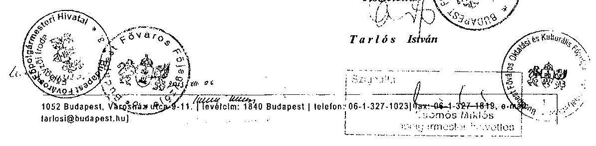

---

.

---

Állami Számvevőszék
Domokos László
elnök úr

Budapest

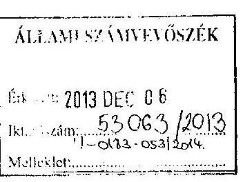
11.  .
101/536/2013

Tisztelt Domokos László elnök úr!

Mellékelten küldöm az Állami Számvevőszék által készített „Az önkormányzatok többségi tulajdonában lévő gazdasági társaságok közfeladat-ellátásának ellenőrzéséről - Radnóti Miklós Színház Nonprofit Kft. és jogelődje" című jelentéstervezetre vonatkozó észrevételeimet.

Budapest, 2013. december 4.

Tisztelettel:
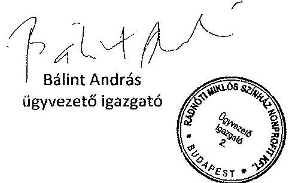

---

# A Radnóti Miklós Színház Nonprofit Kft. ügyvezetőjének észrevételei a 2013. évi ÁSZ ellenőrzés jelentéstervezetével kapcsolatban

A 2013. november 22-én számomra megküldött ÁSZ ellenőrzésről készült jelentéstervezettel kapcsolatban írásbeli észrevételt az alábbi négy témakörben teszek, mivel ezeknél fogalmazódtak meg lényegi és intézkedést is igénylő megállapítások. Megjegyzéseim célja a problémakörök szakmai kiegészítése vagy jogi pontosítása, illetve kiemelni - a véleményem szerinti - nem megalapozott vagy téves megállapításokat.

1) A leltározással kapcsolatos megállapítások

Az ellenőrzés megállapítása alapvetően a Fővárosi Önkormányzat vagyonrendeletével kapcsolatos, így nem az én kompetenciámba tartozik. Kifogásolták azonban, hogy a Színház 2011. évi beszámolóját leltárral nem támasztotta alá (lásd ÁSZ jelentéstervezete 22. o.), mely állítás nem megalapozott. A Fővárosi Önkormányzat által ingyenes használatba adott eszközök leltározását a Színház egyeztetéssel végezte 2011-ben, amelyet az ÁSZ jelentéstervezete is említ, ám a saját eszközök leltározása is megtörtént, szintén egyeztetéssel. A saját eszközök egyeztetéssel való leltározása mind a Számviteli törvény (2007. évi CXXVII. tv.) mind pedig a leltározás időpontjában hatályos Leltározási Szabályzat rendelkezéseinek megfelel.
2) Az önköltség-számítással kapcsolatos megállapítások

Az ÁSZ jelentéstervezetének nekem címzett 1. számú intézkedést igénylő megállapítása szerint a Színház önköltség-számítási szabályzata „nem tért ki az alkalmazottak bérének és járulékainak, valamint az általános költségeknek a felosztási módjára" (lásd ÁSZ jelentéstervezet 11. o.), és intézkedésként megfogalmazza, hogy módosítani kell a szabályzatot, hogy „a produkció bemutatásáig elszámolt költségek teljes körűen kimutatásra és felosztásra kerüljenek" (u.o.).

Határozott véleményem az, hogy szakmai és gazdálkodási szempontból nincs megfelelő módszer az adott évben állandónak és általánosnak tekinthető társulati bér- és járulékköltségek előadásokra (szolgáltatásokra) történő elosztására. Ilyen esetben a Számviteli törvény (2007. évi CXXVII. tv.) 51. § (2) bekezdés c) pontját figyelembe véve nem kell ezen költségeket a szolgáltatásokra elszámolni, illetve a közvetlen önköltség részének tekinteni. Amúgy a Számviteli törvény 14. § (7) bekezdése értelmében a „közvetlen önköltség" alatt önköltség értendő.

Az ÁSZ jelentéstervezete előzőhöz hasonló javaslatot fogalmaz meg az egyéb alkalmazotti bérekre és járulékaira valamint az általános költségekre vonatkozóan. Véleményem szerint ezen költségek kezelésében a Színház szintén törvényesen jár el. Ezeket az általános jellegű költségeket a Színház ugyanis csak egyedi esetben tekinti az önköltség részének, tehát minden esetben betartotta a Számviteli törvény (2007. évi CXXVII. tv.) 51. § (1)-(4) bekezdésekben foglaltakat.

A fenti álláspontomtól függetlenül megjegyzem, hogy az önköltség-számítási szabályzattal kapcsolatosan az ÁSZ jelentéstervezet téves feltételezésre épül, miszerint a „... Társaság a Számv. tv. 14. § (5) bekezdés c) pontja és a (7) bekezdése alapján elkészítette az önköltség-számítási szabályzatát...." . A Színház ezen önköltség-számítási szabályzatát a Fővárosi Önkormányzat utasítása nyomán, és nem törvényi kötelezettség miatt készítette. Egyébként a Színház nettó árbevétele illetve a költségnemenkénti költségek együttes összege nem éri el a Számviteli törvény (2007. évi CXXVII. tv.) 14. § (7) bekezdésében szereplő értékhatárokat (1 milliárd Ft illetve 500 millió Ft), így ugyanezen törvény 14. § (6) bekezdése értelmében a Színház nem köteles önköltségszámítási szabályzatot készíteni.

---

3) A Paulay Ede u. 52. számú ingatlanra vonatkozó bérleti szerződéssel és kapcsolódó számlák elszámolásával összefüggő megállapítások

A Színház, mint költségvetési intézmény 2008. március 3-án a VD Projekt Alfa Kft-vel kötött határozott időtartamra ingatlanbérleti szerződést. A Színház átalakulását követően a Bérbeadó tájékoztatást kapott a szerződést érintő változásokról. E szerződés azért nem került megújításra, mivel annak hatályosságáról a két szerződő fél álláspontja eltérő. Az ÁSZ jelentéstervezetének megállapításával szemben jogi véleményem az, hogy nemcsak 2011. július 31-ig, hanem mind a mai napig a nonprofit Kft. határozott idejű bérleti jogviszony keretében, jogszerűen használja és birtokolja az adott ingatlant. A Radnóti Miklós Színház névre érkező számlákat mint az ingatlant jogszerűen és ténylegesen használó jogutód szervezet fogadjuk be. A számlát könyvelésünk során egyéb számviteli bizonylatként kezeljük, így ezzel a gyakorlattal nem sértjük a Számviteli törvény (2007. évi CXXVII. tv.) előírásait. Mivel a bizonylat nem felel meg a számlára vonatkozó tartalmi és formai követelményeknek, azaz az Áfa-törvény (2007. évi CXXVII. tv.) 169. §-ban előírt adattartalomnak, így egyelőre a Színház nem tud élni az ÁFA-visszajárványlési lehetőséggel.

Az ÁSZ jelentéstervezetében található megoldásként javasolt szerződésmódosításra a Színház és a Bérbeadó közötti jogi véleményeltérések miatt egyelőre nincs lehetőség. Az ingatlannal kapcsolatosan fennálló rendezetlen jogi helyzet a Színház közfeladatainak eredményes ellátására hosszú távon ugyan veszélyt jelent, de a jelenlegi működésünket nem érinti. Továbbra is bízom abban, hogy a Fővárosi Önkormányzat segítségével és támogatásával megnyugtató megoldást fogunk találni az ügy rendezésére.
4) A befektetési szabályzattal kapcsolatos megállapítások

Ez ügyben a Színház gazdasági igazgatója 2011. december 5-én emailben felvette a kapcsolatot a tulajdonos Fővárosi Önkormányzat illetékes Főosztályának képviselőjével. A munkatársi szintű egyeztetés során megállapításra került, hogy a Színház által végezni kívánt tevékenység célja a likvid pénzeszközök kezelése, amely nem sorolható be a közhasznú szervezetekről szóló, az akkor irányadó törvény (1997. évi CLVI. tv.) 26. § k) pontja által meghatározott befektetési kategóriába. A Színház jelenleg hatályos Alapító Okirata nem rendelkezik külön a befektetési szabályzatról. Az új civil törvény (2011. évi CLXXV. tv.) lényegében a korábbi befektetési kategóriaértelmezést veszi át. A Színház elfogadja a Fővárosi Önkormányzat jogértelmezését, mely szerint nem tekinthető befektetésnek az a likviditás-menedzselési tevékenység, ha a Színház rövid távra kockázatmentes eszközöket vásárol. Az ÁSZ jelentéstervezetének megállapításai miatt azonban további egyeztetést tartok szükségesnek a tulajdonos Fővárosi Önkormányzattal, melynek során lehetőség nyílik a jogi értelmezés felülvizsgálatára.

Budapest, 2013. december 4.
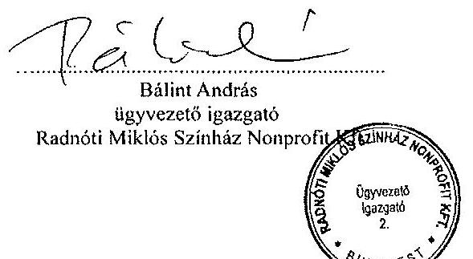

---

.

---

# 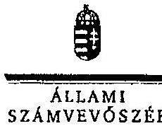

## Bálint András úr

ügyvezető igazgató
Radnóti Miklós Színház Nonprofit Kft.

## Budapest

## Tisztelt Ügyvezető Igazgató Úr!

A „Jelentéstervezet az önkormányzatok többségi tulajdonában lévő gazdasági társaságok közfeladat-ellátásának ellenőrzéséről - Radnóti Miklós Színház Nonprofit Kft. és jogelődje" című jelentéstervezetre tett észrevételeit köszönettel megkaptam.

Az Állami Számvevőszék észrevételekre vonatkozó álláspontjáról a felügyeleti vezető által készített részletes tájékoztatást csatoltan megküldöm.

Tájékoztatom Ügyvezető igazgató urat, hogy a számvevőszéki jelentés az elfogadott észrevételek figyelembevételével készül.

Budapest, 2014.
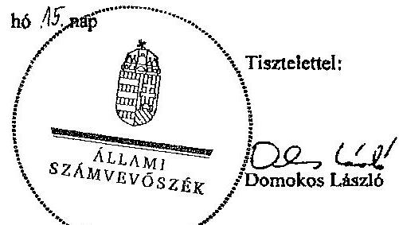

Melléklet: Tájékoztatás az elfogadott és az el nem fogadott észrevételekről

---

# Tájékoztatás

## az elfogadott és az el nem fogadott észrevételekről

A „Jelentéstervezet az önkormányzatok többségi tulajdonában lévő gazdasági társaságok közfeladat-ellátásának ellenőrzéséről - Radnóti Miklós Színház Nonprofit Kft. és jogelődje" című jelentéstervezetre a 301/2013. iktatószámú levelében tett észrevételeket áttekintettük, azokat a következők szerint kezeljük:

## 1./ A leltározással kapcsolatos megállapítások

A Színház 2011. évi beszámolójának leltárral való alátámasztottságára vonatkozó, a jelentéstervezet 9. oldal hetedik bekezdését és a 22. oldal negyedik bekezdését a következőre pontosítjuk:
„A Társaságnál 2011. december 31-i fordulónappal az Önkormányzat által ingyenesen használatba adott eszközök leltározását mennyiségi felvétel helyett egyeztetéssel végezték el. A Társaság 2011. évi beszámolóját az egyeztetéssel készített leltárral támasztották alá."

Továbbá ezzel összefüggésben a 9. oldal negyedik bekezdéséből és a 21. oldal kilencedik bekezdéséből a „valamint a 2011. évi leltározás" szövegrészt töröljük.

## 2./ Az önköltségszámítással kapcsolatos megállapítások

Az észrevételben az önköltségszámítást érintően hivatkozott számviteli törvény előírásokkal kapcsolatban nincs véleményeltérés közöttünk. Az azokból levont következtetésükkel azonban nem lehet egyetérteni. A számviteli törvény tételesen a közvetlen önköltséget szabályozza, de a törvény előírásából - értelmezésükkel ellentétben - nem következik (a törvény ilyet nem tartalmaz) az, hogy az önköltség azonos a közvetlen önköltséggel. Az önköltséget a Számv. tv. a 160. § (4) bekezdésében említi az egységes számlakeret vonatkozásában a következők szerint:
„(4) A 6-7. számlaosztály - a gazdálkodó döntésének megfelelően - használható a vezetői információk biztosítására. E számlaosztályok szabad használata lehetővé teszi a vállalkozáson belüli egységek elszámoltatását, a költséggazdálkozás, az önköltségszámítás sajátos rendszerének kialakítását."

A Színház, amennyiben önköltségszámítási szabályzatot készít - függetlenül attól, hogy ezt utasításra
 vagy törvényi kötelezésre teszi - be kell tartania egyrészt a Számv. tv.-nek a

---

közvetlen önköltségszámításra vonatkozó előírásait, másrészt az önköltségszámítási szabályzatnak tartalmaznia kell az önköltség részét képező általános költségek felosztási módját. Az önköltség nem öncélú, hanem a hatékony költséggazdálkodást szolgálja, lehetővé teszi az elszámolást, ahhoz nyújt használható információkat.

Az észrevételükben megfogalmazottak szerint „szakmai és gazdálkodási szempontból nincs megfelelő módszer az adott évben állandónak és általánosnak tekinthető társulati bér- és járulékköltségek előadásokra (szolgáltatásokra) történő elosztására. Ilyen esetben a Számviteli törvény (2007. évi CXXVII. tv.) ${ }^{1}$ 51. § (2) bekezdés c) pontját figyelembe véve nem kell ezen költségeket a szolgáltatásokra elszámolni, illetve a közvetlen önköltség részének tekinteni. (...)

A társulati bér- és járulékköltségek az előadások (szolgáltatások) során közvetlenül merülnek fel - az előadásokat a társulat tagjai hozzák létre - így ezen költségeket a Számv. tv. 51. § (2) bekezdése szerint megfelelő mutatók segítségével el lehet (és el kell) számolni legalább a produkció bemutatásáig az adott előadás közvetlen önköltségében.

Az előzőekben kifejtettekre tekintettel, valamint az egyértelmű megfogalmazás érdekében a jelentéstervezet 9. oldalának nyolcadik bekezdését, a 22. oldalának hetedik bekezdését és a Színház igazgatójának szóló 1. számú javaslat intézkedést igénylő megállapítását az alábbiakra pontosítjuk:
„A Társaság elkészítette az Önköltségszámítási szabályzat${ }_{23}$-at, azonban azokban nem tért ki a társulat bérének és járulékainak legalább a produkció színreviteléig történő felosztási módjára. Ennek következtében a produkciók színreviteléig aktivált szellemi termékek nem a ténylegesen felmerült közvetlen költségek alapján kerültek elszámolásra. Továbbá az önköltségszámítási szabályzat nem tartalmazza az általános költségek felosztási módját."

Ezzel összefüggésben a javaslat szövegét az alábbiakra pontosítjuk:
„Intézkedjen az önköltségszámítási szabályzat módosításáról annak érdekében, hogy
a) a produkció bemutatásáig elszámolt közvetlen költségek tartalmazzák a társulat bérének és járulékainak a produkcióra felosztott költségeit;
b) a szabályzat tartalmazza az általános költségek felosztási módját."

[^0]
[^0]:    ${ }^{1}$ Megjegyezzük, hogy az észrevételükben hivatkozott törvény nem a számvitelről, hanem az általános forgalmi adóról szól, a paragrafust és a bekezdést viszont a számviteli törvényből idézik.

---

3/ A Paulay Ede u. 52. számú ingatlanra vonatkozó bérleti szerződéssel és kapcsolódó számlák elszámolásával összefüggő megállapítások

A bérleti szerződéssel és a bérleti díjak számláival kapcsolatban leírt megállapítások módosítása nem indokolt. Észrevételükben egyrészt tájékoztatást nyújtanak a kialakult helyzetről. Másrészt az tény, amit az észrevételükben is elismernek, hogy a számla nem felel meg a számviteli törvény által előírt bizonylati fegyelemnek, a számlára vonatkozó tartalmi és formai követelményeknek.

# 4./ A befektetési szabályzattal kapcsolatos megállapítások 

Az észrevételükben arról adnak tájékoztatást, hogy további egyeztetést tartanak szükségesnek a Fővárosi Önkormányzattal a befektetési szabályzat értelmezésével kapcsolatban, ezért a jelentéstervezetben leírtak módosítása nem indokolt.

Tájékoztatom Ügyvezető Igazgató urat, hogy a számvevőszéki jelentés mellékleteként szerepeltetjük a jelentéstervezethez tett észrevételeit, valamint az azokra adott válaszunkat.

Budapest, 2014. 04. hó 15. nap

Makkai Mária
felügyeleti vezető

---

# RÖVIDÍTÉSEK JEGYZÉKE 

## Törvények

Áht. 1

Áht. 2

ÁSZ tv.
Civil tv.

Emtv.
Gt.
Htv.

Kjt.

Közbesz. tv. 2
Közhasznú tv.
Mötv.
Nvtv.
Ötv.
Ptk.
Számv. tv.
Taotv.
Taktv.

## Rendeletek

Áhsz. 1

Áhsz. 2
Ámr.
Ávr.

Ber.
az államháztartásról szóló 1992. évi XXXVIII. törvény, hatályos 2011. december 31-ig
az államháztartásról szóló 2011. évi CXCV. törvény, hatályos 2011. december 31-étől
az Állami Számvevőszékről szóló 2011. évi LXVI. törvény, hatályos 2011. július 1-jétől
az egyesülési jogról, a közhasznú jogállásról, valamint a civil szervezetek működéséről és támogatásáról szóló 2011. évi CLXXV. törvény, hatályos 2012. január 1-jétől
az előadó-művészeti szervezetek támogatásáról és sajátos foglalkoztatási szabályairól szóló 2008. évi XCIX. törvény
a gazdasági társaságokról szóló 2006. évi IV. törvény
a helyi önkormányzatok és szerveik, a köztársasági megbízottak, valamint egyes centrális alárendeltségű szervek feladat- és hatásköreiről szóló 1991. évi XX. törvény
a közalkalmazottak jogállásáról szóló 1992. évi XXXIII. törvény
a közbeszerzésekről szóló 2011. évi CVIII. törvény
A közhasznú szervezetekről szóló 1997. évi CLVI. törvény, hatályos 2011. december 31-ig
Magyarország helyi önkormányzatairól szóló 2011. évi CLXXXIX. törvény
a nemzeti vagyonról szóló 2011. évi CXCVI. törvény
a helyi önkormányzatokról szóló 1990. évi LXV. törvény
a Polgári Törvénykönyvről szóló 1959. évi IV. törvény
a számvitelről szóló 2000. évi C. törvény
A társasági adóról és osztalékadóról szóló 1996. évi LXXXI. törvény
A köztulajdonban álló gazdasági társaságok takarékosabb működéséről szóló 2009. évi CXXII. törvény
az államháztartás szervezetei beszámolási és könyvvezetési kötelezettségének sajátosságairól szóló 249/2000. (XII. 24.) Korm. rendelet
az államháztartás számviteléről szóló 4/2013. (I. 11.) Korm. rendelet
az államháztartás működési rendjéről szóló 292/2009. (XII. 19.) Korm. rendelet, hatályos 2011. december 31-ig
az államháztartásról szóló törvény végrehajtásáról szóló 368/2011. (XII. 31.) Korm. rendelet, hatályos 2012. január 1-jétől
a költségvetési szervek belső ellenőrzéséről szóló

---

193/2003. (XI. 26.) Korm. rendelet, hatályos 2011. december 31-ig
Bkr. a költségvetési szervek belső kontrollrendszeréről és belső ellenőrzéséről szóló 370/2011. (XII. 31.) Korm. rendelet, hatályos 2012. január 1-jétől
Önkormányzat SZMSZ ${ }_{1}$ Budapest Főváros Önkormányzata Közgyűlésének 7/1992. (III. 26.) a Fővárosi Önkormányzat Szervezeti és Működési Szabályzata (hatálytalan 2010. december 31-től)
Önkormányzat SZMSZ ${ }_{2}$ Budapest Főváros Önkormányzata Közgyűlésének 55/2010. (XII. 9.) a Fővárosi Önkormányzat Szervezeti és Működési Szabályzata (hatálytalan 2013. március 18-tól)
Önkormányzat SZMSZ ${ }_{3}$ Budapest Főváros Önkormányzata Közgyűlésének 11/2013. (III. 18.) a Fővárosi Önkormányzat Szervezeti és Működési Szabályzata (hatályos 2013. március 19-től)
14/2012. (III. 6.) NEFMI rendelet az előadó-művészeti szervezetek és az előadó-művészeti érdekképviseleti szervezetek működésével kapcsolatos hatósági eljárások és adatszolgáltatások részletes szabályairól
Vagyonrendelet ${ }_{1} \quad$ 75/2007. (XII. 28.) Főv. Kgy. rendelet a Fővárosi Önkormányzat vagyonáról, a vagyontárgyak feletti tulajdonosi jogok gyakorlásáról (hatálytalan 2012. március 15-től)
Vagyonrendelet ${ }_{2} \quad$ 22/2012. (III. 14.) Főv. Kgy. rendelet Budapest Főváros Önkormányzata vagyonáról, a vagyonelemek feletti tulajdonosi jogok gyakorlásáról (hatályos 2012. március 15-től)

# Határozatok 

970/2010. (IV.29) Főv. Kgy. határozat

2490/2010. (XII.15.) Főv. Kgy. határozat

2062/2012. (X.3.) Főv. Kgy. határozat

## Radnóti Miklós Színház szabályzatai

Értékelési szabályzat ${ }_{1} \quad$ a Radnóti Miklós Színház - mint költségvetési intézmény - Eszközök és Források értékelési szabályzata (hatálytalan 2010. május 19-től)

Értékelési szabályzat ${ }_{2} \quad$ a Radnóti Miklós Színház - mint költségvetési intézmény

---

Értékelési szabályzat ${ }_{3}$

Értékelési szabályzat ${ }_{4}$

Leltározási szabályzat ${ }_{1}$

Leltározási szabályzat ${ }_{2}$

Leltározási szabályzat ${ }_{3}$

Önköltségszámítási szabályzat ${ }_{1}$

Önköltségszámítási szabályzat ${ }_{2}$

Önköltségszámítási szabályzat ${ }_{3}$

Pénzkezelési szabályzat ${ }_{1}$

Pénzkezelési szabályzat ${ }_{2}$

Pénzkezelési szabályzat ${ }_{3}$

Pénzkezelési szabályzat ${ }_{2}$

- Eszközök és Források értékelési szabályzata (hatálytalan 2011.augusztus 1-jétől)

a Radnóti Miklós Színház - mint kiemelkedően közhasznú nonprofit korlátolt felelősségű társaság - Eszközök és Források értékelési szabályzata (hatálytalan 2012. március 31-től)
a Radnóti Miklós Színház - mint kiemelkedően közhasznú nonprofit korlátolt felelősségű társaság - Eszközök és Források értékelési szabályzata (hatályos 2012. március 31-től)
a Radnóti Miklós Színház - mint költségvetési intézmény - Eszközök és Források leltározási és leltárkészítési szabályzata (hatálytalan 2009. augusztus 1-jétől)
a Radnóti Miklós Színház - mint költségvetési intézmény - Eszközök és Források leltározási és leltárkészítési szabályzata (hatálytalan 2011. augusztus 1-jétől)
a Radnóti Miklós Színház - mint kiemelkedően közhasznú nonprofit korlátolt felelősségű társaság - Eszközök és Források leltározási és leltárkészítési szabályzata (hatálytalan 2012. március 31-től)
a Radnóti Miklós Színház - mint kiemelkedően közhasznú nonprofit korlátolt felelősségű társaság - Eszközök és Források leltározási és leltárkészítési szabályzata (hatálytalan 2012. március 31-től)
a Radnóti Miklós Színház - mint költségvetési intézmény - Önköltség számítási szabályzata (hatálytalan 2011. augusztus 1-jétől)
a Radnóti Miklós Színház - mint kiemelkedően közhasznú nonprofit korlátolt felelősségű társaság - Önköltség számítási szabályzata (hatálytalan 2012. március 31-től)
a Radnóti Miklós Színház - mint kiemelkedően közhasznú nonprofit korlátolt felelősségű társaság - Önköltség számítási szabályzata (hatályos 2012. március)
a Radnóti Miklós Színház - mint költségvetési intézmény - Pénzkezelési szabályzata (hatálytalan 2011. augusztus 1-jétől)
a Radnóti Miklós Színház - mint kiemelkedően közhasznú nonprofit korlátolt felelősségű társaság - Pénzkezelési szabályzata (hatálytalan 2013. január 1-jétől)
a Radnóti Miklós Színház - mint kiemelkedően közhasznú nonprofit korlátolt felelősségű társaság - Pénzkezelési szabályzata (hatályos 2012. március 31-től)
a Radnóti Miklós Színház - mint költségvetési intézmény - Felesleges vagyontárgyak hasznosításának és selejtezésének szabályzata (hatálytalan 2009. augusztus 1-jétől)
a Radnóti Miklós Színház - mint költségvetési intézmény - Felesleges vagyontárgyak hasznosításának és selejtezésének szabályzata (hatálytalan 2011. augusztus 1-jétől)

---

| Selejtezési szabályzat ${ }_{3}$ | a Radnóti Miklós Színház - mint kiemelkedően közhasznú nonprofit korlátolt felelősségű társaság - Felesleges vagyontárgyak hasznosításának és selejtezésének szabályzata (hatálytalan 2012. március 31-től) |
| :--: | :--: |
| Selejtezési szabályzat ${ }_{4}$ | a Radnóti Miklós Színház - mint kiemelkedően közhasznú nonprofit korlátolt felelősségű társaság - Felesleges vagyontárgyak hasznosításának és selejtezésének szabályzata (hatályos 2012. március 31-től) |
| $\mathrm{SZMSZ}_{1}$ | a Radnóti Miklós Színház - mint költségvetési intézmény - Szervezeti és Működési Szabályzata (hatálytalan 2009. november 10-től) |
| $\mathrm{SZMSZ}_{2}$ | a Radnóti Miklós Színház - mint költségvetési intézmény - Szervezeti és Működési Szabályzata (hatálytalan 2011. augusztus 1-jétől) |
| $\mathrm{SZMSZ}_{3}$ | a Radnóti Miklós Színház - mint kiemelkedően közhasznú nonprofit korlátolt felelősségű társaság - Szervezeti és Működési Szabályzata (hatálytalan 2012. március 31-től) |
| $\mathrm{SZMSZ}_{4}$ | a Radnóti Miklós Színház - mint kiemelkedően közhasznú nonprofit korlátolt felelősségű társaság - Szervezeti és Működési Szabályzata (hatályos 2012. március 31-től) |
| Számviteli politika $_{1}$ | a Radnóti Miklós Színház - mint költségvetési intézmény - Számviteli politikája (hatálytalan 2009. augusztus 1-jétől) |
| Számviteli politika $_{2}$ | a Radnóti Miklós Színház - mint költségvetési intézmény - Számviteli politikája (hatálytalan 2011. augusztus 1-jétől) |
| Számviteli politika $_{3}$ | a Radnóti Miklós Színház - mint kiemelkedően közhasznú nonprofit korlátolt felelősségű társaság - Számviteli politikája (hatálytalan 2012. március 31-től) |
| Számviteli politika $_{4}$ | a Radnóti Miklós Színház - mint kiemelkedően közhasznú nonprofit korlátolt felelősségű társaság - Számviteli politikája (hatályos 2012. március 31-től) |
| Szórövidítések |  |
| Alapító Okirat $_{1}$ | Radnóti Miklós Színház Budapest Főváros Közgyűlése a 1230/C/1992. számú határozatával alapította a költségvetési szervezetet, az alapító okirat száma: XVIII/92160/7. |
| Alapító Okirat $_{2}$ | a Radnóti Miklós Színház Kiemelkedően Közhasznú Nonprofit Korlátolt Felelősségű Társaságot Budapest Főváros Közgyűlése a 1343/2011. számú határozatával alapította, az alapító okirat száma: FPH037/55-39/2011 |
| ÁSZ | Állami Számvevőszék |
| BFVK Zrt. | Budapest Főváros Vagyonkezelő Központ Zrt. |
| Fenntartói megállapodás | Budapest Főváros Önkormányzata és a Radnóti Miklós Színház Kiemelkedően Közhasznú Nonprofit Korlátolt Felelősségű Társaság között megkötött megállapodás |
| Főjegyző | Budapest Főváros Főjegyzője |
| Főpolgármester | Budapest Főváros Főpolgármestere |

---

| Főpolgármesteri Hivatal | Budapest Főváros Önkormányzata Főpolgármesteri Hiva- |
| :-- | :-- |
|  | tala |
| Intézmény | Radnóti Miklós Színház költségvetési intézmény |
| Kincstár | Magyar Államkincstár |
| Közgyűlés | Budapest Főváros Önkormányzata Közgyűlése |
| Közszolgáltatási szerző- | Budapest Főváros Önkormányzata és a Radnóti Miklós |
| dés | Színház Kiemelkedően Közhasznú Nonprofit Korlátolt |
|  | Felelősségű Társaság között megkötött szerződés |
| Önkormányzat | Budapest Főváros Önkormányzata |
| Színház |

 Radnóti Miklós Színház |
| Társaság | Radnóti Miklós Színház Kiemelkedően Közhasznú |
|  | Nonprofit Korlátolt Felelősségű Társaság |
| tao támogatás | Tao-tv. szerinti támogatás |

---

.

---

# ÉRTELMEZŐ SZÓTÁR 

átlagos életkor
elhasználódási szint
előadó-művészeti
szervezet
értékcsökkenés
fenntartói - önkormányzati - támogatás
gazdasági vállalkozási tevékenység eredménye
használhatósági fok (a színház saját és használatra átvett ingatlanjaira és egyéb tárgyi eszközeire)
közfeladat
közhasznú tevékenység eredménye

Számításakor a színház saját tárgyi eszközei és a használatra átvett eszközök elhasználódási szintjének százalékos értékét viszonyítják az eszközök éves értékcsökkenési leírási kulcsának százalékos értékéhez.
Számításakor a színház saját tárgyi eszközei és a használatra átvett eszközök elszámolt értékcsökkenés értékét viszonyítják az eszközök záró bruttó (beszerzési/létesítési) értékéhez. A %ban kifejezett mutató növekedése az eszköz állagának romlására, avulására utal.
Az önálló jogi személyiségű színház, balett- vagy táncegyüttes, szimfonikus zenekar, énekkar, kamara-szimfonikus zenekar, kamarazenekar, amely alaptevékenységeként előadóművészeti színház-, tánc- vagy zeneművészeti tevékenységet lát el.
Az immateriális javak, a tárgyi eszközök bruttó értékének a használati időre történő felosztása a várható élettartam, fizikai elhasználódása és erkölcsi avulás alapján.
A fenntartó által nyújtott támogatás, amelybe nem számít bele a központi költségvetési támogatás.

A jövedelem- és vagyonszerzésre irányuló vagy azt eredményező, üzletszerűen végzett gazdasági tevékenység eredménye, ide nem értve az adomány (ajándék) elfogadását, továbbá a bevétellel járó, létesítő okiratban meghatározott cél szerinti, valamint a közhasznú tevékenységet.
Számításakor a színház saját tárgyi eszközei és a használatra átvett eszközök könyv szerinti (nettó) értékét viszonyítják az eszközök bruttó (beszerzési/létesítési) értékéhez. A %-ban kifejezett mutató csökkenése az eszköz állagának romlására, avulására utal, ami maga után vonja az üzemeltetési és fenntartási költségek növekedését is.
Jogszabályban meghatározott állami vagy önkormányzati feladat, amit az arra kötelezett közérdekből, jogszabályban meghatározott követelményeknek és feltételeknek megfelelve végez, ideértve a lakosság közszolgáltatásokkal való ellátását, továbbá az állam nemzetközi szerződésekben vállalt kötelezettségeiből adódó közérdekű feladatokat, valamint e feladatok ellátásához szükséges infrastruktúra biztosítását is (Vagyon tv. 3. § (1) bekezdés 7. pont).
Minden olyan tevékenység eredménye, amely a létesítő okiratban megjelölt közfeladat teljesítését közvetlenül vagy közvetve szolgálja, ezzel hozzájárulva a társadalom és az egyén közös szükségleteinek kielégítéséhez.

---

mérleg szerinti eredmény
pénzügyi műveletek eredménye
szokásos vállalkozási eredmény színház
rendkívüli eredmény
társulat
tulajdonosi joggyakorló

Üzemi (üzleti) eredmény

A mérleg szerinti eredmény az osztalékra, részesedésre, a kamatozó részvények kamatára igénybe vett eredménytartalékkal növelt, a jóváhagyott osztalékkal, részesedéssel, a kamatozó részvények kamatával csökkentett tárgyévi adózott eredmény, egyezően az eredménykimutatásban ilyen címen kimutatott összeggel (Számv. tv. 39. § (2) bekezdés).
A pénzügyi műveletek eredménye a pénzügyi műveletek bevételeinek és ráfordításainak különbözete. A pénzügyi műveletek bevételei: a kapott (járó) osztalék és részesedés, a részesedések értékesítésének árfolyamnyeresége, a befektetett pénzügyi eszközök kamatai, árfolyamnyeresége, az egyéb kapott (járó) kamatok és kamatjellegű bevételek, valamint a pénzügyi műveletek egyéb bevételei. A pénzügyi műveletek ráfordításai: a befektetett pénzügyi eszközök árfolyamvesztesége, a fizetendő kamatok és kamatjellegű ráfordítások, a pénzügyi műveletek egyéb ráfordításai, a részesedések, az értékpapírok, a bankbetétek értékvesztése (Számv. tv. 83-85.§-a).
Az üzemi (üzleti) eredmény és a pénzügyi műveletek eredményének összege.
Prózai, zenés, illetve táncos színpadi művek előadásával foglalkozó előadó-művészeti szervezet, ide értve a bábszínházat, a befogadó színházat, a produkciós színházat, a független színházat, a szabadtéri színházat és a nemzetiségi színházat.
A rendkívüli bevételek és a rendkívüli ráfordítások különbsége (Számv. tv. 86. §-a).
Művészek olyan csoportja, akik munkaviszony, közalkalmazotti jogviszony vagy munkavégzésre irányuló egyéb jogviszony alapján egy vagy több évadon keresztül folyamatosan kapcsolódnak egy előadó-művészeti szervezethez.
Aki a nemzeti vagyon felett az államot vagy a helyi önkormányzatot megillető tulajdonosi jogok és kötelezettségek egészének gyakorlására jogosult (Vagyon tv. 3. § (1) bekezdés 17. pont).

Az üzleti évben elszámolt értékesítés nettó árbevételének, az eszközök között állományba vett saját teljesítmények értékének, az egyéb bevételeknek, valamint az üzleti évben elszámolt anyagjellegű ráfordítások, személyi jellegű ráfordítások, értékcsökkenési leírás és egyéb ráfordítások együttes összegének különbözete az összköltség eljárás szerint (Számv. tv. 71. § (1) bekezdés a) pont).
