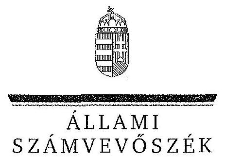
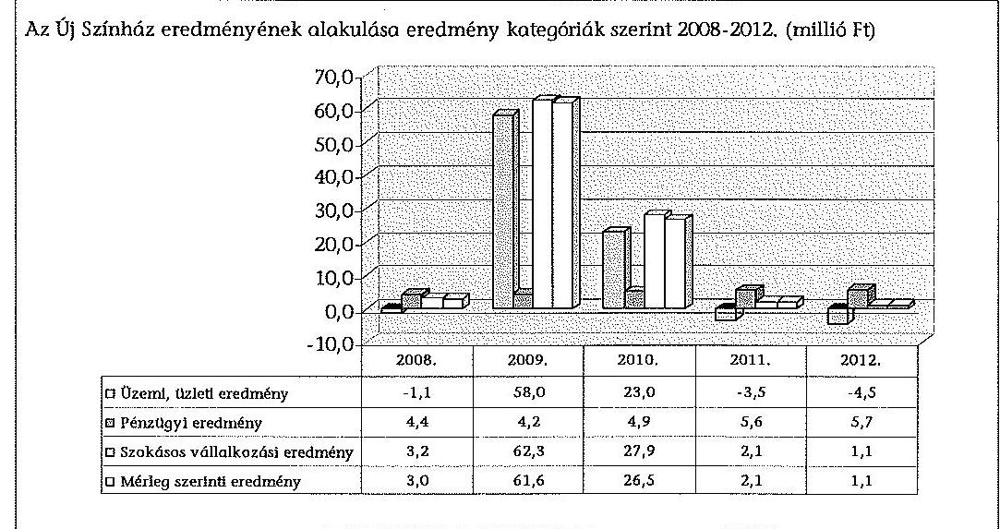
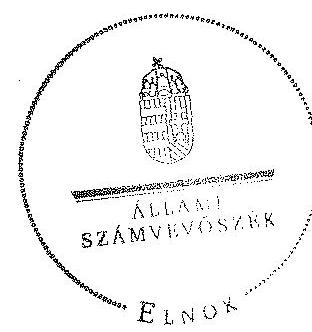
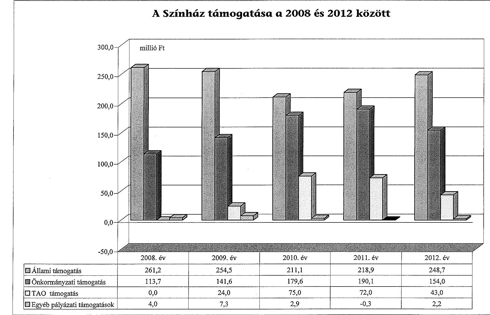
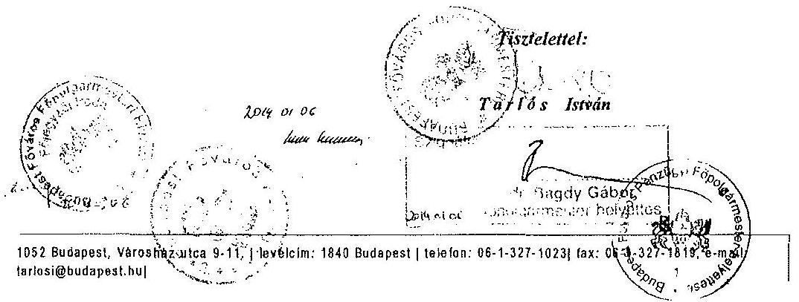
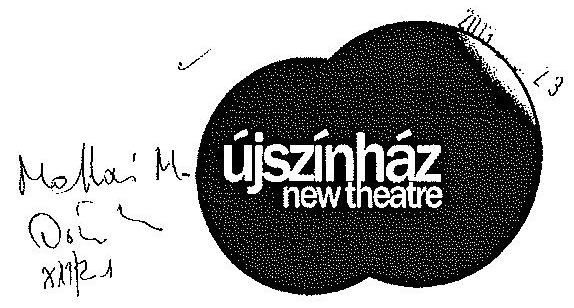
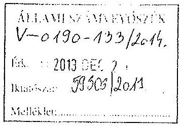
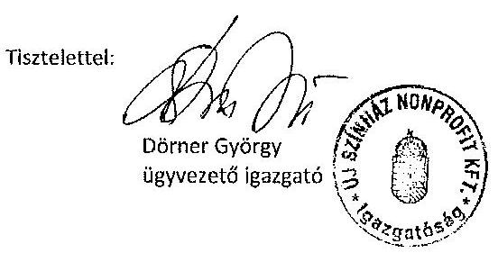
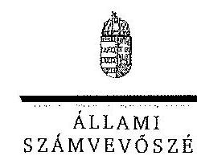
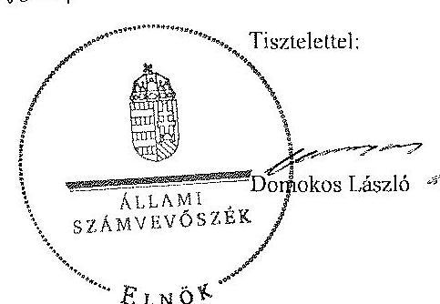

ÁLLAMI
SZÁMVEVÔSZÉK

# JELENTÉS 

az önkormányzatok többségi tulajdonában lévő gazdasági társaságok közfeladat-ellátásának ellenőrzéséről Új Színház Nonprofit Kft.

---

# Állami Számvevőszék 

Iktatószám: V-0190-135/2014.
Témaszám: 1159
Vizsgálat-azonosító szám: V06530208

## Az ellenőrzést felügyelte:

## Makkai Mária

felügyeleti vezető
Az ellenőrzést vezette és az ellenőrzés végrehajtásáért felelős:
Horváth József
ellenőrzésvezető
A számvevőszéki jelentés összeállításában közremüködött:
Kupcsik Éva
számvevő
Az ellenőrzést végezték:

| Hollósi Györgyi | Kupcsik Éva | Vida Katalin |
| :-- | :-- | :-- |
| külső szakértő | számvevő | külső szakértő |

A témához kapcsolódó eddig készített számvevőszéki jelentések:
címe
sorszáma
Jelentés a színházak állami támogatásának és gazdálkodásának 1039 ellenőrzéséről

---

# TARTALOMJEGYZÉK 

BEVEZETÉS ..... 3
I. ÖSSZEGZŐ MEGÁLLAPÍTÁSOK, KÖVETKEZTETÉSEK, JAVASLATOK ..... 6
II. RÉSZLETES MEGÁLLAPÍTÁSOK ..... 12

1. Az Önkormányzat közfeladat-ellátásának megszervezése ..... 12
1.1. A közfeladat meghatározása, a feladat ellátásának választott módja ..... 12
1.2. Az önkormányzati és a tulajdonosi irányítás megítélése ..... 16
2. A Színház közfeladat-ellátással kapcsolatos tevékenysége ..... 21
2.1. A gazdasági társaság szervezeti kialakítása, szabályozottsága ..... 21
2.2. A gazdasági társaság vagyonnyilvántartása ..... 24
2.3. A gazdasági évek ráfordításainak és bevételeinek alakulása ..... 26
2.4. A gazdasági társaság eredményének alakulása ..... 29
2.5. A gazdasági társaság folyamatos üzemmenetének, múködése likviditásának biztosítása ..... 30
3. Az Önkormányzat tulajdonosi jogainak és kötelezettségeinek érvényesítése ..... 32
3.1. A gazdasági társaságtól származó információk elemzése, hasznosítása ..... 32
3.2. Az Önkormányzat közgyűlésének intézkedései ..... 33

## MELLÉKLETEK

1. számú A Színház szakmai tevékenységének mutatói a 2008 és 2012. között
2. számú A Színház támogatása a 2008 és 2012 között
3. számú A Színház vagyonának főbb adatai 2008. január 1-je és 2012. december 31-e között
4. számú Budapest Főváros Főpolgármesterének észrevétele
5. számú Az Új Színház Nonprofit Kft. ügyvezetőjének észrevétele
6. számú Az Új Színház Nonprofit Kft. ügyvezetőjének észrevételére adott válasz

## FÜGGELÉKEK

1. számú Rövidítések jegyzéke
2. számú Értelmező szótár

---

.

---

# JELENTÉS 

## az önkormányzatok többségi tulajdonában lévő gazdasági társaságok közfeladatellátásának ellenőrzéséről Új Színház Nonprofit Kft.

## BEVEZETÉS

Az Önkormányzatnak közfeladata az Ötv. alapján a művészeti feladatok ellátásáról való gondoskodás, az Mötv. szerint az előadó-művészeti szervezet támogatása. Ezt az Önkormányzat az egyszemélyes tulajdonában álló előadóművészeti gazdasági társaság támogatásával valósította meg.

Az Önkormányzat az ellenőrzött időszakban színházi koncepcióval ${ }^{1}$ rendelkezett, amely a színházak múködtetésének alternatíváit vázolta fel és jövőbeli célokat határozott meg. Ezt a Közgyűlés határozattal² elfogadta.

A színházak támogatása az ellenőrzött időszakban központi költségvetési, illetve fenntartói támogatás formájában, valamint pályázatok útján valósult meg. A 2010. és 2012. évek költségvetési törvényei egy összegben tartalmazták az Önkormányzat fenntartásában működő színházak fenntartói ösztönző részhozzájárulásának összegét, amelyet a fenntartó saját döntése alapján oszthatott el.

A Közgyűlés határozatával ${ }^{3}$ elfogadott koncepció nem érintette a 2003. július 1. napjától 3,0 millió Ft törzstőkével megalapított, már társaságként működő Új Színház Kht.-t. Az Új Színház Kht. további átalakítása a gazdasági társaságokról szóló törvény módosítása miatt vált szükségessé. A Közgyűlés a Gt. előírásainak megfelelően a 381/2009. (03. 26.) számú határozatával ${ }^{4}$ 2009. április 30-i hatállyal módosította a Színház Alapító Okiratát, és nonprofit korlátolt felelősségű társasági formában működtette tovább az előadó-művészeti szervezetet.

A Színház elődje a Paulay Ede u. 35. számú épületben Orfeumként kezdte meg a múködését. Számos tulajdonosváltás, átalakítás és névváltozás után az 1994. évben Új Színház névvel nyitotta meg kapuit. A változásokkal együtt a Színház

[^0]
[^0]:    ${ }^{1}$ Koncepció a fővárosi fenntartású színházak struktúráját és finanszírozását érintő változásokról (2007. XI. 29.)
    ${ }^{2}$ a Főv. Kgy. 1979/2007 (11. 29.) sz. határozata
    ${ }^{3}$ a Főv. Kgy. 668/2003. (IV. 24.) sz. határozata
    ${ }^{4}$ a Főv. Kgy. 381/2009. (III. 26.) sz. határozat: döntés az Új Színház nonprofit korlátolt felelősségű társaságként történő tovább működtetéséről, alapító okiratának módosításáról

---

múvészeti profilja a tulajdonosi akarattól függően több alkalommal változott. 2012. február 1-jétől kezdődően új ügyvezető igazgató irányítja a Színházat. A Színház önálló társulattal, két játszóhellyel - a 344 fő befogadására képes nagyszínpadi nézőtérrel és a 80 fő befogadására képes Bubik István stúdiószínházi nézőtérrel - rendelkezik.

Az Önkormányzat a Színházzal a közfeladat ellátásának biztosítására megkötötte a Közszolgáltatási szerződés ${ }_{1}$-et 2003. június 25 -én, melyet az ellenőrzött időszak végéig hét alkalommal módosítottak. 2013. január 1-jei hatálybalépéssel a Fenntartói megállapodás megkötésére került sor. A Közszolgáltatási szerződés ${ }_{1}$ meghatározta a Színház közhasznú tevékenysége körét, az Önkormányzat által biztosított támogatás összegét, a feladat-ellátáshoz szükséges befektetett eszközöket, valamint azok rendelkezésre bocsátásának módját. Az ellenőrzött időszak kezdetén hatályos Közszolgáltatási szerződés ${ }_{2-3}$-ban a szakmai és a teljesítmény követelmények előírásával az Önkormányzat meghatározta a Színház közszolgáltatási tevékenységével kapcsolatos elvárásait.

Az Emtv. új elemként vezette be 2009 novemberétől a Taotv. módosításával a tao támogatást, mint közvetett támogatási formát. Ennek felső határát a jogalkotó a tárgyévi jegybevétel $80 \%$-ában határozta meg. A tao támogatás pénzügyi teljesülése a támogatást nyújtó vállalkozások eredményességének és támogatás nyújtási hajlandóságának a függvénye.

A Színház az Önkormányzat közfeladat-ellátása érdekében végzett tevékenységéhez az ellenőrzött időszakban összesen 1973,4 millió Ft állami és önkormányzati múködési támogatást kapott, fejlesztési célú támogatásban nem részesült. A Színház 2009 és 2012 között 214,0 millió Ft tao támogatást tudott igénybe venni.

Az ellenőrzött időszakban a Színház évente a nagyszínpadon átlagosan öt bemutatót tartott, repertoárjában nyolc-tíz előadás szerepelt folyamatosan. A Színház fizető nézőinek száma évente átlagosan 60 ezer fő volt, az előadások száma évi 280-310 darab között változott. A Színház által foglalkoztatott munkavállalók átlaglétszáma a 2008. évi 94 fơről a 2012. évre 81 fơre, 13,8\%-kal csökkent.

A Színház főbb szakmai mutatószámait a 1. számú melléklet tartalmazza.
Az ellenőrzés várható eredménye: a jelentés nyilvánossága a társadalom széles körével ismerteti meg a Színház gazdálkodására vonatkozó megállapításainkat, továbbá a megállapítások alapján megfogalmazott számvevőszéki javaslatok hasznosítása elősegíti a feltárt hibák megszüntetését, az ellenőrzött szervezet jobb feladatellátását. A társadalom számára jelzi, hogy közpénz nem maradhat ellenőrizetlenül, az ÁSZ értékteremtő rend kialakításához és megőrzéséhez hozzájáruló tevékenysége pozitív hatással lesz a szervezetről kialakított összkép formálásában. A szervezeten belül lehetőség nyílik arra, hogy a megállapítások szintetizálásával az ÁSZ a hozzáadott értéket teremtő, elemző tevékenységét és tanácsadó szerepét is erősítse. A jó gyakorlatok bemutatásával az ÁSZ hozzájárul a követendő megoldások megismertetéséhez és terjesztéséhez.

---

Az ellenőrzés célja annak értékelése volt, hogy:

- az Önkormányzat a jogszabályi előírások figyelembevételével döntött-e az ellenőrzésre kerülő közfeladat megszervezéséről, az ellátás módjáról; a tulajdonostól elvárható gondossággal felügyelte-e a társaság feladatellátását; a gazdasági társaság rendelkezésére bocsátotta-e a közfeladat-ellátásához a szükséges közvagyont, és biztosította-e a tulajdonosi jogok közvagyon feletti érvényesülését; a társaság vagyonvesztése esetén intézkedett-e a további vagyonvesztés megakadályozásáról;
- a gazdasági társaság teljesítette-e a tulajdonos önkormányzat részéről meghatározott célokat és feladatokat a rendelkezésre álló erőforrások felhasználásával; végrehajtotta-e a közfeladat-ellátási szerződés előírásait; betartotta-e a vagyonnal történő gazdálkodásra vonatkozó jogszabályi rendelkezéseket.

Az ellenőrzés hatóköre: az önkormányzatok közfeladat-ellátásának ellenőrzése volt, amely kiterjedt az önkormányzatok és a közfeladatot ellátó, az önkormányzat többségi tulajdonában lévő gazdasági társaság közötti feladatmegosztásra, az önkormányzatok tulajdonosi jogainak gyakorlására, a nemzeti vagyon kezelésének ellenőrzése keretében a közfeladat-ellátáshoz rendelt vagyonra és a vagyont érintő szerződésekre. A jelen ellenőrzés továbbá kiterjedt az önkormányzatok többségi tulajdonlásával működő gazdasági társaságok közfeladat-ellátására, vagyongazdálkodási tevékenységére, a kapcsolódó nyilvántartások, elszámolások szabályszerűségére és megbízhatóságára. Az ellenőrzött tételek kiválasztása véletlen mintavétellel történt.

Az ellenőrzés típusa: szabályszerűségi ellenőrzés.
Az ellenőrzött időszak: a 2008-2012. évek, valamint a helyszíni ellenőrzés befejezéséig - 2013. szeptember 6-ig - bekövetkezett változások figyelemmel kísérése.

Ellenőrzött szervezetek: az Új Színház Nonprofit Kft., valamint Budapest Főváros Önkormányzata.

Az ellenőrzés végrehajtásának jogszabályi alapját az ÁSZ tv. 5. § (3)-(5) bekezdéseiben foglaltak képezték.

Az ÁSZ a 2011. évi LXVI. törvény 29. §-a szerint a jelentéstervezetet megküldte Budapest Főváros Önkormányzata főpolgármesterének és az Új Színház Nonprofit Kft. ügyvezető igazgatójának egyeztetésre. A beérkezett észrevételeket és az azokra adott választ a jelentés 4-6. számú mellékletei tartalmazzák.

---

# 1. ÖSSZEGZŐ MEGÁLLAPÍTÁSOK, KÖVETKEZTETÉSEK, JAVASLATOK 

Az Önkormányzat a művészeti feladatok ellátásáról való gondoskodásnak, illetve az előadó-művészeti szervezet támogatásának, mint az Ötv.-ben és az Mötv.-ben meghatározott közfeladatának, az ellenőrzött időszak alatt eleget tett. Az Önkormányzat közfeladat-ellátását az Új Színház mint gazdasági társaság támogatásával biztosította. A Közgyűlés a tulajdonosi joggyakorlás rendjét az ellenőrzött időszak a alatt szabályzataiban és rendeleteiben foglaltak szerint szabályozta. A tulajdonosi joggyakorlás keretében érdemi határozatokat hozott.

Az Önkormányzat 2003. július 1-jével hozta létre az Új Színház Kht.-t, majd 2009. május 6 -tól nonprofit korlátolt felelősségű társasággá alakította. A Színház részére az Alapító Okiratokban meghatározottaknak megfelelően, az elő-adó-művészeti közfeladat-ellátásához szükséges ingó és ingatlan vagyont a Közszolgáltatási szerződésben foglaltak szerint ingyenesen (haszonkölcsönbe), majd a 2011. november 23 -án aláírt bérleti szerződés és módosított Közszolgáltatási szerződés alapján 2011. szeptember 1-jétől az ingatlanokat bérleti jogviszony keretében használatba adta. A Színház részére ingyenes használatba (haszonkölcsönbe) átadott ingó és ingatlan vagyon értéke 2008. december 31én 554,8 millió Ft volt.

Az Önkormányzat a Közszolgáltatási szerződés megkötésekor (2006. július 1jén) nem kellő gondossággal járt el, mert a szerződés nem tartalmazta az átadott ingó és ingatlan vagyontárgyak aktuális nettó értékét, valamint a szerződésben előírt elkülönített analitikus nyilvántartás vezetéséhez szükséges adatokat, azokat a 2003. évben megkötött Közszolgáltatási szerződés mellékletére történő hivatkozással határozta meg. A Közszolgáltatási szerződés ${ }_{2}$ későbbi módosításai ${ }^{5}$ során nem aktualizálták az évekkel korábban megkötött szerződés mellékletét képező vagyonkimutatást. A 2012. október 26 -ai keltezéssel aláírt Fenntartói megállapodás - az Áht. ${ }_{2}{ }^{6}$ előírásának megfelelően - már tartalmazta a változásokkal módosított eszközlistát, a vonatkozó bruttó, és nettó érték adatokkal.

Az Önkormányzat a közfeladat-ellátásának tárgyi és pénzügyi feltételeit a Közszolgáltatási szerződés ${ }_{1-8}$-ban határozta meg. A Színház részére a közfeladatellátáshoz szükséges forrás biztosításáról a Közszolgáltatási szerződésben (az annak elválaszthatatlan részét képező éves költségvetési rendeletekben) döntött a Közgyűlés. Meghatározta a közhasznú tevékenység körét, a szerződés megszűnésének esetére szabályozta a vagyontárgyak visszaszolgáltatásának rendjét

[^0]
[^0]:    ${ }^{5}$ 2009. áprilisi, 2011. áprilisi módosításai
    ${ }^{6}$ Az Áht. ${ }_{2}$ 105/A. § (13) bekezdése szerint a vagyonkezelő a vagyonkezelésébe vett vagyon eszközeiről olyan elkülönített nyilvántartást köteles vezetni, amely tételesen tartalmazza ezek könyv szerinti bruttó és nettó értékét, az elszámolt értékcsökkenés összegét, az azokban bekövetkezett változásokat.

---

és határidejét, továbbá a Színház által teljesítendő művészeti tevékenységek jellegét, mértékét és pontos mutatószámait. Az önkormányzati tulajdon védelme érdekében szabályozta a leltár készítését, annak gyakoriságát, továbbá a gazdálkodás és a művészeti tevékenység ellátásával összefüggő kötelező adatszolgáltatás formáját, idejét és módját, valamint előírta a gazdálkodás körében felmerülő rendkívüli eseményekről történő tájékoztatási kötelezettséget.

A Közgyűlés határozata ${ }^{7}$ alapján az Önkormányzat képviseletében eljáró BFVK Zrt. és a Színház 2011. november 23-án Bérleti szerződést kötöttek. A szerződés rendelkezései alapján a Önkormányzat tulajdonában álló ingatlanok használatáért bérleti dí fizetésében állapodtak meg. A Közszolgáltatási szerződés 2011. november 25 -i módosításával és a bérleti szerződés aláírását követően a közfeladat eredményes ellátáshoz szükséges ingatlanokat visszamenőleges hatállyal, 2011. szeptember 1-jétől a Színház ingyenesen nem használhatta, és használati díjat fizetett.

Az Önkormányzat a vagyon védelme érdekében a Közszolgáltatási szerződés ${ }_{1-8}{ }^{-}$ ban garanciális követelményként fogalmazta meg a kötelezettségek megszegésének jogkövetkezményét, valamint a szerződés megszűnésének esetére az átadott vagyontárgyak visszaszolgáltatási kötelezettségét. Az ellenőrzött időszakban kötelezettség megszegésére, illetve szerződés megszűntetésére nem került sor.

A Közgyűlés a Színház Alapító Okirat ${ }_{1}$-ben - a Gt. előírásaival összhangban szabályozta az Alapító tulajdonosi joggyakorlásának kereteit. Az Alapító Okiratban a Színház legfőbb szerve, a Közgyűlés kizárólagos hatáskörébe tartozó feladatként határozata meg a Színház SZMSZ ${ }_{2}$-jének és az FB ügyrendjének jóváhagyását. A Színház 2009. évi szervezeti forma változása következtében a Színház SZMSZ ${ }_{1}$-ét 2012 novemberében módosította, amelyet az Önkormányzat csak 2013 áprilisában hagyott jóvá. Az FB ügyrendjét a hiánypótlások következtében - 4 hónapos késedelemmel- 2011. november 31-én fogadta el a Közgyűlés.

A 2010. évben a Színház FB elnökét a Közgyűlés közvetlenül választotta. Az eljárás ellentétes volt a Gt. előírásával, amely szerint - ha törvény vagy a társasági szerződés ettől eltérően nem rendelkezik - az FB a tagjai sorából választ elnököt.

A Közgyűlés a társaság ügyvezetőjének és egyéb vezető állású dolgozóinak, valamint az FB tagoknak díjazására vonatkozó Javadalmazási szabályzat ${ }_{2}$-t a Taktv.-ben foglalt határidőn túl, 2010. január 31. helyett 2010. április 29-én fogadta el.

Az Önkormányzat a Színház beszámolójának és üzleti tervének elfogadását és az adatszolgáltatási kötelezettség ellenőrzését a jogszabályokban, az Önkormányzat belső szabályzataiban és a Közszolgáltatási szerződés ${ }_{1-8}$-ban foglaltaknak megfelelően, határidőn belül - az FB határozatok és a könyvvizsgálói jelentés figyelembe vételével - végezte el.

[^0]
[^0]:    ${ }^{7}$ Főv. Kgy. 2314/2011. (08. 31.) számú határozata.

---

A Színház szakmai tevékenységének ellátását az Önkormányzat évadbeszámolók alapján értékelte. A Színház az ellenőrzött időszak minden évében elkészítette a szakmai értékelését, amelyet 2008 és 2010 között az Önkormányzat Kulturális Bizottsága elfogadott. A 2011. és 2012. évekre benyújtott évadbeszámolókról a kulturális ügyekért felelős Főpolgármester-helyettes 1ájékoztatót nyújtott be a Közgyűlés részére, amelyet a Közgyűlés tudomásul vett.

2008 és 2010 között a prémium feladatok kitűzésének jóváhagyása a Javadalmazási szabályzat ${ }_{1}$ - ben foglaltaknak megfelelően történt. A 2011. és 2012. évekre vonatkozóan a Színház ügyvezetője részére a prémiumfeladatokat és a prémium mértékékét a Javadalmazási szabályzat ${ }_{2-3}$-ban foglaltaktól eltérően késedelmesen - mindkét évben az üzleti terv elfogadását követően határozta meg az Alapító.

Az Önkormányzat belső ellenőrzése a Színháznál a 2011. évben végzett átfogó ellenőrzést a 2007. és 2010. év vonatkozásában. Az ellenőrzés a vagyonvédelmi szabályzatok aktualizálásának elmaradását kifogásolta. Az ellenőrzés megállapításaira a Színház Intézkedési tervet készített, amelynek végrehajtásáról beszámolt, és amelyet a tulajdonos elfogadott.

A Színház 2008 és 2012 közötti gazdálkodása, valamint mérleg szerinti nyeresége nem tette szükségessé, hogy a tulajdonos Önkormányzat a vagyon és a közpénzek nem célszerinti hasznosításával összefüggésben, valamint a lejárt kötelezettségek csökkentése érdekében tulajdonosi intézkedéseket tegyen.

A Színház teljesítette az Önkormányzat részéről a Közszolgáltatási szerződésekben meghatározott célokat és feladatokat. A vagyonnal történő gazdálkodásra vonatkozó jogszabályi rendelkezéseket a számviteli politika szabályozása és annak végrehajtása, a selejtezés, az önköltségszámítás szabályozása és végrehajtása, valamint a gazdasági események bizonylatkezelése területeken nem tartották be teljes körűen. A belső szabályozás hiányosságai a Színház integritásával kapcsolatban kockázatot jelentettek.

A Színház rendelkezett Alapító Okirattal és az irányítási, döntési és felelősségi jogköröket tartalmazó belső szabályzatokkal. A Színház a Közszolgáltatási szerződés előírásának megfelelően folyamatosan biztosította a tevékenységi körébe tartozó színházi szolgáltatást.

A Számviteli politika ${ }_{2}$ és az Eszközök és források értékelési szabályzat ${ }_{2}$ ellentétes szabályozást tartalmazott a készletek értékelésére vonatkozóan. A Számviteli politika a a készletek év végi értékelését átlagos beszerzési áron határozza meg, ezzel szemben az Eszközök és források értékelési szabályzat ${ }_{2}$ „beszerzési áron vagy átlagos súlyozott beszerzési áron" szabályozta azt. A Leltározási szabályzat ${ }_{2}$ nem tartalmaz szabályozást a beszerzéskor költségként azonnal elszámolt, de év végén fel nem használt készletbeszerzések leltározásának végrehajtására és értékelésére.

A Leltározási szabályzat ${ }_{2}$ nem felelt meg a Számv. tv. 2012. január 1-jével hatályos előírásának ${ }^{8}$, mert az ingatlanok, gépek, és berendezések esetében a tör-

[^0]
[^0]:    ${ }^{8}$ a Számv. tv. 69. §. (3) bekezdése

---

vényi előírás szerinti legalább 3 éves gyakorisággal szemben 5 évenkénti, mennyiségi felvétellel történő leltározási kötelezettséget írt elő.

A Színháznál - a Selejtezési szabályzat megengedő előírásai alapján - a selejtezést a leltározási folyamat időszakában a leltározási bizottság tagjai végezték, a selejtezési bizottság tagjait külön nem jelölték ki. A vagyonvédelem a selejtezés gyakorlata miatt nem biztosított a Színházban.

A Színház gazdálkodási adatai alapján, a Számv. tv. előírásai ${ }^{9}$ szerint a 2010. évtől önköltségszámítási szabályzat készítésére kötelezett. Ennek késedelmesen, csak a 2011. évtől tett eleget, amelyben azonban nem tért ki a társulat bérének és járulékainak legalább a produkció színreviteléig történő felosztási módjára. Ennek következtében a produkciók színreviteléig aktivált szellemi termékek nem a ténylegesen felmerült közvetlen költségek alapján kerültek elszámolásra. Továbbá az Önköltségszámítási szabályzat nem tartalmazta az általános költségeknek a felosztási módját.

A Színház nem tartotta be a Pénzkezelési szabályzat előírásait az ügyvezető igazgatói munkakör 2012. január 31-ei átadás-átvétele során, mert az átadásátvételi jegyzőkönyvben nem került rögzítésre a Pénztár záró pénzkészletének összege.

A Színház ráfordításainak teljesítése - a 2012. év kivételével - minden évben meghaladta a tervezett értéket. A 2012. évben a ráfordítások összege 528,2 millió Ft volt. Az ellenőrzött időszakban a Színház összes ráfordításából ( 541,8 millió Ft) az anyagjellegú ráfordítások átlagosan ( 180,8 millió Ft) $33 \%$ os, a személyi jellegű ráfordítások átlagosan ( 340,7 millió Ft) $63 \%$-os, az egyéb költségek átlagosan ( 20,3 millió Ft) $4 \%$-os részarányt képviseltek.

A bevételek - a 2012. év kivételével - meghaladták a tervezett értékeket. A Színház nettó árbevételének - amelyet alapvetően a jegybevétel határozott meg részaránya az összes bevételből a 2008. évi 22,9\%-ról (113,9 millió Ft) a 2012. évre $12,8 \%$-ra ( 67,8 millió Ft) csökkent.

A Színház szakmai és gazdasági stratégiai tervvel nem rendelkezett, céljaikat évente az éves üzleti tervekben fogalmazták meg. Az ellenőrzött időszakban a Színház üzemi eredménye szinten minden évben 4-5 millió Ft hiányt prognosztizált, azonban a pénzügyi műveletek nyeresége miatt pozitív mérleg szerinti eredménnyel zárt, amelyek összege a 2008. évben 3,0 millió Ft, a 2009. évben 61,6 millió Ft, a 2010. évben 26,5 millió Ft, a 2011. évben 2,1 millió Ft és a 2012. évben 1,1 millió Ft volt.

A Színház az ellenőrzött időszakban éves fejlesztési és beruházási tervet készített az Önkormányzat részére. A fejlesztési terveket nem alapozták meg tanulmányokkal és számításokkal. A tervekben meghatározott fejlesztésekhez a

[^0]
[^0]:    ${ }^{9}$ A Számv. tv. 14. § (7) bekezdése szerint önköltségszámítás rendjére vonatkozó szabályzattal kell rendelkeznie annak a gazdálkodó szervnek, amelynek az eladott áruk, közvetített szolgáltatások értékével csökkentett nettó árbevétele meghaladja az 1 milliárd Ft-ot, vagy a költségnemek szerinti költségek együttes összege meghaladja az ötszázmillió Ft-ot.

---

Színház támogatást nem kapott. Saját forrásaiból 2008 és 2012 között 9,4 millió Ft fejlesztést valósított meg.

A Színháznak az ellenőrzött időszakban átmeneti pénzintézeti finanszírozásra nem volt szüksége. Fizetési kötelezettségeit határidőn belül teljesítette, köztartozásai nem keletkeztek.

A Színház likviditása az ellenőrzött években stabil volt, szabad pénzeszközeit folyamatosan éven belüli bankbetétben kötötte le a folyószámláját vezető banknál. A Színház befektetési tevékenységet nem végzett, így Befektetési Szabályzatot nem kellett készítenie.

Az Állami Számvevőszékről szóló 2011. évi LXVI. törvény 33. § (1) bekezdésében foglaltak értelmében a jelentésben foglalt megállapításokhoz kapcsolódó intézkedési tervet köteles az ellenőrzött szervezet vezetője összeállítani, és azt a jelentés kézhezvételétől számított 30 napon belül az ÁSZ részére megküldeni. Amennyiben az intézkedési tervet határidőben nem küldi meg a szervezet, vagy az nem elfogadható, az ÁSZ elnöke a hivatkozott törvény 33. § (3) bekezdés a)-b) pontjaiban foglaltakat érvényesítheti.

Az ellenőrzés intézkedést igénylő megállapításai és javaslatai:

# az Új Színház ügyvezető igazgatójának 

1. A Számviteli politika ${ }_{2}$ és az Eszközök és Források értékelési szabályzat ${ }_{2}$ ellentétes szabályozást tartalmaz a készletek értékelésére vonatkozóan. A Számviteli politika ${ }_{2}$ a készletek év végi értékelését átlagos beszerzési áron határozza meg. Ezzel szemben az Eszközök és Források értékelési szabályzat ${ }_{2}$ „beszerzési áron vagy átlagos súlyozott beszerzési áron" szabályozta a készletek értékelését. A Leltározási szabályzat ${ }_{2}$ nem tartalmaz előírást a beszerzéskor költségként azonnal elszámolt, de év végén fel nem használt készletbeszerzések leltározásának végrehajtására és értékelésére.

Javaslat:
Intézkedjen a Színház gazdálkodására vonatkozó belső szabályzatok összhangjának megteremtésére a készletek értékelésének vonatkozásában, valamint a társasági vagyon védelme érdekében egészítse ki a Leltározási szabályzatát a beszerzéskor költségként elszámolt, de év végéig fel nem használt készletek leltározása előírásaival.
2. A Színház gazdálkodási adatai alapján, a Számv. tv. 14. § (7) bekezdés előírásai szerint a 2010. évtől önköltségszámítási szabályzat készítésére kötelezett. Ennek késedelmesen, csak a 2011. évtől tett eleget, amelyben azonban nem tért ki a társulat bérének és járulékainak legalább a produkció színreviteléig történő felosztási módjára. Ennek következtében a produkciók színreviteléig aktivált szellemi termékek nem a ténylegesen felmerült közvetlen költségek alapján kerültek elszámolásra. Továbbá az Önköltségszámítási szabályzat nem tartalmazta az általános költségeknek a felosztási módját.

Javaslat:
Intézkedjen az Önköltségszámítási szabályzat módosításáról annak érdekében, hogy

---

a) a produkció bemutatásáig elszámolt közvetlen költségek tartalmazzák a társulat bérének és járulékainak a produkcióra felosztott költségeit;
b) a szabályzat tartalmazza az általános költségeknek a felosztási módját.
3. A Színház Leltározási szabályzata nem felelt meg a Számv. tv. 2012. január 1-jével hatályos 69. § (3) bekezdése előírásának, mert a szabályzat 3.2.1 pontja alapján az ingatlanok, gépek és berendezések esetében a törvényi előírás szerinti legalább három éves gyakorisággal szemben öt évenkénti, mennyiségi felvétellel történő leltározási kötelezettséget írt elő.

Javaslat:
Intézkedjen a Leltározási szabályzat módosításáról annak érdekében, hogy a szabályzat a Számv. tv. 69. § (3) bekezdésének megfelelően tartalmazza az ingatlanok, gépek és berendezések legalább 3 évenkénti, mennyiségi felvétellel történő leltározását.
4. A Színház a Számviteli politikájában a 2011. évtől módosította az értékcsökkenési leírás mértékét a tárgyi eszközök közül a díszleteket érintően 14,5 \%-ról 20,0 \%-ra, a szellemi termékek közül a színrevitel aktivált eszközeire vonatkozóan $20 \%$-ra. A változtatásnak a vagyoni helyzetre gyakorolt, számszerúsített hatását a Számv. tv. 53. § (4) előírása ellenére a kiegészítő mellékletben nem mutatta be.

Javaslat:
Intézkedjen az értékcsökkenési leírás mértéke változtatásának a vagyoni helyzetre gyakorolt hatásának - a Számv. tv. 53. § (4) bekezdésében előírtaknak megfelelően - a beszámoló kiegészítő mellékletében történő bemutatásáról.
5. A Színház nem tartotta be a Leltározási és a Selejtezési szabályzat előírásait, a selejtezést a leltározási folyamat időszakában a leltározási bizottság tagjai végezték, a selejtezési bizottság tagjait külön nem jelölték ki. A vagyonvédelem a selejtezés gyakorlata miatt nem biztosított.

Javaslat:
A Színház a vagyonvédelem biztosítása érdekében módosítsa a Selejtezési szabályzatában foglaltakat, és rögzítse az egyes folyamatok időbeni elkülönítését, valamint biztosítsa a selejtezési eljárás szabályszerű lebonyolítását, és szabályozza a selejtezésre jogosultak körét és dokumentálását.

---

# II. RÉSZLETES MEGÁLLAPÍTÁSOK 

## 1. Az ÖNKORMÁNYZAT KÖZFELADAT-ELLÁTÁSÁNAK MEGSZERVEZÉSE

### 1.1. A közfeladat meghatározása, a feladat ellátásának választott módja

Az Önkormányzat a művészeti feladatok ellátásáról való gondoskodásnak, illetve az előadó-múvészeti szervezet támogatásának, mint az Ötv.-ben és az Mötv.-ben meghatározott közfeladatának, az ellenőrzött időszak alatt eleget tett. Az Önkormányzat a közfeladat ellátását az Új Színház Nkft. támogatásával biztosította.

Az Önkormányzat kötelező közfeladata az Ötv. 63/A §. n) pontja szerint a művészeti feladatok ellátása ${ }^{10}$. A Htv. 111. § alapján a közművelődési, közgyűjteményi és művészeti tevékenységekkel kapcsolatos helyi irányítási, ellenőrzési, valamint a fenntartással és múködtetéssel kapcsolatos feladatokat a Közgyűlés látja el. A kulturális feladat ellátását az Önkormányzat az Emtv. 3. § (2) bekezdése alapján előadó-művészeti szervezet (gazdasági társaság) támogatásával valósította meg.

Az Önkormányzat az ellenőrzött időszakban elfogadott kulturális koncepcióval ${ }^{11}$ rendelkezett, amelyet a Közgyűlés ${ }^{12}$ határozatával fogadott el.

A koncepció a színházak működtetésének módozatait vázolta fel és jövőbeli célokat határozott meg, azonban nem vizsgálta a megvalósításhoz szükséges források nagyságát.

A 2010. évi önkormányzati választásokat követően az Ötv. 91. § (1) és (6) bekezdésének megfelelően a Közgyűlés ${ }^{13}$ elfogadta az Önkormányzat 2011-2014. évekre vonatkozó Gazdasági Programját. ${ }^{14}$

Az Önkormányzat a Színház Alapító Okirat ${ }_{1.4}$-ben - a Gt. előírásaival összhangban - szabályozta az Alapító tulajdonosi joggyakorlásának kereteit. Az Alapító Okirat ${ }_{1.4}$ megfelelően rendelkezett a társaság gazdálkodása során elért eredmény felhasználásáról, az ügyvezető, az FB tagok és a könyvvizsgáló kije-

[^0]
[^0]:    ${ }^{10}$ A 2013.01.01-től hatályos Mötv. 13. § (1) 7. pont is kötelezően ellátandó feladatként határozza meg az előadó-művészeti szervezetek támogatását.
    ${ }^{11}$ Koncepció a fővárosi fenntartású színházak struktúráját és finanszírozását érintő változásokról
    ${ }^{12}$ a Főv. Kgy. 1979/2007.(11.29.) sz. határozat
    ${ }^{13}$ a Főv. Kgy. 937/2011.(04.27.) sz. határozat
    ${ }^{14}$ A Főváros fejlesztésének és gazdálkodásának stabilizálása és reformkoncepciója a 2011-2014. évi választási ciklusra

---

löléséről, az összeférhetetlenségi szabályokról, valamint az Áht. 1 100/N. § (8) bekezdése előírásainak betartatásáról.

Az Emtv. hatálybalépésével a tevékenység ellátására vonatkozó követelmények és feladatmutatók a törvény által kerültek meghatározásra.

Az Önkormányzat a Színház teljesítményével kapcsolatos konkrét célokat, elvárásokat a 2006. július 1-én aláírt Közszolgáltatási szerzö-dés ${ }_{2}$-ben fogalmazta meg. A szakmai elvárásait az igazgatói pályázat kiírásában szerepeltette, a megválasztott igazgató pályázata a stratégiai céljait, valamint konkrét szakmai elképzeléseit foglalta össze.

Az Önkormányzat a közfeladat-ellátása érdekében 2011. augusztus 31ig a Színház rendelkezésére bocsátotta az Alapító Okiratban foglaltaknak megfelelően ingyenesen - haszonkölcsönbe adta - az előadó-múvészeti köz-feladat-ellátásához szükséges ingó és ingatlan vagyont. A 2008. évben a haszonkölcsönbe adott eszközök nettó értéke 554,8 millió Ft volt.

A Nvtv. 3. § alapján az ellenőrzött Színház átlátható szervezet.
Az Önkormányzat tulajdonában álló vagyon a nemzeti vagyon részét képezi. A Vagyonrendelet ${ }_{2}$ 6. § (1) bekezdés 6. pontja szerint a Színház használatában lévő, a feladatellátást szolgáló ingatlanvagyon korlátozottan forgalomképes törzsvagyon. Az átadott ingatlanvagyont, valamint a Színház törzstőkéjét az ellenőrzött időszakban az Önkormányzat által évente elkészített Vagyonkimutatás beazonosítható módon tartalmazta.

Az Önkormányzat a közfeladat-ellátásának tárgyi és pénzügyi feltételeit a Közszolgáltatási szerződés ${ }_{14}$-ban határozta meg. A Közszolgáltatási szerződés tartalmazta a közhasznú tevékenység körét, a szerződés megszűnésének esetére szabályozta a vagyontárgyak visszaszolgáltatásának rendjét és határidejét, továbbá a színház által teljesítendő művészeti tevékenységek jellegét, körét, mértékét és pontos mutatószámait. Szabályozta a kötelező leltár készítését, annak gyakoriságát, továbbá a gazdálkodás és a művészeti tevékenység ellátásával összefüggő, kötelező adatszolgáltatás formáját, idejét és módját, valamint előírta a gazdálkodás körében felmerülő rendkívüli eseményekről történő tájékoztatási kötelezettséget.

Az Önkormányzat a Közszolgáltatási szerződés ${ }_{1}$ megkötésekor (2006. július 1-én) és annak módosításai során nem járt el kellő körültekintéssel, mert a szerződés, illetve melléklete nem tartalmazta az átadott ingó és ingatlan vagyontárgyak aktuális nettó értékét, valamint a szerződésben előírt elkülönített analitikus nyilvántartás vezetéséhez szükséges (bruttó érték, az értékcsökkenési leírás mértéke) adatokat.

A közszolgáltatási szerződések (2009. április, 2011. április) módosításai során az évekkel korábban kötött szerződés mellékletét képező vagyonkimutatást az állományváltozásokkal nem aktualizálták.

---

A 2012. október 26-ai keltezéssel aláírt, 2013. január 1-jétől hatályos Fenntartói megállapodás - az Áht. 2 105/A. § (13) bekezdésében ${ }^{15}$ foglaltaknak megfelelően - már tartalmazta a változásokkal módosított eszközlistát, a vonatkozó bruttó, értékcsökkenési és nettó érték adatokkal.

A Közgyűlés a 2307/2011. (08.31.) számú határozata alapján az Önkormányzat képviseletében a BFVK Zrt. és a Színház 2011. november 23-án Bérleti szerződést kötött, amely alapján a Önkormányzat tulajdonában álló ingatlanok után bérleti díjat kellett fizetni. A Közgyűlés 2314/2011. (08.31.) számú határozatát határidőn túl hajtották végre, mivel a Főpolgármesterhelyettes a Közszolgáltatási szerződés-módosítását a 2011. október 1-jei határidőt követően írta alá. A Közszolgáltatási szerződés 2011. november 25 -ei módosításával a közfeladat-ellátáshoz szükséges ingatlanokat visszamenőlegesen, 2011. szeptember 1-jétől a színház ingyenesen nem használhatta.

A Színháznak a bérleti szerződés aláírását megelőző időszakra használati díjat, azt követően bérleti díjat ( 4,0 millió Ft/hó+áfa), valamint a bérleti díj összegét alapul véve egyszeri 3 havi megszerzési díjat és 5 havi óvadékot kellett fizetnie. A 2011. évre vonatkozóan óvadékként, megszerzési díjként és használati díjként összesen egy évi bérleti díjnak megfelelő összeg került kifizetésre. A bérleti szerződés 19 ingatlanra vonatkozott.

A felek 2012-ben a Bérleti szerződés 2. pontját kiegészítették azzal, hogy az Önkormányzat az óvadék összegét „a bérleti szerződés időtartama alatt a kielégítési jog megnyílta előtt használhatja és rendelkezhet vele." Az óvadék összegének fedezete az Önkormányzat részéről tett nyilatkozat ${ }^{16}$ alapján folyamatosan rendelkezésre állt.

# A Színház támogatása az ellenőrzött időszakban központi költségvetési, illetve fenntartói támogatással, valamint pályázatok útján valósult meg. Az Önkormányzat a saját tulajdonosi támogatásának színházak közötti elosztási elveit, szempontjait szabályzatban, belső utasításban nem határozta meg, annak mértékét, nagyságrendjét a teljes támogatási összegéhez igazította. 

A 2010. évtől az Emtv. 16. § (1) bekezdése ${ }^{17}$ szerint a színházak támogatása múvészeti ösztönző részhozzájárulásból és fenntartói ösztönző részhozzájárulásból tevődött össze. 2010 és 2012 között a költségvetési törvények 7. sz. melléklete egy összegben tartalmazta az Önkormányzat fenntartásában müködő színházak fenntartói ösztönző részhozzájárulásának összegét, amelyet a fenntartó saját döntése alapján oszthatott el. A költségvetési törvények a színházak művészeti ösztönző részhozzájárulását külön nevesítve tartalmazták. A 2013. évtől a szín-

[^0]
[^0]:    ${ }^{15}$ Az Áht. 2 105/A. § (13) bekezdése szerint a vagyonkezelő a vagyonkezelésébe vett vagyon eszközeiről olyan elkülönített nyilvántartást köteles vezetni, amely tételesen tartalmazza ezek könyv szerinti bruttó és nettó értékét, az elszámolt értékcsökkenés összegét és az azokban bekövetkezett változásokat.
    ${ }^{16}$ a Főpolgármesteri Hivatal ellenőrzéshez kirendelt kapcsolattartója 2013.augusztus 14-én adott válasza alapján
    ${ }^{17}$ hatályon kívül helyezve 2012. május 1-jével

---

házakat művészeti és létesítménygazdálkodási célra működési támogatás illette meg.

Az Emtv. 48. § (1) bekezdése új elemként bevezette - a Taotv. 4. § 37-39. pontjai alapján - a társasági adókedvezménnyel igénybe vehető támogatást, mint közvetett támogatási formát. A tao kedvezmény igénybevétele 2009. november 12től volt lehetséges, a meghatározott jegybevétel $80 \%$-álg. A tao támogatás pénzügyi teljesülése a támogatást nyújtó vállalkozások eredményességének és támogatás nyújtási hajlandóságának függvénye.

Az ellenőrzött időszakban a Színház számára biztosított múködési hozzájárulás és tao támogatás alakulását a 2. számú melléklet tartalmazza.

Az állami támogatás összege - az ellenőrzött időszakban minden évében meghaladta az önkormányzati támogatás összegét. A Színház az ellenőrzött időszakban összesen 1194,4 millió Ft állami és 779,0 millió Ft önkormányzati, valamint 214,0 millió Ft tao támogatást kapott. Az egyéb pályázati támogatások összege 16,1 millió Ft volt.

Az ellenőrzött időszakban az önkormányzati vagyon megőrzése, védelme érdekében a leltározást az önkormányzati Vagyonrendelet ${ }_{1,2}$ szabályozta. A Vagyonrendelet ${ }_{1} 12 . \S$ (1) bekezdése szerint az Önkormányzat tulajdonában lévő eszközöket minden évben leltározni kell, az ettől eltérő eseteket a rendelet 12. § (3)-(4) bekezdései szabályozták.

A leltározásra vonatkozó előírások a társasággá alakulást követően az Önkormányzat Vagyonrendeleteiben nem a hatályos jogszabályoknak megfelelően szerepeltek, mivel az üzemeltetésre, kezelésre átadott eszközök leltározási szabályairól a Vagyonrendelet ${ }_{1,2}$ - az Áhsz. 2010. január 1-jétől hatályos előírásaival ellentétben - nem tartalmazott szabályozást.

Az Önkormányzat a Színházzal megkötött Közszolgáltatási szerződés ${ }_{1}$-ben és annak módosításaiban az átadott ingó vagyontárgyak évenkénti, december 31-ei fordulónappal történő leltárkészítési kötelezettség 5.1. a) bekezdésben történő előírása mellett, nem tért ki a leltár készítését megelőző leltározás elvégzésének kötelezettségére, ${ }^{18}$ a leltározás elvégzésének módjára, valamint az ingatlanvagyon leltározási és leltárkészítési kötelezettség ezen határidőre történő meghatározására, amely megoldás nem felelt meg az Áhsz. 37. § (4) bekezdésében foglaltnak.

A Közszolgáltatási szerződés ${ }_{1}$ 6.6. pontja, valamint a 2013. január 1-jétől hatályos Fenntartói megállapodás 5.2. pontjának (7) bekezdése az önkormányzati vagyon nyilvántartására vonatkozó előírásoknak megfelelő adatszolgáltatási és nyilvántartási kötelezettség teljesítését írta elő a Színház számára. Az Önkormányzat ingyenesen (haszonkölcsönbe) átadott ingó vagyontárgyak és a bérleti szerződés keretében használt ingatlanok leltározási módjára és annak gyakoriságára vonatkozóan a Fenntartói megállapodás sem tartalmaz előírásokat.

[^0]
[^0]:    ${ }^{18}$ Az Áhsz. 2010. január 1-től hatályos 37.§ (4) bekezdése szerint az üzemeltetésre, kezelésre átadott, koncesszióba, vagyonkezelésbe adott eszközöket az államháztartás szervezete az üzemeltetést, kezelést végző szerv által a december 31-ei fordulónapra vonatkozó évenkénti leltározás alapján elkészített, hitelesített és a megállapodásban meghatározott időpontig megküldött leltárral köteles alátámasztani.

---

Az Önkormányzat minden negyedév végén bekérte a Színháztól az ingatlanadatok változására vonatkozó dokumentumokat, a bruttó érték növekedés vagy csökkenés (kataszteri módosító lapok), valamint az értékcsökkenés elszámolásáról szóló, a gazdasági vezető által aláírt "6. sz. melléklet" címú táblázatot. A megküldött dokumentumok alapján a kataszteri rendszer, valamint a Pénzügyi Információs Rendszer adatainak frissítése megtörtént.

Az Önkormányzat 2008 és 2012 között az éves zárszámadáshoz az Ötv. 78. § (2) bekezdésében és az Mötv. 110. § (2) bekezdésében foglaltaknak megfelelően vagyonkimutatást készített.

A Vagyonrendelet ${ }_{2}$ 14. §-a a leltározás vonatkozásában a korábbi vagyonrendelettel azonos rendelkezéseket tartalmazott. Az Önkormányzat a 7/2011. sz. Leltározási és Leltárkészítési Szabályzatában nem rendelkezett a társaságok leltárainak önkormányzati ellenőrzéséről.

Az Önkormányzat a vagyon védelme érdekében a Közszolgáltatási szerződés ${ }_{1-8}{ }^{-}$ ban garanciális követelményként fogalmazta meg a kötelezettségek megszegésének jogkövetkezményét, valamint a szerződés megszűnésének esetére az átadott vagyontárgyak visszaszolgáltatási kötelezettségét. Az ellenőrzött időszakban kötelezettség megszegésére, illetve a szerződés megszűntetésére nem került sor.

A Közszolgáltatási szerződés a Színház részére vagyonbiztosítási kötelezettséget, továbbá azonnali írásbeli bejelentési kötelezettséget írt elő a kezelt vagyonban bekövetkezett $10 \%$-os mértéket meghaladó értékcsökkenésről való tudomásszerzés esetére, a vagyonban történt súlyos környezeti veszélyeztetés, természeti és környezeti károkozás esetére. A szerződés azonnali hatályú felmondását helyezte kilátásba a vagyontárgyak rongálása, illetve nem rendeltetésszerú használata, hasznosítása esetére.

# 1.2. Az önkormányzati és a tulajdonosi irányítás megítélése 

A Színház esetében a tulajdonosi jogok gyakorlásának rendjét a gazdasági társaságokra és a közhasznú szervezetekre vonatkozó jogszabályok és az Önkormányzat rendeletei határozták meg.

## A Közgyűlés a tulajdonosi jogait az ellenőrzött időszakban a szabályzataiban és rendeleteiben foglaltak szerint gyakorolta.

Az Önkormányzat az SZMSZ ${ }_{1,2}$-ben és a Vagyonrendelet ${ }_{1,2}$-ben szabályozta az egyszemélyes tulajdonában lévő gazdasági társaságokkal kapcsolatos tulajdonosi joggyakorlás feladatait, annak módját, a hatáskörök gyakorlásának rendjét.

Az Önkormányzat az SZMSZ ${ }_{1}$ 49. § (1) bekezdése alapján 2008 és 2010 között létrehozta állandó bizottságként a Kulturális Bizottságot. Ezen időszakban a Közgyűlés e bizottságra ruházta át az Önkormányzat SZMSZ ${ }_{1}$ 5. számú mellékletében szereplő feladatok ellátását.

Az egyszemélyes társaság legfőbb szervének hatáskörébe tartozó (az FB tagjainak, valamint az ügyvezetőnek, továbbá a könyvvizsgálónak a megválasztása,

---

visszahívása, megbízása, megbízásának visszavonása) jogok gyakorlását a 2011. május 25 -e és 2011 . november 10-e közötti időszakban az Önkormányzat eltérően szabályozta a 2011. év előtt, illetve a 2011-ben gazdasági társasággá alakított színházak esetében.

A 2011. év előtt alapított társaságok esetében 2011. január 1-jétől a Vagyonrendelet ${ }_{1}$ 52. § (2) bekezdése alapján a fenti jogokat a Főpolgármester közvetlenül gyakorolta. A 2011. május 25 -én alapított színház gazdasági társaságok esetében 2011. november 9-éig a fenti tulajdonosi jogok gyakorlására kizárólag a Közgyűlés volt jogosult. Az eltérő szabályozás oka az volt, hogy a Közgyűlés a Vagyonrendelet ${ }_{1} 5$. számú mellékletét nem az alapítással egy időben módosította.

Az Önkormányzat a Vagyonrendelet ${ }_{2}$ 56. § (2) bekezdés a) pontjának 2012. március 16 -ai hatálybalépésétől 2013. március 18 -áig a Vagyonrendelet ${ }_{2}$ 5. sz. mellékletében szereplő színház gazdasági társaság esetében a társaság legfőbb szervének a törvény által hatáskörébe tartozó (az FB tagjainak, a társaság könyvvizsgálójának megválasztása, visszahívása, díjazásának megállapítása valamint (2) bekezdése b) pontja alapján az ügyvezető megválasztása, kinevezése és díjazásának megállapítása) jogait a Főpolgármester közvetlenül, egy személyben gyakorolta.
2013. március 19-től a Vagyonrendelet ${ }_{2}$ 56. § (2) bekezdés a) pontja szerint a Közgyűlés hatáskörébe tartozik a Főpolgármester előterjesztése alapján az FB tagjainak és a társaság könyvvizsgálójának megválasztása, visszahívása, díjazásának megállapítása, valamint a Vagyonrendelet ${ }_{2} 56$. § (2) bekezdése b) pontja alapján az ügyvezetőnek a megválasztása, kinevezése és díjazásának megállapítása.

Az Önkormányzat az Alapító Okirat ${ }_{2}$ VII. pontjában a Gt. előírásaival összhangban szabályozta az Alapító tulajdonosi joggyakorlásának kereteit. A köztulajdon védelméről és a Gt. 33. § (1) bekezdés c) pontja előírásnak megfelelően az FB létrehozásáról gondoskodott. A Taktv. 4. § (2) bekezdésének megfelelően a társasági törzstőke összegéhez igazodva 3 főben határozta meg az FB létszámát.

A Közgyűlés a tulajdonosi érdekeinek védelmére határozatokban kijelölte a Színház FB tagjait és könyvvizsgálóját, és a Gt. 34. § (4) bekezdése alapján jóváhagyta az FB ügyrendjét. Az Önkormányzat az FB tagokkal szemben szakmai kritériumokat szabályozásban nem határozott meg.

Az ellenőrzött időszakban a Gt. 141. § (2) bekezdés k) pontjában foglalt jogkörében a Közgyűlés a 2044/2010. (10.27.) számú határozatával visszahívta az FB tagjait, s egyidejúleg megválasztotta az új FB tagokat és döntött az FB-elnök személyéről is. Az Önkormányzat által alkalmazott eljárást a Gt. 34. § (2) bekezdése - a társasági szerződés (alapító okirat) eltérő rendelkezésének hiányában - az FB tagok jogköreként határozta meg.

A Színház Alapító Okiratá ${ }_{1.3}$ VII. fejezet C.5. pontjának az FB tagokra vonatkozó előírása nem tartalmazott az FB elnök megválasztásával összefüggésben „az Alapító eltérő rendelkezésére" utaló kitételt. Ennek következtében az FB elnök Alapító által történő megválasztása nem a jogszabályi előírásnak megfelelően történt.

---

Az Önkormányzat a Közszolgáltatási szerződés ${ }_{2}$-ben ${ }^{19}$ április 30-i, illetve a Fenntartói megállapodásban ${ }^{20}$ április 15-i határidőre, a közszolgáltatási fel-adat-ellátási kötelezettség teljesítésének garanciájaként - a Gt. előirása hiányában - kizárólagos (alapítói) hatáskörében határozta meg a Színház üzleti tervének jóváhagyását ${ }^{21}$ és az FB határozatával, valamint a könyvvizsgáló jelentéssel együtt történő előterjesztését.

Az Önkormányzat a Színház üzleti tervének elfogadását, beszámoltatását és az adatszolgáltatási kötelezettség ellenőrzését a jogszabályokban, az Önkormányzat belső szabályzataiban és a Közszolgáltatási szerződésben foglaltaknak megfelelően, határidőn belül - az FB határozata és a könyvvizsgálói jelentés figyelembe vételével - végezte el.

A Színház éves beszámolóinak elfogadása megfelelt a szabályozásban foglaltaknak. 2008 és 2010 között az Önkormányzat SZMSZ ${ }_{1}$ - 5. sz. melléklet II. fejezet Kulturális Bizottság alcím 15. pontja -, valamint a Vagyonrendelet ${ }_{1}$ alapján a Színház beszámolóját a Kulturális Bizottság határozatban hagyta jóvá.

Az Önkormányzat a 2010. évi választásokat követően SZMSZ $_{2}$-jében Kulturális Bizottságot nem hozott létre. Az éves beszámoló elfogadásának hatáskörét a Vagyonrendelet ${ }_{1}$ 2011. január 1-jével történő módosításával, valamint a Vagyonrendelet ${ }_{2}$ 56. § (1) bekezdése alapján a 2011. és 2012. években a Közgyűlés gyakorolta.

A könyvvizsgálói jelentés megállapította, hogy a beszámolók megbízható és valós képet mutattak a társaság vagyoni, pénzügyi és jövedelmi helyzetéről. A könyvvizsgáló a beszámolókat elfogadó véleménnyel látta el, amely figyelemfelhívást nem tartalmazott. A Színház könyvvizsgálója a 2012. évi auditálás alapján vezetői levélben foglalta össze megállapításait.

A Színház, a közhasznú szervezeti besorolására tekintettel, a gazdálkodása során elért eredményét nem osztotta fel a Közhasznú tv. 14. § (1) bekezdése, majd a Civil tv. hatályba lépését követően, annak 42. § (1) bekezdése alapján, azt az Alapító Okiratában meghatározott tevékenységére fordította. A beszámoló elfogadásáról szóló 2008-2011. évi tulajdonosi határozatok az eredményről nem rendelkeztek. A Közgyűlés a 2012. évi beszámoló elfogadásakor határozott a mérleg szerinti eredmény eredménytartalék terhére történő elhelyezéséről.

A Színház mérleg szerinti eredménye 2008 és 2012 között pozitív volt. A képződött eredményt eredménytartalékba helyezték, amelynek összege 163,5 millió Ft-ra, 232,7\%-kal növekedett 2012. év végére.

Az ellenőrzött időszakban a Színház minden évben készített üzleti tervet, amely a Vagyonrendelet ${ }_{1,2}$-ben meghatározottak szerint az FB véleményezése alapján a jogkörgyakorló által elfogadásra került.

[^0]
[^0]:    ${ }^{19}$ a Közszolgáltatási szerződés 7.2. pontjában éves üzleti tervkészítési kötelezettsége
    ${ }^{20}$ Fenntartói megáll_Új Szinh.pdf, 6.2. Beszámolás pontja második bekezdése
    ${ }^{21}$ Alapító Okiratának VII. A) pontja

---

Az Önkormányzat részéről az üzleti tervekben a bevételek és ráfordítások bemutatatásának részletezettségére nem volt kötelező érvényű előírás. Az üzleti tervek sorai sem az éves beszámoló eredmény-kimutatásának részletezettségéhez, sem a közhasznúsági beszámoló tartalmához nem illeszkedtek teljes körűen.

A tulajdonosi joggyakorlás tekintetében pozitív változás a 2012. évben bevezetett monitoring tevékenység. Ennek keretében egységes adattartalom- és adat-tábla-rendszer került meghatározásra a Színház számára, mind az üzleti terv, mind a beszámoló elkészítéséhez.

A Főpolgármesteri Hivatal Főjegyzői Irodájának 2012. november 9-én kiadott Belső Müködési Szabályzata alapján a Főjegyzői Iroda Monitoring és Koordinációs Referatúra feladatkörébe tartozott a társaságok üzleti terveire és a közszolgáltatási szerződésekre vonatkozó határozatok hatásvizsgálata és a társaságok müködésének és gazdálkodásának folyamatos nyomon követése (az üzleti tervek gazdálkodási adatainak bemutatását szolgáló egységes táblarend kialakítása; a társaságok éves üzleti terveinek közgazdasági megfelelőségi értékelése; a társaságok éves beszámolóinak az üzleti tervek teljesítésének aspektusából történő értékelése és a tervektől való eltérés esetén az Önkormányzati vezetés tájékoztatása).

A 2013. évi üzleti terv már részletes, egységes szerkezetet és információ tartalmat biztosított, amely az irányítási tevékenységet a teljesítmények összehasonlító elemzési lehetőségével és a beszámoltatás tartalmi színvonalának javításával szolgálta.

A Közszolgáltatási szerződés ${ }_{6-8}$ az aláírás idején hatályos Emtv. 44. § 23. pontja előírásaival összhangban, ${ }^{22}$ megfelelően szabályozta a közfeladat-ellátás tartalmát. A Közszolgáltatási szerződés ${ }_{6}$ összegszerűen tartalmazta a 2008. évre vonatkozó támogatási összeget. A szerződés fennállása alatti további évekre a támogatás összegét az Önkormányzat tárgyévi költségvetési rendeleteiben, a Színház részére biztosított támogatási összegre szóló rendelkezésekhez kötötte.

Az Önkormányzatnál a Gt. 141. § (2) bekezdés j)-k) pontjaiban foglalt az alapító hatáskörébe tartozó jogokat - az ügyvezető, illetve az FB díjazásának megállapítását, az ösztönzési rendszer múködtetését - 2008 és 2010 között az Önkormányzat SZMSZ ${ }_{1}$ és a Vagyonrendelet ${ }_{1}$ alapján a Kulturális Bizottság a Javadalmazási szabályzat ${ }_{1}$-ben előírtak alapján gyakorolta. A Színház ügyvezetőjének és egyéb vezető állású munkavállalójának javadalmazásával kapcsolatban a Közgyűlés a 970/2010. (04. 29.) sz. határozatával és a Javadalmazási szabályzat ${ }_{2}$ megalkotásával az Alapító késedelmesen tett eleget a Taktv. 9. § (1) bekezdésében előírt (2010. január 31.) rendelkezésnek.

A 2011. január 1-től hatályba léptetett Javadalmazási szabályzat ${ }_{3}$ rendelkezett a prémium mértékének jelentős csökkentéséről (maximum $40 \%$ ), az ügyvezetők és az FB tagok havi maximális személyi alapbérének KSH átlagkeresethez mért felső korlátjáról, valamint az egyéb jogviszony keretében végzett tevékenységnek a

[^0]
[^0]:    ${ }^{22}$ Az Emtv. 13. § (2) bekezdése szerint a közszolgáltatási szerződés a közszolgáltatás nyújtására irányuló, legalább három évre szóló szerződés, amely az állam vagy az önkormányzat és a közszolgáltatást végző előadó-művészeti szervezet kapcsolatát szabályozza, tartalmazza a teljesítendő előadásszámot, a szolgáltatás nyújtásának időtartamát, helyét és a teljesítésért járó díjazást.

---

munkáltatónál történő díjazási tilalmáról, továbbá részletezte az adható egyéb juttatásokat.

Az Önkormányzat a szabályozás miatti jelentős jövedelem visszaesés mérséklésére az ügyvezetők részére a 2011. évben átlagosan $40 \%$-os személyi alapbéremelést hajtott végre, amely differenciáltan, mintegy $15 \%$-os szórással valósult meg, az ügyvezetők egy részénél januártól, másik részénél márciustól. A szabályozás módosulása kapcsán az Önkormányzat a Színház ügyvezetője részére - a prémium mérték egyharmadára történő csökkentése miatti jövedelem visszaesés részbeni kompenzálása érdekében - a 2011. évben $47 \%$-os személyi alapbéremelést hajtott végre.

A Javadalmazási szabályzat ${ }_{14}$ értelmében a prémiumfeltételeket és a prémium összegét a legfőbb szerv, illetve a munkáltatói jogok gyakorlója határozza meg, legkésőbb az éves üzleti terv elfogadásával egyidejűleg.

A 2008. és 2010. években a prémium feladatok célkitűzéseinek jóváhagyása a Javadalmazási szabályzat ${ }_{1}$-ben leírtaknak megfelelő volt. A 2011. és a 2012. évre vonatkozóan a Színház ügyvezetője részére a Javadalmazási szabályzat ${ }_{3}$ előírásaitól eltérően, késedelmesen történt meg a premizálási feltételek meghatározása.

A 2011. évi üzleti tervet a Közgyűlés a 2011. május 25 -i ülésén fogadta el, míg a prémiumfeltételek meghatározása 2011. november 25 -én történt meg. A 2012. évben az üzleti tervet a Közgyűlés a 2012. május 30 -ai ülésén fogadta el, a prémiumfeltételeket 2012. július 13 -án hagyták jóvá.

Ezen késedelem következtében a prémium-célkitűzés nem tudta betölteni teljesítményösztönző szerepét.

A Színház ügyvezetőjének prémiumfeladat teljesítése a 2012. évben nem volt $100 \%$-os. A kitűzött prémiumfeladatok közül a Színház a 2012. évben nem tudta teljesíteni a Közgyűlés által elfogadott üzleti tervben meghatározott adózás előtti eredménytervének 1 millió Ft-tal történő növelését, ezért a Főpolgármester az éves prémium kitűzés teljesítését $90 \%$-ban hagyta jóvá.

A Színház ügyvezető igazgatói munkakörében az ellenőrzött időszakban 2012. február 1-jétől történt személyi változás. Az első ügyvezető megválasztásáról az ellenőrzött időszakot megelőzően az Önkormányzat Vagyonrendelet ${ }_{1}$ 20. § (4) bekezdése alapján munkáltatói jogok gyakorlására felhatalmazott Kulturális Bizottság a 267/2007. (12. 06.) számú határozatával döntött. Az igazgató a megbízatását a 2008. február 1-től 2012. január 31-ig terjedő időtartamra kapta.

Az ügyvezető munkaszerződésében - egységes és a tulajdonosi joggyakorló által kiadott szabályozás hiányában - az Önkormányzat a kiküldetésre vonatkozó I. osztályú szolgáltatások igénybevételének lehetőségét biztosította. Az ügyvezető megbízatása ideje alatt azonban ezt nem vette igénybe.

A Főpolgármester 2011. május 17-én - a Vagyonrendelet ${ }_{2}$ 56. § (2) bekezdés a) pontjában foglalt jogkör gyakorlójaként - az Emtv. 39. § (2) bekezdésének meg-

---

felelően ${ }^{23}$ kezdeményezte a Színház ügyvezető igazgatói munkakörére vonatkozó pályázat kiírásának előkészítését. A pályázati felhívás tartalma megfelel az Emtv. 39. § (5) bekezdésében foglalt előírásoknak. A pályázati felhívásra 2 db pályázat érkezett, melynek értékelését - az Emtv. rendelkezéseinek megfelelően - a szakértői bizottság 2011. szeptember 21-én elvégezte, és tevékenységéről jegyzökönyvet készített.

A Főpolgármester pályázatok elbírálásáról szóló döntése során az Emtv. 39. § (8) bekezdésében ${ }^{24}$ foglaltak nem kerültek maradéktalanul betartásra.

A Főpolgármester a döntést 6 napos késedelemmel - 2011. október 6-án - hozta meg.

Az ellenőrzött dokumentáció tartalmazta a - helyben szokásos módon történő - közzétételre vonatkozó intézkedést, amely alapján az Önkormányzat eleget tett az Emtv. 39. § (7) bekezdése szerinti ${ }^{25}$ közzétételi kötelezettségnek.

# 2. A SZíNHÁZ KÖZFELADAT-ELLÁTÁSSAL KAPCSOLATOS TEVÉKENYSÉGE 

A Színház teljesítette az Önkormányzat részéről a Közszolgáltatási szerződés ${ }_{1.8}$-ban meghatározott célokat és feladatokat. A költségvetési törvények alapján - mint I. kategóriába sorolt színház - múvészeti és fenntartói ösztönző részhozzájárulásban, valamint az Önkormányzat döntése szerint fenntartói támogatásban részesült. Az ellenőrzött években a Színház pozitív mérleg szerinti eredményt realizált, likviditása folyamatosan biztosított volt, a közfeladat-ellátás megvalósításához szükséges pénzügyi tartalékok (eredménytartalék) évről évre növekedtek.

### 2.1. A gazdasági társaság szervezeti kialakítása, szabályozottsága

A Színház szervezeti formája a közfeladat-ellátás Ötv. 9. § (4) bekezdésében foglalt követelménynek ${ }^{26}$ megfelel. A Gt. 365. § (3) bekezdésében foglalt kötelező

[^0]
[^0]:    ${ }^{23}$ Az Emtv. 39. § (2) bekezdése szerint a vezető feladatainak ellátására pályázatot kell kiírni. A (3) bekezdés szerint a pályázatot a munkáltatói jogkör gyakorlója írja ki, és köteles a pályázati felhívást a minisztérium honlapján közzétenni. A közzététel napjának a minisztérium honlapján való megjelenést kell tekinteni. A (4) bekezdés szerint a szakmai munka folytonossága érdekében a pályázatot a munkáltatói jogkör gyakorlója legalább hat hónappal a határozott idejű jogviszony megszűnése előtt hirdeti meg.
    ${ }^{24}$ Az Emtv. 39. § (8) bekezdés szerint a pályázatokat a benyújtási határidőt követő harminc napon belül kell elbírálni. A (9) bekezdése szerint a munkakör betöltéséről - a szakmai bizottság véleményét is mérlegelve - a munkáltatói jogkör gyakorlója harminc napon belül, önkormányzati fenntartó esetén a következő képviselő-testületi ülésén dönt.
    ${ }^{25}$ Az Emtv. 9. § (7) bekezdéses szerint a döntést a szakmai bizottság véleményével együtt nyilvánosságra kell hozni.
    ${ }^{26}$ Az Ötv. 9. § (4) bekezdés szerint a közfeladat-ellátása céljából a közfeladat ellátására kötelezett társaságot alapíthat.

---

átalakítást a 381/2009. (03. 26.) Főv. Kgy. határozata alapján az Önkormányzat végrehajtotta, a Kht.-t nonprofit korlátolt felelősségű társasággá alakította.

Az Alapító Okirat ${ }_{1-3}$-ban - a Közhasznú tv. figyelembevételével - meghatározott célok, feladatok, az alaptevékenység, a kapcsolódó vállalkozási tevékenység, valamint a társaság szervezete, a társaság vezető - alapító - szerve, ügyvezető az ellenőrző szerveinek (FB, könyvvizsgáló) rendszere nem változott. A Színház szervezete a Kft.-vé alakulás miatt - a Gt. előírásainak megfelelően - nem módosult.

Az Önkormányzat a Színház Alapító Okirat ${ }_{1-3}$-ban - a Gt. előírásaival összhangban - szabályozta az Alapító tulajdonosi joggyakorlásának kereteit. Az Alapító Okiratban a Színház legfőbb szerve, a Közgyűlés kizárólagos hatáskörébe tartozó feladatként határozata meg a Színház SZMSZ ${ }_{2}$-jének és az FB ügyrendjének jóváhagyását. A Színház a 2009. évi szervezeti forma változás következtében SZMSZ ${ }_{1}$-ét 2012 novemberében módosította, amelyet az Önkormányzat 2013 áprilisában hagyott jóvá. Az FB ügyrendjét a hiánypótlások következtében - 4 hónap elteltével - 2011. november 31-én fogadta el az Önkormányzat. A Közgyűlés a tulajdonosi érdekeinek védelmére határozatokban kijelölte a Színház FB tagjait és könyvvizsgálóját.

Az FB az ellenőrzött időszakban gazdálkodást érintő ellenőrzést - a kötelező beszámoló, üzleti terv, prémium feladat és teljesítés értékelésén, a Javadalmazási szabályzat ${ }_{24}$ és egyes hatáskörébe tartozó szerződések megtárgyalásán túl nem végzett.

A Színház a Számv. tv. 14. § (5) bekezdése a) és b) pontjaiban előírtaknak megfelelően, a tulajdon védelme érdekében rendelkezett a Leltározási és leltárkészítési ${ }_{1,2}$, továbbá az Eszközök és források értékelési ${ }_{1,2}$ szabályzatával, a Selejtezési, és Pénzkezelési szabályzatokkal. Rendelkezett a Közbeszerzési, valamint a 2012. évtől a Munkaügyi és a Kötelezettségvállalási szabályzattal.

# A gazdálkodásra vonatkozó jogszabályi rendelkezéseket a Színház csak részben tartotta be. 

A Színház SZMSZ ${ }_{2}$-je rögzítette az elkészített és alkalmazott szabályzatok körét, azok hatályba léptetését. A Színház a 2003. évben hatályba helyezett szabályzatai kiegészítéseként 2009. május 6 -tól kiadta a Számlarendet és a Közbeszerzési szabályzatot, ezzel eleget tett a Számv. tv. 14. § (11) bekezdésében előírt, az újonnan alakuló gazdálkodó szabályzatkészítésére szabott 90 napos határidőnek.

## A közfeladat-ellátást szolgáló vagyon védelme nem volt biztosított.

A Színház gazdálkodási adatai alapján, a Számv. tv. 14. § (7) bekezdés ${ }^{27}$ előírásai szerint a 2010. évtől Önköltségszámítási szabályzat készítésére kötelezett. Ennek késedelmesen, csak a 2011. évtől tett eleget, amelyben azonban nem tért ki a társulat bérének és járulékainak legalább a produk-

[^0]
[^0]:    ${ }^{27}$ A Számv. tv. 14. § (7) bekezdése előírása szerint az önköltségszámítás rendjére vonatkozó szabályzattal kell rendelkeznie annak a gazdálkodó szervnek, amelynek az eladott áruk, közvetített szolgáltatások értékével csökkentett nettó árbevétele meghaladja az 1 milliárd Ft-ot, vagy a költségnemek szerinti költségek együttes összege meghaladja az ötszázmillió Ft-ot.

---

ció színreviteléig történő felosztási módjára. Ennek következtében a produkciók színreviteléig aktivált szellemi termékek nem a ténylegesen felmerült közvetlen költségek alapján kerültek elszámolásra. Továbbá az Önköltségszámítási szabályzat nem tartalmazta az általános költségeknek a felosztási módját.

A Színház Önköltségszámítási szabályzata nem határozta meg a nem számla alapján felmerült közvetlen költségeinek felosztási módját és azok vetítési alapját, a kialakított munkaszámok a közvetlen költségek gyűjtésére szolgáltak. Így az alap- és egyéb tevékenységeire kimutatott közvetlen önköltsége nem teljes körűen tartalmazza a felmerült költségeket.

A Színház szabályzatai a hatályos jogszabályoknak nem feleltek meg teljes körűen. A szabályozási hiányosságok és a szabályozások összehangolásának hibái, valamint a jogszabályoknak nem megfelelő szabályozások következtében a Színház elszámolásai és beszámolói nem voltak mentesek a hibás állításoktól.

A Színház számviteli politikája részeként elkészített Számlarend nem tartalmazta valamennyi gazdasági esemény növekedésének és csökkenésének az elszámolási rendjét.

A Színháznál 2008 és 2010 között az Immateriális javak között a szellemi termékként kimutatandó, színrevitellel kapcsolatos költségek számbavételének és aktiválásának rendjét sem a Számviteli politika, sem az Eszközök és források értékelési szabályzat ${ }_{1}$ nem tartalmazta.

A Számviteli politika ${ }_{2}$ a szellemi termékek színrevitellel kapcsolatos bekerülési érték meghatározásának szabályozása során a számla alapján felmerült költségek körére korlátozta a bekerülési értékbe tartozó (aktiválandó) költségek körét. Nem tartalmazta azonban az előállítással kapcsolatban ténylegesen felmerült és az adott produkció színreviteléhez közvetlenül kapcsolódó - jellemző mutatók alapján felosztható - a Színház saját közvetlen költségeinek teljes körét és a bekerülési érték részeként történő elszámolását. A szabályozás nem felelt meg a Számv. tv. 51. §-ában a bekerülési érték részeként elszámolandó költségek szabályozásának. Az Eszközök és források értékelési szabály$\mathbf{z a t}_{2}$ a szellemi termékek szabályozása tekintetében nincs összhangban a Számviteli politikában foglalt szabályozással.

A Számviteli politika ${ }_{2}$ és az Eszközök és források értékelési szabályzat ${ }_{2}$ ellentétes szabályozást tartalmaz a készletek értékelésére vonatkozóan. A Számviteli politika ${ }_{2}$ 5.1.4. pontja a készletek év végi értékelését (átlagos beszerzési áron) határozza meg. Ezzel szemben az Eszközök és források értékelési szabályzat ${ }_{2}$ 3.3.1. pontja „beszerzési áron vagy átlagos súlyozott beszerzési áron" határoztta meg a készletek értékelését. A Leltározási szabályzat ${ }_{2}$ nem tartalmaz szabályozást a beszerzéskor költségként azonnal elszámolt, de év végén fel nem használt készletbeszerzések leltározásának végrehajtására és értékelésére.

Az ügyvezető igazgatói munkakör 2012. január 31-ei átadás-átvétele során két esetben megsértették a Pénzkezelési szabályzat előírásait, mivel az átadásátvételi jegyzőkönyvben nem került rögzítésre a Pénztár záró pénzkészletének

---

összege ( 1,7 millió Ft), valamint a záró pénzkészlet összege meghaladta a Pénzkezelési szabályzatban előírt 1,5 millió Ft-ot.

A Leltározási szabályzat ${ }_{2}$ nem felelt meg a Számv. tv. 2012. január 1jével hatályos 69. § (3) bekezdése előirásának, mert az ingatlanok, gépek és berendezések esetében a törvényi előírás szerinti legalább 3 éves gyakorisággal szemben 5 évenkénti, mennyiségi felvétellel történő leltározási kötelezettséget írt elő. Továbbá a szabályzat ${ }^{28}$ nem határolta el egyértelműen egymástól időben a selejtezési és a leltározási folyamat lebonyolítását, azt a Selejtezési szabályzat sem tartalmazta, amely vagyonvédelmi szempontból kockázatot hordoz. A megengedő szabályozás sértette a leltározási folyamat megbízhatóságát, eredményeként a leltár valódiságát.

# 2.2. A gazdasági társaság vagyonnyilvántartása 

## Az Önkormányzat a közfeladat ellátásának biztosítása érdekében a szükséges eszközöket a Színház rendelkezésére bocsátotta.

A Színház eleget tett a Közszolgáltatási szerződés ${ }_{1-8}$ 6.7. pontja alapján előírtaknak, valamint a Számv. tv. 160. § (5) bekezdésében foglaltaknak, és az Önkormányzat által a Színház részére ingyenes használatra átengedett ingó és ingatlan vagyont saját vagyonától elkülönítetten tartotta nyilván.

Az Önkormányzat tulajdonában álló, a Színháznak használatra átadott ingatlanok nettó értéke 2008. december 31 -én 548,3 millió Ft, a gépek, berendezések, felszerelések nettó értéke 6,5 millió Ft volt.

A Színház részére átadott eszközök átadás-átvételéről jegyzökönyvet nem tudtak az ellenőrzés részére átadni. A Közszolgáltatási szerződés ${ }_{2}$ mellékleteként a 2003. évben megkötött szerződés mellékletére történt hivatkozás.

A Színház eleget tett a Közszolgáltatási szerződés ${ }_{1-8}$ 6.2. pontjában foglalt vagyonvédelmi és vagyonbiztosítási kötelezettségnek.

A biztosítást negyedévente $10 \%$-kal csökkentett díjazással határozott időre meghosszabbították, a hosszabbított szerződés a Közbesz. tv.-t nem sértette.

Az önkormányzati ingatlanokon végzett saját fejlesztés bruttó értéke alapján azok múemlék jellege miatt ${ }^{29}$ - nem számoltak amortizációt. A Közszolgáltatási szerződés ${ }_{2-7}$ nem tartalmazott információt az ingatlanok múemléki besorolásáról és annak üzemeltetésével összefüggő speciális feladatairól.

A Színház a Leltározási szabályzat ${ }_{1-2}$ 1.1. pontja alapján az év végi leltározást az Önkormányzattól átvett vagyonra is kiterjesztette. Az ellenőrzés rendelkezésére bocsátott dokumentumok alapján a saját vagyontól elkülönítve leltározták

[^0]
[^0]:    ${ }^{28}$ A szabályzat 2.4. pontja szerint a leltározás előtti selejtezés során a feleslegessé váló eszközöket célszerű minden évben a leltár előtt leselejtezni. A selejtezési bizottságnak erről jelentést kell küldeni.
    ${ }^{29}$ épület nyilvántartó lap.PDF

---

az idegen (önkormányzati tulajdonú) vagyont, melyről a leltározást követő év január 31-ig a leltár dokumentumot megküldték a tulajdonos részére.

A leltározás során nem tartották be a Leltározási szabályzatban előírtakat, mivel a leltározási eljárásban részt vevő személyek nem rendelkeztek névre szóló megbízólevéllel.

Az egyedi azonosítóval rendelkező eszközök esetében az azonosító számok feltüntetésre kerültek a leltárdokumentumokban. Az egyedi azonosítóval nem rendelkező eszközök azonosítására a színházban képzett leltárszámok szolgáltak. A leltárellenőrzési feladatokat a vezető könyvelő látta el az év végi leltározások során. Az ellenőrzésekről esetenként külön-külön jegyzőkönyvet nem készített, hanem a leltározás befejezésekor összesítő jegyzőkönyvben dokumentálta a leltárellenőrzést.

# A Színház a saját vagyonára vonatkozóan nem tartotta be a mérleg leltárral történő alátámasztásának a Számv. tv. 69. § (1) bekezdésében előírtakat, mivel december 31-i fordulónappal nem végezte el valamennyi mérlegtétel (pénzeszközök, saját tőke, jegyzett tőke) leltározását. 

Az éves beszámoló könyvvizsgálatának ellenőrzését végző könyvvizsgáló az ellenőrzött évek alatt a mérleg alátámasztásával kapcsolatban a leltárak teljes körüségének hiányáról vezetői levélben jelzéssel nem élt.

A Közszolgáltatási szerződés 5.A) a) pontja 3. bekezdésének az előírása szerint a Színházat megillette a selejtezés joga. A selejtezés alatt álló eszközök elidegenítéséről és hasznosításáról és az ebből származó bevétel felhasználásáról a haszonkölcsönbe adó tulajdonos volt jogosult döntést hozni. A Színház az ellenőrzött időszak minden évében selejtezte elhasználódott, feleslegessé vált eszközeit. A selejtezett eszközök elidegenítésre, értékesítésre nem kerültek, általában nettó értéket nem képviseltek. Az ellenőrzött időszakban a Színház a selejtezést - a Selejtezési szabályzat megengedő előírása alapján - a leltározási folyamat időszakában, a leltározási fordulónapon végezte. A selejtezést a leltározási bizottság tagjai végezték, a selejtezési bizottság tagjait külön nem jelölték ki. A vagyonvédelem a selejtezés gyakorlata miatt nem biztosított a Színházban.

A Színház használatában lévő (saját és önkormányzati tulajdonú) ingatlanok értékeit és főbb mutatóit a következő táblázat szemlélteti:

| Megnevezés | $\mathbf{2 0 0 8 .}$ | $\mathbf{2 0 0 9 .}$ | $\mathbf{2 0 1 0 .}$ | $\mathbf{2 0 1 1 .}$ | $\mathbf{2 0 1 2 .}$ |
| :-- | :--: | :--: | :--: | :--: | :--: |
| Bruttó érték   (millió Ft) | 692,9 | 692,9 | 693,9 | 693,9 | 694,7 |
| Nettó érték (mil-   lió Ft) | 554,3 | 554,3 | 555,3 | 555,3 | 556,1 |
| Használhatósági   fok (\%) | 80,0 | 80,0 | 80,0 | 80,0 | 80,0 |
| Elhasználódási   szint (\%) | 20,0 | 20,0 | 20,0 | 20,0 | 20,0 |

Az önkormányzati tulajdonú ingatlanok után értékcsökkenés elszámolására a 2004. évtől nem került sor, azok műemléki védettsége miatt.

---

A Színház használatában lévő (saját és önkormányzati tulajdonú) egyéb tárgyi eszközök értékeit és főbb mutatóit az ingatlanok adatai nélkül a következő táblázat szemlélteti:

| Megnevezés | 2008. | 2009. | 2010. | 2011. | 2012. |
| :-- | :--: | :--: | :--: | :--: | :--: |
| Bruttó érték   (millió Ft) | 112,1 | 121,9 | 133,0 | 117,6 | 112,5 |
| Nettó érték (mil-   lió Ft) | 33,4 | 37,4 | 44,6 | 28,3 | 28,5 |
| Használhatósági   fok (\%) | 29,8 | 30,6 | 33,6 | 24,1 | 25,3 |
| Elhasználódási   szint (\%) | 70,2 | 69,4 | 66,4 | 75,9 | 74,7 |

A Színház vagyoni helyzetét jellemző főbb, könyvviteli mérleg szerinti adatokat a 3. számú melléklet tartalmazza.

A Színház saját forrásai terhére, a pénzügyi helyzete függvényében - figyelemmel a biztonságos múködésre, feladatellátásra - az eszközök megóvásáról, karbantartásáról és felújításáról évente gondoskodott. Az elmúlt években 50 millió Ft egyedi értéket meghaladó beszerzés, illetve fejlesztés nem volt a Színháznál.

A 3. számú melléklet alapján megállapítható, hogy a Színház közfeladatai ellátásához biztosított - saját és Önkormányzati tulajdonú - eszközök 2012. december 31-ei nettó értéke ( 763,3 millió Ft) a 2008. december 31-ei ( 653,4 millió Ft) adathoz viszonyítva $16,8 \%$-kal nőtt.

# 2.3. A gazdasági évek ráfordításainak és bevételeinek alakulása 

A Színház ráfordításai 2008-ról 2012-re 6,9\%-kal emelkedtek. A Színház 2008. évi üzleti tervében a költségek tervadata 464,0 millió Ft, a teljesítés 494,2 millió Ft volt. A 2009. évi üzleti tervben a költségekre 469,0 millió Ft-ot terveztek, a teljesítés 532,2 millió Ft volt. A 2010. évi üzleti tervben a költségekre 486,0 millió Ft-ot tervezetek, a teljesítés 567,9 millió Ft volt. A 2011. évi üzleti tervben a költségekre 554,0 millió Ft-ot tervezetek, a teljesítés 586,6 millió Ft volt. A 2012. évi üzleti tervben 585,2 millió Ft költséget terveztek, amely 528,2 millió Ft-tal teljesült. A Színház tényleges ráfordításai a 2012. év kivételével minden évben meghaladták a tervezett értéket.

Az üzleti tervek szerkezete 2008 és 2012 között nem igazodott a beszámoló mérlegének és eredmény-kimutatásának szerkezetéhez, hanem a közhasznúsági tevékenység kiemelt bevételeit és költségeit tartalmazta évente változó részletezettséggel és tartalommal, így az összehasonlíthatóságuk nem volt biztosított. A 2013-ról szóló üzleti terv már egységesített, a számviteli beszámolónak megfelelő formátumban készült el, a bevezetett monitoring rendszer eredményeként.

Az ellenőrzött időszakban a Színház összes ráfordításából (541,8 millió Ft) az anyagjellegú ráfordítások átlagosan ( 180,8 millió Ft) $33 \%$-os, a személyi jellegú

---

ráfordítások átlagosan ( 340,7 millió Ft) $63 \%$-os, az egyéb költségek átlagosan ( 20,3 millió Ft) $4 \%$-os részarányt képviseltek.

Az anyag- és készletbeszerzések az előadásokhoz kötődtek. A beszerzéseket produkciókra lebontott tételes költségvetés alapján határozták meg. A beszerzések végrehajtása és elszámolása megfelelt a jogszabályok és a belső szabályzatok előírásainak.

Az ellenőrzött időszakban az anyagjellegű ráfordítások 26,5 millió Ft-tal $(16,2 \%-\mathrm{kal})$ emelkedtek.

A Színház ráfordításainak évek közötti jelentős változásai a színházi bemutatók számának, a darabok művészeti tartalmának és a szereplők számának változásával függtek össze. Az anyag- és készletbeszerzések tervszerűségét - az üzleti tervek ilyen részletezettsége hiányában - az ellenőrzés nem tudta értékelni.

A személyi jellegű ráfordítások 2012-re a 2008. évivel szemben 16,8 millió Ft-tal $(5,2 \%-k a l)$ mérséklődtek.

A Színház átlaglétszáma az ellenőrzött időszak alatt 91,6 fő volt, a 2012. évben jelentős ( 11 fős) létszámcsökkenést hajtottak végre.

A Színház megbízási díjakra a személyi jellegű ráfordítások 4-5 \%-át (13,015,0 millió Ft/év) fizette ki.

Az ellenőrzés során megállapítást nyert, hogy a megbízási szerződéseket produkciókhoz kapcsolódóan kötötték. A teljesítésigazolások megtörténtek.

A Színház az értékcsökkenési leírást a Számviteli politikájában meghatározottak szerint számolta el. A Színház a 2011. évtől a Számviteli politikájában a díszletek és tárgyi eszközök értékcsökkenési leírását 14,5\%-ról 20,0\%-ra módosította, a színrevitel szellemi termékek amortizációját 20\%-os kulccsal számolta el. A változást az éves beszámoló kiegészítő mellékletében jelezték, azonban annak beszámolóra gyakorolt hatását nem mutatták be. Eljárásukkal nem tettek eleget a Számv. tv. 53. § (4) bekezdésében ${ }^{30}$ foglaltaknak.

A Színház az immateriális javakat, tárgyi eszközöket a rendeltetésnek megfelelően - alaptevékenységének teljesítéséhez - szerezte be.

Az egyéb ráfordítások, pénzügyi műveletek ráfordításai és a rendkívüli ráfordítások elszámolása során betartották a Számv. tv.-ben és a hatályos számviteli politikában előírtakat.

[^0]
[^0]:    ${ }^{30}$ A Számv. tv. 53. § (4) bekezdése szerint az immateriális jószágnál, tárgyi eszköznél a terven felüli értékcsökkenés elszámolása, illetve visszaírása az évenként elszámolandó terv szerinti értékcsökkenés, a várható hasznos élettartam és a maradványérték újbóli megállapítását eredményezheti. A terv szerinti értékcsökkenés, a várható hasznos élettartam és a maradványérték újbóli megállapítását a kiegészítő mellékletben indokolni kell és annak az eszközökre, illetve az eredményre gyakorolt hatását külön be kell mutatni.

---

A Színháznak 2008 és 2012 között pénzügyi, és rendkívüli ráfordítása nem volt. Egyéb ráfordításokra 0,1 millió Ft-ot meghaladó kifizetés csak a 2011. és a 2012. évben történt. A ráfordítások nagysága a 2011. évben 19,1 millió Ft, a 2012. évben 15,4 millió Ft volt.

# A Színháznak az ellenőrzött időszakban nem voltak finanszírozási nehézségei. 

A Színház bevételei 2008 és 2012 között 6,4\%-kal emelkedtek. A Színház 2008. évi üzleti tervében 464,9 millió Ft bevételt irányozott elő, a teljesítés 497,5 millió Ft volt. A 2009. évi üzleti tervében 469,5 millió Ft bevételt tervezett, a teljesítés 594,5 millió Ft volt. A 2010. évi üzleti tervében 486,9 millió Ft bevételt irányzott elő, a teljesítés 595,8 millió Ft volt. A 2011. évi üzleti terv 554,5 millió Ft bevételt tartalmazott, ami 588,7 millió Ft-ra teljesült. A 2012. évi üzleti tervet 585,4 millió Ft bevételi összeggel fogadták el, a teljesítés 529,4 millió Ft volt. A Színház tényleges bevételei a 2012. év kivételével meghaladták a tervezett értéket.

A bevételek 2008 és 2011 közötti növekedése 18,3 \%-os volt. A 2012. évben az összes bevétel 59,3 millió Ft-tal volt kevesebb az előző évinél, amelyet a nettó értékesítés bevételeinek és a tao támogatásnak mintegy $40 \%$-os visszaesése idézett elő. Az állami és önkormányzati támogatás 10,3 millió Ft-os növekedése ezt nem tudta ellensúlyozni. A 2009. évben 57,4 millió Ft áfa visszaigénylés folyt be az Európai Unió Bíróság döntése alapján, az állami támogatásból finanszírozott beszerzések korábban vissza nem igényelhető áfa terhel miatt. A 2010. évben 75,0 millió Ft tao támogatást realizáltak, amely ilyen nagyságrendben nem szerepelt a tervezett bevételek között.

Az alapvetően a jegybevételből keletkező nettó árbevétel részaránya, az összes bevételből a 2008. évi $22,9 \%$-ról ( 113,9 millió Ft) a 2012. évre $12,8 \%$-ra ( 67,8 millió Ft) csökkent. A Színház a bevételeinek elkülönített elszámolását a Civil. tv. előírásainak megfelelően biztosította és éves beszámolóiban bemutatta.

A nettó árbevételből az ellenőrzött időszak alatt a jegyárbevétel részarányának csökkenő tendenciája alakult ki, a 2009. évi $89,9 \%$-os részaránya a 2012. évre $81,6 \%$-ra esett vissza. A jegyárból biztosítható kedvezményekre 2008 és 2011 között szabályzat nem volt, azonban a 2012/2013-as évadra már igazgatói utasítás szabályozta az adható kedvezményeket.

A Színház vállalkozási tevékenységének elkülönített nyilvántartását az ellenőrzött időszakban biztosította. Ennek nagysága az összes bevételhez viszonyítva nem jelentős, évente 6,0-7,0 millió Ft összegű. A vállalkozási bevételt a büfé és egyéb helyiségek bérbeadása, különféle rendezvények megtartása, valamint hirdetés és reklámtevékenység bevételei eredményezték.

A Színház a bevételeken belül a közfeladat ellátásával kapcsolatos díjbevételeket elkülönítetten mutatta ki. Az analitikus nyilvántartásában kimutatott vevőállományról naprakész nyilvántartást vezetett, a Számv. tv. 29. §. (1) és (2) bekezdés alapján. A nyilvántartás alkalmas volt a vevők koranalízis szerinti kimutatására.

---

A Színház 2012. december 31 -én 0,1 millió Ft összegben mutatott ki vevőkövetelést mérlegében. Ebből a lejárt követelések összege 42,2 ezer Ft volt. Az helyszíni ellenőrzés lezárásáig ebből 24,3 ezer Ft kiegyenlítése megtörtént. 17,9 ezer Ft behajtása érdekében intézkedést nem tettek. Az egyéb követelések 2012. december 31-ei összege 33,5 millió Ft volt, melynek 95\%-a 2013. január hónapban befolyt.

# 2.4. A gazdasági társaság eredményének alakulása 

A Színház üzleti terveiben az ellenőrzött évek alatt az üzemi, üzleti eredményét minden évben veszteséggel tervezte meg, évente 4,1-5,0 millió Ft hiányt prognosztizált. Az Új Színház mérleg szerinti eredménye a pénzügyi műveletek eredménye következtében minden évben pozitív volt.

A képződött eredményt eredménytartalékba helyezték, amelynek összege 163,5 millió Ft volt a 2012. év végén.

A Színház üzemi eredménye a 2008. évben tervezett 4,1 millió Ft-tal szemben 1,1 millió Ft értékben valósult meg. A mérleg szerinti eredménye 3,0 millió Ft volt, melyet a jegybevételek, és a pénzügyi műveletek bevételeinek kedvező alakulása eredményezett. Rendkívüli eredménye a Színháznak nem volt.

A 2009. évben -2,5 millió Ft-ra tervezett üzemi eredmény 58,0 millió Ft-ra teljesült. A mérleg szerinti eredmény 61,6 millió Ft volt. Az eredmény kedvező alakulását a jegybevételek, valamint az egyéb bevételek tervezett értéknél nagyságrendekkel nagyobb (közel 100 millió Ft-os) bevételtöbblete eredményezte.

A 2010. évben a Színház 23,0 millió Ft üzleti eredményt ért el a tervezett 4,1 millió Ft-tal szemben. A mérleg szerinti eredménye 26,5 millió Ft volt. A bevétel növekedése alapvetően a jegybevételek emelkedéséből adódott.

A Színház eredmény-kimutatásának főbb adatait a következő ábra tartalmazza millió Ft-ban:

---

A beszámolók adatai alapján megállapítható, hogy a mérleg szerinti nyereség a pénzügyi műveletek nyereségéből adódott, üzemi eredmény szinten a Színház 2008-ban, 2011-ben és 2012-ben is veszteséges volt. A 2009. évi bevételek a visszakapott áfa nélkül minimális többlettel fedezték a ráfordításokat, 2010ben pedig a kiemelkedő tao támogatás járult hozzá az üzemi eredmény nyereségéhez.

2008 és 2011 között a ráfordítások tervezése nem volt részletes, a 2012. évi ráfordításokat - a Színház új vezetése - már az eredmény-kimutatás egyes költség és ráfordítás sorainak megfelelően, további részletezéssel tervezte meg.

A ráfordítások teljesítése 2008 és 2011 között meghaladta a tervezettet, melyre a rendelkezésre álló források lehetőséget biztosítottak. A 2012. évi költségcsökkentési intézkedések hatására az anyagjellegủ és a személyi jellegű ráfordítások teljesítése a tervezett összegeket nem érte el, melynek eredményjavító hatása volt.

Az üzleti tervek teljesítését az FB a vizsgált időszak alatt nem ellenőrizte, és azt a tulajdonos Önkormányzat sem kérte számon. Az Önkormányzat a 2013. évről szóló üzleti tervet már egységesített, a számviteli beszámolónak megfelelő formátumban készíttette el, az éves beszámolótól elkülönítve tárgyalta, és 2013. június 12 -én fogadta el. Ez már tartalmazta a részletes, szöveges szakmai indoklást a kitűzött üzleti és művészeti célokhoz, és táblázatos formában is rögzítette a Mérlegtervet, Eredménytervet, Közhasznú eredménytervet, Likviditási tervet, valamint a Beruházási és felújítási tervet.

A Színház a 2009. évtől kezdődően az adókedvezmény lehetőségével élve a vállalkozóktól jelentős összegű támogatást kapott, a 2009. évben a realizálható keret $31,0 \%$-át ( 24,0 millió Ft), a 2010. évben $91,0 \%$-át ( 75,0 millió Ft), a 2011. évben $94,9 \%$-át ( 72,0 millió Ft), a 2012. évben $97,2 \%$-át ( 43,0 millió Ft) gyűjtötték be.

A Színház az ellenőrzött évek alatt összesen 16,3 millió Ft támogatási forrást kapott, melyből 0,2 millió Ft visszafizetésre került. A támogatások a Nemzeti Kulturális Alaptól ( 6,3 millió Ft), az OKM-től ( 3,6 millió Ft), az Önkormányzat Budapesti Színházi Keretéből ( 6,0 millió Ft), valamint egyéb támogatóktól származtak és döntően a produkciókhoz kapcsolódtak. Emellett a Színház a 100 éves épületéről készített emlékkönyvének kiadásához is kapott támogatást.

A felhasznált támogatásokról az éves beszámolók Kiegészítő mellékletében támogatási jogcímenként beszámoltak, azonban nem az előírt részletezettségben (kapott, folyósított, illetve elszámolt összegeket támogatásonként, a kapott öszszeg, annak felhasználása jogcímenként és évenként). A 2012. évi beszámoló 3,3 millió Ft NKA támogatást tartalmazott, a főkönyvi kivonatban ugyanakkor 2,2 millió Ft szerepelt.

# 2.5. A gazdasági társaság folyamatos üzemmenetének, múködése likviditásának biztosítása 

Az ellenőrzött időszakban az üzleti tervek benyújtásához likviditási tervet nem, de pénzforgalmi tervet benyújtottak, melynek részletezettsége és tartalma

---

sem támogatta az átmenetileg szabad pénzeszközök hasznosítását. A 2013. évi üzlet terv egységes szerkezetű és adattartalmú dokumentuma tartalmaz likviditási tervet. A Színház likviditása stabil volt, szabad pénzeszközeinek állománya 2008 és 2010 között folyamatosan emelkedett.

| Megnevezés | $\mathbf{2 0 0 8 .}$ | $\mathbf{2 0 0 9 .}$ | $\mathbf{2 0 1 0 .}$ | $\mathbf{2 0 1 1 .}$ | $\mathbf{2 0 1 2 .}$ |
| :-- | :--: | :--: | :--: | :--: | :--: |
| Pénzeszközök   (millió Ft) | 59,4 | 111,7 | 119,6 | 118,7 | 119,1 |

A Színháznak az ellenőrzött időszakban nem volt szüksége átmeneti finanszírozásra, fizetési kötelezettségeinek, köztartozásainak eleget tudott tenni.

A havi finanszírozási kötelezettségeiken túl a rendelkezésükre álló szabad pénzeszközeiket a folyószámlát vezető pénzintézetnél rövid lejáratú bankbetétekben kötötték le. Befektetési tevékenységet nem végeztek, ezért Befektetési szabályzat készítése nem vált szükségessé.

A Színháznál átmenetileg szabad pénzeszköz a költségvetési támogatásoknak a negyedévente történő átutalása miatt keletkezett. A pénzintézettől lekötött betét után kapott kamatok a gazdasági társaság eredményét növelték az ellenőrzött öt évben.

A Színház a pénzeszközváltozása okainak bemutatására a 2012. évi beszámolója keretében Cash- Flow kimutatást készített, melyben a pénzeszközök változása 387 ezer Ft volt.

A Színház az elkészített fejlesztési és üzleti terveket a gazdasági szempontok és a közfeladat ellátás biztonságára figyelemmel állította össze és továbbította az Alapító részére.

A fejlesztési terveik összeállítása során megtérülésre vonatkozó tanulmányokat, számításokat nem végeztek, a fejlesztési célok megvalósításához szükséges forrásokat nem határozták meg. A fejlesztési szükségleteket a tevékenység biztonságos folytatása, a múködés technikai színvonalának fejlesztése, valamint a megvalósítás időpontja és a pénzügyi feltételekhez igazítható kategóriák szerint rangsorolták.

A fejlesztési és beruházási tervek megvalósítását az Önkormányzat nem kérte számon, azokat nem ellenőrizte.

A megvalósult beruházások sajáterős fejlesztések voltak. A fejlesztésekhez nem vettek igénybe hazai és uniós támogatást. Az elmaradt fejlesztések miatt az elmúlt öt évben a karbantartásra közel 10 millió Ft-ot költött a Színház.

A Színház a vizsgált időszakban a kötelezettségeit határidőn belül teljesítette, határidőn túli köztartozásai nem keletkeztek. A vizsgált időszakban idegen források igénybevételéhez nem igényeltek fenntartói, tulajdonosi garanciát, kezességet.

---

A múködési források finanszírozója az elszámolásokat a pénzügyi teljesítés előtt ellenőrizte. A támogatásokkal a Színház - nyilatkozatuk alapján ${ }^{31}$ - elszámolt.

# 3. Az ÖNKORMÁNYZAT TULAJDONOSI JOGAINAK ÉS KÖTELEZETTSÉGEINEK ÉRVÉNYESÍTÉSE 

### 3.1. A gazdasági társaságtól származó információk elemzése, hasznosítása

Az Önkormányzat a színházak rendszeres adatszolgáltatási kötelezettségével kapcsolatban szabályzatot az ÁSZ ellenőrzés részére nem adott át. A Kulturális, Turisztikai és Sport Főosztály 2013. augusztus 12 -én készített táblázatban mutatta be az intézmények és társaságok rendszeres - havi, negyedéves, féléves, éves - adatszolgáltatási kötelezettségét.

Az Emtv. értelmében az előadó-művészeti államigazgatási szerv nyilvántartást vezetett a törvényben meghatározott előadó-művészeti szervezetekről. A 7/2009. (III. 4.) OKM rendelet határozta meg a nyilvántartásba vételi és besorolási eljárás rendjét. A nyilvántartásba vételi kérelem részletes szabályait, illetve a nyilvántartásba vételhez szükséges adatokat a 14/2012. (III. 6.) NEFMI rendelet tartalmazza.

A Színház az ellenőrzött időszakban minden évben eleget tett a tulajdonos felé a besoroláshoz, illetve a minősítéséhez szükséges adatszolgáltatási kötelezettségének, így a tulajdonos Önkormányzat az előzőekben felsorolt rendeletekben meghatározott határidőre teljesítette adatszolgáltatási kötelezettségét.

A 14/2012. (III. 6.) NEFMI rendelet 16. § (3) bekezdése alapján a Színház adatot szolgáltatott az előadó-művészeti államigazgatási szerv részére az általános forgalmi adóval csökkentett tárgyévi jegy-, és bérletbevételéről. Ez alapján az államigazgatási szerv kibocsátotta a Taotv. szerinti adókedvezményre jogosító támogatási igazolást, ami tartalmazta a kedvezményre jogosító támogatás öszszegét.

Az Önkormányzat a Színház szakmai tevékenységének ellátását az évadbeszámolók alapján értékelte. A Színház az ellenőrzött időszak minden évében elkészítette a szakmai értékelését, amelyet 2008 és 2010 között az Önkormányzat Kulturális Bizottsága elfogadott. A 2011 és 2012 évekre benyújtott évadbeszámolókról a kulturális ügyekért felelős Főpolgármester-helyettes Tájékoztatót nyújtott be a Közgyűlés részére, amelyet a Közgyűlés tudomásul vett.

A 14/2012. (III. 6.) NEFMI rendelet 11. § (4) bekezdése előírja az Önkormányzat részére a létesítménygazdálkodási célú múködési támogatás mértékének megállapításához szükséges adatszolgáltatást. Az Önkormányzat a színházak szakmai tevékenységével összefüggő adatszolgáltatási kötelezettségeinek az el-

[^0]
[^0]:    ${ }^{31}$ Nyilatkozat pályázati pénz.pdf.

---

lenőrzött időszakban a fenti jogszabályoknak megfelelően, az azokban meghatározott határidőn belül és tartalommal eleget tett.

Az Önkormányzat Kulturális, Sport és Turisztikai Főosztálya, mint az Önkormányzat tulajdonában lévő színházak múködését felügyelő szakmai főosztály, a színházak által végzett szolgáltatásra vonatkozóan önálló elemzéseket, tanulmányokat nem készített. Belső elemzésként értékelhetők a szakmai főosztály által a Közgyűlés számára benyújtott előterjesztésekhez készített - a megalapozott döntés meghozatalához szükséges - szakmai anyagok.

Az ellenőrzött időszakban az Önkormányzat megrendelésére külső szakértők közreműködésével az Önkormányzat által működtetett, illetve tulajdonolt színházak - köztük a Színház - vonatkozásában összesen 8 tanulmány készült, együttesen 29,8 millió Ft + áfa értékben.

Az Önkormányzat 2007. évi koncepciójában meghatározott feladatok végrehajtása érdekében három szakértői vizsgálat készült. A három tanulmányban foglalt feladatok végrehajtására, a tanulmányok hasznosítására az Emtv. hatályba lépése miatt az Önkormányzat nem hozott intézkedéseket.

Az elkészített tanulmányok alapján a Közgyűlés 2011. január 1-jétől hatályos javadalmazási szabályzatot fogadott el. Az intézmény-átalakítási koncepció a költségvetési szervek megszüntetése és az utódszervezet megalakításának folyamatára, ütemtervére fogalmazott meg javaslatokat, amelyek a 2011. július 31. napjával történt intézménymegszüntetés során nyomon követhetők. A számviteli, illetve gazdálkodási szabályzatokról készített tanulmányokban nem fogalmazták meg a színházakra vonatkozó speciális szabályozást, illetve nem fedték le a törvényekben, jogszabályokban előírtakat.

A tanulmányok vonatkozásában az Önkormányzat az elektronikus információszabadságról szóló 2005. évi XC. törvényből eredő közzétételi kötelezettségének eleget tett.

# 3.2. Az Önkormányzat közgyűlésének intézkedései 

Az Önkormányzat a vagyon, illetve a közpénzek nem célszerinti hasznosításával, az esetleges pazarló felhasználással kapcsolatban az Főpolgármesteri Hivatal 2013. augusztus 22 -én kelt nyilatkozata szerint a társaság esetében az esetleges veszteség megszüntetése, a lejárt kötelezettségek csökkentése vagy a társaság által jelzett csődveszély elhárítása érdekében tulajdonosi intézkedések megtétele nem vált szükségessé

Az Önkormányzat Alapító Okirat ${ }_{1.5}$-ben, a Közszolgáltatási szerződés ${ }_{1.8}$-ban illetve a 2013. január 1-jén hatályba lépett Fenntartói megállapodásban határozta meg a Színház rendelkezésére bocsátott vagyon és közpénzek cél szerinti felhasználásával kapcsolatos követelményeket.

A Színház az Alapító Okirat ${ }_{1}$ szerint az Önkormányzat kizárólagos hatáskörébe tartozott - többek között - a gazdasági társaság üzleti tervének, SZMSZ-ének jóváhagyása, beszámolójának, valamint a közhasznúsági jelentésnek az elfogadása. A Közgyűlés a Színház felsorolt dokumentumait szabályszerűen, minden esetben határozatokkal fogadta el.

---

Az Önkormányzat a tulajdonostól elvárható gondossággal a vagyonvédelem érdekében, a Közszolgáltatási szerződésben, illetve a Fenntartói megállapodásban megfelelően szabályozta a Színház múködését befolyásoló rendkívüli események felmerülése esetén a társaságok részéről történő azonnali tájékoztatási kötelezettséget.

A Színház múködése során a tájékoztatás körébe tartozó rendkívüli események nem következtek be, így az Önkormányzatnak sem volt intézkedési kötelezettsége.

Az Önkormányzat 2013. augusztus 2-án kelt nyilatkozata szerint a 2008. és 2010. évek tekintetében nem volt tudomásuk az Önkormányzat megkereséséről a Színházat érintő lejárt kötelezettség kiegyenlítésével kapcsolatban, a 2011 és 2012 között pedig nem érkezett megkeresés. Az Önkormányzatnak az ellenőrzött időszak folyamán nem kellett intézkednie a Színház lejárt kötelezettségeivel kapcsolatban.

Az Önkormányzat a kulturális közfeladat megfelelő színvonalú ellátását a színházak igazgatóinak évadbeszámolói alapján kísérte figyelemmel. A társasági időszakban a hatályos jogszabályok (Gt., Emtv. és a végrehajtási rendeletei) előírásait betartva az Önkormányzat követelményeket határozott meg a Közszolgáltatási szerződésben, illetve a 2013. évtől a Fenntartói megállapodásban, valamint döntött a szakmai tevékenység elfogadásáról. Intézkedései hozzájárultak a közfeladat megfelelő színvonalú ellátásához.

A Színház cél szerinti, közhasznú tevékenységeinek felsorolását 2012. december 31-ig a Közszolgáltatási szerződés tartalmazta. A Szerződés szerint a Színház vállalta az aláírás időpontjában hatályos Emtv. szerinti feltételeknek a játszóhelyeken történő teljesítését és a meghatározott színházi szolgáltatás folyamatos biztosítását. A számszaki mutatókat a szerződésben nem határozták meg, hanem az Emtv. hatályba lépését követően a jogszabály szerinti 1. kategóriába soroláshoz szükséges feltételek teljesítését írták elő a Színház részére. A Színház a múködése során teljesítette a Szerződésben foglalt kötelezettségeit, amelyet a Közgyűlés határozatban fogadott el.

Az előírt mutatószámok az Emtv. 10. § (1) ${ }^{32}$ bekezdése szerint: évente legalább 180 előadás, saját társulattal legalább két bemutató létrehozása, a megtartott előadások legalább 75\%-a a színház saját előadása keretében kell, hogy megvalósuljon, továbbá a játszóhelyek átlagosan $65 \%$-os kihasználtsággal (látogatottsággal) múködjenek.

A nem szerződésszerű teljesítésre vonatkozóan a Közszolgáltatási szerződés 8. pontja rendelkezett. Ezzel kapcsolatban a Közgyűlésnek intézkedési kötelezettsége nem volt.

Az Önkormányzat és a Színház 2013. január 1-jei hatállyal az Mötv. és az Emtv. előírásainak megfelelően Fenntartói megállapodás kötött, amely Közszolgáltatási szerződésnek is minősül és a korábban kötött Közszolgáltatási szerződést hatályon kívül helyezte. A Színháznak az előadó-művészeti szolgál-

[^0]
[^0]:    ${ }^{32}$ hatályos 2012. május 30 -ig

---

tatást a Fenntartói megállapodás 4. pontjában rögzített mutatószámoknak megfelelően kell teljesítenie (évente legalább 180 előadás megtartása, saját társulattal évente két bemutató létrehozása, a megtartott előadások legalább $75 \%$-a a színház saját előadása, átlagosan legalább $65 \%$-os kihasználtság elérése).

Az Önkormányzat a Fenntartói megállapodásban a Színház szakmai tevékenységét illetően a korábbi Közszolgáltatási szerződésnél szélesebb körben és egyes esetekben (bérleti szerződés megszegése) szigorúbban szabályozta a kötelezettség nem szerződésszerű teljesítésének jogkövetkezményeit.

A Színház FB-je tevékenysége során a Gt. szerint nevesített kötelező feladatait ellátta, azonban a belső szabályozás szerinti feladatait nem teljes körűen hajtotta végre. Az FB jóváhagyta és a tulajdonosnak elfogadásra javasolta az éves beszámolókat, üzleti terveket, valamint prémium feladatokat és azok teljesítését. Az FB határozatot hozott a Színház éves beszámolóiról, a közhasznúsági jelentéseiről az Alapító Okiratban és a Gt.-ben előírt írásbeli jelentés helyett. A határozat a beszámoló fő adatait nem tartalmazta. Véleményezte az ügyvezetésnek a könyvvizsgáló személyére tett javaslatát, valamint az olyan szerződések megkötését, amelyet a Színház az ügyvezetőjével kötött.

Az FB jegyzőkönyvek az Alapító Okiratban megjelöltek ellenére a vagyonmérleg és a vagyonleltár tervezetek ellenőrzését nem tartalmazták. A Javadalmazási Szabályzat ${ }_{1-4}$-ben előírtak ellenére az FB nem értékelte az ellenőrzött években a Színháznál alkalmazott foglalkoztatási és bérezési gyakorlatot.

Az Önkormányzat belső ellenőrzésének éves munkatervei tartalmazták a tervezett ellenőrzéseket. A belső ellenőrzési tervek jóváhagyása - a 2009. évre vonatkozó belső ellenőrzési tervet kivéve - az előírt határidőn belül megtörtént.

A 2009. évi belső ellenőrzési tervet az Ötv. 92. § (6) bekezdésével ellentétben - a tárgyévet megelőző év november 15 -ei határidő helyett - 2008. december 3-án hagyták jóvá ${ }^{33}$.

A Főpolgármester az Ötv. 92. § (10) bekezdése előírásának megfelelően, a zárszámadási rendelettervezettel egyidejűleg a Közgyűlés elé terjesztette a belső ellenőrzés éves összefoglaló jelentését. A jelentés tartalmazta az Önkormányzat felügyelete alá tartozó költségvetési szervek és a tulajdonában lévő gazdasági társaságok, valamint a Főpolgármesteri Hivatal éves belső ellenőrzési tevékenységéről szóló összefoglalást is.

Az Önkormányzat a Színháznál 2011-ben átfogó ellenőrzést végzett a 20072010. évek vonatkozásában. Az ellenőrzés a vagyonvédelmi szabályzatok aktualizálásának elmaradását kifogásolta. Az ellenőrzés megállapításaira a Színház Intézkedési tervet készített, amelyet végrehajtott és a tulajdonos elfogadott. Az Önkormányzat - jogszabályi kötelezettség hiányában - nem vett részt az ingyenesen haszonkölcsönbe adott eszközeinek leltározásában és annak ellenőrzésében.

[^0]
[^0]:    ${ }^{33}$ A Önkormányzat 2008., 2009., 2010., 2011., 2012. évi ellenőrzési tervét átruházott hatáskörben a Főpolgármester a Főjegyzővel közösen hagyta jóvá.

---

A Színház a Közhasznú tv. 14. § (1) bekezdésének, illetve a Civil tv. 42. § (1) bekezdésének megfelelően a gazdálkodása során elért eredményét nem osztotta fel, azt a létesítő okiratában meghatározott közhasznú tevékenységére fordította.

A Színház az ellenőrzött időszakban a 2008. évben 1,9 millió Ft közhasznú eredményt és 3,0 millió Ft mérleg szerinti eredményt, a 2009. évben 58,1 millió Ft közhasznú eredményt és 61,6 millió Ft mérleg szerinti eredményt, a 2010. évben 19,4 millió Ft közhasznú eredményt és 26,4 millió Ft mérleg szerinti eredményt, a 2011. évben -2,9 millió Ft közhasznú veszteséget és 2,1 millió Ft mérleg szerinti eredményt, valamint a 2012. évben 0,3 millió Ft közhasznú eredményt és 1,1 millió Ft mérleg szerinti eredményt ért el.

Az éves beszámoló elfogadásáról a Közgyűlés a Vagyonrendelet ${ }_{1}$ 52. § (1) bekezdése, a 2012. évi beszámoló elfogadásáról a Vagyonrendelet ${ }_{2}$ 56. § (1) bekezdése alapján döntött, de az eredmény felhasználásáról a határozatokban külön nem rendelkezett. A 2012. évi mérleg szerint eredmény „eredménytartalék terhére helyezését" a Közgyűlés a 2013. május 29-i ülésén a 883/2013. (05. 29.) sz. határozat részeként elfogadta. A határozatban írt kifejezés „eredménytartalék terhére helyezését" pontatlan, mert a pozitív eredményt az eredménytartalékban kellett helyezni.

A Színház 2008 és 2012 közötti mérleg szerinti eredménye alapján nem volt szükség tulajdonosi intézkedésre a Gt. 143. § szerint a veszteség rendezése, illetve a saját tőke/jegyzett tőke előírt szintjének biztosítása érdekében.

A Színház múködése során a 2008. évi számviteli beszámolójában a saját tőke 76,3 millió Ft, a 2009. évben 137,9 millió Ft, a 2010. évben 164,4 millió Ft, a 2011. évben 166,5 millió Ft, valamint a 2012. évben 167,6 millió Ft volt, és az ellenőrzött időszak minden évében meghaladta a 3,0 millió Ft jegyzett tőkét.

Budapest, 2014. 01 hó 28, nap

Melléklet: 6 db
Függelék: 2 db

Domokos László
elnök*

2 db

---

# A Színház szakmai tevékenységének mutatói a 2008 és 2012 között

|  Sorszám | Megnevezés | 2008 | 2009 | 2010 | 2011 | 2012 | Változás \%-a  |
| --- | --- | --- | --- | --- | --- | --- | --- |
|   |  |  |  |  |  |  | 2012. év / 2008.
év  |
|  1 | Színházlátogatások száma
(fö) | 62792 | 59155 | 70016 | 64113 | 43954 | 70,0  |
|  2 | Fizetőnéző-szám (fő) | 62418 | 58721 | 69692 | 63777 | 43667 | 70,0  |
|  3 | Jegyárkedvezménnyel
értékesített férőhelyek
száma (fő) | 374 | 434 | 324 | 336 | 287 | 76,7  |
|  4 | Előadások száma (db) | 281 | 280 | 308 | 309 | 234 | 83,3  |
|  5 | Férőhelyek száma (db) | 424 | 424 | 424 | 424 | 424 | 100,0  |

---

.

---

# A Színház támogatása a 2008 és 2012 között

|  Állami támogatás | 2008. év | 2009. év | 2010. év | 2011. év | 2012. év  |
| --- | --- | --- | --- | --- | --- |
|  Önkormányzati támogatás | 261,2 | 254,5 | 211,1 | 218,9 | 248,7  |
|  TAXI támogatás | 113,7 | 141,6 | 179,6 | 190,1 | 154,0  |
|  Egyéb pályázati támogatások | 4,0 | 7,3 | 2,9 | -0,3 | 2,2  |

---

.

---

# A Színház vagyonának főbb adatai 2008. január 1-je és 2012. december 31-e között

|  Mérlegsor megnevezése | 2008. jan. 1. (E Ft) | 2008. dec. 31. (E Ft) | 2009. dec. 31. (E Ft) | 2010. dec. 31. (E Ft) | 2011. dec. 31. (E Ft) | 2012. dec. 31. (E Ft) | Változás \%-a 2012. dec. 31./ 2008. dec. 31.  |
| --- | --- | --- | --- | --- | --- | --- | --- |
|  Immateriális javak | 380 | 156 | 426 | 59 | 11196 | 21351 | 13686,5  |
|  Tárgyi eszközök | 19357 | 32790 | 38184 | 47413 | 31917 | 32962 | 100,5  |
|  Ebből: Ingatlanok |  | 5914 | 5914 | 6914 | 6914 | 6914 | 116,9  |
|  Gépek, berendezések |  | 26876 | 32270 | 40499 | 25003 | 26048 | 80,7  |
|  Befektetett eszközök összesen | 19737 | 32946 | 38610 | 47472 | 43113 | 54313 | 164,9  |
|  Forgóeszközök összesen | 86715 | 61252 | 124772 | 135332 | 158016 | 152644 | 249,2  |
|  Aktív időbeli elhatárolások | 5353 | 4323 | 5156 | 5780 | 7738 | 4813 | 111,3  |
|  Eszközök összesen | 111805 | 98521 | 168538 | 188584 | 208867 | 211770 | 214,9  |
|  Saját tőke összesen | 73269 | 76295 | 137910 | 164398 | 166489 | 167608 | 219,7  |
|  Ebből:Jegyzett tőke | 3000 | 3000 | 3000 | 3000 | 3000 | 3000 | 100,0  |
|  Eredmény/artalék | 69724 | 70270 | 73294 | 134910 | 161398 | 163489 | 232,7  |
|  Mérleg szerinti eredmény | 545 | 3025 | 61616 | 26488 | 2091 | 1119 | 37,0  |
|  Tartalékok |  |  |  |  |  |  |   |
|  Céltartalék |  |  |  |  |  | 698 |   |
|  Kötelezettségek összesen | 5503 | 405 | 3533 | 3613 | 11503 | 14354 | 3544,2  |
|  Passzív időbeli elhatárolások | 33033 | 21821 | 27095 | 20573 | 30875 | 29110 | 133,4  |
|  Források összesen: | 111805 | 98521 | 168538 | 188584 | 208867 | 211770 | 214,9  |
|  |   |   |   |   |   |   |   |
|  Önkormányzattól átvett eszközök összesen |  | 554838 | 553365 | 552489 | 551619 | 551571 | 99,4  |
|  Ebből: immateriális javak |  | 0 | 0 | 0 | 0 | 0 |   |
|  ingatlanok |  | 548345 | 548345 | 548345 | 548345 | 549169 | 100,2  |
|  gépek, berendezések |  | 6493 | 5020 | 4144 | 3274 | 2402 | 37,0  |
|  Saját és átvett eszközök összesen |  | 653359 | 721903 | 741073 | 760486 | 763341 | 116,8  |

---

.

---

# BUDAPEST 

FÖYÁROSI ÖSKORMÁNYZAT
FÖPOLGÁRMÉSTERE

| 1st. sokon | $70 / 24-4 / 2014$ |
| :--: | :--: |
| Tárgy: | A V-0186-077/2013,   a V-0190-129/2013 és   a V-0187-265/2013. . számi   számvevőszéki jelentése   észrevételezése |

Állami Számvevőszék
Domokos László elnök úr részére

## Tisztelt Elnök Úr!

Köszönettel vettem

- a V-0186-077/2013. számon megküldött, az „önkormányzatok többségi tulajdonában lévő gazdasági társaságok közfeladat-ellátásának ellenörzéséről, - Katona József Színház Nonprofit Kft. és jogelödje",
- a V-0190-129/2013. számon megküldött, az „önkormányzatok többségi tulajdonában lévő gazdasági társaságok közfeladat-ellátásának ellenörzéséről, - Új Szinház Nonprofit Kft." és
- a V-0187-265/2013. számon megküldött, az „önkormányzatok többségi tulajdonában lévő gazdasági társaságok közfeladat-ellátásának ellenörzéséről, - Örkény István Színház Nonprofit Kft. "
megnevezésű jelentéseik tervezetét, amelyek észrevételezésére - figyelemmel a jogszabályi előírásokra - T. Elnök úr 15 napot biztosított.

Tájékoztatom, hogy a 2008-2012. évekre kiterjedő vizsgálataikat rendkívül alaposnak ítéljük meg, megállapításaikat és javaslataikat elfogadjuk, a jelentés-tervezetre észrevételt nem teszünk.

Munkájukat megköszönöm.

Budapest, 2014. január „07"

---

.

---

ÚJ SZÍNHÁZ NONPROFIT KFT. 1061 BUDAPEST, PAULAY EDE U. 35 TEL.: +361 269-6021 FAX: +361 269-6020 UJSZINHAZ@UJSZINHAZ.HU WWW.UJSZINHAZ.HU

Damokos László
Elnök úr
Állami Számvevőszék
Budapest

Tisztel Elnök Úr!

Ikt. szám: 1/2013

Hivatkozva az Önök által megküldött „Az önkormányzatok többségi tulajdonában lévő gazdasági társaságok közfeladat-ellátásának ellenőrzéséről - Új Színház Nonprofit Kft., cimmel készített számvevőszéki jelentéstervezetre, az abban foglalt megállapításokra, javaslatokra az alábbi észrevételt teszem.

1. A Számviteli Politika és az Eszközök és Források Értékelési Szabályzatának összhangját megteremtjük, azonban úgy véljük, hogy az Értékelési szabályzat jelenleg sem ellentétes a számviteli politikával. Az értékelési szabályzatban foglaltak szerint a „A mérlegben a vásárolt készletet (anyag, áru) beszerzési áron vagy átlagos (súlyozott) beszerzési áron kell értékelni (kimutatni), így a súlyozott ár csak lehetőségként szerepel. A számviteli politikában foglaltak az irányadóak, így a két szabályzat összhangban van, csak több alternatívát nevesít.
Társaságunk raktárra nem szerez be készletet, azok beszerzési értéke azonnal elszámolásra kerül. A vásárolt készletek az év végi leltár eredményeképpen az átlagos beszerzési ár alapján megállapított leltárértéken - a felhasználás egyidejű korrigálásával - kerülnek a mérlegben kimutatásra.
2. Az Önkóltségszámitásra vonatkozóan a nem számla alapján felmerült közvetlen költségeinek felosztási módja nem valósult meg. Az általános és közvetett költségek nem kerültek felosztásra, mivel jelentős többletteherrel lehetne szétosztani a költségeket mutatószámokkal, melyek nem feltétlenül mutatnák a valós képet, torzitva az eredményt.
3. A Leltározási Szabályzat módosítása folyamatban van, azonban ettől függetlenül az ingatlanok, gépek, berendezések tekintetében is a leltározás gyakrabban megtörtént, mint öt év.

---

4. Az önkormányzati ingatlanok műemléki minősítése véleményünk szerint igazolt, a Budapest Főváros VI. kerület Terézváros Önkormányzat Képviselő - testületének Terézváros helyi építészeti örökségének védetté nyilvánításáról szóló 16/2011.(IV.4.) önkormányzati rendeletének 1. és 2. számú függeléke tartalmazza a vonatkozó ingatlanok felsorolását.
5. A Számviteli politikában 2011. évtől a tárgyi eszközök közül a díszleteket érintő értékcsökkenési kulcs $14,5 \%$-ról $20 \%$-ra módosult. Számításaink szerint az értékcsökkenés eredményre gyakorolt hatása nem jelentős, összeg szerint 916 E Ft.
6. A Társaság a Leltározási és Selejtezési Szabályzata alapján a selejtezési bizottság tagjai a selejtezési jegyzőkönyvekben megjelölésre kerültek, a leltározáson részt vevő bizottság selejtezheti az eszközöket is. A javaslatban foglaltak alapján jövőben biztosítjuk az egyes folyamatok időbeni elkülönítését.

Budapest, 2013. december 19.

---

ELNOK

Ikt.szám: V-0190-134/2014.

# Dörner Gyügy úr 

ügyvezető igazgató
Új Színház Nonprofit Kft.

## Budapest

## Tisztelt Ügyvezető Igazgató Úr!

A „Jelentéstervezet az önkormányzatok többségi tulajdonában lévő gazdasági társaságok közfeladat-ellátásának ellenőrzéséről - Új Szinház Nonprofit Kft." címmel készített jelentéstervezetre tett észrevételeit köszönettel megkaptam.

Az Állami Számvevőszék észrevételekre vonatkozó álláspontjáról a felügyeleti vezető által készített részletes tájékoztatást csatoltan megküldöm.

Tájékoztatom Ügyvezető igazgató urat, hogy a számvevőszéki jelentés az elfogadott észrevételei figyelembevételével készül.

Budapest, 2014. 01 . hó 98 . nap

Melléklet: Tájékoztatás sz elfogadott és el nem fogadott észrevételckről

---

# Tájékoztatás   az elfogadott és az el nem fogadott észrevételekröl 

A „Jelentéstervezet az önkormányzatok többségi tulajdonában lévő gazdasági társaságok közfeladat-ellátásának ellenörzéséről - Új Szinház Nonprofit Kft." címmel készített jelentéstervezetre tett észrevételeket áttekintettük, azok kezeléséről a következő tájékoztatást adom.
1./ A Számviteli Politika és az Eszközök és Források Értékelési Szabályzatának összhangját amelynek hiányát állapította meg az Állami Számvevőszék ellenőrzése - levelük szerint megteremtik, a jelentéstervezet módosítása nem indokolt.

Véleményük szerint ugyanakkor az összhang most is fennáll a két szabályzat között, mert a számviteli politikában foglaltak az irányadóak, a másik szabályzat alternatívákat nevesít. Ezzel kapcsolatban megjegyezzük, hogy a Számvitelei Politika keretében, annak részeként kell elkészíteni az Eszközök és Források Értékelési Szabályzatát. Ennek megfelelően vonatkoznak az értékelési szabályzatra is a számvitelről szóló 2000 . évi C. törvény 14. § (4) bekezdésében leírtak, így azt is, hogy meg kell határozni azt, hogy a törvényben biztosított választási, minősítési lehetőségek közül melyeket alkalmazzák.

Az észrevételek szerint a vásárolt készletek az év végi leltár eredményeképpen az átlagos beszerzési ár alapján megállapított leltárértéken kerülnek a mérlegben kimutatásra. Ez is alátámasztja a jelentéstervezetben szereplő annak a javaslatnak az indokoltságát, hogy a Színház egészítse ki a Leltározási szabályzatát a beszerzéskor költségként elszámolt, de év végéig fel nem használt készletek leltározása elölrásaival.
2./ Az Önköltsegszámításra vonatkozóan megerősítik, hogy a nem számla alapján felmerült közvetlen költségek felosztási módja nem valósult meg, továbbá az általános és közvetett költségeket nem osztották fel, mivel jelentős többletteherrel lehetne azokat szétosztani.

A Színház, amennyiben önköltségszámítási szabályzatot készít, be kell tartania egyrészt a Számv. tv.-nek a közvetlen önköltségszámításra vonatkozó elölrásait, másrészről az önköltségszámítási szabályzatnak tartalmaznia kell az önköltség részét képező általános költségek felosztási módját. Az önköltség nem öncélú, hanem a hatékony költséggazdálkodást szolgálja, lehetővé teszi az elszámolást, ahhoz nyújt használható információkat.

---

A számviteli törvény tételesen a közvetlen önköltséget szabályozza, de az önköltség nem azonos a közvetlen önköltséggel. Az önköltséget a Számv. tv. a 160. § (4) bekezdésében említi az egységes számlakeret vonatkozásában a következők szerint:
„(4) A 6-7. számlaosztály - a gazdálkodó döntésének megfelelően - használható a vezetői információk biztositására. E számlaosztályok szabad használata lehetővé teszi a vállalkozáson belüli egységek elszámoltatását, a költséggazdálkodás, az önköltségszámitás sajátos rendszerének kialakitását."

A társulati bér- és járulékköltségek az előadások (szolgáltatások) során közvetlenül merülnek fel - az előadásokat a társulat tagjai hozzák létre - így ezen költségeket a Számv. tv. 51. § (2) bekezdése szerint megfelelő mutatók segítségével el lehet (és el kell) számolni legalább a produkció bemutatásáig az adott előadás közvetlen önköltségében.

Az előzőekben kifejtettekre tekintettel, valamint az egyértelmű megfogalmazás érdekében a jelentéstervezet 9 . oldalának ötödik bekezdését, a 24 . oldalának utolsó bekezdését és a Színház igazgatójának szóló 2. számú javaslat intézkedést igénylő megállapítását az alábbiakra pontosítjuk:
„A Színház gazdálkodási adatai alapján, a Számv. tv. 14. § (7) bekezdés elöirásai szerint a 2010. évtől önköltségszámitási szabályzat készitésére kötelezett. Ennek késedelmesen, csak a 2011. évtől tett eleget, amelyben azonban nem tért ki a társulat bérének és járulékainak legalább a produkció szinreviteléig történő felosztási módjára. Ennek következtében a produkciók szinreviteléig aktivált szellemi termékek nem a ténylegesen felmerült közvetlen költségek alapján kerültek elszámolásra. Továbbá az Önköltségszámitási szabályzat nem tartalmazza az általános költségeknek a felosztási módját."

Ezzel összefüggésben a javaslat szövegét az alábbira pontosítjuk:
„Intézkedjen az Önköltségszámitási szabályzat módosításáról annak érdekében, hogy
a) a produkció bemutatásáig elszámolt közvetlen költségek tartalmazzák a társulat bérének és járulékainak a produkcióra felosztott költségeit;
b) a szabályzat tartalmazza az általános költségeknek a felosztási módját."
3./ A jelentéstervezetben javasoltuk a Leltározási szabályzat módosítását annak érdekében, hogy a szabályzat a Számv. tv. 69. § (3) bekezdésének megfelelően tartalmazza az ingatlanok, gépek és berendezések legalább 3 évenkénti, mennyiségi felvétellel történő leltározását. Leveltikben a megállapítást és ahhoz kapcsolód javaslatot nem kifogásolják, arról adnak tájékoztatást, hogy a leltározási szabályzat módosítása folyamatban van. Mindezek alapján a jelentéstervezet módosítása nem indokolt.
4./ Az önkormányzati tulajdonban lévő, műemléki ingatlanok értékcsökkenésével kapcsolatos javaslatot - a Színház korábbi nyilatkozata és az észrevétel alapján - töröljük. Ezzel összefüggésben pontosítjuk a 25 . oldal hatodik bekezdését.

---

5./ A Társaság a Számviteli politikájában a 2011. évtől módosította az értékcsökkenési leírás mértékét a tárgyi eszközök közül a díszleteket érintően $14,5 \%$-ról $20,0 \%$-ra, a szellemi termékek közül a színrevitel aktivált eszközeire vonatkozóan $20 \%$-ra. Az ellenőrzés megállapította, hogy a változtatásnak a vagyoni helyzetre gyakorolt, számszerüsített hatását a Számv. tv. 53. § (4) előírása ellenére a kiegészítő mellékletben nem mutatta be.

A megállapítást és a hozzá kapcsolódó javaslatot fenntartjuk, mivel a Számv. tv. 53. § (5) bekezdése azt írja elő, hogy ha az értékcsökkenés megállapításánál figyelembe vett körülményekben lényeges változás következik be, akkor az értékcsökkenés megváltoztatható, de az eredményre gyakorolt hatást a kiegészítő mellékletben be kell mutatni. Ez alapján észrevételükkel ellentétben - a kiegészítő mellékletben való szerepeltetés független attól, hogy az eredményre gyakorolt hatás jelentős vagy sem.

6./ Az észrevételekben foglaltak szerint elfogadják a Selejtezési szabályzat módosítására vonatkozó megállapításunkat és az ahhoz kapcsolódó javaslatot, ezért a jelentéstervezet módosítása nem indokolt.

Tájékoztatom Ügyvezető igazgató urat, hogy a számvevőszéki jelentés mellékleteként szerepeltetjük a jelentéstervezethez tett észrevételeit, valamint az azokra adott válaszunkat.

Budapest, 2014. 04 hó 98 nap

Makkai Mária
felügyeleti vezető

---

# RÖVIDÍTÉSEK JEGYZÉKE 

## Törvények

Áht. 1

Áht. 2
ÁSZ tv.
Civil tv.

Emtv.
Gt.
Htv.

Kjt.

Közbesz. tv. ${ }_{2}$
Közhasznú tv.
Mötv.
Nvtv.
Ötv.
Ptk.
Számv. tv.
Taktv.
Taotv.

## Rendeletek

14/2012. (III. 6.) NEFMI rendelet

7/2009. (III.4.) OKM rendelet

Áhsz.
az államháztartásról szóló 1992. évi XXXVIII. törvény, hatályos 2011. december 31-ig
az államháztartásról szóló 2011. évi CXCV. törvény, hatályos 2011. december 31-étől
az Állami Számvevőszékről szóló 2011. évi LXVI. törvény, hatályos 2011. július 1-jétől
az egyesülési jogról, a közhasznú jogállásról, valamint a civil szervezetek múködéséről és támogatásáról szóló 2011. évi CLXXV. törvény, hatályos 2012. január 1-jétől
az előadó-művészeti szervezetek támogatásáról és sajátos foglalkoztatási szabályairól szóló 2008. évi XCIX. törvény
a gazdasági társaságokról szóló 2006. évi IV. törvény
a helyi önkormányzatok és szerveik, a köztársasági megbízottak, valamint egyes centrális alárendeltségủ szervek feladat- és hatásköreiről szóló 1991. évi XX. törvény
a közalkalmazottak jogállásáról szóló 1992. évi XXXIII. törvén
a közbeszerzésekről szóló 2011. évi CVIII. törvény
A közhasznú szervezetekről szóló 1997. évi CLVI. törvény, hatályos 2011. december 31-ig
Magyarország helyi önkormányzatairól szóló 2011. évi CLXXXIX. törvény
a nemzeti vagyonról szóló 2011. évi CXCVI. törvény
a helyi önkormányzatokról szóló 1990. évi LXV. törvény
a Polgári Törvénykönyvről szóló 1959. évi IV. törvény
a számvitelről szóló 2000. évi C. törvény
A köztulajdonban álló gazdasági társaságok takarékosabb múködéséről szóló 2009. évi CXXII. törvény
A társasági adóról és osztalékadóról szóló 1996. évi LXXXI. törvény
az előadó-művészeti szervezetek és az előadó-művészeti érdekképviseleti szervezetek müködésével kapcsolatos hatósági eljárások és adatszolgáltatások részletes szabályairól
az előadó-művészeti szervezetek múködésével kapcsolatos hatósági eljárások részletes szabályairól, továbbá a zenekarok és énekkarok tevékenységéhez szükséges tárgyi feltételekről, valamint a fizető nézőszám alsó határáról az államháztartás szervezetei beszámolási és könyvvezetési kötelezettségének sajátosságairól szóló 249/2000. (XII. 24.) Korm. rendelet

---

Ámr.
Ávr.

Önkormányzat SZMSZ ${ }_{1}$
Önkormányzat SZMSZ ${ }_{2}$

Önkormányzat SZMSZ ${ }_{3}$

Vagyonrendelet ${ }_{1}$

Vagyonrendelet ${ }_{2}$

## Határozatok

Javadalmazási szabály$\mathrm{zat}_{1}$

Javadalmazási szabály$\mathrm{zat}_{2}$

Javadalmazási szabály$\mathrm{zat}_{3}$

Javadalmazási szabály$\mathrm{zat}_{4}$
az államháztartás múködési rendjéről szóló 292/2009. (XII. 19.) Korm. rendelet, hatályos 2011. december 31-ig az államháztartásról szóló törvény végrehajtásáról szóló 368/2011. (XII. 31.) Korm. rendelet, hatályos 2012. január 1-jétől
Budapest Főváros Önkormányzata Közgyűlésének 7/1992. (III. 26.) a Fővárosi Önkormányzat Szervezeti és Müködési Szabályzata (hatálytalan 2010. december 31től)
Budapest Főváros Önkormányzata Közgyűlésének 55/2010. (XII. 9.) a Fővárosi Önkormányzat Szervezeti és Müködési Szabályzata (hatálytalan 2013. március 18-tól)
Budapest Főváros Önkormányzata Közgyűlésének 11/2013. (III. 18.) a Fővárosi Önkormányzat Szervezeti és Müködési Szabályzata (hatályos 2013. március 19-től)
75/2007. (XII. 28.) Főv. Kgy. rendelet a Fővárosi Önkormányzat vagyonáról, a vagyontárgyak feletti tulajdonosi jogok gyakorlásáról (hatálytalan 2012. március 15 -től)
22/2012. (III. 14.) Főv. Kgy. rendelet Budapest Főváros Önkormányzata vagyonáról, a vagyonelemek feletti tulajdonosi jogok gyakorlásáról (hatályos 2012. március 15 -től)

2096/2003. (XI.27) Főv. Kgy határozat: Szabályzat az egyszemélyes kulturális közhasznú társaságok ügyvezetőinek, felügyelő bizottsági tagjainak javadalmazására (hatályon kívül helyezve 2010. április 30-án)
970/2010. (IV.29) Főv. Kgy. határozat: Szabályzat a Fővárosi Önkormányzat kulturális ágazatba tartozó, egyszemélyes tulajdonában lévő gazdasági társaságai ügyvezetőinek, egyéb vezető állású munkavállalóinak, valamint felügyelő bizottsági tagjainak javadalmazására (hatályon kívül helyezve 2011. január 1-jétől)
2490/2010. (XII.15.) Főv. Kgy. határozat: Szabályzat a Fővárosi Önkormányzat kulturális ágazatba tartozó, egyszemélyes tulajdonban lévő gazdasági társaságai ügyvezetőinek, egyéb vezető állású munkavállalóinak, valamint felügyelőbizottsági tagjainak javadalmazására (hatályon kívül helyezve 2012. november 1-jétől)
2062/2012. (X.3.) Főv. Kgy. határozat: Szabályzat a Fővárosi Önkormányzat kulturális és oktatási ágazatba tartozó, egyszemélyes tulajdonban lévő gazdasági társasági ügyvezetőinek, egyéb vezető állású munkavállalóinak, valamint felügyelő bizottságainak javadalmazására

---

# Az Új Színház szabályzatai 

Eszközök és Források értékelési szabályzat ${ }_{2}$

Eszközök és Források értékelési szabályzata ${ }_{1}$
FB ügyrend

Kötelezettségvállalási szabályzat

Leltározási szabályzat ${ }_{1} \quad$ Az Új Színház Nonprofit Korlátolt Felelősségű Társaság
Eszközök és források értékelési szabályzata (hatályos: 2009.május 6 -tól)
Az Új Színház Közhasznú Társaság Eszközök és források értékelési szabályzata (hatályos 2009.május 5-ig)
Az Új Színház Nonprofit KFT Felügyelő Bizottságának Ügyrendje (a 3587/2011.(11.30.) sz. Főv. Kgy. határozatával jóváhagyott)
Kötelezettségvállalási szabályzat

Az Új Színház Nonprofit Korlátolt Felelősségű Társaság Kötelezettségvállalási szabályzata (hatályos 2012.június 31-tól)
Az Új Színház Közhasznú Társaság Leltározási szabályzata (hatályos 2003.július 1-től 2009.május 5-ig)
Azz Új Színház Nonprofit Korlátolt Felelősségű Társaság Leltározási szabályzata (hatályos 2009. május 6-tól)
Önköltségszámítási szabályzat Az Új Színház Nonprofit Korlátolt Felelősségű Társaság Önköltségszámítási szabályzata (hatályos 2011. január 1-jétől)
Pénzkezelési szabályzat ${ }_{1} \quad$ Az Új Színház Közhasznú Társaság Pénzkezelési szabályzata (hatályos 2003. július 1-tól)
Pénzkezelési szabályzat ${ }_{2} \quad$ Az Új Színház Nonprofit Korlátolt Felelősségű Társaság Pénzkezelési szabályzata (hatályos 2009. május 6-tól)
Selejtezési szabályzat Új Színház Selejtezési szabályzata (hatályos 2009. május 6-tól)
Számlarend $_{1} \quad$ a Számviteli politika részeként, (hatályos 2010.december 31 -ig)
Számlarend $_{2} \quad$ a Számviteli politika részeként, (hatályos 2011.január 1jétől)
Számviteli politika $_{1} \quad$ Az Új Színház Közhasznú Társaság Számviteli politikája (hatályos 2010.december 31-ig)
Számviteli politika ${ }_{2} \quad$ Az Új Színház Nonprofit Korlátolt Felelősségű Társaság Számviteli politikája (hatályos 2011.január 1-jétől)
Színház SZMSZ ${ }_{1}$-e Új Színház Közhasznú Társaság Szervezeti és Múködési Szabályzata, hatályos 2005. 03. 23-tól.
Színház SZMSZ ${ }_{2}$-e Új Színház Nonprofit Korlátolt felelősségű társaság Szervezeti és Múködési Szabályzata, készült 2012. 11.20.
Tüzvédelmi szabályzat Új Színház Tüzvédelmi szabályzata (hatályos a 2007. évtől)

## Szórövidítések

Alapító Okirat ${ }_{1} \quad$ Budapest Főváros Közgyűlése módosította az Új Színház Közhasznú Társaság Alapító okiratát (2008.01.29.) (FPH12-15/2008.)
Alapító Okirat ${ }_{2} \quad$ Budapest Főváros Közgyűlése a 266/2008. (06.19.) sz. határozatával módosította az Új Színház Közhasznú Társaság Alapító okiratát
Alapító Okirat ${ }_{3} \quad$ Budapest Főváros Közgyűlése a 381/2009. (03.26.) sz. ha-

---

|  | tározatával nonprofit korlátolt felelősségű társasági formában müködtette tovább a Színházat, (FPH 12193/33/2009.) |
| :--: | :--: |
| Alapító Okirat 4 | Budapest Főváros Közgyűlése a 2044/2010. (10.27.) sz. határozatával módosította az Új Színház Nonprofit Korlátolt Felelősségű Társaság Alapító okiratát |
| Alapító Okirat 5 | Budapest Főváros Közgyűlése a 61/2013. (II.22.) Főv. Kgy. határozatával módosította az Új Színház Nonprofit Korlátolt Felelősségű Társaság Alapító okiratát |
| ÁSZ | Állami Számvevőszék |
| Bérleti szerződés | Budapest Főváros Vagyonkezelő Központ Zrt. és az Új Színház Nonprofit Korlátolt Felelősségű Társaság között 2011. november 23 -ai keltezésű szerződés |
| BFVK Zrt. | Budapest Főváros Vagyonkezelő Központ Zrt. |
| FB | Felügyelő Bizottság |
| Fenntartói megállapodás | Budapest Főváros Önkormányzata és az Új Színház Nonprofit Korlátolt Felelősségű Társaság között 2012. október 26 -án aláírt megállapodás (hatályos 2013. január 1-jétől.) |
| Főjegyzö | Budapest Főváros Főjegyzője |
| Főpolgármester | Budapest Főváros Főpolgármestere |
| Főpolgármesteri hivatal | Budapest Főváros Önkormányzata Főpolgármesteri Hivatala (FPH) |
| Közgyűlés | Budapest Főváros Önkormányzata Közgyűlése |
| Közszolgáltatási szerződés, | Budapest Főváros Önkormányzata és az Új Színház Közhasznú Társaság között 2003. június 25 -én megkötött szerződés |
| Közszolgáltatási szerződés, | Budapest Főváros Önkormányzata és az Új Színház Közhasznú Társaság között 2006. július 1-én megkötött szerződés |
| Közszolgáltatási szerződés, | Budapest Főváros Önkormányzata és az Új Színház Közhasznú Társaság között 2007. április 6-án módosított szerződés |
| Közszolgáltatási szerződés, | Budapest Főváros Önkormányzata és az Új Színház Közhasznú Társaság között 2008. április 2-án módosított szerződés (FPH 12-30/44/2008.) |
| Közszolgáltatási szerződés, | Budapest Főváros Önkormányzata és az Új Színház Közhasznú Társaság között 2008. július 17-én módosított szerződés (FPH 12-30/61/2008.) |
| Közszolgáltatási szerződés, | Budapest Főváros Önkormányzata és az Új Színház Közhasznú Társaság között 2009. április 2-án módosított szerződés (FPH 12-214/19/2009.) |
| Közszolgáltatási szerződés, | Budapest Főváros Önkormányzata és az Új Színház Közhasznú Társaság között 2011. április 7-én módosított szerződés (FPH037/834-12/2011.) |
| Közszolgáltatási szerződés, | Budapest Főváros Önkormányzata és az Új Színház Nonprofit Korlátolt Felelősségű Társaság között 2011. |

---

|  | november 25-én módosított szerződés (FPH037/954-   11/2011.) |
| :-- | :-- |
| NKA | Nemzeti Kulturális Alap |
| Önkormányzat | Budapest Főváros Önkormányzata |
| Színház | Új Színház Közhasznú Nonprofit Korlátolt Felelősségű |
|  | Társaság |
| tao | Társasági adó |
| tao támogatás | Taotv. szerinti támogatás |

---

.

---

# ÉRTELMEZŐ SZÓTÁR 

átlagos életkor
elhasználódási szint
előadó-művészeti szervezet
értékcsökkenés
fenntartói - önkormányzati támogatás gazdaságivállalkozási tevékenység eredménye
használhatósági fok (a színház saját és használatra átvett ingatlanjaira és egyéb tárgyi eszközeire)
közfeladat
közhasznú tevékenység eredménye

Számításakor a színház saját tárgyi eszközei és a használatra átvett eszközök elhasználódási szintjének százalékos értékét viszonyítják az eszközök éves értékcsökkenési leírási kulcsának százalékos értékéhez.
Számításakor a színház saját tárgyi eszközei és a használatra átvett eszközök elszámolt értékcsökkenés értékét viszonyítják az eszközök záró bruttó (beszerzési/létesítési) értékéhez. A \%ban kifejezett mutató növekedése az eszköz állagának romlására, avulására utal.
Az az önálló jogi személyiségű színház, balett- vagy táncegyüttes, szimfonikus zenekar, énekkar, kamara-szimfonikus zenekar, kamarazenekar, amely alaptevékenységeként előadóművészeti színház-, tánc- vagy zeneművészeti tevékenységet lát el.
Az immateriális javak, a tárgyi eszközök bruttó értékének a használati időre történő felosztása a várható élettartam, a fizikai elhasználódás és az erkölcsi avulás alapján.
A fenntartó által nyújtott támogatás, amelybe nem számít bele a központi költségvetési támogatás.
A jövedelem- és vagyonszerzésre irányuló vagy azt eredményező, üzletszerűen végzett gazdasági tevékenység eredménye, ide nem értve az adomány (ajándék) elfogadását, továbbá a bevétellel járó, létesítő okiratban meghatározott cél szerinti, valamint a közhasznú tevékenységet.
Számításakor a színház saját tárgyi eszközei és a használatra átvett eszközök könyv szerinti (nettó) értékét viszonyítják az eszközök bruttó (beszerzési/létesítési) értékéhez. A \%-ban kifejezett mutató csökkenése az eszköz állagának romlására, avulására utal, ami maga után vonja az üzemeltetési és fenntartási költségek növekedését is.
Jogszabályban meghatározott állami vagy önkormányzati feladat, amit az arra kötelezett közérdekből, jogszabályban meghatározott követelményeknek és feltételeknek megfelelve végez, ideértve a lakosság közszolgáltatásokkal való ellátását, továbbá az állam nemzetközi szerződésekben vállalt kötelezettségeiből adódó közérdekű feladatokat, valamint az e feladatok ellátásához szükséges infrastruktúra biztosítását is (Vagyon tv. 3. § (1) bekezdés 7. pont).
Minden olyan tevékenység eredménye, amely a létesítő okiratban megjelölt közfeladat teljesítését közvetlenül vagy közvetve szolgálja, ezzel hozzájárulva a társadalom és az egyén közös szükségleteinek kielégítéséhez.

---

mérleg szerinti eredmény
pénzügyi műveletek eredménye
szokásos vállalkozási eredmény színház
rendkívüli eredmény
társulat
tulajdonosi joggyakorló
üzemi (üzleti) eredmény

A mérleg szerinti eredmény az osztalékra, részesedésre, a kamatozó részvények kamatára igénybe vett eredménytartalékkal növelt, a jóváhagyott osztalékkal, részesedéssel, a kamatozó részvények kamatával csökkentett tárgyévi adózott eredmény, egyezően az eredménykimutatásban ilyen címen kimutatott összeggel (Számv. tv. 39. § (2) bekezdés)
A pénzügyi műveletek eredménye a pénzügyi műveletek bevételeinek és ráfordításainak különbözete. A pénzügyi műveletek bevételei: a kapott (járó) osztalék és részesedés, a részesedések értékesítésének árfolyamnyeresége, a befektetett pénzügyi eszközök kamatai, árfolyamnyeresége, az egyéb kapott (járó) kamatok és kamatjellegủ bevételek, a pénzügyi múveletek egyéb bevételei. A pénzügyi műveletek ráfordításai: a befektetett pénzügyi eszközök árfolyamvesztesége, a fizetendő kamatok és kamatjellegủ ráfordítások, a pénzügyi műveletek egyéb ráfordításai, a részesedések, az értékpapírok, a bankbetétek értékvesztése. (Számv. tv. 83-85.§-ai)
Az üzemi (üzleti) eredmény és a pénzügyi műveletek eredményének összege.
Prózai, zenés, táncos színpadi művek előadásával foglalkozó előadó-művészeti szervezet, ideértve a bábszínházat, befogadó színházat, produkciós színházat, független színházat, szabadtéri színházat, nemzetiségi színházat.
A rendkívüli bevételek és a rendkívüli ráfordítások különbsége. (Számv. tv. 86. §-a)
Művészek olyan csoportja, akik munkaviszony, közalkalmazotti jogviszony vagy munkavégzésre irányuló egyéb jogviszony alapján egy vagy több évadon keresztül folyamatosan kapcsolódnak egy előadó-művészeti szervezethez.
Aki a nemzeti vagyon felett az államot vagy a helyi önkormányzatot megillető tulajdonosi jogok és kötelezettségek öszszességének gyakorlására jogosult (Vagyon tv. 3. § (1) bekezdés 17. pont)

Az üzleti évben elszámolt értékesítés nettó árbevételének, az eszközök között állományba vett saját teljesítmények értékének, az egyéb bevételeknek, valamint az üzleti évben elszámolt anyagjellegủ ráfordítások, személyi jellegű ráfordítások, értékcsökkenési leírás és egyéb ráfordítások együttes összegének különbözeteként (összköltség eljárással) állapítható meg. (Számv. tv. 71. § (1) bekezdés a) pont)