# ÁLLAMI   SZÁMVEVŐSZÉK 

## JELENTÉS

A Vidékfejlesztési Minisztérium egyes agrárkutató intézetei és egyes génmegőrzési intézményei gazdálkodásának ellenőrzéséről

---

# Állami Számvevőszék 

Iktatószám: V-0173-430/2014.
Témaszám: 1208
Vizsgálat-azonosító szám: V0624
Az ellenőrzést felügyelte:
Holman Magdolna
felügyeleti vezető
Az ellenőrzést vezette és az ellenőrzés végrehajtásáért felelős:
Dobos András Csaba
ellenőrzésvezető
Az összefoglaló jelentéstervezetet készítette:
Dobos András Csaba
ellenőrzésvezető
A jelentéstervezet összeállításában közreműködtek:
Deák Tamásné
számvevő tanácsos
Salamin Viktor
számvevő
Massányi Tibor
számvevő tanácsos
Az ellenőrzést végezték:

| Deák Tamásné | Lingné Rajz Borbála | Hadházy Sándor |
| :-- | :-- | :-- |
| számvevő tanácsos | számvevő tanácsos | számvevő tanácsos |
| Massányi Tibor | Kóródi Gábor | Schmidt János |
| számvevő tanácsos | számvevő | számvevő |
| Tóth Richárd | Hajdu Károlyné | Terbe Mónika |
| számvevő | számvevő tanácsos | számvevő tanácsos |

Salamin Viktor
számvevő

A témához kapcsolódó eddig készített számvevőszéki jelentések:
címe
sorszáma
Jelentés Magyarország 2012. évi központi költségvetése végrehajtásának ellenőrzéséről

---

# TARTALOMJEGYZÉK 

BEVEZETÉS ..... 5
I. ÖSSZEGZŐ MEGÁLLAPÍTÁSOK, KÖVETKEZTETÉSEK, JAVASLATOK ..... 9
II. RÉSZLETES MEGÁLLAPÍTÁSOK ..... 19

1. A minisztérium irányító szervi tevékenységének szabályszerűsége ..... 19
1.1. Az alapítói feladatok ellátása, az intézetekkel kapcsolatos döntéseket megalapozó stratégiák ..... 19
1.2. A jóváhagyási és a beszámoltatási jogosultságok gyakorlása ..... 20
1.3. Az ellenőrzési jogosultságok gyakorlása ..... 22
2. Az intézetek feladatellátásának szabályszerűsége és a szükséges erőforrások biztosítása ..... 23
2.1. A belső szabályozás és a feladatellátás összhangja az alapító okiratokkal és a jogszabályokkal ..... 23
2.2. A bevételi szerződések szabályszerűsége ..... 25
2.3. Az alaptevékenység ellátásának követelményrendszere és értékelése ..... 26
2.4. A feladatellátásához szükséges erőforrások biztosítása ..... 28
3. Az intézeti átalakulás szabályszerűsége ..... 31
4. A belső kontrollrendszer szabályszerű kialakítása és működése ..... 33
4.1. A pénzügyi és vagyongazdálkodás szabályozása ..... 33
4.2. Az intézetek belső kontrollrendszerének kialakítása, működése ..... 36
4.3. A belső ellenőrzés kialakítása és működése ..... 39
5. Az intézetek költségvetésének alakulása és a gazdálkodás szabályszerűsége ..... 41
5.1. A feladatváltozások és az előirányzat módosítások hatása a gazdálkodásra ..... 41
5.2. A bevételi és kiadási elszámolások szabályszerűsége ..... 44
5.3. Az előirányzat-felhasználáshoz kapcsolódó évközi korlátozások hatása a feladatellátásra és a fizetőképességre ..... 47
6. A vagyon összetétele, változása a vagyongazdálkodás szabályszerűsége ..... 49
6.1. Az eszközök és források összetételének és állományának változása ..... 49
6.2. A vagyongazdálkodás és vagyonnyilvántartás szabályszerűsége ..... 53
7. A külső és az irányító szervi ellenőrzések, javaslataik hasznosulása ..... 57
MELLÉKLETEK

---

1. számú Az intézetek fontosabb adatainak változásai az ellenőrzött időszakban
2. számú Az intézeteket szakmailag irányító államtitkárok és főosztályok az ellenőrzött időszakban
3. számú Az adatok közzétételére vonatkozó kötelezettség teljesítése az intézetek részéről az ellenőrzött időszakban
4. számú Az intézetek által az alaptevékenység ellátására megkötött bevételi szerződések az ellenőrzött időszakban
5. számú Az intézetek bevételeinek alakulása az ellenőrzött időszakban
6. számú Az intézetek költségvetési kiadásai teljesítésének alakulása az ellenőrzött időszakban
7. számú Az intézeteknél foglalkoztatottak létszámának alakulása az ellenőrzött időszakban
8. számú Az intézetek beruházási és felújítási kiadása, valamint az elszámolt értékcsökkenés az ellenőrzött időszakban
9. számú Az intézetek vagyoni/pénzügyi helyzete elemzési mutatóinak alakulása az ellenőrzött időszakban
10. számú Az intézetek belső ellenőrzési gyakorlatát jellemző mutatók az ellenőrzött időszakban
11. számú Az intézetek átvett és átadott feladatai, valamint azok vagyonváltozásra gyakorolt hatásai az ellenőrzött időszakban
12. számú Az intézetek feladat átvételeinek és átadásainak a kiadásokra, valamint a bevételekre gyakorolt költségvetési hatásai az ellenőrzött időszakban
13. számú Az intézetek kiadásainak, bevételeinek és kapott költségvetési támogatásainak alakulása az ellenőrzött időszakban
14. számú Az intézetek kiadási előirányzatai felhasználásának feltételekhez kötött időleges vagy végleges korlátozása az ellenőrzött időszakban
15. számú Az intézetek mérlegei szerkezetének alakulása és változása az ellenőrzött időszakban
16. számú Az intézetek kezelt ingatlanjainak adatai az ellenőrzött időszakban
17. számú Az intézetek gazdálkodásával kapcsolatos külső ellenőrzések adatai az ellenőrzött időszakban
18. számú A vidékfejlesztési miniszter jelentéstervezethez tett észrevétele
19. számú Az ÁSZ válasza a vidékfejlesztési miniszter jelentéstervezethez tett észrevételére
20. számú A Nemzeti Agrárkutatási és Innovációs Központ főigazgatójának jelentéstervezethez tett észrevétele
21. számú Az Agrárgazdasági Kutató Intézet főigazgatójának jelentéstervezethez tett észrevétele
22. számú A Haszonállat-génmegőrzési Központ igazgatójának jelentéstervezethez tett észrevétele

---

# FÜGGELÉKEK 

1. számú Rövidítések jegyzéke
2. számú Értelmező szótár

---

# **Chemistry**

## **Chemical Reactions**

### **Balancing Chemical Equations**

1. **Write the unbalanced equation:**
   - Example: $$C_3H_8 + O_2 \rightarrow CO_2 + H_2O$$

2. **Balance the equation:**
   - Balance carbon atoms first.
   - Then balance hydrogen atoms.
   - Finally, balance oxygen atoms.
   - Balanced equation: $$C_3H_8 + 7O_2 \rightarrow 3CO_2 + 4H_2O$$

3. **Balance the equation:**
   - Balance oxygen atoms first.
   - Then balance oxygen oxygen atoms.
   - Balanced equation: $$C_3H_8 + 7O_2 \rightarrow 3CO_2 + 4H_2O$$

### **Types of Reactions**

1. **Combination Reaction:**
   - Example: $$2H_2 + O_2 \rightarrow 2H_2O$$

2. **Decomposition Reaction:**
   - Example: $$2H_2O_2 \rightarrow 2H_2O + O_2$$

3. **Single Displacement Reaction:**
   - Example: $$Zn + 2HCl \rightarrow ZnCl_2 + H_2$$

4. **Double Displacement Reaction:**
   - Example: $$AgNO_3 + NaCl \rightarrow AgCl + NaNO_3$$

5. **Combustion Reaction:**
   - Example: $$CH_4 + 2O_2 \rightarrow CO_2 + 2H_2O$$

## **Stoichiometry**

### **Mole Concept**

- **Mole (mol):** The amount of substance containing as many particles (atoms, molecules, ions) as there are atoms in exactly 12 grams of carbon-12.
- **Avogadro's Number:** $$6.022 \times 10^{23}$$ particles per mole.

### **Molar Mass**

- **Molar Mass:** The mass of one mole of a substance.
- Example: The molar mass of water ($$H_2O$$) is 18.015 g/mol.

### **Calculations**

1. **Moles to Mass:**
   - Formula: $$n = \frac{m}{M}$$
   - Example: Calculate the number of moles of $$H_2O$$ in 18 grams of water.
     - $$n = \frac{18 \, \text{g}}{18.015 \, \text{g/mol}} \approx 0.999 \, \text{mol}$$

2. **Moles to Mass:**
   - Formula: $$m = n \times M$$
   - Example: Calculate the mass of 1 mole of water.
     - $$m = 1 \, \text{mol} \times 18.015 \, \text{g/mol} = 18.015 \, \text{g}$$

## **Gas Laws**

### **Ideal Gas Law**

- **Equation:** $$PV = nRT$$
- **Variables:**
  - $$P$$ = Pressure (atm)
  - $$V$$ = Volume (L)
  - $$n$$ = Number of moles (mol)
  - $$R$$ = Ideal gas constant (0.0821 L·atm/mol·K)
  - $$T$$ = Temperature (K)

### **Boyle's Law**

- **Equation:** $$P_1V_1 = P_2V_2$$
- **Variables:**
  - P₁ = Pressure (atm)
  - V₁ = Volume (L)
  - P₂ = Pressure (atm)
  - V₂ = Volume (L)

### **Boyle's Law**

- **Equation:** $$\frac{P_1V_1}{P_2V_2} = 1$$ (This is incorrect; it should be P₁V₁ = P₂V₂)

## **Thermochemistry**

### **Enthalpy Change (ΔH)**

- **Definition:** The heat content of a system at constant pressure.
- **Equation:** $$\Delta H = q_p$$
- **Equation:** $$\Delta H_0 = q_p - q_0$$ (This equation is not standard; ΔH is usually defined as q at constant pressure)
- **Example:** Calculate the heat capacity of a system. (This is not directly related to enthalpy change)

### **Hess's Law**

- **Statement:** The enthalpy change for a reaction is the same whether it occurs in one step or multiple steps.
- **Example:** Calculate the enthalpy change for a reaction in a reaction with one step or multiple steps. (This requires specific reaction data)

### **Calorimetry**

- **Definition:** The measurement of heat changes.
- **Equation:** $$\Delta \Delta H = q_p - q_0 \Delta H_0$$ (This equation is incorrect)
- **Example:** Calculate the enthalpy change for a reaction in a reaction with one step or multiple steps. (This requires specific reaction data)

## **Electrochemistry**

### **Oxidation and Reduction**

- **Oxidation:** Loss of electrons.
- **Reduction:** Gain of electrons.

### **Galvanic Cells**

- **Definition:** A cell that converts chemical energy into electrical energy.
- **Components:**
  - Anode: Oxidation occurs.
  - Cathode: Reduction occurs.
  - Salt Bridge: Connects the two half-cells.

### **Nernst Equation**

- **Equation:** $$E = E^\circ - \frac{RT}{nF} \ln Q$$
- **Variables:**
  - E° = Standard cell potential (V)
  - R = Ideal gas constant (8.314 J/mol·K)
  - T = Temperature (K)
  - n = Number of electrons transferred
  - F = Faraday constant (96485 C/mol)
  - Q = Reaction quotient

## **Electrochemistry**

### **Oxidation and Reduction**

- **Oxidation:** Loss of electrons.
- **Reduction:** Gain of electrons.
- **Reduction:** Gain of electrons. (Redundant)

### **Electrochemical Cells**

- **Definition:** A cell that converts chemical energy into electrical energy.
- **Components:**
  - Anode: Oxidation occurs.
  - Cathode: Reduction occurs.
  - Salt Bridge: Connects the two half-cells.

### **Nernst Equation**

- **Equation:** $$E = E^\circ - \frac{RT}{nF} \ln Q$$
- **Variables:**
  - E° = Standard cell potential (V)
  - R = Ideal gas constant (8.314 J/mol·K)
  - T = Temperature (K)
  - n = Number of electrons transferred
  - F = Faraday constant (96485 C/mol)
  - Q = Reaction quotient

---

# JELENTÉS 

## a Vidékfejlesztési Minisztérium egyes agrárkutató intézetei és egyes génmegőrzési intézményei gazdálkodásának ellenőrzéséről

## BEVEZETÉS

Magyarország ökológiai adottságai kedvezőek, ami lehetővé teszi, hogy a termelők és a forgalmazók a hazai és nemzetközi piacokon többletjövedelmet realizáljanak azáltal, hogy egységnyi terméket

 a versenytársakhoz képest olcsóbban tudnak előállítani. Ehhez azonban szükség van az agrárkutatás-fejlesztési tevékenység megfelelő szinten tartására, az eredmények folyamatos bevezetésére, a technológiák folyamatos korszerűsítésére.

A mezőgazdasági ágazatban a kutatás az ország stratégiai céljainak jövőbeli teljesítése érdekében meghatározó jelentőséggel bír, és a területnek számottevő hatása lehet a mezőgazdasági termelés növelésére, eredményességére. Az ágazat közvetetten hozzájárul a foglalkoztatottság javításához, a vidéki népesség megélhetéséhez és helyben tartásához, a hazai élelmiszerellátás biztonságához és a külkereskedelmi bevételek növeléséhez.

A kutatás-fejlesztésről és a technológiai innovációról szóló 2004. évi CXXXIV. törvény szerint a Kormány a középtávú tudomány-, technológia- és innovációpolitikai stratégiájának megvalósítása érdekében kutatóhelyeket létesíthet, és azokat a központi költségvetés keretében támogathatja.

Az egyes miniszterek, valamint a Miniszterelnökséget vezető államtitkár feladat- és hatásköréről szóló 212/2010. számú (VII. 1.) Korm. rendeletben foglaltak szerint a vidékfejlesztési miniszter - többek között - felel az ágazati kutatásfejlesztés feladataiért, a kutatás-fejlesztés általános irányítási rendszeréhez igazodóan szervezi az ágazati kutatás-fejlesztési feladatok végrehajtását, együttműködik a nemzetgazdasági miniszterrel a kutatás-fejlesztést és technológiai innovációt érintő jogszabályok, kormányzati döntések, stratégiák és a hozzá kapcsolódó programok előkészítésében, közreműködik megvalósításukban, elősegíti az agrár- és élelmiszergazdaság versenyképességének javítását szolgáló kutatás-fejlesztési és innovációs programokat.

A Földművelésügyi és Vidékfejlesztési Minisztérium - 2010. májusától Vidékfejlesztési Minisztérium (VM) - költségvetési fejezetében megjelentek az agrárkutató intézetek, 2010. évtől külön alcímen a génmegőrzési intézetek. Az Agrárkutató intézetek címből 2012. január 1-jével kivált az Agrárgazdasági Kutató Intézet.

Az ellenőrzött intézetek köz- és alapfeladatként mezőgazdasági, erdészeti, agrártudományi, gazdaságtudományi, agrárgazdasági, műszaki kutatásokat és

---

kísérleti fejlesztéseket végeztek, elláttak továbbá hazai állati genetikai erőforrások védelmével kapcsolatos koordinációs, valamint a magyar génmegőrzési hálózat kialakításával kapcsolatos feladatokat (1. számú melléklet). Tevékenységükben egyre hangsúlyosabb volt az alkalmazott kutatás-fejlesztés, a szaktanácsadás.

Az agrárkutató és génmegőrzési intézetek működésének finanszírozásában egyre nagyobb szerepe volt a hazai K+F alapoknak, a nemzetközi pályázatoknak és az Európai Unió (EU) keretprogramjaiban való részvétellel pályázati úton szerzett működési és fejlesztési forrásoknak. Jellemzően konzorciumi szervezeti keretek között részt vettek a Nemzeti Innovációs Hivatal (2011. január 1-jét megelőzően NKTH) kutatási pályázatain. Kapacitásuk kihasználására és hiányzó pénzügyi forrásaik pótlására kiegészítő kisegítő tevékenységként feladatokat végeztek a minisztérium, hazai és külföldi szervezetek és más piaci szereplők megbízása alapján.

Az ellenőrzött intézetek a VM szakmai irányítása és felügyelete alatt önállóan működő és gazdálkodó költségvetési szervek voltak. A felügyeletet, irányítást ellátó szervezeti egység - a minisztériumi átszervezések miatt - nem volt azonos, az ellenőrzött időszakban többször változott (2. számú melléklet).

Az agrárkutató és génmegőrzési intézetek - alapító okiratuk szerint - kezelik a feladataik ellátásához szükséges, a Magyarország tulajdonát képező ingatlan és ingó vagyont. A vagyonkezelői jogosultságot a Magyar Nemzeti Vagyonkezelő Zrt. (MNV Zrt.), és az agrárkutató és génmegőrzési intézetek közötti vagyonkezelői szerződések rögzítik. Az agrárkutató és génmegőrzési intézetek a rendelkezésükre álló vagyontárgyakkal feladataik ellátása érdekében önállóan gazdálkodtak.

A VM agrárkutató és génmegőrzési intézetek gazdálkodását az Állami Számvevőszék (ÁSZ) önálló ellenőrzés keretében korábban nem ellenőrizte.

Az ellenőrzés az ÁSZ hatályos módszertani és szervezeti szabályai, az ellenőrzési programban foglalt értékelési szempontok szerint történt. Az ellenőrzést a bekért dokumentumok mellett, alapvetően öt intézet helyszíni ellenőrzésével folytattuk le.

Az ellenőrzés keretében az adatok gyűjtését és feldolgozását tanúsítványokra, kérdőívekre, munkalapokra alapoztuk. A tanúsítványokat és a kérdőíveket az ellenőrzött szervezet hitelesítette. A pénzügyi és vagyoni helyzet változását elemzéses módszerrel értékeltük.

Az ellenőrzött időszak a Vidékfejlesztési Minisztériumnál és az intézeteknél 2008-2012. évek, az Állattenyésztési és Takarmányozási Kutatóintézet esetében 2008-2010. évek, a Kisállattenyésztési Kutatóintézet és Génmegőrzési Koordinációs Központ esetében 2010-2012. évek voltak. A pénzügyi- és a vagyongazdálkodás folyamatainak szabályszerűségi ellenőrzése során a 2008-2011. években a működési és felhalmozási költségeket egyszerű véletlen mintavétellel, az éves főkönyvi adatbázisokból kiemelt előirányzatonként és évenként 5-5 elemű minta alapján ellenőriztük. Évenként tételesen áttekintettük a január és december hónapok pénzforgalmának bizonylatait annak érdekében, hogy az áthúzódó tételek, illetve a kiadás előrehozások jogszerűségéről meggyőződjünk.

---

Az ellenőrzés kapcsolódott a központi költségvetés végrehajtásának 2012. évi ÁSZ ellenőrzéséhez. Az ÁSZ Stratégiájában megfogalmazott, a párhuzamosságok elkerülésére vonatkozó célkitűzésre tekintettel a belső kontrollrendszer szabályszerűségének, a pénzforgalom és a vagyongazdálkodás szabályszerűségének 2012. évi értékelésekor a központi költségvetés végrehajtásának 2012. évi ÁSZ ellenőrzése megállapításait hasznosítottuk.

Az ellenőrzés célja: annak értékelése volt, hogy a 2008-2012. években a VM irányítása alatt álló ellenőrzött agrárkutató és génmegőrzési intézetek a közpénzekkel és az állami vagyonnal való gazdálkodási tevékenysége, a kialakított szervezeti, szabályozási, finanszírozási és kontrollrendszere biztosította-e a szabályszerű feladatellátást; gazdálkodásuk átlátható és elszámoltatható volt-e; az irányító szervi feladatellátás az előírásoknak megfelelően történt-e; az irányító szerv belső szervezeti struktúra változásai milyen hatással voltak az intézet feladatellátására és gazdálkodására; az intézetek belső kontrollrendszerének kialakítása és működtetése a jogszabályi előírásokkal összhangban történt-e.

Ennek keretében értékeltük, hogy:

- az agrárkutató és génmegőrzési intézetekre vonatkozó irányító szervi feladatellátás, valamint az agrárkutató és génmegőrzési intézetek szervezete és a szervezeti működésre vonatkozó szabályozása megfelelte az alapító okiratban rögzített feladatoknak, hatásköröknek és a vonatkozó jogszabályi előírásoknak;
- az agrárkutató és génmegőrzési intézetek belső kontrollrendszere biztosította-e a törvényes közpénz- és vagyongazdálkodást, megfelelően működött-e a belső ellenőrzési rendszere és hasznosultak-e annak megállapításai;
- az agrárkutató és génmegőrzési intézetek pénzügyi gazdálkodása a vonatkozó jogszabályoknak megfelelt-e;
- az agrárkutató és génmegőrzési intézetek vagyongazdálkodása a jogszabályi előírásoknak megfelelt-e; az általuk kezelt állami vagyon értékének és összetételének változása szabályszerű intézkedésekkel alátámasztott volt-e az eszközök állománya, állományváltozása összhangban volt-e az intézeti feladatellátással;
- hasznosultak-e a korábbi külső és irányító szervi (felügyeleti) ellenőrzések javaslatai.

Egy-egy intézet pénzügyi és vagyongazdálkodási helyzetének értékelése érdekében az ellenőrzés kiterjedt:

- a jogszabályi előírásoknak megfelelő belső szabályozásra és annak végrehajtására,
- a költségvetés megalapozott tervezésével, az előirányzatok módosításával, felhasználásával, a források rendelkezésre állásával, a fizetőképesség fenntartásával, a kötelezettségek teljesítésével, továbbá a feladatokra elszámolt kiadások megalapozottságával összefüggő nyilvántartási adatokra és szabályozásra, valamint

---

- a vagyonelemekkel kapcsolatos beruházásokra, felújításokra, azok megvalósításának forrásösszetételére, a beruházások finanszírozási helyzetre gyakorolt hatására és a vagyonkezelés törvényességére.

Az ellenőrzés tárgya: az agrárkutató és génmegőrzési intézetek szakmai feladatellátásuk, pénzügyi és vagyongazdálkodásuk adatainak, trendjeinek bemutatása, elemzése, valamint a belső kontrollrendszerük működésének ellenőrzése, az ellenőrzött intézetekre vonatkozó irányító szervi tevékenység szabályszerűsége.

Az ellenőrzés típusa: szabályszerűségi ellenőrzés.
Ellenőrzött szervezetek: VM, Agrárgazdasági Kutató Intézet (AKI), Kisállattenyésztési Kutatóintézet és Génmegőrzési Koordinációs Központ¹ (KÁTKI), Erdészeti-Tudományos Intézet (ERTI), VM Mezőgazdasági Gépesítési Intézet (VM MGI). Az ellenőrzött időszak alatt bekövetkezett szervezeti változás miatt, kapcsolódó jelleggel mind az adatszolgáltatási, mind a helyszíni ellenőrzési körbe bevontuk és a KÁTKI jogelőd szervezetét az Állattenyésztési és Takarmányozási Kutatóintézetet (ÁTK) a 2008-2010. évek tekintetében.

A 1467/2013. (VII.24.) Kormány határozat alapján 2014. január 1-jétől az Állattenyésztési és Takarmányozási Kutatóintézet, az Erdészeti Tudományos Intézet és a Vidékfejlesztési Minisztérium Mezőgazdasági Gépesítési Intézet megszűnt. Azok feladatait jogutódként a Nemzeti Agrárkutatási és Innovációs Központ látja el.

Az Állami Számvevőszékről szóló 2011. évi LXVI. törvény 29. §-a szerint a jelentéstervezetet megküldtük egyeztetésre a Vidékfejlesztési Minisztérium, az Agrárgazdasági Kutató Intézet (AKI), a Kisállattenyésztési Kutatóintézet és Génmegőrzési Koordinációs Központ (KÁTKI), az Erdészeti Tudományos Intézet (ERTI), a VM Mezőgazdasági Gépesítési Intézet (VM MGI) részére. A beérkezett észrevételeket, az elkészített választ és annak indokolását a jelentés 18-22. számú mellékletei tartalmazzák.

Az ellenőrzés jogalapja: az Alaptörvény 43. cikk (1) bekezdése, az Állami Számvevőszékről szóló 2011. évi LXVI. törvény 5. § (2)-(6) bekezdései és az államháztartásról szóló 2011. évi CXCV. törvény 61. § (2) bekezdése.

[^0]
[^0]:    ¹ 2013. április 15-től Haszonállat-génmegőrzési Központ (HáGK)

---

# I. ÖSSZEGZŐ MEGÁLLAPÍTÁSOK, KÖVETKEZTETÉSEK, JAVASLATOK 

Az ellenőrzött agrárkutató és génmegőrzési intézetek felett az irányító szervi jogosultságokat 2010. évig az FVM, azt követően a VM gyakorolta (minisztérium). A 2008-2011. években az intézetek tevékenységéhez kapcsolódó, miniszter által jóváhagyott stratégia nem állt rendelkezésre. A 2012-2020. közötti időszakra vonatkozó Nemzeti Vidékstratégia 2011-ben készült el.

A minisztérium az ellenőrzött időszakban az irányítási jogosultságait hiányosan gyakorolta. Az intézetek alapító okiratai olyan szakfeladatokat is tartalmaztak - felsőfokú végzettségi szintet nyújtó, felsőoktatási intézményben végzett alapképzés, mesterképzés, doktori képzés -, amely tevékenységeket nem végeztek. Az AKI és a VM MGI esetében a gazdasági vezetők határozott idejű kinevezésére vonatkozó Kjt. változás miatt az alapító okiratok módosítása elmaradt.

Az intézetek az ellenőrzött időszakban - az AKI és a KÁTKI kivételével - nem rendelkeztek az alapító okiratok módosításait és a jogszabályváltozásokat (Áht.₁,₂, Ámr.₁,₂, Ávr.) tartalmazó jóváhagyott SZMSZ-szel. Az ERTI 2005. évi, a VM MGI 2004. évi jóváhagyott SZMSZ-szel rendelkezett.

Az AKI és az ERTI alaptevékenysége az ellenőrzött időszakban nem változott. A minisztérium 2010. november 1-jével - az Áht₁ előírásainak megfelelően - az ÁTK-ból kiválással létrehozta a KÁTKI-t. Az irányító szerv az alapításhoz kapcsolódó kötelezettségeit - az Ámr.₂ szerinti költségvetési előirányzatot megalapozó részletes számítás és az alapító okirat késve történő közzététele kivételével - szabályszerűen teljesítette. Az átadás-átvétel és annak dokumentálása szabályszerű, illetve teljes körű volt. A VM MGI - a 2009. december 31-én záruló végelszámolás után - átvette a vagyonkezelésében lévő FVMMI GM Gépminősító Kht. feladatait.

Az irányító szerv az éves költségvetés felhasználásához az Áht.₁,₂ előírásai ellenére szakmai elvárások, követelmények meghatározásáról, az AKI kivételével kutatási terv készítéséről nem intézkedett.

A minisztérium egységes kutatói követelményrendszert nem határozott meg. Az irányító szerv dokumentáltan nem követte nyomon és nem értékelte az intézetek kutatási tevékenységét, annak eredményeit és hasznosulását az Áht.₁,₂ előírásainak megfelelően, ezért az elszámoltathatóság korlátozott volt. A minisztérium az intézetek beszámoltatására vonatkozó kötelezettségét - a pénzügyi és szöveges költségvetési beszámolók elfogadásával - teljesítette.

A minisztérium az Áht.₁,₂-ben meghatározott pénzügyi és szakmai ellenőrzési jogosultságait nem érvényesítette teljes körűen. Az irányítószervi ellenőrzések javaslatainak hasznosulására vonatkozó Ber. és Bkr. szerinti nyomon követési és nyilvántartási kötelezettségének teljes körűen nem tett eleget. Az intézkedési

---

terveket jóváhagyta, azonban végrehajtásukat nem minden esetben kísérte figyelemmel. A szakmai tevékenységet az irányító szerv a 2008-2010. években nem ellenőrizte.

Az intézetek bevételi és kiadási módosított előirányzatai minden évben jelentősen, az ellenőrzött évek és intézetek átlagában 66,1%-kal meghaladták az eredeti előirányzatot. Ez az eredeti előirányzatok alultervezettségét, a tervezés megalapozatlanságát mutatja. Az előirányzatok módosításai során az Ámr.₁,₂ és az Ávr. hatásköri előírásokat betartották. Az előirányzat-módosításokról vezetett analitikus nyilvántartás nem felelt meg Ámr.₁,₂ előírásainak az ERTI-nél a 2011. év kivételével, és a VM MGI-nél az ellenőrzött időszakban.

Az intézetek bevételei a 2008-2012. években kismértékben csökkentek, a legjelentősebb, 27,7%-os csökkenés az AKI bevételeiben volt. Az intézetek pénzforgalmi bevételeinek döntő hányadát az irányító szervi támogatások és működési bevételek tették ki. Az ellenőrzött időszakban és intézeteknél a költségvetési támogatás összes bevételen
 belüli aránya 11,8 %-67,9 % között volt. A minisztériummal kötött - a fejezeti kezelésű előirányzatokból finanszírozott célfeladatokra vonatkozó - szerződések az alapító okirat szerinti alaptevékenységeknek megfeleltek.

A szükséges működési kiadások fedezetére az ellenőrzött időszakban az intézetek szabad kapacitásaik kihasználására költségvetési szervekkel, valamint vállalkozásokkal - alaptevékenységük körébe tartozó feladatok ellátására - összesen 7385 db szerződést kötöttek, amely összesen 5351,8 M Ft nettó összegű bevételt eredményezett, ez az összes bevétel 31,2 %-a volt. Az ellenőrzött időszakban az intézetek az Áhsz.-ben meghatározottak ellenére önköltségszámítást nem végeztek, így a szerződéses bevételek és a ténylegesen felmerült kiadások összehasonlítását nem végezték el.

Az intézetek a ténylegesen ellátott tevékenységek elszámolását - az ERTI és a VM MGI kivételével - az Ámr. ${ }_{2}$ előírásaitól eltérően nem elkülönítetten mutatták ki az alapító okiratban rögzített szakfeladatokon az AKI 2010-ig, ÁTK és KÁTKI az ellenőrzött időszakban. A működési bevétel (2010-ig kiegészítő, kisegítő) és vállalkozási tevékenységek tartalmát az SZMSZ és a belső szabályzatok nem határozták meg. Az intézetek az ellenőrzött időszakban - kivéve az AKI 2008. évben - vállalkozási tevékenységet könyveikben nem mutattak ki.

Az ellenőrzött időszakban évente és intézetenként változó összegű zárolások, elvonások és maradványtartási kötelezettségek korlátozták a kiadási előirányzatok felhasználását, de a fizetőképesség biztosított volt. A fizetőképesség fenntartását a behajthatatlan követelések állománya nem veszélyeztette, nyilvántartásukat, kezelésüket az intézetek az előírások szerint végezték.

Az intézetek engedélyezett létszámkerete - a KÁTKI és a VM MGI kivételével - csökkent. Az ellenőrzött időszakban az engedélyköteles, illetve a bejelentési kötelezettség alá eső tevékenységeknél a Kjt. előírásától eltérően, az intézetek nyilatkozatot - a KÁTKI kivételével - a dolgozóktól nem kértek, és az alkalmazottak részéről benyújtott nyilatkozat nem állt rendelkezésre az intézeteknél. Az intézetekben a dolgozók munkavégzésre irányuló további jogviszonyáról nyilvántartást - a VM MGI kivételével - az ellenőrzött időszakban nem vezettek.

---

A feladatok ellátásához szükséges eszközökre elszámolt értékcsökkenés jelentősen meghaladta a beruházások és felújítások értékét, a használhatósági fok 0,25 és 0,59 között változott.
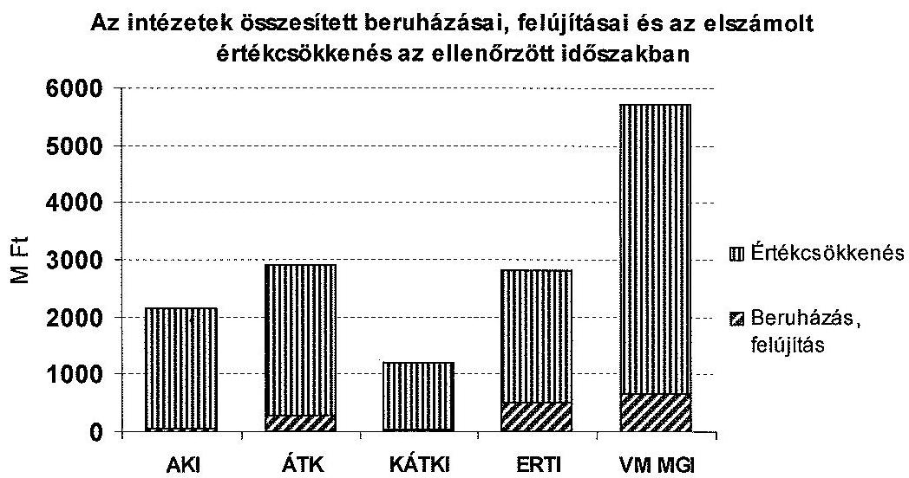

Az ellenőrzött időszakban a beruházásra és felújításra teljesített kiadásokat az intézeti saját bevételek, pályázati források, valamint minimális, az öt intézetre összesen 41,8 M Ft értékű irányító szervi támogatások fedezték.

Az intézetek belső kontrollrendszere az ellenőrzött időszakban - alapvetően a szabályozási hiányosságai miatt - nem biztosította az intézetek pénzügyi és vagyongazdálkodásának szabályszerű ellátását, a gazdálkodás és a vagyonkezelés átláthatóságát. Ezt az ellenőrzési időszakban végzett irányítószervi ellenőrzések, valamint az ÁSZ 2012. évi költségvetés végrehajtásáról készült ellenőrzése is alátámasztotta.

Az intézetek belső szabályzatainak tartalma nem felelt meg az Sztv., Kbt. ${ }_{1,2}$, Ámr. ${ }_{1,2}$, Ávr. és Áhsz. előírásainak. Ezek közé tartoztak 2008-2011. évekre vonatkozóan a kötelezettségvállalási, ellenjegyzési, utalványozási és érvényesítési szabályzatok, a gazdasági szervezetre vonatkozó ügyrendek, számvitel politika, számlarend, leltározási, pénzkezelési, közbeszerzési szabályzatok, továbbá az eszközök és források értékelési szabályzata (kivéve KÁTKI). Az intézetek a gazdálkodási jogkörök szabályosságát biztosító belső kontrollok kialakítását és szabályzataikat a 2012. év végére felülvizsgálták, azonban a szabályozás valamennyi intézetnél továbbra is hiányos volt.

Az ellenőrzött időszakban az intézetek közül az AKI 2008-2009. években, az ÁTK 2008-2010. években és a KÁTKI 2010-2012. években a ténylegesen ellátott szakmai, pénzügyi és vagyongazdálkodási feladatokat nem az alapító okiratokban rögzített szakfeladatokon mutatták ki és a kialakított számlarend sem biztosította az elkülönített nyilvántartást, ami csökkentette gazdálkodásuk átláthatóságát és elszámoltathatóságát. Az ellenőrzött időszakban az AKI, az ÁTK, a KÁTKI, a VM MGI ügyrendjei az Ámr. ${ }_{1}$ 17. § (5) bekezdése, Ámr. ${ }_{2}$ 20. § (7) bekezdése, Ávr. 13. § (5) bekezdés előírásaiban foglaltaktól eltérően nem, il-

---

letve részben szabályozták a helyettesítés rendjét, a gazdasági szervezeten kívüli külső és a belső kapcsolattartás szabályait.

Az intézetek átlátható gazdálkodását, a szabályszerű közpénzfelhasználást megalapozó pénzügyi, gazdálkodási szabályzatok rendelkezéseinek összhangja az ellenőrzött időszakban az ÁTK-nál, a KÁTKI-nál és az ERTI-nél nem volt biztosított. Az AKI-nál és a VM MGI-nél a gazdálkodási szabályzatok rendelkezéseinek összhangja az irányító szerv ellenőrzését követően megvalósult.

Az intézeteknél a belső kontrollrendszer - a kialakításában és működtetésében fennálló hiányosságok miatt - nem járult hozzá a szabálytalanságok és hibák megelőzéséhez, illetve kiküszöböléséhez az ellenőrzött időszakban.

A feladatok, hatáskörök és felelősségi körök kijelölésében az intézetek nem érvényesítették a belső kontrollrendszer Ámr. ${ }_{1,2}$ és a Bkr. szerinti követelményeit. Az intézetek vezetői kockázatelemzést nem végeztek, kockázatkezelési rendszereket nem működtettek Ámr. ${ }_{1,2}$, Bkr. előírásai ellenére, kockázatkezelési szabályzattal nem (AKI), illetve csak az ellenőrzött időszak második felében (ÁTK, KÁTKI, ERTI, VM MGI) rendelkeztek. Az intézetek működési kockázatainak feltérképezését támogató ellenőrzési nyomvonallal, valamint szabálytalanságkezelési szabályzattal az AKI és az ÁTK az ellenőrzött időszakban nem rendelkezett. A KÁTKI, az ERTI és a VM MGI ezeket 2010. év után dolgozta ki. Az intézetekben az ellenőrzött időszakban nem alakítottak ki és nem működtettek a szervezetek tevékenységének, a célok megvalósításának nyomon követését biztosító, az Ámr. ${ }_{1,2}$ és a Bkr. előírásainak megfelelő monitoring rendszert.

A főkönyvi adatbázisból 2008-2011. évekre az ellenőrzött intézeteknél egyszerű véletlen mintavétellel kiválasztott kiadási és bevételi tranzakciók között 395 esetben tárt fel az ellenőrzés különböző súlyú szabálytalanságokat (kötelezettségvállalás, ellenjegyzés, szakmai teljesítés igazolása, érvényesítés, utalványozás). Ezek a belső kontrollrendszer kialakítási (szabályozottság) és működtetési hiányosságaira vezethetőek vissza. Az intézeteknél a kötelezettségvállalás gyakorlata nem felelt meg az Ámr. ${ }_{1,2}$, Ávr., illetve a belső szabályzatok előírásainak. Az ÁTK-nál a 2009-2010. években a kötelezettségvállalás dokumentumain, a főigazgató aláírása helyett - írásbeli felhatalmazás nélkül - az érintett kutatók aláírása szerepelt. Az ERTI-nél a 2008-2011. években a gazdálkodási jogkör gyakorlásakor az Ámr. ${ }_{12}$-ben előírt kötelező aláírások elmaradtak, vagy nem az arra jogosultak aláírása szerepelt az ellenőrzött mintatételek bizonylatain.

Az ellenőrzött időszakban a függetlenített belső ellenőrzési feladatokat az intézeteknél - a KÁTKI kivételével - megbízási szerződéssel külső szakértő, illetve külső szervezet (vállalkozás) látta el. A Bkr. 2012. júliusban hatályba lépett előírása ellenére foglalkoztatásra irányuló jogviszonyban belső ellenőrt - a KÁTKI kivételével - nem alkalmaztak, a többi intézet továbbra is külső szervezet (vállalkozás) megbízásával látta el a belső ellenőrzési feladatokat. A belső ellenőrzési kézikönyvek felülvizsgálatát az ÁTK 2008-2010. években a Ber. előírásai szerint nem hajtotta végre, a KÁTKI és az ERTI a jogszabályok változása (Áht ${ }_{1}$, Bkr.) miatt a szükséges módosításokat 2012. évben nem végezte el. Utóellenőrzést az AKI és az ERTI nem végzett, a belső ellenőrzési tevékenységről előírt nyilvántartást az ERTI és a VM MGI nem vezetett. Ezen hiányosságok mellett az

---

intézetek belső ellenőrzési kötelezettségüket teljesítették, azonban a javaslatok hasznosulásának alacsony aránya, a belső kontroll kockázatok változatlanul magas mértéke, valamint az irányító szervi ellenőrzések tapasztalatai azt mutatták, hogy a belső ellenőrzés nem megfelelően töltötte be szerepét a közpénzekkel és az állami vagyonnal való gazdálkodás elszámoltathatóságának és átláthatóságának javításában.

Az ERTI és a KÁTKI mérlegfőösszege 60,8%-kal, illetve 7,6%-kal növekedett, az AKI és az ÁTK mérlegfőösszege jelentősen (47,2%-kal, 30,5%-kal) míg a VM MGI mérlegfőösszege kismértékben, 4,6%-kal csökkent. Az eszközállomány összetételében a befektetett eszközökön belül meghatározó részt a tárgyi eszközök képviseltek, míg a forgóeszköz-állományon belül a pénzeszközök és a követelések voltak meghatározóak.

A források összetételében jellemzően a saját tőke volt az alapvető elem. A források alakulását döntően az eszközök aktiválása, az üzembe helyezések, valamint a kötelezettségek változásai befolyásolták. A pályázati előlegeket két intézet (ERTI és a VM MGI) nem az Áhsz. előírásainak megfelelően, a rövid lejáratú kötelezettségek között mutatta ki. A VM MGI a támogatási program előleg miatti kötelezettségeket a passzív átfutó bevételek között tartotta nyilván, míg az ERTI - mint véglegesen átvett pénzeszközt - a bevételek között számolta el.

Az ellenőrzött időszakban az intézetek vagyongazdálkodásának belső szabályozottsága és gyakorlata hiányosságokkal működött és csak részben felelt meg az Sztv., és az Áhsz. előírásainak. Az AKI-nál és az ERTI-nél a selejtezett eszközök értékesítésének szabályozása, a vevők kiválasztása nem nyilvános eljárásban történt. A selejtezett vagyontárgyak megsemmisítésének módját az AKI nem határozta meg, annak megtörténtét nem dokumentálta. Az ÁTK-nál az immateriális javak és tárgyi eszközök aktiválásánál az érték meghatározása, és az állományba vétel dátuma nem felelt meg a Sztv. elveinek, a beruházások és a felújítások esetén nem készült állományba vételi bizonylat 2010-ig.

Az intézetek vagyonkezelési szerződésekben előírtaknak eleget tettek és teljesítették adatszolgáltatási kötelezettségeiket. A vagyonkezelésre 1997-ben kötött szerződéseket a jogszabályváltozások és a Kincstári Vagyoni Igazgatóság (KVI) megszűnése miatt aktualizálni kellett volna, azonban erre csak az ERTI esetében került sor. Az intézetek a kezelésükben lévő eszközök hasznosítására, bérbeadására belső szabályozást nem készítettek, gazdaságossági számításokat nem végeztek. Az ERTI és a VM MGI a vagyonkezelésében lévő szolgálati lakások bérbeadásánál a bérleti díjat nem a vonatkozó FVM rendelet szerint állapította meg. Az irányító szervi ellenőrzést követően a bérleti díjakat a hatályos szabályozás alapján megemelték, azonban nem intézkedtek az elmaradt bérleti díj különbözetének beszedésére.

Az ellenőrzés során feltárt hiányosságok rámutatnak azokra a pénzügyi és vagyongazdálkodási területekre, amelyek a jogszabályi előírások szerinti működés biztosítása érdekében beavatkozást igényelnek, azonban az intézetek működését alapvetően nem veszélyeztették.

Az ellenőrzött időszakban - a KÁTKI kivételével - az intézeteknél a minisztérium Ellenőrzési Főosztálya, az ERTI-nél és az ÁTK-nál a Nemzeti Adó- és Vám-

---

hivatal (NAV) végzett ellenőrzéseket. Az intézetek az intézkedést igénylő megállapításokhoz, javaslatokhoz határidőkkel és a felelősök megjelölésével intézkedési terveket készítettek, amelyeket a VM Ellenőrzési Főosztálya elfogadott, az intézkedési terv végrehajtásáról szóló beszámolót az ERTI és a VM MGI nem készítette el.

Az ÁSZ tv. 33. § (1) bekezdésében foglaltak értelmében az ellenőrzött szervezet vezetője köteles a jelentésben foglalt megállapításokhoz kapcsolódó intézkedési tervet összeállítani, és azt a jelentés kézhezvételétől számított 30 napon belül az ÁSZ részére megküldeni. Amennyiben az intézkedési tervet határidőre nem küldi meg a szervezet, az ÁSZ elnöke a hivatkozott törvény 33. § (3) bekezdés a)-b) pontjaiban foglaltakat érvényesítheti.

Az ellenőrzés intézkedést igénylő megállapításai és javaslatai:

# a vidékfejlesztési miniszternek 

1. A minisztérium az Áht. 49. § (5) bekezdés f) pontjának és az Áht. 9. § (1) bekezdés f) pontjának előírásai ellenére nem intézkedett az ellenőrzött intézetek esetében a közfeladat ellátására, és az intézmény erőforrásokkal való szabályszerű és hatékony gazdálkodásához szükséges követelmények meghatározására.

Javaslat:
Intézkedjen az ellenőrzött intézetek esetében az Áht 9. § (1) bekezdés f) pontjának előírása alapján az intézményi közfeladat ellátására, az intézményi erőforrásokkal való szabályszerű és hatékony gazdálkodásra vonatkozó követelmények kialakítása érdekében, valamint ezt követően azokat kérje számon és ellenőrizze.
2. Az ellenőrzött intézetek a 2011-2012. években elkészült, illetve módosított önköltségszámítási szabályzatokban és az Áhsz. 8. § (15) bekezdésében foglalt előírások ellenére nem
 végeztek önköltségszámítást.

Javaslat:
Intézkedjen, hogy az ellenőrzött intézetek az államháztartás számviteléről szóló 4/2013. (XII. 29.) Korm. rendelet 50. § (3) bekezdésében meghatározott tevékenységek folytatása esetére elkészített önköltségszámítás rendjére vonatkozó belső szabályzat előírásai szerint végezzenek önköltségszámítást.
az Állattenyésztési és Takarmányozási Kutatóintézet, az Erdészeti Tudományos Intézet, a Vidékfejlesztési Minisztérium Mezőgazdasági Gépesítési Intézet közös jogutódjának, az Agrárgazdasági Kutató Intézet főigazgatójának, valamint a Haszonállat-génmegőrzési Központ igazgatójának
1. Az intézetek a 2011-2012. években elkészült, illetve módosított önköltségszámítási szabályzatokban és az Áhsz. 8. § (15) bekezdésében foglalt előírások ellenére nem végeztek önköltségszámítást.

---

Javaslat:
Gondoskodjon arról, hogy az államháztartás számviteléről szóló 4/2013. (XII. 29.) Korm. rendelet 50. § (3) bekezdésében meghatározott tevékenységek folytatása esetére elkészített önköltségszámítás rendjére vonatkozó belső szabályzat előírásai szerint végezzenek önköltségszámítást.
2. Az intézetek belső kontrollrendszere az ellenőrzött időszakban - alapvetően a szabályozási hiányosságai miatt - nem biztosította az intézetek pénzügyi és vagyongazdálkodásának szabályszerű ellátását, a gazdálkodás és a vagyonkezelés átláthatóságát. Az intézeteknél a belső kontrollrendszer - a kialakításában és működtetésében fennálló hiányosságok miatt - nem járult hozzá a szabálytalanságok és hibák megelőzéséhez, illetve kiküszöböléséhez az ellenőrzött időszakban.

Javaslat:
Intézkedjen az intézet valamennyi tevékenységére kiterjedő kontrollrendszer kialakításáról, amely megfelel a Bkr. 3. § és 4. §-ainak.
3. Az intézetek vezetői az Ámr. 1 145/G. §-ában, az Ámr. 2 160. §-ában, a Bkr. 3. § e) pontjában és a Bkr. 10. §-ában foglaltak ellenére nem alakítottak ki és nem működtettek a szervezetek tevékenységének, a célok megvalósításának nyomon követését biztosító monitoring rendszert.

Javaslat:
Alakítsa ki és működtesse a Bkr. 3. § e) pontjának és a Bkr. 10. §-nak megfelelő, a szervezet tevékenységének, a célok megvalósításának nyomon követését biztosító rendszert.
4. Az intézetek vezetői kockázatelemzést nem végeztek, az Ámr. 1 145/C. §-ában, az Ámr. 2 157. §-ában, a Bkr. 3. § b) pontjában és 7. §-ában foglalt előírások ellenére kockázatkezelési rendszereket nem működtettek.

Javaslat:
Alakítsa ki a Bkr. 3. § b) pontja alapján a kockázatkezelési rendszert és intézkedjen annak a Bkr. 7. §-ának megfelelő működtetéséről.
5. Az intézetek működési kockázatainak feltérképezését támogató ellenőrzési nyomvonal elkészítéséről az Ámr. 1 145/B §. (1) bekezdése, az Ámr. 2 156. § (2) és a Bkr. 6.§ (3) bekezdéseiben foglalt előírások ellenére nem intézkedtek.

Javaslat:
Alakítsa ki a Bkr. 6. § (3) pontjában előírtak alapján az intézet ellenőrzési nyomvonalát.
6. Az intézetek belső szabályzatainak tartalma nem felelt meg az Sztv., Kbt. ${ }_{1,2}$ Ámr. ${ }_{1,2}$ Ávr. és Áhsz. előírásainak. Az intézetek a gazdálkodási jogkörök szabályosságát biztosító belső kontrollok kialakítását és szabályzataikat a 2012. év végére felülvizsgálták,

---

azonban a szabályozás valamennyi intézetnél továbbra is hiányos volt.
Javaslat:
Intézkedjen, hogy az intézet szabályzatai feleljenek meg a jogszabályi előírásoknak.

# az Állattenyésztési és Takarmányozási Kutatóintézet, a Vidékfejlesztési Minisztérium Mezőgazdasági Gépesítési Intézet közös jogutódjának, az Agrárgazdasági Kutató Intézet főgazgatójának, valamint a Haszonállatgénmegőrzési Központ igazgatójának 

Az intézeteknél a gazdálkodási jogkörök szabályosságát biztosító belső kontrollokat a kötelezettségvállalás, ellenjegyzés, utalványozás és érvényesítés szabályzatokban, illetve a gazdasági szervezetre vonatkozó ügyrendekben alakították ki, azonban azok tartalma nem felelt meg a jogszabályi előírásoknak. Az intézetek az Ámr. 17. § (5) bekezdésében, az Ámr. 2 20. § (7) bekezdésében, valamint az Ávr. 13. § (5) bekezdésében foglaltak ellenére nem, illetve részben szabályozták a helyettesítés rendjét, a gazdasági szervezeten kívüli és belüli kapcsolattartás szabályait.

Javaslat:
Gondoskodjon az intézet gazdasági szervezete ügyrendjének az Ávr. 13. § (5) bekezdés előírásainak megfelelő, a helyettesítés rendjével és a gazdasági szervezeten kívüli és belüli kapcsolattartás szabályaival történő kiegészítéséről.

## az Állattenyésztési és Takarmányozási Kutatóintézet jogutódjának és az Agrárgazdasági Kutató Intézet főgazgatójának

Az intézetek a szabálytalanságkezelési szabályzat elkészítéséről az Ámr. 145/A §. (5) bekezdése, az Ámr. 2 161. §-a, valamint a Bkr. 6. § (4) bekezdésének előírásai ellenére az ellenőrzött időszakban nem intézkedtek.

Javaslat:
Intézkedjen a Bkr. 6. § (4) bekezdése alapján a szabálytalanságkezelési szabályzat elkészítéséről.

## az Állattenyésztési és Takarmányozási Kutatóintézet, és az Erdészeti Tudományos Intézet közös jogutódjának, valamint a Haszonállatgénmegőrzési Központ igazgatójának

A belső ellenőrzési kézikönyv felülvizsgálatát az ÁTK 2008-2010. években, a KÁTKI és az ERTI a jogszabályok változása miatt szükséges módosításokat 2012-ben nem végezte el a Ber. 5. § (3) bekezdése, valamint a Bkr. 17. § (4) bekezdésében foglalt előírások ellenére.

Javaslat:

---

Intézkedjen arról, hogy a belső ellenőrzési vezető a Bkr. 17. § (4) bekezdése alapján végezze el a belső ellenőrzési kézikönyv legalább kétévenkénti felülvizsgálatát.

# az Erdészeti Tudományos Intézet jogutódjának 

Az ERTI 2008-2010. években nem szabályozta az Ámr. 134. § (3) bekezdésében, illetve az Ámr. 2 72. § (13) bekezdés a) pontjában foglaltakat. 2008-2011. évekre nem rendelkezett kötelezettségvállalási nyilvántartással. Az utalványozás, ellenjegyzés, érvényesítés szabályozása nem felelt meg az Ámr. 2 77-78. §-aiban meghatározottaknak. Az intézet az aláírás mintát az Ámr. 2 80. § (3) bekezdésének előírásától eltérően nem vezette naprakészen. Az utalványozással, érvényesítéssel kapcsolatos feladatokat a munkaköri leírások sem tartalmazták. Az ellenőrzés a mintatételek ellenőrzése feltárt olyan gazdasági eseményeket, amelyeknél az Ámr. 1 134-137. §-aiban és az Ámr. 2 72-78. §-aiban előírt kötelező aláírások elmaradtak, vagy nem az arra jogosultak aláírása szerepelt. Az ERTI a vagyonkezelésében lévő szolgálati lakások bérbeadásánál a bérleti díjat nem a 106/1999. (XII. 28.) FVM rendelet szerint állapította meg. Az irányító szervi ellenőrzést követően a bérleti díjakat a hatályos szabályozás alapján megemelték, azonban nem intézkedtek az elmaradt bérleti díj különbözetének beszedésére.

Javaslat:
Intézkedjen a gazdálkodási jogkörökkel összefüggésben feltárt hiányosságok és szabálytalanságok tekintetében az esetleges munkajogi felelősséggel kapcsolatos körülmények kivizsgálása iránt, és ennek eredményének ismeretében a szükséges munkajogi intézkedéseket tegye meg.

## az Állattenyésztési és Takarmányozási Kutatóintézet jogutódjának

Az ÁTK az ellenőrzött időszakban a kötelezettségvállalási szabályzatában meghatározta a kötelezettségvállalásra jogosultak körét, azonban a főigazgató nem bízta meg írásban a szabályzatban megjelölt személyeket az Ámr. 134. § (1) bekezdése és az Ámr. 2 72. § (3) bekezdése előírása alapján. A szabályzat nem tartalmazta a szakmai teljesítés-igazolásra jogosultak körét. Az ÁTK-nál a 2009-2010 években a kötelezettségvállalás dokumentumain az ellenőrzött felhalmozási mintatételek alapján nem szerepelt a főigazgató aláírása, helyette írásbeli felhatalmazás nélkül az érintett kutatók írták alá és a gazdasági igazgató ellenjegyezte azokat. Az intézet az Ámr. 1 135. § (2) bekezdésében és az Ámr. 2 77. § (4) bekezdésében előírtakat nem tartotta be, mert a szakmai teljesítés igazolására jogosultak kijelölése a kötelezettségvállaló által nem történt meg és a munkaköri leírások sem tartalmazzák ezt a feladatot. Ezt az érintett kutatók végezték el.

Javaslat:
Intézkedjen a gazdálkodási jogkörökkel összefüggésben feltárt hiányosságok és szabálytalanságok tekintetében az esetleges munkajogi felelősséggel kapcsolatos körülmények kivizsgálása iránt, és ennek eredményének ismeretében a szükséges munkajogi intézkedéseket tegye meg.

---

# a Vidékfejlesztési Minisztérium Mezőgazdasági Gépesítési Intézet jogutódjának 

A VM MGI a vagyonkezelésében lévő szolgálati lakások bérbeadásánál a bérleti díjat nem a 106/1999. (XII. 28.) FVM rendelet szerint állapította meg. Az irányító szervi ellenőrzést követően a bérleti díjakat a hatályos szabályozás alapján megemelték, azonban nem intézkedtek az elmaradt bérleti díj különbözetének beszedésére.

Javaslat:
Intézkedjen a feltárt hiányosságok és szabálytalanságok tekintetében az esetleges munkajogi felelősséggel kapcsolatos körülmények kivizsgálása iránt, és ennek eredményének ismeretében a szükséges munkajogi intézkedéseket tegye meg.

## az Állattenyésztési és Takarmányozási Kutatóintézet, az Erdészeti Tudományos Intézet, a Vidékfejlesztési Minisztérium Mezőgazdasági Gépesítési Intézet közös jogutódjának, valamint az Agrárgazdasági Kutató Intézet főigazgatójának

Az ellenőrzött időszakban az engedélyköteles, illetve a bejelentési kötelezettség alá eső tevékenységeknél a Kjt. 44. § (1) bekezdésében foglaltaktól eltérően, az intézetek nyilatkozatot a dolgozóktól nem kértek, és az alkalmazottak részéről benyújtott nyilatkozat nem állt rendelkezésre az intézeteknél.

Javaslat:
Gondoskodjon arról, hogy az engedélyköteles, illetve a bejelentési kötelezettség alá eső tevékenységek esetében az alkalmazottak a Kjt. 44. § (1) bekezdésében előírt nyilatkozattételi kötelezettségüknek tegyenek eleget.

---

# II. RÉSZLETES MEGÁLLAPÍTÁSOK 

## 1. A MINISZTÉRIUM IRÁNYÍTÓ SZERVI TEVÉKENYSÉGÉNEK SZABÁLYSZERŰSÉGE

### 1.1. Az alapítói feladatok ellátása, az intézetekkel kapcsolatos döntéseket megalapozó stratégiák

Az ellenőrzött agrárkutató és génmegőrzési intézetek felett az irányító szervi jogosultságokat 2010. évig az FVM, azt követően a VM gyakorolta. A minisztérium a 2008-2012. években az intézetekkel kapcsolatos alapítói feladatait hiányosan gyakorolta.

Az intézetek alapító okiratai a felsőfokú végzettségi szintet nyújtó, felsőoktatási intézetben végzett alapképzés, mesterképzés, doktori képzés ${ }^{2}$ szakfeladatokat is tartalmazták, amelyet az intézetek nem végeztek. Az AKI és a VM MGI esetében a gazdasági vezetők határozott idejű kinevezésére vonatkozó Kjt. 23. § (3) bekezdés előírása ellenére az alapító okiratok módosítása elmaradt.

Az alapítói jogok gyakorlása keretében a minisztérium az ellenőrzött időszakban - az Áht. ${ }_{1}$ 88. § (2) bekezdése, Áht. ${ }_{2}$ 8. § (4) bekezdése szerint - gondoskodott az ellenőrzésbe vont intézetek alapító okiratainak elkészítéséről, a szervezetek működésében, gazdálkodásában bekövetkező változások esetén azok módosításáról. Az intézetek alapító okiratai az időközben bekövetkezett változásokat követve módosultak, illetve egységes szerkezetben jelentek meg.

Az elkészült alapító okiratok rendelkeztek az Áht. 90. § (1) bekezdésében, a (2) bekezdés b) pontjában, valamint az Ávr. 5. §-ában előírt tartalommal. Az intézetek alapító okiratai az időközben bekövetkezett változásokat követve módosultak, illetve egységes szerkezetben jelentek meg.

Az irányító szerv a kutatóintézetek feladatait, hatáskörét, kötelezettségeit alapító okiratokban határozta meg. Az ellenőrzött időszakban hatályos alapító okiratok alapján az intézetek közfeladatként ellátott alaptevékenysége nem változott.

Az intézetek alapító okiratainak módosítását elsősorban a költségvetési szervek jogállásáról és gazdálkodásáról szóló 2008. évi CV. tv., a Kjt. 23. § (3) bekezdése változása, a minisztérium nevének, továbbá az ERTI esetében az intézet címének módosulása, illetve a KÁTKI 2010. november 1-jei kiválása indokolta.

[^0]
[^0]:    ${ }^{2}$ A költségvetési szervek új ágazati osztályozási és besorolási rendjéről szóló 8005/2007. (PK. 14.) PM tájékoztató (2. sz. melléklet), az államháztartási szakfeladatok rendjéről szóló 8/2010. (IX. 10.) NGM tájékoztató (2. sz. melléklet), a szak-feladatrendről és az államháztartási szakágazati rendről szóló 56/2011. (XII. 31.) NGM rendelet (2. sz. melléklet)

---

A minisztérium a vállalkozási tevékenység ellátásának kereteit és mértékét az intézetek alapító okirataiban a jogszabály előírása szerint meghatározta. Az elkészült alapító okiratok rendelkeztek az Áht., 90. § bekezdésében, a (2) bekezdés b) pontjában, valamint az Ávr. 5. §-ában előírt tartalommal. Ennek megfelelően a vállalkozási tevékenység lehetséges bevételeit az intézetek kiadásainak 20\%-ában (2009-ig 30\%-ban) rögzítette.

Az alapító okiratokban a minisztérium rögzítette a vállalkozásból származó bevételek elkülönített tervezésének, nyilvántartásának és elszámolásának kötelezettségét. Az alapító okiratokban meghatározott közfeladatok és alaptevékenységek - az intézetek különböző kutatási területei miatt - nem mutattak párhuzamos feladatellátást.

A 2008-2011. években az intézetek tevékenységéhez kapcsolódó, miniszter által jóváhagyott középtávú agrár- és vidékfejlesztési stratégia - a földművelésügyi és vidékfejlesztési miniszter feladat- és hatásköréről szóló 162/2006. (VII. 28.) Korm. rendelet és az egyes miniszterek, valamint a Miniszterelnökséget vezető államtitkár
 feladat-hatásköréről szóló 212/2010. (VII. 1.) Korm. rendelet előírásai ellenére – nem állt rendelkezésre. Az irányító szervi döntések megalapozása érdekében a 2011. évben elkészült a 2012–2020. közötti időszakra vonatkozó Nemzeti Vidékstratégia, amelynek végrehajtási keretprogramjaként 2012. évben jelent meg a Darányi Ignác Terv.

A Nemzeti Vidékstratégiában megfogalmazott célok tartalmazták a szaktanácsadási és szakoktatási rendszerek átformálásával a hazai agrárkutatás-fejlesztés gyakorlat-orientált megerősítését, ez által a hazai termelők versenyképességének növekedésének elősegítését, valamint a hazai agrár- és élelmiszergazdaság innovációs képességének erősítését. A stratégia kitért a génkészletek megőrzésére, fenntartására, a génbanki tevékenységet is folytató kutatóhelyek megerősítésével, újraszervezésével, állati és növényi génbank hálózat létrehozásával.

A Darányi Ignác Terv indokoltnak tartotta a kutatási infrastruktúra, valamint az intézetek fejlesztését, működési feltételeinek javítását, kutatási programjainak támogatását, a kutatóintézetek szaktanácsadási tevékenységének javítását, a kutatási és az oktatási szakterületek kapcsolatának erősítését. A dokumentum előírta egy új intézetfinanszírozási rendszer kidolgozását is.

# 1.2. A jóváhagyási és a beszámoltatási jogosultságok gyakorlása 

A minisztérium az ellenőrzött időszakban az irányítási jogosultságait – az Áht. 93. § (1) bekezdésének a) pontja és az Áht. 9. § (1) bekezdésének e) pontja előírása ellenére – hiányosan gyakorolta. Az alapító okiratok és a jogszabályok változásainak megfelelően az intézetek SZMSZ-einek módosításait az ERTI és a VM MGI esetében nem hagyta jóvá.

Az ERTI és a VM MGI esetében az alapító okirat módosítását az SZMSZ módosítása nem követte. Az ERTI 2005. évi, a VM MGI 2004. évi jóváhagyott SZMSZ-szel rendelkezett az ellenőrzött időszakban. A VM MGI 2010. évben, az ERTI 2011. évben elkészítette a szervezetükben, illetve működési rendjükben bekövetkezett változásoknak megfelelően módosított szabályzatot, amelyek egyeztetése a minisztériummal évek óta tart.

---

Az ellenőrzött további intézeteknél a jóváhagyott SZMSZ-ek az intézetből történő kiválás (ÁTK, KÁTKI), valamint a szervezeti változás, az előzőtől részletesebb szabályozás miatt (AKI) az ellenőrzött időszakban többször módosultak.

Az irányító szervi jogosultság keretében a minisztérium – Áht. ¹49. §. g–h) pontjai, 93. § (1) bekezdésének e) pontja, Áht. ²9. § (1) bekezdésének d) pontja alapján – megállapította az agrárkutató és génmegőrzési intézetek éves költségvetését, az éves kiemelt szakmai feladatok ellátására – a megállapított éves költségvetésen túl – a fejezeti kezelésű előirányzat terhére forrást biztosított. Gyakorolta a hatáskörébe utalt előirányzat-módosítási, előirányzat-átcsoportosítási, zárolási és maradványtartási előirányzati jogköröket.

A VM az ellenőrzött időszakban az éves engedélyezett előirányzatokat az előző évi támogatási előirányzatok csökkenése mellett tudta biztosítani. A minisztérium ezért minden évben olyan általános elvekre hívta fel az intézetek figyelmét (elhagyható, átütemezhető feladatok, intézeti bevételek növelése, takarékos és hatékony gazdálkodás), mellyel a csökkenő költségvetési támogatások mellett is biztosított volt az intézetek működése.

A minisztérium az éves költségvetési előirányzatok felhasználásához az intézetek tevékenységi körébe tartozó feladatokkal kapcsolatosan konkrét szakmai elvárások, követelmények – az AKI kivételével – meghatározására – az Áht. ¹49. § (5) f) pontja és az Áht. ²9. § (1) bekezdésének f) pontja előírása ellenére – nem intézkedett. A fejezeti kezelésű előirányzatok terhére nyújtott költségvetési támogatáshoz kötött megállapodások tartalmazták az elvégzendő konkrét feladatokat, követelményeket, az el- és beszámolási kötelezettséget.

A minisztérium a költségvetési szervek irányítási jogosultságának keretében, az Áht. ¹49. § (5) bekezdésének j) pontja, és az Áht. ²9. § (1) bekezdésének i) pontja szerinti felhatalmazása alapján az ellenőrzött intézetek beszámoltatását – a pénzügyi és szöveges költségvetési beszámolók bekérésével és elfogadásával – teljesítette. Az intézetek év végi szöveges beszámolójának egységes tartalommal történő elkészítéséhez a VM Költségvetési Gazdálkodási Főosztálya (KGF) a szempontokat évente meghatározta, amelyekről az intézeteket körlevélben értesítette.

A minisztériumban az ellenőrzött időszakban változtak az intézeteket felügyelő szakmai főosztályok. A VM 2012. áprilisi SZMSZ-e szerint az AKI az Agrárgazdaságért felelős államtitkár és az Agrárgazdasági Főosztály felügyelete alatt, az ÁTK, ERTI és VM MGI az Agrárgazdaságért felelős államtitkár és a Mezőgazdasági Főosztály felügyelete alatt, a KÁTKI pedig a Parlamenti, társadalmi és nemzetközi ügyekért felelős helyettes államtitkár és a Stratégiai Főosztály felügyelete alatt működött. Az ellenőrzött időszakban a minisztérium szervezetében megvalósult változások, átrendeződések az intézetek feladatellátására és gazdálkodására mérhető hatással nem voltak. Az egyes intézeteket szakmailag irányító, felügyelő egységek felsorolását a 2. számú melléklet tartalmazza.

A minisztérium az Áht. ¹49. § (5) bekezdésének e) pontja előírása ellenére nem kérte számon és nem ellenőrizte a költségvetési szervek kezelésében lévő közérdekű adatok és közérdekből nyilvános adatok közzétételét. Az ellenőrzött intézetek közzétételi kötelezettségüket 2008–2012. években hiányosan teljesítették, mert az ellenőrzött időszak beszámolóit, valamint a foglalkoztatottak létszámára és személyi juttatására vonatkozó összesített adatokat honlapjaikon nem tették közzé. A jogszabály által közzétenni rendelt adatokat és az intézetek által ténylegesen közzétett lényeges információkat a 3. számú melléklet tartalmazza.

# 1.3. Az ellenőrzési jogosultságok gyakorlása 

A minisztérium pénzügyi szabályszerűségi ellenőrzési jogosultságait – az Áht. ¹93. § (1) bekezdésének d) pontja, és az Áht. ²9. § (1) bekezdésének f) pontja előírása ellenére – nem érvényesítette teljes körűen.

A 2010. november 1-jétől önálló intézetként működtetett KÁTKI működését, gazdálkodásának szabályszerűségét az alapítást követően – az év végi számszaki és szöveges beszámoltatáson túl – a minisztérium nem ellenőrizte. Az ellenőrzést fokozottan indokolta volna, hogy az intézet létrehozását megelőzően a szükséges költségvetési előirányzatok megalapozásához részletes számításokat az Ámr. ²10. § (2) bekezdésében foglaltaktól eltérően nem végeztek, ennek következményeként az intézetnél 2011. év elején az intézetnél átmeneti gazdálkodási nehézségek jelentkeztek, amelyet az intézet vezetőjének takarékossági intézkedései és az irányító szerv póttámogatása megoldott. A kiválás végrehajtásának szabályszerűségét részletesebben a 3. pont tartalmazza.

A minisztérium az erőforrásokkal való szabályszerű és hatékony gazdálkodást négy intézetnél ellenőrizte a 2008–2012. években.

Az Ellenőrzési Főosztály 2008. évben a VM MGI rendszerellenőrzését, 2010. évben az ERTI beszámolójának megbízhatósági ellenőrzését végezte el. A 2011–2012. években három átfogó ellenőrzést (AKI, ÁTK és VM MGI) hajtott végre. Az Ellenőrzési Főosztály az AKI esetében az irányító szervi ellenőrzés során feltárt hiányosságok megszüntetését utóellenőrzéssel vizsgálta.

A minisztérium Ellenőrzési Főosztálya nyomon követési kötelezettségéről szóló Ber. 8. § f) pontja, és a Bkr. 21. § (2) bekezdésének d) pontja előírásainak az ERTI, az ÁTK és a VM MGI ellenőrzéseivel összefüggésben teljes körűen nem tett eleget. Az ellenőrzéseket követően az intézetek az intézkedési terveket elkészítették, amelyeket az irányító szerv jóváhagyott, azonban az abban foglaltak végrehajtását nem kísérte figyelemmel.

Az Ellenőrzési Főosztály ellenőrzésekről vezetett nyilvántartása nem felelt meg a Ber. 32. § (1)–(2) bekezdései, Bkr. 50. § (1)–(2) bekezdései előírásaiban foglaltaknak. A nyilvántartás a rendszerellenőrzésre és a megbízhatósági ellenőrzésre vonatkozóan nem tartalmazott adatokat. Az átfogó ellenőrzések megállapításaira tett javaslatokat és az intézkedési tervekkel kapcsolatos információkat (feladatok, felelősök, határidők) tartalmazta, azonban az intézkedések végrehajtására vonatkozókat már nem.

A minisztérium az intézetek szakmai tevékenységére irányuló ellenőrzéseket az Áht. ¹49. § (5) bekezdésének f) pontjában előírt ellenőrzést 2008–2010. években nem végezte.

---

A minisztérium 2011. évben az ágazat, valamint a minisztérium szakértőiből létrehozott tudományos szakmai bizottsággal elvégezte az intézetek szakmai tevékenységének átvilágítását. A szakmai átvilágítás a kutatóintézetek tevékenységének áttekintését, a 2005–2010. években elért kutatás-fejlesztési és innovációs (K+F+I) eredmények bemutatását, új kutatási irányok, illetve tervek felvázolását tűzte ki célul. A 2012. januárban készített jelentés nem tárt fel párhuzamosságot az agrárkutató és génmegőrzési intézetek szakmai feladatellátásában.

A jelentés mellékleteként az irányító szerv meghatározta a kutatóhelyek tudományos teljesítménymérésének főbb mutatóit is. Az alkalmazott mutatók a kutatói létszámnak, a tudományos fokozatoknak, a szellemi termékeknek (találmányok, szabadalmak), a kutatók oktatásban és tanácsadásban való részvételének, valamint a publikációs és pályázati tevékenység eredményességének felmérésére irányultak. Az elkészült átvilágítási jelentések azonban a szellemi termékekre vonatkozóan adatokat, információkat nem tartalmaztak.

Az átvilágítás tapasztalatai alapján szükséges feladatok végrehajtásáról intézetenként jelentés és az intézkedési terv készült 2012. évben, a végrehajtása nyomon követésére az ellenőrzött időszakban nem került sor.

A minisztérium Mezőgazdasági Főosztálya a vidékfejlesztési miniszter részére 2012. évben átfogó adatfelmérést végzett az agrárkutató intézetek K+F+I projektjeiről a 2011–2012. évekre. Az ellenőrzési tapasztalatok szükségessé tették az intézetek projektjei és pályázatai (előkészítés, végrehajtás ellenőrzése) folyamatának szabályozását. Ennek érdekében a Mezőgazdasági Főosztály 2012-ben eljárásrendet készített és megkezdte a K+F+I projektvégrehajtás pénzügyi támogatása vezetői információs rendszerének kidolgozását.

# 2. AZ INTÉZETEK FELADATELLÁTÁSÁNAK SZABÁLYSZERŰSÉGE ÉS A SZÜKSÉGES ERŐFORRÁSOK BIZTOSÍTÁSA 

### 2.1. A belső szabályozás és a feladatellátás összhangja az alapító okiratokkal és a jogszabályokkal

Az intézetek az alapító okiratukban szereplő közfeladataikat, illetve az alaptevékenységeiket – az oktatáshoz kapcsolódó feladatok kivételével – ellátták. Az alapító okiratokban foglalt tevékenységek és a tényleges szakmai feladatellátás összhangját az intézetek nem valósították meg maradéktalanul.

Az intézetek alapító okiratai olyan tevékenységekhez tartozó szakfeladatokat is tartalmaztak – a felsőfokú végzettségi szintet nyújtó, felsőoktatási intézményben végzett alapképzés, mesterképzés, doktori képzés –, amelyeket az intézetek nem folytathattak és nem is folytattak.

A közpénzek felhasználásának átláthatóságát nem segítette elő az a gyakorlat, amely szerint az intézetek a ténylegesen ellátott tevékenységeik elszámolását, az alapító okiratban rögzített szakfeladatokon az Ámr. ²12. § (4) bekezdése előírásától eltérően – nem elkülönítetten mutatták ki. Az intézetek a ténylegesen ellátott tevékenységek bevételeinek és kiadásainak kimutatásához – az ERTI és a VM MGI kivételével – nem megfelelően alkalmazták az alapító okiratban rögzített szakfeladatokat.

Az AKI 2008. évben az alapfeladat minden bevételét és kiadását a Humán és társadalomtudományi kutatási szakfeladatra könyvelte. 2010. évtől kezdődően az alapító okiratban megjelölt 14 szakfeladat közül a ténylegesen ellátott szakmai feladatokkal kapcsolatos kiadások rögzítésére négy, a bevételek könyvelésére három szakfeladatot használtak.

Az ÁTK és a KÁTKI a tevékenységeikkel kapcsolatos elszámolásokat egy-egy szakfeladaton végezte. Az ÁTK 2008–2009. években az agrártudományi kutatás és kísérleti fejlesztés, 2010. évtől kezdődően az agrártudományi alkalmazott kutatás szakfeladatra könyveltek minden bevételt és kiadást, miközben alapkutatási tevékenységet is végzett az intézet. A KÁTKI szintén egy, az agrártudományi alapkutatás szakfeladatra könyvelte a gazdasági eseményeket.

Az alapító okiratok a kiegészítő, kisegítő és vállalkozási tevékenységekből származó éves bevétel felső határát rögzítették, amely 2009. évig 30%-a, ezt követően 20%-a a kiadási főösszegnek. A kiegészítő, kisegítő és vállalkozási tevékenységek tartalmát az SZMSZ és más belső szabályzatok nem határozták meg. Az Áht. 90. § (7) bekezdésében foglalt elkülönített nyilvántartásnak az ellenőrzött időszakban az ÁTK, a KÁTKI és 2010-ig az ERTI számviteli nyilvántartásai nem feleltek meg.

Az ÁTK az SZMSZ-ben, a VM MGI belső szabályzatban felsorolta a kiegészítő és vállalkozási tevékenységeket és az abból származó bevétel előírásnak megfelelő mértékét, azonban ezek tartalmát egyéb szabályzatokban nem rögzítették. Az ÁTK az ellenőrzött időszakban a szabad kapacitás hasznosítása érdekében sertésbérvágást végzett,
 ami kiegészítő tevékenységnek minősült, azonban az alapító okiratban és az SZMSZ-ben nem szerepeltették és az ezzel összefüggő bevételeket és kiadásokat nem könyvelték külön szakfeladatra.

Az ERTI 2010-ig a kiegészítő tevékenységeket (megbízási szerződéssel elemzési, kutatási, kísérleti feladatok), továbbá a kezelt ingatlanjai hasznosítása céljából kisegítő és 5% alatti vállalkozási tevékenységeket végzett, amelyekről sem az intézeti alapító okiratok, sem a belső szabályzatok nem rendelkeztek. A számviteli nyilvántartásokban nem a 2010. év közepéig érvényben lévő jogszabályi előírások szerint tartották nyilván.

Az intézetek az ellenőrzött időszakban - kivéve az AKI 2008. évben - vállalkozási tevékenységet a könyveikben nem mutattak ki.

Az intézeti SZMSZ-eket az ellenőrzött időszakban - az AKI és a KÁTKI kivételével - nem aktualizálták, nem követték a jogszabályváltozásokat, valamint tartalmi hiányosságaik is voltak. Az ellenőrzött időszakban az intézetek SzMSz-ei a szervezeti felépítést és a működés rendjét az Ámr. ${ }_{1} 10 . \S$ (5) bekezdés (2009-től 13/A. § (5) bekezdés), az Ámr. ${ }_{2} 20 . \S$ (2) bekezdés és az Ávr. 13. § (1) bekezdés előírásainak többségében megfelelő tartalommal határozták meg. A hivatkozott jogszabályi előírások ellenére hiányosságként volt tapasztalható, hogy az intézetek engedélyezett létszáma, a szervezeti egységek közötti kapcsolattartás rendje, a szervezeti ábra, az alapító okirat keltének és számának SZMSZ-ben történő rögzítése elmaradt, amely hiányosságok az ellenőrzött időszak végéig fennálltak.

---

Az intézetek SZMSZ-ei nem tartalmazták az engedélyezett létszám adatokat, két intézetnél (ERTI és VM MGI) a szervezeti ábrát, az alapító okirat keltét (KÁTKI), a KÁTKI és a VM MGI esetében a szervezeti egységek közötti kapcsolattartás rendjét, az ÁTK-nál a szakfeladat rend szerint felsorolt alaptevékenységeket meghatározó jogszabályokat.

# 2.2. A bevételi szerződések szabályszerűsége 

Az intézetek az ellenőrzött időszakban az alaptevékenységük körébe tartozó feladatok elvégzésére - a szabad kapacitás kihasználására - költségvetési szervekkel, valamint vállalkozásokkal összesen 7385 db szerződést kötöttek, amely összesen 5351,8 M Ft nettó összegű bevételt eredményezett. A szerződések mind mennyiségükben (db), mind értékükben a 2008-2012. években - a KÁTKI kivételével - csökkenő tendenciát mutattak. Az erre vonatkozó adatokat a 4. sz. melléklet tartalmazza, valamint a következő diagram szemlélteti.
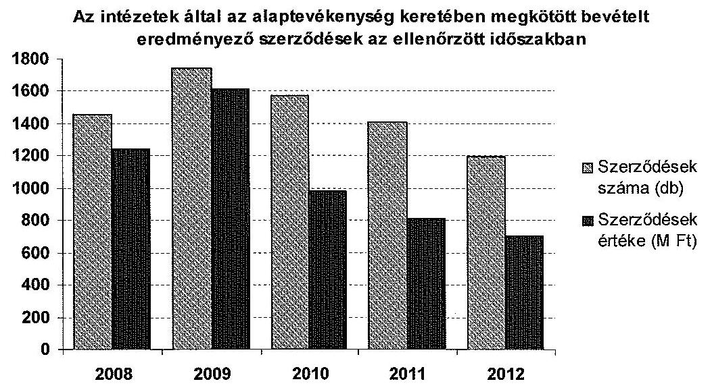

Az ellenőrzés az AKI, ÁTK és KÁTKI által kötött szerződések esetében hiányosságokat tárt fel, amelyek a szerződéses feltételek és követelmények részletes, az Ámr. 82. § (1) bekezdésének a) pontjában előírt szakmai, műszaki teljesítés mennyiségi és minőségi jellemzőinek meghatározására vonatkoztak.

Az ellenőrzött számlák adatai alapján az AKI a 0,2 M Ft alatti bevételei esetében a Ptk. 412. § (2) bekezdés előírásai ellenére a feladatok elvégzésére nem kötött írásos szerződéseket. Az írásbeliség követelménye betartásának hiánya miatt egyértelműen nem határozták meg az elvégzendő feladatokat, azok határidejét, a teljesítés igazolásának módját, a nem vagy a késedelmes teljesítés esetén a következményeket. Az AKI vállalkozásokkal és a VM-mel kötött vállalkozási szerződései nem tartalmazták a szakmai, műszaki teljesítés mennyiségi és minőségi jellemzőinek meghatározását.

Az ÁTK és a KÁTKI szerződései nem tartalmaztak teljesítésértékelési követelményeket, illetve elszámolási kötelezettséget.

Az alaptevékenységek ellátására kötött bevételi szerződések egyedi összegei - a KÁTKI kivételével - jelentős szórást mutattak.

---

Az AKI a szerződéseiben rögzített ár 0,1 M Ft és 350,0 M Ft, az ERTI-nél 0,1 M Ft és 171,0 M Ft között mozgott. Az ÁTK szerződéses értékei 0,3 M Ft és 3,8 M Ft között változott. A KÁTKI által kötött szerződések 1,8 M Ft és 2,0 M Ft közötti bevételt eredményeztek, a VM MGI szerződéses értékei 0,003 M Ft és 50,0 M Ft között változott.

Az intézetek a szerződésekben meghatározott árak és a projektek ténylegesen felmerült kiadásainak összehasonlítását nem végezték el. Az intézetek önköltségszámítást nem végeztek, az Áhsz. 8. § (4) bekezdésének c) pontjában foglalt előírásoktól eltérően 2008-2010. években - az ÁTK és a VM MGI kivételével - önköltség-számítási szabályzattal sem rendelkeztek. Az intézetek a 2011-2012. években elkészült, illetve módosított szabályzatok és az Áhsz. 8. § (15) bekezdése ellenére sem végeztek szerződésenként önköltségszámítást, ami nem tette lehetővé a szerződés szerinti bevételek és a ráfordítások összevetését.

# 2.3. Az alaptevékenység ellátásának követelményrendszere és értékelése 

Az irányító szerv az Áht. 49. § (5) bekezdésének f) pontja, és az Áht. 9. § (1) bekezdésének f) pont előírásainak ellenére az intézetek számára a tevékenység eredményességének és hatékonyságának mérésére alkalmas mutatókat, indikátorokat, az intézeti költségvetési támogatáshoz (alaptámogatás) nem határozott meg.

Az éves kutatási tevékenység végrehajtásáról az intézetek év végén költségvetési beszámoló szöveges mellékletében tájékoztatták az irányító szervezetet. A minisztérium a beszámolók elfogadásán kívül a közfeladat ellátását nem értékelte.

Az ellenőrzött időszakban az intézetek szöveges beszámolói alaptevékenységgel kapcsolatos szakmai feladatmutatókat tartalmaztak, ezeket azonban a költségvetési beszámolók 37. úrlapjain („A mutatószámok állományának alakulása") - a VM MGI 2011-2012. évi beszámolójának kivételével - nem mutatták ki.

A szöveges beszámolók bemutatták a kutatók által megjelentetett publikációk, könyvek, kiadványok, valamint az impaktfaktor számát, esetenként a kutatók tudományos fokozataiban bekövetkezett változást. A legkevesebb információ a találmányokkal és szabadalmakkal kapcsolatosan állt rendelkezésre. Az intézetek a publikációkon túl nyilvántartották az alkalmazásukban lévő kutatók tudományos fokozatait, illetve annak megszerzésében részvevők számát.

A VM MGI a hazai és nemzetközi elismertséget kifejező komplex mutatóval mérte a kutatási tevékenység eredményességét. Ez magában foglalta a sikeresség, a K+F piac elismerése mellett a tevékenység volumenét is. Az intézet figyelemmel kísérte a K+F piacról megszerzett árbevétel összegét, a kutatói által megszerzett tudományos fokozatokat, illetve a PhD folyamatban lévők számát. További mutató volt az intézeti tudományos kiadványok száma. Az intézet 2011-2012. évi beszámolójának 37. számú úrlapján szerepeltette a kutatási tevékenység eredményességét, hatékonyságát mérő indikátorokat (támogatott programok, fejlesztések száma, folyóirat, időszaki kiadvány megjelentetett átlagos példányszáma, találmányok, szabadalmak száma).

---

A minisztérium az éves költségvetési előirányzatokhoz kapcsolódóan nem fogalmazott meg konkrét elvárásokat, az intézetek az ellenőrzött időszakban az alaptevékenység ellátásához - az AKI kivételével - nem készítettek éves kutatási terveket.

Az AKI az ellenőrzött időszak valamennyi évében elkészítette a munkaterveket (kutatási terveket), melyeket a minisztérium felelős államtitkára hagyott jóvá. Az egyes kutatási témákra a minisztérium főosztályai tettek javaslatot. A feladatterv egyik része a tárca döntéseihez szakmai hátteret biztosító kutatási feladatokat tartalmazta, a másik része az információs rendszerek működéséhez kapcsolódott.

Az AKI 2008-2012. években a munkatervekben megjelölt feladatokon felüli, jelentős mennyiségű eseti jellegű feladatot is kapott a minisztériumtól (összesen 242 alkalommal), amelyeket annak ellenére elvégzett, hogy finanszírozásukra intézkedés nem történt. Az év végi beszámolóban az intézet tételesen nevesítette, hogy a munkatervek mely feladatait látták el, valamint jelölték a külön felkérésre elvégzett feladatokat is. E feladatok többek között a Közös Agrárpolitikához, a fordított áfa bevezetéséhez, a mezőgazdasági hatósági díjakhoz, mezőgazdasági ágazatok helyzetét javító intézkedések hatásaihoz, a Nemzeti Vidékstratégiához kapcsolódtak.

Az intézetek alaptevékenységét finanszírozó költségvetési forrásokhoz kötődő kutatási tervek hiányában a feladatellátás megvalósulásának nyomon követhetősége és elszámoltathatósága korlátozott volt. Az intézetek - a kutatási tervtől függetlenül - az év végi szöveges beszámolókban rögzítették a ténylegesen elvégzett feladatokat. A minisztérium dokumentáltan nem követte nyomon és nem értékelte az intézetek kutatási tevékenységét, annak eredményeit és hasznosulását.

Az év közbeni pótelőirányzathoz kapcsolódó, támogatási megállapodásokon alapuló feladatokhoz az intézetek - ERTI, ÁTK, KÁTKI, VM MGI - kutatási terveket készítettek, amelyek megvalósulását a megállapodásokban rögzített feltételek teljesítését a minisztérium nyomon követte.

A minisztérium az ellenőrzött időszakban nem határozott meg egységes kutatói követelményrendszert. Az ellenőrzött intézetek egyedi értékelési szempontokat határoztak meg és alkalmaztak.

Az AKI főigazgatói utasításban határozta meg a kutatók érdekeltségi rendszerét. 2011. évtől az SZMSZ-ben szabályozták az Intézeti Tudományos Tanács munkáját. A Tudományos Tanács publikációs elvárásokat határozott meg a kutatói minőségben dolgozókkal szemben, ezek megvalósulását ellenőrizte. A kutatók által teljesített publikációk számát, azok minősítését a kutatók rendszeres minősítésénél figyelembe vették.

Az ÁTK-nál a kutatók feladatait a munkaköri leírások tartalmazták. Ezen kívül kutatói teljesítményértékeléseket az intézetnél 2008-2010. években dokumentáltan nem végeztek.

A KÁTKI-nál az intézeti Kutatói Tanács 2012. február 8-án fogadta el a kutatói követelményrendszerét.

Az ERTI által alkalmazott kutatói értékelés az ellenőrzött időszakban pontozási rendszeren alapult, kiemelt hangsúllyal az impaktfaktoros publikációkra, a kül-

---

földi hivatkozásokra, a hazai és külföldi szakmai előadásokra. Ezen kívül figyelembe vették az intézet számára elérhető árbevételt is.

A VM MGI-nél 2008-2012. években a kutatók értékelésében a legfontosabb szempontot a K+F árbevétel jelentette, amelyről naprakész kimutatást vezetett az intézet. A kutatók munkájának személyi értékelése során a K+F placon elért eredményességet, a szaktanácsadásban, a publikációkban elért eredményeket, illetve az intézet nemzetközi és hazai kapcsolatrendszerének erősítéséért, elismertségéért tett erőfeszítéseket vették figyelembe.

# 2.4. A feladatellátásához szükséges erőforrások biztosítása 

Az ellenőrzött időszak alatt a központi költségvetési alaptámogatás összege változó volt, reálértéken 2008. évhez viszonyítva mérséklődött, mely a személyi juttatásokat és a járulékokat fedezte, de a dologi kiadásokat nem. A minisztérium év közben pályázati és egyéb támogatásokkal pótelőirányzatot is nyújtott. A működéshez szükséges forrást részben pályázatok útján elnyert pénzeszközökből, részben egyéb saját bevételekből - költségvetési szerveknek, vállalkozásoknak alaptevékenységük körébe tartozó feladatok elvégzésére a szabad kapacitás terhére nyújtott szolgáltatások - pótolták, azonban a pályázati lehetőségek és a külső megrendelések évről-évre csökkentek. A szűkülő költségvetési források hatékonyabb, költségtakarékosabb gazdálkodásra ösztönözték az intézeteket. A feladatellátáshoz szükséges kiadások fontosabb összetevőit és bevételek szerkezetének az 5. és 6. számú mellékletek mutatják be. Az ellenőrzött időszakban az intézetek kiadásainak és költségvetési támogatásainak alakulását az alábbi diagram szemlélteti.

Az intézetek kiadásai és költségvetési támogatásai az ellenőrzött időszakban
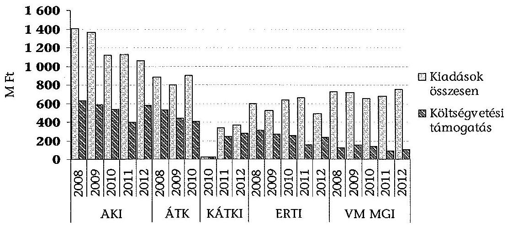

Az intézetek feladatellátására rendelkezésre álló személyi erőforrás csökkent. Mind az engedélyezett, mind az éves záró létszám az ellenőrzött időszakban - a KÁTKI és a VM MGI kivételével - mérséklődött, amelyet a 7. számú melléklet és a következő diagram mutat be.

---

A KÁTKI létrehozásakor az engedélyezett létszámot 44 főről - az alapító okiratban a feladatok kibővítése és az egy éves működési tapasztalat alapján - 2012. évben 50 főre növelte a minisztérium. A VM MGI az általa vagyonkezelt Kht. végelszámolása miatt 11 fő létszámot vett át, amellyel az állományi létszám 51 főre emelkedett.

Az intézeteknél a foglalkoztatottak létszámának alakulása az ellenőrzött időszakban
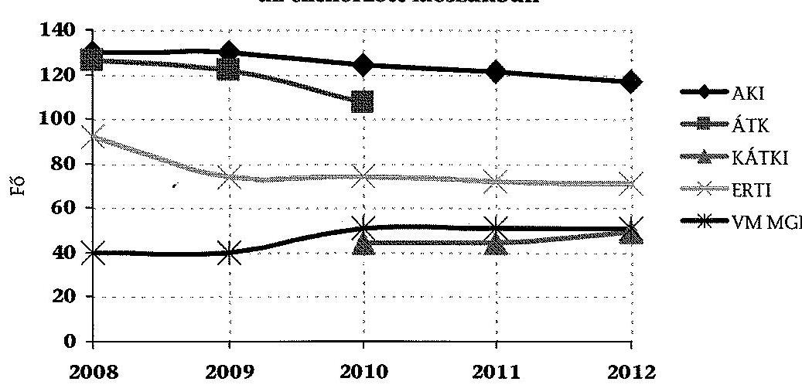

A szakmai feladatok ellátását a rendelkezésre álló létszám biztosította. A kutatók utánpótlását megnehezítette, hogy a Kjt. szerint meghatározott jövedelem nem éri el a versenyszférában hasonló munkakörben megszerezhető jövedelem szintjét ${ }^{3}$.

Az ellenőrzött időszakban az intézeteknek az engedélyköteles, illetve bejelentési kötelezettség alá eső tevékenységeknél a Kjt. 44. § (1) bekezdésben foglaltaktól eltérően, az intézetek - a KÁTKI kivételével - a dolgozóktól írásbeli nyilatkozatot nem kértek és az alkalmazottak részéről benyújtott nyilatkozat nem állt rendelkezésre az intézeteknél. A közalkalmazottak, akiknek az oktatási és egyéb (kutatási, publikációs) - nem bejelentés köteles - alkalmi
 munkavégzésének ideje a közalkalmazotti munkaidejükkel azonos időtartamra esett, a munkáltató előzetes írásbeli hozzájárulásával - a VM MGI kivételével a Kjt. 43. § (1) bekezdésében foglaltaktól eltérően - nem rendelkeztek. Az intézetek a dolgozók munkavégzésre irányuló további jogviszonyáról nyilvántartást az ellenőrzött időszakban nem vezettek.

Az intézetek - a Kjt. 41. § (1) bekezdésben foglalt jogszabályi előírásnak megfelelően - a munkaköri, a munkavégzés feltételeit jelentő összeférhetetlenséget, amely szerint a közalkalmazott nem létesíthet munkavégzésre irányuló további jogviszonyt, ha az a közalkalmazotti jogviszony alapján betöltött munkakörével összeférhetetlen - vizsgálták. A jogviszony létesítésének megtiltására, munkaügyi jogvita kezdeményezésére egyik intézetnél sem került sor.

[^0]
[^0]:    ${ }^{3}$ Az intézetek vezetőivel folytatott interjúkban elhangzottak alapján.

---

Az eszközellátottságra az ellenőrzött időszakban jellemző volt a befektetett eszközök pótlásának elmaradása, oka elsősorban a költségvetési forráshiány volt. Az eszközökre elszámolt értékcsökkenés meghaladta a beruházások értékét. Az elszámolt értékcsökkenés és a beruházás mértéke közötti különbségeket a 8. számú melléklet és következő grafikon mutatja be.
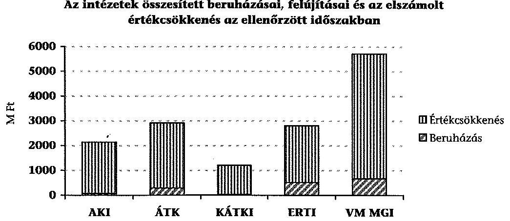

A 2008-2012. években az összesített felhalmozási kiadások intézetenként nagy szórást - $25,6 \mathrm{M} Ft$ és $670,9 \mathrm{M}$ Ft között - mutattak. A beruházási és felújítási kiadások fedezetét alapvetően pályázati források, valamint az öt intézetre összesen 41,8 M Ft értékű irányító szervi támogatás biztosította.

A kutatóintézetek eszközállományának fejlesztésére az ellenőrzött időszakban központi források - az ÁTK-nál 2008-2009. évek, az ERTI-nél 2008-2009. és 2011. évek kivételével - nem álltak rendelkezésre.

Az AKI által megvalósított beruházások összege 75,4 M Ft-ot tett ki a 2008-2012. években. Az ÁTK 288,3 M Ft-ot beruházási és felújítási kiadást teljesített, amelyből összesen 37,1 M Ft-ot tett ki a központi beruházási kiadások összege. A KÁTKI fejlesztésre fordított kiadása 2010-2012. években összesen 25,6 M Ft volt. Az ERTI az ellenőrzött öt év alatt összesen 511,3 M Ft felhalmozási kiadást teljesített, amely 4,7 M Ft összegű irányító szervi póttámogatást tartalmazott. A VM MGI 671,0 M Ft összegű fejlesztésének fedezetét pályázati források biztosították.

Az intézetek immateriális javainak és tárgyi eszközeinek használhatósági foka az ellenőrzött időszak alatt - az ÁTK és az ERTI kivételével - csökkent.

Az informatikai eszközellátottság az elméleti kutatási feladatok végrehajtásának feltételeit biztosította. A laboratóriumi műszerek egy része azonban elavult, valamint a feladatellátáshoz szükséges gépek, berendezések is csak többletráfordítással, folyamatos karbantartással és alkatrészcserével voltak üzemben tarthatók.

A használhatósági fok az ellenőrzött időszakban 0,25 és 0,59 között változott, amelyet intézetenként az alábbi grafikon szemléltet és részletesen a 9. számú melléklet mutat be.

---

# Az intézetek eszközei használhatósági fokának változása az ellenőrzött időszakban 

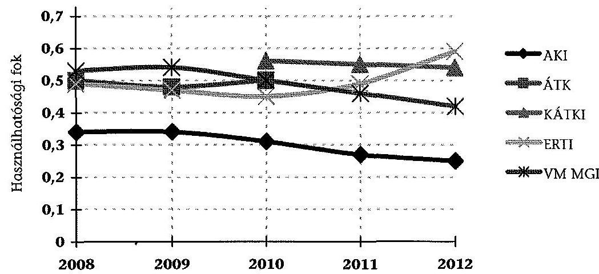

## 3. Az intézeti átalakulás szabályszerűsége

Az intézeteknél 2008-2012. években egy esetben került sor átalakulásra. A KÁTKI 2010. november 1-jével kivált az ÁTK-ból és önálló költségvetési szervként működött tovább. Az Áht. ${ }_{1} 49 . \S$ (5) bekezdésének c) pontja, valamint az Áht. 1 95. § (1) és (6) bekezdései alapján miniszteri döntéssel, kiválás útján létrejött a KÁTKI és kiadták a KÁTKI új, valamint az ÁTK módosított alapító okiratát (2010. október 28.). A minisztérium döntését hatástanulmánnyal és részletes számítással nem alapozta meg az Ámr. ${ }_{2}$ 10. § (2)-ben előírtak ellenére.

Az irányító szerv 2010. évben áttekintette a génmegőrző tevékenységet ellátó központi intézetek feladatellátását. A minisztérium javaslatot készített, hogy a génmegőrző intézetek önálló jogi személyiséggel, központi költségvetési szervként működjenek, azonban az a gazdálkodás megalapozottságához kapcsolódó számításokat nem tartalmazott. A KÁTKI kiválását egyszerűsítette, hogy a haszonállat-génmegőrzési feladatokat az ÁTK korábban külön, a KÁTKI jelenlegi gödöllői székhelyével megegyező telephelyen látta el.

Az önálló szervezet létrehozásának - minisztériumi előterjesztés szerinti - szakmai indoka volt, hogy a haszonállat-génmegőrzési rendszer - a hatósági nyilvántartási feladatokon túl - szakmai koordinációt igényel, amely költségvetési keretben, egy haszonállat-génmegőrzési központ létrehozásával valósítható meg. Az irányító szerv pénzügyi indokként a pályázati lehetőségek növekedését jelölte meg, továbbá az önállósággal lehetővé válik az intézet rendelkezésére álló erőforrások hatékonyabb felhasználása.

Az irányító szerv a KÁTKI alapításához kapcsolódó jogszabályi kötelezettségét - a költségvetési előirányzatot megalapozó részletes számítás és az alapító okirat késve történő közzététele kivételével - szabályszerűen teljesítette.

A KÁTKI kiválással történő létrehozása az Áht. ${ }_{1}$ 88. § (1)-(2) bekezdéseiben foglaltak alapján szabályszerűen történt. A VM az alapítói hatáskörében az Áht. ${ }_{1} 49$. §

---

(5) bekezdésének c) pontjában foglaltak figyelembe vételével az előírásoknak megfelelően járt el. A minisztérium az Áht. ${ }_{1}$ 89. § (1) bekezdése alapján az államháztartásért felelős miniszter előzetes egyetértését megkérte.

Az Ámr. ${ }_{2}$ 10. § (2) bekezdésében foglalt előzetes egyetértés iránti kérelmet részletes indoklással és számításokkal a minisztérium nem támasztotta alá, továbbá késve tett eleget Áht. ${ }_{1}$ 88. § (2) bekezdésében előírt közzétételi kötelezettségének. A működés feltételei részletes kidolgozásának hiánya az alapítást követően 2011. év elején átmeneti gazdálkodási nehézséget okozott az intézetnél. Az intézet vezetője a szervezet működésének fenntartása érdekében takarékossági intézkedéseket vezetett be, kutatási szervezeti egységeket szüntetett meg, a dolgozóknak - a pályázati vagy egyéb bevételek realizálásáig - részmunkaidős lehetőséget ajánlott fel. Ezen túlmenően az intézet működésének finanszírozására a minisztérium 2011. évben 100,0 M Ft pótelöirányzatot biztosított.

A KÁTKI kiválásával a minisztérium egy önálló, magyarországi őshonos állatok génmegőrzésével foglalkozó intézetet hozott létre. A stratégiai célokat rögzítették, azonban az újonnan kialakított szervezetnél - az Áht. ${ }_{1} 49$. § (5) bekezdésének f) pontjában előírtak ellenére - a közfeladatok ellátására, valamint az erőforrásokkal való hatékony gazdálkodásra vonatkozó követelményeket nem határoztak meg.

A KÁTKI ÁTK-ból történt kiválásakor az átadás-átvétel és annak dokumentálása szabályszerű, illetve teljes körű volt. A megvalósítás folyamatát a minisztérium parlamenti államtitkára által jóváhagyott, 2010. augusztus 13-án kelt intézkedési terv rögzítette.

A KÁTKI-nak átcsoportosított előirányzatok meghatározása létszámarányos elosztás, az eszközátadás leltár alapján történt.

A munkavállalók kiértesítése 2010. október 28-ai dátummal megtörtént. A VM és az intézetek által aláírt háromoldalú megállapodás alapján rendezték az előirányzatokat. Az ÁTK 2010. évi költségvetéséből 13,5 M Ft került átcsoportosításra a KÁTKI részére az alapítással egyidejűleg, ezen kívül a folyamatban lévő pályázatok maradvány összegeit utalták át.

A KÁTKI dokumentumainak átadására 2010. november 8-án került sor. Az intézetek képviselői a szerződések, a munkáltatói hitelekről készült elszámolás és az átadásra kerülő dolgozók, valamint peres ügyek listájának átvételét átadás-átvételi jegyzőkönyv aláírásával dokumentálták. A KÁTKI kiválást követően az általa elvégzett feladatok ellátásához szükséges gödöllői telephelyen fellelhető eszközöket leltár alapján vette át. A vagyonátadás-átvételt az Áhsz. 29/B. § (1)(2) bekezdéseiben foglaltaknak megfelelően dokumentálták.

Szállítói számlákat, aktív és passzív pénzügyi elszámolásokat nem adtak át, mert a KÁTKI nem tudta volna teljesíteni a kifizetéseket. Ezeket a tételeket az ÁTK rendezte, majd 2011. évben az ÁTK továbbszámlázása alapján a KÁTKI kifizette.

---

# 4. A belső kontrollrendszer szabályszerű kialakítása és működése 

### 4.1. A pénzügyi és vagyongazdálkodás szabályozása

Az intézetek belső kontrollrendszere - alapvetően a szabályozási hiányosságok miatt - nem biztosította az intézetek pénzügyi és vagyongazdálkodásának szabályszerű ellátását. A belső kontrollrendszer szabályozottsága az intézeteknél az ellenőrzött időszak minden évében - a VM MGI-nél a 2010-2011. évek kivételével - nem megfelelő, magas kockázatú volt.

Az intézetek működésének szabályozottsága nem volt biztosított. Az intézetek belső szabályzataikat a változó jogszabályi környezettel összhangban nem aktualizálták. A jogszabályi környezetben és a működésben bekövetkezett változásoknak megfelelően az SZMSZ-eket nem aktualizálták. (Az SZMSZ-ek hiányosságait részletesen a 2.1. pont tartalmazza.)

Az intézetek belső szabályzatainak tartalma nem felelt meg az Sztv., Kbt. ${ }_{1,2}$, Ámr. ${ }_{1,2}$, Ávr. és Áhsz. előírásainak. Ezek közé tartoztak 2008-2011. évekre vonatkozóan a kötelezettségvállalási, ellenjegyzési, utalványozási és érvényesítési szabályzatok, a gazdasági szervezetre vonatkozó ügyrendek, számvitelpolitika, számlarend, leltározási, pénzkezelési, közbeszerzési szabályzatok, továbbá az eszközök és források értékelési szabályzata (kivéve KÁTKI).

Az ellenőrzött időszakban az AKI, az ÁTK, a KÁTKI, a VM MGI ügyrendjei az Ámr. 17. § (5) bekezdése, Ámr. ${ }_{2}$ 20. § (7) bekezdése, Ávr. 13. § (5) bekezdés előírásaiban foglaltaktól eltérően nem, illetve részben szabályozták a helyettesítés rendjét, a gazdasági szervezeten kívüli külső és a belső kapcsolattartás szabályait. A KÁTKI kiválását követően 2012. január 1-jéig ügyrend nélkül működött. Az ERTI nem vezette a 100 ezer Ft-ot el nem érő kifizetésekről a gazdasági szervezete ügyrendjének 2. sz. mellékletében meghatározott belső bizonylatot a kötelezettségvállalás-nyilvántartás érdekében. Az ERTI 2008-2010. években nem szabályozta az Ámr. ${ }_{1}$ 134. § (3) bekezdésében, illetve az Ámr. ${ }_{2}$ 72. § (13) bekezdése a) pontjában foglaltakat. Az ERTI 2008-2011. évekre nem rendelkezett kötelezettségvállalási nyilvántartással. Az ügyrend 3. sz. melléklete tartalmazta a kötelezettségvállalásra, utalványozásra, ellenjegyzésre, érvényesítésre és teljesítésigazolásra jogosultak körének aláírás mintáját, azonban 2011. évben az érvényesítést és utalványozást ténylegesen ellátó dolgozók aláírása a 3. számú mellékletben nem szerepelt. Ez nem felelt meg az Ámr. ${ }_{2}$ 77-78. §-aiban meghatározottaknak. Az intézet az aláírás mintát az Ámr. ${ }_{2}$ 80. § (3) bekezdésének előírásától eltérően nem vezette naprakészen. Az utalványozással, érvényesítéssel kapcsolatos feladatokat a munkaköri leírások sem tartalmazták.

Az intézetek 2008-2011. években rendelkeztek számviteli politikával, azonban három intézetnél hiányosak voltak, nem feleltek meg a Sztv. 14. §, és az Áhsz. 8. §-ban rögzített tartalmi követelményeknek, mivel a KÁTKI-nál nem tartalmazta a kis értékű tárgyi eszközök, vagyoni értékű jogok és szellemi termékek minősítését, az ERTI-nél a beszerzett immateriális javak és tárgyi eszközök üzembe helyezésének szabályait, a mérlegkészítés időpontját, a megbízható

---

és valós összkép kialakítását befolyásoló lényeges információkat, a jelentős összeg meghatározását és a VM MGI esetében a mérlegkészítés időpontját.

A számviteli politika kötelező mellékleteként a Sztv. 14. § (5) bekezdésének c) pontja, az Áhsz. 8. § (4) bekezdésének c) pontja, és az Ámr. 157/C. (1)-(2) bekezdései alapján az ÁTK 2008-2010. években, a VM MGI 2009. évtől rendelkezett önköltség-számítási szabályzattal, amelyet az ellenőrzött időszakban aktualizáltak. Az ERTI és a KÁTKI 2011. évben, az AKI 2012. évben gondoskodott ennek elkészítéséről. Az intézetek az aktualizált, illetve elkészült szabályzatokban foglaltakat azonban nem alkalmazták az Áhsz. 8. § (15) bekezdése ellenére.

Az intézetek számlarendjei - a VM MGI kivételével - hiányosak voltak, nem feleltek meg az Sztv. 161. § (2) bekezdése és az Áhsz. 49. §-ban rögzített tartalmi követelményeknek: A 2008-2011. években az AKI és az ERTI számlarendje az Sztv. 161. § (2) bekezdésének c) pontjában, valamint az Áhsz. 49. § (3)-(4) bekezdésében foglaltak ellenére nem tartalmazta a főkönyvi számlák és az analitikus nyilvántartások kapcsolatát. Az ÁTK 2008-2010. között nem intézkedett a számlarend évenkénti aktualizálásáról. A KÁTKI számlarendje 2011-2012. években - az Sztv. 161. § (2) bekezdésének d) pontjában foglaltak ellenére - nem tartalmazta a bizonylati rendet.

Az intézetek a leltározási és leltárkészítési
 szabályzataikat az ellenőrzött időszakban a Sztv. 69. §, az Áhsz. 37. §-ban előírtak ellenére hiányosan készítették el. Az intézetek jellemzően nem szabályozták a leltározási és leltárkészítési szabályzatban a leltározás időszakában történő eszközmozgatások eljárásrendjét és ennek bizonylatolását. A vagyonkezelésbe vett eszközök leltározásának módját. A szabályzatok nem tartalmaztak előírásokat az egyedi eszköznek a rendelet szerint elszámolt értékcsökkenéssel, értékvesztéssel csökkentett, a visszaírással növelt bekerülési értékére és az előbbiek szerinti érték különbözetére vonatkozóan.

Az AKI 2008-2011. években, az ÁTK, KÁTKI, ERTI, VM MGI az ellenőrzött időszakban a leltározási és leltárkészítési szabályzatában nem rögzítette a leltározás időszakában történő eszközmozgatások eljárásrendjét és ennek bizonylatolását.

ERTI, VM MGI 2008-2011. években a leltározási és leltárkészítési szabályzat nem tartalmazott előírásokat az egyedi eszköznek a rendelet szerint elszámolt értékcsökkenéssel, értékvesztéssel csökkentett, a visszaírással növelt bekerülési értékére és az előbbiek szerinti érték különbözetére vonatkozóan.

Az ÁTK a 2008-2010. években, az ERTI a 2008-2011. években nem szabályozta a vagyonkezelésbe vett eszközök leltározásának módját, valamint az üzemeltetésre, kezelésre átadott, illetve idegen helyen tárolt eszközök leltározásának módját. Az ERTI nem szabályozta továbbá a leltározás és a könyvviteli nyilvántartások egyeztetésének módját, a záró jegyzőkönyvek elkészítésének határidejét.

Az intézetek által elkészített eszközök és források értékelési szabályzatai az ellenőrzött időszakban - a KÁTKI kivételével - nem feleltek meg maradéktalanul Áhsz. 8. § (17) bekezdése előírásainak, mivel nem tartalmazták a követelések értékelésének szabályozását.

---

Az AKI és a VM MGI 2008-2011. években a követelések év végi értékelésének elvei hiányával készítette el az eszközök és források értékelési szabályzatát. Nem tartalmazta továbbá a Sztv. 60. § (4) bekezdésében foglalt előírásokat - milyen devizaárfolyammal kell forintra átszámítani a választott hitelintézet, illetve az MNB által jegyzett külföldi pénzértékre szóló eszközöket és kötelezettségeket - sem.

Az ÁTK értékelési szabályzata a 2008-2010. években nem rögzítette a kisösszegű követelések szabályait.

Az ERTI 2008-2010. években nem rendelkezett az eszközök és források értékelési szabályzatával. A 2011. január 1-jétől hatályos szabályzat nem rögzítette követeléstípusonként az adós minősítés szempontjait, az év végi értékelés elveit, a dokumentálás rendjét.

Az intézetek az Sztv. 14. § (8) bekezdésében foglaltaktól eltérően készítették el az ellenőrzött időszakban a pénzkezelési szabályzataikat. Az intézetek jellemzően nem szabályozták a készpénzben teljesíthető kiadások jogcímeit és értékhatárait és további hiányosságai is voltak.

Az AKI 2008-2011. években és a KÁTKI 2011-2012. években a pénzkezelési szabályzata hiányos volt, mert nem tartalmazta a készpénzben teljesíthető kiadások jogcímeit és értékhatárait, (46/2009. (XII. 30.) PM rendelet 31. §, Sztv. 14. § (8) bekezdése, 36/1999. (XII. 27.) PM rendelet 8. §), továbbá a KÁTKI nem rögzítette az 1 és 2 Ft-os címletű érmék bevonása következtében szükséges kerekítések elszámolásának szabályait, valamint a megnyitott kincstári számlák forgalmának könyvvezetési, egyeztetési rendjét.

ERTI a 2011. január 10-től hatályos pénzkezelési szabályzatának elkészítését megelőzően elavult (1997. július) pénzkezelési szabályzattal rendelkezett. A hatályos pénzkezelési szabályzat nem rögzíti az előlegek, az utólagos elszámolásra kiadott összegek körét, nyilvántartásának elszámolásának rendjét, határidejét, a kincstári és a kincstári körön kívüli számlák körét és rendeltetését, a pénzforgalmi számlák feletti rendelkezési jog gyakorlásának feltételeit.

A VM MGI pénzkezelési szabályzata az ellenőrzött időszakban a pénzkezeléshez kapcsolódó összeférhetetlenségi követelményeket nem rögzítette.

Az intézetek az ellenőrzött időszakban gondoskodtak a közbeszerzési szabályzat elkészítéséről és aktualizálásáról, azonban azok továbbra sem tartalmazták teljes körűen az Ámr. 2 20. § (3) bekezdése, a Kbt. 1 6. §, 8. §, 59. §, Kbt. 2 22. §, és 59. § előírásaiban rögzített tartalmi elemeket. A szabályzatok jellemzően nem rögzítették az ajánlati biztosíték kezelésével, nyilvántartásával, illetőleg visszaadásával kapcsolatos feladatokat, a központosított közbeszerzési eljárások esetén alkalmazandó eljárásrendet, a közbeszerzés hatálya alá nem tartozó beszerzések lebonyolítását.

Az AKI a 2008-2011. években, a KÁTKI és a VM MGI az ellenőrzött időszakban a közbeszerzési szabályzatában nem rögzítette az ajánlati biztosíték kezelésével, nyilvántartásával, illetőleg visszaadásával kapcsolatos feladatokat.

Az AKI 2008-2011. években, az ERTI közbeszerzési szabályzata az ellenőrzött időszakban nem tartalmazta a központosított közbeszerzési eljárások esetén alkalmazandó eljárásrendet, a közbeszerzés hatálya alá nem tartozó beszerzések lebonyolítását.

---

Az ÁTK közbeszerzési szabályzata 2008-2010. években az ajánlattételi kommunikációval kapcsolatos feladatok meghatározása, a felelősök kijelölésének hiányossága miatt csak részben felelt meg a $\mathrm{Kbt}_{1}$ előírásainak.

A VM MGI a 2004. április 25-étől hatályos közbeszerzési szabályzatát 2012. szeptemberben aktualizálta, amelynek hiányossága, hogy nem tartalmazta az értékhatár alatti beszerzések szabályozását.

Az intézetek átlátható gazdálkodását, a szabályszerű közpénzfelhasználást megalapozó pénzügyi, gazdálkodási szabályzatok rendelkezéseinek összhangja nem volt biztosított az ÁTK-nál, a KÁTKI-nál és az ERTI-nél.

Az ÁTK szabályzatai nem voltak egymással összhangban. A belső ellenőrzés feladatait az SZMSZ-ben meghatározták, azonban a szervezet ügyrendjében ennek rögzítése elmaradt. A számvitellel összefüggő belső szabályozási eszközök egymással való kapcsolata nem volt megfelelő, mivel a számlarend tartalmazta a számviteli politikát, ugyanakkor a számviteli politika utalt egyéb, részét képező belső szabályozási eszközökre. Így például az ÁTK belső szabályozásában a számlarend részét képezte - közvetetten - a leltározási vagy a pénzkezelési szabályzat.

A KÁTKI gazdasági szervezete ügyrendjének késői (2012. január 1-jétől) hatályba lépése miatt nem biztosíthatta a belső szabályozásokkal való összhangot.

Az ERTI-nél a 2002. február 2-től hatályos számviteli politika rögzítette, hogy részét képezi az eszközök és források értékelési szabályzata, amellyel az intézet csak 2011. januártól rendelkezik. A szabályzatok összhangjában a javulás 2011. januártól figyelhető meg.

Az AKI-nál és a VM MGI-nél a gazdálkodási szabályzatok rendelkezéseinek összhangját a közel egy időben történő felülvizsgálatával és átdolgozásával az irányító szerv ellenőrzését követően biztosították.

A 2012. évi költségvetés végrehajtásának ellenőrzése a szabályozás alábbi területein és intézeteknél állapított meg hiányosságokat: számviteli politika (ERTI), számlarend (AKI, ERTI), közbeszerzési szabályzat, leltározási és leltárkészítési szabályzat, eszközök és források értékelési szabályzata (KÁTKI, ERTI, VM MGI), gazdálkodási szabályzat, informatikai biztonsági szabályzat, kockázatkezelési szabályzat, ügyrend (AKI, ERTI, VM MGI), szabálytalanságok kezelésének rendje (ERTI), bizonylati rend (VM MGI).

# 4.2. Az intézetek belső kontrollrendszerének kialakítása, működése 

A feladatok, hatáskörök és felelősségi körök kijelölésében az intézetek nem érvényesítették a belső kontrollrendszer követelményeit. A belső kontrollrendszer - a kialakításában és működtetésében fennálló hiányosságok miatt - nem járult hozzá a szabálytalanságok és hibák megelőzéséhez, illetve kiküszöböléséhez az ellenőrzött időszakban.

Az intézetek vezetői az ellenőrzött időszakban kockázatelemzést az Ámr. ${ }_{1} 145 /$ C. §, az Ámr. ${ }_{2} 157$. §, a Bkr. 3. § b) pontjában és 7. §-ában foglaltaktól eltérően nem végeztek, kockázatkezelési rendszereket nem működtet-

---

tek. Kockázatkezelési szabályzattal nem (AKI), vagy csak az ellenőrzött időszak második felében (ERTI, ÁTK, KÁTKI, VM MGI) rendelkeztek az intézetek.

Az intézetek az Ámr. ${ }_{1}$ 145/F. §, az Ámr. ${ }_{2}$ 159. § és a Bkr. 3. § d) pontjában előírtaktól eltérően nem rögzítették és nem szabályozták az információs, kommunikációs rendszer kialakításával kapcsolatos feladatokat.

Az intézetek vezetői kötelesek voltak olyan rendszereket kialakítani és működtetni, amelyek biztosítják, hogy a megfelelő információk időben eljussanak az illetékes szervezethez, szervezeti egységhez, illetve személyhez. Az intézeteknél információs rendszer hiányában nem határozták meg a hatékony, megbízható és pontos működéshez a beszámolási szinteket és határidőket.

Az intézetek az Ámr. ${ }_{1}$ 145/B. § (1) bekezdés, az Ámr. ${ }_{2}$ 156. § (2) bekezdés, a Bkr. 6. § (3) bekezdésének előírásaitól eltérően a belső kontrollrendszer hatékony működését, az intézetek működési kockázatainak feltérképezését támogató ellenőrzési nyomvonal, valamint az Ámr. ${ }_{1}$ 145/A. §, az Ámr. ${ }_{2}$ 161. §, és a Bkr. 6. § (4) bekezdésének előírásai ellenére szabálytalanságkezelési szabályzat elkészítésére az AKI és az ÁTK az ellenőrzött időszakban nem intézkedett. A KÁTKI, az ERTI, és a VM MGI ezeknek az előírásoknak 2010-2012. években tettek eleget.

Az ellenőrzött időszakban, az intézetekben az Ámr. ${ }_{1}$ 145/G. §, az Ámr. ${ }_{2}$ 160. §, és a Bkr. 3. § e) pontjában előírtak ellenére nem alakítottak ki és nem működtettek monitoring rendszert, amely lehetővé teszi a szervezet tevékenységének, a célok megvalósításának nyomon követését.

Az intézeteknél a gazdálkodási jogkörök szabályosságát biztosító belső kontrollokat a kötelezettségvállalás, ellenjegyzés, utalványozás és érvényesítés szabályzatokban, illetve a gazdasági szervezetre vonatkozó ügyrendekben alakították ki, azonban azok tartalma - az alábbiakban részletezett hiányosságok miatt - az ellenőrzött időszakban nem felelt meg az Ámr. ${ }_{1}$ 134. §, 135. §, 136. §, 138. §, az Ámr. ${ }_{2}$ 72. §, 80. §, az Ávr. 56. §, 58. §, 59. § és 60. §-ban foglalt előírásoknak. Az intézetek jellemzően a kötelezettségvállalásra jogosultak körét nem jelölték ki, hiányzott az aláírás minta vagy nem voltak teljes körűek, illetve aktualizált, nem szabályozták a kötelezettségvállalások nyilvántartásának rendjét. Az ÁTK az ellenőrzött időszakban a kötelezettségvállalási szabályzatában meghatározta a kötelezettségvállalásra jogosultak körét, azonban a főigazgató nem bízta meg írásban a szabályzatban megjelölt személyeket, ez a munkaköri leírásukban sem szerepelt. A szabályzat nem tartalmazta a szakmai teljesítés-igazolásra jogosultak körét.

Az AKI-nál az ellenőrzött időszakban a gazdasági események során alkalmazott kötelezettségvállalási eljárásrend és a kötelezettségvállalásra jogosultak körének meghatározása nem volt összhangban egymással. Az aláírás minta nem volt teljes körű.

A KÁTKI 2011. évi gazdálkodási szabályzata nem rendelkezett az irányadó jogszabállyal összhangban álló, a kötelezettségvállalást, érvényesítést és utalványozást szabályozó utasítással. A 2012. január 1-jétől érvényes szabályzat az Ávr. előírásainak figyelembe vételével készült. A szabályzat mellékletei tartalmazták az aláírás mintákat.

---

Az ERTI-nél 2011. január 1-je előtt a gazdálkodására vonatkozó ügyrend általánosságban szabályozta a gazdálkodási jogköröket, megnevezett személyek, felhatalmazások és aláírás-minták nélkül. A szabályzat további hiányossága, hogy nem tartalmazta a kötelezettségvállalás mértékét, a kötelezettségvállalások nyilvántartásának egyeztetésével kapcsolatos feladatokat, az összeférhetetlenség fennállásának feltételeit és a szakmai teljesítés-igazolásra jogosultak körét. A hatályos ügyrend nem tartalmazza a kötelezettségvállalások nullás számlaosztályban történő nyilvántartásának eljárásrendjét, valamint az 5 M Ft-os egyedi értékhatárt elérő kötelezettségvállalások kincstárhoz történő bejelentésével kapcsolatos feladatokat, továbbá az aláírás minta nem aktualizált.

A VM MGI kötelezettségvállalási szabályzata 2008-2012. között nem tartalmazta az aláírás mintákat.

Az intézetek a belső kontrollok működésének javítása érdekében a kötelezettségvállalási szabályzataikat 2012. év végére felülvizsgálták, azonban a szabályozás valamennyi intézetnél továbbra is hiányos maradt.

Az intézetek nem szabályozták az 5 M Ft-os egyedi értékhatárt elérő kötelezettségvállalások Magyar Államkincstárhoz (MÁK) történő bejelentésével kapcsolatos feladatokat (ERTI, KÁTKI, VM MGI), gazdasági eseményenként az 50 ezer forintot, illetve 2010-től a 100 ezer forintot el nem érő kifizetések rendjét (AKI, KÁTKI, VM MGI), valamint a kötelezettségvállalások 0-s számlaosztályban történő nyilvántartásának eljárásrendjét (ERTI, KÁTKI, AKI, VM MGI).

Az intézetek pénzforgalmi folyamataihoz kapcsolódó belső kontrollok az ellenőrzött mintáknál tapasztalt hiányosságok alapján nem működtek megfelelően, az erre vonatkozó megállapításokat részletesen az 5.2. pont mutatja be. Az ellenőrzés olyan hiányosságot nem tárt fel, amely az intézetek gazdálkodásában vagyoni hátrányt okozott volna.

A gazdasági
 eseményekhez kötődő belső kontrollok gyakorlata az ellenőrzött időszakban az intézeteknél a szabályozási hiányosságok következtében - a KÁTKI kivételével - nem az Ámr. ${ }_{1}$ 136-138. §-ok, Ámr. ${ }_{2}$ 76-78. §-ok, az Ávr. 57-59. §-ok előírásai szerint működött. A kötelezettségvállalások analitikus nyilvántartása nem felelt meg Ámr. 134. § (13) bekezdése, Ámr. ${ }_{2}$ 75. § (1) bekezdése, az Ávr. 56. § előírásainak.

Az AKI-nál 2012-ig belső szabályzatban nem rögzítették az írásbeli kötelezettségvállalást nem igénylő kifizetések ${ }^{4}$ esetében azok rendjét és a nyilvántartás formáját. A vezetett nyilvántartás nem volt alkalmas arra, hogy újabb kötelezettségvállalást megelőzően a szabad előirányzatokat mutassa, mivel a pénztári kifizetéseket a teljesítéssel egyidejűleg nem vezették fel az analitikus nyilvántartásba. A jogszabályban foglalt értékhatár feletti kötelezettségvállalás írásba foglalása nem történt meg, továbbá a kötelezettségvállalást nem előzte meg annak ellenjegyzése. Az utalványozás, utalványozás ellenjegyzése (2011. év végéig) és az érvényesítés belső kontrollok az ellenőrzött időszakban megfelelően működtek.

Az ERTI csak 2011. évtől kezdődően rendelkezik kötelezettségvállalás analitikus nyilvántartási rendszerrel, amelynek vezetése azt követően folyamatos volt.

[^0]
[^0]:    ${ }^{4}$ Az Ámr. 134. § (3) bekezdése alapján 2008-ban és 2009-ben 50 ezer Ft, az Ámr. 72. § (13) bekezdésének a) pontja alapján 2010. január 1-jétől 100 ezer Ft.

---

A VM MGI-nél 2011-ig nem volt kötelezettségvállalási nyilvántartás, amit az irányító szervi ellenőrzést követően vezettek be.

# 4.3. A belső ellenőrzés kialakítása és működése 

Az intézeteknél a belső ellenőrzés közvetlenül a főigazgatóhoz, illetve a KÁTKI esetében az igazgatóhoz tartozott, az ellenőrzési tevékenységen kívül más feladatot nem láttak el, így a belső ellenőrzés szervezeti és funkcionális függetlensége biztosított volt.

Az ellenőrzött időszakban a függetlenített belső ellenőrzési feladatokat az intézeteknél - a KÁTKI kivételével - megbízási szerződéssel külső szakértő, illetve külső szervezet (vállalkozás) látta el. A Bkr. 15. § (5) bekezdésének 2012. júliusban hatályba lépett előírása ellenére foglalkoztatásra irányuló jogviszonyban belső ellenőrt - a KÁTKI kivételével - nem alkalmaztak.

A Belső ellenőrzési kézikönyvek - AKI, ÁTK - a függetlenséget bemutató szervezeti ábrát a Ber. 5. § (2) bekezdésének c) pontjában foglaltaktól eltérően nem tartalmazták. A belső ellenőrzési kézikönyv évenkénti felülvizsgálatát az előírtak ellenére az ÁTK 2008-2010. években, a jogszabályok változása (Áht., Bkr.) miatt szükséges módosításokat a Ber. 5. § (3) bekezdése, a Bkr. 17. § (4) bekezdése előírásai ellenére a KÁTKI és az ERTI 2012. évben nem végezte el.

Az intézetek belső ellenőrei a feladataikat - 2008. évben az ERTI kivételével ${ }^{5}$ éves belső ellenőrzési tervek alapján végezték. Az ellenőrzési tervek elkészítését - 2008-2010. években az ERTI kivételével - szabályszerűen, kockázatelemzés előzte meg. Az AKI és a KÁTKI belső ellenőre az intézet belső kontrollrendszerének működését a Ber. 8. § a) pontja, a Bkr. 21. § (2) bekezdésének a) pontja előírásainak ellenére nem vizsgálta.

Az intézetek belső ellenőrzési kötelezettségüket teljesítették, azonban a javaslatok hasznosulásának alacsony aránya, a belső kontroll kockázatok változatlanul magas mértéke, valamint az irányító szervi ellenőrzések tapasztalatai azt mutatták, hogy a belső ellenőrzés nem megfelelően töltötte be szerepét a közpénzekkel, az állami vagyonnal való gazdálkodás elszámoltathatóságának és átláthatóságának javításában.

Az intézeteknél 2008-2012. években összesen 126 belső ellenőrzést végeztek, amelyből 112 ellenőrzést a belső ellenőrzési tervben szerepeltettek. A kockázatelemzéssel megalapozott ellenőrzések száma 91 volt. A belső ellenőrzés részletes adatait a 10. számú melléklet tartalmazza.

A belső ellenőrzési tevékenység során tett javaslatok alapján bekövetkezett változások elsősorban a szabályozottság, az operatív jogkörök gyakorlása, a nyilvántartási rend terén jelentkeztek.

[^0]
[^0]:    ${ }^{5}$ Az ERTI 2008. évi belső ellenőrzési dokumentumai nem voltak fellelhetőek.

---

A belső ellenőrzés megállapításai részben hasznosultak. Az ellenőrzött időszakban az intézeteknél végzett ellenőrzések (126 db) mindössze fele (63 db) fogalmazott meg javaslatot, melyek a javaslatot tartalmazó ellenőrzések 84%-a esetében (53 db) hasznosultak. A belső ellenőrzési tevékenység hasznosulását korlátozta, hogy a javaslatot tartalmazó ellenőrzések száma alacsony volt.

Az AKI belső ellenőrének megállapításai, javaslatai nem hasznosultak teljes körűen. Hiányos volt a belső ellenőrzésre készített intézkedési tervek megvalósítása. A belső ellenőr az ellenőrzött években - az éves ellenőrzési jelentés keretében - elkészítette a belső ellenőrzési jelentésekben tett megállapításokról, javaslatok hasznosulásáról és végrehajtásáról szóló írásos beszámolót, amelyet az intézet vezetőjének jóváhagyása után a VM Ellenőrzési Főosztálya részére megküldött.

Az ÁTK belső ellenőrzési tevékenysége hasznosulást eredményezett a belső szabályozási eszközök elkészítésében, a FEUVE rendszer kialakításában és a leltározási tevékenység ellátásában.

A KÁTKI a belső ellenőrzési javaslatok az intézkedési tervekben foglaltak nem teljes körű végrehajtására való tekintettel - a KÁTKI nyilatkozat szerint - 80%-ban hasznosultak.

Az ERTI belső ellenőrzése során tett javaslatok hasznosultak a nem azonosított bevételek, a vagyonvédelmi nyilvántartás, az operatív jogkörök működése, a pénzkezelés szabályozottsága, a tárgyi eszközök analitikus nyilvántartása, a gépjárműhasználat és üzemanyag-elszámolás, az informatikai rendszer működése és a pénzügyi és adminisztratív dolgozók munkaköri leírásai vonatkozásában.

A VM MGI belső ellenőrzési javaslatai elsősorban a szabályzatok kidolgozására és aktualizálására irányultak, amelyek hasznosulását az elkészült, illetve aktualizált szabályzatok dokumentálták.

2008-2012. években végzett 126 belső ellenőrzésekhez összesen 26 utóellenőrzés kapcsolódott. Utóellenőrzést az AKI és az ERTI belső ellenőre 2008-2012. közötti időszakban nem végzett. Az ÁTK és a KÁTKI az ellenőrzött időszakban hét, a VM MGI 12 utóellenőrzést hajtott végre.

A belső ellenőrzési tevékenységről a Ber. 29/A. § (1)-(2) bekezdései és a Bkr. 47. § előírásaitól eltérően nyilvántartást az ellenőrzött intézetek közül az ERTI 2008-2012. évekre, a VM MGI 2008. és 2011-2012. évekre vonatkozóan nem vezette. A belső ellenőrzési javaslatok hasznosulásának dokumentálása az intézeteknél nem volt megoldott. A feladatok végrehajtásának alakulásáról emlékeztetők nem készültek, az intézkedésekről beszámoló az irányító szerv felé az AKI kivételével - nem készült, erről információt a belső kontroll és ellenőrzési tevékenységről szóló éves összefoglaló jelentések tartalmaztak.

---

# 5. Az intézetek költségvetésének alakulása és a gazdálkodás szabályszerűsége 

### 5.1. A feladatváltozások és az előirányzat módosítások hatása a gazdálkodásra

Az ellenőrzött években az AKI és az ERTI esetében a kiadási, bevételi és támogatási előirányzatok teljesítésének értékében és arányaiban feladatváltozásokkal összefüggő elmozdulás nem volt.

A 2008. és 2012. években az ellenőrzött intézetek feladatainak összetételében változás - az VM MGI kivételével - nem történt. Az VM MGI - a 2009. december 31-én záruló végelszámolás után - átvette az FVMMI GM Gépminősítő Kht. feladatait. Tekintettel arra, hogy az alapító VM MGI korábban is végezte a Gépminősítő Kht.-től átvett közfeladatot, ezért nem volt szükség az VM MGI alapító okiratának és SZMSZ-ének módosítására. Az átvett feladatokat és annak vagyonváltozásra, valamint kiadásokra és bevételekre gyakorolt hatását a 11. és 12. számú mellékletek mutatják be.

## A minisztérium 2010. november 1-jei határnappal az ÁTK-ból történő kiválással - annak Gödöllői telephelyén - létrehozta a KÁTKI-t.

A KÁTKI 2006-ig önállóan működött, ezt követően beolvadt az ÁTK-ba, majd 2010-től ismét önálló intézet lett.

A KÁTKI elsődleges feladata az összes kisállatfajra kiterjedő génmegőrzés, ezen túlmenően agrártudományi kutatás, oktatási feladatok, múzeumi tevékenységek, valamint növény- és állatkert működtetése az alapító okirat szerint. Az ÁTK által átadott, ezzel egyidejűleg a KÁTKI által átvett feladatokat és azoknak a költségvetésre gyakorolt hatását a 11. és 12. számú mellékletek mutatják be.

A FVMMI Gépminősítő Kht. feladatai átvételének következtében az VM MGI 2010. évi működési kiadási és bevételi előirányzatát a minisztérium felügyeleti hatáskörben végrehajtott előirányzat módosítás keretében 126,4 M Ft-tal megemelte, az engedélyezett létszámot 11 fővel növelte.

A 2008-2012. években a minisztériumon belül lezajlott szervezeti változások, államtitkárságok, főosztályok közötti feladat-átrendeződések nem gyakoroltak mérhető hatást az ellenőrzött intézetek feladatellátására és gazdálkodására. Az egyes intézeteket szakmailag irányító, felügyelő egységek felsorolását a 2. számú melléklet tartalmazza.

Az ellenőrzött időszakban az irányítási jogkör gyakorlása az AKI tekintetében nem változott. Az ERTI esetében többször sor került irányítási joggyakorlást érintő, a minisztériumon belüli szervezeti változásra, államtitkárságok, főosztályok közötti átrendeződésre, ezeknek azonban mérhető hatása nem volt az intézet feladatellátására és gazdálkodására. A KÁTKI 2010. november 1-jei megalakulásától a VM Stratégiai Főosztály Biodiverzitás- és Génmegőrzési Osztálya felügyeletével működött.

---

Az intézetek bevételi és kiadási módosított előirányzatai minden évben jelentősen meghaladták az eredeti előirányzatot, ami a költségvetési tervezés megalapozatlanságát mutatja. Az ellenőrzött intézeteknél 2008-2012. években az eredeti előirányzat-módosítások - mind irányító szervi, mind intézeti hatáskörben, mind pedig jogszabály előírása miatt - rendszeresek voltak. Az előirányzat-módosítások többek között pályázatokhoz, prémium-évek programhoz, 13. havi illetmény kifizetéséhez, kereset-kiegészítéshez, egyedi feladatok támogatásához és többletbevétel előirányzatosításához kapcsolódtak. Az ellenőrzött intézetek kiadásainak, bevételeinek és támogatásainak részletes adatait a 13. számú melléklet és a következő diagram szemlélteti.

Az intézetek kiadási előirányzatainak alakulása az ellenőrzött időszakban
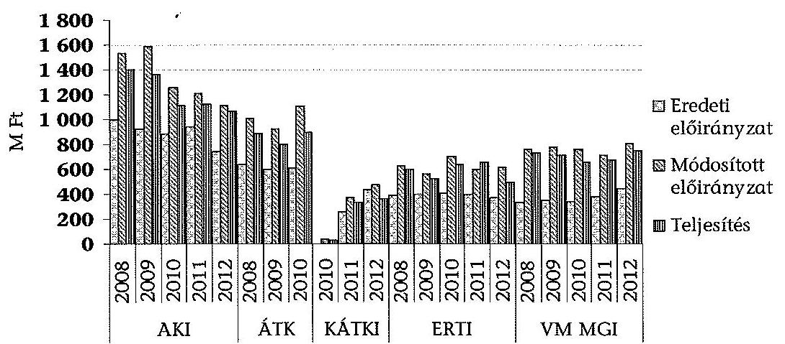

A költségvetési terv eredeti előirányzatához képest a kiadások és a bevételek is (a KÁTKI 2012. évi adatát kivéve) rendre túlteljesültek, míg a bevételek között a költségvetési támogatás teljesítése az eredeti előirányzat összegéhez képest mind pozitív, mind negatív irányban - esetenként nagy, akár 100%-os - eltérést mutatott. A költségvetés előirányzatainak alakulását intézetenként és évenként a 13. számú melléklet mutatja be.

A kiadások esetében 2008-2012. évek és az intézetek átlagában a módosított előirányzat az eredeti előirányzat 166,1%-a, a teljesítés az eredeti előirányzat 150,3%-a, míg a teljesítés a módosított előirányzat 90,3%-a volt. A bevételeknél ezek az arányok 166,1%, 162,7%, valamint 97,7%, a költségvetési támogatásoknál pedig 120,7%, 120,7%, illetve 100% voltak. Az eredeti előirányzatokhoz képest tehát jelentős módosítások történtek, a teljesítés azonban a módosított előirányzatoktól már csak kis mértékben tért el.

Az eredeti előirányzatok az irányító szervi, intézeti döntés, illetve jogszabályi változás alapján történt módosításai során - a nem megfelelően vezetett nyilvántartásoktól kivételével - betartották a jogszabályi és hatásköri előírásokat az Ámr. 1 60. §, Ámr. 2 56. §, Ávr. 43. §-ok. Az előirányzatmódosításokról vezetett analitikus nyilvántartás az ERTI és a VM MGI esetében nem felelt meg az Ámr. 1 54. § (3) bekezdés, az Ámr. 2 70. § (2) bekezdés előírásainak.

---

Az ERTI az előirányzat-módosításokról nem vezetett nyilvántartást a 2008., 2010. és 2012. években, a 2009. évi nyilvántartás - hatásköri bontás hiánya miatt - nem volt megfelelő. Az VM MGI által vezetett előirányzat analitika 2008-2011. években nem felelt meg az előírásoknak. A kézzel vezetett nyilvántartás nem tartalmazott azonosítót, dátumot, jogszabályi hivatkozást, sem azt, hogy tartós vagy eseti az előirányzat-módosítás.

Az intézetek teljesített kiadásai az AKI és az ERTI esetében 2008-ról 2012-re 24,2%-kal, illetve 17,3%-kal csökkentek, míg a többi ellenőrzött intézet esetében kismértékben nőttek. A növekedés elmaradt a 2008-2012. évek inflációs adatainak halmozott, 20,0%-os értékétől ${ }^{6}$, ami
 az intézeteket költségtakarékos gazdálkodásra ösztönözte.

Az intézetek összesített bevételei az ellenőrzött időszak végére (kiszűrve a KÁTKI ÁTK-ból való kiválása miatti torzító hatást) 16,2%-kal csökkentek. A bevételek változásában a legmeghatározóbb szerepet az - egyébként legnagyobb költségvetéssel rendelkező - AKI bevételeinek 27,7%-os csökkenése játszotta.

Az intézetek bevételi szerkezete 2008-2012. években alapvetően nem változott. A bevételek legnagyobb hányadát a költségvetési támogatás és a működési bevételek tették ki. A költségvetési támogatás a fenti időszakban (az ÁTK és KÁTKI adatai nélkül) 13,2%-kal, a működési bevételek 26,0%-kal, a pénzforgalom nélküli bevételek 33,9%-kal csökkentek. Az irányító szervi támogatás 2011. évi csökkenését a működési bevételek ellensúlyozták. Az ellenőrzött időszakban és intézeteknél a költségvetési támogatás összes bevételen belüli aránya 11,8%-67,9% között volt. A felhalmozási bevételek összege ötszörösére nőtt, 43,6 M Ft-ról 218,3 M Ft-ra növekedett, ez a bevételeken belül azonban nem képviselt jelentős arányt. Az intézetek bevételei összegének és összetételének alakulását az 5. számú melléklet mutatja be.

Az ellenőrzött időszakban például az ERTI költségvetési támogatása 2011. évre hozzávetőleg megegyezett a 2008. évi azonos adathoz képest, majd 2012-ben a 2008-as adat 75,5%-ára emelkedett. A támogatások csökkenéséből adódó forráskiesést az intézet piaci alapú K+F - 2011-ig jellemzően innovációs járulék felhasználásával - és új pályázati forrásokkal (pl. GOP, KMR, OTKA, TÁMOP) részben kompenzálta. Az intézet az ellenőrzött időszakban ezen túl EU forrásból származó támogatásokat is elnyert (pl. KEOP, NYDOP) az ERTI beruházásainak megvalósításához.

[^0]
[^0]:    ${ }^{6}$ A KSH adatai alapján az infláció 2008-2012. években rendre 4,2%, 4,9%, 3,9%, valamint 5,7% volt.

---

# Az intézetek működési bevételi szerkezetének alakulása az ellenőrzött időszakban 

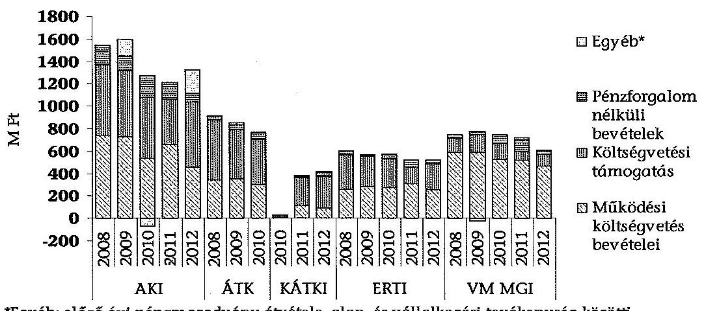
*Egyéb: előző évi pénzmaradvány átvétele, alap- és vállalkozási tevékenység között elszámolások, kölcsönök visszatérülése, finanszírozási bevételek

A feladat átvétellel nem érintett intézetek költségvetési bevételét az alaptevékenységhez kötődő feladatok végrehajtására átvett pénzeszközök is növelték.

Az AKI 2008-2012. években összesen 453,9 M Ft összegű átvett pénzeszközzel rendelkezett, amely a KSH és a VM által nyújtott 1,1 M Ft kivételével az EU 1264/2008. sz. rendelet alapján a tesztüzemi rendszer működtetéséhez történő hozzájárulás volt.

Az ERTI-nél az átvett pénzeszközök összege az ellenőrzött időszakban összesen 699,6 M Ft volt, amelyeket a minisztérium, a Mezőgazdasági és Vidékfejlesztési Hivatal, a Kutatás-fejlesztési Pályázati és Kutatáshasznosítási Iroda, valamint különböző alapítványok és szervezetek nyújtottak.

A VM MGI az ellenőrzött időszakban egy alkalommal (2009. évben), rendelkezett 6,2 M Ft átvett pénzeszközzel, amelyet az FVMMI GM Kht. adott át a minisztérium MGI által átvett 11 fő dolgozó végkielégítésére, felmentésére.

Feladat átadással nem járó pénzeszköz átadás az ellenőrzött időszakban az ERTI és a VM MGI esetében fordult elő.

Az ERTI 0,6 M Ft összegű pénzeszköz átadásról megállapodást kötött a Nyugat-magyarországi Egyetemmel egy kutatási program beindítására. A VM MGI 2008-2011. években összesen 0,7 M Ft-ot adott át civil és nonprofit szervezetek részére. A támogatás célja az önkormányzatiság fejlesztésére irányuló tudományos tevékenység, adatbázis hozzáférés biztosítása, valamint iskolai szakmai program támogatása volt.

### 5.2. A bevételi és kiadási elszámolások szabályszerűsége

Az intézetek által ténylegesen ellátott szakmai, pénzügyi és vagyongazdálkodási feladatokhoz nem illeszkedett a számlarend, amely csökkentette az intézetek gazdálkodásának átláthatóságát. Az Áhsz. 49. § (1) bekezdése szerint az államháztartás szervezete olyan számlarendet köteles készíteni, amely szerinti könyvvezetés az elemi költségvetési beszámoló készítését maradéktalanul biztosítja.

Az AKI esetében 2010-ig az alapító okirat és a számlarend is tartalmazott olyan tevékenységeket, melyet az intézet nem folytatott, az ellenőrzött évek beszámolói ezeken a szakfeladatokon elszámolt kiadásokat és bevételeket nem tartalmaztak.

Az ellenőrzött időszakban az AKI és az ERTI esetében nem mutatták ki projektenként, kutatásonként a tényleges bevételeket és ráfordításokat, amely csökkentette a közpénzek átláthatóságát.

Az ellenőrzött időszakban az ÁTK és a KÁTKI minden kiadást és bevételt az agrártudományi alkalmazott-, illetve alapkutatás szakfeladatra számolt el, a főkönyvi rendszert, a számlarendet nem bontotta meg az alapító okiratban felsorolt egyéb szakfeladatok, illetve egyéb bevételi források szerint.

A főkönyvi adatbázisból egyszerű véletlen mintavétellel kiválasztott bevételi tranzakció ellenőrzése a pénzforgalomban 73 tranzakció esetében (33,2%) különböző súlyú szabálytalanságokat tárt fel 2008-2011. években. Ezek a szabályozás hiányosságaira, valamint a kötelezettségvállaláshoz kapcsolódó előírások be nem tartására vezethetőek vissza.

Az AKI-nál 2010-2011. években az Ámr. 2 81. § (6) bekezdésében foglaltak ellenére az intézet szellemi és anyagi infrastruktúráját magáncélra igénybe vevők (pl.: telefon magáncélú használata) számára nem írt elő kötelező térítést a felhasználás, illetve az igénybevétel alapján felmerült közvetlen és közvetett költségek figyelembevételével, az erről szóló - az Ámr. 2 81. § (8) bekezdésben előírt - belső szabályozást nem készítette el.

Az AKI 2010-2011. években és a VM MGI nem szabályozta az Ámr. 2 81. § (7) bekezdése szerinti költségek megállapításának rendjét az Ámr. 2 81. § (8) bekezdése előírásainak megfelelően. Nem tett eleget az AKI az Ámr. 2 81. § (9) bekezdésében foglaltaknak, mivel a tesztüzemi rendszer működtetésére szolgáló bevételeket és az azok megszerzéséhez, a feladat ellátásához közvetlenül vagy közvetve kapcsolódó kiadásokat nem együtt tartotta nyilván. A 2010-2011. években a minisztériummal kötött vállalkozási szerződések (ÜMVP Technikai segítségnyújtás) tartalma nem felelt meg a visszterhes szerződések sajátos tartalmi követelményeit rögzítő Ámr. 2 82. § előírásainak.

Az ÁTK-nál az ellenőrzött időszakban és a KÁTKI-nál 2010-2011. években a támogatásértékű bevételek tekintetében a pénzforgalom a véletlen mintavétellel kiválasztott tranzakciók alapján nem volt szabályos. Az utalványozás és annak ellenjegyzése nem volt a vonatkozó dokumentációkon teljes körűen megtalálható.

Az ERTI esetében a felhalmozási és működési bevételek mintatételei kapcsán 2008-ban hét esetben hiányzott az utalványozások ellenjegyzése és az érvényesítés, egy esetben az utalványozás is. A 2009-2011. évek mintatételeinél az ellenőrzés részére több esetben az intézet nem tudta dokumentummal igazolni, hogy az arra jogosult végezte el az érvényesítést és az utalványozást.

A VM MGI-nél 2010. év kivételével a bevételeket nem utalványozták.
A főkönyvi adatbázisból egyszerű véletlen mintavétellel kiválasztott kiadási tranzakciók ellenőrzése 2008-2011. években a kiadások tekintetében

---

a pénzforgalomban 322 tranzakció esetében (67,1%) különböző súlyú szabálytalanságokat tárt fel a kötelezettségvállalás, érvényesítés, szakmai teljesítésigazolás, ellenjegyzés, utalványozás területein. A kötelezettségvállalás folyamata nem felelt meg az Ámr. 1 134-137. §-aiban és az Ámr. 2 72-78. §-aiban foglalt előírásoknak, amely a belső kontroll rendszer hiányosságaira vezethető vissza. Az ÁTK-nál a 2009-2010. években a kötelezettségvállalás dokumentumain az ellenőrzött felhalmozási mintatételek alapján (traktor ultrahang diagnosztikai berendezés, számítástechnikai eszközök), nem szerepelt a főigazgató aláírása, helyette írásbeli felhatalmazás nélkül az érintett kutatók írták alá és a gazdasági igazgató ellenjegyezte azt. Az intézet az Ámr. 3 77. § (4) bekezdésében előírtakat nem tartotta be, mert a szakmai teljesítés igazolására jogosultak kijelölése a kötelezettségvállaló által nem történt meg és a munkaköri leírások sem tartalmazzák ezt a feladatot, ezt az érintett kutatók végezték el. Az ERTI-nél a 2008-2011. években az Ámr. 1 134-137. §-aiban és az Ámr. 2 72-78. §-aiban előírt kötelező aláírások elmaradtak, vagy nem az arra jogosultak aláírása szerepelt valamelyik gazdálkodási jogkör gyakorlásakor.

Az AKI-nál nem történt meg a kötelezettségvállalás ellenjegyzése, amelyben az arra jogosult a fedezet meglétét igazolta volna a mobiltelefon, a szakfordítás díja, a 2011. októberben kifizetett kereset kiegészítés esetében, a piaci árakról készült adatszolgáltatás teljesítéséről szóló adatszolgáltatási szerződéseken. A 2008. december 1-jén kifizetett 2,9 M Ft összegű 11. havi normatív jutalomhoz nem kapcsolódott írásbeli kötelezettségvállalás. A kifizetés alapját a mintában szereplő szervezeti egység dolgozói részére a szervezeti egység vezetője által javasolt összegekről szóló jutalmazási javaslat képezte, amely tartalmazta az egység vezetője számára javasolt jutalmat is. Nem történt meg a kötelezettségvállalás a külföldi kiküldetés esetében, továbbá nem előzte meg ellenjegyzés a külföldi kiküldetésre vállalt kötelezettséget. Az intézet nem tudta dokumentálni, hogy a cselekményt az arra jogosult személy végezte volna el.

Az AKI és a VM MGI 2008-2011. években az Ámr. 1 58. § (5), valamint az Ámr. 2 85. § (2) bekezdésében foglaltak szerint a nem rendszeres személyi juttatások között tervezte meg és fizette ki a kereset-kiegészítést, a kifizetésének feltételrendszerét azonban a Kjt. 77. § (2) bekezdésében foglaltak ellenére nem szabályozta.

Az ÁTK az ellenőrzött időszakban és a KÁTKI esetében 2010-2011. évben a teljesítésigazolás és érvényesítés, valamint az utalványozás és annak ellenjegyzése nem volt a bizonylatokon teljes körűen megtalálható. Az ellenőrzött intézeteknél a személyi jellegű kifizetések bizonylatain (bér és járulékok) a kötelezettségvállalás, utalványozás és ellenjegyzés nem volt.

A KÁTKI-nál a 2010. év beruházási tételei esetében nem állt rendelkezésre a kötelezettségvállalás dokumentuma, valamint sok esetben hiányzott a szakmai teljesítésigazolás dátuma. A 2011. évben az ellenőrzött támogatásértékű bevételek esetében nem történt meg az utalványozás és annak ellenjegyzése.

Az ERTI-nél a mintatételek áttekintése során a 2008-2009. években 26, illetve 20, 2010-2011. években 6, illetve 9 esetben talált az ellenőrzés olyan gazdasági eseményeket, amelyek során az Ámr. 1 134-137. §-aiban és az Ámr. 2 72-78. §-aiban előírt kötelező aláírások elmaradtak, vagy nem az arra jogosultak aláírása szerepelt valamelyik gazdálkodási jogkör gyakorlásakor.

---

A VM MGI-nél 2008-2011. években a kötelezettségvállalás, ellenjegyzés, utalványozás, érvényesítés utalványrendelete csak egy helyen tartalmaz dátumot, így csak a teljesítés igazolás kelte volt megállapítható teljes bizonyossággal. Ez nem felelt meg az Ámr. 136. § (4) bekezdésének g) pontjában, valamint az Ámr. 77. § (3) bekezdésében és a 78. § (2) bekezdésének a) pontjában előírtaknak. A vizsgált mintatételeknél 17 esetben hiányzott az ellenjegyző és utalványozó aláírása. A teljesítésigazolást az utalványrendeleten végezték oly módon, hogy feltüntettek egy átvevő és egy igazoló személyt, azonban nem derült ki egyértelműen, hogy ki a teljesítés valódi igazolója, mi a kifizetés tárgya, a beszerzést mihez használták fel. A pénzügyi teljesítést érvényesítették, ellenjegyezték, utalványozták, azonban az utalványon egy dátum szerepel, ebből nem állapítható meg, hogy melyik aláíróra vonatkozik.

A 2012. évi költségvetés végrehajtásának ellenőrzése a korábbi évekhez hasonló szabályszerűségi hiányosságokat tárt fel a bevételi és kiadási tranzakciók ellenőrzése során, amelyek azonban a beszámoló megbízhatóságát nem befolyásolták.

Az AKI-nál a kötelezettségvállalás dokumentumának hiánya és a nem megfelelő teljesítés igazolás került megállapításra. A KÁTKI-nál a pénzügyi ellenjegyzés elmaradását, vagy nem megfelelő végrehajtását, a teljesítésigazolások hiányosságát és nem megfelelő végrehajtását állapította meg. Az ERTI-nél hibás ellenjegyzést, utalványozást, teljesítés igazolást és a kötelezettségvállalás dokumentumának hiányát tárta fel. A VM MGI-nél a pénzügyi ellenjegyzés elmaradt vagy nem megfelelően történt.

# 5.3. Az előirányzat-felhasználáshoz kapcsolódó évközi korlátozások hatása a feladatellátásra és a fizetőképességre 

Az ellenőrzött időszakban évente és intézetenként változó összegű zárolások, elvonások és maradványtartási kötelezettségek korlátozták a kiadási előirányzatok
 felhasználását, amelyet részletesen a 14. melléklet tartalmaz. A legnagyobb mértékű zárolás, illetve elvonás 2011-ben volt, az intézeteket összesen 235,7 M Ft zárolás, valamint ugyanilyen összegű elvonás érintette.

2008-2012. években a legnagyobb összegű zárolás és elvonás (151,8 M Ft, illetve 311,8 M Ft) az AKI-t érintette, ahol a fizetőképesség fenntartását az előző évi maradvány felhasználása segítette. Az előirányzat-zárolások - a KÁTKI 2012. évi zárolása kivételével - minden esetben elvonásra kerültek. Az egyes éveket összegezve a legnagyobb arányú zárolás és elvonás az AKI-t (2,3 %, illetve 4,7 %), valamint a KÁTKI-t (5,0 %, illetve 3,3 %) érintette. Az ellenőrzött években összesen a legnagyobb összegű (98,4 M Ft) és arányú (2,6 %) maradványtartási kötelezettség a VM MGI-t érintette.

Az intézetek fizetőképessége, a zárolások, elvonások és a maradványtartási kötelezettség elrendelése ellenére a 2008-2012. években biztosított volt.

---

Az ellenőrzött időszakban az intézetek likviditása csökkent, ennek fő okai a bevételek csökkenése, a zárolások, és az elvonások voltak. Az ERTI forgóeszközei 2012-ben nem fedezték a rövid lejáratú kötelezettségeket. A likviditási mutató és a pénzeszköz likviditási mutató alakulását az alábbi táblázat mutatja.

A likviditási mutató és a pénzeszköz likviditási mutató alakulását az alábbi táblázat mutatja.

Az intézetek likviditási mutatójának és pénzeszköz likviditási mutatójának alakulása az ellenőrzött időszakban

|  | Megnevezés | $\begin{gathered} 2008 . \\ \text { év } \end{gathered}$ | $\begin{gathered} 2009 . \\ \text { év } \end{gathered}$ | $\begin{gathered} 2010 . \\ \text { év } \end{gathered}$ | $\begin{gathered} 2011 . \\ \text { év } \end{gathered}$ | $\begin{gathered} 2012 . \\ \text { év } \end{gathered}$ |
| :--: | :--: | :--: | :--: | :--: | :--: | :--: |
| AKI | Likviditási mutató | 70,4 | 34,9 | 12,7 | 3,4 | 2,7 |
|  | Pénzeszköz likviditási mutató | 55,7 | 27,4 | 11,9 | 2,8 | 2,5 |
| ÁTK | Likviditási mutató | 1,9 | 5,6 | 0,6 |  |  |
|  | Pénzeszköz likviditási mutató | 0,8 | 3,0 | 0,2 |  |  |
| KÁTKI | Likviditási mutató |  |  |  | 25,4 | 11,8 |
|  | Pénzeszköz likviditási mutató |  |  |  | 16,5 | 7,9 |
| ERTI | Likviditási mutató | 4,2 | 15,5 | 7,8 | 12,6 | 0,8 |
|  | Pénzeszköz likviditási mutató | 0,5 | 7,1 | 2,9 | 7,1 | 0,7 |
| VM   MGI | Likviditási mutató | 5,5 | - | 8,2 | 1230,0 | 5,3 |
|  | Pénzeszköz likviditási mutató | 3,0 | - | 3,0 | 629,0 | 3,3 |

A fizetőképesség biztosítása érdekében előirányzat-keret előrehozására az ellenőrzött időszakban egy intézetnél, egy alkalommal került sor, az AKI a 2011. évi fizetési nehézségek megoldására a MÁK-tól 25,0 M Ft előirányzatkeret előrehozását kérte. Az ellenőrzött intézeteknél 2008-2012. években több esetben előfordult, hogy egyes szállítói számlákat késve egyenlítettek ki, azonban a kötelezettségek teljesítésének elmaradása a működés folyamatos fenntartásában nem okozott zavarokat. Az átlagos szállítói futamidő alakulása ingadozó volt, annak értéke csak 2008-ban és csak az ÁTK esetében haladta meg a 30 napot. Az átlagos szállítói futamidő alakulását az ellenőrzött intézeteknél és időszakban a következő grafikon mutatja be.

---

# Az intézetek átlagos szállítói futamidejének alakulása az ellenőrzött időszakban 

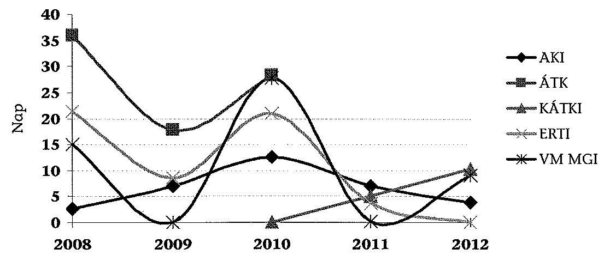

2008-2012. között az intézetek közül az ÁTK, ERTI, és a VM MGI esetében keletkeztek behajthatatlan követelések.

Az ÁTK 0,5 M Ft alatti behajthatatlan követelésekkel rendelkezett, mivel a behajtási költségek meghaladták volna ennek összegét, a nyilvántartásból kivezették. A VM MGI a behajtás érdekében végrehajtási, illetve peres eljárásokat indított. Az ERTI 2,3 M Ft behajthatatlan követeléssel rendelkezett 2012-ben. A legjelentősebb összegű, 40,5 M Ft összegű behajthatatlan követelés a VM MGI-nél jelentkezett 2011-ben, jelentős része egy bérbe adott ingatlan meg nem fizetett bérleti díjából származik.

A fizetőképesség fenntartását a behajthatatlan követelések állománya nem veszélyeztette. A behajthatatlan követelések nyilvántartását, kezelését az ebben érintett intézetek az előírások szerint végezték.

## 6. A VAGYON ÖSSZETÉTELE, VÁLTOZÁSA A VAGYONGAZDÁLKODÁS SZABÁLYSZERŰSÉGE

### 6.1. Az eszközök és források összetételének és állományának változása

Az ellenőrzött időszakban az ERTI és a KÁTKI mérlegfőösszege 60,8%-kal, illetve 7,6%-kal növekedett, az AKI és az ÁTK mérlegfőösszege jelentősen, 47,2%-kal és 30,5%-kal, míg a VM MGI mérlegfőösszege kismértékben, 4,6%-kal csökkent. A mérlegfőösszegek összetételét és változását a 15. számú melléklet és az alábbi grafikon mutatja be.

---

# Az intézetek mérlegfőösszegeinek változása az ellenőrzött időszakban 

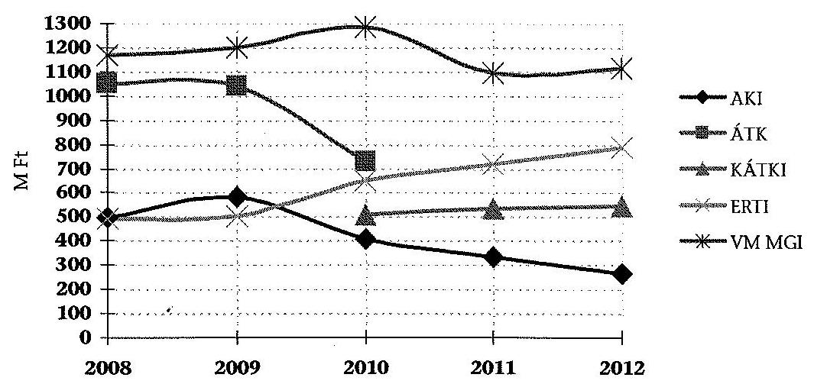

Az eszközállomány összetételében a befektetett eszközökön belül meghatározó részt a tárgyi eszközök képviselték. Az ellenőrzött időszakban a tárgyi eszközök állománya csökkent. Az intézeteknél az ellenőrzött időszakban összesen elszámolt értékcsökkenésnek 11,9%-át érték el a megvalósult beruházási és felújítási kiadások, amelyet a 8. sz. melléklet tartalmaz.

Az AKI-nál a befektetett eszközök aránya az összes eszközön belül 2008. évtől a 2012. év végéig 40,4%-ról 54,9%-ra növekedett, ugyanakkor az értéke folyamatosan csökkent. A befektetett eszközök értékének csökkenését az okozta, hogy az évenként elszámolt értékcsökkenések magasabb értékűek voltak, mint az adott évben a megvalósult beruházások. A beruházások elmaradását a finanszírozás forráshiánya, illetve a 2011-2012. évekre vonatkozóan a központilag elrendelt beszerzési tilalom okozta. A befektetett eszközökön belül a tárgyi eszközök nettó értéke csökkent. Volumenében a legjelentősebb csökkenés a tárgyi eszközök között a gépek, berendezések és felszerelések nettó állományértékében következett be.

Az ÁTK-nál 2008-ban az eszközök értékének 92,2%-át a befektetett eszközök tették ki. Az ÁTK eszközállománya lényegesen nem változott a KÁTKI kiválásáig. A KÁTKI kiválásakor 505,6 M Ft értékű befektetett eszközzel rendelkezett, a szerkezetében a változást elsősorban a pénzeszközök növekedése okozta.

Az ERTI esetében a befektetett eszközállományon belül a 2008-2012. években az OTKA és TÁMOP beruházások következtében - ezekre nem vonatkoztak a 2011-2012. évekre központilag elrendelt beszerzési tilalmak - a tárgyi eszközök értéke 68,3%-kal emelkedett.

A VM MGI 2008-2012. években a befektetett eszközállománya 0,6%-kal csökkent, amit a tárgyi eszközök értékének csökkenése okozott.

Az intézetek forgóeszköz-állományán belül a pénzeszközök és a követelések voltak meghatározóak. Az ellenőrzött időszakban az ellenőrzött intézetek forgóeszköz-állománya értékének alakulását az alábbi grafikon mutatja be.

---

# Az intézetek forgóeszköz-állományának értéke az ellenőrzött időszakban 

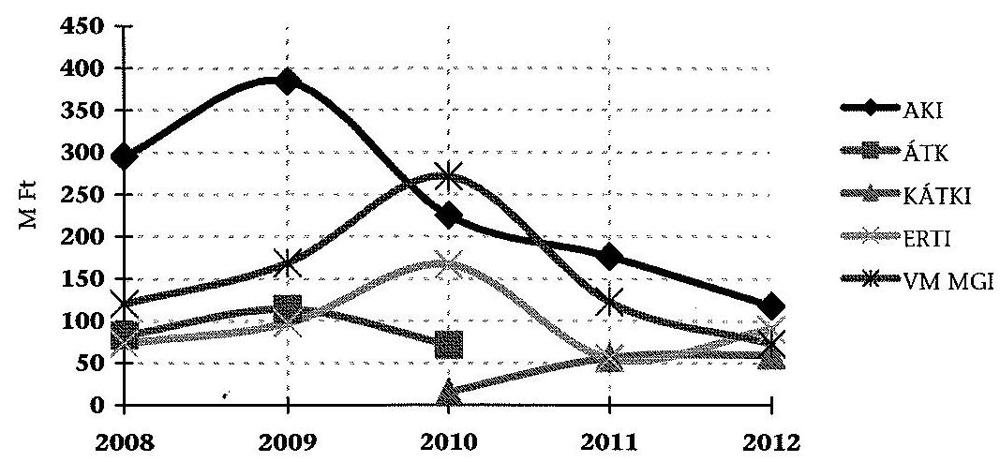

Az AKI-nál forgóeszközökön belül a követelések és a pénzeszközök állományértékei voltak a meghatározóak az ellenőrzött időszakban. A követelések értéke 2008-ban 17,4%-ot, míg a pénzeszközök értéke 79,1%-ot képviselt a forgóeszközök körében. 2012-re a követelések 6,4%-ra csökkentek, addig a pénzeszközök aránya 91,1%-ra nőtt. A pénzeszközök arányának emelkedése az Intézet likviditását növelte.

Az ÁTK forgóeszköz-állománya a 2008. évi 82,5 M Ft-ról 2009-re 113,9 M Ft-ra nőtt, amelynek oka a pénzeszközök értékének 22,9 M Ft-os és a követelések 9,4 M Ft-os emelkedése volt. 2010-ben azonban a pénzeszközök értéke egyharmadára csökkent, mely a követelések stagnálásának következményeként a forgóeszközök csökkenésének legfőbb oka volt. A KÁTKI forgóeszközeinek értéke az Intézet kiválásakor 15,2 M Ft volt, amely 2012-re 60,0 M Ft-ra nőtt. A növekedés oka a 2011. évi 44,1 M Ft-os és a 2012. évi 40,6 M Ft-os pénzmaradvány és a készletek értékének emelkedése volt.

Az ERTI esetében a forgóeszközökön belül a követelések és a pénzeszközök állományértékei voltak a meghatározóak az ellenőrzött időszakban. A követelések értéke 83,1%-ot, míg a pénzeszközök értéke 10,9%-ot képviselt 2008-ban. A részarányok - az AKI-hoz hasonlóan - 2012-re jelentősen módosultak, míg a követelések 4,1%-ra csökkentek, addig a pénzeszközök aránya 91,3%-ra nőtt. A követeléseken belül az áruszállításból származó vevőkövetelés volt a meghatározó tétel. A követelések behajtásáról az ERTI 2012. év végéig szinte teljes mértékben gondoskodott. A forgóeszközök állományi értéke 2008-2012. években 73,2 M Ft-ról 90,3 M Ft-ra emelkedett. A növekedés jelentőségét emeli, hogy a követelések összege mindeközben jelentős mértékben (57,1 M Ft) csökkent.

Az VM MGI forgóeszközei 2008-2012. években 120,1 M Ft-ról 72,9 M Ft-ra csökkentek, melynek oka, hogy mindkét meghatározó forgóeszköz-elem (követelések és pénzeszközök) az ellenőrzött időszakban jelentősen csökkent. A forgóeszközök értékének csökkenése elsősorban a követelések 55,6 M Ft-ról 27,3 M Ft-ra való jelentős csökkenése miatt következett be.

Az intézetek saját tulajdonú ingatlannal - tekintettel az ellenőrzött időszak alatt hatályban lévő állami vagyongazdálkodással kapcsolatos szabályokra - az ellenőrzött időszak alatt nem rendelkeztek. Az intézeteknél vagyonkezelésben lévő ingatlanok tekintetében a legjelentősebb változás az ÁTK esetében történt. A KÁTKI ÁTK-ból való kiválással történő létrehozása következtében az ÁTK kezelésében lévő ingatlanok állománya egyharmadára csökkent.

Szintén jelentős változás volt az ERTI kezelésében lévő ingatlanok állományának és értékének változása. Az ingatlanok állománya 8713312 m²-ről az intézet székhelyváltozása következtében végrehajtott ingatlancsere területi különbsége és a gödöllői arborétum kezelői jogáról való lemondás miatt 5162418 m²-re csökkent. Az ingatlanok nettó értéke azonban a felhalmozási kiadások következtében a 2008. évi 371,0 M Ft-ról, 2012. év végére 595,2 M Ft-ra növekedett. Az intézetek által kezelt ingatlanok állományának és értékének változásait a 16. számú melléklet mutatja be.

Az ellenőrzött időszakban az AKI, az ÁTK, a KÁTKI és az ERTI nem rendelkezett részesedéssel gazdasági társaságokban. A 2008-2012. években a VM MGI vagyonkezelésében két részesedés szerepelt, amelyből az egyik (FVMMI GM Gépminősítő Kht.) 2010-ben végelszámolással megszűnt és a feladatait, valamint a vagyonát átvette az intézet. A VM MGI a GAK Nonprofit Közhasznú Kft.-ben rendelkezik részesedéssel, melynek bekerülési és könyv szerinti értéke (0,5 M Ft) nem változott az ellenőrzött időszakban.

A források összetételében jellemzően a saját tőke volt a meghatározó. Az intézetek saját tőkéjének alakulását döntően az eszközök aktiválása, az üzembe helyezések, valamint a kötelezettségek változásai befolyásolták.

Az intézetek saját tőke értékének változása az ellenőrzött időszakban
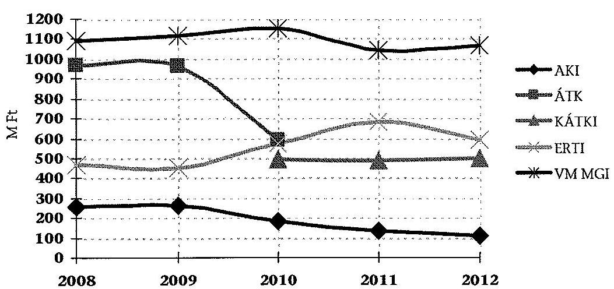

Az AKI, az ÁTK és az ERTI esetében a saját tőke aránya az összes forráshoz viszonyítva csökkent, a KÁTKI és a VM MGI esetében kis mértékben növekedett. A tartalékok a KÁTKI kivételével csökkentek, amelyet a költségvetési tartalékok összege, a mindenkori kötelezettségvállalással terhelt maradvány, kiadási megtakarítás, illetve bevételi lemaradás mértéke befolyásolt.

Az AKI saját tőkéjének aránya a források között 2008 és 2012. években 52,0%-ról 41,9%-ra csökkent. Az ERTI saját tőkéjének aránya a források között 2008. év végén 95,3%-os értékről 2012. év végére 75,0%-ra csökkent. Az ÁTK saját tőke aránya az összes forráshoz viszonyítva a 92,3%-ról 80,8%-ra változott. A KÁTKI saját tőkéjének aránya 2011-ben 91,3% volt, amely 2012-re 91,6%-ra nőtt. A VM MGI esetében a saját tőke aránya a források
 között 2008. év végén 93,3%-ot mutatott, 2012. év végére 95,8%-ra emelkedett.

A források részét képező tartalékok értékét befolyásoló pályázati előlegek nyilvántartása két intézetnél (ERTI és a VM MGI) nem a jogszabályi előírásoknak megfelelően történt.

Az ERTI-nek 2011. évben az Áhsz. 26. § (5) bekezdésének dg-di) pontjai alapján a rövid lejáratú kötelezettségei között kellett kimutatnia a még el nem számolt nemzetközi támogatási program előlege miatti kötelezettségeket, illetve az előfinanszírozás miatti kötelezettségeket, ami 56,0 M Ft volt, ezzel szemben, mint véglegesen átadott pénzeszközök a bevételekben számolták el.

A VM MGI a pályázati előlegek elszámolásánál - 2008. évben 25,0 M Ft, 2011-ben 18,5 M Ft és 2012. évben 20,0 M Ft - nem tartotta be az Áhsz. 26. § (5) bekezdése (hh) pontját, amely előírja, hogy a támogatási program előlege miatti kötelezettségeket a rövid lejáratú kötelezettségek között kell kimutatni. Az Áhsz-ben lévő előírás ellenére a VM MGI a támogatási program előlege miatti kötelezettségeket a passzív átfutó bevételek között tartotta nyilván.

# 6.2. A vagyongazdálkodás és vagyonnyilvántartás szabályszerűsége 

Az intézetek vagyongazdálkodásának szabályozottsága elsősorban az irányító szervi ellenőrzések következtében javult.

Az AKI 2012. évben a vagyongazdálkodás szabályozottságában javulás történt, részletesebben szabályozták a tárgyi eszközökkel kapcsolatos gazdasági eseményeket. A selejtezési eljárás engedélyezésének, a felesleges (selejtezett) vagyontárgyak hasznosításának, a tulajdon védelmének rendjét 2008-2011. években nem szabályozták teljes körűen. A használaton kívül helyezett immateriális javak és tárgyi eszközök értékesítési folyamatát nem szabályozták, ezt az irányító szervi ellenőrzést követően 2012. évben pótolták.

Az ÁTK az állami tulajdonú immateriális javak, tárgyi és egyéb eszközök bérbeadását és a nagy értékű vagyontárgyak személyes célú használatának módját nem szabályozta. Az intézetnél az eszközök üzembe helyezésének a Számviteli politika szerinti szabályozása nem volt összhangban a Sztv. 15. § (3) bekezdés előírásaival, a gyakorlatban a helytelen szabályozást követték.

A KÁTKI az eszközök bérbeadását nem szabályozta.
Az ERTI az eszközök bérbeadását, valamint a nagy értékű intézeti vagyontárgyak személyes célú használatának engedélyezését nem szabályozta, amit 2010. évben pótolt.

A VM MGI a 2001-től hatályba lépett selejtezési szabályzatban tárgyi eszközök értékesítésének különböző feltételeit pontosította, így a 2009. évben a vagyongazdálkodás szabályozottsága javult.

---

Az ellenőrzött időszakban az intézetek vagyongazdálkodásának belső szabályozottsága és gyakorlata hiányosságokkal működött és csak részben felelt meg a jogszabályi előírásoknak (Sztv., Áhsz.).

Az AKI-nál a 2008-2011. években a selejtezett eszközök értékesítésénél - a selejtezés szabályozatlansága miatt - a vevők kiválasztása nem nyilvános eljárásban történt. A selejtezési jegyzőkönyvek hatályon kívül helyezett nyomtatványokon kerültek dokumentálásra, a selejtezett vagyontárgyak megsemmisítésének módját nem határozták meg, annak megtörténtét nem dokumentálták, a selejtezési eljárást nem különítették el a leltározási feladatoktól. Az AKI-nál az alkalmazott programok nem biztosították automatikusan a mérleg és a beszámoló adatainak egyezőségét, az összhangot külön kigyűjtésekkel biztosították.

Az ÁTK-nál a 2008-2010. években az immateriális javak és tárgyi eszközök vásárlásakor illetve felújításakor az aktiválást ezer forintra kerekítve végezték el, ezzel megsértették a Sztv. 16. § (3) bekezdése szerinti „a tartalom elsődlegessége a formával szemben" elvét. Az állományba vétel dátuma az ÁTK Számviteli politikájában rögzítettek alapján a tárgyhó első napja volt, amennyiben a teljesítés dátuma a hónap első felére esett, illetve a tárgyhót követő hónap első napján aktiválták az eszközt, ha a teljesítés a hónap második felében történt. Ezzel megsértették a Sztv. 15. § (3) bekezdése szerinti „valódiság" elvét. Az ÁTK-nál a beruházások és a felújítások esetén nem készült állományba vételi bizonylat. A 2010. évtől az ÁTK által alkalmazott Forrás SQL és a KÁTKI által használt Saldo már alkalmasak voltak az állományba vételi bizonylatok nyomtatására.

Az ERTI esetében a 2008-2010. években a leltározási utasításban nem rendelkeztek az egyéb vagyonrészek és források leltározásáról, illetve egyeztetéséről, valamint az utasítás alapján a beszerzett eszközök állományba vételi bizonylatának másodpéldányát nem helyezték a banki kifizetés mellé. A 2011. január 1-jén hatályba lépett új Leltározási és leltárkészítési szabályzat a fenti hiányosságot pótolta. A használaton kívül helyezett, a tevékenység szempontjából a továbbiakban szükségtelen eszközök értékesítése során a vevő kiválasztása nem minden esetben történt nyilvánosan. Az ERTI által alkalmazott programok nem biztosították automatikusan a főkönyv és a beszámoló adatainak egyezőségét, az összhangot külön kigyűjtésekkel biztosították.

A VM MGI-nél a 2008. évben a beszerzett immateriális javak, a tárgyi eszközök állományának nyilvántartása az állományváltozások, az üzembe helyezés intézeti szabályozottsága és az alkalmazott gyakorlat a jogszabályi előírásoknak részben felelt meg, mert a két éves leltározáshoz való engedélyt az intézet nem dokumentálta, ami nem felelt meg az Áhsz. 37. § (7) bekezdés előírásainak. A VM MGI 5/2009. főigazgatói utasításként kiadott Leltárkészítési és leltározási szabályzata 2009. március 1-től hatályos, eszerint az irányító szerv engedélyével a leltározást két évenként hajtják végre.

Az ellenőrzött időszakban a használatba vett eszközök állományának növekedése az intézetek feladatellátásával összhangban volt. A növekedés tárgyi eszköz beszerzésekhez, valamint immateriális javakhoz, ezen belül számítástechnikai fejlesztésekhez kapcsolódott.

Az AKI-nál a számítástechnikai beruházásokhoz kapcsolódó gépek, berendezések, felszerelések kerültek beszerzésre. 2012. évben forráshiány, illetve az elrendelt beszerzési tilalom következtében beruházásokra nem került sor. A 2009. évben az immateriális javak körében különféle szoftvereket és program licenceket vásároltak, az ingatlanokra a szünetmentes tápegységet, valamint épületen belüli át-

---

alakítást aktiváltak. A számítástechnikai profilú beszerzések 2010-ben és 2011-ben is folytatódtak.

Az ÁTK-nál 2008. évben két nagy beruházás történt: a szennyvíz-előtisztító és a hígtrágya tároló megépítése. A fennmaradó beruházási kiadások számítástechnikai eszközök, kutatómunkához szükséges gépek, valamint egy személygépkocsi vásárlásából adódtak.

A 2010. évben a KÁTKI-nál a méhészeti telep transzformátor cseréje, valamint riasztórendszerének kiépítése valósult meg, 2011-ben egy integrált számviteli program beszerzésére, beléptető rendszer kiépítésére, valamint a konyha épületben a megszűnt bérlő által beépített két db hűtő átvételére került sor. A 2012. évben felújították a KÁTKI számítástechnikai hálózatát és a szervergépet, valamint két épületet.

Az ERTI-nél 2011. évben kiemelkedő értékű számítástechnikai szoftverbeszerzések történtek (térinformatikai rendszer, irodai szoftver). Ezen felül a kámoni arborétummal, valamint a sárvári központ fűtéskorszerűsítésével kapcsolatos tárgyi eszköz beszerzések és építési munkák történtek.

A VM MGI-nél az ellenőrzött időszakban saját és pályázati forrás biztosította az intézet számára a jellemzően számítástechnikai beszerzéseket, amelyek a kutatási tevékenységgel összefüggő tárgyi eszköz, illetve gépjármű beszerzésekkel egészültek ki.

Az intézetek a nyilvántartási érték meghatározását, a vagyontárgy besorolását, a befektetett eszközök esetében az értékcsökkenési leírás kulcsának meghatározását a számviteli politikában foglaltak szerint végezték. A kiválasztott felhalmozási mintatételek esetében az aktiválás és a nyilvántartásba vétel megtörtént, a leltárban szerepeltek.

Az intézetek az ellenőrzött időszakban terven felüli értékcsökkenést nem számoltak el. Az intézetek közül az ERTI, az ÁTK és a KÁTKI értékesített használaton kívül helyezett eszközt az ellenőrzött időszak alatt.

Az ÁTK a 2009. év decemberében két darab traktort értékesített műszaki szakértő által adott értékbecslés alapján. A KÁTKI új autó vásárlásakor értékesítette az autókereskedőnek személygépkocsiját, melyet előtte felértékeltek. Az ERTI-nél az értékesítés selejtezési szabályzatban foglaltaknak megfelelően történt. Az értékesített eszközök eladási ára döntően meghaladta a piaci és a nyilvántartási értéket. Az ellenőrzött időszakban nem értékesítettek olyan eszközt, amelyik még szükséges lett volna az intézet tevékenységéhez.

A vagyonkezelésre 1997-ben kötött szerződéseket a jogszabályváltozások és a Kincstári Vagyon Igazgatóság (KVI) megszűnése miatt aktualizálni kellett volna, azonban erre csak az ERTI esetében került sor.

Az ÁTK vagyonkezelési szerződése 1997. december 12-én kelt, amelyet nem módosítottak. A KÁTKI kiválása óta nem rendelkezik vagyonkezelési szerződéssel.

Az ERTI-nél a 2008-2012. években a KVI-vel, 1997. december 12-én megkötött szerződés volt hatályban, amelynek egy része a művelési területek változása miatt megszűnt. Az ellenőrzött időszakban a vagyonkezelői szerződést 2010-ben módosították a budapesti ingatlan cseréje, valamint az intézeti központ Sárvárra költözése és a gödöllői arborétum kezelői jogának átadása miatt.

---

A VM MGI a vagyonkezelési szerződését az FVMMI GM Kht. 2010. évi végelszámolása, valamint a GAK Kht. - jogszabályi előírás alapján - GAK Nonprofit Közhasznú Kht-vé történő átalakulása ellenére nem aktualizálta.

Az intézetek eleget tettek a vagyonkezelési szerződésekben előírtaknak, biztosították az ingatlanok karbantartását és állagvédelmét, a Vtvr. 14. § által előírt adatszolgáltatási kötelezettségeiket teljesítették.

Az intézetek a kezelésükben lévő eszközök hasznosítását, bérbeadását nem szabályozták, erre vonatkozóan gazdaságossági számításokat nem végeztek. Az ERTI és a VM MGI vagyonkezelésében lévő szolgálati lakások bérleti díját nem a jogszabály előírásai szerint $^{7}$ állapította meg. Az elmaradt bérleti díj különbözetének beszedésére később sem intézkedtek.

Az AKI-nál az irodai használat céljára bérbe adott ingatlannal kapcsolatban megállapított bérleti díj tartalmazta az épületfenntartás költségeit, a közüzemi díjakat, az épületgépészeti berendezések karbantartási, üzemeltetési, javítási költségeit. Az összes költségről kimutatást, kigyűjtést nem vezetett, nem vizsgálta, hogy a bérleti díj fedezte-e a felmerült költségeket.

Az ÁTK a bérbe adott ingatlanok fenntartására fordított kiadásokról, valamint az amortizációs költségekről kimutatást nem készített, így nem lehetett megállapítani, hogy a bérleti díj fedezi-e a felmerült költségeket.

Az ERTI bérlakásai közül 2009-ben 10 lakást béreltek munkaviszonyban álló dolgozók. A lakbért a 106/1999. (XII. 28.) FVM rendeletben meghatározott mértékhez képest alacsonyabb szinten állapították meg. Az irányító szervi ellenőrzést követő intézkedési terv alapján a hiányosságot 2010. szeptemberben megszüntették, a fizetendő lakbér alapját a lakás hasznos alapterülete és a komfortfokozat figyelembevételével állapították meg.

A VM MGI vagyonkezelésében lévő 11 db szolgálati lakást adott bérbe. A bérleti díjat, illetve a nem intézeti dolgozók részére a lakáshasználati díjat a 106/1999. (XII. 28.) FVM rendeletben előírthoz képest alacsonyabb mértékben állapították meg. 2011. májusától az irányító szervi ellenőrzés hatására megfelelő összegre módosították a szerződéseket.

A kezelésbe átvett immateriális javak, tárgyi eszközök felhasználása, hasznosítása az AKI és a VM MGI esetében nem volt összhangban az alapító okiratukban rögzített tevékenységekkel. Az AKI kezelésében lévő Balaton parti üdülő ingatlanok felhasználása nem igazodott az alapító okiratban rögzített tevékenységekhez. A VM MGI által kezelt 36 db lakásból 21 db üresen állt, és négy lakást nem intézeti dolgozó bérelt.

Az ellenőrzött időszak alatt az intézetek nem értékesítettek olyan vagyontárgyat, amelyhez az MNV Zrt. engedélyére lett volna szükség.

[^0]
[^0]:    $^{7}$ A lakások és helyiségek bérletére, valamint az elidegenítésükre vonatkozó egyes szabályokról szóló 1993. évi LXXVIII. törvény végrehajtásáról szóló 106/1999. (XII. 28.) FVM rendelet

---

# 7. A KÜLSŐ ÉS AZ IRÁNYÍTÓ SZERVI ELLENŐRZÉSEK, JAVASLATAIK HASZNOSULÁSA 

A minisztérium Ellenőrzési Főosztálya a 2008-2012. években az ellenőrzött intézeteknél - a KÁTKI kivételével - irányító szervi ellenőrzéseket végzett. Külső ellenőrzéseket az ERTI-nél és az ÁTK-nál a Nemzeti Adó- és Vámhivatal (NAV) végzett, az ÁSZ pedig a 2012. évi költségvetés végrehajtása ellenőrzésének keretében elvégezte az AKI, az ERTI, a KÁTKI és a VM MGI 2012. évi költségvetési beszámolójának pénzügyi ellenőrzését. Az ellenőrzött intézetek gazdálkodásával kapcsolatos külső
 ellenőrzések adatait a 17. számú melléklet tartalmazza.

Az AKI-nál a VM Ellenőrzési Főosztálya által folytatott irányító szervi ellenőrzés az AKI 2009-2010. éveket érintő szerződéseire, pénzügyi és számviteli folyamatok szabályozottságának ellenőrzésére, kontrollok, költségvetési beszámolók ellenőrzésére terjedt ki. Az átfogó rendszerellenőrzés során az irányítószerv intézkedést igénylő megállapításokat tett többek között a belső kontrollrendszer, mérlegbeszámoló, a dolgozók személyi adatai, személyi juttatások, költségelszámolás, a pénzforgalmi adatok és bizonylati rend, leltározás, selejtezés terén.

A minisztérium Ellenőrzési Főosztálya 2011. januárjában átfogó ellenőrzést hajtott végre az ÁTK 2010. és 2011. évi elemi költségvetési beszámolójának kapcsán. Az ellenőrzés javasolta, hogy a leltározási és selejtezési hiányosságokat szüntessék meg, végezzék el a követelések minősítését a mérleg készítésekor, módosítsák a követelések minősítésére vonatkozó szabályokat, készítsék el a teljesítés-igazolásra jogosultak aláírás mintáját. Javasolta továbbá az ellenőrzés, hogy készüljön emlékeztető a vezetői értekezletekről, a főigazgató hagyja jóvá a belső ellenőrzési jelentéseket és azokat részletesebben készítsék el; valamint a repülőjegyeket közbeszerzésből vásárolják és készüljenek összesítők a havi futásteljesítményről és üzemanyag felhasználásról. A VM Ellenőrzési Főosztály a pénzforgalmi bizonylatok ellenőrzésénél megállapította, hogy az aktualizált (4/2010.) pénzkezelési szabályzat nem tartalmazta a kötelezettségvállalók, utalványozók, ellenjegyzők, érvényesítők és teljesítésigazolók aláírás mintáit. A kötelezettségvállalások szerződéssel, megrendeléssel, megállapodással, kinevezéssel történtek. A kötelezettségvállaló aláírása mellől sok esetben hiányzott (2009-ben) a gazdasági vezető előzetes ellenjegyzése, ami sérti az Áht. 1. 100/C. (3) bekezdésében foglaltakat. A revízió kifogásolta a kötelezettségvállalások nyilvántartásának hiányát, ez sérti az Ámr. 1. 134. § (13) bekezdés előírását.

A minisztérium Ellenőrzési Főosztálya 2010. évben végezte el az ERTI 2009. évi elemi költségvetési beszámolójának megbízhatósági ellenőrzését, amelyről elfogadó véleményt adott ki. Az ellenőrzési jelentésben rögzítették, hogy az ERTI szabályzatai nem felelnek meg az előírásoknak és az ERTI működési követelményeinek. Az ellenőrzés ezért a részletes megállapításokban foglaltak alapján javasolta elkészíteni a hiányzó, valamint kiegészíteni, pontosítani a hiányos szabályzatokat. A felügyeleti ellenőrzés észrevételezte a FEUVE, a függetlenített belső ellenőrzés szabályozásának és 2009. évi gyakorlatának nem megfelelő színvonalát, valamint azt, hogy a kötelezettségvállalások kevés kivétellel ellenjegyzés nélkül történtek, a szakmai teljesítések igazolása jelentős arányban hiányoztak.

---

Az VM MGI-nél két alkalommal történt irányító szervi ellenőrzés az ellenőrzött időszakot érintően. Az első a 2006-2007-es pénzügyi év rendszerellenőrzése volt, melyet az FVM Ellenőrzési Főosztály hajtott végre. Ennek eredményeként megállapították, hogy az VM MGI nem rendelkezett Kötelezettségvállalási, ellenjegyzés, utalványozás, érvényesítési szabályzattal, továbbá nem volt Önköltségszámítási és FEUVE szabályzat. Aktualizálásra szorult a Belső ellenőrzési kézikönyv, Közbeszerzési szabályzat és a Külföldi kiküldetések szabályzata. A kiadott záradék szerint a költségvetési gazdálkodás megfelelt a törvény előírásainak és a beszámolók a vagyoni és pénzügyi helyzetet a valóságnak megfelelően tükrözték.

A minisztérium Ellenőrzési Főosztálya elvégezte a VM MGI 2009-2010. évi költségvetésének átfogó ellenőrzését. A jelentés többek között a következő témakörökben fogalmazott meg javaslatokat: mérlegelemzés, személyi juttatások, dologi kiadások, belföldi és külföldi kiküldetések, közbeszerzések, bevételek, szabályozottság, kötelezettségvállalás, leltározás, belső ellenőrzés. A jelentés záradéka szerint a VM MGI költségvetési gazdálkodása részben felelt meg a törvény előírásainak.

Az intézetek az intézkedést igénylő megállapításokhoz, javaslatokhoz határidőkkel és a felelősök megjelölésével intézkedési terveket készítettek, amelyeket a minisztérium Ellenőrzési Főosztálya - az AKI esetében az intézkedési terv kiegészítésével - elfogadott. Az VM MGI esetében a minisztérium intézkedési tervet jóváhagyó levele a helyszínen nem volt fellelhető.

Az AKI-nál az ellenőrzési megállapításokra tett javaslatok alapján az intézet elkészítette az intézkedési tervet, amelynek végrehajtásáról az irányító szerv utóellenőrzés keretében győződött meg, amelynek során megállapítást nyert, hogy az intézet minden intézkedést végrehajtott.

Az ÁTK-nál intézkedési terv végrehajtása a helyszíni ellenőrzés időszakában folyamatban volt, a beszámolási kötelezettség még nem állt fenn.

Az ERTI főigazgatója a Ber. 29/A.§ (3) bekezdésében foglaltakkal ellentétben a külső ellenőrzési jelentés megállapításai, javaslatai alapján tett intézkedésekről, a végre nem hajtott intézkedésekről és azok indokáról nem készített beszámolót.

A VM MGI a minisztérium 2008. évi ellenőrzése alapján készült intézkedési tervének végrehajtásáról a jogszabályi előírásnak megfelelően, határidőben jelentést küldött az irányító szervnek, amelyben a javaslatok határidőre történt végrehajtásáról, azok utóellenőrzéséről számolt be. A 2011. évben végrehajtott irányító szervi ellenőrzés javaslataira készített intézkedési terv végrehajtásáról a Bkr. 46. § (1) bekezdésében foglaltaktól eltérően, az előírt határidőben az intézet nem küldött jelentést a minisztériumnak.

Az ERTI-nél külső ellenőrzést 2011-ben végezte a NAV 2010. év szeptember, december, illetve 2011. év január-június hónapok tekintetében egyes adókötelezettségek teljesítésére irányulóan. Ennek alapján a 2011. év június hónapban a visszaigényelni kért 24,7 M Ft adót kiutalták az ERTI részére, mivel azt bizonylatokkal, nyilvántartásokkal alátámasztottnak ítélték meg.

Az ÁTK esetében a NAV ellenőrzése adó-visszaigénylés megalapozottsága ellenőrzésére irányult. Az ellenőrzés során az adózó javára pótlólagosan levon-

---

ható, előzetesen felszámított 2,6 M Ft adókülönbözetet állapított meg, amelyet az intézet visszaigényelt.

Az ÁSZ a 2012. évi költségvetés végrehajtása ellenőrzésének keretében elvégezte az AKI, a KÁTKI, az ERTI és a VM MGI 2012. évi költségvetési beszámolójának pénzügyi szabályszerűségi ellenőrzését. Ennek eredményeként megállapította, hogy az intézetek beszámolói a költségvetési szervek vagyoni és pénzügyi helyzetéről megbízható és valós képet adnak. Az ellenőrzés során számos hiányosságot állapított meg az intézetek belső kontrollrendszer szabályozottságában és működésében. A kontroll környezet az AKI, a KÁTKI, a VM MGI esetében részben megfelelő, az ERTI-nél nem megfelelő szinten került kialakításra. A minta tételek ellenőrzése során a korábbi évekhez hasonlóan szabálytalanságokat, hiányosságokat állapított meg. Az intézetek az ÁSZ által feltárt hiányosságok kiküszöbölésére - az ÁSZ felhívására - még a 2012. évi költségvetés végrehajtásának ellenőrzése alatt intézetenként intézkedési terveket készítettek, amelyek végrehajtása folyamatban van.

Budapest, 2014.
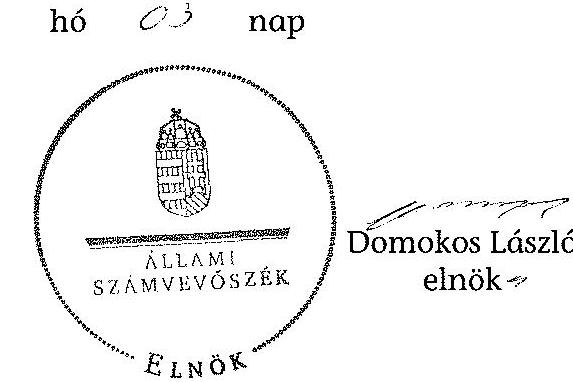

Melléklet: $\quad 22 \mathrm{db}$
Függelék: $\quad 2 \mathrm{db}$

---

.

---

# Az intézetek fontosabb adatainak változásai az ellenőrzött időszakban

|  Ellenőrzött intézet | AKI | ÁTK | KÁTKI | ERTI | VM MGI  |
| --- | --- | --- | --- | --- | --- |
|  Székhely (cím), honlap | 1093 Budapest, Zsil u. 3-5. www.aki.gov.hu | 2053 Herceghalom Gesztenyés u. 1. www.atk.hu | 2100 Gödöllő, Isaszegi út 200. www.katki.hu | 1023 Budapest, Frankel Leó út 42-44.
2009-től 9600 Sárvár Várkerület 30/A www.erti.hu | 2100 Gödöllő, Tessedik Sámuel u.4. www.gmgi.hu  |
|  Alapításának éve | 1992 | 1896 | 2010 | 1897 | 1869  |
|  Alapító okiratának száma, kelte | 2004. augusztus 3.
31.714/1/2009.
(2009. november 25.)
XX/1130/18/2010.
(2010. november 22.) | 26673/2005.
(2005. december 13.)
31.666/2009.
(2009. szeptember 28.)
XIX/1171/6/2010.
(2010. október 20.)
XX/1130/2010.
(2010. október 26.) | $\begin{aligned} & \text { XX/1130/1/2010. } \ & \text { (2010. október 28.) } \ & \text { KGF/1438-2/2011. } \ & \text { (2011. szeptember 26.) } \end{aligned}$ | 38.431/8/2003.
(2003. december 13.)
31.666/2009.
(2009. szeptember 28)
XX/1130/18/2010.
(2010. november 22.)
KGF/1270/2/2012.
(2012. október 31.) | 68.682/2004.
(2004. július 13.)
31.666/2009.
(2009. szeptember 28.),
XX/1130/18/2010.
(2010. november 22.),  |
|  Önálló intézményei | nincs | nincs | nincs | nincs | nincs  |
|  Főbb közfeladatai* | Az agrárgazdaság versenyképességének javítását, a jövedelemtermelés fokozását, s a mindezeket elősegítő közgazdasági feltételrendszer kialakítását szolgáló kutatások. A termelőerők jobb hasznosítását, a gazdaságosabb termelést elősegítő, valamint a minőségi követelmények érvényesítésének cél- és eszközrendszerét átfogó kutatások. | Segíti a gazdasági haszonállatok korszerű tenyésztésével, illetve takarmányozásával kapcsolatos új tudományos ismeretek szélesebb körben való elterjedését, eredményeinek megismerését. Ehhez a legújabb biológiai, élettani és állattenyésztési ismereteket szolgáltat, lépést tartva az agrártudomány nemzetközi fejlődésével. | Haszonálat-génmegőrző és -tenyésztő tevékenység folytatása, a tradicionális állatfajták és géntartalékok tenyész- és haszonértékének, genetikai sokféleségének megőrzése, illetve növelése. | Segíti a tartamos erdőgazdálkodást, a természeti erőforrások fenntartható használatát és a megújuló energiaforrások elterjesztését, ahhoz korszerű biológiai és közgazdasági ismereteket szolgáltat, lépést tartva az erdészettudomány nemzetközi fejlődésével. | Segíti a mezőgazdasági gépesítéssel kapcsolatos természettudományi, műszaki kutatási és fejlesztési tevékenységet. Részt vesz az agrártudományi, környezetvédelmi kutatások és fejlesztések szervezésében, azok műszaki, technikai vonatkozású feladatainak végrehajtásában.  |
|  Főbb alaptevékenységei * | Agrártudományi alapkutatás, alkalmazott kutatás, kísérleti fejlesztés
Gazdaságtudományi, alkalmazott kutatás
Piac-, közvélemény-kutatás
K+F tevékenységhez kapcsolódó innováció | Agrártudományi alapkutatás, Agrártudományi alkalmazott kutatás,
Agrártudományi kísérleti fejlesztés, K+F tevékenységekhez kapcsolódó innováció | Agrártudományi alapkutatás, Agrártudományi alkalmazott kutatás
Agrártudományi kísérleti fejlesztés, K+F tevékenységekhez kapcsolódó innováció | Erdőgazdálkodás, Agrártudományi alapkutatás, Agrártudományi alkalmazott kutatás,
Agrártudományi kísérleti fejlesztés, K+F tevékenységekhez kapcsolódó innováció | Műszaki tudományi alapkutatás, Műszaki tudományi alkalmazott kutatás, Műszaki tudományi kísérleti fejlesztés, Mezőgazdasági biotechnológiai alkalmazott kutatás  |

[^0] [^0]: * Az ellenőrzött időszak legutóbbi alapító okiratai alapján

---

Az intézeteket szakmailag irányító államtitkárok és főosztályok az ellenőrzött időszakban

| Ellenőrzött intézet | AKI |  | ÁTK |  | KÁTKI* |  | ERTI |  | VM MGI |  |
| :--: | :--: | :--: | :--: | :--: | :--: | :--: | :--: | :--: | :--: | :--: |
| VM (FMV)   SzMSz -   időbeli hatály | Államtitkár | Főosztály | Államtitkár | Főosztály | Államtitkár | Főosztály | Államtitkár | Főosztály | Államtitkár | Főosztály |
| 7/2006. FVM utasítás -   2008. XII. 28-ig | Közgazdasági szakállamtitkár | Agrárszabályozási főosztály | Szakigazgatási szakállamtitkár | Természeti erőforrások főosztálya |  |  | Szakigazgatási szakállamtitkár | Természeti erőforrások főosztálya | Szakigazgatási szakállamtitkár | Természeti erőforrások főosztálya |
| 14/2008. FVM utasítás -   2008. XII. 29étől | Közgazdasági szakállamtitkár | Agrárszabályozási főosztály | Agrárgazdasági szakállamtitkár | Mezőgazdasági főosztály | Agrárgazdasági szakállamtitkár | Mezőgazdasági főosztály | Agrárgazdasági szakállamtitkár | Mezőgazdasági főosztály | Agrárgazdasági szakállamtitkár | Mezőgazdasági főosztály |
| 7/2012. (IV.21.)   VM utasítás   2012. IV. 22-étől | Agrárgazdaságért felelős államtitkár (agrárgazdaságért felelős helyettes államtitkár) | Agrárgazdasági főosztály | Agrárgazdaságért felelős államtitkár (agrárgazdaságért felelős helyettes államtitkár) | Mezőgazdasági főosztály | Parlamenti államtitkár (parlamenti, társadalmi és nemzetközi kapcsolatokért felelős helyettes államtitkár) | Stratégiai főosztály | Agrárgazdaságért felelős államtitkár (agrárgazdaságért felelős helyettes államtitkár) | Mezőgazdasági főosztály | Agrárgazdaságért felelős államtitkár (agrárgazdaságért felelős helyettes államtitkár) | Mezőgazdasági főosztály |

* 2010. november 1-jétől

---

# Az adatok közzétételére vonatkozó kötelezettség teljesítése az intézetek részéről az ellenőrzött időszakban 

I. Szervezeti, személyzeti adatok

|  | Adat | Frissítés | AKI | ÁTK | KÁTKI | ERTI | VM MGI | Megőrzés |
| :--: | :--: | :--: | :--: | :--: | :--: | :--: | :--: | :--: |
| 1. | A közfeladatot ellátó szerv hivatalos neve, székhelye, postal címe, telefon- és telefaxszáma, elektronikus levélcíme, honlapja, ügyfélszolgálatának elérhetőségei | A változásokat követően azonnal |  |  |  |  |  | Az előző állapot törlendő |
| 2. | A közfeladatot

 ellátó szerv szervezeti felépítése szervezeti egységek megjelölésével, az egyes szervezeti egységek feladatai | A változásokat követően azonnal |  |  |  |  |  | Az előző állapot törlendő |
| 3. | A közfeladatot ellátó szerv vezetőinek és az egyes szervezeti egységek vezetőinek neve, beosztása, elérhetősége (telefon- és telefaxszáma, elektronikus levélcíme) | A változásokat követően azonnal |  |  |  |  |  | Az előző állapot törlendő |
| 4. | A közfeladatot ellátó szerv által alapított lapok neve, a szerkesztőség és kiadó neve és címe, valamint a főszerkesztő neve | A változásokat követően azonnal |  |  |  |  |  | Az előző állapot 1 évig archívumban tartásával |
| 5. | A közfeladatot ellátó szerv felettes, illetve felügyeleti szervének, hatósági döntései tekintetében a fellebbezés elbírálására jogosult szervnek, ennek hiányában a közfeladatot ellátó szerv felett törvényességi ellenőrzést gyakorló szervnek az 1. pontban meghatározott adatai | A változásokat követően azonnal |  |  |  |  |  | Az előző állapot 1 évig archívumban tartásával |

II. Tevékenységre, működésre vonatkozó adatok

|  | Adat | Frissítés | AKI | ÁTK | KÁTKI | ERTI | VM MGI | Megőrzés |
| :--: | :--: | :--: | :--: | :--: | :--: | :--: | :--: | :--: |
| 1. | A közfeladatot ellátó szerv feladatát, hatáskörét és alaptevékenységét meghatározó, a szervre vonatkozó alapvető jogszabályok, közjogi szervezetszabályozó eszközök, valamint a szervezeti és működési szabályzat vagy ügyrend, az adatvédelmi és adatbiztonsági szabályzat hatályos és teljes szövege | A változásokat követően azonnal |  |  |  | Csak az alapító okirat található meg. | Csak az alapító okirat található meg. | Az előző állapot 1 évig archívumban tartásával |

---

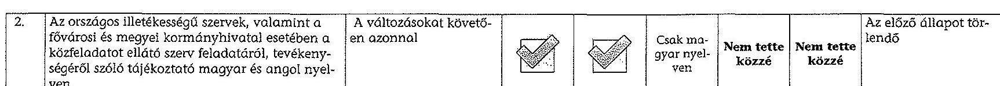

III. Gazdálkodási adatok

|   | Adat | Frissítés | AKI | ÁTK | KÁTKI | ERTI | VM MGI | Megőrzés  |
| --- | --- | --- | --- | --- | --- | --- | --- | --- |
|  1. | A közfeladatot ellátó szerv éves költségvetése, számviteli törvény szerint beszámolója vagy éves költségvetés beszámolója | A változásokat követően azonnal | Csak a 2011. és 2012. évi beszámolók találhatók meg. | Csak a 2010. és 2011. évi beszámolók találhatók meg. | Csak a 2010. és 2011. évi mérleg található meg. | Nem tette közzé | A szöveges beszámolók érhetők el 2008-2011. évekre. | A közzétételt követő 10 évig  |
|  2. | A közfeladatot ellátó szervnél foglalkoztatottak létszámára és személyi juttatásaira vonatkozó összesített adatok, illetve összesítve a vezetők és vezető tisztségviselők illetménye, munkabére, és rendszeres juttatásai, valamint költségtérítése, az egyéb alkalmazottaknak nyújtott juttatások fajtája és mértéke összesítve | Negyedévente | Nem tette közzé | Nem tette közzé | Nem tette közzé | Nem tette közzé | Nem tette közzé | A külön jogszabályban meghatározott ideig, de legalább 1 évig archívumban tartásával  |
|  3. | A közfeladatot ellátó szerv által nyújtott, az államháztartásról szóló törvény szerinti költségvetési támogatások kedvezményezettjeinek nevére, a támogatás céljára, összegére, továbbá a támogatási program megvalósítási helyére vonatkozó adatok, kivéve, ha a közzététel előtt a költségvetési támogatást visszavonják vagy arról a kedvezményezett lemond | A döntés meghozatalát követő hatvanadik napig | Nem tette közzé | Nem tette közzé | Nem tette közzé | Nem tette közzé | Nem tette közzé | A közzétételt követő 5 évig  |

---

| 3. | Az államháztartás pénzeszközei felhasználásával, az államháztartáshoz tartozó vagyonnal történő gazdálkodással összefüggő, ötmillió forintot elérő vagy azt meghaladó értékű árubeszerzésre, építési beruházásra, szolgáltatás megrendelésre, vagyonértékesítésre, vagyonhasznosításra, vagyon vagy vagyoni értékű jog átadására, valamint koncesszióba adásra vonatkozó szerződések megnevezése (típusa), tárgya, a szerződést kötő felek neve, a szerződés értéke, határozott időre kötött szerződés esetében annak időtartama, valamint az említett adatok változásai, a nemzetbiztonsági, illetve honvédelmi érdekkel közvetlenül összefüggő beszerzések adatai, és a minősített adatok kivételével. A szerződés értéke alatt a szerződés tárgyáért kikötött - általános forgalmi adó nélkül számított - ellenszolgáltatást kell érteni, ingyenes ügylet esetén a vagyon piaci vagy könyv szerinti értéke közül a magasabb összeget kell figyelembe venni. Az időszakonként visszatérő - egy évnél hosszabb időtartamra kötött - szerződéseknél az érték kiszámításakor az ellenszolgáltatás egy évre számított összegét kell alapul venni. Az egy költségvetési évben ugyanazon szerződő féllel kötött azonos tárgyú szerződések értékét egybe kell számítani. | A döntés meghozatalát követő hatvanadik napig | | | | A közzétételt követő 5 évig | | :--: | :--: | :--: | :--: | :--: | :--: | :--: | :--: | | 4. | A közfeladatot ellátó szerv által nem alapfeladatai ellátására (így különösen egyesület támogatására, foglalkoztatott szakmai és munkavállalói érdek-képviseleti szervei számára, foglalkoztatottjai, ellátottjai oktatási, kulturális, szociális és sporttevékenységet segítő szervezet támogatására, alapítványok által ellátott feladatokkal összefüggő kifizetésre) fordított, ötmillió forintot meghaladó kifizetések | Negyedévente | | | | A külön jogszabályban meghatározott ideig, de legalább 1 évig archívumban tartásával |

---

1. SZÁMÚ MELLÉKLET A V-0173-430/2014. SZÁMÚ JELENTÉSHEZ

|  7. | Az Európai Unió támogatásával megvalósuló fejlesztések leírása, az azokra vonatkozó szerző- |  |  |  |  | Eseti jelleg- | Legalább 1 évig  |
| --- | --- | --- | --- | --- | --- | --- | --- |
|   |  |  |  |  |  | gel a hi- | archivumban tartásával  |
|   |  |  |  |  |  | rekben |  |
|  8. | Közbeszerzési információk (éves terv, összegzés az ajánlatok elbírálásáról, a megkötött szerző- |  |  |  |  |  |   |
|   | desekről) |  |  |  |  |  |   |

Nem tette közzé

Nem tette közzé

Legalább 1 évig archivumban tartásával

---

Az intézetek által az alaptevékenység ellátására megkötött bevételi szerződések az ellenőrzött időszakban

| Ellenőrzött
intézet | AKI |  | ÁTK |  | KÁTKI |  | ERTI |  | VM MGI |  |
| :--: | :--: | :--: | :--: | :--: | :--: | :--: | :--: | :--: | :--: | :--: |
| Év | szerződések   száma   (db) | szerződések   nettó összege   összesen   (M Ft) | szerződések   száma   (db) | szerződések   nettó összege   összesen   (M Ft) | szerződések   száma   (db) | szerződések   nettó összege   összesen   (M Ft) | szerződések   száma   (db) | szerződések   nettó összege   összesen   (M Ft) | szerződések   száma   (db) | szerződések   nettó összege   összesen   (M Ft) |
| 2008 | 8 | 515,4 | 59 | 279,7 |  |  | 29 | 90,0 | 1364 | 359,4 |
| 2009 | 15 | 511,9 | 51 | 135,1 |  |  | 28 | 662,2 | 1645 | 305,7 |
| 2010 | 9 | 260,7 | 45 | 87,5 |  |  | 40 | 295,5 | 1478 | 334,2 |
| 2011 | 9 | 370,4 |  |  | 2 | 5,8 | 31 | 104,2 | 1369 | 332,5 |
| 2012 | 9 | 222,7 |  |  | 10 | 8,7 | 26 | 207,6 | 1158 | 262,6 |
| Összesen | 50 | 1881,1 | 155 | 502,3 | 12 | 14,5 | 154 | 1359,5 | 7014 | 1594,4 |

| Szerződések száma összesen (db) |  |
| :--: | :--: |
| AKI | 50 |
| ÁTK | 155 |
| KÁTKI | 12 |
| ERTI | 154 |
| VM MGI | 7014 |
| összesen | 7385 |

| Szerződések nettó összege M Ft |  |
| :--: | :--: |
| AKI | 1881,1 |
| ÁTK | 502,3 |
| KÁTKI | 14,5 |
| ERTI | 1359,5 |
| VM MGI | 1594,4 |
| összesen | 5351,8 |

---

5. SZÁMÚ MELLÉKLET A V-0173-430/2014. SZÁMÚ JELENTÉSHEZ

Az intézetek bevételeinek alakulása az ellenőrzött időszakban*

|  Ellenőrzött intézet |  | Működési költségvetés bevételei | Felhalmozási bevételek | Költségvetési támogatás | Pénztárforgalom nélküli bevételek | Előző évi előirányzat maradvány átvétele | Alap- és vállalkozási terékanyag közötti elszámolások | Kölcsönök visszatérülése | Finanszírozási bevételek | BEVÉTELEK ÖSSZESEN  |
| --- | --- | --- | --- | --- | --- | --- | --- | --- | --- | --- |
|  AKI | 2008 | 739,3 | 1,2 | 628,9 | 174,3 | 0 | 1,9 | 1 | 0,9 | 1547,5  |
|   | 2009 | 729,8 | 1,3 | 588,0 | 131,2 | 102,2 | 0 | 1 | 43,8 | 1597,3  |
|   | 2010 | 540,8 | 0,8 | 538,9 | 195,7 | 0 | 0 | 0 | -67,5 | 1208,7  |
|   | 2011 | 661,7 | 0 | 399,2 | 149,6 | 0 | 0 | 0 | -2,3 | 1208,2  |
|   | 2012 | 454,5 | 0 | 579,6 | 82,3 | 0 | 0 | 3,0 | -0,2 | 1119,2  |
|  ÁTK | 2008 | 344,6 | 4,8 | 533,9 | 36,2 | 0,3 | 0 | 0 | 0 | 919,8  |
|   | 2009 | 353,7 | 5,9 | 441,8 | 36,2 | 20,8 | 0 | 0,2 | 0,1 | 858,7  |
|   | 2010 | 299,2 | 154,7 | 405,2 | 58,4 | 0 | 0 | 0,8 | 0 | 918,3  |
|  KÁTKI | 2010 | 8,2 | 3,1 | 23,9 | 0 | 0 | 0 | 0 | 0 | 35,2  |
|   | 2011 | 116,6 | 0 | 244,9 | 10,4 | 4,0 | 0 | 0 |  |

 | 0 | 375,9  |
|   | 2012 | 93,8 | 0 | 277,6 | 44,1 | 0 | 0 | 0 | -0,1 | 415,4  |
| ERTI | 2008 | 258,7 | 2,1 | 308,4 | 33,9 | 0 | 0 | 0 | -0,2 | 602,9  |
|   | 2009 | 286,4 | 1,8 | 267,9 | 7,1 | 0 | 0 | 0 | 0 | 563,2  |
|   | 2010 | 270,3 | 131,1 | 253,7 | 43,6 | 0 | 0 | 0 | 0 | 698,7  |
|   | 2011 | 304,7 | 170,7 | 155,1 | 58,6 | 0 | 0 | 0 | 0 | 689,1  |
|   | 2012 | 253,3 | 57,0 | 232,8 | 32,2 | 0 | 0 | 0 | 0 | 575,3  |
| VM MGI | 2008 | 590,5 | 40,3 | 119,0 | 12,3 | 0 | 0 | 0 | 25,0 | 787,1  |
|   | 2009 | 588,2 | 20,6 | 157,6 | 31,3 | 0,3 | 0 | 0 | -25,0 | 773,0  |
|   | 2010 | 526,6 | 0 | 139,3 | 84,0 | 0 | 0 | 0 | 0 | 749,9  |
|   | 2011 | 515,8 | 15,7 | 86,4 | 98,5 | 0 | 0 | 0 | 18,5 | 734,9  |
|   | 2012 | 468,0 | 161,3 | 104,0 | 31,2 | 0 | 0 | 0 | 1,5 | 766,0  |

- A táblázat az ÁTK kiadási adatait a KÁTKI kiválásának időpontjáig, a KÁTKI adatait a kiválást követő időszakra tartalmazza.

---

### Az intézetek költségvetési kiadásai teljesítésének alakulása az ellenőrzött időszakban*

|  Intézmények | Évek | Személyi juttatás | Működési kiadások |  |  |  | Felhalmozási kiadások |  |  |  |   |
| --- | --- | --- | --- | --- | --- | --- | --- | --- | --- | --- | --- |
|   |  |  |  |  |  |  |  |  |  |  | Kiadások  |
|   |  |  |  |  |  |  |  |  |  |  | Összesen  |
|  AKI | 2008 | 657,0 | 202,9 | 538,5 | 1 398,4 | 13,5 | 0,6 | 14,1 | 1,0 | 1 401,4 |   |
|   | 2009 | 610,7 | 180,3 | 530,9 | 1 321,9 | 34,9 | 0,0 | 34,9 | 1,0 | 1 366,5 |   |
|   | 2010 | 492,5 | 128,5 | 481,1 | 1 102,1 | 24,4 | 0,0 | 24,4 | 0,0 | 1 116,9 |   |
|   | 2011 | 464,6 | 119,2 | 542,3 | 1 126,1 | 2,1 | 0,0 | 2,1 | 0,0 | 1 126,1 |   |
|   | 2012 | 405,1 | 106,5 | 550,5 | 1 062,1 | 0,0 | 0,0 | 0,0 | 3,0 | 1 062,9 |   |
|  ÁTK | 2008 | 331,9 | 106,7 | 350,9 | 789,5 | 90,0 | 4,1 | 94,1 | 0,0 | 883,9 |   |
|   | 2009 | 302,0 | 89,9 | 388,4 | 781,2 | 15,8 | 3,0 | 18,8 | 0,2 | 799,9 |   |
|   | 2010 | 280,4 | 75,0 | 360,3 | 719,4 | 28,5 | 146,9 | 175,4 | 0,8 | 897,5 |   |
|  KÁTKI | 2010 | 8,6 | 2,3 | 7,8 | 18,7 | 6,2 | 0,0 | 6,2 | 0,0 | 24,6 |   |
|   | 2011 | 136,1 | 36,7 | 157,1 | 329,9 | 2,0 | 0,0 | 2,0 | 0,0 | 331,9 |   |
|   | 2012 | 157,0 | 40,5 | 160,0 | 357,5 | 1,0 | 16,4 | 17,4 | 0,0 | 366,2 |   |
|  ERTI | 2008 | 238,4 | 70,2 | 279,8 | 588,4 | 5,0 | 3,9 | 8,9 | 0,0 | 596,7 |   |
|   | 2009 | 207,3 | 61,5 | 233,7 | 502,5 | 9,3 | 7,2 | 16,5 | 0,0 | 521,0 |   |
|   | 2010 | 216,8 | 55,5 | 212,5 | 484,8 | 153,8 | 1,4 | 155,2 | 0,0 | 638,7 |   |
|   | 2011 | 187,0 | 46,4 | 165,8 | 399,2 | 75,0 | 182,3 | 257,3 | 0,0 | 657,7 |   |
|   | 2012 | 201,5 | 51,4 | 164,2 | 417,1 | 18,6 | 55,0 | 73,6 | 0,0 | 493,2 |   |
|  VM MGI | 2008 | 159,8 | 46,5 | 340,8 | 547,4 | 181,0 | 2,3 | 183,3 | 0,0 | 730,6 |   |
|   | 2009 | 155,7 | 44,1 | 394,0 | 594,3 | 96,2 | 23,5 | 119,7 | 0,0 | 718,4 |   |
|   | 2010 | 174,5 | 46,3 | 363,0 | 583,8 | 58,6 | 8,7 | 67,3 | 0,0 | 654,1 |   |
|   | 2011 | 183,3 | 43,1 | 376,1 | 602,8 | 75,3 | 2,2 | 77,5 | 0,0 | 679,4 |   |
|   | 2012 | 157,4 | 44,5 | 327,0 | 528,9 | 223,1 | 0,0 | 223,1 | 0,0 | 751,5 |   |

- A táblázat az ÁTK kiadási adatait a KÁTKI kiválásának időpontjáig, a KÁTKI adatait a kiválást követő időszakra tartalmazza.

---

### Az intézeteknél foglalkoztatottak létszámának alakulása az ellenőrzött időszakban

|  Év | Nyitó létszám | Költségvetési engedélyezett létszámkeret (álláshely) | Növekedés | Csökkenés | Záró létszám  |
| --- | --- | --- | --- | --- | --- |
|   | Teljes munkalát | Részmunkalát | Állományba nem tartozó | Összesen | Teljes munkalát  |
|  AKI | 2008 | 128 | 2 | 0 | 130  |
|   | 2009 | 127 | 3 | 0 | 130  |
|   | 2010 | 121 | 4 | 0 | 125  |
|   | 2011 | 118 | 4 | 0 | 122  |
|   | 2012 | 115 | 6 | 0 | 121  |
|  ÁTK | 2008 | 98 | 6 | 10 | 114  |
|   | 2009 | 110 | 6 | 10 | 126  |
|   | 2010 | 108 | 4 | 10 | 122  |
|   | 2010* |  |  |  |   |
|  KÁTKI | 2011 | 41 | 3 | 0 | 44  |
|   | 2012 | 41 | 3 | 0 | 44  |
|  ERTI | 2008 | 88 | 4 | 0 | 92  |
|   | 2009 | 88 | 4 | 0 | 92  |
|   | 2010 | 71 | 2 | 0 | 73  |
|   | 2011 | 72 | 2 | 0 | 74  |
|   | 2012 | 71 | 3 | 0 | 74  |
|  VM MGI | 2008 | 40 | 0 | 0 | 40  |
|   | 2009 | 40 | 0 | 0 | 40  |
|   | 2010 | 38 | 2 | 0 | 40  |
|   | 2011 | 51 | 4 | 0 | 55  |
|   | 2012 | 46 | 5 | 0 | 51  |

- A nyitó létszámra vonatkozóan a 2010. évi beszámoló nem tartalmazott adatot.

---

Az intézetek beruházási és felújítási kiadása, valamint az elszámolt értékcsökkenés az ellenőrzött időszakban

|  Év | 2008 |  | 2009 |  | 2010 |  | 2011 |  | 2012 |  | Összesen |   |
| --- | --- | --- | --- | --- | --- | --- | --- | --- | --- | --- | --- | --- |
|  Ellenőrzött intézet | Értékcsökkenés | Beruházási és felújítási kiadás | Értékcsökkenés | Beruházási és felújítási kiadás | Értékcsökkenés | Beruházási és felújítási kiadás | Értékcsökkenés | Beruházási és felújítási kiadás | Értékcsökkenés | Beruházási és felújítási kiadás | Értékcsökkenés | Beruházási és felújítási kiadás  |
|  AKI | 394,5 | 14,1 | 387,8 | 34,9 | 410,5 | 24,4 | 429,8 | 2,1 | 443,6 | 0,0 | 2 066,2 | 75,5  |
|  ÁTK | 952,5 | 94,1 | 1 000,6 | 18,8 | 670,7 | 175,4 | 1 110,8 | 1,9 | 404,9 | 17,5 | 4 140,5 | 297,7  |
|  KÁTKI | 432,6 | 8,9 | 452,9 | 16,4 | 455,4 | 155,2 | 468,6 | 257,3 | 480,8 | 73,5 | 2 290,3 | 511,3  |
|  ERTI | 812,5 | 183,3 | 896,7 | 119,7 | 1 012,8 | 67,4 | 1 110,8 | 77,5 | 1 215,4 | 223,1 | 5 048,2 | 671,0  |
|  VM MGI | 2592,1 | 300,4 | 2 738,0 | 189,8 | 2 930,3 | 428,5 | 2 398,0 | 338,8 | 2 544,7 | 

 314,1 | 13 203,1 | 1 571,6  |

---

Az intézetek vagyoni/pénzügyi helyzete elemzési mutatóinak alakulása az ellenőrzött időszakban

|  Ellenőrzött intézet | Év | Vagyoni helyzet elemzésének mutatói |  |  |  | Pénzügyi helyzet elemzésének mutatói |  |   |
| --- | --- | --- | --- | --- | --- | --- | --- | --- |
|   |  | Befektetett eszközök aránya (Befektetett eszközök összesen/Eszközök Összesen) | Használhatósági fok (Tárgyi eszközök, immateriális javak nettó értéke/ Tárgyi eszközök, immateriális javak bruttó értéke). | Saját tőke aránya mutató (Saját tőke összesen/Források összesen) | Kötelezettségek és a saját tőke aránya mutató (Kötelezettségek összesen/Saját tőke összesen) | Likviditási mutató (Forgóeszközök összesen/Rövid lejáratú kötelezettségek összesen) | Pénzeszköz likviditási mutató (Pénzeszközök összesen/Rövid lejáratú kötelezettségek összesen) | Átlagos szállítói futamidő mutatója (Szállítók/1 napi anyagjellegű kiadás)  |
|  AKI | 2008 | 0,40 | 0,34 | 0,52 | 0,42 | 70,38 | 55,69 | 2,74  |
|   | 2009 | 0,34 | 0,34 | 0,45 | 0,48 | 34,94 | 27,43 | 7,00  |
|   | 2010 | 0,45 | 0,31 | 0,45 | 0,42 | 12,71 | 11,93 | 12,61  |
|   | 2011 | 0,47 | 0,27 | 0,41 | 0,86 | 3,38 | 2,77 | 7,01  |
|   | 2012 | 0,55 | 0,25 | 0,42 | 0,89 | 2,70 | 2,46 | 3,92  |
|  ÁTK | 2008 | 0,92 | 0,50 | 0,92 | 0,05 | 1,85 | 0,84 | 36,07  |
|   | 2009 | 0,89 | 0,48 | 0,92 | 0,02 | 5,61 | 2,98 | 17,95  |
|   | 2010 | 0,90 | 0,50 | 0,81 | 0,20 | 0,60 | 0,17 | 78,62  |
|  KÁTKI | 2010 | 0,97 | 0,56 | 0,98 | 0,00 | 13,82 | 9,36 | 28,29  |
|   | 2011 | 0,90 | 0,55 | 0,91 | 0,00 | 25,41 | 16,50 | 4,97  |
|   | 2012 | 0,89 | 0,54 | 0,92 | 0,01 | 11,75 | 7,92 | 10,34  |
|  ERTI | 2008 | 0,85 | 0,49 | 0,95 | 0,04 | 4,24 | 0,46 | 21,32  |
|   | 2009 | 0,81 | 0,47 | 0,90 | 0,01 | 15,51 | 7,10 | 8,47  |
|   | 2010 | 0,74 | 0,45 | 0,88 | 0,04 | 7,76 | 2,88 | 20,89  |
|   | 2011 | 0,92 | 0,49 | 0,95 | 0,00 | 12,61 | 7,07 | 3,67  |
|   | 2012 | 0,89 | 0,59 | 0,75 | 0,19 | 0,81 | 0,73 | 0,00  |
|  VM MGI | 2008 | 0,90 | 0,53 | 0,93 | 0,02 | 5,51 | 2,96 | 14,97  |
|   | 2009* | 0,86 | 0,54 | 0,93 | 0,00 |  |  |   |
|   | 2010 | 0,79 | 0,50 | 0,90 | 0,03 | 8,17 | 3,02 | 27,77  |
|   | 2011 | 0,89 | 0,46 | 0,95 | 0,00 | 1230,00 | 629,00 | 0,08  |
|   | 2012 | 0,93 | 0,42 | 0,96 | 0,01 | 5,32 | 3,26 | 8,97  |

*a VM MGI 2009-ben rövid lejáratú kötelezettséget a mérlegében nem mutatott ki

---

Az intézetek belső ellenőrzési gyakorlatát jellemző mutatók az ellenőrzött időszakban

|  Ellenőrzött intézet | Év | Belső ellenőrzések száma | Belső ellenőrzések közül az ellenőrzési tervben szerepelt | Kockázatelemzéssel megalapozott belső ellenőrzések száma | Azon ellenőrzések száma, mely után javaslatot fogalmaztak meg | Azon ellenőrzések száma, mely után történt intézkedés | Utóellenőrzések száma | Hasznosult javaslatok száma  |
| --- | --- | --- | --- | --- | --- | --- | --- | --- |
|  AKI | 2008. | 6 | 4 | 4 | 4 | 2 | 0 | 2  |
|   | 2009. | 4 | 3 | 3 | 3 | 3 | 0 | 3  |
|   | 2010. | 2 | 2 | 2 | 2 | 2 | 0 | 2  |
|   | 2011. | 4 | 3 | 3 | 3 | 1 | 0 | 2  |
|   | 2012. | 4 | 3 | 3 | 4 | 3 | 0 | 3  |
|   | Összesen | 20 | 15 | 15 | 16 | 11 | 0 | 12  |
|  ÁTK | 2008. | 12 | 8 | 7 | 6 | 5 | 5 | 3  |
|   | 2009. | 12 | 10 | 6 | 0 | 0 | 0 | 0  |
|   | 2010. | 14 | 11 | 8 | 4 | 4 | 2 | 2  |
|   | Összesen | 38 | 29 | 21 | 10 | 9 | 7 | 5  |
|  KÁTKI | 2010.* |  |  |  |  |  |  |   |
|   | 2011. | 8 | 8 | 6 | 8 | 8 | 5 | 6  |
|   | 2012. | 7 | 7 | 6 | 7 | 7 | 2 | 6  |
|   | Összesen | 15 | 15 | 12 | 15 | 15 | 7 | 12  |
|  ERTI | 2008.** |  |  |  |  |  |  |   |
|   | 2009. | 1 | 1 | 0 | 0 | 0 | 0 | 0  |
|   | 2010. | 4 | 4 | 0 | 3 | 0 | 0 | 3  |
|   | 2011. | 11 | 11 | 11 | 3 | 4 | 0 | 4  |
|   | 2012. | 12 | 12 | 12 | 4 | 3 | 0 | 4  |
|   | Összesen | 28 | 28 | 23 | 10 | 7 | 0 | 11  |
|  VM MGI | 2008. | 4 | 4 | 3 | 0 | 0 | 0 | 0  |
|   | 2009. | 6 | 6 | 5 | 5 | 5 | 5 | 5  |
|   | 2010. | 5 | 5 | 4 | 3 | 4 | 3 | 3  |
|   | 2011. | 5 | 5 | 4 | 3 | 4 | 3 | 3  |
|   | 2012. | 5 | 5 | 4 | 1 | 2 | 1 | 2  |
|   | Összesen | 25 | 25 | 20 | 12 | 15 | 12 | 13  |
|  Intézetek összesen |  | 126 | 112 | 91 | 63 | 57 | 26 | 53  |

* A KÁTKI kiválását követően 2010-ben (két hónapra vonatkozóan) nem folytatott belső ellenőrzési tevékenységet. ** Az ERTI 2008. évi belső ellenőrzési dokumentumait nem adták át. *** Az ellenőrzés közben intézkedtek a hiba kijavítása érdekében

---

Az intézetek átvett és átadott feladatai, valamint azok vagyonváltozásra gyakorolt hatásai az ellenőrzött időszakban

|  Ellenőrzött intézet | Év | Szakmai feladat megnevezése | Időpontja | Szakmai feladat leírása | Intézkedés hatása az eszközökre |  | Intézkedés hatása a forrásokra |   |
| --- | --- | --- | --- | --- | Befektetett eszközök | Forgóeszközök | Saját tőke | Tartalékok  |
|  AKI | 2008-2012 |  |  |  |  |  |  |   |
|  ÁTK | 2008-2009 |  |  |  |  |  |  |   |
|   | 2010 | KÁTKI kiválása | 2010. november 1. | Génmegőrzési feladatok önálló intézményben történő ellátása | -860,1 | -6,7 | -866,8 | 0,0  |
|  KÁTKI | 2010 | KÁTKI kiválása | 2010. november 1. | Génmegőrzési feladatok önálló intézményben történő ellátása | 860,1 | 6,7 | 866,8 | 0,0  |
|  ERTI | 2008-2012 |  |  |  |  |  |  |   |
|   | 2008-2009 |  |  |  |  |  |  |   |
|  VM MGI | 2010 | A VM MGI infrastruktúrájának működtetése A 2118/2006. (VI. 30.) Korm. Határozat elrendelte az FVMMI GM Kht. megszüntetését úgy, hogy a feladatait az alapító VM MGI-nek kell átvennie. Az NVT a 114/2010. (II. 23.) sz. határozatával a társaságot megszüntette, és jóváhagyta a társaság által kötött szerződésekből származó jogok és kötelezettségek VM MGI-re történő engedményezését. | 2010. január 1. | A VM MGI infrastruktúrájának működtetése, a fenntartási és üzemeltetési szolgáltatások (energia rendszerek biztosítása, ingatlan fenntartás, karbantartás, üzemi konyha, őrzés-védelmi szolgálat, parkgondozás, rendezvény szervezés stb.) nyújtása, valamint az apportonként biztosított ingatlanok hasznosítása és az ehhez szükséges szerződések megkötése. | 39,0 | 17,9 | 0,0 | 50,0  |

---

Az intézetek feladat átvételeinek és átadásainak a kiadásokra, valamint a bevételekre gyakorolt költségvetési hatásai az ellenőrzött időszakban

|  Ellenőrzött intézet | Év | Szakmai feladat megnevezése | Intézkedés hatása a kiadásokra |

  |  |  |  | Intézkedés hatása a bevételekre |  |   |
| --- | --- | --- | --- | --- | --- | --- | --- | --- | --- | --- |
|   |  |  | Személyi juttatások és Munkaadókat terhelő járulékok | Dologi kiadások | Felhalmozási kiadások | Támogatás értékű működési és felhalmozási kiadások | Költségvetési támogatás | Költségvetési támogatás | Saját bevételek | Egyéb forrás  |
|  AKI | 2008-2012 |  |  |  |  |  |  |  |  |   |
|  ÁTK | 2008-2009 |  |  |  |  |  |  |  |  |   |
|   | 2010 | KÁTKI kiválása (génmegőrzési feladatok önálló intézményben történő ellátása) | 12,2 | 1,3 | 6,8 | 0,0 | 0,0 | 0,0 | 0,0 | 0,0  |
|  KÁTKI | 2010 | ÁTK-ból való kiválás (génmegőrzési feladatok önálló intézményben történő ellátása) | 0,0 | 0,0 | 0,0 | 0,0 | 0,0 | 20,3 | 0,0 | 0,0  |
|   | 2011-2012 |  |  |  |  |  |  |  |  |   |
|  ERTI | 2008-2012 |  |  |  |  |  |  |  |  |   |
|  VM MGI | 2008-2009 |  |  |  |  |  |  |  |  |   |
|   | 2010 | A VM MGI infrastruktúrájának működtetése A 2118/2006. (VI. 30.) Korm. Határozat elrendelte az FVMMI GM Kht. megszüntetését úgy, hogy a feladatait az alapító VM MGI-nek kell átvennie. | 20,1 | 106,3 | 2,1 | 0,0 | 0,0 | 0,0 | 128,5 | 0,0  |

---

Az intézetek kiadásainak, bevételeinek és kapott költségvetési támogatásainak alakulása az ellenőrzött időszakban

| Ellenőrzött intézet | Év | Kiadás összesen |  |  | Bevétel összesen |  |  | Bevételből költségvetési támogatás |  |  |
| :--: | :--: | :--: | :--: | :--: | :--: | :--: | :--: | :--: | :--: | :--: |
|  |  | Eredeti előirányzat | Módosított előirányzat | Teljesítés | Eredeti előirányzat | Módosított előirányzat | Teljesítés | Eredeti előirányzat | Módosított előirányzat | Teljesítés |
| AKI | 2008 | 998,6 | 1536,2 | 1401,4 | 998,6 | 1536,2 | 1547,5 | 638,6 | 628,9 | 628,9 |
|  | 2009 | 920,1 | 1589,4 | 1366,5 | 920,1 | 1589,4 | 1597,3 | 560,1 | 588,0 | 588,0 |
|  | 2010 | 885,5 | 1260,0 | 1116,9 | 885,5 | 1260,0 | 1208,7 | 525,5 | 539,0 | 539,0 |
|  | 2011 | 943,9 | 1210,5 | 1126,1 | 943,9 | 1210,5 | 1028,2 | 517,9 | 399,2 | 399,2 |
|  | 2012 | 741,5 | 1117,2 | 1062,9 | 741,5 | 1117,2 | 1119,2 | 646,5 | 579,6 | 579,6 |
| ÁTK | 2008 | 633,9 | 1006,5 | 883,9 | 633,9 | 1006,5 | 919,8 | 363,9 | 534,0 | 534,0 |
|  | 2009 | 603,9 | 920,4 | 799,9 | 603,9 | 920,4 | 858,7 | 360,4 | 441,8 | 441,8 |
|  | 2010 | 613,4 | 1102,1 | 897,5 | 613,4 | 1102,1 | 918,3 | 342,9 | 405,2 | 405,2 |
| KÁTKI | 2010 | 0,0 | 34,7 | 24,6 | 0,0 | 34,7 | 35,2 | 0,0 | 23,9 | 23,9 |
|  | 2011 | 260,8 | 374,5 | 331,9 | 260,8 | 374,5 | 375,9 | 163,4 | 244,9 | 244,9 |
|  | 2012 | 436,5 | 471,7 | 366,2 | 436,5 | 471,7 | 415,4 | 286,5 | 277,6 | 277,6 |
| ERTI | 2008 | 387,6 | 632,6 | 596,7 | 387,6 | 632,6 | 602,9 | 152,6 | 308,4 | 308,4 |
|  | 2009 | 400,0 | 565,4 | 521,0 | 400,0 | 565,4 | 563,2 | 165,0 | 267,9 | 267,9 |
|  | 2010 | 405,8 | 702,4 | 638,7 | 405,8 | 702,4 | 698,7 | 175,8 | 253,6 | 253,6 |
|  | 2011 | 404,3 | 603,7 | 657,7 | 404,3 | 603,7 | 689,1 | 175,3 | 155,1 | 155,1 |
|  | 2012 | 371,5 | 621,2 | 493,2 | 371,5 | 621,2 | 575,3 | 202,2 | 232,8 | 232,8 |
| VM MGI | 2008 | 329,8 | 758,4 | 730,6 | 329,8 | 758,4 | 787,1 | 89,8 | 119,0 | 119,0 |
|  | 2009 | 349,8 | 776,3 | 718,4 | 349,8 | 776,3 | 773,0 | 109,8 | 157,6 | 157,6 |
|  | 2010 | 347,1 | 757,4 | 654,1 | 347,1 | 757,4 | 749,9 | 105,1 | 139,3 | 139,3 |
|  | 2011 | 378,4 | 714,6 | 679,4 | 378,4 | 714,6 | 734,9 | 104,9 | 86,4 | 86,4 |
|  | 2012 | 450,0 | 806,8 | 751,5 | 450,0 | 806,8 | 766,0 | 100,0 | 104,0 | 104,0 |

---

Az intézetek kiadási előirányzatai felhasználásának feltételekhez kötött időleges vagy végleges korlátozása az ellenőrzött időszakban

|  Ellenőrzött intézet | Év | Előirányzat zárolás összege | A zárolt összegből elvont összeg | Zárolás nélkül elvont összeg | Maradványtartási kötelezettség összege | A maradványtartási kötelezettséget feloldották-e? | Keret-előrehozási kérelem összege  |
| --- | --- | --- | --- | --- | --- | --- | --- |
|  AKI | 2008 |  |  | 100,0 |  |  |   |
|   | 2009 | 13,8 | 13,8 |  |  |  |   |
|   | 2010 | 5,0 | 5,0 |  |  |  |   |
|   | 2011 | 123,3 | 123,3 |  | 76,0 | Nem | 25,0  |
|   | 2012 | 9,7 | 9,7 | 60,0 |  |  |   |
|  ÁTK | 2008 |  |  |  |  |  |   |
|   | 2009 | 8,8 | 8,8 |  | 60,0 | Igen |   |
|   | 2010 |  |  |  |  |  |   |
|  KÁTKI | 2010 |  |  |  |  |  |   |
|   | 2011 | 21,3 |  | 21,3 | 21,0 | Igen |   |
|   | 2012 | 19,8 | 6,3 |  |  |  |   |
|  ERTI | 2008 |  |  |  | 20,0 | Nem |   |
|   | 2009 | 4,0 | 4,0 |  |  |  |   |
|   | 2010 |  |  |  |  |  |   |
|   | 2011 | 50,7 | 50,7 |  | 22,9 | Nem |   |
|   | 2012 | 3,0 | 3,0 |  |  |  |   |
|  VM MGI | 2008 |  |  |  |  |  |   |
|   | 2009 | 2,7 | 2,7 |  |  |  |   |
|   | 2010 |  |  |  |  |  |   |
|   | 2011 | 40,4 | 10,0 | 30,4 | 98,4 | Igen (két részletben) |   |
|   | 2012 | 1,5 | 1,5 | 3,0 |  |  |   |

---

Az intézetek mérlegei szerkezetének alakulása és változása az ellenőrzött időszakban

|  Ellenőrzött intézet | Immateriális javak | Tárgyi eszközök | Befektetett pénzügyi eszközök | Üzemeltetésre kezelésre átadott vagyonkezelésre vett eszközök | Készletek | Követelések | Értékpapirok | Pénzeszközök | Egyéb aktív pénzügyi elszámolások | Eszközök összesen | Saját tőke | Tartalékok | Kötelezettségek | Egyéb passzív pénzügyi elszámolások | Források összesen  |
| --- | --- | --- | --- | --- | --- | --- | --- | --- | --- | --- | --- | --- | --- | --- | --- |
|  AKI | 2008 | 3,5 | 195,6 | 2,0 | 0,0 | 2,2 | 51,4 | 0,0 | 234,0 | 8,0 | 496,7 | 258,1 | 131,2 | 107,4 | 103,2  |
|   | 2009 | 14,2 | 180,7 | 0,8 | 0,0 | 2,1 | 63,6 | 0,0 | 301,8 | 16,8 | 580,0 | 259,4 | 195,6 | 125,0 | 114,0  |
|   | 2010 | 21,2 | 160,9 | 0,5 | 0,0 | 2,1 | 4,5 | 0,0 | 211,3 | 7,1 | 407,6 | 181,4 | 149,5 | 76,5 | 58,8  |
|   | 2011 | 13,4 | 142,9 | 0,1 | 0,0 | 1,5 | 24,9 | 0,0 | 144,8 | 5,1 | 332,7 | 134,8 | 82,4 | 115,5 | 63,2  |
|   | 2012 | 9,3 | 132,4 | 2,2 | 0,0 | 0,0 | 7,6 | 0,0 | 107,7 | 2,9 | 262,1 | 109,8 | 54,3 | 98,0 | 54,3  |
|  ÁTK | 2008 | 5,0 | 962,9 | 1,1 | 0,0 | 17,2 | 26,7 | 0,0 | 37,5 | 1,1 | 1 051,5 |

 970,7 | 36,2 | 44,6 | 0,0  |
|   | 2009 | 4,7 | 922,6 | 0,9 | 0,0 | 16,5 | 36,1 | 0,0 | 60,4 | 0,8 | 1 042,0 | 963,2 | 58,4 | 20,4 | 0,1  |
|   | 2010 | 2,9 | 655,6 | 1,3 | 0,0 | 13,3 | 34,5 | 0,0 | 20,4 | 2,7 | 730,7 | 590,1 | 22,7 | 117,9 | 0,1  |
|  KÁTKI | 2010 | 1,1 | 489,3 | 0,0 | 0,0 | 2,4 | 2,4 | 0,0 | 10,3 | 0,1 | 505,6 | 494,0 | 10,3 | 1,1 | 0,0  |
|   | 2011 | 1,1 | 477,9 | 0,2 | 0,0 | 4,9 | 5,1 | 0,0 | 36,4 | 9,8 | 535,2 | 488,7 | 44,1 | 2,4 | 0,1  |
|   | 2012 | 0,5 | 482,1 | 1,3 | 0,0 | 7,5 | 11,0 | 0,0 | 40,4 | 1,1 | 543,9 | 498,1 | 40,5 | 5,1 | 0,0  |
|  ERTI | 2008 | 4,2 | 409,9 | 0,6 | 1,2 | 3,8 | 60,9 | 0,0 | 8,0 | 0,6 | 489,2 | 466,0 | 5,9 | 17,3 | 0,0  |
|   | 2009 | 3,2 | 397,7 | 1,5 | 1,0 | 0,8 | 50,2 | 0,0 | 44,8 | 2,0 | 501,2 | 451,3 | 43,6 | 6,3 | 0,0  |
|   | 2010 | 2,3 | 481,0 | 0,9 | 0,8 | 7,8 | 96,6 | 0,0 | 61,9 | 0,6 | 651,9 | 571,7 | 58,6 | 21,5 | 0,0  |
|   | 2011 | 4,4 | 654,7 | 3,5 | 0,6 | 1,3 | 21,8 | 0,0 | 31,1 | 1,4 | 718,8 | 682,2 | 32,2 | 4,4 | 0,0  |
|   | 2012 | 3,6 | 689,9 | 2,4 | 0,4 | 0,6 | 3,7 | 0,0 | 81,9 | 4,1 | 786,6 | 590,0 | 84,6 | 112,0 | 0,0  |
|  VM MGI | 2008 | 2,5 | 1 043,9 | 0,9 | 0,0 | 0,0 | 55,6 | 0,0 | 64,5 | 0,1 | 1 167,5 | 1 088,7 | 31,4 | 47,4 | 25,5  |
|   | 2009 | 5,8 | 1 026,3 | 1,2 | 0,0 | 0,0 | 76,3 | 0,0 | 88,0 | 4,4 | 1 202,0 | 1 117,5 | 84,0 | 0,5 | 0,5  |
|   | 2010 | 9,4 | 1 000,3 | 0,9 | 0,0 | 0,0 | 164,0 | 0,0 | 100,4 | 7,0 | 1 282,0 | 1 149,7 | 98,4 | 33,9 | 0,7  |
|   | 2011 | 4,7 | 963,8 | 0,6 | 0,0 | 0,8 | 58,1 | 0,0 | 62,9 | 1,1 | 1 092,0 | 1 041,3 | 31,2 | 19,5 | 19,4  |
|   | 2012 | 3,3 | 1 034,8 | 0,5 | 0,0 | 0,5 | 27,2 | 0,0 | 44,6 | 0,4 | 1 113,3 | 1 066,5 | 12,3 | 34,5 | 21,0  |

---

### Az intézetek kezelt ingatlanjainak adatai az ellenőrzött időszakban

|  Ellenőrzött
intézet | Ingatlan | Adatok 2008.01.01-ján |  |  |  | Adatok 2012.12.31-én |  |  |  | Alapterület változás |  |  |  |  |  |   |
| --- | --- | --- | --- | --- | --- | --- | --- | --- | --- | --- | --- | --- | --- | --- | --- | --- |
|   |  | alapterület
összesen
(m2) | bruttó
érték
(M Ft) | érték
csökkenés
(M Ft) | nettó
érték
(M Ft) | alapterület
összesen
(m2) | bruttó
érték
(M Ft) | érték
csökkenés
(M Ft) | nettó
érték
(M Ft) | Értékes
tés miatt | Beszerzés
miatt | Vegyen
juttatás
miatt | Térítés nélküli
átadás miatt | Szerződés
módos
tással | Átértéke
lés miatt | Borsból
zás
miatt | Egyéb ok  |
|  AKI | Kezelt ingatlanok | 3 766,0 | 168,5 | 27,8 | 140,7 | 3 766,0 | 169,6 | 42,5 | 127,1 |  |  |  |  |  |  |   |
|   | építmények | 120,0 | 4,7 | 1,3 | 3,4 | 120,0 | 5,0 | 2,0 | 3,0 |  |  |  |  |  |  |   |
|   | földterület | 735,0 | 25,0 |  | 25,0 | 735,0 | 25,0 |  | 25,0 |  |  |  |  |  |  |   |
|   | egyéb | 2 911,0 | 138,8 | 26,5 | 112,3 | 2 911,0 | 139,6 | 40,5 | 99,1 |  |  |  |  |  |  |   |
|  ÁTK* | Kezelt ingatlanok | 4 051 810,0 | 904,0 | 13,5 | 814,1 | 783 366,0 | 680,7 | 138,9 | 545,6 |  |  |  |  |  |  | -3 268 444,0  |
|   | építmények | 421 810,0 | 732,4 | 189,9 | 542,5 | 13 755,0 | 680,7 | 138,9 | 545,6 |  |  |  |  |  |  | -408 055,0  |
|   | földterület | 3 630 000,0 | 171,6 |  | 171,6 | 769 611,0 |  |  |  |  |  |  |  |  |  | -2 860 389,0  |
|   | egyéb |  |  |  |  |  |  |  |  |  |  |  |  |  |  |   |
|  KÁTKI** | Kezelt ingatlanok | 2 762 000,0 | 314,7 | 99,6 | 215,0 | 2 762 000,0 | 329,2 | 112,3 | 216,9 |  |  |  |  |  |  |   |
|   | építmények | 28 000,0 | 121,9 | 49,9 | 72,0 | 28 000,0 | 121,9 | 56,2 | 65,6 |  |  |  |  |  |  |   |
|   | földterület | 2 734 000,0 | 171,7 |  | 171,7 | 2 734 000,0 | 171,7 |  | 171,7 |  |  |  |  |  |  |   |
|   | egyéb |  |  |  |  |  |  |  |  |  |  |  |  |  |  |   |
|  ERTI | Kezelt ingatlanok | 8 713 312,0 | 473,8 | 102,8 | 371,0 | 6 162 418,0 | 716,5 | 121,3 | 595,2 |  |  |  | -3 550 894,0 |  |  |   |
|   | építmények | 9 794,0 | 465,5 | 102,8 | 362,7 | 6 680,0 | 474,7 | 121,3 | 353,4 |  |  |  | -3 114,0 |  |  |   |
|   | földterület | 8 703 518,0 | 8,3 |  | 8,3 | 5 155 738,0 | 241,8 | 0,0 | 241,8 |  |  |  | -3 547 780,0 |  |  |   |
|   | egyéb |  |  |  |  |  |  |  |  |  |  |  |  |  |  |   |
|  VM MGI | Kezelt ingatlanok | 310 185,0 | 761,2 | 105,8 | 655,4 | 320 244,0 | 860,4 | 189,8 | 670,6 |  |  |  | 10 059,0 |  |  |   |
|   | építmények | 10 802,0 | 761,2 | 105,8 | 655,4 | 20 861,0 | 860,4 | 189,8 | 670,6 |  |  |  | 10 059,0 |  |  |   |
|   | földterület | 299 385,0 |  |  |  | 299 385,0 |  |  |  |  |  |  |  |  |  |   |
|   | egyéb |  |  |  |  |  |  |  |  |  |  |  |  |  |  |   |

* Az ÁTK esetében az adatok a 2008-2010. évekre vonatkoznak.

* A KÁTKI esetében az adatok a 2010-2012. évekre vonatkoznak.

---

Az intézetek gazdálkodásával kapcsolatos külső ellenőrzések adatai az ellenőrzött időszakban

|  Ellenőrzött
intézet | Az ellenőrzés témája, címe, éve és az ellenőrzést végző szervezet neve | Volt-e intézkedést igénylő megállapítás? |  | Készült-e intézkedési terv? |  | A javaslatok hasznosultak-e? |  | Történt-e utóellenőrzés? |   |
| --- | --- | --- | --- | --- | --- | --- | --- | --- | --- |
|   |  | I | N | I | N | I | N | I | N  |
|  AKI | AKI (Budapest) 2009-2010. évi rendszerellenőrzése (átfogó rendszerellenőrzés) VM Ellenőrzési Főosztály által végzett irányító szervi ellenőrzés | x |  | x |  | x |  | x |   |
|  ÁTK | APEH (NAV) - ÁFA ellenőrzés |  | x |  |  |  |  |  |   |

 | x |  |  |  | x  |
|   | Ellenőrzési jelentés az ÁTK 2010-2011. évi elemi költségvetési beszámolójának átfogó ellenőrzéséről - VM | x |  | x |  | x |  |  | x  |
|  KÁTKI |  |  |  |  |  |  |  |  |   |
|  VM MGI | 2009-2010. évi átfogó ellenőrzés, amely 2011. évben zajlott a VM Ellenőrzési Főosztálya részéről | x |  | x |  | x |  | x |   |
|  ERTI | A 2009. évi elemi költségvetési beszámolójának megbízhatósági ellenőrzése - 2010. Vidékfejlesztési Minisztérium | x |  | x |  | x |  |  | x  |
|   | Konkrét adóbevalláshoz kapcsolódó egyes adókötelezettségek teljesítésére irányuló ellenőrzés (ÁFA) - 2011, NAV |  | x |  | x |  | x |  | x  |

---

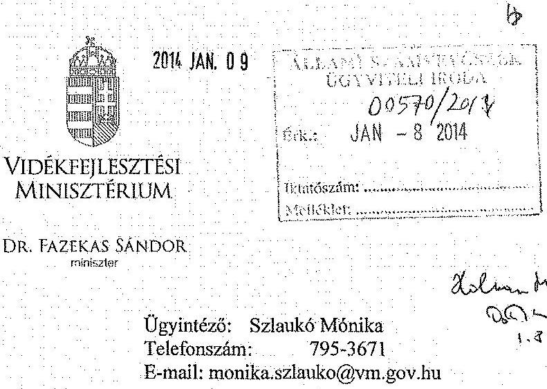

# Domokos László úr   elnök   részére 

## Állami Számvevőszék

Budapest 4.
Pf. 54
1364
Tárgy: jelentéstervezet észrevételezése

## Tisztelt Elnök Úr!

Az Állami Számvevőszék megküldte a Vidékfejlesztési Minisztérium részére az egyes agrárkutató intézetek és egyes génmegőrzési intézmények gazdálkodásának ellenőrzéséről készített számvevőszéki jelentéstervezetet véleményezésre.
A jelentéstervezetre az alábbiakban teszem meg észrevételeimet.
A minisztérium felügyelete alatt álló vizsgált intézeteket érintő megállapításokat tárgyszerűnek tartom és azokat elfogadom. Egyetértek továbbá a minisztérium szakmai irányítására vonatkozó megállapításokkal is.
Tájékoztatni kívánom ugyanakkor, hogy a 21. oldal 4. bekezdésében említett, a Mezőgazdasági Főosztály részéről a kutatóintézetek tekintetében 2012. évben beindított KFI folyamatszabályozás időközben lényegesen előrehaladt és a 2014. évi tervezés már új rendszerben valósult meg. A szervezeti kereteket érintően szintén igen jelentős változásokra került sor: 2013. december 31-én megszűnt a jelentéstervezetben szereplő 3 kutatóintézet (ÁTK, ERTI, VM MGI), melyek feladatrendszerét a 2014. január 1-jén megalakult Nemzeti Agrárkutatási és Innovációs Központ vette át. Előzőek figyelembevételével szükségesnek látom az I. Összegző megállapítások, következtetések, javaslatok fejezetben szereplő javaslattétel átdolgozását, mivel az időközben megszűnt intézmények már nem jogosultak intézkedések végrehajtására.

---

A Nemzeti Agrárkutatási és Innovációs Központ belső szabályzatrendszerének kialakítása folyamatban van, ennek során érvényesítésre kerülnek a jelentéstervezet megállapításai és javaslatai.

Kérem észrevételeim szíves tudomásulvételét és a jelentéstervezet módosítását a részletezett indokok alapján.

Budapest, 2014. január „ $\odot$ "
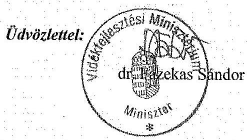

---

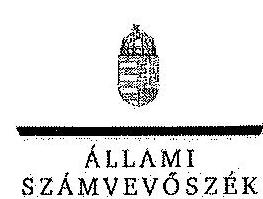

# Dr. Fazekas Sándor úr 

miniszter
Vidékfejlesztési Minisztérium

## Budapest

## Tisztelt Miniszter Úr!

A Vidékfejlesztési Minisztérium egyes agrárkutató intézetei és egyes génmegőrzési intézményei gazdálkodásának ellenőrzéséről készített számvevőszéki jelentéstervezetre tett észrevételét köszönettel megkaptam.

Az Állami Számvevőszék észrevételre vonatkozó álláspontjáról a felügyeleti vezető által készített részletes tájékoztatást csatoltan megküldöm.

Tájékoztatom Miniszter urat, hogy a jelentés szövegezésénél az elfogadott észrevételt figyelembe vesszük.

Budapest, 2014. 06. hó 6. nap
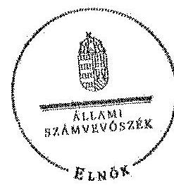

Tisztelettel:

## Dr. Lás

Domokos László

Melléklet: Tájékoztatás az elfogadott észrevételekről

---

# Tájékoztatás 

## az elfogadott észrevételekről

A Vidékfejlesztési Minisztérium egyes agrárkutató intézetei és egyes génmegőrzési intézményei gazdálkodásának ellenőrzéséről készített jelentéstervezetre KGF/44-1/2014. Iktatószámú levelében tett észrevételét áttekintettük, annak kezeléséről az alábbi tájékoztatást adom.

A 2012. évben beindított KFI folyamatszabályozásra, valamint a szervezeti keretekre vonatkozó tájékoztatását köszönettel vettem. Tájékoztatása az ellenőrzött időszakra vonatkozó megállapításunkat nem módosítja. A 2013. december 31-vel 3 kutatóintézet (ÁTK, ERTI, VM MGI) megszűnése és feladatainak a Nemzeti Agrárkutatási és Innovációs Központhoz való kerülése következtében az érintett javaslatok címzettjeit módosítottuk.

Tájékoztatom, hogy a számvevőszéki jelentés mellékleteiként szerepeltetjük a jelentéstervezethez tett észrevételét, valamint arra adott válaszunkat.

Budapest, 2014. 0. hó 25. nap

## Holman Magdolna

felügyeleti vezető

---

# NAIK 

Nemzeti Agrárkutatási és Innovációs Központ
2100 Gödöllő, Szent-Györgyi Albert u. 4.
Levélcím: 2101 Gödöllő, Pf. 411.
Telefon: (28) 526-227
Fax: (28) 526-198

Hivatkozási szám:
Iktatószám: $5-2 \mid 3-014$
Ügyintéző:
Aláírás:

Állami Számvevőszék
Holman Magdolna Asszony
felügyeleti vezető részére
Tárgy: észrevétel a V-0713-397/2013. sz. jelentéstervezetre

Tisztelt Felügyeleti Vezető Asszony!

A tárgyban készült számvevőszéki jelentéstervezettel kapcsolatban tájékoztatom, hogy az 1467/2013. (VII.24.) Kormány határozat alapján 2014. január 1-jétől, - több más agrárkutatási intézet mellett -, az Állattenyésztési és Takarmányozási Kutatóintézet, az Erdészeti Tudományos Intézet és a Vidékfejlesztési Minisztérium Mezőgazdasági Gépesítési Intézet a Nemzeti Agrárkutatási és Innovációs Központ (NAIK) elnevezésű költségvetési intézménybe összevonással, annak jogutódlásával látják el feladatukat.

A szervezeti keretek változása alapján az ÁSZ jelentés tervezetével kapcsolatos észrevételeket a NAIK teszi meg, a következők szerint:

A tárgyban készült számvevőszéki jelentéstervezetben az ÁTK-val, az ERTI-vel és a VM MGI-vel kapcsolatban tett megállapításokkal és az annak alapján megfogalmazott javaslatokkal kapcsolatban észrevételt nem teszek.

A javaslataikkal kapcsolatban a NAIK intézkedési tervet készít, amelyet a rendelkezésünkre álló határidőben benyújtunk az ÁSZ részére.

A Számvevőszék által feltárt hiányosságok megszüntetésére irányuló intézkedéseinket általános érvénynyel, a NAIK működését szabályozó belső szabályozás kialakításának keretében hajtjuk végre.

Az ERTI-nél és a VM MGI-nél az ÁSZ által kifogásolt, szolgálati lakások bérbe adásából származó, az ellenőrzési időszakot megelőzően felmerült követelések érvényesítése érdekében a rendelkezésünkre álló jogi szakvélemény alapján kívánunk eljárni, amely figyelembe veszi a költségvetési gazdálkodás jogszabályi követelményeit, a megtérüléssel kapcsolatban felmerülő kiadásainkat és a PTK-n alapuló jogviszony sajátosságait (pl. elévülés).

Gödöllő, 2014. január 6.
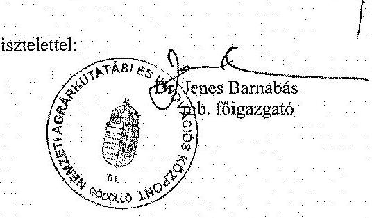

---

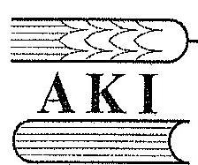

# Agrárgazdasági Kutató Intézet 

1093 Budapest, IX. Zsil u. 3-5.
Ea 1463 Budapest Pf. 944.
217-1011
fax: 217-7037
e-mail: aki@aki.gov.hu
$5 / 4 / 2014$

## Domokos László

elnök úr

## Állami Számvevőszék

## Budapest

Apáczai Csere János utca 10.
1052

Tárgy: A Vidékfejlesztési Minisztérium egyes agrárkutató intézetei és egyes génmegőrzési intézményei gazdálkodásának ellenőrzéséről készített számvevőszéki jelentéstervezet véleményezése

## Tisztelt Elnök Úr!

A Vidékfejlesztési Minisztérium egyes agrárkutató intézetei és egyes génmegőrzési intézményei gazdálkodásának ellenőrzéséről készített számvevőszéki jelentéstervezetre észrevételt nem teszek.

Budapest, 2014. január 6.

Üdvözlettel:
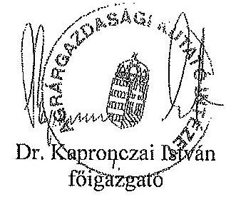

---

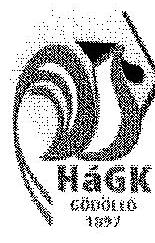

# Haszonállat-génmegőrzési Központ 

Centre for Farm Animal Gene Conservation

H-2100 Gödöllő, Isaszegi út 200., HUNGARY
Tel: $+36-28-511-300$, Fax: $+36-28-430-184$, e-mail: kalki@kalki.hu; www.genmegorzes.hu

## 2014. 01. 18.

## Domokos László elnök úr részére

Állami Számvevőszék
Budapest 4.
Pf. 54
1364

Tisztelt Elnök Úr!

Hivatkozással V-0173-405/2013. számú levelére, ezúton tájékoztatom, hogy a Vidékfejlesztési Minisztérium egyes agrárkutató intézetei és egyes génmegőrzési intézményei gazdálkodásának ellenőrzéséről készített számvevőszéki jelentés-tervezetre észrevételt nem teszünk.

Gödöllő, 2014. január 21.

Tisztelettel:
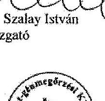

---

.

---

# RÖVIDÍTÉSEK JEGYZÉKE 

| Törvények |  |
| :--: | :--: |
| Áht. 1 | az államháztartásról szóló 1992. évi XXXVIII. törvény (hatályon kívül helyezte a 2011. évi CXCV. törvény, hatálytalan 2012. I. 1-jétől) |
| Áht. 2 | az államháztartásról szóló 2011. évi CXCV. törvény |
| Kbt. 1 | a közbeszerzésekről szóló 2003. évi CXXIX. törvény (hatályon kívül helyezte a 2011. évi CVIII. törvény 181. § (1) bekezdése, hatálytalan 2012. I. 1-jétől) |
| Kbt. 2 | a közbeszerzésekről szóló 2011. évi CVIII. törvény |
| Kjt. | a közalkalmazottak jogállásáról 1992. évi XXXIII. törvény |
| Sztv. | a számvitelről szóló 2000. évi C. törvény |
| Rendeletek |  |
| Áhsz. | az államháztartás szervezetei beszámolási és könyvvezetési kötelezettségének sajátosságairól szóló 249/2000. (XII. 24.) Korm. rendelet |
| Ámr. 1 | az államháztartás működési rendjéről szóló 217/1998. (XII. 30.) Korm. rendelet (hatályon kívül helyezte a 292/2009. (XII. 19.) Korm. rendelet, hatálytalan 2010. I. 1-jétől) |
| Ámr. 2 | az államháztartás működési rendjéről szóló 292/2009. (XII. 19.) Korm. rendelet (hatályon kívül helyezte a 368/2011. (XII. 31.) Korm. rendelet, hatálytalan 2012. I. 1-jétől) |
| Ávr. | az államháztartásról szóló törvény végrehajtásáról szóló 368/2011. (XII. 31.) Korm. rendelet |
| Ber. | a költségvetési szervek belső ellenőrzéséről szóló 193/2003. (XI. 26.) Korm. rendelet (hatályon kívül helyezte a 370/2011. (XII. 31.) Korm. rendelet 62. §-a, hatálytalan 2012. január 1-jétől) |
| Bkr. | a költségvetési szervek belső kontrollrendszeréről és belső ellenőrzésről szóló 370/2011. (XII. 31.) Korm. rendelet |
| Vtvr. | 254/2007. (X. 4.) Korm. rendelet az állami vagyonnal való gazdálkodásról |
| Szórövidítések |  |
| AKI | Agrárgazdasági Kutató Intézet |
| ÁSZ | Állami Számvevőszék |
| ÁTK | Állattenyésztési és Takarmányozási Kutatóintézet |
| Ellenőrzött időszak | Az AKI, az ERTI, a VM MGI esetében 2008-2012. évek, az ÁTK esetében 2008-2010. évek, a KÁTKI esetében 2010-2012. évek. |
| ERTI | Erdészeti Tudományos Intézet |
| EU | Európai Unió |
| FEUVE | Folyamatba épített, előzetes, utólagos és vezetői ellenőrzés |

---

| FVM | Földművelésügyi és Vidékfejlesztési Minisztérium |
| :--: | :--: |
| intézetek | AKI, ÁTK, KÁTKI, ERTI, VM MGI |
| $\mathrm{K}+\mathrm{F}$ | Kutatásfejlesztés |
| $\mathrm{K}+\mathrm{F}+\mathrm{I}$ | Kutatásfejlesztés és innováció |
| KÁTKI | Kisállattenyésztési Kutatóintézet és Génmegőrzési Koordinációs Központ (2013. április 15-től Haszonállat-génmegőrzési Központ, HáGK) |
| Kft. | Korlátolt felelősségű társaság |
| Korm. rendelet | Kormányrendelet |
| Kormány | Magyarország Kormánya |
| MÁK | Magyar Államkincstár |
| M Ft | Millió forint |
| miniszter | 2008-2010. V. 29-ig földművelésügyi és vidékfejlesztési miniszter, azt követően vidékfejlesztési miniszter |
| minisztérium | 2008-2010. V. 29-ig Földművelésügyi és Vidékfejlesztési Minisztérium, azt követően Vidékfejlesztési Minisztérium |
| MNV Zrt. | Magyar Nemzeti Vagyonkezelő Zrt. |
| NAV | Nemzeti Adó- és Vámhivatal |
| NGM | Nemzetgazdasági Minisztérium |
| NKTH | Nemzeti Kutatási és Technológiai Hivatal |
| OTKA | Országos Tudományos Kutatási Alapprogramok |
| pl. | Például |
| PM | Pénzügyminisztérium |
| SZMSZ | Szervezeti és működési szabályzat |
| tv. | Törvény |
| VM | Vidékfejlesztési Minisztérium |
| VM MGI | Vidékfejlesztési Minisztérium Mezőgazdasági Gépesítési Intézet |

---

# ÉRTELMEZŐ SZÓTÁR 

alapkutatás
alkalmazott kutatás
alaptevékenység
belső ellenőrzés
belső kontroll kockázat
belső kontrollrendszer
beszámoló

Kísérleti vagy elméleti munka, amelyet elsősorban a jelenségek vagy megfigyelhető tények hátterével kapcsolatos új ismeretek megszerzésének érdekében folytatnak anélkül, hogy kilátásba helyeznék azok gyakorlati alkalmazását vagy felhasználását (2004. évi CXXXIV. törvény 4. §).
Tervezett kutatás vagy kritikus vizsgálat, amelynek célja új ismeretek és szakértelem megszerzése új termékek, eljárások vagy szolgáltatások kifejlesztéséhez, vagy a létező termékek, eljárások vagy szolgáltatások jelentős mértékű fejlesztésének elősegítéséhez. Magában foglalja az alkalmazott kutatáshoz - különösen a generikus technológiák ellenőrzéséhez - szükséges komplex rendszerek összetevőinek létrehozását is a prototípusok kivételével (2004. évi CXXXIV. törvény 4. §).
Amely a létrehozásáról rendelkező jogszabályban, alapító okiratában a szakmai alapfeladataként meghatározott közfeladat, valamint a nem haszonszerzés - az időlegesen szabad kapacitások hasznosítása céljából - végzett, nem kötelezően ellátandó tevékenység (Áht. 7. §).
Független, tárgyilagos bizonyosságot adó és tanácsadó tevékenység, amelynek célja, hogy az ellenőrzött szervezet működését fejlessze és eredményességét növelje, az ellenőrzött szervezet céljai elérése érdekében rendszerszemléletű megközelítéssel és módszeresen értékeli, illetve fejleszti az ellenőrzött szervezet irányítási és belső kontrollrendszerének hatékonyságát (370/2011. (XII. 31.) Korm. rendelet 2. §).
Annak a kockázata, hogy az ellenőrzött szervezet (tevékenység, projekt) belső kontrollrendszere elmulasztja megelőzni vagy jelezni és kijavítani a lényeges hibát, szabálytalanságot vagy a félrevezető állítást.
A kockázatok kezelése és tárgyilagos bizonyosság megszerzése érdekében kialakított folyamatrendszer, ami azt a célt szolgálja, hogy megvalósuljanak a következő célok: a működés és a gazdálkodás során a tevékenységeket szabályszerűen, gazdaságosan, hatékonyan, eredményesen hajtsák végre, az elszámolási kötelezettségeket teljesítsék, és megvédjék az erőforrásokat.

 a veszteségektől, károktól és nem rendeltetésszerű használattól (Áht. 69. §).
Az államháztartási szervezetek beszámolási kötelezettsége, a költségvetési előirányzatok alakulásának és azok teljesítésének a vagyoni, pénzügyi és létszámhelyzetének, a költségvetési feladatmutatóknak elszámolására terjed ki. Áhsz. 6. §

---

ellenjegyzés
ellenőrzési kockázat
ellenőrzési nyomvonal
ellenőrzött időszak
előirányzat-elvonás
előirányzat-módosítás
érvényesítés

FEUVE
fejlesztés
felújítás
használhatósági fok

Annak igazolása, hogy a kötelezettségvállalás vagy utalványozás teljesítéséhez szükséges fedezet rendelkezésre áll, és nem sérti a gazdálkodásra vonatkozó szabályokat.
Annak a kockázata, hogy az ellenőrzési megállapítások, következtetések, illetve ellenőrzési vélemény részben vagy összességében nem helytálló. Az ellenőrzési kockázat az ellenőrzési bizonyosság ellentéte, és százalékos mértéke a nem helytálló ellenőrzési eredmények valószínűségét fejezi ki. Három összetevője az eredendő kockázat, a belső kontroll kockázat és a feltárási kockázat. (ÁSZ belső szakmai előírása).
Az ellenőrzési nyomvonal egy olyan nyilvántartási rendszer kialakítását és fenntartását jelenti, amely a tranzakciók teljes folyamatának minden egyes szakaszára vonatkozóan teljes dokumentálást és igazolást nyújt. Az ellenőrzési nyomvonal lehetővé teszi, hogy az aggregált összegekből lefelé haladva nyomon lehessen követni az egyes tranzakciókat csakúgy, mint az egyes tranzakciókból az aggregált összegeket. (ÁSZ belső szakmai előírása).
VM, AKI, ERTI és a VM MGI esetében 2008-2012. évek, az ÁTK esetében 2008-2010. évek, a KÁTKI esetében a 2010. november 1-jétől (megalakulásától) 2012. év végéig.
A kiadási előirányzatok felhasználásának végleges korlátozása, az előirányzatok feltételhez nem kötött csökkentése.
A megállapított kiadási előirányzat növelése vagy csökkentése, a bevételi előirányzatok egyidejű növelése vagy csökkentése mellett (Áht. 2. §).
A kiadás teljesítése, bevétel beszedése előtt azok jogosultságának, összegszerűségének, előírt alaki követelményeknek való megfelelésének, továbbá a szükséges fedezet meglétének igazolása.
Folyamatba épített előzetes és utólagos vezetői ellenőrzés.
Olyan - alapvetően felhalmozási kiadásokban megtestesülő - tevékenység, amely új, vagy a korábbinál műszaki, technikai szempontból korszerűbb tárgyi eszközök létrehozására irányul, illetve a meglevő tárgyi eszközök műszaki, technikai paramétereinek korszerűsítését valósítja meg.
A számvitelről szóló 2000. évi C. törvény 3. §-a (4) bekezdésének 8. pontjában meghatározott tevékenység
Tárgyi eszközök, immateriális javak nettó értéke/ Tárgyi eszközök, immateriális javak bruttó értéke.
A mutató évről-évre történő növekedése azt jelzi, hogy az intézmény eszközeinek átlagos elhasználtsága csökken, a használhatóságuk javul.

---

impaktfaktor (hatástényező)
intézetek
intézkedési terv
intézeti beruházás
irányító szerv
kiegészítő tevékenység
kísérleti fejlesztés

A folyóiratok idézetelemzésen alapuló minősítője valamely szakfolyóirat idézettségét jelző mutató. Az impaktfaktor a folyóirat 2 egymást követő év folyamában közölt cikkeinek -a cikkek számával arányosított - átlagos idézettsége a rákövetkező 3. tárgyévben. Az érték kiszámítása a Thomson Institute for Scientific Information (korábbi nevén: Institute for Scientific Information, ISI) adatbázisai alapján történik.
A 2008-2012. években ellenőrzött agrárkutató és génmegőrzési intézetek az ellenőrzött időszaknak megfelelően:
Agrárgazdasági Kutatóintézet, ellenőrzött időszak 2008-2012. évek

Állattenyésztési és Takarmányozás Kutató Intézet ellenőrzött időszak 2008-2010. évek
Kisállattenyésztési Kutatóintézet és Génmegőrzési Koordinációs Központ, ellenőrzött időszak 2010-2012. évek
Erdészeti Tudományos Intézet, ellenőrzött időszak 2008-2012. évek

VM Mezőgazdasági Gépesítési Intézet, ellenőrzött időszak 2008-2012. évek
Az ellenőrzési javaslatok alapján az ellenőrzött szervezet, szervezeti egység által készített intézkedések végrehajtásának ütemezése a végrehajtásért felelős személyek és a vonatkozó határidők megjelölésével (370/2011. (XII. 31.) Korm. rendelet 2. §).
Azok a beruházások és az azokhoz kapcsolódó egyéb felhalmozási kiadások (ideértve az immateriális javakkal kapcsolatos kiadásokat is), melyek célját a költségvetési szerv vezetője határozza meg, a megvalósítás fedezetére szolgáló előirányzat a költségvetési szerv költségvetésében szerepel.
A költségvetési fejezet meghatározott előirányzatainak tervezéséért, végrehajtásáért, a felhasználásáról való elszámolásáért, a fejezethez tartozó költségvetési szervek, illetőleg feladatok felügyeletéért, pénzellátásáért és ellenőrzéséért, illetve mindezek szabályozásáért felelős szerv.
A rendelkezésre álló kapacitás fokozott kihasználása, az alaptevékenység érdekében személyi, tárgyi feltételek javítása, nem haszonszerzés a célja.
Az alaptevékenységtől eltérő, de az alaptevékenység ellátására létrehozott kapacitás kihasználását célzó, államháztartás körébe tartozó szervezet vagy természetes személy számára nem kötelezően és nem haszonszerzés céljából végzett tevékenység.
A meglévő tudományos, technológiai, üzleti és egyéb vonatkozó ismeretek és szakértelem megszerzése, összesítése, megosztása és felhasználása új, módosított vagy javított termékek, eljárások vagy szolgáltatások terveinek és szab-

---

kockázat
kockázatkezelési rendszer
kontrolltevékenységek
költségvetés
kötelezettségvállalás
központi beruházás
konzorcium
költségvetési szerv
ályainak létrehozása vagy megtervezése céljából. (2004. évi CXXXIV. törvény 4. §)
A szervezeti célok elérését veszélyeztető tényezők (Bkr. 2. § m) pont)
Irányítási eszközök és módszerek összessége, melynek elemei a szervezeti célok elérését veszélyeztető tényezők (kockázatok) azonosítása, elemzése, csoportosítása, nyomon követése, valamint szükség esetén a kockázati kitettség mérséklése. (Bkr. 2. § m) pont
Az államháztartási kontrollok célja az államháztartás pénzeszközeivel és a nemzeti vagyonnal történő szabályszerű, gazdaságos, hatékony és eredményes gazdálkodás biztosítása. Áht. 61. § (1) bekezdés
A költségvetési évben teljesülő költségvetési bevételek és költségvetési kiadások előirányzott összegét tartalmazza (Áht ${ }^{2} 4$. § (2) bekezdés)
A kiadási előirányzatok terhére fizetési kötelezettség vállalásáról szóló, szabályszerűen megtett nyilatkozat (Áht. 2. §).
A központi beruházások előkészítésére és megvalósítására, valamint az azokhoz kapcsolódó egyéb felhalmozási kiadásokra (ideértve az immateriális javakkal kapcsolatos kiadásokat is) szolgáló, a központi költségvetésben a fejezeti kezelésű előirányzatok között Beruházás alcímen megtervezett előirányzat, melynek célját az irányító szerv jelöli meg az ágazati fejlesztési koncepciókkal összhangban. Ámr 2. §
A részes felek (tagok) polgári jogi szerződésben szabályozott munkamegosztásán alapuló együttműködés kutatás-fejlesztési, technológiai innovációs tevékenység közös folytatása vagy egy kutatás-fejlesztési, technológiai innovációs projekt közös megvalósítása céljából (2004. évi CXXXIV. törvény).
A jogszabályban vagy az alapító okiratban meghatározott közfeladat ellátására létrejött jogi személy (Áht. 7. §).
költségvetési támogatás A társadalombiztosítás pénzügyi alapjai kivételével az államháztartás központi alrendszeréből ellenérték nélkül, pénzben nyújtott támogatások, ide nem értve az adományokat, segélyeket, felajánlásokat, a pártok és pártalapítványok támogatását, a tanulóknak, hallgatóknak biztosított ösztöndíjakat, a fogyatékos és a súlyos mozgáskorlátozott személyeknek ezen élethelyzetére tekintettel nyújtott pénzbeli ellátásokat, a szociális igazgatásról és szociális ellátásokról szóló törvény szerinti pénzbeli és természetbeni szociális és gyermekvédelmi ellátásokat, a foglalkoztatás elősegítéséről és a munkanélküliek ellátásáról szóló törvény szerinti foglalkoztatást elősegítő képzési támoga-

---

közfeladat
központi alrendszer egyes intézetei (intézetek)
kutatás-fejlesztés
kutatás-fejlesztési megállapodás
likviditási mutató
mérlegfőösszeg
tásokat, a jogszabály alapján nyújtott családtámogatásokat, korhatár alatti ellátásokat, jövedelempótló és jövedelemkiegészítő szociális támogatásokat, az apákat megillető munkaidő-kedvezményekkel összefüggő költségek megtérítését, az energiafelhasználási támogatásokat, a helyi önkormányzatok, nemzetiségi önkormányzatok és ezek társulásai normatív hozzájárulásait, támogatásait, a települési önkormányzatok jövedelemkülönbségének mérséklését szolgáló támogatást, a közfoglalkoztatási támogatásokat, valamint a fogyasztói árkiegészítést (Áht. 22. §).
Jogi fogalmának három lehetséges értelmezése a fiskális, a pozitivista és a funkcionális értelmezés. Ezek:
fiskális értelmezés szerint az a tevékenység, szolgáltatás tekintendő közfeladatnak, amely teljes egészében vagy döntő hányadában közpénz (pl.: állami illetve önkormányzati költségvetés, társadalombiztosítási alap, EU támogatás) felhasználásával valósul meg;
pozitivista értelmezés szerint azt kell megkívánnunk a közfeladati minőség kimondásához, hogy az adott tevékenységet egy jogszabály (lehetőleg törvény) közfeladatként határozza meg;
funkcionális értelmezés szerint a jogalkalmazó akkor állapíthatja meg egy tevékenységről, hogy közfeladat, ha a feladat jellege szerint az közérdeket szolgál és gyakorlatilag - figyelembe véve például a mérethatékonyság követelményeit - csak közösségi (társadalmi) összefogással valósítható meg.
Az állami vagyonnal gazdálkodó vagy azzal rendelkező szerv vagy személy a közérdekű adatok nyilvánosságáról szóló törvény szerinti közfeladatot ellátó szervnek vagy személynek minősül.
A központi alrendszerbe tartozik az állam, a központi költségvetési szerv, a törvény által a központi alrendszerbe sorolt köztestület, valamint az utóbbi által irányított köztestületi költségvetési szerv. (Áht. 23. §).
Magában foglalja az alapkutatást, az alkalmazott kutatást és a kísérleti fejlesztést (2004. évi CXXXIV. Törvény 4. §).

Két vagy több vállalkozás, illetve vállalkozás és kutatóhely (felek) között létrejött megállapodás. (2004. évi CXXXIV. törvény 4. §).
A forgóeszközök rövid lejáratú kötelezettségekhez viszonyított aránya.
A vagyonmérleg legutolsó, összesítő sora. A gazdálkodó egység vagyonát mutatja meg megjelenési formák alapján: eszköz és forrás oldalon

---

monitoring
önállóan működő és gazdálkodó költségvetési szerv
pénzeszköz likviditási mutató
projekt
szabályszerűségi ellenőrzés (regularity audit)
szakmai teljesítésigazolás

A monitoring a különböző szintű szervezeti célok megvalósításának folyamatát kíséri figyelemmel, melynek során a releváns eseményekről és tevékenységekről (együtt: folyamatokról) rendszeres jelleggel, strukturált, döntéstámogató információkhoz jutnak a szervezet vezetői. (NGM útmutató a költségvetési szervek monitoring rendszeréhez 3. oldal, 2011. november)
a fejezetet irányító szerv, a fejezetet irányító szervi jogállással bíró költségvetési szerv és a középirányító szerv, a központi hivatal, az önkormányzati hivatal, az országos területi hálózattal rendelkező költségvetési szerv központi szerve,
a többcélú kistérségi társulás és a jogi személyiségű társulás munkaszervezete, és
a költségvetési szervként működő közreműködő szervezet; továbbá az a szerv, amely
jelentős terjedelmű és összetett közfeladatokat lát el, a közfeladat ellátásában országos, megyei vagy egyéb a településinél nagyobb területi jellegű illetékességgel jár el, vagy
a közfeladat terjedelme, az ellátottak száma, az ügyfélforgalom volumene, az alaptevékenység ellátását támogató szellemi és fizikai tevékenységet végző szervezeti egységek működtetését e besorolást indokolja.
A pénzeszközök rövid lejáratú kötelezettségekhez viszonyított aránya.
Meghatározott kutatás-fejlesztési feladat, technológiai innovációs folyamat végrehajtására irányuló tevékenység az abban érdekeltek által meghatározott terv alapján. (2004. évi CXXXIV. törvény 4. §).
Az elszámolásra kötelezett szervezetek pénzügyi elszámoltathatóságának tanúsítása, beleértve a pénzügyi nyilvántartások vizsgálatát és értékelését, a pénzügyi beszámolóra vonatkozó vélemény kifejtését; a teljes kormányzati igazgatás pénzügyi elszámoltathatóságának tanúsítását; a pénzügyi rendszerek és ügyletek ellenőrzését, beleértve a vonatkozó jogszabályok és más szabályok betartásának értékelését; a belső kontrollrendszer és a belső ellenőrzés működésének vizsgálatát; az ellenőrzött szervezetnél hozott igazgatási döntések feddhetetlenségének és megfelelésének vizsgálatát; valamint az ellenőrzéssel kapcsolatos vagy abból fakadó egyéb ügyekről jelentés készítését, amelyeket a legfőbb ellenőrzési intézet nyilvánosságra hozandónak tart. (INTOSAI)
A szakmai teljesítés megtörténtének igazolása.

---

szállítói futamidő
tartalék
utalványozás
utóellenőrzés
vállalkozási tevékenység
véletlen minta
zárolás

A mutató azt fejezi ki, hogy a szállítói tartozás az anyagi jellegű kiadásoknak (az összes pénzforgalmi kiadás a személyi juttatások és a munkaadókat terhelő járulékok, az előző évi előirányzat átadás, pénzeszközátadások és az egyéb juttatások kivételével) milyen részarányát teszi ki, napokban kifejezve (a napi kiadást 360 nap figyelembe vételével határoztuk meg).
Az Áhsz. 23. és 25. §-a alapján a könyvviteli mérlegben forrásként kell kimutatni a saját tőkét, a tartalékokat és minden kötelezettséget. Tartalék képezhető a jóváhagyott pénzmaradványból, előirányzat-maradványból és a vállalkozási maradványból.
A kiadás teljesítésének, bevétel beszedésének vagy elszámolásának elrendelése.
Az intézkedések nyomon követése érdekében elrendelt ellenőrzés, amelynek célja, hogy az ellenőrzés bizonyosságot szerezzen az elfogadott intézkedések végrehajtásáról vagy arról a tényről, hogy az ellenőrzött szerv, illetve az ellenőrzött szervezeti egység vezetője nem vagy nem az elfogadott intézkedésnek megfelelően hajtja végre az intézkedéseket, továbbá meggyőződni arról, hogy a végrehajtott intézkedésekkel a megállapított kockázat ténylegesen megszűnt, vagy a kockázati tűréshatár alá csökkent (370/2011. (XII. 31.) Korm. rendelet 2. §).
Amely haszonszerzés céljából, államháztartáson kívüli forrásból, nem kötelezően végzett termelő, szolgáltató, értékesítő tevékenység (Áht. 7. §).
Az alapsokaságot képviselő véletlenszerűen kiválasztott részsokaság. (ÁSZ belső szakmai előírása)
A kiadási előirányzatok felhasználásának időleges, feltételhez kötött korlátozása, felfüggesztése (Áht. 2. §)
