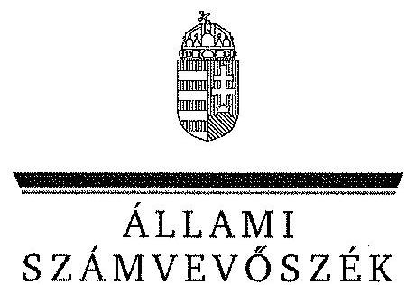
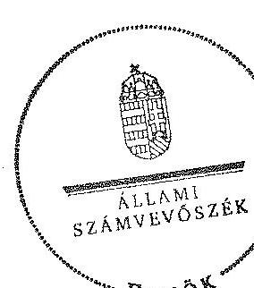

ÁLLAMI
SZÁMVEVŐSZÉK

# JELENTÉS 

az önkormányzatok belső kontrollrendszere kialakításának, egyes kontrolltevékenységek és a belső ellenőrzés müködésének

- 2013. évben induló - ellenőrzéséről

Csemő
14040
2014. február

---

# Állami Számvevőszék 

Iktatószám: V-0309-103/2014.
Témaszám: 1341
Vizsgálat-azonosító szám: V064926

## Az ellenőrzést felügyelte:

## dr. Benedek Mária

felügyeleti vezető
Az ellenőrzést vezette és az ellenőrzés végrehajtásáért felelős:
dr. Tóth Viktória
ellenőrzésvezető
A számvevőszéki jelentés összeállításában közreműködtek:
Csepreginé Tancsik Erzsébet
számvevő tanácsos
Hadnagyné Papp Ildikó
számvevő
Az ellenőrzést végezték:
Rácz József
Számvevő

Buzás Zoltán
számvevő

---

# TARTALOMJEGYZÉK 

BEVEZETÉS ..... 5
I. ÖSSZEGZŐ MEGÁLLAPÍTÁSOK, KÖVETKEZTETÉSEK, JAVASLATOK ..... 9
II. RÉSZLETES MEGÁLLAPÍTÁSOK ..... 16

1. Az önkormányzat belső kontrollrendszerének kialakítása ..... 16
1.1. A kontrollkörnyezet ..... 16
1.2. A kockázatkezelési rendszer ..... 17
1.3. A kontrolltevékenységek ..... 17
1.4. Az információs és kommunikációs rendszer ..... 18
1.5. A monitoring rendszer ..... 18
2. A pénzügyi folyamatokban kulcsszerepet betöltő teljesítésigazolás és érvényesítés belső kontrollok múködése ..... 19
3. A belső ellenőrzés múködése ..... 21

## FÜGGELÉKEK

1. számú Értelmező szótár
2. számú Az értékelés módja és szempontjai

---

# **Chemistry**

## **Chemical Reactions**

### **Balancing Chemical Equations**

1. **Write the unbalanced equation:**
   - Example: $$C_3H_8 + O_2 \rightarrow CO_2 + H_2O$$

2. **Balance the equation:**
   - Example: $$2C_3H_8 + 7O_2 \rightarrow 6CO_2 + 8H_2O$$

3. **Balance the equation:**
   - Example: $$2C_3H_8 + 7O_2 \rightarrow 6CO_2 + 8H_2O$$

### **Types of Reactions**

1. **Combination Reaction:**
   - Example: $$2H_2 + O_2 \rightarrow 2H_2O$$

2. **Decomposition Reaction:**
   - Example: $$2H_2O_2 \rightarrow 2H_2O + O_2$$

3. **Single Displacement Reaction:**
   - Example: $$Zn + 2HCl \rightarrow ZnCl_2 + H_2$$

4. **Double Displacement Reaction:**
   - Example: $$AgNO_3 + NaCl \rightarrow AgCl + NaNO_3$$

5. **Combustion Reaction:**
   - Example: $$CH_4 + 2O_2 \rightarrow CO_2 + 2H_2O$$

## **Stoichiometry**

### **Mole Concept**

- **Mole (mol):** The amount of substance containing as many particles (atoms, molecules, ions) as there are atoms in exactly 12 grams of carbon-12.
- **Avogadro's Number:** $$6.022 \times 10^{23}$$ particles per mole.

### **Molar Mass**

- **Molar Mass:** The mass of one mole of a substance.
- Example: The molar mass of water ($$H_2O$$) is 18.015 g/mol.

### **Calculations**

1. **Moles to Mass:**
   - Formula: $$n = \frac{m}{M}$$
   - Example: Calculate the number of moles of $$H_2O$$ in 18 grams of water.
     - $$n = \frac{18.015 \, \text{g}}{18.015 \, \text{g/mol}} = 18.015 \, \text{g/mol}$$

2. **Moles to Mass:**
   - Formula: $$m = n \times M$$
   - Example: Calculate the mass of 18.015 g of water.
     - $$m = 18.015 \, \text{g/mol} = 18.015 \, \text{g/mol}$$

## **Gas Laws**

### **Ideal Gas Law**

- **Equation:** $$PV = nRT$$
- **Variables:**
  - $$P$$: Pressure (atm)
  - $$V$$: Volume (L)
  - $$n$$: Number of moles (mol)
  - $$R$$: Ideal gas constant (0.0821 L·atm/mol·K)
  - $$T$$: Temperature (K)

### **Boyle's Law**

- **Equation:** $$P_1V_1 = P_2V_2$$
- **Variables:**
  - P₁: Pressure (atm)
  - P₂: Volume (L)
  - P₃: Temperature (K)
  - P₁: Pressure (atm)
  - P₂: Volume (L)
  - P₃: Temperature (K)
  - P₁: Pressure (atm)

### **Boyle's Law (Boyle's Law)**

- **Equation:** $$\frac{P_1V_1}{P_2V_2} = \frac{P_1}{V_1}$$

## **Thermochemistry**

### **Enthalpy (H)**

- **Definition:** The heat content of a system at constant pressure.
- **Equation:** $$\Delta H = q_p$$
- **Variables:**
  - $$q_p$$: Heat transferred at constant pressure.
  - $$q_p$$: Heat transferred at constant pressure.

### **Hess's Law**

- **Statement:** The enthalpy change for a reaction is the same whether it occurs in one step or multiple steps.
- **Equation:** $$\Delta H_{\text{rest}} = \Delta H - \Delta H_0$$
- **Variables:**
  - $$\Delta H$$: Heat transferred at constant pressure.
  - $$\Delta H_0$$: Heat transferred at constant pressure.

### **Hess's Law (Hess's Law)**

- **Statement:** The enthalpy change for a reaction is the same whether it occurs in one step or multiple steps.
- **Equation:** $$\Delta H_{\text{rest}} = \Delta H - \Delta H_0$$
- **Variables:**
  - $$\Delta H$$: Heat transferred at constant pressure.
  - $$\Delta H_0$$: Heat transferred at constant pressure.

## **Electrochemistry**

### **Oxidation and Reduction**

- **Oxidation:** Loss of electrons.
- **Reduction:** Gain of electrons.

### **Galvanic Cells**

- **Definition:** A cell that converts chemical energy into electrical energy.
- **Components:**
  - Anode: Oxidation occurs.
  - Cathode: Reduction occurs.
  - Salt Bridge: Connects the two half-cells.

### **Nernst Equation**

- **Equation:** $$E = E^\circ - \frac{RT}{nF} \ln Q$$
- **Variables:**
  - $$E$$: Energy (K)
  - $$E^\circ$$: Standard deviation of the energy (J)
  - $$R$$: Ideal gas constant (0.0821 L·atm/mol·K)
  - $$T$$: Temperature (K)
  - $$n$$: Number of electrons transferred
  - $$F$$: Faraday constant (96,485 C/mol)
  - $$Q$$: Reaction quotient

---

# RÖVIDÍTÉSEK JEGYZÉKE 

| Törvények |  |
| :--: | :--: |
| Áht. | 2011. évi CXCV. törvény az államháztartásról (hatályos 2012. január 1-jétől) |
| ÁSZ tv. | 2011. évi LXVI. törvény az Állami Számvevőszékről |
| Htv. | 1991. évi XX. törvény a helyi önkormányzatok és szerveik, a köztársasági megbízottak, valamint egyes centrális alárendeltségú szervek feladat- és hatásköreiről |
| Info tv. | 2011. évi CXII. törvény az információs önrendelkezési jogról és az információszabadságról (hatályos 2012. január 1-jétől) |
| Kttv. | 2011. évi CXCIX. törvény a közszolgálati tisztviselőkről (hatályos 2012. március 1-jétől) |
| Ktv. | 1992. évi XXIII. törvény a köztisztviselők jogállásáról (hatálytalan 2012. március 1-jétől) |
| Mötv. | 2011. évi CLXXXIX. törvény Magyarország helyi önkormányzatairól |
| Ötv. | 1990. évi LXV. törvény a helyi önkormányzatokról |
| Vagyonnyilatkozattételről szóló tv. | 2007. évi CLII. törvény az egyes vagyonnyilatkozat-tételi kötelezettségekről |
| Rendeletek |  |
| Ávr. | 368/2011. (XII. 31.) Korm. rendelet az államháztartásról szóló törvény végrehajtásáról (hatályos 2012. január 1jétől) |
| Bkr. | 370/2011. (XII. 31.) Korm. rendelet a költségvetési szervek belső kontrollrendszeréről és belső ellenőrzéséről (hatályos 2012. január 1-jétől) |
| Szórövidítések |  |
| ÁSZ | Állami Számvevőszék |
| belső ellenőrzési kézikönyv | Csemő Község Önkormányzatának belső ellenőrzési kézikönyve |
| gazdálkodási szabályzat | Csemő Község Önkormányzata Polgármesteri Hivatalának gazdálkodási szabályzata |
| hivatali SZMSZ | Csemő Község Önkormányzata Képviselő-testületének 6/2006. (III. 31.) számú rendelete Csemő Község Önkormányzata Polgármesteri Hivatalának Szervezeti és Müködési Szabályzatáról |
| INTOSAI | International Organization of Supreme Audit Institutions (Legfőbb Ellenőrző Intézmények Nemzetközi Szervezete) |
| ISSAI | International Standards of Supreme Audit Institutions (Legfőbb Ellenőrző Intézmények Nemzetközi Standardjai) |
| jegyző | Csemő Község Önkormányzatának 2013. január 31-ig hivatalban lévő jegyzője |
| Képviselő-testület | Csemő Község Önkormányzatának Képviselő-testülete |

---

képviselő-testületi SZMSZ
kockázatkezelési szabályzat
Kormányhivatal
NGM
Önkormányzat
polgármester
Polgármesteri Hivatal
Társulás

Csemő Község Önkormányzata Képviselő-testületének 5/2011. (IV. 5.) számú rendelete Csemő Község Önkormányzatának Szervezeti és Múködési Szabályzatáról
Csemő Község Önkormányzata Polgármesteri Hivatalának Kockázatkezelési Szabályzata
Pest Megyei Kormányhivatal
Nemzetgazdasági Minisztérium
Csemő Község Önkormányzata
Csemő Község Önkormányzatának polgármestere
Csemő Község Polgármesteri Hivatala
Ceglédi Többcélú Kistérségi Társulás

---

# JELENTÉS 

## az önkormányzatok belső kontrollrendszere kialakításának, egyes kontrolltevékenységek és a belső ellenőrzés múködésének - 2013. évben induló - ellenőrzéséről Csemő

## BEVEZETÉS

Csemő község állandó lakosainak száma 2012. január 1-jén 4433 fő volt. Az Önkormányzat hattagú Képviselő-testületének munkáját két állandó bizottság segítette. Az Önkormányzat az önállóan működő és gazdálkodó Polgármesteri Hivatalon kívül más intézményt nem múködtetett. Az Önkormányzat egy többségi tulajdoni hányadú gazdasági társasággal ${ }^{1}$ rendelkezett. A polgármester a 2006. évi helyi önkormányzati választások óta tölti be tisztségét. A jelenleg hivatalban lévő jegyző 2013. február 1-jétől látja el feladatait. Az ellenőrzött időszakban hivatalban lévő jegyző 2013. január 31-ig látta el feladatait. A Polgármesteri Hivatal szervezeti egységekre nem tagolódott, elkülönített gazdasági szervezettel nem rendelkezett. A köztisztviselők száma 2012. január 1-jén 10 fő volt. A Polgármesteri Hivatalnál 2013. január 1-jétől szervezeti változás, átalakítás nem történt. Az Önkormányzat a 2012. évi költségvetési beszámolója szerint 498371 ezer Ft bevételt ért el, valamint 478396 ezer Ft kiadást teljesített. A 2012. december 31-i könyvviteli mérleg szerint 2716474 ezer Ft értékű eszközvagyonnal rendelkezett, a rövid lejáratú kötelezettségállománya 64428 ezer Ft volt, hosszú lejáratú kötelezettsége nem volt.

A demokratikus társadalmakban alapvető igény, hogy a közpénzeket, a közvagyont használók tevékenységükről elszámoljanak, ahhoz egyértelmű és érvényesíthető felelősségi szabályok társuljanak. Ennek a jogos igénynek az érvényesítéséhez meg kell teremteni azokat a folyamatokat, rendszereket, amelyek nélkülözhetetlenek az elszámoltatáshoz. Az elszámoltatás eredményes múködtetéséhez szükség van a megfelelő információs, kontroll-, értékelési és beszámolási rendszerek kialakítására.

Magyarországon az uniós csatlakozási tárgyalások idejére nyúlnak vissza a belső kontrollrendszer szabályozásának gyökerei. Az uniós elvárásoknak megfelelő új terminológia szerinti államháztartási belső pénzügyi ellenőrzési (ÁBPE) rendszer területén a jogharmonizáció 2003-ban teljes körűen megvalósult, míg az önkormányzati alrendszerre vonatkozó, Ötv.-ben megjelenített speciális szabályozás 2005-ben lépett hatályba. Az államháztartási belső kont-

[^0]
[^0]:    ${ }^{1}$ Csemővíz Kft.

---

rollrendszer koncepciója 2009-ben továbbfejlődött. A változások irányát mutatja, hogy a költségvetési szervek belső kontrollrendszere már magában foglalja a korszerű felelős szervezetirányítás elemeit (kontrollkörnyezet, kockázatkezelés, kontrolltevékenység, információ és kommunikáció, monitoring) is. E kontrollrendszer szabályozása háromszintű, a törvényi előírásokat az Áht. és a Mötv., a rendeleti szintű szabályozást az Ávr. és a Bkr. tartalmazza, amelyeket útmutatói szinten az NGM által kiadott standardok és kézikönyvek támogatnak.

A belső kontrollrendszer azt a célt szolgálja, hogy a költségvetési szervek működésük és gazdálkodásuk során a tevékenységeket szabályszerűen, gazdaságosan, hatékonyan és eredményesen hajtsák végre, teljesítsék elszámolási kötelezettségeiket és megvédjék az erőforrásokat a veszteségektől, a károktól és a nem rendeltetésszerű használattól. A belső kontrollrendszer magában foglalja mindazon szabályokat, eljárásokat, gyakorlati módszereket és szervezeti struktúrákat, kockázatkezelési technikákat, kontrolltevékenységeket, amelyek segítséget nyújtanak a szervezetnek céljai eléréséhez.

Az ÁSZ a 2011-2015. évekre szóló stratégiájában hangsúlyos szerepet szánt annak, hogy szilárd szakmai alapon álló, értékteremtő ellenőrzéseivel előmozdítsa a közpénzügyek átláthatóságát, rendezettségét. A számvevőszéki ellenőrzés nemzetközi alapelvei is rögzítik, hogy a megfelelő belső kontrollrendszer minimálisra csökkenti a hibák és szabálytalanságok kockázatát.

Az ellenőrzés célja annak megállapítása volt, hogy a belső kontrollrendszer elemeinek kialakítása, a pénzügyi folyamatokban kulcsszerepet betöltő teljesítésigazolás és érvényesítés, és a belső ellenőrzés szabályos múködése biztosítot-ta-e az Önkormányzatnál a közpénzfelhasználás szabályosságát, hozzájárult-e az értéket teremtő rend követelményének érvényesüléséhez.

Ennek keretében értékeltük, hogy

- a jogszabályi előírásoknak megfelelően alakították-e ki a belső kontrollrendszer elemeit;
- a gazdálkodás folyamatában kulcsszerepet betöltő teljesítésigazolás és érvényesítés kontrolltevékenységeit megfelelően működtették-e;
- biztosították-e a belső ellenőrzés szabályos működését;
- amennyiben az ÁSZ tett javaslatot a 2008-2011. évek közötti ellenőrzése kapcsán az Önkormányzatnak, intézkedtek-e azok végrehajtására.

Az ellenőrzés várható hasznosulását négy szinten tervezzük. A törvényalkotás számára összegzett tapasztalatok állnak rendelkezésre a belső kontrollrendszer önkormányzati területen való kialakításáról, működéséről és hatásairól, a belső ellenőrzés működéséről. Ennek alapján következtetést lehet levonni arról, hogy a belső kontrollrendszer kialakítására és működtetésére vonatkozó - jelenlegi, differenciálás nélküli - jogszabályi előírások reális követelményeket támasztanak-e az eltérő adottságú települési önkormányzatok esetében, illetve indokolt-e esetleges jogszabályi módosítás kezdeményezése. Az ellenőrzés az ellenőrzött számára visszajelzést ad a belső kontrollrendszer kialakításában és

---

múködésében fellépő hiányosságokról, javaslataival hozzájárul azok kiküszöböléséhez, amely csökkentheti a későbbi ellenőrzések gyakoriságát. Az ellenőrzés megállapításait és javaslatait más szervezetek is hasznosíthatják a rendezett gazdálkodási keretek kialakításához. A társadalom számára jelzi, hogy közpénz nem maradhat ellenőrizetlenül, az ÁSZ értékteremtő rend kialakításához és megőrzéséhez hozzájáruló tevékenysége pozitív hatással lesz a szervezetről kialakított összkép formálásában. A szervezeten belül lehetőség nyílik arra, hogy a megállapítások szintetizálásával az ÁSZ a hozzáadott értéket teremtő elemző tevékenységét és tanácsadó szerepét is erősítse.

Az önkormányzatok belső kontrollrendszere kialakításának, egyes kontrolltevékenységek és a belső ellenőrzés működésének ellenőrzéséről szóló jelentés I. fejezetének összegző része az ellenőrzés céljára ad rövid, szintetizáló összefoglalót, és tartalmazza a következtetéseket a II. fejezet részletes megállapításain alapulóan. A jelentés intézkedést igénylő megállapításait és javaslatait az ellenőrzés során feltárt, a jelentés II. fejezetében rögzített részletes megállapítások alapozzák meg. A helyszíni ellenőrzés lezárásáig a helyi szabályozás változásait nyomon követtük.

Az ellenőrzés típusa: szabályszerűségi ellenőrzés.
Az ellenőrzött időszak: a belső kontrollrendszer kialakításának megfelelősége esetében 2012. év, a pénzügyi folyamatokban kulcsszerepet betöltő teljesítésigazolás és érvényesítés belső kontrollok múködésének megfelelőségét és a belső ellenőrzés szabályszerű múködését a 2012. január 1. és december 31-e közötti időszak eseményeit figyelembe véve értékeltük, míg az ÁSZ javaslatainak utóellenőrzése a 2008-2011. években hivatalosan közzétett számvevőszéki jelentésekben tett javaslatok áttekintésére terjedt ki.

Az ellenőrzött szervezet: Csemő Község Önkormányzata.
Az ellenőrzés jogszabályi alapját az ÁSZ tv. 1. § (3) bekezdése, az 5. § (2) és (6) bekezdései, valamint az Áht. 61. § (2) bekezdésének előírásai képezik.

Az ellenőrzés szakmai módszertana az ÁSZ hivatalos honlapján (www.asz.hu) közzétett szakmai szabályokon alapult, amely az INTOSAI által kiadott ISSAI figyelembevételével készült.

Az ellenőrzés lefolytatásához az Önkormányzat a kimutatások és a tanúsítvány kitöltésével, valamint az ÁSZ által kért dokumentumok elektronikus megküldésével szolgáltatott adatokat. Az így rendelkezésre bocsátott adatok, információk kontrollja és a munkalapok kitöltése a helyszíni ellenőrzés keretében történt. A jelentésben használt fogalmak magyarázatát az 1. számú függelék, az ellenőrzés egyes területeinek értékelésénél alkalmazott egységes minősítési szempontokat a 2. számú függelék tartalmazza.

A belső kontrollrendszer kialakításának ellenőrzése során értékeltük a kontrollkörnyezet, a kockázatkezelési rendszer, a kontrolltevékenységek, az információs és kommunikációs rendszer, valamint a monitoring rendszer szabályozottságának megfelelőségét. A pénzügyi folyamatokban kulcsszerepet betöltő teljesítésigazolás és érvényesítés kontrollok múködése megfelelőségének minősítésé-

---

hez az állományba nem tartozók megbízási díjai, a külső szolgáltatók által végzett karbantartási, kisjavítási munkák, az egyéb üzemeltetési és fenntartási szolgáltatások, a rendszeres szociális segélyek, valamint az államháztartáson kívülre teljesített múködési és felhalmozási célú pénzeszközátadások közül kockázatelemzéssel választottuk ki az ellenőrzött kiadási jogcímeket. Az egyszerű véletlen mintavétellel kiválasztott tételek ellenőrzését többlépcsős megfelelőségi tesztek útján addig végeztük, amíg elegendő és megfelelő bizonyítékot szereztünk a vizsgált folyamatok kulcskontrolljai múködésének megfelelő vagy nem megfelelő voltáról. Értékeltük az Önkormányzatnál a belső ellenőrzés múködésének szabályosságát. Utóellenőrzésre nem került sor, mivel az ÁSZ az Önkormányzatnál a 2008-2011. évek között ellenőrzést nem végzett.

Az ÁSZ tv. 29. § (1) bekezdése szerint a jelentéstervezetet megküldtük a polgármester részére, aki az ÁSZ tv. 29. § (2) bekezdésében foglalt észrevételezési jogával nem élt, a jelentéstervezetre észrevételt nem tett.

---

# I. ÖSSZEGZŐ MEGÁLLAPÍTÁSOK, KÖVETKEZTETÉSEK, JAVASLATOK 

A belső kontrollrendszeren belül 2012-ben a kontrollkörnyezet, a kockázatkezelési rendszer, a kontrolltevékenységek, az információs és kommunikációs rendszer, valamint a monitoring rendszer kialakítását külön-külön és együttesen is értékeltük. A belső kontrollrendszer kialakítása az összesített értékelés alapján nem felelt meg a jogszabályi előírásoknak.

A belső kontrollrendszer egyes területei kialakításának minősítése a következő:

| Kontrollterïlet | Minősítés |  |
| :-- | :-- | :-- |
| Kontrollkörnyezet |  | nem   megfelelö |
| Kockázatkezelési rendszer |  | részben |
| Kontrolltevékenységek | megfelelö |  |
| Információs és kommuni-   kációs rendszer |  | nem   megfelelö |
| Monitoring rendszer |  | nem   megfelelö |

Megfelelőnek értékeltük a kontrolltevékenységek kialakítását, mivel a jogszabályi előírásokban foglaltakat figyelembe véve kisebb hiányosságok mellett is e kontrollterület hozzájárult a Polgármesteri Hivatal, ezáltal az Önkormányzat céljainak eléréséhez.

Részben megfelelőnek értékeltük a kockázatkezelési rendszer kialakítását, mivel az e területen megállapított kisebb hiányosságok nem veszélyeztették a kockázatkezelési rendszer keretében megvalósuló kockázatkezelést.

Nem megfelelőnek értékeltük a kontrollkörnyezet, az információs és kommunikációs rendszer, valamint a monitoring rendszer kialakítását, mivel az ellenőrzésünk során megállapított szabályozásbeli hiányosságok magukban hordozzák a szabálytalan múködés, valamint a korrupció kockázatát.

A belső kontrollrendszer nem megfelelő kialakítása kockázatot jelent az Önkormányzat tevékenységeinek szabályszerű, gazdaságos, hatékony és eredményes végrehajtása során.

Az állományba nem tartozók megbízási díjaival, valamint a külső szolgáltatók által végzett karbantartási, kisjavítási munkákkal kapcsolatos kifizetések során a pénzügyi folyamatokban kulcsszerepet betöltő teljesítésigazolás és érvényesítés belső kontrollok múködése gyenge volt. Gyengének értékeltük a

---

két kulcskontroll együttes múködését, mert azok nem biztosították az ellenőrzésünk által feltárt hiányosságok bekövetkezésének megelőzését.

A számvevőszéki ellenőrzés az ellenőrzött kifizetésekkel összefüggésben a rendelkezésre bocsátott dokumentumok alapján kár bekövetkeztére utaló adatot, tényt nem állapított meg, azonban a gazdálkodásban kulcsszerepet betöltő kontrollok gyenge működése miatt fennáll a hibák bekövetkezésének lehetősége. A nem megfelelően szabályozott és múködtetett belső kontrollok korrupciós kockázatot is hordoznak.

A belső ellenőrzési feladatokat a Társulás útján látták el. A belső ellenőrzés múködése a jogszabályi előírásoknak jól megfelelt, azonban a belső ellenőrzés nem tárta fel a számvevőszéki ellenőrzés során a kontrollkörnyezet, az információs és kommunikációs rendszer, valamint a monitoring rendszer kialakításánál és a pénzügyi folyamatokban kulcsszerepet betöltő teljesítésigazolás és érvényesítés belső kontrollok működésénél megállapított hiányosságokat.

Az ÁSZ tv. 33. § (1) bekezdésében foglaltak értelmében az ellenőrzött szervezet vezetője köteles a jelentésben foglalt megállapításokhoz kapcsolódó intézkedési tervet összeállítani, és azt a jelentés kézhezvételétől számított 30 napon belül az ÁSZ részére megküldeni. Amennyiben az intézkedési tervet határidőre nem küldi meg a szervezet, vagy az ÁSZ tv. 33. § (2) bekezdésében foglalt póthatáridő elteltével megküldött intézkedési terv továbbra sem elfogadható, az ÁSZ elnöke a hivatkozott törvény 33. § (3) bekezdés a)-b) pontjaiban foglaltakat érvényesítheti.

Az ellenőrzés intézkedést igénylő megállapításai és javaslatai:

# a polgármesternek 

1. A számvevőszéki ellenőrzés megállapításai alapján az Önkormányzatnál a belső kontrollrendszer kialakítása összefoglalóan értékelve nem felelt meg a jogszabályi előírásoknak, a belső ellenőrzés múködése ugyan jól megfelelt a jogszabályi előírásoknak, azonban a belső ellenőrzés nem tárta fel a belső kontrollrendszer kialakításának, valamint a pénzügyi folyamatokban kulcsszerepet betöltő teljesítésigazolás és érvényesítés belső kontrollok múködésének hiányosságait, ezáltal nem is javíttatta ki azokat. A megállapított szabályozásbeli és múködésbeli hiányosságok magukban hordozzák a szabálytalan múködés kockázatát.

Javaslat:
A Mötv. 115. § (1) bekezdésében foglaltak alapján kísérje figyelemmel az Önkormányzat gazdálkodásának szabályszerűségét. A Mötv. 67. § f) pontja alapján gondoskodjon a belső kontrollrendszer kialakításával, valamint a teljesítésigazolás és az érvényesítés belső kontrollok múködésével összefüggésben feltárt hiányosságok, szabálytalanságok tekintetében a jelenleg hivatalban lévő jegyző esetleges munkajogi felelősségével kapcsolatos körülmények kivizsgálásáról, majd a vizsgálat eredményének függvényében tegye meg a szükséges munkajogi intézkedéseket.
2. A Képviselő-testület az Ötv. 91. § (7) bekezdésében foglaltakat megsértve, nem fogadta el az Önkormányzat 2011-2014. évekre vonatkozó gazdasági programját.

---

Javaslat:
Terjessze a Képviselő-testület elé a Htv. 139. § (1) bekezdés a) pontja alapján a jegyző által előkészített - gazdasági programtervezetet a Mötv. 116. § (5) bekezdésben foglaltaknak megfelelően.
3. A jegyző - a Kttv. 75. § (1) bekezdés d) pontjában foglaltak ellenére - nem rendelkezett a polgármester által aláírt munkaköri leírással.

Javaslat:
Készítse el a Kttv. 75. § (1) bekezdés d) pontjának megfelelően a jegyző munkaköri leírását.
4. Az írásbeli kötelezettségvállalásokat - az Áht. 37. § (1) bekezdésében és az Ávr. 55. § (1) bekezdésében előírtak ellenére - nem előzte meg pénzügyi ellenjegyzés.

Javaslat:
Intézkedjen arról, hogy az Önkormányzat nevében történő kötelezettségvállalásra az Áht. 37. § (1) bekezdésében és az Ávr. 55. § (1) bekezdésében foglaltaknak megfelelően - az Ávr. 53. §-ában meghatározott kivételekkel - kizárólag pénzügyi ellenjegyzés után, a pénzügyi teljesítés esedékességét megelőzően, írásban kerüljön sor.

# a jegyzőnek 

1. a kontrollkörnyezettel kapcsolatban:

A jegyző a Htv. 140. § (1) bekezdés a) pontjában foglalt előírást figyelmen kívül hagyva nem készítette elő az Ötv. 91. § (1) és (6) bekezdés szerinti gazdasági programtervezetet.

A jegyző nem gondoskodott a hivatali SZMSZ jogszabályi változásoknak megfelelő aktualizálásáról, így az nem felelt meg az Ávr. 13. § (1) bekezdés c) pontjában foglaltaknak, mert nem tartalmazta a szakfeladatrend szerint szakfeladat számmal és megnevezéssel besorolt alaptevékenységeket, és az alaptevékenységet szabályozó jogszabályok megjelölését.

A jegyző - Ávr. 13. § (5) bekezdésében foglaltak ellenére - belső szabályzatban nem gondoskodott a gazdálkodási ügyintézők által ellátott feladatok munkafolyamatainak leírásáról.

A jegyző - a Kttv. 130. § (1) bekezdésében foglaltak ellenére - a Polgármesteri Hivatalban dolgozó köztisztviselők teljesítményértékelését a 2012. évben nem készítette el.

A jegyző elkészítette a köztisztviselőkkel szembeni hivatásetikai alapelvek részletes tartalmát, valamint az etikai eljárás szabályait, azonban - a Kttv. 231. § (1) bekezdésében foglaltak ellenére - nem kezdeményezte annak Képviselő-testület elé terjesztését.

---

Javaslat:
a) Készítse elő a Htv. 140. § (1) bekezdés a) pontjában foglaltak alapján az Önkormányzat gazdasági programjának tervezetét a Mötv. 116. § (3)-(4) bekezdéseiben foglalt tartalommal, és kezdeményezze a Képviselő-testület elé terjesztését.
b) Módosítsa a hivatali SZMSZ-t annak érdekében, hogy az tartalmazza az Ávr. 13. § (1) bekezdésében előírt valamennyi tartalmi elemet, és kezdeményezze az Áht. 9. § (1) bekezdés a) pontjában foglaltakra tekintettel a módosítás Képviselőtestület általi jóváhagyását.
c) Belső szabályzatban rendezze az Ávr. 13. § (5) bekezdése alapján a gazdálkodási ügyintézők által ellátott feladatok munkafolyamatainak leírását.
d) Értékelje írásban a Kttv. 130. § (1) bekezdésében előírtak alapján a Polgármesteri Hivatalban dolgozó köztisztviselők munkateljesítményét.
e) Kezdeményezze a Mötv. 81. § (3) bekezdés c) pontjában foglalt feladatkörében elkészített, a köztisztviselőkkel szembeni hivatásetikai alapelvek részletes tartalmának, valamint az etikai eljárás szabályainak dokumentumai Képviselő-testület elé terjesztését a Kttv. 231. § (1) bekezdésében foglaltak érvényesülése érdekében.
2. a kockázatkezelési rendszerrel kapcsolatosan

A jegyző - a Bkr. 7. § (2) bekezdésében foglaltak ellenére - a kockázatok kezelése érdekében szükséges intézkedések teljesítésének folyamatos nyomon követési módját nem határozta meg.

A Vagyonnyilatkozat-tételről szóló tv. 4. § a) és d) pontjaiban foglaltak ellenére a hivatali SZMSZ-ben, valamint a képviselő-testületi SZMSZ-ben nem tüntették fel a vagyonnyilatkozat-tételre kötelezettek körét.

Javaslat:
a) Határozza meg a Bkr. 7. § (2) bekezdésében foglaltak szerint a kockázatok kezelése érdekében szükséges intézkedések teljesítése folyamatos nyomon követésének módját.
b) Módosítsa a hivatali SZMSZ-t annak érdekében, hogy az tartalmazza a Vagyon-nyilatkozat-tételről szóló tv. 4. § a) pontjában foglalt előírásnak megfelelően a vagyonnyilatkozat-tételre kötelezett köztisztviselők körét, és kezdeményezze az Áht. 9. § (1) bekezdés a) pontjában foglaltakra tekintettel a módosítás Képviselőtestület elé terjesztését.
c) Készítse elő a Mötv. 81. § (3) bekezdés c) pontjában foglalt feladatkörében a képviselő-testületi SZMSZ módosítását annak érdekében, hogy az tartalmazza a Vagyonnyilatkozat-tételről szóló tv. 4. § d) pontjában foglalt előírásnak megfelelően a vagyonnyilatkozat-tételre kötelezettek körét, és kezdeményezze a módosítás Képviselő-testület elé terjesztését.

---

3. a kontrolltevékenységekkel kapcsolatban:

A jegyző - az Ávr. 53. § (2) bekezdésében foglaltakat figyelmen kívül hagyva - annak ellenére nem határozta meg az előzetes írásbeli kötelezettségvállalást nem igénylő kifizetések rendjét, hogy a gazdálkodási szabályzatban lehetővé tette a 100 ezer Ft alatti kifizetések előzetes írásbeli kötelezettségvállalás nélküli teljesítését.

A jegyző - az Ávr. 13. § (5) bekezdésében foglaltak ellenére - nem határozta meg a gazdasági feladatot ellátó alkalmazottak helyettesítésének rendjét.

Javaslat:
a) Gondoskodjon arról, hogy belső szabályzatban rögzítésre kerüljön - az Ávr. 53. § (2) bekezdése alapján - az előzetes írásbeli kötelezettségvállalást nem igénylő kifizetések rendje.
b) Határozza meg az Ávr. 13. § (5) bekezdés alapján a gazdasági feladatot ellátó alkalmazottak helyettesítésének rendjét.
4. az információs és kommunikációs rendszerrel kapcsolatosan:

A 2012. évi költségvetésről szóló 2/2012. (II. 29.) számú, és az önkormányzat 2011. évi gazdálkodásának zárszámadásáról szóló 7/2012. (V. 2.) számú önkormányzati rendeletek mellékletei tekintetében a jegyző - az Info. tv. 33. § (1) és (3) bekezdésében, a 37. § (1) bekezdésében és az 1. mellékletében foglaltak ellenére - nem gondoskodott arról, hogy az Önkormányzat az elektronikus közzétételi kötelezettségének a 2012. évben eleget tegyen.

Javaslat:
Gondoskodjon az Info tv. 33. § (1) és (3) bekezdésében, a 37. § (1) bekezdésében és az 1. mellékletében foglaltaknak megfelelően az Önkormányzat elektronikus közzétételi kötelezettségének teljesítéséről.
5. a monitoring rendszerrel kapcsolatosan:

A jegyző - a Bkr. 3. § e) pontjában és a 10. §-ában foglaltak ellenére - nem alakította ki és nem múködtette a Polgármesteri Hivatal tevékenységének, a célok megvalósításának nyomon követését biztosító rendszerét.

A jegyző - a Bkr. 11. § (1) bekezdésében foglalt kötelezettsége ellenére - a 2011. évre vonatkozóan nem értékelte a Polgármesteri Hivatal belső kontrollrendszerének minőségét.

Javaslat:
a) Alakítsa ki és múködtesse a Bkr. 3. § e) pontjában és 10. §-ában előírtak alapján a Polgármesteri Hivatal tevékenységének, a célok megvalósításának nyomon követését biztosító rendszerét.

---

b) Értékelje a Bkr. 11. § (1) bekezdésében előírtaknak megfelelően a jogszabályban meghatározott keretek között a belső kontrollrendszer minőségét a Bkr. 1. melléklete szerinti nyilatkozatban.
6. a pénzügyi folyamatokban kulcsszerepet betöltő kontrollokkal kapcsolatban:

A kifizetéseket megelőzően a teljesítésigazolást - az Áht. 38. § (1) bekezdésében és az Ávr. 57. § (1) bekezdésében foglaltak ellenére - nem végezték el; továbbá az elvégzett teljesítésigazolás nem a gazdálkodási szabályzat 6. § (3) bekezdésében előírt bélyegző használatával történt.

Az érvényesítő - az Ávr. 58. § (2) bekezdésében foglalt szabályozás ellenére - nem jelezte az utalványozónak, hogy a megelőző ügymenetben a teljesítésigazolást - az Áht. 38. § (1) bekezdésében és az Ávr. 57. § (1) bekezdésében foglaltak ellenére nem végezték el; továbbá az elvégzett teljesítésigazolás nem a gazdálkodási szabályzat 6. § (3) bekezdésében előírt bélyegző használatával történt; az írásbeli kötelezettségvállalásokat - az Áht. 37. § (1) bekezdésében és az Ávr. 55. § (1) bekezdésében előírtak ellenére - nem előzte meg pénzügyi ellenjegyzés; a kötelezettségvállalás nyilvántartása nem felelt meg az Ávr. 56. § (1) bekezdésében foglaltaknak, illetve egyes kötelezettségvállalásokat a nyilvántartásba nem vezettek fel; a gazdálkodási szabályzatban előírt utalványrendelet helyett alkalmazott „Érvényesitő lap és utalványrendelet" nem felelt meg az Ávr. 59. § (3) bekezdésében és a gazdálkodási szabályzat - Ávr. 59. § (3) bekezdésében foglaltakkal egyező tartalmú - 8. § (3) bekezdésében előírtaknak; az Ávr. 53. § (2) bekezdésében foglaltak ellenére a gazdasági eseményenként a 100 ezer Ft-ot el nem érő kifizetések esetében a kötelezettségvállalást nem vették nyilvántartásba és belső szabályzatban nem rögzítették a kifizetések rendjét.

Javaslat:
Intézkedjen - a teljesítés igazolása és az érvényesítés vonatkozásában feltárt hiányosságok megszüntetése, illetve az operatív gazdálkodás során a müködésbeli hibák megelőzése, feltárása és kijavítása érdekében - arról, hogy:
a) a teljesítésigazolás során az Áht. 38. § (1) bekezdésében és az Ávr. 57. § (1) bekezdésében előírtaknak megfelelően, ellenőrizhető okmányok alapján ellenőrizzék és igazolják a kiadások teljesítésének jogosságát, összegszerűségét, az ellenszolgáltatást is magában foglaló kötelezettségvállalás esetén annak teljesítését, valamint az Ávr. 57. § (3) bekezdése szerint a teljesítést az igazolás dátumának és a teljesítés tényére történő utalásnak a megjelölésével, az arra jogosult személy aláírásával igazolják; valamint a teljesítésigazolás gazdálkodási szabályzatban meghatározott módja és a teljesítésigazolás gyakorlati végrehajtása összhangban legyen egymással;
b) az érvényesítő a kifizetéseket megelőzően a teljesítésigazolás alapján - az Ávr. 57. § (3) bekezdése szerinti esetben annak hiányában is - az összegszerűségnek, a fedezet meglétének és a megelőző ügymenetben az Áht., az Áhsz., az Ávr. előírásai és a belső szabályzatokban foglaltak betartásának az ellenőrzése - az Ávr. 58. § (1) bekezdése szerint - történjen meg;
c) kötelezettségvállalásra az Áht. 37. § (1) bekezdésében és az Ávr. 55. § (1) foglaltaknak megfelelően - az Ávr. 53. §-ában meghatározott kivételeket figyelembe

---

véve - kizárólag a pénzügyi ellenjegyzés után, a pénzügyi teljesítés esedékességét megelőzően, írásban kerüljön sor;
d) a kötelezettségvállalásokat az Ávr. 53. § (2) és 56. § (1) bekezdésében foglalt előírásoknak megfelelően vegyék nyilvántartásba;
e) a külön írásbeli rendelkezésen történő utalványozás során az utalványokon az Ávr. 59. § (3) bekezdése alapján a kötelező tartalmi elemeket tüntessék fel.
7. a belső ellenőrzés müködésével kapcsolatban:

A belső ellenőrzési feladatok ellátására kötött megállapodásban - a Bkr. 16. § (4) bekezdésében foglaltak ellenére - nem rendelkeztek a belső ellenőrzési vezetői feladatok és kötelességek ellátásának módjáról.

A stratégiai ellenőrzési terv a - Bkr. 30. § (1) bekezdés f) pontjában foglalt előírás ellenére - nem tartalmazta az ellenőrzési gyakoriságot.

A 2013. évi ellenőrzési terv összeállítása - a Bkr. 56. § (2) bekezdésében foglalt előírás ellenére - nem a jegyző írásos véleményének figyelembevételével történt, mivel a jegyző írásos véleményt nem fogalmazott meg.

A Bkr. 21. § (2) bekezdés d) pontjában és a 47. § (1) bekezdésében foglaltak ellenére a belső ellenőrzési vezető a belső ellenőrzési jelentésekben tett megállapításokat, javaslatokat, a vonatkozó intézkedési terveket és azok végrehajtását nyomon követő nyilvántartást nem vezetett.

Javaslat:
a) Kezdeményezze, hogy a Bkr. 16. § (4) bekezdésének megfelelően a belső ellenőrzési tevékenység megszervezésére vonatkozó megállapodásban rendelkezzenek a belső ellenőrzési vezetői feladatok és kötelességek ellátásának módjáról.
b) Kezdeményezze, hogy a stratégiai ellenőrzési terv tartalmazza a Bkr. 30. § (1) bekezdésében előírt valamennyi kötelező tartalmi elemet.
c) Kezdeményezze, hogy az éves ellenőrzési tervet a belső ellenőrzési vezető a Bkr. 56. § (2) bekezdés előírásainak megfelelően a jegyző írásos véleményének figyelembevételével készítse el.
d) Kezdeményezze, hogy - a Bkr. 21 § (2) bekezdés d) pontjának és 47. §-ának megfelelően - vezessenek nyilvántartást a belső ellenőrzési jelentésekben tett megállapításokról, javaslatokról, a vonatkozó intézkedési tervekről, azok végrehajtásának nyomon követéséről.

---

# II. RÉSZLETES MEGÁLLAPÍTÁSOK 

## 1. AZ ÖNKORMÁNYZAT BELSŐ KONTROLLRENDSZERÉNEK KIALAKÍTÁSA

A belsö kontrollrendszer kialakítása 2012-ben a kontrollkörnyezet, a kockázatkezelési rendszer, a kontrolltevékenységek, az információs és kommunikációs rendszer, valamint a monitoring rendszer értékelése alapján összességében nem felelt meg a jogszabályi elöírásoknak.

### 1.1. A kontrollkörnyezet

A kontrollkörnyezet kialakítása - a 2. számú függelékben részletezett kritériumrendszer alapján végzett értékelés szerint - a jogszabályi előírásoknak nem felelt meg, mert:

| Sorszám $^{2}$ | Megállapítás |
| :--: | :--: |
| 2. | A jegyző a Htv. 140. § (1) bekezdés a) pontjában foglalt előíást figyelmen kívül hagyva nem készítette elő az Ötv. 91. § (1) és (6) bekezdés szerinti gazdasági programtervezetet, így a Képviselő-testület az Ötv. 91. § (7) bekezdésében ${ }^{3}$ foglaltakat megsértve, nem fogadta el az Önkormányzat 2011-2014. évekre vonatkozó gazdasági programját. |
| 4.,   46. | A Képviselő-testület a Ktv. 34. § (3) bekezdésében ${ }^{4}$ foglaltak ellenére 2012. február 29-élg nem döntött a teljesítményértékelés alapját képező célokról. A jegyző - a Kttv. 130. § (1) bekezdésében foglaltak ellenére - a Polgármesteri Hivatalban dolgozó köztisztviselők teljesítményértékelését a 2012. évben nem készítette el. |
| 5. | A jegyző nem gondoskodott a hivatali SZMSZ jogszabályi változásoknak megfelelő aktualizálásáról, így az nem felelt meg az Ávr. 13. § (1) bekezdés c) pontjában foglaltaknak, mert nem tartalmazta a szakfeladatrend szerint szakfeladat számmal és megnevezéssel besorolt alaptevékenységeket, és az alaptevékenységet szabályozó jogszabályok megjelölését. |
| 35. | A jegyző - az Ávr. 13. § (5) bekezdésében foglaltak ellenére - belső szabályzatban nem gondoskodott a gazdálkodási ügyintézők által ellátott feladatok munkafolyamatainak leírásáról. |

[^0]
[^0]:    ${ }^{2}$ A megállapítás számozása az Önkormányzat által az adatszolgáltatás során kitöltött kimutatások kérdéseinek sorszámával azonos.
    ${ }^{3}$ 2013. január 1-jétől a Mötv. 116. § (5) bekezdése.
    ${ }^{4}$ A Ktv.-t 2012. március 1-jétől hatályon kívül helyezték, azonban a Képviselő-testület a teljesítményértékelés alapját képező célokat a 20/2012. (IV. 26.) számú határozatával elfogadta.

---

37. A Kttv. 75. § (1) bekezdés d) pontjában foglaltak ellenére a jegyző nem rendelkezett a polgármester által aláírt munkaköri leírással.

A jegyző elkészítette a köztisztviselőkkel szembeni hivatásetikai alapelvek részletes tartalmát, valamint az etikai eljárás szabályait, azonban a Kttv. 231. § (1) bekezdésében foglaltak ellenére nem kezdeményezte annak Kép-viselő-testület elé terjesztését.

# 1.2. A kockázatkezelési rendszer 

A kockázatkezelési rendszer kialakítása - a 2. számú függelékben részletezett kritériumrendszer alapján végzett értékelés szerint - a jogszabályi előírásoknak részben felelt meg.

A jegyző a Polgármesteri Hivatal kockázatkezelési rendszerét kialakította. A Polgármesteri Hivatal rendelkezett kockázatkezelési szabályzattal, beazonosították a tevékenységében rejlő külső és belső kockázatokat, továbbá felmérték az azonosított kockázatok bekövetkezési valószínűségét és hatását, valamint meghatározták az egyes kockázati tényezőkkel kapcsolatban a szükséges intézkedéseket. A jogszabály által vagyonnyilatkozat-tételre kötelezettek a nyilatkozattételi kötelezettségüknek a jogszabályban előírt gyakorisággal eleget tettek.

A kockázatkezelési rendszer kialakítása az alábbi kisebb hiányosságok miatt részben felelt meg a jogszabályi előírásoknak, mert:

| Sorszám | Megállapítás |
| :--: | :--: |
| 10. | A jegyző - a Bkr. 7. § (2) bekezdésében foglaltak ellenére - a kockázatok kezelése érdekében szükséges intézkedések teljesítésének folyamatos nyomon követési módját nem határozta meg. |
| 13. | A Vagyonnyilatkozat-tételről szóló tv. 4. § a) és d) pontjaiban foglaltak ellenére a hivatali SZMSZ-ben, valamint a képviselő-testületi SZMSZ-ben nem tüntették fel a vagyonnyilatkozat-tételre kötelezettek körét. |

### 1.3. A kontrolltevékenységek

A kontrolltevékenységek kialakítása - a 2. számú függelékben részletezett kritériumrendszer alapján végzett értékelés szerint - megfelelt a jogszabályi előírásoknak.

A jegyző a kontrolltevékenység részeként előírta a folyamatba épített, előzetes, utólagos és vezetői ellenőrzést a költségvetés tervezése, a beszerzések lebonyolítása, a vagyonhasznosítási tevékenység és a támogatások elszámolása vonatkozásában. Gazdálkodási szabályzatban rendezték a kötelezettségvállalás pénzügyi ellenjegyzése és a teljesítésigazolás módját, valamint szabályozták az érvényesítés és az utalványozás rendjét. A jegyző írásban jelölt ki a pénzügyi ellenjegyzési és érvényesítési feladatra a Polgármesteri Hivatal állományába tartozó köztisztviselőket, akik rendelkeztek az előírt szakképzettséggel. A gazdálkodási szabályzatban és a számviteli politikában, valamint a köztisztviselők munkaköri leírásaiban a jegyző meghatározta az időközi és az éves beszámolók elkészítésének feladatait, a felelősségi köröket. A jegyző kialakította a jogvi-

---

szony megszűnése esetére vonatkozóan a munkavállaló folyamatban lévő feladatai átadásának rendjét.

A kontrolltevékenységek kialakítása az alábbi kisebb hiányosságok mellett megfelelt a jogszabályi előírásoknak:

| Sorszám | Megállapítás |
| :--: | :--: |
| 8. | A jegyző - az Ávr. 53. § (2) bekezdésében foglaltakat figyelmen kívül hagyva - annak ellenére nem határozta meg az előzetes írásbeli kötelezettségvállalási nem igénylő kifizetések rendjét, hogy a gazdálkodási szabályzatban lehetővé tette a 100 ezer Ft alatti kifizetések előzetes írásbeli kötelezettségvállalás nélküli teljesítését. |
| 21. | A jegyző - az Ávr. 13. § (5) bekezdésében foglaltak ellenére - nem határozta meg a gazdasági feladatot ellátó alkalmazottak helyettesítésének rendjét. |

# 1.4. Az információs és kommunikációs rendszer 

Az információs és kommunikációs rendszer kialakítása - a 2. számú függelékben részletezett kritériumrendszer alapján végzett értékelés szerint - a jogszabályi előírásoknak nem felelt meg, mert:

| Sorszám | Megállapítás | Megjegyzés |
| :--: | :--: | :--: |
| 7. | A 2012. évi költségvetésről szóló 2/2012. (II. 29.) számú, és az önkormányzat 2011. évi gazdálkodásának zárszámadásáról szóló 7/2012. (V. 2.) számú önkormányzati rendeletek mellékletei tekintetében a jegyző - az Info. tv. 33. § (1) és (3) bekezdéseiben, a 37. § (1) bekezdésében és 1. mellékletében foglaltak ellenére - nem gondoskodott arról, hogy az Önkormányzat az elektronikus közzétételi kötelezettségének a 2012. évben eleget tegyen. | A 2012. évi költségvetésről szóló 2/2012. (II. 29.) számú, és az önkormányzat 2011. évi gazdálkodásának zárszámadásáról szóló 7/2012. (V. 2.) számú önkormányzati rendeleteket korlátozott tartalommal, az önkormányzati rendeletek szerves részét képező, érdemi tartalommal bíró mellékletek nélkül tették közzé. |

### 1.5. A monitoring rendszer

A monitoring rendszer kialakítása - a 2. számú függelékben részletezett kritériumrendszer alapján végzett értékelés szerint - a jogszabályi előírásoknak nem felelt meg, mert:

| Sorszám | Megállapítás |
| :--: | :--: |
| 1. | A jegyző - a Bkr. 3. § e) pontjában és a 10. §-ában foglaltak ellenére - nem alakította ki és nem múködtette a Polgármesteri Hivatal tevékenységének, a célok megvalósításának nyomon követését biztosító rendszerét. |

---

A jegyző - a Bkr. 11. § (1) bekezdésében foglalt kötelezettsége ellenére - a 9. 2011. évre vonatkozóan nem értékelte a Polgármesteri Hivatal belső kontrollrendszerének minőségét.

Az Önkormányzat törvényességi felügyeletét ellátó Kormányhivatal a 2012. év során egy alkalommal élt törvényességi felhívással, a települési szilárd és folyékony hulladékkal kapcsolatos közszolgáltatás kötelező igénybevételéről és a szelektív hulladékgyűjtésről szóló 3/2012. (II. 29.) önkormányzati rendelettel kapcsolatosan. Az önkormányzati rendeletet a törvényességi felhívásban foglaltaknak megfelelően módosították, erről a Kormányhivatalt írásban tájékoztatták.

# 2. A PÉNZÜGYI FOLYAMATOKBAN KULCSSZEREPET BETÖLTŐ TELJESÍTÉSIGAZOLÁS ÉS ÉRVÉNYESÍTÉS BELSŐ KONTROLLOK MÜKÖDÉSE 

Az Önkormányzatnál az eredendő kockázat az 1. számú kimutatás szerint alacsony volt, így a pénzügyi folyamatokban kulcsszerepet betöltő belső kontrollok múködését két területen ellenőriztük.

Az állományba nem tartozók megbízási díjaival, valamint a külső szolgáltatók által végzett karbantartási, kisjavítási munkákkal kapcsolatos kifizetések során a pénzügyi folyamatokban kulcsszerepet betöltő teljesítésigazolás és érvényesítés belső kontrollok múködésének megfelelősége összefoglalóan értékelve gyenge volt, mert:

| Kulcskontroll | Megállapítás |
| :--: | :--: |
| Teljesítésigazolás | A kifizetéseket megelőzően a teljesítésigazolást - az Áht. 38. § (1) bekezdésében és az Ávr. 57. § (1) bekezdésében foglaltak ellenére - nem végezték el; továbbá az elvégzett teljesítésigazolás nem a gazdálkodási szabályzat 6. § (3) bekezdésében előírt bélyegző használatával történt. |
|  | Az érvényesítő - az Ávr. 58. § (2) bekezdésében foglalt szabályozás ellenére - nem jelezte az utalványozónak, hogy a megelőző ügymenetben a teljesítésigazolást - az Áht. 38. § (1) bekezdésében és az Ávr. 57. § (1) bekezdésében foglaltak ellenére - nem végezték el; továbbá az elvégzett teljesítésigazolás nem a gazdálkodási szabályzat 6. § (3) bekezdésében előírt bélyegző használatával történt; a Polgármesteri Hivatal és az Önkormányzat kiadási előirányzatai terhére történt írásbeli kötelezettségvállalásokat az Áht. 37. § (1) bekezdésében és az Ávr. 55. § (1) bekezdésében előírtak ellenére - nem előzte meg pénzügyi ellenjegyzés; a köte-   lezettségvállalás nyilvántartása nem felelt meg az Ávr. 56. § (1) bekezdésében foglaltaknak, illetve egyes kötelezettségvállalásokat a nyilvántartásba nem vezettek fel; a gazdálkodási szabályzatban előírt utalványrendelet helyett alkalmazott „Érvényesitő lap és utalványrendelet" nem felelt meg az Ávr. 59. § (3) bekezdésében és a gazdálkodási szabályzat - Ávr. 59. § (3) bekezdésében foglaltakkal egyező tartalmú - 8. § (3) bekezdésében előírtaknak; az Ávr. 53. § (2) bekezdésében foglaltak ellenére a gazdasági eseményenként a 100 ezer Ft-ot el nem érő kifizetések esetében a kötelezettségvállalást nem vették nyilvántartásba és belső szabályzatban nem rögzítették a kifizetések rendjét. |

---

Az állományba nem tartozók megbízási díjainak kifizetése során a teljesítésigazolás és az érvényesítés kulcskontrollok múködésének megfelelősége gyenge volt, mert

- a teljesítésigazolást a programszervezési, a karvezetési és a tájházgondnoki feladatok ellátásával kapcsolatos megbízási díjak kifizetéseit megelőzően az Áht. 38. § (1) bekezdésében és az Ávr. 57. § (1) bekezdésében foglaltak ellenére - nem végezték el; továbbá a teljesítésigazolást nem a gazdálkodási szabályzat 6. § (3) bekezdésében előírt bélyegző használatával végezték el;
- az érvényesítő - az Ávr. 58. § (2) bekezdésében foglalt szabályozás ellenére nem jelezte az utalványozónak, hogy a megelőző ügymenetben a teljesítésigazolást - az Áht. 38. § (1) bekezdésében és az Ávr. 57. § (1) bekezdésében foglaltak ellenére - nem végezték el, továbbá az elvégzett teljesítésigazolás nem a gazdálkodási szabályzat 6. § (3) bekezdésében előírt bélyegző használatával történt, valamint az írásbeli kötelezettségvállalásokat - az Áht. 37. § (1) és az Ávr. 55. § (1) bekezdéseiben foglaltak ellenére - nem előzte meg pénzügyi ellenjegyzés, a kötelezettségvállalás nyilvántartása nem felelt meg az Ávr. 56. § (1) bekezdésében ${ }^{5}$ foglaltaknak, a gazdálkodási szabályzatban előírt utalványrendelet helyett alkalmazott „Érvényesitő lap és utalványrendelet" nem felelt meg az Ávr. 59. § (3) bekezdésében ${ }^{6}$ és a gazdálkodási szabályzat - Ávr. 59. § (3) bekezdésében foglaltakkal egyező tartalmú - 8. § (3) bekezdésében előírtaknak, valamint a programszervezési, a karvezetési és a tájházgondnoki feladatok ellátásával kapcsolatos kötelezettségvállalást egyáltalán nem vezették fel a nyilvántartásba.

A külső szolgáltatók által végzett karbantartási, kisjavítási munkákkal kapcsolatos kifizetések során a teljesítésigazolás és az érvényesítés kulcskontrollok müködésének megfelelősége gyenge volt, mert:

- a teljesítésigazoló - az Ávr. 57. § (1) bekezdésében foglaltak és aláírása ellenére - nem ellenőrizte a kiadás jogosságát, összegszerüségét és az ellenszolgáltatás teljesítését, mert a tűzjelző rendszer beázás miatti javítására teljesített kifizetéseket megelőzően a kötelezettségvállalást - az Áht. 37. § (1) bekezdésében előírtak ellenére - nem foglalták írásba, továbbá a villamosbiztonsági felülvizsgálatra, a villanyszerelésre és az öntöző rendszer karbantartására teljesített kifizetéseket megelőzően a kötelezettségvállalásokat - az Ávr. 53. § (2) bekezdésében foglaltak ellenére - nem vették nyilvántartásba és nem rögzítették belső szabályzatban a kifizetések rendjét; továbbá a teljesítésigazolás nem a gazdálkodási szabályzat 6. § (3) bekezdésében előírt bélyegző használatával történt;

[^0]
[^0]:    ${ }^{5} \mathrm{~A}$ kötelezettségvállalás nyilvántartása nem tartalmazta a kötelezettségvállalás nyilvántartási számát, a kötelezettségvállalást tanúsító dokumentum iktatószámát, keltét, a kötelezettségvállaló nevét, a jogosult azonosító adatait, a kötelezettségvállalás összegét, évek és előirányzatok szerinti megoszlását, a kifizetési határidőket, a teljesítési adatokat.
    ${ }^{6} \mathrm{Az}$ „Érvényesítő lap és utalványrendelet" nem tartalmazta a kedvezményezett nevét, címét, a fizetés időpontját, módját, összegét, a jóváirandó fizetési számla számát és megnevezését, a kötelezettségvállalás nyilvántartási számát, az érvényesítésre utaló megjelölést.

---

- az érvényesítő - az Ávr. 58. § (2) bekezdésében foglalt szabályozás ellenére nem jelezte az utalványozónak, hogy a megelőző ügymenetben a teljesítésigazolás nem felelt meg az Ávr. 57. § (1) bekezdésében foglaltaknak, továbbá a teljesítésigazolás nem a gazdálkodási szabályzat 6. § (3) bekezdésében előírt bélyegző használatával történt, a tűzjelzőrendszer beázás miatti javításával kapcsolatos kifizetés esetében a kötelezettségvállalás nyilvántartása nem felelt meg az Ávr. 56. § (1) bekezdésében ${ }^{5}$ foglaltaknak, továbbá a gazdálkodási szabályzatban előírt utalványrendelet helyett alkalmazott „Érvényesitő lap és utalványrendelet" nem felelt meg az Ávr. 59. § (3) bekezdésében ${ }^{6}$ és a gazdálkodási szabályzat - Ávr. 59. § (3) bekezdésében foglaltakkal egyező tartalmú - 8. § (3) bekezdésében előírtaknak; a villamosbiztonsági felülvizsgálattal, a villanyszereléssel és az öntöző rendszer karbantartásával kapcsolatos kifizetéseknél a kiadási pénztárbizonylatokon az Ávr. 59. § (3) bekezdés f) pontjában és (4) bekezdésében előírtakat figyelmen kívül hagyva nem tüntettek fel kötelezettségvállalási nyilvántartási számot, mert - az Ávr. 53. § (2) bekezdésében foglaltak ellenére - a gazdasági eseményenként a 100 ezer Ft-ot el nem érő kifizetések esetében a kötelezettségvállalást nem vették nyilvántartásba.

A számvevőszéki ellenőrzés az ellenőrzött kifizetésekkel összefüggésben a rendelkezésre bocsátott dokumentumok alapján kár bekövetkeztére utaló adatot, tényt nem állapított meg, azonban a gazdálkodásban kulcsszerepet betöltő kontrollok gyenge működése miatt fennáll a hibák bekövetkezésének kockázata. A nem megfelelően működtetett belső kontrollok korrupciós kockázatot is hordoznak.

# 3. A BELSŐ ELLENŐRZÉS MŰKÖDÉSE 

A belső ellenőrzés múködése - a 2. számú függelékben részletezett kritériumrendszer alapján végzett értékelés szerint - az Önkormányzatnál jól meg. felelt a jogszabályi előírásoknak, azonban a belső ellenőrzés nem tárta fel a számvevőszéki ellenőrzés során a kontrollkörnyezet, az információs és kommunikációs rendszer, valamint a monitoring rendszer kialakításánál és a pénzügyi folyamatokban kulcsszerepet betöltő teljesítésigazolás és érvényesítés belső kontrollok múködésénél megállapított hiányosságokat.

Az Önkormányzat a belső ellenőrzési feladatokat a Társulás útján látta el. Az Önkormányzat rendelkezett jóváhagyott, a jogszabályi előírásoknak megfelelő tartalmú belső ellenőrzési kézikönyvvel. A belső ellenőrzést végző személyek a jogszabályban előírt iskolai végzettséggel, szakmai képesítéssel rendelkeztek.

Elkészítették az ellenőrzések tervezését megalapozó stratégiai ellenőrzési tervet, tartalma a jogszabályi előírásoknak megfelelt. A 2012. évi ellenőrzési tervben foglalt ellenőrzést végrehajtották, elkészítették a jogszabályban előírt tartalmú ellenőrzési programot és ellenőrzési jelentést. A Társulás elkészítette az Önkormányzatra vonatkozó 2013. évi ellenőrzési tervet, amelyet a Képviselő-testület

---

határozattal ${ }^{7}$ jóváhagyott. A belső ellenőrzési vezető elkészítette a 2011. évre vonatkozó éves (összefoglaló) ellenőrzési jelentést.

Az Önkormányzatnál a belső ellenőrzés múködése az alábbi kisebb hiányosságok mellett jól megfelelt a jogszabályi előírásoknak:

# Sorszám   Megállapítás 

A belső ellenőrzési feladatok ellátására kötött megállapodásban - a Bkr. 16. § (4) bekezdésében foglaltak ellenére - nem rendelkeztek a belső ellenőrzési vezetői feladatokról és kötelességek ellátásának módjáról.
7.f) A stratégiai ellenőrzési terv a - Bkr. 30. § (1) bekezdés f) pontjában foglalt előírás ellenére - nem tartalmazta az ellenőrzési gyakoriságot.
10. A 2013. évi ellenőrzési terv összeállítása - a Bkr. 56. § (2) bekezdésében foglalt előírás ellenére - nem a jegyző írásos véleményének figyelembevételével történt, mivel a jegyző írásos véleményt nem fogalmazott meg.
26. A Bkr. 21. § (2) bekezdés d) pontjában és a 47. § (1) bekezdésében foglaltak ellenére a belső ellenőrzési vezető a belső ellenőrzési jelentésekben tett megállapításokat, javaslatokat, a vonatkozó intézkedési terveket és azok végrehajtását nyomon követő nyilvántartást nem vezetett.

Az Önkormányzat az ÁSZ-tól a 2011., a 2012. és a 2013. években felkérést kapott integritás kérdőív kitöltésére, amelynek a 2011. évben eleget tett. A kontrollkörnyezet, az információs és kommunikációs rendszer, valamint a monitoring rendszer szabályozása, kialakítása során feltárt hibák, valamint a köztisztviselőkkel szembeni hivatásetikai alapelvek megállapításának hiánya arra utalnak, hogy az Önkormányzatnak még fejlődést kell elérnie az integritási szemlélet érvényesítésében.

Budapest, 2014. 02. hó 20. . nap

Domokos László
elnök

Függelék: $\quad 2 \mathrm{db}$

[^0]
[^0]:    ${ }^{7}$ 75/2012. (XI. 15.) képviselő-testületi határozat

---

# ÉRTELMEZŐ SZÓTÁR 

belső ellenőrzés
belső kontrollrendszer
belső kontrollrendszer területei
egyszerú véletlen mintavétel
integritás
kockázat
kockázatkezelési rendszer

Független, tárgyilagos bizonyosságot adó és tanácsadó tevékenység, amelynek célja, hogy az ellenőrzött szervezet múködését fejlessze és eredményességét növelje, az ellenőrzött szervezet céljai elérése érdekében rendszerszemléletű megközelítéssel és módszeresen értékeli, illetve fejleszti az ellenőrzött szervezet irányítási és belső kontrollrendszerének hatékonyságát. (Forrás: Bkr. 2. § b) pontja)
A belső kontrollrendszer a kockázatok kezelése és tárgyilagos bizonyosság megszerzése érdekében kialakított folyamatrendszer, amely azt a célt szolgálja, hogy a múködés és gazdálkodás során a tevékenységeket szabályszerűen, gazdaságosan, hatékonyan, eredményesen hajtsák végre, az elszámolási kötelezettségeket teljesítsék, megvédjék az erőforrásokat a veszteségektől, károktól és nem rendeltetésszerű használattól. (Forrás: Áht. 69. § (1) bekezdése)
A kontrollkörnyezet, a kockázatkezelési rendszer, a kontrolltevékenységek, az információs és kommunikációs rendszer, valamint a nyomon követési (monitoring) rendszer. (Forrás: Bkr. 3. §-a)

Az alapsokaságból egyszerủ véletlen kiválasztással képzett részsokaság. (Forrás: Az ÁSZ ellenőrzési mintavételezés támogatásához készült segédletének 4.1.1. pontja)
Az integritás elvek, értékek, cselekvések, módszerek, intézkedések konzisztenciáját jelenti: olyan magatartásmódot, amely meghatározott értékeknek felel meg. Az integritás a közszféra esetében a társadalom által elvárt nyilvánossági, átláthatósági, illetve jogi/etikai normáknak történő megfelelést jelenti. (Forrás: a http://integritas.asz.hu honlapon közzétett „A 2012. évi integritás felmérés eredményeinek összefoglalója" címú dokumentum 3. oldal 1. bekezdése)
A kockázat annak a valószínűségét jelenti, hogy egy vagy több esemény vagy intézkedés nem kívánt módon befolyásolja a rendszer múködését, céljainak megvalósulását. (Forrás: Javaslatok a korrupciós kockázatok kezelésére - Kockázatkezelési és ellenőrzési módszertan 35. oldal, ÁSZ)
Olyan irányítási eszközök és módszerek összessége, melynek elemei a szervezeti célok elérését veszélyeztető tényezők (kockázatok) azonosítása, elemzése, csoportosítása, nyomon követése, valamint szükség esetén a kockázati kitettség mérséklése. (Forrás: Bkr. 2. § m) pontja)

---

kontrollkörnyezet
kontrolltevékenységek
kommunikáció
korrupció
kulcskontrollok
lényegesség
megfelelőségi teszt

A kontrollkörnyezet alakítja ki a szervezet belső kontrollrendszerhez való viszonyát, hozzáállását, befolyásolja az alkalmazottak belső kontrollal kapcsolatos tudatosságát, magatartását. Elemei a személyes és szakmai elkötelezettség és a vezetés, valamint az alkalmazottak által vallott erkölcsi értékek; a szakmai hozzáértés iránti elkötelezettség; a felső vezetés hozzáállása - a vezetés filozófiája és tevékenységének stílusa; a szervezeti struktúra; a humánerőforrás-politika és gazdálkodási gyakorlat.
A kontrolltevékenységek azok a politikák és eljárások, amelyeket a kockázatok megoldására hoznak létre a szervezet céljainak teljesítése érdekében.
Az a tevékenység, melynek során információ továbbítása valósul meg. A kommunikációs folyamat résztvevői között tájékoztatás történik, mely során tényeket, ezek magyarázatát közlik. „A szervezetben eredményes kommunikációnak kell áramlania lefelé, horizontálisan és felfelé, a szervezet egészében és annak valamennyi elemében."
Azok a cselekmények, amelyek során a köz érdekében való eljárással megbízott és döntéshozatali felelősséggel felruházott személy a köz érdeke helyett önös vagy részérdekeket követve, mástól jogtalan vagy etikátlan előnyt elfogadva és őt jogtalan vagy etikátlan előnyhöz juttatva jár el, illetve amikor valaki a köz érdekében való eljárással megbízott és döntéshozatali felelősséggel felruházott személynek jogtalan vagy etikátlan előnyt nyújtva vagy felajánlva jogtalan vagy etikátlan előnyt kér. (Forrás: A Kormány korrupció megelőzési programja 2012-2014.)
Az azonosított kockázatok mérséklése érdekében kialakított kontrollok közül azok, amelyek elégtelen müködése esetén a szervezetet jelentős veszteség érheti, vagy a müködésükben bekövetkező hiba/hiányosság más kontrollok eredményességét csökkenti. Ezek ellenőrzése, értékelése elegendő bizonyítékot szolgáltat adott területen a kontrollrendszer értékeléséhez. Az önkormányzatok kontrollrendszere kialakításának ellenőrzése során a pénzügyi folyamatokban kulcsszerepet betöltő belső kontrollok a teljesítésigazolás és az érvényesítés.
Egy információ akkor lényeges, ha hiánya vagy téves állítása befolyásolhatja ezen információkat felhasználók döntéseit, véleményét. Az ellenőrzés során a lényegesség három szempontból értelmezhető: érték, jelleg és összefüggés szerint.
Az ellenőrzés során alkalmazott módszer - szekvenciális (megállásos) megfelelőségi teszt - lényege, hogy a kiválasztott minta ellenőrzését csak addig végezzük, amíg elegendő és megfelelő bizonyítékot nem szerzünk az ellenőrzött kulcskontroll (teljesítésigazolás, érvényesítés) müködésének megfelelő vagy nem megfelelő voltáról.

---

monitoring (nyomon követési rendszer)
utóellenőrzés

A monitoring a különböző szintű szervezeti célok megvalósításának folyamatát kíséri figyelemmel, melynek során a releváns eseményekről és tevékenységekről (együtt: folyamatokról) rendszeres jelleggel, strukturált, döntéstámogató információkhoz jutnak a szervezet vezetői.
Az intézkedések nyomon követése érdekében elrendelt ellenőrzés, amelynek célja, hogy a belső ellenőrzés bizonyosságot szerezzen az elfogadott intézkedések végrehajtásáról vagy arról a tényről, hogy ha az ellenőrzött szerv, illetve az ellenőrzött szervezeti egység vezetője nem, vagy nem az elfogadott intézkedésnek megfelelően hajtja végre az intézkedéseket, továbbá meggyőződni arról, hogy a végrehajtott intézkedésekkel a megállapított kockázat ténylegesen megszűnt, vagy a kockázati tűréshatár alá csökkent. (Forrás: Bkr. 2. § s) pontja)

---

.

---

# Az értékelés módja és szempontjai 

## A belsö kontrollrendszer kialakítása megfelelőségének értékelése az öt területre vonatkoztatva

Megfelelő a belső kontrollrendszer kialakítása, amennyiben az öt területen (kontrollkörnyezet, kockázatkezelési rendszer, kontrolltevékenységek, információs és kommunikációs rendszer, monitoring rendszer kialakítása) összesen elért és elérhető pontok százalékban kifejezett hányadosa eléri a $81 \%$-ot, és egyik terület sem kapott nem megfelelő̉ értékelést.

Részben megfelelő a kontrollrendszer kialakítása, ha az önkormányzat teljesíti a meghatározott valamennyi főbb kritériumot (amelyeket - 10 kritérium - a program 5. számú melléklete tartalmazza), és az öt munkalapon összesen elért és elérhető pontok százalékban kifejezett hányadosa a $61 \%$-ot meghaladja, és legfeljebb egy terület értékelése nem megfelelő volt.

Nem megfelelő a belső kontrollrendszer kialakítása, amennyiben az önkormányzat nem teljesíti a meghatározott bármelyik főbb kritériumot, vagy az öt munkalapon összesen elért és elérhető pontok százalékban kifejezett hányadosa $0-60 \%$ közötti, vagy egynél több terület értékelése nem megfelelő volt.

A megfelelőség minősítése a következők szerint történik:
A minősítés - részben automatizált - a belső kontrollrendszer kialakítására vonatkozó kérdéseket tartalmazó munkalapokon, az elérhető és az elért pontszámok alapján az alábbi képlettel, számítógépes program segítségével történt, melynek összefüggése:

$$
\frac{\text { Elért pont }}{\text { Elérhető pont }} \quad \times 100=\ldots \ldots . . \%
$$

A belső kontrollrendszer egyes területei kialakítása megfelelőségénél alkalmazandó minősítés:

- nem megfelelő $\quad 0-60 \%$-ig;
- részben megfelelő $\quad 61-80 \%$-ig;
- megfelelő $\quad 81 \%$ fölött.

---

# Az ellenőrzött önkormányzat belső kontrollrendszere kialakítása megfelelőségének főbb kritériuma 

| Sorszám | Kérdés: | Szempont: |
| :--: | :--: | :--: |
|  | A kontrollkörnyezet kialakítása (2. számú munkalap, kimutatás) |  |
| 1. | A polgármesteri hiva-   tal ${ }^{1}$ rendelkezik-e alapító okirattal? | A polgármesteri hivatal alapító okirata az Áht. 8. § (4) bekezdésében előírtaknak megfelelően elkészült, tartalmazza az Ávr. 5. § (1) bekezdésében előírtakat, kiemelten a c) pont szerinti alaptevékenységeit. |
| 2. | A polgármesteri hivatal rendelkezik-e szervezeti és müködési szabályzattal? | A polgármesteri hivatal rendelkezik az Áht. 10. § (5) bekezdésben elốrt - 2010. január 1-jét követően jóváhagyott vagy módosított - SZMSZ-szel. A költségvetési szerv feladatai ellátásának részletes belső rendjét és módját - törvényben vagy kormányrendeletben meghatározott módon és tartalommal - szervezeti és müködési szabályzata állapítja meg. |
| 3. | Meghatározták-e a vagyongazdálkodás szabályait önkormányzati rendeletben? | Az önkormányzat a vagyongazdálkodás szabályait önkormányzati rendeletben meghatározta, és az összhangban van az Mötv. 109. § (4) bekezdése, a Nemzeti vagyonról szóló 2011. évi CXCVI. tv. 18. § (1) bekezdése tartalmával, és a 18. § (12) bekezdésében meghatározottak szerint az 5. § (5)-(7) bekezdésében foglaltaknak megfelelően 2012. október 31-ig azt módosították. |
| 4. | A polgármesteri hiva-   tal rendelkezik-e számviteli politikával? | A polgármesteri hivatal rendelkezik az Áhsz. 8. § (3) bekezdésben elốrt - 2010. január 1-jét követően hatályba helyezett vagy aktualizált - számviteli politikával. A jogszabályhely rögzíti, hogy a Számv. tv. és az e rendeletben foglaltak szerint az államháztartás szervezetének szakmai feladatai és sajátosságai figyelembevételével ki kell alakítania és írásban szabályoznia számviteli politikáját. |
| 5. | A polgármesteri hiva-   tal rendelkezik-e pénz-   kezelési szabályzattal? | A polgármesteri hivatal rendelkezik az Âhsz. 8. § (4) bekezdés d) pontjában elốrt - 2010. január 1-jét követően hatályba helyezett vagy aktualizált - pénzkezelési szabályzattal. A jogszabályhely elốrja, hogy a számviteli politika keretében el kell készíteni a pénzkezelési szabályzatot. |
| 6. | A polgármesteri hiva-   tal rendelkezik-e leltá-   rozási és leltárkészítési   szabályzattal? | A polgármesteri hivatal rendelkezik az Âhsz. 8. § (4) bekezdés a) pontjában elốrt - 2008. január 1-jét követôen hatályba helyezett vagy aktualizált - eszközök és források leltározási és leltárkészítési szabályzatával. |

[^0]
[^0]:    ${ }^{1}$ Polgármesteri hivatal alatt a polgármesteri hivatalt, a főpolgármesteri hivatalt, a megyei önkormányzati hivatalt és a körjegyzőséget is érteni kell.

---

| Sorszám | Kérdés: | Szempont: |
| :--: | :--: | :--: |
| 7. | A polgármesteri hivatal gazdasági szervezetének van-e ügyrendje? | A polgármesteri hivatal rendelkezik a gazdasági szervezet ügyrendjével vagy az azzal egyenértékủ szabályozással (Avr. 9. § (5) bekezdés), vagy az Avr. 13. § (5) bekezdésében foglaltakat az SZMSZ-ben vagy más belső szabályzatban szabályozta (Áht. 10. § (5) bekezdés), és a szabályozást 2010. január 1-jét követően felülvizsgálták, aktualizálták. Elfogadható az is, ha a gazdasági feladatokat a polgármesteri hivatalon belül több szervezeti egység látja el, és azoknak önálló ügyrendjük van, illetve ha a polgármesteri hivatal nem tagolódik szervezeti egységekre, és ezért önálló gazdasági szervezettel nem rendelkezik, azonban az SZMSZben vagy más belső szabályozásban rögzítik az ügyrend kötelező elemeit. |
| 8. | A polgármesteri hiva-   tal rendelkezik-e ellen-   őrzési nyomvonallal? | Az ellenőrzési nyomvonal, folyamatleírás a polgármesteri hivatal tevékenységeire vonatkozóan elkészült, és azt 2010. január 1-jét követően felülvizsgálták, aktualizálták. A szabályzat minta megtalálható a Pénzügyminisztérium Belső kontroll kézikönyv, 2010. 18. és a 19. számú mellékletében. A Bkr. 6. § (3) bekezdésében előírtak szerint a költségvetési szerv vezetője köteles elkészíteni és rendszeresen aktualizálni a költségvetési szerv ellenőrzési nyomvonalát, amely a költségvetési szerv működési folyamatainak szöveges vagy táblázatba foglalt vagy folyamatábrákkal szemléltetett leírása, amely tartalmazza különösen a felelősségi és információs szinteket és kapcsolatokat, irányítási és ellenőrzési folyamatokat, lehetővé téve azok nyomon követését és utólagos ellenőrzését. |
|  | Az információ és kommunikáció szabályozása és kialakítása (5. számú munkalap, kimutatás) |  |
| 9. | Az önkormányzat eleget tett-e az elektronikus közzétételi kötelezettségének? | Az Önkormányzat az Info tv. 33. § (1) és (3) bekezdésében foglaltaknak megfelelően, saját vagy közösen müködtetett honlapon elektronikus formában bárki számára hozzáférhetően közzé tette az Info tv. 1. számú mellékletében felsoroltak közül legalább az éves költségvetését, a költségvetési beszámolóját és a Képviselő-testület rendeleteit. |
| 10. | A polgármesteri hivatal rendelkezik-e iratkezelési szabályzattal? | A polgármesteri hivatal rendelkezik az Liv. 10. § (1) bek. c) pontjában előírt iratkezelési szabályzattal. |

# A két kulcskontroll minősítése 

A kulcskontrollok - teljesítésigazolás, érvényesítés - müködésének értékelése megfelelőségi tesztek segítségével történt. A kontrollok müködésének megfelelőségére vonatkozó következtetést az értékelő táblázatban elért súlyozott pontszám, továbbá az eredendő kockázat minősítésétől függően két vagy három kiadási jogcím alapján fogalmaztuk meg. Az értékeléshez alkalmazandó arányszámok kialakítását számítógépes program segítségével központilag az ellenőrzésben közreműködő informatikai támogató végezte az önkormányzatok által elektronikus úton megadott adatokból.

---

A minősítés automatizált, a megfelelőségi tesztek kitöltésével számítógépes program segítségével történik, melynek összefüggése:

| Elérhető pontszám: | Elért súlyozott pontszám értékelése: |
| :--: | :--: |
| $0-70$ | „gyenge" |
| $71-90$ | „jó" |
| $91-100$ | „kiváló" |

kiváló"a kontrollok múködése, ha megfelel a szabályozásoknak és a legmagasabb szintű elvárásoknak a múködésbeli hibák megelőzése, feltárása és kijavítása tekintetében; amennyiben a kontrollok múködésének megfelelőségét a helyszíni ellenőrzési munkalap értékelése alapján kiválónak minősítettük, azonban esetleges kisebb - az egységesen meghatározott követelményrendszerben foglalt $10 \%$-ot el nem érő mértékű - hiányosságokat tártunk fel, az összességében kiváló minősítést alátámasztó pozitív megállapításon túl ezeket a hiányosságokat a jelentésben ismertetjük a javaslataink megalapozása érdekében;
„jó" a kontrollok múködésének megfelelősége, ha azok a megállapított kisebb (tolerálható mértékű) hiányosságok mellett kielégítik az elvárásokat a múködésbeli hibák megelőzése, feltárása, és kijavítása tekintetében, a megállapított hiányosságok nem veszélyeztették a hibák megelőzését, feltárását és kijavítását, továbbá ismertetjük azokat a területeket is, ahol az előírt ellenőrzési, egyeztetési feladatokat nem végezték el;
„gyenge" a kontrollok múködése, ha a kontrollok múködésében túl sok hiányosság fordul elő ahhoz, hogy megbízhatónak lehessen azokat minősíteni. Ismertetjük a jelentésben azokat a területeket, ahol az előírt ellenőrzési, egyeztetési feladatokat nem végezték el, amely hiányosságok a belső kontrollok megfelelőségének „gyenge" minősítését okozták.

# A belső ellenőrzés szabályszerű múködésének értékelése 

A belső ellenőrzés múködését a 2012. évben történt ellenőrzés tervezési és végrehajtási tevékenységének tapasztalatai alapján értékeljük a munkalapok (kimutatások) kérdéseire adott válaszok alapján, melynek megállapítása az elérhető és az elért pontokból az alábbi képlettel, számítógépes program segítségével történt:

$$
\frac{\text { Elért pont }}{\text { Elérhető pont }} \times 100=\ldots \ldots . \%
$$

A belső ellenőrzés múködésének megfelelőségénél alkalmazandó minősítés:

- nem felelt meg 0-60\%-ig;
- megfelel
$61-80 \%$-ig;
- jól megfelel
$81 \%$ fölött.