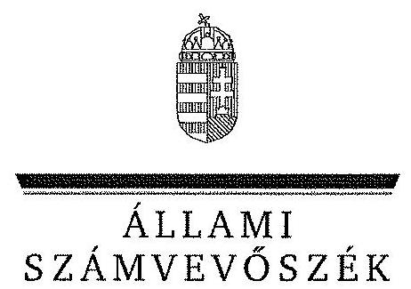
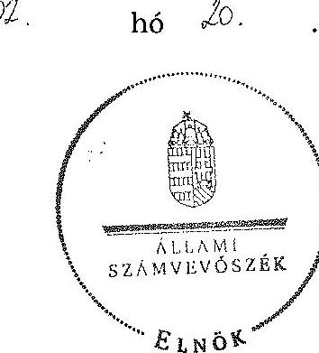
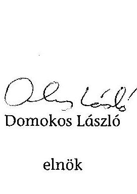

ÁLLAMI
SZÁMVEVŐSZÉK

# JELENTÉS 

az önkormányzatok belső kontrollrendszere kialakításának, egyes kontrolltevékenységek és a belső ellenőrzés múködésének

- 2013. évben induló - ellenőrzéséről Szabadegyháza

---

# Állami Számvevőszék 

Iktatószám: V-0311-118/2014.
Témaszám: 1341
Vizsgálat-azonosító szám: V064928

## Az ellenőrzést felügyelte:

dr. Benedek Mária
felügyeleti vezető
Az ellenőrzést vezette és az ellenőrzés végrehajtásáért felelős:
dr. Tóth Viktória
ellenőrzésvezető
A számvevőszéki jelentés összeállításában közreműködtek:
Csepreginé Tancsik Erzsébet
számvevő tanácsos
Csordás Péterné
számvevő

## Az ellenőrzést végezték:

## Csordás Péterné

Számvevő

## Kalmár István

számvevő tanácsos

Joó Erika
számvevő

---

# TARTALOMJEGYZÉK 

BEVEZETÉS ..... 5
I. ÖSSZEGZŐ MEGÁLLAPÍTÁSOK, KÖVETKEZTETÉSEK, JAVASLATOK ..... 9
II. RÉSZLETES MEGÁLLAPÍTÁSOK ..... 18

1. Az önkormányzat belső kontrollrendszerének kialakítása ..... 18
1.1. A kontrollkörnyezet ..... 18
1.2. A kockázatkezelési rendszer ..... 19
1.3. A kontrolltevékenységek ..... 19
1.4. Az információs és kommunikációs rendszer ..... 20
1.5. A monitoring rendszer ..... 21
2. A pénzügyi folyamatokban kulcsszerepet betöltő teljesítésigazolás és érvényesítés belső kontrollok működése ..... 21
3. A belső ellenőrzés működése ..... 23

## FÜGGELÉKEK

1. számú Értelmező szótár
2. számú Az értékelés módja és szempontjai

---

.

---

# RÖVIDÍTÉSEK JEGYZÉKE 

| Törvények |  |
| :--: | :--: |
| Áht. | 2011. évi CXCV. törvény az államháztartásról (hatályos 2012. január 1-jétől) |
| ÁSZ tv. | 2011. évi LXVI. törvény az Állami Számvevőszékről |
| Info tv. | 2011. évi CXII. törvény az információs önrendelkezési jogról és az információszabadságról (hatályos 2012. január 1-jétől) |
| Htv. | 1991. évi XX. törvény a helyi önkormányzatok és szerveik, a köztársasági megbízottak, valamint egyes centrális alárendeltségú szervek feladat- és hatásköreiről |
| Kttv. | 2011. évi CXCIX. törvény a közszolgálati tisztviselők ről |
| Mötv. | 2011. évi CLXXXIX. törvény Magyarország helyi önkormányzatairól |
| Mvtv. | 1993. évi XCIII. törvény a munkavédelemről |
| Ötv. | 1990. évi LXV. törvény a helyi önkormányzatokról |
| Rendeletek, határozatok |  |
| Áhsz. | 249/2000. (XII. 24.) Korm. rendelet az államháztartás szervezetei beszámolási és könyvvezetési kötelezettségének sajátosságairól |
| Ávr. | 368/2011. (XII. 31.) Korm. rendelet az államháztartásról szóló törvény végrehajtásáról |
| Bkr. | 370/2011. (XII. 31.) Korm. rendelet a költségvetési szervek belső kontrollrendszeréről és belső ellenőrzéséről |
| Ikr. | 335/2005. (XII. 29.) Korm. rendelet a közfeladatot ellátó szervek iratkezelésének általános követelményeiről |
| Szórövidítések |  |
| ÁSZ | Állami Számvevőszék |
| FEUVE szabályzat | Szabadegyháza Község Önkormányzata Polgármesteri Hivatalának folyamatba épített, előzetes, utólagos és vezetői ellenőrzési rendszere |
| gazdálkodási szabályzat | Szabadegyháza Község Önkormányzatának gazdálkodási szabályzata |
| INTOSAI | International Organization of Supreme Audit Institutions (Legfőbb Ellenőrző Intézmények Nemzetközi Szervezete) |
| ISSAI | International Standards of Supreme Audit Institutions (Legfőbb Ellenőrző Intézmények Nemzetközi Standardjai) |
| jegyző | Szabadegyháza Község Önkormányzatának jegyzője |
| Képviselő-testület | Szabadegyháza Község Önkormányzatának Képviselőtestülete |
| Kormányhivatal | Fejér Megyei Kormányhivatal |
| NGM | Nemzetgazdasági Minisztérium |
| Önkormányzat | Szabadegyháza Község Önkormányzata |

---

polgármester
Polgármesteri Hivatal Társulás
Társulás munkaszervezetének vezetője

Szabadegyháza Község Önkormányzatának polgármestere
Szabadegyháza Község Polgármesteri Hivatala
Adonyi Többcélú Kistérségi Társulás
Adonyi Többcélú Kistérségi Társulás Munkaszervezetének vezetője

---

# JELENTÉS 

## az önkormányzatok belső kontrollrendszere kialakításának, egyes kontrolltevékenységek és a belső ellenőrzés múködésének - 2013. évben induló - ellenőrzéséről Szabadegyháza

## BEVEZETÉS

Szabadegyháza község állandó lakosainak száma 2012. január 1-jén 2260 fő volt. Az Önkormányzat hattagú Képviselő-testületének munkáját két állandó bizottság segítette. Az Önkormányzat az önállóan működő és gazdálkodó Polgármesteri Hivatalon kívül három önállóan működő1 intézménnyel látta el feladatát. Többségi tulajdoni hányadú gazdasági társasággal nem rendelkezett. A polgármester az 1990. évi helyi önkormányzati választások óta tölti be tisztségét. A jegyző 2007. július 16 -tól látja el a jegyzői feladatokat. A Polgármesteri Hivatal szervezeti egységekre nem tagolódott, elkülönített gazdasági szervezettel nem rendelkezett. A köztisztviselők száma 2012. január 1-jén hat fő volt. A Polgármesteri Hivatalnál 2013. január 1-jétől szervezeti változás, átalakítás nem történt. Az Önkormányzat a 2012. évi költségvetési beszámolója szerint 952126 ezer Ft bevételt ért el, valamint 814278 ezer Ft kiadást teljesített. A 2012. december 31-i könyvviteli mérleg szerint 3370370 ezer Ft értékủ eszközvagyonnal rendelkezett, a rövid lejáratú kötelezettségállománya 856 ezer Ft volt, hosszú lejáratú kötelezettsége nem volt.

A demokratikus társadalmakban alapvető igény, hogy a közpénzeket, a közvagyont használók tevékenységükről elszámoljanak, ahhoz egyértelmű és érvényesíthető felelősségi szabályok társuljanak. Ennek a jogos igénynek az érvényesítéséhez meg kell teremteni azokat a folyamatokat, rendszereket, amelyek nélkülözhetetlenek az elszámoltatáshoz. Az elszámoltatás eredményes múködtetéséhez szükség van a megfelelő információs, kontroll-, értékelési és beszámolási rendszerek kialakítására.

Magyarországon az uniós csatlakozási tárgyalások idejére nyúlnak vissza a belső kontrollrendszer szabályozásának gyökerei. Az uniós elvárásoknak megfelelő új terminológia szerinti államháztartási belső pénzügyi ellenőrzési (ÄBPE) rendszer területén a jogharmonizáció 2003-ban teljes körűen megvalósult, míg az önkormányzati alrendszerre vonatkozó, Ötv.-ben megjelenített speciális szabályozás 2005-ben lépett hatályba. Az államháztartási belső kontrollrendszer koncepciója 2009-ben továbbfejlődött. A változások irányát mutat-

[^0]
[^0]:    ${ }^{1}$ Kossuth Lajos Általános Iskola; Kincsem Óvoda; Művelődési Ház

---

ja, hogy a költségvetési szervek belső kontrollrendszere már magában foglalja a korszerű felelős szervezetirányítás elemeit (kontrollkörnyezet, kockázatkezelés, kontrolltevékenység, információ és kommunikáció, monitoring) is. E kontrollrendszer szabályozása háromszintű, a törvényi előírásokat az Áht. és a Mötv., a rendeleti szintű szabályozást az Ávr. és a Bkr. tartalmazza, amelyeket útmutatói szinten az NGM által kiadott standardok és kézikönyvek támogatnak.

A belső kontrollrendszer azt a célt szolgálja, hogy a költségvetési szervek múködésük és gazdálkodásuk során a tevékenységeket szabályszerűen, gazdaságosan, hatékonyan és eredményesen hajtsák végre, teljesítsék elszámolási kötelezettségeiket és megvédjék az erőforrásokat a veszteségektől, a károktól és a nem rendeltetésszerú használattól. A belső kontrollrendszer magában foglalja mindazon szabályokat, eljárásokat, gyakorlati módszereket és szervezeti struktúrákat, kockázatkezelési technikákat, kontrolltevékenységeket, amelyek segítséget nyújtanak a szervezetnek céljai eléréséhez.

Az ÁSZ a 2011-2015. évekre szóló stratégiájában hangsúlyos szerepet szánt annak, hogy szilárd szakmai alapon álló, értékteremtő ellenőrzéseivel előmozdítsa a közpénzügyek átláthatóságát, rendezettségét. A számvevőszéki ellenőrzés nemzetközi alapelvei is rögzítik, hogy a megfelelő belső kontrollrendszer minimálisra csökkenti a hibák és szabálytalanságok kockázatát.

Az ellenőrzés célja annak megállapítása volt, hogy a belső kontrollrendszer elemeinek kialakítása, a pénzügyi folyamatokban kulcsszerepet betöltő teljesítésigazolás és érvényesítés, és a belső ellenőrzés szabályos múködése biztosítot-ta-e az önkormányzatnál a közpénzfelhasználás szabályosságát, hozzájárult-e az értéket teremtő rend követelményének érvényesüléséhez.

Ennek keretében értékeltük, hogy

- a jogszabályi előírásoknak megfelelően alakították-e ki a belső kontrollrendszer elemeit;
- a gazdálkodás folyamatában kulcsszerepet betöltő teljesítésigazolás és érvényesítés kontrolltevékenységeit megfelelően működtették-e;
- biztosították-e a belső ellenőrzés szabályos működését;
- amennyiben az ÁSZ tett javaslatot a 2008-2011. évek közötti ellenőrzése kapcsán az Önkormányzatnak, intézkedtek-e azok végrehajtására.

Az ellenőrzés várható hasznosulását négy szinten tervezzük. A törvényalkotás számára összegzett tapasztalatok állnak rendelkezésre a belső kontrollrendszer önkormányzati területen való kialakításáról, működéséről és hatásairól, a belső ellenőrzés működéséről. Ennek alapján következtetést lehet levonni arról, hogy a belső kontrollrendszer kialakítására és működtetésére vonatkozó jelenlegi, differenciálás nélküli - jogszabályi előírások reális követelményeket támasztanak-e az eltérő adottságú települési önkormányzatok esetében, illetve indokolt-e esetleges jogszabályi módosítás kezdeményezése. Az ellenőrzés az ellenőrzött számára visszajelzést ad a belső kontrollrendszer kialakításában és múködésében fellépő hiányosságokról, javaslataival hozzájárul azok kiküsz-

---

öböléséhez, amely csökkentheti a későbbi ellenőrzések gyakoriságát. Az ellenőrzés megállapításait és javaslatait más szervezetek is hasznosíthatják a rendezett gazdálkodási keretek kialakításához. A társadalom számára jelzi, hogy közpénz nem maradhat ellenőrizetlenül, az ÁSZ értékteremtő rend kialakításához és megőrzéséhez hozzájáruló tevékenysége pozitív hatással lesz a szervezetről kialakított összkép formálásában. A szervezeten belül lehetőség nyílik arra, hogy a megállapítások szintetizálásával az ÁSZ a hozzáadott értéket teremtő elemző tevékenységét és tanácsadó szerepét is erősítse.

Az önkormányzatok belső kontrollrendszere kialakításának, egyes kontrolltevékenységek és a belső ellenőrzés működésének ellenőrzéséről szóló jelentés I. fejezetének összegző része az ellenőrzés céljára ad rövid, szintetizáló összefoglalót, és tartalmazza a következtetéseket a II. fejezet részletes megállapításain alapulóan. A jelentés intézkedést igénylő megállapításait és javaslatait az ellenőrzés során feltárt, a jelentés II. fejezetében rögzített részletes megállapítások alapozzák meg. A helyszíni ellenőrzés lezárásáig a helyi szabályozás változásait nyomon követtük.

Az ellenőrzés típusa: szabályszerűségi ellenőrzés.
Az ellenőrzött időszak: a belső kontrollrendszer kialakításának megfelelősége esetében 2012. év, a pénzügyi folyamatokban kulcsszerepet betöltő teljesítésigazolás és érvényesítés belső kontrollok működésének megfelelőségét és a belső ellenőrzés szabályszerű működését a 2012. január 1. és december 31-e közötti időszak eseményeit figyelembe véve értékeltük, míg az ÁSZ javaslatainak utóellenőrzése a 2008-2011. években hivatalosan közzétett számvevőszéki jelentésekben tett javaslatok áttekintésére terjedt ki.

Az ellenőrzött szervezet: Szabadegyháza Község Önkormányzata.
Az ellenőrzés jogszabályi alapját az ÁSZ tv. 1. § (3) bekezdése, az 5. § (2) és (6) bekezdései, valamint az Áht. 61. § (2) bekezdésének előírásai képezik.

Az ellenőrzés szakmai módszertana az ÁSZ hivatalos honlapján (www.asz.hu) közzétett szakmai szabályokon alapult, amely az INTOSAI által kiadott ISSAI figyelembevételével készült.

Az ellenőrzés lefolytatásához az Önkormányzat a kimutatások és a tanúsítvány kitöltésével, valamint az ÁSZ által kért dokumentumok elektronikus megküldésével szolgáltatott adatokat. Az így rendelkezésre bocsátott adatok, információk kontrollja és a munkalapok kitöltése a helyszíni ellenőrzés keretében történt. A jelentésben használt fogalmak magyarázatát az 1. számú függelék, az ellenőrzés egyes területeinek értékelésénél alkalmazott egységes minősítési szempontokat a 2. számú függelék tartalmazza.

A belső kontrollrendszer kialakításának ellenőrzése során értékeltük a kontrollkörnyezet, a kockázatkezelési rendszer, a kontrolltevékenységek, az információs és kommunikációs rendszer, valamint a monitoring rendszer szabályozottságának megfelelőségét. A pénzügyi folyamatokban kulcsszerepet betöltő teljesítésigazolás és érvényesítés kontrollok müködése megfelelőségének minősítéséhez az állományba nem tartozók megbízási díjai, valamint a külső szolgálta-

---

tók által végzett karbantartási, kisjavítási munkák, az egyéb üzemeltetési és fenntartási szolgáltatások, a rendszeres szociális segélyek, valamint az államháztartáson kívülre teljesített múködési és felhalmozási célú pénzeszközátadások közül kockázatelemzéssel választottuk ki az ellenőrzött kiadási jogcímeket. Az egyszerű véletlen mintavétellel kiválasztott tételek ellenőrzését többlépcsős megfelelőségi tesztek útján addig végeztük, amíg elegendő és megfelelő bizonyítékot szereztünk a vizsgált folyamatok kulcskontrolljai múködésének megfelelő vagy nem megfelelő voltáról. Értékeltük az Önkormányzatnál a belső ellenőrzés múködésének szabályosságát. Utóellenőrzésre nem került sor, mivel az ÁSZ az Önkormányzatnál a 2008-2011. évek között ellenőrzést nem végzett.

Az ÁSZ tv. 29. § (1) bekezdése szerint a jelentéstervezetet megküldtük a polgármester részére, aki az ÁSZ tv. 29. § (2) bekezdésében foglalt észrevételezési jogával nem élt, a jelentéstervezetre észrevételt nem tett.

---

# I. ÖSSZEGZŐ MEGÁLLAPÍTÁSOK, KÖVETKEZTETÉSEK, JAVASLATOK 

A belső kontrollrendszeren belül 2012-ben a kontrollkörnyezet, a kockázatkezelési rendszer, a kontrolltevékenységek, az információs és kommunikációs rendszer, valamint a monitoring rendszer kialakítását külön-külön és együttesen is értékeltük. A belső kontrollrendszer kialakítása az összesített értékelés alapján nem felelt meg a jogszabályi előírásoknak.

A belső kontrollrendszer egyes területei kialakításának minősítése a következő:

| Kontrollterïlet | Minősítés |  |
| :-- | :-- | :-- |
| Kontrollkörnyezet |  | nem   megfelelö |
| Kockázatkezelési rendszer |  | nem   megfelelö |
| Kontrolltevékenységek | megfelelö |  |
| Információs és kommuni-   kációs rendszer |  | részben   megfelelö |
| Monitoring rendszer |  | nem   megfelelö |

Megfelelőnek értékeltük a kontrolltevékenységek kialakítását, mivel a jogszabályi előírásokban foglaltakat figyelembe véve kisebb hiányosságok mellett is e kontrollterület hozzájárult a Polgármesteri Hivatal, ezáltal az Önkormányzat céljainak eléréséhez.

Részben megfelelőnek értékeltük az információs és kommunikációs rendszer kialakítását, mivel az e területen megállapított kisebb szabályozásbeli hiányosságok mellett is megteremtette a szabályszerű múködés lehetőségét.

Nem megfelelőnek értékeltük a kontrollkörnyezet, a kockázatkezelési rendszer és a monitoring rendszer kialakítását, mivel az ellenőrzésünk során megállapított szabályozásbeli hiányosságok magukban hordozzák a szabálytalan múködés, valamint a korrupció kockázatát.

A belső kontrollrendszer nem megfelelő kialakítása kockázatot jelent az Önkormányzat tevékenységeinek szabályszerű, gazdaságos, hatékony és eredményes végrehajtása során.

Az állományba nem tartozók megbízási díjaival, valamint a külső szolgáltatók által végzett karbantartási, kisjavítási munkákkal kapcsolatos kifizetések során a pénzügyi folyamatokban kulcsszerepet betöltő teljesítésigazolás és érvényesítés belső kontrollok múködése gyenge volt. Gyengének értékeltük a

---

két kulcskontroll együttes múködését, mert azok nem biztosították az ellenőrzésünk által feltárt hiányosságok bekövetkezésének megelőzését.

A számvevőszéki ellenőrzés az ellenőrzött kifizetésekkel összefüggésben a rendelkezésre bocsátott dokumentumok alapján kár bekövetkeztére utaló adatot, tényt nem állapított meg, azonban a gazdálkodásban kulcsszerepet betöltő kontrollok gyenge működése miatt fennáll a hibák bekövetkezésének lehetősége. A nem megfelelően szabályozott és múködtetett belső kontrollok korrupciós kockázatot is hordoznak.

A belső ellenőrzési feladatokat a Társulás útján látták el. A belső ellenőrzés múködése nem felelt meg a jogszabályi előírásoknak, mivel a számvevőszéki ellenőrzés által megállapított szabályozási és múködési hiányosságok számossága magában hordozza a szabálytalan önkormányzati gazdálkodás és feladatellátás kockázatát.

Az ÁSZ tv. 33. § (1) bekezdésében foglaltak értelmében az ellenőrzött szervezet vezetője köteles a jelentésben foglalt megállapításokhoz kapcsolódó intézkedési tervet összeállítani, és azt a jelentés kézhezvételétől számított 30 napon belül az ÁSZ részére megküldeni. Amennyiben az intézkedési tervet határidőre nem küldi meg a szervezet, vagy az ÁSZ tv. 33. § (2) bekezdésében foglalt póthatáridő elteltével megküldött intézkedési terv továbbra sem elfogadható, az ÁSZ elnöke a hivatkozott törvény 33. § (3) bekezdés a)-b) pontjaiban foglaltakat érvényesítheti.

Az ellenőrzés intézkedést igénylő megállapításai és javaslatai:

# a polgármesternek 

1. A Képviselő-testület az Ötv. 91. § (7) bekezdésében foglaltakat megsértve, nem határozta meg az Önkormányzat 2011-2014. évekre vonatkozó gazdasági programját.

Javaslat:
Terjessze a Képviselő-testület elé a Htv. 139. § (1) bekezdés a) pontja alapján a jegyző által előkészített - gazdasági programtervezetet a Mötv. 116. § (5) bekezdésben foglaltaknak megfelelően.
2. A 2011. évre vonatkozó éves ellenőrzési jelentést a Társulás munkaszervezetének vezetője a Bkr. 56. § (8) bekezdésében előírt határidőre a jegyző részére nem küldte meg, melynek következtében azt - a Bkr. 56. § (8) bekezdésében foglalt előírás ellenére - a polgármester a zárszámadási rendelettervezettel egyidejűleg nem terjesztette a Képviselő-testület elé.

Javaslat:
Terjessze a Képviselő-testület elé a Bkr. 49. § (3a), illetve az 56. § (8) bekezdésében foglaltak figyelembevételével az éves ellenőrzési jelentést a zárszámadási rendelettervezettel egyidejűleg.

---

3. A polgármester mint kötelezettségvállaló - az Ávr. 57. § (4) bekezdésében foglaltak ellenére - nem jelölte ki 2012. március 30 -át követően írásban az Önkormányzat kiadási előirányzatai vonatkozásában a teljesítés igazolására jogosult személyeket.

Javaslat:
Jelölje ki az Ávr. 57. § (4) bekezdésének megfelelően az általa történő kötelezettségvállalások esetében a teljesítés igazolására jogosult személyeket.
4. Az írásbeli kötelezettségvállalásokat - az Áht. 37. § (1) bekezdésében és az Ávr. 55. § (1) bekezdésében előírtak ellenére - nem előzte meg pénzügyi ellenjegyzés.

Javaslat:
Intézkedjen arról, hogy az Önkormányzat nevében történő kötelezettségvállalásra az Áht. 37. § (1) bekezdésében és az Ávr. 55. § (1) bekezdésében foglaltaknak megfelelően - az Ávr. 53. §-ában meghatározott kivételekkel - kizárólag pénzügyi ellenjegyzés után, a pénzügyi teljesítés esedékességét megelőzően, írásban kerüljön sor.
5. A számvevőszéki ellenőrzés megállapításai alapján az Önkormányzatnál a belső kontrollrendszer kialakítása összefoglalóan értékelve nem felelt meg a jogszabályi előírásoknak, a belső ellenőrzés múködése nem felelt meg a jogszabályi előírásoknak, továbbá a belső ellenőrzés nem tárta fel a belső kontrollrendszer kialakításának, valamint a pénzügyi folyamatokban kulcsszerepet betöltő teljesítésigazolás és érvényesítés belső kontrollok múködésének hiányosságait, ezáltal nem is javíttatta ki azokat. A megállapított szabályozásbeli és múködésbeli hiányosságok magukban hordozzák a szabálytalan múködés kockázatát.

Javaslat:
A Mötv. 115. § (1) bekezdésében foglaltak alapján kísérje figyelemmel az Önkormányzat gazdálkodásának szabályszerűségét. A Mötv. 67. § f) pontja alapján gondoskodjon a belső kontrollrendszer kialakítására, a belső ellenőrzés múködésére vonatkozó jogszabályi rendelkezések be nem tartása, valamint a teljesítésigazolás, illetve az érvényesítés belső kontrollok múködésével összefüggésben feltárt hiányosságok, szabálytalanságok tekintetében az esetleges munkajogi felelősséggel kapcsolatos körülmények kivizsgálásáról, majd a vizsgálat eredményének függvényében tegye meg a szükséges munkajogi intézkedéseket.

# a jegyzőnek 

1. a kontrollkörnyezettel kapcsolatban:

A jegyző a Htv. 140. § (1) bekezdés a) pontjában foglalt előírást figyelmen kívül hagyva nem készítette elő az Ötv. 91. § (1) és (6) bekezdés szerinti gazdasági programtervezetet.

A jegyző az Áht. 10. § (5) bekezdésében foglaltakat figyelmen kívül hagyva a Polgármesteri Hivatal feladatai ellátásának részletes belső rendjét és módját szervezeti és múködési szabályzatban nem állapította meg.

---

A jegyző - a Htv. 140. § (1) bekezdés c) pontjában foglaltak ellenére - az Önkormányzat intézményeinek számviteli rendjét nem alakította ki.

A jegyző - az Mvtv. 2. § (3) bekezdésében foglaltak ellenére - nem határozta meg a Polgármesteri Hivatalban az egészséget nem veszélyeztető és biztonságos munkavégzés követelményei megvalósításának módját.

A jegyző - az Ávr. 13. § (5) bekezdésében foglaltak ellenére - nem gondoskodott a Polgármesteri Hivatal által ellátott feladatok munkafolyamatainak leírásáról, továbbá a belső és külső kapcsolattartás módjának, szabályainak meghatározásáról.

A jegyző - a Bkr. 6. § (3) bekezdésében, valamint a FEUVE szabályzat II. fejezet 8. pontjában foglaltak ellenére - nem gondoskodott a Polgármesteri Hivatal ellenőrzési nyomvonalának rendszeres aktualizálásáról.

A Kttv. 231. § (1) bekezdése ellenére a Képviselő-testület nem állapította meg a Kttv. 83. §-ában előírt, a köztisztviselőkkel szembeni hivatásetikai alapelvek részletes tartalmát, valamint az etikai eljárás szabályait, mivel a jegyző - az Ötv. 36. § (2) bekezdés a) pontjában előírt feladata ellenére - nem készítette elő ennek dokumentumát.

Javaslat:
a) Készítse elő a Htv. 140. § (1) bekezdés a) pontjában foglaltak alapján az Önkormányzat gazdasági programjának tervezetét a Mötv. 116. § (3)-(4) bekezdéseiben foglalt tartalommal, és kezdeményezze a Képviselő-testület elé terjesztését.
b) Készítse el az Áht. 10. § (5) bekezdése alapján a Polgármesteri Hivatal szervezeti és múködési szabályzatát, és kezdeményezze az Áht. 9. § (1) bekezdés a) pontjában foglaltakra tekintettel a Képviselő-testület általi jóváhagyását.
c) Alakítsa ki a Htv. 140. § (1) bekezdés c) pontja alapján az Önkormányzat intézményeinek számviteli rendjét.
d) Határozza meg az egészséget nem veszélyeztető és biztonságos munkavégzés követelményei megvalósításának módját az Mvtv. 2. § (3) bekezdése alapján.
e) Rögzítse belső szabályzatban az Ávr. 13. § (5) bekezdésében foglaltaknak megfelelően a Polgármesteri Hivatal gazdálkodási ügyintézői által ellátott feladatok munkafolyamatainak leírását, és határozza meg a belső és külső kapcsolattartás módját, szabályait.
f) Aktualizálja rendszeresen a Bkr. 6. § (3) bekezdésében előírtaknak megfelelően az ellenőrzési nyomvonalat.
g) Készítse elő a Mötv. 81. § (3) bekezdés c) pontjában foglalt feladatkörében a köztisztviselőkkel szembeni - a Kttv. 83. §-a szerinti - hivatásetikai alapelvek részletes tartalmának, valamint az etikai eljárás szabályainak dokumentumait, és a Kttv. 231. § (1) bekezdésében foglaltak érvényesülése érdekében kezdeményezze azok Képviselő-testület elé terjesztését.

---

2. a kockázatkezelési rendszerrel kapcsolatban:

A jegyző - a Bkr. 7. § (2) bekezdésében foglaltak ellenére - nem határozta meg az egyes kockázatokkal kapcsolatban szükséges intézkedéseket, valamint azok teljesítése folyamatos nyomon követésének módját.

Javaslat:
Határozza meg a Bkr. 7. § (2) bekezdésében foglaltak szerint az egyes kockázatokkal kapcsolatban szükséges intézkedéseket, valamint azok teljesítése folyamatos nyomon követésének módját.
3. a kontrolltevékenységekkel kapcsolatban:

A jegyző az iratkezelési rendszer kialakítása során - az lkr. 8. § (2) bekezdésében foglaltak ellenére - nem határozta meg az üzemeltetés és az adatbiztonság feladatait és az ezzel kapcsolatos hatásköröket.

A jegyző az Info tv. 7. § (2)-(3) bekezdéseiben foglalt előírásokat figyelmen kívül hagyva az informatikai rendszer szabályozása során nem tette meg azokat a technikai és szervezési intézkedéseket, és nem alakította ki azokat az eljárási szabályokat, amelyek biztosítják az adatok biztonságát és védelmét.

A jegyző - a Bkr. 8. § (4) bekezdés b) pontjában foglaltak ellenére - belső szabályzatban nem határozta meg a dokumentumokhoz és információkhoz való hozzáférésre vonatkozóan a felelősségi köröket.

A jegyző - a Kttv. 74. § (1) bekezdésében és a 226. § (2) bekezdés b) pontjában foglaltak ellenére - nem szabályozta a Polgármesteri Hivatalban a köztisztviselő jogviszonya megszüntetése (megszűnése) esetére a munkakör átadása és a munkáltatóval való elszámolás rendjét.

Javaslat:
a) Rögzítse az iratkezelési rendszer vonatkozásában az lkr. 8. § (2) bekezdése alapján az üzemeltetés és az adatbiztonság szabályait oly módon, hogy a feladatok, hatáskörök pontosan meghatározásra kerüljenek és végrehajthatók legyenek.
b) Az Info tv. 7. § (2) bekezdésének megfelelően gondoskodjon az adatok biztonságáról, tegye meg azokat az intézkedéseket, alakítsa ki azokat az eljárási szabályokat, amelyek az Info tv., valamint az egyéb adat- és titokvédelmi szabályok érvényre juttatásához szükségesek; továbbá megfelelő intézkedésekkel biztosítsa az adatok védelmét, különösen az Info tv. 7. § (3) bekezdésében foglaltak érvényre juttatása érdekében.
c) Szabályozza belső szabályzatban a Bkr. 8. § (4) bekezdés b) pontja alapján a dokumentumokhoz és információkhoz való hozzáférés esetében a felelősségi köröket.
d) Rögzítse belső szabályzatban a Kttv. 74. § (1) bekezdésében és a 226. § (2) bekezdés b) pontjában foglaltaknak megfelelően a jogviszony megszűnése esetére a munkavállaló folyamatban lévő feladatai átadásának rendjét.

---

4. az információs és kommunikációs rendszerrel kapcsolatosan:

A jegyző - a Bkr. 3. § d) pontjában és a 9. § (1) bekezdésében foglaltak ellenére nem alakított ki olyan rendszert, amely biztosítja a megfelelő információk megfelelő időben történő eljuttatását az illetékes szervezethez, szervezeti egységhez, személyhez.

A jegyző - az Info tv. 30. § (6) bekezdésében, a 35. § (3) bekezdésében és az Ávr. 13. § (2) bekezdés h) pontjában foglalt előírás ellenére - a kötelezően közzéteendő adatok nyilvánosságra hozatalának és elektronikus közzétételének szabályait belső szabályzatban nem határozta meg, továbbá nem szabályozta a közérdekú adatok megismerésére irányuló igények teljesítésének rendjét.

Az lkr. 14. § (4) bekezdésében foglaltak ellenére a jegyző az iratforgalom dokumentálásával nem biztosította, hogy az iratok szervezeten belüli útja pontosan követhető és ellenőrizhető legyen.

Javaslat:
a) Alakítson ki és múködtessen a Bkr. 3. § d) pontjában és a 9. § (1) bekezdésében foglaltaknak megfelelően egy olyan rendszert, amely biztosítja, hogy a megfelelő információk a megfelelő időben eljutnak az illetékes szervezethez, szervezeti egységhez, illetve személyhez.
b) Állapítsa meg belső szabályzatban az Info tv. 30. § (6) bekezdésében és 35. § (3) bekezdésében, valamint az Ávr. 13. § (2) bekezdés h) pontjában foglaltaknak megfelelően a kötelezően közzéteendő adatok nyilvánosságra hozatalának rendjét, valamint a közérdekú adatok megismerésére irányuló igények teljesítésének rendjét.
c) Gondoskodjon az lkr 14. § (4) bekezdésében foglaltaknak megfelelően az iratforgalom dokumentálásával az iratok szervezeten belüli útjának pontos követhetőségéről és ellenőrizhetőségéről.
5. a monitoring rendszerrel kapcsolatosan:

A jegyző - a Bkr. 3. § e) pontjában és a 10. §-ában foglaltak ellenére - nem alakította ki a Polgármesteri Hivatal tevékenységének, a célok megvalósításának nyomon követését biztosító rendszerét.

A jegyző - a Bkr. 11. § (1) bekezdésében foglalt kötelezettsége ellenére - a 2011. évre vonatkozóan nem értékelte a Polgármesteri Hivatal belső kontrollrendszerének minőségét.

A jegyző - a Bkr. 46. § (1) bekezdésében foglalt előírás ellenére - az intézkedési tervben meghatározott egyes feladatok végrehajtásáról szóló beszámolót elmulasztotta elkészíteni és tájékoztatásul megküldeni a belső ellenőrzési vezető részére.

---

Javaslat:
a) Alakítsa ki és müködtesse a Bkr. 3. § e) pontjában és 10. §-ában előírtak alapján a Polgármesteri Hivatal tevékenységének, a célok megvalósításának nyomon követését biztosító rendszerét.
b) Értékelje a Bkr. 11. § (1) bekezdésében előírtaknak megfelelően a jogszabályban meghatározott keretek között a belső kontrollrendszer minőségét a Bkr. 1. melléklete szerinti nyilatkozatban.
c) Készítse el a Bkr. 46. § (1) bekezdésében foglaltak alapján az intézkedési tervben meghatározott egyes feladatok végrehajtásáról szóló beszámolót, és küldje meg tájékoztatásul a belső ellenőrzési vezető részére.
6. a pénzügyi folyamatokban kulcsszerepet betöltő kontrollokkal kapcsolatban:

A kifizetéseket megelőzően a teljesítés igazolását - az Áht. 38. § (1) bekezdésében és az Ávr. 57. § (1) bekezdésében foglaltak ellenére - nem minden esetben végezték el.

Az érvényesítést - az Áht. 38. § (1) bekezdésében és az Ávr. 58. § (1) bekezdésében foglaltak ellenére -nem minden esetben végezték el.

Az érvényesítő - az Ávr. 58. § (2) bekezdésében előírtak ellenére - nem jelezte az utalványozónak, hogy a megelőző ügymenetben a teljesítés igazolását - az Áht. 38. § (1) bekezdésében és az Ávr. 57. § (1) bekezdésében foglaltak ellenére - nem minden esetben végezték el; a teljesítésigazolás nem a gazdálkodási szabályzat 1.2.3. pontjában előírt bélyegző használatával történt; az írásbeli kötelezettségvállalásokat - az Áht. 37. § (1) bekezdésében és az Ávr. 55. § (1) bekezdésében előírtak ellenére - nem előzte meg pénzügyi ellenjegyzés; a kötelezettségvállalásokat - az Ávr. 56. § (1) bekezdésében foglaltakkal ellentétben - nem minden esetben vették nyilvántartásba; a kötelezettségvállalásról vezetett nyilvántartás adattartalma nem felelt meg az Ávr. 56. § (1) bekezdésében előírtaknak; az utalványrendelet nem felelt meg az Ávr. 59. § (3) bekezdésében és a gazdálkodási szabályzat - Ávr. 59. § (3) bekezdésében foglaltakkal egyező tartalmú - 1.2.5. pontjában előírtaknak; a 100 ezer Ft alatti kötelezettségvállalások nyilvántartásba vételéhez nem alkalmazták a gazdálkodási szabályzat 1.2.1. pontjában meghatározott „Tájékoztatás a nem írásban tett kötelezettségvállalásról" szóló rendelkezést.

Javaslat:
Intézkedjen - a teljesítés igazolása és az érvényesítés vonatkozásában feltárt hiányosságok megszüntetése, illetve az operatív gazdálkodás során a müködésbeli hibák megelőzése, feltárása és kijavítása érdekében - arról, hogy:
a) a teljesítésigazolás során az Áht. 38. § (1) bekezdésében és az Ávr. 57. § (1) bekezdésében előírtaknak megfelelően, ellenőrizhető okmányok alapján ellenőrizzék és igazolják a kiadások teljesítésének jogosságát, összegszerűségét, az ellenszolgáltatást is magában foglaló kötelezettségvállalás esetén annak teljesítését, valamint az Ávr. 57. § (3) bekezdése szerint a teljesítést az igazolás dátumának és a teljesítés tényére történő utalásnak a megjelölésével, az arra jogosult személy aláírásával igazolják;

---

b) a kifizetéseket megelőzően a teljesítésigazolás alapján - az Ávr. 57. § (3) bekezdése szerinti esetben annak hiányában is - az összegszerűségnek, a fedezet meglétének és a megelőző ügymenetben az Áht., az Áhsz., az Ávr. előírásai és a belső szabályzatokban foglaltak betartásának az ellenőrzése - az Ávr. 58. § (1) bekezdése szerint - történjen meg;
c) kötelezettségvállalásra az Áht. 37. § (1) bekezdésében és az Ávr. 55. § (1) foglaltaknak megfelelően - az Ávr. 53. §-ában meghatározott kivételeket figyelembe véve - kizárólag a pénzügyi ellenjegyzés után, a pénzügyi teljesítés esedékességét megelőzően, írásban kerüljön sor;
d) a kötelezettségvállalásokat az Ávr. 53. § (2) és 56. § (1) bekezdésében foglalt előírásoknak megfelelően vegyék nyilvántartásba;
e) a teljesítésigazolásnak és a 100 ezer Ft alatti kötelezettségvállalások nyilvántartásba vételének a gazdálkodási szabályzatban meghatározott módja és gyakorlati végrehajtása összhangban legyen egymással, valamint a külön írásbeli rendelkezésen történő utalványozás során az utalványokon az Ávr. 59. § (3) bekezdése alapján a kötelező tartalmi elemeket tüntessék fel.
7. a belső ellenőrzés múködésével kapcsolatban:

A Bkr. 56. § (3) bekezdés a) pontjában foglaltak ellenére Képviselő-testület által elfogadott stratégiai ellenőrzési tervvel az Önkormányzat nem rendelkezett.

Az Önkormányzat nem rendelkezett - az Ötv. 92. § (6) bekezdése és a Bkr. 56. § (3) bekezdés a) pontjában foglaltak ellenére - 2012. évre vonatkozó ellenőrzési tervvel. A belső ellenőrzési vezető - a Bkr. 22. § (1) bekezdés b) pontjában, a 29. § (1) bekezdésében és 31. § (1)-(2) bekezdésében foglaltak ellenére - a 2013. évre vonatkozóan éves ellenőrzési tervet nem készített.

A 2012. évben végrehajtott ellenőrzéshez - a Bkr. 33. § (2) bekezdésében foglalt előírás ellenére - nem készítettek ellenőrzési programot.

A jegyző a belső ellenőrzés 2012. évi javaslatainak végrehajtása érdekében - a Bkr. 45. § (1)-(3) bekezdéseiben foglaltak ellenére - intézkedési tervet nem készített.

A Bkr. 21. § (2) bekezdés d) pontjában és a 47. § (1) bekezdésében foglalt előírás ellenére a belső ellenőrzési vezető a belső ellenőrzési jelentésekben tett megállapításokat, javaslatokat, a vonatkozó intézkedési terveket, a jelentések alapján tett intézkedések nyilvántartását és azok végrehajtásának nyomon követését biztosító nyilvántartást nem vezetett.

A Bkr. 22. § (2) bekezdés e) pontjában, valamint 50. §-ában foglalt előírást figyelmen kívül hagyva, a belső ellenőrzési vezető az elvégzett ellenőrzésekről nyilvántartást nem vezetett.

A 2011. évre vonatkozó éves ellenőrzési jelentést a Társulás munkaszervezetének vezetője a Bkr. 56. § (8) bekezdésében előírt határidőre a jegyző részére nem küldte meg, melynek következtében azt - a Bkr. 56. § (8) bekezdésében foglalt előírás ellenére - a polgármester a zárszámadási rendelettervezettel egyidejűleg nem terjesztette a Képviselő-testület elé.

---

Javaslat:
a) Kezdeményezze a Bkr. 56. § (3) bekezdés a) pontjában foglaltaknak megfelelően a stratégiai ellenőrzési terv Képviselő-testület elé terjesztését annak érdekében, hogy azt a Képviselő-testület hagyja jóvá.
b) Kezdeményezze, hogy az éves ellenőrzési terv - Társult feladatellátás esetén a Bkr. 56. § (2) bekezdésnek megfelelően a jegyző írásos véleményének figyelembevételével - a Bkr. 22. § (1) bekezdés b) pontjában, a 29. § (1) bekezdésében és a 31. § (1) bekezdésében foglaltak szerint készüljön el, és kezdeményezze a Képviselő-testület elé terjesztését annak érdekében, hogy azt a Képviselő-testület a Mötv. 119. § (5), illetve a Bkr. 32. § (4) bekezdésében előírt határidőn belül jóváhagyja.
c) Gondoskodjon arról, hogy az ellenőrzésekhez minden esetben készítsék el a Bkr. 33. § (2) bekezdésében foglaltaknak megfelelő, belső ellenőrzési vezető által jóváhagyott ellenőrzési programot.
d) Készítsen intézkedési tervet a belső ellenőrzési jelentésekben megfogalmazott javaslatok végrehajtására a Bkr. 45. § (1)-(3) bekezdéseiben foglaltaknak megfelelő tartalommal és határidőn belül.
e) Kezdeményezze, hogy a belső ellenőrzési vezető vezessen a Bkr. 21. § (2) bekezdése d) pontjának és a Bkr. 47. § (1) bekezdésének megfelelően a belső ellenőrzési jelentésekben tett megállapításokat, javaslatokat, a vonatkozó intézkedési terveket és azok végrehajtását nyomon követő nyilvántartást.
f) Kezdeményezze, hogy a belső ellenőrzési vezető a Bkr. 22. § (2) bekezdés e) pontjában és az 50. §-ban foglalt előírásnak megfelelően vezessen az elvégzett ellenőrzésekről nyilvántartást.
g) Kezdeményezze, hogy a Bkr. 56. § (8) bekezdésében foglaltak alapján az éves ellenőrzési jelentést készítsék el és a jegyzőnek küldjék meg, hogy azt a polgármester a zárszámadással egyidejűleg a Képviselő-testület elé terjeszthesse.

---

# II. RÉSZLETES MEGÁLLAPÍTÁSOK 

## 1. Az önkORMÁNYZAT BELSŐ KONTROLLRENDSZERÉNEK KIALAKÍTÁSA

A belső kontrollrendszer kialakítása 2012-ben a kontrollkörnyezet, a kockázatkezelési rendszer, a kontrolltevékenységek, az információs és kommunikációs rendszer, valamint a monitoring rendszer értékelése alapján összességében nem felelt meg a jogszabályi elöírásoknak.

### 1.1. A kontrollkörnyezet

A kontrollkörnyezet kialakítása - a 2. számú függelékben részletezett kritériumrendszer alapján végzett értékelés szerint - a jogszabályi előírásoknak nem felelt meg, mert:

| Sor-   szám $^{2}$ | Megállapítás |
| :--: | :--: |
| 2. | A jegyző a Htv. 140. § (1) bekezdés a) pontjában foglalt előíást figyelmen kívül hagyva nem készítette elő a gazdasági programtervezetet, így a Képvi-selő-testület az Ötv. 91. § (7) bekezdésében ${ }^{3}$ foglaltakat megsértve, nem határozta meg az Önkormányzat 2011-2014. évekre vonatkozó gazdasági programját. |
| 5. | A jegyző az Áht. 10. § (5) bekezdésében foglaltakat figyelmen kívül hagyva a Polgármesteri Hivatal feladatai ellátásának részletes belső rendjét és módját szervezeti és múködési szabályzatban nem állapította meg. |
| 18. | A jegyző - a Htv. 140. § (1) bekezdés c) pontjában foglaltak ellenére - az önkormányzat intézményeinek számviteli rendjét nem alakította ki. |
| 32. | A jegyző - az Mvtv. 2. § (3) bekezdésében foglaltak ellenére - nem határozta meg a Polgármesteri Hivatalban az egészséget nem veszélyeztető és biztonságos munkavégzés követelményei megvalósításának módját. |
| 35. | A jegyző - az Ávr. 13. § (5) bekezdésében foglaltak ellenére - nem gondoskodott a Polgármesteri Hivatal által ellátott feladatok munkafolyamatainak leírásáról, továbbá a belső és külső kapcsolattartás módjának, szabályainak meghatározásáról. |
| 41. | A jegyző - a Bkr. 6. § (3) bekezdésében, valamint a FEUVE szabályzat II. fejezet 8. pontjában foglaltak ellenére - nem gondoskodott a Polgármesteri Hivatal ellenőrzési nyomvonalának rendszeres aktualizálásáról. |

[^0]
[^0]:    ${ }^{2}$ A megállapítás számozása az Önkormányzat által az adatszolgáltatás során kitöltött kimutatások kérdéseinek sorszámával azonos.
    ${ }^{3}$ 2013. január 1-jétől a Mötv. 116. § (5) bekezdése

---

A Kttv. 231. § (1) bekezdése ellenére a Képviselő-testület nem állapította meg a Kttv. 83. §-ában előírt, a köztisztviselőkkel szembeni hivatásetikai alapelvek részletes tartalmát, valamint az etikai eljárás szabályait, mivel a jegyző az Ötv. 36. § (2) bekezdés a) pontjában előírt feladata ellenére nem készítette elő ennek dokumentumát.

# 1.2. A kockázatkezelési rendszer 

A kockázatkezelési rendszer kialakítása - a 2. számú függelékben részletezett kritériumrendszer alapján végzett értékelés szerint - nem felelt meg a jogszabályi előírásoknak, mert:

Sor-
szám
8., 10.

Megállapítás

A jegyző - a Bkr. 7. § (2) bekezdésében foglaltak ellenére - nem határozta meg az egyes kockázatokkal kapcsolatban szükséges intézkedéseket, valamint azok teljesítése folyamatos nyomon követésének módját.

### 1.3. A kontrolltevékenységek

A kontrolltevékenységek kialakítása- a 2. számú függelékben részletezett kritériumrendszer alapján végzett értékelés szerint - megfelelt a jogszabályi előírásoknak.

A jegyző a kontrolltevékenység részeként előírta a folyamatba épített, előzetes, utólagos és vezetői ellenőrzést a költségvetés tervezése, a beszerzések lebonyolítása, a vagyonhasznosítási tevékenység és a támogatások elszámolása vonatkozásában. Belső szabályzatban rendezték a kötelezettségvállalás ellenjegyzésének és a teljesítésigazolás módját, valamint szabályozták az érvényesítés és az utalványozás rendjét. A jogszabályi előírásoknak megfelelően szabályozták az előzetes írásbeli kötelezettségvállalást nem igénylő kifizetések rendjét. Kijelölték az ellenjegyzési és érvényesítési feladatra a Polgármesteri Hivatal állományába tartozó köztisztviselőket, akik rendelkeztek az előírt szakképzettséggel. Az iratkezelés szabályozása során előírták az iratok és az adatok védelmét. A gazdálkodási szabályzatban a jegyző meghatározta az időközi és éves beszámolók elkészítésének feladatait, a felelősségi köröket.

A kontrolltevékenységek kialakítása az alábbi hiányosságok mellett megfelelt a jogszabályi előírásoknak:

| Sor-   szám | Megállapítás |
| :--: | :-- |
| 10. | A polgármester mint kötelezettségvállaló - az Ávr. 57. § (4) bekezdésében   foglaltak ellenére - nem jelölte ki 2012. március 30 -át követően írásban az   Önkormányzat kiadási előirányzatai vonatkozásában a teljesítésigazolására jogosult személyeket. |
| 14.,   15. | A jegyző az iratkezelési rendszer kialakítása során - az lkr. 8. § (2) bekezdésében foglaltak ellenére - nem határozta meg az üzemeltetés és az adat-   biztonság feladatait és az ezzel kapcsolatos hatásköröket. |

---

| 16.,   17. | A jegyző az Info tv. 7. § (2)-(3) bekezdéseiben foglalt előírásokat figyelmen kívül hagyva az informatikai rendszer szabályozása során nem tette meg azokat a technikai és szervezési intézkedéseket, és nem alakította ki azokat az eljárási szabályokat, amelyek biztosítják az adatok biztonságát és védelmét, továbbá - a Bkr. 8. § (4) bekezdés b) pontjában foglaltak ellenére belső szabályzatban nem határozta meg a dokumentumokhoz és információkhoz való hozzáférésre vonatkozóan a felelősségi köröket. |
| :--: | :--: |
| 32. | A jegyző - a Kttv. 74. § (1) bekezdésében és 226. § (2) bekezdés b) pontjában foglaltak ellenére - nem szabályozta a Polgármesteri Hivatalban a köztisztviselő jogviszonya megszüntetése (megszünése) esetére a munkakör átadása és a munkáltatóval való elszámolás rendjét. |

# 1.4. Az információs és kommunikációs rendszer 

Az információs és kommunikációs rendszer kialakítása - a 2. számú függelékben részletezett kritériumrendszer alapján végzett értékelés szerint részben felelt meg a jogszabályi előírásoknak.

A jegyző szabályozta a szervezeten kívülről érkező információk kezelésének rendjét. A Polgármesteri Hivatal rendelkezett a jogszabályi előírásoknak megfelelő adatvédelmi, valamint iratkezelési szabályzattal. Az Önkormányzat az elektronikus közzétételi kötelezettségének a 2012. évben eleget tett. A szabálytalanságok kezelésének eljárásrendje tartalmazta a szabálytalansági gyanú észlelésével, jelentésével kapcsolatos eljárásrendet.

Az információs és kommunikációs rendszer kialakítása az alábbi kisebb hiányosságok miatt részben felelt meg a jogszabályi előírásoknak, mert:

| Sorszám | Megállapítás |
| :--: | :--: |
| $1 ., 2$. | A jegyző - a Bkr. 3. § d) pontjában és a 9. § (1) bekezdésében foglaltak ellenére - nem alakított ki olyan rendszert, amely biztosítja a megfelelő információk megfelelő időben történő eljuttatását az illetékes szervezethez, szervezeti egységhez, személyhez. |
| $6 .$, 8. | A jegyző - az Info tv. 30. § (6) bekezdésében, a 35. § (3) bekezdésében és az Ávr. 13. § (2) bekezdés h) pontjában foglalt előírás ellenére - a kötelezően közzéteendő adatok nyilvánosságra hozatalának és elektronikus közzétételének szabályait belső szabályzatban nem határozta meg, továbbá nem szabályozta a közérdekú adatok megismerésére irányuló igények teljesítésének rendjét. |
| 16. | Az Ikr. 14. § (4) bekezdésében foglaltak ellenére a jegyző az iratforgalom dokumentálásával nem biztosította, hogy az iratok szervezeten belüli útja pontosan követhető és ellenőrizhető legyen. |

---

# 1.5. A monitoring rendszer 

A monitoring rendszer kialakítása - a 2. számú függelékben részletezett kritériumrendszer alapján végzett értékelés szerint - nem felelt meg a jogszabályi előírásoknak, mert:

| Sor-   szám | Megállapítás |
| :-- | :-- |
| 1. | A jegyző - a Bkr. 3. § e) pontjában és a 10. §-ában foglaltak ellenére - nem   alakította ki a Polgármesteri Hivatal tevékenységének, a célok megvalósítáának nyomon követését biztosító rendszerét. |
| 9. | A jegyző - a Bkr. 11. § (1) bekezdésében foglalt kötelezettsége ellenére - a   2011. évre vonatkozóan nem értékelte a Polgármesteri Hivatal belső kontrollrendszerének minőségét. |
| 18. | A jegyző - a Bkr. 46. § (1) bekezdésében foglalt előírás ellenére - az intézkedési tervben meghatározott egyes feladatok végrehajtásáról szóló beszámolót elmulasztotta elkészíteni és tájékoztatásul megküldeni a belső ellenőrzési vezető részére. |

Az Önkormányzat törvényességi felügyeletét ellátó Kormányhivatal a 2012. évben az Önkormányzat vonatkozásában nem élt törvényességi felhívással, illetve más törvényességi felügyeleti eszközzel.

## 2. A PÉNZÜGYI FOLYAMATOKBAN KULCSSZEREPET BETÖLTŐ TELJESÍTÉSIGAZOLÁS ÉS ÉRVÉNYESÍTÉS BELSŐ KONTROLLOK MÜKÖDÉSE

Az Önkormányzatnál az eredendő kockázat az 1. számú kimutatás szerint alacsony volt, így a pénzügyi folyamatokban kulcsszerepet betöltő belső kontrollok működését két területen ellenőriztük.

Az állományba nem tartozók megbízási díjaival, valamint a külső szolgáltatók által végzett karbantartással, kisjavítással kapcsolatos kifizetések során a pénzügyi folyamatokban kulcsszerepet betöltő teljesítésigazolás és érvényesítés belső kontrollok müködésének megfelelősége összefoglalóan értékelve gyenge volt, mert:

| Kulcskontroll | Megállapítás |
| :--: | :--: |
| Teljesítésigazolás | A kifizetéseket megelőzően a teljesítés igazolását - az Áht. 38. § (1) bekezdésében és az Ávr. 57. § (1) bekezdésében foglaltak ellenére - nem minden esetben végezték el; továbbá az elvégzett teljesítésigazolás nem a gazdálkodási szabályzat 1.2.3. pontjában előírt bélyegző használatával történt. |
| Érvényesítés | Az érvényesítést - az Áht. 38. § (1) bekezdésében és az Ávr. 58. § (1) bekezdésében foglaltak ellenére - nem minden esetben végezték el. |
|  | Az érvényesítő - az Ávr. 58. § (2) bekezdésében előírtak ellenére nem jelezte az utalványozónak, hogy a megelőző ügymenetben a teljesítés igazolását - az Áht. 38. § (1) bekezdésében és az Ávr. |

---

57. § (1) bekezdésében foglaltak ellenére - nem minden esetben végezték el; továbbá a teljesítésigazolás nem a gazdálkodási szabályzat 1.2.3. pontjában előírt bélyegző használatával történt; a Polgármesteri Hivatal és az Önkormányzat kiadási előirányzatai terhére történt írásbeli kötelezettségvállalásokat - az Áht. 37. § (1) bekezdésében és az Ávr. 55. § (1) bekezdésében előirtak ellenére - nem előzte meg pénzügyi ellenjegyzés; a kötelezettségvállalásokat - az Ávr. 56. § (1) bekezdésében foglaltakkal ellentétben - nem minden esetben vették nyilvántartásba; a kötelezettségvállalásról vezetett nyilvántartás adattartalma nem felelt meg az Ávr. 56. § (1) bekezdésében előirtaknak; az utalványrendelet nem felelt meg az Ávr. 59. § (3) bekezdésében és a gazdálkodási szabályzat - Ávr. 59. § (3) bekezdésében foglaltakkal egyező tartalmú - 1.2.5. pontjában előírtaknak; a 100 ezer Ft alatti kötelezettségvállalások nyilvántartásba vételéhez nem alkalmazták a gazdálkodási szabályzat 1.2.1. pontjában meghatározott „Tájékoztatás a nem írásban tett kötelezettségvállalásról" szóló rendelkezést.

Az állományba nem tartozók megbízási díjainak kifizetése során a teljesítésigazolás és az érvényesítés kulcskontrollok müködésének megfelelősége gyenge volt, mert:

- a teljesítésigazolásra jogosult személy a bizottsági külső tag megbízási díjainak kifizetéseit megelőzően - az Áht. 38. § (1) bekezdésében és az Ávr. 57. § (1) bekezdésében foglaltak ellenére - a teljesítés igazolását nem végezte el; továbbá az elvégzett teljesítésigazolás nem a gazdálkodási szabályzat 1.2.3. pontjában előírt bélyegző használatával történt;
- az érvényesítő az Ávr. 58. § (1) bekezdésében foglaltak ellenére a villanyszereléssel kapcsolatos megbízási díj kifizetését megelőzően az érvényesítést nem végezte el;
- az érvényesítő - az Ávr. 58. § (2) bekezdésében foglalt szabályozás ellenére nem jelezte az utalványozónak, hogy a megelőző ügymenetben a teljesítés igazolását - az Áht. 38. § (1) bekezdésében és az Ávr. 57. § (1) bekezdésében foglaltak ellenére - nem minden esetben végezték el; továbbá a teljesítésigazolás nem a gazdálkodási szabályzat 1.2.3. pontjában előírt bélyegző használatával történt; az írásbeli kötelezettségvállalásokat - az Áht. 37. § (1) bekezdésében és az Ávr. 55. § (1) bekezdésében előírtak ellenére - nem előzte meg pénzügyi ellenjegyzés; a kötelezettségvállalásokat - az Ávr. 56. § (1) bekezdésében foglaltakkal ellentétben - nem minden esetben vették nyilvántartásba; valamint az utalványrendelet nem felelt meg az Ávr. 59. § (3) bekezdésében4 és a gazdálkodási szabályzat - Ávr. 59. § (3) bekezdésében foglaltakkal egyező tartalmú - 1.2.5. pontjában előírtaknak.

[^0]
[^0]:    ${ }^{4}$ Az utalványrendelet nem tartalmazta a fizetés időpontját, módját, devizanemét.

---

A külső szolgáltatók által végzett karbantartási, kisjavítási munkákkal kapcsolatos kifizetések során a teljesítésigazolás és az érvényesítés kulcskontrollok múködésének megfelelősége gyenge volt, mert:

- a teljesítés igazolására jogosult személy a fogászati kezelőegység javítására, valamint a gépkocsi tükör cserére teljesített kifizetéseket megelőzően - az Áht. 38. § (1) bekezdésében és az Ávr. 57. § (1) bekezdésében foglaltak ellenére - a teljesítés igazolását nem végezte el; továbbá az elvégzett teljesítésigazolás nem a gazdálkodási szabályzat 1.2.3. pontjában előírt bélyegző használatával történt;
- az érvényesítő - az Ávr. 58. § (2) bekezdésében foglalt szabályozás ellenére nem jelezte az utalványozónak, hogy a megelőző ügymenetben a teljesítés igazolását - az Áht. 38. § (1) bekezdésében és az Ávr. 57. § (1) bekezdésében foglaltak ellenére - nem minden esetben végezték el; továbbá a teljesítésigazolás nem a gazdálkodási szabályzat 1.2.3. pontjában előírt bélyegző használatával történt; az írásbeli kötelezettségvállalásokat - az Áht. 37. § (1) bekezdésében és az Ávr. 55. § (1) bekezdésében előírtak ellenére - nem előzte meg pénzügyi ellenjegyzés; a kötelezettségvállalásról vezetett nyilvántartás adattartalma nem felelt meg az Ávr. 56. § (1) bekezdésében előírtaknak5; az utalványrendelet nem tartalmazta az Ávr. 59. § (3) bekezdésében6 és a gazdálkodási szabályzat - Ávr. 59. § (3) bekezdésében foglaltakkal egyező tartalmú - 1.2.5. pontjában előírtakat; a 100 ezer Ft alatti kötelezettségvállalások nyilvántartásba vételéhez nem alkalmazták a gazdálkodási szabályzat 1.2.1. pontjában meghatározott „Tájékoztatás a nem írásban tett kötelezettségvállalásról" szóló rendelkezést.

A számvevőszéki ellenőrzés az ellenőrzött kifizetésekkel összefüggésben a rendelkezésre bocsátott dokumentumok alapján kár bekövetkeztére utaló adatot, tényt nem állapított meg, azonban a gazdálkodásban kulcsszerepet betöltő kontrollok gyenge múködése miatt fennáll a hibák bekövetkezésének kockázata. A nem megfelelően múködtetett belső kontrollok korrupciós kockázatot is hordoznak.

# 3. A BELSŐ ELLENŐRZÉS MŰKÖDÉSE 

Az Önkormányzat a belső ellenőrzési feladatokat a Társulás útján látta el.

[^0]
[^0]:    ${ }^{5}$ A kötelezettségvállalás nyilvántartása nem tartalmazta a kötelezettségvállalást tanúsító dokumentum megnevezését, iktatószámát, keltét, a jogosult azonosító adatait, a kötelezettségvállalás előirányzatok szerinti megoszlását.
    ${ }^{6}$ Az utalványrendelet nem tartalmazta a fizetés időpontját, módját, devizanemét.

---

Az Önkormányzatnál a belső ellenőrzés múködése - a 2. számú függelékben részletezett kritériumrendszer alapján végzett értékelés szerint - nem felelt meg a jogszabályi előírásoknak, mert:

| Sorszám | Megállapítás | Megjegyzés |
| :--: | :--: | :--: |
| 3., 4. | Az Önkormányzat - a Bkr. 17. § (1) bekezdésében, a 22. § (1) bekezdés a) pontjában és az 56. § (7) bekezdésében foglaltak ellenére - 2012. évben nem rendelkezett a belső ellenőrzési vezető által kidolgozott a jegyző vagy - a társult feladatellátásra tekintettel - a társulás munkaszervezeti feladatait ellátó költségvetési szerv vezetője által jóváhagyott belső ellenőrzési kézikönyvvel. | A jegyző 2013. január 1-jei hatállyal jóváhagyta az Önkormányzat belső ellenőrzési kézikönyvét. |
| 7. | A Bkr. 56. § (3) bekezdés a) pontjában foglaltak ellenére Képviselő-testület által elfogadott stratégiai ellenőrzési tervvel az Önkormányzat nem rendelkezett. |  |
| 8. | A belső ellenőrzési vezető - a Bkr. 22. § (1) bekezdés b) pontjában, a 29. § (1) bekezdésében és 31. § (1)-(2) bekezdésében foglaltak ellenére - a 2013. évre vonatkozóan éves ellenőrzési tervet nem készített. |  |
| 13. | Az Önkormányzat nem rendelkezett - az Ötv. 92. § (6) bekezdés és a Bkr. 56. § (3) bekezdés a) pontjában foglaltak ellenére - 2012. évre vonatkozó ellenőrzési tervvel. |  |
| 18. | A 2012. évben végrehajtott ellenőrzéshez - a Bkr. 33. § (2) bekezdésében foglalt előírás ellenére nem készítettek ellenőrzési programot. |  |
| 23. | A jegyző a belső ellenőrzés 2012. évi javaslatainak végrehajtása érdekében - a Bkr. 45. § (1)-(3) bekezdéseiben foglaltak ellenére - intézkedési tervet nem készített. |  |
| 24.,26 | A Bkr. 21. § (2) bekezdés d) pontjában és a 47. § (1) bekezdésében foglalt előírás ellenére a belső ellenőrzési vezető a belső ellenőrzési jelentésekben tett megállapításokat, javaslatokat, a vonatkozó intézkedési terveket, a jelentések alapján tett intézkedések nyilvántartását és azok végrehajtásának nyomon követését biztosító nyilvántartást nem vezetett. |  |
| 25. | A Bkr. 22. § (2) bekezdés e) pontjában, valamint 50. §-ában foglalt előírást figyelmen kívül hagyva, a belső ellenőrzési vezető az elvégzett ellenőrzésekről nyilvántartást nem vezetett. |  |

---

A 2011. évre vonatkozó éves ellenőrzési jelentést a Társulás munkaszervezetének vezetője a Bkr. 56. § (8) bekezdésében előírt határidőre a jegyző részére nem küldte meg, melynek következtében azt - a Bkr. 56. § (8) bekezdésében foglalt előírás ellenére - a polgármester a zárszámadási rendelettervezettel egyidejűleg nem terjesztette a Kép-viselő-testület elé.

Az Önkormányzat az ÁSZ-tól a 2011., a 2012. és a 2013. években felkérést kapott integritás kérdőív kitöltésére, amelynek egyik évben sem tett eleget. A kontrollkörnyezet, a kockázatkezelési rendszer és a monitoring rendszer kialakítása során feltárt hibák, a köztisztviselőkkel szembeni hivatásetikai alapelvek meghatározásának, illetve a szabálytalanságot bejelentő védelmére vonatkozó előírások és kötelezettségek szabályainak hiánya, az információs és kommunikációs rendszer kialakítása terén feltárt hiányosságok arra utalnak, hogy az Önkormányzatnak még fejlődést kell elérnie az integritási szemlélet érvényesítésében.

Budapest, 2014.

Függelék: $\quad 2 \mathrm{db}$

---

$\cdot$
$\cdot$
$\cdot$
$\cdot$
$\cdot$
$\cdot$
$\cdot$
$\cdot$
$\cdot$
$\cdot$
$\cdot$
$\cdot$
$\cdot$
$\cdot$
$\cdot$
$\cdot$
$\cdot$
$\cdot$
$\cdot$
$\cdot$
$\cdot$
$\cdot$
$\cdot$
$\cdot$
$\cdot$
$\cdot$
$\cdot$
$\cdot$
$\cdot$
$\cdot$
$\cdot$
$\cdot$
$\cdot$
$\cdot$
$\cdot$
$\cdot$
$\cdot$
$\cdot$
$\cdot$
$\cdot$
$\cdot$
$\cdot$
$\cdot$
$\cdot$
$\cdot$
$\cdot$
$\cdot$
$\cdot$
$\cdot$
$\cdot$
$\cdot$
$\cdot$
$\cdot$
$\cdot$
$\cdot$
$\cdot$
$\cdot$
$\cdot$
$\cdot$
$\cdot$
$\cdot$
$\cdot$
$\cdot$
$\cdot$
$\cdot$
$\cdot$
$\cdot$
$\cdot$
$\cdot$

---

# ÉRTELMEZŐ SZÓTÁR 

belső ellenőrzés
belső kontrollrendszer
belső kontrollrendszer területei
egyszerú véletlen mintavétel
integritás
kockázat
kockázatkezelési rendszer

Független, tárgyilagos bizonyosságot adó és tanácsadó tevékenység, amelynek célja, hogy az ellenőrzött szervezet müködését fejlessze és eredményességét növelje, az ellenőrzött szervezet céljai elérése érdekében rendszerszemléletű megközelítéssel és módszeresen értékeli, illetve fejleszti az ellenőrzött szervezet irányítási és belső kontrollrendszerének hatékonyságát. (Forrás: Bkr. 2. § b) pontja)
A belső kontrollrendszer a kockázatok kezelése és tárgyilagos bizonyosság megszerzése érdekében kialakított folyamatrendszer, amely azt a célt szolgálja, hogy a müködés és gazdálkodás során a tevékenységeket szabályszerűen, gazdaságosan, hatékonyan, eredményesen hajtsák végre, az elszámolási kötelezettségeket teljesítsék, megvédjék az erőforrásokat a veszteségektől, károktól és nem rendeltetésszerű használattól. (Forrás: Áht. 69. § (1) bekezdése)
A kontrollkörnyezet, a kockázatkezelési rendszer, a kontrolltevékenységek, az információs és kommunikációs rendszer, valamint a nyomon követési (monitoring) rendszer. (Forrás: Bkr. 3. §-a)

Az alapsokaságból egyszerủ véletlen kiválasztással képzett részsokaság. (Forrás: Az ÁSZ ellenőrzési mintavételezés támogatásához készült segédletének 4.1.1. pontja)
Az integritás elvek, értékek, cselekvések, módszerek, intézkedések konzisztenciáját jelenti: olyan magatartásmódot, amely meghatározott értékeknek felel meg. Az integritás a közszféra esetében a társadalom által elvárt nyilvánossági, átláthatósági, illetve jogi/etikai normáknak történő megfelelést jelenti. (Forrás: a http://integritas.asz.hu honlapon közzétett „A 2012. évi integritás felmérés eredményeinek összefoglalója" címủ dokumentum 3. oldal 1. bekezdése)
A kockázat annak a valószínűségét jelenti, hogy egy vagy több esemény vagy intézkedés nem kívánt módon befolyásolja a rendszer müködését, céljainak megvalósulását. (Forrás: Javaslatok a korrupciós kockázatok kezelésére - Kockázatkezelési és ellenőrzési módszertan 35. oldal, ÁSZ)
Olyan irányítási eszközök és módszerek összessége, melynek elemei a szervezeti célok elérését veszélyeztető tényezők (kockázatok) azonosítása, elemzése, csoportosítása, nyomon követése, valamint szükség esetén a kockázati kitettség mérséklése. (Forrás: Bkr. 2. § m) pontja)

---

kontrollkörnyezet
kontrolltevékenységek
kommunikáció
korrupció
kulcskontrollok
lényegesség
megfelelőségi teszt

A kontrollkörnyezet alakítja ki a szervezet belső kontrollrendszerhez való viszonyát, hozzáállását, befolyásolja az alkalmazottak belső kontrollal kapcsolatos tudatosságát, magatartását. Elemei a személyes és szakmai elkötelezettség és a vezetés, valamint az alkalmazottak által vallott erkölcsi értékek; a szakmai hozzáértés iránti elkötelezettség; a felső vezetés hozzáállása - a vezetés filozófiája és tevékenységének stílusa; a szervezeti struktúra; a humánerőforrás-politika és gazdálkodási gyakorlat.
A kontrolltevékenységek azok a politikák és eljárások, amelyeket a kockázatok megoldására hoznak létre a szervezet céljainak teljesítése érdekében.
Az a tevékenység, melynek során információ továbbítása valósul meg. A kommunikációs folyamat résztvevői között tájékoztatás történik, mely során tényeket, ezek magyarázatát közlik. „A szervezetben eredményes kommunikációnak kell áramlania lefelé, horizontálisan és felfelé, a szervezet egészében és annak valamennyi elemében."
Azok a cselekmények, amelyek során a köz érdekében való eljárással megbízott és döntéshozatali felelősséggel felruházott személy a köz érdeke helyett önös vagy részérdekeket követve, mástól jogtalan vagy etikátlan előnyt elfogadva és őt jogtalan vagy etikátlan előnyhöz juttatva jár el, illetve amikor valaki a köz érdekében való eljárással megbízott és döntéshozatali felelősséggel felruházott személynek jogtalan vagy etikátlan előnyt nyújtva vagy felajánlva jogtalan vagy etikátlan előnyt kér. (Forrás: A Kormány korrupció megelőzési programja 2012-2014.)
Az azonosított kockázatok mérséklése érdekében kialakított kontrollok közül azok, amelyek elégtelen múködése esetén a szervezetet jelentős veszteség érheti, vagy a múködésükben bekövetkező hiba/hiányosság más kontrollok eredményességét csökkenti. Ezek ellenőrzése, értékelése elegendő bizonyítékot szolgáltat adott területen a kontrollrendszer értékeléséhez. Az önkormányzatok kontrollrendszere kialakításának ellenőrzése során a pénzügyi folyamatokban kulcsszerepet betöltő belső kontrollok a teljesítésigazolás és az érvényesítés.
Egy információ akkor lényeges, ha hiánya vagy téves állítása befolyásolhatja ezen információkat felhasználók döntéseit, véleményét. Az ellenőrzés során a lényegesség három szempontból értelmezhető: érték, jelleg és összefüggés szerint.
Az ellenőrzés során alkalmazott módszer - szekvenciális (megállásos) megfelelőségi teszt - lényege, hogy a kiválasztott minta ellenőrzését csak addig végezzük, amíg elegendő és megfelelő bizonyítékot nem szerzünk az ellenőrzött kulcskontroll (teljesítésigazolás, érvényesítés) múködésének megfelelő vagy nem megfelelő voltáról.

---

monitoring (nyomon követési rendszer)
utóellenőrzés

A monitoring a különböző szintű szervezeti célok megvalósításának folyamatát kíséri figyelemmel, melynek során a releváns eseményekről és tevékenységekről (együtt: folyamatokról) rendszeres jelleggel, strukturált, döntéstámogató információkhoz jutnak a szervezet vezetői.
Az intézkedések nyomon követése érdekében elrendelt ellenőrzés, amelynek célja, hogy a belső ellenőrzés bizonyosságot szerezzen az elfogadott intézkedések végrehajtásáról vagy arról a tényről, hogy ha az ellenőrzött szerv, illetve az ellenőrzött szervezeti egység vezetője nem, vagy nem az elfogadott intézkedésnek megfelelően hajtja végre az intézkedéseket, továbbá meggyőződni arról, hogy a végrehajtott intézkedésekkel a megállapított kockázat ténylegesen megszűnt, vagy a kockázati tűréshatár alá csökkent. (Forrás: Bkr. 2. § s) pontja)

---

.

---

# Az értékelés módja és szempontjai 

## A belső kontrollrendszer kialakítása megfelelő́ségének értékelése az öt területre vonatkoztatva

Megfelelő a belső kontrollrendszer kialakítása, amennyiben az öt területen (kontrollkörnyezet, kockázatkezelési rendszer, kontrolltevékenységek, információs és kommunikációs rendszer, monitoring rendszer kialakítása) összesen elért és elérhető pontok százalékban kifejezett hányadosa eléri a $81 \%$-ot, és egyik terület sem kapott nem megfelelő értékelést.

Részben megfelelő a kontrollrendszer kialakítása, ha az önkormányzat teljesíti a meghatározott valamennyi főbb kritériumot (amelyeket - 10 kritérium - a program 5. számú melléklete tartalmazza), és az öt munkalapon összesen elért és elérhető pontok százalékban kifejezett hányadosa a $61 \%$-ot meghaladja, és legfeljebb egy terület értékelése nem megfelelő volt.

Nem megfelelő a belső kontrollrendszer kialakítása, amennyiben az önkormányzat nem teljesíti a meghatározott bármelyik főbb kritériumot, vagy az öt munkalapon összesen elért és elérhető pontok százalékban kifejezett hányadosa $0-60 \%$ közötti, vagy egynél több terület értékelése nem megfelelő volt.

A megfelelő́ség minősítése a következők szerint történik:
A minősítés - részben automatizált - a belső kontrollrendszer kialakítására vonatkozó kérdéseket tartalmazó munkalapokon, az elérhető és az elért pontszámok alapján az alábbi képlettel, számítógépes program segítségével történt, melynek összefüggése:

$$
\frac{\text { Elért pont }}{\text { Elérhető pont }} \quad \times 100=\ldots \ldots . . \%
$$

A belső kontrollrendszer egyes területei kialakítása megfelelőségénél alkalmazandó minősítés:

- nem megfelelő 0-60\%-ig;
- részben megfelelő 61-80\%-ig;
- megfelelő $81 \%$ fölött.

---

# Az ellenőrzött önkormányzat belső kontrollrendszere kialakítása megfelelőségének föbb kritériuma 

| Sorszám | Kérdés: | Szempont: |
| :--: | :--: | :--: |
|  | A kontrollkörnyezet kialakítása (2. számú munkalap, kimutatás) |  |
| 1. | A polgármesteri hiva-   tal ${ }^{1}$ rendelkezik-e alapító okirattal? | A polgármesteri hivatal alapító okirata az Áht. 8. § (4) bekezdésében előírtaknak megfelelően elkészült, tartalmazza az Ávr. 5. § (1) bekezdésében előírtakat, kiemelten a c) pont szerinti alaptevékenységeit. |
| 2. | A polgármesteri hivatal rendelkezik-e szervezeti és müködési szabályzattal? | A polgármesteri hivatal rendelkezik az Áht. 10. § (5) bekezdésben elöírt - 2010. január 1-jét követően jóváhagyott vagy módosított - SZMSZ-szel. A költségvetési szerv feladatai ellátásának részletes belső rendjét és módját - törvényben vagy kormányrendeletben meghatározott módon és tartalommal - szervezeti és müködési szabályzata állapítja meg. |
| 3. | Meghatározták-e a vagyongazdálkodás szabályait önkormányzati rendeletben? | Az önkormányzat a vagyongazdálkodás szabályait önkormányzati rendeletben meghatározta, és az összhangban van az Mötv. 109. § (4) bekezdése, a Nemzeti vagyonról szóló 2011. évi CXCVI. tv. 18. § (1) bekezdése tartalmával, és a 18. § (12) bekezdésében meghatározottak szerint az 5. § (5)-(7) bekezdésében foglaltaknak megfelelően 2012. október 31-ig azt módosították. |
| 4. | A polgármesteri hiva-   tal rendelkezik-e számviteli politikával? | A polgármesteri hivatal rendelkezik az Áhsz. 8. § (3) bekezdésben elöírt - 2010. január 1-jét követően hatályba helyezett vagy aktualizált - számviteli politikával. A jogszabályhely rögzíti, hogy a Számv. tv. és az e rendeletben foglaltak szerint az államháztartás szervezetének szakmai feladatai és sajátosságai figyelembevételével ki kell alakítania és írásban szabályoznia számviteli politikáját. |
| 5. | A polgármesteri hiva-   tal rendelkezik-e pénz-   kezelési szabályzattal? | A polgármesteri hivatal rendelkezik az Áhsz. 8. § (4) bekezdés d) pontjában elöírt - 2010. január 1-jét követően hatályba helyezett vagy aktualizált - pénzkezelési szabályzattal. A jogszabályhely előírja, hogy a számviteli politika keretében el kell készíteni a pénzkezelési szabályzatot. |
| 6. | A polgármesteri hiva-   tal rendelkezik-e leltá-   rozási és leltárkészítési   szabályzattal? | A polgármesteri hivatal rendelkezik az Áhsz. 8. § (4) bekezdés a) pontjában elöírt - 2008. január 1-jét követően hatályba helyezett vagy aktualizált - eszközök és források leltározási és leltárkészítési szabályzatával. |

[^0]
[^0]:    ${ }^{1}$ Polgármesteri hivatal alatt a polgármesteri hivatalt, a főpolgármesteri hivatalt, a megyei önkormányzati hivatalt és a körjegyzöséget is érteni kell.

---

| Sorszám | Kérdés: | Szempont: |
| :--: | :--: | :--: |
| 7. | A polgármesteri hivatal gazdasági szervezetének van-e ügyrendje? | A polgármesteri hivatal rendelkezik a gazdasági szervezet ügyrendjével vagy az azzal egyenértékű szabályozással (Avr. 9. § (5) bekezdés), vagy az Avr. 13. § (5) bekezdésében foglaltakat az SZMSZ-ben vagy más belső szabályzatban szabályozta (Áht. 10. § (5) bekezdés), és a szabályozást 2010. január 1-jét követően felülvizsgálták, aktualizálták. Elfogadható az is, ha a gazdasági feladatokat a polgármesteri hivatalon belül több szervezeti egység látja el, és azoknak önálló ügyrendjük van, illetve ha a polgármesteri hivatal nem tagolódik szervezeti egységekre, és ezért önálló gazdasági szervezettel nem rendelkezik, azonban az SZMSZben vagy más belső szabályozásban rögzítik az ügyrend kötelező elemeit. |
| 8. | A polgármesteri hivatal rendelkezik-e ellenőrzési nyomvonallal? | Az ellenőrzési nyomvonal, folyamatleírás a polgármesteri hivatal tevékenységeire vonatkozóan elkészült, és azt 2010. január 1-jét követően felülvizsgálták, aktualizálták. A szabályzat minta megtalálható a Pénzügyminisztérium Belső kontroll kézikönyv, 2010. 18. és a 19. számú mellékletében. A Bkr. 6. § (3) bekezdésében előírtak szerint a költségvetési szerv vezetője köteles elkészíteni és rendszeresen aktualizálni a költségvetési szerv ellenőrzési nyomvonalát, amely a költségvetési szerv működési folyamatainak szöveges vagy táblázatba foglalt vagy folyamatábrákkal szemléltetett leírása, amely tartalmazza különösen a felelősségi és információs szinteket és kapcsolatokat, irányítási és ellenőrzési folyamatokat, lehetővé téve azok nyomon követését és utólagos ellenőrzését. |
|  | Az információ és kommunikáció szabályozása és kialakítása (5. számú munkalap, kimutatás) |  |
| 9. | Az önkormányzat eleget tett-e az elektronikus közzétételi kötelezettségének? | Az Önkormányzat az Info tv. 33. § (1) és (3) bekezdésében foglaltaknak megfelelően, saját vagy közösen müködtetett honlapon elektronikus formában bárki számára hozzáférhetően közzé tette az Info tv. 1. számú mellékletében felsoroltak közül legalább az éves költségvetését, a költségvetési beszámolóját és a Képviselő-testület rendeleteit. |
| 10. | A polgármesteri hivatal rendelkezik-e iratkezelési szabályzattal? | A polgármesteri hivatal rendelkezik az Ltv. 10. § (1) bek. c) pontjában elöírt iratkezelési szabályzattal. |

# A két kulcskontroll minősítése 

A kulcskontrollok - teljesítésigazolás, érvényesítés - müködésének értékelése megfelelőségi tesztek segítségével történt. A kontrollok müködésének megfelelőségére vonatkozó következtetést az értékelő táblázatban elért súlyozott pontszám, továbbá az eredendő kockázat minősítésétől függően két vagy három kiadási jogcím alapján fogalmaztuk meg. Az értékeléshez alkalmazandó arányszámok kialakítását számítógépes program segítségével központilag az ellenőrzésben közreműködő informatikai támogató végezte az önkormányzatok által elektronikus úton megadott adatokból.

---

A minősítés automatizált, a megfelelőségi tesztek kitöltésével számítógépes program segítségével történik, melynek összefüggése:

| Elérhető pontszám: | Elért súlyozott pontszám értékelése: |
| :--: | :--: |
| $0-70$ | "gyenge" |
| $71-90$ | "jó" |
| $91-100$ | "kiváló" |

kiváló"a kontrollok múködése, ha megfelel a szabályozásoknak és a legmagasabb szintű elvárásoknak a múködésbeli hibák megelőzése, feltárása és kijavítása tekintetében; amennyiben a kontrollok múködésének megfelelőségét a helyszíni ellenőrzési munkalap értékelése alapján kiválónak minősítettük, azonban esetleges kisebb - az egységesen meghatározott követelményrendszerben foglalt $10 \%$-ot el nem érő mértékű - hiányosságokat tártunk fel, az összességében kiváló minősítést alátámasztó pozitív megállapításon túl ezeket a hiányosságokat a jelentésben ismertetjük a javaslataink megalapozása érdekében;
„jó" a kontrollok múködésének megfelelősége, ha azok a megállapított kisebb (tolerálható mértékű) hiányosságok mellett kielégítik az elvárásokat a múködésbeli hibák megelőzése, feltárása, és kijavítása tekintetében, a megállapított hiányosságok nem veszélyeztették a hibák megelőzését, feltárását és kijavítását, továbbá ismertetjük azokat a területeket is, ahol az előírt ellenőrzési, egyeztetési feladatokat nem végezték el;
„gyenge" a kontrollok múködése, ha a kontrollok múködésében túl sok hiányosság fordul elő ahhoz, hogy megbízhatónak lehessen azokat minősíteni. Ismertetjük a jelentésben azokat a területeket, ahol az előírt ellenőrzési, egyeztetési feladatokat nem végezték el, amely hiányosságok a belső kontrollok megfelelőségének „gyenge" minősítését okozták.

# A belső ellenőrzés szabályszerű múködésének értékelése 

A belső ellenőrzés múködését a 2012. évben történt ellenőrzés tervezési és végrehajtási tevékenységének tapasztalatai alapján értékeljük a munkalapok (kimutatások) kérdéseire adott válaszok alapján, melynek megállapítása az elérhető és az elért pontokból az alábbi képlettel, számítógépes program segítségével történt:

$$
\frac{\text { Elért pont }}{\text { Elérhető pont }} \quad \mathrm{x} 100=\ldots \ldots . . \%
$$

A belső ellenőrzés múködésének megfelelőségénél alkalmazandó minősítés:

- nem felelt meg 0-60\%-ig;
- megfelel
$61-80 \%$-ig;
- jól megfelel
$81 \%$ fölött.