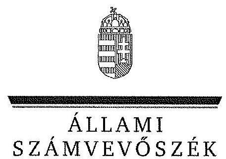
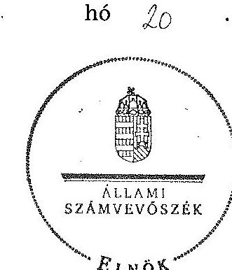
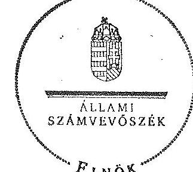

ÁLLAMI
SZÁMVEVŐSZÉK

# JELENTÉS 

az önkormányzatok belső kontrollrendszere kialakításának, egyes kontrolltevékenységek és a belső ellenőrzés múködésének

- 2013. évben induló - ellenőrzéséről

Szabadbattyán
14042
2014. február

---

# Állami Számvevőszék 

Iktatószám: V-0310-078/2014.
Témaszám: 1341
Vizsgálat-azonosító szám: V064927

## Az ellenőrzést felügyelte:

dr. Benedek Mária
felügyeleti vezető
Az ellenőrzést vezette és az ellenőrzés végrehajtásáért felelős:
dr. Tóth Viktória
ellenőrzésvezető
A számvevőszéki jelentés összeállításában közremüködtek:
Csepreginé Tancsik Erzsébet
számvevő tanácsos
dr. Eke-Pekács Tibor
számvevő tanácsos

Az ellenőrzést végezték:
Bretus Zoltán János
számvevő
dr. Eke-Pekács Tibor
számvevő tanácsos

---

# TARTALOMJEGYZÉK 

BEVEZETÉS ..... 5
I. ÖSSZEGZŐ MEGÁLLAPÍTÁSOK, KÖVETKEZTETÉSEK, JAVASLATOK ..... 9
II. RÉSZLETES MEGÁLLAPÍTÁSOK ..... 15

1. Az önkormányzat belső kontrollrendszerének kialakítása ..... 15
1.1. A kontrollkörnyezet ..... 15
1.2. A kockázatkezelési rendszer ..... 15
1.3. A kontrolltevékenységek ..... 16
1.4. Az információs és kommunikációs rendszer ..... 17
1.5. A monitoring rendszer ..... 17
2. A pénzügyi folyamatokban kulcsszerepet betöltő teljesítésigazolás és érvényesítés belső kontrollok múködése ..... 18
3. A belső ellenőrzés múködése ..... 19

## FÜGGELÉKEK

1. számú Értelmező szótár
2. számú Az értékelés módja és szempontjai

---

$\cdot$
$\cdot$
$\cdot$
$\cdot$
$\cdot$
$\cdot$
$\cdot$
$\cdot$
$\cdot$
$\cdot$
$\cdot$
$\cdot$
$\cdot$
$\cdot$
$\cdot$
$\cdot$
$\cdot$
$\cdot$
$\cdot$
$\cdot$
$\cdot$
$\cdot$
$\cdot$
$\cdot$
$\cdot$
$\cdot$
$\cdot$
$\cdot$
$\cdot$
$\cdot$
$\cdot$
$\cdot$
$\cdot$
$\cdot$
$\cdot$
$\cdot$
$\cdot$
$\cdot$
$\cdot$
$\cdot$
$\cdot$
$\cdot$
$\cdot$
$\cdot$
$\cdot$
$\cdot$
$\cdot$
$\cdot$
$\cdot$
$\cdot$
$\cdot$
$\cdot$
$\cdot$
$\cdot$
$\cdot$
$\cdot$
$\cdot$
$\cdot$
$\cdot$
$\cdot$
$\cdot$
$\cdot$
$\cdot$
$\cdot$
$\cdot$
$\cdot$
$\cdot$
$\cdot$
$\

---

# RÖVIDÍTÉSEK JEGYZÉKE 

| Törvények |  |
| :--: | :--: |
| Áht. | 2011. évi CXCV. törvény az államháztartásról (hatályos 2012. január 1-jétől) |
| ÁSZ tv. | 2011. évi LXVI. törvény az Állami Számvevőszékről |
| Info tv. | 2011. évi CXII. törvény az információs önrendelkezési jogról és az információszabadságról (hatályos 2012. január 1-jétől) |
| Htv. | 1991. évi XX. törvény a helyi önkormányzatok és szerveik, a köztársasági megbízottak, valamint egyes centrális alárendeltségú szervek feladat- és hatásköreiről |
| Kttv. | 2011. évi CXCIX. törvény a közszolgálati tisztviselők ről (hatályos 2012. március 1-jétől) |
| Mötv. | 2011. évi CLXXXIX. törvény Magyarország helyi önkormányzatairól |
| Ötv. | 1990. évi LXV. törvény a helyi önkormányzatokról |
| Vagyonnyilatkozat-tételről szóló tv. | 2007. évi CLII. törvény az egyes vagyonnyilatkozat-tételi kötelezettségekről |
| Rendeletek |  |
| Áhsz. | 249/2000. (XII. 24.) Korm. rendelet az államháztartás szervezetei beszámolási és könyvvezetési kötelezettségének sajátosságairól |
| Ávr. | 368/2011. (XII. 31.) Korm. rendelet az államháztartásról szóló törvény végrehajtásáról (hatályos 2012. január 1jétől) |
| Bkr. | 370/2011. (XII. 31.) Korm. rendelet a költségvetési szervek belső kontrollrendszeréről és belső ellenőrzéséről (hatályos 2012. január 1-jétől) |
| Szórövidítések |  |
| ÁSZ | Állami Számvevőszék |
| belső ellenőrzési kézikönyv | Székesfehérvár Megyei Jogú Város Polgármesteri Hivatala Ellenőrzési Irodájának Belső ellenőrzési kézikönyve |
| belső ellenőrzési vezető | Székesfehérvár Megyei Jogú Város Polgármesteri Hivatala Ellenőrzési Irodájának vezetője |
| belső kontroll szabályzat | Szabadbattyán Nagyközség Önkormányzata Polgármesteri Hivatalának Belső Kontrollrendszer Szabályzata |
| gazdálkodási szabályzat | Szabadbattyán Nagyközség Önkormányzata Polgármesteri Hivatalának Gazdálkodási Szabályzata |
| hivatali Ügyrend | Szabadbattyán Nagyközség Önkormányzata Polgármesteri Hivatalának Ügyrendje |
| INTOSAI | International Organization of Supreme Audit Institutions (Legfőbb Ellenőrző Intézmények Nemzetközi Szervezete) |
| ISSAI | International Standards of Supreme Audit Institutions (Legfőbb Ellenőrző Intézmények Nemzetközi Standardjai) |
| jegyző | Szabadbattyán Nagyközség Önkormányzatának jegyzője |

---

| Képviselő-testület | Szabadbattyán Nagyközség Önkormányzat Képviselőtestülete |
| :--: | :--: |
| képviselő-testületi | Szabadbattyán Nagyközség Önkormányzata Képviselötestületének 9/2011 (IV. 27.) rendelete a képviselő-testület |
| SZMSZ | szervezeti és múködési szabályzatáról   Fejér Megyei Kormányhivatal |
| Kormányhivatal | Nemzetgazdasági Minisztérium |
| NGM | Szabadbattyán Nagyközség Önkormányzata |
| Önkormányzat polgármester | Szabadbattyán Nagyközség Önkormányzatának polgármestere |
| Polgármesteri Hivatal | Szabadbattyán Nagyközség Polgármesteri Hivatala |
| Társulás | Székesfehérvári Többcélú Kistérségi Társulás |
| Társulás munkaszervezetének vezetője | Székesfehérvár Megyei Jogú Város Önkormányzatának jegyzője |

---

# JELENTÉS 

## az önkormányzatok belső kontrollrendszere kialakításának, egyes kontrolltevékenységek és a belső ellenőrzés múködésének - 2013. évben induló - ellenőrzéséről Szabadbattyán

## BEVEZETÉS

Szabadbattyán nagyközség állandó lakosainak száma 2012. január 1-jén 4644 fő volt. Az Önkormányzat héttagú Képviselő-testületének munkáját három állandó bizottság segítette. Az Önkormányzat az önállóan működő és gazdálkodó Polgármesteri Hivatalon kívül egy önállóan működő és gazdálkodó intézménnyel ${ }^{1}$ látta el feladatát. Többségi tulajdoni hányadú gazdasági társasággal nem rendelkezett. A polgármester a 2010. évi helyi önkormányzati választások óta tölti be tisztségét. A jegyző 2000. szeptember 1-jétől látja el a jegyzői feladatokat. A Polgármesteri Hivatal szervezeti egységekre nem tagolódott, elkülönített gazdasági szervezettel nem rendelkezett. A köztisztviselők száma 2012. január 1-jén 10 fő volt. A Polgármesteri Hivatalnál 2013. január 1-jétől szervezeti változás, átalakítás nem történt. Az Önkormányzat a 2012. évi költségvetési beszámolója szerint 688080 ezer Ft bevételt ért el, valamint 599344 ezer Ft kiadást teljesített. A 2012. december 31-i könyvviteli mérleg szerint 3444153 ezer Ft értékű eszközvagyonnal rendelkezett, a rövid lejáratú kötelezettségállománya 13904 ezer Ft volt, hosszú lejáratú kötelezettsége nem volt.

A demokratikus társadalmakban alapvető igény, hogy a közpénzeket, a közvagyont használók tevékenységükről elszámoljanak, ahhoz egyértelmű és érvényesíthető felelősségi szabályok társuljanak. Ennek a jogos igénynek az érvényesítéséhez meg kell teremteni azokat a folyamatokat, rendszereket, amelyek nélkülözhetetlenek az elszámoltatáshoz. Az elszámoltatás eredményes múködtetéséhez szükség van a megfelelő információs, kontroll-, értékelési és beszámolási rendszerek kialakítására.

Magyarországon az uniós csatlakozási tárgyalások idejére nyúlnak vissza a belső kontrollrendszer szabályozásának gyökerei. Az uniós elvárásoknak megfelelő új terminológia szerinti államháztartási belső pénzügyi ellenőrzési (ÁBPE) rendszer területén a jogharmonizáció 2003-ban teljes körűen megvalósult, míg az önkormányzati alrendszerre vonatkozó, Ötv.-ben megjelenített speciális szabályozás 2005-ben lépett hatályba. Az államháztartási belső kontrollrendszer koncepciója 2009-ben továbbfejlődött. A változások irányát mutat-

[^0]
[^0]:    ${ }^{1}$ Szabadbattyáni Általános Művelődési Központ

---

ja, hogy a költségvetési szervek belső kontrollrendszere már magában foglalja a korszerű felelős szervezetirányítás elemeit (kontrollkörnyezet, kockázatkezelés, kontrolltevékenység, információ és kommunikáció, monitoring) is. E kontrollrendszer szabályozása háromszintű, a törvényi előírásokat az Áht. és a Mötv., a rendeleti szintű szabályozást az Ávr. és a Bkr. tartalmazza, amelyeket útmutatói szinten az NGM által kiadott standardok és kézikönyvek támogatnak.

A belső kontrollrendszer azt a célt szolgálja, hogy a költségvetési szervek múködésük és gazdálkodásuk során a tevékenységeket szabályszerűen, gazdaságosan, hatékonyan és eredményesen hajtsák végre, teljesítsék elszámolási kötelezettségeiket és megvédjék az erőforrásokat a veszteségektől, a károktól és a nem rendeltetésszerű használattól. A belső kontrollrendszer magában foglalja mindazon szabályokat, eljárásokat, gyakorlati módszereket és szervezeti struktúrákat, kockázatkezelési technikákat, kontrolltevékenységeket, amelyek segítséget nyújtanak a szervezetnek céljai eléréséhez.

Az ÁSZ a 2011-2015. évekre szóló stratégiájában hangsúlyos szerepet szánt annak, hogy szilárd szakmai alapon álló, értékteremtő ellenőrzéseivel előmozdítsa a közpénzügyek átláthatóságát, rendezettségét. A számvevőszéki ellenőrzés nemzetközi alapelvei is rögzítik, hogy a megfelelő belső kontrollrendszer minimálisra csökkenti a hibák és szabálytalanságok kockázatát.

Az ellenőrzés célja annak megállapítása volt, hogy a belső kontrollrendszer elemeinek kialakítása, a pénzügyi folyamatokban kulcsszerepet betöltő teljesítésigazolás és érvényesítés, és a belső ellenőrzés szabályos működése biztosítot-ta-e az Önkormányzatnál a közpénzfelhasználás szabályosságát, hozzájárult-e az értéket teremtő rend követelményének érvényesüléséhez.

Ennek keretében értékeltük, hogy

- a jogszabályi előírásoknak megfelelően alakították-e ki a belső kontrollrendszer elemeit;
- a gazdálkodás folyamatában kulcsszerepet betöltő teljesítésigazolás és érvényesítés kontrolltevékenységeit megfelelően működtették-e;
- biztosították-e a belső ellenőrzés szabályos működését;
- amennyiben az ÁSZ tett javaslatot a 2008-2011. évek közötti ellenőrzése kapcsán az Önkormányzatnak, intézkedtek-e azok végrehajtására.

Az ellenőrzés várható hasznosulását négy szinten tervezzük. A törvényalkotás számára összegzett tapasztalatok állnak rendelkezésre a belső kontrollrendszer önkormányzati területen való kialakításáról, múködéséről és hatásairól, a belső ellenőrzés működéséről. Ennek alapján következtetést lehet levonni arról, hogy a belső kontrollrendszer kialakítására és múködtetésére vonatkozó - jelenlegi, differenciálás nélküli - jogszabályi előírások reális követelményeket támasztanak-e az eltérő adottságú települési önkormányzatok esetében, illetve indokolt-e esetleges jogszabályi módosítás kezdeményezése. Az ellenőrzés az ellenőrzött számára visszajelzést ad a belső kontrollrendszer kialakításában és működésében fellépő hiányosságokról, javaslataival hozzájárul azok kiküsz-

---

öböléséhez, amely csökkentheti a későbbi ellenőrzések gyakoriságát. Az ellenőrzés megállapításait és javaslatait más szervezetek is hasznosíthatják a rendezett gazdálkodási keretek kialakításához. A társadalom számára jelzi, hogy közpénz nem maradhat ellenőrizetlenül, az ÁSZ értékteremtő rend kialakításához és megőrzéséhez hozzájáruló tevékenysége pozitív hatással lesz a szervezetről kialakított összkép formálásában. A szervezeten belül lehetőség nyílik arra, hogy a megállapítások szintetizálásával az ÁSZ a hozzáadott értéket teremtő elemző tevékenységét és tanácsadó szerepét is erősítse.

Az önkormányzatok belső kontrollrendszere kialakításának, egyes kontrolltevékenységek és a belső ellenőrzés működésének ellenőrzéséről szóló jelentés I. fejezetének összegző része az ellenőrzés céljára ad rövid, szintetizáló összefoglalót, és tartalmazza a következtetéseket a II. fejezet részletes megállapításain alapulóan. A jelentés intézkedést igénylő megállapításait és javaslatait az ellenőrzés során feltárt, a jelentés II. fejezetében rögzített részletes megállapítások alapozzák meg. A helyszíni ellenőrzés lezárásáig a helyi szabályozás változásait nyomon követtük.

Az ellenőrzés típusa: szabályszerűségi ellenőrzés.
Az ellenőrzött időszak: a belső kontrollrendszer kialakításának megfelelősége esetében 2012. év, a pénzügyi folyamatokban kulcsszerepet betöltő teljesítésigazolás és érvényesítés belső kontrollok működésének megfelelőségét és a belső ellenőrzés szabályszerű működését a 2012. január 1. és december 31-e közötti időszak eseményeit figyelembe véve értékeltük, míg az ÁSZ javaslatainak utóellenőrzése a 2008-2011. években hivatalosan közzétett számvevőszéki jelentésekben tett javaslatok áttekintésére terjedt ki.

Az ellenőrzött szervezet: Szabadbattyán Nagyközség Önkormányzata.
Az ellenőrzés jogszabályi alapját az ÁSZ tv. 1. § (3) bekezdése, az 5. § (2) és (6) bekezdései, valamint az Áht. 61. § (2) bekezdésének előírásai képezik.

Az ellenőrzés szakmai módszertana az ÁSZ hivatalos honlapján (www.asz.hu) közzétett szakmai szabályokon alapult, amely az INTOSAI által kiadott ISSAI figyelembevételével készült.

Az ellenőrzés lefolytatásához az Önkormányzat a kimutatások és a tanúsítvány kitöltésével, valamint az ÁSZ által kért dokumentumok elektronikus megküldésével szolgáltatott adatokat. Az így rendelkezésre bocsátott adatok, információk kontrollja és a munkalapok kitöltése a helyszíni ellenőrzés keretében történt. A jelentésben használt fogalmak magyarázatát az 1. számú függelék, az ellenőrzés egyes területeinek értékelésénél alkalmazott egységes minősítési szempontokat a 2. számú függelék tartalmazza.

A belső kontrollrendszer kialakításának ellenőrzése során értékeltük a kontrollkörnyezet, a kockázatkezelési rendszer, a kontrolltevékenységek, az információs és kommunikációs rendszer, valamint a monitoring rendszer szabályozottságának megfelelőségét. A pénzügyi folyamatokban kulcsszerepet betöltő teljesítésigazolás és érvényesítés kontrollok működése megfelelőségének minősítéséhez az állományba nem tartozók megbízási díjai, a külső szolgáltatók által

---

végzett karbantartási, kisjavítási munkák, az egyéb üzemeltetési és fenntartási szolgáltatások, a rendszeres szociális segélyek, valamint az államháztartáson kívülre teljesített múködési és felhalmozási célú pénzeszközátadások közül kockázatelemzéssel választottuk ki az ellenőrzött kiadási jogcímeket. Az egyszerű véletlen mintavétellel kiválasztott tételek ellenőrzését többlépcsős megfelelőségi tesztek útján addig végeztük, amíg elegendő és megfelelő bizonyítékot szereztünk a vizsgált folyamatok kulcskontrolljai múködésének megfelelő vagy nem megfelelő voltáról. Értékeltük az Önkormányzatnál a belső ellenőrzés működésének szabályosságát. Utóellenőrzésre nem került sor, mivel az ÁSZ az Önkormányzatnál a 2008-2011. évek között ellenőrzést nem végzett.

Az ÁSZ tv. 29. § (1) bekezdése szerint a jelentéstervezetet megküldtük a polgármester részére, aki az ÁSZ tv. 29. § (2) bekezdésében foglalt észrevételezési jogával nem élt, a jelentéstervezetre észrevételt nem tett.

---

# I. ÖSSZEGZŐ MEGÁLLAPÍTÁSOK, KÖVETKEZTETÉSEK, JAVASLATOK 

A belső kontrollrendszeren belül 2012-ben a kontrollkörnyezet, a kockázatkezelési rendszer, a kontrolltevékenységek, az információs és kommunikációs rendszer, valamint a monitoring rendszer kialakítását külön-külön és együttesen is értékeltük. A belső kontrollrendszer kialakítása az összesített értékelés alapján nem felelt meg a jogszabályi előírásoknak.

A belső kontrollrendszer egyes területei kialakításának minősítése a következő:

| Kontrollterület | Minősítés |  |
| :-- | :-- | :-- |
| Kontrollkörnyezet |  | nem |
|  |  | megfelelö |
| Kockázatkezelési rendszer |  | részben |
|  |  | megfelelö |
| Kontrolltevékenységek | megfelelö |  |
| Információs és kommuni- |  | nem |
| kációs rendszer |  | megfelelö |
| Monitoring rendszer |  | nem |
|  |  | megfelelö |

Megfelelő́nek értékeltük a kontrolltevékenységek kialakítását, mivel a jogszabályi előírásokban foglaltakat figyelembe véve kisebb hiányosságok mellett is e kontrollterület hozzájárult a Polgármesteri Hivatal, ezáltal az Önkormányzat céljainak eléréséhez.

Részben megfelelő́nek értékeltük a kockázatkezelési rendszer kialakítását, mivel az e területen megállapított kisebb hiányosságok nem veszélyeztették a kockázatkezelési rendszer keretében megvalósuló kockázatkezelést.

Nem megfelelőnek értékeltük a kontrollkörnyezet, az információs és kommunikációs rendszer, valamint a monitoring rendszer kialakítását, mivel az ellenőrzésünk során megállapított szabályozásbeli hiányosságok magukban hordozzák a szabálytalan múködés, valamint a korrupció kockázatát.

A belső kontrollrendszer nem megfelelő kialakítása kockázatot jelent az Önkormányzat tevékenységeinek szabályszerű, gazdaságos, hatékony és eredményes végrehajtása során.

Az állományba nem tartozók megbízási díjaival, valamint a külső szolgáltatók által végzett karbantartási, kisjavítási munkákkal kapcsolatos kifizetések során a pénzügyi folyamatokban kulcsszerepet betöltő teljesítésigazolás és érvényesítés belső kontrollok múködése jó volt. Jónak értékeltük a két kulcs-

---

kontroll együttes múködését, mivel a megállapított hiányosságok nem veszélyeztették a hibák megelőzését, feltárását és kijavítását.

A belső ellenőrzési feladatokat a Társulás útján látták el. A belső ellenőrzés múködése megfelelt a jogszabályi előírásoknak, mivel a megállapított kisebb hiányosságok mellett is biztosították a belső ellenőrzés ellátásának szervezeti kereteit és a belső ellenőrzés működését, azonban a belső ellenőrzés nem tárta fel a számvevőszéki ellenőrzés során a kontrollkörnyezet, az információs és kommunikációs rendszer, valamint a monitoring rendszer kialakításánál és a pénzügyi folyamatokban kulcsszerepet betöltő érvényesítés belső kontroll működésénél megállapított hiányosságokat.

Az ÁSZ tv. 33. § (1) bekezdésében foglaltak értelmében az ellenőrzött szervezet vezetője köteles a jelentésben foglalt megállapításokhoz kapcsolódó intézkedési tervet összeállítani, és azt a jelentés kézhezvételétől számított 30 napon belül az ÁSZ részére megküldeni. Amennyiben az intézkedési tervet határidőre nem küldi meg a szervezet, vagy az ÁSZ tv. 33. § (2) bekezdésében foglalt póthatáridő elteltével megküldött intézkedési terv továbbra sem elfogadható, az ÁSZ elnöke a hivatkozott törvény 33. § (3) bekezdés a)-b) pontjaiban foglaltakat érvényesítheti.

Az ellenőrzés intézkedést igénylő megállapításai és javaslatai:

# a polgármesternek 

1. Az írásbeli kötelezettségvállalásokat - az Áht. 37. § (1) bekezdésében és az Ávr. 55. § (1) bekezdésében előírtak ellenére - nem előzte meg pénzügyi ellenjegyzés.

Javaslat:
Intézkedjen arról, hogy az Önkormányzat nevében történő kötelezettségvállalásra az Áht. 37. § (1) bekezdésében és az Ávr. 55. § (1) bekezdésében foglaltaknak megfelelően - az Ávr. 53. §-ában meghatározott kivételekkel - kizárólag pénzügyi ellenjegyzés után, a pénzügyi teljesítés esedékességét megelőzően, írásban kerüljön sor.
2. A számvevőszéki ellenőrzés megállapításai alapján az Önkormányzatnál a belső kontrollrendszer kialakítása összefoglalóan értékelve nem felelt meg a jogszabályi előírásoknak, a belső ellenőrzés működése ugyan megfelelt a jogszabályi előírásoknak, azonban a belső ellenőrzés nem tárta fel a számvevőszéki ellenőrzés során a kontrollkörnyezet, az információs és kommunikációs rendszer, valamint a monitoring rendszer kialakításánál és a pénzügyi folyamatokban kulcsszerepet betöltő érvényesítés belső kontroll működésénél megállapított hiányosságokat, ezáltal nem is javíttatta ki azokat. A megállapított szabályozásbeli és működésbeli hiányosságok magukban hordozzák a szabálytalan működés kockázatát.

Javaslat:
A Mötv. 115. § (1) bekezdésében foglaltak alapján kísérje figyelemmel az Önkormányzat gazdálkodásának szabályszerűségét. A Mötv. 67. § f) pontja alapján gondoskodjon a belső kontrollrendszer kialakítására vonatkozó jogszabályi rendelkezések be nem tartása, valamint az érvényesítés belső kontroll működésével összefüggésben

---

feltárt hiányosságok, szabálytalanságok tekintetében az esetleges munkajogi felelősséggel kapcsolatos körülmények kivizsgálásáról, majd a vizsgálat eredményének függvényében tegye meg a szükséges munkajogi intézkedéseket.

# a jegyzőnek 

1. a kontrollkörnyezettel kapcsolatban:

A jegyző - a Htv. 140. § (1) bekezdés c) pontjában foglaltak ellenére - az Önkormányzat intézményeinek számviteli rendjét nem alakította ki.

Javaslat:
Alakítsa ki a Htv. 140. § (1) bekezdés c) pontja alapján az Önkormányzat intézményeinek számviteli rendjét.
2. a kockázatkezelési rendszerrel kapcsolatosan:

A Vagyonnyilatkozat-tételről szóló tv. 4. § d) pontjában foglaltak ellenére a képviselő-testületi SZMSZ-ben nem tüntették fel a vagyonnyilatkozat-tételre kötelezettek körét.

Javaslat:
Készítse elő a Mötv. 81. § (3) bekezdés c) pontjában foglalt feladatkörében a képvi-selő-testületi SZMSZ módosítását annak érdekében, hogy az tartalmazza a Vagyon-nyilatkozat-tételről szóló tv. 4. § d) pontjában foglalt előírásnak megfelelően a vagyonnyilatkozat-tételre kötelezettek körét, és kezdeményezze a módosítás Képviselőtestület elé terjesztését.
3. a kontrolltevékenységekkel kapcsolatban:

A jegyző - a Bkr. 8. § (2) bekezdésének a) pontjában foglaltak ellenére - nem biztosította a támogatások elszámolása vonatkozásában a folyamatba épített, előzetes, utólagos és vezetői ellenőrzést.

A jegyző - a Bkr. 8. § (4) bekezdés b) pontjában foglaltak ellenére - belső szabályzatban nem határozta meg a dokumentumokhoz és információkhoz való hozzáférésre vonatkozóan a felelősségi köröket.

Javaslat:
a) Biztosítsa minden tevékenységre vonatkozóan a folyamatba épített, előzetes, utólagos és vezetői ellenőrzést a Bkr. 8. § (2) bekezdésének előírása alapján.
b) Szabályozza belső szabályzatban a Bkr. 8. § (4) bekezdés b) pontja alapján a dokumentumokhoz és információkhoz való hozzáférés esetében a felelősségi köröket.

---

4. az információs és kommunikációs rendszerrel kapcsolatosan:

A jegyző - az Info. tv. 33. § (1) és (3) bekezdésében, a 37. § (1) bekezdésében és az 1. mellékletében foglaltak ellenére - nem gondoskodott arról, hogy az Önkormányzat az elektronikus közzétételi kötelezettségének a 2012. évben eleget tegyen.

Javaslat:
Gondoskodjon az Info tv. 33. § (1) és (3) bekezdésében, a 37. § (1) bekezdésében és az 1. mellékletében foglaltaknak megfelelően az Önkormányzat elektronikus közzétételi kötelezettségének teljesítéséről.
5. a monitoring rendszerrel kapcsolatosan:

A jegyző - a Bkr. 3. § e) pontjában és a 10. §-ában foglaltak ellenére - nem alakította ki és nem múködtette a Polgármesteri Hivatal tevékenységének, a célok megvalósításának nyomon követését biztosító rendszerét.

A jegyző - a Bkr. 11. § (1) bekezdésében foglalt kötelezettsége ellenére - a 2011. évre vonatkozóan nem értékelte a Polgármesteri Hivatal belső kontrollrendszerének minőségét.

A jegyző - a Bkr. 13. § (2) bekezdésében foglalt előírás ellenére - a külső ellenőrzések megállapításainak és javaslatainak hasznosítására intézkedési tervet nem készített.

Javaslat:
a) Alakítsa ki és múködtesse a Bkr. 3. § e) pontjában és 10. §-ában előírtak alapján a Polgármesteri Hivatal tevékenységének, a célok megvalósításának nyomon követését biztosító rendszerét.
b) Értékelje a Bkr. 11. § (1) bekezdésében előírtaknak megfelelően a jogszabályban meghatározott keretek között a belső kontrollrendszer minőségét a Bkr. 1. melléklete szerinti nyilatkozatban.
c) Gondoskodjon a Bkr. 13. § (2) bekezdésében foglaltaknak megfelelően a külső ellenőrzések megállapításainak és javaslatainak hasznosítására intézkedési tervek készítéséről.
6. a pénzügyi folyamatokban kulcsszerepet betöltő kontrollokkal kapcsolatban:

Az érvényesítő - az Ávr. 58. § (2) bekezdésében foglalt előírás ellenére - nem jelezte az utalványozónak, hogy a megelőző ügymenetben az írásbeli kötelezettségvállalásokat - az Áht. 37. § (1) bekezdésében és az Ávr. 55. § (1) bekezdésében előírtak ellenére - nem előzte meg pénzügyi ellenjegyzés; az Ávr. 56. § (1) bekezdésében és a gazdálkodási szabályzatban előírtak ellenére a kötelezettségvállalásokat követően nem gondoskodtak annak nyilvántartásba vételéről.

---

Javaslat:
Intézkedjen - az érvényesítés vonatkozásában feltárt hiányosságok megszüntetése, illetve az operatív gazdálkodás során a müködésbeli hibák megelőzése, feltárása és kijavítása érdekében - arról, hogy:
a) kötelezettségvállalásra az Áht. 37. § (1) bekezdésében és az Ávr. 55. § (1) foglaltaknak megfelelően - az Ávr. 53. §-ában meghatározott kivételeket figyelembe véve - kizárólag a pénzügyi ellenjegyzés után, a pénzügyi teljesítés esedékességét megelőzően, írásban kerüljön sor;
b) a kötelezettségvállalásokat az Ávr. 53. § (2) és 56. § (1) bekezdésében foglalt előírásoknak megfelelően vegyék nyilvántartásba.
7. a belső ellenőrzés müködésével kapcsolatban:

A Bkr. 56. § (3) bekezdés a) pontjában foglaltak ellenére az Önkormányzat nem rendelkezett Képviselő-testület által jóváhagyott stratégiai ellenőrzési tervvel.

A 2013. évi ellenőrzési terv összeállítása - a Bkr. 56. § (2) bekezdésében foglalt előírás ellenére - nem a jegyző írásos véleményének figyelembevételével történt, mivel a jegyző írásos véleményt nem fogalmazott meg.

A 2013. évi ellenőrzési terv összeállítását megelőzően a belső ellenőrzés - a Bkr. 22. § (1) bekezdés b) pontjában, a 29. § (1) bekezdésében és a 31. § (2) bekezdésében foglaltak ellenére - kockázatelemzést nem készített.

Az ellenőrzési programot - a Bkr. 33. § (2) bekezdésében foglalt előírás ellenére - a belső ellenőrzési vezető helyett a Társulás munkaszervezetének vezetője hagyta jóvá.

A belső ellenőrzési vezető - a Bkr. 22. § (1) bekezdés g) pontjában és a 49. § (1) bekezdésében foglaltak ellenére - a 2011. évre vonatkozó éves ellenőrzési jelentést nem készítette el.

Javaslat:
a) Kezdeményezze a Bkr. 56. § (3) bekezdés a) pontjában foglaltaknak megfelelően a stratégiai ellenőrzési terv Képviselő-testület elé terjesztését annak érdekében, hogy azt a Képviselő-testület hagyja jóvá.
b) Kezdeményezze, hogy az éves ellenőrzési tervet a belső ellenőrzési vezető a Bkr. 56. § (2) bekezdés előírásainak megfelelően a jegyző írásos véleményének figyelembevételével készítse el.
c) Kezdeményezze, hogy az éves ellenőrzési terv a Bkr. 22. § (1) bekezdés b) pontja, a 29. § (1) bekezdése és a 31. § (2) bekezdése alapján kockázatelemzésen alapuljon.
d) Kezdeményezze, hogy az ellenőrzési programot a Bkr. 33. § (2) bekezdésében foglaltaknak megfelelően a belső ellenőrzési vezető hagyja jóvá.

---

e) Kezdeményezze, hogy a Bkr. 22. § (1) bekezdés g) pontjában és a 49. § (1) bekezdésében foglaltak alapján az éves ellenőrzési jelentést készítsék el.

---

# II. RÉSZLETES MEGÁLLAPÍTÁSOK 

## 1. AZ ÖNKORMÁNYZAT BELSŐ KONTROLLRENDSZERÉNEK KIALAKÍTÁSA

A belső kontrollrendszer kialakítása 2012-ben a kontrollkörnyezet, a kockázatkezelési rendszer, a kontrolltevékenységek, az információs és kommunikációs rendszer, valamint a monitoring rendszer értékelése alapján összességében nem felelt meg a jogszabályi előírásoknak.

### 1.1. A kontrollkörnyezet

A kontrollkörnyezet kialakítása - a 2. számú függelékben részletezett kritériumrendszer alapján végzett értékelés szerint - nem felelt meg a jogszabályi előírásoknak, mert:

| Sorszám $^{2}$ | Megállapítás | Megjegyzés |
| :--: | :--: | :--: |
| 5. | A jegyző - az Áht. 10. § (5) bekezdésében foglaltak ellenére - a Polgármesteri Hivatal feladatai ellátásának részletes belső rendjét és módját szervezeti és múködési szabályzatban nem állapította meg. | A Polgármesteri Hivatal 2013. január 3-tól már rendelkezett SZMSZ-szel. |
| 18. | A jegyző - a Htv. 140. § (1) bekezdés c) pontjában foglaltak ellenére - az Önkormányzat intézményeinek számviteli rendjét nem alakította ki. |  |

### 1.2. A kockázatkezelési rendszer

A kockázatkezelési rendszer kialakítása - a 2. számú függelékben részletezett kritériumrendszer alapján végzett értékelés szerint - részben felelt meg a jogszabályi előírásoknak.

A jegyző a Polgármesteri Hivatal kockázatkezelési rendszerét kialakította. Beazonosították a Polgármesteri Hivatal tevékenységében, gazdálkodásában rejlő külső és belső kockázatokat.

Meghatározták az egyes kockázati tényezőkkel kapcsolatban a szükséges intézkedéseket, valamint a kockázatok kezelése érdekében szükséges intézkedések teljesítésének folyamatos nyomon követési módját. A jogszabály által vagyonnyilatkozat-tételre kötelezettek a nyilatkozattételi kötelezettségüknek a jogszabályban előírt gyakorisággal eleget tettek.

[^0]
[^0]:    ${ }^{2}$ A megállapítás számozása az Önkormányzat által az adatszolgáltatás során kitöltött kimutatások kérdéseinek sorszámával azonos.

---

A kockázatkezelési rendszer kialakítása az alábbi kisebb hiányosságok miatt részben felelt meg a jogszabályi előírásoknak:

| Sorszám | Megállapítás | Megjegyzés |
| :--: | :--: | :--: |
| 13. | A Vagyonnyilatkozat-tételről szóló tv. 4. § a) és d) pontjaiban foglaltak ellenére a hivatali SZMSZ-ben, valamint a képvise-lö-testületi SZMSZ-ben nem tüntették fel a vagyonnyilatkozat-tételre kötelezettek körét. | A Polgármesteri Hivatal 2013. január 3-tól hatályos SZMSZ-e 3.6 pontjában meghatározták a vagyonnyilatkozat-tételre kötelezettek körét (jegyzö, gazdálkodási előadó, pénzügyi előadó). |

# 1.3. A kontrolltevékenységek 

A kontrolltevékenységek kialakítása - a 2. számú függelékben részletezett kritériumrendszer alapján végzett értékelés szerint - megfelelt a jogszabályi előírásoknak.

A jegyző a kontrolltevékenység részeként előírta a folyamatba épített, előzetes, utólagos és vezetői ellenőrzést a költségvetés tervezése, a beszerzések lebonyolítása és a vagyonhasznosítási tevékenység vonatkozásában.

Gazdálkodási szabályzatban rendezték a kötelezettségvállalás pénzügyi ellenjegyzése, a teljesítésigazolás, az érvényesítés és az utalványozás gyakorlásának módjával, eljárási és dokumentációs részletszabályaival, valamint az ezeket végző személyek kijelölésének rendjével kapcsolatos belső előírásokat, feltételeket. A teljesítésigazolásra jogosult személyeket írásban kijelölték. A jogszabályi előírásoknak megfelelően szabályozták az előzetes írásbeli kötelezettségvállalást nem igénylő kifizetések rendjét.

A jegyző kialakította az üzembiztonsági, adatvédelmi szabályok érvényre juttatásához szükséges eljárási szabályokat, szabályozta az üzemeltetés és az adatbiztonság feladatait, valamint az üzemeltetés és az adatbiztonság szabályozásában meghatározta a hatásköröket.

A gazdálkodási szabályzatban, valamint a hivatali Ügyrendben meghatározta a beszámolási feladatok teljesítésével kapcsolatos belső előírásokat, feltételeket, a beszámolási eljárásokhoz kapcsolódó felelősségi köröket. A gazdasági feladatot ellátó vezetők és alkalmazottak helyettesítésének rendjét a hivatali Ügyrend és a munkaköri leírások tartalmazták.

Az éves költségvetési beszámoló elkészítésével megbízott személy rendelkezett a jogszabályban előírt képesítéssel és a tevékenység ellátására jogosító engedélylyel. A jegyző pénzügyi ellenjegyzési feladatra a Polgármesteri Hivatal állományába tartozó köztisztviselőt jelölt ki. A pénzügyi ellenjegyzésre kijelölt személy rendelkezett a jogszabályban előírt szakképzettséggel. Az érvényesítési feladatok ellátására kijelölt személy rendelkezett a jogszabályban előírt végzettséggel, képesítéssel.

---

A kontrolltevékenységek kialakítása az alábbi kisebb hiányosságok mellett megfelelt a jogszabályi előírásoknak:

| Sor-   szám | Megállapítás | Megjegyzés |
| :-- | :-- | :-- |
| 5. | A jegyző - a Bkr. 8. § (2) bekezdés a) pont-   jában foglaltak ellenére - nem biztosította   a támogatások elszámolása vonatkozásá-   ban a folyamatba épített, előzetes, utóla-   gos és vezetői ellenőrzést. |  |
| 17. | A jegyző - a Bkr. 8. § (4) bekezdés b) pont-   jában foglaltak ellenére - belső szabály-   zatban nem határozta meg a dokumentu-   tumokhoz és információkhoz való hozzáfé-   résre vonatkozóan a felelősségi köröket. |  |
| 32. | A jegyző - a Kttv. 74. § (1) bekezdésében és   226. §-ában foglaltak ellenére - nem sza-   bályozta a Polgármesteri Hivatalban a   köztisztviselő jogviszonya megszüntetése   (megszünése) esetére a munkakör átadása   és a munkáltatóval való elszámolás rend-   jét. | A Polgármesteri Hivatal   2013. január 3-tól hatályos   SZMSZ-ének ${ }^{\text {3 }}$. Hivatal   működési rendje fejezet 3.3   pontja a jogszabályi elö-   írásnak megfelelően tar-   talmazza. |

# 1.4. Az információs és kommunikációs rendszer 

Az információs és kommunikációs rendszer kialakítása - a 2. számú függelékben részletezett kritériumrendszer alapján végzett értékelés szerint nem felelt meg a jogszabályi előírásoknak, mert:

Sor-
szám
Megállapítás
7. A jegyző - az Info. tv. 33. § (1) és (3) bekezdéseiben, a 37. § (1) bekezdésében és 1. mellékletében foglaltak ellenére - nem gondoskodott arról, hogy az Önkormányzat az elektronikus közzétételi kötelezettségének a 2012. évben eleget tegyen.

### 1.5. A monitoring rendszer

A monitoring rendszer kialakítása - a 2. számú függelékben részletezett kritériumrendszer alapján végzett értékelés szerint - nem felelt meg a jogszabályi előírásoknak, mert:

Sor-
szám
Megállapítás

1. A jegyző - a Bkr. 3. § e) pontjában és a 10. §-ában foglaltak ellenére - nem alakította ki és nem müködtette a Polgármesteri Hivatal tevékenységének, a célok megvalósításának nyomon követését biztosító rendszerét.

---

9. A jegyző - a Bkr. 11. § (1) bekezdésében foglalt kötelezettsége ellenére - a 2011. évre vonatkozóan nem értékelte a Polgármesteri Hivatal belső kontrollrendszerének minőségét.
10. A jegyző - a Bkr. 13. § (2) bekezdésében foglalt előírás ellenére - a külső ellenőrzések megállapításainak és javaslatainak hasznosítására intézkedési tervet nem készített.

Az Önkormányzat törvényességi felügyeletét ellátó Kormányhivatal a 2012. évben az Önkormányzat vonatkozásában nem élt törvényességi felhívással, illetve más törvényességi felügyeleti eszközzel.

# 2. A PÉNZÜGYI FOLYAMATOKBAN KULCSSZEREPET BETÖLTŐ TELJESÍTÉSIGAZOLÁS ÉS ÉRVÉNYESÍTÉS BELSŐ KONTROLLOK MÜKÖDÉSE 

Az Önkormányzatnál az eredendő kockázat az 1. számú kimutatás szerint alacsony volt, így a pénzügyi folyamatokban kulcsszerepet betöltő belső kontrollok múködését két területen ellenőriztük.

Az állományba nem tartozók megbízási díjaival, valamint a külső szolgáltatók által végzett karbantartási, kisjavítási munkákkal kapcsolatos kifizetések során a pénzügyi folyamatokban kulcsszerepet betöltő teljesítésigazolás és érvényesítés belső kontrollok múködésének megfelelősége összefoglalóan értékelve az alábbi kisebb hiányosságok mellett jó volt:

| Kulcskontroll | Megállapítás |
| :--: | :--: |
| teljesítésigazolás | A teljesítésigazolás - a rendelkezésre bocsátott dokumentumok alapján - megfelelt a jogszabályi előírásoknak. |
| érvényesítés | Az érvényesítő az ellenőrzött tételek esetében - az Ávr. 58. § (2) bekezdésében foglalt előírás ellenére - nem jelezte az utalványozónak, hogy a megelőző ügymenetben a Polgármesteri Hivatal és az Önkormányzat kiadási előirányzatai terhére történt írásbeli kötelezettségvállalásokat - az Áht. 37. § (1) bekezdésében és az Ávr. 55. § (1) bekezdésében előírtak ellenére - nem előzte meg pénzügyi ellenjegyzés; az Ávr. 56. § (1) bekezdésében és a gazdálkodási szabályzatban előírtak ellenére a kötelezettségvállalásokat követően nem gondoskodtak annak nyilvántartásba vételéről. |

Az állományba nem tartozók megbízási díjainak kifizetése során a teljesítésigazolás és az érvényesítés kulcskontrollok múködésének megfelelősége az alábbi kisebb hiányosságok mellett jó volt:

Az érvényesítő az ellenőrzött tételek esetében - az Ávr. 58. § (2) bekezdésében foglalt előírás ellenére - nem jelezte az utalványozónak, hogy a megelőző ügymenetben az Ávr. 56. § (1) bekezdésében, valamint a gazdálkodási szabályzatban előírtak ellenére a kötelezettségvállalásokat követően nem gondoskodtak annak nyilvántartásba vételéről, valamint - az Áht. 37. § (1) bekezdésében és az Ávr. 55. § (1) bekezdésében foglaltaktól eltérően - az írásbeli kötelezettségvállalásokat nem előzte meg pénzügyi ellenjegyzés.

---

A külső szolgáltatók által végzett karbantartási, kisjavítási munkákkal kapcsolatos kifizetések során a teljesítésigazolás és az érvényesítés kulcskontrollok múködésének megfelelősége az alábbi kisebb hiányosságok mellett jó volt:

Az érvényesítő az ellenőrzött tételek esetében - az Ávr. 58. § (2) bekezdésében foglalt előírás ellenére - nem jelezte az utalványozónak, hogy a megelőző ügymenetben az Ávr. 56. § (1) bekezdésében, valamint a gazdálkodási szabályzatban előírtak ellenére a kötelezettségvállalásokat követően nem gondoskodtak annak nyilvántartásba vételéről, valamint - az Áht. 37. § (1) bekezdésében és az Ávr. 55. § (1) bekezdésében foglaltaktól eltérően - az írásbeli kötelezettségvállalásokat nem előzte meg pénzügyi ellenjegyzés.

# 3. A BELSŐ ELLENŐRZÉS MŰKÖDÉSE 

Az Önkormányzat a belső ellenőrzési feladatokat a Társulás útján látta el.
A belső ellenőrzés múködése - a 2. számú függelékben részletezett kritériumrendszer alapján végzett értékelés szerint - az Önkormányzatnál megfelelt a jogszabályi előírásoknak.

Az Önkormányzat rendelkezett a Társulás munkaszervezetének vezetője által jóváhagyott, a jogszabályi előírásoknak megfelelő tartalmú, rendszeresen aktualizált belső ellenőrzési kézikönyvvel. A belső ellenőrzést végzők rendelkeztek a jogszabályban előírt szakképzettséggel és szakmai gyakorlattal.

A belső ellenőrzési vezető a 2013. évre az előírt tartalommal elkészítette az Önkormányzat éves belső ellenőrzési tervét. A 2012. évi módosított ellenőrzési tervben foglalt ellenőrzést végrehajtották, az ellenőrzési tervet a jegyző egyetértésével módosították. A végrehajtott ellenőrzéshez a Bkr.-ben foglalt tartalmi követelményeknek megfelelő ellenőrzési program készült. Az elvégzett ellenőrzésről a jogszabályban előírt tartalmú jelentés készült.

A belső ellenőrzés javaslatainak végrehajtása érdekében a jegyző készített intézkedési tervet, az intézkedési tervben foglaltak végrehajtásáról a jegyző levélben tájékoztatta a belső ellenőrzési vezetőt. Az elvégzett ellenőrzésről és a megtett intézkedések nyomon követéséről nyilvántartást vezettek.

A belső ellenőrzés múködése az alábbi kisebb hiányosságok mellett megfelelt a jogszabályi előírásoknak:

Sor-
szám Megállapítás
7. A Bkr. 56. § (3) bekezdés a) pontjában foglaltak ellenére az Önkormányzat nem rendelkezett Képviselő-testület által jóváhagyott stratégiai ellenőrzési tervvel.
10. A 2013. évi ellenőrzési terv összeállítása - a Bkr. 56. § (2) bekezdésében foglalt előírás ellenére - nem a jegyző írásos véleményének figyelembevételével történt, mivel a jegyző írásos véleményt nem fogalmazott meg.

---

11. A 2013. évi ellenőrzési terv összeállítását megelőzően a belső ellenőrzés - a Bkr. 22. § (1) bekezdés b) pontjában, a 29. § (1) bekezdésében és a 31. § (2) bekezdésében foglaltak ellenére - kockázatelemzést nem készített.
12. Az ellenőrzési programot - a Bkr. 33. § (2) bekezdésében foglalt előírás ellenére - a belső ellenőrzési vezető helyett a Társulás munkaszervezetének vezetője hagyta jóvá.
13. A belső ellenőrzési vezető - a Bkr. 22. § (1) bekezdés g) pontjában és 49. § (1) bekezdésében foglaltak ellenére - a 2011. évre vonatkozó éves ellenőrzési jelentést nem készítette el.

Az Önkormányzat az ÁSZ-tól a 2012. és a 2013. években integritás kérdőív kitöltésére kapott felkérést, de a felkérésnek nem tett eleget. A kontrollkörnyezet, az információs és kommunikációs rendszer, valamint a monitoring rendszer kialakításánál feltárt hibák, a szabálytalanságot bejelentő védelmére vonatkozó előírások és kötelezettségek szabályainak hiánya, a munkaköri leírásokban a munkavállaló jogai, kötelezettségei, felelőssége rögzítésének hiánya, a 2013. évi ellenőrzési terv megalapozását szolgáló kockázatelemzés elmaradása arra utal, hogy az Önkormányzatnak még fejlődést kell elérnie az integritási szemlélet érvényesítésében.

Budapest, 2014.

hó 20 . nap

Domokos László
elnök

Függelék: $\quad 2 \mathrm{db}$

---

# ÉRTELMEZŐ SZÓTÁR 

belső ellenőrzés
belső kontrollrendszer
belső kontrollrendszer területei
egyszerű véletlen mintavétel
integritás
kockázat
kockázatkezelési rendszer

Független, tárgyilagos bizonyosságot adó és tanácsadó tevékenység, amelynek célja, hogy az ellenőrzött szervezet múködését fejlessze és eredményességét növelje, az ellenőrzött szervezet céljai elérése érdekében rendszerszemléletű megközelítéssel és módszeresen értékeli, illetve fejleszti az ellenőrzött szervezet irányítási és belső kontrollrendszerének hatékonyságát. (Forrás: Bkr. 2. § b) pontja)
A belső kontrollrendszer a kockázatok kezelése és tárgyilagos bizonyosság megszerzése érdekében kialakított folyamatrendszer, amely azt a célt szolgálja, hogy a múködés és gazdálkodás során a tevékenységeket szabályszerűen, gazdaságosan, hatékonyan, eredményesen hajtsák végre, az elszámolási kötelezettségeket teljesítsék, megvédjék az erőforrásokat a veszteségektől, károktól és nem rendeltetésszerű használattól. (Forrás: Áht. 69. § (1) bekezdése)
A kontrollkörnyezet, a kockázatkezelési rendszer, a kontrolltevékenységek, az információs és kommunikációs rendszer, valamint a nyomon követési (monitoring) rendszer. (Forrás: Bkr. 3. §-a)

Az alapsokaságból egyszerű véletlen kiválasztással képzett részsokaság. (Forrás: Az ÁSZ ellenőrzési mintavételezés támogatásához készült segédletének 4.1.1. pontja)
Az integritás elvek, értékek, cselekvések, módszerek, intézkedések konzisztenciáját jelenti: olyan magatartásmódot, amely meghatározott értékeknek felel meg. Az integritás a közszféra esetében a társadalom által elvárt nyilvánossági, átláthatósági, illetve jogi/etikai normáknak történő megfelelést jelenti.
(Forrás: a http://integritas.asz.hu honlapon közzétett „A 2012. évi integritás felmérés eredményeinek összefoglalója" címú dokumentum 3. oldal 1. bekezdése)
A kockázat annak a valószínűségét jelenti, hogy egy vagy több esemény vagy intézkedés nem kívánt módon befolyásolja a rendszer múködését, céljainak megvalósulását. (Forrás: Javaslatok a korrupciós kockázatok kezelésére - Kockázatkezelési és ellenőrzési módszertan 35. oldal, ÁSZ)
Olyan irányítási eszközök és módszerek összessége, melynek elemei a szervezeti célok elérését veszélyeztető tényezők (kockázatok) azonosítása, elemzése, csoportosítása, nyomon követése, valamint szükség esetén a kockázati kitettség mérséklése. (Forrás: Bkr. 2. § m) pontja)

---

kontrollkörnyezet
kontrolltevékenységek
kommunikáció
korrupció
kulcskontrollok
lényegesség
megfelelőségi teszt

A kontrollkörnyezet alakítja ki a szervezet belső kontrollrendszerhez való viszonyát, hozzáállását, befolyásolja az alkalmazottak belső kontrollal kapcsolatos tudatosságát, magatartását. Elemei a személyes és szakmai elkötelezettség és a vezetés, valamint az alkalmazottak által vallott erkölcsi értékek; a szakmai hozzáértés iránti elkötelezettség; a felső vezetés hozzáállása - a vezetés filozófiája és tevékenységének stílusa; a szervezeti struktúra; a humánerőforrás-politika és gazdálkodási gyakorlat.
A kontrolltevékenységek azok a politikák és eljárások, amelyeket a kockázatok megoldására hoznak létre a szervezet céljainak teljesítése érdekében.
Az a tevékenység, melynek során információ továbbítása valósul meg. A kommunikációs folyamat résztvevői között tájékoztatás történik, mely során tényeket, ezek magyarázatát közlik. „A szervezetben eredményes kommunikációnak kell áramlania lefelé, horizontálisan és felfelé, a szervezet egészében és annak valamennyi elemében."
Azok a cselekmények, amelyek során a köz érdekében való eljárással megbízott és döntéshozatali felelősséggel felruházott személy a köz érdeke helyett önös vagy részérdekeket követve, mástól jogtalan vagy etikátlan előnyt elfogadva és őt jogtalan vagy etikátlan előnyhöz juttatva jár el, illetve amikor valaki a köz érdekében való eljárással megbízott és döntéshozatali felelősséggel felruházott személynek jogtalan vagy etikátlan előnyt nyújtva vagy felajánlva jogtalan vagy etikátlan előnyt kér. (Forrás: A Kormány korrupció megelőzési programja 2012-2014.)
Az azonosított kockázatok mérséklése érdekében kialakított kontrollok közül azok, amelyek elégtelen működése esetén a szervezetet jelentős veszteség érheti, vagy a múködésükben bekövetkező hiba/hiányosság más kontrollok eredményességét csökkenti. Ezek ellenőrzése, értékelése elegendő bizonyítékot szolgáltat adott területen a kontrollrendszer értékeléséhez. Az önkormányzatok kontrollrendszere kialakításának ellenőrzése során a pénzügyi folyamatokban kulcsszerepet betöltő belső kontrollok a teljesítésigazolás és az érvényesítés.
Egy információ akkor lényeges, ha hiánya vagy téves állítása befolyásolhatja ezen információkat felhasználók döntéseit, véleményét. Az ellenőrzés során a lényegesség három szempontból értelmezhető: érték, jelleg és összefüggés szerint.
Az ellenőrzés során alkalmazott módszer - szekvenciális (megállásos) megfelelőségi teszt - lényege, hogy a kiválasztott minta ellenőrzését csak addig végezzük, amíg elegendő és megfelelő bizonyítékot nem szerzünk az ellenőrzött kulcskontroll (teljesítésigazolás, érvényesítés) múködésének megfelelő vagy nem megfelelő voltáról.

---

monitoring (nyomon követési rendszer)
utóellenőrzés

A monitoring a különböző szintű szervezeti célok megvalósításának folyamatát kíséri figyelemmel, melynek során a releváns eseményekről és tevékenységekről (együtt: folyamatokról) rendszeres jelleggel, strukturált, döntéstámogató információkhoz jutnak a szervezet vezetői.
Az intézkedések nyomon követése érdekében elrendelt ellenőrzés, amelynek célja, hogy a belső ellenőrzés bizonyosságot szerezzen az elfogadott intézkedések végrehajtásáról vagy arról a tényről, hogy ha az ellenőrzött szerv, illetve az ellenőrzött szervezeti egység vezetője nem, vagy nem az elfogadott intézkedésnek megfelelően hajtja végre az intézkedéseket, továbbá meggyőződni arról, hogy a végrehajtott intézkedésekkel a megállapított kockázat ténylegesen megszűnt, vagy a kockázati tűréshatár alá csökkent. (Forrás: Bkr. 2. § s) pontja)

---

.

---

# Az értékelés módja és szempontjai 

## A belső kontrollrendszer kialakítása megfelelőségének értékelése az öt területre vonatkoztatva

Megfelelő a belső kontrollrendszer kialakítása, amennyiben az öt területen (kontrollkörnyezet, kockázatkezelési rendszer, kontrolltevékenységek, információs és kommunikációs rendszer, monitoring rendszer kialakítása) összesen elért és elérhető pontok százalékban kifejezett hányadosa eléri a $81 \%$-ot, és egyik terület sem kapott nem megfelelő értékelést.

Részben megfelelő a kontrollrendszer kialakítása, ha az önkormányzat teljesíti a meghatározott valamennyi főbb kritériumot (amelyeket - 10 kritérium - a program 5. számú melléklete tartalmazza), és az öt munkalapon összesen elért és elérhető pontok százalékban kifejezett hányadosa a $61 \%$-ot meghaladja, és legfeljebb egy terület értékelése nem megfelelő volt.

Nem megfelelő a belső kontrollrendszer kialakítása, amennyiben az önkormányzat nem teljesíti a meghatározott bármelyik főbb kritériumot, vagy az öt munkalapon összesen elért és elérhető pontok százalékban kifejezett hányadosa $0-60 \%$ közötti, vagy egynél több terület értékelése nem megfelelő volt.

A megfelelőség minősítése a következők szerint történik:
A minősítés - részben automatizált - a belső kontrollrendszer kialakítására vonatkozó kérdéseket tartalmazó munkalapokon, az elérhető és az elért pontszámok alapján az alábbi képlettel, számítógépes program segítségével történt, melynek összefüggése:

$$
\frac{\text { Elért pont }}{\text { Elérhető pont }} \quad \mathrm{x} 100=\ldots \ldots . \%
$$

A belső kontrollrendszer egyes területei kialakítása megfelelőségénél alkalmazandó minősítés:

- nem megfelelő 0-60\%-ig;
- részben megfelelő 61-80\%-ig;
- megfelelő $81 \%$ fölött.

---

# Az ellenőrzött önkormányzat belső kontrollrendszere kialakítása megfelelőségének föbb kritériuma 

| Sorszám | Kérdés: | Szempont: |
| :--: | :--: | :--: |
|  | A kontrollkörnyezet kialakítása (2. számú munkalap, kimutatás) |  |
| 1. | A polgármesteri hiva-   tal ${ }^{1}$ rendelkezik-e alapító okirattal? | A polgármesteri hivatal alapító okirata az Áht. 8. § (4) bekezdésében előírtaknak megfelelően elkészült, tartalmazza az Ávr. 5. § (1) bekezdésében előírtakat, kiemelten a c) pont szerinti alaptevékenységeit. |
| 2. | A polgármesteri hiva-   tal rendelkezik-e szervezeti és múködési szabályzattal? | A polgármesteri hivatal rendelkezik az Áht. 10. § (5) bekezdésben elöírt - 2010. január 1-jét követően jóváhagyott vagy módosított - SZMSZ-szel. A költségvetési szerv feladatai ellátásának részletes belső rendjét és módját - törvényben vagy kormányrendeletben meghatározott módon és tartalommal - szervezeti és müködési szabályzata állapítja meg. |
| 3. | Meghatározták-e a vagyongazdálkodás szabályait önkormányzati rendeletben? | Az önkormányzat a vagyongazdálkodás szabályait önkormányzati rendeletben meghatározta, és az összhangban van az Mötv. 109. § (4) bekezdése, a Nemzeti vagyonról szóló 2011. évi CXCVI. tv. 18. § (1) bekezdése tartalmával, és a 18. § (12) bekezdésében meghatározottak szerint az 5. § (5)-(7) bekezdéseiben foglaltaknak megfelelően 2012. október 31-ig azt módosították. |
| 4. | A polgármesteri hiva-   tal rendelkezik-e számviteli politikával? | A polgármesteri hivatal rendelkezik az Áhsz. 8. § (3) bekezdésben elöírt - 2010. január 1-jét követően hatályba helyezett vagy aktualizált - számviteli politikával. A jogszabályhely rögzíti, hogy a Számv. tv. és az e rendeletben foglaltak szerint az államháztartás szervezetének szakmai feladatai és sajátosságai figyelembevételével ki kell alakítania és írásban szabályoznia számviteli politikáját. |
| 5. | A polgármesteri hiva-   tal rendelkezik-e pénz-   kezelési szabályzattal? | A polgármesteri hivatal rendelkezik az Áhsz. 8. § (4) bekezdés d) pontjában elöírt - 2010. január 1-jét követően hatályba helyezett vagy aktualizált - pénzkezelési szabályzattal. A jogszabályhely előírja, hogy a számviteli politika keretében el kell készíteni a pénzkezelési szabályzatot. |
| 6. | A polgármesteri hiva-   tal rendelkezik-e leltározási és leltárkészítési szabályzattal? | A polgármesteri hivatal rendelkezik az Áhsz. 8. § (4) bekezdés a) pontjában elöírt - 2008. január 1-jét követően hatályba helyezett vagy aktualizált - eszközök és források leltározási és leltárkészítési szabályzatával. |

[^0]
[^0]:    ${ }^{1}$ Polgármesteri hivatal alatt a polgármesteri hivatalt, a főpolgármesteri hivatalt, a megyei önkormányzati hivatalt és a körjegyzőséget is érteni kell.

---

| Sorszám | Kérdés: | Szempont: |
| :--: | :--: | :--: |
| 7. | A polgármesteri hivatal gazdasági szervezetének van-e ügyrendje? | A polgármesteri hivatal rendelkezik a gazdasági szervezet ügyrendjével vagy az azzal egyenértékủ szabályozással (Ávr. 9. § (5) bekezdés), vagy az Ávr. 13. § (5) bekezdésében foglaltakat az SZMSZ-ben vagy más belső szabályzatban szabályozta (Áht. 10. § (5) bekezdés), és a szabályozást 2010. január 1-jét követően felülvizsgálták, aktualizálták. Elfogadható az is, ha a gazdasági feladatokat a polgármesteri hivatalon belül több szervezeti egység látja el, és azoknak önálló ügyrendjük van, illetve ha a polgármesteri hivatal nem tagolódik szervezeti egységekre, és ezért önálló gazdasági szervezettel nem rendelkezik, azonban az SZMSZben vagy más belső szabályozásban rögzítik az ügyrend kötelező elemeit. |
| 8. | A polgármesteri hiva-tal rendelkezik-e ellenőrzési nyomvonallal? | Az ellenőrzési nyomvonal, folyamatleírás a polgármesteri hivatal tevékenységeire vonatkozóan elkészült, és azt 2010. január 1-jét követően felülvizsgálták, aktualizálták. A szabályzat minta megtalálható a Pénzügyminisztérium Belső kontroll kézikönyv, 2010. 18. és a 19. számú mellékletében. A Bkr. 6. § (3) bekezdésében előírtak szerint a költségvetési szerv vezetője köteles elkészíteni és rendszeresen aktualizálni a költségvetési szerv ellenőrzési nyomvonalát, amely a költségvetési szerv müködési folyamatainak szöveges vagy táblázatba foglalt vagy folyamatábrákkal szemléltetett leírása, amely tartalmazza különösen a felelősségi és információs szinteket és kapcsolatokat, irányítási és ellenőrzési folyamatokat, lehetővé téve azok nyomon követését és utólagos ellenőrzését. |
|  | Az információ és kommunikáció szabályozása és kialakítása (5. számú munkalap, kimutatás) |  |
| 9. | Az önkormányzat eleget tett-e az elektronikus közzétételi kötelezettségének? | Az Önkormányzat az Info tv. 33. § (1) és (3) bekezdésében foglaltaknak megfelelően, saját vagy közösen müködtetett honlapon elektronikus formában bárki számára hozzáférhetően közzé tette az Info tv. 1. számú mellékletében felsoroltak közül legalább az éves költségvetését, a költségvetési beszámolóját és a Képviselő-testület rendeleteit. |
| 10. | A polgármesteri hivatal rendelkezik-e iratkezelési szabályzattal? | A polgármesteri hivatal rendelkezik az Liv. 10. § (1) bek. c) pontjában előírt iratkezelési szabályzattal. |

# A két kulcskontroll minősítése 

A kulcskontrollok - teljesítésigazolás, érvényesítés - müködésének értékelése megfelelőségi tesztek segítségével történt. A kontrollok müködésének megfelelőségére vonatkozó következtetést az értékelő táblázatban elért súlyozott pontszám, továbbá az eredendő kockázat minősítésétől függően két vagy három kiadási jogcím alapján fogalmaztuk meg. Az értékeléshez alkalmazandó arányszámok kialakítását számítógépes program segítségével központilag az ellenőrzésben közreműködő informatikai támogató végezte az önkormányzatok által elektronikus úton megadott adatokból.

---

A minősítés automatizált, a megfelelőségi tesztek kitöltésével számítógépes program segítségével történik, melynek összefüggése:

| Elérhető pontszám: | Elért súlyozott pontszám értékelése: |
| :--: | :--: |
| $0-70$ | "gyenge" |
| $71-90$ | "jó" |
| $91-100$ | "kiváló" |

kiváló"a kontrollok múködése, ha megfelel a szabályozásoknak és a legmagasabb szintű elvárásoknak a múködésbeli hibák megelőzése, feltárása és kijavítása tekintetében; amennyiben a kontrollok múködésének megfelelőségét a helyszíni ellenőrzési munkalap értékelése alapján kiválónak minősítettük, azonban esetleges kisebb - az egységesen meghatározott követelményrendszerben foglalt $10 \%$-ot el nem érő mértékű - hiányosságokat tártunk fel, az összességében kiváló minősítést alátámasztó pozitív megállapításon túl ezeket a hiányosságokat a jelentésben ismertetjük a javaslataink megalapozása érdekében;
„jó" a kontrollok múködésének megfelelősége, ha azok a megállapított kisebb (tolerálható mértékű) hiányosságok mellett kielégítik az elvárásokat a múködésbeli hibák megelőzése, feltárása, és kijavítása tekintetében, a megállapított hiányosságok nem veszélyeztették a hibák megelőzését, feltárását és kijavítását, továbbá ismertetjük azokat a területeket is, ahol az előírt ellenőrzési, egyeztetési feladatokat nem végezték el;
„gyenge" a kontrollok múködése, ha a kontrollok múködésében túl sok hiányosság fordul elő ahhoz, hogy megbízhatónak lehessen azokat minősíteni. Ismertetjük a jelentésben azokat a területeket, ahol az előírt ellenőrzési, egyeztetési feladatokat nem végezték el, amely hiányosságok a belső kontrollok megfelelőségének „gyenge" minősítését okozták.

# A belső ellenőrzés szabályszerű múködésének értékelése 

A belső ellenőrzés múködését a 2012. évben történt ellenőrzés tervezési és végrehajtási tevékenységének tapasztalatai alapján értékeljük a munkalapok (kimutatások) kérdéseire adott válaszok alapján, melynek megállapítása az elérhető és az elért pontokból az alábbi képlettel, számítógépes program segítségével történt:

$$
\frac{\text { Elért pont }}{\text { Elérhető pont }} \times 100=\ldots \ldots . \%
$$

A belső ellenőrzés múködésének megfelelőségénél alkalmazandó minősítés:

- nem felelt meg 0-60\%-ig;
- megfelel
$61-80 \%$-ig;
- jól megfelel
$81 \%$ fölött.