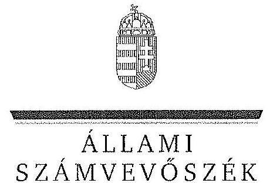
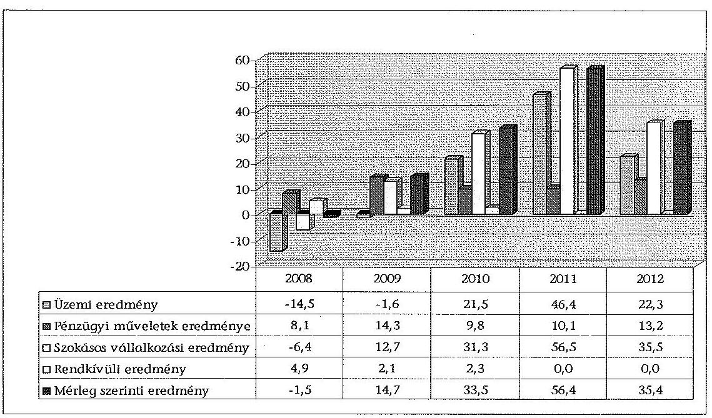
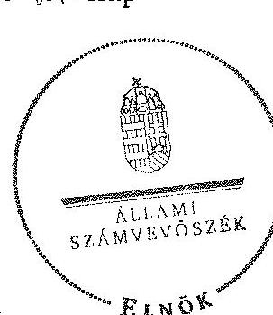
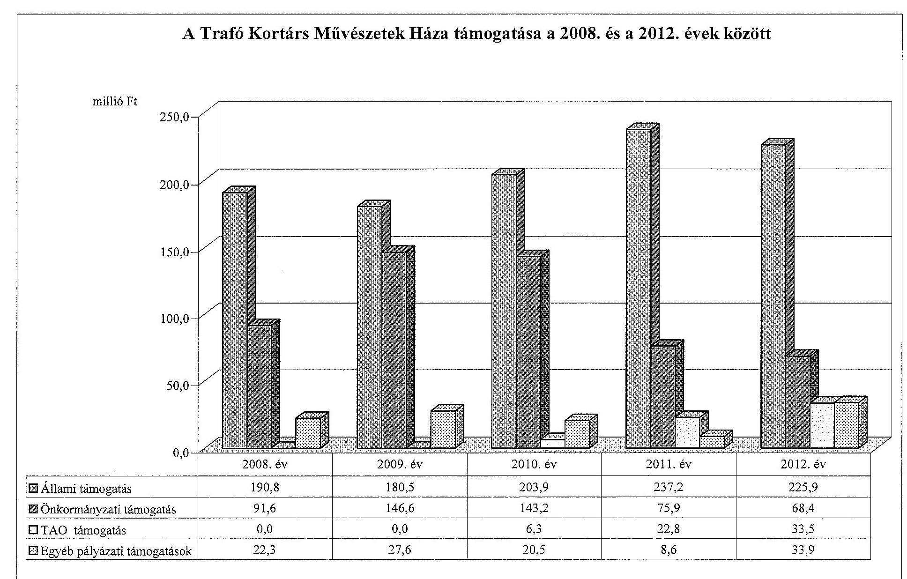
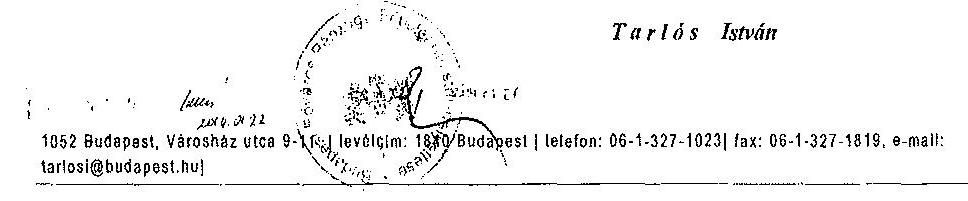

ÁLLAMI
SZÁMVEVŐSZÉK

# JELENTÉS 

az önkormányzatok többségi tulajdonában lévő gazdasági társaságok közfeladat-ellátásának ellenőrzéséről Trafó Kortárs Művészetek Háza Nonprofit Kft.

---

# Állami Számvevőszék 

Iktatószám: V-0188-096/2014.
Témaszám: 1159
Vizsgálat-azonosító szám: V06530206

## Az ellenőrzést felügyelte:

## Makkai Mária

felügyeleti vezető
Az ellenőrzést vezette és az ellenőrzés végrehajtásáért felelős:
Horváth József
ellenőrzésvezető
A számvevőszéki jelentés összeállításában közreműködött:
Hámoriné Maróti Györgyi
számvevő vezető főtanácsos
Az ellenőrzést végezték:

| Hámoriné Maróti | Szilágyi Magdolna | Dr. Tóthné Szémán |
| :-- | :-- | :-- |
| Györgyi | külső szakértő | Anna |
| számvevő vezető |  | külső szakértő |
| főtanácsos |  |  |

A témához kapcsolódó eddig készített számvevőszéki jelentések:
címe
sorszáma
Jelentés a színházak állami támogatásának és gazdálkodásának 1039 ellenőrzéséről

---

# TARTALOMJEGYZÉK 

BEVEZETÉS ..... 3
I. ÖSSZEGZŐ MEGÁLLAPÍTÁSOK, KÖVETKEZTETÉSEK, JAVASLATOK ..... 6
II. RÉSZLETES MEGÁLLAPÍTÁSOK ..... 11

1. Az Önkormányzat közfeladat-ellátásának megszervezése ..... 11
1.1. A közfeladat meghatározása, a feladat ellátásának választott módja ..... 11
1.2. Az önkormányzati és a tulajdonosi irányítás megítélése ..... 15
2. A gazdasági társaság közfeladat-ellátással kapcsolatos tevékenysége ..... 19
2.1. A gazdasági társaság szervezeti kialakítása, szabályozottsága ..... 20
2.2. A gazdasági társaság vagyonnyilvántartása ..... 21
2.3. A gazdasági évek ráfordításainak és bevételeinek alakulása ..... 22
2.4. A gazdasági társaság eredményének alakulása ..... 25
2.5. A gazdasági társaság folyamatos üzemmenetének, likviditásának biztosítása ..... 27
3. Az Önkormányzat tulajdonosi jogainak és kötelezettségeinek érvényesítése ..... 28
3.1. A gazdasági társaságtól származó információk hasznosítása ..... 28
3.2. Az önkormányzat közgyűlésének intézkedései ..... 29
MELLÉKLETEK
4. számú A Trafó Kortárs Művészetek Háza szakmai tevékenységének mutatói a 2008. és a 2012. évek között
5. számú A Trafó Kortárs Művészetek Háza támogatása a 2008. és a 2012. évek között
6. számú A Trafó Kortárs Művészetek Háza vagyonának főbb adatai 2008. január 1-je és 2012. december 31-e között
7. számú Budapest Főváros Főpolgármesterének észrevétele
FÜGGELÉKEK
8. számú Rövidítések jegyzéke
9. számú Értelmező szótár

---

.

---

# JELENTÉS 

## az önkormányzatok többségi tulajdonában lévő gazdasági társaságok közfeladat-ellátásának ellenőrzéséről   Trafó Kortárs Művészetek Háza Nonprofit Kft.

## BEVEZETÉS

Az Önkormányzatnak közfeladata az Ötv. alapján a művészeti feladatok ellátásáról való gondoskodás, az Mötv. szerint az előadó-művészeti szervezet támogatása. Ezt az Önkormányzat egyszemélyes tulajdonában álló gazdasági társaság működtetésével valósította meg.

Az Önkormányzat az ellenőrzött időszakban színházi koncepcióval ${ }^{1}$ rendelkezett, amely a színházak működtetésének alternatíváit vázolta fel és jövőbeli célokat határozott meg. Ezt a Közgyűlés határozattal² elfogadta.

A színházak támogatása az ellenőrzött időszakban központi költségvetési, illetve fenntartói támogatás formájában, valamint pályázatok útján valósult meg. A 2010-2012. évek költségvetési törvényei egy összegben tartalmazták az Önkormányzat fenntartásában működő színházak fenntartói ösztönző részhozzájárulását, amelyet a fenntartó saját döntése alapján oszthatott el.

Az 1998-ban megnyílt Trafó Kortárs Művészetek Háza Magyarországon az első - Európában évtizedekre visszanyúló hagyományokkal rendelkező - üresen álló ipari épületben működő művészeti központ, kulturális intézmény. A Trafó az 1998. évtől 2002. június 30-áig az Önkormányzat költségvetési intézményeként funkcionált. A tulajdonos Önkormányzat döntése alapján 2002. július 1-jétől közhasznú társasággá alakult, majd a Gt. változása miatt 2009. július 1-jétől Nonprofit Kft. formában működik. A Trafó programjának különös ismérve a műfaji sokszínűség, a minőségi igényesség és a nemzetköziség.

[^0]
[^0]:    ${ }^{1}$ Koncepció a fővárosi fenntartású színházak struktúráját és finanszírozását érintő változásokról (2007. XI. 29.)
    ${ }^{2}$ a Főv. Kgy. 1979/2007. (11.29.) sz. határozata

---

Az Önkormányzat a gazdasági társasággal a közfeladat ellátásának biztosítására Közszolgáltatási szerződést ${ }^{3}$, majd 2013. január 1-jei hatálybalépéssel Fenntartói megállapodást kötött. A Közszolgáltatási szerződés meghatározta a közhasznú tevékenység körét, az Önkormányzat által biztosított támogatás összegét, a feladat-ellátáshoz szükséges befektetett eszközöket, valamint azok rendelkezésre bocsátásának módját.

Az Emtv. új elemként vezette be 2009 novemberétől a tao támogatást, mint közvetett támogatási formát. Ennek felső határát a jogalkotó a tárgyévi jegybevétel 80%-ában határozta meg. A tao támogatás pénzügyi teljesülése a támogatást nyújtó vállalkozások eredményességének és támogatás nyújtási hajlandóságának a függvénye.

A Trafó a közfeladat ellátására az ellenőrzött időszakban összesen 1545,9 millió Ft állami és önkormányzati működési, valamint 20,0 millió Ft fejlesztési támogatásban részesült. 2010 és 2012 között 62,6 millió Ft tao támogatást kapott. A működéshez fedezetet jelentettek továbbá a Trafó számára a pályázatokon elnyert források, valamint az egyes produkciókhoz a támogatók által biztosított összeg.

Az ellenőrzött időszakban a Trafó fizető nézőinek száma évente 25-30 ezer fő, az előadások száma évi 157-197 között változott. A foglalkoztatott dolgozók átlaglétszáma 2008 és 2012 között lényegesen nem (20 és 21 fő) változott.

A Trafó főbb szakmai mutatószámait a 1. számú melléklet tartalmazza.
Az ellenőrzés várható eredménye: a jelentés nyilvánossága a társadalom széles körével ismerteti meg a Trafó gazdálkodására vonatkozó megállapításainkat, továbbá a megállapítások alapján megfogalmazott számvevőszéki javaslatok hasznosítása elősegíti a feltárt hibák megszüntetését, az ellenőrzött szervezet jobb feladatellátását. A társadalom számára jelzi, hogy közpénz nem maradhat ellenőrizetlenül, az ÁSZ értékteremtő rend kialakításához és megőrzéséhez hozzájáruló tevékenysége pozitív hatással lesz a szervezetről kialakított összkép formálásában. A szervezeten belül lehetőség nyílik arra, hogy a megállapítások szintetizálásával az ÁSZ a hozzáadott értéket teremtő, elemző tevékenységét és tanácsadó szerepét is erősítse. A jó gyakorlatok bemutatásával az ÁSZ hozzájárul a követendő megoldások megismertetéséhez, terjesztéséhez.

Az ellenőrzés célja annak értékelése volt, hogy:

- az Önkormányzat a jogszabályi előírások figyelembevételével döntött-e az ellenőrzésre kerülő közfeladat megszervezéséről, az ellátás módjáról; a tulajdonostól elvárható gondossággal felügyelte-e a társaság feladatellátását; a gazdasági társaság rendelkezésére bocsátotta-e a közfeladat-ellátásához a

[^0]
[^0]:    ${ }^{3}$ Az Emtv. szerint a közszolgáltatási szerződés a közszolgáltatás nyújtására irányuló, legalább három évre szóló szerződés, amely az állam vagy az önkormányzat és a közszolgáltatást végző előadó-művészeti szervezet kapcsolatát szabályozza, tartalmazza a teljesítendő előadásszámot, a szolgáltatás nyújtásának időtartamát, helyét és a teljesítésért járó díjazást.

---

szükséges közvagyont, és biztosította-e a tulajdonosi jogok közvagyon feletti érvényesülését; a társaság vagyonvesztése esetén intézkedett-e a további vagyonvesztés megakadályozásáról;

- a gazdasági társaság teljesítette-e a tulajdonos önkormányzat részéről meghatározott célokat és feladatokat a rendelkezésre álló erőforrások felhasználásával; végrehajtotta-e a közfeladat-ellátási szerződés előírásait; betartotta-e a vagyonnal történő gazdálkodásra vonatkozó jogszabályi rendelkezéseket.

Az ellenőrzés hatóköre: az Önkormányzat közfeladat-ellátásának ellenőrzése, amely kiterjed az Önkormányzat és a közfeladatot ellátó, az Önkormányzat többségi tulajdonában lévő gazdasági társaság közötti feladatmegosztásra, az önkormányzat tulajdonosi jogainak gyakorlására, a nemzeti vagyon kezelésének ellenőrzése keretében a közfeladat-ellátáshoz rendelt vagyon- és a vagyont érintő szerződésekre. A jelen ellenőrzés kiterjed az Önkormányzat többségi tulajdonlásával működő gazdasági társaság közfeladat-ellátására, vagyongazdálkodási tevékenységére, a kapcsolódó nyilvántartások, elszámolások szabályszerűségére és megbízhatóságára. Az ellenőrzött tételek kiválasztása véletlen mintavétellel történt.

Az ellenőrzés típusa: szabályszerűségi ellenőrzés.
Az ellenőrzött időszak: a 2008-2012. évek, valamint a helyszíni ellenőrzés befejezéséig - 2013. szeptember 6-áig - bekövetkezett változások figyelemmel kísérése.

Ellenőrzött szervezet: a Trafó Kortárs Művészetek Háza Nonprofit Kft., valamint Budapest Főváros Önkormányzata.

Az ellenőrzés végrehajtásának jogszabályi alapját az ÁSZ tv. 5. § (3)-(5) bekezdéseiben foglaltak képezik.

Az ÁSZ a 2011. évi LXVI. törvény 29. §-a szerint a jelentéstervezetet megküldte Budapest Főváros Önkormányzata főpolgármesterének és a Trafó Kortárs Művészetek Háza Nonprofit Kft. ügyvezető igazgatójának egyeztetésre. Budapest Főváros Önkormányzata főpolgármestere nem tett észrevételt, a Trafó Kortárs Művészetek Háza Nonprofit Kft. ügyvezető igazgatója nem élt észrevételezési jogával. A főpolgármester nemleges észrevételét a jelentés 4. sz. melléklete tartalmazza.

---

# I. ÖSSZEGZŐ MEGÁLLAPÍTÁSOK, KÖVETKEZTETÉSEK, JAVASLATOK 

Az Önkormányzat a művészeti feladatok ellátásáról való gondoskodásnak, illetve az előadó-művészeti szervezet támogatásának, mint az Ötv.-ben és az Mötv.-ben meghatározott közfeladatának, az ellenőrzött időszak alatt eleget tett. Az Önkormányzat a közfeladat-ellátását a Trafó Kortárs Művészetek Háza gazdasági társaság támogatásával biztosította. A Közgyűlés a tulajdonosi joggyakorlás rendjét az ellenőrzött időszak alatt a szabályzataiban és rendeleteiben foglaltak szerint határozta meg. A tulajdonosi joggyakorlás keretében érdemi határozatokat hozott.

A Trafó részére az Alapító Okiratokban meghatározottaknak megfelelően, az előadó-művészeti közfeladat-ellátásához szükséges ingó és ingatlan vagyont a Közszolgáltatási szerződésben foglaltak szerint ingyenesen (haszonkölcsönbe), majd - a 2011. november 23-án aláírt bérleti szerződés és a módosított Közszolgáltatási szerződés alapján - 2011. szeptember 1-jétől az ingatlanokat bérleti jogviszony keretében használatba adta. A Trafó részére ingyenes használatba 2008. január 1-jén átadott ingó és ingatlan vagyon bruttó értéke 370,8 millió Ft, nettó értéke 260,5 millió Ft volt. Az ellenőrzött időszakban az Önkormányzat további közvagyont nem adott át a Trafó részére.

Az Önkormányzat a Közszolgáltatási szerződés megkötésekor (2006. július 5-én) nem kellő gondossággal járt el, mert a szerződéshez nem csatolták az átadott ingó és ingatlan vagyontárgyak részletes és teljes körű meghatározását tartalmazó Közszolgáltatási szerződés 1. számú mellékletét. A Közszolgáltatási szerződés későbbi módosításai ${ }^{4}$ során nem aktualizálták a 2002. évben megkötött szerződés mellékletét képező vagyonkimutatást. A 2012. október 23-ai keltezéssel aláírt Fenntartói megállapodás - az Áht. ${ }^{5}$ előírásának megfelelően már tartalmazta a változásokkal módosított eszközlistát, a vonatkozó bruttó adatokkal (az átadott eszközök nettó értéket nem képviseltek).

Az Önkormányzat a közfeladat-ellátásának tárgyi és pénzügyi feltételeit a Közszolgáltatási szerződésben határoztta meg. A Közgyűlés a Trafó részére a köz-feladat-ellátáshoz szükséges forrás biztosításáról a Közszolgáltatási szerződésekben (az annak elválaszthatatlan részét képező éves költségvetési rendeletekben) döntött. Meghatározta a közhasznú tevékenység körét, a szerződés megszűnésének esetére szabályozta a vagyontárgyak visszaszolgáltatásának rendjét és határidejét, továbbá a Trafó által teljesítendő művészeti tevékenységek jellegét, mértékét és pontos mutatószámait. Az önkormányzati tulajdon védelme érdekében szabályozta a leltár készítését, annak gyakoriságát, továbbá a gaz-

[^0]
[^0]:    ${ }^{4}$ 2007. április, 2008. április, 2008. július, 2009. április, 2011. április hónapokban
    ${ }^{5}$ Az Áht. 105/A. § (13) bekezdése szerint a vagyonkezelő a vagyonkezelésébe vett vagyon eszközeiről olyan elkülönített nyilvántartást köteles vezetni, amely tételesen tartalmazza ezek könyv szerinti bruttó és nettó értékét, az elszámolt értékcsökkenés összegét, az azokban bekövetkezett változásokat.

---

dálkodás és a művészeti tevékenység ellátásával összefüggő kötelező adatszolgáltatás formáját, idejét és módját, valamint előírta a gazdálkodás körében felmerülő rendkívüli eseményekről történő tájékoztatási kötelezettséget.

Az ellenőrzött időszakban az önkormányzati vagyon megőrzése, védelme érdekében a leltározást az önkormányzati Vagyonrendelet szabályozta. A leltározásra vonatkozó előírások az Önkormányzat Vagyonrendeleteiben nem a hatályos jogszabályoknak megfelelően szerepeltek, mivel az üzemeltetésre, kezelésre átadott eszközök leltározási szabályairól a Vagyonrendelet az Áhsz. 2010. január 1-jétől hatályos előírásaival ellentétben nem tartalmazott szabályozást.

Az Önkormányzat a vagyon védelme érdekében a Közszolgáltatási szerződésben garanciális követelményként fogalmazta meg a kötelezettségek megszegésének jogkövetkezményét, valamint a szerződés megszűnésének esetére az átadott vagyontárgyak visszaszolgáltatási kötelezettségét. Az ellenőrzött időszakban kötelezettség megszegésére, illetve szerződés megszüntetésére nem került sor.

A Közgyűlés a Trafó Alapító Okiratban - a Gt. előírásaival összhangban szabályozta az Alapító tulajdonosi joggyakorlásának kereteit. Az Alapító Okiratban a Trafó legfőbb szerve, a Közgyűlés kizárólagos hatáskörébe tartozó

 feladatként határozta meg a Trafó SZMSZ-ének és az FB ügyrendjének jóváhagyását. Az SZMSZ$_{1}$-et a Trafó a jogszabályi (Mötv., Civil tv.) változások ellenére a 2009-2012. években nem módosította. Az SZMSZ$_{1}$-et a 2013. évben aktualizálták, amelyet a tulajdonos Önkormányzat határozattal $^{6}$ hagyott jóvá.

A 2010. évben a Trafó FB elnökét a Közgyűlés közvetlenül választotta. Az eljárás ellentétes volt a Gt. előírásával, amely szerint - ha törvény vagy a társasági szerződés ettől eltérően nem rendelkezik - az FB a tagjai sorából választ elnököt.

A Közgyűlés a Trafó ügyvezetőjének és egyéb vezető állású dolgozóinak, valamint az FB tagoknak díjazására vonatkozó Javadalmazási szabályzat$_{2}$-t a Taktv.-ben foglalt határidőn túl, 2010. január 31. helyett 2010. április 29-én fogadta el.

Az Önkormányzat a Trafó beszámolójának és üzleti tervének (a 2009. év üzleti terv kivételével) elfogadását és az adatszolgáltatási kötelezettség ellenőrzését a jogszabályokban, az Önkormányzat belső szabályzataiban és a Közszolgáltatási szerződés$_{1-8}$-ban foglaltaknak megfelelően, határidőn belül - az FB határozatok és a könyvvizsgálói jelentés figyelembevételével - végezte el.

A Trafó szakmai tevékenységének ellátását az Önkormányzat évadbeszámolók alapján értékelte. A Trafó az ellenőrzött időszak minden évében elkészítette a szakmai értékelését, amelyet 2008 és 2010 között az Önkormányzat Kulturális Bizottsága elfogadott. A 2011. és a 2012. évekre benyújtott évadbeszámolókról a kulturális ügyekért felelős Főpolgármester-helyettes Tájékoztatót nyújtott be a Közgyűlés részére, amelyet az tudomásul vett.

[^0]
[^0]:    $^{6}$ a Főv. Kgy. 1311/2013. (06.12.) számú határozata

---

2008 és 2010 között a prémiumfeladatok kitűzésének jóváhagyása a Javadalmazási szabályzat$_{1}$-ben foglaltaknak megfelelően történt. A 2011. évre vonatkozóan a Trafó ügyvezetője részére a prémiumfeladatot és a prémium mértékét a Javadalmazási szabályzat$_{2}$-ban foglaltaktól eltérően késedelmesen, az üzleti terv elfogadását követően határozta meg az Alapító. A 2012. évre az ügyvezető részére nem tűztek ki prémiumfeladatot $^{7}$, mivel a Javadalmazási szabályzat nem rendelkezett arról, hogy ha az ügyvezető előre ismert ok miatt nem az egész üzleti évben tölti be tisztségét, akkor részére prémiumfeladat időarányosan kitűzhető-e. Az ügyvezető munkaviszonya 2012. június 30-ával megszűnt.

Az Önkormányzat 2008 és 2012 között nem élt az Ötv. 92. § (11) bekezdés b) pontjában $^{8}$ biztosított lehetőséggel és a Trafónál belső ellenőrzést nem végzett. A 2013. első negyedévében lefolytatott ellenőrzés szabályozottsági hiányosságokat állapított meg, melyek megszüntetésére javaslatokat fogalmazott meg. A Trafó a feltárt hiányosságok kijavítására az ellenőrzés időszakában intézkedett.

A Trafó 2008 és 2012 közötti gazdálkodása, valamint mérleg szerinti nyeresége nem tette szükségessé a tulajdonos Önkormányzat intézkedését a vagyon és a közpénzek nem célszerinti hasznosításával, valamint a lejárt kötelezettségek csökkentésével összefüggésben.

A Trafó teljesítette a Közszolgáltatási szerződésekben meghatározott célokat és feladatokat. A vagyonnal történő gazdálkodásra vonatkozó jogszabályi rendelkezéseket a Számlarend - a vagyonváltozások elszámolási rendjének hiánya és a Leltározási szabályzat$_{1,2}$ - az önkormányzati vagyon egyeztetéssel történt leltározása - kivételével betartották.

A Trafó 2007. december 1-jétől hatályos Számlarendje nem felelt meg a Számv. tv.-ben foglaltaknak, mivel nem tartalmazta teljes körűen az adott főkönyvi számhoz kapcsolódó valamennyi számla növekedésének, illetve csökkenésének jogcímeit.

A 2011. január 1-jétől hatályos Leltározási szabályzat$_{3}$ a Számv. tv. előírásainak és a tulajdonosi elvárásoknak megfelelt, azonban nem tartalmazta a leltáreltérések rendezésének jóváhagyására és a felelős személyére vonatkozó előírásokat.

A Trafó rendelkezett Alapító Okirattal és az irányítási, döntési és felelősségi jogköröket tartalmazó belső szabályzatokkal. A Trafó a Közszolgáltatási szerződés előírásának megfelelően folyamatosan biztosította a tevékenységi körébe tartozó színházi szolgáltatást.

A Trafó az Önkormányzat által átadott ingó és ingatlan vagyont saját vagyonától elkülönítetten tartotta nyilván. A Trafó közfeladatai ellátásához biztosított - saját és Önkormányzati tulajdonú - eszközök 2012. december 31-ei nettó

[^0]
[^0]:    $^{7}$ FPH037/324-16/2012. ikt. számú levél
    $^{8}$ Az Ötv. előírása 2013. január 1-jétől hatálytalan, ekkortól az ellenőrzési jogosultságot az Áht$_{3}$ 70. § (1) bekezdés d) pontja rögzíti.

---

értéke 585,0 millió Ft volt, a 2008. december 31-ei adathoz viszonyítva 34,5%-kal növekedett.

A Trafó tényleges ráfordításai a 2012. év kivételével minden évben meghaladták a tervezettet. A Trafó ráfordításai 2008-ról 2012-re 19,5%-kal emelkedtek. Az ellenőrzött időszakban a Trafó összes ráfordításából az anyagi jellegű ráfordítások mintegy 65-70%-ot, a személyi jellegű ráfordítások mintegy 25-30%-ot, az egyéb költségek 2-3%-os arányt képviseltek. Az anyagjellegű ráfordítások aránya az ellenőrzött években folyamatosan emelkedett, a személyi jellegűeké pedig folyamatosan csökkent. Az anyagjellegű ráfordítások magas arányát az okozta, hogy ennek keretében számolták el a vásárolt művészeti és művészeti kiegészítő szolgáltatásokat.

A Trafó bevételei a 2008. és a 2012. évek között 29,7%-kal emelkedtek. A Trafó tényleges bevételei az ellenőrzött időszak minden évében meghaladták a tervezett értéket.

Az ellenőrzött időszakban a jegybevételből keletkező nettó árbevétel részaránya az összes bevételhez $^{9}$ viszonyítva a 2008. évi 17,9%-ról (65,5 millió Ft) a 2012. évre 13,1%-ra (62,3 millió Ft) csökkent, az egyéb bevételek aránya (amely tartalmazta a támogatások összegét is) 78,4%-ról 83,6%-ra emelkedett.

A Trafó szakmai és gazdasági stratégiai tervvel nem rendelkezett, céljaikat évente az éves üzleti tervekben fogalmazták meg. Az ellenőrzött időszak első két évében üzemi eredmény szinten (2008-ban 18,9 millió Ft, illetve 2009-ben 30,7 millió Ft) hiányt prognosztizált. A tényleges üzemi eredmény a tervezettnél alacsonyabb hiánnyal realizálódott (2008-ban 14,5 millió Ft, 2009-ben 1,6 millió Ft). A 2010. és a 2012. évek között az üzemi eredményt hiánnyal tervezték, azonban a teljesítés minden évben pozitív volt. A Trafó pénzügyi műveletekből származó eredménye a 2008. évben 8,1 millió Ft, a 2009. évben 14,3 millió Ft, a 2010. évben 9,8 millió Ft, a 2011. évben 10,1 millió Ft és a 2012. évben 13,5 millió Ft volt.

A Trafó az ellenőrzött időszakban éves fejlesztési és beruházási terveket készített és küldött meg az Önkormányzat részére, amelyeket tanulmányokkal és számításokkal nem alapozott meg. A tervekben meghatározott fejlesztések egy részét a Trafó saját forrásból, illetve a 2008. évben az Önkormányzattól kapott 20,0 millió Ft fejlesztési támogatásból valósította meg.

A Trafónak az ellenőrzött időszakban átmeneti pénzintézeti finanszírozásra nem volt szüksége. Fizetési kötelezettségeit határidőn belül teljesítette, köztartozásai nem keletkeztek. A Trafó likviditása az ellenőrzött években stabil volt, szabad pénzeszközeit folyamatosan éven belüli bankbetétben kötötte le, befektetési tevékenységet nem végzett.

Az Állami Számvevőszékről szóló 2011. évi LXVI. törvény 33. § (1) bekezdésében foglaltak értelmében a jelentésben foglalt megállapításokhoz kapcsolódó intézkedési tervet köteles az ellenőrzött szervezet vezetője összeállítani, és azt a

[^0]
[^0]:    $^{9}$ Az összes bevétel tartalmazta a pénzügyi és rendkívüli bevételek összegét is.

---

jelentés kézhezvételétől számított 30 napon belül az ÁSZ részére megküldeni. Amennyiben az intézkedési tervet határidőben nem küldi meg a szervezet, vagy az nem elfogadható, az ÁSZ elnöke a hivatkozott törvény 33. § (3) bekezdés a)-b) pontjaiban foglaltakat érvényesítheti.

Az ellenőrzés intézkedést igénylő megállapításai és javaslatai:

# Budapest Főváros Főjegyzőjének 

A leltározásra vonatkozó előírások az Önkormányzat vagyonrendeleteiben nem a hatályos jogszabályoknak megfelelően szerepeltek, mivel az üzemeltetésre, kezelésre átadott eszközök leltározási szabályairól a Vagyonrendelet$_{2}$ az Áhsz. 2010. január 1-jétől hatályos előírásaival ellentétben nem tartalmazott szabályozást

Javaslat:
Készítse elő a Közgyűlés elé való terjesztés érdekében a Vagyonrendelet$_{2}$ módosítását, hogy az tartalmazza az Áhsz. 37. § (4) bekezdésben előírtaknak megfelelően az üzemeltetésre, kezelésre átadott eszközök leltározási szabályait.

## A Trafó Kortárs Művészetek Háza igazgatójának

1. A Színház 2007. december 1-jétől hatályos számlarendje nem felelt meg a Számv. tv.-ben foglaltaknak, mivel nem tartalmazta teljes körűen az adott főkönyvi számhoz kapcsolódó valamennyi számla növekedésének, illetve csökkenésének jogcímeit.

Javaslat:
Intézkedjen a számlarend előírásainak a Számv. tv. 161. § (2) bekezdésében foglaltaknak megfelelő kiegészítése érdekében.
2. A 2011. január 1-jétől hatályos leltározási szabályzat$_{2}$ nem tartalmazza a leltáreltérések rendezésének jóváhagyásáért felelős személyt.

Javaslat:
Intézkedjen a leltáreltérések rendezésének jóváhagyásáért felelős személy kijelöléséről.

---

# II. RÉSZLETES MEGÁLLAPÍTÁSOK 

## 1. Az ÖNKORMÁNYZAT KÖZFELADAT-ELLÁTÁSÁNAK MEGSZERVEZÉSE

### 1.1. A közfeladat meghatározása, a feladat ellátásának választott módja

Az Önkormányzat a művészeti feladatok ellátásáról való gondoskodásnak, illetve az előadó-művészeti szervezet támogatásának, mint az Ötv.-ben és az Mötv.-ben meghatározott közfeladatának, az ellenőrzött időszak alatt eleget tett. Az Önkormányzat a közfeladat ellátását a Trafó Kortárs Művészetek Háza Nonprofit Kft. támogatásával biztosította.

Az Önkormányzat kötelező közfeladata az Ötv. 63/A § n) pontja szerint a művészeti feladatok ellátása. $^{10}$ A Htv. 111. § alapján a közművelődési, közgyűjteményi és művészeti tevékenységekkel kapcsolatos helyi irányítási, ellenőrzési, valamint a fenntartással és működtetéssel kapcsolatos feladatokat a Közgyűlés látja el. A kulturális feladat ellátását az Önkormányzat az Emtv. 3. § (2) bekezdése alapján előadó-művészeti gazdasági társaság támogatásával valósította meg.

Az Önkormányzat az ellenőrzött időszakban rendelkezett a fővárosi fenntartású színházakra vonatkozó koncepcióval $^{11}$, amelyet a Közgyűlés $^{12}$ határozatával fogadott el.

A koncepció a színházak működtetésének módozatait vázolta fel és jövőbeli célokat határozott meg, azonban nem vizsgálta a megvalósításhoz szükséges források nagyságát.

A 2010. évi önkormányzati választásokat követően az Ötv. 91. § (6) bekezdésnek megfelelően a Közgyűlés $^{13}$ elfogadta az Önkormányzat 2011-2014. évekre vonatkozó Gazdasági Programját $^{14}$.

Az Önkormányzat a Trafó Alapító Okirat$_{1}$-ben - a Gt. előírásaival összhangban - szabályozta az Alapító tulajdonosi joggyakorlásának kereteit. Az Alapító Okirat$_{1}$ megfelelően rendelkezett a Trafó gazdálkodása során elért eredmény felhasználásáról, az ügyvezető, az FB tagok, a könyvvizsgáló kijelöléséről, az

[^0]
[^0]:    $^{10}$ A 2013. január 1-től hatályos Mötv. 13.§ 1) 7. pont is kötelezően ellátandó feladatként határozza meg az előadó-művészeti szervezetek támogatását.
    $^{11}$ Koncepció a fővárosi fenntartású színházak struktúráját és finanszírozását érintő változásokról
    $^{12}$ Főv. Kgy. 1979/2007. (11.29.) sz. határozata
    $^{13}$ Főv. Kgy. 937/2011. (04.27.) sz. határozata
    $^{14}$ A Főváros fejlesztésének és gazdálkodásának stabilizálása és reformkoncepciója a 2011-2014. évi választási ciklusra.

---

összeférhetetlenségi szabályokról, valamint az Áht. 1100/N. § (8) bekezdése előírásainak betartatásáról.

A Trafó Alapító Okirat szerinti feladata, hogy befogadó jellegű színházként, alkotóműhelyként és közösségi színtérként lássa el az Alapító által meghatározott közművelődési, művészeti tevékenységet támogató feladatokat.

Az Önkormányzat a Trafó teljesítményével kapcsolatosan konkrét célokat, elvárásokat a 2006. július 7-én aláírt Közszolgáltatási szerződés$_{2}$-ben fogalmazott meg. A szakmai elvárásait az igazgatói pályázat kiírásában szerepeltette, a megválasztott igazgató pályázata a stratégiai céljait, valamint a konkrét szakmai elképzeléseit foglalta össze. Az Emtv. hatálybalépésével a tevékenység ellátására vonatkozó követelmények, feladatmutatók - a II. kategóriába sorolás feltételei - a törvény által kerültek meghatározásra.

Az Önkormányzat a közfeladat-ellátása érdekében a
 Trafó részére az Alapító Okiratban foglaltaknak megfelelően ingyenesen rendelkezésre bocsátotta - haszonkölcsönbe adta - az előadóművészeti közfeladat-ellátásához szükséges ingó és ingatlan vagyont.

A Trafó részére az Önkormányzat által átadott vagyon részletes és teljes körű meghatározását tartalmazó Közszolgáltatási szerződés ${ }_{1} 1$. számú mellékletét a 2006. évben kötött - az ellenőrzött időszak kezdetén hatályos - szerződéshez nem csatolták. A vonatkozó mellékletet vagy a Vagyon átadás-átvételi jegyzőkönyvet nem adták át az ellenőrzés részére.
2008. január 1-jén, az ellenőrzött időszak kezdetén az Önkormányzat által átadott vagyon adatait a 2007. évi beszámolóhoz készített záró leltár tartalmazta, mely szerint a bruttó érték 370,8 millió Ft, a nettó érték 260,5 millió Ft volt. Az ellenőrzött időszakban az Önkormányzat további közvagyont nem adott át a Trafó részére.

Az Alapító Okirat szerint a Trafó vagyonát az Önkormányzat által biztosított törzstőke (3,0 millió Ft) képezte, mely teljes egészében pénzbeli betétből állt.

A Nvtv. 3. § alapján a Trafó átlátható szervezet.
Az Önkormányzat tulajdonában álló vagyon a nemzeti vagyon részét képezi. A Vagyonrendelet ${ }_{2} 6. \S$ (1) bekezdés szerint a Trafó használatában lévő, a feladatellátását szolgáló ingatlanvagyon korlátozottan forgalomképes törzsvagyon. Az átadott ingatlanvagyont, valamint a Trafó törzstőkéjét az ellenőrzött időszakban az Önkormányzat által évente elkészített Vagyonkimutatás beazonosítható módon tartalmazta.

Az Önkormányzat a közfeladat-ellátásának tárgyi és pénzügyi feltételeit a Közszolgáltatási szerződés ${ }_{1,8}$-ban határozta meg. A Közszolgáltatási szerződés tartalmazta a közhasznú tevékenység körét, a szerződés megszűnésének esetére szabályozta a vagyontárgyak visszaszolgáltatásának rendjét és határidejét, továbbá a Trafó által teljesítendő művészeti tevékenységek jellegét, körét, mértékét és pontos mutatószámait. Az önkormányzati tulajdon védelme érdekében a Közszolgáltatási szerződésekben szabályozták a kötelező leltár készítését, annak gyakoriságát, továbbá a gazdálkodás és a művészeti tevékenység ellátásával összefüggő kötelező adatszolgáltatás formáját, idejét és módját, valamint előír-

---

ták a gazdálkodás körében felmerülő rendkívüli eseményekről történő tájékoztatási kötelezettséget.

A Közszolgáltatási szerződés módosításai a rendelkezésre bocsátott közvagyon nagyságát nem érintették.

Az Önkormányzat a Közszolgáltatási szerződés megkötésekor (2006. július 7-én) és annak módosításai során nem járt el kellő körültekintéssel, mert a szerződés, illetve melléklete nem tartalmazta az átadott ingó és ingatlan vagyontárgyak aktuális értékeit, valamint a szerződésben előírt elkülönített analitikus nyilvántartás vezetéséhez szükséges adatokat. A Közszolgáltatási szerződések módosításai során 2002-ben kötött szerződés mellékletét képező vagyonkimutatást az állományváltozásokkal nem aktualizálták.

A 2012. október 26-ai keltezéssel aláírt, 2013. január 1-jétől hatályos Fenntartói megállapodás - az Áht. ${ }_{2}$ 105/A. § (13) bekezdésében ${ }^{15}$ foglaltaknak megfelelően - tartalmazta az eszközök változásokkal módosított listáját (ingatlan nélkül) bruttó értéken (az eszközök nettó értékkel nem rendelkeztek).

A Közgyűlés 2311/2011. (08.31.) határozata alapján az Önkormányzat megbízásából a BFVK Zrt. és a Trafó 2011. november 23-án Bérleti szerződést kötött, amely alapján az Önkormányzat tulajdonában álló ingatlanok után bérleti díjat kellett fizetni. A Közgyűlés 2440/2011. (08.31.) számú határozatát határidőn túl hajtották végre, mivel a Főpolgármester-helyettes a Közszolgáltatási szerződés-módosítását a 2011. október 1-jei határidőt követően írta alá. A Közszolgáltatási szerződés 2011. november 25-i módosításával és a Bérleti szerződés november 23-án történő aláírásával a közfeladat-ellátáshoz szükséges ingatlanokat visszamenőlegesen, 2011. szeptember 1-jétől a Trafó ingyenesen nem használhatta.

A Trafónak a Bérleti szerződés aláírását megelőző időszakra használati díjat, azt követően bérleti díjat (186,1 ezer Ft/hó+áfa), valamint a bérleti díj összegét alapul véve egyszeri három havi megszerzési díjat és öt havi óvadékot kellett fizetnie. A 2011. évre vonatkozóan óvadékként, megszerzési díjként és használati díjként összesen egy évi bérleti díjnak megfelelő összeg került kifizetésre. A szerződés szerint a bérleti díj minden év január 1-jei hatállyal a KSH által a tárgyévet megelőző évre hivatalosan közzétett átlagos fogyasztói árindex mértékével emelkedik.

A felek 2012-ben a Bérleti szerződés 2. pontját kiegészítették azzal, hogy az Önkormányzat az óvadék összegét „a bérleti szerződés időtartama alatt a kielégítési jog megnyílta előtt használhatja és rendelkezhet vele." Az óvadék összegének fedezete az Önkormányzat részéről tett nyilatkozat ${ }^{16}$ alapján folyamatosan rendelkezésre állt.

[^0]
[^0]:    ${ }^{15}$ Az Áht. ${ }_{2}$ 105/A. § (13) bekezdése szerint a vagyonkezelő a vagyonkezelésébe vett vagyon eszközeiről olyan elkülönített nyilvántartást köteles vezetni, amely tételesen tartalmazza ezek könyv szerinti bruttó és nettó értékét, az elszámolt értékcsökkenés összegét és az azokban bekövetkezett változásokat.
    ${ }^{16}$ A FPH ellenőrzéshez kirendelt kapcsolattartója 2013. augusztus 14-én e-mail formájában adott válasza alapján.

---

A Trafó támogatása az ellenőrzött időszakban központi költségvetési és fenntartói, illetve tao támogatással, valamint pályázatok elnyerésével valósult meg. Az Önkormányzat a saját tulajdonosi támogatás színházak közötti elosztásának elveit, szempontjait szabályzatban, belső utasításban nem határozta meg, annak mértékét, nagyságrendjét a teljes támogatás összegéhez igazította.

A 2010. évtől az Emtv. 16. § (1) bekezdése szerint a színházak támogatása művészeti ösztönző részhozzájárulásból és fenntartói ösztönző részhozzájárulásból tevődött össze. A 2010-2012. években a költségvetési törvények 7. sz. melléklete egy összegben tartalmazta az Önkormányzat fenntartásában működő színházak fenntartói ösztönző részhozzájárulását, amelyet a fenntartó saját döntése alapján oszthatott el. A költségvetési törvények a színházak művészeti ösztönző részhozzájárulását külön nevesítve tartalmazták. A 2013. évtől a színházakat művészeti és létesítménygazdálkodási célra működési támogatás illette meg.
Az Emtv. 48. § (1) bekezdés új elemként bevezette - a Taotv. 4. § 37-39. pontjai és a 7. § (1) bekezdés z) pontja alapján - a társasági adókedvezménnyel igénybe vehető támogatást, mint közvetett támogatási formát. A tao kedvezmény igénybevétele 2009. november 12-től volt lehetséges, a meghatározott jegybevétel 80%-áig. A tao támogatás pénzügyi teljesülése a támogatást nyújtó vállalkozások eredményességének és támogatás nyújtási hajlandóságának függvénye.

Az ellenőrzött időszakban a Trafó számára biztosított működési hozzájárulás és tao támogatás alakulását a 2. számú melléklet tartalmazza.

Az állami támogatás összege - az ellenőrzött időszak minden évében - meghaladta az önkormányzati támogatás összegét. A Trafó az ellenőrzött időszakban összesen 1040,2 millió Ft állami és 525,7 millió Ft önkormányzati (ebből 20,0 millió Ft fejlesztési célú), valamint 62,6 millió Ft tao támogatást kapott. Az egyéb pályázati támogatások összege 224,5 millió Ft volt.

Az ellenőrzött időszakban az önkormányzati vagyon megőrzése, védelme érdekében a leltározást az önkormányzati Vagyonrendelet ${ }_{1,2}$ szabályozta. A Vagyonrendelet ${ }_{1}$ 12. § (1) bekezdése szerint az Önkormányzat tulajdonában lévő eszközöket minden évben leltározni kell, az ettől eltérő eseteket a rendelet 12. § (3)-(4) bekezdései szabályozták.

# A leltározásra vonatkozó előírások az Önkormányzat Vagyonrendeleteiben nem a hatályos jogszabályoknak megfelelően szerepeltek, 

mivel az üzemeltetésre, kezelésre átadott eszközök leltározási szabályairól a Vagyonrendelet ${ }_{1,2}$ az Áhsz. 2010. január 1-jétől hatályos előírásaival ellentétben nem tartalmazott szabályozást.

A Közszolgáltatási szerződés 5. B pontja az Önkormányzat tulajdonát képező ingó vagyonra vonatkozóan kötelező leltár készítését, a szerződés 6. pont 4. bekezdése az önkormányzati vagyon nyilvántartására vonatkozó előírásoknak megfelelő adatszolgáltatási és nyilvántartási kötelezettség teljesítését írta elő a Társaság számára ${ }^{17}$, amelynek a Trafó az ellenőrzött időszakban eleget tett.

[^0]
[^0]:    ${ }^{17}$ A Fenntartói megállapodás 5.1. pontjában a közszolgáltatási szerződés rendelkezésével megegyezően a vagyontárgyak évenkénti, december 31-i fordulónappal történő leltározási kötelezettségét írta elő, továbbá köteles volt a Társaság azt megküldeni a tárgyévet követő év január 31-ig az Önkormányzatnak.

---

Az Önkormányzat minden negyedév végén bekérte a Trafótól az ingatlanok változására vonatkozó dokumentumokat, a bruttó értéknövekedés vagy csökkenés (kataszteri módosító lapok), valamint az értékcsökkenés elszámolásáról szóló, a gazdasági vezető által aláírt "6. sz. melléklet" című táblázatot. A megküldött dokumentumok alapján a kataszteri rendszer, valamint a Pénzügyi Információs Rendszer adatainak frissítése megtörtént.

Az Önkormányzat vagyonkimutatást készített a 2008-2012. években az éves zárszámadáshoz az Ötv. 78. § (2) bekezdésében és az Mötv. 110. § (2) bekezdésében foglaltaknak megfelelően.

A Vagyonrendelet ${ }_{2}$ 14. §-a a leltározás vonatkozásában a korábbi Vagyonrendelettel azonos rendelkezéseket tartalmazott. Az Önkormányzat a 7/2011. számú Leltározási és Leltárkészítési Szabályzatában sem rendelkezett a társaságok leltárainak önkormányzati ellenőrzéséről.

Az Önkormányzat a vagyon védelme érdekében a Közszolgáltatási szerződésben garanciális követelményként fogalmazta meg a kötelezettségek megszegésének jogkövetkezményét, valamint a szerződés megszűnésének esetére az átadott vagyontárgyak visszaszolgáltatási kötelezettségét. Az ellenőrzött időszakban a Trafónál kötelezettség megszegésére, illetve szerződés megszűnésére nem került sor.

# 1.2. Az önkormányzati és a tulajdonosi irányítás megítélése 

A Trafó esetében a tulajdonosi jogok gyakorlásának rendjét a gazdasági társaságokra és a közhasznú szervezetekre vonatkozó jogszabályok és az Önkormányzat rendeletei határozták meg.

A Közgyűlés a tulajdonosi jogait az ellenőrzött időszakban a szabályzataiban és rendeleteiben foglaltak szerint gyakorolta.

Az Önkormányzat SZMSZ ${ }_{1,2}$-jében és a Vagyonrendelet ${ }_{1,3}$-ban szabályozta az egyszemélyes tulajdonában lévő gazdasági társaságokkal kapcsolatos tulajdonosi joggyakorlás feladatait, annak módját, a hatáskörök gyakorlásának rendjét.

Az Önkormányzat SZMSZ ${ }_{1}$ 49. § (1) bekezdése alapján a Közgyűlés állandó bizottságaként a 2010. évig a Kulturális Bizottság működött. Ezen időszakban a Közgyűlés az Önkormányzat SZMSZ ${ }_{1}$ 5. számú mellékletében szereplő feladatok ellátását a Bizottságra ruházta át.

Az egyszemélyes társaság legfőbb szervének hatáskörébe tartozó (az FB tagjainak, valamint az ügyvezetőnek, továbbá a könyvvizsgálónak a megválasztása, visszahívása, megbízása, megbízásának visszavonása) jogok gyakorlását a 2011. május 25-e és 2011. november 10-e közötti időszakban az Önkormányzat eltérően szabályozta a 2011. év előtt, illetve a 2011-ben gazdasági társasággá alakított színházak esetében.

A 2011. év előtt alapított társaságok esetében 2011. január 1-jétől a Vagyonrendelet ${ }_{1}$ 52. § (2) bekezdése alapján a fenti jogokat a Főpolgármester közvetlenül gyakorolta. A 2011. május 25-én alapított színház gazdasági társaságok esetében

---

2011. november 9-éig a fenti tulajdonosi jogok gyakorlására kizárólag a Közgyűlés volt jogosult. Az eltérő szabályozás oka az volt, hogy a Közgyűlés a Vagyonrendelet ${ }_{1}$ 5. számú mellékletét nem az alapítással egy időben módosította.

Az Önkormányzat a Vagyonrendelet ${ }_{2}$ 56. § (2) bekezdés a) pontjának 2012. március 16-ai hatálybalépésétől 2013. március 18-áig a Vagyonrendelet ${ }_{2}$ 5. sz. mellékletében szereplő színház gazdasági társaság esetében a társaság legfőbb szervének a törvény által hatáskörébe tartozó (az FB tagjainak, a társaság könyvvizsgálójának megválasztása, visszahívása, díjazásának megállapítása valamint a (2) bekezdés b) pontja alapján az ügyvezető megválasztása, kinevezése és díjazásának megállapítása) jogait a Főpolgármester közvetlenül, egy személyben gyakorolta.
2013. március 19-től a Vagyonrendelet ${ }_{2}$ 56. § (2) bekezdés a) pontja szerint a Közgyűlés hatáskörébe tartozik a Főpolgármester előterjesztése alapján az FB tagjainak és a társaság könyvvizsgálójának megválasztása, visszahívása, díjazásának megállapítása, valamint a Vagyonrendelet ${ }_{2}$ 56. § (2) bekezdés b) pontja alapján az ügyvezetőnek a megválasztása, kinevezése és díjazásának megállapítása.

Az Önkormányzat az Alapító Okirat ${ }_{1}$ VII. pontjában a Gt. előírásaival összhangban szabályozta az Alapító tulajdonosi joggyakorlásának kereteit. A köztulajdon védelme érdekében, a
 Gt. 33. § (1) bekezdés c) pontja előírásának megfelelően gondoskodott az FB létrehozásáról. A Taktv. 4. § (2) bekezdésének megfelelően a társasági törzstőke összegéhez igazodva 3 főben határoztta meg az FB létszámát.

A Közgyűlés a tulajdonosi érdekeinek védelmére határozatokban kijelölte a Trafó FB tagjait és könyvvizsgálóját, és a Gt. 34. § (4) bekezdése alapján jóváhagyta az FB ügyrendjét. Az Önkormányzat az FB tagokkal szemben szakmai kritériumokat a szabályozásban nem határozott meg.

Az ellenőrzött időszakban a Gt. 141. § (2) bekezdés k) pontjában foglalt jogkörében az Önkormányzat a 2044/2010. (10.27.) számú határozatával visszahívta az FB tagjait, egyidejűleg megválasztotta az új FB tagokat és döntött az FB elnök személyéről is. Az Önkormányzat által alkalmazott eljárást a Gt. 34. § (2) bekezdése - a társasági szerződés (Alapító Okirat) eltérő rendelkezésének hiányában - az FB tagok jogköreként határoztta meg.

A Trafó Alapító Okirat ${ }_{1-3}$-nak VII. fejezet C.5. pontja, az FB tagokra vonatkozó előírása nem tartalmazott az FB elnök megválasztásával összefüggésben „az Alapító eltérő rendelkezésére” utaló kitételt. Ennek következtében az FB elnök Alapító által történő megválasztása nem a jogszabályi előírásnak megfelelően történt.

Az Önkormányzat a Közszolgáltatási szerződés ${ }_{2}$-ban ${ }^{18}$ április 30-ai, illetve a Fenntartói megállapodásban április 15-ei határidőre, a közszolgáltatási feladat-ellátási kötelezettség teljesítésének garanciájaként - a Gt. előírása hiányában - kizárólagos (alapítói) hatáskörében határoztta meg a Trafó üzleti tervének jóváhagyását ${ }^{19}$ és az FB határozatával, valamint a könyvvizsgálói jelentéssel együtt történő előterjesztését.

Az Önkormányzat a Trafó üzleti tervének elfogadását - a 2009. év kivételével -, beszámoltatását, az adatszolgáltatási kötelezettség ellenőrzését a jogszabályokban, az Önkormányzat belső szabályzataiban és a Közszolgáltatási szerződésben foglaltaknak megfelelően, határidőn belül - az FB határozat és a könyvvizsgálói jelentés figyelembevételével - végezte el.

A Trafó 2009. évi üzleti tervét a Kulturális Bizottság a 76/2009. (04.23.) határozatával ideiglenes jelleggel fogadta el, a tervezett veszteség 21,6 millió Ft volt, majd a módosított üzleti tervet a Trafó 0,8 millió Ft nyereséggel terjesztette ismét döntésre, amelyet a Kulturális Bizottság 2008. augusztus 25-én fogadott el.

A Trafó éves beszámolóinak elfogadása megfelelt a szabályozásban foglaltaknak. 2008 és 2010 között az Önkormányzat SZMSZ ${ }_{1}$ - 5. sz. melléklet II. fejezet Kulturális Bizottság alcím 15. pontja -, valamint a Vagyonrendelet alapján a Trafó beszámolóját a Kulturális Bizottság határozatban hagyta jóvá.

A Trafó éves beszámolóit, könyvvizsgáló jelentéseit és FB határozatait a 2008. és a 2009. években a Kulturális Bizottság (a 75/2009. (04. 3.), és a 82/2010 (05.25.) számú határozataival) fogadta el.

Az Önkormányzat a 2010. évi választásokat követően SZMSZ ${ }_{2}$-jében Kulturális Bizottságot nem hozott létre. Az éves beszámoló elfogadásának hatáskörét a Vagyonrendelet ${ }_{1}$ 2011. január 1-jével történő módosításával, valamint a Vagyonrendelet ${ }_{2}$ 56. § (1) bekezdése alapján a 2010-2012 évekre vonatkozóan a Közgyűlés gyakorolta.

A 2010. a 2011. és a 2012. évekről készített beszámolókat a Közgyűlés az 1431/2011. (05.25.), a 994/2012. (05.30.) és a 839/2013. (05.29.) számú határozataival fogadta el.

A könyvvizsgálói jelentés az ellenőrzött időszak minden évére vonatkozóan megállapította, hogy a beszámolók megbízható és valós képet mutattak a Trafó vagyoni, pénzügyi és jövedelmi helyzetéről. A könyvvizsgáló a beszámolókat elfogadó véleménnyel látta el, figyelemfelhívást nem tett.

A tulajdonosi joggyakorlás megvalósításában a 2012. évben előrelépést jelentett a monitoring tevékenység bevezetése. Ennek keretében egységes adattartalom- és adattábla-rendszer került meghatározásra a Trafó számára mind az üzleti terv, mind a beszámoló elkészítéséhez.

A Főpolgármesteri Hivatal Jegyzői Irodájának 2012. november 9-én kiadott Belső Működési Szabályzata alapján a Főjegyzői Iroda Monitoring és Koordinációs Referatúra feladatkörébe tartozott a társaságok üzleti terveire és a közszolgáltatási szerződésekre vonatkozó határozatok hatásvizsgálata, a társaságok működésének és gazdálkodásának folyamatos nyomon követése (az üzleti tervek gazdálkodási adatainak bemutatását szolgáló egységes táblarend kialakítása; a társaságok éves üzleti terveinek közgazdasági megfelelőségi értékelése; a társaságok éves beszámolóinak üzleti tervek teljesítésének aspektusából történő értékelése és a tervektől való eltérés esetén az Önkormányzati vezetés tájékoztatása).

A Trafó 2013. évi üzleti terve már részletes, egységes szerkezetet és információtartalmat biztosított, amely az irányítási tevékenységet a teljesítmények összehasonlító elemzési lehetőségével és a beszámoltatás tartalmi színvonalának javításával szolgálta.

A Közszolgáltatási szerződés ${ }_{6.8}$ az aláírás idején hatályos Emtv. 44. § 23. pontja előírásaival összhangban volt ${ }^{20}$, megfelelően szabályozta a közfeladat-ellátás tartalmát. A szerződés tartalmazta a 2008. évre vonatkozó támogatási összeget. A szerződés fennállása alatti további évekre a támogatás összegét az Önkormányzat a tárgyévi költségvetési rendeleteiben a Társaság részére biztosított támogatási összegre szóló rendelkezésekhez kötötte.

Az Önkormányzatnál - a Gt. 141. § (2) bekezdés j)-k) pontjaiban foglalt - az Alapító hatáskörébe tartozó, az ügyvezető, illetve az FB díjazásának megállapítását és az ösztönzési rendszer működtetését 2008 és 2010 között az Önkormányzat SZMSZ ${ }_{1}$ és a Vagyonrendelet ${ }_{1}$ alapján a Kulturális Bizottság a Javadalmazási szabályzat ${ }_{1}$-ben előírtak alapján gyakorolta. A Közgyűlés a Trafó ügyvezetőjének és egyéb vezető állású munkavállalóinak, valamint az FB tagoknak díjazására vonatkozó Javadalmazási szabályzat ${ }_{2}$-t késedelmesen, a Taktv. 9. § (1) bekezdésében előírt 2010. január 31-ei határidő helyett csak a 970/2010. (04. 29.) számú határozatával fogadta el.

A 2011. január 1-jétől hatályba léptetett Javadalmazási szabályzat ${ }_{3}$ rendelkezett a prémium mértékének jelentős csökkentéséről (maximum 40%), az ügyvezetők és FB tagok havi maximális személyi alapbérének KSH átlagkeresethez mért felső korlátjáról, valamint az egyéb jogviszony keretében végzett tevékenységnek a munkáltatónál történő díjazási tilalmáról, valamint részletezte az adható egyéb juttatásokat.

Az Önkormányzat a szabályozás miatti jelentős jövedelem visszaesés mérséklésére az ügyvezetők részére a 2011. évben átlagosan 40%-os személyi alapbéremelést hajtott végre, amely differenciáltan mintegy 15%-os szórással valósult meg, az ügyvezetők egy részénél januártól, más részüknél márciustól. A szabályozás módosulása kapcsán az Önkormányzat a Trafó ügyvezetője részére - a prémiummérték egyharmadára történő csökkentése miatti jövedelem visszaesés részbeni kompenzálása érdekében - a 2011. évben 16%-os személyi alapbéremelést hajtott végre.

A Javadalmazási szabályzat ${ }_{1-4}$ értelmében a prémiumfeltételeket és prémium összegét a legfőbb szerv, illetve a munkáltatói jogok gyakorlója határozza meg, legkésőbb az éves üzleti terv elfogadásával egyidejűleg.

A 2008. és 2010. évek között a prémiumfeladatok célkitűzéseinek jóváhagyása a Javadalmazási szabályzat ${ }_{1}$-ben leírtaknak megfelelő volt. A 2011. évre vonatkozóan a Trafó ügyvezetője részére a Javadalmazási szabályzat ${ }_{2,3}$ előírásaitól eltérően, késedelmesen történt meg a premizálási feltételek meghatározása.

A 2011. évi üzleti tervet a Közgyűlés a 2011. május 25-i ülésén fogadta el, míg a prémiumfeltételek meghatározása 2011. november 25-én történt meg.

A késedelem következtében a prémium-célkitűzés nem tudta betölteni teljesítményösztönző szerepét.

A Javadalmazási szabályzat nem rendelkezett arról, hogy ha az ügyvezető előre ismert ok miatt nem az egész üzleti évben tölti be tisztségét, akkor részére prémiumfeladat időarányosan kitűzhető-e.

A Trafó ügyvezetője részére a 2012. évre nem tűztek ki prémiumfeladatot ${ }^{21}$, munkaviszonya 2012. június 30-ával megszűnt.

A Trafó ügyvezetőjének prémiumfeladat-teljesítése 2008 és 2011 között minden alkalommal 100%-os teljesítésű volt.

Az FB a prémiumfeladat teljesítéséről írásos előterjesztés alapján döntött, melyről határozatait megküldte az Önkormányzat részére.

A Trafó ügyvezető igazgatójának megbízása a 2011. évben lejárt, amelyet az Önkormányzat egy évvel meghosszabbított. Az ügyvezető munkakörének betöltésére a Főpolgármester 2011. november 27-én pályázatot írt ki, amely megfelelt az Emtv. 39. § (5) bekezdésében foglaltaknak. A pályázat nyertese 2012 áprilisában visszalépett, emiatt 2012. május 3-án újabb pályázat kiírására került sor. A pályázatot 2012. június 22-én eredménytelennek nyilvánították, ezért 2012. július 1-jétől az új ügyvezető megbízásáig a gazdasági igazgató látta el az ügyvezetői feladatokat. Az új ügyvezetővel 2012. szeptember 1-jétől kötöttek öt évre munkaszerződést. A Közgyűlés határozata alapján - az Emtv. 41. § (1) bekezdésének megfelelően - nevezték ki a Trafó igazgatóját.

# 2. A GAZDASÁGI TÁRSASÁG KÖZFELADAT-ELLÁTÁSSAL KAPCSOLATOS TEVÉKENYSÉGE

A Trafó az ellenőrzött időszakban teljesítette az Önkormányzat részéről a Közszolgáltatási szerződésben meghatározott célokat és feladatokat. A Trafó a feladatai ellátásához a költségvetési törvények alapján - mint II. kategóriába sorolt színház - művészeti és fenntartói ösztönző részhozzájárulásban, valamint az Önkormányzat döntése szerint fenntartói támogatásban részesült. A vagyonnal történő gazdálkodásra vonatkozó jogszabályi rendelkezéseket a Számlarend és a leltározás területén nem tartották be teljes körűen. A Trafó mérleg szerinti eredménye - a 2008. év kivételével - pozitív volt, pénzeszközei növekedtek az ellenőrzött időszakban.

# 2.1. A gazdasági társaság szervezeti kialakítása, szabályozottsága

A Trafó szervezeti formája a közfeladat-ellátás Ötv. 9. § (4) bekezdésében foglalt követelményének ${ }^{22}$ megfelel. A Gt. 365. § (3) bekezdésében foglalt kötelező átalakítást a 380/2009. (03. 26.) Főv. Kgy. határozata alapján az Önkormányzat végrehajtotta, a Kht.-t Nonprofit Kft.-vé alakította.

Az Alapító Okirat ${ }_{1-3}$-ban - a Közhasznú tv. figyelembe vételével - meghatározott célok, feladatok, az alaptevékenység, a kapcsolódó vállalkozási tevékenység, valamint a Trafó szervezete, a társaság vezető - alapító - szerve, az ügyvezető és az ellenőrző szerveinek (FB, könyvvizsgáló) rendszere nem változott. A Trafó szervezete a Kft.-vé alakulás miatt - a Gt. előírásainak megfelelően - nem módosult.

A Trafó befogadó jellegű színház, saját társulattal nem rendelkezik, amely alapvetően megkülönbözteti a repertoárra épülő színházi struktúrától.

Az Önkormányzat a Trafó Alapító Okirat ${ }_{1.8}$-ban - a Gt. előírásaival összhangban - szabályozta az Alapító tulajdonosi joggyakorlásának kereteit. Az Alapító Okiratban a Trafó legfőbb szerve, a Közgyűlés kizárólagos hatáskörébe tartozó feladatként határozta meg a Trafó SZMSZ-ének és az FB ügyrendjének jóváhagyását. A Közgyűlés a tulajdonosi érdekek védelmére határozatokban kijelölte a Trafó FB tagjait és könyvvizsgálóját.

A Trafó rendelkezett Alapító Okirat ${ }_{1}$-gyel, SZMSZ ${ }_{1,2}$-vel, az irányítási, döntési és felelősségi jogköröket tartalmazó belső szabályzatokkal. A döntési szinteket a szabályzatok és a munkaköri leírások tartalmazták.

A Trafó Kht. SZMSZ ${ }_{1}$-ét a Közgyűlés Kulturális Bizottsága a 96/2007. (05. 11.) számú határozattal hagyta jóvá. A szabályzatot a Trafó a jogszabályi változások ellenére (Mötv., Civil tv.) a 2009-2012. években nem módosította. Az SZMSZ ${ }_{1}$-et a 2013. évben aktualizálták. Az SZMSZ ${ }_{2}$-t az Önkormányzat
 az 1311/2013. (VI. 12.) számú Kgy. határozatával hagyta jóvá.

A Trafó a Számv. tv. 14. § (5) bekezdése a) és b) pontjaiban előírtaknak megfelelően, a tulajdon védelme érdekében rendelkezett Számviteli politikával, Számlarenddel, Leltározási és leltárkészítési ${ }_{1,2}$, továbbá az Eszközök és források értékelési ${ }_{1,2}$ szabályzatával, Selejtezési és Pénzkezelési szabályzatokkal.

A Trafó Számviteli politika ${ }_{1}$-ja 2008. január 1. és 2010. december 31. között tartalmazta a gazdálkodásra vonatkozó, kötelezően elkészítendő (Leltározási és leltárkészítési, Selejtezési, Értékelési és Pénzkezelési) szabályzatokat is.

A gazdálkodásra vonatkozó szabályzatok aktualizálását folyamatosan elvégezték. 2011. január 1-jétől új Számviteli politika lépett hatályba, és önálló szabályzatként elkészítették a gazdálkodásra vonatkozó szabályzatokat is, amelyek megfeleltek az Önkormányzat szabályzategységesítési szándékának. A Trafó Számviteli politikája az ellenőrzött időszakban a hatályos jogszabályoknak és a helyi sajátosságoknak megfelelt.

[^0]
[^0]:    ${ }^{22}$ Az Ötv. 9. § (4) bekezdés szerint az Önkormányzat a közfeladat-ellátása céljából a közfeladat ellátására kötelezett társaságot alapíthat.

---

A Trafó 2007. december 1-jétől hatályos Számlarendje nem felelt meg a Számv. tv., 161. § (1)-(3) bekezdéseiben foglaltaknak, mivel nem tartalmazta teljes körűen az adott főkönyvi számhoz kapcsolódó valamennyi számla növekedésének, illetve csökkenésének jogcímeit.

A 2011. január 1-jétől hatályos Leltározási szabályzat ${ }_{2}$ a Számv. tv. előírásainak, és a tulajdonosi elvárásoknak megfelelt, azonban nem tartalmazta a leltáreltérések rendezésének jóváhagyására és a felelős személyére vonatkozó előírásokat.

A szabályzat szerint a leltározás az önkormányzati ingatlanok vonatkozásában analitikus nyilvántartás alapján - nem az Áhsz.-ben előírt mennyiségi felvétellel -, évenkénti gyakorisággal történt.

A Selejtezési szabályzat megfelelt a hatályos jogszabályi előírásoknak, és az Önkormányzattól haszonkölcsönbe kapott ingóságok selejtezését a Közszolgáltatási szerződésben megfogalmazottakkal összhangban szabályozta.

Az Értékelési, valamint a Pénz- és értékkezelési szabályzatot a hatályos jogszabályoknak megfelelő tartalommal készítették el. A Trafó a Számv. tv. 14. § (5)-(6) bekezdései alapján nem volt kötelezett Önköltsegszámítási szabályzat készítésére.

A Trafó nyilvántartásaiban a bevételek és ráfordítások Számviteli Politika ${ }_{1,2}$ szerinti megbontása lehetővé teszi azok tevékenységenkénti megállapítását, az éves beszámolók Kiegészítő mellékletei, a Közhasznúsági jelentések, illetve a kapott támogatások elszámolása adatszükségletének kielégítését.

A Trafó a 2008-2012. években a fenntartó, a tulajdonos tájékoztatásának rendjét szabályzatban nem írta elő. A Színház az Önkormányzat felé történő tájékoztatási kötelezettségének beszámoló jelentések, kimutatások és adatközlők formájában - az Önkormányzat által kért gyakorisággal ${ }^{23}$, illetve a jogszabályi előírások figyelembevételével - eleget tett.

# 2.2. A gazdasági társaság vagyonnyilvántartása 

Az Önkormányzat a közfeladat ellátásának biztosítása érdekében a szükséges eszközöket a Trafó rendelkezésére bocsátotta.

A Trafó eleget tett a Közszolgáltatási szerződés ${ }_{1}$ 6.7. pontja alapján előírtaknak, valamint a Számv. tv. 160. § (5) bekezdésében foglaltaknak, és az Önkormányzat által ingyenes használatra átengedett ingó és ingatlan vagyont saját vagyonától elkülönítetten tartotta nyilván.

Az Önkormányzat tulajdonában álló, a Trafónak használatra átadott ingatlanok nettó értéke 2008. december 31-én 252,2 millió Ft, a gépek, berendezések, felszerelések nettó értéke 1,8 millió Ft volt.

[^0]
[^0]:    ${ }^{23}$ A Számv. tv. 4. és 5. §, a 14/2012. (III. 6.) NEFMI rendelet és a 6/2010. (II. 4.) OKM rendelet szerinti, az Önkormányzat által előírt kötelezően készítendő beszámolók, készítendő kimutatások.

---

A Trafó részére átadott eszközök átadás-átvételéről jegyzőkönyvet nem bocsátottak az ellenőrzés részére. A Közszolgáltatási szerződés, mellékleteként a 2002. évben megkötött szerződés mellékletére történt hivatkozás.

A Közszolgáltatási szerződések 5.A)a) pontja 3. bekezdésének az előírása szerint a Trafót megillette a selejtezés joga. A selejtezés alatt álló eszközök elidegenítéséről és hasznosításáról, valamint az ebből származó bevétel felhasználásáról a haszonkölcsönbe adó tulajdonos volt jogosult döntést hozni. Az ellenőrzött időszakban három évben történt selejtezés. A selejtezés lebonyolítása megfelelt a jogszabályban és a belső szabályzatokban előírtaknak.

A haszonkölcsönbe kapott, selejtezett eszközök értéke a 2008. évben 1,0 millió Ft, a 2009. és 2011. években 2,2-2,2 millió Ft volt. A hasznosításból bevétel csak a 2008. évben keletkezett 0,3 millió Ft összegben, amelyet a jogszabály rendelkezéseinek megfelelően az alaptevékenység ellátására fordítottak.

A Trafó használatában lévő (saját és önkormányzati tulajdonú) ingatlanok értékeit és főbb mutatóit a következő táblázat szemlélteti:

| Megnevezés | $\mathbf{2 0 0 8}$ | $\mathbf{2 0 0 9}$ | $\mathbf{2 0 1 0}$ | $\mathbf{2 0 1 1}$ | $\mathbf{2 0 1 2}$ |
| :-- | --: | --: | --: | --: | --: |
| Bruttó érték millió Ft | 346,4 | 353,1 | 353,3 | 353,3 | 353,3 |
| Nettó érték millió Ft | 289,2 | 288,0 | 281,6 | 274,2 | 266,0 |
| Használhatósági fok (\%) | $83,5 \%$ | $81,6 \%$ | $79,7 \%$ | $77,6 \%$ | $75,3 \%$ |
| Elhasználódási szint (\%) | $16,5 \%$ | $18,4 \%$ | $20,3 \%$ | $22,4 \%$ | $24,7 \%$ |

A Trafó használatában lévő (saját és önkormányzati tulajdonú) egyéb tárgyi eszközök értékeit és főbb mutatóit az ingatlanok adatai nélkül a következő táblázat szemlélteti:

| Megnevezés | $\mathbf{2 0 0 8}$ | $\mathbf{2 0 0 9}$ | $\mathbf{2 0 1 0}$ | $\mathbf{2 0 1 1}$ | $\mathbf{2 0 1 2}$ |
| :-- | --: | --: | --: | --: | --: |
| Bruttó érték millió Ft | 115,7 | 116,1 | 124,2 | 118,1 | 123,2 |
| Nettó érték millió Ft | 14,4 | 11,1 | 13,8 | 11,5 | 10,9 |
| Használhatósági fok (\%) | $12,4 \%$ | $9,6 \%$ | $11,1 \%$ | $9,7 \%$ | $8,8 \%$ |
| Elhasználódási szint (\%) | $87,6 \%$ | $90,4 \%$ | $88,9 \%$ | $90,3 \%$ | $91,2 \%$ |

A Trafó vagyoni helyzetét jellemző főbb, könyvviteli mérleg szerinti adatokat a 3. számú melléklet tartalmazza.

A melléklet alapján megállapítható, hogy a Trafó közfeladatai ellátásához biztosított - saját és Önkormányzati tulajdonú - eszközök 2012. december 31-ei nettó értéke (585,0 millió Ft) a 2008. december 31-ei adathoz viszonyítva 34,5%-kal nőtt.

# 2.3. A gazdasági évek ráfordításainak és bevételeinek alakulása 

A Trafó ráfordításai 2008-ról 2012-re 19,5%-kal emelkedtek. A Trafó 2008. évi üzleti tervében a ráfordítások tervösszege 362,1 millió Ft, a teljesítés 367,4 millió Ft volt. A 2009. évi üzleti tervben a ráfordításokra 361,6 millió Ft-ot terveztek, a teljesítés 387,0 millió Ft volt. A 2010. évi üzleti tervben a ráfordításokra 416,6 millió Ft-ot terveztek, a teljesítés 430,4 millió Ft volt. A 2011. évi üzleti tervben a ráfordításokra 453,6 millió Ft-ot terveztek, a teljesítés 480,0 millió Ft volt. A 2012. évi üzleti tervben 446,6 millió Ft ráfordítást tervez-

---

tek, amely 439,2 millió Ft-tal teljesült. A Trafó tényleges ráfordításai a 2012. év kivételével minden évben meghaladták a tervezett értéket.

Az üzleti tervek számszaki része - a tulajdonos kötelező előírásának hiányában is -megfelelt a mérleg és az eredménykimutatás szerkezetének. Az Önkormányzat a 2013-ról szóló Üzleti tervet már egységesített, a számviteli beszámolónak megfelelő formátumban készíttette el, az éves beszámolótól elkülönítve tárgyalta, és 2013. június 12-én fogadta el. Ez tartalmazta a részletes, szöveges szakmai indoklást a kitűzött üzleti és művészeti célokhoz, és táblázatos formában is rögzítette a Mérlegtervet, az Eredménytervet, a Közhasznú eredménytervet, a Likviditási tervet, valamint a Beruházási és Felújítási tervet.

Az ellenőrzött időszakban a Trafó összes ráfordításából az anyagi jellegű ráfordítások a 2008. évi 64,9%-ról a 2012. évre folyamatos emelkedéssel 72,5%-ra arányra növekedtek. A személyi jellegű ráfordítások a 2008. évről a 2012. évre 7,3%-kal, 24,7%-os arányra csökkentek. Az egyéb költségek 2-3%-os arányt képviseltek.

A Trafó anyagbeszerzései - saját produkciókészítés hiányában - kizárólag az üzemeltetéshez, valamint a nyári leálláskor végzett javítási, felújítási munkákhoz kapcsolódtak, és minimális nagyságúak voltak. Az ellenőrzés időszakában minden művészeti és művészeti kiegészítő szolgáltatás vásárolt szolgáltatásként jelent meg, amelyek összege a 2008. évi 238,3 millió Ft-ról a 2012. évre 318,4 millió Ft-ra emelkedett.

A közbeszerzési értékhatárt elérő, vásárolt szolgáltatások esetében hirdetmény nélküli tárgyalásos eljárást folytattak le, amely megfelelt a Kbt. ${ }_{1,2}$ előírásainak.

A személyi jellegű ráfordítások összetétele a béren kívüli juttatásoknál nem változott.

A bért és az egyéb juttatásokat a munkaszerződésekben, a 2009. évtől a béren kívüli juttatásokat a Cafetéria szabályzatban határozták meg.

A Trafónál az anyagi ösztönzést szolgáló kifizetések az igazgató hatáskörébe tartoztak. Az igazgató évadonként meghatározott szempontok alapján értékelte a munkavállalókat. A 2009. évtől a munkavállalókat félévente írásban értékelték, a jutalom megállapítása ennek alapján történt, évente két alkalommal. A 2492/2010. (XII.15.) Közgyűlési határozat alapján a Javadalmazási szabályzat változott. A munkáltatói jogokat gyakorló ügyvezető a 2011. évtől a gazdasági igazgató és az általános igazgatóhelyettes részére prémiumfeladatot határozott meg, amelynek teljesítése alapján prémium kifizetésére került sor.

A megbízási szerződéseket a művészeti tevékenységhez kapcsolódóan kötötték, a feladatokat egyértelműen meghatározták. Az elszámolások teljesítésigazolásokon alapultak, megfeleltek a jogszabályi előírásoknak.

Az elszámolt megbízási díjak a 2008. évhez viszonyítva (12,0 millió Ft) a 2012. évre mintegy a felére (6,8 millió Ft) csökkentek. Az alapbérek és a megbízási díjak közötti arányeltolódást az ügyvezető foglalkoztatási jogviszonyának változásai okozták. Az FB juttatásai az ellenőrzött időszakban nem változtak (évi 2,1 millió Ft).

---

A Trafó átlaglétszáma az ellenőrzött időszakban jelentős mértékben nem változott, 20, illetve 21 fő volt.

A Trafónál az értékcsökkenés elszámolása az Értékelési szabályzat ${ }_{1,2}$-ben meghatározott leírási kulcsok szerint, negyedévente történt. A beruházások terven felüli értékcsökkenési leírása következtében 2009 és 2012 között 0,5 millió összeget számoltak el.

A Trafó az immateriális javakat, tárgyi eszközöket a szükségleteinek megfelelően - alaptevékenységének teljesítéséhez - szerezte be.

Az egyéb ráfordítások, pénzügyi műveletek ráfordításai és a rendkívüli ráfordítások elszámolása során betartották a Számv. tv.-ben és a Számviteli politikában előírtakat.

A Trafó egyéb ráfordításának összege 2008-ban 1,0 millió Ft, 2009-ben 2,0 millió Ft, 2010-ben 0,6 millió Ft, a 2011. évben 0,9 millió Ft, 2012-ben 1,0 millió Ft volt. A pénzügyi műveletekkel kapcsolatban a ráfordítások összege 2008-ban 0,5 millió Ft, 2009-ben 1,2 millió Ft, 2010-ben 0,8 millió Ft, 2011-ben 1,8 millió Ft, és 2012-ben 2,2 millió Ft volt. Az ellenőrzött években a Trafónak rendkívüli ráfordításai nem merültek fel.

A Trafó bevételei a 2008. és a 2012. évek között 29,7%-kal emelkedtek. A Trafó a 2008. évi üzleti tervében 351,9 millió Ft bevételt irányozott elő, a teljesítés 365,9 millió Ft volt. A 2009. évi üzleti tervében 339,9 millió Ft bevételt tervezett, a teljesítés 401,8 millió Ft volt. A 2010. évi üzleti tervében 418,0 millió Ft bevételt irányozott elő, a teljesítés 464,0 millió Ft volt. A 2011. évi üzleti terv 459,9 millió Ft bevételt tartalmazott, ami 536,5 millió Ft-ra teljesült. A 2012. évi üzleti tervet 447,6 millió
 Ft bevételi összeggel fogadták el, a teljesítés 474,7 millió Ft volt. A Trafó tényleges bevételei az ellenőrzött időszak minden évében meghaladták a tervezett értéket.

Az ellenőrzött időszakban a jegybevételből keletkező nettó árbevétel részaránya, az összes bevételből a 2008. évi 17,9%-ról (65,5 millió Ft) a 2012. évre 13,1%-ra (62,3 millió Ft) csökkent, az egyéb bevételek aránya (amely tartalmazta a támogatások összegét is) 78,4%-ról 83,6%-ra emelkedett. A pénzügyi tevékenységből származó bevétel 8,5 és 15,0 millió Ft között alakult. A Trafó a bevételeinek elkülönített elszámolását a Civil tv. előírásainak megfelelően biztosította, és éves beszámolóiban bemutatta.

A Trafó az egyes társadalmi csoportok helyzetének figyelembe vételével a jegyek árával kapcsolatosan kedvezményeket adott.

Az ellenőrzött időszakban az árképzés a Trafó saját hatáskörébe tartozott. Jogszabályban előírt kedvezmény nem volt, és az Önkormányzat sem határozott meg kedvezményeket. 2008-ban - belső szabályozás hiányában - feljegyzésben szabályozták a tárgyévre vonatkozó jegyárakat és kedvezményeket. A jegyszabályzat 2009. január 3-án lépett hatályba, mely időponttól kezdődően kedvezményt csak e szabályzatban foglaltaknak megfelelően adtak.

A jegyárak meghatározásakor két ellentétes irányú tényező érvényesült. Egyrészt a jegyárak alacsonyan tartása mellett szólt, hogy alacsonyabb árak esetén magasabb lehet a nézettség, szélesebb réteg számára válnak elérhetővé az egyes

színházi produkciók. Másrészt a magasabb jegyárak - változatlan vagy kismértékű nézőszám csökkenés mellett - esetleg magasabb jegyárbevételt eredményeznek, aminek a mértéke pedig meghatározó a tao bevételek tekintetében.

A Trafó a vállalkozási tevékenységének elkülönített nyilvántartását az ellenőrzött időszakban biztosította. A vállalkozási bevétel nagysága az összes bevételhez viszonyítva nem jelentős, évente 8,0-10,0 millió Ft közötti összegű volt. A vállalkozási bevételt a helyiségek bérbeadása, a különféle rendezvények megtartása, illetve a továbbszámlázott közüzemi szolgáltatások bevételei eredményezték.

A Trafó a bevételeken belül a közfeladat-ellátásával kapcsolatos díjbevételeket elkülönítetten mutatta ki. Az analitikus nyilvántartásában a vevőállományról naprakész nyilvántartást vezetett, a Számv. tv. 29. §. (1) és (2) bekezdés alapján. A nyilvántartás alkalmas volt a vevők koranalízis szerinti kimutatására.

A 2012. évi mérlegében a követelések állománya 18,7 millió Ft volt. A követelések áruszállításból és szolgáltatásból mérlegsoron 4,0 millió Ft összeget mutattak ki. Az egyéb követelések mérlegsor 14,7 millió Ft összeget tartalmazott, melyből 12,9 millió Ft az áfa-visszaigénylés összege volt. A Kiegészítő melléklet szerint a Trafónak behajthatatlan követelése nem volt.

# 2.4. A gazdasági társaság eredményének alakulása 

A Trafó az üzleti terveiben az ellenőrzött évek alatt az üzemi, üzleti eredményét minden évben veszteséggel tervezte meg, és évente csökkenő mértékű (30,7 millió Ft és 1,1 millió Ft közötti) hiányt prognosztizált.

Az üzleti tervek az ellenőrzött időszakban formailag és tartalmilag a számviteli beszámoló eredménykimutatásához kapcsolódtak, részletes bevételi és költségkimutatásokat tartalmaztak cél szerinti és egyéb tevékenység bontásban. Az üzleti tervek a részletes programtervezésen (produkciók, események) alapultak.

A Trafó mérleg szerinti eredménye a pénzügyi és a rendkívüli műveletek eredménye következtében - a 2008. év kivételével - minden évben pozitív volt.

Az évenként képződött eredményt eredménytartalékba helyezték, amelynek összege 206,6 millió Ft volt a 2012. év végén.

A Trafó üzemi eredménye a 2008. évben a tervezett -18,9 millió Ft-tal szemben -14,5 millió Ft értékben valósult meg. A mérleg szerinti eredménye -1,5 millió Ft volt, melyet a nettó árbevétel, és a pénzügyi műveletek bevételeinek kedvező alakulása eredményezett.

A 2009. évben 30,7 millióra tervezett üzemi eredmény -1,6 millió Ft-ra teljesült. A mérleg szerinti eredmény 14,7 millió Ft volt. Az eredmény kedvező alakulását a nettó árbevétel, valamint a támogatások tervezett értéket meghaladó bevétele, illetve a pénzügyi műveletek bevétele eredményezte.

A 2010. évben a Trafó 21,5 millió Ft üzemi eredményt ért el a tervezett -7,2 millió Ft-tal szemben. A mérleg szerinti eredménye 33,5 millió Ft volt. A bevételt alapvetően nettó árbevétel, valamint az egyéb bevételek tervezettnél

magasabb összegben történő realizálása, illetve a pénzügyi műveletek realizált bevétele befolyásolta.

A Trafó a 2011. évben -1,1 millió Ft üzemi veszteséget tervezett, a tényleges teljesítés 46,4 millió Ft nyereség volt. A mérleg szerinti eredmény 56,4 millió Ft volt, melyet a nettó árbevétel és az egyéb bevételek, a pénzügyi műveletek tervezettnél magasabb összegben történő realizálása eredményezett.

A 2012. évben -7,1 millió Ft üzemi eredményt terveztek, a teljesítés 22,3 millió Ft, a mérleg szerinti eredmény 35,4 millió Ft volt. Az eredmény alakulását az egyéb bevételek és a pénzügyi műveletek bevételének tervezettet meghaladó teljesítése, valamint a személyi jellegű ráfordítások megtakarítása befolyásolta.

A Trafónál a 2008. és a 2010. évek között a mérleg szerinti eredmény alakulásához hozzájárultak a rendkívüli eredmények is (2008-ban 4,9 millió Ft, 2009-ben 2,1 millió Ft, 2010-ben 2,3 millió Ft).

A Trafó eredménykimutatásának főbb adatait a következő ábra tartalmazza millió Ft-ban:

A Trafó 2009-től kezdődően az adókedvezmény lehetőségével élve a vállalkozóktól a jogszabályban meghatározott mértékű (a 2010. évben 6,3 millió Ft, a 2011. évben 22,8 millió Ft, 2012-ben 33,5 millió Ft) támogatást realizált.

A Trafó pályázati úton az ellenőrzött években összesen 224,5 millió Ft támogatást kapott. A támogatások a Nemzeti Kulturális Alaptól, nagykövetségektől, kulturális intézményektől, alapítványoktól, valamint egyéb támogatóktól származtak, és döntően produkciókhoz kapcsolódtak. A felhasznált támogatásokról az éves beszámoló kiegészítő mellékletében támogatási jogcímenként beszámoltak.

A Trafónál az ellenőrzött időszakban összesen kilenc program valósult meg európai uniós támogatással, 446600 Euró értékben.

A pályázatok benyújtása három esetben a 2008. évet megelőzően történt, azonban a támogatott programok és támogatások elszámolása az ellenőrzött időszakot érintette.

Valamennyi pályázat célja a művészeti programok támogatása volt. A Trafó a pályázaton elnyert támogatásokat szabályszerűen használta fel, és azokkal határidőben elszámolt. Az európai uniós támogatásokhoz közbeszerzés nem kapcsolódott. Az európai uniós támogatások felhasználásának szabályszerűségét megbízott magyar könyvvizsgáló, valamint brüsszeli könyvvizsgáló ellenőrizte. Az európai uniós támogatások elkülönített analitikus nyilvántartása megtörtént.

# 2.5. A gazdasági társaság folyamatos üzemmenetének, likviditásának biztosítása 

A Trafó részére éves likviditási terv készítését sem jogszabály, sem tulajdonosi határozat, sem belső szabályzat nem tette kötelezővé. Az ellenőrzött időszakban a Trafó éves likviditási tervet nem készített. A 2013. évi üzleti terv egységes szerkezetű és adattartalmú dokumentuma tartalmaz likviditási tervet. A Trafó likviditása az ellenőrzött időszakban stabil volt. A szabad pénzeszközeinek állománya 2008 és 2012 között - a 2011. év kivételével - folyamatosan emelkedett.

| Megnevezés | $\mathbf{2 0 0 8}$ | $\mathbf{2 0 0 9}$ | $\mathbf{2 0 1 0}$ | $\mathbf{2 0 1 1}$ | $\mathbf{2 0 1 2}$ |
| :-- | :--: | :--: | :--: | :--: | :--: |
| Pénzeszközök   (millió Ft) | 123,7 | 210,8 | 281,3 | 261,5 | 281,3 |

A Trafónak az ellenőrzött időszakban nem volt szüksége átmeneti finanszírozásra, fizetési kötelezettségeinek, köztartozásainak eleget tudott tenni.

A havi finanszírozási kötelezettségeken túl rendelkezésükre álló szabad pénzeszközöket a folyószámlát vezető pénzintézetnél rövid lejáratú bankbetétekben kötötték le. Befektetési tevékenységet nem végeztek, ezért Befektetési szabályzat készítése sem vált szükségessé.

A Trafónál átmenetileg szabad pénzeszköz a költségvetési támogatásoknak a negyedévente történő átutalása, valamint a folyamatos működés zavartalan biztosításához a folyószámlán tartott pénzeszközök miatt keletkezett. A pénzintézetnél lekötött betét után kapott kamatok a Társaság eredményét növelték az ellenőrzött öt évben.

A Trafó az ellenőrzött időszakban az átmenetileg szabad pénzeszközöket a számlavezető bankoknál rövid lejáratú, fix kamatozású betétként kötötte le.

A Trafó az elkészített fejlesztési és üzleti terveket, a gazdasági szempontok és a közfeladat-ellátás biztonságára figyelemmel állította össze, és továbbította az Alapító részére.

A fejlesztési igények összeállítása során megtérülésre vonatkozó tanulmányokat nem készítettek, számításokat nem végeztek, mivel túlnyomó részben színháztechnikai eszközök pótlását tervezték. A fejlesztési szükségleteket a tevékenység biztonságos folytatása, a működés technikai színvonalának fejlesztése,

valamint a megvalósítás időpontja és a pénzügyi feltételekhez igazítható kategóriák szerint rangsorolták.

A fejlesztési és beruházási tervek - az Önkormányzat által a 2008. évben biztosított 20,0 millió Ft támogatás kivételével - saját erőből, részben valósultak meg.

A fejlesztések eredményeképpen a befektetett immateriális javak és tárgyi eszközök értéke 43,1 millió Ft-tal növekedett, amelyből a Trafó saját forrásai 23,1 millió Ft-ot tettek ki.

A Trafó az ellenőrzött időszakban a kötelezettségeit határidőn belül teljesítette, határidőn túli köztartozásai nem keletkeztek. Az ellenőrzött időszakban idegen források igénybevételéhez nem igényeltek fenntartói, tulajdonosi garanciát, kezességet.

# 3. Az ÖNKORMÁNYZAT TULAJDONOSI JOGAINAK ÉS KÖTELEZETTSÉGEINEK ÉRVÉNYESÍTÉSE 

### 3.1. A gazdasági társaságtól származó információk hasznosítása

Az Önkormányzat a színházak rendszeres adatszolgáltatási kötelezettségével kapcsolatban szabályzatot nem adott át az ÁSZ ellenőrzés részére. A Kulturális, Turisztikai és Sport Főosztály 2013. augusztus 12-én készített táblázatban mutatta be az intézmények és társaságok rendszeres - havi, negyedéves, féléves, éves - adatszolgáltatási kötelezettségét.

Az Emtv. értelmében az előadó-művészeti államigazgatási szerv nyilvántartást vezetett a törvényben meghatározott előadó-művészeti szervezetekről. A 7/2009. (III. 4.) OKM rendelet határozta meg a nyilvántartásba vételi és besorolási eljárás rendjét. A nyilvántartásba vételi kérelem részletes szabályait, illetve a nyilvántartásba vételhez szükséges adatokat a 14/2012. (III. 6.) NEFMI rendelet tartalmazza.

A Trafó az ellenőrzött időszakban minden évben eleget tett a tulajdonos felé a besoroláshoz, illetve a minősítéséhez szükséges adatszolgáltatási kötelezettségének, így a tulajdonos Önkormányzat az előzőekben felsorolt rendeletekben meghatározott határidőre teljesítette adatszolgáltatási kötelezettségét.

A 14/2012. (III. 6.) NEFMI rendelet 16. § (3) bekezdése alapján a Trafó adatot szolgáltatott az előadó-művészeti államigazgatási szerv részére az általános forgalmi adóval csökkentett tárgyévi jegy-és bérletbevételéről. Ez alapján az államigazgatási szerv kibocsátotta a Taotv. szerinti adókedvezményre jogosító támogatási igazolást, ami tartalmazta a kedvezményre jogosító támogatás összegét.

Az Önkormányzat a Trafó szakmai tevékenységének ellátását az évadbeszámolók alapján értékelte. A Trafó az ellenőrzött időszak minden évében elkészítette a szakmai értékelését, amelyet a 2008-2010. években az Önkormányzat Kulturális Bizottsága elfogadott. A 2011. és 2012. évekre benyújtott évadbeszámolókról a kulturális ügyekért felelős Főpolgármester-helyettes tájékoztatót nyújtott be a Közgyűlés részére, amelyet a Közgyűlés tudomásul vett.

A 14/2012. (III. 6.) NEFMI rendelet 11. § (4) bekezdése előírja az Önkormányzat részére a létesítménygazdálkodási célú működési támogatás mértékének megállapításához szükséges adatszolgáltatást. Az Önkormányzat a színházak szakmai tevékenységével összefüggő adatszolgáltatási kötelezettségeinek az ellenőrzött időszakban a fenti jogszabályoknak megfelelően, az azokban meghatározott határidőn belül és tartalommal eleget tett.

Az Önkormányzat Kulturális, Sport és Turisztikai Főosztálya, mint az Önkormányzat tulajdonában lévő színházak működését felügyelő szakmai főosztály a színházak által végzett szolgáltatásra vonatkozóan önálló elemzéseket, tanulmányokat nem készített. Belső elemzésként értékelhetők a szakmai főosztály által a Közgyűlés számára benyújtott előterjesztésekhez készített - a megalapozott döntés meghozatalához szükséges - szakmai anyagok.

Az ellenőrzött időszakban az Önkormányzat megrendelésére külső szakértők közreműködésével az általa működtetett, illetve tulajdonolt színházak - köztük a Trafó - vonatkozásában összesen nyolc tanulmány készült, együttesen 29,8 millió Ft + áfa értékben.

Az Önkormányzat 2007. évi koncepciójában meghatározott feladatok végrehajtása érdekében három szakértői vizsgálat készült. A három tanulmányban foglalt
 feladatok végrehajtására, a tanulmányok hasznosítására az Emtv. hatályba lépése miatt az Önkormányzat nem hozott intézkedéseket.

Az elkészített tanulmányok alapján a Közgyűlés 2011. január 1-jétől hatályos javadalmazási szabályzatot fogadott el. Az intézményátalakítási koncepció a költségvetési szervek megszüntetése és az utódszervezet megalakításának folyamatára, ütemtervére fogalmazott meg javaslatokat, amelyek a 2011. július 31. napjával történt intézménymegszüntetés során nyomon követhetők. A számviteli, illetve gazdálkodási szabályzatokra készített tanulmányokban nem fogalmazták meg a színházakra vonatkozó speciális szabályozást, illetve nem fedték le a törvényekben, jogszabályokban előírtakat.

A tanulmányok vonatkozásában az Önkormányzat az elektronikus információszabadságról szóló 2005. évi XC. törvényből eredő közzétételi kötelezettségének eleget tett.

# 3.2. Az önkormányzat közgyűlésének intézkedései 

Az Önkormányzatnál a vagyon, a közpénzek nem célszerű hasznosításával, az esetleges pazarló felhasználással kapcsolatban az Főpolgármesteri Hivatal 2013. augusztus 22-én kelt nyilatkozata szerint a Trafó esetében az esetleges veszteség megszüntetése, a lejárt kötelezettségek csökkentése, illetve a Trafó által jelzett csődveszély elhárítása érdekében tulajdonosi intézkedések megtétele nem vált szükségessé.

Az Önkormányzat Alapító Okirat$_{1-5}$-ben, a Közszolgáltatási szerződés$_{1-8}$-ban, illetve a 2013. január 1-jén hatályba lépett Fenntartói megállapodásban határo-

---

zta meg a Trafó rendelkezésére bocsátott vagyon és közpénzek célszerű felhasználásával kapcsolatos követelményeket.

A Trafó Alapító Okirat$_{1}$ szerint az Önkormányzat kizárólagos hatáskörébe tartozott - többek között - a gazdasági társaság üzleti tervének és SZMSZ-ének jóváhagyása, beszámolójának, valamint a közhasznúsági jelentésnek az elfogadása. A Közgyűlés a Trafó felsorolt dokumentumait szabályszerűen, minden esetben határozatokkal fogadta el.

Az Önkormányzat a tulajdonostól elvárható gondossággal, a vagyonvédelem érdekében a Közszolgáltatási szerződésben, illetve a Fenntartói megállapodásban megfelelően szabályozta a Trafó működését befolyásoló, rendkívüli események felmerülése esetén a társaságok részéről történő azonnali tájékoztatási kötelezettséget.

A Trafónál a működés során a tájékoztatás körébe tartozó rendkívüli események nem történtek, így az Önkormányzatnak sem volt intézkedési kötelezettsége.

Az Önkormányzatnak - 2013. augusztus 2-án kelt nyilatkozata szerint - a 2008. és a 2010. évekre vonatkozóan nem volt tudomása az Önkormányzat megkereséséről, a 2011-2012. években pedig nem érkezett megkeresés a Trafót érintő lejárt kötelezettség kiegyenlítésével kapcsolatban.

Az Önkormányzat a kulturális közfeladat megfelelő színvonalú ellátását a színházak igazgatóinak évadbeszámolói alapján kísérte figyelemmel. Az Önkormányzat a hatályos jogszabályok (Gt., Emtv. és a végrehajtási rendeletei) előírásait betartva követelményeket határozott meg a Közszolgáltatási szerződésben, illetve a 2013. évtől a Fenntartói megállapodásban, valamint döntött a szakmai tevékenység elfogadásáról. Intézkedései hozzájárultak a közfeladat megfelelő ellátásához.

A Trafó célszerű közhasznú tevékenységeinek felsorolását 2012. december 31-ig a Közszolgáltatási szerződés 4. pontja tartalmazta. A szerződés szerint a Trafó vállalta az aláírás időpontjában hatályos Emtv. szerinti feltételeknek a játszóhelyeken történő teljesítését és a meghatározott színházi szolgáltatás folyamatos biztosítását. Számszaki mutatókat a szerződésben nem határoztak meg, hanem az Emtv. hatályba lépését követően a jogszabály szerinti II. kategóriába soroláshoz szükséges feltételek teljesítését írták elő. A Trafó a működése során teljesítette a szerződésben foglaltakat, amelyet a Közgyűlés határozatban fogadott el.

Az előírt mutatószámok a befogadó színház részére az Emtv. 10. § (2) bekezdése szerint: évente legalább 140 előadás megtartása, és az előadások legalább 30%-a saját produkció legyen.

A nem szerződésszerű teljesítésre vonatkozóan a Közszolgáltatási szerződés 8. pontja rendelkezett. Ezzel kapcsolatban a Trafónál a Közgyűlésnek intézkedési kötelezettsége nem volt.

Az Önkormányzat és a Trafó 2013. január 1-jei hatállyal az Mötv. és az Emtv. előírásainak megfelelően Fenntartói megállapodást kötött, amely Közszolgáltatási szerződésnek is minősül, így a korábban kötött Közszolgáltatási szerződést

---

hatályon kívül helyezték. A Trafónak az előadó-művészeti szolgáltatást a Fenntartói megállapodás 4. pontjában rögzített mutatószámoknak megfelelően kell teljesítenie (évente legalább 100 előadás megtartása, átlagosan legalább 60%-os kihasználtság elérése, valamint a megtartott előadások legalább 20%-a a színház saját előadása legyen).

Az Önkormányzat a Fenntartói megállapodásban a Trafó szakmai tevékenységét illetően a korábbi Közszolgáltatási szerződésnél szélesebb körben, és egyes esetekben (bérleti szerződés megszegése) szigorúbban szabályozta a kötelezettség nem szerződésszerű teljesítésének jogkövetkezményeit.

A Trafó FB tevékenysége során a Gt. szerint nevesített kötelező feladatait ellátta, a belső szabályozás szerinti feladatait nem teljes körűen hajtotta végre. Az FB jóváhagyta és a tulajdonosnak elfogadásra javasolta az éves beszámolókat, az üzleti terveket, a prémiumfeladatokat, és azok teljesítését. Az FB határozatot hozott a Trafó éves beszámolójáról és a közhasznúsági jelentésről az Alapító Okiratban és a Gt. 35. § (3) bekezdésében előírt írásbeli jelentéskészítés helyett. A határozat a beszámoló fő adatait nem tartalmazta.

Az FB jegyzőkönyvek az Alapító Okiratban megjelöltek ellenére a vagyonmérlegés a vagyonleltár-tervezetek ellenőrzését nem tartalmazták. A Javadalmazási szabályzatokban előírtak ellenére az FB nem értékelte az ellenőrzött években a Trafónál alkalmazott foglalkoztatási és bérezési gyakorlatot.

Az Önkormányzat belső ellenőrzésének éves munkatervei tartalmazták a tervezett ellenőrzéseket. A belső ellenőrzési tervek jóváhagyása - a 2009. évre vonatkozó belső ellenőrzési tervet kivéve - az előírt határidőn belül megtörtént.

A 2009. évi belső ellenőrzési tervet az Ötv. 92. § (6) bekezdésével ellentétben - a tárgyévet megelőző év november 15-ei határidő helyett - 2008. december 3-án hagyták jóvá$^{24}$.

A Főpolgármester az Ötv. 92. § (10) bekezdése előírásának megfelelően a zárszámadási rendelettervezettel egyidejűleg a Közgyűlés elé terjesztette a belső ellenőrzés éves összefoglaló jelentését. A jelentés tartalmazta az Önkormányzat felügyelete alá tartozó költségvetési szervek és a tulajdonában lévő gazdasági társaságok, valamint a Főpolgármesteri Hivatal éves belső ellenőrzési tevékenységéről szóló összefoglalót is.

[^0]
[^0]:    $^{24}$ A Fővárosi Önkormányzat 2008., 2009., 2010., 2011. és 2012. évi ellenőrzési tervét átruházott hatáskörben a Főpolgármester a Főjegyzővel közösen hagyta jóvá.

---

Az Önkormányzat 2008 és 2012 között nem élt az Ötv. 92. § (11) bekezdés b) pontjában$^{25}$ biztosított lehetőséggel, és a Trafónál belső ellenőrzést nem végzett.

A 2013. évi belső ellenőrzési munkaterv tartalmazta a Trafó szabályszerűségi ellenőrzését. Az ellenőrzési terv összeállításához készített kockázatelemzés szerint a Társaság magas kockázati besorolást kapott. A 2013. január és március hónapok között lefolytatott ellenőrzés kisebb szabályozottsági hiányosságokat állapított meg, ezek megszüntetésére javaslatokat fogalmazott meg. A Trafó a feltárt hiányosságok kijavítására az ellenőrzés időszakában intézkedett.

A Trafó a Közhasznú tv. 14. § (1) bekezdése, illetve a Civil tv. 42. § (1) bekezdésének megfelelően a gazdálkodása során elért eredményét nem osztotta fel, azt a létesítő okiratában meghatározott közhasznú tevékenységére fordította.

A Trafó az ellenőrzött időszakban a 2008. évben -9,5 millió Ft közhasznú eredményt és -1,5 millió Ft mérleg szerinti eredményt, a 2009. évben 6,7 millió Ft közhasznú eredményt és 14,7 millió Ft mérleg szerinti eredményt, a 2010. évben 28,6 millió Ft közhasznú eredményt és 33,5 millió Ft mérleg szerinti eredményt, a 2011. évben 52,2 millió Ft közhasznú eredményt és 56,4 millió Ft mérleg szerinti eredményt, a 2012. évben 29,5 millió Ft közhasznú eredményt és 35,4 millió Ft mérleg szerinti eredményt ért el.

Az éves beszámoló elfogadásáról a Közgyűlés a Vagyonrendelet$_{1}$ 52. § (1) bekezdése, a 2012. évi beszámoló elfogadásáról a Vagyonrendelet$_{2}$ 56. § (1) bekezdése alapján döntött, de az eredmény felhasználásáról a határozatokban külön nem rendelkezett. A 2012. évi mérleg szerinti eredmény „eredménytartalék terhére helyezését" a Közgyűlés a 2013. május 29-i ülésén a 835/2013. (05. 29.) számú határozat részeként elfogadta. A határozatban írt kifejezés „eredménytartalék terhére helyezését" pontatlan, mert a pozitív eredményt az eredménytartalékba kellett helyezni.

A Trafó 2008-2012. évi mérleg szerinti eredménye alapján nem volt szükség tulajdonosi intézkedésre a Gt. 143. § szerint a veszteség rendezése, illetve a saját tőke/jegyzett tőke előírt szintjének biztosítása érdekében.

A Trafó jegyzett tőkéje 3,0 millió Ft volt, amelyet az ellenőrzött időszak minden évében többszörösen meghaladott a saját tőke értéke (a 2008. évben 124,9 millió Ft, a 2009. évben 139,7 millió Ft, a 2010. évben 173,2 millió Ft, a 2011. évben 229,6 millió Ft, és a 2012. évben 265,0 millió Ft).

Budapest, 2014. 02. hó 24. nap

Melléklet: 4 db
Függelék: 2 db

Domokos László
elnök

[^0]
[^0]:    $^{25}$ Az Ötv. előírása 2013. január 1-jétől hatálytalan, ekkortól az ellenőrzési jogosultságot az Áht$_{2}$ 70. § (1) bekezdés d) pontja rögzíti.

---

A Trafó Kortárs Művészetek Háza szakmai tevékenységének mutatói a 2008 és a 2012. évek között

|  Sorszám | Megnevezés | 2008. év |  | 2009. év |  | 2010. év |  | 2011. év |  | 2012. év |  | Változás %-a  |
| --- | --- | --- | --- | --- | --- | --- | --- | --- | --- | --- | --- | --- |
|   |  | Terv | Tény | Terv | Tény | Terv | Tény | Terv | Tény | Terv | Tény | 2012. év tény/ 2008. év tény  |
|  1 | Színházlátogatások száma (ezer fő) |  | 31 |  | 28 |  | 33 |  | 38 |  | 36 | 116,1  |
|  2 | Fizetőnéző-szám (ezer fő) |  | 30 |  | 26 |  | 25 |  | 27 |  | 26 | 86,7  |
|  - | Ebből a bérlettel rendelkezők száma |  | 1 |  | 1 |  | 1 |  | 2 |  | 2 | 200,0  |
|  3 | Jegyárkedvezménnyel értékesített férőhelyek száma (ezer fő) |  |  |  |  |  |  |  |  |  |  |   |
|  4 | Előadások száma (db) |  | 142 |  | 147 |  | 172 |  | 197 |  | 194 | 136,6  |
|  5 | Férőhelyek száma (db) |  | 297 |  | 297 |  | 297 |  | 297 |  | 299 | 100,7  |

---

# A Trafó Kortárs Művészetek Háza támogatása a 2008. és a 2012. évek között

|  Adózat | 2008. év | 2009. év | 2010. év | 2011. év | 2012. év  |
| --- | --- | --- | --- | --- | --- |
|  Állami támogatás | 190,8 | 180,5 | 203,9 | 237,2 | 225,9  |
|  Önkormányzati támogatás | 91,6 | 146,6 | 143,2 | 75,9 | 68,4  |
|  TAO támogatás | 0,0 | 0,0 | 6,3 | 22,8 | 33,5  |
|  Egyéb pályázati támogatások | 22,3 | 27,6 | 20,5 | 8,6 |
 33,9  |

---

A Trafó Kortárs Művészetek Háza vagyonának főbb adatai 2008. január 1-je és 2012. december 31-e között

|  Mérlegsor megnevezése | 2008. jan. 1. (E Ft) | 2008. dec. 31. (E Ft) | 2009. dec. 31. (E Ft) | 2010. dec. 31. (E Ft) | 2011. dec. 31. (E Ft) | 2012. dec. 31. (E Ft) | $\begin{gathered} \text { Változás } \% \text {-a } 2012 . \text { dec. } 31 . / 2008 . \text { jan. } 1 . \end{gathered}$  |
| --- | --- | --- | --- | --- | --- | --- | --- |
|  Immateriális javak | 1691 | 1218 | 788 | 281 | 1640 | 1163 | 68,8  |
|  Tárgyi eszközök | 36989 | 49635 | 45349 | 46324 | 41354 | 37434 | 101,2  |
|  Ebből: Ingatlanok | 29149 | 37006 | 35129 | 32259 | 29845 | 26534 | 91,0  |
|  Gépek, berendezések | 7588 | 12629 | 10220 | 13609 | 11509 | 10900 | 143,6  |
|  Befektetett eszközök összesen | 38680 | 50853 | 46137 | 46605 | 42994 | 38597 | 99,8  |
|  Forgóeszközök összesen | 114370 | 134179 | 222549 | 284509 | 271789 | 300368 | 262,6  |
|  Aktív időbeli elhatárolások | 21248 | 6870 | 13455 | 8160 | 9483 | 6483 | 30,5  |
|  Eszközök összesen | 174298 | 191902 | 282141 | 339274 | 324266 | 345448 | 198,2  |
|  Saját tőke összesen | 126400 | 124903 | 139655 | 173172 | 229584 | 265002 | 209,7  |
|  Ebből:Jegyzett tőke | 3000 | 3000 | 3000 | 3000 | 3000 | 3000 | 100,0  |
|  Eredménytartalék | 116793 | 103400 | 101903 | 116655 | 150172 | 206584 | 176,9  |
|  Mérleg szerinti eredmény | -13393 | -1497 | 14752 |  | 56412 | 35418 | -264,5  |
|  Tartalékok |  |  |  |  |  |  |   |
|  Céltartalék | 0 | 0 | 0 | 0 | 0 | 0 |   |
|  Kötelezettségek összesen | 15472 | 14675 | 45597 | 20039 | 9888 | 26782 | 173,1  |
|  Passzív időbeli elhatárolások | 32426 | 52324 | 96889 | 146063 | 84794 | 53664 | 165,5  |
|  Források összesen: | 174298 | 191902 | 282141 | 339274 | 324266 | 345448 | 198,2  |
|  |   |   |   |   |   |   |   |
|  Önkormányzattól átvett eszközök összesen | 260591 | 254015 | 253799 | 249558 | 244438 | 239551 | 91,9  |
|  Ebből: immateriális javak |  | 0 | 0 | 0 | 0 | 0 |   |
|  ingatlanok | 256935 | 252183 | 252905 | 249325 | 244438 | 239551 | 93,2  |
|  gépek, berendezések | 3656 | 1832 | 894 | 233 | 0 | 0 | 0,0  |
|  Saját és átvett eszközök összesen | 434889 | 445917 | 535940 | 588832 | 568704 | 584999 | 134,5  |

---

# BUDANIPEST 

FÖVÁBORI ÖNKORMÁNYZAT FÖPOLGRMESTERE

| 101. szám: | 78/34-7/2014. |  |
| :--: | :--: | :--: |
| Tárgy: | A V-0191-179/2013,   a V-0188-093/2013 és   a V-0195-083/2013. számú   számvevőszéki jelentések   észrevételezése | 11.3 |

Állami Számvevőszék
Domokos László elnök úr részére

Tisztelt Elnök Úr!

Köszönettel vettem

- a V-0191-179/2013. számon megküldött, az „önkormányzatok többségi tulajdonában lévő gazdasági társaságok közfeladat-ellátásának ellenőrzéséről, - Madách Színház Nonprofit Kft. ",
- a V-0188-093/2013. számon megküldött, az „önkormányzatok többségi tulajdonában lévő gazdasági társaságok közfeladat-ellátásának ellenőrzéséről, - Trafó Kortárs Művészetek Háza Nonprofit Kft." és
- a V-0195-083/2013. számon megküldött, az „önkormányzatok többségi tulajdonában lévő gazdasági társaságok közfeladat-ellátásának ellenőrzéséről, - Thália Színház Nonprofit Kft. "
megnevezésű jelentéseik tervezetét, amelyek észrevételezésére - figyelemmel a jogszabályi előírásokra - T. Elnök úr 15 napot biztosított.

Tájékoztatom, hogy a 2008-2012. évekre kiterjedő vizsgálataikat rendkívül alaposnak ítéljük meg, megállapításaikat és javaslataikat elfogadjuk, a jelentés-tervezetre észrevételt nem teszünk.

Munkájukat megköszönöm.

Budapest, 2014. január „ >. „

Tisztelettel:

---

# RÖVIDÍTÉSEK JEGYZÉKE 

## TÖRVÉNVEK

Áht. 1
Áht. 2
ÁSZtv.
Civil tv.

Emtv.

Gt.
Htv.

Kjt.
Közbesz. tv. 1
Közbesz. tv. 2
Közhasznú tv.
Mötv.
Nvtv.

Ötv.
Ptk.
Számv. tv.
Taktv.
Tao tv.
az államháztartásról szóló 1992. évi XXXVIII. törvény, hatályos 2011. december 31-ig
az államháztartásról szóló 2011. évi CXCV. törvény, hatályos 2011. december 31-étől
az Állami Számvevőszékről szóló 2011. évi LXVI. törvény, hatályos 2011. július 1-jétől
az egyesülési jogról, a közhasznú jogállásról, valamint a civil szervezetek működéséről és támogatásáról szóló 2011. évi CLXXV. törvény, hatályos 2012. január 1-jétől
az előadó-művészeti szervezetek támogatásáról és sajátos foglalkoztatási szabályairól szóló 2008. évi XCIX. törvény
a gazdasági társaságokról szóló 2006. évi IV. törvény
a helyi önkormányzatok és szerveik, a köztársasági megbízottak, valamint egyes centrális alárendeltségű szervek feladat- és hatásköreiről szóló 1991. évi XX. törvény, hatályos 1991. július 23-tól
a közalkalmazottak jogállásáról szóló 1992. évi XXXIII. törvény
a közbeszerzésekről szóló 2003. évi CXXIX. törvény
a közbeszerzésekről szóló 2011. évi CVIII. törvény
a közhasznú szervezetekről szóló 1997. évi CLVI. törvény, hatályos 2011. december 31-ig
Magyarország helyi önkormányzatairól szóló 2011. évi CLXXXIX. törvény
a nemzeti vagyonról szóló 2011. évi CXCVI. törvény (hatályos 2011. december 31-étől, kivéve a 20. § (2) bekezdésében meghatározott paragrafusok, amelyek 2012. január 1-jétől, a (3) bekezdésben meghatározott paragrafusok 2013. január 1-jétől, a (4) bekezdésében meghatározott paragrafus 2012. március 2-ától léptek hatályba)
a helyi önkormányzatokról szóló 1990. évi LXV. törvény
a Polgári Törvénykönyvről szóló 1959. évi IV. törvény
a számvitelről szóló 2000. évi C. törvény
a köztulajdonban álló gazdasági társaságok takarékosabb működéséről szóló 2009. évi CXXII. törvény
a társasági adóról és az osztalékadóról szóló 2006. évi IV. törvény

---

# RENDELETEK 

Áhsz.
Ámr.
Ávr.

Ber.

Bkr.

7/2009. (III.4.) OKM rendelet

6/2010. (II. 4.) OKM rendelet

14/2012. (III. 6.) NEFMI rendelet

Önkormányzat SZMSZ $_{1}$
Önkormányzat SZMSZ $_{2}$

Önkormányzat SZMSZ $_{3}$

Vagyonrendelet $_{1}$

Vagyonrendelet $_{2}$

az államháztartás szervezetei beszámolási és könyvvezetési kötelezettségének sajátosságairól szóló 249/2000. (XII. 24.) Korm. rendelet
az államháztartás működési rendjéről szóló 292/2009. (XII. 19.) Korm. rendelet, hatályos 2011. december 31-ig
az államháztartásról szóló törvény végrehajtásáról szóló 368/2011. (XII. 31.) Korm. rendelet, hatályos 2012. január 1-jétől
a költségvetési szervek belső ellenőrzéséről szóló 193/2003. (XI. 26.) Korm. rendelet, hatályos 2011. december 31-ig
a költségvetési szervek belső kontrollrendszeréről és belső ellenőrzésről szóló 370/2011. (XII. 31.) Korm. rendelet, hatályos 2012. január 1-jétől
az előadó-művészeti szervezetek működésével kapcsolatos hatósági eljárások részletes szabályairól, továbbá a zenekarok és énekkarok tevékenységéhez szükséges tárgyi feltételekről, valamint a fizető nézőszám alsó határáról
az előadó-művészeti szervezetek beszámolójának formai és tartalmi követelményeiről, a benyújtásával és elfogadásával kapcsolatos részletes szabályokról, továbbá az elszámolható költségekről
az előadó-művészeti szervezetek és az előadóművészeti érdekképviseleti szervezetek működésével kapcsolatos hatósági eljárások és adatszolgáltatások részletes szabályairól
Budapest Főváros Önkormányzata Közgyűlésének 7/1992. (III. 26.) számú rendelete a Fővárosi Önkormányzat Szervezeti és Működési Szabályzatáról (hatálytalan 2010. december 31-től)
Budapest Főváros Önkormányzata Közgyűlésének 55/2010. (XII. 9.) számú rendelete a Fővárosi Önkormányzat Szervezeti és Működési Szabályzatáról (hatálytalan 2013. március 18-tól)
Budapest Főváros Önkormányzata Közgyűlésének 11/2013. (III. 18.) számú rendelete a Fővárosi Önkormányzat Szervezeti és Működési Szabályzatáról (hatályos 2013. március 19-től)
75/2007. (XII. 28.) Főv. Kgy. rendelet a Fővárosi Önkormányzat vagyonáról, a vagyontárgyak feletti tulajdonosi jogok gyakorlásáról (hatálytalan 2012. március 15-től)
22/2012. (III. 14.) Főv. Kgy. rendelet Budapest Főváros Önkormányzata vagyonáról, a vagyonelemek feletti tulajdonosi jogok gyakorlásáról (hatályos 2012. március 15-től)

---

## a Fővárosi Önkormányzat Szabályzatai

Javadalmazási szabályzat$_{1}$

Javadalmazási szabályzat$_{2}$

Javadalmazási szabályzat$_{3}$

Javadalmazási szabályzat$_{4}$

Kötelezettségvállalási szabályzat

Leltározási és leltárkészítési szabályzat2

PIR rendszer bevezetésével kapcsolatos szabályozás

Számviteli politika és számlarend

2096/2003. (XI.27.) Főv. Kgy. határozat: Szabályzat az egyszemélyes kulturális közhasznú társaságok ügyvezetőinek, felügyelő bizottsági tagjainak javadalmazására (hatályon kívül helyezve 2010. április 30-tól)
970/2010. (IV.29) Főv. Kgy. határozat: Szabályzat a Fővárosi Önkormányzat kulturális ágazatba tartozó, egyszemélyes tulajdonban lévő gazdasági társaságai ügyvezetőinek, egyéb vezető állású munkavállalóinak, valamint felügyelő bizottsági tagjainak javadalmazására (hatályon kívül helyezve 2011. január 1-jétől)
2490/2010. (XII.15.) Főv. Kgy. határozat: Szabályzat a Fővárosi Önkormányzat kulturális ágazatba tartozó, egyszemélyes tulajdonban lévő gazdasági társaságai ügyvezetőinek, egyéb vezető állású munkavállalóinak, valamint felügyelőbizottsági tagjainak javadalmazására (hatályon kívül helyezve 2012. november 1-jétől) 2062/2012. (X.3.) Főv. Kgy. Határozat: Szabályzat a Fővárosi Önkormányzat kulturális és oktatási ágazatba tartozó, egyszemélyes tulajdonban lévő gazdasági társasági ügyvezetőinek, egyéb vezető állású munkavállalóinak, valamint felügyelő bizottságainak javadalmazására
Budapest Főváros Főpolgármesterének és Főjegyzőjének 556/2005. számú együttes intézkedése a Főpolgármesteri Hivatal pénzgazdálkodásával kapcsolatos kötelezettségvállalás, utalványozás, ellenjegyzés, érvényesítés és szakmai teljesítést igazoló hatásköri rendjéről (hatályos 2005. 05. 16-ától)
Budapest Főváros Főjegyzőjének 507/2008. számú intézkedése a Főpolgármesteri Hivatal eszközök és források leltározási és leltárkészítési szabályzatáról egységes szerkezetben a módosítására kiadott 532/2010. számú intézkedéssel (hatályos 2008. 02. 05-étől)
Budapest Főváros Önkormányzata Főpolgármesteri Hivatal 7/2011. számú Leltározási és leltár készítési szabályzata (hatályos 2011. június 27-étől)
Budapest Főváros Főjegyzőjének 501/2009. számú intézkedése az egységes Pénzügyi Információs Rendszer (PIR) bevezetésével kapcsolatos hivatali feladatok végrehajtására, egységes szerkezetben a módosítására kiadott 515/2010. számú intézkedéssel (hatályos 2009. 01. 05-étől)
Budapest Főváros Főjegyzőjének 568/2007. számú intézkedése Budapest Főváros Önkormányzat Főpolgármesteri Hivatala számviteli politikájáról és számlarendjéről (hatályos 2007. 11. 26-ától)

---

.

---

# ÉRTELMEZŐ SZÓTÁR 

átlagos életkor
elhasználódási szint
előadó-művészeti szervezet
értékcsökkenés
fenntartói - önkormányzati támogatás gazdasági vállalkozási tevékenység eredménye
használhatósági fok (a színház saját és használatra átvett ingatlanjaira és egyéb tárgyi eszközeire)
közfeladat
közhasznú tevékenység eredménye

Számításakor a színház saját tárgyi eszközei és a használatra átvett eszközök elhasználódási szintjének százalékos értékét viszonyítják az eszközök éves értékcsökkenési leírási kulcsának százalékos értékéhez.
Számításakor a színház saját tárgyi eszközei és a használatra átvett eszközök elszámolt értékcsökkenés értékét viszonyítják az eszközök záró bruttó (beszerzési/létesítési) értékéhez. A %-ban kifejezett mutató növekedése az eszköz állagának romlására, avulására utal.
Önálló jogi személyiségű színház, balett- vagy táncegyüttes, szimfonikus zenekar, énekkar, kamara-szimfonikus zenekar, kamarazenekar, amely alaptevékenységeként előadóművészeti színház-, tánc- vagy zeneművészeti tevékenységet lát el.
Az immateriális javak, a tárgyi eszközök bruttó értékének a használati időre történő felosztása a várható élettartam, a fizikai elhasználódás és erkölcsi avulás alapján.
A fenntartó által nyújtott támogatás, amelybe nem számít bele a központi költségvetési támogatás.
A jövedelem- és vagyonszerzésre irányuló vagy azt eredményező, üzletszerűen végzett gazdasági tevékenység eredménye, ide nem értve az adomány (ajándék) elfogadását, továbbá a bevétellel járó, létesítő okiratban meghatározott cél szerinti, valamint a közhasznú
 tevékenységet.
Számításakor a színház saját tárgyi eszközei és a használatra átvett eszközök könyv szerinti (nettó) értékét viszonyítják az eszközök bruttó (beszerzési/létesítési) értékéhez. A %-ban kifejezett mutató csökkenése az eszköz állagának romlására, avulására utal, ami maga után vonja az üzemeltetési és fenntartási költségek növekedését is.
Jogszabályban meghatározott állami vagy önkormányzati feladat, amit az arra kötelezett közérdekből, jogszabályban meghatározott követelményeknek és feltételeknek megfelelve végez, ideértve a lakosság közszolgáltatásokkal való ellátását, továbbá az állam nemzetközi szerződésekben vállalt kötelezettségeiből adódó közérdekű feladatokat, valamint e feladatok ellátásához szükséges infrastruktúra biztosítását is (Vagyon tv. 3. § (1) bekezdés 7. pont).
Minden olyan tevékenység eredménye, amely a létesítő okiratban megjelölt közfeladat teljesítését közvetlenül vagy közvetve szolgálja, ezzel hozzájárulva a társadalom és az egyén közös szükségleteinek kielégítéséhez.

---

mérleg szerinti eredmény
pénzügyi műveletek eredménye
szokásos vállalkozási eredmény színház
rendkívüli eredmény
társulat
tulajdonosi joggyakorló

Üzemi (üzleti) eredmény

A mérleg szerinti eredmény az osztalékra, részesedésre, a kamatozó részvények kamatára igénybe vett eredménytartalékkal növelt, a jóváhagyott osztalékkal, részesedéssel, a kamatozó részvények kamatával csökkentett tárgyévi adózott eredmény, egyezően az eredmény-kimutatásban ilyen címen kimutatott összeggel (Számv. tv. 39. § (2) bekezdés).
A pénzügyi műveletek eredménye a pénzügyi műveletek bevételeinek és ráfordításainak különbözete. A pénzügyi műveletek bevételei: a kapott (járó) osztalék és részesedés, a részesedések értékesítésének árfolyamnyeresége, a befektetett pénzügyi eszközök kamatai, árfolyamnyeresége, az egyéb kapott (járó) kamatok és kamatjellegű bevételek, a pénzügyi műveletek egyéb bevételei. A pénzügyi műveletek ráfordításai: a befektetett pénzügyi eszközök árfolyamvesztesége, a fizetendő kamatok és kamatjellegű ráfordítások, a pénzügyi műveletek egyéb ráfordításai, a részesedések, az értékpapírok, a bankbetétek értékvesztése. (Számv. tv. 83-85.§-ai)
Az üzemi (üzleti) eredmény és a pénzügyi műveletek eredményének összege.
Prózai, zenés, táncos színpadi művek előadásával foglalkozó előadó-művészeti szervezet, ide értve a bábszínházat, befogadó színházat, produkciós színházat, független színházat, szabadtéri színházat, nemzetiségi színházat.
A rendkívüli bevételek és a rendkívüli ráfordítások különbsége. (Számv. tv. 86. §-a)
Művészek olyan csoportja, akik munkaviszony, közalkalmazotti jogviszony vagy munkavégzésre irányuló egyéb jogviszony alapján egy vagy több évadon keresztül folyamatosan kapcsolódnak egy előadó-művészeti szervezethez.
Aki a nemzeti vagyon felett az államot vagy a helyi önkormányzatot megillető tulajdonosi jogok és kötelezettségek összességének gyakorlására jogosult (Vagyon tv. 3. § (1) bekezdés 17. pont).

Az üzleti évben elszámolt értékesítés nettó árbevételének, az eszközök között állományba vett saját teljesítmények értékének, az egyéb bevételeknek, valamint az üzleti évben elszámolt anyagjellegű ráfordítások, személyi jellegű ráfordítások, értékcsökkenési leírás és egyéb ráfordítások együttes összegének különbözete (összköltség eljárással) (Számv. tv. 71. § (1) bekezdés a) pont)
