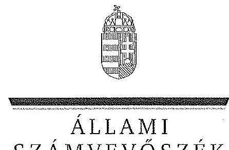
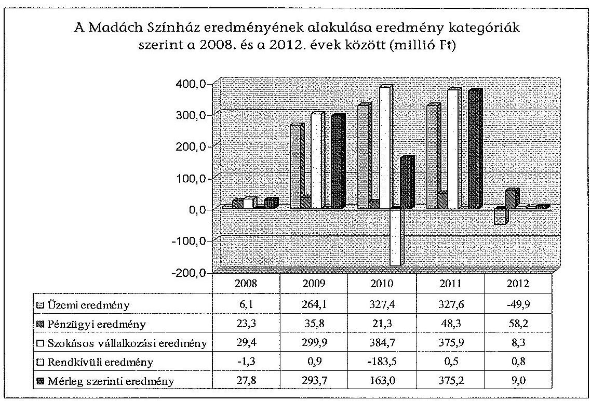
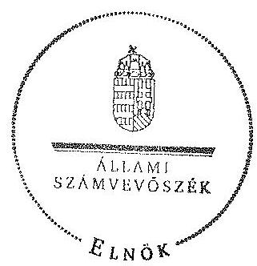
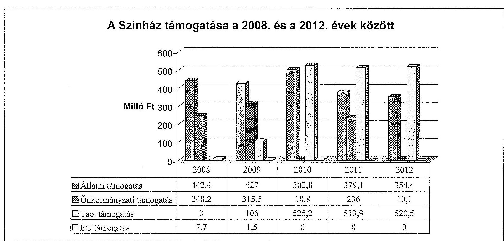
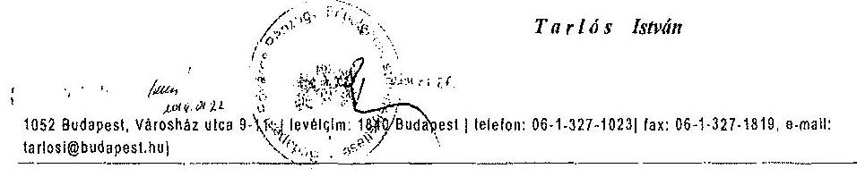
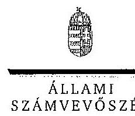
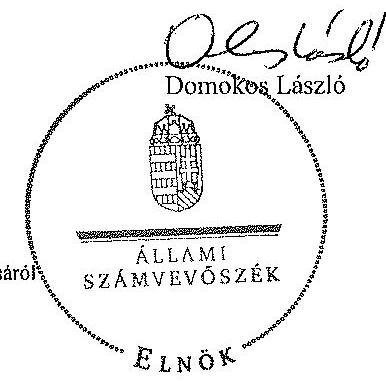

ÁLLAMI
SZÁMVEVŐSZÉK

# JELENTÉS 

az önkormányzatok többségi tulajdonában lévő gazdasági társaságok közfeladat-ellátásának ellenőrzéséről Madách Színház Nonprofit Kft.

---

# Állami Számvevőszék 

Iktatószám: V-0191-185/2014.
Témaszám: 1159
Vizsgálat-azonosító szám: V06530209

## Az ellenőrzést felügyelte:

## Makkai Mária

felügyeleti vezető
Az ellenőrzést vezette és az ellenőrzés végrehajtásáért felelős:
Horváth József
ellenőrzésvezető
A számvevőszéki jelentés összeállításában közremüködött:
Bertalan Rudolf Gyula
számvevő
Az ellenőrzést végezték:
Bertalan Rudolf Gyula
sáámvevő

Fiel Edit
külső szakértő

## Gáspárné Farkas Ágota

külső szakértő

A témához kapcsolódó eddig készített számvevőszéki jelentések:
címe
sorszáma
Jelentés a színházak állami támogatásának és gazdálkodásának 1039 ellenőrzéséről

---

# TARTALOMJEGYZÉK 

BEVEZETÉS ..... 3
I. ÖSSZEGZŐ MEGÁLLAPÍTÁSOK, KÖVETKEZTETÉSEK, JAVASLATOK ..... 6
II. RÉSZLETES MEGÁLLAPÍTÁSOK ..... 12

1. Az Önkormányzat közfeladat-ellátásának megszervezése ..... 12
1.1. A közfeladat meghatározása, a feladat ellátásának választott módja ..... 12
1.2. Az önkormányzati és a tulajdonosi irányítás megítélése ..... 17
2. A gazdasági társaság közfeladat-ellátássál kapcsolatos tevékenysége ..... 20
2.1. A gazdasági társaság szervezeti kialakítása, szabályozottsága ..... 21
2.2. A gazdasági társaság vagyonnyilvántartása ..... 23
2.3. A gazdasági évek ráfordításainak és bevételeinek alakulása ..... 25
2.4. A gazdasági társaság eredményének alakulása ..... 29
2.5. A gazdasági társaság folyamatos üzemmenetének, likviditásának biztosítása ..... 31
3. Az Önkormányzat tulajdonosi jogainak és kötelezettségeinek érvényesítése ..... 32
3.1. A gazdasági társaságtól származó információk hasznosítása ..... 32
3.2. Az önkormányzat közgyűlésének intézkedései ..... 34
MELLÉKLETEK
4. számú A Színház szakmai tevékenységének mutatói 2008. és a 2012. évek között
5. számú A Színház támogatása 2008. és a 2012. évek között
6. számú A Színház vagyonának főbb adatai 2008. január 1-je és 2012. december 31-e között
7. számú Budapest Főváros Főpolgármesterének észrevétele
8. számú Az ÁSZ tájékoztató levele a Madách Színház Nonprofit Kft. ügyvezetőjének
FÜGGELÉKEK
9. számú Rövidítések jegyzéke
10. számú Értelmező szótár

---

.

---

# JELENTÉS 

## az önkormányzatok többségi tulajdonában lévő gazdasági társaságok közfeladat-ellátásának ellenőrzéséről Madách Színház Nonprofit Kft.

## BEVEZETÉS

Az Önkormányzatnak közfeladata az Ötv. alapján a művészeti feladatok ellátásáról való gondoskodás, az Mötv. szerint az előadó-művészeti szervezet támogatása. Ezt az Önkormányzat egyszemélyes tulajdonában álló gazdasági társaság múködtetésével valósította meg.

Az Önkormányzat az ellenőrzött időszakban rendelkezett színházi koncepcióval ${ }^{1}$, amely felvázolta a színházak működtetésének lehetőségeit és jövőbeli célokat határozott meg. Ezt a Közgyűlés határozattal² elfogadta.

A Színházak támogatása az ellenőrzött időszakban központi költségvetési, illetve fenntartói támogatás formájában, valamint pályázatok útján valósult meg. A 2010-2012. évek költségvetési törvényei egy összegben tartalmazták az Önkormányzat fenntartásában működő színházak fenntartói ösztönző részhozzájárulását, amelyet a fenntartó saját döntése alapján oszthatott el.

Az Önkormányzat Közgyűlése 2004. július 1-jétől létrehozta a Madách Színház NKht.-t. A Közgyűlés 2009. június 23 -án Közgyűlési határozatok ${ }^{3}$ keretében úgy döntött, hogy 2009. június 24 -étől a Madách Színház NKht. a továbbiakban NKft. formájában működjön tovább.

Az Önkormányzat a határozatával ${ }^{4}$ a Madách Színházzal szervezeti egységet képező „Örkény István Színház" önálló múködése érdekében megalapította az Örkény István Színház NKft.-t. 2010. január 1-jétől az „Örkény István Színház" szervezeti egység által használt önkormányzati tulajdont képező ingó- és ingatlanvagyont az Önkormányzat elvonta a Madách Színháztól, és átadta az Örkény István Színháznak.

[^0]
[^0]:    ${ }^{1}$ Koncepció a fővárosi fenntartású színházak struktúráját és finanszírozását érintő változásokról (2007. XI. 29.)
    ${ }^{2}$ Főv. Kgy. 1979/2007. (11. 29.) számú határozata
    ${ }^{3}$ Főv. Kgy. 376/2009. (03. 26.) és 845/2009. (06. 03.) számú határozatai
    ${ }^{4}$ Főv. Kgy. 1393/2009. (X. 12.) számú határozata

---

A Madách Színház a teljes ellenőrzési időszak alatt - a 2008. és a 2012. évek között - gazdasági társasági formában múködött.

A Madách Színház társulattal rendelkező, repertoárrendszerben játszó, a társadalom széles rétegeit megcélzó, sokszínű műsorral és játékstílussal rendelkező, nagyszabású magyar és külföldi musicalek bemutatását is felvállaló előadóművészeti szervezet. 1999-ben a színház teljes épületét felújították. A bővítés és korszerűsítés következtében a légkondicionált, korszerű forgószínpaddal, fényés hangtechnikával ellátott épület nagy színházterme alkalmanként közel 800 fő, a kamaradarabok, előadó estek céljából kialakított Tolnay Szalon 100 fő befogadására alkalmas.

Az Önkormányzat a Színházzal a közfeladat ellátásának biztosítására 2004. július 1-jén Közszolgáltatási szerződést kötött, melyet az ellenőrzött időszak végéig tíz alkalommal módosítottak. A Közszolgáltatási szerződés meghatározta a Színház közhasznú tevékenysége körét, az Önkormányzat által biztosított támogatások összegét, a feladatellátáshoz szükséges befektetett eszközöket, valamint azok rendelkezésre bocsátásának módját. A Közszolgáltatási szerződésben a szakmai és a teljesítmény követelmények előírásával az Önkormányzat meghatározta a Színház közszolgáltatási tevékenységével kapcsolatos elvárásait.

Az Emtv. új elemként vezette be 2009 novemberétől a tao támogatást, mint közvetett támogatási formát. Ennek felső határát a jogalkotó a tárgyévi jegybevétel $80 \%$-ában határozta meg. A tao támogatás pénzügyi teljesülése a támogatást nyújtó vállalkozások eredményességének és támogatás nyújtási hajlandóságának függvénye.

A Színház a közfeladat ellátása érdekében az ellenőrzött időszakban összesen 2926,3 millió Ft állami és önkormányzati múködési, valamint 1,1 millió Ft önkormányzati fejlesztési támogatást kapott. Emellett a 2009. és a 2012. évek között összesen 1665,6 millió Ft társasági adó és 9,2 millió Ft Európai Uniós támogatást tudott igénybe venni.

Az ellenőrzött időszakban a Színház évente átlagosan 2-3 bemutatót tartott, a repertoárjában pedig hat-nyolc előadás folyamatosan szerepelt. A Színház fizető vendégeinek száma évente átlagosan 280 ezer fő, az előadások száma évi 331-643 között változott a 2008. és a 2012. évek között. A Színház által munkaviszonyban foglalkoztatott dolgozók átlaglétszáma a 2008. évi 189 fơről a 2012. évre 151 före csökkent.

A Színház főbb szakmai mutatószámait az 1. számú melléklet tartalmazza.
Az ellenőrzés várható eredménye: a jelentés nyilvánossága a társadalom széles körével ismerteti meg a Színház gazdálkodására vonatkozó megállapításainkat, továbbá megállapítások alapján megfogalmazott számvevőszéki javaslatok hasznosítása elősegíti a feltárt hibák megszüntetését, az ellenőrzött szervezet jobb feladatellátását. A társadalom számára jelzi, hogy közpénz nem maradhat ellenőrizetlenül, az ÁSZ értékteremtő rend kialakításához és megőrzéséhez hozzájáruló tevékenysége pozitív hatással lesz a szervezetről kialakított összkép formálásában. A szervezeten belül lehetőség nyílik arra, hogy a megál-

---

lapítások szintetizálásával az ÁSZ a hozzáadott értéket teremtő, elemző tevékenységét és tanácsadó szerepét is erősítse. A jó gyakorlatok bemutatásával az ÁSZ hozzájárul a követendő megoldások megismertetéséhez, terjesztéséhez.

Az ellenőrzés célja annak értékelése volt, hogy:

- az Önkormányzat a jogszabályi előírások figyelembevételével döntött-e az ellenőrzésre kerülő közfeladat megszervezéséről, az ellátás módjáról; a tulajdonostól elvárható gondossággal felügyelte-e társaság feladatellátását; a gazdasági társaság rendelkezésére bocsátotta-e a közfeladat-ellátásához a szükséges közvagyont, és biztosította-e a tulajdonosi jogok afeletti érvényesülését; a társaság vagyonvesztése esetén intézkedett-e a további vagyonvesztés megakadályozásáról,
- a gazdasági társaság teljesítette-e a tulajdonos önkormányzat részéről meghatározott célokat és feladatokat a rendelkezésre álló erőforrások felhasználásával; végrehajtotta-e a közfeladat-ellátási szerződés előírásait; betartotta-e a vagyonnal történő gazdálkodásra vonatkozó jogszabályi rendelkezéseket.

Az ellenőrzés hatóköre: az önkormányzatok közfeladat-ellátásának ellenőrzése, amely kiterjed az önkormányzatok és a közfeladatot ellátó, az önkormányzat többségi tulajdonában lévő gazdasági társaság közötti feladatmegosztásra, az önkormányzatok tulajdonosi jogainak gyakorlására, a nemzeti vagyon kezelésének ellenőrzése keretében a közfeladat-ellátáshoz rendelt vagyonra és a vagyont érintő szerződésekre. A jelen ellenőrzés kiterjed az önkormányzatok többségi tulajdonlásával működő gazdasági társaságok közfeladatellátására, vagyongazdálkodási tevékenységére, a kapcsolódó nyilvántartások, elszámolások szabályszerűségére és megbízhatóságára, az ellenőrzött tételek kiválasztása véletlen mintavétellel történt.

Az ellenőrzés típusa: szabályszerűségi ellenőrzés.
Az ellenőrzött időszak: a 2008-2012. évek, valamint a helyszíni ellenőrzés befejezéséig - 2013. szeptember 27-éig - bekövetkezett változások figyelemmel kísérése.

Ellenőrzött szervezet: a Madách Színház Nonprofit Kft., valamint Budapest Főváros Önkormányzata.

Az ellenőrzés végrehajtásának jogszabályi alapját az ÁSZ tv. 5. § (3)-(5) bekezdéseiben foglaltak képezik.

Az ÁSZ a 2011. évi LXVI. törvény 29. §-a szerint a jelentéstervezetet megküldte Budapest Főváros Önkormányzata főpolgármesterének és a Madách Színház Nonprofit Kft. ügyvezető igazgatójának egyeztetésre. Budapest Főváros Önkormányzata főpolgármestere nem tett észrevételt, a Madách Színház Nonprofit Kft. ügyvezető igazgatója nem élt észrevételezési jogával. A főpolgármester nemleges észrevételét a jelentés 4. számú, az ÁSZ a Madách Színház Nonprofit Kft. ügyvezetőjének küldött tájékoztató levelét a jelentés 5. számú melléklete tartalmazza.

---

# I. ÖSSZEGZŐ MEGÁLLAPÍTÁSOK, KÖVETKEZTETÉSEK, JAVASLATOK 

Az Önkormányzat a művészeti feladatok ellátásáról való gondoskodásnak, illetve az előadó-művészeti szervezet támogatásának, mint az Ötv.-ben és az Mötv.-ben meghatározott közfeladatának, az ellenőrzött időszak alatt eleget tett. Az Önkormányzat a közfeladat-ellátását a gazdasági társaság támogatásával biztosította. A Közgyűlés tulajdonosi jogait az ellenőrzött időszakban szabályzataiban és rendeleteiben foglaltak szerint gyakorolta. A tulajdonosi joggyakorlás keretében érdemi határozatokat hozott.

A Színház részére az Alapító Okiratokban meghatározottaknak megfelelően az előadó-művészeti közfeladat-ellátása érdekében szükséges ingó és ingatlan vagyont a Közszolgáltatási szerződésben foglaltak szerint ingyenesen (haszonkölcsönbe), majd a 2011. november 23 -án aláírt bérleti szerződés és módosított Közszolgáltatási szerződés alapján az ingatlanokat 2011. szeptember 1-jétől bérleti jogviszony keretében használatba adta. Az Önkormányzat tulajdonában álló és a Színháznak átadott ingó és ingatlan vagyon nettó értéke 2008. december 31 -én 3455,1 millió Ft volt.

Az Önkormányzat 2004. július 1-jén a Színházzal a közfeladat ellátásának biztosítására Közszolgáltatási szerződést kötött, amely meghatározta a közhasznú tevékenység körét, továbbá a Színház által teljesítendő művészeti tevékenységek jellegét, mértékét és pontos mutatószámait. Tartalmazta az ingatlanok bérbeadásának és az ingó vagyontárgyak ingyenes használatba adásának módját, valamint a költségvetési támogatás mértékét. Az önkormányzati tulajdon védelme érdekében szabályozta a kötelező leltár készítését, gyakoriságát, továbbá a gazdálkodás és a művészeti tevékenység ellátásával összefüggő kötelező adatszolgáltatás formáját, idejét és módját, valamint előírta a gazdálkodás körében felmerülő rendkívüli eseményekről történő tájékoztatási kötelezettséget.
2010. január 1-jétől alapítói döntés következtében ${ }^{5}$ az addig a Madách Színház kamaraszínházaként működő „Örkény István Színház" kivált a Madách Színházból és önálló színházként működik tovább. A kiválást követően a Madách Színház a korábbiakban a tulajdonában lévő és az Örkény István Színházat megillető eszközöket térítésmentesen és a 2009-2010. évadra kapott támogatásokat megállapodás alapján átadta az Örkény István Színháznak. Az Örkény István Színház által használt tárgyi eszközök dokumentált átadása 2010. május 31-én megtörtént.

A leltározásra vonatkozó előírások a társasággá alakulást követően az Önkormányzat Vagyonrendeleteiben nem a hatályos jogszabályoknak megfelelően szerepeltek, mivel az üzemeltetésre, kezelésre átadott eszközök leltározási sza-

[^0]
[^0]:    ${ }^{5}$ Főv. Kgy. 1393/2009. (10. 12.) számú határozat

---

bályairól a Vagyonrendelet ${ }_{1,2}$ az Áhsz. 2010. január 1-jétől hatályos előírásaival ellentétben nem tartalmazott szabályozást.

A Színházak támogatása az ellenőrzött időszakban központi költségvetési, illetve fenntartói támogatással, valamint pályázatok útján valósult meg. Az Önkormányzat a saját, tulajdonosi támogatásának színházak közötti elosztási elveit, szempontjait szabályzatban, belső utasításban nem határozta meg, annak mértékét, nagyságrendjét a teljes támogatás összegéhez igazította.

Az Önkormányzat a vagyon védelme érdekében a Közszolgáltatási szerződésben garanciális követelményként fogalmazta meg a kötelezettségek megszegésének jogkövetkezményét, valamint a szerződés megszűnésének esetére az átadott vagyontárgyak visszaszolgáltatási kötelezettségét. Az ellenőrzött időszakban kötelezettség megszegésére, illetve szerződés megszűntetésére nem került sor.

Az Önkormányzat a Színház Alapító Okirat ${ }_{1}$-ben - a Gt. előírásaival összhangban - szabályozta az Alapító tulajdonosi joggyakorlásának kereteit. A Közgyűlés a tulajdonos érdekeinek védelmére határozatokban kijelölte a Társaság FB tagjait és könyvvizsgálóját. Az Alapító, mint a Színház legfőbb szerve, a Közgyűlés kizárólagos hatáskörében jóváhagyta a Színház SZMSZ ${ }_{1,2}$-jét és az FB ügyrendjét. Az Alapító Okiratokat a vonatkozó jogszabályok szerint határidőn belül fogadta el az Önkormányzat.

A Közgyűlés közvetlenül, határozatában megválasztotta a Madách Színház FB elnökét a 2010. évben, amely eljárás nem felelt meg a Gt. azon jogszabályi előírásának, mely szerint - ha törvény vagy a társasági szerződés eltérően nem rendelkezik - az FB a tagjai sorából választ elnököt.

Az Önkormányzat a Színház ügyvezetőjének és egyéb vezető állású dolgozóinak, valamint az FB tagoknak a díjazására vonatkozó Javadalmazási szabály-zat ${ }_{2}$-őt a Taktv.-ben foglalt határidőn túl, 2010. január 31. helyett április 29-én fogadta el. A Javadalmazási szabályzat ${ }_{3,4}$ szerint a kitűzött prémiumfeltételek teljesítése esetén sem kerülhet sor a prémium kifizetésére, ha a gazdasági társaság vállalkozási tevékenysége az üzleti évben veszteséges. A Javadalmazási szabályzat ${ }_{3,4}$ nem koherens a jogszabályi előírásokkal, és a prémium feltételek meghatározásakor nem a Civil tv., illetve a Számv. tv. eredménykategóriáit alkalmazta.

Az Önkormányzat a Színház beszámolójának és üzleti tervének elfogadását, az adatszolgáltatási kötelezettség ellenőrzését a jogszabályokban, az Önkormányzat belső szabályzataiban és a Közszolgáltatási szerződésben foglaltaknak megfelelően, határidőn belül - az FB határozatok és a könyvvizsgálói jelentés figyelembevételével - végezte el.

A Színház szakmai tevékenységének ellátását az Önkormányzat évadbeszámolók alapján értékelte. A Színház az ellenőrzött időszak minden évében elkészítette a szakmai értékelését, amelyet a 2008. és a 2010. évek között az Önkormányzat Kulturális Bizottsága elfogadott. A 2011. és a 2012. évekre benyújtott évadbeszámolókról a kulturális ügyekért felelős Főpolgármester-helyettes Tájékoztatót nyújtott be a Közgyűlés részére, amelyet a Közgyűlés tudomásul vett.

---

A 2008. és a 2010. évek között a Színház ügyvezetője részére a prémiumfeltételeket és annak összegét minden évben az üzleti terv elfogadását követően, az évadbeszámolókra tekintettel határozta meg az Alapító. A konkrét prémiumfeladatokat a hatályos Javadalmazási szabályzat alapján a Színház FB-jének véleményét is figyelembe véve az Oktatási és Kulturális Főpolgármesterhelyettes határozta meg. A 2008. és a 2011. évek között a vezetői prémium kifizetésének feltételei teljesültek és Főpolgármester-helyettesi döntések alapján a kifizetésekre sor került. A Közgyűlés a 2012. évi teljesítmény után a prémium kifizetését 2013. szeptember 26-án közgyűlési határozat alapján engedélyezte.

Az Önkormányzat belső ellenőrzése a Színháznál a 2011. évben végzett ellenőrzést. Az ellenőrzés javaslatokat fogalmazott meg a használatba adott vagyontárgyak műszaki állaga megőrzésével, karbantartásával kapcsolatban, és feltárta, hogy az üzleti tervekben feltüntetett adatok jelentős mértékben eltérnek az adott évek teljesítéseitől, amely tendenciaszerűen alultervezésre utalt. Az ellenőrzés megállapításaival összefüggésben a Színház intézkedési tervet készített, és az abban megjelölt feladatokról beszámolt az Önkormányzatnak, amely a jelentést elfogadta.

A Színház 2008. és 2012. évek közötti gazdálkodása, valamint mérleg szerinti eredménye az ellenőrzött időszakban nem tette szükségessé, hogy a tulajdonos Önkormányzat a vagyon, a közpénzek nem célszerinti hasznosításával, az esetleges pazarló felhasználással kapcsolatban, valamint a lejárt kötelezettségek csökkentése érdekében tulajdonosi intézkedéseket tegyen.

Az ellenőrzött időszakban a Színház teljesítette az Önkormányzat részéről a Közszolgáltatási szerződésben meghatározott célokat és feladatokat. A vagyonnal történő gazdálkodásra vonatkozó jogszabályi rendelkezéseket - az Önkormányzattól ingyenesen használatba kapott eszközök jogszabályi előírásoknak megfelelő nyilvántartása kivételével - betartották. A 2008. és 2012. évek között a Színház nem mutatta ki a nullás számlaosztályban az ingyenesen használatba vett eszközöket. Eljárásával megsértette a Számv. tv. vonatkozó előírását.

A Színház rendelkezett Alapító Okirat ${ }_{1,5}$-tel és az irányítási, döntési és felelősségi jogköröket tartalmazó belső szabályzatokkal, a Közszolgáltatási szerződés előírásának megfelelően folyamatosan biztosította a tevékenységi körébe tartozó színházi szolgáltatást.

A Színház elkészítette Számviteli politika ${ }_{1,2}$-je mellékleteként a Leltározási szabályzat ${ }_{1,2}$-őt, a Pénzkezelési szabályzat ${ }_{1,2,3}$-at és az Értékelési szabályzat ${ }_{1,2}$-őt. A Színház a Közszolgáltatási szerződésben előírt évenkénti leltárkészítési kötelezettségének - az Önkormányzat tulajdonában lévő ingatlanok kivételével eleget tett. A Színháznál az önkormányzati tulajdonú ingatlanok 3 évente történő leltározása nem volt összhangban az Önkormányzat 7/2011. Leltározási és leltár készítési szabályzatával, amely ezen eszközök esetében évenkénti leltározást határozott meg.

Az ellenőrzött időszakban a Színház a nyilvántartásaiban az alap- és vállalkozási tevékenységeinek bevételeit és ráfordításait elkülönítetten mutatta ki.

---

A Színház Önköltségszámítási szabályzat ${ }_{1,2}$-je azt tartalmazta, hogy az önköltségszámítás a tényleges közvetlen önköltségnek a meghatározása, a szabályzat annak kalkulációs formáit rögzíti. Az Önköltségszámítási szabályzat ${ }_{1,2}$ nem tartalmazta az általános költségek felosztási módját.

Az Önkormányzat tulajdonában álló és a Színháznak átadott eszközök nettó értéke a 2008. évben 3455,1 millió Ft volt, amely a 2012. év végére 2600,5 millió Ft-ra csökkent. Az állomány $24,6 \%$-os csökkenése az Örkény István Színház 2010. január 1-jével bekövetkezett - az Alapító által eldöntött kiválásával volt összefüggésben.

A Színház az Önkormányzat által kért gyakorisággal, illetve a jogszabályi előírások figyelembevételével eleget tett tájékoztatási kötelezettségének, beszámolók, jelentések, kimutatások és adatközlők formájában.

A Színház ráfordításai a 2008. évi 1714,4 millió Ft-ról a 2012. évre 1803,2 millió Ft-ra, 5,2\%-kal emelkedtek. A személyi jellegű ráfordítások összes ráfordításon belüli aránya a 2008. évi 43,9\%-ról a létszám csökkenésével összefüggésben a 2012. évre 40,1\%-ra csökkent. Az ellenőrzött időszakban a Színház által alkalmazott amortizációs politika és elszámolás megfelelt a Számv. tv. előírásainak. Az értékcsökkenés évenkénti alakulását az éves beszámolók Kiegészítő mellékletében részletesen bemutatták.

A Színház az ellenőrzött években elkészítette üzleti tervét. A 2008. és a 2012. évek között a terv és tényadatok minden évben jelentősen eltértek egymástól. A tényleges teljesítések meghaladták a tervekben feltüntetett bevételeket és ráfordításokat, valamint az eredményeket. Az üzleti tervek nem tartalmaztak részletes számszaki adatot a fenntartói és a tao támogatásra, a céltartalékképzésre, az adókötelezettségekre, a pénzintézeti bevételekre és költségekre vonatkozóan. Az üzleti terv formájára és tartalmára vonatkozóan a 2013. évig szabályzatban az Önkormányzat nem fogalmazott meg kötelező előírást.

A Színház mérleg szerinti eredménye az ellenőrzött időszak minden évében pozitív volt. A képződött eredményt eredménytartalékba helyezték.

A Színház a kapott támogatásokkal a Közszolgáltatási szerződésben, illetve a támogatókkal kötött egyéb szerződésekben meghatározottak szerint elszámolt, visszafizetési kötelezettsége nem volt. Az állami támogatásokat az ellenőrzött években az előadó-művészeti tevékenységhez kapcsolódó bérköltségre, dologi és egyéb kiadásokra használták fel.

A Színház a bevételeken belül a közfeladat ellátásával kapcsolatos díjbevételeket elkülönítetten mutatta ki. Saját bevételei döntő mértékben a jegyértékesítésből származtak. Az egyéb bevételek tételei dokumentált módon tartalmazták a Fenntartó által folyósított támogatásokat, valamint a tao támogatásokat.

A Színház az ellenőrzött időszakban éves fejlesztési és beruházási tervet készített, melyet megküldött az Önkormányzat részére. A beruházásokkal kapcsolatosan megtérülési számításokat a Színház nem végzett. A fejlesztési terveket nem alapozták meg tanulmányokkal és számításokkal. A beruházások saját forrásból, valamint 1,1 millió Ft összegben önkormányzati és 6,1 millió Ft értékben Nemzeti Kulturális Alap pályázati forrásból valósultak meg.

---

A Színház az ellenőrzött időszakban keletkező szabad pénzeszközeit egy éven belüli lekötéssel a folyószámláját vezető bankjánál lekötötte. Betétei alapján a 2008. és a 2012. évek között összesen 138,0 millió Ft kamatbevételt realizált. A kamatbevételek azt mutatják, hogy az ellenőrzött időszak teljes egészében a közfeladat-ellátás finanszírozási igényéhez képest tartósan több forrás állt a Színház rendelkezésére. A Színház az ellenőrzött időszakban befektetési tevékenységet nem végzett, így Befektetési szabályzatot sem kellett készítenie.

A Színháznak az ellenőrzött időszakban átmeneti pénzintézeti finanszírozásra nem volt szüksége. Likviditását folyamatosan biztosította, fizetési kötelezettségeit határidőn belül teljesítette, köztartozásai nem keletkeztek. Eredményei alapján nem volt szükség tulajdonosi intézkedésre a veszteség rendezése, illetve a saját tőke/jegyzett tőke előírt szintjének biztosítása érdekében. A Színház saját tőkéje a 2008. január 1-jei 34,7 millió Ft-ról 2012. december 31-ére több mint húszszorosára, 903,5 millió Ft-ra emelkedett.

Az Állami Számvevőszékről szóló 2011. évi LXVI. törvény 33. § (1) bekezdésében foglaltak értelmében a jelentésben foglalt megállapításokhoz kapcsolódó intézkedési tervet köteles az ellenőrzött szervezet vezetője összeállítani, és azt a jelentés kézhezvételétől számított 30 napon belül az ÁSZ részére megküldeni. Amennyiben az intézkedési tervet határidőben nem küldi meg a szervezet, vagy az nem elfogadható, az ÁSZ elnöke a hivatkozott törvény 33. § (3) bekezdés a)-b) pontjaiban foglaltakat érvényesítheti.

Az ellenőrzés intézkedést igénylő megállapításai és javaslatai:

# Budapest Főváros Főjegyzöjének 

A leltározásra vonatkozó előírások a társasággá alakulást követően az Önkormányzat Vagyonrendeleteiben nem a hatályos jogszabályoknak megfelelően szerepeltek, mivel az üzemeltetésre, kezelésre átadott eszközök leltározási szabályairól a Vagyonrendelet2 2010. január 1-jétől az Áhsz. előírásaival ellentétben nem tartalmazott szabályozást.

Javaslat:
Készítse elő a Közgyűlés elé való terjesztés érdekében a Vagyonrendelet2 módosítását, hogy az tartalmazza az Áhsz. 37. § (4) bekezdésben előírtaknak megfelelően az üzemeltetésre, kezelésre átadott eszközök leltározási szabályait.

## A Madách Színház Igazgatójának

1. A 2008. és 2012. évek között a Színház nem mutatta ki a 0 -ás számlaosztályban az ingyenesen használatba vett eszközöket. Eljárásával megsértette a Számv. tv. 160. § (1) és (5) bekezdésében előírtakat.

Javaslat:
Intézkedjen az Önkormányzat által a Színház használatába adott ingóságok és ingatlanok 0 -ás számlaosztályban történő kimutatása érdekében a Számv. tv. 160. § (1) és (5) bekezdésében előírtaknak megfelelően.

---

2. A Színház Önköltségszámítási szabályzat ${ }_{1,2}$-je azt tartalmazta, hogy az önköltségszámítás a tényleges közvetlen önköltségnek a meghatározása, a szabályzat annak kalkulációs formáit rögzíti. Az Önköltségszámítási szabályzat ${ }_{1,2}$ nem tartalmazta az általános költségek felosztási módját.

Javaslat:
Intézkedjen az Önköltségszámítási szabályzat módosításáról annak érdekében, hogy
a) minden produkció esetében, legalább a produkció színreviteléig ossza fel azon általános költségeket, amelyek mutatók segítségével az adott produkcióhoz hozzárendelhetőek, annak érdekében, hogy az önköltség ne csak a közvetlen önköltséget tartalmazza;
b) a szabályzat tartalmazza az általános költségeknek a felosztási módját.

---

# II. RÉSZLETES MEGÁLLAPÍTÁSOK 

## 1. Az ÖNKORMÁNYZAT KÖZFELADAT-ELLÁTÁSÁNAK MEGSZERVEZÉSE

### 1.1. A közfeladat meghatározása, a feladat ellátásának választott módja

Az Önkormányzat a múvészeti feladatok ellátásáról való gondoskodásnak, illetve az előadó-múvészeti szervezet támogatásának, mint az Ötv.-ben és az Mötv.-ben meghatározott közfeladatának, az ellenőrzött időszak alatt eleget tett. Az Önkormányzat a közfeladat ellátását az ellenőrzött időszakban a Madách Színház NKft. támogatásával biztosította.

Az Önkormányzat kötelező közfeladata az Ötv. 63/A. § n) pontja szerint a művészeti feladatok ellátása ${ }^{6}$. A Htv. 111. § alapján a közművelődési, közgyűjteményi és művészeti tevékenységekkel kapcsolatos helyi irányítási, ellenőrzési, valamint a fenntartással és múködtetéssel kapcsolatos feladatokat a Közgyűlés látja el. A kulturális feladat ellátását az Önkormányzat az Emtv. 3. § (2) bekezdése alapján előadó-művészeti gazdasági társaság támogatásával valósította meg.

Az Önkormányzat az ellenőrzött időszakban elfogadott kulturális koncepcióval ${ }^{7}$ rendelkezett, amelyet a Közgyűlés ${ }^{8}$ határozatával fogadott el.

A koncepció a színházak múködtetésének módozatait vázolta fel és jövőbeli célokat határozott meg, nem vizsgálta azonban a megvalósításhoz szükséges források nagyságát.

A 2010. évi önkormányzati választásokat követően az Ötv. 91. § (6) bekezdésnek megfelelően a Közgyűlés ${ }^{9}$ elfogadta az Önkormányzat 2011-2014. évekre vonatkozó Gazdasági Programját ${ }^{10}$.

Az Önkormányzat - az ellenőrzött időszakot megelőzően - 2004. július 1-jén a Madách Színházat költségvetési intézményből kiemelt közhasznú társasággá alakította, 100\%-os tulajdonlással és 3,5 millió Ft alapítói törzsvagyonnal.

[^0]
[^0]:    ${ }^{6}$ A 2013. január 1-től hatályos Mötv. 13.§ (1) bekezdés 7. pontja is kötelezően ellátandó feladatként határozza meg az előadó-művészeti szervezetek támogatását.
    ${ }^{7}$ Koncepció a fővárosi fenntartású színházak struktúráját és finanszírozását érintő változásokról
    ${ }^{8}$ a Főv. Kgy. 1979/2007. (11. 29.) számú határozata
    ${ }^{9}$ a Főv. Kgy. 937/2011. (04. 27.) számú határozata
    ${ }^{10}$ A Főváros fejlesztésének és gazdálkodásának stabilizálása és reformkoncepciója a 2011-2014. évi választási ciklusra

---

Az Alapító az egyszemélyes NKft. alapításakor eleget tett az Áht. 100/L. § (1) bekezdésében és 100/O. § (2) bekezdésében előírt rendelkezéseknek, továbbá a Színház Alapító Okirata ${ }_{2}$ tartalmának meghatározásakor figyelembe vette a Ptk. 54. § (1)-(2) bekezdéseiben és a Gt. 12. § (1) bekezdésében rögzített, valamint a Közhasznú tv. 4. § (1) bekezdésében foglalt tartalmi követelményeket.

Az Önkormányzat a Színház Alapító Okirat ${ }_{1-5}$-ben - a Gt. 33. § (1) bekezdés c) pontja előírásaival összhangban - szabályozta az Alapító tulajdonosi joggyakorlásának kereteit. Az alapító okiratok megfelelően rendelkeztek a Színház gazdálkodása során elért eredmény felhasználásáról, az ügyvezető, az FB tagok és a könyvvizsgáló kijelöléséről, az összeférhetetlenségi szabályokról, valamint az Áht. ${ }_{1} 100 / \mathrm{N}$. § (8) bekezdése előírásának betartásáról.

Az Alapító az FB létszámát 3 főben határozta meg. Előírta továbbá, hogy az FB véleményezze az 50,0 millió Ft értékhatárt meghaladó jogügyleteket, míg a 70,0 millió Ft értékhatárt meghaladó jogügyletek jóváhagyására csak az alapító volt jogosult. Az Alapító Okirat ${ }_{1-3}$-ben az alapító hatáskörébe rendelte az üzleti terv elfogadását.

Az Önkormányzat a 376/2009. (03. 26.) számú határozatával - a törvényes határidőn belül 2009. június 24-i hatályba lépéssel - a Madách Színház NKht.-t a Gt. 365. § (3) bekezdésében foglaltaknak megfelelően közhasznú társaságból, a jogutódlás, a feladatellátás, a folyósított támogatások, valamint a vagyonszerkezet változatlanul hagyása mellett, nonprofit korlátolt felelősségű társasággá alakította át az Alapító Okirat ${ }_{2}$ szerint.

Az Önkormányzat az 1393-1405/2009. (10. 12.) számú határozataiban a Vagyonrendelet ${ }_{1}$ 52. § (1) bekezdése a) pontja alapján az addig a Madách Színház kereteln belül - annak kamaraszínházaként - múködő „Örkény István Színház" önálló múködése érdekében - 2010. január 1-jétől - megalapította az Örkény István Színház NKft.-t 3,0 millió Ft törzsvagyonnal. A kiváláskor a korábbiakban a kamaraszínház által használt, önkormányzati tulajdont képező ingó- és ingatlanvagyont a Fővárosi Önkormányzat elvonta a Madách Színház NKft.-től és átadta az Örkény István Színház NKft.-nek. A kiválást követően, 2010. január 5-én megállapodás keretében a Madách Színház a tulajdonában lévő és az Örkény István Színházat illető immateriális javakat és tárgyi eszközöket 76,9 millió Ft értékben, térítés nélkül, valamint egyeztetett elszámolás alapján a 2009-2010. évadra kapott támogatásokból a fennmaradó részt, 105,9 millió Ft összegben végleges pénzeszközként átadta az Örkény István Színháznak.

Az Önkormányzat a Színház teljesítményével kapcsolatosan konkrét célokat, elvárásokat a 2004. július 1-jén megkötött Közszolgáltatási szerződésben fogalmazott meg. A szakmai elvárásokat a színházigazgatói pályázat kiírásában szerepeltette, a megválasztott igazgató pályázata a stratégiai céljait, valamint konkrét szakmai elképzeléseit foglalta össze.

Az Önkormányzat a közfeladat-ellátása érdekében 2011. augusztus 31-éig az Alapító Okiratban foglaltaknak megfelelően ingyenesen a Színház rendelkezésére bocsátotta - haszonkölcsönbe adta - az előadó-művészeti közfeladatellátáshoz szükséges ingó és ingatlan vagyont. A 2008. évben a haszonkölcsönbe adott eszközök nettó értéke 3455,1 millió Ft volt.

Az Nvtv. 3. § alapján az ellenőrzött Színház átlátható szervezet.

---

Az Önkormányzat tulajdonában álló vagyon a nemzeti vagyon része. A Vagyonrendelet, 6. § (1) bekezdés 6. pontja szerint a Színház használatában lévő, a feladatellátást szolgáló ingatlanvagyon korlátozottan forgalomképes törzsvagyon.

Az Önkormányzat 2004. július 1-jén a Színházzal a közfeladat ellátásának biztosítására Közszolgáltatási szerződést kötött, amely meghatározta a közhasznú tevékenység körét, továbbá a Színház által teljesítendő művészeti tevékenységek jellegét, mértékét és pontos mutatószámait. A szerződés rögzítette a közhasznú tevékenység eredményes ellátásához szükséges ingó és ingatlan vagyontárgyak - szerződéshez csatolt vagyonleltár szerint - meghatározott időtartamra a Színház részére történő ingyenes használatba (haszonkölcsönbe) adását, szabályozta a szerződés megszűnésének esetére a vagyontárgyak visszaszolgáltatásának rendjét és határidejét. A Színháznak megadta a selejtezés jogát azzal, hogy az elidegenítésről, a hasznosításról, valamint az elidegenítésből származó bevételek felhasználásáról továbbra is a tulajdonos volt jogosult dönteni.

A szerződés 6.8. pontjában a tulajdonos előírta a gazdálkodás körét érintő rendkívüli esetekben a Színház tájékoztatási kötelezettségét. A tulajdonvédelem érdekében a szerződés 6.9 pontjában előírta az ingó és ingatlan vagyonra vonatkozó vagyonbiztosítás megkötését. Szabályozta a szerződésszerú teljesítés ellenőrzését. A szerződés 7. pontjában előírta a Színház számára, hogy a színházi évad lezárását követően szakmai értékelést készítsen, és abban ismertesse a következő évadra vonatkozó szakmai terveit.

Az Emtv. hatályba lépésével a tevékenység ellátására vonatkozó követelmények, feladatmutatók a törvény által kerültek meghatározásra.

Az Önkormányzat a Közszolgáltatási szerződés 5.1. pontja szerint vállalta, hogy a közhasznú tevékenység eredményes ellátásához szükséges ingatlanokat ingyenes használatba, haszonkölcsönbe adja.

Az Önkormányzat képviseletében eljáró BFVK Zrt. és a Színház 2011. november 23 -án - a 2011. augusztus 31 -ei határozatnak ${ }^{11}$ megfelelően - határozatlan időtartamra Bérleti szerződést kötött. A bérleti szerződés előírásai a Vagyonrendelet, 63-67. §-aival, valamint az Önkormányzat tulajdonában lévő, nem lakás céljára szolgáló helyiségek feletti tulajdonosi jogok gyakorlásáról szóló 40/2006. (VII. 14.) Főv. Kgy. rendelet előírásaival összhangban álltak. A Közszolgáltatási szerződést 2011. november 25 -én visszamenőlegesen módosították, mely szerint a Színház az Önkormányzat által haszonkölcsönbe adott ingatlanokat 2011. szeptember 1-jétől nem használhatta tovább ingyenesen.

A Színháznak 2011-ben 16 db ingatlan után 19,7 millió Ft+áfa/hónap bérleti díjat és 3 havi megszerzési díjat, valamint 5 havi óvadékot kellett fizetnie. A szerződést a felek 2012. március 15 -én módosították, a bérlemények közül egy ingatlant töröltek, és a bérleti díjat 20,3 millió Ft+áfa/hónapra változtatták.

[^0]
[^0]:    ${ }^{11}$ a Főv. Kgy. 2308/2011. (08. 31.) számú határozata

---

A felek 2012-ben a Bérleti szerződés 2. pontját kiegészítették azzal, hogy az Önkormányzat az óvadék összegét „a bérleti szerződés időtartama alatt a kielégítési jog megnyilta előtt használhatja és rendelkezhet vele." Az óvadék összegének fedezete az Önkormányzat részéről tett nyilatkozat ${ }^{12}$ alapján folyamatosan rendelkezésre állt.

Az Alapító a Színházzal - figyelemmel az Mötv. 13. § (1) bekezdésében és az Emtv. 3. § (7) bekezdésében, valamint 16. § (1)-(4) bekezdéseiben foglaltakra 2013. január 1-jei hatályba lépéssel - a korábbiakban hatályos Közszolgáltatási szerződésnek megfelelő tartalommal - Fenntartói megállapodást kötött.

A Fenntartói megállapodás 5.1. pontja - a Közszolgáltatási szerződés rendelkezésével megegyezően - az ingó vagyontárgyak évenkénti december 31-i fordulónappal történő leltározási kötelezettségét írta elő, továbbá köteles volt a Színház a leltárt megküldeni a tárgyévet követő év január 31-ig az Önkormányzatnak.

# A színházak támogatása az ellenőrzött időszakban központi költségvetési, illetve önkormányzati támogatással, valamint pályázatok útján valósult meg. 

A 2010. évtől az Emtv. 16. § (1) bekezdése szerint a színházak támogatása művészeti ösztönző részhozzájárulásból és fenntartói ösztönző részhozzájárulásból tevődött össze. A 2010. és a 2012. évek között a költségvetési törvények 7. sz. melléklete egy összegben tartalmazta az Önkormányzat fenntartásában működő színházak fenntartói ösztönző részhozzájárulását, amelyet a Fenntartó saját döntése alapján oszthatott el. A költségvetési törvények a színházak művészeti ösztönző részhozzájárulását külön nevesítve tartalmazták. A 2013. évtől a színházakat művészeti és létesítménygazdálkodási célra működési támogatás illette meg.

Az Emtv. 48. § (1) bekezdés c) pontja új elemként bevezette - a Tao tv. 4. § 3739. pontja és a 7. § (1) bekezdés z) pontja alapján - a társasági adókedvezménynyel igénybe vehető támogatást, mint közvetett támogatási formát. A tao támogatás igénybevétele 2009. november 12-től volt lehetséges, a jegybevétel meghatározott $80 \%$-álg. A tao támogatás pénzügyi teljesülése a támogatást nyújtó vállalkozások gazdasági eredményességének és támogatás nyújtási hajlandóságának függvénye.

Az ellenőrzött időszakban a Színház számára biztosított múködési hozzájárulás és tao támogatás alakulását a 2. számú melléklet tartalmazza.

A Madách Színház a közfeladat ellátása érdekében az ellenőrzött időszakban összesen 2926,3 millió Ft állami és önkormányzati működési, valamint 1,1 millió Ft önkormányzati fejlesztési támogatást kapott. Emellett a 2009. és a 2012. évek között összesen 1665,6 millió Ft társasági adó és 9,2 millió Ft Európai Uniós támogatást vett igénybe.

Az ellenőrzött időszakban az önkormányzati vagyon megőrzése, védelme érdekében a leltározást az önkormányzati Vagyonrendelet ${ }_{1,2}$ szabályozta. A Vagyonrendelet ${ }_{1}$ 12. § (1) bekezdése szerint az Önkormányzat tulajdonában lévő

[^0]
[^0]:    ${ }^{12}$ a Főpolgármesteri Hivatal ellenőrzéshez kirendelt kapcsolattartója 2013. augusztus 14-én adott válasza alapján

---

eszközöket minden évben leltározni kell, az ettől eltérő eseteket a rendelet 12. §ának (3)-(4) bekezdései szabályozták.

A leltározásra vonatkozó előírások a társasággá alakulást követően az Önkormányzat Vagyonrendeleteiben nem a hatályos jogszabályoknak megfelelően szerepeltek, mivel az üzemeltetésre, kezelésre átadott eszközök leltározási szabályairól a Vagyonrendelet ${ }_{1,2}$ az Áhsz. 2010. január 1-jétől hatályos előírásaival ellentétben nem tartalmazott szabályozást.

A Közszolgáltatási szerződés 5. A pontja az Önkormányzat tulajdonát képező ingó vagyonra vonatkozóan kötelező leltár készítését, a szerződés 6. pontjának 4. bekezdése az önkormányzati vagyon nyilvántartására vonatkozó előírásoknak megfelelő adatszolgáltatási és nyilvántartási kötelezettség teljesítését írta elő a Színház számára.

A Fenntartói megállapodás 5.1. pontja - a közszolgáltatási szerződés rendelkezésével megegyezően - a vagyontárgyak évenkénti, december 31-i fordulónappal történő leltárkészítési kötelezettségét írta elő, továbbá köteles volt a Színház a leltárt megküldeni a tárgyévet követő év január 31-ig az Önkormányzatnak.

Az Önkormányzat minden negyedév végén bekérte a Színháztól az ingatlanadatok változására vonatkozó dokumentumokat, a bruttó értéknövekedés vagy -csökkenés (kataszteri módosító lapok), valamint az értékcsökkenés elszámolásáról szóló, a gazdasági vezető által aláírt "6. sz. melléklet" című táblázatot. A megküldött dokumentumok alapján a kataszteri rendszer, valamint a Pénzügyi Információs Rendszer adatainak frissítése megtörtént.

Az Önkormányzat vagyonkimutatást készített a 2008. és a 2012. évek között az éves zárszámadáshoz az Ötv. 78. § (2) bekezdésében és az Mötv. 110. § (2) bekezdésében foglaltaknak megfelelően.

A Vagyonrendelet ${ }_{2}$ 14. §-a a leltározás vonatkozásában a korábbi vagyonrendelettel azonos rendelkezéseket tartalmazott.

Az Önkormányzat az önkormányzati vagyon védelme érdekében a Közszolgáltatási szerződésben garanciális követelményként fogalmazta meg a kötelezettségek megszegésének jogkövetkezményét, valamint a szerződés megszűnésének esetére az átadott vagyontárgyak visszaszolgáltatási kötelezettségét. Az ellenőrzött időszakban kötelezettség megszegésére, illetve a szerződés megszűnésére nem került sor.

A Közszolgáltatási szerződés a Színház részére vagyonbiztosítási kötelezettséget, továbbá azonnali írásbeli bejelentési kötelezettséget írt elő a kezelt vagyonban bekövetkezett 10\%-os mértéket meghaladó értékcsökkenéséről való tudomásszerzés, valamint a vagyonban történő súlyos környezeti veszélyeztetés, természeti és környezeti károkozás esetére. A szerződés azonnali hatályú felmondását helyezte kilátásba a vagyontárgyak rongálása, nem rendeltetésszerú használata, hasznositása esetére.

---

# 1.2. Az önkormányzati és a tulajdonosi irányítás megítélése 

Az ellenőrzött időszakban a Színház esetében a tulajdonosi jogok gyakorlás módját a gazdasági társaságokra vonatkozó jogszabályok és az Önkormányzat rendeletei határozták meg.

## A Közgyűlés a tulajdonosi jogait az ellenőrzött időszakban a szabályzataiban és rendeleteiben foglaltak szerint gyakorolta.

Az Önkormányzat SZMSZ ${ }_{1,2}$-ben és a Vagyonrendelet ${ }_{1,2}$-ben szabályozta az egyszemélyes tulajdonában lévő gazdasági társaságokkal kapcsolatos tulajdonosi joggyakorlás feladatait, annak módját, a hatáskörök gyakorlásának rendjét.

Az Önkormányzat SZMSZ ${ }_{1}$ 49. § (1) bekezdése alapján a 2008. és a 2011. évek között létrehozta állandó bizottságként a Kulturális Bizottságot. Ezen időszakban a Közgyűlés e bizottságra ruházta át az Önkormányzat SZMSZ ${ }_{1}$ 5. számú mellékletében szereplő feladatok ellátását.
2012. március 15 -éig a Vagyonrendelet ${ }_{1}$ 52. § (2) bekezdése alapján e jogokat a Főpolgármester közvetlenül gyakorolta. 2012. március 16 -ától 2013. március 18 -áig a Vagyonrendelet ${ }_{2}$ 56. § (2) bekezdés a) pontja alapján a Színház legfőbb szervének a törvény általi hatáskörébe tartozó jogait továbbra is a Főpolgármester közvetlenül, egy személyben gyakorolta, majd 2013. március 19-től a jogok gyakorlásának szabályozása megváltozott, és a Vagyonrendelet ${ }_{2}$ 56. § (2) bekezdés a) pontja alapján, a továbbiakban a Főpolgármester előterjesztése alapján a jogok gyakorlása a Közgyűlés hatáskörébe tartozik.

Az Önkormányzat az Alapító Okirat ${ }_{1}$ VII/A. pontjában, a Gt.-vel összhangban szabályozta az Alapító tulajdonosi joggyakorlás kereteit. A Közgyűlés a köztulajdon védelmének biztosítása érdekében a Gt. 33. § (1) bekezdés c) pontjának és a Közhasznú tv. 10. § (1) bekezdésében foglalt előírásoknak megfelelően FB létrehozásáról döntött. A Taktv. 4. § (2) bekezdésének megfelelően a társasági törzstőke összegéhez igazodva a Színház esetében 3 főben határozta meg az FB létszámát.

Az ellenőrzött időszakban a Gt. 141. § (2) bekezdés k) pontjában foglalt jogkörében az Önkormányzat a 2044/2010. (10. 27.) számú határozatával visszahívta az FB tagjait, egyidejúleg megválasztotta az új FB tagokat és döntött az FB elnök személyéről is. Az Önkormányzat által alkalmazott eljárást a Gt. 34. § (2) bekezdése - a társasági szerződés (alapító okirat) eltérő rendelkezésének hiányában - az FB tagok jogköreként határozta meg.

A Színház Alapító Okirat ${ }_{5,4}$ VII. fejezet C. pontjának az FB tagokra vonatkozó előírása nem tartalmazott az FB elnök megválasztásával összefüggésben „az Alapító eltérő rendelkezésére" utaló kitételt. Ennek következtében az FB elnök Alapító által történő megválasztása nem a jogszabályi előírásnak megfelelően történt.

A Közgyűlés a tulajdonosi érdekeinek védelmére határozatokban kijelölte a Színház könyvvizsgálóját.

A könyvvizsgálói jelentések megállapították, hogy az éves beszámolókat a Számv. tv.-ben foglaltaknak megfelelően készítették el, valamint hogy azok

---

megbízható és valós képet mutatnak a Színház vagyoni, pénzügyi és jövedelmi helyzetéről. A könyvvizsgálói jelentések rögzítették, hogy a közhasznúsági jelentések - a 2012. évben közhasznúsági melléklet - az éves beszámolók adatával összhangban vannak.

Az Önkormányzat a Közszolgáltatási szerződésben ${ }^{13}$ április 30-i, illetve a Fenntartói megállapodásban ${ }^{14}$ április 15-i határidőre, a közszolgáltatási feladatellátási kötelezettség teljesítésének garanciájaként - a Gt. előírása hiányában kizárólagos (alapítói) hatáskörében határozta meg a Színház üzleti tervének jóváhagyását ${ }^{15}$ és az FB határozatával, valamint a könyvvizsgálói jelentéssel együtt történő előterjesztését.

Az Önkormányzat a Színház beszámoltatását, az adatszolgáltatási kötelezettsége ellenőrzését, üzleti tervének elfogadását a jogszabályokban, az Önkormányzat belső szabályzataiban és a Közszolgáltatási szerződésben foglaltaknak megfelelően - az FB határozata és a könyvvizsgálói jelentés figyelembevételével - végezte el.

A Színház a gazdálkodása során elért eredményét a Közhasznú tv. 14. § (1) bekezdése, majd a Civil tv. hatályba lépését követően annak 42. § (1) bekezdése alapján, valamint az alapító okirataiban foglaltaknak megfelelően nem osztotta fel, hanem eredménytartalékba helyezte.

A Színház évenként elkészítette az éves beszámoló vonatkozó részeivel megegyező üzleti tervét és benyújtotta a Fővárosi Önkormányzat felé, ahol az Önkormányzat SZMSZ ${ }_{1,2,3}$ előírásai szerint a Vagyongazdálkodási Főosztály, illetve a Kulturális, Turisztikai és Sport Főosztály előkészítésével előterjesztés készült a Kulturális Bizottság, illetve a Közgyűlés számára.

A 2008. és a 2009. években az üzleti tervekről közgyűlési határozat nem született. A 2010. évi üzleti tervet az Önkormányzat Kulturális Bizottsága a 2010. május 20 -ai és május 27 -ei ülésein tárgyalta meg és fogadta el, melynek tartalmáról a Közgyűlés nem kapott tájékoztatást, így közgyűlési határozathozatal sem történt.

A Közgyűlés a 2011. évi üzleti tervet 2011. május 25 -én az 1425/2011. (05. 25.) számú határozat, a 2012. évi üzleti tervet 2012. május 30 -án a 988/2012. (05. 30.) számú határozat, és a 2013. évi üzleti tervet 2013. június 12 -én az 1318/2013. (06. 12.) számú határozat keretében fogadta el.

Az üzleti tervek tartalmazták a bevétel- és költségterveket, illetve a mérleg- és eredménytervezetet, továbbá a tervezett közhasznúsági eredményt, valamint a szakmai feladatellátással kapcsolatos rövid, szöveges értékelést.

A tulajdonosi joggyakorlás megvalósításában a 2012. évben előrelépést jelentett a monitoring tevékenység bevezetése. Ennek keretében egységes adattartalom és adattábla-rendszer került meghatározásra a Színház számára mind az üzleti terv, mind a beszámoló elkészítéséhez.

[^0]
[^0]:    ${ }^{13}$ a Közszolgáltatási szerződés 7.2. pontjában éves üzleti tervkészítési kötelezettsége
    ${ }^{14}$ a Fenntartói megállapodás 6.2. Beszámolás pontja második bekezdése
    ${ }^{15}$ Alapító Okiratának VII. A) pontja

---

Az Főpolgármesteri Hivatal Jegyzői Irodájának 2012. november 9-én kiadott Belső Működési Szabályzata alapján a Főjegyzői Iroda Monitoring és Koordinációs Referatúra feladatkörébe tartozott a társaságok üzleti terveire és a közszolgáltatási szerződésekre vonatkozó határozatok hatásvizsgálata, a társaságok múködésének és gazdálkodásának folyamatos nyomon követése, és a tervektől való eltérés esetén az önkormányzati vezetés tájékoztatása.

A 2013. évi üzleti terv már részletes, egységes szerkezetet és információtartalmat biztosított, amely az irányítási tevékenységet a teljesítmények összehasonlító elemzési lehetőségével és a beszámoltatás tartalmi színvonalának javításával szolgálta.

Az Önkormányzat a Színház beszámolójának elfogadását, az adatszolgáltatási kötelezettség ellenőrzését az Önkormányzat SZMSZ ${ }_{1,2}$-ben, a Vagyonrendelet ${ }_{1,2}$-ben és az belső szabályzataiban, továbbá a Közszolgáltatási szerződésben foglaltaknak megfelelően, határidőn belül - az FB határozatok és a könyvvizsgálói jelentés figyelembe vételével - végezte el.

A Kulturális Bizottság a 2008. évre a 135/2009. (05. 27.), a 2009. évre a 112/2010. (05. 27.), a Közgyűlés a 2010. évre az 1425/2011. (05. 25.), a 2011. évre a 988/2012. (05. 30.), a 2012. évre vonatkozóan pedig a 877/2013. (05. 29.) számú határozatában a Társaság számviteli beszámolóját, közhasznúsági jelentését, illetve mellékletét, valamint a könyvvizsgáló jelentését elfogadta.

A gazdasági társaságként működő színházak ügyvezetői és egyéb vezető állású munkavállalói javadalmazására a Javadalmazási szabályzat ${ }_{1.4}$ előírásai vonatkoztak.

Az Önkormányzatnál a Gt. 141. § (2) bekezdés j)-k) pontjaiban foglalt, az alapító hatáskörébe tartozó jogokat - az ügyvezető, illetve az FB díjazásának megállapítását, az ösztönzési rendszer működtetését - 2008. és 2010. évek között az Önkormányzat SZMSZ ${ }_{1}$ és a Vagyonrendelet, alapján a Kulturális Bizottság a Javadalmazási szabályzat ${ }_{1}$-ben előírtak alapján gyakorolta. A Színház ügyvezetőjének és egyéb vezető állású munkavállalójának javadalmazásával kapcsolatban a Közgyűlés 970/2010. (04. 29.) sz. határozatában a Javadalmazási szabályzat ${ }_{2}$ megalkotásával az Alapító késedelmesen tett eleget a Taktv. 9. § (1) bekezdésében előírt (2010. január 31.) rendelkezésnek.

Az ellenőrzés időszaka alatt a Színház ügyvezetőjét az Önkormányzat az Mt. 188. §-a alapján munkaszerződéssel foglalkoztatta, akivel kapcsolatosan a munkáltatói jogkört a Vagyonrendelet ${ }_{1,2}$ 52. §-a alapján a Közgyűlés, a megválasztással, visszahívással és díjazással kapcsolatos jogköröket a Főpolgármester gyakorolta.

A munkaszerződés rögzítette, hogy a munkáltatói jogkör gyakorlója egyoldalú döntéssel jogosult volt prémiumfeladatot kitűzni, ennek keretében jogosult volt a teljesítés feltételeit és a prémium összegét meghatározni. Ezzel kapcsolatosan a Taktv. előírásai alapján elkészített Javadalmazási Szabályzat ${ }_{2,2}$-ban foglaltak voltak az irányadók.

A Javadalmazási szabályzat ${ }_{2.4}$ értelmében a prémiumfeltételeket és a prémium összegét a legfőbb szerv, illetve a munkáltatói jogok gyakorlója határozza meg, legkésőbb az éves üzleti terv elfogadásával egyidejűleg.

---

A Színház vezető beosztású munkavállalói (ügyvezető igazgató, gazdasági igazgató, produkciós igazgató) az ellenőrzött időszakban az alapbéren felül prémiumban is részesültek. A konkrét prémiumfeladatokat a hatályos Javadalmazási szabályzat II. fejezet 3. §-a alapján a Színház FB-jének véleményét is figyelembe véve az Oktatási és Kulturális Főpolgármester-helyettes határozta meg. A 2008. és a 2011. évek között a vezetői prémium kifizetésének feltételei teljesültek, és Főpolgármester-helyettesi döntések alapján a kifizetésekre sor került.

A 2012. évben a Színház Civil tv. alapján összeállított, közhasznúsági tevékenységéről szóló 2012. évi beszámolója szerint a tárgyévi vállalkozási eredmény 18,7 millió Ft, a tárgyévi közhasznú eredmény 27,8 millió Ft volt. A Számv. tv.nek megfelelően összeállított 2012. évi beszámoló szerint az üzemi (üzleti) tevékenység eredménye -49,9 millió Ft, a szokásos vállalkozási eredmény 8,3 millió Ft, a mérleg szerinti eredmény 9,0 millió Ft volt.

A 2011. október 31-éig hatályos Javadalmazási szabályzat ${ }_{3} 4 . \S$ (2) bekezdése szerint a kitüzött prémiumfeltételek teljesítése esetén sem kerülhet sor a prémium kifizetésére, ha a gazdasági társaság vállalkozási tevékenysége az üzleti évben veszteséges. A 2012. november 1-jétől hatályos Javadalmazási szabályzat ${ }_{4}$ az V. fejezet (7) pontjában a vállalkozási veszteség esetében a Javadalmazási szabály$z^{z a}$ rendelkezésével azonosan szabályozta a prémium kifizetésének feltételeit. A Javadalmazási szabályzat ${ }_{3,4}$ nem volt koherens a vonatkozó jogszabályokkal, és a prémiumfeltételek meghatározásakor nem a Civil tv., illetve a Számv. tv. eredménykategóriáit alkalmazta.

A Madách Színháznál 2012. január 31-ével lejárt az ügyvezető megbízatása, ezért a megüresedett vezetői álláshelyre az Emtv. 39-43. §-aiban foglaltaknak megfelelően a Főpolgármester pályázatot írt ki, és az Emtv. 39. § (6) bekezdése alapján a pályázat elbírálására szakmai bizottságot kért fel.

A 2011. július 25 -én kiírt pályázat a vonatkozó jogszabályoknak megfelelt. A pályázatra a 2011. augusztus 28 -ai határidőig egy pályázat érkezett. A pályázatot értékelő szakmai bizottság az Emtv. 39. § (7) bekezdésének megfelelően járt el, üléséről és a szavazás eredményéről jegyzőkönyv készült. A szakmai bizottság megállapította, hogy a pályázat a kiírt követelményeknek megfelelő volt, majd személyes meghallgatás után javaslatot tett az ügyvezető személyére.

A Főpolgármester a Vagyonrendelet ${ }_{1}$ 52. § (2) bekezdése alapján a 21/2011. (10. 06.) számú Főpolgármesteri Döntésben 2011. október 6-án döntést hozott az új ügyvezető személyéről, és megbízást adott az új igazgatónak 2012. február 1-jétől 2017. január 31-éig, határozott időtartamra.

# 2. A GAZDASÁGI TÁRSASÁG KÖZFELADAT-ELLÁTÁSSÁL KAPCSOLATOS TEVÉKENYSÉGE 

A Színház teljesítette az Önkormányzat részéről a Közszolgáltatási szerződésben meghatározott célokat és feladatokat. A költségvetési törvények alapján - mint I. kategóriába sorolt színház - művészeti és fenntartói ösztönző részhozzájárulásban, valamint az Önkormányzat döntése szerint fenntartói támogatásban részesült. Az ellenőrzött években a Színház pozitív mérleg szerinti eredményt realizált, likviditása folyamatosan biztosított volt, a közfeladat-ellátás megva-

---

lósításához szükséges pénzügyi tartalékok (eredménytartalék) évről évre növekedtek.

# 2.1. A gazdasági társaság szervezeti kialakítása, szabályozottsága 

## A Színház szervezeti formája a közfeladat-ellátás az Ötv. 9. § (4) bekezdésében foglalt követelménynek ${ }^{16}$ megfelelt.

Az Alapító Okirat ${ }_{4}$-ben - a Közhasznú tv. figyelembe vételével - meghatározott célok, feladatok, az alaptevékenység, a kapcsolódó vállalkozási tevékenység, valamint a társaság szervezete, a társaság vezető - alapító - szerve, az ügyvezető és az ellenőrző szerveinek (FB, könyvvizsgáló) rendszere nem változott. A Színház szervezete a NKft.-vé alakulás miatt - a Gt. előírásainak megfelelően - nem módosult.

Az Önkormányzat a Színház Alapító Okirat ${ }_{4-5}$-ben - a Gt. előírásaival összhangban - szabályozta az Alapító tulajdonosi joggyakorlásának kereteit. Az Alapító Okiratban a Színház legfőbb szerve, a Közgyűlés kizárólagos hatáskörébe tartozó feladatként határozta meg a Színház SZMSZ ${ }_{2}$-jének és az FB ügyrendjének jóváhagyását. A Színház 2009. évi szervezeti formaváltozás következtében módosított Színház SZMSZ ${ }_{2}$-jét az Önkormányzat a 186/2011. (01. 31.) számú határozatával elfogadta. Az Színház SZMSZ ${ }_{2}$-je 2011. március 25 -én hatályba lépett. A Színház SZMSZ ${ }_{2}$-je rögzítette az elkészített és alkalmazott szabályzatok körét.

Az FB az ellenőrzött időszakban gazdálkodást érintő ellenőrzést - a kötelező beszámoló, üzleti terv és prémiumfeladat és teljesítés értékelésén, valamint az egyes hatáskörébe tartozó szerződések megtárgyalásán túl - nem végzett.

A Színház a Számv. tv. 14. § (5) bekezdése a) és b) pontjaiban előírtaknak megfelelően, a tulajdon védelme érdekében rendelkezett az irányítási, döntési és felelősségi jogköröket meghatározó belső szabályzatokkal (Számviteli politika ${ }_{1,2}$, Számlarend, Leltározási szabályzat ${ }_{1,2}$, Selejtezési szabályzat ${ }_{1,2}$, Pénzkezelési szabályzat ${ }_{1,3}$, Értékelési szabályzat ${ }_{1,2}$, Önköltségszámítás szabályzat ${ }_{1,2}$, Közhasznúsági jelentés készítésének rendje ${ }_{1,2}$ ).

A gazdálkodási terület szabályozása érdekében a Színház további szabályzatokat is alkalmazott: Közbeszerzési szabályzat ${ }_{1,2}$, Cafetéria szabályzat ${ }_{1-4}$, Gépjárművek igénybevételének szabályzata, Kiküldetési Szabályzat, Pénzszállitási szabályzat.

A Színház a Számviteli politika ${ }_{1,2}$-jét a Számv. tv., a Közhasznú tv. és a Civil tv. vonatkozó előírásai szerint állította össze és a jogszabályi változásoknak megfelelően többször módosította.

[^0]
[^0]:    ${ }^{16}$ Az Ötv. 9. § (4) bekezdés szerint az Önkormányzat a közfeladat-ellátása céljából a közfeladat ellátására kötelezett társaságot alapíthat.

---

A Számviteli politika ${ }_{1,2}$ keretében a Színház olyan Számlarendet alakított ki, amely lehetővé tette a beszámolók, valamint a közhasznúsági jelentés összeállítását és amelyből az ellátott közfeladat bevételei és kiadásai elkülönítetten utólagosan is ellenőrizhetők voltak.

A Leltározási Szabályzat ${ }_{1,2}$-ben a Számv. tv.-ben foglaltaknak megfelelően a Színház évente leltározta az Önkormányzat tulajdonát képező és a Színház ingyenes használatában lévő ingó vagyontárgyakat az analitika alapján. Az ingatlanokat mennyiségi felvétellel 3 évenként leltározták. A beruházások tényleges állományát évenként, szükség esetén a kivitelező bevonásával, egyeztetéssel, az értékben nyilvántartott készleteket évente tényleges mennyiségi felvétellel leltározták. A követelések és a kötelezettségek értékét tételesen, a leltár összeállítását megelőzően, egyeztetéssel ellenőrizték a december 31-i állapotnak megfelelően.

A Színháznál az Önkormányzat tulajdonában lévő ingatlanok 3 évente történő leltározása nem volt összhangban az Önkormányzat 7/2011. Leltározási és leltárkészítési szabályzatának XIII. fejezet 2. pontjában rögzített a Tárgyi eszközök leltározására vonatkozó előírásával, mert a szabályzat ezen eszközök esetében évenkénti leltározást határozott meg.

Figyelemmel a Közszolgáltatási szerződésben rögzítettekre, a Színház az ellenőrzött időszakban a selejtezését a Selejtezési szabályzat ${ }_{1,2}$ előírásai szerint végezte.

A 2008. és 2012. évek között - jogszabályi kötelezettség hiányában - az Önkormányzat képviselői nem vettek részt a leltározásokon. Az önkormányzati tulajdonú ingatlanok és ingóságok leltárait a Színház minden év január 31-élg megküldte az Önkormányzat részére. Az Alapító az ellenőrzött években elfogadta a Színház leltározási tevékenységét.

A Színház Értékelési szabályzat ${ }_{1,2}$-je a Számv. tv. előírásaival és a Számviteli Politika ${ }_{1,2}$-vel összhangban szabályozta a vagyon értékének, az eszközök és források bekerülési értékének meghatározását, az év végi értékelés módját, továbbá az értékvesztés elszámolhatóságának eseteit. A Színház a Tao tv. 1. és 2. számú melléklete által megengedett mértékű értékcsökkenési leírási kulcsokat alkalmazta.

A Színház Önköltségszámítási szabályzat ${ }_{1,2}$-je azt tartalmazta, hogy az önköltségszámítás a tényleges közvetlen önköltségnek a meghatározása, a szabályzat annak kalkulációs formáit rögzíti. Az Önköltségszámítási szabályzat ${ }_{1,2}$ nem tartalmazta az általános költségek felosztási módját.

A Színház az Önköltségszámítási szabályzat ${ }_{1,2}$-ben írta elő, hogy a szellemi termékek (immateriális javak) között kell aktiválni a színrevitel költségeit, a produkció bemutatásáig közvetlen önköltségen. Ilyen költségek az író, fordító, tervező, rendező, zeneszerző és koreográfus díjazása, valamint a próbadíjak. A szabályzat előírta továbbá, hogy a produkciók szakmai eszközei közül a díszletek tárgyi eszköznek, míg a tevékenységet egy évnél rövidebb ideig szolgáló anyagi eszközök közül a színpadi kellékek, színpadi bútorok, színpadi fogyóanyagok, jelmezek, munkaruhák és textíliák készleteknek minősülnek.

---

Szellemi termékként aktiválták a színreviteli költségeket a számlázott tételek esetében teljes összegben, illetve a 100 ezer Ft-nál magasabb egyéb tételek összegét. A díszleteket 100 ezer Ft alatt és felett is tárgyi eszközként számolták el (mindkét esetben a leírási kulcsok 100 ezer Ft felett $70 \%$ az 1 . évben, $25 \%$ a 2 . évben és $5 \%$ a 3. évben). A színre állításnál felmerülő többi költség, mint a jelmezek, kellékek, fogyóanyagok, világítás, hangosítás, fodrász, bérleti díj, szállásköltség bekerülési értéken a felmerüléskor kerültek költségként elszámolásra.

A Színház a pénzkezeléssel összefüggésben három szabályzatot alkalmazott. A Pénzkezelési szabályzat ${ }_{1,3}$-ban, a Pénzgazdálkodási jogkörök szabályzatában és a Pénzszállitási szabályzatban a Számv. tv. előírásainak megfelelően szabályozta a bankszámla- és készpénzkezeléssel összefüggő feladatokat, a képviseleti aláírási jogokat és a vezetői pénztárellenőrzéseket.

A Közbesz. tv.-nek megfelelően összeállított Közbeszerzési szabályzat ${ }_{1,2}$ rögzítette a Színház közbeszerzésekkel kapcsolatos általános kötelezettségeit, előírta, hogy évente összesített közbeszerzési tervet és éves statisztikai összegzést kell készíteni. A szabályzatban rögzítették a közbeszerzési eljárásokban résztvevő személyek felelősségi viszonyait, valamint a közbeszerzési eljárások dokumentálási és közzétételi rendjét. Az ellenőrzött időszakban a közbeszerzés szabályszerűségének biztosítása érdekében a Színház közbeszerzési szakértőt vett igénybe.

A Színház a 2008-2012. években a Fenntartó, a tulajdonos tájékoztatásának rendjét szabályzatban nem írta elő. A Színház az Önkormányzat felé történő tájékoztatási kötelezettségének beszámoló jelentések, kimutatások, adatközlők formájában - az Önkormányzat által kért gyakorisággal ${ }^{17}$, illetve a jogszabályi előírások figyelembevételével - eleget tett.

# 2.2. A gazdasági társaság vagyonnyilvántartása 

## Az Önkormányzat a közfeladat ellátásának biztosítása érdekében a szükséges eszközöket a Színház rendelkezésére bocsátotta.

A vizsgált időszakban a múködés tárgyi feltételeit a Közzzolgáltatási szerződés, illetve annak módosításai szabályozták ${ }^{18}$. A Színház eleget tett a Közszolgáltatási szerződés 6.7. pontja alapján előírtaknak, valamint a Számv. tv. 160. § (5) bekezdésében foglaltaknak és az Önkormányzat által a Színház részére ingyenes használatra átengedett ingó és ingatlan vagyont saját vagyonától elkülönítetten tartotta nyilván.

Az Önkormányzat tulajdonában álló és a Színháznak átadott eszközök nettó értéke a 2008. év végére 3455,1 millió Ft volt.

[^0]
[^0]:    ${ }^{17}$ a Számv. tv. 4. §, 5. §, a 14/2012. (III. 6.) számú NEFMI rendelet, a 6/2010. (II. 4.) számú OKM rendelet szerinti, az önkormányzat által előírt kötelezően készítendő beszámolók, készítendő kimutatások
    ${ }^{18}$ 2013. január 1-től a Fenntartói megállapodás

---

A 2008. és 2012. évek között a Színház nem mutatta ki a nullás számlaosztályban az ingyenesen használatba vett eszközöket, mellyel megsértette a Számv. tv. 160. § (1) és (5) bekezdésében előírtakat.

A Leltározási szabályzat ${ }_{2}$ 1.2. pontja alapján a Színház az év végi leltározást az Önkormányzattól átvett vagyonra is kiterjesztette (az Önkormányzat tulajdonában lévő ingatlanok kivételével). Az ellenőrzés rendelkezésére bocsátott dokumentumok alapján a saját vagyontól elkülönítve leltározták az idegen (önkormányzati tulajdonú) vagyont, melyről a leltározást követő év január 31ig a leltár dokumentumot megküldték a tulajdonos részére.

A Színháznál a selejtezés a saját eszközei tekintetében a músorról levett produkciókhoz kötődően történt a 2010. és a 2012. évek között, a szellemi termékek (jogdíjak, rendező, zeneszerző és koreográfus díjazása, valamint próbadíjak) esetében a 2010. évben 0,3 millió Ft, a 2011. évben 49,9 millió Ft és a 2012. évben 68,6 millió Ft összegben. A tárgyi eszközök állományából (díszletek) szintén a produkciók játszásának befejezése miatt a 2009. évben 0,4 millió Ft, a 2010. évben 1,4 millió Ft, a 2011. évben 40,7 millió Ft és a 2012. évben 88,8 millió Ft értékű eszköz került leselejtezésre.

A Színháznál a selejtezés a Selejtezési szabályzat ${ }_{1,2}$-ben elôírt formanyomtatvány használatával történt, melyben szerepelt a selejtezési bizottság javaslata, a selejtezett eszközök hasznosítási lehetőségének számbavétele, a selejtezés okainak feltárása és a hasznosítás eredményének dokumentumai.

A selejtezés a szabályzatban foglaltaknak és a Számv. tv.-ben előírtaknak megfelelően történt.

A Színház használatában lévő (saját és önkormányzati tulajdonú) ingatlanok értékeit és főbb mutatóit a következő táblázat szemlélteti:

| Megnevezés | 2008 | 2009 | 2010 | 2011 | 2012 |
| :-- | --: | --: | --: | --: | --: |
| Bruttó érték (millió Ft) | 4234,2 | 4336,5 | 3530,8 | 3589,8 | 3562,9 |
| Nettó érték (millió Ft) | 3458,0 | 3450,3 | 2755,1 | 2743,3 | 2644,0 |
| Használhatósági fok (\%) | 81,5 | 79,6 | 78,0 | 76,4 | 74,2 |
| Elhasználódási szint (\%) | 18,5 | 20,4 | 22,0 | 23,6 | 25,8 |

A Színház használatában lévő (saját és önkormányzati tulajdonú) egyéb tárgyi eszközök értékeit és főbb mutatóit az ingatlanok adatai nélkül a következő táblázat szemlélteti:

| Megnevezés | 2008 | 2009 | 2010 | 2011 | 2012 |
| :-- | --: | --: | --: | --: | --: |
| Bruttó érték (millió Ft) | 706,5 | 789,8 | 533,0 | 535,2 | 629,0 |
| Nettó érték (millió Ft) | 64,6 | 93,7 | 211,1 | 106,6 | 173,0 |
| Használhatósági fok (\%) | 9,1 | 11,9 | 39,6 | 19,9 | 27,5 |
| Elhasználódási szint (\%) | 90,9 | 88,1 | 60,4 | 80,1 | 72,5 |

---

A Színház vagyoni helyzetét jellemző könyvviteli mérleg szerinti főbb adatokat a 3. számú melléklet tartalmazza.

A melléklet alapján megállapítható, hogy a Színház mérlegében kimutatott saját eszközök értéke a 2008. évben 381,6 millió Ft volt, amely a 2012. év végére 1405,0 millió Ft összegre változott, és így több mint három és félszeresére emelkedett.

Az Önkormányzat tulajdonában álló és a Színháznak átadott eszközök nettó értéke a 2008. év végére 3455,1 millió Ft volt, amely a 2012. év végére 2600,5 millió Ft-ra csökkent. Az állomány 24,6\%-os csökkenése az Örkény István Színház 2010. január 1-jével bekövetkezett - az Alapító által eldöntött ${ }^{19}$ - kiválásával állt kapcsolatban.

# 2.3. A gazdasági évek ráfordításainak és bevételeinek alakulása 

A Színház ráfordításai a 2008. évi 1714,4 millió Ft-ról a 2012. évre 1803,2 millió Ft-ra, $5,2 \%$-kal emelkedtek.

A Színház ráfordításainak összege a 2008. évi üzleti tervében 1528,2 millió Ft, a teljesítése 1714,4 millió Ft volt. Ezekre a költségekre a 2009. évi üzleti tervben 1435,3 millió Ft-ot terveztek, a teljesítés 1997,9 millió Ft volt, a 2010. évi üzleti tervben 1271,5 millió Ft-ot terveztek, a teljesítés 1824,6 millió Ft volt. A 2011. évi üzleti tervben a ráfordításokra 1647,0 millió Ft-ot terveztek, a teljesítés 1548,4 millió Ft volt, és a 2012. évi üzleti tervben 1657,2 millió Ft költséget terveztek, amely 1803,2 millió Ft-ban teljesült. A Színház tényleges költségei, a 2011. év kivételével, minden évben meghaladták a tervezett értékeket.

A ráfordítások elszámolása során a Színház betartotta a Számv. tv.-ben és a Számviteli politika ${ }_{1,2}$-ben előírtakat.

A Színház az anyagjellegú ráfordításait és készleteit a szakmai normák elvárásainak megfelelő mennyiségben és minőségben szerezte be, a szükségleteihez igazított ütemezésben. Elszámolásuk megfelelt a jogszabályok és a belső szabályzatok előírásainak.

A díszletek, a világítástechnikai eszközök, a hangszabályozó eszközök, a vezeték nélküli mikrofon rendszer, valamint a földgáz és villamos energia beszerzése, továbbá a jegyértékesítési rendszer üzemeltetése esetében közbeszerzési eljárás történt, amelyet a Közbesz. tv.-ben előírtaknak megfelelően hajtottak végre.

Az ellenőrzött időszakban a Színház a művészeket vállalkozási szerződés keretében alkalmazta a produkciókban, ezért az előadásokkal kapcsolatosan felmerülő számlázott művészeti szolgáltatások (fellépti díjak, művészeti jogkezelés, számlázott jogdíjak) nem a bérköltségek között jelentek meg, hanem az igénybevett szolgáltatások között.

[^0]
[^0]:    ${ }^{19}$ Főv. Kgy. 1393-1405/2009. (10. 12.) számú határozatai

---

A megbízási szerződésekben egyértelműen meghatározták a produkciót, a művész által ellátandó feladatokat, valamint a fellépésekért és a próbákért járó díjazás összegét. A megbízási díjról kiállított számlákhoz az előadás-vezető igazolta a fellépéseken és a próbákon való részvétel időpontját és az elvégzett szerződésszerű teljesítést. A szerződések a célnak megfelelőek és szabályosak voltak. A megbízási szerződéseket a feladat megkezdése előtt kötötték meg.

A személyi jellegü ráfordítások összes ráfordításon belüli aránya a 2008. évi $43,9 \%$-ról a létszám csökkenésével összefüggésben a 2012. évre $40,1 \%$-ra csökkent. A Színházban a munkaviszonyban foglalkoztatott dolgozók átlaglétszáma a 2008. évi 189 fơről a 2012. évre 151 före csökkent.

A Színház munkaviszonyban az ügyvezetést, az ügyvitelben foglalkoztatott dolgozókat, a közönségszervezőket és a műszaki segédszemélyzetet alkalmazta az ellenőrzött időszakban.

A 2008. és a 2009. években a személyi jellegű egyéb kifizetések között került sor az ügyvezető igazgató részére rendezői jogdíjak számfejtésére, amelyet mint adószámos magánszemélynek fizettek ki. A szerződéskötések és kifizetések a Javadalmi szabályzat ${ }_{1,2}$ alapján a Közgyűlés jóváhagyásával történtek.

A Színház a munkabérek kifizetése során eleget tett az adóbevallási és -befizetési kötelezettségeinek, a személyi jellegű kifizetésekre eső adó- és járulékfizetési kötelezettségét rendszeresen, határidőn belül teljesítette. Az ellenőrzött időszakban az adófolyószámla rendezett volt.

A Színháznak a 2008. és a 2009. években nem volt Cafeteria szabályzata, de munkába járási költségtérítést, üdülési csekket, étkezési utalványokat, BKV bérletet, kultúra utalványokat és iskolakezdési hozzájárulást fizettek a munkavállalóknak. A 2010. évtől az évenként hatályos Cafeteria szabályzat ${ }_{1.4}$-ben előírtaknak megfelelően történt a juttatások folyósítása.

Az anyagi ösztönzés keretében jutalmakat csak eseti jelleggel fizettek a dolgozóknak, valamilyen kimagasló szakmai teljesítmény utólagos elismeréseként. Ezek elszámolása megfelelt a vonatkozó jogszabályi előírásoknak.

A Színház vezető beosztású munkavállalói (ügyvezető igazgató, gazdasági igazgató, produkciós igazgató) az ellenőrzött időszakban az alapbéren felül prémiumban is részesültek. A prémiumok kifizetése a Javadalmazási szabály$\mathrm{zat}_{1.4}$ vonatkozó előírásai szerint történt.

Az ellenőrzött időszakban a Színház által alkalmazott amortizációs politika és elszámolás megfelelt a Számv. tv. előírásainak.

A Színház a 2008. és a 2012. évek között az éves beszámolói Kiegészítő mellékleteiben a Számv. tv. előírásainak megfelelően, részletesen bemutatta az elszámolt értékcsökkenési leírást. A Színház az értékcsökkenési leírást a Számviteli politika ${ }_{1,2}$-ben meghatározott kulcsokkal számolta el.

A 2011. évben a Színház a tárgyi eszközei között aktiválta - mint az ingatlanokhoz kapcsolódó vagyonértékű jogot - az Önkormányzat által korábban ingyenes használatba adott ingatlanokra 2011. november 23-án megkötött bérleti szerződés alapján fizetendő 3 havi megszerzési díjat, 59,1 millió Ft értékben. Az 5 havi

---

bérleti díjnak megfelelő, 98,4 millió Ft összegű óvadékot a követelései között mutatta ki.

Az egyéb ráfordítások, pénzügyi műveletek ráfordításai és a rendkívüli ráfordítások elszámolása során a Színház betartotta a Számv. tv.-ben és a Számviteli politika ${ }_{1,2}$-ben előírtakat.

A 2009. évben az egyéb ráfordításokra az üzleti tervben 2,0 millió Ft-ot mutatott ki a Színház, teljesülés azonban 191,3 millió Ft volt. A 2009. évi tervtől való eltérés abból adódott, hogy az Örkény István Színház leválásához kapcsolódó ingyenes eszközátadás miatt a 2009. évben a mérlegkészítéskor már rendelkezésre álló információk szerint bizonyosan felmerülő költségekre (ráfordításokra) céltartalékot képzett a Színház. Ez az ellenérték nélkül átadásra kerülő immateriális javak és tárgyi eszközök nettó értéke tekintetében 76,9 millió Ftot, valamint a két színház közötti egyeztetett elszámolás alapján a 2009. évadra kapott támogatásokból fennmaradó rész végleges pénzeszközként való átadásának összege vonatkozásában 105,9 millió Ft-ot tett ki.

Az eszközök ingyenes átadására és a céltartalék feloldására a 2010. évben került sor. Az Örkény István Színház által használt tárgyi eszközök dokumentált átadása 2010. május 31 -én megtörtént.

A 2010. évben a tényadatok tervtől való eltérése ismét jelentős volt a tervezett 2,0 millió Ft-hoz képest, mert az egyéb ráfordítások 100,4 millió Ft-ban teljesültek. Az eltérést az indokolja, hogy az Önkormányzat a 2010. évben a Madách Színház részére folyósította az Örkény Színház támogatását, 96,4 millió Ft értékben. A támogatás átadása az Örkény Színház részére egyéb ráfordításként került elszámolásra. Az eltérés további összetevői bírságok, kötbérek, értékvesztés, valamint helyi iparúzési adó voltak.

A Színház pénzügyi ráfordításai az ellenőrzött időszakban évente 0,4 0,6 millió Ft között voltak.

A rendkívüli ráfordítások között kerültek elszámolásra a Színház által adott támogatások (a 2008. évben 1,3 millió Ft, a 2009. évben 0,5 millió Ft). A 2010. évben rendkívüli ráfordításként számolta el a Színház az Örkény István Színháznak - térítés nélkül - átadott tárgyi eszközök és pénzeszközök könyv szerinti értékét ( 181,5 millió Ft) és az árvízkárosultaknak adott 2,1 millió Ft-os támogatást.

A Színház bevételei a 2008. évi 1742,5 millió Ft-ról a 2012. évben 1812,3 millió Ft-ra, 4,0\%-kal emelkedtek. A Színház a 2008. évi üzleti tervében 1529,6 millió Ft bevételt irányzott elő, a teljesítés 1742,5 millió Ft volt. A 2009. évi üzleti tervében 1436,3 millió Ft-ot tervezett, a teljesítés 2298,7 millió Ft volt. A 2010. évi üzleti tervében 1272,7 millió Ft bevételt irányzott elő, a teljesítés 1989,7 millió Ft volt. A 2011. évi üzleti terv 1650,0 millió Ft bevételt tartalmazott, ami 1924,9 millió Ft-ra teljesült. A 2012. évi üzleti tervet 1664,0 millió Ft bevételi összeggel fogadták el, a teljesítés 1812,3 millió Ft volt. A Színház mérlegeiben kimutatott értékesítés nettó árbevételei az ellenőrzött időszak minden évében meghaladták a tervezett értékeket. Az eltérések a tao bevételek tervezésének elmaradásával magyarázhatók.

---

A Színház a bevételeken belül a közfeladat ellátásával kapcsolatos dijbevételeket elkülönítetten mutatta ki. Az analitikus nyilvántartásában rögzített vevőállományról naprakész nyilvántartást vezetett a Számv. tv. 29. §. (1) és (2) bekezdés alapján. A belföldi vevők folyószámlája a főkönyvvel zárt egységet alkotott, az egyezőség ilyen módon biztosított volt. A vevő követelések pénzügyi tejesítése a mérlegkészítésig megtörtént.

A Színház saját bevétele döntő mértékben a jegyértékesítésböl származott, az egyes társadalmi csoportok helyzetének figyelembe vételével a jegyek árával kapcsolatosan korlátozott mértékben kedvezményeket és mentességeket adott a Jegyár-megállapítási utasításnak megfelelően.

A jegyek árának megállapítása az ellenőrzött időszakban a színházigazgató hatáskörébe tartozott. A vendégjegyek kiadásánál a Színház figyelemmel volt az ellenőrizhetőségre és a korrupciós kockázatok csökkentésére.

A Színház a vállalkozási tevékenységének elkülönített nyilvántartását az ellenőrzött időszakban biztosította. Ennek nagysága az összes bevételhez viszonyítva nem jelentős, az ellenőrzött években 51,5 millió Ft, illetve 110,8 millió Ft összeg között változott, és az összes bevétel 2,8-5,5\%-át érte el. A vállalkozási bevételt a büfé és egyéb helyiségek bérbeadása, különféle rendezvények megtartása, hirdetési és reklámtevékenység bevételei eredményezték.

Az egyéb bevételek elszámolása dokumentált módon történt, elkülönítve tartalmazta a Fenntartó által folyósított, valamint a tao támogatásokat.

A Színház a 2009. évben 106,0 millió Ft, a 2010. évben 525,2 millió Ft, a 2011. évben 513,9 millió Ft és a 2012. évben 520,5 millió Ft tao támogatást kapott. A Színház összes bevételéhez viszonyítva a tao támogatás aránya a 2009. évi kezdeti $5,3 \%$-ról a 2012. évben $28,9 \%$-ra nőtt.

Az ellenőrzött időszakban a pénzügyi múveletek bevétele abból származott, hogy a Színház a szabad pénzeszközeit egy éven belüli lekötéssel a folyószámláját vezető banknál lekötötte. A Színház kamatbevételekből a 2008. évben 22,8 millió Ft-ot, a 2009. évben 35,5 millió Ft-ot, a 2010. évben 20,9 millió Ft-ot és a 2012. évben 58,8 millió Ft-ot realizált.

A mérlegadatok szerint a Színház a Pénzeszközök soron (pénztár, csekkek és bankbetétek) a 2008. évben 379,8 millió Ft-ot, a 2009. évben 587,6 millió Ft-ot, a 2010. évben 701,7 millió Ft-ot, a 2011. évben 997,6 millió Ft-ot és a 2012. évben 940,1 millió Ft-ot mutatott ki, amely összegek az év végén befolyt tao támogatásokból származtak.

A kamatbevételek azt mutatják, hogy az ellenőrzött időszak teljes egészében a közfeladat-ellátás finanszírozási igényéhez képest tartósan több forrás állt a Színház rendelkezésére.

---

# 2.4. A gazdasági társaság eredményének alakulása 

A Színház az ellenőrzött időszakban a Közszolgáltatási szerződés 7.2. pontja szerint, a rábízott közfeladat ellátását és középtávú koncepcióját figyelembe véve, minden évben elkészítette üzleti tervét, valamint összeállította a Számv. tv. által előírt éves beszámolókat, továbbá a Közhasznú tv. és a Civil tv. alapján a közhasznúsági jelentést. Üzleti jelentést csak a 2012. évtől készítettek, a korábbi években a közhasznúsági jelentést tekintették üzleti jelentésnek. A Színház ezen eljárása ellentétes volt a Számv. tv. 95. § (6) bekezdésében foglaltakkal.

#### Abstract

A 2008. és a 2012. évek között az üzleti tervek nem tartalmaztak részletes számszaki adatot a tervezhető fenntartói támogatásokra, a tao támogatásra, a céltartalék képzésre, a várható adókötelezettségekre, a pénzintézeti bevételekre és költségekre vonatkozóan. Az anyag- és készletbeszerzéseket csak egyösszegű, összevont adatok formájában mutatták be, részletes információkat nem szolgáltattak a tervadatok alátámasztására. Az élőmunkával kapcsolatos költségek részletes kibontása nem történt meg. Az üzleti tervek nem álltak kapcsolatban a szakmai programokkal.

A 2008. és a 2010. évi üzleti terveket az Önkormányzat Kulturális Bizottsága hagyta jóvá, a 2011. és a 2012. évben a Fővárosi Közgyűlés fogadta el azokat. Az üzleti tervek évközi értékelésére, részletezésére, azok módosítására az Alapító nem tett javaslatot, az összevont adatokat nem kifogásolta, azok megalapozottságát nem vitatta.

A Színház a 2008. évben 1,4 millió Ft mérleg szerinti eredményt tervezett, a teljesítés 27,8 millió Ft volt. Az üzemi eredménye 6,1 millió Ft volt. A 2009. évben 1,0 millió Ft mérleg szerinti eredményt tervezett, a teljesítés 293,7 millió Ft volt. Az üzemi eredmény 264,1 millió Ft volt. A 2010. évben 1,1 millió Ft mérleg szerinti eredményt tervezett, a teljesítés 163,0 millió Ft volt. Az üzemi eredménye 327,4 millió Ft volt. A 2010. évben rendkívüli eredmény -183,5 millió Ft volt, amely az Örkény István Színháznak térítésmentesen átadott eszközökkel volt összefüggésben. A 2011. évben 2,9 millió Ft mérleg szerinti eredményt tervezett, a teljesítés 375,2 millió Ft volt. Az üzemi eredménye 327,6 millió Ft volt. A 2012. évben 6,7 millió Ft mérleg szerinti eredményt tervezett, a teljesítés 9,0 millió Ft volt. Az üzemi eredménye -49,9 millió Ft volt.

A terv és tényadatok eltérését a 2008. évben a jegybevételek növekedése, a 2009. és a 2012. évek között a tao támogatások jelentős emelkedése, valamint az egy éven belül a folyószámla vezető banknál lekötött pénzeszközök utáni kamatbevételek növekedése okozta.

---

A Színház eredménykimutatásának főbb adatait az alábbi táblázat és ábra tartalmazza millió Ft-ban:

A beszámolók adatai alapján megállapítható, hogy a mérleg szerinti nyereség az elért bevételekből következett. A 2012. évben az üzemi, üzleti eredmény veszteséges volt, így a mérleg szerinti nyereség a pénzügyi műveletek eredménye miatt alakult ki.

A ráfordítások teljesítése a 2008. és a 2012. évek között meghaladta a tervezettet, melyre a rendelkezésre álló források lehetőséget biztosítottak. A Színház az ellenőrzött években szigorú költséggazdálkodást folytatott.

Az FB a Színház ellenőrzött éveket érintő számviteli beszámolójáról határozatot hozott. Az Önkormányzat a tulajdonosi képviseletet ellátó FB tagokat nem számoltatta be, ezt a Gt., illetve az Önkormányzat belső szabályozásai nem írták elő. Az Önkormányzat az FB tagokkal szemben szakmai kritériumokat szabályozásban nem határozott meg.

A Színház a kapott támogatásokkal a Közszolgáltatási szerződésben, illetve a támogatókkal kötött egyéb szerződésekben meghatározottak szerint elszámolt, visszafizetési kötelezettsége nem volt.

A Színház a 2009. évtől kezdődően az adókedvezmény lehetőségével élve a vállalkozóktól jelentős összegű tao támogatást kapott. A 2009. évben 106,0 millió Ft-ot, a 2010. évben 525,2 millió Ft-ot, a 2011. évben 513,9 millió Ft-ot és a 2012. évben 520,5 millió Ft-ot realizáltak. A 2010. és 2012. évek között a kapott tao támogatás meghaladta a realizálható keret $90 \%$-át.

---

A Színház az ellenőrzött időszakban összesen 7,2 millió Ft beruházási támogatást kapott Nemzeti Kulturális Alap pályázati és önkormányzati fejlesztési célú forrásból. A célszerinti felhasználás megvalósult, visszafizetési kötelezettség nem keletkezett.

Az Alapítótól kapott támogatásokról az éves beszámolók Kiegészítő mellékletében beszámoltak. Külön részletezve nem ismertették a felhasználás jogcímeit.

# 2.5. A gazdasági társaság folyamatos üzemmenetének, likviditásának biztosítása 

A Színház az ellenőrzött időszakban az éves beszámoló részeként a Kiegészítő mellékletben értékelte pénzügyi és jövedelmezőségi helyzetét mutatószámokkal, melyek körét és az elemzés mélységét a 2011. évtől tovább bővítette. Eljárása megfelelt a Számv. tv. 88. § (2) bekezdésében foglaltaknak. A Színház az éves beszámoló részeként évente elkészítette pénzügyi tervét, amelyekben a pénzügyi bevételeit, a szabad pénzeszközök lekötéséből származó kamatokat alul tervezte.

Az éves pénzügyi terv nem tartalmazta az induló pénzkészletet, a bevételek között várható adó-visszatérítéseket, a tao támogatásokat, a kamatbevételeket, a kiadások között az áfa és az önkormányzati adófizetéseket, valamint a záró pénzkészletet. A pénzforgalmi tervekben nem volt betervezve a tevékenység jellegéből fakadó szezonalitás.

A tervezés egységesítése érdekében az Önkormányzat a 2013. évtől a saját tulajdonú nonprofit gazdasági társaságai részére előírt formátumú és tartalmú tervcsomagot készített, amelyet a Színház a 2013. évtől alkalmazott.

A Színház a 2008. és a 2012. évek között az éves beszámoló részeként elkészítette cash flow kimutatását.

A kimutatások szerint a Színház pénzeszközeinek állománya a 2008. évben 182,7 millió Ft-tal, a 2009. évben 207,8 millió Ft-tal, a 2010. évben 114,2 millió Ft-tal és a 2011. évben 295,8 millió Ft-tal növekedett az előző évi állományhoz képest. A 2012. évben 56,9 millió Ft összegben történt csökkenés a 2011. évhez viszonyítva, de a beszámoló szerint a pénzeszközállomány (pénztár, csekk, bankbetét) összesen 940,1 millió Ft volt, ami stabil pénzügyi helyzetre utal.

A Színház a havi finanszírozási kötelezettségein túl rendelkezésére álló szabad pénzeszközeit a folyószámlát vezető pénzintézetnél rövid lejáratú bankbetétekben kötötte le. Az átmenetileg szabad pénzeszközök a költségvetési támogatások negyedévente történő előreutalása, valamint a tao támogatások év végén történő pénzügyi teljesítése miatt keletkeztek. A pénzintézettől lekötött betét után kapott kamatok a gazdasági társaság eredményét növelték az ellenőrzött öt évben. A Színház befektetési tevékenységet nem végzett, ezért Befektetési szabályzat készítése sem vált szükségessé.

A Színház az ellenőrzött időszakban nem számolt átmeneti finanszírozási hiánnyal, gazdálkodása folyamatosan likvid volt. Pénzintézeti hitel vagy egyéb idegen finanszírozási forrás bevonására nem volt szüksége. A bevételeket nem

---

haladták meg a kiadások. Fizetési kötelezettségeit határidőn belül teljesítette, köztartozásai nem voltak.

Az Önkormányzat nem írta elő középtávú fejlesztési koncepció készítését a Színház részére. A hosszú távú művészi és gazdasági elképzeléseket az igazgató az állás betöltésére készített pályázatában részletezte, amelyekben foglaltak az éves üzleti tervekkel összhangban álltak.

Az Önkormányzat utasításának megfelelően a Színház beruházásifejlesztési terveket készített az ellenőrzött időszakban, amelyeket beterjesztett az Alapítónak döntéshozatal céljából. A fejlesztési tervekben minden évben jelezte a Színház felújítási, beruházási igényének indokoltságát.

A tervek különböző színpadtechnikai berendezések beszerzését, valamint a színpadpadló és a klíma berendezések cseréjét tartalmazták. Az Önkormányzat a benyújtott beruházási stratégiai terveket befogadta, azonban visszajelzés nem érkezett. A tervek részben vagy időbeli csúszással saját forrásból, Nemzeti Kulturális Alap pályázati (a 2008. évben 3,9 millió Ft, a 2009. évben 2,2 millió Ft), valamint tao támogatásból valósultak meg. A Színház beruházási célból európai uniós forrásra nem pályázott. Az ellenőrzött időszak alatt egy esetben nyújtott be az Önkormányzat felé fejlesztési célú támogatási igényt a 2012. évben 1,1 millió Ft összegben, az önkormányzati tulajdonú, nullára leírt gépkocsik felújítására.

A beruházásokkal kapcsolatosan megtérülési számításokat a Színház nem végzett. A fejlesztésekkel összefüggésben nem került sor tulajdonosi garancia- és kezességvállalásra. A fejlesztési és beruházási tervek megvalósítását az Önkormányzat nem kérte számon, azokat nem ellenőrizte.

A Színház a kötelezettségeinek határidőn belül történő teljesítését folyamatosan nyomon követte. A kötelezettségek nyilvántartási rendszere biztosította a határidők betartásának figyelését. A lejárt kötelezettségek kiegyenlítése a mérlegkészítésig minden évben megtörtént.

A Madách Színháznak múködési és fejlesztési célú hitele az ellenőrzött időszakban nem volt, mérlegen kívüli kötelezettséget nem vállaltak. Az ellenőrzött időszakban idegen források igénybevételéhez nem igényeltek fenntartói, tulajdonosi garanciát, kezességet.

# 3. Az ÖNKORMÁNYZAT TULAJDONOSI JOGAINAK ÉS KÖTELEZETTSÉGEINEK ÉRVÉNYESÍTÉSE 

### 3.1. A gazdasági társaságtól származó információk hasznosítása

Az Önkormányzat a színházak rendszeres adatszolgáltatási kötelezettségével kapcsolatban szabályzatot nem adott át az ÁSZ ellenőrzése részére. A Kulturális, Turisztikai és Sport Főosztály 2013. augusztus 12-én készített táblázatban mutatta be az intézmények és társaságok rendszeres - havi, negyedéves, féléves, illetve éves - adatszolgáltatási kötelezettségét.

---

Az Emtv. értelmében az előadó-művészeti államigazgatási szerv nyilvántartást vezetett a törvényben meghatározott előadó-művészeti szervezetekről. 2009. március 5. és 2012. március 31. között a 7/2009. (III. 4.) számú OKM rendelet határozta meg a nyilvántartásba vételi és besorolási eljárás rendjét. 2012. március 15 -étől a nyilvántartásba vételi kérelem részletes szabályait, illetve a nyilvántartásba vételhez szükséges adatokat a 14/2012. (III. 6.) számú NEFMI rendelet tartalmazza.

# A Színház az ellenőrzött időszakban minden évben eleget tett a tulajdonos felé a besoroláshoz, illetve a minősítéséhez szükséges adatszolgáltatási kötelezettségeknek, így a tulajdonos Önkormányzat az előzőekben felsorolt rendeletekben meghatározott határidőre teljesítette adatszolgáltatási kötelezettségét. 

A 14/2012. számú NEFMI rendelet 16. § (3) bekezdése alapján a Színház adatot szolgáltatott az előadó-művészeti államigazgatási szerv részére az általános forgalmi adóval csökkentett tárgyévi jegy- és bérletbevételéről. Ez alapján az államigazgatási szerv kibocsájtja a Tao tv. szerinti adókedvezményre jogosító támogatási igazolást, ami tartalmazza a kedvezményre jogosító támogatás öszszegét.

Az Önkormányzat a Színház szakmai tevékenységének ellátását az évadbeszámolók alapján értékelte. A Színház az ellenőrzött időszak minden évében elkészítette a szakmai értékelését, amelyet a 2010. évben az Önkormányzat Kulturális Bizottsága elfogadott. A 2011. és 2012. évekre benyújtott évadbeszámolókról a Kulturális Főpolgármester-helyettes tájékoztatót nyújtott be a Közgyűlés részére, amelyet a Közgyűlés tudomásul vett.

A 14/2012. számú NEFMI rendelet 11. § (4) bekezdése előírja az Önkormányzat részére a létesítménygazdálkodási célú működési támogatás mértékének megállapításához szükséges adatszolgáltatást. Az Önkormányzat a Színház szakmai tevékenységével összefüggő adatszolgáltatási kötelezettségeinek az ellenőrzött időszakban a fenti jogszabályoknak megfelelően, az azokban meghatározott határidőn belül és tartalommal eleget tett.

Az Önkormányzat Kulturális, Sport és Turisztikai Főosztálya, mint az Önkormányzat tulajdonában lévő színházakkal összefüggő szakmai főosztály, a Színház által végzett szolgáltatásra vonatkozóan önálló elemzéseket, tanulmányokat nem készített. Belső elemzésként értékelhetők a szakmai főosztály által a Közgyűlés számára benyújtott előterjesztésekhez készített - a megalapozott döntés meghozatalához szükséges - szakmai anyagok.

Az ellenőrzött időszakban az Önkormányzat megrendelésére külső szakértők közreműködésével az Önkormányzat által működtetett, illetve tulajdonolt színházak - köztük a Madách Színház - vonatkozásában összesen 8 tanulmány készült, együttesen 29,8 millió Ft+áfa értékben.

Az Önkormányzat 2007. évi koncepciójában meghatározott feladatok végrehajtása érdekében három szakértői vizsgálat készült. A három tanulmányban foglalt feladatok végrehajtására, a tanulmányok hasznosítására az Emtv. hatályba lépése miatt az Önkormányzat nem hozott intézkedéseket.

---

Az elkészített tanulmányok alapján a Közgyűlés 2011. január 1-jétől hatályos javadalmazási szabályzatot fogadott el. Az intézmény-átalakítási koncepció a költségvetési szervek megszüntetése és az utódszervezet megalakításának folyamatára, ütemtervére fogalmazott meg javaslatokat, amelyek a 2011. július 31. napjával történt intézménymegszüntetés során nyomon követhetők. A számviteli, illetve gazdálkodási szabályzatokról készített tanulmányokban nem fogalmazták meg a színházakra vonatkozó speciális szabályozást, illetve nem fedték le a törvényekben, jogszabályokban előírtakat.

A tanulmányok vonatkozásában az Önkormányzat az elektronikus információszabadságról szóló 2005. évi XC. törvényből eredő közzétételi kötelezettségének eleget tett.

# 3.2. Az önkormányzat közgyűlésének intézkedései 

Az Önkormányzatnál a vagyon, illetve a közpénzek nem célszerinti hasznosításával, az esetleges pazarló felhasználással kapcsolatban a Főpolgármesteri Hivatal 2013. augusztus 22 -én kelt nyilatkozata szerint a Színház esetében az esetleges veszteség megszüntetése, a lejárt kötelezettségek csökkentése, a társaság által jelzett csődveszély elhárítása érdekében tulajdonosi intézkedések megtétele nem vált szükségessé.

Az Önkormányzat az Alapító Okirat ${ }_{1-5}$-ben, a Közszolgáltatási szerződésben illetve a 2013. január 1-jén hatályba lépett Fenntartói megállapodásban határozta meg a Színház rendelkezésére bocsátott vagyon és a közpénzek cél szerinti felhasználásával kapcsolatos követelményeket.

A Színház Alapító Okirat ${ }_{1-5}$-je szerint az Önkormányzat kizárólagos hatáskörébe tartozott - többek között - a Színház üzleti tervének, SZMSZ-ének jóváhagyása, beszámolójának, valamint a közhasznúsági jelentésnek az elfogadása. Az Önkormányzat Kulturális Bizottsága, illetve a Közgyűlés a Színház érintett dokumentumait szabályszerűen, minden esetben határozatokkal fogadta el.

Az Önkormányzat a tulajdonostól elvárható gondossággal, a vagyonvédelem érdekében, a Közszolgáltatási szerződésekben, illetve a Fenntartói megállapodásban megfelelően szabályozta a gazdasági társaság múködését befolyásoló rendkívüli események felmerülése esetén a társaságok részéről történő azonnali tájékoztatási kötelezettséget.

Az ellenőrzött időszak alatt a Színház múködésében a tájékoztatás körébe tartozó rendkívüli esemény nem következett be, így az Önkormányzatnak sem volt intézkedési kötelezettsége.

Az Önkormányzat 2013. augusztus 2-án kelt nyilatkozata szerint a 2008. és 2010. évek között nem volt tudomásuk az Önkormányzat megkereséséről a Színházat érintő lejárt kötelezettség kiegyenlítésével kapcsolatban, a 2011. és a 2012. években pedig nem érkezett megkeresés. Az Önkormányzatnak az ellenőrzött időszak folyamán nem kellett intézkednie a Színház lejárt kötelezettségeivel kapcsolatban.

A hatályos jogszabályok (Gt., Emtv. és a végrehajtási rendeletei) előírásait betartva az Önkormányzat követelményeket határozott meg a Közszol-

---

gáltatási szerződésben, illetve a 2013. évtől a Fenntartói megállapodásban, valamint döntött a szakmai tevékenység elfogadásáról. Intézkedései hozzájárultak a közfeladat megfelelő ellátásához.

A Közszolgáltatási szerződések tartalmazták a Színház célszerinti közhasznú tevékenységeit. A Közszolgáltatási szerződésben számszerú mutatókat határoztak meg a Színház részére. A 2008. évben, amikor a két színház még egy szervezet keretében működött, a Madách Színházban és az Örkény István Színházban összesen 420 előadást és 4 új bemutatót kellett tartani.

A Közszolgáltatási szerződés, majd a Fenntartói megállapodás rendelkezései szerint a Színháznak az Emtv. szerinti I. kategóriába sorolás feltételeit kell teljesítenie.

Az előírt mutatószámok az Emtv. 2012. március 31-éig hatályos 10. § (1) bekezdése szerint évente legalább 180 előadás megtartása, saját társulattal legalább két bemutató létrehozása és a megtartott előadások legalább 75\%-a a színház saját előadása legyen. 2012. április 1-jétől az Emtv. 11. §-a rögzíti a feltételeket.

A Színház múködése során teljesítette a Közszolgáltatási szerződésben foglalt kötelezettségeit, melyet az Önkormányzat Kulturális Bizottsága, illetve a Közgyűlés határozatban fogadott el. A nem szerződésszerű teljesítésre vonatkozóan a Közszolgáltatási szerződés 6-7. pontjai rendelkeztek. Ezzel kapcsolatban a Közgyűlésnek intézkedési kötelezettsége nem volt.

Az Önkormányzat és a Színház 2013. január 1-jei hatállyal az Mötv. és az Emtv. előírásainak megfelelően Fenntartói megállapodást kötött, amely a megállapodás szerint Közszolgáltatási szerződésnek minősült, és a korábban kötött Közszolgáltatási szerződést hatályon kívül helyezte. A Színháznak az előadóművészeti szolgáltatást a Fenntartói megállapodás 4. pontjában rögzített mutatószámoknak megfelelően kellett teljesítenie. A megállapodás 2013-tól az előadások számát 180-ban, a bemutatók számát 2-ben határozta meg.

Az Önkormányzat a Fenntartói megállapodásban a Színház szakmai tevékenységét illetően a korábbi Közszolgáltatási szerződésnél szélesebb körben és egyes esetekben (bérleti szerződés megszegése) szigorúbban szabályozta a kötelezettség nem szerződésszerű teljesítésének jogkövetkezményeit.

A Színház FB-je tevékenysége során a Gt. szerint nevesített kötelező feladatait ellátta, a belső szabályozás szerinti feladatait nem teljes körűen hajtotta végre. Az FB jóváhagyta és a tulajdonosnak elfogadásra javasolta az éves beszámolókat, az üzleti terveket, a prémiumfeladatotokat és azok teljesítését. Az FB határozatot hozott a Színház éves beszámolójáról és a közhasznúsági jelentésről az Alapító Okiratban és a Gt. 35. § (3) bekezdésében előírt írásbeli jelentés készítés helyett. A beszámolókat elfogadó FB határozatok a beszámolók fő adatait nem tartalmazták.

Az FB jegyzőkönyvek az Alapító Okiratban megjelöltek ellenére a vagyonmérleg és a vagyonleltár tervezetek ellenőrzését nem tartalmazták. A Javadalmazási Szabályzatokban előírtak ellenére az FB nem értékelte az ellenőrzött években a Színháznál alkalmazott foglalkoztatási és bérezési gyakorlatot.

---

Az FB a Színház tevékenységeire vonatkozóan minden évben a könyvvizsgáló véleményének figyelembevételével megvitatta és elfogadásra javasolta az éves beszámolót és mellékleteit.

Az FB a Színház gazdálkodását, vagyoni helyzetét, a jogszabályokban és a Színház belső szabályzataiban előírtak betartását, valamint a Közszolgálati szerződésben foglaltak teljesítését is ellenőrizte.

Az Önkormányzat belső ellenőrzésének éves munkatervei tartalmazták a tervezett ellenőrzéseket. A belső ellenőrzési tervek jóváhagyása - a 2009. évre vonatkozó belső ellenőrzési tervet kivéve - az előírt határidőn belül megtörtént.

A 2009. évi belső ellenőrzési tervet az Ötv. 92. § (6) bekezdésével ellentétben - a tárgyévet megelőző év november 15 -ei határidő helyett - 2008. december 3-án hagyták jóvá ${ }^{20}$.

A Főpolgármester az Ötv. 92. § (10) bekezdése előírásának megfelelően, a zárszámadási rendelettervezettel egyidejűleg a Közgyűlés elé terjesztette a belső ellenőrzés éves összefoglaló jelentését. A jelentés tartalmazta az Önkormányzat felügyelete alá tartozó költségvetési szervek és a tulajdonában lévő gazdasági társaságok, valamint a Főpolgármesteri Hivatal éves belső ellenőrzési tevékenységéről szóló összefoglalót is.

Az Önkormányzat Belső Ellenőrzési Osztálya az Ötv. 92. § (11) bekezdés b) pontja alapján a 2011. évben végzett ellenőrzést a Színház gazdálkodásával kapcsolatosan.

A Színház ellenőrzésének tapasztalatai alapján, a hatékonyság javítása érdekében javaslatokat fogalmazott meg.

A 2011. évi belső ellenőrzés megállapításai 2007. január 1-től a 2011. szeptember 16 -áig terjedő időszakra vonatkoztak.

Az ellenőrzés észrevételt fogalmazott meg az Önkormányzat által ingyenes, illetve ingatlan esetén bérleti díj ellenében használatba adott vagyontárgyak műszaki állaga megőrzésével, karbantartásával kapcsolatban. Az ellenőrzés megállapította továbbá, hogy az üzleti tervekben feltüntetett adatok jelentős mértékben eltérnek az adott évek teljesítéseitől, amely tendenciaszerűen alultervezésre utal. Ennek okaként a korábbi években már a tulajdonosi ellenőrzés által megfogalmazott, a társaság egységes kötelezettségvállalási nyilvántartásának hiányosságát fogalmazták meg.

Az Önkormányzat Belső Ellenőrzési Osztálya által lefolytatott ellenőrzés jelentésének javaslatai alapján a Színház Intézkedési tervet készített a feladat, a felelős és a határidő megjelölésével, amelyet az Önkormányzat elfogadott. Az Intézkedési tervben megjelölt feladatokról beszámolt az Önkormányzatnak, amely az intézkedések megvalósulásáról szóló beszámolót a 2012. július 12-én kelt FPH006/2-29/2012. iktatószámú levelében elfogadta.

[^0]
[^0]:    ${ }^{20}$ Az Önkormányzat 2008., 2009., 2010., 2011. és 2012. évi ellenőrzési tervét átruházott hatáskörben a Főpolgármester a Főjegyzővel közösen hagyta jóvá.

---

A Színház a Közhasznú tv. 14. § (1) bekezdésének, illetve a Civil tv. 42. § (1) bekezdésének megfelelően a gazdálkodása során elért az eredményét nem osztotta fel, azt a létesítő okiratában meghatározott közhasznú tevékenységére fordította.

A Színház az ellenőrzött időszakban a 2008. évben -13,1 millió Ft közhasznú tevékenység veszteséget, a 2009. évben 244,8 millió Ft, a 2010. évben 117,1 millió Ft, a 2011. évben 369,3 millió Ft, valamint a 2012. évben 27,8 millió Ft közhasznú eredményt ért el.

Az éves beszámoló elfogadásáról a Közgyűlés a Vagyonrendelet ${ }_{1}$ 52. § (1) bekezdése, a 2012. évi beszámoló elfogadásáról a Vagyonrendelet ${ }_{2}$ 56. § (1) bekezdése alapján döntött, de az eredmény felhasználásáról a határozatokban külön nem rendelkezett.

A Színház eredményei alapján nem volt szükség tulajdonosi intézkedésre a Gt. 143. § szerint a veszteség rendezése, illetve a saját tőke/jegyzett tőke előírt szintjének biztosítása érdekében.

A Színház saját tőkéje a 2008. január 1-jei 34,7 millió Ft-ról 2012. december 31ére több mint húszszorosára, 903,5 millió Ft-ra emelkedett.

Budapest, 2014. 02. hó 24. nap

Domokos László
elnök

Melléklet: $\quad 5 \mathrm{db}$
Függelék: $\quad 2 \mathrm{db}$

---

.

---

A Színház szakmai tevékenységének mutatói a 2008. és a 2012. évek között

|  Sorszám | Megnevezés | 2008. év |  | 2009. év |  | 2010. év |  | 2011. év |  | 2012. év |  | Változás \%-a  |
| --- | --- | --- | --- | --- | --- | --- | --- | --- | --- | --- | --- | --- |
|   |  | Terv | Tény | Terv | Tény | Terv | Tény | Terv | Tény | Terv | Tény | 2012. év tény/ 2008. év tény  |
|  1 | Színházlátogatások száma (ezer fö) | 298 | 357 | 209 | 343 | 140 | 255 | 140 | 226 | 140 | 231 | 64,7  |
|  2 | Fizetőnéző-szám (ezer fö) | 294 | 348 | 205 | 331 | 138 | 248 | 138 | 221 | 138 | 224 | 64,4  |
|  - | Ebből a bérlettel rendelkezők száma |  | 4 |  | 7 |  | 1 |  | 1 |  | 2 |   |
|  3 | Jegyárkedvezménnyel értékesített férőhelyek száma (ezer fö) |  | 9 |  | 12 |  | 6 |  | 7 |  | 9 | 100,0  |
|  4 | Előadások száma (db) | 460 | 643 | 360 | 615 | 180 | 385 | 180 | 340 | 180 | 331 | 51,5  |
|  5 | Férőhelyek száma (db)* |  | 1490 |  | 1490 |  | 1056 |  | 1056 |  | 1056 | 70,9  |

- A férőhely szám csökkenés az Örkény István Színház kiválása miatt következett be.

---

.

---

# A Színház támogatása a 2008. és a 2012. évek között

|  Állami támogatás | 2008 | 2009 | 2010 | 2011 | 2012  |
| --- | --- | --- | --- | --- | --- |
|  Önkormányzati támogatás | 442.4 | 427 | 502.8 | 379.1 | 354.4  |
|  Türo. támogatás | 0 | 106 | 525.2 | 513.9 | 520.5  |
|  EU támogatás | 7.7 | 1.5 | 0 | 0 | 0  |

---

.

---

A Színház vagyonának főbb adatai 2008. január 1-je és 2012. december 31-e között

|  Mérlegsor megnevezése | 2008. jan. 1. (E Ft) | 2008. dec. 31. (E Ft) | 2009. dec. 31. (E Ft) | 2010. dec. 31. (E Ft) | 2011. dec. 31. (E Ft) | 2012. dec. 31. (E Ft) | $\begin{gathered} \text { Változás } \% \text {-a } \ 2012 . \text { dec. } 31 . / \ 2008 . \text { jan. } 1 . \end{gathered}$  |
| --- | --- | --- | --- | --- | --- | --- | --- |
|  Immateriális javak | 59921 | 63501 | 85514 | 55492 | 39701 | 60317 | 100,7  |
|  Tárgyi eszközök | 63841 | 71672 | 110710 | 212054 | 178087 | 222597 | 348,7  |
|  Ebből: Ingatlanok | 10491 | 10183 | 17414 | 408 | 55445 | 43615 | 415,7  |
|  Gépek, berendezések | 53350 | 57363 | 90996 | 210896 | 106383 | 172816 | 323,9  |
|  Befektetett eszközök összesen | 125024 | 137219 | 197328 | 269268 | 218872 | 287424 | 229,9  |
|  Forgóeszközök összesen | 251515 | 458015 | 657802 | 777547 | 1191386 | 1090168 | 433,4  |
|  Aktív időbeli elhatárolások | 5107 | 41695 | 13318 | 8560 | 21885 | 27423 | 537,0  |
|  Eszközök összesen | 381646 | 636929 | 868448 | 1055375 | 1432143 | 1405015 | 368,1  |
|  Saját tőke összesen | 34724 | 62563 | 356296 | 519330 | 894517 | 903540 | 2602,1  |
|  Ebből:Jegyzett tőke | 3500 | 3500 | 3500 | 3500 | 3500 | 3500 | 100,0  |
|  Töketartalék | 80540 | 80540 | 80540 | 80540 | 80540 | 80540 | 100,0  |
|  Eredménytartalék | $-57303$ | $-49316$ | $-21477$ | 272256 | 453290 | 810477 | 1514,4  |
|  Mérleg szerinti eredmény | 7897 | 27839 | 293733 | 163034 | 375187 | 9023 | 114,3  |
|  Céltartalék | 631 | 0 | 182866 | 0 | 205 | 345 | 54,7  |
|  Kötelezettségek összesen | 141464 | 179690 | 91533 | 115095 | 69449 | 118042 | 83,4  |
|  Passzív időbeli elhatárolások | 204827 | 394676 | 237753 | 420950 | 467972 | 383088 | 187,0  |
|  Források összesen: | 381646 | 636929 | 868448 | 1055375 | 1432143 | 1405015 | 368,1  |
|  Onkormányzattól átvett eszközök összesen | na. | 3455100 | 3435549 | 2754875 | 2687928 | 2600483 | 75,3  |
|  Ebből: immateriális javak | na. | 0 | 0 | 0 | 0 | 0 | 0,0  |
|  ingatlanok | na. | 3447830 | 3432892 | 2754676 | 2687754 | 2600309 | 75,4  |
|  gépek, berendezések | na. | 7270 | 2657 | 199 | 174 | 174 | 2,4  |
|  Saját és átvett eszközök összesen | na. | 4092029 | 4303997 | 3810250 | 4120071 | 4005498 | 97,9  |

---

.

---

# BUDANIPEST 

FÖVÁROSI ÖVRÜRMÁNYZAT FÓPOLGÁRMESTERE

| IV. szám: | 70/34-7/2014. |
| :--: | :--: |
| Tárgy: | A V-0191-179/2013,   a V-0188-093/2013 és   a V-0195-083/2013...számú   számvevöszeki jelentések   észrevételezése |

Állami Számvevőszék
Domokos László elnök úr
részére

Tisztelt Elnök Úr!

Köszönettel vettem

- a V-0191-179/2013. számon megküldött, az „önkormányzatok többségi tulajdonában lévő gazdasági társaságok közfeladat-ellátásának ellenörzéséről, - Madách Színház Nonprofit Kft.",
- a V-0188-093/2013. számon megküldött, az „önkormányzatok többségi tulajdonában lévő gazdasági társaságok közfeladat-ellátásának ellenörzéséről, - Trafó Kortárs Művészetek Háza Nonprofit Kft." és
- a V-0195-083/2013. számon megküldött, az „önkormányzatok többségi tulajdonában lévő gazdasági társaságok közfeladat-ellátásának ellenörzéséről, - Thália Színház Nonprofit Kft. "
megnevezésű jelentéseik tervezetét, amelyek észrevételezésére - figyelemmel a jogszabályi előírásokra - T. Elnök úr 15 napot biztosított.

Tájékoztatom, hogy a 2008-2012. évekre kiterjedő vizsgálataikat rendkívül alaposnak ítéljük meg, megállapításainkat és javaslataikat elfogadjuk, a jelentés-tervezetre észrevételt nem teszünk.

Munkájukat megköszönöm.

Budapest, 2014. január " " "

Tisztelettel:

---

.

---

# Szirtes Tamás ór 

ügyvezető igazgató
Madách Színház Nonprofit Kft.

## Budapest

## Tisztelt Ügyvezető Igazgató Úr!

A „Jelentéstervezet az önkormányzatok többségi tulajdonában lévő gazdasági társaságok közfeladat-ellátásának ellenőrzéséről - Madách Szinház Nonprofit Kft." címmel készített jelentéstervezettei kapcsolatban észrevételt nem tett.
Az egyeztetések során tapasztaltak alapján a jelentéstervezet pontosítása vált szükségessé az önköltségszámításról leírtakkal kapcsolatban, amelyről a felügyeleti vezető által készített részletes tájékoztatást mellékelten megküldöm.

Budapest, 2014. 02. hó 24 nap
Tisztelettel:

1052 BUDAPEST, ARACZAI CSERE JANOS UTCA 10. 1364 Budapest 4. Pl. 54 telefon: 4845181 fax: 4846201

---

# Tájékoztatás   a jelentéstervezet pontositásáról 

A „Jelentéstervezet az önkormányzatok többségi tulajdonában lévő gazdasági társaságok közfeladat-ellátásának ellenőrzéséről - Madách Szinház Nonprofit Kft." címmel készített jelentéstervezet pontosításáról a következő tájékoztatást adom.

A Színház a jelentéstervezet tartalmával kapcsolatban észrevételt nem tett, a jelentéstervezet egyeztetése során tapasztaltak alapján ugyanakkor az önköltségszámítással összefüggésben leírtak módosítása vált szükségessé.

A Színház önköltségszámítási szabályzatai csak a tényleges közvetlen önköltség meghatározására vonatkoznak. A számviteli törvény tételesen a közvetlen önköltséget szabályozza, de az önköltség nem azonos a közvetlen önköltséggel. Amennyiben a Színház önköltségszámítási szabályzatot készít, be kell tartania egyrészt a számviteli törvénynek a közvetlen önköltségszámításra vonatkozó előírásait, másrészzöl az önköltségszámítási szabályzatnak tartalmaznia kell az önköltség részét képező általános költségek felosztási módját.

Minderre tekintettel a jelentéstervezetben az alábbi pontosításokat végezzük el:
A jelentéstervezet 8-9. oldalán, valamint a Színház igazgatójának tett 3. számú megállapítás esetében az önköltségszámítással kapcsolatban leírtak helyett a következő szövegrészt szerepeltetjük:
„A Szinház Önköltségszámítási szabályzat ${ }_{1,2}$-je azt tartalmazta, hogy az önköltségszámítás a tényleges közvetlen önköltségnek a meghatározása, a szabályzat annak kalkulációs formáit rögzíti. Az Önköltségszámítási szabályzat ${ }_{1,3}$ nem tartalmazta az általános költségek felosztási módját."

## Az ehhez kapcsolódó javaslatot az alábbira pontosítjuk:

...Intézkedjen az Önköltségszámítási szabályzat módosításáról annak érdekében, hogy
a) minden produkciő esetében, legalább a produkciő szinreviteléig ossza fel azon általános költségeket, amelyek mutatók segítségével az adott produkciőhoz hozzárendelhetöek, annak érdekében, hogy az önköltség ne csak a közvetlen önköltséget tartalmazza;
b) a szabályzat tartalmazza az általános költségeknek a felosztási módját."

---

A jelentéstervezet 22-23. oldalán a következő szövegrészt szerepeltetjük:
..A Szinház Önköltségszámitási szabályzat ${ }_{1,2}$-je azt tartalmazta, hogy az önköltségszámitás a tényleges közvetlen önköltségnek a meghatározása, a szabályzat annak kalkulációs formáit rögzíti. Az Önköltségszámitási szabályzat ${ }_{1,2}$ nem tartalmazta az általános költségek felosztási módját.

A Szinház az Önköltségszámitási szabályzat ${ }_{1,2}$-ben írta elő, hogy a szellemi termékek (immateriális javak) között kell aktiválni a szinrevitel költségeit, a produkciá bemutatásáig közvetlen önköltségen, Ilyen költségek az iró, forditó, tervező, rendező, zeneszerző és koreográfus díjazása, valamint a próbadijak. A szabályzat elöirta továbbá, hogy a produkciók szakmai eszközei közül a díszletek tárgyi eszköznek, míg a tevékenységet egy évnél rövidebb ideig szolgáló anyagi eszközök közül a színpadi kellékek, színpadi bútorok, színpadi fogyóanyagok, jelmezek, munkaruhák és textiliák készleteknek minösülnek.

Szellemi termékként aktiválták a szinreviteli költségeket a számlázott tételek esetében teljes összegben, illetve a 100 ezer Ft-nál magasabb egyéb tételek összegét. A díszleteket 100 ezer Ft alatt és felett is tárgyi eszkösként számolták el (mindkét esetben a leirási kulcsok 100 ezer Ft felett 70\% az 1. évben, $25 \%$ a 2. évben és $5 \%$ a 3. évben). A szinre állitámál felmerülö többi költség, mint a jelmezek, kellékek, fogyóanyagok, világítás, hangositás, fodrász, bérleti dij, szállásköltség bekerülési értéken a felmerüléskor kerültek költségként elszámolásra."

Tájékoztatom Ügyvezető Igazgató urat, hogy jelen levelet a számvevőszéki jelentés mellékleteként szerepeltetjük.

Budapest, 2014. or. hó 24 ,nap

Makkai Mária
feltigyeleti vezető

---

$\dagger$
$\dagger$
$\dagger$
$\dagger$
$\dagger$
$\dagger$
$\dagger$
$\dagger$
$\dagger$
$\dagger$
$\dagger$
$\dagger$
$\dagger$
$\dagger$
$\dagger$
$\dagger$
$\dagger$
$\dagger$
$\dagger$
$\dagger$
$\dagger$
$\dagger$
$\dagger$
$\dagger$
$\dagger$
$\dagger$
$\dagger$
$\dagger$
$\dagger$
$\dagger$
$\dagger$
$\dagger$
$\dagger$
$\dagger$
$\dagger$
$\dagger$
$\dagger$
$\dagger$
$\dagger$
$\dagger$
$\dagger$
$\dagger$
$\dagger$
$\dagger$
$\dagger$
$\dagger$
$\dagger$
$\dagger$
$\dagger$
$\dagger$
$\dagger$
$\dagger$
$\dagger$
$\dagger$
$\dagger$
$\dagger$
$\dagger$
$\dagger$
$\dagger$
$\dagger$
$\dagger$
$\dagger$
$\dagger$
$\dagger$
$\dagger$
$\dagger$
$\dagger$
$\dagger$
$\

---

# RÖVIDÍTÉSEK JEGYZÉKE 

## Törvények

Áht.,
Áht. 2
ÁSZ tv.
Civil tv.

Emtv.

Gt.
Htv.

Kjt.

Közbesz. tv.
Közhasznú tv.
Mötv.

Mt.
Nvtv.
Ötv.
Ptk.
Számv. tv.
Tao tv.
Taktv.

## Kormányrendeletek

Áhsz.

6/2010. (II. 4.) OKM rendelet
az államháztartásról szóló 1992. évi XXXVIII. törvény, hatályos 2011. december 31-ig
az államháztartásról szóló 2011. évi CXCV. törvény, hatályos 2011. december 31-étől
az Állami Számvevőszékről szóló 2011. évi LXVI. törvény, hatályos 2011. július 1-jétől
az egyesülési jogról, a közhasznú jogállásról, valamint a civil szervezetek múködéséről és támogatásáról szóló 2011. évi CLXXV. törvény, hatályos 2012. január 1-jétől
az előadó-művészeti szervezetek támogatásáról és sajátos foglalkoztatási szabályairól szóló 2008. évi XCIX. törvény, hatályos 2009. március 1-jétől
a gazdasági társaságokról szóló 2006. évi IV. törvény
a helyi önkormányzatok és szerveik, a köztársasági megbízottak, valamint egyes centrális alárendeltségủ szervek feladat- és hatásköreiről szóló 1991. évi XX. törvény
a közalkalmazottak jogállásáról szóló 1992. évi XXXIII. törvény
a közbeszerzésekről szóló 2011. évi CVIII. törvény
a közhasznú szervezetekről szóló 1997. évi CLVI. törvény, hatályos 2011. december 31-ig
Magyarország helyi önkormányzatairól szóló 2011. évi CLXXXIX. törvény
a Munka törvénykönyvéről szóló 1992. évi XXII. törvény
a nemzeti vagyonról szóló 2011. évi CXCVI. törvény
a helyi önkormányzatokról szóló 1990. évi LXV. törvény
a Polgári Törvénykönyvről szóló 1959. évi IV. törvény
a számvitelről szóló 2000 . évi C. törvény
a társasági adóról és osztalékadóról szóló 1996. évi LXXXI. törvény
a köztulajdonban álló gazdasági társaságok takarékosabb múködéséről szóló 2009. évi CXXII. törvény

## az államháztartás szervezetei beszámolási és könyvvezetési kötelezettségének sajátosságairól szóló 249/2000. (XII. 24.) Korm. rendelet
az előadó-művészeti szervezetek beszámolójának formai és tartalmi követelményeiről, a benyújtásával és elfogadásával kapcsolatos részletes szabályokról, továbbá az elszámolható költségekről (2009. március 5. és 2012. március 31. között hatályos)

---

14/2012. (III. 6.) NEFMI rendelet
az előadó-művészeti szervezetek és az előadó-művészeti érdekképviseleti szervezetek müködésével kapcsolatos hatósági eljárások és adatszolgáltatások részletes szabályairól

# Önkormányzati rendeletek 

Önkormányzat SZMSZ ${ }_{1} \quad$ Budapest Főváros Önkormányzata Közgyűlésének 7/1992. (III. 26.) Főv. Kgy. rendelete a Fővárosi Önkormányzat Szervezeti és Müködési Szabályzatáról (hatálytalan 2010. december 31-től)
Önkormányzat SZMSZ ${ }_{2} \quad$ Budapest Főváros Önkormányzata Közgyűlésének 55/2010. (XII. 9.) Főv. Kgy. rendelete a Fővárosi Önkormányzat Szervezeti és Müködési Szabályzatáról (hatálytalan 2013. március 18 -tól)
Önkormányzat SZMSZ ${ }_{3} \quad$ Budapest Főváros Önkormányzata Közgyűlésének 11/2013. (III. 18.) Főv. Kgy. rendelete a Fővárosi Önkormányzat Szervezeti és Müködési Szabályzatáról (hatályos 2013. március 19-től)

Vagyonrendelet ${ }_{1} \quad$ Budapest Főváros Önkormányzata vagyonáról, a vagyonelemek feletti tulajdonosi jogok gyakorlásáról szóló 75/2007. (XII. 28.) Főv. Kgy. rendelet (hatályon kívül 2012. március 15 -étől)
Vagyonrendelet ${ }_{2} \quad$ Budapest Főváros Önkormányzata vagyonáról, a vagyonelemek feletti tulajdonosi jogok gyakorlásáról szóló 22/2012. (III. 14.) Főv. Kgy. rendelet (hatályos 2012. március 16 -ától)
40/2006. (VII. 14.) Főv. a Fővárosi Önkormányzat tulajdonában lévő, nem lakás Kgy. rendelet
céljára szolgáló helyiségek feletti tulajdonosi jogok gyakorlásáról

Önkormányzat szabály-
zatai
Javadalmazási szabályzat $_{1}$
2096/2003. (11. 27.) számú Főv. Kgy. határozat: A kulturális kht.-k ügyvezetőinek, felügyelőbizottsága elnökének és tagjainak javadalmazásáról szóló
szabályzat (hatályos 2003. december 17-étől 2010. július 4 -éig)
Javadalmazási szabály- 970/2010. (04. 29.) számú Főv. Kgy. határozat: Szabályzat a Fővárosi Önkormányzat kulturális ágazatba tartozó, egyszemélyes tulajdonban lévő gazdasági társaságai ügyvezetőinek, egyéb vezető állású munkavállalóinak, valamint felügyelő bizottsági tagjainak javadalmazására (hatályon kívül helyezve: 2011. január 1-jétől)
Javadalmazási szabály- 2490/2010. (12. 15.) Főv. Kgy. számú határozat: Szabályzat a Fővárosi Önkormányzat kulturális ágazatba tartozó, egyszemélyes tulajdonban lévő gazdasági társaságai ügyvezetőinek, egyéb vezető állású munkavállalóinak, valamint felügyelőbizottsági tagjainak javadalmazására (hatályon kívül helyezve: 2012. november 1-jétől)

---

Javadalmazási szabály$\mathrm{zat}_{4}$

Leltározási Szabályzat $_{1}$

Leltározási Szabályzat $_{2}$

## A Madách Színház szabályzatai, dokumentumai, szerződései

Alapító Okirat $_{1}$
Alapító Okirat $_{2}$
Alapító Okirat $_{3}$
Alapító Okirat $_{4}$
Alapító Okirat $_{5}$
Cafeteria szabályzat ${ }_{1-4}$
Értékelési szabályzat ${ }_{1}$

Értékelési szabályzat $_{2}$
Fenntartói megállapodás
Gépjárművek igénybevételének szabályzata
Jegyár-megállapítási utasítás
Kiküldetési szabályzat
Közbeszerzési szabály$\mathrm{zat}_{1}$
Közbeszerzési szabály$\mathrm{zat}_{2}$
Közszolgáltatási szerződés
Közhasznúsági jelentés készítésének rendje ${ }_{1}$

Közhasznúsági jelentés

2062/2012. (10. 03.) számú Főv. Kgy. határozat: Szabályzat a Fővárosi Önkormányzat kulturális és oktatási ágazatba tartozó, egyszemélyes tulajdonban lévő gazdasági társasági ügyvezetőinek, egyéb vezető állású munkavállalóinak, valamint felügyelő bizottságainak javadalmazására.
Főpolgármesteri Hivatal 507/2008. számú Eszközök és források leltározási és leltár készítési szabályzata (hatályát vesztette 2011. június 26-án)
Budapest Főváros Önkormányzata Főpolgármesteri Hivatal 7/2011. számú Leltározási és leltár készítési szabályzata (hatályos 2011. június 27-étől)

Madách Színház Kht. alapító okirata a 146/2007. (06. 21) számú Főv. Kgy. Kulturális Bizottsága határozata alapján
Madách Színház NKft. alapító okirata a 845/2009. (06. 03.) Főv. Kgy. határozata alapján

Madách Színház NKft. alapító okirata a 2084/2009. (11. 26.) Főv. Kgy. határozata alapján

Madách Színház NKft. alapító okirata a 2044/2010. (10. 27.) Főv. Kgy. határozata alapján

Madách Színház NKft. alapító okirata a 320/2012. (02. 19.) Főv. Kgy. határozata alapján

Madách Színház és cafeteria szabályzatok (2010-2013)
Madách Színház Eszközök és Források értékelési szabályzata (hatályos 2004. szeptember 1-jétől 2012. január 24éig)
Madách Színház Eszközök és Források értékelési szabályzata (hatályos 2012. január 25-étől)
Budapest Főváros Önkormányzata és a Madách Színház NKft. között megkötött szerződés és módosítása
Madách Színház Gépjárművek igénybevételének szabályzata (hatályos 2012. február 22-étől)
43/2012. Igazgatói utasítás a színházjegyek árának meghatározásáról (hatályos 2012. december 1-jétől)
Madách Színház Kiküldetési szabályzat (hatályos 2013. február 1-jétől)
Madách Színház Közbeszerzési szabályzat (hatályos 2005. december 15-étől 2012. január 31-éig)
Madách Színház Közbeszerzési szabályzat (hatályos 2012. február 1-jétől)
Budapest Főváros Önkormányzata és a Madách Színház NKht. és NKft. között megkötött szerződés és módosításai
Madách Színház Közhasznúsági jelentés készítésének rendje (hatályos 2004. szeptember 1-jétől 2011. december 31-éig)
Madách Színház Közhasznúsági jelentés készítésének

---

készítésének rendje ${ }_{2} \quad$ rendje (hatályos 2012. január 1-jétől)
Leltározási szabályzat ${ }_{1} \quad$ Madách Színház Leltározási és leltárkészítési szabályzata (hatályos 2007. január 1-jétől - 2012. január 18-áig)
Leltározási szabályzat ${ }_{2} \quad$ Madách Színház Eszközök és Források leltározási és leltárkészítési szabályzata (hatályos 2012. január 18-ától)
Önklitségszámítási sza- Madách Színház Önköltségszámítási szabályzata (hatálybályzath ${ }_{1}$ lyos 2006. január 1-jétől 2011. december 31-éig)
Önköltségszámítási szabályzat ${ }_{2} \quad$ Madách Színház Önköltségszámítási szabályzata (hatályos 2012. január 1-től)
Pénzkezelési szabályzat ${ }_{1} \quad$ Madách Színház Pénzkezelési szabályzata (hatályos 2007. július 1-jétől 2009. március 30-áig)
Pénzkezelési szabályzat ${ }_{2} \quad$ Madách Színház Pénzkezelési szabályzata (hatályos 2009. március 31-étől 2011. október 14-éig)
Pénzkezelési szabályzat ${ }_{3} \quad$ Madách Színház Pénzkezelési szabályzata (hatályos 2011. október 15-étől)
Pénzszállitási szabályzat Madách Színház Pénzszállítási szabályzata (hatályos 2012. február 1-jétől)
Selejtezési szabályzat ${ }_{1} \quad$ Madách Színház Selejtezési szabályzata (hatálytalan 2006. november 15-étől 2012. január 9-éig)
Selejtezési szabályzat ${ }_{2} \quad$ Madách Színház Felesleges vagyontárgyak hasznosításának és selejtezésének szabályzata (hatályos 2012. január 10-étől)
Színház SZMSZ ${ }_{1} \quad$ Madách Színház Kht. Szervezeti és Müködési Szabályzata (hatályos 2005. október 1-jétől 2011. március 24-éig)
Színház SZMSZ ${ }_{2} \quad$ Madách Színház NKft. Szervezeti és Müködési Szabályzata (hatályos 2011. március 25-étől)
Számviteli politika $_{1} \quad$ Madách Színház számviteli politikája és módosításai (hatályos 2004. szeptember 30-ától 2011. december 11-éig)
Számviteli politika $_{2} \quad$ Madách Színház számviteli politikája és módosításai (hatályos 2011. december 12-étől)

# Egyéb rövidítések, fogalmak 

Alapító Budapest Főváros Önkormányzata
/Fenntartó
/Önkormányzat
Áfa általános forgalmi adó
ÁSZ
ÁSZ
Állami Számvevőszék
BEO
Belső Ellenőrzési Osztály
BFVK Zrt.
Budapest Főváros Vagyonkezelő Központ Zrt.
Fenntartói megállapo-
Budapest Főváros Önkormányzata és a Madách Színház dás NKft. között megkötött megállapodás és módosítása
Főjegyzö Budapest Főváros Főjegyzője
Főpolgármester Budapest Főváros Főpolgármestere
Főpolgármesteri Hivatal Budapest Főváros Önkormányzata Főpolgármesteri Hivatala
Kincstár
Magyar Államkincstár
Közgyülés
Budapest Főváros Önkormányzata Közgyűlése

---

NKft.
NKht.
Színház
Tao

Nonprofit Korlátolt Felelősségű Társaság
Nonprofit Közhasznú Társaság
Madách Színház NKft.
társasági adó

---

.

---

# ÉRTELMEZŐ SZÓTÁR 

elhasználódási szint
előadó-művészeti szervezet
eredménykategória
értékcsökkenés
fenntartói - önkormányzati támogatás gazdaságivállalkozási tevékenység eredménye
használhatósági fok (a színház saját és használatra átvett ingatlanjaira és egyéb tárgyi eszközeire)
közfeladat

Számításakor a színház saját tárgyi eszközei és a használatra átvett eszközök elszámolt értékcsökkenés értékét viszonyítják az eszközök záró bruttó (beszerzési/létesítési) értékéhez. A \%ban kifejezett mutató növekedése az eszköz állagának romlására, avulására utal.
Az az önálló jogi személyiségű színház, balett- vagy táncegyüttes, szimfonikus zenekar, énekkar, kamara-szimfonikus zenekar, kamarazenekar, amely alaptevékenységeként előadóművészeti színház-, tánc- vagy zeneművészeti tevékenységet lát el.
A Számv. tv. szerinti kategóriák: üzemi (üzleti) tevékenység eredménye, pénzügyi műveletek eredménye, szokásos vállalkozási eredmény, rendkívüli eredmény, adózás előtti eredmény, adózott eredmény, mérleg szerinti eredmény.
Civil tv. szerinti kategóriák: összes közhasznú tevékenység bevétele, vállalkozási tevékenység bevétele, közhasznú tevékenység ráfordításai, vállalkozási tevékenység ráfordításai, összes ráfordítás, tárgyévi közhasznú eredmény, tárgyévi vállalkozási eredmény, adózás előtti eredmény, adófizetési kötelezettség, tárgyévi adózott eredmény.
Az immateriális javak, a tárgyi eszközök bruttó értékének a használati időre történő felosztása a várható élettartam, a fizikai elhasználódás és erkölcsi avulás alapján.
A fenntartó által nyújtott támogatás, amelybe nem számít bele a központi költségvetési támogatás.
A jövedelem- és vagyonszerzésre irányuló vagy azt eredményező, üzletszerűen végzett gazdasági tevékenység eredménye, ide nem értve az adomány (ajándék) elfogadását, továbbá a bevétellel járó, létesítő okiratban meghatározott cél szerinti, valamint a közhasznú tevékenységet.
Számításakor a színház saját tárgyi eszközei és a használatra átvett eszközök könyv szerinti (nettó) értékét viszonyítják az eszközök bruttó (beszerzési/létesítési) értékéhez. A \%-ban kifejezett mutató csökkenése az eszköz állagának romlására, avulására utal, ami maga után vonja az üzemeltetési és fenntartási költségek növekedését is.
Jogszabályban meghatározott állami vagy önkormányzati feladat, amit az arra kötelezett közérdekből, jogszabályban meghatározott követelményeknek és feltételeknek megfelelve végez, ideértve a lakosság közszolgáltatásokkal való ellátását, továbbá az állam nemzetközi szerződésekben vállalt kötelezettségeiből adódó közérdekű feladatokat, valamint e feladatok ellátásához szükséges infrastruktúra biztosítását is (Nvtv. 3. § (1) bekezdés 7. pont).

---

közhasznú tevékenység eredménye
mérleg szerinti eredmény
pénzügyi műveletek eredménye
szokásos vállalkozási eredmény színház
rendkívüli eredmény
társulat
tulajdonosi joggyakorló
üzemi (üzleti) eredmény

Minden olyan tevékenység eredménye, amely a létesítő okiratban megjelölt közfeladat teljesítését közvetlenül vagy közvetve szolgálja, ezzel hozzájárulva a társadalom és az egyén közös szükségleteinek kielégítéséhez.
A mérleg szerinti eredmény az osztalékra, részesedésre, a kamatozó részvények kamatára igénybe vett eredménytartalékkal növelt, a jóváhagyott osztalékkal, részesedéssel, a kamatozó részvények kamatával csökkentett tárgyévi adózott eredmény, egyezően az eredménykimutatásban ilyen címen kimutatott összeggel (Számv. tv. 39. § (2) bekezdés)
A pénzügyi műveletek eredménye a pénzügyi műveletek bevételeinek és ráfordításainak különbözete. A pénzügyi műveletek bevételei: a kapott (járó) osztalék és részesedés, a részesedések értékesítésének árfolyamnyeresége, a befektetett pénzügyi eszközök kamatai, árfolyamnyeresége, az egyéb kapott (járó) kamatok és kamatjellegű bevételek, a pénzügyi műveletek egyéb bevételei. A pénzügyi műveletek ráfordításai: a befektetett pénzügyi eszközök árfolyamvesztesége, a fizetendő kamatok és kamatjellegủ ráfordítások, a pénzügyi műveletek egyéb ráfordításai, a részesedések, az értékpapírok, a bankbetétek értékvesztése (Számv. tv. 83-85.§-ai).
Az üzemi (üzleti) eredmény és a pénzügyi műveletek eredményének összege.
Prózai, zenés, táncos színpadi művek előadásával foglalkozó előadó-művészeti szervezet, ide értve a bábszínházat, befogadó színházat, produkciós színházat, független színházat, szabadtéri színházat, nemzetiségi színházat.
A rendkívüli bevételek és a rendkívüli ráfordítások különbsége (Számv. tv. 86. §-a).
Művészek olyan csoportja, akik munkaviszony, közalkalmazotti jogviszony vagy munkavégzésre irányuló egyéb jogviszony alapján egy vagy több évadon keresztül folyamatosan kapcsolódnak egy előadó-művészeti szervezethez.
Aki a nemzeti vagyon felett az államot vagy a helyi önkormányzatot megillető tulajdonosi jogok és kötelezettségek öszszességének gyakorlására jogosult (Nvtv. 3. § (1) bekezdés 17. pont).
Az üzleti évben elszámolt értékesítés nettó árbevételének, az eszközök között állományba vett saját teljesítmények értékének, az egyéb bevételeknek, valamint az üzleti évben elszámolt anyagjellegű ráfordítások, személyi jellegű ráfordítások, értékcsökkenési leírás és egyéb ráfordítások együttes összegének különbözeteként (összköltség eljárással) állapítható meg. (Számv. tv. 71. § (1) bekezdés a) pont).