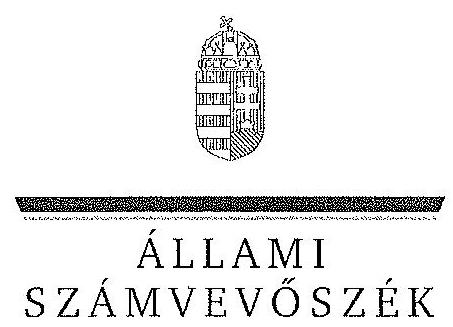
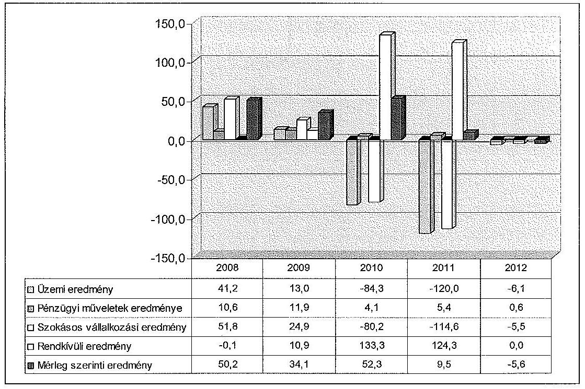
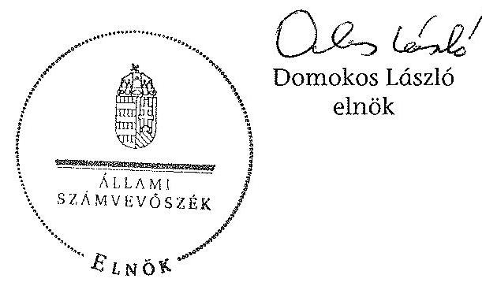
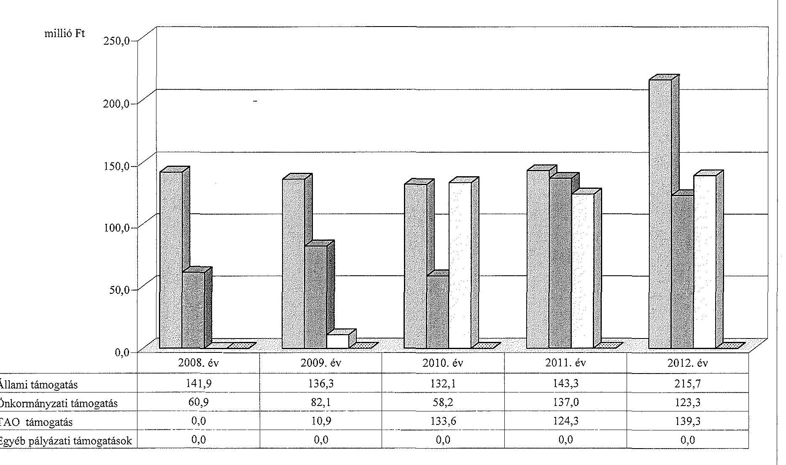
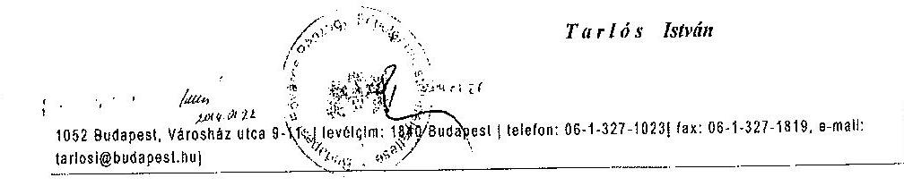
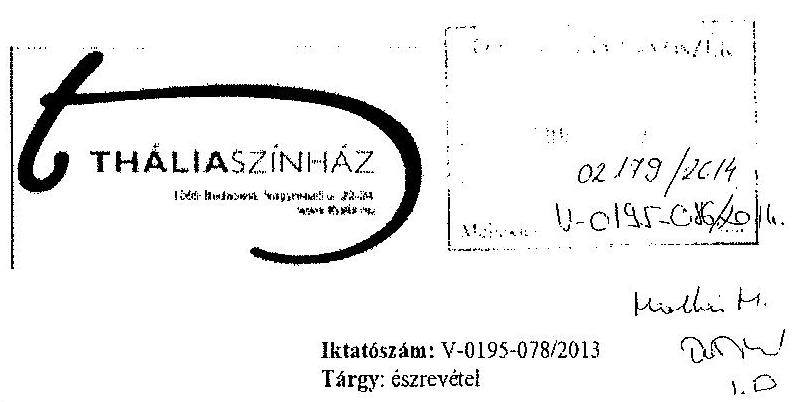
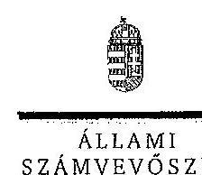
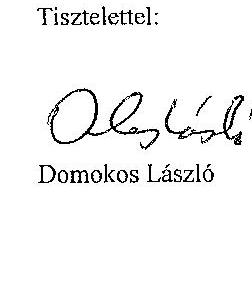
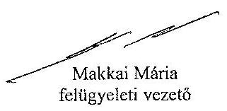

ÁLLAMI
SZÁMVEVŐSZÉK

# JELENTÉS 

az önkormányzatok többségi tulajdonában lévő gazdasági társaságok közfeladat-ellátásának ellenőrzéséről

Thália Színház Nonprofit Kft.

---

# Állami Számvevőszék 

Iktatószám: V-0195-090/2014.
Témaszám: 1159
Vizsgálat-azonosító szám: V06530213

## Az ellenőrzést felügyelte:

## Makkai Mária

felügyeleti vezető
Az ellenőrzést vezette és az ellenőrzés végrehajtásáért felelős:
Horváth József
ellenőrzésvezető
A számvevőszéki jelentés összeállításában közremüködött:
Eötvös Magdolna
számvevő tanácsos
Az ellenőrzést végezték:
Eötvös Magdolna Kéri Anna
számvevő tanácsos
külső szakértő

A témához kapcsolódó eddig készített számvevőszéki jelentések:
címe
sorszáma
Jelentés a színházak állami támogatásának és gazdálkodásának 1039 ellenőrzéséről

---

# TARTALOMJEGYZÉK 

BEVEZETÉS ..... 3
I. ÖSSZEGZŐ MEGÁLLAPÍTÁSOK, KÖVETKEZTETÉSEK, JAVASLATOK ..... 6
II. RÉSZLETES MEGÁLLAPÍTÁSOK ..... 11

1. Az Önkormányzat közfeladat-ellátásának megszervezése ..... 11
1.1. A közfeladat meghatározása, a feladat ellátásának választott módja ..... 11
1.2. Az önkormányzati és a tulajdonosi irányítás megítélése ..... 14
2. A gazdasági társaság közfeladat-ellátással kapcsolatos tevékenysége ..... 17
2.1. A gazdasági társaság szervezeti kialakítása, szabályozottsága ..... 18
2.2. A gazdasági társaság vagyonnyilvántartása ..... 20
2.3. A gazdasági évek ráfordításainak és bevételeinek alakulása ..... 21
2.4. A gazdasági társaság eredményének alakulása ..... 24
2.5. A gazdasági társaság folyamatos üzemmenetének, likviditásának biztosítása ..... 26
3. Az önkormányzat tulajdonosi jogainak és kötelezettségeinek érvényesítése ..... 28
3.1. A gazdasági társaságtól származó információk hasznosítása ..... 28
3.2. Az Önkormányzat közgyűlésének intézkedései ..... 30

## MELLÉKLETEK

1. számú A Színház szakmai tevékenységének mutatói a 2008. és a 2012. évek között
2. számú A Színház támogatása a 2008. és a 2012. évek között
3. számú A Színház vagyonának főbb adatai 2008. január 1-je és 2012. december 31-e között
4. számú Budapest Főváros Főpolgármesterének észrevétele
5. számú A Thália Színház Nonprofit Kft. ügyvezetőjének észrevétele
6. számú A Thália Színház Nonprofit Kft. ügyvezetőjének észrevételére adott válasz

## FÜGGELÉKEK

1. számú Rövidítések jegyzéke
2. számú Értelmező szótár

---

.

---

# JELENTÉS 

## az önkormányzatok többségi tulajdonában lévő gazdasági társaságok közfeladat-ellátásának ellenőrzéséről Thália Színház Nonprofit Kft.

## BEVEZETÉS

Az Önkormányzatnak közfeladata az Ötv. alapján a művészeti feladatok ellátásáról való gondoskodás, az Mötv. szerint az előadó-művészeti szervezet támogatása. Ezt az Önkormányzat az egyszemélyes tulajdonában álló gazdasági társaság támogatásával valósította meg.

Az Önkormányzat az ellenőrzött időszakban színházi koncepcióval ${ }^{1}$ rendelkezett, amely a színházak múködtetésének alternatíváit vázolta fel és jövőbeli célokat határozott meg. Ezt a Közgyűlés határozattal² elfogadta.

A koncepció nem érintette a 2001. szeptember 1. napjától 3,0 millió Ft törzstőkével megalapított ${ }^{3}$, már társaságként működő Thália Színház Kht.-t. A Thália Színház Kht. további átalakítása a gazdasági társaságokról szóló törvény módosítása miatt vált szükségessé. A Közgyűlés a Gt. előírásainak megfelelően a 379/2009. (03. 26.) számú határozatával ${ }^{4} 2009$. április 20 -ai hatállyal módosította a Társaság Alapító Okiratát és Nonprofit Kft. formában müködtette tovább az előadó-művészeti szervezetet. A Thália Színházba 2012. október 1-jétől beolvadt a korábban önállóan működő Mikroszkóp Színpad NKft.

A színházak támogatása az ellenőrzött időszakban központi költségvetési, illetve fenntartói támogatás formájában, valamint pályázatok útján valósult meg. A 2010-2012. évek költségvetési törvényei egy összegben tartalmazták az Önkormányzat fenntartásában működő színházak fenntartói ösztönző részhozzájárulását, amelyet a fenntartó saját döntése alapján oszthatott el.

[^0]
[^0]:    ${ }^{1}$ Koncepció a fővárosi fenntartású színházak struktúráját és finanszírozását érintő változásokról (2007. XI. 29.)
    ${ }^{2}$ a Főv. Kgy. 1979/2007 (11. 29.) sz. határozata
    ${ }^{3}$ a Főv. Kgy. 1144/2001.(06. 28.) sz. határozata
    ${ }^{4}$ A Főv. Kgy. a 379/2009. (III. 26.) sz. határozatában döntött a Thália Színház nonprofit korlátolt felelősségű társaságként történő tovább müködtetéséről és alapító okiratának módosításáról.

---

Az Önkormányzat a gazdasági társasággal a közfeladat-ellátásának biztosítására 2004. július 1-jétől Közszolgáltatási szerződést ${ }^{5}$, majd 2013. január 1-jei hatálybalépéssel Fenntartói megállapodást kötött. A Közszolgáltatási szerződés meghatározta a közhasznú tevékenység körét, az Önkormányzat által biztosított támogatás összegét, a feladat-ellátáshoz szükséges befektetett eszközöket, azok rendelkezésre bocsátásának módját, valamint rendelkezett a szerződő felek együttmúködésének feltételeiről.

A Thália Színház 1998 tavaszától befogadó színházként múködik. Ezen megfogalmazott státuszát úgy gyakorolja, hogy saját társulata ugyan nincs, de évente átlagosan 3-6 új darabot mutat be saját produkcióban a produkcióra szerződtetett és jellemzően általa foglalkoztatott előadó művészekkel, míg a további színházi estéken más társulatok darabjait fogadja be. A Színház fesztiválok rendezésével lehetőséget biztosít egyrészt a hazai vidéki színházaknak a fővárosi bemutatkozásra (Rivalda Fesztivál), másrészt a határon túli magyar színházak darabjainak megismertetésére a hazai közönséggel (Határon túli Magyar Színházak Szemléje).

A Színház a közfeladat-ellátása érdekében az ellenőrzött időszakban összesen 1230,8 millió Ft állami és önkormányzati múködési támogatásban részesült. Emellett a 2009-2012. évek között 408,1 millió Ft tao támogatást kapott.

A Színház fizető nézőinek száma az egyes években változóan 92-150 ezer fő, az előadások száma évi 407-647 között változott a 2008-2012. években. A Színház által foglalkoztatott dolgozók átlaglétszáma a 2008. évi 49 fôről 66 fôre emelkedett a 2012. évben.

A Színház főbb szakmai mutatószámait az 1. számú melléklet tartalmazza.
Az ellenőrzés várható eredménye: a jelentés nyilvánossága a társadalom széles körével ismerteti meg a Színház gazdálkodására vonatkozó megállapításainkat, továbbá a megállapítások alapján megfogalmazott számvevőszéki javaslatok hasznosítása elősegíti a feltárt hibák megszüntetését, az ellenőrzött szervezet jobb feladatellátását. A társadalom számára jelzi, hogy közpénz nem maradhat ellenőrizetlenül, az ÁSZ értékteremtő rend kialakításához és megőrzéséhez hozzájáruló tevékenysége pozitív hatással lesz a szervezetről kialakított összkép formálásában. A szervezeten belül lehetőség nyílik arra, hogy a megállapítások szintetizálásával az ÁSZ a hozzáadott értéket teremtő, elemző tevékenységét és tanácsadó szerepét is erősítse. A jó gyakorlatok bemutatásával az ÁSZ hozzájárul a követendő megoldások megismertetéséhez, terjesztéséhez.

[^0]
[^0]:    ${ }^{5} \mathrm{Az}$ Emtv. szerint a közszolgáltatási szerződés a közszolgáltatás nyújtására irányuló, legalább három évre szóló szerződés, amely az állam vagy az önkormányzat és a közszolgáltatást végző előadó-művészeti szervezet kapcsolatát szabályozza, tartalmazza a teljesítendő előadásszámot, a szolgáltatás nyújtásának időtartamát, helyét és a teljesítésért járó díjazást.

---

Az ellenőrzés célja annak értékelése volt, hogy:

- az Önkormányzat a jogszabályi előírások figyelembevételével döntött-e az ellenőrzésre kerülő közfeladat megszervezéséről, az ellátás módjáról; a tulajdonostól elvárható gondossággal felügyelte-e társaság feladatellátását; a gazdasági társaság rendelkezésére bocsátotta-e a közfeladat-ellátásához a szükséges közvagyont, és biztosította-e a tulajdonosi jogoknak a közvagyon feletti érvényesülését; a társaság vagyonvesztése esetén intézkedett-e a további vagyonvesztés megakadályozásáról;
- a gazdasági társaság teljesítette-e a tulajdonos önkormányzat részéről meghatározott célokat és feladatokat a rendelkezésre álló erőforrások felhasználásával; végrehajtotta-e a közfeladat-ellátási szerződés előírásait; betartotta-e a vagyonnal történő gazdálkodásra vonatkozó jogszabályi rendelkezéseket.

Az ellenőrzés hatóköre: az önkormányzatok közfeladat-ellátásának ellenőrzése, amely kiterjed az önkormányzatok és a közfeladatot ellátó, az önkormányzat többségi tulajdonában lévő gazdasági társaság közötti feladatmegosztásra, az önkormányzatok tulajdonosi jogainak gyakorlására, a nemzeti vagyon kezelésének ellenőrzése keretében a közfeladat-ellátáshoz rendelt vagyonra és a vagyont érintő szerződésekre. A jelen ellenőrzés kiterjed az önkormányzatok többségi tulajdonlásával működő gazdasági társaságok közfeladatellátására, vagyongazdálkodási tevékenységére, a kapcsolódó nyilvántartások, elszámolások szabályszerűségére és megbízhatóságára. Az ellenőrzött tételek kiválasztása véletlen mintavétellel történt.

Az ellenőrzés típusa: szabályszerűségi ellenőrzés.
Az ellenőrzött időszak: a 2008-2012. évek, valamint a helyszíni ellenőrzés befejezéséig - 2013. szeptember 27-ig - bekövetkezett változások figyelemmel kísérése.

Ellenőrzött szervezet: a Thália Színház Nonprofit Kft., valamint Budapest Főváros Önkormányzata.

Az ellenőrzés végrehajtásának jogszabályi alapját az ÁSZ tv. 5. § (3)-(5) bekezdéseiben foglaltak képezik.

Az ÁSZ a 2011. évi LXVI. törvény 29. §-a szerint a jelentéstervezetet megküldte Budapest Főváros Önkormányzata főpolgármesterének és a Thália Színház Nonprofit Kft. ügyvezető igazgatójának egyeztetésre. A beérkezett észrevételeket és az azokra adott választ a jelentés 4 -6. számú mellékletei tartalmazzák.

---

# 1. ÖSSZEGZŐ MEGÁLLAPÍTÁSOK, KÖVETKEZTETÉSEK, JAVASLATOK 

Az Önkormányzat a művészeti feladatok ellátásáról való gondoskodásnak, illetve az előadó-művészeti szervezet támogatásának, mint az Ötv.-ben és az Mötv.-ben meghatározott közfeladatának, az ellenőrzött időszak alatt eleget tett. Az Önkormányzat a közfeladat-ellátását a gazdasági társaság támogatásával biztosította. A Közgyűlés tulajdonosi jogait az ellenőrzött időszakban a szabályzataiban és rendeleteiben foglaltak szerint gyakorolta.

Az Önkormányzat a 2004. január 1-jétől hatályos Közszolgáltatási szerződés ${ }_{1-}$ nek megfelelően a Társaság rendelkezésére bocsátotta, haszonkölcsönbe adta az előadó-művészeti közfeladat-ellátásához szükséges ingó és ingatlan vagyont. Az átadott befektetett eszközök nettó értéke 2008. december 31 -én 1609,0 millió Ft volt.

Az Önkormányzat a közfeladat-ellátásának tárgyi és pénzügyi feltételeit a Közszolgáltatási szerződés ${ }_{1-6}$-ban határozta meg. A Színház részére a közfeladatellátáshoz szükséges forrás biztosításáról a Közszolgáltatási szerződés ${ }_{1-6}$-ban (az annak elválaszthatatlan részét képező éves költségvetési rendeletekben) döntött a Közgyűlés. Ebben meghatározta a közhasznú tevékenység körét, a szerződés megszűnésének esetére szabályozta a vagyontárgyak visszaszolgáltatásának rendjét, határidejét, továbbá a Színház által teljesítendő művészeti tevékenységek jellegét, mértékét és pontos mutatószámait. Az önkormányzati tulajdon védelme érdekében szabályozta a leltár készítését, annak gyakoriságát, továbbá a gazdálkodás és a művészeti tevékenység ellátásával összefüggő kötelező adatszolgáltatás formáját, idejét és módját, valamint előírta a gazdálkodás körében felmerülő rendkívüli eseményekről történő tájékoztatási kötelezettséget.

A leltározásra vonatkozó előírások a társasággá alakulást követően az Önkormányzat Vagyonrendeleteiben nem a hatályos jogszabályoknak megfelelően szerepeltek, mivel az üzemeltetésre, kezelésre átadott eszközök leltározási szabályairól a Vagyonrendelet ${ }_{1,2}$ az Áhsz., 2010. január 1-jétől hatályos előírásaival ellentétben nem tartalmazott szabályozást.

Az Önkormányzat a vagyon védelme érdekében a Közszolgáltatási szerződésben garanciális követelményként fogalmazta meg a kötelezettségek megszegésének jogkövetkezményét, valamint a szerződés megszűnésének esetére az átadott vagyontárgyak visszaszolgáltatási kötelezettségét. Az ellenőrzött időszakban kötelezettség megszegésére, illetve szerződés megszűntetésére nem került sor.

A Közgyűlés a Színház Alapító Okirat ${ }_{1}$-ben - a Gt. előírásaival összhangban szabályozta az Alapító tulajdonosi joggyakorlásának kereteit. Az Alapító Ok-irat ${ }_{1}$-nek megfelelően a Színház legfőbb szerve, a Közgyűlés kizárólagos hatáskörében jóváhagyta a Színház SZMSZ ${ }_{2}$-t. A Társaság SZMSZ ${ }_{2}$-jét ezt követően a jogszabályi és szervezeti változások ellenére nem aktualizálták. Az FB ügyrendjét 2011. november 30 -án fogadta el az Önkormányzat.

---

A 2010. évben a Színház FB elnökét a Közgyűlés közvetlenül választotta ${ }^{6}$. Az eljárás ellentétes volt a Gt. előírásával, amely szerint - ha törvény vagy a társasági szerződés ettől eltérően nem rendelkezik - az FB a tagjai sorából választ elnököt.

A Közgyűlés a társaság ügyvezetőjének és egyéb vezető állású dolgozóinak, valamint az FB tagoknak díjazására vonatkozó Javadalmazási szabályzat ${ }_{1}$-et a Taktv.-ben foglalt határidőn túl, 2010. január 31. helyett 2010. április 29-én fogadta el.

Az Önkormányzat a Színház beszámolójának és üzleti tervének elfogadását, az adatszolgáltatási kötelezettség ellenőrzését a jogszabályokban, az Önkormányzat belső szabályzataiban és a Közszolgáltatási szerződés ${ }_{1-6}$-ban foglaltaknak megfelelően, határidőn belül - az FB határozatok és a könyvvizsgálói jelentés figyelembe vételével - végezte el.

A Színház szakmai tevékenységének ellátását az Önkormányzat évadbeszámolók alapján értékelte. A Színház az ellenőrzött időszak minden évében elkészítette a szakmai értékelését, amelyet 2008 és 2010 között az Önkormányzat Kulturális Bizottsága elfogadott. A 2011. és a 2012. évekre benyújtott évadbeszámolókról a kulturális ügyekért felelős Főpolgármester-helyettes Tájékoztatót nyújtott be a Közgyűlés részére, amelyet a Közgyűlés tudomásul vett.

2008 és 2010 között a prémiumfeladatok kitűzésének jóváhagyása a Javadalmazási szabályzat ${ }_{1}$-ben foglaltaknak megfelelően történt. A 2011. évre nem határoztak meg prémiumfeltételeket, és nem fizettek ki prémiumot az év végén távozó ügyvezető részére. A 2012. évre vonatkozóan a Színház ügyvezetője részére a prémiumfeladatokat a Javadalmazási szabályzat ${ }_{2}$-ban foglaltaktól eltérően - késedelmesen - az üzleti terv elfogadását követően határozta meg az Alapító.

Az Önkormányzat belső ellenőrzése a Színháznál a 2011. évben végzett átfogó ellenőrzést a 2007-2010. évek vonatkozásában. Az ellenőrzés hiányosságokat állapított meg a szervezet gazdálkodásának belső szabályozottságával kapcsolatban. Az ellenőrzés megállapításaira a Színház Intézkedési tervet készített, melyet a tulajdonos elfogadott.

A Színház 2008 és 2012 közötti gazdálkodása, valamint mérleg szerinti nyeresége nem tette szükségessé, hogy a tulajdonos Önkormányzat a vagyon és a közpénzek nem célszerinti hasznosításával összefüggésben, valamint a lejárt kötelezettségek csökkentése érdekében tulajdonosi intézkedéseket tegyen.

A Színház teljesítette az Önkormányzat részéről a Közszolgáltatási szerződés ${ }_{1-6}{ }^{-}$ ban meghatározott célokat és feladatokat, folyamatosan biztosította a tevékenységi körébe tartozó színházi szolgáltatást.

A Színház rendelkezett Alapító Okirat ${ }_{1-10}$-el, és az irányítási, döntési és felelősségi jogköröket tartalmazó belső szabályzatokkal.

[^0]
[^0]:    ${ }^{6}$ a Főv. Kgy. 2044/2010.(10. 27.) számú határozata alapján

---

A vagyonnal történő gazdálkodásra vonatkozó jogszabályi rendelkezéseket a Számviteli politika ${ }_{1}$ valamint az önköltségszámítás szabályozása és végrehajtása, továbbá a gazdasági események bizonylatkezelése területeken nem tartották be teljes körűen. A belső szabályozás hiányosságai a Színház integritásával kapcsolatban kockázatot jelentettek.

A Színház elkészítette az Önköltségszámítási szabályzat ${ }_{1,4}$-et, azonban azokban nem tért ki a társulat bérének és járulékainak legalább a produkció színreviteléig történő felosztási módjára. Ennek következtében a produkciók színreviteléig aktivált szellemi termékek nem a ténylegesen felmerült közvetlen költségek alapján kerültek elszámolásra. Továbbá az önköltségszámítási szabályzat nem tartalmazta az általános költségeknek a felosztási módját.

A Színház az Önkormányzat tulajdonában álló, átvett eszközöket - a Számv. tv. előírásaival ellentétben - nem mutatta ki számviteli nyilvántartásában a nullás számlaosztályban.

Az anyagjellegú ráfordításoknál és felújításoknál a bizonylatok tartalmi és formai kellékeire vonatkozó előírásokat nem tartották be, a szakmai teljesítésigazolás, utalványozás hiányos volt, a könyvelési ellenőr nem ellenőrizte a bizonylatokat.

A bizonylatok megőrzésére vonatkozóan megsértették a Számv. tv. előírásait, mivel a 2009. évben a Régi stúdió rekonstrukció kifizetéseit alátámasztó bizonylatok nem voltak teljes körűen fellelhetőek.

A Színház az Önkormányzattól haszonkölcsönbe kapott eszközök vonatkozásában a Közszolgáltatási szerződés ${ }_{1-6}$-ban előírt évenkénti leltározási kötelezettségének nem tett eleget, a Leltározási szabályzata ${ }_{12}$ értelmében tényleges leltárfelvételt két évenként végzett.

A Színház közfeladatai ellátásához biztosított - saját és Önkormányzati tulajdonú - eszközök 2012. december 31-ei nettó értéke (2083,3 millió Ft) a 2008. december 31-ei adathoz viszonyítva 6,9\%-kal nőtt.

A Színház összes ráfordítása a 2008. évről a 2012. évre 61,8\%-kal 971,8 millió Ft-ra növekedett, miközben a saját bevételei a 2008. évről a 2012. évre mindössze $15,0 \%$-kal, 465,2 millió Ft-ra emelkedtek.

A Színház összes ráfordításának 59,3\%-a anyagjellegủ ráfordítás volt. Az anyagjellegű ráfordítások $60,5 \%$-kal ( 130,8 millió Ft-tal), a személyi jellegű ráfordítások kis mértékben, $2,4 \%$-kal, 4,8 millió Ft-tal növekedtek, miközben a létszám $34,7 \%$-kal ( 17 fővel) emelkedett.

A Színház az értékcsökkenési leírást a Tao tv. szerinti leírási kulcsokkal számolta el. Az elszámolt értékcsökkenés évenkénti alakulását az éves beszámolók kiegészítő mellékletében részletesen bemutatta.

A Színház az ellenőrzött években elkészítette üzleti tervét. A tényleges ráfordítások és bevételek - az egyes években változó mértében és irányban - eltértek a tervezettől. Az eltérést a beszámolóban nem indokolták. A Színház mérleg szerinti eredménye az ellenőrzött időszak utolsó évében negatív, a 2008-2011.

---

években pozitív volt. A 2008. évben 50,2 millió Ft, a 2009. évben 34,1 millió Ft, a 2010. évben 52,3 millió Ft, a 2011. évben 9,5 millió Ft, a 2012. évben $-5,6$ millió Ft volt.

A Színháznak az ellenőrzött időszakban átmeneti pénzintézeti finanszírozásra nem volt szüksége. Fizetési kötelezettségeit határidőn belül tudta teljesíteni, köztartozásai nem keletkeztek, likviditását folyamatosan biztosította.

A Színház rövid lejáratú bankbetétek formájában kötötte le az átmenetileg szabad pénzeszközeit. A Színház befektetési tevékenységet nem végzett, így befektetési szabályzatot nem kellett készítenie.

A Színház a tulajdonos részére az ellenőrzött időszakban minden évben az anyagi lehetőségeit figyelembe véve készítette el felújítási, fejlesztési tervét. A Színház az Önkormányzattól a 2007. évben 26,5 millió Ft fejlesztési célú támogatást kapott, amivel a 2009. évben határidőben számolt el. Saját forrásból összesen 256,7 millió Ft értékű fejlesztést valósítottak meg az ellenőrzési időszakban.

Az Állami Számvevőszékről szóló 2011. évi LXVI. törvény 33. § (1) bekezdésében foglaltak értelmében a jelentésben foglalt megállapításokhoz kapcsolódó intézkedési tervet köteles az ellenőrzött szervezet vezetője összeállítani, és azt a jelentés kézhezvételétől számított 30 napon belül az ÁSZ részére megküldeni. Amennyiben az intézkedési tervet határidőben nem küldi meg a szervezet, vagy az nem elfogadható, az ÁSZ elnöke a hivatkozott törvény 33. § (3) bekezdés a)-b) pontjaiban foglaltakat érvényesítheti.

Az ellenőrzés intézkedést igénylő megállapításai és javaslatai:

# Budapest Főváros Főjegyzöjének 

A leltározásra vonatkozó előírások a társasággá alakulást követően az Önkormányzat Vagyonrendeleteiben nem a hatályos jogszabályoknak megfelelően szerepeltek, mivel az üzemeltetésre, kezelésre átadott eszközök leltározási szabályairól a Vagyonrendelet ${ }_{2}$ 2010. január 1-jétől az Áhsz. ${ }_{1}$ előírásaival ellentétben nem tartalmazott szabályozást.

Javaslat:
Készítse elő a Közgyűlés elé való terjesztés érdekében a Vagyonrendelet ${ }_{2}$ módosítását, hogy az tartalmazza az Áhsz. ${ }_{3}$ 22. § (2) bekezdésben előírtaknak megfelelően az üzemeltetésre, kezelésre átadott eszközök leltározási szabályait.

---

# A Thália Színház igazgatója számára 

1. A Színház elkészítette az Önköltségszámítási szabályzat ${ }_{1,4}$-et, azonban azokban nem tért ki a társulat bérének és járulékainak legalább a produkció színreviteléig történő felosztási módjára. Ennek következtében a produkciók színreviteléig aktivált szellemi termékek nem a ténylegesen felmerült közvetlen költségek alapján kerültek elszámolásra. Továbbá az önköltségszámítási szabályzat nem tartalmazta az általános költségeknek a felosztási módját.

Javaslat:
Intézkedjen az Önköltségszámítási szabályzat módosításáról annak érdekében, hogy
a) a produkció bemutatásáig elszámolt közvetlen költségek tartalmazzák a társulat bérének és járulékainak a produkcióra felosztott költségeit;
b) a szabályzat tartalmazza az általános költségeknek a felosztási módját.
2. A Színház a Fővárosi Önkormányzat tulajdonában álló, átvett eszközöket a 0 -ás számlaosztályban nem tartotta nyilván. Ezzel a Színház nem tett eleget a Számv. tv. 160. § (5) bekezdésében foglaltaknak.

Javaslat:
Intézkedjen a Fővárosi Önkormányzat tulajdonában álló, átvett eszközök 0 -ás számlaosztályban történő nyilvántartásáról.
3. Az anyag jellegű ráfordításoknál és felújításoknál a bizonylatok tartalmi és formai kellékeire vonatkozó előírásokat nem teljes körűen tartották be, a szakmai teljesítésigazolás, utalványozás a gyakorlatban nem minden esetben felelt meg a Számv. tv. 167. § (1) bekezdés c), h) és i) pontjában foglaltaknak. Az ellenőrzött időszakban, a mintában szereplő és ellenőrzött 20 bizonylatnál 9 esetben hiányzott a teljesítést igazoló, 2 esetben az utalványozó aláírása. A könyvelési ellenőr a bizonylatot egy esetben sem ellenőrizte.

Javaslat:
Intézkedjen a Számv. tv. bizonylati elvre és bizonylati fegyelemre, ezen belül a számviteli bizonylat alaki és tartalmi kellékeire vonatkozó előírásainak betartásáról.

---

# II. RÉSZLETES MEGÁLLAPÍTÁSOK 

## 1. Az ÖNKORMÁNYZAT KÖZFELADAT-ELLÁTÁSÁNAK MEGSZERVEZÉSE

### 1.1. A közfeladat meghatározása, a feladat ellátásának választott módja

Az Önkormányzat a művészeti feladatok ellátásáról való gondoskodásnak, illetve az előadó-múvészeti szervezet támogatásának, mint az Ötv.-ben és az Mötv.-ben meghatározott közfeladatának, az ellenőrzött időszak alatt eleget tett. Az Önkormányzat a közfeladat ellátását a Színház támogatásával biztosította.

Az Önkormányzat kötelező közfeladata az Ötv. 63/A. § n) pontja szerint a művészeti feladatok ellátása ${ }^{7}$. A Htv. 111. § alapján a közművelődési, közgyűjteményi és művészeti tevékenységekkel kapcsolatos helyi irányítási, ellenőrzési, valamint a fenntartással és múködtetéssel kapcsolatos feladatokat a Közgyűlés látja el. A kulturális feladat ellátását az Önkormányzat az Emtv. 3. § (2) bekezdése alapján előadó-múvészeti szervezet (gazdasági társaság) támogatásával valósította meg.

Az Önkormányzat az ellenőrzött időszakban elfogadott kulturális koncepcióval ${ }^{8}$ rendelkezett, amelyet a Közgyűlés ${ }^{9}$ a határozatával fogadott el.

A koncepció a színházak múködtetésének módozatait vázolta fel, jövőbeli célokat határozott meg, nem vizsgálta azonban a megvalósításhoz szükséges források nagyságát. A kulturális koncepció a Thália Színház múködésében nem okozott lényeges változást.

A 2010. évi önkormányzati választásokat követően az Ötv. 91. § (6) bekezdésének megfelelően a Közgyűlés ${ }^{10}$ elfogadta az Önkormányzat 2011-2014. évekre vonatkozó Gazdasági Programját. ${ }^{11}$

Az Önkormányzat a Thália Színházat 2001. szeptember 1-jétől közhasznú társaságként, 2009. április 20-tól ${ }^{12}$ Thália Színház Nkft. formában múködtette. A

[^0]
[^0]:    ${ }^{7}$ A 2013. január 1-jétől hatályos Mötv. 13. § (1) 7. pont is kötelezően ellátandó feladatként határozza meg az előadó-művészeti szervezetek támogatását.
    ${ }^{8}$ Koncepció a fővárosi fenntartású színházak struktúráját és finanszírozását érintő változásokról
    ${ }^{9}$ Főv. Kgy. 1979/2007.(11. 29.) sz. határozat
    ${ }^{10}$ Főv. Kgy. 937/2011.(04. 27.) sz. határozat
    ${ }^{11}$ A Főváros fejlesztésének és gazdálkodásának stabilizálása és reformkoncepciója a 2011-2014. évi választási ciklusra
    ${ }^{12}$ a Főv. Kgy. 379/2009. (03. 26.) számú határozata alapján

---

Thália Színházba 2012. október 1-jétől beolvadt a korábban önállóan működő Mikroszkóp Színpad NKft.

A Közgyűlés a 718. és a 719/2012. (04. 25.) számú határozatában döntött a két társaság egyesüléséről. A Közgyűlés 1288/2012. (06. 20.) számú határozata alapján a Mikroszkóp Színpad NKft. beolvadt a Thália Színház NKft.-be és jogutódlással megszűnt. A Közgyűlés - a fenti határozata keretében - elfogadta a Thália Színház NKft. mint átvevő Társaság független könyvvizsgáló által ellenőrzött va-gyonmérleg- és vagyonleltár-tervezetét, valamint jóváhagyta a Thália Színház NKft. Alapító Okirata ${ }_{10}$ módosítását.

Az Önkormányzat a Társaság Alapító Okirat ${ }_{1-10}$-ben - a Gt. előírásaival összhangban - szabályozta az Alapító tulajdonosi joggyakorlásának kereteit. Az Alapító Okirat ${ }_{1-10}$ megfelelően rendelkezett a Társaság gazdálkodása során elért eredmény felhasználásáról, az ügyvezető, az FB tagok, a könyvvizsgáló kijelöléséről, az összeférhetetlenségi szabályokról, valamint az Áht. ${ }_{1} 100 /$ N. § (8) előírásainak betartatásáról.

Az Önkormányzat a Thália Színház teljesítményével kapcsolatosan konkrét célokat, elvárásokat a Közszolgáltatási szerződés ${ }_{1-6}$-ban fogalmazott meg. Az Emtv. hatálybalépésével ${ }^{13}$ a tevékenység ellátására vonatkozó követelmények és feladatmutatók a törvény szerint kerültek meghatározásra, a Színháznak a II. besorolási kategóriához előírt feltételeket ${ }^{14}$ kellett teljesítenie.

Az Önkormányzat szakmai elvárásait az igazgatói pályázat kiírásában szerepeltette, a megválasztott igazgató pályázata a stratégiai céljait, valamint konkrét szakmai elképzeléseit foglalta össze.

Az Önkormányzat a közfeladat-ellátása érdekében 2011. augusztus 31-éig a Színház részére az Alapító Okirat ${ }_{1-8}$-ban foglaltaknak megfelelően ingyenesen rendelkezésére bocsátotta - haszonkölcsönbe adta - az előadó-művészeti köz-feladat-ellátáshoz szükséges ingó és ingatlan vagyont. A 2008. évben a haszonkölcsönbe adott eszközök nettó értéke 1609,0 millió Ft volt.

A Nvtv. 3. § alapján az ellenőrzött Színház átlátható szervezet.
Az Önkormányzat tulajdonában álló vagyon a nemzeti vagyon részét képezi. A Vagyonrendelet ${ }_{2}$ 6. § (1) bekezdés 6. pontja szerint a Színház használatában lévő, a feladatellátást szolgáló ingatlanvagyon korlátozottan forgalomképes törzsvagyon. Az átadott ingatlanvagyont, valamint a Színház törzstőkéjét az ellenőrzött időszakban az Önkormányzat által évente elkészített Vagyonkimutatás beazonosítható módon tartalmazta.

Az Önkormányzat közfeladat-ellátásának tárgyi és pénzügyi feltételeit a Közszolgáltatási szerződés ${ }_{1-6}$-ban határozta meg. A Közszolgáltatási szerződés ${ }_{1-6}$ tartalmazta a közhasznú tevékenység körét, a szerződés megszűnésének esetére

[^0]
[^0]:    ${ }^{13}$ Az Emtv. 2009. március 1-jén lépett hatályba.
    ${ }^{14}$ Az Emtv 10 § (2) bekezdés b) pontja úgy rendelkezett, hogy II. kategóriába tartozónak kell besorolni azt a befogadó színházat, amely évente legalább 140 előadást tart, és az általa játszott előadások legalább 30\%-a saját előadás

---

szabályozta a vagyontárgyak visszaszolgáltatásának rendjét és határidejét, továbbá a Színház által teljesítendő művészeti tevékenységek jellegét, körét, mértékét és pontos mutatószámait. Szabályozta a kötelező leltár készítését, annak gyakoriságát, továbbá a gazdálkodás és a művészeti tevékenység ellátásával összefüggő kötelező adatszolgáltatás formáját, idejét és módját, valamint előírta a gazdálkodás körében felmerülő rendkívüli eseményekről történő tájékoztatási kötelezettséget.

A Közgyűlés 2315/2011. (08. 31.) számú határozata alapján az Önkormányzat képviseletében eljáró BFVK Zrt. és a Színház 2011. november 23-án Bérleti szerződést kötött, amely alapján az Önkormányzat tulajdonában álló ingatlanok után bérleti díjat kellett fizetni. A Közgyűlés 2439/2011. (08. 31.) számú határozatát határidőn túl hajtották végre, mivel a Főpolgármester-helyettes a Közszolgáltatási szerződés, módosítását a 2011. október 1-jei határidőt követően írta alá. A Közszolgáltatási szerződés ${ }_{6}$ 2011. november 25 -ei módosításával a közfeladat-ellátáshoz szükséges ingatlanokat visszamenőlegesen, 2011. szeptember 1-jétől a Színház ingyenesen nem használhatta.

A Színháznak a Bérleti szerződés aláírását megelőző időszakra használati díjat, azt követően bérleti díjat ( 11,40 millió Ft/hó+áfa), valamint a bérleti díj összegét alapul véve egyszeri 3 havi megszerzési díjat és 5 havi óvadékot kellett fizetnie. A 2011. évre vonatkozóan óvadékként, megszerzési díjként és használati díjként összesen egy évi bérleti díjnak megfelelő összeg került kifizetésre. A Bérleti szerződés 8 ingatlanra vonatkozott.

A felek 2012-ben a Bérleti szerződés 2. pontját kiegészítették azzal, hogy az Önkormányzat az óvadék összegét „a bérleti szerződés időtartama alatt a kielégítési jog megnyílta előtt használhatja és rendelkezhet vele." Az óvadék összegének fedezete az Önkormányzat részéről tett nyilatkozat ${ }^{15}$ alapján folyamatosan rendelkezésre állt.

A színházak támogatása az ellenőrzött időszakban központi költségvetési, illetve fenntartói támogatással, valamint pályázatok útján valósult meg. Az Önkormányzat a saját tulajdonosi támogatás színházak közötti elosztásának elveit, szempontjait szabályzatban, belső utasításban nem határozta meg, annak mértékét, nagyságrendjét a teljes támogatás összegéhez igazította.

A 2010. évtől az Emtv. 16. § (1) bekezdése ${ }^{16}$ szerint a színházak támogatása művészeti ösztönző részhozzájárulásból és fenntartói ösztönző részhozzájárulásból tevődött össze. A 2010-2012. években a költségvetési törvények 7. sz. melléklete egy összegben tartalmazta az Önkormányzat fenntartásában múködő színházak fenntartói ösztönző részhozzájárulását, amelyet a fenntartó saját döntése alapján oszthatott el. A költségvetési törvények a színházak művészeti ösztönző részhozzájárulását külön nevesítve tartalmazták. A 2013. évtől a színházakat művészeti és létesítménygazdálkodási célra működési támogatás illette meg.

Az Emtv. 48. § (1) bekezdése új elemként bevezette - a Tao tv. 4.§ 37-39. pontjai és a 7. § (1) bekezdés z) pontja alapján - a tao kedvezménnyel igénybe vehető

[^0]
[^0]:    ${ }^{15}$ A Főpolgármesteri Hivatal ellenőrzéshez kirendelt kapcsolattartója 2013. augusztus 14-én e-mail formájában adott válasza alapján.
    ${ }^{16}$ Hatályon kívül helyezve 2012. május 1-jétől.

---

támogatást, mint közvetett támogatási formát. A tao támogatás igénybevétele 2009. november 12 -től volt lehetséges, a jegybevétel meghatározott $80 \%$-áig. A tao támogatás pénzügyi teljesülése a támogatást nyújtó vállalkozások eredményességének és támogatás nyújtási hajlandóságának függvénye.

Az ellenőrzött időszakban a Színház számára biztosított működési hozzájárulás és a Tao tv. szerinti támogatás alakulását a 2. számú melléklet tartalmazza.

Az állami támogatás összege - az ellenőrzött időszak minden évében meghaladta az önkormányzati támogatás összegét. A Színház az ellenőrzött időszakban öszszesen 769,3 millió Ft állami és 461,5 millió Ft önkormányzati, valamint 408,1 millió Ft tao támogatást kapott.

Az ellenőrzött időszakban az önkormányzati vagyon megőrzése, védelme érdekében a leltározást az önkormányzati Vagyonrendelet ${ }_{1,2}$ szabályozta. A Vagyonrendelet ${ }_{1,2}$ szerint az Önkormányzat tulajdonában lévő eszközöket minden évben leltározni kell, az ettől eltérő eseteket a rendelet külön szabályozta.

A leltározásra vonatkozó előírások a társasággá alakulást követően az Önkormányzat Vagyonrendeleteiben nem a hatályos jogszabályoknak megfelelően szerepeltek, mivel az üzemeltetésre, kezelésre átadott eszközök leltározási szabályairól a Vagyonrendelet ${ }_{1,2}$ - az Áhsz. ${ }_{1}$ 2010. január 1-jétől hatályos előírásaival ellentétben - nem tartalmazott szabályozást.

A Közszolgáltatási szerződés ${ }_{1-4}$ 5.1. pontja az Önkormányzat tulajdonát képező ingó vagyonra vonatkozóan kötelező leltár készítését, illetve a szerződés 6. pont 4. bekezdése az önkormányzati vagyon nyilvántartására vonatkozó előírásoknak megfelelő adatszolgáltatási és nyilvántartási kötelezettség teljesítését írta elő a Színház számára.

A Fenntartói megállapodás 5.1. pontja a Közszolgáltatási szerződés ${ }_{1-6}$ rendelkezésével megegyezően a vagyontárgyak évenkénti, december 31-i fordulónappal történő leltárkészítési kötelezettségét írta elő, továbbá köteles a Színház azt megküldeni a tárgyévet követő év január 31-ig az Önkormányzatnak.

A Vagyonrendelet ${ }_{2}$ 14. §-a a leltározás vonatkozásában a korábbi Vagyonrendelettel azonos rendelkezéseket tartalmazott.

Az Önkormányzat a vagyona védelmére a Közszolgáltatási szerződés ${ }_{1-6}$-ban garanciális követelményként fogalmazta meg a kötelezettségek megszegésének jogkövetkezményét, és előírta a gazdálkodás körében felmerülő rendkívüli eseményekről történő tájékoztatási kötelezettséget. Az ellenőrzött időszakban kötelezettség megszegésére, illetve a szerződés megszűntetésére nem került sor.

# 1.2. Az önkormányzati és a tulajdonosi irányítás megítélése 

A Thália Színház esetében a tulajdonosi jogok gyakorlásának rendjét a gazdasági társaságokra és a közhasznú szervezetekre vonatkozó jogszabályok és az Önkormányzat rendeletei határozták meg.

A Közgyűlés a tulajdonosi jogait az ellenőrzött időszakban a szabályzataiban és rendeleteiben foglaltak szerint gyakorolta.

---

Az Önkormányzat SZMSZ ${ }_{1,2}$-jében és a Vagyonrendelet ${ }_{1,2}$-ben szabályozta az egyszemélyes tulajdonában lévő gazdasági társaságokkal kapcsolatos tulajdonosi joggyakorlás feladatait, annak módját és a hatáskörök gyakorlásának rendjét.

Az Önkormányzat SZMSZ ${ }_{1}$ 49. § (1) bekezdése alapján a 2008. és a 2010. évek között létrehozta állandó bizottságként a Kulturális Bizottságot. Ezen időszakban a Közgyűlés e bizottságra ruházta át az Önkormányzat SZMSZ ${ }_{1} 5$. számú mellékletében szereplő feladatok ellátását.

Az egyszemélyes Társaság legfőbb szervének hatáskörébe tartozó (az FB tagjainak, valamint az ügyvezetőnek, továbbá a könyvvizsgálónak a megválasztása, visszahívása, megbízása, megbízásának visszavonása) jogok gyakorlását a 2011. május 25 -e és 2011 . november 10-e közötti időszakban az Önkormányzat eltérően szabályozta a 2011. év előtt, illetve a 2011-ben gazdasági társasággá alakított színházak esetében.

A 2011. év előtt alapított társaságok esetében 2011. január 1-jétől a Vagyonrendelet ${ }_{1}$ 52. § (2) bekezdése alapján a fenti jogokat a Főpolgármester közvetlenül gyakorolta. A 2011. május 25 -én alapított színház gazdasági társaságok esetében 2011. november 9-éig a fenti tulajdonosi jogok gyakorlására kizárólag a Közgyűlés volt jogosult. Az eltérő szabályozás oka az volt, hogy a Közgyűlés a Vagyonrendelet ${ }_{1} 5$. számú mellékletét nem az alapítással egy időben módosította.

Az Önkormányzat a Vagyonrendelet ${ }_{2}$ 56. § (2) bekezdés a) pontjának 2012. március 16 -ai hatálybalépésétől 2013. március 18 -áig a Vagyonrendelet ${ }_{2}$ 5. sz. mellékletében szereplő színház gazdasági társaság esetében a társaság legfőbb szervének a törvény által hatáskörébe tartozó (az FB tagjainak, a társaság könyvvizsgálójának megválasztása, visszahívása, díjazásának megállapítása valamint (2) bekezdése b) pontja alapján az ügyvezető megválasztása, kinevezése és díjazásának megállapítása) jogait a Főpolgármester közvetlenül, egy személyben gyakorolta.
2013. március 19-től a Vagyonrendelet ${ }_{2}$ 56. § (2) bekezdés a) pontja szerint a Közgyűlés hatáskörébe tartozik a Főpolgármester előterjesztése alapján az FB tagjainak, a társaság könyvvizsgálójának megválasztása, visszahívása, díjazásának megállapítása, valamint a (2) bekezdés b) pontja alapján az ügyvezetőnek a megválasztása, kinevezése és díjazásának megállapítása.

Az Önkormányzat az Alapító Okirat ${ }_{1-10}$ VII. pontjában a Gt. előírásaival összhangban szabályozta az Alapító tulajdonosi joggyakorlásának kereteit. A köztulajdon védelmének érdekében, a Gt. 33. § (1) bekezdés c) pontja előírásnak megfelelően gondoskodott az FB létrehozásáról. A Taktv. 4. § (2) bekezdésének megfelelően a társasági törzstőke összegéhez igazodva 3 főben határozta meg az FB létszámát.

A Közgyűlés a tulajdonos érdekeinek védelmére határozatokban kijelölte a Színház FB tagjait és könyvvizsgálóját, és a Gt. 34. § (4) bekezdése alapján jóváhagyta az FB ügyrendjét. Az Önkormányzat az FB tagokkal szembeni szakmai kritériumokat szabályozásban nem határozott meg.

Az ellenőrzött időszakban a Gt. 141. § (2) bekezdés k) pontjában foglalt jogkörében a Fővárosi Közgyűlés a 2044/2010. (10. 27.) számú határozatával vissza-

---

hívta az FB tagjait, és egyidejűleg megválasztotta az új FB tagokat, illetve döntött az FB elnök személyéről is. Az Önkormányzat által alkalmazott eljárást a Gt. 34. § (2) bekezdése - a társasági szerződés (alapító okirat) eltérő rendelkezésének hiányában - az FB tagok jogköreként határozta meg.

A Thália Színház Alapító Okirat ${ }_{2}$ VIII. fejezet C.5. pontja, FB tagokra vonatkozó előirása nem tartalmazott az FB elnök megválasztásával összefüggésben „az Alapító eltérő rendelkezésére" utaló kitételt. Ennek következtében az FB elnök Alapító által történő megválasztása nem a jogszabályi előírásnak megfelelően történt.

Az Önkormányzat a Színház üzleti tervének elfogadását, beszámoltatását, az adatszolgáltatási kötelezettség ellenőrzését a jogszabályokban, az Önkormányzat belső szabályzataiban és a Közszolgáltatási szerződés ${ }_{1.6}$-ban foglaltaknak megfelelően, határidőn belül - az FB határozat és a könyvvizsgálói jelentés figyelembe vételével - végezte el. Az éves beszámoló elfogadásának hatáskörét a 2009-2010. évek között a Kulturális Bizottság, a következő években a Közgyülés gyakorolta.

A Kulturális Bizottság a 145/2009. (05. 27.) és a 116/2010. (05. 27.) számú határozataival, valamint a Fővárosi Közgyűlés a 1430/2011. (05. 25.), a 993/2012. (05. 30.) és a 881/2013. (05. 29.) számú határozataival elfogadta a Színház számviteli beszámolóját, közhasznúsági jelentését, valamint a könyvvizsgáló jelentését.

A Színház az ellenőrzött időszak minden évében készített üzleti tervet, amely a Vagyonrendelet ${ }_{1,2}$-ben meghatározottak szerint az FB véleményezése alapján a jogkörgyakorló által elfogadásra került.

Az Önkormányzat részéről az üzleti tervekben a bevételek és ráfordítások bemutatatásának részletezettségére nem volt kötelező érvényű előírás. Az üzleti tervek sorai nem illeszkedtek teljes körűen sem az éves beszámoló eredménykimutatásának részletezettségéhez, sem a közhasznúsági beszámoló tartalmához.

A tulajdonosi joggyakorlás megvalósításában a 2012. évben előrelépést jelentett a monitoring tevékenység bevezetése. Ennek keretében egységes adattarta-lom- és adattábla-rendszert határoztak meg a színházak számára mind az üzleti terv, mind a beszámoló elkészítéséhez.

A Közszolgáltatási szerződés ${ }_{1-3}$ a közfeladat-ellátás tartalmát a Közhasznú tv 26 § c) pontja előírásainak figyelembevételével határozta meg, ezen túl feladatmutatókat ${ }^{17}$ írt elő. A Közszolgáltatási szerződés ${ }_{46}$ az aláírás idején hatá-

[^0]
[^0]:    ${ }^{17}$ Az Emtv. hatálybalépéséig a Kht. feladatellátását a 2008. évben érvényes közszolgáltatási szerződés az alábbiak szerint határozta meg: évadonként 100000 fő fizető nézőszám biztosítása, színházbérleti rend fenntartása, évadonként 200 előadás a nagy színházban és 30 előadás a stúdióban, évadonként 4 bemutató a nagy színházban és 2 a stúdióban.

---

lyos Emtv. előírásaival összhangban ${ }^{18}$, megfelelően szabályozta a közfeladatellátás tartalmát.

Az Önkormányzat az ellenőrzött időszakban a társaságok ügyvezetőinek és egyéb vezető beosztású munkavállalóinak javadalmazásáról a Javadalmazási szabályzat ${ }_{1-4}$-ben rendelkezett. Az Önkormányzat a Javadalmazási Szabályzat ${ }_{2}$ t a Közgyűlés 970/2010. (04. 29.) számú határozatában fogadta el, így késedelmesen, a Taktv. 9. § (1) bekezdés rendelkezésében előírt, 2010. január 31-ei határidőn túl alkotta meg a szabályozást.

A Javadalmazási szabályzat ${ }_{14}$ értelmében a prémiumfeltételeket és a prémium összegét a legfőbb szerv, illetve a munkáltatói jogok gyakorlója határozza meg, legkésőbb az éves üzleti terv elfogadásával egyidejűleg. A 2008-2010. években a Kulturális Bizottság, a további években a Közgyűlés döntött a prémiumfeltételekről, illetve azok teljesítéséről.

A Thália Színház ügyvezetőjének prémiumfeladatait a 2008-2010. évek viszonylatában a szabályzatban leírtaknak megfelelően, az üzleti tervvel egy időben fogadták el. A 2011. évre nem határoztak meg prémiumfeltételeket, és nem fizettek ki prémiumot az év végén távozó ügyvezető részére. A 2012. évre vonatkozóan a Színház ügyvezetője részére a prémiumfeladatokat a szabályzatban foglaltaktól eltérően - késedelmesen - az üzleti terv elfogadását követően határozta meg az Alapító.

A 2012. évben az üzleti tervet a Közgyűlés a 2012. május 25 -ei ülésén ${ }^{19}$ fogadta el, a prémiumfeltételeket 2012. július 13 -án hagyták jóvá. A késedelem következtében a prémium-célkitűzés csak részben tudta betölteni teljesítményösztönző szerepét.

Az ellenőrzött időszakban a 2008-2010. évekre a tervezett prémiumok 100\%-át, a 2012. évre a tervezett kifizetés $70,0 \%$-át hagyták jóvá, mert a Színháznál nem teljesült a kitűzött feladatok közül az adózás előtti eredmény növelése.

A Színház 2012. január 1-jétől kinevezett ügyvezető igazgatóját az Emtv. 3943. §-ai előírásainak megfelelően, pályáztatás útján választották ki.

# 2. A GAZDASÁGI TÁRSASÁG KÖZFELADAT-ELLÁTÁSSAL KAPCSOLATOS TEVÉKENYSÉGE 

A Színház teljesítette az Önkormányzat részéről a Közszolgáltatási szerződés ${ }_{1-6}{ }^{-}$ ban meghatározott célokat és feladatokat. A költségvetési törvények alapján mint II. kategóriába sorolt színház - művészeti és fenntartói ösztönző részhozzájárulásban, valamint az Önkormányzat döntése szerint fenntartói támoga-

[^0]
[^0]:    ${ }^{18}$ Az Emtv. 13. § (2) bekezdése szerint a közszolgáltatási szerződés a közszolgáltatás nyújtására irányuló, legalább három évre szóló szerződés, amely az állam vagy az önkormányzat és a közszolgáltatást végző előadó-művészeti szervezet kapcsolatát szabályozza, tartalmazza a teljesítendő előadásszámot, a szolgáltatás nyújtásának időtartamát, helyét és a teljesítésért járó díjazást.
    ${ }^{19}$ a Főv. Kgy. 1430/2011. (05. 25.) határozata alapján

---

tásban részesült. Az ellenőrzött években - a 2012. év kivételével - a Színház pozitív mérleg szerinti eredményt realizált, likviditása folyamatosan biztosított volt, a közfeladat-ellátás megvalósításához szükséges pénzügyi tartalékok (eredménytartalék) évről évre növekedtek.

# 2.1. A gazdasági társaság szervezeti kialakítása, szabályozottsága 

A Színház szervezeti formája megfelelt a közfeladat-ellátás Ötv. 9. § (4) bekezdésében foglalt követelménynek ${ }^{20}$. A Gt. 365. § (3) bekezdésében foglalt kötelező átalakítást a Közgyűlés 379/2009. (03. 26.) határozata alapján az Önkormányzat végrehajtotta, a Kht.-t Nonprofit Kft.-vé alakította át.

Az Alapító Okirat ${ }_{1-10}$-ben - a Közhasznú tv. figyelembevételével - meghatározott célok, feladatok, az alaptevékenység, a kapcsolódó vállalkozási tevékenység, valamint a Társaság szervezete, a Társaság vezető - alapító - szerve, ügyvezető és ellenőrzó szerveinek (FB, könyvvizsgáló) rendszere nem változott. A Színház szervezete a Nonprofit Kft.-vé alakulás miatt - a Gt. előírásainak megfelelően - nem módosult.

Az Önkormányzat a Színház Alapító Okirat ${ }_{1-10}$-ben - a Gt. előírásaival összhangban - szabályozta az Alapító tulajdonosi joggyakorlásának kereteit. Az Alapító Okirat ${ }_{1-10}$-ben a Színház legfőbb szerve, a Közgyűlés kizárólagos hatáskörébe tartozó feladatként határozta meg a Színház mindenkori SZMSZének és az FB Ügyrendjének jóváhagyását. A Színház a 2009. évi szervezeti formaváltozás következtében módosított SZMSZ ${ }_{2}$-jét az Önkormányzat 2009. október 1-jén hagyta jóvá. A Társaság SZMSZ ${ }_{2}$-jét ezt követően a jogszabályi és szervezeti változások ellenére nem aktualizálták. A Színház ügyvezetése elkészítette az SZMSZ ${ }_{3}$ tervezetét, azonban azt a 2012. évben nem terjesztették fel jóváhagyásra. Az SZMSZ ${ }_{3}$ jóváhagyása a helyszíni ellenőrzés időpontjában folyamatban volt, a tervezetet 2013. augusztus 27 -én terjesztették fel elfogadás céljából az Önkormányzat részére. A helyszíni ellenőrzés befejezésének időpontjáig az SZMSZ ${ }_{3}$ elfogadására nem került sor.

Az SZMSZ ${ }_{2}$-ben nem található meg az egyes szervezeti egységek által ellátandó feladatok konkrét meghatározása és az azok felépítéséről, tevékenységük koordinálásáról, kötelezettségeikről, felelősségeikről, valamint jogalkról való szabályozás. A döntések meghozatalának eljárásrendjét a Pénzügyi kötelezettségvállalás, utalványozás ${ }_{1-4}$-ben határozták meg.

A társasági forma átalakítása után az FB új Ügyrendjét 2011. november 30-án fogadta el az Önkormányzat. A Közgyűlés a tulajdonosi érdekeinek védelmére határozatokban jelölte ki a Társaság FB tagjait és könyvvizsgálóját.

Az FB az ellenőrzött időszakban - a kötelező beszámoló, üzleti terv, prémiumfeladat és teljesítés értékelésén, a Javadalmazási szabályzat ${ }_{2-4}$ és egyes hatáskörébe tartozó szerződések megtárgyalásán túl - ellenőrizte és véleményezte a Mikroszkóp Színpad Nkft. beolvadásának eseményeit.

[^0]
[^0]:    ${ }^{20}$ Az Önkormányzat az Ötv. 9. § (4) bekezdése szerint a közfeladat-ellátása céljából a közfeladat ellátására kötelezett társaságot alapíthat.

---

A Színház a Számv. tv. 14. § (5) bekezdésében előírtaknak megfelelően, a tulajdon védelme érdekében rendelkezett Számviteli politika ${ }_{1,2}$-vel, Leltározási szabályzat ${ }_{1,2}$-vel, továbbá az Eszközök és források értékelési szabályzat ${ }_{1}$ - gyel ${ }^{21}$, Pénzkezelési szabályzat ${ }_{1-5}$-tel, valamint az Önköltségszámítási szabályzat ${ }_{1-4}$-el. Az ellenőrzött időszakban a Színház rendelkezett Selejtezési szabályzat ${ }_{1-3}$-mal és Közbeszerzési szabályzat ${ }_{1-3}$-mal.

A Színházra jellemző gazdasági események szabályozása nem volt teljes körű. A Színház 2008-2010. években érvényes Számviteli politika ${ }_{1}$-je nem felelt meg a Számv. tv. 24. § (1) bekezdésének, mivel előírta, hogy az egyes produkciókban közvetlenül felhasználandó díszleteket, jelmezeket, kellékeket és fodrászkellékeket a Színház a beszerzési és előállítási értéktől és a használati időtől függetlenül azonnal 100\%-ban költségként, a dologi kiadások között számolja el. Ez a vagyonvédelem szempontjából kockázatot jelentett.

A Számviteli politika ${ }_{1}$ nem szabályozta a produkciók színrevitele költségeinek (szellemi termék) elszámolási rendjét, továbbá nem tért ki az értékcsökkenés elszámolásánál alkalmazható leírási kulcsokra.

A Számviteli politika ${ }_{2}$ előírta, hogy a díszleteket a tárgyi eszközök között kell nyilvántartani, és a korábban készletként nyilvántartott díszleteket a 2011. évben átsorolták a tárgyi eszközök közé. Az előadások bekerülési értékét 2008. évben nem, csak a 2009. évtől mutatták ki a szellemi termékek között. Az értékcsökkenés elszámolásánál a Tao tv. 1. és 2. számú mellékletében szereplő leírási kulcsokat alkalmazták.

A Színház elkészítette az Önköltségszámítási szabályzat ${ }_{1,4}$-et, azonban azokban nem tért ki a társulat bérének és járulékainak legalább a produkció színreviteléig történő felosztási módjára. Ennek következtében a produkciók színreviteléig aktivált szellemi termékek nem a ténylegesen felmerült közvetlen költségek alapján kerültek elszámolásra. Továbbá az önköltségszámítási szabályzat nem tartalmazta az általános költségeknek a felosztási módját.

A Számv. tv. 15. § (3) bekezdésében foglalt előírással ellentétben az egyes produkciók tényleges, valamint a produkciók színreviteléig felmerült (aktivált) költségek nem a valós értéket foglalták magukba. A tényleges utókalkulációk, a produkciók számlázott közvetlen költségein túl nem tartalmazták az alkalmazottak bérének és járulékainak, valamint az általános költségeknek adott egységre eső részét. A produkciós költségek és a jegyár megállapítása között nem volt kapcsolat.

A Színház olyan Számlarendet és Számlatükröt alakított ki, ami lehetővé tette a kívánt kimutatások, beszámolók és közhasznúsági jelentés összeállítását, amelyből az ellátott közfeladat bevételei és ráfordításai elkülönülten ellenőrizhetők.

A Leltározási szabályzat ${ }_{1,2}$ megfelelit a Számv. tv. 69. § (1)-(4) bekezdések előírásainak. A Színház Selejtezési szabályzat ${ }_{1-3}$-at, Pénzkezelési szabály-

[^0]
[^0]:    ${ }^{21}$ Az Eszközök és Források értékelési szabályait a 2008. október 10-től hatályos Számviteli politika tartalmazta.

---

zat $_{1-5}$-öt és Közbeszerzési szabályzat ${ }_{1-3}$-at a vonatkozó jogszabályi előírásoknak megfelelően készítették el.

A Színház a 2010-2012. években a Fenntartó, a tulajdonos tájékoztatásának rendjét szabályzatban nem írta elő. A Színház az Önkormányzat felé történő tájékoztatási kötelezettségének beszámoló jelentések, kimutatások, és adatközlők formájában - az Önkormányzat által kért gyakorisággal ${ }^{22}$, illetve a jogszabályi előírások figyelembevételével - eleget tett.

# 2.2. A gazdasági társaság vagyonnyilvántartása 

Az Önkormányzat a közfeladat ellátásának biztosítása érdekében a szükséges eszközöket a Színház rendelkezésére bocsátotta.

A Színház nem tett eleget a Számv. tv. 160. § (5) bekezdésében foglaltaknak, mert a kezelt önkormányzati tulajdonú eszközök nyilvántartásához a nullás számlaosztályt nem alkalmazta, helyette a vagyontárgyakat a könyvviteli rendszeréhez nem közvetlenül kapcsolódó tárgyi eszköz kartonon tartotta nyilván. Ezáltal a Társaság eleget tett a Közszolgáltatási szerződés ${ }_{1}$ 6.7. pontja alapján előírtaknak, mert elkülönítette a tulajdonában lévő vagyonelemek nyilvántartását az önkormányzati eszközöktől.

Az Önkormányzat tulajdonában álló, a Színháznak használatra átadott ingatlanok nettó értéke 2008. december 31 -én 1609,0 millió Ft volt, a gépek, berendezések, felszerelések teljesen leírt eszközök voltak, ezért nettó értékük nulla Ft volt. 2012. év december 31-én az ingatlanok nettó értéke 1469,4 millió Ft, a gépek, berendezések, felszerelések nettó értéke 0,2 millió Ft volt.

A Közszolgáltatási szerződés ${ }_{1-6}$, illetve a Fenntartói megállapodás mellékleteit képezték a Társaság részére átadott ingatlan, illetve ingó vagyontárgyakra felvett leltárak. A Színház az önkormányzattól haszonkölcsönbe kapott eszközök vonatkozásában a Közszolgáltatási szerződésben előírt évenkénti leltározási kötelezettségének nem tett eleget, a Leltározási szabályzat ${ }_{12}$ értelmében tényleges tárgyi eszköz-leltárfelvételt csak két évenként végzett.

A Színház az ellenőrzött időszakban selejtezte a saját és önkormányzati tulajdonú elhasználódott, feleslegessé vált eszközeit. A selejtezett eszközök elidegenítésre, értékesítésre nem kerültek, az önkormányzati eszközök nettó értéket nem képviseltek. A selejtezéseket a tulajdonos jóváhagyta, a selejtezésről és megsemmisítésről szabályszerű bizonylatokat állítottak ki.

A 2008. évben 35,0 ezer Ft nettó értékű, a 2009. évben 176,6 ezer Ft nettó értékű saját tulajdonú eszközt selejteztek.

[^0]
[^0]:    ${ }^{22}$ a Számv. tv 4. §, 5. §, a 14/2012. (III. 6.) NEFMI rendelet és a 6/2010. (II. 4.) OKM rendelet szerinti, az önkormányzat által előírt, kötelezően készítendő beszámolók, készítendő kimutatások

---

A Színháznál a Mikroszkóp Színpad Nkft. vagyonának átvételével a 2012. október 1-jei vagyon mérlege ${ }^{23}$ szerint az eszközök 41,8 millió Ft-tal, ezen belül a befektetett eszközök 12,1 millió Ft-tal, a forgóeszközök 15,7 millió Ft-tal növekedtek. A forrás oldalon a jegyzett tőke nem változott, a Mikroszkóp Színpad Nkft. 3 millió Ft jegyzett tőkéje tőketartalékba került, a saját tőke 26,4 millió Fttal, az eredménytartalék 23,4 millió Ft-tal, a kötelezettségek 14,3 millió Ft-tal, a passzív időbeli elhatárolások 1,0 millió Ft-tal növekedtek.

A Színház a saját forrásai terhére, a pénzügyi helyzete függvényében - figyelemmel a biztonságos múködésre és feladatellátásra - évente gondoskodott az eszközök megóvásáról, karbantartásáról, illetve felújításáról.

A Színház vagyoni helyzetét jellemző főbb, könyvviteli mérleg szerinti adatokat a 3. számú melléklet tartalmazza. A melléklet alapján megállapítható, hogy a Színház közfeladatai ellátásához biztosított - saját és önkormányzati tulajdonú - eszközök 2012. december 31-ei 2083,3 millió Ft nettó értéke ${ }^{24}$ a 2008. december 31-ei adathoz viszonyítva $6,9 \%$-kal emelkedett.

# 2.3. A gazdasági évek ráfordításainak és bevételeinek alakulása 

A Társaság ráfordításai 2008-ról 2012-re 61,8\%-kal emelkedtek. A Színház 2008. évi üzleti tervében a költségek tervadata 620,2 millió Ft, a teljesítés 600,8 millió Ft volt. A 2009. évi üzleti tervben a költségekre 610,5 millió Ft-ot terveztek, a teljesített ráfordítások összege 637,0 millió Ft volt. A 2010. évi üzleti tervben a költségekre 701,3 millió Ft-ot terveztek, a teljesítés elmaradt a tervezettől, 523,0 millió Ft volt. A 2011. évi üzleti tervben a költségekre 716,0 millió Ft-ot terveztek, a teljesítés 853,3 millió Ft volt. A 2012. évi üzleti tervben 1093,6 millió Ft költséget terveztek, amely 971,8 millió Ft-ra teljesült. A Színház tényleges ráfordításai jelentősen eltértek az üzleti terv szerinti költségekhez képest, 2010-ben $25,4 \%$-kal alulmaradtak, míg 2011-ben 19,2\%-kal meghaladták a tervezett költségeket. Az eltéréseket jellemzően nem indokolták meg az éves beszámolóban. A 2011. évi túllépéshez a bérleti díj kifizetése is hozzájárult.

A 2012. évi terv-tény összehasonlítását nehezíti, hogy a Társaság 2012. évi üzleti tervében nem tervezték meg a Mikroszkóp Színpad Nkft. 2012. október elsejei integrációjával járó költségeket, illetve bevételeket.

A Thália Színház 2012. évre vonatkozó üzleti tervében az áll, hogy mindkét színház külön készít üzleti tervet, az összeolvadást követően pedig aktualizálják és véglegesítik az üzleti tervet, erre azonban nem került sor.

Az üzleti tervek szerkezete a 2008. és a 2012. évek között nem igazodott a beszámoló mérlegének és eredmény-kimutatásának szerkezetéhez, hanem a közhasznúsági tevékenység kiemelt bevételeit és költségeit tartalmazta évente változó

[^0]
[^0]:    ${ }^{23}$ A Közgyűlés 188.,189. és 190/2013. (02. 22.) számú határozataiban elfogadottak alapján.
    ${ }^{24}$ Az adatok tartalmazzák a Mikroszkóp Színpad Nkft.-től átvett eszközöket is.

---

részletezettséggel és tartalommal, így a terv-tény összehasonlíthatósága nem volt biztosított.

A ráfordítások alakulását érdemben nem befolyásolta a szervezeti forma megváltozása. Az ellenőrzött időszakban a Színház összes ráfordításán belül az anyagjellegű költség aránya átlagosan 59,3\%-ot, a személyi jellegű ráfordítások $36,0 \%$-ot, az egyéb költségek $4,7 \%$-os arányt képviseltek.

Az ellenőrzött időszakban az anyagjellegű ráfordítások 226,8 millió Ft-tal ( $60,5 \%$-kal) emelkedtek. A beszerzések és a teljesített szolgáltatások összhangban voltak a közfeladat-ellátás mértékével.

Az anyagjellegű ráfordításokon belül az anyag és készlet beszerzések átlagosan $10,0 \%$-ot, míg az igénybevett szolgáltatások jelentős arányt, átlagosan $71,5 \%$ ot tettek ki. Az ellenőrzött időszakban a Színház anyag- és készletbeszerzései közel azonosak maradtak, 2,1 M Ft-tal, 4,7\%-kal emelkedtek, míg az igénybe vett szolgáltatások 191,8 millió Ft-tal, 104,5\%-kal növekedtek.

Az üzemeltetéshez kapcsolódó szolgáltatások az összes szolgáltatás 44,0\%-át tették ki. A szolgáltatásokon belül a művészeti tevékenységhez kapcsolódó szolgáltatások $41,5 \%$-os, míg a műszaki szakmai szolgáltatások mindössze $14,5 \%$-os arányt képviseltek.

A 2010. évben az anyagjellegű ráfordítások teljesítése mind az üzleti tervhez ( $45,4 \%$-kal), mind az előző évhez ( $20,8 \%$-kal) viszonyítva jelentős volt.

A Színház anyag- és készletbeszerzései (díszletkészítés) az előadásokhoz kötődtek. Az anyagköltséget elsősorban a produkció díszlet- és jelmezköltség igénye határozta meg. A beszerzések végrehajtása és elszámolása megfelelt a jogszabályok és a belső szabályzatok előírásainak.

A Színháznál éves anyag-és árubeszerzési terv nem készült. A produkciókhoz és egyéb célra szükséges anyagok beszerzése a konkrét igények szerint történt. A produkciókhoz szükséges anyagigényre tételes költségvetés készült a jelmez és díszlettervező részéről.

A Színház ráfordításainak évek közötti jelentős változásai a színházi bemutatók számának, a darabok művészeti tartalmának és a szereplők számának változásával függtek össze.

A szolgáltatások igénybevételénél, illetve a teljesített beszerzéseknél a Társaság betartotta a Közbeszerzési tv.-ben előírt értékhatárokat. Az ellenőrzött eljárásoknál a Közbesz. tv. ${ }_{1}$-ben előírtaknak megfelelően jártak el.

Az ellenőrzés megállapította, hogy a Színház megsértette az elszámolás szabályszerűségét, a szakmai teljesítés, utalványozás gyakorlati alkalmazása során. A bizonylatok tartalmi és formai kellékeinek hiánya következtében nem tettek eleget a Pénzügyi kötelezettségvállalás, utalványozás szabályzat ${ }_{14}$-ben foglaltaknak, megsértették a Számv. tv. 167. § (1) bekezdés c), h) és i) pontjainak előírásait.

---

Az ellenőrzött időszakban, a mintában szereplő és ellenőrzött 20 bizonylatnál 9 esetben hiányzott a teljesítést igazoló, 2 esetben az utalványozó aláírása. A könyvelési ellenőr a bizonylatot egy esetben sem ellenőrizte.

A személyi jellegü ráfordítások a 2012. évre a 2008. évivel szemben 4,8 millió Ft-tal ( $2,4 \%$-kal) emelkedtek. A Színház létszáma az ellenőrzött időszak alatt a 2008. évi 49 fơről 66 fơre növekedett 2012. évben. A munkavállalók foglalkoztatása az Mt. előírásaival összhangban, a munkabérek megállapítása a kollektív szerződésnek megfelelően történt.

A nem munkaviszony keretében foglalkoztatottak esetében a vállalkozási jogviszonyban történő foglalkoztatás volt az elterjedtebb forma a megbízási jogviszonnyal szemben. A Színház a megbízási díjakra a személyi jellegű ráfordítások mindössze 1,2-3,3 \%-át (1,6-9,4 millió Ft/év) fizette ki. A megbízási szerződéseket jellemzően produkciókhoz kapcsolódóan kötötték. A teljesítésigazolások, a kifizetett díjak elszámolása megfelelt a jogszabályi előírásoknak.

A Színháznál anyagi érdekeltségi rendszer nem múködött, az utólagos jutalmazás az igazgató döntési jogköre volt a Színház anyagi helyzetétől függően.

A Színház az értékcsökkenési leírást a 2008-2010. évekre a Tao tv. szerinti kulcsokkal, 2011. január 1-től a Számviteli politika ${ }_{2}$-ben meghatározott, Tao tv. szerinti kulcsokkal számolta el. Az elszámolt értékcsökkenés alakulását az éves beszámolók kiegészítő mellékletében bemutatta. Terven felüli értékcsökkenési leírást az ellenőrzött időszakban összesen 9,8 millió Ft értékben számoltak el, ebből 9,0 millió Ft-ot az immateriális javaknál a 2011-ben repertoárról levett produkciók kivezetése miatt. Ezen kívül 2011-ben 10 ezer Ft, 2012-ben 110 ezer Ft terven felüli értékcsökkenést számoltak el selejtezés, illetve leltárhiány miatt. Az ellenőrzött időszakban az értékcsökkenési leírás elszámolásában, a leírás módszerében nem volt változás.

Az egyéb ráfordítások, pénzügyi műveletek ráfordításai és a rendkívüli ráfordítások elszámolása során betartották a Számv. tv.-ben és a Számviteli poli-tika ${ }_{1,2}$-ben előírtakat.

A Társaság egyéb ráfordításainak összege a 2008. évben 2,3 millió Ft, a 2009. évben 17,4 millió Ft, a 2010-ben 9,1 millió Ft, a 2011. évben 17,4 millió Ft, 2012ben 6,0 millió Ft volt. A pénzügyi műveletekkel kapcsolatban ráfordítás a 20082012. években összesen 0,4 millió Ft volt, ebből 0,2 millió Ft a 2011. évben merült fel. Rendkívüli ráfordításként 2008-ban 0,1 millió Ft-ot, 2010-ben 0,3 millió Ft-ot számoltak el.

A Színháznak az ellenőrzött időszakban nem voltak finanszírozási nehézségei.
A Színház bevételei a 2008. és a 2012. évek között 15,0\%-kal emelkedtek. A Színház a 2008. évi üzleti tervében 399,7 millió Ft bevételt irányozott elő, a teljesítés 404,5 millió Ft volt. A 2009. évi üzleti tervében 425,1 millió Ft bevételt tervezett, a teljesítés 385,2 millió Ft volt. A 2010. évi üzleti tervében 324,6 millió Ft bevételt irányozott elő, a teljesítés 375,9 millió Ft volt. A 2011. évi üzleti terv 515,0 millió Ft bevételt tartalmazott, ami 335,3 millió Ft-ra teljesült. A 2012. évi üzleti tervet 572,9 millió Ft bevételi összeggel fogadták el, a teljesítés 465,2 millió Ft volt. A Színház tényleges bevételei a 2008. évben és a 2010. évben meghaladták, a 2009., 2011. és 2012. években nem érték el a ter-

---

vezett értékeket. A tervtől való eltérést a beszámolóban, illetve a közhasznúsági jelentésben nem indokolták. Az eltéréshez az is hozzájárult, hogy a 2009-2011. években helytelenül, az egyéb bevételek helyett a rendkívüli bevételek között számolták el a Tao tv. szerinti közvetlen támogatás összegeit. Az elszámolás nem felel meg a Számv. tv. 77. § (3) bekezdés b) pontja előírásainak.

A tényleges bevételek a 2009. évben 39,7 millió Ft-tal, arányában 9,0\%-kal, a 2011. évben 179,8 millió Ft-tal, arányában $44,9 \%$-kal, a 2012. évben 107,8 millió Ft-tal, arányában $18,8 \%$-kal maradtak alul a tervszámokhoz viszonyítva. A rendkívüli bevételek között elszámolt Tao tv. szerinti közvetett támogatás a 2009. évben 10,9 , millió Ft, a 2010. évben 133,6 millió Ft, a 2011. évben 124,3 millió Ft, 2012-ben 139,3 millió Ft volt.

A Színház által realizált nettó árbevétel részaránya az összes bevételen belül átlagosan $61,5 \%$, a legalacsonyabb érték a 2011. évben $55,0 \%$, a legmagasabb érték a 2009. évben $64,6 \%$ volt.

A nettó árbevételből a jegybevétel részaránya a 2008-2011 közötti időszakban 51-64\% között mozgott, a 2012. évben (részben a tao támogatás helyes elszámolása miatt) 37,6\%-ra esett vissza. A jegyárból kedvezményeket adtak az egyes társadalmi csoportok helyzetének figyelembevételével a Jegykezelési szabályzat ${ }_{14}$-nek megfelelően.

A Színház a bevételeken belül a közfeladat ellátásával kapcsolatos díjbevételeket elkülönítetten mutatta ki.

Az analitikus nyilvántartásában kimutatott vevőállományról naprakész nyilvántartást vezetett a Számv. tv. 29. §. (1) és (2) bekezdés alapján. A nyilvántartás alkalmas volt a vevők koranalízis szerinti kimutatására. A lejárt követelések aránya az árbevétel 1,4-3,2\%-át tette ki, a lejárt követelések összege a 2010. évben 9,0 millió Ft, a 2011. évben 4,6 millió Ft, a 2012. évben 15,1 millió Ft volt. A követelések behajtására megtették a szükséges intézkedéseket. A Színháznak két peres ügye van végrehajtás alatt, ennek értéke összesen 1,3 millió Ft.

A Színház a vállalkozási tevékenységének elkülönített nyilvántartását az ellenőrzött időszakban biztosította. Aránya az összes bevételhez viszonyítva a teljes időszakra vonatkozóan átlagosan $19,1 \%$, azonban az egyes évek között eltérő volt, míg a 2010. évben 4,8\%-os arányt, 18 millió Ft-ot, addig 2012-ben $41,8 \%$-os arányt, 190,9 millió Ft-ot tett ki.

A vállalkozási bevételek többek között a helyiségek nem színházi tevékenységre történő bérbeadásából, a 2012. évben színházi előadások televíziós felvételéből, rádiójátékok készítéséből, hirdetési és reklámtevékenységből származtak.

# 2.4. A gazdasági társaság eredményének alakulása 

A Színház a 2008-2012. évekre vonatkozó üzleti terveiben a 2012. év kivételével az üzemi, (üzleti) tevékenység eredményét veszteségesen tervezte meg. Az üzemi eredmény teljesítése a 2008. és 2009. években nyereséges, a 2010-2012. évek között a tervszámokat meghaladóan veszteséges volt.

---

A Társaság a 2008. évben -14,2 millió Ft, a 2009. évben -9,7 millió Ft, a 2010. évben -10,1 millió Ft , a 2011. évben -134,1 millió Ft üzemi eredményt tervezett. A 2012. évi üzleti terv nem tartalmazott adatot a tervezett üzemi eredményre. A teljesített üzemi eredmény a 2008. évben 41,2 millió Ft, a 2009. évben 13,0 millió Ft, a 2010. évben -84,3 millió Ft, a 2011. évben -120,0 millió Ft, a 2012. évben -6,1 millió Ft volt.

A 2010-2011. évek üzemi tevékenysége eredményének negatív irányú alakulását a vállalkozási bevételek, ezen belül a helyiségek bérleti díjbevételeinek elmaradása okozta. A vállalkozási tevékenység a 2012. évben nyereséges volt. Az ellenőrzött időszakban az alaptevékenység eredménye - a 2012. év kivételével pozitív értékű volt.

A Társaság eredmény-kimutatásának főbb adatait a következő ábra tartalmazza:
millió Ft-ban

A Színház a mérleg szerinti eredményét a 2008. évben és a 2011. évben veszteségesen, a többi években nyereségesen tervezte. A Színház mérleg szerinti eredménye a 2012. év kivételével pozitív volt. Az ellenőrzött időszakban képződött mérleg szerinti eredményt az eredménytartalékba helyezték el, melynek a 2012. december 31-ei értéke 343,1 millió Ft volt.

A Színház a 2008. évben -9,2 millió Ft, a 2009. évben 0,3 millió Ft, a 2010. évben 0,9 millió Ft, a 2011. évben -0,1 millió Ft, a 2012. évben 0,2 millió Ft mérleg szerinti eredményt tervezett. A teljesítés a 2008. évben 50,2 millió Ft, a 2009. évben 34,1 millió Ft, a 2010. évben 52,3 millió Ft, a 2011. évben 9,5 millió Ft, a 2012. évben -5,6 millió Ft volt.

---

A 2012. évi üzleti tervben az áll, hogy a Társaság minimális nyereséget tervez. Ennek részletezését üzemi, illetve mérleg szerint eredményre nem tartalmazta az üzleti terv. A számadatot a tervezett bevételek és kiadások különbözete adja.

A mérleg szerinti eredmény alakulására hatással volt a pénzügyi műveletek eredménye, illetve a rendkívüli bevételek elszámolása.

A pénzügyi műveletek eredménye az ellenőrzött időszak első két évében volt jelentősebb, ezt követően a kamatbevételek csökkenésével a 2012. évre jelentősen visszaesett.

A realizált pénzügyi műveletek eredménye a 2008. évben 10,7 millió Ft, a 2009. évben 11,9 millió Ft, a 2010. évben 4,1 millió Ft, a 2011. évben 5,4 millió Ft, a 2012. évben 0,6 millió Ft volt.

A Színház a 2009 és a 2011 közötti években helytelenül, az egyéb bevételek helyett a rendkívüli bevételek között számolta el a Tao tv. szerinti közvetett támogatást, ezzel megsértette a Számv. tv. 77. § (3) bekezdése, illetve a 86. § (3) bekezdése előírásait. Az elszámolt bevétel a 2009. évben 10,9 millió Ft, a 2010. évben 133,6 millió Ft, a 2012. évben 124,3 millió Ft volt. Rendkívüli ráfordításként - a Számv. tv. 86. § (7) bekezdése előírásaival összhangban - a 2008. évben 0,1 millió Ft-ot, a 2010. évben 0,3 millió Ft-ot számoltak el. A rendkívüli eredmény összege a 2008. évben -0,1 millió Ft, a 2009. évben 10,9 millió Ft, a 2010. évben 133,3 millió Ft, a 2011. évben 124,3 millió Ft, a 2012. évben nulla Ft volt.

Az eredmény évközi alakulásáról dokumentált elemzés, értékelés nem volt, az Önkormányzat év közben nem kért tájékoztatást az üzleti terv alakulásáról. Az FB ülésekről készült jegyzőkönyvekben az üzleti terv évközi értékelése nem szerepelt. Az éves beszámolókat az FB értékelte, azokat elfogadásra javasolta.

A Színház a 2009. évtől kezdődően a tao kedvezmény lehetőségével élve a vállalkozóktól jelentős összegű tao támogatást kapott. A 2010. évben a realizálható keret $91,8 \%$-át, (133,6 millió Ft), a 2011. évben $95,7 \%$-át (124,3 millió Ft), a 2012. évben $99,8 \%$-át (139,3,0 millió Ft) gyűjtötték be.

A Színház az ellenőrzött évek alatt összesen 50,4 millió Ft támogatási forrást kapott, mely teljes mértékben felhasználásra került. A támogatások a Nemzeti Kulturális Alaptól ( 48,4 millió Ft) és az OKM-től ( 2,0 millió Ft), származtak. A támogatások felhasználásáról a szerződésekben előírtak szerint elszámoltak a támogató felé. A felhasznált támogatásokról az éves beszámolók kiegészítő mellékletében támogatási jogcímenként beszámoltak.

# 2.5. A gazdasági társaság folyamatos üzemmenetének, likviditásának biztosítása 

A Színház az ellenőrzött időszakban az éves üzleti terv mellett likviditási tervet nem készített. A Színház pénzgazdálkodása ugyanakkor stabil, kiegyensúlyozott volt. A mérlegadatok alapján a rövid lejáratú kötelezettségállománya a 2008-2011. években a mérlegfőösszeg 10,0\%-át tette ki, a 2012. év végén a kötelezettségállomány a mérlegfőösszeg 28,9\%-ára emelkedett. A 2013. évi üzleti

---

jelentés összeállításánál az Önkormányzat előírta a likviditási terv készítését, az előírásnak a Színház eleget tett.

Az Önkormányzat 2013. évre a saját tulajdonú nonprofit gazdasági társaságai részére egységesített formátumú és tartalmú tervcsomagot készített. A tervezés során a likviditásról szóló szöveges részben a Társaság részletesen bemutatta, hogy milyen körülmények és szempontok figyelembevételével készítette el a 2013. pénzügyi évre vonatkozó likviditási tervét. Az így elkészített likviditási terv negyedéves bontásban tartalmazta a bevételeket forrásonként, a kiadásokat főbb jogcímenként és a kettő különbözeteként keletkező pénzeszköztöbbletet vagy hiányt, továbbá az esetlegesen keletkező pénzeszközhiány miatti egyéb forrásbevonást jogcímenként, majd mindezek eredményeként az így keletkezett záró pénzeszközállományt.

A Színháznak az ellenőrzött időszakban nem volt szüksége átmeneti finanszírozásra, fizetési kötelezettségeinek, köztartozásainak eleget tudott tenni.

A szabad pénzeszközeinek év végi állománya az alábbiak szerint alakult:

| Megnevezés | $\mathbf{2 0 0 8 .}$ | $\mathbf{2 0 0 9 .}$ | $\mathbf{2 0 1 0 .}$ | $\mathbf{2 0 1 1 .}$ | $\mathbf{2 0 1 2 .}$ |
| :-- | :--: | :--: | :--: | :--: | :--: |
| Pénzeszközök   (millió Ft) | 169,71 | 127,60 | 92,63 | 31,24 | 140,24 |

A havi finanszírozási kötelezettségeiken túl rendelkezésükre álló szabad pénzeszközeiket a folyószámlát vezető pénzintézetnél rövid lejáratú bankbetétekben kötötték le. A banki lekötésekből a teljes időszakban összesen 32,7 millió Ft kamatbevétele származott a Színháznak. Befektetési tevékenységet nem végeztek, ezért Befektetési szabályzat készítése nem vált szükségessé.

Az ellenőrzési időszakban a Színház az Önkormányzattól nem kapott fejlesztési célú támogatást. Az ellenőrzés alá vont időszakot megelőzően az Önkormányzat a 2007. évben a Közszolgáltatási szerződés; 12-1568/2007 iktatószámú módosításával a Paulay Ede utca 33. szám alatti ingatlan eladásából származó bevételből juttatott 26,5 millió Ft céltámogatást a Színháznak a Régi Stúdió felújításához. A felújítás megvalósult, a céltámogatással az előírt határidőn belül a 2009. évben számolt el a Társaság. A pénzügyi elszámolást az Önkormányzat elfogadta.

Egyéb fejlesztési célú hazai, illetve európai uniós támogatást az öt év alatt nem vett igénybe a Színház.

A Színház az ellenőrzött időszakban minden évben az anyagi lehetőségeit figyelembe véve állította össze felújítási, és fejlesztési tervét, amelyet megküldött a tulajdonos részére. A Színház az ellenőrzött időszakban saját forrásból összesen 256,7 millió Ft értékben valósított meg felújítást és eszközbeszerzést. Ennek keretében elvégezték a Budapest VI. kerület Nagymező utca 20. szám alatti Régi Stúdió rekonstrukcióját, a második emeleti büfé kialakítását, a Thália Látvány rádióstúdió beruházását, és hangtechnikai eszközöket szereztek be.

---

Az ellenőrzött beruházások közül a Régi stúdió rekonstrukciója a Közbeszerzési tv. ${ }_{1}$ hatálya alá tartozott. Az eljárást a jogszabályi előírásokkal összhangban folytatták le. A rekonstrukcióhoz a tulajdonosi hozzájárulást ${ }^{25}$ megkapták.

A kifizetésekhez tartozó szerződéseket jogszerűen teljesítették, az átadásátvételeket szabályszerűen dokumentálták, az üzembe helyezés és a beruházások analitikus nyilvántartása megfelelt a jogszabályi előírásoknak.

Az ellenőrzés megállapította, hogy a Régi stúdió rekonstrukciójánál a kifizetéseket alátámasztó bizonylatok teljes körűen nem voltak fellelhetőek. Ezzel megsértették a Számviteli tv. 169. § (2) bekezdése előírásait. ${ }^{26}$

A 2009. évi 102,7 millió Ft beruházáshoz tartozó 41 kifizetésből négy esetben öszszesen 1,5 millió Ft értékben hiányzott a teljesítésigazolás, 0,4 millió Ft értékben nem volt fellelhető a vállalkozói szerződés és 0,5 millió Ft értékben a szállítói számla.

A Színház a számára juttatott támogatásokkal a Közszolgáltatási szerződés ${ }_{1,6}$-ban, illetve a támogatókkal kötött egyéb szerződésekben meghatározottak szerint elszámolt. A Társaság a támogatásokat szabályszerűen használta fel, visszafizetési kötelezettsége nem volt. A Társaság a bevételeken belül a közfeladat-ellátásával kapcsolatos díjbevételeket elkülönítette.

A Színház az ellenőrzött időszakban a kötelezettségeit határidőn belül teljesítette, határidőn túli köztartozásai nem keletkeztek. Az ellenőrzött időszakban idegen források igénybevételéhez nem igényeltek fenntartói, tulajdonosi garanciát, kezességet.

# 3. Az önkormányzat tulajdonosi jogainak és kötelezettségeinek érvényesítÉse 

### 3.1. A gazdasági társaságtól származó információk hasznosítása

Az Önkormányzat a színházak rendszeres adatszolgáltatási kötelezettségével kapcsolatban szabályzatot nem adott át az ÁSZ ellenőrzés részére. A Kulturális, Turisztikai és Sport Főosztály 2013. augusztus 12 -én készített táblázatban mutatta be az intézmények és társaságok rendszeres - havi, negyedéves, féléves, éves - adatszolgáltatási kötelezettségét.

Az Emtv. értelmében az előadó-művészeti államigazgatási szerv nyilvántartást vezetett a törvényben meghatározott előadó-művészeti szervezetekről. A 7/2009. (III. 4.) OKM rendelet határozta meg a nyilvántartásba vételi és besoro-

[^0]
[^0]:    ${ }^{25}$ a Gazdasági Bizottság 478/2008. (07. 08) határozata alapján
    ${ }^{26}$ A Számviteli tv. 169. § (2) bekezdés előírása értelmében a könyvviteli elszámolást közvetlenül és közvetetten alátámasztó számviteli bizonylatot (ideértve a fökönyvi számlákat, az analitikus, illetve részletező nyilvántartásokat is) legalább 8 évig kell olvasható formában, a könyvelési feljegyzések hivatkozása alapján visszakereshető módon megőrizni.

---

lási eljárás rendjét. A nyilvántartásba vételi kérelem részletes szabályait, illetve a nyilvántartásba vételhez szükséges adatokat a 14/2012. (III. 6.) NEFMI rendelet tartalmazza.

A Thália Színház az ellenőrzött időszakban minden évben eleget tett a tulajdonos felé a besoroláshoz, illetve a minősítéshez szükséges adatszolgáltatási kötelezettségének, így a tulajdonos Önkormányzat az előzőekben felsorolt rendeletekben meghatározott határidőre teljesítette adatszolgáltatási kötelezettségét.

A 14/2012. (III. 6) NEFMI rendelet 16. § (3) bekezdése alapján a Színház adatot szolgáltatott az előadó-művészeti államigazgatási szerv részére az általános forgalmi adóval csökkentett tárgyévi jegy-és bérletbevételéről. Ez alapján az államigazgatási szerv kibocsájtja a Tao tv. szerinti adókedvezményre jogosító támogatási igazolást, ami tartalmazza a kedvezményre jogosító támogatás öszszegét.

Az Önkormányzat a Színház szakmai tevékenységének ellátását az évadbeszámolók alapján értékelte. A Színház az ellenőrzött időszak minden évében elkészítette a szakmai értékelését, amelyet a 2008-2010. években az Önkormányzat Kulturális Bizottsága elfogadott. A 2011. és 2012. évekre benyújtott évadbeszámolókról a Kulturális Főpolgármester-helyettes Tájékoztatót nyújtott be a Közgyűlés részére, amelyet a Közgyűlés tudomásul vett.

A 14/2012. NEFMI rendelet 11. § (4) bekezdése előírja az Önkormányzat részére a létesítménygazdálkodási célú működési támogatás mértékének megállapításához szükséges adatszolgáltatást. Az Önkormányzat a színházak szakmai tevékenységével összefüggő adatszolgáltatási kötelezettségeinek az ellenőrzött időszakban a fenti jogszabályoknak megfelelően, az azokban meghatározott határidőn belül és tartalommal eleget tett.

Az Önkormányzat Kulturális, Sport és Turisztikai Főosztálya, mint az Önkormányzat tulajdonában lévő színházakkal összefüggő szakmai főosztály, a színházak által végzett szolgáltatásra vonatkozóan önálló elemzéseket, tanulmányokat nem készített. Belső elemzésként értékelhetők a szakmai főosztály által a Közgyűlés számára benyújtott előterjesztésekhez készített - a megalapozott döntés meghozatalához szükséges - szakmai anyagok.

Az ellenőrzött időszakban az Önkormányzat megrendelésére külső szakértők közreműködésével az Önkormányzat által működtetett, illetve tulajdonolt színházak - köztük a Thália Színház - vonatkozásában összesen 8 tanulmány készült együttesen 29,8 millió Ft + áfa értékben.

Az Önkormányzat 2007. évi koncepciójában meghatározott feladatok végrehajtása érdekében három szakértői vizsgálat készült. A három tanulmányban foglalt feladatok végrehajtására, a tanulmányok hasznosítására az Emtv. hatályba lépése miatt az Önkormányzat nem hozott intézkedéseket.

Az elkészített tanulmányok alapján a Közgyűlés 2011. január 1-jétől hatályos Javadalmazási szabályzat ${ }_{3}$ fogadott el. Az intézményátalakítási koncepció a költségvetési szervek megszüntetése és az utódszervezet megalakításának folyamatára, ütemtervére fogalmazott meg javaslatokat, amelyek a 2011. július 31. napjával történt intézménymegszüntetés során nyomon követhetők. A számviteli, illet-

---

ve gazdálkodási szabályzatokra készített tanulmányokban nem fogalmaztak meg a színházakra vonatkozó speciális szabályozást, illetve nem fedték le a törvényekben, jogszabályokban előírtakat.

A tanulmányok vonatkozásában az Önkormányzat az elektronikus információszabadságról szóló 2005. évi XC. törvényből eredő közzétételi kötelezettségének eleget tett.

# 3.2. Az Önkormányzat közgyűlésének intézkedései 

Az Önkormányzatnál a vagyon, a közpénzek nem célszerinti hasznosításával, az esetleges pazarló felhasználással kapcsolatban - a Főpolgármesteri Hivatal 2013. augusztus 22 -én kelt nyilatkozata szerint - a Színház esetében az esetleges veszteség megszüntetése, a lejárt kötelezettségek csökkentése, illetve a Színház által jelzett csődveszély elhárítása érdekében tulajdonosi intézkedések megtétele nem vált szükségessé.

Az Önkormányzat az Alapító Okirat ${ }_{1-10}$-ben, a Közszolgáltatási szerződés ${ }_{1-6}$-ban, illetve a 2013. január 1-jén hatályba lépett Fenntartói megállapodásban határozta meg a Színház rendelkezésére bocsátott vagyon és a közpénzek cél szerinti felhasználásával kapcsolatos követelményeket.

A Színház Alapító Okirat ${ }_{1-10}$ szerint az Önkormányzat kizárólagos hatáskörébe tartozott - többek között - a Társaság üzleti tervének, SZMSZ-ének jóváhagyása, beszámolójának, valamint a közhasznúsági jelentésnek az elfogadása. A Közgyűlés a Színház felsorolt dokumentumait szabályszerűen, minden esetben határozatokkal fogadta el.

Az Önkormányzat a tulajdonostól elvárható gondossággal, a vagyonvédelem érdekében, a Közszolgáltatási szerződés ${ }_{1-6}$-ban, illetve a Fenntartói megállapodásban megfelelően szabályozta a Társaság múködését befolyásoló rendkívüli események felmerülése esetén a Társaság részéről történő azonnali tájékoztatási kötelezettséget.

A Színház működése során a tájékoztatás körébe tartozó rendkívüli események nem következtek be, így az Önkormányzatnak nem volt intézkedési kötelezettsége.

Az Önkormányzatnak az ellenőrzött időszak folyamán nem kellett intézkednie a Színház lejárt kötelezettségei miatt. Az Önkormányzat 2013. augusztus 2-án kelt nyilatkozata szerint a 2008-2010. évek tekintetében nem volt tudomásuk az Önkormányzat megkereséséről a Színházat érintő lejárt kötelezettség kiegyenlítésével kapcsolatban, a 2011-2012. években pedig nem érkezett megkeresés.

Az Önkormányzat a kulturális közfeladat megfelelő színvonalú ellátását a színházak igazgatóinak évadbeszámolói alapján kísérte figyelemmel. A hatályos jogszabályok (Gt., Emtv. és a végrehajtási rendeletei) előírásait betartva az Önkormányzat követelményeket határozott meg a Közszolgáltatási Szerződés ${ }_{1-6}$ -ban, illetve a 2013. évtől a Fenntartói megállapodásban, valamint döntött a szakmai tevékenység elfogadásáról. Intézkedései hozzájárultak a közfeladat megfelelő ellátásához.

---

A Közszolgáltatási szerződés ${ }_{1-6}$ tartalmazta a Színház célszerinti közhasznú tevékenységeit. A Közszolgáltatási szerződés ${ }_{1-4}$-ben számszerű mutatókat határoztak meg a Színház részére, az évente minimálisan megtartandó előadások és az új bemutatók számával. A Közszolgáltatási szerződés ${ }_{5,6}$ rendelkezései szerint a Színháznak az Emtv. szerinti II. kategóriába sorolás feltételeit kellett teljesítenie.

A Színház a múködése során teljesítette a Szerződésben foglalt kötelezettségeit, a teljesítés elfogadásáról a Közgyűlés határozatban döntött.

Az Önkormányzat és a Színház 2013. január 1-jei hatállyal az Mötv. és az Emtv. előírásainak megfelelően Fenntartói megállapodást kötött, amely közszolgáltatási szerződésnek minősült, és a korábban kötött Közszolgáltatási szerződés ${ }_{6}$-ot hatályon kívül helyezte. A Színháznak az előadó-művészeti szolgáltatást a Fenntartói megállapodás 4. pontjában rögzített mutatószámoknak megfelelően kell teljesítenie.

Az Önkormányzat a Fenntartói megállapodásban a Színház szakmai tevékenységét illetően a korábbi Közszolgáltatási szerződés ${ }_{5}$-nál szélesebb körben, és egyes esetekben (bérleti szerződés megszegése) szigorúbban szabályozta a kötelezettség nem szerződésszerű teljesítésének jogkövetkezményeit.

Az Önkormányzat - a Gt.-ben az FB részére előírt feladatokon túl - a tulajdonosi képviseletet ellátó FB tagokat nem számoltatta be.

A Színház FB-je tevékenysége során a Gt. szerint nevesített kötelező feladatait ellátta, a belső szabályozás szerinti feladatait nem teljes körűen hajtotta végre. Az FB a vizsgált időszakban évente 3-6 ülést tartott.

Az FB jóváhagyta és a tulajdonosnak elfogadásra javasolta az éves beszámolókat, az üzleti terveket, a prémiumfeladatokat és azok teljesítését. Az FB határozatot hozott a Színház éves beszámolójáról és a közhasznúsági jelentésről az Alapító Okirat ${ }_{1-10}$-ben és a Gt. 35. § (3) bekezdésében előírt írásbeli jelentés készítés helyett. A határozatok a beszámolók fő adatait nem tartalmazták.

Az FB jegyzőkönyvek az Alapító Okirat ${ }_{1-10}$-ben megjelöltek ellenére - a 2012. évi átalakulás kivételével - a vagyonmérleg és a vagyonleltár tervezetek ellenőrzését nem tartalmazták. A Mikroszkóp Színpad Nkft. beolvadásánál előzetesen véleményezték a társaságok összevonását, majd ellenőrizték és véleményezték a végleges átalakulási vagyonmérleget és vagyonleltárt.

A Javadalmazási Szabályzat ${ }_{1-3}$-ban előírtak ellenére az FB nem értékelte az ellenőrzött években a Színháznál alkalmazott foglalkoztatási és bérezési gyakorlatot.

Az Önkormányzat belső ellenőrzésének éves munkatervei tartalmazták a tervezett ellenőrzéseket. A belső ellenőrzési tervek jóváhagyása - a 2009. évre vonatkozó belső ellenőrzési tervet kivéve - az előírt határidőn belül megtörtént.

---

A 2009. évi belső ellenőrzési tervet az Ötv. 92. § (6) bekezdésével ellentétben - a tárgyévet megelőző év november 15 -ei határidő helyett - 2008. december 3-án hagyták jóvá ${ }^{27}$.

A Főpolgármester az Ötv. 92. § (10) bekezdése előírásának megfelelően, a zárszámadási rendelettervezettel egyidejűleg a Közgyűlés elé terjesztette a belső ellenőrzés éves összefoglaló jelentését. A jelentés tartalmazta az Önkormányzat felügyelete alá tartozó költségvetési szervek és a tulajdonában lévő gazdasági társaságok, valamint a Főpolgármesteri Hivatal éves belső ellenőrzési tevékenységéről szóló összefoglalót is.

Az Önkormányzat Belső Ellenőrzési Osztálya 2011-ben az Ötv. 92. § (11) bekezdés b) pontja alapján ellenőrizte a Színház gazdálkodását.

A Thália Színház 2011. évi ellenőrzése során a BEO a feltárt hiányosságok alapján a jogszabályok érvényre juttatása és a gazdálkodás színvonalának javítása érdekében szabályszerűségi és célszerűségi intézkedést javasolt. A megállapítások alapján a Színház intézkedési tervet készített, azt, illetve az intézkedések végrehajtásról készült beszámolót véleményezte a belső ellenőrzés és azt követően jóváhagyta a Főjegyző.

Az FPH006/238-39/2011. számú ellenőrzési jelentés javasolta, hogy a pénzgazdálkodási jogkörök szabályozásánál rögzítsék az ellenjegyzés gyakorlati megvalósulásának elveit, jelöljék meg a felelős dolgozókat, határozzák meg a helyettesítés rendjét minden eljárás esetére. Az ellenőrzés javasolta, hogy az önköltség számítási szabályzatot ki kell egészíteni a rendezvény céljára történő igénybevételnél a bérleti díj összegének szabályozásával. A kifizetésekhez csatolni kell a teljesítést ellenőrizhető módon igazoló írásos dokumentumokat. Az ellenőrzés javasolta a közbeszerzési szabályzat aktualizálását. Az egységes gyakorlat megvalósítása érdekében a szerződéskötésekhez, a szakmai teljesítésigazolás rendjéhez célszerűségi javaslatokat is megfogalmaztak, például bélyegzők, sablonok kialakítását.

A Színház a Közhasznú tv. 14. § (1) bekezdésének, illetve a Civil tv. 42. § (1) bekezdésének megfelelően, a gazdálkodása során elért eredményét nem osztotta fel, azt a létesítő okiratában meghatározott közhasznú tevékenységére fordította.

A Színház az ellenőrzött időszakban a 2008. évben 42,4 millió Ft közhasznú eredményt és 50,2 millió Ft mérleg szerinti eredményt, a 2009. évben 25,7 millió Ft közhasznú eredmény és 34,1 millió Ft mérleg szerinti eredményt, a 2010. évben 52,2 millió Ft közhasznú eredményt és 52,3 millió Ft mérleg szerinti eredményt, a 2011. évben 8,7 millió Ft közhasznú eredményt és 9,5 millió Ft mérleg szerinti eredményt ért el, a 2012. évben -8,1 millió Ft közhasznú veszteséget és -5,6 millió Ft mérleg szerinti veszteséget számolt el.

[^0]
[^0]:    ${ }^{27}$ A Önkormányzat 2008., 2009., 2010., 2011. és 2012. évi ellenőrzési tervét átruházott hatáskörben a Főpolgármester a Főjegyzővel közösen hagyta jóvá.

---

A Színház eredményei alapján nem volt szükség tulajdonosi intézkedésre a Gt. 143. § szerint a veszteség rendezése, illetve a saját tőke/jegyzett tőke előírt szintjének biztosítása érdekében.

A Színház saját tőkéje a 2008. január 1-jei 167,9 millió Ft-ról 2012. december 31re több mint kétszeresére, 343,6 millió Ft-ra emelkedett.

Budapest, 2014. 02. hó 2 h. nap

Melléklet: $\quad 6 \mathrm{db}$
Függelék: $\quad 2 \mathrm{db}$

---

.

---

A Színház szakmai tevékenységének mutatói a 2008. és a 2012. évek között

|  Sorszám | Megnevezés | 2008. év |  | 2009. év |  | 2010. év |  | 2011. év |  | 2012. év |  | Változás \%-a  |
| --- | --- | --- | --- | --- | --- | --- | --- | --- | --- | --- | --- | --- |
|   |  | Terv | Tény | Terv | Tény | Terv | Tény | Terv | Tény | Terv | Tény | 2012. év tény/
2008. év tény  |
|  1 | Színházlátogatások száma (fő) |  | 141175 |  | 145155 |  | 153979 |  | 111192 |  | 103056 | 73,0  |
|  2 | Fizetőnéző-szám ( fö) |  | 94353 |  | 123597 |  | 150673 |  | 106130 |  | 91565 | 97,0  |
|  - | Ebből a bérlettel rendelkezők száma |  | 4246 |  | 6548 |  | 4977 |  | 4684 |  | 6468 | 152,3  |
|  3 | Jegyárkedvezménnyel értékesített férőhelyek száma ( fö) |  | 8370 |  | 8790 |  | 9270 |  | 7740 |  | 6790 | 81,1  |
|  4 | Előadások száma (db) |  | 568 |  | 552 |  | 407 |  | 647 |  | 525 | 92,4  |
|  5 | Férőhelyek száma (db) |  | 760 |  | 760 |  | 760 |  | 760 |  | 930 | 122,4  |

---

# A Színház támogatása a 2008. és a 2012. évek között 

---

A Színház vagyonának főbb adatai 2008. január 1-je és 2012. december 31-e között

|  Mérlegsor megnevezése | 2008. jan. 1. (E Ft) | 2008. dec. 31. (E Ft) | 2009. dec. 31. (E Ft) | 2010. dec. 31. (E Ft) | 2011. dec. 31. (E Ft) | 2012. dec. 31. (E Ft) | $\begin{gathered} \text { Változás } \% \text {-a } \ 2012 . \text { dec. } 31 . / \ 2008 . \text { jan. } 1 . \end{gathered}$  |
| --- | --- | --- | --- | --- | --- | --- | --- |
|  Immateriális javak | 509 | 1028 | 9922 | 41813 | 40240 | 52579 | 10329,9  |
|  Tárgyi eszközök | 58804 | 63384 | 152971 | 195345 | 210293 | 225417 | 383,3  |
|  Ebből: Ingatlanok |  |  |  | 109511 | 105798 | 130234 |   |
|  Gépek, berendezések |  |  |  | 85637 | 93982 | 91836 |   |
|  Befektetett eszközök összesen | 59313 | 64412 | 162893 | 237158 | 307337 | 342084 | 576,7  |
|  Forgóeszközök összesen | 236214 | 271246 | 175975 | 140056 | 92182 | 243312 | 103,0  |
|  Aktív időbeli elhatárolások | 2597 | 5268 | 13823 | 18270 | 16801 | 28328 | 1090,8  |
|  Eszközök összesen | 298124 | 340926 | 352691 | 395484 | 416320 | 613724 | 205,9  |
|  Saját tőke összesen | 167949 | 226783 | 260896 | 313189 | 322722 | 343573 | 204,6  |
|  Ebből:Jegyzett tőke | 3000 | 3000 | 3000 | 3000 | 3000 | 3000 | 100,0  |
|  Eredménytartalék | 46574 | 98949 | 183783 | 257895 | 310190 | 343132 | 736,7  |
|  Mérleg szerinti eredmény | 52375 | 50228 | 34113 | 52294 | 9532 | $-5559$ | $-10,6$  |
|  Tartalékok |  |  |  |  |  |  | 0,0  |
|  Céltartalék |  |  | 10000 | 0 |  |  | 0,0  |
|  Kötelezettségek összesen | 58423 | 26573 | 42149 | 20754 | 41847 | 177040 | 303,0  |
|  Passzív időbeli elhatárolások | 71752 | 87570 | 39646 | 61541 | 51751 | 93111 | 129,8  |
|  Források összesen: | 298124 | 340926 | 352691 | 395484 | 416320 | 613724 | 205,9  |
|  |   |   |   |   |   |   |   |
|  Onkormányzattól átvett eszközök összesen | 1651443 | 1609018 | 1566593 | 1520379 | 1478031 | 1469565 |   |
|  Ebből: immateriális javak |  | 0 | 0 | 0 | 0 | 0 |   |
|  ingatlanok | 1651443 | 1609018 | 1566593 | 1520379 | 1478031 | 1469411 |   |
|  gépek, berendezések |  |  |  |  |  | 154 |   |
|  Saját és átvett eszközök összesen | 1949567 | 1949944 | 1919284 | 1915863 | 1894351 | 2083289 | 106,9  |

---

.

---

# BUDAMIPEST 

FÖYÁROSI ÖVKORMÁNYZAT FÖPOLÓÁRMESTERE

| 16. cson: | 78/34.7/2014. |
| :--: | :--: |
| Tárgy: | A V-0191-179/2013,   a V-0188-093/2013 és   a V-0195-083/2013. . számú   számvevőszéki jelentések   észrevételezése |

Állami Számvevőszék
Domokos László elnök úr részére

Tisztelt Elnök Úr!

Köszönettel vettem

- a V-0191-179/2013. számon megküldött, az „önkormányzatok többségi tulajdonában lévő gazdasági társaságok közfeladat-ellátásának ellenörzéséről, - Madách Színház Nonprofit Kft.",
- a V-0188-093/2013. számon megküldött, az „önkormányzatok többségi tulajdonában lévő gazdasági társaságok közfeladat-ellátásának ellenörzéséről, - Trafó Kortárs Művészetek Háza Nonprofit Kft." és
- a V-0195-083/2013. számon megküldött, az „önkormányzatok többségi tulajdonában lévő gazdasági társaságok közfeladat-ellátásának ellenörzéséről, - Thália Színház Nonprofit Kft."
megnevezésű jelentéseik tervezetét, amelyek észrevételezésére - figyelemmel a jogszabályi előírásokra - T. Elnök úr 15 napot biztosított.

Tájékoztatom, hogy a 2008-2012. évekre kiterjedő vizsgálataikat rendkívül alaposnak ítéljük meg, megállapításaikat és javaslataikat elfogadjuk, a jelentés-tervezetre észrevételt nem teszünk.

Munkájukat megköszönöm.

Budapest, 2014. január „" "

Tisztelettel:

---

.

---

# 5. SZÁMÚ MELLÉKLET A V-0195-090/2014. SZÁMÚ JELENTÉSHEZ 

Iktatószám: V-0195-078/2013
Tárgy: észrevétel
Állami Számvevőszék
Budapest
Domokos László
Elnök

Tisztelt Elnök Úr !!

Alulizott Bereményi Géza a Thália Színház Nonprofit Kft.
székhely: 1065 Budapest, Nagymező utca 22-24.
cégjegyzékszám: 01-09-917942
adószám: 21114146-2-42
ügyvezetője, az önkormányzatok többségi tulajdonában lévő gazdasági társaságok közfeladat ellátásának ellenőrzéséről készített számvevőszékủ jelentéstervezetre az alábbi
észrevételt
terjesztem elő.

A Thália Színház Igazgatója számára bekezdés 1. pontjához:

- A Színház önköltség számítási szabályzata kellő mélységủ információt biztosít a színház vezetése számára a közvetlen költségek tekintetében,
a 2. pontjához
- A Színház a Fővárosi tulajdonú eszközeinek „O „-ás számlaosztályban történő nyilvántartásba vétele az ellenőrzést követően rögzítésre került.
a 3. pontjához:
- „az anyag jellegủ ráfordításoknál és felújításoknál a bizonylatok tartalmi és formai kellékeire vonatkozó előírásokat nem tartották be, a szakmai teljesítésigazolás, utalványozás a gyakorlatban nem felelt meg,, ezen megállapítási nem tudjuk elfogadni, mert szerintünk a megfogalmazás és a megállapítás csak az alábbiak szerint fedi a valóságot:

---

- Nem teljes körűen, vagy néhány esetben a Színház nem tartotta be a vonatkozó Számv. tv. vonatkozó előírásait.

A II. Részletes megállapításokhoz:

- 2.3. pont (23. oldal) (5)-ik bekezdéséhez: a teljesítés igazolások és utalványozások vonatkozásában a megállapítás nem tér ki az időszakra és a gyakorizásra, ezért erre vonatkozóan kérünk helyreigazítást, pontosítást.
- 2.3. pont (27. oldal) (3)-ik bekezdéshez: A Tao támogatások igénybevételének a színház lehetőségéhez képest %-os teljesítésének számítása nem a valóságot régzíti, ugyanis a valóság az alábbi:

|  év | tao lehetőség | igénybe vett tao | %  |
| --- | --- | --- | --- |
|  2010 | 145.517 e Ft | 133.600 e Ft | 91,8  |
|  2011 | 129.828 e Ft | 124.300 e Ft | 95,7  |
|  2012 | 139.538 e Ft | 139.300 e Ft | 99,8  |
|  Kérem a jelentés korrigálását. |  |  |   |

Kérem a Tisztelt Állami Számvevőszéket, hogy szíveskedjen a jelentés tervezetet a fentiek figyelembevételével módosítani.

Budapest, 2014. január 16.

Tisztelettel:

Bereneknyi Géza

Tisztelettel:

---

ELNÖK

Ikt.szám: V-0195-087/2014.

# Bereményi Géza úr 

ügyvezető igazgató
Thália Színház Nonprofit Kft.

## Budapest

## Tisztelt Ügyvezető Igazgató Úr!

A „Jelentéstervezet az önkormányzatok többségi tulajdonában lévő gazdasági társaságok közfeladat-ellátásának ellenőrzéséről - Thália Színház Nonprofit Kft." címú jelentéstervezetre tett észrevételeit köszönettel megkaptam.

Az Állami Számvevőszék észrevételekre vonatkozó álláspontjáról a felügyeleti vezető által készített részletes tájékoztatást csatoltan megküldítim.

Tájékoztatom Ügyvezető Igazgató urat, hogy a számvevőszéki jelentés az elfogadott észrevételei figyelembevételével készül.

Budapest, 2014. O2. hó ๙ nap

Tisztelettel:

Melléklet: Tájékoztatás az elfogadott és az el nem fogadott észrevételekről

---

# Tájékoztatás   az elfogadott és az el nem fogadott észrevételekről 

A „Jelentéstervezet az önkormányzatok többségi tulajdonában lévő gazdasági társaságok közfeladat-ellátásának ellenőrzéséről - Thália Szinház Nonprofit Kft." címü jelentéstervezetre tett észrevételeket áttekintettük, azokat a következők szerint kezeljük:

## A Thália Szinház Igazgatójának szóló 1. számú javaslathoz:

Véleményük szerint a Szinház önköltségszámítási szabályzata kellő mélységủ információt biztosít a szinház vezetése számára a közvetlen költségek tekintetében.

A számviteli törvény tételesen a közvetlen önköltséget szabályozza, de az önköltség nem azonos a közvetlen önköltséggel. Az önköltséget a számviteli törvény a 160. § (4) bekezdésében említi az egységes számlakeret vonatkozásában a következők szerint:
„(4) A 6-7. számlaosztály - a gazdálkodó döntésének megfelelően - használható a vezetői információk biztositására. E számlaosztályok szabad használata lehetővé teszi a vállalkozáson belüli egységek elszámoltatását, a költséggazdálkodás, az önköltségszámítás sajátos rendszerének kialakítását."

A Szinház, amennyiben önköltségszámítási szabályzatot készít be kell tartania egyrészt a számviteli törvénynek a közvetlen önköltségszámításra vonatkozó előírásait, másrészről az önköltségszámítási szabályzatnak tartalmaznia kell az önköltség részét képező általános költségek felosztási módját.

Az előzőekben kifejtettekre tekintettel, valamint az egyértelmű megfogalmazás érdekében a jelentéstervezet 8. oldalának harmadik bekezdését, valamint a Szinház igazgatójának szóló 1. számú javaslat intézkedést igénylő megállapítását az alábbiakra pontosítjuk:
„A Szinház elkészítette az Önköltségszámitási szabályzat ${ }_{L, r}$-et, azonban azokban nem tért ki a társulat bérének és járulékainak legalább a produkció szinreviteléig történő felosztási módjára. Ennek következtében a produkciók szinreviteléig aktivált szellemi termékek nem a ténylegesen felmerült közvetlen költségek alapján kerültek elszámolásra. Továbbá az önköltségszámitási szabályzat nem tartalmazza az általános költségeknek a felosztási módját."

Ezzel összefüggésben a javaslat szövegét az alábbira pontosítjuk:
„Intézkedjen az önköltségszámítási szabályzat módosításáról annak érdekében, hogy

---

a) a produkciő bemutatásáig elszámolt közvetlen költségek tartalmazzák a társulat bérének és járulékainak a produkcióra felosztott költségeit;
b) a szabályzat tartalmazza az általános költségeknek a felosztási módját."

Ennek megfelelően a jelentéstervezet 19. oldalának hatodik bekezdésében a következőket szerepelletjük:
„A Szinház elkészítette az Önköltségszámitási szabályzat ${ }_{L T}$ ét, azonban azokban nem tért ki a társulat bérének és járulékainak legalább a produkciő szinreviteléig történő felosztási módjára. Ennek kövekeztében a produkciák szinreviteléig aktivált szellemi termékek nem a ténylegesen felmerült közvetlen költségek alapján kerültek elszámolásra. Továbbá az önköltségszámitási szabályzat nem tartalmazta az általános költségeknek a felosztási módját.

# A Thália Színház Igazgatójának szóló 2. számú javaslathoz: 

Köszönettel vettük a tájékoztatást, miszerint a Színház a Fővárosi Önkormányzat tulajdonában lévő eszközeit az ellenőrzést követően a „0"-ás számlaosztályban nyilvántartásba vette, ami a jelentéstervezet módosítását nem indokolja.

Az Állami Számvevőszékről szóló 2011. évi LXVI. törvény 33. § (1) bekezdésében foglalt előírás alapján az ellenőrzött szervezet vezetője köteles a számvevőszéki jelentésben foglalt megállapításokhoz kapcsolódóan intézkedési tervet készíteni és azt a jelentés kézhezvételétől számított 30 napon belül az Állami Számvevőszék részére megküldeni. A számvevőszéki jelentésben az intézkedést igénylő megállapítások alapján tett javaslatok hasznosulására vonatkozó tervezett vagy már végrehajtott intézkedéseket, így a levelükben foglalt intézkedést is, ezen intézkedési tervben indokolt szerepeltetni.

A Thália Színház Igazgatójának szóló 3. számú javaslathoz, valamint a 2.3. pont (23. oldal) 5. bekezdéséhez:

A 23. oldal 5. bekezdésében szereplő megállapítást megalapozó részbekezdést az alábbira pontositottuk:
„Az ellenőrzött időszakban, a mintában szereplő és ellenőrzött 20 bizonylatnál 9 esetben hiányzott a teljesítést igazoló, 2 esetben az utalványozó aláírása. A könyvelési ellenőr a bizonylatot egy esetben sem ellenőrizte."

Ennek megfelelően a Színház. Igazgatója számára tett 3. számú javaslatot megalapozó megállapítást a következőre pontositottuk:
„Az anyag jellegü ráfordításoknál és felújításoknál a bizonylatok tartalmi és formai kellékeire vonatkozó elöírásokat nem teljes körüen tartották be, a szakmai teljesitésigazolás, utalványozás a gyakorlatban nem minden esetben felelt meg a Számv. tv. 167. § (1) bekezdés c), h) és i) pontjában foglaltaknak. Az ellenőrzött időszakban, a

---

mintában szereplő és ellenôrzött 20 bizonylatnál 9 esetben hiányzott a teljesitést igazoló, 2 esetben az utalványozó aláírása. A könyvelési ellenôr a bizonylatot egy esetben sem ellenôrizte."

# A 2.3. pont (27. oldal) 3. bekezdéséhez: 

A tao támogatással kapcsolatos \%-os értékeket az alábbiak szerint pontositottuk:
„A 2010. évben a realizálható keret $91,8 \%$-át, (133,6 millió Ft), a 2011. évben $95,7 \%$ át (124,3 millió Ft), a 2012. évben $99,8 \%$-át (139,3,0 millió Ft) gyüjtötték be."
Tájékoztatom Ügyvezető Igazgató urat, hogy a számvevőszéki jelentés mellékleteként szerepeltetjük a jelentéstervezethez tett észrevételeit, valamint az azokra adott válaszunkat.

Budapest, 2014. O2. hó 18 nap

---

# RÖVIDÍTÉSEK JEGYZÉKE 

## Törvények

Áht. $_{1} \quad$ az államháztartásról szóló 1992. évi XXXVIII. törvény, hatályos 2011. december 31-ig
Áht. $_{2} \quad$ az államháztartásról szóló 2011. évi CXCV. törvény, hatályos 2011. december 31-étől
ÁSZ tv. az Állami Számvevőszékről szóló 2011. évi LXVI. törvény, hatályos 2011. július 1-jétől
Civil tv. az egyesülési jogról, a közhasznú jogállásról, valamint a civil szervezetek múködéséről és támogatásáról szóló 2011. évi CLXXV. törvény, hatályos 2012. január 1-jétől

Emtv. az előadó-művészeti szervezetek támogatásáról és sajátos foglalkoztatási szabályairól szóló 2008. évi XCIX. törvény, hatályos 2009. március 1-jétől
Gt. a gazdasági társaságokról szóló 2006. évi IV. törvény
Htv. a helyi önkormányzatok és szerveik, a köztársasági megbízottak, valamint egyes centrális alárendeltségủ szervek feladat- és hatásköreiről szóló 1991. évi XX. törvény
Közbesz. tv. ${ }_{1} \quad$ a közbeszerzésekről szóló 2003. évi CXXIX. törvény
Közbesz. tv. ${ }_{2} \quad$ a közbeszerzésekről szóló 2011. évi CVIII. törvény
Közhasznú tv. a közhasznú szervezetekről szóló 1997. évi CLVI. törvény, hatályos 2011. december 31-ig
Mötv. Magyarország helyi önkormányzatairól szóló 2011. évi CLXXXIX. törvény
Nvtv. a nemzeti vagyonról szóló 2011. évi CXCVI. törvény
Ötv. a helyi önkormányzatokról szóló 1990. évi LXV. törvény
Ptk. a Polgári Törvénykönyvről szóló 1959. évi IV. törvény
Számv. tv. a számvitelről szóló 2000. évi C. törvény
Taktv. a köztulajdonban álló gazdasági társaságok takarékosabb múködéséről szóló 2009. évi CXXII. törvény
Tao tv. A társasági adóról és osztalékadóról szóló 1996. évi LXXXI. törvény

## Rendeletek

Áhsz. $_{1} \quad$ az államháztartás szervezetei beszámolási és könyvvezetési kötelezettségének sajátosságairól szóló 249/2000. (XII. 24.) Korm. rendelet
Áhsz. $_{2} \quad$ az államháztartás számviteléről szóló 4/2013. (I. 11.) Korm. rendelet
Ámr. az államháztartás múködési rendjéről szóló 292/2009. (XII. 19.) Korm. rendelet, hatályos 2011. december 31-ig
Ávr. az államháztartásról szóló törvény végrehajtásáról szóló 368/2011. (XII. 31.) Korm. rendelet, hatályos 2012. január 1-jétől

---

Ber.

Bkr.

Önkormányzat SZMSZ ${ }_{1}$

Önkormányzat SZMSZ ${ }_{2}$

Önkormányzat SZMSZ ${ }_{3}$

7/2009. (III. 4.) OKM rendelet

14/2012. (III. 6.) NEFMI rendelet

Vagyonrendelet ${ }_{1}$

Vagyonrendelet ${ }_{2}$

## Az Önkormányzat szabályzatai

Javadalmazási szabály$\mathrm{zat}_{1}$

Javadalmazási szabály$\mathrm{zat}_{2}$
a költségvetési szervek belső ellenőrzéséről szóló 193/2003. (XI. 26.) Korm. rendelet, hatályos 2011. december 31-ig
a költségvetési szervek belső kontrollrendszeréről és belső ellenőrzésről szóló 370/2011. (XII. 31.) Korm. rendelet, hatályos 2012. január 1-jétől
Budapest Főváros Önkormányzata Közgyűlésének 7/1992. (III. 26.) számú rendelete a Fővárosi Önkormányzat Szervezeti és Müködési Szabályzatáról (hatálytalan 2010. december 31-től)
Budapest Főváros Önkormányzata Közgyűlésének 55/2010. (XII. 9.) számú rendelete a Fővárosi Önkormányzat Szervezeti és Müködési Szabályzatáról (hatálytalan 2013. március 18 -tól)
Budapest Főváros Önkormányzata Közgyűlésének 11/2013. (III. 18.) számú rendelete a Fővárosi Önkormányzat Szervezeti és Müködési Szabályzatáról (hatályos 2013. március 19-től)
az előadó-művészeti szervezetek müködésével kapcsolatos hatósági eljárások részletes szabályairól, továbbá a zenekarok és énekkarok tevékenységéhez szükséges tárgyi feltételekről, valamint a fizető nézőszám alsó határáról (hatálytalan 2012. március 31-től)
az előadó-művészeti szervezetek és az előadó-művészeti érdekképviseleti szervezetek müködésével kapcsolatos hatósági eljárások és adatszolgáltatások részletes szabályairól
75/2007. (XII. 28.) Főv. Kgy. rendelet a Fővárosi Önkormányzat vagyonáról, a vagyontárgyak feletti tulajdonosi jogok gyakorlásáról (hatálytalan 2012. március 15 -től)
22/2012. (III. 14.) Főv. Kgy. rendelet Budapest Főváros Önkormányzata vagyonáról, a vagyonelemek feletti tulajdonosi jogok gyakorlásáról (hatályos 2012. március 15 -től)

2096/2003. (11. 27.) számú Főv. Kgy. határozat: A kulturális kht.-k ügyvezetőinek, felügyelőbizottsága elnökének és tagjainak javadalmazásáról szóló
szabályzat (hatályos 2003. december 17-étől 2010. július 4 -éig)
970/2010. (IV.29) Főv. Kgy. Határozata: Szabályzat a Fővárosi Önkormányzat kulturális ágazatba tartozó, egyszemélyes tulajdonban lévő gazdasági társaságai ügyvezetőinek, egyéb vezető állású munkavállalóinak, valamint felügyelő bizottsági tagjainak javadalmazására (hatályon kívül helyezve: 2011. január 1-jétől)

---

Javadalmazási szabály$\mathrm{zat}_{3}$

Javadalmazási szabályzata

Leltározási Szabályzat $_{1}$

Leltározási Szabályzat $_{2}$

2490/2010. (XII.15.) Főv. Kgy. Határozata: Szabályzat a Fővárosi Önkormányzat kulturális ágazatba tartozó, egyszemélyes tulajdonban lévő gazdasági társaságai ügyvezetőinek, egyéb vezető állású munkavállalóinak, valamint felügyelőbizottsági tagjainak javadalmazására (hatályon kívül helyezve: 2012. november 1-jétől)
2062/2012. (X.3.) Főv. Kgy. Határozata: Szabályzat a Fővárosi Önkormányzat kulturális és oktatási ágazatba tartozó, egyszemélyes tulajdonban lévő gazdasági társasági ügyvezetőinek, egyéb vezető állású munkavállalóinak, valamint felügyelő bizottságainak javadalmazására
a Főpolgármesteri Hivatal 507/2008. számú Eszközök és források leltározási és leltár készítési szabályzata (hatályát vesztette 2011. június 26-án)
Budapest Főváros Önkormányzata Főpolgármesteri Hivatal 7/2011. számú Leltározási és leltár készítési szabályzata (hatályos 2011. június 27-étől)

# A Thália Színház szabályzatai 

Eszközök és források értékelési szabályzata
Jegykezelési szabályzat ${ }_{1}$
Jegykezelési szabályzat ${ }_{2}$
Jegykezelési szabályzat ${ }_{3}$
Jegykezelési szabályzat ${ }_{4}$
Közbeszerzési szabályzat $_{1}$
Közbeszerzési szabály-zat $_{2}$
Közbeszerzési szabály-zat $_{3}$
Leltározási szabályzat ${ }_{1}$
Leltározási szabályzat ${ }_{2}$
2490/2010. (XII.15.) Főv. Kgy. Határozata: Szabályzat a Fővárosi Önkormányzat kulturális ágazatba tartozó, egyszemélyes tulajdonban lévő gazdasági társaságai ügyvezetőinek, egyéb vezető állású munkavállalóinak, valamint felügyelőbizottsági tagjainak javadalmazására (hatályon kívül helyezve: 2012. november 1-jétől)
2062/2012. (X.3.) Főv. Kgy. Határozata: Szabályzat a Fővárosi Önkormányzat kulturális és oktatási ágazatba tartozó, egyszemélyes tulajdonban lévő gazdasági társasági ügyvezetőinek, egyéb vezető állású munkavállalóinak, valamint felügyelő bizottságainak javadalmazására
a Főpolgármesteri Hivatal 507/2008. számú Eszközök és források leltározási és leltár készítési szabályzata (hatályát vesztette 2011. június 26-án)
Budapest Főváros Önkormányzata Főpolgármesteri Hivatal 7/2011. számú Leltározási és leltár készítési szabályzata (hatályos 2011. június 27-étől)

## A Thália Színház Nonprofit Kft. Eszközök és források értékelési szabályzata (hatályos 2011. január 1-től)
Thália Színház Nonprofit Kft. Szabályzat a színházjegyek kezeléséről (hatályos 2007. szeptember 1-től 2009. december 31-ig)
Thália Színház Nonprofit Kft. Szabályzat a színházjegyek kezeléséről (hatályos 2010. január 1-től 2011. augusztus 31-ig)
Thália Színház Nonprofit Kft. Szabályzat a színházjegyek kezeléséről (hatályos 2011. szeptember 1-től 2012. október 19-ig)
Thália Színház Nonprofit Kft. Szabályzat a színházjegyek kezeléséről/kiegészítés (hatályos 2012. október 19-től)
Thália Színház Közhasznú Társaság Közbeszerzési szabályzata (hatályos 2004. május 1-től 2009. március 31ig)
Thália Színház Nonprofit Kft. Közbeszerzési szabályzata (hatályos 2009. április 1-től 2013. január 31-ig)
Thália Színház Nonprofit Kft. Közbeszerzési szabályzata (hatályos 2013. február 1-től)
Thália Színház Közhasznú Társaság Leltározási szabályzata (hatályos 2001. november 30-től 2010. december 31ig)
Thália Színház Nonprofit Kft. Leltározási szabályzata (hatályos 2011. január 1-től)
Thália Színház Közhasznú Társaság Önköltségszámítási szabályzata (hatályos 2002. október 1-től 2009. szeptember 30-ig)

---

Önköltseggszámítási szabályzat $_{2}$

Önköltseggszámítási szabályzat $_{3}$
Önköltseggszámítási szabályzat $_{4}$
Pénzkezelési szabályzat ${ }_{1}$

Pénzkezelési szabályzat ${ }_{2}$
Pénzkezelési szabályzat ${ }_{3}$
Pénzügyi kötelezettségvállalás, utalványozás szabályzat ${ }_{1}$
Pénzügyi kötelezettségvállalás, utalványozás szabályzat ${ }_{2}$
Pénzügyi kötelezettségvállalás, utalványozás szabályzat ${ }_{4}$
Selejtezési szabályzat ${ }_{1}$

Selejtezési szabályzat ${ }_{2}$
Selejtezési szabályzat ${ }_{3}$
Számlarend $_{1}$

Számlarend $_{2}$
Számviteli Politika ${ }_{1}$

Thália Színház Nonprofit Kft. Önköltségszámítási szabályzata (hatályos 2009. október 1-től 2010. december 31-ig)
Thália Színház Nonprofit Kft. Önköltségszámítási szabályzata (hatályos 2011. január 1-től 2012. október 1-ig)
Thália Színház Nonprofit Kft. Önköltségszámítási szabályzata (hatályos 2012. október 2-tól)
Thália Színház Közhasznú Társaság Pénzkezelési szabályzata (hatályos 2007. szeptember 1-től 2009. január 31-ig)
Thália Színház Közhasznú Társaság Pénzkezelési szabályzata (hatályos 2009. február 1-től 2009. június 30-ig)
Thália Színház Nonprofit Kft. Pénzkezelési szabályzata (hatályos 2009. július 1-től 2009. december 31-ig)
Thália Színház Nonprofit Kft. Pénzkezelési szabályzata (hatályos 2010. január 1-től 2012. október 1-ig)
Thália Színház Nonprofit Kft. Pénzkezelési szabályzata (hatályos 2012.október 2-től)
Thália Színház Közhasznú Társaság Szabályzata a Pénzügyi kötelezettségvállalás, utalványozás rendjéről (hatályos 2004. január 1-től 2009. december 31-ig)
Thália Színház Nonprofit Kft. szabályzata a Pénzügyi kötelezettségvállalás, utalványozás rendjéről (hatályos 2010. január 1-től 2012. január 14-ig)

Thália Színház Nonprofit Kft. szabályzata a Pénzügyi kötelezettségvállalás, utalványozás, teljesítésigazolás rendjéről (hatályos 2012. január 15-től 2012. október 1ig)
Thália Színház Nonprofit Kft. szabályzata a Pénzügyi kötelezettségvállalás, utalványozás, teljesítésigazolás rendjéről (hatályos 2012. október 2-től)
Thália Színház Közhasznú Társaság Selejtezési szabályzata (hatályos 2001. november 30-től 2009. december 31ig)
Thália Színház Nonprofit Kft. Selejtezési szabályzata (hatályos 2010. január 1-től 2010. december 31-ig)
Thália Színház Nonprofit Kft. Selejtezési szabályzata (hatályos 2011. január 1-től)
Thália Színház Közhasznú Társaság Számviteli Politika mellékleteként (hatályos 2008. október 1-től 2010. december 31-ig)
Thália Színház Nonprofit Kft. Számlarendje (hatályos 2011. január 1-től)

Thália Színház Közhasznú Társaság Számviteli Politikája (hatályos 2008. október 1-től 2010. december 31-ig)

---

| Számviteli Politika $_{2}$ | Thália Színház Nonprofit Kft. Számviteli Politikája (hatályos 2011. január 1-től) |
| :--: | :--: |
| SZMSZ $_{1}$ | Thália Színház Nonprofit Kft. Szervezeti és Múködési Szabályzata (hatályos 2007. októbertől 2009. szeptember 30ig) |
| SZMSZ $_{2}$ | Thália Színház Nonprofit Kft. Szervezeti és Múködési Szabályzata (hatályos 2009. október l-től) |
| SZMSZ $_{2}$ | Thália Színház Nonprofit Kft. Szervezeti és Múködési Szabályzat tervezete (az alapító jóváhagyására felterjesztve 2013. augusztus 27 -én) |

---

.

---

# ÉRTELMEZŐ SZÓTÁR 

átlagos életkor
elhasználódási szint
előadó-művészeti szervezet
értékcsökkenés
fenntartói - önkormányzati támogatás gazdaságivállalkozási tevékenység eredménye
használhatósági fok (a színház saját és használatra átvett ingatlanjaira és egyéb tárgyi eszközeire)
közfeladat
közhasznú tevékenység eredménye

Számításakor a színház saját tárgyi eszközei és a használatra átvett eszközök elhasználódási szintjének százalékos értékét viszonyítják az eszközök éves értékcsökkenési leírási kulcsának százalékos értékéhez.
Számításakor a színház saját tárgyi eszközei és a használatra átvett eszközök elszámolt értékcsökkenés értékét viszonyítják az eszközök záró bruttó (beszerzési/létesítési) értékéhez. A \%ban kifejezett mutató növekedése az eszköz állagának romlására, avulására utal.
Önálló jogi személyiségú színház, balett- vagy táncegyüttes, szimfonikus zenekar, énekkar, kamara-szimfonikus zenekar, kamarazenekar, amely alaptevékenységeként előadóművészeti színház-, tánc- vagy zeneművészeti tevékenységet lát el.
Az immateriális javak, a tárgyi eszközök bruttó értékének a használati időre történő felosztása a várható élettartam, a fizikai elhasználódás és erkölcsi avulás alapján.
A fenntartó által nyújtott támogatás, amelybe nem számít bele a központi költségvetési támogatás.
A jövedelem- és vagyonszerzésre irányuló vagy azt eredményező, üzletszerűen végzett gazdasági tevékenység eredménye, ide nem értve az adomány (ajándék) elfogadását, továbbá a bevétellel járó, létesítő okiratban meghatározott cél szerinti, valamint a közhasznú tevékenységet.
Számításakor a színház saját tárgyi eszközei és a használatra átvett eszközök könyv szerinti (nettó) értékét viszonyítják az eszközök bruttó (beszerzési/létesítési) értékéhez. A \%-ban kifejezett mutató csökkenése az eszköz állagának romlására, avulására utal, ami maga után vonja az üzemeltetési és fenntartási költségek növekedését is.
Jogszabályban meghatározott állami vagy önkormányzati feladat, amit az arra kötelezett közérdekből, jogszabályban meghatározott követelményeknek és feltételeknek megfelelve végez, ideértve a lakosság közszolgáltatásokkal való ellátását, továbbá az állam nemzetközi szerződésekben vállalt kötelezettségeiből adódó közérdekű feladatokat, valamint e feladatok ellátásához szükséges infrastruktúra biztosítását is (Vagyon tv. 3. § (1) bekezdés 7. pont).
Minden olyan tevékenység eredménye, amely a létesítő okiratban megjelölt közfeladat teljesítését közvetlenül vagy közvetve szolgálja, ezzel hozzájárulva a társadalom és az egyén közös szükségleteinek kielégítéséhez.

---

mérleg szerinti eredmény
pénzügyi műveletek eredménye
szokásos vállalkozási eredmény
színház
rendkívüli eredmény
társulat
tulajdonosi joggyakorló
üzemi (üzleti) eredmény

A mérleg szerinti eredmény az osztalékra, részesedésre, a kamatozó részvények kamatára igénybe vett eredménytartalékkal növelt, a jóváhagyott osztalékkal, részesedéssel, a kamatozó részvények kamatával csökkentett tárgyévi adózott eredmény, egyezően az eredménykimutatásban ilyen címen kimutatott összeggel (Számv. tv. 39. § (2) bekezdés)
A pénzügyi műveletek eredménye a pénzügyi műveletek bevételeinek és ráfordításainak különbözete. A pénzügyi múveletek bevételei: a kapott (járó) osztalék és részesedés, a részesedések értékesítésének árfolyamnyeresége, a befektetett pénzügyi eszközök kamatai, árfolyamnyeresége, az egyéb kapott (járó) kamatok és kamatjellegű bevételek, a pénzügyi műveletek egyéb bevételei. A pénzügyi műveletek ráfordításai: a befektetett pénzügyi eszközök árfolyamvesztesége, a fizetendő kamatok és kamatjellegű ráfordítások, a pénzügyi műveletek egyéb ráfordításai, a részesedések, az értékpapírok, a bankbetétek értékvesztése. (Számv. tv. 83-85.§-ai)
Az üzemi (üzleti) eredmény és a pénzügyi műveletek eredményének összege.
Prózai, zenés, táncos színpadi művek előadásával foglalkozó előadó-művészeti szervezet, ide értve a bábszínházat, befogadó színházat, produkciós színházat, független színházat, szabadtéri színházat, nemzetiségi színházat.
A rendkívüli bevételek és a rendkívüli ráfordítások különbsége. (Számv. tv. 86. §-a)
Művészek olyan csoportja, akik munkaviszony, közalkalmazotti jogviszony, vagy munkavégzésre irányuló egyéb jogviszony alapján egy vagy több évadon keresztül folyamatosan kapcsolódnak egy előadó-művészeti szervezethez.
Aki a nemzeti vagyon felett az államot vagy a helyi önkormányzatot megillető tulajdonosi jogok és kötelezettségek öszszességének gyakorlására jogosult (Vagyon tv. 3. § (1) bekezdés 17. pont)

Az üzleti évben elszámolt értékesítés nettó árbevételének, az eszközök között állományba vett saját teljesítmények értékének, az egyéb bevételeknek, valamint az üzleti évben elszámolt anyagjellegű ráfordítások, személyi jellegű ráfordítások, értékcsökkenési leírás és egyéb ráfordítások együttes összegének különbözeteként (összköltség eljárással) állapítható meg. (Számv. tv. 71. § (1) bekezdés a) pont)