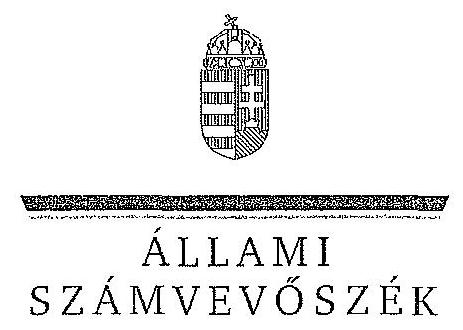
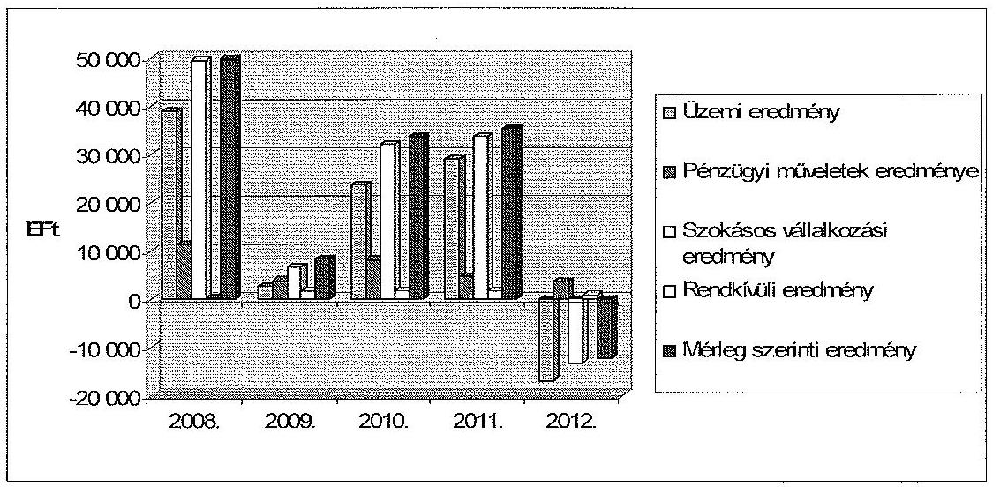
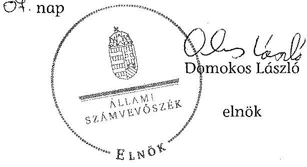
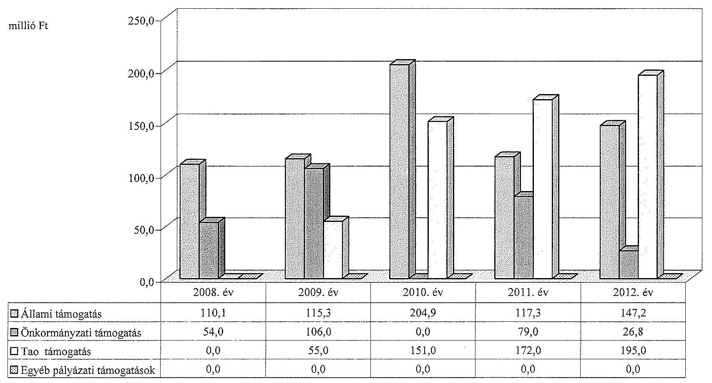
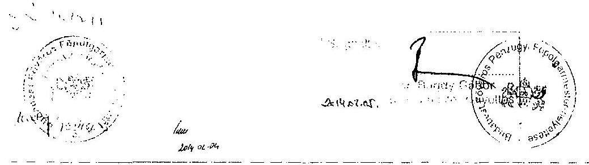
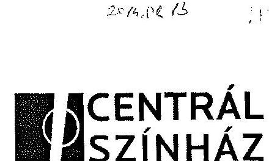
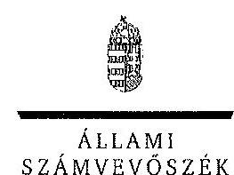
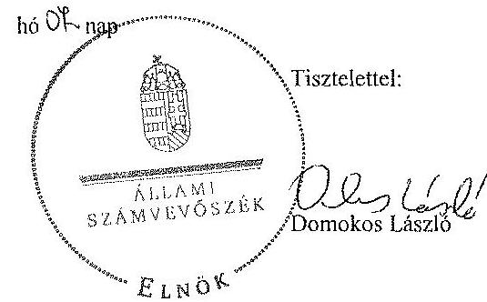
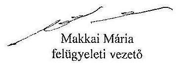

ÁLLAMI
SZÁMVEVŐSZÉK

# JELENTÉS 

az önkormányzatok többségi tulajdonában lévő gazdasági társaságok közfeladat-ellátásának ellenőrzéséről

Centrál Színház Nonprofit Kft.

---

# Állami Számvevőszék 

Iktatószám: V-0189-063/2014.
Témaszám: 1159
Vizsgálat-azonosító szám: V06530207

## Az ellenőrzést felügyelte:

## Makkai Mária

felügyeleti vezető
Az ellenőrzést vezette és az ellenőrzés végrehajtásáért felelős:
Horváth József
ellenőrzésvezető
A számvevőszéki jelentés összeállításában közreműködött:
Tukacs Éva
számvevő tanácsos
Az ellenőrzést végezték:

| Tukacs Éva | Varga Magdolna | Váradiné Jassó Mariann |
| :-- | :-- | :-- |
| számvevő tanácsos | külső szakértő | külső szakértő |

A témához kapcsolódó eddig készített számvevőszéki jelentések:
címe
sorszáma
Jelentés a színházak állami támogatásának és gazdálkodásának ellenőrzéséről 1039

---

# TARTALOMJEGYZÉK 

BEVEZETÉS ..... 3
I. ÖSSZEGZŐ MEGÁLLAPÍTÁSOK, KÖVETKEZTETÉSEK, JAVASLATOK ..... 6
II. RÉSZLETES MEGÁLLAPÍTÁSOK ..... 11

1. Az Önkormányzat közfeladat-ellátásának megszervezése ..... 11
1.1. A közfeladat meghatározása, a feladat ellátásának választott módja ..... 11
1.2. Az önkormányzati és a tulajdonosi irányítás megítélése ..... 14
2. A Színház közfeladat-ellátással kapcsolatos tevékenysége ..... 18
2.1. A Színház szervezeti kialakítása, szabályozottsága ..... 18
2.2. A gazdasági társaság vagyonnyilvántartása ..... 20
2.3. A gazdasági évek ráfordításainak és bevételeinek alakulása ..... 21
2.4. A gazdasági társaság eredményének alakulása ..... 24
2.5. A gazdasági társaság folyamatos üzemmenetének, likviditásának biztosítása ..... 25
3. Az Önkormányzat tulajdonosi jogainak és kötelezettségeinek érvényesítése ..... 26
3.1. A gazdasági társaságtól származó információk hasznosítása ..... 26
3.2. Az Önkormányzat közgyűlésének intézkedései ..... 28
MELLÉKLETEK
4. számú A Színház szakmai tevékenységének mutatói a 2008. és a 2012. évek között
5. számú A Színház támogatása a 2008. és a 2012. évek között
6. számú A Színház vagyonának főbb adatai 2008. január 1-je és 2012. december 31-e között
7. számú Budapest Főváros Főpolgármesterének észrevétele
8. számú A Centrál Színház Nonprofit Kft. ügyvezetőjének észrevétele
9. számú A Centrál Színház Nonprofit Kft. ügyvezetőjének észrevételére adott válasz

## FÜGGELÉKEK

1. számú Rövidítésjegyzék
2. számú Értelmező szótár

---

.

---

# JELENTÉS 

## az önkormányzatok többségi tulajdonában lévő gazdasági társaságok közfeladat-ellátásának ellenőrzéséről Centrál Színház Nonprofit Kft.

## BEVEZETÉS

Az Önkormányzatnak közfeladata az Ötv. alapján a művészeti feladatok ellátásáról való gondoskodás, az Mötv. szerint az előadó-művészeti szervezet támogatása. Ezt az Önkormányzat előadó-művészeti költségvetési szervek fenntartásával, illetve a tulajdonában álló egyszemélyes gazdasági társaságok támogatásával valósította meg.

Az Önkormányzat az ellenőrzött időszakban színházi koncepcióval ${ }^{1}$ rendelkezett, amely a színházak működtetésének alternatíváit vázolta fel és jövőbeli célokat határozott meg. Ezt a Közgyűlés határozattal² elfogadta.

A színházak támogatása az ellenőrzött időszakban központi költségvetési, illetve fenntartói támogatás formájában, valamint pályázatok útján valósult meg. A 2010-2012. évek költségvetési törvényei egy összegben tartalmazták az Önkormányzat fenntartásában működő színházak fenntartói ösztönző részhozzájárulását, amelyet a fenntartó saját döntése alapján oszthatott el.

A Centrál Színházat az 1998. október 8. napján kelt társasági szerződéssel hozta létre az alapító Önkormányzat egy magánszeméllyel együtt Vidám Színpad néven. Az Önkormányzat 2002. január 1-jétől egyszemélyes közhasznú társaságként, 2009. április 20-tól - a jogszabályi változásokat követve - nonprofit korlátolt felelősségű társaságként működtette tovább a Színházat.

Az Önkormányzat és a Színház a közfeladat ellátásának biztosítására 2006. január 1-jén Közszolgáltatási szerződést³, majd 2013. január 1-jei hatálybalépéssel Fenntartói megállapodást kötött. A Közszolgáltatási szerződés ${ }_{1,7}$ meghatározta a közhasznú tevékenység körét, az Önkormányzat által biztosított tá-

[^0]
[^0]:    ${ }^{1}$ Koncepció a fővárosi fenntartású színházak struktúráját és finanszírozását érintő változásokról (2007. XI. 29.)
    ${ }^{2}$ a Főv. Kgy. 1979/2007. (11.29.) sz. határozata
    ${ }^{3}$ Az Emtv. szerint a közszolgáltatási szerződés a közszolgáltatás nyújtására irányuló, legalább három évre szóló szerződés, amely az állam vagy az önkormányzat és a közszolgáltatást végző előadó-művészeti szervezet kapcsolatát szabályozza, tartalmazza a teljesítendő előadásszámot, a szolgáltatás nyújtásának időtartamát, helyét és a teljesítésért járó díjazást.

---

mogatás összegét, a feladatellátáshoz szükséges befektetett eszközöket, azok rendelkezésre bocsátásának módját, valamint rendelkezett a szerződő felek együttműködésének feltételeiről.

Az Emtv. új elemként vezette be 2009 novemberétől a tao támogatást, mint közvetett támogatási formát. Ennek felső határát a jogalkotó a tárgyévi jegybevétel 80%-ában határozta meg. A tao támogatás pénzügyi teljesülése a támogatást nyújtó vállalkozások eredményességének és támogatás nyújtási hajlandóságának függvénye.

A Színház a közfeladat ellátása érdekében az ellenőrzött időszakban összesen 960,6 millió Ft állami és önkormányzati működési támogatást kapott. Emellett 2009 és 2012 között 573,0 millió Ft tao támogatást kapott.

A Centrál Színház társulattal rendelkező, repertoárrendben játszó, magyar és külföldi szerzők igényes szórakoztató műveit színpadra állító előadó-művészeti szervezet.

Az ellenőrzött időszakban a Színház évente kettő-öt bemutatót tartott, a repertoárjában nyolc-tíz előadás folyamatosan szerepelt. A Színház fizető nézőinek száma évente 86-100 ezer fő, az előadások száma évi 282 és 334 között változott a 2008-2012 években. A Színház által foglalkoztatott dolgozók átlaglétszáma a 2008. évi 35 főről a 2012. évre 51 főre emelkedett.

A Színház főbb szakmai mutatószámait az 1. számú melléklet tartalmazza.
Az ellenőrzés várható eredménye: a jelentés nyilvánossága a társadalom széles körével ismerteti meg a Színház gazdálkodására vonatkozó megállapításainkat, továbbá a megállapítások alapján megfogalmazott számvevőszéki javaslatok hasznosítása elősegíti a feltárt hibák megszüntetését, az ellenőrzött szervezet feladatellátásának szabályszerűségét. A társadalom számára jelzi, hogy közpénz nem maradhat ellenőrizhetetlenül, az ÁSZ értékteremtő rend kialakításához és megőrzéséhez hozzájáruló tevékenysége pozitív hatással lesz a szervezetről kialakított összkép formálásában. A szervezeten belül lehetőség nyílik arra, hogy a megállapítások szintetizálásával az ÁSZ a hozzáadott értéket teremtő, elemző tevékenységét és tanácsadó szerepét is erősítse. A jó gyakorlatok bemutatásával az ÁSZ hozzájárul a követendő megoldások megismertetéséhez és terjesztéséhez.

# Az ellenőrzés célja annak értékelése volt, hogy: 

- az Önkormányzat a jogszabályi előírások figyelembevételével döntött-e az ellenőrzésre kerülő közfeladat megszervezéséről, az ellátás módjáról; a tulajdonostól elvárható gondossággal felügyelte-e a társaság feladatellátását; a gazdasági társaság rendelkezésére bocsátotta-e a közfeladat ellátásához a szükséges közvagyont, és biztosította-e a tulajdonosi jogoknak közvagyon feletti érvényesülését; a társaság vagyonvesztése esetén intézkedett-e a további vagyonvesztés megakadályozásáról;
- a gazdasági társaság teljesítette-e a tulajdonos önkormányzat részéről meghatározott célokat és feladatokat a rendelkezésre álló erőforrások felhasználásával; végrehajtotta-e a közfeladat-ellátási szerződés előírásait; betartotta-e a vagyonnal történő gazdálkodásra vonatkozó jogszabályi rendelkezéseket.

Az ellenőrzés hatóköre: az önkormányzatok közfeladat-ellátásának ellenőrzése, amely kiterjedt az önkormányzatok és a közfeladatot ellátó, az önkormányzat többségi tulajdonában lévő gazdasági társaság közötti feladatmegosztásra, az önkormányzatok tulajdonosi jogainak gyakorlására, a nemzeti vagyon kezelésének ellenőrzése keretében a közfeladat-ellátáshoz rendelt vagyonra és a vagyont érintő szerződésekre. A jelen ellenőrzés kiterjedt az önkormányzatok többségi tulajdonlásával működő gazdasági társaságok közfeladat-ellátására, vagyongazdálkodási tevékenységére, valamint a kapcsolódó nyilvántartások, elszámolások szabályszerűségére és megbízhatóságára. Az ellenőrzött tételek kiválasztása véletlen mintavétellel történt.

Az ellenőrzés típusa: szabályszerűségi ellenőrzés.
Az ellenőrzött időszak: a 2008-2012. évek, valamint a helyszíni ellenőrzés befejezéséig - 2013. szeptember 6-ig - bekövetkezett változások figyelemmel kísérése.

Ellenőrzött szervezet: a Centrál Színház Nonprofit Kft., valamint Budapest Főváros Önkormányzata.

Az ellenőrzés végrehajtásának jogszabályi alapját az ÁSZ tv. 5. § (3)-(5) bekezdéseiben foglaltak képezik.

Az ÁSZ a 2011. évi LXVI. törvény 29. §-a szerint a jelentéstervezetet megküldte Budapest Főváros Önkormányzata főpolgármesterének és a Centrál Színház Nonprofit Kft. ügyvezető igazgatójának egyeztetésre. A beérkezett észrevételeket és az azokra adott választ a jelentés 4-6. számú mellékletei tartalmazzák.

---

# I. ÖSSZEGZŐ MEGÁLLAPÍTÁSOK, KÖVETKEZTETÉSEK, JAVASLATOK 

Az Önkormányzat a művészeti feladatok ellátásáról való gondoskodásnak, illetve az előadó-művészeti szervezet támogatásának, mint az Ötv.-ben és az Mötv.-ben meghatározott közfeladatának, az ellenőrzött időszak alatt eleget tett. Az Önkormányzat közfeladat-ellátását a Centrál Színház közhasznú társaság, majd nonprofit kft. támogatásával biztosította. A Közgyűlés a tulajdonosi jogait az ellenőrzött időszakban a szabályzataiban és rendeleteiben foglaltak szerint gyakorolta.

Az Önkormányzat a 2006. január 1-jétől hatályos közszolgáltatási szerződésnek megfelelően a Színház rendelkezésére bocsátotta - haszonkölcsönbe adta az előadó-művészeti közfeladat ellátásához szükséges ingó és ingatlan vagyont. Az átadott befektetett eszközök nettó értéke a 2008. év december 31-én 317,7 millió Ft volt.

Az Önkormányzat a közfeladat-ellátásának tárgyi és pénzügyi feltételeit a Közszolgáltatási szerződés ${ }_{1,7}$-ben határozta meg. A Színház részére a közfeladat-ellátáshoz szükséges forrás biztosításáról a Közszolgáltatási szerződés ${ }_{2}$-ban (az annak elválaszthatatlan részét képező éves költségvetési rendeletekben) döntött az Önkormányzat. Meghatározta a közhasznú tevékenység körét, a szerződés megszűnésének esetére szabályozta a vagyontárgyak visszaszolgáltatásának rendjét és határidejét, továbbá a Színház által teljesítendő művészeti tevékenységek jellegét, körét, mértékét és pontos mutatószámait (az Emtv. 2009. éves hatályba lépését követően a törvény szerinti I. kategóriába sorolás feltételeit). Az önkormányzati tulajdon védelme érdekében szabályozta a leltár készítését, annak gyakoriságát, továbbá a gazdálkodás és a művészeti tevékenység ellátásával összefüggő kötelező adatszolgáltatás formáját, idejét és módját, valamint előírta a gazdálkodás körében felmerülő rendkívüli eseményekről történő tájékoztatási kötelezettséget.

A Közgyűlés határozata ${ }^{4}$ alapján az Önkormányzat megbízásából a BFVK Zrt. és a Színház 2011. november 23-án bérleti szerződést kötött, amely alapján az Önkormányzat tulajdonában álló ingatlanok után bérleti díjat kellett fizetni. A Közszolgáltatási szerződés, 2011. november 25-i aláírásával a közfeladat ellátásához szükséges ingatlanokat visszamenőlegesen, 2011. szeptember 1-jétől a Színház ingyenesen nem használhatta.

Az Önkormányzat a vagyon védelme érdekében a Közszolgáltatási szerződés ${ }_{1,7}$ ben garanciális követelményként fogalmazta meg a kötelezettségek megszegésének jogkövetkezményét, valamint a szerződés megszűnésének esetére az átadott vagyontárgyak visszaszolgáltatási kötelezettségét. Az ellenőrzött időszakban kötelezettség megszegésére, illetve szerződés megszűnésére nem került sor.

[^0]
[^0]:    ${ }^{4}$ Főv. Kgy. 2013/2011. (08.31.) sz. határozata

---

Az Önkormányzat a Színház alapító okiratában a Gt. előírásaival összhangban szabályozta a tulajdonosi joggyakorlás kereteit. A Közgyűlés a tulajdonos érdekeinek védelmére határozatokban kijelölte a Színház felügyelőbizottság tagjait és könyvvizsgálóját. Az alapító okiratnak megfelelően a Színház legfőbb szerve, a Közgyűlés kizárólagos hatáskörében jóváhagyta a Színház SZMSZ ${ }_{1,2}$-t és a felügyelőbizottság ügyrendjét.

A Közgyűlés a határozatában megválasztotta a Centrál Színház felügyelőbizottság elnökét a 2010. évben. Az eljárás nem felelt meg a Gt. azon jogszabályi előírásának, mely szerint - ha törvény vagy a társasági szerződés eltérően nem rendelkezik - a felügyelőbizottság a tagjai sorából választ elnököt.

Az Önkormányzat a Színház ügyvezetőjének és egyéb vezető állású dolgozóinak, valamint a felügyelőbizottság tagoknak a díjazására vonatkozó javadalmazási szabályzat ${ }_{2}$-t a Taktv.-ben foglalt határidőn túl, 2010. január 31. helyett április 29-én fogadta el.

Az Önkormányzat a Színház üzleti tervének elfogadását, beszámoltatását, az adatszolgáltatási kötelezettség ellenőrzését a jogszabályokban, az Önkormányzat belső szabályzataiban és a Közszolgáltatási szerződés ${ }_{1.7}$-ben foglaltaknak megfelelően, határidőn belül - a felügyelőbizottság határozat és a könyvvizsgálói jelentés figyelembe vételével - végezte el.

A Színház szakmai tevékenységének ellátását az Önkormányzat évadbeszámolók alapján értékelte. A Színház az ellenőrzött időszak minden évében elkészítette a szakmai értékelését, amelyet a 2010. évben az Önkormányzat Kulturális Bizottsága elfogadott. A 2011. és a 2012. évekre benyújtott évadbeszámolókról a Kulturális Főpolgármester-helyettes tájékoztatót nyújtott be a Közgyűlés részére, amelyet a Közgyűlés tudomásul vett.

A 2008. és 2010. években a Színház ügyvezetője részére a prémiumfeladatok meghatározásának jóváhagyása a szabályzatban foglaltaknak megfelelő volt, a 2011.
 és a 2012. évekre vonatkozóan a jóváhagyás a Javadalmazási szabályzat${ }_{2}$-tól eltérően - késedelmesen - történt. A prémiumfeltételeket és a prémium összegét mindkét évben az üzleti terv elfogadását követően határozta meg az Önkormányzat.

Az Önkormányzat a Színháznál nem végzett belső ellenőrzést.
A Színház gazdálkodása, valamint mérleg szerinti eredménye az ellenőrzött időszakban nem tette szükségessé, hogy a tulajdonos Önkormányzat a vagyon, illetve a közpénzek nem célszerű hasznosításával, az esetleges pazarló felhasználással kapcsolatban, valamint a lejárt kötelezettségek csökkentése érdekében tulajdonosi intézkedéseket tegyen.

A Színház teljesítette az Önkormányzat részéről a Közszolgáltatási szerződés${ }_{1.7}$-ben meghatározott célokat és feladatokat. A vagyonnal történő gazdálkodásra vonatkozó jogszabályi rendelkezéseket - a 2011. és a 2012. évben az önköltségszámítási szabályzat elkészítésének hiányától eltekintve - betartották. A Színház mérleg szerinti eredménye a 2012. év kivételével az ellenőrzött időszakban pozitív volt, megfelelő likviditással rendelkezett.

---

A Színház rendelkezett Alapító Okiratokkal és az irányítási, döntési és felelősségi jogköröket tartalmazó belső szabályzatokkal, és a Közszolgáltatási szerződés${ }_{1,7}$ előírásának megfelelően folyamatosan biztosította a tevékenységi körébe tartozó színházi szolgáltatást.

A közfeladat-ellátást szolgáló vagyon védelme biztosított volt. A Színház elkészítette Számviteli politikái mellékleteként a Leltározási, Pénzkezelési és az Értékelési szabályzatát. A Színház a Közszolgáltatási szerződés${ }_{1,7}$-ben előírt évenkénti leltárkészítési kötelezettségének eleget tett. A saját eszközeit és forrásait, valamint az Önkormányzattól átvett eszközöket értékben és mennyiségben az ellenőrzött időszak minden évében leltározta.

Az ellenőrzött időszakban a Színház rendelkezett a Számv. tv. előírásainak megfelelő Számlarenddel, amelyben az ellátott közfeladat bevételei és ráfordításai elkülönültek. A Színház a Számv. tv. alapján 2008 és 2010 között nem volt kötelezett Önköltségszámítási szabályzat készítésére, azonban a 2011. 2012. évekre kötelezettsége ellenére sem rendelkezett szabályzattal. A Színház a produkciós költségeket - Önköltségszámítási szabályzat nélkül, utókalkuláció alapján, minden vizsgált évben - kimutatta. Ezek a költségek nem tartalmazták a produkcióban részt vevő saját alkalmazottak bérét és járulékait. Ennek következtében az egyes produkciók kimutatott költségei nem a valós értéket tartalmazták. A díszlet és jelmez tényleges bekerülési költségei a bemutató napjával aktiválásra kerültek. A Színház a produkciók színreviteléig felmerült közvetlen költségeket szellemi termékként nem számolta el, ezeket azonnali költségként mutatta ki.

A Színház az Önkormányzat tulajdonában álló eszközöket a Számv. tv.-nek megfelelően (ingatlanok, immateriális javak, tárgyi eszközök, készletek) számlarendjében elkülönítetten, a 0-ás számlaosztályban tartotta nyilván.

A Színház közfeladatai ellátásához biztosított - saját és önkormányzati tulajdonú - eszközök 2012. december 31-ei nettó értéke (597,1 millió Ft) a 2008. december 31-ei adathoz (389,1 millió Ft) viszonyítva 53,4%-kal nőtt.

A Színház összes ráfordítása a 2008. évről (332,6 millió Ft) 2012-re 105,7%-kal, 684,1 millió Ft-ra növekedett, bevételei a 2008. évről (382,3 millió Ft) 2012-re 75,8%-kal, 671,9 millió Ft-ra emelkedtek.

A Színház összes ráfordításának több mint 60%-a anyagjellegű ráfordítás volt. Az anyagjellegű ráfordítások 40,8%-kal (130,8 millió Ft-tal), a személyi jellegű ráfordítások 95,4%-kal (108,0 millió Ft-tal) növekedtek, miközben a létszám csak 45,7%-kal (16 fővel) emelkedett.

A Színház az értékcsökkenési leírást a Számviteli politikájában meghatározottak szerint számolta el. Ennek évenkénti alakulását az éves beszámolók kiegészítő mellékletében részletesen bemutatta.

A Színház az ellenőrzött években elkészítette üzleti tervét. A tényleges ráfordítások (a 2011. év kivételével) és a bevételek (a 2008. év kivételével) az ellenőrzött időszakban meghaladták a tervezett értéket. A Színház mérleg szerinti eredménye az ellenőrzött időszak utolsó évében negatív, 2008 és 2011 között pozitív

---

volt. A 2008. évben 49,8 millió Ft, a 2009. évben 8,3 millió Ft, a 2010. évben 33,7 millió Ft, a 2011. évben 35,3 millió Ft, a 2012. évben -12,2 millió Ft volt.

A terv és tényadatok 2008 és 2011 között mindegyik évben jelentősen eltértek egymástól. A tervkészítés során a bázis év adatait nem vették figyelembe. A Színház az ellenőrzött időszak egyik évére vonatkozóan sem adott át az ellenőrzés részére az eredménykimutatás szerkezetében elkészített üzleti számításait alátámasztó dokumentációt.

A Színháznak az ellenőrzött időszakban átmeneti pénzintézeti finanszírozásra nem volt szüksége. Fizetési kötelezettségeit határidőn belül tudta teljesíteni, köztartozásai nem keletkeztek.

A Színház a tulajdonos részére az ellenőrzött időszakban minden évben az anyagi lehetőségeit figyelembe véve készítette el felújítási, fejlesztési tervét. A Színház az Önkormányzattól 14,4 millió Ft értékben kapott fejlesztési célú támogatást.

A Színház rövidlejáratú bankbetétek formájában kötötte le az átmenetileg szabad pénzeszközeit. A Színház befektetési tevékenységet nem végzett, így Befektetési Szabályzatot nem kellett készítenie.

Az Állami Számvevőszékről szóló 2011. évi LXVI. törvény 33. § (1) bekezdésében foglaltak értelmében a jelentésben foglalt megállapításokhoz kapcsolódó intézkedési tervet köteles az ellenőrzött szervezet vezetője összeállítani, és azt a jelentés kézhezvételétől számított 30 napon belül az ÁSZ részére megküldeni. Amennyiben az intézkedési tervet határidőben nem küldi meg a szervezet, vagy az nem elfogadható, az ÁSZ elnöke a hivatkozott törvény 33. § (3) bekezdés a)-b) pontjaiban foglaltakat érvényesítheti.

Az ellenőrzés intézkedést igénylő megállapításai és javaslatai:

# a Centrál Színház igazgatójának

1. A vagyonnal történő gazdálkodásra vonatkozó jogszabályi rendelkezéseket - a 2011. és a 2012. évben az önköltségszámítási szabályzat elkészítésének hiányától eltekintve - betartották.

Javaslat:
Intézkedjen a Számv. tv. 14. § (5) bekezdés c) pontjában foglalt előírás alapján az önköltségszámítási szabályzat elkészítéséről és arról, hogy a szabályzat tartalmazza:
a) az általános költségeknek a felosztási módját, valamint
b) a produkció bemutatásáig elszámolt közvetlen költségek keretében a társulat bérének és járulékainak a produkcióra felosztott költségeit is.
2. A Színház a produkciók színreviteléig felmerült költségeket szellemi termékként nem aktiválta és az immateriális javak között nem mutatta ki. Ezeket azonnali költségként számolta el.

---

Javaslat:
Intézkedjen a produkciókban egy évnél hosszabb ideig használt szellemi termékeknek a Számv. tv. 24. § (1) bekezdésében és 52. §-ában foglaltak szerinti elszámolásáról.

---

# II. RÉSZLETES MEGÁLLAPÍTÁSOK

## 1. Az ÖNKORMÁNYZAT KÖZFELADAT-ELLÁTÁSÁNAK MEGSZERVEZÉSE

### 1.1. A közfeladat meghatározása, a feladat ellátásának választott módja

Az Önkormányzat a művészeti feladatok ellátásáról való gondoskodásnak, illetve az előadó-művészeti szervezet támogatásának, mint az Ötv.-ben és az Mötv.-ben meghatározott közfeladatának, az ellenőrzött időszak alatt eleget tett. Az Önkormányzat a közfeladat ellátását a Centrál Színház Nonprofit Kft. támogatásával biztosította.

Az Önkormányzat kötelező közfeladata az Ötv. 63/A §. n) pontja szerint a művészeti feladatok ellátásáról való gondoskodás${ }^{5}$. A Htv. 111. § alapján a közművelődési, közgyűjteményi és művészeti tevékenységekkel kapcsolatos helyi irányítási, ellenőrzési, valamint a fenntartással és működtetéssel kapcsolatos feladatokat a Közgyűlés látja el. A kulturális feladat ellátását az Önkormányzat az Emtv. 3. § (2) bekezdése alapján előadó-művészeti szervezet támogatásával valósította meg.

Az Önkormányzat az ellenőrzött időszakban elfogadott koncepcióval${ }^{6}$ rendelkezett, amelyet a Közgyűlés${ }^{7}$ határozatával fogadott el.

A koncepció a színházak működtetésének módozatait vázolta fel és jövőbeli célokat határozott meg, nem vizsgálta azonban a megvalósításhoz szükséges források nagyságát.

A 2010. évi önkormányzati választásokat követően az Ötv. 91. § (1) és (6) bekezdésének megfelelően a Közgyűlés${ }^{8}$ elfogadta az Önkormányzat 2011-2014. évekre vonatkozó Gazdasági Programját${ }^{9}$.

A Gt. változásának figyelembevételével a Kht. formában működő társaságokat a törvényes határidőn belül nonprofit korlátolt felelősségű társaságokká alakította át.

[^0]
[^0]:    ${ }^{5}$ A 2013. január 1-jétől hatályos Mötv. 13. § 1) bekezdés 7. pontja is kötelezően ellátandó feladatként határozza meg az előadó-művészeti szervezetek támogatását.
    ${ }^{6}$ Koncepció a fővárosi fenntartású színházak struktúráját és finanszírozását érintő változásokról
    ${ }^{7}$ a Főv. Kgy. 1979/2007. (11.29.) sz. határozata
    ${ }^{8}$ a Főv. Kgy. 937/2011. (04.27.) sz. határozata
    ${ }^{9}$ A Főváros fejlesztésének és gazdálkodásának stabilizálása és reformkoncepciója a 2011-2014. évi választási ciklusra

---

Az Önkormányzat a Színház Alapító Okirat${ }_{1}$-ben - a Gt. előírásaival összhangban - szabályozta a tulajdonosi joggyakorlás kereteit. Az Alapító Okirat${ }_{1}$ megfelelően rendelkezett a Színház gazdálkodása során elért eredmény felhasználásáról, az ügyvezető, az FB tagok és a könyvvizsgáló kijelöléséről, az összeférhetetlenségi szabályokról, valamint az Áht.${ }_{1}$ 100/N. § (8) bekezdés előírásainak betartatásáról.

Az ellenőrzés részére átadott Alapító Okirat${ }_{6}$ ügyvéd általi ellenjegyzése az Önkormányzat aláírása nélkül történt meg. Az ellenjegyzés kifejezés használata a záradékban formailag helytelen.

Az Önkormányzat tulajdonában álló, a Színház használatában lévő vagyon a nemzeti vagyon részét képezte, a Vagyonrendelet${ }_{2}$ 6. § (1) bekezdése szerint a feladat ellátását szolgáló ingatlanvagyon korlátozottan forgalomképes törzsvagyon. A Színház törzstőkéje 4,5 millió Ft volt.

Az Önkormányzat az ellenőrzött időszak elején hatályban lévő Közszolgáltatási szerződés${ }_{1}$-ben határozta meg a közfeladat ellátásához átadott vagyon nagyságát és annak használatát, valamint a szerződő felek együttműködésének feltételeit. Az Önkormányzat a Színház teljesítményével kapcsolatos célokat, elvárásokat az Emtv. szerinti I. kategóriába soroláshoz szükséges feltételek teljesítésével írta elő. Az ellenőrzött időszakban a szerződést hat alkalommal módosították, majd 2012. október 16-án, 2013. január 1-jei hatályba lépéssel Fenntartói megállapodást kötöttek, amely közszolgáltatási szerződésnek minősült.

Az Önkormányzat a színházakra vonatkozó szakmai elvárásait a színházigazgatói pályázat kiírásában szerepeltette. A nyertes pályázat a megválasztott igazgató stratégiai céljait, valamint szakmai elképzeléseit foglalta össze.

Az Önkormányzat a közfeladat-ellátása érdekében a Színház részére az Alapító Okiratban foglaltaknak megfelelően rendelkezésére bocsátotta - haszonkölcsönbe adta - az előadó-művészeti közfeladat-ellátáshoz szükséges ingó és ingatlan vagyont. Az Önkormányzat 2011. augusztus 31-ig a Közszolgáltatási szerződés${ }_{1-6}$-ban foglaltaknak megfelelően ingyenesen bocsátotta a Színház részére az előadó-művészeti közfeladat-ellátáshoz szükséges eszközöket.

Az Önkormányzat a közfeladat-ellátásának további tárgyi és pénzügyi feltételeit a Közszolgáltatási szerződés${ }_{1-7}$-ben határozta meg. Rögzítette a költségvetési támogatás mértékét és a közhasznú tevékenység körét. A szerződés megszűnésének esetére szabályozta a vagyontárgyak visszaszolgáltatásának rendjét és határidejét, továbbá a Színház által teljesítendő művészeti tevékenységek jellegét, körét, mértékét és pontos mutatószámait. Az önkormányzati tulajdon védelme érdekében szabályozta a kötelező leltár készítését, annak gyakoriságát, továbbá a gazdálkodás és a művészeti tevékenység ellátásával összefüggő kötelező adatszolgáltatás formáját, idejét és módját, valamint előírta a gazdálkodás körében felmerülő rendkívüli eseményekről történő tájékoztatási kötelezettséget. A Nvtv. 3. § alapján az ellenőrzött Színház átlátható szervezet.

A Közgyűlés a 2313/2011. (08. 31.) sz. határozata alapján a BFVK Zrt. és a Színház 2011. november 23-án Bérleti szerződést kötött, amely alapján

---

az Önkormányzat tulajdonában álló ingatlanok után bérleti díjat kellett fizetni. A Közgyűlés a 2433/2011. (08. 31.) sz. határozatát határidőn túl hajtották végre, mivel a Főpolgármester-helyettes a Közszolgáltatási szerződést a 2011. október 1-jei határidőt követően írta alá. A Közszolgáltatási szerződés 2011. november 25-i módosításával a közfeladat ellátásához szükséges ingatlanokat visszamenőlegesen, 2011. szeptember 1-jétől a Színház ingyenesen nem használhatta.

A Színháznak a bérleti szerződés aláírását megelőző időszakra használati díjat, azt követően bérleti díjat (6,6 millió Ft/hó+áfa),
 valamint a bérleti díj összegét alapul véve egyszeri, 3 havi megszerzési díjat és 5 havi bérleti díjnak megfelelő óvadékot kellett fizetnie. A 2011. évre vonatkozóan óvadékként, megszerzési díjként, használati és bérleti díjként összesen egy évi bérleti díjnak megfelelő összeg került kifizetésre.

A bérleti szerződés 2011. évi bevezetése után még azon évben a Színház kezdeményezte a Révai utca 22. szám alatti ingatlanrész bérleti szerződésének megszüntetését rossz állapota és egyben magas bérleti díja miatt. Ezt az Önkormányzat elfogadta, ennek következtében a bérleti díj 6,4 millió Ft/hóra csökkent. A visszaadott ingatlan után befizetett óvadékkal nem számolt el az Önkormányzat.

A felek 2012-ben a Bérleti szerződés 2. pontját kiegészítették azzal, hogy az Önkormányzat az óvadék összegét „a bérleti szerződés időtartama alatt a kielégítési jog megnyílta előtt használhatja és rendelkezhet vele." Az óvadék összegének fedezete az Önkormányzat részéről tett nyilatkozat ${ }^{10}$ alapján folyamatosan rendelkezésre állt.

A Színházak támogatása az ellenőrzött időszakban központi költségvetési, illetve fenntartói támogatással, valamint pályázatok útján valósult meg. Az Önkormányzat a saját tulajdonosi támogatás színházak közötti elosztásának elveit, szempontjait szabályzatban, belső utasításban nem határozta meg, mértékét, nagyságrendjét a teljes támogatási összeghez igazította.

A 2010. évtől az Emtv. 16. § (1) bekezdése ${ }^{11}$ szerint a színházak támogatása művészeti ösztönző részhozzájárulásból és fenntartói ösztönző részhozzájárulásból tevődött össze. A 2010-2012. években a költségvetési törvények 7. sz. melléklete egy összegben tartalmazta az Önkormányzat fenntartásában működő színházak fenntartói ösztönző részhozzájárulásának összegét, amelyet a fenntartó saját döntése alapján oszthatott el. A költségvetési törvények a színházak művészeti ösztönző részhozzájárulásának összegét külön nevesítve tartalmazták. A 2013. évtől a színházakat művészeti és létesítménygazdálkodási célra működési támogatás illette meg.

Az Emtv. 48. § (1) bekezdése új elemként bevezette - a Taotv. 4. § 37-39. pontjai alapján - a társasági adókedvezménnyel igénybe vehető támogatást, mint közvetett támogatási formát. A tao támogatás igénybevétele 2009. november 12-től

[^0]
[^0]:    ${ }^{10}$ a Főpolgármesteri Hivatal ellenőrzéshez kirendelt kapcsolattartója 2013. augusztus 14-én adott válasza alapján
    ${ }^{11}$ hatályon kívül helyezve 2012. május 1-jétől

---

volt lehetséges, a meghatározott jegybevétel 80%-áig. A tao támogatás pénzügyi teljesülése a támogatást nyújtó vállalkozások eredményességének és támogatásnyújtási hajlandóságának függvénye.

Az ellenőrzött időszakban a Színház számára biztosított működési hozzájárulás és a Taotv. szerinti támogatás alakulását a 2. számú melléklet tartalmazza.

Az ellenőrzött időszakban az önkormányzati vagyon megőrzése, védelme érdekében a leltározást az önkormányzati Vagyonrendelet ${ }_{1,2}$ szabályozta. A Vagyonrendelet ${ }_{1,2}$ szerint az Önkormányzat tulajdonában lévő eszközöket minden évben leltározni kell, az ettől eltérő eseteket a rendelet külön szabályozta.

A leltározásra vonatkozó előírások a társasággá alakulást követően az Önkormányzat Vagyonrendeleteiben nem a hatályos jogszabályoknak megfelelően szerepeltek, mivel az üzemeltetésre, kezelésre átadott eszközök leltározási szabályairól a Vagyonrendelet ${ }_{1,2}$ - az Áhsz. 2010. január 1-jétől hatályos előírásaival ellentétben - nem tartalmazott szabályozást.

A Közszolgáltatási szerződés ${ }_{7}$ 5. A pontja az Önkormányzat tulajdonát képező ingó vagyonra vonatkozóan kötelező leltár készítését, illetve a szerződés 6. pont 4. bekezdése az önkormányzati vagyon nyilvántartására vonatkozó előírásoknak megfelelő adatszolgáltatási és nyilvántartási kötelezettség teljesítését írta elő a Színház számára.

A Fenntartói megállapodás 5.1. pontja a közszolgáltatási szerződés rendelkezésével megegyezően a vagyontárgyak évenkénti, december 31-i fordulónappal történő leltárkészítési kötelezettségét írta elő, továbbá köteles volt a Színház azt megküldeni a tárgyévet követő év január 31-ig az Önkormányzatnak.

Az Önkormányzat vagyonkimutatást készített a 2008. és 2012. években az éves zárszámadáshoz az Ötv. 78. § (2) bekezdésében és az Mötv. 110. § (2) bekezdésében foglaltaknak megfelelően. Az Önkormányzat a Színháztól negyedévente beérkező, az ingatlanok értékének változására vonatkozó dokumentumok (bruttó érték növekedés vagy csökkenés), valamint az értékcsökkenés elszámolásáról szóló, a gazdasági vezető által aláírt "6. sz. melléklet" alapján a kataszteri rendszer, valamint a Pénzügyi Információs Rendszer adatait frissítette.

A Vagyonrendelet ${ }_{2}$ 14. §-a a leltározás vonatkozásában a korábbi vagyonrendelettel azonos rendelkezéseket tartalmazott.

Az Önkormányzat vagyona védelmére a Közszolgáltatási szerződés ${ }_{1,7}$-ben garanciális követelményként fogalmazta meg a kötelezettségek megszegésének jogkövetkezményét, előírta a gazdálkodás körében felmerülő rendkívüli eseményekről történő tájékoztatási kötelezettséget, valamint a szerződés megszűnésének esetére az átadott vagyontárgyak visszaszolgáltatási kötelezettségét. Az ellenőrzött időszakban kötelezettség megszegésére, illetve szerződés megszűnésére nem került sor.

# 1.2. Az önkormányzati és a tulajdonosi irányítás megítélése 

A Színház esetében a tulajdonosi jogok gyakorlását a gazdasági társaságokra és a közhasznú szervezetekre vonatkozó jogszabályok és az Önkormányzat

---

rendeletei határozták meg. A Közgyűlés a tulajdonosi jogait az ellenőrzött időszakban, a szabályzataiban és rendeleteiben foglaltak szerint gyakorolta.

Az Önkormányzat SZMSZ ${ }_{1}$ 49. § (1) bekezdése alapján a Közgyűlés állandó bizottságaként a 2010. évig a Kulturális Bizottság működött. Ezen időszakban a Közgyűlés a bizottságra az Önkormányzat SZMSZ ${ }_{1}$ 5. számú mellékletében szereplő feladatok ellátását ruházta át.

A Közgyűlés a tulajdonosi feladatainak gyakorlását az ellenőrzött időszakban többféle szervezete között osztotta meg.

A Vagyonrendelet ${ }_{1}$ 52. § (1) bekezdés alapján 2008. február 1-jétől kezdődően az Önkormányzat tulajdonában lévő egyszemélyes gazdasági társaságok legfőbb szervének törvény által az Önkormányzatnak, mint alapítónak a hatáskörébe tartozó jogait a Közgyűlés gyakorolta. Az 52. § (4) bekezdés alapján a kulturális ágazathoz tartozó társaságok legfőbb szervének kizárólagos jogai között fel nem sorolt egyéb, a törvény vagy az Alapító Okirat által hatáskörébe utalt jogait a Kulturális Bizottság, majd 2008. november 21-étől ezen jogokat a Gazdasági Bizottság a Kulturális Bizottság egyetértésével gyakorolta. Az 52. § (5) bekezdése alapján 2010. november 3-ától 2010. december 31-éig a kulturális ágazathoz tartozó társaságok legfőbb szervének kizárólagos jogai között fel nem sorolt egyéb, a törvény vagy az Alapító Okirat által hatáskörébe utalt jogait a Kulturális Bizottság gyakorolta.

Egyes tulajdonosi jogok gyakorlását a 2011. május 25-e és 2011. november 10-e közötti időszakban az Önkormányzat a 2011 előtt, illetve a 2011-ben alapított gazdasági társaságok esetében egymástól eltérően szabályozta.

A 2011. év előtt alapított társaságok esetében 2011. január 1-jétől a Vagyonrendelet ${ }_{1}$ 52. § (2) bekezdése alapján a fenti jogokat a Főpolgármester közvetlenül gyakorolta. A 2011. május 25-én alapított gazdasági társaságok esetében 2011. november 9-éig a fenti tulajdonosi jogok gyakorlására kizárólag a Közgyűlés volt jogosult. Az eltérő szabályozás oka az volt, hogy a Közgyűlés a Vagyonrendelet ${ }_{1}$ 5. számú mellékletét nem az alapítással egy időben módosította.

A Vagyonrendelet ${ }_{2}$ 56. § (2) bekezdés a) pontjának 2012. március 16-ai hatálybalépésétől 2013. március 18-áig a Vagyonrendelet ${ }_{2}$ 5. sz. mellékletében szereplő gazdasági társaság esetében a társaság legfőbb szervének a törvény által hatáskörébe tartozó (az FB tagjainak, a társaság könyvvizsgálójának megválasztása, visszahívása, díjazásának megállapítása, valamint a (2) bekezdés b) pontja alapján az ügyvezető megválasztása, kinevezése és díjazásának megállapítása) jogokat a Főpolgármester közvetlenül, egy személyben gyakorolta. 2013. március 19-től a Vagyonrendelet ${ }_{2}$ 56. § (2) bekezdés a) pontja szerint a közgyűlés hatáskörébe tartozott a Főpolgármester előterjesztése alapján az FB tagjainak és a társaság könyvvizsgálójának megválasztása, visszahívása, díjazásának megállapítása, valamint a (2) bekezdés b) pontja alapján az ügyvezetőnek a megválasztása, kinevezése és díjazásának megállapítása.

Az Önkormányzat az Alapító Okirat ${ }_{1}$ VII/A. pontjában a Gt.-vel összhangban szabályozta a tulajdonosi joggyakorlás kereteit. A Közgyűlés a köztulajdon védelmének biztosítása érdekében a Gt. 33. § (1) bekezdés c) pontja és a Közhasznú tv. 10. § (1) bekezdésében foglalt előírásoknak megfelelően FB létrehozásáról

---

döntött. A Taktv. 4. § (2) bekezdésének megfelelően a társasági törzstőke összegéhez igazodva minden színház esetében 3 főben határozta meg az FB létszámát.

A Közgyűlés a tulajdonosi érdekeinek védelmére határozatokban kijelölte a Színház FB tagjait és könyvvizsgálóját, továbbá a Gt. 34. § (4) bekezdése alapján jóváhagyta az FB ügyrendjét.

Az Önkormányzat a tulajdonosi képviseletet ellátó FB tagokat nem számoltatta be, ezt a Gt. és a belső szabályozás nem írta elő. Az ellenőrzés megállapította, hogy a 2010. évben az FB elnökének megválasztása nem felelt meg a jogszabályi előírásnak.

A Gt. 34. § (2) bekezdésében foglaltak szerint - ha törvény vagy a társasági szerződés eltérően nem rendelkezik - az FB a tagjai sorából választ elnököt. A Közgyűlés a 2044/2010. (10.27.) sz. határozatában megválasztotta az Centrál Színház FB elnökét. A közgyűlési határozat ellentétes volt a Gt. 34. § (2) bekezdésében előírtakkal, mivel az alapító okirat, illetve törvény nem rendelkezett ettől eltérően.

Az Önkormányzat a Színház üzleti tervének elfogadását, beszámoltatását, az adatszolgáltatási kötelezettség ellenőrzését a jogszabályokban, az Önkormányzat belső szabályzataiban és a Közszolgáltatási szerződés ${ }_{1-7}$-ben foglaltaknak megfelelően, határidőn belül - az FB határozat és a könyvvizsgálói jelentés figyelembe vételével - végezte el.

Az Önkormányzat beszámoltatása kiterjedt az üzleti terv elemzésére, jóváhagyására és az éves beszámoló, valamint a közhasznúsági jelentés elemzésére és a Közgyűlés általi elfogadására.

A Kulturális Bizottság a 142/2009. (05. 27.), és a 114/2010. (05. 27.) sz. határozatával, valamint a Közgyűlés az 1434/2011. (05. 25.), a 984/2012. (05. 30.), és a 873/2013. (05. 29.) sz. határozatával elfogadta a Színház 2008. és 2012. évről készített beszámolóját, könyvvizsgálói jelentését és az FB határozatát.

Az FB határozatot hozott a Színház éves beszámolójáról, a közhasznúsági jelentésről az Alapító Okiratban és a Gt.-ben előírt írásbeli jelentés helyett. A határozat a beszámoló fő adatait a 2012. év kivételével tartalmazta. Az FB jegyzőkönyvek az Alapító Okiratban megjelöltek ellenére a vagyonmérleg és a vagyonleltár tervezetek ellenőrzését nem tartalmazták. Az önkormányzati Javadalmazási Szabályzat ${ }_{2-4}$-ben előírtak ellenére az FB nem értékelte a Színháznál alkalmazott foglalkoztatási és bérezési gyakorlatot.

A tulajdonosi joggyakorlás megvalósításában a 2012. évben előrelépést jelentett a monitoring tevékenység bevezetése. Ennek keretében egységes adattartalom- és adattábla-rendszer került meghatározásra a Színház számára, mind az üzleti terv, mind a beszámoló elkészítéséhez.

A Főpolgármesteri Hivatal Főjegyzői Irodájának 2012. november 9-én kiadott Belső Működési Szabályzata alapján a Főjegyzői Iroda Monitoring és Koordinációs Referatúra feladatkörébe tartozott a társaságok üzleti terveire és a közszolgáltatási szerződésekre vonatkozó határozatok hatásvizsgálata, a társaságok működésének és gazdálkodásának folyamatos nyomon követése (az üzleti tervek gazdálkodási adatainak bemutatását szolgáló egységes táblarendszer kialakítása; a társaságok éves üzleti terveinek közgazdasági megfelelőségi értékelése; a társaságok éves beszámolóinak az üzleti tervek teljesítésének aspektusából történő értékelése); és a tervektől való eltérés esetén az Önkormányzat tájékoztatása.

A 2013. évi üzleti terv már részletes, egységes szerkezetet és információtartalmat biztosított, amely az irányítási tevékenységet a teljesítmények összehasonlító elemzési lehetőségével és a beszámoltatás tartalmi színvonalának javításával szolgálta.

A Közszolgáltatási szerződés ${ }_{5.7}$ az aláírás idején hatályos Emtv. előírásaival összhangban ${ }^{12}$, megfelelően szabályozta a közfeladat-ellátás tartalmát. A szerződés összegszerűen tartalmazta a 2008. évre vonatkozó támogatási
 összeget. A szerződés a további évekre vonatkozó támogatás összegét az Önkormányzat tárgyévi költségvetési rendeleteiben a Színház részére biztosított támogatási összegre szóló rendelkezésekhez kötötte.

A Színház ügyvezetőjének és egyéb vezető állású munkavállalójának javadalmazásával kapcsolatban a Közgyűlés megalkotta a 970/2010. (04. 29.) számú határozatot, a 2490/2010. (12. 15.) számú határozatot és a 2062/2012. (10. 03.) számú határozatot. Az Önkormányzat a 970/2010. (04. 29.) számú határozat megalkotásával késedelmesen tett eleget a Taktv. 9. § (1) bekezdésében előírt (2010. január 31.) rendelkezésnek.

Az Önkormányzat tulajdonosi jogai - a Gt. 141. § (2) bekezdés j) - k) pontokban foglalt hatáskörnek megfelelően a kulturális és oktatási ágazatba tartozó, egyszemélyes tulajdonban lévő gazdasági társaságai ügyvezetőinek, egyéb vezető állású munkavállalóinak, valamint az FB tagjainak javadalmazására - gyakorlását az ellenőrzött időszak alatt a Vagyonrendelet ${ }_{1,2}$ és módosításai határozták meg.

A Javadalmazási szabályzat ${ }_{1-4}$ értelmében a prémiumfeltételeket és a prémium összegét a legfőbb szerv, illetve a munkáltatói jogok gyakorlója határozza meg, legkésőbb az éves üzleti terv elfogadásával egyidejűleg.

A 2010. évben a célkitűzések jóváhagyása a szabályzatban leírtaknak megfelelő volt. A 2011. és 2012. évekre vonatkozóan a Színház ügyvezetője részére a Javadalmazási szabályzat ${ }_{34}$-től eltérően, késedelmesen történt meg a premizálási feltételek meghatározása.

A 2011. évi üzleti tervet a Közgyűlés a 2011. május 25-i ülésén fogadta el, míg a prémium feltételek meghatározása 2011. november 25-én történt meg. A 2012. évben az üzleti tervet a Közgyűlés a 2012. május 30-ai ülésén fogadta el, a prémium feltételeket 2012. július 13-án hagyták jóvá.

Ezen késedelem következtében a prémium-célkitűzés nem tudta betölteni teljesítményösztönző szerepét.

[^0]
[^0]:    ${ }^{12}$ Az Emtv. 13. § (2) bekezdése szerint a közszolgáltatási szerződés a közszolgáltatás nyújtására irányuló, legalább három évre szóló szerződés, amely az állam vagy az önkormányzat és a közszolgáltatást végző előadó-művészeti szervezet kapcsolatát szabályozza, tartalmazza a teljesítendő előadásszámot, a szolgáltatás nyújtásának időtartamát, helyét és a teljesítésért járó díjazást.

---

2011. január 1-jétől a Főv. Kgy. 2490/2010. (12. 05.) sz. határozatával hatályba léptetett Javadalmazási szabályzat ${ }_{2}$ rendelkezett a prémium mértékének a személyi alapbér, illetve a megbízási díj 120%-ról maximum 40%-ra történő csökkentéséről. Ezzel egyidőben döntöttek az ügyvezetők az FB tagok havi maximális személyi alapbérének KSH átlagkeresethez mért felső korlátjáról. A szabályzat kitért az egyéb jogviszony keretében végzett tevékenységek munkáltatónál történő díjazási tilalmára, továbbá részletezte az adható egyéb juttatásokat (cafetéria, telefon és gépjárműhasználat).

A szabályozás módosulása kapcsán az Önkormányzat az ügyvezető részére - a prémium mérték egyharmadára történő csökkentése miatti jövedelem kiesés részbeni kompenzálása érdekében - a 2011. évben 38,9%-os személyi alapbéremelést hajtott végre.

Az ellenőrzött időszakban az ügyvezető prémiumfeladatainak teljesítése vonatkozásában a prémium összegének csökkentésére nem került sor.

Az ellenőrzött időszakban lejárt az igazgató kinevezése, pályáztatás után újra a régi igazgatót nevezte ki a Közgyűlés.

# 2. A Színház közfeladat-ellátással KAPCSOLATOS TEVÉKENYSÉGE 

### 2.1. A Színház szervezeti kialakítása, szabályozottsága

A Vidám Színpad Színházművészeti Közhasznú Társaság 1998. október 8-án keltezett társasági szerződéssel alakult meg. A Színház nevét a tulajdonos 2008. június 26-án Centrál Színház Színházművészeti Közhasznú Társaság névre módosította. A tulajdonos a 374/2009.(III. 26.) Főv. Kgy. határozat alapján a Centrál Színházat április 30-i hatállyal nonprofit kft.-vé alakította.

A Színház a Közszolgáltatási szerződés ${ }_{1.7}$ előírásának megfelelően folyamatosan biztosította a tevékenységi körébe tartozó színházi szolgáltatást.

A Színház teljesítette az Önkormányzat részéről a Közszolgáltatási szerződés ${ }_{1.7}$-ben meghatározott célokat és feladatokat. A vagyonnal történő gazdálkodásra vonatkozó jogszabályi rendelkezéseket - a 2011. és a 2012. évben az önköltségszámítási szabályzat elkészítésének hiányától eltekintve - betartották.

## Mind a közhasznú társaság, mind a nonprofit kft. működési forma megfelelt a közfeladat-ellátás követelményeinek.

A Színház rendelkezett a tulajdonos által kibocsátott Alapító Okirat ${ }_{1.7}$-tel, $\mathrm{SZMSZ}_{1.2}$-vel és az irányítási, döntési és felelősségi jogköröket tartalmazó belső szabályzatokkal. A Számviteli politika részeként elkészítették a Számlarendet és a Számlatükröt, a Pénzkezelési szabályzatot, a Leltározási és leltárkészítési szabályzatot, az Értékelési és a Selejtezési szabályzatot. A szabályzatokat a jogszabályoknak és az Önkormányzat által előírtaknak megfelelően az igazgató hagyta jóvá.

---

2008 és 2012 között az Alapító Okirat, az SZMSZ, és a belső szabályzatok egymással összhangban határozták meg a vagyoni döntések szintjeit, értékhatárait, a tulajdonossal való egyeztetés eseteit és eljárásait. A kht.-ból nonprofit kft.-vé történő átalakulás nem igényelte a belső szabályozás módosítását.

A Közgyűlés a Centrál Színház SZMSZ-ét a 3589/2011. (11. 30.) számú, az FB ügyrendjét a 802/2011. (04. 06.) számú határozatával fogadta el.

A Színház a Számv. tv. alapján a 2008. és 2010. években nem volt kötelezett Önköltségszámítási szabályzat készítésére, azonban a 2011-2012. évekre a Számv. tv. előírása szerint már fennálló kötelezettsége ellenére sem rendelkezett szabályzattal. A Színház a produkciós költségeket - Önköltség-számítási szabályzat nélkül, utókalkuláció alapján, minden ellenőrzött évben - kimutatta. Ezek a költségek nem tartalmazták a produkcióban részt vevő saját alkalmazottak bérét és járulékait. Ennek következtében az egyes produkciók kimutatott költségei nem a valós értéket tartalmazták. A díszlet és jelmez tényleges bekerülési költségei a bemutató napjával aktiválásra kerültek. A Színház a produkciók színreviteléig felmerült közvetlen költségeket szellemi termékként nem számolta el, ezeket azonnali költségként mutatta ki.

A Színház olyan Számlarendet és Számlatükröt alakított ki, ami lehetővé tette a kívánt kimutatások, beszámolók és közhasznúsági jelentés összeállítását, és amelyből az ellátott közfeladat bevételei és ráfordításai elkülönülten ellenőrizhetők. A mindenkor hatályos Pénzkezelési szabályzat megfelelően szabályozta a bankszámla- és készpénzkezeléssel összefüggő feladatokat, képviseleti, aláírási jogokat, és a vezetői pénztárellenőrzéseket.

A Színház az ellenőrzött időszak egészében rendelkezett hatályos és a jogszabályi előírásokkal összhangban álló Leltározási szabályzattal, amelynek megfelelően az ellenőrzött időszak minden évében végrehajtották a leltározást és a leltárkiértékelést, valamint külön elkészítették az ingyenes használatra átadott eszközökről a leltározási jegyzőkönyvet.

A Színháznál a Számv. tv 14. §-a szerint elkészített Selejtezési szabályzatoknak megfelelően selejteztek az öt év alatt, az eljárások megfelelően dokumentáltak voltak. Értékelési szabályzata ${ }_{1,2}$ - a szellemi termékek értékelésének kivételével - a Számv. tv. előírásaival és a Számviteli Politika ${ }_{1,2}$-vel összhangban szabályozta a vagyon értékének, az eszközök és források bekerülési értékének meghatározását és év végi értékelésének módját, az értékvesztés elszámolhatóságának eseteit, a Taotv. 1. sz. és 2. sz. melléklete által megengedett mértékű leírási kulcsokat alkalmazva.

Az Önkormányzat nem írta elő középtávú fejlesztési koncepció készítését. Az igazgató az igazgatói állás betöltésére készített pályázatában részletezte hosszú távú elképzeléseit, amelyben foglaltak összhangban álltak az éves üzleti tervekkel.

A Színház az önkormányzattól fejlesztési célú támogatást közvetett módon kapott az öt év alatt, 14,4 millió Ft értékben, mert a Színház által a 2003-ban kapott, visszafizetendő támogatás kétévi részletének (14,4 millió Ft) visszafizetésé-

---

ről a Közgyűlés lemondott. A Színház vállalta, hogy ezt az összeget fejlesztési célra fordítja. Ezen összegen felüli beszerzéseit, felújításait saját nyereségéből valósította meg a Színház. A beruházásokkal kapcsolatban megtérülési számításokat nem végeztek. A Színház EU-s forrásokra nem pályázott. A fejlesztésekhez idegen forrást nem vettek igénybe. Ennek következtében nem került sor tulajdonosi garancia- és kezességvállalásra.

A Színház az Önkormányzat felé történő tájékoztatási kötelezettségének beszámoló jelentések, kimutatások és adatközlők formájában - az Önkormányzat által kért gyakorisággal ${ }^{13}$, illetve a jogszabályi előírások figyelembevételével eleget tett. Az Önkormányzat utasítására 2011-ig Egyszerűsített éves beszámolót, a 2011. és a 2012. évről Éves beszámolót nyújtott be.

A Színház az ellenőrzött időszakban a Közszolgáltatási Szerződés ${ }_{1,7}$ 6.2. pontja szerint elkészítette üzleti tervét a rábízott közfeladat ellátását, középtávú koncepcióját figyelembe véve, valamint elkészítette a Számv. tv. által előírt éves beszámolókat és üzleti jelentést, továbbá a Civil tv. alapján az éves beszámolóval egyidejűleg a közhasznúsági jelentést. ${ }^{14}$ A vizsgált időszakban az előírt beszámolási és adatszolgáltatási kötelezettségeinek a Színház teljes körűen és határidőn belül eleget tett.

A Színház a 2010. és 2012. években a fenntartó, illetve tulajdonos tájékoztatásának rendjét szabályzatban nem írta elő. Az Önkormányzat külön nem számoltatta be a Színházat, kizárólag a bevételek és ráfordítások, valamint a lejárt tartozások évközi és év végi alakulásáról kért adatszolgáltatást, amelyet a Színház a 2011. és a 2012. évi közhasznúsági jelentésben, és annak szöveges indoklásában teljesített.

# 2.2. A gazdasági társaság vagyonnyilvántartása 

Az Önkormányzat a Színház rendelkezésére bocsátotta a közhasznú tevékenység eredményes ellátásához az ingatlan és ingó vagyontárgyakat ingyenes használatra, haszonkölcsön formájában, majd 2011 szeptemberétől bérleti díj ellenében. A vizsgált időszakban a működés tárgyi feltételeiről a Közszolgáltatási szerződés ${ }_{1,7}$-ek intézkedtek. ${ }^{15}$

A Színház által használt ingatlanok az ellenőrzött időszakban értékkel nem szerepeltek a Színház számviteli nyilvántartásában. Az átvett eszközöket a 0-s számlaosztályában nyilvántartották. Ezzel a Színház eleget tett a Számv. tv. 160. § (5) bekezdésében foglaltaknak.

A Színház mérlegében kimutatott saját eszközök értéke a 2012. év végére 365,4 millió Ft volt. Az Önkormányzat tulajdonában álló és a Színháznak átadott eszközök nettó értéke 231,7 millió Ft volt 2012-ben.

[^0]
[^0]:    ${ }^{13}$ a Számv. tv 4. §, 5. §, a 14/2012. (III. 6.) NEFMI rendelet, valamint a 6/2010. (II. 4.) sz. OKM rendelet szerinti, az önkormányzat által előírt kötelezően készítendő beszámolók, készítendő kimutatások
    ${ }^{14}$ A 2013. évtől közhasznúsági mellékletet kell készíteni.
    ${ }^{15}$ 2013. január 1-jétől a Fenntartói megállapodás

---

A Közszolgáltatási szerződés ${ }_{1,7}$ előírása szerint a Színházat megillette a selejtezés joga. A selejtezés alatt álló eszközök elidegenítéséről, hasznosításáról és az ebből származó bevétel felhasználásáról a haszonkölcsönbe adó tulajdonos volt jogosult döntést hozni. A Színház az ellenőrzött időszakban a szabályzatában foglaltaknak megfelelően selejtezett. A selejtezett eszközök, melyek nettó értéke 13,0 millió Ft volt, nem kerültek hasznosításra.

A Színház vagyoni helyzetét jellemző főbb, könyvviteli mérleg szerinti adatokat a 3. számú melléklet tartalmazza.

A Színház tulajdonában és használatában lévő (saját és önkormányzati tulajdonú) ingatlanok értékeit és főbb mutatóit a következő táblázat szemlélteti:

| Megnevezés | $\mathbf{2008}$ | $\mathbf{2009}$ | $\mathbf{2010}$ | $\mathbf{2011}$ | $\mathbf{2012}$ |
| :-- | --: | --: | --: | --: | --: |
| Bruttó érték millió Ft | 308,1 | 357,7 | 358,3 | 378,1 | 380,0 |
| Nettó érték millió Ft | 261,1 | 302,4 | 294,4 | 305,2 | 294,1 |
| Használhatósági fok \% | 84,7 | 84,5 | 82,2 | 80,7 | 77,4 |
| Elhasználódási szint \% | 15,3 | 15,5 | 17,8 | 19,3 | 22,6 |

A Színház használatában lévő (saját és önkormányzati tulajdonú) egyéb tárgyi eszközök értékelt és főbb mutatóit az ingatlanok
 adatai nélkül a következő táblázat szemlélteti:

| Megnevezés | $\mathbf{2 008}$ | $\mathbf{2 009}$ | $\mathbf{2 010}$ | $\mathbf{2 011}$ | $\mathbf{2 012}$ |
| :-- | --: | --: | --: | --: | --: |
| Bruttó érték millió Ft | 126,9 | 151,5 | 172 | 219,6 | 249,0 |
| Nettó érték millió Ft | 56,6 | 54,1 | 79,6 | 95,7 | 75,9 |
| Használhatósági fok \% | 44,6 | 35,7 | 46,3 | 43,6 | 30,5 |
| Elhasználódási szint \% | 55,4 | 64,3 | 53,7 | 56,4 | 69,5 |

A Színház vagyoni helyzetét jellemző főbb, könyvviteli mérleg szerinti adatokat a 3. számú melléklet tartalmazza.

A melléklet alapján megállapítható, hogy a Színház közfeladatai ellátásához biztosított - saját és Önkormányzati tulajdonú - eszközök 2012. december 31-ei nettó értéke (597,1 millió Ft) a 2008. december 31-ei adathoz (389,1 millió Ft) viszonyítva 165,2%-ra nőtt.

# 2.3. A gazdasági évek ráfordításainak és bevételeinek alakulása 

A Színház ráfordításai 2008-ról 2012-re 105,7%-kal emelkedtek. A Színház 2008. évi üzleti tervében a költségek tervadata 367,2 millió Ft, a teljesítés 332,6 millió Ft volt. A 2009. évi üzleti tervben a költségekre 447,8 millió Ft-ot terveztek, a teljesítés 489,0 millió Ft volt. A 2010. évi üzleti tervben a költségekre 458,0 millió Ft-ot terveztek, a teljesítés 583,7 millió Ft volt. A 2011. évi üzleti tervben a költségekre 602,1 millió Ft-ot terveztek, a teljesítés 586,1 millió Ft volt. A 2012. évi üzleti tervben 677,3 millió Ft költséget terveztek, amely

---

684,1 millió Ft-tal teljesült. A Színház tényleges ráfordításai a 2011. év kivételével minden évben meghaladták a tervezett értéket.

Az üzleti tervek szerkezete a 2008-2012. években igazodott a beszámoló eredmény-kimutatásának szerkezetéhez. A 2013-ról szóló üzleti terv már egységesített, a számviteli beszámolónak megfelelő formátumban készült el.

# A ráfordítások elszámolása során betartották a Számv. tv.-ben és a Számviteli politikában előírtakat. 

Az ellenőrzött időszakban a Színház összes ráfordításának több mint 60%-a anyagjellegű ráfordítás volt, amely magában foglalta a fellépti díjakat is. Az anyagjellegű ráfordítások 40,8%-kal (130,8 millió Ft-tal), a személyi jellegű ráfordítások 95,4%-kal (108,0 millió Ft-tal) növekedtek, miközben a létszám csak 45,7%-kal (16 fővel) emelkedett.

Az anyag- és készletbeszerzések az előadásokhoz kötődtek. A beszerzéseket produkciókra lebontott tételes költségvetés alapján határozták meg. A beszerzések végrehajtása és elszámolása megfelelt a jogszabályok és a belső szabályzatok előírásainak.

A közbeszerzések szabályszerűségét a 2011. évben lefolytatott közbeszerzési eljárás lebonyolításának rendszerén keresztül ellenőriztük. Az ellenőrzés megállapította, hogy a Színház által felhasznált anyagok és eszközök beszerzését a Közbesz. tv. 2-ben előírtaknak megfelelően hajtották végre.

A személyi jellegű ráfordítások összes ráfordításon belüli aránya a létszám növekedésével a kezdeti 30%-ról (120,6 millió Ft) a 2010. évre 40%-ra nőtt (208,8 millió Ft), majd a 2012. évre 33%-ra csökkent (221,2 millió Ft). A Színház létszáma az ellenőrzött időszak alatt 35 főről 51 főre növekedett.

A Színháznál anyagi érdekeltségi rendszer nem működött, az utólagos jutalmazás az igazgató döntési jogköre volt a Színház anyagi helyzetétől függően.

A kifizetett bérek és járulékok elszámolása megfelelt a jogszabályi előírásoknak.

A Színház az értékcsökkenési leírást a Taotv. szerinti, a Számviteli politikájában meghatározott kulcsokkal számolta el, alakulását az éves beszámolók kiegészítő mellékletében bemutatta. Terven felüli értékcsökkenési leírást 2011-ben számolt el, egy meghiúsult felújítás tervezési díjának következtében. Az ellenőrzött időszakban az értékcsökkenési leírás elszámolásában, a leírás módszerében változás nem volt.

A Színháznak az ellenőrzött időszakban nem voltak finanszírozási nehézségei.

Az egyéb ráfordítások, pénzügyi műveletek ráfordításai és a rendkívüli ráfordítások elszámolása során betartották a Számv. tv.-ben és a számviteli politikában előírtakat.

A Színház egyéb ráfordításának összege 2008. évben 3,3 millió Ft volt, mely az áfa miatti utólagos korrekció következtében -34,6 millió Ft-tal módosult, a 2009.

---

évben 20,3 millió Ft, 2010-ben 19,2 millió Ft, a 2011. évben 12,2 millió Ft, 2012-ben 14,9 millió Ft volt. A pénzügyi műveletekkel kapcsolatban ráfordítás a 2008-2011. években nem merült fel, a 2012. évben összege 0,1 millió Ft alatt maradt. Rendkívüli ráfordítás az ellenőrzött időszakban csak a 2012. évben merült fel, 1,2 millió Ft értékben.

A Színház bevételei 2008 és 2012 között 75,8%-kal emelkedtek. A Színház 2008. évi üzleti tervében 368,0 millió Ft-ot irányzott elő, a teljesítés 382,3 millió Ft volt. 2009. évi üzleti tervében 447,9 millió Ft-ot tervezett, a teljesítés 497,3 millió Ft volt. 2010. évi üzleti tervében 522,5 millió Ft bevételt irányzott elő, a teljesítés 617,3 millió Ft volt. A 2011. évi üzleti terv 552,8 millió Ft bevételt tartalmazott, ami 621,4 millió Ft-ra teljesült. A 2012. évi üzleti tervet 615,0 millió Ft bevételi összeggel fogadták el, a teljesítés 671,9 millió Ft volt. A Színház tényleges bevételei a 2008. év kivételével meghaladták a tervezett értéket.

A Színház a bevételeken belül a közfeladat ellátásával kapcsolatos díjbevételeket elkülönítetten mutatta ki. Az analitikus nyilvántartásában kimutatott vevőállományról naprakész nyilvántartást vezetett a Számv. tv. 29. §. (1) és (2) bekezdés alapján. A nyilvántartás alkalmas volt a vevők koranalízis szerinti kimutatására.

Az analitikus nyilvántartásában kimutatott vevőállományról naprakész nyilvántartást vezetett, a Számv. tv. 29. §. (1) és (2) bekezdése alapján. A Színház a lejárt követeléseket a belső szabályozásának megfelelően kezelte. Az december 31-ei követelések az ellenőrzött időszak minden évében a mérlegkészítésig rendezésre kerültek. A lejárt követelések kiegyenlítése egy eset kivételével az ellenőrzött időszakban a mérlegkészítés időpontjáig megtörtént.

A 2009. évben két szervező nem számolt el az eladott jegyek bevételével. A követeléseket a Színház - bírósági döntést követően - behajthatatlanság címén leírta.

A bevételekben a tao támogatás aránya a kezdeti 23%-ról (55,0 millió Ft) a 2012. évben 53%-ra (195,0 millió Ft) nőtt. A Színház saját bevétele döntően a jegyértékesítésből származott, az egyes társadalmi csoportok helyzetének figyelembe vételével a jegyek árával kapcsolatosan kedvezményeket és mentességeket adott a Jegykezelési szabályzat 1,2-nek megfelelően.

A jegyek árának megállapítása az ellenőrzött időszakban a színházigazgató hatáskörébe tartozott.

A jegyárak meghatározásakor két ellentétes irányú tényező gyakorolt hatást. Egyrészt a jegyárak alacsonyan tartása mellett szólt, hogy alacsonyabb árak esetén magasabb lehet a nézettség, és szélesebb réteg számára válnak elérhetővé az egyes színházi produkciók. Másrészt a magasabb jegyárak magasabb jegyárbevételt eredményeznek, aminek a mértéke pedig meghatározó a tao bevételek igénybe vételéhez.

A vendégjegyek kiadását utasításban szabályozta a Színház, melynek kialakításakor figyelemmel voltak az ellenőrizhetőségre, a korrupciós kockázatok csökkentésére.

---

# 2.4. A gazdasági társaság eredményének alakulása 

A Színház 2008 és 2012 között az üzleti terveiben a 2010. év kivételével az üzemi, üzleti eredményét veszteségesen tervezte meg. A Színház mérleg szerinti eredménye a tervadatokkal ellentétben a 2012. év kivételével pozitív volt. Az ellenőrzött időszakban a mérleg szerinti eredményt az eredménytartalékba helyezték el, melynek 2012. december 31-ei értéke 168,5 millió Ft volt.

A Színház a 2008. évben 0,8 millió Ft, a 2009. évben 0,1 millió Ft, a 2010. évben 64,5 millió Ft, a 2011. évben -49,3 millió Ft, a 2012. évben -62,3 millió Ft mérleg szerinti eredményt tervezett, a teljesítés a 2008. évben 49,7 millió Ft, a 2009. évben 8,3 millió Ft, a 2010. évben 33,6 millió Ft, a 2011. évben 35,3 millió Ft és a 2012. évben -12,2 millió Ft volt.

A 2008-2011. évek mindegyikében a terv és tényadatok jelentősen eltértek egymástól. A tervkészítés során a bázis év adatait nem vették figyelembe. A Színház az ellenőrzött időszak egyik évére vonatkozóan sem adott át az ellenőrzés részére az eredménykimutatás szerkezetében elkészített üzleti számításait alátámasztó dokumentációt.

A 2008. évben az üzemi tevékenység eredménye 35,8 millió Ft, pénzügyi műveleteinek eredménye 11,3 millió Ft volt. A Színháznak rendkívüli eredménye nem keletkezett. A 2009. évben az üzemi tevékenység eredménye 2,8 millió Ft, pénzügyi műveleteinek eredménye 3,8 millió Ft, rendkívüli eredménye 1,7 millió Ft volt. A 2010. évben az üzemi tevékenység eredménye 23,7 millió Ft, pénzügyi műveleteinek eredménye 8,2 millió Ft, rendkívüli eredménye 1,7 millió Ft volt. A 2011. évben az üzemi tevékenység eredménye 29,0 millió Ft, pénzügyi műveleteinek eredménye 4,6 millió Ft, rendkívüli eredménye 1,7 millió Ft volt. A 2012. évben az üzemi tevékenység eredménye -16,7 millió Ft, pénzügyi műveleteinek eredménye 3,7 millió Ft, rendkívüli eredménye 0,9 millió Ft volt. A rendkívüli eredmény a véglegesen fejlesztési célra kapott támogatások elszámolásából adódott.

A Színház eredmény-kimutatásának főbb adatait a következő ábra tartalmazza millió Ft-ban:

---

A Színház a 2009. évben 55,0 millió Ft, a 2010. évben 151,0 millió Ft, a 2011. évben 172,0 millió Ft, a 2012. évben 195,0 millió Ft tao támogatást kapott, ezzel keretei 97-99%-át kihasználta.

A Színház az évközi gazdálkodás eredményének alakulásáról az önkormányzatot az Önkormányzat által előírt, valamint jogszabályok szerint kötelező formában és tartalommal tájékoztatta. Likviditási helyzetét, az eredmény alakulását folyamatosan elemezte.

# 2.5. A gazdasági társaság folyamatos üzemmenetének, likviditásának biztosítása 

A Színház az ellenőrzött időszak egészében, az üzleti terv részeként minden évben készített hónapokra lebontott likviditási tervet. A Színház vezetése heti rendszerességgel áttekintette az elmúlt időszak bevételeit és kiadásait, a rendelkezésre álló pénzállományt, összevetve a következő időszak tervadataival.

A beszámolóban kimutatott pénzeszköz állomány a 2008. évi 1,9 millió Ft-ról 2012-re 125,1 millió Ft-ra emelkedett. Az Önkormányzat a 2013. évre a saját tulajdonú nonprofit gazdasági társaságai részére egységesített formátumú és tartalmú tervcsomagot készített. A tervezés során a likviditásról szóló szöveges részben a Társaság részletesen bemutatta, hogy milyen körülmények és szempontok figyelembevételével készítette el a 2013. pénzügyi évre vonatkozó likviditási tervét. Az így elkészített likviditási terv negyedéves bontásban tartalmazta a bevételeket forrásonként, a kiadásokat főbb jogcímenként és a kettő különbözeteként keletkező pénzeszköz többletet vagy hiányt, továbbá az esetlegesen keletkező pénzeszköz hiány miatti egyéb forrásbevonást jogcímenként, majd mindezek eredményeként az így keletkezett záró pénzeszköz állományt.

A Színháznak az ellenőrzött időszakban átmeneti pénzintézeti finanszírozásra nem volt szüksége. Fizetési kötelezettségeit határidőn belül tudta teljesíteni, köztartozásai nem keletkeztek.

A Színház rövidlejáratú bankbetétek formájában kötötte le a folyószámláján jelentkező - havi likviditás biztosításához szükséges - összegen felül rendelkezésére álló egyenlegeit. A Színház befektetési tevékenységet nem végzett, így Befektetési Szabályzatot nem kellett készítenie.

A Színháznak a lekötésekből az öt évben összesen 22,5 millió Ft bevétele származott.

A Színház a tulajdonos részére az ellenőrzött időszakban minden évben az anyagi lehetőségeit figyelembe véve tervezte meg felújítási és fejlesztési tervét. A Színház az Önkormányzattól kapott fejlesztési célú támogatást 14,4 millió Ft értékben. A Színház az ellenőrzött időszakban saját forrásból 87,3 millió
 Ft értékben valósított meg felújításokat. Önkormányzati forrásból a nagyszínpad nézőterének teljes felújítását végezték el a 2008. évben. Ezt követően modernizálták a színháztechnikai berendezéseket, megújult a homlokzat, az előcsarnok, a nézőtéri büfé és a pénztár. Felújították az öltözőket és a folyosókat. Átalakították a díszletraktárakat, a varrodát, új kazán és klímarendszer épült.

---

Fejlesztési célú hazai, illetve EU-s támogatást az öt év alatt nem vett igénybe a Színház.

Az állami támogatásokat az ellenőrzött években az előadó-művészeti tevékenységhez kapcsolódó bérköltségre, dologi és egyéb kiadásokra használták fel. A Színház az állami támogatásokkal teljes körűen elszámolt, azokat szabályszerűen használta fel, visszafizetési kötelezettsége nem volt.

A Színház a kötelezettségeinek határidőn belül történő teljesítését folyamatosan nyomon követte. A kötelezettségek nyilvántartási rendszere biztosította a határidők betartásának figyelését.

A Színház 2008. évi mérlegében lejárt kötelezettség címén 3,7 millió Ft-ot, a 2009. évben 2,8 millió Ft-ot, a 2010. évben 1,0 millió Ft-ot, a 2011. évben 4,6 millió Ft-ot, a 2012. évben pedig 1,5 millió Ft-ot mutatott ki.

A lejárt kötelezettségek kiegyenlítése a mérlegkészítésig minden évben megtörtént.

A Centrál Színháznak működési és fejlesztési célú hitele az ellenőrzött időszakban nem volt, mérlegen kívüli kötelezettséget nem vállalt.

A támogatásokkal a Közszolgáltatási szerződés ${ }_{1,7}$-ben, illetve a támogatókkal kötött egyéb szerződésekben meghatározottak szerint elszámoltak. A Színház a bevételeken belül a közfeladat-ellátásával kapcsolatos díjbevételeket elkülönítette.

# 3. Az ÖNKORMÁNYZAT TULAJDONOSI JOGAINAK ÉS KÖTELEZETTSÉGEINEK ÉRVÉNYESÍTÉSE 

### 3.1. A gazdasági társaságtól származó információk hasznosítása

Az Önkormányzat a színházak rendszeres adatszolgáltatási kötelezettségével kapcsolatban szabályzatot nem adott át. A Kulturális, Turisztikai és Sport Főosztály 2013. augusztus 12-én készített táblázatban mutatta be az intézmények és társaságok rendszeres - havi, negyedéves, féléves, éves - adatszolgáltatási kötelezettségét.

Az Emtv. értelmében az előadó-művészeti államigazgatási szerv nyilvántartást vezetett a törvényben meghatározott előadó-művészeti szervezetekről. A 7/2009. (III. 4.) OKM rendelet határozta meg a nyilvántartásba vételi és besorolási eljárás rendjét. A nyilvántartásba vételi kérelem részletes szabályait, illetve a nyilvántartásba vételhez szükséges adatokat a 14/2012. (III. 6.) NEFMI rendelet tartalmazza.

A Centrál Színház az ellenőrzött időszakban minden évben eleget tett a tulajdonos felé a besoroláshoz, illetve a minősítéshez szükséges adatszolgáltatásnak, így a tulajdonos Önkormányzat az előzőekben fel-

---

sorolt rendeletekben meghatározott határidőre teljesítette adatszolgáltatási kötelezettségét.

A 14/2012. NEFMI rendelet 16. § (3) bekezdése alapján a Színház adatot szolgáltatott az előadó-művészeti államigazgatási szerv részére az általános forgalmi adóval csökkentett tárgyévi jegy-és bérletbevételéről. Ez alapján az államigazgatási szerv kibocsátja a Taotv. szerinti adókedvezményre jogosító támogatási igazolást, ami tartalmazza a kedvezményre jogosító támogatás összegét.

Az Önkormányzat a Színház szakmai tevékenységének ellátását az évadbeszámolók alapján értékelte. A Színház az ellenőrzött időszak minden évében elkészítette a szakmai értékelését, melyet a 2008 és 2010 között az Önkormányzat Kulturális Bizottsága elfogadott. A 2011. és a 2012. évekre benyújtott évadbeszámolókról a Kulturális Főpolgármester-helyettes tájékoztatót nyújtott be a Közgyűlés részére, amelyet a Közgyűlés tudomásul vett.

A 14/2012. NEFMI rendelet 11. § (4) bekezdése előírja az Önkormányzat részére a létesítménygazdálkodási célú működési támogatás mértékének megállapításához szükséges adatszolgáltatást. Az Önkormányzat a színházak szakmai tevékenységével összefüggő adatszolgáltatási kötelezettségeinek az ellenőrzött időszakban a fenti jogszabályoknak megfelelően, az azokban meghatározott határidőn belül és tartalommal eleget tett.

Az Önkormányzat Kulturális, Sport és Turisztikai Főosztálya mint az Önkormányzat tulajdonában lévő színházakkal összefüggő szakmai főosztály a színházak által végzett szolgáltatásra vonatkozóan önálló elemzéseket, tanulmányokat nem készített. Belső elemzésként értékelhetők a szakmai főosztály által a Közgyűlés számára benyújtott előterjesztésekhez készített - a megalapozott döntés meghozatalához szükséges - szakmai anyagok.

Az ellenőrzött időszakban az Önkormányzat megrendelésére külső szakértők közreműködésével az Önkormányzat által működtetett, illetve tulajdonolt színházak - köztük a Színház - vonatkozásában összesen 8 tanulmány készült, együttesen 29,8 millió Ft + áfa értékben.

Az Önkormányzat 2007. évi koncepciójában meghatározott feladatok végrehajtása érdekében három szakértői vizsgálat készült. A három tanulmányban foglalt feladatok végrehajtására, a tanulmányok hasznosítására az Emtv. hatályba lépése miatt az Önkormányzat nem hozott intézkedéseket.

Az elkészített tanulmányok alapján a Közgyűlés 2011. január 1-jétől hatályos javadalmazási szabályzatot ${ }_{2}$-at fogadott el. A számviteli, illetve gazdálkodási szabályzatokhoz készített tanulmányokban nem fogalmazták meg a színházakra vonatkozó speciális szabályozást, illetve nem fedték le a törvényekben, jogszabályokban előírtakat.

A tanulmányok vonatkozásában az Önkormányzat az elektronikus információszabadságról szóló 2005. évi XC. törvényből eredő közzétételi kötelezettségének eleget tett.

---

# 3.2. Az Önkormányzat közgyűlésének intézkedései 

Az Önkormányzatnál a vagyon, illetve a közpénzek nem célszerű hasznosításával, az esetleges pazarló felhasználással kapcsolatban a Főpolgármesteri Hivatal 2013. augusztus 22-én kelt nyilatkozata szerint a Színház esetében az esetleges veszteség megszüntetése, a lejárt kötelezettségek csökkentése vagy a Színház által jelzett csődveszély elhárítása érdekében tulajdonosi intézkedések megtétele nem vált szükségessé.

Az Önkormányzat az Alapító Okirat ${ }_{1-8}$-ban, a Közszolgáltatási szerződés ${ }_{1-7}$-ben, illetve a 2013. január 1-jén hatályba lépett Fenntartói megállapodásban határozta meg a Színház rendelkezésére bocsátott vagyon és a közpénzek cél szerinti felhasználásával kapcsolatos követelményeket.

A Színház Alapító Okiratai szerint az Önkormányzat kizárólagos hatáskörébe tartozott - többek között - a Színház üzleti tervének és SZMSZ-ének jóváhagyása, beszámolójának, valamint a közhasznúsági jelentésnek az elfogadása. A Közgyűlés a Színház felsorolt dokumentumait szabályszerűen, minden esetben határozatokkal fogadta el.

Az Önkormányzat a tulajdonostól elvárható gondossággal a vagyonvédelem érdekében a Közszolgáltatási szerződés ${ }_{1-7}$-ben, illetve a Fenntartói megállapodásban megfelelően szabályozta a Színház működését befolyásoló rendkívüli események felmerülése esetén a Színház részéről történő azonnali tájékoztatási kötelezettséget.

A társasági működés időszakában a tájékoztatás körébe tartozó rendkívüli események nem következtek be, így az Önkormányzatnak sem volt intézkedési kötelezettsége.

Az Önkormányzat 2013. augusztus 2-án kelt nyilatkozata szerint a 2008. és 2010. évek tekintetében nem volt tudomásuk az Önkormányzat megkereséséről a Színházat érintő lejárt kötelezettség kiegyenlítésével kapcsolatban, a 2011. és 2012. években pedig nem érkezett megkeresés. Az Önkormányzatnak az ellenőrzött időszak folyamán nem kellett intézkednie a Színház lejárt kötelezettségeivel kapcsolatban.

A Színház a 2012. évben 12,2 millió forint veszteséget mutatott ki. A képződött veszteség kisebb volt a tervezettnél, a veszteség miatt jelentési kötelezettség nem lépett fel.

Az Önkormányzat a kulturális közfeladat megfelelő színvonalú ellátását a színházak igazgatóinak évadbeszámolói alapján kísérte figyelemmel. A hatályos jogszabályok (Gt., Emtv. és a végrehajtási rendeletei) előírásait betartva az Önkormányzat követelményeket határozott meg a Közszolgáltatási Szerződés ${ }_{1-}$-ben, illetve a 2013. évtől a Fenntartói megállapodásban, valamint döntött a szakmai tevékenység elfogadásáról. Intézkedései hozzájárultak a közfeladat megfelelő ellátásához.

A Közszolgáltatási szerződés ${ }_{1-7}$ tartalmazta a Színház cél szerinti közhasznú tevékenységeit. A közszolgáltatási szerződés ${ }_{1-4}$-ben számszerű mutatókat határoztak meg a Színház részére, az évente minimálisan megtartandó előadások (220

---

db évadonként) és új bemutatók (2 db évadonként) számával. A közszolgáltatási szerződés ${ }_{5.7}$ rendelkezései szerint a Színháznak az Emtv. szerinti I. kategóriába sorolás feltételeit teljesítenie kellett.

Az előírt mutatószámok és az Emtv. 10. § (1) bekezdése szerinti követelmény évente legalább 180 előadás megtartása, saját társulattal legalább két bemutató létrehozása, és az, hogy a megtartott előadások legalább 75%-a a Színház saját előadása legyen.

A Színház működése során teljesítette a szerződésben foglalt kötelezettségeit, melyet a Közgyűlés határozatban fogadott el. A nem szerződésszerű teljesítésre vonatkozóan a Közszolgáltatási szerződés ${ }_{1.7}$ 8. pontja rendelkezett. Ezzel kapcsolatban a Közgyűlésnek intézkedési kötelezettsége nem volt.

Az Önkormányzat és a Színház 2013. január 1-jei hatállyal az Mötv. és az Emtv. előírásainak megfelelően Fenntartói megállapodást kötött, amely a megállapodás szerint közszolgáltatási szerződésnek minősült, és a korábban kötött Közszolgáltatási szerződést hatályon kívül helyezte. A Színháznak az előadóművészeti szolgáltatást a Fenntartói megállapodás 4. pontjában rögzített mutatószámoknak megfelelően kellett teljesítenie.

Az Önkormányzat a Fenntartói megállapodásban a Színház szakmai tevékenységét illetően a korábbi Közszolgáltatási szerződésnél szélesebb körben és egyes esetekben (bérleti szerződés megszegése) szigorúbban szabályozta a kötelezettség nem szerződésszerű teljesítésének jogkövetkezményeit.

Az Önkormányzat - a Gt.-ben az FB részére előírt feladatokon túl - a tulajdonosi képviseletet ellátó FB tagokat nem számoltatta be.

Az FB az ellenőrzött időszakban évente 3-5 ülést tartott.
A Színház FB tevékenysége során a Gt. szerint nevesített kötelező feladatait ellátta, a belső szabályozás szerinti feladatait nem teljes körűen hajtotta végre. Az FB jóváhagyta és a tulajdonosnak elfogadásra javasolta az éves beszámolókat, az üzleti terveket, a prémium feladatokat és azok teljesítését. Az FB határozatot hozott a Színház éves beszámolójáról és a közhasznúsági jelentésről az Alapító Okiratban és a Gt. 35. § (3) bekezdésében előírt írásbeli jelentéskészítés helyett. A határozat a beszámoló fő adatait nem tartalmazta.

Az FB jegyzőkönyvek az Alapító Okiratban megjelöltek ellenére a vagyonmérleg és a vagyonleltár tervezetek ellenőrzését nem tartalmazták. A Javadalmazási Szabályzat ${ }_{2.4}$-ben előírtak ellenére az FB nem értékelte az ellenőrzött években a Színháznál alkalmazott foglalkoztatási és bérezési gyakorlatot.

Az FB a Színház tevékenységeire vonatkozóan a Könyvvizsgáló véleményének figyelembevételével minden évben megvitatta és elfogadásra javasolta az üzleti tervet, az éves beszámolót és mellékleteit.

Az FB a Színház gazdálkodását, vagyoni helyzetét, a jogszabályokban és a Színház belső szabályzataiban előírtak betartását, valamint a közszolgálati szerződésben foglaltak teljesítését is ellenőrizte.

---

Az Önkormányzat belső ellenőrzésének éves munkatervei tartalmazták a tervezett ellenőrzéseket. A belső ellenőrzési tervek jóváhagyása - a 2009. évre vonatkozó belső ellenőrzési tervet kivéve - az előírt határidőn belül megtörtént.

A 2009. évi belső ellenőrzési tervet az Ötv. 92. § (6) bekezdésével ellentétben - a tárgyévet megelőző év november 15-ei határidő helyett - 2008. december 3-án hagyták jóvá ${ }^{16}$.

A Főpolgármester az Ötv. 92. § (10) bekezdés előírásának megfelelően, a zárszámadási rendelettervezettel egyidejűleg a Közgyűlés elé terjesztette a belső ellenőrzés éves összefoglaló jelentését. A jelentés tartalmazta az Önkormányzat felügyelete alá tartozó költségvetési szervek és a tulajdonában lévő gazdasági társaságok, valamint a Főpolgármesteri Hivatal éves belső ellenőrzési tevékenységéről szóló összefoglalást is.

Az Önkormányzat belső ellenőrzése 2008 és 2012 között nem ellenőrizte a Centrál Színházat.

A Színház a Közhasznú tv. 14. § (1) bekezdésének, illetve a Civil tv. 42. § (1) bekezdésének megfelelően a gazdálkodása során elért eredményét nem osztotta fel, hanem az Alapító okiratában meghatározott közhasznú tevékenységére fordította.

A 2008. és 2011. évi beszámolók elfogadásáról a Közgyűlés a Vagyonrendelet ${ }_{1} 52$. § (1) bekezdése, a 2012. évi beszámoló elfogadásáról a Vagyonrendelet ${ }_{2} 56$. § (1) bekezdése alapján döntött, de az eredmény felhasználásáról a határozatokban külön nem rendelkezett.

A Színház eredményei alapján nem volt szükség tulajdonosi intézkedésre a Gt. 143. § szerint a veszteség rendezése, illetve a saját tőke/jegyzett tőke előírt szintjének biztosítása érdekében.

A Színház saját tőkéje a 2008. január 1-jei 70,8 millió Ft-ról 2012. december 31-re 263%-ra, 186,0 millió Ft-ra emelkedett, a legmagasabb értéket, 198,2 millió Ft-ot a 2011. évben érte el.

Budapest, 2014. ő. hó ő. nap

Melléklet: $\quad$
 6 db$
Függelék: $\quad 2 \mathrm{db}$

[^0]
[^0]:    ${ }^{16}$ Az Önkormányzat 2008., 2009., 2010., 2011., 2012. évi ellenőrzési tervét átruházott hatáskörben a főpolgármester a főjegyzővel közösen hagyta jóvá.

---

# A Színház szakmai tevékenységének mutatói a 2008. és a 2012. évek között

|  Sorszám | Megnevezés | 2008 | 2009 | 2010 | 2011 | 2012 | Változás %-a  |
| --- | --- | --- | --- | --- | --- | --- | --- |
|   |  |  |  |  |  |  | 2012/ 2008  |
|  1 | Színházlátogatások száma (fő) | 86622 | 87119 | 94103 | 97510 | 99177 | 114,5  |
|  2 | Fizetőnéző-szám (fő) | 82819 | 85061 | 94099 | 96163 | 97993 | 118,3  |
|  - | Ebből a bérlettel rendelkezők száma | 0 | 0 | 0 | 0 | 0 | -  |
|  3 | Jegyárkedvezménnyel értékesített férőhelyek száma (fő) | 8987 | 6880 | 9895 | 12809 | 11095 | 123,5  |
|  4 | Előadások száma (db) | 306 | 282 | 298 | 296 | 334 | 109,2  |
|  5 | Férőhelyek száma (db) | 615 | 615 | 615 | 615 | 615 | 100,0  |

---

# A Színház támogatása a 2008. és a 2012. évek között

|  Állami támogatás | 2008. év | 2009. év | 2010. év | 2011. év | 2012. év  |
| --- | --- | --- | --- | --- | --- |
|  Önkormányzati támogatás | 110,1 | 115,3 | 204,9 | 117,3 | 147,2  |
|  Tüv. támogatás | 54,0 | 106,0 | 0,0 | 79,0 | 26,8  |
|  Egyéb pályázati támogatások | 0,0 | 55,0 | 151,0 | 172,0 | 195,0  |

---

# A Színház vagyonának főbb adatai 2008. január 1-je és 2012. december 31-e között

|  Mérlegsor megnevezése | 2008. jan. 1. (E Ft) | 2008. dec. 31. (E Ft) | 2009. dec. 31. (E Ft) | 2010. dec. 31. (E Ft) | 2011. dec. 31. (E Ft) | 2012. dec. 31. (E Ft) | $\begin{gathered} \text { Változás } \% \text {-a } 2012 . \text { dec. } 31 . / 2008 . \text { dec. } 31 . \end{gathered}$  |
| --- | --- | --- | --- | --- | --- | --- | --- |
|  Immateriális javak | 0 | 0 | 510 | 2323 | 1522 | 790 |   |
|  Tárgyi eszközök | 78783 | 111588 | 107137 | 130410 | 163278 | 153629 | 137,7  |
|  Ebből: Ingatlanok | 29138 | 56491 | 53755 | 51558 | 68285 | 63226 | 217,0  |
|  Gépek, berendezések | 49645 | 55097 | 53382 | 78852 | 94993 | 75166 | 151,4  |
|  Befektetett eszközök összesen | 78783 | 111588 | 107647 | 132733 | 164800 | 154419 | 138,4  |
|  Forgóeszközök összesen | 33725 | 66995 | 166035 | 172711 | 194714 | 206768 | 308,6  |
|  Aktív időbeli elhatárolások | 424 | 4393 | 813 | 3 | 561 | 4221 | 96,1  |
|  Eszközök összesen | 112932 | 182976 | 274495 | 305447 | 360075 | 365408 | 199,7  |
|  Saját tőke összesen | 63790 | 120974 | 129269 | 162914 | 198195 | 185984 | 153,7  |
|  Ebből:Jegyzett tőke | 4500 | 4500 | 4500 | 4500 | 4500 | 4500 | 100,0  |
|  Eredménytartalék | 34646 | 41516 | 91254 | 99548 | 133193 | 168475 | 405,8  |
|  Mérleg szerinti eredmény | $-576$ | 49738 | 8295 | 33646 | 35282 | $-12211$ | $-24,6$  |
|  Tartalékok |  |  |  |  |  |  |   |
|  Céltartalék |  |  | 74500 | 34440 | 10497 | 18000 |   |
|  Kötelezettségek összesen | 18957 | 2109 | 7200 | 15298 | 27417 | 42624 | 2021,1  |
|  Passzív időbeli elhatárolások | 30185 | 59893 | 63526 | 92795 | 123966 | 118800 | 198,4  |
|  Források összesen: | 112932 | 182976 | 274495 | 305447 | 360075 | 365408 | 199,7  |
|  |   |   |   |   |   |   |   |
|  Onkormányzattól átvett eszközök összesen |  | 206135 | 249488 | 243548 | 237612 | 231670 | 112,4  |
|  Ebből: immateriális javak |  | 0 | 0 | 0 | 0 | 0 |   |
|  ingatlanok |  | 204552 | 248741 | 242801 | 236865 | 230923 | 112,9  |
|  gépek, berendezések |  | 1583 | 747 | 747 | 747 | 747 | 47,2  |
|  Saját és átvett eszközök összesen | 112932 | 389111 | 523983 | 548995 | 597687 | 597078 | 153,4  |

---

# BUDAPEST 

FŐVÁROSI ÖNKORMÁNYZAT FŐPOLGÁRMESTERE

## 16. szám:   034 -IN 2014

Tárgy: A V-0189-059/2014. számú számvevőszéki jelentés észrevételezése

Állami Számvevőszék
Domokos László elnök úr részére

Tisztelt Elnök Úr!

Köszönettel vettem a V-0189-059/2014. számon megküldött, az „önkormányzatok többségi tulajdonában lévő gazdasági társaságok közfeladat-ellátásának ellenőrzéséről, - Centrál Színház Nonprofit Kft." megnevezésű jelentéseik tervezetét, amelyek észrevételezésére - figyelemmel a jogszabályi előírásokra - T. Elnök úr 15 napot biztosított.

Tájékoztatom, hogy a 2008-2012. évekre kiterjedő vizsgálataikat rendkívül alaposnak ítéljük meg. Megállapításaikat és javaslataikat elfogadjuk, a jelentés-tervezetre észrevételt nem teszünk.

Munkájukat megköszönöm.

Budapest, 2014. február 12.

Tisztelettel:

## Tarlós István

1052 Budapest, Városház utca 9-11. | levelcím: 1845 Budapest | telefon: 06-1-327-1023| fax: 06-1-327-1819, e-mail: tarlosi@budapest.hu

---

1065 Budapest, Révay u. 18.
postacím: 1365 Budapest 5, Pf. 82.
tel: 301-2065, fax: 301-2062, e-mail: gazdasagi@centralszinhaz.hu

# Állami Számvevőszék 

## Domokos László

elnök

Tisztelt Elnök Úr!
Hivatkozással levelére (V-0189-056/2013), amelyben megküldte „Az önkormányzatok többségi tulajdonában lévő gazdasági társaságok közfeladat-ellátásának ellenőrzéséről Centrál Színház Nonprofit Kft." címmel készített számvevőszéki jelentés-tervezetet, ezúton az alábbi észrevételt teszem.
A jelentés-tervezetben foglalt, a Centrál Színház igazgatójának tett két javaslatot köszönettel elfogadom.
Ezúton tájékoztatom, hogy a javaslatok megvalósítására az intézkedést megtettem, ennek eredményeként:

1. 2014 évben a Centrál Színház Nonprofit Kft. a Számv. tv. 14.§ (5) bekezdés c) pontjában foglalt előírás alapján az önköltség-számítási szabályzatot elkészíti és hatályba lépteti 2014. április 01-től.
2. 2014. január 1-től a színház a produkciók színreviteléig felmerülő költségeket szellemi termékként aktiválja, és az immateriális javak között mutatja ki.

Budapest, 2014. február 07.

Üdvözlettel

## Puskás

Puskás Tamás
ügyvezető igazgató

---

ELKÖK

Ikt.szám: V-0189-062/2014.

# Puskás Tamás úr 

ügyvezető igazgató
Centrál Színház Nonprofit Kft.

## Budapest

## Tisztelt Ügyvezető Igazgató Úr!

A „Jelentéstervezet az önkormányzatok többségi tulajdonában lévő gazdasági társaságok közfeladat-ellátásának ellenőrzéséről - Centrál Színház Nonprofit Kft." címú jelentéstervezettel kapcsolatos levelét köszönettel megkaptam.

A levélben foglaltakra vonatkozóan az Állami Számvevőszék álláspontjáról a felügyeleti vezető által készített részletes tájékoztatást csatoltan megküldöm.

Tájékoztatom Ügyvezető Igazgató urat, hogy a megküldött levelet és az arra adott választ a számvevőszéki jelentés mellékleteként szerepeltetjük.

Budapest, 2014.

Melléklet: Tájékoztatás a jelentéstervezet pontosításáról

---

# Tájékoztatás   a jelentéstervezet pontosításáról 

A „Jelentéstervezet az önkormányzatok többségi tulajdonában lévő gazdasági társaságok közfeladat-ellátásának ellenőrzéséről - Centrál Színház Nonprofit Kft." címmel készített jelentéstervezet pontosításáról a következő tájékoztatást adom.

A Színház a jelentéstervezet tartalmával kapcsolatban észrevételt nem tett, a jelentéstervezetben foglalt, a Centrál Színház igazgatójának tett két javaslatot elfogadta, majd tájékoztatott a javaslatok megvalósítására tett intézkedésekről.

Az Állami Számvevőszékről szóló 2011. évi LXVI. törvény 33. § (1) bekezdésének előírása alapján az ellenőrzött szervezet vezetője köteles a számvevőszéki jelentésben foglalt megállapításokhoz kapcsolódóan intézkedési tervet készíteni és azt a jelentés kézhezvételétől számított 30 napon belül az Állami Számvevőszék (ÁSZ) részére megküldeni. Ennek megfelelően a végleges, kiadmányozott jelentés megküldését követően kérem az intézkedési terv elkészítését, annak ÁSZ részére történő megküldését, amellyel kapcsolatos ÁSZ álláspontról külön levélben adunk majd tájékoztatást.

Tájékoztatom, hogy az észrevételében megküldött jelentéstervezet intézkedést igénylő megállapításait és javaslatait a jelentéstervezet egyeztetése során tapasztaltak alapján pontosítjuk és kibővítjük. Kérem, hogy a végleges jelentésre készítendő intézkedési tervben szíveskedjen erre figyelemmel lenni. A jelentéstervezet javaslatát az alábbira pontosítjuk:

## „Javaslat:

Intézkedjen a Számv. tv. 14. § (5) bekezdés c) pontjában foglalt előírás alapján az önköltségszámítási szabályzat elkészítéséről és arról, hogy a szabályzat tartalmazza:
a) az általános költségeknek a felosztási módját, valamint
b) a produkció bemutatásáig elszámolt közvetlen költségek keretében a társulat bérének és járulékainak a produkcióra felosztott költségeit is."

Budapest, 2014. 0. hó 7. nap

---

# RÖVIDÍTÉS JEGYZÉK 

## Törvények

Áht. 1

Áht. 2

ÁSZ tv.
Civil tv.

Emtv.
Gt.
Htv.

Közbesz. tv. 1
Közbesz. tv. 2
Közhasznú tv.
Mötv.
Nvtv.
Ötv.
Ptk.
Számv. tv.
Taotv.
Taktv.

## Rendeletek

Áhsz.

Ámr.
Ávr.

Önkormányzat SZMSZ ${ }_{1}$
az államháztartásról szóló 1992. évi XXXVIII. törvény, hatályos 2011. december 31-ig
az államháztartásról szóló 2011. évi CXCV. törvény, hatályos 2011. december 31-étől
az Állami Számvevőszékről szóló 2011. évi LXVI. törvény, hatályos 2011. július 1-jétől
az egyesülési jogról, a közhasznú jogállásról, valamint a civil szervezetek működéséről és támogatásáról szóló 2011. évi CLXXV. törvény, hatályos 2012. január 1-jétől
az előadó-művészeti szervezetek támogatásáról és sajátos foglalkoztatási szabályairól szóló 2008. évi XCIX. törvény a gazdasági társaságokról szóló 2006. évi IV. törvény a helyi önkormányzatok és szerveik, a köztársasági megbízottak, valamint egyes centrális alárendeltségű szervek feladat- és hatásköreiről szóló 1991. évi XX. törvény a közbeszerzésekről szóló 2003. évi CXXIX. törvény a közbeszerzésekről szóló 2011. évi CVIII. törvény
A közhasznú szervezetekről szóló 1997. évi CLVI. törvény, hatályos 2011. december 31-ig
Magyarország helyi önkormányzatairól szóló 2011. évi CLXXXIX. törvény
a nemzeti vagyonról szóló 2011. évi CXCVI. törvény a helyi önkormányzatokról szóló 1990. évi LXV. törvény a Polgári Törvénykönyvről szóló 1959. évi IV. törvény a számvitelről szóló 2000. évi C. törvény
A társasági adóról és osztalékadóról szóló 1996. évi LXXXI. törvény
A köztulajdonban álló gazdasági társaságok takarékosabb működéséről szóló 2009. évi CXXII. törvény
az államháztartás szervezetei beszámolási és könyvvezetési kötelezettségének sajátosságairól szóló 249/2000. (XII. 24.) Korm. rendelet
az államháztartás működési rendjéről szóló 292/2009. (XII. 19.) Korm. rendelet, hatályos 2011. december 31-ig az államháztartásról szóló törvény végrehajtásáról szóló 368/2011. (XII. 31.) Korm. rendelet, hatályos 2012. január 1-jétől
Budapest Főváros Önkormányzata Közgyűlésének

 7/1992. (III. 26.) a Fővárosi Önkormányzat Szervezeti és Működési Szabályzata hatálytalan, 2010. december 31-től

---

Önkormányzat SZMSZ ${ }_{2}$
Budapest Főváros Önkormányzata Közgyűlésének 55/2010. (XII. 9.) a Fővárosi Önkormányzat Szervezeti és Működési Szabályzata, hatálytalan 2013. március 18-tól
Önkormányzat SZMSZ ${ }_{3}$ Budapest Főváros Önkormányzata Közgyűlésének 11/2013. (III. 18.) a Fővárosi Önkormányzat Szervezeti és Működési Szabályzata, hatályos 2013. március 19-től
7/2009. (III. 4.) OKM az előadó-művészeti szervezetek működésével kapcsolatos rendelet

14/2012. (III. 6.) NEFMI rendelet

Vagyonrendelet ${ }_{1}$

Vagyonrendelet ${ }_{2}$

## Határozatok

Javadalmazási szabályzat $_{1}$

Javadalmazási szabályzat $_{2}$

Javadalmazási szabályzat $_{3}$

Javadalmazási szabályzat $_{4}$

Leltározási szabályzat $_{1}$

az előadó-művészeti szervezetek és az előadó-művészeti érdekképviseleti szervezetek működésével kapcsolatos hatósági eljárások és adatszolgáltatások részletes szabályairól
75/2007. (XII. 28.) Főv. Kgy. rendelet a Fővárosi Önkormányzat vagyonáról, a vagyontárgyak feletti tulajdonosi jogok gyakorlásáról, hatálytalan 2012. március 15-től
22/2012. (III. 14.) Főv. Kgy. rendelet Budapest Főváros Önkormányzata vagyonáról, a vagyonelemek feletti tulajdonosi jogok gyakorlásáról szóló, hatályos 2012. március 15-től

2096/2003. (XI.27.) Főv. Kgy határozat: Szabályzat az egyszemélyes kulturális közhasznú társaságok ügyvezetőinek, felügyelő bizottsági tagjainak javadalmazására, hatályon kívül helyezve 2010. április 30-án,
970/2010. (IV.29.) Főv. Kgy. határozat: Szabályzat a Fővárosi Önkormányzat kulturális ágazatba tartozó, egyszemélyes tulajdonában lévő gazdasági társaságai ügyvezetőinek, egyéb vezető állású munkavállalóinak, valamint felügyelő bizottsági tagjainak javadalmazására, hatályon kívül helyezve 2011. január 1-jétől
2490/2010. (XII.15.) Főv. Kgy. határozat: Szabályzat a Fővárosi Önkormányzat kulturális ágazatba tartozó, egyszemélyes tulajdonban lévő gazdasági társaságai ügyvezetőinek, egyéb vezető állású munkavállalóinak, valamint felügyelőbizottsági tagjainak javadalmazására, hatályon kívül helyezve 2012. november 1-jétől
2062/2012. (X.3.) Főv. Kgy. határozat: Szabályzat a Fővárosi Önkormányzat kulturális és oktatási ágazatba tartozó, egyszemélyes tulajdonban lévő gazdasági társasági ügyvezetőinek, egyéb vezető állású munkavállalóinak, valamint felügyelő bizottságainak javadalmazására.
Budapest Főváros Főjegyzőjének 576/2005. számú intézkedése Budapest Főváros Önkormányzata Főpolgármesteri Hivatala eszközök és források leltározási és leltárkészítési szabályzairól, hatálytalan 2008. február 5-től

---

Leltározási szabályzat ${ }_{2} \quad$ Budapest Főváros Főjegyzőjének 507/2008. számú intézkedése a Főpolgármesteri Hivatal eszközök és források leltározási és leltárkészítési szabályzatáról egységes szerkezetben a módosítására kiadott 532/2010. számú intézkedéssel, hatálytalan 2011. június 27-től
Leltározási szabályzat ${ }_{3} \quad$ Budapest Főváros Önkormányzata Főpolgármesteri Hivatal leltározási és leltárkészítési szabályzat (7/2011.)

# Centrál Színház szabályzatai 

Értékelési szabályzat ${ }_{1} \quad$ Centrál Színház Színházművészeti közhasznú társaságnak az Eszközök és Források értékelési szabályzata, hatálytalan 2008. december 31-től
Értékelési szabályzat ${ }_{2} \quad$ Centrál Színház Színházművészeti közhasznú társaságnak az Eszközök és Források értékelési szabályzata (hatálytalan 2009. december 31-től)
Értékelési szabályzat ${ }_{3} \quad$ Centrál Színház Színházművészeti nonprofit korlátolt felelősségű társaságnak az Eszközök és Források értékelési szabályzata, hatályos 2011. január 1-jétől
Jegykezelési szabályzat ${ }_{1} \quad$ Igazgatói utasítás a színházjegyek kezeléséről, Hatálytalan: 2009. október 20-tól
Jegykezelési szabályzat ${ }_{2} \quad$ Igazgatói utasítás a színházjegyek kezeléséről, Hatályos: 2009. október 21-től
Leltározási szabályzat ${ }_{1} \quad$ Centrál Színház Színházművészeti közhasznú társaságnak az Eszközök és Források leltározási és leltárkészítési szabályzata, hatálytalan 2008. december 31-től
Leltározási szabályzat ${ }_{2} \quad$ Centrál Színház Színházművészeti közhasznú társaságnak az Eszközök és Források leltározási és leltárkészítési szabályzata, hatálytalan 2009. december 31-től
Leltározási szabályzat ${ }_{3} \quad$ Centrál Színház Színházművészeti nonprofit korlátolt felelősségű társaságnak az Eszközök és Források leltározási és leltárkészítési szabályzata, hatályos 2011. január 1-jétől
Pénzkezelési szabályzat ${ }_{1} \quad$ Centrál Színház Színházművészeti közhasznú társaságnak a Pénzkezelési szabályzata, hatálytalan 2008. december 31-től
Pénzkezelési szabályzat ${ }_{2} \quad$ Centrál Színház Színházművészeti közhasznú társaságnak a Pénzkezelési szabályzata, hatálytalan 2009. december 31-től
Pénzkezelési szabályzat ${ }_{3} \quad$ Centrál Színház Színházművészeti nonprofit korlátolt felelősségű társaságnak a Pénzkezelési szabályzata, hatályos 2010. január 1-jétől
Selejtezési szabályzat ${ }_{1} \quad$ Centrál Színház Színházművészeti közhasznú társaságnak a Felesleges vagyontárgyak hasznosításának és selejtezésének szabályzata, hatálytalan 2009. december 31-től
Selejtezési szabályzat ${ }_{2} \quad$ Centrál Színház Színházművészeti nonprofit korlátolt felelősségű társaságnak a Felesleges vagyontárgyak hasznosításának és selejtezésének szabályzata, hatályos 2010. január 1-jétől

---

| SZMSZ $_{1}$ | Centrál Színház Színházművészeti közhasznú társaság Szervezeti és Működési Szabályzata, hatálytalan 2011. november 29-től |
| :--: | :--: |
| SZMSZ $_{2}$ | Centrál Színház Színházművészeti nonprofit korlátolt felelősségű társaság Szervezeti és Működési Szabályzata, hatályos 2011. november 30-tól, az alapító 3589/2011.(XI.30.) közgyűlési határozatával hagyta jóvá. |
| Számviteli politika ${ }_{1}$ | Centrál Színház Színházművészeti közhasznú társaság számviteli politikája, hatálytalan 2008. december 31-től |
| Számviteli politika $_{2}$ | Centrál Színház Színházművészeti közhasznú társaság számviteli politikája, hatálytalan 2009. december 31-től |
| Számviteli politika $_{3}$ | Centrál Színház Színházművészeti nonprofit korlátolt felelősségű társaság számviteli politikája, hatályos 2010. január 1-jétől |
| Szórövidítések |  |
| Alapító Okirat ${ }_{1}$ | Centrál Színház Színházművészeti Közhasznú Társaság Alapító Okiratát Budapest Főváros Közgyűlése a 1031/2007. (06. 28.) számú határozata |
| Alapító Okirat ${ }_{2}$ | Centrál Színház Színházművészeti Közhasznú Társaság Alapító Okiratát Budapest Főváros Közgyűlése a 11461147/2008. (VI. 26.) számú határozatával módosította |
| Alapító Okirat ${ }_{3}$ | Centrál Színház Színházművészeti Közhasznú Társaság Alapító Okiratát az Önkormányzat Kulturális Bizottsága 333/2008. (10. 16.) számú határozatával módosította |
| Alapító Okirat ${ }_{4}$ | Centrál Színház Színházművészeti Közhasznú Társaság Alapító Okiratát Budapest Főváros Közgyűlése a 374/2009. (III. 26.) számú határozatával módosította |
| Alapító Okirat ${ }_{5}$ | Centrál Színház Színházművészeti Nonprofit Korlátolt Felelősségű Társaság Alapító Okiratát Budapest Főváros Közgyűlése a 839/2009. (VI. 03.) számú határozatával módosította |
| Alapító Okirat ${ }_{6}$ | Centrál Színház Színházművészeti Nonprofit Korlátolt Felelősségű Társaság Alapító Okiratát Budapest Főváros Közgyűlése a 2044/2010. (X. 27.) számú határozatával módosította |
| Alapító Okirat ${ }_{7}$ | Centrál Színház Színházművészeti Nonprofit Korlátolt Felelősségű Társaság Alapító Okiratát 016/884-14/2011. 058/2394-1/2011. 058/2550-63/2011. döntéseivel a Főpolgármester módosította |
| Alapító Okirat ${ }_{8}$ | Centrál Színház Színházművészeti Nonprofit Korlátolt Felelősségű Társaság Alapító Okiratát Budapest Főváros Közgyűlése a 69/2013. (II. 22.) számú határozatával módosította |
| ÁSZ | Állami Számvevőszék |
| BFVK Zrt. | Budapest Főváros Vagyonkezelő Központ Zrt. |
| EU | Európai Unió |
| FB | Felügyelő Bizottság |
| Fenntartói megállapodás | Budapest Főváros Önkormányzata és Centrál Színház Színházművészeti Nonprofit Korlátolt Felelősségű Társa- |

---

Főjegyző
Főpolgármester
Főpolgármesteri hivatal

Közgyűlés
Közszolgáltatási szerződés ${ }_{1}$

Közszolgáltatási szerződés $_{2}$

Közszolgáltatási szerződés $_{3}$

Közszolgáltatási szerződés $_{4}$

Közszolgáltatási szerződés $_{5}$

Közszolgáltatási szerződés $_{6}$

Közszolgáltatási szerződés $_{7}$

Önkormányzat
Színház
tao
tao támogatás
ság között megkötött megállapodás
Budapest Főváros Főjegyzője
Budapest Főváros Főpolgármestere
Budapest Főváros Önkormányzata Főpolgármesteri Hivatala
Budapest Főváros Önkormányzata Közgyűlése
Budapest Főváros Önkormányzata és a Centrál Színház Színházművészeti Közhasznú Társaság között megkötött szerződés 511, 523/2007. (III. 29.) Főv. Kgy. hat. alapján
Budapest Főváros Önkormányzata és a Centrál Színház Színházművészeti Közhasznú Társaság között megkötött szerződés 481/2008. (05. 29.) Főv. Kgy. hat. alapján
Budapest Főváros Önkormányzata és a Centrál Színház Színházművészeti Közhasznú Társaság között megkötött szerződés 801/2008.(05.29.) Főv. Kgy. hat. alapján
Budapest Főváros Önkormányzata és a Centrál Színház Színházművészeti Közhasznú Társaság között megkötött szerződés 1349/2008. (08. 28.) Főv. Kgy. hat. alapján
Budapest Főváros Önkormányzata és a Centrál Színház Színházművészeti Nonprofit Korlátolt Felelősségű Társaság között megkötött szerződés 385/2009. (03. 26.) Főv. Kgy. hat. alapján
Budapest Főváros Önkormányzata és a Centrál Színház Színházművészeti Nonprofit Korlátolt Felelősségű Társaság között megkötött szerződés 437/2011. (03. 23.) Főv. Kgy. hat. alapján
Budapest Főváros Önkormányzata és Centrál Színház Színházművészeti Nonprofit Korlátolt Felelősségű Társaság között megkötött szerződés 2433/2011. (08. 31.) Főv. Kgy. hat. alapján
Budapest Főváros Önkormányzata
Centrál Színház Színházművészeti Nonprofit Korlátolt Felelősségű Társaság
Társasági adó
Tao tv. szerinti támogatás

---

# ÉRTELMEZŐ SZÓTÁR 

átlagos életkor
elhasználódási szint
előadó-művészeti szervezet
értékcsökkenés
fenntartói - önkormányzati támogatás gazdasági vállalkozási tevékenység eredménye
használhatósági fok (a színház saját és használatra átvett ingatlanjaira és egyéb tárgyi eszközeire)
közfeladat
közhasznú tevékenység eredménye

Számításakor a színház saját tárgyi eszközei és a használatra átvett eszközök elhasználódási szintjének százalékos értékét viszonyítják az eszközök éves értékcsökkenési leírási kulcsának százalékos értékéhez.
Számításakor a színház saját tárgyi eszközei és a használatra átvett eszközök elszámolt értékcsökkenés értékét viszonyítják az eszközök záró bruttó (beszerzési/létesítési) értékéhez. A %-ban kifejezett mutató növekedése az eszköz állagának romlására, avulására utal.
Önálló jogi személyiségű színház, balett- vagy táncegyüttes, szimfonikus zenekar, énekkar, kamara-szimfonikus zenekar, kamarazenekar, amely alaptevékenységeként előadóművészeti színház-, tánc- vagy zeneművészeti tevékenységet lát el.
Az immateriális javak, a tárgyi eszközök bruttó értékének a használati időre történő felosztása a várható élettartam, a fizikai elhasználódás és az erkölcsi avulás alapján.
A fenntartó által nyújtott támogatás, amelybe nem számít bele a központi költségvetési támogatás.
A jövedelem- és vagyonszerzésre irányuló vagy azt eredményező, üzletszerűen végzett gazdasági tevékenység eredménye, ide nem értve az adomány (ajándék) elfogadását, továbbá a bevétellel járó, létesítő okiratban meghatározott cél szerinti, valamint a közhasznú tevékenységet.
Számításakor a színház saját tárgyi eszközei és a használatra átvett eszközök könyv szerinti (nettó) értékét viszonyítják az eszközök bruttó (beszerzési/létesítési) értékéhez. A %-ban kifejezett mutató csökkenése az eszköz állagának romlására, avulására utal, ami maga után vonja az üzemeltetési és fenntartási költségek növekedését is.
Jogszabályban meghatározott állami vagy önkormányzati feladat, amit az arra kötelezett közérdekből, jogszabályban meghatározott követelményeknek és feltételeknek megfelelve végez, ideértve a lakosság közszolgáltatásokkal való ellátását, továbbá az állam nemzetközi szerződésekben vállalt kötelezettségeiből adódó közérdekű feladatokat, valamint e feladatok ellátásához szükséges infrastruktúra biztosítását is (Vagyon tv. 3. § (1) bekezdés 7. pont).
Minden olyan tevékenység eredménye, amely a létesítő okiratban megjelölt közfeladat teljesítését közvetlenül vagy közvetve szolgálja, ezzel hozzájárulva a társadalom és az egyén közös szükségleteinek kielégítéséhez.

---

mérleg szerinti eredmény
pénzügyi műveletek eredménye
szokásos vállalkozási eredmény színház
rendkívüli eredmény
társulat
tulajdonosi joggyakorló

Üzemi (üzleti) eredmény

A mérleg szerinti eredmény az osztalékra, részesedésre, a kamatozó részvények kamatára igénybe vett eredménytartalékkal növelt, a jóváhagyott osztalékkal, részesedéssel, a kamatozó részvények kamatával csökkentett tárgyévi adózott eredmény, egyezően az eredmény-kimutatásban ilyen címen kimutatott összeggel (Számv. tv. 39. § (2) bekezdés)
A pénzügyi műveletek eredménye a pénzügyi műveletek bevételeinek és ráfordításainak különbözete. A pénzügyi műveletek bevételei: a kapott (járó) osztalék és részesedés, a részesedések értékesítésének árfolyamnyeresége, a befektetett pénzügyi eszközök kamatai, árfolyamnyeresége, az egyéb kapott (járó) kamatok és kamatjellegű bevételek, a pénzügyi műveletek egyéb bevételei. A pénzügyi műveletek ráfordításai: a befektetett pénzügyi eszközök árfolyamvesztesége, a fizetendő kamatok és kamatjellegű ráfordítások, a pénzügyi műveletek egyéb ráfordításai, a részesedések, az értékpapírok, a bankbetétek értékvesztése. (Számv. tv. 83-85.§-ai)
Az üzemi (üzleti) eredmény és a pénzügyi műveletek eredményének összege.
Prózai, zenés, táncos színpadi művek előadásával foglalkozó előadó-művészeti szervezet, ideértve a bábszínházat, befogadó színházat, produkciós színházat, független színházat, szabadtéri színházat, nemzetiségi színházat.
A rendkívüli bevételek és a rendkívüli ráfordítások különbsége. (Számv. tv. 86. §-a)
Művészek olyan csoportja, akik munkaviszony, közalkalmazotti jogviszony vagy munkavégzésre irányuló egyéb jogviszony alapján egy vagy több évadon keresztül folyamatosan kapcsolódnak egy előadó-művészeti szervezethez.
Aki a nemzeti vagyon felett az államot vagy a helyi önkormányzatot megillető tulajdonosi jogok és kötelezettségek összességének gyakorlására jogosult (Vagyon tv. 3. § (1) bekezdés 17. pont).

Az üzleti évben elszámolt értékesítés nettó árbevételének, az eszközök között állományba vett saját teljesítmények értékének, az egyéb bevételeknek, valamint az üzleti évben elszámolt anyagjellegű ráfordítások, személyi jellegű ráfordítások, értékcsökkenési leírás és egyéb
 ráfordítások együttes összegének különbözete (összköltség-eljárással). (Számv. tv. 71. § (1) bekezdés a) pont)
