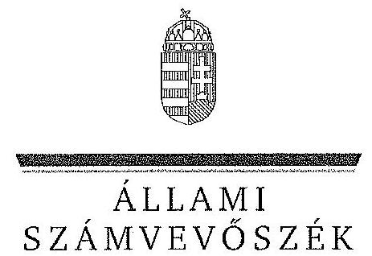
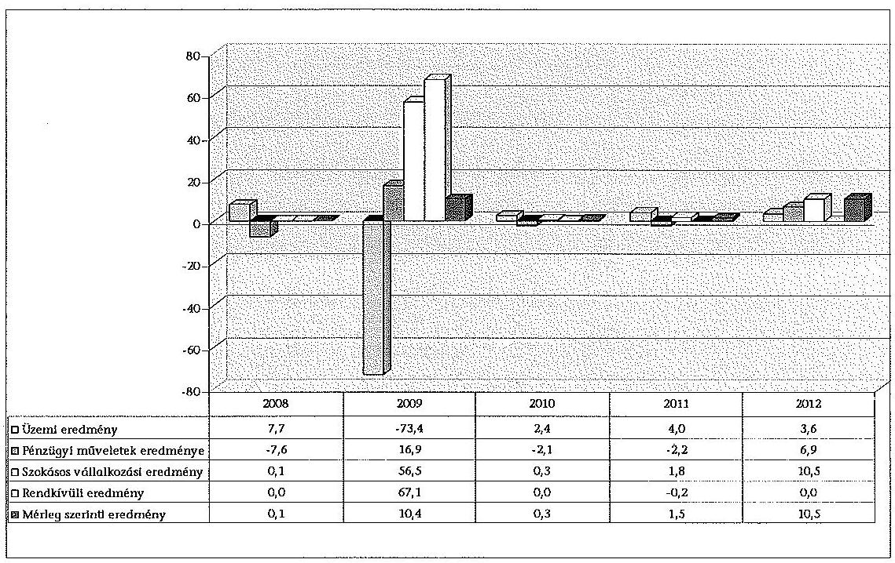
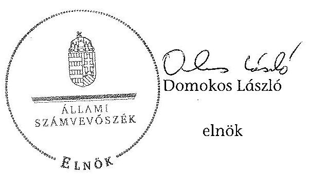
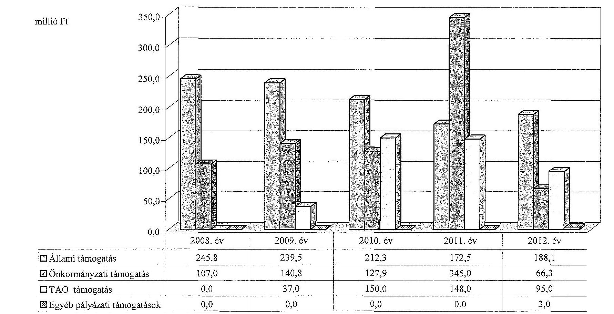
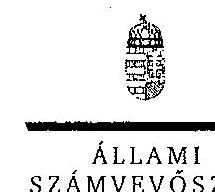
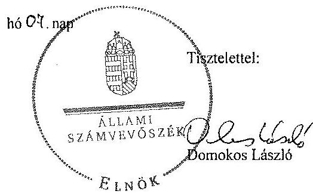
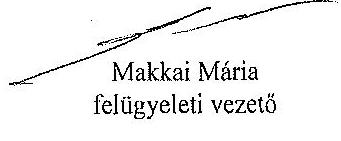

ÁLLAMI
SZÁMVEVŐSZÉK

# JELENTÉS 

az önkormányzatok többségi tulajdonában lévő gazdasági társaságok közfeladat-ellátásának ellenőrzéséről

József Attila Színház Nonprofit Kft.

---

# Állami Számvevőszék 

Iktatószám: V-0192-099/2014.
Témaszám: 1159
Vizsgálat-azonosító szám: V06530210

## Az ellenőrzést felügyelte:

## Makkai Mária

felügyeleti vezető
Az ellenőrzést vezette és az ellenőrzés végrehajtásáért felelős:
Horváth József
ellenőrzésvezető
A számvevőszéki jelentés összeállításában közremüködött:
Marozsán Katalin
számvevő
Az ellenőrzést végezték:

| Szakácsné | Marozsán Katalin | Zelenákné |
| :-- | :-- | :-- |
| Gelencsér Gabriella | számvevő | Poór Erzsébet |
| külső szakértő |  | külső szakértő |

A témához kapcsolódó eddig készített számvevőszéki jelentések:
címe
sorszáma
Jelentés a színházak állami támogatásának és gazdálkodásának 1039 ellenőrzéséről

---

# TARTALOMJEGYZÉK 

BEVEZETÉS ..... 3
I. ÖSSZEGZŐ MEGÁLLAPÍTÁSOK, KÖVETKEZTETÉSEK, JAVASLATOK ..... 6
II. RÉSZLETES MEGÁLLAPÍTÁSOK ..... 13

1. Az Önkormányzat közfeladat-ellátásának megszervezése ..... 13
1.1. A közfeladat meghatározása, a feladat ellátásának választott módja ..... 13
1.2. Az önkormányzati és a tulajdonosi irányítás megítélése ..... 17
2. A Színház közfeladat-ellátással kapcsolatos tevékenysége ..... 23
2.1. A gazdasági társaság szervezeti kialakítása, szabályozottsága ..... 23
2.2. A gazdasági társaság vagyonnyilvántartása ..... 26
2.3. A gazdasági évek ráfordításainak és bevételeinek alakulása ..... 28
2.4. A gazdasági társaság eredményének alakulása ..... 31
2.5. A gazdasági társaság folyamatos üzemmenetének, likviditásának biztosítása ..... 33
3. Az önkormányzat tulajdonosi jogainak és kötelezettségeinek érvényesítése ..... 34
3.1. A gazdasági társaságtól származó információk elemzése, hasznosítása ..... 34
3.2. Az önkormányzat közgyűlésének intézkedései ..... 35

## MELLÉKLETEK

1. számú A Színház szakmai tevékenységének mutatói a 2008. és a 2012. évek kö- zött
2. számú A Színház támogatása a 2008. és a 2012. évek között
3. számú A Színház vagyonának főbb adatai 2008. január 1-je és 2012. december 31-e között
4. számú Budapest Főváros Főpolgármesterének észrevétele
5. számú Tájékoztatás a József Attila Színház Nonprofit Kft. ügyvezető igazgatójá- nak

## FÜGGELÉKEK

1. számú Rövidítésjegyzék
2. számú Értelmező szótár

---

.

---

# JELENTÉS 

## az önkormányzatok többségi tulajdonában lévő gazdasági társaságok közfeladat-ellátásának ellenőrzéséről József Attila Színház Nonprofit Kft.

## BEVEZETÉS

Az Önkormányzatnak közfeladata az Ötv. alapján a művészeti feladatok ellátásáról való gondoskodás, az Mötv. szerint az előadó-művészeti szervezet támogatása. Ezt az Önkormányzat egyszemélyes tulajdonában álló előadóművészeti gazdasági társaság támogatásával valósította meg.

Az Önkormányzat az ellenőrzött időszakban színházi koncepcióval ${ }^{1}$ rendelkezett, amely a színházak működtetésének alternatívált vázolta fel és jövőbeli célokat határozott meg. Ezt a Közgyűlés határozattal² elfogadta.

A Közgyűlés határozatával elfogadott koncepció nem érintette a 2002. július 1. napjától 3,0 millió Ft törzstőkével megalapított, már társaságként működő Kht.-t. A József Attila Színház Kht. átalakítása a gazdasági társaságokról szóló törvény módosítása miatt vált szükségessé. A Közgyűlés a Gt. előírásainak megfelelően a 842/2009. (VI. 3.) számú határozatával ${ }^{3}$ módosította a Színház Alapító Okiratát, és 2009. július 18 -ai bejegyzéssel nonprofit korlátolt felelősségű társasági formában működtette tovább az előadó-művészeti szervezetet.

A színházak támogatása az ellenőrzött időszakban központi költségvetési, illetve fenntartói támogatás formájában, valamint pályázatok útján valósult meg. A 2010-2012. évek költségvetési törvényei egy összegben tartalmazták az Önkormányzat fenntartásában működő színházak fenntartói ösztönző részhozzájárulását, amelyet a fenntartó saját döntése alapján oszthatott el.

A Színház 1956 szeptemberében nyílt meg. A Színházat 2011. augusztus 1-jétől új ügyvezető igazgató irányítja. A Színház 2011-től társulat nélküli repertoár színház lett, két játszóhellyel, a 609 fő befogadására képes nagyszínpadi és a 60 fő befogadására képes stúdiószínházi nézőtérrel rendelkezik.

[^0]
[^0]:    ${ }^{1}$ Koncepció a fővárosi fenntartású színházak struktúráját és finanszírozását érintő változásokról (2007. XI. 29.)
    ${ }^{2}$ a Főv. Kgy. 1979/2007. (11.29.) sz. határozata
    ${ }^{3}$ a Főv. Kgy. 842/2009. (VI. 3.) sz. határozata a Színház nonprofit korlátolt felelősségű társaságként történő működtetéséről, alapító okiratának módosításáról

---

Az Önkormányzat a Színházzal a közfeladat ellátásának biztosítására 2002 júliusában Közszolgáltatási szerződés,-et kötött, melyet az ellenőrzött időszak végéig öt alkalommal módosítottak. 2013. január 1-jei hatálybalépéssel Fenntartói megállapodás megkötésére került sor. A Közszolgáltatási szerződés ${ }_{1}$ meghatározta a Színház közhasznú tevékenységének körét, az Önkormányzat által biztosított támogatás összegét, a közfeladat-ellátáshoz szükséges befektetett eszközöket, valamint azok rendelkezésre bocsátásának módját. Az ellenőrzött időszakban hatályos Közszolgáltatási szerződés ${ }_{2-6}$-ban a szakmai és a teljesítmény követelmények előírásával az Önkormányzat meghatározta a Színház közszolgáltatási tevékenységével kapcsolatos elvárásait.

Az Emtv. új elemként vezette be 2009 novemberétől a tao támogatást, mint közvetett támogatási formát. Ennek felső határát a jogalkotó a tárgyévi jegybevétel $80 \%$-ában határozta meg. A tao támogatás pénzügyi teljesülése a támogatást nyújtó vállalkozások eredményességének és támogatás nyújtási hajlandóságának a függvénye.

A Színház az Önkormányzat közfeladat-ellátása érdekében végzett tevékenységéhez az ellenőrzött időszakban összesen 1845,2 millió Ft állami és önkormányzati múködési támogatást kapott, fejlesztési támogatásban nem részesült. A Színház a 2009. és a 2012. évek között 430,0 millió Ft tao támogatást tudott igénybe venni.

Az ellenőrzött időszakban a Színház évente a nagyszínpadon átlagosan hat bemutatót tartott, repertoárjában nyolc-tíz előadás folyamatosan szerepelt. A Színház fizető nézőinek száma évente átlagosan 95 ezer fő, az előadások száma évi 216-301 darab között változott. A Színház által foglalkoztatott dolgozók átlaglétszáma a 2008. évi 109 fơről a 2012. évre 36 főre, 66,7\%-kal csökkent.

A Színház főbb szakmai mutatószámait az 1. számú melléklet tartalmazza.
Az ellenőrzés várható eredménye: a jelentés nyilvánossága a társadalom széles körével ismerteti meg a Színház gazdálkodására vonatkozó megállapításainkat, továbbá a megállapítások alapján megfogalmazott számvevőszéki javaslatok hasznosítása elősegíti a feltárt hibák megszüntetését, az ellenőrzött szervezet jobb feladatellátását. A társadalom számára jelzi, hogy közpénz nem maradhat ellenőrizetlenül, az ÁSZ értékteremtő rend kialakításához és megőrzéséhez hozzájáruló tevékenysége pozitív hatással lesz a szervezetről kialakított összkép formálásában. A szervezeten belül lehetőség nyílik arra, hogy a megállapítások szintetizálásával az ÁSZ a hozzáadott értéket teremtő, elemző tevékenységét és tanácsadó szerepét is erősítse. A jó gyakorlatok bemutatásával az ÁSZ hozzájárul a követendő megoldások megismertetéséhez, terjesztéséhez.

# Az ellenőrzés célja annak értékelése volt, hogy: 

- az Önkormányzat a jogszabályi előírások figyelembevételével döntött-e az ellenőrzésre kerülő közfeladat megszervezéséről, az ellátás módjáról; a tulajdonostól elvárható gondossággal felügyelte-e a társaság feladatellátását; a gazdasági társaság rendelkezésére bocsátotta-e a közfeladat-ellátásához a szükséges közvagyont, és biztosította-e a tulajdonosi jogok közvagyon feletti érvényesülését; a társaság vagyonvesztése esetén intézkedett-e a további vagyonvesztés megakadályozásáról;

---

- a gazdasági társaság teljesítette-e a tulajdonos önkormányzat részéről meghatározott célokat és feladatokat a rendelkezésre álló erőforrások felhasználásával; végrehajtotta-e a közfeladat-ellátási szerződés előirásait; betartotta-e a vagyonnal történő gazdálkodásra vonatkozó jogszabályi rendelkezéseket.

Az ellenőrzés hatóköre: az önkormányzatok közfeladat-ellátásának ellenőrzése, amely kiterjed az önkormányzatok és a közfeladatot ellátó, az önkormányzat többségi tulajdonában lévő gazdasági társaság közötti feladatmegosztásra, az önkormányzatok tulajdonosi jogainak gyakorlására, a nemzeti vagyon kezelésének ellenőrzése keretében a közfeladat-ellátáshoz rendelt vagyonés a vagyont érintő szerződésekre. A jelen ellenőrzés kiterjed az önkormányzatok többségi tulajdonlásával működő gazdasági társaságok közfeladatellátására, vagyongazdálkodási tevékenységére, a kapcsolódó nyilvántartások, elszámolások szabályszerűségére és megbízhatóságára. Az ellenőrzött tételek kiválasztása véletlen mintavétellel történt.

Az ellenőrzés típusa: szabályszerűségi ellenőrzés.
Az ellenőrzött időszak: a 2008-2012. évek, valamint a helyszíni ellenőrzés befejezéséig - 2013. szeptember 27-ig - bekövetkezett változások figyelemmel kísérése.

Ellenőrzött szervezet: a József Attila Színház Nonprofit Kft., valamint Budapest Főváros Önkormányzata.

Az ellenőrzés végrehajtásának jogszabályi alapját az ÁSZ tv. 5. § (3)-(5) bekezdéseiben foglaltak képezik.

Az ÁSZ a 2011. évi LXVI. törvény 29. §-a szerint a jelentéstervezetet megküldte Budapest Főváros Önkormányzata főpolgármesterének és a József Attila Színház Nonprofit Kft. ügyvezető igazgatójának egyeztetésre. Budapest Főváros Önkormányzatának főpolgármestere nem tett észrevételt, a József Attila Színház Nonprofit Kft. ügyvezető igazgatója nem élt észrevételezési jogával. A főpolgármester nemleges észrevételét, valamint a József Attila Színház Nonprofit Kft. ügyvezetőjének küldött tájékoztató levelet a jelentés 4. és 5. számú mellékletei tartalmazzák.

---

# I. ÖSSZEGZŐ MEGÁLLAPÍTÁSOK, KÖVETKEZTETÉSEK, JAVASLATOK 

Az Önkormányzat a művészeti feladatok ellátásáról való gondoskodásnak, illetve az előadó-művészeti szervezet támogatásának, mint az Ötv.-ben és az Mötv.-ben meghatározott közfeladatának, az ellenőrzött időszak alatt eleget tett. Az Önkormányzat a közfeladat-ellátását a József Attila Színház, mint gazdasági társaság támogatásával biztosította. A Közgyűlés a tulajdonosi joggyakorlás rendjét az ellenőrzött időszak alatt a szabályzataiban és rendeleteiben foglaltak szerint szabályozta. A tulajdonosi joggyakorlás keretében érdemi határozatokat hozott.

Az Önkormányzat a Színház részére az Alapító Okiratokban meghatározottaknak megfelelően az előadó-művészeti közfeladat-ellátásához szükséges ingó és ingatlan vagyont a Közszolgáltatási szerződésben foglaltak szerint ingyenesen (haszonkölcsönbe), majd a 2011. november 23 -án aláírt bérleti szerződés és a módosított Közszolgáltatási szerződés alapján 2011. szeptember 1-jétől az ingatlanokat bérleti jogviszony keretében használatba adta. A Színház részére ingyenes használatba (haszonkölcsönbe) átadott ingó és ingatlan vagyon értéke 2008. december 31 -én 127,8 millió Ft volt.

Az Önkormányzat az ellenőrzött időszak kezdetén hatályos Közszolgáltatási szerződés ${ }_{1}$ módosítása során nem járt el kellő körültekintéssel, mert a szerződés nem tartalmazta az átadott ingó és ingatlan vagyontárgyak aktuális nettó értékét, valamint a szerződésben előírt elkülönített analitikus nyilvántartás vezetéséhez szükséges adatokat, azokat a 2002. évben megkötött Közszolgáltatási szerződés mellékleteire történő hivatkozással határozta meg. A Közszolgáltatási szerződés ${ }_{2-6}$ módosításai során nem aktualizálták az évekkel korábban megkötött szerződés mellékletét képező vagyonkimutatást. A 2012. október 26 -ai keltezéssel aláírt Fenntartói megállapodás - az Áht. ${ }_{2}{ }^{4}$ előírásának megfelelően már tartalmazta a változásokkal módosított eszközlistát, a vonatkozó bruttó és nettó érték adatokkal.

Az Önkormányzat a közfeladat-ellátásának tárgyi és pénzügyi feltételeit a Közszolgáltatási szerződés ${ }_{1-6}$-ban határozta meg. A Színház részére a közfeladatellátáshoz szükséges forrás biztosításáról a Közszolgáltatási szerződésben (az annak elválaszthatatlan részét képező éves költségvetési rendeletekben) döntött a Közgyűlés. Meghatározta a közhasznú tevékenység körét, a szerződés megszűnésének esetére szabályozta a vagyontárgyak visszaszolgáltatásának rendjét és határidejét, továbbá a Színház által teljesítendő művészeti tevékenységek jellegét, mértékét és pontos mutatószámait. Az önkormányzati tulajdon védelme érdekében szabályozta a leltár készítését, annak gyakoriságát, továbbá a gaz-

[^0]
[^0]:    ${ }^{4}$ Az Áht. ${ }_{2}$ 105/A. § (13) bekezdése szerint a vagyonkezelő a vagyonkezelésébe vett vagyon eszközeiről olyan elkülönített nyilvántartást köteles vezetni, amely tételesen tartalmazza ezek könyv szerinti bruttó és nettó értékét, az elszámolt értékcsökkenés összegét és az azokban bekövetkezett változásokat.

---

dálkodás és a művészeti tevékenység ellátásával összefüggő kötelező adatszolgáltatás formáját, idejét és módját, valamint előírta a gazdálkodás körében felmerülő rendkívüli eseményekről történő tájékoztatási kötelezettséget.

A leltározásra vonatkozó előírások az Önkormányzat Vagyonrendeleteiben nem a hatályos jogszabályoknak megfelelően szerepeltek, mivel az üzemeltetésre, kezelésre átadott eszközök leltározási szabályairól a Vagyonrendelet ${ }_{1,2}$ az Áhsz. ${ }_{1}$ 2010. január 1-jétől hatályos előírásaival ellentétben nem tartalmazott szabályozást.

Az Önkormányzat a vagyon védelme érdekében a Közszolgáltatási szerződés ${ }_{1-6}{ }^{-}$ ban garanciális követelményként fogalmazta meg a kötelezettségek megszegésének jogkövetkezményét, valamint a szerződés megszűnésének esetére az átadott vagyontárgyak visszaszolgáltatási kötelezettségét. Az ellenőrzött időszakban kötelezettség megszegésére, illetve szerződés megszűntetésére nem került sor.

A Közgyűlés a Színház Alapító Okirat ${ }_{1}$-ben - a Gt. előírásaival összhangban szabályozta az Alapító tulajdonosi joggyakorlásának kereteit. Az Alapító Okiratban a Színház legfőbb szerve, a Közgyűlés kizárólagos hatáskörébe tartozó feladatként határozta meg a Színház SZMSZ-ének és az FB ügyrendjének jóváhagyását. A Színház a 2009. évi szervezeti formaváltozás és a csoportos létszámleépítés miatt 2012-ben új SZMSZ-t készített, amelyet jóváhagyásra benyújtott. Azt az Önkormányzat a helyszíni ellenőrzés befejezéséig nem hagyta jóvá. Az FB ügyrendjét a Gt. 34. § (4) bekezdése alapján az FB tagjai készítették el, azonban az Alapító általi jóváhagyásra nem terjesztették elő.

A 2010. évben a Színház FB elnökét a Közgyűlés közvetlenül választotta. Az eljárás ellentétes volt a Gt. előírásával, amely szerint - ha törvény vagy a társasági szerződés ettől eltérően nem rendelkezik - az FB a tagjai sorából választ elnököt.

A Közgyűlés a társaság ügyvezetőjének és egyéb vezető állású dolgozóinak, valamint az FB tagok díjazására vonatkozó Javadalmazási szabályzat ${ }_{2}$-őt a Taktv.-ben foglalt határidőn túl, 2010. január 31. helyett 2010. április 29-én fogadta el.

Az Önkormányzat a Színház beszámolójának és üzleti tervének elfogadását, az adatszolgáltatási kötelezettség ellenőrzését a jogszabályokban, az Önkormányzat belső szabályzataiban és a Közszolgáltatási szerződés ${ }_{1,4}$-ban foglaltaknak megfelelően, határidőn belül - az FB határozatok és a könyvvizsgálói jelentés figyelembevételével - végezte el.

A könyvvizsgáló a jelenlegi ÁSZ ellenőrzés által - az értékcsökkenés, valamint a kötelezettségek elszámolásával összefüggő - feltárt hibákat, továbbá a Kiegészítő melléklet tartalmi hiányosságait jelentésében, illetve vezetői levélben nem jelezte sem a tulajdonos, sem a Színház vezetése felé. Az ellenőrzött évek mindegyikében a Színház beszámolóját hitelesítő záradékkal látta el.

A Színház szakmai tevékenységének ellátását az Önkormányzat évadbeszámolók alapján értékelte. A Színház az ellenőrzött időszak minden évében elkészítette a szakmai értékelését, amelyet a 2008. és 2010. évek között az Önkor-

---

mányzat Kulturális Bizottsága elfogadott. A 2011. és 2012. évekre benyújtott évadbeszámolókról a kulturális ügyekért felelős Főpolgármester-helyettes Tájékoztatót nyújtott be a Közgyűlés részére, amelyet a Közgyűlés tudomásul vett.

A 2008. és 2010. évek között a prémiumfeladatok kitűzésének jóváhagyása a Javadalmazási szabályzat ${ }_{1}$-ben foglaltaknak megfelelően történt. A 2011. és 2012. évekre vonatkozóan a Színház ügyvezetőjének a prémiumfeladatait és a prémium mértékét a Javadalmazási szabályzat ${ }_{2-3}$-ban foglaltaktól eltérően - késedelmesen - az üzleti terv elfogadását követően határozta meg az Alapító.

Az Önkormányzat belső ellenőrzése a 2010. évben szabályszerűségi ellenőrzést végzett a Színháznál. A jelentésében a 2008-2010. évekre vonatkozóan megállapította, hogy a szervezeti és gazdálkodási szabályozottság elavult, a gazdálkodási jogkörök gyakorlását nem szabályozták és a kontrolltevékenység nem volt kielégítő. A belső ellenőrzési jelentésben javaslatot fogalmaztak meg a szervezeti és gazdálkodási szabályozottság aktualizálására, valamint a könyvvezetés és a beszámoló Számv. tv-ben foglaltak szerinti elkészítésére. Az ellenőrzés javaslataira a Színház Intézkedési tervet készített, melyet a tulajdonos kiegészítésekkel 2011 márciusában elfogadott. A Színház az Intézkedési terv végrehajtásáról folyamatosan beszámolt a tulajdonos felé, melynek teljesítését 2013 júliusában az Önkormányzat Belső Ellenőrzési Osztálya elfogadta.

A belső ellenőrzés a jelentésében megállapította továbbá, hogy az FB és a könyvvizsgáló a Színháznál felmerült gazdálkodási problémákat a tulajdonos felé nem jelezte. A belső ellenőrzés felvetette az ügyvezető, a gazdasági vezető és a könyvviteli szolgáltató mulasztása valamint az ellenőrzési kötelezettség elmulasztása miatt az FB és a könyvvizsgáló polgári jogi felelősségét. A felelősség megállapítása érdekében a belső ellenőrzési jelentésben foglaltak alapján a tulajdonos Fővárosi Önkormányzat Jogi és Közbeszerzési Főosztálya a 2011. évben bűntető feljelentést tett a Budapesti V. és XIII. Kerületi Ügyészségen. A feljelentés alapján az Ügyészség nyomozást rendelt el a számviteli rend megsértése vétségének gyanúja miatt, amely a helyszíni ellenőrzés befejezéséig nem zárult le.

Az Önkormányzat a 2008-2012. években a fentiekben leírt, a belső ellenőrzési jelentésben feltárt hiányosságokra tett feljelentést kivéve a vagyon és a közpénzek nem célszerinti hasznosításával összefüggésben tulajdonosi intézkedéseket nem tett.

A Színház teljesítette az Önkormányzat részéről a Közszolgáltatási szerződésekben meghatározott célokat, illetve feladatokat. és folyamatosan biztosította a tevékenységi körébe tartozó színházi szolgáltatást.

A gazdálkodás belső szabályozására vonatkozó jogszabályi rendelkezéseket a Színház a 2008-2010. években nem tartotta be, a 2002. évben hatályba lépett szabályzatait nem aktualizálta a jogszabályváltozásoknak megfelelően. Ez a Színház integritásával kapcsolatban kockázatot jelentett.

A 2008-2010. években hatályos Számviteli politika ${ }_{1}$ elszámolási szabályai nem tükrözték a Színház sajátosságait, továbbá nem követték az időközben végrehajtott jogszabályi változásokat. A Színház nem rendelkezett a Számv. tv.-nek megfelelő Számlarenddel, Értékelési és Bizonylati szabályzattal, valamint a

---

gazdálkodási jogkörök gyakorlására vonatkozó belső előírással. A saját előállítású szellemi termékek és tárgyi eszközök állományba vételét belső szabályozás nélkül végezték. A Színház rendelkezett Leltározási és leltárkészittési, továbbá Selejtezési szabályzat ${ }_{1}$-gyel, azonban azok tartalma nem felelt meg a Számv. tv. előírásainak.

A 2011. és 2012. években a Színház gazdálkodásának szabályozottsága javult. A 2011 augusztusában kinevezett ügyvezető igazgató gondoskodott a Számviteli politika ${ }_{2}$ és a kapcsolódó szabályzatok elkészítéséről és érvénybe léptetéséről. A szabályzatok azonban nem feleltek meg teljes körűen a Számv. tv. előírásainak. A Leltározási és leltárkészítési szabályzat ${ }_{2}$ az ingatlanok esetében a Számv. tv. előírása szerinti legalább 3 éves gyakorisággal szemben 5 évenkénti mennyiségi felvétellel történő leltározási kötelezettséget írt elő. Az Eszközök és Források értékelési szabályzata ${ }_{1}$ nem tartalmazott előírást a bemutató után felmerült kiadások elszámolására vonatkozóan. A Pénzkezelési szabályzat ${ }_{3}$ nem tartalmazta a pénzügyi jogkörök gyakorlására feljogosított munkakörök megnevezését, valamint a felelős személyek nevét és aláírásmintáit.

A Színház - a 2009. év kivételével - eleget tett a Közszolgáltatási szerződés ${ }_{1.6}$ ban előírtaknak, valamint a Számv. tv.-ben foglaltaknak és az Önkormányzat által a Színház részére ingyenes használatra átengedett ingó és ingatlan vagyont saját vagyonától elkülönítetten tartotta nyilván. A 2009. évben az önkormányzati vagyont számviteli nyilvántartásában a nullás számlaosztályban nem mutatta ki.

A Színház a 2008-2010. években a saját és az önkormányzati tulajdonú vagyonra vonatkozóan nem tartotta be teljes körűen a mérleg leltárral történő alátámasztására a Számv. tv.-ben előírtakat. A leltározást saját eszközei tekintetében mennyiségi leltárfelvétellel nem minden mérlegtételre vonatkozóan végezte el. Az Önkormányzattól használatra átvett ingó vagyontárgyak évenkénti leltározását nem hajtotta végre.

A Színház közfeladatai ellátásához biztosított - saját és önkormányzati tulajdonú - eszközök 2012. december 31-ei nettó értéke ( 312,7 millió Ft) a 2008. december 31-ei adathoz viszonyítva $18,1 \%$-kal csökkent.

A Színház ráfordításai a 2008. évi 686,1 millió Ft-ról a 2012. évre 537,0 millió Ft-ra, $21,8 \%$-kal, a bevételei a 2008. évi 686,2 millió Ft-ról a 2012. évre 547,6 millió Ft-ra, $20,2 \%$-kal csökkentek.

A Színház összes ráfordításából átlagosan $42,0 \%$-ot az anyagjellegủ ráfordítások, $42,9 \%$-ot a személyi jellegű ráfordítások és $17,1 \%$-ot az egyéb költségek képviseltek.

A Színház a személyi juttatásokhoz kapcsolódó adó- és járulékkötelezettségeinek bevallását nem a bér és járulékok könyvelési adatai alapján készítette el. A 2008. évben a november hónap kivételével adókötelezettségeiről nullás bevallást adott, így kötelezettségeit az APEH részére nem vallotta be. A 2008. és a 2010. évek közötti bevallásait önrevízióval módosította, így 2010. június 30 -án adófolyószámlája 110,9 millió Ft adókötelezettséget mutatott. 2010 szeptemberéig adótartozását 49,8 millió Ft-ra csökkentette, melynek behajtása érdekében

---

az APEH 2010. szeptember 21-én és 22-én a Színház eszközeiből 10 eszközt végrehajtás keretében lefoglalt. A végrehajtást követően a Színház részletfizetési kérelmet nyújtott be, melyet az adóhatóság elfogadott. Az adótartozás megfizetése után az APEH 2011. november 4-én a foglalást feloldotta.

A kötelezettségek csökkentése érdekében a 2010. év végéig felhalmozott adó- és járulék, valamint szállítói tartozások kifizetésére a 2011. évben az Önkormányzat 169,0 millió Ft többlettámogatást, valamint 120,0 millió Ft négy éves futamidejű kölcsönt nyújtott, melyet a tartozások rendezésére fordítottak. A megállapodás értelmében a kapott összeg célszerinti felhasználásáról az ügyvezető gondoskodott, és az erről szóló beszámolási kötelezettségének eleget tett.

A Színház az értékcsökkenési leírás elszámolásánál csak részben tartotta be a Számv. tv.-ben és a Számviteli politika ${ }_{1}$-ben meghatározottakat, mivel a 2008. és 2010. év között nem számolt el terven felüli értékcsökkenést a már músoron nem lévő produkciókhoz kapcsolódó, nettó értékkel még rendelkező díszletek és jelmezek után. Ezáltal a 2008. és 2010. évek közötti eredménye nem a valós ráfordításokat tükrözte. A 2011. évben a Színház által - a korábbi években - már nem használt és értékben nyilvántartott eszközök után 102,9 millió Ft terven felüli értékcsökkenést számoltak el.

A Színház a 2011. évben a Számviteli politikájában a színpadi díszletek és jelmezek leírási módját megváltoztatta, a teljesítményarányos leírásról a degreszszív leírási módra tért át. A leírási mód változtatásának az eredményre gyakorolt hatását a 2011. évi beszámoló kiegészítő mellékletében nem mutatta be.

A Színház az ellenőrzött időszak minden évében elkészítette az üzleti tervét. Az üzleti terveiben minden évben minimális, 1,0 millió Ft nyereséget tervezett, melyet a 2009. év kivételével túlteljesített. A Színház mérleg szerinti eredménye 2008-2012 között pozitív volt. Nagysága 0,1-10,5 millió Ft között változott.

A 2008. és 2010. évek között a Színház kiadásai minden évben meghaladták a pénzügyileg realizált bevételeit. Ennek következtében a Színháznak folyamatosan finanszírozási problémái voltak. A likviditás biztosítására a 2008. évben az Alapító Okiratban előírt tulajdonosi és FB-hozzájárulás nélkül 45,0 millió Ft finanszírozási hitelt vett fel, melyet 2011 szeptemberében fizetett vissza. A folyószámlahitel lejártát követően az Önkormányzat 120,0 millió Ft hosszú lejáratú hitel nyújtásával segítette a likviditási problémák megoldását. A tulajdonosi hitelen felül az Önkormányzat a 2011. évben a gazdasági helyzet stabilizálására 169,0 millió Ft, a csoportos létszámleépítés végrehajtására 104,0 millió Ft többlettámogatást nyújtott a Színház részére.

A Színház pénzügyi helyzete a 2012. év végére stabilizálódott, kötelezettségeit folyamatosan rendezte. A Színház 2008. december 31-én fennálló 239,5 millió Ft kötelezettsége 2012. december 31-ére 148,5 millió Ft-ra csökkent a többlettámogatás, illetve a tulajdonosi hitel következtében. A 2012. évi kötelezettségek állományából a szállítói tartozás 4,8 millió Ft volt.

A Színház az ellenőrzött időszakban eszközeinek fejlesztésére felújítási és beruházási forrással nem rendelkezett. Ennek következtében a saját befektetett eszközeinek értéke a 2008. január 1-jei 155,7 millió Ft-ról 2012. december 31-ére 17,8 millió Ft-ra ( $88,6 \%$-kal) csökkent.

---

Az Állami Számvevőszékről szóló 2011. évi LXVI. törvény 33. § (1) bekezdésében foglaltak értelmében a jelentésben foglalt megállapításokhoz kapcsolódó intézkedési tervet köteles az ellenőrzött szervezet vezetője összeállítani, és azt a jelentés kézhezvételétől számított 30 napon belül az ÁSZ részére megküldeni. Amennyiben az intézkedési tervet határidőben nem küldi meg a szervezet, vagy az nem elfogadható, az ÁSZ elnöke a hivatkozott törvény 33. § (3) bekezdés a)-b) pontjaiban foglaltakat érvényesítheti.

Az ellenőrzés intézkedést igénylő megállapításai és javaslatai:

# Budapest Főváros Főjegyzöjének 

1. A leltározásra vonatkozó előírások az Önkormányzat Vagyonrendeleteiben nem a hatályos jogszabályoknak megfelelően szerepeltek, mivel az üzemeltetésre, kezelésre átadott eszközök leltározási szabályairól a Vagyonrendelet 2010. január 1-jétől az Áhsz. ${ }_{1}$ előírásaival ellentétben nem tartalmazott szabályozást.

Javaslat:
Készítse elő a Közgyűlés elé való terjesztés érdekében a Vagyonrendelet ${ }_{2}$ módosítását, hogy az tartalmazza az Áhsz. 2 22. § (2) bekezdésben előírtaknak megfelelően az üzemeltetésre, kezelésre átadott eszközök leltározási szabályait.
2. A Közgyűlés a Színház Alapító Okirat ${ }_{1}$-ben - a Gt. előírásaival összhangban - szabályozta az Alapító tulajdonosi joggyakorlásának kereteit. Az Alapító Okiratban a Színház legfőbb szerve, a Közgyűlés kizárólagos hatáskörébe tartozó feladatként határozta meg az SZMSZ és az FB ügyrendjének jóváhagyását. Az FB ügyrendjét a Gt. 34. § (4) bekezdése alapján az FB tagjai készítették el, azonban az Alapító általi jóváhagyásra nem terjesztették elő. A Színház a 2009. évi szervezeti formaváltozás és a csoportos létszámleépítés miatt 2012-ben új SZMSZ-t készített, amelyet jóváhagyásra benyújtott. Azt az Önkormányzat a helyszíni ellenőrzés befejezéséig nem hagyta jóvá.

Javaslat:
Készítse elő a Színház SZMSZ-ét és az FB ügyrendjét annak érdekében, hogy a Főpolgármester azt a jóváhagyás céljából a képviselő-testület elé tudja terjeszteni.

## A József Attila Színház Igazgatója számára

1. A leltározási szabályzat nem felelt meg a Számv. tv. 2012. január 1-jével hatályos 69. § (3) bekezdés előírásának, mert az ingatlanok, gépek, berendezések esetében a törvényi előírás szerinti legalább 3 éves gyakorisággal szemben 5 évenkénti mennyiségi felvétellel történő leltározási kötelezettséget írt elő.

Javaslat:
Intézkedjen a leltározási szabályzat ${ }_{2}$-ben előírt leltározási gyakoriság módosításáról a Számv. tv. előírásának megfelelően.

---

2. A Pénzkezelési szabályzat nem tartalmazta a pénzügyi jogkörök gyakorlására feljogosított munkakörök megnevezését, valamint a felelős személyek nevét, és aláírásmintáit.

Javaslat:
Intézkedjen a Pénzkezelési szabályzat kiegészítéséről a Számv. tv. 14.§ (8) bekezdésében foglalt előírásoknak megfelelően.
3. Az Eszközök és Források értékelési szabályzata szerint a bemutatóig felmerült díszletés jelmezkiadásokat - az egy évnél hosszabb használati idejű díszletek és jelmezek estében - értéktől függetlenül a tárgyi eszközök között kell elszámolni. A szabályzat nem tartalmazott előírást a bemutató után felmerült kiadások elszámolására. A gyakorlatban ezeket a költségeket - értéktől és használati időtől függetlenül - azonnal költségként, az 5-ös számlaosztályban számolták el.

Javaslat:
Intézkedjen az Eszközök és források értékelési szabályzata kiegészítéséről a bemutató után felmerült díszlet- és jelmezkiadások elszámolásának szabályozására.
4. A 2008. és 2010. évek között a Színház kiadásai minden évben meghaladták a pénzügyileg realizált bevételeit. Ennek következtében a Színháznak folyamatosan finanszírozási problémái voltak. A likviditás biztosítására a 2008. évben az Alapító Okiratban előírt tulajdonosi és FB-hozzájárulás nélkül 45,0 millió Ft finanszírozási hitelt vett fel. Az Önkormányzat belső ellenőrzése a 2010. évben szabályszerűségi ellenőrzést végzett a Színházháznál. A jelentésében a 2008-2010. évekre vonatkozóan megállapította, hogy a szervezeti és gazdálkodási szabályozottság elavult, a gazdálkodási jogkörök gyakorlását nem szabályozták és a kontrolltevékenység nem volt kielégítő.

Javaslat:
Intézkedjen a belső ellenőrzés, valamint a számvevőszéki ellenőrzés által feltárt szabálytalanságok körülményeinek kivizsgálásáról, és amennyiben a vizsgálat eredménye indokolja, hozza meg a szükséges munkajogi intézkedéseket.

---

# II. RÉSZLETES MEGÁLLAPÍTÁSOK 

## 1. Az ÖNKORMÁNYZAT KÖZFELADAT-ELLÁTÁSÁNAK MEGSZERVEZÉSE

### 1.1. A közfeladat meghatározása, a feladat ellátásának választott módja

Az Önkormányzat a művészeti feladatok ellátásáról való gondoskodásnak, illetve az előadó-művészeti szervezet támogatásának, mint az Ötv.-ben és az Mötv.-ben meghatározott kötelezö közfeladatának, az ellenőrzött időszak alatt eleget tett. Az Önkormányzat a közfeladat ellátását 2010. június 17-ig a József Attila Színház Közhasznú Társaság, 2010. június 18-tól a József Attila Színház Nonprofit Kft. támogatásával biztosította.

Az Önkormányzat kötelező közfeladata az Ötv. 63/A §. n) pontja szerint a művészeti feladatok ellátása ${ }^{5}$. A Htv. 111. § alapján a közművelődési, közgyűjteményi és művészeti tevékenységekkel kapcsolatos helyi irányítási, ellenőrzési, valamint a fenntartással és működtetéssel kapcsolatos feladatokat a Közgyűlés látja el. A kulturális feladat ellátását az Önkormányzat az Emtv. 3. § (2) bekezdése alapján előadó-művészeti szervezet (gazdasági társaság) támogatásával valósította meg.

Az Önkormányzat az ellenőrzött időszakban elfogadott kulturális koncepcióval ${ }^{6}$ rendelkezett, amelyet a Közgyűlés ${ }^{7}$ határozatával fogadott el.

A koncepció a színházak múködtetésének módozatait vázolta fel és jövőbeli célokat határozott meg, azonban nem vizsgálta a megvalósításhoz szükséges források nagyságát.

A 2010. évi önkormányzati választásokat követően az Ötv. 91. § (6) bekezdésnek megfelelően a Közgyűlés ${ }^{8}$ elfogadta az Önkormányzat 2011-2014. évekre vonatkozó Gazdasági Programját ${ }^{9}$.

Az Önkormányzat a Színház Alapító Okirat ${ }_{1.8}$-ban - a Gt. előírásaival összhangban - szabályozta az Alapító tulajdonosi joggyakorlásának kereteit. Az Alapító Okirat ${ }_{1.8}$ megfelelően rendelkezett a társaság gazdálkodása során elért eredmény felhasználásáról, az ügyvezető, az FB tagok és a könyvvizsgáló kije-

[^0]
[^0]:    ${ }^{5}$ A 2013. január 1-jétől hatályos Mötv. 13.§ 1) 7. pontja is kötelezően ellátandó feladatként határozza meg az előadó-művészeti szervezetek támogatását.
    ${ }^{6}$ Koncepció a fővárosi fenntartású színházak struktúráját és finanszírozását érintő változásokról
    ${ }^{7}$ Főv. Kgy. 1979/2007. (11.29.) sz. határozata
    ${ }^{8}$ Főv. Kgy. 937/2011. (04.27.) sz. határozata
    ${ }^{9}$ A Főváros fejlesztésének és gazdálkodásának stabilizálása és reformkoncepciója a 2011-2014. évi választási ciklusra

---

löléséről, az összeférhetetlenségi szabályokról, valamint az Áht., 100/N. § (8) bekezdése előírásainak betartatásáról.

Az Emtv. hatálybalépésével a tevékenység ellátására vonatkozó követelmények, feladatmutatók a törvény által kerültek meghatározásra.

Az Önkormányzat a Színház teljesítményével kapcsolatosan a konkrét célokat, elvárásokat a Közszolgáltatási szerződés,-ben fogalmazta meg. A szakmai elvárásait az igazgatói pályázat kiírásában szerepeltette, a megválasztott igazgató pályázata stratégiai céljait, valamint konkrét szakmai elképzeléseit foglalta össze.

Az Önkormányzat a közfeladat ellátása érdekében 2011. július 31-ig az Alapitó Okiratokban foglaltaknak megfelelően ingyenesen a Színház rendelkezésére bocsátotta - haszonkölcsönbe adta - az előadó-múvészeti közfeladat-ellátásához szükséges ingatlan és ingó vagyont. A 2008. évben a haszonkölcsönbe adott eszközök nettó értéke 127,9 millió Ft volt.

Az Önkormányzat a hatályos Emtv. 15. § (3) bekezdésének megfelelően a Színház hatósági nyilvántartás szerinti adatainak módosítására irányuló kérelmét benyújtotta. Az előadó-művészeti szervezetet (a Színházat) a KÖH Film- és Elő-adó-művészeti Iroda nyilvántartásba vette. A Nvtv. 3. § alapján az ellenőrzött Színház átlátható szervezet.

Az Önkormányzat tulajdonában álló vagyon a nemzeti vagyon részét képezi. A vagyonrendelet ${ }_{2} 6 . \S$ (1) bekezdés 6 . pontja szerint a Színház használatában lévő, a feladatellátását szolgáló ingatlanvagyon korlátozottan forgalomképes törzsvagyon. Az átadott ingatlanvagyont, valamint a Színház törzstőkéjét az ellenőrzött időszakban az Önkormányzat által évente elkészített Vagyonkimutatás beazonosítható módon tartalmazta.

Az Önkormányzat a közfeladat-ellátásának tárgyi és pénzügyi feltételeit a Közszolgáltatási szerződés ${ }_{1-6}$-ban határozta meg. A Közszolgáltatási szerződés tartalmazta a közhasznú tevékenység körét, a szerződés megszűnésének esetére szabályozta a vagyontárgyak visszaszolgáltatásának rendjét és határidejét, továbbá a színház által teljesítendő művészeti tevékenységek jellegét, körét, mértékét és pontos mutatószámait. Szabályozta a kötelező leltár készítését, annak gyakoriságát, továbbá a gazdálkodás és a művészeti tevékenység ellátásával összefüggő kötelező adatszolgáltatás formáját, idejét és módját, valamint előírta a gazdálkodás körében felmerülő rendkívüli eseményekről történő tájékoztatási kötelezettséget.

Az Önkormányzat az ellenőrzött időszak kezdetén hatályos Közszolgáltatási szerződés ${ }_{1}$ módosítása során nem járt el kellő körültekintéssel, mert a szerződés, illetve melléklete nem tartalmazta az átadott ingó és ingatlan vagyontárgyak aktuális nettó értékét, valamint a szerződésben előírt elkülönített analitikus nyilvántartás vezetéséhez szükséges (bruttó érték, az értékcsökkenési leírás mértéke) adatokat.

---

A 2012. október 26-ai keltezéssel aláírt, 2013. január 1-jétől hatályos Fenntartói megállapodás - az Áht. 2 105/A. § (13) bekezdésében ${ }^{10}$ foglaltaknak megfelelően - már tartalmazta a változásokkal módosított eszközlistát, a vonatkozó bruttó, értékcsökkenési és nettó érték adatokkal.

A Fővárosi Közgyűlés 2307/2011. (08. 31.) számú határozata alapján az Önkormányzat képviseletében a BFVK Zrt. és a Színház 2011. november 23án Bérleti szerződést kötöttek, amely alapján a Fővárosi Önkormányzat tulajdonában álló ingatlanok után bérleti díjat kellett fizetni. A Fővárosi Közgyűlés 2434/2011. (08. 31.) számú határozatát határidőn túl hajtották végre, mivel a Főpolgármester-helyettes a Közszolgáltatási szerződés módosítását a 2011. október 1-jei határidőt követően írta alá. A Közszolgáltatási szerződés 2011. november 25 -ei módosításával a közfeladat ellátáshoz szükséges ingatlanokat visszamenőlegesen, 2011. szeptember 1-jétől a színház ingyenesen nem használhatta.

A Színháznak a bérleti szerződés aláírását megelőző időszakra használati díjat, azt követően bérleti díjat ( 6,0 millió Ft/hóráfa), valamint a bérleti díj összegét alapul véve egyszeri 3 havi megszerzési díjat és 5 havi óvadékot kellett fizetnie. A 2011. évre vonatkozóan óvadékként, megszerzési díjként és használati díjként összesen egy évi bérleti díjnak megfelelő összeg került kifizetésre. A bérleti szerződés 5 ingatlanra vonatkozott, melyet 2012. május 26 -tól 4 ingatlanra módosítottak, és a havi bérleti díj 6,1 millió Ft+áfa összegre nőtt.

A felek 2012-ben a Bérleti szerződés 2. pontját kiegészítették azzal, hogy az Önkormányzat az óvadék összegét „a bérleti szerződés időtartama alatt a kielégítési jog megnyílta előtt használhatja és rendelkezhet vele." Az óvadék összegének fedezete az Önkormányzat részéről tett nyilatkozat ${ }^{11}$ alapján folyamatosan rendelkezésre állt.

A Színház támogatása az ellenőrzött időszakban központi költségvetési, illetve fenntartói támogatással, valamint pályázatok útján valósult meg. Az Önkormányzat a saját tulajdonosi támogatásának színházak közötti elosztási elveit, szempontjait szabályzatban, belső utasításban nem határozta meg, annak mértékét, nagyságrendjét a teljes támogatási összeghez igazította.

A 2010. évtől az Emtv.16. § (1) bekezdése ${ }^{12}$ szerint a színházak támogatása művészeti ösztönző részhozzájárulásból és fenntartói ösztönző részhozzájárulásból tevődött össze. A 2010-2012. évek között a költségvetési törvények 7. sz. melléklete egy összegben tartalmazta a Fővárosi Önkormányzat fenntartásában müködő színházak fenntartói ösztönző részhozzájárulását, amelyet a fenntartó saját döntése alapján oszthatott el. A költségvetési törvények a színházak művészeti ösz-

[^0]
[^0]:    ${ }^{10} \mathrm{Az}$ Áht. ${ }_{2}$ 105/A. § (13) bekezdése szerint a vagyonkezelő a vagyonkezelésébe vett vagyon eszközeiről olyan elkülönített nyilvántartást köteles vezetni, amely tételesen tartalmazza ezek könyv szerinti bruttó és nettó értékét, az elszámolt értékcsökkenés összegét és az azokban bekövetkezett változásokat.
    ${ }^{11}$ a Főpolgármesteri Hivatal ellenőrzéshez kirendelt kapcsolattartója 2013. augusztus 14-én adott válasza alapján
    ${ }^{12}$ hatályon kívül helyezve 2012. május 1-jével

---

tönző részhozzájárulását külön nevesítve tartalmazták. A 2013. évtől a színházakat művészeti és létesítménygazdálkodási célra múködési támogatás illette meg.

Az Emtv. 48. § (1) bekezdése új elemként bevezette - a Taotv. 7. § (1) bekezdés z) pontja alapján - a társasági adókedvezménnyel igénybe vehető támogatást, mint közvetett támogatási formát. A tao kedvezmény igénybevétele 2009. november 12 -től volt lehetséges, a meghatározott jegybevétel $80 \%$-álg. A tao támogatás pénzügyi teljesülése a támogatást nyújtó vállalkozások eredményességének és támogatás nyújtási hajlandóságának függvénye.

Az ellenőrzött időszakban a Színház számára biztosított múködési hozzájárulás és tao támogatás alakulását a 2. számú melléklet tartalmazza.

Az állami támogatás összege 2008-2012 között 1058,2 millió Ft volt, a 2011. évet kivéve meghaladta az önkormányzati támogatás összegét ( 787,0 millió Ft), és a részaránya is magasabb volt. A 2009. évtől kezdődően a tao támogatás növekedett, a 2012. évben azonban a jegybevételhez viszonyítva is visszaesés következett be.

Az önkormányzati támogatás összege a 2008. évről a 2009. évre 31,6\%-kal ( 33,8 M Ft-tal) növekedett, a 2010. évben az előző évhez képest 9,4\%-kal (12,9 M Ft-tal) csökkent. A 2011. évben a Színház a felhalmozott, határidőn túli adóés járulék, valamint szállítói tartozásainak és a létszámleépítés kiadásainak fedezetére 273,0 millió Ft többlettámogatást kapott a tulajdonostól, így az előző évhez viszonyítva $169,7 \%$-kal ( $217,1 \mathrm{MFt}$ ) nőtt a támogatása. A 2012. évben - az előző évi eseti támogatástól eltekintve - is csökkent a Színház támogatása 7,9\%$\mathrm{kal}(5,7 \mathrm{MFt})$.

Az ellenőrzött időszakban az önkormányzati vagyon megőrzése, védelme érdekében a leltározást az Önkormányzat Vagyonrendelete ${ }_{1,2}$ szabályozta. A Vagyonrendelet ${ }_{1} 12 . \S$ (1) bekezdése szerint az Önkormányzat tulajdonában lévő eszközöket minden évben leltározni kell, az ettől eltérő eseteket a rendelet 12. § (3)-(4) bekezdései szabályozták.

A leltározásra vonatkozó előírások a társasággá alakulást követően az Önkormányzat Vagyonrendeleteiben nem a hatályos jogszabályoknak megfelelően szerepeltek, mivel az üzemeltetésre, kezelésre átadott eszközök leltározási szabályairól a Vagyonrendelet ${ }_{1,2}$ az Áhsz. ${ }_{1}$ 2010. január 1-jétől hatályos előírásaival ellentétben nem tartalmazott szabályozást.

Az Önkormányzat a Színházzal megkötött Közszolgáltatási szerződés ${ }_{1}$-ben és annak módosításaiban az átadott ingó vagyontárgyak évenkénti, december 31-ei fordulónappal történő leltárkészítési kötelezettségének 5.1. a) bekezdésben történő előírása mellett nem tért ki a leltár készítését megelőző leltározás elvégzésének kötelezettségére, ${ }^{13}$ a leltározás elvégzésének módjára, valamint az ingatlanvagyon leltározási és leltárkészítési kötelezettség ezen határidőre történő meghatá-

[^0]
[^0]:    ${ }^{13}$ Az Áhsz. 1 2010. január 1-jétől hatályos 37. § (4) bekezdése szerint az üzemeltetésre, kezelésre átadott, koncesszióba, vagyonkezelésbe adott eszközöket az államháztartás szervezete az üzemeltetést, kezelést végző szerv által a december 31-ei fordulónapra vonatkozó évenkénti leltározás alapján elkészített, hitelesített és a megállapodásban meghatározott időpontig megküldött leltárral köteles alátámasztani.

---

rozására, amely megoldás nem felelt meg az Áhsz. ${ }_{1} 37 . \S$ (4) bekezdésében foglaltnak.

A Közszolgáltatási szerződés ${ }_{1}$ 6.6. pontja és módosításai, valamint a 2013. január 1-jétől hatályos Fenntartól megállapodás 5.2. pontjának (7) bekezdése az önkormányzati vagyon nyilvántartására vonatkozó előírásoknak megfelelő adatszolgáltatási és nyilvántartási kötelezettség teljesítését írta elő a Színház számára. Az Önkormányzat ingyenesen (haszonkölcsönbe) átadott ingó vagyona és a bérleti szerződés keretében használt ingatlanok leltározási módjára és annak gyakoriságára vonatkozóan a Fenntartói megállapodás sem tartalmaz előírásokat.

Az Önkormányzat minden negyedév végén bekérte a Színháztól az ingatlanadatok változására vonatkozó dokumentumokat, a bruttó értéknövekedés vagy -csökkenés (kataszteri módosító lapok), valamint az értékcsökkenés elszámolásáról szóló, a gazdasági vezető által aláírt "6. sz. melléklet" címú táblázatot. A megküldött dokumentumok alapján a kataszteri rendszer, valamint a Pénzügyi Információs Rendszer adatainak frissítése megtörtént.

Az Önkormányzat 2008 és 2012 között az éves zárszámadáshoz az Ötv. 78. § (2) bekezdésében és az Mötv. 110. § (2) bekezdésében foglaltaknak megfelelően vagyonkimutatást készített.

A Vagyonrendelet ${ }_{2}$ 14. §-a a leltározás vonatkozásában a korábbi vagyonrendelettel azonos rendelkezéseket tartalmaz.

Az Önkormányzat a vagyon védelme érdekében a Közszolgáltatási szerződésben garanciális követelményként fogalmazta meg a kötelezettségek megszegésének jogkövetkezményét, valamint a szerződés megszűnésének esetére az átadott vagyontárgyak visszaszolgáltatási kötelezettségét. Az ellenőrzött időszakban kötelezettség megszegésére, illetve szerződés megszűntetésére nem került sor.

A Közszolgáltatási szerződés a Színház részére vagyonbiztosítási kötelezettséget, továbbá azonnali írásbeli bejelentési kötelezettséget írt elő a kezelt vagyonban bekövetkezett 10\%-os mértéket meghaladó értékcsökkenésről való tudomásszerzés esetére, a vagyon súlyos környezeti veszélyeztetése, illetve természeti és környezeti károkozás esetére. A szerződés azonnali hatályú felmondását helyezte ki látásba a vagyontárgyak rongálása, rendeltetésellenes használata, hasznosítása esetére.

# 1.2. Az önkormányzati és a tulajdonosi irányítás megítélése 

A Színház esetében a tulajdonosi jogok gyakorlásának rendjét a gazdasági társaságokra és a közhasznú szervezetekre vonatkozó jogszabályok és az Önkormányzat rendeletei határozták meg.

A Közgyưlés a tulajdonosi jogait az ellenőrzött időszakban a szabályzataiban és rendeleteiben foglaltak szerint gyakorolta.

Az Önkormányzat az SZMSZ ${ }_{1,2}$-ben és a Vagyonrendelet ${ }_{1,2}$-ben szabályozta az egyszemélyes tulajdonában lévő gazdasági társaságokkal kapcsolatos tulajdonosi joggyakorlás feladatait, annak módját és a hatáskörök gyakorlásának rendjét.

---

Az Önkormányzat az SZMSZ, 49. § (1) bekezdése alapján 2008 és 2010 között létrehozta állandó bizottságként a Kulturális Bizottságot. Ezen időszakban a Közgyűlés e bizottságra ruházta át az önkormányzati SZMSZ, 5. számú mellékletében szereplő feladatok ellátását.

Az egyszemélyes társaság legfőbb szervének hatáskörébe tartozó (az FB tagjainak, valamint az ügyvezetőnek, továbbá a könyvvizsgálónak a megválasztása, visszahívása, megbízása, megbízásának visszavonása) jogok gyakorlását a 2011. május 25 -e és 2011 . november 10-e közötti időszakban az Önkormányzat eltérően szabályozta a 2011. év előtt, illetve a 2011-ben gazdasági társasággá alakított színházak esetében.

A 2011. év előtt alapított társaságok esetében 2011. január 1-jétől a Vagyonrendelet, 52. § (2) bekezdése alapján a fenti jogokat a Főpolgármester közvetlenül gyakorolta. A 2011. május 25 -én alapított színház gazdasági társaságok esetében 2011. november 9 -éig a fenti tulajdonosi jogok gyakorlására kizárólag a Közgyűlés volt jogosult. Az eltérő szabályozás oka az volt, hogy a Közgyűlés a Vagyonrendelet, 5 . számú mellékletét nem az alapítással egy időben módosította.

Az Önkormányzat a Vagyonrendelet ${ }_{2}$ 56. § (2) bekezdés a) pontjának 2012. március 16 -ai hatálybalépésétől 2013. március 18 -áig - a Vagyonrendelet ${ }_{2}$ 5. sz. mellékletében szereplő színház gazdasági társaság esetében - a társaság legfőbb szervének a törvény által hatáskörébe tartozó (az FB tagjainak és a társaság könyvvizsgálójának megválasztása, visszahívása, díjazásának megállapítása, valamint a (2) bekezdés b) pontja alapján az ügyvezető megválasztása, kinevezése és díjazásának megállapítása) jogait a Főpolgármester közvetlenül, egy személyben gyakorolta.
2013. március 19-től a Vagyonrendelet ${ }_{2}$ 56. § (2) bekezdés a) pontja szerint a Közgyűlés hatáskörébe tartozik a Főpolgármester előterjesztése alapján az FB tagjainak és a társaság könyvvizsgálójának megválasztása, visszahívása, díjazásának megállapítása, valamint a Vagyonrendelet ${ }_{2}$ 56. § (2) bekezdés b) pontja alapján az ügyvezetőnek a megválasztása, kinevezése és díjazásának megállapítása.

Az Önkormányzat az Alapító Okirat, VII. pontjában és módosításaiban a Gt. előírásaival összhangban szabályozta az Alapító tulajdonosi joggyakorlásának kereteit. A köztulajdon védelmének érdekében, a Gt. 33. § (1) bekezdés c) pontja előírásának megfelelően gondoskodott az FB létrehozásáról. A Taktv. 4. § (2) bekezdésének megfelelően a társasági törzstőke összegéhez igazodva 3 főben határozta meg az FB létszámát.

A Közgyűlés a tulajdonosi érdekeinek védelmére határozatokban kijelölte a Színház FB tagjait és könyvvizsgálóját, azonban a Gt. 34. § (4) bekezdése alapján az FB ügyrendjének jóváhagyására nem került sor. Az Önkormányzat az FB tagokkal szembeni szakmai kritériumokat szabályozásban nem határozta meg.

Az ellenőrzött időszakban az Önkormányzat a Gt. 141. § (2) bekezdés k) pontjában foglalt jogkörében többször módosította az FB összetételét, 2007. október 1-jétől egy tag, 2010. október 27 -től két tag, 2013. február 27 -től egy tag cseréjére került sor, és a 2010. évben döntött az FB elnök személyéről is. Az Önkormányzat által alkalmazott eljárást a Gt. 34. § (2) bekezdése - a társasági szer-

---

ződés (alapító okirat) eltérő rendelkezésének hiányában - az FB tagok jogköreként határozta meg.

A Színház Alapító Okirata ${ }_{1.3}$ VII. fejezet C.5. pontja FB tagokra vonatkozó előírása nem tartalmazott az FB elnök megválasztásával összefüggésben „az Alapító eltérő rendelkezésére" utaló kitételt. Ennek következtében az FB elnök Alapító által történő megválasztása nem a jogszabályi előírásnak megfelelően történt.

Az Önkormányzat a Közszolgáltatási szerződés ${ }_{2}$-ban ${ }^{14}$ április 30-i, illetve a Fenntartói megállapodásban ${ }^{15}$ április 15-i határidőre a közszolgáltatási feladatellátási kötelezettség teljesítésének garanciájaként - a Gt. előírása hiányában kizárólagos (alapítói) hatáskörében határozta meg a Színház üzleti tervének jóváhagyását ${ }^{16}$ és az FB határozatával, valamint a könyvvizsgálói jelentéssel együtt történő előterjesztését.

Az Önkormányzat a Színház üzleti tervének elfogadását, beszámoltatását és az adatszolgáltatási kötelezettség ellenőrzését a jogszabályokban, az Önkormányzat belső szabályzataiban és a Közszolgáltatási szerződésben foglaltaknak megfelelően határidőn belül - az FB határozata és a könyvvizsgálói jelentés figyelembevételével - végezte el.

A könyvvizsgáló a jelenlegi ÁSZ ellenőrzés által - az értékcsökkenés, valamint a kötelezettségek elszámolásával, továbbá a Kiegészítő melléklet tartalmi hiányosságaival összefüggésben - feltárt hibákat jelentésében, illetve vezetői levélben nem jelezte sem a tulajdonos, sem a Színház vezetése felé. Az ellenőrzött évek mindegyikében a Színház beszámolóját hitelesítő záradékkal látta el.

A Színház éves beszámolóinak elfogadása megfelelt a szabályozásban foglaltaknak., 2008 és 2010 között az Önkormányzat SZMSZ ${ }_{1}$ - 5. sz. melléklet II. fejezet Kulturális Bizottság alcím 15. pontja -, valamint a Vagyonrendelet ${ }_{1}$ alapján a társaság beszámolóját a Kulturális Bizottság határozatban hagyta jóvá.

Az Önkormányzat a 2010. évi választásokat követően SZMSZ ${ }_{2}$-jében Kulturális Bizottságot nem hozott létre. Az éves beszámoló elfogadásának hatáskörét a Vagyonrendelet ${ }_{1}$ 2011. január 1-jével történő módosításával, valamint a Vagyonrendelet ${ }_{2}$ 56. § (1) bekezdése alapján a 2011. és 2012. években a Fővárosi Közgyűlés gyakorolta.

A 2008-2012. években a független könyvvizsgálói jelentésekben megállapították, hogy a beszámolók megbízható és valós képet mutattak a társaság vagyoni, pénzügyi és jövedelmi helyzetéről, és a közhasznúsági jelentés adataival összhangban vannak. A könyvvizsgáló a beszámolókat elfogadó véleménnyel látta el, a 2008. évet kivéve a jelentés figyelemfelhívást nem tartalmazott. 2011. július 1-jétől alapítói jogkörében eljárva a Fővárosi közgyűlés új könyvvizsgálót választott.

[^0]
[^0]:    ${ }^{14}$ a Közszolgáltatási szerződés 7.2. pontjában éves üzleti tervkészítési kötelezettsége
    ${ }^{15}$ a Fenntartói megállapodás 6.2. Beszámolásról szóló pont második bekezdése
    ${ }^{16}$ Alapító Okiratának VII. A) pontja.

---

A Színház, a közhasznú szervezeti besorolására tekintettel, a gazdálkodása során elért eredményét nem osztotta fel a Közhasznú tv. 14. § (1) bekezdése, majd a Civil tv. hatályba lépését követően annak 42. § (1) bekezdése alapján, hanem azt az Alapító Okiratában meghatározott közhasznú tevékenységére fordította. A beszámoló elfogadásáról szóló 2008-2011. évi tulajdonosi határozatok az eredményről nem rendelkeztek. A Közgyűlés a 2012. évi beszámoló elfogadásakor határozott a mérleg szerinti eredmény eredménytartalék terhére történő elhelyezéséről.

A Színház mérleg szerinti eredménye 2008 és 2012 között pozitív volt. A képződött eredményt eredménytartalékba helyezték, amelynek összege 19,7 millió Ftra, $168,9 \%$-kal növekedett a 2012 . év végére.

Az ellenőrzött időszakban a Színház minden évben készített üzleti tervet, amely a Vagyonrendelet ${ }_{1,2}$-ben meghatározottak szerint az FB véleményezése alapján a jogkörgyakorló által elfogadásra került.

Az Önkormányzat részéről az üzleti tervekben a bevételek és ráfordítások bemutatatásának részletezettségére nem volt kötelező érvényű előírás. Az üzleti tervek sorai sem az éves beszámoló eredmény-kimutatásának részletezettségéhez, sem a közhasznúsági beszámoló tartalmához teljes körűen nem illeszkedtek.

A tulajdonosi joggyakorlás tekintetében pozitív változás a 2012. évben bevezetett monitoring tevékenység. Ennek keretében egységes adattartalom és adat-tábla-rendszer került meghatározásra a Színház számára mind az üzleti terv, mind a beszámoló elkészítéséhez.

A Főpolgármesteri Hivatal Jegyzői Irodájának 2012. november 9-én kiadott Belső Működési Szabályzata alapján a Főjegyzői Iroda Monitoring és Koordinációs Referatúra feladatkörébe tartozott a társaságok üzleti terveire és a közszolgáltatási szerződésekre vonatkozó határozatok hatásvizsgálata, valamint a társaságok múködésének és gazdálkodásának folyamatos nyomon követése. (Az üzleti tervek gazdálkodási adatainak bemutatását szolgáló egységes táblarend kialakítása, a társaságok éves üzleti terveinek közgazdasági megfelelőségi értékelése, a társaságok éves beszámolóinak üzleti tervek teljesítésének aspektusából történő értékelése, és a tervektől való eltérés esetén az Önkormányzati vezetés tájékoztatása.)

A 2013. évi üzleti terv már részletes, egységes szerkezetet és információ tartalmat biztosított, amely az irányítási tevékenységet a teljesítmények összehasonlító elemzési lehetőségével és a beszámoltatás tartalmi színvonalának javításával szolgálta.

A Közszolgáltatási szerződés ${ }_{3-6}$ az aláírás idején hatályos Emtv. 44. § 23. pontja előírásaival összhangban, ${ }^{17}$ megfelelően szabályozta a közfeladat-ellátás tartalmát. A szerződés összegszerűen tartalmazta a 2008-2009. évekre vonatkozó támogatási összeget. A szerződés fennállása alatti további évekre a támogatás

[^0]
[^0]:    ${ }^{17}$ Az Emtv. 13. § (2) bekezdése szerint a közszolgáltatási szerződés a közszolgáltatás nyújtására irányuló, legalább három évre szóló szerződés, amely az állam vagy az önkormányzat és a közszolgáltatást végző előadó-művészeti szervezet kapcsolatát szabályozza, tartalmazza a teljesítendő előadásszámot, a szolgáltatás nyújtásának időtartamát, helyét és a teljesítésért járó díjazást.

---

összegét az Önkormányzat tárgyévi költségvetési rendeleteiben a társaság részére biztosított támogatási összegre szóló rendelkezésekhez kötötte.

Az Önkormányzatnak a Gt. 141. § (2) bekezdés j)-k) pontjaiban foglalt alapító hatáskörébe tartozó, az ügyvezető, illetve az FB díjazásának megállapítását és az ösztönzési rendszer működtetését 2008 és 2010 között az Önkormányzat SZMSZ ${ }_{1}$ és a Vagyonrendelet ${ }_{1}$ alapján a Kulturális Bizottság a Javadalmazási szabályzat ${ }_{1}$-ben előírtak alapján gyakorolta. A Színház ügyvezetőjének és egyéb vezető állású munkavállalójának javadalmazásával kapcsolatban a Közgyűlés - a 970/2010. (04. 29.) sz. határozatával - a Javadalmazási szabály$z^{2} t_{2}$, megalkotásával az Alapító késedelmesen tett eleget a Taktv. 9. § (1) bekezdésében előírt (2010. január 31.) rendelkezésnek.

A 2011. január 1-jétől hatályba léptetett Javadalmazási szabályzat ${ }_{2}$ rendelkezett a prémium mértékének jelentős csökkentéséről (maximum 40\%), az ügyvezetők, FB tagok havi maximális személyi alapbérének KSH átlagkeresethez mért felső korlátjáról, valamint az egyéb jogviszony keretében végzett tevékenységnek a munkáltatónál történő dijazási tilalmáról, valamint részletezte az adható egyéb juttatásokat.

Az Önkormányzat a szabályozás miatti jelentős jövedelem-visszaesés mérséklésére az ügyvezetők részére a 2011. évben átlagosan $40 \%$-os személyi alapbéremelést hajtott végre, amely differenciáltan mintegy $15 \%$-os szórással valósult meg, az ügyvezetők egy részénél januártól, más részüknél márciustól.

A Javadalmazási szabályzat ${ }_{1.4}$ értelmében a prémiumfeltételeket és a prémium összegét a legfőbb szerv, illetve a munkáltatói jogok gyakorlója határozza meg legkésőbb az éves üzleti terv elfogadásával egyidejűleg.

A 2008-2010. években a prémiumfeladatok célkitűzéseinek jóváhagyása a Javadalmazási szabályzat ${ }_{1}$-ben leírtaknak megfelelő volt. A 2011. és a 2012. évre vonatkozóan a Színház ügyvezetője részére a Javadalmazási szabályzat ${ }_{2.3}$ előírásaitól eltérően, késedelmesen történt meg a premizálási feltételek meghatározása.

A 2011. évi üzleti tervet a Közgyűlés a 2011. május 25 -i ülésén fogadta el, míg a prémiumfeltételek meghatározása 2011. november 25 -én történt meg. A 2012. évben az üzleti tervet a Fővárosi Közgyűlés a 2012. május 30 -ai ülésén fogadta el, a prémiumfeltételeket 2012. július 13 -án hagyták jóvá.

Ezen késedelem következtében a prémium-célkitűzés nem tudta betölteni teljesítményösztönző szerepét.

A Színház ügyvezetőjének prémiumfeladat-teljesítése a 2012. évben $100 \%$-os volt, a Főpolgármester az éves prémiumkitűzés teljesítését 100,0\%-ban hagyta jóvá.

A Színház ügyvezető igazgatói munkakörében az ellenőrzött időszak alatt négy alkalommal történt változás. Az ügyvezetői munkakör betöltésére 2009-ben és 2011-ben pályázatot írtak ki.

Az első ügyvezető az ellenőrzött időszak kezdetétől 2010. június 30 -ig töltötte be a munkakört, utána művészeti vezetőként foglalkoztatták. A pályázattal kiválasztott második ügyvezető 2010. július 1-jétől kezdődő jogviszonya közös megegye-

---

zéssel 2011. március 31-én megszűnt. A harmadik ügyvezetővel - a Főpolgármester átruházott jogkörben hozott döntése alapján - a munkaszerződés határozott időre, 2011. április 1-jétől legkésőbb 2011. július 31-ig, az ügyvezető igazgató álláshelyére kiírt pályázat eredményes elbírálásáig került megkötésre, azonban 2011. június 8 -án a megbízást a Főpolgármester visszavonta, és 2011. június 9-től július 31-ig a negyedik ügyvezetőként a Színház akkori gazdasági igazgatóját bízták meg. Az ötödik ügyvezető, nyertes pályázata alapján 2011. augusztus 1-jétől tölti be az ügyvezetői munkakört. Az első két ügyvezető megválasztásáról az Önkormányzat Vagyonrendelet ${ }_{1}$ 20. § (4) bekezdése alapján a munkáltatói jogok gyakorlására felhatalmazott Kulturális Bizottság döntött.

A Főpolgármester 2010. január 28-án - a Vagyonrendelet ${ }_{2}$ 56. § (2) bekezdés a) pontjában foglalt jogkör gyakorlójaként - az Emtv. 39. § (2) bekezdésének megfelelően ${ }^{18}$ kezdeményezte a Színház ügyvezető igazgatói munkakörére vonatkozó pályázat kiírásának előkészítését. Egy pályázó jelentkezett, a szakmai bizottság 2010. március 25 -én egyhangúlag elfogadta a pályázatát. Az ügyvezető jogviszonya közös megegyezéssel megszűnt, ezért a Főpolgármester átruházott jogkörében eljárva 2011. május 18 -án pályázati felhívást tetetett közzé. A pályázati felhívás tartalma megfelelt az Emtv. 39. § (5) bekezdésében foglalt előírásoknak. A pályázati felhívásra 4 db pályázat érkezett, melyek értékelését - az Emtv. rendelkezéseinek megfelelően - a szakértői bizottság 2011. június 29-én elvégezte, és tevékenységéről jegyzőkönyvet készített.

A Főpolgármester a pályázatok elbírálásáról szóló döntése során az Emtv. 39. § (8) bekezdésében ${ }^{19}$ foglaltakat maradéktalanul betartotta.

Az ellenőrzött dokumentáció tartalmazta a - szokásos módon történő - közzétételre vonatkozó intézkedést, amely alapján az Önkormányzat eleget tett az Emtv. 39. § (7) bekezdése szerinti ${ }^{20}$ közzétételi kötelezettségnek.

[^0]
[^0]:    ${ }^{18}$ Az Emtv. 39. § (2) bekezdése szerint a vezető feladatainak ellátására pályázatot kell kiírni. A (3) bekezdés szerint a pályázatot a munkáltatói jogkör gyakorlója írja ki, és köteles a pályázati felhívást a minisztérium honlapján közzétenni. A közzététel napjának a minisztérium honlapján való megjelenést kell tekinteni. A (4) bekezdés szerint a szakmai munka folytonossága érdekében a pályázatot a munkáltatói jogkör gyakorlója legalább hat hónappal a határozott idejű jogviszony megszűnése előtt hirdeti meg.
    ${ }^{19}$ Az Emtv. 39. § (8) bekezdés szerint a pályázatokat a benyújtási határidőt követő harminc napon belül kell elbírálni. A (9) bekezdése szerint a munkakör betöltéséről - a szakmai bizottság véleményét is mérlegelve - a munkáltatói jogkör gyakorlója harminc napon belül, önkormányzati fenntartó esetén a következő képviselő-testületi ülésén dönt.
    ${ }^{20}$ Az Emtv. 9. § (7) bekezdés szerint a döntést a szakmai bizottság véleményével együtt nyilvánosságra kell hozni.

---

# 2. A SzíNHÁZ KÖZFELADAT-ELLÁTÁSSAL KAPCSOLATOS TEVÉKENYSÉGE 

### 2.1. A gazdasági társaság szervezeti kialakítása, szabályozottsága

A Színház szervezeti formája a közfeladat-ellátás Ötv. 9. § (4) bekezdésében foglalt követelménynek ${ }^{21}$ megfelelt. A Gt. 365. § (3) bekezdésében foglalt kötelező átalakítást a Főv. Kgy. 842/2009. (VI. 3.) határozata alapján az Önkormányzat végrehajtotta, a Kht.-t nonprofit korlátolt felelősségű társasággá alakította.

Az Alapító Okirat ${ }_{1,2}$-ben - a Közhasznú tv. figyelembevételével - meghatározott célok, feladatok, az alaptevékenység, a kapcsolódó vállalkozási tevékenység, valamint a társaság szervezete, a társaság vezető - alapító - szerve, ügyvezető és ellenőrző szerveinek (FB, könyvvizsgáló) rendszere nem változott. A Színház szervezete a Kft.-vé alakulás miatt - a Gt. előírásainak megfelelően - nem módosult.

Az Önkormányzat a Színház Alapító Okirat ${ }_{1-8}$-ban - a Gt. előírásaival összhangban - szabályozta az Alapító tulajdonosi joggyakorlásának kereteit. Az Alapító Okiratban a gazdasági társaság legfőbb szerve, a Közgyűlés kizárólagos hatáskörébe tartozó feladatként határozta meg a Színház SZMSZ-ének és az FB ügyrendjének jóváhagyását. Az Alapító a 13/2003. (I. 29.) számú határozatával fogadta el a 2002. július 1-jén kelt SZMSZ ${ }_{1}$-t. A Színház a 2009. évi szervezeti formaváltozás következtében az új szervezetnek megfelelő SZMSZ tervezetét csak 2012-ben készítette el. Ezt az Önkormányzat a helyszíni ellenőrzés befejezéséig nem hagyta jóvá.

Az ellenőrzött időszakban a Színház - alapítói jóváhagyás nélkül - két esetben módosította a szervezeti felépítését.
2010. július 1-jén ügyvezetői döntés alapján menedzserigazgató státuszt hozott létre. A menedzserigazgató feladat- és hatáskörét, a társaság hierarchikus rendjében elfoglalt helyét, felelősségét a munkaszerződésben és a munkaköri leírásban határozták meg.

A 2011. augusztus 1-jén bekövetkezett vezetőváltással a közfeladat-ellátás módja is változott, a Színház társulat nélküli repertoár színház lett.

Az Alapító az ügyvezetői pályázatban előírt feltételeknek megfelelően 2011. augusztus 1-jétől - vezetőváltáshoz és létszámleépítéshez kötve - új szervezeti struktúrát alakított ki. A Társaság vezetőjének hatáskörére, feladatainak végrehajtására és felelősségére vonatkozó előírásokat az ügyvezető igazgató munkaszerződésében és a FPH16/2356-19/2012. sz. alatt kiadott munkaköri leírásában rögzítették.

A Közgyűlés a tulajdonosi érdekeinek védelmére határozatokban kijelölte a Színház FB tagjait és könyvvizsgálóját. A 2010. évben a Színház FB elnökét a Közgyűlés közvetlenül választotta. Az eljárás ellentétes volt a Gt. előírásával,

[^0]
[^0]:    ${ }^{21}$ Az Ötv. 9. § (4) bekezdés szerint a közfeladat-ellátása céljából a közfeladat ellátására kötelezett társaságot alapíthat.

---

amely szerint - ha törvény vagy a társasági szerződés ettől eltérően nem rendelkezik - az FB a tagjai sorából választ elnököt. Az FB az ügyrendjét 2010. november 25 -én elkészítette, azonban az Alapító általi jóváhagyásra nem terjesztették elő.

Az FB az ellenőrzött időszakban gazdálkodást érintő ellenőrzést - a kötelező beszámoló, üzleti terv, prémiumfeladat és teljesítés értékelésén, valamint a Javadalmazási szabályzat ${ }_{1-4}$ és egyes hatáskörébe tartozó szerződések megtárgyalásán túl - nem végzett.

A gazdálkodás belső szabályozására vonatkozó jogszabályi rendelkezéseket a Színház a 2008-2010. években nem tartotta be, ezáltal nem tett eleget a Számv. tv. 14. § (11) bekezdésében előírt, szabályzatkészítésre szabott 90 napos határidőnek.

A 2008-2010. években hatályos Számviteli politika ${ }_{1}$ és módosításai általános megfogalmazásokat tartalmaztak, az elszámolási szabályok nem tükrözték a Színház sajátosságait, továbbá nem követték az időközben végrehajtott jogszabályi változásokat.

A Színház 2008 és 2010 között a Számviteli politika ${ }_{1}$-ben a színpadi díszletek, jelmezek esetében teljesítményarányos leírást határozott meg. Az alkalmazott teljesítménynorma nem eredményezte a díszletek értékének teljes amortizációját, mivel az egyes produkciók előadásszáma nem érte el a meghatározott teljesítménynormát. A mellékletek nem tartalmazták a mérleg és eredménykimutatás választott formáját, és nem volt megfelelő a kísértékủ eszközökre meghatározott értékhatár.

A Színház nem rendelkezett a Számv. tv. 161. § (1)-(2) bekezdéseinek megfelelő Számlarenddel, továbbá nem készített Bizonylati szabályzatot.

A Színház a 2008. és 2010. évek között a Számv. tv. 14. § (5) bekezdés c) pontja alapján Önköltségszámítási szabályzat készítésére nem volt kötelezett. 2011. évtől a Színház elkészítette az Önköltségszámítási szabályzatát, amelyben előírták a közvetlen önköltség meghatározásának eljárási és könyvelési szabályait, valamint az általános költségek felosztási módját.

A 2008. és 2010. évek között a Színház Értékelési szabályzatot nem készített. A saját előállítású szellemi termékek és tárgyi eszközök állományba vételét belső szabályozás nélkül végezték. A színrevitelig elszámolt és aktivált szellemi termékek számbavételére vonatkozóan előírást a Számviteli politika ${ }_{1}$ sem tartalmazott.

A Pénzkezelési szabályzat ${ }_{1}$ és módosítása elavult szabályozást tartalmazott a banki fizetési módokról, a jegypénztárak pénzkezelési rendjéről és a készpénz záró állományának értékhatáráról. A Színház 2010. december 16-tól rendelkezett a megfelelő szabályozást tartalmazó Pénzkezelési szabályzat $_{2}$-vel.

A Színház a 2008. és 2010. évek között a Számv. tv. 14. § (5) bekezdés a) pontjában előírtaknak megfelelően rendelkezett Leltározási és leltárké-

---

szítési, továbbá Selejtezési, szabályzattal, azonban azok tartalma nem felelt meg a Számv. tv. 69. §-a előírásainak.

A leltározási szabályzat ${ }_{1}$-ben nem definiálták a leltár fogalmát, nem rögzítették a leltározás időpontját, a mennyiségi felvétellel leltározandó eszközök körét és az egyeztetéssel történő leltározás módszereit. Nem írták elő, hogy leltárzáró jegyzőkönyvet kell felvenni, és nem szabályozták annak tartalmát.

A gazdálkodási jogkörök gyakorlására vonatkozóan a 2010. évig szabályzattal nem rendelkeztek. Ezeket a feladatokat az ügyvezető írásos utasítása szerint végezték. A 2010. évben igazgatói utasítást adtak ki a gazdálkodási jogkörök szabályozására.

Az ügyvezetői igazgatói munkakör 2010. július 1-jei átadás-átvétele során jegyzőkönyv nem készült. Erre vonatkozóan a belső szabályzatok nem tartalmaztak előírást.

A 2011. és 2012. években a Színház gazdálkodásának szabályozottsága javult. A 2011 augusztusában kinevezett ügyvezető igazgató gondoskodott a Számviteli politika ${ }_{2}$ és a kapcsolódó szabályzatok elkészítéséről és érvénybe léptetéséről. A Számviteli politika ${ }_{2}$ és a kapcsolódó szabályzatok azonban nem felelnek meg teljes körúen a Számv. tv. előírásainak.

A kiadott Számviteli politika ${ }_{2}$ a 2011. üzleti évre tartalmazott előírásokat, és az amortizáció, valamint a bevételek elszámolását a 2012. évtől módosította. A kapcsolódó szabályzatok 2011. augusztus 1-jén kerültek kiadásra, azok előírásait a 2011. üzleti év elszámolásainál is kellett alkalmazni.

A Színház a Számviteli politika ${ }_{2}$-ben a színpadi díszletek és jelmezek értékcsökkenésének elszámolásánál a teljesítményarányos leírásról áttért a degresszív leírási módra.

A Leltározási és leltárkészítési szabályzat ${ }_{3}$ nem felelt meg a Számv. tv. 2012. január 1-jétől hatályos 69. §. (3) bekezdés előírásának, mert az ingatlanok esetében a törvényi előírás szerinti legalább 3 éves gyakorisággal szemben 5 évenkénti, mennyiségi felvétellel történő leltározási kötelezettséget írt elő.

Az Eszközök és Források értékelési szabályzata ${ }_{1}$ szerint a bemutatóig felmerült díszlet- és jelmezkiadásokat, - az egy évnél hosszabb használati idejű díszletek és jelmezek esetében - értéktől függetlenül a tárgyi eszközök között kell elszámolni. A szabályzat nem tartalmazott előírást a bemutató után felmerült kiadások elszámolására vonatkozóan. A gyakorlatban ezeket a költségeket - értéktől és használati időtől függetlenül - azonnal költségként, az 5-ös számlaosztályban számolták el.

A Pénzkezelési szabályzat ${ }_{3}$ nem tartalmazta a pénzügyi jogkörök gyakorlására feljogosított munkakörök megnevezését, valamint a felelős személyek nevét és aláírásmintáit.

A Kötelezettségvállalási szabályzat ${ }_{1}$-et 2011. december 1-jétől vezették be, a Közbeszerzési szabályzat ${ }_{2}$-őt 2013. január 15-től léptették hatályba.

---

A 2008. és 2010. évek között a jogszabályoknak nem megfelelő szabályozások, azok összehangolásának hibái és hiányosságai következtében a Színház beszámolói - a terven felüli értékcsökkenés elszámolásának elmaradása miatt - nem a valós értéket mutatták.

A belső szabályozás hiányosságai a Színház integritásával kapcsolatban kockázatot jelentettek.

# 2.2. A gazdasági társaság vagyonnyilvántartása 

Az Önkormányzat a közfeladat ellátásának biztosítása érdekében a szükséges eszközöket a Színház rendelkezésére bocsátotta.

A Színház a vagyonnal történő gazdálkodást külön szabályzatban nem rögzítette. A használatra átvett vagyonáról a Számv. tv. 12. §-ában előírt analitikus és főkönyvi nyilvántartásokat - a 2009. év kivételével - vezette, a gazdasági események vagyonra gyakorolt hatását az éves beszámolókban bemutatta.

A Színház az Önkormányzat tulajdonában lévő, kezelésre átadott vagyont a 2009. évben a nullás számlaosztályban a könyveiben nem mutatta ki.

A Színház - a 2009. év kivételével - eleget tett a Közszolgáltatási szerződés ${ }_{16}$ 6.7. pontja alapján előírtaknak, valamint a Számv. tv. 160. § (5) bekezdésében foglaltaknak, és az Önkormányzat által a Színház részére ingyenes használatra átengedett ingó és ingatlan vagyont saját vagyonától elkülönítetten tartotta nyilván.

Az Önkormányzat tulajdonában álló, a Színháznak használatra átadott ingatlanok nettó értéke 2008. december 31 -én 111,9 millió Ft, a gépek, berendezések, felszerelések nettó értéke 15,9 millió Ft volt.

A Színház részére használatra átadott eszközök felsorolását a 2002. július 1-jétől érvényes Közszolgáltatási szerződés 1. és 2. számú melléklete tartalmazta, melynek aktualizálása a szerződés módosításaiban nem történt meg.

A Színház eleget tett a Közszolgáltatási szerződés ${ }_{1.6}$ 6.2. pontjában foglalt vagyonvédelmi és vagyonbiztosítási kötelezettségnek.

A biztosítást negyedévente $10 \%$-kal csökkentett díjazással határozott időre meghosszabbították, a hosszabbított szerződés a Közbesz. tv.-t nem sértette.

A Színház a 2008-2010. években a saját vagyonára vonatkozóan nem tartotta be teljes körüen a mérleg leltárral történő alátámasztására a Számv. tv. 69. § (1) bekezdésében előírtakat.

December 31-i fordulónappal nem végezte el valamennyi mérlegtétel leltározását, mert az eszközeit mennyiségi leltárfelvétellel nem leltározta.

A 2008-2010. években a Színház nem tett eleget a Közszolgáltatási szerződés ${ }_{1.6} 5.1$ pontjában foglaltaknak, mert a használatra átvett ingó vagyontárgyak évenkénti leltározását nem végezte el.

---

A 2008. és 2010. évek között az éves beszámoló könyvvizsgálatát végző könyvvizsgáló a mérleg teljes körű leltárral történő alátámasztása hiányát nem jelezte.

A Színház az ellenőrzött időszak minden évében selejtezte az elhasználódott, feleslegessé vált eszközeit.

A Közszolgáltatási szerződés ${ }_{1-8}$ 5. A) a) pontja 3. bekezdésének az előírása szerint a Színházat megillette a selejtezés joga. A selejtezés alatt álló eszközök elidegenítéséről és hasznosításáról és az ebből származó bevétel felhasználásáról a haszonkölcsönbe adó tulajdonos volt jogosult döntést hozni.

A 2008. és 2012. évek között végrehajtott selejtezéseket a Selejtezési szabály$z^{2 t_{1,2}}$ elöírásai szerint végezték.

A 2008. és 2010. évek között végrehajtott selejtezések adatait az éves beszámoló kiegészítő melléklete nem tartalmazta.

A Színház használatában lévő (saját és önkormányzati tulajdonú) ingatlanok értékeit és főbb mutatóit a következő táblázat szemlélteti:

| Megnevezés | $\mathbf{2 0 0 8}$ | $\mathbf{2 0 0 9}$ | $\mathbf{2 0 1 0}$ | $\mathbf{2 0 1 1}$ | $\mathbf{2 0 1 2}$ |
| :-- | --: | --: | --: | --: | --: |
| Bruttó érték (millió Ft) | 149,5 | 149,5 | 153,4 | 152,9 | 149,4 |
| Nettó érték (millió Ft) | 114,9 | 113,5 | 114,1 | 111,6 | 105,8 |
| Használhatósági fok (\%) | 76,9 | 75,9 | 74,4 | 73,0 | 70,8 |
| Elhasználódási szint (\%) | 23,1 | 24,1 | 25,6 | 27,0 | 29,2 |

A Színház használatában lévő (saját és önkormányzati tulajdonú) egyéb tárgyi eszközök értékeit és főbb mutatóit az ingatlanok adatai nélkül a következő táblázat szemlélteti:

| Megnevezés | $\mathbf{2 0 0 8}$ | $\mathbf{2 0 0 9}$ | $\mathbf{2 0 1 0}$ | $\mathbf{2 0 1 1}$ | $\mathbf{2 0 1 2}$ |
| :-- | --: | --: | --: | --: | --: |
| Bruttó érték (millió Ft) | 326,0 | 305,2 | 297,4 | 182,1 | 158,1 |
| Nettó érték (millió Ft) | 153,2 | 117,6 | 99,4 | 27,8 | 14,3 |
| Használhatósági fok (\%) | 47,0 | 38,5 | 33,4 | 15,3 | 9,0 |
| Elhasználódási szint (\%) | 53,0 | 61,5 | 66,6 | 84,7 | 91,0 |

A Színház vagyoni helyzetét jellemző főbb, könyiviteli mérleg szerinti adatokat a 3. számú melléklet tartalmazza.

A Színház a saját forrásai terhére, a pénzügyi helyzete függvényében - figyelemmel a biztonságos múködésre és feladatellátásra - az eszközök megóvásáról, karbantartásáról évente gondoskodott. Az ellenőrzött időszakban a Színháznál 50 millió Ft egyedi értéket meghaladó beszerzés, illetve fejlesztés nem volt.

A 3. számú melléklet alapján megállapítható, hogy a Színház közfeladatai ellátásához biztosított - saját és önkormányzati tulajdonú - eszközök 2012. de-

---

cember 31-ei nettó értéke ( 312,7 millió Ft) a 2008. december 31-ei adathoz viszonyítva $18,1 \%$-kal csökkent.

# 2.3. A gazdasági évek ráfordításainak és bevételeinek alakulása 

A Színház ráfordításai a 2008. évi 686,1 millió Ft-ról a 2012. évre 537,0 millió Ft-ra, 21,8\%-kal csökkentek. A Színház a 2008. és 2010. évek között üzleti tervet készített, a terv és tényadatok értékeléséről, elemzéséről dokumentumot nem adtak át. A 2011. évi üzleti tervben a költségekre és ráfordításokra 971,6 millió Ft-ot terveztek, amely 872,5 millió Ft-ra, $89,8 \%$-on teljesült. A 2012. évi üzleti tervben 548,2 millió Ft költséget és ráfordítást terveztek, amely 537,0 millió Ft-ra, $98,0 \%$-on teljesült. A Színház tényleges ráfordításai nem érték el a tervezett értéket.

Az üzleti tervek szerkezete a 2008. és a 2010. év között nem igazodott a beszámoló mérlegének és eredmény-kimutatásának szerkezetéhez, hanem a közhasznúsági tevékenység kiemelt bevételeit és költségeit tartalmazta évente változó részletezettséggel és tartalommal, így az összehasonlíthatóság nem volt biztosított. A 2013-ról szóló üzleti terv már az Önkormányzat által egységesített, a számviteli beszámolónak megfelelő formátumban készült el, a bevezetett monitoring rendszer eredményeként.

Az ellenőrzött időszakban a Színház összes ráfordítása átlagosan 719,4 millió Ft volt. Az anyagjellegú ráfordítások ( 302,1 millió Ft) átlagosan $42,0 \%$-os, a személyi jellegű ráfordítások ( 308,6 millió Ft) átlagosan $42,9 \%$-os, az egyéb költségek ( 108,7 millió Ft) átlagosan $17,1 \%$-os részarányt képviseltek.

Az anyag- és készletbeszerzések az előadásokhoz kötődtek. A beszerzéseket a produkciókra lebontott tételes igények alapján határozták meg. A beszerzések végrehajtására és elszámolására belső szabályzat nem készült.

Az ellenőrzött időszakban az anyagjellegű ráfordítások évente, átlagosan 7,0 millió Ft-tal ( $2,3 \%$-kal) emelkedtek.

A Színház ráfordításainak évek közötti változásai a színházi bemutatók számának, a darabok művészeti tartalmának és a szereplők számának változásával függtek össze. Az anyag- és készletbeszerzések tervszerűségét - az üzleti tervek ilyen részletezettsége hiányában - az ellenőrzés nem tudta értékelni.

Az ellenőrzött időszakban a Színház összes ráfordításának 42,9\%-át a személyi jellegű ráfordítások összege tette ki. A személyi jellegü ráfordítások a 2012. évre a 2008. évhez viszonyítva 170,0 millió Ft-tal (52,6\%-kal) mérséklődtek a csoportos létszámleépítés következtében.

A Színház átlaglétszáma az ellenőrzött időszak alatt 89,2 fő volt, a 2011. évben csoportos létszámcsökkenést ( 82 fő) hajtottak végre, melynek fedezetére 104,0 millió Ft önkormányzati támogatást kaptak. A 2012. évben a foglalkoztatottak átlaglétszáma 36 fő volt.

A Színház megbízási díjakra a személyi jellegű ráfordítások 3-4\%-át (3,04,0 millió Ft/év) fizette ki. A művészeti tevékenység ellátására vállalkozói szer-

---

ződés keretében került sor, melyet az anyagjellegű ráfordítások között számoltak el egyéb igénybevett szolgáltatásként. A szerződéseket produkciókhoz kapcsolódóan kötötték. A teljesítésigazolások megtörténtek. Az elszámolásuk megfelelt a jogszabályi előírásoknak.

A Színház a személyi juttatásokhoz kapcsolódó adó- és járulékkötelezettségeit a főkönyvi könyvelésében a bérszámfejtés adatai alapján könyvelte, azonban az adó- és járulékkötelezettségeinek bevallását nem ez alapján készítette el. 2008. január 1-jén 24,2 millió Ft eltérés volt a könyvelt adatok és az adóhivatal folyó-számla-kivonatán bevallott kötelezettség között. A 2008. évben november hónap kivételével a Színház minden hónapban a könyvelés adataitól eltérően nullás bevallást adott be, amelynek következtében az eltérés tovább emelkedett. 2010. június 30 -ára a 2008., illetve 2010. évben elvégzett önrevíziók következtében a Színháznak 110,9 millió Ft hátralékos adótartozása volt.

A Színház 2010 szeptemberében egyeztetett az adóhatósággal, a tartozás nagyobb hányadát rendezte. A 49,8 millió Ft adótartozás behajtása érdekében az APEH 2010. szeptember 21-én és 22-én végrehajtás keretében a Színház eszközei közül tíz tételt lefoglalt. A Színház 2010. szeptember 24-én 36 havi részletfizetést kért, melyet az adóhatóság elfogadott. A foglalást 2011. november 4-én feloldották, mivel a tartozás az Önkormányzattól kapott többlettámogatásból rendezésre került.

A Színház az immateriális javakat, tárgyi eszközöket a rendeltetésüknek megfelelően - az alaptevékenységének teljesítéséhez - szerezte be.

A Színház az értékcsökkenési leírás elszámolásánál csak részben tartotta be a Számviteli politika ${ }_{1}$-ben meghatározottakat. A 2008. és 2010. évek között alkalmazott teljesítménnyel arányos leírás teljesítménynormáját (színpadi díszletek, jelmezek esetében 100 előadás) a játszott darabok többsége nem érte el, a könyv szerinti nettó értéket terven felüli értékcsökkenésként - a Számv. tv. 15. § (8) bekezdésében és Számviteli politika ${ }_{1}$-ben elôírtak ellenére - nem számolták el, ezáltal a 2008. és 2010. évek közötti eredménye nem a valós ráfordításokat tükrözte.

A 2011. évben a Színház által - a korábbi években - már nem használt és értékben nyilvántartott eszközök után 102,9 millió Ft terven felüli értékcsökkenést számoltak el. Ezt követően ezeket az eszközöket leselejtezték, melyet jegyzökönyvvel dokumentáltak. A selejtezett eszközökből visszanyert anyagok értékét a készletek között nyilvántartják.

---

A 2011. évben bekövetkezett leírási mód változásnak (a teljesítményarányos leírásról a degresszív módra) az eredményre gyakorolt hatását az éves beszámoló kiegészítő mellékletében nem mutatták be. Eljárásuk nem felelt meg a Számv. tv. 53. § (4) bekezdésében ${ }^{22}$ foglaltaknak.

Az egyéb ráfordítások - a terven felüli értékcsökkenés elszámolását kivéve -, pénzügyi műveletek ráfordításai és a rendkívüli ráfordítások elszámolása során betartották a Számv. tv.-ben és a hatályos számviteli politikában előírtakat.

A 2008. és 2012. évek között egyéb ráfordításokra 318,0 millió Ft-ot számoltak el, amely bírságot, késedelmi kamatot és terven felüli értékcsökkenési leírást tartalmazott. A pénzügyi műveletek ( 17,9 millió Ft ) összes ráfordításai a forgóeszközhitelek kamatai voltak. A Színháznak a 2008. és 2012. év között rendkívüli ráfordítása nem volt.

A Színház bevételei a 2008. évi 686,2 millió Ft-ról a 2012. évre 547,6 millió Ftra, 20,2\%-kal csökkentek, tényleges bevételei nem érték el a tervezett értéket. A Színház 2008-2010. évi üzleti tervei pénzforgalmi szemléletben készültek, a terv és tényadatok értékeléséről, elemzéséről dokumentumokat az ellenőrzés részére nem adtak át. A 2011. évi üzleti terv 1004,8 millió Ft bevételt tartalmazott, ami 874,0 millió Ft-ra teljesült. A 2012. évi üzleti tervet 554,6 millió Ft bevételi öszszeggel fogadták el, a teljesítés 547,6 millió Ft volt.

A bevételek a 2008.évről a 2011. évre 27,4\%-kal növekedtek. A 2012. évben az összes bevétel 326,4 millió Ft-tal volt kevesebb az előző évinél. A csökkenés egy részét a nettó értékesítés bevételeinek és a tao támogatásnak mintegy 30\%-os visszaesése idézte elő. Az állami és önkormányzati támogatás 264,6 millió Ft-os csökkenése a bevételt tovább rontotta.

A döntő mértékben jegybevételből keletkezett nettó árbevétel részaránya az öszszes bevételen belül a 2008. évi $29,8 \%$-ról (204,2 millió Ft) a 2012. évre $28,1 \%$ ra ( 154,0 millió Ft) csökkent. Az ellenőrzött időszak alatt a jegyárbevétel részaránya stagnált. A Színház a bevételeinek elkülönített elszámolását a Civil. tv. előírásainak megfelelően biztosította és éves beszámolóiban bemutatta.

A jegyárból biztosítható kedvezményekre vonatkozóan a 2008. és 2011. november 1-je közötti időszakban szabályzat nem volt, azt követően igazgatói utasítás szabályozta az adható kedvezményeket.

A Színház a vállalkozási tevékenységének elkülönített nyilvántartását az ellenőrzött időszakban biztosította. A vállalkozási bevételek nagysága az összes bevételhez viszonyítva nem jelentős, évente átlagosan 19,6 millió Ft volt.

[^0]
[^0]:    ${ }^{22}$ A Számv. tv. 53. § (4) bekezdése szerint az immateriális jószágnál, tárgyi eszköznél a terven felüli értékcsökkenés elszámolása, illetve visszaírása az évenként elszámolandó terv szerinti értékcsökkenés, a várható hasznos élettartam és a maradványérték újbóli megállapítását eredményezheti. A terv szerinti értékcsökkenés, a várható hasznos élettartam és a maradványérték újbóli megállapítását a kiegészítő mellékletben indokolni kell, és annak az eszközökre, illetve az eredményre gyakorolt hatását külön be kell mutatni.

---

A vállalkozási bevételt a büfé és egyéb helyiségek bérbeadása, különféle rendezvények megtartása, hirdetés és reklámtevékenység bevételei eredményezték.

A Színház a bevételeken belül a közfeladat ellátásával kapcsolatos díjbevételeket elkülönítetten mutatta ki. Az analitikus nyilvántartásában kimutatott vevőállományról naprakész nyilvántartást vezetett, a Számv. tv. 29. §. (1) és (2) bekezdés szerint.

A Színház 2012. december 31 -én 13,0 millió Ft összegben mutatott ki vevőkövetelést mérlegében. Ebből a lejárt követelések állománya 8,9 millió Ft volt. A behajtás érdekében fizetési meghagyások kibocsátására és peresítésre került sor, ennek ellenére a 2011. és 2012. években 58,1 millió Ft hitelezési veszteséget számoltak el. Az egyéb követelések 2012. december 31-ei összege 51,3 millió Ft volt, melynek $45 \%$-a a helyszíni ellenőrzés befejezéséig befolyt.

# 2.4. A gazdasági társaság eredményének alakulása 

A Színház a 2008. és 2010. évek között az üzleti terveiben az üzemi, üzleti eredményt minden évben minimális nyereséggel tervezte, évente 1 millió Ft alatti nyereséget prognosztizált, amelyet a 2009. év kivételével túlteljesített. A 2011. évi üzleti tervet a tárgyév szeptemberében készítették el a vezetőváltások miatt, melyben július 31-ig a tényadatokat tüntették fel.

A képződött mérleg szerinti eredményt eredménytartalékba helyezték, amelynek összege a 2012. év végén 19,7 millió Ft volt.

A Színház üzemi eredménye a 2008. évben 7,7 millió Ft értékben valósult meg. A mérleg szerinti eredménye 0,1 millió Ft volt, melyet a pénzügyi műveletek ráfordításainak kedvezőtlen alakulása eredményezett.

A 2009. évben az üzemi eredmény 73,4 millió Ft veszteséget mutatott. A mérleg szerinti eredmény 10,5 millió Ft nyereség volt, amelynek kedvező alakulását a pénzügyi műveletek bevételeiként elszámolt 21,6 millió Ft kapott kamatok öszszege és a rendkívüli bevételek nem tervezett, 61,6 millió Ft többlete eredményezte, amely többek között az Európai Unió áfa-visszatérítésre vonatkozó szabályainak alkalmazásából adódott.

A 2010. évben a Színház 2,4 millió Ft üzleti eredményt ért el. A mérleg szerinti eredménye 0,3 millió Ft volt. A pénzügyi műveletek eredménye 2,1 millió Ft-tal csökkentette az eredményt. A jegyértékesítés bevételei és a kapott kamatokból származó bevételek is visszaestek.

A 2011. évre tervezett 164,4 millió Ft üzleti eredmény nem volt megalapozott, a teljesítés 4,0 millió Ft volt. A pénzügyi műveletek eredménye 2,5 millió Ft-tal csökkentette az eredményt, rendkívüli eredmény nem keletkezett.

A 2012. évben 7,2 millió Ft üzemi (üzleti) tevékenység eredményt terveztek, amely 3,6 millió Ft-ra teljesült. A pénzügyi műveletek eredménye 6,9 millió Fttal növelte az eredményt, rendkívüli eredmény nem keletkezett.

---

A Társaság eredmény-kimutatásának főbb adatait a következő ábra tartalmazza M Ft-ban:

A beszámolók adatai alapján megállapítható, hogy a Színház mérleg szerinti eredménye az ellenőrzött időszak minden évében pozitív volt. Az üzemi eredmény - a 2009. év kivételével - szintén pozitív egyenleget mutatott. 2009. évben a mérleg szerinti nyereséget a pénzügyi műveletek és a rendkívüli műveletek eredményezték.

A 2008. és a 2010. évek között a ráfordítások tervezése nem volt részletes, a 2011-2012. évi ráfordításokat - a Színház új vezetése - már az eredménykimutatás költség és ráfordítás sorainak megfelelően tervezte meg.

A tényleges ráfordítások a 2008. és a 2010. évek között meghaladták a tervezettet. A 2011-2012. évi költségcsökkentési intézkedések hatására az anyagjellegủ és a személyi jellegű ráfordítások a tervezett összeget nem érték el, melynek eredményjavító hatása volt. Az üzemi eredményt mindkét évben csökkentette az egyéb ráfordítások között elszámolt, terven felüli értékcsökkenés összege, melynek együttes összege a 2011. és 2012. években 146,1 millió Ft volt.

Az üzleti tervek teljesítését az FB a vizsgált időszak alatt nem ellenőrizte, és azt a tulajdonos Önkormányzat sem kérte számon. Az Önkormányzat a 2013. évről szóló üzleti tervet már egységesítette, a számviteli beszámolónak megfelelő formátumban készíttette el, az éves beszámolótól elkülönítve tárgyalta és 2013. június 12-én fogadta el. Ez már tartalmazta a részletes, szöveges szakmai indoklást a kitűzött üzleti és művészeti célokhoz, és táblázatos formában is rögzítette a Mérlegtervet, Eredménytervet, Közhasznú eredménytervet, Likviditási tervet, valamint a Beruházási és Felújítási tervet.

A Színház a 2009. évtől kezdődően az adókedvezmény lehetőségével élve a vállalkozóktól jelentős összegű tao támogatást kapott, a 2009. évben a realizálha-

---

tó keret $26,7 \%$-át ( 37,0 millió Ft), a 2010. évben $100,0 \%$-át ( 150,0 millió Ft), a 2011. évben $86,2 \%$-át ( 148,0 millió Ft ), a 2012 . évben $77,1 \%$-át ( 95,0 millió Ft ) gyüjtötték be.

A Színház az ellenőrzött évek alatt pályázati támogatásokból 14,0 millió Ft forrást kapott, amelyet cél szerint használtak fel. A támogatások a Nemzeti Kulturális Alaptól ( 10,9 millió Ft), valamint a Közigazgatási és Igazságügyi Minisztériumtól ( 3,1 millió Ft) származtak, és döntően a produkciókhoz kapcsolódtak.

A felhasznált támogatásokról az éves beszámolók Kiegészítő mellékletében támogatási jogcímenként beszámoltak, azonban nem az előírt részletezettségben (kapott, folyósított, illetve elszámolt összegeket támogatásonként, a kapott öszszeg, annak felhasználása jogcímenként és évenként).

# 2.5. A gazdasági társaság folyamatos üzemmenetének, likviditásának biztosítása 

Az ellenőrzött időszakban a tulajdonos Önkormányzat az üzleti tervek mellett likviditási terv készítését nem írta elő. A 2013. évi üzlet terv egységes szerkezetű és adattartalmú dokumentuma tartalmaz likviditási tervet.

A Színháznak az ellenőrzött időszakban folyamatosan finanszírozási problémái voltak. Ezt támasztja alá, hogy a Színház a 2008-2011. években - az Alapító Okiratban foglaltak ellenére előzetes tulajdonosi, illetve FB hozzájárulás nélkül - 45,0 millió Ft keretösszegű forgóeszköz finanszírozási hitelt vett fel. A Színház a fordulónapi mérlegében 2008-ban 239,6 millió Ft, 2009-ben 202,7 millió Ft, 2010-ben 138,5 millió Ft rövid lejáratú kötelezettséget mutatott ki. Az ellenőrzött időszak utolsó két évében a rövid lejáratú kötelezettségek állománya jelentősen csökkent, ennek összege 2011-ben 45,3 millió Ft, 2012-ben pedig 58,5 millió Ft volt.

A 2012. évi rövid lejáratú kötelezettségek 4,8 millió Ft szállítói tartozásból, 30,0 millió Ft rövid lejáratú kölcsönből és 23,7 millió Ft egyéb (jövedelem elszámolási számlán lévő kötelezettségből, adótartozásokból) kötelezettségből tevődtek össze.
2011. szeptember 29-én szüntette meg a Színház a forgóeszköz-finanszírozási hitelszerződést a teljes hitelösszeg visszafizetésével.

2011 augusztusától a Színháznál vezetői gyakorlattá vált a finanszírozási problémák kezelésére a hónapokra lebontott likviditási terv készítése. A 2011. és 2012. évre elkészített likviditási tervet évközi adatok alapján aktualizálták.

A 2011. évben a tulajdonos 169,0 millió Ft többlettámogatás és 120,0 millió Ft hosszú lejáratú hitel nyújtásával segítette a likviditási problémák megoldását. Az előzőeken kívül a Színház a csoportos létszámleépítés teljesítésére 104,0 millió Ft egyszeri támogatást kapott.

A rendelkezésre álló tervekből, az év végi tényadatokból és a december 31-i pénzállomány vizsgálatából megállapítható, hogy a Színház pénzügyi helyzete a kapott többlettámogatás és a tulajdonosi hitel következtében 2011. december 15. és 2012. december 31. között stabil volt, folyamatosan rendelkezett szabad pénzeszközzel.

---

Az átmenetileg szabad pénzeszközeinek állománya 2012-ben tette lehetővé kamatbevétel ( 6,9 millió Ft) realizálását.

Befektetési tevékenységet nem végeztek, ezért Befektetési szabályzat készítése nem vált szükségessé.

A Színház az elkészített fejlesztési terveket a gazdasági szempontokra és a közfeladat-ellátás biztonságára figyelemmel állította össze, és továbbította az Alapító részére.

A fejlesztési terveik összeállítása során megtérülésre vonatkozó tanulmányokat, számításokat nem végeztek, a fejlesztési célok megvalósításához szükséges forrásokat nem határozták meg.

A társaság saját befektetett eszközeinek fejlesztésére forrással nem rendelkezett, ezért a társaság befektetett eszközeinek 2012. december 31-ei értéke a 2008. január 1-jel értékéhez viszonyítva 88,4\%-kal csökkent. A megvalósult fejlesztések a produkciókhoz kapcsolódó immateriális javak és tárgyi eszközök voltak. A fejlesztésekhez nem vettek igénybe hazai és uniós támogatást. A Színház az elmúlt öt évben karbantartásra közel 52,1 millió Ft-ot költött.

Az ellenőrzött időszakban idegen források igénybevételéhez nem igényeltek fenntartói, tulajdonosi garanciát, kezességet.

# 3. AZ ÖNKORMÁNYZAT TULAJDONOSI JOGAINAK ÉS KÖTELEZETTSÉGEINEK ÉRVÉNYESÍTÉSE 

### 3.1. A gazdasági társaságtól származó információk elemzése, hasznosítása

Az Önkormányzat a színházak rendszeres adatszolgáltatási kötelezettségével kapcsolatban szabályzatot az ÁSZ ellenőrzés részére nem adott át. A Kulturális, Turisztikai és Sport Főosztály 2013. augusztus 12-én készített táblázatban mutatta be az intézmények és társaságok rendszeres - havi, negyedéves, féléves, éves - adatszolgáltatási kötelezettségét.

Az Emtv. értelmében az előadó-művészeti államigazgatási szerv nyilvántartást vezetett a törvényben meghatározott előadó-művészeti szervezetekről. A 7/2009. (III. 4.) OKM rendelet határozta meg a nyilvántartásba vételi és besorolási eljárás rendjét. A nyilvántartásba vételi kérelem részletes szabályait, illetve a nyilvántartásba vételhez szükséges adatokat a 14/2012. (III. 6.) NEFMI rendelet tartalmazza.

A Színház az ellenőrzött időszakban minden évben eleget tett a tulajdonos felé a besoroláshoz, illetve a minősítéséhez szükséges adatszolgáltatás kötelezettségének, így a tulajdonos Önkormányzat az előzőekben felsorolt rendeletekben meghatározott határidőre teljesítette adatszolgáltatási kötelezettségét.

A 14/2012. (III. 6.) NEFMI rendelet 16. § (3) bekezdése alapján a Színház adatot szolgáltatott az előadó-művészeti államigazgatási szerv részére az általános

---

forgalmi adóval csökkentett tárgyévi jegy- és bérletbevételéről. Ez alapján az államigazgatási szerv kibocsátotta a Taotv. szerinti adókedvezményre jogosító támogatási igazolást, ami tartalmazta a kedvezményre jogosító támogatás öszszegét.

Az Önkormányzat a Színház szakmai tevékenységének ellátását az évadbeszámolók alapján értékelte. A Színház az ellenőrzött időszak minden évében elkészítette a szakmai értékelését, amelyet a 2008-2010. években az Önkormányzat Kulturális Bizottsága elfogadott. A 2011. és 2012. évekre benyújtott évadbeszámolókról a kulturális ügyekért felelős Főpolgármester-helyettes Tájékoztatót nyújtott be a Közgyűlés részére, amelyet a Közgyűlés tudomásul vett.

A 14/2012. (III. 6.) NEFMI rendelet 11. § (4) bekezdése előírja az Önkormányzat részére a létesítménygazdálkodási célú működési támogatás mértékének megállapításához szükséges adatszolgáltatást. Az Önkormányzat a színházak szakmai tevékenységével összefüggő adatszolgáltatási kötelezettségeinek az ellenőrzött időszakban a fenti jogszabályoknak megfelelően, az azokban meghatározott határidőn belül és tartalommal eleget tett.

Az Önkormányzat Kulturális, Sport és Turisztikai Főosztálya, mint az Önkormányzat tulajdonában lévő színházak működését felügyelő szakmai főosztály, a színházak által végzett szolgáltatásra vonatkozóan önálló elemzéseket, tanulmányokat nem készített. Belső elemzésként értékelhetők a szakmai főosztály által a Közgyűlés számára benyújtott előterjesztésekhez készített - a megalapozott döntés meghozatalához szükséges - szakmai anyagok.

Az ellenőrzött időszakban az Önkormányzat megrendelésére külső szakértők közreműködésével az Önkormányzat által működtetett, illetve tulajdonolt színházak - köztük a József Attila Színház - vonatkozásában összesen 8 tanulmány készült, együttesen 29,8 millió Ft + áfa értékben.

Az Önkormányzat 2007. évi koncepciójában meghatározott feladatok végrehajtása érdekében három szakértői vizsgálat készült. A három tanulmányban foglalt feladatok végrehajtására, a tanulmányok hasznosítására az Emtv. hatályba lépése miatt az Önkormányzat nem hozott intézkedéseket.

Az elkészített tanulmányok alapján a Közgyűlés elfogadta a 2011. január 1-jétől hatályos Javadalmazási szabályzat ${ }_{2}$-őt. A számviteli, illetve gazdálkodási szabályzatokra készített tanulmányokban nem fogalmazták meg a színházakra vonatkozó speciális szabályozást, illetve nem fedték le a törvényekben, jogszabályokban elóírtakat.

A tanulmányok vonatkozásában az Önkormányzat az elektronikus információszabadságról szóló 2005. évi XC. törvényből eredő közzétételi kötelezettségének eleget tett.

# 3.2. Az önkormányzat közgyűlésének intézkedései 

Az Önkormányzat részéről a vagyon, a közpénzek nem célszerinti hasznosításával, az esetleges pazarló felhasználással kapcsolatban, a társaság által jelzett fizetésképtelenség elhárítása érdekében tulajdonosi intézkedések megtétele vált

---

szükségessé. Az Önkormányzat a 2011. évben intézkedett a Színház lejárt kötelezettségeivel kapcsolatban.

A társaság finanszírozási terhel a 2010. évben voltak a legmagasabbak, a tárgyévben kapott támogatást felhasználta, ennek ellenére év végére 170,4 millió Ft összegben szállítói kötelezettséget és adótartozást halmozott fel. A 2011. évben további finanszírozási terhet jelentett a Színház múködési formájának megváltoztatása miatt elrendelt csoportos létszámleépítés bér és járulékfizetési kötelezettsége,144,3 millió Ft összegben. A 2011. évben a létszámleépítés kiadásainak rendezésére a Színház a fenntartótól 104,0 millió Ft, az egyéb tartozások kifizetésére 169,0 millió Ft többlettámogatást, valamint 120,0 millió Ft négy éves futamidejú kölcsönt kapott, melyet a tartozások rendezésére fordítottak. A megállapodás értelmében az ügyvezető eleget tett a kapott összeg cél szerinti felhasználásáról való beszámolási kötelezettségének.

Az Önkormányzat az Alapító Okirat ${ }_{1-6}$-ban, a Közszolgáltatási szerződés ${ }_{1-6}$-ban, illetve a 2013. január 1-jén hatályba lépett Fenntartói megállapodásban határozta meg a Színház rendelkezésére bocsátott vagyon és a közpénzek cél szerinti felhasználásával kapcsolatos követelményeket.

A Színház Alapító Okirata ${ }_{1-8}$ szerint az Önkormányzat kizárólagos hatáskörébe tartozott - többek között - a gazdasági társaság üzleti tervének és SZMSZ-ének jóváhagyása, beszámolójának, valamint a közhasznúsági jelentésnek az elfogadása. A Közgyűlés a Színház felsorolt dokumentumait - az SZMSZ kivételével - szabályszerűen, minden esetben határozatokkal fogadta el.

A Színház múködési feltételei megváltoztak, és létszámleépítést hajtottak végre a 2011. évi igazgatói pályázat feltételeinek megfelelően. A jelenlegi ügyvezető igazgató elkészíttette az SZMSZ tervezetét, azt az FB a 2012. február 28-ai ülésén jóváhagyta, majd az Alapító részére jóváhagyásra benyújtotta. A Képviselőtestület a helyszíni ellenőrzés végéig nem hozott döntést az SZMSZ elfogadásáról.

Az Önkormányzat a tulajdonostól elvárható gondossággal, a vagyonvédelem érdekében, a Közszolgáltatási szerződés ${ }_{1-6}$-ban, illetve a Fenntartói megállapodásban megfelelően szabályozta a gazdasági társaság múködését befolyásoló rendkívüli események felmerülése esetén a társaságok részéről történő azonnali tájékoztatási kötelezettséget.

Az Önkormányzat 2013. augusztus 2-án kelt nyilatkozata szerint a 2008-2010. évek tekintetében nem volt tudomásuk az Önkormányzat megkereséséről a Színházat érintő lejárt kötelezettség kiegyenlítésével kapcsolatban. A 2011. évben érkezett megkeresés a Színháztól a végrehajtási szakaszba került adó- és járuléktartozások, valamint az éven túli szállítói tartozások miatt.

A nonprofit Kft. múködésének időszakában a tájékoztatás körébe tartozó rendkívüli esemény következett be, mert a Színház köztartozásának esedékessége több mint hat hónapja lejárt. Az APEH Végrehajtási Főosztálya a 2010. szeptember 21én és 22 -én felvett foglalási jegyzőkönyvei szerint a 49,3 millió Ft adó- és járuléktartozásra, valamint a 0,5 millió Ft késedelmi pótlék fedezetére lefoglalta a Színház műszaki berendezéseit és járműveit, további rendeltetésszerú használat mellett. A Színház vezetése a foglalásról a Fenntartót késedelmesen tájékoztatta.

A Színház a 2008. és 2012. évek között készült eredmény-kimutatásában veszteséget nem mutatott ki, így az Önkormányzatnak nem volt intézkedési kötele-

---

zettsége a veszteség rendezése érdekében. A 2010. július 1-jén kinevezett ügyvezető július 14-én azt kérte Önkormányzattól, hogy a Színház beszámolójának auditálásával tegye lehetővé a társaság valós vagyoni, pénzügyi helyzetének megismerését. Az ügyvezető ezen kívül közérdekű bejelentést is tett a NAV felé a Színház 2010. július 1-jét megelőző gazdasági tevékenysége tárgyában. A NAV Bűnügyi Főigazgatósága tájékoztatta az Önkormányzat Költségvetési Revizori Ügyosztályát, hogy a bejelentés nyomán nyomozást folytatnak a Btk. 289. § (1) bekezdés b) pontjába ütköző és a szerint minősülő számvitel rendjének megsértése vétség elkövetésének gyanúja miatt. A nyomozási határidőt a Budapest V. kerületi Ügyészség 2013 áprilisában meghosszabbította, a nyomozati szak befejezésére a helyszíni ellenőrzés ideje alatt nem került sor.

Az Önkormányzat a kulturális közfeladat megfelelő színvonalú ellátását a színházak igazgatóinak évadbeszámolói alapján kísérte figyelemmel. A társasági időszakban a hatályos jogszabályok (Gt., Emtv. és a végrehajtási rendeletei) előírásait betartva az Önkormányzat követelményeket határozott meg a Közszolgáltatási Szerződésben, illetve a 2013. évtől a Fenntartói megállapodásban, valamint döntött a szakmai tevékenység elfogadásáról. Intézkedései hozzájárultak a közfeladat megfelelő ellátásához.

A Színház cél szerinti közhasznú tevékenységeinek felsorolását 2012. december 31-ig a Közszolgáltatási Szerződés ${ }_{1-6}$ tartalmazta. A Közszolgáltatási szerződés ${ }_{5-6}$ szerint a Színház vállalta az aláírás időpontjában hatályos Emtv. szerinti feltételeknek a játszóhelyeken történő teljesítését, és folyamatosan biztosította a meghatározott színházi szolgáltatást. A Színház működése során teljesítette a szerződésben foglalt kötelezettségeit, melyet a Közgyűlés határozatban fogadott el.

Az előírt mutatószámok az Emtv. 10. § (1) ${ }^{23}$ bekezdése szerint: évente legalább 180 előadás, saját társulattal legalább két bemutató létrehozása, a megtartott előadások legalább 75\%-a a színház saját előadása keretében kell, hogy megvalósuljon, továbbá a játszóhelyek átlagosan 65\%-os kihasználtsággal (látogatottsággal) múködjenek.

A nem szerződésszerű teljesítésre vonatkozóan a Közszolgáltatási szerződés 8. pontja rendelkezett. Ezzel kapcsolatban a Közgyűlésnek intézkedési kötelezettsége nem volt.

Az Önkormányzat és a Színház 2013. január 1-jei hatállyal az Mötv. és az Emtv. előírásainak megfelelően Fenntartói megállapodást kötött, amely közszolgálati szerződésnek is minősült, és a korábban kötött Közszolgáltatási szer-ződés-ot hatályon kívül helyezte. A Színháznak az előadó-művészeti szolgáltatást a Fenntartói Megállapodás 4. pontjában rögzített mutatószámoknak megfelelően kellett teljesítenie.

Az Önkormányzat a Fenntartói Megállapodásban a Színház szakmai tevékenységét illetően a korábbi Közszolgáltatási szerződésnél szélesebb körben, és egyes esetekben (bérleti szerződés megszegése) szigorúbban szabályozta a kötelezettség nem szerződésszerű teljesítésének jogkövetkezményeit.

[^0]
[^0]:    ${ }^{23}$ hatályos 2012. március 30 -ig

---

A Színház FB-je a Gt. szerint nevesített kötelező feladatait nem az ügyrendjében előírtak szerint látta el, a Társaság múködését ellenőrzési tevékenységével nem támogatta.

A Színház Felügyelő Bizottsága nem az előírt gyakorisággal tartotta az üléseit, a 2009. évben egy, a 2010. évben hat, a 2011. évben egy, a 2012. évben hat, a 2013. évben az ellenőrzés lezárásáig négy ülést tartott.

Az FB a Társaság tevékenységeire vonatkozóan minden évben a Könyvvizsgáló véleményének figyelembevételével megvitatta és elfogadásra javasolta az üzleti tervet, az éves beszámolót és mellékleteit.

A Színház FB-je tevékenysége során a Gt. szerint nevesített kötelező feladatait ellátta, azonban a belső szabályozás szerinti feladatait nem teljes körűen hajtotta végre. Az FB jóváhagyta és a tulajdonosnak elfogadásra javasolta az éves beszámolókat, üzleti terveket, valamint a prémiumfeladatokat és azok teljesítését. Az FB határozatot hozott a társaság éves beszámolóiról és a közhasznúsági jelentéseiről az Alapító Okiratban és a Gt.-ben előírt írásbeli jelentés helyett. A határozat a beszámoló fő adatait nem tartalmazta. Véleményezte az ügyvezetésnek a könyvvizsgáló személyére tett javaslatát, valamint az olyan szerződések megkötését, amelyet a Színház az ügyvezetőjével kötött.

Az FB jegyzőkönyvek az Alapító Okiratban megjelöltek ellenére a vagyonmérleg és a vagyonleltár tervezetek ellenőrzését nem tartalmazták. A Javadalmazási Szabályzatokban előírtak ellenére az FB nem értékelte az ellenőrzött években a társaságnál alkalmazott foglalkoztatási és bérezési gyakorlatot.

Az Önkormányzat belső ellenőrzésének éves munkatervei tartalmazták a tervezett ellenőrzéseket. A belső ellenőrzési tervek jóváhagyása - a 2009. évre vonatkozó belső ellenőrzési tervet kivéve - az előírt határidőn belül megtörtént.

A 2009. évi belső ellenőrzési tervet az Ötv. 92. § (6) bekezdésével ellentétben - a tárgyévet megelőző év november 15 -ei határidő helyett - 2008. december 3-án hagyták jóvá ${ }^{24}$.

A Főpolgármester az Ötv. 92. § (10) bekezdése előírásának megfelelően a zárszámadási rendelettervezettel egyidejűleg a Közgyűlés elé terjesztette a belső ellenőrzés éves összefoglaló jelentését. A jelentés tartalmazta az Önkormányzat felügyelete alá tartozó költségvetési szervek és a tulajdonában lévő gazdasági társaságok, valamint a Főpolgármesteri Hivatal éves belső ellenőrzési tevékenységéről szóló összefoglalást is.

Az Önkormányzat a Színháznál a 2010. évben egy szabályszerűségi ellenőrzést végzett, amely a teljes gazdálkodásra, szabályozottságra kiterjedően a 20082010 közötti időszakot ellenőrizte, a rövid lejáratú kötelezettségek tárgyában pedig a 2004-2010 közötti időszakot.

A Színház ügyvezetője 2010. július 14-én levélben jelezte a Kulturális Ügyosztály felé, hogy az igazgatói munkakör átadás-átvétele nem történt meg, és a Színház

[^0]
[^0]:    ${ }^{24}$ Az Önkormányzat 2008.,2009.,2010.,2011. és 2012. évi ellenőrzési tervét átruházott hatáskörben a Főpolgármester a Főjegyzővel közösen hagyta jóvá.

---

jelentős adósságot halmozott fel. A Főjegyző utasítása alapján 2010. szeptember 17-e és október 21-e között belső ellenőrzés lefolytatásra került sor. A végleges ellenőrzési jelentés 2011. január 14-én került kiadásra.

A belső ellenőri jelentés szerint a Színház szervezeti és gazdálkodási szabályozottsága elavult, a gazdálkodási jogkörök szabályozása hiányzott és a gyakorlati alkalmazás sem volt összhangban a jogszabályokkal. A kontrolltevékenység nem volt kielégítő. A jelentésben a szervezeti és gazdálkodási szabályozottság kialakítására és aktualizálására, a könyvvezetés és beszámoló Számv. tv.ben foglaltak szerinti elkészítésére tettek szabályszerűségi javaslatot. Célszerűségi javaslatként fogalmazták meg az igazgatói munkakör tulajdonos részvétele mellett történő átadását, a munkavállalók javadalmazásának és premizálásnak szabályozását, a belső kontrollrendszer kialakítását és a selejtezés elvégzését. A jelentés megállapította, hogy az FB és a könyvvizsgáló nem tett eleget maradéktalanul az ellenőrzési kötelezettségének, és a felmerült gazdálkodási problémákat a tulajdonos felé nem jelezte. A belső ellenőrzési jelentés megállapította az ügyvezető mint vezető tisztségviselő felelősségét a gazdálkodás egyensúlyának hiánya miatt, a gazdasági vezető munkaszerződés szerinti jogi és anyagi felelősségét az esetleges károkozások tekintetében. Felvetette továbbá a könyvviteli szolgáltató polgári jogi felelősségét az alvállalkozója szakértelmének hiánya miatt, valamint az FB és a könyvvizsgáló polgári jogi felelősségét az ellenőrzési kötelezettség elmulasztása miatt. A felelősség megállapítása érdekében a belső ellenőrzési jelentésben foglaltak alapján a tulajdonos Fővárosi Önkormányzat Jogi és Közbeszerzési Főosztálya a 2011. évben bűntető feljelentést tett a Budapesti V. és XIII. Kerületi Ügyészségen Az Ügyészség nyomozást rendelt el a számviteli rend megsértése vétségének gyanúja miatt, amely a helyszíni ellenőrzés befejezéséig nem zárult le.

A belső ellenőrzési jelentés megállapításai alapján a Színház intézkedési terveket készített. Az intézkedési terveket, illetve az intézkedések végrehajtásról készült beszámolókat a belső ellenőrzésért felelős szervezeti egység véleményezte, és azt követően a Főjegyző hagyta jóvá.

A Színház a Közhasznú tv. 14. § (1) bekezdésének, illetve a Civil tv. 42. § (1) bekezdésének megfelelően a gazdálkodása során elért eredményét nem osztotta fel, azt a létesítő okiratában meghatározott közhasznú tevékenységére fordította.

A Színház az ellenőrzött időszakban a 2008. évben 57,0 ezer Ft közhasznú eredményt, és 77,0 ezer Ft mérleg szerinti eredményt, a 2009. évben 9,8 millió Ft közhasznú eredményt és 10,5 millió Ft mérleg szerinti eredményt, a 2010. évben 0,3 millió Ft közhasznú eredményt és mérleg szerinti eredményt, a 2011. évben 1,5 millió Ft közhasznú eredményt és mérleg szerinti eredményt, valamint a 2012. évben 10,3 millió Ft közhasznú eredményt és 10,5 millió Ft mérleg szerinti eredményt ért el.

Az éves beszámoló elfogadásáról a Közgyűlés a Vagyonrendelet1 52. § (1) bekezdése, a 2012. évi beszámoló elfogadásáról a Vagyonrendelet2 56. § (1) bekezdése alapján döntött, de az eredmény felhasználásáról a határozatokban külön nem rendelkezett. A 2012. évi mérleg szerint eredmény „eredménytartalék terhére helyezését" a Közgyűlés a 2013. május 29-i ülésén a 883/2013. (05. 29.) sz. határozat részeként elfogadta. A határozatban írt kifejezés „eredménytartalék terhére helyezé-

---

sét" pontatlan, mert a pozitív eredményt az eredménytartalékban kellett helyezni.

A Színház 2008-2012. évi mérleg szerinti eredménye alapján nem volt szükség tulajdonosi intézkedésre a Gt. 143. § szerint a veszteség rendezése, illetve a saját tőke/jegyzett tőke előírt szintjének biztosítása érdekében.

A Színház múködése során a 2008. évi számviteli beszámolójában a saját tőke 10,4 millió Ft, a 2009. évben 20,9 millió Ft, a 2010. évben 21,2 millió Ft, a 2011. évben 22,7 millió Ft, valamint a 2012. évben 33,2 millió Ft volt, és az ellenőrzött időszak minden évében meghaladta a 3,0 millió Ft jegyzett tőkét.

Budapest, 2014. 04 , hó 07. nap

Melléklet: $\quad 5 \mathrm{db}$
Függelék: $\quad 2 \mathrm{db}$

---

A Színház szakmai tevékenységének mutatói a 2008. és a 2012. évek között

|  Sorszám | Megnevezés | 2008. év |  | 2009. év |  | 2010. év |  | 2011. év |  | 2012. év |  | Változás \%-a  |
| --- | --- | --- | --- | --- | --- | --- | --- | --- | --- | --- | --- | --- |
|   |  | Terv | Tény | Terv | Tény | Terv | Tény | Terv | Tény | Terv | Tény | 2012. év tény/
2008. év tény  |
|  1 | Színházlátogatások száma (fő) |  | 102956 |  | 95065 |  | 107190 |  | 112146 | 79344 | 76701 | 74,5  |
|  2 | Fizetőnéző-szám ( fő) |  | 94749 |  | 88218 |  | 105756 |  | 112146 | 79344 | 76701 | 81,0  |
|  - | Ebből a bérlettel rendelkezők száma |  | 5404 |  | 5403 |  | 5988 |  | 2430 | 2810 | 2642 |   |
|  3 | Jegyárkedvezménnyel értékesített férőhelyek száma ( fő) |  | 8207 |  | 6847 |  | 1434 |  | 0 | 0 | 0 | 0,0  |
|  4 | Előadások száma (db) | 261 | 254 | 266 | 243 | 247 | 280 |  | 301 | 228 | 216 | 85,0  |
|  5 | Férőhelyek száma (db) | 603 | 673 | 603 | 673 | 603 | 677 |  | 677 | 669 | 669 | 99,4  |

---

# A Színház támogatása a 2008. és a 2012. évek között

|  Állami támogatás | 2008. év | 2009. év | 2010. év | 2011. év | 2012. év  |
| --- | --- | --- | --- | --- | --- |
|  Önkormányzati támogatás | 245,8 | 239,5 | 212,3 | 172,5 | 188,1  |
|  TAO támogatás | 107,0 | 140,8 | 127,9 | 345,0 | 66,3  |
|  Egyéb pályázati támogatások | 0,0 | 37,0 | 150,0 | 148,0 | 95,0  |

---

A Színház vagyonának föbb adatai 2008. január 1-je és 2012. december 31-e között

|  Mérlegsor megnevezése | 2008. jan. 1. (E Ft) | 2008. dec. 31. (E Ft) | 2009. dec. 31. (E Ft) | 2010. dec. 31. (E Ft) | 2011. dec. 31. (E Ft) | 2012. dec. 31. (E Ft) | $\begin{gathered} \text { Változás } \% \text {-a } \ 2012 . \text { dec. } 31 . / \ 2008 . \text { dec. } 31 . \end{gathered}$  |
| --- | --- | --- | --- | --- | --- | --- | --- |
|  Immateriális javak | 57609 | 86895 | 88368 | 103232 | 19976 | 779 | 0,9  |
|  Tárgyi eszközök | 98140 | 140284 | 114342 | 101783 | 30369 | 17269 | 12,3  |
|  Ebből: Ingatlanok | 3060 | 2992 | 2924 | 2856 | 2788 | 2722 | 91,0  |
|  Gépek, berendezések | 95080 | 137292 | 111418 | 98927 | 27581 | 14288 | 10,4  |
|  Befektetett eszközök összesen | 155749 | 227179 | 202710 | 205015 | 50344 | 17789 | 7,8  |
|  Forgóeszközök összesen | 19649 | 17378 | 30882 | 26460 | 185065 | 190289 | 1095,0  |
|  Aktív időbeli elhatárolások | 6700 | 9329 | 4846 | 824 | 11082 | 1359 | 14,6  |
|  Eszközök összesen | 182098 | 253886 | 238438 | 232299 | 246492 | 209696 | 82,6  |
|  Saját tőke összesen | 10338 | 10416 | 20866 | 21194 | 22734 | 33231 | 319,0  |
|  Ebből:Jegyzett tőke | 3000 | 3000 | 3000 | 3000 | 3000 | 3000 | 100,0  |
|  Eredménytartalék | 7049 | 7339 | 7415 | 17867 | 18194 | 19733 | 268,9  |
|  Mérleg szerinti eredmény | 289 | 77 | 10451 | 327 | 1540 | 10498 | 13633,8  |
|  Tartalékok |  |  |  |  |  |  |   |
|  Céltartalék |  |  |  |  |  |  |   |
|  Kötelezettségek összesen | 167532 | 239552 | 202701 | 170414 | 155303 | 148451 | 62,0  |
|  Passzív időbeli elhatárolások | 4228 | 3918 | 14871 | 40691 | 68455 | 28014 | 715,0  |
|  Források összesen: | 182098 | 253886 | 238438 | 232299 | 246492 | 209696 | 82,6  |
|  |   |   |   |   |   |   |   |
|  Onkormányzattól átvett eszközök összesen |  | 127860 | 116707 | 111737 | 108978 | 103028 | 80,6  |
|  Ebből: immateriális javak |  | 0 | 0 | 0 | 0 | 0 |   |
|  ingatlanok |  | 111940 | 110550 | 111197 | 108784 | 103028 | 92,0  |
|  gépek, berendezések |  | 15920 | 6157 | 540 | 194 | 0 | 0,0  |
|  Saját és átvett eszközök összesen | 182098 | 381746 | 355145 | 344036 | 355470 | 312724 | 81,9  |

---

# BUDAPPEST 

FÖVÁROSI ÖNKORMÁNYZAT FÖPOLGRMESTERE

| 1st. szám: | 70/24-14/2014. |
| :--: | :--: |
| Tárgy: | A V-0192-095/2014 és,   a V-0193-154/2014. számú   számvevőszéki jelentések   észrevételezése |

Állami Számvevőszék
Domokos László elnök úr részére

## Tisztelt Elnök Úr!

Köszönettel vettem

- a V-0192-095/2014. számon megküldött, az „önkormányzatok többségi tulajdonában lévő gazdasági társaságok közfeladat-ellátásának ellenörzéséről, - József Attila Színház Nonprofit Kft.",
- a V-0193-154/2014. számon megküldött, az „önkormányzatok többségi tulajdonában lévő gazdasági társaságok közfeladat-ellátásának ellenörzéséről, - Vigszínház Kiemelkedően Közhasznú Nonprofit Kft. és jogelöáje"
megnevezésű jelentéseik tervezetét, amelyek észrevételezésére - figyelemmel a jogszabályi elölrásokra - T. Elnök úr 15 napot biztosított.

Tájékoztatom, hogy a 2008-2012. évekre kiterjedő vizsgálataikat rendkívül alaposnak ítéljük meg, megállapításaikat és javaslataikat elfogadjuk, a jelentés-tervezetre észrevételt nem teszünk.

Munkájukat megköszönöm.

Budapest, 2014. január ,"

Tisztelettel:

Tarlós István

---

ELNÖK

Ikt.szám: V-0192-098/2014.

# Nemcsák Károly úr 

ügyvezető igazgató
József Attila Színház Nonprofit Kft.

## Budapest

## Tisztelt Ügyvezető Igazgató Úr!

A ,,Jelentéstervezet az önkormányzatok többségi tulajdonában lévő gazdasági társaságok közfeladat-ellátásának ellenőrzéséről - József Attila Színház Nonprofit Kft." címmel készített jelentéstervezettel kapcsolatban észrevételt nem tett.
Az egyeztetések során tapasztaltak alapján a jelentéstervezet pontosítása vált szükségessé az önköltségszámitásról leírtakkal kapcsolatban, amelyről a felügyeleti vezető által készített tájékoztatást mellékelten megküldőm.

Budapest, 2014. Oú

Melléklet: Tájékoztatás a jelentéstervezet pontosításáról

---

# Tájékoztatás   a jelentéstervezet pontositásáról 

A „Jelentéstervezet az önkormányzatok többségi tulajdonában lévő gazdasági társaságok közfeladat-ellátásának ellenőrzéséről - József Attila Színház Nonprofit Kft." címmel készített jelentéstervezet pontosításáról a következő tájékoztatást adom.

A Színház a jelentéstervezet tartalmával kapcsolatban észrevételt nem tett, a jelentéstervezet egyeztetése során tapasztaltak alapján ugyanakkor az önköltségszámítással összefüggésben leírtak módosítása vált szükségessé.

Erre tekintettel a jelentéstervezetből az önköltségszámításról szóló bekezdéseket töröljük és a 24. oldal 7. bekezdését az alábbi szövegrészre módosítjuk:
„A Színház a 2008. és 2010. évek között a Számv. tv. 14. § (5) bekezdés c) pontja alapján Önköltségszámítási szabályzat készitésére nem volt kötelezett. 2011. évtől a Színház elkészítette az Önköltségszámítási szabályzatát, amelyben elöirták a közvetlen önköltség meghatározásának eljárási és könyvelési szabályait, valamint az általános költségek felosztási módját."

A témához kapcsolódóan a Színház igazgatójának tett 2. számú javaslatot a jelentéstervezetből töröljük.

Tájékoztatom Ügyvezető Igazgató urat, hogy jelen levelet a számvevőszéki jelentés mellékleteként szerepeltetjük.

Budapest, 2014. C4. hó 07. nap

---

# RÖVIDÍTÉS JEGYZÉK 

## Törvények

Áht. 1

Áht. 2

ÁSZ tv.
Civil tv.

Emtv.
Gt.
Htv.

Kjt.

Közbesz. tv. 2
Közhasznú tv.
Mötv.
Nvtv.
Ötv.
Ptk.
Számv. tv.
Taktv.
Taotv.

## Rendeletek

14/2012. (III. 6.) NEFMI rendelet

7/2009. (III.4.) OKM rendelet

Áhsz. 1
az államháztartásról szóló 1992. évi XXXVIII. törvény, hatályos 2011. december 31-ig
az államháztartásról szóló 2011. évi CXCV. törvény, hatályos 2011. december 31-étől
az Állami Számvevőszékről szóló 2011. évi LXVI. törvény, hatályos 2011. július 1-jétől
az egyesülési jogról, a közhasznú jogállásról, valamint a civil szervezetek múködéséről és támogatásáról szóló 2011. évi CLXXV. törvény, hatályos 2012. január 1-jétől
az előadó-művészeti szervezetek támogatásáról és sajátos foglalkoztatási szabályairól szóló 2008. évi XCIX. törvény a gazdasági társaságokról szóló 2006. évi IV. törvény a helyi önkormányzatok és szerveik, a köztársasági megbízottak, valamint egyes centrális alárendeltségủ szervek feladat- és hatásköreiről szóló 1991. évi XX. törvény
a közalkalmazottak jogállásáról szóló 1992. évi XXXIII. törvény
a közbeszerzésekről szóló 2011. évi CVIII. törvény
a közhasznú szervezetekről szóló 1997. évi CLVI. törvény, hatályos 2011. december 31-ig
Magyarország helyi önkormányzatairól szóló 2011. évi CLXXXIX. törvény
a nemzeti vagyonról szóló 2011. évi CXCVI. törvény
a helyi önkormányzatokról szóló 1990. évi LXV. törvény
a Polgári Törvénykönyvről szóló 1959. évi IV. törvény
a számvitelről szóló 2000. évi C. törvény
a köztulajdonban álló gazdasági társaságok takarékosabb múködéséről szóló 2009. évi CXXII. törvény
a társasági adóról és osztalékadóról szóló 1996. évi LXXXI. törvény
az előadó-művészeti szervezetek és az előadó-művészeti érdekképviseleti szervezetek múködésével kapcsolatos hatósági eljárások és adatszolgáltatások részletes szabályairól
az előadó-művészeti szervezetek múködésével kapcsolatos hatósági eljárások részletes szabályairól, továbbá a zenekarok és énekkarok tevékenységéhez szükséges tárgyi feltételekről, valamint a fizető nézőszám alsó határáról az államháztartás szervezetei beszámolási és könyvvezetési kötelezettségének sajátosságairól szóló 249/2000. (XII. 24.) Korm. rendelet

---

Áhsz. 2

Ámr.

Ávr.

Ber.

Bkr.

Önkormányzat SZMSZ ${ }_{1}$

Önkormányzat SZMSZ ${ }_{2}$

Budapest Főváros Önkormányzata Közgyűlésének 7/1992. (III. 26.) a Fővárosi Önkormányzat Szervezeti és Múködési Szabályzata, hatálytalan 2010. december 31től
Budapest Főváros Önkormányzata Közgyűlésének 55/2010. (XII. 9.) a Fővárosi Önkormányzat Szervezeti és Múködési Szabályzata, hatálytalan 2013. március 18-tól
Budapest Főváros Önkormányzata Közgyűlésének 11/2013. (III. 18.) a Fővárosi Önkormányzat Szervezeti és Múködési Szabályzata, hatályos 2013. március 19-től
75/2007. (XII. 28.) Főv. Kgy. rendelet a Fővárosi Önkormányzat vagyonáról, a vagyontárgyak feletti tulajdonosi jogok gyakorlásáról, hatálytalan 2012. március 15 -től
22/2012. (III. 14.) Főv. Kgy. rendelet Budapest Főváros Önkormányzata vagyonáról, a vagyonelemek feletti tulajdonosi jogok gyakorlásáról, hatályos 2012. március 15 -től

# Határozatok 

Javadalmazási szabály$\mathrm{zat}_{1}$

Javadalmazási szabály$\mathrm{zat}_{2}$

Javadalmazási szabály$\mathrm{zat}_{3}$

2096/2003. (XI.27) Főv. Kgy határozat: Szabályzat az egyszemélyes kulturális közhasznú társaságok ügyvezetőinek, felügyelő bizottsági tagjainak javadalmazására, hatálytalan 2010. április 30-tól
970/2010. (IV.29) Főv. Kgy. határozat: Szabályzat a Fővárosi Önkormányzat kulturális ágazatba tartozó, egyszemélyes tulajdonban lévő gazdasági társaságai ügyvezetőinek, egyéb vezető állású munkavállalóinak, valamint felügyelő bizottsági tagjainak javadalmazására, hatálytalan 2011. január 1-jétől
2490/2010. (XII.15.) Főv. Kgy. határozat: Szabályzat a Fővárosi Önkormányzat kulturális ágazatba tartozó, egyszemélyes tulajdonban lévő gazdasági társaságai ügyvezetőinek, egyéb vezető állású munkavállalóinak, valamint felügyelőbizottsági tagjainak javadalmazására, hatálytalan 2012. november 1-jétől

---

Javadalmazási szabály$\mathrm{zat}_{4}$

## a József Attila Színház szabályzatai

Eszközök és Források értékelési szabályzat ${ }_{1}$
FB ügyrend
Iratkezelési Szabályzat

Jegykezelési Szabályzat

Kötelezettségvállalási szabályzat ${ }_{1}$

Közbeszerzési Szabályzat ${ }_{1}$
Közbeszerzési Szabály$\mathrm{zat}_{2}$
Leltározási és leltárkészítési szabályzat ${ }_{1}$
Leltározási és leltárkészítési szabályzat ${ }_{2}$

Önköltségszámítási szabályzat ${ }_{1}$
Pénzkezelési szabályzat ${ }_{1}$

Pénzkezelési szabályzat ${ }_{2}$
Pénzkezelési szabályzat ${ }_{3}$
Selejtezési szabályzat ${ }_{1}$
Selejtezési szabályzat ${ }_{2}$
Számlarend ${ }_{1}$
Számlarend ${ }_{2}$
Számviteli politika ${ }_{1}$
Számviteli politika ${ }_{2}$

2062/2012. (X.3.) Főv. Kgy. határozat: Szabályzat a Fővárosi Önkormányzat kulturális és oktatási ágazatba tartozó, egyszemélyes tulajdonban lévő gazdasági társasági ügyvezetőinek, egyéb vezető állású munkavállalóinak, valamint felügyelő bizottságainak javadalmazására

József Attila Színház Nonprofit Kft. Eszközök és Források Értékelési Szabályzata, hatályos 2011.augusztus 1-jétől
a József Attila Színház Nonprofit Kft. Felügyelő Bizottságának Ügyrendje
József Attila Színház Kiemelten Közhasznú Kht. Iratkezelési Szabályzat, hatályos 2002. július 1-jétől
József Attila Színház Nonprofit Kft. Szabályzat a színházjegyek kezeléséről, hatályos 2011. november 1-jétől
József Attila Színház Nonprofit Kft. Szabályzat a Pénzügyi Kötelezettségvállalás és Utalványozás rendjéről, hatályos 2011. november 30 -tól

József Attila Színház Nonprofit Kft. Közbeszerzési Szabályzat, hatályos 2011. április 1-jétől
József Attila Színház Nonprofit Kft. Közbeszerzési Szabályzat, hatályos 2013. január 15-től
József Attila Színház Kiemelten Közhasznú Kht. Leltározási Szabályzat, hatályos 2002. július 1-jétől
József Attila Színház Nonprofit Kft. Eszközök és Források Leltározási és Leltárkészittési Szabályzat, hatályos 2011. augusztus 1-jétől
József Attila Színház Nonprofit Kft. Önköltségszámítási Szabályzat, hatályos 2011. augusztus 1-jétől
József Attila Színház Kiemelten Közhasznú Kht. Házipénztár és Pénzkezelési Szabályzata, hatályos 2002. szeptember 20-tól
József Attila Színház Nonprofit Kft. Pénzkezelési Szabályzat, hatályos 2010. december 16-tól
József Attila Színház Nonprofit Kft. Pénzkezelési Szabályzat, hatályos 2011. augusztus 1-jétől
József Attila Színház Nonprofit Kft. Selejtezési Szabályzat hatályos 2002. július 1-jétől
József Attila Színház Nonprofit Kft. Selejtezési Szabályzat hatályos 2011. augusztus 1-jétől
a Számviteli politika részeként, hatályos 2010.december 31-ig
a Számviteli politika részeként, hatályos 2011.január 1jétől
József Attila Színház Kiemelten Közhasznú Kht. Számviteli politikája, hatályos 2002. szeptember 20-tól
József Attila Színház Nonprofit Kft. Számviteli Politika, hatályos 2011. augusztus 1-jétől

---

Színház SZMSZ $_{1}$

Színház SZMSZ $_{2}$
Tüzvédelmi szabályzat

## Szórövidítések

Alapító Okirat $_{1}$

Alapító Okirat $_{3}$

Alapító Okirat $_{4}$

Alapító Okirat $_{5}$

Alapító Okirat $_{6}$

Alapító Okirat $_{7}$

Alapító Okirat ${ }_{8}$

ÁSZ
Bérleti szerződés ${ }_{1}$

Bérleti szerződés $_{2}$

BFVK Zrt.
FB

József Attila Színház Kiemelten Közhasznú Kht. Szervezeti és Müködési Szabályzata, hatályos 2002. július 1-jétől
József Attila Színház Nonprofit Kft. Szervezeti és Müködési Szabályzata (alapítói jóváhagyásra beküldve)
József Attila Színház Tüzvédelmi szabályzata, hatályos a 2007. évtől

Budapest Főváros Kulturális Bizottsága módosította a József Attila Színház Közhasznú Társaság Alapító okiratát (217/2007.; 218/2007. KB határozat (09. 27.), hatályos 2007. október 1-jétől
József Attila Színház Közhasznú Társaság Alapító okirata, hatályos 2008. június 17 -től
Budapest Főváros Közgyűlése a 842/2009. (VI. 3.) sz. határozatával a József Attila Színház Kht.-t átalakította József Attila Színház Nonprofit Korlátolt Felelősségű Társasággá, hatályos 2009. július 1-jétől
Budapest Főváros Közgyűlése a 12-4/25/2010. (V. 14.) sz. határozatával módosította a József Attila Színház Nonprofit Korlátolt Felelősségű Társaság Alapító okiratát, hatályos 2010. május 18 -tól
Budapest Főváros Közgyűlése a 2044/2010. (X. 27.) Főv. Kgy. határozatával módosította a József Attila Színház Nonprofit Korlátolt Felelősségű Társaság Alapító okiratát, hatályos 2010. október 27 -től
Budapest Főváros Közgyűlése a FPH016/1485-2/2011. Főv. Kgy. határozatával módosította a József Attila Színház Nonprofit Korlátolt Felelősségű Társaság Alapító okiratát, hatályos 2011. április 15 -től
Budapest Főváros Közgyűlése az 50/2011. Főv. Kgy. határozatával módosította a József Attila Színház Nonprofit Korlátolt Felelősségű Társaság Alapító okiratát, hatályos 2011. október 18 -tól
Budapest Főváros Közgyűlése a 65/2013. (II. 22.); 343/2013 (II. 27.) Főv. Kgy. határozatával módosította a József Attila Színház Nonprofit Korlátolt Felelősségű Társaság Alapító okiratát, hatályos 2013. március 14 -től
Állami Számvevőszék
Budapest Főváros Vagyonkezelő Központ Zrt. és a József Attila Színház Nonprofit Korlátolt Felelősségű Társaság közötti, 2011. november 23 -ai keltezésű szerződés
Budapest Főváros Vagyonkezelő Központ Zrt. és a József Attila Színház Nonprofit Korlátolt Felelősségű Társaság közötti, 2012. május. 16 -ai keltezésű szerződés
Budapest Főváros Vagyonkezelő Központ Zrt.
Felügyelő Bizottság

---

Fenntartói megállapodás

Főjegyzö
Főpolgármester
Főpolgármesteri Hivatal

Közgyülés
Közszolgáltatási szerződés ${ }_{1}$

Közszolgáltatási szerződés $_{2}$

Közszolgáltatási szerződés $_{3}$

Közszolgáltatási szerződés $_{4}$

Közszolgáltatási szerződés $_{5}$

Közszolgáltatási szerződés $_{6}$

Budapest Főváros Önkormányzata és a József Attila Színház Nonprofit Korlátolt Felelősségű Társaság között 2012. október 26 -án aláírt megállapodás, hatályos 2013. január 1-jétől
Budapest Főváros Főjegyzöje
Budapest Főváros Főpolgármestere
Budapest Főváros Önkormányzata Főpolgármesteri Hivatala (FPH)
Budapest Főváros Önkormányzata Közgyűlése
Budapest Főváros Önkormányzata és a József Attila Színház Közhasznú Társaság között 2006. január 1-jel hatálylyal megkötött szerződés
Budapest Főváros Önkormányzata és a József Attila Színház Közhasznú Társaság között 2006. április 1-jén módosított szerződés
Budapest Főváros Önkormányzata és a József Attila Színház Közhasznú Társaság között 2008. április 2-án módosított szerződés
Budapest Főváros Önkormányzata és a József Attila Színház Közhasznú Társaság között 2008. július 17-én módosított szerződés
Budapest Főváros Önkormányzata és a József Attila Színház Közhasznú Társaság között 2009. április 2-án módosított szerződés
Budapest Főváros Önkormányzata és a József Attila Színház Nonprofit Korlátolt Felelősségű Társaság között 2011. március 31-én módosított szerződés

---

# RÖVIDÍTÉS JEGYZÉK 

## Törvények

átlagos életkor
elhasználódási szint
előadó-művészeti szervezet
értékcsökkenés
fenntartói - önkormányzati támogatás gazdasági-vállalkozási tevékenység eredménye
használhatósági fok (a színház saját és használatra átvett ingatlanjaira és egyéb tárgyi eszközeire)
közfeladat
közhasznú tevékenység eredménye

Számításakor a színház saját tárgyi eszközei és a használatra átvett eszközök elhasználódási szintjének százalékos értékét viszonyítják az eszközök éves értékcsökkenési leírási kulcsának százalékos értékéhez.
Számításakor a színház saját tárgyi eszközei és a használatra átvett eszközök elszámolt értékcsökkenés értékét viszonyítják az eszközök záró bruttó (beszerzési/létesítési) értékéhez. A \%-ban kifejezett mutató növekedése az eszköz állagának romlására, avulására utal.
Önálló jogi személyiségű színház, balett- vagy táncegyüttes, szimfonikus zenekar, énekkar, kamara-szimfonikus zenekar, kamarazenekar, amely alaptevékenységeként előadó-művészeti színház-, tánc- vagy zeneművészeti tevékenységet lát el.
Az immateriális javak, a tárgyi eszközök bruttó értékének a használati időre történő felosztása a várható élettartam, a fizikai elhasználódás és erkölcsi avulás alapján.
A fenntartó által nyújtott támogatás, amelybe nem számít bele a központi költségvetési támogatás.
A jövedelem- és vagyonszerzésre irányuló vagy azt eredményező, üzletszerűen végzett gazdasági tevékenység eredménye, ide nem értve az adomány (ajándék) elfogadását, továbbá a bevétellel járó, létesítő okiratban meghatározott cél szerinti, valamint a közhasznú tevékenységet.
Számításakor a színház saját tárgyi eszközei és a használatra átvett eszközök könyv szerinti (nettó) értékét viszonyítják az eszközök bruttó (beszerzési/létesítési) értékéhez. A \%-ban kifejezett mutató csökkenése az eszköz állagának romlására, avulására utal, ami maga után vonja az üzemeltetési és fenntartási költségek növekedését is.
Jogszabályban meghatározott állami vagy önkormányzati feladat, amit az arra kötelezett közérdekből, jogszabályban meghatározott követelményeknek és feltételeknek megfelelve végez, ideértve a lakosság közszolgáltatásokkal való ellátását, továbbá az állam nemzetközi szerződésekben vállalt kötelezettségeiből adódó közérdekú feladatokat, valamint e feladatok ellátásához szükséges infrastruktúra biztosítását is (Vagyon tv. 3. § (1) bekezdés 7. pont).
Minden olyan tevékenység eredménye, amely a létesítő okiratban megjelölt közfeladat teljesítését közvetlenül vagy közvetve szolgálja, ezzel hozzájárulva a társadalom és az egyén közös szükségleteinek kielégítéséhez.

---

mérleg szerinti eredmény
pénzügyi műveletek eredménye
szokásos vállalkozási eredmény
színház
rendkívüli eredmény
társulat
tulajdonosi joggyakorló
üzemi (üzleti) eredmény

A mérleg szerinti eredmény az osztalékra, részesedésre, a kamatozó részvények kamatára igénybe vett eredménytartalékkal növelt, a jóváhagyott osztalékkal, részesedéssel, a kamatozó részvények kamatával csökkentett tárgyévi adózott eredmény, egyezően az eredménykimutatásban ilyen címen kimutatott összeggel (Számv. tv. 39. § (2) bekezdés).
A pénzügyi műveletek eredménye a pénzügyi műveletek bevételeinek és ráfordításainak különbözete. A pénzügyi műveletek bevételei: a kapott (járó) osztalék és részesedés, a részesedések értékesítésének árfolyamnyeresége, a befektetett pénzügyi eszközök kamatai, árfolyamnyeresége, az egyéb kapott (járó) kamatok és kamatjellegủ bevételek, a pénzügyi műveletek egyéb bevételei. A pénzügyi műveletek ráfordításai: a befektetett pénzügyi eszközök árfolyamvesztesége, a fizetendő kamatok és kamatjellegű ráfordítások, a pénzügyi műveletek egyéb ráfordításai, a részesedések, az értékpapírok, a bankbetétek értékvesztése. (Számv. tv. 83-85.§-ai)
Az üzemi (üzleti) eredmény és a pénzügyi műveletek eredményének összege.
Prózai, zenés, táncos színpadi művek előadásával foglalkozó előadó-művészeti szervezet, ide értve a bábszínházat, befogadó színházat, produk ciós színházat, független színházat, szabadtéri színházat, nemzetiségi színházat.
A rendkívüli bevételek és a rendkívüli ráfordítások különbsége. (Számv. tv. 86. §-a)
Művészek olyan csoportja, akik munkaviszony, közalkalmazotti jogviszony vagy munkavégzésre irányuló egyéb jogviszony alapján egy vagy több évadon keresztül folyamatosan kapcsolódnak egy előadó-művészeti szervezethez.
Aki a nemzeti vagyon felett az államot vagy a helyi önkormányzatot megillető tulajdonosi jogok és kötelezettségek összességének gyakorlására jogosult. (Vagyon tv. 3. § (1) bekezdés 17. pont)

Az üzleti évben elszámolt értékesítés nettó árbevételének, az eszközök között állományba vett saját teljesítmények értékének, az egyéb bevételeknek, valamint az üzleti évben elszámolt anyagjellegú ráfordítások, személyi jellegú ráfordítások, értékcsökkenési leírás és egyéb ráfordítások együttes összegének különbözete (összköltség eljárással) (Számv. tv. 71. § (1) bekezdés a) pont)