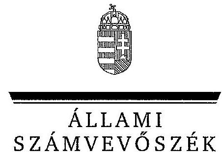
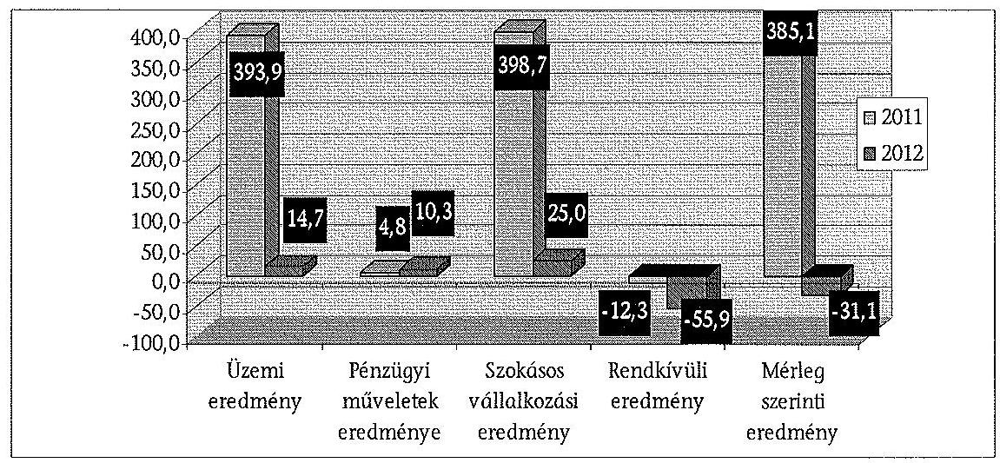
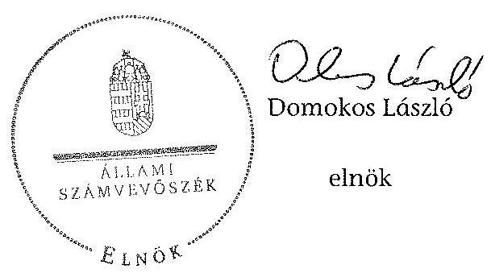
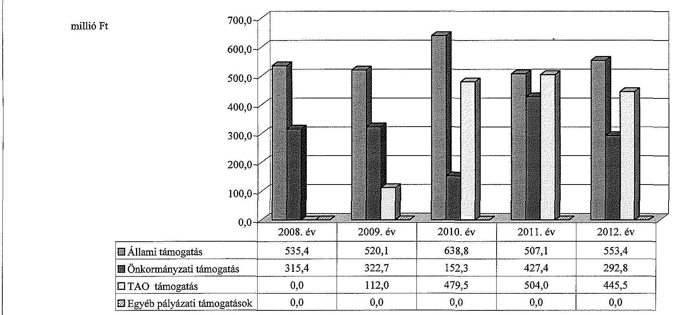
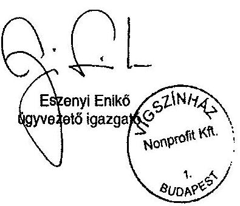
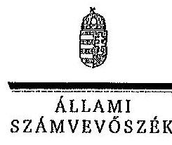
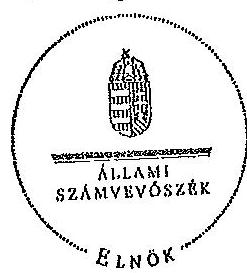

ÁLLAMI
SZÁMVEVŐSZÉK

# JELENTÉS 

az önkormányzatok többségi tulajdonában lévő gazdasági társaságok közfeladat-ellátásának ellenőrzéséről
Vígszínház Kiemelkedően Közhasznú Nonprofit Kft. és jogelődje 14048
2014. március

---

# Állami Számvevőszék 

Iktatószám: V-0193-160/2014.
Témaszám: 1159
Vizsgálat-azonosító szám: V06530211

## Az ellenőrzést felügyelte:

Makkai Mária
felügyeleti vezető
Az ellenőrzést vezette és az ellenőrzés végrehajtásáért felelős:
Horváth József
ellenőrzésvezető
A számvevőszéki jelentés összeállításában közremüködött:
Dr. Vincze Ibolya
számvevő
Az ellenőrzést végezték:

| Kéri Anna | Mátyus Mária Irén | Turzó György |
| :-- | :-- | :-- |
| külső szakértő | külső szakértő | külső szakértő |

Dr. Vincze Ibolya
számvevő

A témához kapcsolódó eddig készített számvevőszéki jelentések:
címe
sorszáma
Jelentés a színházak állami támogatásának és gazdálkodásának 1039 ellenőrzéséről

---

# TARTALOMJEGYZÉK 

BEVEZETÉS ..... 3
I. ÖSSZEGZŐ MEGÁLLAPÍTÁSOK, KÖVETKEZTETÉSEK, JAVASLATOK ..... 6
II. RÉSZLETES MEGÁLLAPÍTÁSOK ..... 14

1. Az Önkormányzat közfeladat-ellátásának megszervezése ..... 14
1.1. A közfeladat meghatározása, a feladat ellátásának választott módja ..... 14
1.2. Az önkormányzati és a tulajdonosi irányítás megítélése ..... 20
2. A Vígszínház közfeladat-ellátással kapcsolatos tevékenysége ..... 24
2.1. A Színház szervezeti kialakítása, szabályozottsága ..... 24
2.2. A gazdasági társaság vagyonnyilvántartása ..... 27
2.3. A gazdasági évek ráfordításainak és bevételeinek alakulása ..... 29
2.4. A gazdasági társaság eredményének alakulása ..... 32
2.5. A gazdasági társaság folyamatos üzemmenetének, likviditásának biztosítása ..... 34
3. Az Önkormányzat tulajdonosi jogainak és kötelezettségeinek érvényesítése ..... 36
3.1. A gazdasági társaságtól származó információk hasznosítása ..... 36
3.2. Az önkormányzat közgyűlésének intézkedései ..... 37

## MELLÉKLETEK

1. számú Budapest Főváros Önkormányzatának közgyűlési határozatai az Intézmény átalakítására vonatkozóan
2. számú A Vígszínház szakmai tevékenységének mutatói a 2008. és a 2012. évek között
3. számú A Vígszínház támogatása a 2008. és a 2012. évek között
4. számú A Vígszínház vagyonának főbb adatai 2008. január 1-je és 2012. december 31-e között
5. számú Budapest Főváros Főpolgármesterének észrevétele
6. számú A Vígszínház ügyvezető igazgatójának észrevétele
7. számú A Vígszínház ügyvezető igazgatójának észrevételére adott válasz

---

# FÜGGELÉKEK 

1. számú Rövidítésjegyzék
2. számú Értelmező szótár

---

# JELENTÉS 

## az önkormányzatok többségi tulajdonában lévő gazdasági társaságok közfeladatellátásának ellenőrzéséről   Vígszínház Kiemelkedően Közhasznú Nonprofit Kft. és jogelődje

## BEVEZETÉS

Az Önkormányzatnak közfeladata az Ötv. alapján a művészeti feladatok ellátásáról való gondoskodás, az Mötv. szerint az előadó-művészeti szervezet támogatása. Ezt az Önkormányzat előadó-művészeti költségvetési szerv fenntartásával, illetve egyszemélyes tulajdonában álló gazdasági társaság támogatásával valósította meg.

Az Önkormányzat az ellenőrzött időszakban színházi koncepcióval ${ }^{1}$ rendelkezett, amely a színházak működtetésének alternatíváit vázolta fel és jövőbeli célokat határozott meg. Ezt a Közgyűlés határozattal² elfogadta.

Az Önkormányzat a működési tevékenységgel kapcsolatos feladatait a színházak által részben költségvetési intézményi, részben gazdasági társasági formában látta el, ez a fajlagos múködési költségek, a vezetők javadalmazása és a számviteli politika eltéréseit okozta a különböző formában múködő szervezeteknél. Ezért készítette elő a Közgyűlés 2011. március 23-án hozott határozataival az egyes költségvetési szervként múködő színházak átalakítását.

A Színházak támogatása az ellenőrzött időszakban központi költségvetési, illetve fenntartói támogatás formájában, valamint pályázatok útján valósult meg. A 2010-2012. évek költségvetési törvényei egy összegben tartalmazták az Önkormányzat fenntartásában múködő színházak fenntartói ösztönző részhozzájárulását, amelyet a fenntartó saját döntése alapján oszthatott el.

Az ellenőrzött időszakban a Vígszínház 2011. július 31-ig költségvetési intézményként, ezt követően - a Közgyűlés határozata alapján - 2011. augusztus 1jétől nonprofit korlátolt felelősségű társasági formában múködött.

[^0]
[^0]:    ${ }^{1}$ Koncepció a fővárosi fenntartású színházak struktúráját és finanszírozását érintő változásokról (2007. XI. 29.)
    ${ }^{2}$ a Főv. Kgy. 1979/2007. (11.29.) sz. határozata

---

Az Önkormányzat a gazdasági társasággal a közfeladat ellátásának biztosítására 2011. augusztus 4-én Közszolgáltatási szerződést², majd 2013. január 1-jei hatálybalépéssel Fenntartói megállapodást kötött. A Közszolgáltatási szerződés meghatározta a közhasznú tevékenység körét, az Önkormányzat által biztosított támogatás összegét, a feladatellátáshoz szükséges befektetett eszközöket, valamint azok rendelkezésre bocsátásának módját.

Az Emtv. új elemként vezette be 2009 novemberétől a társasági adókedvezménnyel igénybe vehető támogatást, mint közvetett támogatási formát. Ennek felső határát a jogalkotó a tárgyévi jegybevétel 80\%-ában határozta meg. A tao támogatás pénzügyi teljesülése a támogatást nyújtó vállalkozások eredményességének és támogatás nyújtási hajlandóságának függvénye.

A Színház a közfeladat ellátása érdekében az ellenőrzött időszakban összesen 2754,8 millió Ft állami, valamint 1510,6 millió Ft önkormányzati támogatást kapott. Emellett a 2009-2012. évek között 1541,0 millió Ft tao támogatást tudott igénybe venni.

1896-ban, egy év alatt épült fel a Vígszínház. Itt született meg a huszadik századi korszerű magyar színjátszás. A II. világháború utolsó napjaiban bombatalálat érte az épületet, mely az újjáépítést követően, a Magyar Néphadsereg Színháza néven, 1951-ben nyílt meg. 1967-ben megnyílt a Vígszínház kamaraszínháza, az 560 férőhelyes Pesti Színház, 1995-ben pedig új játszási hellyel, a Házi Színpad nevű stúdióval gazdagodott a társulat.

A Vígszínház három játszóhelyén esténként 1700 néző foglal, foglalhat helyet, ez 2012-ben 331 ezer látogatót jelentett. A bérletet váltók száma meghaladja a 16 ezer főt. A Színház fizető nézőinek száma évente 316-341 ezer fő, az előadások száma pedig több mint évi 500 darab volt 2008 és 2012 között. A Színház által foglalkoztatott dolgozók átlaglétszáma a 2008. évi 245 fơről a 2012. évre 243 fơre csökkent.

A Színház főbb szakmai mutatószámait a 2. számú melléklet tartalmazza.
Az ellenőrzés várható eredménye: a jelentés nyilvánossága a társadalom széles körével ismerteti meg a Színház gazdálkodására vonatkozó megállapításainkat, továbbá a megállapítások alapján megfogalmazott számvevőszéki javaslatok hasznosítása elősegíti a feltárt hibák megszüntetését, az ellenőrzött szervezet jobb feladatellátását. A társadalom számára jelzi, hogy közpénz nem maradhat ellenőrizetlenül, az ÁSZ értékteremtő rend kialakításához és megőrzéséhez hozzájáruló tevékenysége pozitív hatással lesz a szervezetről kialakított összkép formálására. A szervezeten belül lehetőség nyílik arra, hogy a megállapítások szintetizálásával az ÁSZ a hozzáadott értéket teremtő, elemző tevékenységét és tanácsadó szerepét is erősítse. A jó gyakorlatok bemutatásával az ÁSZ hozzájárul a követendő megoldások megismertetéséhez, terjesztéséhez.

[^0]
[^0]:    ${ }^{2}$ Emtv. értelmező rendelkezések - a közszolgáltatási szerződés a közszolgáltatás nyújtására irányuló, legalább három évre szóló szerződés, amely az állam vagy az önkormányzat és a közszolgáltatást végző előadó-művészeti szervezet kapcsolatát szabályozza, tartalmazza a teljesítendő előadásszámot, a szolgáltatás nyújtásának időtartamát, helyét és a teljesítésért járó díjazást.

---

Az ellenőrzés célja annak értékelése volt, hogy:

- az Önkormányzat a jogszabályi előírások figyelembevételével döntött-e az ellenőrzésre kerülő közfeladat megszervezéséről, az ellátás módjáról; a tulajdonostól elvárható gondossággal felügyelte-e a társaság feladatellátását; a gazdasági társaság rendelkezésére bocsátotta-e a közfeladat-ellátásához a szükséges közvagyont, és biztosította-e a tulajdonosi jogok közvagyon feletti érvényesülését; a társaság vagyonvesztése esetén intézkedett-e a további vagyonvesztés megakadályozásáról;
- a gazdasági társaság teljesítette-e a tulajdonos önkormányzat részéről meghatározott célokat és feladatokat a rendelkezésre álló erőforrások felhasználásával; végrehajtotta-e a közfeladat-ellátási szerződés előírásait; betartotta-e a vagyonnal történő gazdálkodásra vonatkozó jogszabályi rendelkezéseket.

Az ellenőrzés hatóköre: az önkormányzatok közfeladat-ellátásának ellenőrzése, amely kiterjed az önkormányzatok és a közfeladatot ellátó, az önkormányzat többségi tulajdonában lévő gazdasági társaság közötti feladatmegosztásra, az önkormányzatok tulajdonosi jogainak gyakorlására, a nemzeti vagyon kezelésének ellenőrzése keretében a közfeladat-ellátáshoz rendelt vagyonés a vagyont érintő szerződésekre. A jelen ellenőrzés kiterjed az önkormányzatok többségi tulajdonlásával működő gazdasági társaságok közfeladatellátására, vagyongazdálkodási tevékenységére, a kapcsolódó nyilvántartások, elszámolások szabályszerűségére és megbízhatóságára. Az ellenőrzött tételek kiválasztása véletlen mintavétellel történt.

Az ellenőrzés típusa: szabályszerűségi ellenőrzés.
Az ellenőrzött időszak: a 2008-2012. évek, valamint a helyszíni ellenőrzés befejezéséig - 2013. szeptember 27. - bekövetkezett változások figyelemmel kísérése.

Ellenőrzött szervezet: a Vígszínház Klemelkedően Közhasznú Nonprofit Kft. és jogelődje, valamint Budapest Főváros Önkormányzata.

Az ellenőrzés végrehajtásának jogszabályi alapját az ÁSZ tv. 5. § (3)-(5) bekezdéseiben foglaltak képezik.

Az ÁSZ a 2011. évi LXVI. törvény 29. §-a szerint a jelentéstervezetet megküldte Budapest Főváros Önkormányzata főpolgármesterének és a Vígszínház Klemelkedően Közhasznú Nonprofit Kft. ügyvezető igazgatójának egyeztetésre. A beérkezett észrevételeket és az azokra adott választ a jelentés 5 -7. számú mellékletei tartalmazzák.

---

# I. ÖSSZEGZŐ MEGÁLLAPÍTÁSOK, KÖVETKEZTETÉSEK, JAVASLATOK 

Az Önkormányzat a művészeti feladatok ellátásáról való gondoskodásnak, illetve az előadó-művészeti szervezet támogatásának, mint az Ötv.-ben és az Mötv.-ben meghatározott közfeladatának, az ellenőrzött időszak alatt eleget tett. Az Önkormányzat közfeladat-ellátását 2011. július 31-éig a Színháznak, mint költségvetési intézménynek a fenntartásával, azt követően a gazdasági társaság támogatásával biztosította. A Közgyűlés a tulajdonosi jogait az ellenőrzött időszakban a szabályzataiban és rendeleteiben foglaltak szerint gyakorolta.

Az Önkormányzat a közfeladat-ellátása érdekében az Intézmény, majd 2011. augusztus 1-jétől a Társaság rendelkezésére bocsátotta az alapító okiratokban foglaltaknak megfelelően az előadó-művészeti közfeladat-ellátásához szükséges ingatlan és ingó vagyont. A Színház részére a közfeladat-ellátáshoz szükséges forrás biztosításáról 2008. január 1. és 2011. július 31. között az éves költségvetések elfogadásával, 2011. augusztus 1. és 2012. december 31. között a Közszolgáltatási szerződésben (az annak elválaszthatatlan részét képező éves fővárosi költségvetési rendeletekben) döntött az Önkormányzat.

Az Önkormányzat az Intézmény számára a közfeladat teljesítésével kapcsolatosan konkrét célokat, elvárásokat nem fogalmazott meg. Az Emtv. 2009. évi hatálybalépésével a tevékenység ellátására vonatkozó követelmények, feladatmutatók a törvény által kerültek meghatározásra.

Az Önkormányzat az Intézmény költségvetésének elfogadását, a beszámoltatásokat és az adatszolgáltatási kötelezettség ellenőrzését a jogszabályokban és a belső szabályozásában foglaltaknak megfelelően végezte el. Az Önkormányzat a Színház művészeti tevékenységének ellátását évadbeszámolók alapján értékelte, amelyeket a 2008-2010. évek között - az Önkormányzat SZMSZ ${ }_{1}$ rendelkezései szerint - a Kulturális Bizottsága elfogadott.

Az intézményi múködés időszakában alkalmazott ösztönző rendszer megfelelt a vonatkozó jogszabályi és belső szabályozási előírásoknak Az évenkénti jutalmazások időpontja és mértéke azonban nem volt kiszámítható, annak teljesítményösztönző, motiváló hatása nem érvényesült. Az Intézmény vezetője részére kifizetett jutalom összege nem kapcsolódott a beszámoló teljesítéséhez köthető mutatószámokhoz, a jutalomkeret a besorolási bérek arányában került meghatározásra.

Az Intézmény megszüntetése és a gazdasági társaság alapítása a Közgyűlés határozatainak megfelelően történt, azonban az Intézmény Megszüntető Okiratának 2011. június 30 -án - a Főpolgármester-helyettes által - történő aláírásával, a Főpolgármesteri Hivatal 9 nappal túllépte az Áht. szerinti közzétételi határidőt.

---

Az Önkormányzat döntése alapján a gazdasági társaság a közfeladat-ellátást 2011. augusztus 1-jén kezdte meg. Az Önkormányzat a közfeladat-ellátásának tárgyi és pénzügyi feltételeit a Közszolgáltatási szerződésben határozta meg. Ez tartalmazta az ingatlanok bérbeadásának és az ingó vagyontárgyak ingyenes használatba adásának módját, valamint a költségvetési támogatás mértékét. Meghatározta a közhasznú tevékenység körét, a szerződés megszűnésének esetére szabályozta a vagyontárgyak visszaszolgáltatásának rendjét és határidejét, továbbá a Társaság által teljesítendő művészeti tevékenységek jellegét, körét, mértékét és pontos mutatószámait Az önkormányzati tulajdon védelme érdekében szabályozta a kötelező leltár készítését, annak gyakoriságát, továbbá a gazdálkodással és a művészeti tevékenység ellátásával összefüggő kötelező adatszolgáltatás formáját, idejét és módját, valamint előírta a gazdálkodás körében felmerülő rendkívüli eseményekről történő tájékoztatási kötelezettséget.

A tulajdonos Önkormányzat az Intézmény könyveiben nyilvántartott, befektetett eszközöket a közhasznú tevékenység eredményes ellátása érdekében 2011. augusztus 1-jén haszonkölcsön formájában átadta a Társaság részére. A vagyon átadás-átvételi jegyzőkönyv szerint a befektetett eszközök nettó értéke 2147,8 millió Ft volt, amely érték magában foglalt 50,9 millió Ft beruházást is.

A leltározásra vonatkozó előírások a társasággá alakulást követően az Önkormányzat Vagyonrendeleteiben nem a hatályos jogszabályoknak megfelelően szerepeltek, mivel az üzemeltetésre, kezelésre átadott eszközök leltározási szabályairól a Vagyonrendelet ${ }_{2}$ 2010. január 1-jétől az Áhsz. ${ }_{1}$ előírásaival ellentétben nem tartalmazott szabályozást.

Az Önkormányzat a gazdasági társasági múködés időszakában a Közszolgáltatási szerződésben határozta meg a közfeladat-ellátás követelményeit. Az Önkormányzat a vagyon védelme érdekében a Közszolgáltatási szerződésben garanciális követelményként fogalmazta meg a kötelezettségek megszegésének jogkövetkezményét, valamint a szerződés megszűnésének esetére az átadott vagyontárgyak visszaszolgáltatási kötelezettségét. Az ellenőrzött időszakban kötelezettség megszegésére, illetve szerződés megszűnésére nem került sor.

Az Önkormányzat a Társaság Alapító Okirat ${ }_{6,7}$-ben - a Gt. előírásaival összhangban - szabályozta az Alapító tulajdonosi joggyakorlásának kereteit. Az Alapító Okiratban a Társaság legfőbb szerve, a Közgyűlés kizárólagos hatáskörébe tartozó feladatként határozta meg a Társaság SZMSZ ${ }_{3}$-nak és az FB ügyrendjének jóváhagyását, amely a hiánypótlások következtében - közel egy év elteltével - 2012. szeptember 13-án történt meg. A Közgyűlés a tulajdonosi érdekeinek védelmére határozatokban kijelölte a Társaság FB tagjait és könyvvizsgálóját.

Az Önkormányzat a Társaság ügyvezetőjének és egyéb vezető állású dolgozóinak, valamint az FB tagoknak a díjazására vonatkozó Javadalmazási szabály-zat ${ }_{1}$-et a Taktv.-ben foglalt határidőn túl, 2010. január 31. helyett április 29-én fogadta el.

Az Önkormányzat a Társaság üzleti tervének elfogadását, beszámoltatását és az adatszolgáltatási kötelezettség ellenőrzését a jogszabályokban, az Önkormányzat belső szabályzataiban és a Közszolgáltatási szerződésben foglaltaknak

---

megfelelően, határidőn belül - az FB és a könyvvizsgálói jelentés figyelembevételével - végezte el.

A könyvvizsgáló az ÁSZ ellenőrzés által feltárt - a rendkívüli és egyéb ráfordítások elszámolására, a költségvetési időszakban elszámolt bérletértékesítés bevételének a társasági időszakban nettó árbevételként ismételten történő elszámolására vonatkozó - hibákat jelentésében, illetve vezetői levélben nem jelezte sem a tulajdonos, sem a Színház vezetése felé.

A 2011. és a 2012. évekre vonatkozóan a Társaság ügyvezetője részére a prémiumfeladatok meghatározása a Javadalmazási szabályzat ${ }_{2,5}$-ban foglaltaktól eltérően - késedelmesen - történt. A prémiumfeltételeket és a prémium összegét mindkét évben az üzleti terv elfogadását követően határozta meg az Alapító.

Az Önkormányzat belső ellenőrzése a Színháznál mindkét gazdálkodási időszakra vonatkozóan végzett ellenőrzést. Az ellenőrzések a vagyonvédelmi szabályzatok meglétének, illetőleg aktualizálásának elmaradását kifogásolták. Az ellenőrzések megállapításaira a Színház Intézkedési terveket készített, amelyeket végrehajtott, és a végrehajtásról készült beszámolókat a tulajdonos elfogadta.

A Társaság 2011-2012. évi gazdálkodása, valamint mérleg szerinti nyeresége nem tette szükségessé, hogy a tulajdonos Önkormányzat a vagyon, a közpénzek nem célszerinti hasznosításával, az esetleges pazarló felhasználással kapcsolatban, valamint a lejárt kötelezettségek csökkentése érdekében tulajdonosi intézkedéseket tegyen.

Az Intézmény a vagyonnal történő gazdálkodásra vonatkozó jogszabályi rendelkezéseknek nem teljes körűen tett eleget. Az Intézmény 2008. január 1. és 2011. július 31. közötti időszakra vonatkozó Számviteli politika ${ }_{1}$-je a Számv. tv.ben foglaltaknak megfelelően szabályozta az egyes produkciókhoz kapcsolódó díszletek, jelmezek elszámolását. A gyakorlatban azonban az Intézmény nem tartotta be a Számv. tv. előírásait és a saját Számviteli politika ${ }_{1}$-ben foglaltakat, mivel az egyes produkciókban közvetlenül felhasználandó díszleteket, jelmezeket és kellékeket a beszerzési és előállítási értéktől és a használati időtől függetlenül azonnal 100\%-ban költségként, a dologi kiadások között számolta el. Ez a vagyonvédelem szempontjából kockázatot jelentett.

Az Intézmény működési formája a közfeladat-ellátás követelményeinek megfelel. Alapító Okirat ${ }_{1-5}$-tel, SZMSZ ${ }_{1,2}$-vel, valamint az irányítási, döntési és felelősségi jogköröket tartalmazó belső szabályzatokkal rendelkezett.

Az Intézmény 2008. január 1-je és 2011. július 31-e között az előadó-művészeti tevékenység ellátásához szükséges, a fenntartó által rendelkezésére bocsátott vagyont az Áhsz. ${ }_{1}$-ben foglaltaknak megfelelően saját mérlegében mutatta ki, melyet a belső szabályozásban foglaltaknak megfelelően elkészített leltárral támasztott alá.

Az Intézmény a 2008. január 1-je és 2011. július 31. közötti időszak tekintetében a vagyonnal történő gazdálkodásra vonatkozó jogszabályi rendelkezéseknek nem teljes körűen tett eleget. Az ellenőrzés részére az Eszközök és források

---

értékelésére vonatkozóan szabályzatot nem adott át, továbbá 2009. április 1-ig nem rendelkezett Közbeszerzési szabályzattal.

Az Intézmény összes bevétele a 2010. évben 2529,8 millió Ft volt, 34,6\%-kal növekedett 2008-hoz képest. Az összes kiadása 2008-ról 2010-re 24,5\%-kal emelkedett, 2010-ben 2237,7 millió Ft volt. Az Intézmény összes kiadásainak több mint felét a személyi juttatások és a járulékok összege tette ki.

A Közgyűlés 2011. március 23-án határozatot hozott a költségvetési intézményként működő Színház megszüntetéséről, és ezzel összhangban az utódszervezet, gazdasági társaság alapításához szükséges engedélyeket megadta. A Főpolgármester-helyettes a költségvetési intézmény megszüntető okiratát 2011. június 30-án írta alá.

A Társaság teljesítette az Önkormányzat részéről a Közszolgáltatási szerződésben meghatározott célokat és feladatokat. A Társaság rendelkezett Alapító Okirat ${ }_{6,7}$-tel és az irányítási, döntési és felelősségi jogköröket tartalmazó belső szabályzatokkal, illetve SZMSZ ${ }_{3,4}$-gyel. A Társaság a Pénzkezelési szabályzatát, valamint az Eszközök és források értékelési szabályzatát a Számv. tv.-ben előírt az újonnan alakuló gazdálkodó szabályzatkészítésére szabott 90 napos - határidőn túl, késedelmesen, 2012. január 1-jével léptette hatályba. A 2011. augusztus 1-jétől hatályos Számviteli politika ${ }_{2}$-t a Társaság 2011. november 16-án készítette el, ezzel megsértette a Számv. tv.-ben foglalt, a szabályzat készítésére vonatkozó határidő betartásának kötelezettségét.

A vagyonnal történő gazdálkodásra vonatkozó jogszabályi rendelkezéseket a számviteli politika szabályozása és annak végrehajtása, az önköltségszámítás szabályozása és végrehajtása, valamint a gazdasági események bizonylatkezelése és könyvelése területeken nem tartották be teljes körűen. A belső szabályozás hiányosságai a Társaság integritásával kapcsolatban kockázatot jelentettek.

A Számviteli politika ${ }_{2,3}$ a szellemi termékek színrevitellel kapcsolatos bekerülési érték meghatározásának szabályozása során, a számla alapján felmerült költségek csoportjára korlátozta a bekerülési értékbe tartozó (aktiválandó) költségek körét. Nem szabályozta azonban az alkalmazottak bérének és járulékainak felosztási módját és azok vetítési alapját. A szabályozás nem felelt meg a Számv. tv.-ben a bekerülési érték részeként elszámolandó költségek szabályozására vonatkozó előírásoknak.

A Társaság elkészítette az Önköltségszámítási szabályzat ${ }_{2,3}$-at, azonban azokban nem tért ki a társulat bérének és járulékainak legalább a produkció színreviteléig történő felosztási módjára. Ennek következtében a produkciók színreviteléig aktivált szellemi termékek nem a ténylegesen felmerült közvetlen költségek alapján kerültek elszámolásra. Továbbá az önköltségszámítási szabályzat nem tartalmazta az általános költségeknek a felosztási módját.

A Társaság számviteli elszámolása során több hibát állapított meg az ellenőrzés.

A Társaság ügyvezető igazgatója részére 2012. június 27-én kifizetett 2,3 millió Ft prémium és járuléka, továbbá a 2013. július 29-én kifizetett 2012. évi

---

ügyvezető igazgatói és gazdasági igazgatói prémium és járuléka ( 9,4 millió Ft) nem a Számv. tv. passzív időbeli elhatárolásokra vonatkozó előírásainak megfelelően került elszámolásra. A Színház a 2012. évi beszámolójában az előző összegekre céltartalékot képzett, és az egyéb ráfordítások között mutatta ki.

A Társaság a 2011. és a 2012. években még az intézményi időszakban (2011 májusában) pénzügyileg realizált bérletértékesítés előadásonkénti bevételével megegyező összegű (a 2011. évben 19,7 millió Ft, a 2012. évben 53,7 millió Ft) rendkívüli ráfordítást számolt el, melyet ténylegesen felmerült költségek és bizonylatok nem támasztottak alá. A rendkívüli ráfordítás értékével megegyező összegű értékesítés nettó árbevételt is elszámoltak azzal az indokkal, hogy a Társaság 2011. és 2012. évi eredményét a rendkívüli ráfordítások nagysága ne befolyásolja. A 2011. és 2012. évi beszámolóban az előzőekkel kapcsolatban szerepeltetett értékesítés nettó árbevétele bizonylatokkal nincs alátámasztva.

A Társaság a 2011-2012. években elkészítette üzleti és az arra épülő likviditási tervét. A 2011. évre 15,9 millió Ft mérleg szerinti eredményt tervezett, a teljesítés 385,1 millió Ft volt. A 2012. évben -176,9 millió Ft mérleg szerinti eredmény tervezett, a teljesítés -31,1 millió Ft volt. Az eredmény alakulását a jegybevételek, a tao támogatások, valamint a kiemelt feladatok ellátására kapott pályázati források elnyerése befolyásolta. A Társaság 2011-2012. évi beszámolóit a Közgyűlés elfogadta.

A Társaság 2011. és 2012. évi üzleti tervei megalapozatlanok voltak. Az ellenőrzés részére az egyes bevételek és költségsorok tervezett értékeire vonatkozóan háttérszámítást, kalkulációt nem adtak át. Az üzleti tervek teljesítését az FB a vizsgált időszak alatt nem ellenőrizte, és azt a tulajdonos Önkormányzat sem kérte számon. Az Önkormányzat a 2013. évről szóló üzleti tervet már egységesített, a számviteli beszámolónak megfelelő formátumban készíttette el.

A Társaság az Önkormányzat tulajdonában álló eszközöket a Számv. tv.-nek megfelelően (ingatlanok, immateriális javak, tárgyi eszközök, készletek) számlarendjében elkülönítetten, a 0 -ás számlaosztályban tartotta nyilván. A Színház művészeti tevékenységét szolgáló - saját és Önkormányzati tulajdonú eszközök 2012. december 31-ei nettó értéke ( 2741,0 millió Ft) a 2008. december 31-ei adathoz viszonyítva $29,0 \%$-kal emelkedett.

Az FB a Társaság éves beszámolóiról, a közhasznúsági jelentéseiről az Alapító Okiratban és a Gt.-ben előírt írásbeli jelentés helyett határozatokat hozott. A határozatok a beszámoló fő adatait nem tartalmazták.

A Társaság első teljes évében, 2012-ben 2100,3 millió Ft bevételt ért el, a ráfordítások összege 2131,2 millió Ft volt.

A Színház az ellenőrzött időszakban éves fejlesztési és beruházási tervet készített, melyet megküldött az Önkormányzat részére. A fejlesztési terveket nem alapozták meg tanulmányokkal és számításokkal. A tervekben meghatározott fejlesztésekhez 2008 és 2012 között 102,9 millió Ft fejlesztési támogatást kapott, melyet a célnak megfelelően használt fel.

---

A Színháznak az ellenőrzött időszakban átmeneti pénzintézeti finanszírozásra nem volt szüksége. Fizetési kötelezettségeit határidőn belül teljesítette, köztartozásai nem keletkeztek.

A társaság a 2012. szeptember havi fizetési kötelezettsége teljesítésének biztosítása érdekében a 2012. április 27 -én és 2012. május 28 -án kelt levelében 150 millió Ft előrehozott támogatást kért a Fővárosi Önkormányzattól. A kért 150 millió Ft előrehozott támogatást, illetve a 2012. III. negyedévi múködési támogatás 208,4 millió Ft összegét a Társaság 2012. július 5-én egy időben kapta meg. A Társaság a megkapott összegekből 2012. július 5-én 200 millió Ft öszszeget különböző futamidőre $6,2 \%$-os kamattal lekötött. Az előrehozott támogatási igény mértéke indokolatlan volt, mert a Társaság 2012. augusztus 1-jétől 2013. január 2-áig a hónap elején 50 - 240 millió Ft lekötött betétállománnyal rendelkezett. Ezen kívül még bankszámláján és pénztárában is szabad pénzeszközök álltak rendelkezésére. Az előrehozott 150 millió Ft támogatás után az Önkormányzat részére kamatot nem fizetett.

A Színház befektetési tevékenységet nem végzett, így Befektetési Szabályzatot nem kellett készítenie.

Az Állami Számvevőszékről szóló 2011. évi LXVI. törvény 33. § (1) bekezdésében foglaltak értelmében a jelentésben foglalt megállapításokhoz kapcsolódó intézkedési tervet köteles az ellenőrzött szervezet vezetője összeállítani, és azt a jelentés kézhezvételétől számított 30 napon belül az ÁSZ részére megküldeni. Amennyiben az intézkedési tervet határidőben nem küldi meg a szervezet, vagy az nem elfogadható, az ÁSZ elnöke a hivatkozott törvény 33. § (3) bekezdés a)-b) pontjaiban foglaltakat érvényesítheti.

Az ellenőrzés intézkedést igénylő megállapításai és javaslatai:

# Budapest Főváros Főpolgármesterének 

A Színház a 2011. és 2012. évekre vonatkozó prémium és járulékai elszámolása során nem tartotta be a Számv. tv. 44. §-ának a passzív időbeli elhatárolásokra vonatkozó előírásait.

A Társaság a 2011. és a 2012. években még az intézményi időszakban pénzügyileg realizált bérletértékesítés előadásonkénti bevételével megegyező összegű rendkívüli ráfordítást számolt el, melyeket ténylegesen felmerült költségek és bizonylatok nem támasztottak alá. A rendkívüli ráfordítás értékével megegyező összegű értékesítés nettó árbevételt is elszámolt. A 2011. és 2012. évi beszámolóban az előzőekkel kapcsolatban szerepeltetett értékesítés nettó árbevétele bizonylatokkal nincs alátámasztva.

Javaslat:
Vizsgáltassa ki a feltárt hiányosságokat, szabálytalanságokat, és amennyiben szükséges, tegye meg a munkajogi felelősségre vonást.

---

# Budapest Föváros Föjegyzöjének 

A leltározásra vonatkozó előírások a társasággá alakulást követően az Önkormányzat Vagyonrendeleteiben nem a hatályos jogszabályoknak megfelelően szerepeltek, mivel az üzemeltetésre, kezelésre átadott eszközök leltározási szabályairól a Vagyonrendelet 2010. január 1-jétől az Áhsz. előírásaival ellentétben nem tartalmazott szabályozást.

Javaslat:
Készítse elő a Közgyűlés elé való terjesztés érdekében a Vagyonrendelet ${ }_{2}$ módosítását, hogy az tartalmazza az Áhsz. 2 22. § (2) bekezdésben előírtaknak megfelelően az üzemeltetésre, kezelésre átadott eszközök leltározási szabályait.

## A Vigszínház igazgatójának

1. A Társaság elkészítette az Önköltségszámítási szabályzat ${ }_{2,3}$-at, azonban azokban nem tért ki a társulat bérének és járulékainak legalább a produkció színreviteléig történő felosztási módjára. Ennek következtében a produkciók színreviteléig aktivált szellemi termékek nem a ténylegesen felmerült közvetlen költségek alapján kerültek elszámolásra. Továbbá az önköltségszámítási szabályzat nem tartalmazta az általános költségeknek a felosztási módját.

Javaslat:
Intézkedjen az önköltségszámítási szabályzat módosításáról annak érdekében, hogy
a) a produkció bemutatásáig elszámolt közvetlen költségek tartalmazzák a társulat bérének és járulékainak a produkcióra felosztott költségeit;
b) a szabályzat tartalmazza az általános költségeknek a felosztási módját.
2. A 2012. június 27 -én kifizetett, 2011. évre vonatkozó 2,3 millió Ft prémium és járulék, valamint a 2013. július 29-én kifizetett, 2012. évre vonatkozó 9,4 millió Ft kifizetett prémium és járulék elszámolása nem a Számv. tv. passzív időbeli elhatárolásokra vonatkozó előírásainak megfelelően történt.

Javaslat:
Intézkedjen a költségek és ráfordítások elszámolásánál a Számv. tv. 44. §-ának a passzív időbeli elhatárolásokra vonatkozó előírásai betartásáról, figyelemmel a Számv. tv. 16. § (2) bekezdésében foglaltakra.
3. A Társaság a 2011. és a 2012. években még az intézményi időszakban (2011 májusában) pénzügyileg realizált bérletértékesítés előadásonkénti bevételével megegyező összegű (a 2011. évben 19,7 millió Ft, a 2012. évben 53,7 millió Ft) rendkívüli ráfordítást számolt el, melyet ténylegesen felmerült költségek és bizonylatok nem támasztottak alá. A rendkívüli ráfordítás értékével megegyező összegű értékesítés nettó árbevételt is elszámoltak azzal az indokkal, hogy a Társaság 2011. és 2012. évi eredményét a rendkívüli ráfordítások nagysága ne befolyásolja. A 2011. és 2012. évi

---

beszámolóban az előzőekkel kapcsolatban szerepeltetett értékesítés nettó árbevétele bizonylatokkal nincs alátámasztva.

Javaslat:
Intézkedjen a bevételek és költségek elszámolásánál a Számv. tv. 15. § (3) bekezdése szerint a valódiság elvének, valamint a Számv. tv. 165. § (2) bekezdésében a bizonylati elvvel és fegyelemmel kapcsolatos előírások betartásáról.

---

# II. RÉSZLETES MEGÁLLAPÍTÁSOK 

## 1. Az ÖNKORMÁNYZAT KÖZFELADAT-ELLÁTÁSÁNAK MEGSZERVEZÉSE

### 1.1. A közfeladat meghatározása, a feladat ellátásának választott módja

Az Önkormányzat a múvészeti feladatok ellátásáról való gondoskodásnak, illetve az előadó-múvészeti szervezet támogatásának, mint az Ötv.-ben és az Mötv.-ben meghatározott közfeladatának, az ellenőrzött időszak alatt eleget tett. Az Önkormányzat a közfeladat ellátását 2011. július 31 -éig az Intézmény fenntartásával, azt követően a Vigszínház Kiemelkedően Közhasznú Nonprofit Kft. támogatásával biztosította.

Az Önkormányzat kötelező közfeladata az Ötv. 63/A §. n) pontja szerint a művészeti feladatok ellátása ${ }^{4}$. A Htv. 111. § alapján a közművelődési, közgyűjteményi és művészeti tevékenységekkel kapcsolatos helyi irányítási, ellenőrzési, valamint a fenntartással és múködtetéssel kapcsolatos feladatokat a Közgyűlés látja el. A kulturális feladat ellátását az Önkormányzat az Emtv. 3. § (2) bekezdése alapján előadó-múvészeti szervezet fenntartásával (költségvetési szervei esetében) vagy annak támogatásával (gazdasági társaságai esetében) valósította meg.

Az Önkormányzat az ellenőrzött időszakban elfogadott kulturális stratégiával nem, csak koncepcióval ${ }^{5}$ rendelkezett, amelyet a Közgyűlés ${ }^{6}$ határozatával fogadott el.

A koncepció a színházak múködtetésének módozatait vázolta fel és jövőbeli célokat határozott meg, nem vizsgálta azonban a megvalósításhoz szükséges források nagyságát.

A 2010. évi önkormányzati választásokat követően az Ötv. 91. § (6) bekezdésnek megfelelően a Fővárosi Közgyűlés ${ }^{7}$ elfogadta az Önkormányzat 2011-2014. évekre vonatkozó Gazdasági Programját ${ }^{8}$.

Az Önkormányzat a költségvetési szervezeti formában működő Színház teljesítményével kapcsolatosan a szakmai elvárásait a Színházigazgatói pályázat

[^0]
[^0]:    ${ }^{4}$ A 2013. január 1-jétől hatályos Mötv. 13. § (1) bekezdés 7. pontja is kötelezően ellátandó feladatként határozza meg az előadó-művészeti szervezetek támogatását.
    ${ }^{5}$ Koncepció a fővárosi fenntartású színházak struktúráját és finanszírozását érintő változásokról
    ${ }^{6}$ Főv. Kgy. 1979/2007. (11.29.) sz. határozata
    ${ }^{7}$ Főv. Kgy. 937/2011. (04.27.) sz. határozata
    ${ }^{8}$ A Főváros fejlesztésének és gazdálkodásának stabilizálása és reformkoncepciója a 2011-2014. évi választási ciklusra

---

kiírásában szerepeltette. A nyertes pályázat a megválasztott igazgató stratégiai céljait, valamint konkrét szakmai elképzeléseit foglalta össze.

# Az Emtv. hatálybalépésével a tevékenység ellátására vonatkozó követelmények, feladatmutatók a törvény által kerültek meghatározásra. 

A Színház, mint költségvetési intézményként múködő szervezet Alapító Okirat ${ }_{1}$-ét a Közgyűlés az 1230/1992. (09. 24.) számú határozatával adta ki, amelyet az ellenőrzés lezárásának időpontjáig többször módosított. A Színház vonatkozásában a közfeladata ellátásához szükséges ingatlanok jegyzékét a Színház Alapító Okirat ${ }_{6}$-ban rögzítették. Az egységes szerkezetben kiadott Alapító Okirat 9. pontja felsorolta azokat a korlátozottan forgalomképes ingatlanokat, vagyoni értékủ jogokat és tárgyi eszközöket (az Alapító Okirathoz csatolt leltár szerint), amelyek a költségvetési intézményként múködő Színház használatában lévő önkormányzati vagyont képezték. Az Alapító Okirat ${ }_{6}$ meghatározta, hogy a költségvetési szerv irányító szerve és fenntartója Budapest Főváros Közgyűlése.

A Közgyűlés 2011. március 23-án határozatokat ${ }^{9}$ hozott a költségvetési szervként működő színházak megszüntetéséről és az utódszervezetek, nonprofit gazdasági társaságok alapításáról. A Közgyűlés határozata ${ }^{10}$ az Áht. ${ }_{1}$ 100/O. § (5) bekezdésének, az előzetes engedélyhez készített előterjesztés tartalma az Áht. ${ }_{1}$ 100/L. § (4) bekezdésének megfelelt.

Az Önkormányzat a határozatával ${ }^{11}$ a költségvetési intézményt utódszervezet létrehozásával egyidejűleg 2011. július 31-i hatállyal megszüntette. A Főpolgármester-helyettes a Megszüntető Okiratot 2011. június 30-án írta alá. Ezzel a Hivatal nem tett eleget az Áht. ${ }_{1}$ 96. § (1) bekezdése rendelkezésének, amely előírta, hogy a költségvetési szerv Megszüntető Okiratát legalább negyven nappal a megszüntetés kérelmezett napja előtt ki kell hirdetni (közzé kell tenni).

A 2011. augusztus 1-jén létrehozott gazdasági társaság a költségvetési szervként múködő intézmény jogutódjaként jött létre. Az intézmény valamennyi közfeladat-ellátással összefüggő joga és kötelezettsége, valamint a vagyona feletti rendelkezés, illetőleg az Önkormányzat tulajdonát képező, köz-feladat-ellátás céljából használatában álló ingatlanokkal és ingóságokkal kapcsolatos jogok és kötelezettségek a gazdasági társaságra szálltak át.

Az Önkormányzat a költségvetési szervek megszüntetésénél betartotta az Ámr. 11. § (1) bekezdés a)-c) és f) pontjaiban és (2) bekezdésében előírtakat, valamint a Kjt. 25/A. § (2)-(3) és (8) bekezdéseinek megfelelően gondoskodott a költségvetési szervnél foglalkoztatott közalkalmazottak további foglalkoztatásáról.

Az Intézmény a költségvetési gazdálkodás szabályai szerint működött 2011. július 31-ig, Alapító Okiratai ${ }_{1-5}$ megfeleltek a jogszabályi előírásoknak, továbbá tartalmazták a közfeladat-ellátásához szükséges eszközöket.

[^0]
[^0]:    ${ }^{9}$ 1. sz. melléklet 5-8. sorszámú határozatai
    ${ }^{10}$ 1. sz. melléklet 5. sorszámú határozata
    ${ }^{11}$ 1. sz. melléklet 9. sorszámú határozata

---

Az Önkormányzat 2008. január 1. és 2011. július 31-e között az Alapító Okiratai ${ }_{1.5}$-ben foglaltaknak megfelelően az Intézmény rendelkezésére bocsátotta (haszonkölcsönbe adta) az előadó-művészeti közfeladat-ellátásához szükséges ingatlan és ingó vagyont.

A Közgyűlés határozatának ${ }^{12}$ megfelelően a megszüntetésre kerülő költségvetési szerv - az Áhsz., 13/A. §-ában foglaltak szerinti - leltárral és főkönyvi kivonattal alátámasztott záró beszámolóját 2011. július 31-i fordulónappal elkészítették. A záró beszámolót a Közgyűlés jóváhagyta ${ }^{13}$.

A tulajdonos az Intézmény könyveiben nyilvántartott befektetett eszközöket a közhasznú tevékenység eredményes ellátása érdekében átadta a Társaság részére. A vagyonátadás-átvételi jegyzőkönyv szerint a befektetett eszközök értéke 2147,8 millió Ft volt.

A Nvtv. 3. § alapján az ellenőrzött Színház átlátható szervezet.
A Közgyűlés határozatával ${ }^{14}$ megalapította a gazdasági társaságot, jóváhagyta a Közszolgáltatási szerződés szövegét. A Főpolgármester a Közszolgáltatási szerződést 2011. augusztus 4-én írta alá.

Az Önkormányzat az Alapító Okirat ${ }_{6}$ szövegezésénél a Gt. 15. § (1) bekezdésének előírásait figyelembe vette, melyek szerint a társasági szerződés ellenjegyzésének napjától a létrehozni kívánt gazdasági társaság előtársaságként müködhet ${ }^{15}$. Figyelmen kívül hagyta azonban az Áht., 100/O. §. (2) bekezdését, mely szerint költségvetési intézmény utódszervezete előtársaságként nem működhet, így üzletszerű gazdasági tevékenységet nem végezhet, és a bejegyzés idejéig kötelezettséget sem vállalhat. A Színház a gazdasági tevékenységét az Alapító Okiratának megfelelően augusztus 1-jével kezdte meg.

Az Alapító Okirat 4.6. és 4.9. pontja egymásnak ellent mond, mivel a 4.6. pontja szerint a társasági szerződés ellenjegyzésének napjától a létrehozni kívánt gazdasági társaság előtársaságként múködhet, a 4.9. pontban pedig az Alapító rögzíti, hogy a Társaság a közfeladat-ellátását és múködését 2011. augusztus 1. napjával kezdi meg.

Az Önkormányzat a Társaság Alapító Okirat ${ }_{6}$-ban - a Gt. előírásaival összhangban - szabályozta az Alapító tulajdonosi joggyakorlásának kereteit. Az Alapító Okirat ${ }_{6}$ megfelelően rendelkezett a társaság gazdálkodása során elért eredmény felhasználásáról, az ügyvezető, az FB tagok és a könyvvizsgáló kijelöléséről, az összeférhetetlenségi szabályokról, valamint az Áht. ${ }_{1}$ 100/N. § (8) bekezdése előírásainak betartatásáról.

[^0]
[^0]:    ${ }^{12}$ 1. sz. melléklet 9 . sorszámú határozata
    ${ }^{13}$ 1. sz. melléklet 12. sorszámú határozata
    ${ }^{14}$ 1. sz. melléklet 10. sorszámú határozata
    ${ }^{15}$ A Gt. 16. § (2) bekezdés alapján az előtársasági létszakasz a cégbejegyzéssel szűnik meg, és az előtársasági létszakaszban kötött jogügyletek a gazdasági társaság jogügyleteinek minősülnek.

---

Az Alapító az egyszemélyes nonprofit korlátolt felelősségű társaság alapításával eleget tett az Áht. 100/L. § (1) bekezdésében és a 100/O. § (2) bekezdésében előírt rendelkezéseknek, a társaság Alapító Okirata ${ }_{6}$ tartalmának meghatározásakor eleget tett a Ptk. 54. § (1)-(2) bekezdéseiben és a Gt. 12. § (1) bekezdésében előírt, valamint a Közhasznú tv. 4. § (1) bekezdésében foglalt tartalmi követelményeknek.

Az Önkormányzat a hatályos Emtv. 15. § (3) bekezdésének megfelelően a Színház hatósági nyilvántartás szerinti adatainak módosítására irányuló kérelmét benyújtotta.

Az előadó-művészeti szervezetet (a Színházat) a KÖH Film- és Előadó-művészeti Iroda nyilvántartásba vette.

Az Önkormányzat tulajdonában álló vagyon a nemzeti vagyon részét képezi. A Vagyonrendelet ${ }_{2}$ 6. § (1) bekezdés szerint a Társaság használatában lévő, a feladatellátását szolgáló ingatlanvagyon korlátozottan forgalomképes törzsvagyon.

Az Önkormányzat döntése alapján a gazdasági társaság a közfeladat-ellátást 2011. augusztus 1-jén kezdte meg. Az Önkormányzat a közfeladatellátásának tárgyi és pénzügyi feltételeit a Közszolgáltatási szerződésben határozta meg. Ez tartalmazta az ingatlanok bérbeadásának és az ingó vagyontárgyak ingyenes használatba adásának módját, valamint a költségvetési támogatás mértékét. A Közszolgáltatási szerződés meghatározta a közhasznú tevékenység körét, a szerződés megszűnésének esetére szabályozta a vagyontárgyak visszaszolgáltatásának rendjét és határidejét, továbbá a színház által teljesítendő művészeti tevékenységek jellegét, körét, mértékét és pontos mutatószámait. Az önkormányzati tulajdon védelme érdekében a Közszolgáltatási szerződésben szabályozta a kötelező leltár készítését, annak gyakoriságát, továbbá a gazdálkodás és a művészeti tevékenység ellátásával összefüggő kötelező adatszolgáltatás formáját, idejét és módját, valamint előírta a gazdálkodás körében felmerülő rendkívüli eseményekről történő tájékoztatási kötelezettséget.

A Közszolgáltatási szerződés az aláírás idején hatályos Emtv. előírásaival összhangban ${ }^{16}$, megfelelően szabályozta a közfeladat-ellátás tartalmát. A szerződés 4. pontja szerint a Színháznak az Emtv. szerinti I. kategóriába sorolás feltételeit kellett teljesíteni. Az Emtv. 10. § (2) bekezdés b) pontja úgy rendelkezett, hogy I. kategóriába tartozónak kell besorolni azt a színházat, amely évente legalább 180 előadást tart, saját társulattal legalább két bemutatót hoz létre, és a megtartott előadások legalább 75\%-a a színház saját előadása. Az Emtv. 2012. március 31től hatályos előírásai az I. kategóriába tartozás feltételei között a mutatószámok teljesítését külön már nem tartalmazta. A jogszabályi rendelkezésen túl egyéb feladatellátáshoz kapcsolódó mutatókat nem határozott meg a tulajdonos.

[^0]
[^0]:    ${ }^{16}$ Az Emtv. 13.§ (2) bekezdése szerint a közszolgáltatási szerződés a közszolgáltatás nyújtására irányuló, legalább három évre szóló szerződés, amely az állam vagy az önkormányzat és a közszolgáltatást végző előadó-művészeti szervezet kapcsolatát szabályozza, tartalmazza a teljesítendő előadásszámot, a szolgáltatás nyújtásának időtartamát, helyét és a teljesítésért járó díjazást.

---

Az Önkormányzat a Társaság által használt ingatlanok vonatkozásában a Közgyűlés 2011. augusztus 31-ei határozatának megfelelően a megszabott határidőn belül bérleti szerződést kötött a Társasággal. A bérleti szerződés aláírásával a szerződő felek között kötelmi viszony keletkezett. A bérleti szerződés rendelkezései szerint a megszerzési díj megfizetése bérleti jogviszonyt hozott létre. A bérleti szerződés úgy rendelkezett, hogy a bérlő a Közszolgáltatási szerződés alapján, haszonkölcsön ${ }^{17}$ címén használta korábban az ingatlant. A Közszolgáltatási szerződés azonban ezzel ellentétben azt tartalmazza, hogy az Önkormányzat bérlet formájában biztosította azt. Továbbá az Önkormányzat figyelmen kívül hagyta, hogy a korábbi határozatának ${ }^{18}$ megfelelő tartalommal bíró, a 2011. július 31 -éig költségvetési intézményként működő szerv Megszüntető Okirata alapján a jogelőd ingyenes ingatlanhasználata az utódszervezetre szállt át. Azzal, hogy az Önkormányzat a 2011. november 23án aláírt bérleti szerződés szerint - az annak aláírását megelőző időszakra - érvényesítette a későbbi szerződésben szereplő díjak bérlő általi megfizetését, nem a korábbi határozatának megfelelően járt el.

A Társaságnak a Bérleti szerződés aláírását megelőző időszakra használati díjat, azt követően bérleti díjat ( 26,9 millió Ft/hór-áfa), valamint a bérleti díj összegét alapul véve egyszeri 3 havi megszerzési díjat és 5 havi óvadékot kellett fizetnie. A 2011-es évre vonatkozóan óvadékként, megszerzési díjként, használati és bérleti díjként összesen egy évi bérleti díjnak megfelelő összeg került kifizetésre.

A felek 2012-ben a Bérleti szerződés 2. pontját kiegészítették azzal, hogy az Önkormányzat az óvadék összegét „a bérleti szerzödés időtartama alatt a kielégítési jog megnyilta előtt használhatja és rendelkezhet vele." Az óvadék összegének fedezete az Önkormányzat részéről tett nyilatkozat ${ }^{19}$ alapján folyamatosan rendelkezésre állt.

# A Színház támogatása az ellenőrzött időszakban központi költségvetési, illetve fenntartói támogatással, valamint pályázatok útján valósult meg. Az Önkormányzat a saját tulajdonosi támogatás színházak közötti elosztásának elveit, szempontjait szabályzatban, belső utasításban nem határozta meg. 

A 2010. évtől az Emtv. 16. § (1) bekezdése ${ }^{20}$ szerint a színházak támogatása művészeti ösztönző részhozzájárulásból és fenntartói ösztönző részhozzájárulásból tevődött össze. A 2010-2012. években a költségvetési törvények 7. sz. melléklete egy összegben tartalmazta az Önkormányzat fenntartásában működő színházak fenntartói ösztönző részhozzájárulását, amelyet a fenntartó saját döntése alapján oszthatott el. A költségvetési törvények a színházak művészeti ösztönző részhozzájárulását külön nevesítve tartalmazták. A 2013. évtől a színházakat művészeti és létesítménygazdálkodási célra müködési támogatás illette meg.

[^0]
[^0]:    ${ }^{17}$ A Ptk. 583. § (1) bekezdése szerint haszonkölcsön-szerződés alapján a kölcsönadó köteles a dolgot a szerződésben meghatározott időre ingyenesen a kölcsönvevő használatába adni, a kölcsönvevő pedig köteles azt a szerződés megszűntekor visszaadni.
    ${ }^{18}$ az 1. sz. melléklet 9. sorszámú határozata
    ${ }^{19}$ A Főpolgármesteri Hivatal ellenőrzéshez kirendelt kapcsolattartója 2013.08.14-én 12:02-kor e-mail formájában adott válasza alapján.
    ${ }^{20}$ hatályon kívül helyezve 2012. május 1-jétől

---

Az Emtv. 48. § (1) bekezdése új elemként bevezette - a Taotv. 4. § 37-39. pontjai alapján - a társasági adókedvezménnyel igénybe vehető támogatást, mint közvetett támogatási formát. A tao kedvezmény igénybevétele 2009. november 12től volt lehetséges, a meghatározott jegybevétel $80 \%$-áig. A tao támogatás pénzügyi teljesülése a támogatást nyújtó vállalkozások eredményességének és támogatás nyújtási hajlandóságának függvénye.

Az ellenőrzött időszakban a Színház számára biztosított múködési hozzájárulás és tao támogatás alakulását a 3. számú melléklet tartalmazza.

Az állami támogatás összege az ellenőrzött időszakban minden évben meghaladta az önkormányzati támogatás összegét, és részaránya magasabb volt. A Színház az ellenőrzött időszakban összesen 2754,8 millió Ft állami és 1510,6 millió Ft önkormányzati, valamint 1541,0 millió Ft tao támogatást kapott.

Az ellenőrzött időszakban az önkormányzati vagyon megőrzése, védelme érdekében a 2011. évig az Intézmény leltározását az önkormányzati Vagyonrendelet ${ }_{1,2}$ szabályozta. A Vagyonrendelet ${ }_{2}$ 12. § (1) bekezdése szerint az Önkormányzat tulajdonában lévő eszközöket minden évben leltározni kell, az ettől eltérő eseteket a rendelet 12. § (3)-(4) bekezdései szabályozták.

# A leltározásra vonatkozó előírások a társasággá alakulást követően az Önkormányzat Vagyonrendeleteiben nem a hatályos jogszabályoknak megfelelően szerepeltek, mivel az üzemeltetésre, kezelésre átadott eszközök leltározási szabályairól a Vagyonrendelet ${ }_{1,2}$ az Áhsz., 2010. január 1jétől hatályos előírásaival ellentétben nem tartalmazott szabályozást. 

A Közszolgáltatási szerződés 5. B pontja az Önkormányzat tulajdonát képező ingó vagyonra vonatkozóan kötelező leltár készítését, a szerződés 6. pont 4. bekezdése az önkormányzati vagyon nyilvántartására vonatkozó előírásoknak megfelelő adatszolgáltatási és nyilvántartási kötelezettség teljesítését írta elő a társaság számára. ${ }^{21}$

Az Önkormányzat bekérte minden negyedév végén a Társaságtól az ingatlanadatok változására vonatkozó dokumentumokat, a bruttó értéknövekedéséről vagy -csökkenéséről (kataszteri módosító lapok), valamint az értékcsökkenés elszámolásáról szóló adatokat. A megküldött dokumentumok alapján a kataszteri rendszer, valamint a Pénzügyi Információs Rendszer adatainak frissítése megtörtént. Vagyonkimutatás készítésekor a társaságok megküldték az általuk kezelt fóvárosi vagyon vonatkozásában az elkészített leltárt.

Az Önkormányzat elkészítette a 2008-2012. években az éves zárszámadáshoz kapcsolódóan az Ötv. 78. § (2) bekezdése és az Mötv. 110. § (2) bekezdése alapján a vagyonkimutatását, melynek keretében a kataszteri rendszer adatait a leltár adataival, valamint a Pénzügyi Információs Rendszer adataival egyeztette.

[^0]
[^0]:    ${ }^{21}$ A fenntartói megállapodás 5.1. pontjában a közszolgáltatási szerződés rendelkezésével megegyezően a vagyontárgyak évenkénti, december 31-i fordulónappal történő leltározási kötelezettségét írta elő, továbbá köteles volt a társaság azt megküldeni a tárgyévet követő év január 31-ig az Önkormányzatnak.

---

A Vagyonrendelet 14. §-a a leltározás vonatkozásában a korábbi vagyonrendelettel azonos rendelkezéseket tartalmaz. Az Önkormányzat a 7/2011. sz. Leltározási és Leltárkészítési Szabályzatában sem rendelkezett a társaságok leltárainak önkormányzati ellenőrzéséről.

Az Önkormányzat a vagyon védelme érdekében a Közszolgáltatási szerződésben garanciális követelményként fogalmazta meg a kötelezettségek megszegésének jogkövetkezményét, valamint a szerződés megszűnésének esetére az átadott vagyontárgyak visszaszolgáltatási kötelezettségét. Az ellenőrzött időszakban kötelezettség megszegésére, illetve szerződés megszűnésére nem került sor.

# 1.2. Az önkormányzati és a tulajdonosi irányítás megítélése 

A Színház, mint költségvetési intézmény esetében a tulajdonosi jogok gyakorlását a költségvetésf szervekre vonatkozó jogszabályok és az Önkormányzat rendeletei határozták meg.

## A Közgyưlés a tulajdonosi jogait az ellenőrzött időszakban a szabályzataiban és rendeleteiben foglaltak szerint gyakorolta.

Az Önkormányzat SZMSZ ${ }_{1}$ 49. § (1) bekezdése alapján a 2008. és a 2011. évek között létrehozta állandó bizottságként a Kulturális Bizottságot. Ezen időszakban a Közgyűlés a Bizottságra az SZMSZ ${ }_{1,2} 5$. számú mellékletében szereplő feladatok ellátását ruházta át.
2011. augusztus 1-jétől megváltozott a tulajdonosi jogok gyakorlásának jogszabályi környezete, mivel a költségvetési intézményként müködő Vígszínház 2011. július 31 -ével megszűnt és 2011 . augusztus 1-jével megalakult a költségvetési intézmény jogutódjaként a Vígszínház Kiemelkedően Közhasznú Nonprofit Korlátolt Felelősségű Társaság.

Az egyszemélyes társaság legfőbb szervének hatáskörébe tartozó (az FB tagjainak, valamint az ügyvezetőnek, továbbá a könyvvizsgálónak a megválasztása, visszahívása, megbízása, megbízásának visszavonása) jogok gyakorlását a 2011. május 25. és 2011. november 10. közötti időszakban az Önkormányzat eltérően szabályozta a 2011. év előtt, illetve a 2011-ben gazdasági társasággá alapított színházak esetében.

A 2011. év előtt alapított társaságok esetében 2011. január 1-jétől a Vagyonrendelet ${ }_{1}$ 52. § (2) bekezdése alapján a fenti jogokat a Főpolgármester közvetlenül gyakorolta. A 2011. május 25 -én alapított színház gazdasági társaságok esetében 2011. november 9-élg a fenti tulajdonosi jogok gyakorlására kizárólag a Közgyűlés volt jogosult. Az eltérő szabályozás oka az volt, hogy a Közgyűlés a Vagyonrendelet ${ }_{1} 5$. számú mellékletét nem az alapítással egy időben módosította.

Az Önkormányzat új vagyonrendelete 56. § (2) bekezdés a) pontjának 2012. március 16 -ai hatálybalépésétől 2013. március 18 -áig a Vagyonrendelet ${ }_{2}$ 5. sz. mellékletében szereplő színház gazdasági társaság esetében a társaság legfőbb szervének a törvény által hatáskörébe tartozó (az FB tagjainak és a társaság könyvvizsgálójának megválasztása, visszahívása, díjazásának megállapítása, valamint a (2) bekezdés b) pontja alapján az ügyvezető megválasztása, kinevezé-

---

se és díjazásának megállapítása) jogokat a Főpolgármester közvetlenül, egy személyben gyakorolta.
2013. március 19-től a Vagyonrendelet ${ }_{2}$ 56. § (2) bekezdés a) pontja szerint a közgyűlés hatáskörébe tartozik a Főpolgármester előterjesztése alapján az FB tagjainak és a társaság könyvvizsgálójának megválasztása, visszahívása, díjazásának megállapítása, valamint a (2) bekezdés b) pontja alapján az ügyvezetőnek a megválasztása, kinevezése és díjazásának megállapítása.

Az Önkormányzat az Alapító Okirat 7.2. pontjában a Gt.-vel összhangban szabályozta az Alapító tulajdonosi joggyakorlása kereteit. A Közgyűlés a köztulajdon védelmének biztosítása érdekében, a Gt. 33. § (1) bekezdés c) pontja és a Közhasznú tv. 10. § (1) bekezdése előírásának megfelelően FB létrehozásáról döntött. A Taktv. 4. § (2) bekezdésének megfelelően a társasági törzstőke összegéhez igazodva minden színház esetében 3 főben határozta meg az FB létszámát.

A Közgyűlés a tulajdonosi érdekeinek védelmére határozatokban kijelölte a Színház FB tagjait és könyvvizsgálóját, és a Gt. 34. § (4) bekezdése alapján jóváhagyta az FB ügyrendjét. Az Önkormányzat az FB tagokkal szembeni szakmai kritériumokat szabályozásában nem határozta meg.

Az Intézményi időszakban az Áhsz. 10 . § alapján az államháztartás szervezetei a költségvetési év első félévéről június 30 -ai fordulónappal féléves elemi költségvetési beszámolót, a költségvetési évről december 31-ei fordulónappal éves elemi költségvetési beszámolót készítettek. A Kulturális Úgyosztály ezen beszámolókat ellenőrizte és összesítette. Emellett a Közgyűlés a Kulturális Úgyosztály előterjesztése alapján döntött a költségvetési beszámolók elfogadásáról.

Az Önkormányzat a költségvetési intézményként működő Vígszínház beszámoltatását a jogszabályi előírásoknak megfelelően végezte.

A Vígszínház, költségvetési intézményként az Áhsz. 10. § (1) bekezdésének megfelelően a 2008-2010. évek között a költségvetési évről december 31-ei fordulónappal az éves elemi költségvetési beszámolóját elkészítette.

Az Áhsz. 10. § (7) bekezdése szerint az Önkormányzat és intézményei adatait összevontan tartalmazó, a Főjegyzö által elkészített egyszerúsített éves költségvetési beszámolót a könyvvizsgálói jelentéssel együtt a tárgyévet követő április 30áig a Közgyűlés elé terjesztették.

A Főpolgármester az Áht. 1 82. §-a szerint a Főjegyzö által elkészített zárszámadási rendelettervezetet, valamint a külön törvény szerinti könyvvizsgálói záradékkal ellátott egyszerúsített tartalmú - az Önkormányzat és intézményei adatait összevontan tartalmazó - éves pénzforgalmi jelentést, könyvviteli mérleget, illetve pénzmaradvány-kimutatást a költségvetési évet követően négy hónapon belül a Közgyűlés elé terjesztette. A Közgyűlés a zárszámadásokról rendeletet alkotott.

Az Önkormányzat a Társaság üzleti tervének elfogadását, beszámoltatását és az adatszolgáltatási kötelezettség ellenőrzését a jogszabályokban, az Önkormányzat belső szabályzataiban és a Közszolgáltatási szerződésben foglaltaknak megfelelően, határidőn belül - az FB és a könyvvizsgálói jelentés figyelembe vételével - végezte el.

---

A könyvvizsgálói jelentések megállapították, hogy az éves beszámolókat a Számv. tv.-ben foglaltaknak és az általános számviteli elveknek megfelelően készítették el, valamint hogy azok megbízható és valós képet mutatnak a Társaság vagyoni, pénzügyi és jövedelmi helyzetéről. A könyvvizsgáló a beszámolókat elfogadó véleménnyel (tiszta záradékkal) látta el, figyelemfelhívást nem fogalmazott meg. A könyvvizsgálói jelentések ezen túlmenően megállapították, hogy a közhasznúsági jelentések, illetve az üzleti jelentések az éves beszámolók adataival összhangban vannak.

A 2012. évi közhasznú tevékenységről szóló beszámolót azonban a könyvvizsgáló tévesen közhasznúsági melléklet helyett, közhasznúsági jelentésként azonosította, illetve - a Társaság alapító okirataiban foglalt feladatával ${ }^{22}$ összhangban - nem kifogásolta, hogy a 2011-2012. évi üzleti jelentést nem a Számv. tv. 95. §-ának megfelelően készítették el.

A könyvvizsgáló az ÁSZ ellenőrzés által feltárt - a rendkívüli és egyéb ráfordítások elszámolására, a költségvetési időszakban elszámolt bérletértékesítés bevételének a társasági időszakban nettó árbevételként ismételten történő elszámolására vonatkozó - hibákat jelentésében, illetve vezetői levélben nem jelezte sem a tulajdonos, sem a Színház vezetése felé.

A Társaság FB-je tevékenysége során a Gt. szerint nevesített kötelező feladatait ellátta, azonban a belső szabályozás szerinti feladatait nem teljes körűen hajtotta végre. Az FB jóváhagyta és a tulajdonosnak elfogadásra javasolta az éves beszámolókat, üzleti terveket, valamint prémiumfeladatotok, és azok teljesítését. Az FB határozatot hozott - amely a beszámoló fő adatait nem tartalmazta - a társaság éves beszámolóiról és közhasznúsági jelentéseiről az Alapító Okiratban és a Gt.-ben elöírt írásbeli jelentés helyett. Az előzőeken túl véleményezte az ügyvezetésnek a könyvvizsgáló személyére tett javaslatát, valamint az olyan szerződések megkötését, amelyeket a Színház az ügyvezetőjével kötött.

Az FB jegyzőkönyvek az Alapító Okiratban megjelöltek ellenére a vagyonmériegés a vagyonleltár-tervezetek ellenőrzését nem tartalmazták. A Javadalmazási Szabályzat ${ }_{1,4}$-ben előírtak ellenére az FB nem értékelte az ellenőrzött években a társaságnál alkalmazott foglalkoztatási és bérezési gyakorlatot.

A társasági időszakban az Önkormányzat beszámoltatása kiterjedt az üzleti terv elemzésére, jóváhagyására, és az éves beszámoló, az üzleti jelentés, valamint a közhasznúsági jelentés elemzésére, illetve a Közgyűlés általi elfogadására.

A Társaság 2011-2012. évekre vonatkozó beszámolóinak elfogadása megfelelt az önkormányzati $\mathrm{SZMSZ}_{2}$-ben, illetve a Vagyonrendelet ${ }_{1,2}$-ben foglaltaknak.

A Közgyűlés a 2011. évre a 996/2012. (05. 30.), a 2012. évre vonatkozóan pedig a 884/2013. (05. 29.) számú határozatában a Társaság számviteli beszámolóját,

22 A könyvvizsgáló a Társaság alapítója (Önkormányzat) elé terjesztett minden lényeges üzleti jelentést köteles megvizsgálni abból a szempontból, hogy az valós adatokat tartalmaz-e, illetve megfelel-e a jogszabályi előírásoknak.

---

közhasznúsági jelentését, illetve mellékletét, valamint a könyvvizsgáló jelentését úgy fogadta el, hogy a 2011. és 2012. évi üzleti jelentések tartalmukban nem feleltek meg a Számv. tv. 95. §-ában foglalt kritériumoknak.

A Közszolgáltatási szerződés az aláírás idején hatályos Emtv. előírásaival összhangban ${ }^{23}$, megfelelően szabályozta a közfeladat-ellátás tartalmát. A szerződés összegszerűen tartalmazta a 2011. tárgyévre vonatkozó támogatási összeget. A szerződés fennállása alatti további évekre a támogatás összegét az Önkormányzat a tárgyévi költségvetési rendeleteiben a társaság részére biztosított támogatási összegre szóló rendelkezésekhez kötötte.

Az intézményi időszak alatt az alkalmazott ösztönző rendszer gyakorlata megfelelt a vonatkozó jogszabályi előírásoknak, illetve a belső szabályozásoknak. Az évenkénti jutalmazások időpontja és mértéke azonban nem volt kiszámítható, a jutalmazás motiváló, teljesítményösztönző hatása nem érvényesült.

Az intézmények vezetői számára kifizetett jutalom dokumentáltan nem kapcsolódott az év végi beszámoló tartalmához, a jutalomkeret elsősorban a besorolási bérek arányában került felosztásra.

A Társaság ügyvezetőjének és egyéb vezető állású munkavállalójának javadalmazásával kapcsolatban a Közgyűlés határozatotokat ${ }^{24}$ hozott. A 970/2010. (04.29.) sz. határozat meghozásával az Alapító a Taktv. 9. § (1) bekezdésében előírt 2010. január 31-ét meghaladva, késedelmesen alkotta meg a szabályozást.

A Javadalmazási szabályzat értelmében a prémiumfeltételeket és a prémium összegét a legfőbb szerv, illetve a munkáltatói jogok gyakorlója határozza meg, legkésőbb az éves üzleti terv elfogadásával egyidejűleg.

A 2011. augusztus 1. és 2011. december 31. közötti időszakra, valamint a 2012. évre vonatkozóan a Társaság ügyvezetője részére a Javadalmazási szabályzattól eltérően, késedelmesen történt meg a premizálási feltételek meghatározása.

A 2011. évi üzleti tervet a Közgyűlés a 2011. szeptember 21-ei ülésén fogadta el, míg a prémiumfeltételek meghatározása 2011. november 25 -én történt meg. A 2012. évben az üzleti tervet a Közgyűlés a 2012. május 30 -ai ülésén fogadta el, a prémiumfeltételeket a Főpolgármester-helyettes 2012. július 13-án hagyta jóvá.

Ezen késedelem következtében a prémium-célkitűzés nem tudta betölteni teljesítményösztönző szerepét.

[^0]
[^0]:    ${ }^{23}$ Az Emtv. 13. § (2) bekezdése szerint a közszolgáltatási szerződés a közszolgáltatás nyújtására irányuló, legalább három évre szóló szerződés, amely az állam vagy az önkormányzat és a közszolgáltatást végző előadó-művészeti szervezet kapcsolatát szabályozza, tartalmazza a teljesítendő előadásszámot, a szolgáltatás nyújtásának időtartamát, helyét és a teljesítésért járó díjazást.
    ${ }^{24}$ a Főv. Kgy. 970/2010. (04.29.) számú határozata, a Főv. Kgy. 2490/2010. (12. 15.) számú határozata és a Főv. Kgy. 2062/2012. (10. 03.) számú határozata

---

Az Intézménynél az ellenőrzött időszakban (a 2010. év) lejárt az igazgató megbízatása, új igazgatói kinevezés vált szükségessé. Az igazgatói munkakörre vonatkozó pályázat kiírásáról - amely megfelelt az Emtv. 39. § (5) bekezdésében foglaltaknak - a Közgyűlés döntött. A pályázat elbírálása a jogszabályban előírt határidőn belül történt. A Közgyűlés határozata alapján - az Emtv. 41. § (1) bekezdésének megfelelően - kinevezték a Színház igazgatóját.

# 2. A VígsZínHÁz KÖZFELADAT-ELLÁTÁSSAI. KAPCSOLATOS TEVÉKENYSÉGE 

### 2.1. A Színház szervezeti kialakítása, szabályozottsága

A Vígszínházat az Alapító Okirat ${ }_{1}$ szerint 1992-ben Budapest Főváros Közgyűlése alapította, és 2011. július 31-ig költségvetési intézményként működött.

## Az Intézmény szervezeti formája a közfeladat-ellátás követelményeinek megfelelt.

Az Intézmény Alapító Okirat ${ }_{1-5}$-tel, SZMSZ ${ }_{1,2}$-vel, valamint az irányítási, döntési és felelősségi jogköröket tartalmazó belső szabályzatokkal (Számviteli politika ${ }_{1}$, Számlarend ${ }_{1}$, Házipénztár szabályzat ${ }_{1}$ Eszközök és források leltárkészítési és leltározási, valamint selejtezési szabályzat ${ }_{1}$ Kötelezettségvállalási és utalványozási szabályzat ${ }_{1-3}$, Közbeszerzési szabályzat ${ }_{1,2}$, Önköltségszámítás rendje ${ }_{1}$ ) rendelkezett. A döntési szinteket a szabályzatok és a munkaköri leírások tartalmazták.

Az Intézmény - az Áhsz- ${ }_{1}$ 37. § (7) bekezdésében foglalt előírások figyelembevételével - a Vagyonrendelet ${ }_{1,2} 12 . \S$ (3) bekezdésével összhangban készítette el a Leltározási szabályzat ${ }_{1}$-t, amely kétévenkénti leltározást írt elő. A mérlegtételek év végi leltározását az intézmény a belső szabályozásában foglaltaknak megfelelően végezte.

Az Áhsz- ${ }_{1}$ 37. § (5) bekezdésének megfelelően a költségvetési szerv a selejtezés részletes szabályait saját hatáskörben állapította meg, figyelemmel az Önkormányzat Vagyonrendelet ${ }_{1}$-re. A felesleges vagyontárgyak hasznosításának és selejtezésének eljárásrendjét az Eszközök és források leltárkészítési, leltározási és selejtezési szabályzat ${ }_{1}$-ben rögzítette.

A helyszíni ellenőrzés során megállapítást nyert, hogy a selejtezés dokumentáltsága szabályszerű volt. A selejtezési jegyzőkönyv mellékleteként az eszközök állapotának a megítéléséhez műszaki szakvéleményt csatoltak.

A Vígszínház költségvetési szerv a vagyonnal történő gazdálkodásra vonatkozó jogszabályi rendelkezéseknek nem teljes körüen tett eleget. A Számviteli politika hiányosságai az Intézmény integritásával kapcsolatban kockázatot jelentettek.

Az Intézmény 2007. január 1. és 2011. július 31. közötti időszakra vonatkozó Számviteli politika ${ }_{1}$-e a Számv. tv. 24. § (1) bekezdésében foglaltaknak megfelel-

---

lően szabályozta az egyes produkciók színpadra állításához szükséges díszletek, bábok és jelmezek befektetett eszközök között való elszámolását.

A gyakorlatban azonban az Intézmény a bemutató évében azonnal 100\%ban költségként számolta el az egyes produkciókban közvetlenül felmerült díszleteket és jelmezeket függetlenül az egyedi érték nagyságától és a várható használati időtől, ami nem felelt meg a Számv. tv. 24. § (1) bekezdésében foglaltaknak és a belső szabályozásban rögzítetteknek.

Az Intézmény a Számviteli politika ${ }_{1}$-ben nem szabályozta az eszközök bekerülési értékét. A Szabályzata erre vonatkozóan csak azt tartalmazta, hogy nem része a bekerülési értéknek az előzetesen felszámított, levonható áfa.

Az Intézmény a 2008. január 1-je és a 2011. július 31-e közötti időszakra vonatkozóan az ellenőrzés részére az Eszközök és források értékelésére vonatkozóan szabályzatot nem adott át, valamint 2009. április 1-ig nem rendelkezett Közbeszerzési szabályzattal.

Az Intézmény Házipénztár szabályzata ${ }_{1}$ és Leltárkészítési szabályzata ${ }_{1}$ megfelel a jogszabályi előírásoknak.

Az Intézmény Önköltségszámítási szabályzat ${ }_{1}$-je meghatározta az Intézmény által végzett szolgáltatások tervezett és tényleges közvetlen önköltsége megállapításának módját.

A Szabályzatban az önköltségszámítás tárgyaként az ingatlan-bérbeadást, a saját kivitelezésben előállított termékeket, valamint az egyéb nyújtott szolgáltatásokat nevesítette.

Az Intézmény megszüntetéséről a Közgyűlés 2011. július 31-i hatálylyal döntött. A közfeladat-ellátásnak további biztosítására a megszüntetéssel egyidejűleg 2011. augusztus 1-jei hatállyal a megalapított gazdasági társaság közfeladat-ellátásnak megkezdéséről intézkedett.

A Színház szervezeti formája a közfeladat-ellátás Ötv. 9. § (4) bekezdésében foglalt követelményének ${ }^{25}$ megfelel.

A Társaság a Közszolgáltatási szerződés előírásának megfelelően folyamatosan biztosította a tevékenységi körébe tartozó színházi szolgáltatást.

Az Alapító Okirat ${ }_{6,7}$ kivételével, a Társaság 2011. augusztus 1. és 2012. december 31. között csak részben rendelkezett az irányítási, döntési és felelősségi jogköröket tartalmazó belső szabályzatokkal. Az Önkormányzat a Társaság Alapító Okirat ${ }_{6,7}$-ben - a Gt. előírásaival összhangban szabályozta az Alapító tulajdonosi joggyakorlásának kereteit. A hatályos Alapító Okiratokban a Társaság legfőbb szerve, a Közgyűlés kizárólagos hatáskörébe tartozó feladatként határozata meg a Társaság SZMSZ-ének és az FB

[^0]
[^0]:    ${ }^{25}$ Az Ötv. 9. § (4) bekezdés szerint a közfeladat-ellátása céljából a közfeladat ellátására kötelezett társaságot alapíthat.

---

ügyrendjének jóváhagyását. A Társaság SZMSZ ${ }_{3}$-at és az FB ügyrendjét azonban a Közgyűlés a 1768/2012. (09.13.) határozatával - hiánypótlások következtében közel egy év késedelemmel - 2012. szeptember 13-án hagyta jóvá. A Közgyűlés a tulajdonosi érdekeinek védelmére határozatokban kijelölte a Társaság FB tagjait és könyvvizsgálóját.

Az FB az ellenőrzött időszakban gazdálkodást érintő ellenőrzést - a kötelező beszámoló, üzleti terv, prémiumfeladat és annak teljesítése értékelésén, valamint a javadalmazási szabályzat és egyes hatáskörébe tartozó szerződések megtárgyalásán túl - nem végzett.

A Társaság a Számv. tv. 14. § (5) bekezdése a) és b) pontjában előírtaknak megfelelően a tulajdon védelme érdekében rendelkezett Számlarend ${ }_{2}$-vel, Leltározási szabályzat ${ }_{2,3}$-mal, az Eszközök és Források értékelési szabályzata ${ }_{1,2}$-vel, Önköltség számítási-szabályzat ${ }_{2,3}$-mal, továbbá Pénzkezelési szabályzat ${ }_{2}$-vel, valamint Közbeszerzési szabályzat ${ }_{3,4}$-gyel és a Felesleges vagyontárgyak hasznosítási és selejtezési szabályzat ${ }_{1,2}$-vel.

A Leltározási szabályzat ${ }_{2,3}$ nem tartalmazott előírást az önkormányzati vagyon leltározására vonatkozóan. A saját vagyon esetében az ingatlanokra, építményekre 5 évenkénti leltározást, az egyéb tárgyi eszközökre két évenkénti leltározási kötelezettséget írt elő, ami megfelelt a Számviteli tv.ben foglaltaknak.

# A gazdálkodásra vonatkozó jogszabályi rendelkezéseket a Társaság csak részben tartotta be. 

A Társaság az SZMSZ ${ }_{3,4}$-ében határozta meg az elkészített és alkalmazott szabályzatok körét és azok hatályba léptetését. A Társaság a Pénzkezelési szabályzat ${ }_{2}$-t, valamint az Eszközök és források értékelési szabályzata ${ }_{1}$-et, a Számv. tv. 14. § (11) bekezdésében előírt, az újonnan alakuló gazdálkodó szabályzatkészítésére szabott 90 napos határidőn túl, csak 2012. január 1-vel léptette hatályba.

A Társaság 2011. november 16-án készítette el a 2011. augusztus 1-jétől hatályos Számviteli politika ${ }_{2}$ szabályzatát, ezzel megsértette a Számv.tv.14. § (11) bekezdésében foglaltakat, mely szerint az újonnan alakult szervezetnek 90 napon belül el kell készíteni a gazdálkodására vonatkozó szabályzatait.

A Társaság a saját és az Önkormányzat tulajdonában lévő eszközöket a 2011. és a 2012. években december 31-i fordulónappal a Számv. tv 46. § (3) bekezdésében és a 69. § (2) bekezdésében, valamint az Áhsz. 37. § (4) bekezdésében, továbbá a Leltározási szabályzat ${ }_{2,3}$ 1. fejezet 1. pontjában foglaltaknak megfelelően leltározta.

A Társaság olyan Számlarendet alakított ki, amelyből az ellátott közfeladat bevételei és ráfordításai elkülönülten ellenőrizhetők.

A Számviteli politika ${ }_{2}$-ben, továbbá a 2012. február 18-án elkészített (2012. január 1-jétől hatályos) Számviteli politika ${ }_{3}$-ban is tévesen, 2011. május 31-ei időponttal tüntette fel a Társaság megalapításának dátumát. A szabályzat 2.4. pontjában határozta meg a számviteli zárlati feladatokat, eb-

---

ben nem szabályozta az elvégzendő havi, negyedéves zárlati feladatok elvégzésének határidejét.

A Társaság a 2011. augusztus 1-jétől, majd a 2012. január 1-jétől hatályos Számviteli politika ${ }_{2,3}$-jában az immateriális javak között szabályozta a szellemi termékként kimutatandó, színrevitellel kapcsolatos költségek számbavételének és aktiválásának rendjét.

A Számviteli politika ${ }_{2,3}$ a szellemi termékek színrevitelével kapcsolatos bekerülési érték meghatározásának szabályozása során, a számla alapján felmerült költségek csoportjára korlátozta a bekerülési értékbe tartozó (aktiválandó) költségeket. Nem szabályozza továbbá az előállítással kapcsolatban ténylegesen felmerült és az adott produkció színreviteléhez közvetlenül kapcsolódó - jellemző mutatók alapján felosztható -, a Társaság saját közvetlen költségeinek teljes körét és a bekerülési érték részeként történő elszámolását. A szabályozás nem felelt meg a Számv. tv. 51. §-ában megfogalmazottaknak.

A Társaság elkészítette az Önköltsségszámítási szabályzat ${ }_{2,3}$-at, azonban azokban nem tért ki a társulat bérének és járulékainak legalább a produkció színreviteléig történő felosztási módjára. Ennek következtében a produkciók színreviteléig aktivált szellemi termékek nem a ténylegesen felmerült közvetlen költségek alapján kerültek elszámolásra. Továbbá az önköltségszámítási szabályzat nem tartalmazta az általános költségeknek a felosztási módját.

A Színház a 2008-2012. években a fenntartó, illetve tulajdonos tájékoztatásának rendjét szabályzatban nem írta elő. Az Önkormányzat külön nem számoltatta be a Társaságot, kizárólag a bevételek és ráfordítások, valamint a lejárt tartozások évközi és év végi alakulásáról kért adatszolgáltatást, amelyet a Társaság a 2011. és 2012. évi közhasznúsági jelentéseiben és annak szöveges indoklásában teljesített.

# 2.2. A gazdasági társaság vagyonnyilvántartása 

Az Intézmény 2008. január 1. és 2011. július 31. között az előadó-művészeti tevékenység ellátásához szükséges, a fenntartó által rendelkezésére bocsátott vagyont saját mérlegében mutatta ki. Az Intézmény a hatályos Alapító Okirataiban felsorolta azokat az eszközöket, amelyeket az Önkormányzat a költségvetési szerv használatába adott.

Az Intézmény mérlegében az eszközök 2011. július 31-ei értéke közel 33,5 millió Ft-tal kevesebb a 2008. december 31-ei értéknél. A csökkenést a forgóeszközök állományának változása okozta. A mérleg föösszegének csökkenése ellenére a tárgyi eszközök a 2009-2010. években a felújítások hatására növekedtek.

Az Önkormányzat döntése értelmében a megszűnt költségvetési szerv eszközei a 2011. július 31-ei zárómérlegben szereplő értékkel a fenntartó tulajdonába kerültek. Az átadott eszközök nettó értéke 2147,8 millió Ft volt, amely tartalmazott 50,9 millió Ft beruházást.

---

A Társaság 2011. augusztus 1-jei megalakulásával a tulajdonos Önkormányzat a közfeladat-ellátásának biztosítása érdekében az Intézménytől átvett eszközöket a Társaság rendelkezésére bocsátotta. A Társaság az átvett eszközöket (ingatlanok, immateriális javak, tárgyi eszközök, készletek) számlarendjében elkülönítetten, a 0 -ás számlaosztályban tartotta nyilván. Ezzel a Társaság eleget tett a Számv. tv. 160. § (5) bekezdésében foglaltaknak.

A Társaság 2011. évi mérlegében a befektetett eszközök értéke 133,7 millió Ft volt, az Intézmény 2011. augusztus 1-jei múködési formájának változása miatt. Az Önkormányzat könyveiben kerültek kimutatásra a megszûnt Intézmény eszközei, melyeket a Társaság részére ingyenes használaba adott a tulajdonos.

A Színház tulajdonában és használatában lévő (saját és önkormányzati tulajdonú) ingatlanok értékeit és főbb mutatóit a következő táblázat szemlélteti:

| Megnevezés | $\mathbf{2 0 0 8}$ | $\mathbf{2 0 0 9}$ | $\mathbf{2 0 1 0}$ | $\mathbf{2 0 1 1}$ | $\mathbf{2 0 1 2}$ |
| :-- | --: | --: | --: | --: | --: |
| Bruttó érték (millió Ft) | 2182,1 | 2198,5 | 2227,3 | 2318,3 | 2318,3 |
| Nettó érték (millió Ft) | 1762,9 | 1775,7 | 1800,8 | 1888,1 | 1878,6 |
| Használhatósági fok (\%) | 80,8 | 80,8 | 80,9 | 81,4 | 81,0 |
| Elhasználódási szint (\%) | 19,2 | 19,2 | 19,1 | 18,6 | 19,0 |

A Színház használatában lévő (saját és önkormányzati tulajdonú) egyéb tárgyi eszközök értékeit és főbb mutatóit az ingatlanok adatai nélkül a következő táblázat szemlélteti:

| Megnevezés | $\mathbf{2 0 0 8}$ | $\mathbf{2 0 0 9}$ | $\mathbf{2 0 1 0}$ | $\mathbf{2 0 1 1}$ | $\mathbf{2 0 1 2}$ |
| :-- | --: | --: | --: | --: | --: |
| Bruttó érték (millió Ft) | 826,6 | 887,9 | 1013,5 | 971,8 | 1058,2 |
| Nettó érték (millió Ft) | 207,1 | 255,2 | 350,9 | 291,9 | 265,9 |
| Használhatósági fok (\%) | 25,1 | 28,7 | 34,6 | 30,0 | 25,1 |
| Elhasználódási szint (\%) | 74,9 | 71,3 | 65,4 | 70,0 | 74,9 |

A Színház vagyoni helyzetét jellemző főbb, könyvviteli mérleg szerinti adatokat a 4. számú melléklet tartalmazza.

A 4. számú melléklet alapján megállapítható, hogy a Színház közfeladatai ellátásához biztosított - saját és Önkormányzati tulajdonú - eszközök 2012. december 31-ei nettó értéke ( 2741,0 millió Ft) a 2008. december 31-ei adathoz viszonyítva $29,0 \%$-kal nőtt.

Figyelemmel a biztonságos múködésre és feladatellátásra a Színház saját forrásai terhére, a pénzügyi helyzete függvényében évente gondoskodott az eszközök megóvásáról, karbantartásáról és felújításáról. Az ellenőrzött időszakban beruházásra és felújításra 456,4 millió Ft-ot fordított.

A Társaság annak ellenére, hogy a Leltározási szabályzat ${ }_{2,3}$-ban nem szabályozta az önkormányzati tulajdonú vagyon leltározását, minden évben leltározást hajtott végre, melynek dokumentációját a leltározást követő év január 31-

---

ig megküldte a tulajdonos részére. Ez tartalmazta az eszközöket mennyiségben és értékben. Az Önkormányzat - jogszabályi kötelezettség hiányában - nem vett részt az ingyenesen haszonkölcsönbe adott eszközeinek leltározásában és annak ellenőrzésében.

A Közszolgáltatási szerződés 5.A) a) pontja 3. bekezdésének az előirása szerint a Társaságot megillette a selejtezés joga. A selejtezés alatt álló eszközök elidegenítéséről és hasznosításáról és az ebből származó bevétel felhasználásáról a haszonkölcsönbe adó tulajdonos volt jogosult döntést hozni. A Társaság az ellenőrzött időszak minden évében selejtezte elhasználódott, feleslegessé vált eszközeit. A selejtezett eszközök elidegenítésre, értékesítésre nem kerültek, általában nettó értéket nem képviseltek.

# 2.3. A gazdasági, évek ráfordításainak és bevételeinek alakulása 

Az Intézmény a 2008. évi költségvetésében a kiadások eredeti előirányzata 1603,3 millió Ft, a teljesítés a finanszírozási kiadásokkal együtt 1797,2 millió Ft volt. A kiadások eredeti előirányzata 2009-ben 1611,8 millió Ft, a teljesítés a finanszírozási kiadásokkal együtt 1867,7 millió Ft volt. A 2010. évi költségvetésében a kiadások eredeti előirányzata 1705,1 millió Ft, a teljesítés a finanszírozási kiadásokkal együtt 2237,7 millió Ft volt. A 2011. évi költségvetésében a kiadások eredeti előirányzata 1773,7 millió Ft, a teljesítés a finanszírozási kiadásokkal együtt 1402,7 millió Ft volt. Az Intézmény 2011. július 31 -én megszűnt (emiatt a 2011. évi adatait összehasonlításként nem vettük figyelembe). Az Intézmény összes kiadása 2008-ról 2010-re 24,5\%-kal növekedett.

A Társaság a 2011. augusztus 1-je és 2011. december 31-e közötti időszakra 1089,1 millió Ft ráfordítást tervezett, a teljesítés 831,5 millió Ft volt. A 2012. évben ráfordításként 2055,4 millió Ft-ot tervezett, a teljesítés 2131,2 millió Ft volt.

2012-ben a tervezett összes költséghez viszonyított többletet a személyi jellegű ráfordítások 18,5 millió Ft-os, az értékcsökkenési leírás 50,2 millió Ft-os, az egyéb ráfordítások 21,6 millió Ft-os, a rendkívüli ráfordítások 57,6 millió Ft-os növekedése és az anyagjellegú ráfordítások 72,3 millió Ft-os csökkenése eredményezte.

## A Színház tényleges ráfordításai az ellenőrzött időszak minden évében - a 2011. év kivételével - meghaladták a tervezett értéket.

Az ellenőrzött időszakban (2008-2012. évek) a Színház anyag- és készletbeszerzéseinek, személyi juttatásainak és anyagjellegủ ráfordításainak alakulását érdemben nem befolyásolta a szervezeti forma megváltozása.

A Színház anyag- és készletbeszerzései (díszletkészítés) az előadásokhoz kötődtek. A beszerzések nagyságát a szakmai normák figyelembevételével határozták meg. A beszerzések végrehajtása és elszámolása megfelelt a jogszabályok és a belső szabályzatok előírásainak.

A Színház a tárgyi eszközeit a rendeltetésüknek, valamint a belső szabályozatok és a jogszabályok előírásainak megfelelően szerezte be és számolta el.

---

A Színház az ellenőrzött időszakban összesen 13 db közbeszerzési eljárást folytatott le. A közbeszerzések lefolytatása megfelelt a Közbesz. tv. előírásainak. Az ellenőrzés megállapította, hogy a Pesti Színház színpadgépészete és elektromos hálózata felújításánál, valamint a klímaberendezések kiépítésénél a szerződések, a teljesítésigazolások, a számlák kifizetése és azok könyvelése, az üzembe helyezés és az eszközök állományba vétele megfelelt a Színház belső szabályzatainak, illetőleg a jogszabályi előírásoknak.

A Színház által foglalkoztatott dolgozók átlaglétszáma a 2008. évi 245 fơről a 2012. évre 243 före csökkent.

A Társaságnál az anyagi ösztönzést szolgáló kifizetések az igazgató hatáskörébe tartoztak, aki évadonként értékelte a színészek munkáit. A kifizetések számfejtése, elszámolása megfelelt a jogszabályi előírásoknak.

Az ellenőrzés során megállapítást nyert, hogy a megbízási szerződéseket általában produkciókhoz kapcsolódóan kötötték. A teljesítésigazolások megtörténtek. A szerződések elszámolásával kapcsolatban az Önkormányzat Belső ellenőrzése által a 2010. évben megállapított hiányosságokat az ÁSZ a helyszíni ellenőrzése során már nem tapasztalta.

A Fővárosi Önkormányzat Belső ellenőrzése a 2010. évi Jelentésében célszerűségi javaslatokat fogalmazott meg a munkaköri leírások és az SZMSZ közötti összhang megteremtésének biztosítására, a rendkívüli munkavégzés, túlóranyilvántartás korszerűsítésére, továbbá a megbízási és vállalkozási szerződések esetében a kettős foglalkoztatás (saját dolgozóval történt megállapodások esetében) elkerülésére hívták fel a figyelmet.

Az ellenőrzés megállapította, hogy a Társaság ügyvezető igazgatója részére 2012. június 27 -én kifizetett 2,3 millió Ft prémium és járuléka, továbbá a 2013. július 29-én kifizetett 2012. évi ügyvezető igazgatói és gazdasági igazgatói ( 9,4 millió Ft) prémium és járuléka nem a Számv. tv. 44. § (1) bekezdés b) és d) pontjaiban foglaltaknak megfelelően került elszámolásra. A Színház a 2012. évi beszámolójában az előző összegekre céltartalékot képzett, és azt az egyéb ráfordítások között mutatta ki.

A Számv. tv. 44. § (1) bekezdés b) pontja szerint passzív időbeli elhatárolásként kell elkülönítetten kimutatni a mérleg fordulónapja előtti időszakot terhelő költséget, ráfordítást, amely csak a mérleg fordulónapja utáni időszakban merül fel, kerül számlázásra, továbbá a Számv. tv. 44. § (1) bekezdés d) pontja alapján a mérleggel lezárt üzleti évhez kapcsolódó, a jóváhagyásra jogosult testület által megállapított, kötelezettségként ki nem mutatott prémiumot, jutalmat és azok járulékát.

A Színház az értékcsökkenési leírást a Számviteli politikájában meghatározott kulcsokkal számolta el. Ennek évenkénti alakulását az éves beszámolók kiegészítő mellékletében részletesen bemutatta. Az ellenőrzött időszakban terven felüli értékcsökkenést nem számoltak el.

Az ellenőrzés megállapította, hogy a Társaság a 2011. és a 2012. években még az intézményi időszakában (2011. májusban) a pénzügyileg realizált bérletértékesítés előadásonkénti bevételével megegyező összegű (a 2011. évben 19,7 millió Ft, a 2012. évben 53,7 millió Ft) rendkívüli ráfordí-

---

# tást számolt el, melyeket ténylegesen felmerült költségek és bizonylatok nem támasztottak alá. 

A Társaság a rendkívüli ráfordítás elszámolását azzal indokolta, hogy a 2011. és a 2012. évadra szóló bérletek értékesítéséből 2011. május hónapban befolyt és az Intézmény beszámolójában már elszámolt bevételekkel szemben a bérletekhez kapcsolódó előadásokat 2011 őszén, illetve 2012 tavaszán játszották le, és a korábban az Intézményt terhelő kötelezettségeket a költségvetési intézmény 2011. július 31-ei megszủnése után a Társaság vette át.

A rendkívüli ráfordítás értékével megegyező összegű értékesítés nettó árbevételt is elszámoltak azzal az indokkal, hogy a Társaság 2011. és 2012. évi eredményét a rendkívüli ráfordítások nagysága ne befolyásolja.

A Társaság bizonylatokkal történő alátámasztás nélkül alkalmazta a rendkívüli ráfordítás elszámolásával kapcsolatos Számv. tv. 86. § (7) bekezdésében foglalt előírásokat is.

A Társaság a 2011.évben 10 millió Ft egyéb ráfordítást tervezett, a teljesítés 5,8 millió Ft volt. A 2012. évben egyéb ráfordítást nem tervezett, a teljesítés a 2012. évben 21,6 millió Ft volt. A pénzügyi műveletek ráfordításaira 2011-ben 8,0 millió Ft-ot terveztek, a teljesítés 14,0 ezer Ft volt. A 2012. évben pénzügyi műveletekkel kapcsolatban a ráfordításai tervértéket nem tartalmaznak, a teljesítés 0,2 millió Ft-os értéket képviselt. A Társaság rendkívüli ráfordítást a 2011.évben és a 2012. évben sem tervezett, a teljesítés a 2011. évben 28,7 millió Ft, a 2012. évben 57,6 millió Ft-ot tett ki.

Az Intézmény 2008. évi költségvetésében a bevételek eredeti előirányzata 1603,3 millió Ft, a teljesítés 1878,8 millió Ft volt. A 2009. évi költségvetésben a bevételek eredeti előirányzata 1611,8 millió Ft, a teljesítés 2033,8 millió Ft volt. A 2010. évi költségvetésben a bevételek eredeti előirányzata 1705,1 millió Ft, a teljesítés 2529,8 millió Ft volt. A 2011. évi költségvetésében a bevételek eredeti előirányzata 1773,7 millió Ft, a teljesítés a finanszírozási kiadásokkal együtt 1454,2 millió Ft volt. Az Intézmény 2011. július 31-én megszűnt, ezért a 2011. évi adatait összehasonlításként nem vettük figyelembe.

Az Intézmény összes bevétele 2008-ról 2010-re 34,6\%-kal növekedett.
A Társaság a 2011. augusztus 1-je és 2011. december 31-e közötti időszakra 1105,0 millió Ft bevételt tervezett, a teljesítés 1217,9 millió Ft volt. A 2012. évben bevételként 1879,5 millió Ft-ot tervezett, a teljesítés 2100,3 millió Ft volt.

2012-ben a tervezett összes bevételhez viszonyított többletet a tao bevétel tervezésének bizonytalansága eredményezte.

## A Színház tényleges bevételei a 2011. évi intézményi időszakot kivéve az ellenőrzött időszak minden évében meghaladták a tervezett értéket.

A Társaság a bevételeken belül a közfeladat-ellátásával kapcsolatos díjbevételeket elkülönítette. Az analitikus nyilvántartásában kimutatott vevőállományról naprakész nyilvántartást vezetett, a Számv. tv. 29. §. (1) és (2) bekezdései alapján. A nyilvántartás alkalmas volt a vevők koranalízis szerinti kimutatására.

---

A követelések állománya a társasági időszakban jelentősen megnövekedett. A 2011. és a 2012. december 31-ei mérlegben kimutatott vevői követelések 76,8 millió Ft, illetve 67,4 millió Ft összegűek voltak. A követelések kiegyenlítése a mérlegkészítés időpontjáig mindkét év vonatkozásában teljes körűen megtörtént. A határidőig ki nem egyenlített követelések behajtásának rendje szabályozott volt.

A Társaság saját bevételeit döntően a jegyértékesítésből származó bevételek biztosítják. A gazdálkodó szervezet az egyes társadalmi csoportok helyzetének figyelembevételével a jegyek árával kapcsolatos kedvezményeket és mentességeket adott.

Az ellenőrzött időszakban az árképzés teljes egészében a színház saját hatáskörében volt. Ezt a feladatot a színház igazgatója végezte.

A jegyárak meghatározásakor két ellentétes irányú tényező gyakorolt hatást. Egyrészt a jegyárak alacsonyan tartása mellett szólt, hogy alacsonyabb árak esetén magasabb lehet a nézettség, szélesebb réteg számára válnak elérhetővé az egyes színházi produkciók. Másrészt a magasabb jegyárak magasabb jegyárbevételt eredményeznek, aminek a mértéke pedig meghatározó a tao bevételek tekintetében.

A szabályozás kialakításakor figyelemmel voltak az ellenőrizhetőségre, a korrupciós kockázatok csökkentésére.

# 2.4. A gazdasági társaság eredményének alakulása 

A Társaság a 2011. évben 15,9 millió Ft mérleg szerinti eredményt tervezett, a teljesítés 385,1 millió Ft volt. A tervezett értékhez képest jelentős eltérést az okozta, hogy a bevételek 112,9 millió Ft-tal meghaladták a tervezett értéket, a ráfordítások pedig 257,6 millió Ft-tal alacsonyabb értéken teljesültek a tervezett értékhez képest. A bevételek tervezett értékhez képest jelentős eltérését a tao bevételek tervezettől kedvezőbb realizálása eredményezte. A ráfordítások közül az anyagjellegű ráfordítások 313,2 millió Ft-tal a tervezett értéknél kedvezőbben alakultak.

Az anyagjellegű ráfordítások eltérését az okozta, hogy a Társaság az Önkormányzat tulajdonában lévő ingatlanok használatáért fizetett óvadék ( 134,7 millió Ft) és a megszerzési díj ( 80,8 millió Ft) összegét anyajellegủ ráfordításként tervezte meg. Az elszámolás során a jogszabályi elszámolásnak megfelelően az óvadék egyéb követelésként, a megszerzési díj az ingatlanokhoz kapcsolódó vagyoni értékủ jogok számlacsoportban került elszámolásra.

A Társaság üzemi eredménye 393,9 millió Ft, rendkívüli eredménye -12,3 millió Ft, a pénzügyi műveletek eredménye 4,8 millió Ft volt. A rendkívüli eredményt a költségvetési intézmény időszakában az adóhatóságtól visszaigényelt áfa 2011. augusztus 1-jét követő elszámolása, valamint az Intézmény időszakában, a 2011. évben értékesített bérletek ellenértékének rendkívüli ráfordításként történő téves elszámolása eredményezte. A Társaság vállalkozási tevékenységének eredménye 33,1 millió Ft volt, melynek következtében 1,4 millió Ft adófizetési kötelezettsége keletkezett.

---

A 2012. évben -176,9 millió Ft mérleg szerinti eredményt tervezett. A teljesítés -31,1 millió Ft volt. A mérleg szerinti eredmény a tervezett értéknél kedvezőbben alakult, melyet alapvetően a tao támogatások hatékony begyűjtése, valamint a közhasznú tevékenységből származó bevétel tervezettnél magasabb mértéke eredményezett.

A Társaság üzemi eredménye 14,7 millió Ft, a pénzügyi műveletek eredménye 10,3 millió Ft, a rendkívüli eredménye -55,9 millió Ft volt, melyet az Intézmény időszakában a 2011. évben, pénzügyileg realizált bérletértékesítés ellenértékének rendkívüli ráfordításként történő téves elszámolása eredményezett. A Társaság vállalkozási tevékenységének eredménye 53,1 ezer Ft volt, melynek következtében 0,2 millió Ft adófizetési kötelezettsége keletkezett.

A képződött eredményt eredménytartalékba helyezték, amelynek összege 385,1 millió Ft volt a 2012. év végén.

A Társaság eredmény-kimutatásának főbb adatait a következő ábra tartalmazza millió Ft-ban:

A Társaság a színházi büfé, ingatlanok és reklámfelületek bérbeadásán kívül más vállalkozási tevékenységet nem folytatott. Adottságai ezen a területen erősen korlátozottak.

A Társaság 2011. és 2012. évekre vonatkozó üzleti tervei megalapozatlanok voltak. Az ellenőrzés részére az egyes bevételek és költség sorok tervezett értékeire vonatkozóan háttérszámítást, kalkulációt nem adtak át. Mind a bevételek, mind a ráfordítások a 2011. és a 2012. évben jelentősen eltértek a tervezett értéktől. Az üzleti tervek teljesítését az FB a vizsgált időszak alatt nem ellenőrizte, és azt a tulajdonos Önkormányzat sem kérte számon.

Az Önkormányzat a 2013. évről szóló üzleti tervet már egységesített, a számviteli beszámolónak megfelelő formátumban készíttette el, az éves beszámolótól elkülönítve tárgyalta, és 2013. június 12-én fogadta el. Ez már tartalmazta a részletes, szöveges szakmai indoklást a kitűzött üzleti és művészeti célokhoz, és táblázatos

---

formában is rögzítette a Mérlegtervet, Eredménytervet, Közhasznú eredménytervet, Likviditási tervet, valamint a Beruházási és Felújítási tervet.

A Társaság a 2011. évi 504,0 millió Ft tao bevétellel szemben 2012. évben 445,5 millió Ft tao támogatást kapott.

A Társaság a közhasznúsági jelentést az előírt formában készítette el, a könyvvizsgálói jelentés tartalmazta a közhasznúsági jelentés vizsgálatát. A Társaság eredményeinek nyomon követése a jegyárbevétel alakulásán keresztül történt.

A Társaság az évközi gazdálkodás eredményének alakulásáról az önkormányzatot az előírt kötelező adatszolgáltatáson kívül nem tájékoztatta. Likviditási helyzetét, az eredmény alakulását folyamatosan elemezte.

# 2.5. A gazdasági társaság folyamatos üzemmenetének, likviditásának biztosítása 

Az Intézmény az Áhsz. ${ }_{1}$-ben előírtak szerint előirányzat-felhasználási tervet készített, amelyben havi bontásban meghatározta a bevételeket (saját bevételek, fenntartói és állami támogatás), valamint a kiadásokat kiemelt előirányzatonként. Ez hozzájárult ahhoz, hogy az intézményi időszakban a színház a fizetőképességét fenntartotta, üzletmenetét hitelek, kölcsönök felvétele nélkül biztosította.

A Társaság a megalakulását követően évente (a 2011. évre 2011. augusztus 1jétől december 31-éig, és a 2012. évre) üzleti tervet és arra épülő likviditási tervet készített. A 2011. évben a Társaság bevételei biztosították a kiadások folyamatos finanszírozását. A 2012. december 31-i mérlegében pénzeszközeinek állománya 289,2 millió Ft volt.

A 2012. évi üzleti terve alapján készített 2012. évi likviditási terv szerint a szeptember hónap kivételével a bevételek fedezetet nyújtottak a felmerülő kiadásokra. A társaság a 2012. szeptember havi fizetési kötelezettsége teljesítésének biztosítása érdekében a 2012. április 27 -én és a 2012. május 28 -án kelt levelében 150 millió Ft elörehozott támogatást kért a Fővárosi Önkormányzattól. A kért 150 millió Ft előrehozott támogatást, illetve a 2012. III. negyedévi múködési támogatás 208,4 millió Ft összegét a Társaság 2012. július 5 -én egy időben kapta meg. A Társaság a megkapott összegekből 2012. július 5 -én 200 millió Ft összeget különböző futamidőre $6,2 \%$-os kamattal lekötött. A Társaság pénzeszközeinek és kötelezettségeinek hó végi állományát elemezve megállapítható, hogy az elörehozott támogatási igény mértéke indokolatlan volt, tekintettel arra, hogy a Társaság 2012. augusztus 1-jétől 2013. január 2 -áig a hónap elején 50 - 240 millió Ft lekötött betét állománnyal rendelkezett. Ezen kívül még bankszámláján és pénztárában is szabad pénzeszközök álltak rendelkezésére. Az előrehozott 150 millió Ft támogatás után az Önkormányzat részére kamatot nem fizetett.

Az üzleti tervekben pénzforgalmi hiánnyal nem számolt, hitele, kölcsöne nem volt.

---

A Társaság 2011. évi üzleti tervét 2011. szeptember 21-én a 2692/2011. (11. 21.) Főv. Kgy. határozattal fogadták el, míg a 2012. évit a 2011. évi beszámolóval egyidejűleg tárgyalta és hagyta jóvá a Közgyűlés, a 996/2012. (05.30.) számú Főv. Kgy. határozattal.

Az Intézmény a 2008-2010. évek közötti időszakban az éves költségvetésében a fenntartó által előírt követelmények alapján elkészítette a fejlesztési terveit. A 2011. és 2012. években a Társaság az FB véleményével ellátott üzleti tervekben mutatta be a színház felújítási, beruházási igényeinek indokoltságát. A tervezett felújítások forráshiány miatt csak részben valósultak meg.

A Színház a Fővárosi fejlesztési forrásokon és a belföldi pályázatok útján megszerezhető forrásokon kívül Uniós támogatásra az ellenőrzött időszakban nem pályázott. Az ellenőrzött időszakban fejlesztési támogatás címén 102,9 millió Ft támogatást kapott, melyet a céloknak megfelelően használt fel. A fejlesztések megtérülésére vonatkozóan tanulmányokat, elemzéseket nem végeztek. A fejlesztésekhez idegen forrást nem vettek igénybe.

A havi finanszírozási kötelezettségeiken túl rendelkezésükre álló szabad pénzeszközeiket a folyószámlát vezető pénzintézetnél rövid lejáratú bankbetétekben kötötték le. Befektetési tevékenységet nem végeztek, ezért Befektetési szabályzat készítése nem vált szükségessé.

A Társaság árfolyam nyereség címén a 2011. évben 4,9 millió Ft, a 2012. évben 10,5 millió Ft-ot számolt el.

A Társaság a vizsgált időszakban a kötelezettségeit határidőn belül teljesítette, határidőn túli köztartozásai nem keletkeztek. Az ellenőrzött időszakban idegen források igénybevételéhez nem igényeltek fenntartói, tulajdonosi garanciát, kezességet.

A Társaság a 2011. évi mérlegében 242,5 millió Ft, a 2012. évi mérlegében 320,4 millió Ft rövidlejáratú kötelezettséget mutatott ki. A kimutatott kötelezettségek között a 2011. évben $29,5 \%$, a 2012. évben $40 \%$ volt a vevőktől kapott előlegek aránya. A Társaság mérlegelben kimutatott pénzeszközök és vevői követelések összege fedezetet nyújtott a kötelezettségek határidőre történő teljesítésére.

A Színház számviteli nyilvántartásában elkülönítve - külön főkönyvi számokon - tartotta nyilván a kapott támogatásokat (önkormányzati, állami, egyéb). A támogatásokról a Közszolgáltatási szerződésben, illetve a támogatókkal kötött egyéb szerződésekben meghatározottak szerint elszámolt.

---

# 3. Az ÖNKORMÁNYZAT TULAJDONOSI JOGAINAK ÉS KÖTELEZETTSÉGEINEK ÉRVÉNYESÍTÉSE 

### 3.1. A gazdasági társaságtól származó információk hasznosítása

Az Önkormányzat a színházak rendszeres adatszolgáltatási kötelezettségével kapcsolatban szabályzatot nem adott át az ÁSZ ellenőrzése részére. A Kulturális, Turisztikai és Sport Főosztály 2013. augusztus 12 -én készített táblázatban mutatta be az intézmények és társaságok rendszeres - havi, negyedéves, féléves, éves - adatszolgáltatási kötelezettségét.

Az 529/2007..számú, az 536/2008. számú, illetve az 537/2009. számú Főpolgármesteri intézkedések alapján havi záriati kimutatások elkészitését is előírták az intézmény számára.

Az Emtv. értelmében az előadó-művészeti államigazgatási szerv nyilvántartást vezetett a törvényben meghatározott előadó-művészeti szervezetekről. A 7/2009. (III. 4.) OKM rendelet határozta meg a nyilvántartásba vételi és besorolási eljárás rendjét. A nyilvántartásba vételi kérelem részletes szabályait, illetve a nyilvántartásba vételhez szükséges adatokat a 14/2012. (III. 6.) NEFMI rendelet tartalmazza.

A Színház az ellenőrzött időszakban minden évben eleget tett a tulajdonos felé a besoroláshoz, illetve a minősítéséhez szükséges adatszolgáltatási kötelezettségének, így a tulajdonos Önkormányzat az előzőekben felsorolt rendeletekben meghatározott határidőre teljesítette adatszolgáltatási kötelezettségét.

A 14/2012. (III. 6.) NEFMI rendelet 16. § (3) bekezdése alapján a Színház adatot szolgáltatott az előadó-művészeti államigazgatási szerv részére az általános forgalmi adóval csökkentett tárgyévi jegy-és bérletbevételéről. Ez alapján az államigazgatási szerv kibocsájtja a Taotv. szerinti adókedvezményre jogosító támogatási igazolást, ami tartalmazza a kedvezményre jogosító támogatás öszszegét.

Az Önkormányzat a Színház szakmai tevékenységének ellátását az évadbeszámolók alapján értékelte. Az ellenőrzött időszak minden évében elkészítette a szakmai értékelését, melyet a 2008-2010. évek között az Önkormányzat Kulturális Bizottsága elfogadott. A 2011. és 2012. évekre benyújtott évadbeszámolókról a kulturális ügyekért felelős Főpolgármester-helyettes Tájékoztatót nyújtott be a Közgyűlés részére, amelyet a Közgyűlés tudomásul vett.

A 14/2012. (III. 6.) NEFMI rendelet 11. § (4) bekezdése előírja az Önkormányzat részére a létesítménygazdálkodási célú működési támogatás mértékének megállapításához szükséges adatszolgáltatást. Az Önkormányzat a színházak szakmai tevékenységével összefüggő adatszolgáltatási kötelezettségeinek az ellenőrzött időszakban a fenti jogszabályoknak megfelelően, az azokban meghatározott határidőn belül és tartalommal eleget tett.

---

Az Önkormányzat Kulturális, Sport és Turisztikai Főosztálya, mint az Önkormányzat tulajdonában lévő színházakkal összefüggő szakmai főosztály a színházak által végzett szolgáltatásra vonatkozóan önálló elemzéseket, tanulmányokat nem készített. Belső elemzésként értékelhetők a szakmai főosztály által a Közgyűlés számára benyújtott előterjesztésekhez készített - a megalapozott döntés meghozatalához szükséges - szakmai anyagok.

Az ellenőrzött időszakban az Önkormányzat megrendelésére külső szakértők közreműködésével az Önkormányzat által működtetett, illetve tulajdonolt színházak - köztük a Vígszínház - vonatkozásában összesen 8 tanulmány készült, együttesen 29,8 millió Ft + áfa értékben.

Az Önkormányzat 2007. évi koncepciójában meghatározott feladatok végrehajtása érdekében három szakértői vizsgálat készült. A három tanulmányban foglalt feladatok végrehajtására, a tanulmányok hasznosítására az Emtv. hatályba lépése miatt az Önkormányzat nem hozott intézkedéseket.

Az elkészített tanulmányok alapján a Közgyűlés 2011. január 1-jétől hatályos javadalmazási szabályzatot fogadott el. Az intézmény-átalakítási koncepció a költségvetési szervek megszüntetése és az utódszervezet megalakításának folyamatára, ütemtervére fogalmazott meg javaslatokat, amelyek a 2011. július 31. napjával történt intézménymegszüntetés során, nyomon követhetők. A számviteli, illetve gazdálkodási szabályzatokra készített tanulmányokban nem fogalmazták meg a színházakra vonatkozó speciális szabályozást, illetve nem fedték le a törvényekben, jogszabályokban előírtakat.

A tanulmányok vonatkozásában az Önkormányzat az elektronikus információszabadságról szóló 2005. évi XC. törvényből eredő közzétételi kötelezettségének eleget tett.

# 3.2. Az önkormányzat közgyűlésének intézkedései 

Az Önkormányzat a vagyon, a közpénzek nem célszerinti hasznosításával, az esetleges pazarló felhasználással kapcsolatban a Főpolgármesteri Hivatal 2013. augusztus 22-én kelt nyilatkozata szerint a társaság esetében az esetleges veszteség megszüntetése, a lejárt kötelezettségek csökkentése, a társaság által jelzett csődveszély elhárítása érdekében tulajdonosi intézkedések megtétele nem vált szükségessé.

Az Önkormányzat az Alapító Okirat ${ }_{6,7}$-ben, a Közszolgáltatási szerződés ${ }_{1,2}$-ben, illetve a 2013. január 1-jén hatályba lépett Fenntartói megállapodásban határozta meg a Színház rendelkezésére bocsátott vagyon és a közpénzek cél szerinti felhasználásával kapcsolatos követelményeket.

A Társaság Alapító Okirata ${ }_{6,7}$ szerint az Önkormányzat kizárólagos hatáskörébe tartozott - többek között - a gazdasági társaság üzleti tervének és SZMSZének jóváhagyása, beszámolójának, valamint a közhasznúsági jelentésnek az elfogadása. A Közgyűlés a Társaság felsorolt dokumentumait szabályszerűen, minden esetben határozatokkal fogadta el.

Az Önkormányzat a tulajdonostól elvárható gondossággal, a vagyonvédelem érdekében, a Közszolgáltatási szerződésben, illetve a Fenntartói Megállapodás-

---

ban megfelelően szabályozta a gazdasági társaság múködését befolyásoló rendkívüli események felmerülése esetén a társaságok részéről történő azonnali tájékoztatási kötelezettséget.

A társasági múködés időszakában a tájékoztatás körébe tartozó rendkívüli események nem következtek be, így az Önkormányzatnak nem volt intézkedési kötelezettsége.

# Az Önkormányzatnak az ellenőrzött időszak folyamán nem kellett intézkednie a Színház lejárt kötelezettségeivel kapcsolatban. 

A gazdasági társaság a 2011. évről készült eredmény-kimutatásában veszteséget nem mutatott ki, így az Önkormányzatnak nem volt intézkedési kötelezettsége a veszteség rendezése érdekében. A 2012. évi 31,1 millió Ft veszteség okainak feltárására az Önkormányzat nem kezdeményezett intézkedést a beszámoló elfogadásakor.

Az Önkormányzat a kulturális közfeladat megfelelő színvonalú ellátását a színházak igazgatóinak évadbeszámolói alapján kísérte figyelemmel. A társasági időszakban a hatályos jogszabályok (Gt., Emtv. és a végrehajtási rendeletei) előírásait betartva az Önkormányzat követelményeket határozott meg a Közszolgáltatási szerződésben, illetve a 2013. évtől a Fenntartói megállapodásban, valamint döntött a szakmai tevékenység elfogadásáról. Intézkedései hozzájárultak a közfeladat megfelelő ellátásához.

A Társaság cél szerinti közhasznú tevékenységeinek felsorolását 2012. december 31-ig a Közszolgáltatási szerződés 4. pontja tartalmazta. A Szerződés szerint a Társaság vállalta az aláírás időpontjában hatályos Emtv. szerinti feltételeknek a játszóhelyeken történő teljesítését, és a meghatározott színházi szolgáltatás folyamatos biztosítását. A számszaki mutatókat a szerződésben nem határozták meg, hanem az Emtv. hatályba lépését követően a jogszabály szerinti I. kategóriába soroláshoz szükséges feltételek teljesítését írták elő a Társaság részére. A Társaság múködése során teljesítette a Szerződésben foglalt kötelezettségeit, amelyet a Közgyűlés határozatban fogadott el.

A nem szerződésszerű teljesítésre vonatkozóan a Közszolgáltatási szerződés 8. pontja rendelkezett. Ezzel kapcsolatban a Közgyűlésnek intézkedési kötelezettsége nem volt.

Az Önkormányzat és a Társaság 2013. január 1-jei hatállyal a Mötv. és az Emtv. előírásainak megfelelően Fenntartói megállapodás kötött, amely Közszolgáltatási szerződésnek is minősül és a korábban kötött Közszolgáltatási szerződést hatályon kívül helyezte. A Társaságnak az előadó-művészeti szolgáltatást a Fenntartói megállapodás 4. pontjában rögzített mutatószámoknak megfelelően kell teljesítenie.

Az Önkormányzat a Fenntartói megállapodásban a Társaság szakmai tevékenységét illetően a korábbi Közszolgáltatási szerződésnél szélesebb körben, és egyes esetekben (bérleti szerződés megszegése) szigorúbban szabályozta a kötelezettség nem szerződésszerű teljesítésének jogkövetkezményeit.

---

Az Önkormányzat belső ellenőrzésének éves munkatervei tartalmazták a tervezett ellenőrzéseket. A belső ellenőrzési tervek jóváhagyása - a 2009. évre vonatkozó belső ellenőrzési tervet kivéve - az előírt határidőn belül megtörtént.

A 2009. évi belső ellenőrzési tervet az Ötv. 92. § (6) bekezdésével ellentétben - a tárgyévet megelőző év november 15 -ei határidő helyett - 2008. december 3-án hagyták jóvá ${ }^{36}$.

A Főpolgármester az Ötv. 92. § (10) bekezdése előírásának megfelelően, a zárszámadási rendelettervezettel egyidejűleg a Közgyűlés elé terjesztette a belső ellenőrzés éves összefoglaló jelentését. A jelentés tartalmazta az Önkormányzat felügyelete alá tartozó költségvetési szervek és a tulajdonában lévő gazdasági társaságok, valamint a Főpolgármesteri Hivatal éves belső ellenőrzési tevékenységéről szóló összefoglalást is.

Az Önkormányzat belső ellenőrzése a Színháznál mindkét gazdálkodási időszakra vonatkozóan végzett ellenőrzést. Az ellenőrzések a vagyonvédelmi szabályzatok meglétének, illetőleg aktualizálásának elmaradását kifogásolták. Az ellenőrzések megállapításaira a Színház Intézkedési terveket készített, amelyeket végrehajtott, és a végrehajtásról készült beszámolókat a tulajdonos elfogadta.

Az Intézményi ellenőrzése során a Költségvetési Revizori Ügyosztály megállapította a közbeszerzési szabályzat hiányát és a szabályzat elkészítésének kötelezettségét, a Kbt. 6. § -ban foglaltaknak megfelelően Javaslatot fogalmazott meg a szabálytalanságok kezelésének eljárásrendjére vonatkozó szabályozás egységes szerkezetbe foglalására, valamint a kockázati stratégia, illetőleg kockázat nyilvántartási rendszer kialakítására. Az operatív feladatellátás területén tapasztalt hiányosság a megbízási szerződés keretében foglalkoztatott munkavállalók kifizetések előtti teljesítésigazolásánál mutatkozott.

A Társaság 2012. évi ellenőrzése során a Belső Ellenőrzési Osztály a feltárt hiányosságok alapján szabályszerűségi és célszerűségi intézkedéseket javasolt. Az ellenőrzés a jelentésében intézkedéseket fogalmazott meg a nem aktualizált szabályzatokkal kapcsolatban, így a pénzkezelési szabályzat, az eszközök és források értékelésének szabályzata, a színházjegyek kezelésének és a jegyértékesítés elszámoltatásának rendjéről szóló szabályzat, valamint az önköltség-számítási és a munkavédelmi szabályzat kiegészítésének, illetve aktualizálásának elvégzésével kapcsolatosan.

A Társaság - a Közhasznú tv. 14. § (1) bekezdésének, illetve a Civil tv. 42. § (1) bekezdésének megfelelően - a közhasznú szervezet gazdálkodása során elért eredményét nem osztotta fel, azt a létesítő okiratában meghatározott közhasznú tevékenységére fordította.

A Társaság a 2011. évben pozitív mérleg szerinti eredményt ért el 385,1 millió Ft összegben, a 2012. évben azonban 31,1 millió Ft veszteséget mutatott ki. A mérleg szerinti eredmény elfogadásáról a Közgyűlés, mint legfőbb döntéshozó szerv a Vagyonrendelet ${ }_{2}$ 56. § (1) bekezdése alapján határozatában döntött, de az eredmény felhasználásáról nem rendelkezett. A 2012. évi mérleg szerint eredmény

[^0]
[^0]:    ${ }^{36}$ A Fővárosi Önkormányzat 2008.,2009., 2010.,2011.,2012. évi ellenőrzési tervét átruházott hatáskörben a főpolgármester a főjegyzővel közösen hagyta jóvá.

---

„eredménytartalék terhére helyezését" a Közgyűlés a 2013. május 29-i ülésén a 833/2013. (05. 29.) sz. határozat részeként elfogadta. A határozatban írt kifejezés „eredménytartalék terhére helyezését" pontatlan, mert a pozitív eredményt az eredménytartalékba kellett helyezni.

A Társaság 2011. és 2012. évi mérleg szerinti eredménye alapján nem volt szükség tulajdonosi intézkedésre a Gt. 143. § szerint a veszteség rendezése, illetve a saját tőke/jegyzett tőke előírt szintjének biztosítása érdekében.

A Vígszínház saját tőkéje a 2011. évben növekedett a 385,1 millió Ft mérleg szerinti eredmény realizálásával, a 2012. évben azonban csökkent a 31,1 millió Ft veszteség hatására. A saját tőke mindkét évben meghaladta a 3,0 millió Ft jegyzett tőke összegét. A saját tőke és összetevőinek változását a 3. számú melléklet tartalmazza.

Budapest, 2014. 03. hó 12. nap

Melléklet: $\quad 7 \mathrm{db}$
Függelék: $\quad 2 \mathrm{db}$

---

# Budapest Főváros Önkormányzatának közgyűlési határozatai az Intézmény átalakítására vonatkozóan 

| Sorsz. | Döntés száma | Határozat | Határozat szövege |
| :--: | :--: | :--: | :--: |
| 1 | 2499/2010.(12.15.) | érdemi határozat | Elviekben egyetért a költségvetési szervként múködő színházak 2011. augusztus 1. napjától gazdasági társaságként történő továbbmúködtetésének az előterjesztésben foglalt koncepciójával. |
| 2 | 2500/2010.(12.15.) | érdemi határozat | Felkéri a főpolgármestert, hogy az Áht. 100/O. § (5) bekezdésében foglalt előzetes engedélyre vonatkozó döntést terjessze a Fővárosi Közgyűlés elé az alábbi, költségvetési szervként működő színházak vonatkozásában: 1. Budapest Bábszínház 2. Kolibri Gyermek- és Ifjúsági Színház 3. Radnóti Miklós Színház 4. Vígszínház 5. Katona József Színház 6. Budapesti Operettszínház |
| 3 | 2501/2010.(12.15.) | érdemi határozat | Felkéri a főpolgármestert, hogy az előzetes engedélyre vonatkozó döntés előkészítése során gondoskodjon a költségvetési szervként működő színházak gazdasági társaságként történő továbbmúködtetéséhez szükséges forrásnak a 2011. évi költségvetésében történő megtervezéséről. |
| 4 | 2502/2010.(12.15.) | érdemi határozat | Felkéri a főpolgármestert, hogy a költségvetési szervek vezetői útján gondoskodjon az előzetes engedélyre vonatkozó döntés előkészítése érdekében az Áht. 100/O. § (5) bekezdésében foglalt intézményi feladatok megvalósításáról. |
| 5 | 376/2011.(03.23.) | érdemi határozat | Az államháztartásról szóló 1992. évi XXXVIII. törvény (Áht.) 100/O. § (5) bekezdésében foglaltak alapján a költségvetési szervek 2011. július 31. napján történő megszüntetéséhez és - az általuk ellátott közfeladatok 2011. augusztus 1. napján történő átvételére - 2011. június 1. napjával gazdasági társaságok alapításához az előzetes engedélyt megadja az alábbi, jelenleg költségvetési szervként működő kőszínházak vonatkozásában, egyben felkéri a főpolgármestert, hogy - az egyben a gazdasági társaságokról szóló 2006. évi IV. törvény 6. §-ának (1) bekezdése szerinti alapítási engedélynek minősülő - előzetes engedélye megadásáról tájékoztassa a kulturális költségvetési szervek vezetőjét: 1. Budapest Bábszínház 2. Kolibri Gyermek- és Ifjúsági Színház 3. Radnóti Miklós Színház 4. Vígszínház 5. Katona József Színház |

---

| 6 | $377 / 2011 .(03.23$. | érdemi határozat | Felkéri a főpolgármestert, hogy a költségvetési szervek megszüntetésére, a gazdasági társaságok alapítására, valamint a megszűnő költségvetési szervek által ellátott közfeladatnak a gazdasági társaságok részére - a közfeladat ellátásának és a közalkalmazottak továbbfoglalkoztatásának kötelezettségével - történő átadására vonatkozó döntések meghozatalához szükséges okirattervezeteket és határozati javaslatokat terjessze a Fővárosi Közgyűlés elé az alábbi, költségvetési szervként múködő kőszínházak vonatkozásában: 1. Budapest Bábszínház 2. Kolibri Gyermek- és Ifjúsági Színház 3. Radnóti Miklós Színház 4. Vígszínház 5. Katona József Színház |
| :--: | :--: | :--: | :--: |
| 7 | $378 / 2011 .(03.23$.$) | érdemi ha-$   tározat | Módosítja a 2499/2010. (XII. 15.) Főv. Kgy. határozatát az alábbiak szerint: elviekben egyetért az alábbiakban felsorolt költségvetési szervként múködő színházak 2011. augusztus 1. napjától gazdasági társaságként történő továbbmüködtetésének az előterjesztésben foglalt koncepciójával: 1. Budapest Bábszínház 2. Kolibri Gyermekés Ifjúsági Színház 3. Radnóti Miklós Színház 4. Vígszínház 5. Katona József Színház |
| 8 | $379 / 2011 .(03.23$.$) | érdemi ha-$   tározat | Módosítja a 2500/2010. (XII. 15.) Főv. Kgy. határozatát az alábbiak szerint: felkéri a főpolgármestert, hogy az Áht. 100/O. § (5) bekezdésében foglalt előzetes engedélyre vonatkozó döntést terjessze a Fővárosi Közgyűlés elé az alábbi, költségvetési szervként múködő színházak vonatkozásában: 1. Budapest Bábszínház 2. Kolibri Gyermek- és Ifjúsági Színház 3. Radnóti Miklós Színház 4. Vígszínház 5. Katona József Színház |
| 9 | $1338 / 2011 .(05.25$.$) | érdemi ha-$   tározat | A Vígszínház költségvetési szervet (székhely: 1137 Budapest Szent István krt. 14.) 2011. július 31-ei hatállyal az államháztartásról szóló 1992. évi XXXVIII. törvény 100/O. §-ában foglaltaknak megfelelően utódszervezet létrehozásával megszünteti; jóváhagyja a költségvetési szerv megszüntető okiratát a 4. sz. melléklet szerinti tartalommal, és felkéri a főpolgármestert a megszüntető okirat aláírására és kiadására, továbbá annak közzétételére és kincstárhoz történő benyújtására, valamint a megszűnő költségvetési szerv pénzforgalmi számlájának 2011. július 31-i határnappal történő megszüntetésére. |

---

| 10 | 1344/2011.(05.25.) | érdemi határozat | Megalapítja a Vígszínház költségvetési szerv - az államháztartásról szóló 1992. évi XXXVIII. tv. 100/O. §-a szerinti - utódszervezeteként a közfeladat további ellátása érdekében a Vígszínház Kiemelkedően Közhasznú Nonprofit Korlátolt Felelősségű Társaságot (székhely: 1137 Budapest Szent István krt. 14.), és jóváhagyja alapító okiratát az előterjesztő által módosított 9. sz. melléklet szerinti tartalommal. Jóváhagyja és megköti a Vígszínház Kiemelkedően Közhasznú Nonprofit Korlátolt Felelősségű Társaság közszolgáltatási szerződését a 14. sz. melléklet szerinti tartalommal. Felkéri a főpolgármestert a Vígszínház Kiemelkedően Közhasznú Nonprofit Korlátolt Felelősségű Társaság alapító okiratának és közszolgáltatási szerződésének aláírására, valamint a színház hatósági nyilvántartás szerinti adatainak módosítására irányuló kérelem benyújtására. |
| :--: | :--: | :--: | :--: |
| 11 | 2319/2011.(08.31.) | érdemi határozat | Az államháztartásról szóló 1992. évi XXXVIII. törvény 108. § (1) bekezdésének a) pontja alapján, a Fővárosi Önkormányzat tulajdonában lévő, nem lakás céljára szolgáló helyiségek feletti tulajdonosi jogok gyakorlásáról szóló 40/2006. (VII. 14.) Főv. Kgy. rendelet 2. §, 21. §, 21/A. §, valamint 35. § (1) bekezdésében meghatározott hatáskörében eljárva és eseti jelleggel magához vonva a Gazdasági Bizottságra átruházott hatáskört bérbe adja a Vígszínház Kiemelten Közhasznú Nonprofit Kft. (1137 Budapest, Szent István krt. 14..) részére az ingatlanokat az alábbi feltételekkel: a) a bérlet időtartama a szerződés aláírásának napjától határozatlan időre szól, b) a bérleti szerződés tárgyát képező ingatlanok tekintetében a bérleti díjat összesen26 923767 Ft + áfa /hó összegben határozza meg, mely összeg évente a KSH által hivatalosan közzétett fogyasztói árindex mértékének megfelelően korrigálandó, c) megszerzési díjként, a határozatlan időre szóló bérleti jogviszony időtartamának figyelem-be-vételével három havi bruttó bérleti díjnak megfelelő összeget, azaz 80771300 Ft + áfa öszszeget, valamint d) óvadékként öt havi nettó bérleti díjnak megfelelő összeget, azaz 134618 835 Ft-ot állapít meg, e) a megszerzési díj és az óvadék 2011. december 31-ig történő, halasztott megfizetését engedélyezi, f) a megállapított bérleti díjon felül a Bérlő kötelezettsége a Bérlemény használatával összefüggésében felmerülő minden üzemeltetési és közüzemi költség megtéríté- |

---

|  |  |  | se. Jóváhagyja és megköti az előterjesztés 14. sz. mellékletét képező bérleti szerződést és felkéri a főpolgármestert, hogy gondoskodjon annak a BFrVK Zrt. útján történő aláírásáról. |
| :--: | :--: | :--: | :--: |
| 12 | 3368/2011.(11.16.) | érdemi határozat | Jóváhagyja a Vígszínház költségvetési intézmény záró mérlegét az előterjesztés 39. számú melléklete szerinti tartalommal, és az intézmény 2011. évi pénzmaradványát az előterjesztés 33. számú mellékletében foglaltak szerint - a 2011. július 31 -én, az intézmény bankszámláján lévő 93.201 eFt-os összeg Fővárosi Önkormányzat részére történt átutalását követően - -2 347 eFt összegben fogadja el. |

---

# Vígszínház szakmai tevékenységének mutatói a 2008. és a 2012. évek között

|  Sorszám | Megnevezés | 2008. év |  | 2009. év |  | 2010. év |  | 2011. év |  | 2012. év |  | Változás \%-a  |
| --- | --- | --- | --- | --- | --- | --- | --- | --- | --- | --- | --- | --- |
|   |  | Terv | Tény | Terv | Tény | Terv | Tény | Terv | Tény | Terv | Tény | 2012. év tény/
2008. év tény  |
|  1 | Színházlátogatások száma (fő) | 284000 | 330000 | 284000 | 334000 | 284000 | 351000 | 296000 | 333000 |  | 331000 | 100,3  |
|  2 | Fizetőnéző-szám ( fő) |  | 316000 |  | 322000 |  | 341000 |  | 326000 |  | 320000 | 101,3  |
|  - | Ebből a bérlettel rendelkezők száma |  | 56000 |  | 57000 |  | 60000 |  | 54000 |  | 52000 | 92,9  |
|  3 | Jegyárkedvezménnyel értékesített férőhelyek száma ( fő) |  | 10000 |  | 9000 |  | 10000 |  | 8000 |  | 8000 | 80,0  |
|  4 | Előadások száma (db) | 480 | 518 | 480 | 534 | 480 | 561 | 480 | 590 |  | 572 | 110,4  |
|  5 | Férőhelyek száma (db) | 1640 | 1640 | 1635 | 1635 | 1635 | 1635 | 1635 | 1635 | 1635 | 1635 | 99,7  |

---

# A Vigszínház támogatása a 2008. és a 2012. évek között 

---

A Vigszínház vagyonának főbb adatai 2008. január 1-je és 2012. december 31-e között

|  Mérlegsor megnevezése | 2008. jan. 1. (E Ft) | 2008. dec. 31. (E Ft) | 2009. dec. 31. (E Ft) | 2010. dec. 31. (E Ft) | 2011. dec. 31. (E Ft) | 2012. dec. 31. (E Ft) | Változás \%-a 2012. dec. 31./ 2008. dec. 31.  |
| --- | --- | --- | --- | --- | --- | --- | --- |
|  Immateriális javak |  | 0 | 120 | 2875 | 11138 | 22926 |   |
|  Tárgyi eszközök |  | 1970035 | 2030876 | 2151764 | 122569 | 150022 | 7,6  |
|  Ebből: Ingatlanok |  | 1762883 | 1775667 | 1800819 | 87580 | 82285 | 4,7  |
|  Gépek, berendezések |  | 156704 | 154064 | 305266 | 25841 | 65011 | 41,5  |
|  Befektetett eszközök összesen |  | 1970761 | 2031530 | 2154639 | 133707 | 172948 | 8,8  |
|  Forgóeszközök összesen |  | 153558 | 263957 | 324557 | 555144 | 519220 | 338,1  |
|  Aktív időbeli elhatárolások |  |  |  |  | 8563 | 5173 |   |
|  Eszközök összesen | 0 | 2124319 | 2295487 | 2479196 | 697414 | 697341 | 32,8  |
|  Saját tőke összesen |  | 1966941 | 2057929 | 2166067 | 388055 | 356908 | 18,1  |
|  Ebből:Jegyzett tőke |  |  |  |  | 3000 | 3000 |   |
|  Eredménytartalék |  |  |  |  |  | 385055 |   |
|  Mérleg szerinti eredmény |  |  |  |  | 385055 | $-31147$ |   |
|  Tartalékok |  | 80363 | 176129 | 288634 |  |  | 0,0  |
|  Céltartalék |  |  |  |  | 3914 | 9428 |   |
|  Kötelezettségek összesen |  | 77015 | 61429 | 24495 | 242507 | 320376 | 416,0  |
|  Passzív időbeli elhatárolások |  |  |  |  | 62938 | 10629 |   |
|  Források összesen: | 0 | 2124319 | 2295487 | 2479196 | 697414 | 697341 | 32,8  |
|  |   |   |   |   |   |   |   |
|  Onkormányzattól átvett eszközök összesen | 0 | 0 | 0 | 0 | 2115981 | 2043689 |   |
|  Ebből: immateriális javak |  |  |  |  | 2667 | 1262 |   |
|  ingatlanok |  |  |  |  | 1800494 | 1796295 |   |
|  gépek, berendezések |  |  |  |  | 312820 | 246132 |   |
|  Saját és átvett eszközök összesen | 0 | 2124319 | 2295487 | 2479196 | 2813395 | 2741030 | 129,0  |

---

|  Jst. szám: | 70/24-14/2014  |
| --- | --- |
|  Tárgy: | A V-0192-095/2014 és a V-0193-154/2014. számú  |
|   | számvevőszék) jelentéseit  |
|   | észrevételezése  |

Állami Számvevőszék

Domokos László elnök úr

részére

15182/214

V-0193-154/2014

Tisztelt Elnök Úr!

Köszönettel vettem

- a V-0192-095/2014. számon megküldött, az „önkormányzatok többségi tulajdonában lévő gazdasági társaságok közfeladat-ellátásának ellenőrzéséről, - József Attila Színház Nonprofit Kft.",
- a V-0193-154/2014. számon megküldött, az „önkormányzatok többségi tulajdonában lévő gazdasági társaságok közfeladat-ellátásának ellenőrzéséről, - Vigszínház Kiemelkedően Közhasznú Nonprofit Kft. és jogelődje"

megnevezésű jelentéseik tervezetét, amelyek észrevételezésére - figyelemmel a jogszabályi előírásokra - T. Elnök úr 15 napot biztosított.

Tájékoztatom, hogy a 2008-2012. évekre kiterjedő vizsgálataikat rendkívül alaposnak ítéljük meg, megállapításaikat és javaslataikat elfogadjuk, a jelentés-tervezetre észrevételt nem teszünk.

Munkájukat megköszönöm.

Budapest, 2014. január

Tisztelettel:

Tarlós István

1052 Budapest, Városház utca 9-11. | leválom: 1845 Budapest | felülön: 06-1-327-1023 | fax: 06-1-327-1619, e-mail: tarlosi@budapest.hu

---

# VIG 

Állami Számvevőszék
Domokos László
Elnök úrnak
1052 Budapest,
Apáczai Csere János u. 10.

Tisztelt Elnök Úrl
Köszönöm, hogy az Állami Számvevőszék „az önkormányzatok többségi tulajdonában lévő gazdasági társaságok közfeladat-ellátásának ellenőrzéséről Vígszínház Klemelkedően Közhasznú Nonprofit Kft. és jogelődje 2014" című jelentéstervezetének elkészítésével támogatja ügyvezető igazgatói feladataim ellátását. Az Ön munkatársainak elmélyült, a színház gazdasági tevékenységének egészére kiterjedő elemző munkája számos hasznos információt és javaslatot tartalmaz, amelyek hozzájárulnak a feltárt hibák megszüntetéséhez és a közszolgáltatási feladatok eredményesebb ellátásához.

A Vígszínház gazdasági tevékenységének árnyaltabb megítélése érdekében azonban, az ellenőrzés intézkedést igénylő megállapításaihoz kapcsolódóan az alábbi észrevételeket teszem.

Összegző megállapítások a Vígszínház igazgatójának

1. pont
„A Színház a Számv. tv. előirásai alapján elkészítette az Önköltségszámítási szabályzatát, azonban abban nem tért ki az alkalmazottak bérének és járulékainak a felosztási módjára. Ennek következtében a produkciök színreviteléig aktivált szellemi termékek nem a tényleges felmerült költségek alapján kerültek elszámolásra. Így az alapés egyéb tevékenységeire kimutatott közvetlen önköltsége nem teljes körüan tartalmazza a felmerült költségeket."

A költségvetési intézmény formában müködő színházak átalakítása előtt, 2011 márciusában a Fővárosi Önkormányzat számviteli szakértők bevonásával, a szabályszerű és egységes gyakorlat kialakítása érdekében, minta szabályzatokat és számviteli ajánlásokat adott ki az érintett színházak számára. A kötelezően alkalmazandó anyag az alábbi megfogalmazásokat tartalmazta az előadások színreállításának költségeivel kapcsolatban:
„Közvetett költségek csak indokolt esetben (pl. kiemelt produkció) külön utasitásra kerülnek számbavételre".
„A művész elszámolás a számlázott díjak és a munkavállaló bére esetén különböző. A színrevitei számlázott költségei kerüljenek be az 1-esbe, a havi bérek - felosztás nélkül a produkciók bérköltségére."

A Vígszínház Önköltségszámítási szabályzatát a Számviteli törvény és a fenntartói iránymutatások alapján készítette el, és a Számviteli törvény 14. § (7) bekezdése alapján 2012. január 1-jétől léptette hatályba.

VÍGSZÍNHÁZ Nonprofit Kft.
1137 Budapest, Szent István krt. 14.
1384 Budapest, Pf. 756
tel: +36 13293914 fax: +36 1329 -3919 e-mail: vigszinhaz@vigszinhaz.hu, web: www.vigszinhaz.hu
Fővédeök
$4 \Gamma 41 / 1$
1052 BUDAPESTEVEZÉS

---

Mivel a 2011. évi mérleg készítésekor a szabályzat már hatályos volt, a Színház 2011. és 2012. év vonatkozásában is ezt vette alapul az önköltség megállapításánál.

A szabályzat vonatkozó része:
„5.5. Felosztott költségek az önköltségben
A közvetlen önköltségben az eszköz (termék) előállítása, üzembe helyezése, bővítése, rendeltelésének megváltoztatása, átalakítása, eredeti állagának helyreállítása, illetőleg a szolgáltatás végzése, nyújtása, teljesítése során közvetlenül felmerülő, ahhoz szorosan kapcsolódó költségek jelennek meg, a közvetett költségek nem kerülnek felosztásra."

A fenntartó szándékával azonosulva, a munkaviszonyban lévő művészek bérét 2011-ben és 2012-ben nem számoltuk el a közvetlen költségek között, mert azokról gyakorlatilag megállapíthatatlan, hogy közvetlenül mely előadások érdekében merültek fel.

Meggyőződésünk, hogy szakmai és gazdálkodási szempontból nincs megfelelő módszer az egy adott évben állandónak és általánosnak tekinthető társulati bér- és járulékköltségek előadásokra (szolgáltatásokra) történő felosztására. Ilyen esetben a Számviteli törvény 51. § (2) bekezdés c) pontját figyelembe véve nem kell azokat a szolgáltatásokra elszámolni, illetve a közvetlen önköltség részének tekinteni. A megbízási jogviszonyban, adott produkcióban igénybevett művészek számlái mindkét évben a közvetlen önköltség részét képezték.

Nem tartjuk indokoltnak a társulati bér és járulékai felosztását a költség-haszon elv alapján sem, mert aránytalanul nagy munka mellett az elért eredmény nem módosítaná jelentősen az e nélkül is rendelkezésünkre álló információkat. A színrevitelig felmerült költségek $70 \%$-át ugyanis a bemutató évében leírjuk(visszakerül a költségek közé mint értékcsökkenés), a második évben $25 \%$-ot írunk le ilyen címen. Ez adott esetben egy decemberi bemutatónál szinte azonnali, de legalábbis egy éven belüli $95 \%$-os leírást jelent.

Meggyőződésünk, hogy a jelenlegi gyakorlattal megfelelően és megbízhatóan tájékoztatjuk a hitelezőket, az alapítót és a társadalom széles körét valós pénzügyi helyzetünkről.
2. pont 1. bekezdés
„A Színház a 2012. november és december hónapokra az egyéb művészeti tevékenységért járó, 0,6 millió Ft számlázott díjat a 2013. évre számolta el és könyvelte le. Az egyéb múvészeti tevékenységért járó díj elszámolása során nem tartotta be a Számv. tv. passzív időbeli elhatárolásokra vonatkozó előírásait.

A kifogásolt számlákon - AHA Bt. UK1SA 0314470, UK1SA 0314472 - számviteli törvény szerinti teljesítése 2012 decemberében történt, ahogy az a számlákon is szerepel. A számlákon tehát a megállapítással szemben novemberi teljesítés nem szerepel. A számlák kiállításának kelte 2013. január 2., illetve január 29. Az ÁFA törvény szerinti (58. §) teljesítési idő és a fizetési határidő megegyezik a számlákon. Tekintettel arra, hogy nevezett számlákon csak 2012. évi szolgáltatás (fellépti díj és jogdíj) szerepel és a számlák megérkeztek a mérlegkészítésig, a tételeket a 2012. évi könyvelésben, mint szállítói tartozást valamint tárgyévi költséget és áthúzódó átát könyveltük.

Mellékelten csatoljuk a számlákat (1. sz. melléklet) és a 4543, 5251 és az 5254 számú főkönyvi számlák vonatkozó részét (2. sz. melléklet), melyen jelöltük a két számla könyvelésének tényét. Az eljárásunk alátámasztásához mellékelünk két szakmai

---

álláspontot, a számviteli szakmában elismert Böröczkyné Verebélyi Zsuzsától és a Saldó Zrt.-töl (3. és 4. sz. melléklet).
2. pont 2. bekezdés
„A 2012. június 27-én kifizetett, 2011. évre vonatkozó 2,3 millió Ft prémium és járulék, valamint a 2013. július 29-én kifizetett, 2012. évre vonatkozó 9,4 millió Ft kifizetett prémium és járulék elszámolása nem a Számv. tv. passzív időbeli elhatárolásokra vonatkozó előírásainak megfelelően történt.

A Számviteli törvény 44. § (1) d. pontja szerint „Passzív időbeli elhatárolásként kell elkülönítetten kimutatni a mérleggel lezárt üzleti évhez kapcsolódó, a jóváhagyásra jogosult testület által megállapított, kötelezettségként ki nem mutatott prémiumot, jutalmat, azok járulékát."

A Számviteli törvény 41. § (2) bekezdése szerint „Az adózás előtti eredmény terhére - a valós eredmény megállapítása érdekében a szükséges mértékben - céltartalék képezhető az olyan várható, jelentős és időszakonként ismétlődő költségekre, amelyekröl a mérleg-fordulónapon feltételezhető vagy bizonyos, hogy a jövőben felmerülnek, de összegük vagy felmerülésük időpontja még bizonytalan és nem sorolhatóak a passzív időbeli elhatárolások közé."

Tekintettel arra, hogy a prémiumokat a mérlegkészítésig a munkáltató egyik évben sem hagyta jóvá, annak összegét a Vigszínház nem szerepeitethette a passzív időbeli elhatárolások között, ezért céltartalékot képzett rá, mivel a felmerülésük időpontja és összege is mérlegkészítéskor még bizonytalan volt. A jóváhagyás 2012. június 22-én és 2013. július 25-én történt.
3. pont
„A Társaság a 2011. és a 2012. években még az intézményi időszakban (2011. májusában) pénzügyileg realizált bérletértékesítés előadásonkénti bevételével megegyező összegü (a 2011. évben 19,7 millió Ft, a 2012. évben 53,7 millió Ft) rendkívüli ráfordítást számolt el, melyet ténylegesen felmerült költségek és bizonylatok nem támasztották alá. A rendkívüli ráfordítás értékével megegyező összegü értékesités nettó árbovételt is elszámoltak azzal az indokkal, hogy a Társaság 2011. és 2012. évi eredményét a rendkívüli ráfordítások nagysága ne befolyásolja. A 2011. és 2012. évi beszámolóban szereplő értékesítés nettó árbevétele nem a valós értéket mutatja."

A számviteli törvény 72. § (1) bekezdése értelmében az értékesítés nettó árbevételeként kell kimutatni a szerződés szerinti teljesítés időszakában a teljesített szolgáltatások ellenértékét.

A szerződés szerinti teljesítés a színházjegyek és bérletek esetében az azokon szereplő előadások megtartásának a napja. Általában a pénzügyi teljesítés (a jegyek és bérletek értékesítése) megelőzi a szerződés, azaz a számviteli törvény szerinti teljesítést. Ilyenkor a színház a jegyek, illetve bérletek eladásakor a pénz átvételével kötelezettséget vállal arra, hogy az azon feltüntetett időpontban az előadás megtartásával teljesít.

A kifogásolt tételek számviteli törvény szerinti teljesítése a nonprofit kft. időszakára estek. Erre, valamint a teljes-körüség elvére tekintettel, a színház a bérleteket az előadások megtartása napjával vette számba, értékesítés nettó árbevétel címen. Alapbizonylata a jegyértékesítő programból kinyerhető raport listaösszesítő, melyen szerepel naponta a megtartott előadásokra eladott jegyek, bérletek értéke.

---

A bérletek pénzügyi kiegyenlítése a költségvetési szervnél történt, mintegy előlegként. Az eladáskor a költségvetési szerv kötelezettséget vállalt a bérleteken szereplő előadások megtartására. Tekintettel arra, hogy a Nonprofit Kft. jogilag nem jogutóda a költségvetési szervnek, ezt a konstrukciót csak átvállalt kötelezettségként tudtuk kezelni.
(Könyvelési tétel a gazdasági társaságnál a pénz átvételekor T. pénzeszköz nő és K. kötelezettség nő, az előadás megtartásakor T. kötelezettség csökken K. nettó árbovétel nő, tekintettel arra, hogy nem volt nyitó kötelezettség, ami csökkenhetett volna csak átvállalt kötelezettségként lehetett a gazdasági eseményt számba venni.)

Az átvállalt kötelezettséget a számviteli törvény 86. § (7) b) pontja értelmében rendkívüli ráfordításként kell elszámolni. Ennek alapbizonylata az Önkormányzat megszüntető határozata, mely rendelkezik többek között a kötelezettségek átszállásáról, valamint a raport listákból készült kimutatás a 2011. július 31 -élg eladott és 2011. augusztus 01 -je után lejátszott bérletekről. A bérletek kigyűjtésének táblázatát valamint a megszüntető határozatról készült kivonatot mellékeljük. (5. és 6. sz. melléklet)

Véleményünk szerint,- melyet könyvvizsgálónk véleménye is alátámaszt - a megszűnés miatti bérletekkel kapcsolatos egyedi helyzetet a teljes-körüség, az összemérés és a valódiság elvére figyelemmel csak így lehetett megoldani.

Tisztelt Elnök Úr!
Öszintén remélem, hogy észrevételeim hozzájárulnak ahhoz, hogy a társadalom széles köre hiteles tájékoztatást kapjon a Vígszínház gazdálkodásáról és a közpénz felhasználása során tanúsított felelős magatartásáról.

Budapest, 2014. január 30.
Szívélyes üdvözlettel:

---

ELHök

Ikt.szám: V-0193-157/2014.

# Eszenyi Enikő úrhölgy 

ügyvezető igazgató
Vigszínház Kiemelkedően Közhasznú Nonprofit Kft.

## Budapest

## Tisztelt Ügyvezető Igazgató Úrhölgy!

A „Jelentéstervezet az önkormányzatok többségi tulajdonában lévő gazdasági társaságok közfeladat-ellátásának ellenőrzéséről - Vigszínház Kiemelkedően Közhasznú Nonprofit Kft. és jogelödje" című jelentéstervezetre tett észrevételeit köszönettel megkaptam.

Az Állami Számvevőszék észrevételekre vonatkozó álláspontjáról a felügyeleti vezető által készített részletes tájékoztatást csatoltan megküldöm.

Tájékoztatom Ügyvezető Igazgató úrhölgyet, hogy a számvevőszéki jelentés szövegezése az elfogadott észrevételei figyelembevételével készül.

Budapest, 2014. 08. hó 27. nap

Tisztelettel:
D. 1101

Melléklet: Tájékoztatás az elfogadott és el nem fogadott észrevételekről

---

# Tájékoztatás 

## az elfogadott és el nem fogadott észrevételekröl

A „Jelentéstervezet az önkormányzatok többségi tulajdonában lévő gazdasági társaságok közfeladat-ellárásának ellenőrzéséről - Vigszínház Kismelkedően Közhasznú Nonprofit Kft. és jogelödje" című jelentéstervezetre 2014. január 30-án érkezett észrevételeit áttekintettük, azok kezelésével kapcsolatban a következő tájékoztatást adom.

## Összegzö megállapítások a Vigszínház igazgatójának

## 1. pont

Az észrevétel az Önköltségszámítási szabályzattal kapcsolatos megállapításunkra vonatkozik.
A számviteli törvény tételesen a közvetlen önköltséget szabályozza, de a törvényi előírásokból nem következik (a törvény ilyet nem tartalmaz) az, hogy az önköltség azonos a közvetlen önköltséggel. Az önköltséget a Számv. tv. a 160. § (4) bekezdésében említi az egységes számlakeret vonatkozásában a következők szerint:
„(4) A 6-7. számlaosztály - a gazdálkodó döntésének megfelelően - használható a vezetői információk biztosítására. E számlaosztályok szabad használata lehetővé teszi a vállalkozáson belüli egységek elszámoltatását, a költséggazdálkodás, az önköltségszámítás sajátos rendszerének kialakítását."

A Színháznak, amennyiben önköltségszámítási szabályzatot készít, be kell tartania egyrészt a Számv. tv.-nek a közvetlen önköltségszámításra vonatkozó előírásait, másrészről az önköltségszámítási szabályzatnak tartalmaznia kell az önköltség részét képező általános költségek felosztási módját. Az önköltség nem öncélú, hanem a hatékony költséggazdálkodást szolgálja, lehetővé teszi az elszámolást, ahhoz nyújt használható információkat.

Az észrevételükben megfogalmazottak szerint „szakmai és gazdálkodási szempontból nincs megfelelő módszer az adott évben állandónak és általánosnak tekinthető társulati bér- és járulékköltségek előadásokra (szolgáltatásokra) történő felosztására. Ilyen esetben a Számviteli törvény 51. § (2) bekezdés c) pontját figyelembe véve nem kell azokat a szolgáltatásokra elszámolni, illetve a közvetlen önköltség részének tekinteni. (...)"

A társulati bér- és járulékköltségek az előadások (szolgáltatások) során közvetlenül merülnek fel - az előadásokat a társulat tagjai hozzák létre - így ezen költségeket a Számv. tv. 51. § (2) bekezdése szerint megfelelő mutatók segítségével el lehet (és el kell) számolni legalább a produkció bemutatásáig az adott előadás közvetlen önköltségében.

---

Az előzőekben kifejtettekre tekintettel, valamint az egyértelmű megfogalmazás érdekében a jelentéstervezet 9. oldalának hatodik bekezdését, a 27. oldalának negyedik bekezdését és a Színház igazgatójának szóló 1. számú javaslat intézkedést igénylő megállapítását az alábbiakra pontosítjuk:
„A Társaság elkészítette az Önköltségszámitási szabályzat ${ }_{2,3}$-at, azonban azokban nem tért ki a társulat bérének és járulékainak legalább a produkciő szinreviteléig történő felosztási módjára. Ennek következtében a produkciók szinreviteléig aktivált szellemi termékek nem a ténylegesen felmerült közvetlen költségek alapján kerültek elszámolásra. Továbbá az önköltségszámitási szabályzat nem tartalmazta az általános költségeknek a felosztási módját."

Ezzel összefüggésben a javaslat szövegét az alábbira pontosítjuk:
„Intézkedjen az önköltségszámitási szabályzat módosításáról annak érdekében, hogy
a) a produkció bemutatásáig elszámolt közvetlen költségek tartalmazzák a társulat bérének és járulékainak a produkcióra felosztott költségeit;
b) a szabályzat tartalmazza az általános költségeknek a felosztási módját."

# 2. pont 1. bekezdés 

A helyszíni ellenőrzés során rendelkezésére bocsátott és az észrevételekkel együtt megküldött bizonylatok együttes értékelése alapján a megállapítást és az erre vonatkozó javaslatot, továbbá az ezzel összefüggően a jelentéstervezet 9. oldalának utolsó bekezdését és 29. oldalának utolsó bekezdését töröljük.

## 2. pont 2. bekezdés

A hivatkozott megállapításunk helytálló, módosítása az alábbiak alapján nem indokolt.
A számvitelről szóló 2000 . évi C. törvény 44. § (1) bekezdés d) pontja szerint „Passzív időbeli elhatárolásként kell elkülönítetten kimutatni a mérleggel lezárt üzleti évhez kapcsolódó, jóváhagyásra jogosult testület által megállapított, kötelezettségként ki nem mutatott prémiumot, jutalmat, azok járulékát.", ez alapján a Számv. tv. a passzív időbeli elhatárolások közötti elszámolást ír elő abban az esetben, ha azt a jóváhagyásra jogosult testület állapítja meg.
A Fővárosi Önkormányzat javadalmazási szabályzatának 3. § (2) és (4) bekezdése meghatározza a prémium mértékét, továbbá kimondja, hogy „a prémiumfeltételeket és a prémium összegét a legfőbb szerv, illetve a munkáltatói jogok gyakorlója határozza meg".
A 28/2011. (11. 25.) számú Főpolgármesteri Döntésben, valamint a 12/2012. számú Főpolgármester-helyettesi Döntésben foglaltak szerint a 2011. és a 2012. évre vonatkozó prémiumfeladatokat és a prémium mértékét a jóváhagyásra jogosult testület állapította meg.
Az észrevételükben hivatkozott munkáltatói jóváhagyás - amely a mérlegkészítést követően történt - a prémium kifizetésére szóló döntés. A prémium maximális mértéke - a 28/2011. (11. 25.) sz., 12/2012.sz. - főpolgármesteri, illetve főpolgármester-helyettesi döntés alapján mindkét évben előre meghatározott és ismert volt.

---

# 3. pont 

A bérletértékesítéssel összefüggő rendkívüli ráfordításokkal és árbevételekkel kapcsolatos megállapításunk helytálló, amely a bizonylatok hiányára vonatkozik. A bizonylat hiányát az észrevételtik nem cáfolja meg.

Az észrevételéhez csatolt raport lista összesitő, valamint a Fővárosi Önkormányzat megszüntető határozatának kivonata bizonylatként a kifogásolt tételek könyveléséhez nem elfogadható, mivel sem alakilag, sem tartalmilag nem felel meg Számviteli tv. 166-167. §aiban, a számviteli bizonylatokra vonatkozó elöírásoknak.

Mindezek alapján a javaslatot változatlanul fenntartjuk, az azt megalapozó megállapítást és a jelentéstervezet 10 . oldalának 3. bekezdését a következőre pontosítjuk:
„A Társaság a 2011. és a 2012. években még az intézményi időszakban (2011 májusában) pénzügyileg realizált bérletértékesités előadásonkénti bevételével megegyező összegü (a 2011. évben 19,7 millió Ft, a 2012. évben 53,7 millió Ft) rendkivüli ráfordítást számolt el, melyet ténylegesen felmerült költségek és bizonylatok nem támasztottak alá. A rendkivüli ráforditás értékével megegyező összegü értékesités nettó árbevételt is elszámoltak azzal az indokkal, hogy a Társaság 2011. és 2012. évi eredményét a rendkivüli ráforditások nagysága ne befolyásolja. A 2011. és 2012. évi beszámolóban az előzőekkel kapcsolatban szerepeltetett értékesités nettó árbevétele bizonylatokkal nincs alátámasztva."

Az egyértelműség miatt a jelentéstervezet 31. oldal 4-6. bekezdését a következőkre pontositjuk:
„A Társaság a rendkivüli ráforditás elszámolását azzal indokolta, hogy a 2011. és a 2012. évadra szóló bérletek értékesitéséből 2011. május hónapban befolyt és az Intézmény beszámolójában már elszámolt bevételekkel szemben a bérletekhez kapcsolódó előadásokat 2011 össén, illetve 2012 tavaszán játszották le, és a korábban az Intézményt terhelő kötelezettségeket a költségvetést intézmény 2011. július 31-el megszünése után a Társaság vette át.

A rendkivüli ráforditás értékével megegyező összegü értékeztités nettó árbevételt is elszámoltak azzal az indokkal, hogy a Társaság 2011. és 2012. évi eredményét a rendkivüli ráforditások nagysága ne befolyásolja.
A Társaság bizonylatokkal történő alátámasztás nélkül alkalmazta a rendkivülli ráforditás elszámolásával kapcsolatos Számv. tv. 86. § (7) bekezdésében foglalt elölrásokat is."

---

Tájékoztatom Ügyvezető Igazgató úrhölgyet, hogy a számvevöszéki jelentés mellékleteként szerepelletjük a jelentéstervezethez tett észrevételeit, valamint az azokra adott válaszunkat.

Budapest, 2014. O2. hó 27. nap

Makkai Mária
felügyeleti vezető

---

.

---

# RÖVIDÍTÉSJEGYZÉK 

## Törvények

Áht. 1
Áht. 2
ÁSZ tv.
Civil tv.

Emtv.
Gt.
Htv.

Kjt.

Közbesz. tv. 2
Közhasznú tv.
Mötv.
Nvtv.
Ötv.
Ptk.
Számv. tv.
Taotv.
Taktv.

## Rendeletek

Áhsz. 1

Áhsz. 2
Ámr.
Ávr.
az államháztartásról szóló 1992. évi XXXVIII. törvény, hatályos 2011. december 31-ig
az államháztartásról szóló 2011. évi CXCV. törvény, hatályos 2011. december 31-étől
az Állami Számvevőszékről szóló 2011. évi LXVI. törvény, hatályos 2011. július 1-jétől
az egyesülési jogról, a közhasznú jogállásról, valamint a civil szervezetek múködéséről és támogatásáról szóló 2011. évi CLXXV. törvény, hatályos 2012. január 1-jétől
az előadó-művészeti szervezetek támogatásáról és sajátos foglalkoztatási szabályairól szóló 2008. évi XCIX. törvény
a gazdasági társaságokról szóló 2006. évi IV. törvény
a helyi önkormányzatok és szerveik, a köztársasági megbízottak, valamint egyes centrális alárendeltségủ szervek feladat- és hatásköreiről szóló 1991. évi XX. törvény
a közalkalmazottak jogállásáról szóló 1992. évi XXXIII. törvény
a közbeszerzésekről szóló 2011. évi CVIII. törvény
a közhasznú szervezetekről szóló 1997. évi CLVI. törvény, hatályos 2011. december 31-ig
Magyarország helyi önkormányzatairól szóló 2011. évi CLXXXIX. törvény
a nemzeti vagyonról szóló 2011. évi CXCVI. törvény
a helyi önkormányzatokról szóló 1990. évi LXV. törvény
a Polgári Törvénykönyvről szóló 1959. évi IV. törvény
a számvitelről szóló 2000. évi C. törvény
a társasági adóról és osztalékadóról szóló 1996. évi LXXXI. törvény
a köztulajdonban álló gazdasági társaságok takarékosabb múködéséről szóló 2009. évi CXXII. törvény
az államháztartás szervezetei beszámolási és könyvvezetési kötelezettségének sajátosságairól szóló 249/2000. (XII. 24.) Korm. rendelet
az államháztartás számviteléről szóló 4/2013. (I. 11.) Korm. rendelet
az államháztartás múködési rendjéről szóló 292/2009. (XII. 19.) Korm. rendelet, hatályos 2011. december 31-ig az államháztartásról szóló törvény végrehajtásáról szóló 368/2011. (XII. 31.) Korm. rendelet, hatályos 2012. január 1-jétől

---

Ber.

Bkr.

Önkormányzat SZMSZ ${ }_{1}$
Önkormányzat SZMSZ ${ }_{2}$

Önkormányzat SZMSZ ${ }_{3}$

14/2012. (III. 6.) NEFMI rendelet

Vagyonrendelet ${ }_{1}$

Vagyonrendelet ${ }_{2}$

## Határozatok

970/2010. (IV.29) Főv. Kgy. határozat

2490/2010. (XII.15.) Főv. Kgy. határozat

2062/2012. (X.3.) Főv. Kgy. határozat

## Vígszínház szabályzatai

Eszközök és források leltárkészítési és leltározási és selejtezési szabályzata

a költségvetési szervek belső ellenőrzéséről szóló 193/2003. (XI. 26.) Korm. rendelet, hatályos 2011. december 31-ig
a költségvetési szervek belső kontrollrendszeréről és belső ellenőrzésről szóló 370/2011. (XII. 31.) Korm. rendelet, hatályos 2012. január 1-jétől
Budapest Főváros Önkormányzata Közgyűlésének 7/1992. (III. 26.) a Fővárosi Önkormányzat Szervezeti és Müködési Szabályzata (hatálytalan 2010. dec. 31-től)
Budapest Főváros Önkormányzata Közgyűlésének 55/2010. (XII. 9.) a Fővárosi Önkormányzat Szervezeti és Müködési Szabályzata (hatálytalan 2013. március 18-tól)
Budapest Főváros Önkormányzata Közgyűlésének 11/2013. (III. 18.) a Fővárosi Önkormányzat Szervezeti és Müködési Szabályzata (hatályos 2013. március 19-től)
az előadó-művészeti szervezetek és az előadó-művészeti érdekképviseleti szervezetek müködésével kapcsolatos hatósági eljárások és adatszolgáltatások részletes szabályairól
75/2007. (XII. 28.) Főv. Kgy. rendelet a Fővárosi Önkormányzat vagyonáról, a vagyontárgyak feletti tulajdonosi jogok gyakorlásáról (hatálytalan 2012. március 15 -től)
22/2012. (III. 14.) Főv. Kgy. rendelet Budapest Főváros Önkormányzata vagyonáról, a vagyonelemek feletti tulajdonosi jogok gyakorlásáról (hatályos 2012. március 15 -től)

970/2010. (IV. 29.) Főv. Kgy. határozat: Szabályzat a Fővárosi Önkormányzat kulturális ágazatba tartozó, egyszemélyes tulajdonban lévő gazdasági társaságai ügyvezetőinek, egyéb vezető állású munkavállalóinak, valamint felügyelő bizottsági tagjainak javadalmazására (hatályon kívül helyezve 2011. január 1-jétől)
Szabályzat a Fővárosi Önkormányzat kulturális ágazatba tartozó, egyszemélyes tulajdonban lévő gazdasági társaságai ügyvezetőinek, egyéb vezető állású munkavállalóinak, valamint felügyelőbizottsági tagjainak javadalmazására (hatályon kívül helyezve 2012. november 1-jétől)
Szabályzat a Fővárosi Önkormányzat kulturális és oktatási ágazatba tartozó, egyszemélyes tulajdonban lévő gazdasági társasági ügyvezetőinek, egyéb vezető állású munkavállalóinak, valamint felügyelő bizottságainak javadalmazására

A Vígszínház - mint költségvetési intézmény - Eszközök és Források értékelési szabályzata (hatálytalan 2011. augusztus 1-jétől)

---

Eszközök és Források értékelési Szabályzata ${ }_{1}$

Eszközök és Források értékelési Szabályzata ${ }_{2}$

Felesleges vagyontárgyak hasznosítási és selejtezési szabályzata ${ }_{1}$

Felesleges vagyontárgyak hasznosítási és selejtezési szabályzata ${ }_{2}$

Gépkocsik használatáról és az üzemanyag elszámolás rendjéről szóló szabályzat ${ }_{1}$.
Gépkocsik használatáról és az üzemanyag elszámolás rendjéről szóló szabályzat ${ }_{2}$.
Házipénztár szabályzat ${ }_{1}$
Kötelezettségvállalási és utalványozás szabályzat $_{1}$
Kötelezettségvállalási és utalványozás szabályzat $_{2}$
Kötelezettségvállalási és utalványozás szabályzata ${ }_{3}$
Kötelezettségvállalási és utalványozás szabályzata ${ }_{4}$

Közhasznúsági jelentés készítésének rendje ${ }_{1}$

Közhasznúsági jelentés készítésének rendje ${ }_{2}$

Közhasznúsági melléklet készítésének rendje ${ }_{1}$

Közbeszerzési szabály$\mathrm{zat}_{1}$

A Vígszínház - mint kiemelkedően közhasznú nonprofit korlátolt felelősségű társaság - Eszközök és Források értékelési szabályzata (hatálytalan 2013. február 18-tól)
A Vígszínház - mint kiemelkedően közhasznú nonprofit korlátolt felelősségű társaság - Eszközök és Források értékelési szabályzata (hatályos 2013. február 18-tól)
A Vígszínház - mint kiemelkedően közhasznú nonprofit korlátolt felelősségű társaság - Felesleges vagyontárgyak hasznosítási és selejtezési szabályzata (hatálytalan 2012. január 1-jétől)
A Vígszínház - mint kiemelkedően közhasznú nonprofit korlátolt felelősségű társaság - Felesleges vagyontárgyak hasznosítási és selejtezési szabályzata (hatályos 2012. január 1-jétől)
A Vígszínház - mint kiemelkedően közhasznú nonprofit korlátolt felelősségű társaság - Gépkocsik használatáról és az üzemanyag elszámolás rendjéről szóló szabályzata (hatálytalan 2012. május 1-jétől)
A Vígszínház - mint kiemelkedően közhasznú nonprofit korlátolt felelősségű társaság - Gépkocsik használatáról és az üzemanyag elszámolás rendjéről szóló szabályzata (hatályos 2012. május 1-jétől)
A Vígszínház - mint költségvetési intézmény Házipénztár szabályzata - (hatálytalan 2012. január 1-jétől)
A Vígszínház - mint költségvetési intézmény - Kötelezettségvállalási és utalványozás szabályzata (hatálytalan 2009. július 22-étől)

A Vígszínház - mint költségvetési intézmény - Kötelezettségvállalási és utalványozás szabályzata (hatálytalan 2010. szeptember 1-jétől)

A Vígszínház - mint költségvetési intézmény - Kötelezettségvállalási és utalványozás szabályzata (hatálytalan 2012. március 12-étől)

A Vígszínház - mint kiemelkedően közhasznú nonprofit korlátolt felelősségű társaság - Kötelezettségvállalási és utalványozás szabályzata (hatálytalan 2013. február 19étől)
A Vígszínház - mint kiemelkedően közhasznú nonprofit korlátolt felelősségű társaság - Közhasznúsági jelentés készítésének rendje (hatálytalan 2012. január 1-től)
A Vígszínház - mint kiemelkedően közhasznú nonprofit korlátolt felelősségű társaság - Közhasznúsági jelentés készítésének rendje (hatályos 2012. január 1-jétől)
A Vígszínház - mint kiemelkedően közhasznú nonprofit korlátolt felelősségű társaság - Közhasznúsági melléklet készítésének rendje (hatályos 2013. február 18-tól)
A Vígszínház - mint költségvetési intézmény - Közbeszerzési szabályzata (hatálytalan 2010. szeptember 15-től)

---

Közbeszerzési szabály$z^{2 t_{2}}$
Közbeszerzési szabály$z^{2 t_{3}}$
Közbeszerzési szabály$z^{t_{4}}$
Leltározási szabályzat ${ }_{2}$
Leltározási szabályzat ${ }_{3}$

Munkavédelmi szabály$z^{2 t_{1}}$
Munkavédelmi szabály$z^{2 t_{2}}$
Pénzkezelési szabályzat ${ }_{2}$
Számlarend $_{1}$
Számlarend $_{2}$
Számviteli politika ${ }_{1}$
Számviteli politika ${ }_{2}$
Számviteli politika ${ }_{3}$
$\mathrm{SZMSZ}_{1}$
$\mathrm{SZMSZ}_{2}$
$\mathrm{SZMSZ}_{3}$

A Vígszínház - mint költségvetési intézmény - Közbeszerzési szabályzata (hatálytalan 2011. augusztus 1-jétől)
A Vígszínház - mint kiemelkedően közhasznú nonprofit korlátolt felelősségű társaság - Közbeszerzési szabályzata (hatálytalan 2012. január 1-jétől)
A Vígszínház - mint kiemelkedően közhasznú nonprofit korlátolt felelősségű társaság - Közbeszerzési szabályzata (hatályos 2012. január 1-jétől)
A Vígszínház - mint kiemelkedően közhasznú nonprofit korlátolt felelősségű társaság - Leltározási szabályzata (hatálytalan 2012. január 1-jétől)
A Vígszínház - mint kiemelkedően közhasznú nonprofit korlátolt felelősségű társaság - Leltározási szabályzata (hatályos 2012. január 1-jétől)
A Vígszínház - mint kiemelkedően közhasznú nonprofit korlátolt felelősségű társaság - Munkavédelmi szabályzata (hatálytalan 2013. március 15 -től)
A Vígszínház - mint kiemelkedően közhasznú nonprofit korlátolt felelősségủ társaság - Munkavédelmi szabályzata (hatályos 2013. március 15 -től)
A Vígszínház - mint kiemelkedően közhasznú nonprofit korlátolt felelősségủ társaság - Pénzkezelési szabályzata (hatályos 2012. január 1-jétől)
A Vígszínház - mint költségvetési intézmény - Számlarendje (hatálytalan 2011. augusztus 1-jétől)
A Vígszínház - mint költségvetési intézmény - Számlarendje (hatályos 2011. augusztus 1-jétől)
A Vígszínház - mint költségvetési intézmény - Számviteli politikája (hatálytalan 2011. augusztus 1-jétől)
A Vígszínház - mint kiemelkedően közhasznú nonprofit korlátolt felelősségủ társaság - Számviteli politikája (hatálytalan 2012. január 1-jétől)
A Vígszínház - mint kiemelkedően közhasznú nonprofit korlátolt felelősségủ társaság - Számviteli politikája (hatályos 2012. január 1-jétől)
A Vígszínház - mint költségvetési intézmény - Szervezeti és Müködési Szabályzata (hatálytalan 2009. október 23tól)
A Vígszínház - mint költségvetési intézmény - Szervezeti és Müködési Szabályzata (hatálytalan 2011. augusztus 1-jétől)
A Vígszínház - mint kiemelkedően közhasznú nonprofit korlátolt felelősségủ társaság - Szervezeti és Müködési Szabályzata (hatálytalan 2013. szeptember 4-től)

---

SZMSZ $_{4}$

## Szórövidítések

Alapító Okirat ${ }_{1}$

Alapító Okirat $_{2}$

Alapító Okirat $_{3}$

Alapító Okirat $_{4}$

Alapító Okirat $_{5}$

Alapító Okirat $_{6}$

Alapító Okirat $_{7}$

ÁSZ
BFVK Zrt.
Fenntartói megállapodás

Főjegyzö
Főpolgármester
Főpolgármesteri Hivatal

Intézmény
Kincstár
Közgyűlés
Közszolgáltatási szerződés

Önkormányzat

A Vígszínház - mint kiemelkedően közhasznú nonprofit korlátolt felelősségű társaság - Szervezeti és Múködési Szabályzata (hatályos 2013. szeptember 4-től)

A Vígszínházat, mint költségvetési intézményt, Budapest Főváros Közgyűlése az 1230/1992.(IX.24.) számú határozatával alapította.
A Vígszínház - mint költségvetési intézmény - Alapító Okiratát Budapest Főváros Közgyűlése a 191/2008. (II.28.) számú határozatával módosította a jogszabályi tartalmi követelményeknek megfelelően.
A Vígszínház - mint költségvetési intézmény - Alapító Okiratát Budapest Főváros Közgyűlése a 828/2009. (VI.03.) számú határozatával módosította, nevesítette az Intézmény fenntartóját és az Intézmény múködési körét.
a Vígszínház - mint költségvetési intézmény - 2011. május 31-éig hatályos, egységes szerkezetben foglalt Alapító Okirata
A Vígszínházat, mint költségvetési intézményt, Budapest Főváros Közgyűlése a 1338/2011 számú határozatával megszüntette, Alapító Okirat száma: FPH037/55-40/2011.
A Vígszínház - mint Kiemelkedően Közhasznú Nonprofit Korlátolt Felelősségű Társaság - 2011. augusztus 1-jétől látja el a közfeladatokat, Alapító Okirat száma: FPH 037/55-90/2011.
A Vígszínház, mint Kiemelkedően Közhasznú Nonprofit Korlátolt Felelősségű Társaság egységes szerkezetbe foglalt Alapító Okirata, Budapest Főváros Közgyűlése 1343/2011 számú határozatával, száma: FPH058/38322/2013.
Állami Számvevőszék
Budapest Főváros Vagyonkezelő Központ Zrt.
Budapest Főváros Önkormányzata és a Vígszínház Kiemelkedően Közhasznú Nonprofit Korlátolt Felelősségű Társaság között megkötött megállapodás
Budapest Főváros Főjegyzője
Budapest Főváros Főpolgármestere
Budapest Főváros Önkormányzata Főpolgármesteri Hivatala
Vígszínház költségvetési intézmény
Magyar Államkincstár
Budapest Főváros Önkormányzata Közgyűlése
Budapest Főváros Önkormányzata és a Vígszínház Kiemelkedően Közhasznú Nonprofit Korlátolt Felelősségű Társaság között megkötött szerződés
Budapest Főváros Önkormányzata

---

Társaság
tao támogatás

Vígszínház Kiemelkedően Közhasznú Nonprofit Korlátolt Felelősségű Társaság
Taotv. szerinti támogatás

---

# ÉRTELMEZŐ SZÓTÁR 

átlagos életkor
elhasználódási szint
előadó-művészeti szervezet
értékcsökkenés
fenntartói - önkormányzati támogatás gazdaságivállalkozási tevékenység eredménye
használhatósági fok (a színház saját és használatra átvett ingatlanjaira és egyéb tárgyi eszközeire)
közfeladat
közhasznú tevékenység eredménye

Számításakor a színház saját tárgyi eszközei és a használatra átvett eszközök elhasználódási szintjének százalékos értékét viszonyítják az eszközök éves értékcsökkenési leírási kulcsának százalékos értékéhez.
Számításakor a színház saját tárgyi eszközei és a használatra átvett eszközök elszámolt értékcsökkenés értékét viszonyítják az eszközök záró bruttó (beszerzési/létesítési) értékéhez. A \%ban kifejezett mutató növekedése az eszköz állagának romlására, avulására utal.
Önálló jogi személyiségű színház, balett- vagy táncegyüttes, szimfonikus zenekar, énekkar, kamara-szimfonikus zenekar, kamarazenekar, amely alaptevékenységeként előadóművészeti színház-, tánc- vagy zeneművészeti tevékenységet lát el.
Az immateriális javak, a tárgyi eszközök bruttó értékének a használati időre történő felosztása a várható élettartam, a fizikai elhasználódás és erkölcsi avulás alapján.
A fenntartó által nyújtott támogatás, amelybe nem számít bele a központi költségvetési támogatás.
A jövedelem- és vagyonszerzésre irányuló vagy azt eredményező, üzletszerűen végzett gazdasági tevékenység eredménye, ide nem értve az adomány (ajándék) elfogadását, továbbá a bevétellel járó, létesítő okiratban meghatározott cél szerinti, valamint a közhasznú tevékenységet.
Számításakor a színház saját tárgyi eszközei és a használatra átvett eszközök könyv szerinti (nettó) értékét viszonyítják az eszközök bruttó (beszerzési/létesítési) értékéhez. A \%-ban kifejezett mutató csökkenése az eszköz állagának romlására, avulására utal, ami maga után vonja az üzemeltetési és fenntartási költségek növekedését is.
Jogszabályban meghatározott állami vagy önkormányzati feladat, amit az arra kötelezett közérdekből, jogszabályban meghatározott követelményeknek és feltételeknek megfelelve végez, ideértve a lakosság közszolgáltatásokkal való ellátását, továbbá az állam nemzetközi szerződésekben vállalt kötelezettségeiből adódó közérdekű feladatokat, valamint e feladatok ellátásához szükséges infrastruktúra biztosítását is (Vagyon tv. 3. § (1) bekezdés 7. pont).
Minden olyan tevékenység eredménye, amely a létesítő okiratban megjelölt közfeladat teljesítését közvetlenül vagy közvetve szolgálja, ezzel hozzájárulva a társadalom és az egyén közös szükségleteinek kielégítéséhez.

---

mérleg szerinti eredmény
pénzügyi műveletek eredménye
szokásos vállalkozási eredmény színház
rendkívüli eredmény
társulat
tulajdonosi joggyakorló

Üzemi (üzleti) eredmény

A mérleg szerinti eredmény az osztalékra, részesedésre, a kamatozó részvények kamatára igénybe vett eredménytartalékkal növelt, a jóváhagyott osztalékkal, részesedéssel, a kamatozó részvények kamatával csökkentett tárgyévi adózott eredmény, egyezően az eredménykimutatásban ilyen címen kimutatott összeggel. (Számv. tv. 39. § (2) bekezdés)
A pénzügyi műveletek eredménye a pénzügyi műveletek bevételeinek és ráfordításainak különbözete. A pénzügyi műveletek bevételei: a kapott (járó) osztalék és részesedés, a részesedések értékesítésének árfolyamnyeresége, a befektetett pénzügyi eszközök kamatai, árfolyamnyeresége, az egyéb kapott (járó) kamatok és kamatjellegű bevételek, a pénzügyi műveletek egyéb bevételei. A pénzügyi műveletek ráfordításai: a befektetett pénzügyi eszközök árfolyamvesztesége, a fizetendő kamatok és kamatjellegủ ráfordítások, a pénzügyi műveletek egyéb ráfordításai, a részesedések, az értékpapírok, a bankbetétek értékvesztése. (Számv. tv. 83-85. §-ai)
Az üzemi (üzleti) eredmény és a pénzügyi műveletek eredményének összege.
Prózai, zenés, táncos színpadi művek előadásával foglalkozó előadó-művészeti szervezet, ide értve a bábszínházat, befogadó színházat, produkciós színházat, független színházat, szabadtéri színházat, nemzetiségi színházat.
A rendkívüli bevételek és a rendkívüli ráfordítások különbsége. (Számv. tv. 86. §-a)
Művészek olyan csoportja, akik munkaviszony, közalkalmazotti jogviszony vagy munkavégzésre irányuló egyéb jogviszony alapján egy vagy több évadon keresztül folyamatosan kapcsolódnak egy előadó-művészeti szervezethez.
Aki a nemzeti vagyon felett az államot vagy a helyi önkormányzatot megillető tulajdonosi jogok és kötelezettségek öszszességének gyakorlására jogosult (Vagyon tv. 3. § (1) bekezdés 17. pont).

Az üzleti évben elszámolt értékesítés nettó árbevételének, az eszközök között állományba vett saját teljesítmények értékének, az egyéb bevételeknek, valamint az üzleti évben elszámolt anyagjellegủ ráfordítások, személyi jellegű ráfordítások, értékcsökkenési leírás és egyéb ráfordítások együttes összegének különbözete (összköltség eljárással). (Számv. tv. 71. § (1) bekezdés a) pont)