# ÁLLAMI   SZÁMVEVŐSZÉK 

## JELENTÉS

az állami tulajdonban (résztulajdonban) lévő gazdálkodó szervezetek vagyonértékmegőrző és gyarapító tevékenységének ellenőrzéséről egyes kiemelt közszolgáltató
társaságoknál vagy hasonló tevékenységet végző társaságcsoportoknál
DMRV Duna Menti Regionális Vízmű Zrt.

---

# Állami Számvevőszék 

Iktatószám: V-0123-480/2014.
Témaszám: 1158
Vizsgálat-azonosító szám: V06020101

## Az ellenőrzést felügyelte:

Makkai Mária
felügyeleti vezető
Az ellenőrzést vezette és az ellenőrzés végrehajtásáért felelős:
Sali Sándorné
ellenőrzésvezető
A számvevőszéki jelentés összeállításában közreműködött:
Papp Sándor
számvevő főtanácsos

Az ellenőrzést végezték:

| Papp Sándor | Fehér Katalin | Dr. Tóthné Frisch |
| :-- | :-- | :-- |
| számvevő főtanácsos | külső szakértő | Anita |
|  |  | külső szakértő |

Vassné Sebők Anna
külső szakértő

---

# TARTALOMJEGYZÉK 

BEVEZETÉS ..... 3
I. ÖSSZEGZŐ MEGÁLLAPÍTÁSOK, KÖVETKEZTETÉSEK, JAVASLATOK ..... 7
II. RÉSZLETES MEGÁLLAPÍTÁSOK ..... 16

1. Az MNV Zrt. és a DMRV Zrt. vagyongazdálkodással kapcsolatos tevékenysége ..... 16
1.1. A szabályszerű vagyongazdálkodás feltételeinek kialakítása ..... 16
1.2. A vagyonváltozást eredményező döntések szabályszerűsége ..... 18
2. A DMRV Zrt. vagyongazdálkodással kapcsolatos szabályozási tevékenysége ..... 20
2.1. A szabályszerű vagyongazdálkodási feltételek kialakítása ..... 20
2.2. A DMRV Zrt. vagyonnyilvántartása ..... 21
2.3. Kapcsolattartás az MNV Zrt.-vel ..... 23
2.4. A vagyonváltozást eredményező döntések megalapozottsága, szabályszerűsége ..... 25
2.5. A vagyon értékének megőrzése, gyarapítása ..... 28
3. A DMRV Zrt. által működtetett kontroll- és monitoring rendszer ..... 35
3.1. A belső kontrollrendszer ..... 35
3.2. Az információáramlási és monitoring rendszer ..... 37

## MELLÉKLETEK

1. számú Rövidítések jegyzéke
2. számú Értelmező szótár
3. számú A gazdasági társaság vagyonának alakulása 2010-2012. években (ezer Ftban)
4. számú A gazdasági társaság eredményének alakulása 2010-2012. években (ezer Ft-ban)
5. számú A befektetett eszközök állományának alakulásáról
6. számú A gazdasági társaság működéséről a 2010-2012. években
7. számú A Magyar Nemzeti Vagyonkezelő Zrt. vezérigazgatójának észrevétele
8. számú A Magyar Nemzeti Vagyonkezelő Zrt. vezérigazgatójának észrevételére adott válasz

---

9. számú A DMRV Duna Menti Regionális Vízmű Zrt. vezérigazgatójának észrevétele
10. számú A DMRV Duna Menti Regionális Vízmű Zrt. vezérigazgatójának észrevételére adott válasz

---

# JELENTÉS 

## az állami tulajdonban (résztulajdonban) lévő gazdálkodó szervezetek vagyonértékmegőrző és gyarapító tevékenységének ellenőrzéséről egyes kiemelt közszolgáltató társaságoknál vagy hasonló tevékenységet végző társaságcsoportoknál DMRV Duna Menti Regionális Vízmű Zrt.

## BEVEZETÉS

A nemzeti vagyon alapvető rendeltetése a törvényekben meghatározott közfeladatok ellátásának biztosítása. A nemzeti vagyonnal felelős módon, rendeltetésszerűen kell gazdálkodni. A nemzeti vagyon megőrzése érdekében az Alaptörvénnyel összhangban az Nvtv. meghatározza a nemzetgazdasági szempontból kiemelt jelentőségű vagyont, amelybe beletartozik a vízellátás és a szennyvízelvezetés, -tisztítás feladatok elvégzéséhez szükséges közművagyon, amelynek állami tulajdonban történő megőrzése hosszú távon indokolt.

A vagyongazdálkodás feladata a nemzeti vagyon rendeltetésének megfelelő, az állam teherbíró képességéhez igazodó, elsődlegesen a közfeladatok ellátásához szükséges, egységes elveken alapuló, átlátható, hatékony és költségtakarékos működtetése, értékének megőrzése, állagának védelme, értéknövelő használata, hasznosítása és gyarapítása. A Vtv. 2. § (1) és az Nvtv. 7. § (1)-(2) bekezdései határozzák meg az állami vagyongazdálkodással összefüggésben a tulajdonosi joggyakorló feladatait és a vagyongazdálkodással kapcsolatos feladatokat. A tulajdonosi joggyakorló a regionális víziközmű társaságok esetében 2010. június 16-ig a Magyar Állam nevében a Nemzeti Vagyongazdálkodási Tanács volt, feladatait az MNV Zrt. útján, annak ügyvezető szerveként látta el. Ezt követően a hatályos törvényi szabályozás szerint az állami vagyon tekintetében a tulajdonosi joggyakorlásra az állami vagyon felügyeletéért felelős miniszter jogosult, aki e feladatát szintén az MNV Zrt. útján látja el. A Vtv. 2013. június 28-tól hatályos rendelkezése alapján az államot megillető jogok és kötelezettségek összességét tulajdonosi joggyakorlóként törvény, vagy miniszteri rendelet eltérő rendelkezésének hiányában az MNV Zrt. gyakorolja.

A 2012. évet megelőzően az önkormányzati törvény elfogadásától (az 1990. évtől) döntően a települési önkormányzatok feladata volt a közműves ivóvízellátás és csatornaszolgáltatás biztosítása (3200 településen közel 400 víziközműszolgáltató működött). Az államnak feladat-ellátási kötelezettsége az öt állami regionális vízmű tekintetében volt. Az elmúlt években a vízfogyasztás visszaesett, ezáltal a szolgáltató közművek kapacitásának kihasználása csökkent. A

---

Vksztv. 2011. évi hatálybalépéséig nem volt olyan szervezet, illetve szabályozás, amely országosan koordinálta az eltérő tulajdonú, érdekeltségű és működési formájú rendszereket. Ezáltal nem volt biztosított a beruházások összehangolása, a források megfelelő elosztása, a fenntartási és üzemeltetési költségek szükségesnél nagyobb mértékű emelkedésének megakadályozása. A 2011. december 31-én hatályba lépett Vksztv. célja az optimális üzemméret előírásával annak biztosítása, hogy a víziközmű vagyon kezelése egységesebb és a kapacitások kihasználása megfelelő legyen. A Magyar Energetikai és Közműszabályozási Hivatal (Energetikai Hivatal) a beruházások gördülő tervezésének összehangolásán keresztül kívánja biztosítani az indokolatlan költségek fogyasztói árakba való beépítésének elkerülését.

A regionális vízművek gazdálkodása a közérdeklődés középpontjában áll a gazdálkodásuk körébe tartozó vagyon nagysága, gazdálkodásuk sajátossága és az ebből adódó kockázatok, illetve az általuk ellátott közszolgáltatások minősége és hatékonysága miatt. Az ellenőrzés lefolytatását az indokolta, hogy az elmúlt években nem volt az állami regionális víziközművek működését, vagyongazdálkodását átfogóan értékelő ÁSZ ellenőrzés. A DMRV Zrt. 2012. év végén $90,1 \%$-ban volt állami tulajdonú, a saját részvények aránya $5,2 \%$, a dolgozói részvényeké $4,7 \%$ volt. Az állami részvények felett a tulajdonosi jogokat a nemzeti fejlesztési miniszter gyakorolta. A Társaság víztermelési, vízkezelési és vízellátási közfeladatot lát el, működési területe kiterjed Nógrád és KomáromEsztergom megyére, valamint átnyúlik Pest megye északi területére. A víziközmű-szolgáltatással ellátott települések száma 2012. év végén 121 volt, az ellátott lakosok száma meghaladta a 600 ezer főt.

A DMRV Zrt. vagyonkezelésébe tartozott három állami tulajdonú regionális vízmű ${ }^{1}$, valamint öt szennyvíztisztító telep ${ }^{2}$. Az állami vagyon vagyonkezelése, működtetése mellett a DMRV Zrt. a regionális rendszerekre csatlakozva, valamint azoktól függetlenül önkormányzati tulajdonban lévő közműrendszereket üzemeltet, az önkormányzatokkal kötött üzemeltetési szerződések alapján. A DMRV Zrt. résztulajdonos két társaságban ${ }^{3}$. Az ellenőrzött időszakban a vezérigazgató személye a 2012. évben változott.

A Társaság mérlegében a 2012. év végén az összes eszközvagyon 37990,0 millió Ft, ebből az állami vagyon értéke 31661,9 millió Ft volt. A DMRV Zrt. saját tőkéje 2012. december 31-én 2385,5 millió Ft, ebből a jegyzett tőke 976,8 millió Ft volt, amely a 2010-2012. években nem változott. A 2012. év végén a tőketartalék 422,4 millió Ft, az eredménytartalék 1070,7 millió Ft volt. A 2012. évben a nettó árbevétel 11791,8 millió Ft, a mérleg szerinti eredmény 135,1 millió Ft veszteség volt. A 2012. év végén a kötelezettségek állományának értéke 34199,1 millió Ft, amelyből 31801,7 millió Ft hosszú lejáratú, 2397,4 millió Ft rövid lejáratú kötelezettség, a követelések összege pedig

[^0]
[^0]:    ${ }^{1}$ Acsa, Pokol-sziget és Lupa-sziget vízellátó mű
    ${ }^{2}$ Szob-Márianosztra, Pilisszentkereszt, Dobogókő, Lupa-sziget és Budakalász szennyvíztisztító telep
    ${ }^{3}$ ECOVIZ Kft. (tulajdoni hányad 26\%) és a NYUGAT-NÓGRÁD Kft. (tulajdoni hányad $27,1 \%)$

---

3163,7 millió Ft volt. A DMRV Zrt.-nél az átlagos statisztikai létszám a 2012. év végén 1092 fő volt.

Az ellenőrzés célja annak értékelése volt, hogy a gazdálkodó szervezet vezetése és a tulajdonosi jogok gyakorlója által hozott vagyongazdálkodási döntéseknél szabályszerűen, az elvárható gondossággal jártak-e el, olyan feltételeket alakítottak-e ki, hogy a gazdálkodó szervezet tulajdonában, illetve kezelésében, hasznosításában lévő vagyon értékét megőrizzék, gyarapítsák. A gazdálkodó szervezet az ellenőrzött időszakban betartotta-e a vagyonnal való gazdálkodásra vonatkozó jogszabályi rendelkezéseket és a helyi szabályzatok előírásait, a rendelkezésre álló erőforrások felhasználásával teljesítette-e a tulajdonos részéről meghatározott célokat és feladatokat, a vagyonkezelő szervezet a tulajdonostól kapott felhatalmazás alapján az elvárható gondossággal felügyelte-e a társaság működését és vagyongazdálkodását.

Az ellenőrzés várható hozadékaként azt kívántuk megállapítani, hogy az állami és társasági vagyon tekintetében a közfeladatot ellátó gazdasági társaságok a vagyonkezelési szerződés betartásával folyamatosan biztosítják-e a nemzeti vagyon megőrzését, minőségének javítását és a közfeladatok ellátását. Az ellenőrzés az állam tulajdonosi joggyakorlásával összefüggő döntések szabályosságának, megalapozottságának és a szabályozási környezet változásának áttekintésével hozzáadott értéket teremt. Ezért az ellenőrzés fel kívánta tárni a vagyongazdálkodás feltételeinek, a vagyonérték megőrzésének, gyarapításának hiányosságait, egyúttal javaslatot téve azok kijavítására, illetve megállapításaival hozzá kíván járulni a regionális vízművek gazdálkodásának átláthatóságához, a közszolgáltatás színvonalának javításához.

Az ellenőrzés típusa: szabályszerűségi ellenőrzés.
Az ellenőrzés időszaka: a 2010. január 1. és 2012. december 31. közötti időszak volt, kitekintéssel a helyszíni ellenőrzés befejezéséig - 2013. szeptember 2-ig - tartó időszak releváns folyamataira. Az ellenőrzés a Duna Menti Regionális Vízmű Zrt.-re és a Magyar Nemzeti Vagyonkezelő Zrt.-re terjedt ki.

Az ellenőrzés végrehajtásának jogszabályi alapját az ÁSZ tv. 5. § (4) bekezdésében foglaltak képezik.

Az ellenőrzés szakmai módszertana az ÁSZ hivatalos honlapján közzétett szakmai szabályokon alapult, amely a Legfőbb Ellenőrző Intézmények Nemzetközi Szervezete (INTOSAI) által kiadott nemzetközi standardok (ISSAI) figyelembevételével készült.

A DMRV Zrt. az ellenőrzés lefolytatásához tanúsítványok kitöltésével, valamint dokumentumok elektronikus megküldésével szolgáltatott adatokat. Az így rendelkezésre bocsátott adatok (információk) kontrollja a helyszíni ellenőrzés keretében történt. A vagyonváltozást eredményező döntések megalapozottságát, továbbá a vagyonérték-megőrző és vagyongyarapító tevékenység szabályszerűségét a számviteli nyilvántartásokban rögzített vagyonváltozások köréből véletlenszerű mintavétellel kiválasztott tételek ellenőrzésével értékeltük. Az ellenőrzés során alkalmazott rövidítések jegyzékét az 1. számú, a fogalmak magyará-

---

zatát a 2. számú melléklet, a DMRV Zrt. gazdálkodására jellemző adatokat a 36. számú mellékletek tartalmazzák.

Az állami vagyonon végzett beruházások, értéknövelő felújítások elszámolásával kapcsolatos jogszabályi előírások a jelentés készítés időszakában megváltoztak. A Vhr. 2013. november 30. napjától hatályos módosítása szerint az új előírásokat a rendelet hatályba lépésekor hatályos vagyonkezelési jogviszonyokban a felek a rendelet hatálybalépéséig meg nem történt elszámolásokra is alkalmazhatják.

A jogszabályi előírás lehetőséget biztosít arra, hogy a folyamatban lévő ügyekben a felek (Regionális Vízművek és az MNV Zrt.) számlázási kötelezettség nélkül is elszámoljanak egymással, szükség esetén módosíthassák a vagyonkezelési szerződést, de megállapodásuk alapján a számlázást is alkalmazhatják. A jelentésben szereplő, a kezelt állami tulajdonban lévő eszközökön megvalósított beruházások és értéknövelő felújítások elszámolását érintő megállapítások helytállóak, az ellenőrzött időszakra vonatkozóan az ellenőrzés lefolytatásakor hatályos jogszabályokon alapul. A megváltozott jogszabályi körülményekre tekintettel, ugyanakkor az e tárgykörhöz kapcsolódó javaslatainkat - figyelemmel a jelenleg hatályos jogszabályi előírásokra - pontosítottuk.

Az ÁSZ a 2011. évi LXVI. törvény 29. §-a szerint a jelentéstervezetet megküldte a Magyar Nemzeti Vagyonkezelő Zrt. vezérigazgatójának és a DMRV Duna Menti Regionális Vízmű Zrt. vezérigazgatójának egyeztetésre. A beérkezett észrevételeket és az azokra adott választ a jelentés 7 -10. számú mellékletei tartalmazzák.

---

# I. ÖSSZEGZŐ MEGÁLLAPÍTÁSOK, KÖVETKEZTETÉSEK, JAVASLATOK 

A DMRV Zrt. az általa kezelt állami vagyonnal kapcsolatos gazdálkodási tevékenységét az ellenőrzött időszakban az 1998. évben a Kincstári Vagyoni Igazgatósággal (KVI) kötött vagyonkezelési szerződés (VSZ) alapján végezte. A vagyonkezelést a kizárólagos állami tulajdonban lévő három regionális ivóvízellátó rendszer és öt regionális szennyvíztisztító rendszer tekintetében látta el. A VSZ előírta az állami vagyon hatékony működtetését, állagának védelmét, valamint a vagyonérték megőrzésére és gyarapítására vonatkozó feltételeket.

A DMRV Zrt. vagyonkezelésében lévő állami vagyonnal történő szabályszerű vagyongazdálkodás feltételeit az ellenőrzött időszakban, illetve azt megelőzően - a VSZ módosításában érintettek - nem teremtették meg, mivel a VSZ jogszabályi változásoknak (Vtv., Vhr., Vksztv., Áht. ${ }_{1,2}$.) megfelelő módosítására a többszöri kezdeményezés ellenére a helyszíni ellenőrzés lezárásáig nem került sor. A VSZ-en a 2007. évet követően a vagyonváltozásokat nem vezették át, annak ellenére, hogy a Vhr. előírásai szerint a VSZ-t módosítani kell, ha a vagyonkezelésben lévő állami vagyonon értéknövelő beruházásra, felújításra kerül sor, illetve a vagyonkezelő új, állami vagyonba tartozó eszközt hoz létre. Ezért az ellenőrzött időszakban hatályos VSZ nem biztosította teljes körűen a szabályszerű gazdálkodási környezetet. A Vhr. szerint a VSZ módosításával egyidejűleg a beruházás értékét az értékesítés általános előírásainak megfelelően számlázni kell az MNV Zrt. felé. Ezzel ellentétben az ellenőrzött időszakban üzembe helyezett beruházásokat a Társaság nem számlázta ki az MNV Zrt. részére.

A Társaság közgyűlése (Közgyűlés) a DMRV Zrt. éves üzleti terveit megtárgyalta és elfogadta. A tervekben szerepeltek a következő évekre tervezett beruházások, de azok döntést megalapozó számításait a DMRV Zrt. nem készítette el (pl. a beruházások műszaki összetétele, szakmai indokoltsága, feltételei, forrásai), amelyet az MNV Zrt. nem kifogásolt, illetve nem követelt meg. A DMRV Zrt. a Vhr.-ben foglaltak ellenére a beruházásokat megelőzően azok végrehajtásához az MNV Zrt. írásos engedélyét nem kérte meg.

A VSZ a beruházásokról és a felújításokról történő beszámoltatás módját és gyakoriságát nem írta elő, de a DMRV Zrt.-nek, mint önállóan gazdálkodó társaságnak ismernie és alkalmaznia kellett a Vhr. erre vonatkozó előírásait. A Társaság a beruházásokról az éves üzleti tervben és a beszámolóban foglaltakon túl, a Vhr. előírása ellenére nem tájékoztatta az MNV Zrt.-t. A DMRV Zrt. 2012-től negyedévente - részletesen és összegszerűen - tájékoztatta az MNV Zrt.-t a beruházások állásáról, feltüntetve a következő időszakra tervezett beruházásokat. Az ellenőrzött időszakban az állami vagyonon végzett beruházások összege 5538,7 millió Ft volt, amelynek forrása döntően az elszámolt amortizáció (4535,9 millió Ft) volt, ezek az állami vagyonon tulajdonosi hozzájárulás nélkül végzett beruházások voltak.

---

A Vtv. és a Vhr. végrehajtása érdekében az MNV Zrt. 2011. június 21-én tájékoztató levelet küldött a DMRV Zrt.-nek, amelyben iránymutatást adott az állami vagyonnal kapcsolatos számviteli elszámolások kezeléséhez. Ebben rögzítette a beruházások és beszerzések elszámolása rendjét és folyamatát. Előírta a 2008. január 1. és 2011. június 30. között üzembe helyezett beruházások és értéknövelő felújítások MNV Zrt. részére történő értékesítését - 2011. december 31-ig -, illetve azzal egyidejűleg a VSZ módosítását. Az MNV Zrt. rögzítette, hogy amennyiben az értékesítés áfaköteles, akkor a beruházás, felújítás áfatartalmát a Társaság részére megtéríti. A DMRV Zrt. a tájékoztató levélben előírtakat nem hajtotta végre, mivel a számlázás áfa- és egyéb adókötelezettségeit, továbbá a visszamenőleges hatályú rendezés (önellenőrzés) jogkövetkezményéből adódó fizetési kötelezettségeket a DMRV Zrt., valamint az MNV Zrt. nem finanszírozta.

A DMRV Zrt.-nél a vagyonnal kapcsolatos (értékesítési, beszerzési) döntések megalapozottak voltak, a belső szabályozásnak megfeleltek, a döntéshozatal során az Alapszabályban foglaltak szerint jártak el és a jogosultsági szabályokat betartották. Az Alapszabályban meghatározták, hogy az alaptevékenységhez nem kapcsolódó kötelezettségvállalások 500,0 millió Ft összeghatárig a vezérigazgató hatáskörébe tartoztak - az FB jóváhagyása mellett -, amellyel nagyfokú önállóságot biztosítottak a Társaság gazdálkodási döntéseihez és annak végrehajtásához. A vagyongazdálkodási döntések a vagyon értékének megőrzését szolgálták. A vagyongazdálkodási döntések előkészítéséhez kapcsolódó előterjesztések tartalmazták a tartalmi és formai kellékeket az ezekről rendelkező 2009. és 2011. évi MNV Zrt. vezérigazgatói utasításokban foglaltaknak megfelelően. A Közgyűlés döntött a 2010-2012. évi üzleti tervekről, egy használaton kívüli laboratórium épület értékesítéséről és a bérgazdálkodás szabályairól. Az ellenőrzött időszakban végrehajtott - a Vksztv. 2011. decemberi hatálybelépése előtt megkezdett - két beruházás ${ }^{4}$ előtti döntés megalapozottságához célszerűségi, gazdasági szempontokat figyelembe vevő, részletes megvalósíthatósági tanulmányt készítettek.

Az MNV Zrt. által kialakított kontrolling rendszer alkalmas volt a Társaság működésével kapcsolatos kockázatok feltárására. Az ellenőrzött időszakban a kockázatok csökkentéséhez hozzájárult többek között az MNV Zrt. által kezdeményezett, a regionális vízmű társaságokra vonatkozó egységes számviteli politika, ezen belül az értékcsökkenési kulcsok azonos elvek alapján történő alkalmazása 2012-től. Az MNV Zrt. az üzleti terv kidolgozására vonatkozó irányelveket, feltételeket (pl. eredmény követelmény, bértömeg, létszám engedélyezett növekedése, premizálás rendszere) évente meghatározta, azonban a beruházásokkal kapcsolatban szakmai elvárásokat nem fogalmazott meg. A DMRV Zrt.-re bízta a beruházások, értéknövelő felújítások indokoltságának, illetve nagyságrendjének meghatározását. A tulajdonos a vagyonkezeléssel kapcsolatos szakmai feladatok elvégzését teljes körűen a vagyonkezelő hatáskörébe utalta.

[^0]
[^0]:    ${ }^{4}$ a Duna Balparti Regionális Vízellátó Rendszer Fót és térsége biztonságos ivóvíz ellátásának javítása, valamint a DMRV Zrt. Duna Balparti Regionális Szennyvízelvezetőtisztító Rendszer, Dunakeszi szennyvízelvezetési agglomeráció szennyvíztisztító telepének fejlesztése beruházások

---

Az ellenőrzött időszakban az MNV Zrt. a tulajdonosi ellenőrzési rendszert kialakította és működtette. A Társaság működésének figyelemmel kísérése a bekért adatszolgáltatásokra épülő kontrollokon alapult. Az MNV Zrt. a Társaság állami vagyonnal való gazdálkodását, a vagyon megőrzését, gyarapítását, illetve jogszabály szerinti használatát a DMRV Zrt.-nél a helyszínen nem ellenőrizte.

A DMRV Zrt.-nél a vagyongazdálkodás feltételeit 2010-ig a vagyongazdálkodási stratégia tartalmazta, amely összhangban volt a MNV Zrt. által megfogalmazott elvárásokkal és célokkal. A DMRV Zrt. elkészítette a vagyongazdálkodási szabályzat ${ }_{1-3}$-at a Vgsz. előírásainak megfelelően. A vagyongazdálkodási szabályzat ${ }_{1-3}$-ban előírtak ellenére a 2011. évtől nem készítettek középtávú fejlesztési tervet. Az SZMSZ-ben és a vagyongazdálkodási szabályzat ${ }_{1-3}$-ban rögzítették a vagyongazdálkodás kialakításával és működésével kapcsolatos felelősségi, döntési jogköröket. Ezekben részletesen megfogalmazták a Közgyűlés, a vezérigazgató, a 2010 augusztusáig működő Igazgatóság, valamint a szervezeti egységek és vezetők feladat- és hatáskörét.

Az értékcsökkenési leírás körében a 2010-2011. években az állami vagyonelemek, illetve a saját vagyonelemek esetében a számviteli politika eltérő elszámolási módot írt elő. Az értékcsökkenési leírás elszámolása az MNV Zrt. ágazati szintű egységesítési törekvésével összhangban 2012. január 1-jétől változott. Ekkortól az elszámolás módja a társasági, illetve az állami vagyonelemek esetében megegyezett, de az állami vagyoni eszközöknél a korábbiaknál alacsonyabb élettartamot határozott meg, ezzel emelve a leírási kulcs mértékét. A módosítás megfelelt a Számv. tv. előírásainak. Az éves beszámolóban bemutatott értékcsökkenési leírás összegét a záró főkönyvi kivonat és az analitikus nyilvántartás alátámasztotta.

A Társaság a nyilvántartási feladatait alapvetően az 1998. évben kiadott vagyongazdálkodási szabályzatban (Vgsz.) foglaltak alapján látta el, amelyet a helyszíni ellenőrzés befejezéséig nem módosítottak az időközben hatályba lépő jogszabályi előírásoknak megfelelően. Az MNV Zrt. által a vagyonkezelő szervezetekre 2008-ban kiadott, így a DMRV Zrt.-re is érvényes vagyonnyilvántartási szabályzat kötelező megismerését a Vhr. (2007. év októberétől élő) előírásával szemben nem rögzítették a VSZ-ben. Az MNV Zrt. által kiadott vagyonnyilvántartási szabályzatot a Társaság a belső szabályozási rendszerébe 2012. októberig nem építette be és nem alkalmazta. Az MNV Zrt. 2012. évi számviteli irányelvének eleget téve a DMRV Zrt. a 2012. évben kiadott, 2012. január 1-jétől hatályos számviteli politikájába, annak függelékeként az MNV Zrt. vagyonnyilvántartási szabályzatát beépítette.

A Társaság a 2010. és 2011. években a tárgyévi értékcsökkenési leírást meghaladó mértékű, külső forrásból megvalósított értéknövelő beruházások, felújítások értékét a befektetett eszközök között az állammal szembeni hosszú lejáratú kötelezettségekkel szemben mutatta ki. Ez ellentétes a Számv. tv. előírásaival, amelyek szerint a forrás oldalon a beruházások értékét halasztott bevételként, a passzív időbeli elhatárolások között kell kimutatni. A DMRV Zrt. 2012. évtől áttért a Számv. tv. szerinti előírás alkalmazására. Ugyanakkor az állami vagyoni körbe tartozó víziközművagyon kezelési, gazdálkodási és nyilvántartási szabályzata (Vgsz.) valamint a VSZ-ben foglalt elszámolási szabályok - módo-

---

sításuk elmaradása miatt - nem feleltek meg a hatályos jogszabályi előírásoknak.

A DMRV Zrt.-nél az ellenőrzött időszakban az állami vagyon nyilvántartása, a VSZ módosításának, és a beruházások és értéknövelő felújítások elszámolásának elmaradása, valamint a selejtezések 2010. és 2011. években a jogszabályokkal ellentétes elszámolása miatt nem volt megfelelő, továbbá az állami vagyonra vonatkozó adatok nyilvántartásának egyeztetése az MNV Zrt.-vel a 2010. és a 2012. években nem történt meg. A Társaság a vagyonkezelésben lévő eszközök állományba vételi és a nyilvántartási kötelezettségének a számviteli politikában és a leltározási szabályzatban meghatározott módon eleget tett. A nyilvántartás leltárral történő alátámasztottsága megfelelő volt, az egyes vagyonelemek során az értékeléseket elvégezték.

Nem történt meg hat beruházás - összességében 2277,0 millió Ft-ot kitevő - vagyonkezelői jogának rendezése. Ezek közül a DMRV Zrt. üzemeltetési szerződés keretében látja el Visegrád és Nagymaros között a Duna alatt húzódó közműalagút üzemeltetését. A közműalagút a DMRV Zrt. vagyonkezelésében levő vízellátó és szennyvízelvezető rendszerhez kapcsolódik. A DMRV Zrt. rendezni kívánta az építmény vagyonkezelői jogát, azonban ez a 2001. és 2013. évek között az érintettek többszöri kezdeményezése és jóváhagyása ellenére nem történt meg ${ }^{5}$. A vagyonkezelői jog rendezetlensége a DMRV Zrt. számára gazdasági szempontból veszteséget jelent, a fenntartás ráfordításai, az elmaradt bevételek, valamint a nem érvényesíthető amortizáció miatt. A vagyonkezelői jog átadását korlátozza, hogy a közműalagút területének változási vázrajz szerinti, földhivatal általi, elvi megosztása nem történt meg.

A 2012. évben - kormányhatározat alapján - térítésmentes állami vagyonátadásra került sor 19,5 millió Ft értékben, szabályszerűen. A DMRV Zrt. által az ellenőrzött időszakban selejtezett állami vagyon összege 82,9 millió Ft volt. A 2010. és 2011. években a selejtezések elszámolása nem felelt meg a Számv. tv. előírásainak, mert azokat az egyéb ráfordítások helyett a Vgsz. alapján a hosszú lejáratú kötelezettségekkel szemben számolták el, amelyhez a VSZ módosítására nem került sor. A befektetések, részesedések értéke nem változott (73,4 millió Ft). Állami vagyon értékesítés nem történt, egy ingatlan (kihasználatlan labor épület) nyílt pályázat útján történő értékesítéséhez az MNV Zrt. hozzájárult, azonban vevő hiányában az eladás nem történt meg.

A DMRV Zrt.-nél az eszközök, ezen belül a tárgyi eszközök, az egyéb befektetett pénzeszközök nyilvántartása, elszámolása - a mintavétel szerint kiválasztott és ellenőrzött dokumentumok alapján - a belső szabályozásnak nem minden esetben felelt meg. A vagyongazdálkodási feladatokat ellátó szervezeti egység megszüntetésekor és egyúttal a két új szervezeti egység létrehozásakor az SZMSZ-ben foglalt, a munkakörök és feladatkörök átadására vonatkozó előírásokat nem szabályozták. Az SZMSZ módosításával az új szervezeti egységek feladatköre meghatározásra került. Az egyes eszközök egyedi bekerülési értékének meghatározásánál az értékelési szabályzat előírásait nem minden esetben tar-

[^0]
[^0]:    ${ }^{5}$ A tulajdoni lap szerint a közműalagút vagyonkezelője a Közép-Dunavölgyi Környezetvédelmi és Vízügyi Igazgatóság.

---

tották be, egyes eszközök egyedi értékének meghatározását alátámasztó dokumentumokat nem tudták az ellenőrzés rendelkezésére bocsátani. A beruházásokhoz tartozó számlák esetében az egyedi bekerülési érték meghatározásának
 módja, illetve számítása hiányzott. A gazdasági események szabályszerűsége, a nyilvántartás vezetése, a beruházások lebonyolítása, elszámolása a belső szabályozásnak nem minden esetben felelt meg, az aktiválási érték meghatározásának szabályszerűsége nem volt megfelelő, ezek azonban az éves beszámoló valódiságát lényegesen nem befolyásolták. A szerződéskötés folyamata szabályzatának előírása nem minden esetben teljesült, mert néhány szerződésen a műszaki és/vagy gazdasági igazgató, illetve a vezető jogtanácsos ellenjegyzése hiányzott.

A könyvvizsgáló a DMRV Zrt. 2010. és 2011. évről szóló éves beszámolóját korlátozó záradékkal, a 2012. évi éves beszámolóját figyelemfelhívással látta el, mert a DMRV Zrt. a 2010. évben a közművagyonon megvalósított, a tárgyévi értékcsökkenési leírást meghaladó beruházás, továbbá az értéknövelő felújítás értékét a VSZ alapján és a Vgsz. szerint a passzív időbeli elhatárolások feloldásával a hosszú lejáratú kötelezettségek sorra vezette át, ami nem felelt meg a Számv. tv. előírásainak.

A DMRV Zrt. könyvviteli mérleg szerinti vagyona 2010. január 1. és 2012. december 31. között 35596,2 millió Ft-ról 6,7\%-kal 37990,0 millió Ft-ra, ezen belül az állami vagyon nettó értéke 30430,4 millió Ft-ról 4,0\%-kal, 31661,9 millió Ft-ra nőtt. A növekedés annak eredménye, hogy az értékcsökkenés pótlásán felül fejlesztésekkel biztosították a vagyonérték megőrzését, illetve gyarapítását. A saját tőke 13,3\%-kal (2385,5 millió Ft-ra) nőtt, a jegyzett tőke és a tőketartalék nem változott.

A DMRV Zrt. a VSZ-ben foglalt visszapótlási kötelezettségét a könyvviteli mérleg adatai alapján, az elszámolt értékcsökkenést meghaladóan értéknövelő beruházásokkal teljesítette, azonban az értéknövelő beruházások elszámolása, valamint számlázása tekintetében a jogszabályoknak megfelelő szerződésmódosítás elmaradása következtében a Vhr. előírásait megsértette. A Társaság az éves értékcsökkenés visszapótlására (az amortizációs forrás felhasználására) vonatkozó adatszolgáltatást minden évben megküldte, amit az MNV Zrt. csak a 2011. évben igazolt vissza. A DMRV Zrt. a kárveszély elhárítását, valamint az ellátásbiztonságot célzó felújítások terén fennálló tájékoztatási kötelezettségének eleget tett.

A DMRV Zrt. az előírt vagyongazdálkodásra, vagyonkezelésre vonatkozó adatszolgáltatási, illetve tájékoztatási kötelezettségeket teljesítette. A DMRV Zrt. az átvett, illetve az átadott eszközökről a tulajdonosi joggyakorlót előzetesen értesítette, az engedélyt megkérte. A selejtezésekről a Vhr.-ben előírt éves adatszolgáltatást teljesítette, melyeket az MNV Zrt. elfogadott. A 2012. évtől a selejtezésekhez kapcsolódóan a DMRV Zrt. engedélyt kért az MNV Zrt.-től.

A DMRV Zrt. a vagyon védelme érdekében az építési beruházásoknál, árubeszerzéseknél és a szolgáltatások vásárlásánál a Kbt. ${ }_{1,2}$ szerinti közbeszerzési eljárásokat lefolytatta, a szerződést az összességében legkedvezőbb ajánlattevővel kötötte meg. Az éves közbeszerzési terv jóváhagyásáról mindhárom évben a Közgyűlés döntött, a 2010. évben önállóan, a 2011. és 2012. évben az éves üzle-

---

ti terv elfogadásának keretében. Az állami vagyontárgy értékének megőrzésére, állagának megóvására, karbantartására vonatkozó, a Vtv.-ben és a Vhr.-ben, valamint a VSZ-ben foglalt rendelkezéseket a DMRV Zrt. betartotta.

A DMRV Zrt.-nél a vagyon védelmét és a vagyonnal való felelős gazdálkodást biztosító belső kontrollrendszer kialakítása megtörtént. A Számv. tv.-ben előírt szabályzatok rendelkezésre álltak. A kontrollrendszer működése, működtetése azonban hiányos volt. A DMRV Zrt. belső ellenőrzési szabályzata az ellenőrzések tervezését megalapozó stratégiai ellenőrzési terv, kockázatelemzés készítésére vonatkozóan, valamint a belső ellenőrzésekről és a bennük foglalt javaslatok nyomon követését biztosító nyilvántartás vezetéséről nem tartalmazott előírásokat. A belső kontroll hiánya következtében a költséggazdálkodásban rejlő tartalékok feltárására az ellenőrzött időszakban nem került sor, ami nem szolgálta a költségmegtérülés elvének érvényesülését.

A belső ellenőrzési munkaterveket a vezérigazgató az FB egyetértésével hagyta jóvá. Az éves munkatervekbe beépültek az FB által javasolt témák és belső ellenőrzési javaslatok, valamint az intézkedési tervben foglaltak végrehajtásának utóellenőrzése. A 2010. és a 2011. éves munkaterveket kockázatelemzés nem alapozta meg. A belső ellenőrzés nem a vagyongazdálkodást, hanem elsődlegesen a DMRV Zrt. működését ellenőrizte. Az ellenőrzések során büntető-, szabálysértési, kártérítési vagy fegyelmi eljárás megindítására okot adó cselekményt nem tártak fel. A Közgyűlés a 2010-2012. évi éves beszámolókat a törvényi előírásoknak megfelelő határidőben és rendben, a kötelező feltételek (FB és könyvvizsgálói jelentés) megléte mellett jóváhagyta. Az éves beszámolók letétbehelyezése a Számv. tv.-ben előírt határidőig megtörtént.

A vagyongazdálkodást érintően a DMRV Zrt. kialakította és folyamatosan módosította - a szervezeti és feladatváltozásokat követően - az információáramlási és monitoring rendszerét. Az információáramlási és monitoring rendszer működése biztosított, a szabályozásokban foglaltaknak megfelelő volt. Az FB munkájához szükséges és előírt információkat a DMRV Zrt. határidőre megadta, az ügyvezetés tájékoztatása az előírásoknak megfelelően megtörtént. A DMRV Zrt. az MNV Zrt. felé az adatszolgáltatást az előírt időben és tartalommal teljesítette. A DMRV Zrt. kialakította a gazdálkodó szervezet egész területére érvényes, egységes iratkezelési és adatvédelmi szabályozás rendszerét. Az állami vagyonnal kapcsolatos adatok védelme biztosított volt.

Az Állami Számvevőszékről szóló 2011. évi LXVI. törvény 33. § (1) bekezdésében foglaltak értelmében a jelentésben foglalt megállapításokhoz kapcsolódó intézkedési tervet köteles az ellenőrzött szervezet vezetője összeállítani, és azt a jelentés kézhezvételétől számított 30 napon belül az ÁSZ részére megküldeni. Amennyiben az intézkedési tervet határidőben nem küldi meg a szervezet, vagy az nem elfogadható, az ÁSZ elnöke a hivatkozott törvény 33. § (3) bekezdés a)-b) pontjaiban foglaltakat érvényesítheti.

---

Az ellenőrzés intézkedést igénylő megállapításai és javaslatai:

# Az MNV Zrt. vezérigazgatójának

1.  A vagyon nyilvántartására vonatkozó szabályozás nem volt egyértelmű, mert az MNV Zrt. a jogelőd szervezet (KVI) által 1998-ban kiadott Vgsz.-t nem helyezte hatályon kívül.

Javaslat:
Intézkedjen az állami vagyon nyilvántartására vonatkozó Vhr. 13. és 14. §-ban foglalt hatályos szabályozások érvényesítése mellett az ágazat specifikus szempontok figyelembe vételével az egységes szabályzat kiadásáról.
2.  Összesen hat beruházáshoz, közöttük a DMRV Zrt. vagyonkezelésében levő vízellátó és szennyvízelvezető rendszerhez kapcsolódó, Visegrád és Nagymaros között a Duna alatt húzódó közműalagút vagyonkezelői jogának a rendezése - a 2001. és 2013. évek között történt kezdeményezések és minden érintett jóváhagyása ellenére - a helyszíni ellenőrzés befejezéséig nem történt meg. A tulajdoni lap szerint a közműalagút vagyonkezelője a Közép-Dunavölgyi Környezetvédelmi és Vízügyi Igazgatóság. A vagyonkezelői jog átadását korlátozza, hogy a közműalagút területének változási vázrajz szerinti, földhivatal általi, elvi megosztása nem történt meg.

Javaslat:
a) Intézkedjen a függőben levő beruházás, valamint a Visegrád-Nagymaros közműalagút vagyonkezelői jogának rendezéséről.
b) Vizsgálja ki a közműalagút vagyonkezelői joga rendezetlenségének körülményeit, és a vizsgálat eredményétől függően intézkedjen a kialakult helyzethez kapcsolódó felelősség megállapításáról.
3.  A Társaság közgyűlése (Közgyűlés) a DMRV Zrt. éves üzleti terveit megtárgyalta és elfogadta. A tervekben szerepeltek a következő évekre tervezett beruházások, de azok döntést megalapozó számításait a DMRV Zrt. nem készítette el (pl. a beruházások műszaki összetétele, szakmai indokoltsága, feltételei, forrásai), amelyet az MNV Zrt. nem kifogásolt, illetve nem követelt meg. A DMRV Zrt. a Vhr.-ben foglaltak ellenére a beruházásokat megelőzően azok végrehajtásához az MNV Zrt. írásos engedélyét nem kérte meg.

Javaslat:
Vizsgálja felül a DMRV Zrt. által az MNV Zrt. írásos engedélye nélkül megvalósított beruházások szakmai indokoltságát, azok szükségességét, a beruházások tervezett és tényleges költségeinek alakulását, valamint a beruházással létrehozott eszközök kihasználtságát, fenntarthatóságát, és amennyiben szükséges, intézkedjen a felelősség megállapításáról.

---

# A DMRV Duna Menti Regionális Vízmű Zrt. vezérigazgatójának

1.  A DMRV Zrt. a Vhr. 9. § (6) bekezdésében foglaltak ellenére a beruházáshoz és az értéknövelő felújításhoz az MNV Zrt.-től előzetes írásbeli engedélyt nem kért, valamint a beruházások kivitelezésének megkezdéséről, annak lefolytatásáról az MNV Zrt.-t nem tájékoztatta. A DMRV Zrt. nem gondoskodott a Vhr. 14. § (1) bekezdésében előírt egységes nyilvántartás biztosítása érdekében való együttműködésről.

Javaslat:
a) Intézkedjen a Vhr. 9. § (6) bekezdésében foglaltak alapján a vagyonkezelt eszközön elszámolt bármely beruházáshoz, felújításhoz kapcsolódóan az MNV Zrt.-től előzetes írásbeli engedély kéréséről, valamint a vagyonkezelési szerződésben meghatározott módon a beruházások, felújítások beszámolási kötelezettségének teljesítéséről.
b) Gondoskodjon a Vhr. 14. § (1) bekezdésében foglaltaknak megfelelő együttműködésről, a nyilvántartás egységessége, pontossága és az adatellenőrzések biztosítása érdekében.
2.  A Belső ellenőrzési szabályzat hiányos volt, mert az ellenőrzések tervezését megalapozó stratégiai ellenőrzési terv és kockázatelemzés készítésére, valamint a belső ellenőrzésekről és a bennük foglalt javaslatok nyomon követését biztosító nyilvántartás vezetéséről nem tartalmazott előírásokat. A belső ellenőrzés a feladatainak ellátásakor az éves belső ellenőrzési munkatervre, a Belső ellenőrzési szabályzatra, valamint a munkaköri leírásokra támaszkodott. A DMRV Zrt.-nél a belső kontroll hiánya következtében a költséggazdálkodásban rejlő tartalékok feltárására nem került sor, ami nem szolgálta a költségmegtérülés elvének érvényesülését.

Javaslat:
a) Gondoskodjon a Belső ellenőrzési szabályzatnak az ellenőrzések megalapozott tervezését és végrehajtását biztosító előírásokkal történő kiegészítéséről.
b) Intézkedjen, hogy a belső ellenőrzés tevékenysége terjedjen ki a költséggazdálkodásban rejlő tartalékok feltárására és a költségmegtérülés elvének érvényesülésére.
3.  A DMRV Zrt. gazdálkodásának szabályossága részben felelt meg az előírásoknak, mert néhány szerződésen hiányzott az ellenjegyzés, valamint nem minden esetben tartották be az értékelési szabályzat előírásait az egyes eszközök egyedi bekerülési értékének meghatározásánál, továbbá egyes ingatlanok egyedi értékének meghatározását alátámasztó dokumentumokat nem tudták az ellenőrzés rendelkezésére bocsátani. A beruházásokhoz tartozó számlák esetében az egyedi bekerülési érték számítása meghatározásának módja hiányzott.

Javaslat:
Intézkedjen az állami vagyon védelme érdekében a belső szabályzatokban foglalt, a szerződések teljes körű ellenjegyzéséről szóló előírások betartásáról, valamint intéz-

---

kedjen az egyes eszközök egyedi bekerülési érték számítása meghatározásának módjáról, dokumentálásáról.
4.  A Társaság közgyűlése (Közgyűlés) a DMRV Zrt. éves üzleti terveit megtárgyalta és elfogadta. A tervekben szerepeltek a következő évekre tervezett beruházások, de azok döntést megalapozó számításait a DMRV Zrt. nem készítette el (pl. a beruházások műszaki összetétele, szakmai indokoltsága, feltételei, forrásai), amelyet az MNV Zrt. nem kifogásolt, illetve nem követelt meg. A DMRV Zrt. a Vhr.-ben foglaltak ellenére a beruházásokat megelőzően, azok végrehajtásához az MNV Zrt. írásos engedélyét nem kérte meg. A VSZ a beruházásokról és a felújításokról történő beszámoltatás módját és gyakoriságát nem írta elő, de a DMRV Zrt.-nek, mint önállóan gazdálkodó társaságnak, ismernie és alkalmaznia kellett a Vhr. erre vonatkozó előírásait. A Társaság a beruházásokról az éves üzleti tervben és a beszámolóban foglaltakon túl, a Vhr. előírása ellenére nem tájékoztatta az MNV Zrt.-t.

Javaslat:
Vizsgálja ki az MNV Zrt. írásos engedélye nélkül megvalósított beruházások körülményeit, és annak eredményétől függően intézkedjen a felelősség megállapításáról.
5.  A DMRV Zrt. által az ellenőrzött időszakban selejtezett állami vagyon összege 82,9 millió Ft volt. A 2010. és 2011. években a selejtezések elszámolása nem felelt meg a Számv. tv. előírásainak, mert azokat az egyéb ráfordítások helyett a Vgsz. alapján a hosszú lejáratú kötelezettségekkel szemben számolták el, amelyhez a VSZ módosítására nem került sor. A selejtezési szabályzatban foglaltak ellenére selejtezési jegyzőkönyv nem készült a beruházás, felújítás és rekonstrukció kapcsán a kiváltással kivezetett eszközökről.

Javaslat:
Vizsgálja ki a selejtezésekkel kapcsolatban feltárt szabálytalanságokat, és amennyiben szükséges, tegye meg a személyes felelősségre vonást.

---

# II. RÉSZLETES MEGÁLLAPÍTÁSOK

## 1. Az MNV ZRT. És
 A DMRV ZRT. VAGYONGAZDÁLKODÁSSAL KAPCSOLATOS TEVÉKENYSÉGE

### 1.1. A szabályszerű vagyongazdálkodás feltételeinek kialakítása

A KVI az MNV Zrt. jogelődjeként 1998-ban kötött vagyonkezelési szerződést (VSZ) a DMRV Zrt. jogelődjével, amely az ellenőrzött időszakban is hatályban volt. A vagyongazdálkodásra és -kezelésre vonatkozó jogszabályi változások - a Vtv. 23. § (2) és (3) bekezdése, a Vhr. 3. § (1) bekezdés és 14. § (1) és (2) bekezdései, valamint a Vksztv. 26. § (1) és (2) bekezdése - ellenére a VSZ aktualizálása, megújítása a helyszíni ellenőrzés lezárásáig (2013. szeptember 2-ig) nem történt meg, azt 2006-ig csak a vagyonkezelési díj vonatkozásában módosították.

A VSZ-t az 1998-ban hatályos jogszabályok alapján kötötték meg, figyelembe véve a Vgtv., a koncesszióról szóló 1991. évi XVI. törvény, az Áht. ${ }_{1}$, a közműves ivóvízellátásról és közműves szennyvízelvezetésről szóló 38/1995. (IV. 5.) Korm. rendelet, a kizárólagos állami tulajdonban lévő víziközmű vagyon használatba adásáról szóló 201/1997. (XI. 19.) Korm. rendelet, valamint a víziközművek üzemeltetésének követelményeiről szóló 18/1992. (VII. 14.) KHVM rendelet szabályozásait.

A VSZ meghatározta a Társaság által ellátandó feladatokat, ezen belül az átadott állami vagyon hatékony működtetését, állagának védelmét és értéke megőrzésének, illetve gyarapításának kötelezettségét.

A VSZ tartalmazta a szerződés célját, tárgyát, időbeni hatályát, a vagyonkezelői jog gyakorlásának ellenértékét, a Társaság vagyonkezeléssel, illetve az állami vagyon működtetésével kapcsolatos jogait és kötelezettségeit, valamint a KVI jogait és kötelezettségeit, a VSZ megszűnésének, a vagyonnal való elszámolásnak, a jogviták rendezésének a szabályait és az egyéb rendelkezéseket.

A VSZ előírta, hogy a DMRV Zrt. a vagyonkezelt eszközökkel kapcsolatos adatszolgáltatási és nyilvántartási kötelezettséget a Vgsz.-ben ${ }^{6}$ foglaltaknak megfelelően köteles teljesíteni.

A Vgsz. a vagyonkezeléssel, a nyilvántartással, az elszámolással és a jelentéstétellel kapcsolatos előírásokat tartalmazta. Hatálya a kizárólagos állami tulajdonban lévő közművagyonra terjedt ki, a főkönyvi és analitikus, valamint a vagyonkataszter, a vagyonváltozások, a tervszerinti értékcsökkenés és felhasználás és a záró vagyonkészlet nyilvántartását szabályozta.

[^0]
[^0]:    ${ }^{6}$ A KVI által 1998. január 1-én jóváhagyott, a kincstári vagyoni körbe tartozó víziközművagyon kezelési, gazdálkodási és nyilvántartási szabályzata

---

A Vgsz. az 1998. évi hatályba lépésétől kezdve nem felelt meg a Számv. tv. 45. § (1)-(2) bekezdésében és a 86. § (4)-(5) bekezdésében foglaltaknak az egyéb (nem állami) forrásból létrehozott és a térítésmentesen átvett fejlesztési célú eszközök számviteli elszámolása tekintetében. A Vgsz. szerint a kincstári vagyont kezelő gazdasági társaság mérlegében a külső forrásból finanszírozott eszközöket - a kincstári (állami) vagyon részét képező eszközökkel azonos módon - a hosszúlejáratú kötelezettségek között kellett kimutatni, miközben a Számv. tv. előírásai alapján az eszközöket az aktiválást követően a passzív időbeli elhatárolások között, halasztott bevételként kell kimutatni, amit az elszámolt értékcsökkenés összegével kell feloldani.

A DMRV Zrt. által kezelt vagyon nyilvántartására vonatkozó szabályozás nem volt egyértelmű az ellenőrzött időszakban, mert az MNV Zrt. a jogelőd szervezet (KVI) által 1998-ban kiadott Vgsz.-t nem helyezte hatályon kívül, miközben a Társaság számviteli politikájába 2012. január 1-jétől beépült - annak függelékeként - az MNV Zrt. - nem ágazat-specifikus - vagyonnyilvántartási szabályzata is.

Az MNV Zrt. által a 46/2008. számú vezérigazgatói utasítással 2008-ban kiadott, és a 2010-2012. évi időszakban hatályos vagyonnyilvántartási szabályzat hatálya kiterjedt a Vtv. 1. § (2) bekezdésében meghatározott állami vagyon kezelőire. Az állami vagyon nyilvántartásával kapcsolatos feladatokat rögzítő vezérigazgatói utasítás megjelenésekor az 1998-ban hatályos jogszabályok figyelembevételével készült Vgsz.-t az MNV Zrt. nem helyezte hatályon kívül. A VSZ MNV Zrt. vagyonnyilvántartási szabályzatának megfelelő módosítása nem történt meg, ezért a DMRV Zrt. a Vgsz.-ben foglalt előírásokat alkalmazta a VSZ előírásának megfelelően. Az MNV Zrt. vagyonnyilvántartási szabályzatának kötelező megismerésére vonatkozó előírást a Vhr. 14. § (3) bekezdésében foglaltak ellenére nem rögzítették a VSZ-ben. Az MNV Zrt. vagyonnyilvántartási szabályzata megismerésére vonatkozó jogszabályi előírás érvényesítésének elmaradása a vagyonkezelésbe vett állami (kincstári) eszközök értékének megállapítását nem befolyásolta.

A Vhr. 2012. január 1-jétől hatályos 14. § (3) bekezdése előírta, hogy a VSZ-nek tartalmaznia kell, hogy a vagyonkezelő az MNV Zrt. vagyonnyilvántartási szabályzatát megismerte, és magára nézve kötelező érvényűnek ismerte el. A DMRV Zrt. a 2012. évben kiadott, 2012. január 1-jétől hatályos számviteli politikája rögzítette az MNV Zrt. vagyonnyilvántartási szabályzatáról szóló 46/2008. számú vezérigazgatói utasítás kötelező megismerését.

A VSZ tartalmazta, hogy a vagyongazdálkodásra vonatkozó kizárólagos tulajdonosi jogok közé tartozott a vagyonkezelői jog átruházása, illetve a tulajdonosi joggyakorló előzetes engedélyéhez kötött a 10 évnél hosszabb időre szóló bérleti szerződések megkötése, illetve a birtokügyekben történő döntések meghozatala. A VSZ-ben rögzítették az átadott vagyon megőrzéséhez, gyarapításához és a felelős gazdálkodáshoz szükséges követelményeket. A DMRV Zrt. Alapszabálya - a VSZ-ben rögzítetteken túl - is rögzített a vagyongazdálkodásra vonatkozóan tulajdonosi jogokat. Ennek alapján a más gazdasági társaságban történő részesedés megszerzése vagy elidegenítése, a kizárólagos állami tulajdonban levő víziközművagyonra vonatkozó VSZ megkötése, 100 millió Ft feletti vagyontárgy vagy vagyoni értékű jog elidegenítése, illetve hitel felvétele a tulajdonos engedélyéhez kötött.

---

A vagyonnal való gazdálkodás, továbbá a köztulajdonban álló gazdasági társaságok takarékosabb működéséről szóló 2009. évi CXXII. törvény 5. § (3) bekezdésében foglalt előírások végrehajtása érdekében az MNV Zrt. Igazgatósága (a 2010. évben az NVT) a társaságok vezető tisztségviselőire és könyvvizsgálóira vonatkozó javadalmazási szabályzatot fogadott el. A szabályzat az éves üzletpolitikai és gazdasági célkitűzések eredményes megvalósítását elősegítő, az állami vagyon hatékony működtetésére ösztönző prémiumrendszert alakított ki. A prémiumfeltételek a működés eredményeihez kapcsolódtak, vagyongazdálkodást érintő szempontokat nem tartalmaztak. A vezérigazgatói prémium feltételei 2012-re egyértelműen számszerűsített célokhoz kapcsolódó feladatok voltak, amelyhez kapcsolódóan az elvárt feladatokat, az eredményelvárásokat, valamint a kifizetést kizáró és csökkentő tényezőket részletezték. A vezérigazgató 2010-2012. évi prémiumfeladatai teljesítésének ellenőrzése a Közgyűlés feladata volt. A prémiumfeladat nem teljesítése esetén az előírt csökkentést érvényesítette a Társaság. Mindezen túl a DMRV Zrt. bérgazdálkodási szabályait, az éves keresetfejlesztési irányelveket az MNV Zrt. határozta meg.

A vezérigazgató a 2011. évi prémiumfeladatait 90\%-ban teljesítette, mivel a kitűzött feladatot - a 3\%-os üzemi eredményt - nem érte el.

# 1.2. A vagyonváltozást eredményező döntések szabályszerűsége 

Az MNV Zrt. vagyongazdálkodási döntéseinek előkészítéséhez kapcsolódó előterjesztések tartalmi és formai kellékeiről, valamint a döntések során keletkezett iratok kezeléséről a 38/2009. számú, valamint 2011-től a döntések előkészítésének és a döntésekkel kapcsolatos iratok kezelésének rendjéről a 29/2011. számú MNV Zrt. vezérigazgatói utasítás rendelkezett. Az MNV Zrt. által hozott, vagyonváltozást eredményező döntések megalapozottsága nem volt teljes körű, mert a beruházásokat előzetesen nem véleményezték.

Az előterjesztések tartalmi, formai elvárásai kapcsán a vezérigazgatói utasítás előírta a szöveges részek tömör, lényegre törő megfogalmazását, valamint a döntéshozó részére szükséges lényeges adatok, tények, információk bemutatását. Az összefüggéseket, elemzéseket a részletesebb kifejtésben kell bemutatni, a „belső vélemények" cím alatt kell felsorolni a belső egyeztetés véleményeit, eredményét, indokolva az el nem fogadott véleményeket.

A Vhr. 18. §. (1) bekezdésében foglalt előírásainak megfelelően a DMRV Zrt.-nek számlázási kötelezettsége állt fenn az MNV Zrt. felé a vagyonkezelt eszközökkel kapcsolatos értéknövelő beruházások, felújítások tekintetében. A jogszabályi előírással ellentétesen nem került sor az értéknövelő beruházások MNV Zrt. részére való kiszámlázására. (Nem történt meg a számlázás alapját képező, szerződésszerű teljesítés igazolása sem az MNV Zrt. által.) Ennek oka egyrészről az volt, hogy a Vhr. 18. § (3) bekezdése alapján a DMRV Zrt. által kibocsátott számla értéke és a kapcsolódó áfa értéke az MNV Zrt.-t terheli, aki az éves kiadások között ilyen jogcímen nem tervezett előirányzatot. A számlázás elmaradásán túl nem került sor az állami vagyon Vhr.-ben foglaltaknak megfelelő MNV Zrt. általi átvételére, az eszközök vagyonkezelésbe adására, valamint a VSZ egyidejű módosítására. A Vhr. 18. § (3) bekezdésében foglalt előírásokat a

---

VSZ-en nem vezették át, így a Társaság által alkalmazott eljárási és elszámolási rend a hatályos jogszabályi előírásokkal nem volt összhangban.

A Vhr. 18. § (3) bekezdése kimondja, hogy a VSZ módosításával egyidejűleg a megvalósított értéknövelő beruházás, felújítás, illetve létrehozott új eszköz értékét/ellenértékét a vagyonkezelő számlázza az MNV Zrt. felé.

A Vtv. és a Vhr. végrehajtása érdekében az MNV Zrt. 2011. június 21-én tájékoztató levelet küldött a regionális vízmű társaságoknak, amelyben iránymutatást adott az állami vagyonnal kapcsolatos számviteli elszámolások kezeléséhez. Ebben rögzítette a beruházások és beszerzések elszámolása rendjét és folyamatát. Előírta a 2008. január 1. és 2011. június 30. között üzembe helyezett beruházások és értéknövelő felújítások MNV Zrt. részére történő értékesítését 2011. december 31-ig -, illetve azzal egyidejűleg a VSZ módosítását. Az MNV Zrt. rögzítette, hogy amennyiben az értékesítés áfaköteles, akkor a beruházás, felújítás áfatartalmát a Társaság részére megtéríti. A DMRV Zrt. a tájékoztató levélben előírtakat nem hajtotta végre, mivel a számlázás áfa- és egyéb adókötelezettségeit, továbbá a visszamenőleges hatályú rendezés (önellenőrzés) jogkövetkezményéből adódó fizetési kötelezettségeket a DMRV Zrt., valamint az MNV Zrt. nem finanszírozta.

A Vhr.-ben előírt számlázásra, a VSZ módosítására a helyszíni ellenőrzés végéig nem került sor. A Vtv. és a Vhr. hatályba lépésével összefüggő, a VSZ módosítás elmaradásával nem rendezett elszámolási, számlázási problémákat - az érintettek többszöri egyeztetése ellenére - a helyszíni ellenőrzés lezárásáig nem szüntették meg, az értéknövelő beruházásokat a hatályos jogszabályoknak megfelelő módon nem vették vagyonkezelésbe.

A DMRV Zrt. a 2012. évben egy volt laboratóriumépület értékesítése tárgyában az MNV Zrt. engedélyét megkérte, az MNV Zrt. hozzájárult az ingatlan nyílt pályázat útján, 113,6 millió Ft értéken történő értékesítéséhez.

Az ellenőrzött időszakban az állami vagyont érintő, térítésmentes átadásra egy esetben, a 2012. évben került sor. A DMRV Zrt. vagyonkezelésében levő ingatlan esetében az átadást az egyes állami vagyontárgyak ingyenes tulajdonba adásáról szóló 1100/2012. (IV. 5.) Korm. határozat alapján hajtották végre, az Nvtv. 36. § (2) bekezdése rendelkezéseinek megfelelően. A megállapodást a Magyar Állam nevében a MNV Zrt. kötötte meg. Az MNV Zrt. a 2010-2012. évi időszakban apport kapcsán döntést nem hozott a DMRV Zrt.-t illetően.

A DMRV Zrt. 2010-2012. évi jóváhagyásra beterjesztett üzleti terveit az MNV Zrt. Igazgatósága minden évben jóváhagyta azt követően, hogy az üzleti terveket az MNV Zrt. egyes szakmai igazgatóságai véleményezték, annak során megállapították, hogy az üzleti terveket a Társaság az MNV Zrt. által megküldött tervezési irányelvek alapján készítette el.

Az ellenőrzött időszakban a tulajdonosi ellenőrzés az MNV Zrt. által a DMRV Zrt.-től bekért adatszolgáltatáson keresztül valósult meg. Az MNV Zrt. kontrolling rendszere a DMRV Zrt. által teljesített rendszeres adatszolgáltatás alapján részletes adatokkal rendelkezett a társaság vagyoni helyzetéről és az általa kezelt állami vagyon értéknek alakulásáról. A kontrolling rendszer mű-

---

ködése keretében részletesen elemezték az éves üzleti terv végrehajtását, a terv időarányos alakulását, a teljesítésében lévő kockázatokat.
 és a tényadatokat.

Az MNV Zrt. a 2009. évben a tulajdonosi ellenőrzési feladatainak végrehajtására a Vhr.-ben foglaltaknak megfelelően tulajdonosi ellenőrzési szabályzatot adott ki. Az MNV Zrt. 2010-2012. évi ellenőrzési tervében rögzített feladatok között a Vhr. 20. § (1)-(2) bekezdéseiben foglalt tulajdonosi ellenőrzések között nem szerepelt a DMRV Zrt.-nél folytatandó ellenőrzés. Ezen túl az MNV Zrt. a DMRV Zrt.-nél a 2010-2012. évek között a beruházási feladatok végrehajtását helyszíni ellenőrzés keretében nem követte nyomon.

# 2. A DMRV ZRT. VAGYONGAZDÁLKODÁSSAL KAPCSOLATOS SZABÁLYOZÁSI TEVÉKENYSÉGE 

### 2.1. A szabályszerű vagyongazdálkodási feltételek kialakítása

A DMRV Zrt.-nél a szabályszerű vagyongazdálkodás feltételeinek kialakítása megfelelő volt. A DMRV Zrt. rendelkezett az állami vagyon megőrzését, gyarapítását célzó Stratégiával${ }^{1,2}$, az abban foglaltak összhangban voltak a MNV Zrt. által 2009. szeptember 9-én kiadott, a „Regionális víziközmű szolgáltatók vagyonstratégiai célkitűzései"-ben megfogalmazott elvárásokkal és célokkal. A DMRV Zrt. elkészítette a vagyongazdálkodási szabályzatot${ }^{1-3}$, az abban foglaltak összhangban voltak a vagyonkezeléssel kapcsolatos kötelezettségeket részletesen tartalmazó Vgsz. előírásaival.

A Társaság a Stratégiában${ }^{1,2}$ meghatározta a víziközmű-szolgáltatásokkal kapcsolatos elvárásokhoz kapcsolódó, hosszabb távú cselekvési irányokat és célokat, ezen belül a hatékony működést, a fogyasztók lehető legmagasabb színvonalon történő kiszolgálását, az ehhez szükséges, kincstári körbe tartozó vagyon megtartását, gyarapítását biztosító működési feltételrendszer megvalósítását. A Vagyongazdálkodási szabályzatban${ }^{1-3}$ célként jelölték meg a vagyonváltozások és a vagyon nyilvántartásával, működtetésével kapcsolatos feladatok tevékenységi rendszerének kialakítását. Előírták az átvett közművagyon hosszú lejáratú kötelezettségként történő nyilvántartását, a selejtezésekkel kapcsolatos elszámolási és engedélyezési eljárási rendet, az átvett vagyonnal és a vagyon értékesítésével kapcsolatos bejelentési, elszámolási gyakorlatot. Meghatározták az éves adatszolgáltatás módját, megadták a szükséges táblázatokat és azok kitöltési útmutatóját.

A DMRV Zrt. a Stratégiában${ }^{1,2}$ és a vagyongazdálkodási szabályzatban${ }^{1-3}$ egyaránt előírta a középtávú, 3-5 évre szóló fejlesztési terv rendszerének kialakítását. Ennek megfelelően a 2007-2010. évekre szóló terv elkészült, azonban a vagyongazdálkodási szabályzatban${ }^{1-3}$ foglaltak ellenére a 2011. évtől - az új jogszabályi környezet előírásai érvényesíthetősége érdekében - középtávú terv nem készült.

A vagyongazdálkodási szabályzat${ }^{1-3}$ előírta az éves beruházási és karbantartási tervek készítésének részletes szabályait az MNV Zrt. által kiadott tervezési irányelvek alapján. A szabályzat rögzítette a tervezés munkaszakaszait, az elvégzendő feladatokat, a felelős személyeket, szervezeteket és a határidőket, a tervek jóváhagyásához kapcsolódó határidőket, és megjelölte a döntést hozó személyeket, szervezeteket.

---

A DMRV Zrt. Alapszabálya kijelölte a Közgyűlés, az Igazgatóság, a vezérigazgató, valamint az FB hatás-, jog és feladatkörét, ezen túlmenően azonban az állami vagyon értékének megőrzésével, gyarapításával és a felelős gazdálkodással kapcsolatos elvárásokat nem határozott meg. Az Alapszabályban meghatározták, hogy az alaptevékenységhez nem kapcsolódó kötelezettségvállalások 500,0 millió Ft összeghatárig a vezérigazgató hatáskörébe tartoztak - az FB jóváhagyása mellett, - amellyel nagyfokú önállóságot biztosítottak a Társaság gazdálkodási döntéseihez és annak végrehajtásához. Az SZMSZ-ben és a vagyongazdálkodási szabályzatban${ }^{1-3}$ szabályozták a jogszabályoknak, a VSZ-nek, valamint a tulajdonosi jogokat gyakorló előírásainak megfelelően a felelősségi, döntési jogköröket. Az SZMSZ részletesen tartalmazta a Közgyűlés, a vezérigazgató (2010. augusztus 18-ig az Igazgatóság), valamint a szervezeti egységek és vezetők feladat- és hatáskörét.

Az SZMSZ részletesen meghatározta a DMRV Zrt. központi és területi szervezeti egységeinek és az oda kinevezett vezetőknek a feladatait, hatás- és jogkörét. A Vagyongazdálkodási szabályzatban${ }^{1-3}$ szabályozták a vagyongazdálkodás valamennyi folyamatában a szervezeti egységek és a vezetők ellátandó feladatait és hatáskörét.

# 2.2. A DMRV Zrt. vagyonnyilvántartása 

A DMRV Zrt.-nél az állami vagyon nyilvántartása nem volt teljes mértékben megalapozott. A Társaság a vagyonnyilvántartási adatokat a 2010. és a 2012. évben az MNV Zrt.-vel nem egyeztette, azokat az MNV Zrt. nem igazolta vissza. Az egyeztetés és a visszaigazolás a 2011. évben megtörtént. A DMRV Zrt. a vagyongazdálkodási szabályzatban${ }^{1-3}$ megadott nyomtatványok segítségével az állományba vételi és a nyilvántartási kötelezettségének a számviteli politikában és a leltározási szabályzatban meghatározott módon eleget tett.

A DMRV Zrt. által 2011. évben teljesített adatszolgáltatást, miszerint az állammal szembeni kötelezettség 31577 millió Ft, az MNV Zrt. saját adataival megegyezően visszaigazolta.

A Vhr. 13. §-a szerint a DMRV Zrt. a saját és a kezelt vagyonelemek tekintetében elkülönült vagyonnyilvántartás vezetésére kötelezett. A Vhr. 14. § (1) bekezdése szerint a vagyonnyilvántartás hiteles vezetése és az MNV Zrt. beszámoló-készítési kötelezettségének megalapozottsága érdekében az állami vagyon kezelőjét a vagyonkezelésre kötött szerződés szerinti adatszolgáltatási kötelezettség terheli. Az elkülönült vagyonnyilvántartást a DMRV Zrt. kialakította.

A VSZ-ben rögzített értékű, vagyonkezelésbe vett eszközök állományba vétele hosszú lejáratú kötelezettségként megtörtént, annak ellenére, hogy a VSZ megfelelő módosítására nem került sor. Az ellenőrzött időszakban a Társaság által kezelt állami vagyonon végzett beruházás, illetve értéknövelő felújítás elszámolása, vagyonkezelésbe adása nem felelt meg a Vhr. 9. § (9) bekezdésében és a Számv. tv. 42. § (5) bekezdésében foglaltaknak, miszerint a vagyonkezelésbe vett eszközt a vagyonkezelési szerződésben rögzített értéken kell kimutatni az állammal szembeni hosszú lejáratú kötelezettségek között. A számlázás, ezzel egyidejűleg a vagyonkezelési szerződés módosításának elmaradása miatt a beruházások, értéknövelő felújítások állammal szembeni hosszú lejáratú kötele-

---

zettségek közötti szerepeltetése nem felelt meg a Vhr.-ben és a Számv. tv.-ben foglalt előírásoknak.

A DMRV Zrt. a Vhr. 14. § (1) bekezdésében, valamint a VSZ-ben meghatározott éves adatszolgáltatásokat és elszámolásokat - ezen belül az évente elszámolt és visszapótolt értékcsökkenés mértékét, továbbá a selejtezések és a befejezetlen beruházások összegét - a Kincstári Vagyonkataszter programban az előírásoknak megfelelően teljesítette.

A DMRV Zrt. az értékcsökkenési leírást 2011. december 31-ig a Vgsz. és a számviteli politika alapján, a szolgáltatási tevékenység speciális eszközcsoportjaira tekintettel eltérő módon számolta el a vagyonkezelésbe átvett, illetve a társasági vagyon esetében. A vagyonkezelésbe átvett vagyonnál a 200 ezer Ft érték alatti eszközök leírása megegyezett a társasági vagyonnál meghatározottakkal, e felett alapvetően lineáris módszerrel, műszaki indokok alapján bizonyos eszközcsoportoknál degresszív leírási módot alkalmaztak.

Az értékcsökkenési leírás előírásai 2012. január 1-jétől megváltoztak, mert az MNV Zrt. új, a számviteli politikára vonatkozó irányelveket adott ki az azonos tevékenységet végző szervezetek gazdálkodása és önköltségei összehasonlíthatóságának megteremtése érdekében. 2012. január 1-jétől az újonnan aktivált eszközök esetében a terv szerinti értékcsökkenési leírást a társasági és az állami vagyon tekintetében azonos módon, az eszközök bruttó értéke alapján, a lineáris leírás módszerével, a műszaki jellegű becslésen alapuló várható használati idő és maradványérték figyelembe vételével, egyedileg állapítják meg. A 2012-től hatályos számviteli politika az állami vagyonelemek várható élettartamát a korábbiakhoz képest alacsonyabb szinten állapította meg, így az újonnan állományba vett beruházások értékcsökkenési leírási kulcsa magasabb volt, mint a korábban alkalmazott. A módosítás megfelelt a Számv. tv. 52-53. §-ában foglalt, az értékcsökkenési leírás alkalmazásához kapcsolódó előírásoknak.

A Vhr. 13. § (1) és 14. § (1) és (2) bekezdésében foglaltak ellenére nem történt meg hat beruházás vagyonkezelői jogának rendezése, valamint azok üzembe helyezése. Az érintett beruházások összértéke 2277,0 millió Ft volt, a legjelentősebb - az ivóvízszállítás mellett több közműszolgáltató által is igénybevett vagyonelem a Visegrád és Nagymaros között a Duna alatt húzódó közműalagút volt. A közműalagút vagyonkezelői jogának rendezése a Társaság többszöri kezdeményezése és minden érintett jóváhagyása ellenére nem történt meg a 2001-2013. évek között. A vagyonkezelői jog átadását az korlátozta, hogy a közműalagút területének elvi megosztása, a közműalagút vagyonkezelői jogának rendezése a helyszíni ellenőrzés lezárásakor is folyamatban volt. A vagyonkezelői jog rendezetlensége veszteséget jelentett a Társaság számára a fenntartás ráfordításai, az elmaradt bevételek, valamint a nem érvényesíthető amortizáció miatt.

A közműalagút a Nagymaros irányából Visegrád irányába való ivóvízszállítást, valamint Dömös, Pilismarót és Visegrád térségéből a szennyvíz váci szennyvíztisztító telepre való átvezetését szolgálja. A közműalagutat különböző szolgáltatók is hasznosítják (villamos vezetékek, optikai kábelek és egyéb hálózati elemek átvezetésére). Az ingatlan-nyilvántartás adatai alapján a közműalagút vagyonkezelője a Közép-Dunavölgyi Környezetvédelmi és Vízügyi Igazgatóság.

---

Egy 2001. évi megállapodás a közműalagút és a hozzákapcsolódó vagyonelemek értékét 1266 millió Ft-ra értékelte. A megállapodást a Közlekedési és Vízügyi Minisztérium mint átadó, a beruházó FÖBER, a DMRV Rt. mint átvevő és a KVI mint tulajdonosi joggyakorló komplex tájrehabilitáció során megvalósult létesítmények címen kötötte meg. Az üzemeltetői feladatokat a DMRV Rt. látja el. A Közép-Dunavölgyi Környezetvédelmi és Vízügyi Igazgatóság már 2008-ban adott egy nyilatkozatot az MNV Zrt. részére, hogy a terület elvi megosztásához hozzájárul.

A DMRV Zrt. a 2010-2012. évi időszakban a két gazdasági társaságban meglévő részesedésének értékelése során a Számv. tv. 54. §-ában, valamint a számviteli politikában és az értékelési szabályzatban foglaltaknak megfelelően járt el. Értékvesztés elszámolása a két társaság saját tőkeértékének folyamatos növekedése miatt nem történt. A DMRV Zrt.-nek a 2010-2012. évi időszakban olyan kapcsolt vállalkozása nem volt, amelyben többségi befolyással bírt.

A DMRV Zrt.-nél a követelések és kötelezettségek nyilvántartása megfelelt a belső szabályzatok előírásainak, azok év végi értékelése a Számv. tv. és az értékelési szabályzat előírásainak megfelel, a nyilvántartást részletes leltár támasztotta alá.

Az éves beszámolókban és a számviteli nyilvántartásokban lévő vagyontárgyak állományát a leltározási szabályzatnak megfelelő eljárás keretében szabályszerűen elkészített leltárral alátámasztották.

A hosszú lejáratú kötelezettségeken belül az egy éven belüli törlesztő részleteinek a rövid lejáratú kötelezettségek közé történő átsorolása a Számv. tv. 1. számú mellékletében előírtaknak megfelelően megtörtént. A DMRV Zrt. az állammal szembeni kötelezettségeit a hosszú lejáratú kötelezettségek között mutatta ki.

A DMRV Zrt. éves beszámolóit az ellenőrzött időszakban - minden évben más könyvvizsgáló vizsgálta felül. A könyvvizsgáló megválasztásáról és díjazásának mértékéről az előző évi gazdálkodásról szóló éves beszámoló elfogadását és megvitatását tárgyaló Közgyűlés határozott. A könyvvizsgáló a DMRV Zrt. 2010. és 2011. évről szóló éves beszámolóját korlátozó záradékkal, a 2012. évi éves beszámolóját figyelemfelhívással látta el, mert a DMRV Zrt. a 2010. évben a közművagyonon megvalósított, a tárgyévi értékcsökkenési leírást meghaladó beruházás, továbbá az értéknövelő felújítás értékét a VSZ alapján és a Vgsz. szerint a passzív időbeli elhatárolások feloldásával a hosszú lejáratú kötelezettségek sorra vezette át, ami nem felelt meg a Számv. tv. előírásainak.

# 2.3. Kapcsolattartás az MNV Zrt.-vel 

A DMRV Zrt. a tulajdonosi joggyakorlóval történő elszámolás, adatszolgáltatás és kapcsolattartás során a VSZ, valamint a hatályos jogszabályok alapján járt el.

A DMRV Zrt. a VSZ és a Vhr. 2. § (2) bekezdésének megfelelően az éves adatszolgáltatási kötelezettségét teljesítette, ennek keretében jelentette az önkormányzatoktól az állam javára vagyonkezelésbe átvett eszközöket is. Az adatszolgáltatást az MNV Zrt. minden évben elfogadta. A Vksztv. hatályba lépé-

---

sét követően a vagyonátvételt a Társaság az MNV Zrt.-vel egyeztette, az előzetes engedélyt megkérte.

A Társaság a térítésmentes átvételek kapcsán a Vhr. 2. § (4) bekezdésében megfogalmazott állami vagyon létrejöttéről, a tulajdonjog megszerzéséről az MNV Zrt.-t előzetesen tájékoztatta, az engedélyt megkérte. Egy esetben a DMRV Zrt. az átvételről a végleges tájékoztatási kötelezettségének nem tett eleget, a lebonyolítás elhúzódása miatt.

A Vhr. 2. § (1) bekezdése szerint a tulajdonjognak az állam javára történő megszerzésére irányuló jogügylet megkötésére az MNV Zrt. előzetes egyetértését követően kerülhet sor. A Vhr. 2. § (3) bekezdése szerint amennyiben a jogügylet a Vtv. 1. § (2) bekezdése szerinti állami vagyon létrejöttét eredményezte, a jogügylletben szerző félként részt vevő személy tájékoztatni köteles az MNV Zrt.-t az állami vagyon keletkezéséről.

A Vgtv. III. fejezetének előírásai, és a Vksztv. 6.§ (1) bekezdésében foglaltak szerint víziközmű kizárólag az állam vagy önkormányzat tulajdonában lehet. Az átvétel teljes lebonyolítása a Mogyoród 0246, és 0267/16 helyrajzi számú ingatlanokat érintő víziközművagyon átvétele tekintetében a helyszíni ellenőrzés lezárásának időpontjáig nem történt meg.

A Társaság az amortizációs forrás felhasználásáról, azaz az értékcsökkenés visszapótlásáról a Vhr. 9. § (9) bekezdés d) pontjában foglaltaknak és a VSZ előírásainak megfelelően az MNV Zrt. felé évente elszámolt a VSZ-ben előírt formában. Az adatszolgáltatáson kívül évente, a beszámoló hitelessége érdekében külön egyenlegközlőt adott ki az MNV Zrt. részére az év végi egyezőségek megállapítása érdekében. Az MNV Zrt. a 2011. évet illetően ezen egyenleget visszaigazolta, és azt a saját nyilvántartásaival egyezőnek mutatta ki.

A Vhr. előírása szerint a vagyonkezelő köteles a VSZ-ben meghatározott gyakorisággal az értékcsökkenés visszapótlásával kapcsolatos elszámolást elvégezni, hogy a visszapótlási kötelezettség teljesítése megállapítható legyen. A VSZ 6.6 pontja szerint a vagyonkezelő évente elszámol a rendelkezésre álló amortizációs forrás felhasználásáról.

Az ellenőrzött időszakra vonatkozóan a DMRV Zrt. által kezelt vagyonhoz kapcsolódóan az elszámolt és visszapótolt értékcsökkenés értékét és egyenlegét a következő táblázat mutatja be.

Adatok millió Ft-ban

|  Év | Elszámolt ér-   tékcsökkenés | Aktivált beru-   házás | Egyenleg  |
| --- | --- | --- | --- |
|  2010. | 1296,5 | 2863,7 | 1567,2  |
|  2011. | 1620,7 | 1449,6 | $-171,1$  |
|  2012. | 1618,7 | 1225,4 | $-393,3$  |
|  Mindösszesen: | 4535,9 | 5538,7 | 1002,8  |

A DMRV Zrt. az éves üzleti tervet és az azon belül készített beruházási tervet a Közgyűlés általi jóváhagyást követően megküldte az MNV Zrt.-nek. Az egyes

---

beruházásokra a DMRV Zrt. a 2010-2011. években - a Vhr. 9. § (6) bekezdésében foglaltak ellenére - külön engedélyt nem kért, a beruházásokat az éves üzleti tervben tüntette fel, a közgyűlés döntését követően az MNV Zrt. ezek jóváhagyásával fogadta el a beruházásokat. A beruházások teljesítéséről a DMRV Zrt. az adott évi beszámoló keretében számolt be. Ezt a gyakorlatot az MNV Zrt. nem kifogásolta. A DMRV Zrt. a beruházások kapcsán a 2012. évtől negyedévente tájékoztatta az MNV Zrt.-t, részletesen nevesítve és összegszerűen feltüntetve a folyamatban levő beruházások állását, valamint a következő időszakra tervezett beruházásokat, rekonstrukciókat.

A DMRV Zrt. bemutatta a 2010-2012. évekre vonatkozó intézkedési terveket, a tervezett beruházásokat tartalmazó beruházási terveket, a 2010. évi tervteljesítést, valamint a beruházási tervek teljesítéséről számot adó 2011-2012. évekre készült létesítményjegyzéket.

A Társaság az éves üzleti jelentéseiben táblázatokkal, kimutatásokkal alátámasztottan bemutatta a tárgyévi beruházások tervezett adataihoz képest történő teljesítési adatokat, kiemelve a legnagyobb beruházásokat - mint a Szob szennyvíztelep rekonstrukciója - amelyekről részletes tájékoztatást adott. A Vhr. 9. § (4) bekezdésének megfelelve a DMRV Zrt. 2013. júniusban tájékoztatta az MNV Zrt.-t a 2013. májusban elrendelt, árvízvédelmi készültség (védekezés) felmerülésével, illetve az árvíz bekövetkeztével kapcsolatban, továbbá a létesítményben bekövetkezett károkkal összefüggő, az árvízvédelmi feladatai körében végrehajtott intézkedésekről. A Társaság a tájékoztatást követően visszajelzést az MNV Zrt.-től a helyszíni ellenőrzés lezárásáig nem kapott. A kárveszély elhárítását célzó beavatkozások, valamint az ellátásbiztonságot célzó felújítások terén fennálló egyéb tájékoztatási, értesítési kötelezettségének eleget tett.

A DMRV Zrt. a 2010-2012. évek közötti időszakban hét - állami vagyonba tartozó - szolgálati lakást, továbbá reklámfelület biztosítására, valamint tárolásra alkalmas területet adott bérbe, ezekre 10 évnél rövidebb időtartamú, évente mintegy 20 millió Ft összegű bérleti szerződést kötött. A DMRV Zrt. az MNV Zrt. felé tájékoztatási kötelezettséggel nem rendelkezett a VSZ előírásai alapján, mivel az a 10 évnél hosszabb időre kötött szerződések esetében tette kötelezővé az MNV Zrt. tájékoztatását.

A bérleti díjak több mint $40 \%$-a az ECOVÍZ Kft. által használt telephely bérbeadásából származott, amely társaságban a DMRV Zrt. részesedéssel rendelkezik.

# 2.4. A vagyonváltozást eredményező döntések megalapozottsága, szabályszerűsége 

A DMRV Zrt. legfőbb döntési jogköreinek jogosultjait (Közgyűlés, 2009. december 12-től 2010. augusztus 18-ig Igazgatóság, vezérigazgató, valamint az FB) az Alapszabály rögzítette. A DMRV Zrt. a működését az Alapszabállyal összhangban az SZMSZ-ben, a vagyongazdálkodási folyamatokat a vagyongazdálkodási szabályzat ${ }_{1-3}$-ban rögzítette. A DMRV Zrt. vagyongazdálkodási döntései során a belső szabályzatokban foglaltakat betartotta.

A Közgyűlés kizárólagos hatáskörébe tartozott a DMRV Zrt. üzleti tervének, valamint ennek részeként a beruházási tervek és a közbeszerzési tervnek az el-

---

fogadása. A Közgyűlés az üzleti terv keretszámain belül jóváhagyta a vagyongazdálkodással összefüggő beruházási és fenntartási tevékenységek ráfordításait, a forrásfelhasználás egyensúlyának megteremtése mellett. A beruházási tervek részletezték a kiemelt közműberuházásokat, valamint meghatározták eszköz fajtánként az új beszerzések, a rekonstrukció, a nagyjavítás és a felújítás összegeit. A Közgyűlésen az MNV Zrt. képviselője mindhárom évben részt vett, ami biztosította a tulajdonosi joggyakorló tájékoztatását.

A DMRV Zrt. által kezelt állami vagyon nettó értéken 2010. január 1. és 2012. december 31. között 30430,4 millió Ft-ról - 3,3 \%-kal - 31661,9 millió Ft-ra nőtt. A növekedés alapvetően annak eredménye volt, hogy a megvalósított fejlesztések (beruházások, felújítások) értéke meghaladta az elszámolt értékcsökkenés összegét, ami biztosította a vagyonérték megőrzését, illetve gyarapítását. A vagyongazdálkodási döntések a döntési jogköröket illetően szabályszerűek voltak.

A DMRV Zrt.-nél térítés nélküli eszközátvétel a 2010. évben 88,9 millió Ft, a 2011. évben 1,2 millió Ft, a 2012. évben 109,6 millió Ft értékben történt. Az ingyenes eszközátvételeket a Társaság szabályosan a hosszú lejáratú kötelezettségek közé vezette át. Az átvételek megfeleltek a Vtv.-ben, valamint a Vksztv.-ben foglalt, a térítésmentes víziközmű vagyonátvételekre vonatkozó előírásoknak.

A Társaság a 2010-2012. években 82,9 millió Ft értékben végzett selejtezést. A 2010. és 2011. években a selejtezések elszámolása nem felelt meg a Számv. tv. előírásainak, mert azokat az egyéb ráfordítások helyett a Vgsz. alapján a hosszú lejáratú kötelezettségekkel szemben számolták el, amelyhez a VSZ módosítására nem került sor. A Vgsz. előírása nem felelt meg az ellenőrzött időszakban hatályos Számv. tv. 81. § (1) és (3) bekezdésében foglaltaknak, amely szerint a selejtezéseket (értékvesztéseket) az egyéb ráfordítások között kell elszámolni. A Társaság 2012-től a selejtezéseket a Számv. tv. szerint számolta el. A selejtezési szabályzatban foglaltak ellenére selejtezési jegyzőkönyv nem készült a beruházás, felújítás és rekonstrukció kapcsán a kiváltással kivezetett eszközökről.

A hosszú lejáratú kötelezettséggel szemben elszámolt selejtezések összege a 2010. és a 2011. évben 52,2 millió Ft, a 2012. évben 28,5 millió Ft összegben egyéb ráfordításként kerültek elszámolásra. A selejtezések közül 30 esetben nem állítottak ki selejtezési jegyzőkönyvet.

A Közgyűlés döntése szerint az ellenőrzött időszakban osztalékot nem fizettek, az eredményt a beruházások önrészének fedezetére fordították. A 2010. és 2011. évet pozitív (összesen 415,9 millió Ft), a 2012. évet negatív ( 135,2 millió Ft) eredménnyel zárta a DMRV Zrt., a három év kumulált adózott eredménye 280,7 millió Ft volt. Az intézkedés eredményeként a saját tőke (saját vagyon) $13,3 \%$-kal nőtt.

A 2010. évi 264,2 millió Ft mérleg szerinti eredmény az állami víziközmű rendszereken történő KEOP beruházás önrészének fedezetére, a 2011. évi 151,7 millió Ft mérleg szerinti eredmény - az állami víziközmű rendszereken történő beruházások önrészének fedezetét célozva - a DMRV Zrt. eredménytartalékába került.

---

Új részesedéseket a DMRV Zrt. a 2010-2012. évi időszakban nem szerzett. Az ellenőrzött időszakban fennálló 73,4 millió Ft összegű részesedés év végi értékelése során értékvesztés elszámolását a társaságok saját tőke jegyzett tőke aránya nem indokolta.

A két részesedés az ECOVÍZ Kft.-ben 26\%-os tulajdoni hányaddal 13,4 millió Ft, a NYUGAT-NÓGRÁD Kft.-ben 27,1\% tulajdoni hányaddal 60,0 millió Ft volt.

A dolgozóknak juttatott kamatmentes lakásépítési kölcsönről a vezérigazgató döntött. Ennek összege a 2012. év végén 11,7 millió Ft volt. A kölcsönök nyújtásának feltételei megfeleltek a jogszabályi előírásoknak ${ }^{7}$, azonban végrehajtásuk egyes esetekben ellentétes volt a Társaság belső szabályzatával (lakásépítési, -vásárlási és támogatási szabályzat).

A DMRV Zrt. 2012. július 1-i hatállyal a jogszabályi változások miatt bővítette az adható kamatmentes kölcsönök körét. A kölcsönök nyújtása és elszámolása a 19 ellenőrzött tétel több mint felénél nem felelt meg a szabályzatban foglaltaknak. Négy esetben a kölcsön nyújtásakor nem vizsgálták a méltányolható lakásigényt, a felújítás-korszerűsítés körében három esetben a szabályozásban nem szereplő célra adtak kölcsönt. A kölcsön összegéről a kölcsönigénylő nevére szóló számlával az üzemi tanács a munkavállalót nem számoltatta el három esetben.

Az állami vagyont érintő, ezen belül a beruházási döntések megalapozottságát, előkészítettségét két - a Vksztv. hatálybelépése előtt megkezdett - nagyberuházás, a Duna Balparti Regionális Vízellátó Rendszer (Fót és térsége) biztonságos ivóvízellátásának javítása, valamint a Duna Balparti Regionális Szennyvízelvezető-tisztító Rendszer (Dunakeszi) szennyvízelvezetési agglomeráció szennyvíztisztító telepének fejlesztése esetében vizsgáltuk.

A Társaság a két beruházás előterjesztett írásbeli javaslata, a mellékelt szakmai indokok, a kedvező hatások, illetve hátrányok bemutatása és a döntést alátámasztó gazdaságossági számítások alapján a döntés előkészítésekor szakmai célszerűségi, gazdasági szempontok szerint járt el. A beruházásokat megalapozó megvalósíthatósági tanulmányok készültek, azok bemutatták a fejlesztések szükségességét (helyzetértékelés, keresleti igények jellemzése, fejlesztési igény), célkitűzéseit és az eredményindikátorokat.

A Duna Balparti Regionális Vízellátó Rendszer (Fót és térsége) biztonságos ivóvízellátásának javítása projekt a környezetvédelmi és ökológiai célok, valamint az ellátásbiztonság teljesülését célozta azzal, hogy Fót és Csömör településeken a lakosság számára megfelelő, az előírásokat figyelembe vevő, távlati igényeket kielégítő, egészséges ivóvízzel történő ellátást biztosítsák. A DMRV Zrt. Duna Balparti Regionális Szennyvízelvezető-tisztító Rendszer (Dunakeszi) szennyvízelvezetési agglomeráció szennyvíztisztító telepének fejlesztése esetében a természeti erőforrások kíméletének elve érvényesült annak érdekében, hogy az megfeleljen az érvényes jogszabályi - a tisztítás hatékonyságát és a befogadót érő káros szennyezőanyag terhelés csökkentését célzó - előírásoknak, valamint a rákötött lakások aránya $69 \%$-ról $90 \%$-ra emelkedjen. A legkisebb költség elve mindkét beruházás esetében úgy érvényesült, hogy a kidolgozott tervek és műszaki techno-

[^0]
[^0]:    ${ }^{7}$ A lakáscélú állami támogatásokról szóló 12/2001.(I.31.) Korm. rendelet.

---

lógiák alapján a legkisebb költséggel megvalósítható, illetve üzemeltethető változatot fogadták el.

A közbeszerzési eljárások értéke a 2010. évben 1685,7 millió Ft, a 2011. évben 1390,4 millió Ft volt, ezeket hét nyílt eljárás, 12 hirdetmény nélküli tárgyalásos eljárás, egy hirdetménnyel induló tárgyalásos eljárás, illetve egy hirdetménnyel induló tárgyalás nélküli eljárás keretében bonyolították le. A 2012. évben nem volt közbeszerzési eljárás. A vagyonérték megőrzését célozta, hogy a DMRV Zrt. a Kbt. ${ }_{1} 10 . \S$-a szerinti értékhatárt elérő építési beruházásoknál, árubeszerzéseknél és szolgáltatásoknál a Kbt. ${ }_{1}$ és a belső szabályzatok alapján járt el, a szerződést az összességében legkedvezőbb ajánlattevővel kötötte meg. A Közgyűlés az éves közbeszerzési tervről a 2010. évben önállóan, a 2011. és a 2012. évben az éves üzleti terv elfogadásának keretében határozott.

A DMRV Zrt. az eljárásaiban 2011-ig a Kbt. ${ }_{1}$-nek a vízügyi, az energia-, a közlekedési és a postai ágazatokban működő egyes ajánlatkérők esetére vonatkozó szabályai alapján, 2011-től a közbeszerzésről szóló rendelkezések változása miatt a Kbt. ${ }_{1,2}$ közszolgáltatók eljárására vonatkozó különös szabályai alapján járt el. A DMRV Zrt. a közbeszerzési eljárások rendjét, szabályait közbeszerzési szabályzatában rögzítette, amit a Kbt. ${ }_{1,2}$ változásai szerint folyamatosan aktualizált. A közbeszerzési terv részletesen tartalmazta a közbeszerzéseket, feltüntetve azok megnevezését (építési beruházás, árubeszerzés), az eljárás fajtáját és a beszerzés várható nettó értékét.

# 2.5. A vagyon értékének megőrzése, gyarapítása

A DMRV Zrt. a vagyon érték megőrzéséről, gyarapításáról gondoskodott, az értékcsökkenés elszámolt értékén felül hajtott végre beruházást, felújítást.

A DMRV Zrt. vagyona (befektetett eszközei) a felelős gazdálkodás eredményeként 2010. január 1-je és 2012. december 31-e között 31931,5 millió Ft-ról - 4,6 \%-kal - 33 404,9 millió Ft-ra, ezen belül az állami vagyon értéke 30430,4 millió Ft-ról 31661,9 millió Ft-ra nőtt. Az ellenőrzött időszakban 438,0 millió Ft vagyonátvétel történt. Ezen belül a legnagyobb a Zebegény település ivóvíz szolgáltatását biztosító önkormányzati víziközművek 238,4 millió Ft értéken történt vagyonkezelésbe vétele volt, a 2011. évben.

A Társaság saját vagyona a fejlesztések, illetve a vagyonátadások egyenlegének eredményeként 1501,1 millió Ft-ról a 2012. év végére 1513,1 millió Ft-ra nőtt.

A DMRV Zrt. összes vagyona és a kezelésre átvett állami vagyon (befektetett eszközök) változását a következő táblázat mutatja be.

---

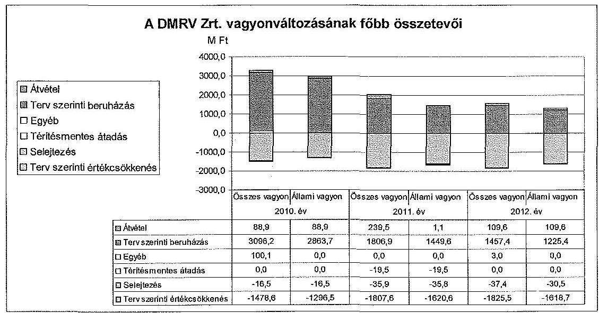

A vagyonváltozást elsősorban a végrehajtott beruházások, valamint az elszámolt értékcsökkenések érintették.

A saját tőke a 2010-2012. évi időszakban 13,3\%-kal (2385,5 millió Ft-ra) nőtt, a jegyzett tőke és a tőketartalék nem változott. A saját tőke/jegyzett tőke aránya a 2010. évi $215,5 \%$-ról a 2012. év végére $244,2 \%$-ra emelkedett az éves eredmények hatására. A jegyzett tőke összegében nem, de tulajdonosi összetételében változott a 2012-2013. években.

A vagyon szerkezetét érintően a Közgyűlés döntött a DMRV Zrt. volt munkavállalóitól - az Alapszabályban foglalt feltételek szerint - visszavásárolt dolgozói részvények törzsrészvénnyé alakításáról. Az így átalakított törzsrészvények, mint saját részvények, a DMRV Zrt. tulajdonába kerültek.

A DMRV Zrt. kötelezettségállományának aránya az összes forráson belül 90\% körül alakult, összege a 2010. évi 32 176,7 millió Ft-ról - 6,3\%-kal - a 2012. év végére 34199,1 millió Ft-ra nőtt. A kötelezettségállomány meghatározó eleme volt az állammal szembeni hosszú lejáratú kötelezettség. A rövid lejáratú kötelezettségen belül lejárt szállítói állomány, egyéb rövid lejáratú kötelezettség nem volt, az állomány alakulása a DMRV Zrt. fizető képességét nem veszélyeztette. A beszállítók értékelési szabályzata szerint a beszállítókat négy kategóriába sorolták, ezek alapján beszállítói rangsor készült, amit évente aktualizáltak.

A Közgyűlés, az Igazgatóság és az FB hatáskörébe tartozó, a kötelezettségvállalás előzetes jóváhagyására vonatkozó - Alapszabályban rögzített - szabályokat a kötelezettségvállalások során betartották.

A DMRV Zrt. követelésállományának aránya az összes eszközön belül nőtt, 2010. december 31-én 6,5\% (2383,0 millió Ft), 2012. december 31-én 8,3\% (3163,7 millió Ft) volt. A követelésállományon belül a vevőkövetelés állománya volt a meghatározó, ami a 2010-2012. évek közötti időszakban 93-94\%-ot tett ki. Az összes vevőkövetelés állománya a 2010-2012. évek közötti időszakban $21,5 \%$-kal, 2957,5 millió Ft-ra nőtt.

---

A vevőkövetelés-állományon belül a határidőn túli vevőkövetelések összege a kezdeti csökkenést követően a 2010. évi szintre visszaállva a 2012. év végére 676,8 millió Ft-ot tett ki. A követelések értékvesztés elszámolási módszere a 2012. évben az MNV Zrt. által egységessé tett számviteli politika előírásai alapján megváltozott. Az elszámolás változása az eredményt a 2012. évben 23,5 millió Ft-tal csökkentette. A követelések elszámolt értékvesztésének 2012. évi összege az elszámolás módosítása, a szolgáltatási terület növekedése, valamint a követelésállomány szerkezetének változása következtében a 2010-2011. években elszámolt évi 80-100 millió Ft követelés-értékvesztésről 167,6 millió Ft-ra növekedett. A DMRV Zrt. a követelések kockázatát a kintlévőségek alakulásának folyamatos monitoringja, a fogyasztói kör elemzése (fizetési hajlandóság, adósminősítés, fizetőképesség fenntartását biztosító előrejelzések) révén kezelte.

Az állami vagyontárgy értékének megőrzése, állagának megóvása és karbantartása a vagyonkezelő kötelessége, erről a Vtv. 23. § (2) bekezdése és a Vhr. 9. § (6) bekezdése egyaránt rendelkezett, ezt a követelményt a VSZ is rögzítette.

A beruházások, felújítások, karbantartások fedezetét részben a szolgáltatási díjakba beépített költségek és az amortizáció összege biztosította (visszapótlási kötelezettség). (A fennmaradó finanszírozási szükségletet a Társaság külső forrásból biztosította.) A Vksztv. 62. §. (1) bekezdése alapján a 2013. évtől a víziközmű társaságoknak a szolgáltatási díjat úgy kell meghatározniuk - a költségekre, árakra vonatkozó összehasonlító elemzések felhasználásával -, hogy figyelembe veszik többek között a szolgáltatás indokolt költségeit és a környezetvédelmi kötelezettségek teljesítésének költségeit. Ezek mellett a díjaknak támogatniuk kell a Vksztv. alapelveinek érvényesülését (pl. biztonságos és legkisebb költségű szolgáltatás, hatékony gazdálkodás). A 2011. december 31-től hatályos rendelkezés a 2012. évi díjak kalkulációjára még nem vonatkozott, mivel a DMRV Zrt. a hatályba lépést megelőzően készítette el a díjakra vonatkozó javaslatát, amelyet a Vidékfejlesztési Minisztérium 2011. december 23-án jóváhagyott. A DMRV Zrt. díjbevételeinek megtérülését a költségek, ráfordítások alakulása függvényében a következő grafikon mutatja be.
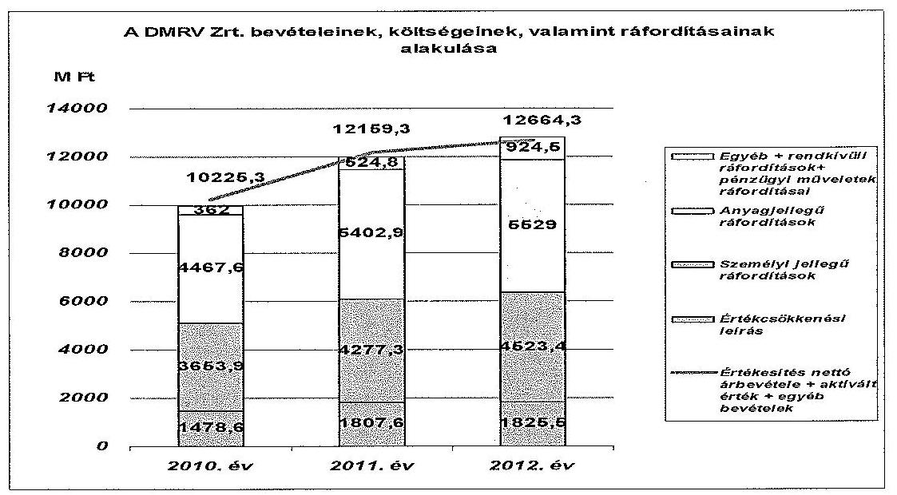

---

Az állami tulajdonú eszközök pótlására a 2010-2012. évek közötti időszakban 5568,6 millió Ft-ot fordítottak, a társasági szinten elszámolt értékcsökkenés (amortizáció) összege 5111,7 millió Ft-ot tett ki, ebből az állami vagyon után elszámolt értékcsökkenés összege 4535,9 millió Ft volt. A DMRV Zrt. beruházásokra 6360,6 millió Ft-ot fordított, amelynek forrását döntően az amortizáció, valamint az újonnan csatlakozók befizetései, illetve a környezetterhelési díj be nem fizetett (beruházási és műszerbeszerzési kedvezmény) része képezte. Támogatásként 704,1 millió Ft hazai és EU forrást kapott.

Az állami vagyoni körbe tartozó tárgyi eszközök és az immateriális javak terv szerinti értékcsökkenéseként a Társaság a 2010. évben 1296,5 millió Ft-ot, a 2011. évben 1620,7 millió Ft-ot, a 2012. évben 1618,7 millió Ft-ot számolt el. A társasági vagyoni körben az értékcsökkenés összege az egyes években 182,0 millió Ft, 181,2 millió Ft, illetve 200,5 millió Ft volt.

A fejlesztési célú támogatások közül a felhasznált EU (KEOP) forrás összege 619,5 millió Ft volt, a költségvetési támogatás 80,0 millió Ft-ot tett ki, a fennmaradó részt önkormányzati támogatás, valamint magánszemélyek, vállalkozók befizetései tették ki. A fejlesztési támogatási forrást legnagyobb összegben a 682,0 millió Ft-ba kerülő Dunakeszi szennyvíztisztító telepfejlesztés esetében használt fel a Társaság, ezen kívül a Duna Balparti Regionális Vízellátó rendszer Fót és térsége biztonságos ivóvízellátásának javítására 17,5 millió Ft fejlesztési támogatást fordított. Az önkormányzati támogatásként kapott 4,6 millió Ft forrást Fót közüzemi ivóvízhálózatának bővítésére fordították.

A fejlesztések eredményeként a DMRV Zrt. működési területén az ivóvízellátási, illetve csatornázottsági mutatók javultak a 2010-2012. évek közötti időszakban. Az ivóvízellátásba bekapcsolt lakásszám 161 ezerről 186 ezerre, a csatorna-szolgáltatásba bekapcsolt lakásszám 98 ezerről 126 ezerre nőtt. A DMRV Zrt. működési területén az értékesített ivóvíz mennyisége a 2010. évi 19,2 millió $\mathrm{m}^{3}$-ről 20,5 millió $\mathrm{m}^{3}$-re, míg az elvezetett tisztított szennyvíz mennyisége 6,8 millió $\mathrm{m}^{3}$-ről 13,4 millió $\mathrm{m}^{3}$-re nőtt. A Duna Balparti Regionális Szennyvíz-elvezető-tisztító Rendszer Dunakeszi szennyvízelvezetési agglomeráció szennyvíztisztító telepének fejlesztése projekt esetében a fejlesztéstől előzetesen elvárt mutatók, értékek teljesültek.

A lakossági, állami vízdíjak összetevőin belül a DMRV Zrt. szolgáltatási területén az ellenőrzött időszakban az alapdíj $40 \%$-kal (80,0 Ft/hó), a változó díj $3,0 \%$-kal $\left(7,0 \mathrm{Ft} / \mathrm{m}^{3}\right)$ nőtt. A csatornadíjak esetében az alapdíj $22 \%$-kal (60,0 Ft/hó), a változó díj $6,2 \%$-kal $\left(17,0 \mathrm{Ft} / \mathrm{m}^{3}\right)$ emelkedett. A 2010-2012. évek között a lakossági fogyasztók részére meghatározott díjak alakulását a következő grafikon mutatja be.

---

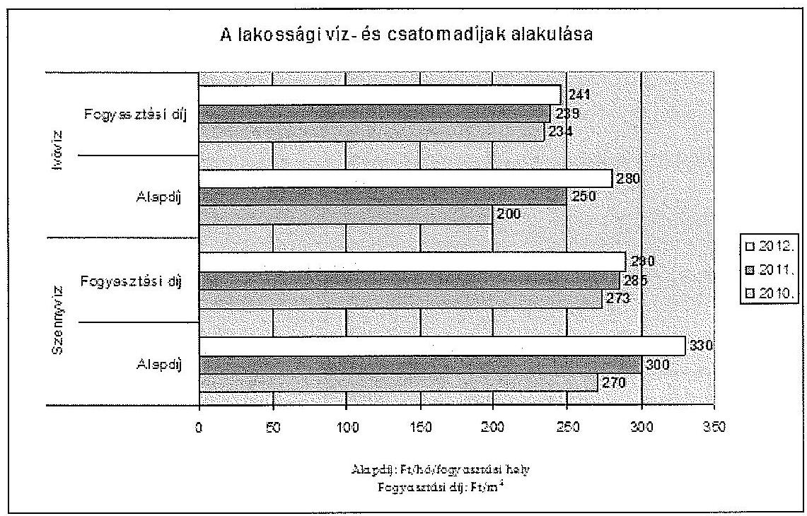

A tervszerű és terven felüli - az állami vagyonon elvégzett - értéknövelő felújítások összege a 2010-2012. évek közötti időszakban 4070,8 millió Ft volt. Ezen belül az összes elvégzett felújítás 90,0\%-a volt tervezett. A soron kívül szükségessé vált felújítások összege a 2010-2012. évek közötti időszakban 375,4 millió Ft volt, amelyen belül a kárveszély elhárítását célzó vagy elmaradásuk esetén az ellátás biztonságát veszélyeztető felújítások összege 168,6 millió Ft-ot tett ki.

A nem tervezett, de megvalósított felújítások az ellátásbiztonság javítása, hatósági előírásnak való megfelelés, közegészségügyi kockázat kivédése, havária, az üzembiztonság javítása, munkavédelmi követelmények kielégítése, rongálás, vízveszteség csökkentése miatt váltak szükségessé. A kárveszély elhárítását célzó felújításokat a Társaság ingatlan-, lakóház- és útveszélyeztetés, valamint vízbázis veszélyeztetettségének megszüntetése miatt végezte el.

Az élettartamnövelő felújításokat állapotfelmérés alapján a DMRV Zrt. az üzleti tervében, az annak részét képező beruházási tervében határozta meg. A pénzügyi lehetőségek alapján az üzleti terv keretében készült el üzemigazgatóságonként a tárgyévi karbantartási terv is, az előre tervezhető feladatokon kívül figyelembe véve a korábbi évek üzemeltetési tapasztalatai alapján a váratlan, előre nem tervezhető meghibásodások költségigényét.

Az éves karbantartási terv az eszközök fizikai elhasználódásának és az adott eszköz biztonságos üzemeltetésére vonatkozó előírások figyelembevételével készült, a tervezés alapját az eszközökről vezetett élettörténeti - az eszközjavítási, karbantartási, a fődarabcsere tevékenység megnevezését, bekövetkezésének időpontját tartalmazó - nyilvántartás képezte. A Vagyongazdálkodási szabályzat ${ }_{1-3}$ elkülönítetten tartalmazta a karbantartási tevékenység szabályozását. A karbantartási tevékenység folyamatleírását eljárási utasítás rögzítette.

A DMRV Zrt. nem számolt el az MNV Zrt. felé - a Vhr. 18. § (3) bekezdésben foglalt rendelkezésekkel ellentétben - a beruházásokról, felújításokról előzetes költségvetéssel, számlákkal. A VSZ erre vonatkozóan rendelkezést nem tartal-

---

mazott, mert azon a Vhr. hatályba lépése miatti jogszabályváltozásokat nem vezették át. Az MNV Zrt. a vagyonkezelési tevékenység kapcsán helyszíni ellenőrzést nem végzett a DMRV Zrt. által elvégzett munkálatok (pl. beruházások) során.

Az eszközök karbantartási költségeinek forrását a szolgáltatási díjban jóváhagyott díjhányad biztosította. Az évente ténylegesen felhasználható keret ugyanakkor függött egyrészt a ténylegesen elfogadott díj, valamint az értékesített vízmennyiség alakulásától.

A DMRV Zrt. a vagyontárgyak állagának megóvásáról és azok működtetéséről a tárgyi eszközök rendszeres időközönkénti, megfelelő mértékű karbantartásával gondoskodott. A karbantartások tervezett összege a 2010-2012. évek közötti időszakban $26 \%$-kal nőtt, ugyanakkor a tényleges ráfordítás minden évben jelentősen, a három év összesítése alapján $10 \%-kal, 490,5 millió Ft-tal elmaradt a tervszámtól. A három év tényleges ráfordítása 4661,5 millió Ft volt, ennek mintegy harmadát (1536,3 millió Ft) külső megbízás keretében végeztették el. A rendkívüli karbantartásokra terven belül bázis alapon határoztak meg keretet.

A karbantartási tervek létesítmény-jegyzékét az előzetesen figyelembe vett váratlan meghibásodások arányának változása, a felmerült új feladatok, illetve a tervezett feladatok elhagyása miatt folyamatosan aktualizálták.

A többletkarbantartások oka a szolgáltatás, a vízminőség vagy a közegészségügyi biztonság fenntartása, illetve a váratlan meghibásodások kijavítása (csőtörések és az ahhoz kapcsolódó úthelyreállítások, szivattyúmeghibásodások, vízminőségi panaszok miatti csőtisztítások) voltak. További költséget jelentettek a tervezettnél nagyobb számban előforduló rongálás miatti karbantartások.

A karbantartási terv teljesíthetőségét a rendkívüli események és a tulajdonosi elvárások komplex egymásra hatása befolyásolta. A tulajdonosi elvárásoknak megfelelő eredményterv teljesítése következtében a karbantartási tervtől való eltérésre (feladat-átszervezés, -átütemezés) kényszerültek. Ugyanakkor teljesítették a folyamatos szolgáltatás színvonalát biztosító, halaszthatatlan karbantartásokat. A rendkívüli karbantartások fedezetére céltartalékot képeztek. A DMRV Zrt. a 2010. évben az árbevétel-kiesést a halasztható karbantartások - a szolgáltatás biztonságát nem veszélyeztető - időben történő eltolásával, valamint külső megbízások helyett a karbantartások saját erőből történő végzésével mérsékelte.

A 2010. évben az időlegesen elhalasztott munkák az ivóvíztermelés és szolgáltatás ágazatnál 211,0 millió Ft átmeneti költségcsökkenést eredményeztek. A rendkívüli karbantartások fedezetére a 2010. évben 76,6 millió Ft céltartalékot képeztek. A 2011. évben 85,0 millió Ft külső vállalkozók által végzett karbantartást a céltartalékból fedeztek. Az éves karbantartás összege területbővülés miatt (Nyugat-Nógrádi Vízmű terület) 53,0 millió Ft-tal nőtt. A 2012. évben az üzemelés biztonsága és az eredményesség szem előtt tartásával a tervezett karbantartások egy részét, 74,6 millió Ft-ot 2013-ra átütemeztek.

A DMRV Zrt. a Vtv. 30. § (1) bekezdés előírásainak megfelelve eleget tett a kár-veszély-elhárítási kötelezettségének (útbeszakadás, árvíz következményeinek elhárítása). A kárveszély-elhárítás ráfordításai a 2010. évben 129,9 millió

---

Ft, a 2011. évben 32,6 millió Ft, a 2012. évben 5,9 millió Ft összeget tettek ki. Az ellátásbiztonságot veszélyeztető, illetve a kárveszély elhárítását célzó munkák által megelőzött károk összege nem ismert.

A Vtv. előírja, hogy a Magyar Állam nevében tulajdonosi jogokat gyakorló szervezetek a tulajdonosi joggyakorlásuk alá tartozó gazdálkodó szervezeteknél kötelesek érvényesíteni a cégvezetés felelősségét, valamint a közérdek érvényesülését biztosító vagyongazdálkodást.

A Vksztv. 45. §-a, valamint a Vksztv. vhr. 45-50. §-ai a 2012. évi hatálybalépésüket követően kijelölték a víziközmű-üzemeltetés azon meghatározott feladatait, amelyek kiszervezése az Energetikai Hivatal előzetes engedélyéhez, illetve tájékoztatásához kötött. Szakmai, gazdaságossági, valamint kapacitáselégtelenségi, illetve célszerűségi okokból a DMRV Zrt. - a Vksztv. hatálybalépése előtt is - a szervizelési és javítási feladatai egy részét külső megbízások alapján végeztette el. A DMRV Zrt. a feladatok kiszervezéséhez az Energetikai Hivatal előzetes engedélyét nem kérte meg, mivel a Vksztv. vonatkozó előírásai 2012. július 15-től hatályosak, és a szabályok és tevékenységek részletes felsorolását tartalmazó Vksztv., valamint a Vksztv. vhr. 2013. február 17-én lépett hatályba.

A DMRV Zrt. a bérgazdálkodási, bérszabályozási rendszerét bérgazdálkodási szabályzatban rögzítette. A DMRV Zrt. bérgazdálkodási szabályait az MNV Zrt. határozta meg a keresettömeg gazdálkodás engedélyezésével, végrehajtására évente keresetfejlesztési irányelveket adott ki. A DMRV Zrt. 2012. évi bértömegét és létszámát, valamint a vezérigazgató 2011. és 2012. évi alapbérét a Közgyűlés önálló határozattal állapította meg. A DMRV Zrt. 2010. és 2011. évi tervezett bértömeg összegét a Közgyűlés által jóváhagyott üzleti terv tartalmazta. A DMRV Zrt. a 2011. évi üzleti tervhez kapcsolódva bérkorrekciós igénnyel fordult az MNV Zrt. felé, aki azt jóváhagyta. A létszám és a bérköltség 20102012. évek közötti alakulását a következő táblázat mutatja be.

| Megnevezés | 2010. év | 2011. év | 2012. év |
| :-- | :--: | :--: | :--: |
| Átlagos állományi létszám (fő) | 918 | 1065 | 1092 |
| Bérköltség (millió Ft) | 2439,5 | 2887,9 | 3085,5 |
| Személyi jellegű egyéb kifizetések   (millió Ft) | 455,2 | 497,2 | 480,0 |
| Összes személyi jellegű kifizetés   (millió Ft) | 2894,7 | 3385,1 | 3565,5 |

[^0]
[^0]:    ${ }^{8}$ A DMRV Zrt. által számolt átlagos statisztikai létszámadatok.

---

# 3. A DMRV ZRT. ÁLTAL MŰKÖDTETETT KONTROLL- ÉS MONITORING RENDSZER

### 3.1. A belső kontrollrendszer

A DMRV Zrt.-nél a vagyon védelmét és a vagyonnal való felelős gazdálkodást biztosító belső kontrollrendszer kialakítása megtörtént, azonban működése egyes területeken nem volt megfelelő.

A DMRV Zrt. a rábízott nemzeti és a saját vagyonnal való felelős gazdálkodás érdekében kialakította belső kontrollrendszerét, amely magába foglalta a kontrollkörnyezet, a kontrolltevékenység, a kommunikáció és információáramlás, a kockázatkezelés és a monitoring rendszer, utóbbin belül különösen a belső ellenőrzés kialakítását, valamint szabályszerű működtetését. A kontrollkörnyezet keretében a DMRV Zrt. elkészítette számviteli politikáját és az ahhoz kapcsolódó leltározási, selejtezési, értékelési, önköltségszámítási, pénzkezelési és kötelezettség-vállalási, valamint a vagyongazdálkodással kapcsolatos kontroll szabályzatokat. A DMRV Zrt. szabályzataiban található szabályozási és az alkalmazásuk során feltárt hiányosságok a következők voltak:

- a DMRV Zrt.-nél a vagyongazdálkodást érintő, 2012. szeptember 19-én végrehajtott szervezeti változásnál nem tartották be az SZMSZ munkakörök és feladatkörök átadására vonatkozó előírásait. A korábban a műszaki igazgató vezetése alá tartozó beruházási és vagyongazdálkodási osztályt megszüntették, feladatai egy részének elvégzésére a gazdasági igazgató felügyelete alatt önálló beszerzési és önálló vagyongazdálkodási csoportot hoztak létre. A 2012. évben megszűnt beruházási és vagyongazdálkodási osztályt felváltó új szervezeti egységeket és a megszűnt osztály szétosztott feladatait nem vezették át a beruházási, valamint a gépgazdálkodási szabályzatban, valamint a munka- és feladatkörök átadásáról az előírt jegyzőkönyvet nem készítették el. Az SZMSZ módosításával az új szervezeti egységek feladatköre meghatározásra került.
- Az értékelési szabályzat előírásait nem minden esetben tartották be az egyes eszközök egyedi bekerülési értékének meghatározásánál. Az ingatlanok eszközcsoportban az egyes eszközök egyedi értékének meghatározását alátámasztó dokumentumokat nem tudták az ellenőrzés rendelkezésére bocsátani. Az egyes beruházásokhoz tartozó számlák összege megegyezett az aktiválási jegyzőkönyvben szereplő tárgyi eszközök egyedi bekerülési (aktiválási) értékeinek összegével, azonban az egyedi bekerülési érték meghatározásának módja, számítása nem volt fellelhető.

Az ellenőrzött tételek közül 26 esetben (20\%) a számlaérték bontásához a részletszámítást a Társaság nem tudta bemutatni. A Szob szennyvíztelep I. 12 fm. műtárgysor azonosító alatti, 425,0 ezer Ft egyedi bekerülési értékű szivárgó szerepel a 2011. január 24-én készített aktiválási jegyzőkönyvben, melynek egyedi bekerülési értéke számítással nem volt alátámasztva. Az állományba vételi bizonylat mellékleteként becsatolt 11 db számla összege 36668,0 ezer Ft volt. Az aktiválási jegyzőkönyvben szereplő 22 db tárgyi eszköz egyedi bekerülési értékének összege szintén 36668,0 ezer Ft-ot tett ki.

---

- A gazdasági események szabályszerűsége, a nyilvántartások vezetése, a beruházások lebonyolítása és elszámolása a belső szabályozásnak nem minden esetben felelt meg. Nem minden esetben teljesült a szerződéskötés folyamata szabályzatának azon előírása, amely szerint a szerződéseken szerepeljen a műszaki és/vagy gazdasági igazgató, valamint a vezető jogtanácsos ellenjegyzése.

A 2010. évi beszerzések közül öt esetben, pl. a Vác ivóvíz és szennyvíz rekonstrukcióra megkötött szerződésen a vezérigazgató aláírása mellett nem szerepelt ellenjegyzés.

- A szerződések megkötésekor az értékhatárokkal kapcsolatos aláírási rendet betartották, azonban hét szerződésnél az ellenjegyzés nem történt meg a vállalkozóként történő szerződéskötés, a közüzemi szolgáltatási szerződéskötés és a megrendelőként történő szerződéskötés folyamatára vonatkozó eljárási utasítás előírásai ellenére.

A DMRV Zrt. belső ellenőrzése az SZMSZ előírásainak megfelelően 2012. szeptember 17-ig a titkársági osztályhoz, azt követően közvetlenül a vezérigazgató irányítása alá tartozott. A két főből álló belső ellenőrzés a vezérigazgató felhatalmazása alapján - éves belső ellenőrzési munkaterv keretében -, illetve a belső ellenőrzési szabályzat ${ }_{1,2,3}$-ban ${ }^{9}$, valamint a munkaköri leírásokban foglaltak alapján végezte munkáját.

Az ellenőrzések tervezését megalapozó stratégiai ellenőrzési terv, valamint kockázatelemzés készítésére a belső ellenőrzési szabályzat ${ }_{1,2,3}$ nem tartalmazott előírásokat. A belső ellenőrzés elkészítette a 2010-2012. évekre vonatkozó belső ellenőrzési munkaterveket, amelyeket a vezérigazgató a belső ellenőrzési szabályzat ${ }_{1}$-ben foglalt határidőn belül az FB egyetértésével jóváhagyott. A 2010. és 2011. éves belső ellenőrzési munkaterveket kockázatelemzés nem alapozta meg. A 2012. évben olyan területek ellenőrzését választották ki, amit még nem, vagy hosszabb időn keresztül nem ellenőriztek. Az FB előzetes ellenőrzési témajavaslatait az éves belső ellenőrzési munkatervbe beépítették.

A belső ellenőrzési munkaterv 2010-re 18, 2011-re 16, 2012-re hat ellenőrzést tartalmazott, ezek téma-, illetve utóvizsgálatok voltak. A vagyoni helyzet alakulását évente tíz, kilenc és kettő ellenőrzés érintette.

A 2012. évben az ellenőrzési tervet - kapacitás és időhiány miatt - módosították, melynek jóváhagyása a belső ellenőrzési szabályzat ${ }_{1}$-ben foglaltaknak megfelelő volt. A 2010-2012. évek ellenőrzési munkatervében foglalt valamennyi ellenőrzést végrehajtották. Ellenőrzés megszakítására, felfüggesztésére a 2010-2012. években nem került sor. A végrehajtott ellenőrzésekhez a belső ellenőrzési szabályzatban foglaltaknak megfelelő tartalmú ellenőrzési program készült.

[^0]
[^0]:    ${ }^{9}$ A 2009. március 3-ától hatályos EU8203 belső ellenőrzési szabályzat 1. kiadás, a 2010. augusztus 17-étől hatályos EU8203 belső ellenőrzési szabályzat 2. kiadás és a 2013. január 1-jétől hatályos EU8203 belső ellenőrzési szabályzat 3. kiadás

---

Az elvégzett ellenőrzésekről a belső ellenőrzési szabályzatban előírt tartalmú jelentések készültek. A belső ellenőrzés javaslatainak végrehajtása érdekében a belső ellenőrzési szabályzatban ${ }_{1}$ foglaltak ellenére a javaslatot tartalmazó jelentések 76,5\%-nál nem készített intézkedési tervet az ellenőrzött szervezeti egység vezetője.

A 2010-2012. években a 17 belső ellenőrzés közül a 4 belső ellenőrzési jelentés esetében készítették el az intézkedési tervet a kötelezettek.

A DMRV Zrt. belső ellenőrzése a javaslatokat, valamint az intézkedési tervben foglaltak végrehajtását utóellenőrzés keretében ellenőrizte, amelyet beépített az éves munkatervébe. A belső ellenőrzést végzők az ellenőrzések során büntető-, szabálysértési, kártérítési vagy fegyelmi eljárás megindítására okot adó cselekményt nem tártak fel. Az elvégzett belső ellenőrzésekről, valamint az ellenőrzési jelentésekben szereplő javaslatok nyomon követését biztosító nyilvántartás vezetésről a belső ellenőrzési szabályzat ${ }_{1,2,3}$ előírásokat nem tartalmazott.

A 2010-2012. évekre vonatkozóan éves összefoglaló jelentések (beszámoló) készültek az elvégzett belső ellenőrzésekről, azonban azok tartalmukban nem feleltek meg a belső ellenőrzési szabályzat ${ }_{1}$-ben foglaltaknak. A 2012. évben az éves összefoglaló jelentést nem a belső ellenőrzési vezető készítette el, a belső ellenőrzési szabályzat ${ }_{3}$-ban foglalt felelősségi előírások ellenére.

A Közgyűlés a 2010-2012. évek éves beszámolóit a törvényi előírásoknak megfelelő határidőben és rendben, az FB és a könyvvizsgálói jelentését megismerve jóváhagyta. Az éves beszámolók letétbehelyezése a Számv. tv. 153. § (1) bekezdésében előírt határidőig megtörtént.

# 3.2. Az információáramlási és monitoring rendszer

A DMRV Zrt.-nél a szabályszerű vagyongazdálkodás érdekében kialakított információáramlási és monitoring rendszer működése megfelelő volt. Az FB munkájához szükséges és előírt információkat a DMRV Zrt. határidőre megadta. Ezen túlmenően egyéb, az egyes szervezeti egységek működésére vonatkozó szabályzatokban, eljárási rendekben és utasításokban foglaltaknak megfelelően az ügyvezetés, illetve az FB tájékoztatása megtörtént. A DMRV Zrt. az MNV Zrt. felé az adatszolgáltatást az előírt időben és tartalommal teljesítette.

Az MNV Zrt. Kontrolling, Vagyonértékelő és Könyvszakértő Igazgatósága minden év elején megküldte az éves adatszolgáltatási kötelezettségekre vonatkozó előírásokat, amelyre a kitöltött táblázatok web felületen, illetve e-mailen keresztül kerültek megküldésre a megadott határidőre. Az adatszolgáltatás beérkezéséről írásbeli visszaigazolást az MNV Zrt. nem adott. A 2010. január 1-jétől 2013. szeptember 2-ig tartó időszakban a DMRV Zrt. a VSZ és a Vgsz. szerint részletezett - a tárgyévi beszámoló adataival egyező - jelentési kötelezettségét a tárgyévet követő május 31-ig az MNV Zrt. felé határidőre teljesítette. Az MNV Zrt. a beérkezett jelentéseket írásban nem igazolta vissza. A Vgsz. szerintinél részletesebb vagyonkataszteri jelentésre vonatkozó adatszolgáltatási kötelezettségét határidőn belül teljesítette a DMRV Zrt.

---

A DMRV Zrt. kialakította a gazdálkodó szervezet egész területére érvényes, egységes iratkezelési és adatvédelmi szabályozás rendszerét. Az állami vagyonnal kapcsolatos adatok védelme biztosított volt.

Budapest, 2014. 04. hó 14. nap

Melléklet: $\quad 10 \mathrm{db}$
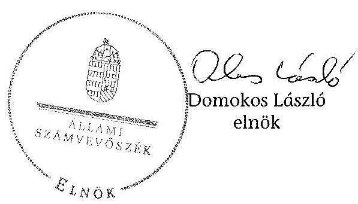

---

# RÖVIDÍTÉSEK JEGYZÉKE 

## Törvények

Áht. 1
Áht. 2
ÁSZ tv.
Kbt. $_{1}$

Kbt. $_{2}$
Nvtv.
Számv. tv.
Vgtv.
Vksztv.
Vtv.

## Rendeletek

Vhr.
Vksztv. vhr.

## Szórövidítések

áfa
Alapszabály
ÁSZ
belső ellenőrzési szabályzat ${ }_{1}$
belső ellenőrzési szabályzat $_{2}$
belső ellenőrzési szabályzat $_{3}$

Beruházási és Vagyongazdálkodási Osztály

DMRV Zrt., Társaság
Energetikai hivatal EU
az államháztartásról szóló 1992. évi XXXVIII. törvény (hatálytalan: 2012. január 1-jétől)
az államháztartásról szóló 2011. évi CXCV. törvény
Az Állami Számvevőszékről szóló 2011. évi LXVI. törvény
a közbeszerzésekről szóló 2003. évi CXXIX. törvény (hatálytalan: 2012. január 1-jétől)
a közbeszerzésekről szóló 2011. évi CVIII. törvény
a nemzeti vagyonról szóló 2011. évi CXCVI. törvény
a számvitelről szóló 2000. évi C. törvény
a vízgazdálkodásról szóló 1995. évi LVII. törvény
a víziközmű-szolgáltatásról szóló 2011. évi CCIX. törvény
az állami vagyonról szóló 2007. évi CVI. törvény
az állami vagyonnal való gazdálkodásról szóló 254/2007. (X. 4.) Korm. rendelet
a víziközmű-szolgáltatásról szóló 2011. évi CCIX. törvény egyes rendelkezéseinek végrehajtásáról szóló 58/2013. (II. 27.) Korm. rendelet
általános forgalmi adó
a Duna Menti Regionális Vízmű Zártkörűen Működő Részvénytársaság Alapszabálya
Állami Számvevőszék
a Duna Menti Regionális Vízmű Zártkörűen Működő Részvénytársaság EU 8203 számú Belső ellenőrzési Szabályzat 1. kiadás (hatálya: 2009. március 3.-2010. augusztus 16.)
a Duna Menti Regionális Vízmű Zártkörűen Működő Részvénytársaság EU 8203 számú Belső ellenőrzési Szabályzat 2. kiadás (hatálya: 2010. augusztus 17.-2012. december 31.)
a Duna Menti Regionális Vízmű Zártkörűen Működő Részvénytársaság EU 8203 számú Belső ellenőrzési Szabályzat 3. kiadás (hatályos: 2013. január 1-jétől)
a Duna Menti Regionális Vízmű Zártkörűen Működő Részvénytársaság Beruházási és Vagyongazdálkodási Osztálya
a Duna Menti Regionális Vízmű Zártkörűen Működő Részvénytársaság
Magyar Energetikai és Közmű-szabályozási Hivatal
Európai Unió

---

| FB | Duna Menti Regionális Vízmű Zártkörűen Működő Rész-   vénytársaság Felügyelőbizottsága |
| :--: | :--: |
| Igazgatóság | Duna Menti Regionális Vízmű Zártkörűen Működő Rész-   vénytársaság Igazgatósága |
| leltározási szabályzat | a Duna Menti Regionális Vízmű Zártkörűen Működő   Részvénytársaság EU 6101 számú Leltározási szabályzat |
| Közgyűlés | a Duna Menti Regionális Vízmű Zártkörűen Működő   Részvénytársaság Közgyűlése |
| KVI | Kincstári Vagyoni Igazgatóság |
| MNV Zrt. | Magyar Nemzeti Vagyonkezelő Zrt. |
| Stratégia $_{1}$ | a Duna Menti Regionális Vízmű Zártkörűen Működő   Részvénytársaság Stratégiája (hatálytalan: 2011. augusztus   15-től) |
| Stratégia $_{2}$ | a Duna Menti Regionális Vízmű Zártkörűen Működő   Részvénytársaság Stratégiája (hatályos: 2011. augusztus   15-től) |
| SZMSZ | a Duna Menti Regionális Vízmű Zártkörűen Működő   Részvénytársaság Szervezeti és Működési szabályzata |
| Üzemi Tanács | a Duna Menti Regionális Vízmű Zártkörűen Működő   Részvénytársaság Üzemi Tanácsa |
| vagyongazdálkodási   szabályzat $_{1}$ | a Duna Menti Regionális Vízmű Zártkörűen Működő   Részvénytársaság EU6108 számú Vagyongazdálkodási   Szabályzat 1. kiadása (hatálytalan: 2010. december 6-tól) |
| vagyongazdálkodási   szabályzat $_{2}$ | a Duna Menti Regionális Vízmű Zártkörűen Működő   Részvénytársaság EU6108 számú Vagyongazdálkodási   Szabályzat 2. kiadása (hatálytalan: 2011. december 27-   től) |
| vagyongazdálkodási   szabályzat $_{3}$ | a Duna Menti Regionális Vízmű Zártkörűen Működő   Részvénytársaság EU6108 számú Vagyongazdálkodási   Szabályzat 3. kiadása (hatályos: 2011. december 27-től) |
| Vgsz. | a Kincstári Vagyoni körbe Tartozó Víziközművagyon Ke-   zelési és Gazdálkodási és Nyilvántartási Szabályzat |
| VSZ, vagyonkezelési   szerződés | a Duna Menti Regionális Vízmű Részvénytársaság és a   Kincstári Vagyoni Igazgatóság által megkötött vagyonke-   zelési szerződés |
| vezérigazgató | a Duna Menti Regionális Vízmű Zártkörűen Működő   Részvénytársaság vezérigazgatója |

---

# ÉRTELMEZŐ SZÓTÁR 

belső ellenőrzés
felhasználói egyenérték
gördülő fejlesztési terv

KEOP 1.2.0 prioritás

KEOP 1.3.0 prioritás
kezelt/kincstári/állami vagyon

Kincstári Vagyoni Igazgatóság
kontrollkörnyezet
monitoring

Független, tárgyilagos bizonyosságot adó és tanácsadó tevékenység, amelynek célja, hogy az ellenőrzött szervezet működését fejlessze és eredményességét növelje, az ellenőrzött szervezet céljai elérése érdekében rendszerszemléletű megközelítéssel és módszeresen értékeli, illetve fejleszti az ellenőrzött szervezet irányítási és belső kontrollrendszerének hatékonyságát.
Olyan mutatószám, amely a víziközmű-szolgáltatást igénybe vevő felhasználók számosságát - víziközműszolgáltatási ágazatonként, a felhasználók kapacitásigényeire figyelemmel - a Vksztv.-ben meghatározott képlet alapján egységesen fejezi ki.
A víziközművagyon vagyonkezelési szerződésben rögzített jelenkori könyv szerinti nettó értékének megőrzésére szóló, hosszú távú felújítási és pótlási, valamint beruházási tervéből álló terv (Vksztv. 2. § (8) pont).
A Környezet és Energia Operatív Program keretében kiírt szennyvízelvezetés és tisztítást szolgáló pályázati rendszer.
A Környezet és Energia Operatív Program keretében kiírt ivóvízminőség-javítást szolgáló pályázati rendszer.
A Társaság víziközmű-szolgáltatási tevékenységének ellátásához használt, kizárólagos állami tulajdonban lévő közművagyon, amely kezelésére vonatkozóan a KVI és a Társaság 1998-ban vagyonkezelési szerződést kötött.
Az állami vagyonnal kapcsolatos tulajdonosi jogokat gyakorló szervezet. 2007. december 31-i megszűnését követően jogai és kötelezettségei az MNV Zrt.-re szálltak. (A jogok és kötelezettségek átszállása nem minősült a már megkötött vagyonkezelési szerződések módosításának a Vtv. 61. §-a alapján.)
A kontrollkörnyezet alakítja ki a szervezet belső kontrollrendszerhez való viszonyát, hozzáállását, befolyásolja az alkalmazottak belső kontrollal kapcsolatos tudatosságát, magatartását. Elemei a személyes és szakmai elkötelezettség és a vezetés, valamint az alkalmazottak által vallott erkölcsi értékek; a szakmai hozzáértés iránti elkötelezettség; a felső vezetés hozzáállása, a vezetés filozófiája és tevékenységének stílusa; a szervezeti struktúra; a humán-erőforrás-politika és gazdálkodási gyakorlat.
A monitoring a különböző szintű szervezeti célok megvalósításának folyamatát kíséri figyelemmel, melynek során a releváns eseményekről és tevékenységekről (együtt: folyamatokról) rendszeres jelleggel, strukturált, döntéstámogató információkhoz jutnak a szervezet vezetői.

---

működtető vagyon
tulajdonosi jogokat gyakorló/tulajdonosi joggyakorló
vagyonkezelési szerződés
visszapótlási kötelezettség
víziközmű-rendszer

A Társaság tulajdonában álló vagyon, amellyel a tulajdonosi jogokat gyakorlótól függetlenül rendelkezhet.
Az állami vagyon kezeléséért felelős miniszter. A miniszter nevében a vagyon felett a tulajdonosi jogokat gyakorló szervezet 2007-ig a KVI, 2007-től a Nemzeti Vagyongazdálkodási Tanács, 2010-től MNV Zrt. igazgatósága.
A kincstári vagyon kezelésére vonatkozó jogokat és kötelezettségeket tartalmazó, a Társaság és a Kincstári Vagyoni Igazgatóság között 1998-ban létrejött szerződés, amely révén a kincstári vagyon részét képező víziközműrendszerek működtetésével (üzemeltetésével és fenntartásával) - a saját tulajdonában lévő működtető vagyonnal együtt - gondoskodik az alapító okiratában meghatározott működési területen az ivóvíz- és szennyvízszolgáltatás (mint közműszolgáltatás) folyamatos teljesítéséről, a kincstári vagyonnal való szakszerű gazdálkodásról.
A kezelt állami vagyonon elszámolt terv szerinti és terven felüli értékcsökkenési leírás összegének megfelelő összegű beruházási, felújítási és karbantartási kötelezettség.
A Vksztv. 2. § szerint a víziközművek olyan egybefüggő struktúrája, amely:
a) önállóan, kizárólag egy település ellátását biztosítja (szigetüzem),
b) önállóan, több település ellátását is szolgálja, és rajta a tulajdoni viszonyok azonosak,
c) átadási pontokkal egyértelműen körülhatárolt, a kapcsolódó szolgáltatás nyújtását is vagy kizárólagosan azt biztosítja,
d) átadási pontokkal egyértelműen körülhatárolt, kapcsolódó szolgáltatással kiegészülve egy településre nézve vagy azonos tulajdoni viszonyok mellett több településre nézve, képes biztosítani a víziközmű-szolgáltatás műszaki feltételeit.

---

Kitöltő szervezet neve: DMRV Duna Menti Regionális Vízmű Zártkörűen Működő Részvénytársaság
Kitöltésért felelős: Papp Tímea
Kitöltésért felelős: telefonszáma: 20/311-5041

### TANÚSÍTVÁNY

A gazdasági társaság vagyonának alakulása: 2010-2012. évre (ezer Ft-ban)

|  Sor-
szám | Megnevezés | 2010.01.01 | 2010.12.31 | 2011.12.31 | 2012.12.31 | Változás
2012.12.31/2010.01.01. (%)  |
| --- | --- | --- | --- | --- | --- | --- |
|  1. | Szakfizék |  |  |  |  |   |
|  2. | Befektetett eszközök összesen | 31 931 511 | 33 525 025 | 33 723 355 | 33 404 913 | 104,81%  |
|  3. | Előző: Intenzivitális javak | 80 015 | 96 399 | 73 965 | 113 440 | 141,77%  |
|  4. | Tárgyi eszközök | 31 770 122 | 33 393 764 | 33 067 505 | 33 212 341 | 104,84%  |
|  5. | Befektetett pénzügyi eszközök | 81 274 | 81 962 | 81 868 | 79 132 | 97,24%  |
|  6. | Forgóeszközök | 3 640 587 | 3 162 988 | 3 851 878 | 4 211 834 | 115,70%  |
|  7. | Előző: Készletek | 85 802 | 114 185 | 85 375 | 100 945 | 120,45%  |
|  8. | Követelések | 3 590 286 | 3 382 989 | 3 329 729 | 3 163 679 | 122,81%  |
|  9. | Bruttósítások | 39 926 | 39 583 | 45 620 | 50 777 | 127,06%  |
|  10. | Pénzeszközök | 636 243 | 626 345 | 381 159 | 896 439 | 95,75%  |
|  11. | Aktív időbeli elhatárolások | 24 426 | 22 721 | 43 528 | 172 515 | 1037,94%  |
|  12. | Eszközök összesen | 32 399 224 | 36 718 646 | 37 618 284 | 37 889 962 | 106,72%  |
|  13. | Források |  |  |  |  |   |
|  14. | Saját tőke | 2 104 810 | 2 368 989 | 2 520 688 | 2 285 535 | 113,34%  |
|  15. | Előző: Jegyzett tőke | 976 800 | 976 800 | 976 800 | 976 800 | 100,00%  |
|  16. | Tőzsdetartalékok | 422 437 | 422 427 | 422 427 | 422 427 | 100,00%  |
|  17. | Részletes tartalékok | 860 222 | 860 200 | 924 132 | 1 070 684 | 191,02%  |
|  18. | Lakózati tartalék | 39 926 | 39 383 | 45 630 | 50 777 | 127,06%  |
|  19. | Értékelési kossáik |  |  |  |  |   |
|  20. | Mérleg szerinti arculmány | 102 111 | 264 172 | 121 609 | -135 150 | -125,58%  |
|  21. | Offizmatikok | 417 571 | 438 072 | 368 250 | 607 008 | 145,51%  |
|  22. | Kétlelezetségeit | 32 170 655 | 35 781 525 | 34 213 232 | 34 199 147 | 105,29%  |
|  23. | Előző: Hátrasoroló kékészetségek | 0 | 0 | 0 | 0 | 0  |
|  24. | Hosszú lejáratú kétlelezetségek | 30 014 147 | 30 762 837 | 31 823 594 | 31 801 742 | 105,85%  |
|  25. | Húvó lejáratú kétlelezetségek | 2 162 518 | 1 987 716 | 2 979 858 | 2 707 404 | 110,80%  |
|  26. | Pszcév időbeli elhatárolások | 892 172 | 1 130 031 | 516 614 | 797 669 | 98,91%  |
|  27. | Ferrázók összesen | 36 096 234 | 36 718 646 | 37 618 284 | 37 889 962 | 105,72%  |
|  28. | Húlelezetségek nélküli vagyon | 3 410 660 | 3 957 003 | 3 409 602 | 3 750 610 | 115,86%  |

Megjegyzés: A tanúsítványt a gazdasági társaság többségi tulajdonú leányvállalatainak is ki kell tölteniük.

Igazolom, hogy a tanúsítványban szereplő adatok nyilvántartásokkal megegyeznek.

Dátum: Vás. 2012.07.09.

Ft:

---

Közlét szervezet neve: DMIV Duna Menti Regionális Vízmű Zártkörűen Működő Részvénytársaság. Közlészártszám: 271011-534

# TANÚSÍTVÁNY

A gazdasági társaság eredményének alakulása 2010-2012. években (ezer Ft-ban)

|  Sor-
szám | Megnevezés | 2010.01.01 | 2010.12.31 | 2011.12.31 | 2012.12.31 | Változás
2012.12.31/2010.01.01. (%)  |
| --- | --- | --- | --- | --- | --- | --- |
|  1. | Értékesítés nettó árbevétele | 9 682 761 | 9 280 912 | 11 042 430 | 11 791 809 | 121,78  |
|  2. | Aktivált saját teljesítmények értéke | 670 606 | 748 080 | 709 807 | 711 945 | 108,16  |
|  3. | Egyéb bevételek | 159 765 | 184 494 | 368 154 | 107 964 | 67,58  |
|  4. | Anyagjellegű ráfordítások | 4 766 404 | 4 467 641 | 5 402 914 | 5 529 004 | 110,00  |
|  5. | Személyi jellegű ráfordítások | 3 627 443 | 3 453 929 | 4 277 324 | 4 522 360 | 124,70  |
|  6. | Értékcsökkenési leírás | 1 521 022 | 1 478 598 | 1 807 610 | 1 825 499 | 120,02  |
|  7. | Egyéb ráfordítások | 482 289 | 360 048 | 492 250 | 909 628 | 168,61  |
|  8. | Üzemi (üzleti) tevékenység eredménye | 118 972 | 213 271 | 140 293 | -178 773 | -151,67  |
|  9. | Pénzügyi műveletek bevételei | 92 987 | 37 400 | 30 037 | 51 667 | 55,58  |
|  10. | Pénzügyi műveletek ráfordításai |  |  | 1 114 | 666 |   |
|  11. | Pénzügyi műveletek eredménye | 92 987 | 37 400 | 28 943 | 51 601 | 54,88  |
|  12. | Szokásos vállalkozási eredmény | 208 989 | 250 671 | 169 236 | -134 773 | -59,71  |
|  13. | Rendkívüli bevételek | 25 848 | 14 512 | 9 021 | 1 060 | 4,10  |
|  14. | Rendkívüli ráfordítások | 1 710 | 1 010 | 3 901 | 1 963 | 114,80  |
|  15. | Rendkívüli eredmény | 24 138 | 13 502 | 8 120 | -903 | -3,74  |
|  16. | Adózás előtti eredmény | 233 097 | 264 173 | 174 356 | -125 675 | -63,92  |
|  17. | Adófizetési kötelezettség | 7 986 |  | 22 657 | 9 475 | 118,65  |
|  18. | Adózott eredmény | 225 111 | 264 173 | 181 699 | -135 150 | -80,04  |
|  19. | Eredménytartalék igénybevétele osztalékra |  |  |  |  |   |
|  20. | Jóváhagyott osztalék, részesedés | 120 000 |  |  |  | 0,00  |
|  21. | Mérleg szerinti eredmény | 108 111 | 264 173 | 151 699 | -125 150 | -128,58  |

Megjegyzés: A tanúsítványt a gazdasági társaság többségi tulajdonú leányvállalatainak is ki kell tölteniük.

Igazolom, hogy a tanúsítványban szereplő adatok nyilvántartásokkal megegyeznek.

Dátum: Vás, 2013.07.09.

PH.

M. Papp

szábrás

Papp Ildikó csoportvezető

Szűcsné Zményt, hatósági gazdasági igazgató

---

5. SZÁMÚ MELLÉKLET A V-0123-480/2014. SZÁMÚ JELENTÉSHEZ

Főfőző tízutalék távát: 23007 Érzés Vízzy Rághozók Visező Záródiész Mükésti Főbeavárgázaszágró Kállapás Módra neve: Csupjosi Róda Májusi Kállapásti Módra távárgázasz 23007-002

TANÚSÍTVÁNY a befőbítését eszközöl élémokszárok elolnáldából

|  Sáv.
mérti | Érzés (n/h) | 2010. év |  |  |  |  |  | 2011. év |  |  |  |  |  | 2012. év |  |  |   |
| --- | --- | --- | --- | --- | --- | --- | --- | --- | --- | --- | --- | --- | --- | --- | --- | --- | --- |
|   |  | Összesen |  | Állandó vegyes |  | Összesen vegyes |  | Szaki vegyes |  | Összesen |  | Állandó vegyes |  | Összesen vegyes |  | Szaki vegyes |   |
|   |  | Érzés (n/h) | Érzés (n/h) | Érzés (n/h) | Érzés (n/h) | Érzés (n/h) | Érzés (n/h) | Érzés (n/h) | Érzés (n/h) | Érzés (n/h) | Érzés (n/h) | Érzés (n/h) | Érzés (n/h) | Érzés (n/h) | Érzés (n/h) | Érzés (n/h) | Érzés (n/h)  |
|  1. | Nyíló élőszobay | 31 921 312 | 155 | 35 420 420 |  | 1 503 500 | 33 623 832 | 155 | 33 359 155 |  | 1 518 512 | 33 723 350 |  | 1 518 512 | 335 490 | 1 494 150 |   |
|  2. | Terv szorlati-bizáródiászata | 1 428 500 | 3 827 | 1 250 546 |  | 582 034 | 1 807 640 | 3 219 | 1 620 665 | 5 685 | 161 356 | 1 828 480 |  | 1 828 480 | 1 694 | 1 419 670 | 6 355  |
|  3. | Havas falcál-bizáródiászata | 0 |  |  |  |  | 0 |  |  |  |  |  |  |  |  |  |   |
|  4. | Fetikostyás | 0 |  |  |  |  | 1 600 |  | 1 600 |  |  |  |  |  |  |  |   |
|  5. | Felszámás | 14 471 | 120 | 16 469 |  | 7 | 35 870 | 494 | 35 870 |  | 0 | 0 | 37 441 |  | 38 563 |  | 6 696  |
|  6. | Ámúszbálav | 0 | 0 | 0 |  | 0 | 0 | 0 | 0 |  | 0 | 0 | 0 | 0 | 0 | 0 | 0  |
|  7. | Vegyeses józaba | 0 | 0 | 0 |  | 0 | 0 | 0 | 0 |  | 0 | 0 | 19 481 |  | 19 481 |  | 0  |
|  8. | Egyéb | 160 118 | 0 |  |  | 100 118 | 99 |  | 0 |  | 94 | 2 964 |  | 200 |  | 21 |   |
|  9. | Gyóldozás fűtőzése | 1 595 087 | 3 900 | 1 313 668 |  | 1 887 770 | 1 840 160 | 3 816 | 1 458 160 | 6 490 | 161 324 | 1 886 410 |  | 16 855 | 1 608 702 | 6 368 | 310 438  |
|  10. | Terv szorlati borotásáa | 2 091 173 | 1 960 | 2 996 363 |  | 99 409 | 1 800 092 | 1 799 | 1 449 000 |  | 1 449 000 | 1 960 | 1 218 992 |  | 1 218 992 | 2 691 | 239 160  |
|  11. | Terv szorlati fűtőzé | 0 |  |  |  |  | 0 |  |  |  |  |  |  |  |  |  |   |
|  12. | Terv szorlati sóhokozé | 2 996 173 | 1 960 | 2 996 363 |  | 99 409 | 1 800 092 | 1 799 | 1 449 000 |  | 1 449 000 | 1 960 | 1 218 992 |  | 1 218 992 | 2 691 | 239 160  |
|  13. | Egyéb borotásáa | 0 |  |  |  |  | 0 |  |  |  |  |  |  |  |  |  |   |
|  14. | Egyéb fűtőzé | 0 | |  |  |  |  | 0 |  |  |  |  |  |  |  |  |  |   |
|  15. | Főszabályoké | 0 |  |  |  |  | 0 |  |  |  |  |  |  |  |  |  |   |
|  16. | Áramsz | 80 940 | 22 | 88 640 |  |  | 1 164 |  | 1 164 |  |  |  |  |  |  |  |   |
|  17. | Egyéb | 180 | 217 |  |  | 690 | 238 383 | 13 |  | 238 383 |  |  |  |  |  |  |   |
|  18. | Havas falcál sóhokozé | 80 520 | 249 | 80 940 |  | 580 | 238 543 | 14 | 1 164 | 238 383 |  | 1 164 |  |  |  |  |   |
|  19. | Főszabályoké fűtőzése | 2 185 702 | 2 360 | 2 885 786 |  | 99 999 | 2 046 699 | 1 889 | 1 459 962 | 239 198 | 2 885 786 |  | 1 596 978 |  | 1 596 978 | 2 691 | 239 206  |
|  20. | Főbb félszabály | 33 023 520 | 6 660 | 31 593 112 |  | 1 318 913 | 33 723 350 | 6 816 | 31 593 112 |  | 1 318 913 | 33 454 913 |  | 1 322 913 | 31 661 931 | 1 319 998 | 1 183 664  |

Megjegyzés: A tanítókhely a gazdasági részleg (előhely) felügyelet felügyelőkijebbelség fa ki bejé tőlemek

Igazoljuk, hogy a tanítókhelyben szereplő adatok nyílt lezárámaszkból megegyeznek.

Vídem: 2012-07-21.

Csupjosi Róda Májusi

13007-002

2014. év

1 21. 2015. év

Mezvetesítési fűtő vezeté elölése

Szkerté 2100 / 2015. gépesélyi józóai

---

Közöző szervezet: navaz. DARV Olysa Menü Regionális Vízmű Zártvázókő Működő Részvénytársaság Közözőért felelős navaz: Papp fólós Közözőért felelős telefonszám: 27/911-524

# TANOSÍTVÁNY

a gazdasági, társaság működéséről a 2010-2012. évadokra

|  Sor-
szám | Megnevezés | 2010.
01.01-jén | 2010.
12.31-én | 2011.
12.31-én | 2012.
12.31-én  |
| --- | --- | --- | --- | --- | --- |
|  1. | A gazdasági társaság cégfizendés |  |  |  |   |
|  2. | A gazdasági társaság tulajdonosi összetételei |  |  |  |   |
|  2.1 | Az állami szótá tulajdonít részaránya | N | 66.09 | 66.09 | 66.09  |
|  2.2 | Az állami szótá tulajdonít részarány összeg | ezer Ft | 880 000 | 880 000 | 880 000  |
|  2.3 | Állami tevékenység tulajdonosi összetényei | N | N | N | N  |
|  2.4 | Állami tevékenység tulajdonosi részarány összegi | ezer Ft | N | N | N  |
|  2.5 | Önkormányzatok, többsítő tárcsádozó tulajdonos összetényei | N | 0.00 | 0.00 | 0.00  |
|  2.6 | Önkormányzatok, többsítő tárcsádozó tulajdonos összetényei | ezer Ft | N | N | N  |
|  2.7 | Egyéb állami/elszerelési szervezetek tulajdonít részaránya | N | N | N | N  |
|  2.8 | Egyéb állami/elszerelési szervezetek tulajdonít részarány összegi | ezer Ft | N | N | N  |
|  2.9 | Gazdasági társaságok tulajdonít részaránya (DMRP ZRT) | N | 4.01 | 4.01 | 4.11  |
|  2.10 | Gazdasági társaságok tulajdonít részarány összegi | ezer Ft | 39 206 | 39 204 | 42 515  |
|  2.11 | Egyéb tulajdonosok tulajdonít részaránya (eküzdési részerének) | N | 5.90 | 5.90 | 5.96  |
|  2.12 | Egyéb tulajdonosok tulajdonít részarány összegi | ezer Ft | 57 699 | 57 699 | 54 289  |
|  3. | A gazdasági társaságról a vizsgált éveik során volt-e csekélyi, végelszámolás, felszámolás? |  |  |  |   |
|  4. | A gazdasági társaság más gazdasági társaságokban való részesedése esetén a részesedéssel érintett (kapcsol) gazdasági társaságná száma (dib) |  |  |  |   |
|  4.1 | A tárgyévben az állami vagyon után elszámolt értékcsökkenés összegi |  |  | 1 296 543 | 1 620 665  |
|  4.2 | A tárgyévben az állami tulajdonít eszközök pótlására fordított pénzeszköz |  |  | 2 841 542 | 1 468 327  |
|  4.3 | A tárgyévben a saját vagyon után elszámolt értékcsökkenés összegi |  |  | 182
 028 | 181 280 |
| 4.4 | A tárgyévben a saját tulajdonú eszközök pótlására fordított pénzeszköz | | | 224 208 | 338 514 |
| 5. | A gazdasági társaság, társaság módosításai és eladásai. távszámlálásban a távszámlálásban a távszámlálásban a távszámlálásban a távszámlálásban a távszámlálásban a távszámlálásban a távszámlálásban a távszámlálásban a távszámlálásban a távszámlálásban a távszámlálásban a távszámlálásban a távszámlálásban a távszámlálásban a távszámlálásban a távszámlálásban a távszámlálásban a távszámlálásban a távszámlálásban a távszámlálásban a távszámlálásban a távszámlálásban a távszámlálásban a távszámlálásban a távszámlálásban a távszámlálásban a távszámlálásban a távszámlálásban a távszámlálásban a távszámlálásban a távszámlálásban a távszámlálásban a távszámlálásban a távszámlálásban a távszámlálásban a távszámlálásban a távszámlálásban a távszámlálásban a távszámlálásban a távszámlálásban a távszámlálásban a távszámlálásban a távszámlálásban a távszámlálásban a távszámlálásban a távszámlálásban a távszámlálásban a távszámlálásban a távszámlálásban a távszámlálásban a távszámlálásban a távszámlálásban a távszámlálásban a távszámlálásban a távszámlálásban a távszámlálásban a távszámlálásban a távszámlálásban a távszámlálásban a távszámlálásban a távszámlálásban a távszámlálásban a távszámlálásban a távszámlálásban a távszámlálásban a távszámlálásban a távszámlálásban a távszámlálásban a távszámlálásban a távszámlálásban a távszámlálásban a távszámlálásban a távszámlálásban a távszámlálásban a távszámlálásban a távszámlálásban a távszámlálásban a távszámlálásban a távszámlálásban a távszámlálásban a távszámlálásban a távszámlálásban a távszámlálásban a távszámlálásban a távszámlálásban a távszámlálásban a távszámlálásban a távszámlálásban a távszámlálásban a távszámlálásban a távszámlálásban a távszámlálásban a távszámlálásban a távszámlálásban a távszámlálásban a távszámlálásban a távszámlálásban a távszámlálásban a távszámlálásban a
 távszámlálásban a távszámlálásban a távszámlálásban a távszámlálásban a távszámlálásban a távszámlálásban a távszámlálásban a távszámlálásban a távszámlálásban a távszámlálásban a távszámlálásban a távszámlálásban a távszámlálásban a távszámlálásban a távszámlálásban a távszámlálásban a távszámlálásban a távszámlálásban a távszámlálásban a távszámlálásban a távszámlálásban a távszámlálásban a távszámlálásban a távszámlálásban a távszámlálásban a távszámlálásban a távszámlálásban a távszámlálásban a távszámlálásban a távszámlálásban a távszámlálásban a távszámlálásban a távszámlálásban a távszámlálásban a távszámlálásban a távszámlálásban a távszámlálásban a távszámlálásban a távszámlálásban a távszámlálásban a távszámlálásban a távszámlálásban a távszámlálásban a távszámlálásban a távszámlálásban a távszámlálásban a távszámlálásban a távszámlálásban a távszámlálásban a távszámlálásban a távszámlálásban a távszámlálásban a távszámlálásban a távszámlálásban a távszámlálásban a távszámlálásban a távszámlálásban a távszámlálásban a távszámlálásban a távszámlálásban a távszámlálásban a távszámlálásban a távszámlálásban a távszámlálásban a távszámlálásban a távszámlálásban a távszámlálásban a távszámlálásban a távszámlálásban a távszámlálásban a távszámlálásban a távszámlálásban a távszámlálásban a távszámlálásban a távszámlálásban a távszámlálásban a távszámlálásban a távszámlálásban a távszámlálásban a távszámlálásban a távszámlálásban a távszámlálásban a távszámlálásban a távszámlálásban a távszámlálásban a távszámlálásban a távszámlálásban a távszámlálásban a távszámlálásban a távszámlálásban a távszámlálásban a távszámlálásban a távszámlálásban a távszámlálásban a távszámlálásban a távszámlálásban a távszámlálásban a távszámlálásban a távszámlálásban a távszámlálásban a távszámlálásban a távszámlálásban a távszámlálásban a távszámlálásban a távszámlálásban a távszámlálásban a távszámlálásban a távszámlálásban a távszámlálásban a távszámlálásban a távszámlálásban a távszámlálásban a távszámlálásban a távszámlálásban a távszámlálásban a távszámlálásban a távszámlálásban a távszámlálásban a távszámlálásban a távszámlálásban a távszámlálásban a távszámlálásban a távszámlálásban a távszámlálásban a távszámlálásban a távszámlálásban a távszámlálásban a távszámlálásban a távszámlálásban a távszámlálásban a távszámlálásban a távszámlálásban a távszámlálásban a távszámlálásban a távszámlálásban a távszámlálásban a távszámlálásban a távszámlálásban a távszámlálásban a távszámlálásban a távszámlálásban a távszámlálásban a távszámlálásban a távszámlálásban a távszámlálásban a távszámlálásban a távszámlálásban a távszámlálásban a távszámlálásban a távszámlálásban a távszámlálásban a távszámlálásban a távszámlálásban a távszámlálásban a távszámlálásban a távszámlálásban a távszámlálásban a távszámlálásban a távszámlálásban a távszámlálásban a távszámlálásban a távszámlálásban a távszámlálásban a távszámlálásban a távszámlálásban a távszámlálásban a távszámlálásban a távszámlálásban a távszámlálásban a távszámlálásban a távszámlálásban a távszámlálásban a távszámlálásban a távszámlálásban a távszámlálásban a távszámlálásban a távszámlálásban a távszámlálásban a távszámlálásban a távszámlálásban a távszámlálásban a távszámlálásban a távszámlálásban a távszámlálásban a távszámlálásban a távszámlálásban a távszámlálásban a távszámlálásban a távszámlálásban a távszámlálásban a távszámlálásban a távszámlálásban a távszámlálásban a távszámlálásban a távszámlálásban a távszámlálásban a távszámlálásban a távszámlálásban a távszámlálásban a távszámlálásban a távszámlálásban a távszámlálásban a távszámlálásban a távszámlálásban a távszámlálásban a távszámlálásban a távszámlálásban a távszámlálásban a távszámlálásban a távszámlálásban a távszámlálásban a távszámlálásban a távszámlálásban a távszámlálásban a távszámlálásban a távszámlálásban a távszámlálásban a távszámlálásban a távszámlálásban a távszámlálásban a távszámlálásban a távszámlálásban a távszámlálásban a távszámlálásban a távszámlálásban a távszámlálásban a távszámlálásban a távszámlálásban a távszámlálásban a távszámlálásban a távszámlálásban a távszámlálásban a távszámlálásban a távszámlálásban a távszámlálásban a távszámlálásban a távszámlálásban a távszámlálásban a távszámlálásban a távszámlálásban a távszámlálásban a távszámlálásban a távszámlálásban a távszámlálásban a távszámlálásban a távszámlálásban a távszámlálásban a távszámlálásban a távszámlálásban a távszámlálásban a távszámlálásban a távszámlálásban a távszámlálásban a távszámlálásban a távszámlálásban a távszámlálásban a távszámlálásban a távszámlálásban a távszámlálásban a távszámlálásban a távszámlálásban a távszámlálásban a távszámlálásban a távszámlálásban a távszámlálásban a távszámlálásban a távszámlálásban a távszámlálásban a távszámlálásban a távszámlálásban a távszámlálásban a távszámlálásban a távszámlálásban a távszámlálásban a távszámlálásban a távszámlálásban a távszámlálásban a távszámlálásban a távszámlálásban a távszámlálásban a távszámlálásban a távszámlálásban a távszámlálásban a távszámlálásban a távszámlálásban a távszámlálásban a távszámlálásban a távszámlálásban a távszámlálásban a távszámlálásban a távszámlálásban a távszámlálásban a távszámlálásban a távszámlálásban a távszámlálásban a távszámlálásban a távszámlálásban a távszámlálásban a távszámlálásban a távszámlálásban a
 távszámlálásban a távszámlálásban a távszámlálásban a távszámlálásban a távszámlálásban a távszámlálásban a távszámlálásban a távszámlálásban a távszámlálásban a távszámlálásban a távszámlálásban a távszámlálásban a távszámlálásban a távszámlálásban a távszámlálásban a távszámlálásban a távszámlálásban a távszámlálásban a távszámlálásban a távszámlálásban a távszámlálásban a távszámlálásban a távszámlálásban a távszámlálásban a távszámlálásban a távszámlálásban a távszámlálásban a távszámlálásban a távszámlálásban a távszámlálásban a távszámlálásban a távszámlálásban a távszámlálásban a távszámlálásban a távszámlálásban a távszámlálásban a távszámlálásban a távszámlálásban a távszámlálásban a távszámlálásban a távszámlálásban a távszámlálásban a távszámlálásban a távszámlálásban a távszámlálásban a távszámlálásban a távszámlálásban a távszámlálásban a távszámlálásban a távszámlálásban a távszámlálásban a távszámlálásban a távszámlálásban a távszámlálásban a távszámlálásban a távszámlálásban a távszámlálásban a távszámlálásban a távszámlálásban a távszámlálásban a távszámlálásban a távszámlálásban a távszámlálásban a távszámlálásban a távszámlálásban a távszámlálásban a távszámlálásban a távszámlálásban a távszámlálásban a távszámlálásban a távszámlálásban a távszámlálásban a távszámlálásban a távszámlálásban a távszámlálásban a távszámlálásban a távszámlálásban a távszámlálásban a távszámlálásban a távszámlálásban a távszámlálásban a távszámlálásban a távszámlálásban a távszámlálásban a távszámlálásban a távszámlálásban a távszámlálásban a távszámlálásban a távszámlálásban a távszámlálásban a távszámlálásban a távszámlálásban a távszámlálásban a távszámlálásban a távszámlálásban a távszámlálásban a távszámlálásban a távszámlálásban a távszámlálásban a távszámlálásban a
 távszámlálásban a távszámlálásban a távszámlálásban a távszámlálásban a távszámlálásban a távszámlálásban a távszámlálásban a távszámlálásban a távszámlálásban a távszámlálásban a távszámlálásban a távszámlálásban a távszámlálásban a távszámlálásban a távszámlálásban a távszámlálásban a távszámlálásban a távszámlálásban a távszámlálásban a távszámlálásban a távszámlálásban a távszámlálásban a távszámlálásban a távszámlálásban a távszámlálásban a távszámlálásban a távszámlálásban a távszámlálásban a távszámlálásban a távszámlálásban a távszámlálásban a távszámlálásban a távszámlálásban a távszámlálásban a távszámlálásban a távszámlálásban a távszámlálásban a távszámlálásban a távszámlálásban a távszámlálásban a távszámlálásban a távszámlálásban a távszámlálásban a távszámlálásban a távszámlálásban a távszámlálásban a távszámlálásban a távszámlálásban a távszámlálásban a távszámlálásban a távszámlálásban a távszámlálásban a távszámlálásban a távszámlálásban a távszámlálásban a távszámlálásban a távszámlálásban a távszámlálásban a távszámlálásban a távszámlálásban a távszámlálásban a távszámlálásban a távszámlálásban a távszámlálásban a távszámlálásban a távszámlálásban a távszámlálásban a távszámlálásban a távszámlálásban a távszámlálásban a távszámlálásban a távszámlálásban a távszámlálásban a távszámlálásban a távszámlálásban a távszámlálásban a távszámlálásban a távszámlálásban a távszámlálásban a távszámlálásban a távszámlálásban a távszámlálásban a távszámlálásban a távszámlálásban a távszámlálásban a távszámlálásban a távszámlálásban a távszámlálásban a távszámlálásban a távszámlálásban a távszámlálásban a távszámlálásban a távszámlálásban a távszámlálásban a távszámlálásban a távszámlálásban a távszámlálásban a távszámlálásban a távszámlálásban a távszámlálásban a
 távszámlálásban a távszámlálásban a távszámlálásban a távszámlálásban a távszámlálásban a távszámlálásban a távszámlálásban a távszámlálásban a távszámlálásban a távszámlálásban a távszámlálásban a távszámlálásban a távszámlálásban a távszámlálásban a távszámlálásban a távszámlálásban a távszámlálásban a távszámlálásban a távszámlálásban a távszámlálásban a távszámlálásban a távszámlálásban a távszámlálásban a távszámlálásban a távszámlálásban a távszámlálásban a távszámlálásban a távszámlálásban a távszámlálásban a távszámlálásban a távszámlálásban a távszámlálásban a távszámlálásban a távszámlálásban a távszámlálásban a távszámlálásban a távszámlálásban a távszámlálásban a távszámlálásban a távszámlálásban a távszámlálásban a távszámlálásban a távszámlálásban a távszámlálásban a távszámlálásban a távszámlálásban a távszámlálásban a távszámlálásban a távszámlálásban a távszámlálásban a távszámlálásban a távszámlálásban a távszámlálásban a távszámlálásban a távszámlálásban a távszámlálásban a távszámlálásban a távszámlálásban a távszámlálásban a távszámlálásban a távszámlálásban a távszámlálásban a távszámlálásban a távszámlálásban a távszámlálásban a távszámlálásban a távszámlálásban a távszámlálásban a távszámlálásban a távszámlálásban a távszámlálásban a távszámlálásban a távszámlálásban a távszámlálásban a távszámlálásban a távszámlálásban a távszámlálásban a távszámlálásban a távszámlálásban a távszámlálásban a távszámlálásban a távszámlálásban a távszámlálásban a távszámlálásban a távszámlálásban a távszámlálásban a távszámlálásban a távszámlálásban a távszámlálásban a távszámlálásban a távszámlálásban a távszámlálásban a távszámlálásban a távszámlálásban a távszámlálásban a távszámlálásban a távszámlálásban a távszámlálásban a távszámlálásban a távszámlálásban a távszámlálásban a távszámlálásban a távszámlálásban a távszámlálásban a távszámlálásban a távszámlálásban a távszámlálásban a távszámlálásban a távszámlálásban a távszámlálásban a távszámlálásban a távszámlálásban a távszámlálásban a távszámlálásban a távszámlálásban a távszámlálásban a távszámlálásban a távszámlálásban a távszámlálásban a távszámlálásban a távszámlálásban a távszámlálásban a távszámlálásban a távszámlálásban a távszámlálásban a távszámlálásban a távszámlálásban a távszámlálásban a távszámlálásban a távszámlálásban a távszámlálásban a távszámlálásban a távszámlálásban a távszámlálásban a távszámlálásban a távszámlálásban a távszámlálásban a távszámlálásban a távszámlálásban a távszámlálásban a távszámlálásban a távszámlálásban a távszámlálásban a távszámlálásban a távszámlálásban a távszámlálásban a távszámlálásban a távszámlálásban a távszámlálásban a távszámlálásban a távszámlálásban a távszámlálásban a távszámlálásban a távszámlálásban a távszámlálásban a távszámlálásban a távszámlálásban a távszámlálásban a távszámlálásban a távszámlálásban a távszámlálásban a távszámlálásban a távszámlálásban a távszámlálásban a távszámlálásban a távszámlálásban a távszámlálásban a távszámlálásban a távszámlálásban a távszámlálásban a távszámlálásban a távszámlálásban a távszámlálásban a távszámlálásban a távszámlálásban a távszámlálásban a távszámlálásban a távszámlálásban a távszámlálásban a távszámlálásban a távszámlálásban a távszámlálásban a távszámlálásban a távszámlálásban a távszámlálásban a távszámlálásban a távszámlálásban a távszámlálásban a távszámlálásban a távszámlálásban a távszámlálásban a távszámlálásban a távszámlálásban a távszámlálásban a távszámlálásban a távszámlálásban a távszámlálásban a távszámlálásban a távszámlálásban a távszámlálásban a távszámlálásban a távszámlálásban a távszámlálásban a távszámlálásban a távszámlálásban a távszámlálásban a távszámlálásban a távszámlálásban a távszámlálásban a távszámlálásban a távszámlálásban a távszámlálásban a távszámlálásban a távszámlálásban a távszámlálásban a távszámlálásban a távszámlálásban a távszámlálásban a távszámlálásban a távszámlálásban a távszámlálásban a távszámlálásban a távszámlálásban a távszámlálásban a távszámlálásban a távszámlálásban a távszámlálásban a távszámlálásban a távszámlálásban a távszámlálásban a távszámlálásban a távszámlálásban a távszámlálásban a távszámlálásban a távszámlálásban a távszámlálásban a távszámlálásban a távszámlálásban a távszámlálásban a távszámlálásban a távszámlálásban a távszámlálásban a távszámlálásban a távszámlálásban a távszámlálásban a távszámlálásban a távszámlálásban a távszámlálásban a távszámlálásban a távszámlálásban a távszámlálásban a távszámlálásban a távszámlálásban a távszámlálásban a távszámlálásban a távszámlálásban a távszámlálásban a távszámlálásban a távszámlálásban a távszámlálásban a távszámlálásban a távszámlálásban a távszámlálásban a távszámlálásban a távszámlálásban a távszámlálásban a távszámlálásban a távszámlálásban a távszámlálásban a távszámlálásban a távszámlálásban a távszámlálásban a távszámlálásban a távszámlálásban a távszámlálásban a távszámlálásban a távszámlálásban a távszámlálásban a távszámlálásban a távszámlálásban a távszámlálásban a távszámlálásban a távszámlálásban a távszámlálásban a távszámlálásban a távszámlálásban a távszámlálásban a távszámlálásban a távszámlálásban a távszámlálásban a távszámlálásban a távszámlálásban a távszámlálásban a távszámlálásban a távszámlálásban a távszámlálásban a távszámlálásban a távszámlálásban a távszámlálásban a távszámlálásban a távszámlálásban a távszámlálásban a távszámlálásban a távszámlálásban a távszámlálásban a távszámlálásban a távszámlálásban a távszámlálásban a távszámlálásban a távszámlálásban a távszámlálásban a távszámlálásban a távszámlálásban a távszámlálásban a távszámlálásban a távszámlálásban a távszámlálásban a távszámlálásban a távszámlálásban a távszámlálásban a távszámlálásban a távszámlálásban a távszámlálásban a távszámlálásban a távszámlálásban a távszámlálásban a távszámlálásban a távszámlálásban a távszámlálásban a távszámlálásban a távszámlálásban a távszámlálásban a távszámlálásban a távszámlálásban a távszámlálásban a távszámlálásban a távszámlálásban a távszámlálásban a távszámlálásban a távszámlálásban a távszámlálásban a távszámlálásban a távszámlálásban a távszámlálásban a távszámlálásban a távszámlálásban a távszámlálásban a távszámlálásban a távszámlálásban a távszámlálásban a távszámlálásban a távszámlálásban a távszámlálásban a távszámlálásban a távszámlálásban a távszámlálásban a távszámlálásban a távszámlálásban a távszámlálásban a távszámlálásban a távszámlálásban a távszámlálásban a távszámlálásban a távszámlálásban a távszámlálásban a távszámlálásban a távszámlálásban a

---

#### 6. SZÁMÚ MELLÉKLET A V-0123-480/2014. SZÁMÚ JELENTÉSHEZ

Kitöltő szervezet neve: DMRV Duna-Tisza közi Mezőgazdasági Regionális Vízmű Zártkörűen Működő Részvénytársaság

Kitöltésért felelős neve: Papp Tímea

Kitöltésért felelős telefonszáma: 27/611-634

|  Sorszám | Megnevezés | 2010.
01.01-jén | 2010.
12.31-én | 2011.
12.31-én | 2012.
12.31-én  |
| --- | --- | --- | --- | --- | --- |
|  1 | 2 | 3 | 4 | 5 | 6  |
|  6. | A gazdasági társaság mérleg szerinti összes kötelezettsége | 32 176 685 | 33 781 553 | 34 213 232 | 34 199 147  |
|  6.1 | ebből: az állammal (tulajdonosi joggyakorlóval) szembeni kötelezettség | 30 119 573 | 30 896 669 | 31 577 082 | 31 560 773  |
|  7. | A gazdasági társaság hitel, kölcsön felvételből származó kötelezettsége |  |  |  |   |
|  7.1 | ebből az állammal (tulajdonosi joggyakorlóval) szembeni kötelezettség |  |  |  |   |
|  7.2 | A gazdasági társaság fixingszerződésből származó kötelezettsége |  |  | 7 669 | 5 011  |
|  7.3 | A gazdasági társaság értékpapír kibocsátásból származó kötelezettsége |  |  |  |   |
|  7.4 | A hitel, kölcsön, fixing, értékpapír kibocsátásból származó összes kötelezettsége |  |  | 7 669 | 5 011  |
|  7.5 | ebből: az állami feladatellátáshoz kapcsolódó |  |  |  |   |
|  7.6 | működéshez kapcsolódó |  |  | 7 669 | 5 011  |
|  7.7 | fejlesztéshez kapcsolódó |  |  |  |   |
|  8. | A gazdasági társaság év végi szállítási állománya összesen | 1 217 372 | 947 667 | 1 074 277 | 1 132 509  |
|  8.1. | A szállítási állományból fizetési átütemezéssel érintett kötelezettség |  |  |  |   |
|  8.2 | A gazdasági társaság lejárt szállítási állománya összesen |  |  |  |   |
|  8.3 | ebből: 30 nap alatti |  |  |  |   |
|  8.4 | 31 és 60 nap közötti |  |  |  |   |
|  8.5 | 61 és 90 nap közötti |  |  |  |   |
|  8.6 | 91 és 365 nap közötti |  |  |  |   |
|  8.7 | ezen túli |  |  |  |   | |
|  9. | A gazdasági társaság egyéb kötelezettségei összesen | 898 982 | 1 036 805 | 1 115 476 | 1 177 159 |
|  9.1 | ebből: az állammal (tulajdonosi joggyakorlóval) szembeni kötelezettség | 112 628 | 112 628 | | |
|  9.2 | a munkavállalókkal szembeni ki nem fizetett személyi jellegű juttatás | 126 881 | 164 127 | 206 449 | 177 568 |
|  9.3 | a központi költségvetéssel szembeni adó, járulék, illetéktervezés | 213 430 | 364 633 | 303 861 | 348 668 |
|  9.4 | egyéb: | 444 043 | 395 417 | 605 166 | 650 923 |
|  10. | A gazdasági társaság mérlegzetikvüli tételből a kötelezettségek összesen | | | | |
|  11. | A gazdasági társaság, a társaság kötelezettsége és a távszámlájával.
 a távszámlájával a távszámlájával a távszámlájával a távszámlájával a távszámlájával a távszámlájával a távszámlájával a távszámlájával a távszámlájával a távszámlájával a távszámlájával a távszámlájával a távszámlájával a távszámlájával a távszámlájával a távszámlájával a távszámlájával a távszámlájával a távszámlájával a távszámlájával a távszámlájával a távszámlájával a távszámlájával a távszámlájával a távszámlájával a távszámlájával a távszámlájával a távszámlájával a távszámlájával a távszámlájával a távszámlájával a távszámlájával a távszámlájával a távszámlájával a távszámlájával a távszámlájával a távszámlájával a távszámlájával a távszámlájával a távszámlájával a távszámlájával a távszámlájával a távszámlájával a távszámlájával a távszámlájával a távszámlájával a távszámlájával a távszámlájával a távszámlájával a távszámlájával a távszámlájával a távszámlájával a távszámlájával a távszámlájával a távszámlájával a távszámlájával a távszámlájával a távszámlájával a távszámlájával a távszámlájával a távszámlájával a távszámlájával a távszámlájával a távszámlájával a távszámlájával a távszámlájával a távszámlájával a távszámlájával a távszámlájával a távszámlájával a távszámlájával a távszámlájával a távszámlájával a távszámlájával a távszámlájával a távszámlájával a távszámlájával a távszámlájával a távszámlájával a távszámlájával a távszámlájával a távszámlájával a távszámlájával a távszámlájával a távszámlájával a távszámlájával a távszámlájával a távszámlájával a távszámlájával a távszámlájával a távszámlájával a távszámlájával a távszámlájával a távszámlájával a távszámlájával a távszámlájával a távszámlájával a távszámlájával a távszámlájával a távszámlájával a távszámlájával a távszámlájával a távszámlájával a távszámlájával a távszámlájával a távszámlájával a távszámlájával a távszámlájával a távszámlájával a távszámlájával a távszámlájával a távszámlájával a távszámlájával a távszámlájával a távszámlájával a távszámlájával a távszámlájával a távszámlájával a távszámlájával a távszámlájával a távszámlájával a távszámlájával a távszámlájával a távszámlájával a távszámlájával a távszámlájával a távszámlájával a távszámlájával a távszámlájával a távszámlájával a távszámlájával a távszámlájával a távszámlájával a távszámlájával a távszámlájával a távszámlájával a távszámlájával a távszámlájával a távszámlájával a távszámlájával a távszámlájával a távszámlájával a távszámlájával a távszámlájával a távszámlájával a távszámlájával a távszámlájával a távszámlájával a távszámlájával a távszámlájával a távszámlájával a távszámlájával a távszámlájával a távszámlájával a távszámlájával a távszámlájával a távszámlájával a távszámlájával a távszámlájával a távszámlájával a távszámlájával a távszámlájával a távszámlájával a távszámlájával a távszámlájával a távszámlájával a távszámlájával a távszámlájával a távszámlájával a távszámlájával a távszámlájával a távszámlájával a távszámlájával a távszámlájával a távszámlájával a távszámlájával a távszámlájával a távszámlájával a távszámlájával a távszámlájával a távszámlájával a távszámlájával a távszámlájával a távszámlájával a távszámlájával a távszámlájával a távszámlájával a távszámlájával a távszámlájával a távszámlájával a távszámlájával a távszámlájával a távszámlájával a távszámlájával a távszámlájával a távszámlájával a távszámlájával a távszámlájával a távszámlájával a távszámlájával a távszámlájával a távszámlájával a távszámlájával a távszámlájával a távszámlájával a távszámlájával a távszámlájával a távszámlájával a távszámlájával a távszámlájával a távszámlájával a távszámlájával a távszámlájával a távszámlájával a távszámlájával a távszámlájával a távszámlájával a távszámlájával a távszámlájával a távszámlájával a távszámlájával a távszámlájával a távszámlájával a távszámlájával a távszámlájával a távszámlájával a távszámlájával a távszámlájával a távszámlájával a távszámlájával a távszámlájával a távszámlájával a távszámlájával a távszámlájával a távszámlájával a távszámlájával a távszámlájával a távszámlájával a távszámlájával a távszámlájával a távszámlájával a távszámlájával a távszámlájával a távszámlájával a távszámlájával a távszámlájával a távszámlájával a távszámlájával a távszámlájával a távszámlájával a távszámlájával a távszámlájával a távszámlájával a távszámlájával a távszámlájával a távszámlájával a távszámlájával a távszámlájával a távszámlájával a távszámlájával a távszámlájával a távszámlájával a távszámlájával a távszámlájával a távszámlájával a távszámlájával a távszámlájával a távszámlájával a távszámlájával a távszámlájával a távszámlájával a távszámlájával a távszámlájával a távszámlájával a távszámlájával a távszámlájával a távszámlájával a távszámlájával a távszámlájával a távszámlájával a távszámlájával a távszámlájával a távszámlájával a távszámlájával a távszámlájával a távszámlájával a távszámlájával a távszámlájával a távszámlájával a távszámlájával a távszámlájával a távszámlájával a távszámlájával a távszámlájával a távszámlájával a távszámlájával a távszámlájával a távszámlájával a távszámlájával a távszámlájával a távszámlájával a távszámlájával a távszámlájával a távszámlájával a távszámlájával a távszámlájával a távszámlájával a távszámlájával a távszámlájával a távszámlájával a távszámlájával a távszámlájával a távszámlájával a távszámlájával a távszámlájával a távszámlájával a távszámlájával a távszámlájával a távszámlájával a távszámlájával a távszámlájával a távszámlájával a távszámlájával a távszámlájával a távszámlájával a távszámlájával a távszámlájával a távszámlájával a távszámlájával a távszámlájával a távszámlájával a távszámlájával a távszámlájával a távszámlájával a távszámlájával a távszámlájával a távszámlájával a távszámlájával a távszámlájával a távszámlájával a távszámlájával a távszámlájával a távszámlájával a távszámlájával a távszámlájával a távszámlájával a távszámlájával a távszámlájával a távszámlájával a távszámlájával a távszámlájával a távszámlájával a távszámlájával a távszámlájával a távszámlájával a távszámlájával a távszámlájával a távszámlájával a távszámlájával a távszámlájával a távszámlájával a távszámlájával a távszámlájával a távszámlájával a távszámlájával a távszámlájával a távszámlájával a távszámlájával a távszámlájával a távszámlájával a távszámlájával a távszámlájával a távszámlájával a távszámlájával a távszámlájával a távszámlájával a távszámlájával a távszámlájával a távszámlájával a távszámlájával a távszámlájával a távszámlájával a távszámlájával a távszámlájával a távszámlájával a távszámlájával a távszámlájával a távszámlájával a távszámlájával a távszámlájával a távszámlájával a távszámlájával a távszámlájával a távszámlájával a távszámlájával a távszámlájával a távszámlájával a távszámlájával a távszámlájával a távszámlájával a távszámlájával a távszámlájával a távszámlájával a távszámlájával a távszámlájával a távszámlájával a távszámlájával a távszámlájával a távszámlájával a távszámlájával a távszámlájával a távszámlájával a távszámlájával a távszámlájával a távszámlájával a távszámlájával a távszámlájával a távszámlájával a távszámlájával a távszámlájával a távszámlájával a távszámlájával a távszámlájával a távszámlájával a távszámlájával a távszámlájával a távszámlájával a távszámlájával a távszámlájával a távszámlájával a távszámlájával a távszámlájával a távszámlájával a távszámlájával a távszámlájával a távszámlájával a távszámlájával a távszámlájával a távszámlájával a távszámlájával a távszámlájával a távszámlájával a távszámlájával a távszámlájával a távszámlájával a távszámlájával a távszámlájával a távszámlájával a távszámlájával a távszámlájával a távszámlájával a távszámlájával a távszámlájával a távszámlájával a távszámlájával a távszámlájával a távszámlájával a távszámlájával a távszámlájával a távszámlájával a távszámlájával a távszámlájával

---

Kitöltő szervezet neve: DMRV Duna Menti Regionális Vízmű Zártkörűen Működő Részvénytársaság Kitöltő szati fejezet száma/Papp fizikai Kitöltő szati fejezet-talalonszáma/272914-524

| Eur-szám | Megnevezés | 2010. 06.01-jén | 2010. 12.31-én | 2011. 12.31-én | 2012. 12.31-én |
| --- | --- | --- | --- | --- | --- |
| 1 | 2 | 3 | 4 | 5 | 6 |
| 12.1 | A feladat ellátásához kapott állami (tulajdonosi joggyakorlói) támogatás, átadott pénzeszköz tárgyévben bevételként elszámolva |  |  |  |  |
| 12.2 | A támogatás, pénzeszköz üledésből rándzszeres működési célú |  |  |  |  |
| 12.3 |  | eszti működési célú |  |  |  |
| 12.4 |  | fejlesztési célú |  |  |  |
| 13. | Az állam (tulajdonosi joggyakorló) által a gazdasági társaságnak nyújtott látszámtás (alapítás, tőkeemelés, pótbefizetés) |  |  |  |  |
| 13.1 | ebből: alapítás, tőkeemelés |  |  |  |  |
| 13.2 |  | vozresség fedezetére adott tulajdonosi pótbefizetés |  |  |  |
| 14. | Az állam (tulajdonosi joggyakorló) által a gazdasági társaságnak nyújtott hálcsán |  |  |  |  |
| 14.1 | ebből: működési célú |  |  |  |  |
| 14.2 |  | fejlesztési célú |  |  |  |
| 15. | Az állam (tulajdonosi joggyakorló) részére a gazdasági társaság által megfizetett kamat |  |  |  |  |
| 15.1 | ebből: működési célú |  |  |  |  |
| 15.2 |  | fejlesztési célú |  |  |  |
| 16. | A gazdasági társaság által az állam (tulajdonosi joggyakorló) kötelezettségével kapcsolódóan szerződésben vállalógarancsa-, és bizonotásokkal és átramen |  |  |  |  |
| 16.1 | A gazdasági társaság által a garancia érvényesítés eltérőkése miatt az állam (tulajdonosi joggyakorló) részére nyújtott hálcsán, támogatás, átadott pénzeszköz |  |  |  |  |
| 16.2 | Övélegzetített garancia-, és bizonotásokkal és miatt a gazdasági társaság által teljesített kifizetés |  |  |  |  |
| 17. | A gazdasági társaság által az állam, állami intézmények részére nyújtott támogatás, átadott pénzeszköz: (Önkormányzatok, lelerűek, alapítványok, egyesületek stb. támogatása) |  |  | 9 405 | 3 505 |
| 17.1 | ebből: működési célú |  |  | 9 405 | 3 505 |
| 17.2 |  | fejlesztési célú |  |  |  |
| 18. | A gazdasági társaság által az állam (tulajdonosi joggyakorló) részére áratalkozásátt, eszkölekefőleg |  |  |  | 112 626 |
| 18.1 | A gazdasági társaság által a kerülői hálózatokban vezetőség fedezetére kapott pótbefizetés visszafizetése |  |  |  |   |
|  18.2 | A gazdasági társaságnál végrehajtott jegyzett tőke leszállítók, tőkejóváírás során az állam (tulajdonosi joggyakorló) részére |  |  |  |   |
|  19. | A gazdasági társaság által az állam (tulajdonosi joggyakorló) részére nyújtott hálózat |  |  |  |   |
|  19.1 | ebből: működési célú |  |  |  |   |
|  19.2 |  | fejlesztési célú |  |  |   |
|  20. | Az állam (tulajdonosi joggyakorló) által a gazdasági társaság részére megfizetett kamat |  |  |  |   |
|  20.1 | ebből: működési célú |  |  |  |   |
|  20.2 |  | fejlesztési célú |  |  |   |

Megjegyzés: A tanúsítványt a gazdasági társaság többségi tulajdonú irányvállalatainak is ki kell tölteniük.

Igazolom, hogy a tanúsítványban szereplő adatok nyilvántartásainkkal megegyeznek.

Dátum: Víz. 2013.07.18.

Papp fizikai

KERESZTNÉV

Beosztási

2010.01.18 2010.01.18 2011.01.18

EGYEZNYI DÚJNA MÁSZTZ RÉGYESELLEZNYI DÚJNA MÁSZTZ RÉGYESELLEZNYI DÚJNA MÁSZTZ RÉGYESELLEZNYI DÚJNA MÁSZTZ RÉGYESELLEZNYI DÚJNA MÁSZTZ RÉGYESELLEZNYI DÚJNA MÁSZTZ RÉGYESELLEZNYI DÚJNA MÁSZTZ RÉGYESELLEZNYI DÚJNA MÁSZTZ RÉGYESELLEZNYI DÚJNA MÁSZTZ RÉGYESELLEZNYI DÚJNA MÁSZTZ RÉGYESELLEZNYI DÚJNA MÁSZTZ RÉGYESELLEZNYI DÚJNA MÁSZTZ RÉGYESELLEZNYI DÚJNA MÁSZTZ RÉGYESELLEZNYI DÚJNA MÁSZTZ RÉGYESELLEZNYI DÚJNA MÁSZTZ RÉGYESELLEZNYI DÚJNA MÁSZTZ RÉGYESELLEZNYI DÚJNA MÁSZTZ RÉGYESELLEZNYI DÚJNA MÁSZTZ RÉGYESELLEZNYI DÚJNA MÁSZTZ RÉGYESELLEZNYI DÚJNA MÁSZTZ RÉGYESELLEZNYI DÚJNA MÁSZTZ RÉGYESELLEZNYI DÚJNA MÁSZTZ RÉGYESELLEZNYI DÚJNA MÁSZTZ RÉGYESELLEZNYI DÚJNA MÁSZTZ RÉGYESELLEZNYI DÚJNA MÁSZTZ RÉGYESELLEZNYI DÚJNA MÁSZTZ RÉGYESELLEZNYI DÚJNA MÁSZTZ RÉGYESELLEZNYI DÚJNA MÁSZTZ RÉGYESELLEZNYI DÚJNA MÁSZTZ RÉGYESELLEZNYI DÚJNA MÁSZTZ RÉGYESELLEZNYI DÚJNA MÁSZTZ RÉGYESELLEZNYI DÚJNA MÁSZTZ RÉGYESELLEZNYI DÚJNA MÁSZTZ RÉGYESELLEZNYI DÚJNA MÁSZTZ RÉGYESELLEZNYI DÚJNA MÁSZTZ RÉGYESELLEZNYI DÚJNA MÁSZTZ RÉGYESELLEZNYI DÚJNA MÁSZTZ RÉGYESELLEZNYI DÚJNA MÁSZTZ RÉGYESELLEZNYI DÚJNA MÁSZTZ RÉGYESELLEZNYI DÚJNA MÁSZTZ RÉGYESELLEZNYI DÚJNA MÁSZTZ RÉGYESELLEZNYI DÚJNA MÁSZTZ RÉGYESELLEZNYI DÚJNA MÁSZTZ RÉGYESELLEZNYI DÚJNA MÁSZTZ RÉGYESELLEZNYI DÚJNA MÁSZTZ RÉGYESELLEZNYI DÚJNA MÁSZTZ RÉGYESELLEZNYI DÚJNA MÁSZTZ RÉGYESELLEZNYI DÚJNA MÁSZTZ RÉGYESELLEZNYI DÚJNA MÁSZTZ RÉGYESELLEZNYI DÚJNA MÁSZTZ RÉGYESELLEZNYI DÚJNA MÁSZTZ RÉGYESELLEZNYI DÚJNA MÁSZTZ RÉGYESELLEZNYI DÚJNA MÁSZTZ RÉGYESELLEZNYI DÚJNA MÁSZTZ RÉGYESELLEZNYI DÚJNA MÁSZTZ RÉGYESELLEZNYI DÚJNA MÁSZTZ RÉGYESELLEZNYI DÚJNA MÁSZTZ RÉGYESELLEZNYI DÚJNA MÁSZTZ RÉGYESELLEZNYI DÚJNA MÁSZTZ RÉGYESELLEZNYI DÚJNA MÁSZTZ RÉGYESELLEZNYI DÚJNA MÁSZTZ RÉGYESELLEZNYI DÚJNA MÁSZTZ RÉGYESELLEZNYI DÚJNA MÁSZTZ RÉGYESELLEZNYI DÚJNA MÁSZTZ RÉGYESELLEZNYI DÚJNA MÁSZTZ RÉGYESELLEZNYI DÚJNA MÁSZTZ RÉGYESELLEZNYI DÚJNA MÁSZTZ RÉGYESELLEZNYI DÚJNA MÁSZTZ RÉGYESELLEZNYI DÚJNA MÁSZTZ RÉGYESELLEZNYI DÚJNA MÁSZTZ RÉGYESELLEZNYI DÚJNA MÁSZTZ RÉGYESELLEZNYI
 DÚJNA MÁSZTZ RÉGYESELLEZNYI DÚJNA MÁSZTZ RÉGYESELLEZNYI DÚJNA MÁSZTZ RÉGYESELLEZNYI DÚJNA MÁSZTZ RÉGYESELLEZNYI DÚJNA MÁSZTZ RÉGYESELLEZNYI DÚJNA MÁSZTZ RÉGYESELLEZNYI DÚJNA MÁSZTZ RÉGYESELLEZNYI DÚJNA MÁSZTZ RÉGYESELLEZNYI DÚJNA MÁSZTZ RÉGYESELLEZNYI DÚJNA MÁSZTZ RÉGYESELLEZNYI DÚJNA MÁSZTZ RÉGYESELLEZNYI DÚJNA MÁSZTZ RÉGYESELLEZNYI DÚJNA MÁSZTZ RÉGYESELLEZNYI DÚJNA MÁSZTZ RÉGYESELLEZNYI DÚJNA MÁSZTZ RÉGYESELLEZNYI DÚJNA MÁSZTZ RÉGYESELLEZNYI DÚJNA MÁSZTZ RÉGYESELLEZNYI DÚJNA MÁSZTZ RÉGYESELLEZNYI DÚJNA MÁSZTZ RÉGYESELLEZNYI DÚJNA MÁSZTZ RÉGYESELLEZNYI DÚJNA MÁSZTZ RÉGYESELLEZNYI DÚJNA MÁSZTZ RÉGYESELLEZNYI DÚJNA MÁSZTZ RÉGYESELLEZNYI DÚJNA MÁSZTZ RÉGYESELLEZNYI DÚJNA MÁSZTZ RÉGYESELLEZNYI DÚJNA MÁSZTZ RÉGYESELLEZNYI DÚJNA MÁSZTZ RÉGYESELLEZNYI DÚJNA MÁSZTZ RÉGYESELLEZNYI DÚJNA MÁSZTZ RÉGYESELLEZNYI DÚJNA MÁSZTZ RÉGYESELLEZNYI DÚJNA MÁSZTZ RÉGYESELLEZNYI DÚJNA MÁSZTZ RÉGYESELLEZNYI DÚJNA MÁSZTZ RÉGYESELLEZNYI DÚJNA MÁSZTZ RÉGYESELLEZNYI DÚJNA MÁSZTZ RÉGYESELLEZNYI DÚJNA MÁSZTZ RÉGYESELLEZNYI DÚJNA MÁSZTZ RÉGYESELLEZNYI DÚJNA MÁSZTZ RÉGYESELLEZNYI DÚJNA MÁSZTZ RÉGYESELLEZNYI DÚJNA MÁSZTZ RÉGYESELLEZNYI DÚJNA MÁSZTZ RÉGYESELLEZNYI DÚJNA MÁSZTZ RÉGYESELLEZNYI DÚJNA MÁSZTZ RÉGYESELLEZNYI DÚJNA MÁSZTZ RÉGYESELLEZNYI DÚJNA MÁSZTZ RÉGYESELLEZNYI DÚJNA MÁSZTZ RÉGYESELLEZNYI DÚJNA MÁSZTZ RÉGYESELLEZNYI DÚJNA MÁSZTZ RÉGYESELLEZNYI DÚJNA MÁSZTZ RÉGYESELLEZNYI DÚJNA MÁSZTZ RÉGYESELLEZNYI DÚJNA MÁSZTZ RÉGYESELLEZNYI DÚJNA MÁSZTZ RÉGYESELLEZNYI DÚJNA MÁSZTZ RÉGYESELLEZNYI DÚJNA MÁSZTZ RÉGYESELLEZNYI DÚJNA MÁSZTZ RÉGYESELLEZNYI DÚJNA MÁSZTZ RÉGYESELLEZNYI DÚJNA MÁSZTZ RÉGYESELLEZNYI DÚJNA MÁSZTZ RÉGYESELLEZNYI DÚJNA MÁSZTZ RÉGYESELLEZNYI DÚJNA MÁSZTZ RÉGYESELLEZNYI DÚJNA MÁSZTZ RÉGYESELLEZNYI DÚJNA MÁSZTZ RÉGYESELLEZNYI DÚJNA MÁSZTZ
 HELYESELLEMZÉSI DÚNAMÁSZÁS HELYESELLEMZÉSI DÚNAMÁSZÁS HELYESELLEMZÉSI DÚNAMÁSZÁS HELYESELLEMZÉSI DÚNAMÁSZÁS HELYESELLEMZÉSI DÚNAMÁSZÁS HELYESELLEMZÉSI DÚNAMÁSZÁS HELYESELLEMZÉSI DÚNAMÁSZÁS HELYESELLEMZÉSI DÚNAMÁSZÁS HELYESELLEMZÉSI DÚNAMÁSZÁS HELYESELLEMZÉSI DÚNAMÁSZÁS HELYESELLEMZÉSI DÚNAMÁSZÁS HELYESELLEMZÉSI DÚNAMÁSZÁS HELYESELLEMZÉSI DÚNAMÁSZÁS HELYESELLEMZÉSI DÚNAMÁSZÁS HELYESELLEMZÉSI DÚNAMÁSZÁS HELYESELLEMZÉSI DÚNAMÁSZÁS HELYESELLEMZÉSI DÚNAMÁSZÁS HELYESELLEMZÉSI DÚNAMÁSZÁS HELYESELLEMZÉSI DÚNAMÁSZÁS HELYESELLEMZÉSI DÚNAMÁSZÁS HELYESELLEMZÉSI DÚNAMÁSZÁS HELYESELLEMZÉSI DÚNAMÁSZÁS HELYESELLEMZÉSI DÚNAMÁSZÁS HELYESELLEMZÉSI DÚNAMÁSZÁS HELYESELLEMZÉSI DÚNAMÁSZÁS HELYESELLEMZÉSI DÚNAMÁSZÁS HELYESELLEMZÉSI DÚNAMÁSZÁS HELYESELLEMZÉSI DÚNAMÁSZÁS HELYESELLEMZÉSI DÚNAMÁSZÁS HELYESELLEMZÉSI DÚNAMÁSZÁS HELYESELLEMZÉSI DÚNAMÁSZÁS HELYESELLEMZÉSI DÚNAMÁSZÁS HELYESELLEMZÉSI DÚNAMÁSZÁS HELYESELLEMZÉSI DÚNAMÁSZÁS HELYESELLEMZÉSI DÚNAMÁSZÁS HELYESELLEMZÉSI DÚNAMÁSZÁS HELYESELLEMZÉSI DÚNAMÁSZÁS HELYESELLEMZÉSI DÚNAMÁSZÁS HELYESELLEMZÉSI DÚNAMÁSZÁS HELYESELLEMZÉSI DÚNAMÁSZÁS HELYESELLEMZÉSI DÚNAMÁSZÁS HELYESELLEMZÉSI DÚNAMÁSZÁS HELYESELLEMZÉSI DÚNAMÁSZÁS HELYESELLEMZÉSI DÚNAMÁSZÁS HELYESELLEMZÉSI DÚNAMÁSZÁS HELYESELLEMZÉSI DÚNAMÁSZÁS HELYESELLEMZÉSI DÚNAMÁSZÁS HELYESELLEMZÉSI DÚNAMÁSZÁS HELYESELLEMZÉSI DÚNAMÁSZÁS HELYESELLEMZÉSI DÚNAMÁSZÁS HELYESELLEMZÉSI DÚNAMÁSZÁS HELYESELLEMZÉSI DÚNAMÁSZÁS HELYESELLEMZÉSI DÚNAMÁSZÁS HELYESELLEMZÉSI DÚNAMÁSZÁS HELYESELLEMZÉSI DÚNAMÁSZÁS HELYESELLEMZÉSI DÚNAMÁSZÁS HELYESELLEMZÉSI DÚNAMÁSZÁS HELYESELLEMZÉSI DÚNAMÁSZÁS HELYESELLEMZÉSI DÚNAMÁSZÁS HELYESELLEMZÉSI DÚNAMÁSZÁS HELYESELLEMZÉSI DÚNAMÁSZÁS HELYESELLEMZÉSI DÚNAMÁSZÁS HELYESELLEMZÉSI DÚNAMÁSZÁS HELYESELLEMZÉSI DÚNAMÁSZÁS HELYESELLEMZÉSI DÚNAMÁSZÁS HELYESELLEMZÉSI DÚNAMÁSZÁS HELYESELLEMZÉSI DÚNAMÁSZÁS HELYESELLEMZÉSI DÚNAMÁSZÁS HELYESELLEMZÉSI DÚNAMÁSZÁS HELYESELLEMZÉSI DÚNAMÁSZÁS HELYESELLEMZÉSI DÚNAMÁSZÁS HELYESELLEMZÉSI DÚNAMÁSZÁS HELYESELLEMZÉSI DÚNAMÁSZÁS HELYESELLEMZÉSI DÚNAMÁSZÁS HELYESELLEMZÉSI DÚNAMÁSZÁS
 MÁSZ TZ RÉGYES ELLENYI DÚJNA MÁSZ TZ RÉGYES ELLENYI DÚJNA MÁSZ TZ RÉGYES ELLENYI DÚJNA MÁSZ TZ RÉGYES ELLENYI DÚJNA MÁSZ TZ RÉGYES ELLENYI DÚJNA MÁSZ TZ RÉGYES ELLENYI DÚJNA MÁSZ TZ RÉGYES ELLENYI DÚJNA MÁSZ TZ RÉGYES ELLENYI DÚJNA MÁSZ TZ RÉGYES ELLENYI DÚJNA MÁSZ TZ RÉGYES ELLENYI DÚJNA MÁSZ TZ RÉGYES ELLENYI DÚJNA MÁSZ TZ RÉGYES ELLENYI DÚJNA MÁSZ TZ RÉGYES ELLENYI DÚJNA MÁSZ TZ RÉGYES ELLENYI DÚJNA MÁSZ TZ RÉGYES ELLENYI DÚJNA MÁSZ TZ RÉGYES ELLENYI DÚJNA MÁSZ TZ RÉGYES ELLENYI DÚJNA MÁSZ TZ RÉGYES ELLENYI DÚJNA MÁSZ TZ RÉGYES ELLENYI DÚJNA MÁSZ TZ RÉGYES ELLENYI DÚJNA MÁSZ TZ RÉGYES ELLENYI DÚJNA MÁSZ TZ RÉGYES ELLENYI DÚJNA MÁSZ TZ RÉGYES ELLENYI DÚJNA MÁSZ TZ RÉGYES ELLENYI DÚJNA MÁSZ TZ RÉGYES ELLENYI DÚJNA MÁSZ TZ RÉGYES ELLENYI DÚJNA MÁSZ TZ RÉGYES ELLENYI DÚJNA MÁSZ TZ RÉGYES ELLENYI DÚJNA MÁSZ TZ RÉGYES ELLENYI DÚJNA MÁSZ TZ RÉGYES ELLENYI DÚJNA MÁSZ TZ RÉGYES ELLENYI DÚJNA MÁSZ TZ RÉGYES ELLENYI DÚJNA MÁSZ TZ RÉGYES ELLENYI DÚJNA MÁSZ TZ RÉGYES ELLENYI DÚJNA MÁSZ TZ RÉGYES ELLENYI DÚJNA MÁSZ TZ RÉGYES ELLENYI DÚJNA MÁSZ TZ RÉGYES ELLENYI DÚJNA MÁSZ TZ RÉGYES ELLENYI DÚJNA MÁSZ TZ RÉGYES ELLENYI DÚJNA MÁSZ TZ RÉGYES ELLENYI DÚJNA MÁSZ TZ RÉGYES ELLENYI DÚJNA MÁSZ TZ RÉGYES ELLENYI DÚJNA MÁSZ TZ RÉGYES ELLENYI DÚJNA MÁSZ TZ RÉGYES ELLENYI DÚJNA MÁSZ TZ RÉGYES ELLENYI DÚJNA MÁSZ TZ RÉGYES ELLENYI DÚJNA MÁSZ TZ RÉGYES ELLENYI DÚJNA MÁSZ TZ RÉGYES ELLENYI DÚJNA MÁSZ TZ RÉGYES ELLENYI DÚJNA MÁSZ TZ RÉGYES ELLENYI DÚJNA MÁSZ TZ RÉGYES ELLENYI DÚJNA MÁSZ TZ RÉGYES ELLENYI DÚJNA MÁSZ TZ RÉGYES ELLENYI DÚJNA MÁSZ TZ RÉGYES ELLENYI DÚJNA MÁSZ TZ RÉGYES ELLENYI DÚJNA MÁSZ TZ RÉGYES ELLENYI DÚJNA MÁSZ TZ RÉGYES ELLENYI DÚJNA MÁSZ TZ RÉGYES ELLENYI DÚJNA MÁSZ TZ RÉGYES ELLENYI DÚJNA MÁSZ TZ RÉGYES ELLENYI DÚJNA MÁSZ TZ RÉGYES ELLENYI DÚJNA MÁSZ TZ RÉGYES ELLENYI DÚJNA MÁSZ TZ RÉGYES ELLENYI DÚJNA MÁSZ TZ RÉGYES ELLENYI DÚJNA MÁSZ TZ RÉGYES ELLENYI DÚJNA MÁSZ TZ RÉGYES ELLENYI
 DÚJNA MÁSZTZ RÉGYESELLEZNYI DÚJNA MÁSZTZ RÉGYESELLEZNYI DÚJNA MÁSZTZ RÉGYESELLEZNYI DÚJNA MÁSZTZ RÉGYESELLEZNYI DÚJNA MÁSZTZ RÉGYESELLEZNYI DÚJNA MÁSZTZ RÉGYESELLEZNYI DÚJNA MÁSZTZ RÉGYESELLEZNYI DÚJNA MÁSZTZ RÉGYESELLEZNYI DÚJNA MÁSZTZ RÉGYESELLEZNYI DÚJNA MÁSZTZ RÉGYESELLEZNYI DÚJNA MÁSZTZ RÉGYESELLEZNYI DÚJNA MÁSZTZ RÉGYESELLEZNYI DÚJNA MÁSZTZ RÉGYESELLEZNYI DÚJNA MÁSZTZ RÉGYESELLEZNYI DÚJNA MÁSZTZ RÉGYESELLEZNYI DÚJNA MÁSZTZ RÉGYESELLEZNYI DÚJNA MÁSZTZ RÉGYESELLEZNYI DÚJNA MÁSZTZ RÉGYESELLEZNYI DÚJNA MÁSZTZ RÉGYESELLEZNYI DÚJNA MÁSZTZ RÉGYESELLEZNYI DÚJNA MÁSZTZ RÉGYESELLEZNYI DÚJNA MÁSZTZ RÉGYESELLEZNYI DÚJNA MÁSZTZ RÉGYESELLEZNYI DÚJNA MÁSZTZ RÉGYESELLEZNYI DÚJNA MÁSZTZ RÉGYESELLEZNYI DÚJNA MÁSZTZ RÉGYESELLEZNYI DÚJNA MÁSZTZ RÉGYESELLEZNYI DÚJNA MÁSZTZ RÉGYESELLEZNYI DÚJNA MÁSZTZ RÉGYESELLEZNYI DÚJNA MÁSZTZ RÉGYESELLEZNYI DÚJNA MÁSZTZ RÉGYESELLEZNYI DÚJNA MÁSZTZ RÉGYESELLEZNYI DÚJNA MÁSZTZ RÉGYESELLEZNYI DÚJNA MÁSZTZ RÉGYESELLEZNYI DÚJNA MÁSZTZ RÉGYESELLEZNYI DÚJNA MÁSZTZ RÉGYESELLEZNYI DÚJNA MÁSZTZ RÉGYESELLEZNYI DÚJNA MÁSZTZ RÉGYESELLEZNYI DÚJNA MÁSZTZ RÉGYESELLEZNYI DÚJNA MÁSZTZ RÉGYESELLEZNYI DÚJNA MÁSZTZ RÉGYESELLEZNYI DÚJNA MÁSZTZ RÉGYESELLEZNYI DÚJNA MÁSZTZ RÉGYESELLEZNYI DÚJNA MÁSZTZ RÉGYESELLEZNYI DÚJNA MÁSZTZ RÉGYESELLEZNYI DÚJNA MÁSZTZ RÉGYESELLEZNYI DÚJNA MÁSZTZ RÉGYESELLEZNYI DÚJNA MÁSZTZ RÉGYESELLEZNYI DÚJNA MÁSZTZ RÉGYESELLEZNYI DÚJNA MÁSZTZ RÉGYESELLEZNYI DÚJNA MÁSZTZ RÉGYESELLEZNYI DÚJNA MÁSZTZ RÉGYESELLEZNYI DÚJNA MÁSZTZ RÉGYESELLEZNYI DÚJNA MÁSZTZ RÉGYESELLEZNYI DÚJNA MÁSZTZ RÉGYESELLEZNYI DÚJNA MÁSZTZ RÉGYESELLEZNYI DÚJNA MÁSZTZ RÉGYESELLEZNYI DÚJNA MÁSZTZ RÉGYESELLEZNYI DÚJNA MÁSZTZ RÉGYESELLEZNYI DÚJNA MÁSZTZ RÉGYESELLEZNYI DÚJNA MÁSZTZ RÉGYESELLEZNYI DÚJNA MÁSZTZ RÉGYESELLEZNYI DÚJNA MÁSZTZ RÉGYESELLEZNYI DÚJNA MÁSZTZ RÉGYESELLEZNYI DÚJNA MÁSZTZ RÉGYESELLEZNYI DÚJNA MÁSZTZ RÉGYESELLEZNYI DÚJNA MÁSZTZ RÉGYESELLEZNYI DÚJNA MÁSZTZ RÉGYESELLEZNYI DÚJNA MÁSZTZ RÉGYESELLEZNYI DÚJNA MÁSZTZ RÉGYESELLEZNYI DÚJNA MÁSZTZ RÉGYESELLEZNYI DÚJNA MÁSZTZ RÉGYESELLEZNYI DÚJNA MÁSZTZ RÉGYESELLEZNYI DÚJNA MÁSZTZ RÉGYESELLEZNYI DÚJNA MÁSZTZ RÉGYESELLEZNYI DÚJNA MÁSZTZ RÉGYESELLEZNYI DÚJNA MÁSZTZ RÉGYESELLEZNYI DÚJNA MÁSZTZ RÉGYESELLEZNYI DÚJNA MÁSZTZ RÉGYESELLEZNYI DÚJNA MÁSZTZ RÉGYESELLEZNYI DÚJNA MÁSZTZ RÉGYESELLEZNYI DÚJNA MÁSZTZ RÉGYESELLEZNYI DÚJNA MÁSZTZ RÉGYESELLEZNYI DÚJNA MÁSZTZ RÉGYESELLEZNYI DÚJNA MÁSZTZ RÉGYESELLEZNYI DÚJNA MÁSZTZ RÉGYESELLEZNYI DÚJNA MÁSZTZ RÉGYESELLEZNYI DÚJNA MÁSZTZ RÉGYESELLEZNYI DÚJNA MÁSZTZ RÉGYESELLEZNYI DÚJNA MÁSZTZ RÉGYESELLEZNYI DÚJNA MÁSZTZ RÉGYESELLEZNYI DÚJNA MÁSZTZ RÉGYESELLEZNYI DÚJNA MÁSZTZ RÉGYESELLEZNYI DÚJNA MÁSZTZ RÉGYESELLEZNYI DÚJNA MÁSZTZ RÉGYESELLEZNYI DÚJNA MÁSZTZ RÉGYESELLEZNYI DÚJNA MÁSZTZ RÉGYESELLEZNYI DÚJNA MÁSZTZ RÉGYESELLEZNYI DÚJNA MÁSZTZ RÉGYESELLEZNYI DÚJNA MÁSZTZ RÉGYESELLEZNYI DÚJNA MÁSZTZ RÉGYESELLEZNYI DÚJNA MÁSZTZ RÉGYESELLEZNYI DÚJNA MÁSZTZ RÉGYESELLEZNYI DÚJNA MÁSZTZ RÉGYESELLEZNYI DÚJNA MÁSZTZ RÉGYESELLEZNYI DÚJNA MÁSZTZ RÉGYESELLEZNYI DÚJNA MÁSZTZ RÉGYESELLEZNYI DÚJNA MÁSZTZ RÉGYESELLEZNYI DÚJNA MÁSZTZ RÉGYESELLEZNYI DÚJNA MÁSZTZ RÉGYESELLEZNYI DÚJNA MÁSZTZ RÉGYESELLEZNYI DÚJNA MÁSZTZ RÉGYESELLEZNYI DÚJNA MÁSZTZ RÉGYESELLEZNYI DÚJNA MÁSZTZ RÉGYESELLEZNYI DÚJNA MÁSZTZ RÉGYESELLEZNYI DÚJNA MÁSZTZ RÉGYESELLEZNYI DÚJNA MÁSZTZ RÉGYESELLEZNYI DÚJNA MÁSZTZ RÉGYESELLEZNYI DÚJNA MÁSZTZ RÉGYESELLEZNYI DÚJNA MÁSZTZ RÉGYESELLEZNYI DÚJNA MÁSZTZ RÉGYESELLEZNYI DÚJNA MÁSZTZ RÉGYESELLEZNYI DÚJNA MÁSZTZ RÉGYESELLEZNYI DÚJNA MÁSZTZ RÉGYESELLEZNYI DÚJNA MÁSZTZ RÉGYESELLEZNYI DÚJNA MÁSZTZ RÉGYESELLEZNYI DÚJNA MÁSZTZ RÉGYESELLEZNYI DÚJNA MÁSZTZ RÉGYESELLEZNYI DÚJNA MÁSZTZ RÉGYESELLEZNYI DÚJNA MÁSZTZ RÉGYESELLEZNYI DÚJNA MÁSZTZ RÉGYESELLEZNYI DÚJNA MÁSZTZ RÉGYESELLEZNYI DÚJNA MÁSZTZ RÉGYESELLEZNYI DÚJNA MÁSZTZ RÉGYESELLEZNYI DÚJNA MÁSZTZ RÉGYESELLEZNYI DÚJNA MÁSZTZ RÉGYESELLEZNYI DÚJNA MÁSZTZ RÉGYESELLEZNYI DÚJNA MÁSZTZ RÉGYESELLEZNYI DÚJNA MÁSZTZ RÉGYESELLEZNYI DÚJNA MÁSZTZ RÉGYESELLEZNYI DÚJNA MÁSZTZ RÉGYESELLEZNYI DÚJNA MÁSZTZ RÉGYESELLEZNYI DÚJNA MÁSZTZ RÉGYESELLEZNYI DÚJNA MÁSZTZ RÉGYESELLEZNYI DÚJNA MÁSZTZ RÉGYESELLEZNYI DÚJNA MÁSZTZ RÉGYESELLEZNYI DÚJNA MÁSZTZ RÉGYESELLEZNYI DÚJNA MÁSZTZ RÉGYESELLEZNYI DÚJNA MÁSZTZ RÉGYESELLEZNYI DÚJNA MÁSZTZ RÉGYESELLEZNYI DÚJNA MÁSZTZ RÉGYESELLEZNYI DÚJNA MÁSZTZ RÉGYESELLEZNYI DÚJNA MÁSZTZ RÉGYESELLEZNYI DÚJNA MÁSZTZ RÉGYESELLEZNYI DÚJNA MÁSZTZ RÉGYESELLEZNYI DÚJNA MÁSZTZ RÉGYESELLEZNYI DÚJNA MÁSZTZ RÉGYESELLEZNYI DÚJNA MÁSZTZ RÉGYESELLEZNYI DÚJNA MÁSZTZ RÉGYESELLEZNYI DÚJNA MÁSZTZ RÉGYESELLEZNYI DÚJNA MÁSZTZ RÉGYESELLEZNYI DÚJNA MÁSZTZ RÉGYESELLEZNYI DÚJNA MÁSZTZ RÉGYESELLEZNYI DÚJNA MÁSZTZ RÉGYESELLEZNYI DÚJNA MÁSZTZ RÉGYESELLEZNYI DÚJNA MÁSZTZ RÉGYESELLEZNYI DÚJNA MÁSZTZ RÉGYESELLEZNYI DÚJNA MÁSZTZ RÉGYESELLEZNYI DÚJNA MÁSZTZ RÉGYESELLEZNYI DÚJNA MÁSZTZ RÉGYESELLEZNYI DÚJNA MÁSZTZ RÉGYESELLEZNYI DÚJNA MÁSZTZ RÉGYESELLEZNYI DÚJNA MÁSZTZ RÉGYESELLEZNYI DÚJNA MÁSZTZ RÉGYESELLEZNYI DÚJNA MÁSZTZ RÉGYESELLEZNYI DÚJNA MÁSZTZ RÉGYESELLEZNYI DÚJNA MÁSZTZ RÉGYESELLEZNYI DÚJNA MÁSZTZ RÉGYESELLEZNYI DÚJNA MÁSZTZ RÉGYESELLEZNYI DÚJNA MÁSZTZ RÉGYESELLEZNYI DÚJNA MÁSZTZ RÉGYESELLEZNYI DÚJNA MÁSZTZ RÉGYESELLEZNYI DÚJNA MÁSZTZ RÉGYESELLEZNYI DÚJNA MÁSZTZ RÉGYESELLEZNYI DÚJNA MÁSZTZ RÉGYESELLEZNYI DÚJNA MÁSZTZ RÉGYESELLEZNYI DÚJNA MÁSZTZ RÉGYESELLEZNYI DÚJNA MÁSZTZ RÉGYESELLEZNYI DÚJNA MÁSZTZ RÉGYESELLEZNYI DÚJNA MÁSZTZ RÉGYESELLEZNYI DÚJNA MÁSZTZ RÉGYESELLEZNYI DÚJNA MÁSZTZ RÉGYESELLEZNYI DÚJNA MÁSZTZ RÉGYESELLEZNYI DÚJNA MÁSZTZ RÉGYESELLEZNYI DÚJNA MÁSZTZ RÉGYESELLEZNYI DÚJNA MÁSZTZ RÉGYESELLEZNYI DÚJNA MÁSZTZ RÉGYESELLEZNYI DÚJNA MÁSZTZ RÉGYESELLEZNYI DÚJNA MÁSZTZ RÉGYESELLEZNYI DÚJNA MÁSZTZ RÉGYESELLEZNYI DÚJNA MÁSZTZ RÉGYESELLEZNYI DÚJNA MÁSZTZ RÉGYESELLEZNYI DÚJNA MÁSZTZ RÉGYESELLE

---

# MNV   Magyar Nemzeti   VAGYONKEZELŐ ZRT   VEZÉRIGAZGATÓ 

$$
\begin{aligned}
& 00577 / 3 / 9 \\
& V-0123-443 / 2014
\end{aligned}
$$

## Állami Számvevőszék

## Domokos László

elnök

1052 Budapest
Apáczai Cs. J. u. 10.

$$
\begin{aligned}
& \text { Ikt. sz.: MNV/01/183/ /2013. } \\
& \text { Hiv. sz.: V-0123-411/2013. }
\end{aligned}
$$

Tisztelt Elnök Úr!

A 2013. december 18. napján „Az állami tulajdonban (résztulajdonban) lévő gazdálkodó szervezetek vagyonérték-megőrző és gyarapító tevékenységének ellenőrzéséről egyes kiemelt közszolgáltató társaságoknál vagy hasonló tevékenységet végző társaságcsoportoknál - DMRV Duna Menti Regionális Vízművek Zrt" tárgyában kézhez vett, V-0123-411/2013. ikt. sz. Jelentés-tervezetre az alábbi észrevételeket kívánjuk tenni.

## Bevezetés / 3. old. második bekezdés

Az utolsó mondat alábbiak szerinti pontosítását javasoljuk. Az állami vagyonról szóló 2007. évi CVI. törvény 2013. június 28. napjától hatályos rendelkezése alapján az államot megillető tulajdonosi jogok és kötelezettségek összességét tulajdonosi joggyakorlóként törvény, vagy miniszteri rendelet eltérő rendelkezésének hiányában az MNV Zrt. gyakorolja.

## I. fejezet / 11. old. 1. pont és 13. old. 5. pont

Az 1. pontban rögzített, intézkedést igénylő javaslat a beruházások előzetes engedélyezéséhez, valamint a Társaságok által az állami tulajdonban lévő vagyonkezelt vagyonon megvalósított beruházások elszámolásához kapcsolódik. Az értéknövelő beruházások elszámolásának problematikája nem egyedi, hanem minden egyéb vagyonkezelőnél általános problémaként merült fel a Vhr. hatályba lépése óta. A probléma teljes körű rendezése érdekében szükségessé vált a Vhr. módosítása, mely a Jelentés-tervezet elkészítésével egyidőben történt meg.

---

A Vhr. 18. § (1) bekezdése a vagyonkezelési szerződés módosítását írja elő. A Vhr. 2013. november 30. napjától hatályos 18. § (3a) bekezdése alapján azonban a nemzeti vagyonról szóló 2011. évi CXCVI. törvény 11. § (6a) bekezdésére figyelemmel azokban az esetekben, ahol a felújítás, beruházás eredményére a meglévő vagyon részeként a vagyonkezelői jog a törvény erejénél fogva kiterjed, nincs szükség a vagyonkezelési szerződés módosítására. Ez esetben a számviteli szabályok szerinti elszámolásra a vagyonkezelő (3) bekezdésben maghatározott adatszolgáltatásának az MNV Zrt. írásbeli elfogadása alapján kerül sor. A Nvtv. 11. § (6a) alapján vagyonkezelőt e törvény erejénél fogva változatlan feltételekkel megilleti a vagyonkezelői jog mindazon vagyonelemre, amely a vagyonkezelésében lévő vagyonból bármely módon - így különösen kitermelés, bontás, megosztás útján - újonnan jön létre, feltéve hogy az újonnan létrejövő vagyonelem és a vagyonkezelő vagyonkezelésében lévő vagyonelem tulajdonosa megegyezik. A felek eltérő megállapodásának hiányában a vagyonkezelői jog e törvény erejénél fogva kiterjed arra a vagyonelemre is - ideértve a tartozékot és az alkotórészt is -, amely a vagyonkezelői jogviszony fennállása alatt válik a vagyon részévé. A Társaságok Vagyonkezelési szerződése értelmében a szerződés tárgyát képezi annak érvényességi ideje alatt megvalósuló, a 2.2. pontban sorolt víziközművek fejlesztése során létesülő - kincstári tulajdonnak minősülő - közművagyon is.
A Jelentés-tervezet 4. pontja az MNV Zrt. vezérigazgatója részére javasolja, hogy vizsgálja ki a beruházások számlázásának és az ahhoz kapcsolódó áfa rendezés elmaradásának körülményeit, és annak eredményétől függően intézkedjen a felelősség megállapításáról. A Vhr. 2013. november 30-án hatályba lépett, előzőekben hivatkozott módosítása lehetővé teszi, hogy a felek számlázási kötelezettség nélkül is elszámoljanak egymással, szükség esetén módosíthassák a vagyonkezelési szerződésüket, és ezen elszámolásokat a felek a Vhr. módosításakor folyamatban lévő ügyekre is alkalmazhatják, amivel a Jelentés-tervezet lényegi megállapításai rendezhetővé válnak. A beruházások elszámolása rendszerjellegű és nem egyedi probléma volt, melynek ellentmondásait a Vhr. módosítása oldotta meg.
A Vhr. módosítása lehetőséget ad tehát az annak hatályba lépéséig el nem számolt beruházások elszámolására a hatályos jogszabályokban rögzített esetekben vagyonkezelési szerződési módosítási kötelezettség nélkül, ezért a vagyonkezelési szerződés módosításának szükségessége egyedileg vizsgálandó.

Az előzőek figyelembe vételével javasoljuk, hogy a Jelentés tervezete a hatályos jogszabályi előírásokkal összhangban kerüljön módosításra.

Kérem Elnök Urat, hogy a Jelentés véglegesítése során jelen észrevételeinket szíveskedjenek figyelembe venni.

Budapest, 2014. január „03”,

Üdvözlettel:
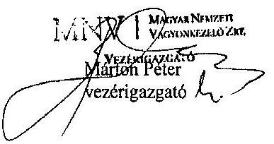

---

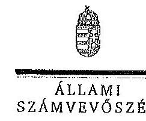

ELNÖK

Ikt.szám: V-0123-445/2014.

Márton Péter úr
vezérigazgató
MNV Zrt.

Budapest

Tisztelt Vezérigazgató Úr!

A „Jelentéstervezet az állami tulajdonban (résztulajdonban) lévő gazdálkodó szervezetek
vagyonérték-megőrző és gyarapító tevékenységének ellenőrzéséről egyes kiemelt közszolgáltató
társaságoknál vagy hasonló tevékenységet végző társaságcsoportoknál – DMRV Duna Menti
Regionális Vízmű Zrt.” című jelentéstervezetre tett észrevételeit köszönettel megkaptam.

Az Állami Számvevőszék észrevételekre vonatkozó álláspontjáról a felügyeleti vezető által
készített részletes tájékoztatást csatoltan megküldöm.

Tájékoztatom Vezérigazgató urat, hogy a számvevőszéki jelentés az elfogadott észrevételei
figyelembevételével készül.

Budapest, 2014.

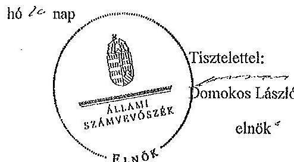

Melléklet: Tájékoztatás az elfogadott észrevételekről

1052 BUDAPEST, AFRICZAI CSZRK JÓNUS UTCA 10. 1264 Budapest 4. PL 54 telefon: 484 8101 fax: 484 8201

---

# Tájékoztatás   az elfogadott észrevételekről 

A „Jelentéstervezet az állami tulajdonban (résztulajdonban) lévő gazdálkodó szervezetek vagyonérték-megőrző és gyarapító tevékenységének ellenőrzéséről egyes kiemelt közszolgáltató társaságoknál vagy hasonló tevékenységet végző társaságcsoportoknál - DMRV Duna Menti Regionális Vízmű Zrt." című jelentéstervezetre az MNV/01/183/2013. iktatószámú levelében tett észrevételeit áttekintettük, azok kezelésével kapcsolatban a következő tájékoztatást adom.

## Bevezetés 3. oldal második bekezdés

A tulajdonosi joggyakorlást érintő, 2013. június 28-tól érvényes pontosítást elfogadva a bekezdést kiegészítjük a következőkkel:
„A Vtv. 2013. június 28-tól hatályos rendelkezése alapján az államot megillető jogok és kötelezettségek összességét tulajdonosi joggyakorlóként törvény, vagy miniszteri rendelet eltérő rendelkezésének hiányában az MNV Zrt. gyakorolja."

## I. fejezet 11. oldal 1. pont és 13. oldal 5. pont javaslat

A jelentéstervezetben szereplő, a DMRV Zrt. által kezelt állami tulajdonban lévő eszközökön megvalósított beruházások és értéknövelő felújítások elszámolását érintő megállapítások amelyekhez az MNV Zrt. vezérigazgatójának címzett 1. és 5. számú javaslatok kapcsolódnak helytállóak, az észrevételekben a megállapításokat nem kifogásolják.

Az értéknövelő beruházások elszámolásának problémája levelük szerint nem egyedi, hanem minden egyéb vagyonkezelőnél általános problémaként merült fel az állami vagyonnal való gazdálkodásról szóló 254/2007. (X. 4.) Korm. rendelet (Vhr.) hatálybalépése óta.

A Vhr. 2013. november 30. napjától hatályos módosítása szerint - ami a jelentéstervezet készítésének időszakában történt - az új előírásokat a rendelet hatályba lépésekor hatályos vagyonkezelési jogviszonyokban a felek a rendelet hatálybalépéséig meg nem történt elszámolásokra is alkalmazhatják. A megállapításokhoz kapcsolódó javaslatok ebbe a körbe tartoznak, ezért az MNV Zrt. vezérigazgatójának címzett 1. és 5. számú javaslatot a jelentéstervezetből töröljük.

A megállapítások ugyanakkor az állami vagyonnal való felelős gazdálkodás szempontjából fontos területeket érintenek. Az állami vagyonon végzett beruházások, értéknövelő felújítások elszámolásának, megfelelő nyilvántartásának megvalósulása biztosíthatja a szabályszerű vagyongazdálkodást. A Vhr. 2013. november 30-tól hatályos módosítása lehetővé teszi, hogy a folyamatban lévő ügyekben a felek (DMRV Zrt. és MNV Zrt.) számlázási kötelezettség nélkül is elszámoljanak egymással, szükség esetén módosíthassák a vagyonkezelési szerződést, de a

---

felek megállapodása alapján a számlázást is alkalmazhatják. Minderre tekintettel a beruházások elszámolása rendezésének érdekében - az ellenőrzött szervezetekkel történő, törvény által előírt egyeztetés lezárását követően - az Állami Számvevőszék figyelemfelhívó levélben fogja jelezni a kockázatosnak tartott kérdéseket.

Tájékoztatom Vezérigazgató urat, hogy a számvevőszéki jelentés mellékleteként szerepeltetjük a jelentéstervezethez tett észrevételeit, valamint az azokra adott válaszunkat.

Budapest, 2014. 01. hó 10. nap

Makkai Mária
felügyeleti vezető

---

# DMRV DUNA MENTI REGIONÁLIS VÍZMŰ ZÁRTKÖRŰEN MŰKÖDŐ RÉSZVÉNYTÁRSASÁG

2600 Vác, Kodály Zoltán út 3.
Állami Számvevőszék
1052 Budapest, Apáczai Csere János utca 10.

Melléklet

Kelt: 2014.01.10.
Ikt.sz: 128624855
Ügyintéző: Papp Ildikó
Melléklet:

172612014
JAN 15 2014

Domokos László úr
Elnök
részére

Állami Számvevőszék

Tárgy: JELENTÉSTERVEZET véleményezése

A V-0123-410/2013. iktatószámú „Az állami tulajdonban (résztulajdonban) lévő gazdálkodó szervezetek vagyonérték-megőrző és gyarapító tevékenységének ellenőrzéséből egyes kiemelt szolgáltató társaságoknál vagy hasonló tevékenységet végző társaság csoportoknál -DMRV Duna Menti Regionális Vízmű Zrt.”- címmel készült JELENTÉSTERVEZET-et, megkaptuk véleményezés céljából.

Az ellenőrzés megállapításaira az alábbi észrevételeket tesszük:

I. Általános megállapítások

I/a. A jelentéstervezet megállapításai:

- a vagyonkezelési szerződés és annak elválaszthatatlan részét képező (a pénzügyminiszter által jóváhagyott) vagyon-nyilvántartási szabályzat, valamint a számviteli törvény összhangjának hiányából,

- a 254/2007.(X.04) kormányrendelet előírásainak érintettek általi eltérő értelmezéséből fakadnak.

A fentiekből eredő problémák nem csak Társaságunkat érintik, hanem az állami tulajdont kezelő valamennyi regionális társaságot.

Az ellentmondások feloldására 2007 évtől folyamatosan törekedtünk. A téma bonyolultságát jelzi, hogy a több alkalommal, külső szakértők (NAV, MAVÍZ, adótanácsadó, PM), érintett társaságnak szakemberei, könyvvizsgálók, a tulajdonos MNV Zrt. szakági képviselői bevonásával tartott egyeztetések sem vezettek megnyugtató eredményre. A jogszabály értelmezése, időről-időre változott (pl. a számlázás alapját képezi-e az amortizáció, illetve az értéknövekedést egyedi eszközönként, beruházási témánként vagy regionális rendszerenként szükséges-e figyelembe venni stb.), abban azonban közös álláspont alakult ki, hogy a gyakorlati kivitelezés lehetetlen, az előírás nem életszerű. Ennek következtében az MNV Zrt. kezdeményezte az illetékes minisztériumoknál illetve jogalkotóknál a rendelet módosítását.

Mivel a kormányrendelet tisztázatlan pontjai kihatnak a vagyonkezelői szerződés tartalmi elemeire (pl. beruházások elszámolása a vagyonkezelő és az MNV Zrt. között), a szerződés módosítása, aktualizálása ezért nem történhetett meg.

2600 Vác, M. Lovelocki u. 96. • Telefon: 27-511-500 • Fax: 27-316-199 • Adószám: 10863077-2-44 • www.dmrvzrt.hu
 10000 Mógyó, M. 10000 Mógyó, M. 10000 Mógyó, M. 10000 Mógyó, M. 10000 Mógyó, M. 10000 Mógyó, M. 10000 Mógyó, M. 10000 Mógyó, M. 10000 Mógyó, M. 10000 Mógyó, M. 10000 Mógyó, M. 10000 Mógyó, M. 10000 Mógyó, M. 10000 Mógyó, M. 10000 Mógyó, M. 10000 Mógyó, M. 10000 Mógyó, M. 10000 Mógyó, M. 10000 Mógyó, M. 10000 Mógyó, M. 10000 Mógyó, M. 10000 Mógyó, M. 10000 Mógyó, M. 10000 Mógyó, M. 10000 Mógyó, M. 10000 Mógyó, M. 10000 Mógyó, M. 10000 Mógyó, M. 10000 Mógyó, M. 10000 Mógyó, M. 10000 Mógyó, M. 10000 Mógyó, M. 10000 Mógyó, M. 10000 Mógyó, M. 10000 Mógyó, M. 10000 Mógyó, M. 10000 Mógyó, M. 10000 Mógyó, M. 10000 Mógyó, M. 10000 Mógyó, M. 10000 Mógyó, M. 10000 Mógyó, M. 10000 Mógyó, M. 10000 Mógyó, M. 10000 Mógyó, M. 10000 Mógyó, M. 10000 Mógyó, M. 10000 Mógyó, M. 10000 Mógyó, M. 10000 Mógyó, M. 10000 Mógyó, M. 10000 Mógyó, M. 10000 Mógyó, M. 10000 Mógyó, M. 10000 Mógyó, M. 10000 Mógyó, M. 10000 Mógyó, M. 10000 Mógyó, M. 10000 Mógyó, M. 10000 Mógyó, M. 10000 Mógyó, M. 10000 Mógyó, M. 10000 Mógyó, M. 10000 Mógyó, M. 10000 Mógyó, M. 10000 Mógyó,
 M. 10000 Mogyó, M. 10000 Mogyó, M. 10000 Mogyó, M. 10000 Mogyó, M. 10000 Mogyó, M. 10000 Mogyó, M. 10000 Mogyó, M. 10000 Mogyó, M. 10000 Mogyó, M. 10000 Mogyó, M. 10000 Mogyó, M. 10000 Mogyó, M. 10000 Mogyó, M. 10000 Mogyó, M. 10000 Mogyó, M. 10000 Mogyó, M. 10000 Mogyó, M. 10000 Mogyó, M. 10000 Mogyó, M. 10000 Mogyó, M. 10000 Mogyó, M. 10000 Mogyó, M. 10000 Mogyó, M. 10000 Mogyó, M. 10000 Mogyó, M. 10000 Mogyó, M. 10000 Mogyó, M. 10000 Mogyó, M. 10000 Mogyó, M. 10000 Mogyó, M. 10000 Mogyó, M. 10000 Mogyó, M. 10000 Mogyó, M. 10000 Mogyó, M. 10000 Mogyó, M. 10000 Mogyó, M. 10000 Mogyó, M. 10000 Mogyó, M. 10000 Mogyó, M. 10000 Mogyó, M. 10000 Mogyó, M. 10000 Mogyó, M. 10000 Mogyó, M. 10000 Mogyó, M. 10000 Mogyó, M. 10000 Mogyó, M. 10000 Mogyó, M. 10000 Mogyó, M. 10000 Mogyó, M. 10000 Mogyó, M. 10000 Mogyó, M. 10000 Mogyó, M. 10000 Mogyó, M. 10000 Mogyó, M. 10000 Mogyó, M. 10000 Mogyó, M. 10000 Mogyó, M. 10000 Mogyó, M. 10000 Mogyó, M. 10000 Mogyó, M. 10000 Mogyó, M. 10000 Mogyó, M. 10000 Mogyó, M. 10000 Mogyó, M. 10000 Mogyó, M. 10000 Mogyó, M. 10000 Mogyó, M. 10000 Mogyó, M. 10000 Mogyó, M. 10000 Mogyó, M. 10000 Mogyó, M. 10000 Mogyó, M. 10000 Mogyó, M. 10000 Mogyó, M. 10000 Mogyó, M. 10000 Mogyó, M. 10000 Mogyó, M. 10000 Mogyó, M. 10000 Mogyó, M. 10000 Mogyó, M. 10000 Mogyó, M. 10000 Mogyó, M. 10000 Mogyó, M. 10000 Mogyó, M. 10000 Mogyó, M. 10000 Mogyó, M. 10000 Mogyó, M. 10000 Mogyó, M. 10000 Mogyó, M. 10000 Mogyó, M. 10000 Mogyó, M. 10000 Mogyó, M. 10000 Mogyó, M. 10000 Mogyó, M. 10000 Mogyó, M. 10000 Mogyó, M. 10000 Mogyó, M. 10000 Mogyó, M. 10000 Mogyó, M. 10000 Mogyó, M. 10000 Mogyó, M. 10000 Mogyó, M. 10000 Mogyó, M. 10000 Mogyó, M. 10000 Mogyó, M. 10000 Mogyó, M. 10000 Mogyó, M. 10000 Mogyó, M. 10000 Mogyó, M. 10000 Mogyó, M. 10000 Mogyó, M. 10000 Mogyó, M. 10000 Mogyó, M. 10000 Mogyó, M. 10000 Mogyó, M. 10000 Mogyó, M. 10000 Mogyó, M. 10000 Mogyó, M. 10000 Mogyó, M. 10000 Mogyó, M. 10000 Mogyó, M. 10000 Mogyó, M. 10000 Mogyó, M. 10000 Mogyó, M. 10000 Mogyó, M. 10000 Mogyó, M. 10000 Mogyó, M. 10000 Mogyó, M. 10000 Mogyó, M. 10000 Mogyó, M. 10000 Mogyó, M. 10000 Mogyó, M.
 10000 Mógyó, M. 10000 Mógyó, M. 10000 Mógyó, M. 10000 Mógyó, M. 10000 Mógyó, M. 10000 Mógyó, M. 10000 Mógyó, M. 10000 Mógyó, M. 10000 Mógyó, M. 10000 Mógyó, M. 10000 Mógyó, M. 10000 Mógyó, M. 10000 Mógyó, M. 10000 Mógyó, M. 10000 Mógyó, M. 10000 Mógyó, M. 10000 Mógyó, M. 10000 Mógyó, M. 10000 Mógyó, M. 10000 Mógyó, M. 10000 Mógyó, M. 10000 Mógyó, M. 10000 Mógyó, M. 10000 Mógyó, M. 10000 Mógyó, M. 10000 Mógyó, M. 10000 Mógyó, M. 10000 Mógyó, M. 10000 Mógyó, M. 10000 Mógyó, M. 10000 Mógyó, M. 10000 Mógyó, M. 10000 Mógyó, M. 10000 Mógyó, M. 10000 Mógyó, M. 10000 Mógyó, M. 10000 Mógyó, M. 10000 Mógyó, M. 10000 Mógyó, M. 10000 Mógyó, M. 10000 Mógyó, M. 10000 Mógyó, M. 10000 Mógyó, M. 10000 Mógyó, M. 10000 Mógyó, M. 10000 Mógyó, M. 10000 Mógyó, M. 10000 Mógyó, M. 10000 Mógyó, M. 10000 Mógyó, M. 10000 Mógyó, M. 10000 Mógyó, M. 10000 Mógyó, M. 10000 Mógyó, M. 10000 Mógyó, M. 10000 Mógyó, M. 10000 Mógyó, M. 10000 Mógyó, M. 10000 Mógyó, M. 10000 Mógyó, M. 10000 Mógyó, M. 10000 Mógyó, M. 10000 Mógyó, M. 10000 Mógyó, M. 10000 Mógyó, M. 10000 Mógyó, M. 10000 Mógyó, M. 10000 Mógyó, M. 10000 Mógyó, M. 10000 Mógyó, M. 10000 Mógyó, M. 10000 Mógyó, M. 10000 Mógyó, M. 10000 Mógyó, M. 10000 Mógyó, M. 10000 Mógyó, M. 10000 Mógyó, M. 10000 Mógyó, M. 10000 Mógyó, M. 10000 Mógyó, M. 10000 Mógyó, M. 10000 Mógyó, M. 10000 Mógyó, M. 10000 Mógyó, M. 10000 Mógyó, M. 10000 Mógyó, M. 10000 Mógyó, M. 10000 Mógyó, M. 10000 Mógyó, M. 10000 Mógyó, M. 10000 Mógyó, M. 10000 Mógyó, M. 10000 Mógyó, M. 10000 Mógyó, M. 10000 Mógyó, M. 10000 Mógyó, M. 10000 Mógyó, M. 10000 Mógyó, M. 10000 Mógyó, M. 10000 Mógyó, M. 10000 Mógyó, M. 10000 Mógyó, M. 10000 Mógyó, M. 10000 Mógyó, M. 10000 Mógyó, M. 10000 Mógyó, M. 10000 Mógyó, M. 10000 Mógyó, M. 10000 Mógyó, M. 10000 Mógyó, M. 10000 Mógyó, M. 10000 Mógyó, M. 10000 Mógyó, M. 10000 Mógyó, M. 10000 Mógyó, M. 10000 Mógyó, M. 10000 Mógyó, M. 10000 Mógyó, M. 10000 Mógyó, M. 10000 Mógyó, M. 10000 Mógyó, M. 10000 Mógyó, M. 10000 Mógyó, M. 10000 Mógyó, M. 10000 Mógyó, M. 10000 Mógyó, M. 10000 Mógyó, M. 10000 Mógyó, M. 10000 Mógyó, M. 10000 Mógyó, M. 10000 Mógyó, M. 10000 Mógyó, M. 10000 Mógyó, M. 10000 Mógyó, M. 10000 Mógyó, M. 10000 Mógyó, M. 10000 Mógyó, M. 10000 Mógyó, M. 10000 Mógyó, M. 10000 Mógyó, M. 10000 Mógyó, M. 10000 Mógyó, M. 10000 Mógyó, M. 10000 Mógyó, M. 10000 Mógyó, M. 10000 Mógyó, M. 10000 Mógyó, M. 10000 Mógyó, M. 10000 Mógyó, M. 10000 Mógyó, M. 10000 Mógyó, M. 10000 Mógyó, M. 10000 Mógyó, M. 10000 Mógyó, M. 10000 Mógyó, M. 10000 Mógyó, M. 10000 Mógyó, M. 10000 Mógyó, M. 10000 Mógyó, M. 10000 Mógyó, M. 10000 Mógyó, M. 10000 Mógyó, M. 10000 Mógyó, M. 10000 Mógyó, M. 10000 Mógyó, M. 10000 Mógyó, M. 10000 Mógyó, M. 10000 Mógyó, M. 10000 Mógyó, M. 10000 Mógyó, M. 10000 Mógyó, M. 10000 Mógyó, M. 10000 Mógyó, M. 10000 Mógyó, M. 10000 Mógyó, M. 10000 Mógyó, M. 10000 Mógyó, M. 10000 Mógyó, M. 10000 Mógyó, M. 10000 Mógyó, M. 10000 Mógyó, M. 10000 Mógyó, M. 10000 Mógyó, M. 10000 Mógyó, M. 10000 Mógyó, M. 10000 Mógyó, M. 10000 Mógyó, M. 10000 Mógyó, M. 10000 Mógyó, M. 10000 Mógyó, M. 1000 Mógyó, M. 10000 Mógyó, M. 10000 Mógyó, M. 1000 Mógyó, M. 10000 Mógyó, M. 1000 Mógyó, M. 10000 Mógyó, M. 10000 Mógyó, M. 1000 Mógyó, M. 1000 Mógyó, M. 1000 Mógyó, M. 1000 Mógyó, M. 100 Mógyó, M. 1000 Mógyó, M. 1000 Mógyó, M. 100 Mógyó, M. 100 Mógyó, M. 100 Mógyó, M. 100 Mógyó, M. 100 Mógyó, M. 100 Mógyó, M. 100 Mó, M. 100 Mó, M. 100 Mó, M. 100 Mó, M. 100 Mó, M. 10 Mó, M. 10 Mó, M. 10 Mó, M. 10 Mó, M. 10 Mó, M. 10 Mó, M. 10 Mó, M. 10 Mó, M. 10 Mó, M. 10 Mó, M. 10 Mó, M. 10 Mó, M. 10 Mó, M. 10 Mó, M. 10 Mó, M. 10 Mó, M. M. M. M. M. M. M. M. M. M. M. M. M. M. M. M. M. M. M. M. M. M. M. M. M. M. M. M. M. M. M.

---

A fenti ellentmondásokat tudomásul véve, a számviteli törvény következetesség elvét betartva, Társaságunk a vagyonkezelői szerződés megkötése óta a vagyon-nyilvántartási szabályzatban előírtaknak megfelelően járt el, mind a nyilvántartás, mind a vagyon elszámolás tekintetében.

A hosszú jogi procedúra eredményeként 2013. november 29-én a Magyar Közlönyben kihirdetésre került a 457/2013.(XI.29.) kormányrendelet az állami vagyonnal való gazdálkodásról szóló 254/2007.(X.4.) kormányrendelet módosításáról.

Ezen rendelet 2.§-a tartalmazza a vagyonkezelési szerződés keretében állami tulajdonon végzett értéknövelő beruházás, felújítás, valamint a létrehozott új eszköz értékének elszámolásával kapcsolatban módosított 18. §(3). és 18.§ (4) bekezdés, valamint a rendelet visszamenőleges alkalmazási lehetőségére vonatkozó bekezdést.

A 457/2013. (XI.29.) kormányrendelet $2 \S$ (1) bekezdése szerint:
„ A vagyonkezelési szerződés módosítását megelőzően a megvalósított értéknövelő beruházás, felújítás, valamint a létrehozott új eszköz értékét a vagyonkezelő az MNV Zrt. által meghatározott módon és gyakorisággal adatszolgáltatás keretében igazolja az MNV Zrt. felé. Az adatszolgáltatás módját és gyakoriságát, annak rendjét és tartalmát a vagyonkezelési szerződésben kell rögzíteni."

Ezek ismeretében a 2013. 12. 16-án kelt JELENTÉSTERVEZET-et véleményünk szerint az alábbi pontokban módosítani szükséges:

- 6. oldal 2. bekezdés,
- 7. oldal 1. bekezdés,
- 10. oldal 4. bekezdés,
- 11. oldal 4. bekezdés,
- 13. oldal 2. bekezdés,
- 13. oldal 5. bekezdés,
- 15. oldal 3. bekezdés,
- 18. oldal 4. bekezdés,
- 19. oldal 3. bekezdés.

1/b. A jelentéstervezet több pontja ellentmondó megállapításokat tartalmaz (pl. 6 oldal utolsó bekezdés és 10. oldal 5. bekezdés).

1/c. Kiegészítő információk hiányoznak, melyek a megállapítások tartalmát, súlyát befolyásolják, olyan következtetések kerülnek megállapításra, melyek a Társaságot a valóságnál kedvezőtlenebb színben tüntetik fel.
pl." A szerződés kötés folyamata, szabályzatának előírásai nem teljesült, mert a szerződéseken a műszaki és/vagy gazdasági igazgató, illetve a vezető jogtanácsos ellenjegyzése hiányzott."
Fenti eset csak néhány szerződésnél fordult elő, ebből általános következtetést levonni indokolatlan.
pl. „A DMRV Zrt. a tájékoztató levélben előírtakat nem hajtotta végre, mivel a számlázás áfa - és egyéb adókötelezettségeit, továbbá a visszamenőleges hatályú rendezés (önellenőrzés) jogkövetkezményéből adódó fizetési kötelezettségeket a DMRV Zrt., valamint az MNV Zrt. nem finanszírozta."
Nem ez volt a számlázás és a tájékoztató levél végre nem hajtásának egyetlen és kizárólagos oka, számos más, társaságtól független körülmény is befolyásolta, melyekre a tervezet nem tér ki.
Ezek az I/a pontban felsorolásra kerültek.

Levécím: 2601 Vác, Pf. 96. Telefon: 27-511-500 $\cdot$ Fax: 27-316-199 $\cdot$ Adószám: 10863877-2-44 $\cdot$ www.dmrvzrt.hu
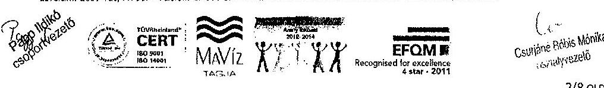

---

# II. Kiegészítendő, pontosítandó, javítandó megállapítások 

- 4. oldal 3. bekezdés:

A DMRV Zrt. résztulajdonos két vízszolgáltató társaságban.
A vízszolgáltató szót kérjük törölni, nem helytálló.

- 4. oldal 4. bekezdés:
„A DMRV Zrt.-nél az átlagos statisztikai létszám a 2012. év végén 1102 fő volt."
A DMRV Zrt-nél az átlagos statisztikai létszám a 2012. év végén 1092 fő volt.

## - 6. oldal 2. bekezdés:

Kérjük a mondatotokat az alábbiak szerint kiegészíteni:
„A DMRV Zrt. vagyonkezelésében lévő állami vagyonnal történő szabályszerű vagyongazdálkodás feltételeit az ellenőrzött időszakban, illetve azt megelőzően - a VSZ módosításában érintettek - nem teremtették meg, mivel a VSZ jogszabályi változásoknak (Vtr., Vhr., Vksztv., Ált., ) megfelelő módosítására a helyszíni ellenőrzés lezárásáig- jogszabályi ellentmondások, s a gyakorlati kivitelezés tisztázatlansága miatt - nem került sor.
.....a Társaság rajta kívül álló okok miatt nem számlázta ki az MNV Zrt. részére.

- 6. oldal 4. bekezdés
„Az ellenőrzött időszakban az állami vagyonon végzett beruházások összege 5538,7 millió Ft volt, amelynek forrása döntően az elszámolt amortizáció ( 4535,9 millió Ft) volt, ezek az állami vagyonon tulajdonosi hozzájárulás nélkül végzett beruházások voltak."
A beruházások melyek az elfogadott üzleti terv részeként elfogadásra kerültek a tulajdonos által, egyedi
 írásbeli engedély nélkül valósultak meg.
- 7. oldal 1. bekezdés és 19. oldal 3. bekezdés
A DMRV Zrt. a tájékoztató levélben előírtakat nem hajtotta végre, mivel az abban foglaltakat a regionális társaságok és azok könyvvizsgálói elfogadhatatlannak tartották (számviteli törvénynek nem megfelelő volta miatt). A mellékelt útmutató nem fedte le a gazdasági eseményeket teljes körűen.
- 8. oldal 4. bekezdés és 17. oldal 4. bekezdés

Az alábbiak szerint kérjük pontosítani az adatokat:
Az MNV Zrt. 2012. évi számviteli irányelvének eleget téve, a DMRV Zrt. a 2012-ben kiadott, 2012. január 01-től hatályos számviteli politikájába, annak függelékeként az MNV Zrt. vagyon nyilvántartási szabályzatát beépítette.
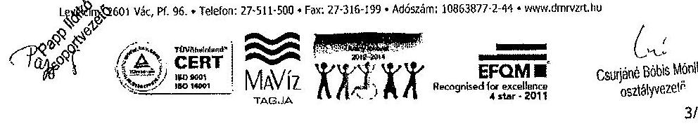

---

9. SZÁMÚ MELLÉKLET

A V-0123-480/2014. SZÁMÚ JELENTÉSHEZ

- 9. oldal 1. bekezdés

„A DMRV Zrt.-nél az állami vagyon nyilvántartása a hosszú lejáratú kötelezettségek és a
selejtezések jogszabályokkal ellentétes elszámolása miatt nem volt megfelelő, továbbá az állami
vagyonra vonatkozó adatok nyilvántartásának egyeztetése az MNV Zrt.-vel a 2010. és a 2012.
években nem történt meg.”

A megállapítással az alábbi indokok miatt nem értünk egyet:

A vagyon-nyilvántartás, eszköz oldalról a törvényeknek megfelelő, leltárral alátámasztott, a számviteli
törvénynek megfelelő volt. Az állami vagyonnal kapcsolatos hosszú lejáratú kötelezettségek
elszámolási módja - mely egyébként a kincstári nyilvántartási szabályzatnak megfelel - a vagyon-
nyilvántartás megfelelőségét nem befolyásolja.

A vagyon-nyilvántartásban szereplő adatok az MNV Zrt. felé elektronikus úton megküldésre kerültek
(év közben és év végén is), melyet a Tulajdonos könyvvizsgálója felé is eljuttattunk (az MNV Zrt.
levélben történt kérésének megfelelően).

2011. évre az MNV Zrt. által visszaigazolásra került a nyilvántartásban szereplő eszközérték.

2012. év folyamán a hosszú lejáratú kötelezettségek helyett már a számviteli törvénynek megfelelően
történt a selejtezések elszámolása.

- 9. oldal utolsó bekezdés és 35. oldal 3. és 4. bekezdés

Kérjük a szövegrészből törölni, a vagyont érintő követelések (ilyen követeléssel Társaságunk nem
rendelkezik), valamint a részesedések (ahol hibát az ellenőrzés nem tárt fel) kifejezést.

Ugyanezen bekezdésnél kérjük figyelembe venni:

Az SZMSZ módosításával az új szervezeti egységek feladatköre meghatározásra került.

„Az egyes eszközök egyedi bekerülési értékének meghatározásánál az értékelési szabályzat előírásait
nem tartották be, az egyes eszközök egyedi értékének meghatározását alátámasztó dokumentumokat
nem tudták az ellenőrzés rendelkezésére bocsátani.”

Az ellenőrzés során e témában adott nyilatkozatunkban foglaltakat kérjük figyelembe venni.

- 10. oldal 1. bekezdés és 35. oldal 6. bekezdés

Kérjük kiegészíteni:

„A szerződéskötés folyamata, szabályzatának előírása nem minden esetben teljesült, mert néhány
szerződésen a műszaki és gazdasági.....

- 10. oldal

Az I. ÖSSZEGZŐ MEGÁLLAPÍTÁSOK, KÖVETKEZTETÉSEK, JAVASLATOK fejezet
belső kontrollrendszer témakörén belül azon megállapításra, hogy „Az éves munkaterveket
kockázatelemzés nem alapozta meg.”

A Belső Ellenőrzés 6/2011.sz. „A DMRV Zrt. műszaki és gazdasági és egyéb folyamatainak
ellenőrzési lefedettségéről” tárgyú jelentést készített.

Levélcím: 2601 Vác, Pf. 96. Telefon: 27-511-500 Fax: 27-316-199 Adószám: 10863877-2-44 www.dmrvzrt.hu

Cserjés bobs Möske
vulbáynzzó

4/8 OLDA

---

A vizsgálat célja volt a Társaság 6/2011.sz. belső ellenőrzési jelentésében rögzítettek értelmében: „Annak megállapítása, hogy mely folyamatok nem, vagy nem kellő sűrűséggel kerültek ellenőrzésre, továbbá javaslattétel a folyamtok ellenőrzési gyakoriságára és a belső ellenőrzési kapacitásra."
Erre alapozottan került elkészítésre és elfogadásra a 2012. évi TKO/559-0/2011. iktatószámon nyilvántartott 2011. december 1-jén kelt belső ellenőrzési munkaterv, valamint az ezt követően kiadott 2012. évi módosított munkatervek egyaránt.

# - 13. oldal lap közepe 

Fejezetcímben a cégnév javítandó: DMRV Duna Menti Regionális Vízmű Zártkörűen Működő Részvénytársaság

1/a számlázási kötelezettséget a Vhr. 2013. november 29.-i visszamenőleges hatályú módosítása miatt már nem aktuális.

2/b a teljes költség megtérülés elve nem érvényesíthető a jelenlegi gazdálkodási környezetben (rezsicsökkentés, díjkorlátozás). A Társaság vezérigazgatója ezt az iparági környezetnek megfelelően tudja csak befolyásolni.

## - 14. oldal 3. pont

Kérjük pontosítani az alábbi mondatot:
„.....az értékelési szabályzat előírásait nem minden esetben tartották be, az egyes eszközök egyedi bekerülési értékének meghatározásánál..."

## - 14. oldal 4. pont

Kérjük pontosítani, feltüntetni, hogy az ellenőrzött évek közül 2010-2011 évben a beruházások végrehajtására egyedi, tételes engedély megkérése nem történt, elfogadása az éves üzleti terv keretén belül valósult meg. 2012. és 2013. évben azonban már részletes évente több alkalommal benyújtott engedélykérelmekkel rendelkezik a társaság.

A Társaság a beruházásokról a jóváhagyott éves üzleti tervben előzetesen, a beszámolóban és a papíralapú vagyonkataszteri jelentésben tájékoztatta az MNV Zrt-t.

## - 14. oldal 5. pont

Pontosítást igényel az alábbiak figyelembe vételével:
A selejtezési jegyzőkönyv csak a kiváltással kivezetett eszközökről nem készült melyek valamely beruházáshoz kapcsolódnak. Erről már a Társaság az ellenőrzés során nyilatkozatot tett.

## - 15. oldal 6. pont

Véleményünk szerint a Vhr. november 29.-i visszamenőleges hatályú módosítása ezen bekezdést felülírja, oka fogyottá tette.
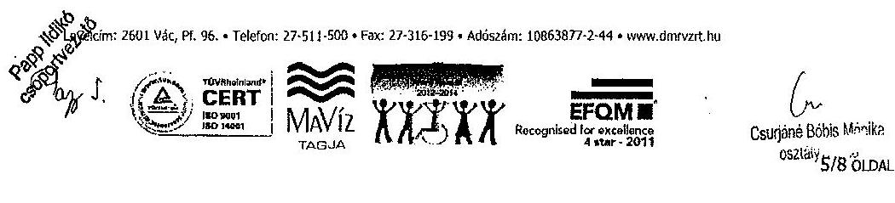

---

- 19. oldal 4. bekezdés
„A Vhr.-ben előírt számlázásra, a VSZ módosításra, továbbá a Vhr. és a Számv. tv. előírásainak megfelelően a vagyonnövekedés állammal szembeni hosszú lejáratú kötelezettségként való kimutatására a helyszíni ellenőrzés végéig nem került sor."

Társaságunknál a vagyonnövekedés állammal szembeni hosszú lejáratú kötelezettségként került kimutatásra. Kérjük a szöveget ennek megfelelően módosítani.

- 19. oldal 6. bekezdés
„Az ellenőrzött időszakban az állami vagyont érintő, térítésmentes átadásra egy esetben, a 2011. évben került sor."

Kérjük javítani a dátumot: az ingyenes vagyonátadásra 2012. évben került sor.

- 21. oldal 2.2. pont

Kérjük javítani az apró betűs részt az alábbiak szerint:
A DMRV Zrt. által 2011. évben teljesített adatszolgáltatást, miszerint az állammal szembeni kötelezettség 31577 millió Ft, az MNV Zrt. saját adataival megegyezően a DMRV Zrt. kérésére visszaigazolta.

- 22. oldal 4 bekezdés

Az alábbi észrevételeket tesszük:
Az amortizáció elszámolás módja azonos volt mind a társasági, mind a közmű vagyon tekintetében, 2012. évtől műszaki indokok alapján a várható életartam változott.

Az említett példa (vezetékek 1\%-ról 3\%-ra történő emelése) nem a 2012. évi regionális vízművek közös számviteli politikája miatt módosult, hanem már az azt megelőző évben műszaki adatok alapján.

- 24 oldal utolsó bekezdés

A szöveg és a táblázat nincs összhangban. (A kimutatás nem a vagyonértéket mutatja)

# - 29. oldal utolsó bekezdés 

A vevőkövetelés növekedését nem kizárólag a szolgáltatási terület bővülése okozza. (A fizetési hajlandóság romlás, számlázási módszerváltás, díjváltozás stb. is kihatnak a követelés állomány alakulására.)

## - 30. oldal 3. bekezdés

A Vsziv.-ben megfogalmazott elvárás 2013. évtől a szolgáltatási díjakkal szemben, hogy az indokolt költségekre és a környezetvédelmi kötelezettségek teljesítésére fedezetet nyújtson.

A szövegrész pontosítandó, mivel díjelőterjesztésre először a 2014. évben kerülhet sor 2015. évi díjakra vonatkozóan.
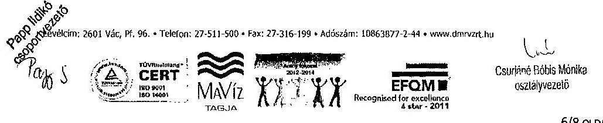

---

- 31. oldal utolsó bekezdés
„A vízdíjak összetevőin belül a DMRV Zrt. szolgáltatási területén az ellenőrzött időszakban az alapdíj $40 \%$-kal, a változó díj $0,4 \%$-kal nőtt. A csatornadíjak esetében az alapdíj $22 \%$-kal, a változó díj $6,2 \%$-kal emelkedett. A 2010-2012. évek között a lakossági fogyasztók részére meghatározott díjak alakulását a következő grafikon mutatja be."

Kérjük feltüntetni, hogy a megállapítás csak a lakossági, állami díjra vonatkozik.
Javítandó illetve kiegészítendő:

- a változó díj mértéke a feltüntetett $0,4 \%$ helyesen $3 \%$.
- az ehhez kapcsolódó grafikonon a 2012. évi ivóvíz fogyasztási díj 246 Ft/m3 helyesen: 241 Ft/m3
- .... $40 \%(80 \mathrm{Ft} / \mathrm{hó}) \ldots .3 \%(7 \mathrm{Ft} / \mathrm{m} 3) \ldots .22 \%(60 \mathrm{Ft} / \mathrm{hó}) \ldots .6,2 \%(17 \mathrm{Ft} / \mathrm{m} 3)$

# 31. oldal teteje: 

„A DMRV Zrt. beruházásokra 6360,6 millió Ft-ot fordított,amelynek forrása döntően az amortizáció, valamint az újonnan csatlakozók befizetései, illetve a környezetterhelés díjból származó bevétel volt."

A fenti megfogalmazás nem pontos, mivel a környezetterhelési díj be nem fizetett (beruházási és műszerbeszerzési kedvezmény) része képezte a beruházások forrását. Kérjük e szerint javítani a mondatot.

- 31. oldal 2. bekezdés:
„ Ebből társasági vagyoni körben az értékcsökkenés összege az egyes években 182,0 millió Ft, 181,2 millió Ft, illetve 200,5 millió Ft volt.

A fenti mondatból az „ebből" szó törlendő. A társasági vagyon nem része az állami vagyoni körnek.

- 31. oldal 3. bekezdés:
„A fejlesztési célú támogatások közül a felhasznált EU (KEOP) forrás összege 619,5 millió Ft volt, a költségvetési támogatás 80,0 millió Ft-ot tett ki a fennmaradó rész önkormányzati támogatás volt"

Kérjük a fenti mondat kiegészítését az alábbiak szerint: ....a fennmaradó rész önkormányzati támogatás, magánszemélyek, vállalkozók befizetései voltak.

- 35 oldal 3.1. pont 3. bekezdés
„ A korábban a műszaki igazgató vezetése alá tartozó beruházási és vagyongazdálkodási osztályt megszüntették, helyette a gazdasági igazgató felügyelete alatt önálló beszerzési és önálló vagyongazdálkodási csoportot hoztak létre."

Fenti mondat pontosításra szorul:
„ A korábban a műszaki igazgató vezetése alá tartozó beruházási és vagyongazdálkodási osztályt megszüntették, feladatai egy részének elvégzésére a gazdasági igazgató felügyelete alatt önálló beszerzési és önálló vagyongazdálkodási csoportot hoztak létre." A beruházásokhoz kapcsolódó feladatok nem kerültek át a gazdasági igazgató hatáskörébe.

- 35. és 36. 3.1. pont

A belső ellenőrzésre vonatkozó megállapítások között a belső ellenőrzési szabályzatra való hivatkozás hiányos, a láblécben rögzítettekkel pedig nincs teljes összhangban, ugyanis az EU8203 belső ellenőrzési szabályzatnak 1.; 2.; és 3.; kiadásai léteznek, melyeket az ÁSZ a vizsgálat során ténymegállapításaihoz-felhasznált.
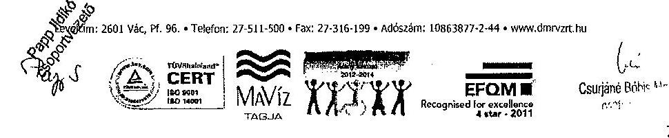

---

A vonatkozó szabályozó az alábbiak szerint került kiadásra:
Az 2009. március 3-ától hatályos EU8203 belső ellenőrzési szabályzat 1. kiadás, 2010.08.17-étől hatályos EU8203 belső ellenőrzési szabályzat 2. kiadás valamint a 2013. január 1-jétől hatályos EU8203 belső ellenőrzési szabályzat 3. kiadás

Kérjük a hivatkozások pontosítását.

Az 1. SZÁMÚ MELLÉKLET a V-0123-428/2013. SZÁMÚ JELENTÉSHEZ fejezetének SZÖRÖVIDÍTÉSEK bekezdésén belül az belső ellenőrzési szabályzatra vonatkozóan rögzítettek pontatlanok.
Az ellenőrzési időszakot érintően hatályos vonatkozó szabályzatok pontosan az alábbiak szerint kerültek kiadásra:

- A Duna Menti Regionális Vízmű Zártkörűen Működő Részvénytársaság EU 8203 számú Belső ellenőrzési szabályzat 1. kiadás (hatálya: 2009. március 3.- 2010. augusztus 16.)
- A Duna Menti Regionális Vízmű Zártkörűen Működő Részvénytársaság EU 8203 számú Belső ellenőrzési szabályzat 2. kiadás (hatálya: 2010. augusztus 17.- 2012. december 31.)
- A Duna Menti Regionális Vízmű Zártkörűen Működő Részvénytársaság EU 8203 számú Belső ellenőrzési szabályzat 3. kiadás (hatályos: 2013. január 1-jétől)

Az előzőekben ismertetett észrevételeinket kérjük a JELENTÉS véglegesítése során figyelembe venni. Amennyiben bármely ponttal kapcsolatban véleményünket nem fogadják el, vitatják, úgy személyes konzultáció lehetőségét biztosítani szíveskedjenek számunkra.

Tisztelettel:
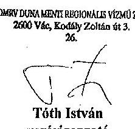

Tóth István
vezérigazgató
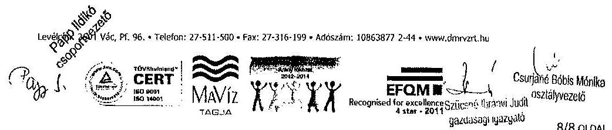

---

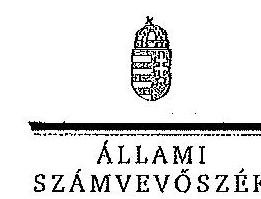

ELNÖK

Ikt.szám: V-0123-463/2014.

Tóth István
vezérigazgató

Duna Menti Regionális Vízmű Zrt.

Vác

Tisztelt Vezérigazgató Úr!

A „Jelentéstervezet az állami tulajdonban (résztulajdonban) lévő gazdálkodó szervezetek
vagyonérték-megőrző és gyarapító tevékenységének ellenőrzéséről egyes kiemelt közszolgáltató
társaságoknál vagy hasonló tevékenységet végző társaságesoportoknál – DMRV Duna Menti
Regionális Vízmű Zrt." című jelentéstervezetre tett észrevételeit köszönettel megkaptam.

Az Állami Számvevőszék észrevételekre vonatkozó álláspontjáról a felügyeleti vezető által
készített részletes tájékoztatást csatoltan megküldöm.

Tájékoztatom Vezérigazgató urat, hogy a számvevőszéki jelentés szövegezése az elfogadott
észrevételei figyelembevételével készül.

Budapest, 2014. 02.

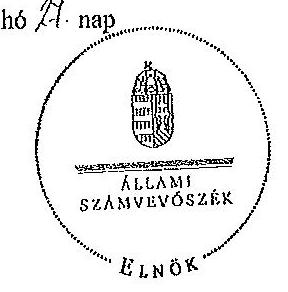

Tisztelettel:

D. D. László

Demokos László

Melléklet: Tájékoztatás az elfogadott és el nem fogadott észrevételekről

1052 BUDAPEST, AFRICZAI CSERE JÁNOS UTCA 10. 1364 Budapest 4. Pf. 54 Istolce. 484 9101 Fax: 484 9201

---

# Tájékoztatás   az elfogadott és el nem fogadott észrevételekről 

A „Jelentéstervezet az állami tulajdonban (résztulajdonban) lévő gazdálkodó szervezetek vagyonérték-megőrző és gyarapító tevékenységének ellenőrzéséről egyes kiemelt közszolgáltató társaságoknál vagy hasonló tevékenységet végző társaságcsoportoknál - DMRV Duna Menti Regionális Vízmű Zrt." című jelentéstervezetre érkezett észrevételeit áttekintettük, azok kezelésével kapcsolatban a következő tájékoztatást adom.

## I. Általános megállapítások

## I/a.

Az általános észrevételek keretében a kialakult jogi helyzetről adnak tájékoztatást a vagyonkezelői szerződéssel és számlázással kapcsolatban, továbbá jelzik ezzel összefüggésben a jogszabályi változást, amely 2013. november 30-tól hatályos. Ezzel a jogszabály módosítással kapcsolatban kérik az értéknövelő beruházás, felújítás számlázásával, valamint a vagyonkezelési szerződés módosításával kapcsolatos részeknek a pontosítását a jelentéstervezetben.

A jelentéstervezetben szereplő megállapítások helytállóak, az ellenőrzött időszakra vonatkozóan az ellenőrzésünk lefolytatásakor hatályos jogszabályokon alapulnak, ezért módosításuk nem indokolt.

A Vhr. 2013. november 30. napjától hatályos módosítása szerint - ami a jelentéstervezet készítésének időszakában történt - az új előírásokat a rendelet hatályba lépésekor hatályos vagyonkezelési jogviszonyokban a felek a rendelet hatálybalépéséig meg nem történt elszámolásokra is alkalmazhatják. A megállapításokhoz kapcsolódó javaslatok ebbe a körbe tartoznak, ezért az MNV Zrt. vezérigazgatójának címzett 1. és 5. számú javaslatot (11. oldal 4. bekezdés és 13. oldal 2. bekezdés) a jelentéstervezetből töröljük. Továbbá a DMRV vezérigazgatójának címzett 6. számú javaslatot megalapozó megállapítások is ebbe a körbe tartoznak (15. oldal 3. bekezdés), ezért a jelentéstervezetből a javaslatot töröljük, valamint az 1. számú javaslatot megalapozó megállapítást és a javaslatot (13. oldal 5. bekezdés) a következőkre módosítjuk:
„A DMRV Zrt. a Vhr. 9. § (6) bekezdésében foglaltak ellenére a beruházáshoz és az értéknövelő felújításhoz az MNV Zrt.-től előzetes írásbeli engedélyt nem kért, valamint a beruházások kivitelezésének megkezdéséről, annak lefolytatásáról az MNV Zrt.-t nem tájékoztatta. A DMRV Zrt. nem gondoskodott a Vhr. 14. § (1) bekezdésében előírt egységes nyilvántartás biztosítása érdekében való együttműködésről.

---

# Javaslat: 

a) Intéskedjen a Vhr. 9. § (6) bekezdésében foglaltak alapján a vagyonkezelt eszközön elszámolt bármely beruházáshoz, felújításhoz kapcsolódóan az MNV Zrt.-től előzetes írásbeli engedély kéréséről, valamint a vagyonkezelési szerződésben meghatározott módon a beruházások, felújítások beszámolási kötelezettségének teljesítéséről.
b) Gondoskodjon a Vhr. 14. § (1) bekezdésében foglaltaknak megfelelő együttműködésről a nyilvántartás egységessége, pontossága és az adatellenőrzések biztosítása érdekében."

A törölt és pontosított javaslatot megalapozó megállapítások ugyanakkor az állami vagyonnal való felelős gazdálkodás szempontjából fontos területeket érintenek. Az állami vagyonon végzett beruházások, értéknövelő felújítások elszámolásának, megfelelő nyilvántartásának megvalósulása biztosíthatja a szabályszerű vagyongazdálkodást. A Vhr. 2013. november 30-tól hatályos módosítása lehetővé teszi, hogy a folyamatban lévő ügyekben a felek (DMRV Zrt. és MNV Zrt.) számlázási kötelezettség nélkül is elszámoljanak egymással, szükség esetén módosíthassák a vagyonkezelési szerződést, de a felek megállapodása alapján a számlázást is alkalmazhatják. Minderre tekintettel a beruházások elszámolása rendezésének érdekében - az ellenőrzött szervezetekkel történő, törvény által előírt egyeztetés lezárását követően - az Állami Számvevőszék figyelemfelhívó levélben fogja jelezni a kockázatosnak tartott kérdéseket.

## I/b.

A példaként jelzett bekezdésben nincs ellentmondás. Az egyik bekezdés a beruházások beszámoltatásának módját és gyakoriságát hiányolja a VSZ-ből, a másik pedig az adatszolgáltatás és tájékoztatási kötelezettség teljesítésével kapcsolatban rögzít megállapítást.

## I/c.

Az ellenőrzés tények, dokumentumok alapján objektíven rögzítette megállapításait, ezért az észrevételeik nem helytálló.

## II. Kiegészítendő, pontosítandó, javítandó megállapítások

## 4. oldal 3. bekezdés

A „visszolgáltató" szót töröljük a bekezdésből,

## 4. oldal 4. bekezdés

A bekezdésben az átlagos statisztika létszámot pontosítjuk „1092" főre.

## 6. oldal 2. bekezdés

Az észrevételt nem fogadjuk el, mert jogszabályi ellentmondás nem volt, a gyakorlati kivitelezésnek a valós oka pedig az áfa összegének finanszírozása volt, amelyet a jelentés

---

tartalmaz. A Társaság önálló jogi személy, döntéseiért felelősséggel tartozik. A vonatkozó bekezdést változatlanul fenntartjuk.

# 6. oldal 4. bekezdés 

A hivatkozott bekezdés első részében szerepel, hogy a Társaság az üzleti terv részeként a beruházásokról tájékoztatta a tulajdonost, ami nem felel meg a Vhr. 9. § (6) bekezdésben előírt előzetes engedélykérésnek. Ezért a bekezdésben leírtak pontosítása nem indokolt.

## 7. oldal 1. bekezdés és a 19. oldal 3. bekezdés

Az érintett bekezdésben szereplő megállapításokat nem vitatják, azok módosítása nem indokolt. A beruházások és értéknövelő felújítások számlázásának elmaradását alapvetően az áfa fizetési kötelezettség befolyásolta.

## 8. oldal 4. bekezdés és a 17. oldal 4. bekezdés

Az észrevételnek megfelelően a bekezdést az alábbiak szerint egészítjük ki:
„Az MNV Zrt. 2012. évi számviteli irányelvének eleget téve a DMRV Zrt. a 2012. évben kiadott, 2012. január 1-jétől hatályos számviteli politikájába, annak függelékeként az MNV Zrt. vagyonnyilvántartási szabályzatát beépítette.".

## 9. oldal 1. bekezdés

A jelentéstervezetben szereplő megállapítás helytálló, az egyértelműség érdekében a bekezdést a következőre pontosítjuk:
„A DMRV Zrt.-nél az ellenőrzött időszakban az állami vagyon nyilvántartása, a VSZ módosításának, és a beruházások és értéknövelő felújítások elszámolásának elmaradása, valamint a selejtezések 2010. és 2011. években a jogszabályokkal ellentétes elszámolása miatt nem volt megfelelő, továbbá az állami vagyonra vonatkozó adatok nyilvántartásának egyeztetése az MNV Zrt.-vel a 2010. és a 2012. években nem történt meg.".

## 9. oldal utolsó bekezdés és a 35. oldal 3. és 4. bekezdései

A 9. oldal utolsó bekezdését az alábbiak szerint pontosítjuk:
Törüljük a „...valamint a vagyont érintő követelések és kötelezettségek" illetve a „részesedések" részt, kiegészítjük „Az SZMSZ módosításával az új szervezeti egységek feladatköre meghatározásra került." résszel, valamint pontosítjuk az alábbiak szerint: „Az egyes eszközök egyedi bekerülési értékének meghatározásánál az értékelési szabályzat előírásait nem tartották be, egyes eszközök egyedi értékének meghatározását alátámasztó dokumentumokat nem tudták az ellenőrzés rendelkezésére bocsátani.".
10. oldal 1. bekezdés és a 35. oldal 6. bekezdése

A bekezdést a következőre pontosítjuk:

---

# „A szerződéskötés folyamata szabályzatának előírása nem minden esetben teljesült, mert néhány szerződésen a műszaki és/vagy gazdasági igazgató, illetve a vezető jogtanácsos ellenjegyzése hiányzott.". 

## 10. oldal

A dokumentumok alapján a mondatot a következőre pontosítjuk:
„A 2010. és a 2011. éves munkaterveket kockázatelemzés nem alapozta meg.".

## 13. oldal közepe

A cégnevet pontosítjuk, valamint a vezérigazgatónak szóló 1/a javaslatot levelünk 1/a pontjában leírtak szerint szerepeltetjük a jelentéstervezetben. A vezérigazgatónak szóló 2/b számú javaslat módosítása nem indokolt, mivel a költséggazdálkodásba rejlő tartalékok feltárása fontos szempont és ez összefüggésben áll a költségmegtérülés elvével is.

## 14. oldal 3. pont

Az egyértelműség érdekében a javaslatot megalapozó megállapítást pontosítjuk a következők szerint:
„...valamint nem minden esetben tartották be az értékelési szabályzat előírásait az egyes eszközök egyedi bekerülési értékének meghatározásánál..."

## 14. oldal 4. pont

Az észrevétel nem indokolja a javaslatot megalapozó megállapítás módosítását, mivel az a 6. oldal 3. bekezdésével és a 4. bekezdés első két mondatával szó szerint megegyezik. Az ehhez kapcsolódóan tett észrevételét érintő álláspontunkat levelünkben a 6. oldal 4. bekezdéshez leírtaknál szerepeltetjük.

## 14. oldal 5. pont

A javaslatot megalapozó megállapítás utolsó mondatát a következőre pontosítjuk:
„A selejtezési szabályzatban foglaltak ellenére selejtezési jegyzőkönyv nem készült a beruházás, felújítás és rekonstrukció kapcsán a kiváltással kivezetett eszközökről.".

## 14. oldal 6. pont

Az 1/a pontnál leírtak szerint a javaslatot töröljük.

## 19. oldal 4. bekezdés

A hivatkozott bekezdést a következőre pontosítjuk.
„A Vhr.-ben előírt számlázásra, a VSZ módosítására a helyszíni ellenőrzés végéig nem került sor."

---

# 19. oldal 6. bekezdés 

A jelentéstervezetben a dátumot „2012"-re pontosítjuk.

## 21. oldal 2.2. pont

A jelentéstervezetben a következő mondatot szerepeltetjük:
„A DMRV Zrt. által 2011. évben teljesített adatszolgáltatást, miszerint az állammal szembeni kötelezettség 31577 millió Ft, az MNV Zrt. saját adataival megegyezően visszaigazolta.".

## 22. oldal 4. bekezdés

Az amortizáció elszámolási módja a társasági és közmű vagyon tekintetében 2011. december 31-ig eltérő volt. Ezt a jelentéstervezet 22. oldal 3. bekezdése tartalmazza részletesen, amit az észrevételükben nem kifogásolnak, így emiatt a jelentéstervezet módosítása nem indokolt.

A várható élettartam miatti változás tartalmilag szerepel a 22. oldal 4. bekezdésében, ezért a kiegészítés nem indokolt. A hivatkozott bekezdésben említett példát töröljük „(pl. a vezetékek esetében a korábbi $1 \%$ helyett $3 \%$ )".

## 24. oldal utolsó bekezdés

Az érintett táblázat felvezető szövegét az alábbiak szerint pontosítjuk:
„Az ellenőrzött időszakra vonatkozóan a DMRV Zrt. által kezelt vagyonhoz kapcsolódóan az elszámolt és visszapótolt értékcsökkenés értékét és egyenlegét a következő táblázat mutatja be.".

A tábla „Ráfordítás" megnevezését „Aktivált beruházás" megnevezésre pontosítjuk.

## 29. oldal utolsó bekezdés

A bekezdés utolsó mondatát a következőre pontosítjuk:
„Az összes vevőkövetelés állománya a 2010-2012. évek közötti időszakban 21,5\%-kal, 2957,5 millió Ft-ra nőtt."

A vevőkövetelések változása okainak feltárása nem képezte az ellenőrzés tárgyát.

## 30. oldal 3. bekezdés

A Vksztv. 62. § (1) bekezdése 2011. december 31. napjától 23:00 órától hatályos. A jelentéstervezet tényszerűen rögzíti, hogy a 2012. évi díjak kalkulációját ez még nem érintette, mivel annak jóváhagyása a törvény hatálybalépése előtt már megtörtént. Az észrevételben említett díjelőterjesztést a jelentéstervezet nem említi, ezért annak módosítása nem indokolt.

---

# 31. oldal első bekezdés 

A jelentéstervezetet az alábbiak szerint pontosítjuk:
„A DMRV Zrt. beruházásokra 6360,6 millió Ft-ot fordított, amelynek forrását döntően az amortizáció, valamint az újonnan csatlakozók befizetései, illetve a környezetterhelési díj be nem fizetett (beruházási és műszerbeszerzési kedvezmény) része képezte.".

## 31. oldal 2. bekezdés

A jelentéstervezetben leírtakat pontosítjuk.
„A társasági vagyoni körben az értékcsökkenés összege az egyes években 182,0 millió Ft, 181,2 millió Ft, illetve 200,5 millió Ft volt."

## 31. oldal 3. bekezdés

A jelentéstervezetben szerepeltetteket az alábbiak szerint pontosítjuk:
„A fejlesztési célú támogatások közül a felhasznált EU (KEOP) forrás összege 619,5 millió Ft volt, a költségvetési támogatás 80,0 millió Ft-ot tett ki, a fennmaradó részt önkormányzati támogatás, valamint magánszemélyek, vállalkozók befizetései tették ki.".

## 31. oldal utolsó bekezdés

A jelentéstervezetet az alábbiak szerint pontosítjuk:
„A lakossági, állami vízdíjak összetevőin belül a DMRV Zrt. szolgáltatási területén az ellenőrzött időszakban az alapdíj 40\%-kal (80,0 Ft/hó), a változó díj 3,0\%-kal (7,0 Ft/m3) nőtt. A csatornadíjak esetében az alapdíj 22\%-kal (60,0 Ft/hó), a változó díj 6,2\%-kal (17,0 Ft/m3) emelkedett. A 2010-2012. évek között a lakossági fogyasztók részére meghatározott díjak alakulását a következő grafikon mutatja be."

Az ehhez kapcsolódó grafikonon a 2012. évi ivóvíz fogyasztási díjat „241 Ft/m³"-rel szerepeltetjük.

## 35. oldal 3.1. pont 3. bekezdés

A jelentéstervezetet az alábbiak szerint pontosítjuk:
„A korábban a műszaki igazgató vezetése alá tartozó beruházási és vagyongazdálkodási osztályt megszüntették, feladatai egy részének elvégzésére a gazdasági igazgató felügyelete alatt önálló beszerzési és önálló vagyongazdálkodási csoportot hoztak létre."

---

# 35. és 36. oldal 3.1. pont, valamint az 1. számú melléklet 

A lábjegyzetet, valamint a szórövidítések jegyzékét (1. számú melléklet) az észrevételében leírtaknak megfelelően pontosítjuk.

Tájékoztatom Vezérigazgató urat, hogy a számvevőszéki jelentés mellékleteként szerepeltetjük a jelentéstervezethez tett észrevételeit, valamint az azokra adott válaszunkat.

Budapest, 2014. 02. hó 3. nap

Makkai Mária
felügyeleti vezető
