# ÁLLAMI   SZÁMVEVŐSZÉK 

## JELENTÉS

az állami tulajdonban (résztulajdonban) lévő gazdálkodó szervezetek vagyonértékmegőrző és gyarapító tevékenységének ellenőrzéséről egyes kiemelt közszolgáltató
társaságoknál vagy hasonló tevékenységet végző társaságcsoportoknál Tiszamenti Regionális Vízművek Zrt.

---

# Állami Számvevőszék 

Iktatószám: V-0123-478/2014.
Témaszám: 1158
Vizsgálat-azonosító szám: V06020102

## Az ellenőrzést felügyelte:

## Makkai Mária

felügyeleti vezető
Az ellenőrzést vezette és az ellenőrzés végrehajtásáért felelős:
Sali Sándorné
ellenőrzésvezető
A számvevőszéki jelentés összeállításában közreműködtek:
Tóth Bálint
számvevő tanácsos

## Lueza Anikó

számvevő tanácsos

## Az ellenőrzést végezték:

Tóth Bálint
számvevő tanácsos
Munkácsi Márta
külső szakértő

## Kiss Péter

külső szakértő

## Litvai Enikő

külső szakértő

---

# TARTALOMJEGYZÉK 

BEVEZETÉS ..... 3
I. ÖSSZEGZŐ MEGÁLLAPÍTÁSOK, KÖVETKEZTETÉSEK, JAVASLATOK ..... 7
II. RÉSZLETES MEGÁLLAPÍTÁSOK ..... 15

1. Az MNV Zrt. és a TRV Zrt. vagyongazdálkodással kapcsolatos tevékenysége ..... 15
1.1. A szabályszerű vagyongazdálkodás feltételeinek kialakítása ..... 15
1.2. A vagyonváltozást eredményező döntések szabályszerűsége ..... 19
2. A TRV Zrt. vagyongazdálkodással kapcsolatos szabályozási tevékenysége ..... 20
2.1. A szabályszerű vagyongazdálkodás feltételeinek kialakítása ..... 20
2.2. A TRV Zrt. vagyonnyilvántartása ..... 22
2.3. A TRV Zrt. kapcsolattartása az MNV Zrt.-vel ..... 26
2.4. A vagyonváltozást eredményező döntések megalapozottsága, szabályszerűsége ..... 29
2.5. A vagyon értékének megőrzése, gyarapítása ..... 31
3. A TRV Zrt. által működtetett kontroll- és monitoring rendszer ..... 35
3.1. A belső kontrollrendszer ..... 35
3.2. Az információáramlási és monitoring rendszer ..... 37
3.3. A kapcsolt vállalkozásban lévő részesedés ..... 37

## MELLÉKLETEK

1. számú Rövidítések jegyzéke
2. számú Értelmező szótár
3. számú A gazdasági társaság vagyonának alakulása 2010-2012. években (ezer Ft- ban)
4. számú A gazdasági társaság eredményének alakulása 2010-2012. években (ezer Ft-ban)
5. számú A befektetett eszközök állományának alakulásáról
6. számú A gazdasági társaság működéséről a 2010-2012. években
7. számú A Magyar Nemzeti Vagyonkezelő Zrt. vezérigazgatójának észrevétele
8. számú A Magyar Nemzeti Vagyonkezelő Zrt. vezérigazgatójának észrevételére adott válasz

---

9. számú A Tiszamenti Regionális Vízművek Zrt. vezérigazgatójának észrevétele
10. számú A Tiszamenti Regionális Vízművek Zrt. vezérigazgatójának észrevételére adott válasz

---

# JELENTÉS 

## az állami tulajdonban (résztulajdonban) lévő gazdálkodó szervezetek vagyonértékmegőrző és gyarapító tevékenységének ellenőrzéséről egyes kiemelt közszolgáltató társaságoknál vagy hasonló tevékenységet végző társaságcsoportoknál Tiszamenti Regionális Vízművek Zrt.

## BEVEZETÉS

A nemzeti vagyon alapvető rendeltetése a törvényekben meghatározott közfeladatok ellátásának biztosítása. A nemzeti vagyonnal felelős módon, rendeltetésszerűen kell gazdálkodni. A nemzeti vagyon megőrzése érdekében az Alaptörvénnyel összhangban az Nvtv. meghatározza a nemzetgazdasági szempontból kiemelt jelentőségű vagyont, amelybe beletartozik a vízellátás és a szennyvízelvezetés, -tisztítás feladatok elvégzéséhez szükséges közművagyon, amelynek állami tulajdonban történő megőrzése hosszú távon indokolt.

A vagyongazdálkodás feladata a nemzeti vagyon rendeltetésének megfelelő, az állam teherbíró képességéhez igazodó, elsődlegesen a közfeladatok ellátásához szükséges, egységes elveken alapuló, átlátható, hatékony és költségtakarékos működtetése, értékének megőrzése, állagának védelme, értéknövelő használata, hasznosítása és gyarapítása. A Vtv. 2. § (1) és az Nvtv. 7. § (1)-(2) bekezdései határozzák meg az állami vagyongazdálkodással összefüggésben a tulajdonosi joggyakorlással és a vagyongazdálkodással kapcsolatos feladatokat. A tulajdonosi joggyakorló a regionális víziközmű társaságok esetében 2010. június 16-ig a Magyar Állam nevében a Nemzeti Vagyongazdálkodási Tanács volt, feladatait az MNV Zrt. útján, annak ügyvezető szerveként látta el. Ezt követően a hatályos törvényi szabályozás szerint az állami vagyon tekintetében a tulajdonosi joggyakorlásra az állami vagyon felügyeletéért felelős miniszter jogosult, aki e feladatát szintén az MNV Zrt. útján látja el. A Vtv. 2013. június 28-tól hatályos rendelkezése alapján az államot megillető jogok és kötelezettségek összességét tulajdonosi joggyakorlóként törvény, vagy miniszteri rendelet eltérő rendelkezésének hiányában az MNV Zrt. gyakorolja.

A 2012. évet megelőzően az önkormányzati törvény elfogadásától (az 1990. évtől) döntően a települési önkormányzatok feladata volt a közműves ivóvízellátás és csatornaszolgáltatás biztosítása (3200 településen közel 400 víziközműszolgáltató működött). Az államnak feladat-ellátási kötelezettsége az öt állami regionális vízmű tekintetében volt. Az elmúlt években a vízfogyasztás visszaesett, ezáltal a szolgáltató közművek kapacitásának kihasználása csökkent. A

---

Vksztv. 2011. évi hatálybalépéséig nem volt olyan szervezet, illetve szabályozás, amely országosan koordinálta az eltérő tulajdonú, érdekeltségű és működési formájú rendszereket. Ezáltal nem volt biztosított a beruházások összehangolása, a források megfelelő elosztása, ezáltal a fenntartási és üzemeltetési költségek szükségesnél nagyobb mértékű emelkedésének megakadályozása. A 2011. december 31-én hatályba lépett Vksztv. célja az optimális üzemméret előírásával annak biztosítása, hogy a víziközművagyon kezelése egységesebb és a kapacitások kihasználása megfelelő legyen. Az Energetikai Hivatal a beruházások gördülő tervezésének összehangolásán keresztül kívánja biztosítani az indokolatlan költségek fogyasztói árakba való beépítését.

A regionális vízművek gazdálkodása a közérdeklődés középpontjában áll a gazdálkodásuk körébe tartozó vagyon nagysága, gazdálkodásuk sajátossága és az ebből adódó kockázatok, illetve az általuk ellátott közszolgáltatások minősége és hatékonysága miatt. Az ellenőrzés lefolytatását az indokolta, hogy az elmúlt években nem volt az állami regionális víziközművek működését, vagyongazdálkodását átfogóan értékelő ÁSZ ellenőrzés. A Tiszamenti Regionális Vízművek Zrt. (TRV Zrt., Társaság) 100%-ban állami tulajdonú, zártkörűen működő részvénytársaság. A Társaság víztermelési, vízkezelési és vízellátási közfeladatot lát el, működési területe kiterjed Szabolcs-Szatmár-Bereg, Hajdú-Bihar, Jász-Nagykun-Szolnok megyére, valamint átnyúlik Pest, Heves és Csongrád megyébe is. A víziközmű-szolgáltatással ellátott települések száma 2013. január 1-jén 192 volt, az ellátott lakosok száma meghaladta a 165 ezer főt.

A TRV Zrt. három állami tulajdonú, vagyonkezelésbe vett regionális vízművet, egy helyi víztermelő és elosztó rendszert, valamint egy szennyvíztisztító telepet ${ }^{1}$ működtet. Az állami vagyon vagyonkezelése, működtetése mellett a TRV Zrt. a regionális rendszerekre csatlakozva, valamint azoktól függetlenül önkormányzati tulajdonban lévő közműrendszereket üzemeltet, az önkormányzatokkal kötött vagyonkezelési, üzemeltetési szerződések alapján. A feladat ellátásában részt vett a TRV Zrt. 100%-os tulajdonában lévő társaság, továbbá a TRV Zrt. 6,19%-os tulajdoni hányaddal rendelkezik egy gazdasági társaságban². Az ellenőrzött időszakban a vezérigazgató személye a 2010. és a 2012. évben változott.

A Társaság mérlegében a 2012. év végén az összes eszközvagyon 4338,2 millió Ft, ebből a kezelésre átvett állami vagyon értéke 2710,6 millió Ft volt. A TRV Zrt. saját tőkéje 2012. december 31-én 567,0 millió Ft, ebből a jegyzett tőke 267,3 millió Ft volt, amely a 2010-2012. években nem változott. A 2012. év végén a tőketartalék 248,0 millió Ft, az eredménytartalék 44,9 millió Ft volt. A 2012. évben a nettó árbevétel 2207,7 millió Ft-ot, a mérleg szerinti eredmény 6,8 millió Ft-ot tett ki. A 2012. év végén a kötelezettségek állományának értéke 2939,1 millió Ft volt, amelyből 2519,3 millió Ft hosszú lejáratú, 419,8 millió Ft rövid lejáratú kötelezettség, a követelések összege pedig 436,3 millió Ft volt. A TRV Zrt.-nél az átlagos statisztikai létszám a 2012. év végén 301 fő volt.

[^0]
[^0]:    ${ }^{1}$ Keleti Főcsatorna Felszínivíz Tisztítómű, Geszterédi Vízmű, Tiszabezdédi Vízmű, Kisköre Vízműtelep, Kisköre Szennyvíztelep
    ${ }^{2}$ TRV Közüzemi Szolgáltató Kft., FORRÁS Víziközmű Ellátó Kft.

---

Az ellenőrzés célja annak értékelése volt, hogy a gazdálkodó szervezet vezetése és a tulajdonosi jogok gyakorlója által hozott vagyongazdálkodási döntéseknél szabályszerűen, az elvárható gondossággal jártak-e el, olyan feltételeket alakítottak-e ki, hogy a gazdálkodó szervezet tulajdonában, illetve kezelésében, hasznosításában lévő vagyon értékét megőrizzék, gyarapítsák. A gazdálkodó szervezet az ellenőrzött időszakban betartotta-e a vagyonnal való gazdálkodásra vonatkozó jogszabályi rendelkezéseket és a belső szabályzatok előírásait, a rendelkezésre álló erőforrások felhasználásával teljesítette-e a tulajdonos részéről meghatározott célokat és feladatokat, a vagyonkezelő szervezet a tulajdonostól kapott felhatalmazás alapján az elvárható gondossággal felügyelte-e a társaság működését és vagyongazdálkodását.

Az ellenőrzés várható hozadékaként azt kívántuk megállapítani, hogy az állami és társasági vagyon tekintetében a közfeladatot ellátó gazdasági társaságok a VSZ betartásával folyamatosan biztosítják-e a nemzeti vagyon megőrzését, minőségének javítását és a közfeladatok ellátását. Az ellenőrzés az állam tulajdonosi joggyakorlásával összefüggő döntések szabályosságának, megalapozottságának és a szabályozási környezet változásának áttekintésével hozzáadott értéket teremt. Ezért az ellenőrzés fel kívánta tárni a vagyongazdálkodás feltételeinek, a vagyonérték megőrzésének, gyarapításának hiányosságait, egyúttal javaslatot téve azok kijavítására, illetve megállapításaival hozzá kíván járulni a regionális vízművek gazdálkodásának átláthatóságához, a közszolgáltatás színvonalának javításához.

Az ellenőrzés típusa: szabályszerűségi ellenőrzés.
Az ellenőrzés időszaka: a 2010. január 1. és 2012. december 31. közötti időszak volt, kitekintéssel a helyszíni ellenőrzés befejezéséig - 2013. szeptember 2-ig - tartó időszak releváns folyamataira. Az ellenőrzés a Tiszamenti Regionális Vízművek Zrt.-re és a Magyar Nemzeti Vagyonkezelő Zrt.-re terjedt ki.

Az ellenőrzés végrehajtásának jogszabályi alapját az ÁSZ tv. 5. § (4) bekezdésében foglaltak képezik.

Az ellenőrzés szakmai módszertana az ÁSZ hivatalos honlapján közzétett szakmai szabályokon alapult, amely a Legfőbb Ellenőrző Intézmények Nemzetközi Szervezete (INTOSAI) által kiadott nemzetközi standardok (ISSAI) figyelembevételével készült.

A TRV Zrt. az ellenőrzés lefolytatásához tanúsítványok kitöltésével, valamint dokumentumok elektronikus megküldésével szolgáltatott adatokat. Az így rendelkezésre bocsátott adatok (információk) kontrollja a helyszíni ellenőrzés keretében történt. A vagyonváltozást eredményező döntések megalapozottságát, továbbá a vagyonérték-megőrző és vagyongyarapító tevékenység szabályszerűségét a számviteli nyilvántartásokban rögzített vagyonváltozások köréből véletlenszerű mintavétellel kiválasztott tételek ellenőrzésével értékeltük. Az ellenőrzés során alkalmazott rövidítések jegyzékét az 1. számú, a fogalmak magyarázatát a 2. számú, a TRV Zrt. gazdálkodására jellemző adatokat a 3-6. számú mellékletek tartalmazzák.

---

Az állami vagyonon végzett beruházások, értéknövelő felújítások elszámolásával kapcsolatos jogszabályi előírások a jelentés készítés időszakában megváltoztak. A Vhr. 2013. november 30. napjától hatályos módosítása szerint az új előírásokat a rendelet hatálybalépésekor hatályos vagyonkezelési jogviszonyokban a felek a rendelet hatálybalépéséig meg nem történt elszámolásokra is alkalmazhatják.

A jogszabályi előírás lehetőséget biztosít arra, hogy a folyamatban lévő ügyekben a felek (Regionális Vízművek és az MNV Zrt.) számlázási kötelezettség nélkül is elszámoljanak egymással, szükség esetén módosíthassák a vagyonkezelési szerződést, de megállapodásuk alapján a számlázást is alkalmazhatják. A jelentésben szereplő, a kezelt állami tulajdonban lévő eszközökön megvalósított beruházások és értéknövelő felújítások elszámolását érintő megállapítások helytállóak, az ellenőrzött időszakra vonatkozóan az ellenőrzés lefolytatásakor hatályos jogszabályokon alapul. A megváltozott jogszabályi körülményekre tekintettel, ugyanakkor az e tárgykörhöz kapcsolódó javaslatainkat - figyelemmel a jelenleg hatályos jogszabályi előírásokra - pontosítottuk.

Az ÁSZ a 2011. évi LXVI. törvény 29. §-a szerint a jelentéstervezetet megküldte a Magyar Nemzeti Vagyonkezelő Zrt. és a Tiszamenti Regionális Vízművek Zrt. vezérigazgatójának egyeztetésre. A beérkezett észrevételeket és az azokra adott válaszokat a jelentés 7-10. számú mellékletei tartalmazzák.

---

# I. ÖSSZEGZŐ MEGÁLLAPÍTÁSOK, KÖVETKEZTETÉSEK, JAVASLATOK 

A TRV Zrt. az általa kezelt állami vagyonnal kapcsolatos gazdálkodási tevékenységét az ellenőrzött időszakban az 1998. évben a Kincstári Vagyoni Igazgatósággal (KVI) kötött vagyonkezelési szerződés (VSZ) alapján végezte. A vagyonkezelést a kizárólagos állami tulajdonban lévő három regionális víziközmű, valamint két települési víziközmű tekintetében látta el. A vagyonkezelési szerződés előírta az állami vagyon hatékony működtetését, állagának védelmét, valamint a vagyonérték megőrzésére és gyarapítására vonatkozó feltételeket.

A vagyonkezelésében lévő állami vagyonnal történő szabályszerű vagyongazdálkodás feltételeit az ellenőrzött időszakban, illetve azt megelőzően - a VSZ módosításában érintett felek - részben teremtették meg, mivel a VSZ jogszabályi változásoknak (Vtv., Vhr., Vksztv., Áht ${ }_{1,2}$ )
 megfelelő módosítására többszöri kezdeményezés ellenére a helyszíni ellenőrzés lezárásáig nem került sor. A hatályos VSZ nem biztosította teljes körűen a szabályszerű gazdálkodási környezetet. A VSZ-en a 2000. évet követően az értéknövelő beruházásoknak megfelelő vagyonváltozásokat nem vezették át, annak ellenére, hogy a Vhr. előírásai szerint a VSZ-t módosítani kell, ha a vagyonkezelésben lévő állami vagyonon értéknövelő beruházásra, felújításra kerül sor, illetve a vagyonkezelő új, állami vagyonba tartozó eszközt hoz létre. A Vhr. szerint a VSZ módosításával egyidejűleg az értéknövelő beruházásokat és felújításokat az értékesítés általános előírásainak megfelelően számlázni kell az MNV Zrt. felé, azonban az ellenőrzött időszakban ez nem történt meg.

A Társaság éves üzleti tervei tartalmazták a tervezett beruházásokat, azonban azok részletes adatai (pl. a beruházások műszaki összetétele, szakmai indokoltsága, feltételei, forrásai) az üzleti tervekben nem szerepeltek, ezt az MNV Zrt. nem kifogásolta, illetve nem követelte meg. A TRV Zrt. a beruházások végrehajtására vonatkozóan nem kérte meg az MNV Zrt. előzetes engedélyét, a Vhr. előírásaival ellentétben. Az ellenőrzött időszakban a Társaság 856,1 millió Ft összegben végzett az állami vagyonon beruházást, amelyből 2010-2012 között 666,0 millió Ft beruházást aktivált, illetve helyezett üzembe. Ezen időszakban a TRV Zrt. két nagy összegű beruházás kivitelezését kezdte meg, az egyik a Kisköre Szennyvíztelep, a másik a Kisköre Vízmű bővítése, fejlesztése volt, amelyekhez döntően EU (KEOP) forrást használt fel. A Társaság az EU forrás igénybevételéhez szükséges pályázatok benyújtásához 2007-ben a pályázati feltételekhez igazodóan megkérte az MNV Zrt. jogelődje, a KVI engedélyét, amelyet megkapott, azonban a Vhr. előírásával ellentétben az állami vagyonon végzett beruházások megvalósításához nem kért engedélyt.

A Társaság az engedélykérés elmulasztása mellett a beruházásokra vonatkozó részletes, a Vhr.-ben előírt adatokat (a beruházás indokoltságát megalapozó számítás, elemzés stb.) tartalmazó kérelmet sem nyújtotta be az MNV Zrt.-nek. A VSZ nem írta elő a beruházásokról és a felújításokról történő beszámoltatás módját és gyakoriságát, de a TRV Zrt.-nek, mint önállóan gazdálkodó társas-

---

ságnak, ismernie és alkalmaznia kellett a Vhr. vonatkozó előírásait. A Társaság a beruházásokról az éves üzleti tervben és a beszámolóban foglaltakon túl, a Vhr. előírása ellenére nem tájékoztatta az MNV Zrt.-t.

A Vtv. és a Vhr. végrehajtása érdekében az MNV Zrt. 2011. június 21-én tájékoztató levelet küldött a regionális vízmű társaságoknak, amelyben iránymutatást adott az állami vagyonnal kapcsolatos számviteli elszámolások kezeléséhez. Ebben rögzítette a beruházások, beszerzések elszámolása rendjét és folyamatát. Előírta a 2008. január 1. és 2011. június 30. között üzembe helyezett beruházások és értéknövelő felújítások MNV Zrt. részére történő értékesítését - 2011. december 31-ig -, illetve azzal egyidejűleg a VSZ módosítását. Az MNV Zrt. rögzítette, hogy amennyiben az értékesítés áfaköteles, akkor a beruházás, felújítás áfatartalmát a Társaság részére megtéríti. A TRV Zrt. a tájékoztató levélben előírtakat nem hajtotta végre, mivel a számlázás áfa- és egyéb adófizetési kötelezettségét, továbbá a visszamenőleges hatályú rendezés (önellenőrzés) jogkövetkezményéből adódó fizetési kötelezettségeket a TRV Zrt., valamint az MNV Zrt. nem finanszírozta.

A Társaság a Kisköre Szennyvíztelepen végzett beruházásról szóló számláját (575,4 millió Ft + áfa összegben), valamint a VSZ módosításának tervezetét a 2012. évben benyújtotta az MNV Zrt.-nek. Miután annak kifizetése az MNV Zrt. részéről nem történt meg, ezért a Társaság az Áfa tv.-t sértve, szabálytalanul visszavonta a számláját. A Vhr. szerinti számlázás elmaradása miatt a NAV 2013. júliusban áfa hiányt, bírságot és pótlékfizetési kötelezettséget állapított meg a Társaságnál.

A TRV Zrt. a VSZ-ben foglalt visszapótlási kötelezettségét a könyvviteli mérleg adatai alapján az elszámolt értékcsökkenést meghaladóan értéknövelő beruházásokkal teljesítette, azonban az értéknövelő beruházások elszámolása, valamint számlázása tekintetében a jogszabályoknak megfelelő szerződésmódosítás elmaradt, ennek következtében a Vhr. előírásait megsértette.

A Társaság a nyilvántartási feladatait alapvetően az MNV Zrt. jogelőd szervezete (KVI) által 1998-ban kiadott vagyongazdálkodási szabályzatban (Vgsz.) foglaltak alapján látta el, amelyet a helyszíni ellenőrzés befejezéséig nem módosítottak az időközben hatályba lépő jogszabályi előírásoknak megfelelően. A Vgsz. az egyéb (nem állami) forrásból létrehozott és a térítésmentesen átvett fejlesztési célú eszközök számviteli elszámolásánál a létrehozott eszközök értékének a hosszú lejáratú kötelezettségek közötti kimutatását írta elő a Számv. tv.-ben foglaltakkal ellentétesen, a passzív időbeli elhatárolások között halasztott bevételként történő kimutatás helyett. A Társaság a külső forrásból megvalósított beruházásait a Számv. tv. előírásainak megfelelően elhatárolta.

A tulajdonosi joggyakorló a Társaság alapító okiratának módosításával, az állami vagyon kezelésével és a Társaság működésével kapcsolatos döntéseket meghozta. Az alapító okiratban meghatározták, hogy az alaptevékenységhez nem kapcsolódó kötelezettségvállalások 300,0 millió Ft összeghatárig a vezérigazgató hatáskörébe tartoztak, - az FB jóváhagyása mellett - amellyel nagyfokú önállóságot biztosítottak a Társaság gazdálkodási döntéseihez és azok végrehajtásához. Az alapító döntött az éves üzleti terv, illetve a javadalmazási szabályzat elfogadásáról, a Társaság éves beszámolójának és üzleti jelenté-

---

sének jóváhagyásáról, a vezérigazgatói prémium kifizetéséről, az FB tagok visszahívásáról, kinevezéséről, a könyvvizsgáló megválasztásáról, valamint a kötelezettségvállalásról. Az alapító által évente elfogadott javadalmazási szabályzat prémiumrendszert alakított ki, amely megfelelt a vagyonnal való gazdálkodás, továbbá a köztulajdonban álló gazdasági társaságok takarékosabb működéséről szóló törvény előírásainak. A tulajdonosi joggyakorló vagyont érintő döntése volt az ellenőrzött időszakban a TRV Zrt. javadalmazási szabályzatának elfogadása és a vezérigazgató prémiumfeladatainak kiírása, rögzítve a kifizetés feltételeit és korlátait. A kifizetés feltételei és korlátai döntően nem a vagyongazdálkodási, hanem a működési, gazdálkodási adatok teljesítéséhez kapcsolódtak.

Az MNV Zrt. által kialakított kontrolling rendszer alkalmas volt a Társaság működésével kapcsolatos kockázatok feltárására. Az ellenőrzött időszakban a kockázatok csökkentéséhez hozzájárult többek között az MNV Zrt. által kezdeményezett, a regionális vízmű társaságokra vonatkozó egységes számviteli politika, ezen belül az értékcsökkenési kulcsok azonos elvek alapján történő alkalmazása 2012-től. Az MNV Zrt. az üzleti terv kidolgozására vonatkozó irányelveket, feltételeket (pl. eredmény-követelmény, bértömeg, létszám engedélyezett növekedése, premizálás rendszere) évente meghatározta, azonban a beruházásokkal kapcsolatban szakmai elvárásokat nem. A TRV Zrt.-re bízta a beruházások, értéknövelő felújítások indokoltságának és nagyságrendjének meghatározását. A tulajdonos a vagyonkezeléssel kapcsolatos szakmai feladatok elvégzését teljes körűen a vagyonkezelő hatáskörébe utalta.

Az ellenőrzött időszakban az MNV Zrt. a tulajdonosi ellenőrzési rendszert kialakította, működtette. A Társaság működésének figyelemmel kísérése a bekért adatszolgáltatásokra épülő kontrollokon alapult. Az MNV Zrt. a Társaság állami vagyonnal való gazdálkodását, a vagyon megőrzését, gyarapítását és jogszabály szerinti használatát a TRV Zrt.-nél nem ellenőrizte.

Az NVT 2009-ben a vagyongazdálkodás fejlesztésére vagyonstratégiai célkitűzést fogalmazott meg a TRV Zrt.-re vonatkozóan. A célkitűzésben foglaltak alapján a tulajdonos kérte a TRV Zrt. vezetésétől a társasági stratégia átdolgozását 2010-ig. Az MNV Zrt. előírása ellenére a TRV Zrt. a vagyongazdálkodási stratégiát nem dolgozta ki, azt nem terjesztette az MNV Zrt. elé. A stratégia elkészítésének elmaradását az MNV Zrt. nem kifogásolta.

A Társaság az állami vagyonelemek értékcsökkenési leírása tekintetében egyedi, a számviteli politikában rögzített elszámolási módot alkalmazott a 2011. év végéig. Az állami vagyonnál elszámolt értékcsökkenés mértéke 50-75%-kal alacsonyabb volt a saját vagyonnál alkalmazott értékcsökkenési kulcsokhoz képest. A Társaság a kezelt vagyonnál az eszközök várható használati ideje és kapacitáskihasználtsága alapján határozta meg az értékcsökkenés alacsonyabb mértékét, amire műszaki alátámasztó dokumentum nem állt rendelkezésre. A TRV Zrt. az állami vagyonon végrehajtott beruházások és értéknövelő felújítások esetében az üzembe helyezést követően - vagyonkezelésre még át nem vett eszközöknél is - elszámolta az értékcsökkenést.

Az MNV Zrt. előírásainak megfelelően a Társaság 2012. októberi hatállyal módosította számviteli politikáját, és megemelte az állami vagyonon alkalmazott

---

értékcsökkenési kulcsok mértékét. Az értékcsökkenési leírás elszámolása, illetve annak módosítása a Számv. tv. előírásainak megfelelt. Az MNV Zrt. egységesítési törekvései ellenére az értékcsökkenési kulcsok módosítására a TRV Zrt.-nél a 2012. évet megelőzően aktivált eszközöknél nem került sor. Az ellenőrzési időszakban az állami vagyonba sorolt eszközök értékcsökkenése nem biztosított fedezetet az eszközök korszerűsítésére, fejlesztésére. A Társaság alapvetően külső forrás (bankhitel, EU-támogatás) felhasználása mellett hajtotta végre a beruházásokat, az infrastruktúra megújítását. A Társaság a megemelt amortizációs kulcsok eredményre gyakorolt kedvezőtlen hatásának ellensúlyozására, valamint a többletköltségek árakban való megtérülésére a 2012. év végéig elemzést nem végzett, intézkedést nem tett.

Az ellenőrzött időszakban több szabályzat is rendelkezett a Társaság vagyonnyilvántartási feladatairól. Az MNV Zrt. által a rábízott vagyonra 2008-ban kiadott, így a TRV Zrt.-re is érvényes vagyonnyilvántartási szabályzat kötelező megismerését a Vhr. (2007. októbertől élő) előírásával szemben nem rögzítették a VSZ-ben. A MNV Zrt. - közlönyben közzétett - vagyonnyilvántartási szabályzatát a TRV Zrt. a belső szabályozási rendszerébe 2012. októberig nem építette be, nem alkalmazta. A víziközmű társaságoknál egységes számviteli politika kialakítására vonatkozó 2012. évi MNV Zrt. irányelvnek eleget téve a TRV Zrt. a 2013. május hónapban kiadott (2012. októbertől hatályos) számviteli politika függelékeként beépítette az MNV Zrt. vagyonnyilvántartási szabályzatát.

A Társaság a Vgsz.-ben előírtaknak megfelelően működtette a saját vagyon, a vagyonkezelésbe vett állami vagyon, valamint az átvett önkormányzati vagyon szerint elkülönített vagyonnyilvántartási rendszerét. Az elkülönített nyilvántartás informatikai hátterét beépített informatikai kontrollok mellett biztosította. Az állami vagyon nyilvántartását a 2010. és 2012. évben az MNV Zrt.-vel nem egyeztették. A főkönyvi könyvelésben és analitikus nyilvántartásban szereplő eszközadatok a vagyonkataszteri jelentés adataival megegyeztek. A TRV Zrt. elfogadott éves beszámolója alapján készült vagyonkataszteri jelentések révén a megvalósított és üzembe helyezett beruházások értéke nyilvántartásba vételre került az MNV Zrt. könyvelésébe. A beruházások vagyonkezelésbe adása a 2007. évet követően elmaradt, ezért az állammal szembeni hosszú lejáratú kötelezettség nyilvántartása a TRV Zrt.-nél nem a valós képet mutatja.

A Társaság éves beszámolójában foglaltak valódiságát és jogszerűségét a könyvvizsgáló felülvizsgálta, lényegi hiányosságot nem tárt fel, és korlátozás nélküli hitelesítő záradékkal látta el a beszámolót. A 2011. és 2012. években figyelemfelhívást fogalmazott meg a beruházások elszámolásával, számlázásával kapcsolatban. A könyvvizsgálói jelentéseket az FB és az MNV Zrt. elfogadta.

A TRV Zrt.-nél az eszközök, ezen belül a tárgyi eszközök, a részesedések, az egyéb befektetett pénzeszközök, valamint a vagyont érintő követelések és kötelezettségek nyilvántartása - a véletlen mintavétel szerint kiválasztott és ellenőrzött dokumentumok alapján - a belső szabályzat alapján történt. A beszámolóban és a számviteli nyilvántartásokban szereplő vagyontárgyak állományát és értékét a leltározási szabályzatnak megfelelően elkészített leltárral támasztották alá.

---

A leltározáskor az ingatlanok adatait a földhivatali nyilvántartással nem egyeztették. Az egyeztetés elmaradása miatt a Társaság által 2012-ben értékesítésre javasolt, társasági tulajdonként nyilvántartott (tiszakécskei) ingatlan kapcsán az MNV Zrt. tárta fel a nyilvántartás hiányosságát. A TRV Zrt. a tiszakécskei ingatlant a saját tulajdonú eszközei között tartotta nyilván, bár a földhivatali nyilvántartásba a Társaság tulajdonjoga nem volt bejegyezve. Ehhez hasonló további eltérést tártak fel öt ingatlan tekintetében (pl. a vagyonkezelési szerződésben
 szereplő helyrajzi szám nem megfelelő, illetve művelési ág eltérés). A feltárt eltérések és az egyeztetések elmaradása miatt a Társaság nyilvántartási rendszere nem tekinthető megbízhatónak.

A jóváhagyott éves üzleti tervek alapján végzett gazdálkodás eredményeként a TRV Zrt. könyvviteli mérlegben kimutatott állami (kezelt) eszközvagyon - a befejezetlen beruházásokkal együtt - a 2010. év eleji 2002,4 millió Ft-ról 2012-re 708,2 millió Ft-tal, 35,4 %-kal, 2710,6 millió Ft-ra növekedett. A Társaság által kimutatott összes vagyon a 2010. év eleji 2364,6 millió Ft-ról 2012. végére 3551,7 millió Ft-ra, 1287,1 millió Ft-tal, 50,2 %-kal növekedett.

A TRV Zrt. az állami közművagyonra vonatkozó visszapótlási, valamint az MNV Zrt. felé az amortizációs forrás felhasználásával kapcsolatos éves elszámolási kötelezettségének a VSZ szerint eleget tett. A Társaság az ellenőrzött időszakban 117,5 millió Ft összegben számolt el értékcsökkenést, visszapótlásként ennek többszörösét, 666,0 millió Ft értékű beruházást, felújítást aktivált. Az aktivált, üzembe helyezett eszközérték 86,4%-a (575,4 millió Ft) a Kisköre Szennyvíztelepen végrehajtott fejlesztés aktiválásához kapcsolódott. A kezelt állami vagyonon végrehajtott karbantartási tevékenység, selejtezés elszámolása, nyilvántartása a jogszabályi előírásoknak és a vagyonkezelési szerződésben foglaltaknak megfelelő volt.

A Kiskörei Szennyvíztelepen végzett beruházás, fejlesztés aktiválásakor, a 2011. júliusban hatályos Vhr. rendelkezéseivel ellentétben a Társaság nem szolgáltatott adatot az MNV Zrt. részére a vagyonkezelésében lévő eszközt érintő gazdasági eseményről a Vhr.-ben előírt 30 napon belül. A beruházás megvalósításáról, üzembe helyezéséről a TRV Zrt. az aktiválást követő évben küldött tájékoztatást az MNV Zrt.-nek. A selejtezések 2011. és 2012. évi elszámolásával kapcsolatos beszámolási kötelezettségét a Társaság a Vhr.-ben rögzített határidőn túl (a 2011. évit több mint egy évvel később), illetve 2012-ben nem teljesítette. Az MNV Zrt. a beszámolás késedelmét nem kifogásolta.

A TRV Zrt. az SZMSZ-ében a vagyongazdálkodással kapcsolatos feladatokat meghatározta, a felelősségi viszonyok központi funkcionális egységen belüli egyértelmű elhatárolása azonban nem történt meg, ami a vagyonkezelési feladatok ellátását érdemben nem befolyásolta. A vagyont érintő döntéseket a vezérigazgató hozta meg, illetve minden kifizetést ellenjegyzett. A TRV Zrt. a vagyongazdálkodással kapcsolatos számviteli politikát, az ahhoz kapcsolódó leltározási, selejtezési, pénzkezelési szabályzatot és az önköltségszámítás rendjét elkészítette, amelyek megfeleltek a Számv. tv. előírásainak.

A beruházásokhoz kapcsolódóan a Társaság a Kbt1,2-ben előírt éves összesített közbeszerzési terv készítésére nem volt kötelezett. A TRV Zrt. az ellenőrzött időszakban egy esetben, a Kisköre Vízmű fejlesztés kivitelezési munkálataira indított közbeszerzést, amelyet - az FB előzetes jóváhagyását követően - az MNV Zrt. elfogadott. A Társaság az önálló, hirdetménnyel induló, tárgyalás nélküli közbeszerzési eljárást szabályszerűen lefolytatta, a kivitelezővel a szerződést megkötötte.

A TRV Zrt. a rábízott állami és a saját vagyonnal való felelős gazdálkodás érdekében kialakította belső kontrollrendszerét, azonban annak működése nem volt teljes körűen megfelelő. Az FB feladata a TRV Zrt. ügyvezetésének, a Társaság működésének és gazdálkodásának ellenőrzése. A feladatok FB általi végrehajtása nem teljes körűen felelt meg az alapító okiratban foglalt követelményeknek. A munkaprogramok alapján az FB az éves üzleti tervet, az éves beszámolót és az üzleti jelentést megtárgyalta, és döntött azok elfogadásáról. Az alapító okiratban előírt részletes munkatervet az ellenőrzési feladatai ellátásához azonban nem készítette el, az ügyvezetést, a működést, a társasági, illetve a rábízott állami vagyonnal való gazdálkodást, a vagyonváltozást - a tulajdonosi vagyon és a közérdek védelme érdekében - nem ellenőrizte, ami növelte a Társaság működési kockázatát.

Az SZMSZ-nek megfelelő, függetlenített belső ellenőrzés a Társaságnál nem működött. Az FB által 2010-ben kifogásolt gyakorlatot a Társaság az ellenőrzött időszakban nem szüntette meg. A függetlenített belső ellenőrzés hiánya mellett a vezetői és a folyamatba épített ellenőrzés működését nem dokumentálták. A Belső Ellenőrzési Szabályzat az SZMSZ-től eltérően nevezi meg az éves ellenőrzési terv jóváhagyására jogosult személyt, illetve szervezetet. A Belső Ellenőrzési Szabályzat szerint a belső ellenőr a vezérigazgató által jóváhagyott stratégiai középtávú és éves ellenőrzési terv alapján dolgozik, amelyet köteles végrehajtani. Az SZMSZ előírása szerint az éves ellenőrzési tervet az FB hagyja jóvá. A TRV Zrt.-nél a költséggazdálkodásban rejlő tartalékok feltárására nem került sor, ami nem szolgálta a költségmegtérülés elvének érvényesülését.

Az Állami Számvevőszékről szóló 2011. évi LXVI. törvény 33. § (1) bekezdésében foglaltak értelmében a jelentésben foglalt megállapításokhoz kapcsolódó intézkedési tervet köteles az ellenőrzött szervezet vezetője összeállítani, és azt a jelentés kézhezvételétől számított 30 napon belül az ÁSZ részére megküldeni. Amennyiben az intézkedési tervet határidőben nem küldi meg a szervezet, vagy az nem elfogadható, az ÁSZ elnöke a hivatkozott törvény 33. § (3) bekezdés a)-b) pontjaiban foglaltakat érvényesítheti.

Az ellenőrzés intézkedést igénylő megállapításai és javaslatai:

# Az MNV Zrt. vezérigazgatójának 

1. A vagyon nyilvántartására vonatkozó szabályozás nem volt egyértelmű, mert az MNV Zrt. a jogelőd szervezet (KVI) által 1998-ban kiadott Vgsz.-t nem helyezte hatályon kívül.

Javaslat:
Intézkedjen az állami vagyon nyilvántartására vonatkozó Vhr. 13. és 14. §-ban foglalt hatályos szabályozások érvényesítése mellett az ágazatspecifikus szempontok figyelembe vételével az egységes szabályzat kiadásáról.

---

2. A Társaság éves üzleti tervei tartalmazták a tervezett beruházásokat, azonban azok részletes adatai (pl. a beruházások műszaki összetétele, szakmai indokoltsága, feltételei, forrásai) az üzleti tervekben nem szerepeltek, ezt az MNV Zrt. nem kifogásolta, illetve nem követelte meg. A TRV Zrt. a beruházások végrehajtására vonatkozóan nem kérte meg az MNV Zrt. előzetes engedélyét, a Vhr. előírásaival ellentétben.

Javaslat:
Vizsgálja felül a TRV Zrt. által az MNV Zrt. előzetes engedélye nélkül megvalósított beruházások szakmai indokoltságát, azok szükségességét, a beruházások tervezett és tényleges költségeinek alakulását, valamint a beruházásokkal létrehozott eszközök kihasználtságát, fenntarthatóságát és amennyiben szükséges, intézkedjen a felelősség megállapításáról.
3. Az SZMSZ-nek megfelelő, függetlenített belső ellenőrzés a Társaságnál nem működött. Az FB által 2010-ben kifogásolt gyakorlatot a Társaság az ellenőrzött időszakban nem szüntette meg. A TRV Zrt. ellenőrzési rendszere nem töltötte be funkcióját, a függetlenített belső ellenőrzés hiánya mellett a vezetői és a folyamatba épített ellenőrzés működését nem dokumentálták.

Javaslat:
Vizsgálja ki a Társaság függetlenített belső ellenőrzése több éven át tartó hiányának a tulajdonosi joggyakorlással összefüggő körülményeit, és annak eredményétől függően, szükség esetén intézkedjen a felelősség megállapításáról.

# A Tiszamenti Regionális Vízművek Zrt. vezérigazgatójának 

1. A TRV Zrt. a Vhr. 9. § (6) bekezdésében foglaltak ellenére a beruházáshoz és az értéknövelő felújításhoz az MNV Zrt.-től előzetes írásbeli engedélyt nem kért, valamint a beruházások kivitelezésének megkezdéséről, annak lefolytatásáról az MNV Zrt.-t nem tájékoztatta. A TRV Zrt. nem gondoskodott a Vhr. 14. § (1) bekezdésében előírt egységes nyilvántartás biztosítása érdekében való együttműködésről.

Javaslat:
a) Intézkedjen a Vhr. 9. § (6) bekezdésében foglaltak alapján a vagyonkezelt eszközön elszámolt bármely beruházáshoz, felújításhoz kapcsolódóan az MNV Zrt.-től előzetes írásbeli engedély kéréséről, valamint a vagyonkezelési szerződésben meghatározott módon a beruházások, felújítások beszámolási kötelezettségének teljesítéséről.
b) Gondoskodjon a Vhr. 14. § (1) bekezdésében foglaltaknak megfelelő együttműködésről a nyilvántartás egységessége, pontossága és az adatellenőrzések biztosítása érdekében.
2. A TRV Zrt. ellenőrzési rendszere nem töltötte be funkcióját, a függetlenített belső ellenőrzés hiánya mellett a vezetői és a folyamatba épített ellenőrzés működését nem dokumentálták. A Belső Ellenőrzési Szabályzat az aktuális SZMSZ-től eltérően nevezi meg az éves ellenőrzési terv jóváhagyására jogosult személyt, illetve szervezetet. A Belső Ellenőrzési Szabályzat szerint a belső ellenőr a vezérigazgató által jóváhagyott stratégiai középtávú és éves ellenőrzési terv alapján dolgozik, amelyet köteles végrehajtani. Az SZMSZ előírása szerint az éves ellenőrzési tervet az FB hagyja jóvá. A TRV Zrt.-nél a költséggazdálkodásban rejlő tartalékok feltárására nem került sor, ami nem szolgálta a költségmegtérülés elvének érvényesülését.

Javaslat:
a) Vizsgálja felül az SZMSZ és a Belső Ellenőrzési Szabályzat alapján készített éves ellenőrzési terv jóváhagyására jogosultak körét, és a belső szabályozások között teremtse meg az összhangot.
b) Alakítsa ki és szabályozza a vezetői és munkafolyamatba épített ellenőrzéseket és azok végrehajtásának dokumentálási rendjét.
c) Gondoskodjon a - hatékony vagyonérték-megőrző tevékenység feltételét jelentő - függetlenített belső ellenőrzés jogszabályok szerinti működtetéséről, továbbá intézkedjen, hogy a belső ellenőrzés terjedjen ki a költséggazdálkodásban rejlő tartalékok feltárására és a költségmegtérülés elvének érvényesülésére.
3. A TRV Zrt. az ellenőrzött időszakban vagyongazdálkodási stratégiával nem rendelkezett, az MNV Zrt. által 2009-ben kiadott, a vagyongazdálkodás fejlesztésére vonatkozóan stratégiát nem dolgozta ki, nem építette be a tevékenységébe.

Javaslat:
Intézkedjen a vagyongazdálkodási stratégia elkészítéséről, jóváhagyás céljából az MNV Zrt. részére történő előterjesztéséről, és biztosítsa, hogy az abban foglaltak összhangban legyenek az MNV Zrt. által meghatározott elvárásokkal, célokkal.
4. A Társaság éves üzleti tervei tartalmazták a tervezett beruházásokat, azonban azok részletes adatai (pl. a beruházások műszaki összetétele, szakmai indokoltsága, feltételei, forrásai) az üzleti tervekben nem szerepeltek, ezt az MNV Zrt. nem kifogásolta, illetve nem követelte meg. A TRV Zrt. a beruházások végrehajtására vonatkozóan nem kérte meg az MNV Zrt. előzetes engedélyét, a Vhr. előírásaival ellentétben. A Társaság az engedélykérés elmulasztása mellett a beruházásokra vonatkozó részletes, a Vhr.-ben előírt adatokat (a beruházás indokoltságát megalapozó számítás, elemzés stb.) tartalmazó kérelmet sem nyújtotta be az MNV Zrt.-nek. A VSZ nem írta elő a beruházásokról és a felújításokról történő beszámoltatás módját és gyakoriságát, de a TRV Zrt.-nek, mint önállóan gazdálkodó társaságnak, ismernie és alkalmaznia kellett a Vhr. vonatkozó előírásait. A Társaság a beruházásokról az éves üzleti tervben és a beszámolóban foglaltakon túl, a Vhr. előírása ellenére nem tájékoztatta az MNV Zrt.-t.

Javaslat:
Vizsgálja ki az MNV Zrt. engedélye nélkül megvalósított beruházások körülményeit, és annak eredményétől függően intézkedjen a felelősség megállapításáról.

---

# II. RÉSZLETES MEGÁLLAPÍTÁSOK 

## 1. Az MNV ZRT. És a TRV ZRT. VAGYONGAZDÁLKODÁSSAL KAPCSOLATOS TEVÉKENYSÉGE

### 1.1. A szabályszerű vagyongazdálkodás feltételeinek kialakítása

A Tiszamenti Vízművek Rt. mint vagyonkezelő és a kincstári (2007-től állami) vagyont vagyonkezelésbe adó Kincstári Vagyoni Igazgatóság (KVI) 1998. április 30-án kötött vagyonkezelési szerződést a kizárólagos állami tulajdonban lévő három regionális víziközmű3, valamint egy településen lévő vízmű- és szennyvíztelep4 vagyonkezelésbe adásáról. A VSZ-ben a szerződő felek tételesen rögzítették az átadott állami vagyont, illetve az eszközökkel ellátandó feladatot. A szerződés előírta az állami vagyon hatékony működtetését, állagának védelmét, értéke megőrzésének, illetve gyarapításának biztosítását.

A vagyonkezelésben lévő állami vagyonnal történő szabályszerű vagyongazdálkodás feltételeit - az ellenőrzött időszakban - a gazdálkodási környezetet szabályozó VSZ nem teljes körűen biztosította, mivel azt a jogszabályi változásoknak megfelelően a 2007. évtől a helyszíni ellenőrzés lezárásáig a szerződő felek utódszervezetei (az MNV Zrt. és a TRV Zrt.) nem módosították. A TRV Zrt. a többi állami regionális víziközmű társasággal közösen a 2008. évben kezdeményezte az MNV Zrt.-nél a VSZ módosítását a beruházások elszámolása érdekében, azonban a szerződés módosítására nem került sor.

A VSZ-t az 1998-ban hatályos jogszabályok alapján kötötték meg, figyelembe véve a vízgazdálkodásról szóló 1995.
 évi LVII. törvény, az Áht. ${ }_{1}$, a közműves ivóvízellátásról és közműves szennyvízelvezetésről szóló 38/1995. (IV. 5.) Korm. rendelet, a kizárólagos állami tulajdonban lévő víziközművagyon használatba adásáról szóló 201/1997. (XI. 19.) Korm. rendelet, valamint a víziközművek üzemeltetésének követelményeiről szóló 18/1992. (VII. 14.) KHVM rendelet szabályozásait.

A Vtv. és a Vhr. 2007. évi hatálybalépését követően az MNV Zrt. nem szabályozta a vagyonkezelő által az állami vagyonon végrehajtott beruházás elszámolását, illetve a Vhr.-ben az elszámolásra meghatározott szabályok végrehajtásának rendjét. A VSZ módosítására annak ellenére nem került sor, hogy az abban hivatkozott jogszabályok közül többet hatályon kívül helyeztek, és új szabályozások léptek életbe.
2012. január 1-jétől hatályon kívül helyezték az Áht. ${ }_{1}$-t, annak a kincstári vagyon kezeléséről, értékesítéséről és az e vagyonnal kapcsolatos egyéb kötelezettségekről szóló végrehajtási rendeletét - a 183/1996. (XII. 11.) Korm. rendeletet -, valamint többször módosították a vízgazdálkodásról szóló 1995. évi LVII. törvényt, illetve új szabályozásként a 2011. év végén a Vksztv. és az Nvtv. hatályba lépett.

A Társaság 2010-ben és 2011-ben nyújtotta be javaslatát a VSZ módosítására, azonban arra nem került sor. Az ellenőrzött időszakban az MNV Zrt. a szabályozási környezet változásához illeszkedő, eltérő követelményeket és célokat a vagyonkezelési tevékenységre vonatkozóan nem fogalmazott meg.

A Társaságnak a vagyonkezelt eszközökkel kapcsolatos adatszolgáltatási és nyilvántartási kötelezettségét az 1998-ban a KVI által jóváhagyott, a kincstári vagyoni körbe tartozó víziközművagyon kezelési, gazdálkodási és nyilvántartási szabályzata (Vgsz.) rögzíti. A Vgsz. az ellenőrzött időszakban a Számv. tv.-ben foglaltakkal ellentétes előírást tartalmazott az egyéb (nem állami) forrásból létrehozott és a térítésmentesen átvett, fejlesztési célú eszközök számviteli elszámolásánál. A Vgsz. szerint a kincstári vagyont kezelő gazdasági társaság mérlegében ezeket az eszközöket is - a kincstári (állami) vagyon részét képező eszközökkel azonos módon - a hosszúlejáratú kötelezettségek között kellett kimutatni. A Vgsz. rendelkezése nem felelt meg a Számv. tv. 45. § (1)-(2) és a 86. § (4)-(5) bekezdések előírásainak, miszerint ezeket az eszközöket az aktiválást követően a passzív időbeli elhatárolások között halasztott bevételként kell kimutatni, amit az elszámolt értékcsökkenés összegével kell feloldani.

A VSZ-t a Vhr. 18. §-a szerint módosítani kell, ha a vagyonkezelésben lévő állami vagyonon értéknövelő beruházásra, felújításra kerül sor, illetve a vagyonkezelő új, állami vagyonba tartozó eszközt hoz létre. A szerződés módosításával egyidejűleg a beruházás értékét az értékesítés általános előírásainak megfelelően kell számlázni az MNV Zrt. felé. A jogszabályi előírás ellenére a 2007. évet követően a helyszíni ellenőrzés lezárásáig a vagyonváltozást a VSZ-ben nem vezették át. A VSZ módosításának elmaradása miatt a Vhr. 9. § (9) bekezdésben és a Számv. tv. 42. § (5) bekezdésben előírtaktól eltérően az üzembe helyezett beruházások hosszú lejáratú kötelezettségekkel szembeni állományba vétele a TRV Zrt.-nél nem valósult meg.

A Vhr. 18. § (3) bekezdés a) pontja alapján a számlázott beruházás értéke és a kapcsolódó áfa az MNV Zrt.-t terhelte. Az MNV Zrt. azonban éves kiadásai között ilyen jogcímen 2011-re nem tervezett előirányzatot. A Vhr. 18. § (4) bekezdés előírása szerint az MNV Zrt. a kiszámlázott összegből a Társaságnak elszámolási kötelezettséggel adott külső forrás összegét nem téríti meg.

A Vtv. és a Vhr. végrehajtása érdekében az MNV Zrt. 2011. június 21-én tájékoztató levelet küldött a regionális vízmű társaságoknak, amelyben iránymutatást adott az állami vagyonnal kapcsolatos számviteli elszámolások kezeléséhez. Ebben rögzítette a beruházások, beszerzések elszámolása rendjét és folyamatát. Előírta a 2008. január 1. és 2011. június 30. között üzembe helyezett beruházások és értéknövelő felújítások MNV Zrt. részére történő értékesítését 2011. december 31-ig -, illetve azzal egyidejűleg a VSZ módosítását. Az MNV Zrt. rögzítette, hogy amennyiben az értékesítés áfaköteles, akkor a beruházás, felújítás áfatartalmát a Társaság részére megtéríti. A TRV. Zrt a tájékoztató levélben előírtakat nem hajtotta végre, mivel a számlázás áfa- és egyéb adófizetési kötelezettségét, továbbá a visszamenőleges hatályú rendezés (önellenőrzés) jogkövetkezményéből adódó fizetési kötelezettségeket a TRV Zrt., valamint az MNV Zrt. nem finanszírozta.

[^0]
[^0]:    ${ }^{3}$ Keleti Főcsatorna Felszínivíz Tisztítómű, Geszterédi Vízmű, Tiszabezdédi Vízmű
    ${ }^{4}$ Kisköre Vízműtelep, Kisköre Szennyvíztelep

---

A Vhr.-ben előírt számlázásra, a VSZ és a Vgsz. módosítására, továbbá a Vhr. és a Számv. tv. előírásainak megfelelően a vagyonnövekedés állammal szembeni hosszú lejáratú kötelezettségként való kimutatására a helyszíni ellenőrzés végéig nem került sor. A Társaság a Kisköre Szennyvíztelepen végzett beruházásról szóló számláját, valamint a vagyonkezelési szerződés módosításának tervezetét a 2012. évben benyújtotta az MNV Zrt.-nek. A számlát az MNV Zrt. nem fizette ki, illetve nem jelzett vissza a Társaság részére, ami miatt a Társaság a kiállított számlát visszavonta.

A Vtv. és a Vhr. hatályba lépésével összefüggő, a VSZ-módosítás elmaradásával nem rendezett elszámolási, számlázási problémákat - az érintettek többszöri egyeztetése ellenére - a helyszíni ellenőrzés lezárásáig nem szüntették meg, az értéknövelő beruházásokat nem a hatályos jogszabályoknak megfelelő módon vették vagyonkezelésbe.

A NAV 2013. áprilisban kezdett ellenőrzése az állami vagyonon végzett beruházások (beszerzés, felújítás) tekintetében megállapította a számlázás elmaradását, amellyel a TRV Zrt. megsértette a Vhr. 18. § (3) bekezdés előírását, ami miatt határozatában, 2013. júliusban adóhiányt, bírságot és pótlékfizetési kötelezettséget állapított meg.

A NAV által 2013. július 17-én megállapított áfahiány, mulasztási bírság és késedelmi pótlék 38,3 millió Ft volt. A határozatban foglaltakkal kapcsolatban a TRV Zrt. vezérigazgatója 2013. július 24-én levélben fordult az MNV Zrt. vezérigazgatójához, amelyre a helyszíni ellenőrzés lezárásáig választ nem kapott.

A VSZ-ben meghatározott jogosultságokon túl a 46/2008. számú MNV Zrt. vezérigazgatói utasítás rögzítette a vagyonkezelésben lévő állami vagyon nyilvántartásával és a gazdálkodással kapcsolatos feladatokat. Az utasításban foglalt előírásokat a vagyonkezelési szerződésen nem vezették át. A Vgsz.-t nem módosították, nem helyezték hatályon kívül.

Az MNV Zrt. vagyonnyilvántartási szabályzatáról a 46/2008. számú vezérigazgatói utasítás rendelkezett, amelynek hatálya az állami vagyont kezelő szervekre is kiterjedt. A vagyonnyilvántartási szabályzat alkalmazása, annak belső szabályozási rendszerbe történő beillesztése 2012. októberig a TRV Zrt.-nél ${ }^{5}$ nem történt meg. A Társaság a VSZ-megkötéskor hatályos jogszabályok figyelembevételével készült, Kincstári vagyoni körbe tartozó víziközművagyon kezelési és nyilvántartási szabályzatot (Vgsz.) alkalmazta. A Társaság az MNV Zrt. szabályzat alkalmazása esetén megsértette volna a vagyonkezelési szerződést, mivel az a Vgsz. használatának kötelezettségét írta elő. A Vgsz. alkalmazásával ugyanakkor a Társaság eltért a MNV Zrt. által kiadott szabályzatban előírtaktól, mivel az rögzíti annak kötelező alkalmazását.

A 2012. október 1-jétől hatályos - 2013. május 10-én kiadott - TRV Zrt. számviteli politika 1. számú függeléke az MNV Zrt. Vagyonnyilvántartási Szabályzatáról szóló 46/2008. számú vezérigazgatói utasítás, amely az állami vagyon nyilvántartásával kapcsolatos feladatokat rögzíti. A Vhr. 2012. január 1-jétől

[^0]
[^0]:    ${ }^{5}$ A TRV Zrt. az ÁSZ-nak küldött tájékoztatása szerint a hivatkozott MNV Zrt. utasítást nem kapta meg.

---

hatályos 14. § (3) bekezdése előírta, hogy a vagyonkezelési szerződésnek tartalmaznia kell, hogy a vagyonkezelő MNV Zrt. vagyonnyilvántartási szabályzatát a szerződő partner megismerte, és magára nézve kötelező érvényűnek ismerte el. A Vhr.-ben előírt szabályt a VSZ-be nem építették be, az annak megismerésről való nyilatkozat hiányát a szabályzatnak a Társaság számviteli politikájába történő integrálása nem helyettesíti. Az MNV Zrt. vagyonnyilvántartási szabályzata megismerésére vonatkozó jogszabályi előírás érvényesítésének elmaradása a vagyonkezelésbe vett állami (kincstári) eszközök értékének megállapítását nem befolyásolta.

A vagyonkezelésbe adott állami vagyonnal való gazdálkodás jogosultsági kereteit, hatásköreit a jogszabályi változásokhoz igazodóan aktualizált alapító okirat (2010. augusztus előtt Alapszabály) rögzítette. A Gt. 19. § (1) bekezdés előírására figyelemmel a TRV Zrt.-nél közgyűlés nem működött, a közgyűlés hatáskörébe tartozó ügyekben az alapító részvényes írásban döntött. Az alapító hatáskörét az alapító okirat részletesen körülírta (pl. a TRV Zrt. számviteli törvény szerinti beszámolójának jóváhagyása, az SZMSZ elfogadása, az osztalékfizetésről való döntés, a vezérigazgató, az FB tagjai, továbbá a könyvvizsgáló megválasztása, visszahívása, a stratégiai, közbeszerzési és üzleti tervek jóváhagyása).

Az NVT, valamint - 2010. júniustól - az MNV Zrt. Igazgatósága az alapító jogkörében eljárva a vagyongazdálkodást érintően az ellenőrzött időszakban hét határozatot hozott. Az MNV Zrt. Igazgatósága az alapító okiratban foglaltaknak megfelelően döntött az éves üzleti terv, illetve a javadalmazási szabályzat elfogadásáról, a Társaság éves beszámolójának és üzleti jelentésének jóváhagyásáról, a vezérigazgatói prémiumfeltételek meghatározásáról, kifizetéséről, az FB tagok visszahívásáról, kinevezéséről és a könyvvizsgáló megválasztásáról. Kötelezettségvállalással kapcsolatban egy elvi döntést hozott (a geszterédi projekt kapcsán 176,0 millió Ft hosszú lejáratú hitel felvétele), amelynek tényleges végrehajtására az ellenőrzött időszakban nem került sor.

A hitelfelvétel esetében az alapítói határozat kiadására azért került sor, mert az EU támogatással megvalósítani tervezett beruházáshoz tervezett hitel összege a korábban keletkezett ilyen jellegű kötelezettséggel együtt meghaladta volna a 200,0 millió Ft-ot, ami felett a döntés az alapító hatásköre.

A vagyonnal való gazdálkodás, továbbá a köztulajdonban álló gazdasági társaságok takarékosabb működéséről szóló 2009. évi CXXII. törvény előírásainak végrehajtására az MNV Zrt. Igazgatósága (2010-ben az NVT) a Társaság vezető tisztségviselőire és könyvvizsgálóira vonatkozó javadalmazási szabályzatot fogadott el. A szabályzat az éves üzletpolitikai és gazdasági célkitűzések eredményes megvalósítását elősegítő, az állami vagyon hatékony működtetésére ösztönző prémiumrendszert alakított ki.

Az alapító az elfogadott üzleti terv és az évente meghatározott feladatok teljesítéséhez kötötte a prémium fizetését. A kizáró kritériumok között szerepelt pl. az Igazgatóság által az üzleti tervben meghatározott bértömeg/átlagkereset (számviteli bérköltség) túllépése, a döntési hatáskörök megsértése, az éves beszámoló könyvvizsgáló általi korlátozó vagy elutasító záradéka.

---

# 1.2. A vagyonváltozást eredményező döntések szabályszerűsége 

A Társaság Számv. tv. szerinti beszámolójának elfogadásakor a tulajdonosi joggyakorló döntött a Társaság mérleg szerinti eredményének a felhasználásáról. Az MNV Zrt. - figyelembe véve a FB javaslatát - az eredményt az ellenőrzött időszakban nem vonta el a Társaságtól, annak a fejlesztésekhez szükséges önerőként való felhasználásáról döntött.

Az ellenőrzött időszakban hatályos MNV Zrt. vezérigazgatói utasítások ${ }^{6}$ az állami vagyonnal való gazdálkodás során szükséges döntés-előkészítés tartalmi és formai követelményeit, az eljárás rendjét részletesen meghatározták. Az eljárásrendnek megfelelően a vezetői összefoglalók tartalmazták többek között a döntést igénylő helyzet bemutatását, a döntés kereteit, tartalmát meghatározó jogszabályi lehetőségeket, a megoldási lehetőségeket, azok korlátait, előnyeit és hátrányait.

Az ellenőrzött időszakban ingyenes vagyonátadás nem történt, erre vonatkozóan társasági kezdeményezés nem volt. A Társaság az ellenőrzött időszakban az alapítói hatáskörbe tartozó, saját vagyonnal kapcsolatos döntést az MNV Zrt.-nél nem terjesztett elő. Az MNV Zrt. részéről állami, illetve saját vagyon apportjára - az ellenőrzött időszakban - nem került sor. A vagyongazdálkodást érintően az MNV Zrt. - az alapító okiratban meghatározott alapítói hatáskörében - döntött az EU-támogatással megvalósuló geszterédi víziközműrendszer beruházáshoz kapcsolódó
 hitelfelvételről, mivel a tervezett hitel felvételével a kötelezettségvállalás összege elérte a hatáskörét képező 200,0 millió Ft-ot.

Az ellenőrzött időszakban az alapító/közgyűlés hatáskörét képezte a rövid-, közép- és hosszú lejáratú kötelezettségvállalás engedélyezése, ha a Társaság hitelállománya, kötelezettségvállalása a 300,0 millió Ft-ot meghaladta. Ugyancsak az alapító hatásköre volt az 50,0 millió Ft-ot meghaladó összegű ingatlan vagy más vagyontárgy elidegenítése, illetve az EU-támogatással megvalósuló beruházás esetében a pályázaton való részvétel, amennyiben a Társaság kötelezettségvállalása vagy a kötelezettségvállalással együttesen kialakuló kötelezettség a nettó 200,0 millió Ft-ot meghaladta.

Az MNV Zrt. évente meghatározta a tervezési irányelveket, amelyek alapvetően a tőkehatékonyságra (kivéve 2010. évre), a bérfejlesztés elveire, valamint 2012-ben a Társaság eladósodottsági szintjére vonatkoztak. Egyéb tekintetben - szakmai feladatellátás, beruházások elvégzése - a tulajdonos előzetes elvárásokat írásban nem fogalmazott meg. Az üzleti terveket az MNV Zrt. Igazgatósága jóváhagyta.

Az MNV Zrt. a Társaság éves üzleti tervének értékelésekor figyelemmel kísérte, hogy az alaptevékenység (víztermelés, víztisztítás stb.) és a tervezett beruházás finanszírozható, a tőkemegfelelési kritérium betartható és a folyamatos likviditás biztosítható legyen.

[^0]
[^0]:    ${ }^{6}$ 38/2009., 29/2011., 35/2012. sz. MNV Zrt. Vezérigazgatói utasítások

---

Az MNV Zrt. a 2012. évi üzleti tervvel kapcsolatban a Vksztv.-ben foglalt szakmai elvárások tekintetében több kockázatot állapított meg (a hatósági árszabályozás eredményre gyakorolt hatása, a regionális terjeszkedéshez kapcsolódó felújítási költségek, a helyi adó miatti többletráfordítás keletkezése, az állami vagyon MNV Zrt.-vel való elszámolása).

A kialakított kontrolling rendszerben, a rendszeres adatszolgáltatás alapján az MNV Zrt. részletes adatokkal rendelkezett a Társaság vagyoni helyzetéről és az általa kezelt állami vagyon értékének alakulásáról. Az MNV Zrt. a Társaság éves üzleti tervének értékelésekor figyelemmel kísérte az alaptevékenység és a tervezett beruházás finanszírozhatóságát, a tőkemegfelelési kritérium betarthatóságát, továbbá azt, hogy a likviditás folyamatosan biztosítható legyen. A kontrolling rendszer működése keretében részletesen elemezték az éves üzleti terv végrehajtását, a terv időarányos alakulását, a teljesítésében lévő kockázat és tényadatokat.

Az MNV Zrt. a Vtv. és a Vhr. előírásai alapján - az állami vagyonnal való gazdálkodás tulajdonosi ellenőrzése érdekében - a 2009. évben elkészítette Tulajdonosi Ellenőrzési Szabályzatát, amelyet 2011-ben megújított. A szabályzat a tulajdonosi ellenőrzés során alkalmazandó szabályokat, eljárásokat részletesen meghatározta. Az ellenőrzött időszakban a tulajdonosi ellenőrzésért felelős MNV Zrt. a vagyonkezelésbe adott állami vagyonnal való gazdálkodást, a vagyonmegőrzést, -gyarapítást, illetve a vagyon jogszabály szerinti használatát a TRV Zrt.-nél nem ellenőrizte.

Az MNV Zrt. 2011-ben adatbekéréssel ellenőrizte az alapítói határozatok végrehajtását a 100%-os állami tulajdonú, az MNV Zrt. tulajdonosi joggyakorlása alá tartozó gazdasági társaságoknál a társaságok felügyelő bizottságai bevonásával, amely a TRV Zrt.-t is érintette. Az adatok összevont értékelését rögzítő jelentés a TRV Zrt.-re vonatkozó megállapítást nem tartalmazott.

# 2. A TRV ZRT. VAGYONGAZDÁLKODÁSSAL KAPCSOLATOS SZABÁLYOZÁSI TEVÉKENYSÉGE 

### 2.1. A szabályszerű vagyongazdálkodás feltételeinek kialakítása

A TRV Zrt.-nél a szabályszerű vagyongazdálkodás feltételeinek kialakítása részben volt megfelelő, mivel a Társaság az ellenőrzött időszakban és azt megelőzően sem rendelkezett érvényes vagyongazdálkodási stratégiával, illetve közép- és hosszú távú vagyongazdálkodási tervvel. A tulajdonos kérte a TRV Zrt. vezetésétől a társasági stratégiák célkitűzéseknek megfelelő átdolgozását 2010-ig. Az MNV Zrt. előírásával szemben a TRV Zrt. a társasági vagyongazdálkodási stratégiát nem dolgozta ki, azt nem terjesztette az MNV Zrt. elé. A stratégia elkészítésének elmaradását az MNV Zrt. nem kifogásolta. A Társaság nem intézkedett a célkitűzésekben foglaltak végrehajtása érdekében. Stratégia hiányában a Társaság a vagyonkezelési szerződésben foglalt kötelezettségek alapján látta el tevékenységét.

---

A Társaság vagyongazdálkodásának, az éves beruházási és karbantartási tervek készítésének és végrehajtásának részletes szabályait nem dolgozta ki (pl. munkaszakaszok, elvégzendő feladatok, felelősségi körök, határidő). Az SZMSZ szerint a központi funkcionális egység (főkönyvelő, akkreditált laboratórium, belső ellenőr, jogi osztály stb.) egésze felelt a vagyongazdálkodásért. A Társaságnak az ellenőrzött időszakban nem volt gördülő fejlesztési terv készítési kötelezettsége, amit a Vksztv. előírásai szerint 2014-től kell a víziközmű társaságoknak készíteni. A tervkészítés részletes szabályait a Vksztv. vhr. rögzíti.

Az MNV Zrt. által az éves üzleti tervekre vonatkozóan előírt követelményeknek az ellenőrzött időszakban a Társaság megfelelt. A tulajdonosi joggyakorló által megkövetelt tervezési feladatokat az elvárásoknak megfelelően teljesítette (pl. 4 éves kitekintés a gazdálkodásra, érzékenységvizsgálattal alátámasztott üzleti modell, tőkearányos eredmény tervezése, 2012-ben a Vksztv. alapján a felhasználói egyenértékes növeléséhez szükséges intézkedések). A 2012-től hatályba lépett Vksztv. a víziközmű-szektor tekintetében olyan stratégiai jellegű követelményeket tartalmaz, amelyek szerint a működéshez szükséges engedélyek kiadásához a víziközmű-szolgáltatóknak szigorított feltételeknek kellett megfelelniük (pl. a felhasználói egyenérték minimális értéke - első alkalommal - 50 ezer, a szolgáltatás folyamatos, hosszú távú nyújtásához szükséges pénzügyi, gazdasági, technikai és környezetvédelmi feltételek teljesítéséhez szükséges műszaki és tárgyi eszközökkel, valamint személyi és pénzügyi erőforrásokkal való rendelkezés).

Az ellenőrzött időszakban az alapító okirat szabályozta a Társaság alapítója ${ }^{7}$, valamint a vezérigazgató (aki 2010. augusztus 16-ig az igazgatóságnak is tagja) jogait, kötelezettségeit, feladat- és hatáskörét. 2010. augusztus 17-től a Társaságon belül az igazgatóság megszűnt, az ügyvezetést és annak hatáskörét a Társaság vezérigazgatója vette át. A Társaság SZMSZ-e alapján a vezérigazgató hatáskörébe tartozott a TRV Zrt. irányításával összefüggésben szükséges mindazon döntések meghozatala, amelyek törvény vagy az alapító okirat alapján nem képezték az alapító hatáskörét.

Az alapító okiratban kialakított feltételek mellett az ellenőrzött időszakban felmerült vagyongazdálkodási döntéseket 2010. augusztustól a vezérigazgató hozta meg, amelyekkel kapcsolatban az FB gyakorolt kontrollt, valamint - ügydöntő hatáskörében - előzetes jóváhagyási hatáskört. Az alapító okiratban meghatározták, hogy az alaptevékenységhez nem kapcsolódó kötelezettségvállalások, 300,0 millió Ft összeghatárig a vezérigazgató hatáskörébe tartoztak - az FB jóváhagyása mellett -, amellyel nagyfokú önállóságot biztosítottak a Társaság gazdálkodási döntéseihez és annak végrehajtásához.

A Társaság vagyonkezelési tevékenységére vonatkozóan a vagyonkezelői szerződés néhány esetben korlátozással élt. Ez alapján egyes döntésekhez az ellenőrzött időszakban az MNV Zrt. jóváhagyása kellett (pl. 10 évnél hosszabb időre kötött bérleti, illetve haszonbérleti szerződések megkötése, vagyon megterhelése, vagyon használatba adása, az állami tulajdonú közművek selejtezési, átminősítési szabályai, birtokügyek). Ezen túl a Társaság értesítési kötelezettség-

[^0]
[^0]:    ${ }^{7}$ A Társaságnál az alapítói jogokat 2010. augusztus 17-től a közgyűlés gyakorolta.

---

gel tartozott az MNV Zrt. felé (pl. kincstári vagyonban bekövetkezett 15%-ot meghaladó értékcsökkenés, súlyos környezeti veszélyeztetés kialakulása). A Társaság a vagyonkezelői szerződésben foglalt előírásokat betartotta.

10 évnél hosszabb időre szólóan a Társaság nem kötött bérleti és haszonbérleti szerződést. Az állami vagyont használatba nem adta. A folyószámlahitel biztosítékaként alapított, vagyont terhelő, ingatlanokra bejegyzett jelzálog kizárólag a saját vagyon terhére történt. Az ellenőrzött időszakban az értékesíteni kívánt ingatlanok esetében az engedélykérési kötelezettségét a Társaság a vagyonkezelői szerződésben foglaltaknak megfelelően betartotta.

Az SZMSZ 2010. május 26-tól érvényes változata szerint a vezérigazgató feladata a Vagyonvédelmi Szabályzat kidolgozása, azonban ilyen szabályzat kidolgozására a helyszíni ellenőrzés befejezéséig nem került sor.

# 2.2. A TRV Zrt. vagyonnyilvántartása 

Az állami vagyon nyilvántartását a 2010. és a 2012. évben az MNV Zrt.-vel nem egyeztették, azonban a főkönyvi könyvelésben és analitikus nyilvántartásban szereplő eszközadatok a vagyonkataszter adataival megegyeztek. A Társaság által vezetett nyilvántartás az ingatlanok kivételével megfelelt a valós állapotnak. A beruházások vagyonkezelésbe adása a 2007. évet követően elmaradt, ezért a vagyonkezelési szerződés módosítása nem történt meg, így az állammal szembeni hosszú lejáratú kötelezettség nyilvántartása nem a valós képet mutatja.

A Társaság az általa kezelt állami vagyont 1998-ban, a vagyonkezelési szerződés megkötését követően, az akkor hatályos, számvitelről szóló 1991. évi XVIII. törvény 35. §-ában rögzítetteknek megfelelően vette állományba a hosszú lejáratú kötelezettségekkel szemben. A Társaság tulajdonában és kezelésében lévő (állami és önkormányzati) vagyonnal kapcsolatos elkülönült nyilvántartás mind főkönyvi, mind analitikus szinten áttekinthető és szabályozott, támogatja az állami vagyon Számv. tv.-nek megfelelő számbavételét.

A TRV Zrt. által vagyonkezelésre átvett állami közművagyon értéke az állammal szembeni hosszú lejáratú kötelezettségek nyilvántartása alapján az ellenőrzött időszakban nem változott, annak értéke 1971,5 millió Ft volt. Ez az érték nem egyezik meg a vagyonkezelési szerződésben és módosításában szereplő értékkel (1966,3 millió Ft). Ennek oka az, hogy a 2002. évben térítés nélkül, 5,2 millió Ft értékben átvett geszterédi víziközműrendszer kapcsán a vagyonkezelői szerződés módosítására nem került sor. A VSZ-módosítás elmaradása miatt a beruházásokat az üzembe helyezést követően a tárgyi eszközök között vette nyilvántartásba a Társaság, de az állammal szembeni hosszú lejáratú kötelezettségeket nem növelte meg.

A TRV Zrt. által nyilvántartott állami eszközvagyon értéke megegyezett az MNV Zrt. felé szolgáltatott kataszteri vagyonnyilvántartás adataival, amely befejezetlen beruházást nem tartalmazott. A kataszteri vagyonnyilvántartás adatai azonban eltérnek a nyilvántartott, vagyonkezelővel szembeni hosszú lejáratú kötelezettségektől. Ennek oka, hogy az ellenőrzött időszakban az állami vagyont érintően végrehajtott értéknövelő beruházásokkal kapcso-

---

latban a számlázás és a vagyonkezelésbe adás, valamint a vagyonkezelői szerződés vagyonnövekedés miatti módosítása nem történt meg a Vhr. 18. § (1) bekezdésének megfelelően. Az eltérés mértéke 2012. december 31-én 739,1 millió Ft volt. (Csak 2011-ben került sor az eltérés egyeztetésére az MNV Zrt.-vel.) A Társaság a Számv. tv. 57. § (3) bekezdésében foglalt értékhelyesbítés eszközével nem élt. Az ellenőrzött időszakban indokolatlan értékvesztés elszámolására nem került sor.

A leltározáskor az ingatlanok adatait a földhivatali nyilvántartással nem egyeztették. Az egyeztetés elmaradása miatt a Társaság által 2012-ben kezdeményezett tiszakécskei ingatlaneladás kapcsán az MNV Zrt. feltárta, hogy az ingatlan a földhivatali nyilvántartás szerint állami tulajdonú, miközben a Társaság a saját tulajdonú eszközei között tartja nyilván. A helyszíni ellenőrzést követően az MNV Zrt. felmérést készíttetett a tulajdonosi joggyakorlása alatt álló gazdasági társaságoknál, ezen belül a TRV Zrt.-nél vagyonkezelésben álló és a saját tulajdonban álló ingatlanokról. A Társaság öt ingatlan tekintetében tárt fel eltérést (pl. a vagyonkezelési szerződésben szereplő helyrajzi szám nem megfelelő, az ingatlan besorolásnál a művelési ág eltérése).

A TRV Zrt. az ellenőrzött időszakban végrehajtott beruházások aktivált értékének meghatározásánál a számlán szereplő bekerülési értéket ezer forintra kerekítette, úgy vette nyilvántartásba, amely nem felel meg a Számv. tv. 47. §-ában foglaltaknak. Az állami vagyonon végzett értéknövelő felújítások - ezen belül a KEOP 1.2.0 kiskörei szennyvízelvezetés felújítási pályázat keretében végzett fejlesztés - esetében az aktivált érték meghatározása a Számv. tv.-nek és a számviteli politikának megfelelő volt.

A Vgsz. az egyéb (nem állami) forrásból létrehozott és a térítésmentesen átvett fejlesztési célú eszközök számviteli elszámolásánál a létrejött eszközök értékének a hosszú lejáratú kötelezettségek közötti kimutatását írta elő, a Számv. tv.-ben foglaltaktól eltérően. A Számv. tv. 45. § (1) bekezdése alapján a nem állami forrásból megvalósított beruházásnál a rendkívüli bevételként elszámolt, fejlesztési célra - visszafizetési kötelezettség nélkül - kapott támogatás összegét a passzív időbeli elhatárolások között halasztott bevételként kell kimutatni. A
 45. § (2) bekezdés szerint a halasztott bevételt a fejlesztéssel megvalósított eszköz bekerülési értékének, illetve arányos részének költségként, ráfordításként (értékcsökkenésként) való elszámolásakor kell megszüntetni. A Társaság a külső forrásból megvalósított beruházásait a Számv. tv. előírásainak megfelelően elhatárolta, így nem a Vgsz.-ben foglaltak szerint járt el.

Az állami vagyon fenntartására, korszerűsítésére, felújítására stb. vonatkozóan a vagyonkezelési szerződés a Társaságnak előírta, hogy az állammal szemben fennálló hosszú lejáratú kötelezettség a vagyonkezelés időtartama alatt nem csökkenhet, amelynek biztosítására a Számv. tv. szerinti értékcsökkenési elszámolásokat kell alkalmazni az éves beszámolóban. A Társaság az állami vagyonelemek értékcsökkenési leírása tekintetében egyedi, a számviteli politikában rögzített elszámolási módot alkalmazott, amely lényegesen eltért a saját vagyonnál alkalmazott mértéktől. Az éves beszámolóban bemutatott értékcsökkenési leírás összegét a záró főkönyvi kivonat és az analitikus nyilvántartás alátámasztotta. A számviteli politika az egyéb eszközök közé sorolt saját

---

vagyon tekintetében az értékcsökkenésnek a Tao. tv.-vel megegyező kulcsok szerinti elszámolását határozta meg.

A Vgsz. és a számviteli politika alapján a Társaság ún. abszolút értékű értékcsökkenési leírást alkalmazott a kezelt vagyonnál 2011. december 31-ig. 2012. január 1-től az értékcsökkenési leírásra vonatkozó előírások - 2012. január 1-jéig visszamenőlegesen - megváltoztak az MNV Zrt. által kiadott, számviteli politikára vonatkozó irányelvek alapján, melynek célja az azonos tevékenységet végző szervezetek gazdálkodása és önköltségei összehasonlíthatóságának megteremtése volt. A 2012. január 1. után aktivált eszközök, beruházások esetében a terv szerinti értékcsökkenési leírást a Társaság a várható használati idő és maradványérték figyelembe vételével, korrekciós tényezők alkalmazásával, egyedileg állapítja meg. Az új számviteli politika alapján az állami tulajdonú, új vagyonelemekre meghatározott várható élettartam alacsonyabbá vált, így az újonnan állományba vett beruházások értékcsökkenési leírási kulcsa eltér a korábbiakétól. A módosítás megfelelt a Számv. tv. előírásainak.

Az értékcsökkenési leírási kulcsok a kezelt vagyon esetében a változtatás következtében megemelkedtek a 2012. január 1. után aktivált eszközöknél. A 2012. január 1-jétől hatályos számviteli politika szerint továbbra is eltér a működtető és az állami vagyonra elszámolt értékcsökkenés módja.

Az állami tulajdonú vezetékes vízhálózat esetében 2011. év végéig a leírási kulcs a 2% 25-50%-a volt, 2012. januártól az elszámolt értékcsökkenés a bekerülési érték 3%-a. Az épületeknél a leírási kulcs az 1% 25-50%-a volt, ez 2012. januártól 2%. A 2012. január 1-je előtt aktivált eszközöknél, valamint a működtető vagyonnál az értékcsökkenés (használati idő alapján történő) elszámolása nem módosult.

Az MNV Zrt. a 2011. évi üzleti terv véleményezésekor megállapította, hogy „kedvezőtlen tény, hogy a társaság a műszakilag indokoltnál kisebb mértékű leírási kulcsokat alkalmaz, ami csak a Tao. tv.-ben szereplő mértékek harmada", ennek ellenére nem kifogásolta a Társaság által megtervezett értékcsökkenési leírás módját, mértékét, és további intézkedést nem írt elő a TRV Zrt. részére a folytatott gyakorlat megváltoztatása érdekében. A 2012. évi üzleti terv MNV Zrt. Igazgatóság részére készített előterjesztésében az MNV Zrt. azt is megállapította, hogy a hatósági árszabályozás nem biztosít fedezetet az eszközök korszerűsítésére, fejlesztésére, és amennyiben a Társaság az amortizációt következetesen számolja el, az determinálja a Társaság veszteséges gazdálkodását és a forráshiány hitelfelvétel révén történő pótlását.

Selejtezés és káresemény esetében terven felüli értékcsökkenési leírásra került sor, amelyet a Társaság a Számv. tv., a Vhr. és a Vgsz. előírásaival összhangban mutatott ki. A selejtezés elszámolása az MNV Zrt. felé kimutatott hosszú lejáratú kötelezettségeket a Vgsz.-nek megfelelően nem csökkentette, mert a hosszú lejáratú kötelezettség csökkentése csak az egyéb (nem beruházás miatt, nem káresemény miatt) selejtezett eszközök esetében lehetséges és selejtezést megelőző engedélyhez kötött.

Az éves beszámolóban és az egyéb adatszolgáltatás során a Társaság a részesedéseket a szabályoknak megfelelően, bekerülési áron mutatta ki. A Társaság által birtokolt két részesedést az ellenőrzött időszakot megelőzően szerezte a

---

TRV Zrt., a befektetések könyv szerinti értéke (3,3 millió Ft) nem változott a három év alatt. A részesedések értéke alátámasztott.

A TRV Zrt. az ellenőrzött időszakban 3 millió Ft értékben tartós részesedéssel rendelkezett a kapcsolt TRV Közüzemi Szolgáltató Kft.-ben, illetve egyéb részesedése volt 0,3 millió Ft értékben a Forrás Kft.-ben. A részesedéseknél ellenőrizték a saját tőke arányt - amely a vizsgált időszakban meghaladta a befektetés bekerülési értékét -, ezzel alátámasztva, hogy értékvesztés elszámolása nem indokolt.

A Társaság az egyéb befektetett pénzügyi eszközök (egyéb tartósan adott kölcsön) értékelésénél a Számv. tv. 54. és 57. §-a alapján járt el. A munkáltatói lakáskölcsön törlesztésének dolgozó általi felfüggesztése esetén az értékvesztés elszámolására, behajtás (tartozás visszafizetés) esetén visszaírásra került sor. A követelések és kötelezettségek nyilvántartása, azok év végi értékelése a Számv. tv. és a számviteli politika előírásainak megfelelően történt.

A Társaság az ellenőrzött időszakban rendelkezett a Számv. tv. 14. § (5) bekezdés a) pontjában előírt leltározási szabályzattal. Az évente kiadott leltározási ütemtervet betartották, a bizonylatok szabályszerűek, a felelősségi kör és a leltározás megfelelő módon dokumentált volt. A beszámolóban és a számviteli nyilvántartásokban szereplő vagyontárgyak állományát és értékét - a mintatételek és az ellenőrzött dokumentumok alapján - a leltározási szabályzatnak megfelelően elkészített leltárral támasztották alá. A nyilvántartás a leltárívekkel és összesített leltárkimutatásokkal összhangban volt.

A leltározás 2010-2012 között a leltározási ütemtervek alapján, gépi leltáríveken, az előírásoknak megfelelően történt. A leltárak kiértékelése és az eltérések könyvelése a beszámoló fordulónapján megtörtént.

A Számv. tv. 14. § (5) bekezdés b) pontja szerint a Társaság az ellenőrzési időszakban a számviteli politikában foglalt eszközök és források értékelési szabályait alkalmazta az értékelések végrehajtásánál.

A Társaság a jogszabályi előírások és az MNV Zrt. irányelvei alapján könyvvizsgálót bízott meg a beszámolójában foglaltak valódiságának és jogszerűségének felülvizsgálatára, aki lényegi hiányosságot nem tárt fel, és korlátozás nélküli, hitelesítő záradékkal látta el a beszámolót. Két alkalommal (a 2011. és a 2012. évben) figyelemfelhívást fogalmazott meg a beruházások elszámolásával, számlázásával kapcsolatban. A könyvvizsgálói jelentéseket az ellenőrzött időszakban az alapító okiratnak megfelelően az FB és az MNV Zrt. elfogadta.

A könyvvizsgáló a 2011., valamint a 2012. évi beszámolóhoz figyelemfelhívó záradékot csatolt. Véleményének korlátozása nélkül felhívta a figyelmet arra, hogy a Vhr. szerint a vagyonkezelési szerződés módosításával egyidejűleg a megvalósított értéknövelő beruházás, felújítás, illetve új eszköz ellenértékét a Társaság az értékesítés előírásainak megfelelően számlázni köteles az MNV Zrt. felé. A záradék rögzítette továbbá, hogy a vonatkozó gazdasági események beszámolóra gyakorolt hatása a forrás oldalon a saját tőke/idegen tőke arányra jelentős lehet, mert a Vhr. alapján történő rendezés növelheti az MNV Zrt. felé nyilvántartott hosszú lejáratú kötelezettségek értékét. Amennyiben a felek más elszámolásban állapodnak meg, úgy további mérleg és eredménykimutatás sorokat is érinthet az elszámolás. Az MNV Zrt.-vel az egyeztetés a helyszíni ellenőrzés végéig nem zárult le.

---

# 2.3. A TRV Zrt. kapcsolattartása az MNV Zrt.-vel 

Az alapító felé irányuló adatszolgáltatási kötelezettségek tekintetében elsődlegesen a vagyonkezelési szerződésben foglaltak az irányadók a Vhr. 14. §-a alapján. Az MNV Zrt. a vagyonkezelési szerződésben foglaltakon túl további adatszolgáltatási kötelezettséget nem írt elő.

A Vhr. 14. § (1) bekezdése alapján az adatszolgáltatás pontosságát és ellenőrizhetőségét a Társaság a számviteli politikája kialakításával és a nyilvántartásai vezetésével köteles biztosítani. A Vhr. 14. § (3) bekezdése szerint a Társaság adatszolgáltatására vonatkozó általános szabályokat (adatok köre, gyakorisága) és a vagyonelemenkénti adatszolgáltatást a Vhr. melléklete rögzíti.

A vagyonkezelésbe vett eszközökről és az azokat érintő gazdasági eseményekről a vagyonkezelési szerződésben és a Vgsz.-ben előírt, valamint az egyéb, az MNV Zrt. által megkövetelt módon a Társaság - három kivétellel - teljesítette adatszolgáltatási kötelezettségét.

Az MNV Zrt. a vagyonkezelési szerződés módosítását többször kezdeményezte, de a vagyonkezelésbe adott eszközérték és a Vhr. szerinti egyéb (pl. a beruházásokkal kapcsolatban a Vhr. 9. § 2011. január 1-jétől való alkalmazása) módosítások átvezetése nem valósult meg. A kiskörei szennyvíztisztító telep aktiválásakor, 2011. júliusban hatályos Vhr. 9. § (9) bekezdése alapján a Társaság köteles volt a vagyonkezelésbe vett eszközökről, az azokat érintő gazdasági eseményekről a Vhr.-ben és a vagyonkezelési szerződésben előírt módon és határidőben adatokat szolgáltatni. A Vhr. melléklete szerint a tételesen nyilvántartott vagyonelem állami vagyonba kerüléséről (beruházás, beszerzés, esetleges fellelés stb.) harminc napon belül kell adatot szolgáltatni. A Társaság ezen adatszolgáltatási kötelezettségének nem tett eleget, 2012. május 21-én küldött tájékoztatást a Kisköre Szennyvíztelepet érintő beruházás 2011. évi végrehajtásáról az MNV Zrt. kérésére. A tájékoztatás elmulasztásával kapcsolatban az MNV Zrt. kifogással utólag nem élt. Az MNV Zrt. a Vhr. 9. § (6) bekezdése szerinti helyszíni ellenőrzést a kivitelezés időszaka alatt nem végezte.

A Vhr. 2. § (1) bekezdése szerint amennyiben valamely jogügylet állami vagyon létrejöttét eredményezi, arról a szerződőnek tájékoztatást kell adnia az MNV Zrt.-nek, ingatlan esetében 8 napon belül. A Társaság nyilatkozata alapján a beruházás ingatlan megszerzését nem érintette. A vagyonkezelői szerződés alapján a kezelt vagyonon végrehajtott, építési engedély-köteles beruházásokról és funkcióváltásokról a már kiadott építési engedély megküldésével volt köteles a Társaság az MNV Zrt.-t tájékoztatni. A vagyonkezelési szerződés beruházás aktiválását követő adatszolgáltatást az éves amortizációs forrás felhasználásáról szóló beszámolón túl nem írt elő. A beruházás végrehajtásáról a Társaság az éves beszámolókban, ezen belül a 2011. éves beszámolóban is beszámolt.

A 2011. évben végrehajtott selejtezésről a Társaság 2013. április 30-án, a selejtezés végrehajtását követő második évben tájékoztatta az MNV Zrt.-t, és kérte a selejtezés engedélyezését. A 2012. évben végrehajtott selejtezésről a Társaság az MNV Zrt.-t nem tájékoztatta. Az adatszolgáltatás 2013. évi pótlása, illetve elmaradása nem felelt meg a Vgsz.-ben foglalt előírásoknak, amely a selejtezésről éves gyakoriságú jelentés készítését írta elő, valamint a Vhr.-nek, amely mellékletében a tulajdonos 30 napon belüli tájékoztatását írta elő.

---

A beruházások tekintetében a Vhr.-ben előírt engedélykérési kötelezettségének a Társaság nem felelt meg teljes körűen. A 2007-ben hatályos Vhr. 10. § (2) bekezdése ${ }^{8}$ szerint a vagyonkezelt eszköz elszámolt értékcsökkenését meghaladó, annak értékét növelő beruházáshoz, felújításhoz az egyéb vagyonkezelő az MNV Zrt. engedélyét köteles kérni. Az ellenőrzött időszakban végrehajtott új eszköz létesítését is jelentő Kisköre Szennyvíz- és a Vízműtelep fejlesztés, beruházás kapcsán a Társaság 2007. októberben a KVI${ }^{9}$ hozzájárulását kérte a KEOP 1.2.0 és 1.3.0 prioritáshoz kapcsolódó pályázatban a Magyar Állam javára, saját nevében való részvételhez, pályázatbenyújtáshoz. A TRV Zrt. az NVT hozzájárulása után a beruházások végrehajtásához jóváhagyást nem kért, a beruházások 2010. és 2012. évi megkezdéséről előzetes tájékoztatási kötelezettségének, ezzel együtt az elvégzendő munkák értékének tételes költségvetéssel és számlákkal való igazolási kötelezettségének nem tett eleget.

A Kisköre Szennyvíz- és Vízműtelep fejlesztése kapcsán a KVI-hez benyújtott, hozzájárulást kérő levélben a Társaság nem mutatta be a tervezett beruházások pontos szakmai tartalmát és a beruházás szakmai
 indokoltságát, ezen belül a kedvező hatásokat és hátrányokat nem rögzítette, valamint a beruházás értékéről, tervezett forrásösszetételéről, a gazdaságossági számításokról sem adott írásban tájékoztatást.

A vagyonkezelési szerződés alapján előzetes engedélykérésre nem került sor ingatlanszerzés, hosszú lejáratú kötelezettségekkel szemben történő leírásra, selejtezésre vagy káresemény miatt, mivel ilyen események az ellenőrzött időszakban nem történtek.

A Társaság a víziközmű-rendszerek karbantartási és amortizációs költségét köteles volt az állami vagyonra fordítani. A vagyonkezelői szerződésben előírtaknak megfelelően a Társaság évente elszámolást készített az ún. amortizációs forrás felhasználásáról, amelyet megküldött az MNV Zrt. részére. A vagyonkezelési szerződés az értékcsökkenés elszámolásának, valamint az elszámolt értékcsökkenésnek megfelelő visszapótlás elszámolási periódusaként 1520 évet, a Vgsz. ezt konkretizálva 15 éves időszakot határozott meg, ami 2012 decemberében járt le.

[^0]
[^0]:    ${ }^{8}$ 2011. január 1-jétől a Vhr. 9. § (6) bekezdésébe került át ez az előírás.
    ${ }^{9}$ A Vtv. 59. § (1) bekezdése alapján az NVT a Magyar Állam nevében őt megillető jogokat 2007. december 31-ig részben a KVI útján is elláthatta.

---

A 2013. májusban a Társaság által elkészített, az 1998-2012 közötti 15 éves időszakra vonatkozó, az MNV Zrt.-nek megküldött vagyonkezelési beszámoló szerint az elszámolt és visszapótolt értékcsökkenés értéke és egyenlege a következők szerint alakult:

Adatok millió Ft-ban

| Év | Elszámolt   értékcsökkenés | Aktivált   beruházás | Egyenleg |
| :--: | :--: | :--: | :--: |
| 1998-2009 (12 év) | 289,0 | 298,2 | 9,2 |
| 2010-2012 (3 év) | 117,5 | 666,0 | 548,5 |
| 2010. | 29,6 | 30,2 | 0,6 |
| 2011. | 38,6 | 607,8 | 569,2 |
| 2012. | 49,3 | 28,0 | -21,3 |
| 1998-2012 (15 év) | 406,5 | 964,2 | 557,7 |

A Társaság teljesítette a VSZ-ben és a Vgsz.-ben foglalt kötelezettségét, a nyilvántartásokban szereplő vagyon értéke gyarapodott mind az elmúlt 15, mind az ellenőrzött időszak 3 évében. A 15 éven belül a beruházási és felújítási feladatok elvégzése a periódus végére koncentrálódott. A 15 éves időszak értékcsökkenésének 28,9%-át az utolsó három évben számolták el, míg a 15 év beruházásainak 69,1%-át végezték el ugyanebben a periódusban. Ez elsősorban a külső, EU-s forrásból végrehajtott Kisköre Szennyvíztelep bővítéséhez kapcsolódott.

Az értékcsökkenési elszámolás utolsó 3 évre jutó nagyobb arányát a 2011-ben aktivált Kisköre Szennyvíztelep kapcsán elszámolt amortizáció okozta.

A TRV Zrt. az elszámolás során kizárólag az aktivált beruházás keretében történő vagyonnövekedést vetette össze az elszámolt értékcsökkenéssel. A nem aktivált, állami vagyont érintő befejezetlen beruházást a vagyonkezelési elszámolásban nem tüntette fel, amelynek értéke 2012. év végén 215,8 millió Ft volt. (A Kisköre Vízműtelep fejlesztésének aktiválása 2012-ben nem történt meg, azt az eszközadatok nem tartalmazzák.) Az MNV Zrt.-nek küldött kataszteri jelentésben szereplő beruházások értékét a számviteli kimutatások alátámasztják.

A vagyonkezelői szerződés előírja, hogy értéktől függetlenül a Társaság azonnali bejelentést tesz az MNV Zrt.-nek, ha a kezelt vagyonban súlyos környezeti veszélyeztetés alakul ki, illetve beavatkozást igénylő természeti és környezeti károkozás történt. Ilyen veszélyeztetés az ellenőrzött időszakban nem alakult ki, ezért értesítést a Társaság nem tett az MNV Zrt. felé. Az ellenőrzött időszakban három káresemény történt, amelyekkel kapcsolatos kárelhárítást a Társaság megtette, a káreseményeket az éves kataszteri jelentésben rögzítette.

A Társaság nyilatkozata alapján a vizsgált időszakban nem került sor állami tulajdonban lévő vagyon hasznosítására. Az állami vagyon használaton kívüli, illetve gazdaságtalan fenntartású ingatlanjai értékesítésére vonatkozóan a TRV Zrt. 2012. júliusban tett javaslatot az MNV Zrt.-nek a Vhr. 25. § (1) bekezdésének megfelelően, amelyet gazdaságossági számítással támasztott alá. A javaslat nem jelölt meg értékesítési árat. Az MNV Zrt. az értékesítés előkészítéséhez a Társaság megkeresését követően 9 hónappal később (2013. áprilisban) járult hozzá, az értékesítésre a helyszíni ellenőrzés végéig nem került sor.

Az értékesítésre javasolt két ingatlan hétvégi ház volt Berekfürdőn és Tiszakécskén, amelyeknél - a közvetlen önköltség-számítással bemutatott eredménykalkuláció alapján - a 2010-2011. években 2,0 millió Ft, valamint 2,4 millió Ft veszteség keletkezett. Az értékesítéssel a TRV Zrt. a további veszteséget kívánta megelőzni.

# 2.4. A vagyonváltozást eredményező döntések megalapozottsága, szabályszerűsége 

Az állami vagyont érintő döntésekben (pl. beruházás, értékesítés, selejtezés) a TRV Zrt. az alapító okiratban és az SZMSZ-ben foglalt hatásköröknek megfelelően járt el.

A Társaság az alapító hozzájárulását kérte - az alapítói okirat szerint - a vezérigazgató hatáskörébe tartozó ingatlaneladás esetén is, amellyel kapcsolatban az MNV Zrt. elvi döntést hozott. Ennek oka, hogy a Vhr. 2011. január 1-jétől hatályos rendelkezése (25. § (1) bekezdés) alapján az állami vagyon értékesítésére - ha törvény másként nem rendelkezik - az MNV Zrt. döntése alapján kerülhet sor. A döntésre 2013-ban került sor.
2010. augusztus 17-től az FB az alapító okiratban és az SZMSZ-ben rögzítetteknek megfelelően gyakorolta ügydöntő, ezen belül jóváhagyó hatáskörét. Ennek keretében az alapítói hatáskörbe tartozó döntések (pl. a geszterédi vízmű ivóvízminőség-javítását szolgáló KEOP pályázaton való részvétel) előzetes véleményezésén és jóváhagyásán túl többek között elfogadta a 2010-ben kidolgozott takarékossági intézkedési tervet, a szolgáltatási terület 2011. évi bővítését, az önkormányzati önerő biztosításához szükséges társasági kötelezettségvállalást, és hozzájárult a tervezett hitelfelvételekhez (a kiskörei és a geszterédi vízmű ivóvízminőség-javító programhoz).

A Társaság a vagyon változását eredményező döntéseinél (beruházás, egyéb eszközbeszerzés, értékcsökkenés elszámolása, selejtezés, eladás) az SZMSZ-ben foglaltak szerint járt el a döntés engedélyezése, a nyilvántartásba vétel, valamint az év végi értékelés tekintetében. Az éves beruházási és karbantartási tervek végrehajtását szolgáló intézkedési terveket a szervezeti egységek igényei alapján dolgozták ki, és azokat az SZMSZ-nek megfelelően a vezérigazgató jóváhagyta.

A vagyon gyarapítását eredményező beruházásokat év közben az üzleti tervben rögzített beruházási tervek alapján a rendelkezésre álló források figyelembevételével valósították meg (pl. a geszterédi vízmű rendszer fejlesztésére nem került sor az ellenőrzött időszakban). A szervezeti egységenként kidolgozott, lebontatott beruházási igények az egyes beruházások indoklását, várható költségét tartalmazták. A Társaság a már használatban lévő tárgyi eszközök folyamatos, zavartalan, biztonságos üzemeltetése és a rendeltetésszerű használat biztosítása érdekében éves karbantartási tervek alapján végezte a javításokat,

---

karbantartásokat. Soron kívüli, terven felüli karbantartás nem történt. Belső szabályozás nem támogatta a beruházási és karbantartási döntések előkészítését, nem határozta meg a döntés előkészítés rendjét. A Társaság a selejtezési szabályzatot a vagyonkezelési szerződésnek megfelelően kidolgozta, a selejtezést annak megfelelően végezte.

A TRV Zrt.-nél a döntéshozatalt, illetve az MNV Zrt. felé történő rendszeres adatszolgáltatást működési területekre, ezen belül szervezeti egységekre lebontott ügyviteli rendszer támogatta (a vezetői információs rendszer részeként), amely havi szinten göngyölítve követi a bevételeket és a költségeket, ráfordításokat. Az ügyviteli rendszerből kinyerhetőek a vagyonváltozás elemeire vonatkozó adatok, ezáltal biztosított volt a folyamatos monitoring, valamint a tervtől való esetleges eltérésekről megfelelő információ állt rendelkezésre.

Az éves üzleti tervet, ennek részeként a várható fejlesztéseket, beruházásokat gazdasági számítások alapján dolgozta ki a Társaság, amelyet mind az FB, mind az MNV Zrt. jóváhagyott. A Társaság évente az üzleti jelentésben elemezte és értékelte a megelőző év vagyoni, pénzügyi és jövedelmi helyzetét, valamint bemutatta a működés körülményeinek változásából eredő előnyöket és hátrányokat. A kockázatok kezelésére javaslatokat fogalmazott meg.

A Társaság jelentős összegű (682,2 millió Ft összegű EU (KEOP) és Magyar Állam által nyújtott) külső forrásból származó támogatások felhasználása, valamint hitel igénybevétele mellett hajtotta végre a beruházásokat, az infrastruktúra megújítását, mivel arra az amortizációs forrás fedezetet teljes mértékben nem biztosított. A beruházások aktivált értéke a három évben 666,0 millió Ft volt. (A befejezetlen beruházásokkal az együttes érték 856,1 millió Ft volt.)

Az állami vagyonon az ellenőrzött időszakban végrehajtott és aktivált legnagyobb mértékű beruházás a Kisköre Szennyvíztelep tisztító kapacitásának bővítése volt, amelynek végrehajtását az ellenőrzött időszakot megelőzően, 2007-ben tervezték meg. A beruházás aktiválása 2011. júliusban történt meg, azt az állami tulajdonú eszközök között 575,4 millió Ft összegben vették állományba. A beruházás a meglévő telep felújítására, modernizálására irányult, új tulajdonjog nem keletkezett.

A beruházás forrását 475,0 millió Ft összegben KEOP támogatás, 40,0 millió Ft összegben a Vízügyi és Környezetvédelmi Központi Igazgatóságtól kapott támogatás, valamint 60,4 millió Ft összegben saját erő és hitel képezte.

A Társaság 2011-ben kezdte meg a Kisköre város ivóvíz-tisztítási technológiájának uniós elvárásoknak megfelelő átalakítását, amelynek megtervezése szintén a 2007. évben történt. A beruházás tervezett költsége 207,7 millió Ft, amelyet részben a KEOP 1.3.0 prioritásból nyújtott támogatásból finanszíroz a Társaság. A vízmű-fejlesztés aktiválása a 2013. év végén várható. Az ellenőrzött időszakban 28,4 millió Ft értékű állami közművagyon selejtezése történt meg, amelyből 26,7 millió Ft a Kisköre Szennyvíztelephez kapcsolódott.

A beruházásokhoz kapcsolódóan a Társaság a Kbt. 15. § (1) bekezdésében, valamint a Kbt. 33. § (1) bekezdésében előírt éves összesített közbeszerzési terv készítésére nem volt kötelezett. Az alapító okirat alapján az alapító hatáskörét

---

képezte a Társaság közbeszerzési terveinek jóváhagyása. A TRV Zrt. a 2010-2012. évi üzleti tervek részeként (a 2011. és 2012. években) elkészítette a közbeszerzési eljárást igénylő terveket (melyek tartalmazták a beruházás tárgyát, a tervezett eljárás típusát és összegét). A közbeszerzési tervek egy beruházásra, a kiskörei vízmű fejlesztés kivitelezési munkálataira vonatkoztak, amely fejlesztést - az FB előzetes jóváhagyását követően - az MNV Zrt. elfogadott. A terveknek megfelelően a Társaság az önálló, hirdetménnyel induló, tárgyalás nélküli közbeszerzési eljárást lefolytatta, a kivitelezővel a szerződést megkötötte (a kivitelezés tervezett költsége 207,7 millió Ft). A közbeszerzéssel kapcsolatban hiányosságot az ellenőrzés nem állapított meg.

Az ellenőrzött időszakot követően, 2013. február 15-én lépett hatályba a Társaság Közbeszerzési Szabályzata, amely rendelkezik a beszerzésekről.

Az ellenőrzött időszakban befektetés, részesedés vásárlásával kapcsolatban döntés nem született. A Társaság által ellátott tevékenységek közül nem szervezték ki a feladatellátást az ellenőrzött időszakban.

# 2.5. A vagyon értékének megőrzése, gyarapítása 

Az állami - valamint 2012-től az önkormányzatoktól vagyonkezelésre átvett - vagyont a Társaság a Számv. tv.-nek megfelelően a tárgyi eszközök között mutatta ki mérlegében. Az ellenőrzött időszakban az MNV Zrt. vagyongazdálkodást érintő döntései eredményeként a TRV Zrt. mérleg szerinti vagyona 2364,6 millió Ft-ról 3551,7 millió Ft-ra, 50,2%-kal (1187,1 millió Ft) nőtt, ezen belül az állami vagyon értéke 2002,4 millió Ft-ról 2710,6 millió Ft-ra, 35,4%-kal (708,2 millió Ft) növekedett.

A vagyonon belül az állami vagyon meghatározó arányú volt az ellenőrzött időszak egészében, mivel annak nyilvántartott értéke a teljes vagyon 84,7%-át tette ki a 2010. év elején, a 2012. év végén pedig 76,3%-át. Az arány csökkenéséhez elsősorban az járult hozzá, hogy a Társaság vagyonába önkormányzati vagyonelemek is kerültek, az önkormányzatokkal kötött vagyonkezelési szerződések alapján. A Társaság által kezelt vagyonon belül a 2012. év végére
 az önkormányzatok által vagyonkezelésre átadott, üzemeltetésre átengedett vagyonelemek értéke 495,6 millió Ft volt. Az önkormányzati vagyonelemek értéke a teljes vagyonérték (befektetett eszközök, 3551,7 millió Ft) 13,9%-át tette ki 2012. év végén, illetve a Társaság 345,5 millió Ft (9,7%) saját vagyonnal rendelkezett.

---

A TRV Zrt. összes vagyonának és a kezelésre átvett állami vagyon (befektetett eszköz vagyon) változását a következő táblázat mutatja be:
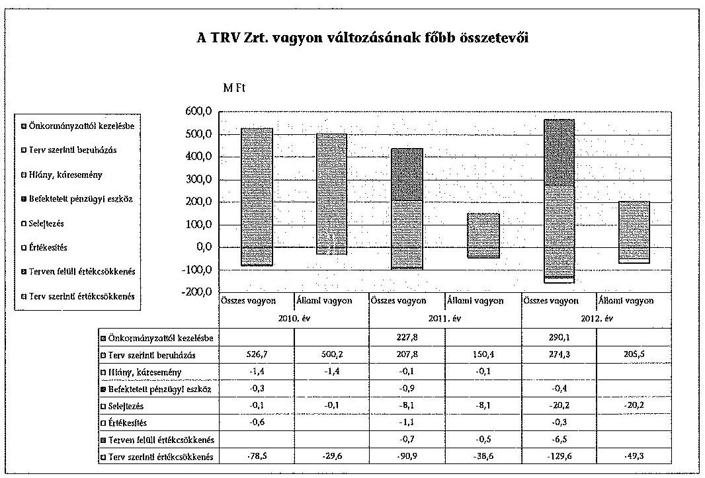

A vagyonváltozást elsősorban a végrehajtott beruházások, valamint az elszámolt értékcsökkenések érintették. A beruházások a többszörösét tették ki az értékcsökkenés-elszámolás értékének minden évben mind a teljes, mind azon belül a kezelt állami vagyon esetében.

Az ellenőrzött időszakban a Társaság saját tőkéje 553,0 millió Ft-ról 567,0 millió Ft-ra, 2,5%-kal, a pozitív mérleg szerinti eredmény hatására növekedett. A Társaság a 2010-2012. években nyereséges volt, bár annak mértéke (6,7-7,3 millió Ft) nem volt jelentős. A nyereséget osztalékként az MNV Zrt. nem fizette ki, ezzel növelte a saját tőke összegét. A lekötött tartalék tőketartalékba helyezésén túl további változás nem történt. A vizsgált időszakban a jegyzett tőke aránya a saját tőkén belül a 2010. január 1-jei 49,0%-ról 47,1%-ra csökkent a 2012. év végére, amely a jelzett időszakban elért nyereséggel van összefüggésben.

Az ellenőrzött időszakban a követelések értéke 316,1 millió Ft-ról 436,3 millió Ft-ra, 38,0%-kal, a kötelezettségek állománya 2201,2 millió Ft-ról 2939,1 millió Ft-ra, 33,5%-kal nőtt. A követelések közül a vevői követelések kezelésére, év végi értékelésére a TRV Zrt. kiemelt figyelmet fordított, a számviteli politikában foglaltak alapján értékhatártól függően egyedi, illetve csoportos értékelést végzett negyedéves gyakorisággal, eredményéről rendszeresen tájékoztatva az MNV Zrt.-t. A rövid lejáratú kötelezettségek közel 56,0%-a szállítókkal szembeni kötelezettség. Az ellenőrző időszakban a Társaságnak nem volt lejárt tartozása.

A Vksztv. rendelkezése szerint a víziközmű-üzemeltetés meghatározott részeinek kiszervezéséhez az Energetikai Hivatal előzetes engedélye szükséges. Kiszervezésre a Vksztv. hatályba lépését követően nem került sor. A TRV Zrt. 2012-től a

---

Vksztv. rendelkezéseinek való megfelelés érdekében a 2012. évben bővítette szolgáltatási területét, amelynek során folyamatosan átvette az általa rossz műszaki színvonalúnak és nem eléggé hatékonyan működőnek ítélt kis víz-közmű-szolgáltatókat és rendszereiket. Ennek következtében a 2012. év végén a Társaság teljesítette a Vksztv.-ben a felhasználói egyenértékes minimális mértékére vonatkozó követelményt.
2011. december 30-ig a következő évi közszolgáltatási díjak megállapításánál a 47/1999. (XII. 28.) KHVM rendelet alapján a felelős minisztérium elfogadta a Társaság önköltségszámításán alapuló ivóvíz- és csatornaszolgáltatási, ivóvíz értékesítési és vízterhelési díj kialakítására vonatkozó, írásban beküldött javaslatait. A kialakított díjak azonban nem képeztek elégséges (amortizációs) forrást a tervezett, vagyongyarapítást szolgáló fejlesztések végrehajtásához. A Társaság a kockázatra több alkalommal felhívta a tulajdonosi joggyakorló figyelmét. A VSZ az állami vagyon megőrzése, gyarapítása érdekében az értékcsökkenési leírás kivételével a költségek alakulására, elemzésére vonatkozóan kötelezettségeket, elvárásokat nem fogalmazott meg. A Társaság díjbevételeinek megtérülését a költségek, ráfordítások alakulása befolyásolja, amelyeket a következő grafikon mutat be:
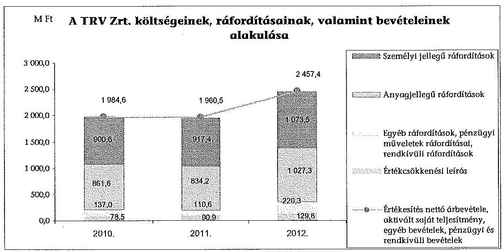

Az árakban realizálható értékcsökkenés várható alakulása mellett a Társaság évente bemutatta a Tao. tv. szerint elszámolható értékcsökkenést, illetve a víz-díj-javaslatban nem szerepeltetett amortizáció mértékét is az illetékes minisztérium$^{10}$ részére évente megküldött díjkalkulációban. A Társaság a díjkalkulációkban jelezte, hogy az érvényesített amortizáció mellett számolt díjbevétel a megtérüléshez nem biztosít fedezetet. A számviteli politikában rögzítettek alapján a Társaság új beruházásaihoz kapcsolódó (pl. Kisköre Szennyvíztelep), a korábbiaknál magasabb kulccsal elszámolható értékcsökkenés befolyásolja, növeli az önköltséget. A magasabb költségek árakban való megtérülésére vonatkozóan közép- és hosszú távú értékelést a Társaság nem végzett.

[^0]
[^0]:    $^{10}$ 2009-ben a 2010. évi díjra vonatkozóan a Környezetvédelmi és Vízügyi Minisztérium, azt követően a Vidékfejlesztési Minisztérium

---

A Vksztv. 62. § (1) bekezdése alapján 2013-tól a Társaságnak a szolgáltatási díjak meghatározásánál - a költségekre, árakra vonatkozó összehasonlító elemzések felhasználásával - figyelembe kell vennie többek között a szolgáltatás indokolt költségeit és a környezetvédelmi kötelezettségek teljesítésének költségeit. Ezek mellett a díjaknak támogatniuk kell a Vksztv. alapelveinek érvényesülését (pl. biztonságos és legkisebb költségű szolgáltatás, hatékony gazdálkodás). A 2011. december 31-től hatályos rendelkezés a 2012. évi díjak kalkulációjára még nem vonatkozott, mivel a Társaság a hatályba lépést megelőzően készítette el a díjakra vonatkozó javaslatát, amelyet a Vidékfejlesztési Minisztérium 2011. december 23-án jóváhagyott. A 2010-2012. évi, a lakossági fogyasztók részére meghatározott díjak alakulását a következő grafikon mutatja be:
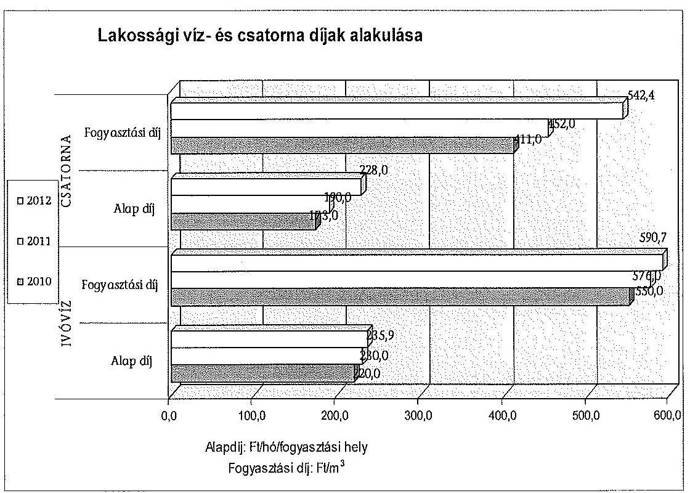

A fogyasztói díjak és azon keresztül az árbevétel alakulása alapvetően befolyásolja a részben elöregedett vízművagyon pótlását szolgáló források rendelkezésre állását. Ennek hatására a fejlesztések végrehajtásának feltételei bizonytalanná váltak, a fejlesztéshez, beruházáshoz szükséges saját erő finanszírozása, illetve a külső pályázatokon való részvételhez szükséges pozitív saját tőke megőrzése kockázatokat hordoz magában.

Az ellenőrzött időszakban - összhangban a tulajdonos által jóváhagyott bér-tömeg-növekedési korláttal - általános bérfejlesztésre nem került sor, a bértömeg változását részben a terület bővülésével összefüggő létszámnövekedés, részben pedig az Szja tv. változásainak negatív hatását kiküszöbölő bérkompenzáció okozta. A létszám- és béradatok alapján megállapítható, hogy a változás eredményre gyakorolt hatása nem jelentős.

---

A létszám és a bérköltség 2010-2012. évek közötti alakulását a következő táblázat mutatja be:

| Megnevezés | 2010. év | 2011. év | 2012. év |
| :-- | :--: | :--: | :--: |
| Átlagos állományi létszám (fő)$^{11}$ | 264 | 261 | 301 |
| Bérköltség (millió Ft) | 597,3 | 618,0 | 740,9 |
| Személyi jellegű egyéb kifizetések   (millió Ft) | 117,7 | 110,3 | 107,1 |
| Összes személyi jellegű kifizetés   (millió Ft) | 715,0 | 728,3 | 848,0 |

# 3. A TRV ZRT. ÁLTAL MŰKÖDETETT KONTROLL- ÉS MONITORING RENDSZER 

### 3.1. A belső kontrollrendszer

A vagyon védelmét és a vagyonnal való felelős gazdálkodást biztosító belső kontrollrendszer kialakítását és működését a TRV Zrt.-nél nem szabályozták teljes körűen. A kontrollrendszer valamennyi elemére (kontrollkörnyezet, szabályozási háttér, kontrolltevékenység, kommunikáció és információáramlás, kockázatkezelés, monitoring rendszer) vonatkozó általános szabályozása a TRV Zrt.-nek nem volt. Az információs rendszer és a kontrolling tevékenység az SZMSZ-ben részlegesen szabályozott volt, ugyanakkor az SZMSZ III/6.3. pontban előírt, az adatgyűjtés, adatszolgáltatás rendjét, az információszolgáltatásban közreműködő szervezetekre vonatkozó külön szabályozást nem adta ki a Társaság. A kockázatkezelés és a monitoring rendszer működésére vonatkozó szabályok kialakítása, kontrollok megfogalmazása elmaradt.

Az ellenőrzött időszakban a Társaság hatályos SZMSZ-ei meghatározták az ellenőrzési rendszer felépítését, de a függetlenített belső ellenőrzés az SZMSZ-ben rögzítettek ellenére nem működött. A belső ellenőrzési feladatok minőségirányítási munkakör melletti ellátása nem felelt meg az SZMSZ előírásainak, a kapacitás probléma befolyásolta a belső ellenőrzési munkaterv összeállítását és az ellenőrzések végrehajtását, amit az FB 2010-ben kifogásolt. A függetlenített belső ellenőrzés hiánya miatt a működés és a vagyongazdálkodás szabályozottságával, szabályszerűségével, a vagyonkezelésben lévő állami, illetve a saját vagyon használatával, valamint a vagyonváltozással kapcsolatban belső ellenőrzés nem volt. A vagyonkezelésben lévő állami, illetve saját vagyon használatának belső ellenőrzése hiányában vagyongazdálkodást érintő megállapítást, illetve arra intézkedést nem fogalmaztak meg. A TRV Zrt.-nél a költséggazdálkodásban rejlő tartalékok feltárására nem került sor, ami nem szolgálta a költségmegtérülés$^{12}$ elvének érvényesülését. A Társaság belső ellenőrzési rendszere nem töltötte be funkcióját.

[^0]
[^0]:    $^{11}$ a TRV Zrt. által számolt átlagos statisztikai létszámadatok
    $^{12}$ Vksztv. 1. § (1) bekezdés h) pont

---

A Belső Ellenőrzési Szabályzat az aktuális SZMSZ-től eltérően nevezte meg az éves ellenőrzési terv jóváhagyására jogosult személyt, illetve szervezetet. A belső ellenőrzési tervet a szabályzat szerint a vezérigazgató, míg a hatályos SZMSZ-ek$^{13}$ szerint az FB hagyta jóvá. 2012. decemberben a belső ellenőr javaslata alapján a vezérigazgató döntött$^{14}$ a 2013. évi ellenőrzési terv prioritási sorrendjéről. A döntés ugyanakkor nem felelt meg az SZMSZ-ben előírtaknak, mivel a terv jóváhagyása az FB hatásköre volt.

A Társaság működésének ellenőrzését, illetve a tulajdonosi vagyon védelmét és közérdekvédelmi ellenőrzését jelentő, alapító okiratban előírt feladatok végrehajtása az FB éves munkaprogramja alapján nem volt teljes körű. Az FB a működést, a társasági, illetve a rábízott állami vagyonnal való gazdálkodást és a vagyonváltozást - az üzleti tervek és üzleti jelentések véleményezésén túl - nem ellenőrizte, ellenőrzési tervet nem készített. A FB munkatervet nem készített és belső ellenőrzési terv hiányában az azoktól való eltérés sem állapítható meg. Az ellenőrzés hiánya növelte annak a kockázatát, hogy nem kerül feltárásra a szabálytalan működés, az állami vagyon szabálytalan felhasználása.

A Számv. tv. alapján készített, vezérigazgatói utasítással kiadott számviteli politika szabályozza a beszámoló készítési határidőt, valamint az FB és a beszámolót jóváhagyó tulajdonosi joggyakorló részére történő megküldés határidejét. A Számv. tv. 153. § (1) bekezdésben és az aktuális vezérigazgatói utasításban előírt határidőt betartva a beszámolót megküldték az ellenőrző és a jóváhagyó szervezet részére. A tulajdonosi joggyakorló által elfogadott éves beszámolót - a könyvvizsgálói jelentéssel együtt - a Számv. tv. 153. § (1) bekezdésében meghatározott határidőn belül megküldték a Cégbíróság, illetve a Céginformációs Szolgálat részére, biztosítva a beszámoló közzétételét és nyilvánosságát.

A TRV Zrt. 2010., 2011., és 2012. évi beszámolóját az FB a könyvvizsgálói jelentés ismeretében tárgyalta, a beszámoló elfogadásáról és a tulajdonosi joggyakorló elé történő előterjesztésről határozatban döntött. A beszámoló elfogadásáról tájékoztatták a tulajdonosi jogokat gyakorló szervezetet. Ezáltal a döntés meghozatalánál érvényesült a Gt. 35. § (3) bekezdés előírása, mivel a Társaság legfőbb szerve a Számv. tv. szerinti beszámolóról az FB írásbeli jelentésének birtokában határozott.

Az információs önrendelkezési jogról és az információszabadságról szóló 2011. évi CXII. törvény 32-33. §-ok előírásai betartásával a Társaság a honlapján közzétette az üzletszabályzatot, a vezető tisztségviselők, FB tagok nyilvános adatait, valamint a javadalmazásukra vonatkozó adatokat. A közbeszerzésre vonatkozó adatokat megjelentették és az aktuális információkkal frissítették. A felügyelőbizottsági dokumentumok, a könyvvizsgálói jelentések, vezetői levelek alapján a TRV Zrt. működésében, az állami és a saját vagyonnal történő gazdálkodásban nem volt olyan esemény, amely az FB vagy a könyvvizsgáló részéről indokolta volna a gazdálkodó szervezet legfőbb döntést hozó szervének összehívását, illetve annak döntését a vagyon védelme érdekében.

[^0]
[^0]:    $^{13}$ pl. 2012. július 5-től és a 2013. május 20-tól hatályos SZMSZ 6.1. pont
    $^{14}$ 2012. december 7-én

---

# 3.2. Az információáramlási és monitoring rendszer 

A Társaságnál a vagyongazdálkodással kapcsolatban kialakított és működtetett információáramlási és monitoring rendszer megfelelően működött. A működés - általános - szabályai szerint valamennyi gazdasági eseményről tájékoztatták a vezérigazgatót, amit a számla kifizetését megelőzően a bizonylatok utalványozásra történő felterjesztésével teljesítettek. A gazdálkodásról, az üzleti tervek teljesítéséről az adatokat és az információkat a TRV Zrt. vezetése a belső
 előírásokat betartva továbbította (megszüntetéséig az Igazgatóságnak és) az FB-nek. Az adatszolgáltatás határidejének be nem tartása nem fordult elő, erre vonatkozó észrevételt az FB nem tett.

A Társaság az MNV Zrt. részére - jogszabályi (Számv. tv., Gt., Vhr.) előírás és a vagyonkezelési szerződés alapján, továbbá az MNV Zrt. Igazgatóság eseti igényeihez igazodva - az évente ismétlődő adatszolgáltatást határidőn belül teljesítette. A Társaság az éves gazdálkodásról szóló beszámoló jelentést (mérleg, eredménykimutatás, kiegészítő melléklet), illetve a Kincstári vagyonnyilvántartási szabályzat 4.2.1. pontja alapján az állami vagyonra vonatkozó vagyonkataszter adatszolgáltatást előírás szerint küldte meg az MNV Zrt. részére.

Az adatok védelmét belső szabályozás és az SZMSZ sem rögzítette, emiatt az adatvédelem nem volt biztosított. A számviteli bizonylatok feldolgozásához alkalmazott programban és számítástechnikai rendszerben biztonsági funkció működött, de az adatvédelem működéséről dokumentum nem állt rendelkezésre.

### 3.3. A kapcsolt vállalkozásban lévő részesedés

A kapcsolt vállalkozásban lévő részesedés értékének védelme érdekében tett intézkedések nem voltak megfelelőek, mivel a TRV Zrt. nem határozta meg a vagyongazdálkodás követelményeit, az adatszolgáltatás rendjét és tartalmát. A TRV Kft. vagyonának alakulását az éves (esetenként évközi) beszámoló készítésekor vizsgálták. A Társaság a TRV Kft. gazdálkodására, adatszolgáltatására, illetve a kapcsolattartásra követelményeket nem határozott meg. A TRV Kft. az ellenőrzött időszakban az alapításkori vagyonát megőrizte, illetve gyarapította, mivel saját tőkéjének összege meghaladta a jegyzett tőke összegét. A jegyzett tőke változatlansága mellett a saját tőke értéke a 2010. évi 3,6 millió Ft-ról a 2012. év végére 7,3 millió Ft-ra növekedett.

---

A TRV Zrt. a 100%-os tulajdonában lévő Kft.-nél nem végzett ellenőrzést. A Társaság a kapcsolt vállalkozása számára a beszámoló megküldésén túl nem határozott meg külön adatszolgáltatást. Az éves beszámolót a TRV Kft. határidőn belül elkészítette, és továbbította a tulajdonos részére. A beszámoló nyilvánosságra hozatalát, a cégbíróságnak történő megküldését a Számv. tv. 153. § (1) bekezdésében előírt határidőre teljesítették.

Budapest, 2014. 04. hó 4. nap

Melléklet: 10 db
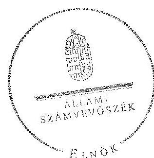

Domokos László
elnök

---

# RÖVIDÍTÉSEK JEGYZÉKE 

## Törvények

Áfa tv.
Áht. 1
Áht. 2
Alaptörvény
ÁSZ tv.
Gt.
$\mathrm{Kbt}_{.1}$

Kbt. 2
Nvtv.
Számv. tv.
Szja tv.
Tao. tv.
Vtv.
Vksztv.

## Rendeletek

Vhr.
Vksztv.vhr.

## Szórövidítések

Alapító
áfa
ÁSZ
Energetikai Hivatal
EU
FB
Igazgatóság
KEOP
KVI
az általános forgalmi adóról szóló 2007. évi CXXVII. törvény
az államháztartásról szóló 1992. évi XXXVIII. törvény (hatályon kívül: 2012. január 1-től)
az államháztartásról szóló 2011. évi CXCV. törvény
Magyarország Alaptörvénye
az Állami Számvevőszékről szóló 2011. évi LXVI. törvény
a gazdasági társaságokról szóló 2006. évi IV. törvény
a közbeszerzésekről szóló 2003. évi CXXIX. törvény (hatályon kívül: 2012.január 1-től)
a közbeszerzésekről szóló 2011. évi CVIII. törvény
a nemzeti vagyonról szóló 2011. évi CXCVI. törvény
a számvitelről szóló 2000. évi C. törvény
a személyi jövedelemadóról szóló 1995. évi CXVII. törvény
a társasági adóról és az osztalékadóról szóló 1996. évi LXXXI. törvény
az állami vagyonról szóló 2007. évi CVI. törvény
a víziközmű-szolgáltatásról szóló 2011. évi CCIX. törvény
az állami vagyonnal való gazdálkodásról szóló 254/2007 (X. 4.) Korm. rendelet
a víziközmú-szolgáltatásról szóló 2011. évi CCIX. törvény egyes rendelkezéseinek végrehajtásáról szóló 58/2013. (II. 27.) Korm. rendelet
a Nemzeti Vagyongazdálkodási Tanács, majd 2010 júniusástól a Magyar Nemzeti Vagyonkezelő Zrt.
általános forgalmi adó
Állami Számvevőszék
Magyar Energetikai és Közmű-szabályozási Hivatal
Európai Unió
Tiszamenti Regionális Vízművek Zártkörűen Működő Részvénytársaság Felügyelőbizottsága
Tiszamenti Regionális Vízművek Zártkörűen Működő Részvénytársaság Igazgatósága
Környezet és Energia Operatív Program
Kincstári Vagyoni Igazgatóság

---

MNV Zrt.
NAV
NVT, Tanács
számviteli politika
szja
SZMSZ
Társaság, TRV Zrt.
TRV Kft.
vagyonnyilvántartási szabályzat
Vgsz.
vezérigazgató
VSZ, vagyonkezelési szerződés

Magyar Nemzeti Vagyonkezelő Zrt.
Nemzeti Adó- és Vámhivatal
Nemzeti Vagyongazdálkodási Tanács
a Tiszamenti Regionális Vízművek Zártkörűen Működő Részvénytársaság Számviteli politikája
személyi jövedelemadó
a Tiszamenti Regionális Vízművek Zártkörűen Működő Részvénytársaság Szervezeti és Működési Szabályzata
Tiszamenti Regionális Vízművek Zrt.
TRV Közüzemi Szolgáltató Kft.
46/2008. számú vezérigazgatói utasítás a Magyar Nemzeti Vagyonkezelő Zrt. Vagyonnyilvántartási Szabályzatáról a KVI által jóváhagyott, 1998. január 1-től hatályos „A kincstári vagyoni körbe tartozó víziközművagyon kezelési, gazdálkodási és nyilvántartási szabályzata"
a Tiszamenti Regionális Vízművek Zártkörűen Működő Részvénytársaság vezérigazgatója
a KVI és a Tiszamenti Vízművek Rt. által 1998. április 30-án kötött vagyonkezelési szerződés

---

# ÉRTELMEZŐ SZÓTÁR 

belső ellenőrzés
felhasználói egyenérték
gördülő fejlesztési terv

KEOP 1.2.0 prioritás

KEOP 1.3.0 prioritás
kezelt/kincstári/állami vagyon

Kincstári Vagyoni Igazgatóság
kontrollkörnyezet

Független, tárgyilagos bizonyosságot adó és tanácsadó tevékenység, amelynek célja, hogy az ellenőrzött szervezet működését fejlessze és eredményességét növelje, az ellenőrzött szervezet céljai elérése érdekében rendszerszemléletű megközelítéssel és módszeresen értékeli, illetve fejleszti az ellenőrzött szervezet irányítási és belső kontrollrendszerének hatékonyságát.
Olyan mutatószám, amely a víziközmű-szolgáltatást igénybe vevő felhasználók számosságát - víziközműszolgáltatási ágazatonként, a felhasználók kapacitás igényeire figyelemmel - a Vksztv.-ben meghatározott képlet alapján egységesen fejezi ki.
A víziközművagyon vagyonkezelési szerződésben rögzített jelenkori könyv szerinti nettó értékének megőrzésére szóló, hosszú távú felújítási és pótlási, valamint beruházási tervéből álló terv (Vksztv. 2. § (8) pont).
A Környezet és Energia Operatív Program keretében kiírt szennyvízelvezetés és tisztítást szolgáló pályázati rendszer.
A Környezet és Energia Operatív Program keretében kiírt ivóvízminőség-javítást szolgáló pályázati rendszer.
A Társaság víziközmű-szolgáltatási tevékenységének ellátásához használt, kizárólagos állami tulajdonban lévő közművagyon, amely kezelésére vonatkozóan a KVI és a Társaság 1998-ban vagyonkezelési szerződést kötött.
Az állami vagyonnal kapcsolatos tulajdonosi jogokat gyakorló szervezet. 2007. december 31-i megszűnését követően jogai és kötelezettségei az MNV Zrt.-re szálltak. (A jogok és kötelezettségek átszállása nem minősült a már megkötött vagyonkezelési szerződések módosításának a Vtv. 61. §-a alapján.)
A kontrollkörnyezet alakítja ki a szervezet belső kontrollrendszerhez való viszonyát, hozzáállását, befolyásolja az alkalmazottak belső kontrollal kapcsolatos tudatosságát, magatartását. Elemei a személyes és szakmai elkötelezettség és a vezetés, valamint az alkalmazottak által vallott erkölcsi értékek; a szakmai hozzáértés iránti elkötelezettség; a felső vezetés hozzáállása, a vezetés filozófiája és tevékenységének stílusa; a szervezeti struktúra; a humán-erőforrás-politika és gazdálkodási gyakorlat.

---

monitoring
működtető vagyon
tulajdonosi jogokat gyakorló/tulajdonosi joggyakorló
vagyonkezelési szerződés
visszapótlási kötelezettség
víziközmű-rendszer

A monitoring a különböző szintű szervezeti célok megvalósításának folyamatát kíséri figyelemmel, melynek során a releváns eseményekről és tevékenységekről (együtt: folyamatokról) rendszeres jelleggel, strukturált, döntéstámogató információkhoz jutnak a szervezet vezetői.
A Társaság tulajdonában álló vagyon, amellyel a tulajdonosi jogokat gyakorlótól függetlenül rendelkezhet.
Az állami vagyon kezeléséért felelős miniszter. A miniszter nevében a vagyon felett a tulajdonosi jogokat gyakorló szervezet 2007-ig a KVI, 2007-től a Nemzeti Vagyongazdálkodási Tanács, 2010-től MNV Zrt. igazgatósága.
A kincstári vagyon kezelésére vonatkozó jogokat és kötelezettségeket tartalmazó, a Társaság és a Kincstári Vagyoni Igazgatóság között 1998-ban létrejött szerződés, amely révén a kincstári vagyon részét képező víziközműrendszerek működtetésével (üzemeltetésével és fenntartásával) - a saját tulajdonában lévő működtető vagyonnal együtt - gondoskodik az alapító okiratában meghatározott működési területen az ivóvíz- és szennyvízszolgáltatás (mint közműszolgáltatás) folyamatos teljesítéséről, a kincstári vagyonnal való szakszerű gazdálkodásról.
A kezelt állami vagyonon elszámolt terv szerinti és terven felüli értékcsökkenési leírás összegének megfelelő összegű beruházási, felújítási és karbantartási kötelezettség.
A Vksztv. 2. § szerint a víziközművek olyan egybefüggő struktúrája, amely:
a) önállóan, kizárólag egy település ellátását biztosítja (szigetüzem),
b) önállóan, több település ellátását is szolgálja, és rajta a tulajdoni viszonyok azonosak,
c) átadási pontokkal egyértelműen körülhatárolt, a kapcsolódó szolgáltatás nyújtását is vagy kizárólagosan azt biztosítja,
d) átadási pontokkal egyértelműen körülhatárolt, kapcsolódó szolgáltatással kiegészülve egy településre nézve, vagy azonos tulajdoni viszonyok mellett több településre nézve, képes biztosítani a víziközmű-szolgáltatás műszaki feltételeit.

---

# 3. SZÁMÚ MELLÉKLET A V-0123-478/2014. SZÁMÚ JELENTÉSHEZ

Kitöltő szervezet neve: Tiszamenti Regionális Vízművek Zrt Kitöltésért felelős: Haraszti Zsuzsannné Kitöltésért felelős: Imatunszámra: 70014-9037

## TANÚSÍTVÁNY

A gazdasági társaság vagyonának alakulása 2010-2012. években (szer Vt-ban)

|  Sorszám | Megnevezés | 2010.01.01 | 2010.12.31 | 2011.12.31 | 2012.12.31 | Változás 2012.12.31/2010.01.01. (%)  |
| --- | --- | --- | --- | --- | --- | --- |
|  1. | Számlái | 2 892 253 | 2 417 396 | 2 079 254 | 4 235 165 | 180,0  |
|  2. | Befektetett számlák árcszerű | 2 364 619 | 2 010 430 | 2 144 398 | 2 601 557 | 160,0  |
|  3. | Ebből: Imatunszámba javas | 24 240 | 36 969 | 54 515 | 39 267 | 149,0  |
|  4. | Tárgyi eszközök | 2 323 915 | 2 768 207 | 3 095 703 | 2 500 322 | 100,0  |
|  5. | Befektetett pénzügyi eszközök | 5 464 | 5 152 | 6 262 | 3 879 | 71,0  |
|  6. | Forgóeszközök | 479 448 | 567 511 | 713 067 | 756 011 | 167,7  |
|  7. | Ebből: Készletek | 38 422 | 42 670 | 39 772 | 52 640 | 91,0  |
|  8. | Követelések | 316 103 | 339 175 | 434 627 | 435 252 | 138,0  |
|  9. | Számlásvás |  |  |  |  |   |
|  10. | Pénzeszközök | 194 921 | 168 486 | 238 667 | 265 141 | 202,7  |
|  11. | Rövid lejáratú eltérések | 49 268 | 59 699 | 80 905 | 90 653 | 63,1  |
|  12. | Számlái árcszerű | 2 892 253 | 2 417 396 | 2 079 254 | 4 235 165 | 180,0  |
|  13. | Pénzeszközök | 2 892 253 | 2 417 396 | 2 079 254 | 4 235 165 | 180,0  |
|  14. | Számlái árcszerű | 345 093 | 352 928 | 360 279 | 367 625 | 109,0  |
|  15. | Ebből: Jegyzett tőke | 367 220 | 367 220 | 367 220 | 367 220 | 100,0  |
|  16. | Tőkelekülönbözet | 236 228 | 244 224 | 248 012 | 248 012 | 108,0  |
|  17. | Számlásvás | 24 091 | 30 760 | 37 660 | 64 946 | 129,0  |
|  18. | Labánta tartalék | 11 788 | 3 699 |  |  | 0,0  |
|  19. | Számlásvás |  |  |  |  |   |
|  20. | Számlából származó eredmény | 6 069 | 6 000 | 7 296 | 6 758 | 121,0  |
|  21. | Gállapozások | 3 621 | 33 512 |  | 30 856 | 271,0  |
|  22. | Kötelezettségek | 2 201 228 | 2 367 473 | 2 643 318 | 2 920 064 | 132,0  |
|  23. | Ebből: Előtraszert kötelezettségek |  |  |  |  |   |
|  24. | Hosszú lejáratú kötelezettségek | 1 972 537 | 2 022 159 | 2 263 026 | 2 519 209 | 122,7 
 |
|  25. | Jószaki lejárási időtartamok | 322 699 | 348 314 | 377 298 | 419 712 | 155,0  |
|  26. | Pénzeszk időbeli elterjesztések | 178 413 | 471 130 | 672 667 | 811 109 | 681,0  |
|  27. | Hozzá tartozó lejárások | 2 892 253 | 2 417 396 | 2 079 254 | 4 235 165 | 180,0  |
|  28. | Kültelezetségek: Adótálló vagyon | 461 127 | 1 049 925 | 1 222 536 | 1 009 091 | 332,4  |

Igazolom, hogy a tanúsítványban szereplő adatok nyilvántartásainkkal megegyeznek.

Dátum: Szolnok, 2013. július 09.

Página: 112631-27-2-16

Haraszti Zohánné

1. 2013.09.04 11:53:30 3077

Página: 112631-27-2-16

Haraszti Zohánné

pénzügyi és számviteli osztályvezető

---

Kitöltő szervezet neve: Tiszamenti Regionális Vízművek Zrt Kitöltésért felelős: Haraszti Zoltánné Kitöltésért felelős telefonszáma: 70/314-0037

# TANÚSÍTVÁNY

A gazdasági társaság eredményének alakulása 2010-2012. években (ezer Ft-ban)

|  Sorszám | Megnevezés | 2010.01.01 | 2010.12.31 | 2011.12.31 | 2012.12.31 | Változás 2012.12.31/2010.01.01. (%)  |
| --- | --- | --- | --- | --- | --- | --- |
|  1. | Értékesítés nettó árbevétele | 1739145 | 1846598 | 1792177 | 2207739 | 125,9  |
|  2. | Aktívált saját teljesítmények értéke | 30170 | 25150 | 23510 | 25533 | 84,6  |
|  3. | Egyéb bevételek | 125937 | 102036 | 132513 | 198248 | 157,4  |
|  4. | Anyagjellegű ráfordítások | 828918 | 861555 | 834247 | 1027250 | 123,9  |
|  5. | Személyi jellegű ráfordítások | 909431 | 900553 | 917432 | 1073508 | 118,0  |
|  6. | Értékcsökkenési leírás | 75415 | 78532 | 90861 | 129615 | 171,9  |
|  7. | Egyéb ráfordítások | 88127 | 130542 | 98325 | 215980 | 245,1  |
|  8. | Üzemi (üzleti) tevékenység eredménye | 6639 | 2902 | 7335 | 14833 | 223,4  |
|  9. | Pénzügyi műveletek bevételei | 8272 | 2481 | 6682 | 20465 | 247,4  |
|  10. | Pénzügyi műveletek ráfordításai | 1475 | 2674 | 10583 | 3677 | 249,3  |
|  11. | Pénzügyi műveletek eredménye | 6797 | 193 | 3901 | 16788 | 247,0  |
|  12. | Szakácos vállalkozási eredmény | 158 | 2709 | 3434 | 1955 | 1227,3  |
|  13. | Rendkívüli bevételek | 8303 | 7991 | 5384 | 3433 | 41,4  |
|  14. | Rendkívüli ráfordítások | 1390 | 3800 | 1752 | 650 | 46,7  |
|  15. | Rendkívüli eredmény | 6913 | 4191 | 3632 | 2783 | 40,2  |
|  16. | Adózás előtti eredmény | 7071 | 6900 | 7286 | 6758 | 95,6  |
|  17. | Adófizetési kötelezettség | 402 | - | - | - | -  |
|  18. | Adózott eredmény | 6669 | 6900 | 7286 | 6758 | 101,3  |
|  19. | Eredmény/artalék igénybevétel osztalékra | - | - | - | - | -  |
|  20. | Jövedelmezett osztalék, részesedés | - | - | - | - | -  |
|  21. | Mérleg szerinti eredmény | 6669 | 6900 | 7286 | 6758 | 101,3  |

Megjegyzés: A tanúsítvány a gazdasági társaság többségi tulajdonú leányvállalatainak is ki kell tölteniük. Igazolom, hogy a tanúsítványban szereplő adatok nyilvántartásainkkal megegyeznek. Dátum: Szolnok, 2013. július 09.

---

1. SZÁMÚ MELLÉKLET A V-0123-478/2014. SZÁMÚ JELENTÉSHEZ

Kitöltő szervezet neve: Tiszamenti Regionális Vízművek Zrt Kód:64461 Kitöltésért felelős: Haraszti Zoltánné Kód:64461 Kitöltésért felelős telefonszáma:0800-702514-80227

TANÚSÍTVÁNY a befektetett eszközök állományának alakulásáról

|  Sorszám | Érték (eFt) |  |  |  |  |  |  |  |  |  |  |  |  |  |  |  |   |
| --- | --- | --- | --- | --- | --- | --- | --- | --- | --- | --- | --- | --- | --- | --- | --- | --- | --- |
|  | Érték (eFt) | Összesen | Állami vegyes | Önkorm. vegyes | Saját vegyes | Önkorm. | Állami vegyes | Önkorm. vegyes | Saját vegyes | Önkorm. | Állami vegyes | Önkorm. vegyes | Saját vegyes | Önkorm. vegyes | Saját vegyes | Önkorm. vegyes | Saját vegyes  |
|   |  | Érték (eFt) | Gépjármű
szerelvény
száma (t/h) | Érték (eFt) | Érték (eFt) | Érték (eFt) | Érték (eFt) | Gépjármű
szerelvény
száma (t/h) | Érték (eFt) | Érték (eFt) | Érték (eFt) | Érték (eFt) | Gépjármű
szerelvény
száma (t/h) | Érték (eFt) | Érték (eFt) | Érték (eFt) | Érték (eFt)  |
|  1. | Nyitó állomány | 2364619 |  | 2 605 469 | 0 | 362 312 | 3 819 428 |  | 2 471 886 | 0 | 236 892 | 2 144 382 |  | 2 074 692 | 226 169 | 343 487 |   |
|  2. | Terv szerinti értékcsökkenés (27) | 78222 | 12 029 | 29 000 |  | 48 926 | 30 861 | 12 247 | 28 634 | 1 732 | 20 514 | 139 613 | 12 822 | 49 330 | 21 105 | 55 179 |   |
|  3. | Tervezett leírás (8661) |  |  |  |  |  | 658 | 2 | 465 |  | 173 | 6 520 | 1 |  |  | 6 920 |   |
|  4. | Összevonás (961) | 369 | 15 |  |  | 509 | 1 144 | 8 |  |  | 1 144 | 262 | 24 |  |  | 262 |   |
|  5. | Szövegezés (569214,569215) | 103 | 111 | 37 |  | 46 | 8 121 | 238 | 8 111 |  | 10 | 20 228 | 70 | 20 228 |  |  |   |
|  6. | Átminősítés |  |  |  |  |  |  |  |  |  |  |  |  |  |  |  |   |
|  7. | Befejezési pénzügyi eszköz (192) | 312 | 3 |  |  | 312 | 890 | 1 |  |  | 890 | 384 | 1 |  |  | 384 |   |
|  8. | Egyéb értékesítés, károsodás (669954-869595) | 1286 | 4 | 1 350 |  |  | 118 | 3 | 68 |  | 59 |  | 2 |  |  |  |   |
|  9. | Csökkenés összesen | 86962 |  | 31 959 | 0 | 69 885 | 101 782 |  | 47 278 | 1 735 | 52 781 | 157 010 |  | 69 864 | 23 100 | 66 348 |   |
|  10. | Terv szerinti beruházás | 526721 | 173 | 500 188 |  | 26 521 | 207 810 | 220 | 150 454 |  | 51 270 | 214 237 | 239 | 205 462 | 463 | 68 351 |   |
|  11. | Terv szerinti felújítás |  |  |  |  |  |  |  |  |  |  |  |  |  |  |  |   |
|  12. | Terv szerinti leírás | 526721 | 173 | 500 188 |  | 26 521 | 207 810 | 220 | 150 454 |  | 51 270 | 214 237 | 239 | 205 462 | 463 | 68 351 |   |
|  13. | Egyéb beruházás |  |  |  |  |  |  |  |  |  |  |  |  |  |  |  |   |
|  14. | Egyéb felújítás |  |  |  |  |  |  |  |  |  |  |  |  |  |  |  |   |
|  15. | Átminősítés |  |  |  |  |  |  |  |  |  |  |  |  |  |  |  |   |
|  16. | Átminősítés vagyontárgyakra |  |  |  |  |  | 237 836 | 40 |  | 237 836 |  | 206 128 | 92 |  | 200 150 |  |   |
|  17. | Egyéb |  |  |  |  |  |  |  |  |  |  |  |  |  |  |  |   |
|  18. | Terven felüli leírás |  |  |  |  |  |  |  |  |  |  |  |  |  |  |  |   |
|  19. | Változás összesen | 526721 |  | 500 188 | 0 | 26 521 | 415 646 |  | 190 654 | 237 836 | 51 270 | 864 245 |  | 205 462 | 200 686 | 68 351 |   |
|  20. | Záró állomány | 2818428 |  |  |  |  |  |  |  |  |  |  |  |  |  |  |   |

 |  | 2 471 886 | 0 | 338 892 | 3 144 382 |  | 2 574 092 | 338 892 | 345 487 | 3 031 687 |  | 2 715 091 | 495 604 | 345 475 |   |

Megjegyzés: A tanúsítványt a gazdasági társasági felújítási hiánypótló vállalkozásoknak is ki kell állítani.

Igen, abban, hogy a tanúsítványban szereplő adatok nyilvánosságra hozhatók megjegyzések nélkül.

Helye: Szécsény, 2013. július 10.

1. SZÁMÚ MELLÉKLET A V-0123-478/2014. SZÁMÚ JELENTÉSHEZ

1. SZÁMÚ MELLÉKLET A V-0123-478/2014. SZÁMÚ JELENTÉSHEZ

1. SZÁMÚ JELENTÉSHEZ

1. SZÁMÚ JELENTÉSHEZ

1. SZÁMÚ JELENTÉSHEZ

1. SZÁMÚ JELENTÉSHEZ

1. SZÁMÚ JELENTÉSHEZ

1. SZÁMÚ JELENTÉSHEZ

1. SZÁMÚ JELENTÉSHEZ

1. SZÁMÚ JELENTÉSHEZ

1. SZÁMÚ JELENTÉSHEZ

1. SZÁMÚ JELENTÉSHEZ

1. SZÁMÚ JELENTÉSHEZ

1. SZÁMÚ JELENTÉSHEZ

1. SZÁMÚ JELENTÉSHEZ

1. SZÁMÚ JELENTÉSHEZ

1. SZÁMÚ JELENTÉSHEZ

1. SZÁMÚ JELENTÉSHEZ

1. SZÁMÚ JELENTÉSHEZ

1. SZÁMÚ JELENTÉSHEZ

1. SZÁMÚ JELENTÉSHEZ

1. SZÁMÚ JELENTÉSHEZ

1. SZÁMÚ JELENTÉSHEZ

1. SZÁMÚ JELENTÉSHEZ

1. SZÁMÚ JELENTÉSHEZ

1. SZÁMÚ JELENTÉSHEZ

1. SZÁMÚ JELENTÉSHEZ

1. SZÁMÚ JELENTÉSHEZ

1. SZÁMÚ JELENTÉSHEZ

1. SZÁMÚ JELENTÉSHEZ

1. SZÁMÚ JELENTÉSHEZ

1. SZÁMÚ JELENTÉSHEZ

1. SZÁMÚ JELENTÉSHEZ

---

Kitöltő szervezet neve: Tiszamenti Regionális Vízművek Zrt Kitöltésért felelős: Haraszti Zoltánné Kitöltésért felelős telefonszáma: 70/314-9037

# TANÚSÍTVÁNY

a gazdasági társaság működéséről a 2010-2012. években

|  Sor-
szám | Megnevezés |  | 2010.
01.01-jén | 2010.
12.31-én | 2011.
12.31-én | 2012.
12.31-én  |
| --- | --- | --- | --- | --- | --- | --- |
|   |  | 1 | 2 | 3 | 4 | 5  |
|  1. | A gazdasági társaság cégtípusa |  | Zrt | Zrt | Zrt | Zrt  |
|  2. | A gazdasági társaság tulajdonosi részarányai |  |  |  |  |   |
|  2.1 | Az állam százalékos tulajdoni részaránya |  | 100,0 | 100,0 | 100,0 | 100,0  |
|  2.2 | Az állam százalékos tulajdoni részaránya összege |  | 207 320 | 207 320 | 207 320 | 207 320  |
|  2.3 | Állami intézmények tulajdoni részaránya |  |  |  |  |   |
|  2.4 | Állami intézmények tulajdoni részaránya összege |  |  |  |  |   |
|  2.5 | Önkormányzatok, többségi tulajdonosok tulajdoni részaránya |  |  |  |  |   |
|  2.6 | Önkormányzatok, többségi tulajdonosok tulajdoni részaránya összege |  |  |  |  |   |
|  2.7 | Egyéb állami tulajdonú szervezetek tulajdoni részaránya |  |  |  |  |   |
|  2.8 | Egyéb állami tulajdonú szervezetek tulajdoni részaránya összege |  |  |  |  |   |
|  2.9 | Gazdasági társaságok tulajdoni részaránya |  |  |  |  |   |
|  2.10 | Gazdasági társaságok tulajdoni részaránya összege |  |  |  |  |   |
|  2.11 | Egyéb tulajdonosok tulajdoni részaránya |  |  |  |  |   |
|  2.12 | Egyéb tulajdonosok tulajdoni részaránya összege |  |  |  |  |   |
|  3. | A gazdasági társaságból a vizsgált évek során volt-e csődeljárás, végelszámolás, felszámolás? |  | Nem | Nem | Nem | Nem  |
|  4. | A gazdasági társaság más gazdasági társaságokban való részesedése esetén a részesedéssel érintett (kapcsolt) gazdasági társaságok száma (db.) |  | 2 | 2 | 2 | 2  |
|  4.1 | A tárgyévben az állami vagyon után elszámolt értékesítési érték összege |  |  | 29 606 | 38 614 | 49 336  |
|  4.2 | A tárgyévben az állami tulajdoni eszközök pótlására fordított pénzeszköz |  |  | 500 188 | 150 424 | 205 463  |
|  4.3 | A tárgyévben a saját vagyon után elszámolt értékesítési érték összege |  |  | 48 926 | 50 514 | 59 179  |
|  4.4 | A tárgyévben a saját tulajdoni eszközök pótlására fordított pénzeszköz |  |  | 26 533 | 57 576 | 67 947  |
|  5. | A gazdasági társaság tőkéje |  |  | 6 900 | 7 286 | 6 758  |
|  5.1 | A gazdasági társaság eredménye |  |  | 30 760 | 27 650 | 44 946  |
|  5.2 | A tulajdonosok által a tárgyévi eredményből (eredménytartalék kiegészítésből) osztalékfizetésre fordítandó összege |  |  |  |  |   |
|  5.3 | A követelések pozíciói eszközök |  |  |  |  |   |
|  5.4 | Amennyiben a gazdasági társaság tárgyévi eredménye veszteség, azon tevékenység megjelölése, amelyhez a veszteség, illetve annak meghatározó része hozzátartozik |  |  |  |  |   |
|  5.5 | Javasolt tőke |  | 267 320 | 267 320 | 267 320 | 267 320  |
|  5.6 | Saját tőke |  | 546 093 | 552 993 | 560 279 | 567 027  |
|  5.7 | A saját tőke javasolt tőke aránya (%) |  | 49,0 | 48,5 | 47,7 | 47,1  |
|  5.8 | Az összes forrás (százalékos arányban) |  | 2 892 353 | 3 417 398 | 3 878 254 | 4 338 125  |
|  5.9 | A saját tőke és az összes forrás aránya (%) |  | 19,9 | 18,2 | 14,9 | 13,1  |

---

# 6. SZÁMÚ MELLÉKLET

A V-0123-478/2014. SZÁMÚ JELENTÉSHEZ

Kitöltő szervezet neve: Tiszamenti Regionális Vízművek Zrt Kitöltésért felelős: Haraszti Zoltánné Kitöltésért felelős telefonszáma: 70/314-9037

|  Sor-
szám | Megnevezés | 2010.
01.01-jén | 2010.
12.31-én | 2011.
12.31-én | 2012.
12.31-én  |
| --- | --- | --- | --- | --- | --- |
|  1 | 2 | 3 | 4 | 5 | 6  |
|  5.1 | A gazdasági társaság mérleg szerinti összes kötelezettsége |  |  |  |   |
|  6.1 | ebből: az állammal (tulajdonosi joggyakorlóval) szembeni kötelezettség |  | 2 201 226 | 2 367 473 | 2 642 318  |
|  6.1 | a gazdasági társaság hitelfelvételből származó kötelezettsége |  | 1 971 527 | 1 971 527 | 1 971 527  |
|  7.1 | ebből: az állammal (tulajdonosi joggyakorlóval) szembeni kötelezettség |  |  | 49 622 | 74 095  |
|  7.2 | A gazdasági társaság társaságszerződésből származó kötelezettsége |  |  |  |   |
|  7.3 | a gazdasági társaság értékpapír kibocsátásból származó kötelezettsége |  |  |  |   |
|  7.4 | A hitel-, költségvetési, tisztaigazgatási, értékpapír kibocsátásból származó összes kötelezettsége |  |  | 49 622 | 74 095  |
|  7.5 | ebből: az állami feladatellátáshoz kapcsolódó |  |  |  |   |
|  7.6 | működéshez kapcsolódó |  |  |  |   |
|  7.7 | Fellegzéshez kapcsolódó |  |  | 49 622 | 74 095  |
|  8.1 | A gazdasági társaság év végi szállítási állománya összesen: |  | 112 922 | 235 396 | 234 478  |
|  8.2 | a szállítási állományból fizetési intézményi érintett kötelezettség |  |  |  |   |
|  8.3 | a gazdasági társaság lezárt szállítási állománya összesen |  |  |  |   |
|  8.4 | ebből: 50 nap alatti |  |  |  |   |
|  8.5 | 51 és 50 nap közötti |  |  |  |   |
|  8.6 | 51 és 365 nap közötti |  |  |  |   |
|  8.7 | éven túli |  |  |  |   |
|  9.1 | a gazdasági társaság egyéni kötelezettségei összesen: |  | 115 527 | 107 758 | 139 470  |
|  9.2 | ebből: az állammal (tulajdonosi joggyakorlóval) szembeni kötelezettség |  |  |  |   |
|  9.3 | a sportkevállalkozással szerződési ki nem egyeztetési lejárati lezárás |  | 27 526 | 29 926 | 33 822  |
|  9.4 | a központi költségvetéssel szerződési adó, tárolás, híradástechnika |  | 58 011 | 78 453 | 97 343  |
|  9.5 | Egyéb: beruházási által éven belül teljesített összeg, mely szerepel a 7.4 pontban |  |  |  | 6 442  |
|  10.1 | A gazdasági társaság mérleg szerinti tőkefedezetű kötelezettségei összesen |  |  |  |   |
|  11.1 | Az állami (tulajdonosi joggyakorló) által a gazdasági társaság kötelezettségével kapcsolatos szerződéshez vállalt garancia-, és készfizetővállalás összesen |  |  |  |   |
|  11.2 | Az állami (tulajdonosi joggyakorló) által a garancia érvényesítés elutasítása miatt nyújtott kölcsön, támogatás, átadott pénzeszköz |  |  |  |   |
|  11.3 | Érvényesített garancia és készfizetővállalás miatti állami (tulajdonosi joggyakorló) kifizetés |  |  |  |   |
|  12.1 | A gazdasági társaságnak szerződéses kötelezettségre, feladatellátási szerződésre alapozottan az állami (tulajdonosi joggyakorló) által nyújtott támogatás |  |  |  |   |

---

Kitöltő szervezet neve: Tiszamenti Regionális Vízművek Zrt Kitöltésért felelős: Haraszti Zoltánné Kitöltésért felelős telefonszáma: 70/314-9037

|  Szám. |  | Megnevezés |  | 2010. | 2010. | 2011. | 2012.  |
| --- | --- | --- | --- | --- | --- | --- | --- |
|  szám. |  | 

 |  | 12.31-én | 12.31-én | 12.31-én | 12.31-én  |
|  1 | 2 | 3 | 4 | 5 | 6 | 7 | 8  |
|  12.1 | A feladatellátásért kapott állami (tulajdonosi joggyakorlói) támogatás, átadott pénzeszköz tárgyévben bevételként elszámolt összege és a tárgyévi árbevétel + egyéb bevétel + rendkívüli bevétel aránya (%) |  |  |  | 3,6 | 4,8 | 5,5  |
|  12.2 | A támogatás, pénzeszköz átadásból:  működési célú |  |  |  |  |  |   |
|  12.3 | eseti működési célú |  |  |  |  |  |   |
|  12.4 | fejlesztési célú |  |  |  |  |  |   |
|  13. | Az állam (tulajdonosi joggyakorlói) által a gazdasági társaságnak nyújtott időjáráshatás (alapút, tábozmatás, műbővítés) |  |  |  |  |  |   |
|  13.1 | ebből: elutalás, tábozmatás |  |  |  |  |  |   |
|  13.2 | veszteség fejlesztésre adott tulajdonosi pótfejlesztés |  |  |  |  |  |   |
|  14. | Az állam (tulajdonosi joggyakorlói) által a gazdasági társaságnak nyújtott költség |  |  |  |  |  |   |
|  14.1 | ebből: működési célú |  |  |  |  |  |   |
|  14.2 | fejlesztési célú |  |  |  |  |  |   |
|  15. | Az állam (tulajdonosi joggyakorlói) részére a gazdasági társaság által megfizetett kamat |  |  |  |  |  |   |
|  15.1 | ebből: működési célú |  |  |  |  |  |   |
|  15.2 | fejlesztési célú |  |  |  |  |  |   |
|  16. | A gazdasági társaság által az állam (tulajdonosi joggyakorlói) kötelezettségével kapcsolatosan szerződésben vállalt garancia-, és kezességvállalás |  |  |  |  |  |   |
|  16.1 | a gazdasági társaság által a garancia érvényesítés elkerülése miatt az állam (tulajdonosi joggyakorlói) részére nyújtott költség, támogatás, átadott pénzeszköz |  |  |  |  |  |   |
|  16.2 | Érvényesített garancia-, és kezességvállalás miatt a gazdasági társaság által teljesített kötelezettség |  |  |  |  |  |   |
|  17. | A gazdasági társaság által az állam, állami intézmények részére nyújtott támogatás, átadott pénzeszköz |  |  |  |  |  |   |
|  17.1 | ebből: működési célú |  |  |  |  |  |   |
|  17.2 | fejlesztési célú |  |  |  |  |  |   |
|  18. | A gazdasági társaság által az állam (tulajdonosi joggyakorlói) részére átadott osztalék, osztalékkövetelés |  |  |  |  |  |   |
|  18.1 | A gazdasági társaság által a korábbi időszakban veszteség fedezetén képzett pótfejlesztés visszafizetése |  |  |  |  |  |   |
|  18.2 | A gazdasági társaságnak végrehajtott jogszerű tőke hazafizetés, tőkeki vonás során az állam (tulajdonosi joggyakorlói) részére teljesített kötelezettség |  |  |  |  |  |   |
|  19. | A gazdasági társaság által az állam (tulajdonosi joggyakorlói) részére nyújtott költség |  |  |  |  |  |   |
|  19.1 | ebből: működési célú |  |  |  |  |  |   |
|  19.2 | fejlesztési célú |  |  |  |  |  |   |
|  20. | Az állam (tulajdonosi joggyakorlói) által a gazdasági társaság részére megfizetett kamat |  |  |  |  |  |   |
|  20.1 | ebből: működési célú |  |  |  |  |  |   |
|  20.2 | fejlesztési célú |  |  |  |  |  |   |

Megjegyzés: A tanúsítványt a gazdasági társaság többségi tulajdonú leányvállalatainak is ki kell tölteniük.

Igazolom, hogy a tanúsítványban szereplő adatok nyilvántartásainkkal megegyeznek.

Dátum: Szolnok, 2013. július 12.

Adószám: 112658-2-2-16

könyvvizsgálatért felelős vezető aláírása

---

# 1471 3/2014. 

## 16

## MNV | MAGYAR NEMZETI VAGYONKEZELŐ ZRT.

VEZÉRIGAZGATÓ

Állami Számvevőszék

## Domokos László

elnök

1052 Budapest
Apáczai Cs. J. u. 10.

Ikt. sz.: MNV/01/ 185 / 1 /2013.
Hiv. sz.: V-0123-414/2013.

Tisztelt Elnök Úr!

A 2013. december 18. napján „Az állami tulajdonban (résztulajdonban) lévő gazdálkodó szervezetek vagyonérték-megőrző és gyarapító tevékenységének ellenőrzéséről egyes kiemelt közszolgáltató társaságoknál vagy hasonló tevékenységet végző társaságcsoportoknál - Tiszaamenti Regionális Vízművek Zrt" tárgyában kézhez vett, V-0123-414/2013. ikt. sz. Jelentés-tervezetre az alábbi észrevételeket kívánjuk tenni.

## Bevezetés / 3. old. második bekezdés

Az utolsó mondat alábbiak szerinti pontosítását javasoljuk. Az állami vagyonról szóló 2007. évi CVI. törvény 2013. június 28. napjától hatályos rendelkezése alapján az államot megillető tulajdonosi jogok és kötelezettségek összességét tulajdonosi joggyakorlóként törvény, vagy miniszteri rendelet eltérő rendelkezésének hiányában az MNV Zrt. gyakorolja.

## I. fejezet / 11. old. 1. pont és 12. old. 4. pont

Az 1. pontban rögzített, intézkedést igénylő javaslat a beruházások előzetes engedélyezéséhez, valamint a Társaságok által az állami tulajdonban lévő vagyonkezelésben lévő vagyonon megvalósított beruházások elszámolásához kapcsolódik. Az értéknövelő beruházások elszámolásának problematikája nem egyedi, hanem minden egyéb vagyonkezelőnél általános problémaként merült fel a Vhr. hatályba lépése óta. A probléma teljes körű rendezése érdekében szükségessé vált a Vhr. módosítása, mely a Jelentés-tervezet elkészítésével egyidőben történt meg.

---

A Vhr. 18. § (1) bekezdése a vagyonkezelési szerződés módosítását írja elő. A Vhr. 2013. november 30. napjától hatályos 18. § (3a) bekezdése alapján azonban a nemzeti vagyonról szóló 2011. évi CXCVI. törvény 11. § (6a) bekezdésére figyelemmel azokban az esetekben, ahol a felújítás, beruházás eredményére a meglévő vagyon részeként a vagyonkezelői jog a törvény erejénél fogva kiterjed, nincs szükség a vagyonkezelési szerződés módosítására. Ez esetben a számviteli szabályok szerinti elszámolásra a vagyonkezelő (3) bekezdésben maghatározott adatszolgáltatásának az MNV Zrt. írásbeli elfogadása alapján kerül sor. A Nvtv. 11. § (6a) alapján vagyonkezelőt e törvény erejénél fogva változatlan feltételekkel megilleti a vagyonkezelői jog mindazon vagyonelemre, amely a vagyonkezelésében lévő vagyonból bármely módon - így különösen kitermelés, bontás, megosztás útján - újonnan jön létre, feltéve, hogy az újonnan létrejövő vagyonelem és a vagyonkezelő vagyonkezelésében lévő vagyonelem tulajdonosa megegyezik. A felek eltérő megállapodásának hiányában a vagyonkezelői jog e törvény erejénél fogva kiterjed arra a vagyonelemre is - ideértve a tartozékot és az alkotórészt is -, amely a vagyonkezelői jogviszony fennállása alatt válik a vagyon részévé. A Társaságok Vagyonkezelési szerződése értelmében a szerződés tárgyát képezi annak érvényességi ideje alatt megvalósuló, a 2.2. pontban sorolt víziközművek fejlesztése során létesülő - kincstári tulajdonnak minősülő - közművagyon is.
A Jelentés-tervezet 4. pontja az MNV Zrt. vezérigazgatója részére javasolja, hogy vizsgálja ki a beruházások számlázásának és az ahhoz kapcsolódó áfa rendezés elmaradásának körülményeit, és annak eredményétől függően intézkedjen a felelősség megállapításáról. A Vhr. 2013. november 30-án hatályba lépett, előzőekben hivatkozott módosítása lehetővé teszi, hogy a felek számlázási kötelezettség nélkül is elszámoljanak egymással, szükség esetén módosíthassák a vagyonkezelési szerződésüket, és ezen elszámolásokat a felek a Vhr. módosításakor folyamatban lévő ügyekre is alkalmazhatják, amivel a Jelentés-tervezet lényegi megállapításai rendezhetővé válnak. A beruházások elszámolása rendszerjellegű és nem egyedi probléma volt, melynek ellentmondásait a Vhr. módosítása oldotta meg.
A Vhr. módosítása lehetőséget ad tehát az annak hatályba lépéséig el nem számolt beruházások elszámolására a hatályos jogszabályokban rögzített esetekben vagyonkezelési szerződési módosítási kötelezettség nélkül, ezért a vagyonkezelési szerződés módosításának szükségessége egyedileg vizsgálandó.

Az előzőek figyelembe vételével javasoljuk, hogy a Jelentés tervezete a hatályos jogszabályi előírásokkal összhangban kerüljön módosításra.

# I. fejezet / 13. old. 5. pont 

Az MNV Zrt. vezérigazgatója részére javasolja, hogy vizsgálja ki a függetlenített belső ellenőrzés hiányának körülményeit, és annak eredményétől függően, szükség esetén intézkedjen a felelősség megállapításáról.
Az intézkedési javaslatot a TRV Zrt. vezérigazgatója számára megfogalmazott javaslatok között tarjuk indokoltnak szerepeltetni, a következők alapján:

- A gazdasági társaságok részére független belső ellenőrzés működtetését, a vezetői és a folyamatba épített ellenőrzés működésének dokumentálási kötelezettségét jogszabály nem írja elő.
- A társaság operatív irányítására, az SZMSZ elfogadására a vezérigazgató jogosult az Alapszabály vonatkozó pontja alapján: „8.3. A Vezérigazgató hatáskörébe tartozik a társaság irányításával összefüggésben szükséges mindazon döntések meghozatala, amelyek törvény vagy a jelen Alapszabály alapján nem tartoznak a társaság közgyűlésének hatáskörébe. A Vezérigazgató hatáskörébe tartozik a társaság Szervezeti és Működési Szabályzatának elfogadása a jelen Alapszabály 9.6.7. pontjában foglalt rendelkezések [a társaság FB-jének előzetes jóváhagyása] figyelembevételével."

---

- A független belső ellenőrzés szervezetének kialakításának joga nem tartozik a közgyűlés, azaz az MNV Zrt. által a közgyűlési mandátum kiadásával közvetlenül befolyásolható szerv hatáskörébe.
- Az MNV Zrt. vezérigazgatójának a felelősség megállapítása keretében - a vonatkozó jogszabályi kötelezettség hiányában - a mulasztás, károkozás tényét, mértékét kellene megállapítania, amely egy jogszabály által nem előírt szervezeti egység kialakításának szükségessége elbírálása, illetve elmulasztása viszonylatában, álláspontunk szerint nem értelmezhető.

Kérem Elnök Urat, hogy a Jelentés véglegesítése során jelen észrevételeinket szíveskedjenek figyelembe venni.

Budapest, 2014. január „ $\bigcirc$ ",

Üdvözlettel:
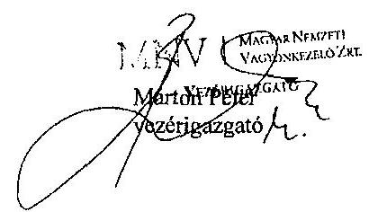

---

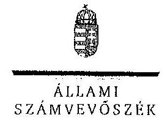

ELNÖK

Ikt.szám: V-0123-446/2014.

Márton Péter úr
vezérigazgató
MNV Zrt.

Budapest

Tisztelt Vezérigazgató Úr!

A „Jelentéstervezet az állami tulajdonban (résztulajdonban) lévő gazdálkodó szervezetek vagyonérték-megőrző és gyarapító tevékenységének ellenőrzéséről egyes kiemelt közszolgáltató társaságoknál vagy hasonló tevékenységet végző társaságcsoportoknál - Tiszaamenti Regionális Vízművek Zrt. " című jelentéstervezetre tett észrevételeit köszönettel megkaptam.

Az Állami Számvevőszék észrevételekre vonatkozó álláspontjáról a felügyeleti vezető által készített részletes tájékoztatást csatoltan megküldöm.

Tájékoztatom Vezérigazgató urat, hogy a számvevőszéki jelentés az elfogadott észrevételek figyelembevételével készül.

Budapest, 2014.
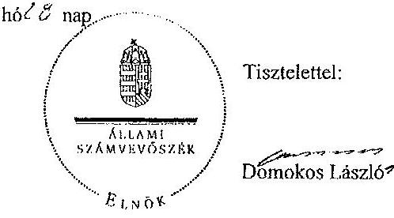

Melléklet: Tájékoztatás az elfogadott és az el nem fogadott észrevételekről

---

# Tájékoztatás   az elfogadott és az el nem fogadott észrevételekről 

A „Jelentéstervezet az állami tulajdonban (résztulajdonban) lévő gazdálkodó
 szervezetek vagyonérték-megőrző és gyarapító tevékenységének ellenőrzéséről egyes kiemelt közszolgáltató társaságoknál vagy hasonló tevékenységeit végző társaságcsoportoknál - Tiszamenti Regionális Vízművek Zrt." című jelentéstervezetre az MNV/01/183/1/2013. iktatószámú levelében tett észrevételeit áttekintettük, azok kezelésével kapcsolatban a következő tájékoztatást adom.

## Bevezetés 3. oldal második bekezdés

A tulajdonosi joggyakorlást érintő, 2013. június 28-tól érvényes pontosítást elfogadva a bekezdést kiegészítjük a következőkkel:
„A Vtv. 2013. június 28-tól hatályos rendelkezése alapján az államot megillető jogok és kötelezettségek összességét tulajdonosi joggyakorlóként törvény, vagy miniszteri rendelet eltérő rendelkezésének hiányában az MNV Zrt. gyakorolja."

## 1. fejezet 11. oldal 1. pont és 12. oldal 4. pont javaslat

A jelentéstervezetben szereplő, a TRV Zrt. által kezelt állami tulajdonban lévő eszközökön megvalósított beruházások és értéknövelő felújítások elszámolását érintő megállapítások, amelyekhez az MNV Zrt. vezérigazgatójának címzett 1. és 4. számú javaslatok kapcsolódnak, helytállóak, az észrevételekben a megállapításokat nem kifogásolják.

Az értéknövelő beruházások elszámolásának problémája levelük szerint nem egyedi, hanem minden egyéb vagyonkezelőnél általános problémaként merült fel az állami vagyonnal való gazdálkodásról szóló 254/2007. (X. 4.) Korm. rendelet (Vhr.) hatálybalépése óta.

A Vhr. 2013. november 30. napjától hatályos módosítása szerint - ami a jelentéstervezet készítésének időszakában történt - az új előírásokat a rendelet hatálybalépésekor hatályos vagyonkezelési jogviszonyokban a felek a rendelet hatálybalépéséig meg nem történt elszámolásokra is alkalmazhatják. A megállapításokhoz kapcsolódó javaslatok ebbe a körbe tartoznak, ezért az MNV Zrt. vezérigazgatójának címzett 1. és 4. számú javaslatot a jelentéstervezetből töröljük.

A megállapítások ugyanakkor az állami vagyonnal való felelős gazdálkodás szempontjából fontos területeket érintenek. Az állami vagyonon végzett beruházások, értéknövelő felújítások elszámolásának, megfelelő nyilvántartásának megvalósulása biztosíthatja a szabályszerű vagyongazdálkodást. A Vhr. 2013. november 30-tól hatályos módosítása lehetővé teszi, hogy a folyamatban lévő ügyekben a felek (TRV Zrt. és MNV Zrt.) számlázási kötelezettség nélkül is elszámoljanak egymással, szükség esetén módosíthassák a vagyonkezelési szerződést, de a

---

felek megállapodása alapján a számlázást is alkalmazhatják. Minderre tekintettel a beruházások elszámolása rendezésének érdekében - az ellenőrzött szervezetekkel történő, törvény által előírt egyeztetés lezárását követően - az Állami Számvevőszék figyelemfelhívó levélben fogja jelezni a kockázatosnak tartott kérdéseket.

# I. fejezet 13. oldal 5. pont javaslat 

A levelében a függetlenített belső ellenőrzéssel kapcsolatban leírtak nincsenek ellentmondásban a jelentéstervezetben tett megállapításainkkal. A véleményezésre megküldött jelentéstervezetben a Társaság vezérigazgatójának tett 2/c javaslatunkban már megfogalmaztuk, hogy a Társaság működtessen függetlenített belső ellenőrzést.

A jelentéstervezetben szereplő javaslatot megalapozó megállapítás tartalmazza, hogy az FB 2010-ben kifogásolta az SZMSZ által előírt függetlenített belső ellenőrzés hiányát. A kifogásolt javaslatot - mint tulajdonosi joggyakorlónak - az MNV Zrt. vezetőjének címeztük, mert az FB tulajdonosi érdeket szolgáló kifogása ellenére az ellenőrzési tapasztalataink szerint az MNV Zrt. nem tett a tulajdonosi felelősségéből következő eredményes lépéseket a hiányosságok megszüntetésére.

Az egyértelműség érdekében a javaslatot az alábbira pontosítjuk:
„Vizsgálja ki a Társaság függetlenített belső ellenőrzése több éven át tartó hiányának a tulajdonosi joggyakorlással összefüggő körülményeit, és annak eredményétől függően, szükség esetén intézkedjen a felelősség megállapításáról."

Tájékoztatom Vezérigazgató urat, hogy a számvevőszéki jelentés mellékleteként szerepeltetjük a jelentéstervezethez tett észrevételeit, valamint az azokra adott válaszunkat.

Budapest, 2014. 134 hó 78 nap

Makkai Mária
felügyeleti vezető

---

# 1111/3/2014. 

## 00019/2014

## ÁLLAMI SZÁMVEVŐSZÉK   1052 Budapest, Apáczai Csere János utca 10.   Budapest 4. Pf. 54

Makkai Mária felügyeleti vezető részére

Tisztelt Makkai Mária!

Ikt.szám: 12/4343

A V-0123-413/2013 iktató számú levelük mellékleteként megküldött jelentéstervezettel kapcsolatban az alábbi észrevételt tesszük:
4. oldalon rögzítésre került, hogy:
„víziközmű szolgáltatással ellátott települések száma 2012. év végén 192 volt." Az integrációs tevékenység következtében a csatlakozás a települések vonatkozásában 2013. január 1-jén történt meg.
A TRV Zrt. a Forrás Kft-ben 6,19%-os tulajdoni részesedéssel rendelkezik. 6. oldal

A 254/2007 (X.4.) Kormányrendelet 9§6.szakasz b. pontja előírja, hogy az egyéb vagyonkezelőnek az MNV Zrt.-től előzetes írásbeli engedélyt köteles kérni az SZT szerinti beruházáshoz, felújításhoz. A Kormányrendelet nem határozza meg ennek a formáját. A kialakult gyakorlat alapján minden évben az üzleti tervben rögzítettek alapján tájékoztattuk a tárgyévben várható beruházásokról az MNV Zrt.-ot.
Társaságunk a Kisköre KEOP 1.2.0 szennyvízelvezetés és tisztítás tárgyában benyújtott pályázat vonatkozásában engedélyt kért a jogelőd Kincstári Vagyoni Igazgatóságtól. A hivatkozott kormányrendelet átmeneti rendelkezései nem írták elő, hogy a jogutód engedélyét is meg kell kérnünk. Megítélésünk szerint az engedély megfelel a Vhr 9§.6 bekezdésnek. 7.oldal

Társaságunk a felújított Kiskörei szennyvíztelep aktiválásakor próba számlát bocsátott ki és küldött meg az MNV Zrt. felé - tájékoztató jelleggel - azért, hogy ilyen tartalmú szoros számadású rendszerben kiállított számla az alapító szempontjából megfelelő-e. Tekintettel arra, hogy próba számla került kiállításra, így sztornózásra nem volt szükség. A Nemzeti Adó- és Vámhivatal vizsgálata során ezzel kapcsolatosan észrevételt nem tett a jegyzőkönyvben. A NAV jegyzőkönyvben foglaltakra adótanácsadással foglalkozó társaság írt fellebbezést, szakmai álláspontjuk az volt, hogy

---

Tiszamenti Regionális Vízművek Zrt.

Gazdasági igazgató
5800 Szolnok, Emszit. Lója út 5.
Tel. (56) 422902 + Fax. (56) 372029
@ek. www.bred.be
Emszit. serjac.kezeleset.be

számla kiállítása nem szükséges az értéknövelő beruházások vonatkozásában. Érvrendszerük egyik pontja az alábbiakat tartalmazza.
„A Társaság az állami tulajdonon végez beruházást, felújítást, és ezek polgári jogi értelemben a vagyonkezelésbe vett ingatlanok alkotórészét képezik, azaz az üzembe helyezésük időpontjában a törvény (Ptk.) erejénél fogva az állam tulajdonába kerülnek, anélkül, hogy ehhez bármiféle egyéb jogi aktusra (pl. birtokbaadás) lenne szükség. Nem jön létre tehát új dolog, nincs mit átadni az MNV Zrt. részére, és nincs mit visszaadni a Társaság vagyonkezelésébe, hiszen már a Társaság vagyonkezelésében állnak azok a dolgok, amelyek alkotórészét képezik az általa végzett beruházások, felújítások.

Következésképpen, ellenérték fejében teljesített termékértékesítés vagy szolgáltatásnyújtás (vagy az Áfa tv. által annak minősülő ingyenes termékátadás vagy szolgáltatásnyújtás) hiányában nemcsak számlázási kötelezettség, hanem áfa-kötelezettség sem keletkezik."

Az értéknövelő beruházás, felújítás kérdését új alapokra helyezte a 457/2013/XI.29/ Kormányrendelet.

Megjegyezzük, hogy a pótlási kötelezettség teljesítésére irányuló beruházás aktiválásakor a vagyonkezelési szerződés módosítása nem szükséges.

1998-ban kiadott vagyongazdálkodási szabályzat nem lehet összhangban a 2000. évi C. törvénnyel az elhatárolás vonatkozásában.

# 9. oldal 

Az állami vagyonon végrehajtott változások elsősorban a vagyon szinten tartását, állag megóvását biztosították. A pótlási kötelezettség teljesítése nem vonja maga után a vagyonkezelési szerződés módosítását. Az értéknövelő felújítások vonatkozásában - bizonyos feltételek megléte esetén - a vagyonkezelési szerződés módosítása szükséges.
Társaságunk által végrehajtott értéknövelő beruházások a meglévő szennyvíztelep fejlesztésére irányult, a vagyonkezelésbe átadott eszköz értéke változott, az aktiválás során.
A rendeltetésszerűen használatba vett tárgyi eszközök után a tervszerinti értékcsökkenést el kell számolni addig, amíg azokat rendeltetésszerűen használják. /SZT.52§7 pont./
Tekintettel arra, hogy a fejlesztés során létrejött eszköz használatban volt, véleményünk szerint az értékcsökkenés elszámolásának elmulasztása sérti a SZT előírásait.

Minden évben a főkönyvi és analitikus nyilvántartások alapján elkészül a vagyonkataszteri jelentés, melyet megküldünk az MNV Zrt. részére, ez alapján az állományi adatok egyeztetése megvalósult.

---

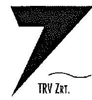
11. oldal

Megítélésünk szerint az FB az üzleti terv és az éves beszámoló keretében vizsgálta a vagyonváltozást és gazdálkodást.

Független belső ellenőrzés a vizsgált időszakban nem működött, viszont 2013 évre ellenőrzési tervvel rendelkezett és az végrehajtásra is került.
12. oldal

A 7. oldalnál kifejtve.
16 oldal 1/1
valamint egy településen lévő vízmű- és szennyvíztelep
22. oldal

A vizsgált időszakban nem egy vezérigazgató tevékenykedett. Úgy ítélték meg, hogy az állami vagyon állománya nem olyan mértékű, hogy önálló vagyongazdálkodásért felelős szervezeti egység létrehozása szükséges volna.

Szolnok, 2014. január 2.

Üdvözlettel:
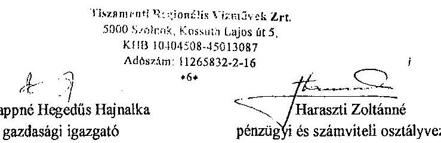

Pappné Hegedűs Hajnalka gazdasági igazgató

---

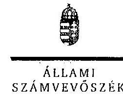

# Hajdú Gábor

vezérigazgató
Tiszamenti Regionális Vízművek Zrt.

## Szolnok

## Tisztelt Vezérigazgató Úr!

A „Jelentéstervezet az állami tulajdonban (résztulajdonban) lévő gazdálkodó szervezetek vagyonérték-megőrző és gyarapító tevékenységének ellenőrzéséről egyes kiemelt közszolgáltató társaságoknál vagy hasonló tevékenységet végző társaságcsoportoknál - Tiszamenti Regionális Vízművek Zrt." című jelentéstervezetre tett észrevételeiket köszönettel megkaptam.

Az Állami Számvevőszék észrevételekre vonatkozó álláspontjáról a felügyeleti vezető által készített részletes tájékoztatást csatolt levélben megküldöm.

Tájékoztatom Vezérigazgató urat, hogy a számvevőszéki jelentés az elfogadott észrevételek figyelembevételével készül.

Budapest, 2014. 2. hó 28 nap
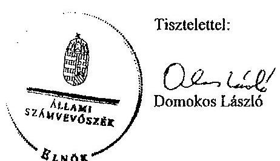

Melléklet: Tájékoztatás az elfogadott és az el nem fogadott észrevételekről

---

# Tájékoztatás   az elfogadott és az el nem fogadott észrevételekről 

A „Jelentéstervezet az állami tulajdonban (résztulajdonban) lévő gazdálkodó szervezetek vagyonérték-megőrző és gyarapító tevékenységének ellenőrzéséről egyes kiemelt közszolgáltató társaságoknál vagy hasonló tevékenységet végző társaságcsoportoknál - Tiszamenti Regionális Vízművek Zrt." című jelentéstervezetre a VEZ/18-3/2013. iktatószámú levelükben tett észrevételeket áttekintettük, azok kezelésével kapcsolatban a következő tájékoztatást adom.

## 4. oldal

A települések száma esetében a dátumot a 2012. év vége helyett pontosítjuk 2013. január 1-jére, továbbá a Forrás Kft.-ben meglévő tulajdoni részesedés esetében a 6,19%-ot szerepeltetjük a jelentéstervezetben.

## 6. oldal

A beruházást, felújítást érintő előzetes írásbeli engedéllyel kapcsolatos észrevételek megerősítik a jelentéstervezetben leírtakat. Észrevételük szerint is az üzleti tervekben rögzítettek alapján tájékoztatják az MNV Zrt.-t, ami nem felel meg a Vhr. 9. § (6) bekezdésben előírt előzetes engedélykérésnek. A jelentéstervezet azt a tényt is tartalmazza, hogy a Kisköre KEOP 1.2.0 szennyvízelvezetés és tisztítás tárgyában benyújtott pályázatnál a pályázat benyújtásához kértek engedélyt, de a beruházás megvalósításához nem.

## 7. oldal

Az ellenőrzés részére átadott dokumentumok alapján a TRV részéről a 101/88/2012. számú számla kibocsátása 2011. július 15-ei teljesítéssel megtörtént, majd ezt visszavonták. A NAV pedig éppen a számlázás elmaradása miatt állapított meg áfa hiányt, bírságot és pótlékfizetési kötelezettséget.

A közérthető megfogalmazás miatt a jelentéstervezetben a 7. oldal harmadik bekezdésének második mondatát a következőre pontosítjuk: „Miután annak kifizetése az MNV Zrt. részéről nem történt meg, ezért a Társaság az Áfa tv.-t sértve, szabálytalanul visszavonta a számláját.". Továbbá a 18. oldal első bekezdésében a „sztornó” kifejezés helyett a „visszavonás” kifejezést szerepeltetjük, valamint a bekezdés utolsó mondatát töröljük.

A visszapótlási kötelezettség teljesítésével kapcsolatban a jelentéstervezet azt tartalmazza, hogy azt a TRV „az elszámolt értékcsökkenést meghaladóan értéknövelő beruházásokkal teljesítette”, amely esetben az ellenőrzött időszakban hatályos Vhr. 18. § (1) bekezdése értelmében a vagyonkezelési szerződést módosítani kell. Ezért a jelentéstervezet módosítása nem indokolt.

---

Az 1998-ban kiadott vagyongazdálkodási szabályzat és a 2000. évi C. törvény közötti összhang a szükséges aktualizálásokat követően fennállna. Az ellenőrzés éppen az aktualizálás elmaradását hiányolja.

# 9. oldal 

Az értékcsökkenési leírással kapcsolatos észrevételük nem indokolja a jelentéstervezetben leírtak módosítását, mivel abban nem szerepel a számviteli törvény megsértésére vonatkozó megállapítás.

Az állami vagyon nyilvántartását a 2010. és a 2012. évben az MNV Zrt.-vel a TRV nem egyeztette. Ezt nem helyettesíti az, hogy az MNV Zrt. részére tájékoztatásul megküldik a vagyonkataszteri jelentést. Az egyeztetés hiányát alátámasztja a jelentéstervezet 10. oldalán szerepeltetett megállapítás, miszerint „az egyeztetés elmaradása miatt a Társaság által 2012-ben értékesítésre javasolt, a társasági tulajdonként nyilvántartott (tiszakécskei) ingatlan kapcsán az MNV Zrt. tárta fel a nyilvántartás hiányosságát."

## 11. oldal

Az FB-nek az alapító
 okirat szerint feladata írásbeli véleményt készíteni az éves beszámolóról. Ez nem azonos a gazdálkodás ellenőrzésével, ezért a jelentéstervezet módosítást nem igényel. Az alapító okirat az FB önálló feladataként határozza meg a működés és gazdálkodás ellenőrzését.

## 13. és 15. oldal (az észrevételben 12. oldal)

A Vhr. 2013. november 30. napjától hatályos módosítása szerint - ami a jelentéstervezet készítésének időszakában történt - az új előírásokat a rendelet hatályba lépésekor hatályos vagyonkezelési jogviszonyokban a felek a rendelet hatálybalépéséig meg nem történt elszámolásokra is alkalmazhatják. A TRV Zrt. vezérigazgatójának címzett 5. számú javaslatot megalapozó megállapítások ebbe a körbe tartoznak, ezért a jelentéstervezetből a javaslatot töröljük, valamint az 1. sz. javaslatot megalapozó megállapítást és a javaslatot a következőkre módosítjuk:
„A TRV Zrt. a Vhr. 9. § (6) bekezdésében foglaltak ellenére a beruházáshoz és az értéknövelő felújításhoz az MNV Zrt.-től előzetes írásbeli engedélyt nem kért, valamint a beruházások kivitelezésének megkezdéséről, annak lefolytatásáról az MNV Zrt.-t nem tájékoztatta. A TRV Zrt. nem gondoskodott a Vhr. 14. § (1) bekezdésében előírt egységes nyilvántartás biztosítása érdekében való együttműködésről.

Javaslat:
a) Intézkedjen a Vhr. 9. § (6) bekezdésében foglaltak alapján a vagyonkezelt eszközön elszámolt bármely beruházáshoz, felújításhoz kapcsolódóan az MNV Zrt.-től előzetes írásbeli engedély kéréséről, valamint a vagyonkezelési szerződésben meghatározott módon a beruházások, felújítások beszámolási kötelezettségének teljesítéséről.

---

b) Gondoskodjon a Vhr. 14. § (1) bekezdésében foglaltaknak megfelelő együttműködésről a nyilvántartás egységessége, pontossága és az adatellenőrzések biztosítása érdekében."

A törölt és pontosított javaslatot megalapozó megállapítások ugyanakkor az állami vagyonnal való felelős gazdálkodás szempontjából fontos területeket érintenek. Az állami vagyonon végzett beruházások, értéknövelő felújítások elszámolásának, megfelelő nyilvántartásának megvalósulása biztosíthatja a szabályszerű vagyongazdálkodást. A Vhr. 2013. november 30-tól hatályos módosítása lehetővé teszi, hogy a folyamatban lévő ügyekben a felek (TRV Zrt. és MNV Zrt.) számlázási kötelezettség nélkül is elszámoljanak egymással, szükség esetén módosíthassák a vagyonkezelési szerződést, de a felek megállapodása alapján a számlázást is alkalmazhatják. Minderre tekintettel a beruházások elszámolása rendezésének érdekében - az ellenőrzött szervezetekkel történő, törvény által előírt egyeztetés lezárását követően - az Állami Számvevőszék figyelemfelhívó levélben fogja jelezni a kockázatosnak tartott kérdéseket.

# 16. oldal $1 / 1$. 

Az első bekezdésben „valamint a két települési víziközmű" szövegrész helyett „valamint egy településen lévő vízmű- és szennyvíztisztító telep" szövegrészt szerepeltetjük.

## 22. oldal

Az észrevétel alapján a 22. oldal első bekezdés harmadik mondatát töröljük.
Tájékoztatom Vezérigazgató urat, hogy a számvevőszéki jelentés mellékleteként szerepeltetjük a jelentéstervezethez tett észrevételeket, valamint az azokra adott válaszunkat.

Budapest, 2014. $\quad \mathrm{C} 5 \quad$ hó J3. nap

Makkai Mária
felügyeleti vezető
