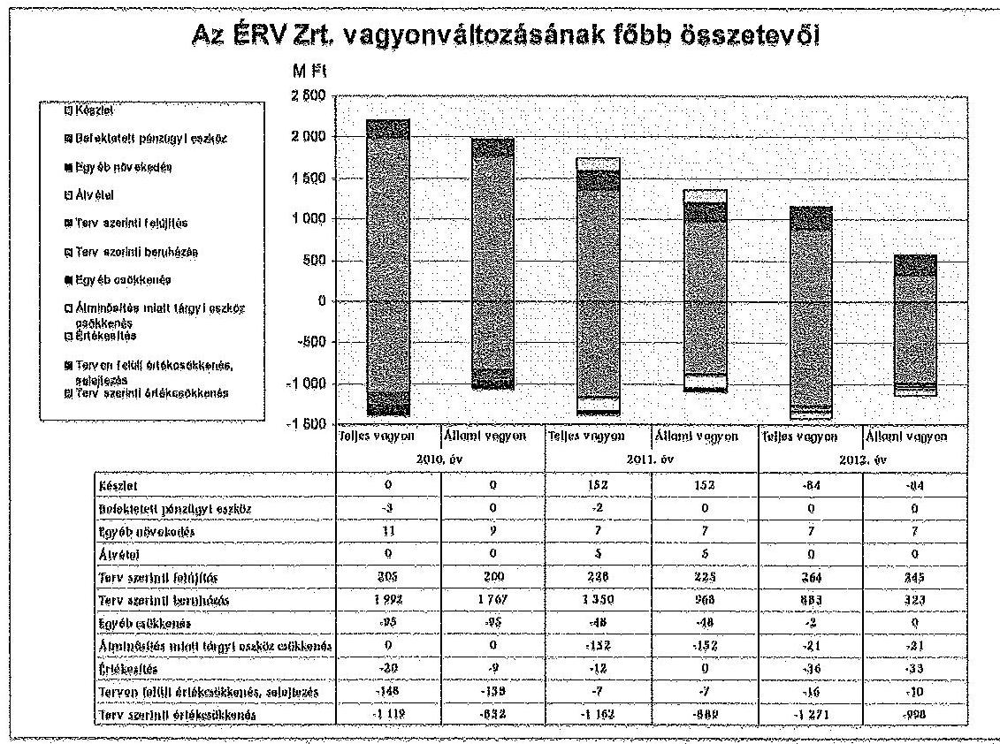
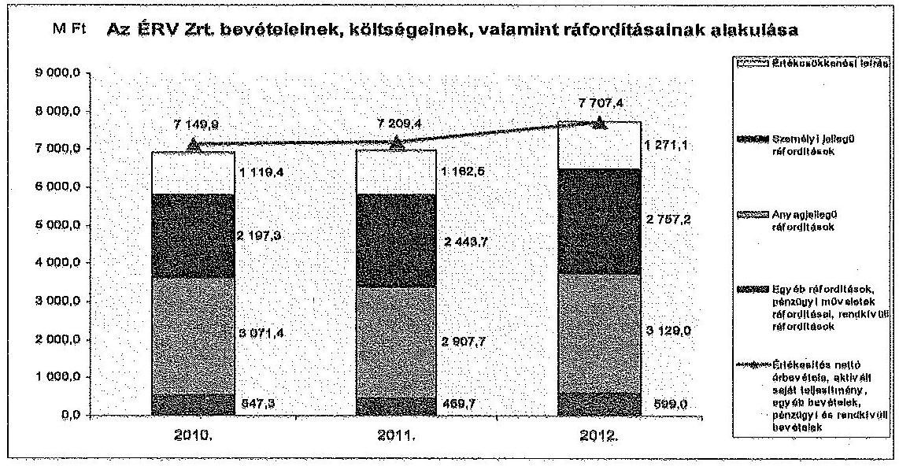
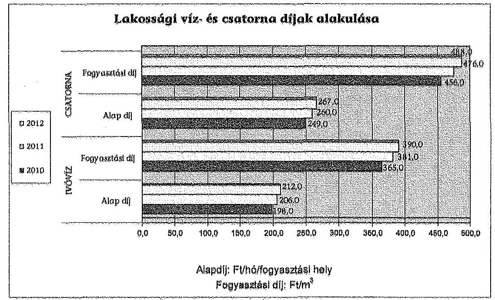
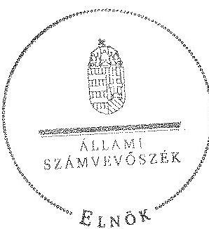
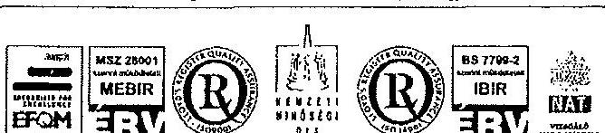
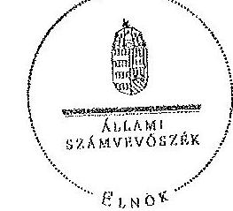
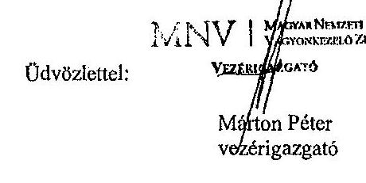
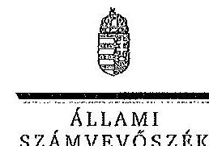
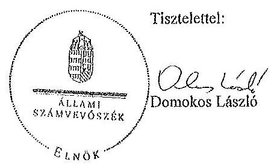

# JELENTÉS 

az állami tulajdonban (résztulajdonban) lévő gazdálkodó szervezetek vagyonérték-megőrző és gyarapító tevékenységének ellenőrzéséről egyes kiemelt közszolgáltató társaságoknál vagy hasonló tevékenységet végző társaságcsoportoknál Északmagyarországi Regionális Vízművek Zrt.

---

# Állami Számvevőszék 

Iktatószám: V-0123-495/2014.
Témaszám: 1158
Vizsgálat-azonosító szám: V06020103

## Az ellenőrzést felügyelte:

## Makkai Mária

felügyeleti vezető
Az ellenőrzést vezette és az ellenőrzés végrehajtásáért felelős:
Sali Sándorné
ellenőrzésvezető
A számvevőszéki jelentés összeállításában közreműködött:
Lucza Anikó
számvevő tanácsos

Az ellenőrzést végezték:
Gaálné Izsó Éva
Kiss Péter
Munkácsi Márta
számvevő tanácsos
külső szakértő
külső szakértő

---

# TARTALOMJEGYZÉK 

BEVEZETÉS ..... 3
I. ÖSSZEGZŐ MEGÁLLAPÍTÁSOK, KÖVETKEZTETÉSEK, JAVASLATOK ..... 7
II. RÉSZLETES MEGÁLLAPÍTÁSOK ..... 13

1. Az MNV Zrt. és az ÉRV Zrt. vagyongazdálkodással kapcsolatos tevékenysége ..... 13
1.1. A szabályszerű vagyongazdálkodás feltételeinek kialakítása ..... 13
1.2. A vagyonváltozást eredményező döntések szabályszerűsége ..... 16
2. Az ÉRV Zrt. vagyongazdálkodással kapcsolatos szabályozási tevékenysége ..... 18
2.1. A szabályszerű vagyongazdálkodás feltételeinek kialakítása ..... 18
2.2. Az ÉRV Zrt. vagyonnyilvántartása ..... 19
2.3. Az ÉRV Zrt. kapcsolattartása az MNV Zrt.-vel ..... 24
2.4. A vagyonváltozást eredményező döntések megalapozottsága, szabályszerűsége ..... 27
2.5. A vagyon értékének megőrzése, gyarapítása ..... 30
3. Az ÉRV Zrt. által működtetett kontroll- és monitoring rendszer ..... 35
3.1. A belső kontrollrendszer ..... 35
3.2. Az információáramlási és monitoring rendszer ..... 36
3.3. A kapcsolt vállalkozásban lévő részesedés ..... 37

## MELLÉKLETEK

1. számú Rövidítések jegyzéke
2. számú Értelmező szótár
3. számú A gazdasági társaság vagyonának alakulása 2010-2012. években (ezer Ftban)
4. számú A gazdasági társaság eredményének alakulása 2010-2012. években (ezer Ft-ban)
5. számú A befektetett eszközök állományának alakulásáról
6. számú A gazdasági társaság működéséről a 2010-2012. években
7. számú Az Északmagyarországi Regionális Vízművek Zrt. vezérigazgatójának észrevétele
8. számú Az Északmagyarországi Regionális Vízművek Zrt. vezérigazgatójának észrevételére adott válasz

---

9. számú A Magyar Nemzeti Vagyonkezelő Zrt. vezérigazgatójának észrevétele
10. számú A Magyar Nemzeti Vagyonkezelő Zrt. vezérigazgatójának észrevételére adott válasz

---

# JELENTÉS 

## az állami tulajdonban (résztulajdonban) lévő gazdálkodó szervezetek vagyonérték-megőrző és gyarapító tevékenységének ellenőrzéséről egyes kiemelt közszolgáltató társaságoknál vagy hasonló tevékenységet végző társaságcsoportoknál Északmagyarországi Regionális Vízművek Zrt.

## BEVEZETÉS

A nemzeti vagyon alapvető rendeltetése a törvényekben meghatározott közfeladatok ellátásának biztosítása. A nemzeti vagyonnal felelős módon, rendeltetésszerűen kell gazdálkodni. A nemzeti vagyon megőrzése érdekében az Alaptörvénnyel összhangban az Nvtv. meghatározza a nemzetgazdasági szempontból kiemelt jelentőségű vagyont, amelybe beletartozik a vízellátás és a szennyvízelvezetés, -tisztítás feladatok elvégzéséhez szükséges közművagyon, amelynek állami tulajdonban történő megőrzése hosszú távon indokolt.

A vagyongazdálkodás feladata a nemzeti vagyon rendeltetésének megfelelő, az állam teherbíró képességéhez igazodó, elsődlegesen a közfeladatok ellátásához szükséges, egységes elveken alapuló, átlátható, hatékony és költségtakarékos működtetése, értékének megőrzése, állagának védelme, értéknövelő használata, hasznosítása és gyarapítása. A Vtv. 2. § (1) és az Nvtv. 7. § (1)-(2) bekezdései határozzák meg az állami vagyongazdálkodással összefüggésben a tulajdonosi joggyakorlással és a vagyongazdálkodással kapcsolatos feladatokat. A tulajdonosi joggyakorló a regionális víziközmű társaságok esetében 2010. június 16-ig a Magyar Állam nevében a Nemzeti Vagyongazdálkodási Tanács volt, feladatait az MNV Zrt. útján, annak ügyvezető szerveként látta el. Ezt követően a hatályos törvényi szabályozás szerint az állami vagyon tekintetében a tulajdonosi joggyakorlásra az állami vagyon felügyeletéért felelős miniszter jogosult, aki e feladatát szintén az MNV Zrt. útján látja el. A Vtv. 2013. június 28-tól hatályos rendelkezése alapján az államot megillető jogok és kötelezettségek összességét tulajdonosi joggyakorlóként törvény, vagy miniszteri rendelet eltérő rendelkezésének hiányában az MNV Zrt. gyakorolja.

A 2012. évet megelőzően az önkormányzati törvény elfogadásától (a 1990. évtől) döntően a települési önkormányzatok feladata volt a közműves ivóvízellátás és csatornaszolgáltatás biztosítása (3200 településen közel 400 víziközműszolgáltató működött). Az államnak feladatellátási kötelezettsége az öt állami regionális vízmű tekintetében volt. Az elmúlt években a vízfogyasztás visszaesett, ezáltal a szolgáltató közművek kapacitásának kihasználása csökkent. A

---

Vksztv. 2011. évi hatályba lépéséig nem volt olyan szervezet, illetve szabályozás, amely országosan koordinálta az eltérő tulajdonú, érdekeltségű és működési formájú rendszereket. Ezáltal nem volt biztosított a beruházások összehangolása, a források megfelelő elosztása, ezáltal a fenntartási és üzemeltetési költségek szükségesnél nagyobb mértékű emelkedésének megakadályozása. A 2011. december 31-én hatályba lépett Vksztv. célja az optimális üzemméret előírásával annak biztosítása, hogy a víziközművagyon kezelése egységesebb és a kapacitások kihasználása megfelelő legyen. A Magyar Energetikai és Közműszabályozási Hivatal a beruházások gördülő tervezésének összehangolásán keresztül kívánja biztosítani az indokolatlan költségek fogyasztói árakba való beépítésének elkerülését.

A regionális vízművek gazdálkodása a közérdeklődés középpontjában áll a gazdálkodásuk körébe tartozó vagyon nagysága, gazdálkodásuk sajátossága és az ebből adódó kockázatok, illetve az általuk ellátott közszolgáltatások minősége és hatékonysága miatt. Az ellenőrzés lefolytatását az indokolta, hogy az elmúlt években nem volt az állami regionális víziközművek működését, vagyongazdálkodását átfogóan értékelő ÁSZ ellenőrzés. Az Északmagyarországi Regionális Vízművek Zrt. (ÉRV Zrt., Társaság) 100%-ban állami tulajdonú, zártkörűen működő részvénytársaság volt. A Társaság víztermelési, vízkezelési, vízellátási, valamint szennyvíz gyűjtési és kezelési közfeladatot lát el, működési területe kiterjed Borsod-Abaúj-Zemplén, Nógrád és Heves megyére. A víziközmű-szolgáltatással ellátott települések száma 2012. év végén 190 volt, az ellátott lakosok száma meghaladta a 620 ezer főt.

Az ÉRV Zrt. a 2012. év végén 81 állami és 104 önkormányzati tulajdonú víziközművet üzemeltetett, 106 településen foglalkozott szennyvízelvezetéssel és -tisztítással. Az állami vagyon vagyonkezelése, működtetése mellett az ÉRV Zrt. a regionális rendszerekre csatlakozva, valamint azoktól függetlenül önkormányzati tulajdonban lévő közműrendszereket üzemeltet szerződések alapján. Az ellenőrzött időszakban a vezérigazgató személye 2010-ben változott.

A Társaság mérlegében a 2012. év végén szereplő összes eszközvagyon 22714,0 millió Ft, ebből a kezelésre átvett állami vagyon értéke 18569,4 millió Ft volt. Az ÉRV Zrt. saját tőkéje 2012. december 31-én 2374,5 millió Ft, ebből a jegyzett tőke 750,0 millió Ft volt, amely a 2010-2012. években nem változott. A 2012. év végén a tőketartalék 604,5 millió Ft, az eredménytartalék 1085,9 millió Ft volt. A 2012. évben a nettó árbevétel 6675,7 millió Ft, a mérleg szerinti eredmény 66,6 millió Ft veszteség volt. A 2012. év végén a kötelezettségek állományának értéke 19472,2 millió Ft, amelyből 17831,9 millió Ft hosszú lejáratú, 1640,3 millió Ft rövid lejáratú kötelezettség, a követelések összege pedig 1425,1 millió Ft volt, Az ÉRV Zrt.-nél az átlagos statisztikai létszám a 2012. év végén 706 fő volt.

Az ellenőrzés célja annak értékelése volt, hogy a gazdálkodó szervezet vezetése és a tulajdonosi jogok gyakorlója által hozott vagyongazdálkodási döntéseknél szabályszerűen, az elvárható gondossággal jártak-e el, olyan feltételeket alakítottak-e ki, hogy a gazdálkodó szervezet tulajdonában, illetve kezelésében, hasznosításában lévő vagyon értékét megőrizzék, gyarapítsák. A gazdálkodó szervezet az ellenőrzött időszakban betartotta-e a vagyonnal való gazdálkodásra vonatkozó jogszabályi rendelkezéseket és a helyi szabályzatok előírásait, a

---

rendelkezésre álló erőforrások felhasználásával teljesítette-e a tulajdonos részéről meghatározott célokat és feladatokat, a vagyonkezelő szervezet a tulajdonostól kapott felhatalmazás alapján az elvárható gondossággal felügyelte-e a társaság működését és vagyongazdálkodását.

Az ellenőrzés várható hozadékaként azt kívántuk megállapítani, hogy az állami és társasági vagyon tekintetében a közfeladatot ellátó gazdasági társaságok a VSZ betartásával folyamatosan biztosítják-e a nemzeti vagyon megőrzését, minőségének javítását és a közfeladatok ellátását. Az ellenőrzés az állam tulajdonosi joggyakorlásával összefüggő döntések szabályosságának, megalapozottságának és a szabályozási környezet változásának áttekintésével hozzáadott értéket teremt. Ezért az ellenőrzés fel kívánta tárni a vagyongazdálkodás feltételeinek, a vagyonérték megőrzésének, gyarapításának hiányosságait, egyúttal javaslatot téve azok kijavítására, illetve, megállapításaival hozzá kíván járulni a regionális vízművek gazdálkodásának átláthatóságához, a közszolgáltatás színvonalának javításához.

Az ellenőrzés típusa: szabályszerűségi ellenőrzés.
Az ellenőrzés időszaka: a 2010. január 1. és 2012. december 31. közötti időszak volt, kitekintéssel a helyszíni ellenőrzés befejezéséig - 2013. szeptember 2-ig - tartó időszak releváns folyamataira. Az ellenőrzés az Északmagyarországi Regionális Vízművek Zrt.-re és a Magyar Nemzeti Vagyonkezelő Zrt.-re terjedt ki.

Az ellenőrzés végrehajtásának jogszabályi alapját az ÁSZ tv. 5. § (4) bekezdésében foglaltak képezik.

Az ellenőrzés szakmai módszertana az ÁSZ hivatalos honlapján közzétett szakmai szabályokon alapult, amely a Legfőbb Ellenőrző Intézmények Nemzetközi Szervezete (INTOSAI) által kiadott nemzetközi standardok (ISSAI) figyelembevételével készült.

Az ÉRV Zrt. az ellenőrzés lefolytatásához tanúsítványok kitöltésével, valamint dokumentumok elektronikus megküldésével szolgáltatott adatokat. Az így rendelkezésre bocsátott adatok (információk) kontrollja a helyszíni ellenőrzés keretében történt. A vagyonváltozást eredményező döntések megalapozottságát, továbbá a vagyonérték-megőrző és vagyongyarapító tevékenység szabályszerűségét a számviteli nyilvántartásokban rögzített vagyonváltozások köréből véletlenszerű mintavétellel kiválasztott tételek ellenőrzésével értékeltük. Az ellenőrzés során alkalmazott rövidítések jegyzékét az 1. számú, a fogalmak magyarázatát a 2. számú, az ÉRV Zrt. gazdálkodására jellemző adatokat a 3-6. számú mellékletek tartalmazzák.

Az állami vagyonon végzett beruházások, értéknövelő felújítások elszámolásával kapcsolatos jogszabályi előírások a jelentés készítés időszakában megváltoztak. A Vhr. 2013. november 30. napjától hatályos módosítása szerint az új előírásokat a rendelet hatályba lépésekor hatályos vagyonkezelési jogviszonyokban a felek a rendelet hatálybalépéséig meg nem történt elszámolásokra is alkalmazhatják.

---

A jogszabályi előírás lehetőséget biztosít arra, hogy a folyamatban lévő ügyekben a felek (Regionális Vízművek és az MNV Zrt.) számlázási kötelezettség nélkül is elszámoljanak egymással, szükség esetén módosíthassák a vagyonkezelési szerződést, de megállapodásuk alapján a számlázást is alkalmazhatják. A jelentésben szereplő, a kezelt állami tulajdonban lévő eszközökön megvalósított beruházások és értéknövelő felújítások elszámolását érintő megállapítások helytállóak, az ellenőrzött időszakra vonatkozóan az ellenőrzés lefolytatásakor hatályos jogszabályokon alapul. A megváltozott jogszabályi körülményekre tekintettel, ugyanakkor az e tárgykörhöz kapcsolódó javaslatainkat - figyelemmel a jelenleg hatályos jogszabályi előírásokra - pontosítottuk.

Az ÁSZ a 2011. évi LXVI. törvény 29. §-a szerint a jelentéstervezetet megküldte az Északmagyarországi Regionális Vízművek Zrt. vezérigazgatójának és a Magyar Nemzeti Vagyonkezelő Zrt. vezérigazgatójának egyeztetésre. A beérkezett észrevételeket és az azokra adott választ a jelentés 7-10. számú mellékletei tartalmazzák.

---

# I. ÖSSZEGZŐ MEGÁLLAPÍTÁSOK, KÖVETKEZTETÉSEK, JAVASLATOK 

Az ÉRV Zrt. az általa kezelt állami vagyonnal kapcsolatos gazdálkodási tevékenységét az ellenőrzött időszakban az 1998. évben a Kincstári Vagyoni Igazgatósággal (KVI) kötött vagyonkezelési szerződés (VSZ) alapján végezte. A VSZ a Társaság vagyonkezelési kötelezettségét kilenc kizárólagos állami tulajdonban lévő regionális, valamint négy települési víziközmű tekintetében rögzítette. A VSZ előírta az állami vagyon hatékony működtetését, állagának védelmét, valamint a vagyonérték megőrzésére és gyarapítására vonatkozó feltételeket.

A vagyonkezelésében lévő állami vagyonnal történő szabályszerű vagyongazdálkodás feltételeit az ellenőrzött időszakban, illetve azt megelőzően - a VSZ módosításában érintett felek - részben teremtették meg, mivel a VSZ jogszabályi változásoknak (Vtv., Vhr., Vksztv., Áht ${ }_{1,2}$ ) megfelelő módosítására többszöri kezdeményezés ellenére a helyszíni ellenőrzés lezárásáig nem került sor. A hatályos VSZ nem biztosította teljes körűen a szabályszerű gazdálkodási környezetet. A VSZ-en a 2000. évet követően az értéknövelő beruházásoknak megfelelő vagyonváltozásokat nem vezették át, annak ellenére, hogy a Vhr. előírásai szerint a VSZ-t módosítani kell, ha a vagyonkezelésben lévő állami vagyonon értéknövelő beruházásra, felújításra kerül sor, illetve a vagyonkezelő új, állami vagyonba tartozó eszközt hoz létre. A Vhr. szerint a
 VSZ módosításával egyidejűleg az értéknövelő beruházásokat és felújításokat az értékesítés általános előírásainak megfelelően számlázni kell az MNV Zrt. felé, azonban az ellenőrzött időszakban ez nem történt meg.

A Társaság éves üzleti tervei tartalmazták a tervezett beruházásokat, azonban azok részletes adatai (pl. a beruházások műszaki összetétele, szakmai indokoltsága, feltételei, forrásai) az üzleti tervekben nem szerepeltek, ezt az MNV Zrt. nem kifogásolta, illetve nem követelte meg. Az ÉRV Zrt. a Vhr. előírásainak megfelelően a beruházások végrehajtásához, ezen belül a beruházásokhoz, felújításokhoz kapcsolódó tulajdonjog megszerzése tekintetében beruházásonként megkérte az MNV Zrt. előzetes engedélyét. A Társaság 3727,2 millió Ft összegben végzett az állami vagyonon beruházást, az aktivált beruházások, felújítások értéke 2010-2012 között 3781,6 millió Ft volt. A Vhr.-rel szemben a VSZ nem írta elő a beruházásokról és a felújításokról történő beszámoltatás módját és gyakoriságát. Az MNV Zrt. az üzleti jelentés jóváhagyásával az évente elvégzett beruházásokat, felújításokat elfogadta. Az ÉRV Zrt. a beruházásokról az éves beszámolóban foglaltakon túl, a Vhr.-ben előírtak ellenére nem számolt be, illetve nem tájékoztatta az MNV Zrt.-t.

A 2011. év végéig a Társaság az üzembe helyezett közmű beruházásaihoz felhasznált külső forrásokat (térítés nélkül átvett eszközök, fejlesztési célra kapott támogatás), valamint a 2011. év végén kapott KEOP támogatás értékét a Vgsz. rendelkezései és a KVI-vel megkötött kincstári vagyon kezelési, gazdálkodási és nyilvántartási szabályzata szerint az állammal szembeni hosszú lejáratú kötelezettségek között tartotta nyilván. Ez nem felelt meg a Számv. tv. előírásainak,

---

miszerint a nem állami forrásból megvalósított beruházásnál a rendkívüli bevételként elszámolt, fejlesztési célra - visszafizetési kötelezettség nélkül - kapott támogatás összegét a passzív időbeli elhatárolások között halasztott bevételként kell kimutatni. A Számv. tv. előírásaitól eltérően a hosszú lejáratú kötelezettségek között nyilvántartott összeg a 2010-2011. években 144,4 millió Ft volt. 2012-től az állami közművagyonon végzett és aktivált beruházásokhoz felhasznált külső források értékét a passzív időbeli elhatárolások között tartotta nyilván a Társaság a Számv. tv. előírásainak megfelelően.

A Vtv. és a Vhr. végrehajtása érdekében az MNV Zrt. 2011. június 21-én tájékoztató levelet küldött a regionális vízmű társaságoknak, amelyben iránymutatást adott az állami vagyonnal kapcsolatos számviteli elszámolások kezeléséhez. Ebben rögzítette a beruházások és beszerzések elszámolásának rendjét és folyamatát. Előírta a 2008. január 1. és 2011. június 30. között üzembe helyezett beruházások és értéknövelő felújítások MNV Zrt. részére történő értékesítését - 2011. december 31-ig -, illetve azzal egyidejűleg a VSZ módosítását. Az MNV Zrt. rögzítette, hogy amennyiben az értékesítés áfaköteles, akkor a beruházás, felújítás áfatartalmát a Társaság részére megtéríti. Az ÉRV Zrt. a tájékoztató levélben előírtakat nem hajtotta végre, mivel a számlázás áfa- és egyéb adófizetési kötelezettségét, továbbá a visszamenőleges hatályú rendezés (önellenőrzés) jogkövetkezményéből adódó fizetési kötelezettségeket az ÉRV Zrt., valamint az MNV Zrt. nem finanszírozta.

A tulajdonosi joggyakorló az alapító okiratban a részére meghatározott jogkörben az állami vagyon kezelésével és a Társaság működésével kapcsolatos döntéseket meghozta. Az alapító okiratban meghatározták, hogy az alaptevékenységhez nem kapcsolódó kötelezettségvállalások 500,0 millió Ft összeghatárig a vezérigazgató hatáskörébe tartoznak - az FB jóváhagyása mellett -, amely nagyfokú önállóságot biztosított a Társaság gazdálkodási döntéselhez és azok végrehajtásához. Az alapító döntött az éves üzleti terv, illetve a javadalmazási szabályzat elfogadásáról, a Társaság éves beszámolójának és üzleti jelentésének jóváhagyásáról, a vezérigazgatói prémium kifizetéséről, az FB tagok kinevezéséről, visszahívásáról, a könyvvizsgáló megválasztásáról és az előírt értékhatárt meghaladó kötelezettségvállalásokról. Az MNV Zrt. az üzleti terv kidolgozására vonatkozó irányelveket, feltételeket (bértömeg, létszám engedélyezett növekedése, premizálás rendszere) évente meghatározta, a Társaság az elvárásoknak megfelelően dolgozta ki üzleti terveit. Az MNV Zrt. vagyont érintő döntése volt az ellenőrzött időszakban az ÉRV Zrt. javadalmazási szabályzatának elfogadása, a vezérigazgató prémiumfeladatainak kiírása, rögzítve a kifizetés feltételeit és korlátait.

Az MNV Zrt. által kialakított kontrolling rendszer alkalmas volt a Társaság működésével kapcsolatos kockázatok feltárására. Az ellenőrzött időszakban a kockázatok csökkentéséhez hozzájárult többek között az MNV Zrt. által kiadott egységes számviteli politika, ezen belül 2012-től az értékcsökkenési kulcsok azonos elvek szerinti meghatározása, azonban a beruházásokkal kapcsolatban szakmai elvárásokat nem fogalmazott meg. Az ÉRV Zrt.-re bízta a beruházások, értéknövelő felújítások indokoltságának és nagyságrendjének meghatározását. A tulajdonos a vagyonkezeléssel kapcsolatos szakmai feladatok elvégzését teljes körűen a Társaság hatáskörébe utalta.

---

Az MNV Zrt. a tulajdonosi ellenőrzési rendszert kialakította és az ellenőrzött időszakban működtette. A Társaság működésének figyelemmel kísérése a bekért adatszolgáltatásokra épülő kontrollokon alapult. Az MNV Zrt. 2012-ben tulajdonosi ellenőrzés keretében vizsgálta az ÉRV Zrt. vagyonvédelmi, vagyonérték megőrző tevékenységének szabályozottságát és a Társaság szervezeti felépítésében való elhelyezkedését. A tulajdonosi ellenőrzés megállapította a szervezeti változások átvezetésének elmaradása miatt a szabályzatok aktualizálásának szükségességét.

Az NVT 2009-ben a vagyongazdálkodás fejlesztésére vagyonstratégiai célkitűzést fogalmazott meg az ÉRV Zrt.-re vonatkozóan, amelyet 2010. decemberben a Társaság beépített a 2011-2013. évekre vonatkozó középtávú stratégiájába. A stratégiai tervben az ÉRV Zrt. figyelembe vette a tulajdonos elvárásait.

Az értékcsökkenés elszámolása megfelelt a Számv. tv. előírásainak az ellenőrzött időszakban. A Társaság 2011-ig abszolút összegű értékcsökkenési elszámolást alkalmazott, ami alapján az állami eszközök esetében a havi abszolút összegű értékcsökkenési leírások összegét a Tao. tv. szerinti értékcsökkenési kulcsok figyelembe vételével és a kihasználtság alapján, egyedileg határozta meg. A Társaság az állami vagyonon végrehajtott beruházások és értéknövelő felújítások esetében az üzembe helyezést, illetve a használatba vételt követően - a vagyonkezelésre még át nem vett eszközöknél is - elszámolta a számviteli politikában foglaltak szerinti értékcsökkenést, ami szabályszerű volt. A kezelt vagyonnal a Társaság által elszámolt értékcsökkenés az 1998-2008. évek között nem érte el a Tao. tv. szerint elszámolható értékcsökkenést. A különbség mérséklésére az 1998. évtől - a KVI-vel egyeztetett módon - a Társaság az abszolút összegű amortizációt fokozatosan növelte a meghatározott teljes költség megtérülése elvének érvényesülése érdekében. Az értékcsökkenési leírás módszere 2012-től az MNV Zrt. által a víziközmű társaságokra kiadott, egységes számviteli irányelvek alapján megváltozott. Az ÉRV Zrt. az újonnan aktivált eszközök esetében lineárisan, a várható használati idő és maradványérték figyelembe vételével állapította meg az értékcsökkenés mértékét. A 2011. év végéig aktivált eszközök értékcsökkenési leírási módszere nem változott, az a VSZ-ben rögzítetteknek megfelelő volt.

Az új beruházásokhoz kapcsolódóan 2009-től magasabb kulccsal elszámolható értékcsökkenés, valamint az 1998 óta az éves elszámolható értékcsökkenésbe beépített korrekció eredményeként a Társaság által elszámolt értékcsökkenés összege folyamatosan, évről évre nőtt. Ez befolyásolta a díjszámítás alapját képező önköltséget (növelte), ami a költségmegtérülés ${ }^{1}$ elvének érvényesülését szolgálta, azonban a költségek, ráfordítások (pl. személyi jellegű és anyagköltségek) egyéb területére vonatkozóan az ÉRV Zrt.-nél a költséggazdálkodásban rejlő tartalékok teljes körű feltárására nem került sor.

A Társaság a nyilvántartási feladatait alapvetően az MNV Zrt. jogelőd szervezete (KVI) által 1998-ban kiadott vagyongazdálkodási szabályzatban (Vgsz.) foglaltak alapján látta el, amelyet a helyszíni ellenőrzés befejezéséig nem módosítottak az időközben hatályba lépő jogszabályi előírásoknak

[^0]
[^0]:    ${ }^{1}$ Vksztv. 1. § (1) bekezdés h) pont

---

(Számv. tv., Vhr.) megfelelően. Az MNV Zrt. által a vagyonkezelő szervezetekre 2008-ban kiadott, így az ÉRV Zrt.-re is érvényes vagyonnyilvántartási szabályzat kötelező megismerését - a Vhr. (2007. októbertől élő) előírásával szemben nem rögzítették a VSZ-ben. Az MNV Zrt. által kiadott vagyon-nyilvántartási szabályzatot a Társaság a belső szabályozási rendszerébe 2011. decemberig nem építette be és nem alkalmazta. Az MNV Zrt. 2012. évi számviteli irányelvének eleget téve a Társaság a számviteli politikájába, annak függelékeként az MNV Zrt. vagyonnyilvántartási szabályzatát 2012. január 1-jétől beépítette.

A Társaság a Vgsz.-ben előírtaknak megfelelően elkülönítette a saját, valamint a vagyonkezelésbe vett állami vagyon nyilvántartási rendszerét. Az állami vagyon nyilvántartását a 2010. és 2012. évben az MNV Zrt.-vel nem egyeztették, azonban az ÉRV Zrt. által nyilvántartott állami eszközvagyon értéke megegyezett az MNV Zrt. felé szolgáltatott kataszteri vagyonnyilvántartás adataival. A Társaság a 2010. évet megelőzően és az ellenőrzött időszakban a VSZ módosításával nem alátámasztott vagyonváltozásokat is elszámolt (fejlesztési pénzeszközök, eszközök átvétele, elhatárolt külső támogatások átvezetése) az állammal szembeni hosszú lejáratú kötelezettségként. Ez nem felelt meg a Vhr. és a Számv. tv. előírásainak, mivel ezen jogszabályok alapján a hosszú lejáratú kötelezettségek értékét a VSZ-ben szereplő értéknek megfelelően kell kimutatni. Mindezek következtében az ÉRV Zrt. vagyonnyilvántartása nem volt teljes körű.

Az ÉRV Zrt. 2010. és 2011. évi beszámolóit a könyvvizsgáló korlátozó záradékkal látta el, mivel az állami közművagyon elszámolása nem felelt meg a Vtv., a Vhr. és a Számv. tv. előírásainak, az értéknövelő beruházások elszámolása az MNV Zrt. és az ÉRV Zrt. között nem történt meg. A 2012. évi beszámolóhoz a könyvvizsgáló figyelemfelhívást fogalmazott meg, miszerint az állami közművagyon állománya, valamint a kapcsolódó hosszú lejáratú kötelezettség nem a VSZ-ben rögzített értékben került kimutatásra.

A VSZ módosításának elmaradása miatt a hosszú lejáratú kötelezettségek értéke a 2012. év végén 1215,1 millió Ft-tal volt kisebb a vagyonkezelt eszközök nyilvántartott értékénél. A tárgyi eszközök, a részesedések, az egyéb befektetett pénzeszközök, valamint a vagyont érintő követelések és kötelezettségek nyilvántartása szabályszerű volt. A Társaság által az ellenőrzött időszakban végzett leltározás teljes körű volt, megfelelt a leltározási ütemtervekben és a leltározási szabályzatban foglaltaknak.

Az ellenőrzött időszakban az ÉRV Zrt. - könyvviteli mérlegben kimutatott - vagyona 20097,3 millió Ft-ról (4,4%-kal), 20976,8 millió Ft-ra változott, ezen belül az állami vagyon értéke 17871,5 millió Ft-ról - 3,9%-kal - 18569,4 millió Ft-ra nőtt. A Társaság által az állami vagyon (nettó könyv szerinti) értékében kimutatott növekedés az ellenőrzött időszakban 697,9 millió Ft volt. A Társaság saját tőkéje a 2010-2012. évek között 14,4%-kal (298,7 millió Ft-tal) nőtt a mérleg szerinti eredmény hatására.

A VSZ-ben előírtaknak megfelelően a Társaság évente elszámolást készített az amortizációs forrás felhasználásáról, amelyet megküldött az MNV Zrt. részére. A Társaság a VSZ-ben és a Vgsz.-ben előírt visszapótlási kötelezettségét teljesítette. Az ellenőrzött időszakban az elszámolt értékcsökkenéshez képest 722,5 millió Ft-tal nagyobb értékben pótolta vissza az állami vagyont. Az

---

ÉRV Zrt. a visszapótolt értékben a saját forrásból megvalósított aktivált beruházásokat, felújításokat vette figyelembe, amelyet korrigált (növelt) a befejezetlen beruházások állományváltozásával.

A Vgsz.-ben előírt, az állami vagyonnal kapcsolatos éves elszámolási, adatszolgáltatási kötelezettségét a Társaság határidőn belül teljesítette, a kapcsolattartás a tulajdonosi jogok gyakorlójával biztosított volt. A Társaság a Vhr.-ben foglaltaknak megfelelően rendszeresen az MNV Zrt. felé fordult a beruházásokkal, felújításokkal és a tulajdonjog megszerzésével kapcsolatos engedélykéréssel, a tulajdonosi hozzájárulás megadása érdekében.

Az ÉRV Zrt. a vagyongazdálkodással kapcsolatos feladatokat az SZMSZ-ében megfelelően szabályozta. Az ellenőrzött időszakra vonatkozóan a Társaság elkészítette a megalapozott döntéshozatalhoz szükséges belső szabályzatait (számviteli politika, ahhoz kapcsolódó leltározási,
 selejtezési, pénzkezelési szabályzat, önköltségszámítás rendje), amelyek megfeleltek a Számv. tv. előírásainak. A szabályzatokban foglaltakat betartotta. Az MNV Zrt. engedélyét a kezelt vagyont érintően egy ingatlan eladásakor az ÉRV Zrt. megkérte, az ingatlan értékesítését az MNV Zrt. bonyolította le. Az értékesítés miatt a VSZ módosítása a helyszíni ellenőrzés befejezéséig nem történt meg, ennek ellenére a Társaság az állammal szembeni hosszú lejáratú kötelezettségek értékét csökkentette.

Az ÉRV Zrt. a 2011. és 2012. években az üzleti tervek részeként elkészítette a közbeszerzési eljárást igénylő terveket. A 2010. évi üzleti terv nem tartalmazott közbeszerzési tervet, a Társaság azt külön készítette el és honlapján közzétette. Az ellenőrzött időszakban a közbeszerzési eljárás szabályai teljesültek, az éves közbeszerzési terv alapján a Társaság a közbeszerzési eljárásokat lefolytatta és a szerződéseket megkötötte.

Az ÉRV Zrt. a rábízott állami és a saját vagyonnal való felelős gazdálkodás érdekében kialakította belső kontrollrendszerét, azonban annak működése nem volt teljes körűen megfelelő. Az FB feladata volt az ÉRV Zrt. ügyvezetésének, a Társaság működésének és gazdálkodásának ellenőrzése. A feladatok FB általi végrehajtása megfelelt az alapító okiratban foglalt követelményeknek. Az FB az éves üzleti tervet, az éves beszámolót és az üzleti jelentést megtárgyalta, és javasolta azok elfogadását a tulajdonosnak. A Társaságnál az SZMSZ-nek megfelelő, függetlenített belső ellenőrzés működött. A függetlenített belső ellenőrzés alapvetően betöltötte funkcióját a tervezett ellenőrzések végrehajtásával segítve a vezetői döntések megalapozását, azonban több tervezett ellenőrzést nem végeztek el (a helyszínen beszedett díjak elszámolása, a vízmérő leolvasási és vízmérőcseréhez kapcsolódó tevékenység hatékonyságának vizsgálata), illetve nem tervezett ellenőrzéseket is végeztek.

Az Állami Számvevőszékről szóló 2011. évi LXVI. törvény 33. § (1) bekezdésében foglaltak értelmében a jelentésben foglalt megállapításokhoz kapcsolódó intézkedési tervet köteles az ellenőrzött szervezet vezetője összeállítani, és azt a jelentés kézhezvételétől számított 30 napon belül az ÁSZ részére megküldeni. Amennyiben az intézkedési tervet határidőben nem küldi meg a szervezet, vagy az nem elfogadható, az ÁSZ elnöke a hivatkozott törvény 33. § (3) bekezdés a)-b) pontjaiban foglaltakat érvényesítheti.

---

Az ellenőrzés intézkedést igénylő megállapításai és javaslatai:

# Az MNV Zrt. vezérigazgatójának 

1. A vagyon nyilvántartására vonatkozó szabályozás nem volt egyértelmű, mert az MNV Zrt. a jogelőd szervezet (KVI) által 1998-ban kiadott Vgsz.-t nem helyezte hatályon kívül.

Javaslat:
Intézkedjen az állami vagyon nyilvántartására vonatkozó Vhr. 13. és 14. §-ban foglalt hatályos szabályozások érvényesítése mellett az ágazatspecifikus szempontok figyelembe vételével az egységes szabályzat kiadásáról.

## Az Északmagyarországi Regionális Vízművek Zrt. vezérigazgatójának

1. Az ÉRV Zrt. a Vhr. 9. § (6) bekezdésében foglaltak ellenére a beruházások kivitelezésének megkezdéséről és annak lefolytatásáról az MNV Zrt.-t nem tájékoztatta. Az ÉRV Zrt. nem gondoskodott a Vhr. 14. § (1) bekezdésében előírt egységes nyilvántartás biztosítása érdekében való együttműködésről.

Javaslat:
a) Intézkedjen a Vhr. 9. § (6) bekezdésében foglaltak alapján a vagyonkezelési szerződésben meghatározott módon a beruházásokkal és felújításokkal kapcsolatos beszámolási kötelezettségének teljesítéséről.
b) Gondoskodjon a Vhr. 14. § (1) bekezdésében foglaltaknak megfelelő együttműködésről, a nyilvántartás egységessége, pontossága és az adatellenőrzések biztosítása érdekében.
2. Az új beruházásokhoz kapcsolódóan 2009-től magasabb kulccsal elszámolható értékcsökkenés, valamint az amortizáció 1998 óta növekvő korrekciója az önköltséget növelte, ami a költségmegtérülés elvének érvényesülését szolgálta, ugyanakkor arra utal, hogy az ÉRV Zrt.-nél a költséggazdálkodásban rejlő tartalékok teljes körű feltárására nem került sor.

Javaslat:
Intézkedjen, hogy a belső ellenőrzés terjedjen ki a költséggazdálkodásban rejlő tartalékok feltárására, a költségmegtérülés elvének érvényesülésére.

---

# II. RÉSZLETES MEGÁLLAPÍTÁSOK 

## 1. Az MNV ZRT. ÉS AZ ÉRV ZRT. VAGYONGAZDÁLKODÁSSAL KAPCSOLATOS TEVÉKENYSÉGE

### 1.1. A szabályszerű vagyongazdálkodás feltételeinek kialakítása

Az ÉRV Zrt., mint vagyonkezelő és a kincstári (2007-től állami) vagyont vagyonkezelésbe adó Kincstári Vagyoni Igazgatóság (KVI) 1998. április 29-én kötött vagyonkezelési szerződést (VSZ) a kizárólagos állami tulajdonban lévő kilenc regionális víziközmű², valamint négy települési víziközmű² vagyonkezelésbe adásáról. A VSZ-ben a szerződő felek tételesen rögzítették az átadott állami vagyont, illetve az eszközökkel ellátandó feladatot. A VSZ előírta az állami vagyon állagának védelmét, értéke megőrzését, illetve gyarapítását.

A VSZ-t az 1998-ban hatályos jogszabályok alapján kötötték meg, figyelembe véve a vízgazdálkodásról szóló 1995. évi LVII. törvény, a koncesszióról szóló 1991. évi XVI. törvény, az Áht. ${ }_{1}$, a közműves ivóvízellátásról és közműves szennyvízelvezetésről szóló 38/1995. (IV. 5.) Korm. rendelet, a kizárólagos állami tulajdonban lévő víziközművagyon használatba adásáról szóló 201/1997. (XI. 19.) Korm. rendelet, valamint a víziközművek üzemeltetésének követelményeiről szóló 18/1992. (VII. 14.) KHVM rendelet szabályozásait.

A vagyonkezelésben lévő állami vagyonnal történő szabályszerű vagyongazdálkodás feltételeit - az ellenőrzött időszakban - a gazdálkodási környezetet szabályozó VSZ nem teljes körűen biztosította, mivel azt a jogszabályi változásoknak megfelelően a 2007. évtől a helyszíni ellenőrzés lezárásáig a szerződő felek utódszervezetei (az MNV Zrt. és az ÉRV Zrt.) nem módosították. Az ÉRV Zrt. a 2008. évben kezdeményezte az MNV Zrt.-nél a VSZ módosítását a beruházások elszámolása érdekében, azonban a szerződés módosítására nem került sor. A Vtv. és a Vhr. 2007. évi hatálybalépését követően az MNV Zrt. nem szabályozta a vagyonkezelő által az állami vagyonon végrehajtott beruházás elszámolását, illetve a Vhr.-ben az elszámolásra meghatározott szabályok végrehajtásának rendjét. A VSZ módosítására annak ellenére nem került sor, hogy az abban hivatkozott jogszabályok közül többet hatályon kívül helyeztek.
2012. január 1-jétől hatályon kívül helyezték az Áht. ${ }_{1}$-t, annak a kincstári vagyon kezeléséről, értékesítéséről és az e vagyonnal kapcsolatos egyéb kötelezettségekről szóló végrehajtási rendeletét, a 183/1996. (XII. 11.) Korm. rendeletet, valamint többször módosították a vízgazdálkodásról szóló 1995. évi LVII. törvényt, illetve új szabályozásként 2011. év végén a Vksztv. és az Nvtv. hatályba lépett.

[^0]
[^0]:    ${ }^{2}$ Borsodi (Rakaca ivóvíztározó), Dél-Borsodi, Kelet-Borsodi, Ózdi, Sajóecsegi, Észak-Nógrádi, Közép-Nógrád-Mátravidéki, Mátrai, Hevesi Regionális Vízellátó rendszerek
    ${ }^{3}$ Királd, Rudolftelep, Sirok szennyvíztisztító-mű, és a Muhi ivóvízvezeték

---

Az ÉRV Zrt. nem kezdeményezte a VSZ jogszabályi környezetnek megfelelő, teljes körű módosítását. Az ellenőrzött időszakban végrehajtott módosítások a kezelt vagyonból való eszközkivezetésekkel voltak kapcsolatosak, ugyanakkor nem vezették át az állami eszközvagyonon végzett értéknövelő beruházások miatti növekedést, és nem módosították (növelték) ezeknek megfelelően az állammal szembeni hosszú lejáratú kötelezettségek összegét.

A Vksztv. 2012. július 15-től hatályos 6. § (1) bekezdése szerint a víziközművek tulajdonjoga kizárólag az államé és a települési önkormányzaté lehet. A víziközmű társaságokkal a rendszerfüggetlen víziközmű elemekről történő megállapodásról az MNV Zrt. a 441/2012. (XII. 17.) Vig sz. határozatában döntött a Vksztv. rendelkezései alapján. Az MNV Zrt. és az ÉRV Zrt. 2012. december 20-án megállapodást kötött a rendszerfüggetlen víziközművek tulajdonáról és a vagyonkezelési feladatokról. A megállapodásban rögzítették, hogy a Vksztv. 79. § (1) bekezdése alapján az ÉRV Zrt. tulajdonában álló víziközművek 2013. január 1. napján az ellátásért felelős Magyar Állam tulajdonába kerültek, mint olyan víziközművek, amelyeknél a tulajdoni részesedés egésze a nemzeti vagyonba tartozik.

A megállapodás szerint - összhangban a jogszabályi rendelkezéssel - a rendszerfüggetlen elemek a Társaság tulajdonában maradtak, amelyeket az egyéb saját tulajdonú eszközeitől elkülönítetten tart nyilván, és szükség esetén gondoskodik azok felújításáról és pótlásáról. A leltáron alapuló (lista) rendszerfüggetlen víziközmű elemek 2012. október 31-ei könyv szerinti értéke véglegesítésének határideje 2013. március 31. volt. A megállapodás rögzítette, hogy a Társaság 1998. április 29-én megkötött, a Vksztv. 7. § (1) bekezdésnek megfelelő üzemeltetési jogviszonyt megalapozó VSZ-el rendelkezik.

A Társaságnak a vagyonkezelt eszközökkel kapcsolatos adatszolgáltatási és nyilvántartási kötelezettségét a Vgsz. rögzíti. A Vgsz. az ellenőrzött időszakban a Számv. tv.-ben foglaltakkal ellentétes előírást tartalmazott az egyéb (nem állami) forrásból létrehozott és a térítésmentesen átvett fejlesztési célú eszközök számviteli elszámolásánál. A Vgsz. szerint a kincstári vagyont kezelő gazdasági társaság mérlegében ezeket az eszközöket is - az állami vagyon részét képező eszközökkel azonos módon - a hosszúlejáratú kötelezettségekkel szemben kellett kimutatni. A Vgsz. rendelkezése nem felelt meg a Számv. tv. 45. § (1)-(2) és a 86. § (4)-(5) bekezdései előírásainak, miszerint ezeket az eszközöket az aktiválást követően a passzív időbeli elhatárolások között halasztott bevételként kell kimutatni, amit az elszámolt értékcsökkenés összegével kell feloldani.

A Vtv. és a Vhr. előírásainak végrehajtása érdekében az MNV Zrt. 2011. június 21-én levelet küldött a regionális vízmű társaságoknak, amelyben tájékoztatást adott az állami vagyonnal kapcsolatos számviteli elszámolások kezeléséhez. Ebben rögzítette a beruházások, beszerzések elszámolása rendjét és folyamatát. Előírta a 2008. január 1. és 2011. június 30. között üzembe helyezett beruházások és értéknövelő felújítások MNV Zrt. részére történő értékesítését - 2011. december 31-ig -, illetve azzal egyidejűleg a VSZ módosítását. Az MNV Zrt. rögzítette, hogy amennyiben az értékesítés áfaköteles, akkor a beruházás, felújítás áfatartalmát a Társaság részére megtéríti. Az ÉRV Zrt. a tájékoztató levélben előírtakat nem hajtotta végre, mivel a számlázás áfa- és egyéb adófizetési kötelezettségét, továbbá a visszamenőleges hatályú rendezés (önellenőrzés) jogkö-

---

vetkezményéből adódó fizetési kötelezettségeket az ÉRV Zrt., valamint az MNV Zrt. nem finanszírozta.

A VSZ-t a Vhr. 18. §-a szerint módosítani kell, ha a vagyonkezelésben lévő állami vagyonon értéknövelő beruházásra, felújításra kerül sor, illetve a vagyonkezelő új, állami vagyonba tartozó eszközt hoz létre. A szerződés módosításával egyidejűleg a beruházás értékét az értékesítés általános előírásainak megfelelően ki kell számlázni az MNV Zrt. felé. A jogszabályi előírás ellenére a 2007. évet követően a helyszíni ellenőrzés lezárásáig a vagyonváltozást a VSZ-ben nem vezették át. A VSZ módosításának elmaradása miatt a Vhr. 9. § (9) bekezdésben, a Számv. tv. 42. § (5) bekezdésben előírtaktól eltérően az üzembe helyezett beruházások hosszú lejáratú kötelezettségekkel szembeni állományba vétele nem valósult meg az ÉRV Zrt.-nél.

A VSZ-ben meghatározott jogosultságokon túl a 46/2008. számú MNV Zrt. vezérigazgatói utasítás rögzítette a vagyonkezelésben lévő állami vagyon nyilvántartásával és a gazdálkodással kapcsolatos feladatokat. Az utasításban foglalt előírásokat a VSZ-en nem vezették át. A Vgsz.-t nem aktualizálták, illetve nem helyezték hatályon kívül. A Társaság a nyilvántartási feladatai során a VSZ megkötéskor hatályos jogszabályok figyelembevételével készült Vgsz.-t is alkalmazta.

A Vhr. 2012. január 1-jétől hatályos 14. § (3) bekezdése előírta, hogy a VSZ-nek tartalmaznia kell, hogy az MNV Zrt. vagyonnyilvántartási szabályzatát a szerződő vagyonkezelő partner megismerte, és magára nézve kötelező érvényűnek ismerte el. Az ÉRV Zrt. 2012. január 1-jétől hatályos számviteli politikájának függelékét képezte az MNV Zrt. által kiadott vagyonnyilvántartási szabályzat. A Vhr.-ben előírt szabályt a VSZ-be ugyanakkor nem építették be, az annak megismerésről való nyilatkozat hiányát a vagyonnyilvántartási szabályzat Társaság számviteli politikájába történő integrálása nem helyettesítette. A Szabályzat megismerésére vonatkozó Vhr. előírás érvényesítésének elmaradása a vagyonkezelésbe vett állami (kincstári) eszközök értékének megállapítását és az elkülönített nyilvántartás vezetését nem befolyásolta.

A vagyonkezelésbe adott
 állami vagyonnal való gazdálkodási jogosultságok kereteit, hatásköreit a jogszabályi változásokhoz igazodóan aktualizált alapító okirat (2010. április előtt Alapszabály) rögzítette. A Gt. 19. § (5) bekezdés előírására figyelemmel az ÉRV Zrt.-nél Közgyűlés nem működött, a Közgyűlés hatáskörébe tartozó ügyekben az alapító részvényes írásban döntött. Az alapító okirat részletesen előírta többek között az ÉRV Zrt. Számv. tv. szerinti beszámolójának jóváhagyását, az SZMSZ elfogadását, az osztalékfizetést, az alaptőke felemelését, illetve leszállítását, a részesedésszerzést, a hitelfelvételt, továbbá a pályázati részvételt az EU támogatási források igénybevételénél. Alapítói hatáskörbe tartozott a vezérigazgató, az FB tagjai, továbbá a könyvvizsgáló megválasztása, visszahívása, a stratégiai, üzleti és közbeszerzési terv jóváhagyása.

Az NVT, valamint - 2010. júniustól - az MNV Zrt. Igazgatósága az alapító jogkörében eljárva az ellenőrzött időszakban összesen 15 (egyedi és összevont), a vagyongazdálkodást érintően 9 határozatot hozott. Az alapító az alapító okiratban foglaltaknak megfelelően döntött az éves üzleti terv, illetve a javadalmazási szabályzat elfogadásáról, a Társaság éves beszámolójának és üzleti jelentésének jóváhagyásáról, az alapítói okirat módosításairól, a vezérigazgatói prémium kifizetéséről (a korábbi vezérigazgató prémiumelőlegének visszafizetéséről), valamint a vezérigazgató és az FB tagok visszahívásáról, kinevezéséről, a könyvvizsgáló megválasztásáról.

Az állami vagyonnal való gazdálkodásról, továbbá a köztulajdonban álló gazdasági társaságok takarékosabb működéséről szóló 2009. évi CXXII. törvény előírásainak végrehajtására, és a Vtv. cégvezetés felelősségére vonatkozó előírásának megfelelően az MNV Zrt. Igazgatósága (2010-ben az NVT) a Társaság vezető tisztségviselőire vonatkozó javadalmazási szabályzatot fogadott el. A prioritások módosulását követve a 2011-2012. években új javadalmazási szabályzatot helyezett érvénybe. A szabályzat az éves üzletpolitikai és gazdasági célkitűzések eredményes megvalósítását elősegítő, az állami vagyon hatékony működtetésére ösztönző prémiumrendszert alakított ki.

Az alapító az elfogadott üzleti terv és egyéb szakmai feladatok teljesítéséhez kötötte a prémium fizetését. A prémium 60%-a a Társaság eredménytervéhez kapcsolódott. A kizáró kritériumok között szerepelt az Igazgatóság által az üzleti tervben meghatározott bértömeg/átlagkereset (számviteli bérköltség) túllépése, a döntési hatáskörök megsértése és az éves beszámoló könyvvizsgáló általi korlátozó vagy elutasító záradéka.

# 1.2. A vagyonváltozást eredményező döntések szabályszerűsége 

Az ÉRV Zrt. vagyonkezelésébe tartozó eszközöket érintően az MNV Zrt. által meghozott, a vagyonérték változását eredményező döntések szabályszerűek voltak. A Társaság Számv. tv. szerinti beszámolójának elfogadásakor a tulajdonosi joggyakorló döntött a Társaság mérleg szerinti eredményének felhasználásáról. Az MNV Zrt. - figyelembe véve az FB javaslatát - az eredményt az ellenőrzött időszakban nem vonta el a Társaságtól, annak a fejlesztésekhez szükséges önerőként való felhasználásáról döntött.

Az ellenőrzött időszakban hatályos MNV Zrt. vezérigazgatói utasítások ${ }^{4}$ az állami vagyonnal való gazdálkodás során szükséges döntés-előkészítés tartalmi és formai követelményeit, valamint az eljárás rendjét részletesen meghatározták. Az eljárásrendnek megfelelve a vezetői összefoglalók tartalmazták többek között a döntést igénylő helyzet bemutatását, a döntés kereteit, a meghatározó jogszabályi hátteret, a megoldási lehetőségeket, azok korlátait, előnyeit és hátrányait. Az MNV Zrt. Igazgatósága az ÉRV Zrt. tőkeemeléséről, rövid lejáratú hitelkeretének növeléséről és a gazdálkodó szervezetekben történő részesedés megszerzéséről határozott.

Az MNV Zrt. Igazgatósága 2012 novemberében döntött az ÉRV Zrt. 750,0 millió Ft alaptőkéjének (jegyzett tőke) 50,0 millió Ft-tal történő felemeléséről egy 50,0 millió Ft névértékű új részvény előállításával, amelyre a Magyar Állam képviseletében eljáró MNV Zrt. pénzbeli hozzájárulást nyújtott. Továbbá hozzájárult az ÉRV Zrt. rövid és közép lejáratú (3 éven belül esedékes) folyószámla-hitelszerződés megkötéséhez, illetve max. 720,0 millió Ft folyószámla-

[^0]
[^0]:    ${ }^{4}$ 38/2009., 29/2011, 35/2012. sz. MNV Zrt. vezérigazgatói utasítások

---

hitelkeret igénybe vételéhez. (2013 februárjában a keretösszeg max. összege 1100,0 millió Ft-ra emelkedett).

Az ellenőrzött időszakban az állami vagyon körében ingyenes vagyonátadás nem történt, erre vonatkozóan társasági kezdeményezés nem volt. A Társaság az ellenőrzött időszakban az alapítói hatáskörbe tartozó, saját vagyonnal kapcsolatos döntést az MNV Zrt.-nél nem terjesztett elő. Az MNV Zrt. részéről állami, illetve saját vagyon apportjára - az ellenőrzött időszakban - nem került sor. A vagyongazdálkodást érintően az MNV Zrt. döntött a saját forrásból és az EU támogatással megvalósult beruházásról.

Az alapító hatáskörét képezte azon rövid, közép és hosszú lejáratú kötelezettségvállalások engedélyezése, amelyek vállalása esetén a Társaság hitelállománya, kötelezettségvállalása az 500,0 millió Ft-ot meghaladta. Ugyancsak az alapító hatásköre volt az 50,0 millió Ft-ot meghaladó összegű ingatlan vagy más vagyontárgy elidegenítése, illetve az EU-támogatással megvalósuló beruházásra kiírt pályázaton való részvétel, amennyiben a Társaság kötelezettségvállalása vagy a kötelezettségvállalással együttesen kialakuló kötelezettség a nettó 300,0 millió Ft-ot meghaladta.

Az MNV Zrt. évente meghatározta a tervezési irányelveket, amelyek alapvetően a tőkehatékonyságra (kivéve 2010. évre), a bérfejlesztés elveire, valamint 2012-ben a Társaság eladósodottsági szintjére vonatkoztak. A szakmai feladatellátásra, a vagyonérték növekedést befolyásoló beruházások, felújítások elvégzésére a tulajdonos elvárásokat nem fogalmazott meg. Az üzleti terveket az MNV Zrt. Igazgatósága jóváhagyta. Az ÉRV Zrt. műszaki, gazdaságossági szempontokat tartalmazó középtávú beruházási és felújítási tervet nem készített.

A kialakított kontrolling rendszerben, a Társaságtól folyamatosan kapott adatszolgáltatás alapján az MNV Zrt. részletes adatokkal rendelkezett a vagyoni helyzetről, az általa kezelt állami vagyon értékének alakulásáról. Az MNV Zrt. a Társaság éves üzleti tervének értékelésekor figyelemmel kísérte az alaptevékenység és a tervezett beruházás finanszírozhatóságát, a tőkemegfelelési kritérium betarthatóságát, továbbá azt, hogy a likviditás folyamatosan biztosítható legyen. A kontrolling rendszer működése keretében részletesen elemezték az éves üzleti terv végrehajtását, a terv időarányos alakulását, a teljesítésében lévő kockázat- és a tényadatokat.

Az MNV Zrt. a Vtv. és a Vhr. előírásai alapján - az állami vagyonnal való gazdálkodás tulajdonosi ellenőrzésének végrehajtása érdekében - a 2009. évben elkészítette Tulajdonosi Ellenőrzési Szabályzatát, amelyet 2011-ben megújított. (A szabályzat a tulajdonosi ellenőrzés során alkalmazandó szabályokat, eljárásokat részletesen meghatározta.) Az MNV Zrt. 2012-ben tulajdonosi ellenőrzés keretében vizsgálta az ÉRV Zrt. vagyonvédelmi, vagyonérték megőrző tevékenységének szabályozottságát és a Társaság szervezeti felépítésében való elhelyezkedését, amelynek során megállapította a szervezeti változások átvezetésének elmaradása miatt a szabályzatok aktualizálásának szükségességét.

---

# 2. Az ÉRV ZRT. VAGYONGAZDÁLKODÁSSAL KAPCSOLATOS SZABÁLYOZÁSI TEVÉKENYSÉGE 

### 2.1. A szabályszerű vagyongazdálkodás feltételeinek kialakítása

Az NVT 2009-ben a víziközmű társaságokkal kapcsolatosan vagyongazdálkodási stratégiai célkitűzéseket határozott meg, amely tartalmazta az államnak mint tulajdonosnak a céljait, valamint a Társaság működése során követendő piaci, gazdasági és szervezeti, továbbá irányítási célokat. Ebben az NVT a társasági stratégiák átdolgozását kérte, valamint előírta a vagyonkezelői megállapodások folyamatos felülvizsgálatát, a módosítások előkészítését és az MNV Zrt. részére történő benyújtását 2010-ig. Az ÉRV Zrt. a társaság célkitűzéseit tartalmazó középtávú, valamint integrációs stratégiát és tervet kidolgozta, 2010-ben beterjesztette, amelyet a tulajdonos jóváhagyott. A VSZ a szerződő felek jogait és kötelezettségeit rögzítette, azonban stratégiai jellegű feladatokat és célokat nem tartalmazott.

A Társaság alapító okirata alapján a Közgyűlés, 2010. augusztus 12-től az alapító kizárólagos hatásköre a stratégiai, közbeszerzési és üzleti tervek jóváhagyása. Az MNV Zrt. által évente megfogalmazott tervezési irányelvek alapján az ÉRV Zrt. elkészítette az éves üzleti, valamint ennek részeként beruházási és közbeszerzési terveit, amelyeket az FB véleményezését követően az alapító elfogadott.

Az alapító okirat szabályozta a Társaság alapítója (2010. augusztus 11-ig a Társaságnál az alapítói jogokat a Közgyűlés gyakorolta), valamint a vezérigazgató (illetve 2010. augusztus 11-ig az Igazgatóság) jogait, kötelezettségeit, feladat- és hatáskörét. Az alapító okiratban kialakított feltételek mellett a vagyongazdálkodási döntéseket 2010. augusztustól a vezérigazgató hozta meg, amelyekkel kapcsolatban az FB gyakorolt kontrollt, valamint - úgynevezett hatáskörében - előzetes jóváhagyási hatáskört. Az alapító okiratban meghatározták, hogy az alaptevékenységhez nem kapcsolódó kötelezettségvállalások, 500,0 millió Ft összeghatárig a vezérigazgató hatáskörébe tartoznak, - az FB jóváhagyása mellett - amellyel nagyfokú önállóságot biztosítottak a Társaság gazdálkodási döntéseihez és azok végrehajtásához.

A Társaságon belül a vagyongazdálkodással kapcsolatos feladat- és hatásköröket, felelősségi viszonyokat az SZMSZ szabályozta, amely tartalmazta a kiemelt vagyonvédelmi feladatok ellátásában közreműködő szervezeti egységek feladatait, jogosultságait és felelősségét, ezen belül megnevezte az éves vagyongazdálkodási tervek elkészítéséért felelőst (2010-ig a beruházási osztály, 2011-től a műszaki igazgató). Az SZMSZ 2011. június 30-ig tartalmazta a vagyongazdálkodással kapcsolatos feladatokat és hatásköröket.

A Társaság vagyonkezelési tevékenységére vonatkozóan a VSZ néhány esetben korlátozással élt. Ez alapján egyes döntésekhez az MNV Zrt. jóváhagyása volt szükséges (10 évnél hosszabb időre kötött bérleti, haszonbérleti szerződések megkötése, a vagyon megterhelése, a vagyon használatba adása, az állami tulajdonú közművek selejtezési, átminősítési szabályai, birtokügyek). Ilyen szerződés megkötése nem történt, illetve a közművagyon megterhelésére, azon jelzálogbejegyzésre nem került sor. (A beruházási hitel biztosítékaként alapított, vagyont terhelő, ingatlanokra bejegyzett jelzálog kizárólag a saját vagyon terhére történt.)

Ezen túl a Társaság értesítési kötelezettséggel tartozott az MNV Zrt. felé (a kincstári vagyonban bekövetkezett 15%-ot meghaladó értékcsökkenés, illetve súlyos környezeti veszélyeztetés kialakulása esetében). A Társaságnak a vagyonkezelői szerződésben foglalt ezen előírások tekintetében értesítési, tájékoztatási kötelezettsége nem keletkezett, mivel ilyen események az ellenőrzött időszakban nem történtek, kivéve a 2010. évi árvíz miatti káreseményt, amelyről a Társaság az MNV Zrt.-t értesítette. Az ellenőrzött időszakban a Társaságnál a vagyonvédelem szabályozott volt.

# 2.2. Az ÉRV Zrt. vagyonnyilvántartása 

A Társaság tulajdonában és kezelésében lévő állami eszközvagyonnal kapcsolatos elkülönült nyilvántartás mind főkönyvi, mind analitikus szinten áttekinthető, szabályozott volt, és támogatta az állami vagyon Számv. tv. 23. § (2) bekezdésének megfelelő számbavételét. Az ÉRV Zrt. a vagyonkezelésbe vett állami és a saját vagyon nyilvántartását szolgáló rendszert kidolgozta, a számviteli nyilvántartó rendszert megfelelően működtette. A nyilvántartás, azon belül az informatikai háttér biztosított volt.

A Számv. tv. 23. § (2) bekezdése alapján az állami vagyon részét képező eszközöket a mérlegben, illetve a kiegészítő mellékletben legalább mérlegtételek szerinti megbontásban bemutatták.

A Társaság az általa kezelt állami vagyont 1998-ban, a VSZ megkötését követően az akkor hatályos számvitelről szóló 1991. évi XVIII. törvény 35. §-ában rögzítetteknek megfelelően vette állományba a hosszú lejáratú kötelezettségekkel szemben. Az ellenőrzött időszakban, illetve azt megelőzően a vagyonkezelt eszközöket érintő gazdasági események elszámolása, a beszámoló elkészítése, valamint a kapcsolódó adatszolgáltatás a VSZ-ben és a Vgsz.-ben rögzített szabályozásnak megfelelően történt, amelyeket nem módosítottak a Vhr. 2007. októberi hatályba lépését követően. A beruházások vagyonkezelésbe adása a 2007. évet követően elmaradt, a VSZ módosítása nem történt meg, így az állammal szembeni hosszú lejáratú kötelezettség nyilvántartása nem a valós képet mutatta, ami kockázatot jelentett a vagyon nyilvántartása tekintetében.

A Társaság által vagyonkezelésre átvett állami vagyon értéke az állammal szembeni hosszú lejáratú kötelezettségek nyilvántartása alapján a 2010. év elejétől a 2012. év végéig 17379,0 millió Ft-ról 17354,3 millió Ft-ra, összesen 24,7 millió Ft-tal csökkent, miközben az eszközök között kimutatott kezelt állami vagyon értéke ugyanezen időszak alatt 17871,5 millió Ft-ról 18569,4 millió Ft-ra nőtt. Ezáltal az állami tulajdonú víziközmű eszközvagyon értéke 2012. december 31
 -én 1215,1 millió Ft-tal magasabb volt az állammal szembeni hosszú lejáratú kötelezettségekhez képest. Mindezen túl sem az eszközök értéke, sem az állammal szembeni hosszú lejáratú kötelezettségek nem voltak összhangban a VSZ-ben rögzített vagyonértékkel, mivel a Társaság a VSZ-en átvezetett módosításokon túl további vagyonváltozásokat is elszámolt a hosszú lejáratú kötelezettségek javára és terhére. A gazdasági események elszámolása emiatt nem felelt meg a Számv. tv. és a Vhr. előírásainak.

Az ellenőrzött időszakban az állammal szembeni hosszú lejáratú kötelezettségek könyvekben kimutatott változásán belül a VSZ módosítása 139,2 millió Ft kötelezettségcsökkenést támasztott alá. A hosszú lejáratú kötelezettségek változása között tüntette fel - és számolta el - a Társaság azokat a KVI-vel, valamint az MNV Zrt.-vel írásban egyeztetett, engedélyezett vagyonváltozásokat is, amelyek VSZ-en való átvezetése nem történt meg. A vagyonváltozások VSZ-en való részleges átvezetése nem felelt meg a Vhr. 9. § (9) bekezdés a) pontjában foglaltaknak, mivel a vagyonkezelésbe vett eszközöket a Számv. tv. előírásai szerint a hosszú lejáratú kötelezettségekkel szemben a VSZ-ben rögzített értéken kellett állományba venni.

A Társaság a 2012. éves beszámolójában részletesen bemutatta a hosszú lejáratú kötelezettségek és a VSZ-ben szereplő vagyonelemek értékbeli eltérését. A Társaság vezetése a beszámolóban felhívta az MNV Zrt. figyelmét a VSZ-módosítás elmaradására, illetve jelezte, hogy számos ellentmondás van a vagyonnövekedés elszámolásánál (számlázás elmaradása, ellenérték rendezésének módja és ideje, áfa hatás, engedélyezés folyamata).

A közművagyonon végrehajtott értéknövelő beruházásokat a Társaság a könyveiben az állami vagyon között tartotta nyilván. A megvalósított értéknövelő beruházások MNV Zrt. részére történő kiszámlázására, majd az eszközök ÉRV Zrt. részére történő vagyonkezelésbe adására, illetve ezzel egyidejűleg a VSZ módosítására az ellenőrzött időszakban, illetve azt megelőzően a Vhr. 18. § (3) bekezdés b) pontjában előírtak ellenére nem került sor.

A NAV 2011. október 26-án az ÉRV Zrt.-nél az elszámolt gazdasági események valódiságának ellenőrzését kezdte meg. Az ellenőrzést kiterjesztették más adózókra is, így az ÁSZ helyszíni vizsgálat lezárásáig a NAV ellenőrzése még nem zárult le, legutóbb 2013. augusztus 22-i dátummal kapott a Társaság értesítést az ellenőrzés meghosszabbításáról az ellenőrzés tényállásának tisztázása érdekében, az érintettekkel (ezen belül az MNV Zrt.-vel) szükséges egyeztetések lefolytatása miatt.

A Vgsz. az egyéb (nem állami) forrásból létrehozott és a térítésmentesen átvett fejlesztési célú eszközök számviteli elszámolásánál a létrejött eszközök értékének a hosszú lejáratú kötelezettségek közötti kimutatását írta elő a Számv. tv.-ben foglaltaktól eltérően. A 2010-2011. években a Társaság a beruházásaihoz felhasznált külső források (térítés nélkül átvett eszközök, fejlesztési célra kapott KEOP és KIOP támogatás) egy részét a Vgsz. rendelkezései szerint a hosszú lejáratú kötelezettségek közé vezette át, amely nem felelt meg a Számv. tv. 45. § (1)-(2) bekezdése előírásainak. Az átvezetett - a hosszú lejáratú kötelezettségeket növelő - összeg a 2010-2011. években 144,4 millió Ft volt, amellyel a VSZ-t nem módosították.

A Számv. tv. 45. § (1) bekezdése alapján rendkívüli bevételként elszámolt, fejlesztési célra - visszafizetési kötelezettség nélkül - kapott támogatás összegét a passzív időbeli elhatárolások között, halasztott bevételként kell kimutatni. A Számv. tv. 45. § (2) bekezdése szerint a halasztott bevételt a fejlesztéssel megvalósított eszköz bekerülési értékének, illetve arányos részének költségkénti, ráfordításkénti (értékcsökkenés) elszámolásakor kell megszüntetni.

A külső források másik része (ezen belül a térítés nélkül átvett eszköz, fejlesztési célra kapott támogatás, illetve KEOP, KIOP támogatás) nem került átvezetésre ezekben az években a hosszú lejáratú kötelezettségek közé, azok - értékcsökkenéssel csökkentett - értékét a Számv. tv.-nek megfelelően a passzív időbeli elhatárolások között tartotta nyilván a Társaság. A passzív időbeli elhatárolások között 2011. év végén nyilvántartott támogatások összege 413,8 millió Ft volt.

2012-től az állami vagyonon történt beruházásokhoz felhasznált külső források nem kerültek átvezetésre a hosszú lejáratú kötelezettségek közé, azok - értékcsökkenéssel csökkentett - értékét a passzív időbeli elhatárolások között tartotta nyilván a Társaság a Számv. tv. előírásainak megfelelően. A passzív időbeli elhatárolások között 2012. év végén nyilvántartott támogatások összege 348,3 millió Ft volt.

Az ÉRV Zrt. számviteli nyilvántartásaiban szereplő állami eszközvagyon értéke megegyezett az MNV Zrt. felé szolgáltatott kataszteri vagyonnyilvántartás adataival, amely befejezetlen beruházást is tartalmazott. A kataszteri vagyonnyilvántartás érték adatai a már jelzett értékben, 1215,1 millió Ft-tal tértek el a Társaság által nyilvántartott, állammal szembeni hosszú lejáratú kötelezettségektől. Kizárólag a 2011. év végére vonatkozóan történt egyeztetés az MNV Zrt.-vel, amely időpontban 1650,6 millió Ft eltérés volt.

Az állami vagyon fenntartására, korszerűsítésére, felújítására vonatkozóan a VSZ a Társaságnak előírta, hogy az állammal szemben fennálló hosszúlejáratú kötelezettség a vagyonkezelés időtartama alatt nem csökkenhet, amelynek biztosítására a Számv. tv. szerinti értékcsökkenési elszámolásokat kell alkalmazni az éves beszámolóban.

Az ellenőrzött időszakban az ÉRV Zrt. hatályos számviteli politikával rendelkezett, amelynek részét képezte az eszközök és források értékelési szabályzata. A számviteli politika tartalmazta a vagyonkezelésre, azon belül az állami vagyonnyilvántartásba vételre, a terv szerinti értékcsökkenés elszámolására, valamint a selejtezésre vonatkozó előírásokat. A Társaság a nyilvántartásba vett állami tulajdonú vagyonelemek értékcsökkenési leírása tekintetében egyedi, a számviteli politikában rögzített elszámolási módot alkalmazott 2011. december 31-ig, az értékcsökkenési leírás összegét a VSZ és a Vgsz. alapján abszolút értékben határozta meg.

Az állami (kincstári) eszközök esetében értékcsökkenési kulcs alapján, egyedileg kerültek meghatározásra a havi abszolút összegű értékcsökkenési leírások, 2008-ig az elszámolt értékcsökkenés a Tao. tv.-ben meghatározott értékcsökkenési kulcs alapján elszámolható érték 25-50%-át érte el amiatt, hogy a kapacitáskihasználtság miatt módosító tényezőt alkalmazott a Társaság.

A kezelt állami vagyonra elszámolható értékcsökkenés mértéke a 2008. évig nem érte el a Tao. tv. szerint elszámolható értékcsökkenést, ami befolyásolta a fejlesztésekre fordítható saját forrás összegét. Az elszámolt és a Tao. tv. szerint elszámolható értékcsökkenés különbségének a mérséklésére az 1998. évtől - a KVI-vel egyeztetett módon - a Társaság az abszolút összegű amortizációt eszközönként adott értékkel megnövelte ${ }^{5}$, ami a következő évi elszámolás alapját is képezte. Az elszámolt értékcsökkenés növelésének hatására a Számv. tv. szerint elszámolt értékcsökkenés 2009-től meghaladta a Tao. tv. szerint elszámolható értékcsökkenés összegét.

2012-től az értékcsökkenési elszámolásra vonatkozó társasági előírások az MNV Zrt. számviteli politikára vonatkozó irányelve alapján megváltoztak. Az újonnan aktivált állami eszközök esetében a Társaság az amortizáció mértékét az eszköz bruttó értéke alapján számított lineáris leírás módszerével, a műszaki jellegű becslésen alapuló várható használati idő és maradványérték figyelembevételével, egyedileg állapította meg. A 2012 előtt aktivált, vagyonkezelésbe vett eszközök esetében az értékcsökkenés elszámolási módját nem változtatta meg, az megfelelt a VSZ-ben rögzítetteknek.

A 2010-2011. években, valamint a 2012. január 1-jétől hatályos számviteli politikában meghatározott értékcsökkenés-leírási és -elszámolási szabályok megfeleltek a Számv. tv.-ben foglaltaknak. A Társaság az állami vagyonon végrehajtott beruházások és értéknövelő felújítások esetében az üzembe helyezést követően - vagyonkezelésre még át nem vett eszközöknél is - elszámolta a számviteli politikában foglaltak szerinti értékcsökkenést, ami megfelelt a Számv. tv. 23. §-ában foglaltaknak. Az ellenőrzött időszakban elszámolt értékcsökkenési leírások záró főkönyvi kivonattal és analitikával alátámasztottak voltak.

Mind 2011-ig, mind 2012. január 1-jét követően - a hatályos számviteli politika szerint - eltért a működtetői és az állami vagyon tekintetében az értékcsökkenés elszámolási módja. A működtető vagyona tekintetében - a Számv. tv. 52. § (1) bekezdés előírásait figyelembe véve - az értékcsökkenés mértékét a várható elhasználódási idő alapján határozták meg.

A Társaság a 2010. és 2011. évi díjjavaslat-felterjesztésében rögzítette, hogy a 2008-ig a Tao. tv. szerinti mértéket el nem érő összegben elszámolt értékcsökkenés miatt és annak az árakba való fokozatos beépíthetősége miatt a meghatározott teljes költség megtérülés elvének érvényesülése hosszú távon nem volt biztosított. A Társaság az 1998-2008 között elszámolt, és a Tao. tv. szerint elszámolható értékcsökkenés különbségét 2010-től a vízdij-számítási alapba fokozatosan építette be. Ennek mértéke az ellenőrzött időszakban 53-89 millió Ft/év volt. A növelt összegű értékcsökkenési leírás alkalmazását a Társaság jelezte a szolgáltatási díjak meghatározásáért felelős minisztériumnak, ami az azt tartalmazó vízdijat elfogadta.

Selejtezés és káresemény esetében terven felüli értékcsökkenési leírásra került sor, amelyet a Társaság a Számv. tv., a Vhr. és a Vgsz. előírásaival összhangban, szabályszerűen mutatott ki. A selejtezés elszámolása az MNV Zrt. felé kimutatott hosszú lejáratú kötelezettségeket a Vgsz.-nek megfelelően nem csökkentette, mivel a hosszú lejáratú kötelezettség csökkentése csak az egyéb (nem beruházás miatt, illetve nem káresemény miatt) selejtezett eszközök esetében lehetséges, és a selejtezést megelőző engedélyhez kötött. Az ellenőrzött időszakban jelentős összegű, terven felüli értékcsökkenést a 2010. évi árvíz esetében számoltak el, 121,5 millió Ft-ot.

A Társaság a számviteli politika alapján a Számv. tv. 57. § (3) bekezdésében meghatározott értékhelyesbítés eszközével nem élt, értékvesztést - így indokolatlan értékvesztést - nem számolt el.

Az ÉRV Zrt. betartotta a számviteli politikában előírt, a befektetett pénzügyi eszközök értékelésére vonatkozó szabályokat. A részesedések, egyéb befektetett pénzeszközök, valamint a vagyont érintő követelések és kötelezettségek - az állammal szembeni kötelezettség kivételével - nyilvántartása szabályszerű volt. A Társaság a részesedéseit az ellenőrzött időszakot megelőzően szerezte. A befektetések könyv szerinti értéke (16,4 millió Ft) alátámasztott, és nem változott a három év alatt. A 2010-2012 közötti időszakban az ÉRV Zrt. részéről új részesedés megszerzésére nem került sor. A részesedések minden évben egyedileg értékelésre kerültek. A Parasznya és Térsége Kft. 100%-os üzletrésze, a társult vállalkozások (Észak-Nógrád Vízmű Kft., Dél-Nógrádi Vízmű Kft.) 25,1%-os, illetve 30,1%-os, valamint a Forrás Kft. 4,12%-os és a KEVITERV Plusz Kft. 7,1%-os részesedésének nyilvántartási értékére a társaságok saját tőkéje teljes mértékig fedezetet nyújtott.

A Társaság a beszámolók készítésekor elvégezte a leányvállalatában (Parasznya és Térsége Kft.), a társult (Észak-Nógrád Vízmű Kft., Dél-Nógrádi Vízmű Kft.) és az egyéb vállalkozásaiban (Forrás Kft., KEVITERV Plusz Kft.) fennálló részesedései, valamint a befektetett pénzügyi eszközök között szereplő, a dolgozóknak adott lakásépítési és vásárlási kölcsönök, illetve az ügyfélszolgálati iroda bérléséhez adott kaució értékelését. Az ellenőrzött időszakban mind a Társaság leányvállalata, mind a társult vállalkozások saját tőke értéke jelentősen meghaladta az ÉRV Zrt. könyveiben szereplő nyilvántartási értéket. Az ÉRV Zrt. a 2006. évben - a jegyzett tőke saját tőke alá csökkenő értéke miatt - a Parasznya és Térsége Kft. részére teljesített pótbefizetés összegét (2,5 millió Ft) a Kft. a 2010-2011. években visszafizette az ÉRV Zrt. részére.

A követelések és kötelezettségek nyilvántartása megfelelt a jogszabályok és a belső szabályzatok előírásainak, azok év végi értékelése a Számv. tv. és a számviteli politika előírásainak megfelelően történt. A Társaság vevő- és szállítóállománya analitikával alátámasztott
 volt.

A Társaság által felvett beruházási hitel, illetve az összesen 720,0 millió Ft összegű folyószámla-hitelkeret fedezetét részben a saját tulajdonú vagyonelemeken alapított jelzálogjog, részben a Társaság számlájára vonatkozó azonnali beszedési megbízáshoz való hozzájárulás, váltó-, illetve áruvételengedményezés képezte. (A Társaság könyveiben az ellenőrzött időszakban nyilvántartott beruházási hitel felvétele 2009-ben történt.)

A Számv. tv. 14. § (5) bekezdés a) pontjában foglalt előírásnak megfelelően az ellenőrzött időszakban a Társaság rendelkezett az eszközök és források leltárkészítési és leltározási szabályzatával. Az ellenőrzött időszakban a Társaság által elvégzett teljes körű leltározás megfelelt a leltározási ütemtervekben és a leltározási szabályzatban foglaltaknak. A Társaság a beszámolóban és a számviteli nyilvántartásokban szereplő vagyontárgyak állományának értékét a leltározási szabályzatnak megfelelően készített leltárral támasztotta alá.

A Társaság éves beszámolóit a megbízott könyvvizsgálók felülvizsgálták. Az ÉRV Zrt. 2010. és 2011. évi beszámolóit a - 2011-ben megbízott - könyvvizsgáló korlátozó záradékkal látta el, mivel az állami vagyonkezelési körbe tartozó közművagyonhoz kapcsolódó gazdasági események elszámolása nem felelt meg a hatályos Vtv., Vhr. és Számv. tv. szerinti előírásoknak, az állami vagyonon végzett értéknövelő beruházások elszámolása az MNV Zrt. és az ÉRV Zrt. között nem történt meg. A 2012. évi beszámolót a 2012-ben megbízott, új könyvvizsgáló korlátozás nélkül hitelesítő záradékkal látta el, és figyelemfelhívó megjegyzéssel ellátott véleményt adott ki amiatt, hogy az állami közművagyon részét képező eszközök állománya, valamint az ehhez kapcsolódó hosszú lejáratú kötelezettség összege nem a VSZ-ben rögzített, abban alátámasztott értékben került kimutatásra. A könyvvizsgálói jelentéseket az ellenőrzött időszakban az FB véleményét követően az MNV Zrt. elfogadta.

# 2.3. Az ÉRV Zrt. kapcsolattartása az MNV Zrt.-vel 

Az alapító felé irányuló adatszolgáltatási kötelezettségek tekintetében elsődlegesen a VSZ-ben foglaltak az irányadók a Vhr. 14. §-a alapján. Az MNV Zrt. a VSZ-ben foglaltakon túl további adatszolgáltatási kötelezettséget nem írt elő.

A Vhr. 14. § (1) bekezdése szerint az adatszolgáltatás pontosságát és ellenőrizhetőségét a Társaság a számviteli politikája kialakításával és nyilvántartásai vezetésével köteles biztosítani. A Vhr. 14. § (3) bekezdése szerint a Társaság adatszolgáltatására vonatkozó általános szabályokat (adatok köre, gyakorisága) és a vagyonelemenkénti adatszolgáltatást a Vhr. melléklete rögzíti.

A Vgsz.-ben előírt, az állami vagyonnal kapcsolatos éves elszámolási, adatszolgáltatási kötelezettségét a Társaság határidőn belül teljesítette, a kapcsolattartás a tulajdonosi jogok gyakorlójával biztosított volt. A Társaság a Vhr.-ben foglaltaknak megfelelően rendszeresen az MNV Zrt. felé fordult a beruházásokkal, felújításokkal és a tulajdonjog megszerzésével kapcsolatos engedélykéréssel, a tulajdonosi hozzájárulás megadása érdekében. Az egyes beruházásokat előzetesen külön-külön engedélyezte ${ }^{6}$ az MNV Zrt. A tervezett éves beruházásokat és felújításokat a Társaság MNV Zrt. által évente elfogadott üzleti tervei tartalmazták. Az üzleti tervekben a felsorolt tervezett beruházások, felújítások részletes adatai (a beruházások műszaki összetétele, szakmai indokoltsága, feltételei, forrásai) nem szerepeltek. Ezt az MNV Zrt. nem kifogásolta, illetve nem követelte meg. Az MNV Zrt. az üzleti jelentés jóváhagyásával az elvégzett beruházásokat, felújításokat elfogadta, az éves beszámolók elfogadásáról alapítói határozatokat adott ki.

A vagyonkezelői szerződés előírja, hogy értéktől függetlenül a Társaság azonnali bejelentést tegyen az MNV Zrt.-nek, ha a kezelt vagyonban súlyos környezeti veszélyeztetés alakul ki, illetve beavatkozást igénylő természeti és környezet-

[^0]
[^0]:    ${ }^{6}$ Az ÉRV Zrt. nyilvántartást vezetett az egyes beruházások tulajdonosi engedélykéréséről, valamint az azokra adott MNV Zrt. válaszról.

---

i károkozás történt. Ilyen helyzet az ellenőrzött időszakban egyszer alakult ki, a beállott kárról, valamint annak megtérüléséről a Társaság az MNV Zrt. felé jelentést tett. A kárelhárítást a Társaság megtette, és a káreseményeket az éves kataszteri jelentésben rögzítette.

2010-ben árvíz miatt az állami vagyonban olyan káresemény történt, amely az ivóvíz-szolgáltatás és szennyvíztisztítás ellátásának biztonságát veszélyeztette (a csúcsvíz két hónapig állt). A kár helyreállítási értékének megállapítására a Társaság szakértőt bízott meg. A káresemény miatt terven felüli értékcsökkenés került elszámolásra, 121,5 millió Ft összegben.

Építési engedélyhez kötött beruházás és funkcióváltoztatás esetében tájékoztatási kötelezettsége állt fenn a Társaságnak az elsőfokú építési hatóság által kiadott engedély megküldésével. Az ingatlanokon végzett beruházások tekintetében az építési engedélyt a Társaság az MNV Zrt.-nek külön nem küldte meg. A vagyonkezelt eszközökről és az azokat érintő gazdasági eseményekről a VSZ-ben és a Vgsz.-ben előírt, valamint az egyéb, az MNV Zrt. által megkövetelt módon a Társaság teljesítette adatszolgáltatási kötelezettségét.

A Társaság a VSZ alapján a víziközmű rendszerek karbantartási és amortizációs költségét köteles volt az állami vagyonra fordítani. A VSZ-ben előírtaknak megfelelően a Társaság évente elszámolást készített az amortizációs forrás felhasználásáról, amelyet megküldött az MNV Zrt. részére. A VSZ az elszámolt értékcsökkenésnek megfelelő visszapótlás elszámolási periódusaként 15-20 évet, a Vgsz. ezt konkretizálva 15 éves időszakot határozott meg.

A Társaság által 2013. májusban, az 1998-2012. közötti 15 éves időszakra vonatkozóan elkészített, és az MNV Zrt.-nek megküldött vagyonkezelési beszámoló szerint az elszámolt és visszapótolt értékcsökkenés értéke és egyenlege a következők szerint alakult:

Adatok millió Ft-ban

| Év | Elszámolt érték-   csökkenés | Aktivált beruhá-   zás | Egyenleg |
| :--: | :--: | :--: | :--: |
| 1998-2009. (12 év) | 6489,0 | 6981,6 | 492,6 |
| 2010-2012. (3 év) | 2718,1 | 3440,6 | 722,5 |
| 2010. | 831,6 | 1798,8 | 967,2 |
| 2011. | 889,0 | 1079,8 | 190,8 |
| 2012. | 997,5 | 562,0 | -435,5 |
| 1998-2012. (15 év) | 9207,1 | 10422,2 | 1215,1 |

Az ÉRV Zrt. az éves vagyonkezelési jelentésekben ráfordításként megjelenő visszapótlási értéket összetett számítás révén dolgozta ki. A Társaság a saját forrásból megvalósított aktivált beruházásokat, felújításokat vette figyelembe, amelyet korrigált (növelt) a befejezetlen beruházások állományváltozásával, illetve a befejezetlen beruházásokon elszámolt értékcsökkenés, selejtezés értékével. A visszapótlás értékében feltüntetendő adatok tekintetében a VSZ és a Vgsz. előírásokat nem tartalmazott.

---

A VSZ nem rögzítette, hogy a visszapótlásban csak a saját forrásból megvalósított beruházásokat kell feltüntetni, illetve nem írta elő a befejezetlen beruházások állományváltozása (később várhatóan aktiválásra kerülő beruházások), valamint a beruházásokon elszámolt értékcsökkenés figyelembevételét.

A Társaság a VSZ-ben és a Vgsz.-ben foglalt kötelezettségét teljesítette, a nyilvántartásokban szereplő állami vagyon értéke gyarapodott mind az elmúlt 15, mind az ellenőrzött három évben. A Társaság a 2010-2012. években a visszapótlási kötelezettségének eleget tett, az elszámolt (2718,1 millió Ft) értékcsökkenéshez képest - a Társaság által alkalmazott számítás alapján 722,5 millió Ft-tal nagyobb értékben (3440,6 millió Ft) történt visszapótlás. A 15 éves perióduson belül a 2010-2012. években az elszámolt értékcsökkenéshez képest nagyobb arányban hajtották végre a visszapótlást adó beruházásokat, felújításokat. A 15 éves időszak értékcsökkenésének 29,5%-át, míg a 15 év beruházásainak 33,0%-át az utolsó három évben számolták el.

A Társaság az éves vagyonkezelési elszámolások során a visszapótlási kötelezettséget több tényezővel korrigálta. A beruházásra elszámolt ráfordítások között vette figyelembe a Közép-Nógrád Mátravidéki Vízellátó Rendszer vízátadás beruházás II. üteméhez a KVI hozzájárulásával a Környezetvédelmi és Vízügyi Minisztériumnak átadott pénzeszközt (a visszapótlási kötelezettség csökkentéseként 2012-ben 157,7 millió Ft-ot számolt el). A 2007-ig a közműberuházáshoz felhasznált KIOP és KEOP támogatási szerződések keretében kapott összegeket a Társaság saját forrásként vette figyelembe a támogatás elszámolása időpontjában hatályos rendelkezés ${ }^{7}$ alapján, amellyel a visszapótlás értékét a korrekció során csökkentette. Az MNV Zrt. a visszapótlási kötelezettség elszámolási módjára észrevételt nem tett, a jelentéseket tudomásul vette.

A 2007. évben felhasznált KIOP és KEOP támogatások folyósításakor hatályos, a kincstári vagyonnal való gazdálkodásról szóló 58/2005. (IV. 4.) Korm. rendelet ${ }^{8}$ 20. § (4) bekezdése alapján a vagyonkezelés megszűnése miatti elszámolás során a pályázati úton nyert vagy egyéb módon kapott állami és európai uniós támogatások az értéknövelő beruházásra, felújításra vállalt kötelezettség teljesítésekor saját forrásnak minősülnek, a vagyonkezelő a vagyonkezelői jog megszűnésekor történő elszámolás során ezek értékét nem veheti figyelembe. A Társaság a jogszabályi rendelkezés alapján az évente meghatározott visszapótlási kötelezettségét a kapott KIOP, KEOP támogatások - amortizációval csökkentett - értékével csökkentette (ami 2012-ben 348,3 millió Ft-os csökkentő hatást jelentett).

Az MNV Zrt.-nek küldött vagyonkataszteri jelentésben szereplő beruházások értékét a számviteli kimutatások alátámasztják, az abban szereplő, vagyonkezelésbe vett állami eszközök bruttó értéke nem csak a saját, hanem az idegen forrásból megvalósított eszközállományt is tartalmazta. Az értékcsökkenés nem csak a terv szerinti, hanem a terven felüli amortizációt, a selejtezést, valamint az átsorolás és egyéb okok miatti eszközérték-csökkenést is takarta.

Az ÉRV Zrt. nem szabályozta az állami és saját vagyon értékesítését és az ingyenes átruházás folyamatát. Az állami vagyont érintő eladások esetében a

[^0]
[^0]:    ${ }^{7}$ 58/2005. (IV. 4.) Korm. rendelet 20. § (4) bekezdés
    ${ }^{8}$ 2007. október 3-ig volt hatályban

---

Társaság az MNV Zrt. engedélyét megkérte. A Vtv. 34. § (2) bekezdés b) pontja, valamint a Vhr. 24. § (1) bekezdése alapján - a Társaság 2008. évi kezdeményezése alapján - az MNV Zrt. nyilvános árverés keretében 2012-ben értékesítette a Társaság vagyonkezelésében lévő, de évek óta használaton kívüli miskolci ipari vízmű földterületét és az azon lévő ingatlant. Az értékesítés során betartották a Vhr. 25. § (1) bekezdésben előírtakat, mivel a 2011. január 1-jétől hatályos előírás alapján az állami vagyon értékesítésére - ha törvény másként nem rendelkezik - az MNV Zrt. döntése alapján kerülhet sor.

A miskolci ipari vízmű földterületét és az azon lévő ingatlant az MNV Zrt. 21,3 millió Ft-os áron értékesítette, amely a hosszú lejáratú kötelezettségek között 30,0 millió Ft értéken volt nyilvántartva. Az ÉRV Zrt. mint vagyonkezelő szerepelt szerződő félként, a tulajdonosváltozásról az MNV Zrt. 2013. január 29-én küldte meg a földhivatal bejegyzését igazoló dokumentumot.

A kezelt vagyonkörbe tartozó tehergépkocsi-értékesítésre 2010-ben és 2012-ben került sor. Az értékesítést a vezérigazgató engedélyezte az alapítói okirat szerinti hatáskörében. Az értékesítés miatti csökkenő kötelezettség ellenére a VSZ módosítása a helyszíni ellenőrzés befejezéséig nem történt meg, a Társaság az állammal szembeni hosszú lejáratú kötelezettségek értékét azonban csökkentette.

A 2010. évben engedélyezett két tehergépkocsi-értékesítés bevétele 1,1 millió Ft, a 2012. évi teherjárművek értékesítésének bevétele 2,0 millió Ft volt. A 2012. évben a tárgyi eszközök értékesítéséből 23,2 millió Ft bevétele származott a Társaságnak.

Az ellenőrzött időszakban a Társaság kezelésében lévő állami, illetve saját tulajdonú vagyontárgyak körében használati jog átadására nem került sor. Az ÉRV Zrt. nyilatkozata alapján az ellenőrzött időszakban nem történt állami tulajdonban lévő vagyon hasznosítása (bérbeadás), ilyen jogcímen a Társaságnak bevétele nem keletkezett. Ingyenes vagyonátadás sem volt az ellenőrzött időszakban.

A hosszú lejáratú kötelezettségekkel szemben történő leírásra selejtezés vagy káresemény miatt nem került sor. A használaton kívüli eszközök nyilvántartásokból való kikerülését a VSZ-en, annak
 módosításával átvezették.

# 2.4. A vagyonváltozást eredményező döntések megalapozottsága, szabályszerűsége 

A VSZ rögzítette a Társaság vagyonkezeléssel és a kincstári vagyon működtetésével kapcsolatos jogait és kötelezettségeit, egyes esetekben előírta a tulajdonos döntési hatáskörét, értesítésének eseteit, a vagyonváltozással járó döntések tekintetében azonban részletes szabályokat nem írt elő. Az ÉRV Zrt.-nél a vagyonnal kapcsolatos döntéshozatal többszintű volt, amelyre a vonatkozó előírásokat az alapító okirat, az SZMSZ, az általános ügyviteli szabályzat, a közbeszerzési szabályzat, valamint a beruházási és felújítási szabályzat tartalmazta. A Társaság elkészítette a megalapozott döntéshozatalhoz szükséges belső szabályzatait, és az azokban foglaltakat az ellenőrzött időszakban betartotta.

A vagyonváltozást eredményező döntések nem voltak teljes körűen megalapozottak a beruházások tekintetében. Az éves üzleti tervek tartalmazták a tervezett beruházásokat, felújításokat, azonban azok részletes adatai (a beruházások műszaki összetétele, szakmai indokoltsága, feltételei, forrásai) az üzleti tervekben nem szerepeltek. A részletes alátámasztó adatok (beruházás összetétele, összege, indokoltsága) a beruházási tervek elkészítéséhez felhasznált dokumentumokban megtalálhatóak voltak. Az éves felújítási tervek elkészítése során az ÉRV Zrt. figyelembe vette a kezelésre átvett állami vagyon értékének megőrzését, az amortizáció visszapótlását a VSZ-ben foglaltaknak megfelelően.

A beruházási és karbantartási döntések előkészítését belső szabályozás támogatta. Az alapítói hatáskörbe tartozó döntéseket, ezen belül a fejlesztéseket az FB előzetesen véleményezte. A fejlesztéseket - az FB előzetes jóváhagyását követően - az MNV Zrt. az üzleti terv részeként elfogadta. A szervezeti egységenként kidolgozott és részletesen meghatározott beruházási igények az egyes beruházások indoklását és várható költségét tartalmazták. Az állami vagyont gyarapító beruházásokat az üzleti tervben rögzített beruházási tervek alapján a rendelkezésre álló források figyelembevételével valósították meg (2012-ben a közművagyonon tervezett 580,0 millió Ft értékű fejlesztési munkából ténylegesen 568,0 millió Ft-ot valósított meg a Társaság).

Az ÉRV Zrt.-nél szabványok⁹ alapján kialakított, ügyviteli rendszer által támogatott minőségbiztosítási rendszer működött, amely lehetővé tette az eszközök állapotának folyamatos figyelését, és amelynek dokumentálását a szervezeti egységeknél egységes bizonylati formában elkészített tervek alapján végezték.

A Társaság a beruházásaihoz alapvetően (86,3%-ban) az amortizációval keletkező forrást használta fel, azaz az amortizációs forrás nagymértékben biztosította a beruházások fedezetét. A 2010-ben véglegesen átvett pénzeszközből származó forrás (409,2 millió Ft) a teljes rendelkezésre álló forrás 9,9%-át tette ki, Az uniós források aránya a beruházások során minimális volt (2,2%).

A Társaság 2009-ben KEOP támogatással kezdte el megvalósítani beruházását az Ivóvízbázis-védelem konstrukció - Üzemelő vízbázisok diagnosztikai vizsgálata című program keretében, amelyet 2012-ben aktivált. A támogatást 100%-ban, legfeljebb 91,2 millió Ft összegig vehette igénybe a Társaság, azonban a költségek növekedése miatt 93,2 millió Ft-ra módosult a pályázatra kiutalt összeg.

Az állami vagyonon az ellenőrzött időszakban végrehajtott beruházások az ivóvízvezetékek kiváltására, hálózati veszteségek csökkentése érdekében végzett rekonstrukciójára, az energia-racionalizálásra, a vízbázis védelemre és a technológiai korszerűsítésekre irányult. A beruházások a vízműrendszerek mindegyikét érintették, évenként 10,0-400,0 millió Ft összegben. Kiemelkedő összegű beruházást jelentett a 2009-2011. években a 800,0 millió Ft értékben végrehajtott hálózatrekonstrukció, valamint a 2010-2011. években a lázbérci gépberuházás 643,5 millió Ft értékben. A felújítási terveket a beruházási tervek részeként dolgozták ki, a műszaki és gazdasági számítások segítették a döntés meghozatalát, hogy adott esetben új eszköz beruházása vagy a használt eszköz felújítása a gazdaságosabb megoldás. A beruházási és karbantartási terveket a Társaság szakmában jártas műszaki szakemberei készítették, külön szakértőt

[^0]
[^0]:    ⁹ MSZ EN ISO 9001:2009, az MSZ EN ISO 14001:2005, az MSZ 28001:2003 és az MSZ EN ISO/IEC 27001:2006

---

nem vettek igénybe. Az MNV Zrt. a beruházási terveket az üzleti terv részeként, azok teljesítését az üzleti jelentésekkel fogadta el.

Az állami vagyonon végzett beruházások, felújítások értéke a három évben (saját és idegen forrásból együttesen) 3727,2 millió Ft volt, az aktivált beruházások, felújítások értéke 2010-2012 között 3781,6 millió Ft volt.

A Társaság szervezeti egységei éves karbantartási terveket készítettek, ezek elkészítéséért az adott szervezeti egység vezetői feleltek. A karbantartási feladatok tervezése és végrehajtása dokumentált volt. A jóváhagyott tervek végrehajtása folyamatos monitoring alatt történt, és az üzleti év zárása során éves jelentés készült. A beruházási és karbantartási tervek teljesítése - az ügyviteli rendszer monitoring adataiból - havi rendszerességgel követhető volt. A rendszer minden típusú vagyonelemre szolgáltatta a terv szerinti és terven felüli értékcsökkenés aktuális összegét, így az esetleges eltérésekről, állapotromlásról megfelelő információ állt rendelkezésre a vezetői döntéshozatalhoz.

Az ÉRV Zrt.-nél a 2010-2012. években jellemzően javítási, karbantartási és laborvizsgálattal kapcsolatos munkák, illetve díjbeszedési szolgáltatás került kiszervezésre. A kiszervezések üzletpolitikai szempontból történtek, azokat a területeket érintették, ahol - az ÉRV Zrt. szerint - nem állt megfelelő belső erőforrás rendelkezésre. A kiszervezés előtt a Társaság gazdaságossági számításokat készített, amelyeknél a költségek egy részét tapasztalati úton kalkulálták. A szolgáltatás megrendelése 500,0 millió Ft alatt a vezérigazgató hatásköre volt, az összeghatár miatt nem vált szükségessé a tulajdonos jóváhagyása, értesítése, amely nagyfokú önállóságot biztosított a Társaság gazdálkodási döntéseiben.

A VSZ előírta a Társaság részére a kizárólagos állami tulajdonú közművek selejtezésére és átminősítésére vonatkozó szabályzat elkészítését és tulajdonosi joggyakorló általi jóváhagyását. A selejtezési szabályzatot az ÉRV Zrt. a VSZ-nek megfelelően kidolgozta, a selejtezést annak megfelelően végezte. Az ellenőrzött időszakban 19,7 millió Ft értékű állami közművagyon selejtezése történt meg.

A Társaság beruházási és felújítási szabályzata a Számv. tv. előírásainak megfelelően előírta a beruházások pénzügyi elszámolását. A beruházások, felújítások értékének igazolása szabályszerű volt. A saját vállalkozásban megvalósított beruházási, felújítási munkák elszámolására vonatkozóan az önköltségszámítási szabályzat tartalmazta az előírásokat. A beruházások, felújítások közvetlen költségeinek utókalkulációját integrált ügyviteli program végezte.

Az ÉRV Zrt. rendelkezett hatályos¹⁰ közbeszerzési szabályzattal, amely a beszerzések tervezésénél előírta az árubeszerzésre és szolgáltatás igénybevételére készített tervek felülvizsgálatát, annak megállapítását, hogy érték alapján nem tartoznak-e a Kbt.¹ hatálya alá. A szabályzatot a Kbt.² előírásai ellenére nem aktualizálta a Társaság. Az üzleti tervek részeként a 2011. és 2012. években az ÉRV Zrt. elkészítette a közbeszerzési terveket (melyek tartalmazták a beruházás tárgyát, a tervezett eljárás típusát és összegét). A 2010. évre vonatkozóan a Tár-

[^0]
[^0]:    ¹⁰ 2009. január 1-jén lépett hatályba

---

saság közbeszerzési tervét az üzleti terve nem tartalmazta (honlapon közzétette). A közbeszerzési tervek villamosenergia-, illetve üzemanyag-beszerzésre, valamint 2012-ben a Hasznosi víztározón tervezett beruházásra vonatkoztak. A közbeszerzési eljárásokat Társaság a tervek alapján folytatta le, a szerződéseket megkötötte.

A 2010-2013 közötti időszakra vonatkozóan kiszervezett tevékenységekre kötött szerződések, valamint a vezérigazgató által aláírt, a Magyar Energetikai és Közmű-szabályozási Hivatalnak megküldött dokumentumok tartalmazták a kiszervezés tárgyát képező feladatot, a működés helyszínét, illetve azt, hogy az adott szerződés az összes kiszervezett tevékenységre kötött szerződés értékével egybeszámítva sem haladta meg az előző évi nettó árbevétel tíz százalékát.

# 2.5. A vagyon értékének megőrzése, gyarapítása 

Az állami vagyont a Társaság a Számv. tv.-nek megfelelően az immateriális javak, a tárgyi eszközök és a forgóeszközök (készletek) között mutatta ki mérlegében. Az ellenőrzött időszakban az ÉRV Zrt. (könyvben kimutatott nettó) vagyona összességében, 20097,3 millió Ft-ról 4,4%-kal, 20976,8 millió Ft-ra változott. Ugyanezen időszakban a teljes vagyonon belül az állami vagyon értéke 17871,5 millió Ft-ról - 3,9%-kal - 18569,4 millió Ft-ra nőtt. (Ez utóbbi érték tartalmazza a 2011-ben a befektetett eszközök közül a készletek közé sorolt közműeszközök nettó értékét is.) A további érték a Társaság saját vagyonát képezte. Önkormányzati vagyonelemmel a Társaság az ellenőrzött időszakban nem rendelkezett.

Az állami vagyon meghatározó arányú volt az ellenőrzött időszak egészében, mivel annak nyilvántartott értéke a teljes vagyon 85,4%-át tette ki a 2010. év elején, a 2012. év végén pedig 88,5%-át. Az arány növekedését a saját vagyon értékének csökkenése okozta. A Társaság által az állami vagyon (nettó könyv szerinti) értékében kimutatott növekedés az ellenőrzött időszakban 697,9 millió Ft volt, a nyilvántartott érték szerint az értékcsökkenés pótlásán felül elvégzett fejlesztések, beruházások révén a vagyonérték megőrzése, illetve gyarapítása biztosított volt. Az ÉRV Zrt. összes vagyona, valamint a kezelésre átvett állami vagyon (befektetett eszközök) változásának tényezőit a következő táblázat mutatja be:

---

A vagyonváltozást elsősorban a végrehajtott beruházások, felújítások, valamint az elszámolt értékcsökkenések okozták. A készleteken megjelenő változás az állami közművagyonból átsorolt eszközöknél jelent meg (amelynek másik lábát is tartalmazza a grafikon). A beruházások meghaladták az elszámolt értékcsökkenés értékét a 2012. év kivételével, azonban összességében a beruházások értékcsökkenést meghaladó mértéke a vagyon gyarapodását okozta.

Az ellenőrzött időszakban a Társaság saját tőkéje 2075,9 millió Ft-ról 2374,5 millió Ft-ra (14,4%-kal) növekedett az ellenőrzött időszak összességében pozitív mérleg szerinti eredménye hatására. A Társaság tevékenysége 2011-ig nyereséges volt (163,2 - 202,1 millió Ft), a 2012. évet (66,6 millió Ft) veszteséggel zárta. A nyereséget osztalékként az ÉRV Zrt. nem fizette ki, ezzel növelte a saját tőke összegét. Az ellenőrzött időszakban a jegyzett tőke aránya a saját tőkén belül a 2010. január 1-jei 36,1%-ról 31,6%-ra csökkent a 2012. év végére, amely a jelzett időszakban elért nyereséggel van összefüggésben. A saját tőke értékének növekedése javította a saját tőke/összes forrás arányát¹¹ (9,6%-ról 10,5%-ra), ezáltal a gazdálkodás stabilitását.

A 2010. évi középtávú tervben és integrációs stratégiában rögzítetteknek megfelelően a Társaság a szolgáltatásnyújtással érintett települések számát üzletrészvásárlások és önkormányzati üzemeltetésű hálózatok átvételével a 2010. évi 154 településről 2012-re 190-re növelte. A tulajdonosi joggyakorló által elfogadott vagyonstratégiai célkitűzések az ÉRV Zrt. vagyongazdálkodásában és mű-

[^0]
[^0]:    ¹¹ A forrás oldal szerkezete megfelel az állami vagyonkezelő cégek azon sajátosságának, hogy viszonylag alacsony összegű saját tőkével képesek jelentős összegű vagyonnal gazdálkodni.

---

ködésében nem teljesültek maradéktalanul, mivel nem történt meg a VSZ felülvizsgálata, illetve a Társaság jövedelmezősége a 2012. évben megszűnt. 2012. novemberben az MNV Zrt. a Társaság jegyzett tőkéjének 50,0 millió Ft-tal való emeléséről döntött, amelyet 2013-ban hajtottak végre, és az alapító okiratot ennek megfelelően 2013. márciusban módosították. A tőkeemelés célja az üzemeltetéssel érintett önkormányzatok részesedésszerzésének támogatása volt.

A Társaság tevékenysége a 2011. évtől a magasabb éves árbevétel ellenére már üzemi eredmény szinten veszteségessé vált a költségek bevételeket meghaladó mértékű, ezen belül elsősorban a személyi jellegű ráfordítások növekedése következtében. Az értékesítés nettó árbevétele 2012-re 7,9%-kal nőtt a 2011. évhez képest, míg az anyagköltségek utáni legjelentősebb költségtétel, a személyi jellegű ráfordítások 12,8%-kal.

A 2010-2012. években a követelések értéke 864,7 millió Ft-ról 1425,1 millió Ft-ra, 64,8%-kal növekedett, míg a kötelezettségállomány növekedése ennél alacsonyabb, 3,8%-os volt, mivel annak értéke a 2010. évi 18762,7 millió Ft-ról a 2012. év végére
 19472,2 millió Ft-ra nőtt.

Az ÉRV Zrt.-nél az ellenőrzött időszakban szabályozott volt a kintlévőségek kezelése. A szabályzatban foglalt adósságkezelési eljárásokat a Társaság betartotta. A fizetési késedelembe esett fogyasztóknál fizetési megállapodások megkötésére törekedett a Társaság, így a kintlevőségek állománya a fogyasztók nehéz gazdasági helyzete ellenére kezelhető mértékű volt. A vevői követelések esetében év végén az ÉRV Zrt. a számviteli politika szabályainak megfelelően értékhatártól függően (0,2 millió Ft) egyedi, illetve csoportos értékelést végzett, amelyről rendszeresen tájékoztatta a tulajdonosi jogok gyakorlóját.

A rövid lejáratú kötelezettségeken belül a szállítókkal szembeni kötelezettség aránya folyamatosan, 67,3%-ról 36,0%-ra csökkent. Az ellenőrzött időszakban az ÉRV Zrt.-nek 2012-ben volt lejárt tartozása, 137,5 millió Ft összegben (a szállítók év végi állománya 590,1 millió Ft volt), illetve 2011-ben átütemezett (90,0 millió Ft) tartozással rendelkezett.

A természeti erőforrások kíméletének, valamint az ellátás biztonságának figyelembevétele a Társaság minőségpolitikájának, így üzemszerű működésének részét képezte. Az ÉRV Zrt. a 2010-2012. években és 2013 elején a településintegráció keretében átvett rossz műszaki színvonalú és nem hatékonyan működő víziközmű-szolgáltatókat. A 2010-2012. években a kontrolling rendszer által szolgáltatott adatok szerint az ivóvíz szolgáltatás terén a meghibásodások száma a települések és a lakosok számának növekedésével arányosan nőtt.
2011. december 30-ig a következő évi közszolgáltatási díjak megállapításánál a 47/1999. (XII. 28.) KHVM rendelet alapján a felelős minisztérium elfogadta a Társaság önköltségszámításán alapuló ivóvíz- és csatornaszolgáltatási, ivóvízértékesítési és vízterhelési díjra vonatkozó javaslatait. A kialakított díjak úgy képeztek forrást a tervezett, vagyongyarapítást szolgáló fejlesztések végrehajtásához, hogy az éves amortizáció tervezett szintjében a Társaság figyelembe vette az 1998. évi (állami) vagyonfelértékelés miatt évente halmozódó, de el nem számolt értékcsökkenés összegének egy részét. (Így 2010-ben az állományváltozás amortizációs hatása mellett 81,0 millió Ft többlet értékcsökkenést vettek figyelembe, 2011-ben 98,0 millió Ft-ot és 2012-ben 52,9 millió Ft-ot.)

---

A díjakra vonatkozó előterjesztéseiben a Társaság feltüntette a felhalmozódott, az 1998. évi - vagyonkezelésbe adáshoz kapcsolódó - vagyonfelértékelés amortizációban nem érvényesíthető hatását. A Társaság által az új beruházásokhoz kapcsolódó, a korábbiaknál magasabb kulccsal számolt értékcsökkenés, valamint a felhalmozott - 1998-tól el nem számolt - amortizáció „visszacsorgatása” növelte az önköltséget. A magasabb költség árban való megtérülésére vonatkozóan közép- és hosszú távú értékelést a Társaság (és az MNV Zrt.) nem végzett.

A Számv. tv. és a Tao. tv. szerint elszámolható amortizáció felhalmozódott különbsége az 1998-2008 közötti években 3066,6 millió Ft, az 1998-2010 közötti években 2789,0 millió Ft, az 1998-2011 közötti években 2774,0 millió Ft volt. A díjakra vonatkozó előterjesztéseiben a Társaság rögzítette, hogy a Víz Keretirányelvben meghatározott teljes költségmegtérülés elvének érvényesülése még hosszú távon sem látszik biztosítottnak, amelyet korlátoz a tulajdonosi eredményelvárás, a költségelemek irányelvekben meghatározott növekedése, valamint a díjnövelési korlátok is.

A Vksztv. 62. § (1) bekezdése alapján 2013-tól a Társaságnak a szolgáltatási díjak meghatározásánál - a költségekre, árakra vonatkozó összehasonlító elemzések felhasználásával - figyelembe kell vennie többek között a szolgáltatás indokolt költségeit és a környezetvédelmi kötelezettségek teljesítésének költségeit. Ezek mellett a díjaknak támogatniuk kell a Vksztv. alapelveinek érvényesülését (biztonságos és legkisebb költségű szolgáltatás, hatékony gazdálkodás). A 2011. december 31-től hatályos rendelkezés a 2012. évi díjak kalkulációjára még nem vonatkozott, mivel a Társaság a hatályba lépést megelőzően készítette el a díjakra vonatkozó javaslatát, amelyet a Vidékfejlesztési Minisztérium 2011. december 23-án jóváhagyott. A Társaság bevételeinek megtérülését a költségek és ráfordítások alakulása befolyásolja, amelyeket a következő grafikon mutat be:

Az ÉRV Zrt. gazdálkodását befolyásolja a lakossági víz- és csatornaszolgáltatás magas fajlagos ráfordításainak ellentételezésére igénybevett állami támogatás. A 2010. évben 271,0 millió Ft, a 2011. évben 339,5 millió Ft és a 2012. évben 413,3 millió Ft volt a kapott támogatás összege. A 2010-2012. évi, a lakossági fogyasztók részére meghatározott díjak alakulását a következő grafikon mutatja be:

---

A költségszerkezeten belül a bértömeg a második legnagyobb súlyú elem volt, így tervezése kiemelt jelentőséggel bírt. A bértömeget évente az üzleti terv keretében az MNV Zrt. hagyta jóvá. Az ellenőrzött időszakban - összhangban a tulajdonos által jóváhagyott bértömeg-növekedési korláttal - alapbérfejlesztés nem volt, a bértömeg változását a szolgáltatási terület bővülésével összefüggő létszámnövekedés (az integrációból származó jogutódlással átvett létszámnövekedés és a jogszabály alapján történő bérpreferencia bérigénye) és az Szja tv. változásainak negatív hatását kiküszöbölő bérkompenzáció okozta.

Az éves beszámolók kiegészítő mellékletében bemutatott létszám- és béradatok alapján megállapítható, hogy a változás eredményre gyakorolt hatása jelentős. A létszám és a bérköltség 2010-2012. évek közötti alakulását a következő táblázat mutatja be.

| Megnevezés | 2010. év | 2011. év | 2012. év |
| :-- | :--: | :--: | :--: |
| Átlagos állományi létszám (fő) ${ }^{12}$ | 640,0 | 664,0 | 706,0 |
| Bérköltség (millió Ft) | 1545,4 | 1589,1 | 1796,3 |
| Személyi jellegű egyéb kifizetések   (millió Ft) | 198,7 | 374,0 | 410,3 |
| Összes személyi jellegű kifizetés   (millió Ft) | 1744,1 | 1963,1 | 2206,6 |

A települések további integrációjával, valamint a kiszervezett munkák helyett több saját dolgozó felvételével a dolgozói létszám és a bértömeg nőtt 2012-ben.

[^0]
[^0]:    ${ }^{12}$ Az ÉRV Zrt. által számolt átlagos statisztikai létszámadatok.

---

# 3. Az ÉRV ZRT. ÁLTAL MŰKÖDTETETT KONTROLL- ÉS MONITORING RENDSZER 

### 3.1. A belső kontrollrendszer

Az ÉRV Zrt. a rábízott állami és a saját vagyonnal való felelős gazdálkodás érdekében kialakította belső kontrollrendszerét, amely magába foglalja a kontrollkörnyezet, a kontrolltevékenység, a kommunikáció és információáramlás, a kockázatkezelés és monitoring rendszer kialakítását, a monitoring rendszeren belül a belső ellenőrzés kialakítását és annak szabályszerű működtetését.

A kontroll környezet keretében az ÉRV Zrt. az állami vagyonnal való gazdálkodás és a működés végrehajtásához szükséges szabályzatokat elkészítette és hatályba helyezte. A belső kontrollrendszer elemeinek kialakítását alapvetően a VSZ, valamint a Vgsz. és az MNV Zrt. előírásai határozták meg. A kontrollokra vonatkozó általános szabályozást az ÉRV Zrt.-nél a belső szabályzatok és az ellenőrzési szabályzat rögzítik. Az egyes folyamatok önállóan szabályozottak voltak, mivel minden főfolyamatra és folyamatra önálló szabályzatot készítettek.

A belső kontrollrendszer kiépítése keretében az ellenőrzést önálló főfolyamattá minősítették, amelynek részét a belső ellenőrzés és a monitoring folyamat képezte. Az ellenőrzési, a belső audit, valamint a mérés, folyamatértékelés szabályzatok megfelelő szabályozási keretet biztosítottak a belső ellenőrzési és a monitoring feladatok végrehajtásához.

A tervezés, gazdálkodás főfolyamaton belül az egyik lényeges folyamatot a gazdálkodás jelentette, amelyhez a számviteli politikát és a keretei között az értékelési, a pénz- és hitelgazdálkodási, a leltározási, valamint a nyilvántartási szabályzatokat készítették el.

Az ÉRV Zrt. az alaptevékenység keretében történő vízszolgáltatást a szolgáltatás fő folyamataként határoztta meg, amelyen belül folyamatként jelölte meg a vízszolgáltatást. A szabályozás keretében kiadta a vízszolgáltatás és a vízminőség ellenőrzési szabályzatokat. További folyamatot képzett a szennyvízszolgáltatás, amelyhez a szennyvízszolgáltatás szabályozása és a közmű csatlakozási szabályzat kiadására került sor. A fogyasztói kapcsolatok főfolyamathoz tartozó folyamatként a fogyasztásmérést rögzítette, a részletes szabályozás szabályzatban jelent meg. A vízmérő-leolvasás, a számlázás, a díjbeszedés és a kintlévőségek kezelése folyamatot külön szabályzat részletezte.

A vagyon védelmét, illetve a vagyonnal való felelős gazdálkodást biztosító belső kontrollrendszer működése nem volt teljes körűen megfelelő. Az ÉRV Zrt. a 2010-2012. években a belső ellenőrzési feladatokra Ellenőrzési Irodát működtetett, amely az SZMSZ alapján a vezérigazgató közvetlen irányítása alá tartozott. Az ellenőrzések tervezését megalapozó stratégiai ellenőrzési terv, valamint kockázatelemzés készítésére az ellenőrzési szabályzat nem tartalmazott előírásokat. A belső ellenőrzés elkészítette a 2010-2012. évekre vonatkozó belső ellenőrzési munkatervet, amelyet a vezérigazgató jóváhagyott. Az éves belső ellenőrzési munkaterveket kockázatelemzés nem alapozta meg.

A belső ellenőrzési munkaterv a 2010. és a 2011. évben is 12, a 2012. évben 13 ellenőrzést tartalmazott, amelyek téma-, illetve célvizsgálatok voltak. Az évenkénti munkaterv alapján az éves beszámolók ellenőrzését is elvégezték, ami a

---

gazdálkodással kapcsolatos legfőbb dokumentumot és az állami (kincstári) közmű vagyonnal való gazdálkodást érintette.

A jóváhagyott ellenőrzési tervben foglalt ellenőrzéseket teljes körűen egyik évben sem végezték el, ugyanakkor a feladatok minden évben kiegészültek más - nem tervezett - ellenőrzésekkel, amelyeket a vezérigazgató határozott meg.

A 2010. évi tervből nem hajtották végre a papíralapú szabályzó dokumentumok kezelésének, a helyszínen beszedett díjak elszámolásának, a beruházások folyamatának és nyilvántartásának vizsgálatát. 2011-ben nem ellenőrizték az informatikai eszközök nyilvántartásának egyezőségét, az ehhez kapcsolódó mozgások dokumentáltságának vizsgálatát, a 2011. évi adatok alapján a vízmérő-leolvasási és vízmérőcseréhez kapcsolódó tevékenység hatékonyságának vizsgálata ellenőrzési terv szerinti témaköröket. Ez utóbbi ellenőrzést a 2012. évi ellenőrzési terv is tartalmazta, de az ellenőrzésre 2012-ben sem került sor.

A soron kívüli feladatok az ÉRV Zrt. gazdálkodásának egy-egy részterületének az ellenőrzésére (konszignációs raktárak vizsgálata, üzemanyag-vételezés ellenőrzése, lázbérci gátőrházak leltározása) irányultak. A munkaterven felüli feladatok elvégzése, illetve az ellenőrzés megállapításai segítették a vezetést a döntések meghozatalánál. Az ÉRV Zrt. évente tájékoztatta az MNV Zrt.-t az Ellenőrzési Iroda által végrehajtott belső ellenőrzésekről.

A 2012. évben az Ellenőrzési Iroda elvégezte az MNV Zrt. által meghatározott ellenőrzési feladatot is. Az ÉRV Zrt. vagyonvédelmi tevékenységére vonatkozó ellenőrzési jegyzőkönyvben foglalt megállapítások a szabályzatok korszerűsítését javasolták.

Az FB feladata az ÉRV Zrt. ügyvezetésének, valamint a Társaság működésének és gazdálkodásának ellenőrzése. A feladatok FB általi végrehajtása megfelelt az alapító okiratban foglalt követelményeknek. Az FB az éves üzleti tervet, az éves beszámolót és az üzleti jelentést megtárgyalta, és javasolta azok elfogadását a tulajdonosnak. A 2010. évi beszámolót az FB csak 2011. június 15-én tárgyalta meg, így a beszámoló leadásának - a Számv. tv. 153. § (1) bekezdésében előírt - határidejét (az évzárást követő 150. nap) nem tartották be ${ }^{13}$. Az MNV Zrt. a 2011-2012. évi éves beszámolókat a törvényi előírásoknak megfelelő határidőn belül, a kötelező feltételek (az FB véleménye és a könyvvizsgálói jelentés) megléte mellett hagyta jóvá. A 2011-2012. évi beszámolók letétbehelyezése a Számv. tv. 153. § (1) bekezdésében előírt határidőig megtörtént.

# 3.2. Az információáramlási és monitoring rendszer 

Az ÉRV Zrt.-nél a szabályszerű vagyongazdálkodás érdekében kialakított információáramlási és monitoring rendszer működése megfelelő volt. A vagyongazdálkodást érintően az ÉRV Zrt. kialakította és aktualizálta - a szervezeti és feladatváltozásokat követően - az információáramlási és monitoring rendszerét. Az FB munkájához szükséges és előírt információkat a Társaság határidőre megadta, illetve egyéb, az egyes szervezeti egységek működésére vonatkozó szabályzatokban, eljárási rendekben és utasításokban foglaltaknak megfelelően a vezérigazgató, illetve az FB tájékoztatása megtörtént.

Az FB részére a saját munkaterve szerinti információkat kellett az ÉRV Zrt.-nek
 megküldeni, amelyre vonatkozóan a határidőket a FB határozta meg a munkaterv szerint.

A Társaság mind a jogszabályokon, mind pedig a VSZ-en alapuló adatszolgáltatási kötelezettségének eleget tett az MNV Zrt. felé. A 2010-2012. évek közötti időszakban az ÉRV Zrt.-nél az adatvédelem és az adatkezelés megfelelő formában biztosított volt, a szükséges szabályozást és dokumentálást kialakították. A közérdekű adatok nyilvánossága a számviteli beszámoló közzétételével -céginformációs szolgálathoz történő megküldésével - és a közérdekű adatok honlapon történő közzétételével biztosított volt, és az megfelelt az információs önrendelkezési jogról és az információszabadságról szóló 2011. évi CXII. törvény 32-33. § előírásainak. A cégadatok a cégbíróság nyilvános adatbázisából elérhetőek. Az adatok védelme a belső szabályzatban foglaltaknak megfelelően valósult meg.

# 3.3. A kapcsolt vállalkozásban lévő részesedés 

A Társaság a kapcsolt vállalkozásokban lévő részesedései értékének védelme érdekében a szükséges intézkedéseket megtette. Az ellenőrzési időszakban az ÉRV Zrt. 100%-os tulajdonában lévő kapcsolt vállalkozásának, a Parasznya és Térsége Kft. részesedésének értéke nőtt, a saját tőke értéke meghaladta a jegyzett tőke és a tőke tartalék összegét. A Parasznya és Térsége Kft. a vagyon értékét megőrizte, a 3,0 millió Ft jegyzett tőkével alapított Kft. saját tőkéjének összege a 2010. évi 7,2 millió Ft-ról a 2012. év végére 9,1 millió Ft-ra növekedett. A vagyon alakulását az éves (esetenként évközi) beszámoló készítésekor vizsgálták. Az ÉRV Zrt. a vállalkozástól a beszámoló készítésen kívül külön adatszolgáltatást nem kért. A beszámolókat a Kft. határidőn belül elkészítette.

Budapest, 2014. 04. hó A. nap

Melléklet: 10 db

Domokos László
elnök

---

.

---

# RÖVIDÍTÉSEK JEGYZÉKE 

## Törvények

Áfa tv.
Az általános forgalmi adóról szóló 2007. évi CXXVII. törvény
Áht. 1
Az államháztartásról szóló 1992. évi XXXVIII. törvény (hatályon kívül 2012. január 1-jétől)
Áht. 2
Az államháztartásról szóló 2011. évi CXCV. törvény
Alaptörvény
Magyarország Alaptörvénye
ÁSZ tv.
Az Állami Számvevőszékről szóló 2011. évi LXVI. törvény
Gt.
a gazdasági társaságokról szóló 2006. évi IV. törvény
Kbt. 1
a közbeszerzésekről szóló 2003. évi CXXIX. törvény (hatályon kívül 2012.január 1-jétől)
Kbt. 2
a közbeszerzésekről szóló 2011. évi CVIII. törvény
A nemzeti vagyonról szóló 2011. évi CXCVI. törvény
Számv. tv.
a számvitelről szóló 2000. évi C. törvény
Tao. tv.
a társasági adóról és az osztalékadóról szóló 1996. évi LXXXI. törvény
Vtv.
az állami vagyonról szóló 2007. évi CVI. törvény
Vksztv.
a víziközmű-szolgáltatásról szóló 2011. évi CCIX. törvény

## Rendeletek

Vhr.
Az állami vagyonnal való gazdálkodásról szóló 254/2007. (X. 4.) Korm. rendelet
Vksztv. vhr.
a víziközmű-szolgáltatásról szóló 2011. évi CCIX. törvény egyes rendelkezéseinek végrehajtásáról szóló 58/2013. (II. 27.) Korm. rendelet

## Szórövidítések

áfa
ÁSZ
Energetikai Hivatal
EU
FB
Igazgatóság
KEOP
KVI
MNV Zrt.
NAV
NVT, Tanács
számviteli politika
általános forgalmi adó
Állami Számvevőszék
Magyar Energetikai és Közmű-szabályozási Hivatal
Európai Unió
Északmagyarországi Regionális Vízművek Zártkörűen Működő Részvénytársaság Felügyelőbizottsága
Északmagyarországi Regionális Vízművek Zártkörűen Működő Részvénytársaság Igazgatósága
Környezet és Energia Operatív Program
Kincstári Vagyoni Igazgatóság
Magyar Nemzeti Vagyonkezelő Zrt.
Nemzeti Adó- és Vámhivatal
Nemzeti Vagyongazdálkodási Tanács
az Északmagyarországi Regionális Vízművek Zártkörűen Működő Részvénytársaság Számviteli politikája

---

SZMSZ
Társaság, ÉRV Zrt.
vagyonnyilvántartási szabályzat
Vgsz.
vezérigazgató
VSZ, vagyonkezelési szerződés
az Északmagyarországi Regionális Vízmű Zártkörűen Működő Részvénytársaság Szervezeti és Működési szabályzata Északmagyarországi Regionális Vízművek Zártkörűen Működő Részvénytársaság
46/2008. számú vezérigazgatói utasítás a Magyar Nemzeti Vagyonkezelő Zrt. Vagyonnyilvántartási Szabályzatáról A KVI által jóváhagyott 1998. január 1-től hatályos „A kincstári vagyoni körbe tartozó víziközművagyon kezelési, gazdálkodási és nyilvántartási szabályzata"
az Északmagyarországi Regionális Vízművek Zártkörűen Működő Részvénytársaság vezérigazgatója
A KVI és az Északmagyarországi Vízművek Rt. által 1998. április 29-én kötött vagyonkezelési szerződés

---

# ÉRTELMEZŐ SZÓTÁR 

belső ellenőrzés
felhasználói egyenérték
gördülő fejlesztési terv

KEOP 1.2.0 prioritás

KEOP 1.3.0 prioritás
kezelt/kincstári/állami vagyon

Kincstári Vagyoni Igazgatóság
kontrollkörnyezet
monitoring

Független, tárgyilagos bizonyosságot adó és tanácsadó tevékenység, amelynek célja, hogy az ellenőrzött szervezet működését fejlessze és eredményességét növelje, az ellenőrzött szervezet céljai elérése érdekében rendszerszemléletű megközelítéssel és módszeresen értékeli, illetve fejleszti az ellenőrzött szervezet irányítási és belső kontrollrendszerének hatékonyságát.
Olyan mutatószám, amely a víziközmű-szolgáltatást igénybe vevő felhasználók számosságát - víziközműszolgáltatási ágazatonként, a felhasználók kapacitás igényeire figyelemmel - a Vksztv.-ben meghatározott képlet alapján egységesen fejezi ki (Vksztv. 2. § 7. pont).
A víziközművagyon vagyonkezelési szerződésben rögzített jelenkori könyv szerinti nettó értékének megőrzésére szóló, hosszú távú felújítási és pótlási, valamint beruházási tervéből álló terv (Vksztv. 2. § 8. pont).
A Környezet és Energia Operatív Program keretében kiírt szennyvízelvezetés és tisztítást szolgáló pályázati rendszer.
A Környezet és Energia Operatív Program keretében kiírt ivóvízminőség-javítást szolgáló pályázati rendszer.
A Társaság víziközmű-szolgáltatási tevékenységének ellátásához használt, kizárólagos állami tulajdonban lévő közművagyon, amely kezelésére vonatkozóan a KVI és a Társaság 1998-ban vagyonkezelési szerződést kötött.
Az állami vagyonnal kapcsolatos tulajdonosi jogokat gyakorló szervezet. 2007. december 31-i megszűnését követően jogai és kötelezettségei az MNV Zrt.-re szálltak. (A jogok és kötelezettségek átszállása nem minősült a már megkötött vagyonkezelési szerződések módosításának a Vtv. 61. §-a alapján.)
A kontrollkörnyezet alakítja ki a szervezet belső kontrollrendszerhez való viszonyát, hozzáállását, befolyásolja az alkalmazottak belső kontrollal kapcsolatos tudatosságát, magatartását. Elemei a személyes és szakmai elkötelezettség és a vezetés, valamint az alkalmazottak által vallott erkölcsi értékek; a szakmai hozzáértés iránti elkötelezettség; a felső vezetés hozzáállása, a vezetés filozófiája és tevékenységének stílusa; a szervezeti struktúra; a humán-erőforrás-politika és gazdálkodási gyakorlat.
A monitoring a különböző szintű szervezeti célok megvalósításának folyamatát kíséri figyelemmel, melynek során a releváns eseményekről és tevékenységekről (együtt: folyamatokról) rendszeres jelleggel, strukturált, döntéstámogató információkhoz jutnak a szervezet vezetői.

---

működtető vagyon
tulajdonosi jogokat gyakorló/tulajdonosi joggyakorló
vagyonkezelési szerződés
visszapótlási kötelezettség
víziközmű-rendszer

A Társaság tulajdonában álló vagyon, amellyel a tulajdonosi jogokat gyakorlótól függetlenül rendelkezhet.
Az állami vagyon kezeléséért felelős miniszter. A miniszter nevében a vagyon felett a tulajdonosi jogokat gyakorló szervezet 2007-ig a KVI, 2007-től a Nemzeti Vagyongazdálkodási Tanács, 2010-től MNV Zrt. igazgatósága.
A kincstári vagyon kezelésére vonatkozó jogokat és kötelezettségeket tartalmazó, a Társaság és a Kincstári Vagyoni Igazgatóság között 1998-ban kötött szerződés, amely révén a kincstári vagyon részét képező víziközműrendszerek működtetésével (üzemeltetésével és fenntartásával) - a saját tulajdonában lévő működtető vagyonnal együtt - gondoskodik az alapító okiratában meghatározott működési területen az ivóvíz- és szennyvízszolgáltatás (mint közműszolgáltatás) folyamatos teljesítéséről, a kincstári vagyonnal való szakszerű gazdálkodásról.
A kezelt állami vagyonon elszámolt terv szerinti és terven felüli értékcsökkenési leírás összegének megfelelő összegű beruházási, felújítási és karbantartási kötelezettség.
A Vksztv. 2. § szerint a víziközművek olyan egybefüggő struktúrája, amely:
a) önállóan, kizárólag egy település ellátását biztosítja (szigetüzem),
b) önállóan, több település ellátását is szolgálja, és rajta a tulajdoni viszonyok azonosak,
c) átadási pontokkal egyértelműen körülhatárolt, a kapcsolódó szolgáltatás nyújtását is, vagy kizárólagosan azt biztosítja,
d) átadási pontokkal egyértelműen körülhatárolt, kapcsolódó szolgáltatással kiegészülve egy településre nézve, vagy azonos tulajdoni viszonyok mellett több településre nézve, képes biztosítani a víziközmű-szolgáltatás műszaki feltételeit.

---

Közlésért felelős: Farkas Lászlóné Közlésért felelős telefonszáma: 48/514-524

# TANÚSÍTVÁNY

A gazdasági társaság vagyonának alakulása 2010-2012. években (ezer Ft-ban)

|  Sorszám | Megnevezés | 2010.01.01 | 2010.12.31 | 2011.12.31 | 2012.12.31 | Változás 2012.12.31/2010.01.01. (%)  |
| --- | --- | --- | --- | --- | --- | --- |
|  1. | Eszközök |  |  |  |  |   |
|  2. | Befektetett eszközök összesen | 20097287 | 20920414 | 21126838 | 20976806 | 104,38%  |
|  3. | Elbőtt: Immateriális javak | 112499 | 94877 | 114678 | 85510 | 76,01%  |
|  4. | Tárgyi eszközök | 19947620 | 20790999 | 20980030 | 20839663 | 104,57%  |
|  5. | Befektetett pénzügyi eszközök | 37168 | 34538 | 32130 | 31633 | 85,11%  |
|  6. | Forgóeszközök | 1611922 | 1343208 | 1580993 | 1723082 | 106,89%  |
|  7. | Elbőtt: Készletek | 108670 | 134678 | 270037 | 245920 | 232,73%  |
|  8. | Követelések | 864743 | 1133473 | 1302211 | 1425131 | 164,80%  |
|  9. | Értékpapírok | - | - | - | - | -  |
|  10. | Pénzeszközök | 641509 | 75060 | 8745 | 51991 | 8,10%  |
|  11. | Aktív időbeli elhatárolások | 15116 | 14132 | 51491 | 14103 | 93,30%  |
|  12. | Eszközök összesen | 21724325 | 22277754 | 22759322 | 22713961 | 104,56%  |
|  13. | Források | - | - | - | - | -  |
|  14. | Saját tőke | 2075870 | 2239081 | 2441152 | 2374548 | 114,39%  |
|  15. | Elbőtt: Jegyzett tőke | 750000 | 750000 | 750000 | 750000 | 100,00%  |
|  16. | Tőketartalék | 604481 | 604481 | 604481 | 604481 | 100,00%  |
|  17. | Eredménytartalék | 432381 | 720827 | 884600 | 1085875 | 251,14%  |
|  18. | Lekötött tartalék | 2106 | 561 | - | 796 | 27,80%  |
|  19. | Értékelési tartalék | - | - | - | - | -  |
|  20. | Mérleg szerinti eredmény | 286902 | 163212 | 202071 | 66604 | -23,21%  |
|  21. | Céltartalék | 191426 | 124076 | 37999 | 136568 | 71,34%  |
|  22. | Kötelezettségek | 18762680 | 19156718 | 19490308 | 19472181 | 103,78%  |
|  23. | Elbőtt: Hátrasorolt kötelezettségek |  |  |  |  |   |
|  24. | Hosszú lejáratú kötelezettségek | 17742122 | 17735808 | 18041809 | 17831848 | 100,51%  |
|  25. | Rövid lejáratú kötelezettségek | 1030558 | 1420910 | 1456499 | 1640333 | 160,73%  |
|  26. | Passzív időbeli elhatárolások | 694349 | 757879 | 781863 | 730664 | 105,23%  |
|  27. | Források összesen | 21724325 | 22277754 | 22759322 | 22713961 | 104,56%  |
|  28. | Kötelezettségek nélküli vagyon |  |  |  |  |   |

Megjegyzés: A tanúsítvány a gazdasági társaság többségi tulajdonosi leányvállalatainak is ki kell tölteniük. Igazolom, hogy a tanúsítványban szereplő adatok nyilvántartásainkkal megegyeznek. ÉRV, Északmagyarország Regionális Vízművek Zártkörűen Működő Részvénytársaság 3700 Kazincbarcika, Tardonal út 1. Cégjegyzékszám: 05-10-000123

---

Közlő szervezet neve: ÉRV Zrt.

Közlésért felelős: Farkas Lászlóné

Közlésért felelős telefonszáma: 48/514-524

# TANÚSÍTVÁNY

A gazdasági társaság eredményének alakulása 2010-2012. években (ezer Ft-ban)

|  Sorszám | Megnevezés | 2010.01.01. | 2010.12.31 | 2011.12.31 | 2012.12.31 | Változás 2012.12.31/2010.01.01. (%)  |
| --- | --- | --- | --- | --- | --- | --- |
|  1. | Értékesítés nettó árbevétele | 6 226 263 | 6 205 874 | 6 186 160 | 6 675 684 | 107,22%  |
|  2. | Aktivált saját teljesítmények értéke | 268 708 | 298 883 | 249 879 | 273
 384 | 101,74%  |
|  3. | Egyéb bevételek | 495 852 | 607 037 | 746 456 | 639 452 | 128,96%  |
|  4. | Anyagjellegű ráfordítások | 2 897 754 | 3 071 420 | 2 907 720 | 3 128 998 | 107,98%  |
|  5. | Személyi jellegű ráfordítások | 2 097 806 | 2 197 327 | 2 443 727 | 2 757 213 | 131,43%  |
|  6. | Értékcsökkenési leírás | 1 122 335 | 1 119 432 | 1 162 453 | 1 271 085 | 113,25%  |
|  7. | Egyéb ráfordítások | 459 923 | 519 377 | 399 630 | 496 438 | 107,94%  |
|  8. | Üzemi (üzleti) tevékenység eredménye | 413 005 | 204 238 | 268 965 | 65 214 | -15,79%  |
|  9. | Pénzügyi műveletek bevételei | 36 198 | 19 464 | 8 335 | 27 865 | 76,98%  |
|  10. | Pénzügyi műveletek ráfordításai | 8 285 | 18 900 | 55 710 | 66 170 | 798,67%  |
|  11. | Pénzügyi műveletek eredménye | 27 913 | 564 | 47 375 | 38 305 | -137,23%  |
|  12. | Szokásos vállalkozási eredmény | 440 918 | 204 802 | 221 590 | 103 519 | -23,48%  |
|  13. | Rendkívüli bevételek | 23 873 | 18 656 | 18 618 | 90 986 | 381,13%  |
|  14. | Rendkívüli ráfordítások | 10 325 | 8 974 | 14 333 | 36 412 | 352,66%  |
|  15. | Rendkívüli eredmény | 13 548 | 9 682 | 4 285 | 54 574 | 402,82%  |
|  16. | Adózás előtti eredmény | 454 466 | 214 484 | 225 875 | 48 945 | -18,77%  |
|  17. | Adófizetési kötelezettség | 67 564 | 51 272 | 23 804 | 17 659 | 26,14%  |
|  18. | Adózott eredmény | 386 902 | 163 212 | 202 071 | 66 604 | -17,21%  |
|  19. | Eredményért igénybevétel osztalékra | - | - | - | - | -  |
|  20. | Jóváhagyott osztalék, részesedés | 100 000 | - | - | - | 0,00%  |
|  21. | Mérleg szerinti eredmény | 286 902 | 163 212 | 202 071 | 66 604 | -23,21%  |

Megjegyzés: A tanúsítványt a gazdasági társaság többségi tulajdonú leányvállalatainak is ki kell tölteniük.

Igazolom, hogy a tanúsítványban szereplő adatok nyilvántartásainkkal megegyeznek.

Dátem: Kazincbarcika 2013.07.15.

FH.

ÉRV. Északmagyarországi Regionális Vízművek

Zártkörűen Működő Részvénytársaság

3700 Kazincbarcika, Tardonai út 1.

Cégjegyzékszám: 05-10-000123

102.

Sipos: 001/001/2013, 05-10-000123, 05-10-000123

Nagy János pénzügyi vezető

---

5. SZÁMÓ MŰVELET A V-0123-495/2014. SZÁMÚ JELENTÉSHEZ

Készült: 2011.12.16. 1. KÉSZÜLT: SZÁMÚ JELENTÉSHEZ

Készült: 2011.12.16. 1. KÉSZÜLT: SZÁMÚ JELENTÉSHEZ

TANÚSÍTVÁNY a befejezett mérlegállományának alakulásáról

|  Kert
(sek) | Érzék (pF) | 2010. év |  |  |  |  |  | 2011. év |  |  |  |  |  | 2012. év |  |  |   |
| --- | --- | --- | --- | --- | --- | --- | --- | --- | --- | --- | --- | --- | --- | --- | --- | --- | --- |
|   |  | Összesen |  |  |  |  |  |  |  |  |  |  |  |  |  |  |   |
|   |  | Érzék (pF) | Összesen |  |  |  |  |  |  |  |  |  |  |  |  |  |   |
|   |  |  | Álláridő-vegyes |  |  |  |  |  |  |  |  |  |  |  |  |  |   |
|   |  | Érzék (pF) | Összesen |  |  |  |  |  |  |  |  |  |  |  |  |  |   |
|   |  |  | Érzék (pF) | Érzék (pF) | Érzék (pF) | Érzék (pF) | Érzék (pF) | Érzék (pF) | Érzék (pF) | Érzék (pF) | Érzék (pF) | Érzék (pF) | Érzék (pF) | Érzék (pF) | Érzék (pF) | Érzék (pF) | Érzék (pF)  |
|  1. | Hylál állomány | 20 600 125 | 10 347 | 17 971 021 |  |  |  |  |  |  |  |  |  |  |  |  |   |
|  2. | Távszolgáltató terékelékkará | 1 119 422 | 121 670 | 837 857 |  |  |  |  |  |  |  |  |  |  |  |  |   |
|  3. | Távszolgáltató terékelékkará | 148 222 | 4 004 | 137 701 |  |  |  |  |  |  |  |  |  |  |  |  |   |
|  4. | Ercékelék | 19 659 | 34 | 9 110 |  |  |  |  |  |  |  |  |  |  |  |  |   |
|  5. | Sárfajzsák |  |  |  |  |  |  |  |  |  |  |  |  |  |  |  |   |
|  6. | Jószáldalék |  |  |  |  |  |  |  |  |  |  |  |  |  |  |  |   |
|  7. | Jógyeszs átszék |  |  |  |  |  |  |  |  |  |  |  |  |  |  |  |   |
|  8. | Átgalk | 95 173 | 223 | 95 173 |  |  |  |  |  |  |  |  |  |  |  |  |   |
|  9. | Csilláminóki feszence | 1 352 367 | 126 539 | 1 075 700 |  |  |  |  |  |  |  |  |  |  |  |  |   |
|  10. | Távszolgáltató terékfek | 1 941 569 | 3 634 | 1 794 657 |  |  |  |  |  |  |  |  |  |  |  |  |   |
|  11. | Távszolgáltató felújítás | 205 345 | 458 | 199 031 |  |  |  |  |  |  |  |  |  |  |  |  |   |
|  12. | Távszolgáltató tátrálásák | 2 197 389 | 4 212 | 1 955 197 |  |  |  |  |  |  |  |  |  |  |  |  |   |
|  13. | Éppék hatatások |  |  |  |  |  |  |  |  |  |  |  |  |  |  |  |   |
|  14. | Éppék felújítás |  |  |  |  |  |  |  |  |  |  |  |  |  |  |  |   |
|  15. | Jószáldalék |  |  |  |  |  |  |  |  |  |  |  |  |  |  |  |   |
|  16. | Jószáldalék |  |  |  |  |  |  |  |  |  |  |  |  |  |  |  |   |
|  17. | Éppék | 10 815 | 223 | 9 402 |  |  |  |  |  |  |  |  |  |  |  |  |   |
|  18. | Távszolgáltató átholásáta | 10 815 | 223 | 9 402 |  |  |  |  |  |  |  |  |  |  |  |  |   |
|  19. | Hórokatézi érzése | 2 228 124 | 4 436 | 1 075 645 |  |  |  |  |  |  |  |  |  |  |  |  |   |
|  20. | Jószáldalék | 20 805 876 | 34 905 | 18 773 463 |  |  |  |  |  |  |  |  |  |  |  |  |   |
|  21. | Húszár órad állomány |  |  |

  |  |  |  |  |  |  |  |  |  |  |  |  |   |
|  22. | Távsegítségnyújtás | 20 805 876 | 34 905 | 18 773 463 |  |  |  |  |  |  |  |  |  |  |  |  |   |
|  23. | Távsegítségnyújtás | 20 805 876 | 34 905 | 18 773 463 |  |  |  |  |  |  |  |  |  |  |  |  |   |
|  24. | Jószágáldék |  |  |  |  |  |  |  |  |  |  |  |  |  |  |  |   |
|  25. | Távsegítségnyújtás | 20 805 876 | 34 905 | 18 773 463 |  |  |  |  |  |  |  |  |  |  |  |  |   |
|  26. | Jószágáldék |  |  |  |  |  |  |  |  |  |  |  |  |  |  |  |   |
|  27. | Jószágáldék |  |  |  |  |  |  |  |  |  |  |  |  |  |  |  |   |
|  28. | Jószágáldék |  |  |  |  |  |  |  |  |  |  |  |  |  |  |  |   |
|  29. | Jószágáldék |  |  |  |  |  |  |  |  |  |  |  |  |  |  |  |   |
|  30. | Jószágáldék |  |  |  |  |  |  |  |  |  |  |  |  |  |  |  |   |
|  31. | Jószágáldék |  |  |  |  |  |  |  |  |  |  |  |  |  |  |  |   |
|  32. | Jószágáldék |  |  |  |  |  |  |  |  |  |  |  |  |  |  |  |   |
|  33. | Jószágáldék |  |  |  |  |  |  |  |  |  |  |  |  |  |  |  |   |
|  34. | Jószágáldék |  |  |  |  |  |  |  |  |  |  |  |  |  |  |  |   |
|  35. | Jószágáldék |  |  |  |  |  |  |  |  |  |  |  |  |  |  |  |   |
|  36. | Jószágáldék |  |  |  |  |  |  |  |  |  |  |  |  |  |  |  |   |
|  37. | Jószágáldék |  |  |  |  |  |  |  |  |  |  |  |  |  |  |  |   |
|  38. | Jószágáldék |  |  |  |  |  |  |  |  |  |  |  |  |  |  |  |   |
|  39. | Jószágáldék |  |  |  |  |  |  |  |  |  |  |  |  |  |  |  |   |
|  40. | Jószágáldék |  |  |  |  |  |  |  |  |  |  |  |  |  |  |  |   |
|  41. | Jószágáldék |  |  |  |  |  |  |  |  |  |  |  |  |  |  |  |   |
|  42. | Jószágáldék |  |  |  |  |  |  |  |  |  |  |  |  |  |  |  |   |
|  43. | Jószágáldék |  |  |  |  |  |  |  |  |  |  |  |  |  |  |  |   |
|  44. | Jószágáldék |  |  |  |  |  |  |  |  |  |  |  |  |  |  |  |   |
|  45. | Jószágáldék |  |  |  |  |  |  |  |  |  |  |  |  |  |  |  |   |
|  46. | Jószágáldék |  |  |  |  |  |  |  |  |  |  |  |  |  |  |  |   |
|  47. | Jószágáldék |  |  |  |  |  |  |  |  |  |  |  |  |  |  |  |   |
|  48. | Jószágáldék |  |  |  |  |  |  |  |  |  |  |  |  |  |  |  |   |
|  49. | Jószágáldék |  |  |  |  |  |  |  |  |  |  |  |  |  |  |  |   |
|  50. | Jószágáldék |  |  |  |  |  |  |  |  |  |  |  |  |  |  |  |   |
|  51. | Jószágáldék |  |  |  |  |  |  |  |  |  |  |  |  |  |  |  |   |
|  52. | Jószágáldék |  |  |  |  |  |  |  |  |  |  |  |  |  |  |  |   |
|  53. | Jószágáldék |  |  |  |  |  |  |  |  |  |  |  |  |  |  |  |   |
|  54. | Jószágáldék |  |  |  |  |  |  |  |  |  |  |  |  |  |  |  |   |
|  55. | Jószágáldék |  |  |  |  |  |  |  |  |  |  |  |  |  |  |  |   |
|  56. | Jószágáldék |  |  |  |  |  |  |  |  |  |  |  |  |  |  |  |   |
|  57. | Jószágáldék |  |  |  |  |  |  |  |  |  |  |  |  |  |  |  |   |
|  58. | Jószágáldék |  |  |  |  |  |  |  |  |  |  |  |  |  |  |  |   |
|  59. | Jószágáldék |  |  |  |  |  |  |  |  |  |  |  |  |  |  |  |   |
|  60. | Jószágáldék |  |  |  |  |  |  |  |  |  |  |  |  |  |  |  |   |
|  61. | Jószágáldék |  |  |  |  |  |  |  |  |  |  |  |  |  |  |  |   |
|  62. | Jószágáldék |  |  |  |  |  |  |  |  |  |  |  |  |

 |  |  |   |
|  63. | Jószáldalék |  |  |  |  |  |  |  |  |  |  |  |  |  |  |  |   |
|  64. | Jószáldalék |  |  |  |  |  |  |  |  |  |  |  |  |  |  |  |   |
|  65. | Jószáldalék |  |  |  |  |  |  |  |  |  |  |  |  |  |  |  |   |
|  66. | Jószáldalék |  |  |  |  |  |  |  |  |  |  |  |  |  |  |  |   |
|  67. | Jószáldalék |  |  |  |  |  |  |  |  |  |  |  |  |  |  |  |   |
|  68. | Jószáldalék |  |  |  |  |  |  |  |  |  |  |  |  |  |  |  |   |
|  69. | Jószáldalék |  |  |  |  |  |  |  |  |  |  |  |  |  |  |  |   |
|  70. | Jószáldalék |  |  |  |  |  |  |  |  |  |  |  |  |  |  |  |   |
|  71. | Jószáldalék |  |  |  |  |  |  |  |  |  |  |  |  |  |  |  |   |
|  72. | Jószáldalék |  |  |  |  |  |  |  |  |  |  |  |  |  |  |  |   |
|  73. | Jószáldalék |  |  |  |  |  |  |  |  |  |  |  |  |  |  |  |   |
|  74. | Jószáldalék |  |  |  |  |  |  |  |  |  |  |  |  |  |  |  |   |
|  75. | Jószáldalék |  |  |  |  |  |  |  |  |  |  |  |  |  |  |  |   |
|  76. | Jószáldalék |  |  |  |  |  |  |  |  |  |  |  |  |  |  |  |   |
|  77. | Jószáldalék |  |  |  |  |  |  |  |  |  |  |  |  |  |  |  |   |
|  78. | Jószáldalék |  |  |  |  |  |  |  |  |  |  |  |  |  |  |  |   |
|  79. | Jószáldalék |  |  |  |  |  |  |  |  |  |  |  |  |  |  |  |   |
|  80. | Jószáldalék |  |  |  |  |  |  |  |  |  |  |  |  |  |  |  |   |
|  81. | Jószáldalék |  |  |  |  |  |  |  |  |  |  |  |  |  |  |  |   |
|  82. | Jószáldalék |  |  |  |  |  |  |  |  |  |  |  |  |  |  |  |   |
|  83. | Jószáldalék |  |  |  |  |  |  |  |  |  |  |  |  |  |  |  |   |
|  84. | Jószáldalék |  |  |  |  |  |  |  |  |  |  |  |  |  |  |  |   |
|  85. | Jószáldalék |  |  |  |  |  |  |  |  |  |  |  |  |  |  |  |   |
|  86. | Jószáldalék |  |  |  |  |  |  |  |  |  |  |  |  |  |  |  |   |
|  87. | Jószáldalék |  |  |  |  |  |  |  |  |  |  |  |  |  |  |  |   |
|  88. | Jószáldalék |  |  |  |  |  |  |  |  |  |  |  |  |  |  |  |   |
|  89. | Jószáldalék |  |  |  |  |  |  |  |  |  |  |  |  |  |  |  |   |
|  90. | Jószáldalék |  |  |  |  |  |  |  |  |  |  |  |  |  |  |  |   |
|  91. | Jószáldalék |  |  |  |  |  |  |  |  |  |  |  |  |  |  |  |   |
|  92. | Jószáldalék |  |  |  |  |  |  |  |  |  |  |  |  |  |  |  |   |
|  93. | Jószáldalék |  |  |  |  |  |  |  |  |  |  |  |  |  |  |  |   |
|  94. | Jószáldalék |  |  |  |  |  |  |  |  |  |  |  |  |  |  |  |   |
|  95. | Jószáldalék |  |  |  |  |  |  |  |  |  |  |  |  |  |  |  |   |
|  96. | Jószáldalék |  |  |  |  |  |  |  |  |  |  |  |  |  |  |  |   |
|  97. | Jószáldalék |  |  |  |  |  |  |  |  |  |  |  |  |  |  |  |   |
|  98. | Jószáldalék |  |  |  |  |  |  |  |  |  |  |  |  |  |  |  |   |
|  99. | Jószáldalék |  |  |  |  |  |  |  |  |  |  |  |  |  |  |  |   |
|  100. | Jószáldalék |  |  |  |  |  |  |  |  |  |  |  |  |  |  |  |   |
|  101. | Jószáldalék |  |  |  |  |  |  |  |  |  |  |  |  |  |  |  |   |
|  102. | Jószáldalék |  |  |  |  |  |  |  |  |  |  |  |  |  |  |  |   |
|  103. | Jószáldalék |  |  |  |  |  |  |  |  |  |  |  |  |  |  |  |   |
|  104. | Jószáldalék |  |  |  |  |  |  |  |  |  |  |  |  |  |  | 

 |   |
|  105. | Jószáldalék |  |  |  |  |  |  |  |  |  |  |  |  |  |  |  |   |
|  106. | Jószáldalék |  |  |  |  |  |  |  |  |  |  |  |  |  |  |  |   |
|  107. | Jószáldalék |  |  |  |  |  |  |  |  |  |  |  |  |  |  |  |   |
|  108. | Jószáldalék |  |  |  |  |  |  |  |  |  |  |  |  |  |  |  |   |
|  109. | Jószáldalék |  |  |  |  |  |  |  |  |  |  |  |  |  |  |  |   |
|  110. | Jószáldalék |  |  |  |  |  |  |  |  |  |  |  |  |  |  |  |   |
|  111. | Jószáldalék |  |  |  |  |  |  |  |  |  |  |  |  |  |  |  |   |
|  112. | Jószáldalék |  |  |  |  |  |  |  |  |  |  |  |  |  |  |  |   |
|  113. | Jószáldalék |  |  |  |  |  |  |  |  |  |  |  |  |  |  |  |   |
|  114. | Jószáldalék |  |  |  |  |  |  |  |  |  |  |  |  |  |  |  |   |
|  115. | Jószáldalék |  |  |  |  |  |  |  |  |  |  |  |  |  |  |  |   |
|  116. | Jószáldalék |  |  |  |  |  |  |  |  |  |  |  |  |  |  |  |   |
|  117. | Jószáldalék |  |  |  |  |  |  |  |  |  |  |  |  |  |  |  |   |
|  118. | Jószáldalék |  |  |  |  |  |  |  |  |  |  |  |  |  |  |  |   |
|  119. | Jószáldalék |  |  |  |  |  |  |  |  |  |  |  |  |  |  |  |   |
|  120. | Jószáldalék |  |  |  |  |  |  |  |  |  |  |  |  |  |  |  |   |
|  121. | Jószáldalék |  |  |  |  |  |  |  |  |  |  |  |  |  |  |  |   |
|  122. | Jószáldalék |  |  |  |  |  |  |  |  |  |  |  |  |  |  |  |   |
|  123. | Jószáldalék |  |  |  |  |  |  |  |  |  |  |  |  |  |  |  |   |
|  124. | Jószáldalék |  |  |  |  |  |  |  |  |  |  |  |  |  |  |  |   |
|  125. | Jószáldalék |  |  |  |  |  |  |  |  |  |  |  |  |  |  |  |   |
|  126. | Jószáldalék |  |  |  |  |  |  |  |  |  |  |  |  |  |  |  |   |
|  127. | Jószáldalék |  |  |  |  |  |  |  |  |  |  |  |  |  |  |  |   |
|  128. | Jószáldalék |  |  |  |  |  |  |  |  |  |  |  |  |  |  |  |   |
|  129. | Jószáldalék |  |  |  |  |  |  |  |  |  |  |  |  |  |  |  |   |
|  130. | Jószáldalék |  |  |  |  |  |  |  |  |  |  |  |  |  |  |  |   |
|  131. | Jószáldalék |  |  |  |  |  |  |  |  |  |  |  |  |  |  |  |   |
|  132. | Jószáldalék |  |  |  |  |  |  |  |  |  |  |  |  |  |  |  |   |
|  133. | Jószáldalék |  |  |  |  |  |  |  |  |  |  |  |  |  |  |  |   |
|  134. | Jószáldalék |  |  |  |  |  |  |  |  |  |  |  |  |  |  |  |   |
|  135. | Jószáldalék |  |  |  |  |  |  |  |  |  |  |  |  |  |  |  |   |
|  136. | Jószáldalék |  |  |  |  |  |  |  |  |  |  |  |  |  |  |  |   |
|  137. | Jószáldalék |  |  |  |  |  |  |  |  |  |  |  |  |  |  |  |   |
|  138. | Jószáldalék |  |  |  |  |  |  |  |  |  |  |  |  |  |  |  |   |
|  139. | Jószáldalék |  |  |  |  |  |  |  |  |  |  |  |  |  |  |  |   |
|  140. | Jószáldalék |  |  |  |  |  |  |  |  |  |  |  |  |  |  |  |   |
|  141. | Jószáldalék |  |  |  |  |  |  |  |  |  |  |  |  |  |  |  |   |
|  142. | Jószáldalék |  |  |  |  |  |  |  |  |  |  |  |  |  |  |  |  |   |
|  143. | Jószáldalék |  |  |  |  |  |  |  |  |  |  |  |  |  |  |  |  |   |
|  144. | Jószáldalék |  |  |  |  |  |  |  |  |  |  |  |  |  |  |  |  |   |
|  145. | Jószáldalék |  |  |  |  |  |  |  |  |  |  |  |  |  |  |  |  |   |
|  146. | Jószáldalék |  |  |  |  |  |  |  |  |  |  |  |  | 

 |  |  |  |   |
|  147. | Jószágalék |  |  |  |  |  |  |  |  |  |  |  |  |  |  |  |  |   |
|  148. | Jószágalék |  |  |  |  |  |  |  |  |  |  |  |  |  |  |  |  |   |
|  149. | Jószágalék |  |  |  |  |  |  |  |  |  |  |  |  |  |  |  |  |   |
|  150. | Jószágalék |  |  |  |  |  |  |  |  |  |  |  |  |  |  |  |  |  |   |
|  151. | Jószágalék |  |  |  |  |  |  |  |  |  |  |  |  |  |  |  |  |  |   |
|  152. | Jószágalék |  |  |  |  |  |  |  |  |  |  |  |  |  |  |  |  |  |   |
|  153. | Jószágalék |  |  |  |  |  |  |  |  |  |  |  |  |  |  |  |  |  |   |
|  154. | Jószágalék |  |  |  |  |  |  |  |  |  |  |  |  |  |  |  |  |  |   |
|  155. | Jószágalék |  |  |  |  |  |  |  |  |  |  |  |  |  |  |  |  |  |   |
|  156. | Jószágalék |  |  |  |  |  |  |  |  |  |  |  |  |  |  |  |  |  |   |
|  157. | Jószágalék |  |  |  |  |  |  |  |  |  |  |  |  |  |  |  |  |  |   |
|  158. | Jószágalék |  |  |  |  |  |  |  |  |  |  |  |  |  |  |  |  |  |   |
|  159. | Jószágalék |  |  |  |  |  |  |  |  |  |  |  |  |  |  |  |  |  |  |   |
|  160. | Jószágalék |  |  |  |  |  |  |  |  |  |  |  |  |  |  |  |  |  |  |   |
|  161. | Jószágalék |  |  |  |  |  |  |  |  |  |  |  |  |  |  |  |  |  |  |   |
|  162. | Jószágalék |  |  |  |  |  |  |  |  |  |  |  |  |  |  |  |  |  |  |  |   |
|  163. | Jószágalék |  |  |  |  |  |  |  |  |  |  |  |  |  |  |  |  |  |  |  |   |
|  164. | Jószágalék |  |  |  |  |  |  |  |  |  |  |  |  |  |  |  |  |  |  |  |  |   |
|  165. | Jószágalék |  |  |  |  |  |  |  |  |  |  |  |  |  |  |  |  |  |  |  |  |   |
|  166. | Jószágalék |  |  |  |  |  |  |  |  |  |  |  |  |  |  |  |  |  |  |  |  |   |
|  167. | Jószágalék |  |  |  |  |  |  |  |  |  |  |  |  |  |  |  |  |  |  |  |  |   |
|  168. | Jószágalék |  |  |  |  |  |  |  |  |  |  |  |  |  |  |  |  |  |  |  |  |   |
|  169. | Jószágalék |  |  |  |  |  |  |  |  |  |  |  |  |  |  |  |  |  |  |  |  |   |
|  170. | Jószágalék |  |  |  |  |  |  |  |  |  |  |  |  |  |  |  |  |  |  |  |  |   |
|  171. | Jószágalék |  |  |  |  |  |  |  |  |  |  |  |  |  |  |  |  |  |  |  |  |  |   |
|  172. | Jószágalék |  |  |  |  |  |  |  |  |  |  |  |  |  |  |  |  |  |  |  |  |  |  |   |
|  173. | Jószágalék |  |  |  |  |  |  |  |  |  |  |  |  |  |  |  |  |  |  |  |  |  |  |   |
|  174. | Jószágalék |  |  |  |  |  |  |  |  |  |  |  |  |  |  |  |  |  |  |  |  |  |  |  |   |
|  175. | Jószágalék |  |  |  |  |  |  |  |  |  |  |  |  |  |  |  |  |  |  |  |  |  |  |  |   |
|  176. | Jószágalék |  |  |  |  |  |  |  |  |  |  |  |  |  |  |  |  |  |  |  |  |  |  |  |  |   |
|  177. | Jószágalék |  |  |  |  |  |  |  |  |  |  |  |  |  |  |  |  |  |  |  |  |  |  |  |  |   |
|  178. | Jószágalék |  |  |  |  |  |  |  |  |  |  |  |  |  |  |  |  |  |  |  |  |  |  |  |  |   |
|  179. | Jószágalék |  |  |  |  |  |  |  |  |  |  |  |  |  |  |  |  |  |  |  |  |  |  |  |  |   |
|  180. | Jószágalék |  |  |  |  |  |  |  |  |  |  |  |  |  |  |  |  |  |  |  |  | 

 |  |  |  |   |
|  181. | Jószáldalék |  |  |  |  |  |  |  |  |  |  |  |  |  |  |  |  |  |  |  |  |  |  |  |   |
|  182. | Jószáldalék |  |  |  |  |  |  |  |  |  |  |  |  |  |  |  |  |  |  |  |  |  |  |  |   |
|  183. | Jószáldalék |  |  |  |  |  |  |  |  |  |  |  |  |  |  |  |  |  |  |  |  |  |  |  |  |   |
| 184. | Jószáldalék |  |  |  |  |  |  |  |  |  |  |  |  |  |  |  |  |  |  |  |  |  |  |  |   |
| 185. | Jószáldalék |  |  |  |  |  |  |  |  |  |  |  |  |  |  |  |  |  |  |  |  |  |  |  |   |
| 186. | Jószáldalék |  |  |  |  |  |  |  |  |  |  |  |  |  |  |  |  |  |  |  |  |  |   |
| 187. | Jószáldalék |  |  |  |  |  |  |  |  |  |  |  |  |  |  |  |  |  |  |  |  |  |   |
| 188. | Jószáldalék |  |  |  |  |  |  |  |  |  |  |  |  |  |  |  |  |  |  |  |  |  |   |
| 189. | Jószáldalék |  |  |  |  |  |  |  |  |  |  |  |  |  |  |  |  |  |  |  |  |   |
| 190. | Jószáldalék |  |  |  |  |  |  |  |  |  |  |  |  |  |  |  |  |  |  |  |  |  |  |  |   |
| 191. | Jószáldalék |  |  |  |  |  |  |  |  |  |  |  |  |  |  |  |  |  |  |  |  |  |  |  |  |  |   |
| 192. | Jószáldalék |  |  |  |  |  |  |  |  |  |  |  |  |  |  |  |  |  |  |  |  |  |  |  |  |  |   |
| 193. | Jószáldalék |  |  |  |  |  |  |  |  |  |  |  |  |  |  |  |  |  |  |  |  |  |  |  |  |  |   |
| 194. | Jószáldalék |  |  |  |  |  |  |  |  |  |  |  |  |  |  |  |  |  |  |  |  |  |  |  |  |   |
| 195. | Jószáldalék |  |  |  |  |  |  |  |  |  |  |  |  |  |  |  |  |  |  |  |  |  |  |  |  |  |   |
| 196. | Jószáldalék |  |  |  |  |  |  |  |  |  |  |  |  |  |  |  |  |  |  |  |  |  |  |  |   |
| 197. | Jószáldalék |  |  |  |  |  |  |  |  |  |  |  |  |  |  |  |  |  |  |  |  |  |  |  |  |  |  |  |  |  |  |  |  |  |  |  |
| 198. | Jószáldalék |  |  |  |  |  |  |  |  |  |  |  |  |  |  |  |  |  |  |  |  |  |  |  |  |  |  |  |  |  |  |  |
| 199. | Jószáldalék |  |  |  |  |  |  |  |  |  |  |  |  |  |  |  |  |  |  |  |  |  |  |  |  |  |  |  |  |  |  |  |
| 190. | Jószáldalék |  |  |  |  |  |  |  |  |  |  |  |  |  |  |  |  |  |  |  |  |  |  |  |  |  |  |  |  |  |  |  |  |  |
| 191. | Jószáldalék |  |  |  |  |  |  |  |  |  |  |  |  |  |  |  |  |  |  |  |  |  |  |  |  |  |  |  |  |  |  |  |  |  |
| 192. | Jószáldalék |  |  |  |  |  |  |  |  |  |  |  |  |  |  |  |  |  |  |  |  |  |  |  |  |  |  |  |  |  |  |  |  |  |
| 193. | Jószáldalék |  |  |  |  |  |  |  |  |  |  |  |  |  |  |  |  |  |  |  |  |  |  |  |  |  |  |  |  |  |  |  |  |
| 194. | Jószáldalék |  |  |  |  |  |  |  |  |  |  |  |  |  |  |  |  |  |  |  |  |  |  |  |  |  |  |  |  |  |  |  |  |  |
|  |  |  |  |  |  |  |  |  |  |  |  |  |  |  |  |  |  |  |  |  |  |  |  |  |  |  |  |  |  |  |  |  |  |  |  |
|  |  |  |  |  |  |  |  |  |  |  |  |  |  |  |  |  |  |  |  |  |  |  |  |  |  |  |  |  |  |  |  |  |  |  |  |
| 195. |  |  |  |  |  |  |  |  |  |  |  |  |  |  |  |  |  |  | 

 |  |  |  |  |  |  |  |  |  |  |  |  |  |  |  |  |  |  |  |  |  |  |
| 19:6 |  |  |  |  |  |  |  |  |  |  |  |  |  |  |  |  |  |  |  |  |  |  |  |  |  |  |  |  |  |  |  |  |  |  |  |  |  |  |  |  |  |  |  |  |  |  |  |  |  |  |  |  |  |  |  |  |  |  |  |  |  |  |  |  |  |  |  |  |  |  |  |  |  |  |  |  |  |  |  |  |  |  |  |  |  |  |  |  |  |  |  |  |  |  |  |  |  |  |  |  |  |

---

.

---

Közítő szervezet neve: Közlésért felelős neve: Közlésért felelős telefonszáma:

## TANÚSÍTVÁNY

a gazdasági társaság működéséről a 2010-2012. években

|  Sorszám | Megnevezés | 2010. 01.01-jén | 2010. 12.31-én | 2011. 12.31-én | 2012. 12.31-én  |
| --- | --- | --- | --- | --- | --- |
|  1. | A gazdasági társaság eszközeinek | ZSt. | ZSt. | ZSt. | ZSt.  |
|  2. | A gazdasági társaság tulajdonviszonyai: |  |  |  |   |
|  2.1 | Az állami eszközök tulajdonlásának aránya | 100,0 | 100,0 | 100,0 | 100,0  |
|  2.2 | Az állami eszközök tulajdonlásának aránya | 750 000,0 | 750 000,0 | 750 000,0 | 750 000,0  |
|  2.3 | Állami intézmények tulajdonlásának aránya |  |  |  |   |
|  2.4 | Állami intézmények tulajdonlásának aránya |  |  |  |   |
|  2.5 | Önkormányzatok, tökérelő társaságok tulajdonlásának aránya |  |  |  |   |
|  2.6 | Önkormányzatok, tökérelő társaságok tulajdonlásának aránya |  |  |  |   |
|  2.7 | Egyéb állami tulajdonú szervezetek tulajdonlásának aránya |  |  |  |   |
|  2.8 | Egyéb állami tulajdonú szervezetek tulajdonlásának aránya |  |  |  |   |
|  2.9 | Gazdasági társaságok tulajdonlásának aránya |  |  |  |   |
|  2.10 | Gazdasági társaságok tulajdonlásának aránya |  |  |  |   |
|  2.11 | Egyéb tulajdonosok tulajdonlásának aránya |  |  |  |   |
|  2.12 | Egyéb tulajdonosok tulajdonlásának aránya |  |  |  |   |
|  2.13 | A gazdasági társaság vizsgálati évének aránya (részvétel) |  |  |  |   |
|  2.14 | A gazdasági társaság vizsgálati évének aránya (részvétel) |  |  |  |   |
|  2.15 | A gazdasági társaság vizsgálati évének aránya (részvétel) |  |  |  |   |
|  2.16 | A tárgyévben az állami vagyon után elszámolt értékesedés (részvétel) |  |  |  |   |
|  2.17 | A tárgyévben az állami tulajdonlás aránya (részvétel) |  |  |  |   |
|  2.18 | A tárgyévben az állami tulajdonlás aránya (részvétel) |  |  |  |   |
|  2.19 | A tárgyévben a saját vagyon után elszámolt értékesedés (részvétel) |  |  |  |   |
|  2.20 | A tárgyévben az állami tulajdonlás aránya (részvétel) |  |  |  |   |
|  2.21 | A tárgyévben a saját vagyon után elszámolt értékesedés (részvétel) |  |  |  |   |
|  2.22 | A tárgyévben a saját vagyon után elszámolt értékesedés (részvétel) |  |  |  |   |
|  2.23 | A tárgyévben a saját vagyon után elszámolt értékesedés (részvétel) |  |  |  |   |
|  2.24 | A tárgyévben a saját tulajdonlás aránya (részvétel) |  |  |  |   |
|  2.25 | A gazdasági társaság tárgyévi tartalékainak |  |  |  |   |
|  2.26 | A gazdasági társaság szokásos tartalékainak |  |  |  |   |
|  2.27 | A tulajdonosok döntése alapján a tárgyévi tartalékok (térzbeség) (részvétel) |  |  |  |   |
|  2.28 | A feladat az állami tagállásának részvétele |  |  |  |   |
|  2.29 | Amennyiben a gazdasági társaság tárgyévi tartalékain veszteség, azon tevékenység megjelölése amelyben a veszteség, illetve annak meghatározó része kapcsolódik |  |  |  |   |
|  2.30 | Legkisebb tőke |  |  |  |   |
|  2.31 | Saját tőke |  |  |  |   |
|  2.32 | A saját tőke jegyzett tőkéhez viszonyított aránya (%) |  |  |  |   |
|  2.33 | Az összes forrás (mérlegfőösszeg) |  |  |  |   |
|  2.34 | A saját tőke és az összes forrás arányai (%) |  |  |  |   |

Cseresz? 1

---

### 6. SZÁMÚ MELLÉKLET A V-0123-495/2014. SZÁMÚ JELENTÉSHEZ

Közöző szervezet neve: Közöltésért felelős neve: Közöltésért felelős telefonszáma:

|  Sorszám | Megnevezés | 2010. 01.01-jén | 2010. 12.31-én | 2011. 12.31-én | 2012. 12.31-én  |
| --- | --- | --- | --- | --- | --- |
|  1 | 2 | 3 | 4 | 5 | 6  |
|  6.1 | A gazdasági társaság mérleg szerinti összes kötelezettsége | 18 762 680,0 | 19 156 718,0 | 18 498 308,0 | 19 472 181,0  |
|  6.1 | ebből: az állammal (tulajdonos joggyakorlóval) szembeni kötelezettség | 17 742 122,0 | 17 755 808,0 | 18 041 809,0 | 17 831 848,0  |
|  7.1 | A gazdasági társaság egyéb forrásból származó kötelezettsége | 173 927,0 | 379 918,0 | 339 820,0 | 435 604,0  |
|  7.1 | ebből az állammal (tulajdonos joggyakorlóval) szembeni kötelezettség |  |  |  |   |
|  7.2 | A gazdasági társaság hitelintézettől származó kötelezettsége |  |  | 30 692,0 | 25 225,0  |
|  7.3 | A gazdasági társaság értékpapír kibocsátásból származó kötelezettsége |  |  |  |   |
|  7.4 | A hitel, kölcsön, hitelintézettől, értékpapír kibocsátásból származó összes kötelezettsége | 173 927,0 | 379 918,0 | 370 512,0 | 460 829,0  |
|  7.5 | ebből: az állami feladatellátáshoz kapcsolódó |  |  |  |   |
|  7.6 | működéshez kapcsolódó |  |  | 97 715,0 | 361 221,0  |
|  7.7 | díjkorlátozáshoz kapcsolódó | 173 927,0 | 379 918,0 | 242 102,0 | 74 183,0  |
|  8.1 | A gazdasági társaság év végi szállítói állománya összesen: | 565 493,0 | 989 015,0 | 805 517,0 | 624 797,0  |
|  8.1 | A szállítói állományból fizetési előtervezéssel érintett kötelezettség | 61 736,0 | 41 736,0 | 41 736,0 | 0,0  |
|  8.2 | A gazdasági társaság saját szállítói állománya összesen | 43 822,0 | 63 119,0 | 62 427,0 | 139 608,0  |
|  8.3 | ebből: 70 nap felett | 22 042,0 | 46 817,0 | 58 174,0 | 116 261,0  |
|  8.4 | 31 és 60 nap közötti | 6 441,0 | 3 975,0 | 3 347,0 | 13 957,0  |
|  8.5 | 61 és 90 nap közötti | 727,0 | 826,0 | 92,0 | 1 058,0  |
|  8.6 | 91 és 365 nap közötti | 11 669,0 | 11 592,0 | 957,0 | 9 459,0  |
|  8.7 | egy év feletti | -62,0 | -89,0 | -153,0 | -2 127,0  |
|  9.1 | A gazdasági társaság egyéb kötelezettségei összesen: | 274 835,0 | 296 765,0 | 388 796,0 | 370 049,0  |
|  9.1 | ebből: az állammal (tulajdonos joggyakorlóval) szembeni kötelezettség |  |  |  |   |
|  9.2 | a munkavállalókkal szembeni ki nem fizetett személyi jellegű juttatás |

 79 104,0 | 87 073,0 | 93 912,0 | 101 930,0  |
|  9.3 | a központi költségvetéssel szerzett adó, járulék, illékterhatás | 147 199,0 | 165 015,0 | 243 288,0 | 259 909,0  |
|  9.4 | egyéb | 48 527,0 | 44 677,0 | 51 596,0 | 208 210,0  |
|  10.1 | A gazdasági társaság mérleg szerinti kiváltható tételeiből a kötelezettségek összege: |  |  |  |   |
|  11.1 | A gazdasági társaság ki nem fizetett személyi jellegű juttatásai és állományai |  |  |  |   |
|  11.1 | Az állami (tulajdonos joggyakorló) által a gazdasági társaság kötelezettségeivel kapcsolatban szerződésben vállalt garancia- és kezességvállalás összege |  |  |  |   |
|  11.2 | Az állami (tulajdonos joggyakorló) által a garancia érvényesítés elkerülése miatt nyújtott kölcsön, támogatás, átadott pénzeszközök |  |  |  |   |
|  12.1 | A gazdasági társaságnak szerződéses kötelezettsége, feladatellátási szerződésre alapozva az állami (tulajdonos joggyakorló) által nyújtott támogatások |  |  |  |   |

---

Közödi szervezet neve: Közölésért felelős neve: Közölésért felelős telefonszáma:

|  Sor-
szám | Megnevezés |  | 2010.
01.01-jén | 2010.
12.31-én | 2011.
12.31-én | 2012.
12.31-én  |
| --- | --- | --- | --- | --- | --- | --- |
|  1 | 2 | 3 | 4 | 5 | 6 | 7  |
|  13.1 | A feladatellátáshoz kapott állami (tulajdonos joggyakorló) támogatás, átadott pénzeszköz tárgyévi bevételeként elszámolt összege és a tárgyévi árbevétel + egyéb bevétel + rendkívüli bevétel aránya (%) (lásd: 9/a tanúsítvány) |  |  | 4,0% | 4,9% | 5,6%  |
|  13.2 | A támogatás, pénzeszközátadásból:  működési célú |  |  | 271 063,0 | 339 495,0 | 413 322,0  |
|  13.3 | eseti működési célú |  |  |  |  |   |
|  13.4 | fejlesztési célú |  |  |  |  |   |
|  13.5 | Az állam (tulajdonos joggyakorló) által a gazdasági társaságnak nyújtott tőkejuttatás (alapítás, tőkeemelés, privatizáció) |  |  |  |  | 50 000,0  |
|  13.6 | ebből: alapítás, tőkeemelés |  |  |  |  | 50 000,0  |
|  13.7 | veszteség fedezési adati tulajdonos tőkebefizetés |  |  |  |  |   |
|  13.8 | Az állam (tulajdonos joggyakorló) által a gazdasági társaságnak nyújtott kölcsön |  |  |  |  |   |
|  13.9 | ebből: működési célú |  |  |  |  |   |
|  14.0 | fejlesztési célú |  |  |  |  |   |
|  14.1 | Az állam (tulajdonos joggyakorló) részére a gazdasági társaság által megfizetett kamat |  |  |  |  |   |
|  14.2 | ebből: működési célú |  |  |  |  |   |
|  14.3 | fejlesztési célú |  |  |  |  |   |
|  14.4 | A gazdasági társaság által az állam (tulajdonos joggyakorló) kötelezettségével kapcsolatos szerződésben vállalt garancia és kezességvállalás összege |  |  |  |  |   |
|  14.5 | A gazdasági társaság által a garancia érvényesítés elkerülése miatt az állam (tulajdonos joggyakorló) részére nyújtott kölcsön, támogatás, átadott pénzeszköz |  |  |  |  |   |
|  14.6 | Érvényesített garancia és kezességvállalás miatt a gazdasági társaság által teljesített kölcsön |  |  |  |  |   |
|  14.7 | A gazdasági társaság által az állam, állami intézmények részére nyújtott támogatás, átadott pénzeszköz |  |  |  |  |   |
|  14.8 | ebből: működési célú |  |  |  |  |   |
|  14.9 | fejlesztési célú |  |  |  |  |   |
|  15.1 | A gazdasági társaság által az állam (tulajdonos joggyakorló) részére átadott eszköz, eszközértékelésre |  |  |  |  |   |
|  15.2 | A gazdasági társaság által a korábbi időszakban veszteség fedezési alapítványok és elutasítások távszámfedezetére |  |  |  |  |   |
|  15.3 | A gazdasági társaságról végrehajtott jogi tőke leszállítás, tőkekivonás során az állam (tulajdonos joggyakorló) részére teljesített kölcsön |  |  |  |  |   |
|  15.4 | A gazdasági társaság által az állam (tulajdonos joggyakorló) részére nyújtott kölcsön |  |  |  |  |   |
|  15.5 | ebből: működési célú |  |  |  |  |   |
|  15.6 | fejlesztési célú |  |  |  |  |   |
|  15.7 | Az állam (tulajdonos joggyakorló) által a gazdasági társaság részére megfizetett kamat |  |  |  |  |   |
|  15.8 | ebből: működési célú |  |  |  |  |   |
|  15.9 | fejlesztési célú |  |  |  |  |   |

Megjegyzés: A tanúsítványt a gazdasági társaság többségi tulajdonú irányvállalatainak is ki kell tölteniük.

Igazolom, hogy a tanúsítványban szereplő adatok nyilvántartásainkkal megegyeznek.

Dátum: Kazincbarcika, 2012. július 17.

ERV Északmagyarországi Regionális Vízművek Zrt. Zártkörűen működő részvénytársaság 3750 Kazincbarcika, Táncsics út 1. Gazdasági társaság: 06-10-000123 102. Nagy János pénzügyi vezető

---

.

---

# Északmagyarországi Regionális Vízművek Zrt. 

Állami Számvevőszék
Domokos László elnök úr részére
Budapest 4.
Pt.: 54.
1364

Tárgy: Jelentéstervezet

## Tisztelt Elnök Úr!

Az Állami Számvevőszékről szóló 2011. évi LXVI. törvény 29.§ (2) bekezdése alapján, az Önök által V-0123-417/2013. számon megküldött jelentéstervezethez kapcsolódóan az alábbi észrevételeket tesszük.
3. oldal harmadik bekezdés: „...a szolgáltató közművek kapacitása kihasználatlan maradt." szövegrész módosítását kérjük az alábbiak szerint: „...a szolgáltató közművek kapacitásának kihasználása csökkent."
4. oldal második bekezdés: „A társaság víztermelési, vízkezelési és vízellátási közfeladatot lát el, ..." szövegrész kiegészítése szennyvíz gyűjtése és kezelése tevékenységgel. „A társaság víztermelési, vízkezelési és vízellátási valamint szennyvíz gyűjtési, kezelési közfeladatot lát el, ..."
4. oldal harmadik bekezdés: Törlésre javasoljuk az alábbi, áthúzással jelölt két mondatrészét:
„, a regionális vízellátó rendszeren keresztül mindkét feladatot ellátja."
„... az önkormányzatokkal kötött vagyonkezelési, üzemeltetési..."
I. Összegző megállapítások, következtetések, javaslatok
6. oldal negyedik bekezdés: „..., valamint a 2011. év végén kapott KEOP támogatás értékét a Vgsz. rendelkezései szerint az állammal szembeni hosszú lejáratú kötelezettségek között tartotta nyilván." szövegrész kiegészítését tartjuk szükségesnek:
„..., valamint a 2011. év végén kapott KEOP támogatás értékét a Vgsz. rendelkezései és a KVI-vel megkötött kincstári vagyon kezelési, gazdálkodási és nyilvántartási szabályzata szerint az állammal szembeni hosszú lejáratú kötelezettségek között tartotta nyilván."
7. oldal második bekezdés: A 2013. november 30-án hatályba lépett 457/2013 (XI.29.) sz. Korm. rendelet az állami vagyon gazdálkodásáról szóló 254/2007. (X.4.) sz. Korm. rendeletet módosította. A bekezdésben történő módosításra való hivatkozást szükségesnek tartjuk, melyre az alábbi szövegezést javasoljuk a bekezdés kiegészítéseként:
„2013. november 30-i dátummal hatályba lépett a 457/2013 (XI.29.) kormányrendelet, mely a 254/2007. (X.4.)sz. kormányrendeletet visszamenőleges hatállyal módosította, e szerint a

[^0]

[^0]:    3700 Kazincbarcika, Tardona u. 1. - Levelezési cím: 3701 Kazincbarcika, Pf. 117. - Tel.: (48) 514-500 - Telefax: (48) 514-582 E-mail: info@envzrt.hu $\cdot$ www.envzrt.hu $\cdot$ Cégbíróság: B-A-Z Megyei Bíróság $\cdot$ Cégjegyzékszám: 05-10-000 123 $\cdot$ Adószám

---

Északmagyarországi Regionális Vízművek Zrt.

Társaság adatszolgáltatási kötelezettsége előírás szerint megtörtént, amely a jelenleg hatályos előírásoknak is megfelel."
0. oldal második bekezdés: Az utolsó mondat törlését javasoljuk, tekintettel arra, hogy az az azt megelőző szövegrésszel nincs szinkronban, a Társaság a vagyonnyilvántartásának teljességét mindig is biztosította.
„Mindezek következtében az ÉRV Zrt. vagyonnyilvántartása nem volt teljes körű."
Kazincbarcika, 2014. január 13.
Tisztelettel:
Ritter Géza
vezérigazgató

---

# Ritter Géza úr 

vezérigazgató
Északmagyarországi Regionális Vízművek Zrt.

## Kazincbarcika

## Tisztelt Vezérigazgató Úr!

A „Jelentéstervezet az állami tulajdonban (résztulajdonban) lévő gazdálkodó szervezetek vagyonérték-megőrző és gyarapító tevékenységének ellenőrzéséről egyes kiemelt közszolgáltató társaságoknál vagy hasonló tevékenységet végző társaságcsoportoknál - Északmagyarországi Regionális Vízművek Zrt." című jelentéstervezetre tett észrevételeit köszönettel megkaptam.

Az Állami Számvevőszék észrevételekre vonatkozó álláspontjáról a felügyeleti vezető által készített részletes tájékoztatást csatolmányként megküldöm.

Tájékoztatom Vezérigazgató urat, hogy a számvevőszéki jelentés szövegezése az elfogadott észrevételek figyelembevételével készül.

Budapest, 2014. 02.
hó 21. nap

Tisztelettel:

Domokos László

Melléklet: Tájékoztatás az elfogadott és el nem fogadott észrevételekről

---

# Tájékoztatás   az elfogadott és el nem fogadott észrevételekről 

A „Jelentéstervezet az állami tulajdonban (résztulajdonban) lévő gazdálkodó szervezetek vagyonérték-megőrző és gyarapító tevékenységének ellenőrzéséről egyes kiemelt közszolgáltató társaságoknál vagy hasonló tevékenységet végző társaságcsoportoknál - Északmagyarországi Regionális Vízművek Zrt." című jelentéstervezetre érkezett észrevételeit áttekintettük, azok kezelésével kapcsolatban a következő tájékoztatást adom.

## 3. oldal 3. bekezdés

A bekezdést a következőre pontosítjuk:
„Az elmúlt években a vízfogyasztás visszaesett, ezáltal a szolgáltató közművek kapacitásának kihasználása csökkent."

## 4. oldal 2. bekezdés

A bekezdést az alábbiak szerint egészítjük ki:
„A Társaság víztermelési, vízkezelési, vízellátási, valamint szennyvíz gyűjtési és kezelési közfeladatot lát el, működési területe kiterjed Borsod-Abaúj-Zemplén, Nógrád és Heves megyére."

## 4. oldal 3. bekezdés

Az egyértelműség érdekében a bekezdés két hivatkozott mondatrészét töröljük.

## 1. Összegzö megállapítások, következtetések, javaslatok

## 6. oldal 4. bekezdés

A bekezdést a következőre pontosítjuk:
„ ... valamint a 2011. év végén kapott KEOP támogatás értékét a Vgsz. rendelkezései és a KVI-vel megkötött kincstári vagyon kezelési, gazdálkodási és nyilvántartási szabályzata szerint az állammal szembeni hosszú lejáratú kötelezettségek között tartotta nyilván."

---

# 7. oldal 2. bekezdés 

A hivatkozott bekezdéssel összefüggésben jelzik a jogszabályi változást, amely 2013. november 30-tól hatályos és kérik a megállapítás pontosítását.

A bekezdésben szereplő megállapítás helytálló, az ellenőrzött időszakra vonatkozóan az ellenőrzésünk lefolytatásakor hatályos jogszabályokon alapul, ezért módosítása nem indokolt.

A Vhr. 2013. november 30. napjától hatályos módosítása szerint - ami a jelentéstervezet készítésének időszakában történt - az új előírásokat a rendelet hatálybalépésekor hatályos vagyonkezelési jogviszonyokban a felek a rendelet hatálybalépéséig meg nem történt elszámolásokra is alkalmazhatják. Az ÉRV vezérigazgatójának címzett 3. számú javaslatot
 megalapozó megállapítások is ebbe a körbe tartoznak (12. oldal 4. bekezdés), ezért a jelentéstervezetből a javaslatot töröljük, valamint az 1. számú javaslatot megalapozó megállapítást és a javaslatot (11. oldal 6. bekezdés) a következőkre módosítjuk:
„Az ÉRV Zrt. a Vhr. 9. § (6) bekezdésében foglaltak ellenére a beruházások kivitelezésének megkezdéséről és annak lefolytatásáról az MNV Zrt.-t nem tájékoztatta. Az ÉRV Zrt. nem gondoskodott a Vhr. 14. § (1) bekezdésében előírt egységes nyilvántartás biztosítása érdekében való együttműködésről.

Javaslat:
a) Intézkedjen a Vhr. 9. § (6) bekezdésében foglaltak alapján a vagyonkezelési szerződésben meghatározott módon a beruházásokkal és felújításokkal kapcsolatos beszámolási kötelezettségének teljesítéséről.
b) Gondoskodjon a Vhr. 14. § (1) bekezdésében foglaltaknak megfelelő együttműködésről, a nyilvántartás egységessége, pontossága és az adatellenőrzések biztosítása érdekében."

A törölt és pontosított javaslatot megalapozó megállapítások ugyanakkor az állami vagyonnal való felelős gazdálkodás szempontjából fontos területeket érintenek. Az állami vagyonon végzett beruházások, értéknövelő felújítások elszámolásának, megfelelő nyilvántartásának megvalósulása biztosíthatja a szabályszerű vagyongazdálkodást. A Vhr. 2013. november 30-tól hatályos módosítása lehetővé teszi, hogy a folyamatban lévő ügyekben a felek (ÉRV Zrt. és MNV Zrt.) számlázási kötelezettség nélkül is elszámoljanak egymással, szükség esetén módosíthassák a vagyonkezelési szerződést, de a felek megállapodása alapján a számlázást is alkalmazhatják. Minderre tekintettel a beruházások elszámolása rendezésének érdekében - az ellenőrzött szervezetekkel történő, törvény által előírt egyeztetés lezárását követően - az Állami Számvevőszék figyelemfelhívó levélben fogja jelezni a kockázatosnak tartott kérdéseket.

---

# 9. oldal 2. bekezdés 

A bekezdés utolsó mondatának törlésére vonatkozó javaslatot nem fogadjuk el, mivel az összhangban van a bekezdésben szereplő megállapításokkal. A mondat a megelőző szövegrész megállapításait összegzi.

Tájékoztatom Vezérigazgató urat, hogy a számvevőszéki jelentés mellékleteként szerepeltetjük a jelentéstervezethez tett észrevételeit, valamint az azokra adott válaszunkat.

Budapest, 2014. 07. hó 27. nap

Makkai Mária
felügyeleti vezető

---

# MNV MAGYAR NEMZETI   VAGYONKEZELŐ ZRT. 

## VEZÉRIGAZGATÓ

## Állami Számvevőszék

## Domokos László

elnök

1052 Budapest
Apáczai Cs. J. u. 10.

Ikt. sz.: MNV/01/1380/ / /2014.
Hiv. sz.: V-0123-418/2013.

Tisztelt Elnök Úr!

A 2014. január 3. napján „Az állami tulajdonban (résztulajdonban) lévő gazdálkodó szervezetek vagyonérték-megőrző és gyarapító tevékenységének ellenőrzéséről egyes kiemelt közszolgáltató társaságoknál vagy hasonló tevékenységet végző társaságcsoportoknál - Északmagyarországi Regionális Vízművek Zrt." tárgyában kézhez vett, V-0123-418/2013. ikt. sz. Jelentés-tervezetre az alábbi észrevételeket kívánjuk tenni.

## Bevezetés / 3. old. második bekezdés

Az utolsó mondat alábbiak szerinti pontosítását javasoljuk. Az állami vagyonról szóló 2007. évi CVI. törvény 2013. június 28. napjától hatályos rendelkezése alapján az államot megillető tulajdonosi jogok és kötelezettségek összességét tulajdonosi joggyakorlóként törvény, vagy miniszteri rendelet eltérő rendelkezésének hiányában az MNV Zrt. gyakorolja.

## I. fejezet / 10. old. 1. pont

Az 1. pontban rögzített, intézkedést igénylő javaslat a beruházások előzetes engedélyezéséhez, valamint a Társaságok által az állami tulajdonban lévő vagyonkezelt vagyonon megvalósított beruházások elszámolásához kapcsolódik. Az értéknövelő beruházások elszámolásának problematikája nem egyedi, hanem minden egyéb vagyonkezelőnél általános problémaként merült fel a Vhr. hatályba lépése óta. A probléma teljes körű rendezése érdekében szükségessé vált a Vhr. módosítása, mely a Jelentés-tervezet elkészítésével egyidőben történt meg.

---

A Vhr. 18. § (1) bekezdése a vagyonkezelési szerződés módosítását írja elő. A Vhr. 2013. november 30. napjától hatályos 18. § (3a) bekezdése alapján azonban a nemzeti vagyonról szóló 2011. évi CXCVI. törvény 11. § (6a) bekezdésére figyelemmel azokban az esetekben, ahol a felújítás, beruházás eredményére a meglévő vagyon részeként a vagyonkezelői jog a törvény erejénél fogva kiterjed, nincs szükség a vagyonkezelési szerződés módosítására. Ez esetben a számviteli szabályok szerinti elszámolásra a vagyonkezelő (3) bekezdésben meghatározott adatszolgáltatásának az MNV Zrt. írásbeli elfogadása alapján kerül sor. A Nvtv. 11. § (6a) alapján vagyonkezelőt e törvény erejénél fogva változatlan feltételekkel megilleti a vagyonkezelői jog mindazon vagyonelemre, amely a vagyonkezelésében lévő vagyonból bármely módon - így különösen kitermelés, bontás, megosztás útján - újonnan jön létre, feltéve hogy az újonnan létrejövő vagyonelem és a vagyonkezelő vagyonkezelésében lévő vagyonelem tulajdonosa megegyezik. A felek eltérő megállapodásának hiányában a vagyonkezelői jog e törvény erejénél fogva kiterjed arra a vagyonelemre is - ideértve a tartozékot és az alkotórészt is -, amely a vagyonkezelői jogviszony fennállása alatt válik a vagyon részévé.
Az ÉRV Zrt. vagyonkezelési szerződésének 2.3. pontja értelmében a szerződés tárgyát képezi annak érvényességi ideje alatt megvalósuló, a 2.2. pontban sorolt víziközművek fejlesztése során létesülő kincstári tulajdonnak minősülő - közművagyon is. A víziközmű-szolgáltató társaságok jellemzően a vagyonkezelésükben lévő vagyonkezelt vagyonon végeztek értéknövelő beruházásokat. A Vhr. módosítása lehetőséget ad tehát az annak hatályba lépéséig el nem számolt beruházások elszámolására a hatályos jogszabályokban rögzített esetekben vagyonkezelési szerződési módosítási kötelezettség nélkül, ezért a vagyonkezelési szerződés módosításának szükségessége egyedileg vizsgálandó.
Az előzőek figyelembe vételével javasoljuk, hogy a Jelentés tervezete a hatályos jogszabályi előírásokkal összhangban kerüljön módosításra.
I. fejezet harmadik bekezdés és II. fejezet 2.3. pont harmadik bekezdés / 6. old. és 24. old.

A Jelentés-tervezetben szerepel, hogy „a Társaság éves üzleti tervei tartalmazták az éves beruházásokat, azonban azok részletes adatai (pl. a beruházások műszaki összetétele, szakmai indokoltsága, feltételei, forrásai) az üzleti tervekben nem szerepeltek, ezt az MNV Zrt. nem kifogásolta, illetve nem követelte meg." Az ÉRV Zrt. mellékelten megküldött 2012. évi üzleti tervének 26-29. oldala részletesen bemutatta a Társaság 2012. évi beruházásait, a megvalósítás szükségességének részletes indoklással, valamint működtető, illetve vagyonkezelt eszközbontásban megadta azok forrásait összefoglaló táblázatos formában.
Amennyiben a csatolt adatok az ellenőrzés szempontjából kellően részletezettek, kérjük a megállapítás pontosítását.

# II. fejezet 2.5. pont második bekezdés / 32. old. 

A szövegrész kiegészítését kérjük, miután a veszteség oka nemcsak a költségek (kiemelten a személyi jellegű költségek) bevételt meghaladó mértékű emelkedése, hanem az egyéb ráfordítások között szereplő 100 M Ft-os nagyságrendű helyi adó fizetési kötelezettség bevezetése.

Kérem Elnök Urat, hogy a Jelentés véglegesítése során jelen észrevételeinket szíveskedjenek figyelembe venni.

Budapest, 2014. január , ff

---

#  

Ikt.szám: V-0123-467/2014.

## Márton Péter úr

vezérigazgató
Magyar Nemzeti Vagyonkezelő Zrt.

## Budapest

## Tisztelt Vezérigazgató Úr!

A „Jelentéstervezet az állami tulajdonban (résztulajdonban) lévő gazdálkodó szervezetek vagyonérték-megőrző és gyarapító tevékenységének ellenőrzéséről egyes kiemelt közszolgáltató társaságoknál vagy hasonló tevékenységet végző társaságcsoportoknál - Északmagyarországi Regionális Vízművek Zrt." címú jelentéstervezetre tett észrevételeit köszönettel megkaptam.

Az Állami Számvevőszék észrevételekre vonatkozó álláspontjáról a felügyeleti vezető által készített részletes tájékoztatást csatoltan megküldöm.

Tájékoztatom Vezérigazgató urat, hogy a számvevőszéki jelentés az elfogadott észrevételek figyelembevételével készül.

Budapest, 2014. 02. hó 24. nap

Melléklet: Tájékoztatás az elfogadott és az el nem fogadott észrevételekről

---

# Tájékoztatás   az elfogadott és az el nem fogadott észrevételekről 

A „Jelentéstervezet az állami tulajdonban (résztulajdonban) lévő gazdálkodó szervezetek vagyonérték-megőrző és gyarapító tevékenységének ellenőrzéséről egyes kiemelt közszolgáltató társaságoknál vagy hasonló tevékenységeket végző társaságcsoportoknál - Északmagyarországi Regionális Vízművek Zrt." címü jelentéstervezetre az MNV/01/1380/1/2014. iktatószámú levelében tett észrevételeit áttekintettük, azok kezelésével kapcsolatban a következő tájékoztatást adom.

## Bevezetés 3. oldal második bekezdés

A tulajdonosi joggyakorlást érintő, 2013. június 28-tól érvényes pontosítást elfogadva a bekezdést kiegészítjük a következőkkel:
„A Vtv. 2013. június 28-tól hatályos rendelkezése alapján az államot megillető jogok és kötelezettségek összességét tulajdonosi joggyakorlóként törvény, vagy miniszteri rendelet eltérő rendelkezéseinek hiányában az MNV Zrt. gyakorolja."

## I. fejezet 10. oldal 1. pont - javaslat

A jelentéstervezetben szereplő, az ÉRV Zrt. által kezelt állami tulajdonban lévő eszközökön megvalósított beruházások és értéknövelő felújítások elszámolását érintő megállapítások, amelyekhez az MNV Zrt. vezérigazgatójának címzett 1. számú javaslat kapcsolódik, helytállóak, az észrevételekben a megállapításokat nem kifogásolják.

Az értéknövelő beruházások elszámolásának problémája levelük szerint nem egyedi, hanem minden egyéb vagyonkezelőnél általános problémaként merült fel az állami vagyonnal való gazdálkodásról szóló 254/2007. (X. 4.) Korm. rendelet (Vhr.) hatálybalépése óta.

A Vhr. 2013. november 30. napjától hatályos módosítása szerint - ami a jelentéstervezet készítésének időszakában történt - az új előírásokat a rendelet hatályba lépésekor hatályos vagyonkezelési jogviszonyokban a felek a rendelet hatálybalépéséig meg nem történt elszámolásokra is alkalmazhatják. A megállapításokhoz kapcsolódó javaslat ebbe a körbe tartozik, ezért az MNV Zrt. vezérigazgatójának címzett 1. számú javaslatot a jelentéstervezetből töröljük.

A megállapítások ugyanakkor az állami vagyonnal való felelős gazdálkodás szempontjából fontos területeket érintenek. Az állami vagyonon végzett beruházások, értéknövelő felújítások elszámolásának, megfelelő nyilvántartásának megvalósulása biztosíthatja a szabályszerű vagyongazdálkodást. A Vhr. 2013. november 30-tól hatályos módosítása lehetővé teszi, hogy a folyamatban lévő ügyekben a felek (ÉRV Zrt. és MNV Zrt.) számlázási kötelezettség nélkül is

---

elszámoljanak egymással, szükség esetén módosíthassák a vagyonkezelési szerződést, de a felek megállapodása alapján a számlázást is alkalmazhatják. Minderre tekintettel a beruházások elszámolása rendezésének érdekében - az ellenőrzött szervezetekkel történő, törvény által előírt egyeztetés lezárását követően - az Állami Számvevőszék figyelemfelhívó levélben fogja jelezni a kockázatosnak tartott kérdéseket.
I. fejezet harmadik bekezdés és II. fejezet 2.3. pont harmadik bekezdés / 6. oldal és 24. oldal

Levelükhöz nem csatoltak üzleti tervet, a helyszíni ellenőrzés folyamán megkapott üzleti terv alapján pedig a jelentéstervezetben szerepeltetett megállapítás helytálló, ezért az nem igényel módosítást.

# II. fejezet 2.5. pont második bekezdés / 32. oldal 

A veszteség alakulásában az egyéb ráfordítások között szereplő helyi adó fizetési kötelezettség is szerepet játszott, de tekintettel arra, hogy döntően a személyi jellegű ráfordítások növekedése okozta azt, a jelentéstervezet kiegészítése nem indokolt.

Tájékoztatom Vezérigazgató urat, hogy a számvevőszéki jelentés mellékleteként szerepeltetjük a jelentéstervezethez tett észrevételeit, valamint az azokra adott válaszunkat.

Budapest, 2014. 07. hó 9. nap

Makkai Mária
felügyeleti vezető

