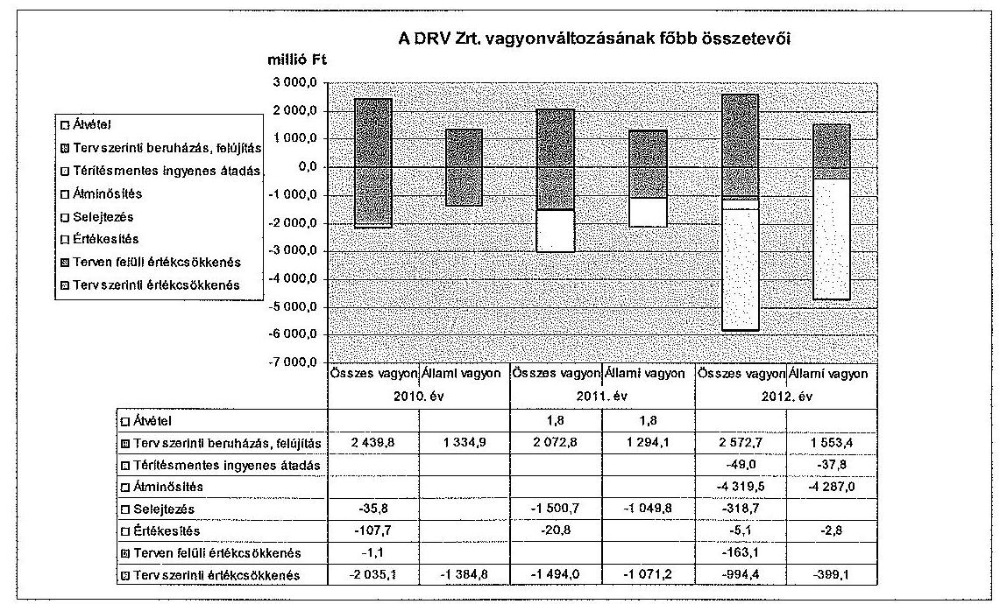
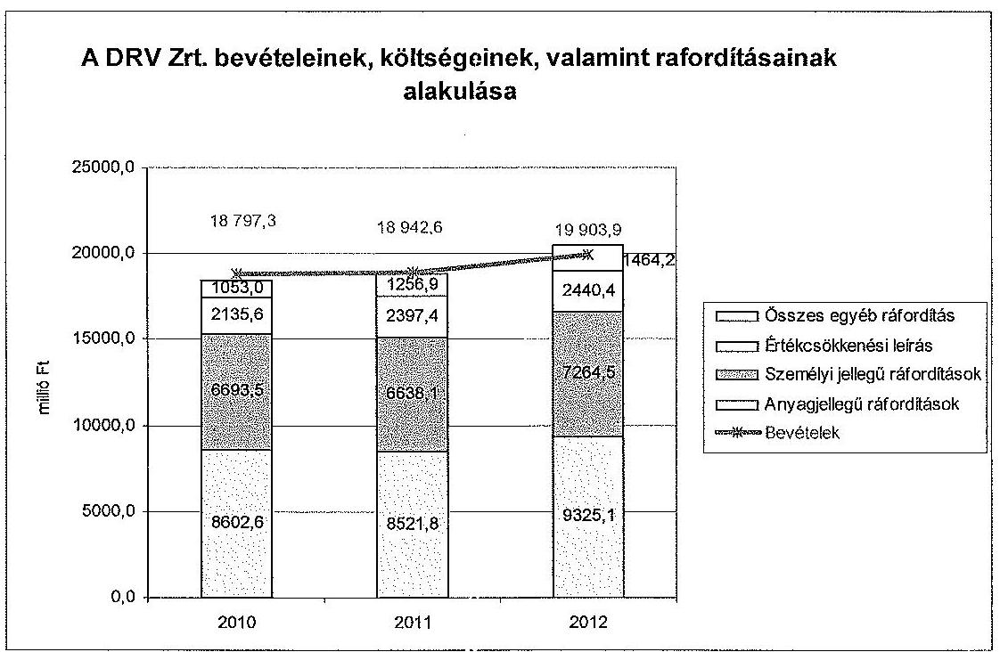
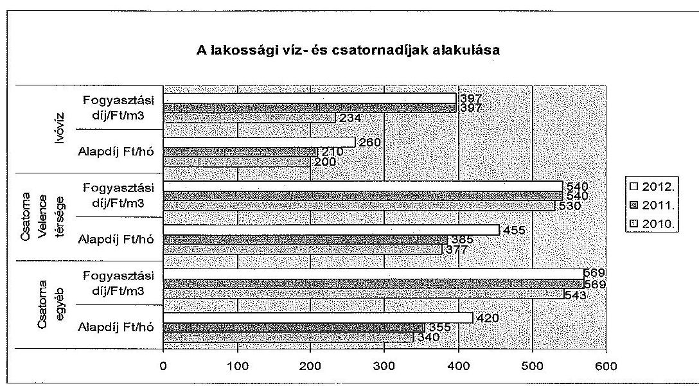
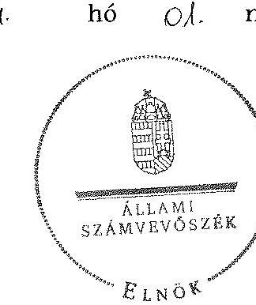
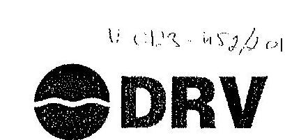
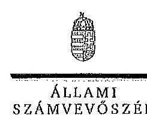
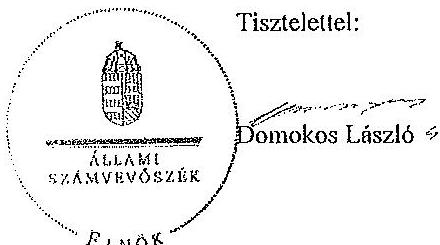
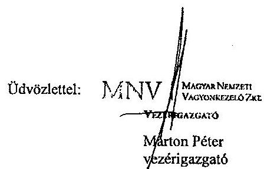
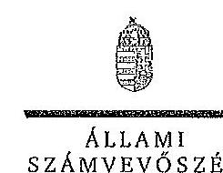

# ÁLLAMI   SZÁMVEVŐSZÉK 

## JELENTÉS

az állami tulajdonban (résztulajdonban) lévő gazdálkodó szervezetek vagyonértékmegőrző és gyarapító tevékenységének ellenőrzéséről egyes kiemelt közszolgáltató
társaságoknál vagy hasonló tevékenységet végző társaságcsoportoknál
Dunántúli Regionális Vízmű Zrt.

---

# Állami Számvevőszék 

Iktatószám: V-0123-497/2014.
Témaszám: 1158
Vizsgálat-azonosító szám: V06020104

## Az ellenőrzést felügyelte:

## Makkai Mária

felügyeleti vezető
Az ellenőrzést vezette és az ellenőrzés végrehajtásáért felelős:
Sali Sándorné
ellenőrzésvezető
A számvevőszéki jelentés összeállításában közreműködött:
Dr. Podonyi László
számvevő főtanácsos

Az ellenőrzést végezték:

| Dr. Podonyi László | Madár Sándor | Litvai Enikő |
| :-- | :-- | :-- |
| számvevő főtanácsos | számvevő | külső szakértő |

---

# TARTALOMJEGYZÉK 

BEVEZETÉS ..... 3
I. ÖSSZEGZŐ MEGÁLLAPÍTÁSOK, KÖVETKEZTETÉSEK, JAVASLATOK ..... 7
II. RÉSZLETES MEGÁLLAPÍTÁSOK ..... 16

1. Az MNV Zrt. és a DRV Zrt. vagyongazdálkodásával kapcsolatos tevékenysége ..... 16
1.1. A szabályszerű vagyongazdálkodás feltételeinek kialakítása ..... 16
1.2. A vagyonváltozást eredményező döntések szabályszerűsége ..... 20
2. A DRV Zrt. vagyongazdálkodással kapcsolatos szabályozási tevékenysége ..... 22
2.1. A szabályszerű vagyongazdálkodási feltételek kialakítása ..... 22
2.2. A DRV Zrt. vagyonnyilvántartása ..... 24
2.3. A DRV Zrt. kapcsolattartása az MNV Zrt.-vel ..... 27
2.4. A vagyonváltozást eredményező döntések megalapozottsága, szabályszerűsége ..... 29
2.5. A vagyon értékének megőrzése, gyarapítása ..... 31
3. A DRV Zrt. által működtetett kontroll- és monitoring rendszer ..... 36
3.1. A belső kontrollrendszer ..... 36
3.2. Az információáramlási és monitoring rendszer ..... 38
3.3. A kapcsolt vállalkozásokban lévő részesedések ..... 39

---

# MELLÉKLETEK 

1. számú Rövidítések jegyzéke
2. számú Értelmező szótár
3. számú A gazdasági társaság vagyonának alakulása a 2010-2012. években (ezer Ft-ban)
4. számú A gazdasági társaság eredményének alakulása a 2010-2012. években (ezer Ft-ban)
5. számú A befektetett eszközök állományának alakulásáról
6. számú A gazdasági társaság működéséről a 2010-2012. években
7. számú A Dunántúli Regionális Vízmű Zrt. vezérigazgatójának észrevétele
8. számú A Dunántúli Regionális Vízmű Zrt. vezérigazgatójának észrevételére adott válasz
9. számú A Magyar Nemzeti Vagyonkezelő Zrt. vezérigazgatójának észrevétele
10. számú A Magyar Nemzeti Vagyonkezelő Zrt. vezérigazgatójának észrevételére adott válasz

---

# JELENTÉS 

## az állami tulajdonban (résztulajdonban) lévő gazdálkodó szervezetek vagyonérték-megőrző és gyarapító tevékenységének ellenőrzéséről egyes kiemelt közszolgáltató társaságoknál vagy hasonló tevékenységet végző társaságcsoportoknál Dunántúli Regionális Vízmű Zrt.

## BEVEZETÉS

A nemzeti vagyon alapvető rendeltetése a törvényekben meghatározott közfeladatok ellátásának biztosítása. A nemzeti vagyonnal felelős módon, rendeltetésszerűen kell gazdálkodni. A nemzeti vagyon megőrzése érdekében az Alaptörvénnyel összhangban az Nvtv. meghatározza a nemzetgazdasági szempontból kiemelt jelentőségű vagyont, amelybe beletartozik a vízellátás és a szennyvízelvezetés, -tisztítás feladatok elvégzéséhez szükséges közművagyon, amelynek állami tulajdonban történő megőrzése hosszú távon indokolt.

A vagyongazdálkodás feladata a nemzeti vagyon rendeltetésének megfelelő, az állam teherbíró képességéhez igazodó, elsődlegesen a közfeladatok ellátásához szükséges, egységes elveken alapuló, átlátható, hatékony és költségtakarékos működtetése, értékének megőrzése, állagának védelme, értéknövelő használata, hasznosítása és gyarapítása. A Vtv. 2. § (1) és az Nvtv. 7. § (1)-(2) bekezdései határozzák meg az állami vagyongazdálkodással összefüggésben a tulajdonosi joggyakorlással és a vagyongazdálkodással kapcsolatos feladatokat. A tulajdonosi joggyakorló a regionális víziközmű társaságok esetében 2010. június 16-ig a Magyar Állam nevében a Nemzeti Vagyongazdálkodási Tanács volt, feladatait az MNV Zrt. útján, annak ügyvezető szerveként látta el. Ezt követően a hatályos törvényi szabályozás szerint az állami vagyon tekintetében a tulajdonosi joggyakorlásra az állami vagyon felügyeletéért felelős miniszter jogosult, aki e feladatát szintén az MNV Zrt. útján látja el. A Vtv. 2013. június 28-tól hatályos rendelkezése alapján az államot megillető jogok és kötelezettségek összességét tulajdonosi joggyakorlóként törvény, vagy miniszteri rendelet eltérő rendelkezésének hiányában az MNV Zrt. gyakorolja.

A 2012. évet megelőzően az önkormányzati törvény elfogadásától (a 1990. évtől) döntően a települési önkormányzatok feladata volt a közműves ivóvízellátás és csatornaszolgáltatás biztosítása (3200 településen közel 400 víziközműszolgáltató működött). Az államnak feladatellátási kötelezettsége az öt állami regionális vízmű tekintetében volt. Az elmúlt években a vízfogyasztás visszaesett, ezáltal a szolgáltató közművek kapacitásának kihasználása csökkent. A

---

Vksztv. 2011. évi hatálybalépéséig nem volt olyan szervezet, illetve szabályozás, amely országosan koordinálta az eltérő tulajdonú, érdekeltségű és működési formájú rendszereket. Nem volt biztosított a beruházások összehangolása, a források megfelelő elosztása, ezáltal a fenntartási és üzemeltetési költségek szükségesnél nagyobb mértékű emelkedésének megakadályozása. A 2011. december 31-én hatályba lépett Vksztv. célja az optimális üzemméret előírásával annak biztosítása, hogy a víziközművagyon kezelése egységesebb és a kapacitások kihasználása megfelelő legyen. A Magyar Energetikai és Közműszabályozási Hivatal a beruházások gördülő tervezésének összehangolásán keresztül kívánja biztosítani az indokolatlan költségek fogyasztói árakba való beépítésének elkerülését.

A regionális vízművek gazdálkodása a közérdeklődés középpontjában áll a gazdálkodásuk körébe tartozó vagyon nagysága, gazdálkodásuk sajátossága és az ebből adódó kockázatok, illetve az általuk ellátott közszolgáltatások minősége és hatékonysága miatt. Az ellenőrzés lefolytatását az indokolta, hogy az elmúlt években nem volt az állami regionális víziközművek működését, vagyongazdálkodását átfogóan értékelő ÁSZ ellenőrzés. A DRV Zrt. 90%-ban állami tulajdonú, zártkörűen működő részvénytársaság. A szakmai felügyeletet a Vidékfejlesztési Minisztérium látja el. A Magyar Állam mellett a DRV Zrt.-ben a dolgozók 2,2%-os, a helyi önkormányzatok pedig 1,8%-os tulajdonrésszel rendelkeznek. A fennmaradó 6% a DRV Zrt. saját tulajdonú részvénye.

A DRV Zrt. víztermelési, vízkezelési és vízellátási közfeladatot lát el, működési területe kiterjed Baranya, Fejér, Somogy, Tolna, Veszprém és Zala megyére. A DRV Zrt. 348 település vízellátását biztosítja a kezelésében lévő regionális, kistérségi és helyi vízművek, ipari vízellátó rendszerek üzemeltetésével. A DRV Zrt. a kizárólagos állami tulajdonban lévő 19 regionális víziközmű¹ valamint 20 települési víziközmű működtetését végzi. Az ellenőrzött időszakban a vezérigazgató személye a 2010. évben változott.

A DRV Zrt. mérlegében a 2012. év végén szereplő összes eszközvagyon 77185,1 millió Ft, ebből a kezelésre átvett állami vagyon értéke - a készletek közé átsorolt 3165,7 millió Ft vagyonnal együtt - 64604,1 millió Ft volt. A DRV Zrt. saját tőkéje 2012. december 31-én 7440,7 millió Ft, ebből a jegyzett tőke 4440,0 millió Ft volt, amely a 2010-2012. években nem változott. A 2012. év végén a tőketartalék 2355,6 millió Ft, az eredménytartalék 961,5 millió Ft volt. A 2012. évben az értékesítés nettó árbevétele 17662,8 millió Ft, a mérleg szerinti eredmény 590,3 millió Ft veszteség volt. A 2012. év végén a kötelezettségek állományának értéke 64912,4 millió Ft, amelyből 61321,3 millió Ft hosszú lejáratú, 3591,1 millió Ft rövid lejáratú kötelezettség, a követelések összege pedig 3193,9 millió Ft volt. A DRV Zrt.-nél az átlagos statisztikai létszám a 2012. év végén 1690 fő volt.

[^0]
[^0]:    ¹ Délkelet-balatoni RV, Dunai RV, Északkelet-balatoni RV, Nyirád-Ajka, Nyugatbalatoni RV, Fonyód-Kaposvár távvezeték, Pécs-Mohács és Pécs-Komló RV, Rákhegy RV, Sümeg RV, Velence-tavi RV, Kistérségi és Egyedi vízmű, Balatoni RSZV I. régió, Balatoni RSZV II. régió, Balatoni RSZV III. régió Balatoni RSZV IV. régió, Balatoni RSZV V. régió, Balatoni RSZV VI. régió, Balatoni RSZV VII. régió, Velence tavi RSZV.

---

Az ellenőrzés célja annak értékelése volt, hogy a gazdálkodó szervezet vezetése és a tulajdonosi jogok gyakorlója által hozott vagyongazdálkodási döntéseknél szabályszerűen, az elvárható gondossággal jártak-e el, olyan feltételeket alakítottak-e ki, hogy a gazdálkodó szervezet tulajdonában, illetve kezelésében, hasznosításában lévő vagyon értékét megőrizzék, gyarapítsák. A gazdálkodó szervezet az ellenőrzött időszakban betartotta-e a vagyonnal való gazdálkodásra vonatkozó jogszabályi rendelkezéseket és a helyi szabályzatok előírásait, a rendelkezésre álló erőforrások felhasználásával teljesítette-e a tulajdonos részéről meghatározott célokat és feladatokat, a vagyonkezelő szervezet a tulajdonostól kapott felhatalmazás alapján az elvárható gondossággal felügyelte-e a társaság működését és vagyongazdálkodását.

Az ellenőrzés várható hozadékaként azt kívántuk megállapítani, hogy az állami és társasági vagyon tekintetében a közfeladatot ellátó gazdasági társaságok a VSZ betartásával folyamatosan biztosítják-e a nemzeti vagyon megőrzését, minőségének javítását és a közfeladatok ellátását. Az ellenőrzés az állam tulajdonosi joggyakorlásával összefüggő döntések szabályosságának, megalapozottságának és szabályozási környezet változásának áttekintésével hozzáadott értéket teremt. Ezért az ellenőrzés fel kívánta tárni a vagyongazdálkodás feltételeinek, a vagyonérték megőrzésének, gyarapításának hiányosságait, egyúttal javaslatot téve azok kijavítására, illetve megállapításaival hozzá kíván járulni a regionális vízművek gazdálkodásának átláthatóságához, a közszolgáltatás színvonalának javításához.

Az ellenőrzés típusa: szabályszerűségi ellenőrzés.
Az ellenőrzés időszaka: a 2010. január 1. és 2012. december 31. közötti időszak volt, kitekintéssel a helyszíni ellenőrzés befejezéséig - 2013. szeptember 2-ig - tartó időszak releváns folyamataira. Az ellenőrzés a Dunántúli Regionális Vízmű Zrt.-re és a Magyar Nemzeti Vagyonkezelő Zrt.-re terjedt ki.

Az ellenőrzés végrehajtásának jogszabályi alapját az ÁSZ tv. 5. § (4) bekezdésében foglaltak képezték.

Az ellenőrzés szakmai módszertana az ÁSZ hivatalos honlapján közzétett szakmai szabályokon alapult, amely a Legfőbb Ellenőrző Intézmények Nemzetközi Szervezete (INTOSAI) által kiadott nemzetközi standardok (ISSAI) figyelembevételével készült.

A DRV Zrt. az ellenőrzés lefolytatásához tanúsítványok kitöltésével, valamint dokumentumok elektronikus megküldésével szolgáltatott adatokat. Az így rendelkezésre bocsátott adatok (információk) kontrollja a helyszíni ellenőrzés keretében történt. A vagyonváltozást eredményező döntések megalapozottságát, továbbá a vagyonérték-megőrző és vagyongyarapító tevékenység szabályszerűségét a számviteli nyilvántartásokban rögzített vagyonváltozások köréből véletlenszerű mintavétellel kiválasztott tételek ellenőrzésével értékeltük. Az ellenőrzés során alkalmazott rövidítések jegyzékét az 1. számú, a fogalmak magyarázatát a 2. számú, a DRV Zrt. gazdálkodására jellemző adatokat a 3-6. számú mellékletek tartalmazzák.

---

Az állami vagyonon végzett beruházások, értéknövelő felújítások elszámolásával kapcsolatos jogszabályi előírások a jelentés készítés időszakában megváltoztak. A Vhr. 2013. november 30. napjától hatályos módosítása szerint az új előírásokat a rendelet hatályba lépésekor hatályos vagyonkezelési jogviszonyokban a felek a rendelet hatálybalépéséig meg nem történt elszámolásokra is alkalmazhatják.

A jogszabályi előírás lehetőséget biztosít arra, hogy a folyamatban lévő ügyekben a felek (Dunántúli Regionális Vízművek és az MNV Zrt.) számlázási kötelezettség nélkül is elszámoljanak egymással, szükség esetén módosíthassák a vagyonkezelési szerződést, de megállapodásuk alapján a számlázást is alkalmazhatják. A jelentésben szereplő, a kezelt állami tulajdonban lévő eszközökön megvalósított beruházások és értéknövelő felújítások elszámolását érintő megállapítások helytállóak, az ellenőrzött időszakra vonatkozóan az ellenőrzés lefolytatásakor hatályos jogszabályokon alapul. A megváltozott jogszabályi körülményekre tekintettel, ugyanakkor az e tárgykörhöz kapcsolódó javaslatainkat - figyelemmel a jelenleg hatályos jogszabályi előírásokra - pontosítottuk.

Az ÁSZ a 2011. évi LXVI. törvény 29. §-a szerint a jelentéstervezetet megküldte az Dunántúli Regionális Vízmű Zrt. vezérigazgatójának és a Magyar Nemzeti Vagyonkezelő Zrt. vezérigazgatójának egyeztetésre. A beérkezett észrevételeket és az azokra adott választ a jelentés 7-10. számú mellékletei tartalmazzák.

---

# I. ÖSSZEGZŐ MEGÁLLAPÍTÁSOK, KÖVETKEZTETÉSEK, JAVASLATOK 

A DRV Zrt. az általa kezelt állami vagyonnal kapcsolatos gazdálkodási tevékenységét az ellenőrzött időszakban az 1998. évben a Kincstári Vagyoni Igazgatósággal (KVI) kötött vagyonkezelési szerződés (VSZ) alapján végezte. A vagyonkezelést a kizárólagos állami tulajdonban lévő 19 regionális víziközmű, valamint 20 települési víziközmű tekintetében látta el. A vagyonkezelési szerződés előírta az állami vagyon hatékony működtetését, állagának védelmét, valamint a vagyonérték megőrzésére és gyarapítására vonatkozó feltételeket.

A DRV Zrt. vagyonkezelésében lévő állami vagyonnal történő
 szabályszerű vagyongazdálkodás feltételeit az ellenőrzött időszakban, illetve azt megelőzően - a VSZ módosításában érintettek - nem teremtették meg, mivel a VSZ jogszabályi változásoknak (Vtv., Vhr., Vksztv., Áht. ${ }_{1,2}$ ) megfelelő módosítására a többszöri kezdeményezés ellenére a helyszíni ellenőrzés lezárásáig nem került sor. A VSZ-en a 2007. évet követően a vagyonváltozásokat nem vezették át, annak ellenére, hogy a Vhr. előírásai szerint a VSZ-t módosítani kell, ha a vagyonkezelésben lévő állami vagyonon értéknövelő beruházásra, felújításra kerül sor, illetve a vagyonkezelő új, állami vagyonba tartozó eszközt hoz létre. Ezért az ellenőrzött időszakban hatályos VSZ nem biztosította teljes körűen a szabályszerű gazdálkodási környezetet. A Vhr. szerint a VSZ módosításával egyidejűleg a beruházás értékét az értékesítés általános előírásainak megfelelően számlázni kell az MNV Zrt. felé. Ezzel ellentétben az ellenőrzött időszakban üzembe helyezett beruházásokat a DRV Zrt. nem számlázta ki az MNV Zrt. részére.

A DRV Zrt. éves üzleti tervei tartalmazták a tervezett beruházásokat, azonban azok részletes adatai (a beruházások műszaki összetétele, szakmai indokoltsága, feltételei, forrásai) az üzleti tervekben nem szerepeltek. A DRV Zrt. a beruházások végrehajtására vonatkozóan nem kérte meg az MNV Zrt. előzetes engedélyét a Vhr. előírásaival ellentétben. Az ellenőrzött időszakban a DRV Zrt. 4182,4 millió Ft összegben végzett az állami vagyonon beruházást. A DRV Zrt. az engedélykérés elmulasztása mellett a beruházásokra vonatkozó részletes, a Vhr.-ben előírt adatokat (a beruházás indokoltságát megalapozó számítás, elemzés) tartalmazó kérelmet sem nyújtotta be az MNV Zrt.-nek, amelyet az nem kifogásolt, illetve nem követelt meg. A VSZ nem írta elő a beruházásokról és a felújításokról történő beszámoltatás módját és gyakoriságát, de a DRV Zrt.-nek, mint önállóan gazdálkodó társaságnak ismernie és alkalmaznia kellett a Vhr. vonatkozó előírásait. A DRV Zrt. a beruházások kivitelezésének megkezdéséről és annak lefolytatásáról - az éves üzleti tervben és a beszámolóban foglaltakon túl - a Vhr.-rel ellentétesen nem tájékoztatta az MNV Zrt.-t. A beruházásokat megalapozó számítások elkészítése a DRV Zrt. feladata volt, amely nem minden beruházásra készült el.

A Vtv. és a Vhr. végrehajtása érdekében az MNV Zrt. 2011. június 21-én tájékoztató levelet küldött a regionális vízmű társaságoknak, amelyben iránymutatást adott az állami vagyonnal kapcsolatos számviteli elszámolások kezeléséhez. Ebben rögzítette a beruházások, beszerzések elszámolása rendjét és folyamatát. Előírta a 2008. január 1. és 2011. június 30. között üzembe helyezett beruházások és értéknövelő felújítások MNV Zrt. részére történő értékesítését - 2011. december 31-ig -, illetve azzal egyidejűleg a VSZ módosítását. Az MNV Zrt. rögzítette, hogy amennyiben az értékesítés áfaköteles, akkor a beruházás, felújítás áfatartalmát a DRV Zrt. részére megtéríti. A DRV Zrt. a tájékoztató levélben előírtakat nem hajtotta végre, mivel a számlázás áfa- és egyéb adófizetési kötelezettségét, továbbá a visszamenőleges hatályú rendezés (önellenőrzés) jogkövetkezményéből adódó fizetési kötelezettségeket a DRV Zrt., valamint az MNV Zrt. nem finanszírozta.

A DRV Zrt. a nyilvántartási feladatait alapvetően az MNV Zrt. jogelőd szervezete (KVI) által 1998. évben kiadott vagyonnyilvántartási szabályzatban (Vgsz.) foglaltak alapján látta el, amelyet a helyszíni ellenőrzés befejezéséig nem módosítottak az időközben hatályba lépő jogszabályi előírásoknak megfelelően. A Vgsz. az egyéb (nem állami) forrásból létrehozott és a térítésmentesen átvett fejlesztési célú eszközök számviteli elszámolásánál a létrejött eszközök értékének a hosszúlejáratú kötelezettségek közötti kimutatását írta elő a Számv. tv.-ben foglaltakkal ellentétesen, a passzív időbeli elhatárolások között halasztott bevételként történő kimutatás helyett. A DRV Zrt. a külső forrásból megvalósított beruházásait a Számv. tv. előírásainak megfelelően elhatárolta.

Az MNV Zrt. 2008-ban kiadta vagyonnyilvántartási szabályzatát, amely a Vtv., illetve a Vhr. szabályain alapult, és amelynek hatálya kiterjedt a DRV Zrt.-re is. Az új szabályzat elfogadásakor az MNV Zrt. a Vgsz.-t nem helyezte hatályon kívül, illetve az abban foglalt előírásokat a VSZ-en nem vezették át. Ennek következtében nem került rögzítésre a VSZ-ben a Vhr. előírásaival ellentétesen a vagyonnyilvántartási szabályzat vagyonkezelővel történő kötelező megismertetése. Az MNV Zrt. által kiadott szabályzatot a DRV Zrt. a belső szabályozási rendszerébe 2012. októberig nem építette be és nem alkalmazta. Az MNV Zrt. 2012. évi számviteli irányelvének eleget téve a DRV Zrt. a 2012. októbertől hatályos számviteli politikájába azt beépítette.

A részvényesek ${ }^{2}$ a DRV Zrt. Alapszabályában a tulajdonosok részére meghatározott jogkörökben az állami vagyon kezelésével és a DRV Zrt. működésével kapcsolatos döntéseket meghozták. Az Alapszabályban meghatározták, hogy az alaptevékenységhez nem kapcsolódó kötelezettségvállalások, 1000,0 millió Ft összeghatárig a vezérigazgató hatáskörébe tartoznak - az FB jóváhagyása mellett -, amely nagyfokú önállóságot biztosított a DRV Zrt. gazdálkodási döntéseihez és annak végrehajtásához. A Közgyűlés minden évben döntött az éves üzleti terv, illetve a javadalmazási szabályzat elfogadásáról, a DRV Zrt. éves beszámolójának és üzleti jelentésének jóváhagyásáról, a vezérigazgatói prémium kifizetéséről, az FB tagok kinevezéséről, illetve visszahívásáról, a könyvvizsgáló megválasztásáról, illetve a hatáskörébe tartozó kötelezettségvállalásokról. Az MNV Zrt. az üzleti tervre vonatkozó elvárásaiban rögzítette az elvárt tőkearányos eredmény, valamint a bérfejlesztés mértékét. Az MNV Zrt. felhatalmazása alapján a Közgyűlés vagyont érintő döntése volt az ellenőrzött időszakban a DRV Zrt. javadalmazási szabályzatának elfogadása, a vezérigazgató prémi-

[^0]
[^0]:    ${ }^{2}$ Magyar Állam részesedésének mértéke: 90\% (minősített többséget biztosító befolyás).

umfeladatainak kiírása, rögzítve a kifizetés feltételeit és korlátait. A kifizetés feltételei és korlátai döntően nem a vagyongazdálkodási, hanem a működési, gazdálkodási feladatok teljesítéséhez kapcsolódtak.

Az MNV Zrt. által kialakított kontrolling rendszer alkalmas a DRV Zrt. működésével kapcsolatos kockázatok feltárására. A DRV Zrt.-nél a 2012. évtől a vagyongazdálkodásban rejlő kockázatok csökkentéséhez hozzájárult az MNV Zrt. által kezdeményezett egységes számviteli politika, ezen belül az értékcsökkenési kulcsok azonos elvek alapján történő alkalmazása. Az MNV Zrt. az üzleti terv kidolgozása kapcsán a gazdálkodásra vonatkozó irányelveket, feltételeket (pl. a bértömeg, létszám engedélyezett növekedése, a premizálás rendszere) évente meghatározta, azonban a beruházásokkal kapcsolatban szakmai elvárásokat nem fogalmazott meg. A DRV Zrt.-re bízta a beruházások, értéknövelő felújítások indokoltságának és nagyságrendjének meghatározását. A tulajdonos a vagyonkezeléssel kapcsolatos szakmai feladatok elvégzését teljes körűen a vagyonkezelő hatáskörébe utalta.

Az ellenőrzött időszakban az MNV Zrt. a tulajdonosi ellenőrzési rendszert kialakította. A DRV Zrt. működésének figyelemmel kísérése a bekért adatszolgáltatásokra épülő kontrollokon alapult. Az MNV Zrt. a 2012. évben dokumentumokat kért be a DRV Zrt. követeléskezelési tevékenységének szabályozottságára vonatkozóan. Az erről készült jelentés megállapításait a Társaság hasznosította. Az MNV Zrt. az állami vagyonnal való gazdálkodást, a vagyon megőrzését, gyarapítását és jogszabály szerinti használatát a DRV Zrt.-nél a helyszínen nem ellenőrizte.

A DRV Zrt. nem alakította ki teljes körűen az állami vagyon értékének megőrzését, gyarapítását szolgáló szabályszerű vagyongazdálkodás feltételeit az ellenőrzött időszakban. A DRV Zrt. készített vagyongazdálkodási tervet, valamint hosszú távú stratégiát. A DRV Zrt. az SZMSZ-ében a vagyongazdálkodással kapcsolatos feladatokat és hatásköröket meghatározta, a felelősségi viszonyokat elhatárolta. A szabályszerű működéshez szükséges VSZ-t, valamint a kapcsolódó vagyongazdálkodási szabályzatot a jogszabályi környezet változása ellenére nem módosították. A DRV Zrt. a vagyongazdálkodását érintő belső szabályait (nyilvántartás, selejtezés) a jogszabályváltozások és az NVT, illetve az MNV Zrt. által kiadott intézkedések ellenére nem, vagy nem megfelelő időben aktualizálta.

A DRV Zrt.-nél az ellenőrzött időszakban az állami vagyon nyilvántartása nem volt teljes körűen megalapozott, mert az állami vagyon elkülönült nyilvántartása ugyan biztosított volt, de a terv szerinti és a terven felüli értékcsökkenés és a selejtezés nem volt szabályszerű. Továbbá a vagyonkezelésbe vett eszközökre vonatkozó értéknövelő beruházásokat nem a Vhr. szerint számolták el, azt nem számlázták ki az MNV Zrt. felé, és nem módosították egyidejűleg a VSZ-t. A DRV Zrt. kidolgozta a saját vagyon és a vagyonkezelésbe vett állami vagyon nyilvántartására szolgáló rendszert.

A számviteli nyilvántartó rendszert a DRV Zrt. az ellenőrzött időszakban nem megfelelően működtette, mert az értékcsökkenés teljes állami vagyonra vetített - Vgsz.-ben előírt - abszolút összegű elszámolásának nem megfelelő alkalmazásával, valamint az eszközök valós üzembehelyezési dátumától eltérő időpontú aktiválásával eltért a Számv. tv. előírásaitól. A közművagyoni körben az értékcsökkenés tervezése nem a várható hasznos élettartam műszaki tervezésén alapult, hanem azt az értékcsökkenésre vonatkozó, eszközcsoportonkénti gazdasági becslés befolyásolta. A DRV Zrt. az elfogadott éves üzleti tervben szereplő tervezett értékcsökkenés összegét tekintette a tárgyévben elszámolható értékcsökkenésnek. Ennek érdekében a tárgyév decemberében a még elszámolható értékcsökkenés maradványértékét felosztotta az egyes eszközök között. Az eszközök tényleges üzembe helyezését követő, utólagos aktiválás nem biztosította a tárgyi eszközök nettó értékének beszámolóban történő pontos kimutatását. A DRV Zrt. alkalmazott gyakorlata nem felelt meg a Számv. tv.-ben előírt, az értékcsökkenés tervezésére vonatkozó szabályoknak, az egyedi értékelés elvének, valamint az értékcsökkenés elszámolási módszerének.

A Vgsz. a beruházáshoz, felújításhoz és rekonstrukcióhoz kapcsolódó selejtezések esetén - amikor az adott tárgyi eszköz helyett más, azonos célt szolgáló és vele legalább egyenértékű másik tárgyi eszköz kerül beszerzésre vagy beépítésre - nem követelte meg a tulajdonos előzetes engedélyét. A DRV Zrt. azonban a 2011. június 1-jétől hatályos belső szabályzatában előírta, hogy minden közművagyoni körbe tartozó eszközt érintő selejtezést az MNV Zrt.-nek engedélyezni kell. A DRV Zrt. a 2011. év második felében 1013,3 millió Ft bruttó (604,8 millió Ft nettó) értékben selejtezett eszközt, amelyet az MNV Zrt.-vel szembeni hosszú lejáratú kötelezettségek terhére kivezetett a nyilvántartásából. A DRV Zrt. az MNV Zrt. engedélye nélkül, szakhatósági engedély birtokában selejtezett, amely nem felelt meg a belső szabályzatában foglaltaknak. A DRV Zrt. a vonatkozó selejtezési jegyzőkönyveket engedélyezésre benyújtotta a tulajdonosnak, azonban a selejtezésre a helyszíni ellenőrzés befejezéséig nem kapott engedélyt.

A DRV Zrt. leltározási szabályzata a víz- és szennyvízvezetékek esetében ötévenkénti gyakorisággal írja elő a mennyiségi leltárfelvételt, amely nem felel meg a Számv. tv.-ben előírt háromévenkénti kötelező leltározás szabályának. Az ellenőrzött időszakban az ingatlanok mérlegsort alátámasztó leltár nem volt szabályos, mert kimutattak 47 db, mintegy 1340,0 millió Ft értékű tulajdonjogilag rendezetlen ingatlant, és nem mutatták ki azt a 39 db ingatlant, amelynek értéke nem ismert, de a földhivatali ingatlan-nyilvántartás szerint a DRV Zrt. vagyonkezelésében van. A Magyar Állam tulajdonában lévő 86 db ingatlan esetében a vagyonkezelő a DRV Zrt. volt, de az ingatlanok a VSZ-ben, illetve egy részük a DRV Zrt. nyilvántartásaiban sem szerepelt.

A DRV Zrt. az 1998. évtől számolva a VSZ-ben foglalt visszapótlási kötelezettségét a könyvviteli mérleg adatai alapján az elszámolt értékcsökkenést meghaladó értékben értéknövelő beruházásokkal teljesítette. Az ellenőrzött időszakban az értéknövelő beruházások elszámolása, valamint számlázása tekintetében a jogszabályoknak megfelelő szerződésmódosítás elmaradása következtében a Vhr. előírásait nem tartotta be.

A DRV Zrt. éves beszámolóit és konszolidált beszámolóit a Számv. tv.-nek megfelelően
 évente könyvvizsgáló hitelesítette. A beszámolókat a könyvvizsgálók a 2010. évben figyelemfelhívással, a 2011. és 2012. üzleti évben korlátozó hitelesítési záradékkal látták el. A 2010. évi beszámolóhoz csatolt figyelemfelhívás a Vhr. szerinti értéknövelő beruházások elszámolásával volt kapcsolatos. A 2011.

---

évben a korlátozás oka a tárgyi eszközök nem szabályszerű értékcsökkenési elszámolása, a tulajdonos engedélyére váró selejtezések kimutatásának hiánya, valamint az MNV Zrt. felé kiszámlázatlan beruházások és értéknövelő felújítások voltak. A 2012. évi korlátozás indoka az előző években leírtakkal megegyező volt, illetve kibővült a DRV Zrt. vállalkozásfolytatás elvének a kockázatával. A korlátozó záradékban szereplő problémák az MNV Zrt.-vel fennálló, rendezetlen VSZ módosítással voltak összefüggésben.

A DRV Zrt. nem mindenkor járt el a jogszabályok szerint a vagyonkezelést érintő kapcsolattartás során. A kapcsolattartás az MNV Zrt.-vel a VSZ szabályai szerint történt ugyan, de az a jogszabályi változásokat nem követte. Az MNV Zrt. felé történő adatszolgáltatás a VSZ-ben előírtak és a kapcsolódó jogszabályok szerint történt meg a 2010-2012. évek közötti időszakban. A felújítások, értéknövelő beruházások előzetes engedélyeztetése nem történt meg, csak összeszedetten, az üzleti terv részeként, továbbá a DRV Zrt. a Vhr. szerinti utólagos - bizonylatokkal alátámasztott - beszámolási kötelezettségének sem tett eleget. A DRV Zrt. az állami vagyon hasznosításáról rendszeresen egyeztetett az MNV Zrt.-vel, valamint több esetben tettek javaslatot az állami vagyon értékesítésére. A DRV Zrt. a vagyont fenyegető veszélyről (a 2013. évi dunai árvíztől érintett ivóvíz és szennyvíz közművek) a Vhr.-től eltérően nem az MNV Zrt.-t, hanem a katasztrófavédelmet és a Magyar Víziközmű Szövetséget értesítette.

A vagyonváltozást eredményező döntéseknél és azok végrehajtásánál, különösen a selejtezésnél elkövetett szabálytalanságok miatt a beszámolót a könyvvizsgáló korlátozta a 2011. és 2012. évben. A DRV Zrt. a 2011. évtől a selejtezésre váró, használaton kívüli eszközökre nem számolt el terven felül értékcsökkenést, illetve a készletté történő átsorolás időpontjáig (2012. december 31.) terv szerinti amortizációt érvényesített, valamint az átsorolást az eszközök nettó értékén végezte el. A DRV Zrt. gyakorlata nem felelt meg a Számv. tv.-ben foglaltaknak, mivel a használaton kívüli eszközöket nem lehet kimutatni a befektetett eszközök (működő vagyon) között. A selejtezett tárgyi eszközöket terven felüli értékcsökkenésként kell elszámolni, valamint értékelés alapján azokat át kell sorolni a készletek közé. A Vgsz. szerint selejtezés esetében a Számv. tv. előírásainak megfelelően az adott tárgyi eszközt a leltárból ki kell vezetni, a nettó értékét pedig terven felüli értékcsökkenésként kell elszámolni. Egyéb selejtezési eseményeknél a hosszú lejáratú kötelezettség terhére csak az MNV Zrt. előzetes egyetértésével lehet a gazdasági eseményt átvezetni. Az MNV Zrt. engedélyének, valamint a VSZ módosításának hiányában az eszközök nettó értékének terven felüli értékcsökkenésként történő leírása és a hosszú lejáratú kötelezettség csökkentése a Vhr. alapján nem volt szabályszerű. Az MNV Zrt. nem hozott sem elutasító, sem jóváhagyó döntést a DRV Zrt. selejtezéssel kapcsolatos kérelmeire az ellenőrzött időszakban. A vagyonnal kapcsolatos értékesítési és beszerzési döntések megalapozottak voltak, tartalmi és formai szempontból megfeleltek a belső szabályozásban foglaltaknak, a döntéshozatal során a jogosultsági szabályokat betartották.

Az ellenőrzött időszakban a DRV Zrt. a vagyon értékének megőrzéséről és gyarapításáról - a könyvviteli mérlegében kimutatottak alapján - nem teljes körűen gondoskodott. A DRV Zrt. teljes vagyona az ellenőrzött időszakban csökkent. A vagyonérték megőrzésére rendszeres karbantartási tervek és részletes beruházási tervek készültek. A DRV Zrt. nem számolt el bizonylattal a felújításokról a

---

pályázatok kivételével. Az MNV Zrt. adatbekéréssel ellenőrizte a felújítási munkálatokat. A 2010-2012. évek között az állami vagyon értéke csökkent. A DRV Zrt. beszámolói alapján a mérlegben az eszközök 2010. évi állománya 77 223,1 millió Ft-ról a 2012. évre 77 185,1 millió Ft-ra módosult. Az eszközökön belül az állami vagyon a 2010. évi 65 486,8 millió Ft-ról a 2012. évre 64 604,1 millió Ft-ra, 1,3%-kal csökkent. A vagyoncsökkenés a tárgyi eszközök értékcsökkenésével, valamint a 2012. évi veszteséges gazdálkodással volt összefüggésben.

A DRV Zrt.-nél a vagyon védelme, a vagyonnal való felelős gazdálkodást biztosító belső kontrollrendszer kialakítása, szabályozottsága és működése nem volt teljes körű. A DRV Zrt. állami vagyonnal való gazdálkodásának szabályozása és az MNV Zrt. által előírt, elvárt követelmények (nyilvántartás, selejtezés) összhangja nem volt teljes körűen biztosított. A belső ellenőrzés vizsgálta a vagyongazdálkodás szabályozottságát, valamint szabályszerűségét. Az MNV Zrt. által végzett vagyongazdálkodással és vagyonnyilvántartással összefüggő ellenőrzés megállapításait a DRV Zrt. hasznosította, a szükséges intézkedéseket meghozta.

A DRV Zrt.-nél a szabályszerű vagyongazdálkodás érdekében kialakított információáramlási és monitoring rendszer működése megfelelő volt. A DRV Zrt. az FB és az Igazgatóság felé a szabályozásokban foglalt információszolgáltatási kötelezettségeinek megfelelően eleget tett. A részére előírt határidőn belül és adattartalommal, szabályszerűen teljesítette az MNV Zrt. részére történő adatszolgáltatási kötelezettségét.

Az Állami Számvevőszékről szóló 2011. évi LXVI. törvény 33. § (1) bekezdésében foglaltak értelmében a jelentésben foglalt megállapításokhoz kapcsolódó intézkedési tervet köteles az ellenőrzött szervezet vezetője összeállítani, és azt a jelentés kézhezvételétől számított 30 napon belül az ÁSZ részére megküldeni. Amennyiben az intézkedési tervet határidőben nem küldi meg a szervezet, vagy az nem elfogadható, az ÁSZ elnöke a hivatkozott törvény 33. § (3) bekezdés a)-b) pontjaiban foglaltakat érvényesítheti.

Az ellenőrzés intézkedést igénylő megállapításai és javaslatai:

# Az MNV Zrt. vezérigazgatójának 

1. A vagyon nyilvántartására vonatkozó szabályozás nem volt egyértelmű, mert az MNV Zrt. a jogelőd szervezet (KVI) által 1998-ban kiadott Vgsz.-t nem helyezte hatályon kívül.

Javaslat:
Intézkedjen az állami vagyon nyilvántartására vonatkozó Vhr. 13. és 14. §-ban foglalt hatályos szabályozások érvényesítése mellett az ágazatspecifikus szempontok figyelembe vételével az egységes szabályzat kiadásáról.
2. A DRV Zrt. éves üzleti tervei tartalmazták a tervezett beruházásokat, azonban azok részletes adatai (pl. a beruházások műszaki összetétele, szakmai indokoltsága, feltételei, forrásai) az üzleti tervekben nem szerepeltek, ezt az MNV Zrt. nem követelte

---

meg, illetve nem kifogásolta. A DRV Zrt. a beruházások végrehajtására vonatkozóan nem kérte meg az MNV Zrt. előzetes engedélyét, a Vhr. előírásaival ellentétben.

Javaslat:
Vizsgálja felül a DRV Zrt. által az MNV Zrt. előzetes engedélye nélkül megvalósított beruházások szakmai indokoltságát, azok szükségességét, a beruházások tervezett és tényleges költségeinek alakulását, valamint a beruházásokkal létrehozott eszközök kihasználtságát, fenntarthatóságát és amennyiben szükséges, intézkedjen a felelősség megállapításáról.

# A Dunántúli Regionális Vízmű Zrt. vezérigazgatójának 

1. A DRV Zrt. a Vhr. 9. § (6) bekezdésében foglaltak ellenére a beruházásokhoz - az EU-forrásból megvalósuló beruházások kivételével - az MNV Zrt.-től előzetes írásbeli engedélyt nem kért, valamint a beruházások kivitelezésének megkezdéséről, annak lefolytatásáról az MNV Zrt.-t közvetlenül nem tájékoztatta. A DRV Zrt. nem gondoskodott a Vhr. 14. § (1) bekezdésében előírt egységes nyilvántartás biztosítása érdekében az MNV Zrt.-vel való együttműködésről.

Javaslat:
a) Intézkedjen a Vhr. 9. § (6) bekezdésében foglaltak alapján a vagyonkezelt eszközön elszámolt bármely beruházáshoz, felújításhoz kapcsolódóan az MNV Zrt.-től előzetes írásbeli engedély kéréséről, valamint a vagyonkezelési szerződésben meghatározott módon a beruházások, felújítások beszámolási kötelezettségének teljesítéséről.
b) Gondoskodjon a Vhr. 14. § (1) bekezdésében foglaltaknak megfelelő együttműködésről, a nyilvántartás egységessége, pontossága és az adatellenőrzések biztosítása érdekében.
2. Az állami vagyonon végzett beruházásoknál, értéknövelő felújításoknál a DRV Zrt. az eszközök bekerülési (bruttó) értékét a Számv. tv. 52. § (2) bekezdésében foglaltaktól eltérően aktiválta, az aktiválást nem az üzembehelyezés időpontjához, hanem a beruházás adatainak teljes körű rendelkezésre állásához, a könyvelési zárás időpontjához kapcsolta. A vagyonnyilvántartás e helytelen gyakorlat miatt nem volt megbízható.

Javaslat:
Gondoskodjon az állami vagyonon végzett beruházások, értéknövelő felújítások bekerülési (bruttó) értékének a Számv. tv. 52. § (2) bekezdésében foglaltaknak megfelelő - az üzembehelyezés időpontjával egyidőben történő - aktiválásáról.
3. A DRV Zrt.-nél a kezelt közművagyon értékcsökkenésének elszámolása nem a várható hasznos élettartam műszaki tervezésén alapult, hanem azt az értékcsökkenésre vonatkozó eszközcsoportonkénti gazdasági becslés befolyásolta. A Társaság az éves elfogadott üzleti tervben szereplő tervezett értékcsökkenés összegét tekintette a tárgyévben elszámolható értékcsökkenésnek. Ennek érdekében a Társaság a tárgyév decemberében a még elszámolható (azaz a tervezett értékcsökkenésből novemberig

---

el nem számolt) értékcsökkenést a megelőző év értékcsökkenési kulcsainak arányában osztotta fel az egyes eszközök között. A DRV Zrt.-nél alkalmazott gyakorlat nem felelt meg a Számv. tv. 52. § (1) bekezdésében - az értékcsökkenés tervezésére előírtaknak, a Számv. tv. 52. § (2) bekezdésében rögzített egyedi értékelés elvének, valamint a Számv. tv. 52. § (3) bekezdésében szabályozott értékcsökkenési elszámolási módszernek.

Javaslat:
Intézkedjen, hogy a DRV Zrt. értékcsökkenésre vonatkozó elszámolása feleljen meg a Számv. tv. 52. § (1) bekezdésében előírtaknak - az értékcsökkenés tervezésére vonatkozó szabályoknak -, a Számv. tv. 52. § (2) bekezdésében rögzített egyedi értékelés elvének, valamint a Számv. tv. 52. § (3) bekezdésében szabályozott értékcsökkenési kulcs változtatása módszerének.
4. A Vgsz. a beruházáshoz, felújításhoz és rekonstrukcióhoz kapcsolódó selejtezések esetén - amikor az adott tárgyi eszköz helyett más, azonos célt szolgáló és vele legalább egyenértékű másik tárgyi eszköz kerül beszerzésre vagy beépítésre (a DRV Zrt. a selejtezését e körbe tartozónak minősítette) - nem írta elő az előzetes engedély megkérését. Az éves kataszteri jelentésben kellett ezekről számot adni. A DRV Zrt. a 2011. június 1-jétől hatályos belső szabályzatában előírta, hogy minden közművagyoni körbe tartozó eszközt érintő selejtezést az MNV Zrt.-nek engedélyezni kell. A DRV Zrt. a 2001-2010. évek között 1013,3 millió Ft bruttó (604,8 millió Ft nettó) értékben selejtezett eszközt, amelyet a 2011. évben - az MNV Zrt.-vel szemben nyilvántartott hosszú lejáratú kötelezettség terhére - kivezetett a nyilvántartásából. A DRV Zrt. a 2011. évben a kezelésében lévő állami vagyonból az MNV Zrt. engedélye nélkül, a szakhatósági engedély birtokában selejtezett. A DRV Zrt. a 2011. évi selejtezési jegyzőkönyveket engedélyezésre benyújtotta az MNV Zrt.-nek, azonban a selejtezésre nem kapott engedélyt.

Javaslat:
Intézkedjen a 2011. évi selejtezések szabályszerű döntések birtokában történő végrehajtásáról, illetve a számviteli nyilvántartások és éves beszámolók döntésnek megfelelő módosításáról, továbbá a kapcsolódó önellenőrzések végrehajtásáról.
5. A DRV Zrt. 2011-től a selejtezésre váró eszközökre nem számolt el terven felül értékcsökkenést, illetve a készletté történő átsorolás időpontjáig (2012. december 31.) terv szerinti amortizációt érvényesített, valamint az átsorolást az eszközök nettó értékén végezte el. A Számv. tv. 53. § (2) bekezdésében foglaltak alapján a használaton kívüli eszközök a működő vagyon bemutatására szolgáló tárgyi eszközök között nem mutathatók ki, azokat terven felüli értékcsökkenés elszámolásával kell kivezetni, valamint haszonhulladék értéken át kell sorolni a készletek közé. Egyéb selejtezési eseményeknél a hosszú lejáratú kötelezettség terhére csak az MNV Zrt. előzetes egyetértésével lehet a gazdasági eseményt átvezetni. Az MNV Zrt. engedélyének hiányában az eszközök nettó értékének terven felüli értékcsökkenésként történő leírása és a hosszú lejáratú kötelezettséggel szembeni elszámolása nem szabályszerű.
 Az MNV Zrt. az ellenőrzött időszakban selejtezéssel összefüggésben nem hozott döntést.

---

Javaslat:
Intézkedjen arról, hogy a használaton kívüli tárgyi eszközökre terv szerinti értékcsökkenést ne érvényesítsen, továbbá vizsgálja felül a tárgyi eszközök készletek közé átsorolásának szabályszerűségét. Ezen túl kérje meg az átsorolás és selejtezés előtt az MNV Zrt. engedélyét.
6. A DRV Zrt. leltározási szabályzata a víz- és szennyvízvezetékek esetében ötévenkénti gyakorisággal írja elő a mennyiségi leltárfelvételt, amely nem felel meg a Számv. tv.-ben előírt háromévenkénti kötelező leltározás szabályának.

Az ellenőrzött időszakban az ingatlanok mérlegsort alátámasztó leltár nem volt szabályos, mert kimutattak 47 db, mintegy 1340,0 millió Ft értékű tulajdonjogilag rendezetlen ingatlant, és nem mutatták ki azt a 39 db ingatlant, amelynek értéke nem ismert, de a földhivatali ingatlan-nyilvántartás szerint a DRV Zrt. vagyonkezelésében van. A Magyar Állam tulajdonában lévő 86 db ingatlan esetében a vagyonkezelő a DRV Zrt. volt, de az ingatlanok a VSZ-ben, illetve egy részük a DRV Zrt. nyilvántartásaiban sem szerepelt.

Javaslat:
a) Intézkedjen arról, hogy a leltározási szabályzatban a mennyiségi leltárfelvétel gyakoriságára vonatkozó előírások összhangban legyenek a Számv. tv.-ben előírtakkal.
b) Intézkedjen az ingatlanok tulajdonjogának rendezéséről, nyilvántartásban való szerepeltetéséről, valamint a vagyonkezelési szerződésben való rögzítéséről.
7. A DRV Zrt. éves üzleti tervei tartalmazták a tervezett beruházásokat, azonban azok részletes adatai (pl. a beruházások műszaki összetétele, szakmai indokoltsága, feltételei, forrásai) az üzleti tervekben nem szerepeltek, amit az MNV Zrt. nem kifogásolt, illetve nem követelt meg. A DRV Zrt. a beruházások végrehajtására vonatkozóan nem kérte meg az MNV Zrt. előzetes engedélyét a Vhr. előírásaival ellentétben. A VSZ nem írta elő a beruházásokról és a felújításokról történő beszámoltatás módját és gyakoriságát, de a DRV Zrt.-nek, mint önállóan gazdálkodó társaságnak ismernie és alkalmaznia kellett a Vhr. vonatkozó előírásait. A DRV Zrt. a beruházások kivitelezésének megkezdéséről és annak lefolytatásáról - az éves üzleti tervben és a beszámolóban foglaltakon túl - a Vhr.-rel ellentétesen nem tájékoztatta az MNV Zrt.-t. A beruházásokat megalapozó számítások elkészítése a DRV Zrt. feladata volt, amelyek nem minden beruházásra készültek el.

Javaslat:
Vizsgálja ki az MNV Zrt. engedélye nélkül megvalósított beruházások körülményeit, és annak eredményétől függően intézkedjen a felelősség megállapításáról.

---

# II. RÉSZLETES MEGÁLLAPÍTÁSOK 

## 1. Az MNV ZRT. És a DRV ZRT. VAGYONGAZDÁLKODÁSÁVAL KAPCSOLATOS TEVÉKENYSÉGE

### 1.1. A szabályszerű vagyongazdálkodás feltételeinek kialakítása

A DRV Zrt. ${ }^{3}$ mint vagyonkezelő és a kincstári (2007-től állami) vagyont vagyonkezelésbe adó Kincstári Vagyoni Igazgatóság (KVI) 1998. április 30-án kötött vagyonkezelési szerződést a kizárólagos állami tulajdonban lévő 19 regionális víziközmű, valamint 20 települési víziközmű működtetésére. A VSZ-ben a szerződő felek tételesen rögzítették az átadott állami vagyont, illetve az eszközökkel ellátandó feladatot. A szerződés előírta az állami vagyon hatékony működtetését, állagának védelmét, valamint értéke megőrzésének, illetve gyarapításának biztosítását.

A VSZ-t az 1998-ban hatályos jogszabályok alapján kötötték meg, figyelembe véve a vízgazdálkodásról szóló 1995. évi LVII. törvény, a koncesszióról szóló 1991. évi XVI. törvény, az Áht ${ }_{1}$, a közműves ivóvízellátásról és közműves szennyvízelvezetésről szóló 38/1995. (IV. 5.) Korm. rendelet, a kizárólagos állami tulajdonban lévő víziközművagyon használatba adásáról szóló 201/1997. (XI. 19.) Korm. rendelet, valamint a víziközművek üzemeltetésének követelményeiről szóló 18/1992. (VII. 14.) KHVM rendelet szabályozását.

A vagyonkezelésben lévő állami vagyonnal történő szabályszerű vagyongazdálkodás feltételeit - az ellenőrzött időszakban - a gazdálkodási környezetet szabályozó VSZ nem teljes körűen biztosította, mivel azt a jogszabályi változásoknak megfelelően a 2007. évtől a helyszíni ellenőrzés lezárásáig a szerződő felek utódszervezetei (az MNV Zrt. és a DRV Zrt.) nem módosították. A DRV Zrt. a többi állami regionális víziközmű társasággal közösen a 2008. évben kezdeményezte az MNV Zrt.-nél a VSZ módosítását a beruházások elszámolása érdekében, azonban a szerződés módosítása nem történt meg.

A Vtv. és a Vhr. 2007. évi hatálybalépését követően az MNV Zrt. nem szabályozta a vagyonkezelő által az állami vagyonon végrehajtott beruházások elszámolását, illetve a Vhr.-ben az elszámolásra meghatározott szabályok végrehajtásának rendjét. A VSZ módosítására annak ellenére nem került sor, hogy az abban hivatkozott jogszabályok közül többet hatályon kívül helyeztek.
2012. január 1-jétől hatályon kívül helyezték az Áht. ${ }_{1}$-t, annak a kincstári vagyon kezeléséről, értékesítéséről és az e vagyonnal kapcsolatos egyéb kötelezett-

[^0]
[^0]:    ${ }^{3}$ A Dunántúli Regionális Vízművek átalakulásával, annak általános jogutódjaként jött létre a Dunántúli Regionális Vízmű Zártkörűen Működő Részvénytársaság. A Gt. alapján 2006. március 13-tól kezdődően DRV Zrt., előtte DRV Rt. volt a társaság megnevezése.

---

ségekről szóló végrehajtási rendeletét, a 183/1996. (XII. 11.) Korm. rendeletet, valamint többször módosították a vízgazdálkodásról szóló 1995. évi LVII. törvényt és a 2011. év végén a Vksztv., illetve az Nvtv. hatályba lépett.

A VSZ-t nem aktualizálták a jogi környezet változásának megfelelően, azonban két megállapodás született annak kiegészítéséről.

A MNV Zrt. a DRV Zrt. vagyonkezelésébe adott egy Nemesgulácson lévő külterületi ingatlant 1,5 millió Ft értékben a 2011. évben, illetve Balatonfüred Város Önkormányzatának - az 1449/2011. (XII. 22.) Korm. határozat alapján - ingyenesen a tulajdonába adott két Balatonfüreden lévő zártkert ingatlant 37,8 millió Ft értékben a 2012. évben.

A Vtv. és a Vhr. végrehajtása érdekében az MNV Zrt. 2011. június 21-én tájékoztató levelet küldött a regionális vízmű társaságoknak, amelyben iránymutatást adott az állami vagyonnal kapcsolatos számviteli elszámolások kezeléséhez. Ebben rögzítette a beruházások és beszerzések elszámolása rendjét és folyamatát. Előírta a 2008. január 1. és 2011. június 30. között üzembe helyezett beruházások és értéknövelő felújítások MNV Zrt. részére történő értékesítését - 2011. december 31-ig -, illetve azzal egyidejűleg a VSZ módosítását. Az MNV Zrt. rögzítette, hogy amennyiben az értékesítés áfaköteles, akkor a beruházás, felújítás áfatartalmát a társaság (DRV Zrt.) részére megtéríti.

A DRV Zrt. az útmutatóban leírtakat több tekintetben nem tartotta megfelelőnek, véleményt és javaslatot fogalmazott meg a beruházás elszámolásával, számvitelével kapcsolatban. Az útmutatóban leírtakat a DRV Zrt. nem alkalmazta. A Vtv. és a Vhr. hatálybalépésétől meglévő elszámolási, számlázási anomália megszüntetésére - az érintettek többszöri egyeztetése ellenére - a helyszíni ellenőrzés lezárásáig nem született megoldás. 2011. december 31-ig a vagyonkezelési szerződés nem módosult.

A Vksztv. 2012. július 15-től hatályos 6. § (1) bekezdése szerint a víziközművek tulajdonjoga kizárólag az államé és a települési önkormányzaté lehet. A víziközmű társaságokkal a rendszerfüggetlen víziközmű-elemekről történő megállapodásról az MNV Zrt. a 441/2012. (XII.17.) Vig. sz. határozatban döntött a Vksztv. rendelkezésének megfelelően. Az MNV Zrt. és a DRV Zrt. 2012. december 20-án megállapodást kötött a víziközművek tulajdonáról és a vagyonkezelési feladatokról. A megállapodás tartalmazta, hogy a Vksztv. 79. § (1) bekezdése alapján a DRV Zrt. tulajdonába tartozó víziközművek 2013. január 1. napján az ellátásért felelős Magyar Állam tulajdonába kerülnek, mint olyan víziközművek, amelyeknél a tulajdoni részesedés egésze a nemzeti vagyonba tartozik.

A megállapodás szerint - összhangban a jogszabályi rendelkezéssel - a rendszerfüggetlen elemek a DRV Zrt. tulajdonában maradnak, amelyeket az egyéb saját tulajdonú eszközeitől elkülönítetten tart nyilván, és gondoskodik azok szükségessé váló felújításáról és pótlásáról. A leltáron alapuló (lista) rendszerfüggetlen víziközmű-elemek 2012. szeptember 30-i könyv szerinti értéke véglegesítésének határideje 2013. március 31-e volt. A megállapodásban rögzítették, hogy a DRV Zrt. 1998. április 30-án megkötött, a Vksztv. 7. § (1) bekezdésében foglaltaknak megfelelő üzemeltetési jogviszonyt megalapozó VSZ-szel rendelkezik.

---

Az ellenőrzött időszakban az MNV Zrt. a szabályozási környezet változásához illeszkedő, a célkitűzésekben szereplőtől eltérő követelményeket, célokat a vagyonkezelési tevékenységre vonatkozóan nem fogalmazott meg.

A VSZ megkötésével egyidőben a KVI kiadta a kincstári vagyoni körbe tartozó víziközművagyon-kezelési gazdálkodási és nyilvántartási szabályzatot (Vgsz.), amely a DRV Zrt.-re is érvényes. A szabályozás ${ }^{4}$ részletesen tartalmazza a kincstári vagyon elszámolási és nyilvántartási szabályait, közöttük a selejtezésre vonatkozó részletes szabályokat. A dokumentum a vagyonkezelési szerződésekben meghatározottak végrehajtásának módozatait rögzíti, valamint szabályozza a hatásköröket és a felelősséget. A szabályzat kötelező használatát a DRV Zrt. a saját belső utasítási rendjének megfelelően elrendelte.

A DRV Zrt.-nek a vagyonkezelt eszközökkel kapcsolatos adatszolgáltatási és nyilvántartási kötelezettségét a Vgsz. rögzíti. A Vgsz. az ellenőrzött időszakban a Számv. tv.-ben foglaltakkal ellentétes előírást tartalmazott az egyéb (nem állami) forrásból létrehozott és a térítésmentesen átvett fejlesztési célú eszközök számviteli elszámolásánál. A Vgsz. szerint a kincstári vagyont kezelő gazdasági társaság mérlegében ezeket az eszközöket is - a kincstári (állami) vagyon részét képező eszközökkel azonos módon - a hosszúlejáratú kötelezettségek között kellett kimutatni. A Vgsz. rendelkezése nem felelt meg a Számv. tv. 45. § (1)-(2) és a 86. § (4)-(5) bekezdései előírásainak, miszerint ezeket az eszközöket az aktiválást követően a passzív időbeli elhatárolások között halasztott bevételként kell kimutatni, amit az elszámolt értékcsökkenés összegével kell feloldani.

A VSZ-t a Vhr. 18. §-a szerint módosítani kell, ha a vagyonkezelésben lévő állami vagyonon értéknövelő beruházásra, felújításra kerül sor, illetve a vagyonkezelő új, állami vagyonba tartozó eszközt hoz létre. A szerződés módosításával egyidejűleg a beruházás értékét az értékesítés általános előírásainak megfelelően ki kell számlázni az MNV Zrt. felé. A jogszabályi előírás ellenére a 2007. évtől a helyszíni ellenőrzés lezárásáig a vagyonváltozást a vagyonkezelői szerződésben nem vezették át. A vagyonkezelői szerződés módosításának elmaradása miatt a Vhr. 9. § (9) bekezdés a) pontjában, a Számv. tv. 42. § (5) bekezdésben előírtaktól eltérően az üzembe helyezett beruházások hosszú lejáratú kötelezettségekkel szembeni állományba vétele nem valósult meg a DRV Zrt.-nél.

A DRV Zrt. a 2008. év óta nyolc alkalommal tett javaslatot a VSZ jogszabályoknak megfelelő módosítására, valamint az egységes Vgsz. 2011. évi tervezetének módosítására, azonban az MNV Zrt. részéről döntés e tárgyakban nem született. A Vhr.-ben előírt számlázás, továbbá a Vhr. és a Számv. tv. előírásainak megfelelően a vagyonnövekedés állammal szembeni hosszú lejáratú kötelezettségként való kimutatása a helyszíni ellenőrzés végéig nem valósult meg.

[^0]
[^0]:    ${ }^{4}$ A szabályozás a kincstári vagyon kezeléséről, értékesítéséről és az e vagyonnal kapcsolatos kötelezettségekről szóló 183/1996. (XII. 11.) Korm. rendeleten alapul.

---

Az MNV Zrt. 2008-ban a 46/2008. sz. vezérigazgatói utasítással kiadta az MNV Zrt. vagyonnyilvántartási szabályzatát ${ }^{5}$, amely a Vtv., illetve a Vhr. szabályain alapult, és amelynek hatálya kiterjedt a DRV Zrt.-re is. Az új szabályzat elfogadásakor az MNV Zrt. a Vgsz.-t nem helyezte hatályon kívül, illetve az abban foglalt előírásokat a VSZ-en nem vezették át. A szabályzat alkalmazása és annak belső szabályozási rendszerbe történő beillesztése 2012. októberig a DRV Zrt.-nél nem történt meg. Az MNV Zrt. 2012-től a vízmű társaságokra vonatkozóan kiadott, számviteli politikára vonatkozó egységes irányelve megfelelő szabályozási környezetet alakított ki, amelynek hatására a 2012. október 1-től hatályos
 DRV Zrt. számviteli politika ${ }_{2}$ 1. számú függeléke tartalmazta az MNV Zrt. vagyonnyilvántartási szabályzatát.

Az állami vagyonról vezetett nyilvántartás szabályainak rendeletben történő megállapítására a Vtv. 71. § (1) bekezdése a Kormányt hatalmazta fel. A részletes szabályokat az állami vagyonnal való gazdálkodásról szóló 254/2007. (X. 4.) Korm. rendelet rögzítette, amely az MNV Zrt. feladataként jelölte meg a vagyonnyilvántartás vezetését, és elrendelte, hogy az állami vagyon használóját, illetve kezelőjét adatszolgáltatási kötelezettség terheli, ezen túlmenően köteles nyilvántartását és számviteli politikáját ennek teljesítése érdekében kialakítani.

A Vhr. 2012. január 1-jétől hatályos 14. § (3) bekezdése előírta, hogy a VSZ-nek tartalmaznia kell, hogy a vagyonkezelő az MNV Zrt. vagyonnyilvántartási szabályzatát megismerte, és magára nézve kötelező érvényűnek ismeri el. A Vhr.-ben előírt szabályt a VSZ-be nem építették be, a vagyonnyilvántartási szabályzat megismeréséről való nyilatkozat hiányát a szabályzatnak a DRV Zrt. számviteli politika ${ }_{2}$-be történő integrálása nem helyettesíti. Az MNV Zrt. vagyonnyilvántartási szabályzata megismerésére vonatkozó jogszabályi előírás érvényesítésének elmaradása a vagyonkezelésbe vett állami (kincstári) eszközök értékének megállapítását nem befolyásolta.

A vagyonkezelésbe adott állami vagyonnal való gazdálkodási jogosultságok kereteit, hatásköreit a jogszabályi változásokhoz igazodóan aktualizált Alapszabály rögzítette. A DRV Zrt.-nél közgyűlés működik. ${ }^{6}$ A Közgyűlés hatáskörét az Alapszabály részletesen leírta (a DRV Zrt. Számv. tv. szerinti beszámolójának jóváhagyása, az SZMSZ elfogadása, az osztalékfizetésről való döntés, a vezérigazgató, az FB tagjai, továbbá a könyvvizsgáló megválasztása, visszahívása, a stratégiai, közbeszerzési és üzleti tervek jóváhagyása).

Az NVT, valamint - 2010. júniustól - az MNV Zrt. Igazgatósága a DRV Zrt. vonatkozásában az ellenőrzött időszakban 15 határozatot hozott. Az MNV Zrt. Igazgatósága mint a DRV Zrt. többségi tulajdonosa a Közgyűlés döntéseihez a Közgyűlés ülésein résztvevő számára (mandátum kiadás) felhatalmazást adott. A Közgyűlés az Alapszabályban foglaltaknak megfelelően döntött az éves üzleti terv, illetve a javadalmazási szabályzat elfogadásáról, a DRV Zrt. éves beszámolójának és üzleti jelentésének jóváhagyásáról, a vezérigazgatói prémium-

[^0]
[^0]:    ${ }^{5}$ A Szabályzat 3.5. pontja rögzítette, hogy a „vagyonkezelői sajátosságokat figyelembe véve az MNV Zrt. jogosult az analitikus nyilvántartásokkal kapcsolatos igényelt a vagyonkezelési szerződésben meghatározni".
    ${ }^{6}$ A DRV Zrt. 2010. augusztus 24-től Igazgatóságot nem működtet, helyette az alapszabály 8. pontjában szabályozott módon a vezérigazgató járt el.

---

feltételek meghatározásáról, a prémium kifizetéséről, az FB tagok visszahívásáról, kinevezéséről, a könyvvizsgáló megválasztásáról.

A vagyonnal való gazdálkodás, továbbá a köztulajdonban álló gazdasági társaságok takarékosabb működéséről szóló 2009. évi CXXII. törvény előírásainak végrehajtására az MNV Zrt. Igazgatósága (a 2010. évben az NVT) a DRV Zrt. vezető tisztségviselőire és könyvvizsgálóira vonatkozó javadalmazási szabályzatának elfogadását javasolta a Közgyűlésnek, amelyeket az elfogadott. A szabályzat az éves üzletpolitikai és gazdasági célkitűzések eredményes megvalósítását elősegítő, az állami vagyon hatékony működtetésére ösztönző prémiumrendszert alakított ki.

Az MNV Zrt. mandátumkiadásának megfelelően a Közgyűlés az elfogadott üzleti terv és az évente meghatározott feladatok teljesítéséhez kötötte a prémium fizetését. A kizáró kritériumok között szerepelt pl. az Igazgatóság által az üzleti tervben meghatározott bértömeg/átlagkereset (számviteli bérköltség) túllépése, a döntési hatáskörök megsértése, az éves beszámoló könyvvizsgáló általi korlátozó vagy elutasító záradéka.

# 1.2. A vagyonváltozást eredményező döntések szabályszerűsége 

Az MNV Zrt. vagyonváltozást eredményező döntései szabályosak voltak, ugyanakkor a beruházások engedélyezésének eljárásrendjét nem határozta meg a Vhr.-nek megfelelően. A DRV Zrt. Számv. tv. szerinti beszámolójának elfogadásakor a Közgyűlés döntött a mérleg szerinti eredmény felhasználásáról. Az MNV Zrt. - figyelembe véve az FB javaslatát - a DRV Zrt. 2010. és 2011. évi eredményének elvonását nem javasolta, annak - az állami víziközműrendszereken történő beruházások önrészének fedezetére szükséges önerőként az eredménytartalékba helyezését kérte.

Az ellenőrzött időszakban hatályos MNV Zrt. vezérigazgatói utasítások ${ }^{7}$ az állami vagyonnal való gazdálkodás során szükséges döntés-előkészítés tartalmi, formai követelményeit és az eljárás rendjét részletesen meghatározták. Az eljárásrendnek megfelelően a vezetői összefoglalók tartalmazták többek között a döntést igénylő helyzet bemutatását, a döntés kereteit, tartalmát meghatározó jogszabályi lehetőségeket, korlátokat, a megoldási lehetőségeket, illetve azok korlátait, előnyeit és hátrányait.

Állami vagyon értékesítése az ellenőrzött időszakban két esetben volt. A 2010. évben 4 ezer Ft összegben a Nemzeti Autópálya Zrt. részére történt értékesítés, a 2012. évben 2,8 millió Ft összegben a Kormányhivatal határozata alapján utat sajátítottak ki. Az értékesített saját vagyon esetében - az értékhatár miatt - nem volt szükség az MNV Zrt. jóváhagyására.

A MNV Zrt. a DRV Zrt. vagyonkezelésébe adott egy Nemesgulácson lévő külterületi ingatlant 1,5 millió Ft értékben a 2011. évben, illetve Balatonfüred Város Önkormányzatának - az 1449/2011. (XII. 22.) Korm. határozat alapján -

[^0]
[^0]:    ${ }^{7}$ 38/2009., 29/2011., 35/2012. sz. vezérigazgatói utasítások

---

ingyenesen a tulajdonába adott két Balatonfüreden lévő zártkert ingatlant, 37,8 millió Ft értékben a 2012. évben.

A vagyongazdálkodást érintően az MNV Zrt. Igazgatósága - az Alapszabályban meghatározott hatáskörében - két jelentős EU támogatással megvalósuló beruházáshoz adta hozzájárulását ${ }^{8}$, a döntéshozatal szabályszerű volt. Határozataival támogatta a „Keszthelyi szennyvíztisztító telep kapacitásbővítése és kapcsolódó iszapkezelő létesítmények építése" (2294,6 millió Ft) és a „Révfülöpi Agglomeráció szennyvíztelepének bővítése, fejlesztése" (593,0 millió Ft) összköltségű projektekhez a pályázatok benyújtását, a támogatási szerződések aláírását, ahol az MNV Zrt. kedvezményezettként vett részt, és a kedvezményezett nevében a DRV Zrt. volt az eljáró gazdasági társaság.

Az MNV Zrt. évente meghatározta a tervezési irányelveket, amelyek alapvetően a tőkehatékonyságra (kivéve a 2010. évre), a bérfejlesztés elveire, valamint a 2012. évben a DRV Zrt. eladósodottsági szintjére vonatkoztak. Egyéb tekintetben (pl. szakmai feladatellátás, beruházások elvégzése) a tulajdonos előzetes elvárásokat írásban nem fogalmazott meg. A DRV Zrt.-re bízta a beruházások, értéknövelő felújítások indokoltságának és nagyságrendjének meghatározását. A tulajdonos a vagyonkezeléssel kapcsolatos szakmai feladatok elvégzését teljes körűen a vagyonkezelő hatáskörébe utalta. A DRV Zrt. Alapszabálya a beruházásokkal összefüggő kötelezettségvállalásokat az FB előzetes jóváhagyásához kötötte. Az üzleti terveket az MNV Zrt. Igazgatósága a Közgyűlésnek jóváhagyásra javasolta.

Az MNV Zrt. a DRV Zrt. éves üzleti tervének értékelésekor figyelemmel kísérte, hogy az alaptevékenység és a tervezett beruházás finanszírozható, a tőkemegfelelési kritérium betartható és a folyamatos likviditás biztosítható legyen.

Az MNV Zrt. a 2012. évi üzleti tervvel kapcsolatban a Vksztv.-ben foglalt szakmai elvárások tekintetében többrétű kockázatot állapított meg (a hatósági árszabályozás eredményre gyakorolt hatása, a regionális terjeszkedéshez kapcsolódó felújítási költségek, helyi adó miatti többletráfordítás keletkezése, állami vagyon MNV Zrt.-vel való elszámolása).

A kialakított kontrolling rendszerben, a rendszeres adatszolgáltatás alapján az MNV Zrt. részletes adatokkal rendelkezett a DRV Zrt. vagyoni helyzetéről és az általa kezelt állami vagyon értéknek alakulásáról. A kontrolling rendszer működése keretében részletesen elemezték az éves üzleti terv végrehajtását, a terv időarányos alakulását és a teljesítésében lévő kockázatokat.

Az MNV Zrt. a Vtv. és a Vhr. előírásai alapján - az állami vagyonnal való gazdálkodás tulajdonosi ellenőrzése érdekében - a 2009. évben elkészítette tulajdonosi ellenőrzési szabályzatát, amelyet a 2011. évben megújított. A szabályzat a tulajdonosi ellenőrzés során alkalmazandó szabályokat, eljárásokat részletesen meghatározta. Az ellenőrzött időszakban a tulajdonosi ellenőrzésért felelős MNV Zrt. a vagyonkezelésbe adott állami vagyonnal való gazdálkodást,

[^0]
[^0]:    ${ }^{8}$ az MNV Zrt. Igazgatóságának 260/2010. (XII. 6.) sz. és az 500/2011. (X. 27.) sz., valamint a 45/2011. (II. 21.) sz. és az 573/2011. (XII. 9.) sz. határozatai

---

a vagyon megőrzését, gyarapítását, jogszabály szerinti használatát a DRV Zrt.-nél dokumentumok bekérésével kísérte figyelemmel, a helyszínen nem ellenőrizte.

Az MNV Zrt. a 2012. évben ellenőrizte a DRV Zrt. követeléskezelési tevékenységének szabályozottságát és a 2011. évi követelések kezelését. Az ellenőrzés témája volt a Dunaújvárosi Víz- és Csatorna Hőszolgáltató Kft.-hez kapcsolódó ivóvízellátási tevékenység, a MAL Zrt.-vel kapcsolatos követelés behajtásához kapcsolódó tevékenység, valamint az ügyfélszolgálati részlegnél felmerülő fogyasztói reklamációhoz kapcsolódó tevékenység. A megállapításokkal kapcsolatban a DRV Zrt. 2013. január 7-én intézkedési tervet készített, és 2013. április 30-án tájékoztatta az MNV Zrt.-t a megtett intézkedésekről.

# 2. A DRV ZRT. VAGYONGAZDÁLKODÁSSAL KAPCSOLATOS SZABÁLYOZÁSI TEVÉKENYSÉGE 

### 2.1. A szabályszerű vagyongazdálkodási feltételek kialakítása

A DRV Zrt. nem alakította ki teljes körűen az állami vagyon értékének megőrzését, gyarapítását szolgáló szabályszerű vagyongazdálkodás feltételeit az ellenőrzött időszakban. A Nemzeti Vagyongazdálkodási Tanács (NVT) a 2009. szeptember 9-én kiadott, a „Regionális víziközmű szolgáltatók vagyonstratégiai célkitűzései"-t tartalmazó dokumentumban fogalmazott meg elvárásokat a vagyongazdálkodási stratégia készítésével kapcsolatban. A vagyonstratégiai célkitűzések tartalmazták az államnak mint tulajdonosnak a céljait, valamint a társaságok működése során követendő piaci, gazdasági (pl. működési hatékonyság) és szervezeti, irányítási célokat. A célkitűzésekben foglaltak alapján a tulajdonos kérte a DRV Zrt. vezetésétől a társasági stratégia átdolgozását és annak az MNV Zrt. részére 2010-ig történő benyújtását. A DRV Zrt. a feladatot végrehajtotta.

Az ellenőrzött időszakban az éves üzleti terv szöveges előterjesztése tartalmazta az adott évre vonatkozó vagyongazdálkodási tervet, és rövid stratégiai kitekintést nyújtott a következő évek terveire, amely üzleti terveket az FB véleményezését követően a Közgyűlés - az MNV Zrt. javaslata alapján - elfogadott ${ }^{9}$. Az MNV Zrt. - mint a DRV Zrt.-nek kezelésbe adott állami vagyon feletti tulajdonosi jogokat gyakorló szerv - az FB-be delegált tagokon keresztül az üzleti terveket értékelte. Az üzleti tervek részletes kiértékelésekor kiemelt figyelmet fordítottak a személyi jellegű ráfordítások alakulására, a tervezési előírások betartására és a likviditás megőrzésére. Az ellenőrzött időszakban éves vagyongazdálkodási terv (részletes beruházási és karbantartási tervvel) készült.

Az éves beruházási tervek összhangban voltak az MNV. Zrt. azon elvárásaival, amelyek a vagyon értékének megőrzésére, gondos kezelésére vonatkoztak, mert a tervek az ellátásbiztonságra és a költséghatékonyságra fókuszáltak. Az üzleti terv elfogadásakor a részletes beruházási tervet is elfogadták, amely kockázati besorolás megjelölésével rangsorolta a beruházások prioritását.

[^0]
[^0]:    ${ }^{9}$ a 4/2010. (V. 20.) sz., az 5/2011. (V. 6.) sz. és az 1/2012. (IV. 12.) sz. közgyűlési határozatok a DRV Zrt. 2010., 2011. és 2012. évi üzleti terveinek elfogadásáról

---

A DRV Zrt. 2013. márciusában elkészítette az 5 és 15 évre szóló közép- és hosszú távú stratégiai tervét. A terv az FB részére kétszer előterjesztésre került, de az a napirendi pontot tárgyalás nélkül törölte ${ }^{10}$. A stratégiai célokat három pillérre - a szolgáltatások biztonságára, az ügyfelek elégedettségének növelésére és a hatékony gazdálkodásra - építették fel.

A vagyoni eszközök fejlesztéséről szóló 2012. IV. negyedévi jelentésben a DRV Zrt. jelezte a vezérigazgató és az FB részére, hogy a tervezésben kialakította a gördülő fejlesztési terv struktúráját.

A 2012. évben az operatív tárgyévi időszakon felül további öt év beruházási igényeit rögzítették a jogszabályi kötelezettségek és hatósági kötelezések elsődlegességének figyelembevétele mellett a kockázatelemzésen alapuló prioritás kialakításával. A terv összeállítása során kiemelt
 jelentőséget kaptak a projekt kivitelezésének elkészültét követően gazdaságosabb üzemeltetést jelentő beruházások.

Az ellenőrzött időszakban az Alapszabály szabályozta a Közgyűlés, valamint a vezérigazgató – illetve a 2010. augusztus 23-ig működő Igazgatóság – jogait és kötelezettségeit, továbbá feladat- és hatáskörét. Az Alapszabály a Közgyűlés kizárólagos hatáskörébe utalta többek között a meghatározott összeghatárokhoz rendelt üzletrészszerzéseket, kötelezettség-vállalásokat, illetve ingatlan vagy más vagyontárgy, vagyoni értékű jog elidegenítését.

Az Alapszabály alapján 2010. augusztus 24-től a vezérigazgató hatáskörébe tartozott a DRV Zrt. irányításával összefüggésben szükséges mindazon döntések meghozatala, amelyek törvény vagy az Alapszabály alapján nem tartoztak a Közgyűlés hatáskörébe.

Az Alapszabályban meghatározott feltételek mellett az ellenőrzött időszakban felmerült vagyongazdálkodási döntéseket – az FB kontrollja, illetve előzetes jóváhagyása mellett – a Közgyűlés és a vezérigazgató hozta meg. Az MNV Zrt. Igazgatósága, mint a DRV Zrt. többségi tulajdonosa a Közgyűlés döntéseihez a Közgyűlés ülésein résztvevő számára (mandátum kiadás) felhatalmazást adott.

A DRV Zrt. belső szabályzatai meghatározták a szervezeti felépítést, az alapvető működési, eljárási és kapcsolattartási szabályokat, a felelősségi viszonyokat, az alá-fölérendeltségi szinteket, valamint az egyes szervezeti egységekhez és vezetőikhez kapcsolódó alapvető feladat- és hatásköröket. A vagyongazdálkodással kapcsolatos feladatokat és hatásköröket az SZMSZ-ben részletesen rögzítették, a DRV Zrt.-nél önálló Vagyongazdálkodási Osztály működött. A DRV Zrt. a vagyongazdálkodását érintő belső szabályait (nyilvántartás, selejtezés) a jogszabályváltozások és az NVT, illetve az MNV Zrt. által kiadott intézkedések ellenére nem, vagy nem megfelelő időben aktualizálta.

[^0]
[^0]:    ${ }^{10}$ Az FB a szabályozási környezet alapvető átalakításának befejezése előtt nem tartotta aktuálisnak a terv elfogadását.

---

# 2.2. A DRV Zrt. vagyonnyilvántartása 

Az állami vagyon állományba vétele 1998-ban megtörtént. Az elkülönült nyilvántartás főkönyvi és analitikus szinten is áttekinthető, szabályozott. A DRV Zrt.-nél az ellenőrzött időszakban az állami vagyon nyilvántartása nem volt teljes körűen megalapozott, mert az állami vagyon elkülönült nyilvántartása ugyan biztosított volt, de a terv szerinti és a terven felüli értékcsökkenés és a selejtezés nem volt szabályszerű. Továbbá a vagyonkezelésbe vett eszközökre vonatkozó értéknövelő beruházásokat nem a Vhr. szerint számolták el.

A beruházásokat, értéknövelő felújításokat szabálytalanul, az eszközök tényleges üzembehelyezését követően, utólagosan (és nem az üzembehelyezéskor) aktiválták, ami nem biztosította a befektetett eszközök (ingatlanok, műszaki és egyéb eszközök) beszámolóban kimutatott nettó értékének pontos kimutatását.

A Vhr. 9. § (9) bekezdés a) pontjában foglaltak alapján a vagyonkezelésbe vett eszközöket a Számv. tv. előírásai szerint a hosszú lejáratú kötelezettségekkel szemben, a VSZ-ben rögzített értéken kellett állományba venni. A kataszteri vagyonnyilvántartás adatai azonban eltértek a nyilvántartott, vagyonkezelővel szembeni hosszú lejáratú kötelezettségtől. A DRV Zrt. nyilvántartása szerint az állami vagyon értéke 2012. december 31-én a készletekkel együtt 64604,1 millió Ft, miközben az állammal szembeni hosszú lejáratú kötelezettségek összege 61080,1 millió Ft volt. A vagyonnyilvántartás és a nettó tárgyi eszközérték eltérésének oka a szabályozásnak nem megfelelő beruházás és értéknövelő felújítás elszámolása, a VSZ módosításának hiánya, továbbá a nem könyvelt selejtezés. Ennek következtében a DRV Zrt.-nél az állami vagyonba tartozó tárgyi eszközök nyilvántartásban kimutatott értéke eltért a VSZ-ben foglaltaktól.

Az állami vagyonon végzett beruházásoknál, értéknövelő felújításoknál az értékelési szabályzat ${ }_{1,2}$, és a tárgyi eszközök kezelési folyamata előírásainak megfelelően határozta meg a DRV Zrt. az eszközök bekerülési (bruttó) értékét, azonban a Számv. tv. 52. § (2) bekezdésében foglaltakat megsértve a beruházás főkönyvi aktiválását nem az üzembehelyezés időpontjához, hanem a beruházás adatainak teljes körű rendelkezésre állásához, a zárási ciklusokhoz kapcsolta. A vagyonnyilvántartás többek között e gyakorlat miatt sem tükrözte a valós helyzetet.

Az értékcsökkenési leírás elszámolási módját az állami vagyonra vonatkozóan, a VSZ mellékleteként szolgáló Vgsz.-ben abszolút összegben határozták meg. (A Vgsz. szabályozását az 5/1999 sz. vezérigazgatói utasítás alapján a DRV Zrt. életbe léptette.) A Vgsz. 2.2 pont (1) bekezdésében foglaltak alapján a DRV Zrt.-nek a számviteli politikájában kellett meghatároznia az értékcsökkenés elszámolási módszerét, és ennek megfelelően kiszámítani az éves abszolút összegű tervszerű leírást, amit a számviteli politika ${ }_{1,2}$ tartalmazott. Az abszolút összegű elszámolást a DRV Zrt. szabálytalanul alkalmazta.

A DRV Zrt.-nél a közművagyoni körben az értékcsökkenés tervezése nem elsősorban a várható hasznos élettartam és a várható maradványérték műszaki alapú tervezésén alapult, hanem a leírási kulcsok évenkénti alakulását az ér-

---

tékcsökkenésre vonatkozó, eszközcsoportonkénti gazdasági becslés befolyásolta. Az éves üzleti tervben a teljes közművagyoni körre a tárgyévben elszámolható értékcsökkenést állapítottak meg és ezt az összeget a megelőző év értékcsökkenési kulcsai arányában osztották fel decemberben az egyes eszközök között. A DRV Zrt. gyakorlata nem felelt meg a Számv. tv. 52. § (1) bekezdésében előírtaknak – az értékcsökkenés tervezésére vonatkozó szabályoknak –, az 52. § (2) bekezdésében rögzített egyedi értékelés elvének, valamint az 52. § (3) bekezdésében szabályozott értékcsökkenés elszámolási módszernek.

Az immateriális javaknak, a tárgyi eszközöknek a hasznos élettartam végén várható maradványértékkel csökkentett bekerülési (beszerzési, illetve előállítási) értékét azokra az évekre kell felosztani, amelyekben ezeket az eszközöket előreláthatóan használni fogják.

A saját vagyon tekintetében a számviteli politika $_{2}$-ben az egyéb eszközök közé sorolt saját vagyon értékcsökkenésének mértékét a várható elhasználódási idő függvényében határozták meg, amely egybeesik a Tao. tv. szerinti elhasználódás mértékével.

Az MNV Zrt. vízmű társaságokra vonatkozóan kiadott, számviteli politikára vonatkozó egységes irányelve 2012-től megfelelő szabályozási környezetet alakított ki. A 2012. október 1-jével hatályba léptetett számviteli politika ${ }_{2}$ III/A/3.1.1.4. pontja a működtető vagyonba tartozó eszközök amortizációs politikáját tartalmazta, ezen belül nem tért ki külön az állami vagyon abszolút összegű elszámolására, a használati idő alapján határozta meg a leírási kulcs kialakítását.

A 2012. évben a DRV Zrt. az új, állami vagyoni körbe tartozó eszközök állományba vételénél szabályszerűen járt el az értékcsökkenés meghatározásánál, mert eszközönként egyértelműen hozzárendelte a leírási kulcsot, amelyet év végén nem korrigált a díjban elismert értékcsökkenés összegére. Az értéknövelő felújítások esetében a korábbi változó leírási kulcsokat alkalmazta.

A DRV Zrt. elszámolásaiban a részesedések és egyéb pénzügyi eszközök értékelésénél a Számv. tv. 54. §-ban és 57. §-ban rögzített értékelési elvek teljesültek, értékvesztést indokolt esetben számoltak el.

Az elszámolt értékvesztés összege a 2010-2012. évi időszakban növekedést mutatott. A követelések értékvesztésének állománya a 2010. évi 517,4 millió Ft-ról a 2012. év végére 979,4 millió Ft-ra nőtt, míg a részesedések értékvesztése 6,1 millió Ft-ról 41,6 millió Ft-ra növekedett. A DRV Zrt. a készletekre elsőként a 2012. évben számolt el értékvesztést 10,5 millió Ft értékben. Az értékvesztések szükségességéről minden tételhez külön dokumentáció készült. A részesedésekre jutó saját tőke és a könyv szerinti érték különbözete alapján az értékvesztés elszámolása indokolt és szabályszerű volt. Az elszámolt értékvesztések szabályszerűen dokumentáltak.

A DRV Zrt. a vagyont terhelő kötelezettségeket (hitel, kölcsön, kötvény, lízing, jelzálog, egyéb kötelezettség) az előírásoknak megfelelően tartotta nyilván és értékelte, kivéve a tulajdonosi jogokat gyakorló felé kimutatott hosszú lejáratú kötelezettséget. A vevőkövetelések és szállítói kötelezettségek, valamint

---

azok lejárat szerinti bontása az éves beszámolókban leltárakkal alátámasztottak voltak, a követelések értékét a DRV Zrt. szabályszerűen mutatta be.

A tulajdonosi jogok gyakorlójával szemben kimutatott hosszú lejáratú kötelezettség a módosított VSZ-ben szereplő értékkel nincs összhangban. Az állammal szemben nyilvántartott hosszú lejáratú kötelezettség összege 2012. december 31-én 61080,1 millió Ft, míg az állami vagyon értéke 61438,4 millió Ft volt, a készletek közé átsorolt eszközök nélkül. A készletek közé átsorolt 3165,7 millió Ft vagyonnal együtt ez az érték 64604,1 millió Ft volt.

A DRV Zrt. a Számv. tv. 14. § (5) bekezdés a) pontja előírásának megfelelően leltározási szabályzattal rendelkezik. A beszámolóban és a számviteli nyilvántartásokban szereplő vagyontárgyak állományát és értékét a leltározási szabályzat ${ }_{2}$-nek megfelelően elkészített, szabályszerű leltárral támasztották alá. A leltározási szabályzat ${ }_{2}$ a vonalas eszközök (víz- és szennyvízvezeték) esetében ötévenkénti gyakorisággal írja elő a mennyiségi leltárfelvételt, amely nem felel meg a Számv. tv. 69. § (3) bekezdésében előírt háromévenkénti kötelező ellenőrzés szabályának. A vagyontárgyak nettó érték meghatározásának szabályszerűsége az előzőekben ismertetett értékcsökkenési eljárás alkalmazása miatt nem biztosított.

Az ingatlanok tulajdonlapjának földhivatali egyeztetése nem szerepel az ingatlanok leltározási előírásai között. A leltározási szabályzat ${ }_{2}$, valamint az értékelési szabályzat ${ }_{1,2}$ előírásai nem módosultak a Számv. tv. 69. § (3) bekezdése 2012. január 1-jétől hatályos szabályrendszerének megfelelően, amely a folyamatos mennyiségi nyilvántartást vezető gazdálkodó szervezeteknél a mennyiségi felvételt maximum háromévenkénti gyakorisággal írja elő, míg a leltározási szabályzat ${ }_{2}$ 9.2 pontjában foglaltak alapján a tárgyi eszköznek minősülő egyes vagyontárgyak ellenőrzését csak ötévente követeli meg.

A DRV Zrt. 2011. április 7-én – az ingatlanvagyon elemeinek jogi helyzetfelmérése és értékelése alapján – jelezte az MNV Zrt.-nek, hogy az ingatlannyilvántartásban pontatlanul szereplő vagyontárgyak tulajdoni státuszát rendezni szükséges. A 86 db ingatlan esetében a DRV Zrt. feltárta, hogy ezen ingatlanok esetében az ingatlan-nyilvántartásban a tulajdonos a Magyar Állam, a vagyonkezelő a DRV Zrt., de az ingatlanok a VSZ-ben nem szerepelnek. A DRV Zrt. könyveiben a 86 db ingatlanból csak 47 szerepel, így a javaslat szerint a vagyonkezelői szerződést ki kell egészíteni a fenti ingatlanokkal, és a DRV Zrt. tárgyi eszköz nyilvántartásába rögzíteni kell a hosszú lejáratú kötelezettségekkel szemben a fennmaradó 39 db ingatlant ${ }^{11}$. A vagyonelemek rendezése a helyszíni ellenőrzés lezárásáig nem valósult meg. Mindezek következtében az ingatlanok mérlegsort alátámasztó leltár nem szabályos, mert kimutattak 1340,0 millió Ft értékben olyan ingatlant, amely nem a DRV Zrt. vagyonkezelésében van. Továbbá nem mutatták be azt a 39 ingatlant, amelyek értéke ismeretlen összegű, azonban a DRV Zrt. vagyonkezelésében vannak, de nem szerepelnek a nyilvántartásában.

[^0]
[^0]:    ${ }^{11}$ Az MNV Zrt. tájékoztatta a DRV Zrt.-t a vagyonrendezésről szóló megállapodás tervezet kidolgozásáról, amely azonban a helyszíni ellenőrzés lezárásáig nem készült el.

---

A DRV Zrt. beszámolója a Számv. tv. 155. §-nak megfelelően, konszolidált beszámolója a 156. §-ban foglaltak alapján évente könyvvizsgáló által hitelesített. A beszámolók felülvizsgálata megtörtént, a beszámoló hitelesítését a könyvvizsgálói jelentés tartalmazza. A beszámolókat a könyvvizsgálók a 2010. évben figyelemfelhívással, a 2011. és 2012. üzleti évben korlátozó hitelesítő záradékkal látták el.

A 2010. évi beszámolóhoz csatolt figyelemfelhívás a Vhr.-nek az értéknövelő beruházások elszámolásával kapcsolatos jogértelmezési problémájával volt összefüggésben. A 2011. évben a korlátozás alapja részben a tárgyi eszközök értékcsökkenési elszámolása, illetve az MNV Zrt. felé kiszámlázatlan beruházás volt. A 2012. évi beszámolóhoz csatolt könyvvizsgálói korlátozás indoka a 2011. évivel volt azonos, illetve a vállalkozás folytatásának a kockázatával volt kapcsolatos.

# 2.3. A DRV Zrt. kapcsolattartása az MNV Zrt.-vel 

A DRV Zrt. nem mindenkor járt el a jogszabályok szerint a vagyonkezelést érintő kapcsolattartás során. A kapcsolattartás a VSZ-ben
 foglaltaknak megfelel - az MNV Zrt. felé történő adatszolgáltatás is rendszeres időközönként megtörtént -, azonban a VSZ módosításának elmaradása a kapcsolattartást negatívan befolyásolta. A 2012. évtől az MNV Zrt. az egységes szabályozási környezet kialakítására tett lépéseket (számviteli politika, MNV Zrt. Saját és Rábízott vagyonában nyilvántartott eszközök selejtezésére és hasznosításra vonatkozó szabályzat). A Vhr. hatálybalépését követően az értéknövelő beruházások, felújítások elszámolására megnyugtató megoldást nem találtak.

Az állami vagyon hasznosításával összefüggő kapcsolattartás a DRV Zrt. és az MNV Zrt. között szabályszerű volt. Az állami vagyon hasznosítására vonatkozó szerződésekben a VSZ-ben foglaltaknak megfelelően járt el a DRV Zrt., és erről az MNV Zrt.-t tájékoztatta. Az állami vagyon hasznosításaként reklám céllal, üdültetési céllal, valamint közösségi célú, városi, kulturális és idegenforgalmi rendezvények céljából kötött bérbeadásra szerződést. Az állami vagyon hasznosítására kötött szerződésekkel kapcsolatban a VSZ 5.10. pontjának megfelelően jártak el. A szerződéseket nem kellett engedélyeztetni az MNV Zrt.-vel, mert 10 évnél hosszabb időre szóló haszonbérleti szerződést nem kötöttek. A DRV Zrt. - az MNV Zrt. 2010. július 9-én kiadott tájékoztatóját követve - csak legfeljebb 30 napos felmondási idővel, bármilyen egyéb jogkövetkezmény nélkül megszüntethető, határozatlan időre szóló bérleti vagy egyéb hasznosításra irányuló szerződéseket kötött a 2010-2012. évek közötti időszakban. Vitás esetekben a DRV Zrt. előzetes véleménynyilvánítást kért az MNV Zrt.-től. A kezelt állami vagyon bérbeadása, hasznosítása során a DRV Zrt. az Nvtv. 2012. január 1-jétől hatályos 11. § (8)-(12) bekezdéseiben előírtak betartásával járt el.

A hasznosítást megelőzően a bérbe- vagy haszonbérbeadásból származó pénzügyi, értéknövelő, illetve a szolgáltatás színvonalát emelő előnyökről hatástanulmány nem készült. A hasznosításból származó bevétel elszámolása megtörtént, a DRV Zrt. eredményét a 2010. évben 16,0 millió Ft-tal, a 2011. évben 18,3 millió Ft-tal, a 2012. évben 18,8 millió Ft-tal növelte a használaton kívüli területek vállalkozási célú bérbeadása.

---

Tulajdonjog állam részére való megszerzése esetén az MNV Zrt. előzetes engedélyét a pályázatok esetében a DRV Zrt. megkérte. A Siófok Pláza felépítése kapcsán, a Vhr. 2. §-ban előírt - a jogügyletmegkötés előtti - nyilatkozathoz a szerződések elkészítésének megkezdése előtt a DRV Zrt. kikérte az MNV Zrt. előzetes egyetértését.

Az elvégzett beruházások, felújítások előzetes engedélykérelmének a beruházási tervben történő megjelenítése nem felelt meg a Vhr. előírásainak, mert nem volt megfelelő részletezettségű, a beruházások konkrét tételeit a DRV Zrt. az MNV Zrt.-vel - a Vhr. 9. §-ának előírásai ellenére - nem egyeztette. A DRV Zrt. a beruházási terveiben külön soron tervezett összeget az ellátásbiztonság fenntartását célzó, váratlanul felmerülő, értéknövelő beruházásokra.

A DRV Zrt. a víziközmű-rendszerek karbantartási és amortizációs költségét köteles volt az állami vagyonra fordítani. A vagyonkezelői szerződésben előírtaknak megfelelően a Társaság évente elszámolást készített az ún. amortizációs forrás felhasználásáról, amelyet megküldött az MNV Zrt. részére. A vagyonkezelési szerződés az értékcsökkenés elszámolásának, valamint az elszámolt értékcsökkenésnek megfelelő visszapótlás elszámolási periódusaként 15-20 évet, a Vgsz. ezt konkretizálva 15 éves időszakot határozott meg.

Az 1998-2012 közötti 15 éves időszakra vonatkozóan a DRV Zrt. által elkészített és az MNV Zrt.-nek megküldött vagyonkezelési beszámoló szerint az elszámolt és visszapótolt értékcsökkenés értéke és egyenlege a következők szerint alakult:

Adatok millió Ft-ban

| Év | Elszámolt érték-   csökkenés | Aktivált beruhá-   zás | Egyenleg |
| :--: | :--: | :--: | :--: |
| 1998-2009. (12 év) | 9456,5 | 13223,2 | 3766,7 |
| 2010-2012. (3 év) | 4425,2 | 4182,4 | $-242,8$ |
| 2010. | 1384,8 | 1334,9 | $-49,9$ |
| 2011. | 1520,0 | 1294,1 | $-225,9$ |
| 2012. | 1520,4 | 1553,4 | 33,0 |
| 1998-2012. (15 év) | 13881,7 | 17405,6 | $+3523,9$ |

A kárveszély meghatározásához a DRV Zrt. a katasztrófavédelem előírásai alapján elkészítette az eszközök felmérését. Ennek alapján a víztisztításhoz használt nagy mennyiségű klór miatt egy telepen speciális szabályzat elkészítését írták elő, amely kötelezettségének a DRV Zrt. eleget tett. Káresemény nem következett be. A 2013. évi dunai árvíz kapcsán az Ercsi vízmű védelme során a lehetséges károk összegét és mértékét a DRV Zrt. nem határozta meg.

A DRV Zrt. üzemeltetésében lévő, 2013. évi dunai árvíben érintett ivóvíz és szennyvíz közművek az alábbiak voltak: Ercsi vízbázis; Mohács vízbázis; Dunaszekcső vízellátó rendszer; Rácalmás III. - XII. szennyvízátemelők; Bár szennyvízátemelő; Dunaszekcső szennyvízátemelő.

---

A DRV Zrt. a Vhr. 9. § (4) bekezdésében foglalt, vagyont fenyegető veszéllyel kapcsolatos haladéktalan értesítési kötelezettségének nem az MNV Zrt. felé, hanem a katasztrófavédelem és a Magyar Víziközmű Szövetség felé tett eleget. Az árvizi károk miatti feladatellátáshoz kapcsolódóan felmerült védekezési költségek 5,8 millió Ft többletköltséget jelentettek, míg a helyreállítási munkákra 4,8 millió Ft káresemény miatti költséget terveztek.

# 2.4. A vagyonváltozást eredményező döntések megalapozottsága, szabályszerűsége 

A vagyonváltozást eredményező döntéseknél és azok végrehajtásánál, különösen a selejtezésnél elkövetett szabálytalanságok miatt a döntések megalapozottsága teljes körűen nem volt biztosított. A vagyonnal kapcsolatos döntéseket (beszerzési, elidegenítési) a belső szabályrendszernek megfelelően hozták meg, amelyek során betartották a döntésekhez kapcsolódó jogosultsági szabályokat, a vagyonnal kapcsolatos döntések esetén az Alapszabályban, a rögzített értékhatárhoz kötött döntések esetében a közgyűlési határozatoknak megfelelően jártak el.

Az EU projekteken túl - amelyek megkövetelik az indikátorok kimunkálását -, a DRV Zrt.-nél a beruházások tervezésének szerves részét képezik - a műszaki tartalom rövid összefoglalása mellett - a beruházáshoz kapcsolódó előnyök és a kockázatok bemutatása és a gazdaságossági számítások, a beruházás tervezett megtérülési idejének megjelölésével.

A végrehajtott fejlesztések, felújítások eredményeként a víziközmű-szolgáltatási feltételek javultak. Az ivóvíz-ellátási fogyasztóhelyek száma 6%-kal növekedett. A szennyvízelvezetési mutatók közül a szolgáltatási területen található fogyasztók száma a 2010. évről a 2012. évre közel 10%-kal növekedett. A minőségre vonatkozó adatok is javulást mutatnak: a 2010. évben 97%-ban megfelelő volt a vizsgált vízminta minősége, a 2011. évben 97,9 %, míg a 2012. évben 98,7 % volt a megfelelőnek minősített vízminta aránya.

A DRV Zrt. környezetvédelmi feladatokat is ellát, különös tekintettel arra, hogy az ország két kiemelt üdülőterülete, a Balaton és a Velencei-tó vidéke a DRV Zrt. szolgáltatási körzetének része. Fontos feladat a környezetvédelemmel összefüggésben a tisztított szennyvizeknek a Balaton vízgyűjtő területéről történő kivezetése, valamint a sérülékeny vízbázisok védelme. Számos, jelenleg futó fejlesztési projekt (KEOP Keszthely, KEOP Révfülöp) fő céljai közt ezen célok megvalósítása szerepel.

A vagyongazdálkodási döntések előkészítése során a belső szabályozásnak megfelelően járt el a DRV Zrt., de a selejtezések és az azokhoz kapcsolódó átsorolások végrehajtásánál szabálytalan értékelési elszámolás és bizonylatolási hiba is előfordult.

A Bóly és térsége víziközmű-szolgáltatáshoz átvett eszközök esetében a Délvíz Zrt. formailag és alakilag hibás számlát állított ki. A 2012. évi beszámoló összeállításának és könyvvizsgálatának keretében a gazdasági racionalitás szerinti tényleges gazdasági tartalom figyelembevételével a bizonylatokat felülvizsgálták és módosították. A módosítást követően a kiállított bizonylatok és azok elszámolása

---

szabályszerű, az átvett víziközmű-szolgáltatáshoz szükséges működtető eszközök 126,2 millió Ft értéke vagyonértékeléssel is alátámasztott.

A 2008-2011. években feleslegessé vált eszközök 2011. évi selejtezése és a 2012. évben feleslegessé vált eszközök készletek közé történő átsorolása miatt 5336,8 millió Ft-tal csökkent az állami vagyon.

A Vgsz. a beruházáshoz, felújításhoz és rekonstrukcióhoz kapcsolódó selejtezések esetén - amikor az adott tárgyi eszköz helyett más, azonos célt szolgáló és vele legalább egyenértékű másik tárgyi eszköz kerül beszerzésre vagy beépítésre (a DRV Zrt. a selejtezését e körbe tartozónak minősítette) - nem követelte meg az előzetes engedély megkérését. Az éves kataszteri jelentésben kellett ezekről számot adni. A DRV Zrt. a 2011. június 1-jétől hatályos „Tárgyi eszközök kezelési folyamata" című belső szabályzatában előírta, hogy minden közművagyoni körbe tartozó eszközt érintő selejtezést fel kell terjeszteni az MNV Zrt.-nek engedélyezésre. A DRV Zrt. 2011. második felében 1013,3 millió Ft bruttó (604,8 millió Ft nettó) értékben selejtezett eszközt, amelyet az MNV Zrt.-vel szembeni hosszú lejáratú kötelezettségek terhére kivezetett a nyilvántartásából. A DRV Zrt. az MNV Zrt. engedélye nélkül, szakhatósági engedély birtokában selejtezett, amely nem felelt meg a belső szabályzatában foglaltaknak. A DRV Zrt. a vonatkozó selejtezési jegyzőkönyveket engedélyezésre benyújtotta a tulajdonosnak, azonban a selejtezésre a helyszíni ellenőrzés befejezéséig nem kapott engedélyt.

A DRV Zrt. 2011-től a selejtezésre váró, használaton kívüli eszközökre nem számolt el terven felül értékcsökkenést, illetve a készletté történő átsorolás időpontjáig (2012. december 31.) terv szerinti amortizációt érvényesített, valamint az átsorolást az eszközök nettó értékén végezte el. Eljárása ellentétes a Számv. tv. 53. § (3) bekezdésében foglaltakkal, mely alapján a használaton kívüli eszközök nem mutathatók ki a befektetett eszközök (működő vagyon) között, azokat terven felüli értékcsökkenésként kell elszámolni, valamint haszonhulladék értéken át kell sorolni a készletek közé. A Vgsz. szerint selejtezés esetében a Számv. tv. előírásainak megfelelően az adott tárgyi eszközt a leltárból ki kell vezetni, a nettó értékét pedig terven felüli értékcsökkenésként kell elszámolni. Egyéb selejtezési eseményeknél a hosszú lejáratú kötelezettség terhére csak az MNV Zrt. előzetes egyetértésével lehet a gazdasági eseményt átvezetni. Az MNV Zrt. engedélyének hiányában az eszközök nettó értékének terven felüli értékcsökkenésként történő leírása és a hosszú lejáratú kötelezettség csökkentése a VSZ-módosítás hiányában, továbbá a Vhr. 9. § (9) bekezdés a) pontja alapján nem szabályszerű. Az ellenőrzött időszakban a tulajdonosi jogokat gyakorló MNV Zrt. a selejtezések vonatkozásában nem hozott sem elutasító, sem jóváhagyó döntést.

Az ellenőrzött időszakban a DRV Zrt.-nél az állami vagyon nettó értéke csökkent, de az 1998-ban átadott közművagyon értékéhez képest (amely 54665,3 millió Ft volt) összességében 2012. december 31-ig 9 938,7 millió Ft-tal

[^0]
[^0]:    ${ }^{12}$ A 2011. és a 2012. évi beszámolóhoz kapcsolódó könyvvizsgálói vezetői levél szerint a könyvvizsgáló számára nem nyert bizonyítást, hogy a DRV Zrt. az eszközönként megfeleltetett pótiást igazolta volna, így az MNV Zrt. engedélyétől nem tekinthetett volna el.

---

növekedett. Ez azt mutatja, hogy a vagyonkezelés időszaka alatt az értékcsökkenés pótlásán felül a fejlesztésekkel, beruházásokkal biztosított volt a vagyonérték megőrzése, illetve gyarapítása. A kezelt állami vagyon értékét a 2012. évben 73,8 millió Ft-tal csökkentette az NFA-nak átadott telkek nyilvántartási értéke. A kezelt állami vagyon 2012. december 31-ei könyv szerinti értéke a készletek közé átsorolt vagyonnal együtt 64604,1 millió Ft volt.

A DRV Zrt. egyes beszerzései tekintetében a $\mathrm{Kbt}_{1}$ 22. § (1) bekezdés i) pontja alapján klasszikus ajánlatkérőnek, míg a közszolgáltatás tekintetében a $\mathrm{Kbt}_{1}$ 162. § (1) bekezdés a) pontja alapján "különös" ajánlatkérőnek minősül, és a $\mathrm{Kbt}_{1}$. hatálya alá tartozik. A DRV Zrt. a közbeszerzési eljárások rendjét meghatározó szabályzattal rendelkezett és nyilvánosság biztosítási kötelezettségének eleget tett. A közbeszerzéseket terv alapján külső szakértővel közreműködve
 hajtotta végre. Az MNV Zrt. a legnagyobb összértékű közbeszerzéseket (MVM, TIGÁZ) a 2012. évben az irányítása alá tartozó társaságokra vonatkozóan összevontan bonyolította.

A részesedések megvásárlása a 2010. évet megelőzően történt, de a részesedéseket évente megvizsgálták abból a szempontból, hogy a részesedésekért kifizetett ellenérték tükrözte-e a piaci viszonyokat. A KomlóVíz Kft. további üzletrészére tett ajánlat során az ajánlatot megalapozottan, a társasági érdekek és a közszolgáltatások biztosításának figyelembevételével végezték. A részesedések piaci értékének tartós csökkenésekor értékvesztést számoltak el. A DRV Zrt. befektetései meghatározóan a fő tevékenységéhez és a működési köréhez kapcsolódtak.

# 2.5. A vagyon értékének megőrzése, gyarapítása 

Az ellenőrzött időszakban a DRV Zrt. a vagyon értékének megőrzéséről, gyarapításáról - a könyvviteli mérlegében kimutatottak alapján - nem teljes körűen gondoskodott. A DRV Zrt. teljes vagyona az ellenőrzött időszakban csökkent. A DRV Zrt. beszámolói alapján a mérlegben az összes eszköz a 2010. január 1-jei 77 223,1 millió Ft-ról 2012. december 31-re 77 185,1 millió Ft-ra csökkent. A vagyoncsökkenés a tárgyi eszközök értékcsökkenésével, valamint a 2012. évi veszteséges gazdálkodással volt összefüggésben.

A befektetett eszközök 2010. január 1-jei nyitó állománya 71 508,2 millió Ft-ról 2012. december 31-re 67 550,1 millió Ft-ra változott, ami 5,5%-os csökkenést jelent. A befektetett eszközvagyonon belül a mintegy 91%-ot kitevő állami vagyon a 2010. január 1-jei 65 486,8 millió Ft-ról 2012. december 31-re 61 438,4 millió Ft-ra (6,2%-kal) csökkent, ami elsősorban (4287,0 millió Ft összegben) a befektetett eszközök átminősítésének - a selejtezésre kerülő eszközök forgóeszközökön belül a készletek közé átsorolásának - következménye.

A DRV Zrt. összes vagyona és a kezelésre átvett állami vagyon (befektetett eszközök) változását a következő táblázat mutatja be:

---

A tárgyi eszközök nettó értékének csökkenését befolyásolta, hogy a DRV Zrt. az MNV Zrt. selejtezési engedélyére váró, használaton kívüli eszközeit átsorolta a készletek közé, az állami tulajdonú közművagyon esetében az elszámolt csökkenés 3165,3 millió Ft könyv szerinti értékű vagyont érintett. Az értéknövelő felújítások, új beruházások átvétele és átminősítése révén a 2010. évben a vagyonérték 2440,0 millió Ft-tal (melyből az állami vagyon értéke 1334,9 millió Ft), a 2011. évben 2074,7 millió Ft-tal (melyből az állami vagyon értéke 1295,9 millió Ft), a 2012. évben a beruházásra adott előleg elszámolása nélkül 2572,7 millió Ft-tal nőtt (melyből az állami vagyont érintő növekmény értéke 1553,4 millió Ft).

A DRV Zrt.-nél a saját tőke összege az ellenőrzött időszakban 7518,9 millió Ft-ról 7440,7 millió Ft-ra, 1,1%-kal csökkent. A 2010-2011. években a nyereséget osztalékként a tulajdonosok nem vonták el - eredménytartalékba helyezték -, ami növelte a saját tőke összegét. A saját tőke/jegyzett tőke arány a 2010. január 1-jei 59,1%-os bázisadathoz viszonyítva, 2011. december 31-re 55,3%-ra csökkent, majd a 2012. évben a negatív mérleg szerinti eredmény következtében 59,7%-ra nőtt.

Az EU-s fejlesztési célú támogatásokból megvalósított, vagyonváltozást eredményező fejlesztések 959,9 millió Ft-tal járultak hozzá a vagyon megőrzéséhez és növeléséhez. Az MNV Zrt. és DRV Zrt. közötti egyeztetést a helyszíni ellenőrzés befejezéséig nem zárták le, mert az MNV Zrt. fenntartotta magának a további egyeztetések jogát, így nem számszerűsíthető, hogy a megvalósult fejlesztésekből mekkora összeg kerül elszámolásra az értékcsökkenés-visszapótlási kötelezettség teljesítéseként, illetve mekkora összeggel nő meg a vagyonérték.

A várható vagyonváltozást eredményező folyamatban lévő KEOP fejlesztéseknél (a révfülöpi agglomeráció szennyvíztelepének bővítése, fejlesztése tárgyában elnyert projekt, valamint a Keszthelyi Szennyvíztisztító Telep kapacitásbővítése és kapcsolódó iszapkezelő létesítmények építése tárgyú projekt) a DRV Zrt. megbízási szerződés alapján a beruházás befejezéséig csak mint az MNV

---

Zrt. nevében eljáró bonyolító vett részt. A kifizetést, majd a beruházás aktiválását követően - a VSZ módosításával - a DRV Zrt. részére vagyonkezelésbe adás kötelezettsége az MNV Zrt.-t terheli. Az eljárás szabályszerű és feloldotta a Vhr. 18. §-ban foglalt számlázási kötelezettséghez kapcsolódó eljárási problémákat.

A létszám és bér alakulásának változásait a DRV Zrt. - az MNV Zrt. adott évi üzleti tervezésére vonatkozó előírásainak, valamint az Alapszabályban előírtaknak megfelelően - részletesen egyeztette az FB-vel, illetve az ügydöntő FB határozat birtokában szabályszerűen engedélyeztette a Közgyűléssel.

A követelés- és kötelezettségállomány, illetve azok összes forráson/eszközön belüli aránya növekedett, nagysága és lejárati szerkezete a DRV Zrt. működését, ezen keresztül a vagyon értékének megőrzését is veszélyezteti. A DRV Zrt. vezetése kötelezettségvállalási és követelési döntéseinél figyelembe vette a kötelezettségek/követelések vagyont érintő kockázatait és figyelmet fordított kintlévőségeinek behajtására, valamint a költségek csökkentésére.

A követelések értéke a 2010. január 1-jei 2 339,4 millió Ft-ról 2012. december 31-ére 3 193,9 millió Ft-ra, 36,5%-kal növekedett, míg a rövid lejáratú kötelezettségek állománynövekedése ennél alacsonyabb, 5,4%-os volt. A vevői követelések kezelésére, év végi értékelésére a DRV Zrt. kiemelt figyelmet fordított a 2010-2011. években, a 2012. évben pedig a számviteli politika 2-ben lefektetett szabályoknak megfelelően értékhatártól függően egyedi, illetve csoportos értékelést végzett (negyedéves gyakorisággal), rendszeresen tájékoztatva az MNV Zrt.-t. A vevő-szállító arány a 2010. évi 93,3%-ról a 2012. évre a vevői állomány növekedésével 144,9%-ra nőtt. A DRV Zrt. 2012. december 31-én éven túli lejárt szállítói tartozással nem rendelkezett.

A DRV Zrt. a 2010-2012. évi időszakban gondoskodott a részletes, előző évi adatok és az évközi állapotfelmérések alapján éves karbantartási terv összeállításáról, amelyben a konkrét eszközökhöz csatolt, ütemezett karbantartási munkák költségein túl havaria-tartalékot is képeztek, a korábbi évek adatai alapján előzetesen kalkulálható, váratlan hibák kijavításának fedezetére.

A kiszervezett tevékenységek vonatkozásában a szerződések 2012. július 15. előtt köttettek, így a Vksztv. 45. §-ban előírt előzetes engedélykérésre nem volt szükség, az eljárás szabályszerű volt. A kiszervezett tevékenységek jellemzően karbantartási tevékenységek voltak. A kiszervezett tevékenységekre fizetett éves összeg (a 2010. évben 78,0 millió Ft, a 2011. évben 80,0 millió Ft, a 2012. évben 133,0 millió Ft) nem éri el a Vksztv. 45. § (2) bekezdésében foglaltak szerinti, víziközmű-szolgáltatásból elért előző évi bevétel 10%-át.

A DRV Zrt. által készített beruházási tervek a 2012. évtől kezdődően a beruházásokat kockázatuk alapján prioritásokba sorolták. A magas kockázati besorolást a felújítások előtti állapotfelmérések vagy a meghibásodások magas száma alapján képezik. A magas kockázati besorolással rendelkező tételek prioritással rendelkeznek a beruházási források szűkülése esetén.

A DRV Zrt. a 2012. évben 41 magas kockázati besorolás alá tartozó beruházást hajtott végre a tervezett 531,3 millió Ft összértéket meghaladó 568,3 millió Ft értékben. A DRV Zrt.-nél a soron kívüli felújítás kategóriába sorolandó, értéknövelő beruházások összege a 2010. évben 6,0 millió Ft, a 2011. évben 18,4 millió Ft, a

---

2012. évben a havariaelhárítás és -megelőzés miatti felújítások összege 50,4 millió Ft volt. Energiamegtakarítás céljából megvalósult a Keszthely, Csák György hídi gépház 2011. és 2012. évi rekonstrukciója alapján a szivattyúcsere, a 2012. évben átadott NYBRV Zalai átadási pont és Balatonberény közti ivóvízvezeték, valamint a Nyirád 19-es számú kút rekonstrukciója. A rekonstrukciókkal a DRV Zrt. számításai alapján mintegy 150 millió Ft energiamegtakarítás érhető el.
2011. december 30-ig a következő évi közszolgáltatási díjak megállapításánál a 47/1999. (XII. 28.) KHVM rendelet alapján a felelős minisztérium elfogadta a DRV Zrt. önköltségszámításán alapuló ivóvíz- és csatornaszolgáltatási, ivóvízértékesítési és vízterhelési díj kialakítására vonatkozó javaslatait. A DRV Zrt. díjbevételeinek megtérülését a költségek, ráfordítások alakulása befolyásolja, amelyeket a következő grafikon mutat be:

A Vksztv. 62. § (1) bekezdése alapján a 2013. évtől a DRV Zrt.-nek a szolgáltatási díjak meghatározásánál - a költségekre, árakra vonatkozó összehasonlító elemzések felhasználásával - figyelembe kell vennie többek között a szolgáltatás indokolt költségeit és a környezetvédelmi kötelezettségek teljesítésének költségeit. Ezek mellett a díjaknak támogatniuk kell a Vksztv. alapelveinek érvényesülését (pl. a biztonságos és legkisebb költségű szolgáltatás, hatékony gazdálkodás). A 2011. december 31-től hatályos rendelkezés a 2012. évi díjak kalkulációjára még nem vonatkozott, mivel a DRV Zrt. a hatályba lépést megelőzően készítette el a díjakra vonatkozó javaslatát, amelyet a Vidékfejlesztési Minisztérium 2011. december 23-án jóváhagyott.

---

A 2010-2012. évi, a lakossági fogyasztók részére meghatározott díjak alakulását a következő grafikon mutatja be:

Az ivóvizes bekötések száma - a meglévő településeken létesített új bekötések, valamint a belépő új települések hatására - stabil növekedést mutat. 2012. december végén 289 337 db ivóvízbekötéssel rendelkezett a DRV Zrt., az ivóvízellátásban részesülő települések száma 317 volt. A DRV Zrt. által szennyvízellátásban részesülő települések száma 2012. december végén 173. A belépő új települések bekötései mellett érdemi növekedést eredményeztek a meglévő településeken létesített új bekötések, valamint a DRV Zrt. által végzett tervszerű kivizsgálások nyomán feltárt illegális bekötések. 2012. december 31-én 202 261 db volt a szennyvízbekötések száma.

A DRV Zrt. 174 településen végzi a keletkező szennyvizek kezelését 142 000 m³/nap tisztítókapacitással. A DRV Zrt. ivóvíztermelő-kapacitása naponta 426 000 m³, melynek 80%-át felszín alatti vízbázisokból (karszt-, réteg-, parti szűrésű vizek), 20%-át felszíni vizekből (a Balatonból és a Dunából) nyeri. Az ivóvízzel ellátott terület összes állandó lakosainak száma 700 ezer fő. A DRV Zrt.-nél mintegy 1645 fő végzi a 7 felszíni víztisztító létesítmény, több mint 400 kút és tározó medence, 6149 km hosszú ivóvízhálózat, 34 szennyvíztisztító létesítmény, 3679 km hosszú csatornahálózat és 771 szennyvízátemelő üzemeltetését.

Az ellenőrzött időszakban - összhangban a tulajdonos által jóváhagyott bér-tömeg-növekedési korláttal - általános bérfejlesztésre nem került sor, a bértömeg változását részben a terület bővülésével összefüggő létszámnövekedés, részben pedig az Szja törvény változásainak negatív hatását kiküszöbölő bérkompenzáció okozta. A létszám- és béradatok alapján megállapítható, hogy a változás eredményre gyakorolt hatása nem jelentős.

---

A létszám és a bérköltség 2010-2012. évek közötti alakulását a következő táblázat mutatja be:

| Megnevezés | 2010. év | 2011. év | 2012. év |
| :-- | :--: | :--: | :--: |
| Átlagos állományi létszám (fő) ¹³ | 1654 | 1661 | 1690 |
| Bérköltség (millió Ft) | 4270,5 | 4183,2 | 4618,0 |
| Személyi jellegű egyéb kifizetések   (millió Ft) | 1060,5 | 1129,3 | 1113,0 |
| Összes személyi jellegű kifizetés   (millió Ft) | 5331,0 | 5312,5 | 5731,0 |

# 3. A DRV ZRT. ÁLTAL MŰKÖDTETETT KONTROLL- ÉS MONITORING RENDSZER 

### 3.1. A belső kontrollrendszer

A vagyon védelmét és a vagyonnal való felelős gazdálkodást biztosító belső kontrollrendszer kialakítása és működése nem volt teljes körűen megfelelő. A DRV Zrt. a kontrollkörnyezet részét képező, elfogadott SZMSZ-szel rendelkezett, amely megfelelt a vele szemben támasztott külső kontrollok (törvényi előírások, tulajdonosi elvárások) követelményeinek. A 2010-2012. évek közötti időszakban az SZMSZ és a „Képviseleti és aláírási jogok szabályozása" közötti összhang a műszaki szakterület „igazgatói" munkakörével kapcsolatban nem volt biztosított. A DRV Zrt. aláírási jogokkal kapcsolatos gyakorlata
 ellentétes volt a szerződések aláírásakor érvényes szabályzattal, valamint az SZMSZ vezérigazgató-helyettesi feladat- és hatáskörére vonatkozó rendelkezéseivel.

Egy 2011. december 1-jén kelt 29,0 millió Ft becsült vállalkozói díjra kötött vállalkozási szerződés, valamint egy 2012. január 17-én kelt szállítási szerződés ellenértékének becsült összege 10,7 millió Ft volt. A 2011. augusztus 24-től hatályban lévő képviseleti és aláírási jogok szabályzata B/2. pontjában foglaltak szerint az 5 millió Ft értékhatárt meghaladó szerződéseket és megrendeléseket a vezérigazgató írja alá a témailletékes vezérigazgató-helyettes vagy igazgató ellenjegyzése mellett. A megkötött szerződéseket a DRV Zrt. vezérigazgatója ellenjegyzés nélkül írta alá.

A kontrollkörnyezet részeként - a Számv. tv. 14. § (5) bekezdése alapján - a DRV Zrt. kialakította a számviteli politika ${ }_{1,2}$-t, az értékelési szabályzatot, az önköltségszámítás rendjére vonatkozó belső szabályzatot, a pénzkezelési szabályzatot, továbbá a leltározási szabályzat ${ }_{1,2}$-t. E szabályzatok részben biztosították a törvényeknek és a tulajdonosi elvárásoknak megfelelő működést, azonban az értékelési szabályzatban és a számviteli politika ${ }_{1,2}$-ben az értékcsökkenés elszámolását eltérően szabályozták.

A szabályszerű vagyongazdálkodás biztosítása érdekében a Közgyűlés elfogadta a DRV Zrt. közbeszerzési szabályzatát, amelynek a Kbt. ${ }_{1,2}$-nek megfelelő aktualizálása megtörtént. A DRV Zrt. az ellenőrzött évekre (2010-2012) elkészítette közbeszerzési tervét, amelyet a Közgyűlés - a 2010. év vonatkozásában az Igazgatóság ${ }^{14}$ és a Közgyűlés - megtárgyalt, illetve jóváhagyott.

A DRV Zrt. beruházási szabályzatot nem alkotott, amelynek hiánya a DRV Zrt. vagyongazdálkodási tevékenységének jelentős kockázatát hordozza magában. A 2010-2012. évek éves üzleti terveinek, valamint üzleti jelentéseinek részeként a Közgyűlés elé terjesztette beruházási elképzeléseit, valamint beszámolt azok megvalósulásáról.

A vagyongazdálkodási tevékenység szabályozását biztosította az ingatlankezelési folyamatok, valamint a tárgyi eszközök kezelési folyamatának ügyrendje. A DRV Zrt. ezen ügyrendjeiben szabályozott folyamatok összességében megfeleltek a tulajdonosi követelményeknek, illetve biztosítva volt az összhangjuk a DRV Zrt. más szabályzataival.

Az SZMSZ alapján a 2010-2012. években közvetlenül a vezérigazgató irányítása alá tartozó egységként belső ellenőrzési csoport működött. Tevékenységének ellátására belső ellenőrzési szabályzat készült. A belső ellenőri csoport által végzett ellenőrzéseket a belső ellenőrzési szabályzatban foglaltak szerint elkészített belső ellenőrzési munkaterv alapján hajtották végre. Az elvégzett ellenőrzések eredményéről a belső ellenőrzés vezetője beszámolt az FB-nek.

A 2010-2012. évi belső ellenőrzési beszámolók alapján a belső ellenőrzési csoport a 2010. és 2012. években is négy, a 2011. évben tizenkettő alkalommal ellenőrizte a DRV Zrt. vagyongazdálkodásának szabályozottságát, szabályszerűségét. Javaslatot a 2010. évben egy, a 2011. évben kettő, a 2012. évben négy esetben tett.

A 2012. évben a belső ellenőrzési csoport a vezérigazgató által elrendelt ellenőrzést folytatta le „A vízmérő javítás és hitelesítés leltári és folyamatellenőrzéséről" címmel. A belső ellenőrzési jelentés alapján jelentős (9111 db vízóra) készlethiány megállapítására került sor. A készlethiány értéke anyagárban való értékesítés esetén 8,5 millió Ft-ban került meghatározásra. Az ellenőrzés javaslatot tett a készletanyag leltározására, a nyilvántartás értékelés, felújítás elszámolásának újraszabályozására, személyi felelősségre vonásokra, valamint az eltűnt vízórákkal kapcsolatos egyéb jogi lépésekre. Az ellenőrzés megállapításairól 2012. szeptember 20-án jelentés készült az FB és a vezérigazgató részére.
„A beruházás/felújítások befejezetlen állományának és a tárgyi eszközök, valamint felújításaik üzembe helyezési folyamatának vizsgálata az állami vagyoni körben" címmel lefolytatott ellenőrzés szintén a 2012. évben volt. Az ellenőrzési jelentés megállapítást tett a tárgyi eszközök aktiválási időpontjának jelentős késedelmével kapcsolatban, rávilágítva a szervezeten belüli munkamegosztásból következő hiányosságokra. Az ellenőrzés felvetette a beruházások folyamatának komplex szabályozókon keresztüli kezelésének hiányát és szükségességét. Az ellenőrzési jelentés nyolc pontból álló javaslatot fogalmazott meg.

[^0]
[^0]:    ${ }^{14}$ A DRV Zrt. 2010. augusztus 24-től Igazgatóságot nem működtet, helyette az alapszabály 8. pontjában szabályozott módon a vezérigazgató járt el.

---

A belső ellenőrzési csoport által végzett, a vagyongazdálkodás szabályozottságára, szabályszerűségére vonatkozó ellenőrzések hozzájárultak a belső kontrollrendszer megfelelő működéséhez.

Az ellenőrzési megállapításokra tett intézkedések - mivel azok teljes körű, határidőn belül történő teljesítése egyes esetekben elmaradt - részben megfelelően szolgálták a belső kontrollrendszer helyes működését.
„A vízmérő javítás és hitelesítés leltári és folyamatellenőrzéséről" címmel 2012. évben végzett vizsgálat ellenőrzési jelentése alapján a vezérigazgató ${ }^{15}$ intézkedési tervet hagyott jóvá, amelyben kijelölésre kerültek a végrehajtásért felelős személyek, valamint az intézkedésre szabott határidő. Az intézkedési tervben foglalt feladatok végrehajtásáról, annak állásáról 2013. február 15-én jelentés készült, amely szerint hét feladatból három feladat határidőre csak részben teljesült.
„A beruházás/felújítások befejezetlen állományának és a tárgyi eszközök, valamint felújításuk üzembe helyezési folyamatának vizsgálata az állami vagyoni körben" címmel lefolytatott ellenőrzés jelentése alapján a terület irányítója 2012. március 26-án nyolc pontból álló (a végrehajtásért felelősöket és a határidőket tartalmazó) intézkedési tervet készített. Az ellenőrzés hasznosulásának szempontjából kockázatot jelentett, hogy 21 hónapos határidőt (2013. december 31-ig) határoztak meg az intézkedések végrehajtására.

A DRV Zrt. 2010-2012. évi éves beszámolóit a Közgyűlés az előírt határidőig jóváhagyta ${ }^{16}$. A Közgyűlés részére határidőn belül rendelkezésre állt az FB jóváhagyása és a könyvvizsgáló jelentése, így az éves beszámoló és az összevont (konszolidált) éves beszámoló ${ }^{17}$ elfogadása szabályszerűen megtörtént. Az éves beszámolók közzététele szabályszerűen, határidőn belül teljesült.

# 3.2. Az információáramlási és monitoring rendszer 

A DRV Zrt.-nél a szabályszerű vagyongazdálkodás érdekében kialakított információáramlási és monitoring rendszer működése megfelelő volt. A DRV Zrt. az FB és a Közgyűlés felé a szabályozásokban foglalt információszolgáltatási kötelezettségének megfelelően eleget tett. A részére előírt határidőn belül és adattartalommal, szabályszerűen teljesítette az MNV Zrt. felé az adatszolgáltatási kötelezettségét.

A DRV Zrt. a vagyonkezelési szerződésben, valamint a Vgsz.-ben előírt adatszolgáltatási, jelentéstételi kötelezettségének a gazdálkodó évközi és éves vagyonkataszteri, valamint éves kincstári vagyonösszesítő jelentései formájában tett eleget, a gazdálkodási és nyilvántartási szabályzatban előírt adattartalommal. Az éves vagyonkataszteri és kincstári vagyonösszesítő jelentések leadási határideje a tárgyévet követő év május 31-e volt.

[^0]
[^0]:    ${ }^{15}$ a V-20-2012 számon kiadott vezérigazgatói utasítás
    ${ }^{16}$ a 4/2011. (V. 25.) sz., a 2/2012. (V. 30.) sz. és az 1/2013. (V. 31.) sz. közgyűlési határozatok a DRV Zrt. 2010., 2011. és 2012. évi éves beszámolóinak elfogadásáról
    ${ }^{17}$ a 3/2011. (VI. 28.) sz., az 1/2012. (VI. 28.) sz. és az 1/2013. (VI. 28.) sz. közgyűlési határozatok a DRV Zrt. 2010., 2011. és 2012. évi konszolidált beszámolóinak elfogadásáról

---

A DRV Zrt. további adatszolgáltatási kötelezettségét képezték a kontrolling adatszolgáltatások, amelyek havi terv/tényadatokhoz, kumulált mérlegadatokhoz, munkaügyi adatokhoz (létszám és kereset), társasági részesedésekhez, a vevői követelések és szállítói tartozások korosításához, a beruházási kerethez, a tárgyévi nyersmérleg és következő évi tervadatokhoz, valamint éves tényadatokhoz kapcsolódtak. A DRV Zrt. a kontrolling adatszolgáltatási kötelezettségét az egyedi adatszolgáltatásokra vonatkozó - az MNV Zrt. által meghatározott - határidőn belül teljesítette.

A DRV Zrt. rendelkezik ügyiratkezelési szabályzattal, továbbá a 2013. február 1-jétől hatályos belső adatvédelmi és adatbiztonsági szabályzattal, amely hatályon kívül helyezte a hasonló tárgyban korábban fenntartott Személyes adatok védelmének szabályzatait. A DRV Zrt. ügyiratkezelése és belső adatvédelme, adatbiztonsága szabályozottan működött, és az adatok - köztük az állami vagyonnal kapcsolatos adatok - védelmét egyaránt biztosították. A DRV Zrt. a szabályzataiban külön nem tér ki az állami vagyonnal kapcsolatos adatok védelmére, minden kezelt adatra egységesen érvényes szabályokat alkotott.

A közérdekű adatok közzétételi kötelezettségét érintően, az állami vagyonnal összefüggő adatok védelmével kapcsolatos követelményeknek a DRV Zrt. részben tett eleget. A DRV Zrt. az Info tv. I. számú mellékletének III. Gazdálkodási adatok pontjában foglalt, valamint a 24/2013. (V. 29.) NFM rendelet IV. A víziközmű-szolgáltató honlapján közzéteendő adatok köre fejezetben szabályozott közzétételi kötelezettségének a honlapján eleget tett. A közzétételi kötelezettségről önálló belső szabályzatot nem alkotott.

# 3.3. A kapcsolt vállalkozásokban lévő részesedések 

A DRV Zrt.-nél a kapcsolt vállalkozásokban lévő részesedések értékének védelme érdekében a 2010-2012. években tett intézkedések megfelelőek voltak.

A Számv. tv. 3. § (2) bekezdésének 7. pontjában megfogalmazottak alapján a DRV Zrt. két kapcsolt vállalkozással rendelkezett a 2010-2012. években. A DRV Mélyépítő Kft.-ben fennálló tulajdonrész 100%-os mértékű, a Kaposvíz Kft.-ben fennálló tulajdonrész 54,55%-os mértékű. A Közgyűlés az 1/2012. (XII. 28.) számú határozatában a Kaposvíz Kft. végelszámolással történő megszüntetéséről, a 2/2012. (XII. 28.) számú határozatában pedig a DRV Mélyépítő Kft. DRV Zrt.-be való beolvadásáról döntött.

A DRV Mélyépítő Kft. egyszemélyes társaságként működött, jegyzett tőkéje 30,0 millió Ft. Saját tőkéje az ellenőrzött időszakban 58,1 millió Ft-ról 230,0 millió Ft-ra, közel négyszeresére nőtt. A DRV Zrt.-nek az ellenőrzött időszakban 30,0 millió Ft osztalékot fizetett. Alapító okiratának 10. pontja alapján a taggyűlés hatáskörébe tartozó kérdésekben az alapító határozattal dönt. A társaságnál felügyelőbizottság nem működött, választott könyvvizsgálóval rendelkezett. A DRV Mélyépítő Kft. alapító okirata ${ }^{18}$ a törvény által biztosított jogkörön felül az alapító kizárólagos jogkörébe utalta többek között az öt millió Ft feletti szakmai ajánlatok és szerződések, valamint a 0,5 millió Ft feletti tárgyi eszközök beszerzésének előzetes jóváhagyásának jogát, valamint ingatlan vagy

[^0]
[^0]:    ${ }^{18}$ Az alapító 1/2009. (I. 20.) számú határozatában hozta ezt a döntést.

---

ahhoz kapcsolódó vagyoni értékű jog megszerzésének, átruházásának, hasznosításának szerződéskötési jogát. A DRV Zrt. jelentős felügyeletet gyakorolt a társaság felett, szolgáltatói szerződés alapján végezte annak teljes ügyvitelét. A gazdálkodási adatok havonta kerültek átadásra. Tulajdonosi ellenőrzés a 2010-2012. évi időszakban nem volt. A Kaposvíz Kft. két taggal rendelkező társaságként működött, jegyzett tőkéje 6,6 millió Ft volt. A saját tőkéjét az ellenőrzött időszakban 7,2 millió Ft-ról 7,9 millió Ft-ra, 9%-kal növelte. A DRV Zrt.-nek az ellenőrzött időszakban 6,7 millió Ft osztalékot fizetett. A társaságnál felügyelőbizottság nem működött, választott könyvvizsgálóval rendelkezett.

A DRV Zrt. a külső befektetések kezelésével összefüggő szabályzatában megfelelő módon előírta a kapcsolt vállalkozással szembeni vagyongazdálkodás és az ahhoz tartozó adatszolgáltatás rendjére, tartalmára és gyakoriságára vonatkozó követelményeket. A kapcsolt vállalkozások a DRV Zrt. által meghatározott formában és adattartalommal megfelelően teljesítették adatszolgáltatási kötelezettségeiket. A DRV Zrt. rendszeresen képviseltette magát a kapcsolt vállalkozások taggyűlésein, illetve alapítói határozataiban szereplő döntésein keresztül közvetlen kontrollt gyakorolt a társaságok gazdálkodására és működésére.

Budapest, 2014.

Domokos László
elnök

Melléklet: $\quad 10 \mathrm{db}$

---

# RÖVIDÍTÉSEK JEGYZÉKE 

## Törvények

Áfa tv.
Az általános forgalmi adóról szóló 2007. évi CXXVII. törvény
Áht. 1
Az államháztartásról szóló 1992. évi XXXVIII. törvény (hatálytalan 2012. január 1-jétől)
Áht. 2
az államháztartásról szóló 2011. évi CXCV. törvény
ÁSZ tv.
az Állami Számvevőszékről szóló 2011. évi LXVI. törvény
Gt.
a gazdasági társaságokról szóló 2006. évi IV. törvény
Info tv.
az információs önrendelkezési jogról és az információszabadságról szóló 2011. évi CXII. törvény (hatályos 2012. január 1-jétől)
Kbt. 1
a közbeszerzésekről szóló 2003. évi CXXIX. törvény (hatálytalan

 2012. január 1-jétől)
Kbt. 2
a közbeszerzésekről szóló 2011. évi CVIII. törvény
Nvt.
a nemzeti vagyonról szóló 2011. évi CXCVI. törvény
Ptk.
a Polgári Törvénykönyvről szóló 1959. évi IV. törvény
Számv. tv.
a számvitelről szóló 2000. évi C. törvény
Tao. tv.
a társasági adóról és az osztalékadóról szóló 1996. évi LXXXI. törvény
Vgtv.
a vízgazdálkodásról szóló 1995. évi LVII. törvény
Vksztv.
a víziközmű-szolgáltatásról szóló 2011. évi CCIX. törvény
Vtv.
az állami vagyonról szóló 2007. évi CVI. törvény
Rendeletek
Az állami vagyonnal való gazdálkodásról szóló 254/2007. (X. 4.) Korm. rendelet
Vhr.
a víziközmű-szolgáltatásról szóló 2011. évi CCIX. törvény egyes rendelkezéseinek végrehajtásáról szóló 58/2013. (II. 27.) Korm. rendelet

Vksztv. vhr.

## Szórövidítések

Alapszabály
áfa
ÁSZ
belső ellenőrzési szabályzat
beruházási szabályzat
DRV Zrt.
Energetikai Hivatal EU
a Dunántúli Regionális Vízmű Zártkörűen Működő Részvénytársaság Alapszabálya
általános forgalmi adó
Állami Számvevőszék
a Dunántúli Regionális Vízmű Zártkörűen Működő Részvénytársaság Belső ellenőrzési Szabályzata (hatálytalan: 2013. január 1-től)
a Dunántúli Regionális Vízmű Zártkörűen Működő Részvénytársaság Beruházási szabályzata
a Dunántúli Regionális Vízmű Zártkörűen Működő Részvénytársaság
Magyar Energetikai és Közmű-szabályozási Hivatal
Európai Unió

---

értékelési szabályzat ${ }_{1}$ értékelési szabályzat ${ }_{2}$
Fb
Igazgatóság
közbeszerzési szabályzat
Közgyűlés
KVI
leltározási szabályzat ${ }_{1}$
leltározási szabályzat ${ }_{2}$
MNV Zrt.
NFA
NFM
NVT
Stratégia
számviteli politika ${ }_{1}$
számviteli politika ${ }_{2}$

SZMSZ
üzleti terv
üzleti jelentés
vagyongazdálkodási szabályzat
vagyonnyilvántartási szabályzat
a Dunántúli Regionális Vízmű Zártkörűen Működő Részvénytársaság 21. számú Eszközök és Források Értékelési Szabályzata (hatálytalan 2012. október 1-jétől)
a Dunántúli Regionális Vízmű Zártkörűen Működő Részvénytársaság SZ-15-02 Eszközök és Források Értékelési Szabályzata (hatályos 2012. október 1-jétől)
Dunántúli Regionális Vízmű Zártkörűen Működő Részvénytársaság Felügyelőbizottsága
Dunántúli Regionális Vízmű Zártkörűen Működő Részvénytársaság Igazgatósága
a Dunántúli Regionális Vízmű Zártkörűen Működő Részvénytársaság Közbeszerzési szabályzata
a Dunántúli Regionális Vízmű Zártkörűen Működő Részvénytársaság Közgyűlése
Kincstári Vagyoni Igazgatóság
a Dunántúli Regionális Vízmű Zártkörűen Működő Részvénytársaság Sz-23 1-0 számú Selejtezési és Leltározási Ügyviteli rend (hatálytalan 2010. szeptember 20-tól)
a Dunántúli Regionális Vízmű Zártkörűen Működő Részvénytársaság Sz-23 1-1 számú Selejtezési és Leltározási Ügyviteli rend (hatályos 2010. szeptember 20-tól)
Magyar Nemzeti Vagyonkezelő Zrt.
Nemzeti Földalap
Nemzeti Fejlesztési Minisztérium
Nemzeti Vagyongazdálkodási Tanács
a Dunántúli Regionális Vízmű Zártkörűen Működő Részvénytársaság vagyongazdálkodási stratégiája
a Dunántúli Regionális Vízmű Zártkörűen Működő Részvénytársaság 04 számú Számviteli politikája (hatálytalan 2013. március 25-től)
a Dunántúli Regionális Vízmű Zártkörűen Működő Részvénytársaság Sz-15 Számviteli politikája (hatályos 2012. október 1-től)
a Dunántúli Regionális Vízmű Zártkörűen Működő Részvénytársaság Szervezeti és Működési szabályzata
a Dunántúli Regionális Vízmű Zártkörűen Működő Részvénytársaság 2010-2012. évi Üzleti terve
a Dunántúli Regionális Vízmű Zártkörűen Működő Részvénytársaság 2010-2012. évi Üzleti Jelentése
a Dunántúli Regionális Vízmű Zártkörűen Működő Részvénytársaság Vagyongazdálkodási Szabályzata
a 46/2008. számú vezérigazgatói utasítás a Magyar Nemzeti Vagyonkezelő Zrt. Vagyonnyilvántartási Szabályzatáról

---

Vgsz.
vezérigazgató
VSZ
a Kincstári Vagyoni körbe Tartozó Víziközművagyon Kezelési és Gazdálkodási és Nyilvántartási Szabályzata
a Dunántúli Regionális Vízmű Zártkörűen Működő Részvénytársaság vezérigazgatója
a Dunántúli Regionális Vízmű Részvénytársaság és a Kincstári Vagyoni Igazgatóság által megkötött vagyonkezelési szerződés

---

.

---

# ÉRTELMEZŐ SZÓTÁR 

belső ellenőrzés
felhasználói egyenérték
gördülő fejlesztési terv

KEOP 1.2.0 prioritás

KEOP 1.3.0 prioritás
kezelt/kincstári/állami vagyon

Kincstári Vagyoni Igazgatóság
kontrollkörnyezet
monitoring

Független, tárgyilagos bizonyosságot adó és tanácsadó tevékenység, amelynek célja, hogy az ellenőrzött szervezet működését fejlessze és eredményességét növelje, az ellenőrzött szervezet céljai elérése érdekében rendszerszemléletű megközelítéssel és módszeresen értékeli, illetve fejleszti az ellenőrzött szervezet irányítási és belső kontrollrendszerének hatékonyságát.
Olyan mutatószám, amely a víziközmű-szolgáltatást igénybe vevő felhasználók számosságát - víziközműszolgáltatási ágazatonként, a felhasználók kapacitás igényeire figyelemmel - a Vksztv.-ben meghatározott képlet alapján egységesen fejezi ki.
A víziközművagyon vagyonkezelési szerződésben rögzített jelenkori könyv szerinti nettó értékének megőrzésére szóló, hosszú távú felújítási és pótlási, valamint beruházási tervéből álló terv (Vksztv. 2. § (8) pont).
A Környezet és Energia Operatív Program keretében kiírt szennyvízelvezetést és tisztítást szolgáló pályázati rendszer.
A Környezet és Energia Operatív Program keretében kiírt ivóvízminőség-javítást szolgáló pályázati rendszer.
A DRV Zrt. víziközmű-szolgáltatási tevékenységének ellátásához használt, kizárólagos állami tulajdonban lévő közművagyon, amely kezelésére vonatkozóan a KVI és a DRV Zrt. 1998-ban vagyonkezelési szerződést kötött.
Az állami vagyonnal kapcsolatos tulajdonosi jogokat gyakorló szervezet. 2007. december 31-i megszűnését követően jogai és kötelezettségei az MNV Zrt.-re szálltak. (A jogok és kötelezettségek átszállása nem minősült a már megkötött vagyonkezelési szerződések módosításának a Vtv. 61. §-a alapján.)
A kontrollkörnyezet alakítja ki a szervezet belső kontrollrendszerhez való viszonyát, hozzáállását, befolyásolja az alkalmazottak belső kontrollal kapcsolatos tudatosságát, magatartását. Elemei a személyes és szakmai elkötelezettség és a vezetés, valamint az alkalmazottak által vallott erkölcsi értékek; a szakmai hozzáértés iránti elkötelezettség; a felső vezetés hozzáállása - a vezetés filozófiája és tevékenységének stílusa; a szervezeti struktúra; a humán erőforrás-politika és gazdálkodási gyakorlat.
A monitoring a különböző szintű szervezeti célok megvalósításának folyamatát kíséri figyelemmel, melynek során a releváns eseményekről és tevékenységekről (együtt: folyamatokról) rendszeres jelleggel, strukturált, döntéstámogató információkhoz jutnak a szervezet vezetői.

---

működtető vagyon
tulajdonosi jogokat gyakorló/tulajdonosi joggyakorló
vagyonkezelési szerződés
visszapótlási kötelezettség
víziközmű-rendszer

A DRV Zrt. tulajdonában álló vagyon, amellyel a tulajdonosi jogokat gyakorlótól függetlenül rendelkezhet.
Az állami vagyon kezeléséért felelős miniszter. A miniszter nevében a vagyon felett a tulajdonosi jogokat gyakorló szervezet 2007-ig a KVI, 2007-től a Nemzeti Vagyongazdálkodási Tanács, 2010-től MNV Zrt. igazgatósága
A kincstári vagyon kezelésére vonatkozó jogokat és kötelezettségeket tartalmazó, a DRV Zrt. és a Kincstári Vagyoni Igazgatóság között 1998-ban kötött szerződés, amely révén a kincstári vagyon részét képező víziközműrendszerek működtetésével (üzemeltetésével és fenntartásával) - a saját tulajdonában lévő működtető vagyonnal együtt - gondoskodik az Alapszabályban meghatározott működési területen az ivóvíz- és szennyvíz-szolgáltatás (mint közműszolgáltatás) folyamatos teljesítéséről, a kincstári vagyonnal való szakszerű gazdálkodásról.
A kezelt állami vagyonon elszámolt terv szerinti és terven felüli értékcsökkenési leírás összegének megfelelő összegű beruházási, felújítási és karbantartási kötelezettség.
A Vksztv. 2. § szerint a víziközművek olyan egybefüggő struktúrája, amely:
a) önállóan, kizárólag egy település ellátását biztosítja (szigetüzem),
b) önállóan, több település ellátását is szolgálja, és rajta a tulajdoni viszonyok azonosak,
c) átadási pontokkal egyértelműen körülhatárolt, a kapcsolódó szolgáltatás nyújtását is, vagy kizárólagosan azt biztosítja,
d) átadási pontokkal egyértelműen körülhatárolt, kapcsolódó szolgáltatással kiegészülve egy településre nézve, vagy azonos tulajdoni viszonyok mellett több településre nézve, képes biztosítani a víziközmű-szolgáltatás műszaki feltételeit.

---

Kitáikázás szervezés neve: Kennzifing Osztály Kitáikázásért felelős: Pátra Pászt Kitáikázásért felelős telefon: 06-84-301-090

3. SZÁMÚ MELLÉKLET A V-0123-497/2013. SZÁMÚ JELENTÉSTERVEZETHEZ

TANÚSÍTVÁNY A gazdasági társaság vagyonának alakulása 2010-2012. években (ezer Ft-ban)

|  Sor-
szám | Megnevezés | 2010.01.01 | 2010.12.31 | 2011.12.31 | 2012.12.31 | Változás
2012.12.31./2010.01.01. (N)  |
| --- | --- | --- | --- | --- | --- | --- |
|  1. | Eszközök |  |  |  |  |   |
|  2. | Befektetett eszközök összesen | 73 274 000 | 73 104 744 | 73 146 557 | 69 227 237 | 94,61%  |
|  3. | Előződő természetjűek (nek) | 737 646 | 748 511 | 744 557 | 601 605 | 100,62%  |
|  4. | Tárgyi eszközök | 73 216 047 | 73 101 595 | 71 229 158 | 68 954 887 | 94,54%  |
|  5. | Befektetett pénzügyi eszközök | 231 000 | 209 858 | 271 847 | 199 841 | 77,65%  |
|  6. | Összesen | 3 793 160 | 4 256 715 | 5 020 593 | 7 293 547 | 204,56%  |
|  7. | Előződő követelések | 270 419 | 328 378 | 558 920 | 3 817 242 | 1411,61%  |
|  8. | Követelések | 2 539 429 | 2 457 901 | 2 792 391 | 3 193 904 | 735,52%  |
|  9. | Értéknövekmények | 236 647 | 244 527 | 205 091 | 236 685 | 112,66%  |
|  10. | Pénzeszközök | 946 460 | 1 208 209 | 2 941 260 | 471 801 | 48,60%  |
|  11. | Ház-teljesítmény elhatárolások | 166 829 | 139 277 | 119 966 | 103 019 | 68,00%  |
|  12. | Forgóeszközök összesen | 77 223 125 | 77 107 736 | 77 857 515 | 77 165 053 | 99,15%  |
|  13. | Források |  |  |  |  |   |
|  14. | Számlált tőke | 7 318 825 | 7 303 518 | 8 091 040 | 7 449 791 | 80,46%  |
|  15. | Szabadon jegyzett tőke | 4 440 000 | 4 440 000 | 4 440 000 | 4 440 000 | 100,00%  |
|  16. | Tőketartalék | 2 256 187 | 2 255 187 | 2 255 187 | 2 255 187 | 100,00%  |
|  17. | Eredménytartalék | 225 500 | 448 859 | 309 542 | 581 295 | 295,41%  |
|  18. | Lekötött tartalék | 248 727 | 254 445 | 207 485 | 273 903 | 150,17%  |
|  19. | Értékkülönbözeti tartalék | 0 | 0 | 0 | 0 | 0,00%  |
|  20. | Hónapring szerinti eredmény | 143 100 | 353 592 | 126 425 | -150 306 | -333,92%  |
|  21. | Gazdálkodási | 69 298 | 430 280 | 685 444 | 763 510 | 100,66%  |
|  22. | Kötelezettségek | 65 677 404 | 64 914 739 | 59 095 594 | 34 912 250 | 99,51%  |
|  23. | Előződő követelések kötelezettségek | 0 | 0 | 0 | 0 | 0,00%  |
|  24. | Hosszú lejáratú kötelezettségek | 62 270 021 | 62 110 809 | 51 461 826 | 61 211 254 | 99,45%  |
|  25. | Követelgi lejáratú kötelezettségek | 2 407 465 | 2 765 959 | 2 557 249 | 2 891 101 | 100,97%  |
|  26. | Pénzügyi elhatárolások | 3 555 945 | 4 202 000 | 4 072 047 | 4 068 109 | 101,81%  |
|  27. | Források összesen | 77 223 115 | 77 307 736 | 77 857 515 | 77 165 053 | 99,15%  |
|  28. | Kötelezettségek nélküli vagyon | 11 549 631 | 12 582 008 | 12 758 551 | 12 572 460 | 100,50%  |

Megjegyzés: A tanúsítvány a gazdasági társaság (dátummal ellátott aláírásával) is ki kell állíttatni.

Igazolom, hogy a tanúsítványban szereplő adatok a nyilvántartásokkal megegyeznek.

Dunántúli

Dátum: 2013.06.01.

Regionális Vízmű Zrt.

Ügyvezető

Winkler Tamás vezérigazgató

---

Közöző szervezet neve: Kontroling osztály Közöléért felelős: Pábis Péter Közölért felelős telefonszám: 06-84-801-090

4. SZÁMÚ MELLÉKLET A V-0123-497/2014. SZÁMÚ JELENTÉSHEZ

TANÚSÍTVÁNY A gazdasági társaság eredményének alakulása 2010-2012. években (ezer Ft-ban)

|  Sor-
szám | Megnevezés | 2009.12.31 | 2010.12.31 |

 2011.12.31 | 2012.12.31 | Változás
2012.12.31/2010.01.01.
(%)  |
| --- | --- | --- | --- | --- | --- | --- |
|  1. | Értékesítés nettó árbevétele | 16 429 579 | 16 958 089 | 17 162 846 | 17 662 771 | 107,51%  |
|  2. | Aktivált saját teljesítményei értéke | 395 328 | 368 276 | 334 033 | 465 327 | 117,71%  |
|  3. | Egyéb bevételek | 1 057 706 | 1 420 628 | 1 496 529 | 1 704 654 | 161,17%  |
|  4. | Anyagjellegű ráfordítások | 8 453 871 | 8 602 618 | 8 521 839 | 9 225 138 | 110,31%  |
|  5. | Személyi jellegű ráfordítások | 6 623 521 | 6 693 519 | 6 638 104 | 7 264 510 | 109,60%  |
|  6. | Értékcsökkenési leírás | 1 916 676 | 2 135 624 | 2 397 405 | 2 640 434 | 127,33%  |
|  7. | Egyéb ráfordítások | 816 574 | 962 257 | 1 152 402 | 1 390 123 | 170,24%  |
|  8. | Üzemi (üzleti) tevékenység eredménye | 72 171 | 353 062 | 193 658 | -587 453 | -815,97%  |
|  9. | Pénzügyi műveletek bevételei | 33 545 | 46 636 | 38 540 | 56 383 | 168,08%  |
|  10. | Pénzügyi műveletek ráfordításai | 43 562 | 62 759 | 82 659 | 34 525 | 79,24%  |
|  11. | Pénzügyi műveletek eredménye | -10 017 | -16 103 | -45 099 | 21 863 | -318,26%  |
|  12. | Szokásos vállalkozási eredmény | 62 154 | 336 959 | 148 559 | -565 590 | -409,98%  |
|  13. | Rendkívüli bevételek | 216 351 | 3 647 | 682 | 14 813 | 6,85%  |
|  14. | Rendkívüli ráfordítások | 30 049 | 27 981 | 20 818 | 39 532 | 131,50%  |
|  15. | Rendkívüli eredmény | 186 202 | -24 224 | -20 136 | -24 719 | -13,27%  |
|  16. | Adózás előtti eredmény | 248 456 | 312 625 | 128 423 | -590 309 | -337,59%  |
|  17. | Adófizetési kötelezettség | 19 350 | -71 068 | 0 | 0 | 0,00%  |
|  18. | Adózott eredmény | 229 106 | 383 693 | 128 423 | -590 309 | -357,66%  |
|  19. | Eredménytartalék igénybevétel osztalékra |  |  |  |  |   |
|  20. | Jóváhagyott osztalék, részesedés | 80 000 | 0 | 0 | 0 | 0,00%  |
|  21. | Mérleg szerinti eredmény | 149 106 | 383 693 | 128 423 | -590 309 | -395,90%  |

Megjegyzés: A tanúsítványt a gazdasági társaság többségi tulajdonú leányvállalatainak is ki kell **tártenni**.

Igazolom, hogy a tanúsítványban szereplő adatok nyilvántartásainkkal megegyeznek.

Dátum: Siófok, 2013. 07. 15.

PH.

Dunántúli Regionális Vízmű Zrt. Winkler Tamás

1.

Viláta

Viláta

Dunántúli Regionális Vízmű Zrt. Winkler Tamás verdégszegeti

---

# A V-0123-497/2014. SZÁMÓ JELENTÉSHEZ

|  SZÁMÓ MELLEKLET
A V-0123-497/2014. SZÁMÓ JELENTÉSHEZ |  |  |  |  |  |  |  |  |  |  |  |  |  |  |  |   |
| --- | --- | --- | --- | --- | --- | --- | --- | --- | --- | --- | --- | --- | --- | --- | --- | --- |
|  5. SZÁMÓ MELLEKLET
A V-0123-497/2014. SZÁMÓ JELENTÉSHEZ |  |  |  |  |  |  |  |  |  |  |  |  |  |  |  |   |
|  5. SZÁMÓ MELLEKLET
A befektetési **szándék** alakulásáról |  |  |  |  |  |  |  |  |  |  |  |  |  |  |  |   |
|  2015. év |  |  |  |  |  |  |  |  |  |  |  |  |  |  |  |   |
|  2015. év |  |  |  |  |  |  |  |  |  |  |  |  |  |  |  |   |
|  2015. év |  |  |  |  |  |  |  |  |  |  |  |  |  |  |  |   |
|  11. Nyilvántartás |  |  |  |  |  |  |  |  |  |  |  |  |  |  |  |   |
|  1. Nyilvántartás |  |  |  |  |  |  |  |  |  |  |  |  |  |  |  |   |
|  1. Nyilvántartás |  |  |  |  |  |  |  |  |  |  |  |  |  |  |  |   |
|  2. Törőszobák felhatalmazása |  |  |  |  |  |  |  |  |  |  |  |  |  |  |  |   |
|  2. Törőszobák felhatalmazása |  |  |  |  |  |  |  |  |  |  |  |  |  |  |  |   |
|  3. Törőszobák felhatalmazása |  |  |  |  |  |  |  |  |  |  |  |  |  |  |  |   |
|  4. Érvényesítése |  |  |  |  |  |  |  |  |  |  |  |  |  |  |  |   |
|  5. Érvényesítése |  |  |  |  |  |  |  |  |  |  |  |  |  |  |  |   |
|  6. Érvényesítése |  |  |  |  |  |  |  |  |  |  |  |  |  |  |  |   |
|  7. Segédszöveg |  |  |  |  |  |  |  |  |  |  |  |  |  |  |  |   |
|  8. Egyéb |  |  |  |  |  |  |  |  |  |  |  |  |  |  |  |   |
|  9. Eljárás |  |  |  |  |  |  |  |  |  |  |  |  |  |  |  |   |
|  10. Eljárás |  |  |  |  |  |  |  |  |  |  |  |  |  |  |  |   |
|  11. Eljárás |  |  |  |  |  |  |  |  |  |  |  |  |  |  |  |   |
|  12. Eljárás |  |  |  |  |  |  |  |  |  |  |  |  |  |  |  |   |
|  13. Eljárás |  |  |  |  |  |  |  |  |  |  |  |  |  |  |  |   |
|  14. Eljárás |  |  |  |  |  |  |  |  |  |  |  |  |  |  |  |   |
|  15. Eljárás |  |  |  |  |  |  |  |  |  |  |  |  |  |  |  |   |
|  16. Eljárás |  |  |  |  |  |  |  |  |  |  |  |  |  |  |  |   |
|  17. Eljárás |  |  |  |  |  |  |  |  |  |  |  |  |  |  |  |   |
|  18. Eljárás |  |  |  |  |  |  |  |  |  |  |  |  |  |  |  |   |
|  19. Eljárás |  |  |  |  |  |  |  |  |  |  |  |  |  |  |  |   |

  |  |  |  |   |
|  20. Eljebbés |  |  |  |  |  |  |  |  |  |  |  |  |  |  |  |   |
|  21. Eljebbés |  |  |  |  |  |  |  |  |  |  |  |  |  |  |  |   |
|  22. Eljebbés |  |  |  |  |  |  |  |  |  |  |  |  |  |  |  |   |
|  23. Eljebbés |  |  |  |  |  |  |  |  |  |  |  |  |  |  |  |   |
|  24. Eljebbés |  |  |  |  |  |  |  |  |  |  |  |  |  |  |  |   |
|  25. Eljebbés |  |  |  |  |  |  |  |  |  |  |  |  |  |  |  |   |
|  26. Eljebbés |  |  |  |  |  |  |  |  |  |  |  |  |  |  |  |   |
|  27. Eljebbés |  |  |  |  |  |  |  |  |  |  |  |  |  |  |  |   |
|  28. Eljebbés |  |  |  |  |  |  |  |  |  |  |  |  |  |  |  |   |
|  29. Eljebbés |  |  |  |  |  |  |  |  |  |  |  |  |  |  |  |   |
|  30. Eljebbés |  |  |  |  |  |  |  |  |  |  |  |  |  |  |  |   |
|  31. Eljebbés |  |  |  |  |  |  |  |  |  |  |  |  |  |  |  |   |
|  32. Eljebbés |  |  |  |  |  |  |  |  |  |  |  |  |  |  |  |   |
|  33. Eljebbés |  |  |  |  |  |  |  |  |  |  |  |  |  |  |  |   |
|  34. Eljebbés |  |  |  |  |  |  |  |  |  |  |  |  |  |  |  |   |
|  35. Eljebbés |  |  |  |  |  |  |  |  |  |  |  |  |  |  |  |   |
|  36. Eljebbés |  |  |  |  |  |  |  |  |  |  |  |  |  |  |  |   |
|  37. Eljebbés |  |  |  |  |  |  |  |  |  |  |  |  |  |  |  |   |
|  38. Eljebbés |  |  |  |  |  |  |  |  |  |  |  |  |  |  |  |   |
|  39. Eljebbés |  |  |  |  |  |  |  |  |  |  |  |  |  |  |  |   |
|  40. Eljebbés |  |  |  |  |  |  |  |  |  |  |  |  |  |  |  |   |
|  41. Eljebbés |  |  |  |  |  |  |  |  |  |  |  |  |  |  |  |   |
|  42. Eljebbés |  |  |  |  |  |  |  |  |  |  |  |  |  |  |  |   |
|  43. Eljebbés |  |  |  |  |  |  |  |  |  |  |  |  |  |  |  |   |
|  44. Eljebbés |  |  |  |  |  |  |  |  |  |  |  |  |  |  |  |   |
|  45. Eljebbés |  |  |  |  |  |  |  |  |  |  |  |  |  |  |  |   |
|  46. Eljebbés |  |  |  |  |  |  |  |  |  |  |  |  |  |  |  |   |
|  47. Eljebbés |  |  |  |  |  |  |  |  |  |  |  |  |  |  |  |   |
|  48. Eljebbés |  |  |  |  |  |  |  |  |  |  |  |  |  |  |  |   |
|  49. Eljebbés |  |  |  |  |  |  |  |  |  |  |  |  |  |  |  |   |
|  50. Eljebbés |  |  |  |  |  |  |  |  |  |  |  |  |  |  |  |   |
|  51. Eljebbés |  |  |  |  |  |  |  |  |  |  |  |  |  |  |  |   |
|  52. Eljebbés |  |  |  |  |  |  |  |  |  |  |  |  |  |  |  |   |
|  53. Eljebbés |  |  |  |  |  |  |  |  |  |  |  |  |  |  |  |   |
|  54. Eljebbés |  |  |  |  |  |  |  |  |  |  |  |  |  |  |  |   |
|  55. Eljebbés |  |  |  |  |  |  |  |  |  |  |  |  |  |  |  |   |
|  56. Eljebbés |  |  |  |  |  |  |  |  |  |  |  |  |  |  |  |   |
|  57. Eljebbés |  |  |  |  |  |  |  |  |  |  |  |  |  |  |  |   |
|  58. Eljebbés |  |  |  |  |  |  |  |  |  |  |  |  |  |  |  |   |
|  59. Eljebbés |  |  |  |  |  |  |  |  |  |  |  |  |  |  |  |   |
|  60. Eljebbés |  |  |  |  |  |  |  |  |  |  |  |  |  |  |  |   |
|  61. Eljebbés |  |  |  |  |  |  |  |  |  |  |  |  |  |  |  |   |
|  62. Eljebbés |  |  |  |  |  |  |  |  |  |  |  |  |  |  |  | 

 |
|  63. Eljebbés |  |  |  |  |  |  |  |  |  |  |  |  |  |  |  |   |
|  64. Eljebbés |  |  |  |  |  |  |  |  |  |  |  |  |  |  |  |   |
|  65. Eljebbés |  |  |  |  |  |  |  |  |  |  |  |  |  |  |  |   |
|  66. Eljebbés |  |  |  |  |  |  |  |  |  |  |  |  |  |  |  |   |
|  67. Eljebbés |  |  |  |  |  |  |  |  |  |  |  |  |  |  |  |   |
|  68. Eljebbés |  |  |  |  |  |  |  |  |  |  |  |  |  |  |  |   |
|  69. Eljebbés |  |  |  |  |  |  |  |  |  |  |  |  |  |  |  |   |
|  70. Eljebbés |  |  |  |  |  |  |  |  |  |  |  |  |  |  |  |   |
|  71. Eljebbés |  |  |  |  |  |  |  |  |  |  |  |  |  |  |  |   |
|  72. Eljebbés |  |  |  |  |  |  |  |  |  |  |  |  |  |  |  |   |
|  73. Eljebbés |  |  |  |  |  |  |  |  |  |  |  |  |  |  |  |   |
|  74. Eljebbés |  |  |  |  |  |  |  |  |  |  |  |  |  |  |  |   |
|  75. Eljebbés |  |  |  |  |  |  |  |  |  |  |  |  |  |  |  |   |
|  76. Eljebbés |  |  |  |  |  |  |  |  |  |  |  |  |  |  |  |   |
|  77. Eljebbés |  |  |  |  |  |  |  |  |  |  |  |  |  |  |  |   |
|  78. Eljebbés |  |  |  |  |  |  |  |  |  |  |  |  |  |  |  |   |
|  79. Eljebbés |  |  |  |  |  |  |  |  |  |  |  |  |  |  |  |   |
|  80. Eljebbés |  |  |  |  |  |  |  |  |  |  |  |  |  |  |  |   |
|  81. Eljebbés |  |  |  |  |  |  |  |  |  |  |  |  |  |  |  |   |
|  82. Eljebbés |  |  |  |  |  |  |  |  |  |  |  |  |  |  |  |   |
|  83. Eljebbés |  |  |  |  |  |  |  |  |  |  |  |  |  |  |  |   |
|  84. Eljebbés |  |  |  |  |  |  |  |  |  |  |  |  |  |  |  |   |
|  85. Eljebbés |  |  |  |  |  |  |  |  |  |  |  |  |  |  |  |   |
|  86. Eljebbés |  |  |  |  |  |  |  |  |  |  |  |  |  |  |  |   |
|  87. Eljebbés |  |  |  |  |  |  |  |  |  |  |  |  |  |  |  |   |
|  88. Eljebbés |  |  |  |  |  |  |  |  |  |  |  |  |  |  |  |   |
|  89. Eljebbés |  |  |  |  |  |  |  |  |  |  |  |  |  |  |  |   |
|  90. Eljebbés |  |  |  |  |  |  |  |  |  |  |  |  |  |  |  |   |
|  91. Eljebbés |  |  |  |  |  |  |  |  |  |  |  |  |  |  |  |   |
|  92. Eljebbés |  |  |  |  |  |  |  |  |  |  |  |  |  |  |  |   |
|  93. Eljebbés |  |  |  |  |  |  |  |  |  |  |  |  |  |  |  |   |
|  94. Eljebbés |  |  |  |  |  |  |  |  |  |  |  |  |  |  |  |   |
|  95. Eljebbés |  |  |  |  |  |  |  |  |  |  |  |  |  |  |  |   |
|  96. Eljebbés |  |  |  |  |  |  |  |  |  |  |  |  |  |  |  |   |
|  97. Eljebbés |  |  |  |  |  |  |  |  |  |  |  |  |  |  |  |   |
|  98. Eljebbés |  |  |  |  |  |  |  |  |  |  |  |  |  |  |  |   |
|  99. Eljebbés |  |  |  |  |  |  |  |  |  |  |  |  |  |  |  |   |
|  100. Eljebbés |  |  |  |  |  |  |  |  |  |  |  |  |  |  |  |   |
|  101. Eljebbés |  |  |  |  |  |  |  |  |  |  |  |  |  |  |  |   |
|  102. Eljebbés |  |  |  |  |  |  |  |  |  |  |  |  |  |  |  |   |
|  103. Eljebbés |  |  |  |  |  |  |  |  |  |  |  |  |  |  |  |   |
|  104. Eljebbés |  |  |  |  |  |  |  |  |  |  |  |  |  |  |  |   |
|  105. Eljebbés |  |  |  |  |  |  |  |  |  |  |  |  |  |  |  |   |
|  106. Eljebbés |  |

 |  |  |  |  |  |  |  |  |  |  |  |  |  |   |
|  107. Előbbés |  |  |  |  |  |  |  |  |  |  |  |  |  |  |  |   |
|  108. Előbbés |  |  |  |  |  |  |  |  |  |  |  |  |  |  |  |   |
|  109. Előbbés |  |  |  |  |  |  |  |  |  |  |  |  |  |  |  |   |
|  110. Előbbés |  |  |  |  |  |  |  |  |  |  |  |  |  |  |  |   |
|  111. Előbbés |  |  |  |  |  |  |  |  |  |  |  |  |  |  |  |   |
|  112. Előbbés |  |  |  |  |  |  |  |  |  |  |  |  |  |  |  |   |
|  113. Előbbés |  |  |  |  |  |  |  |  |  |  |  |  |  |  |  |   |
|  114. Előbbés |  |  |  |  |  |  |  |  |  |  |  |  |  |  |  |   |
|  115. Előbbés |  |  |  |  |  |  |  |  |  |  |  |  |  |  |  |   |
|  116. Előbbés |  |  |  |  |  |  |  |  |  |  |  |  |  |  |  |   |
|  117. Előbbés |  |  |  |  |  |  |  |  |  |  |  |  |  |  |  |   |
|  118. Előbbés |  |  |  |  |  |  |  |  |  |  |  |  |  |  |  |   |
|  119. Előbbés |  |  |  |  |  |  |  |  |  |  |  |  |  |  |  |   |
|  120. Előbbés |  |  |  |  |  |  |  |  |  |  |  |  |  |  |  |   |
|  121. Előbbés |  |  |  |  |  |  |  |  |  |  |  |  |  |  |  |   |
|  122. Előbbés |  |  |  |  |  |  |  |  |  |  |  |  |  |  |  |   |
|  123. Előbbés |  |  |  |  |  |  |  |  |  |  |  |  |  |  |  |   |
|  124. Előbbés |  |  |  |  |  |  |  |  |  |  |  |  |  |  |  |   |
|  125. Előbbés |  |  |  |  |  |  |  |  |  |  |  |  |  |  |  |   |
|  126. Előbbés |  |  |  |  |  |  |  |  |  |  |  |  |  |  |  |   |
|  127. Előbbés |  |  |  |  |  |  |  |  |  |  |  |  |  |  |  |   |
|  128. Előbbés |  |  |  |  |  |  |  |  |  |  |  |  |  |  |  |   |
|  129. Előbbés |  |  |  |  |  |  |  |  |  |  |  |  |  |  |  |   |
|  130. Előbbés |  |  |  |  |  |  |  |  |  |  |  |  |  |  |  |   |
|  131. Előbbés |  |  |  |  |  |  |  |  |  |  |  |  |  |  |  |   |
|  132. Előbbés |  |  |  |  |  |  |  |  |  |  |  |  |  |  |  |   |
|  133. Előbbés |  |  |  |  |  |  |  |  |  |  |  |  |  |  |  |   |
|  134. Előbbés |  |  |  |  |  |  |  |  |  |  |  |  |  |  |  |   |
|  135. Előbbés |  |  |  |  |  |  |  |  |  |  |  |  |  |  |  |   |
|  136. Előbbés |  |  |  |  |  |  |  |  |  |  |  |  |  |  |  |   |
|  137. Előbbés |  |  |  |  |  |  |  |  |  |  |  |  |  |  |  |   |
|  138. Előbbés |  |  |  |  |  |  |  |  |  |  |  |  |  |  |  |   |
|  139. Előbbés |  |  |  |  |  |  |  |  |  |  |  |  |  |  |  |   |
|  140. Előbbés |  |  |  |  |  |  |  |  |  |  |  |  |  |  |  |   |
|  141. Előbbés |  |  |  |  |  |  |  |  |  |  |  |  |  |  |  |   |
|  142. Előbbés |  |  |  |  |  |  |  |  |  |  |  |  |  |  |  |   |
|  143. Előbbés |  |  |  |  |  |  |  |  |  |  |  |  |  |  |  |   |
|  144. Előbbés |  |  |  |  |  |  |  |  |  |  |  |  |  |  |  |   |
|  145. Előbbés |  |  |  |  |  |  |  |  |  |  |  |  |  |  |  |   |
|  146. Előbbés |  |  |  |  |  |  |  |  |  |  |  |  |  |  |  |   |
|  147. Előbbés |  |  |  |  |  |  |  |  |  |  |  |  |  |  |  |   |
|  148. Előbbés |  |  |  |  |  |  |  |  |  |  |  |  |  |  |  |   |
|  149. Előbbés |  |  |  |  |  |  |

 |  |  |  |  |  |  |  |  |   |
|  150. Eljebbés |  |  |  |  |  |  |  |  |  |  |  |  |  |  |  |   |
|  151. Eljebbés |  |  |  |  |  |  |  |  |  |  |  |  |  |  |  |   |
|  152. Eljebbés |  |  |  |  |  |  |  |  |  |  |  |  |  |  |  |   |
|  153. Eljebbés |  |  |  |  |  |  |  |  |  |  |  |  |  |  |  |   |
|  154. Eljebbés |  |  |  |  |  |  |  |  |  |  |  |  |  |  |  |   |
|  155. Eljebbés |  |  |  |  |  |  |  |  |  |  |  |  |  |  |  |   |
|  156. Eljebbés |  |  |  |  |  |  |  |  |  |  |  |  |  |  |  |   |
|  157. Eljebbés |  |  |  |  |  |  |  |  |  |  |  |  |  |  |  |   |
|  158. Eljebbés |  |  |  |  |  |  |  |  |  |  |  |  |  |  |  |   |
|  159. Eljebbés |  |  |  |  |  |  |  |  |  |  |  |  |  |  |  |   |
|  160. Eljebbés |  |  |  |  |  |  |  |  |  |  |  |  |  |  |  |   |
|  161. Eljebbés |  |  |  |  |  |  |  |  |  |  |  |  |  |  |  |   |
|  162. Eljebbés |  |  |  |  |  |  |  |  |  |  |  |  |  |  |  |   |
|  163. Eljebbés |  |  |  |  |  |  |  |  |  |  |  |  |  |  |  |   |
|  164. Eljebbés |  |  |  |  |  |  |  |  |  |  |  |  |  |  |  |   |
|  165. Eljebbés |  |  |  |  |  |  |  |  |  |  |  |  |  |  |  |   |
|  166. Eljebbés |  |  |  |  |  |  |  |  |  |  |  |  |  |  |  |   |
|  167. Eljebbés |  |  |  |  |  |  |  |  |  |  |  |  |  |  |  |   |
|  168. Eljebbés |  |  |  |  |  |  |  |  |  |  |  |  |  |  |  |   |
|  169. Eljebbés |  |  |  |  |  |  |  |  |  |  |  |  |  |  |  |   |
|  170. Eljebbés |  |  |  |  |  |  |  |  |  |  |  |  |  |  |  |   |
|  171. Eljebbés |  |  |  |  |  |  |  |  |  |  |  |  |  |  |  |   |
|  172. Eljebbés |  |  |  |  |  |  |  |  |  |  |  |  |  |  |  |   |
|  173. Eljebbés |  |  |  |  |  |  |  |  |  |  |  |  |  |  |  |   |
|  174. Eljebbés |  |  |  |  |  |  |  |  |  |  |  |  |  |  |  |   |
|  175. Eljebbés |  |  |  |  |  |  |  |  |  |  |  |  |  |  |  |   |
|  176. Eljebbés |  |  |  |  |  |  |  |  |  |  |  |  |  |  |  |   |
|  177. Eljebbés |  |  |  |  |  |  |  |  |  |  |  |  |  |  |  |   |
|  178. Eljebbés |  |  |  |  |  |  |  |  |  |  |  |  |  |  |  |   |
|  179. Eljebbés |  |  |  |  |  |  |  |  |  |  |  |  |  |  |  |   |
|  180. Eljebbés |  |  |  |  |  |  |  |  |  |  |  |  |  |  |  |   |
|  181. Eljebbés |  |  |  |  |  |  |  |  |  |  |  |  |  |  |  |   |
|  182. Eljebbés |  |  |  |  |  |  |  |  |  |  |  |  |  |  |  |   |
|  183. Eljebbés |  |  |  |  |  |  |  |  |  |  |  |  |  |  |  |   |
|  184. Eljebbés |  |  |  |  |  |  |  |  |  |  |  |  |  |  |  |  |   |
|  185. Eljebbés |  |  |  |  |  |  |  |  |  |  |  |  |  |  |  |  |   |
|  186. Eljebbés |  |  |  |  |  |  |  |  |  |  |  |  |  |  |  |  |   |
|  187. Eljebbés |  |  |  |  |  |  |  |  |  |  |  |  |  |  |  |  |   |
|  188. Eljebbés |  |  |  |  |  |  |  |  |  |  |  |  |  |  |  |  |   |
|  189. Eljebbés |  |  |  |  |  |  |  |  |  |  |  |  |  |  |  |  |  |   |
|  190. Eljebbés |  |  |  |  |  |  |  |  |  |  |  |  |  |  |  |  |  |   |
|  191. Eljebbés |  |  |  |  |  |  |  |  |  |  |  |  |  |  |  |  |  |   |
|  192. Eljebbés
 |  |  |  |  |  |  |  |  |  |  |  |  |  |  |  |  |  |  |   |
|  193. Eljebbés |  |  |  |  |  |  |  |  |  |  |  |  |  |  |  |  |  |   |
|  194. Eljebbés |  |  |  |  |  |  |  |  |  |  |  |  |  |  |  |  |  |   |
|  195. Eljebbés |  |  |  |  |  |  |  |  |  |  |  |  |  |  |  |  |  |   |
|  196. Eljebbés |  |  |  |  |  |  |  |  |  |  |  |  |  |  |  |  |  |   |
|  197. Eljebbés |  |  |  |  |  |  |  |  |  |  |  |  |  |  |  |  |  |   |
|  198. Eljebbés |  |  |  |  |  |  |  |  |  |  |  |  |  |  |  |  |  |   |
|  199. Eljebbés |  |  |  |  |  |  |  |  |  |  |  |  |  |  |  |  |   |
|  199. Eljebbés |  |  |  |  |  |  |  |  |  |  |  |  |  |  |  |  |  |   |
|  1910. Eljebbés |  |  |  |  |  |  |  |  |  |  |  |  |  |  |  |  |   |
|  1911. Eljebbés |  |  |  |  |  |  |  |  |  |  |  |  |  |  |  |  |  |   |
|  192. Eljebbés |  |  |  |  |  |  |  |  |  |  |  |  |  |  |  |  |   |
|  193. Eljebbés |  |  |  |  |  |  |  |  |  |  |  |  |  |  |  |  |   |
|  194. Eljebbés |  |  |  |  |  |  |  |  |  |  |  |  |  |  |  |  |  |   |
|  195. Eljebbés |  |  |  |  |  |  |  |  |  |  |  |  |  |  |  |  |   |
|  196. Eljebbés |  |  |  |  |  |  |  |  |  |  |  |  |  |  |  |  |   |
|  197. Eljebbés |  |  |  |  |  |  |  |  |  |  |  |  |  |  |  |  |   |
|  198. Eljebbés |  |  |  |  |  |  |  |  |  |  |  |  |  |  |  |  |   |
|  199. Eljebbés |  |  |  |  |  |  |  |  |  |  |  |  |  |  |  |   |
|  199. Eljebbés |  |  |  |  |  |  |  |  |  |  |  |  |  |  |  |   |
|  1910. Eljebbés |  |  |  |  |  |  |  |  |  |  |  |  |  |  |   |
|  1911. Eljebbés |  |  |  |  |  |  |  |  |  |  |  |  |  |   |
|  1911. Eljebbés |  |  |  |  |  |  |  |  |  |  |  |  |  |  |   |
|  1912. Eljebbés |  |  |  |  |  |  |  |  |  |  |  |  |  |   |
|  1912. Eljebbés |  |  |  |  |  |  |  |  |  |  |  |  |  |   |
|  1913. Eljebbés |  |  |  |  |  |  |  |  |  |  |  |  |   |
|  1913. Eljebbés |  |  |  |  |  |  |  |  |  |  |  |  |  |   |
|  1914. Eljebbés |  |  |  |  |  |  |  |  |  |  |  |  |   |
|  1914. Eljebbés |  |  |  |  |  |  |  |  |  |  |  |   |
|  1915. Eljebbés |  |  |  |  |  |  |  |  |  |  |  |  |   |
|  1916. Eljebbés |  |  |  |  |  |  |  |  |  |  |  |   |
|  1916. Eljebbés |  |  |  |  |  |  |  |  |  |  |  |   |
|  1917. Eljebbés |  |  |  |  |  |  |  |  |  |  |  |   |
|  1917. Eljebbés |  |  |  |  |  |  |  |  |  |  |  |   |
|  1918. Eljebbés |  |  |  |  |  |  |  |  |  |  |   |
|  1918. Eljebbés |  |  |  |  |  |  |  |  |  |  |   |
|  1919. Eljebbés |  |  |  |  |  |  |  |  |  |  |   |
|  192. Eljebbés |  |  |  |  |  |  |  |  |  |  |   |
|  192. Eljebbés |  |  |  |  |  |  |  |  |  |  |   |
|  192. Eljebbés |  |  |  |  |  |  |  |  |  |  |  |   |
|  193. Eljebbés |  |  |  |  |  |  |  |   |
|  192. Eljebbés |  |  |  |  |  |  |  |  |  |  |  |   |
|  192. Eljebbés |  |  |  |  |  |  |   |
|  193. Eljebbés |  |  |  |  |  |  |  |  |   |
|  193. Eljebbés |  |  |  |  |  |  |  |  |   |
|  193. Eljebbés |  |  |  |  |  |  |  |  |   |
|  193. Eljebbés |  |  |  |  |  |  |  |   |
|  193. Eljebbés |  |  |  |  |  |  |  |   |
|  193. Eljebbés |  |  |  |  |  |  |  |   |
|  193. Eljebbés

 Előbb |  |  |  |  |  |  |   |
|  193. Előbb |  |  |  |  |  |  |  |   |
|  193. Előbb |  |  |  |  |  |  |  |   |
|  193. Előbb |  |  |  |  |  |  |   |
|  193. Előbb |  |  |  |  |  |  |  |   |
|  193. Előbb |  |  |  |  |  |   |
|  193. Előbb |  |  |  |  |  |  |   |
|  193. Előbb |  |  |  |  |  |   |
|  193. Előbb |  |  |  |  |  |  |   |
|  193. Előbb |  |  |  |  |  |   |
|  193. Előbb |  |  |  |  |  |   |
|  193. Előbb |  |  |  |  |  |   |
|  193. Előbb |  |  |  |  |  |   |
|  193. Előbb |  |  |  |  |  |   |
|  193. Előbb |  |  |  |  |  |   |
|  193. Előbb |  |  |  |  |  |   |
|  193. Előbb |  |  |  |  |  |   |
|  193. Előbb |  |  |  |  |  |   |
|  193. Előbb |  |  |  |  |  |   |
|  193. Előbb |  |  |  |  |  |   |
|  193. Előbb |  |  |  |  |  |   |
|  193. Előbb |  |  |  |  |  |   |
|  193. Előbb |  |  |  |  |  |   |
|  193. Előbb |  |  |  |  |  |   |
|  193. Előbb |  |  |  |  |  |   |
|  193. Előbb |  |  |  |  |  |   |
|  193. Előbb |  |  |  |  |  |   |
|  193. Előbb |  |  |  |  |  |   |
|  193. Előbb |  |  |  |  |  |   |
|  193. Előbb |  |  |  |  |  |   |
|  193. Előbb |  |  |  |  |  |   |
| 193. Előbb |  |  |  |  |  |   |
| 193. Előbb |  |  |  |  |  |   |
|  193. Előbb |  |  |  |  |  |   |
| 193. Előbb |  |  |  |  |  |   |
| 193. Előbb |  |  |  |  |  |   |
| 193. Előbb |  |  |  |  |  |   |
| 193. Előbb |  |  |  |  |  |   |
| 193. Előbb |  |  |  |  |  |   |
| 193. Előbb |  |  |  |  |  |   |
| 193. Előbb |  |  |  |  |  |   |
| 193. Előbb |  |  |  |  |   |
| 193. Előbb |  |  |  |  |   |
| 193. Előbb |  |  |  |  |   |
| 193. Előbb |  |  |  |  |   |
| 193. Előbb |  |  |  |  |   |
| 193. Előbb |  |  |  |   |
| 193. Előbb |  |  |  |  |   |
| 193. Előbb |  |  |  |  |   |
| 193. Előbb |  |  |  |  |   |
| 193. Előbb |  |  |  |   |
| 193. Előbb |  |  |  |  |   |
| 193. Előbb |  |  |  |  |   |
| 193. Előbb |  |  |  |   |
| 193. Előbb |  |  |  |  |   |
| 193. Előbb |  |  |  |   |
| 193. Előbb |  |  |  |   |
| 193. Előbb |  |  |  |   |
| 193. Előbb |  |  |  |   |
| 193. Előbb |  |  |  |   |
| 193. Előbb |  |  |  |   |
| 193. Előbb |  |  |  |   |
| 193. Előbb |  |  |  |   |
| 193. Előbb |  |  |  |   |
| 193. Előbb |  |  |  |   |
| 193. Előbb |  |  |  |   |
| 193. Előbb |  |  |   |
| 193. Előbb |  |  |   |
| 193. Előbb |  |  |  |   |
| 193. Előbb |  |  |   |
| 193. Előbb |  |  |  |   |
| 193. Előbb |  |  |   |
| 193. Előbb |  |  |   |
| 193. Előbb |  |  |  |   |
| 193. Előbb |  |  |   |
| 193. Előbb |  |  |   |
| 193. Előbb |  |  |  |   |
| 193. Előbb |  |  |   |
| 193. Előbb |  |  |   |
| 193. Előbb |  |  |   |
| 193. Előbb |  |  |   |
| 193. Előbb |  |  |   |
| 193. Előbb |  |  |   |
| 193. Előbb |  |  |   |
| 193. Előbb |  |  |   |
| 193. Előbb |  |   |
| 193. Előbb |  |   |
| 193. Előbb |  |   |
| 193. Előbb |  |   |
| 193. Előbb |  |   |
| 193. Előbb |  |   |
| 193. Előbb |  |   |
| 193. Előbb |  |   |
| 193. Előbb |  |   |
| 193. Előbb |  |   |
| 193. Előbb |  |   |
| 193. Előbb |  |   |
| 193. Előbb |  |   |
| 193. Előbb |  |   |
| 193. Előbb |  |   |
| 193. Előbb |  |   |
| 193. Előbb |  |   |
| 193. Előbb |  |   |
| 193. Előbb |  |   |
| 193. Előbb |  |   |
| 193. Előbb |  |   |
| 193. Előbb |  |   |
| 193. Előbb |  |   |
| 193. Előbb |  |   |
| 193. Előbb |  |   |
| 193. Előbb |  |   |
| 193. Előbb |  |   |
| 193. Előbb |  |   |
| 193. Előbb |  |   |
| 193. Előbb |  |   |
| 193. Előbb |  |   |
| 193. Előbb |  |   |

---

.

---

Közoktatási szervezet neve: Kontrolling osztály Közoktatási feladós neve: Pákla Péter Közoktatási feladós telefonszámra: 00-04-501-090

1. SZÁMÚ MELLÉKLET A V-0123-497/2014. SZÁMÚ JELENTÉSHEZ

TANÚSÍTVÁNY a gazdasági társaság működéséről a 2010-2012. években

|  Szn. |  |  |  |  |  |  |  |  |  |  |  |  |  |  |  |  |  |  |  |   |
| --- | --- | --- | --- | --- | --- | --- | --- | --- | --- | --- | --- | --- | --- | --- | --- | --- | --- | --- | --- | --- |
|  urán |

 Megnevezés |  |  |  |  |  |  |  |  |  |  |  |  |  |  |  |  |  |  |   |
|   |  |  |  |  |  |  |  |  |  |  |  |  |  |  |  |  |  |  |  |   |
|   |  |  |  |  |  |  |  |  |  |  |  |  |  |  |  |  |  |  |  |   |
|   |  |  |  |  |  |  |  |  |  |  |  |  |  |  |  |  |  |  |  |   |
|   |  |  |  |  |  |  |  |  |  |  |  |  |  |  |  |  |  |  |  |   |
|   |  |  |  |  |  |  |  |  |  |  |  |  |  |  |  |  |  |  |  |   |
|   |  |  |  |  |  |  |  |  |  |  |  |  |  |  |  |  |  |  |  |   |
|   |  |  |  |  |  |  |  |  |  |  |  |  |  |  |  |  |  |  |  |   |
|   |  |  |  |  |  |  |  |  |  |  |  |  |  |  |  |  |  |  |  |   |
|   |  |  |  |  |  |  |  |  |  |  |  |  |  |  |  |  |  |  |  |   |
|   |  |  |  |  |  |  |  |  |  |  |  |  |  |  |  |  |  |  |  |   |
|   |  |  |  |  |  |  |  |  |  |  |  |  |  |  |  |  |  |  |  |   |
|   |  |  |  |  |  |  |  |  |  |  |  |  |  |  |  |  |  |  |  |   |
|   |  |  |  |  |  |  |  |  |  |  |  |  |  |  |  |  |  |  |  |   |
|   |  |  |  |  |  |  |  |  |  |  |  |  |  |  |  |  |  |  |  |   |
|   |  |  |  |  |  |  |  |  |  |  |  |  |  |  |  |  |  |  |  |   |
|   |  |  |  |  |  |  |  |  |  |  |  |  |  |  |  |  |  |  |  |   |
|   |  |  |  |  |  |  |  |  |  |  |  |  |  |  |  |  |  |  |  |   |
|   |  |  |  |  |  |  |  |  |  |  |  |  |  |  |  |  |  |  |  |   |
|   |  |  |  |  |  |  |  |  |  |  |  |  |  |  |  |  |  |  |  |   |
|   |  |  |  |  |  |  |  |  |  |  |  |  |  |  |  |  |  |  |  |   |
|   |  |  |  |  |  |  |  |  |  |  |  |  |  |  |  |  |  |  |  |   |
|   |  |  |  |  |  |  |  |  |  |  |  |  |  |  |  |  |  |  |  |   |
|   |  |  |  |  |  |  |  |  |  |  |  |  |  |  |  |  |  |  |  |   |
|   |  |  |  |  |  |  |  |  |  |  |  |  |  |  |  |  |  |  |  |   |
|   |  |  |  |  |  |  |  |  |  |  |  |  |  |  |  |  |  |  |  |   |
|   |  |  |  |  |  |  |  |  |  |  |  |  |  |  |  |  |  |  |  |   |
|   |  |  |  |  |  |  |  |  |  |  |  |  |  |  |  |  |  |  |  |   |
|   |  |  |  |  |  |  |  |  |  |  |  |  |  |  |  |  |  |  |  |   |
|   |

---

Kitöltő szervezet neve: Kontrolling osztály Kitöltésért felelős neve: Pátlóca Péteri Kitöltésért felelős telefonszáma: 06-84-501-590

1. SZÁMÚ MELLÉKLET A V-0123-497/2014. SZÁMÚ TELJESÍTÉSHEZ

|  Szn. | Megnevezés | 2015. | 2016. | 2017. | 2018.  |
| --- | --- | --- | --- | --- | --- |
|  1. |  | 61.81-16a | 12.31-6a | 12.31-6a | 12.31-6a  |
|  2. |  |  |  |  |   |
|  3. | A gazdasági társaság mérleg szerinti összes kötelezettség | 55 577 488,0 | 54 914 728,0 | 62 028 984,0 | 64 812 393,0  |
|  3.1. | ebből: az állammal (tulajdonosi joggyakorlóval) szembeni kötelezettség | 61 717 114,0 | 61 717 114,0 | 61 117 911,0 | 61 580 114,0  |
|  3.2. | A gazdasági társaság által, kölcsön felvételből származó kötelezettsége | 631 276,0 | 342 104,0 | 444 910,0 | 342 365,0  |
|  3.3. | ebből az állammal (tulajdonosi joggyakorlóval) szembeni kötelezettség |  |  |  |   |
|  3.4. | A gazdasági társaság felhasználásból származó kötelezettsége | 0,0 | 0,0 | 0,0 | 0,0 
 |
|  3.5. | A gazdasági társaság értékpapír-kötelezettségéből származó kötelezettsége | 0,0 | 0,0 | 0,0 | 0,0  |
|  3.6. | A felvett kölcsön, lényegében értékpapírkövetelésből származó összes kötelezettsége | 631 276,0 | 342 104,0 | 444 910,0 | 342 365,0  |
|  3.7. | ebből: az állami feladatellátásban képviselőik |  |  |  |   |
|  3.8. | működéshez kapcsolódó |  |  |  |   |
|  3.9. | Feltevéshez kapcsolódó | 548 312,0 | 438 949,0 | 342 770,0 | 239 828,0  |
|  4. | A gazdasági társaság év végi szállítói állománya összesen | 1 813 001,0 | 1 362 992,0 | 1 645 771,0 | 1 643 663,0  |
|  4.1. | A szállítói állományra vonatkozó fizetési előleg érintett kötelezettség | 0,0 | 0,0 | 0,0 | 0,0  |
|  4.2. | A gazdasági társaság teljes szállítói állománya összesen | 132 983,0 | -3 789,0 | 49 643,0 | 130 108,0  |
|  4.3. | ebből: 30 nap alatti | 136 466,0 | 63 124,0 | 39 643,0 | 139 153,0  |
|  4.4. | 31 és 60 nap adattal | 34 600,0 | -4 792,0 | 9 471,0 | 6 065,0  |
|  4.5. | 61 és 90 nap adattal | 34 233,0 | -3 282,0 | 0,0 | 4 645,0  |
|  4.6. | 91 és 265 nap között | -42 150,0 | -18 443,0 | 372,0 | 248,0  |
|  4.7. | éves túli | 12 810,0 | -42 150,0 | 148,0 | 0,0  |
|  5. | A gazdasági társaság egyéb kötelezettségei összesen | 1 442 494,0 | 1 149 435,0 | 1 539 649,0 | 1 268 356,0  |
|  5.1. | ebből: az állammal (tulajdonosi joggyakorlóval) szembeni kötelezettség | 76 272,0 | 76 272,0 |  |   |
|  5.2. | a munkavállalókkal szembeni 30 napnál fizetett személyi jellegű juttatás | 155 416,0 | 220 511,0 | 236 357,0 | 236 617,0  |
|  5.3. | a központi költségvetéssel szembeni adó, járulék, illeték/startdíj | 787 778,0 | 782 690,0 | 506 331,0 | 938 897,0  |
|  5.4. | egyéb önkormányzatokkal szembeni adó, szakaszvetési tagdíj, díjlettségek, késedelmi kamat, egyéb kötelezettség | 383 000,0 | 69 963,0 | 392 795,0 | 92 944,0  |
|  5.5. | A gazdasági társaság esetleges külföldi utalványú kötelezettségének összege |  |  |  |   |
|  6. | Az állam (tulajdonosi joggyakorló) által a gazdasági társaság kötelezettségével kapcsolatos szerződésben vállalt garancia- és közszolgáltatásvállalás összege |  |  |  |   |
|  6.1. | Az állam (tulajdonosi joggyakorló) által a gazdasági társaság kötelezettségével kapcsolatos szerződésben vállalt garancia- és közszolgáltatásvállalás összege |  |  |  |   |
|  6.2. | Érvényesített garancia és közszolgáltatásvállalás miatti állami (tulajdonosi joggyakorló) kifizetés |  |  |  |   |
|  6.3. | A gazdasági társaságnak szerződéses kötelezettsége, feladatellátási szerződéses alapozás az állam (tulajdonosi joggyakorló) által nyújtott támogatásai |  |  |  |   |

---

Kitöltési szervezet neve: Kontrollosztály Kitöltő felelős neve: Pataki Péter Kitöltő felelős telefonszáma: 00-84-501-090

|  Szem-
pont |  |  |  |  |  |  |  |  |  |  |  |  |  |  |  |  |  |  |  |  |  |  |  |  |  |  |  |  |  |  |  |  |  |  |  |  |  |  |  |  |   |
| --- | --- | --- | --- | --- | --- | --- | --- | --- | --- | --- | --- | --- | --- | --- | --- | --- | --- | --- | --- | --- | --- | --- | --- | --- | --- | --- | --- | --- | --- | --- | --- | --- | --- | --- | --- | --- | --- | --- | --- | --- | --- | --- | --- | --- |
|  1 | 2 | 3 | 4 | 5 | 6 | 7 | 8 | 9 | 10 | 11 | 12 | 13 | 14 | 15 | 16 | 17 | 18 | 19 | 20 | 21 | 22 | 23 | 24 | 25 | 26 | 27 | 28 | 29 | 30 | 31 | 32 | 33 | 34 | 35 | 36 | 37 | 38 | 39 | 40  |
|  1.2.1 | A feladatellátáshoz kapott állami (tulajdonosi joggyakorlói) támogatás, átadott pénzeszköz tárgyévben bevételként elszámolt összege és a tárgyév:
árbevétel + egyéb bevétel + rendkívüli bevétel száma (%)
A támogatás, pénzeszköz eltérését rendszeres működési célú
és nem működési célú |  |  |  |  |  |  |  |  |  |  |  |  |  |  |  |  |  |  |  |  |  |  |  |  |  |  |  |  |  |  |  |  |  |  |  |  |  |  |  |  |  |  |   |
|  12.3 |  |  |  |  |  |  |  |  |  |  |  |  |  |  |  |  |  |  |  |  |  |  |  |  |  |  |  |  |  |  |  |  |  |  |  |  |  |  |  |  |  |   |
|  12.4 |  |  |  |  |  |  |  |  |  |  |  |  |  |  |  |  |  |  |  |  |  |  |  |  |  |  |  |  |  |  |  |  |  |  |  |  |  |  |  |  |  |   |
|  12.5 |  |  |  |  |  |  |  |  |  |  |  |  |  |  |  |  |  |  |  |  |  |  |  |  |  |  |  |  |  |  |  |  |  |  |  |  |  |  |  |  |  |   |
|  13.1 | Az állam (tulajdonosi joggyakorló) által a gazdasági társaságnak nyújtott álláshely(alkalmazás) (sispríst, útiköltség, pótlékfizetés) |  |  |  |  |  |  |  |  |  |  |  |  |  |  |  |  |  |  |  |  |  |  |  |  |  |  |  |  |  |  |  |  |  |  |  |  |  |  |  |  |   |
|  13.2 | ebből: alapbér, útiköltség |  |  |  |  |  |  |  |  |  |  |  |  |  |  |  |  |  |  |  |  |  |  |  |  |  |  |  |  |  |  |  |  |  |  |  |  |  |  |  |  |   |
|  13.3 | vezetőség fedezetére adott tulajdonosi pótlékfizetés |  |  |  |  |  |  |  |  |  |  |  |  |  |  |  |  |  |  |  |  |  |  |  |  |  |  |  |  |  |  |  |  |  |  |  |  |  |  |  |  |   |
|  14. | Az állam (tulajdonosi joggyakorló) által a gazdasági társaságnak nyújtott időjárulék |  |  |  |  |  |  |  |  |  |  |  |  |  |  |  |  |  |  |  |  |  |  |  |  |  |  |  |  |  |  |  |  |  |  |  |  |  |  |  |  |   |
|  14.1 | ebből: működési célú |  |  |  |  |  |  |  |  |  |  |  |  |  |

  |  |  |  |  |  |  |  |  |  |  |  |  |  |  |  |  |  |  |  |  |  |  |  |  |  |  |  |   |
|  14.2 | Ráejcsítés célú |  |  |  |  |  |  |  |  |  |  |  |  |  |  |  |  |  |  |  |  |  |  |  |  |  |  |  |  |  |  |  |  |  |  |  |  |  |  |  |  |  |   |
|  15. | Az állam (tulajdonosi joggyakorló) részére a gazdasági társaság által megfizetett kamat |  |  |  |  |  |  |  |  |  |  |  |  |  |  |  |  |  |  |  |  |  |  |  |  |  |  |  |  |  |  |  |  |  |  |  |  |  |  |  |  |   |
|  15.1 | ebből: működési célú |  |  |  |  |  |  |  |  |  |  |  |  |  |  |  |  |  |  |  |  |  |  |  |  |  |  |  |  |  |  |  |  |  |  |  |  |  |  |  |  |   |
|  15.2 | Ráejcsítés célú |  |  |  |  |  |  |  |  |  |  |  |  |  |  |  |  |  |  |  |  |  |  |  |  |  |  |  |  |  |  |  |  |  |  |  |  |  |  |  |  |   |
|  16. | A gazdasági társaság által az állam (tulajdonosi joggyakorló) kötelezőségeivel kapcsolatban szerződésben vállalt garanciák, és kezelésbeállalás
összege |  |  |  |  |  |  |  |  |  |  |  |  |  |  |  |  |  |  |  |  |  |  |  |  |  |  |  |  |  |  |  |  |  |  |  |  |  |  |  |  |  |   |
|  16.1 | A gazdasági társaság által a garancia érvényesítés ellenőrzése miatt az állam (tulajdonosi joggyakorló) részére nyújtott időtartás, támogatás, átadott
pénzeszköz |  |  |  |  |  |  |  |  |  |  |  |  |  |  |  |  |  |  |  |  |  |  |  |  |  |  |  |  |  |  |  |  |  |  |  |  |  |  |  |  |  |   |
|  16.2 | Érvényesített garancia, és kezelésbeállalás miatt a gazdasági társaság által teljesített időtartás |  |  |  |  |  |  |  |  |  |  |  |  |  |  |  |  |  |  |  |  |  |  |  |  |  |  |  |  |  |  |  |  |  |  |  |  |  |  |  |  |   |
|  17. | A gazdasági társaság által az állam, állami intézmények részére nyújtott támogatás, átadott pénzeszköz |  |  |  |  |  |  |  |  |  |  |  |  |  |  |  |  |  |  |  |  |  |  |  |  |  |  |  |  |  |  |  |  |  |  |  |  |  |  |  |  |   |
|  17.1 | ebből: működési célú |  |  |  |  |  |  |  |  |  |  |  |  |  |  |  |  |  |  |  |  |  |  |  |  |  |  |  |  |  |  |  |  |  |  |  |  |  |  |  |  |   |
|  17.2 | Ráejcsítés célú |  |  |  |  |  |  |  |  |  |  |  |  |  |  |  |  |  |  |  |  |  |  |  |  |  |  |  |  |  |  |  |  |  |  |  |  |  |  |  |  |   |
|  18. | A gazdasági társaság által az állam (tulajdonosi joggyakorló) részére átutalt eszközök, szerződésébileg |  |  |  |  |  |  |  |  |  |  |  |  |  |  |  |  |  |  |  |  |  |  |  |  |  |  |  |  |  |  |  |  |  |  |  |  |  |  |  |  |   |
|  18.1 | A gazdasági társaság által a korábbi időszakban vezettség fedezetére kapott pótterfizetés visszafizetése |  |  |  |  |  |  |  |  |  |  |  |  |  |  |  |  |  |  |  |  |  |  |  |  |  |  |  |  |  |  |  |  |  |  |  |  |  |  |  |  |  |   |
|  18.2 | A gazdasági társaságról végrehajtott legment ülés legalábbis, tökéletretek során az állam (tulajdonosi joggyakorló) részére teljesített időtartás |  |  |  |  |  |  |  |  |  |  |  |  |  |  |  |  |  |  |  |  |  |  |  |  |  |  |  |  |  |  |  |  |  |  |  |  |  |  |  |  |  |   |
|  19. | A gazdasági társaság által az állam (tulajdonosi joggyakorló) részére nyújtott időtartás |  |  |  |  |  |  |  |  |  |  |  |  |  |  |  |  |  |  |  |  |  |  |  |  |  |  |  |  |  |  |  |  |  |  |  |  |  |  |  |  |   |
|  19.1 | ebből: működési célú |  |  |  |  |  |  |  |  |  |  |  |  |  |  |  |  |  |  |  |  |  |  |  |  |  |  |  |  |  |  |  |  |  |  |  |  |  |  |  |  |   |
|  19.2 | Ráejcsítés célú |  |  |  |  |  |  |  |  |  |  |  |  |  |  |  |  |  |  |  |  |  |  |  |  |  |  |  |  |  |  |  |  |  |  |  |  |  |  |  |  |   |
| 

 20. | Az állam (tulajdonosi joggyakorló) által a gazdasági társaság részére megfizetett kamat |  |  |  |  |  |  |  |  |  |  |  |  |  |  |  |  |  |  |  |  |  |  |  |  |  |  |  |  |  |  |  |  |  |  |  |  |  |  |  |  |   |
|  20.1 | ebből: működési célú |  |  |  |  |  |  |  |  |  |  |  |  |  |  |  |  |  |  |  |  |  |  |  |  |  |  |  |  |  |  |  |  |  |  |  |  |  |  |  |  |   |
|  20.2 | Ráépítés célú |  |  |  |  |  |  |  |  |  |  |  |  |  |  |  |  |  |  |  |  |  |  |  |  |  |  |  |  |  |  |  |  |  |  |  |  |  |  |  |  |   |
|  Megjegyzés: A tanúsítvány a gazdasági társaság többségi tulajdonú leányvállalatainak is ki kell tölteni. |  |  |  |  |  |  |  |  |  |  |  |  |  |  |  |  |  |  |  |  |  |  |  |  |  |  |  |  |  |  |  |  |  |  |  |  |  |  |  |  |  |   |
|  * A DRV Zrt. részvénytársasági részesedéssel rendelkezik az alábbi társaságokban: |  |  |  |  |  |  |  |  |  |  |  |  |  |  |  |  |  |  |  |  |  |  |  |  |  |  |  |  |  |  |  |  |  |  |  |  |  |  |  |  |   |
|  - DRV Mélyépítő Kft. (100 %) - beolvadás alatt |  |  |  |  |  |  |  |  |  |  |  |  |  |  |  |  |  |  |  |  |  |  |  |  |  |  |  |  |  |  |  |  |  |  |  |  |  |  |  |  |   |
|  - Kapcsvíz Kft. (54,55%) - végelszámolás alatt |  |  |  |  |  |  |  |  |  |  |  |  |  |  |  |  |  |  |  |  |  |  |  |  |  |  |  |  |  |  |  |  |  |  |  |  |  |  |  |  |   |
|  - Komlóvíz Kft. (25,7%) |  |  |  |  |  |  |  |  |  |  |  |  |  |  |  |  |  |  |  |  |  |  |  |  |  |  |  |  |  |  |  |  |  |  |  |  |  |  |  |  |   |
|  - Injektor Kft. (20%) |  |  |  |  |  |  |  |  |  |  |  |  |  |  |  |  |  |  |  |  |  |  |  |  |  |  |  |  |  |  |  |  |  |  |  |  |  |  |  |  |   |
|  - Kalk Kft. (4,16%) - 2012. december 20-án végelszámolással megszűnt |  |  |  |  |  |  |  |  |  |  |  |  |  |  |  |  |  |  |  |  |  |  |  |  |  |  |  |  |  |  |  |  |  |  |  |  |  |  |  |  |   |
|  Igazolom, hogy a tanúsítványban szereplő adatok nyilvántartásainkkal megegyeznek. |  |  |  |  |  |  |  |  |  |  |  |  |  |  |  |  |  |  |  |  |  |  |  |  |  |  |  |  |  |  |  |  |  |  |  |  |  |  |  |  |   |
|  Dátum: Szláček, 2013. 07. 15. |  |  |  |  |  |  |  |  |  |  |  |  |  |  |  |  |  |  |  |  |  |  |  |  |  |  |  |  |  |  |  |  |  |  |  |  |  |  |  |   |
|  P. H. |  |  |  |  |  |  |  |  |  |  |  |  |  |  |  |  |  |  |  |  |  |  |  |  |  |  |  |  |  |  |  |  |  |  |  |  |  |  |  |   |
|   |  |  |  |  |  |  |  |  |  |  |  |  |  |  |  |  |  |  |  |  |  |  |  |  |  |  |  |  |  |  |  |  |  |  |  |  |  |  |  |   |
|   |  |  |  |  |  |  |  |  |  |  |  |  |  |  |  |  |  |  |  |  |  |  |  |  |  |  |  |  |  |  |  |  |  |  |  |  |  |  |  |   |
|   |  |  |  |  |  |  |  |  |  |  |  |  |  |  |  |  |  |  |  |  |  |  |  |  |  |  |  |  |  |  |  |  |  |  |  |  |  |  |  |   |
|   |  |  |  |  |  |  |  |  |  |  |  |  |  |  |  |  |  |  |  |  |  |  |  |  |  |  |  |  |  |  |  |  |  |  |  |  |  |  |  |   |
|   |  |  |  |  |  |  |  |  |  |  |  |  |  |  |  |  |  |  |  |  |  |  |  |  |  |  |  |  |  |  |  |  |  |  |  |  |  |  |  |   |

  |  |  |  |  |  |  |  |  |   |
|   |  |  |  |  |  |  |  |  |  |  |  |  |  |  |  |  |  |  |  |  |  |  |  |  |  |  |  |  |  |  |  |  |  |  |  |  |  |  |  |   |
|   |  |  |  |  |  |  |  |  |  |  |  |  |  |  |  |  |  |  |  |  |  |  |  |  |  |  |  |  |  |  |  |  |  |  |  |  |  |  |  |   |
|   |  |  |  |  |  |  |  |  |  |  |  |  |  |  |  |  |  |  |  |  |  |  |  |  |  |  |  |  |  |  |  |  |  |  |  |  |  |  |  |   |
|   |  |  |  |  |  |  |  |  |  |  |  |  |  |  |  |  |  |  |  |  |  |  |  |  |  |  |  |  |  |  |  |  |  |  |  |  |  |  |  |   |
|   |  |  |  |  |  |  |  |  |  |  |  |  |  |  |  |  |  |  |  |  |  |  |  |  |  |  |  |  |  |  |  |  |  |  |  |  |  |  |  |   |
|   |  |  |  |  |  |  |  |  |  |  |  |  |  |  |  |  |  |  |  |  |  |  |  |  |  |  |  |  |  |  |  |  |  |  |  |  |  |  |  |   |
|   |  |  |  |  |  |  |  |  |  |  |  |  |  |  |  |  |  |  |  |  |  |  |  |  |  |  |  |  |  |  |  |  |  |  |  |  |  |  |  |   |
|   |  |  |  |  |  |  |  |  |  |  |  |  |  |  |  |  |  |  |  |  |  |  |  |  |  |  |  |  |  |  |  |  |  |  |  |  |  |  |  |   |
|   |  |  |  |  |  |  |  |  |  |  |  |  |  |  |  |  |  |  |  |  |  |  |  |  |  |  |  |  |  |  |  |  |  |  |  |  |  |  |  |   |
|   |  |  |  |  |  |  |  |  |  |  |  |  |  |  |  |  |  |  |  |  |  |  |  |  |  |  |  |  |  |  |  |  |  |  |  |  |  |  |  |   |
|   |  |  |  |  |  |  |  |  |  |  |  |  |  |  |  |  |  |  |  |  |  |  |  |  |  |  |  |  |  |  |  |  |  |  |  |  |  |  |  |   |
|   |  |  |  |  |  |  |  |  |  |  |  |  |  |  |  |  |  |  |  |  |  |  |  |  |  |  |  |  |  |  |  |  |  |  |  |  |  |  |  |   |
|   |  |  |  |  |  |  |  |  |  |  |  |  |  |  |  |  |  |  |  |  |  |  |  |  |  |  |  |  |  |  |  |  |  |  |  |  |  |  |  |   |
|   |  |  |  |  |  |  |  |  |  |  |  |  |  |  |  |  |  |  |  |  |  |  |  |  |  |  |  |  |  |  |  |  |  |  |  |  |  |  |  |   |
|   |  |  |  |  |  |  |  |  |  |  |  |  |  |  |  |  |  |  |  |  |  |  |  |  |  |  |  |  |  |  |  |  |  |  |  |  |  |  |  |   |
|   |  |  |  |  |  |  |  |  |  |  |  |  |  |  |  |  |  |  |  |  |  |  |  |  |  |  |  |  |  |  |  |  |  |  |  |  |  |  |  |   |
|   |  |  |  |  |  |  |  |  |  |  |  |  |  |  |  |  |  |  |  |  |  |  |  |  |  |  |  |  |  |  |  |  |  |  |  |  |  |  |  |  |   |
|   |  |  |  |  |  |  |  |  |  |  |  |  |  |  |  |  |  |  |  |  |  |  |  |  |  |  |  |  |  |  |  |  |  |  |  |  |  |  |  |  |   |
|   |  |  |  |  |  |  |  |  |  |  |  |  |  |  |  |  |  |  |  |  |  |  |  |  |  |  |  |  |  |  |  |  |  |  |  |  |  |  |  |  |   |

  |  |  |  |  |  |  |  |  |  |   |
|   |  |  |  |  |  |  |  |  |  |  |  |  |  |  |  |  |  |  |  |  |  |  |  |  |  |  |  |  |  |  |  |  |  |  |  |  |  |  |  |  |   |
|   |  |  |  |  |  |  |  |  |  |  |  |  |  |  |  |  |  |  |  |  |  |  |  |  |  |  |  |  |  |  |  |  |  |  |  |  |  |  |  |  |   |
|   |  |  |  |  |  |  |  |  |  |  |  |  |  |  |  |  |  |  |  |  |  |  |  |  |  |  |  |  |  |  |  |  |  |  |  |  |  |  |  |  |  |   |
|   |  |  |  |  |  |  |  |  |  |  |  |  |  |  |  |  |  |  |  |  |  |  |  |  |  |  |  |  |  |  |  |  |  |  |  |  |  |  |  |  |  |   |
|   |  |  |  |  |  |  |  |  |  |  |  |  |  |  |  |  |  |  |  |  |  |  |  |  |  |  |  |  |  |  |  |  |  |  |  |  |  |  |  |  |  |   |
|   |  |  |  |  |  |  |  |  |  |  |  |  |  |  |  |  |  |  |  |  |  |  |  |  |  |  |  |  |  |  |  |  |  |  |  |  |  |  |  |  |  |   |
|   |  |  |  |  |  |  |  |  |  |  |  |  |  |  |  |  |  |  |  |  |  |  |  |  |  |  |  |  |  |  |  |  |  |  |  |  |  |  |  |  |  |   |
|   |  |  |  |  |  |  |  |  |  |  |  |  |  |  |  |  |  |  |  |  |  |  |  |  |  |  |  |  |  |  |  |  |  |  |  |  |  |  |  |  |  |   |
|   |  |  |  |  |  |  |  |  |  |  |  |  |  |  |  |  |  |  |  |  |  |  |  |  |  |  |  |  |  |  |  |  |  |  |  |  |  |  |  |  |  |  |   |
|   |  |  |  |  |  |  |  |  |  |  |  |  |  |  |  |  |  |  |  |  |  |  |  |  |  |  |  |  |  |  |  |  |  |  |  |  |  |  |  |  |  |  |   |
|   |  |  |  |  |  |  |  |  |  |  |  |  |  |  |  |  |  |  |  |  |  |  |  |  |  |  |  |  |  |  |  |  |  |  |  |  |  |  |  |  |  |  |   |
|   |  |  |  |  |  |  |  |  |  |  |  |  |  |  |  |  |  |  |  |  |  |  |  |  |  |  |  |  |  |  |  |  |  |  |  |  |  |  |  |  |  |  |   |
|   |  |  |  |  |  |  |  |  |  |  |  |  |  |  |  |  |  |  |  |  |  |  |  |  |  |  |  |  |  |  |  |  |  |  |  |  |  |  |  |  |  |  |   |
|   |  |  |  |  |  |  |  |  |  |  |  |  |  |  |  |  |  |  |  |  |  |  |  |  |  |  |  |  |  |  |  |  |  |  |  |  |  |  |  |  |  |  |   |
|   |  |  |  |  |  |  |  |  |  |  |  |  |  |  |  |  |  |  |  |  |  |  |  |  |  |  |  |  |  |  |  |  |  |  |  |  |  |  |  |  |  |  |   |
|   |  |  |  |  |  |  |  |  |  |  |  |  |  |  |  |  |  |  |  |  |  |  |  |  |  |  |  |  |  |  |  |  |  |  |  |  |  |  |  |  |  |  |   |

  |  |  |  |  |  |  |  |  |  |   |
|   |  |  |  |  |  |  |  |  |  |  |  |  |  |  |  |  |  |  |  |  |  |  |  |  |  |  |  |  |  |  |  |  |  |  |  |  |  |  |  |  |  |  |  |  |  |  |  |  |  |  |  |  |   |
|   |  |  |  |  |  |  |  |  |  |  |  |  |  |  |  |  |  |  |  |  |  |  |  |  |  |  |  |  |  |  |  |  |  |  |  |  |  |  |  |  |  |  |  |  |  |  |  |  |  |  |  |  |   |
|   |  |  |  |  |  |  |  |  |  |  |  |  |  |  |  |  |  |  |  |  |  |  |  |  |  |  |  |  |  |  |  |  |  |  |  |  |  |  |  |  |  |  |  |  |  |  |  |  |  |  |  |  |   |
|   |  |  |  |  |  |  |  |  |  |  |  |  |  |  |  |  |  |  |  |  |  |  |  |  |  |  |  |  |  |  |  |  |  |  |  |  |  |  |  |  |  |  |  |  |  |  |  |  |  |  |  |  |   |
|   |  |  |  |  |  |  |  |  |  |  |  |  |  |  |  |  |  |  |  |  |  |  |  |  |  |  |  |  |  |  |  |  |  |  |  |  |  |  |  |  |  |  |  |  |  |  |  |  |  |  |  |  |   |
|   |  |  |  |  |  |  |  |  |  |  |  |  |  |  |  |  |  |  |  |  |  |  |  |  |  |  |  |  |  |  |  |  |  |  |  |  |  |  |  |  |  |  |  |  |  |  |  |  |  |  |  |  |   |
|   |  |  |  |  |  |  |  |  |  |  |  |  |  |  |  |  |  |  |  |  |  |  |  |  |  |  |  |  |  |  |  |  |  |  |  |  |  |  |  |  |  |  |  |  |  |  |  |  |  |  |  |  |  |  |  |  |  |  |  |  |  |  |  |  |  |  |  |  |  |  |  |  |  |  |  |  |  |  |  |  |  |  |  |  |  |  |  |  |  |  |  |  |  |  |  |  |  |  |  |  |

---

.

---

# KÉSZREVÉTEL 

Az Állami Számvevőszék V-0123-425/2013 számú
jelentéstervezetéhez

Készítette: Winkler Tamás vezérigazgató
Dátum:
2014. január 15.

---

# 1161/28/2016 

## 8500 Siófok, Tanács utca 7., Pf. 50. Tel.: 04/501-011, fax: 04/501-270 E-mail: wikike.tamass@dn.hu http://www.dn.hu

Vezériggazgató
Ikt.szám: 132.865-14.1/2014
Ügyintéző: Tóth Attila
Hivatkozási szám:V-0123-425/2013.

## Domokos László elnök

részére

## Állami Számvevőszék

1052 Budapest
Apáczai Csere János utca 10.

## Tisztelt Elnök Úr!

2013. január 2-án kézhez vettük a V-0123-425/2013 ikt. számú levelét, valamint a levél mellékletét képező jelentéstervezetet. Élve az Állami Számvevőszékről szóló 2011. évi LXVI. törvény 29. § (2) bekezdésében foglaltakkal az ellenőrzés megállapításaira észrevételt kívánunk tenni.

Az állami vagyon kezelését, nyilvántartását érintően történt megállapítások vonatkozásában alapvetően az alábbi problémaköröket vázolja fel a jelentés:

- az állami tulajdonú víziközművekre vonatkozó 1998. évben megkötött Vagyonkezelési szerződés (továbbiakban: Vsz.) módosításának elmaradása, a vagyonnyilvántartásra vonatkozó hatályos szabályozás érvényesítése
- a beruházások engedélyeztetésének és kiszámlázásának elmaradása
- az értékcsökkenési leírás elszámolása nem a választott leírási mód szabályos alkalmazásával történt
- a selejtezések kezelése
- használaton kívüli eszközök kezelése
- az ingatlanok tulajdonjogának rendezése
- a Társaság saját tőkéjének csökkenése a 2012. évben

A felsorolt problémák keletkezésének időpontját vizsgálva megállapítható, hogy az Állami Számvevőszék által vizsgált 2010-2012. évek előtt keletkezett - egyes esetekben a vagyonkezelési szerződés megkötéséig visszanyúló - ügyekről van szó, a jelentés nem tér ki a problémák kialakulásának körülményeire és időpontjára. Álláspontunk szerint ezen problémák kezelése, megoldása csak az MNV Zrt. és a többségi állami tulajdonú regionális víziközmű társaságok által együttesen, közösen oldhatóak meg.

---

Társaságnak ezen problémák megoldásának szükségességét folyamatosan jelezte a tulajdonosnak, illetve a megoldási lehetőségeket jelenleg is folyamatosan egyezteti az MNV Zrt.-vel. Az érintett problémakör a Társaság éves beszámolóját értékelő könyvvizsgálói jelentés részét képezi 2011 óta.

A Társaság a Számvevőszék megállapításaival kapcsolatos kockázatokat az éves beszámoló részét képező Kiegészítő mellékletben 2011 és 2012 években is bemutatta.

A Társaságunk saját tőkéjének csökkenését a mérleg szerinti veszteségen keresztül érintő 2012. évi hatásokat külön bemutatjuk, amelyből látható, hogy a tőkecsökkenés nem a Társaság saját döntéseinek eredményeként következett be.

# I. Általános tartalmi észrevétel 

A jelentéstervezet 41 számozott oldalból és 6 db mellékletből áll. Megállapítható, hogy a jelentéstervezet és mellékletei között nincs meg a logikai kapcsolat, a mellékletek nem azonos számú vizsgálatokhoz, illetve nem Társaságunkhoz kapcsolódnak. Ebből következően kérjük biztosítani a lehetőséget arra, hogy olyan jelentéstervezetet véleményezhessen Társaságunk, amely a DRV Zrt.-re, illetve az MNV Zrt.-re vonatkozik, illetve a hivatkozott vizsgálatszám alatt történt.
Levelünk mellékleteként csatoljuk a korábban kitöltött és a vizsgálat során leadott, a Társaságunkra vonatkozó 5/2.a, 5/2.b, 5/3. és 5/5. sz. mellékleteket a V0123-002/2013. számú programhoz.

## II. A vagyonkezelési szerződés

A DRV Zrt. jogelődje (DRV Rt.) 1998. április 30-án vagyonkezelési szerződést kötött a Kincstári Vagyoni Igazgatósággal, azzal a céllal, hogy gondoskodjon a kincstári vagyoni körbe tartozó víziközmű rendszerek működtetésével (üzemeltetésével és fenntartásával) a közüzemi szolgáltatás folyamatos teljesítéséről.

A vagyonkezelési szerződés a vagyonkezelés fő irányelveit, a tulajdonos és a vagyonkezelő jogait és kötelezettségeit rögzíti. A jelenleg hatályos vagyonkezelési rendszer azon alapul, hogy a működéshez szükséges eszközökkel kapcsolatos gazdasági eseményekről való döntés alapvetően a vagyonkezelőnél van.

Az állami vagyonnal kapcsolatos nyilvántartási és elszámolási szabályokat a szintén 1998. évtől hatályos, a KVI által jóváhagyott „A kincstári vagyoni körbe tartozó víziközmű vagyonkezelési, gazdálkodási és nyilvántartási szabályzata" tartalmazza.

A kincstári vagyon részét képező, vagyonkezelésre átvett eszközök forrása a számvitelről szóló 2000. évi C. törvény előírásai alapján az egyéb hosszú lejáratú kötelezettségek között kerül kimutatásra a Társaság mérlegében.

---

A vagyonkezelési szerződés megkötése előtt került sor az állami vagyon vagyonértékelésére az 1997. december 31-i fordulónapon meglévő eszközök vonatkozásában. Ezeknek az eszközöknek a könyvszerinti értéke 12.871.260 eFt volt, amelyet a Közlekedési, Hírközlési és Vízügyi Miniszter a 11/1997.(XII.31.) számú határozatával a Társaságtól elvont, majd 1998. január 1-i hatállyal 54.665.315 eFt-os vagyonértékben adta vagyonkezelésbe.

A Társaság 2012. december 31-i fordulónapi éves beszámolója szerint a kezelt állami vagyon könyvszerinti értéke 64.604.059 eFt, az NFA-nak átadott telkek nélküli értéke pedig 64.530.288 eFt.

Az állami vagyonról szóló 2007. évi CVL törvény 61. § (1) bekezdése alapján a Kincstári Vagyoni Igazgatóság 2007. december 31-ei hatállyal megszűnt, jogai és kötelezettségei ezen időponttól az MNV Zrt.-re szálltak.

Társaságunk, mint a jelentésből is kiderül többször (nyolc alkalommal) kezdeményezte a vagyonkezelési szerződés módosítását, azonban tekintettel arra, hogy a vagyonkezelési szerződés és annak módosítása is két fél közötti jogviszonyként keletkezik, ezért azt Társaságunk nem tudja egyoldalúan módosítani.

A hatályos jogszabályoknak megfelelő vagyonkezelési szerződés tervezetet Társaságunk kidolgozta, azt jóváhagyásra/véleményezésre megküldte az MNV Zrt.-nek.
 részére, amely kiemelt feladatként kezeli a Vsz. módosítását.

A jelentés összegző részében, valamint a megállapításokat részletesen tartalmazó 2.2 pontjában is a nem megfelelőségek között szerepel az állami vagyonnal való gazdálkodásról szóló 254/2007. (X.4.) számú Kormányrendelet (Vhr.) 18.§ (1) bekezdésével összefüggő vagyonnövekedés nyilvántartásba vételének a megvalósítása, mely szerint a vagyonváltozást a vagyonkezelési szerződésben rögzített értéken, a számviteli tv. előírásai szerint a hosszú lejáratú kötelezettségek egyidejű módosításával kellene végrehajtani.

Az állami vagyonról szóló 2007. évi CVL törvény (vagyontörvény, Vtv.) és a Vhr. vagyonkezelésre, az állami vagyonnal való elszámolásra vonatkozó előírásai között több helyen feltételként szerepel a részletszabályok a vagyonkezelési szerződésben történő rögzítésének szükségessége. Ebből következik, hogy a vagyonkezelésben lévő állami tulajdonú eszközkörben bekövetkező vagyonváltozás helyes, szabályos kezelése - beleértve a hosszú lejáratú kötelezettséggel szembeni átvezetést is - a vagyonkezelési szerződésnek a hatályban lévő jogszabályi előírásokkal összhangban lévő, a részletszabályokat is rögzítő módosításával biztosítható.

Társaságunk többször (ingatlanonként és csoportonként is) levélben kezdeményezte - esettől függően - a vagyonkezelési szerződés, a vagyon-nyilvántartás vagy a földhivatali nyilvántartás módosítását. Tekintettel arra, hogy az MNV Zrt. sem engedélyt nem adott a nyilvántartásban történő módosításra, sem nem készítette el javaslatunk alapján a szerződéseket, így egyoldalúan Társaságunk sem a nyilvántartását, sem a vagyonkezelési szerződést nem módosíthatta.

A vagyonkezelési szerződés rögzíti, hogy a vagyonkezelő nyilvántartásában szereplő kincstári vagyon értéke, illetve a KVI-vel szemben fennálló hosszú lejáratú kötelezettség a vagyonkezelés időtartama alatt nem csökkenhet.

A vagyonkezelési szerződés 5.3 pontjában rögzítésre került, hogy a DRV, mint vagyonkezelő a jó gazda gondosságával biztosítja a vagyonkezelésébe adott vagyon fenntartását, korszerűsítését, felújítását, karbantartását, állagvédelmét. Ennek során nem az eszközök tételes azonosságát, hanem a vagyonkezelésbe vett vagyon összértékének szinten tartását kell biztosítani.

A kincstári vagyon működtetésével végzett közüzemi szolgáltatás hatósági ármegállapításánál figyelembe vett és a díjbevételként realizált pénzügyi forrást ezen feladatok elvégzésére fordítja.

A vagyonkezelési szerződés 6.5 pontja rögzíti, hogy a vagyonkezelő jogosult a részére vagyonkezelésbe adott víziközmű rendszerek - díjmegállapításnál figyelembe vett és bevételként realizálódó - karbantartási és amortizációs költségét összevontan kezelni, s azt a legszükségesebb munkák elvégzésére felhasználni azzal a kötelezettséggel, hogy azt kizárólag a kincstári vagyonra fordíthatja.

Fentiekből következően a kincstári vagyon vagyonkezelésbe vételétől élő probléma az elszámolt amortizáció mértéke, melynek összefüggésében a számviteli előírások, a vagyonkezelési szerződés, a hatósági ármegállapításban érvényesülő amortizációs hányad, valamint a tulajdonosi elvárásoknak való együttes megfelelést kell biztosítania. A felsorolt tényezők jellemzően nem egy irányba mutatnak, hanem egymással ellentétesek.

A Társaság kezelésébe került állami közművagyonba tartozó tárgyi eszközökre az abszolút összegű leírás módszere mellett az amortizáció elszámolhatósága adott évben - a vagyonkezelési szerződésben rögzítetteknek megfelelően - csak a víz- és csatornadíj amortizáció viselési képességének függvényében volt végrehajtható.

Figyelembe véve a tulajdonos által jóváhagyott vagyonkezelési szerződés értékcsökkenés elszámolására vonatkozó előírásait, a közművagyoni körben az értékcsökkenés tervezése nem elsősorban a várható hasznos élettartam és a várható maradványérték műszaki alapú tervezésén alapult, a leírási kulcsok alakulását a fentiekben leírtak szerint befolyásolta az értékcsökkenésre vonatkozó eszközcsoportonkénti gazdasági becslés. A közművagyoni körben a Társaság a vagyonkezelési szerződésben megfogalmazott és a 2012. január 1-jéig érvényes Számviteli Politikájában rögzítettek szerint az amortizáció meghatározására az úgynevezett „abszolút összegű" elszámolási módszert alkalmazta, melynek során a Társaság az éves üzleti tervben a teljes közművagyoni körre a tárgyévben összesen elszámolható értékcsökkenés értéke kerül megállapításra.

A Társaság az elmúlt években törekedett arra, hogy az elszámolt amortizáció összege évről évre magasabb legyen és tükrözze az egyes években bekövetkező elhasználódást. Ezt nem elsősorban a díjak emelésével, hanem a díjak költségszerkezetének az átstrukturálásával érte el.

# III. Beruházások előzetes engedélykérelme, kiszámlázása 

A 254/2007. (X.4.) Korm. rendelet 9. § (6) bek. .."Az MNV Zrt. előzetes, írásbeli engedélyét köteles kérni ... a) az egyéb vagyonkezelő a vagyonkezelt eszközön elszámolt - a vagyonkezelési szerződésben felsorolt esetek kivételével - bármely a számvitelről szóló törvény szerinti beruházáshoz, felújításhoz."
Vagyonkezelési szerződés 2.3. pontja értelmében "A szerződés tárgyát képezi annak érvényességi ideje alatt megvalósuló, a 2.2. pontban sorolt víziközművek fejlesztése során létesülő - kincstári tulajdonnak minősülő - közművagyon is. Az évenkénti fejlesztések részletezését a Kormányrendeletben foglalt adatszolgáltatás keretében adja meg vagyonkezelő a KVI-nek."

A kormányrendeletben és a vagyonkezelési szerződésben foglaltak alapján Társaságunknak nem kell előzetes, írásbeli engedélyt kérnie a vagyonkezelésében lévő eszközökre vonatkozóan, tekintettel arra, hogy Társaságunk csak a vagyonkezelésében lévő eszközökön végzett felújítást, mely eszközökre a fentiek alapján nem kell előzetes engedély kémi, így téves azon megállapítás, hogy "A felújítások, értéknövelő beruházások előzetes engedélyeztetése nem történt meg."

A DRV Zrt. vagyonkezelésébe került eszközöket a vagyonkezelési szerződés melléklete tartalmazza. Először is megjegyezzük, hogy a vizsgált időszakban csak az ebben szereplő eszközökön kerültek elvégzésre beruházások, elsősorban felújítások és rekonstrukciók, így ezen beruházások következtében vagyonkezelési szerződés módosítására nem volt szükség. Új, állami vagyonba lévő eszköz létrehozására nem került sor.

A DRV a vagyon értékét az elszámolt amortizáció összegével csökkentette, illetve a felújítások összegével növelte, majd az így kialakult nettó értéket viszonyította a hosszú lejáratú kötelezettségként kimutatott összeghez. Az így kialakult különbözet határozta meg az úgynevezett visszapótlási kötelezettség értékét, amelyet minden évben jelentett az MNV Zrt. felé, amely az éves beszámolójában az összeget szerepeltette, mint kötelezettség.

A beruházások kezelésére a DRV Zrt. által alkalmazott gyakorlat szerint az 1998-ban kötött vagyonkezelési szerződésben foglaltak alapján kerül sor, azaz külön elszámolás nélkül, évenkénti adatszolgáltatás keretében a megnövekedett értéken jelentik az érintett vagyonelemeket, az MNV Zrt. által megtérítendő forrásokkal pedig az MNV Zrt-vel szemben fennálló, nyilvántartott visszapótlási kötelezettségüket csökkentették.

A DRV Zrt. kizárólag vagyonkezelt eszközökön végzett értéknövelő beruházást, mely a vagyonelemek felújítására, korszerűsítésére irányult. Vagyonkezelési szerződés módosítását ez okból nem kezdeményeztük, tekintettel arra, hogy a vagyonelemek értelmezésünk szerint a vagyonkezelésünkben lévő víziközmű-rendszerek részeként automatikusan a vagyonkezelésünkben voltak a felújítás megvalósításakor.

Ennek a gyakorlatnak a helyességét igazolja, hogy a Kormány a 457/2013. (XI.29.) Korm. rendelettel módosította a 254/2007. (X.4.) Korm. rendeletet.

DRV Zrt. a 254/2007 (X.4.) Korm. rendelet 9.§ (6) bekezdésében rögzített engedély kérelemét az operatív év üzleti tervének benyújtásával kezdeményezte, amely üzleti terv részét képezte a beruházásokat, felújításokat tartalmazó fejlesztési terv is. Társaságunk az üzleti terv elfogadásával az üzleti terv részeként benyújtott fejlesztési tervekben rögzített tételeket engedélyezett státusszal rendelkező tételekként kezelte, a benyújtott tervet elfogadottnak tekintette. A hivatkozott rendelet az írásbeli engedély kérelem módját nem határozza meg. A DRV Zrt. a beruházásokra, felújításokra vonatkozó írásbeli kérelemét az üzleti terv részeként tette meg, így álláspontunk szerint a követelményeknek eleget tett. MNV Zrt. az üzleti terv elfogadásával a fejlesztések tervét is elfogadta, így eleget tett a Kormányrendelet 9.§ (7) bekezdésében rögzítetteknek.

A DRV Zrt. eljárásának helyességét az ÁSZ jelentés tervezet II. Részletes megállapítások fejezet 2.1. A Szabályszerű gazdálkodási feltételek kialakítása fejezet harmadik bekezdésében rögzítettek is alátámasztják.
,, Az éves beruházási tervek összhangban voltak az MNV Zrt. azon elvárásaival, amelyek a vagyon értékének megőrzésére, gondos kezelésére vonatkoznak, mert a tervek az ellátás biztonságra és a költséghatékonyságra fókuszáltak. Az üzleti terv elfogadásakor a részletes beruházási tervet is elfogadták, amely kockázati besorolás megjelölésével rangsorolta a beruházások prioritását."

Az üzleti terv részeként a részletes adatokat tartalmazó beruházási terv minden esetben összeállításra került. Ezek az előírásoknak megfelelő részletes adatokat tartalmazó dokumentumok a terjedelmük miatt nem kerültek az üzleti terv mellékletébe. Az üzleti tervben azonban minden esetben az ágazati elkülönítésben, a főcsoporti bontás szerepelt.
A tételes beruházási tervek ellenőrizhető módon mindenkor rendelkezésre álltak, melyeket 2010-2011-2012 évek vonatkozásában mellékelten csatolunk.
DRV Zrt. a nagyobb volumenű beruházásokhoz elkészítette a beruházás indokoltságát megalapozó elemzéseket. Ezek az elemzések szintén a részletes beruházási terv részeként, ellenőrizhető módon rendelkezésre álltak.

A DRV Zrt. a 254/2007. (X.4.) Korm. rendelet 9.§ (6) b. pontjában rögzítetteknek ("...a vagyonkezelési szerződésben meghatározott módon és gyakorisággal az MNV Zrt.-nek be kell számolnia") eleget tett, tekintettel arra, hogy az MNV Zrt. által elvárt módon és gyakorisággal az üzleti/üzletpolitikai jelentésekbe a beruházási források felhasználásának állásáról, a beruházási teljesítmények állásáról minden esetben tájékoztatást adott, a beruházásokról és a felújításokról kivonatos státuszjelentést csatolt. A hivatkozott rendelet külön beszámolási rendet nem határozza meg. A beszámolás alkalmazott módját Társaságunk nem tartja a rendeletben rögzítettekkel ütközőnek és nem megfelelőnek. DRV Zrt. a negyedéves üzleti/üzletpolitikai jelentéseiben a fentiekben leírt módon minden esetben eleget tett a hivatkozott beszámolási kötelezettségének. A beruházások és felújítások kivonatos státusz jelentésével negyedévente tájékoztatást adott a kivitelezések indításáról, a kivitelezések stádiumáról és befejezéséről is.

A Vhr. nem rendelkezik a beruházások megkezdésének és lefolytatásának MNV Zrt. részére történő tájékoztatás módjáról. Társaságunk ezen kötelezettségének az üzleti/üzletpolitikai jelentéseken keresztül tett eleget, mely álláspontunk szerint kielégíti a tájékoztatási kötelezettségre vonatkozó kötelmet és a Vhr.-ben rögzítetteknek megfelel, azzal nem ellentétes.

Az üzembe helyezett beruházásokkal, felújításokkal értékesítési jogcímen történő elszámolás kérdéskörében a regionális víziközmű társaságok - köztük a DRV Zrt. - együttesen is jelezte a tulajdonos felé a számlázás jogértelmezésének anomáliáit, valamint az esetleges számlázási kötelezettség teljesítése esetén a Felek (vagyonkezelő/DRV Zrt. és tulajdonosi jogok képviselője/MNV Zrt.) között megoldásra váró, tisztázatlan elszámolási és finanszírozási kérdéseket, nehézségeket. Az ezzel kapcsolatos kockázatokat a társaság a 2011. és a 2012. évről készült beszámoló kiegészítő mellékletében is rögzítette.

- A DRV Zrt. állami tulajdonon végzett beruházást, felújítást, és ezek polgári jogi értelemben a vagyonkezelésbe vett ingatlanok alkotórészét képezik, azaz üzembe helyezésük időpontjában a törvény (Ptk.) erejénél fogva az állam tulajdonába kerülnek, anélkül, hogy ehhez bármiféle egyéb jogi aktusra lenne szükség. Ebből következően nincs mit átadni az MNV Zrt. részére és nincs mit visszaadni Társaságunk részére, hiszen már vagyonkezelésünkben állnak azok a dolgok, amelyekre a felújítás, beruházás irányul.
- Az Áfa tv. 9. § (1) bekezdése, termék értékesítése: birtokba vehető dolog átengedése, amely az átvevőt tulajdonosként való rendelkezésre jogosítja, vagy bármely más, a birtokba vehető dolog szerzése szempontjából ilyen joghatást eredményező ügylet. A vagyonkezelési szerződés időtartama alatt nem kerül átengedésre semmilyen birtokba vehető dolog.
- Az Áfa törvény az olyan ügyleteket tekinti gazdasági tevékenységnek, amelyek kapcsán az adóalany valódi ellenértékben részesül. Az ellenérték jellemzően pénz, vagy pénzhelyettesítő eszköz formájában jelenik meg, de lehet akár egy viszont termék vagy szolgáltatás. A vagyonkezelési szerződés csak a szerződés megszünésekor ír elő elszámolási kötelezettséget.
- A teljesítés időpontja az a dátum, amikor az értékesítés megvalósul, a termék vagy szolgáltatás átadásra kerül. Az állami tulajdonon végzett beruházás kiszámlázása esetén a számla teljesítési időpontjának meghatározása problémát jelent, mivel a termék, vagy szolgáltatás átadása nem történik meg.

Véleményünk szerint a Társaság által végzett beruházások, felújítások során nem keletkezett Áfa köteles ügylet. Információink szerint a kormányrendelet
 18. §-ában rögzítettek célja nem az Áfa-köteles értelmezési mód megerősítése volt, hanem az állami vagyon pontos nyilvántartásának elősegítése, a vagyon megfelelő dokumentálása.

---

Ezt támasztja alá a Vhr 18. §-ának visszamenőleges hatályú módosítása is, amely az értéknövelő beruházások, felújítások, valamint új eszköz létrehozásának értékével való elszámolásra vonatkozóan nem az értékesítés általános előírásainak megfelelő számlázási kötelezettséget írja elő, helyette a vagyonkezelt eszközökkel kapcsolatos ezen változásokat adatszolgáltatás keretében kell igazolni. Az adatszolgáltatás módját, gyakoriságát, rendjét és tartalmát vagyonkezelési szerződésben kell rögzíteni.

Az állami vagyonnal való elszámolással kapcsolatban a regionális víziközmű társaságoknál – beleértve a DRV Zrt.-t is – a Vhr. 2013. november 29-éig hatályos 18. §-ában rögzített számlázási kötelezettség teljesítése nem számviteli értelmezési kérdések miatt hiúsult meg, ugyanis a vagyonkezelők a rendelet számlázási előírásra vonatkozó jogszabályi megfelelőséget kérdőjelezték meg, ezzel együtt rámutattak az számlázás esetleges teljesítéséből adódó finanszírozási és egyéb következményekre is.

A jelenleg hatályos Vhr. 54.§ (8) bekezdése értelmében a 18.§ (3), (3a)-(3c), (4) bekezdéseiben foglaltakat a vagyon elszámolásban részt vevő felek a rendelet hatályba lépéséig meg nem történt elszámolásokra is alkalmazhatják.

A DRV Zrt. és az MNV Zrt. a jelenleg hatályban lévő vagyonkezelési szerződés szerint szabályosan járt el akkor, amikor nem egyedi beruházásonként, hanem a vagyonkezelés 15 éves ciklusának leteltével – figyelembe véve a Vhr. hatályba lépésétől aktivált eszközértéket is – számolt el a visszapótlási kötelezettséggel.

Emiatt kérjük, a jelentés mindazon megállapításának újragondolását és módosítását, amely a beruházások MNV Zrt. felé történő számlázás és az ahhoz kapcsolódó Áfa rendezés elmaradásának hiányát tárgyalja.

# IV. Értékcsökkenés, leltározás 

A vagyonkezelési szerződés 5.3 pontja előírja, hogy a vagyonkezelő a kincstári vagyonra vonatkozó vagyonkezelői jog gyakorlásakor a jó gazda gondosságával biztosítja annak fenntartását és korszerűsítését, felújítását, karbantartását, állagvédelmét.

A kincstári vagyon működtetésével végzett közüzemi szolgáltatás hatósági ármegállapításánál figyelembe vett és a díjbevételként realizált pénzügyi forrást ezen feladatok elvégzésére fordítja.

A vagyonkezelési szerződés 6.5 pontja rögzíti, hogy a vagyonkezelő jogosult a részére vagyonkezelésbe adott víziközmű rendszerek – díjmegállapításnál figyelembe vett és bevételként realizálódó – karbantartási és amortizációs költségét összevontan kezelni, s azt a legszükségesebb munkák elvégzésére felhasználni azzal a kötelezettséggel, hogy azt kizárólag a kincstári vagyonra fordíthatja.

---

Fentiekből következően a kincstári vagyon vagyonkezelésbe vételétől élő probléma az elszámolt amortizáció mértéke, mely összefüggésében a számviteli előírások, a vagyonkezelési szerződés, a hatósági ármegállapításban érvényesülő amortizációs hányad, valamint a tulajdonosi elvárásoknak való együttes megfelelést kell biztosítania. A felsorolt tényezők jellemzően nem egy irányba mutatnak, hanem egymással ellentétesek.

A Társaság kezelésébe került állami közművagyonba tartozó tárgyi eszközökre az abszolút összegű leírás módszere mellett az amortizáció elszámolhatósága adott évben – a vagyonkezelési szerződésben rögzítetteknek megfelelően – csak a víz- és csatornadíj amortizáció viselési képességének függvényében volt végrehajtható.

Figyelembe véve a tulajdonos által jóváhagyott vagyonkezelési szerződés értékcsökkenés elszámolására vonatkozó előírásait, a közművagyoni körben az értékcsökkenés tervezése nem elsősorban a várható hasznos élettartam és a várható maradványérték műszaki alapú tervezésén alapult, a leírási kulcsok alakulását a fentiekben leírtak szerint befolyásolta az értékcsökkenésre vonatkozó eszközcsoportonkénti gazdasági becslés. A közművagyoni körben a Társaság a vagyonkezelési szerződésben megfogalmazott és a Számviteli Politikájában rögzítettek szerint az amortizáció meghatározására az úgynevezett „abszolút összegű" elszámolási módszert alkalmazta, melynek során a Társaság az éves üzleti tervben a teljes közművagyoni körre a tárgyévben összesen elszámolható értékcsökkenés értéke került megállapításra.

A Társaság előtt is ismert, hogy a vagyonkezelési szerződésben foglaltak a számviteli törvénynek az eszközök értékelésére, értékcsökkenésének elszámolására vonatkozó előírásaival nincsenek összhangban. Az előzőekben leírtakat figyelembe véve a Társaság törekedett arra, hogy az állami vagyonkörben 1997.12.31./1998.01.01-ei vagyonértékelés hatásaként a vagyon újrapótlási értékkel számított jelenérték számítást megelőző értéknek több mint 4-szeresére felértékelt majd vagyonkezelésbe kapott eszközérték pótlásához szükséges amortizáció elszámolása az abszolút összegű leírási módszer alkalmazásával megteremtődjön oly módon, hogy a vagyonkezelési feladatok ellátása során a Társaság gazdasági ellehetetlenülése sem következzék be.

A 2012. évre vonatkozó Számviteli Politika alapján az újonnan beszerzett, üzembe helyezett eszközök vonatkozásában az értékcsökkenési leírás tervezése már a várható hasznos élettartam és a várható maradványérték műszaki alapú becslésén alapul.

A Társaság az elmúlt években törekedett arra, hogy az elszámolt amortizáció összege évről évre magasabb legyen és tükrözze az egyes években bekövetkező elhasználódást. Ezt nem elsősorban a díjak emelésével, hanem a díjak költségszerkezetének az átstrukturálásával érte el.

A vagyonkezelt eszközök tényleges elhasználódottsága csak részletes műszaki állapot felméréssel állapítható meg. Az eszközök volumenére és a rendelkezésre álló erőforrásokra

---

tekintettel a társaság úgy ítéli meg, hogy ezt a feladatot a Vkszt. előírásai szerinti vagyonértékelés során lehet és célszerű elvégezni.

A jelentés kitért az eszközök tényleges üzembe helyezését követő, utólagos aktiválásának a kérdésére is.

A Társaság gyakorlatában a tényleges üzembe helyezést/használatba vételt követő, utólagos aktiválás egyrészt a múltbeli erőforráshiányra vezethető vissza, másrészt a problémát az okozta, hogy az eszközök analitikus nyilvántartását biztosító ügyviteli szoftverben rendszertechnikai feltételek nem voltak adottak ennek a kezelésére. A Társaság törekedett a hiányzó emberi erőforrás-szükséglet biztosítására, valamint megtalálta azt a rendszertechnikai megoldást, amellyel az időben utólag végrehajtott üzembe helyezések esetében is biztosított az eszközök aktiválásának az analitikus nyilvántartást szolgáló ügyviteli rendszerben történő valós időnek megfelelő elszámolása (használatba vétel dátuma rögzíthető). A múltbeli problémákból adódó és egyedi eszközök könyv szerinti nettó értékében az utólagos aktiválások miatt mutatkozó torzító hatás kiszűrését azonban visszamenőleg megfelelő információk hiányában sem tudja végrehajtani.

Az előbbieken túl kérjük áttekinteni és pontosítani a jelentésben a számviteli politika értékcsökkenés elszámolására tett azon állítást (2.2. pont, 26. oldal), mely szerint a számviteli politikában meghatározottak szerint a saját vagyon értékcsökkenésének mértéke nem a Számv. tv. 52. § (1) bekezdésében előírt várható elhasználódási idővel, hanem a Tao tv. szerinti kulcsok alapján került meghatározásra. A számviteli politika a Tao tv. szerinti kulcsok alkalmazásáról nem rendelkezett, arra nem is tett utalást.

A terv szerinti értékcsökkenés megállapítása kapcsán a társaság hatályos számviteli politikái (SZP) az alábbiak szerint rendelkeztek:

1. A 2007.01.01-tól hatályos SZP III. fejezet 4. pontja:
„Az immateriális javaknak, a tárgyi eszközöknek a hasznos élettartam végén várható maradványértékkel csökkentett bekerülési (beszerzési, előállítási) értékét azokra az évekre kell felosztani, amelyekben ezeket az eszközöket előreláthatóan használni fogják."
azzal, hogy
..- A kezelésbe vett közművagyon esetében az abszolút összegű leírás módszerével az értékcsökkenés elszámolásához a Társaság az évenként elszámolandó értékcsökkenés összegét (volumenét) határozza meg, s számolja el költségként.
..- A működő vagyonba tartozó eszközök esetében a Társaság az amortizáció mértékét a lineáris leírás módszerével, egyedileg állapítja meg."
2. A 2012.10.01-tól hatályos SZP III. fejezet 3.1.1.5. pontja:
„Az immateriális javaknak, a tárgyi eszközöknek a hasznos élettartam végén várható maradványértékkel csökkentett bekerülési (beszerzési, előállítási) értékét azokra az évekre kell felosztani, amelyekben ezeket az eszközöket előre láthatóan használni fogják."

---

A jelentés 2.2. pontjában a DRV Zrt. vagyonnyilvántartásával összefüggésben a jelentés az ingatlanok leltározása kapcsán kifogásolja, hogy a leltározási szabályzat, valamint az értékelési szabályzat előírásain nem került átvezetésre a számviteli tv. 69.§ (3) bekezdése 2012. január 1-jétől hatályos, az eszközök mennyiségi felvételének legalább 3 évenkénti gyakorisága.
Az értékelési szabályzat a leltározásra vonatkozó előírásokat más szabályzatokkal összefüggő tartalom átfedések indokolatlansága miatt sem tartalmazza, melyet az értékelési szabályzat az 1. fejezet 2. bekezdése a következők szerint rögzíti.
„Az értékelési szabályzat a számviteli politikával, annak részét képező szabályzatokkal és a számlarenddel összhangban van, egyrészt együttesen, egy zárt rendszert képez, másrészt kiküszöböli az indokolatlan átfedéseket és az ismétlődéseket."

A Sztv. 69. § (3) bekezdése szerinti 3 évenként kötelező mennyiségi leltárfelvételt a számviteli politika III. fejezetének A/8. Leltározás pontja tartalmazza.
„A mérlegben szereplő adatokat a számviteli törvény 69.§-ában meghatározottak szerint leltárral kell alátámasztani, és a leltárértékelést mennyiségben és értékben el kell végezni. Az éves leltározást II. fejezet 2. pontja szerinti ütemtervben meghatározottak szerint kell végrehajtani. Legalább 3 évente biztosítani kell valamennyi eszközre a tényleges leltárfelvételt, az Eszközök és Források Leltárkészítési és Leltározási Szabályzat előírásainak megfelelően. A végrehajtott leltározás és egyeztetés alapján kell elvégezni a könyvviteli adatok szükséges helyesbítését."

Kérjük a jelentés fentiek szerinti pontosítását, figyelembe véve azt a körülményt is, hogy valamennyi eszköz minimum kétévente leltározásra került.

# V. Selejtezés 

A jelentéstervezetben megállapításra kerül, hogy a beruházáshoz, felújításhoz és rekonstrukciókhoz kapcsolódó selejtezések esetén a Vgsz. nem követelte meg a tulajdonos előzetes engedélyét. A DRV Zrt. a Vgsz.-nek megfelelően járt el. A selejtezések – a 2011. évi 72 db szivattyú kivételével – korábbi években, egészen 2001. évig visszamenőleg történtek meg. A selejtezési jegyzőkönyvek elkészítésének időpontjai is igazolják ezt.

A Társaság 2011. évben a vizsgálat időszakát megelőzően fizikailag már kiselejtezett eszközök kivezetését hajtotta végre a beszámoló megfelelő analitikával való alátámasztása érdekében, amennyiben ezt nem teszi meg az lett volna kifogásolható.

A Társaság ezen eszközöket az adott gazdasági években nem vezette ki a könyveiből, mivel a KVI, majd az MNV Zrt. engedélyére várt. A rendszeresen megküldött kérelmekre a Társaság választ nem kapott. A Társaság a vonatkozó szabályozás szerint minden tárgyévet követő év május 31-ig készíti el a vagyonkataszteri jelentését, amelyet megküld az MNV Zrt.-nek. A 2011. évről szóló jelentésében az előírások szerint a kivezetett eszközök bemutatásra kerültek. Megjegyezzük, hogy ezen eszközök 1998-ban vagyonértékelésre kerültek. A meghatározott

---

újrapótlási értéken történt az eszközök nyilvántartásba vétele, egyező bruttó és nettó értékkel, ebből következően ettől az időponttól, mint „új eszköz" került értékcsökkenésre, ebből következően magas a kivezetéskori érték.

Azaz a 2011. évben történt elszámolások a korábbi – vizsgált időszak előtti – években történt kivezetések elmaradásából következtek.

# VI. Készletek közé átsorolás – használaton kívüli eszközök 

Előzetesen megjegyezzük, hogy a probléma a vizsgált időszakot megelőző években keletkezett, amelynek rendezésére a Társaság 2011. évben elindította a közművagyoni eszközök felmérésére vonatkozó folyamatokat, amelyek első lépéseként elkezdte az eszközök minősítését használatban lévő, illetve használatban nem lévő eszközök szerint. Emellett a műszaki nyilvántartások fejlesztése során olyan informatikai rendszer (OTMR, Objektumkezelő és Térképi Megjelenítő Rendszer) kiépítését végezte el, amely biztosítja, hogy az eszközök üzemelésére, állapotára vonatkozóan folyamatosan aktualizálódó információkat ad. E rendszer, illetve a felmérés elindításának egyik célja a Társaságnál 2010-ig hiányzó egyedi műszaki eszköznyilvántartás megteremtése (beleértve a vagyonkezelésbe vett vízi közműveket is), másik célja, hogy a víziközmű törvény előírásaiból fakadó vagyonértékeléshez megfelelő alapinformációkat biztosítson. A törvény értelmében az a vagyonértékelés elvégzésének feltétele a víziközmű vagyon felmérésének végrehajtása, melynek során meghatározásra kerül(het) a víziközmű vagyon avulással korrigált újrapótlási értéke, ennek következtében az Állammal szembeni hosszú lejáratú kötelezettség értéke is módosul(hat).
2012. év végére sikerült elvégeznie a Társaságnak a teljes vagyoni kör minősítését a használat szempontjából. A felmérés során mintegy 53.000 leltárfelvételi egységet, illetve mintegy 600.000
 műszaki objektum állapotát kellett felülvizsgálni.

A felülvizsgálat során összesen 3,2 milliárd forint könyv szerinti értékű használaton kívüli eszköz került azonosításra, amelyeket a Társaság a mérlegében a készletek közé átsorolt tárgyi eszközként mutatott ki. Mivel a felmérés időigénye a nagy mennyiségből adódóan egész évet felölelő feladat volt, így a terv szerinti értékcsökkenési leírás került elszámolásra egész évben.

A Társaság úgy döntött, hogy a technológiai váltás miatt használaton kívül lévő eszközöket a vagyonkezelésből vissza kívánja adni az MNV Zrt.-nek és ezen eszközök esetében 2013. évtől értékcsökkenést már nem számol el.

Meg kívánjuk jegyezni, hogy a nemzeti és állami vagyonra vonatkozó jogszabályi előírások 2011. évi CXCVI. tv. a nemzeti vagyonról, 2007. évi CVI. törvény az állami vagyonról és annak végrehajtási rendelete – egyike sem teszi lehetővé az olyan vagyonkezelőknek, mint a DRV Zrt. az állami tulajdon értékesítését. Tekintettel arra, hogy a használaton kívül eszközök

---

körében szereplő eszközök nem tartoznak a DRV Zrt. saját tulajdonú vagyonelemei közé, továbbá figyelemmel a kezelt vagyon elidegenítési tilalmára megállapítható, hogy vagyonkezelők esetében ezen vagyonkör tényleges piaci értékkel nem bír, a terven felüli értékcsökkenés elszámolása nem értelmezhető, a vagyonelemek értékelésére a vagyonkezelési szerződés megszüntetését követően a tulajdonosnak van módja.

# VII. A DRV Zrt. saját vagyonának értéke 

A Dunántúli Regionális Vízmű Zrt. saját tőkéjének csökkenését eredményezte, hogy a 2012. üzleti évben számos, a környezetében zajló folyamat, bekövetkező változás negatív hatással volt a gazdálkodására, melyek közül kiemelkedő jelentőségűek a jogszabályi, törvényi változásokból eredőek. A DRV Zrt. eredményét a jogszabályi környezet változásából adódó többletterhek 2012. évben 822 millió Ft-tal rontották, míg az öt regionális vízmű közös számviteli politikájának bevezetése további 188 millió Ft-tal.

Az alábbi táblázat részletesen szemlélteti a változások 2012. évi tény adatait:

| Megnevezés | 2012. évi tény |
| :-- | --: |
| Törvényi, jogszabályi változások | 822 millió Ft |
| HR jogszabályi változás | 447 millió Ft |
| Iparűzési adó | 271 millió Ft |
| Vízbázisvédelem (többlet) | 24 millió Ft |
| MEKH díja | 53 millió Ft |
| Egyéb helyi adó | 27 millió Ft |
| Számviteli politika hatása | 188 millió Ft |
| Összesen | 1810 millió Ft |

A Társaságnál a 2011. évi nettó keresetek nominál szintjének megőrzése céljából végrehajtott bérkorrekciós intézkedés során a 2012. évi adó- és járulékváltozások munkavállalókat érintő negatív hatásának kompenzációja a munkabérek nettó értékének megőrzéséhez szükséges munkabéremelés 2012. évi elvárt mértékéről szóló 299/2011. (XII. 22.) Korm. rendelet rendelkezéseinek megfelelően történt meg. Ennek 447 millió Ft-os negatív hatása volt az eredményre.

Jelentős növekedést eredményezett az önkormányzatokkal szemben elszámolt adók összege (298 millió Ft), melynek oka, hogy a helyi adókról szóló törvény megváltozott, így 2012. évtől a közszolgáltatók adómentessége megszűnt.

Az említett tételeken felül 77 millió Ft-os többletterhet jelentett a vízbazisvédelemre fordított többletköltség, mely a Kormány 1249/2010. (XI. 19.) az európai kritikus infrastruktúrák azonosításáról és kijelöléséről, valamint védelmük javítása szükségességének értékeléséről

---

szóló, 2008. december 8-i 2008/114/EK tanácsi irányelvnek való megfelelés érdekében végrehajtandó kormányzati feladatokról, illetve a 2080/2008 (VI.30) a Kritikus Infrastruktúra Védelem Nemzeti Programjáról szóló kormány határozatok miatt szükséges és a Magyar Energetikai és Közmű-szabályozási Hivatal részére fizetett díj.

A DRV Zrt. 2012. év közben végrehajtotta az öt regionális vízmű közös számviteli politikájának bevezetését. Ennek az alábbi két fontos eredmény-változtató hatása volt (a jogszabályi változások hatásán felül):

- A vevőkövetelések év végi értékelési előírásainak változása hatására, valamint a csoportos értékelés értékvesztés mértékei módosításának hatására 2012.12.31-én 131 773 eFt-tal több ráfordítás elszámolására került sor, mint az előző évben.
- A fenntartási, felújítási munkákkal összefüggésben 2012. évben 56 325 eFt többletráfordítást kellett a Társaságnak az eredménye terhére elszámolni.

Az előbbiekben ismertetett két főbb változás összeségében 188 098 eFt-tal rontották a Társaság üzemi, szokásos vállalkozási és az adózás előtti eredményét egyaránt.

A DRV Zrt. saját vagyonának csökkenése (jelentés 2.5. pontja) alapvetően a jogszabályváltozáshoz kapcsolódó kedvezőtlen gazdasági hatásokkal hozható összefüggésbe.

# Tisztelt Elnök úr! 

A Magyarországon zajló, víziközműszolgáltató szektort érintő kormányzati elképzelések szerint a DRV Zrt.- mint az elsők között működési engedélyt kapott szolgáltató - stratégiai szerepet tölt be. A Társaság alapfilozófiáját tekintve elkötelezett a minőségi víziközmű szolgáltatás nyújtásáért. Ezt oly módon teszi, hogy gazdálkodását, döntéseit minden fórum számára átláthatóan hajtja végre. Az Állami Számvevőszék vizsgálata során is így tett, az ellenőrzés számára minden információt rendelkezésre bocsátott, amelyek azonban a jelentéstervezet megfogalmazásánál nem kerültek felszínre. Ezért tartottuk szükségesnek a jelentéstervezethez az észrevételek megtételét.

Ismételten hangsúlyozni kívánom, hogy a megállapítások nem tartalmaznak a Társaság számára ismeretlen információkat, ezeknek a problémáknak keletkezése több évre - sok esetben a vagyonkezelési szerződésig - nyúlik vissza. Az ezekkel kapcsolatos kockázatokat 2011 óta folyamatosan jelezzük az éves beszámolóinkban. A jelentéstervezetben szereplő problémák kezelése igényli az MNV Zrt., a DRV Zrt, és valamennyi állami tulajdonú társaság együttműködését.

Siófok, 2014. január 15.
Tisztelettel:
Dunántúli
Regionális Vízmű Zrt.
5.

Winkler Tamás
vezérigazgató

---

# Mellékletek listája Az Állami Számvevőszék V-0123-425/2013 számú jelentéstervezetének észrevételezéséhez 

1. 5/2a sz. melléklet a V-0123-002/2013 sz. programhoz Tanúsítvány A gazdasági társaság vagyonának alakulása 2010-2012 években
2. $5 / 2 \mathrm{~b}$ sz. melléklet a V-0123-002/2013 sz. programhoz Tanúsítvány A gazdasági társaság eredményének alakulása 2010-2012 években
3. $5 / 3$ sz. melléklet a V-0123-002/2013 sz. programhoz Tanúsítvány A gazdasági társaság működéséről 2010-2012 években
4. $5 / 5$ sz. melléklet a V-0123-002/2013 sz. programhoz Tanúsítvány A befektetett eszközök állományának alakulásáról
5. Előterjesztés a 2010 éves beruházási tervről
6. A Társaság 2011. évi beruházási terve
7. A Társaság 2012. évi beruházási terve

---

# Winkler Tamás úr 

vezérigazgató
Dunántúli Regionális Vízmű Zrt.

## Siófok

## Tisztelt Vezérigazgató Úr!

A „Jelentéstervezet az állami tulajdonban (résztulajdoban) lévő gazdálkodó szervezetek vagyonérték-megőrző és gyarapító tevékenységének ellenőrzéséről egyes kiemelt közműszolgáltató társaságoknál vagy hasonló tevékenységeit végző társaságcsoportoknál - Dunántúli Regionális Vízmű Zrt." című jelentéstervezetre tett észrevételeit köszönettel megkaptam.

Az Állami Számvevőszék észrevételekre vonatkozó álláspontjáról a felügyeleti vezető által készített részletes tájékoztatást csatoltan megküldöm.

Tájékoztatom Vezérigazgató urat, hogy a számvevőszéki jelentés szövegezése az elfogadott észrevételek figyelembevételével készül.

Budapest, 2014. 03 hó 03. nap

Melléklet: Tájékoztatás az elfogadott és el nem fogadott észrevételekről

---

# Tájékoztatás   az elfogadott és el nem fogadott észrevételekről 

A „Jelentéstervezet az állami tulajdonban (résztulajdonban) lévő gazdálkodó szervezetek vagyonérték-megőrző és gyarapító tevékenységének ellenőrzéséről egyes kiemelt közműszolgáltató társaságoknál vagy hasonló tevékenységet végző társaságcsoportoknál - Dunántúli Regionális Vízmű Zrt." című jelentéstervezetre érkezett észrevételeit áttekintettük, azok kezelésével kapcsolatban a következő tájékoztatást adom.

## I. Általános tartalmi észrevételek

A DRV Zrt. részére egyeztetésre megküldött jelentéstervezet a DRV Zrt.-re vonatkozó megállapításokat, adatokat tartalmazza, a véleményezés lehetősége biztosított volt. Ezt a részletes észrevételük is alátámasztja. A mellékleteket érintő jelzésüket köszönjük, a jelentéstervezethez a vonatkozó mellékleteket csatoljuk.

## II. Vagyonkezelési szerződés

Az észrevételükben a vagyonkezelési szerződés betartásával, módosításával kapcsolatosan adnak részletes tájékoztatást, továbbá jelzik, hogy a megállapításokban felvázolt problémák az ellenőrzött időszakot megelőzően keletkeztek. Az ellenőrzés a 2010-2012 közötti időszakra terjedt ki, a megállapítások erre az időszakra vonatkoznak, a felvázolt problémák az ellenőrzött időszakban is fennálltak.

A jelentéstervezet 6. oldal második bekezdésében és a 19. oldalon leírtak tartalmazzák a DRV Zrt. által megtett erőfeszítéseket a vagyonkezelési szerződés módosítására, ami összhangban áll az észrevételükben jelzettekkel. A jelentéstervezet módosítása nem indokolt.

## III. Beruházások előzetes engedélykérelme, kiszámlázása

Észrevételükben magyarázatot adnak arra, hogy miért nem kezdeményezték a vagyonkezelési szerződés módosítását, miszerint „A DRV Zrt. kizárólag vagyonkezelt eszközön végzett értéknövelő beruházást, mely vagyonelemek felújítására, korszerűsítésére irányult. Vagyonkezelési szerződés módosítását ez okból nem kezdeményeztük, tekintettel arra, hogy a vagyonelemek értelmezésünk szerint a vagyonkezelésünkben lévő víziközmű rendszerek részeként automatikusan a vagyonkezelésünkben voltak a felújítás megvalósításakor."

Észrevételük azt is tartalmazza, hogy az alkalmazott gyakorlat jogszabályi alapját a 457/2013. (XI.29.) Korm. rendelet teremtette meg.

---

A jelentéstervezetben szereplő, a beruházások előzetes engedélyezésével és a számlázással kapcsolatos megállapítások helytállóak, az ellenőrzött időszakban és az ellenőrzés idején hatályos jogszabályokon alapulnak, ezért módosítások nem indokolt.

A Vhr. 2013. november 30. napjától hatályos módosítása szerint - ami a jelentéstervezet készítésének időszakában történt - az új előírásokat a rendelet hatálybalépésekor hatályos vagyonkezelési jogviszonyokban a felek a rendelet hatálybalépéséig meg nem történt elszámolásokra is alkalmazhatják. A DRV Zrt. vezérigazgatójának címzett 8. számú javaslatot megalapozó megállapítások ebbe a körbe tartoznak, ezért a jelentéstervezetből a javaslatot töröljük, valamint az 1. sz. javaslatot megalapozó megállapítást és a javaslatot a következőkre módosítjuk:
„A DRV Zrt. a Vhr. 9. § (6) bekezdésében foglaltak ellenére a beruházásokhoz - az EU-forrásból megvalósuló beruházások kivételével - az MNV Zrt.-től előzetes írásbeli engedélyt nem kért, valamint a beruházások kivitelezésének megkezdéséről, annak lefolytatásáról az MNV Zrt.-t közvetlenül nem tájékoztatta. A DRV Zrt. nem gondoskodott a Vhr. 14. § (1) bekezdésében előírt egységes nyilvántartás biztosítása érdekében az MNV Zrt.-vel való együttműködésről.

Javaslat:
a) Intézkedjen a Vhr. 9. § (6) bekezdésében foglaltak alapján a vagyonkezelt eszközön elszámolt bármely beruházáshoz, felújításhoz kapcsolódóan az MNV Zrt.-től előzetes írásbeli engedély kéréséről, valamint a vagyonkezelési szerződésben meghatározott módon a beruházások, felújítások beszámolási kötelezettségének teljesítéséről.
b) Gondoskodjon a Vhr. 14. § (1) bekezdésében foglaltaknak megfelelő együttműködésről a nyilvántartás egységesége, pontossága és az adatellenőrzések biztosítása érdekében."

A törölt és pontosított javaslatot megalapozó megállapítások ugyanakkor az állami vagyonnal való felelős gazdálkodás szempontjából fontos területeket érintenek. Az állami vagyonon végzett beruházások, értéknövelő felújítások elszámolásának, megfelelő nyilvántartásának megvalósulása biztosíthatja a szabályszerű vagyongazdálkodást. A Vhr. 2013. november 30-tól hatályos módosítása lehetővé teszi, hogy a folyamatban lévő ügyekben a felek (DRV Zrt. és MNV Zrt.) számlázási kötelezettség nélkül is elszámoljanak egymással, szükség esetén módosíthassák a vagyonkezelési szerződést, de a felek megállapodása alapján a számlázást is alkalmazhatják. Minderre tekintettel a beruházások elszámolása rendezésének érdekében - az ellenőrzött szervezetekkel történő, törvény által előírt egyeztetés lezárását követően - az Állami Számvevőszék figyelemfelhívó levélben fogja jelezni a kockázatosnak tartott kérdéseket.

A DRV Zrt. üzleti tervének elfogadásakor a részletes beruházási tervet is elfogadta a tulajdonos, de ez nem felel meg a Vhr. szerinti előzetes engedélyezésre vonatkozó előírásnak, továbbá a negyedéves üzleti jelentések nem feleltethetőek meg a Vhr. szerinti utólagos bizonylatokkal történő elszámolásnak.

---

# IV. Értékcsökkenés, leltár

A jelentéstervezet 8. oldal utolsó bekezdésében és a 26. oldal első bekezdésében szereplő megállapítás, valamint a kapcsolódó javaslat helytálló, az észrevétel azokat megerősíti. Az észrevétel részletesen ismertetést ad az értékcsökkenés elszámolásáról, kitér továbbá az eszközök tényleges üzembe helyezését követő, utólagos aktiválásnak a kérdésére, hátterére. Jelzik, hogy az egyedi eszközök könyvszerinti nettó értékében az utólagos aktiválások miatt mutatkozó torzító hatás kiszűrését visszamenőleg - megfelelő információk hiányában - nem tudják elvégezni.

A 2.2. pont, 26. oldal 3. bekezdéshez tett észrevételt alapján a jelentéstervezet vonatkozó részét a következőre
 pontosítjuk:
„A saját vagyon tekintetében a számviteli politikában az egyéb eszközök közé sorolt saját vagyon értékcsökkenésének mértékét a várható elhasználódási idő függvényében határozzák meg, mely egybeesik a Tao. iv. szerinti elhasználódás mértékével.”

A 9. oldal 3. bekezdésére és a 27. oldal 3. bekezdésére tett észrevétel nem indokolja a jelentéstervezetben leírtak módosítását. Az ellenőrzés megállapítása a leltározási szabályzatra vonatkozik, miszerint a DRV Zrt. leltározási szabályzatai a víz- és szennyvízvezetékek esetében ötévenkénti gyakorisággal írják elő a mennyiségi leltárfelvételt, amely nem felel meg a Számv. tv.-ben előírt háromévenkénti kötelező leltározás szabályának. Az észrevétel ugyanakkor nem a leltározási szabályzatra vonatkozik, hanem tájékoztatást ad a számviteli politika leltározásra vonatkozó előírásáról, ami helyesen a három évenkénti leltározást tartalmazza.

## V. Selejtezés

A selejtezéssel kapcsolatos részletes tájékoztatást köszönjük, azok alapján a jelentéstervezet módosítása nem indokolt.

## VI. Készletek közé átsorolás - használaton kívüli eszközök.

Köszönjük a készletek közé átsorolással kapcsolatos részletes tájékoztatást, azok a jelentéstervezet módosítását nem indokolják.

## VII. A DRV saját vagyonának értéke

Köszönjük a saját vagyon értékével kapcsolatos részletes tájékoztatást. Az ellenőrzés a vagyon értékének megőrzését, gyarapítását értékelte, nem volt feladata a gazdálkodás teljes körű ellenőrzése. Ennek következtében arról nem lehet ennek az ellenőrzésnek a keretében megalapozott véleményt mondani, hogy a jogszabályi változások milyen hatást gyakoroltak az eredményre.

---

Az egyértelmű megfogalmazás érdekében a 10. oldal utolsó bekezdését kiegészítjük a részletes megállapítások között, a 32. oldal negyedik bekezdésében szereplő következő mondattal:
„A vagyoncsökkenés a tárgyi eszközök értékcsökkenésével, valamint a 2012. évi veszteséges gazdálkodással volt összefüggésben.”

Tájékoztatom Vezérigazgató urat, hogy a számvevőszéki jelentés mellékleteként szerepeltetjük a jelentéstervezethez tett észrevételeit, valamint az azokra adott válaszunkat.

Budapest, 2014. 08. hó 08. nap

Makkai Mária
felügyeleti vezető

---

.

---

# MNV | Magyar Nemzeti Vagyonkezelő Zrt.:   VEZÉRIGAZGATÓ 

## Állami Számvevőszék

## Domokos László

elnök

1052 Budapest
Apáczai Cs. J. u. 10.

Ikt. sz.: MNV/01/1379/ J /2014.
Hiv. sz.: V-0123-426/2013.

Tisztelt Elnök Úr!

A 2014. január 3. napján „Az állami tulajdonban (résztulajdonban) lévő gazdálkodó szervezetek vagyonérték-megőrző és gyarapító tevékenységének ellenőrzéséről egyes kiemelt közszolgáltató társaságoknál vagy hasonló tevékenységet végző társaságcsoportoknál - Dunántúli Regionális Vízmű Zrt.” tárgyában kézhez vett, V-0123-426/2013. ikt. sz. Jelentés-tervezetre az alábbi észrevételeket kívánjuk tenni.

## Bevezetés / 3. old. második bekezdés

Az utolsó mondat alábbiak szerinti pontosítását javasoljuk. Az állami vagyonról szóló 2007. évi CVI. törvény 2013. június 28. napjától hatályos rendelkezése alapján az államot megillető tulajdonosi jogok és kötelezettségek összességét tulajdonosi joggyakorlóként törvény, vagy miniszteri rendelet eltérő rendelkezésének hiányában az MNV Zrt. gyakorolja.

## I. fejezet / 11. old. 1. pont és 12. old. 4. pont

Az 1. pontban rögzített, intézkedést igénylő javaslat a beruházások előzetes engedélyezéséhez, valamint a Társaságok által az állami tulajdonban lévő vagyonkezelői vagyonon megvalósított beruházások elszámolásához kapcsolódik. Az értéknövelő beruházások elszámolásának problematikája nem egyedi, hanem minden egyéb vagyonkezelőnél általános problémaként merült fel a Vhr. hatályba lépése óta. A probléma teljes körű rendezése érdekében szükségessé vált a Vhr. módosítása, mely a Jelentés-tervezet elkészítésével egyidőben történt meg.

---

A Vhr. 18. § (1) bekezdése a vagyonkezelési szerződés módosítását írja elő. A Vhr. 2013. november 30. napjától hatályos 18. § (3a) bekezdése alapján azonban a nemzeti vagyonról szóló 2011. évi CXCVI. törvény 11. § (6a) bekezdésére figyelemmel azokban az esetekben, ahol a felújítás, beruházás eredményére a meglévő vagyon részeként a vagyonkezelői jog a törvény erejénél fogva kiterjed, nincs szükség a vagyonkezelési szerződés módosítására. Ez esetben a számviteli szabályok szerinti elszámolásra a vagyonkezelő (3) bekezdésben meghatározott adatszolgáltatásának az MNV Zrt. írásbeli elfogadása alapján kerül sor. A Nvtv. 11. § (6a) alapján vagyonkezelőt e törvény erejénél fogva változatlan feltételekkel megilleti a vagyonkezelői jog mindazon vagyonelemre, amely a vagyonkezelésében lévő vagyonból bármely módon - így különösen kitermelés, bontás, megosztás útján - újonnan jön létre, feltéve hogy az újonnan létrejövő vagyonelem és a vagyonkezelő vagyonkezelésében lévő vagyonelem tulajdonosa megegyezik. A felek eltérő megállapodásának hiányában a vagyonkezelői jog e törvény erejénél fogva kiterjed arra a vagyonelemre is - ideértve a tartozékot és az alkotórészt is -, amely a vagyonkezelői jogviszony fennállása alatt válik a vagyon részévé.
A DRV Zrt. vagyonkezelési szerződésének 2.3. pontja értelmében a szerződés tárgyát képezi annak érvényességi ideje alatt megvalósuló, a 2.2. pontban sorolt víziközművek fejlesztése során létesülő kincstári tulajdonnak minősülő közművagyon is.

A Jelentés-tervezet 4. pontja az MNV Zrt. vezérigazgatója részére javasolja, hogy vizsgálja ki a beruházások számlázásának és az ahhoz kapcsolódó áfa rendezés elmaradásának körülményeit, és annak eredményétől függően intézkedjen a felelősség megállapításáról. A Vhr. 2013. november 30-án hatályba lépett, előzőekben hivatkozott módosítása lehetővé teszi, hogy a felek számlázási kötelezettség nélkül is elszámoljanak egymással, szükség esetén módosíthassák a vagyonkezelési szerződésüket, és ezen elszámolásokat a felek a Vhr. módosításakor folyamatban lévő ügyekre is alkalmazhatják, amivel a Jelentés-tervezet lényegi megállapításai rendezhetővé válnak. A beruházások elszámolása rendszerjellegű és nem egyedi probléma volt, melynek ellentmondásait a Vhr. módosítása oldotta meg.
A Vhr. módosítása lehetőséget ad tehát az annak hatályba lépéséig el nem számolt beruházások elszámolására a hatályos jogszabályokban rögzített esetekben vagyonkezelési szerződési módosítási kötelezettség nélkül, ezért a vagyonkezelési szerződés módosításának szükségessége egyedileg vizsgálandó.

Az előzőek figyelembe vételével javasoljuk, hogy a Jelentés tervezete a hatályos jogszabályi előírásokkal összhangban kerüljön módosításra.

# Mellékletek 

A Jelentés-tervezethez csatolt 3. sz. melléklet a DMRV Zrt.-re vonatkozó adatokat tartalmaz.
A Jelentés-tervezethez csatolt 4-6. sz. mellékletek az ÉDV Zrt.-re vonatkozó adatokat tartalmaznak.

Kérem Elnök Úrat, hogy a Jelentés véglegesítése során jelen észrevételeinket szíveskedjenek figyelembe venni.

Budapest, 2014. január , ${ }^{R}{ }_{\text {i }}$

---

ELNÖK

Ikt.szám: V-0123-466/2014.

Márton Péter úr
vezérigazgató
Magyar Nemzeti Vagyonkezelő Zrt.

Budapest

Tisztelt Vezérigazgató Úr!

A „Jelentéstervezet az állami tulajdonban (résztulajdonban) lévő gazdálkodó szervezetek vagyonérték-megőrző és gyarapító tevékenységének ellenőrzéséről egyes kiemelt közszolgáltató társaságoknál vagy hasonló tevékenységet végző társaságcsoportoknál – Dunántúli Regionális Vízmű Zrt.” című jelentéstervezetre tett észrevételeit köszönettel megkaptam.

Az Állami Számvevőszék észrevételekre vonatkozó álláspontjáról a felügyeleti vezető által készített részletes tájékoztatást csatoltán megküldöm.

Tájékoztatom Vezérigazgató urat, hogy a számvevőszéki jelentés az elfogadott észrevételei figyelembevételével készül.

Budapest, 2014. 02. hó 25. nap

Tisztelettel:

Melléklet: Tájékoztatás az elfogadott észrevételekről

1052 BUDAPEST, APÁCZAI CSERNA JÁNOS UTCA 10, 1364 Budapest 4. Pf. 54 Telefon: 484 9781 fax: 484 8281

---

# Tájékoztatás   az elfogadott észrevételekről 

A „Jelentéstervezet az állami tulajdonban (résztulajdonban) lévő gazdálkodó szervezetek vagyonérték-megőrző és gyarapító tevékenységének ellenőrzéséről egyes kiemelt közszolgáltató társaságoknál vagy hasonló tevékenységet végző társaságcsoportoknál - Dunántúli Regionális Vízmű Zrt.” című jelentéstervezetre az MNV/01/1379/1/2014. iktatószámú levelében tett észrevételeit áttekintettük, azok kezelésével kapcsolatban a következő tájékoztatást adom.

## Bevezetés 3. oldal második bekezdés

A tulajdonosi joggyakorlást érintő, 2013. június 28-tól érvényes pontosítást elfogadva a bekezdést kiegészítjük a következőkkel:
„A Vtv. 2013. június 28-tól hatályos rendelkezése alapján az államot megillető jogok és kötelezettségek összességét tulajdonosi joggyakorlóként törvény, vagy miniszteri rendelet eltérő rendelkezéseinek hiányában az MNV Zrt. gyakorolja.”

## 1. fejezet 11. oldal 1. pont és 12. oldal 4. pont javaslat

A jelentéstervezetben szereplő, a DRV Zrt. által kezelt állami tulajdonban lévő eszközökön megvalósított beruházások és értéknövelő felújítások elszámolását érintő megállapítások, amelyekhez az MNV Zrt. vezérigazgatójának címzett 1. és 4. számú javaslatok kapcsolódnak, helytállóak, az észrevételekben a megállapításokat nem kifogásolják.

Az értéknövelő beruházások elszámolásának problémája levelük szerint nem egyedi, hanem minden egyéb vagyonkezelőnél általános problémaként merült fel az állami vagyonnal való gazdálkodásról szóló 254/2007. (X. 4.) Korm. rendelet (Vhr.) hatálybalépése óta.

A Vhr. 2013. november 30. napjától hatályos módosítása szerint - ami a jelentéstervezet készítésének időszakában történt - az új előírásokat a rendelet hatályba lépésekor hatályos vagyonkezelési jogviszonyokban a felek a rendelet hatálybalépéséig meg nem történt elszámolásokra is alkalmazhatják. A megállapításokhoz kapcsolódó javaslatok ebbe a körbe tartoznak, ezért az MNV Zrt. vezérigazgatójának címzett 1. és 4. számú javaslatot a jelentéstervezetből töröljük.

A megállapítások ugyanakkor az állami vagyonnal való felelős gazdálkodás szempontjából fontos területeket érintenek. Az állami vagyonon végzett beruházások, értéknövelő felújítások elszámolásának, megfelelő nyilvántartásának megvalósulása biztosíthatja a szabályszerű vagyongazdálkodást. A Vhr. 2013. november 30-tól hatályos módosítása lehetővé teszi, hogy a folyamatban lévő ügyekben a felek (DRV Zrt. és MNV Zrt.) számlázási kötelezettség nélkül is elszámoljanak egymással, szükség esetén módosíthassák a vagyonkezelési szerződést, de a

---

felek megállapodása alapján a számlázást is alkalmazhatják. Minderre tekintettel a beruházások elszámolása rendezésének érdekében - az ellenőrzött szervezetekkel történő, törvény által előírt egyeztetés lezárását követően - az Állami Számvevőszék figyelemfelhívó levélben fogja jelezni a kockázatosnak tartott kérdéseket.

# Mellékletek 

A mellékleteket érintő jelzésüket köszönjük, a jelentéstervezethez a vonatkozó mellékleteket csatoljuk.

Tájékoztatom Vezérigazgató urat, hogy a számvevőszéki jelentés mellékleteként szerepeltetjük a jelentéstervezethez tett észrevételeit, valamint az azokra adott válaszunkat.

Budapest, 2014. 02. hó 25. nap

Makkai Mária
felügyeleti vezető

