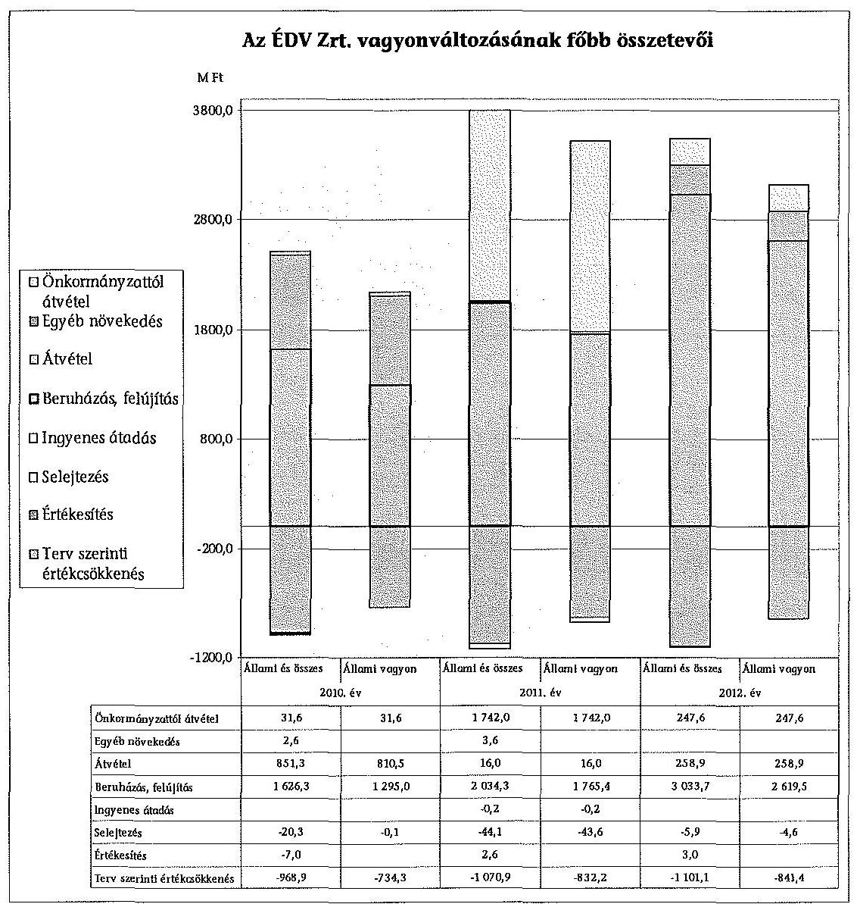
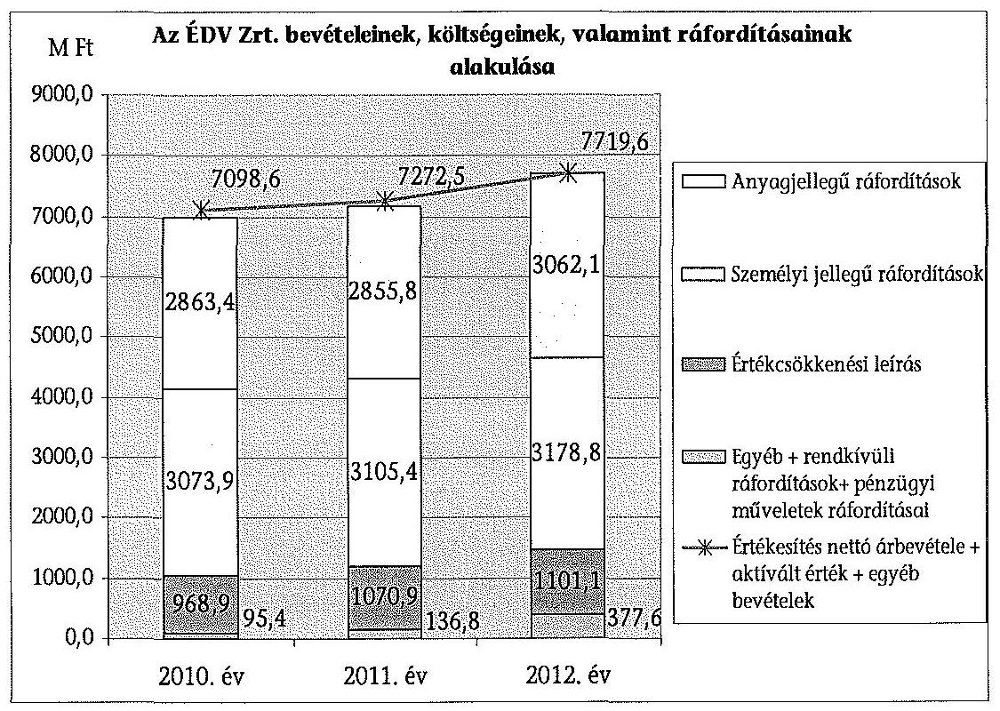
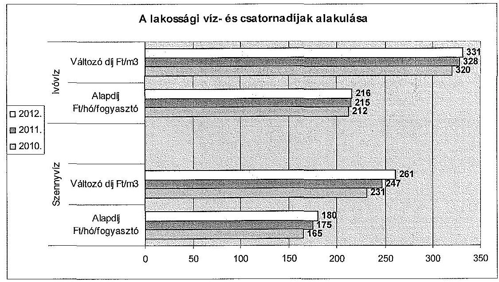
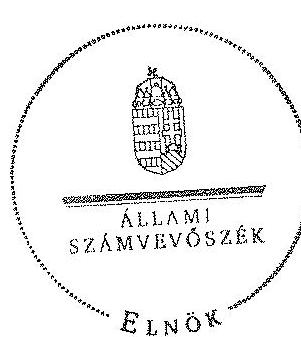
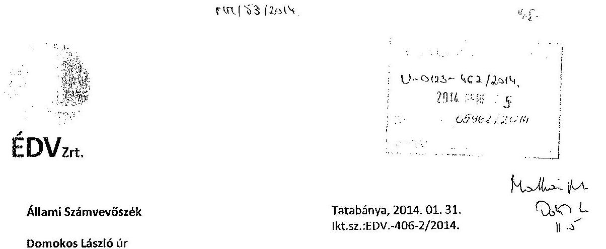
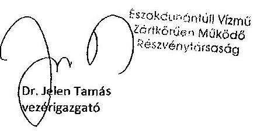
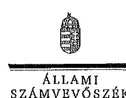
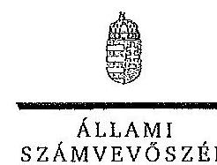

ÁLLAMI
SZÁMVEVŐSZÉK

# JELENTÉS

az állami tulajdonban (résztulajdonban) lévő gazdálkodó szervezetek vagyonértékmegőrző és gyarapító tevékenységének ellenőrzéséről egyes kiemelt közszolgáltató
társaságoknál vagy hasonló tevékenységet végző társaságcsoportoknál Északdunántúli Vízmű Zrt.

---

# Állami Számvevőszék

Iktatószám: V-0123-502/2014.
Témaszám: 1158
Vizsgálat-azonosító szám: V06020105

## Az ellenőrzést felügyelte:

## Makkai Mária

felügyeleti vezető
Az ellenőrzést vezette és az ellenőrzés végrehajtásáért felelős:
Sali Sándorné
ellenőrzésvezető
A számvevőszéki jelentés összeállításában közreműködött:
Dr. Jártas Ágnes
számvevő tanácsos
Az ellenőrzést végezték:
Dr. Jártas Ágnes
Dr. Tóthné Frisch Anita Vassné Sebők Anna
számvevő tanácsos
külső szakértő
külső szakértő

---

# TARTALOMJEGYZÉK

BEVEZETÉS ..... 3
I. ÖSSZEGZŐ MEGÁLLAPÍTÁSOK, KÖVETKEZTETÉSEK, JAVASLATOK ..... 7
II. RÉSZLETES MEGÁLLAPÍTÁSOK ..... 13

1.  Az MNV Zrt. és az ÉDV Zrt. vagyongazdálkodással kapcsolatos tevékenysége ..... 13
1.1. A szabályszerű vagyongazdálkodás feltételeinek kialakítása ..... 13
1.2. A vagyonváltozást eredményező döntések szabályszerűsége ..... 16
2.  Az ÉDV Zrt. vagyongazdálkodással kapcsolatos szabályozási tevékenysége ..... 18
2.1. A szabályszerű vagyongazdálkodási feltételek kialakítása ..... 18
2.2. Az ÉDV Zrt. vagyonnyilvántartása ..... 20
2.3. Kapcsolattartás az MNV Zrt.-vel ..... 23
2.4. A vagyonváltozást eredményező döntések megalapozottsága, szabályszerűsége ..... 25
2.5. A vagyon értékének megőrzése, gyarapítása ..... 27
3.  Az ÉDV Zrt. által működtetett kontroll- és monitoring rendszer ..... 32
3.1. A belső kontrollrendszer ..... 32
3.2. Az információáramlási és monitoring rendszer ..... 33

## MELLÉKLETEK

1.  számú Rövidítések jegyzéke
2.  számú Értelmező szótár
3.  számú A gazdasági társaság vagyonának alakulása 2010-2012. években (ezer Ft-ban)
4.  számú A gazdasági társaság eredményének alakulása 2010-2012. években (ezer Ft-ban)
5.  számú A befektetett eszközök állományának alakulásáról
6.  számú A gazdasági társaság működéséről a 2010-2012. években
7.  számú Az Északdunántúli Vízmű Zrt. vezérigazgatójának észrevétele
8.  számú Az Északdunántúli Vízmű Zrt. vezérigazgatójának észrevételére adott válasz
9.  számú A Magyar Nemzeti Vagyonkezelő Zrt. vezérigazgatójának észrevétele

---

10. számú A Magyar Nemzeti Vagyonkezelő Zrt. vezérigazgatójának észrevételére adott válasz

---

# JELENTÉS

## az állami tulajdonban (résztulajdonban) lévő gazdálkodó szervezetek vagyonérték-megőrző és gyarapító tevékenységének ellenőrzéséről egyes kiemelt közszolgáltató társaságoknál vagy hasonló tevékenységet végző társaságcsoportoknál Északdunántúli Vízmű Zrt.

## BEVEZETÉS

A nemzeti vagyon alapvető rendeltetése a törvényekben meghatározott közfeladatok ellátásának biztosítása. A nemzeti vagyonnal felelős módon, rendeltetésszerűen kell gazdálkodni. A nemzeti vagyon megőrzése érdekében az Alaptörvénnyel összhangban az Nvtv. meghatározza a nemzetgazdasági szempontból kiemelt jelentőségű vagyont, amelybe beletartozik a vízellátás és a szennyvízelvezetés, -tisztítás feladatok elvégzéséhez szükséges közművagyon, amelynek állami tulajdonban történő megőrzése hosszú távon indokolt.

A vagyongazdálkodás feladata a nemzeti vagyon rendeltetésének megfelelő, az állam teherbíró képességéhez igazodó, elsődlegesen a közfeladatok ellátásához szükséges, egységes elveken alapuló, átlátható, hatékony és költségtakarékos működtetése, értékének megőrzése, állagának védelme, értéknövelő használata, hasznosítása és gyarapítása. A Vtv. 2. § (1) és az Nvtv. 7. § (1)-(2) bekezdései határozzák meg az állami vagyongazdálkodással összefüggésben a tulajdonosi joggyakorló és a vagyongazdálkodással kapcsolatos feladatokat. A tulajdonosi joggyakorló a regionális víziközmű társaságok esetében 2010. június 16-ig a Magyar Állam nevében a Nemzeti Vagyongazdálkodási Tanács volt, feladatait az MNV Zrt. útján, annak ügyvezető szerveként látta el. Ezt követően a hatályos törvényi szabályozás szerint az állami vagyon tekintetében a tulajdonosi joggyakorlásra az állami vagyon felügyeletéért felelős miniszter jogosult, aki e feladatát szintén az MNV Zrt. útján látta el. A Vtv. 2013. június 28-tól hatályos rendelkezése alapján az államot megillető jogok és kötelezettségek összességét tulajdonosi joggyakorlóként törvény, vagy miniszteri rendelet eltérő rendelkezésének hiányában az MNV Zrt. gyakorolja.

A 2012. évet megelőzően az önkormányzati törvény elfogadásától (a 1990. évtől) döntően a települési önkormányzatok feladata volt a közműves ivóvízellátás és csatornaszolgáltatás biztosítása (3200 településen közel 400 víziközmű szolgáltató működött). Az államnak feladat-ellátási kötelezettsége az öt állami regionális vízmű tekintetében volt. Az elmúlt években a vízfogyasztás visszaesett, ezáltal a szolgáltató közművek kapacitásának kihasználása csökkent. A

---

Vksztv. 2011. évi hatálybalépéséig nem volt olyan szervezet, illetve szabályozás, amely országosan koordinálta az eltérő tulajdonú, érdekeltségű és működési formájú rendszereket. Ezáltal nem volt biztosított a beruházások összehangolása, a források megfelelő elosztása, ezáltal a fenntartási és üzemeltetési költségek szükségesnél nagyobb mértékű emelkedésének megakadályozása. A 2011. december 31-én hatályba lépett Vksztv. célja az optimális üzemméret előírásával annak biztosítása, hogy a víziközművagyon kezelése egységesebb és a kapacitások kihasználása megfelelő legyen. A Magyar Energetikai és Közműszabályozási Hivatal a beruházások gördülő tervezésének összehangolásán keresztül kívánja biztosítani az indokolatlan költségek fogyasztói árakba való beépítésének elkerülését.

A regionális vízművek gazdálkodása a közérdeklődés középpontjában áll a gazdálkodásuk körébe tartozó vagyon nagysága, gazdálkodásuk sajátossága és az ebből adódó kockázatok, illetve az általuk ellátott közszolgáltatások minősége és hatékonysága miatt. Az ellenőrzés lefolytatását az indokolta, hogy az elmúlt években nem volt az állami regionális víziközművek működését, vagyongazdálkodását átfogóan értékelő ÁSZ ellenőrzés. Az ÉDV Zrt. többségi állami tulajdonú, zártkörűen működő részvénytársaság, amely 91,7%-ban állami tulajdonú, a részesedések 8,3\%-a Tatabánya Megyei Jogú Város Önkormányzata tulajdonában áll. A Társaság közfeladatot lát el, alaptevékenysége az ivóvízellátás és a szennyvízelvezetés. Működési területe alapvetően Komárom-Esztergom megyére terjed ki, társvállalati vízértékesítéssel azonban jelen van Pest és Fejér megyében is. 2012-ben 72 településen nyújtott ivóvízszolgáltatást, 41 településen csatornaszolgáltatást, továbbá 6 társvízműnek adott át ivóvizet.

A Társaság a kizárólagos állami tulajdonú víziközműveket a Kincstári Vagyoni Igazgatósággal kötött vagyonkezelési szerződés alapján, az önkormányzati vízműveket üzemeltetési, illetve vagyonkezelési szerződés alapján üzemelteti. Az állami tulajdonú rendszerhez három regionális ivóvíz ellátó rendszer (tatabányai, dorogi, bicskei) és négy regionális szennyvíztisztító rendszer (tatabányai, tatai, dorogi, esztergomi) tartozott 2012 végén. Az ellenőrzött időszakban a vezérigazgató személye 2010-ben változott.

A Társaság mérlegében szereplő eszközvagyon a 2012. év végén 27 199,6 millió Ft volt. 2010. január 1-én az állami vagyon értéke 18 362,7 millió Ft, 2012. december 31-én 21 654,1 millió Ft volt. Az ÉDV Zrt. saját tőkéje 2012. december 31-én 2192,0 millió Ft, ebből a jegyzett tőke 1380 millió Ft volt, amely a 2010-2012. években nem változott. A 2012. év végén a tőketartalék 293,2 millió Ft, az eredménytartalék 520,9 millió Ft volt. A 2012. évben a nettó árbevétel 7132,1 millió Ft-ot tett ki, a mérleg szerinti veszteség 2,1 millió Ft volt. A 2012. év végén a kötelezettségek állományának értéke 23027,0 millió Ft volt, amelyből 21474,2 millió Ft hosszú lejáratú, 1552,8 millió Ft rövid lejáratú kötelezettség, a követelések összege pedig 1443,2 millió Ft volt. Az ÉDV Zrt.-nél az átlagos statisztikai létszám a 2012. év végén 652 fő volt.

Az ellenőrzés célja annak értékelése volt, hogy a gazdálkodó szervezet vezetése és a tulajdonosi jogok gyakorlója által hozott vagyongazdálkodási döntéseknél szabályszerűen, az elvárható gondossággal jártak-e el, olyan feltételeket alakí-

---

tottak-e ki, hogy a gazdálkodó szervezet tulajdonában, illetve kezelésében, hasznosításában lévő vagyon értékét megőrizzék, gyarapítsák. A gazdálkodó szervezet az ellenőrzött időszakban betartotta-e a vagyonnal való gazdálkodásra vonatkozó jogszabályi rendelkezéseket és a belső szabályzatok előírásait, a rendelkezésre álló erőforrások felhasználásával teljesítette-e a tulajdonos részéről meghatározott célokat és feladatokat, a vagyonkezelő szervezet a tulajdonostól kapott felhatalmazás alapján az elvárható gondossággal felügyelte-e a Társaság működését és vagyongazdálkodását.

Az ellenőrzés várható hozadékaként azt kívántuk megállapítani, hogy az állami és társasági vagyon tekintetében a közfeladatot ellátó gazdasági társaságok a vagyonkezelési szerződés betartásával folyamatosan biztosítják-e a nemzeti vagyon megőrzését, minőségének javítását és a közfeladatok ellátását. Az ellenőrzés az állam tulajdonosi joggyakorlásával összefüggő döntések szabályosságának, megalapozottságának és a szabályozási környezet változásának áttekintésével hozzáadott értéket teremt. Ezért az ellenőrzés fel kívánta tárni a vagyongazdálkodás feltételeinek, a vagyonérték megőrzésének, gyarapításának hiányosságait, egyúttal javaslatot téve azok kijavítására, illetve megállapításaival hozzá kíván járulni a regionális vízművek gazdálkodásának átláthatóságához, a közszolgáltatás színvonalának javításához.

Az ellenőrzés típusa: szabályszerűségi ellenőrzés.
Az ellenőrzés időszaka: a 2010. január 1. és 2012. december 31. közötti időszak volt, kitekintéssel a helyszíni ellenőrzés befejezéséig - 2013. szeptember 2-ig - tartó időszak releváns folyamataira. Az ellenőrzés az Északdunántúli Vízmű Zrt.-re és a Magyar Nemzeti Vagyonkezelő Zrt.-re terjedt ki.

Az ellenőrzés végrehajtásának jogszabályi alapját az ÁSZ tv. 5. § (4) bekezdésében foglaltak képezik.

Az ellenőrzés szakmai módszertana az ÁSZ hivatalos honlapján közzétett szakmai szabályokon alapult, amely a Legfőbb Ellenőrző Intézmények Nemzetközi Szervezete (INTOSAI) által kiadott nemzetközi standardok (ISSAI) figyelembevételével készült.

Az ÉDV Zrt. az ellenőrzés lefolytatásához tanúsítványok kitöltésével, valamint dokumentumok elektronikus megküldésével szolgáltatott adatokat. Az így rendelkezésre bocsátott adatok (információk) kontrollja a helyszíni ellenőrzés keretében történt. A vagyonváltozást eredményező döntések megalapozottságát, továbbá a vagyonérték-megőrző és vagyongyarapító tevékenység szabályszerűségét a számviteli nyilvántartásokban rögzített vagyonváltozások köréből véletlenszerű mintavétellel kiválasztott tételek ellenőrzésével értékeltük. Az ellenőrzés során alkalmazott rövidítések jegyzékét az 1. számú, a fogalmak magyarázatát a 2. számú és az ÉDV Zrt. gazdálkodásra jellemző adatokat a 3-6. számú mellékletek tartalmazzák.

Az állami vagyonon végzett beruházások, értéknövelő felújítások elszámolásával kapcsolatos jogszabályi előírások a jelentés készítés időszakában megváltoztak. A Vhr. 2013. november 30. napjától hatályos módosítása szerint az új előírásokat a rendelet hatályba lépésekor hatályos vagyonkezelési jogviszony-

---

okban a felek a rendelet hatálybalépéséig meg nem történt elszámolásokra is alkalmazhatják.

A jogszabályi előírás lehetőséget biztosít arra, hogy a folyamatban lévő ügyekben a felek (Regionális Vízművek és az MNV Zrt.) számlázási kötelezettség nélkül is elszámoljanak egymással, szükség esetén módosíthassák a vagyonkezelési szerződést, de megállapodásuk alapján a számlázást is alkalmazhatják. A jelentésben szereplő, a kezelt állami tulajdonban lévő eszközökön megvalósított beruházások és értéknövelő felújítások elszámolását érintő megállapítások helytállóak, az ellenőrzött időszakra vonatkozóan az ellenőrzés lefolytatásakor hatályos jogszabályokon alapul. A megváltozott jogszabályi körülményekre tekintettel, ugyanakkor az e tárgykörhöz kapcsolódó javaslatainkat - figyelemmel a jelenleg hatályos jogszabályi előírásokra - pontosítottuk.

Az ÁSZ a 2011. évi LXVI. törvény 29. §-a szerint a jelentéstervezetet megküldte az Északdunántúli Vízmű Zrt. vezérigazgatójának és a Magyar Nemzeti Vagyonkezelő Zrt. vezérigazgatójának egyeztetésre. A beérkezett észrevételeket és az azokra adott választ a jelentés 7-10. számú mellékletei tartalmazzák.

---

# I. ÖSSZEGZŐ MEGÁLLAPÍTÁSOK, KÖVETKEZTETÉSEK, JAVASLATOK

Az ÉDV Zrt. az általa kezelt állami vagyonnal kapcsolatos gazdálkodási tevékenységét az ellenőrzött időszakban az 1998. évben a Kincstári Vagyoni Igazgatósággal (KVI) kötött vagyonkezelési szerződés alapján végezte. Az állami közművagyon kezelését három regionális ivóvízellátó rendszer (Tatabánya, Dorog, Bicske) és négy regionális szennyvíztisztító rendszer (Tatabánya, Dorog, Tata, Esztergom) tekintetében látta el. A vagyonkezelési szerződés előírta az állami vagyon hatékony működtetését, állagának védelmét, valamint a vagyonérték megőrzésére és gyarapítására vonatkozó feltételeket.

A vagyonkezelésben lévő állami vagyonnal történő szabályszerű vagyongazdálkodás feltételeit az ellenőrzött időszakban, illetve azt megelőzően - a vagyonkezelési szerződés módosításában érintett felek - részben teremtették meg, mivel a vagyonkezelési szerződés jogszabályi változásoknak (Vtv., Vhr., Vksztv., Áht$_{1,2}$) megfelelő módosítására a többszöri kezdeményezés ellenére a helyszíni ellenőrzés lezárásáig nem került sor. A hatályos vagyonkezelési szerződés nem biztosította teljes körűen a szabályszerű gazdálkodási környezetet. A VSZ-en a 2005. évet követően a változásokat nem vezették át, annak ellenére, hogy a Vhr. előírásai szerint a VSZ-t módosítani kell,
 ha a vagyonkezelésben lévő állami vagyonon értéknövelő beruházásra, felújításra kerül sor, illetve a vagyonkezelő új, állami vagyonba tartozó eszközt hoz létre. A Vhr. szerint a VSZ módosításával egyidejűleg az értéknövelő beruházásokat és felújításokat az értékesítés általános előírásainak megfelelően számlázni kell az MNV Zrt. felé, azonban az ellenőrzött időszakban ez nem történt meg.

Az ellenőrzött időszakban az ÉDV Zrt. az állami vagyonon 5679,9 millió Ft összegben végzett beruházást és felújítást. A Társaság a Vhr. előírásaival ellentétben a vagyonkezelt eszközökön végzett beruházáshoz, felújításhoz kapcsolódóan, azok végrehajtására nem kért előzetesen engedélyt. Az ÉDV Zrt.-nek alkalmaznia kellett volna a Vhr. hatályos előírásait, és ennek alapján tájékoztatni az MNV Zrt.-t a beruházásokról az éves üzleti tervben és a beszámolóban foglaltakon túl is. Ezeket a beruházásokat az éves üzleti terv beruházási tervének részeként szerepeltette, azonban azok részletes adatai (pl. a beruházások műszaki összetétele, szakmai indokoltsága, feltételei) az üzleti tervekben nem szerepeltek, ezt az MNV Zrt. nem követelte meg, illetve nem kifogásolta. A Társaság a beruházásokról történő beszámolási kötelezettségének az éves beszámoló, valamint az éves vagyonkataszteri jelentés keretében tett eleget. Az érintett eszközök vagyonkezelésbe adása - a vagyonkezelési szerződés módosításának hiányában - nem történt meg. Az MNV Zrt. a beruházásokkal kapcsolatban szakmai elvárásokat nem fogalmazott meg, az ÉDV Zrt.-re bízta a beruházások, értéknövelő felújítások indokoltságának és nagyságrendjének meghatározását. A tulajdonos a vagyonkezeléssel kapcsolatos szakmai feladatok elvégzését teljes körűen a vagyonkezelő hatáskörébe utalta.

---

A Vtv. és a Vhr. végrehajtása érdekében az MNV Zrt. 2011. június 21-én tájékoztató levelet küldött a regionális vízmű társaságoknak, amelyben iránymutatást adott az állami vagyonnal kapcsolatos számviteli elszámolások kezeléséhez. Ebben rögzítette a beruházások, beszerzések elszámolása rendjét és folyamatát. Előírta a 2008. január 1. és 2011. június 30. között üzembe helyezett beruházások és az értéknövelő felújítások MNV Zrt. részére történő értékesítését - 2011. december 31-ig -, illetve azzal egyidejűleg a VSZ módosítását. Az MNV Zrt. rögzítette, hogy amennyiben az értékesítés áfaköteles, akkor a beruházás, felújítás áfatartalmát a Társaság részére megtéríti. Az ÉDV Zrt. a tájékoztató levélben előírtakat nem hajtotta végre, mivel a számlázás áfa- és egyéb adófizetési kötelezettségét, továbbá a visszamenőleges hatályú rendezés (önellenőrzés) jogkövetkezményéből adódó fizetési kötelezettségeket az ÉDV Zrt., valamint az MNV Zrt. nem finanszírozta.

Az ÉDV Zrt. az Alapszabályban, az SZMSZ-ben és a vagyongazdálkodási szabályzatban rögzítette a vagyongazdálkodás kialakításával, működésével kapcsolatos felelősségi, döntési jogköröket. Ezekben részletesen megfogalmazták a Közgyűlés, a vezérigazgató, valamint a szervezeti egységek és vezetők feladat- és hatáskörét. Az Alapszabályban meghatározták, hogy az alaptevékenységhez nem kapcsolódó kötelezettségvállalások 300 millió Ft összeghatárig a vezérigazgató hatáskörébe tartoztak - az FB jóváhagyása mellett -, amellyel nagyfokú önállóságot biztosítottak a Társaság gazdálkodási döntéseihez és azok végrehajtásához. A Közgyűlés - melynek tagja volt a tulajdonosi joggyakorló képviselője is - a hatáskörébe tartozó ügyekben döntött, ezen belül az éves üzleti terv, az éves beszámoló, illetve a javadalmazási szabályzat elfogadásáról, az üzleti jelentésének jóváhagyásáról, illetve a vezérigazgatói prémium kifizetéséről. A Közgyűlés a 2010-2012. évi éves beszámolókat a törvényi előírásoknak megfelelő határidőn belül, a kötelező feltételek (FB és könyvvizsgálói jelentés) megléte mellett jóváhagyta. Az MNV Zrt. az éves üzleti terv és beszámoló elfogadásakor részletes tájékoztatást kért a vagyonkezelésbe adott vagyon értékének alakulásáról. Az előterjesztéseket az MNV Zrt. szakmai igazgatóságai véleményezték.

Az ellenőrzött időszakban az ÉDV Zrt. és a tulajdonosi jogok gyakorlója közötti kapcsolattartás nem teljes körűen volt biztosított, mert az ÉDV Zrt. a beruházási döntésekre a Vhr.-ben előírtak ellenére az előzetes engedélyeket nem kérte meg. Az ÉDV Zrt. a Vhr. szerinti, illetve a VSZ-ben és a Vgsz.-ben meghatározott adatszolgáltatását évente a Kincstári Vagyonkataszterben teljesítette. Ebben tételesen adatot szolgáltatott az évente elszámolt és visszapótolt értékcsökkenés mértékéről, továbbá a selejtezésekről és a befejezetlen beruházásokról. A vagyonkataszter adatai az ÉDV Zrt. beszámoló adataival megegyeztek. Az ÉDV Zrt.-nek a vagyonkezelésbe vett állami eszközökhöz kapcsolódó hosszú lejáratú kötelezettsége 2012. évi nyitó állományának összegét az MNV Zrt. visszaigazolta. Az adatszolgáltatást elfogadva az MNV Zrt. a rábízott vagyon beszámolójában a vagyonértékeket szerepeltette. Az ÉDV Zrt. az egyéb tájékoztatási, értesítési kötelezettségének - pl. a vagyont fenyegető veszélyről, beállott árvízi károkról és a ráfordításaikról - eleget tett.

Az ellenőrzött időszakban az MNV Zrt. a tulajdonosi ellenőrzési rendszert kialakította és működtette. A Társaság működésének figyelemmel kísérése a bekért adatszolgáltatásokra épülő kontrollokon alapult. Az MNV Zrt. a Társa-

---

ság állami vagyonnal való gazdálkodását, a vagyon megőrzését, gyarapítását, jogszabály szerinti használatát az ÉDV Zrt.-nél nem ellenőrizte.

A VSZ előírta a Számv. tv. szerinti értékcsökkenés elszámolását, melyet az ÉDV Zrt. számviteli politikája szabályozott. A hatályos számviteli politika a vagyonkezelésbe került eszközökre korrekciós szorzó figyelembevételét írta elő, melyet a Társaság az ellenőrzött időszakban a szabályozásában foglaltaknak megfelelően alkalmazott. Az értékcsökkenési leírás módszere 2012-től az MNV Zrt. által a víziközmű társaságokra kiadott, egységes számviteli irányelvek alapján megváltozott, az ÉDV Zrt. az újonnan aktivált eszközök esetében lineárisan, a várható használati idő és maradványérték figyelembevételével állapította meg az értékcsökkenés mértékét. A 2011. év végéig aktivált eszközök értékcsökkenési leírási módszere nem változott, az a VSZ-ben rögzítetteknek megfelelő volt.

Az ÉDV Zrt. a nyilvántartási feladatait alapvetően az MNV Zrt. jogelőd szervezete (KVI) által 1998-ban kiadott vagyongazdálkodási szabályzatban (Vgsz.) foglaltak alapján látta el, amelyet a helyszíni ellenőrzés befejezéséig nem módosítottak az időközben hatályba lépő jogszabályi előírásoknak megfelelően. Az MNV Zrt. 2008-ban kiadta az MNV Zrt. vagyonnyilvántartási szabályzatát, amely a Vtv., illetve a Vhr. szabályain alapult, és amelynek hatálya kiterjedt az ÉDV Zrt.-re is. Az új szabályzat elfogadásakor az MNV Zrt. a Vgsz.-t nem helyezte hatályon kívül, illetve az abban foglalt előírásokat a VSZ-en nem vezették át. Ennek következtében nem került rögzítésre a VSZ-ben a - Vhr. előírásaival ellentétesen - a vagyonnyilvántartási szabályzat vagyonkezelővel történő kötelező megismertetése. Az MNV Zrt. által kiadott szabályzatot az ÉDV Zrt. a belső szabályozási rendszerében 2012-ben léptette hatályba.

A Társaság a vagyonkezelésében lévő eszközök állományba vételi és nyilvántartási kötelezettségének a számviteli politikában és a leltározási szabályzatban meghatározott módon tett eleget, a nyilvántartást leltárral alátámasztotta. Az állami vagyonkezelt eszközökhöz kapcsolódó beruházások és értéknövelő felújítások elszámolásának hiányossága miatt azonban a Társaság állammal szembeni hosszú lejáratú kötelezettségének a VSZ és a tulajdonos által is elfogadott, éves beszámolók szerinti értéke eltért. Az ÉDV Zrt. 2012. január 1-ig a vagyonkezelésbe vett eszközök selejtezését a hosszú lejáratú állami kötelezettségekkel szemben - a Számv. tv. előírásával ellentétesen - számolta el, és - a Vgsz.-ben foglaltakkal ellentétesen - a kezelt vagyonból történő kivezetéshez nem kérte a tulajdonos engedélyét. Az állami vagyoni körbe tartozó eszköz selejtezés összege a 2010. évben 19,8 millió Ft és a 2011. évben 43,6 millió Ft volt. A 2012. évtől a Társaság az állami vagyon körében végrehajtott selejtezéseket a Számv. tv. előírásainak megfelelve egyéb ráfordításként számolta el, de a selejtezésekhez az MNV Zrt. engedélyét továbbra sem kérte meg. A VSZ módosításának elmaradása, valamint a selejtezések szabálytalan elszámolása miatt az állami vagyon nyilvántartása nem volt szabályszerű.

Az ÉDV Zrt. 2010. évről szóló éves beszámolóját a könyvvizsgáló hitelesítette, ugyanakkor a 2011. évről szóló éves beszámolót korlátozó záradékkal látta el, mivel az állami közművagyon elszámolása nem felelt meg a Vtv., a Vhr., és a Számv. tv. előírásainak, továbbá az értéknövelő beruházások elszámolása az MNV Zrt. és az ÉDV Zrt. között nem történt meg. A 2012. évről szóló éves be-

---

számolóhoz figyelemfelhívást adott ki, azonban az állami vagyonnal kapcsolatos elszámolások továbbra sem feleltek meg a jogszabályoknak.

Az ÉDV Zrt.-nek az ellenőrzött időszakban a könyvviteli mérlegben kimutatott vagyona 21552,0 millió Ft-ról 27 199,6 millió Ft-ra, 26,2\%-kal növekedett, ezen belül az állami vagyon 18362,7 millió Ft-ról 21654,0 millió Ft-ra, 17,9\%-kal nőtt. A saját tőke $10,0 \%$-kal, a saját tőke/jegyzett tőke aránya $144 \%$-ról $158 \%$-ra nőtt. A vagyonnövekedést az eredményezte, hogy a Társaság az értékcsökkenés pótlásán felül más forrásokból történt fejlesztésekkel is biztosította a vagyon értékének megőrzését, illetve gyarapítását. A fejlesztés fő forrását 3140,9 millió Ft amortizációs forrás jelentette, ezen felül 2137,3 millió Ft EU és hazai fejlesztési támogatást, az újonnan csatlakozók befizetéseit (451,8 millió Ft), valamint saját forrást használt fel. A megvalósított beruházások mellett térítés nélküli vagyon- (eszköz-) átvételek az állami vagyoni körben 833,3 millió Ft értékben történtek, melyből a „Tatabányai vízbázisok és regionális rendszer fejlesztése" beruházás átvétele 799 millió Ft, a vízbekötésekhez kapcsolódó eszközátvétel 34,3 millió Ft volt.

Az állami vagyon értékének megőrzéséről, állagának megóvásáról az ÉDV Zrt. a tárgyi eszközök rendszeres időközönkénti, megfelelő mértékű karbantartásával gondoskodott. A karbantartásra vonatkozó, a Vtv.-ben és a Vhr.-ben, valamint a vagyonkezelési szerződésben foglalt rendelkezéseket az ÉDV Zrt. betartotta, az éves feladatokra karbantartási tervek készültek. Az állami tulajdonú eszközök javítására és karbantartására az ellenőrzött időszakban összesen 1584,2 millió Ft-ot fordítottak.

A tárgyi eszköz beszerzésre, létesítésre irányuló Kbt. szerinti értékhatárt elérő építési beruházásoknál, árubeszerzéseknél, szolgáltatásoknál a közbeszerzést lefolytatták, és a legjobb ajánlatot tevővel kötöttek szerződést. Az éves közbeszerzési terv jóváhagyásáról mindhárom évben a közgyűlés döntött, 2010-ben önállóan, 2011-ben és 2012-ben az éves üzleti terv elfogadásának keretében.

Az állami vagyonnal kapcsolatos adatvédelem biztosított volt az ÉDV Zrt.-nél, azonban a Társaság honlapján hiányosak voltak az információs önrendelkezési jogról és az információszabadságról szóló 2011. évi CXII. tv. szerinti nyilvános információk (pl. az éves beszámolók, a közbeszerzési eljárásokkal kapcsolatos információk).

Az ÉDV Zrt. a kezelt és saját vagyonnal való felelős gazdálkodás érdekében megfelelően kialakította a belső kontrollrendszerét, ugyanakkor a belső ellenőrzés az állami vagyon védelmére és az állami vagyonnal való felelős gazdálkodásra vonatkozóan nem végzett ellenőrzést. A megvalósult ellenőrzések a Társaság saját vagyonára (működtető vagyon) és egyes gazdálkodási tevékenységekre irányultak (pl. a 2009. évi közbeszerzések, a követelésbehajtás, anyaggazdálkodás, valamint a KEOP pályázatban megvalósuló szennyvízteleprekonstrukciók). Az ÉDV Zrt.-nél a költséggazdálkodásban rejlő tartalékok feltárására nem került sor, ami nem szolgálta a költségmegtérülés elvének érvényesülését.

A Felügyelő Bizottság a belső ellenőrzés jelentéseit megtárgyalta, ezen kívül rendszeresen beszámoltatta az ügyvezetést az aktuális vagyoni helyzet értékelé-

---

séről, a gazdálkodás helyzetéről. Az FB az ügyvezetés munkáját, az ÉDV Zrt. üzletmenetét és vagyoni helyzetét folyamatosan figyelemmel kísérte és negyedévente értékelte.

Az Állami Számvevőszékről szóló 2011. évi LXVI. törvény 33. § (1) bekezdésében foglaltak értelmében a jelentésben foglalt megállapításokhoz kapcsolódó intézkedési tervet köteles az ellenőrzött szervezet vezetője összeállítani, és azt a jelentés kézhezvételétől számított 30 napon belül az ÁSZ részére megküldeni. Amennyiben az intézkedési tervet határidőben nem küldi meg,
 a szervezet, vagy az nem elfogadható, az ÁSZ elnöke a hivatkozott törvény 33. § (3) bekezdés a)-b) pontjaiban foglaltakat érvényesítheti.

Az ellenőrzés intézkedést igénylő megállapításai és javaslatai:

# Az MNV Zrt. vezérigazgatójának

1.  A vagyon nyilvántartására vonatkozó szabályozás nem volt egyértelmű, mert az MNV Zrt. a jogelőd szervezet (KVI) által 1998-ban kiadott Vgsz.-t nem helyezte hatályon kívül.

Javaslat:
Intézkedjen az állami vagyon nyilvántartására vonatkozó Vhr. 13. és 14. §-ban foglalt hatályos szabályozások érvényesítése mellett az ágazat specifikus szempontok figyelembe vételével az egységes szabályzat kiadásáról.
2.  A Társaság a Vhr. előírásaival ellentétben a vagyonkezelt eszközökön végzett beruházáshoz, felújításhoz kapcsolódóan azok végrehajtására nem kért előzetesen engedélyt. Az ÉDV Zrt.-nek alkalmaznia kellett volna a Vhr. hatályos előírásait, és ennek alapján tájékoztatni az MNV Zrt.-t a beruházásokról az éves üzleti tervben és a beszámolóban foglaltakon túl is. Ezeket a beruházásokat az éves üzleti terv beruházási tervének részeként szerepeltette, azonban azok részletes adatai (pl. a beruházások műszaki összetétele, szakmai indokoltsága, feltételei) az üzleti tervekben nem szerepeltek, ezt az MNV Zrt. nem követelte meg, illetve nem kifogásolta.

Javaslat:
Vizsgálja felül az ÉDV Zrt. által az MNV Zrt. előzetes engedélye nélkül megvalósított beruházások szakmai indokoltságát, azok szükségességét, a beruházások tervezett és tényleges költségeinek alakulását, valamint a beruházással létrehozott eszközök kihasználtságát, fenntarthatóságát, és amennyiben szükséges, intézkedjen a felelősség megállapításáról.

## Az Északdunántúli Vízmű Zrt. vezérigazgatójának

1.  Az ÉDV Zrt. a Vhr. 9. § (6) bekezdésében foglaltak ellenére a beruházáshoz és az értéknövelő felújításhoz az MNV Zrt.-től előzetes írásbeli engedélyt nem kért, valamint a beruházások kivitelezésének megkezdéséről, annak lefolytatásáról az MNV Zrt.-t nem tájékoztatta. Az ÉDV Zrt. nem gondoskodott a Vhr. 14. § (1) bekezdésében elő-

---

írt egységes nyilvántartás biztosítása érdekében az MNV Zrt.-vel való együttműködésről.

Javaslat:
a) Intézkedjen a Vhr. 9. § (6) bekezdésében foglaltak alapján a vagyonkezelt eszközön elszámolt bármely beruházáshoz, felújításhoz kapcsolódóan az MNV Zrt.-től előzetes írásbeli engedély kéréséről, valamint a vagyonkezelési szerződésben meghatározott módon a beruházások, felújítások beszámolási kötelezettségének teljesítéséről.
b) Gondoskodjon a Vhr. 14. § (1) bekezdésében foglaltaknak megfelelő együttműködésről, a nyilvántartás egységessége, pontossága és az adatellenőrzések biztosítása érdekében.
2.  A belső ellenőrzés az ellenőrzött időszakban nem végzett ellenőrzést az állami vagyon védelmére és az állami vagyonnal való felelős gazdálkodásra vonatkozóan, az ellenőrzések a társaság saját vagyonára (működtető vagyon) és egyes gazdálkodási tevékenységekre irányultak. Az ÉDV Zrt.-nél a költséggazdálkodásban rejlő tartalékok feltárására nem került sor, ami nem szolgálta a költségmegtérülés elvének érvényesülését.

Javaslat
Intézkedjen, hogy a belső ellenőrzés tevékenysége terjedjen ki a költséggazdálkodásban rejlő tartalékok feltárására, a költségmegtérülés elvének érvényesülésére.
3.  A Társaság a Vhr. előírásaival ellentétben a vagyonkezelt eszközökön végzett beruházáshoz, felújításhoz kapcsolódóan, azok végrehajtására nem kért előzetesen engedélyt. Az ÉDV Zrt.-nek alkalmaznia kellett volna a Vhr. hatályos előírásait, és ennek alapján tájékoztatni az MNV Zrt.-t a beruházásokról az éves üzleti tervben és a beszámolóban foglaltakon túl is. Ezeket a beruházásokat az éves üzleti terv beruházási tervének részeként szerepeltette, azonban azok részletes adatai (pl. a beruházások műszaki összetétele, szakmai indokoltsága, feltételei) az üzleti tervekben nem szerepeltek, ezt az MNV Zrt. nem követelte meg, illetve nem kifogásolta.

Javaslat:
Vizsgálja ki az MNV Zrt. engedélye nélkül megvalósított beruházások körülményeit, és annak eredményétől függően intézkedjen a felelősség megállapításáról.

---

# II. RÉSZLETES MEGÁLLAPÍTÁSOK

## 1. Az MNV ZRT. És az ÉDV ZRT. VAGYONGAZDÁLKODÁSSAL KAPCSOLATOS TEVÉKENYSÉGE

### 1.1. A szabályszerű vagyongazdálkodás feltételeinek kialakítása

Az ÉDV Zrt.-t, mint regionális víziközmű társaságot az állami vagyonról szóló 2007. évi CVI. törvény ${ }^{1}$ 2009-ben nyilvánította tartósan állami tulajdonú társasági körbe tartozónak. 2010-2012 között az állami tulajdon (közművagyon, társasági részesedés) feletti joggyakorló a jogszabályok változása miatt többször változott, ${ }^{2}$ azonban a joggyakorlás az MNV Zrt-én keresztül valósult meg.

Az állami tulajdonú közművagyon működtetésére az MNV Zrt. jogelődje, a KVI kötött vagyonkezelési szerződést az ÉDV Rt.-vel 1998-ban. A szerződést kiegészítette az azzal együtt hatályba lépő, „A kincstári vagyoni körbe tartozó víziközmű vagyonkezelési, gazdálkodási és nyilvántartási szabályzata", amely a szerződés végrehajtásához szükséges vagyonkezelési, gazdálkodási, nyilvántartási és jelentési előírásokat rögzítette.

A közművagyon üzemeltetésének és a kincstári vagyonnal történő gazdálkodásnak az alapját képező VSZ-t és Vgsz-t 2005 óta nem módosították annak ellenére, hogy azt mind a jogszabályi változások, mind a kezelt vagyoni kör változása indokolta volna. Az állami vagyont 2007 óta szabályozó jogszabályok (Vtv., Nvtv., Vhr.) és módosításaik alapvetően megváltoztatták a vagyonnal való gazdálkodás jogi hátterét.

A Vtv. az egyéb vagyonkezelőkkel kötött szerződések érvényességét nem érintette, nem írta elő a szerződések felülvizsgálatát és módosítását. Az Nvtv. kimondta ${ }^{3}$, hogy „a hatályba lépését megelőzően (2012. január 1.) jogszerűen és jóhiszeműen szerzett jogokat és kötelezettségeket a törvény rendelkezései nem érintik." A 2012. előtt kötött szerződések alkalmazási problémáinak megoldását célozta a Vhr. 2012. szeptemberi módosítása ${ }^{4}$, amely szerint a 2012. január 1-jét megelőzően létrejött vagyonkezelési szerződésre és vagyonkezelőkre a Vhr.-nek a vagyonkezelési szerződésre és a vagyonkezelőre vonatkozó szabályait kell alkalmazni (54. § (7) bekezdés).

[^0]
[^0]:    ${ }^{1}$ Az állami vagyonról szóló 2007. évi CVI. törvény módosításáról szóló 2009. évi LXX. törvény, hatályos 2009. július 4-től.
    ${ }^{2}$ 2008. január 1-jétől a Nemzeti Vagyongazdálkodási Tanács, 2010. június 17-től az állami vagyonért felelős miniszter, 2013. június 28 -tól az MNV Zrt. (a társasági részesedések tekintetében).
    ${ }^{3}$ Nvtv. 17. § (1) bekezdés
    ${ }^{4}$ a nemzeti vagyonnal összefüggésben egyes kormányrendeletek módosításáról szóló 242/2012. (VIII. 31.) Korm. rendelet

---

Az ÉDV Zrt. az ellenőrzött időszakban rendelkezett érvényes vagyonkezelési szerződéssel és hatályos vagyongazdálkodási szabályzattal, ezek azonban a 1998-ban hatályos jogszabályok alapján készültek. A Vtv. és a Vhr. módosításai, továbbá a Vksztv. megjelenése alapvetően megváltoztatták az állami tulajdon, a tulajdonosi joggyakorlás, a vagyonkezelés tartalmát és a víziközműszolgáltatás szabályait. A VSZ-t, illetve a Vgsz.-t azonban nem módosították a jogszabályi változásoknak megfelelően, a Társaság az ellenőrzött időszakban egyes gazdálkodási területeken (pl. selejtezés, beruházások) a korábbi szabályozások alapján járt el. Ez a helyzet mind a gazdálkodás, mind a vagyonnal történő elszámolás, mind az állami vagyonhoz kapcsolódó kötelezettségek teljesítése terén ellentmondásokkal terhelt, és nem felelt meg a hatályos jogszabályoknak.

A VSZ módosítását igényelte volna a kezelt vagyoni kör változása is. A vagyonkezelt közművagyon alapvetően infrastruktúra (a vízmű és szennyvízrendszereket alkotó vezetékek, épületek és építmények, gépek, berendezések, telkek), ami a szolgáltatási kör változásával, a beruházásokkal, fejlesztésekkel folyamatosan bővült. A Társaság vagyona gazdasági események (beruházás, selejtezés, ingyenes átadás stb.) és törvényi változások következtében (pl. NFA vagyonátadás, átháramlás, rendszer független elemek meghatározása) is változott. A VSZ-ben sem a vagyonelemeket, sem a vagyonértéket nem vezették át. 2008 óta nem került sor a vagyonlistában nyilvántartott ingatlanok földhivatali nyilvántartással való összevetésére, valamint a tényleges állapot és a jogi helyzet felmérésére.

A Vtv., és a Vhr. 2007. évi hatálybalépést követően az MNV Zrt. nem szabályozta a vagyonkezelő által az állami vagyonon végrehajtott beruházás elszámolását, illetve a Vhr.-ben az elszámolásra meghatározott szabályok végrehajtásának rendjét. A VSZ-t a Vhr. 18. §-a szerint módosítani kell, ha a vagyonkezelésben lévő állami vagyonon értéknövelő beruházásra, felújításra kerül sor, illetve a vagyonkezelő új, állami vagyonba tartozó eszközt hoz létre. A szerződés módosításával egyidejűleg a beruházás értékét az értékesítés általános előírásainak megfelelően kell számlázni az MNV Zrt. felé. A jogszabályi előírás ellenére a 2007. évet követően a helyszíni ellenőrzés lezárásáig a vagyonváltozást a VSZ-ben nem vezették át, ezen kívül a végrehajtott beruházások pénzügyi és számviteli rendezésére sem került sor a Társaság és az MNV Zrt. között.

A Társaság 2009-ben kezdeményezte a VSZ módosítását. 2011-ben a víziközmű társaság vezetői ismét levélben fordultak a tulajdonoshoz a vagyonkezelői szerződések ügyében, melyben felhívták a figyelmet arra, hogy a kincstári vagyon elszámolásának szabályai számos számviteli és jogi problémát vetnek fel. Az ÉDV Zrt. 2012 októberében egy ingatlan értékesítése kapcsán ismét kezdeményezte a szerződésmódosítást az MNV Zrt.-nél.

Az MNV Zrt. a VSZ módosítása érdekében a társasággal több ízben is egyeztetett, ez azonban a helyszíni ellenőrzés lezárásáig nem vezetett eredményre.

Az állami vagyongazdálkodásban az MNV Zrt. felelős az állami vagyon egységes nyilvántartásáért, és beszámolási kötelezettség terheli az állami vagyon ál-

---

lományának alakulásával kapcsolatban ${ }^{5}$. A kötelezettség teljesítése érdekében a vagyonkezelőknek a Vhr. 14. § (1) bekezdése alapján kötelezettsége a kezelt vagyonról a nyilvántartás hiteles vezetése és adatszolgáltatás az MNV Zrt. be-számoló-készítési kötelezettségének megalapozottsága érdekében.

A Vtv. és a Vhr. egységes vagyonnyilvántartási szabályzat elkészítését és alkalmazását írta elő, melyet az MNV Zrt. 2008-ban vezérigazgatói utasításként készített el és tett közzé ${ }^{6}$. A korábbi szabályzat (Vgsz.) hatályon kívül helyezésére vagy aktualizálására nem került sor. Az új vagyonnyilvántartási szabályzat alkalmazásáról az MNV Zrt. a víziközmű társaságokat nem tájékoztatta, annak ellenére, hogy a szabályzat hatálya kiterjed az egyéb vagyonkezelőkre is (1.1.pont).

A Vhr. 14. § (3) bekezdése tartalmazza az MNV Zrt. vagyonnyilvántartási szabályzatával szemben támasztott követelményeket, és előírja a vagyonkezelési szerződésben annak rögzítését, hogy a szerződő partner az MNV Zrt. vagyonnyilvántartási szabályzatát megismerte, és magára nézve kötelező érvényűnek ismeri el. Tekintettel arra, hogy az ÉDV Zrt. vagyonkezelési szerződését 2005. óta nem módosították, nem került bele az említett rendelkezés. Az MNV Zrt. Vagyonnyilvántartási Szabályzatát a Társaság a 2012-ben hatályba léptetett új Számviteli Politika 1. számú függelékeként emelte be belső szabályozásába.

Az MNV Zrt. szerint a vagyonkezelők a vagyonnyilvántartási kötelezettségüknek a hatályos jogszabályok, a vagyonkezelési szerződésük, valamint az MNV Zrt. vagyonnyilvántartási szabályzata alapján tettek eleget. A szabályszerű adatszolgáltatás mellett azonban a Vhr. 14. § (3) bekezdésben meghatározott előírás teljesüléséhez elengedhetetlen a hatályos jogszabályoknak megfelelő VSZ megkötése is.

Az ÉDV Zrt. az ellenőrzött időszakban teljesítette a vagyonkataszteri jelentéstételi kötelezettségét. A véletlenszerűen kiválasztott vagyonelemek (pl. értékesítés) kataszteri nyilvántartása a tényleges állapotnak megfelel. Az egyes vagyonelemek életútjának lekérdezése alapján az ellenőrzött időszakban az ingatlan mozgásait megfelelően rögzítették a jelentésekben. A vagyonkataszter és az ÉDV Zrt. beszámolójának megfelelő adatai egyeztek.

Az állami tulajdonú eszközök selejtezésére az MNV Zrt. 2011-ben adott ki szabályzatot ${ }^{7}$. A szabályzat hatálya kiterjed az egyéb vagyonkezelők vagyonkezelésében lévő eszközök selejtezésére és hasznosítására is. A szabályzat szerint a selejtezések engedélyezése az MNV Zrt. kompetenciája. Az MNV Zrt. tájékoztatása szerint a Vgsz. selejtezésekre vonatkozó rendelkezéseit az MNV Zrt. selejtezési szabályzata nem helyezte hatályon kívül. Az MNV Zrt. nem rendelte el az

[^0]
[^0]:    ${ }^{5}$ Vtv. 17. § (1) bekezdés b) pontja és 19. § (3) bekezdése, Vhr. 13-14. §
    ${ }^{6}$ 46/2008. számú
 vezérigazgatói utasítás a Magyar Nemzeti Vagyonkezelő Zrt. Vagyonnyilvántartási Szabályzatáról (egységes szerkezetben a 8/2009. számú utasítással, MK 2008/100)
    ${ }^{7}$ 33/2011. vezérigazgatói utasítás az MNV Zrt. saját és rábízott vagyonában nyilvántartott eszközök selejtezésére és hasznosítására vonatkozó szabályzat

---

általa kiadott szabályzat alkalmazását az ÉDV Zrt.-nél, és azt a vagyonkezelési szerződés, illetve módosítása sem írta elő.

Az ÉDV Zrt. a selejtezéseket 2010-2012 között nem az MNV Zrt. szabályzata, hanem a Vgsz. alapján végezte, melyet az éves beszámolóban rögzített, egyben tájékoztatta arról a tulajdonost. Az MNV Zrt. a Társaság selejtezési gyakorlatát elfogadta, nem kifogásolta.

A Vgsz. szerint beruházás, felújítás és rekonstrukció esetében a Társaság a selejtezési szabályzata alapján jogosult értékhatár nélkül selejtezési eljárást lefolytatni, és az éves jelentésben selejtezési jelentést kell készíteni. Egyéb esetekben a selejtezési eljárási jegyzőkönyvet 15 napon belül el kell juttatni a KVI-nek (MNV Zrt.-nek) és a selejtezés annak jóváhagyásával válik érvényessé és végrehajthatóvá.

A vagyonkezelésbe adott állami vagyonnal való gazdálkodási jogosultságok kereteit, hatásköreit a jogszabályi változásokhoz igazodóan aktualizált Alapszabály rögzítette. A közgyűlés kizárólagos hatáskörébe tartozott többek között a Társaság stratégiai, közbeszerzési és üzleti tervének jóváhagyása. Az Alapszabályban meghatározták, hogy az alaptevékenységhez nem kapcsolódó kötelezettségvállalások 300 millió Ft összeghatárig a vezérigazgató hatáskörébe tartoztak - az FB jóváhagyása mellett -, amellyel nagyfokú önállóságot biztosítottak a Társaság gazdálkodási döntéseihez és azok végrehajtásához.

Az ellenőrzött időszakban az ÉDV Zrt. Alapszabálya alapján a közgyűlés hatáskörét képezte azon rövid, közép és hosszú lejáratú kötelezettségvállalások engedélyezése, amelynek eredményeként a Társaság hitelállománya, kötelezettségvállalása a 300,0 millió Ft-ot meghaladja, továbbá a 100,0 millió Ft-ot meghaladó összegű ingatlan vagy más vagyontárgy elidegenítése és döntés az EU támogatással megvalósuló beruházások pályázaton való részvételéről, amennyiben a Társaság kötelezettségvállalása, vagy a kötelezettségvállalással együttesen kialakuló kötelezettség a nettó 300,0 M Ft-ot meghaladja.

A tulajdonosi jogok gyakorlója által kialakított, a vagyoni érték megőrzését, gyarapítását szolgáló szabályszerű vagyongazdálkodás feltételei nem teljes körűen voltak megfelelőek az ellenőrzött időszakban. A vagyonkezelési szerződés jogszabályoknak nem megfelelő módosítása hozzájárult a vagyonkezelt vagyon számviteli és pénzügyi elszámolási hiányosságához. Ugyanakkor a társaság a szerződés alapján a kezelt vagyont rendeltetésének megfelelően működtette, azzal víziközmű-szolgáltatást nyújtott működési területén, azt karbantartotta és fejlesztette.

# 1.2. A vagyonváltozást eredményező döntések szabályszerűsége 

Az ÉDV Zrt. Alapszabályában foglaltaknak megfelelően a közgyűlés az üzleti terv keretszámain belül jóváhagyta a vagyongazdálkodással összefüggő beruházási, felújítási tevékenységek ráfordításait, elfogadta az éves üzleti terveket, ennek során jóváhagyta a Beruházási tervet és a Közbeszerzési tervet is. Az ÉDV Zrt. a beruházásokat az éves üzleti terv beruházási tervének részeként szerepeltette, azonban azok részletes adatai (pl. a beruházások műszaki összetétele, szakmai indokoltsága, feltételei) az üzleti tervekben nem szerepeltek, ezt az MNV Zrt. nem követelte meg, illetve nem kifogásolta.

---

A Társaság az adott évre vonatkozó üzleti tervben bemutatta az immateriális javak és tárgyi eszközök tervezett változását, valamint a gazdálkodásban felmerülő kockázatokat.

A Társaság üzleti terveinek elkészítéséhez az MNV Zrt. tervezési irányelveket (alkalmazandó makrogazdasági mutatók és keresetfejlesztési irányelvek) és egyéb elvárásokat (pl. egységes számviteli politika bevezetése) fogalmazott meg. Az ellenőrzött években az MNV Zrt. elvárása az volt, hogy a Társaság eredménye pozitív legyen („pozitív nulla"), és arra törekedett, hogy a személyi jellegű ráfordítások és az anyagjellegű ráfordítások emelkedését visszafogja, ezért a Társaságnál 2010-2012. között bértömeg gazdálkodást érvényesített. A Társaság a terveit az MNV Zrt. elvárásainak megfelelően állította össze, és éves gazdálkodása során is érvényesítette azokat.

Az MNV Zrt. az éves üzleti terv és beszámoló elfogadás folyamatában részletes tájékoztatást kapott a kezelt vagyon értékének alakulásáról. A Társaság az éves beszámolóban, az üzleti jelentésben és a kiegészítő mellékletben részletesen bemutatta az állami vagyon alakulását, az eszközök értékét, valamint a kincstárral szembeni hosszú lejáratú kötelezettségek alakulását, melyet az MNV Zrt. elfogadott.

A döntés előkészítés folyamatában a Társaság éves üzleti terveinek és beszámolóinak elfogadására készült előterjesztések az MNV Zrt. belső szabályozásának megfelelően készültek. Az előterjesztésekhez az ÉDV Zrt. rendszeresen vagy eseti jelleggel adatokat szolgáltatott, azokat MNV Zrt. szakmai szervezetei véleményezték.

Az MNV Zrt. Igazgatósága döntött az ÉDV Zrt. közgyűlésének hatáskörébe tartozó előterjesztések tárgyában. Az MNV Zrt. igazgatósági határozatai alapján kiadott mandátumok szerint az ÉDV Zrt. közgyűlése elfogadta az éves beszámolókat, a javadalmazási szabályzatokat, valamint a vezérigazgató éves prémiumfeladatainak kiírását és teljesítését. Megállapította a Társaság bértömegét és létszámát, a vezérigazgató alapbérét. A tulajdonosi joggyakorló a határozatait az MNV Zrt. belső szabályozásának, eljárásrendjének megfelelően készítette elő és hozta meg.

A Társaság stabil pénzügyi helyzetére tekintettel 2010-2012 között az MNV Zrt. az ÉDV Zrt.-nek nem nyújtott támogatást vagy tulajdonosi kölcsönt, illetve nem emelt tőkét a Társaságban.

2010-2012 között az ÉDV Zrt. nem tett javaslatot az MNV Zrt.-nek a kezelésében lévő állami vagyon értékesítésére vagy selejtezésére. Ingyenes vagyonátadás az MNV Zrt. részére történt (ingatlan visszaadása vagyonkezelésből).

A Társaság az ellenőrzött időszakban alapítói hatáskörbe tartozó, saját vagyonnal kapcsolatos döntést az MNV Zrt.-nél nem terjesztett elő.

Az MNV Zrt. az ÉDV Zrt. gazdálkodását és vagyonát kontrolling tevékenységgel is figyelemmel kísérte. Ennek érdekében - 2011-től bővített adatokkal havi rendszerességgel kontrolling jelentéseket kért a Társaságtól. A jelentések kiértékelése alapján elemezték az éves üzleti terv végrehajtását, a terv időará-

---

nyos alakulását, a teljesítés kockázatait és a tényadatokat. Az MNV Zrt. Igazgatósága részére kontrolling tájékoztató készült a víziközmű társaságokról.

Az MNV Zrt. a Vtv. és a Vhr. előírásai alapján - az állami vagyonnal való gazdálkodás tulajdonosi ellenőrzése érdekében - a 2009. évben elkészítette Tulajdonosi Ellenőrzési Szabályzatát, amelyet 2011-ben megújított. A szabályzat a tulajdonosi ellenőrzés során alkalmazandó szabályokat és eljárásokat részletesen meghatározta. Az ellenőrzött időszakban az MNV Zrt. az ÉDV Zrt.-nél nem végzett tulajdonosi ellenőrzést sem a kezelt közművagyonra, sem a Társaság gazdálkodására vonatkozóan. Az ÉDV Zrt. vagyonváltozást eredményező döntéseit és gazdálkodási folyamatait ellenőrzésekkel nem követte.

A tulajdonosi jogok gyakorlója által hozott, vagyonváltozást eredményező döntések nem teljes körűen voltak megalapozottak. A társaságtól nem követelte meg a beruházások részletes bemutatását, annak szakmai megalapozottságát nem vizsgálta, az állami vagyon változásáról az éves beszámoló alapján tájékozódott.

# 2. Az ÉDV ZRT. VAGYONGAZDÁLKODÁSSAL KAPCSOLATOS SZABÁLYOZÁSI TEVÉKENYSÉGE 

### 2.1. A szabályszerű vagyongazdálkodási feltételek kialakítása

Az NVT a regionális víziközmű társaságok tartós állami vagyonkörbe történő sorolására tekintettel a 713/2009. (IX. 9.) sz. határozatával elfogadta a „regionális víziközmű szolgáltatók vagyonstratégiai célkitűzései"-t, és kérte ennek alapján a társasági stratégiák átdolgozását. Az NVT a 854/2009.(XII. 2.) sz. határozatával az ÉDV Zrt. 2010. évi üzleti tervével együtt elfogadta a kiadott vagyonstratégiai irányelvekkel aktualizált, 2010-2012. évekre szóló stratégiai tervét.

A stratégiai terv vagyongazdálkodási célkitűzései között kiemelten szerepelt az állami vagyon értékének és műszaki állagának megőrzése, a vagyon növekvő hatékonyságú kezelése, gyarapítása, a pályázati lehetőségek fejlesztésre történő felhasználása. A Társaság a 2011. és 2012. évi üzleti tervében felülvizsgálta a stratégiai terv főbb mutatószámait és célkitűzéseit, továbbá középtávú kitekintést adott a gazdasági folyamatokra tekintettel.

A stratégiához igazodóan az ÉDV Zrt. az ellenőrzött időszak éveiben hároméves középtávú gördülő beruházási terveket készített. A 2010-2012., 2011-2013. valamint 2012-2014. évekre vonatkozó hároméves időtávot felölelő gördülő beruházási tervek az állami közművagyonra és a részvénytársasági tulajdonra megfogalmazták a középtávú fejlesztési és beruházási feladatokat.

A Vksztv. 2014. január 1-jétől hatályba lépő 11. §-a a víziközmű-szolgáltatás hosszú távú biztosíthatósága érdekében víziközmű-szolgáltatási ágazatonként bevezeti a középtávú ( 15 évre szóló) gördülő fejlesztési terv készítésének kötelezettségét, amely felújítási és pótlási tervből, valamint beruházási tervből áll.

Az ÉDV Zrt. a stratégiai programjában meghatározott beruházások, a gördülő fejlesztési tervek, az MNV Zrt. éves tervezési irányelvei, az üzemeltetési tapasztalatok és a szükségletek figyelembe vételével készítette el beruházási terveit

---

az éves üzleti terv részeként. A Társaság a tervet a fejlesztési forrásokkal összhangban, részletes műszaki-gazdasági elemzések alapján rangsorolva állította össze.

Az ÉDV Zrt. állami vagyonon tervezett és végrehajtott beruházásai alapvetően a szennyvízelvezető és -tisztító rendszerek főműveinek (Tata, Tatabánya, Esztergom) az EU előírásainak megfelelő szintre történő fejlesztését, a tisztítási hatásfok növelését, a közművek műszaki romlásának megakadályozását és az elöregedett acélvezetékek cseréjét célozták meg, KEOP támogatások felhasználásával. A beruházási terv az egyes fejlesztéseket nem részletezte.

A beruházási terv tartalmazta a kiemelt beruházási, fejlesztési szempontokat, a tervezett beruházások forrásait, valamint az állami, a működtető és az önkormányzati vagyonon belül tervezett beruházások értékeit összevontan. Az üzleti tervek a közművagyonra 2010-ben 1204,5 millió Ft, 2011-ben 2486,1 millió Ft, 2012-ben 2238,4 millió Ft beruházási összeggel számoltak.

Az MNV Zrt. a beruházásokkal kapcsolatban szakmai elvárásokat nem fogalmazott meg. Az ÉDV Zrt.-re bízta a beruházások, értéknövelő felújítások indokoltságának, nagyságrendjének meghatározását. A tulajdonos a vagyonkezeléssel kapcsolatos szakmai feladatok elvégzését teljes körűen a vagyonkezelő hatáskörébe utalta. Az ÉDV Zrt. Alapszabálya a beruházásokkal összefüggő kötelezettségvállalásokat az FB előzetes jóváhagyásához kötötte.

Az éves vagyongazdálkodási és üzleti terv részeként karbantartási terv készült. Az üzemfenntartási költségeket üzemegységenként (ágazatonként), településenként, illetve munkafajtánként negyedéves bontásban tervezték meg.

A Társaság a szervezeti felépítését, működését háromszintű, egymásra épülő belső szabályozással alapozta meg. A szabályozás alapját az Alapszabály, a Szervezeti és Működési Szabályzat, valamint a Kollektív Szerződés képezte. A második szinthez a szakmai szabályzatok és ügyrendek, a harmadik szinthez az utasítások és munkaköri leírások tartoztak. A szabályszerű gazdálkodást biztosító számviteli politika és a hozzá kapcsolódó szabályzatok - pl. a vagyongazdálkodási, a leltározási, a hasznosítási és selejtezési szabályzat, az eszközök és a források értékelési szabályzata, valamint az önköltségszámítási szabályzat - rendelkezésre álltak.

Az MNV Zrt. 2011-ben - az egységes portfólió szintű kezelés érdekében, a társaságok eltérő költségráfordítás-elszámolása és amortizációs politikája miatt kezdeményezte a regionális víziközmű társaságokra alkalmazandó egységes számviteli politika, valamint a kapcsolódó szabályzatok (önköltségszámítási szabályzat, értékelési szabályzat) kidolgozását. Az egységes számviteli elvekre vonatkozó ajánlás a társaságok közreműködésével készült el. 2012 májusában az MNV Zrt. kérte az egységes számviteli politika 2012. üzleti évtől kezdődő alkalmazását. Az ÉDV Zrt. ennek megfelelően módosította számviteli politikáját.

A számviteli politika kimondja, hogy az értékelési elvek módosítása kizárólag a regionális vízművek által, együttesen és egymással összhangban, az MNV Zrt-vel egyeztetett módon lehetséges. A számviteli politika több ponton is megváltoztatta az elszámolási szabályokat (pl. amortizáció, követelések értékvesztésének elszámolása). Az állami tulajdonba tartozó eszközök nyilvántartására 1. sz. függelék-

---

ként az MNV Zrt. Vagyonnyilvántartási Szabályzatát (46/2008. MNV Zrt. vez. utasítás) kell alkalmazni.

A Társaság vagyonkezelési tevékenységére vonatkozóan a VSZ néhány korlátozással élt, egyes döntésekhez az MNV Zrt. jóváhagyása kellett (pl. 10 évnél hosszabb időre kötött bérleti szerződések, a vagyon használatba adása, az állami tulajdonú közművek selejtezése esetében). Ezen túl a Társaság értesítési kötelezettséggel tartozott az MNV Zrt. felé (pl. kincstári vagyonban bekövetkezett 15\%-ot meghaladó értékcsökkenés, súlyos környezeti veszélyeztetés kialakulása esetében).

Az állami vagyon
 hasznosítására az ÉDV Zrt. bérleti szerződéseket kötött (pl. víztornyokon, medencéken, földterületen távközlési berendezések elhelyezésére). A hasznosításból származó bevétele a 2010. évben 21,3 millió Ft, a 2011. évben 22,2 millió Ft, a 2012. évben 22,8 millió Ft volt. A szerződések tartalmazták a Vhr.-nek a vagyon védelmével kapcsolatos követelményeit.

A tíz évet elérő vagy meghaladó szerződések esetében a VSZ-ben foglaltaknak megfelelően - egy 2007-ben kötött szerződés kivételével - a tulajdonosi joggyakorlóval előzetesen egyeztettek. Az ellenőrzött időszakban az ÉDV Zrt. és az MNV Zrt. között nem történt előzetes egyeztetés a vagyonkezelt eszközök 10 évet meghaladó bérbeadására, illetve hasznosítására vonatkozóan.

# 2.2. Az ÉDV Zrt. vagyonnyilvántartása 

Az ÉDV Zrt. saját vagyona és az állami vagyon elkülönített nyilvántartása a vagyonkezelési szerződésnek megfelelő, azonban az ellenőrzött időszakban hatályos jogszabályoknak, így különösen a Vtv.-nek és a Vhr.-nek részben felelt meg. A Számv. tv. és a VSZ között a jogszabályi megfelelés e tekintetben nem teljes, az ÉDV Zrt. az állammal szembeni hosszú lejáratú kötelezettségét nem a VSZ-ben rögzített érték szerint mutatta ki.

A Vhr. 9. § (9) bekezdés a) pontja szerint az egyéb vagyonkezelő köteles a vagyonkezelésbe vett eszközöket a számviteli törvény előírásai szerint a hosszúlejáratú kötelezettségekkel szemben a VSZ-ben rögzített értéken állományba venni. A Társaság állammal szembeni hosszú lejáratú kötelezettségének vagyonkezelési szerződés és az éves beszámoló szerinti, valamint a tulajdonos által elfogadott értéke eltérő. Az ÉDV Zrt. könyveiben a 2012. év végéig a kincstári vagyonon végrehajtott selejtezések elszámolása, a külső forrásból megvalósított beruházások, valamint a térítés nélkül átvett eszközök állományba vétele miatt a VSZ-ben rögzített ${ }^{8} 12662,1$ millió Ft eszközérték 6821,9 millió Ft-tal nőtt, de a változásokkal a vagyonkezelési szerződést nem módosították, ami nem felelt meg a Vhr. 18. § (1) bekezdésében foglaltaknak. Az MNV Zrt. 2012. évben összeállított, 2011-re vonatkozó egyenlegközlője alapján az ÉDV Zrt. nettó tárgyi eszközértéke 19484,0 millió Ft, ami az MNV Zrt. szerint megegyezik az ÉDV Zrt. vagyonkezelésbe adott állami eszközökhöz kapcsolódó hosszú lejáratú kötelezettségeinek összegével, amit a VSZ nem támaszt alá.

[^0]
[^0]:    ${ }^{8}$ A 2000. január 11-i módosítást követően az állammal szembeni hosszúlejáratú kötelezettség alapját adó VSZ értéke nem változott.

---

A Vhr. 18. § (1) bekezdés szerint a VSZ-t módosítani kell, ha a vagyonkezelő a vagyonkezelésbe vett eszközökön - az MNV Zrt. előzetes hozzájárulásával - értéknövelő beruházást, felújítást hajt végre, illetve új eszközt hoz létre. A 18. § (3) bekezdése szerint a megvalósított értéknövelő beruházás, felújítás, illetve új eszköz értékét az egyéb vagyonkezelő kiszámlázza az MNV Zrt. felé. Az MNV Zrt. megfizeti az új eszköz értékét, ezt követően az eszközt az egyéb vagyonkezelő vagyonkezelésébe adja. A beruházások pénzügyi és számviteli elszámolása 2008 óta nem történt meg, a VSZ nem támasztja alá a beszámolóban szereplő értéket.

A 2012. évben a VSZ (9.1. pont) rendelkezésével ellentétben az ÉDV Zrt. az általa kimutatott, állammal szembeni 19 484,0 millió Ft hosszú lejáratú kötelezettséget - az MNV Zrt. engedélye nélkül - 19 464,5 millió Ft-ra csökkentette.
2012. január 1-je előtt az ÉDV Zrt. a külső forrásokból (pl. közműfejlesztési hozzájárulás, KEOP forrás) megvalósított víziközmű fejlesztéseket, valamint a térítés nélkül átvett víziközmű eszközöket (pl. tatabányai vízbázisok és regionális rendszer beruházás átvétele a Vízügyi és Környezetvédelmi Központi Igazgatóságtól) a Vgsz. alapján a hosszú lejáratú kötelezettségekkel szemben számolta el. Ez ellentétes volt a Számv. tv. 86. §-ban foglaltakkal, amely szerint ezeket rendkívüli bevételként kellett volna elszámolni. 2012-től az elszámolásokat szabályosan, a számviteli törvény előírásai szerint hajtották végre.

Az állami vagyon leltárral történő alátámasztottsága biztosított, a vagyonelemek szabályok szerinti értékelését elvégezték. A részesedések, követelések, kötelezettségek értékelése, nyilvántartása, leltárral történő alátámasztottsága, az értékcsökkenés elszámolása és a beszámoló könyvvizsgáló általi felülvizsgálata biztosított volt.

A Vgsz. alapján selejtezéskor a Számv. tv. szerint eljárva a hosszú lejáratú kötelezettség terhére csak a tulajdonosi joggyakorló előzetes egyetértésével lehet gazdasági eseményt átvezetni. Az ÉDV Zrt. ezzel ellentétben a vagyonkezelésbe vett eszközök selejtezését - továbbá a terven felüli értékcsökkenést - 2012. január 1-ig a hosszú lejáratú állami kötelezettségekkel szemben számolta el, tulajdonosi engedély nélkül. Az állami vagyoni körbe tartozó eszközselejtezés összege a 2010. évben 19,8 millió Ft, a 2011. évben 43,6 millió Ft volt. 2012-től a Társaság az állami vagyon körében végrehajtott selejtezéseket a Számv. tv. előírásainak megfelelve egyéb ráfordításként számolta el, de a selejtezésekhez az MNV Zrt. engedélyét 2012-ben sem kérte meg. Az állami vagyoni körbe tartozó eszközselejtezés a 2012. évben 4,6 millió Ft volt.

Az állami vagyon fenntartására, korszerűsítésére, felújítására stb. vonatkozóan a VSZ a Társaságnak előírta, hogy az állammal szemben fennálló hosszú lejáratú kötelezettség a vagyonkezelés időtartama alatt nem csökkenhet, amelynek biztosítására a Számv. tv. szerinti értékcsökkenési elszámolásokat kell alkalmazni. A Vhr. 9. § (9) bekezdése előírja a vagyonkezelő részére a számviteli politikában meghatározott terv szerinti értékcsökkenés elszámolását (visszapótlási kötelezettség). Az értékcsökkenés elszámolásának szabályozását a Számv. tv. 14. § (3) és (4) bekezdésével összhangban a számviteli politika rögzítette.

A számviteli politika az értékcsökkenés elszámolását 2011. december 31-ig eltérően szabályozta az állami (ezen belül az 1999. július 23. előtt aktivált) az önkormányzati, valamint a saját eszközök (a működtető eszközei) tekintetében.

---

Az önkormányzati vagyoni körbe tartozó eszközök után az önkormányzatokkal közösen elfogadott amortizációs politika szerint rögzített mértékű értékcsökkenést alkalmaztak.

Az ellenőrzött időszakban a 2011. december 31-ig hatályos számviteli politika szerint az állami eszközökre abszolút összegű értékcsökkenési elszámolási módot alkalmaztak. A vagyonkezelési szerződés alapján az állami eszközök állományba vétele az eszközök „jelen értékén", azaz az 1997-es vagyonértékelés szerinti értékén, a könyv szerinti érték többszörösén történt. Részben a könyv szerinti érték meghatározása miatt, részben mert az elszámolható amortizáció a víz - és csatornadíjakban nem volt érvényesíthető, az ÉDV Zrt. egy korrekciós szorzóval $(0,765)$ csökkentett összegű amortizációt számolt el az állami közművekre.

A KHVM útmutatása alapján a vagyonkezelési szerződés megkötésétől számított 10 éves, 2008-ig tartó, ún. átmeneti szakaszra az 1999. július 23. előtt aktivált eszközökre korrekciós szorzó alkalmazása indokolt. Az ÉDV Zrt. a korrekciós szorzót - a bevezetésekor javasolt 10 év letelte után - 2010-2012 között is alkalmazta.

A 2012. január 1-jétől hatályos számviteli politika alapján továbbra is eltér a működtető vagyonára, illetve az önkormányzati és az állami vagyonra az értékcsökkenés elszámolása, amit a Számv. törvény lehetővé tesz, és a Tulajdonos is elfogadott.

A 2012. január 1-jét megelőzően aktivált, kezelésbe vett közművagyon esetében a 2012. év előtti értékcsökkenés-elszámolási módszert alkalmazták 2012. január 1-je után is. A tárgyi eszközök amortizációját a Számviteli Politika 3. számú függeléke alapján határozták meg úgy, hogy az eszközök hasznos élettartam végén maradványértékkel csökkentett bekerülési értékét felosztják az eszközök további, várható használati éveire. Ehhez meghatározták az eszközök élettartamát az általános használati feltételek között.

Az ÉDV Zrt. 2010-ben 734,3 millió Ft-ot, 2011-ben 832,3 millió Ft-ot és 2012-ben 841,4 millió Ft-ot számolt el az állami eszközök után amortizációként. Az értékcsökkenés elszámolása a számviteli politikában és az ahhoz kapcsolódó segédletben, valamint a SAP Integrált Információs Rendszerben rögzített mértékben és módon történt, a kis értékű és a 100 ezer Ft érték feletti tárgyi eszközök esetében is.

Az ÉDV Zrt.-nek az ellenőrzött időszakban négy gazdasági társaságban volt tulajdoni részesedése. A részesedésekre értékvesztést nem számolt el, mert a társaságok eredményessége, gazdálkodási mutatóik alakulása ezt nem indokolta. Az ÉDV Zrt. a számviteli politikájában, az értékelési szabályzatában foglaltak és a Számv. tv. 54. § szerint járt el.

A követelések év végi értékelésekor követendő eljárást és szabályokat az ÉDV Zrt. a számviteli politikájában és az annak mellékletét képező Értékelési Szabályzatában rögzítette. A követelések és kötelezettségek nyilvántartása és azok év végi értékelése a Számv. tv. és a számviteli politika előírásainak megfelelően történt.

---

Az ÉDV Zrt. vagyontárgyainak állománya az eszközök és források leltárkészítési, leltározási szabályzatának, valamint a hasznosítási és selejtezési szabályzatnak megfelelő leltárral alátámasztott volt.

Az ÉDV Zrt. a Számv. tv. 14. § (5) bekezdése előírása szerint elkészítette az eszközök és források leltárkészítési, leltározási szabályzatát. A leltározást részletes ütemterv alapján, a leltárfelelősök, a leltározók és a leltárellenőrök megnevezésével, valamint a leltározási területek és határidők kijelölésével hajtották végre.

Az ÉDV Zrt. a Számv. tv. 155. § előírása szerint könyvvizsgálatra kötelezett. A közgyűlés által megválasztott könyvvizsgáló az ÉDV Zrt. éves beszámolóit felülvizsgálta, és a tulajdonosok részére jelentést adott.

A 2010. évről szóló éves beszámolót a könyvvizsgáló hitelesítette, ugyanakkor a 2011. évről szóló éves beszámolót korlátozó záradékkal látta el. A 2012. évről szóló éves beszámolót a könyvvizsgáló korlátozott záradékkal látta el, majd ezt visszavonva új, figyelemfelhívást tartalmazó jelentést adott ki. A záradék visszavonását azzal indokolta, hogy a jelentés kibocsátását követően, de még az éves beszámoló tulajdonosi elfogadását megelőzően megérkezett az MNV Zrt. visszaigazolása a vagyonkezelt eszközök értékéről és az ehhez kapcsolódó hosszú lejáratú kötelezettség összegéről, amelyek megegyeztek. A kibocsátott könyvvizsgálói jelentés szerint az éves beszámoló megbízható, valós képet ad az ÉDV Zrt. 2012. december 31-én fennálló vagyoni és pénzügyi helyzetéről.

A könyvvizsgáló a korlátozott záradékot azzal indokolta, hogy az éves beszámoló nem a Vtv. és a Vhr. rendelkezései szerinti, hanem az 1998. január 1-jétől érvényes, de a hatályos jogszabályokhoz nem igazodó VSZ alapján történő vagyonkezelés elszámolásait tükrözi. A figyelemfelhívás szerint az éves beszámolóban a vagyonkezelésre átvett állami közművagyon részét képező immateriális javak és tárgyi eszközök állománya, valamint az ehhez kapcsolódó hosszú lejáratú kötelezettség összege nem egyezett meg a vagyonkezelési szerződésben kimutatott értékkel, ugyanakkor a kimutatott érték az MNV Zrt. nyilvántartásával egyező volt.

# 2.3. Kapcsolattartás az MNV Zrt.-vel 

Az ÉDV Zrt. a tulajdonosi joggyakorlóval történő elszámolása, adatszolgáltatása, kapcsolattartása során a vagyonkezelési szerződés, valamint a hatályos jogszabályok alapján járt el, azonban a Társaság és az állami tulajdonosi joggyakorló kapcsolattartása nem volt teljes körűen biztosított.

Az ÉDV Zrt. a vagyonkezelési szerződés és a Vhr. 2. § (2) bekezdésének megfelelően az éves adatszolgáltatási kötelezettségét visszaigazoltan teljesítette, ennek keretében jelentette az átvett eszközöket is. A vagyonkataszteri adatok megegyeztek a Társaság elfogadott éves beszámolóinak adataival. A Társaság adatszolgáltatását az MNV Zrt. minden évben elfogadta.

Az ÉDV Zrt. az ellenőrzött időszakban a vagyonkezelt eszközökön elszámolt beruházáshoz, felújításához kapcsolódóan nem kért előzetes engedélyt a tulajdonosi jog gyakorlójától. Ezeket a beruházásokat az üzleti terv beruházási tervének részeként szerepeltette. Az üzleti terv, valamint az annak részét képező beruházási terv jóváhagyásáról döntő közgyűlésen az MNV Zrt. képviselője részt

---

vett. Beszámolási kötelezettségének az éves beszámoló, valamint az éves vagyonkataszteri jelentés keretében tett eleget, amelyet az MNV
 Zrt. elfogadott.

Az MNV Zrt. 2011 júniusában tájékoztató levelet küldött a regionális vízmű társaságoknak és kérte, hogy az állami vagyonnal kapcsolatos számviteli elszámolásokat az abban foglaltak alapján kezeljék. Előírta a 2008. január 1. és 2011. június 30. között üzembe helyezett beruházások és értéknövelő felújítások MNV Zrt. részére történő értékesítését - 2011. december 31-ig -, illetve azzal egyidejűleg a VSZ módosítását. Az MNV Zrt. rögzítette, hogy amennyiben az értékesítés áfaköteles, akkor a beruházás, felújítás áfatartalmát a Társaság részére megtéríti. Az ÉDV Zrt. a tájékoztató levélben előírtakat nem hajtotta végre, mivel a számlázás áfa- és egyéb adófizetési kötelezettségét, továbbá a visszamenőleges hatályú rendezés (önellenőrzés) jogkövetkezményéből adódó fizetési kötelezettségeket az ÉDV Zrt., valamint az MNV Zrt. nem finanszírozta.

Az ÉDV Zrt. a kimutatása alapján 2008-2012 között összesen 5572,4 millió Ft értékű beruházást hajtott végre az állami tulajdonú eszközökön, melynek kiszámlázása esetén a fizetendő áfa 1362,3 millió Ft. Az ellenőrzött évek beruházásaira vetítve a 3728,0 millió Ft összegben aktivált beruházás után 948,2 millió Ft áfafizetési kötelezettség keletkezik. A megvalósított értéknövelő beruházás, felújítás, illetve új eszköz értékét az ÉDV Zrt. az MNV Zrt. felé - a Vhr.-ben foglaltakkal ellentétesen - az ellenőrzött időszakban nem számlázta.

Az MNV Zrt. az elszámolást akadályozó jogszabályi problémák megszüntetése érdekében 2012 októberében az NFM-nek az értéknövelő beruházások elszámolásával kapcsolatban az új Vtv. tervezet kiegészítését javasolta. A helyszíni ellenőrzés lezárásáig az állami vagyon NFM által tervezett átfogó újrakodifikálása nem történt meg, illetve a Vhr. 18. §-át sem módosították.

A visszapótlási kötelezettséget a VSZ 6.6. pontja alapján legkésőbb a vagyonkezelés időtartamának végére kell teljesíteni. Az ÉDV Zrt. a vagyonkezelési szerződésben foglaltak szerint eleget tett visszapótlási kötelezettségének, és szolgáltatási rendszerenként felhasználta az amortizációs forrást. Az ÉDV Zrt. évente tájékoztatást adott az értékcsökkenés visszapótlásáról. Az ellenőrzött években az állami vagyonon elszámolt, tervszerinti értékcsökkenés 2407,9 millió Ft, az állami eszközök pótlására fordított pénzeszköz 2066,3 millió Ft volt. Az ellenőrzött időszakban az elszámolt és visszapótolt értékcsökkenés értéke és egyenlege a következők szerint alakult:

Adatok millió Ft-ban

| Év | Elszámolt ér-   tékcsökkenés | Aktivált beruházás | Egyenleg |
| :--: | :--: | :--: | :--: |
| 2010. | 734,3 | 1295,0 | 560,7 |
| 2011. | 832,2 | 1765,4 | 933,2 |
| 2012. | 841,4 | 2619,5 | 1778,1 |
| $2010-2012$. (3 év) | 2407,9 | 5679,9 | 3272,0 |

Az MNV Zrt. a Társaság adatszolgáltatása alapján a vagyonkezelők által elszámolt értékcsökkenéssel megegyező összegben visszapótlási követelést tart

---

nyilván. Ezt a visszapótlási követelést kellett volna csökkenteni a megvalósított beruházások, felújítások Vhr.-ben rögzített elszámolásával, amely elszámolások 2008-tól nem történtek meg.

Az ÉDV Zrt. visszapótlási kötelezettségeként az MNV Zrt. a 2008-2011 évekre 2576,2 millió Ft-ot tartott nyilván. Az MNV Zrt. számviteli nyilvántartásában 2008. január 1-e előtt nincs a visszapótlási kötelezettség rögzítve.

Tekintettel a Vtv. 2013. június 28-án hatályba lépett módosítására ${ }^{9}$, a helyszíni ellenőrzés lezárásának időszakában folyamatban volt az MNV Zrt. és a regionális vízművek közötti elszámolás, amely alapján megállapítható, hogy a Társaság által saját forrásból megvalósított beruházások és felújítások ellentételezik-e a megképződött visszapótlási kötelezettséget. Az elszámolás határnapja 2013. június 27., mivel június 28-ától a visszapótlási kötelezettség teljesítése alól a közfeladatot ellátó vagyonkezelők mentesülnek.

# 2.4. A vagyonváltozást eredményező döntések megalapozottsága, szabályszerűsége

Az ÉDV Zrt. Alapszabályában rögzített, a Közgyűlés, az Igazgatóság és a Felügyelő Bizottság ügydöntő hatáskörébe tartozó, pl. EU támogatás igénybevétele kapcsán keletkezett kötelezettségvállalásra vonatkozó szabályokat betartották (pl. 2012-ben a KEOP „Üzemelő vízbázisok biztonságba helyezése pályázati konstrukció keretében megvalósuló projektek támogatására" kiírt, a tatabányai vízakna átalakítását célzó pályázattal kapcsolatos döntés). A vagyonváltozást eredményező döntések szabályszerűek és megalapozottak voltak.

A két kiválasztott, KEOP támogatással megvalósult nagyberuházásnál (a „Tatabányai szennyvíztisztító telep fejlesztése" valamint a „Tatai szennyvíztisztító telep fejlesztése") előzetes megvalósíthatósági tanulmány és részletes megvalósíthatóság tanulmány készült, melyek bemutatták a fejlesztés szükségességét és célkitűzéseit. A kidolgozott fejlesztési változatok, technológiák és üzemeltetési költségek mérlegelése alapján a legkisebb költséggel megvalósítható, illetve üzemeltethető változatot fogadták el. A beruházások alapvetően a környezetvédelemhez és a minőségjavításhoz kapcsolódtak.

A mintavéteteles ellenőrzés alapján a beruházások, felújítások lebonyolítása és elszámolása a belső szabályozásnak nem minden esetben felelt meg, az aktiválási érték meghatározása sem volt minden esetben szabályszerű.

Az ingatlanoknál és a beruházásoknál az aktiváláshoz szükséges állományba vételi bizonylatot kiállították, ezek azonban hiányosak voltak, mert nem tartalmazták az értékcsökkenés mértékét és a maradványértéket (Számv.tv. 52. § (2) bekezdés). Az eszközök aktiválási dátuma, valamint a műszaki átadás-átvétel dátuma nem minden esetben egyezett meg, és az állományba vételi érték meghatározásakor - ha az aktivált érték több tételből állt - a számszaki alátámasztás nem állt rendelkezésre.

[^0]
[^0]:    ${ }^{9}$ 2013. évi CXIV. törvény a szippantott szennyvízre vonatkozó rezsicsökkentésről, valamint egyes törvényeknek a további rezsicsökkentéssel összefüggő módosításáról, 11. § (8) bekezdés

---

A saját kivitelezésben megvalósított beruházások lebonyolítása a belső szabályozásnak megfelelő volt. A saját rezsis beruházásokat az önköltségszámítási szabályzat szerint összeállított előkalkuláció alapján indították. A tényleges költségek, valamint az aktivált érték megállapítása dokumentumokkal alátámasztottan, a belső szabályzatban meghatározott módon történt.

Az állami vagyonban történő változások, mozgások - ezen belül a selejtezések és a külső források, valamint a térítésmentes eszközátvételek - elszámolása 2012-ben változott. 2011 végéig az elszámolások helytelenül a hosszú lejáratú kötelezettséggel szemben történtek. 2012-től a Számv. tv-nek megfelelően a selejtezések egyéb ráfordításként, a külső források (támogatás, közműfejlesztési hozzájárulás), valamint a térítés nélkül átvett eszközök rendkívüli bevételként kerültek elszámolásra.

Az ellenőrzött időszakban az állam részére történő tulajdonjogszerzés nem volt. Térítés nélküli átvétel - közművagyon üzemeltetésre történő átvételeként -2010-ben 810,4 millió Ft értékben, 2011-ben 11,4 millió Ft értékben, 2012-ben 11,4 millió Ft értékben történt. Az ÉDV Zrt. a VSZ módosításának hiányában is jelentette az éves adatszolgáltatásában az átvett eszközöket. Az átvett vagyonnal kapcsolatban nem volt egyeztetés a tulajdonosi joggyakorlóval.

Az ellenőrzött időszakban a „Tatabányai vízbázisok és regionális rendszer fejlesztése" beruházás létesítményeinek átvétele 2010-ben történt 799,0 millió Ft értéken a Vízügyi és Környezetvédelmi Központi Igazgatóságtól, mint beruházótól.

Térítésmentes eszközátvétel az ellenőrzött időszakban az állami vagyon esetében a víziközművagyonba tartozó átvételek és az önkormányzati vagyon esetében a vagyonkezelési szerződések alapján átvett vagyon körében történt. A térítés nélküli átvételek nem a Számv. tv. előírásai szerint történtek.

A mintatételek részben a „Tatabányai vízbázisok és regionális rendszer fejlesztése" beruházásban megvalósult létesítmények vagyonleltár szerinti átvételéhez, részben a vízbekötésekhez kapcsolódó bekötővezetékek állományba vételéhez kapcsolódtak. Az állományba vételek értékének megállapítása szabályszerű volt, de a 2010. és 2011. évben az átvételek a hosszú lejáratú kötelezettséggel szemben történtek, amely a Számv. törvény előírásának nem felelt meg.

Az ellenőrzött időszakban értékesítés címén az eszközállományból történő kivezetés kizárólag a saját vagyon körében volt, 12,6 millió Ft összegben. Az eszközök nettó értékét az eszközállományból szabályszerűen kivezették, az ügylethez kapcsolódó szerződések és számlák rendelkezésre álltak.

Ingyenes átadás az ingatlan vagyonkezelői jogának visszaadását követően az MNV Zrt. bevonásával egy önkormányzat részére történt. Az eszközállományból történő kivezetést szabályszerűen hajtották végre. Ingyenes átadás 2011-ben az állami vagyon körében 223 ezer Ft összegben, 2012-ben a saját vagyon körében 13 ezer Ft összegben (használt informatikai eszközök átadása) történt.

Az ellenőrzött időszakban az ÉDV Zrt. eszközállományából selejtezések címén összesen 70,4 millió Ft összegben történt kivezetés, ebből az állami vagyoni körbe tartozó eszközök selejtezése 68,0 millió Ft volt.

---

A selejtezési jegyzőkönyvek elkészültek, de hiányosságuk, hogy nem tartalmaztak a hasznosításra, illetve megsemmisítésre vonatkozó információt. A selejtezések kivezetése nem a jegyzőkönyv szerinti időpontban történt.

Az ÉDV Zrt. a tárgyi eszköz beszerzésekre, létesítésekre irányuló, Közbeszerzésről szóló törvény szerinti értékhatárt elérő építési beruházásoknál, árubeszerzéseknél és szolgáltatásoknál a közbeszerzési eljárásokat lefolytatta, és a legkedvezőbb ajánlatot tevővel kötötte meg a szerződést. Az ÉDV Zrt. 2011-ig a Kbt. V. fejezet „különös közbeszerzési eljárás a vízügyi, az energia-, a közlekedési és a postai ágazatokban működő egyes ajánlatkérők esetében" című fejezet előírásait, 2011-től a „közszolgáltatók eljárására vonatkozó különös szabályok"-at alkalmazva járt el. Az ÉDV Zrt. az eljárásrendet és a szabályokat a Közbeszerzési szabályzatban rögzítette, a Kbt. törvény változásait figyelembe véve a szabályzatot módosította.

A közbeszerzési szabályzatban foglaltak szerint közbeszerzési tervet kell készíteni megadott szerkezetben és tartalommal. Az ÉDV Zrt. 2011. valamint 2012. évi közbeszerzési terve nem tartalmazta valamennyi adatot.

A 2010. és 2012. évben realizálódó közbeszerzéseinek tervét a közgyűlés önálló határozattal fogadta el, a 2011. évi közbeszerzési terv elfogadásáról a közgyűlés az üzleti terv keretében határozott.

A lefolytatott közbeszerzési eljárások értéke a 2010. évben 673,0 millió Ft, a 2011. évben 3000,2 millió Ft és a 2012. évben 764,4 millió Ft volt. A lefolytatott közbeszerzéseknél összességében a legelőnyösebb ajánlatot tevők nyertek. Az ellenőrzött „Tatai szennyvíztisztító-telep fejlesztése", valamint a „Tatabányai szennyvíztisztító telep fejlesztése" beruházásokra a közbeszerzési eljárást lefolytatták, a pályázati kiírás szerinti bírálati szempont alapján a nyertes a legjobb ajánlattevő (a legalacsonyabb összegű ellenszolgáltatás) lett.

# 2.5. A vagyon értékének megőrzése, gyarapítása

Az ÉDV Zrt. az ellenőrzött időszakban gondoskodott a vagyon értékének megőrzéséről. Az ÉDV Zrt. mérlegfőösszege 2010. december 31-én 22 965,6 millió Ft, 2011. december 31-én 25392,1 millió Ft, 2012. december 31-én 27199,6 millió Ft volt.

A befektetett eszközök állománya 2010. január 1-jén 19 923,9 millió Ft volt, amely 2012. december 31-ére 25347,7 millió Ft-ra növekedett, ezen belül az állami vagyon 18362,7 millió Ft-ról 21654,0 millió Ft-ra nőtt. A vagyon meghatározó eleme a befektetett eszközök értéke volt, melynek alakulását az immateriális javak és a tárgyi eszközök értékének változása határozta meg. Az összes eszközállomány 26,2%-kal, ezen belül a befektetett eszközállomány aránya 92,4%-ról 93,2%-ra növekedett. Az ellenőrzött időszakban a vagyon növekedésében meghatározó beruházás, felújítás összege 6694,4 millió Ft volt, és eszközátvételek 2852,3 millió Ft összegben történtek (állami vagyon 833,3 millió Ft, önkormányzati vagyon átvétel 2009,7 millió Ft). Az ÉDV Zrt. összes vagyonváltozását és a vagyonkezelt állami vagyon (befektetett eszközök) változását a következő táblázat mutatja be.

---

A vagyonváltozást eredményező beruházásokból a terv szerinti beruházások, felújítások összege 2364,6 millió Ft, a terven felüli beruházás és felújítás összege 4329,7 millió Ft volt. Az állami vagyon körében a terv szerinti beruházások, felújítások összege 2364,6 millió Ft, a terven felüli beruházás és felújítás összege 3315,3 millió Ft volt. A tárgyi eszközök és immateriális javak záró állományában a beruházások, felújítások összege (befejezetlen beruházás állomány) 2012 végén 2318,5 millió Ft-ot tett ki. Az állami vagyoni körben a térítés nélküli eszköz átvételek alapvetően a „Tatabányai vízbázisok és regionális rendszer fejlesztése" beruházás átvételét jelentette 799,0 millió Ft értéken. A selejtezések összege 70,4 millió Ft, ebből az állami vagyoni kört érintő selejtezés 68,0 millió Ft volt. 2011-ben 223 ezer Ft nettó eszköz értéken történt ingyenes átadás az MNV Zrt-nek. Eszközértékesítések saját vagyonból történtek 12,6 millió Ft összegben.

A terv szerinti értékcsökkenés összege 3140,9 millió Ft, az állami vagyoni körbe tartozó eszközökre 2407,9 millió Ft, az önkormányzati vagyoni körbe tartozó eszközökre 59,1 millió Ft, a saját vagyont érintően 673,9 millió Ft volt. A Társaság 2010-2012. között terven felüli értékcsökkenést nem számolt el.

---

Az ellenőrzött időszakban az ÉDV Zrt.-nek 5428,4 millió Ft fejlesztési forrás állt rendelkezésre. A források legjelentősebb hányadát ( $57,9 \%$ ) az amortizációs források képezték. A fejlesztési célú támogatások (ténylegesen kifizetett) összegéből (2137,3 millió Ft) $85 \%$ uniós fejlesztési, $15 \%$ hazai költségvetési forrás volt. Az állami vagyon után elszámolt értékcsökkenés összegéből (2407,9 millió Ft) a visszapótlási kötelezettségként visszapótolt 2066,2 millió Ft volt.

Az ÉDV Zrt. gazdálkodásának eredményeként a saját tőke 2012 végére 10\%-kal nőtt. A jegyzett tőke összege ( 1380,0 millió Ft), valamint a tőketartalék összege (293,2 millió Ft) változatlan maradt. Ennek következtében a saját tőke és a jegyzett tőke aránya - a 2012. évi kismértékű visszaesés ellenére - az ellenőrzött időszakban növekedett. A Közgyűlés határozatban döntött a 2010. és 2011. évi mérleg szerinti eredmény eredménytartalékba helyezéséről az állami víziközmű rendszereken történő beruházások önrészének fedezetére. A jegyzett tőke összegében és a tulajdonosi összetételben 2010-2012-ben nem történt változás.

Az ÉDV Zrt. követelésállománya az ellenőrzött időszakban 46,9\%-kal nőtt, az állomány aránya az összes eszközön belül 4,6 \%-ról 5,3 \%-ra nőtt. A követelésállomány 2010 végén 1259,5 millió Ft-ot, 2012 végén 1443,2 millió Ft-ot tett ki.

Az összes követelésen belül a vevőkövetelés állománya volt a meghatározó, aránya az összes követelésen belül a 2010. január 1-jei 93,8\%-ról 2012. december 31-re 97,2\%-ra nőtt. A vevőkövetelések 2010. január 1-jei értékvesztés nélküli állománya jelentősen, 953,7 millió Ft-ról 64,1\%-kal növekedve 1564,9 millió Ft-ra nőtt 2012 végére. A határidőn túli vevőkövetelés-állomány $222,9 \%$-kal, 573,9 millió Ft-tal növekedett.

Az értékvesztés elszámolási szabályai 2012-ben változtak, melynek következtében a 2012. évben az elszámolt értékvesztés 161,9 millió Ft-ra növekedett.
2012. előtt értékvesztést az éven túli követelésekre lehetett elszámolni, ez 180 napra csökkent, az értékhatár 100,0 ezer Ft-ról 500,0 ezer Ft-ra változott. Változott a csoportos értékvesztés elszámolásának szabálya is. 2011 végéig az éven túli és a 2 ezer Ft alatti követelésekre $50 \%$ értékvesztést számolhattak el. 2012-től 500 ezer Ft alatt 181-365 nap fizetési késedelem esetében $25 \%$, a 365 napon túli követelésekre pedig $80 \%$ számolható el.

Az ÉDV Zrt. a követelésekből származó kockázatokat a kintlévőségek alakulásának folyamatos monitoringja és a fogyasztói kör elemzése (fizetési hajlandóság, fizetőképesség fenntartásának előrejelzése) révén kezelte, melynek szabályait és folyamatát a Számlázás, díjbeszedés eljárási szabályzatban rögzítette.

Az ÉDV Zrt. kötelezettségállományának volumene a vizsgált időszakban 20,2\%-kal, a 2010. január 1-jei 19 159,4 millió Ft-ról 2012 végére 23027,0 millió Ft-ra nőtt, aránya az összes forráson belül 88,9\%-ról 84,7\%-ra csökkent. Az állomány összetétele nem változott, hátrasorolt kötelezettségállománya nem, kizárólag hosszú lejáratú kötelezettsége és rövid lejáratú kötelezettsége volt.

A hosszú lejáratú kötelezettségek egyrészt a vagyonkezelésre átvett állami tulajdonú víziközművagyon, másrészt az önkormányzati tulajdonú vagyonkezelésbe átvett víziközművagyon következtében nőttek. Az állammal szembeni

---

vagyonkezelésből származó kötelezettség 2010 végén 19 171,5 millió Ft, 2011 végén 19484,0 millió Ft, 2012 végén 19464,5 millió Ft volt. A települési önkormányzatokkal kötött vagyonkezelési szerződések miatt további 2009,7 millió Ft-tal nőttek a hosszú lejáratú kötelezettségek.

A kötelezettségállományon belül a jelentősebb változás ( $161,1 \%$ ) a rövid lejáratú kötelezettségekben volt. A rövid lejáratú kötelezettségeken belül a szállítói tartozás nőtt a legnagyobb mértékben. Az ÉDV Zrt.-nek a 2010-2012. években lejárt szállítói állománya vagy egyéb rövid lejáratú kötelezettsége nem volt.

A Társaságnak az ellenőrzött időszakban hitel-, kölcsönfelvételből, lízingszerződésből, illetve értékpapír-kibocsátásból származó kötelezettsége nem volt.

A kötelezettségállomány alakulása a Társaság fizetési képességét nem veszélyeztette, minden kötelezettségét határidőn belül teljesítette, határidőn túli kötelezettsége nem volt.

Az ellenőrzött időszakban megvalósított értéknövelő felújítások 68,3\%-a tervezett, $31,7 \%$-a nem tervezett volt, ez utóbbiak összegét a felújítások tervezett összegeinek módosításával biztosították. Ezek összesen 539,1 millió Ft-ot tettek ki. Kárveszély elhárítását célzó, váratlanul felmerült felújítások nem voltak.

Az ellenőrzött időszakban a karbantartásra fordított összegek minden évben az előző évet meghaladó, de az adott évi tervet el nem érő összegben realizálódtak. Az ÉDV Zrt. 2010-ben 669 millió Ft-ot, 2011-ben 742,1 millió Ft-ot, 2012-ben 844,2 millió Ft-ot költött az ivóvíz és szennyvízhálózat karbantartására.

Az ÉDV Zrt. az ellenőrzött időszakban a karbantartási munkákat elsősorban saját kivitelezésben végezte. A karbantartási, javítási költségek mintegy negyedét tették ki a külső vállalkozóval végzett kivitelezések, ez a 2012. évben nem érte el a szolgáltatásból származó árbevétel 10\%-át (4,1%). A Társaság 2012-ben a Vksztv. hatályba lépését követően (július 15.) a Vksztv. szerinti kiszervezések tárgyában a Hivatal előzetes engedélyét nem kérte, arról tájékoztatást nem adott.

A Vhr. 9. § (4) bekezdésében foglaltak szerint a vagyonkezelő köteles a vagyont fenyegető veszélyről és a beállott kárról haladéktalanul értesíteni a tulajdonost. Az ellenőrzött időszakban nem volt olyan, a felújítás körébe tartozó, kárveszély elhárítását célzó beavatkozás, amely az ellátás biztonságát érintette.

Az ÉDV Zrt. tájékoztatta az MNV Zrt.-t a 2013. évi árvízvédelmi készültségről, valamint az árvíz miatt felmerült károkról, a megtett intézkedésekről, a költségekről, valamint az árvíz okozta károkról és azok összegéről. A védekezési költségek 6,2 millió Ft, a károk helyreállítási költsége 24,0 millió Ft, a tisztítás költsége 70,0 ezer Ft volt.

A VSZ alapján az állami vagyon működtetésével végzett közüzemi szolgáltatás hatósági ármegállapításánál figyelembe vett és díjbevételként realizált pénzügyi forrást a Társaság ezen feladatok elvégzésére fordítja. Az ÉDV Zrt. bevételeinek, költségeinek, valamint ráfordításainak alakulását a következő grafikon mutatja be az ellenőrzött években:

---

A Vksztv. 62. § (1) bekezdésében foglaltak mellett a Vksztv. 2013. május 9-ig hatályos 76. § (1) bekezdése szerint a víziközmű-szolgáltató az állami tulajdonú közüzemi vízműből szolgáltatott ivóvízért, illetőleg az állami tulajdonú közüzemi csatornamű használatáért fizetendő díjakról szóló miniszteri rendeletben a rá vonatkozóan meghatározott, 2011. december 31-én hatályos díjat volt köteles alkalmazni. A 2010-2012. évben a lakossági fogyasztók részére meghatározott díjak alakulását a következő grafikon mutatja be:

Az állami tulajdonú közműből történő szolgáltatás díjai az ellenőrzött időszakban nőttek. A vízdíjak esetében az alapdíj 1,9\%-kal, a fogyasztási díj 3,4\%-kal,

---

a szennyvízelvezetés esetében az alapdíj 9\%-kal, a fogyasztási díj 13\%-kal nőtt. Az önkormányzati tulajdonú művekből nyújtott szolgáltatás díját 2011. december 31-ig az önkormányzatok képviselő testületei rendeletben állapították meg, a díjak 2012. január 1-től 4,2\%-kal nőttek.

Az MNV Zrt. a bérgazdálkodás területén a keresettömeg gazdálkodást rendelte el, melyhez évente keresetfejlesztési irányelveket adott ki. Az ÉDV Zrt. Közgyűlése a keresetfejlesztési irányelvek alapján állapította meg a tervezett bérköltség összegét. Az ellenőrzött időszakban az ÉDV Zrt. bértömege a tervezett szint alatt realizálódott hasonló létszám és az átlagbér növekedése mellett. A létszám és a bértömeg 2010-2012 közötti alakulását a következő táblázat mutatja be:

| Megnevezés | $\mathbf{2 0 1 0 .}$ év | $\mathbf{2 0 1 1 .}$ év | $\mathbf{2 0 1 2 .}$ év |
| :-- | :--: | :--: | :--: |
| Átlagos állományi létszám (fő) | 657,1 | 639,0 | 651,6 |
| Bérköltség (millió Ft) | 2061,8 | 2093,8 | 2141,4 |
| Személyi jellegű egyéb kifizetések   (millió Ft) | 397,5 | 364,3 | 347,7 |
| Személyi jellegű kifizetések (millió Ft) | 3074,0 | 3105,4 | 3178,8 |

# 3. Az ÉDV Zrt. által működtetett kontroll- és monitoring rendszer 

### 3.1. A belső kontrollrendszer

Az ÉDV Zrt. a kezelt és saját vagyonnal való felelős gazdálkodás érdekében megfelelően kialakította belső kontrollrendszerét.

Az ellenőrzött időszakban az ÉDV Zrt. SZMSZ-e meghatározta az ellenőrzési rendszert. Az ÉDV Zrt. belső ellenőrzését 2010-2011-ben az Ellenőrzési és Minőségügyi Osztály látta el, majd 2012-től a két szakterület különvált. A 2012. január 1-jétől hatályos SZMSZ módosításának megfelelően a Társaság önálló ellenőrzési szervezeti egységgel rendelkezett, amely közvetlenül a vezérigazgató irányítása alá tartozott. A belső ellenőrzést, illetve a minőségügyi feladatokat 2010. április 30-tól 2011. I. félévéig négy fő, 2011. II. félévétől a 2012. évig pedig három-három fő látta el. Az ÉDV Zrt. kialakította a belső ellenőrzés folyamatát szabályozó belső ellenőrzési szakmai szabályzatát. A szabályzat 2012. júniusi módosításakor az MNV Zrt. honlapján közzétett ellenőrzési szabályzatot is figyelembe vették (azt az MNV Zrt. nem küldte meg annak ellenére, hogy az a vagyonkezelőkre kötelező szabályokat tartalmazott). A módosított Belső Ellenőrzési Szakmai Szabályzatot az FB a 22/2012. (VI.28.) számú határozatával elfogadta.

Az ÉDV Zrt. belső ellenőrzése a 2010. és 2011. évre vonatkozóan jóváhagyott éves feladattervvel rendelkezett, a 2012-2014-ig terjedő időszakra a feladattervet több évre vonatkozóan állították össze. A belső ellenőrzés ellenőrzéseit az éves feladattervei alapján hajtotta végre. Rendkívüli ellenőrzésre egy alkalommal, 2012-ben került sor, amelyet a FB rendelt el a fizetési meghagyások és a

---

végrehajtás folyamatainak és költségeinek ellenőrzésére. Az ellenőrzéseket az ÉDV Zrt. munkatársai hajtották végre, külső szakértő bevonására nem került sor.

A 2010-2012. évekről szóló éves ellenőrzési beszámolók tartalmazták az ellenőrzések alapján tett megállapításokra tett intézkedéseket, és ezek végrehajtását utóellenőrzések formájában nyomon követték. A belső ellenőrzés a vizsgált időszakot tekintve az állami vagyon védelmére és az állami vagyonnal való felelős gazdálkodásra vonatkozóan nem végzett ellenőrzést, az ellenőrzések a Társaság saját vagyonára (működtető vagyon) és egyes gazdálkodási tevékenységekre irányultak. Így pl. ellenőrizték a 2009. évi közbeszerzéseket, a követelésbehajtást, az anyaggazdálkodást, valamint a KEOP pályázatban megvalósuló szennyvíztelep-rekonstrukciókat (Tatabánya, Tata). Az ÉDV Zrt.-nél a költséggazdálkodásban rejlő tartalékok feltárására nem került sor, ami nem szolgálta a költségmegtérülés elvének érvényesülését.

Az ellenőrzések megállapításairól jelentések készültek, melyeket az Felügyelő Bizottság megtárgyalt és elfogadott. A belső ellenőrzési éves beszámolókban megjelenítették az elvégzett feladatokat, az ellenőrzés megállapításait és a megtett intézkedéseket. Az FB a belső ellenőrzések megállapításairól és javaslatairól külön nem tájékoztatta a közgyűlést, azonban az éves beszámolóról készített jelentésében rögzítette, hogy az ÉDV Zrt. az üzleti évben a gazdasági kötelezettségeinek eleget tett, visszatérő hiányosságok nem merültek fel. A Felügyelő Bizottság az ügyvezetés munkáját, az ÉDV Zrt. üzletmenetét és vagyonpolitikáját folyamatosan figyelemmel kísérte és negyedévente értékelte. Az FB minden évben részletesen áttekintette és a könyvvizsgálói jelentés ismeretében megtárgyalta az éves beszámolókat, majd döntött a beszámoló elfogadásáról és a közgyűlés elé terjesztéséről. A beszámolók közgyűlés általi elfogadásához már rendelkezésre álltak a felügyelő bizottsági beszámolók és a könyvvizsgálói jelentések is. Az éves beszámoló közzétételére határidőn belül sor került.

A 2012. évi beszámolóról szóló jelentésében az FB felhívta a tulajdonosi joggyakorló figyelmét, hogy a hatályos VSZ és az állami vagyonnal kapcsolatos hatályos jogszabályok nincsenek összhangban. Az ÉDV Zrt. állami vagyonnal kapcsolatos elszámolása nem a hatályos törvényi előírások alapján történik, szükséges a Vagyonkezelői Szerződés hatályos jogszabályoknak megfelelő módosítása.

# 3.2. Az információáramlási és monitoring rendszer 

Az ÉDV Zrt. kialakította és megfelelően működtette az információáramlási és monitoring rendszerét, amelynek keretében teljesítette a felügyelő bizottság és a tulajdonosi joggyakorló felé az információszolgáltatási és adatszolgáltatási kötelezettségét. Az igazgatósági ülések és az FB ülések dokumentumai alapján a tájékoztatás és információszolgáltatás megtörtént.

Az MNV Zrt. az ÉDV Zrt. gazdálkodása és vagyonának alakulása nyomon követése érdekében - 2011-től bővített adatokkal - havi rendszerességgel kontrolling jelentést kért. Az adatszolgáltatást az ÉDV Zrt. az MNV Zrt. által megadott táblázatokkal, web-es felületen keresztül teljesítette. A rendszeres kontrolling adatszolgáltatások a mérleg- és eredménykimutatásra, a szállítói és a vevői állományra, a beruházási adatokra, a Társaság részesedéseire, valamint a bér-

---

és létszámadatokra terjednek ki. A jelentések kiértékelése alapján az MNV Zrt. kontrolling tájékoztatót készített az MNV Zrt. Igazgatósága részére.

A rendszeres adatszolgáltatáson kívül az MNV Zrt. - jellemzően a Társaság vezérigazgatójától - eseti adatszolgáltatást is kért és kapott különböző témákban (pl. szállásdíjak, külföldi utazások összege, szponzorációs tevékenységek). Az ÉDV Zrt. rendszeres munkakapcsolatban állt az MNV Zrt. Társasági Portfólióért felelős Főigazgatóságával is.

Az állami vagyonnal kapcsolatos adatvédelem biztosított az ÉDV Zrt.-nél. A Társaság rendelkezik az adatok és dokumentumok hozzáférését szabályozó iratkezelési, adatvédelmi, titokvédelmi és informatikai biztonsági szabályzattal. Az ÉDV Zrt. vezetősége évente felülvizsgálta az integrált irányítási rendszert, melynek célja a rendszer működésének, alkalmasságának és eredményességének ellenőrzése volt.

Az ÉDV Zrt.-nek nem volt az ellenőrzött időszakban kapcsolt vállalkozása.
Budapest, 2014.
október
hó 01. nap

Domokos László elnök

Melléklet: $\quad 10 \mathrm{db}$

---

# RÖVIDÍTÉSEK JEGYZÉKE 

## Törvények

Áfa törvény
Áht. 1
Áht. 2
Alaptörvény
ÁSZ tv.
Avtv.

Gt.
Info tv.

Kbt. 1

Kbt. 2
Nvtv.
Ptk.
Számv. tv.
Szja tv.
Tao. tv.

Vtv.
Vksztv.

## Rendeletek

Vhr.
Vsztr.Vhr.

## Szórövidítések

áfa
ÁSZ
Energetikai Hivatal
EU
FB
Igazgatóság
KEOP
az általános forgalmi adóról szóló 2007. évi CXXVII. törvény
az államháztartásról szóló 1992. évi XXXVIII. törvény (hatályon kívül 2012. január 1-től)
az államháztartásról szóló 2011. évi CXCV. törvény
Magyarország Alaptörvénye
az Állami Számvevőszékről szóló 2011. évi LXVI. törvény
1992. évi LXIII. törvény a személyes adatok védelméről és a közérdekű adatok nyilvánosságáról (hatálytalan 2012. január 1-jétől)
a gazdasági társaságokról szóló 2006. évi IV. törvény
2011. évi CXII. törvény az információs önrendelkezési jogról és az információszabadságról (hatályos 2012. január 1-jétől)
a közbeszerzésekről szóló 2003. évi CXXIX. törvény (hatályon kívül 2012.január 1-től)
a közbeszerzésekről szóló 2011. évi CVIII. törvény
a nemzeti vagyonról szóló 2011. évi CXCVI. törvény
a Polgári Törvénykönyvről szóló 1959. évi IV. törvény
a számvitelről szóló 2000. évi C. törvény
a személyi jövedelemadóról szóló 1995. évi CXVII. törvény
a társasági adóról és az osztalékadóról szóló 1996. évi LXXXI. törvény
az állami vagyonról szóló 2007. évi CVI. törvény
a víziközmű-szolgáltatásról szóló 2011. évi CCIX. törvény
az állami vagyonnal való gazdálkodásról szóló 254/2007. (X. 4.) Korm. rendelet
a víziközmű-szolgáltatásról szóló 2011. évi CCIX. törvény egyes rendelkezéseinek végrehajtásáról szóló 58/2013. (II. 27.) Korm. rendelet
általános forgalmi adó
Állami Számvevőszék
Magyar Energetikai és Közmű-szabályozási Hivatal
Európai Unió
az Északdunántúli Vízmű Zártkörűen Működő Részvénytársaság Felügyelőbizottsága
az Északdunántúli Vízmű Zártkörűen Működő Részvénytársaság Igazgatósága
Környezet és Energia Operatív Program

---

KVI
MNV Zrt.
NAV
NVT, Tanács
számviteli politika

SZMSZ

Társaság, ÉDV Zrt.
Üzleti Terv

Üzleti Jelentés
vagyonnyilvántartási szabályzat
Vgsz.
vezérigazgató
VSZ, vagyonkezelési szerződés

Kincstári Vagyoni Igazgatóság
Magyar Nemzeti Vagyonkezelő Zrt.
Nemzeti Adó- és Vámhivatal
Nemzeti Vagyongazdálkodási Tanács
az Északdunántúli Vízmű Zártkörűen Működő Részvénytársaság Számviteli politikája
az Északdunántúli Vízmű Zártkörűen Működő Részvénytársaság Szervezeti és Működési szabályzata
Északdunántúli Vízmű Zrt.
az Északdunántúli Vízmű Zártkörűen Működő Részvénytársaság 2010-2012. évi Üzleti terve
az Északdunántúli Vízmű Zártkörűen Működő Részvénytársaság 2010-2012. évi Üzleti Jelentése
46/2008. számú vezérigazgatói utasítás a Magyar Nemzeti Vagyonkezelő Zrt. Vagyonnyilvántartási Szabályzatáról
A KVI által jóváhagyott 1998. január 1-től hatályos „A kincstári vagyoni körbe tartozó víziközművagyon kezelési, gazdálkodási és nyilvántartási szabályzata"
az Északdunántúli Vízmű Zártkörűen Működő Részvénytársaság vezérigazgatója
A KVI és az Északdunántúli Vízmű Rt. által 1998. április 30-án kötött vagyonkezelési szerződés

---

# ÉRTELMEZŐ SZÓTÁR 

belső ellenőrzés
felhasználói egyenérték
gördülő fejlesztési terv

KEOP 1.2.0 prioritás

KEOP 1.3.0 prioritás
kezelt/kincstári/állami vagyon

Kincstári Vagyoni Igazgatóság
kontrollkörnyezet
monitoring

Független, tárgyilagos bizonyosságot adó és tanácsadó tevékenység, amelynek célja, hogy az ellenőrzött szervezet működését fejlessze és eredményességét növelje, az ellenőrzött szervezet céljai elérése érdekében rendszerszemléletű megközelítéssel és módszeresen értékeli, illetve fejleszti az ellenőrzött szervezet irányítási és belső kontrollrendszerének hatékonyságát.
Olyan mutatószám, amely a víziközmű-szolgáltatást igénybe vevő felhasználók számosságát - víziközműszolgáltatási ágazatonként, a felhasználók kapacitás igényeire figyelemmel - a Vksztv.-ben meghatározott képlet alapján egységesen fejezi ki.
A víziközművagyon vagyonkezelési szerződésben rögzített jelenkori könyv szerinti nettó értékének megőrzésére szóló, hosszú távú felújítási és pótlási, valamint beruházási tervéből álló terv (Vksztv. 2. § (8) pont).
A Környezet és Energia Operatív Program keretében kiírt szennyvízelvezetés és tisztítást szolgáló pályázati rendszer.
A Környezet és Energia Operatív Program keretében kiírt ivóvízminőség-javítást szolgáló pályázati rendszer.
A Társaság víziközmű-szolgáltatási tevékenységének ellátásához használt, kizárólagos állami tulajdonban lévő közművagyon, amely kezelésére vonatkozóan a KVI és a Társaság 1998-ban vagyonkezelési szerződést kötött.
Az állami vagyonnal kapcsolatos tulajdonosi jogokat gyakorló szervezet. 2007. december 31-i megszűnését követően jogai és kötelezettségei az MNV Zrt.-re szálltak. (A jogok és kötelezettségek átszállása nem minősült a már megkötött vagyonkezelési szerződések módosításának a Vtv. 61. §-a alapján.)
A kontrollkörnyezet alakítja ki a szervezet belső kontrollrendszerhez való viszonyát, hozzáállását, befolyásolja az alkalmazottak belső kontrollal kapcsolatos tudatosságát, magatartását. Elemei a személyes és szakmai elkötelezettség és a vezetés, valamint az alkalmazottak által vallott erkölcsi értékek; a szakmai hozzáértés iránti elkötelezettség; a felső vezetés hozzáállása, a vezetés filozófiája és tevékenységének stílusa; a szervezeti struktúra; a humán-erőforrás-politika és gazdálkodási gyakorlat.
A monitoring a különböző szintű szervezeti célok megvalósításának folyamatát kíséri figyelemmel, melynek során a releváns eseményekről és tevékenységekről (együtt: folyamatokról) rendszeres jelleggel, strukturált, döntéstámogató információkhoz jutnak a szervezet vezetői.

---

működtető vagyon
tulajdonosi jogokat gyakorló/tulajdonosi joggyakorló
vagyonkezelési szerződés
visszapótlási kötelezettség
víziközmű-rendszer

A Társaság tulajdonában álló vagyon, amellyel a tulajdonosi jogokat gyakorlótól függetlenül rendelkezhet.
Az állami vagyon kezeléséért felelős miniszter. A miniszter nevében a vagyon felett a tulajdonosi jogokat gyakorló szervezet 2007-ig a KVI, 2007-től a Nemzeti Vagyongazdálkodási Tanács, 2010-től MNV Zrt. igazgatósága.
A kincstári vagyon kezelésére vonatkozó jogokat és kötelezettségeket tartalmazó, a Társaság és a Kincstári Vagyoni Igazgatóság között 1998-ban kötött szerződés, amely révén a kincstári vagyon részét képező víziközműrendszerek működtetésével (üzemeltetésével és fenntartásával) - a saját tulajdonában lévő működtető vagyonnal együtt - gondoskodik az alapító okiratában meghatározott működési területen az ivóvíz- és szennyvízszolgáltatás (mint közműszolgáltatás) folyamatos teljesítéséről, a kincstári vagyonnal való szakszerű gazdálkodásról.
A kezelt állami vagyonon elszámolt terv szerinti és terven felüli értékcsökkenési leírás összegének megfelelő összegű beruházási, felújítási és karbantartási kötelezettség.
A Vksztv. 2. § szerint a víziközművek olyan egybefüggő struktúrája, amely:
a) önállóan, kizárólag egy település ellátását biztosítja (szigetüzem),
b) önállóan, több település ellátását is szolgálja, és rajta a tulajdoni viszonyok azonosak,
c) átadási pontokkal egyértelműen körülhatárolt, a kapcsolódó szolgáltatás nyújtását is, vagy kizárólagosan azt biztosítja,
d) átadási pontokkal egyértelműen körülhatárolt, kapcsolódó szolgáltatással kiegészülve egy településre nézve, vagy azonos tulajdoni viszonyok mellett több településre nézve, képes biztosítani a víziközmű-szolgáltatás műszaki feltételeit.

---

Közlő szervezet neve: Északdunántúli Vízmű Zrt. Közlésért felelős: Kovácsné Eszter Judit. Közlésért felelős telefonszáma: 24/211-768/103 mellék

### TANÚSÍTVÁNY

A gazdasági társaság vagyonának alakulása 2010-2012. években (ezer Ft-ban)

|  Sorszám | Megnevezés | 2010.01.01 | 2010.12.31 | 2011.12.31 | 2012.12.31 | Változás 2012.12.31/2010.01.01. (%)  |
| --- | --- | --- | --- | --- | --- | --- |
|  1. | Eszközök |  |  |  |  |   |
|  2. | Befektetett eszközök összesen | 19 923 936 | 21 272 226 | 23 441 933 | 25 347 700 | 127,2%  |
|  3. | Ebből: Immateriális javak | 120 062 | 138 869 | 130 666 | 238 014 | 214,0%  |
|  4. | Tárgyi eszközök | 19 786 237 | 21 114 624 | 23 293 784 | 25 072 017 | 126,7%  |
|  5. | Befektetett pénzügyi eszközök | 17 667 | 18 703 | 17 483 | 17 669 | 100,1%  |
|  6. | Forgóeszközök | 1 606 749 | 1 681 198 | 1 931 932 | 1 833 235 | 112,5%  |
|  7. | Ebből: Készletek | 96 489 | 95 557 | 104 441 | 94 078 | 91,6%  |
|  8. | Követelések | 982 240 | 1 259 501 | 1 239 185 | 1 445 211 | 146,9%  |
|  9. | Értékpapírok |  |  |  |  |   |
|  10. | Pénzeszközök | 528 020 | 326 140 | 588 306 | 285 946 | 54,2%  |
|  11. | Aktív időbeli elhatárolások | 21 285 | 12 184 | 18 386 | 28 655 | 134,6%  |
|  12. | Eszközök összesen | 21 661 988 | 22 965 608 | 28 392 161 | 27 199 590 | 126,2%  |
|  13. | Források |  |  |  |  |   |
|  14. | Saját tőke | 1 993 369 | 2 090 484 | 2 194 127 | 2 192 011 | 110,6%  |
|  15. | Ebből: Jegyzett tőke | 1 380 000 | 1 380 000 | 1 380 000 | 1 380 000 | 100,0%  |
|  16. | Tőketartalék | 293 236 | 293 236 | 293 236 | 293 236 | 100,0%  |
|  17. | Szabad tartalék | 238 527 | 320 133 | 417 248 | 520 901 | 218,4%  |
|  18. | Lekötött tartalék |  |  |  |  |   |
|  19. | Értékelési tartalék |  |  |  |  |   |
|  20. | Mérleg szerinti eredmény | 81 606 | 97 115 | 103 653 | 2 126 | -2,6%  |
|  21. | Céltartalékok | 16 360 |  | 6 584 |  | 5,0%  |
|  22. | Kötelezettségek | 19 159 429 | 20 373 408 | 22 550 946 | 23 027 005 | 120,2%  |
|  23. | Ebből: Hátrasorolt kötelezettségek |  |  |  |  |   |
|  24. | Hosszú lejáratú kötelezettségek | 18 195 717 | 19 171 554 | 21 246 153 | 21 474 194 | 118,0%  |
|  25. | Rövid lejáratú kötelezettségek | 963 712 | 1 201 854 | 1 104 792 | 1 552 811 | 101,1%  |
|  26. | Pénzügyi időbeli elhatárolások | 382 630 | 501 716 | 840 494 | 1 080 574 | 317,6%  |
|  27. | Források összesen | 21 661 988 | 22 965 608 | 26 392 161 | 27 199 590 | 126,2%  |
|  28. | Kötelezettségek nélküli vagyon | 2 392 689 | 2 692 280 | 3 041 216 | 4 172 688 | 274,4%  |

Megjegyzés: A tanúsítványt a gazdasági társaság többségi tulajdonú leányvállalatainak is ki kell tölteniük.

Igazolom, hogy a tanúsítványban szereplő adatok nyilvántartásainkkal megegyeznek.

Dátum: 2010.08.30.

Északdunántúi Vízmű Zártkörűen Működő Részvénytársaság 2.

---

Kötöttség szarvaszt neve: Északdunántúti Vízmű Zrt. Kötöttésért felelős: Kovácsné Eszter Judit Kötöttésért felelős telefonszáma: 34/311-768/103 mellék

### TANÚSÍTVÁNY

A gazdasági társaság eredményének alakulása 2010-2012. években (ezer Ft-ban)

|  Sor-
szám | Megnevezés | 2010.01.01 | 2010.12.31 | 2011.12.31 | 2012.12.31 | Változás
2012.12.31/2010.01.01.
(%)  |
| --- | --- | --- | --- | --- | --- | --- |
|  1. | Értékesítés nettó árbevétele | 6 649 496 | 6 568 448 | 6 761 052 | 7 132 151 | 107,3%  |
|  2. | Aktivált saját teljesítmények értéke | 353 439 | 361 440 | 396 234 | 484 964 | 137,2%  |
|  3. | Egyéb bevételek | 198 503 | 155 631 | 98 791 | 80 519 | 40,6%  |
|  4. | Anyagköltség ráfordítások | 2 972 792 | 2 863 588 | 2 855 759 | 3 062 181 | 103,0%  |
|  5. | Személyi jellegű ráfordítások | 3 059 603 | 3 073 958 | 3 105 379 | 3 178 759 | 103,9%  |
|  6. | Értékesítésimód leírás | 1 003 124 | 968 903 | 1 070 949 | 1 101 090 | 109,8%  |
|  7. | Egyéb ráfordítások | 103 112 | 93 899 | 135 246 | 176 735 | 365,4%  |
|  8. | Üzemi (üzleti) tevékenység eredménye | 62 807 | 83 371 | 88 744 | 21 131 | -33,6%  |
|  9. | Pénzügyi műveletek bevételei | 38 093 | 13 231 | 16 530 | 22 105 | 58,0%  |
|  10. | Pénzügyi műveletek ráfordításai | - | - | - | - | -  |
|  11. | Pénzügyi műveletek eredménye | 38 093 | 13 231 | 16 530 | 22 105 | 58,0%  |
|  12. | Szabályos vállalkozási eredmény | 100 900 | 98 662 | 105 274 | 974 | 1,0%  |
|  13. | Rendkívüli bevételek | - | - | - | 33 | -  |
|  14. | Rendkívüli ráfordítások | 15 184 | 1 487 | 1 621 | 916 | 6,0%  |
|  15. | Rendkívüli eredmény | 13 184 | 1 487 | 1 621 | 883 | 5,8%  |
|  16. | Adózás előtti eredmény | 85 716 | 97 115 | 103 653 | 91 | 0,1%  |
|  17. | Adófizetési kötelezettség | 4 110 | - | - | 2 217 | 53,9%  |
|  18. | Adózott eredmény | 81 606 | 97 115 | 103 653 | 2 126 | -2,6%  |
|  19. | Eredménytartalék igénybevétele osztalékra | - | - | - | - | -  |
|  20. | Jóváhagyott osztalék, részesedés | - | - | - | - | -  |
|  21. | Mérleg szerinti eredmény | 81 606 | 97 115 | 103 653 | 2 126 | -2,6%  |

Megjegyzés: A tanúsítványt a gazdasági társaság többségi tulajdonú leányvállalatainak is ki kell tölteniük.

Igazolom, hogy a tanúsítványban szereplő adatok nyilvántartásainkkal megegyeznek.

Dátum: 2010.08.30.

Északdunántúti: Zártkörűen Működő Részvénytársaság

Károló: 01. 12. 2011. 12:12:12

1. 12. 2011. 12:12:12

---

5. SZÁMÚ MELLÉKLET A V-0123-502/2014, SZÁMÚ JELENTÉSHEZ

Kódik usavozati cese: Ezzakhatón(4) Vízzt.(č.č.): Kódik(4)K Kódik: tónyi Kódik(4) Kódik: Kódik(4)K Kódik: tónyi Kódik(4)K Kódik: tónyi Kódik(4)K Kódik: tónyi Kódik(4)K Kódik: tónyi Kódik(4)K Kódik: tónyi Kódik(4)K Kódik: tónyi Kódik(4)K Kódik: tónyi Kódik(4)K Kódik: tónyi Kódik(4)K Kódik: tónyi Kódik(4)K Kódik: tónyi Kódik(4)K Kódik: tónyi Kódik(4)K Kódik: tónyi Kódik(4)K Kódik: tónyi Kódik(4)K Kódik: tónyi Kódik(4)K Kódik: tónyi Kódik(4)K Kódik: tónyi Kódik(4)K Kódik: tónyi Kódik(4)K Kódik: tónyi Kódik(4)K Kódik: tónyi Kódik(4)K Kódik: tónyi Kódik(4)K Kódik: tónyi Kódik(4)K Kódik: tónyi Kódik(4)K Kódik: tónyi Kódik(4)K Kódik: tónyi Kódik(4)K Kódik: tónyi Kódik(4)K Kódik: tónyi Kódik(4)K Kódik: tónyi Kódik(4)K Kódik: tónyi Kódik(4)K Kódik: tónyi Kódik(4)K Kódik: tónyi Kódik(4)K Kódik: tónyi
 Kódik(4)K Kódik: tónyi Kódik(4)K Kódik: tónyi Kódik(4)K Kódik: tónyi Kódik(4)K Kódik: tónyi Kódik(4)K Kódik: tónyi Kódik(4)K Kódik: tónyi Kódik(4)K Kódik: tónyi Kódik(4)K Kódik: tónyi Kódik(4)K Kódik: tónyi Kódik(4)K Kódik: tónyi Kódik(4)K Kódik: tónyi Kódik(4)K Kódik: tónyi Kódik(4)K Kódik: tónyi Kódik(4)K Kódik: tónyi Kódik(4)K Kódik: tónyi Kódik(4)K Kódik: tónyi Kódik(4)K Kódik: tónyi Kódik(4)K Kódik: tónyi Kódik(4)K Kódik: tónyi Kódik(4)K Kódik: tónyi Kódik(4)K Kódik: tónyi Kódik(4)K Kódik: tónyi Kódik(4)K Kódik: tónyi Kódik(4)K Kódik: tónyi Kódik(4)K Kódik: tónyi Kódik(4)K Kódik: tónyi Kódik(4)K Kódik: tónyi Kódik(4)K Kódik: tónyi Kódik(4)K Kódik: tónyi Kódik(4)K Kódik: tónyi Kódik(4)K Kódik: tónyi Kódik(4)K Kódik: tónyi Kódik(4)K Kódik: tónyi Kódik(4)K Kódik: tónyi Kódik(4)K Kódik: tónyi Kódik(4)K Kódik: tónyi Kódik(4)K Kódik: tónyi Kódik(4)K Kódik: tónyi Kódik(4)K Kódik: tónyi Kódik(4)K Kódik: tónyi Kódik(4)K Kódik: tónyi Kódik(4)K Kódik: tónyi Kódik(4)K Kódik: tónyi Kódik(4)K Kódik: tónyi Kódik(4)K Kódik: tónyi Kódik(4)K Kódik: tónyi Kódik(4)K Kódik: tónyi Kódik(4)K Kódik: tónyi Kódik(4)K Kódik: tónyi Kódik(4)K Kódik: tónyi Kódik(4)K Kódik: tónyi Kódik(4)K Kódik: tónyi Kódik(4)K Kódik: tónyi Kódik(4)K Kódik: tónyi Kódik(4)K Kódik: tónyi Kódik(4)K Kódik: tónyi Kódik(4)K Kódik: tónyi Kódik(4)K Kódik: tónyi Kódik(4)K Kódik: tónyi Kódik(4)K Kódik: tónyi Kódik(4)K Kódik: tónyi Kódik(4)K Kódik: tónyi Kódik(4)K Kódik: tónyi Kódik(4)K Kódik: tónyi Kódik(4)K Kódik: Tónyi Kódik(4)K Kódik: tónyi Kódik(4)K Kódik: tónyi Kódik(4)K Kódik: tónyi Kódik(4)K Kódik: tónyi Kódik(4)K Kódik: tónyi Kódik(4)K Kódik: tónyi Kódik(4)K Kódik: tónyi Kódik(4)K Kódik: tónyi Kódik(4)K Kódik: tónyi Kódik(4)K Kódik: tónyi Kódik(4)K Kódik: tónyi Kódik(4)K Kódik: tónyi Kódik(4)K Kódik: tónyi Kódik(4)K Kódik: tónyi Kódik(4)K Kódik: tónyi Kódik(4)K Kódik: tónyi Kódik(4)K Kódik: tónyi Kódik(4)K Kódik: tónyi Kódik(4)K Kódik: tónyi Kódik(4)K Kódik: tónyi Kódik(4)K Kódik: tónyi Kódik(4)K Kódik: tónyi Kódik(4)K Kódik: tónyi Kódik(4)K Kódik: tónyi Kódik(4)K Kódik: tónyi Kódik(4)K Kódik: tónyi Kódik(4)K Kódik: tónyi Kódik(4)K Kódik: tónyi Kódik(4)K Kódik: tónyi Kódik(4)K Kódik: tónyi Kódik(4)K Kódik: tónyi Kódik(4)K Kódik: tónyi Kódik(4)K Kódik: tónyi Kódik(4)K Kódik: tónyi Kódik(4)K Kódik: tónyi Kódik(4)K Kódik: tónyi Kódik(4)K Kódik: tónyi Kódik(4)K Kódik: tónyi Kódik(4)K Kódik: tónyi Kódik(4)K Kódik: tónyi Kódik(4)K Kódik: tónyi Kódik(4)K Kódik: tónyi Kódik(4)K Kódik: tónyi Kódik(4)K Kódik: tónyi Kódik(4)K Kódik: tónyi Kódik(4)K Kódik: tónyi Kódik(4)K Kódik: tónyi Kódik(4)K Kódik: tónyi Kódik(4)K Kódik: tónyi Kódik(4)K Kódik: tónyi Kódik(4)K Kódik: tónyi Kódik(4)K Kódik: tónyi Kódik(4)K Kódik: tónyi Kódik(4)K Kódik: tónyi Kódik(4)K Kódik: tónyi Kódik(4)K Kódik: tónyi Kódik(4)K Kódik: tónyi Kódik(4)K Kódik: tónyi Kódik(4)K Kódik: tónyi Kódik(4)K Kódik: tónyi Kódik(4)K Kódik: tónyi Kódik(4)K Kódik: tónyi Kódik(4)K Kódik: tónyi Kódik(4)K Kódik: tónyi Kódik(4)K
 Kódik: tónyi Kódik(4) Kódik: tónyi Kódik(4) Kódik: tónyi Kódik(4) Kódik: tónyi Kódik(4) Kódik: tónyi Kódik(4) Kódik: tónyi Kódik(4) Kódik: tónyi Kódik(4) Kódik: tónyi Kódik(4) Kódik: tónyi Kódik(4) Kódik: tónyi Kódik(4) Kódik: tónyi Kódik(4) Kódik: tónyi Kódik(4) Kódik: tónyi Kódik(4) Kódik: tónyi Kódik(4) Kódik: tónyi Kódik(4) Kódik: tónyi Kódik(4) Kódik: tónyi Kódik(4) Kódik: tónyi Kódik(4) Kódik: tónyi Kódik(4) Kódik: tónyi Kódik(4) Kódik: tónyi Kódik(4) Kódik: tónyi Kódik(4) Kódik: tónyi Kódik(4) Kódik: tónyi Kódik(4) Kódik: tónyi Kódik(4) Kódik: tónyi Kódik(4) Kódik: tónyi Kódik(4) Kódik: tónyi Kódik(4) Kódik: tónyi Kódik(4) Kódik: tónyi Kódik(4) Kódik: tónyi Kódik(4) Kódik: tónyi Kódik(4) Kódik: tónyi Kódik(4) Kódik: tónyi Kódik(4) Kódik: tónyi Kódik(4) Kódik: tónyi Kódik(4) Kódik: tónyi Kódik(4) Kódik: tónyi Kódik(4) Kódik: tónyi Kódik(4) Kódik: tónyi Kódik(4) Kódik: tónyi Kódik(4) Kódik: tónyi Kódik(4) Kódik: tónyi Kódik(4) Kódik: tónyi Kódik(4) Kódik: tónyi Kódik(4) Kódik: tónyi Kódik(4) Kódik: tónyi Kódik(4) Kódik: tónyi Kódik(4) Kódik: tónyi Kódik(4) Kódik: tónyi Kódik(4) Kódik: tónyi Kódik(4) Kódik: tónyi Kódik(4) Kódik: tónyi Kódik(4) Kódik: tónyi Kódik(4) Kódik: tónyi Kódik(4) Kódik: tónyi Kódik(4) Kódik: tónyi Kódik(4) Kódik: tónyi Kódik(4) Kódik: tónyi
 Kódik(4)K Kódik: tónyi Kódik(4)K Kódik: tónyi Kódik(4)K Kódik: tónyi Kódik(4)K Kódik: tónyi Kódik(4)K Kódik: tónyi Kódik(4)K Kódik: tónyi Kódik(4)K Kódik: tónyi Kódik(4)K Kódik: tónyi Kódik(4)K Kódik: tónyi Kódik(4)K Kódik: tónyi Kódik(4)K Kódik: tónyi Kódik(4)K Kódik: tónyi Kódik(4)K Kódik: tónyi Kódik(4)K Kódik: tónyi Kódik(4)K Kódik: tónyi Kódik(4)K Kódik: tónyi Kódik(4)K Kódik: tónyi Kódik(4)K Kódik: tónyi Kódik(4)K Kódik: tónyi Kódik(4)K Kódik: tónyi Kódik(4)K Kódik: tónyi Kódik(4)K Kódik: tónyi Kódik(4)K Kódik: tónyi Kódik(4)K Kódik: tónyi Kódik(4)K Kódik: tónyi Kódik(4)K Kódik: tónyi Kódik(4)K Kódik: tónyi Kódik(4)K Kódik: tónyi Kódik(4)K Kódik: tónyi Kódik(4)K Kódik: tónyi Kódik(4)K Kódik: tónyi Kódik(4)K Kódik: tónyi Kódik(4)K Kódik: tónyi Kódik(4)K Kódik: tónyi Kódik(4)K Kódik: tónyi Kódik(4)K Kódik: tónyi Kódik(4)K Kódik: tónyi Kódik(4)K Kódik: tónyi Kódik(4)K Kódik: tónyi Kódik(4)K Kódik: tónyi Kódik(4)K Kódik: tónyi Kódik(4)K Kódik: tónyi Kódik(4)K Kódik: tónyi Kódik(4)K Kódik: tónyi Kódik(4)K Kódik: tónyi Kódik(4)K Kódik: tónyi Kódik(4)K Kódik: tónyi Kódik(4)K Kódik: tónyi Kódik(4)K Kódik: tónyi Kódik(4)K Kódik: tónyi Kódik(4)K Kódik: tónyi Kódik(4)K Kódik: tónyi Kódik(4)K Kódik: tónyi Kódik(4)K Kódik: tónyi Kódik(4)K Kódik: tónyi Kódik(4)K Kódik: tónyi Kódik(4)K Kódik: tónyi Kódik(4)K Kódik: tónyi Kódik(4)K Kódik: tónyi Kódik(4)K Kódik: tónyi Kódik(4)K Kódik: tónyi Kódik(4)K Kódik: tónyi Kódik(4)K Kódik: tónyi Kódik(4)K Kódik: tónyi Kódik(4)K Kódik: Tónyi Kódik(4)K Kódik: tónyi Kódik(4)K Kódik: tónyi Kódik(4)K Kódik: tónyi Kódik(4)K Kódik: tónyi Kódik(4)K Kódik: tónyi Kódik(4)K Kódik: tónyi Kódik(4)K Kódik: tónyi Kódik(4)K Kódik: tónyi Kódik(4)K Kódik: tónyi Kódik(4)K Kódik: tónyi Kódik(4)K Kódik: tónyi Kódik(4)K Kódik: tónyi Kódik(4)K Kódik: tónyi Kódik(4)K Kódik: tónyi Kódik(4)K Kódik: tónyi Kódik(4)K Kódik: tónyi Kódik(4)K Kódik: tónyi Kódik(4)K Kódik: tónyi Kódik(4)K Kódik: tónyi Kódik(4)K Kódik: tónyi Kódik(4)K Kódik: tónyi Kódik(4)K Kódik: tónyi Kódik(4)K Kódik: tónyi Kódik(4)K Kódik: tónyi Kódik(4)K Kódik: tónyi Kódik(4)K Kódik: tónyi Kódik(4)K Kódik: tónyi Kódik(4)K Kódik: tónyi Kódik(4)K Kódik: tónyi Kódik(4)K Kódik: tónyi Kódik(4)K Kódik: tónyi Kódik(4)K Kódik: tónyi Kódik(4)K Kódik: tónyi Kódik(4)K Kódik: tónyi Kódik(4)K Kódik: tónyi Kódik(4)K Kódik: tónyi Kódik(4)K Kódik: tónyi Kódik(4)K Kódik: tónyi Kódik(4)K Kódik: tónyi Kódik(4)K Kódik: tónyi Kódik(4)K Kódik: tónyi Kódik(4)K Kódik: tónyi Kódik(4)K Kódik: tónyi Kódik(4)K Kódik: tónyi Kódik(4)K Kódik: tónyi Kódik(4)K Kódik: tónyi Kódik(4)K Kódik: tónyi Kódik(4)K Kódik: tónyi Kódik(4)K Kódik: tónyi Kódik(4)K Kódik: tónyi Kódik(4)K Kódik: tónyi Kódik(4)K Kódik: tónyi Kódik(4)K Kódik: tónyi Kódik(4)K Kódik: tónyi Kódik(4)K Kódik: tónyi Kódik(4)K Kódik: tónyi Kódik(4)K Kódik: tónyi Kódik(4)K Kódik: tónyi Kódik(4)K Kódik: tónyi Kódik(4)K Kódik: tónyi Kódik(4)K Kódik: tónyi Kódik(4)K Kódik: tónyi Kódik(4)K Kódik: tónyi Kódik(4)K Kódik: tónyi Kódik(4)K
 Kódik: tónyi Kódik(4)K Kódik: tónyi Kódik(4)K Kódik: tónyi Kódik(4)K Kódik: tónyi Kódik(4)K Kódik: tónyi Kódik(4)K Kódik: tónyi Kódik(4)K Kódik: tónyi Kódik(4)K Kódik: tónyi Kódik(4)K Kódik: tónyi Kódik(4)K Kódik: tónyi Kódik(4)K Kódik: tónyi Kódik(4)K Kódik: tónyi Kódik(4)K Kódik: tónyi Kódik(4)K Kódik: tónyi Kódik(4)K Kódik: tónyi Kódik(4)K Kódik: tónyi Kódik(4)K Kódik: tónyi Kódik(4)K Kódik: tónyi Kódik(4)K Kódik: tónyi Kódik(4)K Kódik: tónyi Kódik(4)K Kódik: tónyi Kódik(4)K Kódik: tónyi Kódik(4)K Kódik: tónyi Kódik(4)K Kódik: tónyi Kódik(4)K Kódik: tónyi Kódik(4)K Kódik: tónyi Kódik(4)K Kódik: tónyi Kódik(4)K Kódik: tónyi Kódik(4)K Kódik: tónyi Kódik(4)K Kódik: tónyi Kódik(4)K Kódik: tónyi Kódik(4)K Kódik: tónyi Kódik(4)K Kódik: tónyi Kódik(4)K Kódik: tónyi Kódik(4)K Kódik: tónyi Kódik(4)K Kódik: tónyi Kódik(4)K Kódik: tónyi Kódik(4)K Kódik: tónyi Kódik(4)K Kódik: tónyi Kódik(4)K Kódik: tónyi Kódik(4)K Kódik: tónyi Kódik(4)K Kódik: tónyi Kódik(4)K Kódik: tónyi Kódik(4)K Kódik: tónyi Kódik(4)K Kódik: tónyi Kódik(4)K Kódik: tónyi Kódik(4)K Kódik: tónyi Kódik(4)K Kódik: tónyi Kódik(4)K Kódik: tónyi Kódik(4)K Kódik: tónyi Kódik(4)K Kódik: tónyi Kódik(4)K Kódik: tónyi Kódik(4)K Kódik: tónyi Kódik(4)K Kódik: tónyi Kódik(4)K Kódik: tónyi Kódik(4)K Kódik: tónyi Kódik(4)K Kódik: tónyi Kódik(4)K Kódik: tónyi Kódik(4)K Kódik: tónyi Kódik(4)K Kódik: tónyi Kódik(4)K Kódik: tónyi Kódik(4)K Kódik: tónyi Kódik(4)K Kódik: tónyi Kódik(4)K Kódik: tónyi Kódik(4)K Kódik: tónyi Kódik(4)K Kódik: tónyi Kódik(4)K Kódik: tónyi
 Kódik(4)K Kódik: tónyi Kódik(4)K Kódik: tónyi Kódik(4)K Kódik: tónyi Kódik(4)K Kódik: tónyi Kódik(4)K Kódik: tónyi Kódik(4)K Kódik: tónyi Kódik(4)K Kódik: tónyi Kódik(4)K Kódik: tónyi Kódik(4)K Kódik: tónyi Kódik(4)K Kódik: tónyi Kódik(4)K Kódik: tónyi Kódik(4)K Kódik: tónyi Kódik(4)K Kódik: tónyi Kódik(4)K Kódik: tónyi Kódik(4)K Kódik: tónyi Kódik(4)K Kódik: tónyi Kódik(4)K Kódik: tónyi Kódik(4)K Kódik: tónyi Kódik(4)K Kódik: tónyi Kódik(4)K Kódik: tónyi Kódik(4)K Kódik: tónyi Kódik(4)K Kódik: tónyi Kódik(4)K Kódik: tónyi Kódik(4)K Kódik: tónyi Kódik(4)K Kódik: tónyi Kódik(4)K Kódik: tónyi Kódik(4)K Kódik: tónyi Kódik(4)K Kódik: tónyi Kódik(4)K Kódik: tónyi Kódik(4)K Kódik: tónyi Kódik(4)K Kódik: tónyi Kódik(4)K Kódik: tónyi Kódik(4)K Kódik: tónyi Kódik(4)K Kódik: tónyi Kódik(4)K Kódik: tónyi Kódik(4)K Kódik: tónyi Kódik(4)K Kódik: tónyi Kódik(4)K Kódik: tónyi Kódik(4)K Kódik: tónyi Kódik(4)K Kódik: tónyi Kódik(4)K Kódik: tónyi Kódik(4)K Kódik: tónyi Kódik(4)K Kódik: tónyi Kódik(4)K Kódik: tónyi Kódik(4)K Kódik: tónyi Kódik(4)K Kódik: tónyi Kódik(4)K Kódik: tónyi Kódik(4)K Kódik: tónyi Kódik(4)K Kódik: tónyi Kódik(4)K Kódik: tónyi Kódik(4)K Kódik: tónyi Kódik(4)K Kódik: tónyi Kódik(4)K Kódik: tónyi Kódik(4)K Kódik: tónyi Kódik(4)K Kódik: tónyi Kódik(4)K Kódik: tónyi Kódik(4)K Kódik: tónyi Kódik(4)K Kódik: tónyi Kódik(4)K Kódik: tónyi Kódik(4)K Kódik: tónyi Kódik(4)K Kódik: tónyi Kódik(4)K Kódik: tónyi Kódik(4)K Kódik: tónyi Kódik(4)K Kódik: tónyi Kódik(4)K Kódik: Tónyi Kódik(4)K Kódik: tónyi Kódik(4)K Kódik: tónyi Kódik(4)K Kódik: tónyi Kódik(4)K Kódik: tónyi Kódik(4)K Kódik: tónyi Kódik(4)K Kódik: tónyi Kódik(4)K Kódik: tónyi Kódik(4)K Kódik: tónyi Kódik(4)K Kódik: tónyi Kódik(4)K Kódik: tónyi Kódik(4)K Kódik: tónyi Kódik(4)K Kódik: tónyi Kódik(4)K Kódik: tónyi Kódik(4)K Kódik: tónyi Kódik(4)K Kódik: tónyi Kódik(4)K Kódik: tónyi Kódik(4)K Kódik: tónyi Kódik(4)K Kódik: tónyi Kódik(4)K Kódik: tónyi Kódik(4)K Kódik: tónyi Kódik(4)K Kódik: tónyi Kódik(4)K Kódik: tónyi Kódik(4)K Kódik: tónyi Kódik(4)K Kódik: tónyi Kódik(4)K Kódik: tónyi Kódik(4)K Kódik: tónyi Kódik(4)K Kódik: tónyi Kódik(4)K Kódik: tónyi Kódik(4)K Kódik: tónyi Kódik(4)K Kódik: tónyi Kódik(4)K Kódik: tónyi Kódik(4)K Kódik: tónyi Kódik(4)K Kódik: tónyi Kódik(4)K Kódik: tónyi Kódik(4)K Kódik: tónyi Kódik(4)K Kódik: tónyi Kódik(4)K Kódik: tónyi Kódik(4)K Kódik: tónyi Kódik(4)K Kódik: tónyi Kódik(4)K Kódik: tónyi Kódik(4)K Kódik: tónyi Kódik(4)K Kódik: tónyi Kódik(4)K Kódik: tónyi Kódik(4)K Kódik: tónyi Kódik(4)K Kódik: tónyi Kódik(4)K Kódik: tónyi Kódik(4)K Kódik: tónyi Kódik(4)K Kódik: tónyi Kódik(4)K Kódik: tónyi Kódik(4)K Kódik: tónyi Kódik(4)K Kódik: tónyi Kódik(4)K Kódik: tónyi Kódik(4)K Kódik: tónyi Kódik(4)K Kódik: tónyi Kódik(4)K Kódik: tónyi Kódik(4)K Kódik: tónyi Kódik(4)K Kódik: tónyi Kódik(4)K Kódik: tónyi Kódik(4)K Kódik: tónyi Kódik(4)K Kódik: tónyi Kódik(4)K Kódik: tónyi Kódik(4)K Kódik: tónyi Kódik(4)K Kódik: tónyi Kódik(4)K
 Kódik: tónyi Kódik(4) Kódik: tónyi Kódik(4) Kódik: tónyi Kódik(4) Kódik: tónyi Kódik(4) Kódik: tónyi Kódik(4) Kódik: tónyi Kódik(4) Kódik: tónyi Kódik(4) Kódik: tónyi Kódik(4) Kódik: tónyi Kódik(4) Kódik: tónyi Kódik(4) Kódik: tónyi Kódik(4) Kódik: tónyi Kódik(4) Kódik: tónyi Kódik(4) Kódik: tónyi Kódik(4) Kódik: tónyi Kódik(4) Kódik: tónyi Kódik(4) Kódik: tónyi Kódik(4) Kódik: tónyi Kódik(4) Kódik: tónyi Kódik(4) Kódik: tónyi Kódik(4) Kódik: tónyi Kódik(4) Kódik: tónyi Kódik(4) Kódik: tónyi Kódik(4) Kódik: tónyi Kódik(4) Kódik: tónyi Kódik(4) Kódik: tónyi Kódik(4) Kódik: tónyi Kódik(4) Kódik: tónyi Kódik(4) Kódik: tónyi Kódik(4) Kódik: tónyi Kódik(4) Kódik: tónyi Kódik(4) Kódik: tónyi Kódik(4) Kódik: tónyi Kódik(4) Kódik: tónyi Kódik(4) Kódik: tónyi Kódik(4) Kódik: tónyi Kódik(4) Kódik: tónyi Kódik(4) Kódik: tónyi Kódik(4) Kódik: tónyi Kódik(4) Kódik: tónyi Kódik(4) Kódik: tónyi Kódik(4) Kódik: tónyi Kódik(4) Kódik: tónyi Kódik(4) Kódik: tónyi Kódik(4) Kódik: tónyi Kódik(4) Kódik: tónyi Kódik(4) Kódik: tónyi Kódik(4) Kódik: tónyi Kódik(4) Kódik: tónyi Kódik(4) Kódik: tónyi Kódik(4) Kódik: tónyi Kódik(4) Kódik: tónyi Kódik(4) Kódik: tónyi Kódik(4) Kódik: tónyi Kódik(4) Kódik: tónyi Kódik(4) Kódik: tónyi Kódik(4) Kódik: tónyi Kódik(4) Kódik: tónyi Kódik(4) Kódik: tónyi Kódik(4) Kódik: tónyi
 Kódik(4)K Kódik: tónyi Kódik(4)K Kódik: tónyi Kódik(4)K Kódik: tónyi Kódik(4)K Kódik: tónyi Kódik(4)K Kódik: tónyi Kódik(4)K Kódik: tónyi Kódik(4)K Kódik: tónyi Kódik(4)K Kódik: tónyi Kódik(4)K Kódik: tónyi Kódik(4)K Kódik: tónyi Kódik(4)K Kódik: tónyi Kódik(4)K Kódik: tónyi Kódik(4)K Kódik: tónyi Kódik(4)K Kódik: tónyi Kódik(4)K Kódik: tónyi Kódik(4)K Kódik: tónyi Kódik(4)K Kódik: tónyi Kódik(4)K Kódik: tónyi Kódik(4)K Kódik: tónyi Kódik(4)K Kódik: tónyi Kódik(4)K Kódik: tónyi Kódik(4)K Kódik: tónyi Kódik(4)K Kódik: tónyi Kódik(4)K Kódik: tónyi Kódik(4)K Kódik: tónyi Kódik(4)K Kódik: tónyi Kódik(4)K Kódik: tónyi Kódik(4)K Kódik: tónyi Kódik(4)K Kódik: tónyi Kódik(4)K Kódik: tónyi Kódik(4)K Kódik: tónyi Kódik(4)K Kódik: tónyi Kódik(4)K Kódik: tónyi Kódik(4)K Kódik: tónyi Kódik(4)K Kódik: tónyi Kódik(4)K Kódik: tónyi Kódik(4)K Kódik: tónyi Kódik(4)K Kódik: tónyi Kódik(4)K Kódik: tónyi Kódik(4)K Kódik: tónyi Kódik(4)K Kódik: tónyi Kódik(4)K Kódik: tónyi Kódik(4)K Kódik: tónyi Kódik(4)K Kódik: tónyi Kódik(4)K Kódik: tónyi Kódik(4)K Kódik: tónyi Kódik(4)K Kódik: tónyi Kódik(4)K Kódik: tónyi Kódik(4)K Kódik: tónyi Kódik(4)K Kódik: tónyi Kódik(4)K Kódik: tónyi Kódik(4)K Kódik: tónyi Kódik(4)K Kódik: tónyi Kódik(4)K Kódik: tónyi Kódik(4)K Kódik: tónyi Kódik(4)K Kódik: tónyi Kódik(4)K Kódik: tónyi Kódik(4)K Kódik: tónyi Kódik(4)K Kódik: tónyi Kódik(4)K Kódik: tónyi Kódik(4)K Kódik: tónyi Kódik(4)K Kódik: tónyi Kódik(4)K Kódik: tónyi Kódik(4)K Kódik: tónyi Kódik(4)K Kódik: Tónyi Kódik(4)K Kódik: tónyi Kódik(4)K Kódik: tónyi Kódik(4)K Kódik: tónyi Kódik(4)K Kódik: tónyi Kódik(4)K Kódik: tónyi Kódik(4)K Kódik: tónyi Kódik(4)K Kódik: tónyi Kódik(4)K Kódik: tónyi Kódik(4)K Kódik: tónyi Kódik(4)K Kódik: tónyi Kódik(4)K Kódik: tónyi Kódik(4)K Kódik: tónyi Kódik(4)K Kódik: tónyi Kódik(4)K Kódik: tónyi Kódik(4)K Kódik: tónyi Kódik(4)K Kódik: tónyi Kódik(4)K Kódik: tónyi Kódik(4)K Kódik: tónyi Kódik(4)K Kódik: tónyi Kódik(4)K Kódik: tónyi Kódik(4)K Kódik: tónyi Kódik(4)K Kódik: tónyi Kódik(4)K Kódik: tónyi Kódik(4)K Kódik: tónyi Kódik(4)K Kódik: tónyi Kódik(4)K Kódik: tónyi Kódik(4)K Kódik: tónyi Kódik(4)K Kódik: tónyi Kódik(4)K Kódik: tónyi Kódik(4)K Kódik: tónyi Kódik(4)K Kódik: tónyi Kódik(4)K Kódik: tónyi Kódik(4)K Kódik: tónyi Kódik(4)K Kódik: tónyi Kódik(4)K Kódik: tónyi Kódik(4)K Kódik: tónyi Kódik(4)K Kódik: tónyi Kódik(4)K Kódik: tónyi Kódik(4)K Kódik: tónyi Kódik(4)K Kódik: tónyi Kódik(4)K Kódik: tónyi Kódik(4)K Kódik: tónyi Kódik(4)K Kódik: tónyi Kódik(4)K Kódik: tónyi Kódik(4)K Kódik: tónyi Kódik(4)K Kódik: tónyi Kódik(4)K Kódik: tónyi Kódik(4)K Kódik: tónyi Kódik(4)K Kódik: tónyi Kódik(4)K Kódik: tónyi Kódik(4)K Kódik: tónyi Kódik(4)K Kódik: tónyi Kódik(4)K Kódik: tónyi Kódik(4)K Kódik: tónyi Kódik(4)K Kódik: tónyi Kódik(4)K Kódik: tónyi Kódik(4)K Kódik: tónyi Kódik(4)K Kódik: tónyi Kódik(4)K Kódik: tónyi Kódik(4)K Kódik: tónyi Kódik(4)K Kódik: tónyi Kódik(4)K Kódik: tónyi Kódik(4)K Kódik: tónyi Kódik(4)K Kódik: tónyi Kódik(4)K
 Kódik: tónyi Kódik(4)K Kódik: tónyi Kódik(4)K Kódik: tónyi Kódik(4)K Kódik: tónyi Kódik(4)K Kódik: tónyi Kódik(4)K Kódik: tónyi Kódik(4)K Kódik: tónyi Kódik(4)K Kódik: tónyi Kódik(4)K Kódik: tónyi Kódik(4)K Kódik: tónyi Kódik(4)K Kódik: tónyi Kódik(4)K Kódik: tónyi Kódik(4)K Kódik: tónyi Kódik(4)K Kódik: tónyi Kódik(4)K Kódik: tónyi Kódik(4)K Kódik: tónyi Kódik(4)K Kódik: tónyi Kódik(4)K Kódik: tónyi Kódik(4)K Kódik: tónyi Kódik(4)K Kódik: tónyi Kódik(4)K Kódik: tónyi Kódik(4)K Kódik: tónyi Kódik(4)K Kódik: tónyi Kódik(4)K Kódik: tónyi Kódik(4)K Kódik: tónyi Kódik(4)K Kódik: tónyi Kódik(4)K Kódik: tónyi Kódik(4)K Kódik: tónyi Kódik(4)K Kódik: tónyi Kódik(4)K Kódik: tónyi Kódik(4)K Kódik: tónyi Kódik(4)K Kódik: tónyi Kódik(4)K Kódik: tónyi Kódik(4)K Kódik: tónyi Kódik(4)K Kódik: tónyi Kódik(4)K Kódik: tónyi Kódik(4)K Kódik: tónyi Kódik(4)K Kódik: tónyi Kódik(4)K Kódik: tónyi Kódik(4)K Kódik: tónyi Kódik(4)K Kódik: tónyi Kódik(4)K Kódik: tónyi Kódik(4)K Kódik: tónyi Kódik(4)K Kódik: tónyi Kódik(4)K Kódik: tónyi Kódik(4)K Kódik: tónyi Kódik(4)K Kódik: tónyi Kódik(4)K Kódik: tónyi Kódik(4)K Kódik: tónyi Kódik(4)K Kódik: tónyi Kódik(4)K Kódik: tónyi Kódik(4)K Kódik: tónyi Kódik(4)K Kódik: tónyi Kódik(4)K Kódik: tónyi Kódik(4)K Kódik: tónyi Kódik(4)K Kódik: tónyi Kódik(4)K Kódik: tónyi Kódik(4)K Kódik: tónyi Kódik(4)K Kódik: tónyi Kódik(4)K Kódik: tónyi Kódik(4)K Kódik: tónyi Kódik(4)K Kódik: tónyi Kódik(4)K Kódik: tónyi Kódik(4)K Kódik: tónyi Kódik(4)K Kódik: tónyi Kódik(4)K Kódik: tónyi Kódik(4)K Kódik: tónyi
 Kódik(4)K Kódik: tónyi Kódik(4)K Kódik: tónyi Kódik(4)K Kódik: tónyi Kódik(4)K Kódik: tónyi Kódik(4)K Kódik: tónyi Kódik(4)K Kódik: tónyi Kódik(4)K Kódik: tónyi Kódik(4)K Kódik: tónyi Kódik(4)K Kódik: tónyi Kódik(4)K Kódik: tónyi Kódik(4)K Kódik: tónyi Kódik(4)K Kódik: tónyi Kódik(4)K Kódik: tónyi Kódik(4)K Kódik: tónyi Kódik(4)K Kódik: tónyi Kódik(4)K Kódik: tónyi Kódik(4)K Kódik: tónyi Kódik(4)K Kódik: tónyi Kódik(4)K Kódik: tónyi Kódik(4)K Kódik: tónyi Kódik(4)K Kódik: tónyi Kódik(4)K Kódik: tónyi Kódik(4)K Kódik: tónyi Kódik(4)K Kódik: tónyi Kódik(4)K Kódik: tónyi Kódik(4)K Kódik: tónyi Kódik(4)K Kódik: tónyi Kódik(4)K Kódik: tónyi Kódik(4)K Kódik: tónyi Kódik(4)K Kódik: tónyi Kódik(4)K Kódik: tónyi Kódik(4)K Kódik: tónyi Kódik(4)K Kódik: tónyi Kódik(4)K Kódik: tónyi Kódik(4)K Kódik: tónyi Kódik(4)K Kódik: tónyi Kódik(4)K Kódik: tónyi Kódik(4)K Kódik: tónyi Kódik(4)K Kódik: tónyi Kódik(4)K Kódik: tónyi Kódik(4)K Kódik: tónyi Kódik(4)K Kódik: tónyi Kódik(4)K Kódik: tónyi Kódik(4)K Kódik: tónyi Kódik(4)K Kódik: tónyi Kódik(4)K Kódik: tónyi Kódik(4)K

---

.

---

Közlét szervezet neve: Északdunántúi Vízmű Zrt. Közléti adat felelős neve: Kovácsné Eszter Judit Közléti adat felelős telefonszáma: 34/311-708/103 mellék

### TANÚSÍTVÁNY

a gazdasági társaság működéséről a 2010-2013. években

|  Sze-
máta | Megnevezés |  | 2010.
01.01-jén | 2010.
12.31-én | 2011.
12.31-én | 2012.
12.31-én  |
| --- | --- | --- | --- | --- | --- | --- |
|   |  | 1 | 2 | 3 | 4 | 5  |
|  1. | A gazdasági társaság cégformája |  | Zrt. | Zrt. | Zrt. | Zrt.  |
|  2. | A gazdasági társaság tulajdonája |  |  |  |  |   |
|  3.1 | Az állam saját tulajdoni részesülése | N. | 01.7 | 01.7 | 01.7 | 01.7  |
|  3.2 | Az állam saját tulajdoni részesülése |  |  |  |  |   |
|  3.3 | Állami intézményi tulajdoni részesülése | N. | 0.0 | 0.0 | 0.0 | 0.0  |
|  3.4 | Állami intézményi tulajdoni részesülése összege |  |  |  |  |   |
|  3.5 | Önkormányzatok, többségi társadalom tulajdoni részesülése | N. | 0.3 | 0.3 | 0.3 | 0.3  |
|  3.6 | Önkormányzatok, többségi társadalom tulajdoni részesülése összege |  |  |  |  |   |
|  3.7 | Egyéb államháztartási összveresítő tulajdoni részesülése | N. | 0.0 | 0.0 | 0.0 | 0.0  |
|  3.8 | Egyéb államháztartási összveresítő tulajdoni részesülése összege |  |  |  |  |   |
|  3.9 | Összámági részesülések tulajdoni részesülése | N. | 0.0 | 0.0 | 0.0 | 0.0  |
|  3.10 | Összámági társaságnak hatatával részesülése összege |  |  |  |  |   |
|  3.11 | Egyéb tulajdonosok tulajdoni részesülése | N. | 0.0 | 0.0 | 0.0 | 0.0  |
|  3.12 | Egyéb visszámennek tulajdoni részesülése összege |  |  |  |  |   |
|  4. | A gazdasági társaságnak a vizsgált évek során való a sokhöljesztés végzésrészülés, feladámolási |  |  |  |  |   |
|  4.1 | A gazdasági társaság más gazdasági társaságokban való részesülésre esetén a részesüléssel érintett (iugosztály gazdasági társaságok száma nem) |  | 4 | 4 | 4 | 4  |
|  4.2 | A tárgyévben az állami vagyon után elszámoló értékesítésének összege |  | 747 598 | 734 228 | 832 238 | 841 383  |
|  4.3 | A tárgyévben az állami hátrányok működésesetéti hatatával részesülésbe |  | 701 866 | 744 200 | 601 456 | 720 812  |
|  4.4 | A tárgyévben a saját vagyon után elszámoló értékesítésének összege |  | 255 427 | 233 626 | 220 949 | 219 321  |
|  4.5 | A tárgyévben a saját tulajdonok szokásák pótlétére fordított részesülésbe |  | 189 179 | 220 355 | 198 808 | 242 717  |
|  5. | A gazdasági társaság tényezői hatatával és feladámolási átrággalásonyt, a 2010-2013. években a gazdasági társaságok száma nem |  |  |  |  |   |
|  5.1 | A gazdasági társaság tényezői hatatával és feladámolási átrággalásonyt, a 2010-2013. években a gazdasági társaságok száma nem |  | 81 606 | 97 115 | 103 653 | 2 128  |
|  5.2 | A gazdasági társaság eredményterelésre |  | 338 397 | 320 133 | 417 248 | 520 901  |
|  5.3 | A tulajdonosok átrággalásonyt, a 2010-2013. években a gazdasági társaságok száma nem |  |  |  |  |   |
|  5.4 | A tájékoztatási, átrággalásonyt, a 2010-2013. években a gazdasági társaságok száma nem |  |  |  |  |   |
|  5.5 | A tájékoztatási, átrággalásonyt, a 2010-2013. években a gazdasági társaságok száma nem |  |  |  |  |   |
|  5.6 | A tájékoztatási, átrággalásonyt, a 2010-2013. években a gazdasági társaságok száma nem |  |  |  |  |   |
|  5.7 | A tájékoztatási, átrággalásonyt, a 2010-2013. években a gazdasági társaságok száma nem |  |  |  |  |   |
|  5.8 | A tájékoztatási, átrággalásonyt, a 2010-2013. években a gazdasági társaságok száma nem |  |  |  |  |   |
|  5.9 | A tájékoztatási, átrággalásonyt, a 2010-2013. években a gazdasági társaságok száma nem |  |  |  |  |   |

---

1.  SZÁMÚ MELLÉKLET A V-0123-502/2014. SZÁMÚ JELENTÉSHEZ

Kitöltő szervezet neve: Északdunántúi Vízmű Zrt. Kitöltésért felelős neve: Kovácsné Csatéri Judit Kitöltésért felelős telefonszám: 54/311-700/103 mellék

|  Sza- zném | Megnevezés | 2015. 01.01-jén | 2016. 12.31-én | 2015. 12.31-én | 2015. 12.31-én  |
| --- | --- | --- | --- | --- | --- |
|  1 | 2 | 3 | 4 | 5 | 6  |
|  6. | A gazdasági téresség meleg szerinti összes kötelezettség: | 18 159 455 | 20 373 488 | 21 570 040 | 21 027 060  |
|  6.1 | ebből: az állommal (talajdonosi joggyakorlóval) szerelteni kötelezettség | 18 157 717 | 19 130 368 | 19 484 663 | 19 464 224  |
|  7. | A gazdasági téresség által, kélesően felvételből számomú kötelezettsége |  |  |  |   |
|  7.1 | ebből az állommal (talajdonosi joggyakorlóval) szerelteni kötelezettség |  |  |  |   |
|  7.2 | A gazdasági téresség hiátegszerződésből számomú kötelezettsége |  |  |  |   |
|  7.3 | A gazdasági téresség értékpapír kibocsátásból számomú kötelezettsége |  |  |  |   |
|  7.4 | A kitelt, kőleséb, fűrleg, értékpapírkibocsátásból számomú összes kötelezettsége: |  |  |  |   |
|  7.5 | ebből:az állami feladatok átására kapcsolódó |  |  |  |   |
|  7.6 | eglátnálatos kapcsolódó |  |  |  |   |
|  7.7 | hiálogásban kapcsolódó |  |  |  |   |
|  8. | A gazdasági téresség év végi szállítói állománya összesen: | 479 238 | 748 464 | 612 104 | 1 027 806  |
|  8.1. | A szállítói állomágyból fizetési költseseréssel érintett kötelezettség |  |  |  |   |
|  8.2 | A gazdasági téresség lejárt szállítói állománya összesen |  |  |  |   |
|  8.3 | ebből: 90 nap áltól |  |  |  |   |
|  8.4 | 31 és 90 nap kőzött |  |  |  |   |
|  8.5 | 61 és 90 nap kőzött |  |  |  |   |
|  8.6 | 91 és 363 nap kőzött |  |  |  |   |
|  8.7 | évre élő |  |  |  |   |
|  9. | A gazdasági téresség egyéb kötelezettséget összesen: | 484 474 | 454 976 | 2 231 779 | 2 234 578  |
|  9.1 | ebből: az állommal (talajdonosi joggyakorlóval) szerelteni kötelezettség |  |  |  |   |
|  9.2 | a munkavállalékkal szerelteni ki nem fizetett személyi jellegű kultúra | 109 347 | 89 620 | 116 292 | 122 971  |
|  9.3 | a időponti költségvetéssel szerelteni adó, járulék, illetéktervezés | 287 806 | 302 834 | 291 760 | 309 955  |
|  9.4 | egyéb | 87 151 | 89 432 | 1 843 707 | 2 102 349  |
|  10. | A gazdasági téresség melezete, kövötti történik a kötelezettségek összege: |  |  |  |   |
|  11. | Az állom (talajdonosi joggyakorló) által a gazdasági téresség kötelezettségével kapcsolathozó mértékénben válasz garancia-, és kezemegvállalás összege |  |  |  |   |
|  11.1 | Az állom (talajdonosi joggyakorló) által a garancia érvényenítés elkerülése miatt nyújtott költsön, támogatás, átadott pénzemekre |  |  |  |   |
|  11.2 | Érvényenített garancia és kezemegvállalás miatti állami (talajdonosi joggyakorló) kitlestés |  |  |  |   |
|  12. | A gazdasági térességnek szerződéses kötelezettsége, feladat aláírási szerződéses alapvetésre az állami (talajdonosi joggyakorló) által nyújtott támogatások: |  |  |  |   |
|  12.1 | A feladatellátására kapott állami (tulajdonosi joggyakorló) támogatás, átadott pénzeszközökre tárgyévben bevételként elszámított összege és a tárgyévi lehetséges és egyéb bevételi és rendkívüli bevételi aránya (%) |  |  |  |   |
|  12.2 | A támogatás, pénzeszközrészletéből: rendszeres működtetési célú |  |  |  |   |
|  12.3 | teljes működési célú |  |  |  |   |
|  12.4 | hiánypótlási célú |  |  |  |   |

2

---

Kötött szervezet neve: Északdunántúli Vízmű Zrt. Kötöttesvári felnőtt neve: Kovácsné Esztári Judit Kötöttesvári felnőtt telefonszáma: 34/311-766/103.maillák

|  Sor-
csisz | Megnevezés |  | 2010.
01.01-jén | 2010.
12.31-én | 2011.
12.31-én | 2012.
12.31-én  |
| --- | --- | --- | --- | --- | --- | --- |
|  1 | 2 | 3 | 4 | 5 | 6 | 7  |
|  13. | Az állam (tulajdonosi joggyakorló) által a gazdasági társaságnak nyújtott tőkejuttatás (alapítás, tőkeemelés, pótbefizetés) |  |  |  |  |   |
|  13.1 | ebből: alapítás, tőkeemelés |  |  |  |  |   |
|  13.2 | veszteség fedezetére adott tulajdonosi pótbefizetés |  |  |  |  |   |
|  14. | Az állam (tulajdonosi joggyakorló) által a gazdasági társaságnak nyújtott kölcsön |  |  |  |  |   |
|  14.1 | ebből: működési célú |  |  |  |  |   |
|  14.2 | fejlesztési célú |  |  |  |  |   |
|  15. | Az állam (tulajdonosi joggyakorló) részére a gazdasági társaság által megfizetett kamat |  |  |  |  |   |
|  15.1 | ebből: működési célú |  |  |  |  |   |
|  15.2 | fejlesztési célú |  |  |  |  |   |
|  16. | A gazdasági társaság által az állam (tulajdonosi joggyakorló) kötelezettségeivel kapcsolatban szerződésben vállalt garancia, és kezességvállalás összege |  |  |  |  |   |
|  16.1 | A gazdasági társaság által a garancia érvényesítése ellenértéke miatt az állam (tulajdonosi joggyakorló) részére nyújtott kölcsön, támogatás, átadott pénzeszköz |  |  |  |  |   |
|  16.2 | Érvényesített garancia-, és kezességvállalás miatt a gazdasági társaság által teljesített kölcsön |  |  |  |  |   |
|  17. | A gazdasági társaság által az állam, állami intézmény részére nyújtott támogatás, átadott pénzeszköz |  |  |  |  |   |
|  17.1 | ebből: működési célú |  |  |  |  |   |
|  17.2 | fejlesztési célú |  |  |  |  |   |
|  18. | A gazdasági társaság által az állam (tulajdonosi joggyakorló) részére átutalt osztalék, osztalékelőleg |  |  |  |  |   |
|  18.1 | A gazdasági társaság által a konkrét időszakban veszteség fedezetére kapott pótbefizetés visszafizetése |  |  |  |  |   |
|  18.2 | A gazdasági társaságnál végrehajtott igényelt tőke konklúzió, tőkekivonás során az állam (tulajdonosi joggyakorló) részére teljesített kölcsön |  |  |  |  |   |
|  19. | A gazdasági társaság által az állam (tulajdonosi joggyakorló) részére nyújtott kölcsön |  |  |  |  |   |
|  19.1 | ebből: működési célú |  |  |  |  |   |
|  19.2 | fejlesztési célú |  |  |  |  |   |
|  20. | Az állam (tulajdonosi joggyakorló) által a gazdasági társaság részére megfizetett kamat |  |  |  |  |   |
|  20.1 | ebből: működési célú |  |  |  |  |   |
|  20.2 | fejlesztési célú |  |  |  |  |   |

Megjegyzés: A tanúsítványt a gazdasági társaság többségi tulajdonú leányvállalatainak is ki kell tölteniük.

Igazolom, hogy a tanúsítványban szereplő adatok nyilvántartásainkkal megegyeznek.

Dátum:

Északdunántúli Vízmű Zártkörűen Működő Közvénytárkaszágy 2.

Köröri El.

könyvezésért felnőtt vezető aláírása

---

.

---

Tisztelt Elnök Úr!

Hivatkozva a V-0123/421/2013. számon érkezett levelükre, valamint a 2014. január 09-én kelt, EDV-406-1/2014. számú határidő módosítást kérő levelünkre, mellékelten megküldjük „Az állami tulajdonban (résztulajdonban) lévő gazdálkodó szervezetek vagyonérték-megőrző és gyarapító tevékenységének ellenőrzéséről egyes kiemelt közszolgáltató társaságoknál vagy hasonló tevékenységet végző társaságcsoportoknál - Északdunántúli Vízmű Zrt." című jelentéstervezettel kapcsolatos észrevételünket.

Kérem, szíveskedjenek a jelentés véglegesítése során az észrevételeket figyelembe venni.

Tisztelettel: Északdunántúli Vízmű
Zártkörűen Működő
Részvénytársaság

Dr. Jelen Tamás
Vezérigazgató

Melléklet: Észrevétel a jelentés tervezethez

Északdunkántúli Vízmű Zrt.
2800 Tatabánya, Sárberek 100
+36 34 311 768
pontag@edvrt.hu

---

Észrevételek „Az állami tulajdonban (résztulajdonban) lévő gazdálkodó szervezetek vagyonérték-megőrző és gyarapító tevékenységének ellenőrzéséről egyes kiemelt közszolgáltató társaságoknál vagy hasonló tevékenységet végző társaságcsoportoknál - Északdunántúli Vízmű Zrt." című jelentéstervezethez

Az Állami Számvevőszék társaságunknál folytatott ellenőrzés alapján több hiányosságot, észrevételt tesz az állami tulajdonnal való gazdálkodással kapcsolatban. Véleményünk szerint ezek a hiányosságok azonban jórészt nem a társaság felelőtlen gazdálkodására, hanem elsősorban a különböző jogszabályok és előírások összhangjának hiányára vezethetők vissza. Társaságunk célul tűzte ki a fogyasztók érdekeit szem előtt tartva a biztonságos és folyamatos víziközmű szolgáltatást, melyet - a társaságnak a térségben betöltött szerepe alapján a fogyasztói elégedettségvizsgálat során érkező pozitív visszajelzések alapján - sikerült is teljesíteni.

# Vagyonkezelési szerződés 

A jelentéstervezet összegző megállapításokat, következtetéseket, javaslatokat tartalmazó része hiányosságként állapítja meg, hogy a társaságnál „a hatályos vagyonkezelési szerződés nem biztosította teljes körűen a szabályszerű gazdálkodási környezetet" (6. oldal). Ugyanakkor nem jelenik meg pozitívumként a részletes megállapításnál tett vélemény, mely szerint „a társaság a szerződés alapján a kezelt vagyont rendeltetésének megfelelően működtette, azzal víziközmű-szolgáltatást nyújtott működési területén, azt karbantartotta és fejlesztette" (17. oldal). Ezért javasoljuk a 17. oldalon szereplő állítást a 6. oldalon is szerepeltetni. Ezt azért tartjuk fontosnak, mivel az összegző megállapítások - melyeket vezetői összefoglalónak is lehet nevezni - a jelentés hangsúlyos részét képezik, melyet más területen is fel lehet használni, mivel rövid, tömör véleményt fejeznek ki.
A 6. oldalon szereplő vagyonkezelési szerződésről szóló bekezdésnek a 15. oldalon szereplő állítással történő kiegészítését javasoljuk, mely szerint „az MNV Zrt. a VSZ módosítása érdekében a társasággal több ízben is egyeztetett, ez azonban a helyszíni ellenőrzés lezárásáig nem vezetett eredményre." Ezen felül ennek a mondatnak az összegzésben történő megjelenítését, és további kiegészítését javasoljuk arra vonatkozóan, hogy „a társaság a vagyonkezelés időszaka alatt többször kezdeményezte a vagyonkezelési szerződés módosítását".
A vagyonkezelési szerződéssel kapcsolatosan megjegyezzük, hogy az Északdunántúli Vízmű Zrt. vagyonkezelői helyzete speciális, mivel a vagyonkezelési szerződés módosítását ugyanazon szervezettel kell kötni, mint amelyik szervezet a többségi tulajdonos nevében a tulajdonosi jogokat is gyakorolja. Ez nem teszi lehetővé számunkra, hogy az MNV Zrt. részéről felmerült, vagyonkezeléssel kapcsolatos hiányosságokra kellő súllyal felhívjuk a figyelmet.

## Számviteli elszámolás

A jelentéstervezet hiányosságként veti fel (25. oldal), hogy a 2011. június 21-én az MNV Zrt. által küldött tájékoztató levélben szereplő útmutatás ellenére nem történt meg a 2008. január 1. és 2011. június 30. között üzembe helyezett beruházások és értéknövelő felújítások MNV Zrt. részére történő értékesítése, valamint a vagyonkezelési szerződés módosítása. A jelentéstervezet készítői nem vették figyelembe, hogy társaságunk - a másik négy regionális víziközmű szolgáltatóval együtt - a levélben leírtakat egyrészt szakmai, másrészt gazdasági okok miatt nem hajtotta végre. Ezért ezt a részt javasoljuk azzal kiegészíteni, hogy a tájékoztató levélben foglaltak teljesítése a jogszabályi ellentmondások miatt maradt el. A megállapítást az összegzés könyvvizsgálóra vonatkozó bekezdésében (8-9. oldal) is javasoljuk megjeleníteni.

---

A beruházások és felújítások számviteli elszámolásával összefüggő jogszabályi anomáliákat a társaság a 2010-2012. évről szóló Éves beszámoló Kiegészítő mellékletében leírta. Ezért kérjük az összegző megállapítások könyvvizsgálóra vonatkozó részét (8-9. oldal) az alábbi megállapítással kiegészíteni: „a társaság kincstári vagyonnal kapcsolatos elszámolása nem felel meg az állami vagyonról szóló 2007. évi CVL törvényben (Vtv.), illetve az állami vagyonnal való gazdálkodásról szóló 254/2007. (X.4.) Kormányrendeletben és ennek módosításáról szóló 348/2010. (XII.28.) Kormányrendeletben foglaltaknak, s erről a társaság a 2010-2012. évi Éves beszámoló Kiegészítő mellékletében tájékoztatást ad".
A jelentéstervezet a 25. oldalon megemlíti, hogy az MNV Zrt. a jogszabályi anomáliák megszüntetése érdekében kezdeményezte a Nemzeti Fejlesztési Minisztériumnál a Vtv. módosítását. A jelentéstervezet elkészítése után 2013. november 30-án lépett hatályba a Vhr. módosítása (457/2013. (XI.29.) Korm.rendelet 2. § (1) bekezdés), melyben visszamenőleges hatállyal törölték a 18. §. (3) a) pontját, mely szerint „a megvalósított értéknövelő beruházás, felújítás, illetve létrehozott új eszköz értékét - műszaki átvételt követően az egyéb vagyonkezelő az értékesítés általános előírásainak megfelelően számlázza az MNV Zrt. felé". További kedvező fejlemény, hogy 2013 decemberében módosították a víziközmű-szolgáltatásról szóló törvényt, mely szerint a víziközműszolgáltató beruházásában megvalósuló víziközmű az ellátásért felelős részére történő térítésmentes átruházása esetén a vagyonátruházás közcélú adománynak minősül, így az általános forgalmi adót nem kell megfizetni.
Véleményünk szerint ezen jogszabályváltozások a víziközmű társaságoknak az elmúlt évek alatt végzett gyakorlatát erősíti meg, így a társaság vagyonkezelési tevékenysége nem tekinthető szabálytalannak. Ezért a 6-7. oldalon az összegző megállapítások között szereplő beruházásra vonatkozó bekezdést kiegészíteni javasoljuk az alábbival: „a Vhr. 2013. november 30-án hatályba lépett módosítása alapján a társaság adatszolgáltatási kötelezettségét a hatályos előírásoknak megfelelően teljesítette."

# Beruházás 

A beruházások engedélyeztetésének hiányával kapcsolatosan megjegyezzük, hogy véleményünk szerint a vagyonkezelés célja éppen az, hogy a tulajdonos mentesüljön a vagyongazdálkodással kapcsolatos napi problémáktól, ezért olyan társaságra ruházza át a vagyonkezelői feladatokat, ahol meghatározott időszakonként történő beszámolás, elszámolás mellett gazdasági és műszaki szakemberek megfelelő szaktudás birtokában gondoskodnak a vagyonkezelésbe vett eszközök állagának megőrzéséről és a fejlesztésekről. Ebből a szempontból nem volt meg az összhang a vagyonkezelésre vonatkozó felsőbb jogszabályokban foglalt elvek és a Vtv., valamint a Vhr. között.
A jelentéstervezet összegző megállapításai között az állag megóvásáról szóló részben (9. oldal) javasoljuk megjeleníteni a részletező megállapítások között szereplő részt (18. oldal), mely szerint „az MNV Zrt. az éves üzleti terv és beszámoló elfogadás folyamatában részletes tájékoztatást kapott a kezelt vagyon értékének alakulásáról. A társaság az éves beszámolóban, az üzleti jelentésben és a kiegészítő mellékletben részletesen bemutatta az állami vagyon alakulását, az eszközök értékét, valamint a kincstárral szembeni hosszú lejáratú kötelezettségek alakulását, amelyet az MNV Zrt. elfogadott."

---

.

---

ELNÖK

Ikt.szám: V-0123-474/2014.

Dr. Jelen Tamás úr
vezérigazgató
Északdunántúli Vízmű Zrt.

Tatabánya

Tisztelt Vezérigazgató Úr!

A „Jelentéstervezet az állami tulajdonban (résztulajdonban) lévő gazdálkodó szervezetek
vagyonérték-megőrző és gyarapító tevékenységének ellenőrzéséről egyes kiemelt közszolgáltató
társaságoknál vagy hasonló tevékenységet végző társaságcsoportoknál – Északdunántúli
Vízmű Zrt." című jelentéstervezetre tett észrevételeit köszönettel megkaptam.

Az Állami Számvevőszék észrevételekre vonatkozó álláspontjáról a felügyeleti vezető által
készített részletes tájékoztatást csatoltan megküldöm.

Tájékoztatom Vezérigazgató urat, hogy a számvevőszéki jelentés szövegezése az elfogadott
észrevételei figyelembevételével készül.

Budapest, 2014. (c) hó 06 nap

Tisztelettel:

DOMOKOS LÁSZLÓ
ÁLLAMI SZÁMVEVŐSZÉK
ELNÖK

Melléklet: Tájékoztatás az elfogadott és el nem fogadott észrevételekről

1052 BUDAPEST, APÁCZAI CSERE JÁNOS UTCA 10. 1264 Budapest 4. Pf. 54 telefon: 484 2101 fax: 484 2201

1

---

# Tájékoztatás 

## az elfogadott és el nem fogadott észrevételekről

A „Jelentéstervezet az állami tulajdonban (résztulajdonban) lévő gazdálkodó szervezetek vagyonérték-megőrző és gyarapító tevékenységének ellenőrzéséről egyes kiemelt közszolgáltató társaságoknál vagy hasonló tevékenységet végző társaságcsoportoknál - Északdunántúli Vízmű Zrt." című jelentéstervezetre 2014. február 5-én érkezett észrevételeit áttekintettük, azok kezelésével kapcsolatban a következő tájékoztatást adom.

## Vagyonkezelési szerződés

A vagyonkezelési szerződéssel kapcsolatos észrevétel alapján a jelentéstervezet pontosítása nem indokolt.

A jelentéstervezet 6. oldalának 2. bekezdése a vagyonkezelési szerződéssel kapcsolatos megállapításokat tartalmaz, ezért ennek a 17. oldalon szereplő, a kezelt vagyon rendeltetésének megfelelő működtetésére vonatkozó megállapítással történő kiegészítése nem releváns.

A jelentéstervezet 6. oldalának a 15. oldalon szereplő állítással történő kiegészítése nem indokolt. A vagyonkezelési szerződés módosítása érdekében az MNV Zrt.-vel lefolytatott többszöri egyeztetés valamennyi regionális vízműre igaz, melyek azonban nem jártak eredménnyel. Az egységesség érdekében a vagyonkezelési szerződés módosítása érdekében tett intézkedéseket a részletes megállapítások között szerepeltetjük.

## Számviteli elszámolás

A számviteli elszámolással összefüggésben jelzik a jogszabályi változást, amely 2013. november 30-tól hatályos és kérik a megállapítás pontosítását.

A jelentéstervezetben az ezzel összefüggő megállapításaink helytállóak, az ellenőrzött időszakra vonatkozóan az ellenőrzésünk lefolytatásakor hatályos jogszabályokon alapul, ezért módosítása nem indokolt.

Az ellenőrzés szabályszerűségi ellenőrzés volt, a hatályos jogszabályok és belső szabályzatok betartását ellenőrizte. A szabályok betartása alól az észrevételben jelzett szakmai és gazdasági okok nem adnak felmentést.

A Vhr. 2013. november 30. napjától hatályos módosítása szerint - ami a jelentéstervezet készítésének időszakában történt - az új előírásokat a rendelet hatályba lépésekor hatályos vagyonkezelési jogviszonyokban a felek a rendelet hatálybalépéséig meg nem történt elszámolásokra is alkalmazhatják. Az ÉDV vezérigazgatójának címzett 4. számú javaslatot megalapozó megállapítások is ebbe a körbe tartoznak (12. oldal utolsó bekezdés), ezért a jelentéstervezetből a javaslatot töröljük, valamint az 1. számú javaslatot megalapozó megállapítást és a javaslatot (11. oldal 5. bekezdés) a következőkre módosítjuk:

---

„Az ÉDV Zrt. a Vhr. 9. § (6) bekezdésében foglaltak ellenére a beruházáshoz és az értéknövelő felújításhoz az MNV Zrt.-től előzetes írásbeli engedélyt nem kért, valamint a beruházások kivitelezésének megkezdéséről, annak lefolytatásáról az MNV Zrt.-t nem tájékoztatta. Az ÉDV Zrt. nem gondoskodott a Vhr. 14. § (1) bekezdésében előírt egységes nyilvántartás biztosítása érdekében az MNV Zrt.-vel való együttműködésről.

Javaslat:
a) Intézkedjen a Vhr. 9. § (6) bekezdésében foglaltak alapján a vagyonkezelt eszközön elszámolt bármely beruházáshoz, felújításhoz kapcsolódóan az MNV Zrt.-től előzetes írásbeli engedély kéréséről, valamint a vagyonkezelési szerződésben meghatározott módon a beruházások, felújítások beszámolási kötelezettségének teljesítéséről.
b) Gondoskodjon a Vhr. 14. § (1) bekezdésében foglaltaknak megfelelő együttműködésről, a nyilvántartás egységessége, pontossága és az adatellenőrzések biztosítása érdekében."

A törölt és pontosított javaslatot megalapozó megállapítások ugyanakkor az állami vagyonnal való felelős gazdálkodás szempontjából fontos területeket érintenek. Az állami vagyonon végzett beruházások, értéknövelő felújítások elszámolásának, megfelelő nyilvántartásának megvalósulása biztosíthatja a szabályszerű vagyongazdálkodást. A Vhr. 2013. november 30-tól hatályos módosítása lehetővé teszi, hogy a folyamatban lévő ügyekben a felek (ÉDV Zrt. és MNV Zrt.) számlázási kötelezettség nélkül is elszámoljanak egymással, szükség esetén módosíthassák a vagyonkezelési szerződést, de a felek megállapodása alapján a számlázást is alkalmazhatják. Minderre tekintettel a beruházások elszámolása rendezésének érdekében - az ellenőrzött szervezetekkel történő, törvény által előírt egyeztetés lezárását követően - az Állami Számvevőszék figyelemfelhívó levélben fogja jelezni a kockázatosnak tartott kérdéseket.

# Beruházás 

A beruházásokkal kapcsolatosan az észrevételben leírtak nem vitatják a jelentéstervezet azon megállapítását, hogy a beruházások előzetes engedélyeztetése elmaradt. A beruházások engedélyeztetése nem napi rendszerességgel jelentkező probléma, a jogszabályi előírások betartása alól az észrevételben megfogalmazott szempontok nem adnak felmentést.

A jelentéstervezet 9. oldal 3. bekezdésének a 18. oldalon leírtakkal történő kiegészítése nem indokolt, mivel a kiegészítésre javasolt bekezdés az állami vagyon értékének megőrzésével, állagának megóvásával kapcsolatos tényszerű megállapítást tartalmaz, és nem tesz olyan kifogást, hogy a társaság a kezelt vagyon értékének átalakulásáról nem ad tájékoztatást.

---

Tájékoztatom Vezérigazgató urat, hogy a számvevőszéki jelentés mellékleteként szerepeltetjük a jelentéstervezethez tett észrevételeit, valamint az azokra adott válaszunkat.

Budapest, 2014, 05. hó 0 nap

Makrai Mária
felügyeleti vezető

---

# MNV MAGYAR NEMZETI VAGYONKEZELŐ ZRT. 2014. 

VEZÉRIGAZGATÓ

Állami Számvevőszék

## Domokos László

elnök

1052 Budapest
Apáczai Cs. J. u. 10.

Ikt. sz.: MNV/01/1377/1/2014.
Hiv. sz.: V-0123-422/2013.

Tisztelt Elnök Úr!

A 2014. január 3. napján „Az állami tulajdonban (résztulajdonban) lévő gazdálkodó szervezetek vagyonérték-megőrző és gyarapító tevékenységének ellenőrzéséről egyes kiemelt közszolgáltató társaságoknál vagy hasonló tevékenységet végző társaságcsoportoknál - Északdunántúli Vízmű Zrt." tárgyában kézhez vett, V-0123-422/2013. ikt. sz. Jelentés-tervezetre az alábbi észrevételeket kívánjuk tenni.

## Bevezetés / 3. old. második bekezdés

Az utolsó mondat alábbiak szerinti pontosítását javasoljuk. Az állami vagyonról szóló 2007. évi CVI. törvény 2013. június 28. napjától hatályos rendelkezése alapján az államot megillető tulajdonosi jogok és kötelezettségek összességét tulajdonosi joggyakorlóként törvény, vagy miniszteri rendelet eltérő rendelkezésének hiányában az MNV Zrt. gyakorolja.

## I. fejezet / 10. old. 1. pont és 11. old. 4. pont

Az 1. pontban rögzített, intézkedést igénylő javaslat a beruházások előzetes engedélyezéséhez, valamint a Társaságok által az állami tulajdonban lévő vagyonkezelt vagyonon megvalósított beruházások elszámolásához kapcsolódik. Az értéknövelő beruházások elszámolásának problematikája nem egyedi, hanem minden egyéb vagyonkezelőnél általános problémaként merült fel a Vhr. hatályba lépése óta. A probléma teljes körű rendezése érdekében szükségessé vált a Vhr. módosítása, mely a Jelentés-tervezet elkészítésével egyidőben történt meg.

---

A Vhr. 18. § (1) bekezdése a vagyonkezelési szerződés módosítását írja elő. A Vhr. 2013. november 30. napjától hatályos 18. § (3a) bekezdése alapján azonban a nemzeti vagyonról szóló 2011. évi CXCVI. törvény 11. § (6a) bekezdésére figyelemmel azokban az esetekben, ahol a felújítás, beruházás eredményére a meglévő vagyon részeként a vagyonkezelői jog a törvény erejénél fogva kiterjed, nincs szükség a vagyonkezelési szerződés módosítására. Ez esetben a számviteli szabályok szerinti elszámolásra a vagyonkezelő (3) bekezdésben maghatározott adatszolgáltatásának az MNV Zrt. írásbeli elfogadása alapján kerül sor. A Nvtv. 11. § (6a) alapján vagyonkezelőt e törvény erejénél fogva változatlan feltételekkel megilleti a vagyonkezelői jog mindazon vagyonelemre, amely a vagyonkezelésében lévő vagyonból bármely módon - így különösen kitermelés, bontás, megosztás útján - újonnan jön létre, feltéve hogy az újonnan létrejövő vagyonelem és a vagyonkezelő vagyonkezelésében lévő vagyonelem tulajdonosa megegyezik. A felek eltérő megállapodásának hiányában a vagyonkezelői jog e törvény erejénél fogva kiterjed arra a vagyonelemre is - ideértve a tartozékot és az alkotórészt is -, amely a vagyonkezelői jogviszony fennállása alatt válik a vagyon részévé.
Az ÉDV Zrt. vagyonkezelési szerződésének 2.3. pontja értelmében a szerződés tárgyát képezi annak érvényességi ideje alatt megvalósuló, a 2.2. pontban sorolt víziközművek fejlesztése során létesülő kincstári tulajdonnak minősülő - közművagyon is.

A Jelentés-tervezet 4. pontja az MNV Zrt. vezérigazgatója részére javasolja, hogy vizsgálja ki a beruházások számlázásának és az ahhoz kapcsolódó áfa rendezés elmaradásának körülményeit, és annak eredményétől függően intézkedjen a felelősség megállapításáról. A Vhr. 2013. november 30-án hatályba lépett, előzőekben hivatkozott módosítása lehetővé teszi, hogy a felek számlázási kötelezettség nélkül is elszámoljanak egymással, szükség esetén módosíthassák a vagyonkezelési szerződéseiket, és ezen elszámolásokat a felek a Vhr. módosításakor folyamatban lévő ügyekre is alkalmazhatják, amivel a Jelentés-tervezet lényegi megállapításai rendezhetővé válnak. A beruházások elszámolása rendszerjellegű és nem egyedi probléma volt, melynek ellentmondásait a Vhr. módosítása oldotta meg.
A Vhr. módosítása lehetőséget ad tehát az annak hatályba lépéséig el nem számolt beruházások elszámolására a hatályos jogszabályokban rögzített esetekben vagyonkezelési szerződési módosítási kötelezettség nélkül, ezért a vagyonkezelési szerződés módosításának szükségessége egyedileg vizsgálandó.

Az előzőek figyelembe vételével javasoljuk, hogy a Jelentés tervezete a hatályos jogszabályi előírásokkal összhangban kerüljön módosításra.

Kérem Elnök Urat, hogy a Jelentés véglegesítése során jelen észrevételeinket szíveskedjenek figyelembe venni.

Budapest, 2014. január „ $\mathrm{H}_{2}$

---

ELNÖK

ÁLLAMI
SZÁMVEVŐSZÉK

Ikt.szám: V-0123-465/2014.

Márton Péter úr
vezérigazgató
Magyar Nemzeti Vagyonkezelő Zrt.

Budapest

Tisztelt Vezérigazgató Úr!

A „Jelentéstervezet az állami tulajdonban (résztulajdonban) lévő gazdálkodó szervezetek
vagyonérték-megőrző és gyarapító tevékenységének ellenőrzéséről egyes kiemelt közszolgáltató
társaságoknál vagy hasonló tevékenységet végző társaságcsoportoknál – Északdunántúli
Vízmű Zrt." című jelentéstervezetre tett észrevételeit köszönettel megkaptam.

Az Állami Számvevőszék észrevételekre vonatkozó álláspontjáról a felügyeleti vezető által
készített részletes tájékoztatást csatoltan megküldöm.

Tájékoztatom Vezérigazgató urat, hogy a számvevőszéki jelentés az elfogadott észrevételei
figyelembevételével készül.

Budapest, 2014. 02. hó 25. nap

Tisztelettel:

Domokos László

Melléklet: Tájékoztatás az elfogadott észrevételekről

1052 BUDAPEST, APÁCZAI CSERE JÁNOS UTCA 10. 1364 Budapest 4. Pf. 54 telefon: 484 9101 fax: 484 9201

---

# Tájékoztatás   az elfogadott észrevételekről 

A „Jelentéstervezet az állami tulajdonban (résztulajdonban) lévő gazdálkodó szervezetek vagyonérték-megőrző és gyarapító tevékenységének ellenőrzéséről egyes kiemelt közszolgáltató társaságoknál vagy hasonló tevékenységet végző társaságcsoportoknál - Északdunántúli Vízmű Zrt." című jelentéstervezetre az MNV/01/1377/1/2014. iktatószámú levelében tett észrevételeit áttekintettük, azok kezelésével kapcsolatban a következő tájékoztatást adom.

## Bevezetés 3. oldal második bekezdés

A tulajdonosi joggyakorlást érintő, 2013. június 28-tól érvényes pontosítást elfogadva a bekezdést kiegészítjük a következőkkel:
„A Vtv. 2013. június 28-tól hatályos rendelkezése alapján az államot megillető jogok és kötelezettségek összességét tulajdonosi joggyakorlóként törvény, vagy miniszteri rendelet eltérő rendelkezésének hiányában az MNV Zrt. gyakorolja."

## I. fejezet 10. oldal 1. pont és 11. oldal 4. pont javaslat

A jelentéstervezetben szereplő, az ÉDV Zrt. által kezelt állami tulajdonban lévő eszközökön megvalósított beruházások és értéknövelő felújítások elszámolását érintő megállapítások amelyekhez az MNV Zrt. vezérigazgatójának címzett 1. és 4. számú javaslatok kapcsolódnak helytállóak, az észrevételekben a megállapításokat nem kifogásolják.

Az értéknövelő beruházások elszámolásának problémája levelük szerint nem egyedi, hanem minden egyéb vagyonkezelőnél általános problémaként merült fel az állami vagyonnal való gazdálkodásról szóló 254/2007. (X. 4.) Korm. rendelet (Vhr.) hatálybalépése óta.

A Vhr. 2013. november 30. napjától hatályos módosítása szerint - ami a jelentéstervezet készítésének időszakában történt - az új előírásokat a rendelet hatályba lépésekor hatályos vagyonkezelési jogviszonyokban a felek a rendelet hatálybalépéséig meg nem történt elszámolásokra is alkalmazhatják. A megállapításokhoz kapcsolódó javaslatok ebbe a körbe tartoznak, ezért az MNV Zrt. vezérigazgatójának címzett 1. és 4. számú javaslatot a jelentéstervezetből töröljük.

A megállapítások ugyanakkor az állami vagyonnal való felelős gazdálkodás szempontjából fontos területeket érintenek. Az állami vagyonon végzett beruházások, értéknövelő felújítások elszámolásának, megfelelő nyilvántartásának megvalósulása biztosíthatja a szabályszerű vagyongazdálkodást. A Vhr. 2013. november 30-tól hatályos módosítása lehetővé teszi, hogy a folyamatban lévő ügyekben a felek (ÉDV Zrt. és MNV Zrt.) számlázási kötelezettség nélkül is elszámoljanak egymással, szükség esetén módosíthassák a vagyonkezelési szerződést, de a

---

felek megállapodása alapján a számlázást is alkalmazhatják. Minderre tekintettel a beruházások elszámolása rendezésének érdekében - az ellenőrzött szervezetekkel történő, törvény által előírt egyeztetés lezárását követően - az Állami Számvevőszék figyelemfelhívó levélben fogja jelezni a kockázatosnak tartott kérdéseket.

Tájékoztatom Vezérigazgató urat, hogy a számvevőszéki jelentés mellékleteként szerepeltetjük a jelentéstervezethez tett észrevételeit, valamint az azokra adott válaszunkat.

Budapest, 2014. (1). hó ${ }^{15}$ nap

Makkai Mária
felügyeleti vezető