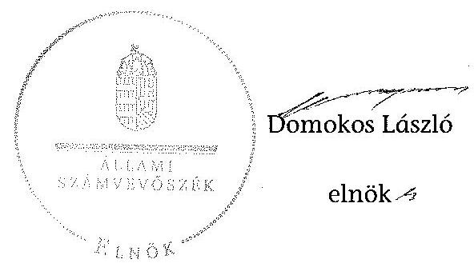

# ÁLLAMI   SZÁMVEVÔSZÉK 

## JELENTÉS

a helyi nemzetiségi önkormányzatok gazdálkodásának ellenőrzéséről
Tiszabura Roma Nemzetiségi Önkormányzat

---

# Állami Számvevőszék 

Iktatószám: V-0162-028/2014.
Témaszám: 1179
Vizsgálat-azonosító szám: V065212

## Az ellenőrzést felügyelte:

Horváth Balázs
felügyeleti vezető
Az ellenőrzést vezette és az ellenőrzés végrehajtásáért felelős:
Korsósné Vigh Andrea
ellenőrzésvezető
A számvevőszéki jelentést készítették és a jelentés összeállításában
közremüködtek:
Molnár Istvánné
számvevő tanácsos
Papp József
számvevő tanácsos
Az ellenőrzést végezték:
Czmarkó Frigyes Szalontai Miklós
számvevő számvevő tanácsos

---

# TARTALOMJEGYZÉK 

BEVEZETÉS ..... 3
I. ÖSSZEGZŐ MEGÁLLAPÍTÁSOK, KÖVETKEZTETÉSEK, JAVASLATOK ..... 6
II. RÉSZLETES MEGÁLLAPÍTÁSOK ..... 13

1. A Nemzetiségi Önkormányzat és a Települési Önkormányzat együttműködésének szabályozása, a működési feltételek biztosítása ..... 13
2. A gazdálkodási feladatok ellátásának szabályszerűsége ..... 14
2.1. A költségvetésre és zárszámadásra, valamint a kincstári adatszolgáltatás rendjére vonatkozó jogszabályi előírások betartása ..... 14
2.2. A Nemzetiségi Önkormányzat gazdálkodásának szabályozottsága ..... 15
2.3. Az operatív gazdálkodási jogkörök kialakítása, gyakorlása ..... 16
3. A Nemzetiségi Önkormányzattal összefüggő gazdálkodási feladatok belső ellenőrzése ..... 18
4. A feladatalapú támogatás felhasználásának, elszámolásának szabályszerűsége, a Nemzetiségi Önkormányzat feladatellátása ..... 18

## MELLÉKLET

1. számú A Nemzetiségi Önkormányzat 2012. évi gazdálkodásának főbb adatai, mutatói

## FÜGGELÉKEK

1. számú Rövidítések jegyzéke
2. számú Értelmező szótár
3. számú A gazdálkodás értékelésének módszere

---

.

---

# JELENTÉS 

## a helyi nemzetiségi önkormányzatok gazdálkodásának ellenőrzéséről Tiszabura Roma Nemzetiségi Önkormányzat

## BEVEZETÉS

#### Abstract

A Nemzetiségi Önkormányzat 1995. évben alakult, elnöke a 2010. évi helyhatósági választások óta látja el feladatát. A Nemzetiségi Önkormányzat intézményt nem alapított. A Nemzetiségi Önkormányzat a Települési Önkormányzattal 3 millió Ft-os törzsbetéttel alapított Esély Innovációs Nonprofit Kft.-ben a 2008. évben 3\%-os tulajdoni hányadot szerzett. A négytagú Képviselő-testület munkája segitésére bizottságot nem hozott létre. A Nemzetiségi Önkormányzat költségvetési beszámolója szerint a 2012. évben a módosított költségvetési bevételi és kiadási elöirányzat 345977 ezer Ft, a teljesitett költségvetési bevétel 353620 ezer Ft, a teljesített költségvetési kiadás 322110 ezer Ft volt. A 2012. évi gazdálkodási adatokat részletesen az 1. számú mellékletben mutatjuk be.

Az Alaptörvény XXIX. cikk (1) bekezdése szerint a Magyarországon élő nemzetiségek államalkotó tényezők. Minden, valamely nemzetiséghez tartozó magyar állampolgárnak joga van önazonossága szabad vállalásához és megőrzéséhez. A hazánkban élő́ nemzetiségek helyi (települési és területi), valamint országos önkormányzatokat hozhatnak létre. A helyi nemzetiségi önkormányzatok gazdálkodási feladatait jogszabályi előírás alapján a székhely helyi önkormányzat polgármesteri hivatala látja el.

A nemzetiségek helyzete, támogatása mind hazai, mind EU-s szinten kiemelt figyelmet kap napjainkban. A helyi nemzetiségi önkormányzatok gazdálkodására és támogatási rendszerére vonatkozó jogszabályok a 2010-2012. években jelentős változásokon mentek át. A települési és területi nemzetiségi önkormányzatok gazdálkodásának, a részükre juttatott költségvetési támogatások felhasználásának ellenőrzését az ÁSZ a 2012. évben sorozatjellegú ellenőrzés keretében indította el. A 2013. évi ellenőrzések e témacsoportos ellenőrzések folytatását jelentik.

Az ellenőrzés célja annak értékelése volt, hogy a Nemzetiségi Önkormányzat gazdálkodási kereteinek kialakítása, gazdálkodása és feladatellátása megfelelt-e a jogszabályoknak.

Ennek keretében értékeltük, hogy:

- a Nemzetiségi Önkormányzat és a Települési Önkormányzat együttműködésének szabályozása, a müködési feltételek biztosítása megfelelt-e a jogszabályi előírásoknak;

---

- a felek együttműködése megfelelt-e a közöttük létrejött megállapodásnak a gazdálkodási feladatok szabályszerű ellátása során, ennek keretében betar-tották-e a helyi nemzetiségi önkormányzat gazdálkodásához kapcsolódóan a költségvetésre és zárszámadásra, a gazdálkodás szabályozására, az operatív gazdálkodási jogkörök gyakorlására vonatkozó jogszabályi előírásokat;
- a jegyző biztosította-e a nemzetiségi önkormányzat gazdálkodásának belső ellenőrzését;
- a nemzetiségi önkormányzat feladatalapú támogatásának felhasználása, a folyósított feladatalapú támogatással történő elszámolás az előírásoknak megfelelő volt-e;
- a nemzetiségi önkormányzat feladatellátása összhangban volt-e a vonatkozó jogszabályi előírásokkal.

Az ellenőrzés várható hasznosulását négy szinten tervezzük. A törvényalkotás számára összegzett tapasztalatok állnak rendelkezésre a nemzetiségi önkormányzatok testületi döntéseinek, gazdálkodásának és a feladatalapú támogatás felhasználásának szabályszerűségéről, amelynek alapján következtetést lehet levonni arra, hogy indokolt-e jogszabályi módosítás kezdeményezése. Az ellenőrzés az ellenőrzött számára visszajelzést ad a működésében fellépő hiányosságokról, javaslataival hozzájárul azok kiküszöböléséhez, amely csökkentheti a későbbi ellenőrzések gyakoriságát. Az ellenőrzés megállapításai és javaslatai tanulságul szolgálhatnak más nemzetiségi önkormányzatok, szervezetek számára a rendezett gazdálkodási keretek kialakításához. A társadalom számára jelzi, hogy közpénz nem maradhat ellenőrizetlenül, az ÁSZ értékteremtő rend kialakításához és megőrzéséhez hozzájáruló tevékenysége pozitív hatással lesz a szervezetről kialakított összkép formálásában. Az ÁSZ szervezetén belül lehetőség nyílik arra, hogy a megállapítások szintetizálásával az intézmény a hozzáadott értéket teremtő elemző tevékenységét és tanácsadó szerepét erősítse.

A helyi nemzetiségi önkormányzatok gazdálkodásának ellenőrzéséről szóló jelentés I. fejezetének összegző része az ellenőrzés céljára adott rövid, szintetizáló összefoglalót és következtetéseket tartalmazza a II. fejezet részletes megállapításain alapulóan. A jelentés intézkedést igénylő megállapításait és javaslatait az összegzőben foglaltak mellett - az ellenőrzés során feltárt, a jelentés II. fejezetében rögzített részletes megállapítások alapozzák meg, illetve támasztják alá.

# Az ellenőrzés típusa: szabályszerűségi ellenőrzés 

Az ellenőrzött időszak: a 2012. január 1. - 2012. december 31. közötti időszak. Az ellenőrzés kiterjedt a helyi nemzetiségi önkormányzatnak juttatott 2012. évi támogatás 2013. évben való elszámolására is.

Ellenőrzött szervezet: a Tiszabura Roma Nemzetiségi Önkormányzat és a gazdálkodási feladatait ellátó Tiszabura Községi Önkormányzat.

Az ellenőrzés végrehajtásának jogszabályi alapját az ÁSZ tv. 5. § (2)-(3) és (6) bekezdéseiben foglaltak képezik.

---

Az ellenőrzés szakmai módszertana az ÁSZ hivatalos honlapján (www.asz.hu) közzétett szakmai szabályokon alapult, amely a Legfőbb Ellenőrző Intézmények Nemzetközi Szervezete (INTOSAI) által kiadott nemzetközi standardok (ISSAI) figyelembevételével készült.

A helyi nemzetiségi önkormányzatok gazdálkodásának ellenőrzése során értékeltük a Települési Önkormányzat és a Nemzetiségi Önkormányzat együttmúködésének, a gazdálkodás szabályozottságának és a pénzügyi folyamatokban kulcsszerepet betöltő belső kontrollok (teljesítés igazolás és érvényesítés) múködésének megfelelőségét. A kulcskontrollokat a múködési és felhalmozási célú támogatásértékű kiadásoknál, az államháztartáson kívülre teljesített múködési és felhalmozási célú pénzeszköz átadásoknál, a dologi kiadásokkal kapcsolatos kifizetéseknél - véletlen mintavételi eljárást alkalmazva - ellenőriztük. Ellenőriztük, hogy a jegyző biztositotta-e a Nemzetiségi Önkormányzat gazdálkodásának belső ellenőrzését. Értékeltük a feladatalapú támogatások felhasználásának, elszámolásának szabályszerűségét, a Nemzetiségi Önkormányzat feladatellátása és a jogszabályi előírások összhangját.

Az ellenőrzés lefolytatásához a Nemzetiségi Önkormányzat és a gazdálkodási feladatait ellátó Települési Önkormányzat tanúsítványok és a kapcsolódó, dokumentumjegyzékben megjelölt dokumentumok elektronikus úton történő megküldésével, rendelkezésre bocsátásával szolgáltatott adatokat. Az adatszolgáltatás kontrollálása és szükség szerinti javítása a helyszíni ellenőrzés keretében történt. A minősítési szempontokat a 3. számú függelék tartalmazza.

Az ÁSZ tv. 29. § (1) bekezdése szerint a jelentéstervezetet megküldtük a polgármester és a Nemzetiségi Önkormányzat elnöke részére, akik az ÁSZ tv. 29. § (2) bekezdésében foglalt észrevételezési jogukkal határidőn túl éltek, ezért nem állt módunkban az észrevételt figyelembe venni.

---

# 1. ÖSSZEGZŐ MEGÁLLAPÍTÁSOK, KÖVETKEZTETÉSEK, JAVASLATOK 

A Nemzetiségi Önkormányzat és a Települési Önkormányzat együttmúködésének szabályozása részben felelt meg a jogszabályi előírásoknak. A Nemzetiségi Önkormányzat a 2012. évben rendelkezett hatályos megállapodással a Települési Önkormányzattal történő együttműködésre, azonban a megállapodás 2012. évi felülvizsgálatát, módosítását a Nek. ${ }_{2}$ tv.-ben előírt határidőn túl végezték el. Az együttmúködés szabályozása a Nek. ${ }_{2}$ tv.-ben meghatározott tartalmi elemek tekintetében hiányos volt. Nem határozták meg a Nemzetiségi Önkormányzat részére az önálló fizetési számla nyitásával, törzskönyvi nyilvántartásba vételével és az adószám igénylésével kapcsolatos feladatokat, együttmúködési kötelezettséget és nem jelölték ki ezek felelőseit. Nem szabályozták a Nemzetiségi Önkormányzat kötelezettségvállalásaival kapcsolatosan a teljesítésigazolási feladatot, nem jelölték ki az arra jogosult személyeket, nem rendelkeztek az operatív gazdálkodási jogkörök összeférhetetlenségi szabályairól és nyilvántartási kötelezettségéről, valamint a megállapodás szerinti múködési feltételeket nem rögzítették a Nemzetiségi Önkormányzat SZMSZ-ében. A Települési Önkormányzat - a szabályozási hiányosságok mellett - biztosította a Nemzetiségi Önkormányzat múködéséhez szükséges személyi és tárgyi feltételeket.

A Nemzetiségi Önkormányzat 2012. évi költségvetésének és zárszámadásának tartalma, jóváhagyása - kisebb hiányosságok mellett -, valamint a kapcsolódó adatszolgáltatás megfelelt a jogszabályi előírásoknak. A Nemzetiségi Önkormányzat elnöke a 2012. évi költségvetés tervezetét határidőben benyújtotta a Képviselő-testületnek. A jóváhagyott költségvetési határozat egy Áht. ${ }_{2}$-ben előírt tartalmi elem - a finanszírozási célú pénzügyi műveletekkel kapcsolatos hatáskörök szabályozása - tekintetében hiányos volt, továbbá a költségvetési határozattervezet előterjesztésekor az Áht. ${ }_{2}$ előírása ellenére a 2012. évi előirányzat felhasználási tervet tájékoztatásul nem mutatták be a Képviselő-testület részére. A 2012. költségvetési évre vonatkozó kincstári adatszolgáltatási kötelezettségeket a jegyzö ${ }_{1,2}$ határidőben teljesítette. A 2012. évi zárszámadási határozat tervezetét a Képviselő-testület határidőben jóváhagyta, a határozat tartalma, részletezettsége a jogszabályi előírásoknak megfelelt. A zárszámadási határozattervezet előterjesztésekor azonban a Képviselő-testület részére tájékoztatásul nem mutatták be az Áht. ${ }_{2}$ előírása ellenére a pénzeszközök változását.

A Nemzetiségi Önkormányzat gazdálkodásának szabályozottsága nem volt megfelelő. A Számv. tv., az Áhsz. és a Bkr. által előírt szabályzatokkal számviteli politika, leltározási és leltárkészítési, eszközök és források értékelési szabályzata, számlarend, ellenőrzési nyomvonal, szabálytalanságok kezelésének eljárásrendje, valamint a folyamatba épített előzetes, utólagos és vezetői ellenőrzésre irányuló szabályozás - nem rendelkeztek. A jegyzö ${ }_{1,2}$ a gazdálkodási feladatok végrehajtását ellátó Polgármesteri Hivatal szabályzatainak hatályát nem terjesztette ki a Nemzetiségi Önkormányzat gazdálkodási feladataira. Az előírt szabályzatokkal a Nemzetiségi Önkormányzat - a pénzkezelési

---

szabályzat kivételével - önállóan sem rendelkezett. A Polgármesteri Hivatal SZMSZ-e az Ávr. előírásai ellenére nem tartalmazta az SZMSZ-ben nevesített munkakörökhöz tartozó - a Nemzetiségi Önkormányzat gazdálkodásával öszszefüggő - feladat- és hatásköröket, a hatáskörök gyakorlásának módját, a helyettesítés rendjét, valamint az ezekhez kapcsolódó felelősségi szabályokat. A Nemzetiségi Önkormányzat gazdálkodásával kapcsolatos feladat ellátást az érintett dolgozók munkaköri leírásai 2012. augusztus 1-jétől tartalmazták. Az Ávr.-ben foglaltak szerinti belső szabályozás tartalmi követelményeit - a tervezéssel, gazdálkodással, különösen az operatív gazdálkodási jogkörök gyakorlásának módjával, eljárási és dokumentációs részletszabályaival, valamint az ezeket végző személyek kijelölési rendjével, és az ellenőrzési, adatszolgáltatási feladatok teljesítésével kapcsolatos belső előírásokat - a 2012. szeptember 20tól hatályos megállapodás a teljesítésigazolás szabályozása kivételével rögzítette.

A Nemzetiségi Önkormányzat gazdálkodása tekintetében az operatív gazdálkodási jogkörök kialakítása nem felelt meg a jogszabályi előírásoknak. A Nemzetiségi Önkormányzat elnöke - mint kötelezettségvállaló - az Ávr.-ben előírtak ellenére írásban nem jelölte ki a teljesítésigazolásra jogosult személyt, továbbá más képviselőt nem hatalmazott fel a kötelezettségvállalás és az utalványozás gyakorlására. A pénzügyi ellenjegyző kijelölése 2012. augusztus 1-jétől megfelelt a jogszabályi előírásoknak, ezt megelőzően az Ávr.ben előírtak ellenére, a jegyző; írásban nem jelölte ki a pénzügyi ellenjegyzésre jogosult személyt. Az érvényesítő személyek kijelölése a jogszabályi előírásoknak megfelelő volt. A teljesítésigazolás és érvényesítés kulcskontrollok múködésének megfelelőségét a dologi kiadások bizonylatainak tesztelése során az ellenőrzés gyengének értékelte, a hibák száma a lényegességi szintet, a kritikus hibahatárt elérte.

A teljesítésigazolást végző személy az Áht. ${ }_{2}$-ben és az Ávr-ben előírtak ellenére nem rendelkezett a jogkör gyakorlására írásbeli kijelöléssel. Az érvényesítő nem az Ávr.-ben előírtak szerint végezte el feladatát, mert a kiadások teljesítését annak ellenére érvényesítette, hogy a teljesítésigazolást nem szabályszerűen végezték el, az együttmúködési megállapodásban nem szabályozták a teljesítésigazolási feladatot, nem állt rendelkezésre az előzetes írásbeli kötelezettségvállalási dokumentum, továbbá a kiadásokat a kötelezettségvállalási nyilvántartásba nem teljes körűen vezették be. Az érvényesítő az Ávr.-ben előírtak ellenére nem kifogásolta az operatív gazdálkodási jogkörök gyakorlására jogosult személyekről és aláírás-mintájukról vezetendő naprakész nyilvántartás vezetésének hiányát. A kulcskontrollok a három legnagyobb összegű - tételesen ellenőrzött - dologi kiadás esetében nem múködtek megfelelően. A jogosulatlan teljesítésigazolás és a jogkör gyakorlók nyilvántartása terén - a dologi kiadások bizonylatainak tesztelése során - feltárt hibák megismétlődtek, e mellett az érvényesítő egy esetben nem végezte el, két esetben nem az Ávr.-ben előírtak szerint végezte el feladatát. Az előleg kifizetések teljesítését annak ellenére érvényesítette, hogy az összegszerűség és az időbeli esedékesség ellenőrzéséhez nem állt rendelkezésre írásbeli dokumentum, továbbá a kötelezettségvállalásra pénzügyi ellenjegyzés nélkül került sor. Az államháztartáson kívülre teljesített működési célú pénzeszközátadás kiadása tekintetében a teljesítésigazolás és az érvényesítés kulcskontrollok nem múködtek megfelelően, a hiányosságok megegyeztek a dologi kiadások bizonylatainak tesztelésénél bemutatottakkal. A

---

Nemzetiségi Önkormányzatnál a kulcskontrollok 2012. évi múködésében feltárt hiányosságokkal összefüggésben az ellenőrzés jogosulatlan kifizetést nem állapított meg, azonban a kulcskontrollok múködésében feltárt hiányosságok miatt nem biztosított a hibák megelőzése, feltárása és kijavítása.

A jegyző ${ }_{1,2}$ nem biztosította a Polgármesteri Hivatalnál Nemzetiségi Önkormányzat gazdálkodásával összefüggő végrehajtási feladatok belső ellenőrzését. A Polgármesteri Hivatal 2012. évre vonatkozó éves ellenőrzési tervét megalapozó kockázatelemzés az Ámr. előírása ellenére nem terjedt ki a Nemzetiségi Önkormányzat gazdálkodásával összefüggő végrehajtási feladatokra és azok tekintetében belső ellenőrzési feladatot nem terveztek és nem végeztek.

A Nemzetiségi Önkormányzat a 2011. évben nem részesült feladatalapú támogatásban, a 2012. évben ezen a címen 95 ezer Ft támogatást kapott. A 2012. évi támogatást a jogszabályi előírásokkal összhangban a folyósítás évében felhasználták. A támogatási kormányrendelet ${ }_{2}$-ben előírt elszámolása nem történt meg, a támogatás felhasználását, elszámolását az ellenőrzésre jogosult szervek nem ellenőrizték. A Nemzetiségi Önkormányzat feladatellátásának tárgya összhangban volt a Nek. ${ }_{2}$ tv.-ben foglaltakkal. Kötelező közfeladatként a képviselt közösség kulturális autonómiájának megerősítése érdekében a közösség önszerveződésének szervezési és múködtetési feladatok ellátásával történő támogatását végezte. Az önként vállalt (közfoglalkoztatás) feladata ellátására 2012. év folyamán gazdasági társaság múködtetésében vett részt, ahol felelőssége nem haladta meg a vagyoni hozzájárulásának mértékét, és vállalkozása a kötelező feladatainak ellátását nem veszélyeztette.

Az ÁSZ tv. 33. § (1) bekezdésében foglaltak értelmében az ellenőrzött szervezet vezetője köteles a jelentésben foglalt megállapításokhoz kapcsolódó intézkedési tervet összeállítani, és azt a jelentés kézhezvételétől számított 30 napon belül az ÁSZ részére megküldeni. Amennyiben az intézkedési tervet határidőre nem küldi meg a szervezet, vagy az nem elfogadható, az ÁSZ elnöke az ÁSZ tv. 33. § (3) bekezdés a)-b) pontjaiban foglaltakat érvényesítheti.

A helyszíni ellenőrzés megállapításainak hasznosítása mellett javasoljuk:

# a jegyzőnek 

1. az együttműködés szabályozásával kapcsolatban

A megállapodást a felek a Nek. ${ }_{2}$ tv. 80. § (2) és a Nek. ${ }_{2}$ tv. 159. § (3) bekezdéseiben előírt határidőkön túl vizsgálták felül. A Nemzetiségi Önkormányzat és a Települési Önkormányzat együttműködését meghatározó - 2012. december 31-én hatályos megállapodás a Nek. ${ }_{2}$ tv. 80. § (3) bekezdés a)-c) pontjaiban foglaltak ellenére nem tartalmazta az önálló fizetési számla nyitásával, törzskönyvi nyilvántartásba vételével és adószám igénylésével kapcsolatos határidőket és együttműködési kötelezettségeket a felelősök konkrét kijelölésével, a kötelezettségvállalásokkal kapcsolatosan a teljesítésigazolási feladatot, illetve az azt végző személyek kijelölését, valamint a Nemzetiségi Önkormányzat kötelezettségvállalásának az SZMSZ-ében meghatározott szabályait, különösen az összeférhetetlenségi és nyilvántartási kötelezettségeket. Továbbá a Nek. ${ }_{2}$ tv. 80. § (2) bekezdésében foglaltak ellenére a megállapodás szerinti

---

múködési feltételeket nem rögzítették a Nemzetiségi Önkormányzat SZMSZ-ében a megállapodás megkötését, módosítását követő 30 napon belül. Az Ávr. 13. § (2) bekezdés a) pontjában foglaltak szerinti tartalommal bíró megállapodás nem tartalmazta a teljesítésigazolás szabályozását.

Javaslat
Az együttműködés szabályszerűsége érdekében:
a) készítse elő a megállapodás módosítását, hogy az tartalmilag feleljen meg a Nek. 3 tv. 80. § (3) bekezdés a)-c) pontjaiban, valamint az Ávr. 13. § (2) bekezdés a) pontjában foglalt előírásoknak;
b) készítse elő a Nemzetiségi Önkormányzat SZMSZ-ének kiegészítését a Nek. 2 tv. 80. § (2) bekezdésében foglalt előírás alapján;
c) biztosítsa a jövőben a megállapodás Nek. 2 tv. 80. § (2) bekezdésében előírt határidő szerinti évenkénti felülvizsgálatát.
2. a költségvetés és zárszámadás szabályszerűségével kapcsolatban

A 2012. évi költségvetési határozat az Áht. 2 23. § (2) bekezdés h) pontjának előírása ellenére nem tartalmazta a finanszírozási célú pénzügyi műveletekkel kapcsolatos hatásköröket. A 2012. évi költségvetés előterjesztésekor az Áht. 2 24. § (4) bekezdés a) pontjának előírása ellenére tájékoztatásul nem mutatták be a Nemzetiségi Önkormányzat 2012. évi előirányzat felhasználási tervét. A zárszámadási határozattervezet előterjesztésekor az Áht. 2 91. § (2) bekezdés a) pontjában foglaltak ellenére a Képvi-selő-testület részére tájékoztatásul nem mutatták be a pénzeszközök változását.

Javaslat
A költségvetés szabályszerű előterjesztése és végrehajtása érdekében a jövőben gondoskodjon:
a) a költségvetés szerkezetét és tartalmát meghatározó, az Áht. 2 23. § (2) bekezdés h) pontjában foglalt előírás betartásáról, továbbá az Áht. 2 24. § (4) bekezdés a) pontja szerint a Nemzetiségi Önkormányzat előirányzat felhasználási tervének a Nemzetiségi Önkormányzat Képviselő-testülete részére történő bemutatásáról;
b) a zárszámadási határozattervezet előterjesztésekor arról, hogy az Áht. 2 91. § (2) bekezdés a) pontjában foglaltak szerint a Képviselő-testület részére tájékoztatásul bemutatásra kerüljön a pénzeszközök változása is.
3. a gazdálkodási feladatok szabályozottságával kapcsolatban

A Nemzetiségi Önkormányzat a 2012. évben nem rendelkezett a Számv. tv. 14. § (3)-(4) bekezdéseiben előírtak szerinti számviteli politikával, illetve ennek keretében a Számv. tv. 14. § (5) bekezdés a)-b) pontjaiban előírt eszközök és források leltározási és leltárkészítési, valamint értékelési szabályzatával, továbbá a Számv. tv. 161. § (1) bekezdése szerinti számlarenddel, a Bkr. 6. § (3)-(4) bekezdéseiben előírt ellenőrzési nyomvonallal és szabálytalanságok kezelése eljárásrendjével, valamint a Bkr. 8. §

---

(2)-(4) bekezdései szerinti folyamatba épített előzetes, utólagos és vezetői ellenőrzés szabályozással.

A Polgármesteri Hivatal SZMSZ-e az Ávr. 13. § (1) bekezdés g) pontjában előírtak ellenére nem tartalmazta az SZMSZ-ben nevesített munkakörökhöz tartozó - a Nemzetiségi Önkormányzat gazdálkodásával kapcsolatos - feladat és hatásköröket, a hatáskörök gyakorlásának módját, a helyettesítés rendjét, valamint az ezekhez kapcsolódó felelősségi szabályokat.

Javaslat
A Nemzetiségi Önkormányzat gazdálkodási feladataira kiterjedő hatállyal:
a) készítse el a Számv. tv. 14. § (3)-(4) bekezdéseiben, továbbá Számv. tv. 14. § (5) bekezdés a)-b) pontjaiban, Számv. tv. 161. § (1) bekezdéseiben előírt számviteli szabályzatokat, valamint a Bkr. 6. § (3)-(4) és a Bkr. 8. § (2)-(4) bekezdéseiben meghatározott szabályozásokat;
b) készítse elő a Polgármesteri Hivatal SZMSZ-ének módosítását, hogy az feleljen meg az Ávr. 13. § (1) bekezdés g) pontjában foglalt előírásnak.
4. a kulcskontrollok múködésével kapcsolatban

A teljesítések igazolását az Ávr. 57. § (4) bekezdésében előírtak ellenére kijelöléssel nem rendelkező személy látta el. A teljesítést igazoló jogosulatlanul, továbbá az ellenőrzés és igazolás alapjául szolgáló előzetes írásbeli kötelezettségvállalási dokumentumok hiányában szabálytalanul végezte el az Ávr. 57. § (1) és (3) bekezdésekben előírt, a kifizetések jogosságának, összegszerűségének és a szerződésszerű teljesítésének az ellenőrzését, igazolását.

Az érvényesítő nem végezte el, illetve nem az Ávr. 58. § (1)-(3) bekezdéseiben előírtak szerint látta el érvényesítési feladatát, mert nem ellenőrizte, hogy a megelőző ügymenetben az Ávr. és a megállapodás előírásait betartották-e, nem jelezte, hogy a teljesítésigazolás szabálytalan volt, továbbá nem kifogásolta az összegszerűség ellenőrzéséhez szükséges dokumentum hiányát. Annak ellenére érvényesítette a kiadások teljesítését, hogy azokat az Ávr. 56. § (1) bekezdésében előírtak ellenére a kötelezettségvállalási nyilvántartásba nem vezették be, a kifizetések utalványrendeletei az Ávr. 59. § (3) bekezdés f) pontjában és az Ávr. 59. § (4) bekezdésében előírtak ellenére nem tartalmazták a kötelezettségvállalás nyilvántartási számát. Az érvényesítő nem észrevételezte, hogy a Nemzetiségi Önkormányzat elnöke az Áht. 3 37. § (1) bekezdésében előírtakat megsértve pénzügyi ellenjegyezés nélkül vállalt kötelezettséget, továbbá nem kifogásolta az Ávr. 60. § (3) bekezdésében előírt, az operatív gazdálkodási jogkörök gyakorlására jogosult személyekről és aláírás-mintájukról vezetendő naprakész nyilvántartás hiányát.

Javaslat
Az operatív gazdálkodás működési hibáinak megelőzése, feltárása és kijavítása érdekében gondoskodjon arról, hogy:
a) a teljesítésigazolást az Ávr. 57. § (4) bekezdésében előírtak szerint kijelölt személy végezze az Ávr. 57. § (1)-(3) bekezdésekben foglaltak betartásával;

---

b) az Ávr. 58. § (1)-(3) bekezdései alapján az érvényesítő lássa el ellenőrzési és jelzési feladatát;
c) a kötelezettségvállalásra az Áht. 2 37. § (1) bekezdésében előírtak szerinti pénzügyi ellenjegyzést követően kerüljön sor.
5. a feladatalapú támogatás elszámolásával kapcsolatban

A 2012. évi feladatalapú támogatás elszámolása a támogatási kormányrendelet ${ }_{2}$ 8. § (5) bekezdésében hivatkozott, „a helyi önkormányzatok elszámolási és ellenőrzési rendjére vonatkozó jogszabályok rendelkezései alkalmazandóak" előírása ellenére nem történt meg.

Javaslat
Gondoskodjon az Áht. 2 27. § (2) bekezdésében meghatározott feladatkörében a Nemzetiségi Önkormányzat által igénybe vett feladatalapú támogatás elszámolásának elkészítéséről, figyelemmel az Áht. 2 57. § (4) bekezdésében foglaltakra.

# a polgármesternek 

A Nemzetiségi Önkormányzat és a Települési Önkormányzat együttműködését meghatározó - 2012. december 31-én hatályos - megállapodás a Nek. 2 tv. 80. § (3) bekezdés a)-c) pontjaiban foglaltak ellenére nem tartalmazta az önálló fizetési számla nyitásával, törzskönyvi nyilvántartásba vételével és adószám igénylésével kapcsolatos határidőket és együttműködési kötelezettségeket a felelősök konkrét kijelölésével, a kötelezettségvállalásokkal kapcsolatosan a teljesítésigazolási feladatot, illetve az azt végző személyek kijelölését, valamint a Nemzetiségi Önkormányzat kötelezettségvállalásának az SZMSZ-ében meghatározott szabályait, különösen az összeférhetetlenségi és nyilvántartási kötelezettségeket.

A Polgármesteri Hivatal SZMSZ-e az Ávr. 13. § (1) bekezdés g) pontjában előírtak ellenére nem tartalmazta az SZMSZ-ben nevesített munkakörökhöz tartozó - a Nemzetiségi Önkormányzat gazdálkodásával kapcsolatos - feladat- és hatásköröket, a hatáskörök gyakorlásának módját, a helyettesítés rendjét, valamint az ezekhez kapcsolódó felelősségi szabályokat.

Javaslat
Terjessze a Települési Önkormányzat Képviselő-testülete elé jóváhagyásra:
a) a Nek. 2 tv. 80. § (3) bekezdés a)-c) pontjaiban foglalt előírások betartásával előkészített megállapodás módosítását;
b) az Ávr. 13. § (1) bekezdés g) pontjában foglalt szabályozásra figyelemmel módosított Polgármesteri Hivatal SZMSZ-ét.

---

# a Nemzetiségi Önkormányzat elnökének 

1. A Nemzetiségi Önkormányzat és a Települési Önkormányzat együttműködését meghatározó - 2012. december 31-én hatályos - megállapodás a Nek. 2 tv. 80. § (3) bekezdés a)-c) pontjaiban foglaltak ellenére nem tartalmazta az önálló fizetési számla nyitásával, törzskönyvi nyilvántartásba vételével és adószám igénylésével kapcsolatos határidőket és együttműködési kötelezettségeket a felelősök konkrét kijelölésével, valamint a kötelezettségvállalásokkal kapcsolatosan a teljesítésigazolási feladatot, illetve az azt végző személyek kijelölését, továbbá a Nemzetiségi Önkormányzat kötelezettségvállalásának az SZMSZ-ében meghatározott szabályait, különösen az összeférhetetlenségi és nyilvántartási kötelezettségeket. Továbbá a Nek. 2 tv. 80. § (2) bekezdésében foglaltak ellenére a megállapodás szerinti müködési feltételeket nem rögzítették a Nemzetiségi Önkormányzat SZMSZ-ében a megállapodás megkötését, módosítását követő 30 napon belül.

Javaslat
Terjessze a Képviselő-testület elé jóváhagyásra:
a) a Nek. 2 tv. 80. § (3) bekezdés a)-c) pontjaiban foglalt előírások betartásával előkészített megállapodás módosítást;
b) a Nemzetiségi Önkormányzat SZMSZ-ének a Nek. 2 tv. 80. § (2) bekezdésében foglaltaknak megfelelő módosítását az előírt határidőn belül.
2. A 2012. évi feladatalapú támogatás elszámolása a támogatási kormányrendelet 2 8. § (5) bekezdésében hivatkozott, „a helyi önkormányzatok elszámolási és ellenőrzési rendjére vonatkozó jogszabályok rendelkezései alkalmazandóak" előírása ellenére nem történt meg.

Javaslat
Terjessze a Képviselő-testület elé a jegyző által az Áht. 2 57. § (4) bekezdése alapján összeállított, a Nemzetiségi Önkormányzat által igénybe vett feladatalapú támogatás elszámolását.

---

# II. RÉSZLETES MEGÁLLAPÍTÁSOK 

## 1. A Nemzetiségi Önkormányzat és a Telepúlési ÖnkormányZAT EGYÜTTMÜKÖDÉSÉNEK SZABÁLYOZÁSA, A MÜKÖDÉSI FELTÉTELEK BIZTOSÍTÁSA

A Nemzetiségi Önkormányzat és a Települési Önkormányzat együttmüködésének szabályozása részben felelt meg a jogszabályi előírásoknak.

A Nemzetiségi Önkormányzat rendelkezett a 2012. év folyamán hatályban lévő megállapodással ${ }^{1}$ a Települési Önkormányzattal történő együttműködésre. A megállapodást a felek a Nek. ${ }_{2}$ tv. 80. § (2) és a 159. § (3) bekezdéseiben előírt határidőkön² túl vizsgálták felül, a Nemzetiségi Önkormányzat a Nek. ${ }_{2}$ tv. előírásain alapuló megállapodással 2012. szeptember 20-tól rendelkezett.

A Nemzetiségi Önkormányzat elnöke és a polgármester 2012. január 25-én új, felülvizsgált megállapodást írt alá a Nemzetiségi Önkormányzat és a Települési Önkormányzat közötti együttmúködés szabályozására, amely az akkor hatályos jogszabályokon alapult. A Képviselő-testület a megállapodás tervezetét jóváhagy$\mathrm{ta}^{3}$, a Települési Önkormányzat Képviselő-testülete a megállapodás tervezet elfogadásáról - annak előterjesztése hiányában - nem döntött, így az (a felek képviselőinek aláírása ellenére) nem lépett hatályba.

A Nemzetiségi Önkormányzat múködésének feltételeit a jogszabályi előírásoknak megfelelően szabályozták a 2012. december 31-én hatályos megállapodásban, azonban a Nek. ${ }_{2}$ tv. 80. § (2) bekezdésében foglaltak ellenére a megállapodás szerinti múködési feltételeket nem rögzítették a Nemzetiségi Önkormányzat SZMSZ-ében a megállapodás megkötését, módosítását követő 30 napon belül.

A 2012. december 31-én hatályos megállapodásban a Nemzetiségi Önkormányzat gazdálkodási feladatainak ellátását a Nek. ${ }_{2}$ tv. 80. § (3) bekezdés a)-c) pontjaiban foglalt tartalmi elemek tekintetében hiányosan szabályozták.

[^0]
[^0]:    1 A 2012. szeptember 20-ig hatályos megállapodást a Képviselő-testület a 6/2008. (V. 14.) számú, a Települési Önkormányzat Képviselő-testülete a 28/2008. (V. 29.) számú határozatával fogadta el. A Nek. ${ }_{2}$ tv. előírásai szerint felülvizsgált, módosított, 2012. szeptember 20-tól hatályos megállapodást a Képviselő-testület a 11/2012. (IX. 14.) számú, a Települési Önkormányzat Képviselő-testülete a 49/2012. (IX. 20.) számú határozatával hagyta jóvá. E megállapodás módosításáról a Képviselő-testület a 48/2012. (XII. 13.) számú, a Települési Önkormányzat Képviselőtestülete a 74/2012. (XII. 13.) számú határozatával döntött.
    ${ }^{2}$ 2012. január 31, illetve 2012. június 1-je
    ${ }^{3}$ a Képviselő-testület 4/2012. (I. 25.) számú határozata

---

Nem határozták meg:

- a Nemzetiségi Önkormányzat részére önálló fizetési számla nyitásával, törzskönyvi nyilvántartásba vételével és adószám igénylésével kapcsolatos határidőket és együttműködési kötelezettségeket a felelősök konkrét kijelölésével;
- a Nemzetiségi Önkormányzat kötelezettségvállalásaival kapcsolatosan a teljesítésigazolási feladatot, illetve az azt végző személyeket nem jelölték ki;
- a Nemzetiségi Önkormányzat kötelezettségvállalásának az SZMSZ-ében meghatározott szabályait, különösen az összeférhetetlenségi és nyilvántartási kötelezettségeket (ezeket a Nemzetiségi Önkormányzat SZMSZ-e sem tartalmazta).

A Települési Önkormányzat Nemzetiségi Önkormányzat 2012. évi müködésének a - Nek. ${ }_{2}$ tv. 159. § (3) bekezdésében foglalt átmeneti rendelkezés alapján a Nek. ${ }_{1}$ tv. 27. § (2)-(3) bekezdéseiben előírt - személyi és tárgyi feltételeit azok hiányos szabályozása mellett biztosította:

- a működési feltételek szabályozására a 2012. szeptember 20-ig hatályos megállapodás nem terjedt ki, a tárgyi feltételek biztosítását - az ehhez szükséges ingó és ingatlan vagyontárgyaknak a Nek., tv. 59. § (3) bekezdés szerinti ingyenes használatba adását - jegyzőkönyv, egyéb dokumentum nem igazolta;
- a személyi feltételek biztosítása tekintetében a Polgármesteri Hivatal dolgozóinak munkaköri leírásait 2012. augusztus 1-jétől egészítették ki a Nemzetiségi Önkormányzat gazdálkodása végrehajtásával összefüggő feladatokkal, azt megelőzően a munkaköri leírások a Nemzetiségi Önkormányzattal öszszefüggő feladatokat nem tartalmaztak;
- a polgármester és a jegyző ${ }_{2}$ közös nyilatkozattal igazolta a Nemzetiségi Önkormányzat 2012. évi múködéséhez szükséges személyi és tárgyi feltételek biztosítását.

# 2. A GAZDÁLKODÁSI FELADATOK ELLÁTÁSÁNAK SZABÁLYSZERŰSÉGE 

### 2.1. A költségvetésre és zárszámadásra, valamint a kincstári adatszolgáltatás rendjére vonatkozó jogszabályi előírások betartása

A Nemzetiségi Önkormányzat 2012. évi költségvetésének és zárszámadásának tartalma, jóváhagyása - kisebb hiányosságok mellett -, valamint a kapcsolódó adatszolgáltatás megfelelt a jogszabályi előírásoknak.

A Nemzetiségi Önkormányzat elnöke a 2012. évi költségvetés tervezetét határidőben benyújtotta a Képviselő-testületnek. A jóváhagyott 2012. évi költségve-

---

tési határozat ${ }^{4}$ - egy tartalmi elem kivételével - megfelelt a jogszabályi előírásoknak. A 2012. évi költségvetési határozat az Áht. 2 23. § (2) bekezdés h) pontjának előírása ellenére nem szabályozta a finanszírozási célú pénzügyi műveletekkel kapcsolatos hatásköröket. A 2012. évi költségvetés előterjesztésekor az Áht. 2 24. § (4) bekezdés a) pontjának előírása ellenére tájékoztatásul nem mutatták be a Nemzetiségi Önkormányzat 2012. évi előirányzat felhasználási tervét.

A jegyző ${ }_{1,2}$ a Nemzetiségi Önkormányzat gazdálkodásához kapcsolódóan a részére előírt 2012. évi kincstári adatszolgáltatási kötelezettségeinek a jogszabályi előírásoknak megfelelően eleget tett.

A 2012. évi zárszámadási határozat ${ }^{5}$ tervezetét a Képviselő-testület az előírások szerinti határidőben, tartalommal és részletezettséggel fogadta el. A zárszámadási határozattervezet előterjesztésekor azonban az Áht. 2 91. § (2) bekezdés a) pontjában foglaltak ellenére a Képviselő-testület részére tájékoztatásul nem mutatták be a pénzeszközök változását.

# 2.2. A Nemzetiségi Önkormányzat gazdálkodásának szabályozottsága 

A Nemzetiségi Önkormányzat gazdálkodásának szabályozottsága az ellenőrzött időszakban nem volt megfelelő, a jogszabályokban elöírt szabályzatokkal - a pénzkezelési szabályzat kivételével - nem rendelkezett:

- a Számv. tv. 14. § (3)-(4) bekezdéseiben és az Áhsz. 8. § (3) bekezdésében előírtak szerinti számviteli politikával, illetve ennek keretében a Számv. tv. 14. § (5) bekezdés a)-b) pontjaiban és az Áhsz. 8. § (4) bekezdés a)-b) pontjaiban előírt leltározási és leltárkészítési, valamint az eszközök és források értékelési szabályzatával, továbbá a Számv. tv. 161. § (1) bekezdése és az Áhsz. 49. § (1) bekezdése szerinti számlarenddel;
- a Bkr. 6. § (3) és (4) bekezdéseiben előírt ellenőrzési nyomvonallal és a szabálytalanságok kezelése eljárásrendjével;
- a Bkr. 8. § (2)-(4) bekezdései szerinti folyamatba épített előzetes, utólagos és vezetői ellenőrzés szabályozással.

A jegyző ${ }_{1,2}$ a gazdálkodási feladatok végrehajtását ellátó Polgármesteri Hivatal fenti szabályzatainak hatályát nem terjesztette ki a Nemzetiségi Önkormányzat gazdálkodási feladataira. A Nemzetiségi Önkormányzat 2012. április 2-ától rendelkezett a Számv. tv. és az Áhsz. által előírt pénzkezelési szabályzattal.

[^0]
[^0]:    ${ }^{4}$ A Képviselő-testületnek a 2012. évi költségvetésről alkotott 6/2012 (II. 9.) számú határozata.
    ${ }^{5}$ A Képviselő-testületnek a 2012. évi zárszámadásról alkotott 9/2013. (IV. 30.) számú határozata.

---

A Polgármesteri Hivatal SZMSZ-e az Ávr. 13. § (1) bekezdés g) pontjában előírtak ellenére nem tartalmazta az SZMSZ-ben nevesített munkakörökhöz tartozó - a Nemzetiségi Önkormányzat gazdálkodásával kapcsolatos - feladat és hatásköröket, a hatáskörök gyakorlásának módját, a helyettesítés rendjét, valamint az ezekhez kapcsolódó felelősségi szabályokat. A munkaköri leírásokat 2012. augusztus 1-jétől egészítették ki a Nemzetiségi Önkormányzat gazdálkodásával kapcsolatos feladatokkal.

Az Ávr. 13. § (2) bekezdés a) pontban foglaltak szerinti belső szabályozás tartalmi követelményeit - a tervezéssel, gazdálkodással, különösen az operatív gazdálkodási jogkörök gyakorlásának módjával, eljárási és dokumentációs részletszabályaival, valamint az ezeket végző személyek kijelölési rendjével, és az ellenőrzési, adatszolgáltatási feladatok teljesítésével kapcsolatos belső előírásokat - a 2012. szeptember 20-tól hatályos megállapodás a teljesítésigazolás szabályozása kivételével rögzítette.

# 2.3. Az operatív gazdálkodási jogkörök kialakítása, gyakorlása 

A Nemzetiségi Önkormányzatra vonatkozóan az operatív gazdálkodási jogkörök kialakítása - a kötelezettségvállalásra és az utalványozásra a felhatalmazások, továbbá a pénzügyi ellenjegyző és a teljesítést igazoló személyek kijelölése - a 2012. évben nem felelt meg a jogszabályi előírásoknak.

A Nemzetiségi Önkormányzat elnöke, mint kötelezettségvállaló:

- nem hatalmazott fel az Ávr. 52. § (7) és 59. § (1) bekezdéseiben foglaltak alapján más nemzetiségi önkormányzati képviselőt a kötelezettségvállalás és utalványozás gyakorlására, továbbá
- írásban nem jelölte ki a teljesítés igazolására jogosult személyeket az Ávr. 57. § (4) bekezdések előírásai ellenére.

A pénzügyi ellenjegyzés ellátására jogosult személyt az Ávr. 55. § (2) bekezdés g) pontjában előírtak ellenére a gazdasági szervezettel nem rendelkező Polgármesteri Hivatalban a jegyző; 2012. augusztus 1-jéig írásban nem jelölte ki, arról - a jogszabályi előírásokkal összhangban a Polgármesteri Hivatal állományába tartozó, az előírt szakképzettséggel rendelkező köztisztviselők írásbeli felhatalmazásával - 2012. augusztus 1-jétől gondoskodott. Az érvényesítő személyek kijelölése megfelelő volt.

A Nemzetiségi Önkormányzatnál a 2012. évben a dologi kiadások teljesítése során a bizonylatok tesztelése alapján a teljesítésigazolás és az érvényesítés kulcskontrollok múködésének megfelelősége gyenge volt. A hibák száma a lényegességi szintet, a kritikus hibahatárt elérte:

- a teljesítések igazolását az Ávr. 57. § (4) bekezdésben előírtak ellenére kijelöléssel nem rendelkező személy látta el. A teljesítést igazoló jogosulatlanul, továbbá az ellenőrzés és igazolás alapjául szolgáló előzetes írásbeli kötele-

---

zettségvállalási dokumentumok ${ }^{6}$ hiányában szabálytalanul végezte el az Ávr. 57. § (1) és (3) bekezdésekben előírt, a kifizetések jogosságának, összegszerűségének és a szerződésszerű teljesítésének az ellenőrzését és igazolását;

- az érvényesítő nem az Ávr. 58. § (1)-(2) bekezdéseiben előírtak szerint végezte érvényesítési feladatát, mert nem ellenőrizte, hogy a megelőző ügymenetben az Ávr. és a megállapodás előírásait betartották-e, nem jelezte, hogy a teljesítésigazolás szabálytalan volt, nem kifogásolta az összegszerűség ellenőrzéséhez szükséges - a megállapodásban előírt - előzetes írásbeli kötelezettségvállalási dokumentum hiányát. Annak ellenére érvényesítette a kiadások teljesítését, hogy azokat az Ávr. 56. § (1) bekezdésében előírtak ellenére a kötelezettségvállalási nyilvántartásba nem vezették be, a kifizetések utalványrendeletei az Ávr. 59. § (3) bekezdés f) pontjában és a (4) bekezdésében előírtak ellenére nem tartalmazták a kötelezettségvállalás nyilvántartási számát, továbbá nem kifogásolta az Ávr. 60. § (3) bekezdésében előírt, az operatív gazdálkodási jogkörök gyakorlására jogosult személyekről és aláírásmintájukról vezetendő naprakész nyilvántartás hiányát.

A Nemzetiségi Önkormányzat 2012. évi dologi kiadásai között a három legnagyobb összegú kiadás teljesítése során - a bizonylatok egyedi értékelése alapján - a teljesítésigazolás és az érvényesítés kulcskontrollok nem múködtek megfelelően. A hiányosságok - a jogosulatlan teljesítésigazolás és a jogkörgyakorlók nyilvántartása hiánya tekintetében - a dologi kiadások bizonylatai tesztelésénél feltárt hibákkal megegyeztek, továbbá:

- az érvényesítő két esetben az Ávr. 58. § (1) bekezdésében előírt érvényesítési feladatát nem szabályszerűen végezte el, mert az előlegek kifizetését annak ellenére érvényesítette, hogy az előlegek összegszerűsége, a kifizetés teljesítésének időbeli esedékessége ellenőrzéséhez nem állt rendelkezésre írásbeli dokumentum ${ }^{7}$. Nem észrevételezte továbbá, hogy a kiadások teljesítése alapjául szolgáló szállítási szerződésben a Nemzetiségi Önkormányzat elnöke az Áht. 2 37. § (1) bekezdésében előírtakat megsértve pénzügyi ellenjegyezés nélkül vállalt kötelezettséget. Egy előleg kifizetése az Ávr. 58. § (1) és (3) bekezdések előírásait megsértve érvényesítés - így az összegszerűség, a fedezet meglétének, továbbá a megelőző ügymenetben a gazdálkodásra előírt szabályok betartása ellenőrzése és igazolása - nélkül történt meg.

A Nemzetiségi Önkormányzatnál a 2012. évben az államháztartáson kívülre teljesített múködési célú pénzeszközátadás kifizetése során a teljesítésigazolás és az érvényesítés kulcskontrollok nem müködtek megfelelően a dologi kiadások kulcskontrolljai tesztelése során feltárt hibákkal megegyező okok miatt.

[^0]
[^0]:    ${ }^{6}$ A hatályos együttmúködési megállapodás szerint kötelezettségvállalás csak írásban és a kötelezettségvállalás pénzügyi ellenjegyzése után történhet.
    ${ }^{7}$ A szállítási szerződés szerint a vállalkozó szállítási előleg számla kiállítására jogosult volt, azonban az előleg számlák kiállításának ütemezését és összegeit a szerződés, illetve egyéb dokumentum nem tartalmazta.

---

Múködési és felhalmozási célú támogatásértékű kiadás, valamint államháztartáson kívülre történő felhalmozási célú pénzeszközátadás nem történt.

A Nemzetiségi Önkormányzatnál a kulcskontrollok 2012. évi múködésében feltárt hiányosságokkal összefüggésben az ellenőrzés jogosulatlan kifizetést nem állapított meg, azonban a kulcskontrollok múködésében feltárt hiányosságok miatt nem biztosított a hibák megelőzése, feltárása és kijavítása.

# 3. A Nemzetiségi ÖNKORMÁNYZATTAL ÖSSZEFÜGGŐ GAZDÁLKODÁSI FELADATOK BELSŐ ELLENŐRZÉSE 

A jegyző ${ }_{1,2}$ nem biztosította a Polgármesteri Hivatalnál Nemzetiségi Önkormányzat gazdálkodásával összefüggő végrehajtási feladatok belső ellenőrzését. A Polgármesteri Hivatal 2012. évre vonatkozó éves ellenőrzési tervét megalapozó kockázatelemzés az Ámr. 157. § (2) bekezdés előirása ellenére nem terjedt ki a Nemzetiségi Önkormányzat gazdálkodásával összefüggő végrehajtási feladatokra, azok tekintetében belső ellenőrzési feladatot a 2012. évben nem terveztek és nem végeztek.

A 2012. évben hatályos megállapodásokban a Nemzetiségi Önkormányzat belső ellenőrzésének rendje 2012. szeptember 20-tól (azt megelőzően nem) volt szabályozott:

- a 2012. szeptember 20-tól 2012. december 13-áig hatályos megállapodás szerint a függetlenített belső ellenőr - a Polgármesteri Hivatal tevékenységének és gazdálkodásának ellenőrzése mellett - „ellátja a Nemzetiségi Önkormányzat operatív gazdálkodásának ellenőrzését";
- 2012. december 14-étől hatályos megállapodás szerint a Nemzetiségi Önkormányzat gazdálkodásának belső ellenőrzése külön megállapodás megkötésével biztosítható, az „ellenőrzésről szóló megállapodást az ellenőrzést végző személy illetve a nemzetiségi önkormányzat a községi önkormányzattól elkülönülten kötheti meg", továbbá „a függetlenítttt belső ellenőr teljes betekintési joggal, a megkötött megállapodás alapján ellátja a nemzetiségi önkormányzat operativ gazdálkodásának ellenőrzését." A helyszíni ellenőrzés befejezéséig a Nemzetiségi Önkormányzat nem kötött megállapodást a belső ellenőrzési feladatok ellátására.

A 2012. évben a Kormányhivatal a Nemzetiségi Önkormányzatot illetően nem élt törvényességi felügyeleti eszközökkel.

## 4. A feladatalapú támogatás felhasználásának, elszámolásának szabályszerüsége, a Nemzetiségi Önkormányzat FELADATELLÁTÁSA

A Nemzetiségi Önkormányzat a 2011. évben nem részesült feladatalapú támogatásban, a 2012. évben ezen a címen 95 ezer Ft - az összes bevétele $0,1 \%$-át el nem érő összegű - támogatást kapott.

---

# A 2012. évi feladatalapú támogatást a támogatási célokkal összhangban a folyósítás évében felhasználták. 

A támogatás elszámolása a támogatási kormányrendelet ${ }_{3}$ 8. § (5) bekezdésében hivatkozott, „a helyi önkormányzatok elszámolási és ellenőrzési rendjére vonatkozó" jogszabályok rendelkezései alkalmazása előírása ellenére nem történt meg. A feladatalapú támogatás felhasználását, elszámolását az ellenőrzésre jogosult szervek nem ellenőrizték.

A Nemzetiségi Önkormányzat feladatellátásának tárgya a 2012. évben összhangban volt a Nek. 2 tv. előírásaival. A Nek. 2 tv. 115. §-a szerinti kötelező feladatok keretében a képviselt közösség kulturális autonómiájának megerősítése érdekében a közösség önszerveződésének szervezési és müködtetési feladatok ellátását segítette. A Nemzetiségi Önkormányzat a Nek. 2 tv. 116. § előírásai alapján önként vállalt feladatot látott el a közfoglalkoztatás területén. Az önként vállalt feladata ellátására a 2012. év folyamán gazdasági társaság müködtetésében vett részt, ahol felelőssége nem haladta meg a vagyoni hozzájárulásának mértékét, és vállalkozása a kötelező feladatainak ellátását nem veszélyeztette.

Budapest, 2014. 06 . hónap 02, nap

---

.

---

# A Nemzetiségi Önkormányzat 2012. évi gazdálkodásának főbb adatai, mutatói

A) Bevételek

|  Megnevezés | Eredeti elöirányzat | Módosított | Teljesítés  |
| --- | --- | --- | --- |
|   | ezer Ft |  | megoszlás  |
|  Intézményi múködési bevételek | 0 | 55 | 54  |
|  Támogatásértékủ múködési bevétel fejezeti kezelésű előirányzattól hazai programokra (Start munkaprogram) | 0 | 306048 | 313692  |
|  Általános múködési támogatás |  | 215 | 215  |
|  Feladatalapú támogatás | 0 | 95 | 95  |
|  Települési Önkormányzat által nyújtott támogatás | 52682 | 19550 | 19550  |
|  Múködési költségvetés bevételei | 52682 | 325963 | 333606  |
|  Előző évi pénzmaradvány felhasználás | 20014 | 20014 | 20014  |
|  Költségvetési bevételek összesen | 72696 | 345977 | 353620  |
|  Bevételek mindösszesen | 72696 | 345977 | 353620  |

B) Kiadások

|  Megnevezés | Eredeti elöirányzat | Módosított | Teljesítés  |
| --- | --- | --- | --- |
|   | ezer Ft |  | megoszlás  |
|  Személyi juttatások | 59300 | 183964 | 183964  |
|  Munkaadókat terhelő járulékok és szociális hozzájárulási adó összesen | 8566 | 49111 | 49111  |
|  Dologi kiadások | 4830 | 63427 | 38750  |
|  Múködési célú pénzeszközátadások államháztartáson kívülre | 0 | 10 | 10  |
|  Múködési kiadások összesen | 72696 | 296512 | 271835  |
|  Felhalmozási kiadások összesen | 0 | 46965 | 47775  |
|  Múködési célú támogatási kölcsönök nyújtása államháztartáson kívülre | 0 | 2500 | 2500  |
|  Költségvetési kiadások összesen | 72696 | 345977 | 322110  |
|  Finanszírozás kiadásai, aktív pénzügyi műveletek kiadásai | 0 | 0 | 12938  |
|  Kiadások mindösszesen | 72696 | 345977 | 335048  |

---

.

---

# RÖVIDÍTÉSEK JEGYZÉKE 

## Törvények

Áht. 1
Áht. 2
Nek. ${ }_{1}$ tv.
Nek. ${ }_{2}$ tv.
Számv. tv.
Rendeletek, határozatok
Áhsz.

Ámr.
Ávr.

Bkr.
támogatási kormányrendelet ${ }_{1}$
támogatási kormányrendelet ${ }_{2}$
támogatási kormányrendelet ${ }_{3}$

Nemzetiségi Önkormányzat SZMSZ-e

Polgármesteri Hivatal SZMSZ-e
1992. évi XXXVIII. törvény az államháztartásról (hatályos 2011. december 31-ig)
2011. évi CXCV. törvény az államháztartásról (hatályos 2011. december 31-től)
1993. évi LXXVII. törvény a nemzeti és etnikai kisebbségek jogairól (hatályos 2011. december 31-ig)
2011. évi CLXXIX. törvény a nemzetiségek jogairól (hatályos 2011. december 20-tól)
2000. évi C. törvény a számvitelről

249/2000. (XII. 24.) Korm. rendelet az államháztartás szervezetei beszámolási és könyvvezetési kötelezettségének sajátosságairól (hatályos 2013. december 31-ig)
368/2011. (XII. 19.) Korm. rendelet az államháztartás múködési rendjéről (hatályos 2011. december 31-ig)
368/2011. (XII. 31.) Korm. rendelet az államháztartásról szóló törvény végrehajtásáról (hatályos 2012. január 1jétől)
370/2011. (XII. 31.) Korm. rendelet a költségvetési szervek belső kontrollrendszeréről és belső ellenőrzéséről (hatályos 2012. január 1-jétől)
342/2010. (XII. 28.) Korm. rendelet a kisebbségi önkormányzatoknak a központi költségvetésből, valamint fejezeti kezelésű előirányzatból nyújtott támogatások feltételrendszeréről és elszámolásának rendjéről (hatályos 2011. december 31-ig)

28/2012. (III. 6.) Korm. rendelet a nemzetiségi célú előirányzatokból nyújtott támogatások feltételrendszeréről és elszámolásának rendjéről (hatályos 2012. január 1-jétől 2012. december 31-ig)

428/2012. (XII. 29.) Korm. rendelet a nemzetiségi célú előirányzatokból nyújtott támogatások feltételrendszeréről és elszámolásának rendjéről (hatályos 2013. január 1jétől)
Tiszabura Roma Nemzetiségi Önkormányzat Képviselőtestületének 12/2011. (VII. 7.) számú határozata a Szervezeti és Múködési Szabályzatáról
Tiszabura Községi Önkormányzat 12/2005. (VIII. 8.) számú rendelete a Polgármesteri Hivatal Szervezeti és Múködési Szabályzatáról

---

Települési Önkormányzat SZMSZ-e

## Szórövidítések

ÁSZ
EU
jegyzó $_{1}$
jegyzó $_{2}$
Képviselö-testület
Kincstár
Kormányhivatal
Nemzetiségi Önkormányzat
Nemzetiségi Önkormányzat elnöke
polgármester
Polgármesteri Hivatal

Települési Önkormányzat
Települési Önkormányzat Képviselő-testületének 4/2010. (XI. 30.) számú rendelete az Önkormányzat Szervezeti és Müködési Szabályzatáról

Állami Számvevőszék
Európai Unió
Tiszabura Községi Önkormányzat jegyzője 2012. december 14 -ig
Tiszabura Községi Önkormányzat jegyzője 2012. december 15 -től
Tiszabura Roma Nemzetiségi Önkormányzat Képviselötestülete
Magyar Államkincstár Jász-Nagykun-Szolnok Megyei Igazgatósága
Jász-Nagykun-Szolnok Megyei Kormányhivatal
Tiszabura Roma Nemzetiségi Önkormányzat
Tiszabura Roma Nemzetiségi Önkormányzat elnöke
Tiszabura Községi Önkormányzat polgármestere
Tiszabura Községi Önkormányzat Polgármesteri Hivatala 2012. november 30 -ig, 2012. december 1-jétől Önkormányzati Hivatal Tiszabura
Tiszabura Községi Önkormányzat
Tiszabura Községi Önkormányzat Képviselő-testülete

---

# ÉRTELMEZŐ SZÓTÁR 

feladatalapú támogatás

A támogatási évben általános múködési támogatásban részesült, és a Támogatónak a Kincstárhoz intézett, a feladatalapú támogatás utalására vonatkozó rendelkező levele keltének időpontjában múködő nemzetiségi önkormányzatoknak kormányrendeletben rögzített feltételrendszer alapján nyújtható támogatás. A feladatalapú támogatás a nemzetiségi közügyeknek a nemzetiségi önkormányzatok által történő ellátását szolgálja. (A támogatási kormányrendelet ${ }_{1} 2 . \S$ (2) bekezdés c) pont, és a támogatási kormányrendelet ${ }_{2} 4 . \S$ (1) bekezdése alapján.)
kulcskontrollok megállapodás
nemzetiségi közügy
nemzetiség

Teljesítés igazolása és az érvényesítés.
A nemzetiségi önkormányzatnak a múködési feltételei biztosítására, továbbá a bevételeivel és a kiadásaival kapcsolatban a tervezési, gazdálkodási, ellenőrzési, finanszírozási, adatszolgáltatási és beszámolási feladatai végrehajtására a székhelye szerinti települési önkormányzattal megkötött megállapodás. (Az Áht. ${ }_{1} 66 . \S$, a Nek. ${ }_{2}$ tv. 80. § (2) bekezdés, valamint az Áht. ${ }_{2} 27 . \S$ (2) bekezdés alapján levezetett fogalom.)
Az egyéni és közösségi jogok érvényesülése, a nemzetiséghez tartozók érdekeinek kifejezésre juttatása - különösen az anyanyelv ápolása, őrzése és gyarapítása, továbbá a nemzetiségek kulturális autonómiájának a nemzetiségi önkormányzatok által történő megvalósítása és megőrzése - érdekében a nemzetiséghez tartozók meghatározott közszolgáltatásokkal való ellátásával, ezen ügyek önálló vitelével és az ehhez szükséges szervezeti, személyi és anyagi feltételek megteremtésével összefüggő ügy. A közhatalmat gyakorló állami és helyi önkormányzati szervekben, továbbá a nemzetiségi önkormányzati szervekben való nemzetiségi képviselethez és mindezek szervezeti, személyi és anyagi feltételeinek biztosításához kapcsolódó ügy. (Nek. ${ }_{2}$ tv. 2. § 1. pontjából levezetett fogalom.)
Minden olyan Magyarország területén legalább egy évszázada honos népcsoport, amely az állam lakossága körében számszerú kisebbségben van, a lakosság többi részétől saját nyelve, kultúrája és hagyományai különböztetik meg, egyben olyan összetartozás-tudatról tesz bizonyságot, amely mindezek megőrzésére, történelmileg kialakult közösségeik érdekeinek kifejezésére és védelmére irányul. (A Nek. ${ }_{2}$ tv. 1. § (1) bekezdése alapján levezetett fogalom.)

---

nemzetiségi önkormányzat

Törvényben meghatározott nemzetiségi közszolgáltatási feladatokat ellátó, testületi formában müködő, jogi személyiséggel rendelkező, demokratikus választások útján, törvény alapján létrehozott szervezet, amely a nemzetiségi közösséget megillető jogosultságok érvényesítésére, a nemzetiségek érdekeinek védelmére és képviseletére, a feladat- és hatáskörébe tartozó nemzetiségi közügyek települési, területi vagy országos szinten történő önálló intézésére jön létre. (A Nek. 2 tv. 2. § 2. pontjából levezetett fogalom.)

---

# A GAZDÁLKODÁS ÉRTÉKELÉSÉNEK MÓDSZERE 

A helyi nemzetiségi önkormányzatok gazdálkodásának ellenőrzése keretében az önkormányzat gazdálkodása kereteinek kialakítása, gazdálkodása megfelelőségének minősítéséhez az alábbi területeket értékeltük:

- a helyi nemzetiségi önkormányzat és a helyi önkormányzat együttmúködése szabályozását, a megállapodásban előírt működési feltételek biztosítását;
- a helyi nemzetiségi önkormányzat jóváhagyott költségvetésére, zárszámadására, továbbá a kincstári adatszolgáltatás rendjére vonatkozó jogszabályi előírások betartását;
- a helyi nemzetiségi önkormányzatra vonatkozó gazdálkodási szabályzatok jogszabályi előírások szerinti rendelkezésre állását;
- a helyi nemzetiségi önkormányzat gazdálkodása tekintetében az operatív gazdálkodási jogkörök kialakítása jogszabályi előírásoknak történő megfelelését;
- a helyi nemzetiségi önkormányzattal összefüggő feladatalapú támogatás felhasználása és elszámolása jogszabályi előírásoknak való megfelelését;
- a helyi nemzetiségi önkormányzattal összefüggő gazdálkodási feladatok tekintetében a jogszabályokban előírt belső ellenőrzés biztosítását.

A helyi kisebbségi önkormányzat gazdálkodását az ellenőrzési program munkalapjain a hat területhez kapcsolódóan feltett kérdésekre adott válaszok alapján értékeltük. A kérdésekhez rendelt súlyozott pontszámok alapján elért összérték a megszerezhető maximális pontszám százalékában került kimutatásra. Ennek figyelembevételével kialakított minősítések a következőek voltak:

| Nem megfelelő: | $0-60 \%$ |
| :-- | --: |
| Részben megfelelő: | $61-80 \%$ |
| Megfelelő: | $81 \%$-tól |

A pénzügyi folyamatok belső kontrolljának ellenőrzése keretében a pénzügyi folyamatokban kulcsszerepet betöltő belső kontrollok - a teljesítésigazolás és az érvényesítés - múködésének megfelelőségét értékeltük. A kulcskontrollok múködésének értékeléséhez a kritériumokat jogszabályok határozták meg. A kulcskontrollok múködése megfelelőségének értékelése tekintetében lényeges minden olyan hiba, amely gátolja, hogy a kontrolltevékenység eredményesen működjön.

A két kulcskontroll múködése megfelelőségének ellenőrzéséhez a dologi és egyéb folyó kiadások könyvviteli tételeiből szekvenciális (megállásos) mintavételi eljárással választottuk ki az ellenőrizendő tételeket. A kulcskontrollok meg-

---

felelőségének vizsgálata keretében a számvevő bizonyosságot szerez arról, hogy a rendelkezésre álló szabályozás és dokumentumok alapján a teljesítésigazoláshoz és az érvényesítéshez szükséges ellenőrzési lépéseket végrehajtották-e.

A kulcskontrollok múködése „kiváló", „jó" vagy „gyenge" minősítést kaphatott. A munkalapon feltett kérdésekhez rendelt súlyozott pontszámok alapján elért összérték a megszerezhető maximális pontszám százalékában került kimutatásra, mely alapján kialakított minősítések a következőek voltak:

| gyenge: | $0-70 \%$ |
| :-- | :-- |
| jó: | $71-90 \%$ |
| kiváló: | $91 \%$-tól |

A kulcskontrollok múködését:

- kiválónak értékeltük abban az esetben, ha azok múködése megfelel a hibák megelőzésére és kijavítására meghatározott szabályozásnak, valamint a legmagasabb szintű elvárásoknak;
- jónak minősítettük, ha a megállapított kisebb, tolerálható mértékű hiányosságok nem veszélyeztetik az ellenőrzött területek hibáinak megelőzését és kijavítását;
- gyengének értékeltük, amennyiben a kontrollok múködésében túl sok hiányosság fordul elő ahhoz, hogy a kontrollok biztosítsák a hibák megelőzését, feltárását, kijavítását.