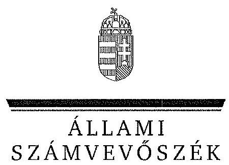

# JELENTÉS 

a gazdasági kamarák közfeladatai ellátására fordított költségvetési támogatások felhasználásának és a gyakorlati képzést szervező gazdálkodó szervezeteknél a szakképzési hozzájárulás teljesítésénél elszámolható költségek ellenőrzéséről a 2009-2011. években

---

# Állami Számvevőszék 

Iktatószám: V-0214-914/2014.
Témaszám: 1249
Vizsgálat-azonosító szám: V056901

## Az ellenőrzést felügyelte:

## Makkai Mária

felügyeleti vezető
Az ellenőrzést vezette és az ellenőrzés végrehajtásáért felelős:
Brebán Andrea
ellenőrzésvezető
A számvevőszéki jelentés összeállításában közremüködtek:
Dombóvári Nóra Ferencz Katalin Gergely Tilda
számvevő tanácsos számvevő tanácsos számvevő

## Az ellenőrzést végezték:

| Bencsik Árpád | Dombóvári Nóra | Fekete Győr László |
| :-- | :-- | :-- |
| számvevő | számvevő tanácsos | számvevő |
| Ferencz Katalin | Gergely Tilda | Kiss Rita Teréz |
| számvevő tanácsos | számvevő | számvevő tanácsos |
| Molnár Bálint | Nagy Adrienn | Nagy Erika |
| számvevő | számvevő | számvevő |
| Szabó Leonóra Ildikó | Vlasits Ágnes | Vörösné Lakatos |
| számvevő | számvevő | Zsuzsanna |
|  |  | számvevő |

## Zakar László

számvevő

## A témához kapcsolódó eddig készített számvevőszéki jelentések:

## címe

Jelentés a szakképzési hozzájárulás felhasználása célszerűségének 1201 ellenőrzéséről
Jelentés a gazdasági kamarák közfeladatai ellátására fordított 13071 költségvetési támogatások felhasználásának és a gyakorlati képzést szervező gazdálkodó szervezeteknél a szakképzési hozzájárulás teljesítésénél elszámolható költségek ellenőrzéséről a 2009-2011. években

---

# TARTALOMJEGYZÉK 

BEVEZETÉS ..... 7
I. ÖSSZEGZŐ MEGÁLLAPÍTÁSOK, KÖVETKEZTETÉSEK, JAVASLATOK ..... 11
II. RÉSZLETES MEGÁLLAPÍTÁSOK ..... 17

1. A területi gazdasági kamarák támogatásainak felhasználása, elszámolása és kontrollja ..... 17
1.1. A Csongrád Megyei Kereskedelmi és Iparkamara ..... 17
1.2. A Hajdú-Bihar Megyei Kereskedelmi és Iparkamara ..... 19
1.3. A Komárom-Esztergom Megyei Kereskedelmi és Iparkamara ..... 21
1.4. A Nagykanizsai Kereskedelmi és Iparkamara ..... 23
1.5. A Nógrád Megyei Kereskedelmi és Iparkamara ..... 25
1.6. A Vas Megyei Kereskedelmi és Iparkamara ..... 27
1.7. A Zala Megyei Kereskedelmi és Iparkamara ..... 30
1.8. A Fejér Megyei Agrárkamara ..... 32
1.9. A Hajdú-Bihar Megyei Agrárkamara ..... 34
2. A szakképzési hozzájárulás nyilvántartása, bevallása és annak ellenőrzése ..... 37
2.1. A gazdálkodó szervezetek szakképzési hozzájáruláshoz kapcsolódó nyilvántartásai, bevallásai ..... 38
2.2. A Nemzeti Munkaügyi Hivatal szakképzési hozzájáruláshoz kapcsolódó ellenőrzése ..... 43

## MELLÉKLETEK

1. számú A gazdasági kamaráknál feltárt szabálytalanságok a 2009. és a 2011. évek között
2. számú A gazdálkodó szervezeteknél feltárt hiányosságok a 2009. és a 2011. évek között
3. számú Nemzeti Agrárgazdasági Kamara Fejér megyei elnökének észrevétele
4. számú Nemzeti Agrárgazdasági Kamara Hajdú-Bihar Megyei Igazgatóság igazgatójának észrevétele
5. számú Nemzeti Agrárgazdasági Kamara elnökének észrevétele
6. számú Nagykanizsai Kereskedelmi és Iparkamara elnökének észrevétele
7. számú Zala Megyei Kereskedelmi és Iparkamara elnökének észrevétele

---

8. számú Nemzeti Munkaügyi Hivatal főigazgatójának észrevétele
9. számú Nemzeti Munkaügyi Hivatal főigazgatójának észrevételére adott válasz
10. számú Hajdú-Bihar Megyei Kereskedelmi és Iparkamara elnökének észrevétele
11. számú Hajdú-Bihar Megyei Kereskedelmi és Iparkamara elnökének észrevételére adott válasz

---

# RÖVIDÍTÉSEK JEGYZÉKE 

## Jogszabályok

ÁSZ tv.
fogyasztóvédelmi tv.
kamarai tv.
közbeszerzési tv.
szakképzési tv.
szakképzési hozzájárulási tv.
számviteli tv.
Szja tv.
Tb tv.

211/1998. (XII. 24.)
Korm. rendelet

## Egyéb rövidítések

ÁSZ
békéltető testület
Csongrád KIK
Fejér AK

Hajdú-Bihar AK

Hajdú-Bihar KIK
IKIR
ISZIIR

Komárom-Esztergom KIK
MAK
MKIK
MPA
Nagykanizsai KIK
NAV

Az Állami Számvevőszékről szóló 2011. évi LXVI. törvény
A fogyasztóvédelemről szóló 1997. évi CLV. törvény
A gazdasági kamarákról szóló 1999. évi CXXI. törvény
A közbeszerzésekről szóló 2003. évi CXXIX. törvény (hatálytalan 2012. január 1-jétől, hatályon kívül helyezte a 2011. évi CVIII. törvény 181. § (1) bekezdése)

A szakképzésről szóló 1993. évi LXXVI. törvény (hatálytalan 2012. január 1-jétől, hatályon kívül helyezte a 2011. évi CLXXXVII. törvény 95. §)
A szakképzési hozzájárulásról és a képzés fejlesztésének támogatásáról szóló 2003. évi LXXXVI. törvény (hatálytalan 2012. január 1-jétől, hatályon kívül helyezte a 2011. évi CLV. törvény 34. § (1) bekezdés a) pontja)
A számvitelről szóló 2000 . évi C. törvény
A személyi jövedelemadóról szóló 1995. évi CXVII. törvény
A társadalombiztosítás ellátásaira és a magánnyugdíjra jogosultakról, valamint e szolgáltatások fedezetéről szóló 1997. évi LXXX. törvény

A békéltető testületi tagok díjazásáról szóló 211/1998. (XII. 24.) Kormányrendelet

Állami Számvevőszék
a területi kereskedelmi és iparkamarák mellett múködő békéltető testület
Csongrád Megyei Kereskedelmi és Iparkamara
Fejér Megyei Agrárkamara (2013. március 28-tól a Magyar Agrár-, Élelmiszergazdasági és Vidékfejlesztési Kamara Fejér megyei szervezete)
Hajdú-Bihar Megyei Agrárkamara (2013. március 28-tól a Magyar Agrár-, Élelmiszergazdasági és Vidékfejlesztési Kamara Hajdú-Bihar megyei szervezete)
Hajdú-Bihar Megyei Kereskedelmi és Iparkamara
Integrált Kamarai Információs Rendszer
Internet alapú Szakképzési Integrált Információs Rendszer
Komárom-Esztergom Megyei Kereskedelmi és Iparkamara
Magyar Agrárkamara
Magyar Kereskedelmi és Iparkamara
Munkaerő-piaci alap
Nagykanizsai Kereskedelmi és Iparkamara
Nemzeti Adó- és Vámhivatal

---

| NGM | Nemzetgazdasági Minisztérium |
| :-- | :-- |
| NMH | Nemzeti Munkaügyi Hivatal (2011. december 31-ével a |
|  | Nemzeti Szakképzési és Felnőttképzési Intézet általános és |
|  | egyetemes jogutóda) |
| Nógrád KIK | Nógrád Megyei Kereskedelmi és Iparkamara |
| NSZFI | Nemzeti Szakképzési és Felnőttképzési Intézet |
| RFKB | Regionális Fejlesztési és Képzési Bizottság |
| SZMSZ | Szervezeti és múködési szabályzat |
| SZMM | Szociális és Munkaügyi Minisztérium |
| TAIR | Tanulószerződések információs rendszere |
| Területi kamara | Az ellenőrzött területi agrárkamara, illetve területi keres- |
|  | kedelmi és iparkamara |
| Vas KIK | Vas Megyei Kereskedelmi és Iparkamara |
| VM | Vidékfejlesztési Minisztérium |
| Zala KIK | Zala Megyei Kereskedelmi és Iparkamara |

---

# ÉRTELMEZŐ SZÓTÁR 

| Békéltető testület | A gazdasági kamarák működtetik a fogyasztóvédelemről szóló 1997. évi CLV. törvény alapján (az 1999. évi CXXI. törvény 10. § (1) bekezdés i) pontja szerint). |
| :--: | :--: |
| Célszerinti felhasználás | A támogatásokhoz kitűzött (rendelt) céloknak megfelelő felhasználás. |
| Együttműködési megállapodás | Írásbeli megállapodás a tanuló gyakorlati képzése érdekében a szakképző iskola és a gazdálkodó szervezet között (az 1993. évi LXXVI. törvény 19. § (1) és (2) bekezdés alapján). |
| Gazdasági kamara | A területi és az országos gazdasági kamara. Az ellenőrzött időszakban gazdasági kamaraként kereskedelmi és ipari, valamint agrárkamara volt létrehozható. |
| Gazdálkodó szervezetek | A szakképzési hozzájárulásról és a képzés fejlesztésének támogatásáról szóló 2003. évi LXXXVI. törvény 2. § (2)-(4) bekezdéseiben megnevezett, szakképzési hozzájárulás fizetésére kötelezett gazdálkodó szervezetek. |
| Internet alapú Szakképzési Integrált Információs Rendszer | A Magyar Kereskedelmi és Iparkamara szakképzési feladatait támogató online rendszer, amely segíti a kamarákat a szakképzési feladataik ellátásában. A rendszer kifejlesztésének és müködtetésének célja a kamarák által működtetett szakképzési rendszerben létrehozott és tárolt információk pontos és naprakész nyilvántartása volt. |
| Köztestület | A köztestület önkormányzattal és nyilvántartott tagsággal rendelkező szervezet, amelynek létrehozását törvény rendeli el. A köztestület a tagságához, illetőleg a tagsága által végzett tevékenységhez kapcsolódó közfeladatot lát el. A köztestület jogi személy. A gazdasági kamarák köztestületként folytatják tevékenységüket (az 1959. évi IV. törvény 65. § (1) és (2) bekezdés alapján). |
| Szabályszerű felhasználás | A jogszabályi előírásoknak és a támogatási szerződésekben foglalt előírásoknak megfelelően dokumentált és nyilvántartott felhasználás. |
| Szakképzési hozzájárulás | A gazdálkodó szervezetek számára kötelezően befizetendő hozzájárulás, amely jellegénél fogva csak szakképzésifejlesztési célokra fordítható (a 2003. évi LXXXVI. törvény 1. § (1) és (2) bekezdése alapján). |
| Tanulószerződés | Írásbeli megállapodás a szakképzésben résztvevő tanuló és a gazdálkodó szervezet között gyakorlati képzés céljából (az 1993. évi LXXVI. törvény. 27. § (1) bekezdés alapján). |
| Területi kamara | A megyei (fővárosi) és a megyeszékhelyen kívüli megyei jogú városi kamara (az 1999. évi CXXI. törvény 2. § h) pontja szerint). |

---

.

---

# JELENTÉS 

## a gazdasági kamarák közfeladatai ellátására fordított költségvetési támogatások felhasználásának és a gyakorlati képzést szervező gazdálkodó szervezeteknél a szakképzési hozzájárulás teljesítésénél elszámolható költségek ellenőrzéséről a 2009-2011. években

## BEVEZETÉS

Az Állami Számvevőszék (ÁSZ) a 2011. évben elfogadott stratégiája szerint az államháztartáson kívülre nyújtott költségvetési támogatások ellenőrzésével kíván hozzájárulni ahhoz, hogy a közpénzeket a szervezetek a közfeladatok szerződésben vállalt ellátása érdekében átlátható módon használják fel.

Az ellenőrzött időszakban a gazdasági kamarák feladatait és múködésük sajátos szabályait részletesen a gazdasági kamarákról szóló 1999. évi CXXI. törvény (kamarai tv.) határozta meg. A gazdasági kamarák feladataikat a kamarai tv.-nek, a feladatellátást meghatározó további jogszabályoknak és alapszabályuknak megfelelően, önkormányzaton alapuló múködéssel látják el. A gazdasági kamarák három területen láttak el közfeladatokat a kamarai tv. 9-12. § és a 13. § (1) bekezdés előírásainak megfelelően:

- a gazdaság fejlesztésével összefüggésben;
- az üzleti forgalom biztonságának és a piaci magatartás tisztességének megteremtése, megőrzése, illetve fokozása érdekében;
- a gazdasági tevékenységet folytatók általános, együttes érdekeinek érvényesítése céljából.

A gazdaságfejlesztéssel összefüggésben előírt feladatokon belül ellátták a szakképzésről szóló 1993. évi LXXVI. törvényben (szakképzési tv.) és végrehajtási rendeletében meghatározott feladataikat. Ennek keretében többek között feladatuk volt a szakmai és vizsgakövetelmények kidolgozása, a szintvizsga előkészítésében és megszervezésében való részvétel, a tanulószerződések és a gyakorlati képzést szervező gazdálkodó szervezetek nyilvántartása, a gyakorlati képzés ellenőrzése és szakmai versenyek szervezése.

Az üzleti forgalom biztonságának és a piaci magatartás tisztességének megteremtése, megőrzése érdekében feladatuk múködtetni a fogyasztóvédelemről szóló 1997. évi CLV. törvény (fogyasztóvédelmi tv.) alapján múködő békéltető

---

testületeket. A szakképzési feladatok és a békéltető testületek múködtetési feladatainak támogatása az időszakban a teljes költségvetési támogatás $93,9 \%$-át tette ki, ezért e közfeladatok ellátását ellenőriztük.

Az Országgyűlés 2011. november 21-én elfogadta az egyes adótörvények és azzal összefüggő egyéb törvények módosításáról szóló törvényt, amely tartalmazza a kamarai tv. módosítását. Az agrárkamarai rendszer újjáalakításának folyamatában az Országgyűlés 2012. július 12-én elfogadta a Magyar Agrár-, Élelmiszergazdasági és Vidékfejlesztési Kamaráról szóló 2012. évi CXXVI. törvényt, amely 2012. július 24 -én lépett hatályba. Emellett az Országgyűlés a kamarák egyik közfeladatát jelentő szakképzési tevékenységre vonatkozóan a 2011. december 19-i ülésnapján elfogadta a szakképzésről szóló CLXXXVII. számú törvényt, amely 2012. január 1-jén lépett hatályba. A gazdasági kamarák szakképzésben betöltött szerepe az új törvényekben nem változott.

Az ellenőrzött időszakban a gazdasági kamarák országos feladatait a Magyar Kereskedelmi és Iparkamara és a Magyar Agrárkamara látta el. A kereskedelmi és iparkamarákhoz tartozó vállalkozások 24 területi kereskedelmi és iparkamarát, az agrárkamarához tartozó vállalkozások 20 területi agrárkamarát hoztak létre. A gazdasági kamarák az államháztartási körbe nem tartozó, köztestületként múködő jogi személyek. A jogszabályi változást követően 2013. március 28-án létrejött a Magyar Agrár-, Élelmiszergazdasági és Vidékfejlesztési Kamara, amelynek megyei szervezeteként folytatták a területi agrárkamarák múködésüket.

A kamarák a szakképzési feladataik ellátásához a 2009-2011. évek közötti időszakban egyedi döntéssel és támogatási szerződések útján a Munkaerő-piaci Alap (MPA) képzési alaprészéből kaptak támogatást, 5820,8 millió Ft értékben. Ebből a helyszínen ellenőrzött területi kamarák (területi kamarák) a szakképzési feladatok elvégzéséhez a 2009-2011. években 586,4 millió Ft, a békéltető testületek múködtetéséhez 141,7 millió Ft költségvetési támogatást kaptak. Az időszakban hatályos költségvetési törvényekben a kamarák mellett múködő békéltető testületek múködtetésére a 2009. és a 2010. évben a Szociális és Munkaügyi Minisztérium (SZMM), a 2011. évben pedig a Nemzetgazdasági Minisztérium (NGM) fejezetben, 1050,0 millió Ft értékben biztosítottak támogatást.

Stratégiai jelentőségű a gazdasághoz és a munkaerőpiachoz szorosan kötődő szakmai képzés. A szakképzési hozzájárulás beszedésének célja a szakképzési tv.-ben meghatározott gyakorlati képzés feltételei megteremtésének, korszerűsítésének biztosítása.

A gyakorlati képzést szervező gazdálkodó szervezetek engedélyezési eljárás lefolytatása után végezhetik a szakképzéshez kapcsolódó tevékenységüket. A gazdálkodó szervezetek a szakképzési hozzájárulásról és a képzés fejlesztésének támogatásáról szóló 2003. évi LXXXVI. törvényben ${ }^{1}$ (szakképzési hozzájárulási

[^0]
[^0]:    ${ }^{1}$ 2012. január 1-jétől hatálytalan, 2012. január 1-jétől a szakképzési hozzájárulásról és a képzés fejlesztésének támogatásáról szóló 2011. évi CLV. törvény hatályos

---

tv.) megjelöltek szerint kötelezettek, illetve nem kötelezettek a szakképzési hozzájárulásra ${ }^{2}$.

A szakképzési hozzájárulásra kötelezettek bevallási kötelezettségüket két módon teljesíthették a 2009-2011. években. A gyakorlati képzést szervező gazdálkodó szervezetek a Nemzeti Szakképzési és Felnőttképzési Intézethez (NSZFI) ${ }^{3}$ nyújtották be a bevallásaikat, és részére teljesítették szakképzési hozzájárulási kötelezettségüket. A gyakorlati képzést szervező gazdálkodó szervezetek a szakképzési hozzájárulási kötelezettségeiket a jogszabályban megjelölt költségekkel csökkenthették. A többi gazdálkodó szervezet a bevallását a Nemzeti Adó- és Vámhivatalhoz (NAV) nyújtotta be. Ezen gazdálkodók a hozzájárulásukat csökkenthették a térségi integrált szakképző központ részét képező szakképző intézménynek, illetve felsőoktatási intézménynek a gyakorlati képzés tárgyi fejlesztését szolgáló fejlesztési támogatás nyújtásával.

Az ellenőrzés jogalapját az Állami Számvevőszékről szóló 2011. évi LXVI. törvény 5. § (3) bekezdésében foglaltak képezték. Az ellenőrzés a 2009-2011. évek közötti időszakra terjedt ki.

Az ellenőrzés célja annak értékelése volt, hogy

- a gazdasági kamarák szabályszerűen és rendeltetésszerűen használták-e fel a szakképzéshez kapcsolódó és a békéltető testületek működtetésével összefüggő közfeladat-ellátásra kapott költségvetési támogatásokat;
- a kapott támogatásokat szabályszerűen nyilvántartották-e, azokkal szabályszerűen elszámoltak-e;
- a gyakorlati képzést bonyolító gazdálkodó szervezetek a szakképzési hozzájárulás nyilvántartási, bevallási és elszámolási kötelezettségüknek a jogszabályi előírásoknak megfelelően tettek-e eleget.

Az ellenőrzést az ÁSZ 2013. évi második félévi ellenőrzési terve alapján, a számvevőszéki ellenőrzés szakmai szabályai szerint és a nemzetközi standardok figyelembe vételével, a szabályszerűségi ellenőrzés módszerével végeztük. Az ellenőrzés szempontrendszerét előtanulmánnyal alapoztuk meg. A gazdasági kamarák közfeladat-ellátásához kapott költségvetési támogatások számszerűsítését a 2009-2011. évekre vonatkozó tanúsítványok adatai alapozták meg. Az ellenőrzés nem terjedt ki az európai uniós forrásból támogatott kamarai programokra.

A jelen ellenőrzést az indokolta, hogy az ÁSZ a gazdasági kamarák és a gyakorlati képzést szervező gazdálkodó szervezetek ellenőrzöttségét szélesíteni kívánja. A kamarai tv. 1999. évi hatályba lépését követően a 2012. évig az ÁSZ nem ellenőrizte a gazdasági kamarák közfeladatai ellátására kapott költségve-

[^0]
[^0]:    ${ }^{2}$ Nem kötelesek a szakképzési hozzájárulásra a szakképzési hozzájárulási tv. 2. § (5) bekezdésében felsorolt szervezetek.
    ${ }^{3}$ A Nemzeti Szakképzési és Felnőttképzési Intézet 2012. január 1-jétől Nemzeti Munkaügyi Hivatal néven folytatja munkáját.

---

tési támogatásoknak a felhasználását. Az ÁSZ a 13071. számú ${ }^{4}$ jelentésében hiányosságokat tárt fel a gazdasági kamaráknak nyújtott támogatások célra történő és szabályszerű felhasználásánál, nyilvántartásánál és ellenőrzésénél. A lefolytatott ellenőrzés megállapításai szerint a fejezetet irányító szervek (az NGM, a VM és jogelődjeik) a közfeladatokhoz a forrást nem megfelelő helyen, illetve nem teljes körűen tervezték meg, a kamaráknak nyújtott támogatások felhasználásának hatékonyságát, a kamarai tv. rendelkezése ellenére nem ellenőrizték. Az országos gazdasági kamarák közfeladatai ellátásához nyújtott támogatások szerződései a közfeladat ellátására biztosított költségvetési támogatások felhasználásának belső ellenőrzési rendjét és a finanszírozott feladatok megvalósításának humánerőforrás követelményeit nem írták elő. Az országos gazdasági kamarák tevékenységének eredménye, hogy a hatályos jogszabályi és támogatási szerződésekben előírt feladatoknak megfelelően kialakították a szakképzéssel és a békéltető testületek működtetésével összefüggő közfeladatellátás egységes követelményeit. Ezen túl a jelentés a gyakorlati képzést szervező gazdálkodó szervezeteknél a szakképzési tevékenység dokumentálásával és a szakképzési hozzájárulás nyilvántartási, bevallási és elszámolási kötelezettségével kapcsolatban is szabálytalanságokat állapított meg.

A jelen ellenőrzésnél a helyszíni ellenőrzésre 7 területi kereskedelmi és iparkamaránál, 2 területi agrárkamaránál, a kamarák mellett múködő békéltető testületeknél ${ }^{5}$, a Nemzeti Munkaügyi Hivatalnál (NMH), továbbá $122^{6}$ gazdálkodó szervezetnél került sor. Az ellenőrzésre kiválasztott 9 területi kamara mintába választásának szempontja volt az ellenőrzött közfeladatokra kapott költségvetési támogatás nagyságrendje és az ellenőrzött közfeladat-ellátás teljes körüsége.

Az ellenőrzésre kiválasztott területi kamarák illetékességi körébe tartozó gazdálkodó szervezetek közül véletlenszerű rétegzett mintavétellel választottuk ki az ellenőrzött gazdálkodó szervezeteket.

Az ÁSZ a 2011. évi LXVI. törvény 29. §-a szerint a jelentéstervezetet megküldte a Nemzeti Munkaügyi Hivatal főigazgatójának, 9 Kamara elnökének, 122 gazdálkodó szervezetnek egyeztetésre. A Nemzeti Munkaügyi Hivatal főigazgatója és a Hajdú Bihar Megyei Kereskedelmi és Iparkamara elnöke észrevételt tett, hat Kamara elnöke nem tett észrevételt, a gazdálkodó szervezetek nem éltek észrevételezési jogukkal. A beérkezett észrevételeket és az arra adott választ a jelentés 3-11. számú mellékletei tartalmazzák.

[^0]
[^0]:    ${ }^{4}$ Jelentés a gazdasági kamarák közfeladatai ellátására fordított költségvetési támogatások felhasználásának és a gyakorlati képzést szervező gazdálkodó szervezeteknél a szakképzési hozzájárulás teljesítésénél elszámolható költségek ellenőrzéséről a 20092011. években
    ${ }^{5}$ Három területi kamara (Nagykanizsai KIK, Fejér AK, Hajdú-Bihar AK) mellett nem múködött békéltető testület.
    ${ }^{6}$ Az ÁSZ ellenőrzési programja 123 gazdálkodó szervezetet jelölt ki helyszíni ellenőrzés elvégzésére, viszont a BE-BA' 99 Kft . közreműködési kötelezettségének elmulasztása miatt a helyszíni ellenőrzés lefolytatása meghiúsult.

---

# I. ÖSSZEGZŐ MEGÁLLAPÍTÁSOK, KÖVETKEZTETÉSEK, JAVASLATOK 

#### Abstract

A közfeladat-ellátáshoz kapott költségvetési támogatások felhasználása ellenőrzési rendjének szabályozatlansága és hiányos kialakítása hozzájárult a rendeltetésnek nem megfelelő és szabálytalan tá-mogatás-felhasználáshoz.

Az ellenőrzött területi gazdasági kamarák a szakképzéssel összefüggő feladatok ellátásához 586,4 millió Ft és a békéltető testületek múködtetéséhez 141,7 millió Ft költségvetési támogatásban részesültek a 2009-2011. években. A szakképzési feladatokhoz kapcsolódóan megkötött szerződésekkel nyújtott támogatások célja a szakképzési feladatok finanszírozása volt. Ennek keretében a gazdasági kamarák a támogatásokat a tanulószerződéssel kapcsolatos tanácsadási tevékenységre, a gazdálkodó szervezetek által folytatott gyakorlati képzés kétszintű ellenőrzésére, a gyakorlati szintvizsgáztatásra, a hazai és nemzetközi szakmai versenyek, a szakmai záróvizsgák elnöki és tagi delegálásának lebonyolítására, a szakmai vizsgaelnökök és vizsgabizottsági tagok felkészítésére, az iskolarendszerű szakképzés koordinációjára, valamint a gazdasági érdekképviseletek felkészítésére kapták.

Az országos gazdasági kamarák által a területi kamaráknak a közfeladatai ellátásához továbbadott támogatások szerződései nem teremtették meg az átlátható és elszámoltatható közpénzfelhasználás feltételeit. A támogatási szerződések nem írták elő a támogatás felhasználásának ellenőrzését az országos kamarának kötelezettségként. A területi kamarák számára sem határoztak meg az elszámolások ellenőrzésére vonatkozóan követelményeket. A szerződések a külső szakértőkkel kapcsolatos humánerőforrás követelményekről rendelkeztek.

A területi gazdasági kamarák tisztségviselőinek összeférhetetlenségére vonatkozó szabályok összhangban voltak a kamarai tv. előírásaival. A területi gazdasági kamarák munkatársai egyéb jogviszony keretében szakképzéshez kapcsolódóan csak olyan feladatokat láttak el, amelyek a munkaköri leírásukban nem szerepeltek.

A területi gazdasági kamarák a költségvetési támogatások felhasználásának kontrollrendszeréről önálló szabályzatban nem rendelkeztek. Ez jelentős kockázatot jelent a közpénzek szabályszerű felhasználása tekintetében. Az SZMSZ két területi kamaránál (Fejér AK, Nógrád KIK) több éve nem volt aktualizálva, a Fejér AK-nál a belső szabályzatok sem voltak a szervezet sajátosságaira alakítva. A belső kontrollok megfelelő működésének hiányában a két területi agrárkamaránál és a kereskedelmi és iparkamarák békéltető testületei múködésében az ellenőrzés szabálytalanságokat (pl. beszámolási határidő be nem tartása, a békéltető testület tagjai jogszabálynak nem megfelelő díjazása, a békéltető tes-

---

tület tájékoztatójának nem vagy késedelmes megküldése a fogyasztóvédelemért felelős miniszternek stb.) tárt fel. ${ }^{7}$

A területi gazdasági kamarák - a Fejér AK kivételével - a szakképzési feladataik ellátására kapott költségvetési támogatásokat a támogatási szerződésekben elöírt célokra fordították. A Fejér AK 0,2 millió Ft értékben szabálytalan bizonylatolással, a pénz átvevőjének aláírása nélkül fizetett ki és számolt el a támogatás terhére személyi jellegű költséget, ezért a támogatás célra történő felhasználása nem igazolt.

A területi kamarák a szakképzési feladatok ellátásához kapott támogatásokat - két agrárkamara kivételével - szabályosan használták fel. A felhasználást alátámasztó bizonylatokon a számviteli tv.-ben előírt utalványozás, illetve a rendelkezés végrehajtásának igazolása ${ }^{8}$ hiányzott, illetve nem volt szabályos a Fejér AK-nál 2,4 millió Ft, a Hajdú-Bihar AK-nál 5,6 millió Ft támogatás elszámolása esetében.

A hat békéltető testület múködtetéséhez kapott támogatások felhasználása csak a Komárom-Esztergom KIK-nél volt szabályos. Négy (Csongrád KIK, Hajdú-Bihar KIK, Nógrád KIK, Vas KIK mellett múködő) békéltető testületnél a tagok díjazásának mértéke nem felelt meg a jogszabályi előírásoknak, emiatt 1,6 millió Ft szabálytalanul lett elszámolva. A Nógrád KIK és a Zala KIK mellett múködő békéltető testületeknél nem közvetlenül jogvita elbírálásához számoltak el 0,6 millió Ft költségtérítést, amely ellentétes a jogszabályi előírással. A Zala KIK mellett múködő békéltető testület a támogatási szerződésekben megengedettnél 0,2 millió Ft-tal több reprezentációs költséget számolt el.

A területi kamarák - a Hajdú-Bihar AK, a Hajdú-Bihar KIK és a Nagykanizsai KIK kivételével - a támogatási szerződésben előírt beszámolási határidő betartását dokumentummal igazolni nem tudták. A támogatási szerződések elszámolását a Hajdú-Bihar AK négy esetben, a Nagykanizsai KIK egy esetben határidőn túl nyújtotta be.

A területi kamarák mellett múködő békéltető testületek az ügyeket szabályosan dokumentálták. Négy békéltető testület (Hajdú-Bihar KIK, Komárom-Esztergom KIK, Nógrád KIK, Vas KIK) nem, illetve késedelmesen küldte meg a fogyasztóvédelmi tv.-ben előírt éves tájékoztatót a fogyasztóvédelemért felelős miniszternek. A Hajdú-Bihar KIK mellett múködő békéltető testület a fogyasztóvédelmi tv.-ben előírt közzétételi kötelezettségének sem tett eleget.

# Az országos kamarák által átadott támogatások esetében a felhasználások ellenőrzési gyakorlata nem volt megfelelő. 

[^0]
[^0]:    ${ }^{7}$ a gazdasági kamaráknál feltárt szabálytalanságokat az 1. számú melléklet tartalmazza
    ${ }^{8}$ A számviteli tv. 167. § (1) bekezdése a könyvviteli elszámolást alátámasztó bizonylat alaki és tartalmi kellékeként írja elő a rendelkezés végrehajtásának igazolását, amelynek tartalmát a számviteli tv. nem definiálja. A kamarák a gazdasági múvelet megtörténtének, teljesítésének igazolása értelemben alkalmazták szabályozatlanul.

---

Az országos kamarák a szakképzési feladatokhoz és a békéltető testületek múködéséhez nyújtott támogatások felhasználásának ellenőrzési jogát a szerződésekben kikötötték, amelyek szerint a támogató jogosult helyszíni ellenőrzést is végezni. Az ellenőrzésről dokumentum csak hiánypótlás esetében volt, a szakmai és pénzügyi beszámoló elfogadását nem igazolták vissza, a helyszínen nem ellenőrizték a területi kamarákat. A támogatási szerződésekben előírt elkülönített nyilvántartási kötelezettség teljesítéséről az alkalmazott ellenőrzési rendszeren keresztül nem, csak helyszíni ellenőrzéssel lehet meggyőződni. Ez is hozzájárult a területi kamaráknál feltárt nyilvántartási és bizonylatolási szabálytalanságokhoz.

A területi kamarák a szakképzési tv. előírásainak megfelelően az illetékességi körükbe tartozó, gyakorlati képzést ellátó gazdálkodó szervezetek nyilvántartásáról gondoskodtak, a gazdálkodó szervezetnél a gyakorlati képzés szervezését, lebonyolítását ellenőrizték. Az ellenőrzések elvégzésére 72,3 millió Ft összegű támogatást használtak fel. A képzőhelyek ellenőrzése nyomán a területi kamarák 14 esetben hoztak nyilvántartásba vételt elutasító határozatot a gazdálkodó szervezeteknél feltárt hiányosságok miatt.

Az ellenőrzött gazdálkodó szervezetek közül 86 nyújtotta be bevallását az NSZFI-hez az időszakban. A többi szervezet a NAV felé teljesítette bevallási és hozzájárulás-befizetési kötelezettségét.

Az NSZFI-nél ellenőrzött gazdálkodó szervezetek az éves szakképzési hozzájárulás bevallásokat - 10 szervezet kivételével - határidőre benyújtották az NSZFI részére a 2009-2011. években. A bevallásokat az NSZFI tartalmilag, formailag és számszakilag ellenőrizte. Az NSZFI a hiánytalan bevallások felülvizsgálatánál a 30 napos határidőt 2009-ben az esetek 76,2\%-ában, 2010-ben 87,5\%ában, 2011-ben $24,2 \%$-ában tartotta be. Hiánypótlás esetében a bevallások felülvizsgálata 2009-ben 79, 2010-ben 69, a 2011. évben 206 átlagos ügyintézési napot vett igénybe.

Az NSZFI helyszínen nem ellenőrizte a gazdálkodó szervezetek 2009-2011. évekre vonatkozó bevallásait és elszámolásait. Az ellenőrzött időszakban végzett helyszíni ellenőrzések a 2007. és a 2008. évi bevallásokra vonatkoztak. Az NSZFI több éves késedelemmel végzett ellenőrzései nem biztosították a jogszabályi előírások érdemi érvényesítését.

# Az ÁSZ a gyakorlati képzésben résztvevő gazdálkodó szervezetek ellenőrzésénél a szakképzési hozzájárulás bevallása és annak megalapozó nyilvántartása tekintetében jogszabálysértéseket tárt fel. 

Az ellenőrzött 118 gazdálkodó szervezetből $52(44,1 \%)$ sértette meg a szakképzési tv. nyilvántartások vezetésére vonatkozó előírásait, a területi kamarák ellenőrzései ellenére. A jogszabály alapján kötelező foglalkozási naplót 27 gazdálkodó szervezet nem, illetve 25 nem az előírás szerint vezette. Ezeknél a gazdálkodó szervezeteknél nem volt igazolt a tanulók gyakorlati foglalkozásokon való rendszeres részvétele, mulasztása és értékelése. A foglalkozási naplókat nem, vagy hiányosan vezetők az időszakban 379,7 millió Ft-ot számoltak el szakképzési hozzájárulási kötelezettségük csökkentéseként, és ennek eredményeképpen 111,9 millió Ft-ot igényeltek vissza.

---

A szakképzésben résztvevő tanulók alap vagy kiegészítő pénzbeli juttatásait 45 gazdálkodó szervezet ( $38,1 \%$ ) szabálytalanul állapította meg és fizette ki.
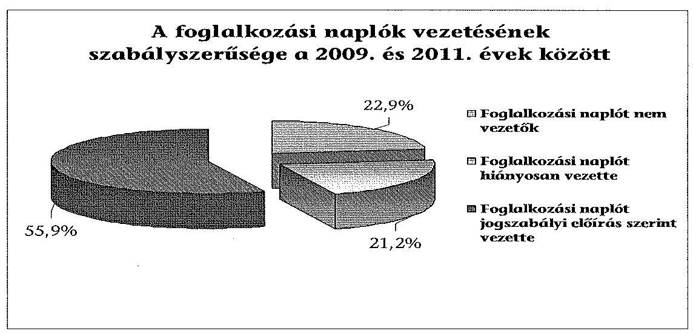

Az NSZFI-hez bevalló gazdálkodó szervezetek közül 54-nél (62,8\%) volt szabálytalan a szakképzési hozzájárulás bevallása és az ahhoz kapcsolódó nyilvántartások vezetése. A szakképzési hozzájárulás alapjának meghatározása 35 gazdálkodó szervezetnél nem a jogszabályi előírások alapján történt, amelynek következtében a szervezetek az előírtnál 7,7 millió Ft-tal több hozzájárulást teljesítettek az NSZFI-nek. Jellemző hiba volt, hogy a gazdálkodó szervezetek nem csökkentették a hozzájárulás alapját a tanulószerződések alapján kifizetett díjakkal.

A tételes költségelszámolást alkalmazó gazdálkodó szervezetek közül 35 szervezet (48\%) nem tartotta be a szakképzési hozzájárulási tv.-ben megjelölt levonható költségek elszámolására vonatkozó szabályozást. Ezek közül 25 gazdálkodó szervezet ( $34,7 \%$ ) érvényesített bevallásában szabálytalanul 22,5 millió Fttal magasabb költséget, megsértve a szakképzési hozzájárulási tv. előírásait. Az átalány költségelszámolást végzők a jogszabályi előírás szerint jártak el.

Az NSZFI és a területi kamarák késedelmes és nem megfelelő ellenőrzései hozzájárultak az ÁSZ által feltárt hibákhoz. Az ellenőrzések nem voltak eredményesek, ez növeli az állami bevételek beszedésének kockázatát.

Az Állami Számvevőszékről szóló 2011. évi LXVI. törvény 33. § (1) bekezdésében foglaltak értelmében a jelentésben foglalt megállapításokhoz kapcsolódó intézkedési tervet köteles az ellenőrzött szervezet vezetője összeállítani, és azt a jelentés kézhezvételétől számított 30 napon belül az ÁSZ részére megküldeni. Amennyiben az intézkedési tervet határidőben nem küldi meg a szervezet, vagy az nem elfogadható, az ÁSZ elnöke a hivatkozott törvény 33. § (3) bekezdés a)-b) pontjaiban foglaltakat érvényesítheti.

---

Az ellenőrzés intézkedést igénylő megállapításai és javaslatai:

# a Fejér Megyei Agrárkamara és a Hajdú-Bihar Megyei Agrárkamara, illetve jogutódja elnökeinek 

A Fejér AK a szakképzési feladatai ellátására kapott költségvetési támogatásból 0,2 millió Ft-ot a számviteli tv. 165. § (2) bekezdése és a 167. § (1) bekezdés c) pontja előírásával ellentétesen, átvevő aláírása nélküli kiadási pénztárbizonylat alapján számolt el, ezért a támogatás célra történő felhasználása nem volt igazolt.

A számviteli tv. 167. § (1) bekezdésének c) pontjában alaki tartalmi kellékként előírt utalványozás, illetve a rendelkezés végrehajtásának igazolása a Fejér AK-nál 2,4 millió Ft, a Hajdú-Bihar AK-nál 5,6 millió Ft támogatás elszámolása esetében nem volt szabályos, mivel az utalványozó és a rendelkezés végrehajtását igazoló személy aláírása hiányzott.

Javaslat:
Írja elő és követelje meg, hogy
a) a támogatások elszámolásának alapbizonylatai tartalmazzák a számviteli tv. 167. § (1) bekezdés c) pontjában előírt alaki és tartalmi kellékeket;
b) a nyilvántartásokban a számviteli tv. 165. § (2) bekezdésében előírtaknak megfelelően csak szabályszerűen kiállított bizonylat alapján jegyezzenek be adatot a támogatások szabályszerű és célra történő felhasználásának alátámasztása érdekében.
a Fejér Megyei Agrárkamara és a Hajdú-Bihar Megyei Agrárkamara, illetve jogutódja, a Csongrád Megyei Kereskedelmi és Iparkamara, a Hajdú-Bihar Megyei Kereskedelmi és Iparkamara, a Komárom-Esztergom Megyei Kereskedelmi és Iparkamara, a Nagykanizsai Kereskedelmi és Iparkamara, a Nógrád Megyei Kereskedelmi és Iparkamara, a Vas Megyei Kereskedelmi és Iparkamara, Zala Megyei Kereskedelmi és Iparkamara elnökeinek

Az ÁSZ által ellenőrzött gyakorlati képzést végző gazdálkodó szervezetek 44,1\%-a megsértette a szakképzési tv. 25. § (1) bekezdésének a foglalkozási napló vezetésére vonatkozó előírásait. A gyakorlati képzésben résztvevő tanulók pénzbeli juttatásainak kifizetésénél a gazdálkodó szervezet $38,1 \%$-a nem érvényesítette a szakképzési tv. 44. § (2) és 48. § (2) bekezdésében előírt mértéket.

Javaslat:
A területi kamarák ellenőrzéseik által érvényesítsék a gyakorlati képzést folytató szervezetnél a szakképzésről szóló 2011. évi CLXXXVII. tv. 41. § (1) bekezdésének a foglalkozási napló vezetésére, illetve a 63. § (2) bekezdésének a tanulók juttatásaira vonatkozó előírásainak betartását.

---

# a Csongrád Megyei Kereskedelmi és Iparkamara, a Hajdú-Bihar Megyei Kereskedelmi és Iparkamara, a Nógrád Megyei Kereskedelmi és Iparkamara, a Vas Megyei Kereskedelmi és Iparkamara, a Zala Megyei Kereskedelmi és Iparkamara Békéltető Testületei elnökeinek 

Az ÁSZ által ellenőrzött hat Kereskedelmi és Iparkamara mellett müködő békéltető testületből öt testületnél a tagok díjazása és költségtérítése 2,2 millió Ft összegben nem felelt meg a békéltető testületnél a tagok díjazásáról szóló 211/1998. (XII. 24.) Korm. rendelet előírásainak.

Javaslat:
Intézkedjen a támogatások szabályszerű elszámolása érdekében a békéltető testületnél a tagok díjazásáról szóló 211/1998. (XII. 24.) Korm. rendelet előírásai alapján kifizetett díjak felülvizsgálatáról, és amennyiben szükséges, a támogató részére a szabálytalan kifizetések visszafizetéséről.

## a Nemzeti Munkaügyi Hivatal föigazgatójának

Az NSZFI helyszínen nem ellenőrizte a gazdálkodó szervezetek 2009-2011. évekre vonatkozó bevallásait és elszámolásait. Az NSZFI több éves késedelemmel végzett ellenőrzései nem biztosítják a jogszabályi előírások érdemi érvényesítését. Az ÁSZ által ellenőrzött gazdálkodó szervezetek 62,8\%-ánál szabálytalan volt a szakképzési hozzájárulás bevallása, illetve az ahhoz kapcsolódó nyilvántartások vezetése a 20092011 közötti időszakban. 25 gazdálkodó szervezet (34,7\%) szabálytalanul érvényesített bevallásában az előírtnál magasabb költséget.

Javaslat:
Ellenőrizze a jogszabályokat sértő 25 gazdálkodó szervezet 2009-2011. évekre vonatkozó, szakképzési hozzájáruláshoz kapcsolódó bevallásait és megalapozó nyilvántartásait a szakképzési hozzájárulásról és a képzés fejlesztésének támogatásáról szóló 2011. évi CLV. törvény 32. § (1) bekezdés a) pontja, valamint a Nemzeti Munkaügyi Hivatalról és a szakmai irányítása alá tartozó szakigazgatási szervek feladat- és hatásköréről szóló 323/2011. (XII.28.) Korm. rendelet 4. § (2) bekezdésében foglaltak alapján. Amennyiben egy adott gazdálkodó szervezet tekintetében az ellenőrzés megállapításai felvetik a NAV ellenőrzésének szükségességét, úgy kezdeményezze az adóhatóságnál az ellenőrzés lefolytatását.

---

# II. RÉSZLETES MEGÁLLAPÍTÁSOK 

## 1. A TERÜLETI GAZDASÁGI KAMARÁK TÁMOGATÁSAINAK FELHASZNÁLÁSA, ELSZÁMOLÁSA ÉS KONTROLLJA

### 1.1. A Csongrád Megyei Kereskedelmi és Iparkamara

A Csongrád Megyei Kereskedelmi és Iparkamara (Csongrád KIK) a békéltető testületek működtetéséhez, valamint a szakképzési feladatok ellátásához a 2009-2011. években 22 db támogatási szerződés alapján 127,0 millió Ft támogatásban részesült. A kapott támogatásokat a szerződésekben megjelölt célokra - a békéltető testületi tagok 0,03 millió Ft díjazása kivételével -, szabályosan használták fel.

Az MKIK-tól szakképzési feladatokra kapott támogatások megoszlósa ( millió Ft)
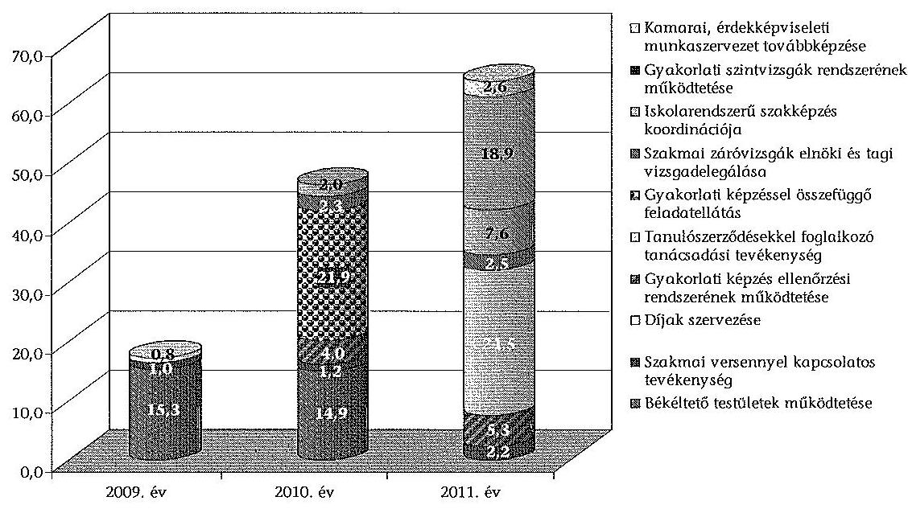

A támogatások felhasználása során közbeszerzési eljárás lefolytatására nem került sor, mert nem volt olyan árubeszerzés és szolgáltatás-igénybevétel, amely a közbeszerzési értékhatárt meghaladta volna.

A Magyar Kereskedelmi és Iparkamarától (MKIK) kapott támogatás felhasználása keretében a Csongrád KIK a gyakorlati képzést végző gazdálkodó szervezetek és képzőhelyek, valamint a gyakorlati képzésben résztvevő tanulók között létrejött tanulószerződéseket az ISZIIR-rendszerben tartotta nyilván. A kamara az illetékességi körébe tartozó, gyakorlati képzést ellátó, tanulószerződéssel foglalkoztató gazdálkodó szervezeteket a szakképzési tv. 30. § (3) bekezdése szerint az időszakban ellenőrizte. Az évközi ellenőrzések során két esetben tártak fel szabálytalanságot. Az egyik szerint a többszöri fizetési felszólítás ellenére

---

sem történt meg a tanulói juttatás kifizetése. A másik esetben a képzőhely megszűnése miatt a kamara visszavonta a képzési engedélyt.

A kamara a 2009. év végén 483 (343 gazdálkodónál), a 2010. év végén 461 (328 gazdálkodónál), a 2011. év végén 476 (339 gazdálkodónál) gyakorlati képzőhelyet tartott nyilván. Ugyanezen idöpontokban 2766, 2734, 2900 volt a nyilvántartott tanulószerződések száma. A kamara a nyilvántartott gazdálkodó szervezeteknél évente sorban 235, 315, illetve 491 képzőhely ellenőrzését végezte el.

A Csongrád KIK a pénzügyi beszámolót a támogatási szerződésben rögzített formában elkészítette, az elszámolások határidőn belül történő benyújtását azonban dokumentumokkal igazolni nem tudta. A támogatások elszámolásának ellenőrzését 19 esetben hiánypótlás kérése igazolta. Az országos kamara a szakmai és pénzügyi beszámoló elfogadását nem igazolta vissza. A támogató a Csongrád KIK támogatás-felhasználását helyszínen nem ellenőrizte.

A támogatás felhasználásának nyilvántartása megfelelt a számviteli tv. 161/A. § (2) bekezdésében és a támogatási szerződésben előírtaknak. A fökönyvben támogatásonként a kiadások és bevételek elkülönített nyilvántartását munkaszámokra történő könyveléssel biztosították. A pénzügyi elszámolások a számviteli tv. 167. § (1) bekezdésében rögzített alaki és formai követelményű bizonylatokkal voltak alátámasztva. A nyilvántartási és elszámolási rendszer a kialakított záradékolási gyakorlattal együtt biztosította a bizonylatok többszöri elszámolásának kizárását, a támogatások felhasználásának ellenőrizhetőségét. A bizonylatokat a Csongrád KIK a számviteli tv. 169. § (2) bekezdésében megjelöltek szerint őrizte. A 2009-2011. években hat esetben a kamara szabályosan mutatta ki és rendezte pénzügyileg a támogatások maradványait.

A Csongrád KIK meghatározta a feladatok ellátásához szükséges humánerőforrás biztosításához a követelményeket. Az ügyintéző szervezetre vonatkozóan a követelményrendszert a belső szabályozásban - a kamara alapszabályában, az SZMSZ-ben, az önkormányzati szabályzatban -, az álláspályázati felhívásokban és a munkaköri leírásokban határozták meg. Az SZMSZ mellékletében rögzített szervezeti ábra tartalmazta a múködést biztosító létszámkövetelményt. A külső szakértők megbízásának szakmai és pénzügyi feltételeit, a díjazás rendjét, forrását a támogatási szerződések tartalmazták, a szakértői pályázati felhívásokban előírták az alkalmazáshoz szükséges iskolai végzettséget és az egyéb feltételeket.

A kamarai tisztségviselők összeférhetetlenségére vonatkozó szabályokat, összhangban a kamarai tv. 16. § (1) és a 27. § (3)-(6) bekezdéseiben foglaltakkal, az alapszabályban rögzítették. Összeférhetetlenségre vonatkozó szabályokat az ügyintézői szervezet vonatkozásában külön nem határoztak meg. A Csongrád KIK munkatársai egyéb jogviszony keretében láttak el szakképzéssel összefüggő, munkaköri leírásukban nem szereplő feladatokat.

A Csongrád KIK támogatási szerződésekben és belső szabályozásban előírt kontrollrendszere alkalmas volt a közfeladat-ellátásra kapott költségvetési támogatások felhasználása szabályszerűségének biztosítására. A titkári utasításokban, munkaköri leírásokban szerepelt a projektmunkában való részvétel, a projektek elszámolásának és ellenőrzésének feladata. A kötelezettségvállalás,

---

utalványozás, pénzkezelés kontrollrendszerére vonatkozóan az SZMSZ, illetve a pénzkezelési szabályzat tartalmazott rendelkezést.

A támogatási szerződések előírták a támogatás felhasználásának feltételeit és a beszámolási kötelezettséget, ezen belül meghatározták a pénzügyi és a szakmai beszámoló tartalmi szempontjait és szabályait. Egyes támogatások pénzügyi elszámolásához (Regionális Képzési és Fejlesztési Bizottságok) külön részletező útmutatót adtak ki.

A Csongrád KIK mellett a békéltető testület az ügyeket szabályosan dokumentálta, a fogyasztóvédelmi tv.-ben foglaltak szerint folytatta tevékenységét a testületi díjazás kivételével. A testület tagjai a 2009. és a 2010. évben összesen 0,03 millió Ft értékben a békéltető testületi tagok díjazásáról szóló 211/1998. (XII. 24.) Korm. rendelet 2. §-ától eltérő díjazásban részesültek.

# 1.2. A Hajdú-Bihar Megyei Kereskedelmi és Iparkamara 

A Hajdú-Bihar Megyei Kereskedelmi és Iparkamara (Hajdú-Bihar KIK) a békéltető testületek működtetéséhez, valamint a szakképzési feladatok ellátásához a 2009-2011. években 28 támogatási szerződés alapján 201,6 millió Ft támogatásban részesült. A kapott támogatásokat a szerződésekben megjelölt célokra - a békéltető testületi tagok 0,4 millió Ft díjazása kivételével -, szabályosan használták fel.

Az MKIK-tól szakképzési feladatokra kapott támogatások megoszlása (millió Ft)
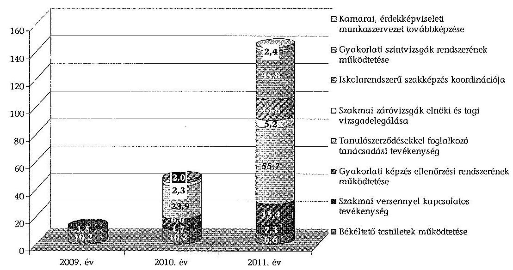

A támogatások felhasználása során közbeszerzési eljárás lefolytatására nem került sor, mert nem volt olyan árubeszerzés és szolgáltatás-igénybevétel, amely a közbeszerzési értékhatárt meghaladta volna.

Az MKIK-től kapott támogatás felhasználása keretében a Hajdú-Bihar KIK a gyakorlati képzést végző gazdálkodó szervezetek és képzőhelyek, valamint a gyakorlati képzésben résztvevő tanulók között létrejött tanulószerződéseket

---

az ISZIIR-rendszerben tartotta nyilván. A kamara az illetékességi körébe tartozó, gyakorlati képzést ellátó, tanulószerződéssel foglalkoztató gazdálkodó szervezeteket a szakképzési tv. 30. § (3) bekezdése szerint az időszakban ellenőrizte. A gyakorlati képzőhelyek bevezető ellenőrzése során a 2009. évben 6, a 20102011. években 3-3 esetben született nyilvántartásba vételt elutasító határozat.

A kamara a 2009. év végén 672 (544 gazdálkodónál), a 2010. év végén 761 (570 gazdálkodónál), a 2011. év végén 585 (486 gazdálkodónál) gyakorlati képzőhelyet tartott nyilván. Ugyanezen idöpontokban 2903, 2699, 2759 volt a nyilvántartott tanulószerződések száma. A kamara a nyilvántartott gazdálkodó szervezeteknél évente sorban 660, 406, illetve 582 képzőhely ellenőrzését végezte el.

A Hajdú-Bihar KIK a támogató felé a támogatási szerződésben rögzített formában és határidőn belül elszámolt. A támogatás felhasználásának dokumentálása, elszámolása során betartották a támogatási szerződésben foglalt követelményeket és a jogszabályi előírásokat. A támogatások elszámolásának ellenőrzését a támogató dokumentáltan, hiánypótlás bekérésével hat esetben végezte el. Az országos kamara a szakmai és pénzügyi beszámoló elfogadását nem igazolta vissza. A támogató a Hajdú-Bihar KIK támogatás-felhasználását helyszínen nem ellenőrizte.

A támogatás felhasználásának nyilvántartása megfelelt a számviteli tv. 161/A. § (2) bekezdésében és a támogatási szerződésben előírtaknak. A fökönyvben támogatásonként a kiadások és bevételek elkülönített nyilvántartását munkaszámokra történő könyveléssel biztosították. A pénzügyi elszámolások a számviteli tv. 167. § (1) bekezdésében rögzített alaki és formai követelményű bizonylatokkal voltak alátámasztva. A kialakított nyilvántartási és elszámolási rendszer biztosította a bizonylatok többszöri elszámolásának kizárását, a támogatások felhasználásának ellenőrizhetőségét. A bizonylatokat a HajdúBihar KIK a számviteli tv. 169. § (2) bekezdésében megjelöltek szerint őrizte. A 2009-2011. években öt esetben a kamara szabályosan mutatta ki és rendezte pénzügyileg a támogatások maradványait.

A szakképzéssel összefüggő közfeladatok ellátására kapott költségvetési támogatás szabályszerű felhasználásának humánerőforrás feltétele biztosított volt a Hajdú-Bihar KIK-nél. A kamara a feladatok ellátásához szükséges humánerőforrás biztosításához követelményeket a munkaköri leírásokban és az álláspályázatokban határozott meg. A gyakorlati képzőhelyek ellenőrzésében résztvevő külső szakértők megbízásának feltételeit, díjazásának rendjét és forrását a kamara belső utasításban szabályozta. A külső megbízások szakmai és pénzügyi feltételeit a támogatási szerződések tartalmazták.

---

A kamarai tisztségviselők összeférhetetlenségére vonatkozó szabályokat, összhangban a kamarai tv. 16. § (1) és a 27. § (3)-(6) bekezdéseiben foglaltakkal, az alapszabályban rögzítették. Összeférhetetlenségre vonatkozó szabályokat az ügyintézői szervezet vonatkozásában külön nem határoztak meg. A Hajdú-Bihar KIK munkatársai egyéb jogviszony keretében láttak el szakképzéssel összefüggő, munkaköri leírásukban nem szereplő feladatokat.

A Hajdú-Bihar KIK kialakította és múködtette az általános tevékenységének ellenőrzéséhez a kontrollrendszerét. A költségvetési támogatások felhasználásának kontrollrendszerére vonatkozó rendelkezések a belső szabályzatban és a főtitkári utasításban fellelhetőek voltak. Ennek ellenére a kontrollrendszer a békéltető testületi kifizetések hibáját nem tárta fel. Az utalványozás és pénzkezelés kontrollrendszerét a Pénzkezelési és Értékelési Szabályzat tartalmazta. Az Integrált Kamarai Információs Rendszer (IKIR) bevezetésével összhangban alkalmazandó számviteli, pénzügyi elszámolási rend meghatározta a projektfelelős és a gazdasági és pénzügyi vezető feladatait. A kamara a támogatások szakmai és pénzügyi elszámolásainak felelőseit munkaköri leírásokban határozta meg.

A Hajdú-Bihar KIK mellett a békéltető testület nem múködött szabályosan, mert a fogyasztóvédelmi tv. előírásait több ponton nem tartották be. A békéltető testület összetétele 2008. július 27. és 2010. június 2. között a fogyasztóvédelmi tv. 21. § (2) bekezdésében foglaltaknak nem felelt meg. Az elnök a testület összetételében történt változásról a nyilvántartást a békéltető testület múködési feltételeit biztosító Hajdú-Bihar KIK-nek és a fogyasztóvédelemért felelős miniszternek a fogyasztóvédelmi tv. 23/A. § előírása ellenére nem küldte el. A fogyasztóvédelmi tv. 37/A. § (3) bekezdésben előírt adatok közzétételi kötelezettségének a békéltető testület csak hiányosan tett eleget. A békéltető testületi tagok díjazásáról szóló 211/1998. (XII. 24.) Korm. rendelet 2. §-ában előírtak ellenére a 2009. és a 2010. évben 0,4 millió Ft-tal több díjat fizetettek ki a tagoknak. A testület a fogyasztóvédelmi tv. 36/A. § (1) bekezdésében előírt beszámolót az éves tevékenységéről nem készítette el, és a fogyasztóvédelemért felelős miniszternek nem küldte meg. A békéltető testület az ügyeket szabályosan dokumentálta.

# 1.3. A Komárom-Esztergom Megyei Kereskedelmi és Iparkamara 

A Komárom-Esztergom Megyei Kereskedelmi és Iparkamara (Komá-rom-Esztergom KIK) a békéltető testületek működtetéséhez, valamint a szakképzési feladatok ellátásához a 2009-2011. években 21 db támogatási szerződés alapján 96,1 millió Ft támogatásban részesült. A kapott támogatásokat a szerződésekben megjelölt célokra, szabályosan használta fel.

---

Az MKIK-tól szakképzési feladatokra kapott támogatások megoszlása (millió Ft)
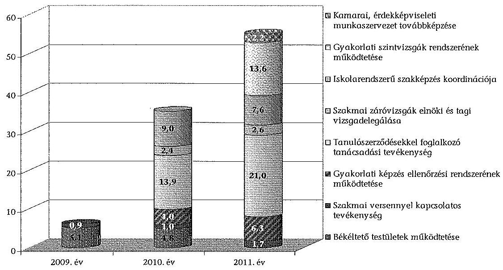

A támogatások felhasználása során közbeszerzési eljárás lefolytatására nem került sor, mert nem volt olyan árubeszerzés és szolgáltatás-igénybevétel, amely a közbeszerzési értékhatárt meghaladta volna. A Komárom-Esztergom KIK eleget tett a költségvetési támogatás felhasználása során a támogatási szerződésben előírt tájékoztatási kötelezettségének.

Az MKIK-től kapott támogatás felhasználása keretében a Komárom-Esztergom KIK a gyakorlati képzést végző gazdálkodó szervezetek és képzőhelyek, valamint a gyakorlati képzésben résztvevő tanulók között létrejött tanulószerződéseket az ISZIIR-rendszerben tartotta nyilván. A kamara az illetékességi körébe tartozó, gyakorlati képzést ellátó, tanulószerződéssel foglalkoztató gazdálkodó szervezeteket a szakképzési tv. 30. § (3) bekezdése szerint az időszakban ellenőrizte. Az ellenőrzések nyomán intézkedésekre nem volt szükség.

A kamara a 2009. év végén 495 (465 gazdálkodónál), a 2010. év végén 467 (431 gazdálkodónál), a 2011. év végén 531 (448 gazdálkodónál) gyakorlati képzőhelyet tartott nyilván. Ugyanezen idöpontokban 1464, 1383, 1572 volt a nyilvántartott tanulószerződések száma. A kamara a nyilvántartott gazdálkodó szervezeteknél évente sorban 396, 316, illetve 413 képzőhely ellenőrzését végezte el.

A Komárom-Esztergom KIK a támogatási szerződésben rögzített formában elkészítette a pénzügyi beszámolóját, az elszámolások határidőn belül történő benyújtását azonban dokumentumokkal igazolni nem tudta. A támogatások elszámolása ellenőrzésének elvégzését egy esetben a hiánypótlás kérése igazolta. Az országos kamara a szakmai és pénzügyi beszámoló elfogadását nem igazolta vissza. A támogató a Komárom-Esztergom KIK támogatás-felhasználását helyszínen nem ellenőrizte.

A támogatás felhasználásának nyilvántartása megfelelt a számviteli tv. 161/A. § (2) bekezdésében és a támogatási szerződésben előírtaknak. A fökönyvben támogatásonként a kiadások és bevételek elkülönített nyilvántartá-

---

sát munkaszámokra történő könyveléssel biztosították. A pénzügyi elszámolások a számviteli tv. 167. § (1) bekezdésében rögzített alaki és formai követelményeknek megfelelő bizonylatokkal voltak alátámasztva. A nyilvántartási és elszámolási rendszer a kialakított záradékolási gyakorlattal együtt biztosította a bizonylatok többszöri elszámolásának kizárását, a támogatások felhasználásának ellenőrizhetőségét. A bizonylatokat a Komárom-Esztergom KIK a számviteli tv. 169. § (2) bekezdésében megjelöltek szerint őrizte. A 2009-2011. években négy esetben a kamara szabályosan mutatta ki és rendezte pénzügyileg a támogatások maradványait.

A Komárom-Esztergom KIK a munkaköri leírásokban határozott meg a feladatok ellátásához szükséges humánerőforrás biztosításához követelményeket. Az ügyintéző szervezet munkatársai esetében pályázatokban írtak elő az egyes munkakörök betöltéséhez szükséges iskolai végzettséget és egyéb kompetenciákat, a munkavállalók alkalmazása a pályázati kiírásoknak megfelelően történt. A külső szakértők megbízásának szakmai és pénzügyi feltételeit a kamara belső szabályzatban nem rögzítette. A támogatási szerződések a szakértői díjazásokra, a kiírt szakértői pályázatok az iskolai végzettségre, illetve szakmai gyakorlatra vonatkozó előírásokat tartalmaztak, amelyeket figyelembe vettek a megbízásoknál.

A kamarai tisztségviselők összeférhetetlenségére vonatkozó szabályokat, összhangban a kamarai tv. 16. § (1) és a 27. § (3)-(6) bekezdéseiben foglaltakkal, az alapszabályban rögzítették. Összeférhetetlenségére vonatkozó szabályokat az ügyintézői szervezet vonatkozásában külön nem határoztak meg. A Komárom-Esztergom KIK munkatársai egyéb jogviszony keretében láttak el szakképzéssel összefüggő, munkaköri leírásukban nem szereplő feladatokat.

A Komárom-Esztergom KIK részben alakította ki és múködtette az általános tevékenységének ellenőrzéséhez a kontrollrendszerét. A közfeladat-ellátásra kapott költségvetési támogatások felhasználásának kontrollrendszerére külön belső szabályozás nem készült. A kamara az általános szakmai beszámoltatás, beszámolás és pénzügyi elszámolás dokumentumait belső szabályzatban meghatározta. A pénzkezelési szabályzatban szabályozták az utalványozás és a munkafolyamatba épített ellenőrzési feladatok rendjét. A belső szabályzatok a békéltető testületre nem terjedtek ki. A költségvetési támogatások felhasználásánál a szakmai beszámolás és a pénzügyi elszámolás feltételeit, dokumentumait a támogatási szerződések határozták meg.

A Komárom-Esztergom KIK mellett múködő békéltető testület az ügyeket szabályosan dokumentálta. A testület a tevékenységét szabályosan végezte, de a fogyasztóvédelmi tv. 36/A. § (1) bekezdésében előírtak ellenére a 2009-2011. években a tevékenységéről készített éves beszámolóját határidőn túl küldte meg a fogyasztóvédelemért felelős miniszternek.

# 1.4. A Nagykanizsai Kereskedelmi és Iparkamara 

A Nagykanizsai Kereskedelmi és Iparkamara (Nagykanizsai KIK) a szakképzési feladatok ellátásához a 2009-2011. években 19 db támogatási szerződés alapján 24,1 millió Ft támogatásban részesült. A kapott támogatásokat a szerződésekben megjelölt célokra, szabályosan használta fel.

---

Az MKIK-tól szakképzési feladatokra kapott támogatások megoszlása (millió Ft)
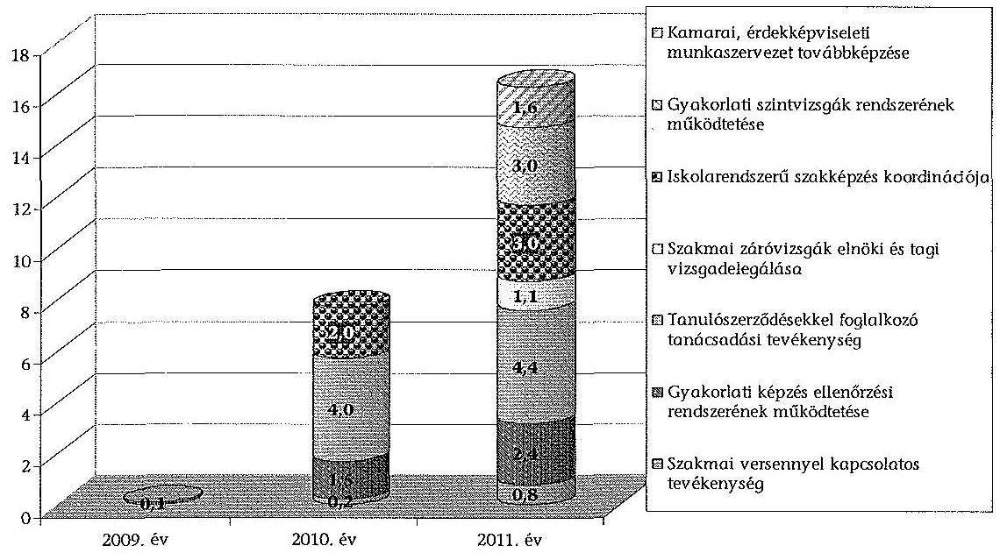

A támogatások felhasználása során közbeszerzési eljárás lefolytatására nem került sor, mert nem volt olyan árubeszerzés és szolgáltatás-igénybevétel, amely a közbeszerzési értékhatárt meghaladta volna. A Nagykanizsai KIK eleget tett a költségvetési támogatás felhasználása során a támogatási szerződésben előírt tájékoztatási kötelezettségének.

Az MKIK-től kapott támogatás felhasználása keretében a Nagykanizsai KIK a gyakorlati képzést végző gazdálkodó szervezetek és képzőhelyek, valamint a gyakorlati képzésben résztvevő tanulók között létrejött tanulószerződéseket az ISZIIR-rendszerben tartotta nyilván. A kamara az illetékességi körébe tartozó, gyakorlati képzést ellátó, tanulószerződéssel foglalkoztató gazdálkodó szervezeteket a szakképzési tv. 30. § (3) bekezdése szerint az időszakban ellenőrizte. Intézkedést igénylő megállapítás nem történt.

A kamara a 2009. év végén 94 ( 91 gazdálkodónál), a 2010. év végén 99 ( 89 gazdálkodónál), a 2011. év végén 98 ( 87 gazdálkodónál) gyakorlati képzőhelyet tartott nyilván. Ugyanezen idöpontokban 323, 315, 404 volt a nyilvántartott tanulószerződések száma. A kamara a nyilvántartott gazdálkodó szervezeteknél évente sorban 70, 150, illetve 120 képzőhely ellenőrzését végezte el.

A pénzügyi és szakmai beszámolót a Nagykanizsai KIK a támogatási szerződésben rögzített formában elkészítette, az elszámolások - egy eset kivételével határidőn belül megtörténtek. A támogató ellenőrzésének megtörténtét a kamara dokumentumokkal igazolni nem tudta. Az országos kamara a szakmai és pénzügyi beszámoló elfogadását nem igazolta vissza. A támogató a Nagykanizsai KIK támogatás-felhasználását helyszínen nem ellenőrizte.

A támogatás felhasználásának nyilvántartása megfelelt a számviteli tv. 161/A. § (2) bekezdésében és a támogatási szerződésben elöírtaknak. A fökönyvben támogatásonként a kiadások és bevételek elkülönített nyilvántartását munkaszámokra történő könyveléssel biztosították. A pénzügyi elszámolá-

---

sok a számviteli tv. 167. § (1) bekezdésében rögzített alaki és formai követelményeknek megfelelő bizonylatokkal voltak alátámasztva. A nyilvántartási és elszámolási rendszer - a kialakított záradékolási gyakorlattal együtt biztosította a bizonylatok többszöri elszámolásának kizárását, a támogatások felhasználásának ellenőrizhetőségét. A bizonylatokat a Nagykanizsai KIK a számviteli tv. 169. § (2) bekezdésében megjelöltek szerint őrizte. A 2009-2011. években 3 esetben a kamara szabályosan mutatta ki és rendezte pénzügyileg a támogatások maradványait.

A Nagykanizsai KIK meghatározta a feladatok ellátásához szükséges humánerőforrás követelményeket az alapszabályában, illetve az SZMSZ-ében is. A külső szakértők pályáztatásának feltételeit a kamara elnöki határozatban rögzítette. A támogatási szerződések a szakértői díjazásokra, a kiírt szakértői pályázatok az iskolai végzettségre, illetve szakmai gyakorlatra vonatkozó előírásokat tartalmaztak.

A kamarai tisztségviselők összeférhetetlenségére vonatkozó szabályokat, összhangban a kamarai tv. 16. § (1) és a 27. § (3)-(6) bekezdéseiben foglaltakkal, az alapszabályban rögzítették. Összeférhetetlenségére vonatkozó szabályokat az ügyintézői szervezet vonatkozásában külön nem határoztak meg. A Nagykanizsai KIK munkatársai egyéb jogviszony keretében láttak el szakképzéssel összefüggő, munkaköri leírásukban nem szereplő feladatokat.

A belső szabályozások kontrollrendszerre vonatkozó előírásai részben voltak alkalmasak a közfeladat-ellátásra kapott költségvetési támogatások rendeltetésszerű, szabályszerű felhasználásának biztosítására. A szakmai beszámoltatás, beszámolás és a pénzügyi elszámolás felelőseit és dokumentumait meghatározták. A szabályozásban az ellenőrzések módjára és dokumentálására nem tértek ki. A kamara a támogatások felhasználásának ellenőrzéséről intézkedett, azonban annak dokumentálásáról csak részlegesen. A támogatások felhasználásáról szóló szakmai beszámoltatás és a pénzügyi elszámolás formáját és módját a támogatási szerződésekben határozták meg.

A Nagykanizsai KIK mellett nem működött békéltető testület.

# 1.5. A Nógrád Megyei Kereskedelmi és Iparkamara 

A Nógrád Megyei Kereskedelmi és Iparkamara (Nógrád KIK) a békéltető testületek működtetéséhez, valamint a szakképzési feladatok ellátásához a 2009-2011. években 20 db támogatási szerződéssel 57,4 millió Ft támogatásban részesült. A kapott támogatásokat a célnak megfelelően - a békéltető testületi tagok 0,04 millió Ft díjazása és költségtérítése kivételével -, szabályosan használta fel.

---

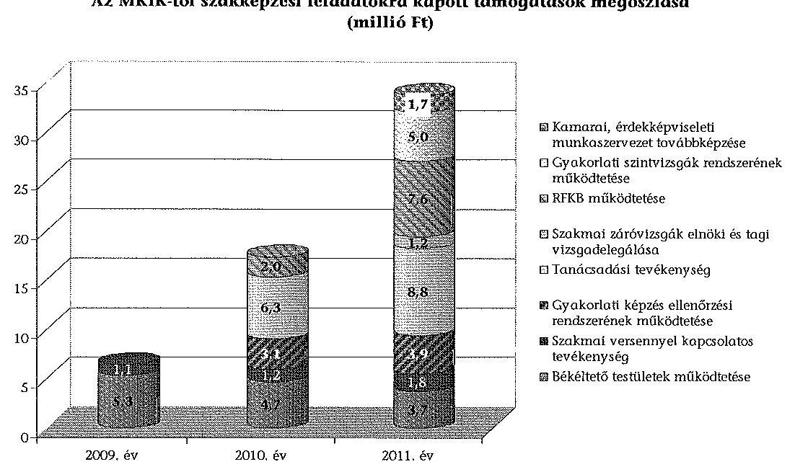

A támogatások felhasználása során közbeszerzési eljárás lefolytatására nem került sor, mert nem volt olyan árubeszerzés és szolgáltatás-igénybevétel, amely a közbeszerzési értékhatárt meghaladta volna. A Nógrád KIK a költségvetési támogatás felhasználása során a támogatási szerződésekben előírt tájékoztatási kötelezettségének eleget tett.

Az MKIK-től kapott támogatás felhasználása keretében a Nógrád KIK a gyakorlati képzést végző gazdálkodó szervezetek és képzőhelyek, valamint a gyakorlati képzésben résztvevő tanulók között létrejött tanulószerződéseket az ISZIIRrendszerben tartotta nyilván. A kamara az illetékességi körébe tartozó gyakorlati képzést ellátó, tanulószerződéssel foglalkoztató, gazdálkodó szervezeteket a szakképzési tv. 30. § (3) bekezdése szerint az időszakban ellenőrizte. A gyakorlati képzőhelyek ellenőrzése során egy esetben született nyilvántartásba vételt elutasító határozat.

A kamara 2009. november végén 172 (134 gazdálkodónál), 2010. november végén 166 (117 gazdálkodónál), 2011. november végén 145 (108 gazdálkodónál) gyakorlati képzőhelyet tartott nyilván. Ugyanezen idöpontokban 680, 720, 716 volt a nyilvántartott tanulószerződések száma. A kamara a nyilvántartott gazdálkodó szervezeteknél évente sorban 201, 171, illetve 220 képzőhely ellenőrzését végezte el.

A Nógrád KIK a támogató felé a támogatási szerződésben rögzített formában elszámolt, azonban az elszámolások határidőn belül történő benyújtását dokumentumokkal igazolni nem tudta. A támogatások elszámolásának ellenőrzését a támogató dokumentáltan nem végezte el. Az országos kamara a szakmai és pénzügyi beszámoló elfogadását nem igazolta vissza. A támogató a Nógrád KIK támogatás-felhasználását helyszínen nem ellenőrizte.

A támogatás felhasználásának nyilvántartása megfelelt a számviteli tv. 161/A. § (2) bekezdésében és a támogatási szerződésben előírtaknak. A fökönyvben támogatásonként a kiadások és bevételek elkülönített nyilvántartá-

---

sát munkaszámokra történő könyveléssel biztosították. A pénzügyi elszámolások a számviteli tv. 167. § (1) bekezdésében rögzített alaki és formai követelményeknek megfelelő bizonylatokkal voltak alátámasztva. A kialakított nyilvántartási és elszámolási rendszer biztosította a bizonylatok többszöri elszámolásának kizárását, a támogatások felhasználásának ellenőrizhetőségét. A bizonylatokat a Nógrád KIK a számviteli tv. 169. § (2) bekezdésében megjelöltek szerint őrizte.

A Nógrád KIK a humánerőforrás biztosításához követelményeket a belső szabályzataiban nem határozott meg. A 1996. óta hatályos SZMSZ nem aktualizált, a jelenlegi szervezetre nem értelmezhető. Az SZMSZ az ügyintéző szervezet felépítésére vonatkozóan rendelkezik előírásokkal, de nem határozott meg követelményeket a létszámra, végzettségre és munkatapasztalatra vonatkozóan. A kamara vezetőire és alkalmazottaira vonatkozóan pályázati felhívások nem voltak. A támogatási szerződésekhez kapcsolódóan a külső szakértők pályázati anyagai meghatároztak végzettségre, kompetenciákra és szakmai tapasztalatokra vonatkozó követelményeket.

A kamarai tisztségviselők összeférhetetlenségére vonatkozó szabályokat, összhangban a kamarai tv. 16. § (1) és a 27. § (3)-(6) bekezdéseiben foglaltakkal, az alapszabályban rögzítették. Összeférhetetlenségre vonatkozó szabályokat az ügyintézői szervezet vonatkozásában külön nem határoztak meg. A Nógrád KIK munkatársai egyéb jogviszony keretében láttak el szakképzéssel összefüggő, munkaköri leírásukban nem szereplő feladatokat.

A Nógrád KIK nem alakított ki teljes körű és önálló kontrollrendszert a költségvetési támogatások szabályszerű, rendeltetésszerű felhasználására. A szakképzéssel összefüggő közfeladatok ellátására kapott költségvetési támogatás kontrollrendszere a támogatási szerződések követelményrendszerén keresztül érvényesült. A gyakorlati képzőhelyek ellenőrzésére, a vizsgáztatásokra és a békéltető testületi ülnöki tevékenységekre kötött megbízási szerződések a feladatok teljesítését követően kerültek véglegezésre. Ezt a szerződésmódosítási gyakorlatot indokolt felülvizsgálni. A támogatások cél szerinti felhasználása a dokumentáltan alátámasztott rendelkezés végrehajtásának igazolása által biztosított volt.

A Nógrád KIK mellett működő békéltető̉ testület nem küldte meg a tevékenységéről szóló éves tájékoztatót a fogyasztóvédelmi tv. 36/A. § (1) bekezdésében előírtak ellenére a fogyasztóvédelemért felelős miniszternek. A 211/1998. Korm. rendelet 2. §-ának a 2009. október 14-i változását az ülnökök megbízási díjainak megállapításánál nem vették figyelembe, ezért a 2009. évben 0,01 millió Ft-tal kevesebb díjat fizettek ki. A 211/1998. Korm. rendelet 5. §ával ellentétben nem közvetlenül jogvita elbírálásával kapcsolatosan került sor 0,03 millió Ft utazási költség elszámolására. A testület az ügyeket szabályosan dokumentálta.

# 1.6. A Vas Megyei Kereskedelmi és Iparkamara 

A Vas Megyei Kereskedelmi és Iparkamara (Vas KIK) a békéltető testületek működtetéséhez, valamint a szakképzési feladatok ellátásához a 20092011. években 21 db támogatási szerződés alapján 100,5 millió Ft támogatás-

---

ban részesült. A kapott támogatásokat a szerződésekben megjelölt célokra - a békéltető testületi tagok 1,1 millió Ft díjazása kivételével -, szabályosan használta fel.

Az MKIK-tól szakképzési feladatokra kapott támogatások megoszlása (millió Ft)
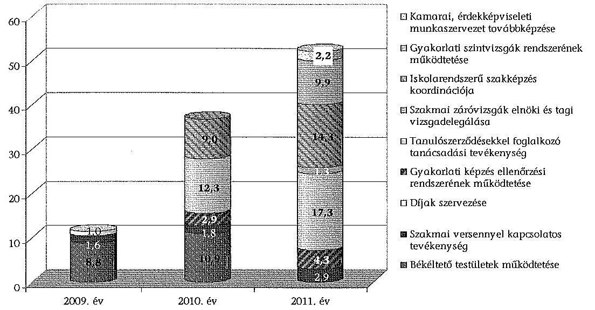

A támogatások felhasználása során közbeszerzési eljárás lefolytatására nem került sor, mert nem volt olyan árubeszerzés és szolgáltatás-igénybevétel, amely a közbeszerzési értékhatárt meghaladta volna. A Vas KIK eleget tett a költségvetési támogatás felhasználása során a támogatási szerződésben előírt tájékoztatási kötelezettségének.

Az MKIK-től kapott támogatás felhasználása keretében a Vas KIK a gyakorlati képzést végző gazdálkodó szervezetek és képzőhelyek, valamint a gyakorlati képzésben résztvevő tanulók között létrejött tanulószerződéseket az ISZIIRrendszerben tartotta nyilván. A kamara az illetékességi körébe tartozó, gyakorlati képzést ellátó, tanulószerződéssel foglalkoztató gazdálkodó szervezeteket a szakképzési tv. 30. § (3) bekezdése szerint az időszakban ellenőrizte. A bevezető ellenőrzések esetében a 2009-2011 években évente egy-egy gazdálkodó kapott nem megfelelő minősítést, és az akkreditációs ellenőrzéseknél a 2011. évben egy ellenőrzött nem felelt meg a követelményeknek.

A kamara a 2009. év végén 407 (391 gazdálkodónál), a 2010. év végén 378 (306 gazdálkodónál), a 2011. év végén 347 (288 gazdálkodónál) gyakorlati képzőhelyet tartott nyilván. Ugyanezen időpontokban 1209, 1219, 1360 volt a nyilvántartott tanulószerződések száma. A kamara a nyilvántartott gazdálkodó szervezeteknél évente sorban 220, 160, illetve 270 képzőhely ellenőrzését végezte el.

A Vas KIK a támogatási szerződésben rögzített formában elkészítette pénzügyi beszámolóját, az elszámolások határidőn belül történő benyújtását azonban dokumentumokkal igazolni nem tudta. A támogató a támogatások elszámolásának ellenőrzését nem dokumentálta, a szakmai és pénzügyi beszámoló elfogadását nem igazolta vissza. A támogató a Vas KIK támogatás-felhasználását helyszínen nem ellenőrizte.

---

A támogatás felhasználásának nyilvántartása megfelelt a számviteli tv. 161/A. § (2) bekezdésében és a támogatási szerződésben előírtaknak. A fökönyvben támogatásonként a kiadások és bevételek elkülönített nyilvántartását munkaszámokra történő könyveléssel biztosították. A pénzügyi elszámolások a számviteli tv. 167. § (1) bekezdésében rögzített alaki és formai követelményeknek megfelelő bizonylatokkal voltak alátámasztva. A nyilvántartási és elszámolási rendszer a kialakított záradékolási gyakorlattal együtt biztosította a bizonylatok többszöri elszámolásának kizárását és a támogatások felhasználásának ellenőrizhetőségét. A bizonylatokat a Vas KIK a számviteli tv. 169. § (2) bekezdésében megjelöltek szerint őrizte. A 2009-2011. években hét esetben a kamara szabályosan mutatta ki és rendezte pénzügyileg a támogatások maradványait.

A Vas KIK meghatározta a feladatok ellátásához szükséges humánerőforrás biztosításához a követelményeket, ügyintéző szervezetének létszámát és feladatait az SZMSZ-ben. A külső szakértők megbízásának szakmai és pénzügyi feltételeit a kamara belső szabályzatban nem rögzítette. A támogatási szerződések a szakértői díjazásokra, a kiírt szakértői pályázatok az iskolai végzettségre, illetve szakmai gyakorlatra vonatkozó előírásokat tartalmaztak, amelyeket figyelembe vettek a megbízásoknál.

A kamarai tisztségviselők összeférhetetlenségére vonatkozó szabályokat, összhangban a kamarai tv. 16. § (1) és a 27. § (3)-(6) bekezdéseiben foglaltakkal, az alapszabályban rögzítették. Összeférhetetlenségre vonatkozó szabályokat az ügyintézői szervezet vonatkozásában külön nem határoztak meg. A Vas KIK munkatársai egyéb jogviszony keretében láttak el szakképzéssel összefüggő, munkaköri leírásukban nem szereplő feladatokat.

A Vas KIK kialakította és múködtette az általános tevékenységének ellenőrzéséhez a kontrollrendszerét. A közfeladat-ellátásra kapott költségvetési támogatások felhasználásának kontrollrendszerére külön belső szabályozás nem készült. A kamara meglévő belső szabályzatai a kontroll elemekre vonatkozóan tartalmaztak szabályokat. Így a házipénztár-kezelési szabályzatban előírták az utalványozás és az elszámolásra kiadott összegek nyilvántartásának rendjét. A belső szabályzatok a békéltető testületre nem terjedtek ki. Ennek következtében a kontrollrendszer a békéltető testületi kifizetések hibáját nem tárta fel. A költségvetési támogatások felhasználásánál a szakmai beszámolás és a pénzügyi elszámolás feltételeit, dokumentumait a támogatási szerződések határozták meg.

A Vas KIK mellett múködő békéltető testület tevékenysége végzése során eltért a fogyasztóvédelmi tv. előírásaitól. A békéltető testület a fogyasztóvédelmi tv. 36/A. § (1) bekezdésében előírtak ellenére a 2009. és 2011. évi éves tevékenységéről elkészített beszámolóját dokumentáltan nem küldte meg, a 2010. évi beszámolóját késedelemmel küldte meg a fogyasztóvédelemért felelős miniszternek. A testület tagjai és elnöke a békéltető testületi tagok díjazásáról szóló
211/1998. (XII. 24.) Korm. rendelet 2. § (1) bekezdésében foglaltaktól eltérő díjazásban részesültek. Továbbá a testületi tagok díjazása az eljárás megszüntetése esetén eltért a 211/1998. (XII. 24.) Korm. rendelet 2. § (2) bekezdésében elő-

---

írtaktól. A helyszíni ellenőrzés a 2009-2011. években 1,1 millió Ft szabálytalan díjkifizetést tárt fel. A testület az ügyeket szabályosan dokumentálta.

# 1.7. A Zala Megyei Kereskedelmi és Iparkamara 

A Zala Megyei Kereskedelmi és Iparkamara (Zala KIK) a békéltető testületek múködtetéséhez, valamint a szakképzési feladatok ellátásához a 20092011. években 20 támogatási szerződés alapján 107,0 millió Ft támogatásban részesült. A kapott támogatásokat a szerződésekben megjelölt célokra fordította, de szabálytalanul használt fel és számolt el a békéltető testületi tevékenységnél az ellenőrzött időszakban összesen 0,8 millió Ft támogatást.

Az MKIK-tól szakképzési feladatokra kapott támogatások megoszlása (millió Ft)
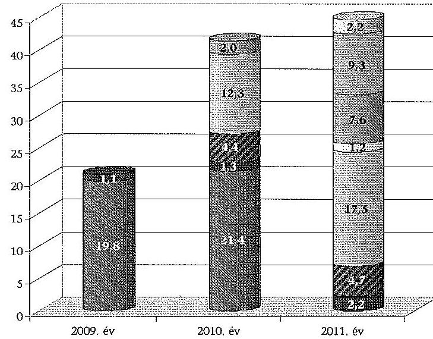
a Kamarai, érdekképviseleti munkaszervezet továbbképzése
■ Gyakorlati sziotvizsgók rendszerének múködtetése
■ lakóarendszerü szakképzés koordinációja
a Szakmai záróvizsgák elnöki és togi vizsgadelsgálása
■ Tanulószerződésekkel foglalkozó tanácsadási tevékenység
■ Gyakorlati képzés ellenőrzési rendszerének múködtetése
■ Szakmai versennyel kapcsolatos tevékenység
■ Békéltető testületek müködtetése

A támogatások felhasználása során közbeszerzési eljárás lefolytatására nem került sor, mert nem volt olyan árubeszerzés és szolgáltatás-igénybevétel, amely a közbeszerzési értékhatárt meghaladta volna.

A Zala KIK a gyakorlati képzést végző gazdálkodó szervezetek és képzőhelyek, valamint a gyakorlati képzésben résztvevő tanulók között létrejött tanulószerződéseket az ISZIIR-rendszerben tartotta nyilván. A kamara az illetékességi körébe tartozó, gyakorlati képzést ellátó, tanulószerződéssel foglalkoztató gazdálkodó szervezeteket a szakképzési tv. 30. § (3) bekezdése szerint az időszakban ellenőrizte, hibát nem tárt fel.

A kamara 2009-ben 402 (333 gazdálkodónál), 2010-ben 364 (294 gazdálkodónál), 2011-ben 387 (304 gazdálkodónál) gyakorlati képzőhelyet tartott nyilván. Ugyanezen időpontokban 1291, 1323, 1464 volt a nyilvántartott tanulószerződések száma. A kamara a nyilvántartott gazdálkodó szervezeteknél évente sorban 393, 346, illetve 306 képzőhely ellenőrzését végezte el.

A Zala KIK a pénzügyi beszámolót a támogatási szerződésben rögzített formában elkészítette, az elszámolások határidőn belül történő benyújtását azonban

---

dokumentumokkal nem tudta igazolni. A támogatások elszámolásának ellenőrzését a támogató hiánypótlás kérései igazolták, amelyekre a Zala KIK a javításokat megküldte. Az országos kamara a szakmai és pénzügyi beszámoló elfogadását nem igazolta vissza. A támogató az ellenőrzési időszakban a Zala KIK-nél helyszíni ellenőrzést nem végzett.

A támogatás felhasználásának nyilvántartása megfelelt a számviteli tv. 161/A. § (2) bekezdésében és a támogatási szerződésben előírtaknak. A fókönyvben támogatásonként a kiadások és bevételek elkülönített nyilvántartását munkaszámokra történő könyveléssel biztosították. A pénzügyi elszámolások a számviteli tv. 167. § (1) bekezdésében rögzített alaki és formai követelményeknek megfelelő bizonylatokkal voltak alátámasztva. A nyilvántartási és elszámolási rendszer biztosította a bizonylatok többszöri elszámolásának kizárását, a támogatások felhasználásának ellenőrizhetőségét. A bizonylatokat a Zala KIK a számviteli tv. 169. § (2) bekezdésében megjelöltek szerint őrizte. A 2009-2011. években a kamara maradványt nem mutatott ki.

A humánerőforrás biztosításához követelményeket - a kamara titkára kivételével - a kamara sem az alapszabályában, sem az SZMSZ-ben nem határozott meg. A Zala KIK az SZMSZ-ében rögzítette a kamara hivatalvezetője (titkár) felsőfokú iskolai végzettségére vonatkozó előírást. A kamarai ügyintézői kör betöltésére, illetve a külső szakértők megbízásához meghirdetett pályázatok tartalmaztak végzettségre, szakmai tapasztalatokra vonatkozó követelményeket, amelyeket a pályázókkal szemben érvényesítettek.

A kamarai tisztségviselők összeférhetetlenségére vonatkozó szabályokat, összhangban a kamarai tv. 16. § (1) és a 27. § (3)-(6) bekezdéseiben foglaltakkal, az alapszabályban rögzítették. Összeférhetetlenségre vonatkozó szabályokat az ügyintézői szervezet vonatkozásában külön nem határoztak meg. A Zala KIK munkatársai egyéb jogviszony keretében láttak el szakképzéssel összefüggő, munkaköri leírásukban nem szereplő feladatokat.

A Zala KIK a közfeladat-ellátásra kapott költségvetési támogatások felhasználásának kontrollrendszerére külön belső szabályozást nem készített. A kamara meglévő belső szabályzatai a belső kontroll elemekre vonatkozóan tartalmaztak szabályokat. A kamara a számviteli politikájában rögzítette, hogy a kontrollrendszer a folyamatba épített ellenőrzéssel valósul meg. A kamara a költségvetési támogatások felhasználásánál a szakmai beszámolás és a pénzügyi elszámolás felelőseit és dokumentumait szabályzatokban meghatározta. Erre vonatkozóan a támogatási szerződések is tartalmaztak előírásokat (a pénzügyi felhasználás feltételei, a pénzügyi és szakmai beszámolás szabályai).

A Zala KIK mellett múködő békéltető testület a testületi tagok költségtérítése és a reprezentációs költségek elszámolása kivételével szabályosan, a fogyasztóvédelmi tv. előírásai szerint folytatta tevékenységét. A békéltető testületi tagok díjazásáról szóló 211/1998. (XII. 24.) Korm. rendelet 5. §-ával ellentétben nem közvetlenül jogvita elbírálásával kapcsolatosan számoltak el 0,6 millió Ft utazási költséget a 2009-2011. években. A reprezentációs költségek elszámolása nem felelt meg a támogatási szerződésekben foglaltaknak, a 2010-2011. években az előírtnál összesen 0,2 millió Ft-tal több került elszámolásra. A testület az ügyeket szabályosan dokumentálta.

---

# 1.8. A Fejér Megyei Agrárkamara 

A Fejér Megyei Agrárkamara ${ }^{9}$ (Fejér AK) a MAK-tól szakképzési feladatok ellátásához a 2009-2011. években 6 támogatási szerződés alapján 3,0 millió Ft támogatásban részesült. A célra történő felhasználás a kifizetés szabálytalan dokumentálása miatt 0,2 millió Ft értékben nem igazolt. Továbbá 2,4 millió Ft támogatás felhasználása a bizonylatok alaki-tartalmi hiányosságai, valamint az elkülönített nyilvántartási kötelezettség be nem tartása miatt nem volt szabályos.
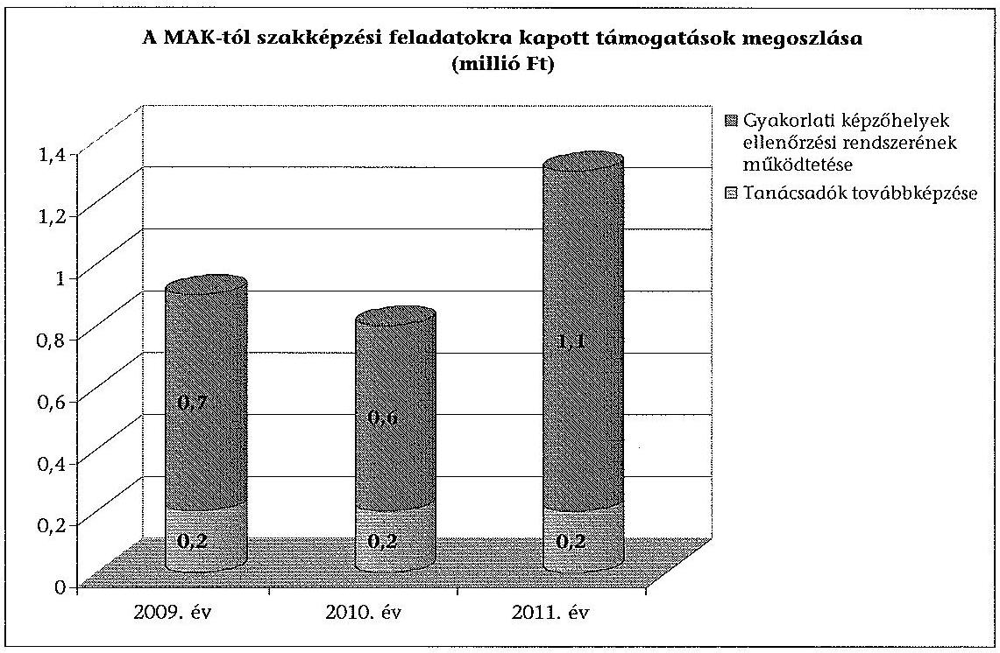

A támogatások felhasználása során közbeszerzési eljárás lefolytatására nem került sor, mert nem volt olyan árubeszerzés és szolgáltatás-igénybevétel, amely a közbeszerzési értékhatárt meghaladta volna. A Fejér AK a támogatási szerződésekben megjelölt tájékoztatási kötelezettségének dokumentáltan nem tett eleget.

A Fejér AK a gyakorlati képzést végző gazdálkodó szervezetek és képzőhelyek, valamint a gyakorlati képzésben résztvevő tanulók között létrejött tanulószerződéseket a 2009-2010. években papír alapon, 2011-ben a TAIR rendszerben tartotta nyilván. A kamara az illetékességi körébe tartozó, gyakorlati képzést ellátó, tanulószerződéssel foglalkoztató gazdálkodó szervezeteket a szakképzési tv. 30. § (3) bekezdése szerint az időszakban ellenőrizte, intézkedést igénylő hibát nem tárt fel.

A kamara 2009-ben 34, 2010-ben 31, 2011-ben 47 gyakorlati képzőhelyet tartott nyilván. Ugyanezen idöpontokban 5, 31, 90 volt a nyilvántartott tanulószerződé-

[^0]
[^0]:    ${ }^{9}$ A Fejér Megyei Agrárkamara 2013. március 28-tól a Magyar Agrár-, Élelmiszergazdasági és Vidékfejlesztési Kamara Fejér megyei szervezeteként müködik.

---

sek száma. A kamara a nyilvántartott képzőhelyek ellenőrzését az ellenőrzési időszakban elvégezte.

A Fejér AK a támogatások felhasználásáról a pénzügyi beszámolókat a szerződésben rögzített formában készítette el, azonban a tanulószerződésekkel kapcsolatos szakmai beszámolók nem feleltek meg a támogatási szerződésben rögzített tartalmi követelményeknek.

A szakmai beszámolókból hiányoztak a tanulólétszám adatok, a tanulószerződések helyzetének bemutatása, a területi tapasztalatok és jellemző számadatok, így a képzőhely, gazdálkodó szervezet, a tanulószerződések számának alakulása, valamint célok, javaslatok a munka további folytatására vonatkozóan.

A kamara a szakmai és pénzügyi beszámolók határidőn belül történő benyújtását - egy eset kivételével - dokumentumokkal nem tudta igazolni. Az elszámolások támogató részéről történő ellenőrzését egy esetben igazolta a hiánypótlásra vonatkozó felhívás. Az országos kamara a szakmai és pénzügyi beszámoló elfogadását nem igazolta vissza. A támogató a Fejér AK támogatásfelhasználását helyszínen nem ellenőrizte.

A kamara számviteli nyilvántartását végző program nem volt zárt, mivel lehetővé tette két különböző gazdasági tartalmú, azonban azonos sorszámú pénztárbizonylat kiállítását. A számviteli tv. 165. § (2) bekezdés előírása ellenére a kiadási pénztárbizonylatokon a pénz átvevőjének aláírása nem szerepelt. A kapott támogatások terhére elszámolt 0,2 millió Ft célra történő felhasználása a szabálytalan kifizetési dokumentáció miatt nem igazolt.

Az egyik, K000000176 sz. kiadási pénztárbizonylaton 0,6 millió Ft kölcsön visszafizetése szerepelt. A másik, K000000176 sz. pénztárbizonylaton 0,2 millió Ft munkabér kifizetése szerepelt, melyet az MPA-KA-SZMM-1/2009. azonosító számú támogatás terhére elszámoltak.

Az ellenőrzés a támogatások elszámolásával kapcsolatosan halmozott szabálytalanságokat tárt fel. A számviteli tv. 167. § (1) bekezdésének c) pontja szerinti utalványozás és a rendelkezés végrehajtásának igazolása 2,4 millió Ft támogatás elszámolása esetében szabálytalan volt.

A támogatás felhasználásának nyilvántartása nem felelt meg a számviteli tv. 161/A. § (2) bekezdésében előírtaknak. A számviteli nyilvántartásban nem kezelték elkülönítetten a közfeladat-ellátással kapcsolatos bevételeket és kiadásokat. A számviteli politika az elkülönített nyilvántartás vezetését nem írta elő. Számlarenddel a számviteli tv. 161. § (1) bekezdésében előírtak ellenére nem rendelkeztek. A kialakított nyilvántartási és elszámolási rendszer biztosította a bizonylatok többszöri elszámolásának kizárását és a támogatások felhasználásának ellenőrizhetőségét. A bizonylatokat a Fejér AK a számviteli tv. 169. § (2) bekezdésében megjelöltek szerint őrizte.

A kamara a feladatok ellátásához szükséges humánerőforrás biztosításához követelményeket belső szabályzatban, munkaköri leírásokban, pályázatokban nem határozott meg.

A kamarai tisztségviselők összeférhetetlenségére vonatkozó szabályokat, összhangban a kamarai tv. 16. § (1) és a 27. § (3)-(6) bekezdéseiben foglaltak-

---

kal, az alapszabályban rögzítették. Összeférhetetlenségre vonatkozó szabályokat az ügyintézői szervezet vonatkozásában külön nem határoztak meg. A Fejér AK munkatársai egyéb jogviszony keretében láttak el szakképzéssel összefüggő feladatokat.

A Fejér AK nem alakított ki teljes körű és önálló kontrollrendszert a költségvetési támogatások szabályszerű, rendeltetésszerű felhasználására. A számviteli szabályzatok nem a szervezet sajátosságaira voltak kialakítva, mely sérti a számviteli tv. 14. § (4)-(5) bekezdésében foglaltakat. Az SZMSZ-t a 2001. év óta nem aktualizálták, nem felelt meg többek között a valós szervezeti struktúrának. A szakmai beszámoltatásra nem rendelkeztek előírásokkal, a kamara nem jelölte ki a szakmai beszámoltatás és pénzügyi elszámolás felelőseit. Nem voltak munkaköri leírások, és a megbízási, vállalkozói szerződések sem tartalmaztak pontos feladat meghatározásokat.

A Fejér AK mellett békéltető testület nem múködött.

# 1.9. A Hajdú-Bihar Megyei Agrárkamara 

A Hajdú-Bihar Megyei Agrárkamara ${ }^{10}$ (Hajdú-Bihar AK) a szakképzési feladatok ellátásához a 2009-2011. években 12 támogatási szerződés alapján 11,4 millió Ft támogatásban részesült. A támogatásokat a kamara a támogatási célokra használta fel, azonban 5,6 millió Ft támogatás felhasználása a bizonylatok alaki-tartalmi hiányosságai, valamint a támogatás-felhasználás elkülönített nyilvántartási kötelezettségének be nem tartása miatt nem volt szabályos.
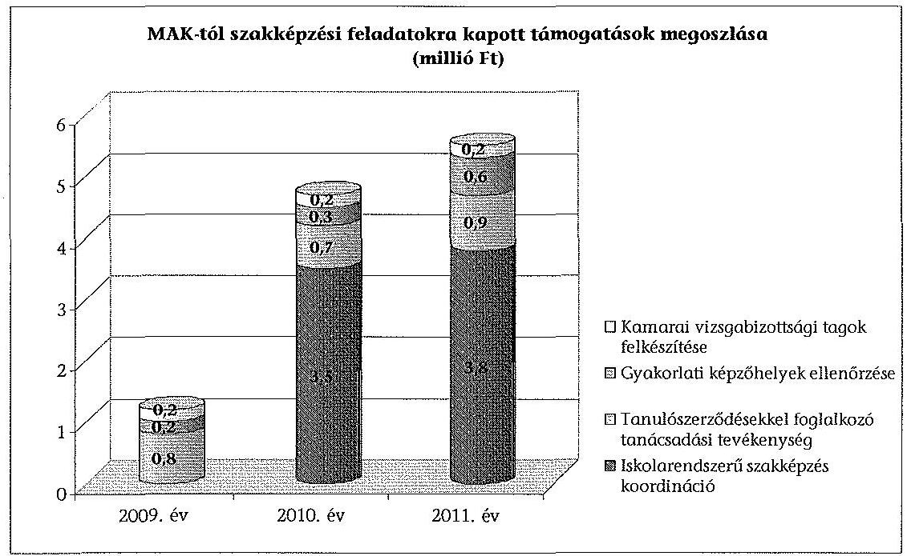

[^0]
[^0]:    ${ }^{10}$ A Hajdú-Bihar Megyei Agrárkamara 2013. március 28 -tól a Magyar Agrár-, Élelmiszergazdasági és Vidékfejlesztési Kamara Hajdú-Bihar megyei szervezeteként múködik.

---

A támogatások felhasználása során közbeszerzési eljárás lefolytatására nem került sor, mert nem volt olyan árubeszerzés és szolgáltatás-igénybevétel, amely a közbeszerzési értékhatárt meghaladta volna. A Hajdú-Bihar AK a támogatási szerződésekben megjelölt tájékoztatási kötelezettségének a rendezvények meghívóin és a kamarai lapokban eleget tett.

A Hajdú-Bihar AK a gyakorlati képzést végző gazdálkodó szervezetek és képzőhelyek, valamint a gyakorlati képzésben résztvevő tanulók között létrejött tanulószerződéseket a Tanulószerződések Információs Rendszerben (TAIR) tartotta nyilván. A kamara az illetékességi körébe tartozó, gyakorlati képzést ellátó, tanulószerződéssel foglalkoztató gazdálkodó szervezeteket a szakképzési tv. 30. § (3) bekezdése szerint az időszakban ellenőrizte, intézkedést igénylő hibát nem tárt fel.

A kamara 2009-ben 14 (14 gazdálkodónál), 2010-ben 16 (16 gazdálkodónál), 2011-ben 20 ( 16 gazdálkodónál) gyakorlati képzőhelyet tartott nyilván. Ugyanezen időpontokban 31, 34, 93 volt a nyilvántartott tanulószerződések száma. A kamara a nyilvántartott gazdálkodó szervezetek képzőhely ellenőrzését teljes körűen elvégezte.

A Hajdú-Bihar AK az elszámolásokat a támogatási szerződésben rögzített formában elkészítette. Egy elszámolás határidőre való megküldését dokumentummal nem tudták igazolni. A fennmaradó elszámolásokat - négy támogatás kivételével - határidőn belül benyújtották. A támogató az elszámolásokat egy esetben ellenőrizte - a hiánypótlásra való felszólítás alapján - dokumentáltan. Az országos kamara a szakmai és pénzügyi beszámoló elfogadását nem igazolta vissza. A támogató az ellenőrzött időszakban a Hajdú-Bihar AK-nál helyszíni ellenőrzést nem végzett.

A támogatás felhasználásának nyilvántartása nem felelt meg a számviteli tv. és a támogatási szerződés előírásainak. A főkönyvi nyilvántartásban a támogatásokat költséghelyek szerint elkülönítve tartották nyilván. A költséghelyek szerinti adatok azonban eltértek a támogatások elszámolásában szereplő adatoktól. A számviteli nyilvántartás és a támogatások elszámolásainak egyeztetése nem volt igazolt, ezért a számviteli tv. 161/A. § (2) bekezdésében a támogatások felhasználásának ellenőrizhetőségére vonatkozó előírások sérültek. A pénzügyi elszámolások nem voltak teljes körűen a számviteli tv. 167. § (1) bekezdésében rögzített alaki és formai követelménynek megfelelő bizonylatokkal alátámasztva. A 2009-2011. években a számviteli tv. 167. § (1) bekezdés c) pontjában előírtakkal ellentétben az utalványozás és a rendelkezés végrehajtásának igazolása hiányzott, illetve nem volt megfelelő 5,6 millió Ft támogatás elszámolásánál. A könyvviteli elszámolást alátámasztó bizonylatokról hiányoztak a könyvelés módjára és a számlákra való hivatkozások, mellyel sérültek a számviteli tv. 167. § (1) bekezdés h) pontjának előírásai. A bizonylatokra a támogatási szerződésekben megjelölt záradékot felvezették, ezért az elszámolási rendszer biztosította a bizonylatok többszöri elszámolásának kizárását és a támogatások felhasználásának ellenőrizhetőségét. A bizonylatokat a kamara a számviteli tv. 169. § (2) bekezdésében megjelöltek szerint őrizte. A 2009-2011. években a kamara maradványt nem mutatott ki.

A humánerőforrás biztosításához a létszámra és végzettségre vonatkozó követelményeket a kamara belső szabályzatai tartalmazták. A kamara külső

---

szakértők megbízásához kapcsolódó pénzügyi és szakmai feltételeket nem határozott meg belső szabályozásában. Ezen feltételeket a támogatási szerződések tartalmazták, amelyekkel összhangban kötötte meg a kamara a külső szakértők megbízási szerződéseit.

A kamarai tisztségviselők összeférhetetlenségére vonatkozó előírásokat az alapszabályban rögzítették a kamarai tv. 16. § (1) bekezdése alapján, amelyek összhangban voltak a kamarai tv. 27. § (3)-(6) bekezdéseiben foglaltakkal. A Hajdú-Bihar AK az ügyintézői szervezet dolgozóinak alkalmazására vonatkozóan összeférhetetlenségi szabályt fogalmazott meg az Önkormányzati és a Munkaügyi Szabályzatban. A pénztáros, pénztárellenőr, utalványozó személy összeférhetetlenségének szabályait a Pénz- és pénztárkezelési szabályzat tartalmazta. A kamara a dolgozóival megbízási szerződést a pályázati támogatások céljainak megvalósítására kötött, az azokban megjelölt feladatok a dolgozók munkaköri leírásában nem szerepeltek.

A kamara meglévő belső szabályzatai a belső kontroll elemekre vonatkozóan tartalmaztak szabályokat. Az ellenőrzés elsősorban a Bizonylati elv és bizonylati fegyelem címú szabályzatban előírt utalványozáson keresztült valósult meg. Ezt egészítette ki 2010. január 1-jéig a Pénz- és pénztárkezelési szabályzat a pénztár-ellenőrzési feladatokkal. A pénztárellenőr feladata volt az alapbizonylatok utalványozása megtörténtének ellenőrzése. A belső kontrollok nem múködtek megfelelően, mert az utalványozás során a jelen ellenőrzéssel feltárt hibákat nem tárták fel. A pénztárellenőri feladatok elvégzésért felelős személy a szabályzat alapján a gazdasági vezető volt, azonban munkaköri leírásában a pénztárellenőri feladat nem szerepelt. A 2010. január 1-jétől hatályos Pénzkezelési szabályzat nem rendelkezett az utalványozóról a pénzforgalom lebonyolítás rendje és a felelősségi szabályokra vonatkozó előírás érvényesítése érdekében, így a szabályzat a számviteli tv. 14. § (8) bekezdésének nem felel meg.

A közfeladat-ellátásra kapott költségvetési támogatások felhasználásának kontrollrendszerére külön belső szabályozás nem készült. A Hajdú-Bihar AK a támogatások pénzügyi elszámolásainak felelőseként a gazdasági vezetőt jelölte ki a munkaköri leírásában. A szakmai beszámoltatás felelősét a kamara nem határozta meg. A támogatások felhasználásával, illetve elszámolásával kapcsolatos szakmai beszámoltatás és a pénzügyi elszámolás dokumentumait a támogatási szerződések határozták meg.

A Hajdú-Bihar AK mellett békéltető testület nem múködött.

---

# 2. A SZAKKÉPZÉSI HOZZÁJÁRULÁS NYILVÁNTARTÁSA, BEVALLÁSA ÉS 

## ANNAK ELLENŐRZÉSE

A gyakorlati képzést végző gazdálkodó szervezetek szakképzési hozzájárulás nyilvántartási, bevallási és elszámolási kötelezettségének jogzabályokban előírtak szerinti teljesítését 118 gazdálkodó szervezetnél, 3557 tanulószerződésre vonatkozóan ellenőriztük ${ }^{11}$.

Az ellenőrzött gazdálkodó szervezetek közül 86 nyújtott be bevallást az NSZFI felé a 2009-2011. közötti időszakban. Egy gazdálkodó szervezet ${ }^{12}$ a szakképzési hozzájárulási tv. 2. §. (5) bekezdés a) pontjának előírása alapján nem volt hozzájárulásra kötelezett. Egy gazdálkodó szervezet ${ }^{13}$ az ellenőrzött időszakra a bevallását nem tudta bemutatni, ezzel megsértette a számviteli tv. 169. § (1) bekezdésének előírását. A fennmaradó 30 gazdálkodó szervezet a NAV-hoz nyújtotta be bevallását, és részére teljesítette szakképzési hozzájárulási kötelezettségét az időszakban.

A bevallásukat NSZFI-hez benyújtó szervezetek közül 65 szervezet (75,6\%) tételes költségelszámolást, 12 szervezet ( $13,9 \%$ ) átalány elszámolást alkalmazott, 8 szervezet $(9,3 \%)$ pedig megváltoztatta elszámolási módját az időszakban. Egy szervezet ${ }^{14}(1,2 \%)$ költséget nem számolt el, a szakképzési hozzájárulási kötelezettségét csak a térségi integrált szakképző központ részére nyújtott fejlesztési támogatás összegével csökkentette.

A gyakorlati képzést szervező gazdálkodó szervezetek bevallásainak feldolgozása, ellenőrzése az NSZFI feladata volt az ellenőrzött időszakban. A 86 gazdálkodó szervezetnek a 2009-2011. években 1079,7 millió Ft bruttó hozzájárulási kötelezettsége, 231,4 millió Ft befizetési kötelezettsége és 2176,8 millió Ft visszatérítési igénye volt.

[^0]
[^0]:    ${ }^{11}$ Az ÁSZ ellenőrzési programja 123 gazdálkodó szervezetet jelölt ki helyszíni ellenőrzésre. A BE-BA'99 Kft. helyszíni ellenőrzésének lefolytatatása közreműködési kötelezettségének elmulasztása miatt meghiúsult. A Bicskei Mezőgazdasági Termelő és Szolgáltató Zrt. és a Szabadegyházi Agrár Zrt. nyilatkozata alapján az ellenőrzött időszakban nem végezett gyakorlati képzést. A Sávágó Kertészeti Szolgáltató és Kereskedelmi Bt. szakképzési tevékenységet nem végzett, a Széchenyi István Mezőgazdasági és Szakképző Iskola és Kollégiummal kötött együttmúködési megállapodása alapján a gazdálkodó szervezet biztosította az oktatás tárgyi feltételeit, illetve a vizsgahelyszínt. A RAKÓ Vendéglátás Kft. az ellenőrzés tárgyában dokumentumot bemutatni nem tudott, a teljességi nyilatkozatban foglaltak szerint a Kft. könyvelését végző cég tulajdonosa ellen büntetőeljárás volt folyamatban.
    ${ }^{12}$ A Pálhalmai Agrospecial Kft. a büntetés-végrehajtásnál a fogva tartottak kötelező foglalkoztatására létrehozott szervezet.
    ${ }^{13}$ SPEKTRUM 21 Kereskedelmi és Szolgáltató Bt.
    ${ }^{14}$ Agárdi Farm Állattenyésztő és Növénytermelő Kft.

---

# 2.1. A gazdálkodó szervezetek szakképzési hozzájáruláshoz kapcsolódó nyilvántartásai, bevallásai 

Az ellenőrzés tapasztalatai alapján 118-ból 52 gazdálkodó szervezet sértette meg a szakképzési tv. nyilvántartások vezetésére ${ }^{15}$ vonatkozó előírásait.

A szakképzési tv. 25. § (1) és (2) bekezdése szerint vezetendő foglalkozási naplóra vonatkozó előírások az ellenőrzött időszakban nem változtak. A gyakorlati oktatást igazoló foglalkozási naplót 91 gazdálkodó szervezet (77,1\%) vezette, 27 az ellenőrzés részére nem tudta átadni. A foglalkozási naplót vezetők közül 66 ( $72,5 \%$ ) szervezet a jogszabályi előírásokat maradéktalanul érvényesítette a naplók vezetése során, $25(27,5 \%)$ viszont a törvényi előírásoktól eltérően, hiányosan vezette a naplókat. A foglalkozási naplókat nem, vagy hiányosan vezető gazdálkodó szervezeteknek az időszakban 35,1 millió Ft befizetési kötelezettségük keletkezett, 379,7 millió Ft-ot számoltak el szakképzési hozzájárulási kötelezettségük csökkentéseként, és ennek eredményeképpen 111,9 millió Ft-ot igényeltek vissza, illetve a szakképzési hozzájárulási tv. 5. §-a alapján a szakképzési hozzájárulási kötelezettségüket a NAV felé, mintegy 613,5 millió Ft összegben teljesítették. A foglalkozási naplók hiánya és hiányos vezetése következtében nem lehet meggyőződni a tanulók képzésének szabályszerű lefolytatásáról és a tanulók részére történő kifizetések megalapozottságáról.

A szakképzési tv. 25. § (2) bekezdésében foglaltak szerint „a foglalkozási naplónak tartalmaznia kell a szakmai tevékenységet, az ezekre forditott időt és a tanuló értékelését". 2012. január 1-jétől a szakképzésről szóló 2011. évi CLXXXVII. tv. 41. § (3) (5) bekezdései a foglalkozási napló vezetésével kapcsolatos hiányosságok ellenőrzését a szakképző iskola jelzése alapján a területi kamara hatáskörébe helyezte, szabálytalanság esetén a területileg illetékes kamara bírság kiszabására köteles.

A szakképzési tv. 44. § (2) és 48. § (2) bekezdése szerint a tanulóknak tanulószerződés/hallgatói szerződés alapján és a szakképzési tv. 48. § (1) bekezdése szerint tanulószerződéssel nem rendelkezők részére történő pénzbeli juttatás kifizetésekor 73 gazdálkodó szervezetnél ( $61,9 \%$ ) érvényesültek az előírt mértékek. $45^{16}$ gazdálkodó szervezet megsértette a jogszabályi előírásokat azzal, hogy nem vette figyelembe a minimálbér összegének változását, a szakképzési évfolyam további féléveiben - a tanuló tanulmányi előmenetelének és szorgalmának figyelembevételével - a pénzbeli juttatás emelését, a hiányszakmák esetében a tanulóknak a kiegészítő pénzbeli juttatást vagy az összefüggő szakmai gyakorlat időtartamára járó díjazást nem biztosította az előírás szerint. A tanulói pénzbeli juttatások után a járulékok elszámolása szabályos volt.

[^0]
[^0]:    ${ }^{15}$ A gazdálkodó szervezeteknél feltárt hiányosságokat a 2. számú melléklet tartalmazza.
    ${ }^{16} 10$ gazdálkodó szervezet a szakképzési tv.-ben foglalt, a tanulókat megillető juttatásokra vonatkozó előírások közül többet nem tartott be.

---

$20^{17}$ gazdálkodó szervezet a minimálbér változásait nem vette figyelembe a juttatások megállapításánál, 24 szervezet nem biztosította a szakképzési tv. 44. § (2) bekezdés szerint félév után a pénzbeli juttatás emelését. 8 szervezet a szakképzési tv. 48. § (2) bekezdés szerinti kiegészítő juttatást nem biztosította a tanulóknak, illetve 4 szervezet nem biztosította a szakképzési tv. 48. § (1) bekezdés szerint a tanulószerződéssel nem rendelkező tanulók díjazását.

A szakképzési hozzájárulási tv. mellékletének 1. a) pontja és a szakképzési tv. 48. § (1) bekezdése alapján meghatározott, szorgalmi időszakot követő összefüggő szakmai gyakorlat 83 gazdálkodó szervezetnél nem volt. 24 gazdálkodó szervezet elkülönített nyilvántartást vezetett ( $68,6 \%$ ) a szorgalmi időszakot követő szakmai gyakorlatról, $11^{18}$ gazdálkodó szervezet elkülönített nyilvántartást nem vezetett, azonban a bevallás ellenőrzéséhez szükséges adatok az alapbizonylatokból megállapíthatóak voltak.

Az ellenőrzés alapján a bevallást NSZFI-hez benyújtó 86 gazdálkodó szervezetböl 54-nél ( $62,8 \%$ ) volt szabálytalan a szakképzési hozzájárulás bevallása és az ahhoz kapcsolódó nyilvántartások vezetése az időszakban.

Az ellenőrzött időszakban a szakképzési hozzájárulási tv. 3. § (1) bekezdése szerint a szakképzési hozzájárulás alapjának meghatározása nem változott ${ }^{19}$. A gazdálkodó szervezetek közül 51-nél (59,3\%) szabályszerűen történt a szakképzési hozzájárulás alapjának megállapítása, nem volt szabályos 35 szervezetnél $(40,7 \%)$.

A gazdálkodó szervezetek nem vették figyelembe a hozzájárulás alapjának megállapításánál a szakképzési hozzájárulási tv. 19. § 6) pontjában a tanulószerződések díjára vonatkozó kivételt. Emiatt a szervezetek saját kárukra tévedtek a magasabb hozzájárulás alap megállapításakor. Más szervezeteknél a bevallott hozzájárulás alap tért el az alátámasztó dokumentumok alapján kimutatható összegtől. Egy gazdálkodó szervezet ${ }^{20}$ a hozzájárulás alapjának megalapozottságát az ellenőrzött időszakban főkönyvi kivonattal nem tudta alátámasztani. A gazdálkodó szervezet ezzel megsértette a számviteli tv. 169. § (1) bekezdésének a nyilvántartások megőrzésére vonatkozó előírását.

[^0]
[^0]:    ${ }^{17}$ Az ADA Hungaria Bútorgyár Kft.-nél a 2010. évben 10 esetben - a gyakorlati képzést szeptemberben megkezdő tanulók esetében - a pénzbeli juttatás mértéke nem érte el jogszabályban előírtakat. A hibát a gazdálkodó szervezet 2011 januárjában észlelte és a pénzbeli juttatást az érintettek esetében ennek figyelembe vételével emelte meg.
    ${ }^{18}$ Agázdi Farm Állattenyésztő és Növénytermelő Kft., Aranybulla Mezőgazdasági Zrt., Aranykalász Panzió Kereskedelmi, Szolgáltató és Vendéglátó Kft., ASM Pannónia Kereskedelmi és Szolgáltató Kft., Esztergomi Szerszámgépgyár Kft., Hart György egyéni vállalkozó, HÉLIKER Kereskedelmi Zrt., KEHIDA TERMÁL Gyógy- és Élményfürdő Üzemeltető és Szolgáltató Kft., KEREKES Szállítási és Kereskedelmi Kft., NAGISZ Mezőgazdasági Termelő és Szolgáltató Zrt., PUSZTA-95. Vendéglátó és Szolgáltató Bt.
    ${ }^{19}$ A szakképzési hozzájárulás alapja a hozzájárulásra kötelezettet terhelő társadalombiztosítási járulék alapja, melybe a szakképzési hozzájárulási tv. 19. § 6) pontja értelmében a tanulószerződésben meghatározott díj nem tartozik bele.
    ${ }^{20}$ ZALA-ELEKTRO Épületvillamossági, Szerelő és Szolgáltató Kft.

---

A bruttó szakképzési hozzájárulási kötelezettség eltérései az ellenőrzött gazdálkodó szervezeteknél:
millió Ft

|  | 2009. | 2010. | 2011. | Összesen |
| :-- | --: | --: | --: | --: |
| Az alap magasabb összegben   megállapítva | 130,9 | 223,9 | 172,0 | 526,9 |
| Az alap alacsonyabb összegben   megállapítva | 5,1 | 3,6 | 2,9 | 11,6 |
| Bruttó szakképzési hozzájárulási   kötelezettség $(1,5 \%)$ csökkenése | 1,9 | 3,3 | 2,5 | 7,7 |

Az ellenőrzött időszak alatt tételes elszámolást alkalmazó 73 gazdálkodó szervezet ${ }^{21}$ közül 38 szervezet ( $52,0 \%$ ) bevallásában érvényesültek teljes körűen a szakképzési hozzájárulási tv. melléklet 1-5. pontjainak előírásai. 35 gazdálkodó szervezetnél a bevallott költségek eltértek az alátámasztó dokumentumok alapján kimutatható, illetve az előírások alapján elszámolható összegektől. Ezek közül 25 gazdálkodó szervezet (34,7\%) érvényesített a bevallásában szabálytalanul 22,5 millió Ft-tal magasabb költséget, megsértve a szakképzési hozzájárulási tv. előírásait. A többi szervezet saját döntése alapján a dokumentáltan kimutatott és elszámolható összegtől kevesebb költséget érvényesített.

- A tanulók pénzbeli, illetve kiegészítő pénzbeli juttatásait nem a szakképzési hozzájárulási tv. mellékletének 1. a) pontjában előírtak szerint, illetve a bevallást alátámasztó dokumentumoknak nem megfelelő összegben számolta el 4 gazdálkodó szervezet ${ }^{22}$. Emiatt szabálytalanul 1,7 millió Ft-tal magasabb költséget vallottak be az időszakban.
- A tanulók pénzbeli juttatásai után nem a szakképzési hozzájárulási tv. melléklet 1. c) pontjában, illetve a Tb. tv.-ben meghatározott járulékokat vallotta be 3 gazdálkodó szervezet ${ }^{23}$. A tanulók pénzbeli juttatásainak helytelen bevallása következtében, illetve téves elszámolás miatt szabálytalanul 0,5 millió Ft-tal magasabb költséget érvényesítettek az időszakban.
- A gazdálkodó szervezetek a szakképzési tv. 48. § (1) bekezdése szerint tanulószerződéssel nem rendelkező tanulóknak a szorgalmi időszakot követő, összefüggő szakmai gyakorlat időtartamára kifizetett díjait és a Tb. tv.-ben előírt járulékait szabályosan számolták el bevallásaikban.

[^0]
[^0]:    ${ }^{21}$ Az ellenőrzési időszakban elszámolásukat megváltoztató gazdálkodó szervezeteket is tartalmazza.
    ${ }^{22}$ E.ON Tiszántúli Áramhálózati Zrt., Aranykalász Panzió Kft., Esztergomi Szerszámgépgyártó Kft., Karát Kereskedelmi Kft.
    ${ }^{23}$ E.ON Tiszántúli Áramhálózati Zrt., Aranykalász Panzió Kft., Esztergomi Szerszámgépgyártó Kft.

---

- A tanulóknak kötelezően járó juttatásokat (munka és védőruha, tisztálkodási eszköz, kedvezményes étkezés) és ezek járulékait nem a szakképzési hozzájárulási tv. mellékletének 1. d) pontja előírásának megfelelően számolta el 12 szervezet ${ }^{24}$. Megfelelő bizonylati alátámasztás nélkül, szabálytalanul 4,0 millió Ft-tal magasabb költséget érvényesítettek az időszakban.
- A gazdálkodó szervezetek az ellenőrzési időszakban a szakképzési tv. 15. § (5) bekezdésében meghatározott, szintvizsgával kapcsolatos tevékenységet nem végeztek. Bevallásaikban a szakképzési hozzájárulási tv. mellékletének 1. e) pontja alapján szintvizsga szervezésével kapcsolatos költséget nem számoltak el.
- A tanulók részére kötelezően megkötött felelősségbiztosítás, valamint az előírt rendszeres orvosi vizsgálat költségeit nem a szakképzési hozzájárulási tv. mellékletének 2. pontja előírásának megfelelően vallotta be 6 szervezet ${ }^{25}$. Megfelelő bizonylati alátámasztás nélkül, szabálytalanul 0,1 millió Ft-tal magasabb költséget számoltak el az időszakban.
- A tanulók képzésével összefüggő adminisztratív költségeket nem a szakképzési hozzájárulási tv. mellékletének 3. pontja előírásának megfelelően számolta el 9 gazdálkodó szervezet ${ }^{26}$. A bevallott összegből 1,5 millió Ft költségelszámolása bizonylatokkal, költségfelosztással nem volt alátámasztott, vagy meghaladta a szakképzési hozzájárulási tv. mellékletének 3. pontjában meghatározott felső határt.
- A gyakorlati képzésben oktatóknak kifizetett díjakat és ezek járulékait, valamint az elszámolható útiköltség-térítéseket nem a szakképzési hozzájárulási tv. melléklet 4-5. pontjai előírásának megfelelően számolta el 16 gazdálkodó szervezet. Két szervezet ${ }^{27}$ nem elkülönítetten, bizonylatokkal megfelelően alátámasztva számolta el az oktatókkal kapcsolatos költséget. Egy gazdálkodó szervezet ${ }^{28}$ tévesen, az elszámoltnál magasabb összegben vallott

[^0]
[^0]:    ${ }^{24}$ Aranykalász Panzió Kft., Belányné György Ilona, EON Tiszántúli Áramhálózati Zrt., Esztergomi Szerszámgépgyártó Kft., GAJTÓ Kft., GARDA Ipari, Kereskedelmi és Szolgáltató Kft., HEGE-TECH Acél és Fémipari Kereskedelmi és Szolgáltató Kft., HIRT AUTÓ KANIZSA Kereskedelmi és Szolgáltató Kft., HOLA-KOMA Bt., MONOPOL-VIKOR Kereskedelmi és Szolgáltató Bt., NATUR DESIGN Bútor Manufaktúra Kft., ZALA-ELEKTRO Épületvillamossági, Szerelő és Szolgáltató Kft.
    ${ }^{25}$ BALMAZ-SÚTÖDE Élelmiszeripari Feldolgozó és Kereskedelmi Kft., GARDA Ipari, Kereskedelmi és Szolgáltató Kft., HIRT AUTÓ KANIZSA Kereskedelmi és Szolgáltató Kft., HOLA-KOMA Bt., Kerámia Cserépkályhaépítő Kft., MONOPOL-VIKOR Kereskedelmi és Szolgáltató Bt.
    ${ }^{26}$ CLAUDIA-CUKRÁSZDA Kereskedelmi és Vendéglátó Kft., GAJTÓ Kft., GARDA Ipari, Kereskedelmi és Szolgáltató Kft., HOLA-KOMA Bt., PALÓC Nagykereskedelmi Kft., Rubi 66 Vendéglátóipari Bt., ZALA-ELEKTRO Épületvillamossági, Szerelő és Szolgáltató Kft., PANNON-TRUCK 2000 Jármúkereskedelmi és Ingatlanbefektetési Kft., MONOPOLVIKOR Kereskedelmi és Szolgáltató Kft.
    ${ }^{27}$ Esztergomi Szerszámgépgyártó Kft., GAJTÓ Kft.
    ${ }^{28}$ GABONÁS PÉKSÉG Sütőipari Kft.

---

be költséget. 13 szervezet ${ }^{29}$ nem helyesen arányosította az elszámolt költségeket. Emiatt a 16 gazdálkodó szervezet 14,7 millió Ft oktatói költséget számolt el szabálytalanul bevallásaiban az ellenőrzési időszakban.

Az ellenőrzött időszakban mind a 12 átalány elszámolást alkalmazó gazdálkodó szervezet érvényesítette a szakképzési hozzájárulási tv. melléklet 6. pontjának előírásait.

- A tanulók pénzbeli, illetve kiegészítő pénzbeli juttatásait a szakképzési hozzájárulási tv. mellékletének 6. a) pontjában előírtak szerint, a bevallást alátámasztó dokumentumoknak megfelelően számolták el.
- A gazdálkodó szervezetek betartották a szakképzési hozzájárulási tv. mellékletének 6. b) pontjában előírt, a tanulók költségeinek fedezetére elszámolható átalányösszeg felső határát.

A szakképzési hozzájárulási kötelezettséget a szakképzési hozzájárulási tv. által megjelölt további költségekkel is csökkenthették a gazdálkodó szervezetek. Az ellenőrzött időszak alatt egyéb csökkentő tételt elszámoló 22 gazdálkodó szervezet közül 19 szervezet ( $86,4 \%$ ) bevallásában érvényesültek teljes körűen a szakképzési hozzájárulási tv. vonatkozó előírásai. Két gazdálkodó szervezet érvényesített a bevallásában 0,1 millió Ft tanmúhelyi, illetve anyagköltséget szabálytalanul.

- A szakképzési hozzájárulási tv. 4. § (8) bekezdése alapján más hozzájárulásra kötelezett által végzett kiegészítő gyakorlati képzés céljára egy gazdálkodó szervezet adott át szabályosan, megállapodással támogatást.
- A szakképzési hozzájárulási tv. 4. § (2) bekezdés b) pontja alapján a csoportos gyakorlati képzést közvetlenül szolgáló tárgyi eszközök beszerzésére, bérleti dijára és felújítására 4 gazdálkodó szervezet számolt el szabályszerűen költséget.
- A szakképzési hozzájárulási tv. 4. § (2) bekezdés c) pontja alapján gyakorlati képzés céljára szolgáló tanműhelyhez kapcsolódó költséget 4 gazdálkodószervezet számolt el - egy kivételével - szabályosan. Egy esetben a gyakorlati képzés az egyéni vállalkozó ${ }^{30}$ éttermében folyt, ennek ellenére a tanműhelyi közüzemi szolgáltatás dijára költséget számoltak el.
- A szakképzési hozzájárulási tv. 4. § (2) bekezdés d) pontja alapján a tanulók gyakorlati képzése során felhasznált anyagköltséget 6 gazdálkodó szervezet

[^0]
[^0]:    ${ }^{29}$ Aranykalász Panzió Kft., BALMAZ-SÜTÖDE Élelmiszeripari Feldolgozó és Kereskedelmi Kft., Belányné György Ilona, Biharnagybajomi „Dózsa" Agrárgazdasági Termelő-, Szolgáltató- és Kereskedelmi Zrt., GARDA Ipari, Kereskedelmi és Szolgáltató Kft., HEGETECH Acél és Fémipari Kereskedelmi és Szolgáltató Kft., HOTEL KORONA Vendéglátó és Kereskedelmi Kft., MONOPOL-VIKOR Kereskedelmi és Szolgáltató Bt., NATUR DESIGN Bútor Manutaktúra Kft., ORTHO-BRILL Fogtechnikai Bt., PANNON-TRUCK 2000 Jármúkereskedelmi és Ingatlanbefektetési Kft., Tedej-Befektető Mezögazdasági Termelő és Szolgáltató Zrt., ZALA-ELEKTRO Épületvillamossági, Szerelő és Szolgáltató Kft.
    ${ }^{30}$ Belányné György Ilona

---

számolt el, ebből 4 szabályosan. Egy gazdálkodó szervezet ${ }^{31}$ anyagköltségelszámolása nem volt dokumentumokkal alátámasztott. Egy gazdálkodó szervezet ${ }^{32}$ anyagköltség-elszámolását az NSZFI a bevallás ellenőrzése során kifogásolta.

Az NSZFI a 2011. évi bevallás ellenőrzése során hiánypótlásra hívta fel a gazdálkodó szervezetet, mert a csatolt létszámigazolások alapján bevallott anyagköltség meghaladta az elszámolható összeget. Az NSZFI a gazdálkodó szervezetet hiánypótlási kötelezettség elmulasztása miatt a jogszabályi előírások alapján nyilvántartásából törölte.

A szakképzési hozzájárulási tv. 4. § (5) bekezdése alapján a szakképzés tárgyi feltételeinek javítását szolgáló fejlesztési támogatást 16 gazdálkodó szervezet nyújtott a térségi integrált szakképző központ részét képező szakképző intézmény és felsőoktatási intézmények részére. A szakképzési hozzájárulási kötelezettséget csökkentő tételként elszámolt támogatások megállapodással, átutalási bizonylattal szabályszerűen alátámasztottak volt.

A NAV-hoz bevalló gazdálkodók szabályozott feltételek mellett szintén csökkenthették a hozzájárulási kötelezettségüket a térségi integrált szakképző központ részét képező szakképző intézménynek és felsőoktatási intézménynek a gyakorlati képzés tárgyi fejlesztését szolgáló támogatás nyújtásával.

# 2.2. A Nemzeti Munkaügyi Hivatal szakképzési hozzájáruláshoz kapcsolódó ellenőrzése 

Az ÁSZ által a jelen ellenőrzés keretében ellenőrzött gyakorlati képzést végző és a szakképzési hozzájárulási tv. 4. § (1) bekezdése szerint teljesítő gazdálkodó szervezetek a szakképzési hozzájárulás éves bevallásait többségében határidőre benyújtották az NSZFI részére. Az ellenőrzött gazdálkodó szervezetek közül a 2009. évben $3^{33}$, a 2010. évben $2^{34}$ és a 2011. évben $7^{35}$ a szakképzési hozzájárulási tv. 4/B. § (1) bekezdésben megjelölt február 25-i benyújtási határidőn túl tett eleget bevallási kötelezettségének.

A szakképzési hozzájárulási tv. 4. § (10) bekezdés előirása értelmében az NSZFI feladata volt a bevallások és elszámolások fogadása, azok helyességének felülvizsgálata, számszaki ellenőrzése, illetve a szervezetek helyszíni ellenőrzése. Az eljárásra vonatkozó szabályokat 2009. július 1-jétől a szakképzési hozzájárulási tv. 4/B.-4/G. §-ai írták elő, így a megállapítások a szabályok bevezetését követő időszakra vonatkoznak. A bevallások teljesítésének és az NSZFI eljárások szabályos-

[^0]
[^0]:    ${ }^{31}$ ESPA Kereskedelmi Szolgáltató Kft.
    ${ }^{32}$ Heat-Gázgép Gázipari Gépgyár Kft.
    ${ }^{33}$ Tisza-Trade Kft., König Maschinen Sütőipari Gépgyártó Kft., Garda Ipari, Kereskedelmi és Szolgáltató Kft.
    ${ }^{34}$ Tisza-Trade Kft., König Maschinen Sütőipari Gépgyártó Kft.
    ${ }^{35}$ Építészmester Tervező és Kivitelező Zrt., Postautó Duna Gépjármú-kereskedelmi és Szolgáltató Zrt., Expo-Csemege Élelmiszerkereskedelmi Kft., Polyduct Műanyagipari Zrt., Heat-Gázgép Gázipari Gépgyárt Kft., Tedej-befektető Mezőgazdasági Termelő és Szolgáltató Kft., Agárdi Farm Állattenyésztő és Növénytermelő Kft.

---

ságának ellenőrzése az NSZFI-hez bevalló gazdálkodó szervezetekből vett minta alapján történt.

Az ÁSZ által ellenőrzött gazdálkodó szervezetek szakképzési hozzájárulásának éves bevallásait az NSZFI tartalmilag, formailag és számszakilag ellenőrizte.

Az NSZFI a formai és számszaki ellenőrzéshez évente segédletet alakított ki az egységes ügyvitel érdekében. A segédleteket a jogszabályban meghatározott maximális mértékek, összefüggések figyelembevételével alakították ki, azok szabályai a bevallást ellenőrző programba beépítésre kerültek. A Szak- és Felnőttképzési Igazgatóságon továbbá meghatározásra kerültek a felső határral nem rendelkező költség nemeknél úgy nevezett „normák". Ezen normákat az előző évek tapasztalatai alapján határozták meg, és a normákat túllépő költség nemekről részletező kimutatás benyújtását írták elő a gazdálkodó szervezeteknek ellenőrzési célból.

A minta tételek ellenőrzése alapján a 2009. évre vonatkozóan a gazdálkodó szervezetek $45,7 \%$-ának, a 2010. évre vonatkozóan $49,0 \%$-ának, a 2011. évre vonatkozóan $34,0 \%$-ának bevallása volt hiánytalan. A hiánytalan bevallások esetében az NSZFI a szakképzési hozzájárulási tv. 4/C. § (1) bekezdésében előírt 30 napon belül 2009-ben az esetek 76,2\%-ában, 2010-ben 87,5\%-ában, a 2011. évben $24,2 \%$-ában végezte el az éves bevallások felülvizsgálatát. A hiányos bevallást benyújtó gazdálkodó szervezeteket az NSZFI hiánypótlásra kötelezte. Az NSZFI a gazdálkodó szervezeteknek a szakképzési hozzájárulási tv. 4/B. § (4) bekezdése szerint 30 napot biztosított felhívásaiban a hiányzó dokumentáció beküldésére. Az NSZFI a szakképzési hozzájárulási tv. 4/C § (1) bekezdésben a javításról előírt határidőn belül (javítástól számított 15 napon belül) levélben értesítette a szervezeteket. A pótlást követően az NSZFI elvégezte az elszámolások lezárását. Egy gazdálkodó szervezet, a Heat-Gázgép Gázipari Gépgyár Kft. a 2011. évi bevallás hiánypótlását nem teljesítette, ezért együttmúködés hiánya miatt az NSZFI a nyilvántartásából törölte. A hiánypótlásra kötelezett szervezeteknél az átlagos ügyintézési idő 2009-ben 79 nap, 2010-ben 69 nap, 2011-ben 206 nap volt.

A hiánypótlásokat érintően a leggyakoribb hiba a bevalláshoz kötelezően csatolandó, területi kamara által kiállított, érvényben lévő ( 60 napnál nem régebbi) tanúsítvány, illetve a köztartozásokról szóló igazolás hiánya volt. A tanúsítvány kiadásának feltétele volt a szakképzési hozzájárulási tv. 4/B. § (3) bekezdése szerint a foglalkozási napló és a tanulószerződések területi kamara részére történő bemutatása. Ezen kívül gyakori probléma volt, hogy a tanulói létszámadatok nem egyeztek a csatolt igazolásokkal, vagy a tanulói létszám számítása nem volt helytálló. Előfordult az is, hogy oktatói létszámot tüntettek fel, de nem számoltak el oktatói bért, illetve fordítva.

A szakképzési hozzájárulás bevallásainak ellenőrzését az NSZFI a 2009-2011. évekre vonatkozóan csak a bevallás és a bekért dokumentumok alapján végezte el. A 2009 és 2011 közötti időszakban végzett helyszíni ellenőrzések a 2007 és 2008.közötti időszakra leadott bevallásokra vonatkoztak.

Az NSZFI a 2009-2011. években a szakképzési hozzájárulási kötelezettségüket gyakorlati képzés megszervezésével teljesítők bevallásainak és a főtevékenységként gyakorlati képzést végzők részére nyújtott támogatások összesített elszámolásainak helyszíni ellenőrzését végezte el. A 2009 és 2011 közötti időszakban az

---

NSZFI összesen 203 szervezetnél végzett helyszíni ellenőrzést, 195 esetben a megbízott cégekkel, 8 esetben belső munkatársakkal. Az ellenőrzéseket 2009-ben és 2011-ben végezték el, 2010-ben mindössze egy, előző évről áthúzódó ellenőrzés volt. Az ellenőrzött szervezetek bevallott bruttó szakképzési hozzájárulási kötelezettsége 12075,0 millió Ft, a visszaigényelt összeg 6714,0 millió Ft, az ellenőrzés alapján megállapított kötelezettségnövekedés 103,0 millió Ft, az ellenőrzést követően megállapított kötelezettségcsökkenés 26,0 millió Ft volt.

Az ÁSZ által ellenőrzésre kijelölt szervezetekből összesen 8 gazdálkodó szervezet bevallását ellenőrizte az NSZFI. Ebből $4^{36}$ gazdálkodónál a 2007. évi bevallás, $4^{37}$ gazdálkodónál a 2008. évi bevallás helytállóságát vizsgálták meg. A helyszíni ellenőrzések során az NSZFI 4 szervezetnél tárt fel elszámolási hibát. $3^{38}$ gazdálkodó szervezetet ezért összesen 1,2 millió Ft befizetésére köteleztek, $1^{39}$ gazdálkodó szervezet részére 1,7 millió Ft kiutalásáról rendelkeztek.

Budapest, 2014. 04. hó 07 .nap
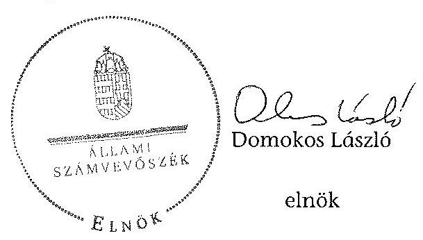

Melléklet: $\quad 11 \mathrm{db}$

[^0]
[^0]:    ${ }^{36}$ BAUSTUDIUM Szolgáltató, Szakképzési és Átképző Kft., MONOPOL-VIKOR Kereskedelmi és Szolgáltató Kft., MUÉP Építőipari Szakképző és Szolgáltató Kft., Palóc Nagykereskedelmi Kft.
    ${ }^{37}$ E.ON Tiszántúli Áramszolgáltató Zrt., Luk Savaria Kuplunggyártó Kft., NAGISZ Mezőgazdasági Termelő és Szolgáltató Zrt., Pick Szeged Szalámigyár és Húsüzem Zrt.,
    ${ }^{38}$ BAUSTUDIUM Szolgáltató, Szakképzési és Átképző Kft., MONOPOL-VIKOR Kereskedelmi és Szolgáltató Kft., MUÉP Építőipari Szakképző és Szolgáltató Kft.
    ${ }^{39}$ E.ON Tiszántúli Áramszolgáltató Zrt.

---

A gazdasági kamaráknál feltárt szabálytalanságok a 2009. és a 2011. évek között

|  |   |   |   |   |   |   |   |   |   |   |   |   |
| --- | --- | --- | --- | --- | --- | --- | --- | --- | --- | --- | --- | --- |
|  Kamarák / Jogszabályi előírások | A támogatás célra történő felhasználása | A támogatási szerződésben előírt beszámolási határidő betartása | A támogatási szerződésben elöírt elszámolás, beszámolás tartalmi és for mai megfelelősége | A támogatási szerződésben elöírt tájékoztatási kötelezettség teljesítése | A számviteli tv. 161/A. § (2) bekezdése szerint az elkülönített nyilvántartás vezetése a támogatás felhasználásáról | A számviteli tv. 167. § (1) bekezdése szerint a bizonylatok alaki-tartalmi kettekei | A számviteli tv. 167. § (1) bekezdés c) pontja szerinti atalvány- | - ezen belül a számviteli tv. 167. § (1) bekezdés h) és i) pontjai alapján a könyvelés módja, számlákra történő hivatkozás, könyvelés időpontja | A számviteli tv. 169. §-a szerint a bi- zonylatok örzése | A szakképzési tv. 30. § (3) bekezdése szerint a gyakorlati képzés ellenőrzése | A fogyasztóvédelmi tv. 37. és 37/A. § szerint a békéltető testület müködése | A 211/1998. (XII. 24.) Korm. rendelet szerint a békéltető testület tagjainak díjazása | A fogyasztóvédelmi tv. 36/A. § (1) bekezdése szerint a békéltető testület tájékoztatójának megküldése a miniszter- nek  |
|  Csongrád Megyei Kereskedelmi és Iparkamara |  | x |  |  |  |  |  |  |  |  |  |   |
|  Hajdú-Bihar Megyei Kereskedelmi és Iparkama- ra |  |  |  |  |  |  |  |  |  |  | x | x  |
|  Komárom-Esztergom Megyei Kereskedelmi és Iparkamara |  | x |  |  |  |  |  |  |  |  |  | x  |
|  Nagykanizsai Kereskedelmi és Iparkamara |  | x |  |  |  |  |  |  |  |  |  |   |
|  Nógrád Megyei Kereskedelmi és Iparkamara |  | x |  |  |  |  |  |  |  |  | x | x  |
|  Vas Megyei Kereskedelmi és Iparkamara |  | x |  |  |  |  |  |  |  |  | x | x  |
|  Zala Megyei Kereskedelmi és Iparkamara |  | x |  |  |  |  |  |  |  |  | x |   |
|  Fejér Megyei Agrárkamara | x | x | x | x | x | x | x |  |  |  |  |   |
|  Hajdú-Bihar Megyei Agrárkamara |  | x | x |  | x | x | x | x |  |  |  |   |

---

2. SZÁMÚ MELLÉKLET A V-0214-914/2014. SZÁMÚ JELENTÉSHEZ

A gazdálkodó szervezeteknél feltárt hiányosságok a 2009. és a 2011. évek között

|  |   |   |   |   |   |   |   |   |   |   |   |   |   |   |   |   |   |   |   |   |   |   |   |   |   |   |   |   |   |   |   |   |   |   |   |   |   |   |   |   |   |   |   |   |   |   |   |   |   |   |   |   |   |   |   |   |   |   |   |   |   |   |   |   |   |   |   |   |   |   |   |   |   |   |   |   |   |   |   |   |   |   |   |   |   |   |   |   |   |   |   |   |   |   |   |   |   |   |   |   |   |   |   |

---

# 2. SZÁMÚ MELLÉKLET A V-0214-914/2014. SZÁMÚ JELENTÉSHEZ

|  Gazdálkodók / Jogszabályt előírások | A gazdálkodó mezői nem tartalmam a szellemei beállamától | A jogállamától segíti nem tartalmam a szellemei beállamától | A jogállamától segíti nem tartalmam a szellemei beállamától | A legállamától segíti nem tartalmam a szellemei beállamától | A legállamától segíti nem tartalmam a szellemei beállamától | A haladásba (1) 1.1.1.1.1.1.1.1.1.1.1.1.1.1.1.1.1.1.1.1.1.1.1.1.1.1.1.1.1.1.1.1.1.1.1.1.1.1.1.1.1.1.1.1.1.1.1.1.1.1.1.1.1.1.1.1.1.1.1.1.1.1.1.1.1.1.1.1.1.1.1.1.1.1.1.1.1.1.1.1.1.1.1.1.1.1.1.1.1.1.1.1.1.1.1.1.1.1.1.1.1.1

---

|  2. SZÁMÚ MELLÉKLET A V-0214-914/2014. SZÁMÚ JELENTÉSHEZ |  |  |  |  |  |  |  |  |  |  |  |  |  |  |  |   |
| --- | --- | --- | --- | --- | --- | --- | --- | --- | --- | --- | --- | --- | --- | --- | --- | --- |
|  |   |   |   |   |   |   |   |   |   |   |   |   |   |   |   |   |
|  |   |   |   |   |   |   |   |   |   |   |   |   |   |   |   |   |
|  |   |   |   |   |   |   |   |   |   |   |   |   |   |   |   |   |
|  |   |   |   |   |   |   |   |   |   |   |   |   |   |   |   |   |
|  |   |   |   |   |   |   |   |   |   |   |   |   |   |   |   |   |
|  |   |   |   |   |   |   |   |   |   |   |   |   |   |   |   |   |
|  |   |   |   |   |   |   |   |   |   |   |   |   |   |   |   |   |
|  |   |   |   |   |   |   |   |   |   |   |   |   |   |   |   |   |
|  |   |   |   |   |   |   |   |   |   |   |   |   |   |   |   |   |
|  |   |   |   |   |   |   |   |   |   |   |   |   |   |   |   |   |
|  |   |   |   |   |   |   |   |   |   |   |   |   |   |   |   |   |
|  |   |   |   |   |   |   |   |   |   |   |   |   |   |   |   |   |
|  |   |   |   |   |   |   |   |   |   |   |   |   |   |   |   |   |
|  |   |   |   |   |   |   |   |   |   |   |   |   |   |   |   |   |
|  |   |   |   |   |   |   |   |   |   |   |   |   |   |   |   |   |
|  |   |   |   |   |   |   |   |   |   |   |   |   |   |   |   |   |
|  |   |   |   |   |   |   |   |   |   |   |   |   |   |   |   |   |
|  |   |   |   |   |   |   |   |   |   |   |   |   |   |   |   |   |
|  |   |   |   |   |   |   |   |   |   |   |   |   |   |   |   |   |
|  |   |   |   |   |   |   |   |   |   |   |   |   |   |   |   |   |
|  |   |   |   |   |   |   |   |   |   |   |   |   |   |   |   |   |
|  |   |   |   |   |   |   |   |   |   |   |   |   |   |   |   |   |
|  |   |   |   |   |   |   |   |   |   |   |   |   |   |   |   |   |
|  |   |   |   |   |   |   |   |   |   |   |   |   |   |   |   |   |
|  |   |   |   |   |   |   |   |   |   |   |   |   |   |   |   |   |
|  |   |   |   |   |   |   |   |   |   |   |   |   |   |   |   |   |
|  |   |   |   |   |   |   |   |   |   |   |   |   |   |   |   |   |
|  |   |   |   |   |   |   |   |   |   |   |   |   |   |   |   |   |
|  |   |   |   |   |   |   |   |   |   |   |   |   |   |   |   |   |
|  |   |   |   |   |   |   |   |   |   |   |   |   |   |   |   |   |
|  |   |   |   |   |   |   |   |   |   |   |   |   |   |   |   |   |

---

|  2. SZÁMÚ MELLÉKLET
A V-0214-914/2014. SZÁMÚ JELENTÉSHEZ |  |  |  |  |  |  |  |  |  |  |  |   |
| --- | --- | --- | --- | --- | --- | --- | --- | --- | --- | --- | --- | --- |
|  |   |   |   |   |   |   |   |   |   |   |   |   |
|  Gozdálkodók / Ingerszédíyt előírások | A gazdálkodó szerencí nem vezetője a foglalkotás napját (čst. 61. § (1) lelkedély | A foglalkotás napját nem tartalmazza a szakmai tevékenységet. | A foglalkotás napját nem tartalmazza az eszköz (eszközök) | A foglalkotás napját nem tartalmazza a tavaslót (eszközök) | A tavaslót pászkok/forgázoló lelkedése, kifizetése nem volt szabályoz. (čst. 61. § (1) lelkedély azazszállító változás) | A tavaslót pászkok/forgázoló lelkedése, kifizetése nem volt szabályoz. (čst. 61. § (1) lelkedély azazszállító változás) | A tavaslót pászkok/forgázoló lelkedése, kifizetése nem volt szabályoz. (čst. 61. § (1) lelkedély azazszállító változás) | A tavaslót pászkok/forgázoló lelkedése, kifizetése nem volt szabályoz. (čst. 61. § (1) lelkedély (fa. 61. § (1) lelkedély, 1b. és 16p. sv.) | Nem. kitelemtés kiteretésére a tavaslásosztáshoz nem rendelkező tavaslót eljárása (čst. 61. § (1) lelkedély) | Nem. kitelemtés kiteretésére a tavaslásosztáshoz nem rendelkező tavaslót eljárása (čst. 61. § (1) lelkedély) |  |  |   |
|  34. | EXPO-CIRMEGE Élelőszerekbareskedelmi Korlátolt Felelősségű Társaság |  |  |  |  |  |  |  |  |  |  | Hajdú-Bihar  |
|  35. | FÖLDERI KÁRÓCZI Mésfegestességi Termelő, Értékelítő és Szolgáltató Korlátolt Felelősségű Társaság |  |  |  | X |  |  |  |  |  |  | Hajdú-Bihar  |
|  36. | HÉLIKER Kereskedelmi Zártlekrüen Működő Részvénytársaság |  |  |  |  |  |  |  |  | X |  | Hajdú-Bihar  |
|  37. | HOTEL KORONA Vendéglátó és Kereskedelmi Korlátolt Felelősségű Társaság |  |  |  |  |  |  |  |  |  |  | Hajdú-Bihar  |
|  38. | IMKI-FOOD Termelő, Szolgáltató és Kereskedelmi Korlátolt Felelősségű Társaság |  |  |  | X | X |  |  |  |  |  | Hajdú-Bihar  |
|  39. | KARÁT Kereskedelmi Korlátolt Felősségű Társaság |  |  |  |  |  |  |  |  |  |  | Hajdú-Bihar  |
|  40. | EZRÉRÉS Szállítási és Kereskedelmi Korlátolt Felelősségű Társaság |  |  |  |  |  |  |  |  |  | X | Hajdú-Bihar  |
|  41. | MOVILL-GÁZ Építőpont, Kereskedelmi és Szolgáltató Korlátolt Felelősségű Társaság | X | X | X | X |  |  |  |  |  |  | Hajdú-Bihar  |
|  42. | NAGISZ Mésfegestességi Termelő és Szolgáltató Zártlekrüen Működő Részvénytársaság |  |  |  |  |  |  |  | X |  | X | Hajdú-Bihar  |
|  43. | NATÚS DIZIÓN Bőter Marsultátúra Korlátolt Felelősségű Társaság |  |  |  |  |  |  |  |  |  |  | Hajdú-Bihar  |
|  44. | POLYDUCT Mikoryságtípati Zártlekrüen Működő Részvénytársaság |  |  |  |  |  |  |  |  |  |  | Hajdú-Bihar  |

---

|  |   |   |   |   |   |   |   |   |   |   |   |   |
| --- | --- | --- | --- | --- | --- | --- | --- | --- | --- | --- | --- | --- |
|   |  |  |  |  |  |  |  |  |  |  |  |   |
|   |  |  |  |  |  |  |  |  |  |  |  |   |
|   |  |  |  |  |  |  |  |  |  |  |  |   |
|   |  |  |  |  |  |  |  |  |  |  |  |   |
|   |  |  |  |  |  |  |  |  |  |  |  |   |
|   |  |  |  |  |  |  |  |  |  |  |  |   |
|   |  |  |  |  |  |  |  |  |  |  |  |   |
|   |  |  |  |  |  |  |  |  |  |  |  |   |
|   |  |  |  |  |  |  |  |  |  |  |  |   |
|   |  |  |  |  |  |  |  |  |  |  |  |   |
|   |  |  |  |  |  |  |  |  |  |  |  |   |
|   |  |  |  |  |  |  |  |  |  |  |  |   |
|   |  |  |  |  |  |  |  |  |  |  |  |   |
|   |  |  |  |  |  |  |  |  |  |  |  |   |
|   |  |  |  |  |  |  |  |  |  |  |  |   |
|   |  |  |  |  |  |  |  |  |  |  |  |   |
|   |  |  |  |  |  |  |  |  |  |  |  |   |
|   |  |  |  |  |  |  |  |  |  |  |  |   |
|   |  |  |  |  |  |  |  |  |  |  |  |   |
|   |  |  |  |  |  |  |  |  |  |  |  |   |
|   |  |  |  |  |  |  |  |  |  |  |  |   |
|   |  |  |  |  |  |  |  |  |  |  |  |   |
|   |  |  |  |  |  |  |  |  |  |  |  |   |
|   |  |  |  |  |  |  |  |  |  |  |  |   |
|   |  |  |  |  |  |  |  |  |  |  |  |   |
|   |  |  |  |  |  |  |  |  |  |  |  |   |
|   |  |  |  |  |  |  |  |  |  |  |  |   |
|   |  |  |  |  |  |  |  |  |  |  |  |   |
|   |  |  |  |  |  |  |  |  |  |  |  |   |
|   |  |  |  |  |  |  |  |  |  |  |  |   |
|   |  |  |  |  |  |  |  |  |  |  |  |   |
|   |  |  |  |  |  |  |  |  |  |  |  |  

---

|  |   |   |   |   |   |   |   |   |   |   |   |   |   |
| --- | --- | --- | --- | --- | --- | --- | --- | --- | --- | --- | --- | --- | --- |
|  |   |   |   |   |   |   |   |   |   |   |   |   |   |
|  |   |   |   |   |   |   |   |   |   |   |   |   |   |
|  56. |  |  |  |  |  |  |  |  |  |  |  |  |   |
|  |   |   |   |   |   |   |   |   |   |   |   |   |   |
|  |   |   |   |   |   |   |   |   |   |   |   |   |   |
|  |   |   |   |   |   |   |   |   |   |   |   |   |   |
|  |   |   |   |   |   |   |   |   |   |   |   |   |   |
|  57. |  |  |  |  |  |  |  |  |  |  |  |  |   |
|  |   |   |   |   |   |   |   |   |   |   |   |   |   |
|  |   |   |   |   |   |   |   |   |   |   |   |   |   |
|  |   |   |   |   |   |   |   |   |   |   |   |   |   |
|  |   |   |   |   |   |   |   |   |   |   |   |   |   |
|  |   |   |   |   |   |   |   |   |   |   |   |   |   |
|  |   |   |   |   |   |   |   |   |   |   |   |   |   |
|  |   |   |   |   |   |   |   |   |   |   |   |   |   |
|  |   |   |   |   |   |   |   |   |   |   |   |   |   |
|  |   |   |   |   |   |   |   |   |   |   |   |   |   |
|  |   |   |   |   |   |   |   |   |   |   |   |   |   |
|  58. |  |  |  |  |  |  |  |  |  |  |  |  |   |
|  |   |   |   |   |   |   |   |   |   |   |   |   |   |
|  |   |   |   |   |   |   |   |   |   |   |   |   |   |
|  |   |   |   |   |   |   |   |   |   |   |   |   |   |
|  |   |   |   |   |   |   |   |   |   |   |   |   |   |
|  |   |   |   |   |   |   |   |   |   |   |   |   |   |
|  |   |   |   |   |   |   |   |   |   |   |   |   |   |
|  |   |   |   |   |   |   |   |   |   |   |   |   |   |
|  |   |   |   |   |   |   |   |   |   |   |   |   |   |
|  |   |   |   |   |   |   |   |   |   |   |   |   |   |
|  |   |   |   |   |   |   |   |   |   |   |   |   |   |
|  |   |   |   |   |   |   |   |   |   |   |   |   |   |
|  |   |   |   |   |   |   |   |   |   |   |   |   |   |
|  |   |   |   |   |   |   |   |   |   |   |   |   |   |
|  |   |   |   |   |   |   |   |   |   |   |   |   |   |
|  |   |   |   |   |   |   |   |   |   |   |   |   |   |
|  |   |   |   |   |   |   |   |   |   |   |   |   |   |
|  |   |   |   |   |   |   |   |   |   |   |   |   |   |
|  |   |   |   |   |   |   |   |   |   |   |   |   |   |
|  |   |   |   |   |   |   |   |   |   |   |   |   |   |
|  |   |   |   |   |   |   |   |   |   |   |   |   |   |
|  |   |   |   |   |   |   |   |   |   |   |   |   |   |
|  |   |   |   |   |   |   |   |   |   |   |   |   |   |
|  |   |   |   |   |   |   |   |   |   |   |   |   |   |
|  |   |   |   |   |   |   |   |   |   |   |   |   |   |
|  |   |   |   |   |   |   |   |   |   |   |   |   |   |
|  |   |   |   |   |   |   |   |   |   |   |   |   |   |
|  |   |   |   |   |   |   |   |   |   |   |   |   |   |
|  |   |   |   |   |   |   |   |   |   |   |   |   |   |
|  |   |   |   |   |   |   |   |   |   |   |   |   |   |
|  |   |   |   |   |   |   |   |   |   |   |   |   |   |
|  |   |   |   |   |   |   |   |   |   |   |   |   |   |

---

|  |   |   |   |   |   |   |   |   |   |   |   |   |
| --- | --- | --- | --- | --- | --- | --- | --- | --- | --- | --- | --- | --- |
|  |   |   |   |   |   |   |   |   |   |   |   |   |
|  |   |   |   |   |   |   |   |   |   |   |   |   |
|  |   |   |   |   |   |   |   |   |   |   |   |   |
|  |   |   |   |   |   |   |   |   |   |   |   |   |
|  |   |   |   |   |   |   |   |   |   |   |   |   |
|  |   |   |   |   |   |   |   |   |   |   |   |   |
|  |   |   |   |   |   |   |   |   |   |   |   |   |
|  |   |   |   |   |   |   |   |   |   |   |   |   |
|  |   |   |   |   |   |   |   |   |   |   |   |   |
|  |   |   |   |   |   |   |   |   |   |   |   |   |
|  |   |   |   |   |   |   |   |   |   |   |   |   |
|  |   |   |   |   |   |   |   |   |   |   |   |   |
|  |   |   |   |   |   |   |   |   |   |   |   |   |
|  |   |   |   |   |   |   |   |   |   |   |   |   |
|  |   |   |   |   |   |   |   |   |   |   |   |   |
|  |   |   |   |   |   |   |   |   |   |   |   |   |
|  |   |   |   |   |   |   |   |   |   |   |   |   |
|  |   |   |   |   |   |   |   |   |   |   |   |   |
|  |   |   |   |   |   |   |   |   |   |   |   |   |
|  |   |   |   |   |   |   |   |   |   |   |   |   |
|  |   |   |   |   |   |   |   |   |   |   |   |   |
|  |   |   |   |   |   |   |   |   |   |   |   |   |
|  |   |   |   |   |   |   |   |   |   |   |   |   |
|  |   |   |   |   |   |   |   |   |   |   |   |   |
|  |   |   |   |   |   |   |   |   |   |   |   |   |
|  |   |   |   |   |   |   |   |   |   |   |   |   |
|  |   |   |   |   |   |   |   |   |   |   |   |   |
|  |   |   |   |   |   |   |   |   |   |   |   |   |
|  |   |   |   |   |   |   |   |   |   |   |   |   |
|  |   |   |   |   |   |   |   |   |   |   |   |   |
|  |   |   |   |   |   |   |   |   |   |   |   |   |

---

|  |   |   |   |   |   |   |   |   |   |   |   |   |   |   |   |   |   |   |   |   |   |   |   |   |   |   |   |   |   |   |   |   |   |   |   |   |   |   |   |   |   |   |   |   |   |   |   |   |   |   |   |   |   |   |   |   |   |   |   |   |   |   |   |   |   |   |   |   |   |   |   |   |   |   |   |   |   |   |   |   |   |   |   |   |   |   |   |   |   |   |   |   |   |   |   |   |   |   |   |   |   |   |

---

|  2. SZÁMÚ MELLÉKLET A V-0214-914/2014. SZÁMÚ JELENTÉSHEZ | |
| --- | --- |
|  |

|  89. | LÉN-FA-MÉH Kereskedelmi, Gyártó és Szolgáltató Kordosító Felelősségű Társaság |  |  |  |  |  |  |  |  |  |  |  |  |  |  |  |  |  |  |  |  |  |  |  |  |  |  |  |  |  |  |  |  |  |  |  |  |  |  |  |  |  |  |  |  |  |  |  |  |  |  |  |  |  |  |  |  |  |  |  |  |  |  |  |  |  |  |  |  |  |  |  |  |  |  |  |  |  |  |  |  |  |  |  |  |  |  |  |  |  |  |  |  |  |  |  |  |  |  |  | 

---

|  2. SZÁMÚ MELLÉKLET
A V-0214-914/2014. SZÁMÚ JELENTÉSHEZ |  |  |  |  |  |  |  |  |  |  |  |   |
| --- | --- | --- | --- | --- | --- | --- | --- | --- | --- | --- | --- | --- |
|  |   |   |   |   |   |   |   |   |   |   |   |   |
|  Genséhendék / regassztaltyr előírások |  | A gendékreél szervező nem vesztő, a foglalkotók napát. (Lt. 21. § (1) lekenélő) |  |  |  |  |  |  |  |  |  |   |
|   |  | A foglalkotók napát nem terhőmozza a szokhat szellemejéjét. |  |  |  |  |  |  |  |  |  |   |
|  1001. Beck Fogászott Szolgáltató Betéd Társaság |  | X | X | X | X |  |  |  |  |  |  | Zszta  |
|  1002. EL-ÁZÓ Kereskedelmi és Vendégistárpát Betéd Társaság |  |  |  |  |  |  | X |  |  |  |  | Zszta  |
|  1003. GÁSDA Ippol, Kereskedelmi és Szolgáltató Kordátolt Felelősségű Társaság |  |  |  |  |  | X |  |  |  |  |  | Zszta  |
|  1004. Gusztramőzzs 2005 Vendégistár Kordátolt Felelősségű Társaság |  | X | X | X | X | X |  |  |  |  |  | Zszta  |
|  1005. GEJEZI-KANIZZA FEDS- és Hőhuszarcsító Gépeket, Kereszkedelmet Javító, Karbastromó, Győréti- és Kereskedelmi Kordátolt Felelősségű Társaság |  |  |  |  |  | X |  |  |  |  |  | Zszta  |
|  1006. Hunt Győegy |  |  |  |  |  | X | X | X |  | X |  | Zszta  |
|  1007. HEAT-GÁZGÉP Gépkező Gépgyőr Kordátolt Felelősségű Társaság |  |  |  |  |  |  |  | X |  |  |  | Zszta  |
|  1008. HEOL-TECH Acél és Hétcipset Kereskedelmi és Szolgáltató Kordátolt Felelősségű Társaság |  |  |  |  |  | X |  |  |  |  |  | Zszta  |
|  1009. HINT AUTÓ KANIZZA Kereskedelmi és Szolgáltató Kordátolt Felelősségű Társaság |  |  |  |  |  |  |  |  |  |  |  | Zszta  |
|  1010. HOTEL-CAREGNA GYÓGYSZÁLLODA Zrt. |  |  |  |  |  | X |  |  |  |  |  | Zszta  |

---

|  2. SZÁMÚ MELLÉKLET A V-0214-914/2014. SZÁMÚ JELENTÉSHEZ |  |  |  |  |  |  |  |  |  |  |  |  |   |
| --- | --- | --- | --- | --- | --- | --- | --- | --- | --- | --- | --- | --- | --- |
|  |   |   |   |   |   |   |   |   |   |   |   |   |   |
|  |   |   |   |   |   |   |   |   |   |   |   |   |   |
|  |   |   |   |   |   |   |   |   |   |   |   |   |   |
|  |   |   |   |   |   |   |   |   |   |   |   |   |   |
|  |   |   |   |   |   |   |   |   |   |   |   |   |   |
|  |   |   |   |   |   |   |   |   |   |   |   |   |   |
|  |   |   |   |   |   |   |   |   |   |   |   |   |   |
|  |   |   |   |   |   |   |   |   |   |   |   |   |   |
|  |   |   |   |   |   |   |   |   |   |   |   |   |   |
|  |   |   |   |   |   |   |   |   |   |   |   |   |   |
|  |   |   |   |   |   |   |   |   |   |   |   |   |   |
|  |   |   |   |   |   |   |   |   |   |   |   |   |   |
|  |   |   |   |   |   |   |   |   |   |   |   |   |   |
|  |   |   |   |   |   |   |   |   |   |   |   |   |   |
|  |   |   |   |   |   |   |   |   |   |   |   |   |   |
|  |   |   |   |   |   |   |   |   |   |   |   |   |   |
|  |   |   |   |   |   |   |   |   |   |   |   |   |   |
|  |   |   |   |   |   |   |   |   |   |   |   |   |   |
|  |   |   |   |   |   |   |   |   |   |   |   |   |   |
|  |   |   |   |   |   |   |   |   |   |   |   |   |   |
|  |   |   |   |   |   |   |   |   |   |   |   |   |   |
|  |   |   |   |   |   |   |   |   |   |   |   |   |   |
|  |   |   |   |   |   |   |   |   |   |   |   |   |   |
|  |   |   |   |   |   |   |   |   |   |   |   |   |   |
|  |   |   |   |   |   |   |   |   |   |   |   |   |   |
|  |   |   |   |   |   |   |   |   |   |   |   |   |   |
|  |   |   |   |   |   |   |   |   |   |   |   |   |   |
|  |   |   |   |   |   |   |   |   |   |   |   |   |   |
|  |   |   |   |   |   |   |   |   |   |   |   |   |   |
|  |   |   |   |   |   |   |   |   |   |   |   |   |   |
|  |   |   |   |   |   |   |   |   |   |   |   |   |   |

---

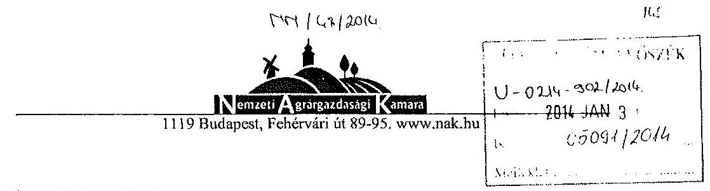

Állami Számvevőszék

Budapest
Apáczai Csere János u. 10.
1052
Domokos László
elnök úr
281-1/2013.
Tárgy: V-0214-895/2014. ikt. számú Jelentéstervezet

# Tisztelt Elnök Úr! 

Megkaptam a „Jelentéstervezet a gazdasági kamarák közfeladatai ellátására forditott költségvetési támogatások felhasználásának és a gyakorlati képzést szervezö gazdálkodó szervezeteknél a szakképzési hozzájárulás teljesitésénél elszámolható költségek ellenőrzéséről a 2009-2011. években." címú jelentéstervezetet.

A Fejér megyére vonatkozó észrevételeket megismertem és tudomásul vettem.

Székesfehérvár, 2014. január 27.

Üdvözlettel:
Kiss Norbert Ivó
a NAK Fejér megyei elnöke
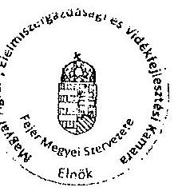

---

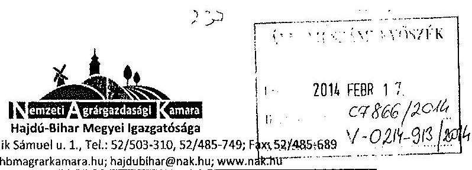

Iktatószám: HB01-110-2/2014
Törgy: Észrevétel

Állami Számvevőszék
Domokos László úr részére

# Budapest 

Apáczai Csere János utca 10.
1364

Tisztelt Domokos László!
A V-0214-895/2014. számú levelükre hivatkozva az alábbi észrevételeket tesszük.
Az elszámolásokkal kapcsolatos hiányosságokat tudomásul vettük. A jövőre nézve a támogatásokkal kapcsolatos feladatellátásban azokat alapul vesszük.

Továbbá a megállapítások egy része (pl. határidőre nem lett elküldve a beszámoló) a másik létnćl ellenörizneıök.

Együtımüködésüket ezúton köszönjük.
Debrecen, 2014. február 11.
Tisztelettel

Kissné Gyarmati Ágnes
igazgat

---

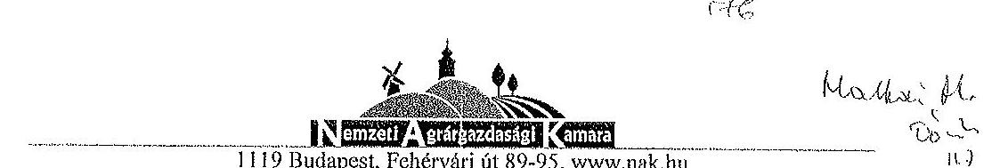

Iktatószám: KP-0074-3/2014.
Ügyintéző: Csapóné Salia Szilvia
Állami Számvevőszék
Budapest
Apáczai Csere János utca 10.
1052
Domokos László
elnök úr
részére

Tárgy: A gazdasági kamarák 2009-2011, közötti támogatások felhasználásának ellenőrzése jelentéstervezet

# Tisztelt Elnök Úr! 

Köszönettel megkaptam a gazdasági kamarák közfeladatai ellátására fordított költségvetési támogatások felhasználásának és a gyakorlati képzést szervező gazdálkodó szervezeteknél a szakképzési hozzájárulás teljesítésénél elszámolható költségek ellenőrzéséről készített számvevőszéki jelentéstervezetet.

A 2012. évi CXXVI. törvény rendelkezései értelmében a 2013. március 28-án megalakult Magyar Agrár-,Elelmiszergazdasági és Vidékfejlesztési Kamara általános jogutódja a Magyar Agrárkamarának és a Területi Agrárkamaráknak. A vizsgálatban érintett Fejér és Hajdó-Bihar Megyei Agrárkamara, mint a Nemzeti Agrárgazdasági Kamara megyei igazgatósága végzi jelenleg a tevékenységét: a szakképzéssel kapcsolatos szakmai feladatokat a központban müködő Szakmai Igazgatóság irányításával, a pályázati és állami támogatások szabályszerű elszámolásáért és a bizonylati, nyilvántartási rendért pedig a Gazdasági Igazgatóság felel.

A korábbi, 13071.sz. kamarai ellenőrzés jelentésében feltárt hiányosságokkal kapcsolatban intézkedési tervet készítettünk, melynek betartását figyelemmel kísérjük. A jelenlegi vizsgálat az előzőhöz hasonló hiányosságokat tárt fel, ezért a fentiekre való tekintettel a jelentéstervezettel kapcsolatban észrevételt, véleményt nem kívánunk tenni.

Budapest, 2014. január 30.
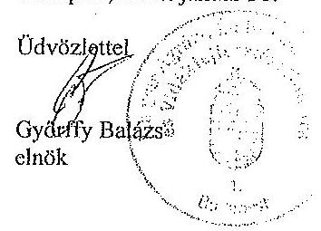

---

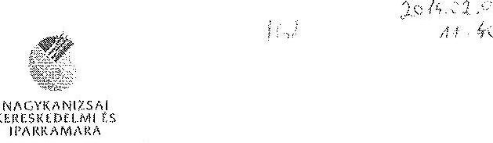

Állami Számvevőszék
Budapest
Apáczai Csere János u. 10 1052

Domokos László
elnök úr
részére

Tisztelt Elnök Úr!
Ikt. szám: K 231/2014
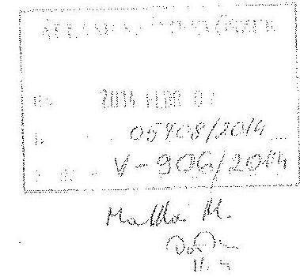

A „Jelentéstervezet a gazdasági kamarák közfeladatai ellátására forditott költségvetési támogatások felhasználásának és a gyakorlati képzést szervezö gazdálkodó szervezeteknél a szakképzési hozzájárulás teljesitésénél elszámolható költségek ellenörzéséről a 2009-2011. években" címmel készített jelentéstervezetet köszönettel megkaptuk.
Az ellenőrzés megállapításaival kapcsolatban észrevételt nem kívánunk tenni.

Nagykanizsa, 2014. január 27.

Ödvözlettel:
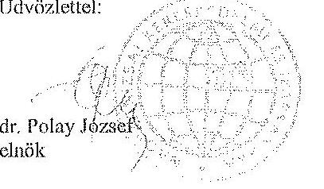

---

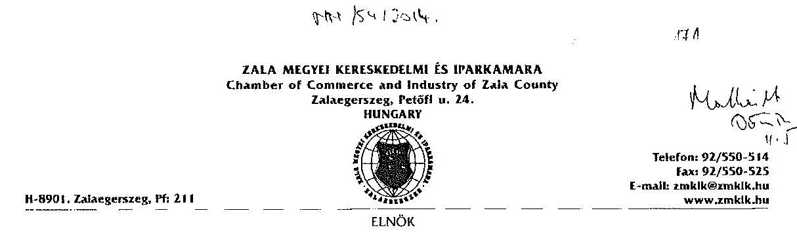

Állami Számvevőszék
Domokos László
Elnök Úr részére
Budapest

Tisztelt Elnök Úr!
Ikt.szám: 24/2011/2014
Áll. 1111 : : 111: F1ÓsZÉK
$U-0214-30512014$
Fikr.: 2014 FEBR 05
Iktutis: 05960/2014
Mellklet:

Hivatkozva a V-0214-890/2014. iktatószámú levelükre, köszönettel vettem a jelentéstervezetet. A benne foglalt megállapításokat, következtetéseket, javaslatokat nagy figyelemmel olvastam, amelyek alapján elnöki utasítást adtam ki a kamarai hivatal vezetőjének a további pontos munkavégzésre vonatkozóan.
A jelentéstervezetben foglaltakkal kapcsolatosan észrevételt nem kívánok tenni.

Zalsegerszeg, 2014. február 04.
Tisztelettel:
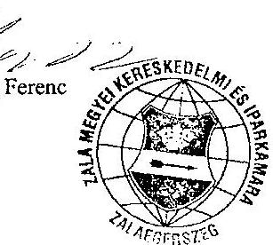

---

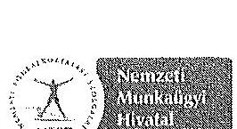

Hivatkozási szám: V-214-891/2014.

Iktatószám: 006223-1/2014-5020
Ügyintéző: Pósa Józsefné
Telefonszám: 1/434-57-45

Tárgy: Észrevétel

Állami Számvevőszék
Domokos László
elnök

1852 Budapest
Apáczai Csere János utca 10.

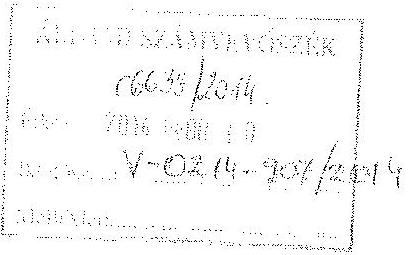

Tisztelt Elnök Úr!

A 2013. június 14-én érkezett, a „gazdasági kamarák közfeladatai ellátására fordított költségvetési támogatások felhasználásának és a gyakorlati képzést szervező gazdálkodó szervezeteknél a szakképzési hozzájárulás teljesítésénél elszámolható költségek ellenőrzéséről a 2009-2011. években" szóló jelentéstervezetre az alábbi észrevételt teszem a 13. oldal 5. bekezdés utolsó mondata, és a 14. oldal, diagram alatti harmadik bekezdése kapcsán:

A jelentéstervezetben foglalt megállapítással egyetértünk a következő kiegészítéssel.

A 2009-2011. évekre vonatkozóan a benyújtott éves bevallásokat és kapcsolódó dokumentumokat az NSZFI fogadta, feldolgozta, és a jogszabály figyelembevételével készült belső segédlese alapján formailag, számszakilag, tartalmilag ellenőrizte, a hibás, hiányos bevallásokat javíttatta, hiány pósultatta.

Fenti időszakra vonatkozó bevallások helyszíni ellenőrzését az NSZFI a 2012. évi helyszíni ellenőrzési tervében betervezte, mint külső szakértők igénybevételével végrehajtandó ellenőrzés. Az ellenőrzések lefolytatására a költségvetési szerveknél történt pénzeszköz zárolás következtében, a közbeszerzési eljárás lefolytatásának elmaradása miatt nem kerülhetett sor.

A hatályos jogszabályok alapján a gyakorlati képzést szervező gazdálkodó szervezetek ellenőrzése azonban nem kizárólag az NSZFI feladata.

A szakképzési hozzájárulásról és a képzés fejlesztésének támogatásáról szóló 2003. évi LXXXVI. tv. 4. § (11) bekezdésében foglaltak alapján a szakképzési hozzájárulást gyakorlati képzés megszervezésével teljesítő hozzájárulásra kötelezettenek az állami adóhatósággal szemben nem keletkezik bevallási, befizetési és elszámolási kötelezettsége, azonban az állami adóhatóság a helyszíni ellenőrzés során a szakképzési hozzájárulási kötelezettség teljesítését az adózás rendjéről szóló 2003. évi XCII. törvény szabályai szerint ellenőrzi.

A NAV eddig is, és jelenleg is végez ellenőrzéseket, amelyek megállapításairól folyamatosan tájékoztatja Hivatalunkat.

Budapest, 2014. február „1.".

Üdvözlettel:

Kontoromi Róbert

1689 Budapest, Kábérla tér 7. – Levekedési cím: 1476 Bp., Pl. 75 – Telefon: 06 1 303 0000 – Fax: 06 1 210 1870 – www.munica.hu

---

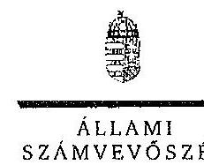

ELKök

Ikt.szám: V-0214-909/2014.

# Komáromi Róbert úr 

főigazgató
Nemzeti Munkaügyi Hivatal

## Budapest

## Tisztelt Föigazgató Úr!

A „elentéstervezet a gazdasági kamarák közfeladatai ellátására forditott költségvetési támogatások felhasználásának és a gyakorlati képzést szervezỏ gazdálkodó szervezeteknél a szakképzési hozzájárulás teljesitésénél elszámolható költségek ellenőrzéséről a 2009-2011. években" címủ jelentéstervezetre tett észrevételeit köszönettel megkaptam.

Az Állami Számvevőszék észrevételekre vonatkozó álláspontjáról a felügyeleti vezető által készített részletes tájékoztatást csatoltan megküldöm.

Tájékoztatom Főigazgató Urat, hogy a számvevőszéki jelentés szövegezése az észrevételei figyelembevételével készül.

Budapest, 2014. 04. hó 01 nap

Tisztelettel:
O. $R_{2} \quad 6681$

Melléklet: Tájékoztatás az el nem fogadott észrevételekről

---

# Tájékoztatás   az el nem fogadott észrevételekről 

A „Jeleméstervezet a gazdasági kamarák közfeladatai ellátására forditott költségvetési támogatások felhasználásának és a gyakorlati képzési szervező gazdálkodó szervezeteknél a szakképzési hozzájárulás teljesitésénél elszámolható költségek ellenörzéséről a 2009-2011. években" címủ jelentéstervezetre 2014. február 10-én érkezett észrevételeit áttekintettük, azok kezelésével kapcsolatban a következő tájékoztatást adom.

A jelentés-tervezet 13. oldal 5. bekezdés utolsó mondat és a 14. oldal diagram alatti harmadik bekezdésre tett észrevétele az alábbiak alapján nem igényli a jelentés módosítását.

A szakképzési hozzájárulási tv. 4. § (10) bekezdése alapján a szakképzési hozzájárulást a gyakorlati képzés megszervezésével teljesitő hozzájárulásra kötelezettnek bevallási és elszámolási, valamint az e törvény végrehajtási rendeletében elöírtak szerint bejelentkezési kötelezettsége van az állami szakképzési és felnőttképzési intézettel szemben. A szakképzési hozzájárulási kötelezettség teljesítését a szakképzésért és felnőttképzésért felelős miniszter megbízásából az állami szakképzési és felnőttképzési intézet ellenőrizheti. A jelentéstervezet 13. oldal 5. bekezdés utolsó mondata és a 14. oldal, diagram alatti harmadik bekezdése a gyakorlati képzést szervező gazdálkodó szervezetek szakképzési hozzájárulás bevallásához kapcsolódó ellenőrzésről szól. A jelen ellenőrzés az NSZFI ellenőrzési gyakorlatára terjedt ki, azzal kapcsolatban tesz megállapításokat és nem írt az NSZFI kizárólagos ellenőrzési jogáról.

Tájékoztatom a Föigazgató Urat, hogy a számvevőszéki jelentés mellékleteként szerepelteijük a jelentéstervezethez tett észrevételeit, valamint az azokra adott válaszunkat.

Budapest, 2014. 04 . hó 01 nap

Makkai Mária
féligyeleti vezető

---

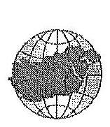

# HAJDÚ-BIHAR MEGYEI KERESKEDELMI ÉS IPARKAMARA

**Chamber of Commerce and Industry of Hajdú-Bihar County**

**Domokos László Úr**
Elnök részére
Állami Számvevőszék
Budapest
Apáczai Csere János utca 10.
1052

Ikt.szám: 285-2/2014.
Ü.L:Dr. Kissné dr. Tóth Tümea
Tárgy: észrevételek jelentéstervezetre
Hivatkozási szám: V-0214-890/2014

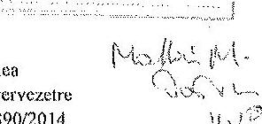

## Tisztelt Elnök Úr!

A Hajdú-Bihar megyei Kereskedelmi és Iparkamara megvizsgálta a „Jelentéstervezet a gazdasági kamarák közfeladatai ellátására fordított költségvetési támogatások felhasználásnak és a gyakorlati képzést szervező gazdálkodó szervezeteknél a szakképzési hozzájárulás teljesítésénél elszámolható költségek ellenőrzéséről a 2009-2011. években” címmel készített jelentéstervezetet.

Az Állami Számvevőszékről szóló 2011. évi LXVI. törvény 29. § (2) bekezdésében meghatározott felhatalmazással élve, a megjelölt 15 napos határidőt betartva, az alábbi észrevételeket tesszük:

- A jelentéstervezet **21. oldalának 3. bekezdésében** található a Békéltető Testületre (továbbiakban BT) vonatkozó megállapítások.
- Az a kijelentés, mely szerint a BT összetétele nem felelt meg az Fogyasztóvédelmi törvény 21. § (2) bekezdésében foglaltaknak pontosításra szorul. A hivatkozott rendelkezés a kamarai és fogyasztóvédelmi oldal egyenlő számát határozza meg, míg az érintett időszakban a Kamarai oldalon pusztán plusz egy fő volt jelölve, de kizárólag pöttagként, egy esetleges kamara által delegált tag kiesés pótlás céljából.
- A békéltető testület az éves tevékenységéről szóló beszámolót elkészítették, de - jogszabálytól eltérően - közvetlenül a Magyar Kereskedelmi és Iparkamarának küldtük meg - aki a szakmai és a pénzügyi elszámolást hivatott ellenőrizni és továbbítani a minisztérium irányába. Ezen kötelezettségünk tekintetében a jövőben mindenképpen a vonatkozó jogszabályok szerint fogunk eljárni.

Egyebekben a vizsgálat megállapításai alapján intézkedési tervet készítünk a jogszabályban foglalt feladatok pontos betartása, ellenőrzése érdekében az alábbi bontásban:

- A békéltető testület jogszabályon alapuló tájékoztatási és nyilvántartási-kötelezettségei
- Szakmai terv 2014. évre
- Békéltető testület által hozható határozatok és díjazásai 2014.
- A Hajdú-Bihar megyei Békéltető Testület eljárási szabályzata 2014.

Tisztelettel kérjük, hogy a fenti észrevételeinkat fontolják meg és annak figyelembe vételével legyenek szívesek véglegesíteni a jelentésüket!

Debrecen, 2014. február 6.

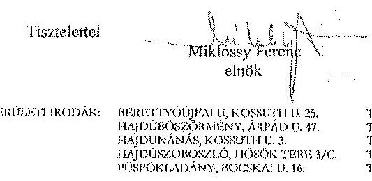

---

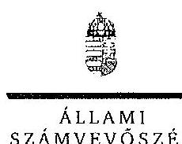

# Hl. 58 

Ikt.szám: V-0214-911/2014.

## Miklóssy Ferenc ár

clnők
Hajdó-Bihar Megyei Koreskedelmi és Iparkamara

## Debrecen

## Tisztelt Elnök Úr!

A „Jelentéstervezet a gazdasági kamarák közfeladatai ellátására forditott költségvetési támogatások felhasználásának és a gyakorlati képzést szervezö gazdálkodó szervezeteknél a szakképzési hozzájárulás teljesitésénél elszámolható költségek ellenörzéséről a 2009-2011. években" clmü jelentéstervezetre tett észrevételeit köszönettel megkaptam.

Az Állami Számvevőszék észrevételekre vonatkozó álláspontjáról a felügyeleti vezető által készített részletes tájékoztatást csatoltan megküldöm.

Tájékoztatom Elnök Urat, hogy a számvevőszéki jelentés szövegezése az észrevételei figyelembevételével készül.

Budapest, 2014. 04 . hó 01 -nap

Tisztelettel:
0214
Domokos László

Melléklet: Tájékoztatás az el nem fogadott észrevételekröl

---

# Tájékoztatás   az elfogadott és el nem fogadott észrevételekröl 

A „Jelentéstervezet a gazdasági kamarák közfeladatai ellátására forditott költségvetési támogatások felhasználásának és a gyakorlati képzést szervező gazdálkodó szervezeteknél a szakképzési hozzájárulás teljesitésénél elszámolható költségek ellenörzéséről a 2009-2011. években" címủ jelentéstervezetre 2014. február 10-én érkezett észrevételeit áttekintettük, azok kezelésével kapcsolatban a következő tájékoztatást adom.

A fogyasztóvédelmi törvény 21. § (2) bekezdése rögziti, hogy a békéltető testületi tagokat egyrészről a kamara és a megyei (fővárosi) agrárkamarák, másrésztől a fogyasztói érdekek képviseltét ellátó társadalmi szervezetek egyenlő arányban jelölik ki.

A jelentéstervezet 21. oldal 3. bekezdésére tett észrevétele nem vitatja, hogy az érintett időszakban a Békéltető Testületbe a Kamarai oldalon 9 főt, abból egy főt pöttagként jelöltek. A Békéltető Testülettől kapott 2008. július 27. napjától hatályos Hajdó-Bihar megyei Békéltető Testület Kamarai oldal tagok listája 9 főt tartalmaz, abban pöttag nem szerepel, ezért a hivatkozott megállapításon nem változtatunk.

Köszönjük az éves beszámolóval és az intézkedési terv készitésével kapcsolatos tájékoztatását, mely a megállapításunk megváltoztatását nem indokolja.

Az Állami Számvevőszékről szóló 2011. évi LXVI. törvény 33. § (1) bekezdésben foglalt előírás alapján az ellenőrzött szervezet vezetője köteles a számvevőszéki jelentésben foglalt megállapításokhoz kapcsolódóan intézkedési tervet készíteni és azt a jelentés kézhezvételétől számított 30 napon belül az Állami Számvevőszék részére megküldeni. A számvevőszéki jelentésben az intézkedést igénylő megállapítások alapján tett javaslatok hasznosulására vonatkozó tervezett vagy már végrehajtott intézkedéseket, így levelében foglalt intézkedést is ezen intézkedési tervben indokolt szerepeltetni.

Tájékoztatom az Elnök Urat, hogy a számvevőszéki jelentés mellékleteként szerepeltetjük a jelentéstervezethez tett észrevételeit, valamint az azokra adott válaszunkat.

Budapest, 2014. 3. hó of nap
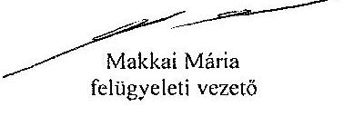