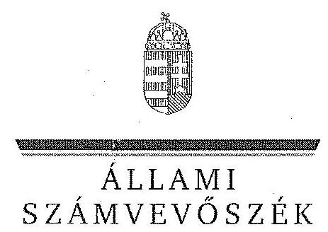

ÁLLAMI
SZÁMVEVŐSZÉK

# JELENTÉS 

az önkormányzatok többségi tulajdonában lévő gazdasági társaságok közfeladat-ellátásának ellenőrzéséről Bárka Színház Nonprofit Kft.

---

# Állami Számvevőszék 

Iktatószám: V-0194-177/2014.
Témaszám: 1159
Vizsgálat-azonosító szám: V06530212

## Az ellenőrzést felügyelte:

Makkai Mária
felügyeleti vezető
Az ellenőrzést vezette és az ellenőrzés végrehajtásáért felelős:
Horváth József
ellenőrzésvezető
A számvevőszéki jelentés összeállításában közreműködött:
Lődiné Cser Zsuzsanna
számvevő főtanácsos
Az ellenőrzést végezték:
Béres-Molnár Gergely Homor József Lődiné Cser Zsuzsanna
külső szakértő
külső szakértő
számvevő főtanácsos

A témához kapcsolódó eddig készített számvevőszéki jelentések:
címe
sorszáma
Jelentés a színházak állami támogatásának és gazdálkodásának 1039
ellenőrzéséről

---

# TARTALOMJEGYZÉK 

BEVEZETÉS ..... 3
I. ÖSSZEGZŐ MEGÁLLAPÍTÁSOK, KÖVETKEZTETÉSEK, JAVASLATOK ..... 6
II. RÉSZLETES MEGÁLLAPÍTÁSOK ..... 13

1. Az Önkormányzat közfeladat-ellátásának megszervezése ..... 13
1.1. A közfeladat meghatározása, a feladat ellátásának választott módja ..... 13
1.2. Az önkormányzati és a tulajdonosi irányítás megítélése ..... 17
2. A gazdasági társaság közfeladat-ellátással kapcsolatos tevékenysége ..... 21
2.1. A gazdasági társaság szervezeti kialakítása, szabályozottsága ..... 21
2.2. A gazdasági társaság vagyonnyilvántartása ..... 23
2.3. A gazdasági évek ráfordításainak és bevételeinek alakulása ..... 26
2.4. A gazdasági társaság eredményének alakulása ..... 31
2.5. A gazdasági társaság folyamatos üzemmenetének, működésének, likviditásának biztosítása ..... 33
3. Az Önkormányzat tulajdonosi jogainak és kötelezettségeinek érvényesítése ..... 35
3.1. A gazdasági társaságtól származó információk elemzése, hasznosítása ..... 35
3.2. Az önkormányzat képviselő-testületének intézkedései ..... 36

## MELLÉKLETEK

1. számú A Bárka Színház szakmai tevékenységének mutatói a 2008. és a 2012. évek között
2. számú A Bárka Színház támogatása a 2008. és a 2012. évek között
3. számú A Bárka Színház vagyonának főbb adatai 2008. január 1-je és 2012. december 31-e között
4. számú Budapest Főváros VIII. kerület Józsefvárosi Önkormányzat polgármesterének észrevétele
5. számú Budapest Főváros VIII. kerület Józsefvárosi Önkormányzat polgármesterének észrevételére adott válasz
6. számú A Bárka Színház ügyvezető igazgatójának észrevétele
7. számú A Bárka Színház ügyvezető igazgatójának észrevételére adott válasz

---

# FÜGGELÉKEK 

1. számú Rövidítések jegyzéke
2. számú Értelmező szótár

---

# JELENTÉS 

## az önkormányzatok többségi tulajdonában lévő gazdasági társaságok közfeladat-ellátásának ellenőrzéséről Bárka Színház Nonprofit Kft.

## BEVEZETÉS

Az Önkormányzatnak az Ötv. és az Mötv. szerinti közfeladata a művészeti feladatok ellátása, melyet a többségi tulajdonában álló gazdasági társaság előadó-művészeti tevékenységének támogatásával valósított meg.

Az Önkormányzat Gazdasági programja${ }_{13}$-je az ellenőrzött időszakban a művészeti tevékenységre nem terjedt ki, színházi koncepcióval nem rendelkezett.

A Bárka Színház Nonprofit Kft. támogatása az ellenőrzött időszakban központi költségvetési, illetve fenntartói (önkormányzati) támogatás formájában, valamint pályázatok útján valósult meg. A 2008-2012. évek költségvetési törvényei egy összegben tartalmazták az Önkormányzat fenntartásában működő színház állami támogatását, amelyet a fenntartó a gazdasági társasága részére továbbított. Ezt az Önkormányzat a költségvetési rendeleteiben meghatározott mértékben további forrásokkal egészítette ki.

Az Önkormányzat és a Bárka Művészeti és Kulturális Alapítvány az ellenőrzött időszakot megelőzően - 1996. július 18-án - alapította a Bárka Kht.-t 1,0 millió Ft alapítói törzstőkével, melyet az Önkormányzat az ellenőrzött időszakot megelőzően - 1999. június 24-től - 93,5 millió Ft-ra emelte. Az ellenőrzött időszak kezdetén a Bárka Kht. tulajdonosa az Önkormányzat (99,7% tulajdoni hányad) mellett 0,3% tulajdoni hányaddal egy magán személy volt. A Képviselő-testület a Gt. előírásainak megfelelően módosította a Társasági Szerződés${ }_{1}$-t a 149/2009. (IV. 22.) számú határozatával, és 2009. május 31-ei hatállyal nonprofit korlátolt felelősségű társasági formában működtette tovább az előadó-művészeti szervezetet. A Bárka Színház a 2012. évben 100% önkormányzati tulajdonba került.

A Bárka Színház épülete műemlék jellegű, amely még a század elején az itt működő Ludovika vívóteremként funkcionált. 1999 szeptemberében nyitották meg a Bárka Színház felújított, átalakított épületét. A Bárka Színház állandó társulattal rendelkezik.

Az Önkormányzat az előadó-művészeti feladatok ellátására a Társasággal határozatlan időre szóló Közszolgáltatási szerződés${ }_{1}$-et kötött 2000. július 10-én. Ezt az ellenőrzött időszak végéig két alkalommal módosították. A szerződés tartalmazta a közhasznú tevékenység körét, a Társaság által teljesítendő művészeti tevékenység pontos mutatószámait, a gazdálkodás és a művészeti tevékenység ellátásával összefüggő kötelező adatszolgáltatás formáját, idejét és módját. Rögzítette az Önkormányzat ellenőrzési jogosultságát, valamint garanciális követelményként a kötelezettség megszegésének jogkövetkezményeit, a számadási kötelezettség elmulasztása és a nem rendeltetés szerinti felhasználás esetére a visszafizetési kötelezettséget.

Az Emtv. új elemként vezette be 2009 novemberétől a tao támogatást, mint közvetett támogatási formát. Ennek felső határát a jogalkotó a tárgyévi jegybevétel 80%-ában határozta meg. A tao támogatás pénzügyi teljesülése a támogatást nyújtó vállalkozások eredményességének és támogatás nyújtási hajlandóságának függvénye.

A Bárka Színház az Önkormányzat közfeladat-ellátása érdekében végzett tevékenységéhez az ellenőrzött időszakban összesen 1206,9 millió Ft állami és önkormányzati működési, valamint 262,0 millió Ft egyéb pályázati támogatást kapott. Emellett a 2009-2012. években 77,4 millió Ft tao támogatást vett igénybe.

Az ellenőrzött időszakban a Színház négy játszóhelyen, évente 4-5 bemutatóval átlagosan 257 színházi előadással, mintegy 70%-os kihasználtság mellett látta el a közfeladatait. A fizetőnéző-szám a 2008. évi 26,1 ezer főről a 2012. évre 21,9 ezer főre csökkent. A Színház által foglalkoztatott munkavállalók átlaglétszáma a 2008. évi 24 főről a 2012. évre 48 főre nőtt.

A Bárka Színház főbb szakmai mutatószámait az 1. számú melléklet tartalmazza.

Az ellenőrzés várható eredménye: a jelentés nyilvánossága a társadalom széles körével ismerteti meg a Színház gazdálkodására vonatkozó megállapításainkat, továbbá a megállapítások alapján megfogalmazott számvevőszéki javaslatok hasznosítása elősegíti a feltárt hibák megszüntetését, az ellenőrzött szervezet jobb feladatellátását. A társadalom számára jelzi, hogy közpénz nem maradhat ellenőrizetlenül, az ÁSZ értékteremtő rend kialakításához és megőrzéséhez hozzájáruló tevékenysége pozitív hatással lesz a szervezetről kialakított összkép formálásában. A szervezeten belül lehetőség nyílik arra, hogy a megállapítások szintetizálásával az ÁSZ a hozzáadott értéket teremtő, elemző tevékenységét és tanácsadó szerepét is erősítse. A jó gyakorlatok bemutatásával az ÁSZ hozzájárul a követendő megoldások megismertetéséhez, terjesztéséhez.

# Az ellenőrzés célja annak értékelése volt, hogy 

- az Önkormányzat a jogszabályi előírások figyelembevételével döntött-e az ellenőrzésre kerülő közfeladat megszervezéséről, az ellátás módjáról; a tulajdonostól elvárható gondossággal felügyelte-e társaság feladatellátását; a gazdasági társaság rendelkezésére bocsátotta-e a közfeladat-ellátásához a szükséges közvagyont, és biztosította-e a tulajdonosi jogoknak a közvagyon feletti érvényesülését; a társaság vagyonvesztése esetén intézkedett-e a további vagyonvesztés megakadályozásáról;
- a gazdasági társaság teljesítette-e a tulajdonos Önkormányzat részéről meghatározott célokat és feladatokat a rendelkezésre álló erőforrások felhasználásával; végrehajtotta-e a közfeladat-ellátási szerződés előírásait; betartotta-e a vagyonnal történő gazdálkodásra vonatkozó jogszabályi rendelkezéseket.

Az ellenőrzés hatóköre: az önkormányzatok közfeladat-ellátásának ellenőrzése, amely kiterjed az önkormányzatok és a közfeladatot ellátó, az önkormányzat többségi tulajdonában lévő gazdasági társaság közötti feladatmegosztásra, az önkormányzatok tulajdonosi jogainak gyakorlására, valamint a nemzeti vagyon kezelésének ellenőrzése keretében a közfeladat-ellátáshoz rendelt vagyonra és a vagyont érintő szerződésekre. A jelen ellenőrzés kiterjed az önkormányzatok többségi tulajdonlásával működő gazdasági társaságok közfeladat-ellátására, vagyongazdálkodási tevékenységére, a kapcsolódó nyilvántartások, elszámolások szabályszerűségére és megbízhatóságára. Az ellenőrzött tételek kiválasztása véletlen mintavétellel történt.

Az ellenőrzés típusa: szabályszerűségi ellenőrzés
Az ellenőrzött időszak: A 2008-2012. évek, valamint a helyszíni ellenőrzés befejezéséig - 2013. szeptember 27-ig - bekövetkezett változások figyelemmel kísérése.

Ellenőrzött szervezet: a Bárka Színház Nonprofit Kft., valamint Budapest Főváros VIII. kerület Józsefvárosi Önkormányzata.

Az ellenőrzés végrehajtásának jogszabályi alapját az ÁSZ tv. 5. § (3)-(5) bekezdéseiben foglaltak képezték.

Az ÁSZ a 2011. évi LXVI. törvény 29. §-a szerint a jelentéstervezetet megküldte Budapest Főváros VIII. kerület Józsefvárosi Önkormányzata polgármesterének és a Bárka Színház Nonprofit Kft. ügyvezető igazgatójának egyeztetésre. A beérkezett észrevételeket és az azokra adott választ a jelentés 4-7. számú mellékletei tartalmazzák.

---

# I. ÖSSZEGZŐ MEGÁLLAPÍTÁSOK, KÖVETKEZTETÉSEK, JAVASLATOK 

Az Önkormányzat a művészeti feladatok támogatásának, mint az Ötv.-ben és az Mötv.-ben meghatározott közfeladatának, az ellenőrzött időszakban eleget tett. Az Önkormányzat a közfeladat-ellátását a Bárka Színház mint gazdasági társaság támogatásával biztosította. A Képviselő-testület a tulajdonosi joggyakorlás rendjét az ellenőrzött időszak alatt a jogszabályoknak megfelelően rendeleteiben és szabályzataiban rögzítette. A tulajdonosi joggyakorlás keretében a Képviselő-testület - és átruházott hatáskörben a Bizottság - határozatokat hozott.

Az Önkormányzat a Társaság részére a Társasági Szerződés${ }_{1,2}$-ben és a közszolgáltatási szerződésekben foglaltaknak megfelelően, az előadó-művészeti közfeladat-ellátásához szükséges vagyont (alapító tőkét és a Társaság székhelyéül szolgáló ingatlant) ingyenesen használatba adta. A Színház részére ingyenes használatba átadott ingatlan a Magyar Állam tulajdonát, a nemzeti vagyon részét képezte. Az Önkormányzat vagyonkimutatásában az állami vagyonnal való gazdálkodásról szóló 254/2007. (X. 4.) Korm. rendelet előírása ellenére az ingatlan értékben nem szerepelt. A Bárka Színház a könyveiben nem tüntette fel a nullás számlaosztályban a használatba kapott ingatlant, amely ellentétes a Számv. tv.-ben előírtakkal. Az ingatlanon végzett saját felújítások és beruházások kiadásait mind az Önkormányzat, mind a Bárka Színház mint idegen tulajdonon végzett beruházást aktiválta. Ez az elszámolás megfelelt a jogszabályi előírásoknak.

Az Önkormányzat és a Színház a közfeladat-ellátásának tárgyi és pénzügyi feltételeit a közszolgáltatási szerződésekben rögzítette. A Színház részére a közfeladat-ellátásához szükséges forrás biztosításáról a Képviselő-testület az éves költségvetési rendeletekben és a közszolgáltatási szerződések elválaszthatatlan részét képező támogatási szerződésben határozott. A közszolgáltatási szerződésekben meghatározták a közhasznú tevékenység körét, a Színház által teljesítendő művészeti tevékenységek jellegét, mértékét és pontos mutatószámait. Szabályozták a művészeti tevékenység ellátásával összefüggő kötelező adatszolgáltatás formáját, idejét és módját.

Az Emtv. új elemként vezette be 2009 novemberétől a tao támogatást, mint közvetett támogatási formát, amelynek mértékét a jogalkotó a tárgyévi jegybevétel 80%-ában határozta meg. A tao támogatás pénzügyi teljesülése a támogatást nyújtó vállalkozások eredményességének és támogatás nyújtási hajlandóságának a függvénye.

A közszolgáltatási szerződésekben foglaltak a közfeladat-ellátás feltételeit biztosították. Az Önkormányzat a közszolgáltatási szerződésekben a használatra átadott vagyon védelmével kapcsolatban leltározási kötelezettséget nem írt elő.

Az Önkormányzat a vagyon védelme érdekében a közszolgáltatási szerződésekben garanciális követelményként fogalmazta meg a kötelezettségek megszegésének jogkövetkezményeit. Az ellenőrzött időszakban a Társaság részéről a kötelezettség megszegésére, illetve a szerződés megszüntetésére nem került sor.

A Képviselő-testület a Színház Társasági Szerződés${ }_{1,2}$-ben - a Gt. előírásaival összhangban - szabályozta a tulajdonosi joggyakorlás kereteit. A Társasági Szerződésben a Társaság legfőbb szerve, a taggyűlés kizárólagos hatáskörébe tartozó feladatként határozta meg a Társaság SZMSZ-ének és az FB ügyrendjének jóváhagyását.

Az FB ügyrendjét az Önkormányzat Bizottsága elfogadta. Az FB elnökét az FB tagok a Társaság SZMSZ-ének és az FB ügyrendjének megfelelően maguk közül választották.

A Képviselő-testület a Társaság 2008. és 2012. évek közötti beszámolóit és üzleti terveit a jogszabályokban, az Önkormányzat belső szabályzataiban, illetve a közszolgáltatási szerződésekben foglaltaknak megfelelően, határidőn belül - az FB határozatok és a könyvvizsgálói jelentések figyelembevételével - a taggyűlésnek elfogadásra javasolta.

A Társaság szakmai tevékenységének ellátását az Önkormányzat az éves beszámolók/évadbeszámolók alapján értékelte. A Színház az ellenőrzött időszak minden évében elkészítette a szakmai értékelését, amelyet a 2008. és 2012. évek között az Önkormányzat belső szabályzatainak
 megfelelően a Bizottság megtárgyalta és elfogadásra javasolta.

Az Önkormányzat az ellenőrzött időszak minden évére rendelkezett ellenőrzési tervvel, amelyek jóváhagyása az Ötv.-nek megfelelően, határidőn belül megtörtént. Az Önkormányzat a belső ellenőrzés éves ellenőrzési terve alapján a Társaságnál a 2011. évre ellenőrzést tervezett, de az ellenőrzés elmaradt. Az Önkormányzat a 2011. évtől a Színház honlapja adattartalmának megfelelősége ellenőrzésével külső szakértőt bízott meg. A szakértő a jelentésében megállapította, hogy a honlap adattartalma nem felelt meg az Eisztv. és az Infotv. előírásainak. A közzététel ellenőrzésével kapcsolatos megállapításokra a Színház a helyszíni ellenőrzés lezárásáig az intézkedést megkezdte.

A Társaság - a kihasználtságra előírt mértéket kivéve - teljesítette az Önkormányzat részéről a közszolgáltatási szerződésekben meghatározott célokat és feladatokat.

A Társaság a gazdálkodás szabályozására vonatkozó jogszabályi rendelkezéseket csak részben tartotta be. A Társaság Számviteli politikája${ }_{1,2}$ tartalmazta az elkészítendő szabályzatok körét, de a Társaság 2007. évben, illetve 2009. augusztus 31-től hatályba helyezett szabályzatai nem teljes körűen tartalmazták a Számv. tv. által előírtakat. A Társaság számlarendet nem készített, ezzel megsértette a Számv. tv.-ben előírtakat. A szabályzatokat az ellenőrzött időszakban nem aktualizálták. A belső szabályozás hiányosságai és a meglévő szabályzatok aktualizálásának elmaradása a Társaság integritásával kapcsolatban kockázatot jelentett.

---

A Társaság a 2008. és a 2012. évek között a taggyűlés által jóváhagyott SZMSZ-szel nem rendelkezett. Az ügyvezető által 2011. november 7-én aláírt és 2011. december 1-jén hatályba léptetett SZMSZ-t az FB nem véleményezte, a taggyűlés nem hagyta jóvá.

A Színház az ellenőrzött időszak alatt a közszolgáltatási szerződések előírásainak megfelelően folyamatosan biztosította a tevékenységi körébe tartozó színházi szolgáltatást.

A 2008-2012. évekre a Leltározási szabályzatban előírt teljes körű dokumentációt a helyszíni ellenőrzést végzők részére nem adtak át. A 2012. évi leltározásra vonatkozóan bemutatott dokumentumok nem feleltek meg a Számv. tv. és a Leltározási és selejtezési szabályzat előírásainak. A leltározási eljárásban résztvevő személyek nem rendelkeztek névre szóló megbízólevéllel, és a leltározásról leltárzáró jegyzőkönyv nem készült. Az eredeti aláírt leltárív példányokon dátum nem szerepelt. A Társaság a vagyon leltárral történő alátámasztása során megsértette a Számv. tv.-ben, illetve a belső szabályzatokban előírtakat.

A Társaság a 2011-2012. években összesen 14,6 millió Ft értékben selejtezett le befektetett eszközöket. A selejtezéseket olyan bizonylatokkal támasztották alá, amelyek nem minden esetben feleltek meg a Számv. tv.-ben foglaltaknak. 2009-ben két esetben a beszerzett eszközt 0,2 millió Ft értékben a beszerzés napján leselejtezték.

A Társaság ráfordításainak teljesítése minden évben meghaladta a tervezett értéket. Az ellenőrzött időszakban a tényleges ráfordítások összege 2044,2 millió Ft volt.

Az anyagjellegű ráfordítások ellenőrzése során megállapítottuk, hogy két vállalkozási szerződés esetében - 2011. január 14-e és április 1-je között négy alkalommal -, összesen mintegy 1,1 millió Ft összegben a házipénztárból - a Házipénztár kezelési szabályzatot megsértve - utalványozás és meghatalmazás nélkül fizették ki a szerződések ellenértékét a Társaság egy munkatársa, a produkciós igazgató részére.

A Társaság ügyvezetője - a Gt. előírását megsértve - 2012. március 20-án 0,6 millió Ft összegben kötött a saját vállalkozásával szerződést úgy, hogy ahhoz a Társaság tulajdonosa, az Önkormányzat hozzájárulását előzetesen nem kérte meg.

A személyi jellegű ráfordítások ellenőrzése során megállapítottuk, hogy a Társaságnál a munkaviszony-létesítés, -megszüntetés, a munkakör átadás-átvétel folyamatát nem szabályozták. Ennek következtében a 2012. évben a Társaságnak 0,6 millió Ft kintlévősége keletkezett a kilépett munkavállalók által ki nem fizetett telefon és egyéb költségek miatt. A Társaság ezeket a követeléseket nem peresítette, és az anyagi felelősséget a munkavállalókkal szemben nem érvényesítette.

Az egyéb és a rendkívüli ráfordítások elszámolása során nem teljes körűen tartották be a Számv. tv.-ben és a Számviteli politika${ }_{1,2}$-ben előírtakat. Az ellenőrzés megállapította, hogy a behajthatatlan követelések leírását a 2009. és 2010.

---

években a rendkívüli ráfordítások között számolták el, amely ellentétes a Számv. tv.-ben foglaltakkal.

A tényleges bevételek a tervezett értékektől - a 2009. és 2011. éveket kivéve - elmaradtak. A Társaság nettó árbevételét a jegybevétel alapvetően meghatározta, összege a 2008. évi 35,5 millió Ft-ról a 2012. évre 30,6 millió Ft-ra csökkent.

Az egyéb bevételek elszámolása dokumentált módon történt, elkülönítve tartalmazta az állami, az önkormányzati, valamint a TAO támogatásokat.

A Társaság a 2012. december 31-ei mérlegében 24,8 millió Ft egyéb követelést mutatott ki. Ebből az ellenőrzés részére átadott tanúsítvány szerint 5,6 millió Ft lejárt követelés volt, amelyből 3,9 millió Ft a 60 napot meghaladta.

A 2009. és 2010. évben teljes mértékben leírt, illetve az értékvesztéssel érintett vevőköveteléseket egyéb, illetve rendkívüli ráfordításként számolták el, amely ellentétes a Számv. tv.-ben leírtakkal. A követelések leírása, illetve értékvesztése a Társaságnak 4,6 millió Ft veszteséget okozott.

A követelések minősítésének ellenőrzéséhez dokumentáció nem állt rendelkezésre, ezért nem volt megállapítható, hogy a Társaság a követelései érvényesítésére vonatkozóan megfelelő gondossággal járt-e el, mielőtt azokat behajthatatlannak minősítette.

A Társaság a bevételeit és ráfordításait a főkönyvi számlák megfelelő bontásával tartja nyilván, de a Társaság a támogatások felhasználásáról az éves beszámolók mellékletét képező Kiegészítő mellékletben nem a Számv. tv.-ben előírt részletezettséggel számolt be.

A Társaság - a 2009. évet kivéve - negatív mérleg szerinti eredménnyel zárt. Az ellenőrzött időszakban a mérleg szerinti eredmény összege a 2008. évben -19,2 millió Ft, a 2009. évben 71,2 millió Ft, a 2010. évben -70,4 millió Ft, a 2011. évben -65,4 millió Ft és a 2012. évben -36,5 millió Ft volt. A Társaság veszteséges gazdálkodásának következtében a saját tőkéje a 2012. december 31-ei beszámolójában 23,7 millió Ft volt, amely a 93,5 millió Ft-os jegyzett tőke 25,4%-a.

A könyvvizsgáló az ÁSZ ellenőrzés által feltárt hibákat jelentésében, illetve vezetői levélben nem jelezte sem a tulajdonos, sem a Színház vezetése felé. Az ellenőrzött évek mindegyikében a Színház beszámolóját „tiszta záradékkal” látta el. Figyelemfelhívó megjegyzést csak a 2012. évben a saját tőke/jegyzett tőke arányára vonatkozóan fogalmazott meg.

A 2011. évtől kezdődően a Társaság kötelezettségei folyamatosan - 2011. december 31-én 36,2 millió Ft-tal, 2012. december 31-én 62,6 millió Ft-tal - meghaladták a rendelkezésre álló pénzeszközök és a követelések együttes állományát. A Társaság a fizetési kötelezettségeit határidőn belül nem teljesítette, ezért az Önkormányzat a Társaság működéséhez a 2010-2012. években összesen 60,0 millió Ft tagi kölcsönt nyújtott.

---

Az ügyvezető annak ellenére nem tett eleget a Gt.-ben előírt - a taggyűlés összehívására vonatkozó - kötelezettségének, hogy a Társaság saját tőkéje a jegyzett tőke 50%-a alá csökkent.

Az Önkormányzat monitoring tevékenysége a Bárka Színház szakmai tevékenységét bemutató beszámolókkal/évadbeszámolóval, az üzleti terv kialakításával és teljesülésével összefüggő beszámoltatási feladatokra terjedt ki. Az Önkormányzat a monitoring tevékenysége alapján a Társaság gazdálkodásával kapcsolatban a szükséges intézkedéseket a Társaság gazdálkodására és egyenletes, folyamatos finanszírozása érdekében nem tette meg.

Az Önkormányzat az FB-be delegált tagjait az ellenőrzött időszakban elvégzett munkájukról, megállapításaikról nem számoltatta be.

Az Önkormányzat a Bárka Nonprofit Kft.-ben lévő üzletrészét ingyenesen felajánlotta a Magyar Állam vagy a Nemzeti Közszolgálati Egyetem részére. A Képviselő-testület felhatalmazása alapján a polgármester a tárgyalásokat az üzletrész átadásáról megkezdte. Az átadás-átvételre a jelen ellenőrzés ideje alatt, 2013. szeptember 27-ig nem került sor.

Az Állami Számvevőszékről szóló 2011. évi LXVI. törvény 33. § (1) bekezdésében foglaltak értelmében a jelentésben foglalt megállapításokhoz kapcsolódó intézkedési tervet köteles az ellenőrzött szervezet vezetője összeállítani, és azt a jelentés kézhezvételétől számított 30 napon belül az ÁSZ részére megküldeni. Amennyiben az intézkedési tervet határidőben nem küldi meg a szervezet, vagy az nem elfogadható, az ÁSZ elnöke a hivatkozott törvény 33. § (3) bekezdés a)-b) pontjaiban foglaltakat érvényesítheti.

Az ellenőrzés intézkedést igénylő megállapításai és javaslatai:

# A Bárka Színház igazgatójának 

1. A Társaság a gazdálkodás szabályozására vonatkozó jogszabályi rendelkezéseket csak részben tartotta be. A Társaság számviteli politikája tartalmazta az elkészítendő szabályzatok körét, de a hatályba helyezett szabályzatok nem teljes körűen tartalmazták a Számv. tv. által előírtakat. A szabályzatokat az ellenőrzött időszakban nem aktualizálták. A Társaság számlarendet nem készített, ezzel megsértette a Számv. tv.-ben foglaltakat.

Javaslat:
Intézkedjen a Számv. tv. 161. § (1) bekezdésében foglaltaknak megfelelően a számlarend elkészítéséről, továbbá a számviteli politika keretében elkészített szabályzatok jogszabálynak megfelelő kiegészítéséről és folyamatos aktualizálásáról.
2. A Társaság a 2008. és a 2012. évek között a taggyűlés által jóváhagyott SZMSZ-szel nem rendelkezett. Az ügyvezető által 2011. november 7-én aláírt és 2011. december 1-jén hatályba léptetett SZMSZ-t az FB nem véleményezte, a taggyűlés nem hagyta jóvá.

Javaslat:
Készítse el a Társaság szervezeti felépítésével összhangban lévő, a hatályos jogszabályi előírásoknak megfelelő SZMSZ-tervezetét, és terjessze be a társasági szerződésben előírtaknak megfelelően a taggyűlés részére jóváhagyásra.
3. A 2012. évi leltározásra vonatkozóan bemutatott dokumentumok nem feleltek meg a leltározási és selejtezési szabályzat előírásainak. A leltározási eljárásban részt vevő személyek nem rendelkeztek névre szóló megbízólevéllel és a leltározásról leltárzáró jegyzőkönyv nem készült. Az eredeti aláírt leltárív példányokon dátum nem szerepelt.

Javaslat:
Intézkedjen a Társaság eszközei és forrásai leltározása során a leltározási és selejtezési szabályzat előírásainak betartásáról.
4. A Társaság a 2011-2012. években összesen 14,6 millió Ft értékben selejtezett le befektetett eszközöket. A selejtezéseket olyan bizonylatokkal támasztották alá, amelyek nem minden esetben feleltek meg a Számv. tv.-ben foglaltaknak. 2009-ben két esetben a beszerzett eszközt 0,2 millió Ft értékben a beszerzés napján leselejtezték.

Javaslat:
Intézkedjen a selejtezési eljárásoknál a belső szabályozásban leírtaknak, továbbá a selejtezés bizonylatai esetében a Számv. tv. 166. § (1) és (2) bekezdéseiben foglalt előírásoknak a betartásáról.
5. A 2008. és 2012. évek között a Társaság nem mutatta ki a 0-ás számlaosztályban az ingyenesen használatba vett ingatlant. Az eljárás ellentétes a Számv. tv. 160. § (1) és (5) bekezdésében foglaltakkal.

Javaslat:
Intézkedjen az Önkormányzattól ingyenes használatba kapott ingatlannak a Számv. tv. 160. § (1) és (5) bekezdésében foglaltak szerint a nullás számlaosztályban történő kimutatásáról.
6. A Társaságnál a munkaviszony-létesítés, -megszüntetés, a munkakör átadás-átvétel folyamatát nem szabályozták. Ennek következtében a 2012. évben a Társaságnak 0,6 millió Ft kintlévősége keletkezett a kilépett munkavállalók által ki nem fizetett telefon és egyéb költségek miatt. A Társaság ezeket a követeléseket nem peresítette, az anyagi felelősséget a munkavállalókkal szemben nem érvényesítette.

Javaslat:
Intézkedjen a Társaságnál a munkaviszony-létesítés,-megszüntetés, a munkakör át-adás-átvétel folyamatának, eljárási rendjének szabályozásáról.
7. A Társaságnál a behajthatatlan követelések leírását, valamint a teljes mértékben leírt, illetve az értékvesztéssel érintett vevőköveteléseket egyéb, illetve rendkívüli ráfordításként számolták el. A követelések minősítésének ellenőrzéséhez dokumentációk nem álltak rendelkezésre. Az elszámolások ellentétesek a Számv. tv.-ben foglaltakkal.

Javaslat:
Intézkedjen a vevőkövetelések minősítésénél és elszámolásánál a Számv. tv. 81. § (3) és (4) bekezdéseiben előírtak betartásáról.

---

# II. RÉSZLETES MEGÁLLAPÍTÁSOK 

## 1. Az ÖNKORMÁNYZAT KÖZFELADAT-ELLÁTÁSÁNAK MEGSZERVEZÉSE

### 1.1. A közfeladat meghatározása, a feladat ellátásának választott módja

Az Önkormányzat a
 művészeti feladatok támogatásának, mint az Ötv.-ben és az MÖtv.-ben meghatározott közfeladatának, az ellenőrzött időszak alatt eleget tett. Az Önkormányzat a közfeladat ellátását az ellenőrzött időszakban a Bárka Színház támogatásával biztosította.

Az Ötv. 63/A. § n) pontja szerint ${ }^{1}$ az Önkormányzat kötelezően ellátandó feladata a művészeti feladatok ellátása. A Htv. 111. § (1) bekezdése alapján a közművelődési, közgyűjteményi és művészeti tevékenységgel kapcsolatos helyi irányítási, ellenőrzési feladatokat a Képviselő-testület látja el.

Az Önkormányzat az Ötv. 91. § (6) bekezdésének ${ }^{2}$ megfelelően az ellenőrzött időszakban a Gazdasági programot elfogadta, azok a művészeti feladatok ellátásával összefüggésben célkitűzéseket nem tartalmaztak. A színházi tevékenységgel kapcsolatos elvárásokat - az ellenőrzött időszakot megelőzően készült - tanulmánnyal alapozták meg.

A Képviselő-testület a 327/2005. (VII. 25.) számú határozata alapján a kulturális és színházi tevékenység ellátásáról összehasonlító elemzés készítéséről döntött. A „Bárka Színház Benchmarking 2004. évi tanulmány" elkészült, amely alapján fontos a színház működésével kapcsolatos gazdasági információk áramlásának biztosítása. A Képviselő-testület a tanulmány megállapítása alapján a 99/2006. (III. 02.) számú határozata szerint a Bárka Színházzal új Közszolgáltatási szerződést kötött, amely a közszolgáltatási tevékenységet a korábbi szerződéshez viszonyítva részletesebben, mutatók meghatározásával tartalmazta.

Az Önkormányzat kötelezően ellátandó és önként vállalt feladatait az Ötv. 8. § előírásai ${ }^{3}$ alapján határozta meg, azok felsorolását az Önkormányzat SZMSZ tartalmazta ${ }^{4}$. Az Önkormányzat SZMSZ-ben a művészeti tevékenység támogatása kötelező, míg a Bárka Kht. támogatása ${ }^{5}$ önként vállalt fel-

[^0]
[^0]:    ${ }^{1}$ 2013. január 1-jétől az MÖtv. 13. § (1) bekezdés 7. pontja határozza meg.
    ${ }^{2}$ 2013. január 1-jétől a gazdasági program készítés kötelezettségét az MÖtv. 116. §-a írja elő.
    ${ }^{3}$ 2013. január 1-jétől a helyi önkormányzatok feladat- és hatásköreit az MÖtv. II. fejezete tartalmazza.
    ${ }^{4}$ Az Önkormányzat kötelezően ellátandó és önként vállalt feladatainak felsorolását az Önkormányzat SZMSZ 2. számú melléklete, az Önkormányzat SZMSZ 2. számú függeléke, illetve az Önkormányzat SZMSZ 8. számú melléklete tartalmazta.
    ${ }^{5}$ 2006. július 10-től az Önkormányzat SZMSZ 2. számú mellékletét módosító 22/2006. (VII.10.) számú rendelet szerint

---

adatként jelent meg. Az Önkormányzat SZMSZ a művészeti tevékenység és a Bárka Színház támogatásának minősítését nem határozta meg ${ }^{6}$. Az Önkormányzat SZMSZ-ban ${ }^{7}$ a „Kőszínházak tevékenysége" a kötelező, azonban a „Bárka Nonprofit Kft. teljes tevékenységének támogatása" az önként vállalt feladatok között szerepelt.

Az Önkormányzat és a Bárka Művészeti és Kulturális Alapítvány az ellenőrzött időszakot megelőzően - 1996. július 18-án - alapította a Bárka Kht.-t 1,0 millió Ft alapítói törzstőkével, melyet az Önkormányzat az ellenőrzött időszakot megelőzően - 1999. június 24-től - 93,5 millió Ft-ra emelt. Az ellenőrzött időszak kezdetén a Bárka Kht. tulajdonosa az Önkormányzat (99,7% tulajdoni hányad) mellett 0,3% tulajdoni hányaddal egy magán személy volt.

Az Önkormányzat Képviselő-testülete a Színház Társasági Szerződésben - a Gt. előírásaival összhangban - szabályozta a tulajdonosi joggyakorlás kereteit. A Társasági Szerződésben a Társaság legfőbb szerve, a taggyűlés kizárólagos hatáskörébe tartozó feladatként határozta meg a Társaság SZMSZ-ének és az FB ügyrendjének jóváhagyását. A Társaság a taggyűlés által jóváhagyott SZMSZ-szel az ellenőrzött időszakban nem rendelkezett. Az ügyvezető az általa 2011. november 7-én aláírt SZMSZ-t - a taggyűlés jóváhagyása nélkül - 2011. december 1-jétől helyezte hatályba. Az FB elnökét az FB tagok a Társaság SZMSZ-ének és az FB ügyrendjének megfelelően maguk közül megválasztották.

A Képviselő-testület a 149/2009. (IV. 22.) számú határozatával, az alapítók a 2009. május 25-én tartott taggyűlésen a 7/2009. (05. 25.) számú határozattal döntöttek arról, hogy a Bárka Kht. 2009. május 31. napjával nonprofit korlátolt felelősségű társaságként működjön tovább ${ }^{8}$. A Bárka Nonprofit Kft. cégbírósági bejegyzésére 2009. augusztus 31-én került sor. A Bárka Színház a 2012. évben 100%-os önkormányzati tulajdonba került.

Az Önkormányzat az előadó-művészeti feladatok ellátására a Társasággal határozatlan időre szóló Közszolgáltatási szerződést kötött 2000. július 10-én. A Közszolgáltatási szerződés tartalmazta a közhasznú tevékenység körét, a Társaság által teljesítendő művészeti tevékenység pontos mutatószámait, a gazdálkodás és a művészeti tevékenység ellátásával összefüggő kötelező adatszolgáltatás formáját, idejét és módját. Rögzítették az Önkormányzat ellenőrzési jogosultságát, valamint garanciális követelményként a kötelezettség

[^0]
[^0]:    ${ }^{6}$ Az Önkormányzat SZMSZ 2. számú függeléke az Önkormányzat önként és kötelezően ellátandó feladatai között az előadó-művészeti tevékenységet, illetve a Bárka Nonprofit Kft. támogatását nem nevesítette. A 31/2012. (V. 04.) számú rendelet az Önkormányzat SZMSZ-t módosította, és egy új, 6. számú melléklettel egészítette ki, amely az Önkormányzat alaptevékenységét és annak szakfeladatrendjét, ezen belül pedig a „900113 Kőszínházak tevékenysége" szakfeladatot 2012. május 4-től már tartalmazta.
    ${ }^{7}$ Az Önkormányzat SZMSZ 7. számú mellékletében kötelező feladatként a Kőszínházak tevékenysége, a 8. számú melléklet 8.2. pontjában az önként vállalt feladatok között a Bárka Nonprofit Kft. támogatása szerepel.
    ${ }^{8}$ A Gt. 365. § (2) bekezdése szerint a Kht.-k 2009. június 30-ig működhettek, és a Gt. 365. § (3) bekezdése alapján a Kht.-kat Nonprofit Kft.-vé kellett átalakítani.

---

megszegésének jogkövetkezményeit, a számadási kötelezettség elmulasztása és a nem rendeltetésszerű felhasználás esetére a visszafizetési kötelezettséget.

Az Önkormányzat a közszolgáltatási szerződésekben előírta és a Társaság vállalta, hogy évente legalább 4 bemutatót tart, 180 színházi előadást játszik, átlag 85% kihasználtság mellett. Évente további 20 alkalommal közreműködik Józsefváros kulturális értékeinek bemutatásában, művészeti találkozók szervezésével segíti a kerületben alkotók értékeinek megismerését, művészei alkalmanként közreműködnek az Önkormányzat rendezvényein.

Az Önkormányzat a Közszolgáltatási szerződés szerint, a Képviselő-testület határozatai alapján, a 2008-2011. években támogatási szerződésben rögzítette az éves támogatások összegét és a kifizetés ütemezését. Az Önkormányzat az éves támogatások összegéről nem az előírt határidőn ${ }^{9}$ belül döntött. A 2012. évben nem a teljes évre kötött támogatási szerződést, az év során 10 hónapra nyújtott támogatást.

A 2008. évi támogatási szerződést a Képviselő-testület a 175/2008. (IV. 09.) számú, a 2009. évi szerződést a 173/2009. (V. 06.) számú határozatával fogadta el. A 2010. évi támogatás összegét a Képviselő-testület az 516/2009. (XII. 16.) számú határozatával fogadta el, amelyet az év folyamán több alkalommal - a támogatási összeget és a kifizetés ütemezését érintően - módosított. A 2011. évi támogatási szerződést a tulajdonosi jogokat gyakorló Bizottság a 337/2011. (III. 02.) számú határozatával hagyta jóvá ${ }^{10}$. A 2012. évre a Közszolgáltatási szerződés ellenére éves támogatási szerződést nem kötöttek.

A Képviselő-testület a 2012. évi átmeneti gazdálkodásról szóló 72/2011. (XII. 22.) számú önkormányzati rendelet alapján 2012. január-február hónapra külön támogatási szerződést kötött. A 2012. május 1. és december 31. közötti időszakra vonatkozó támogatási szerződést a Képviselő-testület a 156/2012. (V. 03.) számú határozatával (50,0 millió Ft összegben) hagyta jóvá.

A Bárka Nonprofit Kft. folyamatban lévő állami átvétele miatt ${ }^{11}$ bizonytalan volt, hogy továbbra is az Önkormányzatnál marad-e a feladatellátás, ezért a támogatási szerződés megkötése elhúzódott, a Képviselő-testület csak a 2011. évi pénzmaradvány elfogadásával egyidejűleg, a 2011. évi zárszámadási rendeletében biztosított forrást az előadó-művészeti szervezet támogatására, és a támogatási szerződést csak ezt követően kötötték meg a 2012. május-december hónapok közötti időszakra vonatkozóan.
${ }^{9}$ A Közszolgáltatási szerződés 11/b. pontja szerint az Önkormányzat minden év szeptember 30-ig előzetesen eldönti a Bárka Kht. következő évi támogatásának összegét. A Közszolgáltatási szerződés III. 2. pontja szerint a felek minden év december 15-ig előzetesen egyeztetnek.
${ }^{10}$ A tulajdonosi jogokat gyakorló Bizottság a Vagyonrendelet 21. § (3) bekezdése alapján gyakorolta hatáskörét.
${ }^{11}$ Az Önkormányzat a 16/2012. (I. 19.) számú határozatában úgy döntött, hogy a Bárka Nonprofit Kft.-ben lévő üzletrészét ingyenesen felajánlja a Magyar Állam vagy a Nemzeti Közszolgálati Egyetem részére. A Képviselő-testület felhatalmazása alapján a polgármester a tárgyalásokat az üzletrész átadásáról megkezdte, döntést 2012 nyarára vártak. Az átadás-átvételre a jelen ellenőrzés alatt, 2013. szeptember 27-ig nem került sor.

---

# A színházak támogatása az ellenőrzött időszakban központi költségvetési, illetve önkormányzati támogatással, valamint pályázatok útján valósult meg. 

A 2010. évtől az Emtv. 16. § (1) bekezdése szerint a színházak támogatása művészeti ösztönző részhozzájárulásból és fenntartói ösztönző részhozzájárulásból tevődött össze. A 2010. és a 2012. évek között a költségvetési törvények 7. sz. melléklete egy összegben tartalmazta az Önkormányzat fenntartásában működő színházak fenntartói ösztönző részhozzájárulását. A költségvetési törvények a színházak művészeti ösztönző részhozzájárulását külön nevesítve tartalmazták. A 2013. évtől a színházakat művészeti és létesítménygazdálkodási célra működési támogatás illette meg.

Az Emtv. 48. § (1) bekezdés c) pontja új elemként bevezette - a Tao tv. 4. § 3739. pontja és a 7. § (1) bekezdés z) pontja alapján - a tao kedvezménnyel igénybe vehető támogatást, mint közvetett támogatási formát. A tao támogatás igénybevétele 2009. november 12-től volt lehetséges, a jegybevétel meghatározott 80%-áig. A tao támogatás pénzügyi teljesülése a támogatást nyújtó vállalkozások gazdasági eredményességének és támogatás nyújtási hajlandóságának függvénye.

A Bárka Színház a közfeladat-ellátás érdekében az ellenőrzött időszakban összesen 1206,9 millió Ft állami és önkormányzati működési támogatást, valamint 262,0 millió Ft egyéb pályázati támogatást kapott. Emellett a 2009. és a 2012. évek között összesen 77,4 millió Ft tao támogatást vett igénybe.

Az ellenőrzött időszakban a Színház számára biztosított működési hozzájárulás és tao támogatás alakulását a 2. számú melléklet tartalmazza.

Az Önkormányzat a Bárka Kht. alapításakor a közfeladat-ellátásához szükséges vagyont készpénz befizetésével és a székhelyként működő ingatlan ${ }^{12}$ használatra történő átadásával biztosította. Az Önkormányzat a Magyar Állam tulajdonában, az Önkormányzat használatában lévő ingatlant a Társasági Szerződésben meghatározott közfeladat-ellátás biztosítására határozatlan időre térítésmentesen a Bárka Kht. használatába adta. A Társaságot a használatba vett vagyonnal kapcsolatosan az Önkormányzattal kötött Közszolgáltatási szerződésben rögzített kötelezettségek terhelték ${ }^{13}$.

A Társaság az Önkormányzattól raktározás céljából további egy ingatlant bérelt.

A bérleti szerződést 2010. április 23-án a tulajdonosi jogokat gyakorló Bizottság 394/2010. (III. 17.) számú határozata alapján raktározás céljából (2010. május 1-jétől 2014. december 31-ig hatállyal) a Vagyonrendeletnek és a Bérbeadási rendeletnek megfelelően kötötték meg.

[^0]
[^0]:    ${ }^{12}$ Az Önkormányzat a Bárka Színház használatába adta a 36030 helyrajzi számú ingatlant, amelyet a Társasági

 Szerződés és a Közszolgáltatási szerződés ${ }_{1,3}$ tartalmazott.
    ${ }^{13}$ Az Nvtv. 7. § (1) bekezdése előírja, hogy a nemzeti vagyon alapvető rendeltetése a közfeladat ellátásának biztosítása. A nemzeti vagyonnal felelős módon, rendeltetésszerűen kell gazdálkodni.

---

A Közszolgáltatási szerződés ${ }_{1}$ az ingatlan használatára vonatkozó előírásokat a színházi és kulturális használati cél megjelölésén túl - nem tartalmazott. A Közszolgáltatási szerződés ${ }_{2-3}$ II. 2. pontja szerint a Társaság köteles volt - a rendeltetésszerű használaton túl - gondoskodni a használatba vett épület karbantartásáról, állagának megóvásáról és biztosításáról.

A Társaság részére a közfeladat-ellátás érdekében térítésmentesen használatba adott és a Magyar Állam tulajdonát képező ingatlant - az állami vagyonnal való gazdálkodásról szóló 254/2007. (X. 4.) számú Korm. rendelet 13. § (3) bekezdésének előírása ellenére - az Önkormányzat a könyveiben értékben nem tartotta nyilván. Az ingatlanon végzett saját felújításokat és beruházásokat, mint idegen tulajdonon végzett beruházást aktiválta. Ez az elszámolás megfelel a jogszabályi előírásoknak.

A hivatali leltározási szabályzat ${ }_{1}$ az Önkormányzat többségi tulajdonában álló gazdasági társaságok használatában lévő vagyonelemek leltározási kötelezettségére nem terjedt ki. A Közszolgáltatási szerződés ${ }_{1-3}$-ban leltározási kötelezettséget nem írtak elő, az ellenőrzött időszakban a Társaság leltározási tevékenységét az Önkormányzat nem ellenőrizte.

Az Önkormányzat a Vagyonrendelet ${ }_{2}$ 48. § (2)-(3) bekezdésébe az általa alapított vagy részesedésével működő gazdasági társaságok esetére az átlátható szervezetre vonatkozó előírásokat beépítette. A Bárka Nonprofit Kft. az Nvtv. 3. § alapján átlátható szervezet.

# 1.2. Az önkormányzati és a tulajdonosi irányítás megítélése 

Az Önkormányzat többségi vagy kizárólagos tulajdonában lévő egyszemélyes gazdasági társaságnál a tulajdonosi jogokat a Vagyonrendelet ${ }_{1}$ 21. § (1) és (3) bekezdése szerint a Képviselő-testület gyakorolta. A Bárka NKft.-ben a Képviselő-testületet a Társasági Szerződés ${ }_{1,2}$-ben rögzítettek szerint a polgármester képviselte.

Az Önkormányzat SZMSZ ${ }_{1-3}$-ban meghatározott, átruházott hatásköröket és a Vagyonrendelet ${ }_{1-2}$-ben előírt jogokat az Önkormányzat tulajdonosi jogokat gyakorló Bizottsága érvényesítette.

A tulajdonosi jogokat gyakorló Bizottság véleményezte az önkormányzati érdekeltségű gazdasági szervezetek működését, pénzügyi helyzetét, különös tekintettel éves beszámolójukra, üzleti tervükre az önkormányzati tulajdonnal vagy tárgyi és vagyoni érdekeltséggel, illetve az önkormányzati vagyongazdálkodással kapcsolatban.

A Vagyonrendelet ${ }_{1}$ 21. § (2), illetve (3)-(4) bekezdései ${ }^{14}$, valamint a Vagyonrendelet ${ }_{2}$ 49. § (3) bekezdése tartalmazta a gazdasági társaság felett tulajdonosi jogokat gyakorló Képviselő-testület átruházott jogköreit.

[^0]
[^0]:    ${ }^{14}$ A Vagyonrendelet ${ }_{1}$ 21. § (3)-(4) bekezdését a 29/2008. (IV. 10.) számú rendelet 4. §-a módosította.

---

Az önkormányzati tulajdonú gazdasági társaságokkal kapcsolatos, a tulajdonosi jogkörből eredő feladatok koordinálása a Hivatal SZMSZ ${ }_{1-4}$ ${ }^{15}$ szerint a Gazdálkodási Osztályhoz, ezen belül a Vagyongazdálkodási Irodához, a Hivatal SZMSZ ${ }_{5}$ ${ }^{16}$ alapján a Vagyongazdálkodási és Üzemeltetési Osztály Gazdálkodási Iroda vezetőjének feladatkörébe tartozott. A Gazdálkodási Irodavezető 2012. szeptember 14-én kelt munkaköri leírása a feladatot nem tartalmazta, az Osztály ügyintézőjének munkaköri leírásában szerepelt.

A munkaköri leírásokat a 2013. évben a Hivatal SZMSZ ${ }_{5}$ hatályba lépését követően felülvizsgálták. Az Irodavezető 2013. október 16-án kelt munkaköri leírása a 2.1. pontban - a tulajdonosi jogkörből eredő feladatok koordinálását, valamint a kapcsolattartást az önkormányzati tulajdonú gazdasági társaságokkal, illetve a tulajdonosi döntések végrehajtásának nem pénzügyi és jogi szempontú ellenőrzése feladatát már rögzíti.

Az Önkormányzatot, mint tulajdonost a Társaság Felügyelő Bizottságában 5 fő, majd 2010. december 9-től 3 ${ }^{17}$ fő FB tag képviselte. Az FB tagokról a Vagyonrendelet ${ }_{1}$ ${ }^{18}$ alapján a Képviselő-testület döntött.

Az FB tagok kötelezettségét az 52/2007. (VIII. 31.) számú rendelettel módosított Vagyonrendelet ${ }_{1}$ függeléke, valamint a Vagyongazdálkodási szabályzat 13. § (2) bekezdés b) pontja határozta meg. Az FB feladatai között szerepelt, hogy a társaság működésében jelentkező problémákra, a gazdálkodást veszélyeztető eseményekre a tulajdonos figyelmét felhívja. Az FB tagjai a 13. § (2) bekezdés c) pontja szerint a társaságban végzett munkájukról minden gazdasági évet követő év június 15-ig kötelesek beszámolni az Önkormányzat SZMSZ ${ }_{1-3}$ szerint illetékes tulajdonosi jogokat gyakorló Bizottságnak.

Az FB tevékenysége az ellenőrzött időszakban a Bárka Színház üzleti terveinek, illetve beszámolóinak véleményezésére terjedt ki. Ezeket az ellenőrzött időszak minden évében külön észrevétel nélkül elfogadásra javasolták a taggyűlés részére.

Az FB az éves munkájáról az ellenőrzött időszak alatt - a Vagyonrendelet ${ }_{1}$ előírásait figyelmen kívül hagyva - nem számolt be.

A Képviselő-testület a Társaság éves gazdálkodásáról szóló beszámolóit az FB véleményével egyidejűleg fogadta el, de azok alapján a következő időszakra feladatokat nem határozott meg.

A tulajdonosi jogokat gyakorló Bizottságnak, a polgármesternek a Képviselőtestület átruházott hatáskörében tett intézkedéseiről beszámolót kellett készítenie,

[^0]
[^0]:    ${ }^{15}$ a Hivatal SZMSZ ${ }_{1-4}$ 3. számú, a „Polgármesteri hivatal szervezeti egységeinek szakmai feladatai" című melléklete szerint
    ${ }^{16}$ a Hivatal SZMSZ ${ }_{3}$ 1. számú, a „Polgármesteri hivatal szervezeti egységeinek ügyrendje" című függeléke szerint
    ${ }^{17}$ A Társasági Szerződés 2010. december 9-től hatályos módosítása szerint az FB tagok száma 5 főről 3-ra csökkent.
    ${ }^{18}$ a Vagyonrendelet ${ }_{1}$ 21. § (3) bekezdés e) pontja szerint

---

a beszámolás időszakát, módját az Önkormányzat SZMSZ ${ }_{1-3}$ és a Vagyonrendelet ${ }_{1,2}$ tartalmazta.

A Képviselő-testület a tulajdonosi érdekeinek védelmére határozatokban kijelölte a Bárka Színház könyvvizsgálóját.

A könyvvizsgáló az éves beszámolókban szereplő adatok megbízhatóságát elfogadó véleménnyel látta el. A könyvvizsgáló a 2008-2011. években az éves beszámolókról kiadott véleményében a gazdálkodásra vonatkozóan, a szabályozással, a gazdasági eseményekkel, a leltározással, selejtezéssel és a mérlegtételek értékelésével összefüggésben észrevételt nem tett, vezetői levelet nem készített.

A 2012. évi beszámolóról a könyvvizsgáló figyelemfelhívással ellátott véleményt adott, amelyben „nagymértékű tőkevesztés”-re hívta fel a figyelmet, de a gazdálkodásra vonatkozóan észrevételt nem tett.

A figyelemfelhívó megjegyzés rögzítette, hogy „A Társaság saját tőke/jegyzett tőke aránya a tavalyi évhez képest is csökkent. (25,38%) A Társaság tőkevesztése folyamatos. A tevékenység folyamatos fenntartásához, a Gazdasági Társaságokról szóló törvény alapján a tőke rendezéséről dönteni szükséges. A tartozások fennállása mellett esetenként lényeges likviditási gondok jelentkezhetnek.”

Az ügyvezető és az FB a könyvvizsgáló véleménye alapján intézkedést az Önkormányzat tulajdonosi jogokat gyakorló Bizottsága és a Képviselőtestület felé nem kezdeményezett.

A könyvvizsgáló az ÁSZ ellenőrzés által feltárt hibákat jelentésében nem jelezte sem a tulajdonos, sem a Színház vezetése felé.

Az ügyvezető személyéről - az Önkormányzat SZMSZ ${ }_{1-3}$-ban foglaltakkal összhangban - a Képviselő-testület döntött. Az ellenőrzött időszakban a Bárka Színház ügyvezetői feladatait két fő látta el. 2008. február 5-étől a jelenlegi ügyvezető pályázat nélkül, a tulajdonos kijelölése alapján végzi feladatát. Az ügyvezetőt a Képviselő-testület a 6/2008. (I. 16.) számú határozatával 2010. február 28-áig megbízta a Társaság vezetésével. Az ügyvezető megbízatását a taggyűlés a Képviselő-testület 400/2009. (X. 07.) számú határozatában javasoltak szerint 2015. február 28-áig meghosszabbította. Az ügyvezető kijelölése megfelelt az akkor hatályos jogszabályi előírásoknak.

A vezető tisztségviselők díjazásával összefüggésben a 39/2011. (VII. 11.) számú rendelet 8. § alapján módosított Önkormányzat SZMSZ ${ }_{2}$ 50. § (2) bekezdése kiegészült a g) ponttal, amely értelmében a polgármester dönt a gazdasági társaságok vonatkozásában az FB tagjainak, ügyvezetőjének és könyvvizsgálójának megválasztása, visszahívása, megbízása és díjazása tekintetében.

A Képviselő-testület a 352/2012. (X. 18.) számú határozatával a Társasági Szerződés ${ }_{2}$ módosításáról döntött, amely alapján az ügyvezető személyének megválasztásához a továbbiakban a pályázat kiírását kötelezően előírta. A módosítás szerint az alapító a pályázatokat a Magyar Színházi Társaság és a MASZK Országos Színészegyesület (vagy azok jogutódszervezetei) szakvéleményével kiegészítve és azok javaslata alapján bírálja el.

---

A Társaság ügyvezetője a közszolgáltatási szerződések szerint köteles volt üzleti tervet készíteni. A Társasági Szerződés ${ }_{1,2}$ értelmében az üzleti tervek jóváhagyása az alapító kizárólagos hatáskörébe tartozott. A Társaság évenként elkészített üzleti tervét az ügyvezető az Önkormányzat felé benyújtotta, és a Bizottság véleményével előterjesztés készült. A Képviselő-testület az üzleti terveket határozataival elfogadta.

A Képviselő-testület a Bárka Színház 2008. évi üzleti tervét a 175/2008. (IV. 09.) számú, a 2009. évi előzetes üzleti tervet a 634/2008. (XII. 11.) számú, a 2010. évi előzetes üzleti tervet az 516/2009. (XII. 16.) számú, a módosított 2010. évi tervet a 166/2010. (V. 19.) számú határozatával hagyta jóvá. A 2011. évi üzleti tervet a tulajdonosi jogokat gyakorló Bizottság a 337/2011. (III. 02.) számú határozatával, a 2012. évit a Képviselő-testület a 156/2012. (V. 03.) számú határozatával fogadta el.

Az ellenőrzött időszakban az üzleti tervek tartalmára és szerkezetére vonatkozóan a tulajdonos követelményeket nem határozott meg. A 2012. évtől az összehasonlíthatóság érdekében az üzleti tervek szerkezetükben, struktúrájukban a beszámolóval azonos szerkezetben készültek. Ennek érdekében a Társaság által készített üzleti tervek tartalmazták a mérleg, az eredménykimutatás és a közhasznúsági eredmény tervezetét, illetve a szöveges magyarázatot. Az üzleti terv elfogadásakor a Képviselő-testület ezek mindegyikéről együttesen döntött.

Az ügyvezető az üzleti terv végrehajtásáról, az állami és az Önkormányzat által biztosított források felhasználásáról a közhasznúsági jelentésben és az évenkénti beszámolóban tájékoztatta a Képviselő-testületet. Az éves beszámolókat az Önkormányzat tulajdonosi jogokat gyakorló Bizottsága határozattal fogadta el, a beszámolók elfogadásáról a tájékoztatót a Képviselő-testület elé terjesztette.

A tulajdonosi jogokat gyakorló Bizottság az éves beszámolókat az FB és a taggyűlés elfogadó véleményével, illetve a könyvvizsgáló minősítésével együtt fogadta el. A 2008. évi beszámolót a Bizottság a 758/2009. (V. 12.) számú, a 2009. évit a 817/2010. (V. 19.) számú, a 2010. évit a 794/2011. (V. 18.) számú, a 2011. évit a 614/2012. (V. 23.) számú, illetve a 2012. évit az 581/2013. (V. 27.) számú határozatával.

A Társaság tevékenysége a 2008-2012. évek között - a 2009. évet kivéve - veszteséges volt. A Társaság 2009. évi eredményét a Bizottság a 817/2010. (V. 19.) számú határozatával fogadta el. A gazdálkodás során a 2009-ben elért eredményt - a Közhasznú tv. 14. § (1) bekezdésének megfelelően - a Bárka Nonprofit Kft. 2010. május 21-ei taggyűlésén az 5/2010. számú határozat alapján nem osztották fel, hanem a Társasági Szerződés ${ }_{2}$-ben meghatározott közhasznú tevékenységre fordították. A Társaság mérleg szerinti vesztesége az ellenőrzött időszakban 191,5 millió Ft-tal csökkentette és 71,1 millió Ft nyereséggel növelte az eredménytartalékot.

A Képviselő-testület az üzleti terv teljesítéséhez kapcsolódó anyagi ösztönzés rendszerét nem határozta meg. Az Önkormányzat az ellenőrzött időszakban a fenntartásában működő Társaság vezető tisztségviselőinek javadalmazásáról szóló szabályzattal nem rendelkezett. Az ellenőrzött időszakban a Társaság ügyvezetője, illetve a gazdasági igazgató jutalomban nem részesült.

---

# 2. A gazdasági társaság közfeladat-ellátással kapcsolatos tevékenysége 

A Bárka Színház az ellenőrzött időszakban teljesítette az Önkormányzat részéről a közszolgáltatási szerződésekben meghatározott célokat
 és feladatokat. A költségvetési törvények alapján - a 2009. évben az Emtv. 2009. március 1-jétől történt hatálybalépésétől IV. kategóriába, majd a 2010. évtől az Önkormányzat kérelme és a Kulturális Örökségvédelmi Hivatal határozatai alapján mint I. kategóriába sorolt színház - művészeti és fenntartói ösztönző részhozzájárulásban, valamint az Önkormányzat döntése szerinti fenntartói támogatásban részesült. Az ellenőrzött időszakban a Társaság mérleg szerinti eredménye - a 2009. évet kivéve - negatív volt. A közfeladatellátásához a forrásokat az Önkormányzat a közszolgáltatási szerződések alapján kötött támogatási szerződésekben biztosította. A Társaság likviditását az Önkormányzat tagi kölcsön nyújtásával ugyan részben biztosította, de a Társaság kumulált vesztesége - az elmaradt önkormányzati támogatás miatt is - évről évre növekedett.

### 2.1. A gazdasági társaság szervezeti kialakítása, szabályozottsága

A Bárka Színház szervezeti formája a közfeladat-ellátás Ötv. 9. § (4) bekezdésében foglalt követelménynek ${ }^{19}$ megfelelt. A Bárka Kht. Társasági Szerződése - a Közhasznú tv. figyelembe vételével - meghatározta a célokat, feladatokat, az alaptevékenységet, a kapcsolódó vállalkozási tevékenységet, valamint a Társaság szervezetét, továbbá az ügyvezető, az FB és a könyvvizsgáló feladatát.

Az ellenőrzött időszakban a Társasági Szerződés többször módosult, a társaság tagjainak, az ügyvezető személyének, illetve az FB tagjainak változása miatt. A módosítások érintették az ellátott tevékenység besorolását és a Társaság működési formáját is.

A Bárka Kht. - a Gt. 365. § (3) bekezdésének megfelelően - a Képviselő-testület 149/2009. (IV. 22.) számú határozata alapján 2009. május 31-től Nonprofit Kft.-vé alakult át.

A Társasági Szerződésben - a Gt. előírásaival összhangban - az Alapítók szabályozták a tulajdonosi joggyakorlás kereteit.

A Társasági Szerződésben a Társaság legfőbb szerve, a taggyűlés kizárólagos hatáskörébe tartozó feladatként határozták meg a Társaság SZMSZ-ének és az FB ügyrendjének jóváhagyását.

A 2012. évben a Társaság 100%-ban az Önkormányzat tulajdonába került, ajándékozás keretében.

[^0]
[^0]:    ${ }^{19}$ Az Ötv. 9. § (4) bekezdése szerint az Önkormányzat a közfeladat-ellátása céljából a közfeladat ellátására kötelezett társaságot alapíthat.

---

A Társaság a 2008. és a 2012. évek között a taggyűlés által jóváhagyott SZMSZ-szel nem rendelkezett. Az ügyvezető által 2011. november 7-én aláírt és 2011. december 1-jén hatályba léptetett SZMSZ-t az FB nem véleményezte, a taggyűlés nem hagyta jóvá.

Az FB 2011. október 26-i ülésének 2. napirendi pontjaként az SZMSZ tárgyalása szerepelt, de az ülésről készült jegyzőkönyv szerint az ügyvezető kérésére a napirendről levették, és tárgyalását elnapolták. Ezt követően az SZMSZ nem került az FB és a taggyűlés elé beterjesztésre, az ügyvezető jóváhagyás nélkül léptette hatályba.

A Képviselő-testület a tulajdonosi érdekeinek védelmére határozatokban tett javaslatot a taggyűlésnek a Társaság FB tagjainak és könyvvizsgálójának megválasztására.

A Képviselő-testület a 180/2009. (V. 06.), az 510/10/2009. (XII. 16.), a 317/2010. (IX. 7.), illetve a 448/2010. (XI. 17.) számú határozataiban tett javaslatot a taggyűlésnek az FB tagok személyére. A könyvvizsgáló megbízatásának a Társasági Szerződésben rögzített időtartama lejárt, ezért a Képviselő-testület a 198/2011. (IV. 21.) számú határozatával a 2011. június 1-je és 2014. május 31. közötti időszakra annak meghosszabbítására tett javaslatot.

Az FB az ellenőrzött időszakban a szabályozottságot és a gazdálkodást érintő ellenőrzést - a kötelező beszámoló, üzleti terv értékelésén, valamint egyes hatáskörébe tartozó szerződések megtárgyalásán túl - nem végzett.

A Társaság a gazdálkodás szabályozására vonatkozó jogszabályi rendelkezéseket csak részben tartotta be. A Társaság Számviteli politikája tartalmazta az elkészítendő szabályzatok körét, de a Társaság a 2007. évben, illetve 2009. augusztus 31-től hatályba helyezett szabályzatait nem aktualizálta. A Társaság Számlarendet nem készített, ezzel megsértette a Számv. tv. 161. § (1) bekezdésében előírtakat.

A Számv. tv. vonatkozó előírásaira tekintettel összeállított Számviteli politika nem tartalmazott előírást a Társaság által használt eszközök terv szerinti értékcsökkenési leírási kulcsainak %-os értékére vonatkozóan. A szabályozás nem terjedt ki az egyes eszközcsoportok (például a díszletek, technikai berendezések, műszaki berendezések, jármű) konkrét szabályaira. A szabályzat nem tartalmazta továbbá a használatba kapott ingatlanon végzett felújítás, beruházás elszámolását. A Színház a hiányos szabályozás ellenére az általa használt idegen (állami) tulajdonú ingatlanon végzett saját beruházás aktivált értéke után értékcsökkenést számolt el.

A 2007. január 1-jétől hatályos Értékelési szabályzatban nem rögzítették az eszközök bekerülési értékének meghatározása módját.

A Társaság a vagyon védelmére, a vagyonnal való gazdálkodásra vonatkozóan a Számv. tv. 14. § (5) bekezdés a) és b) pontjában előírtaknak megfelelően rendelkezett Leltározási szabályzattal, Selejtezési szabályzattal, illetve Házipénztár kezelési szabályzattal (amely tartalmában Pénzkezelési szabályzatnak felelt meg). Az ellenőrzés megállapította, hogy a Társaság

---

vagyonkezelésével összefüggésben a felelősöket és az értékhatárokat, a tulajdonossal való egyeztetés eseteit, illetve annak eljárásrendjét nem szabályozták.

A Társaság a bevételeit és ráfordításait a főkönyvi számlák megfelelő bontásával tartotta nyilván. A közhasznú és vállalkozási tevékenység érdekében felmerült közvetett költségek (ráfordítások és kiadások) bevételarányos felosztása a Kiegészítő mellékletben és a Közhasznúsági mellékletben csak a 2012. évtől történt meg teljes körűen.

A Társaság a gazdálkodási adatai alapján a Számv. tv. 14. § (5)-(6) bekezdéseinek előírásai értelmében Önköltségszámítási szabályzat készítésére nem volt kötelezett, a produkciók költségeinek kimutatását - az elő- és utókalkuláció készítést - nem szabályozta.
2009. augusztus 31-től a Társaság a korábbi két önálló szabályzat - a Leltározási szabályzat és a Selejtezési szabályzat - helyett Leltározási és selejtezési szabályzatot adott ki. Ebben a készpénzeszközök leltározására vonatkozó részben az „egyeztetés" és a „rovancs" fogalma keveredett, azokat a szabályzatban szinonimaként alkalmazták. A szabályzatban a leltározási bizonylatok megőrzési határidejét a Számv. tv. 169. § (1) bekezdésével ellentétesen határozták meg.

A Leltározási és selejtezési szabályzat 2. 6. alpontjában a leltározás módjaként az „egyeztetés (rovancs)" szerepel. A szabályzatban 5 évben határozták meg a bizonylatok megőrzésének határidejét, annak ellenére, hogy e dokumentumok tekintetében a bizonylatok megőrzési idejét a Számv. tv. 2011. december 31-ig 10 évben, 2012. január 1-jétől 8 évben határozta meg.

A belső szabályozás hiányosságai és a meglévő szabályzatok aktualizálásának elmaradása a Társaság integritásával kapcsolatban kockázatot jelentettek.

A Társaság a 2008-2012. években, a tulajdonos tájékoztatásának rendjét szabályzatban nem írta elő. A Társaság az Önkormányzat felé történő tájékoztatási kötelezettségének beszámoló jelentések, kimutatások, adatszolgáltatások formájában - az Önkormányzat által kért gyakorisággal ${ }^{20}$, illetve a jogszabályi előírások figyelembevételével - eleget tett.

# 2.2. A gazdasági társaság vagyonnyilvántartása 

Az Önkormányzat a közfeladat-ellátás biztosítása érdekében a szükséges eszközöket a Társaság rendelkezésére bocsátotta. A Társaság a Közszolgáltatási szerződésben előírtaknak - a Színház befogadó képességének kihasználtsági %-át kivéve - eleget tett, az Önkormányzat által a Társaság részére ingyenes használatra átengedett ingatlant a művészeti tevékenysége céljára hasznosította.

[^0]
[^0]:    ${ }^{20}$ a Számv. tv. 4. § és 5. §, a 14/2012. (III. 6.) számú NEFMI rendelet, a 6/2010. (II. 4.) számú OKM rendelet szerinti, az önkormányzat által előírt kötelezően készítendő beszámolók, készítendő kimutatások

---

Az Önkormányzat a közszolgáltatási szerződésekben 85%-os kihasználtságot írt elő, de az ellenőrzött időszakban a Társaság évente 4-5 bemutatóval átlagosan 257 színházi előadással, mintegy 70%-os (a 2008. évben 81%-os, a 2009-2011. években 64-66%-os és a 2012. évben 73%-os) kihasználtság mellett látta el a közfeladatait.

A 2008. és 2012. évek között a Társaság nem mutatta ki a nullás számlaosztályban az ingyenesen használatba vett ingatlant. Az eljárás ellentétes a Számv. tv. 160. § (1) és (5) bekezdésében foglaltakkal.

Az ellenőrzött időszakban az ingatlanon az Önkormányzat és a Társaság is végzett felújítást, beruházást. Az idegen tulajdonban álló ingatlanon végzett beruházásokról a Társaság a saját vagyonától elkülönített, analitikus nyilvántartást vezetett.

Az ingatlanon az Önkormányzat az ellenőrzött időszak előtt 23,3 millió Ft értékű beruházást, felújítást végzett, melyből az ellenőrzött időszak előtt 16,8 millió Ft értékcsökkenés már elszámolásra került. A 2008-2012. években évente 0,5 millió Ft értékcsökkenést számoltak el, így a 2012. december 31-ei mérlegében a nyilvántartott érték 4,1 millió Ft volt.

Az ellenőrzött időszakban a Társaság által az idegen ingatlanon végzett beruházás és az elszámolt értékcsökkenés értéke az alábbiak szerint alakult:

|  |  |  |  |  | millió Ft |
| :--: | :--: | :--: | :--: | :--: | :--: |
| Hrsz. 36030 | $\mathbf{2008.}$ | $\mathbf{2009.}$ | $\mathbf{2010.}$ | $\mathbf{2011.}$ | $\mathbf{2012.}$ |
| Bruttó érték | 264,3 | 268,6 | 269,5 | 269,6 | 269,7 |
| Tárgyévi beruházás | 5,8 | 4,3 | 0,8 | 0 | 0 |
| Elszámolt halmozott értékcsökkenés | 142,8 | 158,7 | 174,9 | 191,1 | 207,4 |
| Nettó érték | 121,5 | 109,9 | 94,6 | 78,5 | 62,3 |

A Társaság az ingatlan karbantartásáról, állagmegóvásáról és biztosításáról gondoskodott.

A Társaságnál a Leltározási és selejtezési szabályzat 4.4. pontja tartalmazta a leltározás alaki, tartalmi és technikai feltételeire vonatkozó előírásokat. A 2008-2012. évekre vonatkozóan a Leltározási szabályzatban előírt teljes körű dokumentációt a helyszíni ellenőrzést végzők részére nem adtak át.

A 2012. évi leltározásra vonatkozóan bemutatott dokumentumok nem feleltek meg a Számv. tv. és a Leltározási és selejtezési szabályzat előírásainak. A leltározási eljárásban résztvevő személyek - a leltárt felvevők és a leltárellenőrök - nem rendelkeztek névre szóló megbízólevéllel, és a leltározásról leltárzáró jegyzőkönyv sem készült. A leltáríveken, a színházi produkciókon felhasznált eszközöknél a színházi tárvezetők (leltárfelelősök) nevét tüntették fel. Az egyéb, produkciókhoz nem köthető eszközöknél a fe-

---

lelős nevét nem rögzítették. Az eredeti, aláírt leltárív példányokon dátum nem szerepelt.

A Társaság a vagyon leltárral történő alátámasztása során megsértette a Számv. tv. 69. § (1) bekezdésében és a belső szabályzatokban előírtakat.

A helyszíni ellenőrzés során - az átadott selejtezési jegyzőkönyvek alapján megállapítottuk, hogy a Társaságnál a 2011. évben 12,7 millió Ft és a 2012. évben 1,9 millió Ft nettó összegű tárgyi eszköz került a könyvekből selejtezés jogcímén kivezetésre.

Megállapítottuk, hogy az immateriális javak és tárgyi eszközök selejtezési eljárásait olyan bizonylatokkal támasztották alá, amelyek nem minden esetben feleltek meg a Számv. tv. 166. § (1)-(2) bekezdéseiben előírtaknak.

A selejtezés folyamán megsértették a selejtezési jegyzőkönyvek alaki és tartalmi követelményeire vonatkozó előírásokat. A jegyzőkönyvek a 2010. évi gyakorlattól eltérően nem minden esetben tartalmaztak információt az eszközök beszerzési értékéről, az elszámolt amortizációról és a selejtezéskori nettó értékről. A csatolt mellékletből az eszközök beszerzési időpontja, illetve azok tényleges értéke nem volt megállapítható. A jegyzőkönyvek nem tartalmazták továbbá a selejtezett eszközök megsemmisítésének dokumentumait.

Megállapítottuk továbbá, hogy 2009-ben két esetben a beszerzett eszközt a beszerzés napján leselejtezték, a műszaki állapotuk megállapításához szakértői vélemények nem álltak rendelkezésre.

A
 2009. február 20-án vásárolt LCD televíziót, illetve a 2009. március 6-án beszerzett navigációs készüléket - 169,0 ezer Ft, illetve 19,9 ezer Ft értékben - a beszerzés napján leselejtezték. A selejtezési jegyzőkönyv a beszerzés időpontjával azonos dátummal került kiállításra, azonban mindkét selejtezési jegyzőkönyv dátumát később 2009. október 9-re javították. A selejtezés okaként a készülékek „javíthatatlanok” került feltüntetésre. A selejtezési jegyzőkönyveket a selejtezésért felelős és az eszközért felelős írta alá, a megsemmisítésről dokumentum nem állt rendelkezésre.

Az éves beszámoló minősítését végző könyvvizsgáló az ellenőrzött évek alatt a mérleg alátámasztásával, valamint a leltározási és selejtezési gyakorlattal összefüggésben megállapítást nem tett, vezetői levélben jelzéssel nem élt.

A Társaság tulajdonában lévő tárgyi eszközök és immateriális javak értékeit és főbb mutatóit - az ingatlan adatai nélkül - a következő táblázat szemlélteti:

---

| Megnevezés | 2008. | 2009. | 2010. | 2011. | 2012. |
| :-- | :-- | :-- | :-- | :-- | :-- |
| Bruttó érték (millió Ft) | 418,8 | 403,8 | 431,6 | 394,1 | 406,4 |
| Nettó érték (millió Ft) | 156,9 | 150,0 | 150,8 | 118,8 | 101,4 |
| Használhatósági fok (\%) | 37,5 | 37,1 | 34,9 | 30,1 | 25,0 |
| Elhasználódási szint (\%) | 62,5 | 62,9 | 65,1 | 69,9 | 75,0 |

Az ellenőrzött időszakban a nettó eszközérték aránya a bruttó értékhez viszonyítva a 2008. évi 37,5%-ról a 2012. évre 25,0%-ra csökkent, amely az eszközök elavult állapotát mutatja.

A Társaság vagyoni helyzetét jellemző főbb, a könyvviteli mérleg szerinti adatokat a 3. számú melléklet tartalmazza.

A 3. számú melléklet alapján megállapítható, hogy a Színház közfeladatellátásához rendelkezésre álló befektetett eszközök 2012. december 31-ei nettó értéke (101,4 millió Ft) a 2008. december 31-ei értékhez (156,9 millió Ft) viszonyítva 35,4%-kal csökkent.

# 2.3. A gazdasági évek ráfordításainak és bevételeinek alakulása 

A Társaság tervezett ráfordításai a 2008. évről a 2012. évre 17,7 millió Ft-tal, 4,9%-kal, a tényleges ráfordításai 39,8 millió Ft-tal, 10%-kal csökkentek. A Színház tényleges ráfordításai minden évben meghaladták a tervezett értéket.

A tervezett és a tényleges ráfordítások a következők szerint alakultak:
millió Ft

| Megnevezés | 2008. | 2009. | 2010. | 2011. | 2012. | 2008-2012 összesen | Eltérés 2012-2008 M Ft | 2012/2008 % |
| :-- | :--: | :--: | :--: | :--: | :--: | :--: | :--: | :--: |
| Tervezett ráfordítás | 362,4 | 412,5 | 369,1 | 352,7 | 344,7 | 1841,4 | -17,7 | 95,1 |
| Tényleges ráfordítás | 396,9 | 457,8 | 461,0 | 371,4 | 357,1 | 2044,2 | -39,8 | 90,0 |
| Eltérés | 34,5 | 45,3 | 91,9 | 18,7 | 12,4 | 202,8 | - | - |

Az ellenőrzött időszakban a Társaság összes ráfordításából az anyagköltség átlagosan 54,6%-os, a személyi jellegű ráfordítások összege 34,9%-os, az egyéb költségek 2,6%-os arányt képviseltek.

A Színház anyag- és készletbeszerzései (díszletkészítés) az előadásokhoz kötődtek. A beszerzések nagyságát a szakmai normák és a pénzügyi lehetőségek figyelembevételével határozták meg. Az elszámolásuk megfelelt a jogszabály és a belső szabályzatok előírásainak.

---

A szerződések ellenőrzése során megállapítottuk, hogy két vállalkozási szerződés esetében, összesen mintegy 1,1 millió Ft összegben a házipénztárból - a Házipénztár kezelési szabályzatot megsértve - utalványozás és meghatalmazás nélkül fizették ki a szerződések ellenértékét a Társaság egy munkatársa, a produkciós igazgató részére.

A Színház egy Kft.-vel üzleti tanácsadásra 2010. november 8-án szerződést kötött a 2011. január 31-ig terjedő időszakra, 285,0 ezer Ft+áfa (356,0 ezer Ft) összegben. A teljesítésigazolások 2010. december 30-án, illetve 2011. január 31-én megtörténtek. A kifizetés mindkét alkalommal - 2011. január 14-én és 2011. február 2-án - készpénzben a Bárka Színház házipénztárából történt. Az összegeket utalványozás és meghatalmazás nélkül a produkciós igazgató vette fel.

A Színház üzletviteli tanácsadás címen 2011. február 1-jén szerződést kötött egy másik Kft.-vel 200,0 ezer Ft+áfa/hó összegben. A szerződés határozott idejű volt, 2011. március 31-ig szólt. A teljesítésről az igazolást 2011. március 28-án, illetve 2011. március 31-én állították ki. A kifizetésre a produkciós igazgató részére készpénz kifizetési számla ellenében 2011. március 17-én és április 1-jén - a házipénztárból utalványozás és a Kft. által kiállított meghatalmazás nélkül - került sor.

Egy esetben a szerződés alapján teljesítésigazolás nélkül történt a kifizetés úgy, hogy a szerződésben szereplő összeg és a számlázott összeg nem egyezett, valamint a szerződésen a Színház nevében aláíró ügyvezető neve mellett nem a Társaság bélyegzője szerepelt.

A Színház és egy Kft. a 2009. október 1-je és 2009. november 30. közötti időtartamra egyedi pályázatírásra szerződést kötött 350,0 ezer Ft+áfa/hó összegben. A szerződés módosítása nélkül a kifizetés 2009. október 30-i teljesítési nappal 300,0 ezer Ft+áfa, illetve 2009. november 30-ai teljesítési nappal 400,0 ezer Ft+áfa összegben történt meg.

Megállapítottuk, hogy egy esetben, 0,6 millió Ft összegben a Társaság ügyvezetője - a Gt. előírását megsértve - úgy kötött a saját vállalkozásával szerződést, hogy ahhoz a Társaság tulajdonosa, az Önkormányzat hozzájárulását előzetesen nem kérte meg.

A Társaság és egy betéti társaság 2012. március 20-án vállalkozási szerződést kötött színdarab világítás megtervezése tárgyban. A szerződő fél a Színház és a Bt. nevében is a Társaság ügyvezető igazgatója volt. A szerződést a Gt. 141. § (2) bekezdése m) pontjának előírásaival ellentétben a tulajdonos Önkormányzat jóváhagyása nélkül kötötték meg. A szerződésben szereplő összeg kifizetése megtörtént.

A könyvviteli bizonylatok ellenőrzése során megállapítottuk, hogy 2012. szeptember 13-án a Társaság 59,3 ezer Ft összegben utalványozás nélkül üzemanyag költséget számolt el nem a Társaság tulajdonát képező gépjárművel kapcsolatban, amellyel megsértették a Számv. tv. 166. §. (1) és (2) bekezdését, valamint a Házipénztár kezelési szabályzat 2.3. pontját.

A személyi jellegű ráfordítások összege a 2008. évi 65,4 millió Ft-ról a 2012. évre 185,1 millió Ft-ra, mintegy háromszorosára növekedett. A változás

---

elsődleges oka, hogy a Társaság átlagos állományi létszáma a 2008. évi 24 főről a 2012. évre 48 főre növekedett.

A személyi jellegű ráfordítások ellenőrzése során megállapítottuk, hogy a Társaságnál a munkaviszony-létesítés, -megszüntetés, valamint a munkakör átadás-átvétel folyamatát nem szabályozták. Az ügyvezető igazgatói, a gazdasági igazgatói munkakörök, illetve a jegyértékesítéshez kapcsolódó változások alkalmával a munkakör átadásról átadás-átvételi jegyzőkönyv nem készült.

A Társaság az adó- és járulék-bevallási, valamint befizetési kötelezettségének a 2013. évben - a helyszíni ellenőrzés időpontjáig - likviditási nehézségei következtében nem tett eleget teljes körűen.

A Társaság ügyvezetője a Társasági szerződés 1.2-ben előírt kötelezettségének az ellenőrzött időszakban nem tett eleget, mert Javadalmazási szabályzatot nem készített. A Társaság 2012. január 1-jét megelőzően Cafetéria szabályzattal²¹ sem rendelkezett. A Társaságnál az ellenőrzött időszakban jutalom kifizetésére nem került sor.

A Számviteli politika¹·² az értékcsökkenési leírási kulcsokra konkrét mértéket nem tartalmazott, a gyakorlatban az értékcsökkenést a Tao tv. 1-2. számú mellékletében előírt kulcsokkal számolták el.

Az egyéb ráfordítások, a pénzügyi műveletek ráfordításai és a rendkívüli ráfordítások elszámolása során nem teljes körűen tartották be a Számv. tv.-ben és a Számviteli politika¹·²-ben előírtakat.

Az egyéb ráfordítások arányát az ellenőrzött időszakban a következő táblázat mutatja:
millió Ft

| Megnevezés | 2008. | 2009. | 2010. | 2011. | 2012. |
| :-- | :--: | :--: | :--: | :--: | :--: |
| Összes ráfordítás | 396,9 | 457,8 | 461,0 | 371,4 | 357,1 |
| Egyéb ráfordítás | 14,7 | 10,7 | 4,9 | 13,9 | 8,7 |
| Egyéb ráfordítások aránya % | 3,7 | 2,3 | 1,1 | 3,7 | 2,4 |

A Társaságnál a 2008-2012. években összesen 52,9 millió Ft egyéb ráfordítást számoltak el. Ebből a legjelentősebb tételek a selejtezett, értékesített eszközök kivezetése (39,8 millió Ft összegben), továbbá adók, késedelmi pótlék és egyéb büntető tételek (10,4 millió Ft összegben) voltak.

[^0]
[^0]:    ²¹ A Bárka Nonprofit Kft. 2012. január 1-jétől hatályos Cafetéria szabályzata az Szja tv.-ben béren kívülinek nem minősülő egyes juttatásokat és a béren kívüli juttatásokat, illetve a cafetéria juttatási rendszert szabályozza.

---

A 2008. és a 2012. évek között a pénzügyi műveletek ráfordításai mintegy 3,0 millió Ft összegben a lízingelt eszközök kamatkiadásaiból és a devizaárfolyam kedvezőtlen változásai miatt keletkeztek.

Az ellenőrzés megállapította, hogy a behajthatatlan követelések leírását több évben a rendkívüli ráfordítások között számolták el, amely ellentétes a Számv. tv. 81. § (3) bekezdésének b) pontjában foglaltakkal. A behajthatatlan követeléseket az egyéb ráfordítások között kell elszámolni.

A 2009. évben 1,2 millió Ft volt a behajthatatlan követelés, amelyből 0,5 millió Ft a pénztári jegyeladások és egyes magánszemélyek tartozásai miatt keletkezett. A 2010. évben 81,0 ezer Ft összegben elszámolt rendkívüli ráfordításból a pénztári jegyeladások 49,0 ezer Ft-ot képviseltek. A Társaság a 2008., 2011-2012. években rendkívüli ráfordítást nem számolt el.

A 2008-2012. évi üzleti tervekben tervezett bevétel - a 2009. és a 2011. éveket kivéve - a tényleges bevételektől elmaradt.

A tervezett és a tényleges bevételek a következők szerint alakultak:
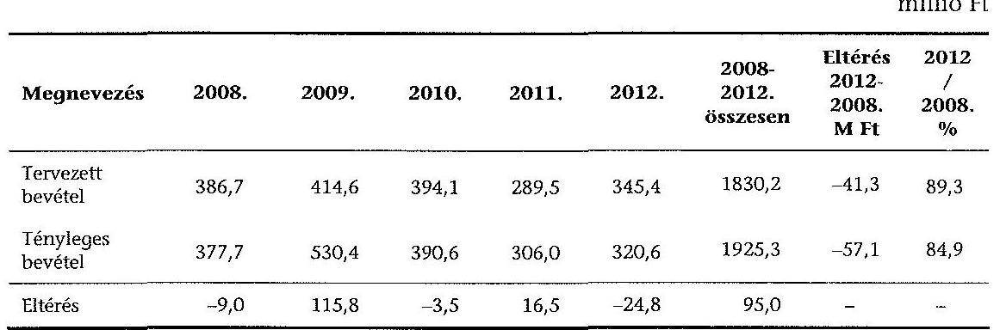

A 2009. évi tényleges bevételek növekedését - az EU Bíróság döntése alapján az állami támogatásból finanszírozott beszerzések korábban vissza nem igényelhető áfa összegéből (57,6 millió Ft) és annak kamataiból (18,8 millió Ft) származó, összesen 76,4 millió Ft eredményezte.

A Társaság nettó árbevétele alapvetően a jegybevételből keletkezett. Ennek összege a 2008. évi 35,5 millió Ft-ról a 2012. évre 30,6 millió Ft-ra csökkent, amelynek fő oka, hogy az ellenőrzött időszakban a fizető nézők száma 26181 főről 19178 főre, 7003 fővel, 26,7%-kal csökkent.

A Társaság az ellenőrzött időszakban a jegyárból biztosítható kedvezményeket szabályzatban nem rögzítette.

A Bárka Színház Jegykezelési szabályzata a jegyértékesítés menetét, valamint az értékesítők elszámoltatását és díjazását szabályozta, de nem tartalmazott rendelkezéseket az adható kedvezményekre vonatkozóan.

A Társaság a vállalkozási tevékenységének elkülönített nyilvántartását az ellenőrzött időszakban biztosította. Ennek nagysága az összes bevételhez viszonyítva annak 25%-át jelentette. Az ellenőrzött időszakban a vállalkozási tevékenység bevétele összesen 483,0 millió Ft volt.

A bevétel a büfé és egyéb helyiségek bérbeadásából, különféle rendezvények megtartásából, illetve hirdetési és reklámtevékenységből keletkezett.

Az egyéb bevételek elszámolása dokumentált módon történt, elkülönítve tartalmazta az állami, az önkormányzati, valamint a TAO támogatásokat.

Az ellenőrzött időszakban a pénzügyi műveletek bevétele abból származott, hogy a Társaság a szabad pénzeszközeit egy éven belüli lekötéssel a folyószámláját vezető banknál lekötötte. A Társaság kamatbevételekből a 2008.
 évben 0,3 millió Ft-ot, a 2009. évben 0,7 millió Ft-ot, a 2010. évben 0,8 millió Ft-ot és a 2012. évben 0,2 millió Ft-ot realizált.

Az ellenőrzött időszakban a rendkívüli bevételek 4,2-7,7 millió Ft között alakultak. A Társaság a 2008-2009. években a rendkívüli bevételek között számolta el a fejlesztésre kapott támogatásokat 4,8, és 4,7 millió Ft összegben. A 2010-2012. évekre vonatkozóan a beszámoló mellékleteként elkészített kiegészítő melléklet a rendkívüli bevételek tartalmára vonatkozóan információt nem adott.

A Társaság a 2012. december 31-ei mérlegében 24,8 millió Ft egyéb követelést mutatott ki. Ebből az ellenőrzés részére átadott tanúsítvány szerint 5,6 millió Ft lejárt követelés volt, melyből 3,9 millió Ft a 60 napot meghaladta.

A lejárt követelések állománya a 2008. évi záró állományhoz (0,9 millió Ft) viszonyítva az ellenőrzött időszak végére 4,7 millió Ft-tal, több mint ötszörösére növekedett, ezen belül a 60 napon túl lejárt vevő követelések állománya a 2008. évi 0,7 millió Ft-ról 3,2 millió Ft-tal emelkedett.

Az ellenőrzés megállapította, hogy a lejárt követelések jelentős összegben tartalmaztak állományban álló vagy időközben munkaviszonyukat megszüntető munkavállalókkal szembeni követeléseket. A Társaság ezeket a követeléseket nem peresítette, nem leltározta az év végén, és az anyagi felelősséget a munkavállalókkal szemben - a munkaviszony megszűnésére, a munkakör átadásátvétel folyamata szabályozásának hiányára való hivatkozással - nem érvényesítette.

A 2009. és 2010. évben teljes mértékben leírt, illetve az értékvesztéssel érintett vevőkövetelések, amelyek egyéb ráfordításként, illetve rendkívüli ráfordításként elszámolásra kerültek, a Társaságnak 4,6 millió Ft veszteséget okoztak. A Társaság eljárása ellentétes a Számv. tv. 81. § (4) bekezdés a) pontjában leírtakkal, mert az értékvesztés összegét az egyéb ráfordítások között elkülönítetten kell kimutatni.

A követelések minősítésének ellenőrzéséhez dokumentációk nem álltak rendelkezésre, ezért nem volt megállapítható, hogy a Társaság a követelései érvényesítésére vonatkozóan megfelelő gondossággal járt-e el, mielőtt azokat behajthatatlannak minősítette.

---

A 2009. évben 1,2 millió Ft behajthatatlan követelés leírása történt meg. Ebből 0,5 millió Ft a közönségszervezők jegyeladásaival és annak elszámolásával volt kapcsolatos.

A 2012. évben 0,6 millió Ft összegben írtak le vevői követelést, amely a munkavállalók, illetve a Társaság által társasági formában foglalkoztatott magánszemélyek telefonköltségével összefüggésben merült fel.

A 2012. évi vevői követelésekkel kapcsolatban 1,9 millió Ft értékvesztést számoltak el, ami 100%-os elszámolást és leírást jelentett. Ezen összegből 1,7 millió Ft egy Kft.-vel kapcsolatos bérleti díj elmaradását tartalmazta. A Kft. ellen kényszer végelszámolást rendelt el a Nemzeti Adó- és Vámhivatal a cégkivonat alapján, 2012. február 22-én.

A 0,2 millió Ft összegű követelés értékvesztés elszámolása egy munkavállaló költségeivel volt kapcsolatos. A követelés leírására azért került sor, mert a Társaság fizetésre történő felhívását a posta „címzett ismeretlen" jelzéssel visszaküldte. A munkavállaló a munkaviszony megszűnésekor nem adta le a Színház által biztosított „Flotta kedvezményes" SIM kártyát. A „Flotta kedvezmény" megszüntetését a munkaviszony megszűnésekor a Színháznak kellett volna kezdeményeznie, de erre nem került sor. (A „Flotta kedvezmény" a Színház nevére szól, amelyet a Társaság továbbszámlázott a munkavállalók felé.)

# 2.4. A gazdasági társaság eredményének alakulása 

Az üzleti terveket a Társaság minden évben elkészítette és továbbította az Önkormányzat részére.

Az üzleti tervek az ellenőrzött időszakban részletes bevételi és költségkimutatásokat tartalmaztak célszerinti és egyéb tevékenység bontásban. Az üzleti tervek a részletes programtervezésen (produkciók, események) alapultak.

A Társaság az üzleti terveiben az ellenőrzött évek alatt az üzemi, üzleti eredményét minden évben nyereséggel tervezte, ezzel szemben a Társaság eredménye minden évben - a 2009. évet kivéve - negatív volt. A tervezés során a 2010. és a 2012. évek között a ráfordításokat a bázis évi teljesítés alatt irányozták elő. A 2012. évben a realizált bevétel is 24,8 millió Ft-tal elmaradt a tervezettől.
millió Ft

| Megnevezés | $\mathbf{2 0 0 8}$. | $\mathbf{2 0 0 9}$. | $\mathbf{2 0 1 0}$. | $\mathbf{2 0 1 1}$. | $\mathbf{2 0 1 2}$. |
| :-- | :--: | :--: | :--: | :--: | :--: |
| Tervezett üzleti eredmény | 12,3 | 2,0 | 0,5 | 0 | 0,7 |
| Tényleges üzleti eredmény | $-26,7$ | 68,7 | $-75,9$ | $-68,9$ | $-40,6$ |
| Eltérés | $-39,0$ | 66,7 | $-76,4$ | $-68,9$ | $-41,3$ |

A Társaság üzemi (üzleti) eredménye a 2008. évben tervezett 12,3 millió Ft-tal szemben -26,7 millió Ft volt, amelyet a ráfordítások tervezett értéket meghaladó 34,5 millió Ft-os növekedése és a bevételek 9,0 millió Ft-tal való elmaradása eredményezett.

---

A 2009. évben 2,0 millió Ft-ra tervezett üzemi eredmény 68,7 millió Ft-ra teljesült. A mérleg szerinti eredmény 71,1 millió Ft volt. Az eredmény kedvező alakulását egyrészt a korábban vissza nem igényelhető áfa összege és az annak kamataiból származó bevételtöbblet, illetve az állami és önkormányzati támogatás korábbi éveket meghaladó mértéke eredményezte.

A 2010. évben a Társaság -75,9 millió Ft üzleti eredményt ért el a tervezett 0,5 millió Ft-tal szemben. A Társaság üzemi eredményének kedvezőtlen alakulását a ráfordítások 91,9 millió Ft-os túllépése okozta.

A 2011. és a 2012. években a bevételek és kiadások egyensúlyára törekedtek, amely az eredményben nem mutatkozott meg, mert a 2011. évben a tervezetthez képest 68,9 millió Ft-tal, a 2012. évben 41,3 millió Ft-tal maradt el az üzleti eredmény a tervezetthez viszonyítva. Az elmaradást minden évben a ráfordítások túllépése okozta.

A Társaság eredménykimutatásának főbb adatait a következő ábra tartalmazza millió Ft-ban:
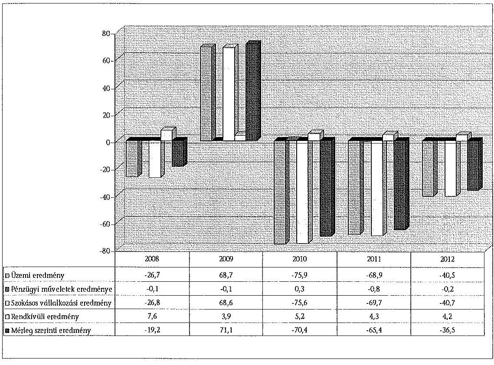

A ráfordítások teljesítése a 2008. és a 2010-2012. évek között meghaladta a tervezettet, melyre a rendelkezésre álló források nem biztosítottak fedezetet. A 2011-2012. évi költségcsökkentő intézkedések - amelyekről a Társaság dokumentumot bemutatni nem tudott - hatására az anyagjellegű ráfordítások ugyan csökkentek, de a személyi jellegű ráfordítások túlteljesítése miatt azok tervezett eredményt javító hatása teljes mértékben nem érvényesült.

A Társaság a 2009. évtől kezdődően a tao támogatás lehetőségével élve a vállalkozóktól évente átlagosan mintegy 19,4 millió Ft összegű, a négy év

---

alatt összesen 77,4 millió Ft támogatást kapott. (A Társaságnak a tao támogatásból a 2009. évben 8,4 millió Ft, a 2010. évben 24,8 millió Ft, a 2011. évben 22,6 millió Ft, a 2012. évben 21,6 millió Ft bevétele származott.)

A Bárka Színház az ellenőrzött időszakban összesen több mint 1468,9 millió Ft támogatást használt fel. A támogatások mintegy 51,6%-a (758,6 millió Ft) az állami költségvetésből, 30,5%-a (448,3 millió Ft) az Önkormányzattól, a fennmaradó 17,8% (262,0 millió Ft) egyéb támogatásokból, pályázati forrásokból származott. A kapott támogatásokkal az előírásoknak megfelelően a Társaság minden évben szabályszerűen elszámolt.

Az ellenőrzött időszakban a Társaság a Nemzeti Kulturális Alaptól, a Közigazgatási és Igazságügyi Minisztériumtól ${ }^{22}$, illetve egyéb támogatóktól, államháztartáson kívüli forrásokból, valamint magánszemélyektől kapott támogatást.

A Társaság a 2008-2012. évi Kiegészítő mellékletekben nem teljes körűen és nem az előírt részletezettségben mutatta be a kapott támogatások összegeit, azok felhasználását, továbbá a fel nem használt támogatások összegeit jogcímenként évenkénti bontásban, ezzel megsértette az Számv. tv. 93. § (3) bekezdését.

A 2008. évi Kiegészítő mellékletben a támogatások összege nem került bemutatásra, a 2009. évben csak a társasági adómentes arányszám kiszámítása során a tárgyévben kapott támogatások jogcím szerinti bemutatására került sor, a 2010. évben a közhasznúsági eredmény levezetésében a tervben kapott támogatások jogcím szerinti összegeinek, illetve azok felhasználásának bemutatása történt meg. A 2011. évben a kapott támogatások összege egyáltalán nem került bemutatásra. A 2012. évben csak a KIM-től kapott támogatást mutatta be a Társaság a Kiegészítő mellékletben.

# 2.5. A gazdasági társaság folyamatos üzemmenetének, működésének, likviditásának biztosítása 

Az Önkormányzat az üzleti tervek benyújtásához célszerűsége ellenére likviditási terv készítését nem írta elő, ezért azt a Társaság nem készített az ellenőrzött időszak egyetlen üzleti évére vonatkozóan sem.

A 2011. évtől kezdődően a Társaság kötelezettségei folyamatosan - 2011. december 31-én 36,2 millió Ft-tal, 2012. december 31-én 62,6 millió Ft-tal meghaladták a rendelkezésre álló pénzeszközök és a követelések együttes állományát.

A Társaság az ellenőrzés részére a finanszírozási gondok tulajdonos Önkormányzat részére történő jelzéséről írásos dokumentációt nem adott át.

[^0]
[^0]:    ${ }^{22}$ A Magyarország 2012. évi központi költségvetéséről szóló 2011. évi CLXXXVIII. törvény 1. számú melléklete alapján a Közigazgatási és Igazságügyi Minisztérium a Fejezeti általános tartalék megnevezésű, fejezeti kezelésű előirányzata terhére a 2012. június 29-én kelt támogatási szerződés alapján 70,0 millió Ft vissza nem térítendő támogatást nyújtott a Társaság részére.

---

A Társaság - veszteséges gazdálkodásának következtében - a saját tőkéje a 2012. december 31-ei beszámolójában 23,7 millió Ft volt, amely a 93,5 millió Ft-os jegyzett tőke 25,4%-a.

Az ügyvezető - a 2012. évi beszámolóval összefüggésben - nem tett eleget a Gt. 143. § (2) bekezdés a)-b) pontjaiban előírt - a taggyűlés összehívására vonatkozó - kötelezettségének.

A Gt. 143. § (2) bekezdés a)-b) pontjai szerint az ügyvezető haladéktalanul köteles a szükséges intézkedések megtétele céljából összehívni a taggyűlést, ha tudomására jut, hogy a társaság saját tőkéje veszteség folytán a törzstőke felére csökkent, vagy a társaságot fizetésképtelenség fenyegeti, vagy fizetéseit megszüntette, illetve, ha vagyona a tartozásait nem fedezi.

A gazdasági igazgatótól kapott tájékoztatás szerint a Társaság 2013 augusztusára fizetésképtelenné vált.

A Színház a likviditási gondjai következtében a fizetési kötelezettségeit határidőn belül nem tudja teljesíteni. A 2013. évben a Nemzeti Adó- és Vámhivatal felé az adó- és járulék-bevallási és fizetési kötelezettségének nem teljes körűen - csak az április és május hónapokra - tett eleget. A tulajdonost erről a problémáról folyamatosan, de csak szóban tájékoztatta.

Az Önkormányzat a 2010-2011. években két alkalommal, összesen 40,0 millió Ft működési tagi kölcsönt, a 2012. évben két alkalommal összesen 20,0 millió Ft tagi kölcsönt biztosított, amelyek visszafizetésére teljes körűen még nem került sor.

A könyvelést bérkönyvelő végzi, akinek a részére a könyvelési díjat kilenc hónapja nem fizették ki, ezért a szerződésben vállalt kötelezettségeit nem teljesítette teljes körűen.

A Társaság fejlesztési tervet nem készített, annak elmaradását az Önkormányzat nem kérte számon. A megvalósult beruházások sajáterős fejlesztések voltak, ezek a 2008. és a 2010. évek között valósultak meg. A fejlesztésekhez hazai és uniós támogatást nem vettek igénybe. A Társaság az idegen tulajdonú ingatlanon beruházásra 10,9 millió Ft-ot számolt el. Az ellenőrzött időszakban az eszközök után elszámolt értékcsökkenési leírás jelentősen meghaladta a beruházások és felújítások összegét. A tárgyi eszközök 2008. évi nettó értéke (156,9 millió Ft) a 2012. évre 101,4 millió Ft-ra csökkent. A nettó eszközérték bruttó eszközértékhez viszonyított aránya a 2008. évi 37,5%-ról a 2012. évre 25,0%-ra csökkent, ez a mutató az eszközök elavult állapotát jellemzi.

A vizsgált időszakban idegen források igénybevételéhez
 nem igényeltek fenntartói, tulajdonosi garanciát, kezességet.

---

# 3. Az Önkormányzat tulajdonosi jogainak és kötelezettségeinek érvényesítése 

### 3.1. A gazdasági társaságtól származó információk elemzése, hasznosítása

Az Önkormányzat a Bárka Színház rendszeres adatszolgáltatási kötelezettségével kapcsolatban külön szabályzatot nem készített. A Bárka Színház a 2008-2012. években eleget tett az Önkormányzat felé a besoroláshoz, illetve a minősítéséhez szükséges - a jogszabályokban előírt - adatszolgáltatási kötelezettségének. Az Önkormányzat a Bárka Színház adatszolgáltatása alapján az előírt kötelezettségeit az előadó-művészeti államigazgatási szerv felé az ellenőrzött időszakban minden évben, határidőn belül teljesítette.

Az előadó-művészeti államigazgatási szerv (a Kulturális Örökségvédelmi Hivatal) nyilvántartást vezet az Emtv.-ben meghatározott előadó-művészeti szervezetekről. A nyilvántartásba vételi és besorolási eljárás rendjét a 7/2009. (III. 4.) számú OKM rendelet, a beszámolók alaki és tartalmi követelményeit a 6/2010. (II. 4.) számú OKM rendelet határozta meg. A nyilvántartásba vételi kérelem részletes szabályait, illetve a nyilvántartásba vételhez szükséges adatok körét a 14/2012. (III. 6.) számú NEFMI rendelet tartalmazta.

A 14/2012. (III. 6.) számú NEFMI rendelet 16. § (3) bekezdése alapján a Bárka Színház adatot szolgáltatott az előadó-művészeti államigazgatási szerv részére az általános forgalmi adóval csökkentett tárgyévi jegy- és bérletbevételeiről. Ez alapján az előadó-művészeti államigazgatási szerv kiadta a Tao. tv. szerinti adókedvezményre jogosító támogatási igazolást, amely tartalmazta az adókedvezményre jogosító támogatás összegét.

Az Önkormányzat monitoring tevékenysége a Bárka Színház szakmai tevékenységét bemutató beszámolókkal/évadbeszámolóval, az üzleti terv kialakításával és teljesülésével összefüggő beszámoltatási feladatokra terjedt ki.

A 14/2012. (III. 6.) számú NEFMI rendelet 2012-től írta elő az évadbeszámoló készítési kötelezettséget, amely alapján a központi költségvetésből folyósított támogatás mértékét állapították meg. Az évadbeszámolónak része egy szöveges, illetve egy mutatószámokat tartalmazó évadértékelés.

A Társaság pénzügyi folyamatainak Önkormányzat által végzett monitoring tevékenysége az üzleti terv jóváhagyását és az éves beszámoló, valamint a közhasznúsági jelentés Képviselő-testület általi elfogadását, valamint a Társaság Felügyelő Bizottságának és a tulajdonosi jogokat gyakorló Bizottság beszámoltatását jelentette.

## Az Önkormányzat a monitoring tevékenysége alapján a Társaság gazdálkodásával kapcsolatban a szükséges intézkedéseket nem tette meg.

A tulajdonos a helyszíni ellenőrzés befejezéséig - 2013. szeptember 27-éig - nem rendezte a Társaság ellenőrzött időszakban keletkezett veszteségeit, nem intézkedett a likviditási gondok kezelésére.

---

Az Önkormányzat megrendelésére külső szakértők az ellenőrzött időszakban a Társaság által végzett szolgáltatásra vonatkozóan önálló elemzéseket, tanulmányokat nem készítettek.

Az Önkormányzat az Eisztv.-ben és az Info. tv.-ben előírt közzétételi kötelezettségének eleget tett. Az éves költségvetésre, a zárszámadásra vonatkozó rendeletek, az elemi költségvetések, közérdekű adatok és a társasági részesedésekre vonatkozó adatok az Önkormányzat honlapján elérhetőek.

# 3.2. Az önkormányzat képviselő-testületének intézkedései 

A 2008-2012. években az Önkormányzat a tulajdonosi joggyakorlás keretében az évenkénti beszámoló elfogadásán túl a Társaságot nem számoltatta be, nem ellenőrizte. Az üzleti tervek és az éves terv teljesítéséről szóló beszámolók alapján követelményeket nem fogalmazott meg.

Az Önkormányzat a Társaság finanszírozási nehézségeinek csökkentésére a 2010-2011. években két alkalommal, összesen 40,0 millió Ft működési tagi kölcsönt biztosított, a 2012. évben két alkalommal 10,0-10,0 millió Ft tagi kölcsönt nyújtott. A kölcsönök visszafizetésére teljes körűen a helyszíni ellenőrzés befejezéséig nem került sor.

A Képviselő testület a Társaság átmeneti likviditási problémáinak elkerülésére a 326/2010. (IX. 07.) számú határozatával 2010. december 15-i, illetve a 467/2011. (XI. 17.) számú határozatával 2011. december 31-i és 2012. január 31-i visszafizetési határidővel 20,0-20,0 millió Ft működési tagi kölcsön nyújtásáról döntött.

A 2012. évben a Képviselő-testület mint a Bárka Nonprofit Kft. egyszemélyes tulajdonosa a 81/2012. (III. 01.) számú határozatával a Bárka Nonprofit Kft. 2012. március havi fizetőképességének, további működésének biztosítására 10,0 millió Ft összegű, 2012. október 31-ei lejáratú, a 97/2012. (III. 12.) számú határozatával a 2012. április havi zavartalan működéshez további 10,0 millió Ft összegű, 2012. november 30-ai lejáratú tagi kölcsönt nyújtott.

Az Önkormányzat a 16/2012. (I. 19.) számú határozatában úgy döntött, hogy a Bárka Nonprofit Kft.-ben lévő üzletrészét ingyenesen felajánlja a Magyar Állam vagy a Nemzeti Közszolgálati Egyetem részére. A Képviselőtestület felhatalmazása alapján a polgármester a tárgyalásokat az üzletrész átadásáról megkezdte, a döntést 2012 nyarára várták. Az átadás-átvételre a jelen ellenőrzés ideje alatt, 2013. szeptember 27-ig nem került sor.

Az Önkormányzat szóbeli tájékoztatása szerint a megállapodás tervezete a Bárka Színház átadásához a Magyar Nemzeti Vagyonkezelő Zrt.-től a helyszíni ellenőrzés lezárását követően megérkezett, az egyeztetés a térítésmentes vagyonátadásról folyamatban van.

Az Önkormányzat a tulajdonostól elvárható gondossággal szabályozta a közfeladat-ellátó gazdasági társasággal kapcsolatos tulajdonosi joggyakorlás rendjét, megkövetelte közfeladat-ellátás folyamatos biztosítását.

---

Az Önkormányzat nem a jó gazdától elvárható gondossággal felügyelte a Társaság tevékenységét, mert a közszolgáltatási szerződésekben az Önkormányzatra vonatkozó előírásokat nem teljes körűen tartotta be, mivel a 2008-2009. és 2011. évekre a támogatási szerződések megkötéséről nem a Közszolgáltatási szerződés ${ }_{2-3}$-ban előírt határidőn belül döntött, illetve a 2012. évre nem kötött éves támogatási szerződést.

Az Önkormányzat az FB-be delegált tagjait az ellenőrzött időszakban elvégzett munkájukról, megállapításaikról nem számoltatta be.

Az Önkormányzat az ellenőrzött időszak minden évére rendelkezett ellenőrzési tervvel, amelyek jóváhagyása az Ötv. 92. § (6) bekezdésének megfelelően, határidőn belül megtörtént.

A polgármester az Ötv. 92. § (10) bekezdése előírásának megfelelően, a zárszámadási rendelettervezettel egyidejűleg a Képviselő-testület elé terjesztette a belső ellenőrzés éves összefoglaló jelentését.

Az Önkormányzat a 2008-2012. évek között a Társaságnál ellenőrzést - a 2011. évet kivéve - nem tervezett, de a tervezett ellenőrzésre a 2011. évben nem került sor.

A 2011. évi belső ellenőrzési terv tartalmazott egy teljesítményellenőrzést, amelyet külső szakértő igénybevételével kívántak végrehajtani a Bárka Színháznál, de az előirányzott ellenőrzés elmaradt.

Az Önkormányzat a 2011. évben külső szakértőt ${ }^{23}$ bízott meg a gazdasági társaságai és intézményei - ezen belül a Bárka Nonprofit Kft. - honlapjának felülvizsgálatával. A külső szakértő megállapította, hogy a honlap adattartalma nem felel meg az Info tv. - és az ellenőrzött időszakban az Eisztv., illetve a 18/2005. (XII. 27.) számú IHM rendelet - előírásainak, ezért a felülvizsgálatról készített jelentés alapján a polgármester a Társaság ügyvezetőjét a 2013. július 31-én kelt levelében - 2013. szeptember 2-i határidővel - intézkedésre, az adathiányok pótlására szólította fel. A helyszíni ellenőrzés lezárásáig az ügyvezető az Info. tv. előírásainak és a polgármester intézkedésre felszólító levelének nem tett eleget. (Az Önkormányzat által az ellenőrzés részére átadott, a Bárka Színház és az Önkormányzat 2013. október 18-ai levélváltása alapján a Társaság honlapjának feltöltése az előírt adattartalommal megkezdődött.)

A külső szakértő által végzett felülvizsgálat a Bárka Nonprofit Kft. honlapján a szervezeti, személyzeti, a tevékenységre, működésre, gazdálkodásra vonatkozó adattartalom hiányosságát a közérdekű adatok - a társaság tagjaira, az alapító okiratra és a társaság által alapított lapra vonatkozó adatok, valamint a társaság által kötött szerződések és az éves beszámolók - közzétételének elmaradásával összefüggésben állapította meg. A felülvizsgálat felhívta továbbá a figyelmet a közzétett adatoknak a változást követő aktualizálási és a közzétett adatok megőrzési, illetve archiválási kötelezettségére is.

A Társaság tevékenysége a 2008-2012. évek között - a 2009. évet kivéve - veszteséges volt. A Társaság 2009. évi eredményét, amelyet a Bizottság a 817/2010. (V. 19.) számú határozatával fogadott el, a Közhasznú tv. 14. § (1) bekezdésének megfelelően, a Bárka Nonprofit Kft. 2010. május 21-ei taggyűlésén hozott 5/2010. számú határozat alapján nem osztották fel, hanem a Társasági Szerződésben meghatározott közhasznú tevékenységre fordították.

A Társaság - veszteséges gazdálkodásának következtében - saját tőkéje a 2012. december 31-ei beszámolójában 23,7 millió Ft volt. Ez a 93,5 millió Ft-os jegyzett tőke 25,4%-a volt. A tulajdonos a Gt. 143. § szerinti veszteség rendezésére, illetve a saját tőke/jegyzett tőke előírt szintjének biztosítása érdekében intézkedést nem tett.

Budapest, 2014. 03. hó 12. nap

Melléklet: $\quad 7 \mathrm{db}$
Függelék: $\quad 2 \mathrm{db}$
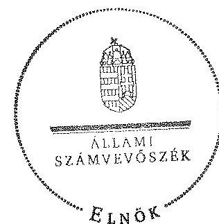

Domokos László
elnök

---

A Bárka Színház szakmai tevékenységének mutatói 2008. és 2012. évek között

|  Sorszám | Megnevezés | 2008. év |  | 2009. év |  | 2010. év |  | 2011. év |  | 2012. év |  | Változás %-a |   |
| --- | --- | --- | --- | --- | --- | --- | --- | --- | --- | --- | --- | --- | --- |
|   |  | Terv | Tény | Terv | Tény | Terv | Tény | Terv | Tény | Terv | Tény | 2012. év tény/ 2008. év tény |   |
|  1 | Színházlátogatások száma (fő) |  | 29996 |  | 26247 |  | 26912 |  | 23786 |  | 22206 | 74,0 |   |
|  2 | Fizetőnéző-szám (fő) |  | 26181 |  | 24437 |  | 26204 |  | 21896 |  | 19178 | 73,3 |   |
|  - | Ebből a bérlettel rendelkezők száma |  | n.a. |  | n.a. |  | 158 |  | 1101 |  | 2441 |  |   |
|  3 | Jegyárkedvezménnyel értékesített férőhelyek száma (fő) |  | 3815 |  | 1810 |  | 708 |  | 789 |  | 587 | 15,4 |   |
|  4 | Előadások száma (db) |  | 255 |  | 254 |  | 257 |  | 284 |  | 250 | 98,0 |   |
|  5 | Férőhelyek száma (db) |  | 340 |  | 340 |  | 340 |  | 340 |  | 340 | 100,0 |   |

n.a.: nincs adat

---

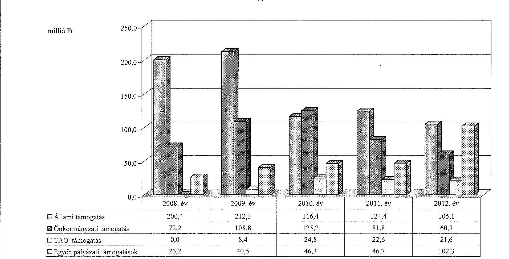

# A Bárka Színház támogatása a 2008. és a 2012. évek között

|  Állami támogatás | 2008. év | 2009. év | 2010. év | 2011. év | 2012. év  |
| --- | --- | --- | --- | --- | --- |
|  Önkormányzati támogatás | 72.2 | 108.8 | 125.2 | 81.8 | 60.3  |
|  TAO támogatás | 0.0 | 8.4 | 24.8 | 22.6 | 21.6  |
|  Egyéb pályázati támogatások | 26.2 |  |  |  |  |

 | 40.5 | 46.3 | 46.7 | 102.3  |

---

A Bárka Színház vagyonának főbb adatai 2008. január 1-je és 2012. december 31-e között

|  Mérlegsor megnevezése | 2008. jan. 1. (E Ft) | 2008. dec. 31. (E Ft) | 2009. dec. 31. (E Ft) | 2010. dec. 31. (E Ft) | 2011. dec. 31. (E Ft) | 2012. dec. 31. (E Ft) | Változás %-a 2012. dec. 31./ 2008. dec. 31.  |
| --- | --- | --- | --- | --- | --- | --- | --- |
|  Immateriális javak | 0 | 41 | 65 | 65 | 51 | 38 | 92,7  |
|  Tárgyi eszközök | 173332 | 156934 | 150015 | 150807 | 118821 | 101412 | 64,6  |
|  Ebből: Ingatlanok* | - | - | - | - | - | - | -  |
|  Gépek, berendezések* | - | - | - | - | - | - | -  |
|  Befektetett eszközök összesen | 173332 | 156975 | 150080 | 150872 | 118872 | 101450 | 64,6  |
|  Forgóeszközök összesen | 25343 | 21783 | 104002 | 38012 | 33324 | 28789 | 132,2  |
|  Aktív időbeli elhatárolások | 70 | 313 | 5339 | 2213 | 790 | 23 | 7,3  |
|  Eszközök összesen | 198745 | 179071 | 259421 | 191097 | 152986 | 130262 | 72,7  |
|  Saját tőke összesen | 144208 | 125010 | 196067 | 125610 | 60251 | 23721 | 19,0  |
|  Ebből:Jegyzett tőke | 93470 | 93470 | 93470 | 93470 | 93470 | 93470 | 100,0  |
|  Eredménytartalék | 46284 | 50738 | 31540 | 102597 | 32140 | -33219 | -65,5  |
|  Mérleg szerinti eredmény | 4454 | -19198 | 71057 | -70457 | -65359 | -36530 | 190,3  |
|  Tartalékok | 0 | 0 | 0 | 0 | 0 | 0 |   |
|  Céltartalék | 0 | 0 | 0 | 0 | 0 | 0 |   |
|  Kötelezettségek összesen | 13384 | 18208 | 24122 | 28136 | 69499 | 91372 | 501,8  |
|  Passzív időbeli elhatárolások | 41153 | 35853 | 39232 | 37351 | 23236 | 15169 | 42,3  |
|  Források összesen: | 198745 | 179071 | 259421 | 191097 | 152986 | 130262 | 72,7  |
|  |   |   |   |   |   |   |   |
|  Átvett eszközök összesen | n.a. | n.a. | n.a. | n.a. | n.a. | n.a. | n.a.  |
|  Ebből: immateriális javak | - | - | - | - | - | - |   |
|  ingatlanok | n.a. | n.a. | n.a. | n.a. | n.a. | n.a. | n.a.  |
|  gépek, berendezések | - | - | - | - | - | - |   |
|  Saját és átvett eszközök összesen | n.a. | n.a. | n.a. | n.a. | n.a. | n.a. | n.a.  |

Az egyszerűsített éves beszámoló nem tartalmazta

---

.

---

BUDAPEST FŐVÁROS VIII. KERÜLET JÓZSEFVÁROSI ÖNKORMÁNYZAT

DR. KOCHS MÁTÉ
P.O. GÁRMESTER

# Állami Számvevőszék 

Iktatószám: 28-102/2014.

Domokos László elnök úr részére

Budapest

## Tisztelt Elnök Úr!

„Az önkormányzatok többségi tulajdonában lévő gazdasági társaságok közfeladatellátásának ellenőrzéséről - Bárka Színház Nonprofit Kft" címmel készített számvevőszéki jelentéstervezetet áttekintettük. A jelentéstervezet szövegezésében a megállapítások egyértelműsége, a körülmények teljes körű ismertetése érdekében pontosító javaslatokat teszek, amelyeknek kérem szíves és objektív megfontolását az alábbiak szerint:

A jelentéstervezet 6. oldal második bekezdése alapján: „Az Önkormányzat a művészeti, közművelődési feladatok támogatásának, mint az Örc-ben és az Möte-ben meghatározott kötelező közfeladatának, az ellenőrzött időszakban eleget tett. Az Önkormányzat a közfeladatellátását a Bárka Színház mint gazdasági társaság támogatásával biztosította. A Képviselőtestület a tulajdonosi joggyakorlás rendjét az ellenőrzött időszak alatt a jogszabályoknak megfelelően rendeleteiben és szabályzataiban rögzítette. A tulajdonosi joggyakorlás keretében a Képviselő-testület - és átruházott hatáskörben a Bizottság - határozatokat hozott."

Az Önkormányzat közművelődési feladatok ellátását nem kizárólag a BÁRKA (Józsefvárosi Színházi) Nonprofit Kft. (továbbiakban: a Társaság) fenntartása és támogatása útján látja el, hanem más gazdasági társasággal is kötött közszolgáltatási szerződést. Erre tekintettel az idézett bekezdésben szereplő megállapítás első mondatából javasolom törölni a közművelődési szót, továbbá az a jelentéstervezet bevezetésében szereplő első mondattal így lesz összhangban.

A jelentéstervezet 6. és 17. oldalának második bekezdései alapján:
„Az Önkormányzat a Társaság részére a Társaságú Szerződés, „-ben és a közszolgáltatási szerződésekben foglaltaknak megfelelően, az előadó-művészeti közfeladat-ellátásához szükséges vagyont (alapító tőkét és a Társaság székhelyétül szolgáló ingatlant) ingyenesen használatba adta. A Színház részére ingyenes használatba átadott ingatlan a Magyar Állam tulajdonát, a nemzeti vagyon részét képezte. Az Önkormányzat vagyonkimutatásában az állami vagyonnal

[^0]
[^0]:    1082 Budapest, Baross 14.63-67 - Telefon: 0614592102 - E-mail: polgarmester@ozsefvaros.hu - www.ozsefvaros.hu

---

BUDAPEST FŐVÁROS VIII. KERÜLET JÓZSEFVÁROSI ÖNKORMÁNYZAT
DR. KOCSIS MÁTÉ
POLGÁRMESTER
való gazdálkodásról szóló 254/2007. (X. 4.) Korm. rendelet előírása ellenére az ingatlan értékben nem szerepelt...
„A Társaság részére a közfeladat-ellátás érdekében térítésmentesen használatba adott és a Magyar Állam tulajdonát képező ingatlant - az állami vagyonnal való gazdálkodásról szóló 254/2007. (X. 4.) számú Korm. rendelet 13. § (3) be-kezdésének előírása ellenére - az Önkormányzat a könyveiben értékben nem tartotta nyilván. Az ingatlanon végzett saját felújításokat és beruházásokat, mint idegen tulajdonon végzett beruházást aktiválta. Ez az elszámolás megfelel a jogszabályi előírásoknak."

Az idézett megállapításhoz kapcsolódóan az alábbi észrevételt teszem: az ingatlant átadó Magyar Állam részéről nem rendelkeztünk az ingatlan értékére vonatkozó írásos dokumentummal, amelyből az ingatlan értéke megállapítható lett volna, illetve amely alapján az Önkormányzat könyveiben értékkel nyilvántarthattuk volna. Másrészt nem tartalmazza a jelentéstervezet kellő mélységben az Orczy-kert sajátos jogi helyzetéből adódó helyzetet, amely nem a gazdasági társaság tulajdonosának felelősségi körébe tartozik, hanem évtizedes örökség. A vizsgált időszakban az adott ingatlan kezelői, használati viszonyai rendezetlenek és jórészt dokumentálatlanok voltak, amelyek rendezésére a vizsgált időszakban dokumentumok hiányában nem kerülhetett sor. Az ingatlannal kapcsolatos tulajdoni és használati viszony kizárólag a Magyar Állam eljárásával rendeződhetett a 2013. évben.

A jelentéstervezet 6. oldal ötödik bekezdésében és a 17. oldal harmadik bekezdése alapján:
„A közszolgáltatási szerződésekben foglaltak a közfeladat-ellátás feltételeit biztosították. Az Önkormányzat a közszolgáltatási szerződésekben a használatra átadott vagyon védelmével kapcsolatban leltározási kötelezettséget nem írt elő."
„A hivatali leltározási szabályzat ${ }_{1,2}$ az Önkormányzat többségi tulajdonában álló gazdasági társaságok használatában lévő vagyonelemek leltározási kötelezettségére nem terjedt ki. A Közszolgáltatási szerződés,--,ban leltározási kötelezettséget nem írtak elő, az ellenőrzött időszakban a Társaság leltározási tevékenységét az Önkormányzat nem ellenőrizte."

Az idézett megállapításhoz kapcsolódóan az alábbi észrevételt teszem: a Társaság részére önkormányzati tulajdonú ingóság eszköz nem került átadásra, a Társaság csak az ingatlant kapta meg használatra, erre tekintettel a közszolgáltatási szerződésben nem volt a használatra átadott vagyon védelmével kapcsolatos leltározási kötelezettség előírva, így leltározásra sem került sor az Önkormányzat részéről.

Az idézett 17. oldal harmadik bekezdés első mondatát az alábbiak szerint javasolom módosítani: A hivatali leltározási szabályzat az Önkormányzat többségi tulajdonában álló gazdasági társaságok használatában lévő vagyonelemek leltározási kötelezettségét nem írja elő, azonban utal a használatba adott eszközök leltározására, azáltal, hogy a használatra

1082 Budapest, Baross u. 63-67, Telefon: 0614592100 - E-mail: polgarnester@ozsefvaros.hu - www.ozsefvaros.hu 2
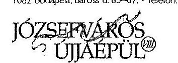

IDŐSBARÁT
ÖNKORMÁNYZAT

---

BUDAPEST FŐVÁROS VIII. KERÜLET JÓZSEFVÁROSI ÖNKORMÁNYZAT

DR. KOCSIS MÁTÉ
POLGÁRMESTERSZ

átadott eszközök esetében külön leltározási körzeteket alkotnak a használó szervezetek, amely a leltározási ütemtervben meg is jelenik.

A jelentéstervezet 18. oldal első bekezdése alapján:

„Az önkormányzati tulajdonú gazdasági társaságokkal kapcsolatos, a tulajdonosi jogkörből eredő feladatok koordinálása a Hivatal SZMSZ1-4 szerint a Gazdálkodási Ügyosztályhoz, ezen belül a Vagyongazdálkodási Irodához, a Hivatal SZMSZ316 alapján a Vagyongazdálkodási és Üzemeltetési Ügyosztály Gazdálkodási Iroda vezetőjének feladatkörébe tartozott. A Gazdálkodási Irodavezető 2012. szeptember 14-én kelt munkaköri leírása a feladatot nem tartalmazza.

A munkaköri leírásokat a 2013. évben Hivatal SZMSZ3 hatályba lépését követően felülvizsgálták. Az irodavezető 2013. október 16-án kelt munkaszerződése...... feladatát már rögzíti.”

Az idézett megállapítás pontosítását javasolom az alábbiak szerint a vizsgálatra átadott dokumentumok alapján:

Az önkormányzati tulajdonú gazdasági társaságokkal kapcsolatos, a tulajdonosi jogkörből eredő feladatok koordinálása a Hivatal SZMSZ1-4 szerint a Gazdálkodási Ügyosztályhoz, ezen belül a Vagyongazdálkodási Irodához, illetve csak Gazdálkodási Ügyosztályhoz tartozott. Az Ügyosztály ügyintézőjének munkaköri leírása a feladatot tartalmazza. A Hivatal SZMSZ5 alapján a feladat a Vagyongazdálkodási és Üzemeltetési Ügyosztály Gazdálkodási Iroda vezetőjének feladatkörébe került.

A munkaköri leírásokat a 2013. évben Hivatal SZMSZ5 hatályba lépését követően felülvizsgálták. Az irodavezető 2013. október 16-án kelt munkaköri leírása rögzíti a feladatot.

A jelentéstervezet 31. oldal 2.4. pont első bekezdése alapján:

„Az üzleti terveket a Társaság minden évben elkészítette és továbbította az Önkormányzat részére, azokat az Önkormányzat azonban nem ellenőrizte.”

Az idézett megállapítást az alábbiak szerint kérem pontosítani: Az üzleti terveket a Társaság minden évben elkészítette és továbbította az Önkormányzat részére, azokat az Önkormányzat a döntéshozó részére történő előterjesztéskor ellenőrizte szakmailag, pénzügyileg és jogilag.

A jelentéstervezet 33. oldal 2.5. pont első bekezdése alapján: „Az Önkormányzat az üzleti tervek benyújtásához likviditási terv készítését nem írta elő, ezért azt a Társaság nem készített az ellenőrzött időszak egyetlen üzleti évére vonatkozóan sem.”

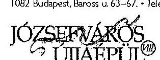

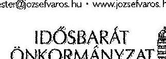

---

10886/2014

# BUDAPEST FŐVÁROS VIII. KERÜLET JÓZSEFVÁROSI ÖNKORMÁNYZAT 

DR. KOCSIS MÁTÉ
POLGÁRMESTER

Javasolom, hogy a gazdasági társaságok esetében a likviditási terv készítését kötelezően előíró konkrét jogszabályi szakaszt idézze be a jelentés. Álláspontom szerint azt is egyértelműbbé kellene tenni továbbá, hogy a likviditási terv elkészítésére vonatkozó kötelezettség elsősorban a gazdasági társaságot terhelő számviteli kötelezettség, a gazdasági társaságokról szóló 2006. évi IV. törvényből (Gt.) eredő kötelezettség vagy pedig az Önkormányzat tulajdonosi joggyakorlásából eredő kötelezettség. Az ügyben nem egyértelmű, hogy célszerűségi, hatékonysági vagy törvényességi jellegű-e a jelentéstervezet megállapítása, illetve a kérdés megoldása kinek a felelősségi körébe tartozik.

Tisztelettel utalni szeretnék arra, hogy álláspontunk szerint a jelentéstervezet nem tesz következetesen különbséget a Magyarország Alaptörvényének 38. cikk (5) bekezdése alapján önállóan, felelősen gazdálkodó gazdasági társaság tulajdonosa, és a tulajdonos által pontosan a gondos gazdálkodás megvalósítása érdekében megbízott ügyvezetés, felügyelőbizottság feladat- és felelősségi köre között.

Hangsúlyozni szeretném, hogy az Önkormányzat a jelentéstervezetben foglalt felvetések teljes körű megoldására törekszik annak érdekében, hogy a Társaság Magyar Állam részére történő
 átadása a döntéseknek megfelelően jogszerűen és fennakadások nélkül megtörténhessen. Ennek érdekében intézkedések megtételére fog sor kerülni, így a Társaság Szervezeti és Működési Szabályzatának jóváhagyása, a felügyelő bizottsági tagok beszámoltatása a 2013. évet érintő beszámoló elfogadásáig, a Társaság 2013. évi mérlegbeszámolójának, illetve a 2014. évi üzleti tervének elfogadása.

Az Önkormányzatra vonatkozó megállapításokat figyelembe veszem az önkormányzati tulajdonban levő gazdasági társaságokra irányuló monitoring tevékenység továbbfejlesztése során.

A lezárt jelentést a Képviselő-testület elé terjesztem, a döntésről írásban tájékoztatást adok.
Egyidejűleg megköszönöm az Állami Számvevőszéknek a vizsgálat során tapasztalt segítő együttműködését és szakmai útmutatásait.

Budapest, 2014. február 27.
Tisztelettel:
Dr. Kocsis Máté
polgármester
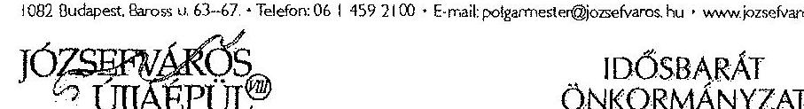

---

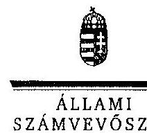

EL 100 K

Ikt.szám: V-0194-173/2014.

Dr. Kocsis Máté úr
polgármester
Budapest Főváros VIII. kerület Józsefvárosi Önkormányzat

Budapest

Tisztelt Polgármester Úr!

A „Jelentéstervezet az önkormányzatok többségi tulajdonában lévő gazdasági társaságok közfeladat-ellátásának ellenőrzéséről – Bárka Színház Nonprofit Kft.” című jelentéstervezetre tett észrevételeit köszönettel megkaptam.

Az Állami Számvevőszék észrevételekre vonatkozó álláspontjáról a felügyeleti vezető által készített részletes tájékoztatást csatoltan megküldöm.

Tájékoztatom Polgármester urat, hogy a számvevőszéki jelentés szövegezése az elfogadott észrevételei figyelembevételével készül.

Budapest, 2014. 03. hó 12. nap

Tisztelettel:

Melléklet: Tájékoztatás az elfogadott és el nem fogadott észrevételekről

1052 BUDAPEST, AFRIKAI CSARNOK 38. 005 STCA 50. 1304 Budapest 4. Pl. 54 telefon: 484 8101 fax: 484 8201

---

# Tájékoztatás   az elfogadott és el nem fogadott észrevételekról 

A „Jelentéstervezet az önkormányzatok többségi tulajdonában lévő gazdasági társaságok közfeladat-ellátásának ellenőrzéséről - Bárka Színház Nonprofit Kft." című jelentéstervezetre 2014. február 28-án érkezett észrevételeit áttekintettük, azok kezelésével kapcsolatban a következő tájékoztatást adom.

## A jelentéstervezet 6. oldal 1. bekezdése

A jelentéstervezet 6. és 13. oldal 1. bekezdésének első mondatát az alábbiak szerint pontosítjuk:
„Az Önkormányzat a művészeti feladatok támogatásának, mint az Ötv.-ben és az Műtv.-ben meghatározott közfeladatának, az ellenőrzött időszakban eleget tett."

## A jelentéstervezet 6. és 17. oldal 2. bekezdése

A térítésmentesen használatba adott ingatlannal kapcsolatosan az észrevételben leírtak nem vitatják a jelentéstervezet azon megállapítását, hogy az ingatlan értékének nyilvántartása elmaradt, ezért a kapcsolódó bekezdés módosítása nem indokolt. Az ellenőrzés meghatározott időtartamra terjedt ki, meghatározott szempontrendszer szerint, nem volt feladata az önkormányzat jelzett ingatlanügyeinek feltárása.

## A jelentéstervezet 6. oldal 5. bekezdése és 17. oldal 3. bekezdése

A jelentéstervezet hivatkozott bekezdéseinek módosítása nem indokolt.
Az észrevételükben megfogalmazottak megerősítik a jelentéstervezetben szereplő közszolgáltatási szerződésekre, illetve a hivatali leltározási szabályzatokra vonatkozó leltározási kötelezettségre tett megállapításainkat. Az ezzel kapcsolatos tájékoztatásukat köszönjük.

## A jelentéstervezet 18. oldal 1. bekezdése

A hivatkozott bekezdésben szereplő megállapítások helytállóak, az észrevételben leírtak sem vitatják a Gazdálkodási Irodavezető munkaköri leírásával kapcsolatban megfogalmazottakat, a bekezdést az Ügyosztály ügyintézőjének munkaköri leírásával pontosítjuk:
„Az önkormányzati tulajdonú gazdasági társaságokkal kapcsolatos, a tulajdonosi jogkörből eredő feladatok koordinálása a Hivatal SZMSZ ${ }_{1,4}$ szerint a Gazdálkodási Ügyosztályhoz, ezen belül a Vagyongazdálkodási Irodához, a Hivatal SZMSZ ${ }_{3}$ alapján a

---

Vagyongazdálkodási és Üzemeltetési Ügyosztály Gazdálkodási Iroda vezetőjének feladatkörébe tartozott. A Gazdálkodási Irodavezető 2012. szeptember 14-én kelt munkaköri leírása a feladatot nem tartalmazta, az Ügyosztály ügyintézőjének munkaköri leírásában szerepelt.

A jelentéstervezet 18. oldalának 2. részbekezdésében a munkaszerződés szót munkaköri leírásra pontosítjuk.

# A jelentéstervezet 31. oldal 2.4. pont 1. bekezdése 

A hivatkozott bekezdésében szereplő megállapítást az egyértelműség érdekében az alábbiak szerint pontosítjuk:
„Az üzleti terveket a Társaság minden évben elkészítette és továbbította az Önkormányzat részére."

## A jelentéstervezet 33. oldal 2.5. pont 1. bekezdése

Az idézett bekezdés tényszerű megállapításokat tartalmaz, az egyértelműség érdekében azonban az alábbiak szerint pontosítjuk:
„Az Önkormányzat az üzleti tervek benyújtásához célszerűsége ellenére likviditási terv készítését nem írta elő, ezért azt a Társaság nem készített az ellenőrzött időszak egyetlen üzleti évére vonatkozóan sem."

Tájékoztatom Polgármester urat, hogy a számvevőszéki jelentés mellékleteként szerepeltetjük a jelentéstervezethez tett észrevételeit, valamint az azokra adott válaszunkat.

Budapest, 2014. 08. hó N. nap

Makkai Mária
felügyeleti vezető

---

.

---

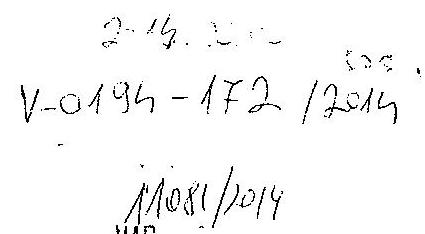

# A Bárka Józsefvárosi Színházi- és Kulturális Nonprofit Kft. észrevételei 

Az Állami Számvevőszék Jelentéstervezetéhez az önkormányzatok többségi tulajdonában lévő gazdasági társaságok közfeladat-ellátásának ellenőrzéséről
2008-2012

---

A 4. oldal közepén lévő bekezdéshez és az 1. számú melléklethez: a szakmai munka bemutatásához elkészítettünk egy módosított táblázatot, mivel a 15. számú tanúsítvány táblázata - ami a programba felkerülő előadások helyes adatait tartalmazza - a jegyértékesítő programból lett összeállítva és nem számol az elmaradt előadások miatti szükséges korrekciókkal.

| megnevezés | 2008. év |  |  | 2009. év |  |  | 2010. év |  |  |
| :--: | :--: | :--: | :--: | :--: | :--: | :--: | :--: | :--: | :--: |
|  | terv | tény elmaradt ea. nélkül | tény elmaradt ea.-val | terv | tény elmaradt ea. nélkül | tény elmaradt ea.-val | terv | tény elmaradt ea. nélkül | tény elmaradt ea.-val |
| színválogatások száma (tö) | 20738 | 29940 | 29996 | 26419 | 26219 | 26247 | 29358 | 26889 | 26911 |
| fizetőnéző-szám (tö) |  | 26131 | 26181 |  | 24413 | 24437 |  | 26183 | 26204 |
| előböl bérlettel rendelkezők száma |  | n.a | n.a |  | n.a | n.a |  | n.a | n.a |
| jegyárkedvezménnyel értékesített férőhelyek száma (tö) |  |  |  |  |  |  |  |  |  |
|  |  | 3809 | 3815 |  | 1806 | 1810 |  | 706 | 707 |
| előadások száma (db) |  | 244 | 255 |  | 237 | 254 |  | 252 | 257 |
| férőhelyek száma (db) |  |  |  |  |  |  |  |  |  |

| megnevezés | 2011. év |  |  | 2012. év |  |  | 2013. év |  |  |
| :--: | :--: | :--: | :--: | :--: | :--: | :--: | :--: | :--: | :--: |
|  | terv | tény elmaradt ea. nélkül | tény elmaradt ea.-val | terv | tény elmaradt ea. nélkül | tény elmaradt ea.-val | terv | tény elmaradt ea. nélkül | tény elmaradt ea.-val |
| színválogatások száma (tö) | 33535 | 23760 | 23786 | 29224 | 22206 | 22306 | 26960 | 22223 | 22274 |
| fizetőnéző-szám (tö) |  | 22972 | 21896 |  | 21619 | 19178 |  | 21623 | 21674 |
| előböl bérlettel rendelkezők száma |  | n.a | n.a |  | n.a | n.a |  | n.a | n.a |
| jegyárkedvezménnyel értékesített férőhelyek száma (tö) |  |  |  |  |  |  |  |  |  |
|  |  | 788 | 789 |  | 587 | 587 |  | 600 | 600 |
| előadások száma (db) |  | 270 | 286 |  | 247 | 250 |  | 222 | 222 |
| férőhelyek száma (db) |  |  |  |  |  |  |  |  |  |

---

6. oldal 2. bekezdéséhez, illetve 17. oldal 2. bekezdéséhez: A Bárka Nonprofit Kht. illetve később a Bárka Nonprofit Kft. azért nem tüntette fel a nullás számlaosztályban a használatába kapott ingatlant, mert a tulajdoni viszonyok rendezetlenek voltak és az ingatlan nem került felértékelésre.
7. oldal utolsó bekezdéséhez: A vizsgálat során nem tudtuk bemutatni a 2007-ben elkészített Számlarendet, de az elkészültéről a lemondott könyvvizsgálótól értesültünk és így utólag megtaláltuk.
8. oldal 3. bekezdéséhez: A Társaságnak 2008. március 1-ig semmilyen tárgyi eszköz nyilvántartása nem volt. A 2012. évre vonatkozó leltározási dokumentumokon dátum és sorszám helyett csak a „mikori állapot szerinti" 2012. 12. 31. szerepelt és a leltárívek sorszámozása 1/49-től 49/49-ig egyedi azonosíthatóan megtörtént.
9. oldal 4. bekezdéséhez, 24. oldal alja és 25. oldalhoz: Nem felel meg a valóságnak, hogy 2012. évben a Selejtezési jegyzőkönyvben rögzített adatok nem feleltek meg a Számv.tv.-ben foglaltaknak, mert minden releváns adatot tartalmaztak, úgy mint az eszköz beszerzéskori értéke, elszámolt amortizáció és a selejtezéskori nettó értéke. Átküldve az ÁSZ3 és ÁSZ5 mappákban. A leltár ívet a szóban felkért leltár vezető és leltár ellenőr minden íven ilyen minőségben írta alá. A selejtezési jegyzőkönyvhöz csatolt bizonylatok csak a szállító felé történő egyedi azonosíthatóságot szolgálta. Az eszközök átvételét a szállító cég képviselőjének aláírása bizonyítja.
10. oldal 1. és a 29. oldal 4. bekezdéséhez: A jegybevételek alakulásáról pontosabb képet ad az alábbi táblázat, mert nem csak két időpontot, hanem a teljes ellenőrzött időszakot öleli fel.

| év | előadások száma | eladható jegyek száma (db) | fizető néző (db) | nem fizető néző (db) | összes néző (db) | időigaztattság fizető néző alapján % | időigaztattság nem fizető néző alapján % | bevétel bruttó |
| :--: | :--: | :--: | :--: | :--: | :--: | :--: | :--: | :--: |
| 2008. | 244 | 30738 | 26131 | 3809 | 29940 | 85,01% | 97,40% | 425668001 |
| 2009. | 237 | 36419 | 24413 | 1806 | 26219 | 67,03% | 71,99% | 415707901 |
| 2010. | 252 | 39358 | 26183 | 706 | 26889 | 66,53% | 68,22% | 442627011 |
| 2011. | 270 | 33535 | 22972 | 788 | 23760 | 68,50% | 70,85% | 376489001 |
| 2012. | 247 | 29224 | 21619 | 587 | 22206 | 73,98% | 75,99% | 389395911 |
| 2013. | 222 | 26960 | 21623 | 600 | 22223 | 80,20% | 82,43% | 381110661 |
|  |  | 26960 | 21979 | 244 | 22223 | 81,52% | 82,43% | 390010661 |

2013 évi különbség: megjelenik a Nemzeti Közszolgálati Egyetemnek tartott zártkörű előadás
9. oldal 4.-5. bekezdéséhez: Nem a teljes ellenőrzött időszakra vonatkozóan felel meg a valóságnak az kijelentés, hogy az ellenőrzött időszakban teljes mértékben leírt illetve az értékvesztéssel érintett vevőköveteléseket egyéb illetve rendkívüli ráfordításként számolták el, amely ellentétes a Számv.tv.-ben leírtakkal. A 29. oldal 2. bekezdése helyesen tartalmazza a megállapítást.
A követelések minősítése 2012. évben megtörtént. Erről a 2012. évi beszámolóról szóló, az ellenőrzésnek elektronikusan átadott mappában található kimutatás.

---

9. oldal 6. bekezdéséhez, valamint 33. oldal 2. bekezdéséhez: 2012. évben a kiegészítő melléklet az alábbi táblázatot tartalmazza:

Végleges jelleggel kapott támogatások

| - Támogatás (1000HUF) |
 ... | Kapott Összeg | Felhasználás korábbi |  | Rendelkezésre álló összeg |
| :--: | :--: | :--: | :--: | :--: |
| Önkormányzati | 60300 | 0 | 60300 | 0 |
| Központi (állami, NKA, KIM, EU belvárosi projekt.) | 183788 | 0 | 183788 | 0 |
| Nemzetközi | 0 | 0 | 0 | 0 |
| Más gazdálkodótól kapott (TAO, egyéb) | 23600 | 0 | 23600 | 0 |
| Összesen: | 267688 | 0 | 267688 | 0 |

21. oldal 2. pontja 1. bekezdéséhez: Nem pontos meghatározás, hogy a Társaság vesztesége - az elmaradt önkormányzati támogatás miatt is - évről évre növekedett. Helyesen a kumulált vesztesége növekedett, hiszen a vesztesége 2010-ben -70,4, 2011-ben -65,4; 2012-ben -36,5 millió forint volt, tehát évről évre csökkent.
22. oldal 5. bekezdéséhez: a Társaság 2007-ben elkészítette a Számirendet, a Számviteli politikát, Selejtezési Szabályzatot, külön Leltározási Szabályzatot.
2009-ben Számviteli politikát, Bizonylati rendet, Házipénztár kezelési szabályzatot és egyben Leltározási szabályzatot és Selejtezési szabályzatot.
2012-ben A cafeteria rendszer juttatási szabályzatot, Pénz- és érték kezelési szabályzatot, valamint a Bárka Színház jegyeinek értékeléséről készített szabályzatot valamint Munkahelyi kockázatértékelést.
A szabályzatok aktualizálását 2011-ben és 2012-ben a könyvelő, a könyvvizsgáló és a Társaság gazdasági vezetője nem bonyolította, az a tény, hogy a Bárka Színház tulajdonosváltása 2011 év végétől folyamatosan napirenden volt, de nem lehetett tudni pontosan, hogy milyen keretek fogják meghatározni jövőbeni működését!
23. oldal (selejtezés): A 2012. évi selejtezési jegyzőkönyvek tartalmaznak dátumot, tárgyi eszköz megnevezését, beszerzési értéket, elszámolt amortizációt, selejtezéskori nettó értéket, eszközért felelős aláírását, a selejtezést végző aláírását valamint 2 tanú aláírását. A selejtezés befejezése után 2011-ben és 2012-ben egyaránt rendelkezünk bizonylattal az elszállítást illetően. Ezeket az ellenőrzésnek bemutattuk, elektronikusan átküldtük. (ÁSZS mappa)
24. oldal 2. bekezdéséhez: csak részben volt helyes a tanúsítványban tett válasz arra, hogy miért történt a szerződésben rögzített 350,0 ezer Ft+áfa helyett 400,0 ezer Ft+áfa kifizetés.
Megállapítottuk, hogy erre az időszakra járó 1.000,0 ezer Ft+áfa szerződött összeg összességében helyesen került kifizetésre, csak hibás részletekben. Azt is megállapítottuk, hogy minden esetben készült teljesítés igazolás is.

---

27. oldal lapalján: A 2008. évi - valójában csak bérköltséget jelentő 65,4 millió Ft-ot összehasonlítani a 2012. évre vonatkozó adattal. (pl. a 2008. évi üzleti terv bruttó 198800000 Ft személyi jellegű állandó kifizetésekkel és bruttó 41420000 Ft személyi jellegű egyéb kifizetésekkel számol)
Bárka Nonprofit Kft. átlagos állományi létszáma és átlagkeresete 2008-2012

| Megnevezés | 2008 | 2009 | 2010 | 2011 | 2012 |
| :-- | :--: | :--: | :--: | :--: | :--: |
| átlagos állományi létszám (fő) | 27,61 | 47,00 | 50,39 | 44,81 | 51,90 |
| havi átlagkereset (Ft) | 124415 | 147967 | 192768 | 221555 | 204975 |

27. oldal 4. bekezdéséhez: 12. számú nyilatkozat:

A Bárka Nonprofit Kft. szerződést kötött 2012. július 2-án az Ördögkatlan Fesztivál Egyesülettel a 2012-es, 5. Ördögkatlan Fesztivál lebonyolításában való részvételre vonatkozóan. Az előzetes tárgyalások során felmerült a műszaki személyzet illetve a színészek szállításának szükségessége. A Fesztiválnak helyet adó önkormányzatok közül Nagyharsány biztosított egy 19+1 fős buszt a szállítások lebonyolítására. Bérleti díjat nem, csak üzemanyag térítést kért cserébe. Kádár Attila, a Bárka Színház műszaki igazgatója saját költségén tankolta meg a buszt és ennek megtérítését kérte. Fedezetként a szerződés alátámasztásaként kidolgozott, Excel táblában szereplő 90.000,- Ft + ÁFA összeg szolgált. Döntést a konkrét helyzet kialakulásakor kellett hozni, nyilván nem elvárható, hogy egy munkavállaló saját jövedelmét használja erre a célra. A felmerülő költségek takarékos kiigazdálkodása közös feladat volt az Egyesülettel.
28. oldal táblázat a rendelkezésünkre álló üzleti tervek szerint az alábbi. Nem tartjuk jó módszernek, ha a tervezett bevételeket csökkentjük az Áfa visszatérüléssel, mert módszertanában ez nem következetes eljárás. Az eredeti adatokkal a táblázat az alábbiak szerint alakul:

| Megnevezés | 2008 | 2009 | 2010 | 2011 | 2012 | 2008-   2012   összesen | Eltérés   2012-   2008 | 2012/2008   % |
| :--: | :--: | :--: | :--: | :--: | :--: | :--: | :--: | :--: |
| Tervezett bevétel | 419,2 | 459,7 | 415,4 | 352,7 | 345,4 | 1992,4 | -73,8 | 82,40 |
| tényleges bevétel | 377,7 | 530,4 | 390,6 | 306 | 320,6 | 1925,3 | -57,1 | 84,88 |
| Eltérés | -41,5 | 70,7 | -24,8 | -46,7 | -24,8 | -67,1 |  |  |
| A ráfordítások táblázat Eltérés sora |  |  |  |  |  |  |  |  |
| Eltérés | 34,5 | 45,3 | 91,9 | 18,7 | 12,4 | 202,8 |  |  |

30-31. oldal: lejárt követelések leírásával kapcsolatban fontos megemlíteni, hogy keletkezésük 2009-2010 és 2011 évekre datálódik. A számviteli nyilvántartásból történő kivezetés nem jelenti a követelésről való lemondást. A Bárka Színház jogi képviselője szerződésben vállalta a követelések behajtásának intézését.
A 2012. évi Beszámolóhoz tartozó dokumentumok között szerepelnek a számviteli értelemben vett behajthatatlan követelések egyedi azonosítói és a minősítés oka.
A 31. oldalon szereplő vevői követeléssel kapcsolatban meg kell említeni, hogy 0,25 millió Ft értékben a szerződés kaució megfizetését tartalmazta, ami csökkenteni fogja a veszteséget.

---

32. oldal 3. bekezdéséhez: a 29. oldalon szereplő táblázat javított változata alapján, a táblázat Eltérés sorait összevetve nem állítható, hogy a 2011. és a 2012. évi eredményt a ráfordítások túllépése okozta.
A Társaság költségcsökkentő intézkedései elsősorban a kötelezettségvállalások - nem kötelező vezetésén túl, a beszerzések adminisztratív szabályozására irányultak. Csak a törzsvezető által jóváhagyott beszerzések kerültek a gazdasági vezető elé, indoklással együtt.
33. oldal 2.5 pontjához: A 2011. évi Beszámoló Kiegészítő melléklete pontosan fogalmaz:

# 1.2. Az üzleti év gazdálkodási körülményei 

Jelen beszámoló a 2011. január 01. - 2011. december 31. időszakot öleli fel, a mérleg fordulónapja 2011. december 31.

A tárgyévi gazdálkodás extrém körülmények között zajlott. Az általános üzleti környezet - különösen a globális pénzügyi- és gazdasági válság és annak hatásai - a tárgyévben nem volt kedvező. 2011-ben az állami és az önkormányzati támogatás összege jelentős mértékben, mintegy 18 millió forinttal csökkent 2010. évhez képest. Ez azért okozott csalódottságot, mivel a 2010. évi mérleg -70.457 E Ft negatív eredményt tartalmazott. Az eredmény-tartalék, valamint pénzügyi források még 2011. évben 4-5 hónapig biztosították a zavartalan működést. Ettől kezdve viszont rendkívül nehéz helyzet alakult ki, mivel mind a szállítók felé, mind az állam felé nagy összegű tartozást halmoztunk fel. Év közben kísérletet tettünk a támogatás növelésére, de a fenntartó VIII. kerület Józsefváros Önkormányzata sajnos nem tudta teljesíteni az üzleti terv elfogadásakor tett ígéretét, hogy ősszel visszatérünk a támogatás összegének esetleges emelésére. Ennek ellenére végül a december elején kapott tagi kölcsön segített a több hónapja lejárt adósságok lecserélésében. Az év végéig 99 M Ft költség-megtakarítást értünk el, ami nagyban járult hozzá működőképességünk fenntartásához.
A vállalkozás folytatásának elve teljes mértékben nem volt érvényesíthető. A bizonytalanság oka az alábbi: tárgyalások alapján azt tervezhettük, hogy a mérlegbeszámoló időpontjáig megoldódik mind a tulajdonosváltás, mind a megfelelő fenntartói finanszírozás kérdése. Az előzetes tervek szerint a Józsefvárosi Önkormányzat az átmeneti finanszírozás után már az új tulajdonos felé nyújtottuk volna be a 2012. évre vonatkozó üzleti tervünket. Végül az Önkormányzat 2012. év végéig 60,3 millió Ft működési támogatást szavazott meg a Bárka Színház részére. Jelenleg három törvényi feltétel változtatása szükséges ahhoz, hogy a Nemzeti Közszolgálati Egyetembe (NKE) integrálódva a Közigazgatási és Igazságügyi Minisztérium (KIM) által biztosított támogatásból folytathassuk a művészeti tevékenységünket. A jogszabályi változtatások előkészítése folyamatban van. 2012. évben szükség lesz mind az Önkormányzat, mind az előzetesen az NKE-n keresztül biztosított forrásokra a tevékenység zavartalan folytatása érdekében.

---

Valamint egy előterjesztés a Bizottság 2011. november 3-i ülésére, amelyen nem került napirendre az előterjesztés

# Tisztelt Városgazdálkodási és Pénzügyi Bizottság! 

A Képviselő-testület 2011. február 17-én fogadta el a Bárka Józsefvárosi Színházi- és Kulturális Nonprofit Kft. 2011. évi költségvetését és a 9/2011. (II.21.) sz. rendeletében meghatározta a Bárka Színház működéséhez szükséges 77 millió forint összegű önkormányzati támogatást. A 2011. évi támogatás 26 millió forinttal maradt el a 2010. évi támogatás nagyságától. A Bárka Színház a 2010. évi gazdálkodási évet (-) 70,457 negatív eredménnyel zárta. A Bárka Színház a leggondosabb gazdálkodás mellett is a 2011. I.-III. negyedévre vonatkozóan újból (-) 70,523 millió forint negatív eredményt könyvelhet el. Tekintettel arra a tényre, hogy az utolsó negyedévben a gazdálkodásunk a legjobb esetben is egyensúlyban marad. A Bárka Színház eredménytartaléka 32,140 millió forint. Az Előadó-művészeti szervezetek működéséről szóló törvény alapján igénybe vehető támogatás (Donáció) figyelembe vételével is mintegy 24 millió forint saját tőkevesztéssel kell számolnunk, amennyiben a Tisztelt Képviselő-testület nem támogatja az egyszeri, egyösszegű önkormányzati támogatás megemelését. A támogatás jóváhagyása esetén a Bárka Színház visszanyerné a likviditását is, ami nélkülözhetetlen eleme a 2012. évi szervezeti változások miatt esetlegesen bekövetkező bizonytalanság átvészelésének is.

A 2012. évi Üzleti terv szöveges kiegészítése is tartalmaz figyelemfelhívást:

## 2012. ÉVI ÜZLETI TERV Szöveges kiegészítés

## Bevezetés

A Bárka Színház Nonprofit Kft. 2012. évi üzleti terve elkészítése és legfőképpen annak lebonyolítása gyakorlatilag a Bárka Színház újra-alapításának feladatait foglalja magába. A megfogalmazás csak első látásra tűnik magasztos jelzőnek, egyébként nagyon is valóságos tartalmat jelent. Fenntartói döntés született a további működés kereteit alapvetően befolyásoló feltételrendszer megváltoztatásáról. Kormánydöntés született a Nemzeti Közszolgálati Egyetem létrehozásáról. Az egyetemi campus a volt Ludovika területén kap helyet, ennek részeként a Bárka Színház látja majd el az egyetemi campus kulturális központja feladatait is, a közszolgálati nyilvános színház működésének zavartalan megtartása mellett.
Az eddigi működés során felhalmozott eredmény-tartalékot a 2011. évi negatív eredmény már teljesen lenullázta. A folyó kiadásokat rendkívüli módon befolyásolja a nagyságrendileg már 40 millió forintot elérő adósságállomány kezelése. Bármelyik pillanatban bekövetkezhet az a nem várt állapot, hogy felszámolási eljárást kezdeményezhetnek a színház ellen. Ettől kezdve már nem csak a színház vezetőségének a szuverén döntései határozzák meg a további működés kereteit. Ezt az állapotot nagyon fontos lenne elkerülni!
A Bárka Színház Nonprofit Kft. 2012. évi üzleti terve kialakítása során több jogi, közgazdasági, műszaki jellegű bizonytalansági tényezőt is figyelembe kellett vennünk.

---

Bemásolunk egy közbenső üzleti terv számítást is 2012. évre vonatkozóan, amelyet a Közigazgatási és Igazságügyi Minisztérium képviselőjének juttatottunk el.

| Állami   támogatás | előírás | 105100000 |
| :-- |

 :-- | :-- |

| Fennartói támogatás | előírás | 70000000 |
| :-- | :-- | :-- |

| Tényleges összesen |  | 175100000 |
| :--: | :--: | :--: |
| Pályázati támogatás |  | 15000000 |
| Egyéb támogatás |  | 104571588 |
| 96,97, 98 összesen |  | 294671588 |
| előadások száma |  | 250 |
| Jegybevétel (nettó) |  | 30000000 |
| eladott jegyek (db) |  |  |
| látogatottság (%) |  |  |
| Tájelőadások |  | 8000000 |
| TAO-Donáció |  | 24000000 |
| Külföld/Export |  |  |
| Egyszeri ÁFA EU |  |  |
| Jegybevétel összesen |  | 62000000 |
| 91,92,94 összesen |  | 50000000 |
| 9-es összes bevétel |  | 344671588 |
| (összes költség) |  | 344671588 |
| Eredmény |  | - |
| Előírás sz. eredmény |  |  |

Kérjük észrevételeink figyelembe vételét a végleges jelentés elkészítésében.
Budapest, 2014. február 25.
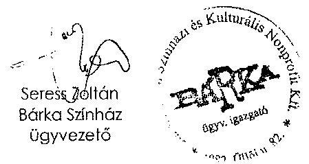

---

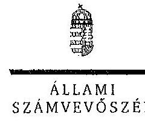

ELNÖK

Ikt.szám: V-0194-174/2014.

Seress Zoltán úr
ügyvezető igazgató
Bárka Színház Nonprofit Kft.

Budapest

Tisztelt Ügyvezető Igazgató Úr!

A „Jelentéstervezet az önkormányzatok többségi tulajdonában lévő gazdasági társaságok közfeladat-ellátásának ellenőrzéséről – Bárka Színház Nonprofit Kft.” című jelentéstervezetre tett észrevételeit köszönettel megkaptam.

Az Állami Számvevőszék észrevételekre vonatkozó álláspontjáról a felügyeleti vezető által készített részletes tájékoztatást csatoltan megküldöm.

Tájékoztatom Ügyvezető igazgató urat, hogy a számvevőszéki jelentés szövegezése az elfogadott észrevételei figyelembevételével készül.

Budapest, 2014. 03. hó 12. nap

Tisztelettel:

Dámokos László

Melléklet: Tájékoztatás az elfogadott és el nem fogadott észrevételekről

1852 BUDAPEST, AFRICZN CSZIRE JÁNOS UTCA 10. 1264 Budapest 4. Pf. 54 telefon. 484 9181 fax. 484 9291

---

# Tájékoztatás   az elfogadott és el nem fogadott észrevételekről 

A ,,Jelentéstervezet az önkormányzatok többségi tulajdonában lévő gazdasági társaságok közfeladat-ellátásának ellenőrzéséről - Bárka Színház Nonprofit Kft." című jelentéstervezetre 2014. március 3-án érkezett észrevételeit áttekintettük, azok kezelésével kapcsolatban a következő tájékoztatást adom.

## A 4. oldal közepén lévő bekezdés és a 1. számú melléklet

A jelentéstervezet összeállítása a helyszíni ellenőrzés során átadott dokumentumokon, a Színház által kitöltött és aláírt tanúsítványokon alapult, melynek teljes körűsége az ellenőrzött szervezet által igazolásra került. A benyújtott módosított tanúsítványokat emiatt nem tudjuk figyelembe venni.

## A 6. oldal 2. bekezdés, illetve a 17. oldal 2. bekezdés

A térítésmentesen használatba adott ingatlannal kapcsolatban az észrevételben leírtak nem vitatják a jelentéstervezet azon megállapítását, hogy a Színház a könyveiben nem tüntette fel a nullás számlaosztályban az ingatlant, ezért a megállapítás módosítása nem indokolt.

## A 7. oldal utolsó bekezdés

A Számlarenddel kapcsolatos tájékoztatásukat köszönjük. A jelentéstervezet összeállítása a helyszíni ellenőrzés során átadott dokumentumokon alapult, ezért a megállapítás módosítása nem indokolt.

## A 8. oldal 3. bekezdés

A leltározási dokumentációval kapcsolatos tájékoztatást köszönjük. A jelentéstervezet 8. oldalának 3. bekezdés utolsó előtti mondatából, a 25. oldal 1. bekezdésének utolsó mondatából és a 11. oldal 3. pontban szereplő megállapítás utolsó mondatából az ,,és sorszám" szövegrészt töröljük.

## A 8. oldal 4. bekezdés és a 24. oldal utolsó bekezdés

A selejtezési jegyzőkönyvvel kapcsolatos megállapításaink helytállóak, mivel a 2012. évi selejtezési jegyzőkönyvek - a 2010. évi gyakorlattal ellentétben - nem minden esetben tartalmazták az eszközök beszerzési értékét, az elszámolt amortizációt és a selejtezéskori nettó értéket. Az egyértelműség érdekében az alábbi pontosításokat vezetjük át a jelentéstervezeten.

---

A jelentéstervezet 8. oldal 4. bekezdés 2. mondat:
„A selejtezéseket olyan bizonylatokkal támasztották alá, amelyek nem minden esetben feleltek meg a Számv. tv.-ben foglaltaknak."

A jelentéstervezet 25. oldal 4. bekezdés:
„Megállapítottuk, hogy az immateriális javak és tárgyi eszközök selejtezési eljárásait olyan bizonylatokkal támasztották alá, amelyek nem minden esetben feleltek meg a Számv. tv. 166. § (1)-(2) bekezdéseiben előírtaknak."

A jelentéstervezet 25. oldal 5. részbekezdés 2. mondat:
„A jegyzőkönyvek a 2010. évi gyakorlattól eltérően nem minden esetben tartalmaztak információt az eszközök beszerzési értékéről, az elszámolt amortizációról és a selejtezéskori nettó értékről."

A jelentéstervezet 11. oldal 4. számú megállapítás:
„A Társaság a 2011-2012. években összesen 14,6 millió Ft értékben selejtezett le befektetett eszközöket. A selejtezéseket olyan bizonylatokkal támasztották alá, amelyek nem minden esetben feleltek meg a Számv. tv.-ben foglaltaknak. 2009-ben két esetben a beszerzett eszközt 0,2 millió Ft értékben a beszerzés napján leselejtezték."

Az észrevétel szerint a leltározási eljárásban résztvevő személyek felkérése szóban történt, amely alátámasztja azon megállapításunkat, hogy nem rendelkeztek névre szóló megbízó levéllel.

# A 9. oldal 1. és a 29. oldal 4. bekezdés 

A jegybevételek alakulását bemutató, tájékoztatásként megküldött táblázatot köszönjük. A táblázat adattartalma eltér a Színház által kitöltött és aláírt 15. számú tanúsítványban szereplő adatoktól. A jelentéstervezetben szereplő táblázat a tanúsítványok alapján készült, az a megállapításokkal összhangban van, így a módosítása nem indokolt.

## A 9. oldal 4-5. bekezdés

A megállapításunk helytálló, a 9. oldal 5. bekezdésében és a 30. oldal 9. bekezdésében az időszak egyértelmű megjelölése érdekében „Az ellenőrzött időszakban" szövegrészt „A 2009. és 2010. évben" szövegrészre módosítjuk.

A 11. oldal 7. számú megállapításában az ,,ellenőrzött időszak" szövegrészt töröljük.
A követelések minősítésénél az észrevétele alapján a megállapításunk módosítása nem indokolt, tekintettel arra, hogy a minősítések ellenőrzéséhez dokumentáció nem állt rendelkezésre.

---

# A 9. oldal 6. bekezdése, 33. oldal 2. bekezdés 

A támogatások bemutatásával kapcsolatos megállapítás helytálló, annak változtatása nem indokolt. Az észrevételükben szerepeltetett, végleges jelleggel kapott támogatásokat bemutató kiegészítő melléklet kivonata nem felel meg a Számv. tv. által előírt részletezettségnek, mivel a jogcímenkénti és évenkénti bontás nem valósul meg.

## A 21. oldal 2. pont 1. bekezdés

A bekezdés utolsó mondatát az alábbiak szerint pontosítjuk:
„A Társaság likviditását az Önkormányzat tagi kölcsön nyújtásával ugyan részben biztosította, de a Társaság kumulált vesztesége - az elmaradt önkormányzati támogatás miatt is - évről évre növekedett."

## A 22. oldal 5. bekezdés

A szabályzatokra vonatkozó tájékoztatását köszönjük, abban a jövőbeni működés bizonytalanságával magyarázzák a szabályzatok aktualizálásának elmaradását. A leírtak alapján a jelentéstervezet módosítása nem indokolt.

## A 25. oldal

A selejtezéssel kapcsolatos észrevételre adott válaszunk azonos a 8. oldal 4. bekezdéséhez és a 24. oldal utolsó bekezdéséhez adott válaszunkkal.

## A 27. oldal 2. bekezdése

Az észrevételben és a jelentéstervezetben leírtak egyaránt azt állítják, hogy a szerződésben szereplő teljes összeg nem a szerződésben meghatározott részletekben került kifizetésre. A teljesítésigazolással kapcsolatban leírtakat nem tudjuk elfogadni, mivel a Színház a kifizetéshez tartozó teljesítésigazolást nem bocsátott az ellenőrzés rendelkezésére. Az előbbiek alapján a hivatkozott bekezdéssel kapcsolatos megállapításainkat fenntartjuk.

## A 27. oldal utolsó bekezdés

A megállapításunk helytálló, pontosítása nem indokolt. A személyi jellegű ráfordítások bemutatása megfelel a tényeknek, a rendelkezésre bocsátott dokumentumokon alapul. A jelentéstervezet azt is tartalmazza, hogy a személyi jellegű ráfordítások növekedésének elsődleges oka a létszámnövekedés volt.

## A 27. oldal 4. bekezdés

Az észrevétele nem mond ellent az ellenőrzés megállapításainak, ezért megállapításunkat változatlanul fenntartjuk. Tény, hogy a számlák a Bárka Színház nevére szólnak, de nem a Bárka Színház gépkocsijába tankoltak.

---

# A 29. oldal 

A bevételek alakulását bemutató, tájékoztatásként megküldött táblázatot köszönjük. A jelentéstervezetben a tervezett és tényleges bevételeket tartalmazó táblázat helytállóságát az észrevétel nem kifogásolja. A táblázatban szereplő adatok az ellenőrzés rendelkezésére bocsátott adatokból származnak. A táblázat módosítása az előbbiek miatt nem indokolt.

## A 30-31. oldal

A lejárt követelésekkel kapcsolatos észrevétele nem vitatja a jelentéstervezet megállapításait, többek között, hogy a követelések minősítésének ellenőrzéséhez dokumentációk nem álltak rendelkezésre, ezért a jelentéstervezetben foglalt megállapításokat fenntartjuk.

## A 32. oldal 3. bekezdés

A 29. oldalon szereplő táblázat javítása nem indokolt, válaszunk a 29. oldal megjelölésű pontnál kifejtettekkel azonos.

A költségcsökkentő intézkedésekre vonatkozó tájékoztatást köszönjük. Ezekről a társaság, ahogy a jelentéstervezetben is szerepel, dokumentumot nem tud bemutatni, így a jelentéstervezetben foglalt megállapítást továbbra is fenntartjuk.

## A 33. oldal 25. pont

A 2011. évi beszámoló kiegészítő melléklethez kapcsolódó észrevétele a jelentéstervezet kiegészítő mellékletre vonatkozó megállapításait megerősíti.

A jelentéstervezet összeállítása a helyszíni ellenőrzés során átadott dokumentumokon, a Színház által kitöltött és aláírt tanúsítványokon alapult, melynek teljes körűsége az ellenőrzött szervezet által igazolásra került. Az észrevételében bemásolt közbenső üzleti terv számítást emiatt nem tudjuk figyelembe venni. A számítás ugyanakkor nem tartalmazza a kapott támogatások összegeit, azok felhasználását, a fel nem használt támogatások összegeit jogcímenként évenkénti bontásban.

Tájékoztatom Ügyvezető Igazgató urat, hogy a számvevőszéki jelentés mellékleteként szerepeltetjük a jelentéstervezethez tett észrevételeit, valamint az azokra adott válaszunkat.

Budapest, 2014. 01. hó 13. nap

Makkai Mária
felügyeleti vezető

---

.

---

# RÖVIDÍTÉSEK JEGYZÉKE 

## TÖRVÉNYEK

Áht. 1

Áht. 2

ÁSZ tv.
Civil tv.

Eisztv.

Emtv.

Gt.
Htv.

Info tv.

Közhasznú tv.
Közbesz. tv. 1

Közbesz. tv. 2

Mötv.
NKA tv.
Nvtv.
Ötv.
Ptk.
Számv. tv.
az államháztartásról szóló 1992. évi XXXVIII. törvény, hatályos 2011. december 31-ig ${ }^{1}$
az államháztartásról szóló 2011. évi CXCV. törvény, hatályos 2011. december 31-étől
az Állami Számvevőszékről szóló 2011. évi LXVI. törvény, hatályos 2011. július 1-jétől
az egyesülési jogról, a közhasznú jogállásról, valamint a civil szervezetek működéséről és támogatásáról szóló 2011. évi CLXXV. törvény
az elektronikus információszabadságról szóló 2005. évi XC. törvény, hatályos 2006. január 1-jétől 2012. január 1-jéig
az előadó-művészeti szervezetek támogatásáról és sajátos foglalkoztatási szabályairól szóló 2008. évi XCIX. törvény, hatályos 2009. március 1-jétől
a gazdasági társaságokról szóló 2006. évi IV. törvény
a helyi önkormányzatok és szerveik, a köztársasági megbízottak, valamint egyes centrális alárendeltségű szervek feladat- és hatásköreiről szóló 1991. évi XX. törvény
az információs önrendelkezési jogról és az információszabadságról szóló 2011. évi CXII. törvény, hatályos 2012. január 1-jétől
a közhasznú szervezetekről szóló 1997. évi CLVI. törvény
a közbeszerzésekről szóló 2003. évi CXXIX. törvény, hatályos 2004. január 1-jétől 2012. január 1-jéig
a közbeszerzésekről szóló 2011. évi CVIII. törvény, hatályos 2012. január 1-jétől
Magyarország helyi önkormányzatairól szóló 2011. évi CLXXXIX. törvény
a Nemzeti Kulturális Alapról szóló 1993. évi XXIII. törvény
a nemzeti vagyonról szóló 2011. évi CXCVI. törvény
a helyi önkormányzatokról szóló 1990. évi LXV. törvény
a Polgári Törvénykönyvről szóló 1959. évi IV. törvény
a számvitelről szóló 2000. évi C. törvény

[^0]
[^0]:    ${ }^{1}$ Az ellenőrzött időszakban megszűnő jogszabályok esetében a hatályosság végét, az ellenőrzött időszakban hatályba lépő jogszabályok esetében a hatályosság kezdő időpontját minden esetben feltüntettük. A vizsgált időszak egésze alatt hatályban voltak azok a jogszabályok, amelyeknél nem szerepel megszűnést vagy hatályba lépést jelző dátum.

---

Szja tv.
Taktv.
Tao. tv.

## RENDELETEK

Áhsz.

Ámr.
Ávr.

Ber.

Bkr.

14/2012. (III. 6.) NEFMI rendelet

7/2009. (III.4.) OKM rendelet

6/2010. (II. 4.) OKM rendelet

18/2005. (XII. 27.) IHM rendelet
2008. évi költségvetési rendelet

2009. évi költségvetési rendelet

2010. évi költségvetési rendelet
a személyi jövedelemadóról szóló 1995. évi CXVII. törvény
a köztulajdonban álló gazdasági társaságok takarékosabb működéséről szóló 2009. évi CXXII. törvény
a társasági adóról szóló 1991. évi LXXXVI. törvény
az államháztartás szervezetei beszámolási és könyvvezetési kötelezettségének sajátosságairól szóló 249/2000. (XII. 24.) Korm. rendelet
az államháztartás működési rendjéről szóló 292/2009. (XII. 19.) Korm. rendelet, hatályos 2011. december 31-ig
az államháztartásról szóló törvény végrehajtásáról szóló 368/2011. (XII. 31.)

 Korm. rendelet, hatályos 2012. január 1-jétől
a költségvetési szervek belső ellenőrzéséről szóló 193/2003. (XI. 26.) Korm. rendelet, hatályos 2011. december 31-ig
a költségvetési szervek belső kontrollrendszeréről és belső ellenőrzésről szóló 370/2011. (XII. 31.) Korm. rendelet, hatályos 2012. január 1-jétől
az előadó-művészeti szervezetek és az előadó-művészeti érdekképviseleti szervezetek működésével kapcsolatos hatósági eljárások és adatszolgáltatások részletes szabályairól, hatályos - a 19. §-ban meghatározott kivételekkel, amelyek hatályba lépése időpontja 2012. március 31. - 2012. március 14-től
az előadó-művészeti szervezetek működésével kapcsolatos hatósági eljárások részletes szabályairól, továbbá a zenekarok és énekkarok tevékenységéhez szükséges tárgyi feltételekről, valamint a fizető nézőszám alsó határáról, hatályos 2009. március 5-től 2012. március 31-ig
az előadó-művészeti szervezetek beszámolójának formai és tartalmi követelményeiről, a benyújtásával és elfogadásával kapcsolatos részletes szabályokról, továbbá az elszámolható költségekről, hatályos 2010. február 7-től 2013. december 31-ig
a közzétételi listákon szereplő adatok közzétételéhez szükséges közzétételi mintákról
Budapest Főváros VIII. kerület Józsefvárosi Önkormányzat 6/2008. (II. 29.) számú rendelete a 2008. évi költségvetésről és a végrehajtás szabályairól
Budapest Főváros VIII. kerület Józsefvárosi Önkormányzat 7/2009. (II. 27.) számú rendelete a 2009. évi költségvetésről és a végrehajtási szabályairól
Budapest Főváros VIII. kerület Józsefvárosi Önkormányzat 9/2010. (II. 22.) számú rendelete a 2010. évi költségvetésről és a végrehajtás szabályairól

---

2011. évi költségvetési rendelet
2012. évi költségvetési rendelet
2013. évi költségvetési rendelet
2008. évi zárszámadási rendelet
2009. évi zárszámadási rendelet
2010. évi zárszámadási rendelet
2011. évi zárszámadási rendelet
2012. évi zárszámadási rendelet

Bérbeadási rendelet

Önkormányzat SZMSZ 1

Önkormányzat SZMSZ $_{2}$

Önkormányzat SZMSZ $_{3}$

Vagyonrendelet $_{1}$

Budapest Főváros VIII. kerület Józsefvárosi Önkormányzat 9/2011. (II. 21.) számú rendelete a 2011. évi költségvetésről
Budapest Főváros VIII. kerület Józsefvárosi Önkormányzat 7/2012. (II. 21.) számú rendelete a 2012. évi költségvetésről
Budapest Főváros VIII. kerület Józsefvárosi Önkormányzat 9/2013. (II. 22.) számú rendelete a 2013. évi költségvetésről
Budapest Főváros VIII. kerület Józsefvárosi Önkormányzat 15/2009. (IV. 24.) számú rendelete a 2008. évi költségvetési zárszámadásról
Budapest Főváros VIII. kerület Józsefvárosi Önkormányzat 20/2010. (V. 10.) számú rendelete a 2009. évi költségvetési zárszámadásról
Budapest Főváros VIII. kerület Józsefvárosi Önkormányzat 29/2011. (V. 10.) számú rendelete a 2010. évi költségvetési zárszámadásról
Budapest Főváros VIII. kerület Józsefvárosi Önkormányzat 28/2012. (V. 10.) számú rendelete a 2011. évi költségvetési zárszámadásról
Budapest Főváros VIII. kerület Józsefvárosi Önkormányzat 20/2013. (V. 10.) számú rendelete a 2012. évi költségvetési zárszámadásról
Budapest Főváros VIII. kerület Józsefvárosi Önkormányzatának 17/2005. (IV. 20.) számú rendelete az Önkormányzat tulajdonában álló, nem lakás céljára szolgáló helyiségek bérbeadásának feltételeiről, hatályos 2005. július 1-jétől
Budapest Főváros VIII. kerület Józsefvárosi Önkormányzat Képviselő-testületének 38/2002. (XI. 07.) számú rendelete a Képviselő-testület és Szervei Szervezeti és Működési Szabályzatáról, hatályos 2002. november 7-től 2009. június 1-jéig
Budapest Főváros VIII. kerület Józsefvárosi Önkormányzat 19/2009. (V. 06.) számú rendelete a Képviselő-testület és Szervei Szervezeti és Működési Szabályzatáról, hatályos 2009. június 1-jétől 2013. május 27-ig

Budapest Főváros VIII. kerület Józsefvárosi Önkormányzat 25/2013. (V. 27.) számú rendelete a Képviselő-testület és Szervei Szervezeti és Működési Szabályzatáról, hatályos 2013. május 27-től
Budapest Főváros VIII. kerület Józsefvárosi Önkormányzat Képviselő-testületének 37/2003. (VII. 07.) számú rendelete a Budapest Józsefvárosi Önkormányzat vagyonáról, valamint a versenyeztetés és a helyi költségvetési szervek beszerzési eljárásának szabályairól, hatályos 2003. augusztus 1-jétől 2012. december 31-ig

---

Vagyonrendelet $_{2}$

## HATÁROZATOK

Gazdasági program $_{1}$

Gazdasági program $_{2}$

## ÖNKORMÁNYZAT SZABÁLYZATAI

Hivatal SZMSZ $_{1}$

Hivatal SZMSZ $_{2}$

Hivatal SZMSZ $_{3}$

Hivatali közzétételi szabályzat $_{1}$

Budapest Főváros VIII. kerület Józsefvárosi Önkormányzat Képviselő-testületének 66/2012. (XII. 13.) számú rendelete a Budapest Józsefvárosi Önkormányzat vagyonáról és a vagyon feletti tulajdonosi jogok gyakorlásáról, hatályos 2013. január 1-jétől

Budapest Józsefváros Önkormányzatának a Képviselőtestület 139/2008. (III. 12.) számú határozatával elfogadott 2008-2014. évekre vonatkozó gazdasági programja
Budapest Józsefváros Önkormányzatának a Képviselőtestület 195/2011. (IV. 21.) számú határozatával elfogadott, a 2010-2014. évekre szóló 4 éves gazdasági programja

Budapest Főváros VIII. kerület Józsefvárosi Önkormányzat Képviselő-testületének 135/2007. (IV. 19.) számú határozata Budapest Józsefváros Önkormányzat Polgármesteri Hivatalának Ügyrendje (szervezeti és működési szabályzata) elfogadásáról, hatályos 2007. április 19-től 2009. március 5-ig

Budapest Főváros VIII. kerület Józsefvárosi Önkormányzat Képviselő-testületének 71/2009. (III. 04.) számú határozata Budapest Józsefvárosi Önkormányzat Polgármesteri Hivatalának Ügyrendjéről (szervezeti és működési szabályzatáról), hatályos 2009. március 5-től június 1-jéig
Budapest Főváros VIII. kerület Józsefvárosi Önkormányzat Képviselő-testületének 183/2009. (V. 06.) számú határozata Budapest Józsefvárosi Önkormányzat Polgármesteri Hivatalának Ügyrendje (szervezeti és működési szabályzata) elfogadásáról, hatályos 2009. június 1-jétől december 1-jéig
Budapest Főváros VIII. kerület Józsefvárosi Önkormányzat Képviselő-testületének 272/2009. (VI. 17.) számú határozata Budapest Józsefvárosi Önkormányzat Polgármesteri Hivatalának Ügyrendje (szervezeti és működési szabályzata) elfogadásáról, hatályos 2009. december 1-jétől
Budapest Főváros VIII. kerület Józsefvárosi Önkormányzat Képviselő-testületének 204/2013. (V. 22.) számú határozata Budapest Főváros VIII. kerület Józsefvárosi Polgármesteri Hivatal Szervezeti és Működési Szabályzatáról, hatályos 2013. május 23-tól
20/2008. (X. 14.) jegyzői utasítás a Polgármesteri Hivatal kezelésébe tartozó közérdekű adatok közzétételének és a Hivatal hírei megjelentetésének szabályozásáról, hatályos 2008. október 15-től 2009. április 29-ig

---

hivatali közzétételi szabályzat $_{2}$
hivatali leltározási szabályzat $_{1}$
hivatali leltározási szabályzat $_{2}$
hivatali önköltség számítási szabályzat

## BÁRKA SZÍNHÁZ SZABÁLYZATAI

Értékelési szabályzat
Házipénztár kezelési szabályzat $_{1}$
Házipénztár kezelési szabályzat $_{2}$
Jegykezelési szabályzat
Leltározási szabályzat
Leltározási és selejtezési szabályzat
Pénz- és értékkezelési szabályzat
Selejtezési szabályzat
SZMSZ
Számviteli politika $_{1}$
Számviteli politika $_{2}$

## SZÓRÖVIDÍTÉSEK

áfa
ÁSZ
Alapító

Bárka Kht.
Bárka Színház Nonprofit Kft.
7/2009. (IV. 29.) jegyzői utasítás a Polgármesteri Hivatal kezelésébe tartozó közérdekű adatok közzétételének és a Hivatal hírei megjelentetésének szabályozásáról, hatályos 2009. július 1-jétől
Budapest VIII. kerület Józsefvárosi Önkormányzat Polgármesteri Hivatalának Leltározási és leltárkészítési szabályzata, hatályos 2007. április 1-jétől
Budapest VIII. kerület Józsefvárosi Önkormányzat Polgármesteri Hivatalának Leltározási és leltárkészítési szabályzata, hatályos 2012. december 15-től
Budapest VIII. kerület Józsefvárosi Önkormányzat Polgármesteri Hivatalának Önköltség-számítási szabályzata, hatályos 2011. január 1-jétől

Bárka Kht. Értékelési szabályzata, hatályos 2007. január 1-jétől
Bárka Kht. Házipénztár kezelési szabályzata, hatályos 2007. január 1-jétől 2009. augusztus 30-ig
Bárka Nonprofit Kft. Házipénztár kezelési szabályzata, hatályos 2009. augusztus 31-től
Bárka Nonprofit Kft. szabályzata a Bárka Színház jegyeinek értékesítéséről, hatályos 2012. szeptember 1-jétől
Bárka Kht. Leltározási szabályzata, hatályos 2007. január 1-jétől
Bárka Nonprofit Kft. Leltározási és selejtezési szabályzata, hatályos 2009. augusztus 31-től
Bárka Nonprofit Kft. Pénz- és értékkezelési szabályzata, hatályos 2012. január 1-jétől
Bárka Kht. Selejtezési szabályzata, hatályos 2007. január 1-jétől
Bárka Nonprofit Kft. Szervezeti és Működési Szabályzata, hatályos 2011. december 1-jétől
Bárka Kht. Számviteli politikája, hatályos 2007. január 1-jétől
Bárka Nonprofit Kft. Számviteli politikája, hatályos 2009. augusztus 31-től
általános forgalmi adó
Állami Számvevőszék
Budapest Főváros VIII. kerület Józsefvárosi Önkormányzat Képviselő-testülete, mint a Kft. alapítója és 2012. augusztus 22-től 100%-os tulajdonosa
Bárka Józsefvárosi Színházi és Kulturális Közhasznú Társaság
Bárka Színház Kiemelkedően Közhasznú Nonprofit Korlátolt Felelősségű Társaság

---

Bárka Színház

Bizottság

EU
FEUVE
jegyző
Képviselő-testület

Közszolgáltatási szerződés $_{1}$

Közszolgáltatási szerződés $_{2}$

Közszolgáltatási szerződés $_{3}$
közszolgáltatási szerződések

NEFMI
OKM
Önkormányzat
polgármester
Polgármesteri Hivatal
rendelet

SZMSZ
tao

Közös megnevezés, amely alatt 2009. május 31-ig a Bárka Kht., illetve 2009. május 31-től a Bárka Színház Nonprofit Kft. értendő
Budapest Főváros VIII. kerület Józsefvárosi Önkormányzat tulajdonosi jogokat gyakorló Bizottsága megnevezés Gazdasági, Kerületfejlesztési és Közbeszerzési Bizottság, hatályos 2009. június 9-ig,
Gazdálkodási, Kerületfejlesztési, Költségvetési és Pénzügyi Ellenőrző Bizottság, hatályos 2009. június 10-től, Városgazdálkodási és Pénzügyi Bizottság, hatályos 2013. május 27-től
Európai Unió
folyamatba épített előzetes, utólagos és vezetői ellenőrzés Budapest Főváros VIII. kerület Józsefvárosi Önkormányzat jegyzője
Budapest Főváros VIII. kerület Józsefvárosi Önkormányzat Képviselő-testülete
Budapest Főváros VIII. kerület Önkormányzata és a Bárka Józsefvárosi Színház és Kulturális Közhasznú Társaság között megkötött, 2000. július 10-én kelt szerződés
Budapest Főváros VIII. kerület Önkormányzata és a Bárka Józsefvárosi Színház és Kulturális Közhasznú Társaság között megkötött, 2006. április 7-én kelt szerződés
Budapest Főváros VIII. kerület Önkormányzata és a Bárka Józsefvárosi Színház és Kulturális Közhasznú Társaság között megkötött, 2009. május 19-én kelt szerződés
Közös megnevezés, amely alatt a Közszolgáltatási szerződés $_{1}$, Közszolgáltatási szerződés $_{2}$, Közszolgáltatási szerződés $_{3}$ értendő
Nemzeti Erőforrás Minisztérium
Oktatási és Kulturális Minisztérium
Budapest Főváros VIII. kerület Józsefvárosi Önkormányzat (rövid név: Budapest Józsefvárosi Önkormányzat az önkormányzati SZMSZ $_{1}$-et módosító, 12/2006. (III. 24.) számú rendelet alapján)
Budapest Főváros VIII. kerület Józsefváros Polgármestere Budapest Főváros VIII. kerület Józsefvárosi Önkormányzat Polgármesteri Hivatala (hatályos 2013. május 22-ig), Budapest Főváros VIII. kerület Józsefvárosi Polgármesteri Hivatal (hatályos 2013. május 23-tól)
Budapest Főváros VIII. kerület Józsefvárosi Önkormányzat Képviselő-testületének rendelete
Szervezeti és Működési Szabályzat
társasági adó

---

| tao támogatás | az Emtv.-ben bevezetett közvetett támogatási forma, amelynek mértékét a jogalkotó a tárgyévi jegybevétel 80%-ában határozta meg, hatályos 2009. november 12-től |
| :--: | :--: |
| Társaság | közös megnevezés, amely alatt 2009. május 31-ig a Bárka Kht. és 2009. május 31-től a Bárka Színház Nonprofit Kft. értendő |
| Társasági Szerződés $_{1}$ | a Bárka Kht. Társasági Szerződése és módosításai, hatályos 1996. július 18-tól 2009. május 31-ig |
| Társasági Szerződés $_{2}$ | a Bárka Színház Nonprofit Kft. Társasági Szerződése és módosításai, hatályos 2009. május 31-től |

---

.

---

# ÉRTELMEZŐ SZÓTÁR 

átlagos életkor
elhasználódási szint
előadó-művészeti szervezet
értékcsökkenés
fenntartói - önkormányzati támogatás gazdasági vállalkozási tevékenység eredménye
használhatósági fok (a színház saját és használatra átvett ingatlanjaira és egyéb tárgyi eszközeire)
közfeladat
közhasznú tevékenység eredménye

Számításakor a színház saját tárgyi eszközei és a használatra átvett eszközök elhasználódási szintjének százalékos értékét viszonyítják az eszközök éves értékcsökkenési leírási kulcsának százalékos értékéhez.
Számításakor a színház saját tárgyi eszközei és a használatra átvett eszközök elszámolt értékcsökkenés értékét viszonyítják az eszközök záró bruttó (beszerzési/létesítési) értékéhez. A %-ban kifejezett mutató növekedése az eszköz állagának romlására, avulására utal.
Az az önálló jogi személyiségű színház, balett- vagy táncegyüttes, szimfonikus zenekar, énekkar, kamara-szimfonikus zenekar, kamarazenekar, amely alaptevékenységeként előadóművészeti színház-, tánc- vagy zeneművészeti tevékenységet lát el.
Az immateriális javak, a tárgyi eszközök bruttó értékének a használati időre történő felosztása a várható élettartam, a fizikai elhasználódás és erkölcsi avulás alapján.
A fenntartó által nyújtott támogatás, amelybe nem számít bele a központi költségvetési támogatás.
A jövedelem- és vagyonszerzésre irányuló, vagy azt eredményező, üzletszerűen végzett gazdasági tevékenység eredménye, ide nem értve az adomány (ajándék) elfogadását, továbbá a bevétellel járó, létesítő okiratban meghatározott cél szerinti, valamint a közhasznú tevékenységet.
Számításakor a színház saját tárgyi eszközei és a használatra átvett eszközök könyv szerinti (nettó) értékét viszonyítják az eszközök bruttó (beszerzési/létesítési) értékéhez. A %-ban kifejezett mutató csökkenése az eszköz állagának romlására, avulására utal, ami maga után vonja az üzemeltetési és fenntartási költségek növekedését is.
Jogszabályban meghatározott állami vagy önkormányzati feladat, amit az arra kötelezett közérdekből, jogszabályban meghatározott követelményeknek és feltételeknek megfelelve végez, ideértve a lakosság közszolgáltatásokkal való ellátását, továbbá az állam nemzetközi szerződésekben vállalt kötelezettségeiből adódó közérdekű feladatokat, valamint e feladatok ellátásához szükséges infrastruktúra biztosítását is (Vagyon tv. 3. § (1) bekezdés 7. pont).
Minden olyan tevékenység eredménye, amely a létesítő okiratban megjelölt közfeladat teljesítését közvetlenül vagy közvetve szolgálja, ezzel hozzájárulva a társadalom és az egyén közös szükségleteinek kielégítéséhez.

---

mérleg szerinti eredmény
pénzügyi műveletek eredménye
szokásos vállalkozási eredmény színház
rendkívüli eredmény
társulat
tulajdonosi joggyakorló
üzemi (üzleti) eredmény

A mérleg szerinti eredmény az osztalékra, részesedésre, a kamatozó részvények kamatára igénybe vett eredménytartalékkal növelt, a jóváhagyott osztalékkal, részesedéssel, a kamatozó részvények kamatával
 csökkentett tárgyévi adózott eredmény, egyezően az eredménykimutatásban ilyen címen kimutatott összeggel. (Számv. tv. 39. § (2) bekezdés)
A pénzügyi műveletek eredménye a pénzügyi műveletek bevételeinek és ráfordításainak különbözete. A pénzügyi műveletek bevételei: a kapott (járó) osztalék és részesedés, a részesedések értékesítésének árfolyamnyeresége, a befektetett pénzügyi eszközök kamatai, árfolyamnyeresége, az egyéb kapott (járó) kamatok és kamatjellegű bevételek, a pénzügyi műveletek egyéb bevételei. A pénzügyi műveletek ráfordításai: a befektetett pénzügyi eszközök árfolyamvesztesége, a fizetendő kamatok és kamatjellegű ráfordítások, a pénzügyi műveletek egyéb ráfordításai, a részesedések, az értékpapírok, a bankbetétek értékvesztése. (Számv. tv. 83-85.§-a)
Az üzemi (üzleti) eredmény és a pénzügyi műveletek eredményének összege.
Prózai, zenés, táncos színpadi művek előadásával foglalkozó előadó-művészeti szervezet, ide értve a bábszínházat, befogadó színházat, produkciós színházat, független színházat, szabadtéri színházat, nemzetiségi színházat.
A rendkívüli bevételek és a rendkívüli ráfordítások különbsége. (Számv. tv. 86. §-a)
Művészek olyan csoportja, akik munkaviszony, közalkalmazotti jogviszony vagy munkavégzésre irányuló egyéb jogviszony alapján egy vagy több évadon keresztül folyamatosan kapcsolódnak egy előadó-művészeti szervezethez.
Aki a nemzeti vagyon felett az államot vagy a helyi önkormányzatot megillető tulajdonosi jogok és kötelezettségek összességének gyakorlására jogosult (Vagyon tv. 3. § (1) bekezdés 17. pont)

Az üzleti évben elszámolt értékesítés nettó árbevételének, az eszközök között állományba vett saját teljesítmények értékének, az egyéb bevételeknek, valamint az üzleti évben elszámolt anyagjellegű ráfordítások, személyi jellegű ráfordítások, értékcsökkenési leírás és egyéb ráfordítások együttes összegének különbözeteként (összköltség eljárással) állapítható meg. (Számv. tv. 71. § (1) bekezdés a) pont)
