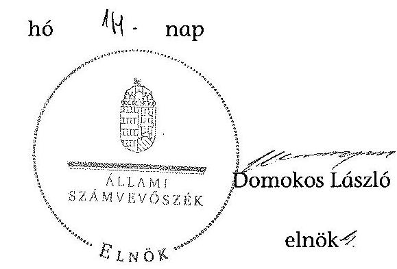

# ÁLLAMI   SZÁMVEVŐSZÉK 

## JELENTÉS

az önkormányzatok belső kontrollrendszere kialakításának, egyes kontrolltevékenységek és a belső ellenőrzés
működésének ellenőrzéséről
Egercsehi

---

# Állami Számvevőszék 

Iktatószám: V-0344-080/2014.
Témaszám: 1372
Vizsgálat-azonosító szám: V064934

## Az ellenőrzést felügyelte:

## dr. Benedek Mária

felügyeleti vezető
Az ellenőrzést vezette és az ellenőrzés végrehajtásáért felelős:
dr. Veress Tiborné
ellenőrzésvezető
A számvevőszéki jelentés összeállításában közremüködtek:
Vida László
számvevő tanácsos
Pető Krisztina
számvevő tanácsos
Az ellenőrzést végezték:
Jakab Laura
Vida László
számvevő
számvevő tanácsos

---

# TARTALOMJEGYZÉK 

BEVEZETÉS ..... 7
I. ÖSSZEGZŐ MEGÁLLAPÍTÁSOK, KÖVETKEZTETÉSEK, JAVASLATOK ..... 11
II. RÉSZLETES MEGÁLLAPÍTÁSOK ..... 21

1. Az önkormányzat belső kontrollrendszerének kialakítása ..... 21
1.1. A kontrollkörnyezet ..... 21
1.2. A kockázatkezelési rendszer ..... 24
1.3. A kontrolltevékenységek ..... 25
1.4. Az információs és kommunikációs rendszer ..... 25
1.5. A monitoring rendszer ..... 26
2. A pénzügyi folyamatokban kulcsszerepet betöltő teljesítésigazolás és érvényesítés belső kontrollok múködése ..... 27
3. A belső ellenőrzés múködése ..... 29

## FÜGGELÉKEK

1. számú Értelmező szótár
2. számú Az értékelés módja és szempontjai

---

.

---

# RÖVIDÍTÉSEK JEGYZÉKE 

## Törvények

2012. évi V. törvény a közszolgálati tisztviselőkről szóló törvénnyel összefüggő átmeneti, módosuló és hatályát vesztő szabályokról, valamint egyes kapcsolódó törvények módosításáról (hatályos 2012. február 29-től)
Áht.
ÁSZ tv.
Htv.

Info tv.
Képviselők jogállásáról szóló tv.
Kttv.
Ktv.
Mötv.
Mvtv.
Nvtv.
Ötv.
Számv. tv.
Vagyonnyilatkozat-
tételről szóló tv.

## Rendeletek

1/2012. (II.13.) önkormányzati rendelet

Áhsz $_{1}$

Áhsz $_{2}$
Ávr.
Bkr.
hivatali ügyrend ${ }_{1}$

2012. évi V. törvény a közszolgálati tisztviselőkről szóló törvénnyel összefüggő átmeneti, módosuló és hatályát vesztő szabályokról, valamint egyes kapcsolódó törvények módosításáról (hatályos 2012. február 29-től)
2011. évi CXCV. törvény az államháztartásról
2011. évi LXVI. törvény az Állami Számvevőszékről
1991. évi XX. törvény a helyi önkormányzatok és szerveik, a köztársasági megbízottak, valamint egyes centrális alárendeltségủ szervek feladat- és hatásköreiről
2011. évi CXII. törvény az információs önrendelkezési jogról és az információszabadságról
2000. évi XCVI. törvény a helyi önkormányzati képviselők jogállásának egyes kérdéseiről
2011. évi CXCIX. törvény a közszolgálati tisztviselőkről (hatályos 2012. március 1-jétől)
1992. évi XXIII. törvény a köztisztviselők jogállásáról (hatálytalan 2012. március 1-jétől)
2011. évi CLXXXIX. törvény Magyarország helyi önkormányzatairól
1993. évi XCIII. törvény a munkavédelemről
2011. évi CXCVI. törvény a nemzeti vagyonról
1990. évi LXV. törvény a helyi önkormányzatokról
2000. évi C. törvény a számvitelről
2007. évi CLII. törvény egyes vagyonnyilatkozat-tételi kötelezettségekről

A települési képviselők juttatásairól szóló Egercsehi Önkormányzat 2/2006. (II.14.) rendelet hatályon kívül helyezéséről
249/2000. (XII. 24.) Korm. rendelet az államháztartás szervezetei beszámolási és könyvvezetési kötelezettségének sajátosságairól (hatálytalan 2014. január 1-jétől)
4/2013. (I. 11.) Korm. rendelet az államháztartás számviteléről (hatályos 2014. január 1-jétől)
368/2011. (XII. 31.) Korm. rendelet az államháztartásról szóló törvény végrehajtásáról
370/2011. (XII. 31.) Korm. rendelet a költségvetési szervek belső kontrollrendszeréről és belső ellenőrzéséről
Az önkormányzati SZMSZ ${ }_{1}$ 5. számú melléklete Egercsehi-Szúcs-Bekölce Községek Körjegyzőségi Hivatalának ügyrendje (hatályos 2012. január 1-jétől)

---

hivatali ügyrend $_{2}$

| önkormányzati SZMSZ ${ }_{1}$ | Egercsehi Község Önkormányzat 4/2005. (II. 22.) számú rendelete a képviselő-testület és szervei Szervezeti és Müködési Szabályzatáról |
| :--: | :--: |
| önkormányzati SZMSZ $_{2}$ | Egercsehi Községi Önkormányzat Képviselő-testület 15/2013. (X. 30.) önkormányzati rendelete a képviselőtestület és szervei Szervezeti és Müködési Szabályzatáról |
| vagyongazdálkodási rendelet ${ }_{1}$ | Egercsehi Önkormányzat Képviselő-testületének 16/2000. (XI. 28.) számú rendelete az Önkormányzat vagyonáról |
| vagyongazdálkodási rendelet ${ }_{2}$ | Egercsehi Községi Önkormányzat Képviselö-testületének 10/2013. (VI. 26.) számú rendelete az Önkormányzat vagyonáról és a vagyongazdálkodás szabályairól |
| Szórövidítések |  |
| 2012. évi ellenőrzési ter | Egercsehi Község Önkormányzat 2012. évi belső ellenőrzési terve |
| 2013. évi ellenőrzési ter | Egercsehi Község Önkormányzat 2013. évi belső ellenőrzési terve |
| alapító okirat $_{1}$ | Egercsehi-Szúcs-Bekölce Községek Körjegyzősége Alapító okirata (hatályos 2012. január 1-jétől) |
| alapító okirat $_{2}$ | Egercsehi Közös Önkormányzati Hivatal Alapító okirata (hatályos 2013. január 1-jétől) |
| ÁSZ | Állami Számvevőszék |
| belső ellenőrzési kézikönyv | Bélapátfalvai Kistérség Többcélú Társulása munkaszervezetének Belső ellenőrzési kézikönyve (hatályos 2008. október 1-jétől) |
|  | Egercsehi Községi Önkormányzat Polgármesteri Hivatalának Számlarendje VI. fejezete (hatályos 2009. április 23 -tól) |
| gazdasági program | Egercsehi Község Önkormányzat Gazdasági programja 2011-2014. |
| INTOSAI | International Organization of Supreme Audit Institutions (Legfőbb Ellenőrző Intézmények Nemzetközi Szervezete) |
| ISSAI | International Standards of Supreme Audit Institutions (Legfőbb Ellenőrző Intézmények Nemzetközi Standardjai) |
| jegyző | Egercsehi Közös Önkormányzati Hivatal jegyzője |
| Képviselő-testület | Egercsehi Község Önkormányzat Képviselő-testülete |
| KIM | Közigazgatási és Igazságügyi Minisztérium |
| kockázatkezelési szabályzat | Egercsehi Község Önkormányzatának a folyamatba épített, előzetes és utólagos vezetői ellenőrzés (FEUVE) szabályzata 4. számú melléklete (2005. szeptember 17-től) |
| Kormányhivatal körjegyző | Heves Megyei Kormányhivatal |
|  | Egercsehi-Szúcs-Bekölce Községek Körjegyzőségnek körjegyzöje 2012. december 31-ig |
| Körjegyzőség | Egercsehi-Szúcs-Bekölce Községek Körjegyzősége |

---

| Közös hivatal | Egercsehi Közös Önkormányzati Hivatal (Egercsehi, Szúcs és Egerbocs községek részvételével) |
| :--: | :--: |
| leltározási szabályzat | Egercsehi Község Önkormányzat Leltárkészítési és leltározási szabályzata (hatályos 2009. június 1-jétől) |
| NGM | Nemzetgazdasági Minisztérium |
| Önkormányzat | Egercsehi Község Önkormányzat |
| pénzkezelési szabályzat | Egercsehi Községi Önkormányzat Pénzkezelési szabályzata (hatályos 2009. június 1-jétől) |
| polgármester | Egercsehi Község Önkormányzat polgármestere |
| Polgármesteri Hivatal | Egercsehi Község Önkormányzat Polgármesteri Hivatala |
| stratégiai ellenőrzési | Bélapátfalvai Kistérség Többcélú Társulása Belső ellenőrzési stratégiai terve a 2010-2014. évekre |
| számlarend | Egercsehi Községi Önkormányzat Polgármesteri Hivatalának Számlarendje (hatályos 2009. április 23-tól) |
| számviteli politika | Egercsehi Községi Önkormányzat Számviteli politikája (hatályos 2009. június 1-jétől) |
| Társulás | Bélapátfalvai Kistérség Többcélú Társulása |
| társulási megállapodás | Bélapátfalvai Kistérség Többcélú Társulási Megállapodása |

---

# **Chemistry**

## **Chemical Reactions**

### **Balancing Chemical Equations**

1. **Write the unbalanced equation:**
   - Example: $$C_3H_8 + O_2 \rightarrow CO_2 + H_2O$$

2. **Balance the equation:**
   - Example: $$2C_3H_8 + 7O_2 \rightarrow 6CO_2 + 8H_2O$$

3. **Balance the equation:**
   - Example: $$2C_3H_8 + 7O_2 \rightarrow 6CO_2 + 8H_2O$$

4. **Balance the equation:**
   - Example: $$2C_3H_8 + 7O_2 \rightarrow 6CO_2 + 8H_2O$$

### **Types of Chemical Reactions**

1. **Combination Reaction:**
   - Example: $$2H_2 + O_2 \rightarrow 2H_2O$$

2. **Decomposition Reaction:**
   - Example: $$2H_2O_2 \rightarrow 2H_2O + O_2$$

3. **Single Displacement Reaction:**
   - Example: $$Zn + 2HCl \rightarrow ZnCl_2 + H_2$$

4. **Double Displacement Reaction:**
   - Example: $$AgNO_3 + NaCl \rightarrow AgCl + NaNO_3$$

5. **Combustion Reaction:**
   - Example: $$CH_4 + 2O_2 \rightarrow CO_2 + 2H_2O$$

## **Stoichiometry**

### **Mole Concept**

- **Mole (mol):** The amount of substance containing as many particles (atoms, molecules, ions) as there are atoms in exactly 12 grams of carbon-12.
- **Avogadro's Number:** $$6.022 \times 10^{23}$$ particles per mole.

### **Molar Mass**

- **Molar Mass:** The mass of one mole of a substance.
- Example: The molar mass of water ($$H_2O$$) is 18.015 g/mol.

### **Calculations**

1. **Moles to Mass:**
   - Formula: $$n = \frac{m}{M}$$
   - Example: Calculate the number of moles of $$H_2O$$ in 18 grams of water.
     - $$n = \frac{18.015 \, \text{g}}{18.015 \, \text{g/mol}} = 18.015 \, \text{g/mol}$$

2. **Moles to Mass:**
   - Formula: $$m = n \times M$$
   - Example: Calculate the mass of 2 moles of $$H_2O$$.
     - $$m = 2 \, \text{mol} \times 48.015 \, \text{g/mol} = 24.015 \, \text{g/mol}$$

## **Gas Laws**

### **Ideal Gas Law**

- **Equation:** $$PV = nRT$$
- **Variables:**
  - $$P$$ = Pressure (atm)
  - $$V$$ = Volume (L)
  - $$n$$ = Number of moles (mol)
  - $$R$$ = Ideal gas constant (0.0821 L·atm/mol·K)
  - $$T$$ = Temperature (K)

### **Boyle's Law**

- **Equation:** $$P_1V_1 = P_2V_2$$
- **Variables:**
  - P₁ = Pressure (atm)
  - P₂ = Volume (L)
  - P₃ = Ideal gas constant (0.0821 L·atm/mol·K)
  - P₁/T = Pressure (atm)

### **Boyle's Law**

- **Equation:** $$\frac{P_1V_1}{P_2V_2} = \frac{P_2V_2}{T_1}$$
- **Variables:**
  - P₁ = Pressure (atm)
  - P₂ = Volume (L)
  - P₃ = Ideal gas constant (0.0821 L·atm/mol·K)
  - P₁/T = Pressure (atm)

## **Thermochemistry**

### **Enthalpy (H)**

- **Definition:** The heat content of a system at constant pressure.
- **Equation:** $$\Delta H = q_p$$
- **Variables:**
  - $$q_p$$ = Heat transferred at constant pressure.
  - $$q_p^0$$ = Heat transferred at constant pressure.

### **Hess's Law**

- **Statement:** The enthalpy change for a reaction is the same whether it occurs in one step or multiple steps.
- **Equation:** $$\Delta H = q_p + \Delta H_0$$
- **Variables:**
  - $$q_p$$ = Heat transferred at constant pressure.
  - $$q_p^0$$ = Heat transferred at constant pressure.

### **Hess's Law 2.0**

- **Statement:** The enthalpy change for a reaction is the same whether it occurs in one step or multiple steps.
- **Equation:** $$\Delta H = q_p + \Delta H_0$$
- **Variables:**
  - $$q_p$$ = Heat transferred at constant pressure.
  - $$q_p^0$$ = Heat transferred at constant pressure.

## **Electrochemistry**

### **Oxidation and Reduction**

- **Oxidation:** Loss of electrons.
- **Reduction:** Gain of electrons.

### **Galvanic Cells**

- **Definition:** A cell that converts chemical energy into electrical energy.
- **Components:**
  - Anode: Oxidation occurs.
  - Cathode: Reduction occurs.
  - Salt Bridge: Connects the two half-cells.

### **Nernst Equation**

- **Equation:** $$E = E^\circ - \frac{RT}{nF} \ln Q$$
- **Variables:**
  - $$E$$ = Energy (K)
  - $$E^\circ$$ = Standard deviation of the energy (J)
  - $$E$$ = Standard deviation of the energy (V)
  - $$E$$ = Standard deviation of the energy (E)
  - $$n$$ = Number of moles of electrons transferred
  - $$F$$ = Faraday constant (96,485 C/mol)
  - $$Q$$ = Reaction quotient

---

# JELENTÉS 

## az önkormányzatok belső kontrollrendszere kialakításának, egyes kontrolltevékenységek és a belső ellenőrzés múködésének ellenőrzéséről Egercsehi

## BEVEZETÉS

Egercsehi község állandó lakosainak száma 2012. január 1-jén 1426 fő volt. Az Önkormányzat héttagú Képviselő-testületének munkáját három állandó bizottság segítette. Az Önkormányzat az önállóan múködő és gazdálkodó Körjegyzőségen kívül egy önállóan működő és gazdálkodó intézményt működtetett, többségi tulajdoni hányadú gazdasági társasággal nem rendelkezett. A polgármester a 2006. évi helyi önkormányzati választások óta tölti be tisztségét. A körjegyzö 2005. január 1-jétől 2012. december 31-ig látta el a jegy-zői/körjegyzői feladatokat. A jegyzői feladatokat a Közös Hivatalban kettő jegyző látta el, a jelenlegi jegyző 2013. szeptember 1-jétől tölti be tisztségét. Körjegyzőség szervezeti egységekre nem tagolódott, elkülönített gazdasági szervezettel nem rendelkezett. A foglalkoztatott köztisztviselők száma 2012. január 1jén 11 fő volt. Az alapító okirat szerint a Körjegyzőség 2012. január 1-jével alakult és 2012. december 31-én megszűnt. Ezt követően 2013. január 1-jétől létrejött a Közös hivatal, illetve az Önkormányzat általános iskolája állami fenntartásba került. Az Önkormányzat a 2012. évi költségvetési beszámolója szerint 328715 ezer Ft költségvetési bevételt ért el, valamint 322085 ezer Ft költségvetési kiadást teljesített. A 2012. december 31-i könyvviteli mérleg szerint 577987 ezer Ft értékű eszközvagyonnal rendelkezett, a rövid lejáratú kötelezettségállománya 14650 ezer Ft, hosszú lejáratú kötelezettség állománya nem volt. Az adósságkonszolidáció során 2012 decemberében kapott 24950 ezer Ft állami támogatást az Önkormányzat hitel visszafizetésére fordította.

A demokratikus társadalmakban alapvető igény, hogy a közpénzeket, a közvagyont használók tevékenységükről elszámoljanak, ahhoz egyértelmű és érvényesíthető felelősségi szabályok társuljanak. Ennek a jogos igénynek az érvényesítéséhez meg kell teremteni azokat a folyamatokat, rendszereket, amelyek nélkülözhetetlenek az elszámoltatáshoz. Az elszámoltatás eredményes múködtetéséhez szükség van a megfelelő információs, kontroll, értékelési és beszámolási rendszerek kialakítására.

Magyarországon az uniós csatlakozási tárgyalások idejére nyúlnak vissza a belső kontrollrendszer szabályozásának gyökerei. Az uniós elvárásoknak megfelelő új terminológia szerinti államháztartási belső pénzügyi ellenőrzési (ÁBPE) rendszer területén a jogharmonizáció 2003-ban teljes körűen megvaló-

---

sult, míg az önkormányzati alrendszerre vonatkozó, az Ötv.-ben megjelenített speciális szabályozás 2005-ben lépett hatályba. Az államháztartási belső kontrollrendszer koncepciója 2009-ben továbbfejlődött. A változások irányát mutatja, hogy a költségvetési szervek belső kontrollrendszere már magában foglalja a korszerű, felelős szervezetirányítás elemeit (kontrollkörnyezet, kockázatkezelés, kontrolltevékenység, információ és kommunikáció, monitoring) is. E kontrollrendszer szabályozása háromszintű, a törvényi előírásokat az Áht. és a Mötv., a rendeleti szintű szabályozást az Ávr. és a Bkr. tartalmazza, amelyeket útmutatói szinten az NGM által kiadott standardok és kézikönyvek támogatnak.

A belső kontrollrendszer azt a célt szolgálja, hogy a költségvetési szervek működésük és gazdálkodásuk során a tevékenységeket szabályszerűen, gazdaságosan, hatékonyan és eredményesen hajtsák végre, teljesítsék elszámolási kötelezettségeiket és megvédjék az erőforrásokat a veszteségektől, a károktól és a nem rendeltetésszerű használattól. A belső kontrollrendszer magában foglalja mindazon szabályokat, eljárásokat, gyakorlati módszereket és szervezeti struktúrákat, kockázatkezelési technikákat, kontrolltevékenységeket, amelyek segítséget nyújtanak a szervezetnek céljai eléréséhez.

Az ÁSZ a 2011-2015. évekre szóló stratégiájában hangsúlyos szerepet szánt annak, hogy szilárd szakmai alapon álló, értékteremtő ellenőrzéseivel előmozdítsa a közpénzügyek átláthatóságát, rendezettségét. A számvevőszéki ellenőrzés nemzetközi alapelvei is rögzítik, hogy a megfelelő belső kontrollrendszer minimálisra csökkenti a hibák és szabálytalanságok kockázatát.

Az ellenőrzés célja annak megállapítása volt, hogy a belső kontrollrendszer elemeinek kialakítása, a pénzügyi folyamatokban kulcsszerepet betöltő teljesítésigazolás és érvényesítés, és a belső ellenőrzés szabályos működése biztosítot-ta-e az Önkormányzatnál a közpénzfelhasználás szabályosságát, hozzájárult-e az értéket teremtő rend követelményének érvényesüléséhez.

Ennek keretében értékeltük, hogy:

- a jogszabályi előírásoknak megfelelően alakították-e ki a belső kontrollrendszer elemeit;
- a gazdálkodás folyamatában kulcsszerepet betöltő teljesítésigazolás és érvényesítés kontrolltevékenységeit megfelelően működtették-e;
- biztosították-e a belső ellenőrzés szabályos múködését;
- amennyiben az ÁSZ tett javaslatot a 2008-2011. évek közötti ellenőrzése kapcsán az Önkormányzatnak, intézkedtek-e azok végrehajtására.

Az ellenőrzés várható hasznosulását négy szinten tervezzük. A törvényalkotás számára összegzett tapasztalatok állnak rendelkezésre a belső kontrollrendszer önkormányzati területen való kialakításáról, működéséről és hatásairól, a belső ellenőrzés működéséről. Ennek alapján következtetést lehet levonni arról, hogy a belső kontrollrendszer kialakítására és működtetésére vonatkozó jelenlegi, differenciálás nélküli - jogszabályi előírások reális követelményeket támasztanak-e az eltérő adottságú települési önkormányzatok esetében, illetve

---

indokolt-e esetleges jogszabályi módosítás kezdeményezése. Az ellenőrzés az ellenőrzött számára visszajelzést ad a belső kontrollrendszer kialakításában és működésében fellépő hiányosságokról, javaslataival hozzájárul azok kiküszöböléséhez, amely csökkentheti a későbbi ellenőrzések gyakoriságát. Az ellenőrzés megállapításait és javaslatait más szervezetek is hasznosíthatják a rendezett gazdálkodási keretek kialakításához. A társadalom számára jelzi, hogy közpénz nem maradhat ellenőrizetlenül, az ÁSZ értékteremtő rend kialakításához és megőrzéséhez hozzájáruló tevékenysége pozitív hatással lesz a szervezetről kialakított összkép formálásában. A szervezeten belül lehetőség nyílik arra, hogy a megállapítások szintetizálásával az ÁSZ a hozzáadott értéket teremtő elemző tevékenységét és tanácsadó szerepét is erősítse.

Az önkormányzatok belső kontrollrendszere kialakításának, egyes kontrolltevékenységek és a belső ellenőrzés működésének ellenőrzéséről szóló jelentés I. fejezetének összegző része az ellenőrzés céljára ad rövid, szintetizáló összefoglalót, és tartalmazza a következtetéseket a II. fejezet részletes megállapításain alapulóan. A jelentés intézkedést igénylő megállapításait és javaslatait az ellenőrzés során feltárt, a jelentés II. fejezetében rögzített részletes megállapítások alapozzák meg. A helyszíni ellenőrzés lezárásáig a helyi szabályozás változásait nyomon követtük. Az ÁSZ az ellenőrzés megállapításait az ellenőrzött időszakban hatályos, az intézkedést igénylő megállapításokra tett javaslatokat a jelenleg hatályos jogszabályok alapján fogalmazta meg.

Az ellenőrzés típusa: szabályszerűségi ellenőrzés.
Az ellenőrzött időszak: a belső kontrollrendszer kialakításának megfelelősége esetében a 2012. évre, a pénzügyi folyamatokban kulcsszerepet betöltő teljesítésigazolás és érvényesítés belső kontrollok múködésének megfelelőségét és a belső ellenőrzés szabályszerű működését a 2012. január 1. és december 31-e közötti időszak eseményeit figyelembe véve értékeltük, míg az ÁSZ javaslatainak utóellenőrzése a 2008-2011. években végzett ellenőrzések nyilvánosságra hozott jelentéseiben tett javaslatok áttekintésére terjedt ki.

# Az ellenőrzött szervezet: az Önkormányzat. 

Az ellenőrzés jogszabályi alapját az ÁSZ tv. 1. § (3) bekezdése, az 5. § (2) és (6) bekezdése, valamint az Áht. 61. § (2) bekezdésének előírásai képezik.

Az ellenőrzés szakmai módszertana az ÁSZ hivatalos honlapján (www.asz.hu) közzétett szakmai szabályokon alapult, amely az INTOSAI által kiadott ISSAI figyelembevételével készült.

Az ellenőrzés lefolytatásához az Önkormányzat a kimutatások és a tanúsítvány elektronikus kitöltésével, valamint az ÁSZ által kért dokumentumok elektronikus megküldésével szolgáltatott adatokat. Az így rendelkezésre bocsátott adatok, információk kontrollja és a munkalapok kitöltése a helyszíni ellenőrzés keretében történt. A jelentésben használt fogalmak magyarázatát az 1. számú függelék, az ellenőrzés egyes területeinek értékelésénél alkalmazott egységes minősítési szempontokat a 2. számú függelék tartalmazza.

---

A belső kontrollrendszer kialakításának ellenőrzése során értékeltük a kontrollkörnyezet, a kockázatkezelési rendszer, a kontrolltevékenységek, az információs és kommunikációs rendszer, valamint a monitoring rendszer szabályozottságának megfelelőségét. A pénzügyi folyamatokban kulcsszerepet betöltő teljesítésigazolás és érvényesítés kontrollok múködése megfelelőségének minősítéséhez az állományba nem tartozók megbízási díjai, a külső szolgáltatók által végzett karbantartási, kisjavítási munkák, az egyéb üzemeltetési és fenntartási szolgáltatások, a rendszeres szociális segélyek, valamint az államháztartáson kívülre teljesített múködési és felhalmozási célú pénzeszközátadások közül kockázatelemzéssel választottuk ki az ellenőrzött kiadási jogcímeket. Az egyszerú véletlen mintavétellel kiválasztott tételek ellenőrzését többlépcsős megfelelőségi tesztek útján addig végeztük, amíg elegendő és megfelelő bizonyítékot szereztünk a vizsgált folyamatok kulcskontrolljai múködésének megfelelő vagy nem megfelelő voltáról. Értékeltük az Önkormányzatnál a belső ellenőrzés múködésének szabályosságát. Utóellenőrzésre nem került sor, mivel az ÁSZ az Önkormányzatnál a 2008-2011. évek között ellenőrzést nem végzett.

Az ÁSZ tv. 29. § (1) bekezdése szerint a jelentéstervezetet megküldtük a polgármester részére, aki az ÁSZ tv. 29. § (2) bekezdésében foglalt észrevételezési jogával nem élt, a jelentéstervezetre észrevételt nem tett.

---

# I. ÖSSZEGZŐ MEGÁLLAPÍTÁSOK, KÖVETKEZTETÉSEK, JAVASLATOK 

A belső kontrollrendszeren belül 2012-ben a kontrollkörnyezet, a kockázatkezelési rendszer, a kontrolltevékenységek, az információs és kommunikációs rendszer, valamint a monitoring rendszer kialakítását külön-külön és együttesen is értékeltük. A belső kontrollrendszer kialakítása az összesített értékelés alapján nem felelt meg a jogszabályi előírásoknak.

A belső kontrollrendszer egyes területei kialakításának minősítése a következő:

| Kontrollterület | Minősítés |
| :-- | :-- |
| Kontrollkörnyezet | nem megfelelő |
| Kockázatkezelési rendszer | nem megfelelő |
| Kontrolltevékenységek | nem megfelelő |
| Információs és kommunikációs rendszer | nem megfelelő |
| Monitoring rendszer | nem megfelelő |

Nem megfelelőnek értékeltük a kontrollkörnyezet, a kockázatkezelési rendszer, a kontrolltevékenységek, az információs és kommunikációs rendszer, valamint a monitoring rendszer kialakítását, mivel az ellenőrzésünk során megállapított szabályozásbeli, különös tekintettel a vagyonnyilatkozatok kapcsán feltárt hiányosságok magukban hordozzák a szabálytalan múködés, valamint a korrupció kockázatát.

A belső kontrollrendszer nem megfelelő kialakítása kockázatot jelent az Önkormányzat feladatainak szabályszerű, gazdaságos, hatékony és eredményes végrehajtása során.

Az állományba nem tartozók megbízási díjaival, valamint a külső szolgáltatók által végzett karbantartási, kisjavítási munkákkal kapcsolatos kifizetések során a pénzügyi folyamatokban kulcsszerepet betöltő teljesítésigazolás és érvényesítés belső kontrollok múködése gyenge volt. Gyengének értékeltük a két kulcskontroll együttes múködését, mert azok nem biztosították az ellenőrzésünk által feltárt hiányosságok bekövetkezésének megelőzését.

A számvevőszéki ellenőrzés az ellenőrzött kifizetésekkel összefüggésben a rendelkezésre bocsátott dokumentumok alapján kár bekövetkeztére utaló adatot, tényt nem állapított meg, azonban a gazdálkodásban kulcsszerepet betöltő kontrollok gyenge múködése miatt fennáll a hibák bekövetkezésének lehetősége. A nem megfelelően szabályozott és múködtetett belső kontrollok korrupciós kockázatot hordoznak.

Az Önkormányzat a belső ellenőrzési feladatokat Társulás útján látta el. A 2012. évben a belső ellenőrzés múködése a jogszabályi előírásoknak

---

nem felelt meg, mivel a számvevőszéki ellenőrzés által megállapított szabályozási és működési hiányosságok számossága magában hordozza a szabálytalan önkormányzati gazdálkodás és feladatellátás kockázatát.

Az ÁSZ tv. 33. § (1) bekezdésében foglaltak értelmében az ellenőrzött szervezet vezetője köteles a jelentésben foglalt megállapításokhoz kapcsolódó intézkedési tervet összeállítani, és azt a jelentés kézhezvételétől számított 30 napon belül az ÁSZ részére megküldeni. Amennyiben az intézkedési tervet határidőre nem küldi meg a szervezet, vagy az ÁSZ tv. 33. § (2) bekezdésében foglalt póthatáridő elteltével megküldött intézkedési terv továbbra sem elfogadható, az ÁSZ elnöke a hivatkozott törvény 33. § (3) bekezdés a)-b) pontjaiban foglaltakat érvényesítheti.

Az ellenőrzés intézkedést igénylő megállapításai és javaslatai:

# a polgármesternek 

1. Az Áht. 37. § (1) és az Ávr. 55. § (1) bekezdései ellenére az Önkormányzat nevében történt kötelezettségvállalásokra pénzügyi ellenjegyzés nélkül került sor.

Javaslat:
Intézkedjen, hogy az Önkormányzat kiadási előirányzatai terhére történt kötelezettségvállalásokra az Áht. 37. § (1) bekezdésében és az Ávr. 55. § (1) bekezdésében foglaltaknak megfelelően - az Ávr. 53. §-ában meghatározott kivételeket figyelembe véve - kizárólag a pénzügyi ellenjegyzés után, a pénzügyi teljesítés esedékességét megelőzően, írásban kerüljön sor.
2. A polgármester, mint kötelezettségvállaló - az Ávr. 57. § (4) bekezdésében foglaltak ellenére - nem jelölt ki 2012. március 30 -át követően írásban az Önkormányzat kiadási előirányzatai vonatkozásában a teljesítésigazolására jogosult személyeket.

Javaslat:
Jelölje ki az Ávr. 57. § (4) bekezdésnek megfelelően az általa történő kötelezettségvállalások esetében a teljesítésigazolásra jogosult személyeket
3. A számvevőszéki ellenőrzés megállapításai alapján az Önkormányzatnál a belső kontrollrendszer kialakítása összefoglalóan értékelve nem felelt meg a jogszabályi előírásoknak, a kulcskontrollok működése gyenge volt, a belső ellenőrzés működése sem felelt meg a jogszabályi előírásoknak, így a belső ellenőrzés nem tárta fel és ezáltal nem is javította ki a belső kontrollrendszer kialakításának, valamint a pénzügyi folyamatokban kulcsszerepet betöltő teljesítésigazolás és érvényesítés belső kontrollok működésének hiányosságait. A megállapított szabályozásbeli és működésbeli hiányosságok magukban hordozzák a szabálytalan működés kockázatát.

Javaslat:
A Mötv. 115. § (1) bekezdésében foglaltak alapján kísérje figyelemmel az Önkormányzat gazdálkodásának szabályszerűségét. A Mötv. 67. § f) pontja alapján gondoskodjon a belső kontrollrendszer működésére vonatkozó jogszabályi rendelkezések

---

be nem tartása, valamint a teljesítésigazolás, illetve az érvényesítés kontrollokkal öszszefüggésben feltárt hiányosságok, szabálytalanságok, különösen a gazdasági programmal és a vagyonnyilatkozat-tétellel összefüggő hiányosságok tekintetében az esetleges munkajogi felelősséggel kapcsolatos körülmények kivizsgálásáról, majd a vizsgálat eredményének függvényében tegye meg a szükséges intézkedéseket.
4. A vagyonnyilatkozat-tételi kötelezettség teljesítésének ellenőrzése során megállapítást nyert, hogy a közszolgálatban nem álló személyek közül négy fő vagyonnyilat-kozat-tétele a Vagyonnyilatkozat-tételről szóló tv. 11. §-ában előírt formai követelményeknek nem felelt meg. A közszolgálatban nem álló személyek közül három fő képviselő és egy fő nem képviselő bizottsági tag - a Vagyonnyilatkozat-tételről szóló tv. 5. §-ában foglaltak ellenére - a vagyonnyilatkozat-tételi kötelezettségének nem tett eleget, ugyanis őket a vagyonnyilatkozat őrzéséért felelősként kijelölt Ügyrendi, Összeférhetetlenségi és Vagyonnyilatkozatot Nyilvántartó és Ellenőrző Bizottság a vagyonnyilatkozat-tételi kötelezettség fennállásáról és esedékességének időpontjáról - a Vagyonnyilatkozat-tételről szóló tv. 8. § (4) bekezdésében foglaltak ellenére nem tájékoztatta.

Javaslat:
Kezdeményezze a Képviselő-testületnél a Mötv. 41. § (2) és (4) bekezdése és a 65. §a alapján a Mötv. 57. § (2) bekezdésének, valamint a helyi önkormányzati képviselők jogállásának egyes kérdéseiről szóló 2000. évi XCVI. törvény 10/A. § (3) bekezdésének megfelelően a vagyonnyilatkozatok vizsgálatáért felelősként kijelölt Ügyrendi, Összeférhetetlenségi és Vagyonnyilatkozatot Nyilvántartó és Ellenőrző Bizottság va-gyonnyilatkozat-tételi kötelezettség teljesítésére vonatkozó eljárásának szabályszerűségével kapcsolatos körülmények kivizsgálását, majd a vizsgálat eredményének függvényében kezdeményezze a Képviselő-testületnél a szükséges intézkedések megtételét.

# a jegyzőnek (Egercsehi Község Önkormányzata vonatkozásában) 

1. a kontrollkörnyezettel kapcsolatban:

A Körjegyzőség alapító okirata ${ }_{1}$ - az Ávr. 5. § (1) bekezdésének c) pontjában foglaltak ellenére - nem a megfelelő elnevezéssel tartalmazta az alaptevékenységek felsorolását.

A hivatali ügyrend ${ }_{2}$ - az Ávr. 13. § (1) bekezdés c) és g) pontjában foglaltak ellenére - nem tartalmazta az ellátandó, és a szakfeladatrend szerint szakfeladat számmal és megnevezéssel besorolt alaptevékenységek, valamint az alaptevékenységet szabályozó jogszabályok megjelölését; a nevesített valamennyi munkakörhöz tartozó fel-adat- és hatásköröket, a hatáskörök gyakorlásának módját, a helyettesítés rendjét és az ezekhez kapcsolódó felelősségi szabályokat.

A körjegyző - a Számv. tv. 14. § (11) bekezdésében előírtak ellenére - az ellenőrzés idején hatályos számviteli politikát, pénzkezelési szabályzatot, valamint a leltározási szabályzatot nem aktualizálta.

A körjegyző - a Htv. 140. § (1) bekezdés c) pontjában foglaltak ellenére - az Önkormányzat intézményének számviteli rendjét nem alakította ki.

---

A körjegyző a Számv. tv. 161. § (4)-(5) bekezdéseiben előírtak ellenére számlarend, továbbá a számlarend által a Számv. tv. 161. § (2) bekezdés d) pontja alapján tartalmazott bizonylati rend szükséges módosítását a törvényi változás hatálybalépését követő 90 napon belül nem végezte el.

A körjegyző - az Mvtv. 2. § (3) bekezdésében foglaltak ellenére - nem határozta meg a Körjegyzőségen az egészséget nem veszélyeztető és biztonságos munkavégzés követelményei megvalósításának módját.

A jegyző által átadott - 6. számú mellékletként megjelölt - dokumentum nem volt beazonosítható fődokumentummal, ezért ennek hiányában, valamint dátum, aláírás, pecsét és hatályba helyezés időpontjának hiányában a Körjegyzőség nem rendelkezett a szabálytalanságok kezelésének hatályos szabályzatával és ellenőrzési nyomvonallal.

A körjegyző - a Kttv. 75. § (1) bekezdés d) pontjában foglaltak ellenére - nem készítette el a Körjegyzőségen dolgozó köztisztviselők közül hat fő munkaköri leírását.

A körjegyző - a Kttv. 130. § (1) bekezdésében foglaltak ellenére - a Körjegyzőségen dolgozó köztisztviselők teljesítményértékelését a 2012. évben nem készítette el.

A Képviselő-testület - a Kttv. 231. § (1) bekezdése ellenére - nem állapította meg a Kttv. 83. §-ában előírt, a köztisztviselőkkel szembeni hivatásetikai alapelvek részletes tartalmát, valamint az etikai eljárás szabályait, mivel a körjegyzö - az Ötv. 36. § (2) bekezdés a) pontjában előírt feladata ellenére - nem készítette elő ennek dokumentumát.

Javaslat:
a) Készítse elő a Mötv. 81. § (3) bekezdés c) pontjában foglalt feladatkörében a hivatali alapító okirat ${ }_{2}$ módosítását annak érdekében, hogy az tartalmazza az Ávr. 5. § (1) bekezdésben előírt valamennyi tartalmi elemet, és annak kiadása érdekében kezdeményezze az Áht. 9. § (1) bekezdés a) pontjában foglaltakra tekintettel a módosítás Képviselő-testület elé terjesztését.
b) Módosítsa az önkormányzati SZMSZ2-t annak érdekében, hogy az tartalmazza az Ávr. 13. § (1) bekezdésében előírt valamennyi tartalmi elemet, és kezdeményezze az Áht. 9. § (1) bekezdés a) pontjában foglaltakra tekintettel a módosítás Képviselő-testület általi jóváhagyását.
c) Aktualizálja a Számv.tv. 14. § (11) bekezdéseiben foglaltak alapján számviteli politikát, a pénzkezelési, továbbá a leltározási és leltárkészítési szabályzatotokat.
d) Alakítsa ki a Htv. 140. §. (1) bekezdés c) pontjában foglaltak alapján az Önkormányzat intézményének számviteli rendjét.
e) Aktualizálja a Számv.tv. 161. § (4)-(5) bekezdéseiben foglaltak alapján a számlarendet, továbbá végezze el az annak részét képező bizonylati rend szükséges módosítását a törvényi változás hatálybalépését követő 90 napon belül.
f) Határozza meg az egészséget nem veszélyeztető és biztonságos munkavégzés követelményei megvalósításának módját az Mvtv. 2. § (3) bekezdése alapján.

---

g) Szabályozza a Bkr. 6. § (4) bekezdésének megfelelően a szabálytalanságok kezelésének eljárásrendjét, valamint készítse el a Bkr. 6. § (3) bekezdésében előírtaknak megfelelően az ellenőrzési nyomvonalat.
h) Készítse el a Kttv. 75. § (1) bekezdés d) pontjában foglaltak megfelelően a Közös hivatalban dolgozó valamennyi köztisztviselő munkaköri leírását.
i) Értékelje írásban a Kttv. 130. § (1) bekezdésben előírtak szerint a Közös Hivatalban dolgozó köztisztviselők munkateljesítményét.
j) Készítse elő a Mötv. 81. § (3) bekezdés c) pontjában foglalt feladatkörében a Kttv. 83. §-ában foglaltaknak megfelelően a köztisztviselőkkel szembeni hivatásetikai alapelvek részletes tartalmának, valamint az etikai eljárás szabályainak dokumentumait és kezdeményezze a Kttv. 231. § (1) bekezdésében foglaltak megvalósulása érdekében annak Képviselő-testület elé terjesztését.
2. a kockázatkezelési rendszerrel kapcsolatban:

A körjegyző - a Bkr. 3. § b) pontjában foglaltak ellenére - a Körjegyzőség kockázatkezelési rendszerét nem alakította ki.

A körjegyző - a Bkr. 7. § (2) bekezdésében foglalt előírás ellenére - nem mérte fel és nem állapította meg a Körjegyzőség tevékenységében, gazdálkodásában rejlő kockázatokat, nem határozta meg az egyes kockázatokkal kapcsolatban szükséges intézkedéseket, valamint azok teljesítése folyamatos nyomon követésének módját.

A Vagyonnyilatkozat-tételről szóló tv. 4. § a) és d) pontjaiban foglaltak ellenére az önkormányzati SZMSZ,-ben, valamint a hivatali ügyrend,-ben nem tüntették fel a vagyonnyilatkozat-tételre kötelezettek körét.

A közszolgálatban álló személyek közül a körjegyző és három hivatali dolgozó - a Vagyonnyilatkozat-tételről szóló tv. 5. §-ában foglaltak ellenére -vagyonnyilatkozattételi kötelezettségének nem tett eleget. A polgármester a körjegyzőt, a körjegyző a Vagyonnyilatkozat-tételről szóló tv. 8. § (4) bekezdésében foglaltak ellenére - a köztisztviselőket nem tájékoztatta a kötelezettség fennállásáról és esedékességének időpontjáról, továbbá a 10. § (1) bekezdésében előírtak ellenére a vagyonnyilatko-zat-tételi kötelezettségüket nem teljesítőket írásban nem szólította fel.

A közszolgálatban nem álló személyek közül három fő képviselő és egy fő nem képviselő bizottsági tag - a Vagyonnyilatkozat-tételről szóló tv. 5. §-ában foglaltak ellenére - a vagyonnyilatkozat-tételi kötelezettségének nem tett eleget, ugyanis őket a vagyonnyilatkozat őrzéséért felelős a vagyonnyilatkozat-tételi kötelezettség fennállásáról és esedékességének időpontjáról - a Vagyonnyilatkozat-tételről szóló tv. 8. § (4) bekezdésében foglaltak ellenére - nem tájékoztatta.

A vagyonnyilatkozat-tételi kötelezettség teljesítésének ellenőrzése során megállapítást nyert, hogy a közszolgálatban álló személyek közül hét fő, a közszolgálatban nem álló személyek közül a körjegyző és három hivatali dolgozó vagyonnyilatkozattétele a Vagyonnyilatkozat-tételről szóló tv. 11. §-ában előírt formai követelményeknek nem felelt meg.

---

Javaslat:
a) Alakítsa ki és müködtesse a Bkr. 3. § b) pontjában előírtak szerint a Közös Hivatal kockázatkezelési rendszerét.
b) Mérje fel és állapítsa meg a Bkr. 7. § (2) bekezdésében foglaltak alapján a Közös Hivatal tevékenységében, gazdálkodásában rejlő kockázatokat, határozza meg az egyes kockázatokkal kapcsolatban szükséges intézkedéseket, valamint azok teljesítése folyamatos nyomon követésének módját.
c) Módosítsa az önkormányzati SZMSZ ${ }_{2}$-t annak érdekében, hogy az tartalmazza a Vagyonnyilatkozat-tételről szóló tv. 4. § a) pontjában foglalt előírásnak megfelelően a vagyonnyilatkozat-tételre kötelezett köztisztviselők körét, és kezdeményezze az Áht. 9. § (1) bekezdés a) pontjában foglaltakra tekintettel a módosítás Képviselő-testület elé terjesztését.
d) Készítse elő a Mötv. 81. § (3) bekezdés c) pontjában foglalt feladatkörében a képviselő-testületi SZMSZ módosítását annak érdekében, hogy az tartalmazza a Vagyonnyilatkozat-tételről szóló tv. 4. § d) pontjában foglalt előírásnak megfelelően a vagyonnyilatkozat-tételre kötelezettek körét, és kezdeményezze a módosítás Képviselő-testület elé terjesztését.
e) Intézkedjen arról, hogy a közszolgálatban álló személyek vagyonnyilatkozattétele megfeleljen a Vagyonnyilatkozat-tételről szóló tv. 11. §-ában foglalt formai követelményeknek.
f) Jelezze a Mötv. 81. § (3) bekezdés e) pontja alapján az őrzésért felelős Ügyrendi, Összeférhetetlenségi és Vagyonnyilatkozatot Nyilvántartó és Ellenőrző Bizottságnak, hogy négy fő közszolgálatban nem álló személy vagyonnyilatkozat-tétele a Vagyonnyilatkozat-tételről szóló tv. 11. §-ában előírt formai követelményeknek nem felelt meg, valamint három fő képviselőt és egy fő nem képviselő bizottsági tagot - a Vagyonnyilatkozat-tételről szóló tv. 8. § (4) bekezdésében foglaltak ellenére - nem tájékoztatott a vagyonnyilatkozat-tételi kötelezettség fennállásáról és esedékességének időpontjáról.
3. a kontrolltevékenységekkel kapcsolatban:

A körjegyző - a Bkr. 8. § (2) bekezdése a) pontjában foglaltak ellenére - nem biztosította a pénzügyi döntések közül a költségvetés tervezése és a támogatásokkal való elszámolás dokumentumainak elkészítésével kapcsolatban a folyamatba épített, előzetes, utólagos és vezetői ellenőrzést.

A teljesítésigazolásra jogosult személyeket a körjegyző, mint kötelezettségvállaló - az Ávr. 57. § (4) bekezdésében foglaltak ellenére - írásban nem jelölte ki.

A körjegyző - az Ávr. 58. § (4) bekezdésének előírását figyelmen kívül hagyva - az érvényesítési feladatra nem jelölt ki a Körjegyzőség állományába tartozó köztisztviselőt.

---

A körjegyző - a Kttv. 74. § (1) bekezdésében foglaltak ellenére - nem szabályozta a köztisztviselő jogviszonya megszüntetése (megszűnése) esetére a munkakör átadása és a munkáltatóval való elszámolás rendjét.

Javaslat:
a) Biztosítsa a kontrolltevékenység részeként minden tevékenységre vonatkozóan a Bkr. 8. § (2) bekezdése alapján a folyamatba épített, előzetes, utólagos és vezetői ellenőrzést.
b) Jelölje ki az Ávr. 57. § (4) bekezdésnek megfelelően az általa történő kötelezettségvállalások esetében a teljesítésigazolásra jogosult személyeket.
c) Jelölje ki az Ávr. 58. § (4) bekezdésében foglaltak alapján az érvényesítésre jogosult személyeket.
d) Szabályozza a Kttv. 74. § (1) bekezdésben foglaltak alapján a jogviszony megszüntetése (megszűnése) esetére a munkakör átadásának és a munkáltatóval való elszámolásának rendjét.
4. az információs és kommunikációs rendszerrel kapcsolatban:

A körjegyző - a Bkr. 3. § d) pontjában és a 9. § (1) bekezdésében foglaltak ellenére nem alakított ki olyan rendszert, amely biztosítja, hogy a megfelelő információk a megfelelő időben eljutnak az illetékes szervezethez, szervezeti egységhez, személyhez.

A körjegyző - az Info tv. 24. § (3) bekezdésében foglaltak ellenére - nem készítette el a Körjegyzőség adatvédelmi és adatbiztonsági szabályzatát.

A körjegyző - az Info tv. 30. § (6) bekezdésében és a 35. § (3) bekezdésében, valamint az Ávr. 13. § (2) bekezdés h) pontjában foglaltak ellenére belső szabályzatban nem szabályozta a közérdekű adatok megismerésére irányuló igények teljesítésének, és a kötelezően közzéteendő adatok nyilvánosságra hozatalának rendjét.

A körjegyző - az Info tv. 33. § (1) és (3) bekezdésében, a 37. § (1) bekezdésében foglaltak ellenére nem gondoskodott az Önkormányzat elektronikus közzétételi kötelezettségének teljesítéséről a 2012. évben.

Javaslat:
a) Alakítson ki és müködtessen a Bkr. 3. § d) pontjában és a 9. § (1) bekezdésében foglaltaknak megfelelően egy olyan rendszert, amely biztosítja, hogy a megfelelő információk a megfelelő időben eljutnak az illetékes szervezethez, szervezeti egységhez, illetve személyhez.
b) Készítsen adatvédelmi és adatbiztonsági szabályzatot az Info tv. 24. § (3) bekezdésének megfelelően.
c) Állapítsa meg - az Info tv. 30. § (6) bekezdésében és a 35. § (3) bekezdésében, valamint az Ávr. 13. § (2) bekezdés h) pontjában foglaltaknak megfelelően a

---

közérdekű adatok megismerésére irányuló igények teljesítésére, és a kötelezően közzéteendő adatok nyilvánosságra hozatalának rendjét.
d) Gondoskodjon az Info tv. 33. § (1) és (3) bekezdésében, a 37. § (1) bekezdésében foglaltaknak megfelelően az Önkormányzat elektronikus közzétételi kötelezettségének teljesítéséről.
5. a monitoring rendszerrel kapcsolatban:

A körjegyző - a Bkr. 3. § e) pontjában és a 10. §-ában foglaltak ellenére - nem alakította ki a Körjegyzőség tevékenységének, a célok megvalósításának nyomon követését biztosító rendszerét.

A körjegyző a Bkr. 11. § (1) bekezdésében foglalt kötelezettsége ellenére - a Bkr. 1. mellékletében előírt nyilatkozatban - nem értékelte a 2011. évre vonatkozóan a Körjegyzőség belső kontrollrendszerének minőségét.

Javaslat:
a) Alakítsa ki és múködtesse a Bkr. 3. § e) pontjában és a 10. §-ában foglaltak alapján a Közös Hivatal tevékenységének, a célok megvalósításának nyomon követését biztosító rendszerét, amelynek része az operatív tevékenységek keretében megvalósuló folyamatos és eseti nyomon követés is.
b) Értékelje a Bkr. 11. § (1) bekezdésében előírtaknak megfelelően a jogszabályban meghatározott keretek között a Közös Hivatal belső kontrollrendszer minőségét a Bkr. 1. melléklete szerinti nyilatkozatban.
6. a pénzügyi folyamatokban kulcsszerepet betöltő kontrollokkal kapcsolatban:

Az önkormányzati kiadásoknál a teljesítésigazolást - az Áht. 38. § (1) bekezdésében és az Ávr. 57. § (1) és (3)-(4) bekezdésében foglaltak ellenére - nem vagy nem szabályszerűen végezték el, mert a belső szabályzatban a teljesítésigazoló aláírásmintáját tartalmazó nyilvántartásban szereplő személy kijelöléssel nem rendelkezett, továbbá a nyilvántartásban szereplő aláírás-mintát az Ávr. 60. § (3) bekezdésében foglaltak ellenére nem naprakészen vezették, ezáltal nem volt megállapítható, hogy az igazolással ellátott aláírás kitől származott.

Az érvényesítést - az Áht. 38. § (1) bekezdésében és az Ávr. 58. § (1) és (3)-(4) bekezdésében előírtak ellenére - nem vagy nem szabályszerűen végezték el, mert az érvényesítő aláírás-mintáját tartalmazó nyilvántartásban szereplő személy körjegyzői kijelöléssel nem rendelkezett, továbbá a nyilvántartásban szereplő aláírás-mintát az Ávr. 60. § (3) bekezdésében foglaltak ellenére nem naprakészen vezették, ezáltal nem volt megállapítható, hogy az igazolással ellátott aláírás kitől származott.

Az érvényesítést végző - az Ávr. 58. § (2) bekezdés előírása ellenére - nem jelezte az utalványozónak, hogy a megelőző ügymenetben a teljesítésigazolás elmaradt, vagy nem szabályszerűen végezték, mert a belső szabályzatban a teljesítésigazoló aláírásmintáját tartalmazó nyilvántartásban szereplő személy kijelöléssel nem rendelkezett, továbbá a nyilvántartásban szereplő aláírás-mintát az Ávr. 60. § (3) bekezdésében foglaltak ellenére nem naprakészen vezették. Nem jelezte továbbá hogy - az Áht. 37. § (1) és az Ávr. 55. § (1) bekezdései ellenére - az Önkormányzat kiadási elöi-

---

rányzatai terhére történt kötelezettségvállalásokra pénzügyi ellenjegyzés nélkül került sor, és - az Ávr. 56. § (1) bekezdés előírása ellenére - a kötelezettségvállalást követően nem gondoskodtak annak nyilvántartásba vételéről.

Javaslat:
Intézkedjen - a teljesítésigazolás és az érvényesítés vonatkozásában feltárt hiányosságok megszüntetése, illetve az operatív gazdálkodás során a müködésbeli hibák megelőzése, feltárása és kijavítása érdekében - arról, hogy
a) az Ávr. 60. § (3) bekezdésében foglaltak szerint nyilvántartásba vett, teljesítésigazolásra kijelölt személyek az Áht. 38. § (1), valamint az Ávr. 57. § (1) bekezdésében foglaltaknak megfelelően, ellenőrizhető okmányok alapján ellenőrizzék a kiadások teljesítésének jogosságát, összegszerűségét, ellenszolgáltatást is magában foglaló kötelezettségvállalás esetében - ha a kifizetés vagy annak egy része az ellenszolgáltatás teljesítését követően esedékes - annak teljesítését, és azt az Ávr. 57. § (3) bekezdésében foglalt módon igazolják;
b) az Ávr. 60. § (3) bekezdésében foglaltak szerint nyilvántartásba vett, érvényesítésre kijelölt személyek az Áht. 38. § (1), valamint az Ávr. 58. § (1) és (3) bekezdésének megfelelően a kifizetéseket megelőzően a teljesítésigazolás alapján - az Ávr. 57. § (3) bekezdése szerinti esetben annak hiányában is - ellenőrizzék az összegszerűséget, a fedezet meglétét és a megelőző ügymenetben az Áht., az Ávr., az Áhsz ${ }_{2}$ előírásait és a belső szabályzatokban foglaltak betartását; továbbá az Ávr. 58. § (2) bekezdésében foglaltak alapján jelezzék az utalványozónak, ha az Áht., az Áhsz ${ }_{2}$., az Ávr. vagy a belső szabályzatokban foglaltak megsértését tapasztalják;
c) a kötelezettségvállalásokat az Ávr. 56. § (1) bekezdésében foglalt előírásnak megfelelően vegyék nyilvántartásba;
d) a kötelezettségvállalásokra az Áht. 37. § (1) bekezdésében és az Ávr. 55. § (1) bekezdésében foglaltaknak megfelelően - az Ávr. 53. §-ában meghatározott kivételeket figyelembe véve - kizárólag a pénzügyi ellenjegyzés után, a pénzügyi teljesítés esedékességét megelőzően, írásban kerüljön sor.
7. a belső ellenőrzés működésével kapcsolatban:

A belső ellenőrzési kézikönyvet a Társulás munkaszervezeti feladatát ellátó vezetője a Bkr. 56. § (7) bekezdésében foglaltak ellenére - nem hagyta jóvá.

A belső ellenőrzési feladatok ellátására kötött társulási megállapodásban - a Bkr. 16. § (4) bekezdésében foglaltak ellenére - nem rendelkeztek a belső ellenőrzési vezetői feladatok és kötelességek ellátásának módjáról.

A Bkr. 56. § (3) bekezdés a) pontjában foglaltak ellenére Képviselő-testület által jóváhagyott stratégiai ellenőrzési tervvel az Önkormányzat nem rendelkezett.

A 2013. évi ellenőrzési terv - a Bkr. 31. § (2) bekezdésének előírása ellenére - a kockázatelemzés alapján felállított prioritásokon nem alapult, és - a Bkr. 31. § (4) bekezdés c), f) és g) pontban foglaltak ellenére - nem tartalmazta az ellenőrzések célját, típusát és az ellenőrzések ütemezését. Továbbá a 2013. évi ellenőrzési terv ösz-

---

szeállítása - a Bkr. 56. § (2) bekezdésében foglalt előírás ellenére - nem a körjegyzö írásos véleményének figyelembe vételével történt, mivel a körjegyzö véleményt, javaslatot nem fogalmazott meg.

A 2012. évi ellenőrzési tervben jóváhagyott két ellenőrzés közül az egyik ellenőrzést - a Bkr. 56. § (5) bekezdésében foglalt előírást megsértve - az ellenőrzési terv módosítása nélkül hagyták el.

Az elvégzett ellenőrzésről - a Bkr. 39. § (1)-(2) bekezdésében foglalt előírás ellenére - ellenőrzési jelentést nem készítettek. A 2011. évre vonatkozó éves (összefoglaló) ellenőrzési jelentés - a Bkr. 48. § b) pontja bb) alpontjában foglaltak ellenére - nem tartalmazta a belső kontrollrendszer öt elemének értékelését.

A belső ellenőrzési vezető a Bkr. 22. § (2) bekezdés e) pontjában, valamint az 50. §ban foglalt előírást figyelmen kívül hagyva a 2012. évben elvégzett belső ellenőrzésről nyilvántartást nem vezetett.

Javaslat:
a) Kezdeményezze, hogy az Önkormányzat rendelkezzen a Bkr. 56. § (7) bekezdésében foglaltaknak megfelelően a Társulás munkaszervezeti feladatát ellátó vezetője által jóváhagyott belső ellenőrzési kézikönyvvel.
b) Kezdeményezze, hogy a Bkr. 16. § (4) bekezdésének megfelelően a belső ellenőrzési tevékenység megszervezésére vonatkozó megállapodásban rendelkezzenek a belső ellenőrzési vezetői feladatok és kötelességek ellátásának módjáról.
c) Kezdeményezze, hogy a Bkr. 22. § (1) bekezdés b) pontjában, a 29. § (1) bekezdésében foglaltaknak megfelelően készítsék el a stratégiai ellenőrzési tervet, és azt a Képviselő-testület a Bkr. 56. § (3) bekezdésében előírtak alapján hagyja jóvá.
d) Kezdeményezze, hogy az éves ellenőrzési terv tartalmazza a Bkr. 31. § (4) bekezdésében előírt tartalmi elemeket, továbbá az a Bkr. 31. § (2) bekezdése alapján kockázatelemzés alapján felállított prioritásokon is alapuljon, és a Bkr. 56. § (2) bekezdés előírásainak megfelelően a jegyző írásos véleményének figyelembevételével készüljön el.
e) Kezdeményezze, hogy a Bkr. 56. § (5) bekezdésében foglaltak szerint az éves ellenőrzési tervben jóváhagyott ellenőrzés elhagyására, vagy új ellenőrzés indítására az éves terv módosítását követően kerüljön sor.
f) Kezdeményezze, hogy a Bkr. 39. § (1)-(2) bekezdéseinek megfelelően készüljön ellenőrzési jelentés, és az éves (összefoglaló) ellenőrzési jelentés tartalmazza a Bkr. 48. §-ában foglalt valamennyi kötelező tartalmi elemet.
g) Kezdeményezze, hogy a belső ellenőrzési vezető a Bkr. 22. § (2) bekezdés e) pontjában és az 50. §-ban foglalt előírásnak megfelelően vezessen az elvégzett belső ellenőrzésekről nyilvántartást.

---

# II. RÉSZLETES MEGÁLLAPÍTÁSOK 

## 1. AZ ÖNKORMÁNYZAT BELSŐ KONTROLLRENDSZERÉNEK KIALAKÍTÁSA

A belső kontrollrendszeren belül 2012-ben a kontrollkörnyezet, a kockázatkezelési rendszer, a kontrolltevékenységek, az információs és kommunikációs rendszer, valamint a monitoring rendszer kialakítását külön-külön és együttesen is értékeltük. A belső kontrollrendszer kialakítása az összesített értékelés alapján nem felelt meg a jogszabályi előírásoknak.

### 1.1. A kontrollkörnyezet

A kontrollkörnyezet kialakítása - a 2. számú függelékben részletezett kritériumrendszer alapján végzett értékelés szerint - a jogszabályi előírásoknak nem felelt meg, mert:

| Sor-   szám $^{1}$ | Megállapítás | Megjegyzés |
| :--: | :--: | :--: |
| 1. | A Körjegyzőség alapító okirata ${ }_{1}$ - az Ávr. 5. § (1) bekezdésének c) pontjában foglaltak ellenére - nem a megfelelő elnevezéssel tartalmazta az alaptevékenységek felsorolását. | Az alapító okirat ${ }_{2}$-ben felsorolt 13 alaptevékenység közül öt megnevezése nem megfelelő elnevezést tartalmazott. |
| 2. | Az Ötv. 91. § (1) bekezdésében előírtaknak megfelelően a Képviselő-testület a 41/2011. (IV. 20.) számú önkormányzati határozatával a 2011-2014. évekre vonatkozó gazdasági programot elfogadta, azonban hiteles, irattárban elhelyezett gazdasági programmal az Önkormányzat nem rendelkezett. | A polgármester - a helyszíni ellenőrzést követően - a Kormányhivataltól megkérte a Képviselő-testületi ülés jegyzőkönyvét, a határozatot és a mellékletét képező gazdasági programot, amelyet megküldött az ÁSZ részére. Ezzel megállapítást nyert, hogy az Önkormányzat rendelkezik elfogadott gazdasági programmal. |
| 4. | A Képviselő-testület - a Ktv. 34. § (3) bekezdésében foglaltak ellenére - nem döntött a teljesítményértékelés alapját képező célokról. | A Ktv.-t a 2012. évi V. törvény 59. § (1) bekezdés a) pontja 2012. március 1-től hatályon kívül helyezte. |

[^0]
[^0]:    ${ }^{1}$ A megállapítás számozása az Önkormányzat által - az adatszolgáltatás során - kitöltött kimutatások kérdéseinek sorszámával azonos.

---

| 7., 9.,   10.,   12. | A körjegyzö a hivatali ügyrend ${ }_{1}$-ben - az Ávr. 13. § (1) bekezdés c), f), g) és i) pontjában foglaltak ellenére - nem rögzítette:   - az ellátandó, és a szakfeladatrend szerint szakfeladat számmal és megnevezéssel besorolt alaptevékenységek és az alaptevékenységet szabályozó jogszabályok megjelölését;   - azon ügyköröket, amelyek során a szervezeti egységek vezetői a költségvetési szerv képviselőjeként járhatnak el;   - a nevesített valamennyi munkakörhöz tartozó feladat- és hatásköröket, a hatáskörök gyakorlásának módját, a helyettesítés rendjét és az ezekhez kapcsolódó felelősségi szabályokat;   - az irányító szerv által az Ávr. 10. § (1)-(3) bekezdése szerint a költségvetési szervhez rendelt más költségvetési szervek felsorolását. | A hivatali ügyrend ${ }_{2}$ továbbra sem tartalmazza az Ávr. 13. § (1) bekezdés c), és g) pontjában foglaltakat:   - az ellátandó, és a szakfeladatrend szerint szakfeladat számmal és megnevezéssel besorolt alaptevékenységek és az alaptevékenységet szabályozó jogszabályok megjelölését;   - a nevesített valamennyi munkakörhöz tartozó feladat- és hatásköröket, a hatáskörök gyakorlásának módját, a helyettesítés rendjét és az ezekhez kapcsolódó felelősségi szabályokat. |
| :--: | :--: | :--: |
| 16. | A körjegyzö - az Ötv. 36. § (2) bekezdés a) pontjában foglaltak ellenére - a jogszabályváltozásokhoz kapcsolódóan nem készítette elő a vagyongazdálkodási rendelet, módosítását, így az nem felelt meg az Nvtv. 3. § (1) bekezdés 6. pontja, 5-6. §-a, 11. § (16) bekezdés, 13. § (1) bekezdés, 18. § (1) és (12) bekezdés, valamint a Mötv. 109. § (4) bekezdés előírásainak. | A Képviselő-testület 2013. június 26 -án elfogadta az Önkormányzat vagyongazdálkodási rendelet ${ }_{2}$-t. |
| 17.,   19.,   24. | A körjegyzö - a Számv. tv. 14. § (11) bekezdésében elöírtak ellenére - az ellenőrzés idején hatályos számviteli politikát, pénzkezelési szabályzatot, valamint a leltározási szabályzatot nem aktualizálta. |  |
| 18. | A körjegyzö - a Htv. 140. §. (1) bekezdés c) pontjában foglaltak ellenére - az Önkormányzat intézményének számviteli rendjét nem alakította ki. |  |
| 25. | A körjegyzö a leltározási szabályzatban az Áhsz 37. § (7) bekezdésében foglaltak ellenére - a mérlegben kimutatott eszközök kétévenkénti leltározási kötelezettségét önkormányzati rendelet (határozat) szabályozása hiányában írta elő. | Az Áhsz. ${ }_{2}$ a kétévenkénti leltározási kötelezettségről nem rendelkezik. |

---

| 30., 31. | A körjegyzö a Számv. tv. 161. § (4)-(5) bekezdéseiben elöírtak ellenére a számlarend, továbbá a számlarend által a Számv. tv. 161. § (2) bekezdés d) pontja alapján tartalmazott bizonylati rend szükséges módosítását a törvényi változás hatálybalépését követő 90 napon belül nem végezte el. |  |
| :--: | :--: | :--: |
| 32. | A körjegyzö - az Mvtv. 2. § (3) bekezdésében foglaltak ellenére - nem határozta meg a Körjegyzöségen az egészséget nem veszélyeztető és biztonságos munkavégzés követelményei megvalósításának módját. |  |
| 34., 41., 44. | A jegyző által átadott - 6. számú mellékletként megjelölt - dokumentum nem volt beazonosítható fódokumentummal, ezért ennek hiányában, valamint dátum, aláírás, pecsét és hatályba helyezés időpontjának hiányában a Körjegyzőség nem rendelkezett a szabálytalanságok kezelésének hatályos szabályzatával és ellenőrzési nyomvonallal. | A polgármester és a jegyző együttes nyilatkozata szerint az átadott dokumentumra vonatkozóan pontos információval nem rendelkeznek. |
| 37. | A körjegyzö - a Kttv. 75. § (1) bekezdés d) pontjában foglaltak ellenére - nem készítette el teljes körűen a Körjegyzőségen dolgozó köztisztviselők közül hat fő munkaköri leírását. | A Körjegyzőségen, a 2012. évben közszolgálati jogviszonyban álló 11 köztisztviselő közül öt rendelkezett munkaköri leírással. A munkaköri leírások felülvizsgálata és aktualizálása a helyszíni ellenőrzés időszaka alatt folyamatban volt. |
| 46. | A körjegyzö - a Kttv. 130. § (1) bekezdésében foglaltak ellenére - a Körjegyzőségen dolgozó köztisztviselők teljesítményértékelését a 2012. évben nem készítette el. |  |
| 47. | A Képviselő-testület - a Kttv. 231. § (1) bekezdése ellenére - nem állapította meg a Kttv. 83. §-ában előírt, a köztisztviselőkkel szembeni hivatásetikai alapelvek részletes tartalmát, valamint az etikai eljárás szabályait, mivel a körjegyzö - az Ötv. 36. § (2) bekezdés a) pontjában előírt feladata ellenére - nem készítette elő ennek dokumentumát. |  |

---

# 1.2. A kockázatkezelési rendszer 

A kockázatkezelési rendszer kialakítása - a 2. számú függelékben részletezett kritériumrendszer alapján végzett értékelés szerint - a jogszabályi előírásoknak nem felelt meg, mert:

| Sorszám | Megállapítás | Megjegyzés |
| :--: | :--: | :--: |
| 1. | A körjegyzö - a Bkr. 3. § b) pontjában foglaltak ellenére - a Körjegyzőség kockázatkezelési rendszerét nem alakította ki. |  |
| $\begin{aligned} & 2 ., 4 . \text {, } \\ & 5 ., 8 . \text {, } \end{aligned}$   10 . | A körjegyzö - a Bkr. 7. § (2) bekezdésében foglaltak ellenére - nem mérte fel és nem állapította meg a Körjegyzőség tevékenységében, gazdálkodásában rejlő kockázatokat, nem határozta meg az egyes kockázatokkal kapcsolatban szükséges intézkedéseket, valamint azok teljesítése folyamatos nyomon követésének módját. |  |
| 13. | A Vagyonnyilatkozat-tételről szóló tv. 4. § a) és d) pontjaiban foglaltak ellenére az önkormányzati $\mathrm{SZMSZ}_{1}$-ben, valamint a hivatali ügyrend ${ }_{1}$-ben nem tüntették fel a vagyonnyilatkozat-tételre kötelezettek körét. | Az önkormányzati $\mathrm{SZMSZ}_{2}-$ ben és a hivatali ügyrend ${ }_{2}$ ben sem rögzítették a köztisztviselők és a bizottság nem helyi önkormányzati képviselő tagjának vagyonnyilatkozat-tételi kötelezettségét. |
| 14. | A közszolgálatban álló személyek közül a körjegyzö és három hivatali dolgozó - a Vagyonnyilatkozat-tételről szóló tv. 5. §-ában foglaltak ellenére -vagyonnyilatkozat-tételi kötelezettségének nem tett eleget. A polgármester a körjegyzöt, a körjegyzö - a Vagyon-nyilatkozat-tételről szóló tv. 8. § (4) bekezdésében foglaltak ellenére - a köztisztviselőket nem tájékoztatta a kötelezettség fennállásáról és esedékességének időpontjáról, továbbá a 10. § (1) bekezdésében előírtak ellenére a vagyonnyilatkozat-tételi kötelezettségüket nem teljesitőket írásban nem szólította fel. | Az önkormányzati $\mathrm{SZMSZ}_{1}$ 72. §-ában, az Ötv. 22. § (3) bekezdésében előírtaknak megfelelően az Ügyrendi, Összeférhetetlenségi és Vagyonnyilatkozatot Nyilvántartó és Ellenőrző Bizottság feladataként határozták meg, hogy megvizsgálja a képviselők vagyonnyilattételi kötelezettségét, nyilvántartja a vagyonnyilatkozatokat, igazolja a nyilatkozat átvételét, gondoskodik azok megőrzéséről. |
|  | A közszolgálatban nem álló személyek közül három fő képviselő és egy fő nem képviselő bizottsági tag - a Vagyonnyilatkozat-tételről szóló tv. 5. §-ában foglaltak ellenére - a vagyonnyilatkozat-tételi kötelezettségének nem tett eleget, ugyanis őket a vagyonnyilatkozat őrzéséért felelős a vagyonnyilatkozat-tételi kötelezettség fennállásáról és esedékességének időpontjáról - Vagyonnyilatkozat-tételről szóló tv. 8. § (4) bekezdésében foglaltak ellenére - nem tájékoztatta. | Az 1/2012. (II.13.) önkormányzati rendelet alapján a vagyonnyilatkozait tétételi kötelezettséget nem teljesítő képviselők 2012. évben az Ötv. 20. §-ában meghatározott juttatásokban nem részesültek. |

---

A közszolgálatban álló személyek közül hét fő, a közszolgálatban nem álló személyek közül négy fő vagyonnyilatkozat-tétele a Va-gyonnyilatkozat-tételről szóló tv. 11. §-ában előirt formai követelményeknek nem felelt meg.

A Képviselő-testület tagjai, valamint a nem képviselő bizottsági tag 2013. évre vagyonnyilatkozat-tételi kötelezettségét teljesítette.

A jogviszonyban lévő köztisztviselők 2012. évre va-gyonnyilatkozat-tételi kötelezettségüket teljes körűen teljesítették 2013. évben.

# 1.3. A kontrolltevékenységek 

A kontrolltevékenységek kialakítása - a 2. számú függelékben részletezett kritériumrendszer alapján végzett értékelés szerint - a jogszabályi előírásoknak nem felelt meg, mert:

| Sor-   szám | Megállapítás |
| :--: | :--: |
| $2-5$. | A körjegyzö - a Bkr. 8. § (2) bekezdése a) pontjában foglaltak ellenére - nem biztosította a pénzügyi döntések közül a költségvetés tervezése és a támogatásokkal való elszámolás dokumentumainak elkészítésével kapcsolatban a folyamatba épített, előzetes, utólagos és vezetői ellenőrzést. |
| 10. | A teljesítésigazolásra jogosult személyeket a körjegyzö, mint kötelezettségvállaló - az Ávr. 57. § (4) bekezdésében foglaltak ellenére - írásban nem jelölte ki. A polgármester, mint kötelezettségvállaló - az Ávr. 57. § (4) bekezdésében foglaltak ellenére - nem jelölt ki 2012. március 30 -át követően írásban az Önkormányzat kiadási előirányzatai vonatkozásában a teljesítésigazolására jogosult személyeket. |
| 29. | A körjegyzö - az Ávr. 58. § (4) bekezdésének előírását figyelmen kívül hagyva - az érvényesítési feladatra nem jelölt ki a Körjegyzőség állományába tartozó köztisziviselőt. |
| 32. | A körjegyzö - a Kttv. 74. § (1) bekezdésében foglaltak ellenére - nem szabályozta a köztisztviselő jogviszonya megszüntetése (megszünése) esetére a munkakör átadása és a munkáltatóval való elszámolás rendjét. |

### 1.4. Az információs és kommunikációs rendszer

Az információs és kommunikációs rendszer kialakítása - a 2. számú függelékben részletezett kritériumrendszer alapján végzett értékelés szerint - a jogszabályi előírásoknak nem felelt meg, mert:

| Sor-   szám | Megállapítás |
| :--: | :-- |
| $1 .$, 2. | A körjegyzö - a Bkr. 3. § d) pontjában és a 9. § (1) bekezdésében foglaltak   ellenére - nem alakított ki olyan rendszert, amely biztosítja, hogy a megfelelő információk a megfelelő időben eljutnak az illetékes szervezethez, szervezeti egységhez, személyhez. |

---

| 5. | A körjegyzö - az Info tv. 24. § (3) bekezdésében foglaltak ellenére -nem készítette el a Körjegyzőség adatvédelmi és adatbiztonsági szabályzatát. |
| :--: | :--: |
| 6., 8. | A körjegyzö - az Info tv. 30. § (6) bekezdésében és a 35. § (3) bekezdésében, valamint az Ávr. 13. § (2) bekezdés h) pontjában foglaltak ellenére - belső szabályzatban nem szabályozta a közérdekú adatok megismerésére irányuló igények teljesítésének, és a kötelezően közzéteendő adatok nyilvánosságra hozatalának rendjét. |
| 7. | A körjegyzö - az Info tv. 33. § (1) és (3) bekezdésében, a 37. § (1) bekezdésében foglaltak ellenére nem gondoskodott az Önkormányzat elektronikus közzétételi kötelezettségének teljesítéséről a 2012. évben. |

# 1.5. A monitoring rendszer 

A monitoring rendszer kialakítása - a 2. számú függelékben részletezett kritériumrendszer alapján végzett értékelés szerint - a jogszabályi előírásoknak nem felelt meg, mert:

| Sorszám | Megállapítás |
| :--: | :--: |
| 1. | A körjegyzö - a Bkr. 3. § e) pontjában és a 10. §-ában foglaltak ellenére nem alakította ki a Körjegyzőség tevékenységének, a célok megvalósításának nyomon követését biztosító rendszerét. |
| 9. | A körjegyzö a Bkr. 11. § (1) bekezdésében foglalt kötelezettsége ellenére - a Bkr. 1. mellékletében előírt nyilatkozatban - nem értékelte a 2011. évre vonatkozóan a Körjegyzőség belső kontrollrendszerének minőségét. |

Az Önkormányzat törvényességi felügyeletét ellátó Kormányhivatal a 2012. év során egy alkalommal élt törvényességi felhívással. A Kormányhivatal 2012. szeptember 27-én kelt törvényességi felhívása arra vonatkozott, hogy a Képvise-lő-testület az alakuló ülésén (vagy azt követően) több bizottságot is választott, azonban az önkormányzati rendeleteknek és jegyzőkönyveknek a fővárosi és megyei kormányhivatalok részére történő megküldésének rendjéről szóló 23/2012. (IV. 25.) KIM rendelet 2. §-a alapján a körjegyzö - sem papíralapon, sem elektronikus formában - nem küldte meg a Kormányhivatalnak a Képvise-lő-testület bizottsági ülésének jegyzőkönyvét az ülést követő 15 napon belül. A polgármester a Kormányhivatal részére 2012. október 29-én megküldte a törvényességi felhívásban foglalt jegyzőkönyveket.

---

# 2. A PÉNZÜGYI FOLYAMATOKBAN KULCSSZEREPET BETÖLTŐ TELJESÍTÉSIGAZOLÁS ÉS ÉRVÉNYESÍTÉS BELSŐ KONTROLLOK MÜKÖDÉSE 

Az állományba nem tartozók megbízási díjaival, a külső szolgáltatók által végzett karbantartással, kisjavítással kapcsolatos kifizetések során - összefoglalóan értékelve - a pénzügyi folyamatokban kulcsszerepet betöltő teljesítésigazolás és érvényesítés belső kontrollok müködésének megfelelősége gyenge volt, mert:

| Kulcskontroll | Megállapítás |
| :--: | :--: |
| Teljesítésigazolás | Az önkormányzati kiadásoknál a teljesítésigazolást - az Áht. 38. § (1) bekezdésében és az Ávr. 57. § (1) és (3)-(4) bekezdésében foglaltak ellenére - nem vagy nem szabályszerűen végezték el, mert a belső szabályzatban a teljesítésigazoló aláírásmintáját tartalmazó nyilvántartásban szereplő személy kijelöléssel nem rendelkezett, továbbá a nyilvántartásban szereplő aláírás-mintát az Ávr. 60. § (3) bekezdésében foglaltak ellenére nem naprakészen vezették, ezáltal nem volt megállapítható, hogy az igazolással ellátott aláírás kitől származott. |
|  | Az érvényesítést - az Áht. 38. § (1) bekezdésében és az Ávr. 58. § (1) és (3)-(4) bekezdésében elóírtak ellenére - nem vagy nem szabályszerűen végezték el, mert az érvényesítő aláírás-mintáját tartalmazó nyilvántartásban szereplő személy körjegyzői kijelöléssel nem rendelkezett, továbbá a nyilvántartásban szereplő aláírás-mintát az Ávr. 60. § (3) bekezdésében foglaltak ellenére nem naprakészen vezették, ezáltal nem volt megállapítható, hogy az igazolással ellátott aláírás kitől származott. |
| Érvényesítés | Az érvényesítést végző - az Ávr. 58. § (2) bekezdés előírása ellenére - nem jelezte az utalványozónak, hogy a megelőző ügymenetben a teljesítésigazolás elmaradt, vagy nem szabályszerűen végezték, mert a belső szabályzatban a teljesítésigazoló aláírás-mintáját tartalmazó nyilvántartásban szereplő személy kijelöléssel nem rendelkezett, továbbá a nyilvántartásban szereplő aláírás-mintát az Ávr. 60. § (3) bekezdésében foglaltak ellenére nem naprakészen vezették. Nem jelezte továbbá hogy az Áht. 37. § (1) és az Ávr. 55. § (1) bekezdései ellenére - az Önkormányzat kiadási előirányzatai terhére történt kötelezettségvállalásokra pénzügyi ellenjegyzés nélkül került sor, és - az Ávr. 56. § (1) bekezdés előírása ellenére - a kötelezettségvállalást követően nem gondoskodtak annak nyilvántartásba vételéről. |

Az állományba nem tartozók megbízási díjaival kapcsolatos - az Önkormányzatra vonatkozó - kifizetések során a teljesítésigazolás és az érvényesítés kulcskontrollok müködésének megfelelősége gyenge volt, mert:

- a körjegyzö - az Ávr. 57. § (4) bekezdésében foglaltak ellenére - írásban nem jelölte ki a teljesítés igazolására jogosult személyeket. A polgármester, mint kötelezettségvállaló - az Ávr. 57. § (4) bekezdésében foglaltak ellenére - nem jelölte ki 2012. március 30 -át követően írásban az Önkormányzat kiadási előirányzatai vonatkozásában a teljesítésigazolására jogosult személyeket;

---

- a teljesítésigazolás - az Ávr. 57. (3) bekezdésében foglaltak ellenére - nem volt szabályszerű a gondnoki, az iskola-egészségügyi (védőnői) és a takarítási munkák elvégzéséhez kapcsolódó megbízási díjak esetében, mivel a nyilvántartásban szereplő aláírás-mintát az Ávr. 60. § (3) bekezdésében foglaltak ellenére nem naprakészen vezették, ezáltal nem volt megállapítható, hogy az igazolással ellátott aláírás kitől származott;
- a körjegyzö - az Ávr. 57. § (4) bekezdésében foglaltak ellenére - 2012. március 30 -át megelőzően (az iskola-egészségügyi (védőnői) és a takarítási munkák elvégzéséhez kapcsolódó megbízási díjak esetében) írásban nem jelölte ki a teljesítésigazolásra jogosult személyt;
- a körjegyzö - az Ávr. 58. § (4) bekezdésének előírását figyelmen kívül hagyva - az érvényesítési feladatra nem jelölt ki a Körjegyzőség állományába tartozó köztisztviselőt;
- az érvényesítést - az Ávr. 58. § (1) és (3) bekezdésében előírtak ellenére nem végezték el, a bizonylatokon az érvényesítő aláírása nem szerepelt.

A külső szolgáltatók által végzett karbantartási, kisjavítási munkákkal kapcsolatos - az Önkormányzatra vonatkozó - kifizetések során a teljesítésigazolás és az érvényesítés kulcskontrollok müködésének megfelelősége gyenge volt, mert:

- a polgármester, mint kötelezettségvállaló - az Ávr. 57. § (4) bekezdésében foglaltak ellenére - nem jelölte ki 2012. március 30 -át követően írásban az Önkormányzat kiadási előirányzatai vonatkozásában a teljesítésigazolására jogosult személyeket;
- a közvilágítás üzemeltetés és a liftvizsgálat kifizetését megelőzően - az Ávr. 57. § (1) és (3) bekezdéseiben előírtak ellenére - a teljesítés igazolását nem végezték el;
- a kazánkarbantartás esetében a teljesítésigazolás nem volt szabályszerű, mivel a nyilvántartásban szereplő aláírás-mintát az Ávr. 60. § (3) bekezdésében foglaltak ellenére nem naprakészen vezették, ezáltal nem volt megállapítható, hogy az igazolással ellátott aláírás kitől származott;
- az érvényesítést a külső szolgáltatók által végzett karbantartási, kisjavítási munkákra történő kifizetések esetében körjegyzői kijelöléssel nem rendelkező személy végezte, mert - az Ávr. 58. § (4) bekezdésében foglaltak ellenére - a körjegyzö nem jelölte ki az érvényesítésre jogosult személy(eke)t;
- a külső szolgáltatók által végzett karbantartási, kisjavítási munkákra történő kifizetések esetében az érvényesítő aláírás-mintáját tartalmazó nyilvántartásban szereplő személy körjegyzői kijelöléssel nem rendelkezett, továbbá a nyilvántartásban szereplő aláírás-mintát az Ávr. 60. § (3) bekezdésében foglaltak ellenére nem naprakészen vezették, ezáltal nem volt megállapítható, hogy az igazolással ellátott aláírás kitől származott;
- az érvényesítést végző - az Ávr. 58. § (2) bekezdés előírása ellenére - nem jelezte az utalványozónak, hogy a megelőző ügymenetben a teljesítésigazolás elmaradt, vagy nem szabályszerűen végezték, mert a belső szabályzatban a

---

teljesítésigazoló aláírás mintáját tartalmazó nyilvántartásban szereplő személy kijelöléssel nem rendelkezett, továbbá a nyilvántartásban szereplő aláírás mintát az Ávr. 60. § (3) bekezdésében foglaltak ellenére nem naprakészen vezették. Nem jelezte továbbá hogy - az Áht. 37. § (1) és az Ávr. 55. § (1) bekezdései ellenére - az Önkormányzat kiadási előirányzatai terhére történt kötelezettségvállalásokra pénzügyi ellenjegyzés nélkül került sor, és - az Ávr. 56. § (1) bekezdés előírása ellenére - a kötelezettségvállalást követően nem gondoskodtak annak nyilvántartásba vételéről.

# 3. A BELSŐ ELLENŐRZÉS MÜKÖDÉSE 

Az Önkormányzat a belső ellenőrzési feladatokat - képviselő-testületi döntés alapján - a Társulás útján látta el.

A belső ellenőrzés múködése - a 2. számú függelékben részletezett kritériumrendszer alapján végzett értékelés szerint - a jogszabályi előírásoknak nem felelt meg, mert:

| Sorszám | Megállapítás | Megjegyzés |
| :--: | :--: | :--: |
| 4. | A belső ellenőrzési kézikönyvet a Társulás munkaszervezeti feladatát ellátó vezető - a Bkr. 56. § (7) bekezdésében foglaltak ellenére - nem hagyta jóvá. |  |
| 5. | A belső ellenőrzési feladatok ellátására kötött társulási megállapodásban - a Bkr. 16. § (4) bekezdésében foglaltak ellenére - nem rendelkeztek a belső ellenőrzési vezetői feladatok és kötelességek ellátásának módjáról. |  |
| 7. | A Bkr. 56. § (3) bekezdés a) pontjában foglaltak ellenére Képviselő-testület által jóváhagyott stratégiai ellenőrzési tervvel az Önkormányzat nem rendelkezett. |  |
| 8. c),   f), g),   10.,   12. | A 2013. évi ellenőrzési terv - a Bkr. 31. § (2) bekezdésének előírása ellenére -a kockázatelemzés alapján felállított prioritásokon nem alapult, és - a Bkr. 31. § (4) bekezdés c), f) és g) pontban foglaltak ellenére - nem tartalmazta az ellenőrzések célját, típusát és az ellenőrzések ütemezését. Továbbá a 2013. évi ellenőrzési terv összeállítása - a Bkr. 56. § (2) bekezdésében foglalt előírás ellenére - nem a körjegyzö írásos véleményének figyelembe vételével történt, mivel a körjegyzö véleményt, javaslatot nem fogalmazott meg. | A tervezett egy ellenőrzésnél volt magasabb kockázatú terület (normatív hozzájárulások, illetve a költségvetési tervező munka ellenőrzése). |
| 13. | A 2012. évi ellenőrzési tervben jóváhagyott két ellenőrzés közül az egyik ellenőrzést - a Bkr. 56. § (5) bekezdésében foglalt előírást megsértve - az ellenőrzési terv módosítása nélkül hagyták el. |  |

---

| 20.,   27. | Az elvégzett ellenőrzésről - a Bkr. 39. § (1)(2) bekezdésében foglalt előírás ellenére ellenőrzési jelentést nem készítettek. A 2011. évre vonatkozó éves (összefoglaló) ellenőrzési jelentés - a Bkr. 48. § b) pontja bb) alpontjában foglaltak ellenére - nem tartalmazta a belső kontrollrendszer öt elemének értékelését. | A 2012. évi ellenőrzési tervben szereplő és megkezdett ellenőrzésről az ellenőrzési jelentés nem készült el az ellenőrzési programban előírt 2012. december 31-i határidőre, illetve a helyszíni ellenőrzés időpontjáig sem. |
| :--: | :--: | :--: |
| 25. | A Bkr. 22. § (2) bekezdés b) és e) pontjában, valamint az 50. §-ban foglalt előírást figyelmen kívül hagyva a 2012. évben elvégzett belső ellenőrzésről nyilvántartást nem vezetettek. |  |

Az Önkormányzat az ÁSZ-tól a 2011., 2012. és a 2013. években Integritás kérdőív kitöltésére kapott felkérést, amelynek a 2011. évben tett eleget. A belső kontrollrendszer kialakítása során feltárt hibák, a köztisztviselőkkel szembeni hivatásetikai alapelvek meghatározásának és az etikai eljárásnak, a munkaköri leírásoknak és a vagyonnyilatkozat-tételi kötelezettségek megtételének a hiányosságai, továbbá a pénzügyi ellenjegyzésre és az érvényesítésre jogosult személyek kijelölésének elmaradása, valamint az információs rendszer szabályozása és kialakítása során feltárt hibák arra utalnak, hogy az Önkormányzatnak az integritási szemlélet érvényesítésében még fejlődést kell elérnie.
Budapest, 2014.

Függelék: $\quad 2 \mathrm{db}$

---

# ÉRTELMEZŐ SZÓTÁR 

belső ellenőrzés
belső kontrollrendszer
belső kontrollrendszer területei
egyszerű véletlen mintavétel

Integritás

Kockázat
kockázatkezelési rendszer

Független, tárgyilagos bizonyosságot adó és tanácsadó tevékenység, amelynek célja, hogy az ellenőrzött szervezet múködését fejlessze és eredményességét növelje, az ellenőrzött szervezet céljai elérése érdekében rendszerszemléletű megközelítéssel és módszeresen értékeli, illetve fejleszti az ellenőrzött szervezet irányítási és belső kontrollrendszerének hatékonyságát. (Forrás: Bkr. 2. § b) pontja)
A belső kontrollrendszer a kockázatok kezelése és tárgyilagos bizonyosság megszerzése érdekében kialakított folyamatrendszer, amely azt a célt szolgálja, hogy a múködés és gazdálkodás során a tevékenységeket szabályszerűen, gazdaságosan, hatékonyan, eredményesen hajtsák végre, az elszámolási kötelezettségeket teljesítsék, megvédjék az erőforrásokat a veszteségektől, károktól és nem rendeltetésszerű használattól. (Forrás: Áht. 69. § (1) bekezdése)
A kontrollkörnyezet, a kockázatkezelési rendszer, a kontrolltevékenységek, az információs és kommunikációs rendszer, valamint a nyomon követési (monitoring) rendszer. (Forrás: Bkr. 3. §-a)

Az alapsokaságból egyszerű véletlen kiválasztással képzett részsokaság. (Forrás: Az ÁSZ ellenőrzési mintavételezés támogatásához készült segédletének 4.1.1. pontja)
Az integritás elvek, értékek, cselekvések, módszerek, intézkedések konzisztenciáját jelenti: olyan magatartásmódot, amely meghatározott értékeknek felel meg. Az integritás a közszféra esetében a társadalom által elvárt nyilvánossági, átláthatósági, illetve jogi/etikai normáknak történő megfelelést jelenti. (Forrás: a http://integritas.asz.hu honlapon közzétett „A 2012. évi integritás felmérés eredményeinek összefoglalója" címú dokumentum 3. oldal 1. bekezdése)
A kockázat annak a valószínűségét jelenti, hogy egy vagy több esemény vagy intézkedés nem kívánt módon befolyásolja a rendszer múködését, céljainak megvalósulását. (Forrás: Javaslatok a korrupciós kockázatok kezelésére - Kockázatkezelési és ellenőrzési módszertan 35. oldal, ÁSZ)
Olyan irányítási eszközök és módszerek összessége, melynek elemei a szervezeti célok elérését veszélyeztető tényezők (kockázatok) azonosítása, elemzése, csoportosítása, nyomon követése, valamint szükség esetén a kockázati kitettség mérséklése. (Forrás: Bkr. 2. § m) pontja)

---

kontrollkörnyezet

A kontrollkörnyezet alakítja ki a szervezet belső kontrollrendszerhez való viszonyát, hozzáállását, befolyásolja az alkalmazottak belső kontrollal kapcsolatos tudatosságát, magatartását. Elemei a személyes és szakmai elkötelezettség és a vezetés, valamint az alkalmazottak által vallott erkölcsi értékek; a szakmai hozzáértés iránti elkötelezettség; a felső vezetés hozzáállása - a vezetés filozófiája és tevékenységének stílusa; a szervezeti struktúra; a humánerőforrás-politika és gazdálkodási gyakorlat.
kontrolltevékenységek

A kontrolltevékenységek azok a politikák és eljárások, amelyeket a kockázatok megoldására hoznak létre a szervezet céljainak teljesítése érdekében.
kommunikáció

Korrupció
kulcskontrollok

Lényegesség
megfelelőségi teszt

Az a tevékenység, melynek során információ továbbítása valósul meg. A kommunikációs folyamat résztvevői között tájékoztatás történik, mely során tényeket, ezek magyarázatát közlik. „A szervezetben eredményes kommunikációnak kell áramlania lefelé, horizontálisan és felfelé, a szervezet egészében és annak valamennyi elemében."
Azok a cselekmények, amelyek során a köz érdekében való eljárással megbízott és döntéshozatali felelősséggel felruházott személy a köz érdeke helyett önös vagy részérdekeket követve, mástól jogtalan vagy etikátlan előnyt elfogadva és őt jogtalan vagy etikátlan előnyhöz juttatva jár el, illetve amikor valaki a köz érdekében való eljárással megbízott és döntéshozatali felelősséggel felruházott személynek jogtalan vagy etikátlan előnyt nyújtva vagy felajánlva jogtalan vagy etikátlan előnyt kér. (Forrás: A Kormány korrupció megelőzési programja 2012-2014.)
Az azonosított kockázatok mérséklése érdekében kialakított kontrollok közül azok, amelyek elégtelen múködése esetén a szervezetet jelentős veszteség érheti, vagy a múködésükben bekövetkező hiba/hiányosság más kontrollok eredményességét csökkenti. Ezek ellenőrzése, értékelése elegendő bizonyítékot szolgáltat adott területen a kontrollrendszer értékeléséhez. Az önkormányzatok kontrollrendszere kialakításának ellenőrzése során a pénzügyi folyamatokban kulcsszerepet betöltő belső kontrollok a teljesítésigazolás és az érvényesítés.
Egy információ akkor lényeges, ha hiánya vagy téves állítása befolyásolhatja ezen információkat felhasználók döntéseit, véleményét. Az ellenőrzés során a lényegesség három szempontból értelmezhető: érték, jelleg és összefüggés szerint.
Az ellenőrzés során alkalmazott módszer - szekvenciális (megállásos) megfelelőségi teszt - lényege, hogy a kiválasztott minta ellenőrzését csak addig végezzük, amíg elegendő és megfelelő bizonyítékot nem szerzünk az ellenőrzött kulcskontroll (teljesítésigazolás, érvényesítés) múködésének megfelelő vagy nem megfelelő voltáról.

---

Monitoring (nyomon követési rendszer)
utóellenőrzés

A monitoring a különböző szintű szervezeti célok megvalósításának folyamatát kíséri figyelemmel, melynek során a releváns eseményekről és tevékenységekről (együtt: folyamatokról) rendszeres jelleggel, strukturált, döntéstámogató információkhoz jutnak a szervezet vezetői.
Az intézkedések nyomon követése érdekében elrendelt ellenőrzés, amelynek célja, hogy a belső ellenőrzés bizonyosságot szerezzen az elfogadott intézkedések végrehajtásáról vagy arról a tényről, hogy ha az ellenőrzött szerv, illetve az ellenőrzött szervezeti egység vezetője nem, vagy nem az elfogadott intézkedésnek megfelelően hajtja végre az intézkedéseket, továbbá meggyőződni arról, hogy a végrehajtott intézkedésekkel a megállapított kockázat ténylegesen megszűnt, vagy a kockázati tűréshatár alá csökkent. (Forrás: Bkr. 2. § s) pontja)

---

.

---

# Az értékelés módja és szempontjai 

## A belső kontrollrendszer kialakítása megfelelőségének értékelése az öt területre vonatkoztatva

Megfelelő a belső kontrollrendszer kialakítása, amennyiben az öt területen (kontrollkörnyezet, kockázatkezelési rendszer, kontrolltevékenységek, információs és kommunikációs rendszer, monitoring rendszer kialakítása) összesen elért és elérhető pontok százalékban kifejezett hányadosa eléri a $81 \%$-ot, és egyik terület sem kapott nem megfelelő értékelést.

Részben megfelelő a kontrollrendszer kialakítása, ha az önkormányzat teljesíti a meghatározott valamennyi főbb kritériumot (amelyeket - 10 kritérium - a program 5. számú melléklete tartalmazza), és az öt munkalapon összesen elért és elérhető pontok százalékban kifejezett hányadosa a $61 \%$-ot meghaladja, és legfeljebb egy terület értékelése nem megfelelő volt.

Nem megfelelő a belső kontrollrendszer kialakítása, amennyiben az önkormányzat nem teljesíti a meghatározott bármelyik főbb kritériumot, vagy az öt munkalapon összesen elért és elérhető pontok százalékban kifejezett hányadosa $0-60 \%$ közötti, vagy egynél több terület értékelése nem megfelelő volt.

A megfelelőség minősítése a következők szerint történik:
A minősítés - részben automatizált - a belső kontrollrendszer kialakítására vonatkozó kérdéseket tartalmazó munkalapokon, az elérhető és az elért pontszámok alapján az alábbi képlettel, számítógépes program segítségével történt, melynek összefüggése:

$$
\frac{\text { Elért pont }}{\text { Elérhető pont }} \times 100=\ldots \ldots . \%
$$

A belső kontrollrendszer egyes területei kialakítása megfelelőségénél alkalmazandó minősítés:

- nem megfelelő
$0-60 \%$-ig
- részben megfelelő
$61-80 \%$-ig
- megfelelő
$81 \%$ fölött.

---

# Az ellenőrzött önkormányzat belsö kontrollrendszere kialakítása megfelelőségének főbb kritériumai 

| Sorszám | Kérdés: | Szempont: |
| :--: | :--: | :--: |
|  | A kontrollkörnyezet kialakítása (2. számú munkalap, kimutatás) |  |
| 1. | A polgármesteri hiva-   tal ${ }^{1}$ rendelkezik-e alapító okirattal? | A polgármesteri hivatal alapító okirata az Áht. 8. § (4) bekezdésében előírtaknak megfelelően elkészült, tartalmazza az Ávr. 5. § (1) bekezdésében előírtakat, kiemelten a c) pont szerinti alaptevékenységeit. |
| 2. | A polgármesteri hiva-   tal rendelkezik-e szervezeti és múködési szabályzattal? | A polgármesteri hivatal rendelkezik az Áht. 10. § (5) bekezdésben elöírt - 2010. január 1-jét követően jóváhagyott vagy módosított - SZMSZ-szel. A költségvetési szerv feladatai ellátásának részletes belső rendjét és módját - törvényben vagy kormányrendeletben meghatározott módon és tartalommal szervezeti és múködési szabályzata állapítja meg. |
| 3. | Meghatározták-e a vagyongazdálkodás szabályait önkormányzati rendeletben? | Az önkormányzat a vagyongazdálkodás szabályait önkormányzati rendeletben meghatározta, és az összhangban van az Mötv. 109. § (4) bekezdése, a Nemzeti vagyonról szóló 2011. évi CXCVI. tv. 18. § (1) bekezdése tartalmával, és a 18. § (12) bekezdésében meghatározottak szerint az 5. § (5)-(7) bekezdésében foglaltaknak megfelelően 2012. október 31-ig azt módosították. |
| 4. | A polgármesteri hiva-   tal rendelkezik-e számviteli politikával? | A polgármesteri hivatal rendelkezik az Áhsz. 8. § (3) bekezdésben elöírt - 2010. január 1-jét követően hatályba helyezett vagy aktualizált - számviteli politikával. A jogszabályhely rögzíti, hogy a Számv. tv. és az e rendeletben foglaltak szerint az államháztartás szervezetének szakmai feladatai és sajátosságai figyelembevételével ki kell alakítania és írásban szabályoznia számviteli politikáját. |
| 5. | A polgármesteri hiva-   tal rendelkezik-e pénz-   kezelési szabályzattal? | A polgármesteri hivatal rendelkezik az Áhsz. 8. § (4) bekezdés d) pontjában elöírt - 2010. január 1-jét követően hatályba helyezett vagy aktualizált - pénzkezelési szabályzattal. A jogszabályhely előírja, hogy a számviteli politika keretében el kell készíteni a pénzkezelési szabályzatot. |
| 6. | A polgármesteri hiva-   tal rendelkezik-e leltá-   rozási és leltárkészítési   szabályzattal? | A polgármesteri hivatal rendelkezik az Áhsz. 8. § (4) bekezdés a) pontjában elöírt - 2008. január 1-jét követően hatályba helyezett vagy aktualizált - eszközök és források leltározási és leltárkészítési szabályzatával. |

[^0]
[^0]:    ${ }^{1}$ Polgármesteri hivatal alatt a polgármesteri hivatalt, a főpolgármesteri hivatalt, a megyei önkormányzati hivatalt és a körjegyzöséget is érteni kell.

---

| Sorszám | Kérdés: | Szempont: |
| :--: | :--: | :--: |
| 7. | A polgármesteri hiva-   tal gazdasági szervezetének van-e ügyrendje? | A polgármesteri hivatal rendelkezik a gazdasági szervezet   ügyrendjével vagy az azzal egyenértékủ szabályozással (Ávr.   9. § (5) bekezdés), vagy az Ávr. 13. § (5) bekezdésében foglal-   takat az SZMSZ-ben vagy más belső szabályzatban szabályoz-   ta (Áht. 10. § (5) bekezdés), és a szabályozást 2010. január 1-   jét követően felülvizsgálták, aktualizálták. Elfogadható az is,   ha a gazdasági feladatokat a polgármesteri hivatalon belül   több szervezeti egység látja el, és azoknak önálló ügyrendjük   van, illetve ha a polgármesteri hivatal nem tagolódik szerve-   zeti egységekre, és ezért önálló gazdasági szervezettel nem   rendelkezik, azonban az SZMSZ-ben vagy más belső szabá-   lyozásban rögzítik az ügyrend kötelező elemeit. |
| 8. | A polgármesteri hiva-   tal rendelkezik-e ellen-   őrzési nyomvonallal? | Az ellenőrzési nyomvonal, folyamatleírás a polgármesteri   hivatal tevékenységetre vonatkozóan elkészült, és azt 2010.   január 1-jét követően felülvizsgálták, aktualizálták. A szo-   bályzat minta megtalálható a Pénzügyminisztérium Belső   kontroll kézikönyv, 2010. 18. és a 19. számú mellékletében. A   Bkr. 6. § (3) bekezdésében előírtak szerint a költségvetési szerv   vezetője köteles elkészíteni és rendszeresen aktualizálni a   költségvetési szerv ellenőrzési nyomvonalát, amely a költség-   vetési szerv múködési folyamatainak szöveges vagy táblázat-   ba foglalt vagy folyamatábrákkal szemléltetett leírása, amely   tartalmazza különösen a felelősségi és információs szinteket   és kapcsolatokat, irányitási és ellenőrzési folyamatokat, lehe-   tővé téve azok nyomon követését és utólagos ellenőrzését. |
|  | Az információ és kommunikáció szabályozása és kialakítása (5. számú munkalap, kimutatás) |  |
| 9. | Az önkormányzat eleget   tett-e az elektronikus   közzétételi kötelezettsé-   gének? | Az Önkormányzat az Info tv. 33. § (1) és (3) bekezdésében   foglaltaknak megfelelően, saját vagy közösen müködtetett   honlapon elektronikus formában bárki számára hozzáfér-   hetően közzé tette az Info tv. 1. számú mellékletében felsoroltak közül legalább az éves költségvetését, a költségvetési   beszámolóját, a Képviselő-testület rendeleteit. |
| 10. | A polgármesteri hivatal   rendelkezik-e iratkezelési   szabályzattal? | A polgármesteri hivatal rendelkezik az Ltv. 10. § (1) bek. c)   pontjában elöírt iratkezelési szabályzattal. |

# A két kulcskontroll minősítése 

A kulcskontrollok - teljesítésigazolás, érvényesítés - müködésének értékelése megfelelőségi tesztek segítségével történt. A kontrollok müködésének megfelelőségére vonatkozó következtetést az értékelő táblázatban elért súlyozott pontszám, továbbá az eredendő kockázat minősítésétől függően két vagy három kiadási jogcím alapján fogalmaztuk meg. Az értékeléshez alkalmazandó arányszámok kialakítását számítógépes program segítségével központilag az ellenőrzésben közreműködő informatikai támogató végezte az önkormányzatok által elektronikus úton megadott adatokból.

A minősítés automatizált, a megfelelőségi tesztek kitöltésével számítógépes program segítségével történik, melynek összefüggése:

---

| Elérhető pontszám: | Elért súlyozott pontszám értékelése: |
| :--: | :--: |
| $0-70$ | „gyenge" |
| $71-90$ | „jó" |
| $91-100$ | „kiváló" |

- „kiváló"a kontrollok múködése, ha megfelel a szabályozásoknak és a legmagasabb szintű elvárásoknak a müködésbeli hibák megelőzése, feltárása és kijavítása tekintetében; amennyiben a kontrollok müködésének megfelelőségét a helyszíni ellenőrzési munkalap értékelése alapján kiválónak minősítettük, azonban esetleges kisebb - az egységesen meghatározott követelményrendszerben foglalt $10 \%$-ot el nem érő mértékű - hiányosságokat tártunk fel, az összességében kiváló minősítést alátámasztó pozitív megállapításon túl ezeket a hiányosságokat a jelentésben ismertetjük a javaslataink megalapozása érdekében;
- „jó" a kontrollok müködésének megfelelősége, ha azok a megállapított kisebb (tolerálható mértékű) hiányosságok mellett kielégítik az elvárásokat a müködésbeli hibák megelőzése, feltárása, és kijavítása tekintetében, a megállapított hiányosságok nem veszélyeztették a hibák megelőzését, feltárását és kijavítását, továbbá ismertetjük azokat a területeket is, ahol az előírt ellenőrzési, egyeztetési feladatokat nem végezték el;
- "gyenge" a kontrollok müködése, ha a kontrollok müködésében túl sok hiányosság fordul elő ahhoz, hogy megbízhatónak lehessen azokat minősíteni. Ismertetjük a jelentésben azokat a területeket, ahol az előírt ellenőrzési, egyeztetési feladatokat nem végezték el, amely hiányosságok a belső kontrollok megfelelőségének „gyenge" minősítését okozták.

# A belső ellenőrzés szabályszerű múködésének értékelése 

A belső ellenőrzés múködését a 2012. évben történt ellenőrzés tervezési és végrehajtási tevékenységének tapasztalatai alapján értékeljük a munkalapok (kimutatások) kérdéseire adott válaszok alapján, melynek megállapítása az elérhető és az elért pontokból az alábbi képlettel, számítógépes program segítségével történt:

$$
\frac{\text { Elért pont }}{\text { Elérhető pont }} \times 100=\ldots \ldots . \%
$$

A belső ellenőrzés múködésének megfelelőségénél alkalmazandó minősítés:

- nem felelt meg
$0-60 \%$-ig;
- megfelel
$61-80 \%$-ig;
- jól megfelel
$81 \%$ fölött.