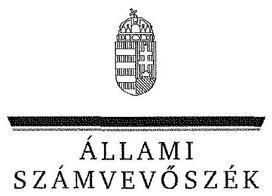
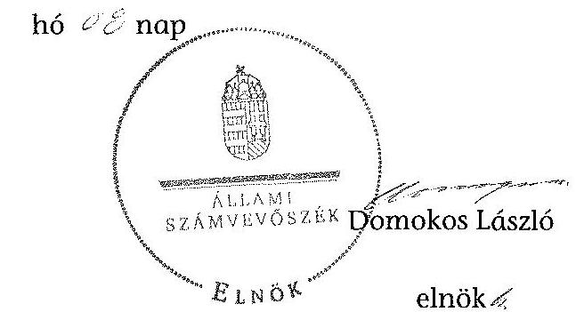
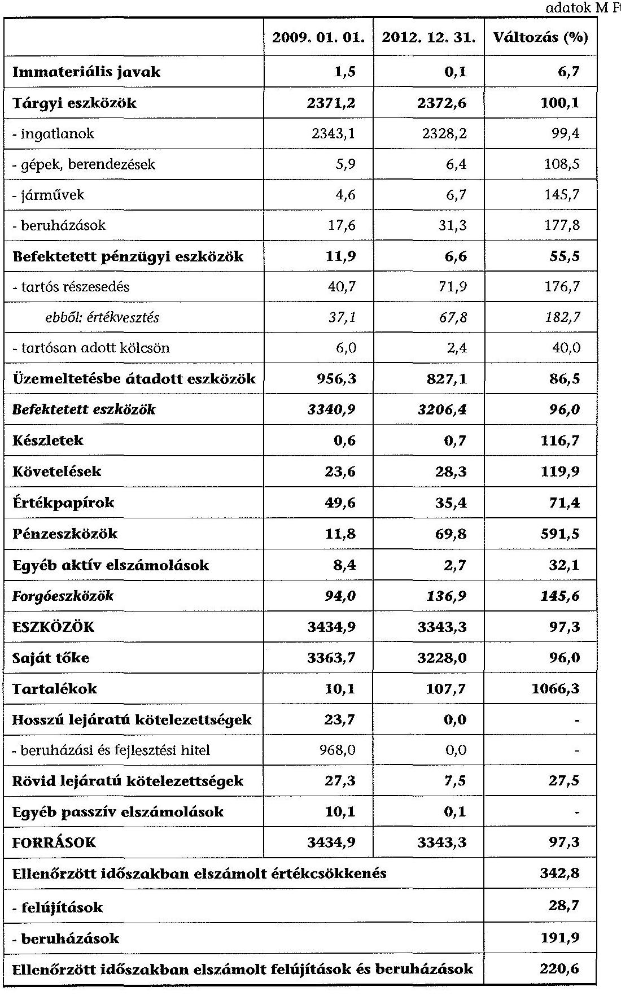

ÁLLAMI
SZÁMVEVŐSZÉK

# JELENTÉS 

az önkormányzatok vagyongazdálkodása szabályszerűségének ellenőrzéséről
Balatonfenyves

---

# Állami Számvevőszék 

Iktatószám: V-0207-066/2014.
Témaszám: 1242
Vizsgálat-azonosító szám: V065101

## Az ellenőrzést felügyelte:

Makkai Mária
felügyeleti vezető
Az ellenőrzést vezette és a végrehajtásáért felelős:
Tóth Marianna
ellenőrzésvezető
A számvevőszéki jelentés összeállításában közreműködött:
Horváthné Menyhárt Erika
számvevő főtanácsos
Hadnagyné Papp Ildikó
számvevő
Szepes Béla Bálint
számvevő tanácsos
Varga Ágnes Klára
számvevő
Az ellenőrzést végezték:
Dr. Lajos Béla
számvevő főtanácsos

Huszár József
számvevő tanácsos

---

# TARTALOMJEGYZÉK 

BEVEZETÉS ..... 3
I. ÖSSZEGZŐ MEGÁLLAPÍTÁSOK, KÖVETKEZTETÉSEK, JAVASLATOK ..... 6
II. RÉSZLETES MEGÁLLAPÍTÁSOK ..... 10

1. A vagyongazdálkodási tevékenység szabályozottsága ..... 10
1.1. A vagyongazdálkodási feladatellátás szabályozottsága, annak megfelelősége ..... 10
1.2. A vagyon használatba adásának, üzemeltetésre történő átadásának szabályszerűsége ..... 12
1.3. Az Nvtv. rendelkezéseinek végrehajtása ..... 13
2. A vagyongazdálkodási tevékenység szabályszerűségének biztosítása ..... 14
2.1. A vagyon nyilvántartása ..... 14
2.2. A térítés nélküli vagyonátadás és -átvétel ..... 15
2.3. A beruházások, felújítások végrehajtásának és a közbeszerzési eljárások alkalmazásának szabályszerűsége ..... 15
2.4. A tartós részesedésekkel való gazdálkodás ..... 16
2.5. Az önkormányzati vagyon értékesítése, hasznosítása ..... 17
2.6. Az önkormányzat tulajdonosi joggyakorlása ..... 18
3. Az integritás érvényesülése a vagyongazdálkodási tevékenység során ..... 18
4. Az önkormányzat vagyongazdálkodása szabályszerűségére vonatkozó belső és külső ellenőrzések megállapításainak, javaslatainak hasznosulása ..... 19
4.1. A belső ellenőrzés által tett megállapításoknak, javaslatoknak az önkormányzati vagyongazdálkodás szabályszerű működésére gyakorolt hatása ..... 19
4.2. A külső ellenőrzés által tett megállapításoknak, javaslatoknak az önkormányzati vagyongazdálkodás szabályszerű működésére gyakorolt hatása ..... 20

---

# MELLÉKLET 

1. számú Balatonfenyves Község Önkormányzata vagyongazdálkodásával összefüggő adatok

## FÜGGELÉK

1. számú Rövidítések jegyzéke

---

# JELENTÉS 

## az önkormányzatok vagyongazdálkodása szabályszerűségének ellenőrzéséről Balatonfenyves

## BEVEZETÉS

Az Állami Számvevőszék (a továbbiakban: ÁSZ) kiemelten fontosnak tartja az Állami Számvevőszékről szóló 2011. évi LXVI. törvény (a továbbiakban ÁSZ tv.) 5. § (4) és (5) bekezdése alapján az önkormányzati vagyon kezelésének, a vagyonnal való gazdálkodási szabályok betartásának az ellenőrzését. Az ellenőrzés feladata a vagyongazdálkodással kapcsolatban a közpénzek átláthatósága, nyilvánossága érdekében a jogszabályokban, belső szabályzatokban megfogalmazott előírások érvényesülésének áttekintése. Az ÁSZ nem csak az ellenőrzött szervezet vagyongazdálkodásának a hibáira mutat rá, számon kérve azok kijavítását, hanem megállapításaival, javaslataival segíti a közpénzzel, a közvagyonnal való felelős gazdálkodást.

Az önkormányzati vagyon alapvető funkciója, hogy a közérdeket és egyúttal az önkormányzati célok megvalósítását szolgálja. A feladatellátás terén elsősorban a kötelezően ellátandó feladatok végrehajtását hivatott szolgálni, amely mellett az önként vállalt feladatok ellátása is megvalósulhat.

Az ÁSZ a stratégiájában hangsúlyos szerepet szán annak, hogy szilárd szakmai alapon álló, értékteremtő ellenőrzéseivel előmozdítsa a közpénzügyek átláthatóságát, rendezettségét. Az ÁSZ a vagyongazdálkodás ellenőrzésén keresztül közreműködik az integritás alapú közigazgatási kultúra kialakításában.

Az ellenőrzés célja annak megállapítása volt, hogy a települési önkormányzat vagyongazdálkodási tevékenységének szabályozottsága és tevékenysége a jogszabályi előírásokkal összhangban volt-e, átlátható, a jogszabályi előírásoknak megfelelő volt-e a vagyon nyilvántartása, a külső és belső ellenőrzések megállapításai hozzájárultak-e az önkormányzati vagyongazdálkodási tevékenység szabályszerűségéhez.

Ennek keretében értékeltük, hogy az önkormányzat:

- szabályszerűen alakította-e ki a vagyongazdálkodási tevékenységének kereteit;
- biztosította-e a vagyongazdálkodás szabályszerűségét, megalapozottan hozta-e és jogszerűen, szabályszerűen hajtotta-e végre a vagyonváltozást eredményező meghatározó jelentőségű döntéseket, valamint gondoskodott-e az általa alapított vagy tulajdonosi részvételével működő gazdasági társaságokkal kapcsolatos tulajdonosi joggyakorlásról;

---

- gondoskodott-e vagyongazdálkodási tevékenysége során az integritás (feddhetetlenség) szempontjainak érvényesüléséről;
- belső ellenőrzése elősegítette-e a vagyongazdálkodás szabályszerű működését, valamint hasznosította-e a külső és belső ellenőrzések megállapításait, javaslatait.

Az ellenőrzés típusa szabályszerűségi ellenőrzés.
Az ellenőrzés a 2009. január 1. és 2012. december 31. közötti időszakra terjedt ki, kitekintéssel a helyszíni ellenőrzés befejezéséig tartó időszak releváns folyamataira. Az egyes közbeszerzési eljárások lefolytatásának ellenőrzése a 2012. január 1-jétől a helyszíni ellenőrzés kezdetét megelőző negyedév utolsó napjáig tartó időszakot érintette.

Az ellenőrzés szakmai módszertana az ÁSZ hivatalos honlapján közzétett szakmai szabályokon alapult, amely a Legfőbb Ellenőrző Intézmények Nemzetközi Szervezete (INTOSAI) által kiadott nemzetközi standardok (ISSAI) figyelembevételével készült.

Az ellenőrzést az ÁSZ hatályos szervezeti szabályai és az ellenőrzési programban foglalt értékelési szempontok szerint folytattuk le. Megállapításainkat a helyszíni ellenőrzés tapasztalataira, az ellenőrzött szervezettől bekért dokumentumokra, a kitöltött tanúsítványok elemzésére, valamint az adott időszakban hatályos jogszabályok és belső szabályzatok előírásaira alapoztuk. A vagyonváltozásokkal kapcsolatos gazdasági események közül az ellenőrzött tételeket megállásos mintavétellel választottuk ki a Polgármesteri Hivatal 2009-2012. évi számviteli nyilvántartásaiból.

A jelentésben alkalmazott rövidítéseket az 1. számú függelék tartalmazza.
Balatonfenyves lakosainak száma 2012. január 1-jén 2250 fő volt. A héttagú Képviselő-testület munkáját két állandó bizottság ${ }^{1}$ segítette. Az Önkormányzat mellett a 2009-2012. években kisebbségi önkormányzat, illetve nemzetiségi önkormányzat nem működött. A polgármester az 1991. évi önkormányzati választás óta folyamatosan betölti tisztségét, a jegyző a 2000. évtől látja el feladatait. A hivatal elkülönült szervezeti egységekre nem tagolódott, elkülönített gazdasági szervezettel nem rendelkezett, a foglalkoztatott köztisztviselők száma 2012. január 1-jén 14 fő volt.

Az Önkormányzat a feladatainak végrehajtása érdekében a 2012. évben három költségvetési intézményt működtetett, amelyből kettő önállóan működött², egy pedig önállóan működött és gazdálkodott ${ }^{3}$. A feladatok ellátásában részt vett négy gazdasági társaság ${ }^{4}$ és kettő társulás ${ }^{5}$.

[^0]
[^0]:    ${ }^{1}$ Pénzügyi és fejlesztési bizottság; Jogi és szociális bizottság
    ${ }^{2}$ Fekete István Általános Iskola és Könyvtár; Kisfenyő Óvoda
    ${ }^{3}$ Polgármesteri Hivatal
    ${ }^{4}$ DRV Zrt.; KÖZVIL Zrt.; Zöldfok Rt.; Dél-balatoni LEADER Vidékfejlesztési Nonprofit Zrt.
    ${ }^{5}$ Fonyód Kistérség Többcélú Társulása; Fonyód-Balatonfenyves Alapszolgáltatási Központ

---

Az Önkormányzat vagyona 2012. december 31-én a könyvviteli mérleg szerint 3343,3 M Ft volt, 91,6 M Ft-tal, 2,7%-al csökkent az ellenőrzött időszakban. Az Önkormányzat adósságállománya 2012. december 31-én 7,5 M Ft volt, az adósságkonszolidáció nem érintette. A 2012. évi költségvetési beszámolója szerint 710,1 M Ft költségvetési bevételt ért el, és 571,6 M Ft költségvetési kiadást teljesített, amelyből a felhalmozási célú kiadás 98,2 M Ft volt. Az Önkormányzat vagyongazdálkodásával összefüggő adatokat, mutatószámokat az 1. sz. melléklet tartalmazza.

Az ellenőrzés jogszabályi alapját az ÁSZ tv. 5. § (4) bekezdésének a) pontja és (5) bekezdése, valamint az államháztartásról szóló 2011. évi CXCV. törvény 61. § (2) bekezdésében foglaltak képezik.

Az ÁSZ a 2011. évi LXVI. törvény 29. § (1) bekezdése szerint a jelentéstervezetet megküldte egyeztetésre Balatonfenyves Község Önkormányzata polgármesterének, aki az ÁSZ tv. 29. § (2) bekezdésében foglalt észrevételezési jogával nem élt, a jelentéstervezetre észrevételt nem tett.

---

# I. ÖSSZEGZŐ MEGÁLLAPÍTÁSOK, KÖVETKEZTETÉSEK, JAVASLATOK 

Az Önkormányzat számviteli mérleg szerinti vagyona a 2009. január 1-jei 3434,9 M Ft-ról 2012. december 31-re - minimális mértékben - 2,7%-kal (3343,3 M Ft-ra) csökkent. Ennek oka elsősorban az üzemeltetésbe átadott eszközök után elszámolt értékcsökkenés, aminek következtében ezen eszközök állománya 13,5%-kal csökkent.

Az Önkormányzat a 2009-2012. években összesen 220,6 M Ft-ot fordított felújításokra és beruházásokra, amelyből a felújítás 28,7 M Ft-ot, a beruházás 191,9 M Ft-ot tett ki. A beruházásokra és felújításokra fordított összeg a 2009-2012. években 35,6%-kal elmaradt az elszámolt értékcsökkenés összegétől, ezzel nem járult hozzá az elhasználódott eszközök pótlásához.

A beruházások a gazdasági programban${ }_{1,2}$-ben foglaltak alapján valósultak meg, és az önkormányzati feladatellátással összhangban voltak. A beruházások és fejlesztések célja útfelújítás, közvilágítás-fejlesztés, strandpartfal és -fűnyírás kialakítása volt. A beruházások és felújítások fedezetét az Önkormányzat hazai és uniós támogatásból, továbbá saját forrásból biztosította. A beruházások megvalósítása során a szabályszerűséget biztosították, azonban a 2009., 2010. és 2012. évi kötelezettségvállalási nyilvántartás hiánya miatt nem történt meg a kötelezettségvállalások nyilvántartásba vétele. Az állományba vétel megtörtént. Az Önkormányzatnál 2012-2013. év I. félévében egy közbeszerzési eljárás indult, amelynél a szerződéskötésre a helyszíni ellenőrzés ideje alatt került sor.

Az Önkormányzat a vagyongazdálkodás szabályozása során eleget tett a jogszabályi előírásoknak. Az Ötv.-ben foglaltaknak megfelelően vagyongazdálkodási rendeletben határozta meg a törzsvagyon körét, elkülönítette a forgalomképes és forgalomképtelen vagyoni elemeket, rendelkezett a forgalomképesség szerinti megváltoztatás módjáról és a vagyon nyilvántartásáról. A Képviselő-testület az Nvtv. hatálybalépése után, a 60 napos határidőn túl, 2012. március 30-án fogadta el új vagyongazdálkodási rendeletét, amely szerint nemzetgazdasági szempontból kiemelt jelentőségű vagyonelemmel nem rendelkezik.

A tulajdonosi jogok körében rendelkeztek a vagyon elidegenítésének, megterhelésének, vállalkozásba vitelének és egyéb célú hasznosításának szabályairól. A vagyonváltozások nyilvános pályáztatási kötelezettségét a 2009-2011. években 10,0 M Ft-ban, a 2012. évtől 25,0 M Ft feletti összegben határozták meg. Az üzlethelyiségek bérbeadását - a lakásrendelet előírásai szerinti - pályáztatás előzte meg. A Képviselő-testület vagyongazdálkodási hatáskört csak 2012-től ruházott át a polgármesterre a 200,0 E Ft-ot el nem érő ingó vagyontárgyak elidegenítése esetére, a polgármester azonban ezzel a jogával nem élt.

---

Az Önkormányzat tulajdonosi jogait, érdekeit védő garanciális elemek szerződésekben, megállapodásokban való rögzítésének kötelezettségét nem írták elő, de a gyakorlatban alkalmazták a szerződést biztosító mellékkötelezettségeket.

A jegyző - a Htv. előírásainak megfelelően - kialakította az Önkormányzat és intézményei számviteli rendjét. Az Önkormányzat számviteli politikával és a hozzá kapcsolódó belső szabályzatokkal - értékelési, leltározási, selejtezési és pénzkezelési szabályzat, valamint számlarend - rendelkezett. A leltározási szabályzatában az üzemeltetésre, kezelésre átadott eszközök leltározásának gyakoriságát - az Áhsz.-ben foglalt évenkénti kötelezettséggel ellentétben - két évben határozta meg.

Az Önkormányzatnál a vagyongazdálkodás működésének szabályszerűsége a 2009-2012. években biztosított volt, a vagyonkimutatásokat a zárszámadással együtt a Képviselő-testület részére bemutatták. A vagyonkimutatások tartalmazták az Önkormányzat saját vagyonát forgalomképesség szerinti bontásban, azonban nem tartalmazták az érték nélkül nyilvántartott eszközök állományát, a „0"ra leírt, de használatban lévő, illetve használaton kívüli eszközök állományát, illetve az Önkormányzatot terhelő garanciális kötelezettségeket.

Az Önkormányzat a 2009-2012. években eleget tett az Áhsz.-ben előírt leltározási kötelezettségének. Az üzemeltetésre átadott eszközök vonatkozásában azonban nem tartották be az Áhsz.-ben foglaltakat, mivel az üzemeltető nem évente végzett mennyiségi leltárfelvételt.

Az Önkormányzat számviteli nyilvántartásában szereplő ingatlanvagyon, az ingatlanvagyon kataszter, valamint a földhivatali ingatlan-nyilvántartás adatainak egyezősége biztosított volt.

A gazdálkodási és ellenőrzési jogköröket a kötelezettségvállalási szabályzatban az Ámr. ${ }_{1,2}$ és az Ávr. előírásaival összhangban szabályozták. Az Önkormányzat - a 2011. évet kivéve - kötelezettségvállalási nyilvántartással nem rendelkezett. A gazdálkodási és ellenőrzési jogköröket az arra jogosultak gyakorolták, azonban a 2009-2010. években az utalvány ellenjegyzője, a 2009., 2010. és 2012. években az érvényesítő annak ellenére ellenjegyezte az utalványt, hogy az ellenőrzött tételeknél a vonatkozó jogszabályi előírások szerinti kötelezettségvállalási nyilvántartásba vétel nem történt meg.

Az Önkormányzat a 2009-2012. években gazdasági társaságot nem alapított, a 2012. év végén öt gazdasági társaságban volt kisebbségi részesedése, amelyekkel szembeni tulajdonosi jogait és kötelezettségeit tulajdoni részesedése mértékéig teljesítette. A tartós részesedései után - az ellenőrzött időszak alatt egy befektetésével összefüggésben 100%-os mértékű (67,7 M Ft) értékvesztést számolt el. Az értékvesztés elszámolását írásos javaslat alapján a polgármester jogosult jóváhagyni. A döntést - az önkormányzattól kapott nyilatkozat alapján - a polgármester szóban hozta meg, az értékelési szabályzatban foglaltakkal ellentétben erről írásos
 javaslat nem készült.

A jegyző az Eisztv. és az Info. tv. előírásai ellenére nem gondoskodott a közérdekű adatok közzétételéről, ezáltal nem biztosította a vagyongazdálkodási

---

tevékenység nyilvánosságát. Nem történt meg az éves elemi költségvetések és beszámolók közzététele a 2009-2012. évek vonatkozásában, valamint a közfeladatot ellátó szervnél foglalkoztatottak létszámára és személyi juttatásaira vonatkozó összesített adatok bemutatása.

Az Önkormányzat szervezetének és intézményeinek irányítása a mindennapi munkavégzés során a vagyongazdálkodási tevékenység integritását - az azzal összefüggő szabályozásbeli hiányosságok miatt - nem biztosította. Az ajándékok (meghívások, utaztatás) elfogadásának feltételeit, a dolgozói vagyoni érdekeltségek nyilvántartását és az összeférhetetlenségi követelményeket nem szabályozták. Az Önkormányzatnál - a Bkr. 6. § (1) bekezdés c) pontjával ellentétben - az etikai elvárások nem kerültek meghatározásra.

Az Önkormányzat 2009-2012 között belső ellenőrzését Társulás keretében látta el. A belső ellenőrzési tevékenység azonban nem járult hozzá a vagyongazdálkodás szabályszerűségéhez, mivel az éves ellenőrzési tervek vagyongazdálkodással kapcsolatos feladatot nem határoztak meg, ilyen jellegű ellenőrzés lefolytatására az ellenőrzött időszakban nem került sor.

A könyvvizsgáló véleményezte az Önkormányzat 2009-2012. évi beszámolóit és zárszámadási rendeleteit, amely során vagyongazdálkodással kapcsolatos hiányosságot nem állapított meg.

Az Állami Számvevőszékről szóló 2011. évi LXVI. törvény 33. § (1) bekezdésében foglaltak értelmében a jelentésben foglalt megállapításokhoz kapcsolódó intézkedési tervet köteles az ellenőrzött szervezet vezetője összeállítani, és azt a jelentés kézhezvételétől számított 30 napon belül az ÁSZ részére megküldeni. Amennyiben az intézkedési tervet határidőben nem küldi meg a szervezet, vagy az nem elfogadható, az ÁSZ elnöke a hivatkozott törvény 33. § (3) bekezdés a)-b) pontjaiban foglaltakat érvényesítheti.

Az ellenőrzés intézkedést igénylő megállapításai és javaslatai:

# a jegyzőnek 

1. Az Önkormányzat nem az Áhsz. 37. § (4) bekezdésében előírt eljárási szabályoknak megfelelően alakította ki leltározási szabályzatát az üzemeltetésre, kezelésre átadott eszközök vonatkozásában.

Javaslat:
Intézkedjen a leltározási szabályzat és az Áhsz. 37. § (4) bekezdésében - az üzemeltetésre, kezelésre átadott eszközök leltározása tekintetében - előírtak összhangjának biztosításáról.
2. A jegyző az Eisztv. 6. § (1) bekezdése és az Info. tv. 37. § (1) bekezdése szerinti előírások ellenére nem gondoskodott a közérdekű adatok közzétételére vonatkozó kötelezettségéről, ezáltal nem biztosította a vagyongazdálkodási tevékenység nyilvánosságát. Nem történt meg az éves elemi költségvetések és beszámolók közzététele a 2009-2012. évek vonatkozásában, valamint a közfeladatot ellátó szervnél foglalkoztatottak létszámára és személyi juttatásaira vonatkozó összesített adatok bemutatása.

---

Javaslat:
Intézkedjen az Info. tv. 1. számú mellékletében meghatározott adatok közzétételéről.
3. A Képviselő-testület által elfogadott zárszámadás részét képező vagyonkimutatás az Áhsz. 44/A. § (3) bekezdése és a 9. számú melléklet előírásai ellenére nem tartalmazta a mérlegben értékkel nem szereplő kötelezettségeket.

Javaslat:
Intézkedjen arról, hogy az Önkormányzat vagyonkimutatása tartalmazza az Áhsz. 44/A. § (3) bekezdésében előírt tartalmi elemeket is.
4. Az Önkormányzatnál a 2009., 2010. és 2012. években az Ámr. 134. § (13), az Ámr. 2 75. § (1) és az Ávr. 56. § (1) bekezdésében előírt kötelezettségvállalási nyilvántartást nem vezették. A 2009-2012. években a gazdálkodási jogköröket az arra jogosultak gyakorolták, azonban a 2009-2010. években az utalvány ellenjegyzője, a 2009., 2010. és 2012. években az érvényesítő annak ellenére ellenjegyezte az utalványt, hogy az ellenőrzött tételeknél a vonatkozó jogszabályi előírások szerinti kötelezettségvállalási nyilvántartásba vétel nem történt meg.

Javaslat:
a) Gondoskodjon az Ávr. 55-60. §-aiban előírt operatív gazdálkodási jogkörök szigorú betartásáról, a kontrollok hatékony működtetéséről, a feltárt hiányosságok megszüntetéséről, a működésbeli hibák megelőzéséről, feltárásáról és kijavításáról.
b) Intézkedjen az Ávr. 56. § (1) bekezdésének megfelelően a kötelezettségvállalások analitikus nyilvántartásának vezetéséről.
5. Az Önkormányzatnál - a Bkr. 6. § (1) bekezdés c) pontjával ellentétben - az etikai elvárások nem kerültek meghatározásra.

Javaslat:
Intézkedjen a Bkr. 6. § (1) bekezdés c) pontjában foglaltaknak megfelelően az etikai elvárások meghatározásáról.

---

# II. RÉSZLETES MEGÁLLAPÍTÁSOK 

## 1. A VAGYONGAZDÁLKODÁSI TEVÉKENYSÉG SZABÁLYOZOTTSÁGA

### 1.1. A vagyongazdálkodási feladatellátás szabályozottsága, annak megfelelősége

A Képviselő-testület a Htv. 138. § (1) bekezdés j) pontjában foglalt kötelezettségének eleget téve elfogadta az önkormányzati vagyonnal történő gazdálkodás szabályait. Jóváhagyta a vagyongazdálkodási feladat- és hatáskörökről rendelkező belső szabályzatokat, amelyek megfeleltek a jogszabályi előírásoknak.

Az Önkormányzat vagyonáról, a vagyongazdálkodásról, a vagyon feletti rendelkezés szabályairól 1997-ben alkotta meg a vagyongazdálkodási rendelet $_{1}$-t, majd 2012. március 30-án, az Nvtv. hatálybalépése után, az abban foglalt 60 napos határidőn túl a Képviselő-testület elfogadta a vagyongazdálkodási rendelet $_{2}$-t. Ez alapján az Önkormányzat nemzetgazdasági szempontból kiemelt jelentőségű vagyonelemekkel nem rendelkezik.

A vagyongazdálkodási rendelet $_{1,2}$ hatálya a teljes vagyoni körre kiterjedt. Meghatározták a törzsvagyon körét, és elkülönítették a forgalomképes és forgalomképtelen vagyoni elemeket, valamint rendelkeztek a forgalomképesség szerinti besorolás megváltoztatásának módjáról.

A vagyonváltozások nyilvános pályáztatási kötelezettségét 2009-2011 között 10,0 millió Ft, 2012-től 25,0 millió Ft értékhatárral határozták meg. Az üzlethelyiségek bérbeadását - a lakásrendelet előírásai szerint - pályáztatás előzte meg.

Az Önkormányzat a tulajdonában lévő vagyon ingyenes átruházásának eseteit és módjait a vagyongazdálkodási rendelet $_{1,2}$-ben szabályozta.

A Képviselő-testület a vagyongazdálkodási rendelet $_{1}$-ben vagyongazdálkodási hatáskört - sem a polgármesterre, sem a bizottságra - nem ruházott át. A vagyonnal való rendelkezési, döntési hatásköröket sem szabályozták külön, így hatáskör-átruházás hiányában a döntési jogkörök a Képviselő-testületnél maradtak. A vagyongazdálkodási rendelet $_{2}$-ben a Képviselő-testület a 200,0 E Ft alatti ingó vagyontárgyakkal kapcsolatos tulajdonosi döntésekre hatalmazta fel a polgármestert.

A tulajdonosi jogok körében a vagyon elidegenítésének, megterhelésének, vállalkozásba való vitelének és egyéb célú (bérlet, használat, hasznosítási jog, társulás, értékpapír-vásárlás) hasznosításának szabályait a vagyongazdálkodási rendelet $_{1,2}$-ben, illetve a lakásrendeletében határozta meg.

A Polgármesteri Hivatal a Számv. tv. 14. §-ában és az Áhsz. 8. §-ában foglalt jogszabályi előírásoknak megfelelően rendelkezett számviteli politikával

---

és a hozzá kapcsolódó belső szabályzatokkal (értékelési szabályzat, leltározási szabályzat, pénzkezelési szabályzat).

Az Önkormányzat a leltározási szabályzatában az Áhsz. 37. § (4) bekezdésében foglalt évenkénti mennyiségi leltárfelvételre vonatkozó előírás ellenére lehetővé tette, hogy az üzemeltetésre, kezelésre átadott eszközök leltárazását az üzemeltető kétévente végezze el.

Az Önkormányzat rendelkezett selejtezési szabályzattal, továbbá kialakította számlarendjét.

A gazdálkodási jogköröket a kötelezettségvállalási szabályzat $_{1,2,3}$-ban az Ámr. $_{1}$ 134-138. §-aiban, az Ámr. $_{2}$ 72-80. §-aiban és az Ávr. 52-60. §-aiban előírtakkal összhangban szabályozták, a gazdálkodási jogkörgyakorlók kijelölése megtörtént, az erről vezetett nyilvántartás naprakészségét biztosították, a velük kapcsolatos összeférhetetlenségi követelmények szabályozása megtörtént. A vagyongazdálkodási és az azzal kapcsolatos pénzügyi feladatokat ellátó ügyintézők rendelkeztek a jogszabályban előírt végzettséggel, munkaköri leírásaikban és a belső szabályzatokban feladataikat és felelősségüket megjelenítették.

A közbeszerzések bonyolításával kapcsolatos eljárási kérdésekről közbeszerzési szabályzatban rendelkeztek, a közbeszerzési értékhatár alatti beszerzések lebonyolításával kapcsolatos eljárási feladatokat beszerzési szabályzatban rögzítették.

A belső ellenőrzési kézikönyv a Társulás keretében készült el, amely tartalmazta mind a kockázatelemzési módszertant, mind az ellenőrzések hasznosításának, az ellenőrzést követő intézkedések elrendelésének szabályait. Az Önkormányzat FEUVE szabályzattal, aktualizált ellenőrzési nyomvonallal rendelkezett.

A Polgármesteri Hivatalnak ügyrendje nem volt, de az SZMSZ-e tartalmazta a feladatokat és hatásköröket, valamint a helyettesítés rendjét. Az Ámr. $_{2}$ 20. §-ában foglaltakkal ellentétben azonban nem tartalmazta a (külső-belső) kapcsolattartás, a reprezentációs kiadások felosztásának, teljesítésének és elszámolásának, a helyiségek és berendezések használatának és a gépjárművek igénybevételének, használatának rendjét.

Az Önkormányzat tulajdonosi jogait, érdekeit védő garanciális elemek szerződésekben, megállapodásokban való rögzítésének kötelezettségét nem írták elő, de a gyakorlatban alkalmazták a szerződést biztosító mellékkötelezettségeket. A hitelfelvétellel járó kockázatra elemzési kötelezettséget nem írtak elő, ugyanakkor hitelfelvételre a gyakorlatban csak egy gépkocsi vásárlása (pénzügyi lízing) kapcsán került sor. A döntés-előkészítés folyamatában a költség-haszon elemzés készítésének kötelezettségét, a fejlesztéssel létrehozott vagyontárgyak fenntarthatóságának, a működtetéshez és fenntartáshoz szükséges források biztosításának vizsgálatát nem írták elő.

Az Önkormányzat a 2007-2010., majd a 2011-2014. évekre is rendelkezett középtávú gazdasági programmal.

---

Az Önkormányzat a gazdasági programjában az ivóvíz- és szennyvízszolgáltatás ellátásának korszerűsítését tűzte ki célul. További fejlesztési célok a strandfelújításra és a környezetvédelemre irányultak. A fejlesztések forrásaként az Önkormányzat az európai és hazai pályázati lehetőségek kihasználását, valamint saját bevételeket jelölt meg.

A kötelező és önként vállalt feladatokat az önkormányzati SZMSZ-ben meghatározták, a feladatellátás módjáról azonban előzetesen nem döntöttek. Az önként vállalt feladatok ellátásának módját évente, a költségvetés elfogadása során határozták meg.

Az ellenőrzött időszakban a jegyző nem gondoskodott az Eisztv. 6. § (1) bekezdése szerinti, és az Info. tv. 37. § (1) bekezdése szerinti közérdekű adatok közzétételéről, ezáltal nem biztosította a vagyongazdálkodási tevékenység nyilvánosságát. A gazdálkodási adatokon belül nem történt meg az éves elemi költségvetések és beszámolók közzététele a 2009-2012. évek vonatkozásában, valamint a közfeladatot ellátó szervnél foglalkoztatottak létszámára és személyi juttatásaira vonatkozó összesített adatok bemutatása.

# 1.2. A vagyon használatba adásának, üzemeltetésre történő átadásának szabályszerűsége 

A Képviselő-testület nem élt az Ötv. 9. § (1)-(3) bekezdéseiben rögzített jogával, és vagyongazdálkodási hatáskört - a vagyongazdálkodási rendelet $_{1}$-ben a polgármesterre vagy a bizottságra - nem ruházott át.

Vagyongazdálkodási hatáskör átruházásra 2012-ben a vagyongazdálkodási rendelet $_{2}$-ben került sor. A 200,0 E Ft-ot el nem érő ingó vagyon esetén a tulajdonosi hozzájárulás megadásáról és elidegenítéséről a polgármester jogosult dönteni, amely jogával azonban nem élt.

Az Önkormányzat a vagyonkezelői jog megszerzésének, gyakorlásának és a vagyonkezelés ellenőrzésének szabályait nem határozta meg, vagyonkezelői jogot nem alapított, és vagyonkezelési szerződést nem kötött.

Koncessziós pályázat kiírása, koncessziós szerződés megkötése az ellenőrzött időszakban nem történt. Üzemeltetési szerződés aláírására a DRV Zrt.-vel a víziközmű-üzemeltetés kapcsán került sor.

A DRV Zrt. üzemeltetési szerződését, valamint a KÖZVIL Zrt.-vel közvilágítás fejlesztése tárgyában született szerződés megkötését megelőzően az Önkormányzatnak koncessziós és közbeszerzési pályázat kiírási kötelezettsége nem volt.

Az Önkormányzat DRV Zrt.-vel 2010. október 13-án kötött üzemeltetési szerződése a Vízgazdálkodási törvény 9. § (2) bekezdés d) pontja alapján nem állt a koncessziós tv. hatálya alatt, tekintve, hogy az Önkormányzat (kisebbségi) tulajdonosi pozícióba került a DRV Zrt.-ben.

Az Önkormányzat a KÖZVIL Zrt. 3712 db-ból álló részvénycsomagjának megvásárlására szerződést kötött, és ezzel kisebbségi tulajdonrészt szerzett a cégben, így a Kbt. 9. §-a értelmében mentesült a közbeszerzési eljárás lefolytatása alól.

---

A vagyon üzemeltetésre és használatba történő átadása szabályszerűen, a jogszabályoknak megfelelően történt. Az üzemeltető, hasznosító egyes kötelezettségeit a szerződésekben (a víziközmű-üzemeltetési szerződésben és az üzlethelyiségek bérleti szerződéseiben) írták elő, amelyek tartalmazták a vagyon megőrzési kötelezettségét és a „jó gazda” módjára való eljárás követelményét. Az üzemeltető, hasznosító ellenőrzésének részletes szabályait azonban nem határozták meg. Az üzemeltetési szerződések teljesítésének ellenőrzésére vonatkozólag az Önkormányzat intézkedést nem hozott, a belső ellenőrzés ezen a téren ellenőrzést nem folytatott.

Az elhasználódott eszközök pótlására vonatkozóan tartalékképzési kötelezettséget nem írtak elő. Az Önkormányzat az átadott víziközművekkel kapcsolatban évente 32,3 M Ft - az ellenőrzött időszakban összesen 129,2 M Ft - értékcsökkenést számolt el. Ennek pótlására évente változó összegű, az ellenőrzött időszakban összesen 29,0 M Ft beruházási célú pénzeszközt
 adott át az üzemeltető DRV Zrt.-nek, amely 77,5%-kal elmaradt az elszámolt értékcsökkenés összegétől.

# 1.3. Az Nvtv. rendelkezéseinek végrehajtása 

Az ellenőrzött időszakban az Önkormányzat vállalkozási tevékenység végzéséről nem döntött, ilyen jellegű tevékenységet nem folytatott.

Az Önkormányzat - saját intézményein kívül - csak természetes személyekkel kötött vagyonhasznosításra vonatkozó szerződéseket lakás- és üzlethelyiség, valamint külterületi föld bérbeadása/használata formájában, akik az Nvtv. 3. § (2) bekezdése alapján átláthatónak minősültek. Üzemeltetési szerződése a szintén átlátható szervezetnek minősülő DRV Zrt.-vel volt.

Az Önkormányzat gazdasági társaságot nem alapított, a 2012. év végén öt gazdasági társaságban volt kisebbségi részesedése:

Zöldfok Rt. (a szilárdhulladék-kezelést biztosítja) $3260,2 \mathrm{E} \mathrm{Ft}$, az Önkormányzat tulajdoni részaránya 1,4%; KÖZVIL Zrt. (közvilágítási szolgáltatás) $37120,0 \mathrm{E} \mathrm{Ft}$, az Önkormányzat tulajdoni részaránya 1,4%; Dél-balatoni LEADER Vidékfejlesztési Nonprofit Zrt. (uniós támogatásokkal kapcsolatos tanácsadás) 26,0 E Ft, az Önkormányzat tulajdoni részaránya 0,5%; Balaton-Boronka Kisvasút Kht. (beregi kisvasút fejlesztés idegenforgalmi célra) $900,0 \mathrm{E} \mathrm{Ft}$, az Önkormányzat tulajdoni részaránya 18%; DRV Zrt. (ivóvíz és szennyvízkezelés szolgáltatás) 10,0 E Ft, az Önkormányzat tulajdoni részaránya 0,000000003%. Az öt gazdasági társaság közül négy (a Balaton-Boronka Kisvasút Kht. kivételével) részt vett az Önkormányzat feladatellátásában.

A társaságok átlátható szervezetnek minősülnek. Az Önkormányzat a társasági szerződéseket az Nvtv. 18. § (4) és (7) bekezdése szerint felülvizsgálta, azokkal kapcsolatban intézkedés szükségessége nem merült fel.

---

# 2. A VAGYONGAZDÁLKODÁSI TEVÉKENYSÉG SZABÁLYSZERŰSÉGÉNEK BIZTOSÍTÁSA 

### 2.1. A vagyon nyilvántartása

A 2009-2012. években az Önkormányzatnál az Áht. 118. § (2) bekezdés 2. c) pontjában, illetve az Áht. 91. § (2) bekezdés c) pontjában előírtak alapján a vagyonkimutatásokat a zárszámadási rendeletekhez csatolták. A vagyonkimutatást az Önkormányzat vagyongazdálkodási rendeletében meghatározott szerkezetben készítették el, a nyilvántartásban a törzsvagyon, ezen belül a forgalomképtelen és korlátozottan forgalomképes, illetve az üzleti (forgalomképes) vagyonállományt és értéket elkülönítetten jelenítették meg.

Az Önkormányzat az Áhsz. 44/A. § (3) bekezdésében foglaltakkal ellentétben vagyonkimutatásaiban az érték nélkül nyilvántartott eszközök állományát, a „0"-ra leírt, de használatban lévő, illetve használaton kívüli eszközök állományát, valamint a mérlegben értékkel nem szereplő kötelezettségeket, ideértve a kezesség-, illetve garanciavállalással kapcsolatos függő kötelezettségeket nem mutatta ki.

A 2010. évben a helyi önkormányzati képviselők és a polgármester általános választását megelőző 30 nappal a polgármester közzé tette az Önkormányzat vagyoni helyzetét bemutató részletes jelentést.

Az Önkormányzat számviteli nyilvántartásában szereplő ingatlanvagyon, az ingatlanvagyon kataszter, valamint a földhivatali ingatlannyilvántartás adatainak egyezőségét biztosították.

Az ingatlanvagyon kataszter és a földhivatali nyilvántartás egyezőségét - a 147/1992. (XI. 6.) Korm. rendelet előírásainak megfelelően - biztosították. A vagyonkatasztert, annak 2004. évi létrehozásakor a teljes önkormányzati ingatlanvagyon földhivatali lekérése mellett tételesen egyeztették, az eltérések okait kivizsgálták, és a nyilvántartásokat a valós állapotnak megfelelően módosították. A vagyonváltozások esetében a földhivatali nyilvántartással való egyeztetést elvégezték, ezáltal a naprakész egyezőséget biztosították.

A könyvvizsgáló az ellenőrzött időszakban évente vizsgálta a költségvetési beszámoló, az ingatlanvagyon kataszter, illetve a zárszámadáshoz készített vagyonkimutatás egyezőségét. Az Önkormányzat könyvvizsgálója az éves beszámolókat hitelesítő záradékkal látta el. A vagyoni helyzetet és a vagyonnyilvántartás helyességét a könyvvizsgáló megbízhatónak, valósnak minősítette.

A vagyonelemekben bekövetkezett változásokat a részesedéseknél elszámolt értékvesztés kivételével szabályszerűen kiállított bizonylatok alapján rögzítették a számviteli nyilvántartásban.

A 2009-2012. évekre vonatkozóan a mérleg, a beszámoló, a főkönyvi kivonat és az analitikus nyilvántartások egyezősége fennállt. A mérlegben kimutatott eszközök - az üzemeltetésre, kezelésre adott eszközöket kivéve - leltározása és selejtezése a jogszabályoknak és a belső szabályozásnak megfelelően történt. A leltárak kiértékelése megtörtént, eltérés nem volt.

---

Az üzemeltetésbe adott eszközöket az üzemeltetésbe vevő DRV Zrt. az Áhsz. 37. § (4) bekezdésével ellentétben 2 évenként leltározta.

Önkormányzati tulajdonú vagyontárgy elbirtoklására az ellenőrzött időszakban nem került sor.

A 2009-2012. években az összes eszköz értéke 3434,9 M Ft-ról 3343,3 M Ft-ra változott, ennek fő oka az üzemeltetésbe átadott eszközöknél vissza nem pótolt, de elszámolt értékcsökkenés állománya.

Az eszközök 68,2-69,6%-át az ingatlanok, 27,8-24,7%-át az üzemeltetésre, kezelésre átadott eszközök értéke tette ki. Az üzemeltetésre átadott eszközök állománya az elszámolt értékcsökkentés eredményeként 2009-ről 2012-re 13,5%-kal (129,2 M Ft) csökkent, amelyet a tárgyi eszközök értékének minimális (0,1%), illetve a forgóeszközök értékének 45,6%-os (42,9 M Ft) emelkedése sem tudott kompenzálni.

A pénzeszközök stabil, illetve bővülő likvidítást biztosítottak az Önkormányzat részére, állományuk 11,8 M Ft-ról 69,8 M Ft-ra nőtt. A forgatási célú értékpapírok az Önkormányzat likvid tartalékát képezték, állományuk a 2009-2012. években 49,6 M Ft-ról 35,4 M Ft-ra csökkent.

Az Önkormányzatnál a 2009., 2010., 2012. években az Ámr. 134. § (13) bekezdésében, az Ámr. 75. § (1) és az Ávr. 56. § (1) bekezdésében előírt kötelezettségvállalási nyilvántartást nem vezették. A 2009-2012. években a gazdálkodási jogköröket az arra jogosultak gyakorolták, azonban a 2009-2010. években az utalvány ellenjegyzője, a 2009., 2010. és 2012. években az érvényesítő annak ellenére ellenjegyezte az utalványt, hogy az ellenőrzött tételeknél a vonatkozó jogszabályi előírások szerinti kötelezettségvállalási nyilvántartásba vétel nem történt meg.

A vagyonváltozásokra vonatkozó döntések jogszerűek, emellett - a KÖZVII. Zrt. részesedésállományával szemben elszámolt értékvesztést kivéve - dokumentumokkal alátámasztottak voltak.

# 2.2. A térítés nélküli vagyonátadás és -átvétel 

Az Önkormányzatánál térítés nélküli vagyonátadás az ellenőrzött időszakban nem volt. Térítés nélküli átvételre egy esetben került sor, 0,2 M Ft értékben, amikor képviselő-testületi határozat alapján, ajándékozással került egy földterület az Önkormányzat tulajdonába. Az átvétel egy telek kialakításához és az oda vezető út önkormányzati tulajdonba vételéhez kapcsolódott.

### 2.3. A beruházások, felújítások végrehajtásának és a közbeszerzési eljárások alkalmazásának szabályszerűsége

Az Önkormányzat a 2009-2012. években összesen 220,6 M Ft-ot fordított felújításokra és beruházásokra, amelyből a felújítás 28,7 M Ft-ot, a beruházás 191,9 M Ft-ot tett ki. A beruházások a gazdasági programban foglaltak alapján valósultak meg, és az önkormányzati feladatellátással összhangban

---

voltak. Az Önkormányzat rendelkezett közép- és hosszú távú vagyongazdálkodási tervvel is.

A beruházások és fejlesztések célja útfelújítás, közvilágítás-fejlesztés, strandpartfal és -fűnyírás kialakítása voltak. A beruházások megvalósítása során a szabályszerűséget biztosították, azonban a 2009., 2010. és 2012. évi kötelezettségvállalási nyilvántartás hiánya miatt nem történt meg a kötelezettségvállalások nyilvántartásba vétele. Az állományba vétel - a bizonylatok alapján - megtörtént, a vagyonváltozás az ingatlanvagyon kataszterben átvezetésre került. A beruházások határidőre megvalósultak, kötbér vagy egyéb szankció alkalmazására nem került sor.

A fejlesztés finanszírozásához szükséges források rendelkezésre álltak, a fejlesztések forrása a saját erő mellett pályázati támogatás volt. Hitel igénybevételére az ellenőrzött időszakban nem került sor. A működtetéshez, fenntarthatósághoz szükséges forrásokat az éves költségvetési rendeletekben biztosították.

Az Önkormányzat a Kbt. 10. §-ában előírt értékhatárt elérő vagy azt meghaladó értékű beszerzéseknél a közbeszerzési eljárást szabályszerűen folytatta le és megfelelően alkalmazta.

Az Önkormányzatnál a 2012-2013. év I. félévében egy közbeszerzési eljárás indult, amely a Polgármesteri Hivatal épületenergetikai fejlesztésére irányult. A nyertes ajánlattevővel a szerződés megkötésére a helyszíni ellenőrzés ideje alatt került sor.

A beruházásokkal kapcsolatos intézkedések során betartották az Ötv. 91. § (6), a Nvtv. 7. § (1) és (2) bekezdésében, valamint az épített környezet alakításáról és védelméről szóló 1997. évi LXXVIII. törvény 31. § (1) d) és (4) c) bekezdésében foglalt, az akadálymentesítéssel kapcsolatos szabályokat.

Az ellenőrzött időszakban az Önkormányzat nem döntött PPP konstrukcióban megvalósított fejlesztésekről.

# 2.4. A tartós részesedésekkel való gazdálkodás 

Az Önkormányzat a 2009-2012. években gazdasági társaságot nem alapított, illetve a 2012. év végén öt gazdasági társaságban volt kisebbségi részesedése, amelyekkel kapcsolatban tulajdonosi jogait és kötelezettségeit tulajdoni részesedése mértékéig teljesítette.

Az ELMIB ajánlatot tett a község közvilágításának olyan rekonstrukciós beruházására, amely az áramdíjcsökkenésből keletkező költségmegtakarításból finanszírozható, így az Önkormányzat számára többlet költségráfordítással nem jár. A finanszírozás hátterét az ELMIB a tulajdonában álló KÖZVII. Zrt. részvények Önkormányzat általi megvásárlásával teremtette meg. Az Önkormányzat a 37,1 millió Ft névértékű részvénycsomagot 8 és fél év alatt összesen 67,7 millió Ft bekerülési értéken vásárolta meg. Az Önkormányzat ezzel 1,4%-os tulajdoni részt szerzett a KÖZVII. Zrt-ben.

A polgármester az ajánlat alapján határozati javaslatot terjesztett a Képviselőtestület elé, melyet a Képviselő-testület elfogadott. Az ajánlat elválaszthatatlan

---

részét képezte az ELMIB által kialakított részvényátruházási szerződés. A részvénycsomag ellenértékének kiegyenlítésére 2004-2012. év I. félév között, éves rendszerességgel teljesített, halasztott fizetéssel került sor.

Az Önkormányzat a 2012. év végéig a KÖZVIL Zrt. részesedésállományával szemben 100%-os mértékű, 67,7 M Ft értékvesztést számolt el.

A KÖZVIL Zrt. 2011. év végi vagyona 3237 M Ft-ot tett ki, ebből 2713,9 M Ft befektetett eszköz volt, kötelezettségeinek 455,9 M Ft összege a tárgyévi 1580,5 M Ft árbevételhez képest kezelhető mértékű volt, és 17,9 M Ft összegű adózott eredményt realizált.

Az értékvesztés elszámolását az értékelési szabályzatnak megfelelően írásos javaslat alapján a polgármester jogosult jóváhagyni. A döntést - az önkormányzattól kapott nyilatkozat alapján - a polgármester szóban hozta meg, az értékelési szabályzatban foglaltakkal ellentétben erről írásos javaslat nem készült. A polgármester a könyvvizsgáló véleményére alapozta döntését. Az Önkormányzat könyvvizsgálója az értékvesztést megalapozó álláspontját a KÖZVIL Zrt. saját tőkéjének a jegyzett tőke névértéke alá süllyedésére alapozta.

Az Önkormányzat értékelési szabályzata a tartósság szempontjából figyelembe veendő időszakra, illetve a saját tőke - jegyzett tőke arányára vonatkozóan nem tartalmaz előírást. A könyvvizsgáló adatai alapján a KÖZVIL Zrt. jegyzett és saját tőkéjének aránya az ellenőrzött időszakban a 120,2%-ról 92,1%-ra csökkent.

A Képviselő-testület az ellenőrzött időszakban a Turisztikai Egyesület által a 2012. évben kapott pályázati támogatás biztosítékaként 50,0 M Ft összegű jelzálogjog bejegyzését engedélyezte az Önkormányzat ingatlanára.

A Turisztikai Egyesület a DDOP keretében a balatonfenyvesi turisztikai desztináció növelését célzó 50,0 M Ft támogatásban részesült.

A jelzálogjog alapítására a Képviselő-testület határozata alapján, a jogszabályi előírásoknak megfelelően került sor. A Képviselő-testület az egyesület javára történő kezesség vállalásától elzárkózott, így a jelzálogjog alapítása ezt helyettesítette.

Az ellenőrzött időszakban az Önkormányzat önkormányzati feladatot ellátó gazdasági társaság részére működési, felhalmozási hitelt, illetve tagi kölcsönt nem nyújtott.

# 2.5. Az önkormányzati vagyon értékesítése, hasznosítása 

Az Önkormányzatnál vagyonértékesítés a 2009-2012. években nem volt. A vagyonhasznosítás jellemző formája az önkormányzati üzlethelyiségek bérbeadása volt.

Az Önkormányzat a hasznosításra vonatkozó döntéseit előkészítő dokumentumokkal alátámasztottan hozta meg. Ennek során betartották a vagyongazdálkodási rendeletben foglalt szabályokat.

A hasznosítási eljárás folyamatát nyilvános pályázati felhívással indították, amelyre a jelentkezőket előzetesen véleményezték. A pályázók bánatpénzt voltak

---

kötelesek biztosítékként befizetni, amelynek megtörténtét a pályázati dokumentációk tartalmazták. A pályázók részvételével nyilvános licitet tartottak, amelynek eredményeként az önkormányzati üzlethelyiség éves bérleti díja megkétszereződött.

Az ellenőrzött időszakban az Önkormányzatnak egy üresen álló ingatlana volt, amelyre vonatkozóan a Képviselő-testület a helyszíni ellenőrzés befejezéséig nem hozott döntést (korábban iskolaigazgatói szolgálati lakás célját szolgálta).

Követelés elengedésre az Önkormányzatnál a vagyongazdálkodást érintően nem került sor.

Az elengedett követelések az építményadó, telekadó, idegenforgalmi adó, kommunális adó,
 iparűzési adó adónemeket érintették, összesített értékük az ellenőrzött időszak éveiben a $0,8 \mathrm{M}$ Ft-ot nem haladta meg.

# 2.6. Az önkormányzat tulajdonosi joggyakorlása 

Az önkormányzati feladatokat ellátó költségvetési szervek a vagyon használatának gyakorlásáról a zárszámadáshoz kapcsolódóan, éves beszámolójuk keretében adtak számot.

A 2009-2012. években vagyonkezelési tevékenységet az Önkormányzatnál elkülönült szervezettel nem végeztettek, az Önkormányzat kizárólagos tulajdonában gazdasági társaság nem volt.

A kisebbségi önkormányzati tulajdonban álló gazdasági társaságok beszámolóival kapcsolatos tárgyalási, szavazási, egyetértési kötelezettségeit tulajdoni részesedése mértékéig az Önkormányzat teljesítette. (Az Önkormányzat részesedésének mértéke az öt társaságban 0,000000003\% és $18 \%$ között volt.)

Az Önkormányzat képviselőinek tevékenysége elsődlegesen az Önkormányzat részére szolgáltatást nyújtó gazdasági társaságok által végzett szolgáltatások szerződés szerinti elvégzésére irányult. Az Önkormányzat érdekeit ezen túlmenően a társaságok közgyűlésén, döntéshozó testületeiben a rendelkezésre álló jogosítványok keretei között igyekeztek érvényesíteni.

## 3. AZ INTEGRITÁS ÉRVÉNYESÜLÉSE A VAGYONGAZDÁLKODÁSI TEVÉKENYSÉG SORÁN

Az Önkormányzat szervezetének és intézményeinek irányítása a mindennapi munkavégzés során a vagyongazdálkodási tevékenység integritását - az azzal összefüggő szabályozásbeli hiányosságok miatt - nem biztosította.

Az Önkormányzat rendelkezett az alapvető - a vagyongazdálkodási tevékenység szabályosságát biztosító, a jogszabályi előírásoknak megfelelően elkészített és kiadmányozott - belső szabályzatokkal. A Polgármesteri Hivatalnak ügyrendje nem volt, de az SZMSZ-e tartalmazta a feladatokat és hatásköröket, valamint a helyettesítés rendjét. Nem tartalmazta azonban a (külső-belső) kapcsolattartás, a reprezentációs kiadások felosztásának, teljesítésének és elszámolásának, a helyiségek és berendezések használatának és a gépjárművek igénybevételének, használatának rendjét. Az Önkormányzatnál - a Bkr. 6. § (1) bekezdés c) pontjával ellentétben - az etikai elvárások nem kerültek meghatározásra.

Az Önkormányzatnál az integritás biztosításával összefüggésben az ajándékok (meghívások, utaztatás) elfogadásának feltételeit, a dolgozói vagyoni érdekeltségek nyilvántartását és az összeférhetetlenségi követelményeket nem szabályozták. Rendszeres korrupciós kockázatelemzést nem végeztek. A pénzeszközök, dokumentumok és kulcsok megőrzése biztosított volt, az önkormányzati eszközök személyes használatát a telefon esetében szabályozták. Fegyelmi vétségek és etikai problémák a Polgármesteri Hivatalban az elmúlt három évben nem merültek fel.

Az Önkormányzatnál a belső ellenőrzés funkcionális függetlenségét biztosították.
4. AZ ÖNKORMÁNYZAT VAGYONGAZDÁLKODÁSA SZABÁLYSZERŰSÉGÉRE VONATKOZÓ BELSŐ ÉS KÜLSŐ ELLENŐRZÉSEK MEGÁLLAPÍTÁSAINAK, JAVASLATAINAK HASZNOSULÁSA

# 4.1. A belső ellenőrzés által tett megállapításoknak, javaslatoknak az önkormányzati vagyongazdálkodás szabályszerű működésére gyakorolt hatása 

Az Önkormányzatnál a belső ellenőrzési feladatokat a 2009-2012. években Társulás keretében látták el. A belső ellenőrzés ellátásának módját a Ber. 4. § (2) és a Bkr. 15. § (2) bekezdésében foglaltakra figyelemmel a hivatali SZMSZ-ben határozták meg.

A belső ellenőrzés az Önkormányzat vagyongazdálkodásának szabályszerű működését nem segítette elő.

Az éves ellenőrzési terveket - a 2009. év kivételével - a Ber. 21. § (2) és a Bkr. 31. § (2) bekezdése előírásának megfelelően kockázatelemzéssel alapozták meg, azonban ezek a 2009-2012. években - a Ber. 8. § c) pontjának és a Bkr. 21. § (2) bekezdés b) pontjának előírásait figyelmen kívül hagyva vagyongazdálkodással kapcsolatos feladatokat nem határoztak meg. A Képviselő-testület az éves belső ellenőrzési terveket jóváhagyta, azokhoz a vagyongazdálkodással kapcsolatos ellenőrzésre javaslatot nem tett.

A 2009-2012. évekre vonatkozóan a jegyző az Ámr. ${ }_{1}$ 23. számú mellékletében, illetve az Ámr. ${ }_{2}$ 21. és a Bkr. 1. sz. számú mellékletében előírt - a belső kontrollok működtetéséről szóló - nyilatkozattételi kötelezettségének eleget tett.

# 4.2. A külső ellenőrzés által tett megállapításoknak, javaslatoknak az önkormányzati vagyongazdálkodás szabályszerű működésére gyakorolt hatása 

Az Önkormányzat - korábbi hitelfelvétel miatt - 2012-ig állt könyvvizsgálati kötelezettség alatt, de saját döntése alapján a könyvvizsgálót továbbra is alkalmazta. A könyvvizsgáló véleményezte az Önkormányzat éves beszámolóit és a zárszámadási rendeleteket, ennek során vagyongazdálkodással kapcsolatos hiányosságot nem állapított meg.

Az ellenőrzött időszakban az Önkormányzatnál a Kincstár végzett ellenőrzést a „Vachott Sándor utca elektromos hálózatának kiváltása" elnevezésű, CÉDE támogatás felhasználásával járó beruházás megvalósításáról. Az ellenőrzés a beruházás megvalósítását megfelelőnek találta.

Az Önkormányzat vagyongazdálkodását a 2009-2012. években - a Kincstáron kívül - külső ellenőrző szerv nem ellenőrizte.

Budapest, 2014.

Melléklet: $\quad 1 \mathrm{db}$
Függelék: $\quad 1 \mathrm{db}$

Balatonfenyves Község Önkormányzata vagyongazdálkodásával összefüggő adatok

# RÖVIDÍTÉSEK JEGYZÉKE 

| Törvények |  |
| :--: | :--: |
| Áht. 1 | az államháztartásról szóló 1992. évi XXXVIII. törvény (hatályon kívül: 2012. január 1-jétől) |
| Áht. 2 | az államháztartásról szóló 2011. évi CXCV. törvény (hatályos: 2012. január 1-jétől) |
| ÁSZ tv. | 2011. évi LXVI. törvény az Állami Számvevőszékről |
| Eisztv. | az elektronikus információszabadságról szóló 2005. évi XC. törvény (hatályon kívül: 2012. január 1-jétől) |
| Htv. | a helyi önkormányzatok és szerveik, a köztársasági megbízottak, valamint egyes centrális alárendeltségű szervek feladat- és hatásköreiről szóló 1991. évi XX. törvény |
| Info. tv. | az információs önrendelkezési jogról és az információszabadságról szóló 2011. évi CXII. törvény (hatályos: 2012. január 1-jétől) |
| Kbt. | a közbeszerzésekről szóló 2011. évi CVIII. törvény (hatályos: 2011. augusztus 21-től, kivéve a 180. § (2) bekezdésében meghatározott paragrafusok egyes bekezdéseit és a mellékleteket, amelyek 2012. január 1-jétől léptek hatályba) |
| Koncessziós tv. | 1991. évi XVI. törvény a koncesszióról |
| Nvtv. | a nemzeti vagyonról szóló 2011. évi CXCVI. törvény (hatályos: 2012. december 31-től, kivéve a 20. § (2)-(3) bekezdéseiben meghatározott paragrafusokat) |
| Ötv. | a helyi önkormányzatokról szóló 1990. évi LXV. törvény |
| Számv. tv. | a számvitelről szóló 2000. évi C. törvény |
| Vízgazdálkodási törvény | 1995. évi LVII. törvény |
| Rendeletek |  |
| Áhsz. | az államháztartás szervezetei beszámolási és könyvvezetési kötelezettségének sajátosságairól szóló 249/2000. (XII. 24.) Korm. rendelet |
| Ámr. 1 | az államháztartás működési rendjéről szóló 217/1998. (XII. 30.) Korm. rendelet (hatályon kívül: 2010. január 1-jétől) |
| Ámr. 2 | az államháztartás működési rendjéről szóló 292/2009. (XII. 19.) Korm. rendelet (hatályon kívül: 2012. január 1-jétől) |
| Ávr. | az államháztartásról szóló törvény végrehajtásáról szóló 368/2011. (XII. 31.) Korm. rendelet (hatályos: 2012. január 1-jétől) |
| Ber. | a költségvetési szervek belső ellenőrzéséről szóló 193/2003. (XI. 26.) Korm. rendelet (hatályon kívül: 2012. január 1-jétől) |

| Bkr. | a költségvetési szervek belső kontrollrendszeréről és belső ellenőrzéséről szóló 370/2011. (XII. 31.) Korm. rendelet (hatályos: 2012. január 1-jétől, kivéve a 15. § (5) bekezdését, mely 2012. július 1-jétől hatályos) |
| :--: | :--: |
| lakásrendelet | Az önkormányzati lakások és helységek bérletéről és elidegenítési feltételeiről szóló 56/2003. (III.31.) számú Képviselő-testületi rendelet |
| önkormányzati SZMSZ | Balatonfenyves Község Önkormányzat Képviselőtestületének 1/2001. (I. 26.) önkormányzati rendelete a Szervezeti és Működési Szabályzatáról |
| vagyongazdálkodási rendelet ${ }_{1}$ | Balatonfenyves Község Önkormányzat 4/1997 (II. 27.) K.T. számú rendelete a vagyongazdálkodásról |
| vagyongazdálkodási rendelet ${ }_{2}$ | Balatonfenyves Község Önkormányzat 3/2012. (III. 30.) K.T. számú rendelete a vagyongazdálkodásról |
| 147/1992. (XI. 6.) Korm. rendelet | az önkormányzatok tulajdonában lévő ingatlanvagyon nyilvántartási és adatszolgáltatási rendjéről szóló 147/1992. (XI. 6.) Korm. rendelet |
| Szórövidítések |  |
| ÁSZ | Állami Számvevőszék |
| belső kontroll szabályzat | Belső Kontrollrendszer Szabályozása (hatályos: 2012. április 2-ától) |
| beszerzési szabályzat | 149/2009. (VI. 25.) sz. K.T. határozat: Beszerzési Szabályzat a közbeszerzési értékhatár alatti beszerzésekről |
| CÉDE | Céljellegű decentralizált támogatás |
| DRV Zrt. | Dunántúli Regionális Vízmű Zártkörűen működő részvénytársaság |
| ELMIB | Első Magyar Infrastruktúra Befektetési Rt. |
| értékelési szabályzat | Eszközök és Források Értékelési Szabályzata (hatályos: 2009. január 1-jétől) |
| FEUVE | Folyamatba épített előzetes, utólagos és vezetői ellenőrzés |
| gazdasági program ${ }_{1}$ | Balatonfenyves Községi Önkormányzat Képviselőtestületének Gazdasági programja a 2007-2010. évre |
| gazdasági program ${ }_{2}$ | Balatonfenyves Községi Önkormányzat 52/2011. (III. 31.) sz. K.T. határozata az Önkormányzat Gazdasági programjáról a 2011-2014. évre |
| hivatali SZMSZ | Polgármesteri Hivatal Szervezeti és Működési Szabályzata (hatályos: 2007. január 1-jétől) |
| Intézményfenntartó Társulás | Fonyód-Balatonfenyves Alapszolgáltatási Központ |
| jegyző | Balatonfenyves Község Önkormányzata jegyzője |
| Képviselő-testület | Balatonfenyves Község Önkormányzata Képviselőtestülete |
| Kincstár | Magyar Államkincstár |
| kötelezettség-vállalási szabályzat ${ }_{1}$ | A kötelezettségvállalás, ellenjegyzés, érvényesítés, utalványozás, szakmai teljesítés igazolás rendjének szabályzata (hatályos: 2010. szeptember 1-jétől) |

| kötelezettség-vállalási szabályzat ${ }_{2}$ | A kötelezettségvállalás, ellenjegyzés, érvényesítés, utalványozás, szakmai teljesítés igazolás rendjének szabályzata (hatályos: 2011. július 1-jétől) |
| kötelezettség-vállalási szabályzat ${ }_{3}$ | A kötelezettségvállalás, ellenjegyzés, érvényesítés, utalványozás, szakmai teljesítés igazolás rendjének szabályzata (hatályos: 2012. április 2-tól) |
| közbeszerzési szabályzat | 18/2009. (II. 13.) Képviselő-testületi határozattal jóváhagyott Közbeszerzési Szabályzat |
| KÖZVIL Zrt. | Első Magyar Közvilágítási Zrt. |
| leltározási szabályzat | Leltárkészítési és Leltári Szabályzat (hatályos: 2009. november 1-jétől) |
| Önkormányzat | Balatonfenyves Község Önkormányzata |
| polgármester | Balatonfenyves Község Önkormányzata polgármestere |
| Polgármesteri Hivatal | Balatonfenyves Község Önkormányzata Polgármesteri Hivatala |
| PPP | Public Private Partnership (Partnerségi együttműködés közfeladatok ellátására magánszektor bevonásával) |
| számlarend | Számlarend (hatályos: 2010. július 1-jétől) |
| számviteli politika | Számviteli politika (hatályos: 2009. január 1-jétől) |
| Társulás | Fonyód Kistérség Többcélú Társulása |
| Turisztikai Egyesület | Balatonfenyvesi Turisztikai Egyesület |
| Víziközmű Társulat | Fonyód-Balatonfenyves Víziközmű Társulat |

