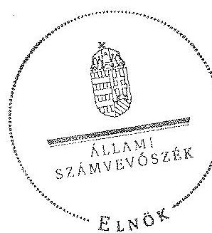
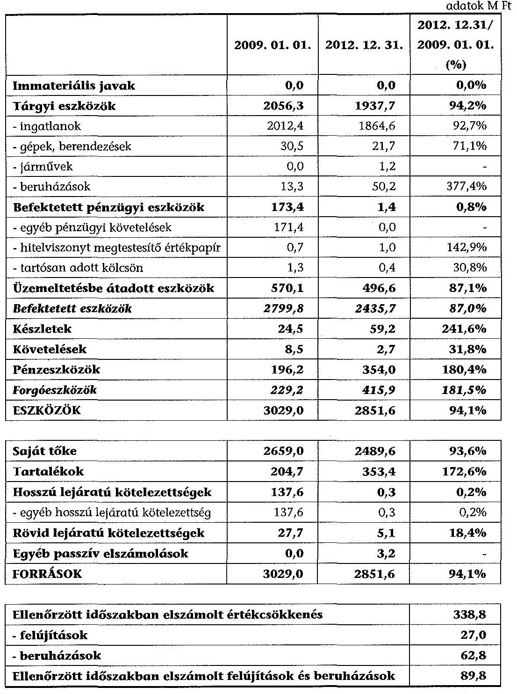

# ÁLLAMI   SZÁMVEVÔSZÉK 

## JELENTÉS

az önkormányzatok vagyongazdálkodása szabályszerűségének ellenőrzéséről

Baracs

---

# Állami Számvevőszék 

Iktatószám: V-0208-118/2014.
Témaszám: 1243
Vizsgálat-azonosító szám: V065102

## Az ellenőrzést felügyelte:

## Makkai Mária

felügyeleti vezető

## Az ellenőrzést vezette és a végrehajtásáért felelős:

## Tóth Marianna

ellenőrzésvezető

## A számvevőszéki jelentés összeállításában közremüködött:

## Horváthné Menyhárt Erika

számvevő főtanácsos

## Hadnagyné Papp Ildikó

számvevő

## Szepes Béla Bálint

számvevő tanácsos

## Varga Ágnes Klára

számvevő

## Az ellenőrzést végezték:

## Bretus Zoltán János

számvevő

Varga Ágnes Klára
számvevő

---

# TARTALOMJEGYZÉK 

BEVEZETÉS ..... 3
I. ÖSSZEGZŐ MEGÁLLAPÍTÁSOK, KÖVETKEZTETÉSEK, JAVASLATOK ..... 6
II. RÉSZLETES MEGÁLLAPÍTÁSOK ..... 9

1. Az önkormányzat vagyongazdálkodási tevékenységének szabályozottsága ..... 9
1.1. Az önkormányzat vagyongazdálkodási feladatellátásának szabályozottsága, annak megfelelősége ..... 9
1.2. A vagyon használatba adásának, üzemeltetésre történő átadásának szabályszerűsége ..... 11
1.3. Az Nvtv. rendelkezéseinek végrehajtása ..... 12
2. Az önkormányzat vagyongazdálkodási tevékenységének szabályszerűsége ..... 12
2.1. A vagyon nyilvántartásának szabályszerűsége ..... 12
2.2. A beruházások, felújítások végrehajtásának és a közbeszerzési eljárások alkalmazásának szabályszerűsége ..... 14
2.3. A tartós részesedésekkel való gazdálkodás ..... 14
2.4. Az önkormányzati vagyon értékesítése, hasznosítása ..... 15
2.5. Az önkormányzat tulajdonosi joggyakorlása ..... 15
3. Az integritás érvényesülése vagyongazdálkodási tevékenység során ..... 16
4. Az önkormányzat vagyongazdálkodása szabályszerűségére vonatkozó belső és külső ellenőrzések megállapításainak, javaslatainak hasznosulása ..... 16
4.1. A belső ellenőrzés által tett megállapításoknak, javaslatoknak az önkormányzati vagyongazdálkodás szabályszerű működésére gyakorolt hatása ..... 16
4.2. A külső ellenőrzés által tett megállapításoknak, javaslatoknak az önkormányzati vagyongazdálkodás szabályszerű működésére gyakorolt hatása ..... 17

## MELLÉKLETEK

1. számú Baracs Község Önkormányzat vagyongazdálkodásával összefüggő adatok

## FÜGGELÉKEK

1. számú Rövidítések jegyzéke

---

.

---

# JELENTÉS 

## az önkormányzatok vagyongazdálkodása szabályszerűségének ellenőrzéséről Baracs

## BEVEZETÉS

Az Állami Számvevőszék (a továbbiakban: ÁSZ) kiemelten fontosnak tartja az Állami Számvevőszékről szóló 2011. évi LXVI. törvény (a továbbiakban ÁSZ tv.) 5. § (4) és (5) bekezdése alapján az önkormányzati vagyon kezelésének, a vagyonnal való gazdálkodási szabályok betartásának az ellenőrzését. Az ellenőrzés feladata a vagyongazdálkodással kapcsolatban a közpénzek átláthatósága, nyilvánossága érdekében a jogszabályokban, belső szabályzatokban megfogalmazott előírások érvényesülésének áttekintése. Az ÁSZ nem csak az ellenőrzött szervezet vagyongazdálkodásának a hibáira mutat rá, számon kérve azok kijavítását, hanem megállapításaival, javaslataival segíti a közpénzzel, a közvagyonnal való felelős gazdálkodást.

Az önkormányzati vagyon alapvető funkciója, hogy a közérdeket és egyúttal az önkormányzati célok megvalósítását szolgálja. A feladatellátás terén elsősorban a kötelezően ellátandó feladatok végrehajtását hivatott szolgálni, amely mellett az önként vállalt feladatok ellátása is megvalósulhat.

Az ÁSZ a stratégiájában hangsúlyos szerepet szán annak, hogy szilárd szakmai alapon álló, értékteremtő ellenőrzéseivel előmozdítsa a közpénzügyek átláthatóságát, rendezettségét. Az ÁSZ a vagyongazdálkodás ellenőrzésén keresztül közremúködik az integritás alapú közigazgatási kultúra kialakításában.

Az ellenőrzés célja annak megállapítása volt, hogy a települési önkormányzat vagyongazdálkodási tevékenységének szabályozottsága és tevékenysége a jogszabályi előírásokkal összhangban volt-e, átlátható, a jogszabályi előírásoknak megfelelő volt-e a vagyon nyilvántartása, a külső és belső ellenőrzések megállapításai hozzájárultak-e az önkormányzati vagyongazdálkodási tevékenység szabályszerűségéhez.

Ennek keretében értékeltük, hogy az önkormányzat:

- szabályszerűen alakította-e ki a vagyongazdálkodási tevékenységének kereteit;
- biztosította-e a vagyongazdálkodás szabályszerűségét, megalapozottan hoz-ta-e és jogszerűen, szabályszerűen hajtotta-e végre a vagyonváltozást eredményező meghatározó jelentőségű döntéseket, valamint gondoskodott-e az általa alapított vagy tulajdonosi részvételével működő gazdasági társaságokkal kapcsolatos tulajdonosi joggyakorlásról;

---

- gondoskodott-e vagyongazdálkodási tevékenysége során az integritás (feddhetetlenség) szempontjainak érvényesüléséről;
- belső ellenőrzése elősegítette-e a vagyongazdálkodás szabályszerű működését, valamint hasznosította-e a külső és belső ellenőrzések megállapításait, javaslatait.

Az ellenőrzés típusa szabályszerűségi ellenőrzés.
Az ellenőrzés a 2009. január 1. és 2012. december 31. közötti időszakra terjedt ki, kitekintéssel a helyszíni ellenőrzés befejezéséig tartó időszak releváns folyamataira. Az egyes közbeszerzési eljárások lefolytatásának ellenőrzése a 2012. január 1-jétől a helyszíni ellenőrzés kezdetét megelőző negyedév utolsó napjáig tartó időszakot érintette.

Az ellenőrzés szakmai módszertana az ÁSZ hivatalos honlapján közzétett szakmai szabályokon alapult, amely a Legfőbb Ellenőrző Intézmények Nemzetközi Szervezete (INTOSAI) által kiadott nemzetközi standardok (ISSAI) figyelembevételével készült.

Az ellenőrzést az ÁSZ hatályos szervezeti szabályai és az ellenőrzési programban foglalt értékelési szempontok szerint folytattuk le. Megállapításainkat a helyszíni ellenőrzés tapasztalataira, az ellenőrzött szervezettől bekért dokumentumokra, a kitöltött tanúsítványok elemzésére, valamint az adott időszakban hatályos jogszabályok és belső szabályzatok előírásaira alapoztuk. A vagyonváltozásokkal kapcsolatos gazdasági események közül az ellenőrzött tételeket megállásos mintavétellel választottuk ki a Polgármesteri Hivatal 2009-2012. évi számviteli nyilvántartásaiból.

A jelentésben alkalmazott rövidítéseket az 1. számú függelék tartalmazza.
Baracs Község lakosainak száma 2012. január 1-jén 3537 fő volt. A héttagú Képviselő-testület munkáját három állandó bizottság segítette ${ }^{1}$. Az Önkormányzat mellett a 2009-2012. években kisebbségi önkormányzat, illetve nemzetiségi önkormányzat nem múködött. A polgármester a 2010. évi önkormányzati választás óta tölti be tisztségét, a jegyző 2007-től aljegyzőként, 2009-től jegyzőként látja el feladatait. A hivatal szervezeti egységekre nem tagolódott, elkülönített gazdasági szervezettel nem rendelkezett, a foglalkoztatott köztisztviselők száma 2012. január 1-jén kilenc fő volt.

Az Önkormányzat feladatainak végrehajtása érdekében a 2012. évben az önállóan múködő és gazdálkodó Polgármesteri Hivatal mellett két költségvetési intézményt múködtetett². A feladatok ellátásában részt vett két gazdasági társaság ${ }^{3}$ és egy társulás ${ }^{4}$.

[^0]
[^0]:    ${ }^{1}$ Pénzügyi Bizottság; Szociális, Egészségügyi és Környezetvédelmi Bizottság; Oktatási, Közművelődési és Sport Bizottság
    ${ }^{2}$ Széchenyi Zsigmond Általános Iskola és Művészeti Alapiskola, Négy Vándor Óvoda
    ${ }^{3}$ Kisapostag-Baracs Víz Szolgáltató és Kezelő Kft., Dél-Mezőföldi Víziközmű Üzemeltető Kft.
    ${ }^{4}$ Dunaújvárosi Többcélú Kistérségi Társulás

---

Baracs Község Önkormányzata vagyongazdálkodását érintően, az államháztartáson belüli vagy azon kívüli vagyonátadásra, vagy vagyonátvételre nem került sor az ellenőrzött időszakban.

Az Önkormányzat vagyona 2012. december 31-én a könyvviteli mérleg szerint 2851,6 M Ft volt, 177,4 M Ft-tal, 5,9\%-kal csökkent az ellenőrzött időszakban. Az adósságállomány értéke 5,4 M Ft volt, adósságkonszolldáció/átvállalás nem történt. Az Önkormányzat 2012. évi költségvetési beszámolója szerint 1169,5 M Ft költségvetési bevételt ért el, és 912,6 M Ft költségvetési kiadást teljesített, melyből a felhalmozási célú kiadás 56,7 M Ft volt. Az Önkormányzat vagyongazdálkodásával összefüggő adatokat, mutatószámokat az 1. sz. melléklet tartalmazza.

Az ellenőrzés jogszabályi alapját az ÁSZ tv. 5. § (4) bekezdésének a) pontja és (5) bekezdése, valamint az államháztartásról szóló 2011. évi CXCV. törvény 61. § (2) bekezdésében foglaltak képezik.

Az ÁSZ a 2011. évi LXVI. törvény 29. § (1) bekezdése szerint a jelentéstervezetet megküldte egyeztetésre Baracs Község Önkormányzat polgármesterének, aki az ÁSZ tv. 29. § (2) bekezdésében foglalt észrevételezési jogával nem élt, a jelentéstervezetre észrevételt nem tett.

---

# I. ÖSSZEGZŐ MEGÁLLAPÍTÁSOK, KÖVETKEZTETÉSEK, JAVASLATOK 

Az Önkormányzat számviteli mérleg szerinti vagyona a 2009. január 1-jei 3029,0 M Ft-ról 2012. december 31-re 5,9\%-kal (2851,6 M Ft-ra) csökkent. Ennek oka a befektetett eszközök állományának 12,9\%-os ( $364,1 \mathrm{M} \mathrm{Ft}$ ) csökkenése volt. Ez egyrészt a tárgyi eszközök és az üzemeltetésbe átadott eszközök állománya után elszámolt, de vissza nem pótolt értékcsökkenés miatt, másrészt a befektetett pénzügyi eszközökön belül nyilvántartott egyéb hosszú lejáratú követelések állományának 172,0 M Ft értékű csökkenése okán következett be.

A legjelentősebb beruházások és fejlesztések a gazdasági programnak megfelelően, az abban foglalt célkitűzéseket szem előtt tartva, szabályszerűen valósultak meg. A beruházások és felújítások fedezetét az Önkormányzat hazai és Eu-rópai-uniós támogatásból, illetve saját forrásból biztosította.

Az Önkormányzat a 2009-2012. években összesen 89,8 M Ft-ot fordított beruházásra és felújításra, amelyből $62,8 \mathrm{M}$ Ft-ot tett ki a beruházások összege, a felújítások $27,0 \mathrm{M}$ Ft értékben valósultak meg. A beruházások az alapfeladat ellátását, elsősorban az utak felújítását, a tömegközlekedés feltételeinek javítását, új ivóvíz kút létesítését, a közoktatási intézmények hiánypótló fejlesztését szolgálták. A beruházásokra és felújításokra fordított összeg a 2009-2012. években $73,5 \%$-kal elmaradt az elszámolt értékcsökkenés összegétől, ezzel nem járult hozzá az elhasználódott eszközök pótlásához. Közbeszerzési eljárás lefolytatására a 2012-2013. év I. félévében nem került sor.

Az Önkormányzat a vagyongazdálkodás szabályozása során hiányosságokkal tett eleget a jogszabályi előírásoknak. Az Ötv.-ben foglaltaknak megfelelően a vagyongazdálkodási rendelet ${ }_{1}$-ben határozta meg a törzsvagyon körét, elkülönítette a forgalomképes és forgalomképtelen vagyoni elemeket, rendelkezett a forgalomképesség szerinti megváltoztatás módjáról és a vagyon nyilvántartásáról. A Képviselő-testület - az Nvtv. előírása ellenére - a 60 napos határidőn túl, 2012. március 30-án fogadta el a vagyongazdálkodási rendelet ${ }_{2}$-t, amely tartalmazta a nemzetgazdasági szempontból kiemelt jelentőségű vagyonelemeit.

A vagyontárgyak nyilvános pályáztatási kötelezettségét a vagyongazdálkodási rendelet ${ }_{1,2}$ a 2009-2012. években - a 100,0 E Ft értékű ingó vagyontárgyakat kivéve - minden vagyontárgyra előírta. A tulajdonosi jogok körében rendelkeztek a vagyon elidegenítésének, megterhelésének, vállalkozásba vitelének és egyéb célú hasznosításának szabályairól. A vagyongazdálkodással összefüggésben nem szabályozták a kezelésbe adást és a használati jog létesítését, a vagyon ingyenes átruházása, továbbá a követeléselengedés eseteit és módjait. A Képviselő-testület vagyongazdálkodási hatáskör! - sem a polgármesterre, sem a bizottságaira - nem ruházott át.

Az Önkormányzat a vagyonkezelői jog megszerzésének, gyakorlásának és a vagyonkezelés ellenőrzésének szabályait nem határozta meg, vagyonkezelői

---

jogot nem alapított, és vagyonkezelési szerződést nem kötött. Az Önkormányzatnál a beszerzések szabályozása az Ámr. ${ }_{2}$-ben és az Ávr.-ben foglaltak ellenére nem történt meg.

A jegyző - a Htv. előírásainak megfelelően - kialakította az Önkormányzat és intézményei számviteli rendjét. Az Önkormányzat a vonatkozó jogszabályi előírásoknak megfelelő számviteli politikával és a hozzá kapcsolódó belső szabályzatokkal - értékelési, leltározási, pénzkezelési és selejtezési szabályzat, valamint számlarend - rendelkezett.

Az Önkormányzatnál a vagyongazdálkodás múködésének szabályszerűsége a 2009-2012. években biztosított volt, a vagyonkimutatásokat a zárszámadással együtt a Képviselő-testület részére bemutatták. A vagyonkimutatások tartalmazták az Önkormányzat saját vagyonát forgalomképesség szerinti bontásban, azonban annak ellenére nem tartalmazták a mérlegben érték nélkül szereplő és az Önkormányzatot terhelő garanciális kötelezettségeket, hogy a csatorna-beruházáshoz kapcsolódó kezesség csak 2011-ben szűnt meg.

Az Önkormányzat a 2009-2012. években eleget tett az Áhsz.-ben előírt leltározási kötelezettségének. A mérlegben kimutatott eszközök, közöttük az üzemeltetésbe átadott eszközök leltározása megfelelt a leltározási szabályzat ${ }_{1,2,3}$-ban foglaltaknak.

Az Önkormányzat számviteli nyilvántartásában szereplő ingatlanvagyon, az ingatlanvagyon kataszter, valamint a földhivatali ingatlan-nyilvántartás adatainak egyezősége biztosított volt.

A gazdálkodási és ellenőrzési jogköröket a gazdálkodási szabályzat ${ }_{1,2}$-ben az Ámr. ${ }_{1,2}$ és az Ávr. előírásaival összhangban szabályozták. A gazdálkodási és ellenőrzési jogköröket az arra jogosultak gyakorolták, a 2009-2012. években a gazdálkodási és ellenőrzési jogkörök gyakorlása az Ámr. ${ }_{1,2}$ és az Ávr.-ben foglaltak szerint szabályszerű volt, a kötelezettségvállalásokat nyilvántartásba vették.

Az Önkormányzat a 2009-2012. években gazdasági társaságot nem alapított, a 2012. év végén négy gazdasági társaságban volt kisebbségi részesedése, amelyekkel kapcsolatos tulajdonosi jogait és kötelezettségeit tulajdoni részesedése mértékéig teljesítette.

A jegyző a 2009-2012. években - az Eisztv. és az Info. tv. előírásai ellenére nem gondoskodott a közérdekú adatok közzétételére vonatkozó kötelezettségéről, ezáltal nem biztosította a vagyongazdálkodási tevékenység nyilvánosságát. Nem történt meg a gazdálkodási adatok - elemi költségvetés, zárszámadás, a vagyongazdálkodással összefüggő, nettó ötmillió forintot elérő vagy azt meghaladó értékű szerződések - közzététele.

Az Önkormányzat szervezetének és intézményeinek irányítása a mindennapi munkavégzés során a vagyongazdálkodási tevékenység integritását - az azzal összefüggő szabályozásbeli hiányosságok ellenére - biztosította. Az ajándékok (meghívások, utaztatás) elfogadásának feltételeit, a dolgozói vagyoni érdekelt-

---

ségek nyilvántartását és az összeférhetetlenségi követelményeket nem szabályozták.

Az Önkormányzat 2009-2012 között a belső ellenőrzését a Társulás keretében, emellett külső szervezet megbízásával látta el, mivel a Társulás erőforráshiányra hivatkozva nem végzett vagyongazdálkodással kapcsolatos ellenőrzést. A megbízott belső ellenőr az Önkormányzat felkérésére 2012-ben egy, vagyongazdálkodással kapcsolatos ellenőrzést folytatott le.

Az Önkormányzat a 2009-2012. években nem volt könyvvizsgálatra kötelezett, a vagyongazdálkodást sem az ÁSZ, sem külső ellenőrző szerv nem ellenőrizte.

Az Állami Számvevőszékről szóló 2011. évi LXVI. törvény 33. § (1) bekezdésében foglaltak értelmében a jelentésben foglalt megállapításokhoz kapcsolódó intézkedési tervet köteles az ellenőrzött szervezet vezetője összeállítani, és azt a jelentés kézhezvételétől számított 30 napon belül az ÁSZ részére megküldeni. Amennyiben az intézkedési tervet határidőben nem küldi meg a szervezet, vagy az nem elfogadható, az ÁSZ elnöke a hivatkozott törvény 33. § (3) bekezdés a)-b) pontjaiban foglaltakat érvényesítheti.

Az ellenőrzés intézkedést igénylő megállapításai és javaslatai

# a jegyzőnek 

1. A közbeszerzési értékhatár alatti beszerzések szabályozása az Ámr. ${ }_{2}$ 20. § (3) bekezdés b) pontja ellenére nem történt meg.

Javaslat:
Intézkedjen az Ávr. 13. § (2) bekezdés b) pontjában előírtaknak megfelelően a beszerzések lebonyolításával kapcsolatos eljárásrend elkészítéséről.
2. A jegyző a 2009-2012. években az Eisztv. 6. § (1) bekezdése és az Info. tv. 37. § (1) bekezdése szerinti előírások ellenére nem gondoskodott a közérdekű adatok közzétételére vonatkozó kötelezettségéről, ezáltal nem biztosította a vagyongazdálkodási tevékenység nyilvánosságát. Nem történt meg a gazdálkodási adatok - elemi költségvetés, zárszámadás, a vagyongazdálkodással összefüggő, nettó ötmillió forintot elérő vagy azt meghaladó értékű szerződések - közzététele.

Javaslat:
Intézkedjen az Info. tv. 1. számú mellékletében meghatározott adatok közzétételéről.

---

# II. RÉSZLETES MEGÁLLAPÍTÁSOK 

## 1. Az önkORMÁNYZAT VAGYONGAZDÁlKODÁSI TEVÉKENYSÉGÉNEK SZABÁLYOZOTTSÁGA

### 1.1. Az önkormányzat vagyongazdálkodási feladatellátásának szabályozottsága, annak megfelelősége

A Képviselő-testület a Htv. 138. § (1) bekezdés j) pontjában foglalt kötelezettségének eleget téve elfogadta az önkormányzati vagyonnal történő gazdálkodás szabályait. Jóváhagyta a vagyongazdálkodási feladat- és hatáskörökről rendelkező egyes belső szabályzatokat, amelyek hiányosságokkal feleltek meg a jogszabályi előírásoknak.

Az Önkormányzat a vagyonáról, a vagyongazdálkodásról, a vagyon feletti rendelkezés szabályairól 2004-ben alkotott rendeletet, amely elkülönítette az Ötv. 78-79. §-ai szerint a törzsvagyont, ezen belül a forgalomképtelen és korlátozottan forgalomképes, illetve az üzleti vagyon fogalmát. A vagyongazdálkodási rendelet ${ }_{1}$ hatálya a teljes vagyoni körre kiterjedt. Meghatározták a törzsvagyon körét, és elkülönítették a forgalomképes és forgalomképtelen vagyoni elemeket. Rendelkeztek a forgalomképesség szerinti besorolás megváltoztatásának módjáról.

A Képviselő-testület az Nvtv. hatálybalépése után, az Nvtv. 18. § (1) bekezdésében foglalt 60 napos határidőn túl, 2012. március 23-án fogadta el a felülvizsgált vagyongazdálkodási rendelet ${ }_{2}$-t, amelyben megjelölte a nemzetgazdasági szempontból kiemelt jelentőségű vagyonelemeit. A vagyongazdálkodási rendelet ${ }_{2}$ - a korábbi vagyongazdálkodási rendelettel ellentétben - nem tartalmazta az Önkormányzat vagyonelemeinek tételes, forgalomképesség szerinti felsorolását.

A vagyongazdálkodási rendelet ${ }_{2}$-ben a vagyon értékesítését - a 100 E Ft alatti ingóságokat kivéve - pályázati eljáráshoz kötötte.

Az Önkormányzat nem élt az Ötv. 80/A. § és a Mötv. 143. § (4) bekezdés i) pontja szerinti felhatalmazással, és a vagyongazdálkodási rendelet ${ }_{1,2}$-ben nem határozta meg azt a vagyoni kört, melyre vagyonkezelői jog létesíthető. Az ellenőrzött időszakban az Önkormányzatnak vagyonkezelésre irányuló szerződése nem volt.

A Képviselő-testület a vagyongazdálkodási rendelet ${ }_{1,2}$-ben az Áht. 108. § (2) bekezdésében foglaltak ellenére nem határozta meg a vagyon ingyenes átruházása, valamint a követelés lemondás eseteit és módjait. Ingyenes vagyonátruházásra, valamint vagyongazdálkodással kapcsolatos követelés elengedésre azonban nem került sor.

---

A Polgármesteri Hivatal rendelkezett a Számv. tv. 14. §-ának és az Áhsz. 8. §ának megfelelő számviteli politika ${ }_{1,2,3}$-mal és az azok keretében készített (értékelési ${ }_{1,2,3}$, leltározási ${ }_{1,2,3}$ és pénzkezelési ${ }_{1,2,3}$ ) szabályzatokkal.

A leltározási szabályzat ${ }_{1,2,3}$ megfelelit az Áhsz. 37. § (1) bekezdésében foglalt előírásoknak, a szabályzat tartalmazta az eszközök és források évenkénti leltározási kötelezettségét, valamint az Áhsz. 37. § (4) bekezdésének megfelelően az üzemeltetésre, kezelésre átadott eszközök leltározására vonatkozó sajátos szabályokat.

Az Önkormányzat a Számv. tv. 161. § (1) bekezdésének és az Áhsz. 49. § (1) bekezdésének megfelelő tartalommal elkészítette a számlarendet.

Az Áhsz. 37. § (5) bekezdésének megfelelően elkészítették a selejtezési szabályzat ${ }_{1,2,3}$-at.

A gazdálkodási jogköröket a gazdálkodási szabályzat ${ }_{1,2}$-ben - az Ámr. ${ }_{1} 134$ 138. §-aiban, az Ámr. ${ }_{2}$ 20. § (3) bekezdésének a) pontjában és az Ávr. 13. § (2) bekezdés a) pontjában előírtakkal összhangban - szabályozták. A gazdálkodási jogkör gyakorlók kijelölése megtörtént, az erről vezetett nyilvántartás naprakészségét biztosították, a velük kapcsolatos összeférhetetlenségi követelmények szabályozása megtörtént. A vagyongazdálkodási és az azzal kapcsolatos pénzügyi feladatokat ellátó ügyintézők rendelkeztek a jogszabályban előírt végzettséggel, munkaköri leírásaikban és a belső szabályzatokban feladataikat és felelősségüket megjelenítették.

Az Önkormányzat közbeszerzési szabályzattal nem rendelkezett, azonban a 2009-ben lefolytatott közbeszerzési eljáráshoz elkészítette a Kbt. 22. § (1) bekezdése szerinti eljárásrendet. A beszerzések szabályozása az Ámr. ${ }_{2} 20 . \S$ (3) bekezdés b) pontja, valamint az Ávr. 13. § (2) bekezdés b) pontja ellenére nem történt meg.

Az Önkormányzat az Ámr. ${ }_{1}$ 145/B. §-ban, az Ámr. ${ }_{2}$ 156. § (2) bekezdésében és a Bkr. 6. § (3) bekezdésében előírt ellenőrzési nyomvonalát, továbbá az Ámr. ${ }_{1}$ 145/A. § (5) bekezdésében, az Ámr. ${ }_{2}$ 156. § (3) bekezdésében és a Bkr. 6. § (4) bekezdésében előírt szabálytalanságok kezelésének eljárásrendjét elkészítette. Az Önkormányzat 2010. február 1-jéig nem rendelkezett a Ber. 5. § (1) bekezdésében előírt, a belső ellenőrzési vezető által kidolgozott és a költségvetési szerv vezetője által jóváhagyott belső ellenőrzési kézikönyvvel.

A Polgármesteri Hivatal 2010. január 20-tól rendelkezett ügyrenddel, ami tartalmazta a vagyongazdálkodással kapcsolatos feladatokat és hatásköröket. A helyettesítés rendjét és a (külső-belső) kapcsolattartás szabályait a hivatal SZMSZ-e tartalmazta.

Az Ötv. 91. § (1) bekezdésének megfelelően meghatározták az önkormányzati ciklus idejére (2010-2014) vonatkozó gazdasági programot, amely a fejlesztési célokat és a megvalósítás lehetséges forrásait is tartalmazta.

A Nvtv. 9. § (1) bekezdés előírásainak megfelelően az Önkormányzat rendelkezett közép és hosszú távú vagyongazdálkodási tervvel.

---

Az Önkormányzat a szabályzataiban a tulajdonosi jogait, érdekeit védő garanciális elemek rögzítésének kötelezettségét nem írta elő, de a gyakorlatban - szerződéseiben - alkalmazta a szerződést biztosító mellékkötelezettségeket. Az Önkormányzat belső szabályzataiban a hitelfelvétellel járó kockázatra elemzési kötelezettséget nem írtak elő, ugyanakkor hitelfelvételre a gyakorlatban nem került sor.

A döntés-előkészítés folyamatában a költség-haszon elemzés készítésének kötelezettségét, a fejlesztéssel létrehozott vagyontárgyak fenntarthatóságának, valamint a múködtetéshez és fenntartáshoz szükséges források biztosításának vizsgálatát nem szabályozták.

Az Önkormányzat az Ötv. 8. § (4) bekezdése szerinti kötelező és az önként vállalt feladatait az önkormányzati $\mathrm{SZMSZ}_{1,2}$-ben nem rögzítette, azok felsorolását az éves költségvetési rendeletek tartalmazták. A kötelező és önként vállalt feladatokat a Polgármesteri Hivatallal, költségvetési szervekkel, a résztulajdonában álló gazdasági társaságokkal kötött üzemeltetési szerződésekkel és társulás keretében látta el. A feladatellátás módját az intézmények alapító okirataiban, az üzemeltetői szerződésekben és a társulási megállapodásban határozták meg.

A jegyző a 2009-2012. években nem gondoskodott az Eisztv. 6. § (1) bekezdése szerinti és az Info. tv. 37. § (1) bekezdése szerinti - közérdekű adatokra vonatkozó - közzétételi kötelezettségéről, ezáltal nem biztosította a vagyongazdálkodási tevékenység nyilvánosságát. Nem történt meg a gazdálkodási adatok - elemi költségvetés, zárszámadás, a vagyongazdálkodással összefüggő, nettó ötmillió forintot elérő vagy azt meghaladó értékű szerződések - közzététele.

# 1.2. A vagyon használatba adásának, üzemeltetésre történő átadásának szabályszerűsége 

A Képviselő-testület nem élt az Ötv. 9. § (1)-(3) bekezdéseiben rögzített jogával, és vagyongazdálkodási hatáskört - a vagyongazdálkodási rendelet ${ }_{2}$-ben a polgármesterre vagy a bizottságra - nem ruházott át.

A vagyongazdálkodási rendelet ${ }_{1}$-ben a feleslegessé vált ingó vagyonelemek hasznosítása vonatkozásában 300 E Ft-ig a polgármesterre ruházott át vagyongazdálkodási hatáskört.

Az Önkormányzat a vagyonkezelői jog megszerzésének, gyakorlásának és a vagyonkezelés ellenőrzésének szabályait nem határozta meg, vagyonkezelői jogot nem alapított, vagyonkezelési szerződést nem kötött.

Ingyenes vagyonátadás és vagyonátvétel a 2009-2012. években nem volt.
Az ivóvíz-szolgáltatás és szennyvízelvezetési és -tisztítási feladatok ellátására a kisebbségi résztulajdonában lévő gazdasági társaságokkal kötött üzemeltetési szerződést ${ }^{5}$, ezért a víziközmú-üzemeltetési szerződések megkötésére nem pályázati úton került sor. Az üzemeltetési szerződések megfeleltek a Vízgazdálkodási törvény előírásainak.

[^0]
[^0]:    ${ }^{5}$ Kisapostag-Baracs Víz Szolgáltató Kft., Dél-Mezőföldi Víziközmú Szolgáltató Kft.

---

A közmú-üzemeltetési szerződések tartalmazták a vagyon állagának, értékének megőrzését és védelmét, azonban az üzemeltető, hasznosító ellenőrzésének részletes szabályait nem határozták meg. Az üzemeltetési szerződések teljesítésének ellenőrzésére vonatkozólag az Önkormányzat intézkedést nem hozott, a belső ellenőrzés ezen a téren ellenőrzést nem folytatott.

Az ellenőrzött időszakban az Önkormányzat nem tervezett az értékcsökkenésnek megfelelő összegben felújítási, pótlólagos beruházási előirányzatot.

# 1.3. Az Nvtv. rendelkezéseinek végrehajtása 

Az Önkormányzat az ellenőrzött időszakban vállalkozási tevékenységet nem végzett, ilyen tevékenység végzéséről nem döntött.

Az Önkormányzat gazdasági társaságot nem alapított, a 2012. év végén négy gazdasági társaságban volt kisebbségi részesedése.

Kisapostag-Baracs Víz Szolgáltató és Kezelő Kft. 250,0 E Ft, tulajdoni részarány 36,0\%; Dél-Mezőföldi Víziközmű Üzemeltető Kft. 250,0 E Ft, tulajdoni részarány 25,0\%; Dészolg Kft. 12,4 E Ft, tulajdoni részarány 2,6\%; Közép-Duna Vidéke Zrt. 70,0 E Ft, tulajdoni részarány $0,4 \%$.

A Képviselő-testület az Nvtv. 18. § (4) bekezdése szerint - az átláthatóság követelményének eleget téve - elvégezte a társasági szerződések felülvizsgálatát. Ennek eredményeként, illetve a víziközmú tv. előírásainak megfelelően szűnt meg a Kisapostag-Baracs Víz Szolgáltató és Kezelő Kft.-ben és a Dél-Mezőföldi Víziközmű Üzemeltető Kft.-ben az Önkormányzat tagsága. A Képviselő-testület egyúttal döntött a csak önkormányzatok tulajdoni részeivel múködő Mezöföld Regionális Víziközmű Kft.-hez 2013. január 1-jétől történő csatlakozásról.

## 2. AZ ÖNKORMÁNYZAT VAGYONGAZDÁLKODÁSI TEVÉKENYSÉGÉNEK SZABÁLYSZERŰSÉGE

### 2.1. A vagyon nyilvántartásának szabályszerűsége

Az Önkormányzat az ellenőrzött időszakban a vagyongazdálkodási rendeleteiben meghatározott szerkezetnek megfelelően készítette el az éves költségvetés végrehajtásáról szóló beszámoló mellékletét alkotó vagyonkimutatást.

A Képviselő-testület által megtárgyalt zárszámadások mellékletében az Áht. 118. § (2) bekezdés c) pontja és az Áht. 2 91. § (2) bekezdés c) pontja szerint szereplő vagyonkimutatások a vagyonelemeket elkülönítve tartalmazzák. Bemutatják a „0" értéken nyilvántartott, de használatban lévő, valamint az érték nélkül nyilvántartott eszközöket. A 2009. és 2010. évi vagyonkimutatás az Áhsz. 44/A. § előírásai ellenére azonban nem tartalmazta az Önkormányzatot terhelő garanciális kötelezettségeket.

A csatorna-beruházáshoz kapcsolódóan az Önkormányzat a 2007. évben a lakossági hozzájárulások biztosítékaként kezességet vállalt. A lakossági hozzájárulások befizetésére 2011-ben sor került, ezzel az Önkormányzat kötelezettsége megszűnt.

---

A helyi önkormányzati képviselők és a polgármester általános választása előtt 30 nappal a polgármester az Áht., 50/A. § (4) bekezdésében foglaltaknak megfelelően közzé tette a „Baracsi Szó" helyi újságban az Önkormányzat vagyoni helyzetét bemutató részletes jelentést.

Az Önkormányzat számviteli nyilvántartásában szereplő ingatlanvagyon, az ingatlanvagyon kataszter, valamint a földhivatali ingatlannyilvántartás adatainak egyezőségét biztosították.

Az ingatlanvagyon kataszter és a földhivatali nyilvántartás egyezőségét - a 147/1992. (XI. 6.) Korm. rendelet előírásainak megfelelően - biztosították. A vagyonkatasztert, annak 2003. évi létrehozásakor a teljes önkormányzati ingatlanvagyon földhivatali lekérése mellett tételesen egyeztették, az eltérések okait kivizsgálták, és a nyilvántartásokat a valós állapotnak megfelelően módosították. A változások esetében a földhivatali nyilvántartással való egyeztetést elvégezték, ezáltal a naprakész egyezőséget biztosították.

A 2009-2012. években a leltározást a vonatkozó jogszabályoknak és belső szabályzatoknak megfelelően végezték el.

A mérlegben kimutatott eszközök, közöttük az üzemeltetésbe átadott eszközök leltározását a leltározási szabályzat ${ }_{1,2,3}$ szerint végezték, mely megfelelt az Áhsz. 37. § előírásainak. Az ellenőrzött időszakban a leltárak kiértékelését az értékelési szabályzat ${ }_{1,2,3}$ szerint elvégezték. Számviteli rendezést igénylő eltérés a 2009-2012. évi ellenőrzésbe vont vagyonleltárakban nem volt.

Önkormányzati tulajdonú vagyontárgy elbirtoklása az ellenőrzött időszakban nem volt.

A könyvviteli mérlegek szerinti összes vagyon értéke 2009. január 1-jén 3029,0 M Ft volt, mely 2012. december 31-re 2851,6 M Ft-ra csökkent, ennek fő oka a vissza nem pótolt, de elszámolt értékcsökkenés állománya.

Az eszközök 65,4-66,4\%-át az ingatlanok, 17,4-18,8\%-át az üzemeltetésre, kezelésre átadott eszközök értéke tette ki. Az üzemeltetésre átadott eszközök állománya az elszámolt értékcsökkentés következtében 2009-ről 2012-re 12,9\%-kal ( $73,5 \mathrm{M} \mathrm{Ft}$ ) csökkent. Ezen túlmenően a befektetett pénzügyi eszközök állományán belül nyilvántartott egyéb hosszú lejáratú követelések állománya 172,0 M Ft-tal csökkent, ezzel az induló érték $0,8 \%$-ára esett vissza, amelyet a lakossági közmú-befizetések eredményeztek.

A pénzeszközök stabil, illetve bővülő likviditást biztosítottak az Önkormányzat részére, állományuk 196,2 M Ft-ról 354,0 M Ft-ra nőtt.

Az ingatlanok jelzáloggal való megterhelésére a 2009-2012. években nem került sor.

A vagyonváltozással összefüggő gazdasági események vonatkozásában a 2009-2012. években a gazdálkodási és ellenőrzési jogkörök gyakorlása a belső szabályzatoknak megfelelően történt, az érvényesítést, utalványozást, ellenjegyzéseket és a szakmai teljesítés-igazolást, illetve 2012. január 1-jétől a

---

teljesítés igazolását, valamint a pénzügyi ellenjegyzést az arra jogosultak tették meg.

A kötelezettségvállalások nyilvántartását az Ámr. 2 75. § (1) bekezdésének, illetve az Ávr. 56. § (1) bekezdésében foglaltaknak megfelelően kialakították, és az ellenőrzött tételeket nyilvántartásba vették.

A vagyonváltozást eredményező döntések jogszerủek és dokumentumokkal alátámasztottak voltak. Azokat minden esetben - a vagyongazdálkodási rendelet ${ }_{1,2}$ szabályaiban szereplő hatáskörének megfelelően - képviselő-testületi határozat alapozta meg.

# 2.2. A beruházások, felújítások végrehajtásának és a közbeszerzési eljárások alkalmazásának szabályszerúsége 

Az Önkormányzat a 2009-2012. években összesen 89,8 M Ft-ot fordított beruházásra és felújításra, amelyből $62,8 \mathrm{M}$ Ft-ot tett ki a beruházások összege, a felújítások $27,0 \mathrm{M}$ Ft értékben valósultak meg. A beruházások a gazdasági programban foglaltak alapján valósultak meg. Az Önkormányzat az Nvtv. 9. § (1) bekezdés előírásainak megfelelően rendelkezett közép és hosszú távú vagyongazdálkodási tervvel.

A beruházások megvalósítása során a szabályszerúséget, finanszírozhatóságot és fenntarthatóságot biztosították. Az ellenőrzött időszakban az Önkormányzat beruházásai és fejlesztései az alapfeladatokhoz kapcsolódtak, elsősorban az utak felújítását, a tömegközlekedés feltételeinek javítását, új ivóvíz kút létesítését és a közoktatási intézmények hiánypótló fejlesztését szolgálták. A beruházások forrását uniós és hazai támogatásból, valamint saját forrásból biztosították. A beruházások előkészítése során a megvalósítani kívánt létesítmények fenntarthatóságát az ellenőrzött tételek körében - az uniós forrásból megvalósított létesítmények kivételével - nem vizsgálták.

Közbeszerzési eljárás lefolytatására a 2012-2013. év I. félévében nem került sor. A beruházások minden értelmezhető esetben akadálymentesítéssel kapcsolódtak össze.

A 2009-2012. években az Önkormányzatnál nem volt PPP konstrukcióban megvalósult fejlesztés.

### 2.3. A tartós részesedésekkel való gazdálkodás

Az Önkormányzat a 2009-2012. években gazdasági társaságot nem alapított, a 2012. év végén négy gazdasági társaságban volt kisebbségi részesedése, amelyekkel kapcsolatban a tulajdonosi jogait és kötelezettségeit tulajdoni részesedése mértékéig teljesítette.

A törzsvagyont képező tulajdoni érdekeltségek esetében a jegyző a társaságok igazgatóságának tagja volt. E társaságokban elsősorban a közfeladatok biztonságos, jó színvonalú bővítése, ellátása, az üzembiztonság és a szolgáltatási díjak elfogadható nagysága volt az Önkormányzat érdeke. A Képviselő-testület a résztulajdonú érdekeltségek esetében beszámoltatta a polgármestert és a jegy-

---

zőt igazgatósági tagként a tulajdonosi érdekek gyakorlásáról, azonban az Önkormányzat beszámolójának szöveges értékelésében a részesedéssel érintett társaságok tevékenységét nem mutatta be.

A 2009-2012. években az Önkormányzat tulajdonosi részesedéseinél értékvesztés, illetve értékvesztés visszaírásának elszámolására nem került sor. Az ellenőrzött időszakban az Önkormányzat önkormányzati feladatot ellátó gazdasági társaság részére múködési, felhalmozási hitelt, illetve tagi kölcsönt nem nyújtott.

Gazdasági társaság által felvett hitelhez az Önkormányzat részéről garanciaés kezességvállalás nem kapcsolódott. A kisebbségi érdekeltségek birtokosaként tőkepótlásra az ellenőrzött időszak alatt veszteséges múködés miatt nem került sor, az Önkormányzat osztalékról nem mondott le, és osztalékot nem vett fel.

# 2.4. Az önkormányzati vagyon értékesítése, hasznosítása 

A 2009-2012. években az Önkormányzatnál vagyonértékesítésre nem került sor.

Az Önkormányzati tulajdonban lévő lakás és nem lakás céljára szolgáló helységek hasznosítása bérbeadás útján történt. Egy esetben (gyógyszertár) került sor pályázati felhívás közzétételére. A szerződés megkötésére a pályázati kiírással összhangban - előkészítő dokumentumokkal alátámasztottan, képviselőtestületi döntés alapján - a legkedvezőbb ajánlattevővel került sor. A bérleti szerződés tartalmazott garanciális elemeket az Önkormányzat érdekeinek védelmére. A további esetekben (önkormányzati tulajdonú pedagógus lakások és a hozzájuk tartozó garázsok, illetve fiókgyógyszertár) a bérbeadás a feladatellátás érdekében - pályáztatás nélkül - történt.

Az ellenőrzött időszakban az Önkormányzatnak üresen álló ingatlana nem volt.

Követelések elengedésére az önkormányzati vagyon hasznosításához kapcsolódóan a 2009-2012. években nem került sor.

Behajthatatlanság miatt a helyi adóknál és bírságoknál történt követeléselengedés, melyek esetében a hatáskört a helyi adórendeletnek megfelelően a jegyző gyakorolta.

### 2.5. Az önkormányzat tulajdonosi joggyakorlása

Az ellenőrzött időszakban a Képviselő-testület nem számoltatta be az önkormányzati feladatokat ellátó költségvetési szerveket a vagyon használatáról.

A 2009-2012. években vagyonkezelési tevékenységet az Önkormányzatnál elkülönült szervezettel nem végeztettek, az Önkormányzat kizárólagos tulajdonában gazdasági társaság nem volt.

A kisebbségi tulajdonban álló társaságoknál a Képviselő-testület beszámoltatta az Önkormányzat részéről delegált igazgatósági tagokat a tulajdonosi

---

érdekek gyakorlásáról. A társasági szerződés és az üzemeltetési szerződés időszerű felülvizsgálatával egyidejűleg érvényesítette az Önkormányzat - elsősorban a szolgáltatás és a díjképzés, valamint a társaságoknak üzemeltetésre átadott eszközök kérdésében - a tulajdonosi érdekeit. A víz- és csatornaszolgáltatás hatósági díj megállapítási jogkörét az Önkormányzat gyakorolja.

# 3. Az integritás érvényesülése vagyongazdálkodási tevéKENYSÉG SORÁN 

Az Önkormányzat szervezetének és intézményeinek irányítása a mindennapi munkavégzés során a vagyongazdálkodási tevékenység integritását - a szabályozásbeli hiányosságok ellenére - biztosította.

Az Önkormányzat rendelkezett az alapvető - a vagyongazdálkodási tevékenység szabályosságát biztosító, a jogszabályi előírásoknak megfelelően elkészített és kiadmányozott - belső szabályzatokkal. Az Önkormányzat 2010. július 1-jétől rendelkezett Etikai Kódex-szel. A Kódex megismerését minden hivatali alkalmazott és a polgármester aláírásával igazolta. Az etikai elvárásokat a szervezet minden szintjén meghatározták.

Az Önkormányzatnál a vagyongazdálkodási tevékenység vonatkozásában korrupciós kockázatelemzést nem végeztek, szabályzataikban nem határozták meg, hogy mely tevékenységek és beosztások számítanak veszélyeztetettnek, és igényelnek nagyobb támogatást az integritással kapcsolatos szabálysértések elkerülése érdekében. Az ajándékok (meghívások, utaztatás) elfogadásának feltételeit, a dolgozói vagyoni érdekeltségek nyilvántartását és az összeférhetetlenségi követelményeket nem szabályozták. A pénzeszközök, dokumentumok és kulcsok megőrzése biztosított volt. Az önkormányzati eszközök személyes használatára vonatkozóan belső szabályozással rendelkeztek. Az új munkatársak kiválasztásakor minden esetben kiírtak álláspályázatot. Fegyelmi vétségek és etikai problémák a Polgármesteri Hivatalban az elmúlt három évben nem merültek fel.

Az Önkormányzatnál a belső ellenőrzés funkcionális függetlenségét biztosították.
4. Az önkormányzat vagyongazdálkodása szabálySzerúségé. RE VONATKOZÓ BELSŐ ÉS KÜLSŐ ELLENŐRZÉSEK MEGÁLLAPÍTÁSAINAK, JAVASLATAINAK HASZNOSULÁSA

### 4.1. A belső ellenőrzés által tett megállapításoknak, javaslatoknak az önkormányzati vagyongazdálkodás szabályszerű múködésére gyakorolt hatása

Az Önkormányzat a 2009-2012 közötti belső ellenőrzését a Társulás keretében és emellett külső szervezet megbízásával látta el, mivel a Társulás erőforráshiányra hivatkozva nem végzett vagyongazdálkodással kapcsolatos ellenőrzést. A belső ellenőrzés ellátásának módját - a Ber. 4. § (2) és a Bkr. 15. § (2)

---

bekezdésében foglaltak ellenére - csak a 2010. évtől határozták meg a hivatal SZMSZ-ében.

A megbízott belső ellenőr az Önkormányzat felkérésére 2012-ben egy, vagyongazdálkodással kapcsolatos ellenőrzést folytatott le.

A megbízás alapján végzett ellenőrzés a 2012. évben az Önkormányzat és intézményei pénzügyi-számviteli szabályzatainak megfelelőségére irányult. Intézkedést igénylő javaslatot nem tettek. Utóellenőrzésre nem került sor.

Az éves ellenőrzési tervet - 2009. kivételével - a Ber. 21. § (2) és a Bkr. 31. § (2) bekezdése előírásának megfelelően kockázatelemzéssel alapozták meg.

A jegyző a 2009-2012. évekre vonatkozóan az Ámr. ${ }_{1}$ 23. számú mellékletében, illetve az Ámr. 2 21. és a Bkr. 1. sz. számú mellékletében előírt - a belső kontrollok múködtetéséről szóló - nyilatkozattételi kötelezettségének eleget tett.

# 4.2. A külső ellenőrzés által tett megállapításoknak, javaslatoknak az önkormányzati vagyongazdálkodás szabályszerű múködésére gyakorolt hatása 

Az Önkormányzat az ellenőrzött időszakban nem volt könyvvizsgálatra kötelezett. Ennek ellenére a 2011. évi egyszerűsített éves beszámolóról készült könyvvizsgálói jelentés, ami a vagyoni helyzetet és a vagyongazdálkodást befolyásoló hibát, szabálytalanságot nem tárt fel.

Az Önkormányzat vagyongazdálkodását a 2009-2012. években az ÁSZ és egyéb külső ellenőrző szerv nem ellenőrizte.

Budapest, 2014. ơ hónap ơ nap

Melléklet: 1 db
Függelék: 1 db

Domokos László
elnök 4

---

.

---

Baracs Község Önkormányzat vagyongazdálkodásával összefüggő adatok

---

.

---

# RÖVIDÍTÉSEK JEGYZÉKE 

| Törvények |  |
| :--: | :--: |
| Áht. 1 | az államháztartásról szóló 1992. évi XXXVIII. törvény (hatályon kívül: 2012. január 1-jétől) |
| Áht. 2 | az államháztartásról szóló 2011. évi CXCV. törvény (hatályos: 2012. január 1-jétől) |
| ÁSZ tv. | 2011. évi LXVI. törvény az Állami Számvevőszékről |
| Eisztv. | az elektronikus információszabadságról szóló 2005. évi XC. törvény (hatályon kívül: 2012. január 1-jétől) |
| Htv. | a helyi önkormányzatok és szerveik, a köztársasági megbízottak, valamint egyes centrális alárendeltségú szervek feladat- és hatásköreiről szóló 1991. évi XX. törvény |
| Info. tv. | az információs önrendelkezési jogról és az információszabadságról szóló 2011. év CXII. törvény (hatályos: 2012. január 1-jétől) |
| Kbt. | a közbeszerzésekről szóló 2011. évi CVIII. törvény (hatályos: 2011. augusztus 21 -től, kivéve a 180. § (2) bekezdésében meghatározott paragrafusok egyes bekezdéseit és a mellékleteket, amelyek 2012. január 1-jétől léptek hatályba) |
| Mötv. | Magyarország helyi önkormányzatairól szóló 2011. évi CLXXXIX. törvény (hatályos: 2012. január 1-jétől, kivéve a 144. § (2)-(5) bekezdéseiben meghatározott paragrafusok egyes bekezdéseit, pontjait, amelyek 2013. január 1jén, illetve a 2014. évi általános önkormányzati választások napján lépnek majd hatályba) |
| Nvtv. | a nemzeti vagyonról szóló 2011. évi CXCVI. törvény (hatályos: 2012. december 31-től, kivéve a 20. § (2)-(3) bekezdéseiben meghatározott paragrafusokat) |
| Ötv. | a helyi önkormányzatokról szóló 1990. évi LXV. törvény |
| Ptk. | a Polgári törvénykönyvről szóló 1959. évi IV. törvény |
| Számv. tv. | a számvitelről szóló 2000 . évi C. törvény |
| Víziközmű tv. | 2011. évi CCIX. törvény a víziközmú-szolgáltatásról |
| Vízgazdálkodási törvény | 1995. évi LVII. törvény |
| Rendeletek |  |
| Áhsz. | az államháztartás szervezetei beszámolási és könyvvezetési kötelezettségének sajátosságairól szóló 249/2000. (XII. 24.) Korm. rendelet |
| Ámr. | az államháztartás múködési rendjéről szóló 217/1998. (XII. 30.) Korm. rendelet (hatályon kívül: 2010. január 1-jétől) |

---

Ámr. 2

Ávr.

Ber.
bérbeadási rendelet

Bkr.
önkormányzati $\mathrm{SZMSZ}_{1}$
önkormányzati $\mathrm{SZMSZ}_{2}$
vagyongazdálkodási rendelet ${ }_{1}$
vagyongazdálkodási rendelet ${ }_{2}$

147/1992. (XI. 6.) Korm. rendelet

## Szórövidítések

ÁSZ
belső ellenőrzési kézikönyv

Dél-Mezőföldi Kft.
Dészolg Kft.
értékelési szabályzat ${ }_{1}$
értékelési szabályzat ${ }_{2}$
az államháztartás múködési rendjéről szóló 292/2009. (XII. 19.) Korm. rendelet
(hatályon kívül: 2012. január 1-jétől)
az államháztartásról szóló törvény végrehajtásáról szóló 368/2011. (XII. 31.) Korm. rendelet (hatályos: 2012. január 1-jétől)
a költségvetési szervek belső ellenőrzéséről szóló 193/2003. (XI. 26.) Korm. rendelet (hatályon kívül: 2012. január 1-jétől)
7/1996. (VI. 1.) számú Képviselő-testületi rendelet az önkormányzat tulajdonában álló, nem lakás célját szolgáló helyiségek bérbeadásáról.
a költségvetési szervek belső kontrollrendszeréről és belső ellenőrzéséről szóló 370/2011. (XII. 31.) Korm. rendelet (hatályos: 2012. január 1-jétől, kivéve a 15. § (5) bekezdése, mely 2012. július 1-jétől hatályos)
7/2007. (III. 30.) számú Képviselő-testületi rendelet Baracs Község Képviselő-testületének Szervezeti és Müködési Szabályzatáról
10/2011. (IV. 29.) számú Képviselő-testületi rendelet Baracs Község Képviselő-testületének Szervezeti és Müködési Szabályzatáról
Baracs Község Önkormányzata Képviselő-testülete 13/2004. (VI. 1.) rendelete az önkormányzat vagyonáról és a vagyonnal való gazdálkodás egyes szabályairól, a vagyontárgyak értékesítését és hasznosítását célzó eljárások helyi szabályairól
Baracs Község Önkormányzat Képviselő-testülete 8/2012. (III. 23.) rendelete az önkormányzat vagyonáról és a vagyonnal való gazdálkodás egyes szabályairól, a vagyontárgyak értékesítését és hasznosítását célzó eljárások helyi szabályairól.
Az önkormányzatok tulajdonában lévő ingatlanvagyon nyilvántartási és adatszolgáltatási rendjéről szóló 147/1992. (XI. 6.) Korm. rendelet

Állami Számvevőszék
Baracs Község Önkormányzatának Polgármesteri Hivatal Belső Ellenőrzési Kézikönyve (hatályos: 2010. február 1jétől)
Dél-Mezőföldi Víziközmű Üzemeltető Korlátolt Felelősségű Társaság
„Dészolg" Dunamenti Építő és Szolgáltató Korlátolt Felelősségű Társaság
Baracs Község Önkormányzata Eszközök és Források Értékelési Szabályzata (hatályos: 2008. február 1-jétől)
Baracs Község Önkormányzata Eszközök és Források Érté-

---

értékelési szabályzat ${ }_{3}$
FEUVE
FEUVE szabályzat
gazdálkodási szabály$\mathrm{zat}_{1}$
gazdálkodási szabály$\mathrm{zat}_{2}$
hivatali SZMSZ
jegyzó
Képviselö-testület
Kisapostag-Baracs Víz Kít.
Közép-Duna Vidéke Zrt.
leltározási szabályzat ${ }_{1}$
leltározási szabályzat ${ }_{1}$
leltározási szabályzat ${ }_{2}$
leltározási szabályzat ${ }_{3}$
szabálytalanságkezelési eljárásrend
számlarend $_{1}$
számlarend $_{2}$
kelési Szabályzata (hatályos: 2011. január 1-jétől)
Baracs Község Önkormányzata Eszközök és források értékelési szabályzata (hatályos: 2012. április 1-jétől)
Folyamatba épített előzetes, utólagos és vezetői ellenőrzés 2/2009. (V. 12.) számú FEUVE szabályzat (hatályos: 2009. május 15 -től)
Baracs Község Önkormányzata és Intézményei Gazdálkodási Szabályzata (hatályos: 2008. február 1-jétől)
Baracs Község Önkormányzata és Intézményei Kötelezettségvállalás, utalványozás, ellenjegyzés, érvényesítés rendjének szabályzata
(hatályos: 2012. április 1-jétől)
Polgármesteri Hivatal Baracs Szervezeti és Múködési Szabályzat (hatályos: 2010. január 1-jétől)
Baracs Község Jegyzője
Baracs Község Önkormányzata Képviselő-testülete
Kisapostag-Baracs Víz Szolgáltató és Kezelő Korlátolt Felelősségú Társaság.
Közép-Duna Vidéke Hulladékgazdálkodási Vagyonkezelő és közszolgáltató Zártkörűen Múködő Társaság
Baracs Község Önkormányzata Leltárkészítési és Leltározási Szabályzata (hatályos: 2008. február 1-jétől)
Baracs Község Önkormányzata Leltárkészítési és Leltározási Szabályzata (hatályos: 2011. január 1-jétől)
Baracs Község Önkormányzata Leltárkészítési és Leltározási Szabályzata (hatályos: 2012. április 1-jétől)
Baracs Község Önkormányzata
Pénzkezelési Szabályzat (hatályos: 2008. február 1-jétől)
Pénzkezelési Szabályzat (hatályos: 2011. január 1-jétől)
Pénzkezelési Szabályzat (hatályos: 2012. április 1-jétől)
Baracs Község Polgármestere
Baracs Község Polgármesteri Hivatala
Public Private Partnership (Partnerségi együttmúködés közfeladatok ellátására magánszektor bevonásával)
Felesleges vagyontárgyak hasznosításának és selejtezésének szabályzata (hatályos: 2008. február 1-jétől)
Felesleges vagyontárgyak hasznosításának és selejtezésének szabályzata (hatályos: 2011. január 1-jétől)
Felesleges vagyontárgyak hasznosításának és selejtezésének szabályzata (hatályos: 2012. április 1-jétől)
Baracs Község Jegyzőjének 2009. május 12-én kelt 3/2009. Szabályzata a szabálytalanságok kezelésének eljárási rendjéről (hatályos: 2009. május 12-től)
Baracs Község Polgármesteri Hivatal Számlarend (hatályos: 2008. február 1-jétől)
Baracs Község Polgármesteri Hivatal Számlarend

---

|  | (hatályos: 2011. január 1-jétől) |
| :--: | :--: |
| számlarend $_{3}$ | Baracs Község Önkormányzati Számlarend (hatályos: 2012. április 1-jétől) |
| számviteli politika $_{1}$ | Számviteli politika (hatályos: 2008. február 1-jétől) |
| számviteli politika $_{2}$ | Számviteli politika (hatályos: 2011. január 1-jétől) |
| számviteli politika $_{3}$ | Számviteli politika (hatályos: 2012. április 1-jétől) |
| Társulat | Baracs, Nagyvenyim, Mezőfalva és Kisapostag települések Szennyvízberuházó Víziközmú Társulat |
| Társulás | Dunaújvárosi Többcélú Kistérségi Társulás |