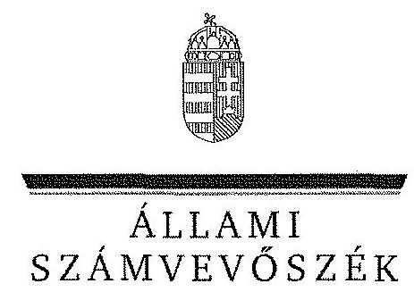
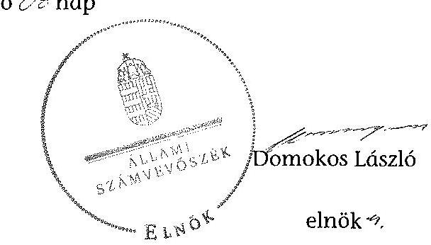
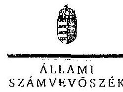

ÁLLAMI
SZÁMVEVŐSZÉK

# JELENTÉS 

az önkormányzatok vagyongazdálkodása szabályszerűségének ellenőrzéséről

Borgáta

---

# Állami Számvevőszék 

Iktatószám: V-0209-335/2014.
Témaszám: 1244
Vizsgálat-azonosító szám: V065103

## Az ellenőrzést felügyelte:

Makkai Mária
felügyeleti vezető
Az ellenőrzést vezette és a végrehajtásáért felelős:
Tóth Marianna
ellenőrzésvezető
A számvevőszéki jelentés összeállításában közremüködött:
Horváthné Menyhárt Erika
számvevő főtanácsos
Hadnagyné Papp Ildikó
számvevő
Szepes Béla Bálint
számvevő tanácsos
Varga Ágnes Klára
számvevő
Az ellenőrzést végezték:
Draviczky Éva
Számvevő

Dr. Eke-Pekács Tibor
számvevő tanácsos

---

# TARTALOMJEGYZÉK 

BEVEZETÉS ..... 3
I. ÖSSZEGZŐ MEGÁLLAPÍTÁSOK, KÖVETKEZTETÉSEK, JAVASLATOK ..... 6
II. RÉSZLETES MEGÁLLAPÍTÁSOK ..... 12

1. A vagyongazdálkodási tevékenység szabályozottsága ..... 12
1.1. A vagyongazdálkodási feladatellátás szabályozottsága, annak megfelelősége ..... 12
1.2. A vagyon használatba adásának, üzemeltetésre történő átadásának szabályszerűsége ..... 14
1.3. Az Nvtv. rendelkezéseinek végrehajtása ..... 14
2. A vagyongazdálkodási tevékenység szabályszerűségének biztosítása ..... 15
2.1. A vagyon nyilvántartása ..... 15
2.2. A térítés nélküli vagyonátadás és -átvétel ..... 17
2.3. A beruházások, felújítások végrehajtásának és a közbeszerzési eljárások alkalmazásának szabályszerűsége ..... 17
2.4. A tartós részesedésekkel való gazdálkodás ..... 19
2.5. Az önkormányzati vagyon értékesítése, hasznosítása ..... 20
2.6. Az önkormányzat tulajdonosi joggyakorlása ..... 21
3. Az integritás érvényesülése a vagyongazdálkodási tevékenység során ..... 21
4. Az önkormányzat vagyongazdálkodása szabályszerűségére vonatkozó belső és külső ellenőrzések megállapításainak, javaslatainak hasznosulása ..... 22
4.1. A belső ellenőrzés által tett megállapításoknak, javaslatoknak az önkormányzati vagyongazdálkodás szabályszerű működésére gyakorolt hatása ..... 22
4.2. A külső ellenőrzés által tett megállapításoknak, javaslatoknak az önkormányzati vagyongazdálkodás szabályszerű működésére gyakorolt hatása ..... 22

## MELLÉKLETEK

1. számú Borgáta Község Önkormányzat vagyongazdálkodásával összefüggő ada- tok
2. számú Borgáta Község Önkormányzat polgármesterének észrevétele
3. számú Borgáta Község Önkormányzat polgármesterének észrevételére adott vá- lasz

---

# FÜGGELÉKEK 

1. számú Rövidítések jegyzéke

---

# JELENTÉS 

## az önkormányzatok vagyongazdálkodása szabályszerűségének ellenőrzéséről Borgáta

## BEVEZETÉS

Az Állami Számvevőszék (a továbbiakban: ÁSZ) kiemelten fontosnak tartja az Állami Számvevőszékről szóló 2011. évi LXVI. törvény (a továbbiakban ÁSZ tv.) 5. § (4) és (5) bekezdése alapján az önkormányzati vagyon kezelésének, a vagyonnal való gazdálkodási szabályok betartásának az ellenőrzését. Az ellenőrzés feladata a vagyongazdálkodással kapcsolatban a közpénzek átláthatósága, nyilvánossága érdekében a jogszabályokban, belső szabályzatokban megfogalmazott előírások érvényesülésének áttekintése. Az ÁSZ nem csak az ellenőrzött szervezet vagyongazdálkodásának a hibáira mutat rá, számon kérve azok kijavítását, hanem megállapításaival, javaslataival segíti a közpénzzel, a közvagyonnal való felelős gazdálkodást.

Az önkormányzati vagyon alapvető funkciója, hogy a közérdeket és egyúttal az önkormányzati célok megvalósítását szolgálja. A feladatellátás terén elsősorban a kötelezően ellátandó feladatok végrehajtását hivatott szolgálni, amely mellett az önként vállalt feladatok ellátása is megvalósulhat.

Az ÁSZ a stratégiájában hangsúlyos szerepet szán annak, hogy szilárd szakmai alapon álló, értékteremtő ellenőrzéseivel előmozdítsa a közpénzügyek átláthatóságát, rendezettségét. Az ÁSZ a vagyongazdálkodás ellenőrzésén keresztül közremúködik az integritás alapú közigazgatási kultúra kialakításában.

Az ellenőrzés célja annak megállapítása volt, hogy a települési önkormányzat vagyongazdálkodási tevékenységének szabályozottsága és tevékenysége a jogszabályi előírásokkal összhangban volt-e, átlátható, a jogszabályi előírásoknak megfelelő volt-e a vagyon nyilvántartása, a külső és belső ellenőrzések megállapításai hozzájárultak-e az önkormányzati vagyongazdálkodási tevékenység szabályszerűségéhez.

Ennek keretében értékeltük, hogy az önkormányzat:

- szabályszerűen alakította-e ki a vagyongazdálkodási tevékenységének kereteit;
- biztosította-e a vagyongazdálkodás szabályszerűségét, megalapozottan hoz-ta-e és jogszerűen, szabályszerűen hajtotta-e végre a vagyonváltozást eredményező, meghatározó jelentőségű döntéseket, valamint gondoskodott-e az általa alapított vagy tulajdonosi részvételével múködő gazdasági társaságokkal kapcsolatos tulajdonosi joggyakorlásról;
- gondoskodott-e vagyongazdálkodási tevékenysége során az integritás (feddhetetlenség) szempontjainak érvényesüléséről;

---

- belső ellenőrzése elősegítette-e a vagyongazdálkodás szabályszerű működését, valamint hasznosította-e a külső és belső ellenőrzések megállapításait, javaslatait.
Az ellenőrzés típusa szabályszerűségi ellenőrzés.
Az ellenőrzés a 2009. január 1. és 2012. december 31. közötti időszakra terjedt ki, kitekintéssel a helyszíni ellenőrzés befejezéséig tartó időszak releváns folyamataira. Az egyes közbeszerzési eljárások lefolytatásának ellenőrzése a 2012. január 1-jétől a helyszíni ellenőrzés kezdetét megelőző negyedév utolsó napjáig tartó időszakot érintette.

Az ellenőrzés szakmai módszertana az ÁSZ hivatalos honlapján közzétett szakmai szabályokon alapult, amely a Legfőbb Ellenőrző Intézmények Nemzetközi Szervezete (INTOSAI) által kiadott nemzetközi standardok (ISSAI) figyelembevételével készült.

Az ellenőrzést az ÁSZ hatályos szervezeti szabályai és az ellenőrzési programban foglalt értékelési szempontok szerint folytattuk le. Megállapításainkat a helyszíni ellenőrzés tapasztalataira, az ellenőrzött szervezettől bekért dokumentumokra, a kitöltött tanúsítványok elemzésére, valamint az adott időszakban hatályos jogszabályok és belső szabályzatok előírásaira alapoztuk. A vagyonváltozásokkal kapcsolatos gazdasági események közül az ellenőrzött tételeket megállásos mintavétellel választottuk ki a Polgármesteri Hivatal 2009-2012. évi számviteli nyilvántartásaiból.

A jelentésben alkalmazott rövidítéseket az 1. számú függelék tartalmazza.
Borgáta Község lakosainak száma 2012. január 1-jén 150 fő volt. Az öttagú Képviselő-testület munkáját egy ${ }^{1}$ állandó bizottság segítette. Az Önkormányzat mellett a 2009-2012. években kisebbségi önkormányzat, illetve nemzetiségi önkormányzat nem múködött. A polgármester a 2006. évi időközi önkormányzati választás óta tölti be tisztségét, a körjegyző 2007. március 1-jétől, a jegyző 2013. január 1-jétől látja el feladatait.

Az Önkormányzat a feladatainak végrehajtása érdekében a 2012. évben költségvetési intézményt nem múködtetett. A Körjegyzőségnél foglalkoztatott köztisztviselők száma 2012. január 1-jén hat fő volt.

A feladatok ellátásában részt vett négy gazdasági társaság ${ }^{2}$ és hat társulás ${ }^{3}$.

[^0]
[^0]:    ${ }^{1}$ A polgármester illetményével, a vagyonnyilatkozatokkal, valamint az összeférhetetlenség megállapítására irányuló kezdeményezésekkel foglalkozó bizottság.
    ${ }^{2}$ Forrás Kft., KÖZVIL Zrt., Vasivíz Zrt., MÜLLEX Kft.
    ${ }^{3}$ Celldömölki Kistérség Önkormányzatainak Többcélú Társulása; Káld és Térsége Környezetéért Önkormányzati Társulás; Társulási Megállapodás Káld és Térsége Ivóvíz Minőség Javítására; Boba, Egyházashetye, Kemenespálfalva, Borgáta, Nagypirit Községek Intézményfenntartói Társulása; Kemenesaljai Szociális és Gyermekjóléti Intézményfenntartó Társulás; ZALAISPA Hulladékgazdálkodási Társulás.

---

Az Önkormányzat 2013. január 1-jével - az Mötv. előírásainak megfelelően közös önkormányzati hivatalt hozott létre Jánosháza Város Önkormányzatával. A jegyző́k közötti teljes körűen dokumentált átadás-átvételre 2012 decemberében sor került.

Az Önkormányzat vagyona 2012. december 31-én a könyvviteli mérleg szerint 1007,8 M Ft volt, 514,4 M Ft-tal, 104,3\%-kal nőtt az ellenőrzött időszakban. Az adósságállomány értéke 303,0 M Ft volt, ami a 2,3 M Ft összegű adósságkonszolidáció ellenére is nőtt 205,2 M Ft-tal. A 2012. évi költségvetési beszámolója szerint $71,2 \mathrm{M}$ Ft költségvetési bevételt ért el, és $64,9 \mathrm{M}$ Ft költségvetési kiadást teljesített, melyből a felhalmozási célú kiadás 24,3 M Ft volt. Az Önkormányzat gazdálkodására jellemző adatokat, mutatószámokat az 1. sz. melléklet tartalmazza.

Az ellenőrzés jogszabályi alapját az ÁSZ tv. 5. § (4) bekezdésének a) pontja és (5) bekezdése, valamint az államháztartásról szóló 2011. évi CXCV. törvény 61. § (2) bekezdésében foglaltak képezik.

Az ÁSZ a 2011. évi LXVI. törvény 29. § (1) bekezdése szerint a jelentéstervezetet megküldte egyeztetésre Borgáta Község Önkormányzata polgármesterének, aki az ÁSZ tv. 29. § (2) bekezdésében foglalt észrevételezési jogával élt. A jelentéstervezetre beérkezett észrevételt és az arra adott választ a jelentés 2-3. számú melléklete tartalmazza.

---

# I. ÖSSZEGZŐ MEGÁLLAPÍTÁSOK, KÖVETKEZTETÉSEK, JAVASLATOK 

Az Önkormányzat számviteli mérleg szerinti vagyona a 2009. január 1-jei 493,4 M Ft-ról 2012. december 31-re 104,3\%-kal (1007,8 M Ft-ra) nőtt. Ennek oka a szennyvíztisztító mú ellenőrzött időszakon belüli aktiválása, majd üzemeltetésbe adása volt.

Az Önkormányzat az ellenőrzött időszakban összesen 42,9 M Ft-ot fordított felújításokra és beruházásokra, amelyből a beruházások 12,7 M Ft-ot, a felújítás 30,2 M Ft-ot tett ki. A legjelentősebb beruházások és fejlesztések a gazdasági program ${ }_{1,2}$-nek megfelelően, az abban foglalt célkitűzéseket szem előtt tartva valósultak meg. A vagyonváltozásokra vonatkozó döntések jogszerűek és dokumentumokkal alátámasztottak voltak. A beruházások és felújítások között számolták el a kultúrház homlokzatának felújítását, az élménymedence építését és az önkormányzati hivatal tetőszerkezetének felújítását. A beruházásokra és felújításokra fordított összeg a 2009-2012. években $66,7 \%$-kal kevesebb volt az elszámolt értékcsökkenés összegénél, ezzel nem járult hozzá az elhasználódott eszközök pótlásához. Az Önkormányzatnál a 2012-2013. év I. félévében nem került sor közbeszerzési eljárás lefolytatására.

A beruházásokkal és felújításokkal kapcsolatos kifizetések során betartották az eljárási szabályokat, az érvényesítést, ellenjegyzést, utalványozást az arra jogosultak végezték el.

Az Önkormányzat adósságállománya az ellenőrzött időszakban a kötvénykibocsátással összefüggésben több mint háromszorosára emelkedett, a hosszú lejáratú kötelezettségek a 2009. évi 95,0 M Ft-ról 301,6 M Ft-ra nőttek. A Társulás ${ }_{2}$ azonban nem tudott részt venni a 2012. évi Kvtv. 76/C §4-ban foglaltak szerinti adósságkonszolidációban, mivel a létrehozása egyetlen célra irányult.

Az Önkormányzat a vagyongazdálkodás szabályozása során hiányosságokkal tett eleget a jogszabályi előírásoknak. Az Ötv.-ben foglaltaknak megfelelően a vagyongazdálkodási rendelet ${ }_{1}$-ben meghatározta a törzsvagyon körét, elkülönítette a forgalomképes és forgalomképtelen vagyoni elemeket, rendelkezett a forgalomképesség szerinti megváltoztatás módjáról és a vagyon nyilvántartásáról. A Képviselő-testület az Nvtv. hatálybalépése után, a 60 napos határidőn belül, 2012. február 10-én fogadta el a vagyongazdálkodási rendelet ${ }_{2}$-t, amelyben meghatároztak nemzetgazdasági szempontból kiemelt jelentőségű vagyonelemeket. Az Önkormányzat az Nvtv. által előírt hosszú távú vagyongazdálkodási tervvel nem rendelkezett.

A vagyongazdálkodási rendelet ${ }_{1,2}$-ben a tulajdonosi jogok körében rendelkeztek a vagyon elidegenítésének, megterhelésének és hasznosításának szabályairól.

[^0]
[^0]:    ${ }^{4}$ hatályos 2013. április 4-től

---

A vagyontárgyak nyilvános pályáztatási kötelezettségét a 2012. évtől 25,0 M Ft-os értékhatárral határozták meg a korábbi 5,0 M Ft-tal szemben.

Az Önkormányzat a vagyonkezelői jog megszerzésének, gyakorlásának és a vagyonkezelés ellenőrzésének szabályait nem határozta meg, azonban vagyonkezelői jogot nem alapított és vagyonkezelési szerződést nem kötött.

A Képviselő-testület vagyongazdálkodási hatáskört - a vagyongazdálkodási rendelet ${ }_{1,2}$-ben polgármesterre vagy bizottságra - 100,0 E Ft felett nem ruházott át.

Az ellenőrzött időszakban az Ámr. ${ }_{2}$-ben foglaltak ellenére nem történt meg a beszerzések szabályozása.

A jegyző - a Htv. előírásai alapján - kialakította az Önkormányzat számviteli rendjét. Az Önkormányzat számviteli politikával és a hozzá kapcsolódó belső szabályzatokkal - értékelési, leltározási, selejtezési szabályzat, valamint számlarend - rendelkezett, azonban pénzkezelési szabályzattal nem. Számviteli politikája nem tartalmazta, hogy mi tekintendő figyelembe veendő szempontnak a megbízható és valós összkép kialakítását befolyásoló lényeges információk tekintetében a kis értékű tárgyi eszközök és a vagyoni értékű jogok minősítésénél. Emellett nem tartalmazta a mérlegkészítés időpontját. A leltározási szabályzatban - az Áhsz.-ben foglalt előírásokkal ellentétben - önkormányzati rendelet nélkül, két évben határozták meg a mennyiségi leltárfelvétel gyakoriságát. Emellett az nem tartalmazott utalást az üzemeltetésbe adott eszközök leltározásának sajátos szabályaira.

Az Önkormányzatnál a vagyongazdálkodás múködésének szabályszerűsége a 2009-2011. években biztosított volt. A vagyonkimutatást a Képviselő-testület részére a zárszámadással együtt tájékoztatásul bemutatták. A vagyonkimutatások - a 2012. év kivételével - tartalmazták az Önkormányzat saját vagyonát, forgalomképesség szerinti bontásban. Nem tartalmazták a mérlegben értékkel nem szereplő kötelezettségeket, ideértve a kezesség-, illetve garanciavállalással kapcsolatos függő kötelezettségeket, annak ellenére, hogy az Önkormányzat a kötvénykibocsátáshoz kapcsolódóan készfizető kezességet vállalt.

Az Önkormányzat a 2009-2011. években eleget tett az Áhsz.-ben előírt leltározási kötelezettségének, de 2012-ben nem történt meg a rövid lejáratú követelések és kötelezettségek leltározása, valamint az üzemeltetésre átadott eszközök esetében nem került átadásra az üzemeltető által végzett leltározás dokumentuma. Emellett 2012-ben a főkönyvi számlákhoz kapcsolódó analitikus nyilvántartás a rövid lejáratú követelések és kötelezettségek vonatkozásában nem állt rendelkezésre. Így a 2012. évben a rövidlejáratú követelések és kötelezettségek mérlegsorok alátámasztása nem volt biztosítva.

Az Önkormányzat számviteli nyilvántartásában szereplő ingatlanvagyon, az ingatlanvagyon-kataszter, valamint a földhivatali ingatlan-nyilvántartás adatainak egyezősége a 2012. évben nem volt biztosított. A fürdőberuházással összefüggésben $1,4 \mathrm{M}$ Ft összegben nem történt meg a vagyonváltozás ingat-lanvagyon-kataszterben történő átvezetése, erre csak 2013-ban került sor. Emellett az Önkormányzat az ingatlanvagyon-kataszterében a törzsvagyont nem az

---

Ötv.-ben és az Nvtv-ben foglaltaknak megfelelően különítette el, mivel forgalomképes vagyonelemeit nem üzleti vagyonként, hanem a törzsvagyonon belül mutatta ki.

A gazdálkodási és ellenőrzési jogköröket tartalmazó szabályzat nem volt hatályos, mert azt nem az arra hatáskörrel rendelkező körjegyzö, hanem a polgármester kiadmányozta. Hatályos szabályozás hiányában a gazdálkodási és ellenőrzési jogkörök gyakorlása sem volt szabályszerű.

Az Önkormányzat a 2009-2012. években gazdasági társaságot nem alapított, kizárólagos tulajdonában állt a Termál Kft., amely az ellenőrzött időszakban gazdasági tevékenységet nem folytatott, felszámolás alá került. Az Önkormányzatnak a 2012. év végén két gazdasági társaságban volt kisebbségi részesedése, amelyekkel kapcsolatban tulajdonosi jogait és kötelezettségeit tulajdoni részesedése mértékéig teljesítette.

Az Önkormányzat 2010-ben, a szennyvízberuházással kapcsolatos kötvénykibocsátással összefüggésben - a létrehozott Társulás ${ }_{2}$ fizetésképtelensége esetére - egyetemleges készfizető kezesi megállapodást kötött. Ezzel inkasszós jogot engedélyezett a költségvetési elszámolási számlájára, amely nem felelt meg az Ámr. és az Ávr. előírásainak.

A jegyző az Eisztv. és az Info. tv. előírásai ellenére nem tett eleget a közérdekü adatok közzétételére vonatkozó kötelezettségének, ezáltal nem biztosította a vagyongazdálkodási tevékenység nyilvánosságát. Nem történt meg az éves elemi költségvetések és beszámolók közzététele a 2009-2012. évek vonatkozásában, valamint a közfeladatot ellátó szervnél foglalkoztatottak létszámára és személyi juttatásaira vonatkozó összesített adatok bemutatása.

Az Önkormányzat szervezetének irányítása a mindennapi munkavégzés során a vagyongazdálkodási tevékenység integritását - az azzal összefüggő szabályozásbeli hiányosságok miatt - nem biztosította. Nem szabályozták az ajándékok (meghívások, utaztatás) elfogadásának feltételeit, a dolgozói vagyoni érdekeltségek nyilvántartását és az összeférhetetlenségi követelményeket, valamint az önkormányzati eszközök személyes használatát. Az Önkormányzatnál - a Bkr. 6. § (1) bekezdés c) pontjával ellentétben - az etikai elvárások nem kerültek meghatározásra.

Az Önkormányzat a 2009-2012 közötti belső ellenőrzését a Társulás ${ }_{1}$ keretében látta el. Belső ellenőrzése hozzájárult a vagyongazdálkodás szabályszerűségéhez a 2011. és 2012. években ellenőrzési terv szerint megvalósított, vagyongazdálkodással kapcsolatos ellenőrzésekkel. A feltárt hiányosságok megszűntetésére intézkedési tervek készültek, utóellenőrzésre nem került sor.

Az Önkormányzat a 2009-2012. években nem volt könyvvizsgálatra kötelezett, a vagyongazdálkodást sem az ÁSZ, sem külső ellenőrző szerv nem ellenőrizte.

Az Állami Számvevőszékről szóló 2011. évi LXVI. törvény 33. § (1) bekezdésében foglaltak értelmében a jelentésben foglalt megállapításokhoz kapcsolódó intézkedési tervet köteles az ellenőrzött szervezet vezetője összeállítani, és azt a

---

jelentés kézhezvételétől számított 30 napon belül az ÁSZ részére megküldeni. Amennyiben az intézkedési tervet határidőben nem küldi meg a szervezet, vagy az nem elfogadható, az ÁSZ elnöke a hivatkozott törvény 33. § (3) bekezdés a)-b) pontjaiban foglaltakat érvényesítheti.

Az ellenőrzés intézkedést igénylő megállapításai és javaslatai:

# a jegyzönek 

1. A számviteli politikában nem rögzítették, hogy az Áhsz. 8. § (5) bekezdés b) pontja alapján mi tekintendő figyelembe veendő szempontnak a megbízható és valós összkép kialakítását befolyásoló lényeges információk tekintetében a kis értékű tárgyi eszközök, a vagyoni értékű jogok és a szellemi termékek minősítésénél. Továbbá a számviteli politika nem tartalmazta az Áhsz. 8. § (8) bekezdés előírásai szerint a mérlegkészítés időpontját. (A mérleg-összeállítás befejezésének időpontját, ameddig az értékelési és helyesbítési feladatok elvégezhetők.) Nem határozták meg - az Áhsz. 8. § (7) bekezdésében foglaltak ellenére - a beszerzett, illetve előállított immateriális javak, illetve a tárgyi eszközök üzembe helyezése dokumentálásának szabályait.

Az Önkormányzat az ellenőrzött időszakban a Számv. tv. 14. § (5) bekezdés d) pontjában előírtaknak megfelelő pénzkezelési szabályzattal nem rendelkezett.

Javaslat:
a) Egészítse ki a számviteli politikát az Áhsz. 8. § (5) - (8) bekezdéseiben előírtaknak megfelelően.
b) Készítse el az Számv. tv. 14. § (5) bekezdés d) pontjának előírásai szerinti pénzkezelési szabályzatot.
2. A leltározási szabályzat - Képviselő-testületi döntés nélkül - lehetővé tette az eszközök kétévenkénti leltározását, mely nem felelt meg az Áhsz. 37. § (7) bekezdésben előírtaknak. Nem tartalmazott továbbá utalást az Áhsz. 37. § (4) bekezdésében előírt, az üzemeltetésre, kezelésre átadott eszközök leltározásának sajátos szabályaira vonatkozóan.

Javaslat:
a) Intézkedjen az Áhsz. 37. § (7) bekezdésében előírtak és a leltározási szabályzatban foglaltak közötti összhang megteremtéséről.
b) Egészítse ki a leltározási szabályzatát az üzemeltetőre vonatkozó, az Áhsz. 37. § (4) bekezdésében előírt leltározási kötelezettségre való utalással.
3. Az Önkormányzat a 2009-2012. évekre nem rendelkezett a gazdálkodási jogkörök hatályos szabályzatával, mivel a szabályzatot az Ötv. 36. § (2) és az Ávr. 13. § (2) bekezdés a) pontjában foglaltak ellenére nem a hatáskörrel rendelkező körjegyző, hanem a polgármester kiadmányozta.

---

Javaslat:
Intézkedjen az Ávr. 13. § (2) bekezdés a) pontjában foglaltaknak megfelelően a szabályzat kiadmányozásáról.
4. A közbeszerzési értékhatár alatti beszerzések szabályozása az Ámr. 2 20. § (3) bekezdése b) pontja ellenére nem történt meg.

Javaslat:
Intézkedjen az Ávr. 13. § (2) bekezdés b) pontjában előírtaknak megfelelően a beszerzések lebonyolításával kapcsolatos eljárásrend elkészítéséről.
5. Az Önkormányzat az Nvtv. 9. § (1) bekezdése által előírt tervek közül hosszú távú vagyongazdálkodási tervet nem készített.

Javaslat:
Készítsen az Nvtv. 9. § (1) bekezdés szerinti közép- és hosszú távú vagyongazdálkodási tervet.
6. A jegyző nem tett eleget az Eisztv. 6. § (1) és az Info. tv. 37. § (1) bekezdése szerinti - közérdekű adatokra vonatkozó - közzétételi kötelezettségének, ezáltal nem biztosította a vagyongazdálkodási tevékenység nyilvánosságát.

Javaslat:
Intézkedjen az Info. tv. 1. számú mellékletében meghatározott adatok közzétételéről.
7. A 2012. évről készült és a Képviselő-testület által elfogadott zárszámadás részét képező vagyonkimutatás az Áhsz. 44/A. § (3) bekezdése és a 9. számú melléklet előírásai ellenére nem tartalmazta a mérlegben értékkel nem szereplő kötelezettségeket.

Javaslat:
Intézkedjen arról, hogy az Önkormányzat vagyonkimutatása tartalmazza az Áhsz. 44/A. § (3) bekezdésében előírt tartalmi elemeket is.
8. A főkönyvi számlákhoz kapcsolódó analitikus nyilvántartás a 2012. évben az Áhsz. 47. § (1) bekezdésében előírtakkal ellentétben a rövid lejáratú kötelezettségek vonatkozásában nem állt rendelkezésre.

Az Önkormányzat a 2009-2011. években eleget tett az Áhsz.-ben előírt leltározási kötelezettségének. 2012-ben azonban nem történt meg a rövid lejáratú követelések és kötelezettségek leltározása és a leltár kiértékelése, valamint az üzemeltetésre átadott eszközök esetében a szennyvíztisztító és szennyvízelvezető üzemeltetője nem adta át az általa elvégzett leltározás dokumentumait.

---

Javaslat:
a) Intézkedjen az Áhsz. 47. § (1) bekezdésében előírtaknak megfelelően az analitikus nyilvántartások elkészítéséről és folyamatos vezetéséről.
b) Intézkedjen az Áhsz. 37. §-ában foglaltaknak megfelelő leltározás - ide értve az üzemeltetésre átadott eszközök leltározását is - végrehajtásáról, valamint a felvett leltárak kiértékeléséről.
9. Az Önkormányzat a kötvényhez kapcsolódó inkasszós jogot a költségvetési elszámolási számla - és így egyben annak alszámlái - terhére engedélyezte, mely nem felel meg az Ámr. 174. § (11)-(12) és az Ávr. 145. § (2) bekezdése rendelkezésének, mert a költségvetési elszámolási számlához kapcsolódik olyan alszámla, melyről hiteltörlesztés, kezességbeváltás, kötvényen alapuló fizetési kötelezettség nem teljesíthető.

Javaslat:
Kezdeményezze az inkasszós szerződés módosítását annak érdekében, hogy az abban foglaltak megfeleljenek az Ávr. 145. § (2) bekezdésében foglalt előírásoknak.
10. Az Önkormányzatnál - a Bkr. 6. § (1) bekezdés c) pontjával ellentétben - az etikai elvárások nem kerültek meghatározásra.

Javaslat:
Intézkedjen a Bkr. 6. § (1) bekezdése c) pontjában foglaltaknak megfelelően az etikai elvárások meghatározásáról.

---

# II. RÉSZLETES MEGÁLLAPÍTÁSOK 

## 1. A VAGYONGAZDÁlKODÁSI TEVÉKENYSÉG SZABÁLYOZOTTSÁGA

### 1.1. A vagyongazdálkodási feladatellátás szabályozottsága, annak megfelelősége

A Képviselő-testület a Htv. 138. § (1) bekezdés j) pontjában foglalt kötelezettségének eleget téve elfogadta az önkormányzati vagyongazdálkodás szabályait. Jóváhagyta a vagyongazdálkodási feladat- és hatáskörökről rendelkező egyes belső szabályzatokat, amelyek hiányosságokkal feleltek meg a jogszabályi előírásoknak.

A vagyongazdálkodási rendelet ${ }_{1,2}$ hatálya a teljes vagyoni körre kiterjedt. Az Önkormányzat az Ötv. 78-79. §-ai szerint meghatározta és aktualizálta az önkormányzati feladatellátást biztosító törzsvagyon körét, a vagyongazdálkodási rendelet ${ }_{1,2}$ elkülönítetten tartalmazta a forgalomképtelen és a korlátozottan forgalomképes vagyonelemeket.

Az Önkormányzat a vagyongazdálkodási rendelet ${ }_{2}$-ben az Nvtv. 5. és 18. §ának megfelelően - az Nvtv. hatálybalépést követő 60 napon belül - meghatározta azon vagyonelemeket, amelyeket nemzetgazdasági szempontból kiemelt jelentőségű vagyonként forgalomképtelen törzsvagyonnak minősített.

A vagyonváltozások nyilvános pályáztatási kötelezettségét 2009-2011. között $5,0 \mathrm{M} \mathrm{Ft}, 2012$-től $25,0 \mathrm{M}$ Ft értékhatárral határozták meg. A vagyongazdálkodási rendelet ${ }_{2}$ a $25,0 \mathrm{M}$ Ft-nál kisebb összegű vagyonnal való rendelkezés esetében nem állapított meg nyilvánosságot biztosító szabályokat.

Az Önkormányzat a vagyongazdálkodási rendelet ${ }_{1}$-ben meghatározta a vagyon használatba adásának részletes szabályait, a vagyon ingyenes átengedésének eseteit, azonban a vagyongazdálkodási rendelet ${ }_{2}$ ezt már nem tartalmazta. A vagyongazdálkodási rendelet ${ }_{2}$-ben a vagyon üzemeltetésre történő átadásának részletes szabályait sem határozta meg.

Az Önkormányzat előírta és alkalmazta a testületi előterjesztésekben a fejlesztéssel létrehozott vagyontárgyak fenntartásához szükséges források biztosítottságának előzetes vizsgálatát. Nem írta elő a döntés-előkészítés folyamatában hitelfelvétel esetén az egyes éveket terhelő kötelezettség költségvetési egyensúlyra gyakorolt hatása vizsgálatának kötelezettségét, annak ellenére, hogy az Önkormányzatnál (az ellenőrzött időszakot megelőzően) sor került hitelfelvételre.

Az Önkormányzat rendelkezett számviteli politikával és az annak keretében elkészített értékelési és leltározási szabályzatokkal, azonban az Áhsz. 8. § (4) bekezdés d) pontja szerinti pénzkezelési szabályzatát nem készítette el.

---

A számviteli politikában nem rögzítették, hogy az Áhsz. 8. § (5) bekezdés b) pontja alapján mi tekintendő figyelembe veendő szempontnak a megbízható és valós összkép kialakítását befolyásoló lényeges információ tekintetében a kis értékű tárgyi eszközök és a vagyoni értékű jogok minősítésénél. Az Áhsz. 8. § (8) bekezdés előírásai ellenére a számviteli politika nem tartalmazta a mérlegkészítés időpontját. Nem határozták meg - az Áhsz. 8. § (7) bekezdésében foglaltak ellenére - a beszerzett, illetve előállított immateriális javak, illetve a tárgyi eszközök üzembe helyezésének dokumentálási szabályait.

A leltározási szabályzat - önkormányzati rendelet hiányában - lehetővé tette az eszközök kétévenkénti leltározását, amely nem felelt meg az Áhsz. 37. § (7) bekezdésében foglaltaknak. Nem tartalmazott továbbá utalást az Áhsz. 37. § (4) bekezdésében előírt, az üzemeltetésre, kezelésre átadott eszközök leltározásának sajátos szabályaira.

Az Önkormányzat rendelkezett selejtezési szabályzattal, továbbá kialakította számlarendjét.

Az Önkormányzat a 2009-2012. évekre nem rendelkezett hatályos gazdálkodási jogkörök szabályzatával, mivel a szabályzatot az Áht. 27. § (1), az Ötv. 36. § (2), illetve az Mötv. 81. §. (1), az Ámr. ${ }_{2}$ 20. § (3) bekezdése, valamint az Ávr. 13. § (2) bekezdés a) pontjában foglaltak ellenére nem a körjegyzö, hanem a polgármester kiadmányozta. A körjegyzö és a jegyző a vagyonnal és a vagyongazdálkodással kapcsolatos feladatokat ellátó személyek munkaköri leírásában megjelenítette a belső szabályzatok szerinti valamennyi feladatot és pénzügyi jogkört.

Az Önkormányzat közbeszerzési szabályzattal nem rendelkezett, de 2012-ben és a 2013. év 1. félévében közbeszerzési eljárásra kötelezett beszerzése nem volt. A beszerzések szabályozása az Ámr. ${ }_{2} 20 . \S$ (3) bekezdés b) pontja ellenére nem történt meg.

A körjegyző elkészítette az Ámr. ${ }_{1}$ 145/B. §-a és az Ámr. ${ }_{2}$ 156. § (2) bekezdés előírása szerint a FEUVE szabályzat mellékletét képező ellenőrzési nyomvonalat, valamint az Ámr. ${ }_{1}$ 145/A. § (5) bekezdés, az Ámr. ${ }_{2}$ 156. § (3) bekezdés szerint a szabálytalanságok kezelésének eljárásrendjét. A Társulás ${ }_{1}$ belső ellenőrzési munkaszervezetének belső ellenőrzési kézikönyve a Ber. 5. § (2) bekezdés előírásai szerint tartalmazta a kockázatelemzési módszertant, az ellenőrzési megállapítások hasznosításának és az ellenőrzést követő intézkedések elrendelésének szabályait.

Az Önkormányzat a gazdasági program ${ }_{1,2}$-ben meghatározta a feladatellátással kapcsolatos fejlesztés fő irányait, a jelentős fejlesztési feladatokat és azok forrásait. Az Önkormányzat középtávú vagyongazdálkodási tervet készített, azonban az Nvtv. 9. § (1) bekezdésében előírt hosszú távú vagyongazdálkodási tervvel nem rendelkezett.

Az Önkormányzat a kötelezö és önként vállalt feladatai körét, valamint a feladatellátás módját az önkormányzati SZMSZ ${ }_{1,2}$-ben határozta meg.

---

A közszolgáltatások ellátásának biztosítása érdekében gazdasági társaságot nem alapított. Egy gazdasági társaság megszüntetéséről hozott döntést.

A jegyző az Eisztv. 6. § (1) bekezdése és az Info. tv. 37. § (1) bekezdése előírásai ellenére nem gondoskodott a közérdekú adatok közzétételéről, ezáltal nem biztosította a vagyongazdálkodási tevékenység nyilvánosságát. Nem történt meg az éves elemi költségvetések és beszámolók közzététele a 2009-2012. évek vonatkozásában, valamint a közfeladatot ellátó szervnél foglalkoztatottak létszámára és személyi juttatásaira vonatkozó összesített adatok bemutatása.

# 1.2. A vagyon használatba adásának, üzemeltetésre történő átadásának szabályszerűsége 

A Képviselő-testület az Ötv. 9. § (1)-(3) bekezdésekben rögzítettek szerint vagyongazdálkodási hatáskört - a vagyongazdálkodási rendelet ${ }_{1,3}$-ben polgármesterre vagy bizottságra - 100,0 E Ft-ot elérő értékhatár felett nem ruházott át.

Az Önkormányzat a 2009-2012. években vagyonkezelői jogot nem alapított és vagyonkezelési szerződést nem kötött.

Az Önkormányzatnak víz- és csatornaszolgáltatás közfeladat elvégzésére a Vasivíz Zrt.-vel volt a 2009-2012. években üzemeltetési szerződése, emellett az ellenőrzött időszakot megelőzően a fürdő üzemeltetésére alapította az Önkormányzat a Termál Kft.-t, amely az ellenőrzött időszakban gazdasági tevékenységet nem folytatott. Az Önkormányzatnak a víziközművek üzemeltetésére pályázatot nem kellett kiírnia, mivel az üzemeltetési szerződés megkötése előtt, az ellenőrzött időszakot megelőzően résztulajdont szerzett a Vasivíz Zrt.-ben.

Az üzemeltető egyes kötelezettségeit szerződésben írták elő, amely tartalmazta a vagyon megőrzési kötelezettségét és a „jó gazda" módjára való eljárás követelményét, valamint az Önkormányzatot védő garanciális elemeket. Nem tartalmazta az üzemeltetési szerződés az üzemeltetésbe adott eszközöknek az Önkormányzat számviteli nyilvántartásával megegyező jegyzékét és az évenkénti leltározás dokumentálásának és adatszolgáltatásának kötelezettségét, valamint az ellenőrzés részletszabályait.

Az ellenőrzött időszakban az Önkormányzat nem tervezett az értékcsökkenésnek megfelelő összegben felújítási, pótlólagos beruházási előirányzatot.

### 1.3. Az Nvtv. rendelkezéseinek végrehajtása

Az ellenőrzött időszakban az Önkormányzat vállalkozási tevékenység végzéséről nem döntött, ilyen jellegű tevékenységet nem folytatott.

Az Önkormányzat gazdasági társaságot nem alapított, a 2012. év végén két gazdasági társaságban volt kisebbségi részesedése.

A Vasivíz Zrt.-ben a tulajdoní részarány mértéke 0,2\%, 11,2 M Ft; a KÖZVIL Zrt.ben $0,1 \%, 3,6 \mathrm{M}$ Ft volt.

---

A társaságok átlátható szervezetnek minősülnek. Az Önkormányzat a társasági szerződéseket az Nvtv. 18. § (4) és (7) bekezdése szerint felülvizsgálta, azokkal kapcsolatban intézkedés szükségessége nem merült fel.

# 2. A VAGYONGAZDÁlKODÁSI TEVÉKENYSÉG SZABÁLYSZERŰSÉGÉNEK BIZTOSÍTÁSA 

### 2.1. A vagyon nyilvántartása

Az Önkormányzatnál az Áht. ${ }_{1}$ 118. § (2) bekezdés 2. c) és az Áht. ${ }_{2}$ 91. § (2) bekezdés c) pontjában foglaltaknak megfelelően elkészítették a vagyonkimutatást. Ezt a zárszámadással egyidejűleg a Képviselő-testület részére bemutatták.

A 2012. évről készített vagyonkimutatás nem felelt meg az Áhsz. 44/A. § (1) és (2) bekezdésében foglaltaknak, nem tartalmazta a vagyonelemek forgalomképesség szerinti elkülönítését.

Az ellenőrzött időszakban az Önkormányzatnál eleget tettek az Ötv. 78. § (2) bekezdésében és a Mötv. 110. § (2) bekezdésében foglalt előírásnak, mivel az analitikus nyilvántartásban és a főkönyvi könyvelésben megvalósult a törzsvagyon körébe tartozó eszközök elkülönített nyilvántartása. A főkönyvi számlák alábontása lehetővé tette a vagyonelemek forgalomképesség szerinti elkülönítését.

Az Áhsz. 44/A. § (3) bekezdésében foglaltakkal ellentétben nem szerepeltették a vagyonkimutatásban a mérlegben értékkel nem szereplő kötelezettségeket, ideértve a kezesség-, illetve garanciavállalással kapcsolatos függő kötelezettségeket.

A helyi önkormányzati képviselők és a polgármester általános választása előtt 30 nappal a polgármester az Önkormányzat vagyoni helyzetét bemutató részletes jelentést elkészítette, azonban azt a belső szabályzatával ellentétben nem a honlapján, hanem hirdetőtáblán tette közzé.

A jegyző a 147/1992. (XI. 6.) Korm. rendelet 1. §-ában foglaltak szerint elkészítette az Önkormányzat ingatlanvagyonáról az ingatlanvagyon-katasztert, azonban abban a törzsvagyont nem az Ötv. 79. § (2) bekezdésében és az Nvtv. 5. § (1) bekezdésében foglaltaknak megfelelően különítették el.

Az ingatlanvagyon-kataszterben az Önkormányzat minden vagyonát törzsvagyonként tartották nyilván, és ezen belül különítették el a forgalomképtelen, a korlátozottan forgalomképes és a forgalomképes vagyont. Ezzel a forgalomképes vagyon nem üzleti vagyonként került meghatározásra, hanem a törzsvagyon részeként.

Az Önkormányzat számviteli nyilvántartásában szereplő ingatlanvagyon, az ingatlanvagyon-kataszter, valamint a földhivatali ingatlannyilvántartás adatainak egyezőségét a 2012. évben nem biztosították.

Az Önkormányzatnál a 2011. évben került sor az ingatlanvagyon-kataszter és a földhivatali nyilvántartás egyeztetésére. Az egyezőség fennállt. Az ingatlan-

---

vagyon-kataszter és a számviteli nyilvántartás egyezősége csak 2009-2011 között volt biztosított.

Az önkormányzati ingatlanvagyon kataszter és a főkönyvi nyilvántartás adatait 2009-ben egyeztették. Ennek során feltárták, hogy az ingatlanvagyon-kataszter nem tartalmazta teljes körűen a vagyonelemek értékét. Az eltérés rendezése 2009-ben megtörtént. A fürdőberuházással összefüggésben 2012-ben 1,4 M Ft öszszegben nem történt meg a vagyonváltozás ingatlanvagyon-kataszterben történő átvezetése, erre csak 2013-ban került sor.

A főkönyvi számlákhoz kapcsolódó analitikus nyilvántartás értékadatai a 2009-2011. években megegyeztek az eszközök és források esetében. Azonban a 2012. évben az Áhsz. 49. § (1) bekezdésében foglaltak ellenére a rövid lejáratú kötelezettségek analitikája nem állt rendelkezésre.

Az Önkormányzat elemi költségvetési beszámolójának részét képező könyvviteli mérleg a 2009-2011. években leltárral alátámasztott volt, azonban a 2012. évben az Áhsz. 37. § (2) bekezdésében foglaltak ellenére nem történt meg a rövid lejáratú követelések és kötelezettségek leltározása és a leltár kiértékelése. Az üzemeltető az üzemeltetésre átadott eszközök esetében a 2009-2011. években évenkénti leltározást végzett, de 2012-ben az Áhsz. 37. § (4) bekezdésében foglaltak ellenére a szennyvíztisztító és szennyvízelvezető üzemeltetője nem adta át az általa elvégzett leltározás dokumentumait.

Selejtezésre a 2011. évben került sor. A selejtezést a hasznosítási és selejtezési szabályzatban kijelölt személyek az előírt módon végezték el. A selejtezett eszközöket megsemmisítették.

A 2009-2012. években az összes eszköz értéke több mint kétszeresére, 493,4 M Ft-ról 1007,8 M Ft-ra nőtt, ennek fő oka a térítés nélkül átvett 610,0 M Ft értékű szennyvízcsatorna és szennyvíztisztító mű volt, melyet később az Önkormányzat üzemeltetésbe adott át és ekként tartott nyilván.

Az eszközök 58,6-31,7\%-át az ingatlanok, 2012-ben 49,7\%-át az üzemeltetésre, kezelésre átadott eszközök értéke tette ki. A tárgyi eszközökön belül az ingatlanok állománya a 2012. év végére $9,6 \%$-kal ( $27,9 \mathrm{M} \mathrm{Ft}$ ) nőtt, amely az ingatlanokon elvégzett felújításoknak köszönhető.

A pénzeszközök szűkülő, de stabil likviditást biztosítottak az Önkormányzat részére, állományuk 11,2 M Ft-ról 6,4 M Ft-ra csökkent. A követelések állománya a szennyvíz érdekeltségi hozzájárulások egyszeri befizetései miatt 13,5 M Ft-tal csökkent.

A Képviselő-testület a 2004. június 4-i ülésén döntött a termálfürdő fejlesztése miatt kialakult forráshiány rendezésére $19,0 \mathrm{M}$ Ft hosszú lejáratú hitel és 7,0 M Ft rövid lejáratú rulírozó hitel felvételéről. A hitelfelvétellel egyidejűleg az Önkormányzat tulajdonában lévő ingatlanokra a hitelt nyújtó pénzintézetek javára jelzálogjogot alapított. Az Önkormányzat a 2012. évi Kvtv. 76/C. §-ban foglaltaknak megfelelően igénybe vette az állam által biztosított egyszeri, viszsza nem térítendő költségvetési támogatást, és az adósságkonszolidáció keretében a még fennálló tartozása rendezésre került.

---

A hitelek visszafizetése megtörtént, azonban a jelzálogjog törléséről csak a helyszíni ellenőrzés ideje alatt intézkedtek.

A 2009-2012. években a gazdálkodási és ellenőrzési jogkörök gyakorlása nem volt szabályszerű, mert, az annak módját, rendjét, eljárási és dokumentációs részletszabályait tartalmazó hatályos szabályzat - az Ámr. ${ }_{1} 134$ 138. §-ai, valamint az Ámr. ${ }_{2}$ 20. § (3) bekezdése és az Ávr. 52-60. §-ai előírásai ellenére - nem állt rendelkezésre. A szabályzat tartalmában ugyan megfelelt a jogszabályi előírásoknak, azonban azt nem a jegyző, hanem a polgármester kiadmányozta.

A vagyonváltozásokra vonatkozó döntések jogszerüek, dokumentumokkal alátámasztottak voltak. Azokat minden esetben - a vagyongazdálkodási rendelet ${ }_{1,2}$-ben foglaltaknak megfelelően - képviselő-testületi határozat alapozta meg.

# 2.2. A térítés nélküli vagyonátadás és -átvétel 

Az Önkormányzat a költségvetési beszámolóiban a 2009-2012. években összesen 610,0 M Ft értékben mutatott ki térítés nélküli eszközátvételt.

A 2003. évben négy önkormányzat (Káld, Borgáta, Egyházashetye, Köcsk) döntött a szennyvízelvezetés megoldására közös szennyvíztisztító rendszer létesítéséről.

Az Önkormányzat 2009. január 6-án térítésmentesen átvette az előző évben elkészült szennyvízcsatorna és szennyvíztisztító beruházás Borgáta községet megillető 610,0 M Ft értékű részét. A térítés nélküli átvétel során az Önkormányzat betartotta a vagyongazdálkodási rendelet ${ }_{1}$-ben foglalt előírásokat, a létesítmény átvételét az ingatlanvagyon-kataszterben és a számviteli nyilvántartásokban is rögzítették.

Az Önkormányzat 2012. december 27-én a víziközmű törvényben ${ }^{5}$ foglaltakkal összhangban Megállapodást írt alá a Vasivíz Zrt.-vel a - nettó 5 M Ft értékű -víziközmű-vagyon térítés nélküli átadásáról, amelynek szerződés szerinti teljesítésére csak a 2013. évben került sor.

### 2.3. A beruházások, felújítások végrehajtásának és a közbeszerzési eljárások alkalmazásának szabályszerűsége

Az Önkormányzat az ellenőrzött időszakban összesen 42,9 M Ft-ot fordított felújításokra és beruházásokra, amelyből a beruházások 12,7 M Ft-ot, a felújítás 30,2 M Ft-ot tett ki. A beruházások és fejlesztések minden esetben alapfeladathoz kapcsolódtak. A beruházások és felújítások között az önkormányzati hivatal tetőszerkezetének felújítása, az élménymedence építése és a kultúrház hom-lokzat-felújítása szerepelt. A beruházások a gazdasági program ${ }_{1,2}$-ben foglaltak alapján valósultak meg. Az Önkormányzat az Nvtv. 9. § (1) bekezdé-

[^0]
[^0]:    ${ }^{5}$ a 2011. évi CCIX. törvény a víziközmú-szolgáltatásról 1. §-a

---

sében foglaltak ellenére hosszú távú vagyongazdálkodási tervvel nem rendelkezett.

A beruházások megvalósítása során a szabályszerűséget, a finanszírozhatóságot és a fenntarthatóságot biztosították. A beruházásokhoz szükséges források rendelkezésre állásáról a Képviselő-testület a költségvetési rendeletekben határozott. Az MVH támogatásával megvalósuló felújításhoz támogatásmegelőlegező hitelt vett igénybe az Önkormányzat, az önkormányzati hivatal tetőfelújítása és a fürdő élménymedence finanszírozása saját forrásból történt.

A kifizetések során betartották az eljárási szabályokat, az érvényesítést, ellenjegyzést, utalványozást az arra jogosultak végezték el. A beruházás során létrehozott eszközök állományba vétele megtörtént, a változásokat az ingatlanvagyon kataszterbe bevezették.

A beruházások - egy eset kivételével - határidőre megvalósultak. A határidőtúllépés miatt azonban nem kerülhetett sor kötbér érvényesítésére, mert a kivitelezési szerződésben a késedelmes teljesítés szankcióit nem szabályozták. Az Önkormányzat érdekeit védő garanciális elemeket csak az élményfürdő építésével kapcsolatos szerződésben kötöttek ki. Szerződésmódosításra egy esetben került sor, előre nem látható pótmunkák elvégzése miatt történt határidőmódosítás. A beruházások során elvégezték az épületek akadálymentesítését.

Az Önkormányzat a szennyvízkezeléssel kapcsolatos feladatok megoldására négy önkormányzat összefogásával szennyvíztisztító rendszer kiépítésről döntött. A műszaki-pénzügyi előkészítés után 2007-ben a beruházás lebonyolítása érdekében négy önkormányzat (Káld, Borgáta, Egyházashetye, Köcsk) létrehozta a Társulás ${ }_{2}$-t.

Az önkormányzati döntést megalapozó 2007. évi számítások szerint a teljes bekerülési költségből Borgátára jutó rész 610,5 M Ft volt. A Társulás ${ }_{2}$ forráshiány miatt a 2008. évben $2,576 \mathrm{M} \mathrm{CHF}(420,0 \mathrm{M} \mathrm{Ft})$ értékben kötvényt bocsátott ki (Borgáta községet ebből 145,5 M Ft terhelte).

A kötvénykibocsátáshoz kapcsolódó készfizető kezességgel az önkormányzatok, az Ötv. 88. § (2) bekezdésében és az Áht. ${ }_{2}$ 6. §-ában foglaltak ellenére olyan összegre vállaltak kötelezettséget, mely az önkormányzatok saját bevételét meghaladta.

A kötvényhez kapcsolódó kamatok törlesztése 2008. március 31-én kezdődött meg. A tőke törlesztésének kezdete 2015. december 31. Az utolsó részlet esedékessége 2028. február 27. Az ellenőrzött időszakban garancia beváltására nem került sor.

A következő években a kötelezettség teljesítése jelentősen megterheli az Önkormányzat költségvetését. Emellett az Önkormányzatnak a kezesség beváltásával is számolnia kell a Társulás többi tagjának fizetésképtelensége esetén, mivel készfizető kezességgel az önkormányzatok a vagyoni hozzájárulásuk részarányát meghaladóan, egyetemlegesen vállaltak kötelezettséget a hitel visszafizetésére.

---

Az Önkormányzat a kötvényhez kapcsolódó inkasszós jogot a költségvetési elszámolási számla - és így egyben annak alszámlái - terhére engedélyezte, mely nem felel meg az Ámr. 174. § (11)-(12) és az Ávr. 145. § (2) bekezdése rendelkezésének, mert a költségvetési elszámolási számlához kapcsolódik olyan alszámla, melyről hiteltörlesztés, kezességbeváltás, kötvényen alapuló fizetési kötelezettség nem teljesíthető.

Az Önkormányzat adósságállománya a kötvénykibocsátással összefüggésben több mint háromszorosára emelkedett, a hosszú lejáratú kötelezettségek a 2009. évi 95,0 M Ft-ról 301,6 M Ft-ra nőttek. A Társulás ${ }_{2}$ azonban nem tudott részt venni a 2012. évi Kvtv. 76/C $\S^{5}$-ban foglaltak szerinti adósságkonszolldációban, mivel a létrehozása egyetlen célra irányult.

Az Önkormányzatnál a 2012-2013. év I. félévében nem került sor közbeszerzési eljárás lefolytatására. A 2009-2012. években az Önkormányzatnál nem volt PPP konstrukcióban megvalósult fejlesztés.

# 2.4. A tartós részesedésekkel való gazdálkodás 

Az Önkormányzat az ellenőrzött időszakban kizárólagos tulajdonnal rendelkezett a Termál Kft.-ben, emellett résztulajdona volt az KÖZVIL ${ }^{7}$ Zrt.-ben és a Vasivíz Zrt.-ben is, azonban a részesedés mértéke a társaságokban befolyásolási pozíciót nem biztosított az Önkormányzat számára.

Az Önkormányzat 50\% tulajdonosi részaránnyal 2001. június 14-én alapította meg a Termál Kft.-t, a fürdőn tervezett beruházások és fejlesztések megvalósítása céljával. A 2006. évi időközi választásokon megválasztott polgármester a feladatok átvétele során visszaélésre okot adó tényeket tárt fel, emiatt az Önkormányzat büntető feljelentése alapján vizsgálat indult. A 2012. június 24-én született jogerős ítélet szerint a fürdővel kapcsolatos felújításokkal kapcsolatban a Termál Kft. társtulajdonosa és az Önkormányzat volt jegyzője csalást, okirat-hamisítást és más bűntetteket követett el. Az Önkormányzatnak okozott kár értékéről nem állt rendelkezésre egyértelmű adat. A társaság a 2006. évben az Önkormányzat kizárólagos tulajdonába került, azonban gazdasági tevékenységet a továbbiakban nem folytatott, üzleti tervet, beszámolót nem készített.

A Termál Kft.-re vonatkozó anyagok csak részben lelhetők fel az Önkormányzat irattárában. A társaságra vonatkozó dokumentumok egy részét a nyomozati szakaszban átadta az Önkormányzat a különféle hatóságoknak, más része pedig a felszámolóhoz került.

Az Önkormányzat a 2009. és 2010. években a Termál Kft. fenntartásával kapcsolatos költségekre (könyvelő) összesen 1,0 M Ft tagi kölcsönt nyújtott. A pénzátadásról szerződést nem kötöttek, nem határozták meg a felhasználás cél-

[^0]
[^0]:    ${ }^{6}$ hatályos 2013. április 4-től
    ${ }^{7}$ Az ELMIB csoport közvilágítási rendszerek korszerűsítésével és karbantartásával foglalkozó leányvállalata a KÖZVIL Első Magyar Közvilágitási Zrt.

---

ját, a számadásí kötelezettséget, a teljesítést, valamint egyéb garanciális elemeket sem kötöttek ki.

A további veszteségek elkerülése érdekében a Képviselő-testület 2010-ben kezdeményezte a társaság felszámolását, amely - a jegyző tájékoztatása szerint -2012-ben befejeződött, a társaság a cégnyilvántartásból törlésre került, erre vonatkozóan dokumentumot azonban nem tudtak az ellenőrzés rendelkezésére bocsájtaní.

A Termál Kft. felszámolási eljárásában harmadik fél felé fizetési kötelezettség nem merült fel. A Termál Kft. gazdálkodási tevékenységével kapcsolatban folyó büntetőeljárásban, a felszámolási eljárásban a bíróság az Önkormányzat felelősségét nem állapította meg.

A Vasivíz Zrt.-ben az Önkormányzat tulajdoni hányada az ellenőrzési időszak alatt $0,15 \%$ ( $11,3 \mathrm{M} \mathrm{Ft}$ ) volt. A KÖZVIL Zrt.-ben az Önkormányzat tulajdoni hányada a 2009. évben 0,058\% ( $1,6 \mathrm{M} \mathrm{Ft})$ volt, amely a 2012. évben 0,13\%-ra $(3,6 \mathrm{M} \mathrm{Ft})$ változott.

Az Önkormányzat 2004-ben korszerűsítette a település közvilágítását. A felújításhoz nem állt elegendő forrás rendelkezésre, ezért a fizetési kötelezettség teljesítésére az Önkormányzat KÖZVIL Zrt. részvényeket vásárolt. A szerződés szerint a 2004. május 1. és 2014. április 30. közötti időszakban az Önkormányzat havi részletekben összesen 4,76 M Ft összegben jegyez részvényeket.

Az Önkormányzat a részesedéseit névértéken tartotta nyilván, osztalék felvételére, illetve értékvesztés elszámolására nem került sor. Az Önkormányzat részéről a gazdasági társaság által felvett hitelhez, kibocsátott kötényhez kapcsolódóan garancia- és kezességvállalásra nem került sor. A Képviselő-testület elé terjesztett, az Önkormányzat gazdálkodásáról szóló éves beszámolók a gazdasági társaságok gazdálkodásával kapcsolatban szöveges kiegészítést nem tartalmaztak.

# 2.5. Az önkormányzati vagyon értékesítése, hasznosítása 

Az Önkormányzatnál az ellenőrzött időszakban ingatlanértékesítésre és bérbeadásra került sor.

Az ingatlanértékesítésekről (a fürdő területén található ingatlan, földterület, raktár) a döntést a Képviselő-testület hozta meg, mérlegelve az értékesítés szükségességet. Az ingatlanok eladását az Önkormányzat meghirdette és a legnagyobb értékű ingatlan esetében értékbecslést végeztetett. Az adás-vételi szerződésekben az Önkormányzat érdekeit védő garanciális elemeket kötöttek ki: fizetés elmaradás esetén a befizetett összegek foglalóként történő elszámolása, tu-lajdonjog-fenntartás. A vagyonváltozást az ingatlan-kataszterben átvezették. A telekeladások a gazdasági program ${ }_{1,2}$-ben megfogalmazott feladatok (termálfürdő, turizmus fejlesztése) teljesítését szolgálták.

Az Önkormányzatnak az ellenőrzött időszakban egy bérbeadás útján hasznosított ingatlana volt (camping és strandfürdő). Az erre vonatkozó szerződést 1993-ban 20 évre kötötték.

---

Az ellenőrzött időszakban az Önkormányzatnak üresen álló ingatlana nem volt.

A 2009-2012. években - Képviselő-testületi döntések alapján - öt magánszeméllyel kapcsolatos követeléselengedésre került sor, összesen 3,96 M Ft értékben. További 3,6 M Ft elengedéséről hozott határozatot a Képviselő-testület, amely a Termál Kft. felszámolásának eredményeként merült fel. A benyújtott iratok alapján ez utóbbi esetben a követelés mértéke, illetve annak jogossága nem állapítható meg. Az Önkormányzat a követelés elengedésével kapcsolatos elszámolásokat nem tudta bemutatni, mivel ezek a dokumentumok a felszámolónak átadásra kerültek.

# 2.6. Az önkormányzat tulajdonosi joggyakorlása 

Az ellenőrzött időszakban a Képviselő-testület nem számoltatta be az önkormányzati feladatokat ellátó költségvetési szerveket a vagyon használatáról.

A 2009-2012. években vagyonkezelési tevékenységet az Önkormányzatnál elkülönült szervezettel nem végeztettek. Az Önkormányzat kizárólagos tulajdonában a Termál Kft. volt 2006-tól. A Kft. az ellenőrzött időszakban gazdasági tevékenységet nem folytatott, üzleti tervet és beszámolót nem készített. (Az Önkormányzat a 2010. évben a felszámolását kezdeményezte.)

A kisebbségi tulajdonban álló gazdasági társaságok esetében a tulajdonrészek a társaságok tevékenységének, feladatellátásának befolyásolására nem biztosítottak lehetőséget.

## 3. AZ INTEGRITÁs ÉRVÉNYESÜLÉSE A VAGYONGAZDÁlKODÁSI TEVÉKENYSÉG SORÁN

Az Önkormányzat szervezetének irányítása a mindennapi munkavégzés során a vagyongazdálkodási tevékenység integritását - az azzal összefüggő szabályozásbeli hiányosságok miatt - nem biztosította.

Az Önkormányzat rendelkezett az alapvető - a vagyongazdálkodási tevékenység szabályosságát biztosító - belső szabályzatokkal. A körjegyzőségi SZMSZ-e tartalmazta a vagyongazdálkodással kapcsolatos feladatokat, a gazdasági szervezet tagjainak feladat- és hatáskörét, a helyettesítés rendjét, valamint a külső-belső kapcsolattartás szabályait. A dolgozók rendelkeztek munkaköri leírással. Az Önkormányzatnál - a Bkr. 6. § (1) bekezdés c) pontjával ellentétben - az etikai elvárások nem kerültek meghatározásra.

Az Önkormányzatnál az integritás biztosításával összefüggésben az ajándékok (meghívások, utaztatás) elfogadásának feltételeit, a dolgozói vagyoni érdekeltségek nyilvántartását és az összeférhetetlenségi követelményeket, az önkormányzati eszközök személyes használatát nem szabályozták. Rendszeres korrupciós kockázatelemzést nem végeztek. A pénzeszközök, dokumentumok és kulcsok megőrzése biztosított volt. Az új munkatársak kiválasztásakor minden esetben álláspályázatot írtak ki. Fegyelmi vétségek és etikai problémák a Polgármesteri Hivatalban az elmúlt három évben nem merültek fel.

---

Az Önkormányzatnál a belső ellenőrzés funkcionális függetlensége biztosított volt.

# 4. AZ ÖNKORMÁNYZAT VAGYONGAZDÁLKODÁSA SZABÁLYSZERŰSÉGÉRE VONATKOZÓ BELSŐ ÉS KÜLSŐ ELLENŐRZÉSEK MEGÁLLAPÍTÁSAINAK, JAVASLATAINAK HASZNOSULÁSA 

### 4.1. A belső ellenőrzés által tett megállapításoknak, javaslatoknak az önkormányzati vagyongazdálkodás szabályszerű múködésére gyakorolt hatása

Az Önkormányzatnál a belső ellenőrzési feladatokat a 2009-2012. években a Társulás ${ }_{1}$ keretében látták el. A belső ellenőrzés ellátásának módját, figyelemmel a Ber. 4. § (2) és a Bkr. 15. § (2) bekezdésében foglaltakra az önkormányzati SZMSZ $_{2}$-ben, az ügyrendben és a társulási megállapodásban határozták meg.

A belső ellenőrzés elősegítette az Önkormányzat vagyongazdálkodásának szabályszerű működését. Ellenőrzési tevékenységét kockázatelemzéssel alátámasztott éves ellenőrzési tervek alapján végezte. A vagyongazdálkodást a 2011. és a 2012. években egy-egy ellenőrzés érintette.

A belső ellenőrzés a 2010. évet érintően a mérleg alátámasztását és valódiságát, a 2011. év vonatkozásban a leltározási és selejtezési tevékenység végrehajtását ellenőrizte.

A megállapítások alapján a belső ellenőrzés javasolta a mérlegben szereplő szállítói állományok pontos meghatározását és bontását. A selejtezés és leltározás végrehajtását megfelelőnek ítélte.

A belső ellenőrzés által feltárt hiányosságok megszüntetésére intézkedési tervek készültek, de a belső ellenőrzés az intézkedések megvalósítását nem ellenőrizte, utóellenőrzés nem történt.

A 2009-2012. évekre vonatkozóan a jegyző az Ámr. ${ }_{1}$ 23. számú mellékletében, illetve az Ámr. 21 . és a Bkr. 1. sz. számú mellékletében előírt tartalmú - a belső kontrollok múködtetéséről szóló - nyilatkozattételi kötelezettségének eleget tett.

### 4.2. A külső ellenőrzés által tett megállapításoknak, javaslatoknak az önkormányzati vagyongazdálkodás szabályszerű múködésére gyakorolt hatása

Az Önkormányzat az ellenőrzött időszakban könyvvizsgálatra nem volt kötelezett.

A külső ellenőrzési szervezetek (Kincstár, MVH, Fejlesztési Tanács) az uniós és a Vis maior alapból folyósított támogatások felhasználásának szabályszerűségét és a műszaki megvalósítást ellenőrizték, az Önkormányzat vagyongazdál-

---

kodásával kapcsolatos javaslatokat, megállapításokat nem fogalmaztak meg.

Az Önkormányzat vagyongazdálkodását a 2009-2012. években - a fentieken kívül - külső ellenőrző szerv nem ellenőrizte.

Budapest, 2014. 0 hó $0 \dot{E}$ nap

Melléklet: $\quad 3 \mathrm{db}$
Függelék: $\quad 1 \mathrm{db}$

---

.

---

Borgáta Község Önkormányzat vagyongazdálkodásával összefüggő adatok
adatok M Ft

|  | 2009. 01. 01. | 2012. 12. 31. | 2012. 12. 31./ 2009. 01. 01. (\%) |
| :--: | :--: | :--: | :--: |
| Immateriális javak | 3,0 | 3,0 | 100,0\% |
| Tárgyi eszközök | 291,1 | 318,4 | 109,4\% |
| - ingatlanok | 289,4 | 317,3 | 109,6\% |
| - gépek, berendezések | 1,7 | 1,1 | $64,7 \%$ |
| - jármúvek | 0,0 | 0,0 | - |
| - beruházások | 0,0 | 0,0 | - |
| Befektetett pénzügyi eszközök | 172,0 | 176,3 | 102,5\% |
| - tartós részesedés | 12,3 | 14,8 | 120,3\% |
| ebből: értékvesztés | 0,0 | 0,0 | - |
| - tartósan adott kölcsön | 0,1 | 0,0 | - |
| Üzemeltetésbe átadott eszközök | 0,0 | 500,5 | - |
| Befektetett eszközök | 466,1 | 998,2 | 214,2\% |
| Készletek | 0,0 | 0,0 | - |
| Követelések | 15,8 | 2,5 | 15,8\% |
| Értékpapírok | 0,0 | 0,0 | - |
| Pénzeszközök | 11,2 | 6,4 | 57,1\% |
| Egyéb aktív elszámolások | 0,3 | 0,7 | 233,3\% |
| Forgóeszközök | 27,3 | 9,6 | 35,2\% |
| ESZKÖZÖK | 493,4 | 1007,8 | 204,3\% |
| Saját tőke | 384,1 | 697,6 | 181,6\% |
| Tartalékok | 10,8 | 6,8 | 63,0\% |
| Hosszú lejáratú kötelezettségek | 95,0 | 301,6 | 317,5\% |
| - fejlesztési célú kötvény | 0,0 | 215,2 | - |
| - beruházási és fejlesztési hitel | 95,0 | 86,4 | 90,9\% |
| Rövid lejáratú kötelezettségek | 2,8 | 1,4 | 50,0\% |
| Egyéb passzív elszámolások | 0,7 | 0,4 | 57,1\% |
| FORRÁSOK | 493,4 | 1007,8 | 204,3\% |
| Ellenőrzött időszakban elszámolt értékcsökkenés |  |  | 129,0 |
| - felújítások |  |  | 30,2 |
| - beruházások |  |  | 12,7 |
| Ellenőrzött időszakban elszámolt felújítások és beruházások |  |  | 42,9 |

---

.

---

# 141/66/2016 

Borgáta Község Önkormányzatának Polgármestere 9554 Borgáta
Kossuth tér 7.
Szám: 460/4/2014.
Hiv.sz.: V-0209-324/2013.

Tárgy: Észrevétel jelentéstervezettel kapcsolatban.
Melléklet: -
Madhu M.
D. 150

Állami Számvevőszék
Domokos László Elnök Úr részére
Budapest
PT. 54.
1364

Tisztelt Elnok Úr!
Hivatkozott számú jelentéstervezet megállapításával és javaslataival kapcsolatban az alábbi észrevételeket kivánom tenni:

- az 5. ponthoz: a nemzeti vagyonról szóló 2011. évi CXCV1. törvény 9. § (1) bekezdése alapján „a helyi önkormányzat a vagyongazdálkodásának az Alaptörvényben, valamint a 7. § (2) bekezdésében meghatározott rendeltetése biztosításának céljából közép- és hosszú távú vagyongazdálkodási tervet köteles készíteni." A törvény nem írja elö, hogy erról rendeletet kell alkotni. Borgáta Község Önkormányzatának Képviselőtestülete közép- és hosszú-távú vagyongazdálkodási tervét 18/2013. (VI.26.) számú Képviselö-testületi határozattal elfogadta. Kérem, hogy rendeletalkotási kötelezettség elölrását mellözni szíveskedjenek.
- a 9. ponthoz: a 292/2009. (XII.19.) Korm. rendelet 174. § (11) bekezdése szerint „a hitellel rendelkező, azt felvenni szándékozó, illetve készíizető kezességet vállaló helyi önkormányzat a normatív állami hozzájárulásokkal, az egyéb központi költségvetési támogatásokkal, az átengedett személyi jövedelemadóval, valamint az államháztartáson belül müködési célra átvett pénzeszközeivel kapcsolatos pénzforgalmát a költségvetési elszámolási számlához kapcsolódó alszámlán köteles elkülönlteni. Az alszámlán elkülönített összeget a helyi önkormányzat hitel fedezetére - likvid hitel kivételével - nem használhatja, illetve az alszámláról - likvid hitel

---

kivételével - hiteltőrlesztés, kezességbeváltás nem teljesíthető." Fenti előirásnak az Önkormányzat megfelel, ugyanis a kezességet nem a kőzponti támogatások kezelésére szolgáló alszámla, hanem az egyéb saját önkormányzati bevételeket is kezelő költségvetési elszámolási számla terhére engedélyezte. Elkülönített beruházási ' hitelszámla nyitási kötelezettséget az ÁMR2. nem írt elő.
A jelentéstervezet egyéb megállapításaihoz észrevételt nem kívánok tenni.

Borgáta, 2014. január 27.
Ödvözlettel:
dr. Tóthné Zantai Eva
polgármester

---

ELNÖK

SZÁMVEVÖSZÉK

Ikt.szám: V-0209-331/2014.

Dr. Tóthné Zentai Éva úrhölgy
polgármester
Borgáta Község Önkormányzata

Borgáta

Tisztelt Polgármester Úrhölgy!

A „Jelentéstervezet az önkormányzatok vagyongazdálkodása szabályszerűségének - 2013. évben induló - ellenőrzéséről - Borgáta" című jelentéstervezetre tett észrevételeit köszönettel megkaptam.

Az Állami Számvevőszék észrevételekre vonatkozó álláspontjáról a felügyeleti vezető által készített részletes tájékoztatást csatoltan megküldöm.

Tájékoztatom Polgármester Úrhölgyet, hogy a számvevőszéki jelentés szövegezése az elfogadott észrevétele figyelembevételével készül.

Budapest, 2014. 03 hó 06 nap

Tisztelettel:

Melléklet: Tájékoztatás az elfogadom és el nem fogadott észrevétellekre!

1012 BUDAPEST, APÁCZN CSERÉ SÁMUS UTCA 10. 1344 Budapest 4. Pf. 54 telefon: 484 9101 fax: 484 9201

---

# Tájékoztatás   az elfogadott és el nem fogadott észrevételekröl 

A „Jelentéstervezet az önkormányzatok vagyongazdálkodása szabályszerűségének - 2013. évben induló - ellenörzéséről - Borgáta" címú jelentéstervezetre 2014. január 30-án érkcetett észrevételeit áttekintettük, azok kezelésével kapcsolatban a következő tájékoztatást adom.

## A 10. oldal 5. pont

A hivatkozott bekezdésben szerepelỏ megállapítással és javaslattal összefüggésben arról nyilatkozott, hogy az Önkormányzat képviselö testülete közép- és hosszú távú vagyongazdálkodási tervét 18/2013. (VI. 26.) számú képviselö-testületi határozattal elfogadta.

A bekezdésben szereplő megállapítás az ellenőrzött időszakban - 2009. január 1. és 2012. december 31. között - helytálló, mivel az Önkormányzat a helyszíni ellenörzés során hitelesített formában rendelkezésre bocsátott 2012. június 26-án kelt vagyongazdálkodási terve -„Borgáta Község Önkormányzata Középtávú vagyongazdálkodási terv" - csak középtávra vonatkozik.

A javaslatot a vonatkozó jogszabályi rendelkezések alapján az alábbiak szerint pontositjuk.
„Készítsen az Nvtv. 9. § (1) bekezdés szerinti közép- és hosszú távú vagyongazdálkodási tervet."

Az Állami Számvevőszékről szóló 2011. évi LXVI. törvény 33. § (1) bekezdésben foglalt előírás alapján az ellenőrzött szervezet vezetője köteles a számvevőszéki jelentésben foglalt megállapításokhoz kapcsolódóan intézkedési tervet készíteni és azt a jelentés kézhezvételétől számított 30 napon belül az Állami Számvevőszék részére megküldeni. A számvevőszéki jelentésben az intézkedést igénylő megállapítások alapján tett javaslatok hasznosulására vonatkozó tervezett vagy már végrehajtott intézkedéseket, így a polgármesteri levélben foglalt intézkedést is ezen intézkedési tervben indokolt szerepeltetni.

## A 11. oldal 9. pont

A hivatkozott bekezdésben szereplő megállapítással összefüggésben jelzik, hogy az önkormányzat a vonatkozó jogszabályi clőírásnak megfelelt, mivel a kezességet nem a központi támogatások kezelésére szolgáló alszámla, hanem az egyéb saját önkormányzati bevételeket is kezelő költségvetési elszámolási számla terhére engedélyezte.

Az Önkormányzat a készfizető kezesi szerződésben nem határozza meg, hogy a kezességet melyik számla terhére engedélyezi, ezzel az Önkormányzat lehetővé tette, hogy a Bank azon fizetési számlához kapcsolódó alszámláról is érvényesíthesse a követelését, amelyről a jogszabályi clőírás szerint kezességbeváltás nem teljesíthető.

A 2008. február 15-én kötött készfizető kezesi szerződés 4. pontjában az Önkormányzat a Bankot felhatalmazza arra, hogy ha a szerződés alapján a fizetési kötelezettségét nem teljesíti a

---

Bank „az esedékes tartozás összegével - azonnali beszedési megbizás alkalmazásával az Önkormányzat más banknál vezetett bankszámláját megterhelje ".

A 292/2009. (XII. 19.) Korm. rendelet 174. § (11) bekezdése, illetve a 368/2011. (XII. 31.) Korm. rendelet 145. § (2) bekezdése szerint a kötvényt kibocsátó helyi önkormányzat pénzeszközeivel kapcsolatos pénzforgalmát a költségvetési elszámolási, illetve fizetési számlájához kapcsolódó alszámlán köteles elkülöníteni, ezen összeg hitel fedezetére nem használható, hitehörlesztés, kezességbeváltás nem teljesíthető.

A megállapítást az egyértelműség érdekében az alábbiak szerint pontosítjuk.
„Az Önkormányzat a kötvényhez kapcsolódó inkasszós jogot a költségvetési elszámolási számla - és így egyben annak alszámlái - terhére engedélyezte, mely nem felel meg az Ámr. 174. § (11)-(12) és az Ávr. 145. § (2) bekezdése rendelkezésének, mert a költségvetési elszámolási számlához kapcsolódik olyan alszámla, melyről hiteltörlesztés, kezességbeváltás, kötvényen alapuló fizetési kötelezettség nem teljesíthető."

A megállapításhoz kapcsolódó javaslatot változatlanul fenntartjuk.
Az előzőekkel összefüggésben a 8. oldal 4. bekezdését a következőre pontosítjuk:
„Ezzel inkasszós jogost engedélyezett a költségvetési elszámolási számlájára, amely nem felett meg az Ámr. és az Ávr. elöirásainak."

Továbbá a 19. oldal első bekezdését a következőre pontosítjuk:
„Az Önkormányzat a kötvényhez kapcsolódó inkasszós jogot a költségvetési elszámolási számla - és így egyben annak alszámlái - terhére engedélyezte, mely nem felel meg az Ámr. 174. §(11)-(12) és az Ávr. 145. §(2) bekezdése rendelkezésének, mert a költségvetési elszámolási számlához kapcsolódik olyan alszámla, melyről hiteltörlesztés, kezességbeváltás, kötvényen alapuló fizetési kötelezettség nem teljesíthető."

Tájékoztatom Polgármester úrbölgyet, hogy a számvevőszéki jelentés mellékleteként szerepeltetjük a jelentéstervezethez tett észrevételeit, valamint az azokra adott válaszunkat.

Budapest, 2014. év 13 hó 06 nap

Makkai Mária
felügyeleti vezető

---

.

---

# RÖVIDÍTÉSEK JEGYZÉKE 

| Törvények |  |
| :--: | :--: |
| Áht. 1 | az államháztartásról szóló 1992. évi XXXVIII. törvény (hatályon kívül: 2012. január 1-jétől) |
| Áht. 2 | az államháztartásról szóló 2011. évi CXCV. törvény (hatályos: 2012. január 1-jétől) |
| ÁSZ tv. | 2011. évi LXVI. törvény az Állami Számvevőszékről |
| Eisztv. | az elektronikus információszabadságról szóló 2005. évi XC. törvény (hatályon kívül: 2012. január 1-jétől) |
| Htv. | a helyi önkormányzatok és szerveik, a köztársasági megbízottak, valamint egyes centrális alárendeltségú szervek feladat- és hatásköreiről szóló 1991. évi XX. törvény |
| Info. tv. | az információs önrendelkezési jogról és az információszabadságról szóló 2011. év CXII. törvény (hatályos: 2012. január 1-jétől) |
| Kbt. | a közbeszerzésekről szóló 2011. évi CVIII. törvény (hatályos: 2011. augusztus 21-től, kivéve a 180. § (2) bekezdésében meghatározott paragrafusok egyes bekezdéseit és a mellékleteket, amelyek 2012. január 1-jétől léptek hatályba) |
| Mötv. | Magyarország helyi önkormányzatairól szóló 2011. évi CLXXXIX. törvény (hatályos: 2012. január 1-jétől, kivéve a 144. § (2)-(5) bekezdéseiben meghatározott paragrafusok egyes bekezdéseit, pontjait, amelyek 2013. január 1jén, illetve a 2014. évi általános önkormányzati választások napján lépnek majd hatályba) |
| Nvtv. | a nemzeti vagyonról szóló 2011. évi CXCVI. törvény (hatályos: 2012. december 31-től, kivéve a 20. § (2)-(3) bekezdéseiben meghatározott paragrafusokat) |
| Ötv. | a helyi önkormányzatokról szóló 1990. évi LXV. törvény |
| Számv. tv. | a számvitelről szóló 2000 . évi C. törvény |
| Víziközmű tv. | 2011. évi CCIX. törvény a víziközmú-szolgáltatásról |
| 2012. évi Kvtv. | Magyarország 2012. évi központi költségvetéséről szóló 2011. évi CLXXXVIII. törvény |
| Rendeletek |  |
| Áhsz. | az államháztartás szervezetei beszámolási és könyvvezetési kötelezettségének sajátosságairól szóló 249/2000. (XII. 24.) Korm. rendelet |
| Ámr. 1 | az államháztartás múködési rendjéről szóló 217/1998. (XII. 30.) Korm. rendelet (hatályon kívül: 2010. január 1jétől) |
| Ámr. 2 | az államháztartás múködési rendjéről szóló 292/2009. (XII. 19.) Korm. rendelet (hatályon kívül: 2012. január 1jétől) |
| Ávr. | az államháztartásról szóló törvény végrehajtásáról |

---

|  | szóló 368/2011. (XII. 31.) Korm. rendelet (hatályos: 2012. január 1-jétől) |
| :--: | :--: |
| Ber. | a költségvetési szervek belső ellenőrzéséről szóló 193/2003. (XI. 26.) Korm. rendelet (hatályon kívül: 2012. január 1-jétől) |
| Bkr. | a költségvetési szervek belső kontrollrendszeréről és belső ellenőrzéséről szóló 370/2011. (XII. 31.) Korm. rendelet (hatályos: 2012. január 1-jétől, kivéve a 15. § (5) bekezdése, mely 2012. július 1-jétől hatályos) |
| önkormányzati SZMSZ $_{1}$ | Borgáta Község Önkormányzata Képviselő-testületének 3/2007. (IV. 13.) sz. rendelete az önkormányzat és szervei Szervezeti és Müködési Szabályzatáról |
| önkormányzati SZMSZ $_{2}$ | Borgáta Község Önkormányzata Képviselő-testületének 4/2011. (IV. 1.) sz. rendelete az önkormányzat és szervei Szervezeti és Müködési Szabályzatáról |
| vagyongazdálkodási rendelet ${ }_{1}$   vagyongazdálkodási rendelet ${ }_{2}$ | Borgáta Község Önkormányzata Képviselő-testületének 5/2006. (XII. 20.) rendelete az önkormányzat vagyonáról   Borgáta Község Önkormányzata Képviselő-testületének 2/2012. (II. 10.) önkormányzati rendelete Borgáta Község Önkormányzata vagyonáról, a vagyontárgyak feletti tulajdonosi jog gyakorlásáról |
| 147/1992. (XI. 6.) Korm. rendelet | az önkormányzatok tulajdonában lévő ingatlanvagyon nyilvántartási és adatszolgáltatási rendjéről szóló 147/1992. (XI. 6.) Korm. rendelet |
| Szórövidítések |  |
| ÁSZ | Állami Számvevőszék |
| ELMIB Zrt. | Első Magyar Infrastruktúra Befektetési Zrt. |
| értékelési szabályzat | Káld-Borgáta Községi Önkormányzatok Körjegyzőségének eszközök és források értékelési szabályzata (hatályos: 2009. január 2-tól) |
| FEUVE | folyamatba épített előzetes, utólagos és vezetői ellenőrzés |
| FEUVE szabályzat | Káld-Borgáta Községi Önkormányzatok Körjegyzőségének FEUVE Szabálya (hatályos: 2009. január 2-tól) |
| Forrás Kft. | Borgáta Forrás Szolgáltató és Kereskedelmi Kft. |
| gazdasági program ${ }_{1}$ | Borgáta Község Önkormányzat Képviselő-testületének Gazdasági programja 2007-2010 |
| gazdasági program ${ }_{2}$ | Borgáta Község Önkormányzat Képviselő-testületének Gazdasági programja 2010-2013 |
| gazdálkodási jogkörök   szabályzata | Káld-Borgáta Községek Önkormányzatának a Körjegyzőség pénzgazdálkodásával kapcsolatos hatásköri rendje (hatályos: 2009. január 2-tól) |
| hasznosítási és selejtezési szabályzat | Káld-Borgáta Községi Önkormányzatok Körjegyzőségének Felesleges Vagyontárgyak Hasznosítási és Selejtezési Szabályzata (hatályos: 2009. január 2-tól) |
| hrsz. | helyrajzi szám |
| Képviselő-testület | Borgáta Község Önkormányzatának Képviselő-testülete |
| Kincstár | Magyar Államkincstár |

---

körjegyzö
Körjegyzőség
körjegyzőségi SZMSZ

KÖZVIL Zrt.
leltározási szabályzat

## MVH

MÜLLEX Kft.
Önkormányzat
polgármester
PPP
számviteli politika
számviteli rend

Társulás ${ }_{1}$
Társulás ${ }_{2}$
Társulás ${ }_{3}$
Társulás ${ }_{4}$
Társulás ${ }_{5}$
Társulás ${ }_{6}$
Termál Kft.
Üzemeltető
vagyongazdálkodási
terv
Vasivíz Zrt.

Káld-Borgáta Községi Önkormányzatok Körjegyzősége körjegyzöje
Káld-Borgáta Községi Önkormányzatok Körjegyzősége
Káld-Bogáta Községi Önkormányzatok Körjegyzősége Szervezeti és Müködési Szabályzata (hatályos: 2007. április 17 -tól)
KÖZVIL Első Magyar Közvilágítási Zrt.
Káld-Borgáta Községi Önkormányzatok Körjegyzőségének leltározási szabályzata (hatályos: 2009. január 2-tól)
Mezőgazdasági és Vidékfejlesztési Hivatal
MÜLLEX-KÖRMEND Hulladékgyüjtő és Hasznosító KFT.
Borgáta Község Önkormányzata
Borgáta Község Önkormányzata 2006. év októberi időközi választáson megválasztott polgármestere
Public Private Partnership (Partnerségi együttmüködés közfeladatok ellátására magánszektor bevonásával)
Káld-Borgáta Önkormányzatok Körjegyzősége Számviteli Politikája (hatályos: 2009. január 1-jétől)
Káld-Borgáta Községi Önkormányzatok Körjegyzőségének Számviteli Rendje (hatályos: 2009. január 1-jétől)
Celldömölki Kistérség Önkormányzatainak Többcélú Társulása
Káld és Térsége Környezetéért Önkormányzati Társulás
Társulási Megállapodás Káld és Térsége Ivóvíz Minőség Javítására
Boba, Egyházashetye, Kemenespálfalva, Borgáta, Nagypirit Községek Intézményfenntartói Társulása
Kemenesaljai Szociális és Gyermekjóléti Intézményfenntartó Társulás
ZALAISPA Hulladékgazdálkodási Társulás
Borgáta Termál Kereskedelmi, Vendéglátó, Ipari és Szolgáltató Korlátolt Felelősségű Társaság
VASIVÍZ Vas megyei Víz- és Csatornamú Zrt.
Borgáta Község Önkormányzata Középtávú Vagyongazdálkodási Terve
VASIVÍZ Vas megyei Víz- és Csatornamú Zrt.