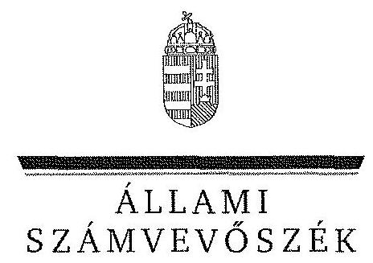
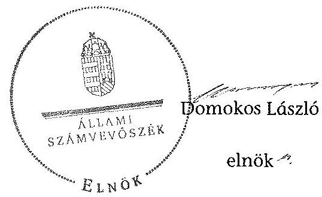

ÁLLAMI
SZÁMVEVÔSZÉK

# JELENTÉS 

az önkormányzatok vagyongazdálkodása szabályszerűségének ellenőrzéséről

Cikó

---

# Állami Számvevőszék 

Iktatószám: V-0210-053/2014.
Témaszám: 1245
Vizsgálat-azonosító szám: V065104

## Az ellenőrzést felügyelte:

Makkai Mária
felügyeleti vezető
Az ellenőrzést vezette és a végrehajtásáért felelős:
Tóth Marianna
ellenőrzésvezető
A számvevőszéki jelentés összeállításában közremüködött:
Horváthné Menyhárt Erika
számvevő főtanácsos
Hadnagyné Papp Ildikó
számvevő
Szepes Béla Bálint
számvevő tanácsos
Varga Ágnes Klára
számvevő
Az ellenőrzést végezték:
Hadnagyné Papp Ildikó
Ungár Ervin
számvevő
számvevő

---

# TARTALOMJEGYZÉK 

BEVEZETÉS ..... 3
I. ÖSSZEGZŐ MEGÁLLAPÍTÁSOK, KÖVETKEZTETÉSEK, JAVASLATOK ..... 6
II. RÉSZLETES MEGÁLLAPÍTÁSOK ..... 12

1. A vagyongazdálkodási tevékenység szabályozottsága ..... 12
1.1. A vagyongazdálkodási feladatellátás szabályozottsága, annak megfelelősége ..... 12
1.2. A vagyon használatba adásának, üzemeltetésre történő átadásának szabályszerűsége ..... 14
1.3. Az Nvtv. rendelkezéseinek végrehajtása ..... 15
2. A vagyongazdálkodási tevékenység szabályszerűségének biztosítása ..... 15
2.1. A vagyon nyilvántartása ..... 15
2.2. A beruházások, felújítások végrehajtásának és a közbeszerzési eljárások alkalmazásának szabályszerűsége ..... 19
2.3. A tartós részesedésekkel való gazdálkodás ..... 20
2.4. Az önkormányzati vagyon értékesítése, hasznosítása ..... 20
2.5. Az önkormányzat tulajdonosi joggyakorlása ..... 21
3. Az integritás érvényesülése a vagyongazdálkodási tevékenység során ..... 21
4. Az önkormányzat vagyongazdálkodása szabályszerűségére vonatkozó belső és külső ellenőrzések megállapításainak, javaslatainak hasznosulása ..... 22
4.1. A belső ellenőrzés által tett megállapításoknak, javaslatoknak az önkormányzati vagyongazdálkodás szabályszerű működésére gyakorolt hatása ..... 22
4.2. A külső ellenőrzés által tett megállapításoknak, javaslatoknak az önkormányzati vagyongazdálkodás szabályszerű működésére gyakorolt hatása ..... 23

---

# MELLÉKLETEK 

1. számú Cikó Község Önkormányzat vagyongazdálkodásával összefüggő adatok

## FÜGGELÉKEK

1. számú Rövidítések jegyzéke

---

# JELENTÉS 

## az önkormányzatok vagyongazdálkodása szabályszerűségének ellenőrzéséről Cikó

## BEVEZETÉS

Az Állami Számvevőszék (a továbbiakban: ÁSZ) kiemelten fontosnak tartja az Állami Számvevőszékről szóló 2011. évi LXVI. törvény (a továbbiakban ÁSZ tv.) 5. § (4) és (5) bekezdése alapján az önkormányzati vagyon kezelésének, a vagyonnal való gazdálkodási szabályok betartásának az ellenőrzését. Az ellenőrzés feladata a vagyongazdálkodással kapcsolatban a közpénzek átláthatósága, nyilvánossága érdekében a jogszabályokban, belső szabályzatokban megfogalmazott előírások érvényesülésének áttekintése. Az ÁSZ nem csak az ellenőrzött szervezet vagyongazdálkodásának a hibáira mutat rá, számon kérve azok kijavítását, hanem megállapításaival, javaslataival segíti a közpénzzel, a közvagyonnal való felelős gazdálkodást.

Az önkormányzati vagyon alapvető funkciója, hogy a közérdeket és egyúttal az önkormányzati célok megvalósítását szolgálja. A feladatellátás terén elsősorban a kötelezően ellátandó feladatok végrehajtását hivatott szolgálni, amely mellett az önként vállalt feladatok ellátása is megvalósulhat.

Az ÁSZ a stratégiájában hangsúlyos szerepet szán annak, hogy szilárd szakmai alapon álló, értékteremtő ellenőrzéseivel előmozdítsa a közpénzügyek átláthatóságát, rendezettségét. Az ÁSZ a vagyongazdálkodás ellenőrzésén keresztül közreműködik az integritás alapú közigazgatási kultúra kialakításában.

Az ellenőrzés célja annak megállapítása volt, hogy a települési önkormányzat vagyongazdálkodási tevékenységének szabályozottsága és tevékenysége a jogszabályi előírásokkal összhangban volt-e, átlátható, a jogszabályi előírásoknak megfelelő volt-e a vagyon nyilvántartása, a külső és belső ellenőrzések megállapításai hozzájárultak-e az önkormányzati vagyongazdálkodási tevékenység szabályszerűségéhez.

Ennek keretében értékeltük, hogy az önkormányzat:

- szabályszerűen alakította-e ki a vagyongazdálkodási tevékenységének kereteit;
- biztosította-e a vagyongazdálkodás szabályszerűségét, megalapozottan hoz-ta-e és jogszerűen, szabályszerűen hajtotta-e végre a vagyonváltozást eredményező meghatározó jelentőségű döntéseket, valamint gondoskodott-e az általa alapított vagy tulajdonosi részvételével működő gazdasági társaságokkal kapcsolatos tulajdonosi joggyakorlásról;

---

- gondoskodott-e vagyongazdálkodási tevékenysége során az integritás (feddhetetlenség) szempontjainak érvényesüléséről;
- belső ellenőrzése elősegítette-e a vagyongazdálkodás szabályszerű működését, valamint hasznosította-e a külső és belső ellenőrzések megállapításait, javaslatait.

Az ellenőrzés típusa szabályszerűségi ellenőrzés.
Az ellenőrzés a 2009. január 1. és 2012. december 31. közötti időszakra terjedt ki, kitekintéssel a helyszíni ellenőrzés befejezéséig tartó időszak releváns folyamataira. Az egyes közbeszerzési eljárások lefolytatásának ellenőrzése a 2012. január 1-jétől a helyszíni ellenőrzés kezdetét megelőző negyedév utolsó napjáig tartó időszakot érintette.

Az ellenőrzés szakmai módszertana az ÁSZ hivatalos honlapján közzétett szakmai szabályokon alapult, amely a Legfőbb Ellenőrző Intézmények Nemzetközi Szervezete (INTOSAI) által kiadott nemzetközi standardok (ISSAI) figyelembevételével készült.

Az ellenőrzést az ÁSZ hatályos szervezeti szabályai és az ellenőrzési programban foglalt értékelési szempontok szerint folytattuk le. Megállapításainkat a helyszíni ellenőrzés tapasztalataira, az ellenőrzött szervezettől bekért dokumentumokra, a kitöltött tanúsítványok elemzésére, valamint az adott időszakban hatályos jogszabályok és belső szabályzatok előírásaira alapoztuk. A vagyonváltozásokkal kapcsolatos gazdasági események közül az ellenőrzött tételeket megállásos mintavétellel választottuk ki a Polgármesteri Hivatal 2009-2012. évi számviteli nyilvántartásaiból.

A jelentésben alkalmazott rövidítéseket az 1. számú függelék tartalmazza.
Cikó község lakosainak száma 2012. január 1-jén 939 fő volt. Az öttagú Képvi-selő-testület munkáját egy állandó bizottság ${ }^{1}$ segítette. Az Önkormányzat mellett a 2009-2012. években Német Nemzetiségi Önkormányzat múködött. A polgármester a 2002. évi önkormányzati választás óta tölti be tisztségét, a polgármester nyilatkozata alapján a jegyző ${ }_{1}$ 2009. január 1-jétől 2010. december 31-éig, a jegyző ${ }_{2}$ 2010. november 26 -tól 2012. december 31-ig látta el, a jegyző ${ }_{3}$ 2013. január 1-jétől látja el feladatait.

A jegyző ${ }_{1}$-gyel szemben 2010. november 26-án fegyelmi eljárás indult, melyet 2010. december 9-én megszüntettek, a foglalkoztatási jogviszony 2010. december 31-én megszűnt.

Az Önkormányzat 2013. január 1-jével - az Mötv. előírásainak megfelelően közös önkormányzati hivatal hozott létre Bátapáti Község Önkormányzatával, a cikói kirendeltség megtartásával. Ennek megfelelően a két Önkormányzat között átadás-átvételre nem került sor.

[^0]
[^0]:    ${ }^{1}$ Ügyrendi Bizottság

---

A jegyzőváltások alkalmával a munkakör átadás-átvételt a jegyző ${ }_{1,2,3}$ között nem dokumentálták.

A Polgármesteri Hivatal szervezeti egységekre nem tagolódott, elkülönített gazdasági szervezettel nem rendelkezett, a foglalkoztatott köztisztviselők száma 2012. december 31-én öt fő volt. Az Önkormányzat az ellenőrzött időszak elején - 2009. január 1-jétől - a körjegyzőség ${ }_{1,2}$ keretében látta el feladatait, majd 2011. július 1-jétől a Polgármesteri Hivatal útján, és jelenleg, 2013. január 1jétől a Bátaapáti Közös Hivatal révén.

Az Önkormányzat a feladatainak végrehajtása érdekében a 2012. évben egy költségvetési intézményt² múködtetett, amely önállóan múködött. A feladatok ellátásában részt vett három társulás ${ }^{3}$.

Az Önkormányzatnál a 2009-2012. évek között térítés nélküli vagyonátadásra és -átvételre nem került sor.

Az Önkormányzat vagyona 2012. december 31-én a könyvviteli mérleg szerint 606,6 M Ft volt, 46,8 M Ft-tal, 8,4\%-kal emelkedett az ellenőrzött időszakban. Az adósságállomány értéke $0,4 \mathrm{M}$ Ft volt, adósságkonszolidáció/átvállalás nem történt. A 2012. évi költségvetési beszámolója szerint $231,7 \mathrm{M}$ Ft költségvetési bevételt ért el, és $185,5 \mathrm{M}$ Ft költségvetési kiadást teljesített, melyből a felhalmozási célú kiadás $11,9 \mathrm{M}$ Ft volt. Az Önkormányzat vagyongazdálkodásával összefüggő adatokat, mutatószámokat az 1. sz. melléklet tartalmazza.

Az ellenőrzés jogszabályi alapját az ÁSZ tv. 5. § (4) bekezdésének a.) pontja és (5) bekezdése, valamint az államháztartásról szóló 2011. évi CXCV. törvény 61. § (2) bekezdésében foglaltak képezik.

Az ÁSZ a 2011. évi LXVI. törvény 29. § (1) bekezdése szerint a jelentéstervezetet megküldte egyeztetésre Cikó Község Önkormányzata polgármesterének, aki az ÁSZ tv. 29. § (2) bekezdésében foglalt észrevételezési jogával nem élt, a jelentéstervezetre észrevételt nem tett.

[^0]
[^0]:    ${ }^{2}$ Perczel Mór Általános Iskola és Napközi Otthonos Óvoda
    ${ }^{3}$ Cikó-Mőcsény-Grábóc Közoktatási Intézményfenntartó Társulás, Völgységi Kistérségi Társulás, Cikói Hulladékgazdálkodási Társulás

---

# I. ÖSSZEGZŐ MEGÁLLAPÍTÁSOK, KÖVETKEZTETÉSEK, JAVASLATOK 

Az Önkormányzat számviteli mérleg szerinti vagyona a 2009. január 1-jei 559,8 M Ft-ról 2012. december 31-re 8,4\%-kal (606,6 M Ft-ra) nőtt. Ez a tárgyi eszközök 26,0\%-os állománynövekedésének eredménye, amely kompenzálta az üzemeltetésbe adott eszközök állományának 15,8\%-os csökkenését.

A legjelentősebb beruházások a gazdasági programban és a fejlesztési tervekben foglaltaknak megfelelően, az azokban foglalt célkitűzéseket szem előtt tartva valósultak meg. Azonban a vagyonváltozásokra vonatkozó döntések jogszerűségét alátámasztó dokumentumok nem álltak rendelkezésre. A beruházások és felújítások fedezetét az Önkormányzat uniós és hazai támogatásból és saját forrásból biztosította.

Az Önkormányzat az ellenőrzött időszakban összesen 73,3 M Ft-ot fordított felújításokra és beruházásokra, melyből a felújítás összege $56,4 \mathrm{M} \mathrm{Ft}$, a beruházások összege $16,9 \mathrm{M}$ Ft volt. A beruházásokra és felújításokra fordított összeg a 2009-2012. években $91,2 \%$-kal volt kevesebb az elszámolt értékcsökkenés öszszegénél, ezzel nem járult hozzá az elhasználódott eszközök pótlásához. A beruházások és felújítások a közösségi park és játszótér kialakításával, ároképítéssel, valamint az iskola épületének felújításával álltak összefüggésben. Közbeszerzési eljárás lefolytatására a 2012-2013. év I. féléve közötti időszakban nem került sor.

Az beruházásokhoz és felújításokhoz kapcsolódó kiadásoknál az Ámr ${ }_{1,2}$ és az Ávr. előírásai ellenére az érvényesítés, az utalvány ellenjegyzése, továbbá a kötelezettségvállalások nyilvántartásba vétele nem történt meg. A 2009. évben a szakmai teljesítésigazolás, a 2012. évben az utalványozás, ellenjegyzés, érvényesítés és a szakmai teljesítésigazolás érvényes szabályzat hiányában nem volt szabályszerű. A műszaki-pénzügyi teljesítést követően a beruházások és felújítások üzembe helyezését alátámasztó bizonylatok nem álltak rendelkezésre.

Az Önkormányzat a vagyongazdálkodás szabályozása során eleget tett a jogszabályi előírásoknak. Az Ötv.-ben foglaltaknak megfelelően vagyongazdálkodási rendeletben határozta meg a törzsvagyon körét, elkülönítette a forgalomképes és forgalomképtelen vagyoni elemeket, rendelkezett a vagyonelemek forgalomképesség szerinti megváltoztatásának módjáról és azok nyilvántartásáról. A Képviselő-testület az Nvtv. előírása ellenére, a 60 napos határidőt egy évvel túllépve - 2013. február 15-én - fogadta el új vagyongazdálkodási rendeletét, amelyben nemzetgazdasági szempontból kiemelt jelentőségű vagyonelemeket nem jelölt meg, a vagyonelemek forgalomképesség szerinti besorolása megtörtént.

A vagyongazdálkodási rendelet a vagyontárgyak nyilvános pályáztatási kötelezettségét 2009-2012 között értékesítés esetén 200,0 E Ft, bérbeadás esetén 800,0 E Ft értékhatártól írta elő. A tulajdonosi jogok körében rendelkeztek a

---

vagyon elidegenítésének, megterhelésének, vállalkozásba vitelének és egyéb célú hasznosításának szabályairól. A Képviselő-testület vagyongazdálkodási hatáskört ruházott át a polgármesterre értékhatárhoz kötötten. A vagyongazdálkodási rendelet szerint a vagyon értékesítéséről 100,0 E Ft értékhatárig a polgármester dönt.

Az Önkormányzat a vagyonkezelői jog megszerzésének, gyakorlásának és a vagyonkezelés ellenőrzésének szabályait nem határozta meg, vagyonkezelői jogot nem alapított és vagyonkezelési szerződést nem kötött. A beszerzések szabályozása az Ámr. előírásai ellenére nem történt meg.

Az Önkormányzat ellenőrzési nyomvonallal és szabálytalanságok kezelésének eljárásrendjével az Ámr. ${ }_{1,2}$ és a Bkr. előírásaival ellentétben az ellenőrzött időszakban nem rendelkezett.

A jegyző ${ }_{1,2}$ - a Htv. előírásai alapján - kialakította az Önkormányzat számviteli rendjét, elkészítette számviteli politikáját és a hozzá kapcsolódó belső szabályzatokat - értékelési, leltározási, pénzkezelési szabályzatot, valamint számlarendet és selejtezési szabályzatot. A jegyzö ${ }_{1,2}$ azonban nem az Önkormányzatra adaptáltan alakította ki az Önkormányzat és intézményei számlarendjét, emellett bizonylati szabályzatát nem aktualizálta. Mindezekre csak 2013-ban került sor. A kialakított szabályzatok megfelelnek a jogszabályi előírásoknak.

Az Önkormányzatnál a vagyongazdálkodás múködésének szabályszerűsége a 2009-2011. években nem volt biztosított, mert az éves vagyonkimutatásokat a jegyzö ${ }_{1,2}$ nem készítette el, így azokat a zárszámadással együtt nem mutatták be a Képviselő-testület részére.

Az Önkormányzat a 2009-2012. években nem tett eleget az Áhsz.-ben előírt leltározási kötelezettségének. A mennyiségi leltárfelvétel 2009-ben és 2011-ben megtörtént, azonban ez aláírt dokumentum, illetve leltárkiértékelés hiányában nem felelt meg a Számv. tv. és az Áhsz. előírásainak. A 2010. és 2012. években nem került sor leltározásra. Az üzemeltetésre átadott eszközök vonatkozásában az éves leltározás elvégzését dokumentumokkal nem tudták alátámasztani.

Az Önkormányzat számviteli nyilvántartásában szereplő ingatlanvagyon, az ingatlanvagyon-kataszter, valamint a földhivatali ingatlan-nyilvántartás adatainak egyezősége a 2012. év végéig nem volt biztosított. Az Önkormányzat ingatlanvagyon-katasztere 2003-ban az ingatlan-nyilvántartás adatai alapján került összeállításra. Az ingatlanvagyon-kataszter nyilvántartási adatainak teljes körű egyeztetését a földhivatali nyilvántartással a 2009-2012. években nem végezték el, a vagyonváltozásra vonatkozó földhivatali értesítések kataszterben történő átvezetése pedig nem a vagyonváltozással egy időben történt meg. A 2009-ben az Önkormányzati ingatlanvagyon-kataszterben és a fökönyvi kivonatban rögzített ingatlanvagyon adatai $78,3 \mathrm{M}$ Ft-tal eltértek egymástól. A nyilvántartások közötti eltéréseket a 2012. év végéig megszüntették, de az ezt megalapozó dokumentumokat az ellenőrzés részére bemutatni nem tudták.

A főkönyvi számlákhoz kapcsolódó analitikus nyilvántartás az Áhsz. előírásai ellenére a rövid lejáratú követelések, a kötelezettségek és a pénzeszközök

---

esetében nem állt rendelkezésre. Az ingatlanok, üzemeltetésre átadott eszközök vonatkozásában nem a belső szabályzatokban előírt analitikát vezették.

Az Önkormányzat a Számv. tv.-ben meghatározott 8 év megőrzési időn belül nem biztosította a könyvviteli elszámolást közvetlenül és közvetetten alátámasztó számviteli bizonylatok megőrzését.

Az Önkormányzat a gazdálkodási és ellenőrzési jogköröket a kötelezettségvállalási, majd 2010. szeptember 1-jétől a gazdálkodási szabályzatában - az Ámr. ${ }_{1,2}$ és az Ávr. előírásaival ellentétben - nem szabályozta teljes körűen, mivel a jegyző ${ }_{1}$ nem határozta meg 2010. augusztus 31-ig a szakmai tejesítésigazolás módjával, eljárási és dokumentációs részletszabályaival kapcsolatos előírásokat. A jegyzó ${ }_{2}$ a gazdálkodási és ellenőrzési jogkörök rendjét, valamint az utalvány tartalmi elemeit a 2012. évtől bekövetkezett jogszabályi változásokkal összhangban a gazdálkodási szabályzatban nem aktualizálta. Elmaradt a gazdálkodási jogkörökhöz kapcsolódó aláírásminták folyamatos aktualizálása is.

A 2009-2012. években az érvényesítő az Ámr. ${ }_{1,2}$-ben és az Ávr.-ben foglaltak ellenére az érvényesítési feladatait nem látta el, mivel 7 esetben ( $45,4 \mathrm{M} \mathrm{Ft}$ ) az utalványon az érvényesítést aláírásával és dátummal nem igazolta. Emellett az Ámr. ${ }_{1,2}$-ben és az Ávr.-ben foglaltak ellenére kötelezettségvállalási nyilvántartást nem vezettek.

Az utalványok ellenjegyzésére sem került sor 6 esetben ( $16,2 \mathrm{M}$ Ft). Emellett az utalványok ellenjegyzője (jegyzó ${ }_{1,2}$ ) ellenőrzési feladatait nem az Ámr. ${ }_{1,2}$-ben foglaltaknak megfelelően végezte el, mert 4 esetben ( $16,2 \mathrm{M} \mathrm{Ft}$ ) az utalvány ellenjegyzését annak ellenére tette meg, hogy az érvényesítés elmaradt.

Az Önkormányzat a 2009-2012. években gazdasági társaságot nem alapított. A 2012. év végén egy gazdasági társaságban volt kisebbségi részesedése, de a vételárat a 2012. december 31-i határidőig nem fizette meg, így tulajdonosi jogait nem gyakorolhatta.

A jegyzó ${ }_{1,2}$ a 2009-2012. években az Eisztv. és az Info. tv. előírásai ellenére nem gondoskodott a közérdekú adatok közzétételéről, ezáltal nem biztosította a vagyongazdálkodási tevékenység nyilvánosságát.

Az Önkormányzat szervezetének és intézményeinek irányítása a mindennapi munkavégzés során nem biztosította az integritás érvényre juttatását, mivel az Önkormányzat a vagyongazdálkodási tevékenység szabályosságát, feddhetetlenségét biztosító belső szabályzatait nem aktualizálta, továbbá nem rendelkezett ellenőrzési nyomvonallal és szabálytalanságkezelési eljárásrenddel. Nem írtak elő nyilatkozattételi kötelezettséget a munkatársak részére gazdasági érdekeltségeikről, és nem volt szabályozott az ajándékok elfogadása. Az Önkormányzatnál - a Bkr. 6. § (1) bekezdés c) pontjával ellentétben - az etikai elvárások nem kerültek meghatározásra. Emellett a nyilvánosság biztosításának elmaradása korrupciós kockázatot hordoz.

Az Önkormányzat belső ellenőrzését 2009-2012 között a Társulás keretében látta el. Az ellenőrzések nem járultak hozzá a vagyongazdálkodásban feltárt

---

hiányosságok megszüntetéséhez, mivel a javaslatokat az Önkormányzat nem hasznosította teljes körűen.

Az Önkormányzat a 2009-2012. években könyvvizsgálatra nem volt kötelezett, a vagyongazdálkodást sem az ÁSZ, sem külső ellenőrző szerv nem ellenőrizte.

Az Állami Számvevőszékről szóló 2011. évi LXVI. törvény 33. § (1) bekezdésében foglaltak értelmében a jelentésben foglalt megállapításokhoz kapcsolódó intézkedési tervet köteles az ellenőrzött szervezet vezetője összeállítani, és azt a jelentés kézhezvételétől számított 30 napon belül az ÁSZ részére megküldeni. Amennyiben az intézkedési tervet határidőben nem küldi meg a szervezet, vagy az nem elfogadható, az ÁSZ elnöke a hivatkozott törvény 33. § (3) bekezdés a)-b) pontjaiban foglaltakat érvényesítheti.

Az ellenőrzés intézkedést igénylő megállapításai és javaslatai:

# a polgármesternek 

1. Az Önkormányzat számviteli nyilvántartásában szereplő ingatlanvagyon, az ingat-lanvagyon-kataszter, valamint a földhivatali ingatlan-nyilvántartás adatainak egyezősége a 2012. év végéig nem volt biztosított. A rövid lejáratú követelések, a kötelezettségek és a pénzeszközök analitikus nyilvántartása az Áhsz. 47. § (1) bekezdésében előírtakkal ellentétben nem állt rendelkezésre. Az Önkormányzat a 2009-2012. években nem tett eleget az Áhsz.-ben előírt leltározási kötelezettségének. Az Önkormányzat a Számv. tv. 169. § (1) - (4) bekezdéseiben meghatározott 8 év megőrzési időn belül nem biztosította a könyvviteli elszámolást közvetlenül és közvetetten alátámasztó számviteli bizonylatok megőrzését. A 2009-2012. években az érvényesítő az Ámr. ${ }_{1}$ 135. § (5) bekezdésében és az Ámr. ${ }_{2}$ 77. § (3) bekezdésében, valamint az Ávr. 58. § (3) bekezdésében foglaltak ellenére az érvényesítési feladatait nem látta el, a kötelezettségvállalások nyilvántartásának vezetése nem történt meg.

Javaslat:
Vizsgálja ki a feltárt szabálytalanságokat, azok körülményeit, és amennyiben indokolt, a személyes felelősségre vonás érdekében a szükséges intézkedést tegye meg.

## a jegyzőnek

1. Az Önkormányzat közbeszerzési szabályzattal rendelkezett, azonban a közbeszerzési értékhatár alatti beszerzések szabályozása az Ámr. ${ }_{2}$ 20. § (3) bekezdés b) pontja, valamint az Ávr. 13. § (2) bekezdés b) pontja ellenére nem történt meg.

Javaslat:
Intézkedjen az Ávr. 13. § (2) bekezdés b) pontjában előírtaknak megfelelően a beszerzések lebonyolításával kapcsolatos eljárásrend elkészítéséről.
2. Az Önkormányzat az Ámr. ${ }_{1}$ 145/B. §-a, valamint az Ámr. ${ }_{2}$ 156. § (2) és (3) bekezdésének előírásai ellenére nem rendelkezett ellenőrzési nyomvonallal és a szabálytalanságok kezelésének eljárásrendjével.

---

Javaslat:
Intézkedjen a Bkr. 6. § (3) bekezdésében előírtaknak megfelelően az ellenőrzési nyomvonal, valamint a Bkr. 6. § (4) bekezdésében előírtaknak megfelelően a szabálytalanságok kezelése eljárásrendjének elkészítéséről.
3. A jegyző ${ }_{1+2}$ a 2009-2012. években az Eisztv. 6. § (1) és az Info. tv. 37. § (1) bekezdésének előírásai ellenére nem gondoskodott a közérdekű adatok közzétételéről, ezáltal nem biztosította a vagyongazdálkodási tevékenység nyilvánosságát.

Javaslat:
Intézkedjen az Info. tv. 1. számú mellékletében meghatározott adatok közzétételéről.
4. Az Önkormányzat számviteli nyilvántartásában szereplő ingatlanvagyon, az ingat-lanvagyon-kataszter, valamint a földhivatali ingatlan-nyilvántartás adatainak egyezősége a 2012. év végéig nem volt biztosított. Az ingatlanvagyon-kataszter nyilvántartási adatainak teljes körű egyeztetését a földhivatali nyilvántartással a 2009-2012. években nem végezték el, a vagyonváltozásra vonatkozó földhivatali értesítések kataszterben történő átvezetése pedig nem a vagyonváltozással egy időben történt meg. A 2009-ben az Önkormányzati ingatlanvagyon-kataszterben és a főkönyvi kivonatban rögzített ingatlanvagyon adatai 78,3 M Ft-tal eltértek egymástól. A nyilvántartások közötti eltéréseket a 2012. év végéig megszüntették, de az ezt megalapozó dokumentumokat az ellenőrzés részére bemutatni nem tudták.

Javaslat:
Intézkedjen, hogy a 147/1992. (XI. 6.) Korm. rendelet 1. § (2) bekezdésében rögzítetteknek megfelelően az ingatlanvagyon-kataszter adatai egyezzenek meg a földhivatal ingatlan-nyilvántartásának azonos tartalmú adataival, valamint az 1. § (3) bekezdésében foglaltaknak megfelelően biztosítsa az egyezőséget az ingatlanvagyonkataszter és a számviteli nyilvántartás adatai között.
5. Az Önkormányzatnál a főkönyvi számlákhoz kapcsolódó analitikus nyilvántartás értékadatai a 2009-2012. években az eszközök és források esetében megegyeztek, azonban a rövid lejáratú követelések, a kötelezettségek és a pénzeszközök analitikus nyilvántartása az Áhsz. 47. § (1) bekezdésében előírtakkal ellentétben nem állt rendelkezésre. Az ingatlanok és az üzemeltetésre átadott eszközök esetében nem a belső szabályzatokban előírt analitikát vezettek.

Javaslat:
Intézkedjen az Áhsz. 47. § (1) bekezdésében előírtaknak megfelelően az analitikus nyilvántartások elkészítéséről és folyamatos vezetéséről.
6. Az Önkormányzat a 2009-2012. években nem tett eleget az Áhsz.-ben előírt leltározási kötelezettségének. A mennyiségi leltárfelvétel 2009-ben és 2011-ben megtörtént, azonban ez aláírt dokumentum, illetve leltárkiértékelés hiányában nem felelt meg a Számv. tv. 69. § (1) bekezdése és az Áhsz. 37. § (3), (4) és (7) bekezdései előírásainak. 2010-ben és 2012-ben nem volt leltározás. Az üzemeltetésre átadott esz-

---

közök vonatkozásában az éves leltározás elvégzését dokumentumokkal nem tudták alátámasztani.

Javaslat:
Intézkedjen az Áhsz. 37. §-ban foglaltaknak megfelelő leltározás - ide értve az üzemeltetésre átadott eszközök leltározását is - végrehajtásáról, valamint a felvett leltárak kiértékeléséről.
7. Az Önkormányzat a Számv. tv. 169. § (1) - (4) bekezdéseiben meghatározott 8 év megőrzési időn belül nem biztosította a könyvviteli elszámolást közvetlenül és közvetetten alátámasztó számviteli bizonylatok megőrzését.

Javaslat:
Gondoskodjon a könyvviteli elszámolást közvetlenül és közvetetten alátámasztó számviteli bizonylatok - Számv. tv. 169. § (1) - (4) bekezdéseiben meghatározott megőrzési kötelezettsége teljesítéséről.
8. A 2009-2012. években az érvényesítő az Ámr. 1 135. § (5) bekezdésében és az Ámr. 2 77. § (3) bekezdésében, valamint az Ávr. 58. § (3) bekezdésében foglaltak ellenére az érvényesítési feladatait nem látta el, mivel 11 vagyonváltozáshoz kapcsolódó kiadásnál az utalványlapokon az érvényesítést aláírásával és dátummal nem igazolta, emellett az érvényesítés annak ellenére történt meg, hogy az Ámr. 2 75. § (1) bekezdésében és az Ávr. 56. § (1) bekezdésében foglaltak ellenére a kötelezettségvállalások nyilvántartását nem vezették.

Javaslat:
Intézkedjen az Ávr. 55-60. §-aiban előírt operatív gazdálkodási jogkörök szigorú betartásáról, a kontrollok hatékony működtetéséről, a feltárt hiányosságok megszűntetése, a müködésbeli hibák megelőzése, feltárása és kijavítása érdekében.
9. Az Önkormányzatnál - a Bkr. 6. § (1) bekezdés c) pontjával ellentétben - az etikai elvárások nem kerültek meghatározásra.

Javaslat:
Intézkedjen a Bkr. 6. § (1) bekezdés c) pontjában foglaltaknak megfelelően az etikai elvárások meghatározásáról.
10. A feltárt hiányosságok megszüntetésére - a 2009. év kivételével - intézkedési tervek készültek. Az Önkormányzatnál az intézkedési tervekben foglaltak megvalósulásáról a Ber. 29/A. § (1)-(2), és a Bkr. 47. § (1)-(2) bekezdései szerinti nyilvántartást nem vezették.

Javaslat:
Intézkedjen a belső ellenőrzések során javasolt intézkedések megvalósulására vonatkozó, a Ber. 29/A. § (1)-(2) bekezdése és a Bkr. 47. §-a szerinti nyilvántartás kialakításáról és folyamatos vezetéséről.

---

# II. RÉSZLETES MEGÁLLAPÍTÁSOK 

## 1. A VAGYONGAZDÁLKODÁSI TEVÉKENYSÉG SZABÁLYOZOTTSÁGA

### 1.1. A vagyongazdálkodási feladatellátás szabályozottsága, annak megfelelősége

A Képviselő-testület a Htv. 138. § (1) bekezdés j) pontjában foglalt kötelezettségének eleget téve elfogadta az önkormányzati vagyonnal való gazdálkodás szabályait. Jóváhagyta a vagyongazdálkodási feladat- és hatáskörökről rendelkező belső szabályzatokat, amelyek hiányosságokkal feleltek meg a vonatkozó jogszabályi előírásoknak.

A vagyongazdálkodási rendelet mellékletei tartalmazták az Önkormányzat törzsvagyonát, a forgalomképes, a forgalomképtelen és a korlátozottan forgalomképes vagyonelemeket elkülönítették.

A Képviselő-testület az Nvtv.-ben előírt határidőn túl, közel egy évvel később - 2013. február 15-én - fogadta el az új vagyongazdálkodási rendeletét, melyben nemzetgazdasági szempontból kiemelt jelentőségű vagyonelemet nem jelölt meg. Az Önkormányzat forgalomképes és korlátozottan forgalomképes törzsvagyonát, üzleti vagyonát meghatározta.

Az Önkormányzat az Áht. ${ }_{1}$ 108. § (1) bekezdésében foglaltak alapján a vagyonváltozások nyilvános pályáztatási kötelezettségét 2009-2012 között értékesítés esetén 200,0 E Ft, bérbeadás esetén 800,0 E Ft értékhatártól írta elő.

Az Önkormányzat a vagyongazdálkodási rendeletben szabályozta az egyes vagyonelemek hasznosítási, illetve a gazdasági társaságba vagy alapítványba vitelének módját. A Képviselő-testület a vagyongazdálkodási rendeletben nem határozta meg a tulajdonában lévő vagyon ingyenes átruházásának módját és eseteit, a követeléslemondás módját és eseteit. Ingyenes vagyonátruházásra, valamint vagyongazdálkodással kapcsolatos követeléselengedésre az ellenőrzött időszakban nem került sor.

A 2013-tól hatályos vagyongazdálkodási rendelet sem tér ki a vagyon ingyenes átruházása módjának és esetének, illetve a követeléslemondás módja és esete szabályozására.

Az Önkormányzat a vagyongazdálkodása körében 2009-2012. években alkalmazott belső szabályzatai közül a gazdálkodási, bizonylati szabályzatait nem aktualizálta, arra 2013-ban került sor.

Az Önkormányzat rendelkezett a számviteli politika ${ }_{1,2}$-vel és az annak keretében készítendő szabályzatokkal (értékelési ${ }_{1,2}$, leltározási ${ }_{1,2}$, pénzkezelési ${ }_{1,2}$ szabályzat).

---

Az Önkormányzat nem élt az Áhsz. 37. § (7) bekezdésben rögzített lehetőséggel a könyvviteli mérlegben kimutatott eszközök és források leltározásának gyakoriságát illetően. Nem döntött a kétévenkénti leltározásról, maradt az éves leltározási kötelezettségnél.

A Számlarend ${ }_{1,2}$ jét a Számv. tv. 161. § (1) bekezdésében, valamint az Áhsz. 49. § (1) bekezdésében előírtakkal ellentétben nem az Önkormányzatra adaptáltan készítette el.

Az Önkormányzat mindenkor hatályos számlarendje a 2009-2012. években eltért a könyvelő program (TATIGAZD) támogatásával a gyakorlatban ténylegesen alkalmazott számlarendtől. A 2010. évben hatályos számlarendek az Áhsz. 9. sz. mellékletében szereplő számlarendet tartalmazták, így pl. az Önkormányzat hatályos számlarendje a 1612492 és a 161124 főkönyvi számlák alkalmazását nem írta elő, a gyakorlatban pedig használták azokat. Az Önkormányzat 2013-ban elkészítette, az önkormányzatra adaptált új számlarendjét.

A jegyző ${ }_{1,2}$ a gazdálkodási és ellenőrzési jogkörök gyakorlásának módját, eljárási és dokumentációs rendjét 2010. augusztus 31-ig a kötelezettségvállalási, 2010. szeptember 1-jétől a gazdálkodási szabályzatban - az Ámr. ${ }_{1}$ 134-138. §-aiban, az Ámr. ${ }_{2}$ 20. § (3) bekezdésében, valamint az Ávr. 13. § (2) bekezdés a) pontjában előírtakkal ellentétben - nem szabályozta teljes körúen.

A jegyző ${ }_{1}$ az Ámr. ${ }_{1}$ 135. § (2) bekezdésében, az Ámr. ${ }_{2}$ 20. § (3) bekezdésében és az Ávr. 13. § (2) bekezdés a) pontjában foglaltak ellenére 2009. január 1-jétől 2010. augusztus 31-ig a kötelezettségvállalási szabályzatában nem határozta meg a szakmai teljesítésigazolás módjával, eljárási és dokumentációs részletszabályaival kapcsolatos előírásokat. Erre csak 2010. szeptember 1-jével került sor. A jegyző a gazdálkodási jogkörök gyakorlásának rendjét és az alkalmazandó utalvány tartalmi elemeit az Áht. ${ }_{2}$ 36-38. §-aiban és az Ávr. 52-60. §aiban 2012. évtől bekövetkezett jogszabályi változásokkal összhangban nem aktualizálta.

A jegyző ${ }_{1,2}$ az Ámr. ${ }_{1} 80 . \S$ (3) bekezdésében és az Ávr. 60. § (3) bekezdésben foglaltak szerinti naprakész nyilvántartást a kötelezettségvállalásra, ellenjegyzésre, szakmai teljesítésigazolásra, érvényesítésre és utalványozásra jogosult személyekről és az aláírásmintájukról 2011. december 30-ig biztosította, azonban a jegyző ${ }_{2}$ 2012. január 1-jétől a nyilvántartást nem aktualizálta. Az Önkormányzat által 2013. január 1-jével kiadott gazdálkodási szabályzat megfelel az Ávr. előírásainak.

A jegyző ${ }_{1,2}$ a 2009-2012. években az Ámr. ${ }_{1}$ 134. § (13) bekezdésének, az Ámr. ${ }_{2}$ 72. § (14) és az Ávr. 56. § (1) bekezdésének, valamint belső szabályzatának előírása ellenére nem gondoskodott a kötelezettségvállalások nyilvántartásának kialakításáról, illetve annak naprakész vezetéséről, annak ellenére, hogy ennek hiányát a 2010. évi belső ellenőrzési jelentés is megállapította.

A jegyző ${ }_{2}$ a kötelezettségvállalási nyilvántartást kialakította, de annak naprakészségét a helyszíni ellenőrzés végéig nem biztosította.

A vagyonnal, illetve vagyongazdálkodással kapcsolatos feladatokat ellátó személyek munkaköri leírása tartalmazta a helyettesítési rendre, a felelősségi körre, valamint a gazdálkodási jogkörre vonatkozó és az ellenőrzési feladatok-

---

hoz kapcsolódó előírásokat. A jegyzó $_{1,2}$ a Ktv. 11. § (6) bekezdésében foglaltak ellenére nem rendelkezett a polgármester által aláírt munkaköri leírással'.

Az Önkormányzat közbeszerzési szabályzat ${ }_{1,2}$-vel rendelkezett. A beszerzések lebonyolításával kapcsolatos eljárásrendet az Ámr. ${ }_{2} 20 . \S$ (3) bekezdés b) pontja és az Ávr. 13. § (2) bekezdés b) pontja ellenére nem alakították ki.

Az Önkormányzat az ellenőrzött időszakban az Ámr. 145/B. §-a , az Ámr. ${ }_{2}$ 156. § (2) bekezdése, valamint a Bkr. 6. § (3) - (4) bekezdései előírásai ellenére nem rendelkezett ellenőrzési nyomvonallal és szabálytalanságok kezelésének eljárásrendjével, valamint az Nvtv. 9. § (1) bekezdése ellenére közép és hosszú távú vagyongazdálkodási tervvel ${ }^{5}$ az ellenőrzött időszakban. Belső ellenőrzési kézikönyv ${ }_{1,2}$-vel ${ }^{6}$ rendelkezett, ez tartalmazta a kockázatelemzési módszertant, az ellenőrzési megállapítások hasznosításának és az ellenőrzést követő intézkedések elrendelésének szabályait.

Az Önkormányzat a 2011. július 1-jei szervezeti átalakulását követően az SZMSZ-ét ${ }^{7}$ és az annak részét képező ügyrendjét nem módosította.

Az Önkormányzatnak az ellenőrzött időszakban egy költségvetési intézménye - az Általános Iskola - volt. A Képviselő-testület a 2009-2012. években nem döntött a közszolgáltatások ellátásának biztosítása érdekében gazdasági társaság alapításáról, illetve gazdasági társaságának átalakításáról, megszüntetéséről.

Az Önkormányzat az SZMSZ-ében és a gazdasági program ${ }_{1,2}$-ben meghatározta a kötelező és az önként vállalt feladatainak körét, azok ellátásának módját és a fejlesztési céljait, melyeket országos, illetve regionális támogatásokból kíván megvalósítani.

Az ellenőrzött időszakban a jegyzö ${ }_{1,2}$ nem tett eleget az Eisztv. 6. § (1) bekezdése szerinti, és az Info. tv. 37. § (1) bekezdése szerinti - közérdekú adatokra vonatkozó - közzétételi kötelezettségének, ezáltal nem biztosította a vagyongazdálkodási tevékenység nyilvánosságát.

# 1.2. A vagyon használatba adásának, üzemeltetésre történő átadásának szabályszerűsége 

A Képviselő-testület a vagyongazdálkodási rendeletben vagyongazdálkodási hatáskört ruházott át a polgármesterre, aki a vagyon értékesítéséről 100,0 E Ft értékhatárig döntött.

[^0]
[^0]:    ${ }^{4}$ A helyszíni ellenőrzés idején hivatalban lévő jegyző rendelkezett munkaköri leírással.
    ${ }^{5}$ 2013. február 15-től már rendelkezett
    ${ }^{6}$ Kistérségi Társulás keretében Bonyhád Város Polgármesteri Hivatala végezte.
    ${ }^{7}$ SZMSZ módosítása a helyszíni ellenőrzés idején folyamatban volt.

---

A Képviselő-testület vagyonkezelésre, illetve tárgyi eszköz és tartós részesedés értékesítésére irányuló szerződést nem kötött. Az Önkormányzat a tulajdonában álló szennyvízelvezető mű üzemeltetését átadta a Bonycom Kft. részére 2000. március 5. napjától.

Az eredeti szerződés nem állt rendelkezésre, az Önkormányzat a 2002. január 2án módosított szerződést és a Képviselő-testület erre vonatkozó határozatát tudta bemutatni.

Az Önkormányzat a Víziközmű tv.-ben foglalt kötelezettségének eleget téve 2012. május 31-vel a képviselő-testület határozatával döntött a Mezőföldvíz Kft.-hez való csatlakozásról.

Az üzemeltetési szerződések nem tartalmazták az üzemeltetésre átvett önkormányzati vagyonnal kapcsolatos nyilvántartási és adatszolgáltatási kötelezettségek teljesítésének módját és formáját, az évenkénti leltározás dokumentálásának, adatszolgáltatásának kötelezettségét, valamint az Önkormányzat érdekeit védő garanciális elemeket.

Az ellenőrzött időszakban az Önkormányzat az értékcsökkenésnek megfelelő összegben nem tervezett felújítási pótlólagos beruházási előirányzatot.

# 1.3. Az Nvtv. rendelkezéseinek végrehajtása 

Az ellenőrzött időszakban az Önkormányzat vállalkozási tevékenység végzéséről nem döntött, ilyen jellegű tevékenységet nem folytatott. Az Önkormányzat gazdasági társaságot nem alapított, a 2012. év végén egy gazdasági társaságban volt $0,05 \%$-ban kisebbségi részesedése, amelynek ellenértékét a helyszíni ellenőrzés időpontjáig nem fizette be, emiatt a részesedés nem képezte a beszámoló részét sem. A gazdasági társaság az Nvtv. 3. § (2) bekezdése szerint átlátható szervezetnek minősült.

Az Önkormányzat a Mezőföldvíz Kft.-ben - a 2012. május 31-én kötött szerződéssel - rendelkezik 0,05\%-os ( $0,11 \mathrm{M}$ Ft) értékben üzletrésszel.

## 2. A VAGYONGAZDÁLKODÁSI TEVÉKENYSÉG SZABÁLYSZERŰSÉGÉNEK BIZTOSÍTÁSA

### 2.1. A vagyon nyilvántartása

Az Önkormányzatnál a 2009-2011. évekre a jegyző ${ }_{1,2}$ nem készítette el az éves zárszámadásokhoz a vagyonállapotról a vagyonkímutatást, és azt a zárszámadási rendelettervezet előterjesztésekor a Képviselő-testület részére tájékoztatásul nem mutatták be. Ezzel megsértették az Áht. 118. § (2) bekezdés 2. c) pontjában és az Áht. ${ }_{2}$ 91. § (2) bekezdés c) pontjában foglalt előírásokat.

Cikó Község Önkormányzata Képviselő-testületének a 2012. évi zárszámadásról szóló 10/2013. (V. 2.) önkormányzati rendelete tartalmazza a vagyonkimutatást, melyben elkülönítették a törzsvagyont, ezen belül a forgalomképtelen és korlátozottan forgalomképes, illetve az üzleti vagyont.

---

A helyi önkormányzati képviselők és a polgármester általános választása előtt 30 nappal a polgármester az Önkormányzat vagyoni helyzetét bemutató részletes jelentést elkészítette, azonban az Áht., 50/A. § (4) bekezdésében foglaltak ellenére nem tette közzé.

Az Önkormányzatnál az ingatlanvagyon-kataszterben a törzsvagyont és az egyéb vagyont elkülönítették. Az Áhsz. 49. § (1) bekezdésében előírtak szerint a főkönyvi számlák alábontásával biztosították a törzsvagyon (ezen belül a forgalomképtelen, illetve a korlátozottan forgalomképes), valamint az egyéb vagyon részét képező eszközök elkülönítését.

Az Önkormányzat számviteli nyilvántartásában szereplő ingatlanvagyon, az ingatlanvagyon-kataszter, valamint a földhivatali ingatlannyilvántartás adatainak egyezőségét a 147/1992. (XI. 6.) Korm. rendelet 1. §-ában foglaltak ellenére a 2012. év végéig nem biztosították.

Az Önkormányzat ingatlanvagyon-kataszterét a 2003. évben az ingatlannyilvántartás adatai alapján állították össze. Az ingatlanvagyon-kataszter nyilvántartási adatainak teljes körű egyeztetését a földhivatali nyilvántartással a 2009-2012. években nem végezték el, a vagyonváltozásról szóló értesítések átvezetése nem a változásokkal egyidejűleg történt meg.

A földhivatali értesítések, határozatok alapján 2011-ben kettő földértékesítés, a 2009. évben két felújítás, a 2010. és a 2011. évben egy-egy beruházás vonatkozásában a módosításokat a változásokkal egyidejűleg az ingatlankataszterben nem vezették át. Erre csak a 2012. év végén került sor teljes körűen.

A 2009-2011. években az Önkormányzati ingatlanvagyon-kataszterben és a fôkönyvi kivonatban rögzített ingatlanvagyon adatai eltértek. A nyilvántartások közötti eltéréseket a 2012. év végéig megszüntették, de az ezt megalapozó dokumentumokat az ellenőrzés részére bemutatni nem tudták.

Az Önkormányzat ingatlanvagyon-katasztere és a főkönyvi nyilvántartás közötti eltérés kimutatása
adatok M Ft-ban

| Tárgyévek   december 31. | Kataszter |  | Fökönyv |  | Eltérés |  |
| :--: | :--: | :--: | :--: | :--: | :--: | :--: |
|  | Bruttó | Nettó | Bruttó | Nettó | Bruttó | Nettó |
| 2009. | 731,3 | 579,1 | 652,9 | 508,4 | 78,3 | 70,7 |
| 2010. | 752,3 | 585,4 | 758,6 | 590,1 | 1,3 | $-4,7$ |
| 2011. | 760,1 | 567,7 | 760,1 | 567,8 | - | $-0,06$ |
| 2012. | 771,9 | 559,3 | 771,9 | 559,3 | - | - |

A legnagyobb eltérést a víziközmúvagyon 2002-2003. évben elmulasztott aktiválása okozta, ennek rendezésére 2009-ben került sor. A két nyilvántartás egyezőségével kapcsolatban a belső ellenőrzés már a 2009. évben megállapította, hogy a kataszteri nyilvántartás nem egyezett a beszámoló értékeivel.

---

A főkönyvi számlákhoz kapcsolódó analitikus nyilvántartás értékadatai az eszközök és források esetében a 2009-2012. években megegyeztek, azonban a rövid lejáratú követelések, a kötelezettségek és a pénzeszközök analitikus nyilvántartása az Áhsz. 47. § (1) bekezdésében előírtakkal ellentétben nem állt rendelkezésre. Az ingatlanok és az üzemeltetésre átadott eszközök esetében nem a belső szabályzatokban előírt analitikát (kataszteri nyilvántartás részét képező eszköz karton) vezették.

Az Önkormányzatnál a 2010. és 2012. években a mérlegben kimutatott eszközök leltározását, a leltár kiértékelését nem, a 2009. és 2011. években pedig nem a Számv. tv. 69. § (1) bekezdésében, illetve az Áhsz. 37. § (3), (4) és (7) bekezdésben előírtaknak megfelelően végezték el. Ezzel nem tettek eleget azon kötelezettségnek, hogy a leltárak tételesen ellenőrizhető módon támaszszák alá a könyvviteli mérleg fordulónapján meglévő eszközöket és forrásokat mennyiségben és értékben.

Az Önkormányzatnál a 2009. és a 2011. évben megtörtént az eszközök mennyiségi leltárfelvétele, azonban a 2011. évben végzett leltározás alapbizonylatai nem voltak elfogadhatóak aláírások hiányában (pl.: a leltározási utasítást a jegyző ${ }_{2}$, a jegyzőkönyvet a leltározó, a leltárfelelős nem írta alá). A 2009. évben a tárgyi eszközök vonatkozásában csak a leltározást végezték el, a leltár kiértékelését nem.

Az üzemeltetésre átadott eszközök - december 31-i fordulónapra vonatkozó üzemeltető által elvégzendő évenkénti leltározásának elvégzését bizonylatokkal nem tudták alátámasztani.

Az ellenőrzött időszak éves beszámolói leltár és analitikák hiányában nem alátámasztottak, a mérleg valódisága nem biztosított hitelt érdemlően. Ezzel megsértették a Számv. tv. 15. § (3) bekezdésében előírt valódiság számviteli alapelvet, valamint az Áhsz. 51. § (1) bekezdés b) pontjában előírt bizonylati elvet és fegyelmet.

Az Önkormányzat könyvviteli mérleg szerinti vagyona a 2009. évről a 2012. évre $8,4 \%$-kal ( $559,8 \mathrm{M}$ Ft-ról $606,6 \mathrm{M}$ Ft-ra) növekedett, azonban az Önkormányzat a vagyonában bekövetkezett változásokat és annak okait alapbizonylatok hiányában hitelt érdemlő módon nem tudta alátámasztani és megindokolni. Az Önkormányzat a Számv. tv. 169. § (1) - (4) bekezdéseiben meghatározott 8 év megőrzési időn belül nem biztosította a könyvviteli elszámolást közvetlenül és közvetetten alátámasztó számviteli bizonylatok megőrzését.

Az eszközök 48,7-57,6\%-át az ingatlanok, a 44,5-34,6\%-át az üzemeltetésbe átadott eszközök értéke tette ki. A tárgyi eszközök állománya 26,0\%-kal ( $72,2 \mathrm{M}$ Ft) nőtt, amely az ingatlan beruházásoknak köszönhető. Ezzel szemben $15,8 \%$-kal ( $39,3 \mathrm{M} \mathrm{Ft}$ ) csökkent az üzemeltetésbe átadott eszközök állománya az időszakban elszámolt és vissza nem pótolt értékcsökkenésnek köszönhetően.

Az Önkormányzatnál a 2009-2012. években selejtezés nem volt, önkormányzati tulajdonú vagyontárgy elbirtoklására nem került sor.

---

A gazdálkodási jogkörök gyakorlása során az Önkormányzatnál a vagyonváltozásokhoz kapcsolódó kiadások esetében a szakmai teljesítésigazolás az ellenőrzött időszakban - a 2011. év kivételével - szabályozás hiányában nem volt szabályszerű. 2011-ben egy kifizetésnél az Ámr. ${ }_{1} 76$. § (3) bekezdésében foglaltak ellenére a szakmai teljesítésigazolás nem történt meg.

Az érvényesítés annak ellenére történt meg, hogy az Ámr. ${ }_{2} 75$. § (1) bekezdésében és az Ávr. 56. § (1) bekezdésében foglaltak ellenére a kötelezettségvállalások nyilvántartását nem vezették. Emellett az érvényesítő nem az Ámr. ${ }_{1} 135$. § (5) bekezdésében és az Ámr. ${ }_{2} 77$. § (3) bekezdésében, valamint az Ávr. 58. § (3) bekezdésében foglaltak szerint látta el érvényesítési feladatait, mivel 7 vagyonváltozáshoz ${ }^{8}$ kapcsolódó kiadásnál ( $45,4 \mathrm{M} \mathrm{Ft}$ ) az utalványon az érvényesítést aláírásával és dátummal nem igazolta.

Az utalványok ellenjegyzöje (jegyzó ${ }_{1,2}$ ) ellenőrzési feladatait nem az Ámr. ${ }_{1}$ 137. § (3) bekezdésében és az Ámr. ${ }_{2} 79$. § (2) bekezdésében foglaltaknak megfelelően végezte el, mert a 2010. és 2011. években 6 vagyonváltozáshoz kapcsolódó kiadásnál ${ }^{9}(16,2 \mathrm{M} \mathrm{Ft})$ az utalvány ellenjegyzését nem tette meg. A 2009. évben annak ellenére ellenjegyezte a kiadásokat, hogy a szakmai teljesítésigazolás szabályozás hiányában nem volt szabályszerű, emellett az Ámr. ${ }_{1,2}$ és az Ávr. előírása ellenére 4 vagyonváltozáshoz kapcsolódó kifizetésnél $(16,2 \mathrm{M} \mathrm{Ft})$ az érvényesítés nem történt meg.

A jegyző ${ }_{1,2}$ annak ellenére ellenjegyezte a 2009. évben az oktatási intézmény felújításához kapcsolódó pótmunkához, valamint 2010-ben az iskolai parkettázáshoz kapcsolódó kiadásokat, hogy a vagyonváltozásra vonatkozó képviselő-testületi döntések nem álltak rendelkezésre. Ezen túlmenően a jegyző ${ }_{1,2}$ a 2009-2011. években annak ellenére ellenjegyezte az utalványt, hogy a 20092011 évekre vonatkozóan az Ámr. ${ }_{2}$ és az Ávr. előírása ellenére a kötelezettségvállalás nyilvántartásba vétele nem történt meg, továbbá a kifizetést elrendelő utalványrendeleteken az Ámr. ${ }_{2} 78$. § (2) bekezdés g) pontjában és az Ávr. 59. § (3) bekezdésében előírtak ellenére nem tüntették fel a kötelezettségvállalás nyilvántartási számát.

Az Önkormányzatnál 2009-2012. években készített belső ellenőri jelentések több esetben felhívták a figyelmet a gazdálkodási jogkörök jogszabályi előírásoknak megfelelő́ gyakorlására. Az ellenőrzéssel érintett időszakban ennek ellenére pozitív változás e területen nem következett be, melyet jelen ellenőrzési megállapításaink is alátámasztanak.

A jegyző a 2012. évben az Ávr. 55. § (2) bekezdés f) pontjában foglaltak ellenére nem jelölte ki az önkormányzati hivatal állományába tartozó, pénzügyi ellenjegyzésére jogosult köztisztviselőt. E feladatot a jegyző ${ }_{2}$ látta el, aki az Ávr. 55. § (3) bekezdésében előírt képesítéssel nem rendelkezett.

[^0]
[^0]:    ${ }^{8}$ A 2009. évben az oktatási intézmény felújítása, laptopvásárlás, 2010-ben tetőszerke-zet-javítás és a művelődési ház lábazatjavítása, 2011-ben játszottér-beruházás, járdaépítés, 2012-ben az önkormányzati épület felújítása
    ${ }^{9}$ 2010-ben az iskolai parkettázás, a művelődési ház lábazatjavítás, kerítésjavítás, árokhelyreállítás, 2011-ben játszótér-beruházás

---

Az Önkormányzatnál a vagyonváltozásokra vonatkozó döntések jogszerüségét alátámasztó dokumentumok a 2009. évben az oktatá-siintézmény-felújítás pótmunkához, a 2011. évben végzett járdaépítéshez, valamint a közösségi park- és játszótér-beruházás pótmunkához kapcsolódó kifizetések vonatozásában nem álltak rendelkezésre. Az Önkormányzatnál a 2009-2012. években a képviselő-testületi határozatokról, rendeletekről nyilvántartást nem vezettek.

# 2.2. A beruházások, felújítások végrehajtásának és a közbeszerzési eljárások alkalmazásának szabályszerűsége 

Az Önkormányzat az ellenőrzött időszakban összesen 73,3 M Ft-ot fordított felújításokra és beruházásokra, melyből a felújítás $56,4 \mathrm{M} \mathrm{Ft}$, a beruházások öszszege $16,9 \mathrm{M}$ Ft volt. A beruházások és felújítások az önkormányzati feladatellátással összhangban voltak. Az Önkormányzat rendelkezett gazdasági programmal, azonban fejlesztési koncepciót és az Nvtv. 9. § (1) bekezdése szerinti hosszú távú vagyongazdálkodási tervet csak 2013-ban készített.

Az Önkormányzatnál az ellenőrzött időszakban megvalósult beruházások és felújítások árok-helyreállítás, illetve egy közösségi park és játszótér kialakítása, valamint iskolafelújítás voltak.

Közbeszerzési eljárás lefolytatására a 2012-2013. év I. félévében nem került sor. A beszerzések lebonyolításánál három ajánlat bekérésén alapuló beszerzési eljárást alkalmazott az Önkormányzat. A beérkezett pályázatok közül az ajánlattételi felhívásban foglaltaknak megfelelően a legalacsonyabb összegű ellenszolgáltatást tévő ajánlatát fogadták el.

A beruházásokhoz és felújításokhoz kapcsolódó szerződésekbe beépítették az Önkormányzat érdekeit védő garanciális elemeket, késedelmes teljesítés esetén kötbérmegfizetést írtak elő. A 2009-2012. években végzett beruházások és felújítások az önkormányzati feladatellátással összhangban voltak.

A beruházásokhoz és felújításokhoz kapcsolódó kiadásoknál az Ámr. ${ }_{1} 135 . \S$ (5) bekezdésében és az Ámr. ${ }_{2} 77 . \S$ (3) bekezdésében foglaltak ellenére az érvényesítés, továbbá az Ámr. ${ }_{1} 137 . \S$ (3) bekezdésében és az Ámr. ${ }_{2} 78 . \S$ (1) bekezdésében foglaltak ellenére az utalvány ellenjegyzése, továbbá a kötelezettségvállalások nyilvántartásba vétele nem történt meg. A 2009. évben a szakmai teljesítésigazolás, a 2012. évben az utalványozás, ellenjegyzés, érvényesítés, szakmai teljesítésigazolás szabályozás hiányában nem volt szabályszerü. A műszaki-pénzügyi teljesítést követően a beruházások és felújítások üzembe helyezését alátámasztó bizonylatok (üzembe helyezési jegyzőkönyv, tárgyi eszköz egyedi nyilvántartó lap) nem álltak rendelkezésre. Az ellenőrzött beruházások és felújítások vonatkozásában a vagyonkataszterben szereplő értékek helyességét az üzembe helyezések, illetve aktiválások alátámasztottságának hiányában nem lehet megállapítani.

A szabálytalanságokkal megsértették a Számv. tv. 15. § (3) bekezdésében előírt valódiság elvét.

---

A beruházások forrását hazai támogatásból és saját forrásból biztosították. A beruházások előkészítése során a megvalósítani kívánt létesítmények fenntarthatóságát az ellenőrzött tételek körében nem vizsgálták. PPP konstrukcióban megvalósult fejlesztés az ellenőrzött időszakban nem volt.

# 2.3. A tartós részesedésekkel való gazdálkodás 

Az Önkormányzatnak kizárólagos tulajdonában lévő gazdasági társasága a 2009-2012. években nem volt. Az Önkormányzat 2012. május 21-én képviselő-testületi határozatával döntött, hogy 2012. június 1-jétől a Mezőföldi Kft.-hez csatlakozik, és üzemeltetési szerződést köt az ivóvíz- és szennyvízszolgáltatás ellátására. Ennek érdekében 2012. május 31-én üzletrész adásvételi szerződést kötöttek, mely alapján az Önkormányzat 0,05\% tulajdoni hányadot szerzett a cégben. Az Önkormányzat a szerződésben előírt vételárat (110 E Ft) a szerződésben meghatározott fizetési határidőig (2012. december 31.) illetve a helyszíni ellenőrzés időpontjáig nem teljesítette, ezért az a 2012. évi mérlegben, illetve beszámolóban sem jelent meg. Ennek megfelelően a helyszíni ellenőrzés befejezéséig a víziközmúvagyon átadására sem került sor.

Az Önkormányzat az önkormányzati feladatot ellátó gazdasági társaságok részére működési vagy felhalmozási célú hitelt, illetve tagi kölcsönt az ellenőrzött időszakban nem nyújtott. Az Önkormányzatnál gazdasági társaságok által felvett hitelhez, kibocsátott kötvényhez kapcsolódó önkormányzati garancia és kezességvállalás nem volt.

### 2.4. Az önkormányzati vagyon értékesítése, hasznosítása

Az Önkormányzatnál vagyonértékesítésre a 2009-2012. években három beépítetlen terület esetében került sor. A vagyonhasznosítás jellemző formája az önkormányzati tulajdonú helyiségek bérbeadása volt.

A beépítetlen terület értékesítésekor betartották a vagyongazdálkodási rendeletet, valamint az előterjesztésekben és a képviselő-testületi határozatokban foglaltakat. Az előterjesztések kellő információt tartalmaztak a megalapozott döntés meghozatalához.

A vagyonváltozásokat eredményező értékesítésekhez kapcsolódó döntéshozatalok során a döntéshozók az arra felhatalmazott személyek voltak. Az értékesítésekhez kapcsolódóan hozott képviselő-testületi döntésekkel azonos tartalmú szerződéseket kötöttek. A vagyonértékesítési szerződésekbe beépítették az Önkormányzat érdekeit védő garanciális elemeket, és a tulajdonjog bejegyzésének feltételéül szabták a teljes vételár kifizetését.

A vagyonhasznosításhoz kapcsolódóan 2009-2012. években befolyt bérleti díjak vonatkozásában nem állt rendelkezésre megállapodás, illetve szerződés.

Az Önkormányzatnak a 2009-2012. években üresen álló ingatlanja nem volt. Az ellenőrzött időszakban követeléselengedésre nem került sor.

---

# 2.5. Az önkormányzat tulajdonosi joggyakorlása 

A Képviselő-testület az ellenőrzött időszakban az önkormányzati feladatokat ellátó költségvetési szervet a vagyon használatáról - az éves beszámolókon kívül - nem számoltatta be.

A 2009-2012. években vagyonkezelési tevékenységet az Önkormányzatnál elkülönült szervezettel nem végeztettek, az Önkormányzat kizárólagos tulajdonában gazdasági társaság nem volt.

Az Önkormányzat a Mezőföldvíz Kft.-be a 2012. év végéig saját kisebbségi tulajdoni részarányát nem fizette be, így a tulajdonosi jogokat sem gyakorolta.

## 3. Az integritás érvényesülése a vAGYONGAZDÁlKODÁSI TEVÉKENYSÉG SORÁN

Az Önkormányzat szervezetének és intézményeinek irányítása a mindennapi munkavégzés során nem biztosította a vagyongazdálkodási tevékenység integritását az arra vonatkozó szabályozásbeli hiányosságok miatt, emellett a nyilvánosság biztosításának elmaradása korrupciós kockázatot hordoz.

Az Önkormányzat hiányosan rendelkezett az alapvető - a vagyongazdálkodási tevékenység szabályosságát biztosító, a jogszabályi előírásoknak megfelelően elkészített és kiadmányozott - belső szabályzatokkal. Gazdálkodási szabályzata hiányos volt, és a számlarendjét nem az Önkormányzatra adaptáltan készítette el, nem rendelkezett ellenőrzési nyomvonallal és szabálytalanságkezelési eljárásrenddel. Az ellenőrzött időszakban végbement szervezeti átalakulást követően SZMSZ-ét és ügyrendjét nem aktualizálta. A jegyző ${ }_{1,2}$ munkaköri leírással nem rendelkezett. Az Önkormányzatnál - a Bkr. 6. § (1) bekezdés c) pontjával ellentétben - az etikai elvárások nem kerültek meghatározásra.

Az Önkormányzatnál a vagyongazdálkodási tevékenység vonatkozásában korrupciós kockázatelemzést nem végeztek. Nem írtak elő nyilatkozattételi kötelezettséget a munkatársak részére gazdasági érdekeltségeikről, nem volt szabályozott az ajándékok elfogadása. Fegyelmi eljárás 2010-ben a jegyző; ellen indult, ezen túl fegyelmi vétségek és etikai problémák a Polgármesteri Hivatalban az elmúlt három évben nem merültek fel.

Az Önkormányzatnál a belső ellenőrzés funkcionális függetlensége biztosított volt.

---

# 4. AZ ÖNKORMÁNYZAT VAGYONGAZDÁLKODÁSA SZABÁLYSZERŰSÉGÉRE VONATKOZÓ BELSŐ ÉS KÜLSŐ ELLENŐRZÉSEK MEGÁLLAPÍTÁSAINAK, JAVASLATAINAK HASZNOSULÁSA 

### 4.1. A belső ellenőrzés által tett megállapításoknak, javaslatoknak az önkormányzati vagyongazdálkodás szabályszerű múködésére gyakorolt hatása

Az Önkormányzatnál a belső ellenőrzési feladatokat a 2009-2012. években a Társulás keretében látták el. A belső ellenőrzés ellátásának módját a Ber. 4. § (2) és a Bkr. 15. § (2) bekezdésében foglaltakra figyelemmel meghatározták az önkormányzati SZMSZ-ben. A belső ellenőrzés nem segítette elő a vagyongazdálkodás szabályszerű működését.

Az ellenőrzött időszakban a belső ellenőrzés végzett a vagyongazdálkodás szabályszerű működését célzó ellenőrzéseket, de a belső ellenőrzés során tett megállapítások nem hasznosultak.

A 2009-2010. évi ellenőrzési terv összeállítását megelőzően a Ber. 21. § (2) és a Bkr. 31. § (2) bekezdése ellenére kockázatelemzést nem készítettek, a 2011-2012. években az éves ellenőrzési terv már kockázatelemzésen alapult. A vagyongazdálkodást - a 2012. év kivételével - évente egy-egy ellenőrzés érintette.

2009-ben ellenőrizték a belső szabályzatok, a számviteli elszámolásokhoz tartozó alapnyilvántartások, az éves beszámoló és az azt alátámasztó éves leltár, továbbá az ingatlanvagyon-kataszter kialakítását és annak naprakész nyilvántartását, a főkönyvi és analitikus nyilvántartások egyezőségét, valamint a vagyon- és eszközgazdálkodás szabályszerűségét. 2010-ben a gazdálkodás szabályozottságát és a számviteli nyilvántartások vezetését. 2011-ben a kis értékű tárgyi eszközökhöz kapcsolódó pénzügyi elszámolásokat. Az ellenőrzések során büntető, szabálysértési, kártérítési vagy fegyelmi eljárás megindítására okot adó cselekményt nem tártak fel.

A feltárt hiányosságok megszüntetésére - a 2009. év kivételével - intézkedési tervek készültek. Az intézkedési tervekben foglaltak megvalósulásáról a Ber. 29/A. § (1)-(2), és a Bkr. 47. § (1)-(2) bekezdései szerinti nyilvántartást nem vezették, a végrehajtásra vonatkozóan minden évben történt utóellenőrzés, de ez nem terjedt ki minden intézkedésre. Az utóellenőrzések megállapításai szerint a javaslatok nem hasznosultak teljes körűen.

Nem hasznosultak a kötelezettségvállalások analitikus nyilvántartásának vezetésére és az utalványozások ellenjegyzésére vonatkozó javaslatok.

A 2009-2012. évekre vonatkozóan a jegyzö ${ }_{1,2}$ az Ámr. ${ }_{1} 23$. számú mellékletében, illetve az Ámr. 221 . és a Bkr. 1. sz. számú mellékletében előírt tartalmú - a belső kontrollok múködtetéséről szóló - nyilatkozattételi kötelezettségének nem tett eleget.

---

# 4.2. A külső ellenőrzés által tett megállapításoknak, javaslatoknak az önkormányzati vagyongazdálkodás szabályszerű múködésére gyakorolt hatása 

Az Önkormányzat az ellenőrzött időszakban könyvvizsgálatra nem volt kötelezett.

A Kormányhivatal törvényességi észrevételt tett amiatt, hogy a 2011. évi költségvetési rendeletet és a 2010. évi zárszámadási rendeletet tartalmazó jegyzőkönyveket nem határidőre küldték el a Kormányhivatalnak, továbbá a sporttámogatással kapcsolatban összeférhetetlenséget állapított meg a határozathozatallal kapcsolatban. A Képviselő-testület a törvényességi észrevételekben leírtakat megtárgyalta, erről határozatot hozott, és az észrevételeket hasznosították (a sporttámogatással kapcsolatos összeférhetetlenséget megszüntették).

Az Önkormányzat vagyongazdálkodását a 2009-2012. években az ÁSZ és egyéb külső ellenőrző szerv nem ellenőrizte ${ }^{10}$.

Budapest, 2014. ๑ hó ๔ nap

Melléklet: $\quad 1 \mathrm{db}$
Függelék: $\quad 1 \mathrm{db}$

[^0]
[^0]:    ${ }^{10}$ Az ÁSZ 2010-ben ellenőrizte a helyi önkormányzatok fejlesztési célú támogatási rendszerét ( 1108 sz. Jelentés). Az ellenőrzés helyszínel között Cikó is szerepelt, de a Jelentés Cikó polgármesterének, jegyzőjének javaslatot nem fogalmazott meg.

---

.

---

Cikó Község Önkormányzat vagyongazdálkodásával összefüggő adatok

|  |  |  | adatok M Ft |
| :--: | :--: | :--: | :--: |
|  | 2009. 01. 01. | 2012. 12. 31. | $\begin{gathered} 2012.12 .31 . / \\ 2009.01 .01 . \\ (\%) \end{gathered}$ |
| Immateriális javak | 1,1 | 0,0 | - |
| Tárgyi eszközök | 277,4 | 349,6 | 126,0\% |
| - ingatlanok | 272,5 | 349,6 | $128,3 \%$ |
| - gépek, berendezések | 2,8 | 0,0 | - |
| - jármúvek | 1,0 | 0,0 | - |
| - beruházások | 1,1 | - | - |
| Befektetett pénzügyi eszközök | 0,0 | 0,0 | - |
| - tartós részesedés | 0,0 | 0,0 | - |
| ebből: értékvesztés | 0,0 | 0,0 | - |
| - tartósan adott kölcsön | 0,0 | 0,0 | - |
| Üzemeltetésbe átadott eszközök | 249,0 | 209,7 | 84,2\% |
| Befektetett eszközök | 527,5 | 559,3 | 106,0\% |
| Készletek | 0,0 | 0,0 | - |
| Követelések | 2,4 | 1,5 | 62,5\% |
| Értékpapírok | 0,0 | 0,0 | - |
| Pénzeszközök | 5,1 | 19,3 | 378,4\% |
| Egyéb aktív elszámolások | 24,8 | 26,5 | 106,9\% |
| Forgóeszközök | 32,3 | 47,3 | 146,4\% |
| ESZKÖZÖK | 559,8 | 606,6 | 108,4\% |
| Saját tőke | 519,8 | 560,4 | 107,8\% |
| Tartalékok | 24,4 | 44,3 | 181,6\% |
| Hosszú lejáratú kötelezettségek | 8,1 | 0,0 | - |
| Rövid lejáratú kötelezettségek | 2,0 | 0,4 | 20,0\% |
| Egyéb passzív elszámolások | 5,5 | 1,5 | 27,3\% |
| FORRÁSOK | 559,8 | 606,6 | 108,4\% |
| Ellenőrzött időszakban elszámolt értékcsökkenés |  |  | 830,9 |
| - felújítások |  |  | 56,4 |
| - beruházások |  |  | 16,9 |
| Ellenőrzött időszakban elszámolt felújítások és beruházások |  |  | 73,3 |

---

# **Chemistry**

## **Chemical Reactions**

### **Balancing Chemical Equations**

1. **Write the unbalanced equation:**
   - Example: $$C_3H_8 + O_2 \rightarrow CO_2 + H_2O$$

2. **Balance the equation:**
   - Example: $$2C_3H_8 + 7O_2 \rightarrow 6CO_2 + 8H_2O$$

3. **Balance the equation:**
   - Example: $$2C_3H_8 + 7O_2 \rightarrow 6CO_2 + 8H_2O$$

### **Types of Reactions**

1. **Combination Reaction:**
   - Example: $$2H_2 + O_2 \rightarrow 2H_2O$$

2. **Decomposition Reaction:**
   - Example: $$2H_2O_2 \rightarrow 2H_2O + O_2$$

3. **Single Displacement Reaction:**
   - Example: $$Zn + 2HCl \rightarrow ZnCl_2 + H_2$$

4. **Double Displacement Reaction:**
   - Example: $$AgNO_3 + NaCl \rightarrow AgCl + NaNO_3$$

5. **Combustion Reaction:**
   - Example: $$CH_4 + 2O_2 \rightarrow CO_2 + 2H_2O$$

## **Stoichiometry**

### **Mole Concept**

- **Mole (mol):** The amount of substance containing as many particles (atoms, molecules, ions) as there are atoms in exactly 12 grams of carbon-12.
- **Avogadro's Number:** $$6.022 \times 10^{23}$$ particles per mole.

### **Molar Mass**

- **Molar Mass:** The mass of one mole of a substance.
- Example: The molar mass of water ($$H_2O$$) is 18.015 g/mol.

### **Calculations**

1. **Moles to Mass:**
   - Formula: $$n = \frac{m}{M}$$
   - Example: Calculate the number of moles of $$H_2O$$ in 18 grams of water.
     - $$n = \frac{18.015 \, \text{g}}{18.015 \, \text{g/mol}} = 18.015 \, \text{g/mol}$$

2. **Moles to Mass:**
   - Formula: $$m = n \times M$$
   - Example: Calculate the mass of 18.015 g of water.
     - $$m = 18.015 \, \text{g/mol} = 18.015 \, \text{g/mol}$$

## **Gas Laws**

### **Ideal Gas Law**

- **Equation:** $$PV = nRT$$
- **Variables:**
  - $$P$$: Pressure (atm)
  - $$V$$: Volume (L)
  - $$n$$: Number of moles (mol)
  - $$R$$: Ideal gas constant (0.0821 L·atm/mol·K)
  - $$T$$: Temperature (K)

### **Boyle's Law**

- **Equation:** $$P_1V_1 = P_2V_2$$
- **Variables:**
  - P₁: Pressure (atm)
  - P₂: Volume (L)
  - P₃: Pressure (atm)
  - P₁: Pressure (atm)
  - P₂: Volume (L)
  - P₃: Pressure (atm)
  - P₁: Pressure (atm)

### **Boyle's Law (Boyle's Law)**

- **Equation:** $$\frac{P_1V_1}{P_2V_2} = \frac{P_1}{V} \times P_2V$$
- **Variables:**
  - P₁: Pressure (atm)
  - P₂: Volume (L)
  - P₃: Pressure (atm)
  - P₁: Pressure (atm)
  - P₂: Volume (L)
  - P₃: Pressure (atm)

## **Thermochemistry**

### **Enthalpy (H)**

- **Definition:** The heat content of a system at constant pressure.
- **Equation:** $$\Delta H = q_p$$
- **Variables:**
  - $$q_p$$: Heat transferred at constant pressure.
  - $$q_p$$: Heat transferred at constant pressure.

### **Hess's Law**

- **Statement:** The enthalpy change for a reaction is the same whether it occurs in one step or multiple steps.
- **Equation:** $$\Delta H_{\text{rest}} = \Delta H - Q_p$$
- **Variables:**
  - $$Q_p$$: Heat transferred at constant pressure.
  - $$Q_p$$: Heat transferred at constant pressure.

### **Hess's Law (Hess's Law)**

- **Statement:** The enthalpy change for a reaction is the same whether it occurs in one step or multiple steps.
- **Equation:** $$\Delta H_{\text{rest}} = \Delta H - Q_p$$
- **Variables:**
  - $$H$$: Heat transferred at constant pressure.
  - $$Q_p$$: Heat transferred at constant pressure.

## **Electrochemistry**

### **Oxidation and Reduction**

- **Oxidation:** Loss of electrons.
- **Reduction:** Gain of electrons.

### **Galvanic Cells**

- **Definition:** A cell that converts chemical energy into electrical energy.
- **Components:**
  - Anode: Oxidation occurs.
  - Cathode: Reduction occurs.
  - Salt Bridge: Connects the two half-cells.

### **Nernst Equation**

- **Equation:** $$E = E^\circ - \frac{RT}{nF} \ln Q$$
- **Variables:**
  - $$E$$: Energy (K)
  - $$E^\circ$$: Standard deviation (K)
  - $$E$$: Number of electrons transferred (R)
  - $$E$$: Energy (K)
  - $$E^\circ$$: Change in electrical energy (E)
  - $$E$$: Number of electrons transferred (R)
  - $$E^\circ$$: Change in electrical energy (R)
  - $$E$$: Change in electrical energy (R)
  - $$E$$: Change in electrical energy (R)
  - $$E$$: Number of electrons transferred (R)
  - $$E$$: Change in electrical energy (R)
  - $$E$$: Change in electrical energy (R)
  - $$E$$: Change in electrical energy (R)
  - $$E$$: Change in electrical energy (R)
  - $$E$$: Change in electrical energy (R)
  - $$E$$: Change in electrical energy (R)
  - $$E$$: Change in electrical energy (R)
  - $$E$$: Change in electrical energy (R)
  - $$E$$: Change in electrical energy (R)
  - $$E$$: Change in electrical energy (R)
  - $$E$$: Change in electrical energy (R)
  - $$E$$: Change in electrical energy (R)
  - $$E$$: Change in electrical energy (R)
  - $$E$$: Change in electrical energy (R)
  - $$E$$: Change in electrical energy (R)
  - $$E$$: Change in electrical energy (R)
  - $$E$$: Change in electrical energy (R)
  - $$E$$: Change in electrical energy (R)
  - $$E$$: Change in electrical energy (R)
  - $$E$$: Change in electrical energy (R)
  - $$E$$: Change in electrical energy (R)
  - $$E$$: Change in electrical energy (R)
  - $$E$$: Change in electrical energy (R)
  - $$E$$: Change in electrical energy (R)
  - $$E$$: Change in electrical energy (R)
  - $$E$$: Change in electrical energy (R)
  - $$E$$: Change in electrical energy (R)
  - $$E$$: Change in electrical energy (R)
  - $$E$$: Change in electrical energy (R)
  - $$E$$: Change in electrical energy (R)
  - $$E$$: Change in electrical energy (R)

---

# RÖVIDÍTÉSEK JEGYZÉKE 

## Törvények

Áht.,
Áht. 2
ÁSZ tv.
Eisztv.

Htv.

Info. tv.

Ktv.
Mötv.

Nvtv.

Ötv.
Számv. tv.
Víziközmű tv.

## Rendeletek

Áhsz.

Ámr. 1

Ámr. 2
az államháztartásról szóló 1992. évi XXXVIII. törvény (hatályon kívül: 2012. január 1-jétől)
az államháztartásról szóló 2011. évi CXCV. törvény (hatályos: 2012. január 1-jétől)
2011. évi LXVI. törvény az Állami Számvevőszékről
az elektronikus információszabadságról szóló 2005. évi XC. törvény (hatályon kívül: 2012. január 1-jétől)
a helyi önkormányzatok és szerveik, a köztársasági megbízottak, valamint egyes centrális alárendeltségű szervek feladat- és hatásköreiről szóló 1991. évi XX. törvény
az információs önrendelkezési jogról és az információszabadságról szóló 2011. év CXII. törvény (hatályos: 2012. január 1-jétől)
1992. évi XXIII. törvény a köztisztviselők jogállásáról (hatályon kívül: 2012. március 1-jétől)
Magyarország helyi önkormányzatairól szóló 2011. évi CLXXXIX. törvény (hatályos: 2012. január 1-jétől, kivéve a 144. § (2)-(5) bekezdéseiben meghatározott paragrafusok egyes bekezdéseit, pontjait, amelyek 2013. január 1jén, illetve a 2014. évi általános önkormányzati választások napján lépnek majd hatályba)
A nemzeti vagyonról szóló 2011. évi CXCVI. törvény (hatályos: 2012. december 31-től, kivéve a 20. § (2)-(3) bekezdéseiben meghatározott paragrafusokat)
a helyi önkormányzatokról szóló 1990. évi LXV. tv.
a számvitelről szóló 2000. évi C. törvény
2011. évi CCIX. törvény a víziközmú-szolgáltatásról
az államháztartás szervezetei beszámolási és könyvvezetési kötelezettségének sajátosságairól szóló 249/2000. (XII. 24.) Korm. rendelet
az államháztartás múködési rendjéről szóló 217/1998. (XII. 30.) Korm. rendelet
(hatályon kívül: 2010. január 1-jétől)
az államháztartás múködési rendjéről szóló 292/2009. (XII. 19.) Korm. rendelet
(hatályon kívül: 2012. január 1-jétől)

---

Ávr.
Ber.
Ber.
Bkr.
önkormányzati SZMSZ
vagyongazdálkodási rendelet

147/1992 (XI. 6.) Korm. rendelet

## Szórövidítések

ÁSZ
belső ellenőrzési kézikönyv ${ }_{1}$
belső ellenőrzési kézikönyv ${ }_{2}$
Bonycom Kft.
Cikói Hulladékgazdálkodási Társulás
értékelési szabályzat ${ }_{1}$
értékelési szabályzat ${ }_{2}$
gazdálkodási szabályzat
gazdasági program ${ }_{1}$
gazdasági program ${ }_{2}$
az államháztartásról szóló törvény végrehajtásáról szóló 368/2011. (XII. 31.) Korm. rendelet (hatályos: 2012. január 1-jétől)
a költségvetési szervek belső ellenőrzéséről szóló 193/2003. (XI. 26.) Korm. rendelet (hatályon kívül: 2012. január 1-jétől)
a költségvetési szervek belső kontrollrendszeréről és belső ellenőrzéséről szóló 370/2011. (XII. 31.) Korm. rendelet (hatályos: 2012. január 1-jétől, kivéve a 15. § (5) bekezdése, amely 2012. július 1-jétől hatályos)
Cikó Község Önkormányzata Képviselő-testületének 4/2007. (IV. 5.) számú rendelete az Önkormányzat Szervezeti és Múködési Szabályzatáról
Cikó Község Önkormányzata Képviselő-testületének 6/1996. (V. 13.) számú rendelettel módosított 9/1992. (VIII. 24.) számú rendelete az önkormányzat tulajdonáról és a vagyonnal való gazdálkodás egyes szabályairól
az önkormányzatok tulajdonában lévő ingatlanvagyon nyilvántartási és adatszolgáltatatási rendjéről szóló 147/1992 (XI. 6.) Korm. rendelet

Állami Számvevőszék
Bonyhád Város Polgármesteri Hivatala Belső Ellenőrzési Kézikönyve 2008
Bonyhád Város Polgármesteri Hivatala Belső Ellenőrzési Kézikönyve 2010
Bonycom Bonyhádi Közüzemi Kft.
Önkormányzati Társulás a Dél-Balatoni és Sió-völgyi Nagytérség települési szilárdhulladékai kezelésének korszerű megoldására
Eszközök és Források Értékelési Szabályzata (hatályos: 2005. május 1-jétől)
Eszközök és Források Értékelési Szabályzata (hatályos: 2010. augusztus 31-től)
Cikó-Mőcsény-Grábóc Községek Körjegyzőség Gazdálkodási szabályzata
(hatályos: 2010. augusztus 1-jétől)
Cikó Község Önkormányzat Képviselő-testületének 20072010. évekre vonatkozó gazdasági programja, melyet a Képviselő-testület a 65/2007. (IV. 3.) számú határozatával fogadott el
Cikó Község Önkormányzat Képviselő-testületének 20102014. évekre vonatkozó gazdasági programja, melyet a Képviselő-testület a 8/2011. (I. 20.) számú határozatával fogadott el

---

Intézményfenntartó Társulás
jegyzö $_{1}$
jegyzö $_{2}$
jegyzö $_{3}$
Képviselő-testület Kistérségi Társulás
Kormányhivatal
körjegyzőség ${ }_{1}$
körjegyzőség $_{2}$
kötelezettségvállalási szabályzat
közbeszerzési szabály$\mathrm{zat}_{1}$
közbeszerzési szabály$\mathrm{zat}_{2}$
Közös Hivatal
leltározási szabályzat ${ }_{1}$
leltározási szabályzat ${ }_{2}$
Mezőföldvíz Kft.
Önkormányzat

Cikó-Mőcsény-Grábóc közoktatási intézményfenntartó társulás
Mőcsény-Cikó-Grábóc Községek Körjegyzője 2009. január 1-jétől 2009. december 31-ig, majd Cikó-Mőcsény-Grábóc Községek Körjegyzője 2010. január 1-jétől 2010. december 31-ig
Cikó-Mőcsény-Grábóc Községek helyettes körjegyzője 2010. november 26 -tól 2011. március 31-ig, majd Cikó Község Polgármesteri Hivatal helyettes jegyzője 2011. július 1-jétől 2012. december 31-ig
Bátaapáti Közös Önkormányzati Hivatal jegyzője 2013. január 1-jétől
Cikó Község Önkormányzata Képviselö-testülete
Völgységi Többcélú Kistérségi Társulás
Tolna Megyei Kormányhivatal
2009. január 1-jétől Mőcsény-Cikó-Grábóc Községek Körjegyzősége
2010. január 1-jétől 2011. június 30-ig Cikó-MőcsényGrábóc Községek Körjegyzőség
Cikó Község Önkormányzata Polgármesteri Hivatalának kötelezettségvállalás, utalványozás, ellenjegyzés, érvényesítés rendjének szabályzata
(hatályos: 2005. november 1-jétől)
Cikó Község Önkormányzatának és intézményeinek közbeszerzési szabályzata a 161/2005. (XI. 29.) képviselőtestületi határozattal elfogadva
(hatályos: 2005. december 1-től)
Cikó-Mőcsény-Grábóc Községek Körjegyzőség közbeszerzési szabályzata (hatályos: 2010. január 1-jétől)
2013. január 1-jétől Bátaapáti Közös Önkormányzati Hivatal, melynek telephelyei: Cikói Kirendeltség és Mórágyi Kirendeltség
Cikó Község Önkormányzat Polgármesteri Hivatala leltározási és leltárkészítési szabályzata (hatályos: 2005. május 1-jétől)
Cikó Község Önkormányzata Polgármesteri Hivatala, Perczel Mór Általános Iskola és Óvoda Leltárkészítési és leltározási szabályzata (hatályos: 2011. szeptember 15től)
Mezőföldi Regionális Víziközmű Kft.
Cikó Község Önkormányzata

---

pénzkezelési szabályzat ${ }_{1}$ Cikó Község Önkormányzata Polgármesteri Hivatalának Pénztári és pénzkezelési szabályzata (hatályos: 2005. november 1-jétől)
pénzkezelési szabályzat ${ }_{2}$ Cikó Község Önkormányzata, Grábóc Község Önkormányzata, Cikó-Mőcsény-Grábóc Községek Körjegyzősége Pénztári és pénzkezelési szabályzata (hatályos: 2010. augusztus 31-től)
polgármester Cikó Község Önkormányzatának polgármestere
Polgármesteri Hivatal 2011. július 1-jétől 2012. december 31-ig Cikó Község Polgármesteri Hivatal
PPP Public Private Partnership (Partnerségi együttmúködés közfeladatok ellátására magánszektor bevonásával)
számlarend $_{1} \quad$ Cikó Községi Önkormányzat számlarendje (hatályos: 2005. január 1-jétől)
számlarend $_{2} \quad$ Cikó-Mőcsény-Grábóc Községek Körjegyzősége számlarendje (hatályos: 2010. augusztus 31-től)
számviteli politika $_{1} \quad$ Cikó Községi Önkormányzat Képviselő-testülete számviteli politikája (hatályos: 2004. január 1-jétől)
számviteli politika $_{2} \quad$ Cikó-Mőcsény-Grábóc Községek Körjegyzősége számviteli politikája (hatályos: 2010. augusztus 31-től)
Társulás Völgységi Kistérségi Társulás
ügyrend Az önkormányzati SZMSZ 2. számú függeléke elfogadva az 1/2009. (III. 5.) sz. határozattal (hatályos: 2009. március 5 -től)
üzemeltetési szerződés ${ }_{1}$ a BONYCOM Kft.-vel 2000. márciusban kötött, 2002. január 2-án módosított Vállalkozási Szerződés Cikó Község Csatornamú üzemeltetéséről
üzemeltetési szerződés ${ }_{2}$ a Mezőföldvíz Kft.-vel 2012. május 31-én kötött szerződés