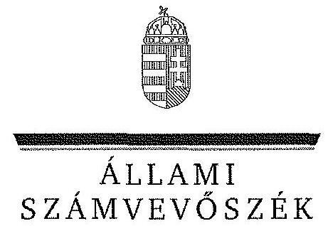
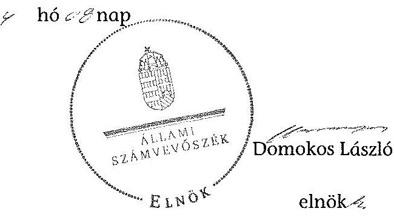

ÁLLAMI
SZÁMVEVÔSZÉK

# JELENTÉS 

az önkormányzatok vagyongazdálkodása szabályszerűségének ellenőrzéséről
Kőröstetétlen

---

# Állami Számvevőszék 

Iktatószám: V-0211-041/2014.
Témaszám: 1246
Vizsgálat-azonosító szám: V065105

## Az ellenőrzést felügyelte:

Makkai Mária
felügyeleti vezető
Az ellenőrzést vezette és a végrehajtásáért felelős:
Tóth Marianna
ellenőrzésvezető
A számvevőszéki jelentés összeállításában közremúködött:
Horváthné Menyhárt Erika
számvevő főtanácsos
Hadnagyné Papp Ildikó
számvevő
Szepes Béla Bálint
számvevő tanácsos
Varga Ágnes Klára
számvevő
Az ellenőrzést végezték:
Szepes Béla Bálint
számvevő tanácsos

Tóth István
számvevő tanácsos

---

# TARTALOMJEGYZÉK 

BEVEZETÉS ..... 3
I. ÖSSZEGZŐ MEGÁLLAPÍTÁSOK, KÖVETKEZTETÉSEK, JAVASLATOK ..... 6
II. RÉSZLETES MEGÁLLAPÍTÁSOK ..... 11

1. A vagyongazdálkodási tevékenység szabályozottsága ..... 11
1.1. A vagyongazdálkodási feladatellátás szabályozottsága, annak megfelelősége ..... 11
1.2. A vagyon használatba adásának, üzemeltetésre történő átadásának szabályszerűsége ..... 13
1.3. Az Nvtv. rendelkezéseinek végrehajtása ..... 14
2. A vagyongazdálkodási tevékenység szabályszerűségének biztosítása ..... 14
2.1. A vagyon nyilvántartása ..... 14
2.2. A beruházások, felújítások végrehajtásának és a közbeszerzési eljárások alkalmazásának szabályszerűsége ..... 16
2.3. A tartós részesedésekkel való gazdálkodás ..... 17
2.4. Az önkormányzati vagyon értékesítése, hasznosítása ..... 18
2.5. Az önkormányzat tulajdonosi joggyakorlása ..... 18
3. Az integritás érvényesülése a vagyongazdálkodási tevékenység során ..... 18
4. Az önkormányzat vagyongazdálkodása szabályszerűségére vonatkozó belső és külső ellenőrzések megállapításainak, javaslatainak hasznosulása ..... 19
4.1. A belső ellenőrzés által tett megállapításoknak, javaslatoknak az önkormányzati vagyongazdálkodás szabályszerű működésére gyakorolt hatása ..... 19
4.2. A külső ellenőrzés által tett megállapításoknak, javaslatoknak az önkormányzati vagyongazdálkodás szabályszerű működésére gyakorolt hatása ..... 20

---

# MELLÉKLET 

1. számú Kőröstetétlen Község Önkormányzat vagyongazdálkodásával összefüggő adatok

## FÜGGELÉK

1. számú Rövidítések jegyzéke

---

# JELENTÉS 

## az önkormányzatok vagyongazdálkodása szabályszerűségének ellenőrzéséről Köröstetétlen

## BEVEZETÉS

Az Állami Számvevőszék (a továbbiakban: ÁSZ) kiemelten fontosnak tartja az Állami Számvevőszékről szóló 2011. évi LXVI. törvény (a továbbiakban ÁSZ tv.) 5. § (4) és (5) bekezdése alapján az önkormányzati vagyon kezelésének, a vagyonnal való gazdálkodási szabályok betartásának az ellenőrzését. Az ellenőrzés feladata a vagyongazdálkodással kapcsolatban a közpénzek átláthatósága, nyilvánossága érdekében a jogszabályokban, belső szabályzatokban megfogalmazott előírások érvényesülésének áttekintése. Az ÁSZ nem csak az ellenőrzött szervezet vagyongazdálkodásának a hibáira mutat rá, számon kérve azok kijavítását, hanem megállapításaival, javaslataival segíti a közpénzzel, a közvagyonnal való felelős gazdálkodást.

Az önkormányzati vagyon alapvető funkciója, hogy a közérdeket és egyúttal az önkormányzati célok megvalósítását szolgálja. A feladatellátás terén elsősorban a kötelezően ellátandó feladatok végrehajtását hivatott szolgálni, amely mellett az önként vállalt feladatok ellátása is megvalósulhat.

Az ÁSZ a stratégiájában hangsúlyos szerepet szán annak, hogy szilárd szakmai alapon álló, értékteremtő ellenőrzéseivel előmozdítsa a közpénzügyek átláthatóságát, rendezettségét. Az ÁSZ a vagyongazdálkodás ellenőrzésén keresztül közremúködik az integritás alapú közigazgatási kultúra kialakításában.

Az ellenőrzés célja annak megállapítása volt, hogy a települési önkormányzat vagyongazdálkodási tevékenységének szabályozottsága és tevékenysége a jogszabályi előírásokkal összhangban volt-e, átlátható, a jogszabályi előírásoknak megfelelő volt-e a vagyon nyilvántartása, a külső és belső ellenőrzések megállapításai hozzájárultak-e az önkormányzati vagyongazdálkodási tevékenység szabályszerűségéhez.

Ennek keretében értékeltük, hogy az önkormányzat:

- szabályszerűen alakította-e ki a vagyongazdálkodási tevékenységének kereteit;
- biztosította-e a vagyongazdálkodás szabályszerűségét, megalapozottan hoz-ta-e és jogszerűen, szabályszerűen hajtotta-e végre a vagyonváltozást eredményező meghatározó jelentőségű döntéseket, valamint gondoskodott-e az általa alapított vagy tulajdonosi részvételével működő gazdasági társaságokkal kapcsolatos tulajdonosi joggyakorlásról;

---

- gondoskodott-e vagyongazdálkodási tevékenysége során az integritás (feddhetetlenség) szempontjainak érvényesüléséről;
- belső ellenőrzése elősegítette-e a vagyongazdálkodás szabályszerű működését, valamint hasznosította-e a külső és belső ellenőrzések megállapításait, javaslatait.

Az ellenőrzés típusa szabályszerűségi ellenőrzés.
Az ellenőrzés a 2009. január 1. és 2012. december 31. közötti időszakra terjedt ki, kitekintéssel a helyszíni ellenőrzés befejezéséig tartó időszak releváns folyamataira. Az egyes közbeszerzési eljárások lefolytatásának ellenőrzése a 2012. január 1-jétől a helyszíni ellenőrzés kezdetét megelőző negyedév utolsó napjáig tartó időszakot érintette.

Az ellenőrzés szakmai módszertana az ÁSZ hivatalos honlapján közzétett szakmai szabályokon alapult, amely a Legfőbb Ellenőrző Intézmények Nemzetközi Szervezete (INTOSAI) által kiadott nemzetközi standardok (ISSAI) figyelembevételével készült.

Az ellenőrzést az ÁSZ hatályos szervezeti szabályai és az ellenőrzési programban foglalt értékelési szempontok szerint folytattuk le. Megállapításainkat a helyszíni ellenőrzés tapasztalataira, az ellenőrzött szervezettől bekért dokumentumokra, a kitöltött tanúsítványok elemzésére, valamint az adott időszakban hatályos jogszabályok és belső szabályzatok előírásaira alapoztuk. A vagyonváltozásokkal kapcsolatos gazdasági események közül az ellenőrzött tételeket megálásos mintavétellel választottuk ki a Polgármesteri Hivatal 2009-2012. évi számviteli nyilvántartásaiból.

A jelentésben alkalmazott rövidítéseket az 1. számú függelék tartalmazza.
Köröstetétlen község lakosainak száma 2012. január 1-jén 867 fő volt. Az öttagú Képviselő-testület munkáját egy állandó bizottság ${ }^{1}$ segítette. Az Önkormányzat mellett a 2009-2012. években kisebbségi önkormányzat, illetve nemzetiségi önkormányzat nem múködött. A polgármester a 2002. évi önkormányzati választás óta tölti be tisztségét, a jegyző 2008. december 1-jétől 2012. december 31-ig látta el feladatait. A hivatal szervezeti egységekre nem tagolódott, és elkülönített gazdasági szervezettel nem rendelkezett, a foglalkoztatott köztisztviselők száma 2012. január 1-jén öt fő volt.

Az Önkormányzat 2013. január 1-jével - az Mötv. előírásainak megfelelően közös önkormányzati hivatalt hozott létre Cegléd Város Önkormányzatával. A két Önkormányzat közötti átadás-átvételre 2013 áprilisában került sor, az erről felvett jegyzőkönyvek szerint a teljes dokumentáció tételes átadás-átvételére nem került sor.

Az Önkormányzat a feladatainak végrehajtása érdekében 2012. augusztus 31ig két költségvetési intézményt múködtetett². Az óvoda önállóan múködő, a

[^0]
[^0]:    ${ }^{1}$ Jogi és gazdasági bizottság, majd Jogi, gazdasági és kulturális bizottság
    ${ }^{2}$ Köröstetétlen Község Polgármesteri Hivatala és az Árpád Fejedelem Óvoda

---

Polgármesteri Hivatal pedig önállóan múködő és gazdálkodó költségvetési szervezet volt. A feladatok ellátásában részt vett három társulás ${ }^{5}$.

Az Önkormányzat vagyona 2012. december 31-én a könyvviteli mérleg szerint $619,4 \mathrm{M}$ Ft volt, $24,0 \mathrm{M}$ Ft-tal, $4,0 \%$-kal nőtt az ellenőrzött időszakban. Az adósságállomány értéke $11,0 \mathrm{M}$ Ft volt, adósságkonszolidáció/átvállalás nem történt. Az Önkormányzat a 2012. évi költségvetési beszámolója szerint 131,2 M Ft költségvetési bevételt ért el, és $109,7 \mathrm{M}$ Ft költségvetési kiadást teljesített, melyből a felhalmozási célú kiadás $61,8 \mathrm{M}$ Ft volt. Az Önkormányzat gazdálkodására jellemző adatokat, mutatószámokat az 1. sz. melléklet tartalmazza.

Az Önkormányzatnál térítés nélküli vagyonátadásra, illetve -átvételre nem került sor.

Az ellenőrzés jogszabályi alapját az ÁSZ tv. 5. § (4) bekezdésének a) pontja és (5) bekezdése, valamint az államháztartásról szóló 2011. évi CXCV. törvény 61. § (2) bekezdésében foglaltak képezik.

Az ÁSZ a 2011. évi LXVI. törvény 29. § (1) bekezdése szerint a jelentéstervezetet megküldte egyeztetésre Kőröstetétlen Község Önkormányzat polgármesterének, aki az ÁSZ tv. 29. § (2) bekezdésében foglalt észrevételezési jogával nem élt, a jelentéstervezetre észrevételt nem tett.

[^0]
[^0]:    ${ }^{5}$ Ceglédi Többcélú Kistérségi Társulás; Abony és Térsége Térségfejlesztési Társulás; Szol-nok-Abony-Szajol-Rákóczifalva települési szilárdhulladék-lerakói rekultivációjának megvalósítására vonatkozó Társulás

---

# I. ÖSSZEGZŐ MEGÁLLAPÍTÁSOK, KÖVETKEZTETÉSEK, JAVASLATOK 

Az Önkormányzat számviteli mérleg szerinti vagyona a 2009. január 1-jei 595,4 M Ft-ról 2012. december 31-re 4,0\%-kal ( $619,4 \mathrm{M}$ Ft-ra) nőtt. Ezt az ellenőrzött időszakban megvalósult beruházások okozták, amelyek következtében a tárgyi eszközök állománya $18,8 \%$-kal ( $81,4 \mathrm{M} \mathrm{Ft}$ ) nőtt. Ez kompenzálta az üzemeltetésbe adott eszközök 16,5\%-os ( $11,9 \mathrm{M}$ Ft) állománycsökkenését, amely az időszak során elszámolt értékcsökkenés miatt következett be.

Az Önkormányzat az ellenőrzött időszakban összesen 188,4 M Ft-ot fordított felújításokra és beruházásokra, melyből a felújítás $60,7 \mathrm{M}$ Ft, a beruházások összege $127,7 \mathrm{M}$ Ft volt. A beruházásokra és felújításokra fordított összeg a 2009-2012. években $14,0 \%$-kal meghaladta az elszámolt értékcsökkenés összegét ( $165,3 \mathrm{M} \mathrm{Ft}$ ). Az Önkormányzat beruházásai a feladatellátással összhangban, a gazdasági programban foglaltaknak megfelelően valósultak meg, azonban hét esetben ( $4,7 \mathrm{M} \mathrm{Ft}$ ) a döntésről testületi határozat nem állt rendelkezésre. Az ellenőrzött időszakban megvalósult beruházások és felújítások célja kerékpárút építése, a vízelvezetés biztosítása, valamint az óvoda és iskola felújítása volt. A beruházások és felújítások fedezetét az Önkormányzat hazai és uniós támogatásból, valamint saját forrásból biztosította. A gazdálkodási és ellenőrzési jogkörök gyakorlása a beruházásokkal és felújításokkal kapcsolatos kifizetések esetében szabályozás hiányában nem volt megfelelő. Az Önkormányzatnál a 2012-2013. év I. féléve közötti időszakban két közbeszerzési eljárás lefolytatására került sor. Az eljárások lebonyolítása külső szakértővel történt, aki a közbeszerzési szabályzatban foglaltak szerint koordinálta, vezette és dokumentálta a folyamatokat, valamint igazolta azok jogszerűségét.

Az Önkormányzat a vagyongazdálkodás szabályozása során hiányosságokkal tett eleget a jogszabályi előírásoknak. Az Ötv.-ben foglaltaknak megfelelően a vagyongazdálkodási rendelet ${ }_{1,2}$-ben meghatározta a törzsvagyon körét, elkülönítette a forgalomképes és forgalomképtelen vagyoni elemeket, rendelkezett a forgalomképesség szerinti megváltoztatás módjáról és a vagyon nyilvántartásáról. A Képviselő-testület az Nvtv. előirása ellenére, a 60 napos határidőt egy évvel túllépve, 2013. május 15 -én fogadta el a jelenleg hatályos vagyongazdálkodási rendeletét, amely nemzetgazdasági szempontból kiemelt jelentőségű vagyonelemet nem tartalmaz.

A vagyontárgyak nyilvános pályáztatási kötelezettségét a 2009-2012. években 5 M Ft értékhatárral határozták meg. A tulajdonosi jogok körében nem rendelkeztek a vagyon vállalkozásba vitelének és egyéb célú hasznosításának szabályairól. A Képviselő-testület vagyongazdálkodási hatáskört ruházott át értékhatárhoz kötötten a polgármesterre. A vagyongazdálkodási rendelet ${ }_{1,2}$ alapján a vagyon értékesítéséről 1 M Ft értékhatárig, követeléselengedés esetén 300 E Ft-ig a polgármester dönthet.

---

Az Önkormányzat a vagyonkezelői jog megszerzésének, gyakorlásának és a vagyonkezelés ellenőrzésének szabályait nem határozta meg, vagyonkezelői jogot nem alapított és vagyonkezelési szerződést nem kötött. A beszerzések szabályozása az Ámr. ${ }_{2}$ és az Av̌r. előírásai ellenére nem történt meg.

A vagyongazdálkodással összefüggésben a jegyző a Számv. tv.-ben foglaltak ellenére a 2009-2012. évekre vonatkozóan nem alakította ki az Önkormányzat számviteli politikáját és értékelési szabályzatát. Ennek a kötelezettségének 2013-ban tett eleget. A leltározási szabályzat ${ }_{1,2,3}$ nem tartalmazott utalást az üzemeltetésbe adott eszközök leltározásának sajátos szabályaira. Az Önkormányzat az ellenőrzött időszakban számlarenddel nem rendelkezett.

Az Önkormányzatnál a vagyongazdálkodás múködésének szabályszerúsége a 2009-2012. években nem volt biztosított. Az Áht. ${ }_{1,3}$-ben rögzítettek ellenére a 2009-2011. évekre a jegyző nem készítette el az éves zárszámadásokhoz a vagyonkimutatást. A 2012. évről készült és a Képviselő-testület által elfogadott zárszámadás részét képező vagyonkimutatás nem tartalmazta a „0"ra leírt, de használatban lévő, illetve használaton kívüli eszközök állományát, a jogszabály alapján érték nélkül nyilvántartott eszközök állományát.

Az Önkormányzat a 2009-2012. években leltározási kötelezettségének nem a Számv. tv.-ben és az Áhsz.-ben előírt módon tett eleget. Nem történt meg a leltárak kiértékelése, valamint az üzemeltetésre átadott eszközök leltározása sem. Az éves beszámolók az ellenőrzött időszakban a leltárkiértékelések, analitikus nyilvántartások és az üzemeltetésre átadott eszközök leltározásának hiányában nem voltak alátámasztottak.

Az Önkormányzat számviteli nyilvántartásában szereplő ingatlanvagyon, az ingatlanvagyon-kataszter, valamint a földhivatali ingatlan-nyilvántartás adatainak egyezősége a 2009-2012. években nem volt biztosított. Az Önkormányzati ingatlanvagyon-kataszterben és a fökönyvi kivonatban rögzített ingatlanvagyon adatai 2009-ben 1,6 M Ft-tal eltértek egymástól. A különbség 2012-re 101,6 M Ft-ra növekedett. Az egyeztetés elvégzését, valamint az eltérések okát az Önkormányzat nem tudta dokumentálni. Az eltérések okainak feltárása a 2013. évben kezdődött meg, a földhivatali ingatlan-nyilvántartás adatainak egyeztetése a helyszíni ellenőrzés időszakában folyamatban volt.

A gazdálkodási és ellenőrzési jogköröket az Ámr. ${ }_{1,2}$ előírásaival ellentétben a 2009-2011. évekre vonatkozóan az Önkormányzat nem szabályozta, a 2012. évben kiadott ügyrend gazdálkodási jogkörökre vonatkozó előírásai nem voltak összhangban az Ávr.-ben 2012. január 1-jétől bekövetkezett jogszabályi változásokkal, emellett a gazdálkodási jogköröket gyakorlók aláírásmintájáról nem vezettek nyilvántartást. A gazdálkodási és ellenőrzési jogkörök gyakorlása a 2009-2012. években szabályozás hiányában nem volt megfelelő. A 2013. január 1-jétől hatályos kötelezettségvállalási szabályzatban meghatározták a gazdálkodási jogkör gyakorlásának módját, rendjét és dokumentációs részletszabályait.

Az Önkormányzat a 2009-2012. években gazdasági társaságot nem alapított, a 2012. év végén egy gazdasági társaságban volt kisebbségi részesedése, amelylyel kapcsolatos tulajdonosi jogait és kötelezettségeit tulajdoni részesedése mér-

---

tékéig teljesítette. Az ellenőrzött időszakban értékvesztés, illetve értékhelyesbítés elszámolására nem került sor.

A jegyző a 2009-2012. években az Eisztv. és az Info. tv. előírásai ellenére nem gondoskodott a közérdekú adatok közzétételéről, ezáltal nem biztosította a vagyongazdálkodási tevékenység nyilvánosságát. Nem történt meg a gazdálkodási adatok - az elemi költségvetés, zárszámadás, a vagyongazdálkodással összefüggő, nettó ötmillió forintot elérő vagy azt meghaladó értékű szerződések - közzététele.

Az Önkormányzat szervezetének és intézményeinek irányítása a mindennapi munkavégzés során nem biztosította az integritás érvényre jutását, mivel az Önkormányzat nem rendelkezett a vagyongazdálkodási tevékenység szabályosságát, feddhetetlenségét biztosító belső szabályzatokkal. Nem írtak elő nyilatkozattételi kötelezettséget a munkatársak részére gazdasági érdekeltségeikről, nem szabályozott az ajándékok elfogadása. Az Önkormányzat - a Bkr. előírásaival ellentétben - az etikai elvárásokat nem határozta meg.

Az Önkormányzat belső ellenőrzését 2009-2012 között a Társulás keretében látta el. A belső ellenőrzés ellenőrzéseivel hozzájárult az Önkormányzat vagyongazdálkodásának szabályszerű működéséhez, azonban az általa tett javaslatokat az Önkormányzat csak részben hasznosította.

Az Önkormányzat a 2009-2012. években nem volt könyvvizsgálatra kötelezett, a vagyongazdálkodást sem az ÁSZ, sem külső ellenőrző szerv nem ellenőrizte.

Az Állami Számvevőszékről szóló 2011. évi LXVI. törvény 33. § (1) bekezdésében foglaltak értelmében a jelentésben foglalt megállapításokhoz kapcsolódó intézkedési tervet köteles az ellenőrzött szervezet vezetője összeállítani, és azt a jelentés kézhezvételétől számított 30 napon belül az ÁSZ részére megküldeni. Amennyiben az intézkedési tervet határidőben nem küldi meg a szervezet, vagy az nem elfogadható, az ÁSZ elnöke a hivatkozott törvény 33. § (3) bekezdés a)-b) pontjaiban foglaltakat érvényesítheti.

Az ellenőrzés intézkedést igénylő megállapításai és javaslatai

# a polgármesternek 

1. Az Önkormányzat beruházásai a feladatellátással összhangban, a gazdasági programban foglaltaknak megfelelően valósultak meg, azonban hét esetben ( $4,7 \mathrm{MFt}$ ) a döntésről testületi határozat nem állt rendelkezésre.

Javaslat:
Vizsgálja ki a képviselő-testületi döntés elmaradásának a körülményeit, és amennyiben szükséges, tegye meg a személyes felelősségre vonást.

---

# a jegyzőnek 

1. A leltározási szabályzat ${ }_{1,2}$ nem tartalmazott utalást az Áhsz. 37. § (4) bekezdésében előírt, az üzemeltetésre, kezelésre átadott eszközök leltározásának sajátos szabályaira vonatkozóan.

Az Önkormányzat a Számv. tv. 161. § (1) bekezdésében, valamint az Áhsz. 49. § (1) bekezdésében előírt számlarenddel nem rendelkezett.

Javaslat:
a) Egészítse ki a leltározási szabályzatát az üzemeltetőre vonatkozó, az Áhsz. 37. § (4) bekezdésében előírt leltározási kötelezettségre való utalással.
b) Készítse el a Számv. tv. 161. § (1) bekezdésében, valamint az Áhsz. 49. § (1) bekezdésében előírt számlarendet.
2. A beszerzések szabályozása az Ámr. 2 20. § (3) bekezdés b) pontja, valamint az Ávr. 13. § (2) bekezdés b) pontja ellenére nem történt meg.

Javaslat:
Intézkedjen az Ávr. 13. § (2) bekezdés b) pontjában előírtaknak megfelelően a beszerzések lebonyolításával kapcsolatos eljárásrend elkészítéséről.
3. A jegyző a 2009-2012. években az Eisztv. 6. § (1) és az Info. tv. 37. § (1) bekezdése előírásai ellenére nem gondoskodott a közérdekű adatok közzétételére vonatkozó kötelezettségéről, ezáltal nem biztosította a vagyongazdálkodási tevékenység nyilvánosságát. Nem történt meg a gazdálkodási adatok - az elemi költségvetés, zárszámadás, a vagyongazdálkodással összefüggő, nettó 5 M Ft-ot elérő vagy azt meghaladó értékű szerződések - közzététele.

Javaslat:
Intézkedjen az Info. tv. 1. számú mellékletében meghatározott adatok közzétételéről.
4. A 2012. évről készült és a Képviselő-testület által elfogadott zárszámadás részét képező vagyonkimutatás az Áhsz. 44/A. § (3) bekezdése és a 9. számú melléklet előírásai ellenére nem tartalmazta a „0"-ra leírt, de használatban lévő, illetve használaton kívüli eszközök állományát, a jogszabály alapján érték nélkül nyilvántartott eszközök állományát, a mérlegben értékkel nem szereplő kötelezettségeket.

Javaslat:
Intézkedjen arról, hogy az Önkormányzat vagyonkimutatása tartalmazza az Áhsz 44/A. § (3) bekezdésében előírt tartalmi elemeket is.
5. Az Önkormányzat számviteli nyilvántartásában szereplő ingatlanvagyon, az ingat-lanvagyon-kataszter, valamint a földhivatali ingatlan-nyilvántartás adatainak egyezősége a 2009-2012. években nem volt biztosított. 2009-ben az ingatlanvagyonkataszterben és a főkönyvi kivonatban rögzített ingatlanvagyon adatai 1,6 M Ft-tal

---

eltértek egymástól. A különbség 2012-re 101,6 M Ft-ra növekedett. Az egyeztetés elvégzését, valamint az eltérések okát az Önkormányzat nem tudta dokumentálni.

Javaslat:
Intézkedjen, hogy a 147/1992. (XI. 6.) Korm. rendelet 1. § (2) bekezdésében rögzítetteknek megfelelően az ingatlanvagyon-kataszter adatai egyezzenek meg a földhivatal ingatlan-nyilvántartásának azonos tartalmú adataival, valamint az 1. § (3) bekezdésében foglaltaknak megfelelően biztosítsa az egyezőséget az ingatlanvagyonkataszter és a számviteli nyilvántartás adatai között.
6. Az Önkormányzat a 2009-2012. években leltározási kötelezettségének nem a Számv. tv. 166-167. §-aiban és az Áhsz. 37. §-ban előírt módon, valamint nem a leltározási szabályzat ${ }_{1,2}$ elöírásainak megfelelően tett eleget. Nem történt meg a leltárak kiértékelése, valamint az üzemeltetésre átadott eszközök üzemeltetők általi leltározása sem. Az éves beszámolók a 2009-2012. években a leltárkiértékelések, analitikus nyilvántartások és az üzemeltetésre átadott eszközök leltározásának hiányában nem voltak alátámasztottak.

Javaslat:
Intézkedjen az Áhsz. 37. §-ban foglaltaknak megfelelő leltározás - ide értve az üzemeltetésre átadott eszközök leltározását is - végrehajtásáról, valamint a felvett leltárak kiértékeléséről.
7. Az Önkormányzatnál - a Bkr. 6. § (1) bekezdés c) pontjával ellentétben - az etikai elvárások nem kerültek meghatározásra.

Javaslat:
Intézkedjen a Bkr. 6. § (1) bekezdés c) pontjában foglaltaknak megfelelően az Önkormányzatnál az etikai elvárások meghatározásáról.

---

# II. RÉSZLETES MEGÁLLAPÍTÁSOK 

## 1. A VAGYONGAZDÁLKODÁSI TEVÉKENYSÉG SZABÁLYOZOTTSÁGA

### 1.1. A vagyongazdálkodási feladatellátás szabályozottsága, annak megfelelősége

A Képviselő-testület a Htv. 138. § (1) bekezdés j) pontjában foglalt kötelezettségének eleget téve, elfogadta az önkormányzati vagyonnal történő gazdálkodás szabályait. Jóváhagyta a vagyongazdálkodási feladat- és hatáskörökről rendelkező belső szabályzatokat, amelyek hiányosságokkal feleltek meg a jogszabályi előírásoknak.

Az Önkormányzat a 2009-2012. években rendelkezett a vagyonról és a vagyonnal való gazdálkodás szabályairól szóló vagyongazdálkodási rendelet ${ }_{1,2}$ vel, amelyek hatálya a teljes vagyoni körre kiterjedt. Az Ötv. 78-79. § előírásával összhangban határozták meg az önkormányzati feladatellátást biztosító törzsvagyon körét, és elkülönítették a forgalomképtelen és a korlátozottan forgalomképes vagyonelemeket.

Az Nvtv. hatálybalépését követően, az Nvtv. 18. § (1) bekezdésben előírt 60 napos határidőt több mint egy évvel túllépve - 2013. május 15 -én - fogadta el az Önkormányzat az új vagyongazdálkodási rendeletét. Nemzetgazdasági szempontból kiemelt jelentőségű vagyonelemeket az Önkormányzat új vagyongazdálkodási rendelete nem tartalmaz.

Az Önkormányzat az Áht. ${ }_{1}$ 108. § (1) bekezdésében foglaltakra tekintettel a vagyongazdálkodási rendelet ${ }_{2}$-ben 5 M Ft-ban határozta meg azt az értékhatárt, amely felett csak nyilvános pályázat útján lehet vagyont értékesíteni, kezelésbe adni, illetve a használati jogát átadni.

A vagyonnal való rendelkezési, döntési hatásköröket a vagyongazdálkodási rendelet ${ }_{1,2}$-ben szabályozták. A szabályozás kiterjedt az értékesítésre, az apportálásra, a bérbeadásra, értékpapírok vételére, eladására és a pénzügyi befektetésekre. A hasznosításra szánt vagyon értékének megállapítása céljából az értékbecslési kötelezettséget előírták. A Képviselő-testület a vagyongazdálkodási rendelet ${ }_{1,2}$-ben meghatározta a tulajdonában lévő vagyon ingyenes átruházásának és a követelésről való lemondásnak a lehetséges eseteit és módját.

Az Önkormányzat az ellenőrzött időszakban a Számv. tv. 14. §-ának, valamint az Áhsz. 8. §-ának előírása ellenére számviteli politikával nem rendelkezett. Leltározási szabályzat ${ }_{1,2}$-vel és pénzkezelési szabályzattal rendelkezett, azonban a Számv. tv. 14. § (5) bekezdés b) pontjában és az Áhsz. 8. § (4) bekezdés b) pontjában előírt értékelési szabályzattal nem. A számviteli politikáját és az értékelési szabályzatát 2013. január 2-án adta ki. A Számv. tv. 161. § (1) bekezdésében, valamint az Áhsz. 49. § (1) bekezdésében előírt számlarenddel nem rendelkezett.

---

A 2013. évben kiadott értékelési szabályzat nem szabályozta az értékvesztés és az értékvesztés visszaírásának eszközcsoportonként részletezett rendjét.

Az Önkormányzat leltározási szabályzat ${ }_{1,2}$-je nem tartalmazott utalást az üzemeltetésbe adott eszközök leltározásának sajátos szabályaira.

Az Önkormányzat 2010. január 1-jétől rendelkezett az Áhsz. 37. § (5) bekezdésével összhangban kiadott selejtezési szabályzattal, melyben azonban nem határozták meg a hasznosítás és a nyilvántartás során követendő eljárás rendjét, az ármegállapítás szabályait.

Az Ámr. ${ }_{1}$ 134-138. §-aiban, valamint az Ámr. ${ }_{2}$ 20. § (3) bekezdés a) pontjában előírt operatív gazdálkodással és annak munkafolyamatba épített ellenőrzésével összefüggő jogkörök gyakorlásának módját, rendjét, eljárási és dokumentációs részletszabályait 2011. december 31-éig az Önkormányzat nem szabályozta. A 2012. január 1-jétől kiadott ügyrend gazdálkodási jogkörökre vonatkozó szabályai nem tartalmazták az Ávr. 60. § (1) bekezdésében meghatározott összeférhetetlenségi szabályokat, továbbá az Ávr. 60. § (3) bekezdésében előírtak ellenére a jogosult személyek aláírásmintájáról nem vezettek nyilvántartást.
2013. január 1-jétől a kötelezettségvállalási szabályzatban meghatározták a gazdálkodási jogkör gyakorlásának módját, rendjét és dokumentációs részletszabályait.

Az ellenőrzött időszakban a vagyonnal, vagyongazdálkodással kapcsolatos feladatokat ellátó gazdálkodási jogkört gyakorlók közül csak az ellenjegyző és érvényesítő munkaköri leírása állt az Önkormányzatnál rendelkezésre. A munkaköri leírás az ellenjegyzési és érvényesítési feladatot azonban nem tartalmazta. A jegyző a Ktv. 11. § (6) bekezdésében foglaltak ellenére nem rendelkezett a polgármester által aláírt munkaköri leírással.

A kötelezettségvállalási szabályzattal összhangban 2013. január 2-től a gazdálkodási jogköröket gyakorlók munkaköri leírásai tartalmazták valamennyi feladatot és pénzügyi jogkört.

Az Önkormányzat közbeszerzési szabályzattal rendelkezett, azonban az értékhatár alatti beszerzések szabályozása az Ámr. ${ }_{2}$ 20. § (3) bekezdés b) pontja, valamint az Ávr. 13. § (2) bekezdés b) pontja ellenére nem történt meg.

Az Önkormányzat az Ámr. ${ }_{1}$ 145/B. §-ban, az Ámr. ${ }_{2}$ 156. § (2) bekezdésében és a Bkr. 6. § (3) bekezdésében előírt ellenőrzési nyomvonalát és az Ámr. ${ }_{1}$ 145/A. § (5) bekezdésében, az Ámr ${ }_{2}$ 156. § (3) bekezdésében és a Bkr. 6. § (4) bekezdésében előírt szabálytalanságok kezelésének eljárásrendjét a FEUVE szabályzat ${ }_{1,2}$ tartalmazta ${ }^{4}$. Az Önkormányzat belső ellenőrzési kézikönyve ${ }_{1,2}$ a Ber. 5. § (2) bekezdés előírásai szerint tartalmazta a kockázatelemzési módszertant, az ellenőrzési megállapítások hasznosításának és az ellenőrzést követő intézkedések elrendelésének szabályait.

[^0]
[^0]:    ${ }^{4}$ 2013. január 1-jétől a szabálytalanságok kezelésének rendjét a hivatali SZMSZ-ben határozta meg.

---

A döntés-előkészítés folyamatában a költség-haszon elemzés készítésének kötelezettségét, a fejlesztéssel létrehozott vagyontárgyak fenntarthatóságának, a múködtetéshez és fenntartáshoz szükséges források biztosításának vizsgálatát nem szabályozták.

Az Önkormányzat rendelkezett az Ötv. 91. § (1) bekezdésében és az Mötv. 116. § (1) bekezdésében előírt, Képviselő-testület által elfogadott gazdasági programmal, továbbá az Nvtv. 9. § (1) bekezdésében előírt közép és hosszú távú vagyongazdálkodási tervvel.

Az Önkormányzat az ellenőrzött időszakban a kötelező és önként vállalt feladatait rendeletben vagy belső szabályzatban nem határozta meg. Az ellenőrzött időszakban az Önkormányzat kizárólag kötelező feladatokat látott el, amelyek az ellenőrzött időszakban nem módosultak.

A jegyző a 2009-2012. években az Eisztv. 6. § (1) bekezdés és az Info. tv. 37. § (1) bekezdés előírásai ellenére nem gondoskodott a közérdekú adatok közzétételéről, ezáltal nem biztosította a vagyongazdálkodási tevékenység nyilvánosságát. Nem történt meg a gazdálkodási adatok - az elemi költségvetés, zárszámadás, a vagyongazdálkodással összefüggő, nettó ötmillió forintot elérő vagy azt meghaladó értékű szerződések - közzététele.

# 1.2. A vagyon használatba adásának, üzemeltetésre történő átadásának szabályszerűsége 

A vagyongazdálkodási rendelet ${ }_{1,2}$ alapján a vagyon értékesítéséről $1,0 \mathrm{M}$ Ft értékhatárig a polgármester dönt, felette a Képviselő-testület határoz. Követeléselengedés esetén az értékhatár 300,0 E Ft-ban került meghatározásra, amely felett kizárólag a Képviselő-testület dönthet. Az Önkormányzatnak vagyonkezelői szerződése nem volt, ingyenes vagyonátadásra illetve -átvételre nem került sor.

Az Önkormányzatnak 2008. január 1-jétől 2012. december 31-ig üzemeltetési szerződése volt az Abokom Nonprofit Kft.-vel, a víziközmúvek vonatkozásában. Az üzemeltetésre átadott eszközök nyilvántartása megfelelő a Víziközmű tv.-nek. Az Önkormányzat a 25/2012. (VI. 20.) számú határozatával a Víziközmú tv.-ben foglalt előírásokkal összhangban - a tulajdonosi összetételre vonatkozó előírások betartása érdekében - döntött a község ivóvízellátását és szennyvízelvezetését biztosító DAKÖV Kft.-ben való részvételről.

Az Önkormányzat szerződést kötött a DAKÖV Kft.-vel a víziközmúvagyon üzemeltetésére, amit 2013. január 1-jétől lát el a DAKÖV Kft. A szerződés tartalmazta az ellátandó közfeladatot, az üzemeltetésre átvett vagyonra vonatkozóan a nyilvántartás és adatszolgáltatás módját, valamint az Önkormányzatot védő garanciális elemeket. A közmú-üzemeltetési szerződésekben meghatározták a vagyon állagának, értékének megőrzését és védelmét, de nem írták elő az üzemeltető leltározási köztelezettségét.

Az üzemeltetésbe átadott eszközök tekintetében az Önkormányzat felújítási, pótlólagos beruházási előirányzatot nem az elszámolt értékcsökkenésnek megfelelő összegben tervezett.

---

# 1.3. Az Nvtv. rendelkezéseinek végrehajtása 

Az ellenőrzött időszakban az Önkormányzat vállalkozási tevékenység végzéséről nem döntött, ilyen jellegű tevékenységet nem folytatott.

Az Önkormányzat a 2009-2012. években gazdasági társaságot nem alapított, a 2012. év végén képviselő-testületi döntés alapján egy gazdasági társaságban (DAKÖV Kft.) volt kisebbségi részesedése (tulajdoni részaránya $0,018 \%, 100,0$ E Ft). A társaság 100\%-ban önkormányzatok tulajdonában van, ezért megfelel a Nvtv. 3. §-ban meghatározott átlátható szervezet kritériumának.

## 2. A VAGYONGAZDÁLKODÁSI TEVÉKENYSÉG SZABÁLYSZERŰSÉGÉNEK BIZTOSÍTÁSA

### 2.1. A vagyon nyilvántartása

Az Önkormányzatnál a 2009-2011. évekre a jegyző nem készítette el az éves zárszámadásokhoz a vagyonállapotról a vagyonkimutatást, és azt a zárszámadási rendelettervezet előterjesztésekor a Képviselő-testület részére tájékoztatásul nem mutatták be, ezzel megsértették az Áht. 118. § (2) bekezdés 2. c) pontjában és az Áht. 2 91. § (2) bekezdés c) pontjában foglalt előírásokat.

A 2012. évről készült és a Képviselő-testület által elfogadott zárszámadás ${ }^{5}$ részét képező vagyonkimutatás az Áhsz. 44/A. § (3) bekezdés és a 9. számú melléklet előírásai ellenére nem tartalmazta a „o" ${ }^{\prime \prime}$-ra leírt, de használatban lévő, illetve használaton kívüli eszközök állományát, a jogszabály alapján érték nélkül nyilvántartott eszközök állományát.

A polgármester az önkormányzati választást megelőzően összeállította az Áht. 1 50/A. § (4) bekezdésben előírt jelentést a helyi Önkormányzat vagyoni és pénzügyi helyzetéről, azonban a közzétételt az előírt határidőn túl teljesítette.

Az Önkormányzat számviteli nyilvántartásában szereplő ingatlanvagyon, az ingatlanvagyon-kataszter, valamint a földhivatali ingatlannyilvántartás adatainak egyezőségét a 147/1992. (XI. 6.) Korm. rendelet 1. § (2)-(3) bekezdésben előírtakkal ellentétben nem biztosították.

[^0]
[^0]:    ${ }^{5} 3 / 2013$. (V. 2.) önkormányzati rendelet 12. sz. melléklete

---

Az Önkormányzat ingatlanvagyon-katasztere és a főkönyvi nyilvántartás bruttó adatai közötti eltérés kimutatása
adatok M Ft-ban

| Tárgyévek   december 31. | Kataszter | Fökönyv | Eltérés |
| :--: | :--: | :--: | :--: |
| 2009. | 570,4 | 572,0 | $-1,6$ |
| 2010. | 602,8 | 593,7 | 9,1 |
| 2011. | 604,5 | 606,1 | $-1,6$ |
| 2012. | 604,5 | 706,1 | $-101,6$ |

A nyilvántartások egyeztetésének elvégzését az Önkormányzat nem tudta dokumentálni. Az eltérések okainak feltárása csak a Ceglédi KÖH szervezetéhez történt csatlakozást követően, a 2013. évben kezdődött meg. A nyilvántartások valós állapotnak megfelelő módosítása és a földhivatali ingatlan-nyilvántartás adatainak egyeztetése a helyszíni ellenőrzés időszakában is folyamatban volt.

A 2009-2012. években nem a Számv. tv. 166-167. §, az Áhsz. 37. § és a leltározási szabályzat ${ }_{1,2}$ előírásainak megfelelően történt a mérlegben kimutatott eszközök - ide értve az üzemeltetésre adott eszközöket is - leltározása.

A leltározás végrehajtása során leltározási ütemtervet nem készítettek, nem határozták meg a leltározás munkafolyamatának kezdési és befejezési határidejét és nem jelölték ki a munkafolyamat elvégzéséért és ellenőrzéséért felelős személyeket.

A leltár kiértékelését nem végezték el, záró jegyzőkönyv nem készült.
Az üzemeltetésre átadott eszközök december 31-i fordulónapra vonatkozó évenkénti leltározását a 2010-2012. években az üzemeltetők nem végezték el, annak a dokumentumait az ellenőrzés számára nem tudták bemutatni.

Az éves beszámolók a 2009-2012. években a leltárkiértékelések, analitikus nyilvántartások és az üzemeltetésre átadott eszközök leltározásának hiányában nem voltak alátámasztottak, ezzel megsértették a Számv. tv. 15. § (3) bekezdésében előírt valódiság számviteli alapelvét.

Az ellenőrzött időszakban eszközök selejtezése nem történt, és önkormányzati tulajdonú vagyontárgy elbirtoklására nem került sor.

Az Önkormányzat a számviteli feladatait a 2008. évtől megbízási szerződés alapján könyvelő vállalkozás közreműködésével látta el. A határozatlan időre létrejött megbízási szerződésnek az abban foglalt feladatellátás vonatkozásában 2009. január 1-jétől már nem volt jogalapja, mivel az Ámr. 2 17. § (3) bekezdése e szolgáltatás szerződés keretében történő ellátásának jogszabályi alapját megszűntette. A jegyző ennek ellenére nem kezdeményezte a szerződés megszűntetését.

---

2013. január 1-jétől a közös önkormányzat megalakulásával a számviteli feladatokat a Ceglédi Közös Önkormányzat látja el.

Az Önkormányzatnál az ellenőrzött időszakban az összes eszköz értéke 595,4 M Ft-ról 619,4 M Ft-ra változott. Ezt az ellenőrzött időszakban megvalósult beruházások okozták, amelyek következtében a tárgyi eszközök állománya $18,8 \%$-kal ( $81,4 \mathrm{M}$ Ft) nőtt. A növekedés kompenzálta az üzemeltetésbe adott eszközök 16,5\%-os ( $11,9 \mathrm{M}$ Ft) állománycsökkenését, amely az időszak során elszámolt értékcsökkenésből adódott.

Az eszközök 64,5-81,2\%-át az ingatlanok, 9,7-12,1\%-át az üzemeltetésre, kezelésbe átadott eszközök értéke tette ki.

A vagyonváltozással összefüggő gazdasági események vonatkozásában a 2009-2012. években a gazdálkodási és ellenőrzési jogkörök gyakorlása nem volt szabályszerú, mivel 2011. december 31-ig a szabályozás nem történt meg. Ezt követően a 2012. január 1-jével elkészült szabályozás nem volt összhangban a bekövetkezett jogszabályi változásokkal. Emellett az Ámr. 2 80. § (3) és az Ávr. 60. § (3) bekezdésében előírtak ellenére nem tartalmazta a jogosult személyek aláírásmintájáról vezetett nyilvántartást. Az Ámr. ${ }_{1} 75 . \S$ (1) és az Ávr. 56. § (1) bekezdésében foglaltak ellenére a jegyző nem gondoskodott a kötelezettségvállalások nyilvántartásának kialakításáról és naprakész vezetéséről.

A vagyonváltozásokra vonatkozó döntések jogszerüségét sértette, hogy hét esetben ( $4,7 \mathrm{M}$ Ft) a szerződés megkötése előtt az egyedi szerződésre vagy a projekt egészére vonatkozó testületi döntést nem tudták aláírt testületi jegyzőkönyvvel megerősíteni Ezen túlmenően a 100,0 E Ft-os értékhatár fölötti beszerzéseknél három esetben ${ }^{6}$ nem volt szerződés vagy visszaigazolt megrendelés.

Az Önkormányzatnál a 2009-2012. években a képviselő-testületi határozatokról nem vezettek nyilvántartást.

# 2.2. A beruházások, felújítások végrehajtásának és a közbeszerzési eljárások alkalmazásának szabályszerüsége 

Az Önkormányzat az ellenőrzött időszakban összesen 188,4 M Ft-ot fordított felújításokra és beruházásokra, melyből a felújítás $60,7 \mathrm{MFt}$, a beruházások összege $127,7 \mathrm{M}$ Ft volt. Az Önkormányzat beruházásai a feladatellátással összhangban, a gazdasági programban foglaltaknak megfelelően valósultak meg, azonban hét esetben ( $4,7 \mathrm{M}$ Ft) a döntésről képviselő-testületi határozat nem állt rendelkezésre. A gazdálkodási és ellenőrzési jogkörök gyakorlása a beruházásokkal és felújításokkal kapcsolatos kifizetések esetében is, szabályozás hiányában nem volt megfelelő.

[^0]
[^0]:    ${ }^{6}$ Tervezési díj, motoros fưrész és számítógép-beszerzés

---

Az uniós forrásból megvalósult beruházásokat a közreműködő szervezetek ${ }^{7}$ folyamatosan ellenőrizték. A dokumentált és szabályos végrehajtást az ellenőrzött által bemutatott projekt-dokumentumok alátámasztották.

Az Önkormányzatnál a 2012-2013. év I. féléve közötti időszakban két közbeszerzési eljárás lefolytatására került sor. Az Önkormányzat megfelelően alkalmazta a Kbt. 10. §-ában előírtakat, az értékhatárt elérő vagy azt meghaladó értékű beszerzéseknél a közbeszerzési eljárást szabályszerűen folytatta le. A projektek előkészítésével és lebonyolításával, a közbeszerzés koordinálásával külső szakértőt bíztak meg, aki a közbeszerzési szabályok szerint koordinálta, vezette és dokumentálta a folyamatokat, és igazolta azok jogszerűségét. A beruházások végrehajtása során az akadálymentesítési feladatokat teljesítették, ahol a beruházás jellege miatt ez értelmezhető volt.

A beruházások forrását uniós és hazai támogatásból, valamint saját forrásból biztosították. A beruházások előkészítése során a megvalósítani kívánt létesítmények fenntarthatóságát az ellenőrzött tételek körében - az uniós forrásból megvalósított létesítmények kivételével - nem vizsgálták.

Az Önkormányzatnál PPP konstrukcióban megvalósult fejlesztés az ellenőrzött időszakban nem volt.

# 2.3. A tartós részesedésekkel való gazdálkodás 

Az Önkormányzatnak kizárólagos tulajdonában lévő gazdasági társasága a 2009-2012. években nem volt.

A 2012. évi mérleg szerint az Önkormányzat tartós részesedéseinek állománya 260,0 E Ft volt, amelyet azonban analitikával, illetve - a DAKÖV Kft. részesedés kivételével - további dokumentummal alátámasztani nem tudott.

Az Önkormányzat 2012-ben - képviselő-testületi felhatalmazással és a Víziközmű tv. rendelkezéseinek megfelelően - döntött a víziközmú-szolgáltató társaságban való részvételről. Ennek eredményeként 0,018\%-os (100,0 E Ft) résztulajdont szerzett a DAKÖV Kft.-ben.

Az Önkormányzatnál az ellenőrzött időszakban nem került sor értékvesztés vagy értékhelyesbítés elszámolására.

Az Önkormányzat gazdasági társaságnak hitelt vagy tagi kölcsönt nem nyújtott. A gazdasági társaságok által felvett hitelhez, kibocsátott kötvényhez, pályázati támogatáshoz kapcsolódóan önkormányzati garancia- és kezességvállalásra nem került sor.

[^0]
[^0]:    ${ }^{7}$ Magyar Államkincstár, Pro Regio Közép-Magyarországi Regionális Fejlesztési és Szolgáltató Nonprofit Közhasznú Korlátolt Felelősségű Társaság

---

# 2.4. Az önkormányzati vagyon értékesítése, hasznosítása 

Az Önkormányzatnál az ellenőrzött időszakban vagyonértékesítésre nem került sor. A vagyonhasznosítás jellemző formája az önkormányzati tulajdonú helyiségek bérbeadása volt.

Az Önkormányzat az ellenőrzött időszakban kettő közoktatási feladatokat szolgáló ${ }^{8}$, három lakáscélú (szolgálati lakás) és további kettő nem lakáscélú ingatlant hasznosított bérbeadás útján. A bérbeadására vonatkozó tételek ellenőrzése során az Önkormányzat által kiállított számla nem, csak a bérleti díj megfizetését igazoló bankszámlakivonat állt rendelkezésre.

A bérleti szerződésekben az Önkormányzat a bérlő kötelezettségeként előírta a vagyon állagának megóvási kötelezettségét, ezen túlmenően a szerződések az Önkormányzatot védő garanciális elemeket nem tartalmaztak.

Az Önkormányzatnak nem volt üresen álló ingatlana. Nem tartottak nyilván behajthatatlan követelésállományt, és követeléselengedésre nem került sor.

### 2.5. Az önkormányzat tulajdonosi joggyakorlása

Az ellenőrzött időszakban a Képviselő-testület nem számoltatta be az önkormányzati feladatokat ellátó költségvetési szerveket a vagyon használatáról.

A 2009-2012. években vagyonkezelési tevékenységet az Önkormányzatnál elkülönült szervezettel nem végeztettek, és az Önkormányzat kizárólagos tulajdonában gazdasági társaság nem volt.

A kisebbségi tulajdonában lévő DAKÖV Kft. 2012. évi mérlegbeszámolójának tervezetét a polgármester testületi ülésen ismertette. A testület felhatalmazta a polgármestert annak aláírására. A víziközmű-szolgáltatásokat a DAKÖV Kft. 2013. január 1-jétől látja el, az Önkormányzat 2013-tól gyakorolta tulajdonosi jogait. Ezt megelőzően tulajdonosi joggyakorlásra nem került sor.

## 3. Az integritás érvényesüLése a VAGYONGAZDÁlKODÁSI TEVÉKENYSÉG SORÁN

Az Önkormányzat szervezetének és intézményeinek irányítása a mindennapi munkavégzés során nem biztosította a vagyongazdálkodási tevékenység integritását.

Az Önkormányzat hiányosan rendelkezett az alapvető - a vagyongazdálkodási tevékenység szabályosságát biztosító, a jogszabályi előírásoknak megfelelően elkészített és kiadmányozott - belső szabályzatokkal. Az ellenőrzött időszakban nem szabályozták a pénzügyi-gazdasági feladatok ellátásáért felelős alkalmazottak feladat- és hatáskörét, felelősségi körét, az összeférhe-

[^0]
[^0]:    ${ }^{8}$ Az óvodát és az általános iskolát bérleti szerződés keretében múködtette a Református Egyház.

---

tetlenségi szabályokat, a helyettesítés rendjét, valamint a belső és külső kapcsolattartás módját.

A 2013. június 28 -án kiadott ügyrendben a külső kapcsolattartás rendjét kivéve megszüntették a hiányosságokat.

Az Önkormányzatnál - a Bkr. 6. § (1) bekezdés c) pontjával ellentétben - az etikai elvárásokat nem határozták meg. Az ellenőrzött időszakban a jegyző munkaköri leírása nem állt rendelkezésre.

Az Önkormányzatnál a vagyongazdálkodási tevékenység vonatkozásában korrupciós kockázatelemzést nem végeztek, szabályzataikban nem határozták meg, hogy mely tevékenységek és beosztások számítanak veszélyeztetettnek, és igényelnek nagyobb támogatást az integritással kapcsolatos szabálysértések elkerülése érdekében. Nem írtak elő nyilatkozattételi kötelezettséget a munkatársak részére gazdasági érdekeltségeikről, és nem szabályozott az ajándékok elfogadása. A pénzeszközök, dokumentumok és kulcsok megőrzése biztosított volt. Az önkormányzati vagyon körébe tartozó eszközök magáncélú használatát nem engedélyezték.

Az ellenőrzött időszakban az Önkormányzatnál új munkatárs felvételére nem került sor. Fegyelmi vétségek és etikai problémák a Polgármesteri Hivatalban az elmúlt három évben nem merültek fel.

Az Önkormányzatnál a belső ellenőrzés funkcionális függetlensége biztosított volt.

# 4. Az ÖNKORMÁNYZAT VAGYONGAZDÁLKODÁSA SZABÁLYSZERŰSÉGÉRE VONATKOZÓ BELSŐ ÉS KÜLSŐ ELLENŐRZÉSEK MEGÁLLAPÍTÁSAINAK, JAVASLATAINAK HASZNOSULÁSA 

### 4.1. A belső ellenőrzés által tett megállapításoknak, javaslatoknak az önkormányzati vagyongazdálkodás szabályszerű múködésére gyakorolt hatása

Az Önkormányzatnál a belső ellenőrzési feladatokat a 2009-2011. években a Társulás keretében látták el. A belső ellenőrzés ellátásának módját nem a szervezet SZMSZ-ében, hanem - a Ber. 4. § (2) és a Bkr. 15. § (2) bekezdésében foglaltakat figyelmen kívül hagyva - a belső ellenőrzési kézikönyv ${ }_{1,2}$-ben szabályozták.

A belső ellenőrzés ellenőrzéseivel hozzájárult az Önkormányzat vagyongazdálkodásának szabályszerű működéséhez, azonban az általa tett javaslatokat az Önkormányzat csak részben hasznosította.

Az éves ellenőrzési terveket kockázatelemzéssel alapozták meg. A vagyongazdálkodást a 2009-2012. években négy ellenőrzés érintette, két ellenőrzés során állapítottak meg hiányosságot és fogalmaztak meg javaslatot.

---

2009-ben a Kocséri úti Óvoda felújításához kapcsolódó egyszerúsített közbeszerzési eljárást, valamint az önkormányzati vagyon nyilvántartását és a 2008. évi beszámoló adatainak megalapozottságát ellenőrizték. 2011-ben a 2010. évi leltározási tevékenység és a mérlegben szereplő adatok megalapozottságának ellenőrzésére került sor. 2012-ben a közbeszerzési eljárás szabályszerűségének ellenőrzése történt a „Köröstetétlen belterületi csapadékvíz-elvezetése" beruházás tárgykörben.

A megállapítások alapján a belső ellenőrzés javasolta a vagyongazdálkodási rendelet ${ }_{2}$ módosítását, a vagyonkataszter és a költségvetési beszámoló közötti egyezőség biztosítását, a vagyonkimutatás és a vagyonleltár elkészítését és a leltározási szabályzat ${ }_{2}$ módosítását.

A belső ellenőrzések javaslatai alapján az érintett ellenőrzések esetében készült intézkedési terv. Az önkormányzati vagyon nyilvántartásának 2009. évi, valamint a leltározási tevékenység és a mérlegben szereplő adatok megalapozottságának 2011. évi ellenőrzéséről készült intézkedési tervet a Képviselőtestület elfogadta, a továbbiakat - előterjesztés hiányában - nem tárgyalta.

Az intézkedési tervekben foglaltak csak részben valósultak meg. Az ellenőrzések során feltárt hiányosságok megszüntetésének utóvizsgálata egy esetben történt meg (az önkormányzati vagyon nyilvántartásának 2009. évi ellenőrzése). A belső ellenőrzés vezetője a Ber. 29/A. § (1)-(2) és a Bkr. 47. § (1)-(2) bekezdéseiben előírt, az intézkedések végrehajtását nyomon követő nyilvántartást csak 2012. január 1-jétől vezeti.

A 2009-2012. évekre vonatkozóan a jegyző az Ámr. ${ }_{1}$ 23. számú mellékletében, illetve az Ámr. ${ }_{2}$ 21. és a Bkr. 1. sz. számú mellékletében előírt tartalmú - a belső kontrollok múködtetéséről szóló - nyilatkozattételi kötelezettségének nem tett eleget.

# 4.2. A külső ellenőrzés által tett megállapításoknak, javaslatoknak az önkormányzati vagyongazdálkodás szabályszerű múködésére gyakorolt hatása 

Az Önkormányzat az ellenőrzött időszakban könyvvizsgálatra nem volt kötelezett.

A KMOP331B-10-2010-0002 sz. belterületi csapadékvíz elvezetése projekt támogatási szerződése alapján a pénzügyi elszámolásról, a megbízás körülményeiről és az elvégzett munkákról könyvvizsgálói jelentés készült, amely megállapította, hogy azok megfeleltek a projektre vonatkozó követelményeknek.

Az Önkormányzat vagyongazdálkodását a 2009-2012. években külső ellenőrző szerv nem ellenőrizte.

A közös önkormányzati hivatal kialakításával összefüggésben Cegléd Város Önkormányzata 2013-ban megbízta a belső ellenőrzési feladatait ellátó Társulást, hogy folytasson le ellenőrzést a köröstetétleni és a ceglédi önkormányzatok közötti átadás-átvételről.

---

A közös hívatal létrehozásához szükséges átadás-átvétel lebonyolítása feladatokat határozott meg mindkét fél számára, amelyek magukba foglalták Köröstetétlen részéről a további ügymenethez kapcsolódó dokumentumok átadását. A köröstetétleni jegyző megbízatásának megszűnte előtt nem készítette elő a feladatátadást, így a képviselő-testületi határozatban megjelölt 2013. december 31-ig az átadás-átvétel lebonyolítására nem került sor.

A belső ellenőri jelentés alapján a dokumentumok átadás-átvételének lebonyolítására több fordulóban került sor, mivel a köröstetétleni önkormányzat által szolgáltatott dokumentumok hiányosak voltak. A meglévő dokumentumok tárolása és őrzése nem volt megfelelő.

A jelentés megállapította, hogy az átadott önkormányzati rendeletek hatályos szövege nem megállapítható, mivel az egységes szerkezetbe foglalást az Önkormányzatnál nem gyakorolták, a kihirdetett szöveg pedig nincs nyilvántartva. A település honlapján a közzétételi kötelezettség nem teljesült.

Budapest, 2014.

Melléklet: $\quad 1 \mathrm{db}$
Függelék: $\quad 1 \mathrm{db}$

---

.

---

Kőröstetétlen Község Önkormányzat vagyongazdálkodásával összefüggő adatok

|  | 2009. 01. 01. | 2012. 12. 31. | 2012. 12. 31./ 2009. 01. 01. (\%) |
| :--: | :--: | :--: | :--: |
| Immateriális javak | 0,0 | 0,0 | - |
| Tárgyi eszközök | 432,2 | 513,6 | 118,8 |
| - ingatlanok | 384,0 | 503,0 | 131,0 |
| - gépek, berendezések | 6,9 | 1,3 | 18,8 |
| - jármüvek | 0,2 | 2,9 | 1450,0 |
| - beruházások | 41,1 | 6,4 | 15,6 |
| Befektetett pénzügyi eszközök | 0,3 | 0,3 | 100,0 |
| - tartós részesedés | 0,3 | 0,3 | 100,0 |
| ebből: értékvesztés | 0,0 | 0,0 | - |
| - tartósan adott kölcsön | 0,0 | 0,0 | - |
| Üzemeltetésbe átadott eszközök | 72,2 | 60,3 | 83,5 |
| Befektetett eszközök | 504,7 | 574,2 | 113,8 |
| Készletek | 0,0 | 0,0 | - |
| Követelések | 7,9 | 9,9 | 125,3 |
| Értékpapírok | 0,0 | 0,0 | - |
| Pénzeszközök | 56,4 | 33,7 | 59,8 |
| Egyéb aktív elszámolások | 26,4 | 1,6 | 6,1 |
| Forgóeszközök | 90,7 | 45,2 | 49,8 |
| ESZKÖZÖK | 595,4 | 619,4 | 104,0 |
| Saját tőke | 506,2 | 573,1 | 113,2 |
| Tartalékok | 82,8 | 35,3 | 42,6 |
| Hosszú lejáratú kötelezettségek | 0,0 | 0,0 | - |
| Rövid lejáratú kötelezettségek | 6,3 | 11,0 | 174,6 |
| Egyéb passzív elszámolások | 0,1 | 0,0 | - |
| FORRÁSOK | 595,4 | 619,4 | 104,0 |
| Ellenőrzött időszakban elszámolt értékcsökkenés |  |  | 165,3 |
| - felújítások |  |  | 60,7 |
| - beruházások |  |  | 127,7 |
| Ellenőrzött időszakban elszámolt felújítások és beruházások |  |  | 188,4 |

---

.

---

# RÖVIDITÉSEK JEGYZÉKE 

## Törvények

Áht. 1

Áht. $_{2}$

ÁSZ tv.
Elsztv.

Htv.

Info. tv.

Kbt.

Ktv.

Mötv.

Nvtv.

Ötv.

Számv. tv.
Víziközmű tv.

## Rendeletek

Áhsz.

Ámr. 1

Ámr. 2
az államháztartásról szóló 1992. évi XXXVIII. törvény (hatályon kívül: 2012. január 1-jétől)
az államháztartásról szóló 2011. évi CXCV. törvény (hatályos: 2012. január 1-jétől)
2011. évi LXVI. törvény az Állami Számvevőszékről
az elektronikus információszabadságról szóló 2005. évi XC. törvény (hatályon kívül: 2012. január 1-jétől)
a helyi önkormányzatok és szerveik, a köztársasági megbízottak, valamint egyes centrális alárendeltségủ szervek feladat- és hatásköreiről szóló 1991. évi XX. törvény
az információs önrendelkezési jogról és az információszabadságról szóló 2011. év CXII. törvény (hatályos: 2012. január 1-jétől)
a közbeszerzésekről szóló 2011. évi CVIII. törvény (hatályos: 2011. augusztus 21-től, kivéve a 180. § (2) bekezdésében meghatározott paragrafusok egyes bekezdéseit és a mellékleteket, amelyek 2012. január 1-jétől léptek hatályba)
1992. évi XXIII. törvény a köztisztviselők jogállásáról (hatályon kívül: 2012. március 1-jétől)
Magyarország helyi önkormányzatairól szóló 2011. évi CLXXXIX. törvény (hatályos: 2012. január 1-jétől, kivéve a 144. § (2)-(5) bekezdéseiben meghatározott paragrafusok egyes bekezdéseit, pontjait, amelyek 2013. január 1jén, illetve a 2014. évi általános önkormányzati választások napján lépnek majd hatályba)
A nemzeti vagyonról szóló 2011. évi CXCVI. törvény (hatályos: 2012. december 31-től, kivéve a 20. § (2)-(3) bekezdéseiben meghatározott paragrafusokat)
a helyi önkormányzatokról szóló 1990. évi LXV. törvény
A számvitelről szóló 2000. évi C. törvény
2011. évi CCIX. törvény a víziközmú-szolgáltatásról
az államháztartás szervezetei beszámolási és könyvvezetési kötelezettségének sajátosságairól szóló 249/2000. (XII. 24.) Korm. rendelet
az államháztartás múködési rendjéről szóló 217/1998. (XII. 30.) Korm. rendelet (hatályon kívül: 2010. január 1jétől)
az államháztartás múködési rendjéről szóló 292/2009. (XII. 19.) Korm. rendelet (hatályon kívül: 2012. január 1jétől)

---

Ávr.

Ber.

Bkr.
vagyongazdálkodási rendelet ${ }_{1}$
vagyongazdálkodási rendelet ${ }_{2}$

147/1992. (XI. 6.)
Korm. rendelet

## Szórövidítések

ÁSZ
belső ellenőrzési kézikönyv ${ }_{1}$
belső ellenőrzési kézikönyv ${ }_{2}$
Ceglédi KÖH
FEUVE
FEUVE szabályzat ${ }_{1}$

FEUVE szabályzat ${ }_{2}$
gazdasági program
hivatali SZMSZ
jegyzö
Képviselő-testület
közbeszerzési szabályzat ${ }_{1}$
közbeszerzési szabály$\mathrm{zat}_{2}$
az államháztartásról szóló törvény végrehajtásáról szóló 368/2011. (XII. 31.) Korm. rendelet (hatályos: 2012. január 1-jétől)
a költségvetési szervek belső ellenőrzéséről szóló 193/2003. (XI. 26.) Korm. rendelet (hatályon kívül: 2012. január 1-jétől)
a költségvetési szervek belső kontrollrendszeréről és belső ellenőrzéséről szóló 370/2011. (XII. 31.) Korm. rendelet (hatályos: 2012. január 1-jétől, kivéve a 15. § (5) bekezdése, mely 2012. július 1-jétől hatályos)
Kőröstetétlen Községi Önkormányzat Képviselőtestületének 7/ 1995. (VI. 8) rendelete az Önkormányzat vagyonáról (hatályos: 2009. március 30-ig)
Kőröstetétlen Községi Önkormányzat Képviselőtestületének 3/ 2009. (III. 30) rendelete az Önkormányzat vagyonáról (hatályos: 2009. április 1-jétől 2013. június 5ig)
Az önkormányzatok tulajdonában lévő ingatlanvagyon nyilvántartási és adatszolgáltatási rendjéről szóló 147/1992. (XI. 6.) Korm. rendelet

Állami Számvevőszék
2009. évi belső ellenőrzési kézikönyv
2012. évi belső ellenőrzési kézikönyv

Ceglédi Közös Önkormányzati Hivatal
folyamatba épített, előzetes, utólagos és vezetői ellenőrzés Kőröstetétlen Község Polgármesteri Hivatal Folyamatba Épített, Előzetes, Utólagos és Vezetői Rendszer (hatályos: 2009. május 1-jétől)
Ceglédi Közös Önkormányzati Hivatal FEUVE szabályzat (hatályos: 2013. január 2-tól)
Az Önkormányzat Képviselő-testületének Gazdasági programja a 2010-2014. évekre (11/2011. (V. 3.) Képvise-lö-testületi határozat)
Kőröstetétlen Község Önkormányzata Polgármesteri Hivatalának Szervezeti és Múködési Szabályzata (hatályos: 2009. július 1-től)

Köröstetétlen Község Önkormányzatának jegyzője
Kőröstetétlen Község Önkormányzatának Képviselőtestülete
33/2004. (IX. 27.) sz. határozat a Közbeszerzési szabályzatról
Közbeszerzési szabályzat (hatályos: 2011. július 14-től)

---

| leltározási szabályzat ${ }_{1}$ | Köröstetétlen Önkormányzat Polgármesteri Hivatal Leltározási és leltárkészittési szabályzata (hatályos: 2008. december 1-jétől) |
| :--: | :--: |
| leltározási szabályzat ${ }_{2}$ | Köröstetétlen Önkormányzat Polgármesteri Hivatal Leltározási és leltárkészítési szabályzata (hatályos: 2009. március 31-től) |
| leltározási szabályzat ${ }_{3}$ | Szabályzat Köröstetétlen Község Önkormányzat Eszközeinek és Forrásainak leltározásáról (hatályos: 2013. január 2-ától) |
| Önkormányzat   pénzkezelési szabályzat | Köröstetétlen Község Önkormányzat   Kőröstetétlen Önkormányzat Polgármesteri Hivatal Házi-pénztár- és pénzkezelési szabályzata (hatályos: 2009. február 1-jétől) |
| polgármester   Polgármesteri Hivatal | Kőröstetétlen Község Önkormányzatának polgármestere   Köröstetétlen Község Önkormányzatának Polgármesteri Hivatala |
| PPP | Public Private Partnership (Partnerségi együttmúködés közfeladatok ellátására magánszektor bevonásával) |
| selejtezési szabályzat | Kőröstetétlen Község Selejtezési és hasznosítási szabályzata (hatályos: 2010. január 1-jétől) |
| Társulás   ügyrend | Ceglédi Többcélú Kistérségi Társulás   Kőröstetétlen Önkormányzat Polgármesteri Hivatal Ügyrendje (hatályos: 2010. január 1-jétől) |