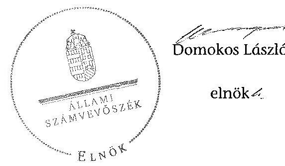

# ÁLLAMI   SZÁMVEVŐSZÉK 

## JELENTÉS

az önkormányzatok belső kontrollrendszere kialakításának, egyes kontrolltevékenységek és a belső ellenőrzés
működésének ellenőrzéséről
Mezőszilas

---

# Állami Számvevőszék 

Iktatószám: V-0340-059/2014.
Témaszám: 1372
Vizsgálat-azonosító szám: V064933

## Az ellenőrzést felügyelte:

dr. Benedek Mária
felügyeleti vezető
Az ellenőrzést vezette és az ellenőrzés végrehajtásáért felelős:
dr. Veress Tiborné
ellenőrzésvezető
A számvevőszéki jelentés összeállításában közreműködtek:
Bus András Péter
számvevő
Pető Krisztina
számvevő tanácsos
Az ellenőrzést végezték:
Bartolák Márta
Számvevő főtanácsos

## Bus András Péter

számvevő

---

# TARTALOMJEGYZÉK 

BEVEZETÉS ..... 5
I. ÖSSZEGZŐ MEGÁLLAPÍTÁSOK, KÖVETKEZTETÉSEK, JAVASLATOK ..... 9
II. RÉSZLETES MEGÁLLAPÍTÁSOK ..... 16

1. Az önkormányzat belső kontrollrendszerének kialakítása ..... 16
1.1. A kontrollkörnyezet ..... 16
1.2. A kockázatkezelési rendszer ..... 17
1.3. A kontrolltevékenységek ..... 17
1.4. Az információs és kommunikációs rendszer ..... 19
1.5. A monitoring rendszer ..... 19
2. A pénzügyi folyamatokban kulcsszerepet betöltő teljesítésigazolás és érvényesítés belső kontrollok működése ..... 19
3. A belső ellenőrzés működése ..... 22

## FÜGGELÉKEK

1. számú Értelmező szótár
2. számú Az értékelés módja és szempontjai

---

.

---

# RÖVIDÍTÉSEK JEGYZÉKE 

## Törvények

Áfa tv.
Áht.
ÁSZ tv.
Htv.

Info tv.
Kttv.

Ktv.

Mötv.

Mvtv.
Ötv.
Számv. tv.
Vagyonnyilatkozat-
tételről szóló tv.

## Rendeletek

Áhsz.
államháztartási számviteli kormányrendelet
Ávr.
Bkr.
Ikr.
önkormányzati SZMSZ

## Szórövidítések

2012. évi ellenőrzési terv Mezőszilas Község Önkormányzat 2012. évi belső ellenőrzési terve
2013. évi ellenőrzési terv Mezőszilas Község Önkormányzat 2013. évi belső ellenőrzési terve
ÁMK
ÁSZ
2007. évi CXXVII. törvény az általános forgalmi adóról
2011. évi CXCV. törvény az államháztartásról
2011. évi LXVI. törvény az Állami Számvevőszékről
1991. évi XX. törvény a helyi önkormányzatok és szerveik, a köztársasági megbizottak, valamint egyes centrális alárendeltségű szervek feladat- és hatásköreiről
2011. évi CXII. törvény az információs önrendelkezési jogról és az információszabadságról
2011. évi CXCIX. törvény a közszolgálati tisztviselőkről (hatályos 2012. március 1-jétől)
1992. évi XXIII. törvény a köztisztviselők jogállásáról (hatálytalan 2012. március 1-jétől)
2011. évi CLXXXIX. törvény Magyarország helyi önkormányzatairól
1993. évi XCIII. törvény a munkavédelemről
1990. évi LXV. törvény a helyi önkormányzatokról
2000. évi C. törvény a számvitelről
2007. évi CLII. egyes vagyonnyilatkozat-tételi kötelezettségekről szóló törvény
249/2000. (XII. 24.) Korm. rendelet az államháztartás szervezetei beszámolási és könyvvezetési kötelezettségének sajátosságairól
4/2013. (I. 11.) Korm. rendelet az államháztartás számviteléről
368/2011. (XII. 31.) Korm. rendelet az államháztartásról szóló törvény végrehajtásáról
370/2011. (XII. 31.) Korm. rendelet a költségvetési szervek belső kontrollrendszeréről és belső ellenőrzéséről
335/2005. (XII. 29.) Korm. rendelet a közfeladatot ellátó szervek iratkezelésének általános követelményeiről
Mezőszilas Község Önkormányzat Képviselő-testületének 6/2011. (IV.15.) önkormányzati rendelete a képviselőtestület Szervezeti és Működési Szabályzatáról

Mezőszilas Község Önkormányzat 2012. évi belső ellenőrzési terve
Mezőszilas Község Önkormányzat 2013. évi belső ellenőrzési terve
Mezőszilas Község Önkormányzat 2013. évi belső ellenőrzési terv
Mezőszilas Község Önkormányzat Németh László Általános Művelődési Központja
Állami Számvevőszék

---

belső ellenőrzési kézikönyv
ellenőrzési nyomvonal
hivatali SZMSZ
INTOSAI
ISSAI
Képviselő-testület
kockázatkezelési szabályzat
Kormányhivatal
körjegyző
Körjegyzőség
Közös Hivatal
közszolgálati szabályzat

NGM
Önkormányzat
polgármester
stratégiai ellenőrzési
terv
számviteli politika
Társulás
ügyrend

Sárbogárdi Többcélú Kistérségi Társulás Belső Ellenőrzési Kézikönyv 2012.
1/2012. sz. Jegyzői utasítás Mezőszilas-Sáregres Körjegyzőség ellenőrzési nyomvonaláról (hatályos 2012. január 1-jétől)
Mezőszilasi Közös Önkormányzati Hivatal Szervezeti és Működési Szabályzata (hatályos 2013. október 31-étől)
International Organization of Supreme Audit Institutions (Legfőbb Ellenőrző Intézmények Nemzetközi Szervezete)
International Standards of Supreme Audit Institutions (Legfőbb Ellenőrző Intézmények Nemzetközi Standardjai)
Mezőszilas Község Önkormányzat Képviselő-testülete
Mezőszilas-Sáregres Körjegyzőség Kockázatkezelési Szabályzata (hatályos 2011. november 1-jétől)
Fejér Megyei Kormányhivatal
Mezőszilas-Sáregres Községek körjegyzője
Mezőszilas-Sáregres Községek Körjegyzősége
Mezőszilasi Közös Önkormányzati Hivatal
Mezőszilas-Sáregres Községek Körjegyzőségének Közszolgálati Szabályzata (hatályos 2011. március 23-ától)
Nemzetgazdasági Minisztérium
Mezőszilas Község Önkormányzat
Mezőszilas Község Önkormányzat polgármestere
Mezőszilas Község Önkormányzat Belső Ellenőrzési Stratégiai terve a 2012-2016. évekre (módosítva 2013. október 25-én)
Mezőszilas-Sáregres Körjegyzőség Számviteli Politikája (hatályos 2012. január 1-jétől)
Sárbogárdi Többcélú Kistérségi Társulás
Mezőszilas-Sáregres Községek Körjegyzőségének ügyrendje (hatályos 2008. december 15-étől)

---

# JELENTÉS 

## az önkormányzatok belső kontrollrendszere kialakításának, egyes kontrolltevékenységek és a belső ellenőrzés működésének ellenőrzéséről Mezőszilas

## BEVEZETÉS

Mezőszilas község állandó lakosainak száma 2012. január 1-jén 2280 fő volt. Az Önkormányzat héttagú Képviselő-testületének munkáját kettő állandó bizottság segítette. Az Önkormányzat az önállóan működő és gazdálkodó Körjegyzőségen kívül egy önállóan működő és gazdálkodó intézményt működtetett, többségi tulajdoni hányaddal gazdasági társasággal nem rendelkezett. A polgármester a 2006. évi önkormányzati választások óta tölti be tisztségét. A körjegyző 2004. szeptember 12-étől 2013. február 1-jéig körjegyzőként, ezt követően a Közös Hivatal jegyzőjeként látta el a jegyzői feladatokat. A Körjegyzőség szervezeti egységekre nem tagolódott, elkülönített gazdasági szervezettel nem rendelkezett, a foglalkoztatott köztisztviselők száma 2012. január 1-jén 11 fő volt. 2013. február 1-jétől Közös Hivatalként működött. Az Önkormányzat a 2012. évi költségvetési beszámolója szerint 468130 ezer Ft költségvetési bevételt ért el, valamint 393618 ezer Ft költségvetési kiadást teljesített. A 2012. december 31-i könyvviteli mérleg szerint 1273497 ezer Ft értékű eszközvagyonnal rendelkezett, a rövid lejáratú kötelezettségállománya 7170 ezer Ft, hosszú lejáratú kötelezettségállománya nem volt.

A demokratikus társadalmakban alapvető igény, hogy a közpénzeket, a közvagyont használók tevékenységükről elszámoljanak, ahhoz egyértelmű és érvényesíthető felelősségi szabályok társuljanak. Ennek a jogos igénynek az érvényesítéséhez meg kell teremteni azokat a folyamatokat, rendszereket, amelyek nélkülözhetetlenek az elszámoltatáshoz. Az elszámoltatás eredményes működtetéséhez szükség van a megfelelő információs, kontroll, értékelési és beszámolási rendszerek kialakítására.

Magyarországon az uniós csatlakozási tárgyalások idejére nyúlnak vissza a belső kontrollrendszer szabályozásának gyökerei. Az uniós elvárásoknak megfelelő új terminológia szerinti államháztartási belső pénzügyi ellenőrzési (ÁBPE) rendszer területén a jogharmonizáció 2003-ban teljes körűen megvalósult, míg az önkormányzati alrendszerre vonatkozó, az Ötv.-ben megjelenített speciális szabályozás 2005-ben lépett hatályba. Az államháztartási belső kontrollrendszer koncepciója 2009-ben továbbfejlődött. A változások irányát mutatja, hogy a költségvetési szervek belső kontrollrendszere már magában foglalja a korszerű, felelős szervezetirányítás elemeit (kontrollkörnyezet, kockázatkezelés, kontrolltevékenység, információ és kommunikáció, monitoring) is. E kontrollrendszer szabályozása háromszintű, a törvényi előírásokat az Áht. és a Mötv., a rendeleti szintű szabályozást az Ávr. és a Bkr. tartalmazza, amelyeket útmutatói szinten az NGM által kiadott standardok és kézikönyvek támogatnak.

A belső kontrollrendszer azt a célt szolgálja, hogy a költségvetési szervek működésük és gazdálkodásuk során a tevékenységeket szabályszerűen, gazdaságosan, hatékonyan és eredményesen hajtsák végre, teljesítsék elszámolási kötelezettségeiket és megvédjék az erőforrásokat a veszteségektől, a károktól és a nem rendeltetésszerű használattól. A belső kontrollrendszer magában foglalja mindazon szabályokat, eljárásokat, gyakorlati módszereket és szervezeti struktúrákat, kockázatkezelési technikákat, kontrolltevékenységeket, amelyek segítséget nyújtanak a szervezetnek céljai eléréséhez.

Az ÁSZ a 2011-2015. évekre szóló stratégiájában hangsúlyos szerepet szánt annak, hogy szilárd szakmai alapon álló, értékteremtő ellenőrzéseivel előmozdítsa a közpénzügyek átláthatóságát, rendezettségét. A számvevőszéki ellenőrzés nemzetközi alapelvei is rögzítik, hogy a megfelelő belső kontrollrendszer minimálisra csökkenti a hibák és szabálytalanságok kockázatát.

Az ellenőrzés célja annak megállapítása volt, hogy a belső kontrollrendszer elemeinek kialakítása, a pénzügyi folyamatokban kulcsszerepet betöltő teljesítésigazolás és érvényesítés, és a belső ellenőrzés szabályos működése biztosította-e az Önkormányzatnál a közpénzfelhasználás szabályosságát, hozzájárult-e az értéket teremtő rend követelményének érvényesüléséhez.

Ennek keretében értékeltük, hogy:

- a jogszabályi előírásoknak megfelelően alakították-e ki a belső kontrollrendszer elemeit;
- a gazdálkodás folyamatában kulcsszerepet betöltő teljesítésigazolás és érvényesítés kontrolltevékenységeit megfelelően működtették-e;
- biztosították-e a belső ellenőrzés szabályos működését;
- amennyiben az ÁSZ tett javaslatot a 2008-2011. évek közötti ellenőrzése kapcsán az Önkormányzatnak, intézkedtek-e azok végrehajtására.

Az ellenőrzés várható hasznosulását négy szinten tervezzük. A törvényalkotás számára összegzett tapasztalatok állnak rendelkezésre a belső kontrollrendszer önkormányzati területen való kialakításáról, működéséről és hatásairól, a belső ellenőrzés működéséről. Ennek alapján következtetést lehet levonni arról, hogy a belső kontrollrendszer kialakítására és működtetésére vonatkozó jelenlegi, differenciálás nélküli jogszabályi előírások reális követelményeket támasztanak-e az eltérő adottságú települési önkormányzatok esetében, illetve indokolt-e esetleges jogszabályi módosítás kezdeményezése. Az ellenőrzés az ellenőrzött számára visszajelzést ad a belső kontrollrendszer kialakításában és működésében fellépő hiányosságokról, javaslataival hozzájárul azok kiküszöböléséhez, amely csökkentheti a későbbi ellenőrzések gyakoriságát. Az ellenőrzés megállapításait és javaslatait más szervezetek is hasznosíthatják a

---

rendezett gazdálkodási keretek kialakításához. A társadalom számára jelzi, hogy közpénz nem maradhat ellenőrizetlenül, az ÁSZ értékteremtő rend kialakításához és megőrzéséhez hozzájáruló tevékenysége pozitív hatással lesz a szervezetről kialakított összkép formálásában. A szervezeten belül lehetőség nyílik arra, hogy a megállapítások szintetizálásával az ÁSZ a hozzáadott értéket teremtő elemző tevékenységét és tanácsadó szerepét is erősítse.

Az önkormányzatok belső kontrollrendszere kialakításának, egyes kontrolltevékenységek és a belső ellenőrzés működésének ellenőrzéséről szóló jelentés I. fejezetének összegző része az ellenőrzés céljára ad rövid, szintetizáló összefoglalót, és tartalmazza a következtetéseket a II. fejezet részletes megállapításain alapulóan. A jelentés intézkedést igénylő megállapításait és javaslatait az ellenőrzés során feltárt, a jelentés II. fejezetében rögzített részletes megállapítások alapozzák meg. A helyszíni ellenőrzés lezárásáig a helyi szabályozás változásait nyomon követtük. Az ÁSZ az ellenőrzés megállapításait az ellenőrzött időszakban hatályos, az intézkedést igénylő megállapításokra tett javaslatokat a jelenleg hatályos jogszabályok alapján fogalmazta meg.

Az ellenőrzés típusa: szabályszerűségi ellenőrzés.
Az ellenőrzött időszak: a belső kontrollrendszer kialakításának megfelelősége esetében a 2012. évre, a pénzügyi folyamatokban kulcsszerepet betöltő teljesítésigazolás és érvényesítés belső kontrollok működésének megfelelőségét és a belső ellenőrzés szabályszerű működését a 2012. január 1. és december 31-e közötti időszak eseményeit figyelembe véve értékeltük, míg az ÁSZ javaslatainak utóellenőrzése a 2008-2011. években végzett ellenőrzések nyilvánosságra hozott jelentéseiben tett javaslatok áttekintésére terjedt ki.

# Az ellenőrzött szervezet: az Önkormányzat. 

Az ellenőrzés jogszabályi alapját az ÁSZ tv. 1. § (3) bekezdése, az 5. § (2) és (6) bekezdései, valamint az Áht. 61. § (2) bekezdésének előírásai képezik.

Az ellenőrzés szakmai módszertana az ÁSZ hivatalos honlapján (www.asz.hu) közzétett szakmai szabályokon alapult, amely az INTOSAI által kiadott ISSAI figyelembevételével készült.

Az ellenőrzés lefolytatásához az Önkormányzat a kimutatások és a tanúsítvány elektronikus kitöltésével, valamint az ÁSZ által kért dokumentumok elektronikus megküldésével szolgáltatott adatokat. Az így rendelkezésre bocsátott adatok, információk kontrollja és a munkalapok kitöltése a helyszíni ellenőrzés keretében történt. A jelentésben használt fogalmak magyarázatát az 1. számú függelék, az ellenőrzés egyes területeinek értékelésénél alkalmazott egységes minősítési szempontokat a 2. számú függelék tartalmazza.

A belső kontrollrendszer kialakításának ellenőrzése során értékeltük a kontrollkörnyezet, a kockázatkezelési rendszer, a kontrolltevékenységek, az információs és kommunikációs rendszer, valamint a monitoring rendszer szabályozottságának megfelelőségét. A pénzügyi folyamatokban kulcsszerepet betöltő teljesítésigazolás és érvényesítés kontrollok működése megfelelőségének minősítéséhez az állományba nem tartozók megbízási díjai, a külső szolgáltatók által

---

végzett karbantartási, kisjavítási munkák, az egyéb üzemeltetési és fenntartási szolgáltatások, a rendszeres szociális segélyek, valamint az államháztartáson kívülre teljesített működési és felhalmozási célú pénzeszközátadások közül kockázatelemzéssel választottuk ki az ellenőrzött kiadási jogcímeket. Az egyszerû véletlen mintavétellel kiválasztott tételek ellenőrzését többlépcsős megfelelőségi tesztek útján addig végeztük, amíg elegendő és megfelelő bizonyítékot szereztünk a vizsgált folyamatok kulcskontrolljai működésének megfelelő vagy nem megfelelő voltáról. Értékeltük az Önkormányzatnál a belső ellenőrzés működésének szabályosságát. Utóellenőrzésre nem került sor, mivel az ÁSZ az Önkormányzatnál a 2008-2011. évek között ellenőrzést nem végzett.

Az ÁSZ tv. 29. § (1) bekezdése szerint a jelentéstervezetet megküldtük a polgármester részére, aki az ÁSZ tv. 29. § (2) bekezdésében foglalt észrevételezési jogával nem élt, a jelentéstervezetre észrevételt nem tett.

---

# I. ÖSSZEGZŐ MEGÁLLAPÍTÁSOK, KÖVETKEZTETÉSEK, JAVASLATOK 

A belső kontrollrendszeren belül 2012-ben a kontrollkörnyezet, a kockázatkezelési rendszer, a kontrolltevékenységek, az információs és kommunikációs rendszer, valamint a monitoring rendszer kialakítását külön-külön és együttesen is értékeltük. A belső kontrollrendszer kialakítása
 az összesített értékelés alapján nem felelt meg a jogszabályi előírásoknak.

A belső kontrollrendszer egyes területei kialakításának minősítése a következő:

| Kontrollterület | Minősítés |
| :-- | --: |
| Kontrollkörnyezet | nem megfelelő |
| Kockázatkezelési rendszer | nem megfelelő |
| Kontrolltevékenységek | megfelelő |
| Információs és kommunikációs rendszer | nem megfelelő |
| Monitoring rendszer | nem megfelelő |

Megfelelőnek értékeltük a kontrolltevékenységek kialakítását, mivel a jogszabályi előírásokban foglaltakat figyelembe véve kisebb hiányosságok mellett is hozzájárultak a Körjegyzőség, ezáltal az Önkormányzat céljainak eléréséhez.

Nem megfelelőnek értékeltük a kontrollkörnyezet, a kockázatkezelési rendszer, az információs és kommunikációs rendszer, valamint a monitoring rendszer kialakítását, mivel az ellenőrzésünk során megállapított szabályozásbeli hiányosságok magukban hordozzák a szabálytalan működés, valamint a korrupció kockázatát.

A belső kontrollrendszer nem megfelelő kialakítása kockázatot jelent az Önkormányzat feladatainak szabályszerű, gazdaságos, hatékony és eredményes végrehajtása során.

Az állományba nem tartozók megbízási díjaival, valamint a külső szolgáltatók által végzett karbantartási, kisjavítási munkákkal kapcsolatos kifizetések során a pénzügyi folyamatokban kulcsszerepet betöltő teljesítésigazolás és érvényesítés belső kontrollok működése gyenge volt, amelyhez hozzájárult, hogy a körjegyző a jogszabályban foglaltak ellenére a Körjegyzőség feladatai ellátásának részletes belső rendjét és módját szervezeti és működési szabályzatban nem állapította meg. Gyengének értékeltük a két kulcskontroll együttes működését, mivel azok nem biztosították az ellenőrzésünk által feltárt hiányosságok bekövetkezésének megelőzését.

A számvevőszéki ellenőrzés az ellenőrzött kifizetésekkel összefüggésben a rendelkezésre bocsátott dokumentumok alapján kár bekövetkeztére utaló adatot, tényt nem állapított meg, azonban a gazdálkodásban kulcsszerepet betöltő

---

kontrollok gyenge működése miatt fennáll a hibák bekövetkezésének lehetősége. A nem megfelelően szabályozott és működtetett belső kontrollok korrupciós kockázatot hordoznak.

Az Önkormányzat a belső ellenőrzési feladatokat - képviselő-testületi döntés alapján - Társulás útján látta el. A 2012. évben a belső ellenőrzés működése a jogszabályi előírásoknak jól megfelelt, azonban a belső ellenőrzések szűk területre korlátozottsága miatt nem tárta fel a számvevőszéki ellenőrzés által megállapított hiányosságokat a kontrollkörnyezet, a kockázatkezelési, az információs és kommunikációs, valamint a monitoring rendszer kialakításánál és a pénzügyi folyamatokban kulcsszerepet betöltő teljesítésigazolás és érvényesítés belső kontrollok működésénél.

Az ÁSZ tv. 33. § (1) bekezdésében foglaltak értelmében az ellenőrzött szervezet vezetője köteles a jelentésben foglalt megállapításokhoz kapcsolódó intézkedési tervet összeállítani, és azt a jelentés kézhezvételétől számított 30 napon belül az ÁSZ részére megküldeni. Amennyiben az intézkedési tervet határidőre nem küldi meg a szervezet, vagy az ÁSZ tv. 33. § (2) bekezdésében foglalt póthatáridő elteltével megküldött intézkedési terv továbbra sem elfogadható, az ÁSZ elnöke a hivatkozott törvény 33. § (3) bekezdés a)-b) pontjaiban foglaltakat érvényesítheti.

Az ellenőrzés intézkedést igénylő megállapításai és javaslatai:

# a polgármesternek 

1. Az Önkormányzat kiadási előirányzatai terhére történő kötelezettségvállalás esetében - az Áht. 37. § (1) és az Ávr. 55. § (1) bekezdésében foglaltak ellenére - nem végezték el a pénzügyi ellenjegyzést.

Javaslat:
Intézkedjen arról, hogy az Önkormányzat kiadási előirányzatai terhére történt kötelezettségvállalásra az Áht. 37. § (1) bekezdésében és az Ávr. 55. § (1) bekezdésében foglaltaknak megfelelően - az Ávr. 53. §-ában meghatározott kivételeket figyelembe véve - kizárólag a pénzügyi ellenjegyzés után, a pénzügyi teljesítés esedékességét megelőzően, írásban kerüljön sor.
2. A számvevőszéki ellenőrzés megállapításai alapján az Önkormányzatnál a belső kontrollrendszer kialakítása összefoglalóan értékelve nem felelt meg a jogszabályi előírásoknak, a kulcskontrollok működése gyenge volt, a belső ellenőrzés működése ugyan megfelelt a jogszabályi előírásoknak, azonban a belső ellenőrzés nem tárta fel a belső kontrollrendszer kialakításának, valamint a pénzügyi folyamatokban kulcsszerepet betöltő teljesítésigazolás és érvényesítés belső kontrollok működésének hiányosságait, ezáltal nem is javíttatta ki azokat. A megállapított szabályozásbeli és működésbeli hiányosságok magukban hordozzák a szabálytalan működés kockázatát.

Javaslat:
A Mötv. 115. § (1) bekezdésében foglaltak alapján kísérje figyelemmel az Önkormányzat gazdálkodásának szabályszerűségét. A Mötv. 67. § f) pontja alapján gon-

---

doskodjon a belső kontrollrendszer működésére vonatkozó jogszabályi rendelkezések be nem tartása, valamint a teljesítésigazolás, illetve az érvényesítés kontrollokkal összefüggésben feltárt hiányosságok, szabálytalanságok tekintetében az esetleges munkajogi felelősséggel kapcsolatos körülmények kivizsgálásáról, majd a vizsgálat eredményének függvényében tegye meg a szükséges intézkedéseket.

# a jegyzőnek Mezőszilas Község Önkormányzata vonatkozásában 

1. a kontrollkörnyezettel kapcsolatban:

A körjegyző a Htv. 140. § (1) bekezdés a) pontjában foglalt előírást figyelmen kívül hagyva nem készítette elő az Ötv. 91. § (1) és (6) bekezdés szerinti gazdasági programtervezetet, így a Képviselő-testület az Ötv. 91. § (7) bekezdésében foglaltakat megsértve nem határozta meg az Önkormányzat 2011-2014. évekre vonatkozó gazdasági programját.

A körjegyző - a Htv. 140. §. (1) bekezdés c) pontjában foglaltak ellenére - az Önkormányzat intézményének számviteli rendjét nem alakította ki.

A körjegyző - az Mvtv. 2. § (3) bekezdésében foglaltak ellenére - a képernyő előtti munkavégzés kivételével nem határozta meg a Körjegyzőségen az egészséget nem veszélyeztető és biztonságos munkavégzés követelményei megvalósításának módját.

A körjegyző - a Kttv. 130. § (1) bekezdésében foglaltak ellenére - a Körjegyzőségen dolgozó köztisztviselők teljesítményértékelését a 2012. évben nem készítette el.

Javaslat:
a) Készítse elő a Htv. 140. § (1) bekezdés a) pontjában foglaltak alapján a gazdasági program tervezetét a Mötv. 116. § (3)-(4) bekezdéseiben foglalt tartalommal, és kezdeményezze a polgármesternél a Képviselő-testület elé terjesztését.
b) Alakítsa ki a Htv. 140. § (1) bekezdés c) pontjában foglaltak alapján az Önkormányzat intézményének számviteli rendjét.
c) Határozza meg az egészséget nem veszélyeztető és biztonságos munkavégzés követelményei megvalósításának módját az Mvtv. 2. § (3) bekezdése alapján.
d) Értékelje írásban a Kttv. 130. § (1) bekezdésében előírtak szerint a Közös Hivatalban dolgozó köztisztviselők munkateljesítményét.
2. a kockázatkezelési rendszerrel kapcsolatban:

A körjegyző - Bkr. 7. § (2) bekezdésében foglaltak ellenére - nem határozta meg az egyes kockázatokkal kapcsolatban a szükséges intézkedéseket valamint azok teljesítése folyamatos nyomon követésének módját.

A polgármesternek a Vagyonnyilatkozat-tételről szóló tv. 3. § (1) bekezdés alapján meghatározott vagyonnyilatkozat-tételi kötelezettségét ugyanezen törvény 4. § a) pontjában foglaltaknak megfelelően az önkormányzati SZMSZ-ben nem rögzítették.

---

Javaslat:
a) Határozza meg a Bkr. 7. § (2) bekezdésében foglaltak alapján az egyes kockázatokkal kapcsolatban szükséges intézkedéseket valamint azok teljesítése folyamatos nyomon követésének módját.
b) Készítse elő a Mötv. 81. § (3) bekezdés c) pontjában foglalt feladatkörében az önkormányzati SZMSZ módosítását annak érdekében, hogy az a Vagyonnyilat-kozat-tételről szóló tv. 4. § a) pontjában foglaltak alapján tartalmazza a 3. § (1) bekezdésében előírtak szerint a polgármesternek a vagyonnyilatkozat-tételre vonatkozó kötelezettségét, és kezdeményezze annak Képviselő-testület elé terjesztését.
3. a kontrolltevékenységekkel kapcsolatban:

A körjegyző a Bkr. 8. § (2) bekezdés a) pontjában foglaltak ellenére nem biztosította a támogatásokkal való elszámolás dokumentumainak elkészítésével kapcsolatban a folyamatba épített, előzetes utólagos és vezetői ellenőrzést.

A körjegyző - az Ávr. 13. § (2) bekezdés a) pontjában foglaltak ellenére - belső szabályzatban nem rendezte a jogszabályban szabályozott kérdéseken felül az előzetes írásbeli kötelezettségvállalást nem igénylő kifizetések esetében a teljesítésigazolás gyakorlásának módját.

A körjegyző - az Info tv. 7. § (2)-(3) bekezdéseiben foglalt előírásokat figyelmen kívül hagyva - az informatikai rendszer szabályozása során nem tette meg azokat a technikai és szervezési intézkedéseket és nem alakította ki azokat az eljárási szabályokat, amelyek biztosítják az adatok biztonságát és védelmét.

Javaslat:
a) Biztosítsa minden tevékenységre vonatkozóan a folyamatba épített, előzetes, utólagos és vezetői ellenőrzést a Bkr. 8. § (2) bekezdése alapján.
b) Rendezze belső szabályzatban az Ávr. 13. § (2) bekezdés a) pontjában foglaltak alapján a gazdálkodással - különösen az előzetes írásbeli kötelezettségvállalást nem igénylő kötelezettségvállalások esetére a teljesítésigazolás gyakorlásának módjával - kapcsolatos belső előírásokat, feltételeket.
c) Gondoskodjon az Info tv. 7. § (2)-(3) bekezdéseiben foglaltaknak megfelelően az adatok biztonságáról.
4. az információs és kommunikációs rendszerrel kapcsolatban:

A körjegyző - az Info tv. 33. § (1) és (3) bekezdésében, a 37. § (1) bekezdésében és az 1. mellékletében foglaltak ellenére - nem gondoskodott az Önkormányzat elektronikus közzétételi kötelezettségének teljesítéséről a 2012. évben.

Az Ikr. 14. § (4) bekezdésében foglaltak ellenére a körjegyző az iratforgalom dokumentálásával nem biztosította, hogy az iratok szervezeten belüli útja pontosan követhető és ellenőrizhető legyen.

---

Javaslat:
a) Gondoskodjon az Info tv. 33. § (1) és (3) bekezdésében, a 37. § (1) bekezdésében és az 1. mellékletében foglaltaknak megfelelően az Önkormányzat elektronikus közzétételi kötelezettségének teljesítéséről.
b) Intézkedjen az Ikr. 14. § (4) bekezdésében foglaltaknak megfelelően arról, hogy az iratforgalom dokumentálásával az iratok szervezeten belüli útja pontosan követhető és ellenőrizhető legyen.
5. a monitoring rendszerrel kapcsolatban:

A körjegyző - a Bkr. 3. § e) pontjában és a 10. §-ában foglaltak ellenére - nem alakította ki a Körjegyzőség tevékenységének, a célok megvalósításának nyomon követését biztosító rendszert.

Javaslat:
Alakítsa ki és működtesse a Bkr. 3. § e) pontjában és 10. §-ában foglaltak alapján a Közös Hivatal tevékenységének, a célok megvalósításának nyomon követését biztosító rendszert.
6. a pénzügyi folyamatokban kulcsszerepet betöltő kontrollokkal kapcsolatban:

A teljesítésigazolást - az Ávr. 57. § (4) bekezdésben foglaltak ellenére - körjegyzői kijelöléssel nem rendelkező személy végezte el, illetve a teljesítés igazolását ellenőrizhető okmányok hiányában nem szabályszerűen végezték, ezért a kiadások jogosságának, összegszerűségének és a szerződés szerinti teljesítésének ellenőrzése az Ávr. 57. § (1) bekezdésének előírása ellenére nem szabályszerűen történt.

Az érvényesítés az Ávr. 58. § (3) bekezdésében előírtak ellenére nem volt szabályszerű, mivel az Ávr. 60. § (3) bekezdése szerint vezetett nyilvántartás (aláírás-minta) alapján nem volt megállapítható, hogy az aláírás az érvényesítésre kijelölt személytől származott, valamint az érvényesítésre kijelölt személy a bizonylatokon nem tüntette fel az érvényesítés dátumát. Az érvényesítő az Ávr. 58. § (1) bekezdésében foglalt kötelezettsége ellenére az összegszerűség ellenőrzését nem végezte el, mivel nem észrevételezte, hogy a szerződés szerinti megbízási díj összege és a számfejtett bruttó összeg nem egyezett meg. Az érvényesítő az Ávr. 58. § (2) bekezdésében rögzített kötelezettsége ellenére nem jelezte az utalványozónak, hogy a megelőző ügymenetben a teljesítés igazolását írásbeli kijelöléssel nem rendelkező személy végezte el, valamint hogy az Önkormányzat és a Körjegyzőség kiadási előirányzatai terhére történt kötelezettségvállalásokra - az Áht. 37. § (1) bekezdésében és az Ávr. 55. § (1) bekezdésében foglaltak ellenére - pénzügyi ellenjegyzés nélkül került sor. Nem jelezte továbbá, hogy az érintett könyvviteli számlára történő hivatkozás nem felelt meg az Áhsz. 48. § (2) bekezdésében hivatkozott 9. számú mellékletében foglaltaknak, és a számítógép karbantartási számlák - az Áfa tv. 169. § e) pont előírása ellenére - hibásan tartalmazták a szolgáltatás igénybevevőjének nevét és címét.

---

Javaslat:
Intézkedjen - a teljesítésigazolás és az érvényesítés vonatkozásában feltárt hiányosságok megszüntetése, illetve az operatív gazdálkodás során a működésbeli hibák megelőzése, feltárása és kijavítása érdekében - arról, hogy
a) az Ávr. 57. § (4) bekezdésében foglaltak szerint teljesítésigazolásra kijelölt személyek az Áht. 38. § (1) bekezdésében és az Ávr.
 57. § (1) bekezdésében foglaltaknak megfelelően, ellenőrizhető okmányok alapján ellenőrizzék a kiadások teljesítésének jogosságát, összegszerűségét, ellenszolgáltatást is magában foglaló kötelezettségvállalás esetében az ellenszolgáltatás teljesítését és azt az Ávr. 57. § (3) bekezdésében foglalt módon igazolják;
b) az érvényesítésre kijelölt személyek az Ávr. 58. § (1)-(3) bekezdésében foglaltak alapján a kifizetéseket megelőzően, teljesítésigazolás alapján ellenőrizzék - az Ávr. 57. § (3) bekezdése szerinti esetben annak hiányában is - az összegszerűséget, a fedezet meglétét és a megelőző ügymenetben az Áht., az államháztartási számviteli kormányrendelet, az Ávr. előírásai és a belső szabályzatokban foglaltak betartását;
c) az érvényesítő az Ávr. 58. § (2) bekezdésében foglaltak alapján jelezze az utalványozónak, ha az Áht., az államháztartási számviteli kormányrendelet, az Ávr. vagy a belső szabályzatokban foglaltak megsértését tapasztalja;
d) kötelezettségvállalásra az Áht. 37. § (1) bekezdésében és az Ávr. 55. § (1) bekezdésében foglaltaknak megfelelően - az Ávr. 53. §-ában meghatározott kivételekkel - kizárólag a pénzügyi ellenjegyzés után, a pénzügyi teljesítés esedékességét megelőzően, írásban kerüljön sor;
e) az érvényesítő aláírása az Ávr. 60. § (3) bekezdés szerinti nyilvántartással beazonosítható legyen;
f) a főkönyvi számlák kijelölését az államháztartási számviteli kormányrendelet 51. § (1) bekezdésében hivatkozott 16. mellékletében foglaltak figyelembevételével végezzék;
g) termék beszerzése, szolgáltatás igénybe vétele esetén az Áfa tv. 169. § e) pont előírásának megfelelően a számla pontosan tartalmazza a vevő nevét és címét.
7. a belső ellenőrzés működésével kapcsolatban:

A belső ellenőrzési kézikönyvet a Társulás munkaszervezeti feladatait ellátó költségvetési szerv vezetője - a Bkr. 56. § (7) bekezdésében foglaltak ellenére - nem hagyta jóvá.

A 2013. évi ellenőrzési terv - a Bkr. 31. § (4) bekezdés a) pontjában foglaltak ellenére - nem tartalmazta az ellenőrzési tervet megalapozó elemzések és a kockázatelemzés eredményének összefoglaló bemutatását, illetve összeállítása - a Bkr. 56. § (2) bekezdésében foglalt előírás ellenére - nem a körjegyző írásos véleményének figyelembevételével történt, mivel a körjegyző véleményt, javaslatot nem fogalmazott meg.

---

A 2013. évi ellenőrzési tervet - a Bkr. 29. § (1) bekezdésében foglaltak ellenére - nem kockázatelemzés alapján készítették, nem dokumentálták hitelesen a kockázati tényezők felmérését.

A 2013. évi ellenőrzési tervben - a Bkr. 31. § (2) bekezdésének előírása ellenére - a civil szervezetek hatályos jogszabályoknak és helyi szabályozásnak megfelelő támogatásának ellenőrzése nem a stratégiai tervben és a kockázatelemzés alapján felállított prioritásokon alapult.

A körjegyző a belső ellenőrzés javaslatainak végrehajtása érdekében nem a Bkr. 45. § (3) bekezdésében meghatározott határidőn belül készítette el az intézkedési tervet.

Javaslat:
a) Kezdeményezze, hogy az Önkormányzat rendelkezzen a Bkr. 56. § (7) bekezdésében foglaltaknak megfelelően a munkaszervezet vezetője által jóváhagyott belső ellenőrzési kézikönyvvel.
b) Intézkedjen, hogy az éves ellenőrzési tervek tartalmazzák a Bkr. 31. § (4) bekezdésében előírt tartalmi elemeket és gondoskodjon arról, hogy a Bkr. 56. § (2) bekezdés előírásainak megfelelően a jegyző írásos véleményének figyelembevételével készüljenek el.
c) Intézkedjen arra, hogy az éves ellenőrzési tervet a Bkr. 29. § (1) és a 31. § (2) bekezdésének megfelelően kockázatelemzés alapján készítsék el.
d) Gondoskodjon arról, hogy a belső ellenőrzési jelentésekben megfogalmazott javaslatok végrehajtására a Bkr. 45. § (3) bekezdésében foglalt határidőn belül készüljön intézkedési terv.

---

# II. RÉSZLETES MEGÁLLAPÍTÁSOK 

## 1. Az önkormányzat belső kontrollrendszerének kialakítása

A belső kontrollrendszeren belül 2012-ben a kontrollkörnyezet, a kockázatkezelési rendszer, a kontrolltevékenységek, az információs és kommunikációs rendszer, valamint a monitoring rendszer kialakítását külön-külön és együttesen is értékeltük. A belső kontrollrendszer kialakítása az összesített értékelés alapján nem felelt meg a jogszabályi előírásoknak.

### 1.1. A kontrollkörnyezet

A kontrollkörnyezet kialakítása - a 2. számú függelékben részletezett kritériumrendszer alapján végzett értékelés szerint - a jogszabályi előírásoknak nem felelt meg, mert:

| Sorszám ${ }^{1}$ | Megállapítás | Megjegyzés |
| :--: | :--: | :--: |
| 2. | A körjegyző a Htv. 140. § (1) bekezdés a) pontjában foglalt előírást figyelmen kívül hagyva nem készítette elő az Ötv. 91. § (1) és (6) bekezdés ${ }^{2}$ szerinti gazdasági programtervezetet, így a Képviselő-testület az Ötv. 91. § (7) bekezdésében foglaltakat megsértve nem fogadta el az Önkormányzat 2011-2014. évekre vonatkozó gazdasági programját. |  |
| 4. | A Képviselő-testület - a Ktv. 34. § (3) bekezdésében foglaltak ellenére - nem döntött a teljesítményértékelés alapját képező célokról. | A Ktv.-t hatályon kívül helyezte a 2012. évi V. törvény 59. § (1) bekezdés a) pontja, hatálytalan 2012. március 1-től. |
| 5. | A körjegyző - az Áht. 10. § (5) bekezdésében foglaltak ellenére - a Körjegyzőség feladatai ellátásának részletes belső rendjét és módját szervezeti és működési szabályzatban nem állapította meg. | A hivatali SZMSZ-t a Képviselő-testület 118/2013- (X. 30.) számú határozatával elfogadta. |
| 18. | A körjegyző - a Htv. 140. §. (1) bekezdés c) pontjában foglaltak ellenére - az Önkormányzat intézményének számviteli rendjét nem alakította ki. |  |

[^0]
[^0]:    ${ }^{1}$ A megállapítás számozása az Önkormányzat által - az adatszolgáltatás során - kitöltött kimutatások kérdéseinek sorszámával azonos.
    ${ }^{2}$ 2013. január 1-jétől a Mötv. 116. § (5) bekezdése

---

| 32. | A körjegyző - az Mvtv. 2. § (3) bekezdésében foglaltak ellenére - a képernyő előtti munkavégzés kivételével nem határozta meg a Körjegyzőségen az egészséget nem veszélyeztető és biztonságos munkavégzés követelményei megvalósításának módját. |  |
| :--: | :--: | :--: |
| 46. | A körjegyző - a Kttv. 130. § (1) bekezdésében foglaltak ellenére - a Körjegyzőségen dolgozó köztisztviselők teljesítményértékelését a 2012. évben nem készítette el. |  |
| 47. | A körjegyző ugyan elkészítette az Ötv. 36. § (2) bekezdés a) pontjában ${ }^{3}$ előírt feladataként a köztisztviselőkkel szembeni hivatásetikai alapelvek részletes tartalmát, valamint az etikai eljárás szabályait tartalmazó dokumentumot ${ }^{4}$, de - a Kttv. 231. § (1) bekezdése ellenére - nem kezdeményezte annak Képviselő-testület elé terjesztését. | A hivatali SZMSZ 4. sz. mellékletét (köztisztviselőkkel szembeni hivatásetikai alapelvek) a Képviselőtestület 118/2013- (X. 30.) számú határozatával elfogadta. |

# 1.2. A kockázatkezelési rendszer 

A kockázatkezelési rendszer kialakítása - a 2. számú függelékben részletezett kritériumrendszer alapján végzett értékelés szerint - nem felelt meg a jogszabályi előírásoknak, mert:

| Sor-   szám | Megállapítás |
| :--: | :-- |
| 8., 10. | A körjegyző - a Bkr. 7. § (2) bekezdésében foglaltak ellenére - nem hatá-   rozta meg az egyes kockázatokkal kapcsolatban a szükséges intézkedése-   ket, valamint azok teljesítése folyamatos nyomon követésének módját. |
| 13. | A polgármesternek a Vagyonnyilatkozat-tételről szóló tv. 3. § (1) bekezdése   alapján meghatározott vagyonnyilatkozat-tételi kötelezettségét ugyanezen   törvény 4. § a) pontjában foglaltaknak megfelelően az önkormányzati   SZMSZ-ben nem rögzítették. |

### 1.3. A kontrolltevékenységek

A kontrolltevékenységek kialakítása - a 2. számú függelékben részletezett kritériumrendszer alapján végzett értékelés szerint - megfelelt a jogszabályi előírásoknak.

A Körjegyző a kontrolltevékenység részeként előírta a költségvetés tervezése, a beszerzési folyamat, a vagyonhasznosítási tevékenység dokumentumainak elkészítésével kapcsolatban a folyamatba épített, előzetes, utólagos és vezetői ellenőrzést.

[^0]
[^0]:    ${ }^{3}$ 2013. január 1-jétől Mötv. 81. § (3) bekezdés c) pont
    ${ }^{4}$ A köztisztviselőkkel szembeni hivatásetikai alapelvek részletes tartalmát, valamint az etikai eljárás szabályait a közszolgálati szabályzat tartalmazta.

---

A körjegyző szabályozta a kötelezettségvállalás pénzügyi ellenjegyzésének, a teljesítésigazolás - kivéve az előzetes írásbeli kötelezettségvállalást nem igénylő kifizetésekre vonatkozóan - módját, meghatározta az érvényesítés és az utalványozás rendjét. A kötelezettségvállaló kijelölte a teljesítésigazolásra jogosultakat. A körjegyző az iratkezelés szabályozása során előírta az iratok és az adatok védelmét, szabályozta az üzemeltetés és adatbiztonság feladatait, meghatározta az ehhez kapcsolódó hatásköröket.

A számviteli politika tartalmazta az időközi és éves beszámolók elkészítésének feladatait, az ügyrend a beszámolási eljárásokhoz kapcsolódó felelősségi köröket, a köztisztviselők munkaköri leírásai a gazdasági feladatot ellátó alkalmazottak helyettesítésének rendjét.

A polgármester az önkormányzati kiadások vonatkozásában kötelezettségvállalásra és utalványozásra adott felhatalmazást. A körjegyző a jogszabályok előírásainak megfelelően jelölte ki a pénzügyi ellenjegyzési, illetve érvényesítési feladatra a Körjegyzőség állományába tartozó köztisztviselőket, azok rendelkeztek a jogszabályban előírt szakképzettséggel.

A körjegyző a közszolgálati szabályzatban meghatározta a jogviszony megszűnése esetére a munkavállaló folyamatban lévő feladatai átadásának rendjét.

A kontrolltevékenységek kialakítása az alábbi kisebb hiányosságok mellett megfelelt a jogszabályi előírásoknak:

| Sorszám | Megállapítás |
| :--: | :--: |
| 5. | A körjegyző - a Bkr. 8. § (2) bekezdés a) pontjában foglaltak ellenére - nem biztosította a támogatásokkal való elszámolás dokumentumainak elkészítésével kapcsolatban a folyamatba épített, előzetes utólagos és vezetői ellenőrzést. |
| 9. | A körjegyző - az Ávr. 13. § (2) bekezdés a) pontjában foglaltak ellenére - belső szabályzatban nem rendezte a jogszabályban szabályozott kérdéseken felül az előzetes írásbeli kötelezettségvállalást nem igénylő kifizetések esetében a teljesítésigazolás gyakorlásának módját. |
| 16. | A körjegyző - az Info tv. 7. § (2)-(3) bekezdéseiben foglalt előírásokat figyelmen kívül hagyva - az informatikai rendszer szabályozása során nem tette meg azokat a technikai és szervezési intézkedéseket és nem alakította ki azokat az eljárási szabályokat, amelyek biztosítják az adatok biztonságát és védelmét. |

---

# 1.4. Az információs és kommunikációs rendszer 

Az információs és kommunikációs rendszer kialakítása - a 2. számú függelékben részletezett kritériumrendszer alapján végzett értékelés szerint - nem felelt meg a jogszabályi előírásoknak, mert;

| Sor-   szám | Megállapítás |
| :--: | :--: |
| 7. | A körjegyző - az Info tv. 33. § (1) és (3) bekezdésében, a 37. § (1) bekezdésében és az 1. mellékletében foglaltak ellenére - nem gondoskodott az Önkormányzat elektronikus közzétételi kötelezettségének teljesítéséről a 2012. évben. |
| 16. | Az Ikr. 14. § (4) bekezdésében foglaltak ellenére a körjegyző az iratforgalom dokumentálásával nem biztosította, hogy az iratok szervezeten belüli útja pontosan követhető és ellenőrizhető legyen. |

### 1.5. A monitoring rendszer

A monitoring rendszer kialakítása - a 2. számú függelékben részletezett kritériumrendszer alapján végzett értékelés szerint - nem felelt meg a jogszabályi előírásoknak, mert:

| Sor-   szám | Megállapítás |
| :-- | :-- |
| 1. | A körjegyző - a Bkr. 3. § e) pontjában és a 10. §-ában foglaltak ellenére -   nem alakította ki a Körjegyzőség tevékenységének, a célok megvalósításának nyomon követését biztosító rendszert. |

Az Önkormányzat törvényességi felügyeletét ellátó Kormányhivatal a 2012. évben nem élt törvényességi felhívással, vagy más törvényességi felügyeleti eszközzel a Képviselő-testület által alkotott rendeletekre, határozatokra vonatkozóan.

## 2. A pénzügyi folyamatokban kulcsszerepet betöltő teljesítésigazolás és érvényesítés belső kontrollok működése

Az állományba nem tartozók megbízási díjaival, a külső szolgáltatók által végzett
 karbantartással, kisjavítással kapcsolatos kifizetések során - összefoglalóan értékelve - a pénzügyi folyamatokban kulcsszerepet betöltő teljesítésigazolás és érvényesítés belső kontrollok működésének megfelelősége gyenge volt, mert:

| Kulcskontroll | Megállapítás |
| :--: | :--: |
| Teljesítésigazolás | A teljesítésigazolást - az Ávr. 57. § (4) bekezdésben foglaltak ellenére -   körjegyzői kijelöléssel nem rendelkező személy végezte el, illetve a teljesítés   igazolását ellenőrizhető okmányok hiányában végezték, ezért a kiadások jogosságának, összegszerűségének és a szerződés szerinti teljesítésének ellenőrzése az Ávr. 57. § (1) bekezdésének előírása ellenére nem   szabályszerűen történt. |

---

Az érvényesítés az Ávr. 58. § (3) bekezdésében előírtak ellenére nem volt szabályszerű, mivel az Ávr. 60. § (3) bekezdése szerint vezetett nyilvántartás (aláírás-minta) alapján nem volt megállapítható, hogy az aláírás az érvényesítésre kijelölt személytől származott, valamint az érvényesítésre kijelölt személy a bizonylatokon nem tüntette fel az érvényesítés dátumát. Az érvényesítő az Ávr. 58. § (1) bekezdésében foglalt kötelezettsége ellenére az összegszerűség ellenőrzését nem végezte el, mivel nem észrevételezte, hogy a szerződés szerinti megbízási díj összege és a számfejtett bruttó összeg nem egyezett meg. Az érvényesítő az Ávr. 58. § (2) bekezdésében rögzített kötelezettsége ellenére nem jelezte az utalványozónak, hogy a megelőző ügymenetben a teljesítés igazolását írásbeli kijelöléssel nem rendelkező személy végezte el, valamint hogy Önkormányzat és a Körjegyzőség kiadási előirányzatai terhére történt kötelezettségvállalásokra - az Áht. 37. § (1) bekezdésében és az Ávr. 55. § (1) bekezdésében foglaltak ellenére - pénzügyi ellenjegyzés nélkül került sor. Nem jelezte továbbá, hogy az érintett könyvviteli számlára történő hivatkozás nem felelt meg az Áhsz. 48. § (2) bekezdésében hivatkozott 9. számú mellékletben foglaltaknak, és a karbantartási számlák - az Áfa tv. 169. § e) pont előírása ellenére - hibásan tartalmazták a szolgáltatás igénybevevőjének nevét és címét.

Az állományba nem tartozók megbízási díjaival kapcsolatos - az Önkormányzatra vonatkozó - kifizetések során a 2012. évben a teljesítésigazolás és az érvényesítés kulcskontrollok működésének megfelelősége gyenge volt, mert:

- az iskolai védőnői feladatok ellátására kötött megállapodás alapján a védőnő részére 2012. május hónapban elszámolt megbízási díj kifizetése esetében a teljesítés igazolását nem végezték el a teljesítésigazolás alapjául szolgáló dokumentum hiányában;
- a teljesítésigazolást az elhullott állatok elföldelésére és az iskolai védőnői feladatok ellátására kötött megállapodásban rögzített feladatok teljesítéséből eredő kifizetések esetén - az Ávr. 57. § (4) bekezdésben foglaltak ellenére - körjegyzői kijelöléssel nem rendelkező személy végezte el, ezért a kiadások jogosságának, összegszerűségének és a szerződés szerinti teljesítésének ellenőrzése az Ávr. 57. § (1) bekezdésének előírása ellenére nem szabályszerűen történt;
- az érvényesítés az Ávr. 58. § (3) bekezdésében előírtak ellenére nem volt szabályszerű az iskolai védőnői feladatok teljesítéséhez kapcsolódó 2012. május, július és december havi kifizetések esetében, mivel az Ávr. 60. § (3) bekezdése szerint vezetett nyilvántartás (aláírás-minta) alapján nem volt megállapítható, hogy az aláírás az érvényesítésre kijelölt személytől származott;
- az érvényesítő az elhullott állatok elföldelésére elszámolt megbízási díj kifizetései esetében az Ávr. 58. § (1) bekezdésében foglalt kötelezettségét, az összegszerűség ellenőrzését nem végezte el, mivel a szerződés szerinti tetemenkénti 400/700 Ft/db megbízási díj összege és a számfejtett bruttó összeg nem egyezett meg;

---

- az érvényesítés - az Ávr. 58. § (3) bekezdésében előírtak ellenére - az iskolai védőnői feladatok ellátása és az elhullott állatok elföldelése után elszámolt megbízási díjak kifizetése ellenőrzött tételei esetében nem volt szabályszerű, mivel a bizonylatok nem tartalmazták az érvényesítés dátumát;
- az érvényesítő az Ávr. 58. § (2) bekezdésében rögzített kötelezettsége ellenére nem jelezte az utalványozónak, hogy a megelőző ügymenetben nem tartották be az Áht. 37. § (1) és az Ávr. 55. § (1) bekezdéseiben foglaltakat, mivel a megbízási szerződés megkötésekor - az összes ellenőrzött megbízási szerződés esetében - kötelezettségvállalásra pénzügyi ellenjegyzés nélkül került sor.

A külső szolgáltatók által végzett karbantartási, kisjavítási munkákkal kapcsolatos - a Körjegyzőségre és az Önkormányzatra vonatkozó - kifizetések során a 2012. évben a teljesítésigazolás és az érvényesítés kulcskontrollok működésének megfelelősége gyenge volt, mert:

- a teljesítésigazolást a számítógép karbantartások kifizetéseit megelőzően az Ávr. 57. § (4) bekezdésében foglaltak ellenére körjegyzői kijelöléssel nem rendelkező személy végezte el, ezért a kiadások jogosságának, összegszerűségének és a szerződés szerinti teljesítésének igazolása az Ávr. 57. § (1) bekezdésének előírásai ellenére nem szabályszerűen történt;
- az érvényesítés az Ávr. 58. § (3) bekezdésében előírtak ellenére nem volt szabályszerű a számítógép karbantartási, valamint traktorcsavar vásárlás kifizetések esetében, mivel az Ávr. 60. § (3) bekezdése szerint vezetett nyilvántartás (aláírás-minta) alapján nem volt megállapítható, hogy a keltezéssel ellátott aláírás az érvényesítésre kijelölt személytől származott;
- az érvényesítő az Ávr. 58. § (2) bekezdésében előírtakat figyelmen kívül hagyva nem jelezte az utalványozónak, hogy a megelőző ügymenetben a teljesítésigazolást körjegyzői kijelölés hiányában végezték el az ellenőrzött tételek esetében, valamint, hogy az Áht. 37. § (1) és az Ávr. 55. § (1) bekezdéseiben foglaltak ellenére az írásbeli kötelezettségvállalásra pénzügyi ellenjegyzés nélkül került sor a számítógép karbantartási feladatok ellátására kötött szerződés megkötésekor. Nem jelezte továbbá hogy a traktorcsavar vásárlás kiadási tételnél - az Áhsz. 48. § (2) bekezdésében hivatkozott és 9. számú mellékletben foglaltak ellenére - az érintett könyvviteli számlára történő hivatkozás hibás, mivel az anyagbeszerzés főkönyvi számla helyett a külső szolgáltató által végzett karbantartási, kisjavítási munkák főkönyvi számlát jelölték ki, továbbá a számítógép karbantartás számlái az Áfa tv. 169. § e) pont előírása ellenére hibásan tartalmazták a szolgáltatás vásárlójának nevét és címét, mivel azt, a Körjegyzőség helyett az Önkormányzat nevére állították ki.

A számvevőszéki ellenőrzés az ellenőrzött kifizetésekkel összefüggésben, a rendelkezésre bocsátott dokumentumok alapján kár bekövetkeztére utaló adatot, tényt nem állapított meg, azonban a gazdálkodásban kulcsszerepet betöltő kontrollok gyenge működése miatt fennáll a hibák bekövetkezésének kockázata.

---

# 3. A Belső Ellenőrzés működése 

Az Önkormányzat a belső ellenőrzési feladatokat - képviselő-testületi döntés alapján - a Társulás útján látta el.

A belső ellenőrzés működése - a 2. számú függelékben részletezett kritériumrendszer alapján végzett értékelés szerint - az Önkormányzatnál összességében jól megfelelt a jogszabályi előírásoknak.

A belső ellenőrzést végzők megfelelő iskolai végzettséggel és szakképzettséggel rendelkeztek. Elkészítették a jogszabályi előírásoknak megfelelő tartalmú, kockázatelemzésen alapuló stratégiai ellenőrzési tervet és a 2013. évi ellenőrzési tervet. A belső ellenőrzés a 2012. évi ellenőrzési tervben foglalt ellenőrzéseket végrehajtotta, elkészítette az ellenőrzési programokat és az ellenőrzési jelentéseket.

A belső ellenőrzési vezető nyilvántartást vezetett a belső ellenőrzésekről és az intézkedések nyomon követéséről. A belső ellenőrzési vezető elkészítette az éves összefoglaló jelentést és azt megküldte a körjegyzőnek.

Az Önkormányzatnál a belső ellenőrzés működése az alábbi kisebb hiányosságok mellett jól megfelelt a jogszabályi előírásoknak:

| Sorszám | Megállapítás |
| :--: | :--: |
| 4. | A belső ellenőrzési kézikönyvet a Társulás munkaszervezeti feladatait ellátó költségvetési szerv vezetője - a Bkr. 56. § (7) bekezdésében foglaltak ellenére - nem hagyta jóvá ${ }^{5}$. |
| $\begin{aligned} & 8/a., \\ & 10. \end{aligned}$ | A 2013. évi ellenőrzési terv - a Bkr. 31. § (4) bekezdés a) pontjában foglaltak ellenére - nem tartalmazta az ellenőrzési tervet megalapozó elemzések és a kockázatelemzés eredményének összefoglaló bemutatását, illetve összeállítása - a Bkr. 56. § (2) bekezdésében foglalt előírás ellenére - nem a körjegyző írásos véleményének figyelembevételével történt, mivel a körjegyző véleményt, javaslatot nem fogalmazott meg. |
| 11. | A 2013. évi ellenőrzési tervet - a Bkr. 29. § (1) bekezdésében foglaltak ellenére - nem kockázatelemzés alapján készítették, nem dokumentálták hitelesen a kockázati tényezők felmérését. |
| 12. | A 2013. évi ellenőrzési tervben - a Bkr. 31. § (2) bekezdésének előírása ellenére - a civil szervezetek hatályos jogszabályoknak és helyi szabályozásnak megfelelő támogatásának ellenőrzése nem a stratégiai tervben és a kockázatelemzés alapján felállított prioritásokon alapult. |
| 23. | A körjegyző a belső ellenőrzés javaslatainak végrehajtása érdekében nem a Bkr. 45. § (3) bekezdésében meghatározott határidőn belül készítette el az intézkedési tervet. |

[^0]
[^0]:    ${ }^{5}$ A belső ellenőrzési kézikönyvet a körjegyző 2012. január 16-án megismerte, az abban foglaltak tartalmával egyetértett.

---

Az Önkormányzat az ÁSZ-tól 2011-2012. években integritás önkéntes kérdőív kitöltésére kapott felkérést, azonban az adatfelvételben nem vett rész. A szabályzatok kialakításával és azok végrehajtásával a körjegyző az integritási szemlélet érvényesüléséről gondoskodott.

Budapest, 2014. 0h. hónap 4t. nap

Függelék: $\quad 2 \mathrm{db}$

---

.

---

# ÉRTELMEZŐ SZÓTÁR 

belső ellenőrzés
belső kontrollrendszer
belső kontrollrendszer területei
egyszerű véletlen mintavétel
integritás
kockázat
kockázatkezelési rendszer

Független, tárgyilagos bizonyosságot adó és tanácsadó tevékenység, amelynek célja, hogy az ellenőrzött szervezet működését fejlessze és eredményességét növelje, az ellenőrzött szervezet céljai elérése érdekében rendszerszemléletű megközelítéssel és módszeresen értékeli, illetve fejleszti az ellenőrzött szervezet irányítási és belső kontrollrendszerének hatékonyságát. (Forrás: Bkr. 2. § b) pontja)
A belső kontrollrendszer a kockázatok kezelése és tárgyilagos bizonyosság megszerzése érdekében kialakított folyamatrendszer, amely azt a célt szolgálja, hogy a működés és gazdálkodás során a tevékenységeket szabályszerűen, gazdaságosan, hatékonyan, eredményesen hajtsák végre, az elszámolási kötelezettségeket teljesítsék, megvédjék az erőforrásokat a veszteségektől, károktól és nem rendeltetésszerű használattól. (Forrás: Áht. 69. § (1) bekezdése)
A kontrollkörnyezet, a kockázatkezelési rendszer, a kontrolltevékenységek, az információs és kommunikációs rendszer, valamint a nyomon követési (monitoring) rendszer. (Forrás: Bkr. 3. §-a)

Az alapsokaságból egyszerű véletlen kiválasztással képzett részsokaság. (Forrás: Az ÁSZ ellenőrzési mintavételezés támogatásához készült segédletének 4.1.1. pontja)
Az integritás elvek, értékek, cselekvések, módszerek, intézkedések konzisztenciáját jelenti: olyan magatartásmódot, amely meghatározott értékeknek felel meg. Az integritás a közszféra esetében a társadalom által elvárt nyilvánossági, átláthatósági, illetve jogi/etikai normáknak történő megfelelést jelenti.
(Forrás: a http://integritas.asz.hu honlapon közzétett „A 2012. évi integritás felmérés eredményeinek összefoglalója dokumentum 3. oldal 1. bekezdése)
A kockázat annak a valószínűségét jelenti, hogy egy vagy több esemény vagy intézkedés nem kívánt módon befolyásolja a rendszer működését, céljainak megvalósulását. (Forrás: Javaslatok a korrupciós kockázatok kezelésére - Kockázatkezelési és ellenőrzési módszertan 35. oldal, ÁSZ)
Olyan irányítási eszközök és módszerek összessége, melynek elemei a szervezeti célok elérését veszélyeztető tényezők (kockázatok) azonosítása, elemzése, csoportosítása, nyomon követése, valamint szükség esetén a kockázati kitettség mérséklése. (Forrás: Bkr. 2. § m) pontja)

---

kontrollkörnyezet
kontrolltevékenységek
kommunikáció
korrupció
kulcskontrollok
lényegesség
megfelelőségi teszt

A kontrollkörnyezet alakítja ki a szervezet belső kontrollrendszerhez való viszonyát, hozzáállását, befolyásolja az alkalmazottak belső kontrollal kapcsolatos tudatosságát, magatartását. Elemei a személyes és szakmai elkötelezettség és a vezetés, valamint az alkalmazottak által vallott erkölcsi értékek; a szakmai hozzáértés iránti elkötelezettség; a felső vezetés hozzáállása - a vezetés filozófiája és tevékenységének stílusa; a szervezeti struktúra; a humánerőforrás-politika és gazdálkodási
 gyakorlat.
A kontrolltevékenységek azok a politikák és eljárások, amelyeket a kockázatok megoldására hoznak létre a szervezet céljainak teljesítése érdekében.
Az a tevékenység, melynek során információtovábbítás valósul meg. A kommunikációs folyamat résztvevői között tájékoztatás történik, mely során tényeket, ezek magyarázatát közlik. „A szervezetben eredményes kommunikációnak kell áramlania lefelé, horizontálisan és felfelé, a szervezet egészében és annak valamennyi elemében.”
Azok a cselekmények, amelyek során a köz érdekében való eljárással megbízott és döntéshozatali felelősséggel felruházott személy a köz érdeke helyett önös vagy részérdekeket követve, mástól jogtalan vagy etikátlan előnyt elfogadva és őt jogtalan vagy etikátlan előnyhöz juttatva jár el, illetve amikor valaki a köz érdekében való eljárással megbízott és döntéshozatali felelősséggel felruházott személynek jogtalan vagy etikátlan előnyt nyújtva vagy felajánlva jogtalan vagy etikátlan előnyt kér. (Forrás: A Kormány korrupció megelőzési programja 2012-2014.)
Az azonosított kockázatok mérséklése érdekében kialakított kontrollok közül azok, amelyek elégtelen működése esetén a szervezetet jelentős veszteség érheti, vagy a működésükben bekövetkező hiba/hiányosság más kontrollok eredményességét csökkenti. Ezek ellenőrzése, értékelése elegendő bizonyítékot szolgáltat adott területen a kontrollrendszer értékeléséhez. Az önkormányzatok kontrollrendszere kialakításának ellenőrzése során a pénzügyi folyamatokban kulcsszerepet betöltő belső kontrollok a teljesítésigazolás és az érvényesítés.
Egy információ akkor lényeges, ha hiánya vagy téves állítása befolyásolhatja ezen információkat felhasználók döntéseit, véleményét. Az ellenőrzés során a lényegesség három szempontból értelmezhető: érték, jelleg és összefüggés szerint.
Az ellenőrzés során alkalmazott módszer - szekvenciális (megállásos) megfelelőségi teszt - lényege, hogy a kiválasztott minta ellenőrzését csak addig végezzük, amíg elegendő és megfelelő bizonyítékot nem szerzünk az ellenőrzött kulcskontroll (teljesítésigazolás, érvényesítés) működésének megfelelő, vagy nem megfelelő voltáról.

---

monitoring (nyomon követési rendszer)
utóellenőrzés

A monitoring a különböző szintű szervezeti célok megvalósításának folyamatát kíséri figyelemmel, melynek során a releváns eseményekről és tevékenységekről (együtt: folyamatokról) rendszeres jelleggel, strukturált, döntéstámogató információkhoz jutnak a szervezet vezetői.
Az intézkedések nyomon követése érdekében elrendelt ellenőrzés, amelynek célja, hogy a belső ellenőrzés bizonyosságot szerezzen az elfogadott intézkedések végrehajtásáról, vagy arról a tényről, hogy ha az ellenőrzött szerv, illetve az ellenőrzött szervezeti egység vezetője nem, vagy nem az elfogadott intézkedésnek megfelelően hajtja végre az intézkedéseket, továbbá meggyőződni arról, hogy a végrehajtott intézkedésekkel a megállapított kockázat ténylegesen megszűnt, vagy a kockázati tűréshatár alá csökkent. (Forrás: Bkr. 2. § s) pontja)

---

.

---

# Az értékelés módja és szempontjai 

## A belső kontrollrendszer kialakítása megfelelőségének értékelése az öt területre vonatkoztatva

Megfelelő a belső kontrollrendszer kialakítása, amennyiben az öt területen (kontrollkörnyezet, kockázatkezelési rendszer, kontrolltevékenységek, információs és kommunikációs rendszer, monitoring rendszer kialakítása) összesen elért és elérhető pontok százalékban kifejezett hányadosa eléri a 81%-ot, és egyik terület sem kapott nem megfelelő értékelést.

Részben megfelelő a kontrollrendszer kialakítása, ha az önkormányzat teljesíti a meghatározott valamennyi főbb kritériumot (amelyeket - 10 kritérium - a program 5. számú melléklete tartalmazza), és az öt munkalapon összesen elért és elérhető pontok százalékban kifejezett hányadosa a 61%-ot meghaladja, és legfeljebb egy terület értékelése nem megfelelő volt.

Nem megfelelő a belső kontrollrendszer kialakítása, amennyiben az önkormányzat nem teljesíti a meghatározott bármelyik főbb kritériumot, vagy az öt munkalapon összesen elért és elérhető pontok százalékban kifejezett hányadosa 0-60% közötti, vagy egynél több terület értékelése nem megfelelő volt.

A megfelelőség minősítése a következők szerint történik:
A minősítés - részben automatizált - a belső kontrollrendszer kialakítására vonatkozó kérdéseket tartalmazó munkalapokon, az elérhető és az elért pontszámok alapján az alábbi képlettel, számítógépes program segítségével történt, melynek összefüggése:

$$
\frac{\text { Elért pont }}{\text { Elérhető pont }} \quad \times 100=\ldots \ldots . \%
$$

A belső kontrollrendszer egyes területei kialakítása megfelelőségénél alkalmazandó minősítés:

- nem megfelelő 0-60%-ig;
- részben megfelelő 61-80%-ig;
- megfelelő 81% fölött.

---

# Az ellenőrzött önkormányzat belső kontrollrendszere kialakítása megfelelőségének főbb kritériuma 

| Sorszám | Kérdés: | Szempont: |
| :--: | :--: | :--: |
|  | A kontrollkörnyezet kialakítása (2. számú munkalap, kimutatás) |  |
| 1. | A polgármesteri hiva-   tal $^{1}$ rendelkezik-e alapító okirattal? | A polgármesteri hivatal alapító okirata az Áht. 8. § (4) bekezdésében előírtaknak megfelelően elkészült, tartalmazza az Ávr. 5. § (1) bekezdésében előírtakat, kiemelten a c) pont szerinti alaptevékenységeit. |
| 2. | A polgármesteri hiva-   tal rendelkezik-e szervezeti és működési szabályzattal? | A polgármesteri hivatal rendelkezik az Áht. 10. § (5) bekezdésben előírt - 2010. január 1-jét követően jóváhagyott vagy módosított - SZMSZ-szel. A költségvetési szerv feladatai ellátásának részletes belső rendjét és módját - törvényben vagy kormányrendeletben meghatározott módon és tartalommal - szervezeti és működési szabályzata állapítja meg. |
| 3. | Meghatározták-e a vagyongazdálkodás szabályait önkormányzati rendeletben? | Az önkormányzat a vagyongazdálkodás szabályait önkormányzati rendeletben meghatározta, és az összhangban van az Mötv. 109. § (4) bekezdése, a Nemzeti vagyonról szóló 2011. évi CXCVI. tv. 18. § (1) bekezdése tartalmával, és a 18. § (12) bekezdésében meghatározottak szerint az 5. § (5)-(7) bekezdéseiben foglaltaknak megfelelően 2012. október 31-ig azt módosították. |
| 4. | A polgármesteri hiva-   tal rendelkezik-e számviteli politikával? | A polgármesteri hivatal rendelkezik az Áhsz. 8. § (3) bekezdésben előírt - 2010. január 1-jét követően hatályba helyezett vagy aktualizált - számviteli politikával. A jogszabályhely rögzíti, hogy a Számv. tv. és az e rendeletben foglaltak szerint az államháztartás szervezetének szakmai feladatai és sajátosságai figyelembevételével ki kell alakítania és írásban szabályoznia számviteli politikáját. |
| 5. | A polgármesteri hiva-   tal rendelkezik-e pénz-   kezelési szabályzattal? | A polgármesteri hivatal rendelkezik az Áhsz. 8. § (4) bekezdés d) pontjában előírt - 2010. január 1-jét követően hatályba helyezett vagy aktualizált - pénzkezelési szabályzattal. A jogszabályhely előírja, hogy a számviteli politika keretében el kell készíteni a pénzkezelési szabályzatot. |
| 6. | A polgármesteri hiva-   tal rendelkezik-e leltá-   rozási és leltárkészítési   szabályzattal? | A polgármesteri hivatal rendelkezik az Áhsz. 8. § (4) bekezdés a) pontjában előírt - 2008. január 1-jét követően hatályba helyezett vagy aktualizált - eszközök és források leltározási és leltárkészítési szabályzatával. |

[^0]
[^0]:    $^{1}$ Polgármesteri hivatal alatt a polgármesteri hivatalt, a főpolgármesteri hivatalt, a megyei önkormányzati hivatalt és a körjegyzőséget is érteni kell.

---

| Sorszám | Kérdés: | Szempont: |
| :--: | :--: | :--: |
| 7. | A polgármesteri hivatal gazdasági szervezetének van-e ügyrendje? | A polgármesteri hivatal rendelkezik a gazdasági szervezet ügyrendjével vagy az azzal egyenértékű szabályozással (Avr. 9. § (5) bekezdés), vagy az Avr. 13. § (5) bekezdésében foglaltakat az SZMSZ-ben vagy más belső szabályzatban szabályozta (Áht. 10. § (5) bekezdés), és a szabályozást 2010. január 1-jét követően felülvizsgálták, aktualizálták. Elfogadható az is, ha a gazdasági feladatokat a polgármesteri hivatalon belül több szervezeti egység látja el, és azoknak önálló ügyrendjük van, illetve ha a polgármesteri hivatal nem tagolódik szervezeti egységekre, és ezért önálló gazdasági szervezettel nem rendelkezik, azonban az SZMSZ-ben vagy más belső szabályozásban rögzítik az ügyrend kötelező elemeit. |
| 8. | A polgármesteri hiva-   tal rendelkezik-e ellen-   őrzési nyomvonallal? | Az ellenőrzési nyomvonal, folyamatleírás a polgármesteri hivatal tevékenységeire vonatkozóan elkészített, és azt 2010. január 1-jét követően felülvizsgálták, aktualizálták. A szabályzat minta megtalálható a Pénzügyminisztérium Belső kontroll kézikönyv, 2010. 18. és a 19. számú mellékletében. A Bkr. 6. § (3) bekezdésében előírtak szerint a költségvetési szerv vezetője köteles elkészíteni és rendszeresen aktualizálni a költségvetési szerv ellenőrzési nyomvonalát, amely a költségvetési szerv működési folyamatainak szöveges vagy táblázatba foglalt vagy folyamatábrákkal szemléltetett leírása, amely tartalmazza különösen a felelősségi és információs szinteket és kapcsolatokat, irányítási és ellenőrzési folyamatokat, lehetővé téve azok nyomon követését és utólagos ellenőrzését. |
|  | Az információ és kommunikáció szabályozása és kialakítása (5. számú munkalap, kimutatás) |  |
| 9. | Az önkormányzat eleget tett-e az elektronikus közzétételi kötelezettségének? | Az Önkormányzat az Info tv. 33. § (1) és (3) bekezdésében foglaltaknak megfelelően, saját vagy közösen működtetett honlapon elektronikus formában bárki számára hozzáférhetően közzétette az Info tv. 1. számú mellékletében felsoroltak közül legalább az éves költségvetését, a költségvetési beszámolóját és a Képviselő-testület rendeleteit. |
| 10. | A polgármesteri hivatal rendelkezik-e iratkezelési szabályzattal? | A polgármesteri hivatal rendelkezik az Ltv. 10. § (1) bek. c) pontjában előírt iratkezelési szabályzattal. |

# A két kulcskontroll minősítése 

A kulcskontrollok - teljesítésigazolás, érvényesítés - működésének értékelése megfelelőségi tesztek segítségével történt. A kontrollok működésének megfelelőségére vonatkozó következtetést az értékelő táblázatban elért súlyozott pontszám, továbbá az eredendő kockázat minősítésétől függően két vagy három kiadási jogcím alapján fogalmaztuk meg. Az értékeléshez alkalmazandó arányszámok kialakítását számítógépes program segítségével központilag az ellenőrzésben közreműködő informatikai támogató végezte az önkormányzatok által elektronikus úton megadott adatokból.

---

A minősítés automatizált, a megfelelőségi tesztek kitöltésével számítógépes program segítségével történik, melynek összefüggése:

| Elérhető pontszám: | Elért súlyozott pontszám értékelése: |
| :--: | :--: |
| 0-70 | "gyenge" |
| 71-90 | "jó" |
| 91-100 | "kiváló" |

"kiváló" a kontrollok működése, ha megfelel a szabályozásoknak és a legmagasabb szintű elvárásoknak a működésbeli hibák megelőzése, feltárása és kijavítása tekintetében; amennyiben a kontrollok működésének megfelelőségét a helyszíni ellenőrzési munkalap értékelése alapján kiválónak minősítettük, azonban esetleges kisebb - az egységesen meghatározott követelményrendszerben foglalt 10%-ot el nem érő mértékű - hiányosságokat tártunk fel, az összességében kiváló minősítést alátámasztó pozitív megállapításon túl ezeket a hiányosságokat a jelentésben ismertetjük a javaslataink megalapozása érdekében;
„jó” a kontrollok működésének megfelelősége, ha azok a megállapított kisebb (tolerálható mértékű) hiányosságok mellett kielégítik az elvárásokat a működésbeli hibák megelőzése, feltárása, és kijavítása tekintetében, a megállapított hiányosságok nem veszélyeztették a hibák megelőzését, feltárását és kijavítását, továbbá ismertetjük azokat a területeket is, ahol az előírt ellenőrzési, egyeztetési feladatokat nem végezték el;
„gyenge” a kontrollok működése, ha a kontrollok működésében túl sok hiányosság fordul elő ahhoz, hogy megbízhatónak lehessen azokat minősíteni. Ismertetjük a jelentésben azokat a területeket, ahol az előírt ellenőrzési, egyeztetési feladatokat nem végezték el, amely hiányosságok a belső kontrollok megfelelőségének „gyenge” minősítését okozták.

# A belső ellenőrzés szabályszerű működésének értékelése 

A belső ellenőrzés működését a 2012. évben történt ellenőrzés tervezési és végrehajtási tevékenységének tapasztalatai alapján értékeljük a munkalapok (kimutatások) kérdéseire adott válaszok alapján, melynek megállapítása az elérhető és az elért pontokból az alábbi képlettel, számítógépes program segítségével történt:

$$
\frac{\text { Elért pont }}{\text { Elérhető pont }} \times 100=\ldots \ldots . \%
$$

A belső ellenőrzés működésének megfelelőségénél alkalmazandó minősítés:

- nem felelt meg 0-60%-ig;
- megfelel 61-80%-ig;
- jól megfelel 81% fölött.
